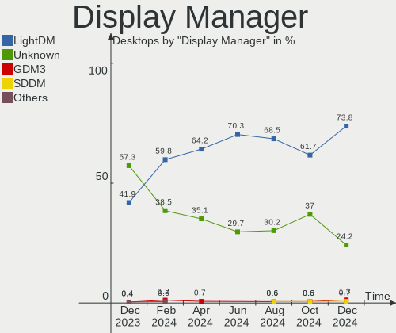
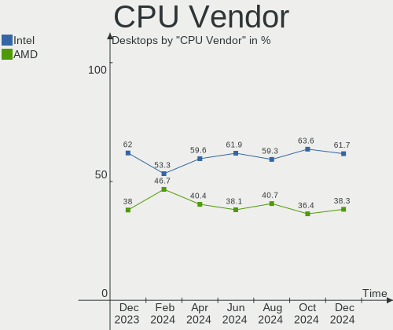
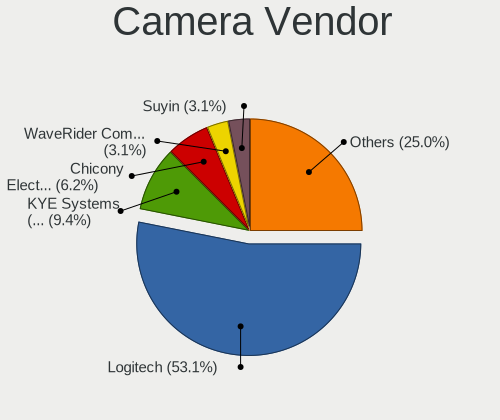
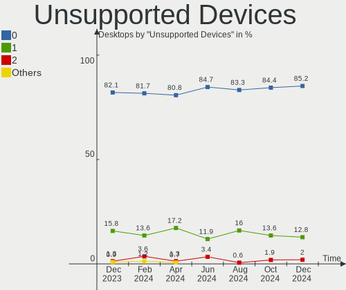

Linux Mint - Hardware Trends (Desktops)
---------------------------------------

A project to identify most popular hardware characteristics and track their change
over time based on data collected by Linux users at https://Linux-Hardware.org.

Anyone can contribute to this report by the [hw-probe](https://github.com/linuxhw/hw-probe) tool:

    sudo -E hw-probe -all -upload

This report is for one last month. Overall report since the beginning of time: [TestDays](https://github.com/linuxhw/TestDays)

Period: Feb, 2023.

Contents
--------

* [ System ](#system)
  - [ OS                       ](#os)
  - [ OS Family                ](#os-family)
  - [ Kernel                   ](#kernel)
  - [ Kernel Family            ](#kernel-family)
  - [ Kernel Major Ver.        ](#kernel-major-ver)
  - [ Arch                     ](#arch)
  - [ DE                       ](#de)
  - [ Display Server           ](#display-server)
  - [ Display Manager          ](#display-manager)
  - [ OS Lang                  ](#os-lang)
  - [ Boot Mode                ](#boot-mode)
  - [ Filesystem               ](#filesystem)
  - [ Part. scheme             ](#part-scheme)
  - [ Dual Boot with Linux/BSD ](#dual-boot-with-linuxbsd)
  - [ Dual Boot (Win)          ](#dual-boot-win)

* [ Board ](#board)
  - [ Vendor                   ](#vendor)
  - [ Model                    ](#model)
  - [ Model Family             ](#model-family)
  - [ MFG Year                 ](#mfg-year)
  - [ Form Factor              ](#form-factor)
  - [ Secure Boot              ](#secure-boot)
  - [ Coreboot                 ](#coreboot)
  - [ RAM Size                 ](#ram-size)
  - [ RAM Used                 ](#ram-used)
  - [ Total Drives             ](#total-drives)
  - [ Has CD-ROM               ](#has-cd-rom)
  - [ Has Ethernet             ](#has-ethernet)
  - [ Has WiFi                 ](#has-wifi)
  - [ Has Bluetooth            ](#has-bluetooth)

* [ Location ](#location)
  - [ Country                  ](#country)
  - [ City                     ](#city)

* [ Drives ](#drives)
  - [ Drive Vendor             ](#drive-vendor)
  - [ Drive Model              ](#drive-model)
  - [ HDD Vendor               ](#hdd-vendor)
  - [ SSD Vendor               ](#ssd-vendor)
  - [ Drive Kind               ](#drive-kind)
  - [ Drive Connector          ](#drive-connector)
  - [ Drive Size               ](#drive-size)
  - [ Space Total              ](#space-total)
  - [ Space Used               ](#space-used)
  - [ Malfunc. Drives          ](#malfunc-drives)
  - [ Malfunc. Drive Vendor    ](#malfunc-drive-vendor)
  - [ Malfunc. HDD Vendor      ](#malfunc-hdd-vendor)
  - [ Malfunc. Drive Kind      ](#malfunc-drive-kind)
  - [ Failed Drives            ](#failed-drives)
  - [ Failed Drive Vendor      ](#failed-drive-vendor)
  - [ Drive Status             ](#drive-status)

* [ Storage controller ](#storage-controller)
  - [ Storage Vendor           ](#storage-vendor)
  - [ Storage Model            ](#storage-model)
  - [ Storage Kind             ](#storage-kind)

* [ Processor ](#processor)
  - [ CPU Vendor               ](#cpu-vendor)
  - [ CPU Model                ](#cpu-model)
  - [ CPU Model Family         ](#cpu-model-family)
  - [ CPU Cores                ](#cpu-cores)
  - [ CPU Sockets              ](#cpu-sockets)
  - [ CPU Threads              ](#cpu-threads)
  - [ CPU Op-Modes             ](#cpu-op-modes)
  - [ CPU Microcode            ](#cpu-microcode)
  - [ CPU Microarch            ](#cpu-microarch)

* [ Graphics ](#graphics)
  - [ GPU Vendor               ](#gpu-vendor)
  - [ GPU Model                ](#gpu-model)
  - [ GPU Combo                ](#gpu-combo)
  - [ GPU Driver               ](#gpu-driver)
  - [ GPU Memory               ](#gpu-memory)

* [ Monitor ](#monitor)
  - [ Monitor Vendor           ](#monitor-vendor)
  - [ Monitor Model            ](#monitor-model)
  - [ Monitor Resolution       ](#monitor-resolution)
  - [ Monitor Diagonal         ](#monitor-diagonal)
  - [ Monitor Width            ](#monitor-width)
  - [ Aspect Ratio             ](#aspect-ratio)
  - [ Monitor Area             ](#monitor-area)
  - [ Pixel Density            ](#pixel-density)
  - [ Multiple Monitors        ](#multiple-monitors)

* [ Network ](#network)
  - [ Net Controller Vendor    ](#net-controller-vendor)
  - [ Net Controller Model     ](#net-controller-model)
  - [ Wireless Vendor          ](#wireless-vendor)
  - [ Wireless Model           ](#wireless-model)
  - [ Ethernet Vendor          ](#ethernet-vendor)
  - [ Ethernet Model           ](#ethernet-model)
  - [ Net Controller Kind      ](#net-controller-kind)
  - [ Used Controller          ](#used-controller)
  - [ NICs                     ](#nics)
  - [ IPv6                     ](#ipv6)

* [ Bluetooth ](#bluetooth)
  - [ Bluetooth Vendor         ](#bluetooth-vendor)
  - [ Bluetooth Model          ](#bluetooth-model)

* [ Sound ](#sound)
  - [ Sound Vendor             ](#sound-vendor)
  - [ Sound Model              ](#sound-model)

* [ Memory ](#memory)
  - [ Memory Vendor            ](#memory-vendor)
  - [ Memory Model             ](#memory-model)
  - [ Memory Kind              ](#memory-kind)
  - [ Memory Form Factor       ](#memory-form-factor)
  - [ Memory Size              ](#memory-size)
  - [ Memory Speed             ](#memory-speed)

* [ Printers & scanners ](#printers--scanners)
  - [ Printer Vendor           ](#printer-vendor)
  - [ Printer Model            ](#printer-model)
  - [ Scanner Vendor           ](#scanner-vendor)
  - [ Scanner Model            ](#scanner-model)

* [ Camera ](#camera)
  - [ Camera Vendor            ](#camera-vendor)
  - [ Camera Model             ](#camera-model)

* [ Security ](#security)
  - [ Fingerprint Vendor       ](#fingerprint-vendor)
  - [ Fingerprint Model        ](#fingerprint-model)
  - [ Chipcard Vendor          ](#chipcard-vendor)
  - [ Chipcard Model           ](#chipcard-model)

* [ Unsupported ](#unsupported)
  - [ Unsupported Devices      ](#unsupported-devices)
  - [ Unsupported Device Types ](#unsupported-device-types)

System
------

OS
--

Installed operating systems

| Name            | Desktops | Percent |
|-----------------|----------|---------|
| Linux Mint 21.1 | 171      | 71.25%  |
| Linux Mint 20.3 | 35       | 14.58%  |
| Linux Mint 21   | 18       | 7.5%    |
| Linux Mint 20.1 | 4        | 1.67%   |
| Linux Mint 19.3 | 4        | 1.67%   |
| Linux Mint 20   | 3        | 1.25%   |
| Linux Mint 20.2 | 1        | 0.42%   |
| Linux Mint 19.2 | 1        | 0.42%   |
| Linux Mint 19   | 1        | 0.42%   |
| Linux Mint 18.2 | 1        | 0.42%   |
| Linux Mint 18   | 1        | 0.42%   |

OS Family
---------

OS without a version

| Name       | Desktops | Percent |
|------------|----------|---------|
| Linux Mint | 240      | 100%    |

Kernel
------

Version of the Linux kernel

| Version               | Desktops | Percent |
|-----------------------|----------|---------|
| 5.15.0-60-generic     | 106      | 44.17%  |
| 5.15.0-58-generic     | 56       | 23.33%  |
| 5.4.0-137-generic     | 18       | 7.5%    |
| 5.4.0-139-generic     | 17       | 7.08%   |
| 5.15.0-56-generic     | 13       | 5.42%   |
| 5.19.0-32-generic     | 6        | 2.5%    |
| 5.19.0-28-generic     | 3        | 1.25%   |
| 6.0.0-1010-oem        | 2        | 0.83%   |
| 4.15.0-204-generic    | 2        | 0.83%   |
| 6.1.9-060109-generic  | 1        | 0.42%   |
| 6.1.12-060112-generic | 1        | 0.42%   |
| 6.1.0-1006-oem        | 1        | 0.42%   |
| 5.4.0-99-generic      | 1        | 0.42%   |
| 5.4.0-91-generic      | 1        | 0.42%   |
| 5.4.0-135-generic     | 1        | 0.42%   |
| 5.4.0-126-generic     | 1        | 0.42%   |
| 5.4.0-107-generic     | 1        | 0.42%   |
| 5.19.3-051903-generic | 1        | 0.42%   |
| 5.19.14-xanmod1       | 1        | 0.42%   |
| 5.17.9-051709-generic | 1        | 0.42%   |
| 5.15.0-57-generic     | 1        | 0.42%   |
| 5.15.0-53-generic     | 1        | 0.42%   |
| 5.14.0-1057-oem       | 1        | 0.42%   |
| 5.14.0-1056-oem       | 1        | 0.42%   |
| 4.8.0-53-generic      | 1        | 0.42%   |
| 4.4.0-140-generic     | 1        | 0.42%   |

Kernel Family
-------------

Linux kernel without a distro release

| Version | Desktops | Percent |
|---------|----------|---------|
| 5.15.0  | 177      | 73.75%  |
| 5.4.0   | 40       | 16.67%  |
| 5.19.0  | 9        | 3.75%   |
| 6.0.0   | 2        | 0.83%   |
| 5.14.0  | 2        | 0.83%   |
| 4.15.0  | 2        | 0.83%   |
| 6.1.9   | 1        | 0.42%   |
| 6.1.12  | 1        | 0.42%   |
| 6.1.0   | 1        | 0.42%   |
| 5.19.3  | 1        | 0.42%   |
| 5.19.14 | 1        | 0.42%   |
| 5.17.9  | 1        | 0.42%   |
| 4.8.0   | 1        | 0.42%   |
| 4.4.0   | 1        | 0.42%   |

Kernel Major Ver.
-----------------

Linux kernel major version

| Version | Desktops | Percent |
|---------|----------|---------|
| 5.15    | 177      | 73.75%  |
| 5.4     | 40       | 16.67%  |
| 5.19    | 11       | 4.58%   |
| 6.1     | 3        | 1.25%   |
| 6.0     | 2        | 0.83%   |
| 5.14    | 2        | 0.83%   |
| 4.15    | 2        | 0.83%   |
| 5.17    | 1        | 0.42%   |
| 4.8     | 1        | 0.42%   |
| 4.4     | 1        | 0.42%   |

Arch
----

OS architecture (x86_64, i586, etc.)

| Name   | Desktops | Percent |
|--------|----------|---------|
| x86_64 | 239      | 99.58%  |
| i686   | 1        | 0.42%   |

DE
--

Desktop Environment

| Name       | Desktops | Percent |
|------------|----------|---------|
| X-Cinnamon | 173      | 72.08%  |
| MATE       | 29       | 12.08%  |
| XFCE       | 28       | 11.67%  |
| Cinnamon   | 5        | 2.08%   |
| KDE5       | 2        | 0.83%   |
| LXDE       | 1        | 0.42%   |
| GNOME      | 1        | 0.42%   |
| Unknown    | 1        | 0.42%   |

Display Server
--------------

X11 or Wayland

| Name | Desktops | Percent |
|------|----------|---------|
| X11  | 240      | 100%    |

Display Manager
---------------

SDDM, LightDM, etc.

| Name    | Desktops | Percent |
|---------|----------|---------|
| Unknown | 150      | 62.5%   |
| LightDM | 89       | 37.08%  |
| MDM     | 1        | 0.42%   |

OS Lang
-------

Language

| Lang  | Desktops | Percent |
|-------|----------|---------|
| en_US | 74       | 30.83%  |
| de_DE | 42       | 17.5%   |
| pt_BR | 17       | 7.08%   |
| fr_FR | 11       | 4.58%   |
| es_ES | 11       | 4.58%   |
| ru_RU | 10       | 4.17%   |
| en_GB | 10       | 4.17%   |
| it_IT | 9        | 3.75%   |
| en_AU | 9        | 3.75%   |
| nl_NL | 5        | 2.08%   |
| C     | 5        | 2.08%   |
| pl_PL | 4        | 1.67%   |
| en_CA | 4        | 1.67%   |
| hu_HU | 3        | 1.25%   |
| de_AT | 3        | 1.25%   |
| pt_PT | 2        | 0.83%   |
| fi_FI | 2        | 0.83%   |
| en_IE | 2        | 0.83%   |
| sv_SE | 1        | 0.42%   |
| sr_ME | 1        | 0.42%   |
| sk_SK | 1        | 0.42%   |
| nl_BE | 1        | 0.42%   |
| nb_NO | 1        | 0.42%   |
| fr_CA | 1        | 0.42%   |
| es_VE | 1        | 0.42%   |
| es_PE | 1        | 0.42%   |
| es_CO | 1        | 0.42%   |
| es_CL | 1        | 0.42%   |
| en_ZA | 1        | 0.42%   |
| en_SG | 1        | 0.42%   |
| en_NZ | 1        | 0.42%   |
| en_IL | 1        | 0.42%   |
| da_DK | 1        | 0.42%   |
| cs_CZ | 1        | 0.42%   |
| be_BY | 1        | 0.42%   |

Boot Mode
---------

EFI or BIOS

| Mode | Desktops | Percent |
|------|----------|---------|
| EFI  | 138      | 57.5%   |
| BIOS | 102      | 42.5%   |

Filesystem
----------

Type of filesystem

| Type    | Desktops | Percent |
|---------|----------|---------|
| Ext4    | 227      | 94.58%  |
| Btrfs   | 6        | 2.5%    |
| Overlay | 3        | 1.25%   |
| Xfs     | 2        | 0.83%   |
| Zfs     | 1        | 0.42%   |
| Ext2    | 1        | 0.42%   |

Part. scheme
------------

Scheme of partitioning

| Type    | Desktops | Percent |
|---------|----------|---------|
| Unknown | 151      | 62.92%  |
| GPT     | 71       | 29.58%  |
| MBR     | 18       | 7.5%    |

Dual Boot with Linux/BSD
------------------------

Hosting more than one Linux/BSD

| Dual boot | Desktops | Percent |
|-----------|----------|---------|
| No        | 217      | 90.42%  |
| Yes       | 23       | 9.58%   |

Dual Boot (Win)
---------------

Hosting Linux and Windows

| Dual boot | Desktops | Percent |
|-----------|----------|---------|
| No        | 203      | 84.58%  |
| Yes       | 37       | 15.42%  |

Board
-----

Vendor
------

Motherboard manufacturer

| Name                | Desktops | Percent |
|---------------------|----------|---------|
| ASUSTek Computer    | 49       | 20.42%  |
| Gigabyte Technology | 38       | 15.83%  |
| Hewlett-Packard     | 31       | 12.92%  |
| ASRock              | 24       | 10%     |
| MSI                 | 19       | 7.92%   |
| Dell                | 19       | 7.92%   |
| Lenovo              | 9        | 3.75%   |
| Intel               | 7        | 2.92%   |
| Inventec            | 5        | 2.08%   |
| Acer                | 5        | 2.08%   |
| Medion              | 4        | 1.67%   |
| Foxconn             | 4        | 1.67%   |
| Fujitsu             | 3        | 1.25%   |
| AZW                 | 3        | 1.25%   |
| Pegatron            | 2        | 0.83%   |
| PCWare              | 2        | 0.83%   |
| ECS                 | 2        | 0.83%   |
| Biostar             | 2        | 0.83%   |
| AMD                 | 2        | 0.83%   |
| Unknown             | 2        | 0.83%   |
| IBM                 | 1        | 0.42%   |
| FIC                 | 1        | 0.42%   |
| DIEBOLD             | 1        | 0.42%   |
| Compaq              | 1        | 0.42%   |
| Cincoze             | 1        | 0.42%   |
| BESSTAR Tech        | 1        | 0.42%   |
| Apple               | 1        | 0.42%   |
| AAEON               | 1        | 0.42%   |

Model
-----

Motherboard model

| Name                         | Desktops | Percent |
|------------------------------|----------|---------|
| Inventec VXC Class           | 5        | 2.08%   |
| MSI MS-7C37                  | 4        | 1.67%   |
| ASUS ROG STRIX B450-F GAMING | 3        | 1.25%   |
| MSI MS-7D46                  | 2        | 0.83%   |
| MSI MS-7A38                  | 2        | 0.83%   |
| Intel H61                    | 2        | 0.83%   |
| HP Compaq Elite 8300 USDT    | 2        | 0.83%   |
| HP Compaq Elite 8300 SFF     | 2        | 0.83%   |
| HP Compaq Elite 8300 CMT     | 2        | 0.83%   |
| Gigabyte B550M AORUS ELITE   | 2        | 0.83%   |
| Gigabyte B450M DS3H          | 2        | 0.83%   |
| Gigabyte B250M-D3H           | 2        | 0.83%   |
| Dell OptiPlex 990            | 2        | 0.83%   |
| Dell OptiPlex 790            | 2        | 0.83%   |
| Dell OptiPlex 780            | 2        | 0.83%   |
| ASUS TUF B450-PLUS GAMING    | 2        | 0.83%   |
| ASUS SABERTOOTH Z77          | 2        | 0.83%   |
| ASUS M5A99X EVO              | 2        | 0.83%   |
| ASUS All Series              | 2        | 0.83%   |
| ASRock B450 Pro4             | 2        | 0.83%   |
| Unknown                      | 2        | 0.83%   |
| Pegatron p6-2136             | 1        | 0.42%   |
| Pegatron AY014AA-ABL a4310f  | 1        | 0.42%   |
| PCWare IPMH61R3              | 1        | 0.42%   |
| PCWare IPMH61R2              | 1        | 0.42%   |
| MSI MS-7D77                  | 1        | 0.42%   |
| MSI MS-7D43                  | 1        | 0.42%   |
| MSI MS-7C75                  | 1        | 0.42%   |
| MSI MS-7B93                  | 1        | 0.42%   |
| MSI MS-7B86                  | 1        | 0.42%   |
| MSI MS-7B78                  | 1        | 0.42%   |
| MSI MS-7B49                  | 1        | 0.42%   |
| MSI MS-7A62 mod by 10729.com | 1        | 0.42%   |
| MSI MS-7916                  | 1        | 0.42%   |
| MSI MS-7732                  | 1        | 0.42%   |
| MSI MS-7693                  | 1        | 0.42%   |
| Medion MS-7797               | 1        | 0.42%   |
| Medion MS-7616               | 1        | 0.42%   |
| Medion MD35329               | 1        | 0.42%   |
| Medion Akoya E6240T          | 1        | 0.42%   |

Model Family
------------

Motherboard model prefix

| Name                   | Desktops | Percent |
|------------------------|----------|---------|
| Dell OptiPlex          | 15       | 6.25%   |
| HP Compaq              | 14       | 5.83%   |
| ASUS TUF               | 9        | 3.75%   |
| Lenovo ThinkCentre     | 7        | 2.92%   |
| ASUS PRIME             | 7        | 2.92%   |
| ASUS ROG               | 6        | 2.5%    |
| Inventec VXC           | 5        | 2.08%   |
| MSI MS-7C37            | 4        | 1.67%   |
| Acer Aspire            | 4        | 1.67%   |
| HP ProDesk             | 3        | 1.25%   |
| Gigabyte B450M         | 3        | 1.25%   |
| Fujitsu ESPRIMO        | 3        | 1.25%   |
| Dell Precision         | 3        | 1.25%   |
| ASUS SABERTOOTH        | 3        | 1.25%   |
| MSI MS-7D46            | 2        | 0.83%   |
| MSI MS-7A38            | 2        | 0.83%   |
| Intel H61              | 2        | 0.83%   |
| HP Pavilion            | 2        | 0.83%   |
| Gigabyte GA-78LMT-USB3 | 2        | 0.83%   |
| Gigabyte B550M         | 2        | 0.83%   |
| Gigabyte B450          | 2        | 0.83%   |
| Gigabyte B250M-D3H     | 2        | 0.83%   |
| Foxconn Pro            | 2        | 0.83%   |
| ASUS P8H61-M           | 2        | 0.83%   |
| ASUS M5A99X            | 2        | 0.83%   |
| ASUS All               | 2        | 0.83%   |
| ASRock Z97             | 2        | 0.83%   |
| ASRock H61M-DGS        | 2        | 0.83%   |
| ASRock B450            | 2        | 0.83%   |
| Unknown                | 2        | 0.83%   |
| Pegatron p6-2136       | 1        | 0.42%   |
| Pegatron AY014AA-ABL   | 1        | 0.42%   |
| PCWare IPMH61R3        | 1        | 0.42%   |
| PCWare IPMH61R2        | 1        | 0.42%   |
| MSI MS-7D77            | 1        | 0.42%   |
| MSI MS-7D43            | 1        | 0.42%   |
| MSI MS-7C75            | 1        | 0.42%   |
| MSI MS-7B93            | 1        | 0.42%   |
| MSI MS-7B86            | 1        | 0.42%   |
| MSI MS-7B78            | 1        | 0.42%   |

MFG Year
--------

Motherboard manufacture year

| Year | Desktops | Percent |
|------|----------|---------|
| 2012 | 29       | 12.08%  |
| 2018 | 24       | 10%     |
| 2011 | 20       | 8.33%   |
| 2019 | 19       | 7.92%   |
| 2022 | 18       | 7.5%    |
| 2014 | 16       | 6.67%   |
| 2017 | 14       | 5.83%   |
| 2013 | 14       | 5.83%   |
| 2010 | 14       | 5.83%   |
| 2020 | 13       | 5.42%   |
| 2021 | 12       | 5%      |
| 2015 | 12       | 5%      |
| 2016 | 10       | 4.17%   |
| 2009 | 10       | 4.17%   |
| 2008 | 8        | 3.33%   |
| 2007 | 4        | 1.67%   |
| 2023 | 2        | 0.83%   |
| 2006 | 1        | 0.42%   |

Form Factor
-----------

Physical design of the computer

| Name    | Desktops | Percent |
|---------|----------|---------|
| Desktop | 240      | 100%    |

Secure Boot
-----------

Enabled or disabled

| State    | Desktops | Percent |
|----------|----------|---------|
| Disabled | 234      | 97.5%   |
| Enabled  | 6        | 2.5%    |

Coreboot
--------

Have coreboot on board

| Used | Desktops | Percent |
|------|----------|---------|
| No   | 240      | 100%    |

RAM Size
--------

Total RAM memory

| Size in GB  | Desktops | Percent |
|-------------|----------|---------|
| 16.01-24.0  | 64       | 26.67%  |
| 4.01-8.0    | 46       | 19.17%  |
| 8.01-16.0   | 39       | 16.25%  |
| 32.01-64.0  | 36       | 15%     |
| 3.01-4.0    | 29       | 12.08%  |
| 64.01-256.0 | 10       | 4.17%   |
| 2.01-3.0    | 6        | 2.5%    |
| 24.01-32.0  | 5        | 2.08%   |
| 1.01-2.0    | 4        | 1.67%   |
| 0.51-1.0    | 1        | 0.42%   |

RAM Used
--------

Used RAM memory

| Used GB   | Desktops | Percent |
|-----------|----------|---------|
| 1.01-2.0  | 91       | 37.92%  |
| 2.01-3.0  | 72       | 30%     |
| 4.01-8.0  | 37       | 15.42%  |
| 3.01-4.0  | 24       | 10%     |
| 8.01-16.0 | 9        | 3.75%   |
| 0.51-1.0  | 7        | 2.92%   |

Total Drives
------------

Number of drives on board

| Drives | Desktops | Percent |
|--------|----------|---------|
| 1      | 92       | 38.33%  |
| 2      | 62       | 25.83%  |
| 3      | 37       | 15.42%  |
| 4      | 25       | 10.42%  |
| 5      | 17       | 7.08%   |
| 6      | 6        | 2.5%    |
| 7      | 1        | 0.42%   |

Has CD-ROM
----------

Has CD-ROM on board

| Presented | Desktops | Percent |
|-----------|----------|---------|
| Yes       | 120      | 50%     |
| No        | 120      | 50%     |

Has Ethernet
------------

Has Ethernet on board

| Presented | Desktops | Percent |
|-----------|----------|---------|
| Yes       | 239      | 99.58%  |
| No        | 1        | 0.42%   |

Has WiFi
--------

Has WiFi module

| Presented | Desktops | Percent |
|-----------|----------|---------|
| No        | 128      | 53.33%  |
| Yes       | 112      | 46.67%  |

Has Bluetooth
-------------

Has Bluetooth module

| Presented | Desktops | Percent |
|-----------|----------|---------|
| No        | 151      | 62.92%  |
| Yes       | 89       | 37.08%  |

Location
--------

Country
-------

Geographic location (country)

| Country      | Desktops | Percent |
|--------------|----------|---------|
| Germany      | 46       | 19.17%  |
| USA          | 44       | 18.33%  |
| Brazil       | 19       | 7.92%   |
| Italy        | 13       | 5.42%   |
| Spain        | 11       | 4.58%   |
| France       | 11       | 4.58%   |
| UK           | 10       | 4.17%   |
| Australia    | 9        | 3.75%   |
| Russia       | 7        | 2.92%   |
| Poland       | 7        | 2.92%   |
| Canada       | 7        | 2.92%   |
| Netherlands  | 6        | 2.5%    |
| Portugal     | 4        | 1.67%   |
| Hungary      | 4        | 1.67%   |
| Norway       | 3        | 1.25%   |
| Finland      | 3        | 1.25%   |
| Austria      | 3        | 1.25%   |
| Turkey       | 2        | 0.83%   |
| Switzerland  | 2        | 0.83%   |
| Romania      | 2        | 0.83%   |
| Israel       | 2        | 0.83%   |
| Ireland      | 2        | 0.83%   |
| Greece       | 2        | 0.83%   |
| Denmark      | 2        | 0.83%   |
| Colombia     | 2        | 0.83%   |
| Belarus      | 2        | 0.83%   |
| Vietnam      | 1        | 0.42%   |
| Venezuela    | 1        | 0.42%   |
| Ukraine      | 1        | 0.42%   |
| Sweden       | 1        | 0.42%   |
| South Africa | 1        | 0.42%   |
| Slovakia     | 1        | 0.42%   |
| Singapore    | 1        | 0.42%   |
| New Zealand  | 1        | 0.42%   |
| Montenegro   | 1        | 0.42%   |
| Latvia       | 1        | 0.42%   |
| Iran         | 1        | 0.42%   |
| Czechia      | 1        | 0.42%   |
| Chile        | 1        | 0.42%   |
| Bolivia      | 1        | 0.42%   |

City
----

Geographic location (city)

| City                   | Desktops | Percent |
|------------------------|----------|---------|
| Traunstein             | 5        | 2.08%   |
| Berlin                 | 4        | 1.67%   |
| Sydney                 | 3        | 1.25%   |
| Melbourne              | 3        | 1.25%   |
| London                 | 3        | 1.25%   |
| Hamburg                | 3        | 1.25%   |
| Vila Real              | 2        | 0.83%   |
| Ulyanovsk              | 2        | 0.83%   |
| St Petersburg          | 2        | 0.83%   |
| Sao Paulo              | 2        | 0.83%   |
| Ridderkerk             | 2        | 0.83%   |
| Porto Alegre           | 2        | 0.83%   |
| Perth                  | 2        | 0.83%   |
| Omaha                  | 2        | 0.83%   |
| Niterói               | 2        | 0.83%   |
| Milano                 | 2        | 0.83%   |
| Medellín              | 2        | 0.83%   |
| Madrid                 | 2        | 0.83%   |
| Dublin                 | 2        | 0.83%   |
| Budapest               | 2        | 0.83%   |
| Athens                 | 2        | 0.83%   |
| Zurich                 | 1        | 0.42%   |
| Zevio                  | 1        | 0.42%   |
| Yehud                  | 1        | 0.42%   |
| Wulkaprodersdorf       | 1        | 0.42%   |
| Worksop                | 1        | 0.42%   |
| Woodford Green         | 1        | 0.42%   |
| Wolfsburg              | 1        | 0.42%   |
| Woerth am Rhein        | 1        | 0.42%   |
| Windsor                | 1        | 0.42%   |
| Wilhelmshaven          | 1        | 0.42%   |
| Whitney                | 1        | 0.42%   |
| West Bend              | 1        | 0.42%   |
| Waynesboro             | 1        | 0.42%   |
| Watford City           | 1        | 0.42%   |
| Warrensburg            | 1        | 0.42%   |
| Wallsend               | 1        | 0.42%   |
| Villingen-Schwenningen | 1        | 0.42%   |
| Vigo                   | 1        | 0.42%   |
| Vidnoye                | 1        | 0.42%   |

Drives
------

Drive Vendor
------------

Hard drive vendors

| Vendor                      | Desktops | Drives | Percent |
|-----------------------------|----------|--------|---------|
| WDC                         | 85       | 122    | 18.85%  |
| Seagate                     | 77       | 101    | 17.07%  |
| Samsung Electronics         | 67       | 92     | 14.86%  |
| Kingston                    | 32       | 35     | 7.1%    |
| Toshiba                     | 23       | 24     | 5.1%    |
| SanDisk                     | 21       | 24     | 4.66%   |
| Crucial                     | 21       | 25     | 4.66%   |
| Hitachi                     | 11       | 11     | 2.44%   |
| China                       | 10       | 10     | 2.22%   |
| Unknown                     | 9        | 11     | 2%      |
| HGST                        | 7        | 7      | 1.55%   |
| Intenso                     | 6        | 7      | 1.33%   |
| A-DATA Technology           | 6        | 7      | 1.33%   |
| Team                        | 4        | 4      | 0.89%   |
| Silicon Motion              | 4        | 5      | 0.89%   |
| Intel                       | 4        | 4      | 0.89%   |
| SPCC                        | 3        | 4      | 0.67%   |
| SK hynix                    | 3        | 3      | 0.67%   |
| Patriot                     | 3        | 3      | 0.67%   |
| OCZ                         | 3        | 3      | 0.67%   |
| Micron/Crucial Technology   | 3        | 3      | 0.67%   |
| JMicron Technology          | 3        | 3      | 0.67%   |
| GOODRAM                     | 3        | 3      | 0.67%   |
| XrayDisk                    | 2        | 3      | 0.44%   |
| Verbatim                    | 2        | 2      | 0.44%   |
| SABRENT                     | 2        | 2      | 0.44%   |
| PNY                         | 2        | 2      | 0.44%   |
| Micron Technology           | 2        | 2      | 0.44%   |
| Maxtor                      | 2        | 2      | 0.44%   |
| KIOXIA-EXCERIA              | 2        | 2      | 0.44%   |
| Kingston Technology Company | 2        | 2      | 0.44%   |
| Fanxiang                    | 2        | 2      | 0.44%   |
| Corsair                     | 2        | 2      | 0.44%   |
| Unknown                     | 2        | 2      | 0.44%   |
| Union Memory (Shenzhen)     | 1        | 1      | 0.22%   |
| Transcend                   | 1        | 1      | 0.22%   |
| TO Exter                    | 1        | 1      | 0.22%   |
| StoreJet                    | 1        | 1      | 0.22%   |
| SD                          | 1        | 1      | 0.22%   |
| Realtek Semiconductor       | 1        | 1      | 0.22%   |

Drive Model
-----------

Hard drive models

| Model                                                 | Desktops | Percent |
|-------------------------------------------------------|----------|---------|
| Kingston SA400S37240G 240GB SSD                       | 10       | 1.9%    |
| Samsung NVMe SSD Controller SM981/PM981/PM983 250GB   | 8        | 1.52%   |
| Toshiba DT01ACA050 500GB                              | 6        | 1.14%   |
| Seagate ST500DM002-1BD142 500GB                       | 6        | 1.14%   |
| Kingston SA400S37480G 480GB SSD                       | 6        | 1.14%   |
| Toshiba DT01ACA100 1TB                                | 5        | 0.95%   |
| Seagate ST31000528AS 1TB                              | 5        | 0.95%   |
| Samsung SSD 850 EVO 250GB                             | 5        | 0.95%   |
| Crucial CT1000MX500SSD1 1TB                           | 5        | 0.95%   |
| WDC WDS240G2G0A-00JH30 240GB SSD                      | 4        | 0.76%   |
| WDC WD20EZRZ-00Z5HB0 2TB                              | 4        | 0.76%   |
| WDC WD10EZEX-08WN4A0 1TB                              | 4        | 0.76%   |
| WDC WD10EZEX-00BN5A0 1TB                              | 4        | 0.76%   |
| Unknown SD/MMC/MS PRO 16GB                            | 4        | 0.76%   |
| Seagate ST1000DM010-2EP102 1TB                        | 4        | 0.76%   |
| Samsung SSD 870 EVO 1TB                               | 4        | 0.76%   |
| Samsung SSD 840 EVO 250GB                             | 4        | 0.76%   |
| Samsung NVMe SSD Controller PM9A1/PM9A3/980PRO 960GB  | 4        | 0.76%   |
| Crucial CT500MX500SSD1 500GB                          | 4        | 0.76%   |
| Toshiba DT01ACA200 2TB                                | 3        | 0.57%   |
| Silicon Motion SM2263EN/SM2263XT SSD Controller 512GB | 3        | 0.57%   |
| Seagate ST31000524AS 1TB                              | 3        | 0.57%   |
| Seagate ST2000LM015-2E8174 2TB                        | 3        | 0.57%   |
| Seagate ST2000DM008-2FR102 2TB                        | 3        | 0.57%   |
| Seagate ST2000DM001-1ER164 2TB                        | 3        | 0.57%   |
| Seagate ST1000LM035-1RK172 1TB                        | 3        | 0.57%   |
| SanDisk SSD PLUS 1000GB                               | 3        | 0.57%   |
| Samsung SSD 980 500GB                                 | 3        | 0.57%   |
| Samsung SSD 860 QVO 1TB                               | 3        | 0.57%   |
| Samsung SSD 860 EVO 500GB                             | 3        | 0.57%   |
| Samsung SSD 860 EVO 1TB                               | 3        | 0.57%   |
| Samsung HD322HJ 320GB                                 | 3        | 0.57%   |
| Samsung HD103SI 1TB                                   | 3        | 0.57%   |
| Micron/Crucial P2 NVMe PCIe SSD 1TB                   | 3        | 0.57%   |
| Kingston SNVS500G 500GB                               | 3        | 0.57%   |
| Intenso SSD 120GB                                     | 3        | 0.57%   |
| HGST HTS541010A9E680 1TB                              | 3        | 0.57%   |
| Crucial CT480BX500SSD1 480GB                          | 3        | 0.57%   |
| WDC WDS500G2B0A-00SM50 500GB SSD                      | 2        | 0.38%   |
| WDC WD60EFAX-68JH4N1 6TB                              | 2        | 0.38%   |

HDD Vendor
----------

Hard disk drive vendors

| Vendor              | Desktops | Drives | Percent |
|---------------------|----------|--------|---------|
| WDC                 | 77       | 109    | 35.16%  |
| Seagate             | 76       | 97     | 34.7%   |
| Toshiba             | 21       | 22     | 9.59%   |
| Samsung Electronics | 15       | 17     | 6.85%   |
| Hitachi             | 11       | 11     | 5.02%   |
| HGST                | 7        | 7      | 3.2%    |
| Unknown             | 4        | 4      | 1.83%   |
| SABRENT             | 2        | 2      | 0.91%   |
| Maxtor              | 2        | 2      | 0.91%   |
| JMicron Technology  | 2        | 2      | 0.91%   |
| KESU                | 1        | 1      | 0.46%   |
| Fujitsu             | 1        | 1      | 0.46%   |

SSD Vendor
----------

Solid state drive vendors

| Vendor              | Desktops | Drives | Percent |
|---------------------|----------|--------|---------|
| Samsung Electronics | 39       | 49     | 22.81%  |
| Kingston            | 25       | 26     | 14.62%  |
| Crucial             | 19       | 22     | 11.11%  |
| SanDisk             | 15       | 17     | 8.77%   |
| WDC                 | 11       | 11     | 6.43%   |
| China               | 9        | 9      | 5.26%   |
| Intenso             | 5        | 5      | 2.92%   |
| A-DATA Technology   | 5        | 5      | 2.92%   |
| Team                | 4        | 4      | 2.34%   |
| SPCC                | 3        | 4      | 1.75%   |
| Patriot             | 3        | 3      | 1.75%   |
| OCZ                 | 3        | 3      | 1.75%   |
| GOODRAM             | 3        | 3      | 1.75%   |
| XrayDisk            | 2        | 3      | 1.17%   |
| Verbatim            | 2        | 2      | 1.17%   |
| Toshiba             | 2        | 2      | 1.17%   |
| PNY                 | 2        | 2      | 1.17%   |
| Fanxiang            | 2        | 2      | 1.17%   |
| Transcend           | 1        | 1      | 0.58%   |
| TO Exter            | 1        | 1      | 0.58%   |
| StoreJet            | 1        | 1      | 0.58%   |
| SK hynix            | 1        | 1      | 0.58%   |
| SD                  | 1        | 1      | 0.58%   |
| Plextor             | 1        | 1      | 0.58%   |
| OCZ-VERTEX3         | 1        | 1      | 0.58%   |
| M500                | 1        | 1      | 0.58%   |
| LITEON              | 1        | 1      | 0.58%   |
| Lexar               | 1        | 1      | 0.58%   |
| Leven               | 1        | 1      | 0.58%   |
| KIOXIA-EXCERIA      | 1        | 1      | 0.58%   |
| Intel               | 1        | 1      | 0.58%   |
| INNOVATION IT       | 1        | 1      | 0.58%   |
| Corsair             | 1        | 1      | 0.58%   |
| AMD                 | 1        | 1      | 0.58%   |
| Unknown             | 1        | 1      | 0.58%   |

Drive Kind
----------

HDD or SSD

| Kind    | Desktops | Drives | Percent |
|---------|----------|--------|---------|
| HDD     | 161      | 275    | 42.48%  |
| SSD     | 148      | 189    | 39.05%  |
| NVMe    | 56       | 74     | 14.78%  |
| Unknown | 11       | 12     | 2.9%    |
| MMC     | 3        | 4      | 0.79%   |

Drive Connector
---------------

SATA, SAS, NVMe, etc.

| Type | Desktops | Drives | Percent |
|------|----------|--------|---------|
| SATA | 229      | 440    | 72.24%  |
| NVMe | 56       | 74     | 17.67%  |
| SAS  | 29       | 36     | 9.15%   |
| MMC  | 3        | 4      | 0.95%   |

Drive Size
----------

Size of hard drive

| Size in TB | Desktops | Drives | Percent |
|------------|----------|--------|---------|
| 0.01-0.5   | 168      | 229    | 48.98%  |
| 0.51-1.0   | 99       | 139    | 28.86%  |
| 1.01-2.0   | 45       | 60     | 13.12%  |
| 2.01-3.0   | 13       | 14     | 3.79%   |
| 3.01-4.0   | 10       | 13     | 2.92%   |
| 4.01-10.0  | 8        | 9      | 2.33%   |

Space Total
-----------

Amount of disk space available on the file system

| Size in GB     | Desktops | Percent |
|----------------|----------|---------|
| 101-250        | 54       | 22.5%   |
| 251-500        | 48       | 20%     |
| 501-1000       | 43       | 17.92%  |
| More than 3000 | 32       | 13.33%  |
| 1001-2000      | 29       | 12.08%  |
| 2001-3000      | 14       | 5.83%   |
| 51-100         | 10       | 4.17%   |
| 21-50          | 7        | 2.92%   |
| Unknown        | 2        | 0.83%   |
| 1-20           | 1        | 0.42%   |

Space Used
----------

Amount of used disk space

| Used GB        | Desktops | Percent |
|----------------|----------|---------|
| 21-50          | 50       | 20.83%  |
| 1-20           | 36       | 15%     |
| 51-100         | 35       | 14.58%  |
| 251-500        | 30       | 12.5%   |
| 101-250        | 28       | 11.67%  |
| 501-1000       | 26       | 10.83%  |
| More than 3000 | 17       | 7.08%   |
| 2001-3000      | 8        | 3.33%   |
| 1001-2000      | 8        | 3.33%   |
| Unknown        | 2        | 0.83%   |

Malfunc. Drives
---------------

Drive models with a malfunction

| Model                               | Desktops | Drives | Percent |
|-------------------------------------|----------|--------|---------|
| Toshiba DT01ACA100 1TB              | 2        | 2      | 9.09%   |
| WDC WDS240G1G0B-00RC30 240GB SSD    | 1        | 1      | 4.55%   |
| WDC WD6400AAKS-65A7B2 640GB         | 1        | 1      | 4.55%   |
| WDC WD60EFAX-68JH4N1 6TB            | 1        | 1      | 4.55%   |
| WDC WD5000AAKX-22ERMA0 500GB        | 1        | 1      | 4.55%   |
| WDC WD5000AAKX-08ERMA0 500GB        | 1        | 1      | 4.55%   |
| Toshiba DT01ACA050 500GB            | 1        | 1      | 4.55%   |
| Seagate ST750LM022 HN-M750MBB 752GB | 1        | 1      | 4.55%   |
| Seagate ST500DM002-1BD142 500GB     | 1        | 1      | 4.55%   |
| Seagate ST3500418AS 500GB           | 1        | 1      | 4.55%   |
| Seagate ST31000528AS 1TB            | 1        | 1      | 4.55%   |
| Seagate ST2000DM008-2FR102 2TB      | 1        | 2      | 4.55%   |
| Seagate ST2000DL003-9VT166 2TB      | 1        | 1      | 4.55%   |
| Seagate ST1000DM003-9YN162 1TB      | 1        | 1      | 4.55%   |
| Samsung Electronics SSD 980 1TB     | 1        | 1      | 4.55%   |
| Samsung Electronics SSD 870 EVO 1TB | 1        | 1      | 4.55%   |
| Samsung Electronics HD322HJ 320GB   | 1        | 1      | 4.55%   |
| Kingston SV300S37A60G 64GB SSD      | 1        | 1      | 4.55%   |
| Kingston SNVS250G 250GB             | 1        | 1      | 4.55%   |
| Hitachi HDS721050DLE630 500GB       | 1        | 1      | 4.55%   |
| A-DATA Technology SU650 480GB SSD   | 1        | 1      | 4.55%   |

Malfunc. Drive Vendor
---------------------

Vendors of faulty drives

| Vendor              | Desktops | Drives | Percent |
|---------------------|----------|--------|---------|
| Seagate             | 6        | 8      | 30%     |
| WDC                 | 4        | 5      | 20%     |
| Toshiba             | 3        | 3      | 15%     |
| Samsung Electronics | 3        | 3      | 15%     |
| Kingston            | 2        | 2      | 10%     |
| Hitachi             | 1        | 1      | 5%      |
| A-DATA Technology   | 1        | 1      | 5%      |

Malfunc. HDD Vendor
-------------------

Vendors of faulty HDD drives

| Vendor              | Desktops | Drives | Percent |
|---------------------|----------|--------|---------|
| Seagate             | 6        | 8      | 42.86%  |
| WDC                 | 3        | 4      | 21.43%  |
| Toshiba             | 3        | 3      | 21.43%  |
| Samsung Electronics | 1        | 1      | 7.14%   |
| Hitachi             | 1        | 1      | 7.14%   |

Malfunc. Drive Kind
-------------------

Kinds of faulty drives

| Kind | Desktops | Drives | Percent |
|------|----------|--------|---------|
| HDD  | 14       | 17     | 70%     |
| SSD  | 4        | 4      | 20%     |
| NVMe | 2        | 2      | 10%     |

Failed Drives
-------------

Failed drive models

Zero info for selected period =(

Failed Drive Vendor
-------------------

Failed drive vendors

Zero info for selected period =(

Drive Status
------------

Number of failed and malfunc. drives

| Status   | Desktops | Drives | Percent |
|----------|----------|--------|---------|
| Detected | 170      | 360    | 63.43%  |
| Works    | 80       | 171    | 29.85%  |
| Malfunc  | 18       | 23     | 6.72%   |

Storage controller
------------------

Storage Vendor
--------------

Storage controller vendors

| Vendor                      | Desktops | Percent |
|-----------------------------|----------|---------|
| Intel                       | 156      | 46.29%  |
| AMD                         | 79       | 23.44%  |
| Samsung Electronics         | 21       | 6.23%   |
| ASMedia Technology          | 20       | 5.93%   |
| Kingston Technology Company | 10       | 2.97%   |
| SanDisk                     | 8        | 2.37%   |
| Marvell Technology Group    | 7        | 2.08%   |
| Micron/Crucial Technology   | 6        | 1.78%   |
| JMicron Technology          | 6        | 1.78%   |
| Silicon Motion              | 4        | 1.19%   |
| Nvidia                      | 3        | 0.89%   |
| VIA Technologies            | 2        | 0.59%   |
| Realtek Semiconductor       | 2        | 0.59%   |
| Phison Electronics          | 2        | 0.59%   |
| Micron Technology           | 2        | 0.59%   |
| ADATA Technology            | 2        | 0.59%   |
| Union Memory (Shenzhen)     | 1        | 0.3%    |
| Transcend                   | 1        | 0.3%    |
| SK hynix                    | 1        | 0.3%    |
| MAXIO Technology (Hangzhou) | 1        | 0.3%    |
| KIOXIA                      | 1        | 0.3%    |
| Broadcom / LSI              | 1        | 0.3%    |
| Unknown                     | 1        | 0.3%    |

Storage Model
-------------

Storage controller models

| Model                                                                                   | Desktops | Percent |
|-----------------------------------------------------------------------------------------|----------|---------|
| AMD FCH SATA Controller [AHCI mode]                                                     | 38       | 9.29%   |
| AMD 400 Series Chipset SATA Controller                                                  | 20       | 4.89%   |
| Intel 8 Series/C220 Series Chipset Family 6-port SATA Controller 1 [AHCI mode]          | 17       | 4.16%   |
| Intel 6 Series/C200 Series Chipset Family 6 port Desktop SATA AHCI Controller           | 17       | 4.16%   |
| ASMedia ASM1062 Serial ATA Controller                                                   | 17       | 4.16%   |
| AMD SB7x0/SB8x0/SB9x0 SATA Controller [AHCI mode]                                       | 15       | 3.67%   |
| AMD SB7x0/SB8x0/SB9x0 IDE Controller                                                    | 15       | 3.67%   |
| Intel 7 Series/C210 Series Chipset Family 6-port SATA Controller [AHCI mode]            | 14       | 3.42%   |
| Intel Q170/Q150/B150/H170/H110/Z170/CM236 Chipset SATA Controller [AHCI Mode]           | 12       | 2.93%   |
| Samsung NVMe SSD Controller SM981/PM981/PM983                                           | 10       | 2.44%   |
| Intel 200 Series PCH SATA controller [AHCI mode]                                        | 10       | 2.44%   |
| AMD SB7x0/SB8x0/SB9x0 SATA Controller [IDE mode]                                        | 10       | 2.44%   |
| Intel Alder Lake-S PCH SATA Controller [AHCI Mode]                                      | 9        | 2.2%    |
| Intel 6 Series/C200 Series Chipset Family Desktop SATA Controller (IDE mode, ports 4-5) | 8        | 1.96%   |
| Intel 6 Series/C200 Series Chipset Family Desktop SATA Controller (IDE mode, ports 0-3) | 8        | 1.96%   |
| Samsung NVMe SSD Controller PM9A1/PM9A3/980PRO                                          | 7        | 1.71%   |
| AMD 500 Series Chipset SATA Controller                                                  | 7        | 1.71%   |
| Intel SATA Controller [RAID mode]                                                       | 6        | 1.47%   |
| Intel Cannon Lake PCH SATA AHCI Controller                                              | 6        | 1.47%   |
| Intel 9 Series Chipset Family SATA Controller [AHCI Mode]                               | 6        | 1.47%   |
| Samsung NVMe SSD Controller 980                                                         | 5        | 1.22%   |
| Kingston Company Company Non-Volatile memory controller                                 | 5        | 1.22%   |
| Intel NM10/ICH7 Family SATA Controller [IDE mode]                                       | 5        | 1.22%   |
| Intel 500 Series Chipset Family SATA AHCI Controller                                    | 5        | 1.22%   |
| Micron/Crucial P2 NVMe PCIe SSD                                                         | 4        | 0.98%   |
| JMicron JMB368 IDE controller                                                           | 4        | 0.98%   |
| Intel 82801JI (ICH10 Family) SATA AHCI Controller                                       | 4        | 0.98%   |
| Intel 82801I (ICH9 Family) 2 port SATA Controller [IDE mode]                            | 4        | 0.98%   |
| Intel 5 Series/3400 Series Chipset 6 port SATA AHCI Controller                          | 4        | 0.98%   |
| AMD SATA controller                                                                     | 4        | 0.98%   |
| Silicon Motion SM2263EN/SM2263XT SSD Controller                                         | 3        | 0.73%   |
| SanDisk WD Blue SN550 NVMe SSD                                                          | 3        | 0.73%   |
| Kingston Company A2000 NVMe SSD                                                         | 3        | 0.73%   |
| Intel SSD 660P Series                                                                   | 3        | 0.73%   |
| Intel Comet Lake SATA AHCI Controller                                                   | 3        | 0.73%   |
| Intel 82Q35 Express PT IDER Controller                                                  | 3        | 0.73%   |
| Intel 82801JD/DO (ICH10 Family) SATA AHCI Controller                                    | 3        | 0.73%   |
| Intel 82801IR/IO/IH (ICH9R/DO/DH) 4 port SATA Controller [IDE mode]                     | 3        | 0.73%   |
| Intel 82801G (ICH7 Family) IDE Controller                                               | 3        | 0.73%   |
| Intel 400 Series Chipset Family SATA AHCI Controller                                    | 3        | 0.73%   |

Storage Kind
------------

Kind of storage controller (IDE, SATA, NVMe, SAS, ...)

| Kind | Desktops | Percent |
|------|----------|---------|
| SATA | 207      | 63.69%  |
| NVMe | 57       | 17.54%  |
| IDE  | 49       | 15.08%  |
| RAID | 10       | 3.08%   |
| SAS  | 1        | 0.31%   |
| SCSI | 1        | 0.31%   |

Processor
---------

CPU Vendor
----------

Processor vendors

| Vendor | Desktops | Percent |
|--------|----------|---------|
| Intel  | 158      | 65.83%  |
| AMD    | 82       | 34.17%  |

CPU Model
---------

Processor models

| Model                                  | Desktops | Percent |
|----------------------------------------|----------|---------|
| AMD G-T56N Processor                   | 5        | 2.08%   |
| Intel Core i5-6500 CPU @ 3.20GHz       | 4        | 1.67%   |
| Intel Core i5-2400 CPU @ 3.10GHz       | 4        | 1.67%   |
| Intel Core i5 CPU 650 @ 3.20GHz        | 4        | 1.67%   |
| Intel Core i3-3220 CPU @ 3.30GHz       | 4        | 1.67%   |
| AMD Ryzen 7 3700X 8-Core Processor     | 4        | 1.67%   |
| AMD Ryzen 5 5600G with Radeon Graphics | 4        | 1.67%   |
| AMD Ryzen 5 3600 6-Core Processor      | 4        | 1.67%   |
| Intel Pentium CPU G630 @ 2.70GHz       | 3        | 1.25%   |
| Intel Core i7-4790 CPU @ 3.60GHz       | 3        | 1.25%   |
| Intel Core i7-2600 CPU @ 3.40GHz       | 3        | 1.25%   |
| Intel Core i5-7500 CPU @ 3.40GHz       | 3        | 1.25%   |
| Intel Core i5-3570 CPU @ 3.40GHz       | 3        | 1.25%   |
| Intel Core i5-3470 CPU @ 3.20GHz       | 3        | 1.25%   |
| Intel Core 2 Duo CPU E8400 @ 3.00GHz   | 3        | 1.25%   |
| Intel 12th Gen Core i5-12400F          | 3        | 1.25%   |
| Intel 12th Gen Core i5-12400           | 3        | 1.25%   |
| AMD Ryzen 7 5700G with Radeon Graphics | 3        | 1.25%   |
| AMD Ryzen 7 2700X Eight-Core Processor | 3        | 1.25%   |
| AMD Ryzen 5 2600 Six-Core Processor    | 3        | 1.25%   |
| AMD FX-6300 Six-Core Processor         | 3        | 1.25%   |
| Intel Pentium D CPU 3.00GHz            | 2        | 0.83%   |
| Intel Pentium 4 CPU 3.00GHz            | 2        | 0.83%   |
| Intel Core i7-6700K CPU @ 4.00GHz      | 2        | 0.83%   |
| Intel Core i7-4790K CPU @ 4.00GHz      | 2        | 0.83%   |
| Intel Core i7-3770K CPU @ 3.50GHz      | 2        | 0.83%   |
| Intel Core i7-3770 CPU @ 3.40GHz       | 2        | 0.83%   |
| Intel Core i5-9400F CPU @ 2.90GHz      | 2        | 0.83%   |
| Intel Core i5-7400 CPU @ 3.00GHz       | 2        | 0.83%   |
| Intel Core i5-4590 CPU @ 3.30GHz       | 2        | 0.83%   |
| Intel Core i5-4570 CPU @ 3.20GHz       | 2        | 0.83%   |
| Intel Core i5-4460 CPU @ 3.20GHz       | 2        | 0.83%   |
| Intel Core i5-2500K CPU @ 3.30GHz      | 2        | 0.83%   |
| Intel Core i5-10400 CPU @ 2.90GHz      | 2        | 0.83%   |
| Intel Core i3-4130 CPU @ 3.40GHz       | 2        | 0.83%   |
| Intel Core i3-2100 CPU @ 3.10GHz       | 2        | 0.83%   |
| AMD Ryzen 9 5950X 16-Core Processor    | 2        | 0.83%   |
| AMD Ryzen 7 7700X 8-Core Processor     | 2        | 0.83%   |
| AMD Ryzen 7 5800X 8-Core Processor     | 2        | 0.83%   |
| AMD Ryzen 7 2700 Eight-Core Processor  | 2        | 0.83%   |

CPU Model Family
----------------

Processor model prefix

| Model                   | Desktops | Percent |
|-------------------------|----------|---------|
| Intel Core i5           | 52       | 21.67%  |
| Intel Core i7           | 26       | 10.83%  |
| AMD Ryzen 7             | 20       | 8.33%   |
| Intel Core i3           | 19       | 7.92%   |
| AMD Ryzen 5             | 18       | 7.5%    |
| Other                   | 13       | 5.42%   |
| AMD FX                  | 12       | 5%      |
| Intel Celeron           | 10       | 4.17%   |
| Intel Xeon              | 9        | 3.75%   |
| Intel Pentium           | 8        | 3.33%   |
| Intel Core 2 Duo        | 7        | 2.92%   |
| AMD Athlon II X2        | 6        | 2.5%    |
| AMD G                   | 5        | 2.08%   |
| Intel Core 2 Quad       | 4        | 1.67%   |
| AMD Ryzen 9             | 4        | 1.67%   |
| Intel Core i9           | 3        | 1.25%   |
| Intel Pentium Dual      | 2        | 0.83%   |
| Intel Pentium D         | 2        | 0.83%   |
| Intel Pentium 4         | 2        | 0.83%   |
| AMD Ryzen 3             | 2        | 0.83%   |
| AMD Phenom II X4        | 2        | 0.83%   |
| AMD Phenom              | 2        | 0.83%   |
| AMD A8                  | 2        | 0.83%   |
| AMD A6                  | 2        | 0.83%   |
| AMD A4                  | 2        | 0.83%   |
| Intel Pentium Dual-Core | 1        | 0.42%   |
| Intel Genuine           | 1        | 0.42%   |
| AMD Turion II Neo       | 1        | 0.42%   |
| AMD Ryzen Threadripper  | 1        | 0.42%   |
| AMD Ryzen 5 PRO         | 1        | 0.42%   |
| AMD A10                 | 1        | 0.42%   |

CPU Cores
---------

Number of processor cores

| Number | Desktops | Percent |
|--------|----------|---------|
| 4      | 96       | 40%     |
| 2      | 62       | 25.83%  |
| 6      | 34       | 14.17%  |
| 8      | 29       | 12.08%  |
| 3      | 6        | 2.5%    |
| 12     | 5        | 2.08%   |
| 16     | 3        | 1.25%   |
| 1      | 3        | 1.25%   |
| 10     | 2        | 0.83%   |

CPU Sockets
-----------

Number of sockets

| Number | Desktops | Percent |
|--------|----------|---------|
| 1      | 239      | 99.58%  |
| 2      | 1        | 0.42%   |

CPU Threads
-----------

Threads per core (Hyper-Threading)

| Number | Desktops | Percent |
|--------|----------|---------|
| 2      | 135      | 56.25%  |
| 1      | 105      | 43.75%  |

CPU Op-Modes
------------

CPU Operation Modes (32-bit, 64-bit)

| Op mode        | Desktops | Percent |
|----------------|----------|---------|
| 32-bit, 64-bit | 240      | 100%    |

CPU Microcode
-------------

Microcode number

| Number     | Desktops | Percent |
|------------|----------|---------|
| 0x306c3    | 23       | 9.58%   |
| 0x306a9    | 23       | 9.58%   |
| 0x206a7    | 19       | 7.92%   |
| 0x506e3    | 11       | 4.58%   |
| 0x0800820d | 10       | 4.17%   |
| Unknown    | 10       | 4.17%   |
| 0x08701021 | 9        | 3.75%   |
| 0x06000852 | 9        | 3.75%   |
| 0x906e9    | 8        | 3.33%   |
| 0x1067a    | 7        | 2.92%   |
| 0x90675    | 6        | 2.5%    |
| 0x906ea    | 5        | 2.08%   |
| 0x0a50000d | 5        | 2.08%   |
| 0xa0653    | 4        | 1.67%   |
| 0x906ed    | 4        | 1.67%   |
| 0x6fb      | 4        | 1.67%   |
| 0x05000029 | 4        | 1.67%   |
| 0xa0655    | 3        | 1.25%   |
| 0x90672    | 3        | 1.25%   |
| 0x206d7    | 3        | 1.25%   |
| 0x20652    | 3        | 1.25%   |
| 0x0a601203 | 3        | 1.25%   |
| 0x0a201016 | 3        | 1.25%   |
| 0x010000c8 | 3        | 1.25%   |
| 0xf65      | 2        | 0.83%   |
| 0x906c0    | 2        | 0.83%   |
| 0x6fd      | 2        | 0.83%   |
| 0x406c3    | 2        | 0.83%   |
| 0x306f2    | 2        | 0.83%   |
| 0x20655    | 2        | 0.83%   |
| 0x10677    | 2        | 0.83%   |
| 0x0a50000c | 2        | 0.83%   |
| 0x08108109 | 2        | 0.83%   |
| 0x08101016 | 2        | 0.83%   |
| 0x08001138 | 2        | 0.83%   |
| 0x06001119 | 2        | 0.83%   |
| 0x03000027 | 2        | 0.83%   |
| 0x010000db | 2        | 0.83%   |
| 0xf49      | 1        | 0.42%   |
| 0xf43      | 1        | 0.42%   |

CPU Microarch
-------------

Microarchitecture

| Name             | Desktops | Percent |
|------------------|----------|---------|
| IvyBridge        | 26       | 10.83%  |
| Haswell          | 25       | 10.42%  |
| SandyBridge      | 22       | 9.17%   |
| KabyLake         | 18       | 7.5%    |
| Zen+             | 13       | 5.42%   |
| Piledriver       | 13       | 5.42%   |
| Zen 3            | 12       | 5%      |
| Zen 2            | 11       | 4.58%   |
| Skylake          | 11       | 4.58%   |
| K10              | 11       | 4.58%   |
| Penryn           | 9        | 3.75%   |
| CometLake        | 9        | 3.75%   |
| Alderlake Hybrid | 9        | 3.75%   |
| Zen              | 6        | 2.5%    |
| Westmere         | 6        | 2.5%    |
| Core             | 6        | 2.5%    |
| Bobcat           | 5        | 2.08%   |
| Unknown          | 5        | 2.08%   |
| Silvermont       | 4        | 1.67%   |
| NetBurst         | 4        | 1.67%   |
| Tremont          | 2        | 0.83%   |
| K10 Llano        | 2        | 0.83%   |
| Icelake          | 2        | 0.83%   |
| TigerLake        | 1        | 0.42%   |
| Steamroller      | 1        | 0.42%   |
| Puma             | 1        | 0.42%   |
| Nehalem          | 1        | 0.42%   |
| Jaguar           | 1        | 0.42%   |
| Goldmont plus    | 1        | 0.42%   |
| Goldmont         | 1        | 0.42%   |
| Excavator        | 1        | 0.42%   |
| Bulldozer        | 1        | 0.42%   |

Graphics
--------

GPU Vendor
----------

Vendors of graphics cards

| Vendor | Desktops | Percent |
|--------|----------|---------|
| Nvidia | 95       | 38.31%  |
| Intel  | 87       | 35.08%  |
| AMD    | 66       | 26.61%  |

GPU Model
---------

Graphics card models

| Model                                                                                    | Desktops | Percent |
|------------------------------------------------------------------------------------------|----------|---------|
| Intel 2nd Generation Core Processor Family Integrated Graphics Controller                | 13       | 5.14%   |
| Intel Xeon E3-1200 v2/3rd Gen Core processor Graphics Controller                         | 12       | 4.74%   |
| Intel Xeon E3-1200 v3/4th Gen Core Processor Integrated Graphics Controller              | 11       | 4.35%   |
| Nvidia GK208B [GeForce GT 710]                                                           | 8        | 3.16%   |
| Intel HD Graphics 530                                                                    | 8        | 3.16%   |
| Nvidia GP108 [GeForce GT 1030]                                                           | 6        | 2.37%   |
| Nvidia GP106 [GeForce GTX 1060 6GB]                                                      | 6        | 2.37%   |
| AMD Cezanne [Radeon Vega Series / Radeon Vega Mobile Series]                             | 6        | 2.37%   |
| Nvidia GP107 [GeForce GTX 1050 Ti]                                                       | 5        | 1.98%   |
| Nvidia TU116 [GeForce GTX 1660 SUPER]                                                    | 4        | 1.58%   |
| Nvidia GM107 [GeForce GTX 750 Ti]                                                        | 4        | 1.58%   |
| Intel 4 Series Chipset Integrated Graphics Controller                                    | 4        | 1.58%   |
| AMD Wrestler [Radeon HD 6310]                                                            | 4        | 1.58%   |
| AMD Ellesmere [Radeon RX 470/480/570/570X/580/580X/590]                                  | 4        | 1.58%   |
| Nvidia TU116 [GeForce GTX 1660 Ti]                                                       | 3        | 1.19%   |
| Nvidia GP107 [GeForce GTX 1050]                                                          | 3        | 1.19%   |
| Nvidia GM206 [GeForce GTX 960]                                                           | 3        | 1.19%   |
| Nvidia GK208B [GeForce GT 730]                                                           | 3        | 1.19%   |
| Nvidia GA104 [GeForce RTX 3070 Lite Hash Rate]                                           | 3        | 1.19%   |
| Intel HD Graphics 630                                                                    | 3        | 1.19%   |
| Intel Core Processor Integrated Graphics Controller                                      | 3        | 1.19%   |
| Intel CoffeeLake-S GT2 [UHD Graphics 630]                                                | 3        | 1.19%   |
| Intel 4th Generation Core Processor Family Integrated Graphics Controller                | 3        | 1.19%   |
| AMD RS880 [Radeon HD 4200]                                                               | 3        | 1.19%   |
| AMD Navi 22 [Radeon RX 6700/6700 XT/6750 XT / 6800M/6850M XT]                            | 3        | 1.19%   |
| AMD Navi 10 [Radeon RX 5600 OEM/5600 XT / 5700/5700 XT]                                  | 3        | 1.19%   |
| AMD Juniper XT [Radeon HD 5770]                                                          | 3        | 1.19%   |
| Nvidia TU117 [GeForce GTX 1650]                                                          | 2        | 0.79%   |
| Nvidia TU116 [GeForce GTX 1650]                                                          | 2        | 0.79%   |
| Nvidia TU116 [GeForce GTX 1650 SUPER]                                                    | 2        | 0.79%   |
| Nvidia GT218 [GeForce 210]                                                               | 2        | 0.79%   |
| Nvidia GP104 [GeForce GTX 1080]                                                          | 2        | 0.79%   |
| Nvidia GP104 [GeForce GTX 1070]                                                          | 2        | 0.79%   |
| Nvidia GK104 [GeForce GTX 760]                                                           | 2        | 0.79%   |
| Nvidia GA106 [GeForce RTX 3060 Lite Hash Rate]                                           | 2        | 0.79%   |
| Intel JasperLake [UHD Graphics]                                                          | 2        | 0.79%   |
| Intel IvyBridge GT2 [HD Graphics 4000]                                                   | 2        | 0.79%   |
| Intel Atom/Celeron/Pentium Processor x5-E8000/J3xxx/N3xxx Integrated Graphics Controller | 2        | 0.79%   |
| Intel Atom Processor Z36xxx/Z37xxx Series Graphics & Display                             | 2        | 0.79%   |
| Intel AlderLake-S GT1                                                                    | 2        | 0.79%   |

GPU Combo
---------

Combinations of graphics cards

| Name           | Desktops | Percent |
|----------------|----------|---------|
| 1 x Nvidia     | 91       | 37.92%  |
| 1 x Intel      | 80       | 33.33%  |
| 1 x AMD        | 59       | 24.58%  |
| 2 x AMD        | 6        | 2.5%    |
| Intel + Nvidia | 3        | 1.25%   |
| AMD + Nvidia   | 1        | 0.42%   |

GPU Driver
----------

Free vs proprietary

| Driver      | Desktops | Percent |
|-------------|----------|---------|
| Free        | 160      | 66.67%  |
| Proprietary | 76       | 31.67%  |
| Unknown     | 4        | 1.67%   |

GPU Memory
----------

Total video memory

| Size in GB | Desktops | Percent |
|------------|----------|---------|
| Unknown    | 89       | 37.08%  |
| 1.01-2.0   | 41       | 17.08%  |
| 0.01-0.5   | 25       | 10.42%  |
| 3.01-4.0   | 22       | 9.17%   |
| 0.51-1.0   | 21       | 8.75%   |
| 5.01-6.0   | 14       | 5.83%   |
| 7.01-8.0   | 13       | 5.42%   |
| 8.01-16.0  | 11       | 4.58%   |
| 2.01-3.0   | 2        | 0.83%   |
| 16.01-24.0 | 2        | 0.83%   |

Monitor
-------

Monitor Vendor
--------------

Monitor vendors

| Vendor               | Desktops | Percent |
|----------------------|----------|---------|
| Samsung Electronics  | 46       | 17.83%  |
| Goldstar             | 24       | 9.3%    |
| Hewlett-Packard      | 23       | 8.91%   |
| Dell                 | 18       | 6.98%   |
| Acer                 | 17       | 6.59%   |
| BenQ                 | 15       | 5.81%   |
| Ancor Communications | 14       | 5.43%   |
| Philips              | 11       | 4.26%   |
| AOC                  | 11       | 4.26%   |
| Fujitsu Siemens      | 8        | 3.1%    |
| ViewSonic            | 7        | 2.71%   |
| ASUSTek Computer     | 6        | 2.33%   |
| Lenovo               | 5        | 1.94%   |
| Iiyama               | 4        | 1.55%   |
| LG Electronics       | 3        | 1.16%   |
| Jean                 | 3        | 1.16%   |
| Unknown              | 2        | 0.78%   |
| Sharp                | 2        | 0.78%   |
| HannStar Display     | 2        | 0.78%   |
| HannStar             | 2        | 0.78%   |
| AUS                  | 2        | 0.78%   |
| Westinghouse         | 1        | 0.39%   |
| Wacom                | 1        | 0.39%   |
| Vizio                | 1        | 0.39%   |
| Vestel               | 1        | 0.39%   |
| Unknown (DDD)        | 1        | 0.39%   |
| Toshiba              | 1        | 0.39%   |
| Targa                | 1        | 0.39%   |
| Sceptre Tech         | 1        | 0.39%   |
| RTK                  | 1        | 0.39%   |
| Planar               | 1        | 0.39%   |
| NCS                  | 1        | 0.39%   |
| MYS                  | 1        | 0.39%   |
| MSI                  | 1        | 0.39%   |
| LKV                  | 1        | 0.39%   |
| LG Display           | 1        | 0.39%   |
| Lenovo Group Limited | 1        | 0.39%   |
| Kogan                | 1        | 0.39%   |
| Insignia             | 1        | 0.39%   |
| Idek Iiyama          | 1        | 0.39%   |

Monitor Model
-------------

Monitor models

| Model                                                                | Desktops | Percent |
|----------------------------------------------------------------------|----------|---------|
| Jean JT229x6-4 JEN51C6 1680x1050 474x297mm 22.0-inch                 | 3        | 1.12%   |
| Unknown LCD Monitor SAMSUNG 1920x1080                                | 2        | 0.74%   |
| Samsung Electronics S24F350 SAM0D20 1920x1080 521x293mm 23.5-inch    | 2        | 0.74%   |
| Samsung Electronics C49RG9x SAM0F9C 3840x1080 1193x336mm 48.8-inch   | 2        | 0.74%   |
| Samsung Electronics C24F390 SAM0D2C 1920x1080 521x293mm 23.5-inch    | 2        | 0.74%   |
| Philips 196VL PHLC07F 1366x768 409x230mm 18.5-inch                   | 2        | 0.74%   |
| Goldstar IPS FULLHD GSM5AB8 1920x1080 480x270mm 21.7-inch            | 2        | 0.74%   |
| Goldstar FULL HD GSM5B55 1920x1080 480x270mm 21.7-inch               | 2        | 0.74%   |
| BenQ GL2580 BNQ78E5 1920x1080 544x303mm 24.5-inch                    | 2        | 0.74%   |
| BenQ GL2460 BNQ78CE 1920x1080 531x299mm 24.0-inch                    | 2        | 0.74%   |
| BenQ EW3270U BNQ7950 3840x2160 698x393mm 31.5-inch                   | 2        | 0.74%   |
| AUS LCD Monitor VG278 3840x1080                                      | 2        | 0.74%   |
| Ancor Communications VG248 ACI24A4 1920x1080 531x299mm 24.0-inch     | 2        | 0.74%   |
| Westinghouse TX-42F810G WDE5960 1920x1080 710x400mm 32.1-inch        | 1        | 0.37%   |
| Wacom Cintiq 22 WAC1065 1920x1080 476x268mm 21.5-inch                | 1        | 0.37%   |
| Vizio E320-A1 VIZ0095 1360x768 697x392mm 31.5-inch                   | 1        | 0.37%   |
| ViewSonic VX3276-FHD VSCE735 1920x1080 698x393mm 31.5-inch           | 1        | 0.37%   |
| ViewSonic VX2770 SERIES VSC3A2C 1920x1080 597x336mm 27.0-inch        | 1        | 0.37%   |
| ViewSonic VX2370 SERIES VSC342C 1920x1080 509x286mm 23.0-inch        | 1        | 0.37%   |
| ViewSonic VX2336 SERIES VSC402A 1920x1080 510x290mm 23.1-inch        | 1        | 0.37%   |
| ViewSonic VA2719-2K VSC6B34 2560x1440 597x336mm 27.0-inch            | 1        | 0.37%   |
| ViewSonic VA2409-FHD VSC983D 1920x1080 521x293mm 23.5-inch           | 1        | 0.37%   |
| ViewSonic LCD Monitor VE710 Series 1280x1024                         | 1        | 0.37%   |
| Vestel LCD Monitor 32W_LCD_TV 1920x1080                              | 1        | 0.37%   |
| Unknown (DDD) philco DDD9000 1360x768                                | 1        | 0.37%   |
| Toshiba LCD-MONITOR LCDE780 1280x1024 340x270mm 17.1-inch            | 1        | 0.37%   |
| Targa LCD Monitor LCD TV 2720x768                                    | 1        | 0.37%   |
| Targa LCD Monitor LCD TV                                             | 1        | 0.37%   |
| Sharp LCD SHP0FEA 1360x768                                           | 1        | 0.37%   |
| Sharp HDMI SHP1048 1920x1080 820x460mm 37.0-inch                     | 1        | 0.37%   |
| Sceptre Tech C305W-2560UN SPT0C0D 2560x1080 690x291mm 29.5-inch      | 1        | 0.37%   |
| Samsung Electronics U32J59x SAM0F52 3840x2160 697x392mm 31.5-inch    | 1        | 0.37%   |
| Samsung Electronics U28E590 SAM0C4E 3840x2160 608x345mm 27.5-inch    | 1        | 0.37%   |
| Samsung Electronics U28E570 SAM0D6F 3840x2160 607x345mm 27.5-inch    | 1        | 0.37%   |
| Samsung Electronics T24B350 SAM093E 1920x1080 531x299mm 24.0-inch    | 1        | 0.37%   |
| Samsung Electronics T23C350 SAM0ABC 1920x1080 510x287mm 23.0-inch    | 1        | 0.37%   |
| Samsung Electronics T22B300 SAM092D 1920x1080 477x268mm 21.5-inch    | 1        | 0.37%   |
| Samsung Electronics SyncMaster SAM0564 1360x768 410x230mm 18.5-inch  | 1        | 0.37%   |
| Samsung Electronics SyncMaster SAM0529 1920x1080 510x287mm 23.0-inch | 1        | 0.37%   |
| Samsung Electronics SyncMaster SAM0525 1920x1080 510x287mm 23.0-inch | 1        | 0.37%   |

Monitor Resolution
------------------

Monitor screen resolution

| Resolution         | Desktops | Percent |
|--------------------|----------|---------|
| 1920x1080 (FHD)    | 119      | 47.6%   |
| 2560x1440 (QHD)    | 18       | 7.2%    |
| 1280x1024 (SXGA)   | 17       | 6.8%    |
| 1680x1050 (WSXGA+) | 16       | 6.4%    |
| 3840x2160 (4K)     | 13       | 5.2%    |
| Unknown            | 10       | 4%      |
| 1600x900 (HD+)     | 9        | 3.6%    |
| 1366x768 (WXGA)    | 9        | 3.6%    |
| 3840x1080          | 7        | 2.8%    |
| 1440x900 (WXGA+)   | 7        | 2.8%    |
| 1920x1200 (WUXGA)  | 5        | 2%      |
| 2560x1080          | 4        | 1.6%    |
| 1360x768           | 4        | 1.6%    |
| 3440x1440          | 3        | 1.2%    |
| 1024x768 (XGA)     | 3        | 1.2%    |
| 5760x1080          | 1        | 0.4%    |
| 3840x1200          | 1        | 0.4%    |
| 3600x1080          | 1        | 0.4%    |
| 3120x1050          | 1        | 0.4%    |
| 2720x768           | 1        | 0.4%    |
| 1600x1200          | 1        | 0.4%    |

Monitor Diagonal
----------------

Diagonal size in inches

| Inches  | Desktops | Percent |
|---------|----------|---------|
| 27      | 36       | 14.23%  |
| Unknown | 33       | 13.04%  |
| 24      | 32       | 12.65%  |
| 23      | 30       | 11.86%  |
| 21      | 25       | 9.88%   |
| 31      | 14       | 5.53%   |
| 20      | 14       | 5.53%   |
| 22      | 12       | 4.74%   |
| 19      | 11       | 4.35%   |
| 17      | 10       | 3.95%   |
| 18      | 8        | 3.16%   |
| 34      | 7        | 2.77%   |
| 15      | 5        | 1.98%   |
| 32      | 3        | 1.19%   |
| 52      | 2        | 0.79%   |
| 48      | 2        | 0.79%   |
| 26      | 2        | 0.79%   |
| 84      | 1        | 0.4%    |
| 60      | 1        | 0.4%    |
| 46      | 1        | 0.4%    |
| 40      | 1        | 0.4%    |
| 38      | 1        | 0.4%    |
| 29      | 1        | 0.4%    |
| 12      | 1        | 0.4%    |

Monitor Width
-------------

Physical width

| Width in mm | Desktops | Percent |
|-------------|----------|---------|
| 501-600     | 91       | 36.99%  |
| 401-500     | 62       | 25.2%   |
| Unknown     | 33       | 13.41%  |
| 601-700     | 18       | 7.32%   |
| 301-350     | 13       | 5.28%   |
| 701-800     | 9        | 3.66%   |
| 351-400     | 9        | 3.66%   |
| 1001-1500   | 6        | 2.44%   |
| 801-900     | 3        | 1.22%   |
| 201-300     | 1        | 0.41%   |
| 1501-2000   | 1        | 0.41%   |

Aspect Ratio
------------

Proportional relationship between the width and the height

| Ratio   | Desktops | Percent |
|---------|----------|---------|
| 16/9    | 149      | 62.87%  |
| Unknown | 29       | 12.24%  |
| 16/10   | 26       | 10.97%  |
| 5/4     | 14       | 5.91%   |
| 4/3     | 7        | 2.95%   |
| 21/9    | 7        | 2.95%   |
| 3/2     | 3        | 1.27%   |
| 32/9    | 2        | 0.84%   |

Monitor Area
------------

Area in inch²

| Area in inch² | Desktops | Percent |
|----------------|----------|---------|
| 201-250        | 74       | 30.2%   |
| 301-350        | 38       | 15.51%  |
| 151-200        | 35       | 14.29%  |
| Unknown        | 33       | 13.47%  |
| 351-500        | 22       | 8.98%   |
| 141-150        | 14       | 5.71%   |
| 251-300        | 11       | 4.49%   |
| 501-1000       | 6        | 2.45%   |
| More than 1000 | 4        | 1.63%   |
| 101-110        | 4        | 1.63%   |
| 131-140        | 2        | 0.82%   |
| 71-80          | 1        | 0.41%   |
| 111-120        | 1        | 0.41%   |

Pixel Density
-------------

Pixels per inch

| Density | Desktops | Percent |
|---------|----------|---------|
| 51-100  | 147      | 61.76%  |
| 101-120 | 41       | 17.23%  |
| Unknown | 33       | 13.87%  |
| 1-50    | 7        | 2.94%   |
| 121-160 | 7        | 2.94%   |
| 161-240 | 3        | 1.26%   |

Multiple Monitors
-----------------

Total monitors connected

| Total | Desktops | Percent |
|-------|----------|---------|
| 1     | 188      | 78.33%  |
| 2     | 41       | 17.08%  |
| 0     | 7        | 2.92%   |
| 3     | 4        | 1.67%   |

Network
-------

Net Controller Vendor
---------------------

Controller vendors

| Vendor                          | Desktops | Percent |
|---------------------------------|----------|---------|
| Realtek Semiconductor           | 149      | 43.44%  |
| Intel                           | 102      | 29.74%  |
| Qualcomm Atheros                | 20       | 5.83%   |
| Broadcom                        | 14       | 4.08%   |
| Ralink Technology               | 10       | 2.92%   |
| TP-Link                         | 9        | 2.62%   |
| MediaTek                        | 7        | 2.04%   |
| D-Link                          | 4        | 1.17%   |
| Qualcomm Atheros Communications | 3        | 0.87%   |
| Nvidia                          | 3        | 0.87%   |
| ASUSTek Computer                | 3        | 0.87%   |
| Samsung Electronics             | 2        | 0.58%   |
| Motorola PCS                    | 2        | 0.58%   |
| Marvell Technology Group        | 2        | 0.58%   |
| Broadcom Limited                | 2        | 0.58%   |
| Xiaomi                          | 1        | 0.29%   |
| VIA Technologies                | 1        | 0.29%   |
| T & A Mobile Phones             | 1        | 0.29%   |
| ROCCAT                          | 1        | 0.29%   |
| Ralink                          | 1        | 0.29%   |
| Qualcomm                        | 1        | 0.29%   |
| NetGear                         | 1        | 0.29%   |
| Loupedeck                       | 1        | 0.29%   |
| IMC Networks                    | 1        | 0.29%   |
| Edimax Technology               | 1        | 0.29%   |
| D-Link System                   | 1        | 0.29%   |

Net Controller Model
--------------------

Controller models

| Model                                                             | Desktops | Percent |
|-------------------------------------------------------------------|----------|---------|
| Realtek RTL8111/8168/8411 PCI Express Gigabit Ethernet Controller | 114      | 29.38%  |
| Intel 82579LM Gigabit Network Connection (Lewisville)             | 17       | 4.38%   |
| Realtek RTL8125 2.5GbE Controller                                 | 12       | 3.09%   |
| Intel I211 Gigabit Network Connection                             | 12       | 3.09%   |
| Intel Ethernet Connection (2) I219-V                              | 11       | 2.84%   |
| Realtek RTL810xE PCI Express Fast Ethernet controller             | 6        | 1.55%   |
| Realtek 802.11ac NIC                                              | 6        | 1.55%   |
| Intel Wi-Fi 6 AX200                                               | 6        | 1.55%   |
| Intel Ethernet Connection I217-LM                                 | 6        | 1.55%   |
| Intel Dual Band Wireless-AC 3168NGW [Stone Peak]                  | 6        | 1.55%   |
| Realtek RTL8821CE 802.11ac PCIe Wireless Network Adapter          | 5        | 1.29%   |
| Realtek RTL8188EUS 802.11n Wireless Network Adapter               | 5        | 1.29%   |
| Intel Ethernet Controller I225-V                                  | 5        | 1.29%   |
| Intel 82579V Gigabit Network Connection                           | 5        | 1.29%   |
| Realtek RTL8153 Gigabit Ethernet Adapter                          | 4        | 1.03%   |
| Qualcomm Atheros Killer E220x Gigabit Ethernet Controller         | 4        | 1.03%   |
| Qualcomm Atheros AR8121/AR8113/AR8114 Gigabit or Fast Ethernet    | 4        | 1.03%   |
| Intel Wireless-AC 9260                                            | 4        | 1.03%   |
| Intel Ethernet Connection (7) I219-V                              | 4        | 1.03%   |
| Intel Ethernet Connection (17) I219-V                             | 4        | 1.03%   |
| Broadcom BCM4360 802.11ac Wireless Network Adapter                | 4        | 1.03%   |
| TP-Link Archer T3U [Realtek RTL8812BU]                            | 3        | 0.77%   |
| Realtek RTL88x2bu [AC1200 Techkey]                                | 3        | 0.77%   |
| Ralink RT5370 Wireless Adapter                                    | 3        | 0.77%   |
| MediaTek MT7921K (RZ608) Wi-Fi 6E 80MHz                           | 3        | 0.77%   |
| MediaTek MT7612U 802.11a/b/g/n/ac Wireless Adapter                | 3        | 0.77%   |
| Intel Wireless 3165                                               | 3        | 0.77%   |
| Intel Wi-Fi 6 AX210/AX211/AX411 160MHz                            | 3        | 0.77%   |
| Intel 82567LM-3 Gigabit Network Connection                        | 3        | 0.77%   |
| Intel 82566DM-2 Gigabit Network Connection                        | 3        | 0.77%   |
| Broadcom NetXtreme BCM5761 Gigabit Ethernet PCIe                  | 3        | 0.77%   |
| Samsung Galaxy series, misc. (tethering mode)                     | 2        | 0.52%   |
| Realtek RTL8192EU 802.11b/g/n WLAN Adapter                        | 2        | 0.52%   |
| Realtek RTL8192EE PCIe Wireless Network Adapter                   | 2        | 0.52%   |
| Realtek RTL8192CU 802.11n WLAN Adapter                            | 2        | 0.52%   |
| Ralink RT5572 Wireless Adapter                                    | 2        | 0.52%   |
| Ralink MT7610U ("Archer T2U" 2.4G+5G WLAN Adapter                 | 2        | 0.52%   |
| Ralink MT7601U Wireless Adapter                                   | 2        | 0.52%   |
| Qualcomm Atheros QCA9377 802.11ac Wireless Network Adapter        | 2        | 0.52%   |
| Qualcomm Atheros AR9271 802.11n                                   | 2        | 0.52%   |

Wireless Vendor
---------------

Wireless vendors

| Vendor                          | Desktops | Percent |
|---------------------------------|----------|---------|
| Intel                           | 35       | 28.69%  |
| Realtek Semiconductor           | 32       | 26.23%  |
| Ralink Technology               | 10       | 8.2%    |
| Qualcomm Atheros                | 10       | 8.2%    |
| TP-Link                         | 8        | 6.56%   |
| MediaTek                        | 7        | 5.74%   |
| Broadcom                        | 5        | 4.1%    |
| D-Link                          | 4        | 3.28%   |
| Qualcomm Atheros Communications | 3        | 2.46%   |
| ASUSTek Computer                | 3        | 2.46%   |
| Ralink                          | 1        | 0.82%   |
| NetGear                         | 1        | 0.82%   |
| IMC Networks                    | 1        | 0.82%   |
| Edimax Technology               | 1        | 0.82%   |
| D-Link System                   | 1        | 0.82%   |

Wireless Model
--------------

Wireless models

| Model                                                      | Desktops | Percent |
|------------------------------------------------------------|----------|---------|
| Realtek 802.11ac NIC                                       | 6        | 4.84%   |
| Intel Wi-Fi 6 AX200                                        | 6        | 4.84%   |
| Intel Dual Band Wireless-AC 3168NGW [Stone Peak]           | 6        | 4.84%   |
| Realtek RTL8821CE 802.11ac PCIe Wireless Network Adapter   | 5        | 4.03%   |
| Realtek RTL8188EUS 802.11n Wireless Network Adapter        | 5        | 4.03%   |
| Intel Wireless-AC 9260                                     | 4        | 3.23%   |
| Broadcom BCM4360 802.11ac Wireless Network Adapter         | 4        | 3.23%   |
| TP-Link Archer T3U [Realtek RTL8812BU]                     | 3        | 2.42%   |
| Realtek RTL88x2bu [AC1200 Techkey]                         | 3        | 2.42%   |
| Ralink RT5370 Wireless Adapter                             | 3        | 2.42%   |
| MediaTek MT7921K (RZ608) Wi-Fi 6E 80MHz                    | 3        | 2.42%   |
| MediaTek MT7612U 802.11a/b/g/n/ac Wireless Adapter         | 3        | 2.42%   |
| Intel Wireless 3165                                        | 3        | 2.42%   |
| Intel Wi-Fi 6 AX210/AX211/AX411 160MHz                     | 3        | 2.42%   |
| Realtek RTL8192EU 802.11b/g/n WLAN Adapter                 | 2        | 1.61%   |
| Realtek RTL8192EE PCIe Wireless Network Adapter            | 2        | 1.61%   |
| Realtek RTL8192CU 802.11n WLAN Adapter                     | 2        | 1.61%   |
| Ralink RT5572 Wireless Adapter                             | 2        | 1.61%   |
| Ralink MT7610U ("Archer T2U" 2.4G+5G WLAN Adapter          | 2        | 1.61%   |
| Ralink MT7601U Wireless Adapter                            | 2        | 1.61%   |
| Qualcomm Atheros QCA9377 802.11ac Wireless Network Adapter | 2        | 1.61%   |
| Qualcomm Atheros AR9271 802.11n                            | 2        | 1.61%   |
| Qualcomm Atheros AR9485 Wireless Network Adapter           | 2        | 1.61%   |
| Qualcomm Atheros AR9462 Wireless Network Adapter           | 2        | 1.61%   |
| Intel Tiger Lake PCH CNVi WiFi                             | 2        | 1.61%   |
| Intel Cannon Lake PCH CNVi WiFi                            | 2        | 1.61%   |
| D-Link 802.11ac NIC                                        | 2        | 1.61%   |
| TP-Link TL-WN821N v5/v6 [RTL8192EU]                        | 1        | 0.81%   |
| TP-Link TL-WN722N v2/v3 [Realtek RTL8188EUS]               | 1        | 0.81%   |
| TP-Link RTL8812AU Archer T4U 802.11ac                      | 1        | 0.81%   |
| TP-Link 802.11ac WLAN Adapter                              | 1        | 0.81%   |
| TP-Link 802.11ac NIC                                       | 1        | 0.81%   |
| Realtek RTL8822CE 802.11ac PCIe Wireless Network Adapter   | 1        | 0.81%   |
| Realtek RTL8822BE 802.11a/b/g/n/ac WiFi adapter            | 1        | 0.81%   |
| Realtek RTL8812AE 802.11ac PCIe Wireless Network Adapter   | 1        | 0.81%   |
| Realtek RTL8811AU 802.11a/b/g/n/ac WLAN Adapter            | 1        | 0.81%   |
| Realtek RTL8723BE PCIe Wireless Network Adapter            | 1        | 0.81%   |
| Realtek RTL8188FTV 802.11b/g/n 1T1R 2.4G WLAN Adapter      | 1        | 0.81%   |
| Realtek RTL8188CUS 802.11n WLAN Adapter                    | 1        | 0.81%   |
| Realtek RTL8188CE 802.11b/g/n WiFi Adapter                 | 1        | 0.81%   |

Ethernet Vendor
---------------

Ethernet vendors

| Vendor                   | Desktops | Percent |
|--------------------------|----------|---------|
| Realtek Semiconductor    | 133      | 53.2%   |
| Intel                    | 83       | 33.2%   |
| Qualcomm Atheros         | 11       | 4.4%    |
| Broadcom                 | 10       | 4%      |
| Nvidia                   | 3        | 1.2%    |
| Samsung Electronics      | 2        | 0.8%    |
| Marvell Technology Group | 2        | 0.8%    |
| Broadcom Limited         | 2        | 0.8%    |
| Xiaomi                   | 1        | 0.4%    |
| VIA Technologies         | 1        | 0.4%    |
| TP-Link                  | 1        | 0.4%    |
| Qualcomm                 | 1        | 0.4%    |

Ethernet Model
--------------

Ethernet models

| Model                                                             | Desktops | Percent |
|-------------------------------------------------------------------|----------|---------|
| Realtek RTL8111/8168/8411 PCI Express Gigabit Ethernet Controller | 114      | 44.02%  |
| Intel 82579LM Gigabit Network Connection (Lewisville)             | 17       | 6.56%   |
| Realtek RTL8125 2.5GbE Controller                                 | 12       | 4.63%   |
| Intel I211 Gigabit Network Connection                             | 12       | 4.63%   |
| Intel Ethernet Connection (2) I219-V                              | 11       | 4.25%   |
| Realtek RTL810xE PCI Express Fast Ethernet controller             | 6        | 2.32%   |
| Intel Ethernet Connection I217-LM                                 | 6        | 2.32%   |
| Intel Ethernet Controller I225-V                                  | 5        | 1.93%   |
| Intel 82579V Gigabit Network Connection                           | 5        | 1.93%   |
| Realtek RTL8153 Gigabit Ethernet Adapter                          | 4        | 1.54%   |
| Qualcomm Atheros Killer E220x Gigabit Ethernet Controller         | 4        | 1.54%   |
| Qualcomm Atheros AR8121/AR8113/AR8114 Gigabit or Fast Ethernet    | 4        | 1.54%   |
| Intel Ethernet Connection (7) I219-V                              | 4        | 1.54%   |
| Intel Ethernet Connection (17) I219-V                             | 4        | 1.54%   |
| Intel 82567LM-3 Gigabit Network Connection                        | 3        | 1.16%   |
| Intel 82566DM-2 Gigabit Network Connection                        | 3        | 1.16%   |
| Broadcom NetXtreme BCM5761 Gigabit Ethernet PCIe                  | 3        | 1.16%   |
| Samsung Galaxy series, misc. (tethering mode)                     | 2        | 0.77%   |
| Nvidia MCP61 Ethernet                                             | 2        | 0.77%   |
| Marvell Group 88E8056 PCI-E Gigabit Ethernet Controller           | 2        | 0.77%   |
| Intel I210 Gigabit Network Connection                             | 2        | 0.77%   |
| Intel Ethernet Connection (2) I219-LM                             | 2        | 0.77%   |
| Intel Ethernet Connection (14) I219-V                             | 2        | 0.77%   |
| Intel Ethernet Connection (12) I219-V                             | 2        | 0.77%   |
| Broadcom NetLink BCM57781 Gigabit Ethernet PCIe                   | 2        | 0.77%   |
| Xiaomi Mi/Redmi series (RNDIS)                                    | 1        | 0.39%   |
| VIA VT6102/VT6103 [Rhine-II]                                      | 1        | 0.39%   |
| TP-Link UE300 10/100/1000 LAN (ethernet mode) [Realtek RTL8153]   | 1        | 0.39%   |
| Realtek USB 10/100/1G/2.5G LAN                                    | 1        | 0.39%   |
| Realtek RTL8152 Fast Ethernet Adapter                             | 1        | 0.39%   |
| Qualcomm Redmi 9T                                                 | 1        | 0.39%   |
| Qualcomm Atheros Killer E2500 Gigabit Ethernet Controller         | 1        | 0.39%   |
| Qualcomm Atheros AR8151 v2.0 Gigabit Ethernet                     | 1        | 0.39%   |
| Qualcomm Atheros AR8151 v1.0 Gigabit Ethernet                     | 1        | 0.39%   |
| Nvidia MCP77 Ethernet                                             | 1        | 0.39%   |
| Marvell Group 88E8001 Gigabit Ethernet Controller                 | 1        | 0.39%   |
| Intel Ethernet Connection I219-LM                                 | 1        | 0.39%   |
| Intel Ethernet Connection I217-V                                  | 1        | 0.39%   |
| Intel Ethernet Connection (5) I219-LM                             | 1        | 0.39%   |
| Intel Ethernet Connection (2) I218-V                              | 1        | 0.39%   |

Net Controller Kind
-------------------

Ethernet, WiFi or modem

| Kind     | Desktops | Percent |
|----------|----------|---------|
| Ethernet | 239      | 67.32%  |
| WiFi     | 111      | 31.27%  |
| Unknown  | 3        | 0.85%   |
| Modem    | 2        | 0.56%   |

Used Controller
---------------

Currently used network controller

| Kind     | Desktops | Percent |
|----------|----------|---------|
| Ethernet | 184      | 74.19%  |
| WiFi     | 63       | 25.4%   |
| Modem    | 1        | 0.4%    |

NICs
----

Total network controllers on board

| Total | Desktops | Percent |
|-------|----------|---------|
| 1     | 166      | 69.17%  |
| 2     | 62       | 25.83%  |
| 3     | 10       | 4.17%   |
| 0     | 2        | 0.83%   |

IPv6
----

IPv6 vs IPv4

| Used | Desktops | Percent |
|------|----------|---------|
| No   | 158      | 65.83%  |
| Yes  | 82       | 34.17%  |

Bluetooth
---------

Bluetooth Vendor
----------------

Controller vendors

| Vendor                          | Desktops | Percent |
|---------------------------------|----------|---------|
| Intel                           | 34       | 36.56%  |
| Cambridge Silicon Radio         | 20       | 21.51%  |
| Realtek Semiconductor           | 8        | 8.6%    |
| Broadcom                        | 7        | 7.53%   |
| ASUSTek Computer                | 5        | 5.38%   |
| Qualcomm Atheros Communications | 3        | 3.23%   |
| MediaTek                        | 3        | 3.23%   |
| Lite-On Technology              | 3        | 3.23%   |
| TP-Link                         | 2        | 2.15%   |
| IMC Networks                    | 2        | 2.15%   |
| SINO WEALTH                     | 1        | 1.08%   |
| Motorola PCS                    | 1        | 1.08%   |
| Integrated System Solution      | 1        | 1.08%   |
| Edimax Technology               | 1        | 1.08%   |
| Belkin Components               | 1        | 1.08%   |
| Apple                           | 1        | 1.08%   |

Bluetooth Model
---------------

Controller models

| Model                                                   | Desktops | Percent |
|---------------------------------------------------------|----------|---------|
| Cambridge Silicon Radio Bluetooth Dongle (HCI mode)     | 20       | 21.51%  |
| Intel AX200 Bluetooth                                   | 7        | 7.53%   |
| Intel Wireless-AC 3168 Bluetooth                        | 6        | 6.45%   |
| Intel AX201 Bluetooth                                   | 6        | 6.45%   |
| Intel Bluetooth wireless interface                      | 5        | 5.38%   |
| Realtek  Bluetooth 4.2 Adapter                          | 4        | 4.3%    |
| Realtek Bluetooth Radio                                 | 4        | 4.3%    |
| Intel Wireless-AC 9260 Bluetooth Adapter                | 4        | 4.3%    |
| MediaTek Wireless_Device                                | 3        | 3.23%   |
| Intel AX210 Bluetooth                                   | 3        | 3.23%   |
| Broadcom BCM20702A0 Bluetooth 4.0                       | 3        | 3.23%   |
| TP-Link TPuLink UB500 Adapter                           | 2        | 2.15%   |
| Lite-On Qualcomm Atheros QCA9377 Bluetooth              | 2        | 2.15%   |
| Intel Bluetooth 9460/9560 Jefferson Peak (JfP)          | 2        | 2.15%   |
| Broadcom BCM2045 Bluetooth                              | 2        | 2.15%   |
| ASUS Broadcom BCM20702A0 Bluetooth                      | 2        | 2.15%   |
| ASUS ASUS USB-BT500                                     | 2        | 2.15%   |
| SINO WEALTH RK Bluetooth Keyboar                        | 1        | 1.08%   |
| Qualcomm Atheros  Bluetooth Device                      | 1        | 1.08%   |
| Qualcomm Atheros AR9462 Bluetooth                       | 1        | 1.08%   |
| Qualcomm Atheros AR3012 Bluetooth 4.0                   | 1        | 1.08%   |
| Motorola PCS Bluetooth Device                           | 1        | 1.08%   |
| Lite-On Bluetooth Device                                | 1        | 1.08%   |
| Intel Centrino Bluetooth Wireless Transceiver           | 1        | 1.08%   |
| Integrated System Solution Bluetooth Device             | 1        | 1.08%   |
| IMC Networks Wireless_Device                            | 1        | 1.08%   |
| IMC Networks Bluetooth Radio                            | 1        | 1.08%   |
| Edimax EW-7611ULB 802.11b/g/n and Bluetooth 4.0 Adapter | 1        | 1.08%   |
| Broadcom BCM43142A0 Bluetooth Device                    | 1        | 1.08%   |
| Broadcom BCM2210 Bluetooth                              | 1        | 1.08%   |
| Belkin Components Bluetooth Mini Dongle                 | 1        | 1.08%   |
| ASUS Broadcom BCM20702 Single-Chip Bluetooth 4.0 + LE   | 1        | 1.08%   |
| Apple Bluetooth USB Host Controller                     | 1        | 1.08%   |

Sound
-----

Sound Vendor
------------

Sound card vendors

| Vendor                  | Desktops | Percent |
|-------------------------|----------|---------|
| Intel                   | 153      | 39.23%  |
| Nvidia                  | 93       | 23.85%  |
| AMD                     | 93       | 23.85%  |
| Creative Labs           | 8        | 2.05%   |
| C-Media Electronics     | 8        | 2.05%   |
| Texas Instruments       | 3        | 0.77%   |
| Logitech                | 3        | 0.77%   |
| Kingston Technology     | 3        | 0.77%   |
| GN Netcom               | 3        | 0.77%   |
| Samson Technologies     | 2        | 0.51%   |
| Razer USA               | 2        | 0.51%   |
| Focusrite-Novation      | 2        | 0.51%   |
| DSEA A/S                | 2        | 0.51%   |
| Corsair                 | 2        | 0.51%   |
| ASUSTek Computer        | 2        | 0.51%   |
| VIA Technologies        | 1        | 0.26%   |
| Realtek Semiconductor   | 1        | 0.26%   |
| Plantronics             | 1        | 0.26%   |
| Pioneer                 | 1        | 0.26%   |
| MCS                     | 1        | 0.26%   |
| KTMicro                 | 1        | 0.26%   |
| JMTek                   | 1        | 0.26%   |
| Jieli Technology        | 1        | 0.26%   |
| Hewlett-Packard         | 1        | 0.26%   |
| Generalplus Technology  | 1        | 0.26%   |
| BEHRINGER International | 1        | 0.26%   |

Sound Model
-----------

Sound card models

| Model                                                                                           | Desktops | Percent |
|-------------------------------------------------------------------------------------------------|----------|---------|
| Intel 6 Series/C200 Series Chipset Family High Definition Audio Controller                      | 27       | 6.04%   |
| AMD SBx00 Azalia (Intel HDA)                                                                    | 22       | 4.92%   |
| Intel 7 Series/C216 Chipset Family High Definition Audio Controller                             | 18       | 4.03%   |
| Intel 8 Series/C220 Series Chipset High Definition Audio Controller                             | 17       | 3.8%    |
| AMD Starship/Matisse HD Audio Controller                                                        | 16       | 3.58%   |
| AMD Family 17h/19h HD Audio Controller                                                          | 15       | 3.36%   |
| AMD Family 17h (Models 00h-0fh) HD Audio Controller                                             | 14       | 3.13%   |
| Intel Xeon E3-1200 v3/4th Gen Core Processor HD Audio Controller                                | 13       | 2.91%   |
| Nvidia GK208 HDMI/DP Audio Controller                                                           | 12       | 2.68%   |
| Intel 100 Series/C230 Series Chipset Family HD Audio Controller                                 | 12       | 2.68%   |
| Nvidia TU116 High Definition Audio Controller                                                   | 11       | 2.46%   |
| Intel 200 Series PCH HD Audio                                                                   | 10       | 2.24%   |
| Nvidia GP107GL High Definition Audio Controller                                                 | 9        | 2.01%   |
| Intel Alder Lake-S HD Audio Controller                                                          | 9        | 2.01%   |
| Nvidia GP106 High Definition Audio Controller                                                   | 7        | 1.57%   |
| AMD Renoir Radeon High Definition Audio Controller                                              | 7        | 1.57%   |
| AMD FCH Azalia Controller                                                                       | 7        | 1.57%   |
| Nvidia GP108 High Definition Audio Controller                                                   | 6        | 1.34%   |
| Intel Cannon Lake PCH cAVS                                                                      | 6        | 1.34%   |
| Intel 9 Series Chipset Family HD Audio Controller                                               | 6        | 1.34%   |
| Intel 5 Series/3400 Series Chipset High Definition Audio                                        | 6        | 1.34%   |
| AMD Ellesmere HDMI Audio [Radeon RX 470/480 / 570/580/590]                                      | 6        | 1.34%   |
| Nvidia GP104 High Definition Audio Controller                                                   | 5        | 1.12%   |
| Nvidia GM107 High Definition Audio Controller [GeForce 940MX]                                   | 5        | 1.12%   |
| Nvidia GA102 High Definition Audio Controller                                                   | 5        | 1.12%   |
| Intel NM10/ICH7 Family High Definition Audio Controller                                         | 5        | 1.12%   |
| Intel 82801JI (ICH10 Family) HD Audio Controller                                                | 5        | 1.12%   |
| AMD Wrestler HDMI Audio                                                                         | 5        | 1.12%   |
| AMD Baffin HDMI/DP Audio [Radeon RX 550 640SP / RX 560/560X]                                    | 5        | 1.12%   |
| Nvidia GM206 High Definition Audio Controller                                                   | 4        | 0.89%   |
| Nvidia GA104 High Definition Audio Controller                                                   | 4        | 0.89%   |
| Intel 82801I (ICH9 Family) HD Audio Controller                                                  | 4        | 0.89%   |
| AMD Navi 21/23 HDMI/DP Audio Controller                                                         | 4        | 0.89%   |
| AMD Cedar HDMI Audio [Radeon HD 5400/6300/7300 Series]                                          | 4        | 0.89%   |
| Nvidia GF119 HDMI Audio Controller                                                              | 3        | 0.67%   |
| Nvidia GA106 High Definition Audio Controller                                                   | 3        | 0.67%   |
| Intel Comet Lake PCH-V cAVS                                                                     | 3        | 0.67%   |
| Intel Audio device                                                                              | 3        | 0.67%   |
| Intel 82801JD/DO (ICH10 Family) HD Audio Controller                                             | 3        | 0.67%   |
| Creative Labs CA0132 Sound Core3D [Sound Blaster Recon3D / Z-Series / Sound BlasterX AE-5 Plus] | 3        | 0.67%   |

Memory
------

Memory Vendor
-------------

Memory module vendors

| Vendor                       | Desktops | Percent |
|------------------------------|----------|---------|
| Kingston                     | 17       | 15.74%  |
| SK hynix                     | 15       | 13.89%  |
| Samsung Electronics          | 12       | 11.11%  |
| Unknown                      | 11       | 10.19%  |
| G.Skill                      | 11       | 10.19%  |
| Crucial                      | 10       | 9.26%   |
| Corsair                      | 6        | 5.56%   |
| Team                         | 4        | 3.7%    |
| Micron Technology            | 4        | 3.7%    |
| Nanya Technology             | 3        | 2.78%   |
| Unknown                      | 3        | 2.78%   |
| Transcend                    | 2        | 1.85%   |
| Apacer                       | 2        | 1.85%   |
| Unknown (ABCD)               | 1        | 0.93%   |
| Smart                        | 1        | 0.93%   |
| Ramaxel Technology           | 1        | 0.93%   |
| PNY                          | 1        | 0.93%   |
| Patriot Memory (PDP Systems) | 1        | 0.93%   |
| Kllisre                      | 1        | 0.93%   |
| Elpida                       | 1        | 0.93%   |
| 51010818AB6A1D42             | 1        | 0.93%   |

Memory Model
------------

Memory module models

| Model                                                          | Desktops | Percent |
|----------------------------------------------------------------|----------|---------|
| Kingston RAM KHX2666C16/8G 8GB DIMM DDR4 3466MT/s              | 3        | 2.59%   |
| Unknown                                                        | 3        | 2.59%   |
| Unknown RAM Module 8GB DIMM DDR3 1333MT/s                      | 2        | 1.72%   |
| Team RAM TEAMGROUP-UD4-3200 16384MB DIMM DDR4 3733MT/s         | 2        | 1.72%   |
| Samsung RAM M378A1K43CB2-CRC 8GB DIMM DDR4 3500MT/s            | 2        | 1.72%   |
| Samsung RAM 4D33373842353737 2GB SODIMM DDR3 1333MT/s          | 2        | 1.72%   |
| Crucial RAM CT16G4DFD8266.C16FP 16GB DIMM DDR4 2667MT/s        | 2        | 1.72%   |
| Unknown RAM Module 8GB DIMM 1600MT/s                           | 1        | 0.86%   |
| Unknown RAM Module 4GB DIMM DDR3 1600MT/s                      | 1        | 0.86%   |
| Unknown RAM Module 4GB DIMM DDR3 1333MT/s                      | 1        | 0.86%   |
| Unknown RAM Module 4GB DIMM 800MT/s                            | 1        | 0.86%   |
| Unknown RAM Module 4GB DIMM 1333MT/s                           | 1        | 0.86%   |
| Unknown RAM Module 2GB DIMM DDR2 800MT/s                       | 1        | 0.86%   |
| Unknown RAM Module 2GB DIMM DDR2 667MT/s                       | 1        | 0.86%   |
| Unknown RAM DDR4 16GB 2666MHz 16GB SODIMM DDR4 2667MT/s        | 1        | 0.86%   |
| Unknown RAM CL18-22-22 D4-3600 16384MB DIMM DDR4 3600MT/s      | 1        | 0.86%   |
| Unknown (ABCD) RAM 123456789012345678 2GB DIMM LPDDR4 2400MT/s | 1        | 0.86%   |
| Transcend RAM TS2GSH64V2E 16GB SODIMM DDR4 2133MT/s            | 1        | 0.86%   |
| Transcend RAM JM1333KLN-4G 4GB DIMM DDR3 1600MT/s              | 1        | 0.86%   |
| Team RAM TEAMGROUP-UD4-3600 16GB DIMM DDR4 3733MT/s            | 1        | 0.86%   |
| Team RAM TEAMGROUP-UD4-2666 16GB DIMM DDR4 3000MT/s            | 1        | 0.86%   |
| Team RAM TEAMGROUP-SD4-2666 16GB SODIMM DDR4 2667MT/s          | 1        | 0.86%   |
| Smart RAM SF4641G8CK8I8HLSBG 8GB DIMM DDR4 2667MT/s            | 1        | 0.86%   |
| SK hynix RAM Module 8192MB DIMM DDR4 2666MT/s                  | 1        | 0.86%   |
| SK hynix RAM Module 2GB DIMM DDR3 1333MT/s                     | 1        | 0.86%   |
| SK hynix RAM HYMP512U64CP8-Y5 1024MB DIMM DDR2 1331MT/s        | 1        | 0.86%   |
| SK hynix RAM HYMP125U64CP8-S6 2048MB DIMM DDR2 49926MT/s       | 1        | 0.86%   |
| SK hynix RAM HYMP112U64CP8-S6 1GB DIMM DDR2 800MT/s            | 1        | 0.86%   |
| SK hynix RAM HMT451U6BFR8C-PB 4096MB DIMM DDR3 1600MT/s        | 1        | 0.86%   |
| SK hynix RAM HMT451U6BFR8A-PB 4GB DIMM DDR3 1648MT/s           | 1        | 0.86%   |
| SK hynix RAM HMT451S6AFR8A-PB 4096MB DIMM DDR3 1600MT/s        | 1        | 0.86%   |
| SK hynix RAM HMT425S6CFR6A-PB 2048MB SODIMM DDR3 1600MT/s      | 1        | 0.86%   |
| SK hynix RAM HMT41GS6BFR8A-PB 8GB SODIMM DDR3 1600MT/s         | 1        | 0.86%   |
| SK hynix RAM HMT351U6BFR8C-H9 4GB DIMM DDR3 1333MT/s           | 1        | 0.86%   |
| SK hynix RAM HMT125U7BFR8C-H9 2GB DIMM DDR3 1333MT/s           | 1        | 0.86%   |
| SK hynix RAM HMT125U6TFR8C-H9 2GB DIMM DDR3 1333MT/s           | 1        | 0.86%   |
| SK hynix RAM HMA81GU6AFR8N-UH 8GB DIMM DDR4 2400MT/s           | 1        | 0.86%   |
| SK hynix RAM HMA451R7MFR8N-TF 4GB DIMM DDR4 2133MT/s           | 1        | 0.86%   |
| SK hynix RAM 484D543332355536 2GB SODIMM DDR3 1333MT/s         | 1        | 0.86%   |
| Samsung RAM M471B5273DM0-CH9 4GB SODIMM DDR3 1334MT/s          | 1        | 0.86%   |

Memory Kind
-----------

Memory module kinds

| Kind    | Desktops | Percent |
|---------|----------|---------|
| DDR4    | 45       | 47.37%  |
| DDR3    | 35       | 36.84%  |
| DDR2    | 5        | 5.26%   |
| Unknown | 4        | 4.21%   |
| SDRAM   | 3        | 3.16%   |
| DDR5    | 2        | 2.11%   |
| LPDDR4  | 1        | 1.05%   |

Memory Form Factor
------------------

Physical design of the memory module

| Name    | Desktops | Percent |
|---------|----------|---------|
| DIMM    | 76       | 81.72%  |
| SODIMM  | 16       | 17.2%   |
| FB-DIMM | 1        | 1.08%   |

Memory Size
-----------

Memory module size

| Size  | Desktops | Percent |
|-------|----------|---------|
| 8192  | 39       | 39%     |
| 4096  | 23       | 23%     |
| 2048  | 16       | 16%     |
| 16384 | 14       | 14%     |
| 32768 | 6        | 6%      |
| 1024  | 2        | 2%      |

Memory Speed
------------

Memory module speed

| Speed   | Desktops | Percent |
|---------|----------|---------|
| 1600    | 22       | 20.95%  |
| 1333    | 16       | 15.24%  |
| 3200    | 9        | 8.57%   |
| 3600    | 8        | 7.62%   |
| 2667    | 7        | 6.67%   |
| 2400    | 6        | 5.71%   |
| 3733    | 4        | 3.81%   |
| 3466    | 4        | 3.81%   |
| 3000    | 3        | 2.86%   |
| 2133    | 3        | 2.86%   |
| 800     | 3        | 2.86%   |
| 667     | 3        | 2.86%   |
| 3500    | 2        | 1.9%    |
| 1334    | 2        | 1.9%    |
| 49926   | 1        | 0.95%   |
| 6000    | 1        | 0.95%   |
| 5808    | 1        | 0.95%   |
| 3866    | 1        | 0.95%   |
| 3666    | 1        | 0.95%   |
| 3400    | 1        | 0.95%   |
| 2933    | 1        | 0.95%   |
| 2666    | 1        | 0.95%   |
| 1867    | 1        | 0.95%   |
| 1866    | 1        | 0.95%   |
| 1648    | 1        | 0.95%   |
| 1331    | 1        | 0.95%   |
| Unknown | 1        | 0.95%   |

Printers & scanners
-------------------

Printer Vendor
--------------

Printer device vendors

| Vendor              | Desktops | Percent |
|---------------------|----------|---------|
| Hewlett-Packard     | 9        | 50%     |
| Canon               | 3        | 16.67%  |
| Brother Industries  | 3        | 16.67%  |
| Seiko Epson         | 2        | 11.11%  |
| Samsung Electronics | 1        | 5.56%   |

Printer Model
-------------

Printer device models

| Model                           | Desktops | Percent |
|---------------------------------|----------|---------|
| HP Officejet 4620 series        | 2        | 10.53%  |
| HP Deskjet 2050 J510            | 2        | 10.53%  |
| Seiko Epson XP-2100 Series      | 1        | 5.26%   |
| Seiko Epson ET-2710 Series      | 1        | 5.26%   |
| Samsung M2070 Series            | 1        | 5.26%   |
| HP LaserJet P1102               | 1        | 5.26%   |
| HP LaserJet 1018                | 1        | 5.26%   |
| HP Laser 107w                   | 1        | 5.26%   |
| HP Ink Tank Wireless 410 series | 1        | 5.26%   |
| HP DeskJet 970c/970cse          | 1        | 5.26%   |
| HP Deskjet 3510 series          | 1        | 5.26%   |
| Canon PIXMA MX920 Series        | 1        | 5.26%   |
| Canon LiDE 400                  | 1        | 5.26%   |
| Canon iP7200 series             | 1        | 5.26%   |
| Brother Printer                 | 1        | 5.26%   |
| Brother MFC-J480DW              | 1        | 5.26%   |
| Brother DCP-J140W               | 1        | 5.26%   |

Scanner Vendor
--------------

Scanner device vendors

| Vendor                      | Desktops | Percent |
|-----------------------------|----------|---------|
| Canon                       | 3        | 50%     |
| Seiko Epson                 | 2        | 33.33%  |
| Acer Peripherals (now BenQ) | 1        | 16.67%  |

Scanner Model
-------------

Scanner device models

| Model                                                       | Desktops | Percent |
|-------------------------------------------------------------|----------|---------|
| Seiko Epson GT-8200U/GT-8200UF [Perfection 1650/1650 PHOTO] | 1        | 16.67%  |
| Seiko Epson GT-6600U [Perfection 610]                       | 1        | 16.67%  |
| Canon CanoScan N670U/N676U/LiDE 20                          | 1        | 16.67%  |
| Canon CanoScan LiDE 60                                      | 1        | 16.67%  |
| Canon CanoScan LiDE 110                                     | 1        | 16.67%  |
| Acer Peripherals (now BenQ) S2W 3300U/4300U                 | 1        | 16.67%  |

Camera
------

Camera Vendor
-------------

Camera device vendors

| Vendor                        | Desktops | Percent |
|-------------------------------|----------|---------|
| Logitech                      | 13       | 31.71%  |
| Microsoft                     | 6        | 14.63%  |
| Realtek Semiconductor         | 3        | 7.32%   |
| ARC International             | 3        | 7.32%   |
| Microdia                      | 2        | 4.88%   |
| Generalplus Technology        | 2        | 4.88%   |
| Sunplus IT                    | 1        | 2.44%   |
| Sunplus Innovation Technology | 1        | 2.44%   |
| Sony                          | 1        | 2.44%   |
| Sonix Technology              | 1        | 2.44%   |
| Magic Control Technology      | 1        | 2.44%   |
| LG Electronics                | 1        | 2.44%   |
| Lenovo                        | 1        | 2.44%   |
| KYE Systems (Mouse Systems)   | 1        | 2.44%   |
| Chicony Electronics           | 1        | 2.44%   |
| Arkmicro Technologies         | 1        | 2.44%   |
| Apple                         | 1        | 2.44%   |
| Alcor Micro                   | 1        | 2.44%   |

Camera Model
------------

Camera device models

| Model                                                 | Desktops | Percent |
|-------------------------------------------------------|----------|---------|
| Microsoft LifeCam HD-3000                             | 3        | 7.32%   |
| ARC International Camera                              | 3        | 7.32%   |
| Microdia Webcam Vitade AF                             | 2        | 4.88%   |
| Logitech Webcam C210                                  | 2        | 4.88%   |
| Logitech StreamCam                                    | 2        | 4.88%   |
| Logitech C922 Pro Stream Webcam                       | 2        | 4.88%   |
| Generalplus GENERAL WEBCAM                            | 2        | 4.88%   |
| Sunplus IT AUKEY PC-LM1 USB Camera                    | 1        | 2.44%   |
| Sunplus HD 720P webcam                                | 1        | 2.44%   |
| Sony SRG-120DU Series                                 | 1        | 2.44%   |
| Sonix USB 2.0 Camera                                  | 1        | 2.44%   |
| Realtek USB Camera                                    | 1        | 2.44%   |
| Realtek HP 2.0MP High Definition Webcam               | 1        | 2.44%   |
| Realtek BRI-S90AF                                     | 1        | 2.44%   |
| Microsoft LifeCam VX-700                              | 1        | 2.44%   |
| Microsoft LifeCam HD-5000                             | 1        | 2.44%   |
| Microsoft LifeCam Cinema                              | 1        | 2.44%   |
| Magic Control j5 WebCam JVCU100                       | 1        | 2.44%   |
| Logitech Webcam C310                                  | 1        | 2.44%   |
| Logitech Webcam C270                                  | 1        | 2.44%   |
| Logitech Webcam C170                                  | 1        | 2.44%   |
| Logitech HD Webcam C615                               | 1        | 2.44%   |
| Logitech HD Webcam C510                               | 1        | 2.44%   |
| Logitech HD Pro Webcam C920                           | 1        | 2.44%   |
| Logitech BRIO Ultra HD Webcam                         | 1        | 2.44%   |
| LG LM-X420xxx/G2/G3 Android Phone (MTP/download mode) | 1        | 2.44%   |
| Lenovo FHD Webcam Audio                               | 1        | 2.44%   |
| KYE Systems (Mouse Systems) PC-LM1E Camera            | 1        | 2.44%   |
| Chicony HP Webcam                                     | 1        | 2.44%   |
| Arkmicro Webcam Carrefour                             | 1        | 2.44%   |
| Apple iPhone 5/5C/5S/6/SE                             | 1        | 2.44%   |
| Alcor Micro USB Camera                                | 1        | 2.44%   |

Security
--------

Fingerprint Vendor
------------------

Fingerprint sensor vendors

| Vendor                | Desktops | Percent |
|-----------------------|----------|---------|
| LighTuning Technology | 1        | 100%    |

Fingerprint Model
-----------------

Fingerprint sensor models

| Model                         | Desktops | Percent |
|-------------------------------|----------|---------|
| LighTuning Fingerprint Sensor | 1        | 100%    |

Chipcard Vendor
---------------

Chipcard module vendors

| Vendor                   | Desktops | Percent |
|--------------------------|----------|---------|
| SCM Microsystems         | 1        | 33.33%  |
| Reiner SCT Kartensysteme | 1        | 33.33%  |
| Gemalto (was Gemplus)    | 1        | 33.33%  |

Chipcard Model
--------------

Chipcard module models

| Model                                                                      | Desktops | Percent |
|----------------------------------------------------------------------------|----------|---------|
| SCM Microsystems SCR331-LC1 / SCR3310 SmartCard Reader                     | 1        | 33.33%  |
| Reiner SCT Kartensysteme cyberJack RFID basis contactless smartcard reader | 1        | 33.33%  |
| Gemalto (was Gemplus) GemPC Twin SmartCard Reader                          | 1        | 33.33%  |

Unsupported
-----------

Unsupported Devices
-------------------

Total unsupported devices on board

| Total | Desktops | Percent |
|-------|----------|---------|
| 0     | 207      | 86.25%  |
| 1     | 27       | 11.25%  |
| 2     | 6        | 2.5%    |

Unsupported Device Types
------------------------

Types of unsupported devices

| Type                  | Desktops | Percent |
|-----------------------|----------|---------|
| Net/wireless          | 16       | 44.44%  |
| Graphics card         | 6        | 16.67%  |
| Chipcard              | 2        | 5.56%   |
| Bluetooth             | 2        | 5.56%   |
| Unclassified device   | 1        | 2.78%   |
| Unassigned class      | 1        | 2.78%   |
| Storage/ide           | 1        | 2.78%   |
| Sound                 | 1        | 2.78%   |
| Net/ethernet          | 1        | 2.78%   |
| Multimedia controller | 1        | 2.78%   |
| Firewire controller   | 1        | 2.78%   |
| Fingerprint reader    | 1        | 2.78%   |
| Card reader           | 1        | 2.78%   |
| Camera                | 1        | 2.78%   |

