Linux Mint - Hardware Trends (Desktops)
---------------------------------------

A project to identify most popular hardware characteristics and track their change
over time based on data collected by Linux users at https://Linux-Hardware.org.

Anyone can contribute to this report by the [hw-probe](https://github.com/linuxhw/hw-probe) tool:

    sudo -E hw-probe -all -upload

This report is for one last month. Overall report since the beginning of time: [TestDays](https://github.com/linuxhw/TestDays)

Period: Jun, 2023.

Contents
--------

* [ System ](#system)
  - [ OS                       ](#os)
  - [ OS Family                ](#os-family)
  - [ Kernel                   ](#kernel)
  - [ Kernel Family            ](#kernel-family)
  - [ Kernel Major Ver.        ](#kernel-major-ver)
  - [ Arch                     ](#arch)
  - [ DE                       ](#de)
  - [ Display Server           ](#display-server)
  - [ Display Manager          ](#display-manager)
  - [ OS Lang                  ](#os-lang)
  - [ Boot Mode                ](#boot-mode)
  - [ Filesystem               ](#filesystem)
  - [ Part. scheme             ](#part-scheme)
  - [ Dual Boot with Linux/BSD ](#dual-boot-with-linuxbsd)
  - [ Dual Boot (Win)          ](#dual-boot-win)

* [ Board ](#board)
  - [ Vendor                   ](#vendor)
  - [ Model                    ](#model)
  - [ Model Family             ](#model-family)
  - [ MFG Year                 ](#mfg-year)
  - [ Form Factor              ](#form-factor)
  - [ Secure Boot              ](#secure-boot)
  - [ Coreboot                 ](#coreboot)
  - [ RAM Size                 ](#ram-size)
  - [ RAM Used                 ](#ram-used)
  - [ Total Drives             ](#total-drives)
  - [ Has CD-ROM               ](#has-cd-rom)
  - [ Has Ethernet             ](#has-ethernet)
  - [ Has WiFi                 ](#has-wifi)
  - [ Has Bluetooth            ](#has-bluetooth)

* [ Location ](#location)
  - [ Country                  ](#country)
  - [ City                     ](#city)

* [ Drives ](#drives)
  - [ Drive Vendor             ](#drive-vendor)
  - [ Drive Model              ](#drive-model)
  - [ HDD Vendor               ](#hdd-vendor)
  - [ SSD Vendor               ](#ssd-vendor)
  - [ Drive Kind               ](#drive-kind)
  - [ Drive Connector          ](#drive-connector)
  - [ Drive Size               ](#drive-size)
  - [ Space Total              ](#space-total)
  - [ Space Used               ](#space-used)
  - [ Malfunc. Drives          ](#malfunc-drives)
  - [ Malfunc. Drive Vendor    ](#malfunc-drive-vendor)
  - [ Malfunc. HDD Vendor      ](#malfunc-hdd-vendor)
  - [ Malfunc. Drive Kind      ](#malfunc-drive-kind)
  - [ Failed Drives            ](#failed-drives)
  - [ Failed Drive Vendor      ](#failed-drive-vendor)
  - [ Drive Status             ](#drive-status)

* [ Storage controller ](#storage-controller)
  - [ Storage Vendor           ](#storage-vendor)
  - [ Storage Model            ](#storage-model)
  - [ Storage Kind             ](#storage-kind)

* [ Processor ](#processor)
  - [ CPU Vendor               ](#cpu-vendor)
  - [ CPU Model                ](#cpu-model)
  - [ CPU Model Family         ](#cpu-model-family)
  - [ CPU Cores                ](#cpu-cores)
  - [ CPU Sockets              ](#cpu-sockets)
  - [ CPU Threads              ](#cpu-threads)
  - [ CPU Op-Modes             ](#cpu-op-modes)
  - [ CPU Microcode            ](#cpu-microcode)
  - [ CPU Microarch            ](#cpu-microarch)

* [ Graphics ](#graphics)
  - [ GPU Vendor               ](#gpu-vendor)
  - [ GPU Model                ](#gpu-model)
  - [ GPU Combo                ](#gpu-combo)
  - [ GPU Driver               ](#gpu-driver)
  - [ GPU Memory               ](#gpu-memory)

* [ Monitor ](#monitor)
  - [ Monitor Vendor           ](#monitor-vendor)
  - [ Monitor Model            ](#monitor-model)
  - [ Monitor Resolution       ](#monitor-resolution)
  - [ Monitor Diagonal         ](#monitor-diagonal)
  - [ Monitor Width            ](#monitor-width)
  - [ Aspect Ratio             ](#aspect-ratio)
  - [ Monitor Area             ](#monitor-area)
  - [ Pixel Density            ](#pixel-density)
  - [ Multiple Monitors        ](#multiple-monitors)

* [ Network ](#network)
  - [ Net Controller Vendor    ](#net-controller-vendor)
  - [ Net Controller Model     ](#net-controller-model)
  - [ Wireless Vendor          ](#wireless-vendor)
  - [ Wireless Model           ](#wireless-model)
  - [ Ethernet Vendor          ](#ethernet-vendor)
  - [ Ethernet Model           ](#ethernet-model)
  - [ Net Controller Kind      ](#net-controller-kind)
  - [ Used Controller          ](#used-controller)
  - [ NICs                     ](#nics)
  - [ IPv6                     ](#ipv6)

* [ Bluetooth ](#bluetooth)
  - [ Bluetooth Vendor         ](#bluetooth-vendor)
  - [ Bluetooth Model          ](#bluetooth-model)

* [ Sound ](#sound)
  - [ Sound Vendor             ](#sound-vendor)
  - [ Sound Model              ](#sound-model)

* [ Memory ](#memory)
  - [ Memory Vendor            ](#memory-vendor)
  - [ Memory Model             ](#memory-model)
  - [ Memory Kind              ](#memory-kind)
  - [ Memory Form Factor       ](#memory-form-factor)
  - [ Memory Size              ](#memory-size)
  - [ Memory Speed             ](#memory-speed)

* [ Printers & scanners ](#printers--scanners)
  - [ Printer Vendor           ](#printer-vendor)
  - [ Printer Model            ](#printer-model)
  - [ Scanner Vendor           ](#scanner-vendor)
  - [ Scanner Model            ](#scanner-model)

* [ Camera ](#camera)
  - [ Camera Vendor            ](#camera-vendor)
  - [ Camera Model             ](#camera-model)

* [ Security ](#security)
  - [ Fingerprint Vendor       ](#fingerprint-vendor)
  - [ Fingerprint Model        ](#fingerprint-model)
  - [ Chipcard Vendor          ](#chipcard-vendor)
  - [ Chipcard Model           ](#chipcard-model)

* [ Unsupported ](#unsupported)
  - [ Unsupported Devices      ](#unsupported-devices)
  - [ Unsupported Device Types ](#unsupported-device-types)

System
------

OS
--

Installed operating systems

| Name            | Desktops | Percent |
|-----------------|----------|---------|
| Linux Mint 21.1 | 143      | 74.48%  |
| Linux Mint 20.3 | 18       | 9.38%   |
| Linux Mint 21   | 14       | 7.29%   |
| Linux Mint 20.2 | 5        | 2.6%    |
| Linux Mint 19.3 | 3        | 1.56%   |
| Linux Mint 21.2 | 2        | 1.04%   |
| Linux Mint 20.1 | 2        | 1.04%   |
| Linux Mint 20   | 2        | 1.04%   |
| Linux Mint 19.1 | 2        | 1.04%   |
| Linux Mint 19.2 | 1        | 0.52%   |

OS Family
---------

OS without a version

| Name       | Desktops | Percent |
|------------|----------|---------|
| Linux Mint | 192      | 100%    |

Kernel
------

Version of the Linux kernel

| Version                | Desktops | Percent |
|------------------------|----------|---------|
| 5.15.0-73-generic      | 62       | 32.29%  |
| 5.15.0-75-generic      | 36       | 18.75%  |
| 5.4.0-150-generic      | 11       | 5.73%   |
| 5.15.0-56-generic      | 11       | 5.73%   |
| 5.19.0-43-generic      | 9        | 4.69%   |
| 5.15.0-76-generic      | 9        | 4.69%   |
| 5.15.0-72-generic      | 9        | 4.69%   |
| 5.4.0-152-generic      | 4        | 2.08%   |
| 5.19.0-45-generic      | 4        | 2.08%   |
| 5.15.0-58-generic      | 3        | 1.56%   |
| 6.3.7-060307-generic   | 2        | 1.04%   |
| 5.4.0-153-generic      | 2        | 1.04%   |
| 5.15.0-69-generic      | 2        | 1.04%   |
| 5.15.0-60-generic      | 2        | 1.04%   |
| 6.3.9-x64v1-xanmod1    | 1        | 0.52%   |
| 6.3.9                  | 1        | 0.52%   |
| 6.3.7-x64v1-xanmod1    | 1        | 0.52%   |
| 6.3.6-060306-generic   | 1        | 0.52%   |
| 6.3.5-060305-generic   | 1        | 0.52%   |
| 6.2.0-060200-generic   | 1        | 0.52%   |
| 6.1.0-1013-oem         | 1        | 0.52%   |
| 5.4.0-91-generic       | 1        | 0.52%   |
| 5.4.0-84-generic       | 1        | 0.52%   |
| 5.4.0-58-generic       | 1        | 0.52%   |
| 5.4.0-26-generic       | 1        | 0.52%   |
| 5.4.0-149-generic      | 1        | 0.52%   |
| 5.4.0-148-generic      | 1        | 0.52%   |
| 5.4.0-146-generic      | 1        | 0.52%   |
| 5.4.0-144-generic      | 1        | 0.52%   |
| 5.4.0-136-generic      | 1        | 0.52%   |
| 5.4.0-131-generic      | 1        | 0.52%   |
| 5.4.0-125-generic      | 1        | 0.52%   |
| 5.19.0-1025-lowlatency | 1        | 0.52%   |
| 5.19.0-051900-generic  | 1        | 0.52%   |
| 5.17.9-051709-generic  | 1        | 0.52%   |
| 5.15.0-71-generic      | 1        | 0.52%   |
| 5.15.0-67-generic      | 1        | 0.52%   |
| 5.15.0-1031-intel-iotg | 1        | 0.52%   |
| 4.15.0-54-generic      | 1        | 0.52%   |
| 4.15.0-151-generic     | 1        | 0.52%   |

Kernel Family
-------------

Linux kernel without a distro release

| Version | Desktops | Percent |
|---------|----------|---------|
| 5.15.0  | 137      | 71.35%  |
| 5.4.0   | 28       | 14.58%  |
| 5.19.0  | 15       | 7.81%   |
| 6.3.7   | 3        | 1.56%   |
| 6.3.9   | 2        | 1.04%   |
| 4.15.0  | 2        | 1.04%   |
| 6.3.6   | 1        | 0.52%   |
| 6.3.5   | 1        | 0.52%   |
| 6.2.0   | 1        | 0.52%   |
| 6.1.0   | 1        | 0.52%   |
| 5.17.9  | 1        | 0.52%   |

Kernel Major Ver.
-----------------

Linux kernel major version

| Version | Desktops | Percent |
|---------|----------|---------|
| 5.15    | 137      | 71.35%  |
| 5.4     | 28       | 14.58%  |
| 5.19    | 15       | 7.81%   |
| 6.3     | 7        | 3.65%   |
| 4.15    | 2        | 1.04%   |
| 6.2     | 1        | 0.52%   |
| 6.1     | 1        | 0.52%   |
| 5.17    | 1        | 0.52%   |

Arch
----

OS architecture (x86_64, i586, etc.)

| Name   | Desktops | Percent |
|--------|----------|---------|
| x86_64 | 192      | 100%    |

DE
--

Desktop Environment

| Name       | Desktops | Percent |
|------------|----------|---------|
| X-Cinnamon | 148      | 77.08%  |
| MATE       | 27       | 14.06%  |
| XFCE       | 10       | 5.21%   |
| GNOME      | 3        | 1.56%   |
| KDE5       | 2        | 1.04%   |
| Cinnamon   | 2        | 1.04%   |

Display Server
--------------

X11 or Wayland

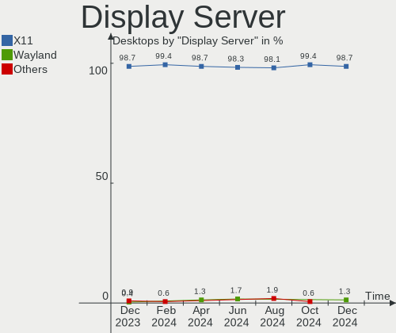

| Name    | Desktops | Percent |
|---------|----------|---------|
| X11     | 190      | 98.96%  |
| Wayland | 2        | 1.04%   |

Display Manager
---------------

SDDM, LightDM, etc.

| Name    | Desktops | Percent |
|---------|----------|---------|
| Unknown | 117      | 60.94%  |
| LightDM | 73       | 38.02%  |
| GDM3    | 2        | 1.04%   |

OS Lang
-------

Language

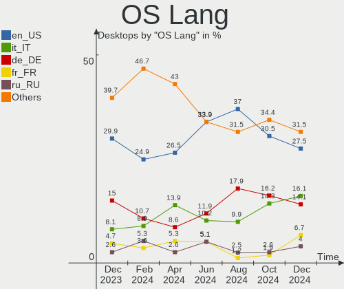

| Lang  | Desktops | Percent |
|-------|----------|---------|
| en_US | 60       | 31.25%  |
| de_DE | 31       | 16.15%  |
| pt_BR | 16       | 8.33%   |
| ru_RU | 8        | 4.17%   |
| en_GB | 8        | 4.17%   |
| en_CA | 8        | 4.17%   |
| fr_FR | 7        | 3.65%   |
| C     | 6        | 3.13%   |
| pl_PL | 5        | 2.6%    |
| it_IT | 4        | 2.08%   |
| es_ES | 4        | 2.08%   |
| sk_SK | 3        | 1.56%   |
| en_AU | 3        | 1.56%   |
| de_AT | 3        | 1.56%   |
| nl_NL | 2        | 1.04%   |
| hu_HU | 2        | 1.04%   |
| es_CL | 2        | 1.04%   |
| en_PH | 2        | 1.04%   |
| en_NZ | 2        | 1.04%   |
| en_IN | 2        | 1.04%   |
| el_GR | 2        | 1.04%   |
| de_CH | 2        | 1.04%   |
| sr_RS | 1        | 0.52%   |
| pt_PT | 1        | 0.52%   |
| nb_NO | 1        | 0.52%   |
| fi_FI | 1        | 0.52%   |
| es_VE | 1        | 0.52%   |
| es_UY | 1        | 0.52%   |
| es_PE | 1        | 0.52%   |
| es_MX | 1        | 0.52%   |
| es_AR | 1        | 0.52%   |
| cs_CZ | 1        | 0.52%   |

Boot Mode
---------

EFI or BIOS

| Mode | Desktops | Percent |
|------|----------|---------|
| EFI  | 118      | 61.46%  |
| BIOS | 74       | 38.54%  |

Filesystem
----------

Type of filesystem

| Type    | Desktops | Percent |
|---------|----------|---------|
| Ext4    | 178      | 92.71%  |
| Overlay | 6        | 3.13%   |
| Btrfs   | 4        | 2.08%   |
| Zfs     | 2        | 1.04%   |
| Xfs     | 1        | 0.52%   |
| Tmpfs   | 1        | 0.52%   |

Part. scheme
------------

Scheme of partitioning

| Type    | Desktops | Percent |
|---------|----------|---------|
| Unknown | 117      | 60.94%  |
| GPT     | 64       | 33.33%  |
| MBR     | 11       | 5.73%   |

Dual Boot with Linux/BSD
------------------------

Hosting more than one Linux/BSD

| Dual boot | Desktops | Percent |
|-----------|----------|---------|
| No        | 166      | 86.46%  |
| Yes       | 26       | 13.54%  |

Dual Boot (Win)
---------------

Hosting Linux and Windows

| Dual boot | Desktops | Percent |
|-----------|----------|---------|
| No        | 151      | 78.65%  |
| Yes       | 41       | 21.35%  |

Board
-----

Vendor
------

Motherboard manufacturer

| Name                | Desktops | Percent |
|---------------------|----------|---------|
| ASUSTek Computer    | 42       | 21.88%  |
| MSI                 | 35       | 18.23%  |
| Gigabyte Technology | 35       | 18.23%  |
| Dell                | 15       | 7.81%   |
| Hewlett-Packard     | 14       | 7.29%   |
| ASRock              | 14       | 7.29%   |
| Intel               | 8        | 4.17%   |
| Lenovo              | 6        | 3.13%   |
| Biostar             | 3        | 1.56%   |
| Unknown             | 3        | 1.56%   |
| Shuttle             | 2        | 1.04%   |
| Positivo            | 2        | 1.04%   |
| ECS                 | 2        | 1.04%   |
| Acer                | 2        | 1.04%   |
| POWERX              | 1        | 0.52%   |
| Portwell            | 1        | 0.52%   |
| Pegatron            | 1        | 0.52%   |
| PCWare              | 1        | 0.52%   |
| MW                  | 1        | 0.52%   |
| MouseComputer       | 1        | 0.52%   |
| Fujitsu Siemens     | 1        | 0.52%   |
| Fujitsu             | 1        | 0.52%   |
| AMI                 | 1        | 0.52%   |

Model
-----

Motherboard model

| Name                               | Desktops | Percent |
|------------------------------------|----------|---------|
| Gigabyte B450 AORUS ELITE          | 3        | 1.56%   |
| Dell OptiPlex 790                  | 3        | 1.56%   |
| Unknown                            | 3        | 1.56%   |
| MSI MS-7D54                        | 2        | 1.04%   |
| MSI MS-7B98                        | 2        | 1.04%   |
| MSI MS-7B86                        | 2        | 1.04%   |
| Intel H61                          | 2        | 1.04%   |
| HP Compaq Elite 8300 SFF           | 2        | 1.04%   |
| Gigabyte H61M-S2PV                 | 2        | 1.04%   |
| Gigabyte B250M-D3H                 | 2        | 1.04%   |
| Gigabyte 970A-DS3P                 | 2        | 1.04%   |
| Dell XPS 8700                      | 2        | 1.04%   |
| ASUS TUF Gaming B550M-PLUS         | 2        | 1.04%   |
| ASUS PRIME A320M-K                 | 2        | 1.04%   |
| ASUS P8B75-M LE                    | 2        | 1.04%   |
| ASUS M5A78L-M PLUS/USB3            | 2        | 1.04%   |
| ASUS All Series                    | 2        | 1.04%   |
| ASRock A320M-HDV R3.0              | 2        | 1.04%   |
| Shuttle X50V4                      | 1        | 0.52%   |
| Shuttle SK21V10                    | 1        | 0.52%   |
| POWERX G41                         | 1        | 0.52%   |
| Positivo Positivo Master D610      | 1        | 0.52%   |
| Positivo POS-EINM70CS              | 1        | 0.52%   |
| Portwell CAPB-3000VR               | 1        | 0.52%   |
| Pegatron Compaq 505B Microtower PC | 1        | 0.52%   |
| PCWare IPMH61R3                    | 1        | 0.52%   |
| MW NVR-N5105                       | 1        | 0.52%   |
| MSI MT-7641                        | 1        | 0.52%   |
| MSI MS-7E06                        | 1        | 0.52%   |
| MSI MS-7D99                        | 1        | 0.52%   |
| MSI MS-7D91                        | 1        | 0.52%   |
| MSI MS-7D78                        | 1        | 0.52%   |
| MSI MS-7D59                        | 1        | 0.52%   |
| MSI MS-7D50                        | 1        | 0.52%   |
| MSI MS-7D32                        | 1        | 0.52%   |
| MSI MS-7D22                        | 1        | 0.52%   |
| MSI MS-7C96                        | 1        | 0.52%   |
| MSI MS-7C95                        | 1        | 0.52%   |
| MSI MS-7C37                        | 1        | 0.52%   |
| MSI MS-7C02                        | 1        | 0.52%   |

Model Family
------------

Motherboard model prefix

| Name                  | Desktops | Percent |
|-----------------------|----------|---------|
| ASUS ROG              | 10       | 5.21%   |
| Dell OptiPlex         | 9        | 4.69%   |
| HP Compaq             | 7        | 3.65%   |
| Lenovo ThinkCentre    | 5        | 2.6%    |
| Gigabyte B450         | 5        | 2.6%    |
| ASUS TUF              | 5        | 2.6%    |
| ASUS PRIME            | 5        | 2.6%    |
| Dell Precision        | 3        | 1.56%   |
| ASRock A320M-HDV      | 3        | 1.56%   |
| Unknown               | 3        | 1.56%   |
| MSI MS-7D54           | 2        | 1.04%   |
| MSI MS-7B98           | 2        | 1.04%   |
| MSI MS-7B86           | 2        | 1.04%   |
| Intel H61             | 2        | 1.04%   |
| Gigabyte H61M-S2PV    | 2        | 1.04%   |
| Gigabyte B250M-D3H    | 2        | 1.04%   |
| Gigabyte 970A-DS3P    | 2        | 1.04%   |
| Dell XPS              | 2        | 1.04%   |
| ASUS P8H61-M          | 2        | 1.04%   |
| ASUS P8B75-M          | 2        | 1.04%   |
| ASUS M5A78L-M         | 2        | 1.04%   |
| ASUS All              | 2        | 1.04%   |
| Shuttle X50V4         | 1        | 0.52%   |
| Shuttle SK21V10       | 1        | 0.52%   |
| POWERX G41            | 1        | 0.52%   |
| Positivo Positivo     | 1        | 0.52%   |
| Positivo POS-EINM70CS | 1        | 0.52%   |
| Portwell CAPB-3000VR  | 1        | 0.52%   |
| Pegatron Compaq       | 1        | 0.52%   |
| PCWare IPMH61R3       | 1        | 0.52%   |
| MW NVR-N5105          | 1        | 0.52%   |
| MSI MT-7641           | 1        | 0.52%   |
| MSI MS-7E06           | 1        | 0.52%   |
| MSI MS-7D99           | 1        | 0.52%   |
| MSI MS-7D91           | 1        | 0.52%   |
| MSI MS-7D78           | 1        | 0.52%   |
| MSI MS-7D59           | 1        | 0.52%   |
| MSI MS-7D50           | 1        | 0.52%   |
| MSI MS-7D32           | 1        | 0.52%   |
| MSI MS-7D22           | 1        | 0.52%   |

MFG Year
--------

Motherboard manufacture year

| Year | Desktops | Percent |
|------|----------|---------|
| 2018 | 23       | 11.98%  |
| 2012 | 16       | 8.33%   |
| 2019 | 15       | 7.81%   |
| 2011 | 15       | 7.81%   |
| 2021 | 13       | 6.77%   |
| 2013 | 13       | 6.77%   |
| 2022 | 12       | 6.25%   |
| 2020 | 12       | 6.25%   |
| 2017 | 12       | 6.25%   |
| 2016 | 12       | 6.25%   |
| 2014 | 12       | 6.25%   |
| 2010 | 9        | 4.69%   |
| 2009 | 9        | 4.69%   |
| 2008 | 5        | 2.6%    |
| 2007 | 4        | 2.08%   |
| 2023 | 3        | 1.56%   |
| 2015 | 3        | 1.56%   |
| 2006 | 3        | 1.56%   |
| 2005 | 1        | 0.52%   |

Form Factor
-----------

Physical design of the computer

| Name    | Desktops | Percent |
|---------|----------|---------|
| Desktop | 192      | 100%    |

Secure Boot
-----------

Enabled or disabled

| State    | Desktops | Percent |
|----------|----------|---------|
| Disabled | 191      | 99.48%  |
| Enabled  | 1        | 0.52%   |

Coreboot
--------

Have coreboot on board

| Used | Desktops | Percent |
|------|----------|---------|
| No   | 192      | 100%    |

RAM Size
--------

Total RAM memory

| Size in GB  | Desktops | Percent |
|-------------|----------|---------|
| 16.01-24.0  | 45       | 23.44%  |
| 8.01-16.0   | 38       | 19.79%  |
| 32.01-64.0  | 31       | 16.15%  |
| 3.01-4.0    | 27       | 14.06%  |
| 4.01-8.0    | 25       | 13.02%  |
| 64.01-256.0 | 14       | 7.29%   |
| 24.01-32.0  | 7        | 3.65%   |
| 1.01-2.0    | 2        | 1.04%   |
| 0.51-1.0    | 2        | 1.04%   |
| 2.01-3.0    | 1        | 0.52%   |

RAM Used
--------

Used RAM memory

| Used GB    | Desktops | Percent |
|------------|----------|---------|
| 1.01-2.0   | 67       | 34.9%   |
| 2.01-3.0   | 46       | 23.96%  |
| 4.01-8.0   | 35       | 18.23%  |
| 3.01-4.0   | 27       | 14.06%  |
| 8.01-16.0  | 10       | 5.21%   |
| 0.51-1.0   | 4        | 2.08%   |
| 16.01-24.0 | 3        | 1.56%   |

Total Drives
------------

Number of drives on board

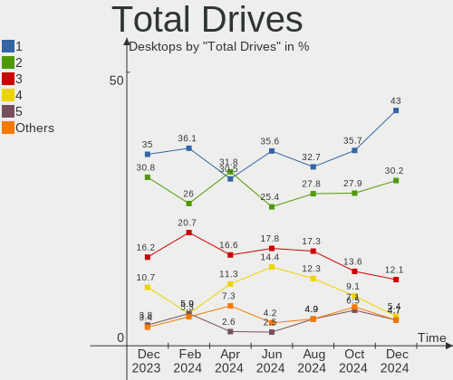

| Drives | Desktops | Percent |
|--------|----------|---------|
| 1      | 81       | 42.19%  |
| 2      | 48       | 25%     |
| 3      | 30       | 15.63%  |
| 4      | 15       | 7.81%   |
| 5      | 9        | 4.69%   |
| 6      | 7        | 3.65%   |
| 8      | 1        | 0.52%   |
| 0      | 1        | 0.52%   |

Has CD-ROM
----------

Has CD-ROM on board

| Presented | Desktops | Percent |
|-----------|----------|---------|
| No        | 104      | 54.17%  |
| Yes       | 88       | 45.83%  |

Has Ethernet
------------

Has Ethernet on board

| Presented | Desktops | Percent |
|-----------|----------|---------|
| Yes       | 192      | 100%    |

Has WiFi
--------

Has WiFi module

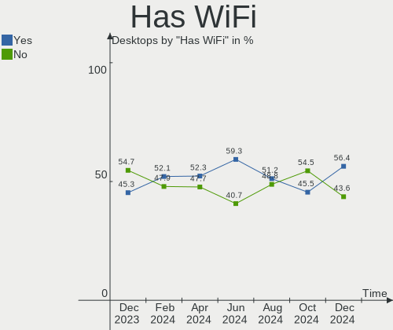

| Presented | Desktops | Percent |
|-----------|----------|---------|
| Yes       | 98       | 51.04%  |
| No        | 94       | 48.96%  |

Has Bluetooth
-------------

Has Bluetooth module

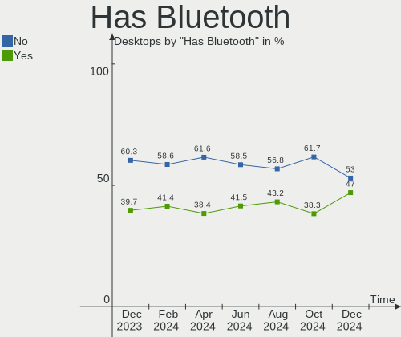

| Presented | Desktops | Percent |
|-----------|----------|---------|
| No        | 117      | 60.94%  |
| Yes       | 75       | 39.06%  |

Location
--------

Country
-------

Geographic location (country)

| Country     | Desktops | Percent |
|-------------|----------|---------|
| USA         | 36       | 18.75%  |
| Germany     | 33       | 17.19%  |
| Brazil      | 16       | 8.33%   |
| France      | 9        | 4.69%   |
| Canada      | 9        | 4.69%   |
| UK          | 8        | 4.17%   |
| Russia      | 8        | 4.17%   |
| Poland      | 5        | 2.6%    |
| Italy       | 5        | 2.6%    |
| Austria     | 5        | 2.6%    |
| Spain       | 4        | 2.08%   |
| Slovakia    | 4        | 2.08%   |
| Norway      | 3        | 1.56%   |
| Netherlands | 3        | 1.56%   |
| India       | 3        | 1.56%   |
| Czechia     | 3        | 1.56%   |
| Chile       | 3        | 1.56%   |
| Australia   | 3        | 1.56%   |
| Turkey      | 2        | 1.04%   |
| Switzerland | 2        | 1.04%   |
| Serbia      | 2        | 1.04%   |
| Portugal    | 2        | 1.04%   |
| Philippines | 2        | 1.04%   |
| New Zealand | 2        | 1.04%   |
| Latvia      | 2        | 1.04%   |
| Japan       | 2        | 1.04%   |
| Hungary     | 2        | 1.04%   |
| Greece      | 2        | 1.04%   |
| Egypt       | 2        | 1.04%   |
| Venezuela   | 1        | 0.52%   |
| Uruguay     | 1        | 0.52%   |
| Ukraine     | 1        | 0.52%   |
| Mexico      | 1        | 0.52%   |
| Jordan      | 1        | 0.52%   |
| Iran        | 1        | 0.52%   |
| Finland     | 1        | 0.52%   |
| Bolivia     | 1        | 0.52%   |
| Bangladesh  | 1        | 0.52%   |
| Argentina   | 1        | 0.52%   |

City
----

Geographic location (city)

| City                  | Desktops | Percent |
|-----------------------|----------|---------|
| Rio de Janeiro        | 3        | 1.56%   |
| Manchester            | 3        | 1.56%   |
| Ventspils             | 2        | 1.04%   |
| Sao Paulo             | 2        | 1.04%   |
| Rostov-on-Don         | 2        | 1.04%   |
| Prague                | 2        | 1.04%   |
| Leipzig               | 2        | 1.04%   |
| Krasnodar             | 2        | 1.04%   |
| Hamburg               | 2        | 1.04%   |
| Frankfurt am Main     | 2        | 1.04%   |
| Fortaleza             | 2        | 1.04%   |
| Calgary               | 2        | 1.04%   |
| Cairo                 | 2        | 1.04%   |
| Brisbane              | 2        | 1.04%   |
| Berlin                | 2        | 1.04%   |
| Belgrade              | 2        | 1.04%   |
| Auckland              | 2        | 1.04%   |
| Zurich                | 1        | 0.52%   |
| Wroclaw               | 1        | 0.52%   |
| Winsen                | 1        | 0.52%   |
| Westchester           | 1        | 0.52%   |
| Wayne                 | 1        | 0.52%   |
| Warsaw                | 1        | 0.52%   |
| Vysny Kubin           | 1        | 0.52%   |
| Volos                 | 1        | 0.52%   |
| Volgograd             | 1        | 0.52%   |
| Vladivostok           | 1        | 0.52%   |
| Vitória da Conquista | 1        | 0.52%   |
| Vienna                | 1        | 0.52%   |
| Verden an der Aller   | 1        | 0.52%   |
| Velikiye Luki         | 1        | 0.52%   |
| Valldal               | 1        | 0.52%   |
| Valencia              | 1        | 0.52%   |
| Tulsa                 | 1        | 0.52%   |
| Tübingen             | 1        | 0.52%   |
| Trabzon               | 1        | 0.52%   |
| Tokyo                 | 1        | 0.52%   |
| Titusville            | 1        | 0.52%   |
| Tierra Amarilla       | 1        | 0.52%   |
| Thunder Bay           | 1        | 0.52%   |

Drives
------

Drive Vendor
------------

Hard drive vendors

| Vendor                      | Desktops | Drives | Percent |
|-----------------------------|----------|--------|---------|
| Seagate                     | 65       | 87     | 18.16%  |
| WDC                         | 55       | 65     | 15.36%  |
| Samsung Electronics         | 49       | 66     | 13.69%  |
| Sandisk                     | 27       | 30     | 7.54%   |
| Crucial                     | 23       | 30     | 6.42%   |
| Kingston                    | 22       | 23     | 6.15%   |
| Toshiba                     | 13       | 13     | 3.63%   |
| Hitachi                     | 8        | 9      | 2.23%   |
| Micron/Crucial Technology   | 7        | 7      | 1.96%   |
| Unknown                     | 6        | 8      | 1.68%   |
| A-DATA Technology           | 6        | 6      | 1.68%   |
| Team                        | 4        | 4      | 1.12%   |
| Kingston Technology Company | 4        | 4      | 1.12%   |
| GOODRAM                     | 4        | 4      | 1.12%   |
| Phison Electronics          | 3        | 3      | 0.84%   |
| KIOXIA                      | 3        | 3      | 0.84%   |
| Intenso                     | 3        | 3      | 0.84%   |
| China                       | 3        | 3      | 0.84%   |
| Apacer                      | 3        | 3      | 0.84%   |
| ADATA Technology            | 3        | 4      | 0.84%   |
| SPCC                        | 2        | 2      | 0.56%   |
| SK hynix                    | 2        | 2      | 0.56%   |
| Realtek Semiconductor       | 2        | 2      | 0.56%   |
| PNY                         | 2        | 2      | 0.56%   |
| Patriot                     | 2        | 2      | 0.56%   |
| OCZ                         | 2        | 2      | 0.56%   |
| MAXIO Technology (Hangzhou) | 2        | 2      | 0.56%   |
| Lexar                       | 2        | 2      | 0.56%   |
| JMicron Technology          | 2        | 3      | 0.56%   |
| Gigabyte Technology         | 2        | 2      | 0.56%   |
| XrayDisk                    | 1        | 1      | 0.28%   |
| XPG                         | 1        | 1      | 0.28%   |
| WD Blue                     | 1        | 1      | 0.28%   |
| Verbatim                    | 1        | 1      | 0.28%   |
| Union Memory                | 1        | 1      | 0.28%   |
| Transcend                   | 1        | 1      | 0.28%   |
| Teutons                     | 1        | 1      | 0.28%   |
| T-FORCE                     | 1        | 1      | 0.28%   |
| T-CREATE                    | 1        | 1      | 0.28%   |
| SUNEAST                     | 1        | 1      | 0.28%   |

Drive Model
-----------

Hard drive models

| Model                                               | Desktops | Percent |
|-----------------------------------------------------|----------|---------|
| Seagate ST2000DM008-2FR102 2TB                      | 8        | 1.95%   |
| Kingston SA400S37240G 240GB SSD                     | 6        | 1.46%   |
| Seagate ST500DM002-1BD142 500GB                     | 5        | 1.22%   |
| Toshiba DT01ACA100 1TB                              | 4        | 0.98%   |
| Sandisk WD Blue SN550 NVMe SSD 1TB                  | 4        | 0.98%   |
| SanDisk NVMe SSD Drive 1TB                          | 4        | 0.98%   |
| Samsung SSD 870 EVO 1TB                             | 4        | 0.98%   |
| Samsung NVMe SSD Controller SM981/PM981/PM983 250GB | 4        | 0.98%   |
| Micron/Crucial P2 NVMe PCIe SSD 4TB                 | 4        | 0.98%   |
| WDC WD40EZRZ-00GXCB0 4TB                            | 3        | 0.73%   |
| Seagate ST1000DM003-1CH162 1TB                      | 3        | 0.73%   |
| Seagate Expansion Desk 5TB                          | 3        | 0.73%   |
| SanDisk SDSSDP128G 128GB                            | 3        | 0.73%   |
| Samsung SSD 870 EVO 500GB                           | 3        | 0.73%   |
| Samsung SSD 860 EVO 250GB                           | 3        | 0.73%   |
| Samsung SSD 860 EVO 1TB                             | 3        | 0.73%   |
| Samsung SSD 850 EVO 250GB                           | 3        | 0.73%   |
| Samsung NVMe SSD Controller PM9A1/PM9A3/980PRO 2TB  | 3        | 0.73%   |
| Kingston SV300S37A120G 120GB SSD                    | 3        | 0.73%   |
| Kingston SA400S37480G 480GB SSD                     | 3        | 0.73%   |
| Crucial CT480BX500SSD1 480GB                        | 3        | 0.73%   |
| Crucial CT1000MX500SSD1 1TB                         | 3        | 0.73%   |
| Crucial CT1000BX500SSD1 1TB                         | 3        | 0.73%   |
| WDC WDS500G3X0C-00SJG0 500GB                        | 2        | 0.49%   |
| WDC WDS240G2G0A-00JH30 240GB SSD                    | 2        | 0.49%   |
| WDC WD5000AAKX-001CA0 500GB                         | 2        | 0.49%   |
| WDC WD3200AAJS-00L7A0 320GB                         | 2        | 0.49%   |
| WDC WD20EZRZ-00Z5HB0 2TB                            | 2        | 0.49%   |
| WDC WD20EARS-00J2GB0 2TB                            | 2        | 0.49%   |
| WDC WD10EZEX-22MFCA0 1TB                            | 2        | 0.49%   |
| WDC WD10EZEX-08WN4A0 1TB                            | 2        | 0.49%   |
| WDC WD10EZEX-00BN5A0 1TB                            | 2        | 0.49%   |
| Unknown SD/MMC/MS PRO 250GB                         | 2        | 0.49%   |
| Unknown MMC Card  64GB                              | 2        | 0.49%   |
| Toshiba HDWD110 1TB                                 | 2        | 0.49%   |
| Seagate ST4000DM004-2CV104 4TB                      | 2        | 0.49%   |
| Seagate ST3500418AS 500GB                           | 2        | 0.49%   |
| Seagate ST31000528AS 1TB                            | 2        | 0.49%   |
| Seagate ST2000DM001-1ER164 2TB                      | 2        | 0.49%   |
| Seagate ST1000LM035-1RK172 1TB                      | 2        | 0.49%   |

HDD Vendor
----------

Hard disk drive vendors

| Vendor              | Desktops | Drives | Percent |
|---------------------|----------|--------|---------|
| Seagate             | 65       | 87     | 43.62%  |
| WDC                 | 46       | 52     | 30.87%  |
| Toshiba             | 12       | 12     | 8.05%   |
| Samsung Electronics | 11       | 13     | 7.38%   |
| Hitachi             | 8        | 9      | 5.37%   |
| Unknown             | 3        | 3      | 2.01%   |
| Maxone              | 1        | 1      | 0.67%   |
| JMicron Technology  | 1        | 2      | 0.67%   |
| HGST                | 1        | 1      | 0.67%   |
| Fujitsu             | 1        | 1      | 0.67%   |

SSD Vendor
----------

Solid state drive vendors

| Vendor              | Desktops | Drives | Percent |
|---------------------|----------|--------|---------|
| Samsung Electronics | 29       | 35     | 21.17%  |
| Kingston            | 19       | 20     | 13.87%  |
| Crucial             | 16       | 21     | 11.68%  |
| SanDisk             | 13       | 13     | 9.49%   |
| WDC                 | 9        | 10     | 6.57%   |
| A-DATA Technology   | 6        | 6      | 4.38%   |
| Team                | 4        | 4      | 2.92%   |
| GOODRAM             | 4        | 4      | 2.92%   |
| Intenso             | 3        | 3      | 2.19%   |
| China               | 3        | 3      | 2.19%   |
| Apacer              | 3        | 3      | 2.19%   |
| SPCC                | 2        | 2      | 1.46%   |
| PNY                 | 2        | 2      | 1.46%   |
| OCZ                 | 2        | 2      | 1.46%   |
| Lexar               | 2        | 2      | 1.46%   |
| Gigabyte Technology | 2        | 2      | 1.46%   |
| Verbatim            | 1        | 1      | 0.73%   |
| Transcend           | 1        | 1      | 0.73%   |
| Toshiba             | 1        | 1      | 0.73%   |
| Teutons             | 1        | 1      | 0.73%   |
| T-FORCE             | 1        | 1      | 0.73%   |
| T-CREATE            | 1        | 1      | 0.73%   |
| SUNEAST             | 1        | 1      | 0.73%   |
| StoreJet            | 1        | 1      | 0.73%   |
| RZX                 | 1        | 1      | 0.73%   |
| Plextor             | 1        | 1      | 0.73%   |
| Patriot             | 1        | 1      | 0.73%   |
| Micron Technology   | 1        | 1      | 0.73%   |
| KingSpec            | 1        | 1      | 0.73%   |
| Intel               | 1        | 1      | 0.73%   |
| INNOVATION IT       | 1        | 1      | 0.73%   |
| CT250MX5            | 1        | 1      | 0.73%   |
| Corsair             | 1        | 1      | 0.73%   |
| Biostar             | 1        | 1      | 0.73%   |

Drive Kind
----------

HDD or SSD

| Kind    | Desktops | Drives | Percent |
|---------|----------|--------|---------|
| HDD     | 114      | 181    | 38.91%  |
| SSD     | 112      | 150    | 38.23%  |
| NVMe    | 60       | 82     | 20.48%  |
| Unknown | 5        | 8      | 1.71%   |
| MMC     | 2        | 2      | 0.68%   |

Drive Connector
---------------

SATA, SAS, NVMe, etc.

| Type | Desktops | Drives | Percent |
|------|----------|--------|---------|
| SATA | 172      | 312    | 67.72%  |
| NVMe | 59       | 80     | 23.23%  |
| SAS  | 21       | 29     | 8.27%   |
| MMC  | 2        | 2      | 0.79%   |

Drive Size
----------

Size of hard drive

| Size in TB | Desktops | Drives | Percent |
|------------|----------|--------|---------|
| 0.01-0.5   | 114      | 167    | 46.53%  |
| 0.51-1.0   | 77       | 100    | 31.43%  |
| 1.01-2.0   | 29       | 38     | 11.84%  |
| 3.01-4.0   | 13       | 13     | 5.31%   |
| 4.01-10.0  | 8        | 9      | 3.27%   |
| 2.01-3.0   | 3        | 3      | 1.22%   |
| 10.01-20.0 | 1        | 1      | 0.41%   |

Space Total
-----------

Amount of disk space available on the file system

| Size in GB     | Desktops | Percent |
|----------------|----------|---------|
| 101-250        | 44       | 22.92%  |
| 501-1000       | 43       | 22.4%   |
| 251-500        | 37       | 19.27%  |
| More than 3000 | 29       | 15.1%   |
| 1001-2000      | 18       | 9.38%   |
| 2001-3000      | 7        | 3.65%   |
| 1-20           | 5        | 2.6%    |
| 51-100         | 5        | 2.6%    |
| 21-50          | 2        | 1.04%   |
| Unknown        | 2        | 1.04%   |

Space Used
----------

Amount of used disk space

| Used GB        | Desktops | Percent |
|----------------|----------|---------|
| 21-50          | 35       | 18.23%  |
| 101-250        | 33       | 17.19%  |
| 251-500        | 28       | 14.58%  |
| 1-20           | 28       | 14.58%  |
| 501-1000       | 20       | 10.42%  |
| 51-100         | 18       | 9.38%   |
| 1001-2000      | 13       | 6.77%   |
| More than 3000 | 10       | 5.21%   |
| 2001-3000      | 5        | 2.6%    |
| Unknown        | 2        | 1.04%   |

Malfunc. Drives
---------------

Drive models with a malfunction

| Model                               | Desktops | Drives | Percent |
|-------------------------------------|----------|--------|---------|
| WDC WD20EARS-00J2GB0 2TB            | 2        | 2      | 6.67%   |
| Seagate ST500DM002-1BD142 500GB     | 2        | 2      | 6.67%   |
| Samsung Electronics HD322HJ 320GB   | 2        | 2      | 6.67%   |
| WDC WDS100T2G0A-00JH30 1TB SSD      | 1        | 2      | 3.33%   |
| WDC WD5000AAKX-00ERMA0 500GB        | 1        | 1      | 3.33%   |
| WDC WD5000AAKX-001CA0 500GB         | 1        | 1      | 3.33%   |
| WDC WD15EARS-00MVWB0 1TB            | 1        | 1      | 3.33%   |
| WDC WD10EZEX-75WN4A0 1TB            | 1        | 1      | 3.33%   |
| WDC WD10EURX-63C57Y0 1TB            | 1        | 1      | 3.33%   |
| WDC WD1003FZEX-00MK2A0 1TB          | 1        | 1      | 3.33%   |
| Seagate ST3500418AS 500GB           | 1        | 1      | 3.33%   |
| Seagate ST3500413AS 500GB           | 1        | 1      | 3.33%   |
| Seagate ST3500320AS 500GB           | 1        | 1      | 3.33%   |
| Seagate ST3320413CS 320GB           | 1        | 1      | 3.33%   |
| Seagate ST1000LM035-1RK172 1TB      | 1        | 2      | 3.33%   |
| Seagate ST1000DM003-1SB102 1TB      | 1        | 1      | 3.33%   |
| SanDisk SSD PLUS 120 GB             | 1        | 1      | 3.33%   |
| Samsung Electronics SSD 970 EVO 1TB | 1        | 1      | 3.33%   |
| Samsung Electronics SP2004C 200GB   | 1        | 1      | 3.33%   |
| Samsung Electronics HD501LJ 500GB   | 1        | 1      | 3.33%   |
| Samsung Electronics HD154UI 1TB     | 1        | 1      | 3.33%   |
| Patriot Blast 240GB SSD             | 1        | 1      | 3.33%   |
| Hitachi HUA723020ALA641 2TB         | 1        | 1      | 3.33%   |
| Hitachi HTS541010A9E680 1TB         | 1        | 1      | 3.33%   |
| Hitachi HCT721010SLA360 1TB         | 1        | 1      | 3.33%   |
| Crucial CT480BX500SSD1 480GB        | 1        | 1      | 3.33%   |
| Crucial CT1000P1SSD8 1TB            | 1        | 1      | 3.33%   |

Malfunc. Drive Vendor
---------------------

Vendors of faulty drives

| Vendor              | Desktops | Drives | Percent |
|---------------------|----------|--------|---------|
| WDC                 | 9        | 10     | 30%     |
| Seagate             | 8        | 9      | 26.67%  |
| Samsung Electronics | 6        | 6      | 20%     |
| Hitachi             | 3        | 3      | 10%     |
| Crucial             | 2        | 2      | 6.67%   |
| SanDisk             | 1        | 1      | 3.33%   |
| Patriot             | 1        | 1      | 3.33%   |

Malfunc. HDD Vendor
-------------------

Vendors of faulty HDD drives

| Vendor              | Desktops | Drives | Percent |
|---------------------|----------|--------|---------|
| WDC                 | 8        | 8      | 33.33%  |
| Seagate             | 8        | 9      | 33.33%  |
| Samsung Electronics | 5        | 5      | 20.83%  |
| Hitachi             | 3        | 3      | 12.5%   |

Malfunc. Drive Kind
-------------------

Kinds of faulty drives

| Kind | Desktops | Drives | Percent |
|------|----------|--------|---------|
| HDD  | 20       | 25     | 76.92%  |
| SSD  | 4        | 5      | 15.38%  |
| NVMe | 2        | 2      | 7.69%   |

Failed Drives
-------------

Failed drive models

Zero info for selected period =(

Failed Drive Vendor
-------------------

Failed drive vendors

Zero info for selected period =(

Drive Status
------------

Number of failed and malfunc. drives

| Status   | Desktops | Drives | Percent |
|----------|----------|--------|---------|
| Detected | 128      | 251    | 58.18%  |
| Works    | 67       | 140    | 30.45%  |
| Malfunc  | 25       | 32     | 11.36%  |

Storage controller
------------------

Storage Vendor
--------------

Storage controller vendors

| Vendor                           | Desktops | Percent |
|----------------------------------|----------|---------|
| Intel                            | 121      | 42.31%  |
| AMD                              | 65       | 22.73%  |
| SanDisk                          | 17       | 5.94%   |
| Samsung Electronics              | 14       | 4.9%    |
| Micron/Crucial Technology        | 14       | 4.9%    |
| ASMedia Technology               | 13       | 4.55%   |
| Kingston Technology Company      | 7        | 2.45%   |
| JMicron Technology               | 7        | 2.45%   |
| ADATA Technology                 | 4        | 1.4%    |
| Phison Electronics               | 3        | 1.05%   |
| KIOXIA                           | 3        | 1.05%   |
| VIA Technologies                 | 2        | 0.7%    |
| SK hynix                         | 2        | 0.7%    |
| Realtek Semiconductor            | 2        | 0.7%    |
| Nvidia                           | 2        | 0.7%    |
| MAXIO Technology (Hangzhou)      | 2        | 0.7%    |
| Marvell Technology Group         | 2        | 0.7%    |
| Adaptec                          | 2        | 0.7%    |
| Union Memory (Shenzhen)          | 1        | 0.35%   |
| Silicon Motion                   | 1        | 0.35%   |
| Silicon Integrated Systems [SiS] | 1        | 0.35%   |
| LSI Logic / Symbios Logic        | 1        | 0.35%   |

Storage Model
-------------

Storage controller models

| Model                                                                                   | Desktops | Percent |
|-----------------------------------------------------------------------------------------|----------|---------|
| AMD FCH SATA Controller [AHCI mode]                                                     | 32       | 9.01%   |
| Intel 8 Series/C220 Series Chipset Family 6-port SATA Controller 1 [AHCI mode]          | 15       | 4.23%   |
| Intel 6 Series/C200 Series Chipset Family 6 port Desktop SATA AHCI Controller           | 15       | 4.23%   |
| AMD 400 Series Chipset SATA Controller                                                  | 14       | 3.94%   |
| Intel Cannon Lake PCH SATA AHCI Controller                                              | 12       | 3.38%   |
| AMD SB7x0/SB8x0/SB9x0 IDE Controller                                                    | 12       | 3.38%   |
| ASMedia ASM1062 Serial ATA Controller                                                   | 11       | 3.1%    |
| Micron/Crucial P2 NVMe PCIe SSD                                                         | 9        | 2.54%   |
| AMD SB7x0/SB8x0/SB9x0 SATA Controller [AHCI mode]                                       | 9        | 2.54%   |
| AMD 500 Series Chipset SATA Controller                                                  | 9        | 2.54%   |
| AMD SB7x0/SB8x0/SB9x0 SATA Controller [IDE mode]                                        | 8        | 2.25%   |
| Intel SATA Controller [RAID mode]                                                       | 7        | 1.97%   |
| Intel 7 Series/C210 Series Chipset Family 6-port SATA Controller [AHCI mode]            | 7        | 1.97%   |
| Intel 200 Series PCH SATA controller [AHCI mode]                                        | 7        | 1.97%   |
| AMD FCH SATA Controller D                                                               | 7        | 1.97%   |
| Samsung NVMe SSD Controller SM981/PM981/PM983                                           | 6        | 1.69%   |
| SanDisk WD Blue SN550 NVMe SSD                                                          | 5        | 1.41%   |
| Intel Q170/Q150/B150/H170/H110/Z170/CM236 Chipset SATA Controller [AHCI Mode]           | 5        | 1.41%   |
| Intel NM10/ICH7 Family SATA Controller [IDE mode]                                       | 5        | 1.41%   |
| Intel Alder Lake-S PCH SATA Controller [AHCI Mode]                                      | 5        | 1.41%   |
| Intel 82801G (ICH7 Family) IDE Controller                                               | 5        | 1.41%   |
| Samsung NVMe SSD Controller PM9A1/PM9A3/980PRO                                          | 4        | 1.13%   |
| Micron/Crucial P1 NVMe PCIe SSD                                                         | 4        | 1.13%   |
| Kingston Company Company Non-Volatile memory controller                                 | 4        | 1.13%   |
| JMicron JMB363 SATA/IDE Controller                                                      | 4        | 1.13%   |
| Intel 9 Series Chipset Family SATA Controller [AHCI Mode]                               | 4        | 1.13%   |
| Intel 700 Series Chipset Family SATA AHCI Controller                                    | 4        | 1.13%   |
| Intel 6 Series/C200 Series Chipset Family Desktop SATA Controller (IDE mode, ports 4-5) | 4        | 1.13%   |
| Intel 6 Series/C200 Series Chipset Family Desktop SATA Controller (IDE mode, ports 0-3) | 4        | 1.13%   |
| SanDisk WD Black SN750 / PC SN730 NVMe SSD                                              | 3        | 0.85%   |
| SanDisk WD Black 2018/SN750 / PC SN720 NVMe SSD                                         | 3        | 0.85%   |
| SanDisk Non-Volatile memory controller                                                  | 3        | 0.85%   |
| Intel 500 Series Chipset Family SATA AHCI Controller                                    | 3        | 0.85%   |
| Intel 5 Series/3400 Series Chipset 6 port SATA AHCI Controller                          | 3        | 0.85%   |
| AMD 300 Series Chipset SATA Controller                                                  | 3        | 0.85%   |
| ADATA A Non-Volatile memory controller                                                  | 3        | 0.85%   |
| VIA VT82C586A/B/VT82C686/A/B/VT823x/A/C PIPC Bus Master IDE                             | 2        | 0.56%   |
| Samsung NVMe SSD Controller SM961/PM961/SM963                                           | 2        | 0.56%   |
| Samsung NVMe SSD Controller SM951/PM951                                                 | 2        | 0.56%   |
| Samsung Electronics Non-Volatile memory controller                                      | 2        | 0.56%   |

Storage Kind
------------

Kind of storage controller (IDE, SATA, NVMe, SAS, ...)

| Kind | Desktops | Percent |
|------|----------|---------|
| SATA | 160      | 58.18%  |
| NVMe | 59       | 21.45%  |
| IDE  | 43       | 15.64%  |
| RAID | 12       | 4.36%   |
| SCSI | 1        | 0.36%   |

Processor
---------

CPU Vendor
----------

Processor vendors

| Vendor | Desktops | Percent |
|--------|----------|---------|
| Intel  | 124      | 64.58%  |
| AMD    | 68       | 35.42%  |

CPU Model
---------

Processor models

| Model                                       | Desktops | Percent |
|---------------------------------------------|----------|---------|
| Intel Core i7-2600 CPU @ 3.40GHz            | 5        | 2.6%    |
| AMD FX-8350 Eight-Core Processor            | 5        | 2.6%    |
| Intel Core i7-3770 CPU @ 3.40GHz            | 4        | 2.08%   |
| Intel Core i3-2120 CPU @ 3.30GHz            | 4        | 2.08%   |
| AMD Ryzen 3 2200G with Radeon Vega Graphics | 4        | 2.08%   |
| Intel Core i5-2400 CPU @ 3.10GHz            | 3        | 1.56%   |
| Intel Core i5 CPU 650 @ 3.20GHz             | 3        | 1.56%   |
| Intel Core i3-3220 CPU @ 3.30GHz            | 3        | 1.56%   |
| AMD Ryzen 7 5800X 8-Core Processor          | 3        | 1.56%   |
| AMD Ryzen 7 3700X 8-Core Processor          | 3        | 1.56%   |
| AMD Ryzen 7 2700X Eight-Core Processor      | 3        | 1.56%   |
| AMD Ryzen 5 5600G with Radeon Graphics      | 3        | 1.56%   |
| Intel Pentium CPU G630 @ 2.70GHz            | 2        | 1.04%   |
| Intel Core i7-7700 CPU @ 3.60GHz            | 2        | 1.04%   |
| Intel Core i7-4790K CPU @ 4.00GHz           | 2        | 1.04%   |
| Intel Core i7-4790 CPU @ 3.60GHz            | 2        | 1.04%   |
| Intel Core i7-4770 CPU @ 3.40GHz            | 2        | 1.04%   |
| Intel Core i7-10700 CPU @ 2.90GHz           | 2        | 1.04%   |
| Intel Core i5-8400 CPU @ 2.80GHz            | 2        | 1.04%   |
| Intel Core i5-7400 CPU @ 3.00GHz            | 2        | 1.04%   |
| Intel Core i5-4570 CPU @ 3.20GHz            | 2        | 1.04%   |
| Intel Core i5-4460 CPU @ 3.20GHz            | 2        | 1.04%   |
| Intel Core i5-3470 CPU @ 3.20GHz            | 2        | 1.04%   |
| Intel Core i3-6100 CPU @ 3.70GHz            | 2        | 1.04%   |
| Intel Core i3-4150 CPU @ 3.50GHz            | 2        | 1.04%   |
| Intel Core i3-2100 CPU @ 3.10GHz            | 2        | 1.04%   |
| Intel Core 2 Duo CPU E8400 @ 3.00GHz        | 2        | 1.04%   |
| Intel 13th Gen Core i7-13700K               | 2        | 1.04%   |
| Intel 13th Gen Core i5-13600K               | 2        | 1.04%   |
| AMD Ryzen 9 3900X 12-Core Processor         | 2        | 1.04%   |
| AMD Ryzen 7 5700G with Radeon Graphics      | 2        | 1.04%   |
| AMD Ryzen 5 5600X 6-Core Processor          | 2        | 1.04%   |
| AMD Ryzen 5 1600 Six-Core Processor         | 2        | 1.04%   |
| AMD Ryzen 3 3200G with Radeon Vega Graphics | 2        | 1.04%   |
| AMD FX-6100 Six-Core Processor              | 2        | 1.04%   |
| Intel Xeon CPU X3480 @ 3.07GHz              | 1        | 0.52%   |
| Intel Xeon CPU E5450 @ 3.00GHz              | 1        | 0.52%   |
| Intel Xeon CPU E5-2670 v3 @ 2.30GHz         | 1        | 0.52%   |
| Intel Xeon CPU E5-2650 0 @ 2.00GHz          | 1        | 0.52%   |
| Intel Xeon CPU 5120 @ 1.86GHz               | 1        | 0.52%   |

CPU Model Family
----------------

Processor model prefix

| Model                   | Desktops | Percent |
|-------------------------|----------|---------|
| Intel Core i7           | 32       | 16.67%  |
| Intel Core i5           | 27       | 14.06%  |
| AMD Ryzen 7             | 16       | 8.33%   |
| Intel Core i3           | 14       | 7.29%   |
| AMD Ryzen 5             | 13       | 6.77%   |
| Other                   | 12       | 6.25%   |
| AMD FX                  | 11       | 5.73%   |
| Intel Celeron           | 8        | 4.17%   |
| AMD Ryzen 3             | 8        | 4.17%   |
| Intel Pentium           | 7        | 3.65%   |
| Intel Xeon              | 5        | 2.6%    |
| Intel Core 2 Duo        | 5        | 2.6%    |
| AMD Ryzen 9             | 5        | 2.6%    |
| AMD Phenom II X4        | 5        | 2.6%    |
| Intel Pentium Gold      | 3        | 1.56%   |
| Intel Pentium Dual-Core | 3        | 1.56%   |
| Intel Core 2 Quad       | 3        | 1.56%   |
| Intel Pentium Dual      | 2        | 1.04%   |
| AMD Athlon              | 2        | 1.04%   |
| Intel Pentium 4         | 1        | 0.52%   |
| Intel Core i9           | 1        | 0.52%   |
| Intel Atom              | 1        | 0.52%   |
| AMD Ryzen 7 PRO         | 1        | 0.52%   |
| AMD Ryzen 5 PRO         | 1        | 0.52%   |
| AMD Phenom II X6        | 1        | 0.52%   |
| AMD E1                  | 1        | 0.52%   |
| AMD Athlon X4           | 1        | 0.52%   |
| AMD Athlon 64 X2        | 1        | 0.52%   |
| AMD Athlon 64           | 1        | 0.52%   |
| AMD A8                  | 1        | 0.52%   |

CPU Cores
---------

Number of processor cores

| Number | Desktops | Percent |
|--------|----------|---------|
| 4      | 72       | 37.5%   |
| 2      | 51       | 26.56%  |
| 8      | 27       | 14.06%  |
| 6      | 22       | 11.46%  |
| 12     | 7        | 3.65%   |
| 16     | 4        | 2.08%   |
| 3      | 3        | 1.56%   |
| 14     | 2        | 1.04%   |
| 1      | 2        | 1.04%   |
| 24     | 1        | 0.52%   |
| 10     | 1        | 0.52%   |

CPU Sockets
-----------

Number of sockets

| Number | Desktops | Percent |
|--------|----------|---------|
| 1      | 191      | 99.48%  |
| 2      | 1        | 0.52%   |

CPU Threads
-----------

Threads per core (Hyper-Threading)

| Number | Desktops | Percent |
|--------|----------|---------|
| 2      | 115      | 59.9%   |
| 1      | 77       | 40.1%   |

CPU Op-Modes
------------

CPU Operation Modes (32-bit, 64-bit)

| Op mode        | Desktops | Percent |
|----------------|----------|---------|
| 32-bit, 64-bit | 192      | 100%    |

CPU Microcode
-------------

Microcode number

| Number     | Desktops | Percent |
|------------|----------|---------|
| 0x306c3    | 18       | 9.38%   |
| 0x206a7    | 17       | 8.85%   |
| Unknown    | 14       | 7.29%   |
| 0x306a9    | 12       | 6.25%   |
| 0x906ea    | 8        | 4.17%   |
| 0x1067a    | 7        | 3.65%   |
| 0x06000852 | 7        | 3.65%   |
| 0x906e9    | 6        | 3.13%   |
| 0xb0671    | 4        | 2.08%   |
| 0x506e3    | 4        | 2.08%   |
| 0x0a50000d | 4        | 2.08%   |
| 0x08701021 | 4        | 2.08%   |
| 0x08108109 | 4        | 2.08%   |
| 0x0800820d | 4        | 2.08%   |
| 0x0600063e | 4        | 2.08%   |
| 0xa0655    | 3        | 1.56%   |
| 0x906ed    | 3        | 1.56%   |
| 0x90672    | 3        | 1.56%   |
| 0x6fd      | 3        | 1.56%   |
| 0x406c4    | 3        | 1.56%   |
| 0x106e5    | 3        | 1.56%   |
| 0x0a201016 | 3        | 1.56%   |
| 0x08701030 | 3        | 1.56%   |
| 0x08001138 | 3        | 1.56%   |
| 0x306f2    | 2        | 1.04%   |
| 0x20652    | 2        | 1.04%   |
| 0x0a601203 | 2        | 1.04%   |
| 0x08701013 | 2        | 1.04%   |
| 0x08101016 | 2        | 1.04%   |
| 0x0810100b | 2        | 1.04%   |
| 0x010000db | 2        | 1.04%   |
| 0x010000c8 | 2        | 1.04%   |
| 0xf49      | 1        | 0.52%   |
| 0xa0671    | 1        | 0.52%   |
| 0xa0653    | 1        | 0.52%   |
| 0x906ec    | 1        | 0.52%   |
| 0x906eb    | 1        | 0.52%   |
| 0x906c0    | 1        | 0.52%   |
| 0x806c2    | 1        | 0.52%   |
| 0x6f7      | 1        | 0.52%   |

CPU Microarch
-------------

Microarchitecture

| Name             | Desktops | Percent |
|------------------|----------|---------|
| Haswell          | 22       | 11.46%  |
| KabyLake         | 20       | 10.42%  |
| SandyBridge      | 18       | 9.38%   |
| IvyBridge        | 13       | 6.77%   |
| Zen 3            | 11       | 5.73%   |
| Zen 2            | 11       | 5.73%   |
| Zen              | 11       | 5.73%   |
| Zen+             | 10       | 5.21%   |
| Penryn           | 10       | 5.21%   |
| Unknown          | 8        | 4.17%   |
| Piledriver       | 7        | 3.65%   |
| K10              | 7        | 3.65%   |
| Skylake          | 5        | 2.6%    |
| Core             | 5        | 2.6%    |
| CometLake        | 5        | 2.6%    |
| Silvermont       | 4        | 2.08%   |
| Nehalem          | 4        | 2.08%   |
| Bulldozer        | 4        | 2.08%   |
| Alderlake Hybrid | 4        | 2.08%   |
| Westmere         | 3        | 1.56%   |
| K8 Hammer        | 2        | 1.04%   |
| Tremont          | 1        | 0.52%   |
| TigerLake        | 1        | 0.52%   |
| Steamroller      | 1        | 0.52%   |
| Puma             | 1        | 0.52%   |
| NetBurst         | 1        | 0.52%   |
| K10 Llano        | 1        | 0.52%   |
| Icelake          | 1        | 0.52%   |
| Goldmont         | 1        | 0.52%   |

Graphics
--------

GPU Vendor
----------

Vendors of graphics cards

| Vendor                           | Desktops | Percent |
|----------------------------------|----------|---------|
| Nvidia                           | 69       | 33.82%  |
| Intel                            | 68       | 33.33%  |
| AMD                              | 65       | 31.86%  |
| VIA Technologies                 | 1        | 0.49%   |
| Silicon Integrated Systems [SiS] | 1        | 0.49%   |

GPU Model
---------

Graphics card models

| Model                                                                                    | Desktops | Percent |
|------------------------------------------------------------------------------------------|----------|---------|
| Intel 2nd Generation Core Processor Family Integrated Graphics Controller                | 10       | 4.78%   |
| Intel Xeon E3-1200 v3/4th Gen Core Processor Integrated Graphics Controller              | 8        | 3.83%   |
| Nvidia GK208B [GeForce GT 710]                                                           | 7        | 3.35%   |
| AMD Ellesmere [Radeon RX 470/480/570/570X/580/580X/590]                                  | 7        | 3.35%   |
| Nvidia TU117 [GeForce GTX 1650]                                                          | 5        | 2.39%   |
| Nvidia GT218 [GeForce 210]                                                               | 5        | 2.39%   |
| Intel HD Graphics 630                                                                    | 5        | 2.39%   |
| Intel CoffeeLake-S GT2 [UHD Graphics 630]                                                | 5        | 2.39%   |
| AMD Cezanne [Radeon Vega Series / Radeon Vega Mobile Series]                             | 5        | 2.39%   |
| Intel Xeon E3-1200 v2/3rd Gen Core processor Graphics Controller                         | 4        | 1.91%   |
| AMD Raven Ridge [Radeon Vega Series / Radeon Vega Mobile Series]                         | 4        | 1.91%   |
| AMD Picasso/Raven 2 [Radeon Vega Series / Radeon Vega Mobile Series]                     | 4        | 1.91%   |
| Nvidia GP108 [GeForce GT 1030]                                                           | 3        | 1.44%   |
| Nvidia GK208B [GeForce GT 730]                                                           | 3        | 1.44%   |
| Intel Raptor Lake-S GT1 [UHD Graphics 770]                                               | 3        | 1.44%   |
| Intel IvyBridge GT2 [HD Graphics 4000]                                                   | 3        | 1.44%   |
| Intel Atom/Celeron/Pentium Processor x5-E8000/J3xxx/N3xxx Integrated Graphics Controller | 3        | 1.44%   |
| Intel 4 Series Chipset Integrated Graphics Controller                                    | 3        | 1.44%   |
| AMD Navi 21 [Radeon RX 6800/6800 XT / 6900 XT]                                           | 3        | 1.44%   |
| AMD Cedar [Radeon HD 5000/6000/7350/8350 Series]                                         | 3        | 1.44%   |
| AMD Caicos [Radeon HD 6450/7450/8450 / R5 230 OEM]                                       | 3        | 1.44%   |
| Nvidia TU116 [GeForce GTX 1660 SUPER]                                                    | 2        | 0.96%   |
| Nvidia TU106 [GeForce RTX 2060 Rev. A]                                                   | 2        | 0.96%   |
| Nvidia GP107 [GeForce GTX 1050 Ti]                                                       | 2        | 0.96%   |
| Nvidia GF119 [GeForce GT 610]                                                            | 2        | 0.96%   |
| Nvidia GA106 [GeForce RTX 3060 Lite Hash Rate]                                           | 2        | 0.96%   |
| Nvidia GA104 [GeForce RTX 3070]                                                          | 2        | 0.96%   |
| Nvidia GA102 [GeForce RTX 3080]                                                          | 2        | 0.96%   |
| Nvidia AD103 [GeForce RTX 4080]                                                          | 2        | 0.96%   |
| Intel HD Graphics 530                                                                    | 2        | 0.96%   |
| Intel CometLake-S GT2 [UHD Graphics 630]                                                 | 2        | 0.96%   |
| Intel CoffeeLake-S GT1 [UHD Graphics 610]                                                | 2        | 0.96%   |
| Intel AlderLake-S GT1                                                                    | 2        | 0.96%   |
| Intel 4th Generation Core Processor Family Integrated Graphics Controller                | 2        | 0.96%   |
| AMD Oland XT [Radeon HD 8670 / R5 340X OEM / R7 250/350/350X OEM]                        | 2        | 0.96%   |
| AMD Navi 22 [Radeon RX 6700/6700 XT/6750 XT / 6800M/6850M XT]                            | 2        | 0.96%   |
| AMD Navi 10 [Radeon RX 5600 OEM/5600 XT / 5700/5700 XT]                                  | 2        | 0.96%   |
| AMD Lexa PRO [Radeon 540/540X/550/550X / RX 540X/550/550X]                               | 2        | 0.96%   |
| AMD Curacao PRO [Radeon R7 370 / R9 270/370 OEM]                                         | 2        | 0.96%   |
| AMD Cape Verde XT [Radeon HD 7770/8760 / R7 250X]                                        | 2        | 0.96%   |

GPU Combo
---------

Combinations of graphics cards

| Name           | Desktops | Percent |
|----------------|----------|---------|
| 1 x Nvidia     | 65       | 33.85%  |
| 1 x AMD        | 58       | 30.21%  |
| 1 x Intel      | 57       | 29.69%  |
| 2 x AMD        | 3        | 1.56%   |
| Intel + AMD    | 3        | 1.56%   |
| Intel + Nvidia | 2        | 1.04%   |
| 2 x Nvidia     | 1        | 0.52%   |
| 1 x VIA        | 1        | 0.52%   |
| 1 x SiS        | 1        | 0.52%   |
| AMD + Nvidia   | 1        | 0.52%   |

GPU Driver
----------

Free vs proprietary

| Driver      | Desktops | Percent |
|-------------|----------|---------|
| Free        | 132      | 68.75%  |
| Proprietary | 54       | 28.13%  |
| Unknown     | 6        | 3.13%   |

GPU Memory
----------

Total video memory

| Size in GB | Desktops | Percent |
|------------|----------|---------|
| Unknown    | 64       | 33.33%  |
| 0.51-1.0   | 26       | 13.54%  |
| 1.01-2.0   | 25       | 13.02%  |
| 3.01-4.0   | 24       | 12.5%   |
| 0.01-0.5   | 17       | 8.85%   |
| 7.01-8.0   | 16       | 8.33%   |
| 8.01-16.0  | 13       | 6.77%   |
| 5.01-6.0   | 6        | 3.13%   |
| 2.01-3.0   | 1        | 0.52%   |

Monitor
-------

Monitor Vendor
--------------

Monitor vendors

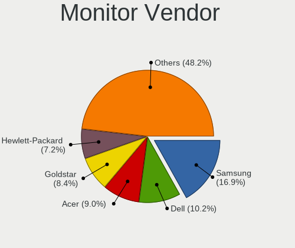

| Vendor               | Desktops | Percent |
|----------------------|----------|---------|
| Samsung Electronics  | 40       | 20.83%  |
| Goldstar             | 25       | 13.02%  |
| Acer                 | 18       | 9.38%   |
| Dell                 | 17       | 8.85%   |
| Hewlett-Packard      | 13       | 6.77%   |
| Ancor Communications | 13       | 6.77%   |
| AOC                  | 11       | 5.73%   |
| BenQ                 | 7        | 3.65%   |
| ViewSonic            | 5        | 2.6%    |
| Philips              | 5        | 2.6%    |
| Lenovo               | 4        | 2.08%   |
| Vestel Elektronik    | 3        | 1.56%   |
| ASUSTek Computer     | 3        | 1.56%   |
| Unknown              | 2        | 1.04%   |
| NEC Computers        | 2        | 1.04%   |
| MSI                  | 2        | 1.04%   |
| Iiyama               | 2        | 1.04%   |
| Eizo                 | 2        | 1.04%   |
| ZMT                  | 1        | 0.52%   |
| Vizio                | 1        | 0.52%   |
| Unknown (AAA)        | 1        | 0.52%   |
| SOG                  | 1        | 0.52%   |
| Ruijiang             | 1        | 0.52%   |
| Positivo             | 1        | 0.52%   |
| Microstep            | 1        | 0.52%   |
| Medion               | 1        | 0.52%   |
| INNOCN               | 1        | 0.52%   |
| HKC                  | 1        | 0.52%   |
| HJW                  | 1        | 0.52%   |
| Hitachi              | 1        | 0.52%   |
| HannStar             | 1        | 0.52%   |
| Grundig              | 1        | 0.52%   |
| Fujitsu Siemens      | 1        | 0.52%   |
| BOE                  | 1        | 0.52%   |
| Belinea              | 1        | 0.52%   |
| Unknown              | 1        | 0.52%   |

Monitor Model
-------------

Monitor models

| Model                                                                | Desktops | Percent |
|----------------------------------------------------------------------|----------|---------|
| Vestel Elektronik 32FHD_LCD_TV VES3700 1920x1080 700x400mm 31.7-inch | 3        | 1.52%   |
| Hewlett-Packard 2009 HWP2827 1600x900 440x250mm 19.9-inch            | 2        | 1.01%   |
| Goldstar W2043 GSM4E9D 1600x900 443x249mm 20.0-inch                  | 2        | 1.01%   |
| Goldstar FULL HD GSM5B55 1920x1080 480x270mm 21.7-inch               | 2        | 1.01%   |
| AOC 27G2G4 AOC2702 1920x1080 598x336mm 27.0-inch                     | 2        | 1.01%   |
| ZMT MZ240ED ZMT00F0 1920x1080 443x249mm 20.0-inch                    | 1        | 0.51%   |
| Vizio D32hn-E0 VIZ1007 1366x768 697x392mm 31.5-inch                  | 1        | 0.51%   |
| ViewSonic VX3258 series VSCDE35 2560x1440 700x390mm 31.5-inch        | 1        | 0.51%   |
| ViewSonic VX2252 Series VSCDC2E 1920x1080 477x268mm 21.5-inch        | 1        | 0.51%   |
| ViewSonic VP3481 VSC0938 3440x1440 797x333mm 34.0-inch               | 1        | 0.51%   |
| ViewSonic VG2239 Series VSCC42B 1920x1080 477x268mm 21.5-inch        | 1        | 0.51%   |
| ViewSonic VA2703 Series VSC622A 1920x1080 598x336mm 27.0-inch        | 1        | 0.51%   |
| Unknown LCD Monitor SAMSUNG 1920x1080                                | 1        | 0.51%   |
| Unknown LCD Monitor SAMSUNG 1366x768                                 | 1        | 0.51%   |
| Unknown (AAA) LCDTV AAA3393 1360x768 890x500mm 40.2-inch             | 1        | 0.51%   |
| SOG S-190G SOG1900 1440x900 410x220mm 18.3-inch                      | 1        | 0.51%   |
| Samsung Electronics U32E850 SAM0CE3 3840x2160 697x392mm 31.5-inch    | 1        | 0.51%   |
| Samsung Electronics U28E590 SAM0C4E 3840x2160 608x345mm 27.5-inch    | 1        | 0.51%   |
| Samsung Electronics SyncMaster SAM05CC 1920x1080 530x300mm 24.0-inch | 1        | 0.51%   |
| Samsung Electronics SyncMaster SAM0587 1920x1200 520x320mm 24.0-inch | 1        | 0.51%   |
| Samsung Electronics SyncMaster SAM0586 1920x1200 518x324mm 24.1-inch | 1        | 0.51%   |
| Samsung Electronics SyncMaster SAM04DF 1360x768 410x230mm 18.5-inch  | 1        | 0.51%   |
| Samsung Electronics SyncMaster SAM036F 1440x900 428x255mm 19.6-inch  | 1        | 0.51%   |
| Samsung Electronics SyncMaster SAM036A 1920x1080                     | 1        | 0.51%   |
| Samsung Electronics SyncMaster SAM02FA 1440x900 410x260mm 19.1-inch  | 1        | 0.51%   |
| Samsung Electronics SyncMaster SAM02B6 1920x1200 518x324mm 24.1-inch | 1        | 0.51%   |
| Samsung Electronics SyncMaster SAM01E1 1280x1024 376x301mm 19.0-inch | 1        | 0.51%   |
| Samsung Electronics SyncMaster SAM01B7 1280x1024 338x270mm 17.0-inch | 1        | 0.51%   |
| Samsung Electronics SyncMaster SAM00A1 1280x1024 338x270mm 17.0-inch | 1        | 0.51%   |
| Samsung Electronics S27E450 SAM0C84 1920x1080 598x336mm 27.0-inch    | 1        | 0.51%   |
| Samsung Electronics S27D390 SAM0B67 1920x1080 598x336mm 27.0-inch    | 1        | 0.51%   |
| Samsung Electronics S24F350 SAM0D21 1920x1080 521x293mm 23.5-inch    | 1        | 0.51%   |
| Samsung Electronics S24F350 SAM0D20 1920x1080 521x293mm 23.5-inch    | 1        | 0.51%   |
| Samsung Electronics S24D590 SAM0B46 1920x1080 521x293mm 23.5-inch    | 1        | 0.51%   |
| Samsung Electronics S24B300 SAM08B2 1920x1080 531x299mm 24.0-inch    | 1        | 0.51%   |
| Samsung Electronics S24A31x SAM7114 1920x1080 527x296mm 23.8-inch    | 1        | 0.51%   |
| Samsung Electronics S22F350 SAM0D1B 1920x1080 477x268mm 21.5-inch    | 1        | 0.51%   |
| Samsung Electronics S22E450 SAM0C7C 1680x1050 473x291mm 21.9-inch    | 1        | 0.51%   |
| Samsung Electronics S22E310 SAM0C2D 1920x1080 477x268mm 21.5-inch    | 1        | 0.51%   |
| Samsung Electronics S19B300 SAM08A5 1366x768 410x230mm 18.5-inch     | 1        | 0.51%   |

Monitor Resolution
------------------

Monitor screen resolution

| Resolution         | Desktops | Percent |
|--------------------|----------|---------|
| 1920x1080 (FHD)    | 89       | 47.85%  |
| 3840x2160 (4K)     | 24       | 12.9%   |
| 2560x1440 (QHD)    | 13       | 6.99%   |
| 1280x1024 (SXGA)   | 13       | 6.99%   |
| 1366x768 (WXGA)    | 11       | 5.91%   |
| 1440x900 (WXGA+)   | 8        | 4.3%    |
| 1920x1200 (WUXGA)  | 6        | 3.23%   |
| 1600x900 (HD+)     | 6        | 3.23%   |
| 3440x1440          | 3        | 1.61%   |
| 1680x1050 (WSXGA+) | 3        | 1.61%   |
| 1360x768           | 2        | 1.08%   |
| 5760x2160          | 1        | 0.54%   |
| 3840x1600          | 1        | 0.54%   |
| 3840x1080          | 1        | 0.54%   |
| 2560x1080          | 1        | 0.54%   |
| 1600x1200          | 1        | 0.54%   |
| 1280x960           | 1        | 0.54%   |
| 1024x768 (XGA)     | 1        | 0.54%   |
| Unknown            | 1        | 0.54%   |

Monitor Diagonal
----------------

Diagonal size in inches

| Inches  | Desktops | Percent |
|---------|----------|---------|
| 27      | 34       | 17.62%  |
| 24      | 26       | 13.47%  |
| 23      | 24       | 12.44%  |
| 21      | 22       | 11.4%   |
| Unknown | 19       | 9.84%   |
| 19      | 16       | 8.29%   |
| 20      | 8        | 4.15%   |
| 84      | 7        | 3.63%   |
| 18      | 7        | 3.63%   |
| 17      | 5        | 2.59%   |
| 34      | 4        | 2.07%   |
| 31      | 3        | 1.55%   |
| 40      | 2        | 1.04%   |
| 32      | 2        | 1.04%   |
| 22      | 2        | 1.04%   |
| 86      | 1        | 0.52%   |
| 72      | 1        | 0.52%   |
| 54      | 1        | 0.52%   |
| 46      | 1        | 0.52%   |
| 43      | 1        | 0.52%   |
| 42      | 1        | 0.52%   |
| 38      | 1        | 0.52%   |
| 37      | 1        | 0.52%   |
| 28      | 1        | 0.52%   |
| 15      | 1        | 0.52%   |
| 14      | 1        | 0.52%   |
| 13      | 1        | 0.52%   |

Monitor Width
-------------

Physical width

| Width in mm | Desktops | Percent |
|-------------|----------|---------|
| 501-600     | 74       | 39.36%  |
| 401-500     | 46       | 24.47%  |
| Unknown     | 19       | 10.11%  |
| 351-400     | 10       | 5.32%   |
| 601-700     | 9        | 4.79%   |
| 1501-2000   | 9        | 4.79%   |
| 301-350     | 7        | 3.72%   |
| 701-800     | 6        | 3.19%   |
| 801-900     | 4        | 2.13%   |
| 1001-1500   | 3        | 1.6%    |
| 901-1000    | 1        | 0.53%   |

Aspect Ratio
------------

Proportional relationship between the width and the height

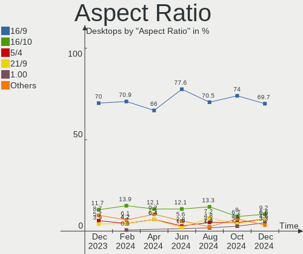

| Ratio   | Desktops | Percent |
|---------|----------|---------|
| 16/9    | 126      | 71.59%  |
| Unknown | 15       | 8.52%   |
| 16/10   | 14       | 7.95%   |
| 5/4     | 13       | 7.39%   |
| 21/9    | 5        | 2.84%   |
| 4/3     | 2        | 1.14%   |
| 32/9    | 1        | 0.57%   |

Monitor Area
------------

Area in inch²

| Area in inch² | Desktops | Percent |
|----------------|----------|---------|
| 201-250        | 60       | 31.41%  |
| 301-350        | 34       | 17.8%   |
| 151-200        | 28       | 14.66%  |
| Unknown        | 19       | 9.95%   |
| 351-500        | 11       | 5.76%   |
| More than 1000 | 10       | 5.24%   |
| 141-150        | 10       | 5.24%   |
| 251-300        | 9        | 4.71%   |
| 501-1000       | 6        | 3.14%   |
| 81-90          | 2        | 1.05%   |
| 131-140        | 1        | 0.52%   |
| 101-110        | 1        | 0.52%   |

Pixel Density
-------------

Pixels per inch

| Density | Desktops | Percent |
|---------|----------|---------|
| 51-100  | 110      | 60.77%  |
| 101-120 | 38       | 20.99%  |
| Unknown | 19       | 10.5%   |
| 121-160 | 8        | 4.42%   |
| 1-50    | 4        | 2.21%   |
| 161-240 | 2        | 1.1%    |

Multiple Monitors
-----------------

Total monitors connected

| Total | Desktops | Percent |
|-------|----------|---------|
| 1     | 159      | 82.81%  |
| 2     | 21       | 10.94%  |
| 0     | 6        | 3.13%   |
| 3     | 5        | 2.6%    |
| 4     | 1        | 0.52%   |

Network
-------

Net Controller Vendor
---------------------

Controller vendors

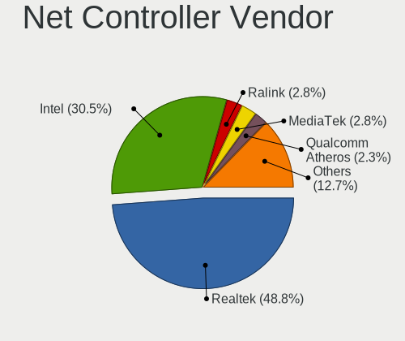

| Vendor                           | Desktops | Percent |
|----------------------------------|----------|---------|
| Realtek Semiconductor            | 125      | 45.13%  |
| Intel                            | 85       | 30.69%  |
| Qualcomm Atheros                 | 12       | 4.33%   |
| TP-Link                          | 11       | 3.97%   |
| Ralink Technology                | 7        | 2.53%   |
| D-Link System                    | 4        | 1.44%   |
| VIA Technologies                 | 3        | 1.08%   |
| MediaTek                         | 3        | 1.08%   |
| Broadcom                         | 3        | 1.08%   |
| Qualcomm Atheros Communications  | 2        | 0.72%   |
| Nvidia                           | 2        | 0.72%   |
| Belkin Components                | 2        | 0.72%   |
| ASIX Electronics                 | 2        | 0.72%   |
| ZyXEL Communications             | 1        | 0.36%   |
| Xiaomi                           | 1        | 0.36%   |
| Silicon Integrated Systems [SiS] | 1        | 0.36%   |
| ROCCAT                           | 1        | 0.36%   |
| Ralink                           | 1        | 0.36%   |
| OPPO Electronics                 | 1        | 0.36%   |
| Microsoft                        | 1        | 0.36%   |
| Microchip Technology             | 1        | 0.36%   |
| Marvell Technology Group         | 1        | 0.36%   |
| Linksys                          | 1        | 0.36%   |
| JMicron Technology               | 1        | 0.36%   |
| Huawei Technologies              | 1        | 0.36%   |
| Edimax Technology                | 1        | 0.36%   |
| D-Link                           | 1        | 0.36%   |
| Broadcom Limited                 | 1        | 0.36%   |
| Aquantia                         | 1        | 0.36%   |

Net Controller Model
--------------------

Controller models

| Model                                                             | Desktops | Percent |
|-------------------------------------------------------------------|----------|---------|
| Realtek RTL8111/8168/8411 PCI Express Gigabit Ethernet Controller | 96       | 29.91%  |
| Realtek RTL8125 2.5GbE Controller                                 | 15       | 4.67%   |
| Intel 82579LM Gigabit Network Connection (Lewisville)             | 13       | 4.05%   |
| Intel Wi-Fi 6 AX200                                               | 9        | 2.8%    |
| Intel I211 Gigabit Network Connection                             | 9        | 2.8%    |
| Intel Ethernet Connection (7) I219-V                              | 9        | 2.8%    |
| Intel Ethernet Controller I225-V                                  | 7        | 2.18%   |
| Intel Ethernet Connection (2) I219-V                              | 7        | 2.18%   |
| Realtek 802.11ac NIC                                              | 6        | 1.87%   |
| Realtek RTL88x2bu [AC1200 Techkey]                                | 5        | 1.56%   |
| Ralink MT7601U Wireless Adapter                                   | 5        | 1.56%   |
| Intel Wi-Fi 6 AX210/AX211/AX411 160MHz                            | 5        | 1.56%   |
| TP-Link TL-WN823N v2/v3 [Realtek RTL8192EU]                       | 4        | 1.25%   |
| Realtek RTL810xE PCI Express Fast Ethernet controller             | 4        | 1.25%   |
| Qualcomm Atheros AR93xx Wireless Network Adapter                  | 4        | 1.25%   |
| Intel Cannon Lake PCH CNVi WiFi                                   | 4        | 1.25%   |
| VIA VT6102/VT6103 [Rhine-II]                                      | 3        | 0.93%   |
| Realtek RTL8192EE PCIe Wireless Network Adapter                   | 3        | 0.93%   |
| Intel Ethernet Controller I226-V                                  | 3        | 0.93%   |
| Intel Ethernet Connection I217-V                                  | 3        | 0.93%   |
| Intel Dual Band Wireless-AC 3168NGW [Stone Peak]                  | 3        | 0.93%   |
| Intel 700 Series Chipset Family Wi-Fi                             | 3        | 0.93%   |
| TP-Link AC600 wireless Realtek RTL8811AU [Archer T2U Nano]        | 2        | 0.62%   |
| Realtek RTL8821CE 802.11ac PCIe Wireless Network Adapter          | 2        | 0.62%   |
| Realtek RTL8188EUS 802.11n Wireless Network Adapter               | 2        | 0.62%   |
| Realtek RTL8153 Gigabit Ethernet Adapter                          | 2        | 0.62%   |
| Qualcomm Atheros AR8151 v2.0 Gigabit Ethernet                     | 2        | 0.62%   |
| Nvidia MCP61 Ethernet                                             | 2        | 0.62%   |
| MediaTek MT7922 802.11ax PCI Express Wireless Network Adapter     | 2        | 0.62%   |
| Intel Wireless-AC 9260                                            | 2        | 0.62%   |
| Intel Wireless 7260                                               | 2        | 0.62%   |
| Intel Ethernet Connection (2) I218-V                              | 2        | 0.62%   |
| Intel Alder Lake-S PCH CNVi WiFi                                  | 2        | 0.62%   |
| Intel 82578DM Gigabit Network Connection                          | 2        | 0.62%   |
| Intel 82574L Gigabit Network Connection                           | 2        | 0.62%   |
| ZyXEL ZyXEL Dual-Band Wireless AC USB Adapter                     | 1        | 0.31%   |
| Xiaomi Mi/Redmi series (RNDIS)                                    | 1        | 0.31%   |
| TP-Link TL-WN821N v5/v6 [RTL8192EU]                               | 1        | 0.31%   |
| TP-Link Archer T4U ver.3                                          | 1        | 0.31%   |
| TP-Link Archer T3U [Realtek RTL8812BU]                            | 1        | 0.31%   |

Wireless Vendor
---------------

Wireless vendors

| Vendor                          | Desktops | Percent |
|---------------------------------|----------|---------|
| Intel                           | 36       | 33.33%  |
| Realtek Semiconductor           | 29       | 26.85%  |
| TP-Link                         | 11       | 10.19%  |
| Qualcomm Atheros                | 9        | 8.33%   |
| Ralink Technology               | 7        | 6.48%   |
| MediaTek                        | 3        | 2.78%   |
| D-Link System                   | 3        | 2.78%   |
| Qualcomm Atheros Communications | 2        | 1.85%   |
| ZyXEL Communications            | 1        | 0.93%   |
| Ralink                          | 1        | 0.93%   |
| Microsoft                       | 1        | 0.93%   |
| Linksys                         | 1        | 0.93%   |
| Edimax Technology               | 1        | 0.93%   |
| D-Link                          | 1        | 0.93%   |
| Broadcom                        | 1        | 0.93%   |
| Belkin Components               | 1        | 0.93%   |

Wireless Model
--------------

Wireless models

| Model                                                                                         | Desktops | Percent |
|-----------------------------------------------------------------------------------------------|----------|---------|
| Intel Wi-Fi 6 AX200                                                                           | 9        | 8.26%   |
| Realtek 802.11ac NIC                                                                          | 6        | 5.5%    |
| Realtek RTL88x2bu [AC1200 Techkey]                                                            | 5        | 4.59%   |
| Ralink MT7601U Wireless Adapter                                                               | 5        | 4.59%   |
| Intel Wi-Fi 6 AX210/AX211/AX411 160MHz                                                        | 5        | 4.59%   |
| TP-Link TL-WN823N v2/v3 [Realtek RTL8192EU]                                                   | 4        | 3.67%   |
| Qualcomm Atheros AR93xx Wireless Network Adapter                                              | 4        | 3.67%   |
| Intel Cannon Lake PCH CNVi WiFi                                                               | 4        | 3.67%   |
| Realtek RTL8192EE PCIe Wireless Network Adapter                                               | 3        | 2.75%   |
| Intel Dual Band Wireless-AC 3168NGW [Stone Peak]                                              | 3        | 2.75%   |
| Intel 700 Series Chipset Family Wi-Fi                                                         | 3        | 2.75%   |
| TP-Link AC600 wireless Realtek RTL8811AU [Archer T2U Nano]                                    | 2        | 1.83%   |
| Realtek RTL8821CE 802.11ac PCIe Wireless Network Adapter                                      | 2        | 1.83%   |
| Realtek RTL8188EUS 802.11n Wireless Network Adapter                                           | 2        | 1.83%   |
| MediaTek MT7922 802.11ax PCI Express Wireless Network Adapter                                 | 2        | 1.83%   |
| Intel Wireless-AC 9260                                                                        | 2        | 1.83%   |
| Intel Wireless 7260                                                                           | 2        | 1.83%   |
| Intel Alder Lake-S PCH CNVi WiFi                                                              | 2        | 1.83%   |
| ZyXEL ZyXEL Dual-Band Wireless AC USB Adapter                                                 | 1        | 0.92%   |
| TP-Link TL-WN821N v5/v6 [RTL8192EU]                                                           | 1        | 0.92%   |
| TP-Link Archer T4U ver.3                                                                      | 1        | 0.92%   |
| TP-Link Archer T3U [Realtek RTL8812BU]                                                        | 1        | 0.92%   |
| TP-Link Archer T2U PLUS [RTL8821AU]                                                           | 1        | 0.92%   |
| TP-Link 802.11n NIC                                                                           | 1        | 0.92%   |
| Realtek RTL8822BE 802.11a/b/g/n/ac WiFi adapter                                               | 1        | 0.92%   |
| Realtek RTL8723BU 802.11b/g/n WLAN Adapter                                                    | 1        | 0.92%   |
| Realtek RTL8723BE PCIe Wireless Network Adapter                                               | 1        | 0.92%   |
| Realtek RTL8191SU 802.11n WLAN Adapter                                                        | 1        | 0.92%   |
| Realtek RTL8191SEvB Wireless LAN Controller                                                   | 1        | 0.92%   |
| Realtek RTL8188FTV 802.11b/g/n 1T1R 2.4G WLAN Adapter                                         | 1        | 0.92%   |
| Realtek RTL8188EE Wireless Network Adapter                                                    | 1        | 0.92%   |
| Realtek RTL8188CUS 802.11n WLAN Adapter                                                       | 1        | 0.92%   |
| Realtek RTL8187 Wireless Adapter                                                              | 1        | 0.92%   |
| Realtek Realtek 8812AU/8821AU 802.11ac WLAN Adapter [USB Wireless Dual-Band Adapter 2.4/5Ghz] | 1        | 0.92%   |
| Realtek 802.11n WLAN Adapter                                                                  | 1        | 0.92%   |
| Realtek 802.11ac WLAN Adapter                                                                 | 1        | 0.92%   |
| Ralink RT5372 Wireless Adapter                                                                | 1        | 0.92%   |
| Ralink RT5370 Wireless Adapter                                                                | 1        | 0.92%   |
| Ralink RT3290 Wireless 802.11n 1T/1R PCIe                                                     | 1        | 0.92%   |
| Qualcomm Atheros QCA9565 / AR9565 Wireless Network Adapter                                    | 1        | 0.92%   |

Ethernet Vendor
---------------

Ethernet vendors

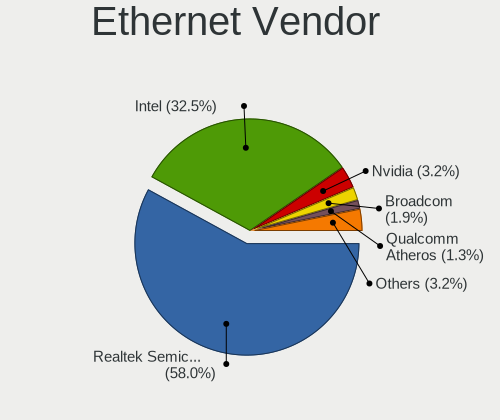

| Vendor                           | Desktops | Percent |
|----------------------------------|----------|---------|
| Realtek Semiconductor            | 115      | 57.21%  |
| Intel                            | 64       | 31.84%  |
| Qualcomm Atheros                 | 4        | 1.99%   |
| VIA Technologies                 | 3        | 1.49%   |
| Nvidia                           | 2        | 1%      |
| Broadcom                         | 2        | 1%      |
| ASIX Electronics                 | 2        | 1%      |
| Xiaomi                           | 1        | 0.5%    |
| Silicon Integrated Systems [SiS] | 1        | 0.5%    |
| OPPO Electronics                 | 1        | 0.5%    |
| Marvell Technology Group         | 1        | 0.5%    |
| JMicron Technology               | 1        | 0.5%    |
| D-Link System                    | 1        | 0.5%    |
| Broadcom Limited                 | 1        | 0.5%    |
| Belkin Components                | 1        | 0.5%    |
| Aquantia                         | 1        | 0.5%    |

Ethernet Model
--------------

Ethernet models

| Model                                                                         | Desktops | Percent |
|-------------------------------------------------------------------------------|----------|---------|
| Realtek RTL8111/8168/8411 PCI Express Gigabit Ethernet Controller             | 96       | 45.93%  |
| Realtek RTL8125 2.5GbE Controller                                             | 15       | 7.18%   |
| Intel 82579LM Gigabit Network Connection (Lewisville)                         | 13       | 6.22%   |
| Intel I211 Gigabit Network Connection                                         | 9        | 4.31%   |
| Intel Ethernet Connection (7) I219-V                                          | 9        | 4.31%   |
| Intel Ethernet Controller I225-V                                              | 7        | 3.35%   |
| Intel Ethernet Connection (2) I219-V                                          | 7        | 3.35%   |
| Realtek RTL810xE PCI Express Fast Ethernet controller                         | 4        | 1.91%   |
| VIA VT6102/VT6103 [Rhine-II]                                                  | 3        | 1.44%   |
| Intel Ethernet Controller I226-V                                              | 3        | 1.44%   |
| Intel Ethernet Connection I217-V                                              | 3        | 1.44%   |
| Realtek RTL8153 Gigabit Ethernet Adapter                                      | 2        | 0.96%   |
| Qualcomm Atheros AR8151 v2.0 Gigabit Ethernet                                 | 2        | 0.96%   |
| Nvidia MCP61 Ethernet                                                         | 2        | 0.96%   |
| Intel Ethernet Connection (2) I218-V                                          | 2        | 0.96%   |
| Intel 82578DM Gigabit Network Connection                                      | 2        | 0.96%   |
| Intel 82574L Gigabit Network Connection                                       | 2        | 0.96%   |
| Xiaomi Mi/Redmi series (RNDIS)                                                | 1        | 0.48%   |
| Silicon Integrated Systems [SiS] 191 Gigabit Ethernet Adapter                 | 1        | 0.48%   |
| Qualcomm Atheros Killer E220x Gigabit Ethernet Controller                     | 1        | 0.48%   |
| Qualcomm Atheros AR8131 Gigabit Ethernet                                      | 1        | 0.48%   |
| OPPO CPH2411                                                                  | 1        | 0.48%   |
| Marvell Group 88E8056 PCI-E Gigabit Ethernet Controller                       | 1        | 0.48%   |
| JMicron JMC260 PCI Express Fast Ethernet Controller                           | 1        | 0.48%   |
| Intel Ethernet Connection (7) I219-LM                                         | 1        | 0.48%   |
| Intel Ethernet Connection (5) I219-LM                                         | 1        | 0.48%   |
| Intel Ethernet Connection (14) I219-V                                         | 1        | 0.48%   |
| Intel Ethernet Connection (13) I219-V                                         | 1        | 0.48%   |
| Intel Ethernet Connection (11) I219-V                                         | 1        | 0.48%   |
| Intel Ethernet Connection (11) I219-LM                                        | 1        | 0.48%   |
| Intel Ethernet Connection (10) I219-V                                         | 1        | 0.48%   |
| Intel 82599ES 10-Gigabit SFI/SFP+ Network Connection                          | 1        | 0.48%   |
| Intel 82583V Gigabit Network Connection                                       | 1        | 0.48%   |
| Intel 82571EB/82571GB Gigabit Ethernet Controller D0/D1 (copper applications) | 1        | 0.48%   |
| Intel 82567LM-3 Gigabit Network Connection                                    | 1        | 0.48%   |
| Intel 82567LF-3 Gigabit Network Connection                                    | 1        | 0.48%   |
| Intel 82566DM-2 Gigabit Network Connection                                    | 1        | 0.48%   |
| D-Link System DGE-528T Gigabit Ethernet Adapter                               | 1        | 0.48%   |
| Broadcom NetXtreme BCM5752 Gigabit Ethernet PCI Express                       | 1        | 0.48%   |
| Broadcom NetLink BCM5784M Gigabit Ethernet PCIe                               | 1        | 0.48%   |

Net Controller Kind
-------------------

Ethernet, WiFi or modem

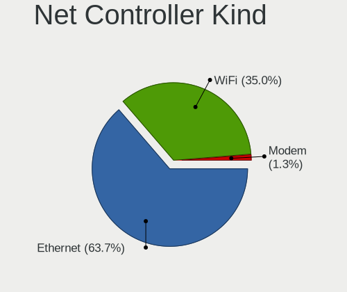

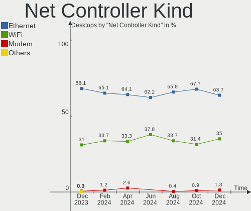

| Kind     | Desktops | Percent |
|----------|----------|---------|
| Ethernet | 192      | 65.53%  |
| WiFi     | 98       | 33.45%  |
| Modem    | 2        | 0.68%   |
| Unknown  | 1        | 0.34%   |

Used Controller
---------------

Currently used network controller

| Kind     | Desktops | Percent |
|----------|----------|---------|
| Ethernet | 145      | 72.5%   |
| WiFi     | 55       | 27.5%   |

NICs
----

Total network controllers on board

| Total | Desktops | Percent |
|-------|----------|---------|
| 1     | 117      | 60.94%  |
| 2     | 66       | 34.38%  |
| 3     | 4        | 2.08%   |
| 4     | 2        | 1.04%   |
| 0     | 2        | 1.04%   |
| 10    | 1        | 0.52%   |

IPv6
----

IPv6 vs IPv4

| Used | Desktops | Percent |
|------|----------|---------|
| No   | 112      | 58.33%  |
| Yes  | 80       | 41.67%  |

Bluetooth
---------

Bluetooth Vendor
----------------

Controller vendors

| Vendor                          | Desktops | Percent |
|---------------------------------|----------|---------|
| Intel                           | 35       | 45.45%  |
| Cambridge Silicon Radio         | 18       | 23.38%  |
| Realtek Semiconductor           | 6        | 7.79%   |
| TP-Link                         | 4        | 5.19%   |
| Qualcomm Atheros Communications | 3        | 3.9%    |
| ASUSTek Computer                | 3        | 3.9%    |
| Broadcom                        | 2        | 2.6%    |
| Ralink                          | 1        | 1.3%    |
| MediaTek                        | 1        | 1.3%    |
| Integrated System Solution      | 1        | 1.3%    |
| IMC Networks                    | 1        | 1.3%    |
| Belkin Components               | 1        | 1.3%    |
| Unknown                         | 1        | 1.3%    |

Bluetooth Model
---------------

Controller models

| Model                                                 | Desktops | Percent |
|-------------------------------------------------------|----------|---------|
| Cambridge Silicon Radio Bluetooth Dongle (HCI mode)   | 18       | 23.38%  |
| Intel AX200 Bluetooth                                 | 8        | 10.39%  |
| Realtek Bluetooth Radio                               | 5        | 6.49%   |
| Intel AX210 Bluetooth                                 | 5        | 6.49%   |
| Intel AX201 Bluetooth                                 | 5        | 6.49%   |
| TP-Link UB500 Adapter                                 | 4        | 5.19%   |
| Intel Bluetooth wireless interface                    | 4        | 5.19%   |
| Intel Bluetooth 9460/9560 Jefferson Peak (JfP)        | 4        | 5.19%   |
| Intel Wireless-AC 3168 Bluetooth                      | 3        | 3.9%    |
| Intel Bluetooth Device                                | 3        | 3.9%    |
| Qualcomm Atheros  Bluetooth Device                    | 2        | 2.6%    |
| Intel Wireless-AC 9260 Bluetooth Adapter              | 2        | 2.6%    |
| ASUS ASUS USB-BT500                                   | 2        | 2.6%    |
| Realtek  Bluetooth 4.2 Adapter                        | 1        | 1.3%    |
| Ralink RT3290 Bluetooth                               | 1        | 1.3%    |
| Qualcomm Atheros Bluetooth USB Host Controller        | 1        | 1.3%    |
| MediaTek Wireless_Device                              | 1        | 1.3%    |
| Intel Centrino Bluetooth Wireless Transceiver         | 1        | 1.3%    |
| Integrated System Solution KY-BT100 Bluetooth Adapter | 1        | 1.3%    |
| IMC Networks Wireless_Device                          | 1        | 1.3%    |
| Broadcom BCM20702A0 Bluetooth 4.0                     | 1        | 1.3%    |
| Broadcom ANYCOM Blue USB-UHE 200/250                  | 1        | 1.3%    |
| Belkin Components Bluetooth Mini Dongle               | 1        | 1.3%    |
| ASUS Bluetooth Radio                                  | 1        | 1.3%    |
| Unknown                                               | 1        | 1.3%    |

Sound
-----

Sound Vendor
------------

Sound card vendors

| Vendor                           | Desktops | Percent |
|----------------------------------|----------|---------|
| Intel                            | 116      | 35.15%  |
| AMD                              | 89       | 26.97%  |
| Nvidia                           | 65       | 19.7%   |
| C-Media Electronics              | 9        | 2.73%   |
| Logitech                         | 6        | 1.82%   |
| Micro Star International         | 5        | 1.52%   |
| Creative Labs                    | 4        | 1.21%   |
| VIA Technologies                 | 3        | 0.91%   |
| ASUSTek Computer                 | 3        | 0.91%   |
| SteelSeries ApS                  | 2        | 0.61%   |
| Kingston Technology              | 2        | 0.61%   |
| iCreate Technologies             | 2        | 0.61%   |
| Blue Microphones                 | 2        | 0.61%   |
| Zeroplus                         | 1        | 0.3%    |
| Silicon Integrated Systems [SiS] | 1        | 0.3%    |
| Scarlett                         | 1        | 0.3%    |
| Razer USA                        | 1        | 0.3%    |
| QinHeng Electronics              | 1        | 0.3%    |
| PreSonus Audio Electronics       | 1        | 0.3%    |
| Plantronics                      | 1        | 0.3%    |
| Pioneer DJ                       | 1        | 0.3%    |
| Oculus VR                        | 1        | 0.3%    |
| Mytek Digital                    | 1        | 0.3%    |
| Micronas                         | 1        | 0.3%    |
| Mark of the Unicorn              | 1        | 0.3%    |
| Giga-Byte Technology             | 1        | 0.3%    |
| Generalplus Technology           | 1        | 0.3%    |
| Dell                             | 1        | 0.3%    |
| Cyber Acoustics                  | 1        | 0.3%    |
| Creative Technology              | 1        | 0.3%    |
| Asahi Kasei Microsystems         | 1        | 0.3%    |
| Arturia                          | 1        | 0.3%    |
| Alesis                           | 1        | 0.3%    |
| AKAI Professional M.I.           | 1        | 0.3%    |
| Afatech                          | 1        | 0.3%    |

Sound Model
-----------

Sound card models

| Model                                                                                           | Desktops | Percent |
|-------------------------------------------------------------------------------------------------|----------|---------|
| Intel 6 Series/C200 Series Chipset Family High Definition Audio Controller                      | 19       | 5%      |
| AMD Family 17h/19h HD Audio Controller                                                          | 17       | 4.47%   |
| Intel 8 Series/C220 Series Chipset High Definition Audio Controller                             | 16       | 4.21%   |
| AMD SBx00 Azalia (Intel HDA)                                                                    | 16       | 4.21%   |
| AMD Starship/Matisse HD Audio Controller                                                        | 15       | 3.95%   |
| Nvidia GK208 HDMI/DP Audio Controller                                                           | 12       | 3.16%   |
| Intel Cannon Lake PCH cAVS                                                                      | 11       | 2.89%   |
| AMD Family 17h (Models 00h-0fh) HD Audio Controller                                             | 11       | 2.89%   |
| Intel Xeon E3-1200 v3/4th Gen Core Processor HD Audio Controller                                | 10       | 2.63%   |
| Intel 7 Series/C216 Chipset Family High Definition Audio Controller                             | 10       | 2.63%   |
| AMD Oland/Hainan/Cape Verde/Pitcairn HDMI Audio [Radeon HD 7000 Series]                         | 10       | 2.63%   |
| AMD Ellesmere HDMI Audio [Radeon RX 470/480 / 570/580/590]                                      | 9        | 2.37%   |
| Intel 200 Series PCH HD Audio                                                                   | 8        | 2.11%   |
| AMD Raven/Raven2/Fenghuang HDMI/DP Audio Controller                                             | 8        | 2.11%   |
| Intel 5 Series/3400 Series Chipset High Definition Audio                                        | 6        | 1.58%   |
| AMD Renoir Radeon High Definition Audio Controller                                              | 6        | 1.58%   |
| AMD Navi 21/23 HDMI/DP Audio Controller                                                         | 6        | 1.58%   |
| AMD Baffin HDMI/DP Audio [Radeon RX 550 640SP / RX 560/560X]                                    | 6        | 1.58%   |
| Nvidia TU107 GeForce GTX 1650 High Definition Audio Controller                                  | 5        | 1.32%   |
| Nvidia TU106 High Definition Audio Controller                                                   | 5        | 1.32%   |
| Nvidia High Definition Audio Controller                                                         | 5        | 1.32%   |
| Micro Star International USB Audio                                                              | 5        | 1.32%   |
| Intel Alder Lake-S HD Audio Controller                                                          | 5        | 1.32%   |
| Intel 100 Series/C230 Series Chipset Family HD Audio Controller                                 | 5        | 1.32%   |
| Nvidia GA106 High Definition Audio Controller                                                   | 4        | 1.05%   |
| Intel NM10/ICH7 Family High Definition Audio Controller                                         | 4        | 1.05%   |
| Nvidia TU104 HD Audio Controller                                                                | 3        | 0.79%   |
| Nvidia GP108 High Definition Audio Controller                                                   | 3        | 0.79%   |
| Nvidia GP107GL High Definition Audio Controller                                                 | 3        | 0.79%   |
| Nvidia GA104 High Definition Audio Controller                                                   | 3        | 0.79%   |
| Nvidia Audio device                                                                             | 3        | 0.79%   |
| Intel Comet Lake PCH cAVS                                                                       | 3        | 0.79%   |
| Intel 9 Series Chipset Family HD Audio Controller                                               | 3        | 0.79%   |
| Intel 82801JI (ICH10 Family) HD Audio Controller                                                | 3        | 0.79%   |
| Intel 82801I (ICH9 Family) HD Audio Controller                                                  | 3        | 0.79%   |
| Intel 700 Series Chipset Family Precise Touch and Stylus Port #1                                | 3        | 0.79%   |
| Creative Labs CA0132 Sound Core3D [Sound Blaster Recon3D / Z-Series / Sound BlasterX AE-5 Plus] | 3        | 0.79%   |
| AMD Redwood HDMI Audio [Radeon HD 5000 Series]                                                  | 3        | 0.79%   |
| AMD FCH Azalia Controller                                                                       | 3        | 0.79%   |
| AMD Cedar HDMI Audio [Radeon HD 5400/6300/7300 Series]                                          | 3        | 0.79%   |

Memory
------

Memory Vendor
-------------

Memory module vendors

| Vendor              | Desktops | Percent |
|---------------------|----------|---------|
| Kingston            | 13       | 15.66%  |
| Corsair             | 13       | 15.66%  |
| G.Skill             | 10       | 12.05%  |
| Unknown             | 9        | 10.84%  |
| SK hynix            | 8        | 9.64%   |
| Crucial             | 8        | 9.64%   |
| Samsung Electronics | 6        | 7.23%   |
| A-DATA Technology   | 4        | 4.82%   |
| Team                | 2        | 2.41%   |
| AMD                 | 2        | 2.41%   |
| Transcend           | 1        | 1.2%    |
| TakeMS              | 1        | 1.2%    |
| Micron Technology   | 1        | 1.2%    |
| Kllisre             | 1        | 1.2%    |
| Kingmax             | 1        | 1.2%    |
| Exceleram           | 1        | 1.2%    |
| Apacer              | 1        | 1.2%    |
| Unknown             | 1        | 1.2%    |

Memory Model
------------

Memory module models

| Model                                                    | Desktops | Percent |
|----------------------------------------------------------|----------|---------|
| Unknown RAM Module 4GB DIMM SDRAM                        | 2        | 2.25%   |
| Kingston RAM Module 8GB DIMM DDR3 1333MT/s               | 2        | 2.25%   |
| Corsair RAM CMK16GX4M2B3200C16 8192MB DIMM DDR4 3600MT/s | 2        | 2.25%   |
| Unknown RAM Module 8192MB DIMM DDR3 1333MT/s             | 1        | 1.12%   |
| Unknown RAM Module 2GB DIMM DDR2 800MT/s                 | 1        | 1.12%   |
| Unknown RAM Module 2GB DIMM DDR2 667MT/s                 | 1        | 1.12%   |
| Unknown RAM Module 2GB DIMM 1066MT/s                     | 1        | 1.12%   |
| Unknown RAM Module 2048MB DIMM 800MT/s                   | 1        | 1.12%   |
| Unknown RAM Module 2048MB DIMM 667MT/s                   | 1        | 1.12%   |
| Unknown RAM Module 16GB DIMM DDR4 2133MT/s               | 1        | 1.12%   |
| Transcend RAM JM800QLU-2G 2GB DIMM DDR2 2048MT/s         | 1        | 1.12%   |
| Team RAM TEAMGROUP-UD4-3200 8GB DIMM DDR4 3800MT/s       | 1        | 1.12%   |
| Team RAM Elite-1333 4GB DIMM 1333MT/s                    | 1        | 1.12%   |
| TakeMS RAM TMS4GB364E081139EN 4GB DIMM DDR3 1333MT/s     | 1        | 1.12%   |
| SK hynix RAM Module 8GB DIMM DDR3 1600MT/s               | 1        | 1.12%   |
| SK hynix RAM Module 8GB DIMM DDR3 1333MT/s               | 1        | 1.12%   |
| SK hynix RAM Module 4GB DIMM DDR3 1333MT/s               | 1        | 1.12%   |
| SK hynix RAM HMT451U6AFR8C-PB 4096MB DIMM DDR3 1600MT/s  | 1        | 1.12%   |
| SK hynix RAM HMT451U6AFR8A-PB 4096MB DIMM DDR3 1600MT/s  | 1        | 1.12%   |
| SK hynix RAM HMT451S6BFR8A-PB 4GB SODIMM DDR3 1600MT/s   | 1        | 1.12%   |
| SK hynix RAM HMT351S6CFR8C-PB 4GB SODIMM DDR3 1600MT/s   | 1        | 1.12%   |
| SK hynix RAM HMA82GU6DJR8N-VK 16GB DIMM DDR4 2666MT/s    | 1        | 1.12%   |
| Samsung RAM Module 4096MB DIMM DDR3 1333MT/s             | 1        | 1.12%   |
| Samsung RAM Module 2GB DIMM DDR3 1333MT/s                | 1        | 1.12%   |
| Samsung RAM M378B5273DH0-CH9 4096MB DIMM DDR3 2133MT/s   | 1        | 1.12%   |
| Samsung RAM M378B5173QH0-CK0 4GB DIMM DDR3 1600MT/s      | 1        | 1.12%   |
| Samsung RAM M378A5143DB0-CPB 4GB DIMM DDR4 2400MT/s      | 1        | 1.12%   |
| Samsung RAM M378A2K43DB1-CVF 16GB DIMM DDR4 2933MT/s     | 1        | 1.12%   |
| Micron RAM 16JTF25664AY-1G4D1 2GB DIMM 1333MT/s          | 1        | 1.12%   |
| Kllisre RAM KRE-D3U1333M/4G 4GB DIMM DDR3 1333MT/s       | 1        | 1.12%   |
| Kingston RAM Module 4GB DIMM DDR3 1600MT/s               | 1        | 1.12%   |
| Kingston RAM KHX4000C19D4/8GX 8GB DIMM DDR4 3600MT/s     | 1        | 1.12%   |
| Kingston RAM KHX3200C16D4/8GX 8GB DIMM DDR4 3600MT/s     | 1        | 1.12%   |
| Kingston RAM KHX3200C16D4/16GX 16GB DIMM DDR4 3600MT/s   | 1        | 1.12%   |
| Kingston RAM KHX1866C10D3/8G 8GB DIMM DDR3 2133MT/s      | 1        | 1.12%   |
| Kingston RAM KHX1600C9D3/8GX 8GB DIMM DDR3 2133MT/s      | 1        | 1.12%   |
| Kingston RAM KHX1600C10D3/8GX 8GB DIMM DDR3 1600MT/s     | 1        | 1.12%   |
| Kingston RAM KHX1600C10D3/ 8GB DIMM DDR3 1600MT/s        | 1        | 1.12%   |
| Kingston RAM KF3600C16D4/16GX 16GB DIMM DDR4 3600MT/s    | 1        | 1.12%   |
| Kingston RAM KF3200C16D4/32GX 32GB DIMM DDR4 3933MT/s    | 1        | 1.12%   |

Memory Kind
-----------

Memory module kinds

| Kind    | Desktops | Percent |
|---------|----------|---------|
| DDR3    | 32       | 42.67%  |
| DDR4    | 30       | 40%     |
| DDR5    | 4        | 5.33%   |
| Unknown | 4        | 5.33%   |
| SDRAM   | 3        | 4%      |
| DDR2    | 2        | 2.67%   |

Memory Form Factor
------------------

Physical design of the memory module

| Name   | Desktops | Percent |
|--------|----------|---------|
| DIMM   | 71       | 95.95%  |
| SODIMM | 3        | 4.05%   |

Memory Size
-----------

Memory module size

| Size  | Desktops | Percent |
|-------|----------|---------|
| 8192  | 30       | 36.14%  |
| 4096  | 24       | 28.92%  |
| 16384 | 15       | 18.07%  |
| 2048  | 8        | 9.64%   |
| 32768 | 5        | 6.02%   |
| 1024  | 1        | 1.2%    |

Memory Speed
------------

Memory module speed

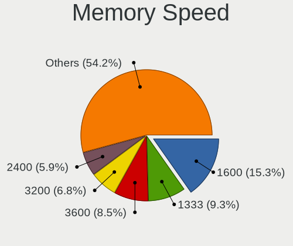

| Speed   | Desktops | Percent |
|---------|----------|---------|
| 1600    | 15       | 18.29%  |
| 1333    | 13       | 15.85%  |
| 3600    | 8        | 9.76%   |
| 3200    | 6        | 7.32%   |
| 2133    | 6        | 7.32%   |
| 2933    | 3        | 3.66%   |
| 3800    | 2        | 2.44%   |
| 2667    | 2        | 2.44%   |
| 2400    | 2        | 2.44%   |
| 1867    | 2        | 2.44%   |
| 1866    | 2        | 2.44%   |
| 1066    | 2        | 2.44%   |
| 800     | 2        | 2.44%   |
| 667     | 2        | 2.44%   |
| Unknown | 2        | 2.44%   |
| 6400    | 1        | 1.22%   |
| 6000    | 1        | 1.22%   |
| 5800    | 1        | 1.22%   |
| 5600    | 1        | 1.22%   |
| 4000    | 1        | 1.22%   |
| 3933    | 1        | 1.22%   |
| 3866    | 1        | 1.22%   |
| 3533    | 1        | 1.22%   |
| 3400    | 1        | 1.22%   |
| 2666    | 1        | 1.22%   |
| 2048    | 1        | 1.22%   |
| 1334    | 1        | 1.22%   |
| 1067    | 1        | 1.22%   |

Printers & scanners
-------------------

Printer Vendor
--------------

Printer device vendors

| Vendor             | Desktops | Percent |
|--------------------|----------|---------|
| Hewlett-Packard    | 5        | 38.46%  |
| Brother Industries | 3        | 23.08%  |
| Seiko Epson        | 2        | 15.38%  |
| Pantum             | 1        | 7.69%   |
| Dymo-CoStar        | 1        | 7.69%   |
| Canon              | 1        | 7.69%   |

Printer Model
-------------

Printer device models

| Model                            | Desktops | Percent |
|----------------------------------|----------|---------|
| Seiko Epson L210 Series          | 1        | 7.69%   |
| Seiko Epson ET-2800 Series       | 1        | 7.69%   |
| Pantum M6550NW series            | 1        | 7.69%   |
| HP Smart Tank 610 series         | 1        | 7.69%   |
| HP OfficeJet 8010 series         | 1        | 7.69%   |
| HP OfficeJet 4650 series         | 1        | 7.69%   |
| HP LaserJet P1102                | 1        | 7.69%   |
| HP DeskJet 2700 series           | 1        | 7.69%   |
| Dymo-CoStar DYMO LabelWriter 4XL | 1        | 7.69%   |
| Canon LiDE 400                   | 1        | 7.69%   |
| Brother MFC-L2690DW              | 1        | 7.69%   |
| Brother HL-L2340D series         | 1        | 7.69%   |
| Brother HL-3170CDW series        | 1        | 7.69%   |

Scanner Vendor
--------------

Scanner device vendors

| Vendor         | Desktops | Percent |
|----------------|----------|---------|
| Canon          | 3        | 75%     |
| Mustek Systems | 1        | 25%     |

Scanner Model
-------------

Scanner device models

| Model                              | Desktops | Percent |
|------------------------------------|----------|---------|
| Mustek Systems ScanExpress 1200 UB | 1        | 25%     |
| Canon CanoScan N670U/N676U/LiDE 20 | 1        | 25%     |
| Canon CanoScan LiDE 60             | 1        | 25%     |
| Canon CanoScan LiDE 200            | 1        | 25%     |

Camera
------

Camera Vendor
-------------

Camera device vendors

| Vendor                        | Desktops | Percent |
|-------------------------------|----------|---------|
| Logitech                      | 14       | 34.15%  |
| Microsoft                     | 4        | 9.76%   |
| Microdia                      | 4        | 9.76%   |
| Sunplus Innovation Technology | 3        | 7.32%   |
| Chicony Electronics           | 3        | 7.32%   |
| Sunplus IT                    | 1        | 2.44%   |
| SHENZHEN EMEET TECHNOLOGY     | 1        | 2.44%   |
| Realtek Semiconductor         | 1        | 2.44%   |
| MacroSilicon                  | 1        | 2.44%   |
| KYE Systems (Mouse Systems)   | 1        | 2.44%   |
| Jieli Technology              | 1        | 2.44%   |
| Google                        | 1        | 2.44%   |
| Generalplus Technology        | 1        | 2.44%   |
| AVerMedia Technologies        | 1        | 2.44%   |
| Apple                         | 1        | 2.44%   |
| ANYKA                         | 1        | 2.44%   |
| A4Tech                        | 1        | 2.44%   |
| Unknown                       | 1        | 2.44%   |

Camera Model
------------

Camera device models

| Model                                            | Desktops | Percent |
|--------------------------------------------------|----------|---------|
| Logitech Webcam C270                             | 6        | 14.63%  |
| Sunplus FHD Camera Microphone                    | 3        | 7.32%   |
| Logitech C922 Pro Stream Webcam                  | 2        | 4.88%   |
| Sunplus IT AUKEY PC-LM1 USB Camera               | 1        | 2.44%   |
| SHENZHEN EMEET TECHNOLOGY HD Webcam eMeet C960   | 1        | 2.44%   |
| Realtek FULL HD 1080P Webcam                     | 1        | 2.44%   |
| Microsoft LifeCam VX-800                         | 1        | 2.44%   |
| Microsoft LifeCam Studio                         | 1        | 2.44%   |
| Microsoft LifeCam HD-3000                        | 1        | 2.44%   |
| Microsoft LifeCam Cinema                         | 1        | 2.44%   |
| Microdia Webcam Vitade AF                        | 1        | 2.44%   |
| Microdia Sonix USB 2.0 Camera                    | 1        | 2.44%   |
| Microdia REDRAGON Live Camera Audio              | 1        | 2.44%   |
| Microdia PC-LM1E                                 | 1        | 2.44%   |
| MacroSilicon MS210x Video Grabber [EasierCAP]    | 1        | 2.44%   |
| Logitech QuickCam Pro 9000                       | 1        | 2.44%   |
| Logitech HD Webcam C510                          | 1        | 2.44%   |
| Logitech HD Pro Webcam C920                      | 1        | 2.44%   |
| Logitech C920 PRO HD Webcam                      | 1        | 2.44%   |
| Logitech BRIO Ultra HD Webcam                    | 1        | 2.44%   |
| Logitech BRIO 4K Stream Edition                  | 1        | 2.44%   |
| KYE Systems (Mouse Systems) AUKEY PC-LM1E Camera | 1        | 2.44%   |
| Jieli USB PHY 2.0                                | 1        | 2.44%   |
| Google HD USB Camera                             | 1        | 2.44%   |
| Generalplus 808 Camera #9 (web-cam mode)         | 1        | 2.44%   |
| Chicony HP High Definition 1MP Webcam            | 1        | 2.44%   |
| Chicony HP 1.0MP High Definition Webcam          | 1        | 2.44%   |
| Chicony Full HD Webcam                           | 1        | 2.44%   |
| AVerMedia Live Streamer CAM 313                  | 1        | 2.44%   |
| Apple iPhone 5/5C/5S/6/SE/7/8/X                  | 1        | 2.44%   |
| ANYKA V380 FHD Camera                            | 1        | 2.44%   |
| A4Tech FHD 1080P PC Camera                       | 1        | 2.44%   |
| Unknown                                          | 1        | 2.44%   |

Security
--------

Fingerprint Vendor
------------------

Fingerprint sensor vendors

| Vendor | Desktops | Percent |
|--------|----------|---------|
| Dell   | 1        | 100%    |

Fingerprint Model
-----------------

Fingerprint sensor models

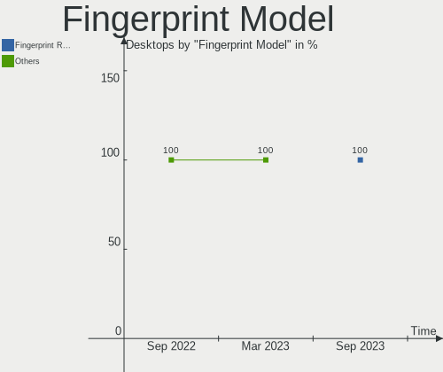

| Model                                          | Desktops | Percent |
|------------------------------------------------|----------|---------|
| Dell MS819 Wired Mouse With Fingerprint Reader | 1        | 100%    |

Chipcard Vendor
---------------

Chipcard module vendors

| Vendor  | Desktops | Percent |
|---------|----------|---------|
| OmniKey | 1        | 100%    |

Chipcard Model
--------------

Chipcard module models

| Model                                   | Desktops | Percent |
|-----------------------------------------|----------|---------|
| OmniKey CardMan 3121 (HID Technologies) | 1        | 100%    |

Unsupported
-----------

Unsupported Devices
-------------------

Total unsupported devices on board

| Total | Desktops | Percent |
|-------|----------|---------|
| 0     | 165      | 85.94%  |
| 1     | 24       | 12.5%   |
| 2     | 3        | 1.56%   |

Unsupported Device Types
------------------------

Types of unsupported devices

| Type                     | Desktops | Percent |
|--------------------------|----------|---------|
| Net/wireless             | 14       | 50%     |
| Graphics card            | 6        | 21.43%  |
| Net/ethernet             | 2        | 7.14%   |
| Communication controller | 2        | 7.14%   |
| Unassigned class         | 1        | 3.57%   |
| Storage/ide              | 1        | 3.57%   |
| Chipcard                 | 1        | 3.57%   |
| Bluetooth                | 1        | 3.57%   |

