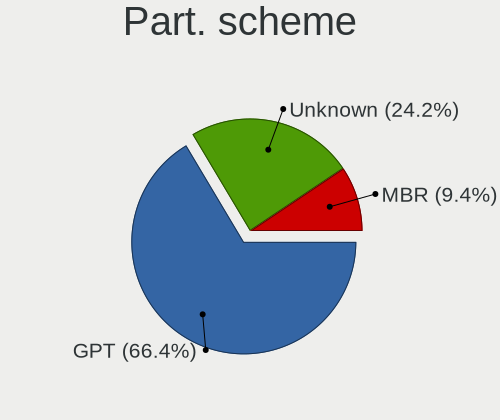
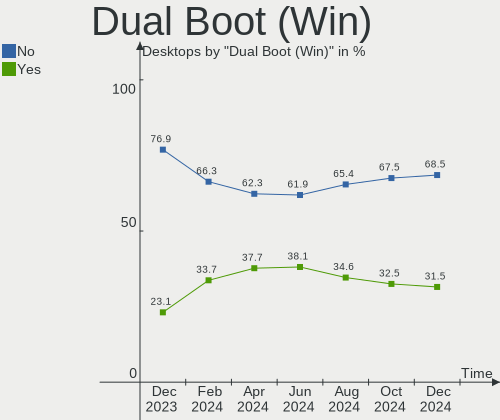
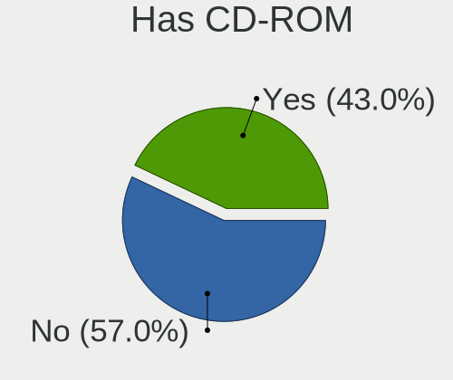
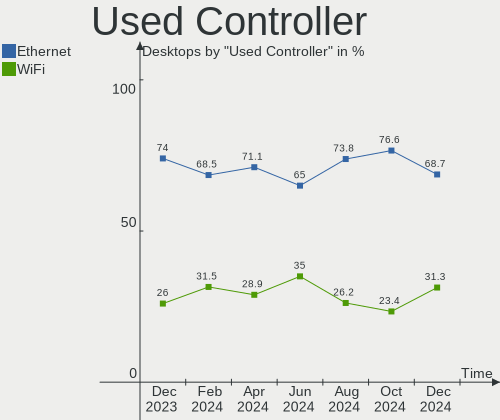
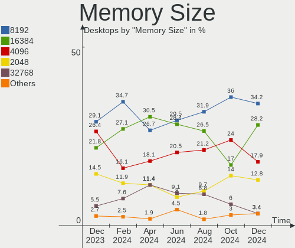

Linux Mint Hardware Trends (Desktops)
-------------------------------------

A project to identify most popular hardware characteristics and track their change
over time based on data collected by Linux Mint users at https://Linux-Hardware.org.

Anyone can contribute to this report by the [hw-probe](https://github.com/linuxhw/hw-probe) tool:

    sudo -E hw-probe -all -upload

This report is for one last month. Overall report since the beginning of time: [TestCoverage](https://github.com/linuxhw/TestCoverage)

Period: Apr, 2022.

Contents
--------

* [ System ](#system)
  - [ OS                       ](#os)
  - [ OS Family                ](#os-family)
  - [ Kernel                   ](#kernel)
  - [ Kernel Family            ](#kernel-family)
  - [ Kernel Major Ver.        ](#kernel-major-ver)
  - [ Arch                     ](#arch)
  - [ DE                       ](#de)
  - [ Display Server           ](#display-server)
  - [ Display Manager          ](#display-manager)
  - [ OS Lang                  ](#os-lang)
  - [ Boot Mode                ](#boot-mode)
  - [ Filesystem               ](#filesystem)
  - [ Part. scheme             ](#part-scheme)
  - [ Dual Boot with Linux/BSD ](#dual-boot-with-linuxbsd)
  - [ Dual Boot (Win)          ](#dual-boot-win)

* [ Board ](#board)
  - [ Vendor                   ](#vendor)
  - [ Model                    ](#model)
  - [ Model Family             ](#model-family)
  - [ MFG Year                 ](#mfg-year)
  - [ Form Factor              ](#form-factor)
  - [ Secure Boot              ](#secure-boot)
  - [ Coreboot                 ](#coreboot)
  - [ RAM Size                 ](#ram-size)
  - [ RAM Used                 ](#ram-used)
  - [ Total Drives             ](#total-drives)
  - [ Has CD-ROM               ](#has-cd-rom)
  - [ Has Ethernet             ](#has-ethernet)
  - [ Has WiFi                 ](#has-wifi)
  - [ Has Bluetooth            ](#has-bluetooth)

* [ Location ](#location)
  - [ Country                  ](#country)
  - [ City                     ](#city)

* [ Drives ](#drives)
  - [ Drive Vendor             ](#drive-vendor)
  - [ Drive Model              ](#drive-model)
  - [ HDD Vendor               ](#hdd-vendor)
  - [ SSD Vendor               ](#ssd-vendor)
  - [ Drive Kind               ](#drive-kind)
  - [ Drive Connector          ](#drive-connector)
  - [ Drive Size               ](#drive-size)
  - [ Space Total              ](#space-total)
  - [ Space Used               ](#space-used)
  - [ Malfunc. Drives          ](#malfunc-drives)
  - [ Malfunc. Drive Vendor    ](#malfunc-drive-vendor)
  - [ Malfunc. HDD Vendor      ](#malfunc-hdd-vendor)
  - [ Malfunc. Drive Kind      ](#malfunc-drive-kind)
  - [ Failed Drives            ](#failed-drives)
  - [ Failed Drive Vendor      ](#failed-drive-vendor)
  - [ Drive Status             ](#drive-status)

* [ Storage controller ](#storage-controller)
  - [ Storage Vendor           ](#storage-vendor)
  - [ Storage Model            ](#storage-model)
  - [ Storage Kind             ](#storage-kind)

* [ Processor ](#processor)
  - [ CPU Vendor               ](#cpu-vendor)
  - [ CPU Model                ](#cpu-model)
  - [ CPU Model Family         ](#cpu-model-family)
  - [ CPU Cores                ](#cpu-cores)
  - [ CPU Sockets              ](#cpu-sockets)
  - [ CPU Threads              ](#cpu-threads)
  - [ CPU Op-Modes             ](#cpu-op-modes)
  - [ CPU Microcode            ](#cpu-microcode)
  - [ CPU Microarch            ](#cpu-microarch)

* [ Graphics ](#graphics)
  - [ GPU Vendor               ](#gpu-vendor)
  - [ GPU Model                ](#gpu-model)
  - [ GPU Combo                ](#gpu-combo)
  - [ GPU Driver               ](#gpu-driver)
  - [ GPU Memory               ](#gpu-memory)

* [ Monitor ](#monitor)
  - [ Monitor Vendor           ](#monitor-vendor)
  - [ Monitor Model            ](#monitor-model)
  - [ Monitor Resolution       ](#monitor-resolution)
  - [ Monitor Diagonal         ](#monitor-diagonal)
  - [ Monitor Width            ](#monitor-width)
  - [ Aspect Ratio             ](#aspect-ratio)
  - [ Monitor Area             ](#monitor-area)
  - [ Pixel Density            ](#pixel-density)
  - [ Multiple Monitors        ](#multiple-monitors)

* [ Network ](#network)
  - [ Net Controller Vendor    ](#net-controller-vendor)
  - [ Net Controller Model     ](#net-controller-model)
  - [ Wireless Vendor          ](#wireless-vendor)
  - [ Wireless Model           ](#wireless-model)
  - [ Ethernet Vendor          ](#ethernet-vendor)
  - [ Ethernet Model           ](#ethernet-model)
  - [ Net Controller Kind      ](#net-controller-kind)
  - [ Used Controller          ](#used-controller)
  - [ NICs                     ](#nics)
  - [ IPv6                     ](#ipv6)

* [ Bluetooth ](#bluetooth)
  - [ Bluetooth Vendor         ](#bluetooth-vendor)
  - [ Bluetooth Model          ](#bluetooth-model)

* [ Sound ](#sound)
  - [ Sound Vendor             ](#sound-vendor)
  - [ Sound Model              ](#sound-model)

* [ Memory ](#memory)
  - [ Memory Vendor            ](#memory-vendor)
  - [ Memory Model             ](#memory-model)
  - [ Memory Kind              ](#memory-kind)
  - [ Memory Form Factor       ](#memory-form-factor)
  - [ Memory Size              ](#memory-size)
  - [ Memory Speed             ](#memory-speed)

* [ Printers & scanners ](#printers--scanners)
  - [ Printer Vendor           ](#printer-vendor)
  - [ Printer Model            ](#printer-model)
  - [ Scanner Vendor           ](#scanner-vendor)
  - [ Scanner Model            ](#scanner-model)

* [ Camera ](#camera)
  - [ Camera Vendor            ](#camera-vendor)
  - [ Camera Model             ](#camera-model)

* [ Security ](#security)
  - [ Fingerprint Vendor       ](#fingerprint-vendor)
  - [ Fingerprint Model        ](#fingerprint-model)
  - [ Chipcard Vendor          ](#chipcard-vendor)
  - [ Chipcard Model           ](#chipcard-model)

* [ Unsupported ](#unsupported)
  - [ Unsupported Devices      ](#unsupported-devices)
  - [ Unsupported Device Types ](#unsupported-device-types)

System
------

OS
--

Installed operating systems

| Name            | Desktops | Percent |
|-----------------|----------|---------|
| Linux Mint 20.3 | 156      | 82.11%  |
| Linux Mint 19.3 | 12       | 6.32%   |
| Linux Mint 20.2 | 10       | 5.26%   |
| Linux Mint 20.1 | 7        | 3.68%   |
| Linux Mint 20   | 4        | 2.11%   |
| Linux Mint 18.3 | 1        | 0.53%   |

OS Family
---------

OS without a version

| Name       | Desktops | Percent |
|------------|----------|---------|
| Linux Mint | 190      | 100%    |

Kernel
------

Version of the Linux kernel

| Version                     | Desktops | Percent |
|-----------------------------|----------|---------|
| 5.4.0-107-generic           | 97       | 51.05%  |
| 5.4.0-109-generic           | 33       | 17.37%  |
| 5.4.0-91-generic            | 10       | 5.26%   |
| 5.13.0-39-generic           | 10       | 5.26%   |
| 5.4.0-105-generic           | 5        | 2.63%   |
| 5.4.0-104-generic           | 4        | 2.11%   |
| 5.13.0-35-generic           | 3        | 1.58%   |
| 5.4.0-94-generic            | 2        | 1.05%   |
| 5.4.0-74-generic            | 2        | 1.05%   |
| 5.4.0-107-lowlatency        | 2        | 1.05%   |
| 5.14.0-1032-oem             | 2        | 1.05%   |
| 5.13.0-27-generic           | 2        | 1.05%   |
| 5.4.0-97-generic            | 1        | 0.53%   |
| 5.4.0-96-generic            | 1        | 0.53%   |
| 5.4.0-90-generic            | 1        | 0.53%   |
| 5.4.0-81-generic            | 1        | 0.53%   |
| 5.4.0-73-generic            | 1        | 0.53%   |
| 5.4.0-58-generic            | 1        | 0.53%   |
| 5.4.0-26-generic            | 1        | 0.53%   |
| 5.4.0-1062203222222-generic | 1        | 0.53%   |
| 5.4.0-100-generic           | 1        | 0.53%   |
| 5.17.4-051704-generic       | 1        | 0.53%   |
| 5.17.2-051702-generic       | 1        | 0.53%   |
| 5.15.33-xanmod1             | 1        | 0.53%   |
| 5.15.32-xanmod1             | 1        | 0.53%   |
| 5.14.0-1031-oem             | 1        | 0.53%   |
| 5.13.0-40-generic           | 1        | 0.53%   |
| 5.13.0-30-generic           | 1        | 0.53%   |
| 5.13.0-25-generic           | 1        | 0.53%   |
| 4.15.0-142-generic          | 1        | 0.53%   |

Kernel Family
-------------

Linux kernel without a distro release

| Version | Desktops | Percent |
|---------|----------|---------|
| 5.4.0   | 164      | 86.32%  |
| 5.13.0  | 18       | 9.47%   |
| 5.14.0  | 3        | 1.58%   |
| 5.17.4  | 1        | 0.53%   |
| 5.17.2  | 1        | 0.53%   |
| 5.15.33 | 1        | 0.53%   |
| 5.15.32 | 1        | 0.53%   |
| 4.15.0  | 1        | 0.53%   |

Kernel Major Ver.
-----------------

Linux kernel major version

| Version | Desktops | Percent |
|---------|----------|---------|
| 5.4     | 164      | 86.32%  |
| 5.13    | 18       | 9.47%   |
| 5.14    | 3        | 1.58%   |
| 5.17    | 2        | 1.05%   |
| 5.15    | 2        | 1.05%   |
| 4.15    | 1        | 0.53%   |

Arch
----

OS architecture (x86_64, i586, etc.)

| Name   | Desktops | Percent |
|--------|----------|---------|
| x86_64 | 186      | 97.89%  |
| i686   | 4        | 2.11%   |

DE
--

Desktop Environment

| Name       | Desktops | Percent |
|------------|----------|---------|
| X-Cinnamon | 133      | 70%     |
| MATE       | 23       | 12.11%  |
| Cinnamon   | 16       | 8.42%   |
| XFCE       | 11       | 5.79%   |
| KDE5       | 2        | 1.05%   |
| GNOME      | 2        | 1.05%   |
| LXQt       | 1        | 0.53%   |
| i3         | 1        | 0.53%   |
| Unknown    | 1        | 0.53%   |

Display Server
--------------

X11 or Wayland

| Name | Desktops | Percent |
|------|----------|---------|
| X11  | 187      | 98.42%  |
| Tty  | 3        | 1.58%   |

Display Manager
---------------

SDDM, LightDM, etc.

| Name    | Desktops | Percent |
|---------|----------|---------|
| Unknown | 112      | 58.95%  |
| LightDM | 75       | 39.47%  |
| GDM     | 2        | 1.05%   |
| MDM     | 1        | 0.53%   |

OS Lang
-------

Language

| Lang    | Desktops | Percent |
|---------|----------|---------|
| en_US   | 58       | 30.53%  |
| de_DE   | 33       | 17.37%  |
| en_GB   | 12       | 6.32%   |
| ru_RU   | 10       | 5.26%   |
| pt_BR   | 10       | 5.26%   |
| fr_FR   | 9        | 4.74%   |
| en_CA   | 8        | 4.21%   |
| es_ES   | 5        | 2.63%   |
| en_AU   | 5        | 2.63%   |
| pl_PL   | 4        | 2.11%   |
| C       | 4        | 2.11%   |
| tr_TR   | 3        | 1.58%   |
| sv_SE   | 3        | 1.58%   |
| nl_NL   | 3        | 1.58%   |
| it_IT   | 3        | 1.58%   |
| de_CH   | 3        | 1.58%   |
| en_ZA   | 2        | 1.05%   |
| zh_CN   | 1        | 0.53%   |
| sk_SK   | 1        | 0.53%   |
| ro_RO   | 1        | 0.53%   |
| ja_JP   | 1        | 0.53%   |
| hr_HR   | 1        | 0.53%   |
| fr_BE   | 1        | 0.53%   |
| fi_FI   | 1        | 0.53%   |
| es_PE   | 1        | 0.53%   |
| es_MX   | 1        | 0.53%   |
| es_DO   | 1        | 0.53%   |
| es_AR   | 1        | 0.53%   |
| de_BE   | 1        | 0.53%   |
| de_AT   | 1        | 0.53%   |
| cs_CZ   | 1        | 0.53%   |
| Unknown | 1        | 0.53%   |

Boot Mode
---------

EFI or BIOS

| Mode | Desktops | Percent |
|------|----------|---------|
| BIOS | 108      | 56.84%  |
| EFI  | 82       | 43.16%  |

Filesystem
----------

Type of filesystem

| Type    | Desktops | Percent |
|---------|----------|---------|
| Ext4    | 185      | 97.37%  |
| Btrfs   | 3        | 1.58%   |
| Overlay | 2        | 1.05%   |

Part. scheme
------------

Scheme of partitioning

| Type    | Desktops | Percent |
|---------|----------|---------|
| Unknown | 117      | 61.58%  |
| GPT     | 48       | 25.26%  |
| MBR     | 25       | 13.16%  |

Dual Boot with Linux/BSD
------------------------

Hosting more than one Linux/BSD

| Dual boot | Desktops | Percent |
|-----------|----------|---------|
| No        | 174      | 91.58%  |
| Yes       | 16       | 8.42%   |

Dual Boot (Win)
---------------

Hosting Linux and Windows

| Dual boot | Desktops | Percent |
|-----------|----------|---------|
| No        | 153      | 80.53%  |
| Yes       | 37       | 19.47%  |

Board
-----

Vendor
------

Motherboard manufacturer

| Name                | Desktops | Percent |
|---------------------|----------|---------|
| ASUSTek Computer    | 46       | 24.21%  |
| Dell                | 27       | 14.21%  |
| Gigabyte Technology | 25       | 13.16%  |
| MSI                 | 23       | 12.11%  |
| ASRock              | 21       | 11.05%  |
| Hewlett-Packard     | 12       | 6.32%   |
| Lenovo              | 5        | 2.63%   |
| Medion              | 4        | 2.11%   |
| Intel               | 4        | 2.11%   |
| Biostar             | 4        | 2.11%   |
| Pegatron            | 3        | 1.58%   |
| Fujitsu             | 2        | 1.05%   |
| AZW                 | 2        | 1.05%   |
| Acer                | 2        | 1.05%   |
| Supermicro          | 1        | 0.53%   |
| Semp Toshiba        | 1        | 0.53%   |
| Positivo            | 1        | 0.53%   |
| LattePanda          | 1        | 0.53%   |
| Itautec             | 1        | 0.53%   |
| Fujitsu Siemens     | 1        | 0.53%   |
| Foxconn             | 1        | 0.53%   |
| ECS                 | 1        | 0.53%   |
| BESSTAR Tech        | 1        | 0.53%   |
| Unknown             | 1        | 0.53%   |

Model
-----

Motherboard model

| Name                                 | Desktops | Percent |
|--------------------------------------|----------|---------|
| Dell OptiPlex 7010                   | 4        | 2.11%   |
| ASUS All Series                      | 4        | 2.11%   |
| MSI MS-7D22                          | 3        | 1.58%   |
| MSI MS-7C02                          | 3        | 1.58%   |
| MSI MS-7B79                          | 3        | 1.58%   |
| Dell OptiPlex 790                    | 3        | 1.58%   |
| MSI MS-7C37                          | 2        | 1.05%   |
| HP EliteDesk 800 G1 SFF              | 2        | 1.05%   |
| Gigabyte GA-78LMT-USB3 6.0           | 2        | 1.05%   |
| Dell OptiPlex 990                    | 2        | 1.05%   |
| Dell OptiPlex 9020                   | 2        | 1.05%   |
| Dell OptiPlex 780                    | 2        | 1.05%   |
| Dell OptiPlex 3010                   | 2        | 1.05%   |
| AZW U59                              | 2        | 1.05%   |
| ASUS ROG STRIX B550-I GAMING         | 2        | 1.05%   |
| ASRock X300M-STX                     | 2        | 1.05%   |
| ASRock B550M Pro4                    | 2        | 1.05%   |
| Supermicro Altus 1804                | 1        | 0.53%   |
| Semp Toshiba STI                     | 1        | 0.53%   |
| Positivo POS-EIBTDB                  | 1        | 0.53%   |
| Pegatron s5-1050br                   | 1        | 0.53%   |
| Pegatron IPPPV-D3G                   | 1        | 0.53%   |
| Pegatron G5200uk-m                   | 1        | 0.53%   |
| MSI MS-7D46                          | 1        | 0.53%   |
| MSI MS-7D20                          | 1        | 0.53%   |
| MSI MS-7C94                          | 1        | 0.53%   |
| MSI MS-7C35                          | 1        | 0.53%   |
| MSI MS-7B98                          | 1        | 0.53%   |
| MSI MS-7A40                          | 1        | 0.53%   |
| MSI MS-7996                          | 1        | 0.53%   |
| MSI MS-7821                          | 1        | 0.53%   |
| MSI MS-7817                          | 1        | 0.53%   |
| MSI MS-7751                          | 1        | 0.53%   |
| MSI MS-7721                          | 1        | 0.53%   |
| MSI MS-7599                          | 1        | 0.53%   |
| Medion P961x                         | 1        | 0.53%   |
| Medion MD34286/C816                  | 1        | 0.53%   |
| Medion Akoya P4130 D MD8302/2472     | 1        | 0.53%   |
| Medion Akoya P2120 D MD8836/2454     | 1        | 0.53%   |
| Lenovo XINYUANMENGH520r56 Product    | 1        | 0.53%   |
| Lenovo ThinkStation C30 11368H3      | 1        | 0.53%   |
| Lenovo ThinkCentre M92p 3209B4G      | 1        | 0.53%   |
| Lenovo ThinkCentre M81 5049W16       | 1        | 0.53%   |
| Lenovo Legion T5 28IMB05 90NC00JBUS  | 1        | 0.53%   |
| LattePanda Alpha                     | 1        | 0.53%   |
| Itautec NT 2030                      | 1        | 0.53%   |
| Intel X99                            | 1        | 0.53%   |
| Intel MAHOBAY                        | 1        | 0.53%   |
| Intel DH67BL AAG10189-211            | 1        | 0.53%   |
| Intel DH55TC AAE70932-204            | 1        | 0.53%   |
| HP Z800 Workstation                  | 1        | 0.53%   |
| HP Z220 CMT Workstation              | 1        | 0.53%   |
| HP Pavilion Wave Desktop 600-a014    | 1        | 0.53%   |
| HP Pavilion Gaming Desktop TG01-0xxx | 1        | 0.53%   |
| HP Pavilion Desktop PC 570-p0xx      | 1        | 0.53%   |
| HP OMEN by Desktop PC 880-p1xx       | 1        | 0.53%   |
| HP EliteDesk 800 G1 USDT             | 1        | 0.53%   |
| HP Compaq dc5750 Small Form Factor   | 1        | 0.53%   |
| HP Compaq 6005 Pro SFF PC            | 1        | 0.53%   |
| HP Compaq 6000 Pro SFF PC            | 1        | 0.53%   |

Model Family
------------

Motherboard model prefix

| Name                      | Desktops | Percent |
|---------------------------|----------|---------|
| Dell OptiPlex             | 21       | 11.05%  |
| ASUS PRIME                | 7        | 3.68%   |
| Dell Inspiron             | 5        | 2.63%   |
| ASUS ROG                  | 5        | 2.63%   |
| ASUS All                  | 4        | 2.11%   |
| MSI MS-7D22               | 3        | 1.58%   |
| MSI MS-7C02               | 3        | 1.58%   |
| MSI MS-7B79               | 3        | 1.58%   |
| HP Pavilion               | 3        | 1.58%   |
| HP EliteDesk              | 3        | 1.58%   |
| HP Compaq                 | 3        | 1.58%   |
| ASUS TUF                  | 3        | 1.58%   |
| MSI MS-7C37               | 2        | 1.05%   |
| Medion Akoya              | 2        | 1.05%   |
| Lenovo ThinkCentre        | 2        | 1.05%   |
| Gigabyte GA-78LMT-USB3    | 2        | 1.05%   |
| Gigabyte B550             | 2        | 1.05%   |
| Fujitsu CELSIUS           | 2        | 1.05%   |
| AZW U59                   | 2        | 1.05%   |
| ASUS P8H67-M              | 2        | 1.05%   |
| ASUS M5A97                | 2        | 1.05%   |
| ASRock X300M-STX          | 2        | 1.05%   |
| ASRock B550M              | 2        | 1.05%   |
| ASRock B450               | 2        | 1.05%   |
| ASRock 970                | 2        | 1.05%   |
| Supermicro Altus          | 1        | 0.53%   |
| Semp Toshiba STI          | 1        | 0.53%   |
| Positivo POS-EIBTDB       | 1        | 0.53%   |
| Pegatron s5-1050br        | 1        | 0.53%   |
| Pegatron IPPPV-D3G        | 1        | 0.53%   |
| Pegatron G5200uk-m        | 1        | 0.53%   |
| MSI MS-7D46               | 1        | 0.53%   |
| MSI MS-7D20               | 1        | 0.53%   |
| MSI MS-7C94               | 1        | 0.53%   |
| MSI MS-7C35               | 1        | 0.53%   |
| MSI MS-7B98               | 1        | 0.53%   |
| MSI MS-7A40               | 1        | 0.53%   |
| MSI MS-7996               | 1        | 0.53%   |
| MSI MS-7821               | 1        | 0.53%   |
| MSI MS-7817               | 1        | 0.53%   |
| MSI MS-7751               | 1        | 0.53%   |
| MSI MS-7721               | 1        | 0.53%   |
| MSI MS-7599               | 1        | 0.53%   |
| Medion P961x              | 1        | 0.53%   |
| Medion MD34286            | 1        | 0.53%   |
| Lenovo XINYUANMENGH520r56 | 1        | 0.53%   |
| Lenovo ThinkStation       | 1        | 0.53%   |
| Lenovo Legion             | 1        | 0.53%   |
| LattePanda Alpha          | 1        | 0.53%   |
| Itautec NT                | 1        | 0.53%   |
| Intel X99                 | 1        | 0.53%   |
| Intel MAHOBAY             | 1        | 0.53%   |
| Intel DH67BL              | 1        | 0.53%   |
| Intel DH55TC              | 1        | 0.53%   |
| HP Z800                   | 1        | 0.53%   |
| HP Z220                   | 1        | 0.53%   |
| HP OMEN                   | 1        | 0.53%   |
| Gigabyte Z97-HD3          | 1        | 0.53%   |
| Gigabyte Z370             | 1        | 0.53%   |
| Gigabyte X570             | 1        | 0.53%   |

MFG Year
--------

Motherboard manufacture year

| Year | Desktops | Percent |
|------|----------|---------|
| 2020 | 23       | 12.11%  |
| 2013 | 23       | 12.11%  |
| 2019 | 17       | 8.95%   |
| 2011 | 16       | 8.42%   |
| 2012 | 15       | 7.89%   |
| 2018 | 14       | 7.37%   |
| 2010 | 13       | 6.84%   |
| 2021 | 11       | 5.79%   |
| 2014 | 10       | 5.26%   |
| 2009 | 9        | 4.74%   |
| 2016 | 8        | 4.21%   |
| 2008 | 8        | 4.21%   |
| 2017 | 7        | 3.68%   |
| 2015 | 6        | 3.16%   |
| 2007 | 5        | 2.63%   |
| 2006 | 3        | 1.58%   |
| 2022 | 2        | 1.05%   |

Form Factor
-----------

Physical design of the computer

| Name    | Desktops | Percent |
|---------|----------|---------|
| Desktop | 190      | 100%    |

Secure Boot
-----------

Enabled or disabled

| State    | Desktops | Percent |
|----------|----------|---------|
| Disabled | 184      | 96.84%  |
| Enabled  | 6        | 3.16%   |

Coreboot
--------

Have coreboot on board

| Used | Desktops | Percent |
|------|----------|---------|
| No   | 190      | 100%    |

RAM Size
--------

Total RAM memory

| Size in GB  | Desktops | Percent |
|-------------|----------|---------|
| 16.01-24.0  | 48       | 25.26%  |
| 8.01-16.0   | 42       | 22.11%  |
| 32.01-64.0  | 36       | 18.95%  |
| 4.01-8.0    | 25       | 13.16%  |
| 3.01-4.0    | 22       | 11.58%  |
| 24.01-32.0  | 7        | 3.68%   |
| 2.01-3.0    | 3        | 1.58%   |
| 64.01-256.0 | 3        | 1.58%   |
| 1.01-2.0    | 3        | 1.58%   |
| 0.51-1.0    | 1        | 0.53%   |

RAM Used
--------

Used RAM memory

| Used GB    | Desktops | Percent |
|------------|----------|---------|
| 1.01-2.0   | 65       | 34.21%  |
| 2.01-3.0   | 51       | 26.84%  |
| 3.01-4.0   | 31       | 16.32%  |
| 4.01-8.0   | 29       | 15.26%  |
| 0.51-1.0   | 9        | 4.74%   |
| 8.01-16.0  | 4        | 2.11%   |
| 16.01-24.0 | 1        | 0.53%   |

Total Drives
------------

Number of drives on board

| Drives | Desktops | Percent |
|--------|----------|---------|
| 1      | 74       | 38.95%  |
| 2      | 54       | 28.42%  |
| 3      | 35       | 18.42%  |
| 4      | 16       | 8.42%   |
| 5      | 4        | 2.11%   |
| 8      | 3        | 1.58%   |
| 6      | 2        | 1.05%   |
| 7      | 1        | 0.53%   |
| 0      | 1        | 0.53%   |

Has CD-ROM
----------

Has CD-ROM on board

| Presented | Desktops | Percent |
|-----------|----------|---------|
| Yes       | 111      | 58.42%  |
| No        | 79       | 41.58%  |

Has Ethernet
------------

Has Ethernet on board

| Presented | Desktops | Percent |
|-----------|----------|---------|
| Yes       | 187      | 98.42%  |
| No        | 3        | 1.58%   |

Has WiFi
--------

Has WiFi module

| Presented | Desktops | Percent |
|-----------|----------|---------|
| No        | 96       | 50.53%  |
| Yes       | 94       | 49.47%  |

Has Bluetooth
-------------

Has Bluetooth module

| Presented | Desktops | Percent |
|-----------|----------|---------|
| No        | 130      | 68.42%  |
| Yes       | 60       | 31.58%  |

Location
--------

Country
-------

Geographic location (country)

| Country            | Desktops | Percent |
|--------------------|----------|---------|
| USA                | 41       | 21.58%  |
| Germany            | 33       | 17.37%  |
| UK                 | 13       | 6.84%   |
| Brazil             | 12       | 6.32%   |
| Russia             | 11       | 5.79%   |
| France             | 9        | 4.74%   |
| Canada             | 7        | 3.68%   |
| Switzerland        | 5        | 2.63%   |
| Poland             | 5        | 2.63%   |
| Netherlands        | 5        | 2.63%   |
| Australia          | 5        | 2.63%   |
| Spain              | 4        | 2.11%   |
| Austria            | 4        | 2.11%   |
| Turkey             | 3        | 1.58%   |
| Sweden             | 3        | 1.58%   |
| Italy              | 3        | 1.58%   |
| Taiwan             | 2        | 1.05%   |
| Romania            | 2        | 1.05%   |
| Croatia            | 2        | 1.05%   |
| Belgium            | 2        | 1.05%   |
| Ukraine            | 1        | 0.53%   |
| South Africa       | 1        | 0.53%   |
| Slovakia           | 1        | 0.53%   |
| Puerto Rico        | 1        | 0.53%   |
| Norway             | 1        | 0.53%   |
| New Zealand        | 1        | 0.53%   |
| Mexico             | 1        | 0.53%   |
| Malaysia           | 1        | 0.53%   |
| Japan              | 1        | 0.53%   |
| Iran               | 1        | 0.53%   |
| Hungary            | 1        | 0.53%   |
| Finland            | 1        | 0.53%   |
| Ecuador            | 1        | 0.53%   |
| Dominican Republic | 1        | 0.53%   |
| Czechia            | 1        | 0.53%   |
| Colombia           | 1        | 0.53%   |
| China              | 1        | 0.53%   |
| Chile              | 1        | 0.53%   |
| Argentina          | 1        | 0.53%   |

City
----

Geographic location (city)

| City                 | Desktops | Percent |
|----------------------|----------|---------|
| Vienna               | 3        | 1.58%   |
| Sao Paulo            | 3        | 1.58%   |
| Berlin               | 3        | 1.58%   |
| Worcester Park       | 2        | 1.05%   |
| Sydney               | 2        | 1.05%   |
| Sao Luís            | 2        | 1.05%   |
| Rendsburg            | 2        | 1.05%   |
| Houston              | 2        | 1.05%   |
| Hamburg              | 2        | 1.05%   |
| Clinton Township     | 2        | 1.05%   |
| Chicago              | 2        | 1.05%   |
| Chandler             | 2        | 1.05%   |
| Zurich               | 1        | 0.53%   |
| Zhukovskiy           | 1        | 0.53%   |
| Zagreb               | 1        | 0.53%   |
| Yuzhno-Sakhalinsk    | 1        | 0.53%   |
| Yorktown Heights     | 1        | 0.53%   |
| Yonkers              | 1        | 0.53%   |
| Wroclaw              | 1        | 0.53%   |
| Wolverhampton        | 1        | 0.53%   |
| Wettingen            | 1        | 0.53%   |
| Welkenraedt          | 1        | 0.53%   |
| Warsaw               | 1        | 0.53%   |
| Vannes               | 1        | 0.53%   |
| Vandoeuvre-les-Nancy | 1        | 0.53%   |
| Umeå                | 1        | 0.53%   |
| Tver                 | 1        | 0.53%   |
| Turku                | 1        | 0.53%   |
| Tupelo               | 1        | 0.53%   |
| Tullibody            | 1        | 0.53%   |
| Tournai              | 1        | 0.53%   |
| Totteridge           | 1        | 0.53%   |
| Toronto              | 1        | 0.53%   |
| Todmorden            | 1        | 0.53%   |
| Therwil              | 1        | 0.53%   |
| The Bronx            | 1        | 0.53%   |
| Tampa                | 1        | 0.53%   |
| Taipei               | 1        | 0.53%   |
| Szczecin             | 1        | 0.53%   |
| Suzano               | 1        | 0.53%   |
| Stralsund            | 1        | 0.53%   |
| Storebo              | 1        | 0.53%   |
| Stockholm            | 1        | 0.53%   |
| Steyr                | 1        | 0.53%   |
| St Petersburg        | 1        | 0.53%   |
| St Louis             | 1        | 0.53%   |
| Spruce Grove         | 1        | 0.53%   |
| Sparrows Point       | 1        | 0.53%   |
| Sosnowiec            | 1        | 0.53%   |
| Siniscola            | 1        | 0.53%   |
| Shorewood            | 1        | 0.53%   |
| Shinjuku             | 1        | 0.53%   |
| Sheffield            | 1        | 0.53%   |
| Shawnee              | 1        | 0.53%   |
| Seville              | 1        | 0.53%   |
| Seremban             | 1        | 0.53%   |
| Seattle              | 1        | 0.53%   |
| Schwarzenbach        | 1        | 0.53%   |
| Saonara              | 1        | 0.53%   |
| Sao Carlos           | 1        | 0.53%   |

Drives
------

Drive Vendor
------------

Hard drive vendors

| Vendor                    | Desktops | Drives | Percent |
|---------------------------|----------|--------|---------|
| Seagate                   | 64       | 80     | 18.82%  |
| WDC                       | 61       | 73     | 17.94%  |
| Samsung Electronics       | 56       | 85     | 16.47%  |
| Kingston                  | 24       | 26     | 7.06%   |
| Crucial                   | 24       | 25     | 7.06%   |
| Toshiba                   | 18       | 20     | 5.29%   |
| SanDisk                   | 18       | 19     | 5.29%   |
| Hitachi                   | 12       | 12     | 3.53%   |
| Unknown                   | 5        | 7      | 1.47%   |
| Intenso                   | 5        | 7      | 1.47%   |
| HGST                      | 5        | 5      | 1.47%   |
| MAXTOR                    | 4        | 4      | 1.18%   |
| Transcend                 | 3        | 3      | 0.88%   |
| Phison                    | 3        | 3      | 0.88%   |
| Micron/Crucial Technology | 3        | 4      | 0.88%   |
| Intel                     | 3        | 3      | 0.88%   |
| A-DATA Technology         | 3        | 3      | 0.88%   |
| SPCC                      | 2        | 2      | 0.59%   |
| SK Hynix                  | 2        | 2      | 0.59%   |
| SABRENT                   | 2        | 2      | 0.59%   |
| Patriot                   | 2        | 2      | 0.59%   |
| NGFF                      | 2        | 2      | 0.59%   |
| Micron Technology         | 2        | 2      | 0.59%   |
| Corsair                   | 2        | 3      | 0.59%   |
| USB 3.0                   | 1        | 1      | 0.29%   |
| Team                      | 1        | 1      | 0.29%   |
| Realtek Semiconductor     | 1        | 1      | 0.29%   |
| QUMO                      | 1        | 1      | 0.29%   |
| PLEXTOR                   | 1        | 1      | 0.29%   |
| OCZ                       | 1        | 1      | 0.29%   |
| Mushkin                   | 1        | 2      | 0.29%   |
| Maxtor 6                  | 1        | 1      | 0.29%   |
| MAX                       | 1        | 1      | 0.29%   |
| LITEON                    | 1        | 1      | 0.29%   |
| LDLC                      | 1        | 1      | 0.29%   |
| HS-SSD-E100               | 1        | 1      | 0.29%   |
| EMTEC                     | 1        | 1      | 0.29%   |
| China                     | 1        | 1      | 0.29%   |
| Unknown                   | 1        | 1      | 0.29%   |

Drive Model
-----------

Hard drive models

| Model                               | Desktops | Percent |
|-------------------------------------|----------|---------|
| Toshiba DT01ACA100 1TB              | 9        | 2.31%   |
| Samsung SSD 850 EVO 500GB           | 8        | 2.06%   |
| Kingston SA400S37240G 240GB SSD     | 8        | 2.06%   |
| Samsung SSD 850 EVO 250GB           | 7        | 1.8%    |
| Samsung SSD 860 EVO 1TB             | 5        | 1.29%   |
| Crucial CT1000MX500SSD1 1TB         | 5        | 1.29%   |
| Seagate ST500DM002-1BD142 500GB     | 4        | 1.03%   |
| Seagate ST3500418AS 500GB           | 4        | 1.03%   |
| Samsung SSD 860 EVO 500GB           | 4        | 1.03%   |
| Crucial CT525MX300SSD1 528GB        | 4        | 1.03%   |
| Unknown SD/MMC/MS PRO 16GB          | 3        | 0.77%   |
| Toshiba HDWD110 1TB                 | 3        | 0.77%   |
| Seagate ST4000DM004-2CV104 4TB      | 3        | 0.77%   |
| Seagate ST2000DM001-1ER164 2TB      | 3        | 0.77%   |
| Seagate ST1000DM003-1CH162 1TB      | 3        | 0.77%   |
| Sandisk NVMe SSD Drive 256GB        | 3        | 0.77%   |
| Samsung SSD 870 QVO 1TB             | 3        | 0.77%   |
| Samsung NVMe SSD Drive 250GB        | 3        | 0.77%   |
| WDC WD40EZRX-00SPEB0 4TB            | 2        | 0.51%   |
| WDC WD30EFRX-68EUZN0 3TB            | 2        | 0.51%   |
| WDC WD20EZRZ-00Z5HB0 2TB            | 2        | 0.51%   |
| WDC WD20EZBX-00AYRA0 2TB            | 2        | 0.51%   |
| WDC WD20EARX-00PASB0 2TB            | 2        | 0.51%   |
| WDC WD1001FALS-00E8B0 1TB           | 2        | 0.51%   |
| Seagate ST31000528AS 1TB            | 2        | 0.51%   |
| Seagate ST2000DM008-2UB102 2TB      | 2        | 0.51%   |
| Seagate ST2000DM008-2FR102 2TB      | 2        | 0.51%   |
| Seagate ST2000DM006-2DM164 2TB      | 2        | 0.51%   |
| Seagate ST1000DM003-9YN162 1TB      | 2        | 0.51%   |
| Seagate ST1000DM003-1SB102 1TB      | 2        | 0.51%   |
| Seagate ST1000DM003-1ER162 1TB      | 2        | 0.51%   |
| Seagate Expansion+ 2TB              | 2        | 0.51%   |
| Seagate Expansion Desk 4TB          | 2        | 0.51%   |
| SanDisk SDSSDA240G 240GB            | 2        | 0.51%   |
| Sandisk NVMe SSD Drive 1TB          | 2        | 0.51%   |
| Samsung SSD 980 PRO 500GB           | 2        | 0.51%   |
| Samsung SSD 970 EVO Plus 1TB        | 2        | 0.51%   |
| Samsung SSD 960 EVO 250GB           | 2        | 0.51%   |
| Samsung SSD 870 QVO 2TB             | 2        | 0.51%   |
| Samsung SSD 840 PRO Series 128GB    | 2        | 0.51%   |
| Samsung SSD 840 EVO 250GB           | 2        | 0.51%   |
| Samsung SSD 750 EVO 250GB           | 2        | 0.51%   |
| Samsung NVMe SSD Drive 500GB        | 2        | 0.51%   |
| Samsung HD103SJ 1TB                 | 2        | 0.51%   |
| SABRENT Disk 1TB                    | 2        | 0.51%   |
| NGFF 2280 256GB SSD                 | 2        | 0.51%   |
| Micron/Crucial NVMe SSD Drive 500GB | 2        | 0.51%   |
| Micron/Crucial NVMe SSD Drive 1TB   | 2        | 0.51%   |
| Kingston SV300S37A120G 120GB SSD    | 2        | 0.51%   |
| Kingston SNVS500G 500GB             | 2        | 0.51%   |
| Kingston SNVS1000G 1TB              | 2        | 0.51%   |
| Kingston SA400S37120G 120GB SSD     | 2        | 0.51%   |
| Kingston NVMe SSD Drive 500GB       | 2        | 0.51%   |
| Intenso SSD SATAIII 512GB           | 2        | 0.51%   |
| Intenso SSD Sata III 128GB          | 2        | 0.51%   |
| Hitachi HUA723020ALA641 2TB         | 2        | 0.51%   |
| Hitachi HDS721075KLA330 752GB       | 2        | 0.51%   |
| Crucial CT500MX500SSD1 500GB        | 2        | 0.51%   |
| Crucial CT240M500SSD1 240GB         | 2        | 0.51%   |
| WDC WDS500G2B0A-00SM50 500GB SSD    | 1        | 0.26%   |

HDD Vendor
----------

Hard disk drive vendors

| Vendor              | Desktops | Drives | Percent |
|---------------------|----------|--------|---------|
| Seagate             | 64       | 79     | 37.65%  |
| WDC                 | 54       | 64     | 31.76%  |
| Toshiba             | 15       | 17     | 8.82%   |
| Hitachi             | 12       | 12     | 7.06%   |
| Samsung Electronics | 9        | 11     | 5.29%   |
| HGST                | 5        | 5      | 2.94%   |
| MAXTOR              | 4        | 4      | 2.35%   |
| Unknown             | 3        | 3      | 1.76%   |
| SABRENT             | 2        | 2      | 1.18%   |
| USB 3.0             | 1        | 1      | 0.59%   |
| Maxtor 6            | 1        | 1      | 0.59%   |

SSD Vendor
----------

Solid state drive vendors

| Vendor              | Desktops | Drives | Percent |
|---------------------|----------|--------|---------|
| Samsung Electronics | 39       | 57     | 30%     |
| Crucial             | 23       | 24     | 17.69%  |
| Kingston            | 17       | 18     | 13.08%  |
| SanDisk             | 13       | 14     | 10%     |
| WDC                 | 6        | 6      | 4.62%   |
| Intenso             | 4        | 6      | 3.08%   |
| Transcend           | 2        | 2      | 1.54%   |
| Toshiba             | 2        | 2      | 1.54%   |
| SPCC                | 2        | 2      | 1.54%   |
| Patriot             | 2        | 2      | 1.54%   |
| NGFF                | 2        | 2      | 1.54%   |
| Micron Technology   | 2        | 2      | 1.54%   |
| Intel               | 2        | 2      | 1.54%   |
| A-DATA Technology   | 2        | 2      | 1.54%   |
| Team                | 1        | 1      | 0.77%   |
| SK Hynix            | 1        | 1      | 0.77%   |
| QUMO                | 1        | 1      | 0.77%   |
| PLEXTOR             | 1        | 1      | 0.77%   |
| OCZ                 | 1        | 1      | 0.77%   |
| Mushkin             | 1        | 2      | 0.77%   |
| LITEON              | 1        | 1      | 0.77%   |
| LDLC                | 1        | 1      | 0.77%   |
| EMTEC               | 1        | 1      | 0.77%   |
| Corsair             | 1        | 1      | 0.77%   |
| China               | 1        | 1      | 0.77%   |
| Unknown             | 1        | 1      | 0.77%   |

Drive Kind
----------

HDD or SSD

| Kind    | Desktops | Drives | Percent |
|---------|----------|--------|---------|
| HDD     | 131      | 199    | 46.13%  |
| SSD     | 107      | 154    | 37.68%  |
| NVMe    | 40       | 49     | 14.08%  |
| Unknown | 6        | 8      | 2.11%   |

Drive Connector
---------------

SATA, SAS, NVMe, etc.

| Type | Desktops | Drives | Percent |
|------|----------|--------|---------|
| SATA | 180      | 338    | 76.27%  |
| NVMe | 40       | 49     | 16.95%  |
| SAS  | 16       | 23     | 6.78%   |

Drive Size
----------

Size of hard drive

| Size in TB | Desktops | Drives | Percent |
|------------|----------|--------|---------|
| 0.01-0.5   | 128      | 182    | 47.58%  |
| 0.51-1.0   | 79       | 98     | 29.37%  |
| 1.01-2.0   | 38       | 42     | 14.13%  |
| 3.01-4.0   | 14       | 19     | 5.2%    |
| 4.01-10.0  | 6        | 6      | 2.23%   |
| 2.01-3.0   | 4        | 6      | 1.49%   |

Space Total
-----------

Amount of disk space available on the file system

| Size in GB     | Desktops | Percent |
|----------------|----------|---------|
| 101-250        | 53       | 27.89%  |
| 251-500        | 35       | 18.42%  |
| 501-1000       | 32       | 16.84%  |
| 1001-2000      | 24       | 12.63%  |
| More than 3000 | 18       | 9.47%   |
| 2001-3000      | 14       | 7.37%   |
| 51-100         | 7        | 3.68%   |
| 1-20           | 4        | 2.11%   |
| 21-50          | 2        | 1.05%   |
| Unknown        | 1        | 0.53%   |

Space Used
----------

Amount of used disk space

| Used GB        | Desktops | Percent |
|----------------|----------|---------|
| 21-50          | 43       | 22.63%  |
| 101-250        | 33       | 17.37%  |
| 1-20           | 30       | 15.79%  |
| 51-100         | 21       | 11.05%  |
| 501-1000       | 19       | 10%     |
| 251-500        | 18       | 9.47%   |
| 1001-2000      | 14       | 7.37%   |
| 2001-3000      | 6        | 3.16%   |
| More than 3000 | 5        | 2.63%   |
| Unknown        | 1        | 0.53%   |

Malfunc. Drives
---------------

Drive models with a malfunction

| Model                                 | Desktops | Drives | Percent |
|---------------------------------------|----------|--------|---------|
| Seagate ST3500418AS 500GB             | 2        | 2      | 7.69%   |
| Seagate ST1000DM003-9YN162 1TB        | 2        | 2      | 7.69%   |
| WDC WD5002ABYS-01B1B0 500GB           | 1        | 1      | 3.85%   |
| WDC WD40EFRX-68WT0N0 4TB              | 1        | 1      | 3.85%   |
| WDC WD2002FYPS-01U1B1 2TB             | 1        | 1      | 3.85%   |
| WDC WD15EARS-00S0XB0 1TB              | 1        | 1      | 3.85%   |
| WDC WD10EADS-11M2B2 1TB               | 1        | 1      | 3.85%   |
| SPCC Solid State Disk 120GB           | 1        | 1      | 3.85%   |
| Seagate ST9500325AS 500GB             | 1        | 1      | 3.85%   |
| Seagate ST3320613AS 320GB             | 1        | 1      | 3.85%   |
| Seagate ST3250820AS 250GB             | 1        | 1      | 3.85%   |
| Seagate ST31500341AS 1TB              | 1        | 1      | 3.85%   |
| Seagate ST3120813AS 120GB             | 1        | 1      | 3.85%   |
| Seagate ST2000DM006-2DM164 2TB        | 1        | 1      | 3.85%   |
| Seagate OOS1000G 1TB                  | 1        | 1      | 3.85%   |
| Samsung Electronics SSD 980 PRO 250GB | 1        | 1      | 3.85%   |
| Samsung Electronics SSD 970 EVO 500GB | 1        | 2      | 3.85%   |
| Samsung Electronics SSD 840 EVO 250GB | 1        | 1      | 3.85%   |
| Samsung Electronics SSD 840 EVO 120GB | 1        | 1      | 3.85%   |
| Samsung Electronics SP1604N 160GB     | 1        | 1      | 3.85%   |
| LDLC SSD 256GB                        | 1        | 1      | 3.85%   |
| Crucial CT525MX300SSD1 528GB          | 1        | 1      | 3.85%   |
| Crucial CT240M500SSD1 240GB           | 1        | 1      | 3.85%   |
| Crucial CT2000MX500SSD1 2TB           | 1        | 1      | 3.85%   |

Malfunc. Drive Vendor
---------------------

Vendors of faulty drives

| Vendor              | Desktops | Drives | Percent |
|---------------------|----------|--------|---------|
| Seagate             | 11       | 11     | 42.31%  |
| WDC                 | 5        | 5      | 19.23%  |
| Samsung Electronics | 5        | 6      | 19.23%  |
| Crucial             | 3        | 3      | 11.54%  |
| SPCC                | 1        | 1      | 3.85%   |
| LDLC                | 1        | 1      | 3.85%   |

Malfunc. HDD Vendor
-------------------

Vendors of faulty HDD drives

| Vendor              | Desktops | Drives | Percent |
|---------------------|----------|--------|---------|
| Seagate             | 11       | 11     | 64.71%  |
| WDC                 | 5        | 5      | 29.41%  |
| Samsung Electronics | 1        | 1      | 5.88%   |

Malfunc. Drive Kind
-------------------

Kinds of faulty drives

| Kind | Desktops | Drives | Percent |
|------|----------|--------|---------|
| HDD  | 17       | 17     | 65.38%  |
| SSD  | 7        | 7      | 26.92%  |
| NVMe | 2        | 3      | 7.69%   |

Failed Drives
-------------

Failed drive models

Zero info for selected period =(

Failed Drive Vendor
-------------------

Failed drive vendors

Zero info for selected period =(

Drive Status
------------

Number of failed and malfunc. drives

| Status   | Desktops | Drives | Percent |
|----------|----------|--------|---------|
| Detected | 120      | 245    | 56.34%  |
| Works    | 68       | 138    | 31.92%  |
| Malfunc  | 25       | 27     | 11.74%  |

Storage controller
------------------

Storage Vendor
--------------

Storage controller vendors

| Vendor                      | Desktops | Percent |
|-----------------------------|----------|---------|
| Intel                       | 117      | 46.8%   |
| AMD                         | 67       | 26.8%   |
| Samsung Electronics         | 14       | 5.6%    |
| ASMedia Technology          | 9        | 3.6%    |
| Sandisk                     | 8        | 3.2%    |
| Kingston Technology Company | 7        | 2.8%    |
| Marvell Technology Group    | 5        | 2%      |
| Phison Electronics          | 4        | 1.6%    |
| Micron/Crucial Technology   | 4        | 1.6%    |
| JMicron Technology          | 4        | 1.6%    |
| VIA Technologies            | 3        | 1.2%    |
| SK Hynix                    | 1        | 0.4%    |
| Silicon Motion              | 1        | 0.4%    |
| Realtek Semiconductor       | 1        | 0.4%    |
| OCZ Technology Group        | 1        | 0.4%    |
| Nvidia                      | 1        | 0.4%    |
| LSI Logic / Symbios Logic   | 1        | 0.4%    |
| Broadcom / LSI              | 1        | 0.4%    |
| ADATA Technology            | 1        | 0.4%    |

Storage Model
-------------

Storage controller models

| Model                                                                                   | Desktops | Percent |
|-----------------------------------------------------------------------------------------|----------|---------|
| AMD FCH SATA Controller [AHCI mode]                                                     | 31       | 9.97%   |
| Intel 6 Series/C200 Series Chipset Family 6 port Desktop SATA AHCI Controller           | 16       | 5.14%   |
| Intel 8 Series/C220 Series Chipset Family 6-port SATA Controller 1 [AHCI mode]          | 15       | 4.82%   |
| AMD 400 Series Chipset SATA Controller                                                  | 14       | 4.5%    |
| AMD SB7x0/SB8x0/SB9x0 IDE Controller                                                    | 13       | 4.18%   |
| Intel SATA Controller [RAID mode]                                                       | 12       | 3.86%   |
| AMD 500 Series Chipset SATA Controller                                                  | 11       | 3.54%   |
| Intel NM10/ICH7 Family SATA Controller [IDE mode]                                       | 10       | 3.22%   |
| AMD SB7x0/SB8x0/SB9x0 SATA Controller [AHCI mode]                                       | 10       | 3.22%   |
| AMD SB7x0/SB8x0/SB9x0 SATA Controller [IDE mode]                                        | 9        | 2.89%   |
| Intel 7 Series/C210 Series Chipset Family 6-port SATA Controller [AHCI mode]            | 8        | 2.57%   |
| Intel 500 Series Chipset Family SATA AHCI Controller                                    | 8        | 2.57%   |
| ASMedia ASM1062 Serial ATA Controller                                                   | 8        | 2.57%   |
| Intel Cannon Lake PCH SATA AHCI Controller                                              | 7        | 2.25%   |
| Samsung NVMe SSD Controller SM981/PM981/PM983                                           | 6        | 1.93%   |
| Intel 82801G (ICH7 Family) IDE Controller                                               | 6        | 1.93%   |
| Kingston Company Company Non-Volatile memory controller                                 | 5        | 1.61%   |
| Intel 200 Series PCH SATA controller [AHCI mode]                                        | 5        | 1.61%   |
| Samsung NVMe SSD Controller PM9A1/PM9A3/980PRO                                          | 4        | 1.29%   |
| Intel Q170/Q150/B150/H170/H110/Z170/CM236 Chipset SATA Controller [AHCI Mode]           | 4        | 1.29%   |
| VIA VT82C586A/B/VT82C686/A/B/VT823x/A/C PIPC Bus Master IDE                             | 3        | 0.96%   |
| Sandisk WD Blue SN500 / PC SN520 NVMe SSD                                               | 3        | 0.96%   |
| Sandisk WD Black SN750 / PC SN730 NVMe SSD                                              | 3        | 0.96%   |
| Samsung NVMe SSD Controller SM961/PM961/SM963                                           | 3        | 0.96%   |
| Marvell Group 88SE6111/6121 SATA II / PATA Controller                                   | 3        | 0.96%   |
| Intel 6 Series/C200 Series Chipset Family Desktop SATA Controller (IDE mode, ports 4-5) | 3        | 0.96%   |
| Intel 6 Series/C200 Series Chipset Family Desktop SATA Controller (IDE mode, ports 0-3) | 3        | 0.96%   |
| Intel 5 Series/3400 Series Chipset 6 port SATA AHCI Controller                          | 3        | 0.96%   |
| AMD 300 Series Chipset SATA Controller                                                  | 3        | 0.96%   |
| Sandisk WD Blue SN550 NVMe SSD                                                          | 2        | 0.64%   |
| Samsung NVMe SSD Controller 980                                                         | 2        | 0.64%   |
| Phison E16 PCIe4 NVMe Controller                                                        | 2        | 0.64%   |
| Micron/Crucial P2 NVMe PCIe SSD                                                         | 2        | 0.64%   |
| Marvell Group 88SE9215 PCIe 2.0 x1 4-port SATA 6 Gb/s Controller                        | 2        | 0.64%   |
| JMicron JMB363 SATA/IDE Controller                                                      | 2        | 0.64%   |
| Intel Jasper Lake SATA AHCI Controller                                                  | 2        | 0.64%   |
| Intel Alder Lake-S PCH SATA Controller [AHCI Mode]                                      | 2        | 0.64%   |
| Intel 9 Series Chipset Family SATA Controller [AHCI Mode]                               | 2        | 0.64%   |
| Intel 82801JI (ICH10 Family) SATA AHCI Controller                                       | 2        | 0.64%   |
| Intel 7 Series/C210 Series Chipset Family 4-port SATA Controller [IDE mode]             | 2        | 0.64%   |
| Intel 7 Series/C210 Series Chipset Family 2-port SATA Controller [IDE mode]             | 2        | 0.64%   |
| Intel 5 Series/3400 Series Chipset PT IDER Controller                                   | 2        | 0.64%   |
| Intel 5 Series/3400 Series Chipset 4 port SATA IDE Controller                           | 2        | 0.64%   |
| Intel 5 Series/3400 Series Chipset 2 port SATA IDE Controller                           | 2        | 0.64%   |
| Intel 4 Series Chipset PT IDER Controller                                               | 2        | 0.64%   |
| AMD FCH SATA Controller D                                                               | 2        | 0.64%   |
| VIA VT8237A SATA 2-Port Controller                                                      | 1        | 0.32%   |
| VIA VIA VT6420 SATA RAID Controller                                                     | 1        | 0.32%   |
| VIA Serial ATA Controller                                                               | 1        | 0.32%   |
| SK Hynix BC501 NVMe Solid State Drive                                                   | 1        | 0.32%   |
| Silicon Motion SM2262/SM2262EN SSD Controller                                           | 1        | 0.32%   |
| Realtek Realtek Non-Volatile memory controller                                          | 1        | 0.32%   |
| Phison Electronics Non-Volatile memory controller                                       | 1        | 0.32%   |
| Phison E12 NVMe Controller                                                              | 1        | 0.32%   |
| OCZ Group RD400/400A SSD                                                                | 1        | 0.32%   |
| Nvidia MCP61 SATA Controller                                                            | 1        | 0.32%   |
| Micron/Crucial P1 NVMe PCIe SSD                                                         | 1        | 0.32%   |
| Micron/Crucial Non-Volatile memory controller                                           | 1        | 0.32%   |
| Marvell Group 88SE6440 SAS/SATA PCIe controller                                         | 1        | 0.32%   |
| LSI Logic / Symbios Logic SAS1068E PCI-Express Fusion-MPT SAS                           | 1        | 0.32%   |

Storage Kind
------------

Kind of storage controller (IDE, SATA, NVMe, SAS, ...)

| Kind | Desktops | Percent |
|------|----------|---------|
| SATA | 151      | 59.22%  |
| IDE  | 47       | 18.43%  |
| NVMe | 40       | 15.69%  |
| RAID | 15       | 5.88%   |
| SAS  | 1        | 0.39%   |
| SCSI | 1        | 0.39%   |

Processor
---------

CPU Vendor
----------

Processor vendors

| Vendor | Desktops | Percent |
|--------|----------|---------|
| Intel  | 120      | 63.16%  |
| AMD    | 70       | 36.84%  |

CPU Model
---------

Processor models

| Model                                  | Desktops | Percent |
|----------------------------------------|----------|---------|
| AMD Ryzen 5 5600G with Radeon Graphics | 5        | 2.63%   |
| AMD Ryzen 5 3600 6-Core Processor      | 5        | 2.63%   |
| Intel Core i7-8700 CPU @ 3.20GHz       | 4        | 2.11%   |
| Intel Core 2 Duo CPU E8400 @ 3.00GHz   | 4        | 2.11%   |
| Intel Core i7-3770 CPU @ 3.40GHz       | 3        | 1.58%   |
| Intel Core i5-4570 CPU @ 3.20GHz       | 3        | 1.58%   |
| Intel Core i5-3470 CPU @ 3.20GHz       | 3        | 1.58%   |
| Intel Core i5-2500 CPU @ 3.30GHz       | 3        | 1.58%   |
| Intel Core i3-2100 CPU @ 3.10GHz       | 3        | 1.58%   |
| Intel Core 2 Quad CPU Q6600 @ 2.40GHz  | 3        | 1.58%   |
| AMD Ryzen 9 3900X 12-Core Processor    | 3        | 1.58%   |
| AMD Ryzen 7 5800X 8-Core Processor     | 3        | 1.58%   |
| AMD FX-8350 Eight-Core Processor       | 3        | 1.58%   |
| Intel Core i7-4790K CPU @ 4.00GHz      | 2        | 1.05%   |
| Intel Core i7-4770 CPU @ 3.40GHz       | 2        | 1.05%   |
| Intel Core i7-2600 CPU @ 3.40GHz       | 2        | 1.05%   |
| Intel Core i5-8400 CPU @ 2.80GHz       | 2        | 1.05%   |
| Intel Core i5-4440 CPU @ 3.10GHz       | 2        | 1.05%   |
| Intel Core i5-3570K CPU @ 3.40GHz      | 2        | 1.05%   |
| Intel Core i5-3570 CPU @ 3.40GHz       | 2        | 1.05%   |
| Intel Core i5-3330 CPU @ 3.00GHz       | 2        | 1.05%   |
| Intel Core i5-2400 CPU @ 3.10GHz       | 2        | 1.05%   |
| Intel Core i3 CPU 530 @ 2.93GHz        | 2        | 1.05%   |
| Intel Core 2 Duo CPU E7500 @ 2.93GHz   | 2        | 1.05%   |
| Intel Celeron N5095 @ 2.00GHz          | 2        | 1.05%   |
| Intel 11th Gen Core i7-11700 @ 2.50GHz | 2        | 1.05%   |
| AMD Ryzen 7 3700X 8-Core Processor     | 2        | 1.05%   |
| AMD Ryzen 7 2700 Eight-Core Processor  | 2        | 1.05%   |
| AMD FX-6300 Six-Core Processor         | 2        | 1.05%   |
| Intel Xeon CPU X5670 @ 2.93GHz         | 1        | 0.53%   |
| Intel Xeon CPU X5450 @ 3.00GHz         | 1        | 0.53%   |
| Intel Xeon CPU X3440 @ 2.53GHz         | 1        | 0.53%   |
| Intel Xeon CPU E5-2678 v3 @ 2.50GHz    | 1        | 0.53%   |
| Intel Xeon CPU E5-2650 v2 @ 2.60GHz    | 1        | 0.53%   |
| Intel Pentium Gold G5420 CPU @ 3.80GHz | 1        | 0.53%   |
| Intel Pentium CPU G850 @ 2.90GHz       | 1        | 0.53%   |
| Intel Pentium CPU G2130 @ 3.20GHz      | 1        | 0.53%   |
| Intel Pentium CPU G2030 @ 3.00GHz      | 1        | 0.53%   |
| Intel Pentium 4 CPU 3.00GHz            | 1        | 0.53%   |
| Intel Genuine CPU 2160 @ 1.80GHz       | 1        | 0.53%   |
| Intel Core m3-8100Y CPU @ 1.10GHz      | 1        | 0.53%   |
| Intel Core i9-9900K CPU @ 3.60GHz      | 1        | 0.53%   |
| Intel Core i7-9700T CPU @ 2.00GHz      | 1        | 0.53%   |
| Intel Core i7-7800X CPU @ 3.50GHz      | 1        | 0.53%   |
| Intel Core i7-7700K CPU @ 4.20GHz      | 1        | 0.53%   |
| Intel Core i7-7700 CPU @ 3.60GHz       | 1        | 0.53%   |
| Intel Core i7-6700 CPU @ 3.40GHz       | 1        | 0.53%   |
| Intel Core i7-5820K CPU @ 3.30GHz      | 1        | 0.53%   |
| Intel Core i7-4770K CPU @ 3.50GHz      | 1        | 0.53%   |
| Intel Core i7-3770K CPU @ 3.50GHz      | 1        | 0.53%   |
| Intel Core i7-2600K CPU @ 3.40GHz      | 1        | 0.53%   |
| Intel Core i7-10700F CPU @ 2.90GHz     | 1        | 0.53%   |
| Intel Core i7 CPU 920 @ 2.67GHz        | 1        | 0.53%   |
| Intel Core i7 CPU 870 @ 2.93GHz        | 1        | 0.53%   |
| Intel Core i5-9600K CPU @ 3.70GHz      | 1        | 0.53%   |
| Intel Core i5-8500 CPU @ 3.00GHz       | 1        | 0.53%   |
| Intel Core i5-7500 CPU @ 3.40GHz       | 1        | 0.53%   |
| Intel Core i5-6600 CPU @ 3.30GHz       | 1        | 0.53%   |
| Intel Core i5-6400 CPU @ 2.70GHz       | 1        | 0.53%   |
| Intel Core i5-4690 CPU @ 3.50GHz       | 1        | 0.53%   |

CPU Model Family
----------------

Processor model prefix

| Model                  | Desktops | Percent |
|------------------------|----------|---------|
| Intel Core i5          | 38       | 20%     |
| Intel Core i7          | 25       | 13.16%  |
| AMD Ryzen 5            | 18       | 9.47%   |
| AMD Ryzen 7            | 12       | 6.32%   |
| Intel Core i3          | 11       | 5.79%   |
| Other                  | 10       | 5.26%   |
| AMD FX                 | 9        | 4.74%   |
| Intel Core 2 Duo       | 8        | 4.21%   |
| Intel Core 2 Quad      | 7        | 3.68%   |
| Intel Xeon             | 5        | 2.63%   |
| Intel Celeron          | 5        | 2.63%   |
| AMD Phenom II X4       | 5        | 2.63%   |
| AMD Ryzen 9            | 4        | 2.11%   |
| Intel Pentium          | 3        | 1.58%   |
| Intel Core 2           | 2        | 1.05%   |
| Intel Atom             | 2        | 1.05%   |
| AMD Ryzen 3            | 2        | 1.05%   |
| AMD Athlon II X2       | 2        | 1.05%   |
| AMD A8                 | 2        | 1.05%   |
| AMD A12                | 2        | 1.05%   |
| Intel Pentium Gold     | 1        | 0.53%   |
| Intel Pentium 4        | 1        | 0.53%   |
| Intel Genuine          | 1        | 0.53%   |
| Intel Core m3          | 1        | 0.53%   |
| Intel Core i9          | 1        | 0.53%   |
| AMD Sempron            | 1        | 0.53%   |
| AMD Ryzen Threadripper | 1        | 0.53%   |
| AMD Ryzen 5 PRO        | 1        | 0.53%   |
| AMD Ryzen 3 PRO        | 1        | 0.53%   |
| AMD Phenom II X6       | 1        | 0.53%   |
| AMD Opteron            | 1        | 0.53%   |
| AMD Athlon X4          | 1        | 0.53%   |
| AMD Athlon II X4       | 1        | 0.53%   |
| AMD Athlon 64 X2       | 1        | 0.53%   |
| AMD Athlon 64          | 1        | 0.53%   |
| AMD Athlon             | 1        | 0.53%   |
| AMD A6                 | 1        | 0.53%   |
| AMD A10                | 1        | 0.53%   |

CPU Cores
---------

Number of processor cores

| Number | Desktops | Percent |
|--------|----------|---------|
| 4      | 78       | 41.05%  |
| 2      | 44       | 23.16%  |
| 6      | 31       | 16.32%  |
| 8      | 21       | 11.05%  |
| 12     | 8        | 4.21%   |
| 1      | 4        | 2.11%   |
| 3      | 3        | 1.58%   |
| 10     | 1        | 0.53%   |

CPU Sockets
-----------

Number of sockets

| Number | Desktops | Percent |
|--------|----------|---------|
| 1      | 188      | 98.95%  |
| 2      | 2        | 1.05%   |

CPU Threads
-----------

Threads per core (Hyper-Threading)

| Number | Desktops | Percent |
|--------|----------|---------|
| 2      | 108      | 56.84%  |
| 1      | 82       | 43.16%  |

CPU Op-Modes
------------

CPU Operation Modes (32-bit, 64-bit)

| Op mode        | Desktops | Percent |
|----------------|----------|---------|
| 32-bit, 64-bit | 190      | 100%    |

CPU Microcode
-------------

Microcode number

| Number     | Desktops | Percent |
|------------|----------|---------|
| Unknown    | 20       | 10.53%  |
| 0x306c3    | 18       | 9.47%   |
| 0x306a9    | 16       | 8.42%   |
| 0x206a7    | 13       | 6.84%   |
| 0x06000852 | 10       | 5.26%   |
| 0x1067a    | 9        | 4.74%   |
| 0x08701021 | 9        | 4.74%   |
| 0x010000c8 | 7        | 3.68%   |
| 0xa0671    | 6        | 3.16%   |
| 0x906ea    | 6        | 3.16%   |
| 0x0a50000c | 6        | 3.16%   |
| 0x0800820d | 6        | 3.16%   |
| 0x08108109 | 5        | 2.63%   |
| 0x6fb      | 4        | 2.11%   |
| 0x906e9    | 3        | 1.58%   |
| 0x20652    | 3        | 1.58%   |
| 0x08701013 | 3        | 1.58%   |
| 0xa0653    | 2        | 1.05%   |
| 0x906ed    | 2        | 1.05%   |
| 0x906c0    | 2        | 1.05%   |
| 0x90672    | 2        | 1.05%   |
| 0x6f6      | 2        | 1.05%   |
| 0x506e3    | 2        | 1.05%   |
| 0x306f2    | 2        | 1.05%   |
| 0x106e5    | 2        | 1.05%   |
| 0x0a201016 | 2        | 1.05%   |
| 0x0a201009 | 2        | 1.05%   |
| 0x08001138 | 2        | 1.05%   |
| 0x06003106 | 2        | 1.05%   |
| 0x06001119 | 2        | 1.05%   |
| 0xf49      | 1        | 0.53%   |
| 0xa0655    | 1        | 0.53%   |
| 0x906ec    | 1        | 0.53%   |
| 0x806e9    | 1        | 0.53%   |
| 0x6fd      | 1        | 0.53%   |
| 0x6f2      | 1        | 0.53%   |
| 0x50654    | 1        | 0.53%   |
| 0x406c3    | 1        | 0.53%   |
| 0x306e4    | 1        | 0.53%   |
| 0x30661    | 1        | 0.53%   |
| 0x206c2    | 1        | 0.53%   |
| 0x106ca    | 1        | 0.53%   |
| 0x106a4    | 1        | 0.53%   |
| 0x08600103 | 1        | 0.53%   |
| 0x08101016 | 1        | 0.53%   |
| 0x08001137 | 1        | 0.53%   |
| 0x0600611a | 1        | 0.53%   |
| 0x06006118 | 1        | 0.53%   |
| 0x010000dc | 1        | 0.53%   |
| 0x010000c7 | 1        | 0.53%   |

CPU Microarch
-------------

Microarchitecture

| Name             | Desktops | Percent |
|------------------|----------|---------|
| Haswell          | 21       | 11.05%  |
| IvyBridge        | 20       | 10.53%  |
| KabyLake         | 15       | 7.89%   |
| Zen 2            | 14       | 7.37%   |
| SandyBridge      | 13       | 6.84%   |
| Piledriver       | 12       | 6.32%   |
| Zen+             | 11       | 5.79%   |
| Zen 3            | 11       | 5.79%   |
| Penryn           | 11       | 5.79%   |
| K10              | 10       | 5.26%   |
| Core             | 8        | 4.21%   |
| Unknown          | 8        | 4.21%   |
| Skylake          | 6        | 3.16%   |
| Zen              | 4        | 2.11%   |
| Westmere         | 4        | 2.11%   |
| Steamroller      | 3        | 1.58%   |
| Nehalem          | 3        | 1.58%   |
| K8 Hammer        | 3        | 1.58%   |
| CometLake        | 3        | 1.58%   |
| Silvermont       | 2        | 1.05%   |
| Excavator        | 2        | 1.05%   |
| Bonnell          | 2        | 1.05%   |
| Tremont          | 1        | 0.53%   |
| TigerLake        | 1        | 0.53%   |
| NetBurst         | 1        | 0.53%   |
| Alderlake Hybrid | 1        | 0.53%   |

Graphics
--------

GPU Vendor
----------

Vendors of graphics cards

| Vendor                     | Desktops | Percent |
|----------------------------|----------|---------|
| Nvidia                     | 72       | 37.11%  |
| AMD                        | 63       | 32.47%  |
| Intel                      | 57       | 29.38%  |
| VIA Technologies           | 1        | 0.52%   |
| Matrox Electronics Systems | 1        | 0.52%   |

GPU Model
---------

Graphics card models

| Model                                                                       | Desktops | Percent |
|-----------------------------------------------------------------------------|----------|---------|
| Intel Xeon E3-1200 v3/4th Gen Core Processor Integrated Graphics Controller | 12       | 6.06%   |
| AMD Ellesmere [Radeon RX 470/480/570/570X/580/580X/590]                     | 12       | 6.06%   |
| Intel CoffeeLake-S GT2 [UHD Graphics 630]                                   | 7        | 3.54%   |
| Intel Xeon E3-1200 v2/3rd Gen Core processor Graphics Controller            | 6        | 3.03%   |
| Nvidia GP106 [GeForce GTX 1060 6GB]                                         | 5        | 2.53%   |
| Intel 2nd Generation Core Processor Family Integrated Graphics Controller   | 5        | 2.53%   |
| AMD Picasso/Raven 2 [Radeon Vega Series / Radeon Vega Mobile Series]        | 5        | 2.53%   |
| AMD Caicos [Radeon HD 6450/7450/8450 / R5 230 OEM]                          | 5        | 2.53%   |
| Intel HD Graphics 530                                                       | 4        | 2.02%   |
| Intel 4 Series Chipset Integrated Graphics Controller                       | 4        | 2.02%   |
| AMD Cezanne                                                                 | 4        | 2.02%   |
| Nvidia GT218 [GeForce 210]                                                  | 3        | 1.52%   |
| Nvidia GP108 [GeForce GT 1030]                                              | 3        | 1.52%   |
| Nvidia GP106 [GeForce GTX 1060 3GB]                                         | 3        | 1.52%   |
| Nvidia GM107 [GeForce GTX 750]                                              | 3        | 1.52%   |
| Nvidia GK208B [GeForce GT 710]                                              | 3        | 1.52%   |
| Nvidia TU116 [GeForce GTX 1660 SUPER]                                       | 2        | 1.01%   |
| Nvidia GP107 [GeForce GTX 1050 Ti]                                          | 2        | 1.01%   |
| Nvidia GP104 [GeForce GTX 1070]                                             | 2        | 1.01%   |
| Nvidia GM206 [GeForce GTX 950]                                              | 2        | 1.01%   |
| Nvidia GM204 [GeForce GTX 970]                                              | 2        | 1.01%   |
| Nvidia GM200 [GeForce GTX 980 Ti]                                           | 2        | 1.01%   |
| Nvidia GM107 [GeForce GTX 750 Ti]                                           | 2        | 1.01%   |
| Nvidia GK106GL [Quadro K4000]                                               | 2        | 1.01%   |
| Nvidia GA104 [GeForce RTX 3060]                                             | 2        | 1.01%   |
| Intel RocketLake-S GT1 [UHD Graphics 750]                                   | 2        | 1.01%   |
| Intel JasperLake [UHD Graphics]                                             | 2        | 1.01%   |
| Intel IvyBridge GT2 [HD Graphics 4000]                                      | 2        | 1.01%   |
| Intel AlderLake-S GT1                                                       | 2        | 1.01%   |
| AMD Wani [Radeon R5/R6/R7 Graphics]                                         | 2        | 1.01%   |
| AMD RV610 [Radeon HD 2400 PRO]                                              | 2        | 1.01%   |
| AMD Redwood XT [Radeon HD 5670/5690/5730]                                   | 2        | 1.01%   |
| AMD Navi 22 [Radeon RX 6700/6700 XT/6750 XT / 6800M]                        | 2        | 1.01%   |
| AMD Navi 10 [Radeon RX 5600 OEM/5600 XT / 5700/5700 XT]                     | 2        | 1.01%   |
| AMD Lexa PRO [Radeon 540/540X/550/550X / RX 540X/550/550X]                  | 2        | 1.01%   |
| AMD Kaveri [Radeon R7 Graphics]                                             | 2        | 1.01%   |
| VIA Technologies K8M800/K8N800/K8N800A [S3 UniChrome Pro]                   | 1        | 0.51%   |
| Nvidia TU117 [GeForce GTX 1650]                                             | 1        | 0.51%   |
| Nvidia TU116 [GeForce GTX 1660 Ti]                                          | 1        | 0.51%   |
| Nvidia TU116 [GeForce GTX 1650 SUPER]                                       | 1        | 0.51%   |
| Nvidia TU106 [GeForce RTX 2060 SUPER]                                       | 1        | 0.51%   |
| Nvidia TU106 [GeForce GTX 1650]                                             | 1        | 0.51%   |
| Nvidia TU104 [GeForce RTX 2080]                                             | 1        | 0.51%   |
| Nvidia TU104 [GeForce RTX 2070 SUPER]                                       | 1        | 0.51%   |
| Nvidia NV41 [GeForce 6800 GS]                                               | 1        | 0.51%   |
| Nvidia GT218 [ION]                                                          | 1        | 0.51%   |
| Nvidia GT218 [GeForce G210]                                                 | 1        | 0.51%   |
| Nvidia GT216M [GeForce GT 330M]                                             | 1        | 0.51%   |
| Nvidia GT200GL [Quadro FX 3800]                                             | 1        | 0.51%   |
| Nvidia GP107 [GeForce GTX 1050]                                             | 1        | 0.51%   |
| Nvidia GP102 [TITAN X]                                                      | 1        | 0.51%   |
| Nvidia GP102 [GeForce GTX 1080 Ti]                                          | 1        | 0.51%   |
| Nvidia GM107GL [Quadro K2200]                                               | 1        | 0.51%   |
| Nvidia GK208B [GeForce GT 730]                                              | 1        | 0.51%   |
| Nvidia GK208 [GeForce GT 630 Rev. 2]                                        | 1        | 0.51%   |
| Nvidia GK110 [GeForce GTX 780]                                              | 1        | 0.51%   |
| Nvidia GK107 [NVS 510]                                                      | 1        | 0.51%   |
| Nvidia GK106 [GeForce GTX 645 OEM]                                          | 1        | 0.51%   |
| Nvidia GK104 [GeForce GTX 760]                                              | 1        | 0.51%   |
| Nvidia GF116 [GeForce GTX 550 Ti]                                           | 1        | 0.51%   |

GPU Combo
---------

Combinations of graphics cards

| Name           | Desktops | Percent |
|----------------|----------|---------|
| 1 x Nvidia     | 68       | 35.79%  |
| 1 x AMD        | 61       | 32.11%  |
| 1 x Intel      | 53       | 27.89%  |
| 2 x Nvidia     | 2        | 1.05%   |
| 2 x AMD        | 2        | 1.05%   |
| Intel + Nvidia | 2        | 1.05%   |
| 1 x VIA        | 1        | 0.53%   |
| 1 x Matrox     | 1        | 0.53%   |

GPU Driver
----------

Free vs proprietary

| Driver      | Desktops | Percent |
|-------------|----------|---------|
| Free        | 114      | 60%     |
| Proprietary | 62       | 32.63%  |
| Unknown     | 14       | 7.37%   |

GPU Memory
----------

Total video memory

| Size in GB | Desktops | Percent |
|------------|----------|---------|
| Unknown    | 67       | 35.26%  |
| 1.01-2.0   | 29       | 15.26%  |
| 7.01-8.0   | 19       | 10%     |
| 0.51-1.0   | 19       | 10%     |
| 0.01-0.5   | 18       | 9.47%   |
| 3.01-4.0   | 15       | 7.89%   |
| 5.01-6.0   | 10       | 5.26%   |
| 2.01-3.0   | 7        | 3.68%   |
| 8.01-16.0  | 6        | 3.16%   |

Monitor
-------

Monitor Vendor
--------------

Monitor vendors

| Vendor               | Desktops | Percent |
|----------------------|----------|---------|
| Samsung Electronics  | 21       | 11.73%  |
| Dell                 | 18       | 10.06%  |
| Acer                 | 16       | 8.94%   |
| Goldstar             | 11       | 6.15%   |
| Hewlett-Packard      | 10       | 5.59%   |
| Ancor Communications | 10       | 5.59%   |
| AOC                  | 9        | 5.03%   |
| LG Electronics       | 7        | 3.91%   |
| BenQ                 | 7        | 3.91%   |
| Unknown              | 6        | 3.35%   |
| Philips              | 6        | 3.35%   |
| ViewSonic            | 5        | 2.79%   |
| Iiyama               | 5        | 2.79%   |
| ASUSTek Computer     | 5        | 2.79%   |
| Medion               | 3        | 1.68%   |
| Unknown              | 3        | 1.68%   |
| Vizio                | 2        | 1.12%   |
| Sony                 | 2        | 1.12%   |
| Sceptre Tech         | 2        | 1.12%   |
| Panasonic            | 2        | 1.12%   |
| NEC Computers        | 2        | 1.12%   |
| MSI                  | 2        | 1.12%   |
| Idek Iiyama          | 2        | 1.12%   |
| HannStar             | 2        | 1.12%   |
| VIZ                  | 1        | 0.56%   |
| Viotek               | 1        | 0.56%   |
| VIE                  | 1        | 0.56%   |
| Vestel Elektronik    | 1        | 0.56%   |
| STD                  | 1        | 0.56%   |
| STA                  | 1        | 0.56%   |
| Sharp                | 1        | 0.56%   |
| SAC                  | 1        | 0.56%   |
| S2-Tek               | 1        | 0.56%   |
| Plain Tree Systems   | 1        | 0.56%   |
| Pixio                | 1        | 0.56%   |
| ONN                  | 1        | 0.56%   |
| Olevia               | 1        | 0.56%   |
| NEX                  | 1        | 0.56%   |
| MStar                | 1        | 0.56%   |
| Monoprice            | 1        | 0.56%   |
| JRY                  | 1        | 0.56%   |
| HPN                  | 1        | 0.56%   |
| Eizo                 | 1        | 0.56%   |
| DSGR                 | 1        | 0.56%   |
| Compaq Computer      | 1        | 0.56%   |

Monitor Model
-------------

Monitor models

| Model                                                                 | Desktops | Percent |
|-----------------------------------------------------------------------|----------|---------|
| Unknown                                                               | 3        | 1.56%   |
| Samsung Electronics U28E590 SAM0C4E 3840x2160 608x345mm 27.5-inch     | 2        | 1.04%   |
| Samsung Electronics S19C200 SAM09B3 1440x900 408x255mm 18.9-inch      | 2        | 1.04%   |
| Goldstar LCD Monitor GSM5AB8 1920x1080 480x270mm 21.7-inch            | 2        | 1.04%   |
| Goldstar FULL HD GSM5B55 1920x1080 480x270mm 21.7-inch                | 2        | 1.04%   |
| Dell E197FP DELA024 1280x1024 380x305mm 19.2-inch                     | 2        | 1.04%   |
| ASUSTek Computer VZ249 AUS24CC 1920x1080 527x296mm 23.8-inch          | 2        | 1.04%   |
| AOC 2369 AOC2369 1920x1080 509x286mm 23.0-inch                        | 2        | 1.04%   |
| Ancor Communications VS248 ACI2498 1920x1080 530x300mm 24.0-inch      | 2        | 1.04%   |
| Ancor Communications ASUS VS247 ACI249A 1920x1080 521x293mm 23.5-inch | 2        | 1.04%   |
| Ancor Communications ASUS VP228 ACI22C3 1920x1080 480x270mm 21.7-inch | 2        | 1.04%   |
| Vizio V505-G9 VIZ1033 3840x2160 1096x616mm 49.5-inch                  | 1        | 0.52%   |
| Vizio M260VA VIZ0067 1360x768 575x323mm 26.0-inch                     | 1        | 0.52%   |
| VIZ LCD Monitor E241i-A1 3840x1080                                    | 1        | 0.52%   |
| Viotek GFV22CB VTK0236 1920x1080 476x267mm 21.5-inch                  | 1        | 0.52%   |
| ViewSonic VG930m-3 VSC991E 1280x1024 376x301mm 19.0-inch              | 1        | 0.52%   |
| ViewSonic VA2719-2K VSC6B34 2560x1440 597x336mm 27.0-inch             | 1        | 0.52%   |
| ViewSonic VA1931 Series VSC5826 1366x768 410x230mm 18.5-inch          | 1        | 0.52%   |
| ViewSonic LCD Monitor VSCC132 1920x1080 600x340mm 27.2-inch           | 1        | 0.52%   |
| ViewSonic LCD Monitor VSC3136 1920x1080 480x270mm 21.7-inch           | 1        | 0.52%   |
| ViewSonic LCD Monitor VA2719 Series 1920x1080                         | 1        | 0.52%   |
| VIE H238 VIE2380 1920x1080 521x293mm 23.5-inch                        | 1        | 0.52%   |
| Vestel Elektronik 40UHD_LCD_TV VES3700 3840x2160 890x500mm 40.2-inch  | 1        | 0.52%   |
| Unknown SMART TV 0563 1920x1080 1209x680mm 54.6-inch                  | 1        | 0.52%   |
| Unknown LCD Monitor XXX AAA 1920x1080                                 | 1        | 0.52%   |
| Unknown LCD Monitor Toshiba PA3552                                    | 1        | 0.52%   |
| Unknown LCD Monitor SAMSUNG 1920x1080                                 | 1        | 0.52%   |
| Unknown LCD Monitor Medion23.6 PC 1920x1080                           | 1        | 0.52%   |
| Unknown LCD Monitor HRX 32H4030 1920x1080                             | 1        | 0.52%   |
| STD HDMI TV STD00C7 1680x1050 698x392mm 31.5-inch                     | 1        | 0.52%   |
| STA SEMP LEDTV STA0030 1920x540                                       | 1        | 0.52%   |
| Sony TV SNY4302 1920x1080                                             | 1        | 0.52%   |
| Sony TV SNY1603 1920x1080                                             | 1        | 0.52%   |
| Sharp LCD SHP1098 1920x540 700x390mm 31.5-inch                        | 1        | 0.52%   |
| Sceptre Tech X325BV-FMQR SPT0CB8 1920x1080 700x390mm 31.5-inch        | 1        | 0.52%   |
| Sceptre Tech Sceptre Q32 SPT0CC6 2560x1440 700x400mm 31.7-inch        | 1        | 0.52%   |
| Samsung Electronics U32R59x SAM0F94 3840x2160 700x390mm 31.5-inch     | 1        | 0.52%   |
| Samsung Electronics U28E510 SAM0D63 3840x2160 607x345mm 27.5-inch     | 1        | 0.52%   |
| Samsung Electronics SyncMaster SAM05CD 1920x1080                      | 1        | 0.52%   |
| Samsung Electronics SyncMaster SAM0598 1360x768 410x230mm 18.5-inch   | 1        | 0.52%   |
| Samsung Electronics SyncMaster SAM0587 1920x1200 518x324mm 24.1-inch  | 1        | 0.52%   |
| Samsung Electronics SyncMaster SAM044C 1680x1050 474x296mm 22.0-inch  | 1        | 0.52%   |
| Samsung Electronics SyncMaster SAM03E5 1680x1050 474x296mm 22.0-inch  | 1        | 0.52%   |
| Samsung Electronics SyncMaster SAM0226 1440x900 410x260mm 19.1-inch   | 1        | 0.52%   |
| Samsung Electronics SMS27A350H SAM07CE 1920x1080 598x336mm 27.0-inch  | 1        | 0.52%   |
| Samsung Electronics S27R35x SAM1053 1920x1080 598x336mm 27.0-inch     | 1        | 0.52%   |
| Samsung Electronics S24F350 SAM0D20 1920x1080 520x290mm 23.4-inch     | 1        | 0.52%   |
| Samsung Electronics LU28R55 SAM1017 3840x2160 632x360mm 28.6-inch     | 1        | 0.52%   |
| Samsung Electronics LU28R55 SAM1015 3840x2160 630x360mm 28.6-inch     | 1        | 0.52%   |
| Samsung Electronics LF24T35 SAM707E 1920x1080 528x297mm 23.9-inch     | 1        | 0.52%   |
| Samsung Electronics LCD Monitor SAM0C3C 1366x768 609x347mm 27.6-inch  | 1        | 0.52%   |
| Samsung Electronics LCD Monitor C32F391 1920x1080                     | 1        | 0.52%   |
| Samsung Electronics C49HG9x SAM0E5E 3840x1080 1200x340mm 49.1-inch    | 1        | 0.52%   |
| SAC LED MONITOR SAC952D 1920x1080 443x249mm 20.0-inch                 | 1        | 0.52%   |
| S2-Tek TV STK531A 1920x1080 930x530mm 42.1-inch                       | 1        | 0.52%   |
| Plain Tree Systems Monitor PTS089A 1680x1050 474x296mm 22.0-inch      | 1        | 0.52%   |
| Pixio PX7 Prime HYC2700 2560x1440 530x280mm 23.6-inch                 | 1        | 0.52%   |
| Philips LCD Monitor PHL14CA 1360x768 710x400mm 32.1-inch              | 1        | 0.52%   |
| Philips LCD Monitor PHL 224E5                                         | 1        | 0.52%   |
| Philips LCD Monitor 40PFA4509 1920x1080                               | 1        | 0.52%   |

Monitor Resolution
------------------

Monitor screen resolution

| Resolution         | Desktops | Percent |
|--------------------|----------|---------|
| 1920x1080 (FHD)    | 81       | 44.51%  |
| 3840x2160 (4K)     | 17       | 9.34%   |
| 2560x1440 (QHD)    | 16       | 8.79%   |
| Unknown            | 9        | 4.95%   |
| 1680x1050 (WSXGA+) | 7        | 3.85%   |
| 1440x900 (WXGA+)   | 7        | 3.85%   |
| 1280x1024 (SXGA)   | 7        | 3.85%   |
| 3840x1080          | 5        | 2.75%   |
| 1600x900 (HD+)     | 5        | 2.75%   |
| 1366x768 (WXGA)    | 5        | 2.75%   |
| 3440x1440          | 4        | 2.2%    |
| 1920x1200 (WUXGA)  | 4        | 2.2%    |
| 1360x768           | 4        | 2.2%    |
| 1920x540           | 2        | 1.1%    |
| 1280x768           | 2        | 1.1%    |
| 1024x768 (XGA)     | 2        | 1.1%    |
| 5520x1080          | 1        | 0.55%   |
| 5120x1440          | 1        | 0.55%   |
| 3840x1200          | 1        | 0.55%   |
| 3200x1080          | 1        | 0.55%   |
| 2560x1080          | 1        | 0.55%   |

Monitor Diagonal
----------------

Diagonal size in inches

| Inches  | Desktops | Percent |
|---------|----------|---------|
| Unknown | 35       | 19.44%  |
| 27      | 30       | 16.67%  |
| 23      | 21       | 11.67%  |
| 24      | 19       | 10.56%  |
| 21      | 14       | 7.78%   |
| 31      | 10       | 5.56%   |
| 19      | 9        | 5%      |
| 18      | 9        | 5%      |
| 22      | 5        | 2.78%   |
| 20      | 5        | 2.78%   |
| 32      | 3        | 1.67%   |
| 84      | 2        | 1.11%   |
| 72      | 2        | 1.11%   |
| 37      | 2        | 1.11%   |
| 34      | 2        | 1.11%   |
| 28      | 2        | 1.11%   |
| 25      | 2        | 1.11%   |
| 69      | 1        | 0.56%   |
| 54      | 1        | 0.56%   |
| 52      | 1        | 0.56%   |
| 49      | 1        | 0.56%   |
| 42      | 1        | 0.56%   |
| 33      | 1        | 0.56%   |
| 15      | 1        | 0.56%   |
| 13      | 1        | 0.56%   |

Monitor Width
-------------

Physical width

| Width in mm | Desktops | Percent |
|-------------|----------|---------|
| 501-600     | 65       | 37.14%  |
| Unknown     | 35       | 20%     |
| 401-500     | 34       | 19.43%  |
| 601-700     | 16       | 9.14%   |
| 701-800     | 6        | 3.43%   |
| 351-400     | 6        | 3.43%   |
| 1501-2000   | 5        | 2.86%   |
| 1001-1500   | 3        | 1.71%   |
| 801-900     | 2        | 1.14%   |
| 301-350     | 1        | 0.57%   |
| 201-300     | 1        | 0.57%   |
| 901-1000    | 1        | 0.57%   |

Aspect Ratio
------------

Proportional relationship between the width and the height

| Ratio   | Desktops | Percent |
|---------|----------|---------|
| 16/9    | 110      | 63.95%  |
| Unknown | 34       | 19.77%  |
| 16/10   | 17       | 9.88%   |
| 5/4     | 6        | 3.49%   |
| 4/3     | 2        | 1.16%   |
| 21/9    | 2        | 1.16%   |
| 32/9    | 1        | 0.58%   |

Monitor Area
------------

Area in inch²

| Area in inch² | Desktops | Percent |
|----------------|----------|---------|
| 201-250        | 50       | 28.25%  |
| Unknown        | 35       | 19.77%  |
| 301-350        | 30       | 16.95%  |
| 151-200        | 19       | 10.73%  |
| 351-500        | 18       | 10.17%  |
| More than 1000 | 7        | 3.95%   |
| 251-300        | 7        | 3.95%   |
| 141-150        | 5        | 2.82%   |
| 501-1000       | 4        | 2.26%   |
| 81-90          | 1        | 0.56%   |
| 101-110        | 1        | 0.56%   |

Pixel Density
-------------

Pixels per inch

| Density | Desktops | Percent |
|---------|----------|---------|
| 51-100  | 94       | 53.71%  |
| Unknown | 35       | 20%     |
| 101-120 | 27       | 15.43%  |
| 121-160 | 9        | 5.14%   |
| 1-50    | 8        | 4.57%   |
| 161-240 | 2        | 1.14%   |

Multiple Monitors
-----------------

Total monitors connected

| Total | Desktops | Percent |
|-------|----------|---------|
| 1     | 152      | 80%     |
| 2     | 23       | 12.11%  |
| 0     | 13       | 6.84%   |
| 3     | 2        | 1.05%   |

Network
-------

Net Controller Vendor
---------------------

Controller vendors

| Vendor                   | Desktops | Percent |
|--------------------------|----------|---------|
| Realtek Semiconductor    | 126      | 46.32%  |
| Intel                    | 75       | 27.57%  |
| Qualcomm Atheros         | 14       | 5.15%   |
| Ralink Technology        | 9        | 3.31%   |
| Broadcom                 | 7        | 2.57%   |
| VIA Technologies         | 5        | 1.84%   |
| TP-Link                  | 4        | 1.47%   |
| MEDIATEK                 | 4        | 1.47%   |
| Marvell Technology Group | 3        | 1.1%    |
| Ralink                   | 2        | 0.74%   |
| Microsoft                | 2        | 0.74%   |
| Edimax Technology        | 2        | 0.74%   |
| D-Link                   | 2        | 0.74%   |
| Broadcom Limited         | 2        | 0.74%   |
| AVM                      | 2        | 0.74%   |
| ASUSTek Computer         | 2        | 0.74%   |
| Xiaomi                   | 1        | 0.37%   |
| U-Blox                   | 1        | 0.37%   |
| Samsung Electronics      | 1        | 0.37%   |
| Nvidia                   | 1        | 0.37%   |
| NetGear                  | 1        | 0.37%   |
| Motorola                 | 1        | 0.37%   |
| Linksys                  | 1        | 0.37%   |
| Exar                     | 1        | 0.37%   |
| D-Link System            | 1        | 0.37%   |
| Belkin Components        | 1        | 0.37%   |
| ASIX Electronics         | 1        | 0.37%   |

Net Controller Model
--------------------

Controller models

| Model                                                                                         | Desktops | Percent |
|-----------------------------------------------------------------------------------------------|----------|---------|
| Realtek RTL8111/8168/8411 PCI Express Gigabit Ethernet Controller                             | 93       | 30.29%  |
| Intel 82579LM Gigabit Network Connection (Lewisville)                                         | 14       | 4.56%   |
| Realtek RTL8125 2.5GbE Controller                                                             | 10       | 3.26%   |
| Intel Wi-Fi 6 AX200                                                                           | 8        | 2.61%   |
| Intel I211 Gigabit Network Connection                                                         | 7        | 2.28%   |
| Realtek 802.11ac NIC                                                                          | 6        | 1.95%   |
| Intel Ethernet Connection (7) I219-V                                                          | 6        | 1.95%   |
| Realtek RTL810xE PCI Express Fast Ethernet controller                                         | 5        | 1.63%   |
| Intel Ethernet Controller I225-V                                                              | 5        | 1.63%   |
| Intel Ethernet Connection I217-LM                                                             | 5        | 1.63%   |
| Intel Ethernet Connection (2) I219-V                                                          | 5        | 1.63%   |
| Intel Dual Band Wireless-AC 3168NGW [Stone Peak]                                              | 5        | 1.63%   |
| Intel 82567LM-3 Gigabit Network Connection                                                    | 4        | 1.3%    |
| VIA VT6102/VT6103 [Rhine-II]                                                                  | 3        | 0.98%   |
| Realtek RTL88x2bu [AC1200 Techkey]                                                            | 3        | 0.98%   |
| Realtek RTL8822BE 802.11a/b/g/n/ac WiFi adapter                                               | 3        | 0.98%   |
| Realtek RTL8821CE 802.11ac PCIe Wireless Network Adapter                                      | 3        | 0.98%   |
| Realtek RTL8188FTV 802.11b/g/n 1T1R 2.4G WLAN Adapter                                         | 3        | 0.98%   |
| Realtek Realtek 8812AU/8821AU 802.11ac WLAN Adapter [USB Wireless Dual-Band Adapter 2.4/5Ghz] | 3        | 0.98%   |
| MEDIATEK RZ608 Wi-Fi 6E 80MHz                                                                 | 3        | 0.98%   |
| Marvell Group 88E8056 PCI-E Gigabit Ethernet Controller                                       | 3        | 0.98%   |
| Intel Ethernet Connection (10) I219-V                                                         | 3        | 0.98%   |
| Intel Cannon Lake PCH CNVi WiFi                                                               | 3        | 0.98%   |
| TP-Link TL-WN722N v2/v3 [Realtek RTL8188EUS]                                                  | 2        | 0.65%   |
| Realtek RTL8723BU 802.11b/g/n WLAN Adapter                                                    | 2        | 0.65%   |
| Realtek RTL8192EE PCIe Wireless Network Adapter                                               | 2        | 0.65%   |
| Realtek RTL8188EUS 802.11n Wireless Network Adapter                                           | 2        | 0.65%   |
| Realtek 802.11ac WLAN Adapter                                                                 | 2        | 0.65%   |
| Ralink RT5572 Wireless Adapter                                                                | 2        | 0.65%   |
| Ralink RT2870/RT3070 Wireless Adapter                                                         | 2        | 0.65%   |
| Ralink MT7601U Wireless Adapter                                                               | 2        | 0.65%   |
| Qualcomm Atheros AR8151 v2.0 Gigabit Ethernet                                                 | 2        | 0.65%   |
| Qualcomm Atheros AR5212/5213/2414 Wireless Network Adapter                                    | 2        | 0.65%   |
| Microsoft Xbox 360 Wireless Adapter                                                           | 2        | 0.65%   |
| Intel Wireless-AC 9260                                                                        | 2        | 0.65%   |
| Intel Wireless 3165                                                                           | 2        | 0.65%   |
| Intel Ethernet Connection (17) I219-V                                                         | 2        | 0.65%   |
| Intel 82579V Gigabit Network Connection                                                       | 2        | 0.65%   |
| Intel 82574L Gigabit Network Connection                                                       | 2        | 0.65%   |
| D-Link 802.11ac NIC                                                                           | 2        | 0.65%   |
| Broadcom NetLink BCM5784M Gigabit Ethernet PCIe                                               | 2        | 0.65%   |
| AVM FRITZ!WLAN AC 860                                                                         | 2        | 0.65%   |
| Xiaomi Mi/Redmi series (RNDIS)                                                                | 1        | 0.33%   |
| VIA VT86C100A [Rhine]                                                                         | 1        | 0.33%   |
| VIA VT6105/VT6106S [Rhine-III]                                                                | 1        | 0.33%   |
| U-Blox [u-blox 7]                                                                             | 1        | 0.33%   |
| TP-Link Archer T9UH v1 [Realtek RTL8814AU]                                                    | 1        | 0.33%   |
| TP-Link 802.11ac WLAN Adapter                                                                 | 1        | 0.33%   |
| Samsung Galaxy series, misc. (tethering mode)                                                 | 1        | 0.33%   |
| Realtek RTL8814AU 802.11a/b/g/n/ac Wireless Adapter                                           | 1        | 0.33%   |
| Realtek RTL8192EU 802.11b/g/n WLAN Adapter                                                    | 1        | 0.33%   |
| Realtek RTL8192CU 802.11n WLAN Adapter                                                        | 1        | 0.33%   |
| Realtek RTL8192CE PCIe Wireless Network Adapter                                               | 1        | 0.33%   |
| Realtek RTL8191SU 802.11n WLAN Adapter                                                        | 1        | 0.33%   |
| Realtek RTL8191SEvB Wireless LAN Controller                                                   | 1        | 0.33%   |
| Realtek RTL8187B Wireless 802.11g 54Mbps Network Adapter                                      | 1        | 0.33%   |
| Realtek RTL8169 PCI Gigabit Ethernet Controller                                               | 1        | 0.33%   |
| Realtek RTL8153 Gigabit Ethernet Adapter                                                      | 1        | 0.33%   |
| Realtek RTL-8185 IEEE 802.11a/b/g Wireless LAN Controller                                     | 1        | 0.33%   |
| Realtek RTL-8110SC/8169SC Gigabit Ethernet                                                    | 1        | 0.33%   |

Wireless Vendor
---------------

Wireless vendors

| Vendor                | Desktops | Percent |
|-----------------------|----------|---------|
| Realtek Semiconductor | 37       | 35.92%  |
| Intel                 | 23       | 22.33%  |
| Ralink Technology     | 9        | 8.74%   |
| Qualcomm Atheros      | 8        | 7.77%   |
| TP-Link               | 4        | 3.88%   |
| MEDIATEK              | 4        | 3.88%   |
| Ralink                | 2        | 1.94%   |
| Microsoft             | 2        | 1.94%   |
| Edimax Technology     | 2        | 1.94%   |
| D-Link                | 2        | 1.94%   |
| AVM                   | 2        | 1.94%   |
| ASUSTek Computer      | 2        | 1.94%   |
| NetGear               | 1        | 0.97%   |
| Linksys               | 1        | 0.97%   |
| D-Link System         | 1        | 0.97%   |
| Broadcom Limited      | 1        | 0.97%   |
| Broadcom              | 1        | 0.97%   |
| Belkin Components     | 1        | 0.97%   |

Wireless Model
--------------

Wireless models

| Model                                                                                         | Desktops | Percent |
|-----------------------------------------------------------------------------------------------|----------|---------|
| Intel Wi-Fi 6 AX200                                                                           | 8        | 7.77%   |
| Realtek 802.11ac NIC                                                                          | 6        | 5.83%   |
| Intel Dual Band Wireless-AC 3168NGW [Stone Peak]                                              | 5        | 4.85%   |
| Realtek RTL88x2bu [AC1200 Techkey]                                                            | 3        | 2.91%   |
| Realtek RTL8822BE 802.11a/b/g/n/ac WiFi adapter                                               | 3        | 2.91%   |
| Realtek RTL8821CE 802.11ac PCIe Wireless Network Adapter                                      | 3        | 2.91%   |
| Realtek RTL8188FTV 802.11b/g/n 1T1R 2.4G WLAN Adapter                                         | 3        | 2.91%   |
| Realtek Realtek 8812AU/8821AU 802.11ac WLAN Adapter [USB Wireless Dual-Band Adapter 2.4/5Ghz] | 3        | 2.91%   |
| MEDIATEK RZ608 Wi-Fi 6E 80MHz                                                                 | 3        | 2.91%   |
| Intel Cannon Lake PCH CNVi WiFi                                                               | 3        | 2.91%   |
| TP-Link TL-WN722N v2/v3 [Realtek RTL8188EUS]                                                  | 2        | 1.94%   |
| Realtek RTL8723BU 802.11b/g/n WLAN Adapter                                                    | 2        | 1.94%   |
| Realtek RTL8192EE PCIe Wireless Network Adapter                                               | 2        | 1.94%   |
| Realtek RTL8188EUS 802.11n Wireless Network Adapter                                           | 2        | 1.94%   |
| Realtek 802.11ac WLAN Adapter                                                                 | 2        | 1.94%   |
| Ralink RT5572 Wireless Adapter                                                                | 2        | 1.94%   |
| Ralink RT2870/RT3070 Wireless Adapter                                                         | 2        | 1.94%   |
| Ralink MT7601U Wireless Adapter                                                               | 2        | 1.94%   |
| Qualcomm Atheros AR5212/5213/2414 Wireless Network Adapter                                    | 2        | 1.94%   |
| Microsoft Xbox 360 Wireless Adapter                                                           | 2        | 1.94%   |
| Intel Wireless-AC 9260                                                                        | 2        | 1.94%   |
| Intel Wireless 3165                                                                           | 2        | 1.94%   |
| D-Link 802.11ac NIC                                                                           | 2        | 1.94%   |
| AVM FRITZ!WLAN AC 860                                                                         | 2        | 1.94%   |
| TP-Link Archer T9UH v1 [Realtek RTL8814AU]                                                    | 1        | 0.97%   |
| TP-Link 802.11ac WLAN Adapter                                                                 | 1        | 0.97%   |
| Realtek RTL8814AU 802.11a/b/g/n/ac Wireless Adapter                                           | 1        | 0.97%   |
| Realtek RTL8192EU 802.11b/g/n WLAN Adapter                                                    | 1        | 0.97%   |
| Realtek RTL8192CU 802.11n WLAN Adapter                                                        | 1        | 0.97%   |
| Realtek RTL8192CE PCIe Wireless Network Adapter                                               | 1        | 0.97%   |
| Realtek RTL8191SU 802.11n WLAN Adapter                                                        | 1        | 0.97%   |
| Realtek RTL8191SEvB Wireless LAN Controller                                                   | 1        | 0.97%   |
| Realtek RTL8187B Wireless 802.11g 54Mbps Network Adapter                                      | 1        | 0.97%   |
| Realtek RTL-8185 IEEE 802.11a/b/g Wireless LAN Controller                                     | 1        | 0.97%   |
| Ralink RT5372 Wireless Adapter                                                                | 1        | 0.97%   |
| Ralink RT5370 Wireless Adapter                                                                | 1        | 0.97%   |
| Ralink RT2870 Wireless Adapter                                                                | 1        | 0.97%   |
| Ralink RT5592 PCIe Wireless Network Adapter                                                   | 1        | 0.97%   |
| Ralink RT5390 Wireless 802.11n 1T/1R PCIe                                                     | 1        | 0.97%   |
| Qualcomm Atheros QCA9565 / AR9565 Wireless Network Adapter                                    | 1        | 0.97%   |
| Qualcomm Atheros QCA9377 802.11ac Wireless Network Adapter                                    | 1        | 0.97%   |
| Qualcomm Atheros AR9485 Wireless Network Adapter                                              | 1        | 0.97%   |
| Qualcomm Atheros AR9462 Wireless Network Adapter                                              | 1        | 0.97%   |
| Qualcomm Atheros AR93xx Wireless Network Adapter                                              | 1        | 0.97%   |
| Qualcomm Atheros AR9227 Wireless Network Adapter                                              | 1        | 0.97%   |
| NetGear WNA1100 Wireless-N 150 [Atheros AR9271]                                               | 1        | 0.97%   |
| MediaTek Wireless                                                                             | 1        | 0.97%   |
| Linksys WUSB6100M 802.11a/b/g/n/ac Wireless Adapter                                           | 1        | 0.97%   |
| Intel Wireless 3160                                                                           | 1        | 0.97%   |
| Intel Tiger Lake PCH CNVi WiFi                                                                | 1        | 0.97%   |
| Intel Alder Lake-S PCH CNVi WiFi                                                              | 1        | 0.97%   |
| Edimax EW-7811Un 802.11n Wireless Adapter [Realtek RTL8188CUS]                                | 1        | 0.97%   |
| Edimax EW-7711UTn nLite Wireless Adapter [Ralink RT3070]                                      | 1        | 0.97%   |
| D-Link System DWA-140 RangeBooster N Adapter(rev.B2) [Ralink RT3072]                          | 1        | 0.97%   |
| Broadcom Limited BCM4321 802.11a/b/g/n                                                        | 1        | 0.97%   |
| Broadcom BCM4360 802.11ac Wireless Network Adapter                                            | 1        | 0.97%   |
| Belkin Components F7D1101 v1 Basic Wireless Adapter [Realtek RTL8188SU]                       | 1        | 0.97%   |
| ASUS WL-167G v3 802.11n Adapter [Realtek RTL8188SU]                                           | 1        | 0.97%   |
| ASUS USB-N13 802.11n Network Adapter (rev. B1) [Realtek RTL8192CU]                            | 1        | 0.97%   |

Ethernet Vendor
---------------

Ethernet vendors

| Vendor                   | Desktops | Percent |
|--------------------------|----------|---------|
| Realtek Semiconductor    | 111      | 56.06%  |
| Intel                    | 62       | 31.31%  |
| Qualcomm Atheros         | 6        | 3.03%   |
| Broadcom                 | 6        | 3.03%   |
| VIA Technologies         | 5        | 2.53%   |
| Marvell Technology Group | 3        | 1.52%   |
| Xiaomi                   | 1        | 0.51%   |
| Samsung Electronics      | 1        | 0.51%   |
| Nvidia                   | 1        | 0.51%   |
| Broadcom Limited         | 1        | 0.51%   |
| ASIX Electronics         | 1        | 0.51%   |

Ethernet Model
--------------

Ethernet models

| Model                                                             | Desktops | Percent |
|-------------------------------------------------------------------|----------|---------|
| Realtek RTL8111/8168/8411 PCI Express Gigabit Ethernet Controller | 93       | 46.27%  |
| Intel 82579LM Gigabit Network Connection (Lewisville)             | 14       | 6.97%   |
| Realtek RTL8125 2.5GbE Controller                                 | 10       | 4.98%   |
| Intel I211 Gigabit Network Connection                             | 7        | 3.48%   |
| Intel Ethernet Connection (7) I219-V                              | 6        | 2.99%   |
| Realtek RTL810xE PCI Express Fast Ethernet controller             | 5        | 2.49%   |
| Intel Ethernet Controller I225-V                                  | 5        | 2.49%   |
| Intel Ethernet Connection I217-LM                                 | 5        | 2.49%   |
| Intel Ethernet Connection (2) I219-V                              | 5        | 2.49%   |
| Intel 82567LM-3 Gigabit Network Connection                        | 4        | 1.99%   |
| VIA VT6102/VT6103 [Rhine-II]                                      | 3        | 1.49%   |
| Marvell Group 88E8056 PCI-E Gigabit Ethernet Controller           | 3        | 1.49%   |
| Intel Ethernet Connection (10) I219-V                             | 3        | 1.49%   |
| Qualcomm Atheros AR8151 v2.0 Gigabit Ethernet                     | 2        | 1%      |
| Intel Ethernet Connection (17) I219-V                             | 2        | 1%      |
| Intel 82579V Gigabit Network Connection                           | 2        | 1%      |
| Intel 82574L Gigabit Network Connection                           | 2        | 1%      |
| Broadcom NetLink BCM5784M Gigabit Ethernet PCIe                   | 2        | 1%      |
| Xiaomi Mi/Redmi series (RNDIS)                                    | 1        | 0.5%    |
| VIA VT86C100A [Rhine]                                             | 1        | 0.5%    |
| VIA VT6105/VT6106S [Rhine-III]                                    | 1        | 0.5%    |
| Samsung Galaxy series, misc. (tethering mode)                     | 1        | 0.5%    |
| Realtek RTL8169 PCI Gigabit Ethernet Controller                   | 1        | 0.5%    |
| Realtek RTL8153 Gigabit Ethernet Adapter                          | 1        | 0.5%    |
| Realtek RTL-8110SC/8169SC Gigabit Ethernet                        | 1        | 0.5%    |
| Realtek RTL-8100/8101L/8139 PCI Fast Ethernet Adapter             | 1        | 0.5%    |
| Qualcomm Atheros Killer E220x Gigabit Ethernet Controller         | 1        | 0.5%    |
| Qualcomm Atheros Attansic L2 Fast Ethernet                        | 1        | 0.5%    |
| Qualcomm Atheros AR8152 v2.0 Fast Ethernet                        | 1        | 0.5%    |
| Qualcomm Atheros AR8131 Gigabit Ethernet                          | 1        | 0.5%    |
| Nvidia MCP61 Ethernet                                             | 1        | 0.5%    |
| Marvell Group 88E8001 Gigabit Ethernet Controller                 | 1        | 0.5%    |
| Intel Ethernet Connection I217-V                                  | 1        | 0.5%    |
| Intel Ethernet Connection (2) I219-LM                             | 1        | 0.5%    |
| Intel Ethernet Connection (2) I218-V                              | 1        | 0.5%    |
| Intel Ethernet Connection (14) I219-V                             | 1        | 0.5%    |
| Intel 82578DM Gigabit Network Connection                          | 1        | 0.5%    |
| Intel 82578DC Gigabit Network Connection                          | 1        | 0.5%    |
| Intel 82576 Gigabit Network Connection                            | 1        | 0.5%    |
| Intel 82566DC-2 Gigabit Network Connection                        | 1        | 0.5%    |
| Broadcom NetXtreme BCM5764M Gigabit Ethernet PCIe                 | 1        | 0.5%    |
| Broadcom NetXtreme BCM5761 Gigabit Ethernet PCIe                  | 1        | 0.5%    |
| Broadcom NetXtreme BCM5721 Gigabit Ethernet PCI Express           | 1        | 0.5%    |
| Broadcom NetLink BCM57788 Gigabit Ethernet PCIe                   | 1        | 0.5%    |
| Broadcom Limited NetXtreme BCM5755 Gigabit Ethernet PCI Express   | 1        | 0.5%    |
| ASIX AX88179 Gigabit Ethernet                                     | 1        | 0.5%    |

Net Controller Kind
-------------------

Ethernet, WiFi or modem

| Kind     | Desktops | Percent |
|----------|----------|---------|
| Ethernet | 187      | 65.85%  |
| WiFi     | 94       | 33.1%   |
| Modem    | 3        | 1.06%   |

Used Controller
---------------

Currently used network controller

| Kind     | Desktops | Percent |
|----------|----------|---------|
| Ethernet | 150      | 74.26%  |
| WiFi     | 52       | 25.74%  |

NICs
----

Total network controllers on board

| Total | Desktops | Percent |
|-------|----------|---------|
| 1     | 132      | 69.47%  |
| 2     | 54       | 28.42%  |
| 3     | 3        | 1.58%   |
| 0     | 1        | 0.53%   |

IPv6
----

IPv6 vs IPv4

| Used | Desktops | Percent |
|------|----------|---------|
| No   | 136      | 71.58%  |
| Yes  | 54       | 28.42%  |

Bluetooth
---------

Bluetooth Vendor
----------------

Controller vendors

| Vendor                          | Desktops | Percent |
|---------------------------------|----------|---------|
| Intel                           | 23       | 37.7%   |
| Cambridge Silicon Radio         | 15       | 24.59%  |
| Realtek Semiconductor           | 5        | 8.2%    |
| MediaTek                        | 3        | 4.92%   |
| Broadcom                        | 3        | 4.92%   |
| ASUSTek Computer                | 3        | 4.92%   |
| Qualcomm Atheros Communications | 2        | 3.28%   |
| TP-Link                         | 1        | 1.64%   |
| Logitech                        | 1        | 1.64%   |
| Lite-On Technology              | 1        | 1.64%   |
| Integrated System Solution      | 1        | 1.64%   |
| IMC Networks                    | 1        | 1.64%   |
| Dell                            | 1        | 1.64%   |
| Belkin Components               | 1        | 1.64%   |

Bluetooth Model
---------------

Controller models

| Model                                                 | Desktops | Percent |
|-------------------------------------------------------|----------|---------|
| Cambridge Silicon Radio Bluetooth Dongle (HCI mode)   | 15       | 24.59%  |
| Intel AX200 Bluetooth                                 | 8        | 13.11%  |
| Intel Wireless-AC 3168 Bluetooth                      | 5        | 8.2%    |
| Realtek  Bluetooth 4.2 Adapter                        | 3        | 4.92%   |
| MediaTek Wireless_Device                              | 3        | 4.92%   |
| Intel Bluetooth wireless interface                    | 3        | 4.92%   |
| Intel Bluetooth 9460/9560 Jefferson Peak (JfP)        | 3        | 4.92%   |
| Realtek Bluetooth Radio                               | 2        | 3.28%   |
| Intel Wireless-AC 9260 Bluetooth Adapter              | 2        | 3.28%   |
| Intel Bluetooth Device                                | 2        | 3.28%   |
| Broadcom BCM20702A0 Bluetooth 4.0                     | 2        | 3.28%   |
| ASUS Broadcom BCM20702A0 Bluetooth                    | 2        | 3.28%   |
| TP-Link UB500 Adapter                                 | 1        | 1.64%   |
| Qualcomm Atheros  Bluetooth Device                    | 1        | 1.64%   |
| Qualcomm Atheros AR9462 Bluetooth                     | 1        | 1.64%   |
| Logitech BT Mini-Receiver (HCI mode)                  | 1        | 1.64%   |
| Lite-On Bluetooth Device                              | 1        | 1.64%   |
| Integrated System Solution KY-BT100 Bluetooth Adapter | 1        | 1.64%   |
| IMC Networks Bluetooth Module                         | 1        | 1.64%   |
| Dell BT Mini-Receiver                                 | 1        | 1.64%   |
| Broadcom BCM2070 Bluetooth 3.0 + HS                   | 1        | 1.64%   |
| Belkin Components F8T065BF Mini Bluetooth 4.0 Adapter | 1        | 1.64%   |
| ASUS ASUS USB-BT500                                   | 1        | 1.64%   |

Sound
-----

Sound Vendor
------------

Sound card vendors

| Vendor                 | Desktops | Percent |
|------------------------|----------|---------|
| Intel                  | 112      | 36.25%  |
| AMD                    | 85       | 27.51%  |
| Nvidia                 | 68       | 22.01%  |
| Logitech               | 6        | 1.94%   |
| C-Media Electronics    | 5        | 1.62%   |
| VIA Technologies       | 4        | 1.29%   |
| Plantronics            | 3        | 0.97%   |
| Texas Instruments      | 2        | 0.65%   |
| M-Audio                | 2        | 0.65%   |
| GN Netcom              | 2        | 0.65%   |
| Generalplus Technology | 2        | 0.65%   |
| Creative Labs          | 2        | 0.65%   |
| ZOOM                   | 1        | 0.32%   |
| Veho                   | 1        | 0.32%   |
| TOWA Electronics       | 1        | 0.32%   |
| SteelSeries ApS        | 1        | 0.32%   |
| RODE Microphones       | 1        | 0.32%   |
| ONN                    | 1        | 0.32%   |
| KTMicro                | 1        | 0.32%   |
| Kingston Technology    | 1        | 0.32%   |
| JMTek                  | 1        | 0.32%   |
| Harman International   | 1        | 0.32%   |
| Focusrite-Novation     | 1        | 0.32%   |
| DCMT Technology        | 1        | 0.32%   |
| Creative Technology    | 1        | 0.32%   |
| BR25                   | 1        | 0.32%   |
| ASUSTek Computer       | 1        | 0.32%   |
| Apple                  | 1        | 0.32%   |

Sound Model
-----------

Sound card models

| Model                                                                             | Desktops | Percent |
|-----------------------------------------------------------------------------------|----------|---------|
| Intel 6 Series/C200 Series Chipset Family High Definition Audio Controller        | 18       | 4.97%   |
| AMD SBx00 Azalia (Intel HDA)                                                      | 18       | 4.97%   |
| Intel 8 Series/C220 Series Chipset High Definition Audio Controller               | 17       | 4.7%    |
| AMD Starship/Matisse HD Audio Controller                                          | 17       | 4.7%    |
| Intel Xeon E3-1200 v3/4th Gen Core Processor HD Audio Controller                  | 13       | 3.59%   |
| AMD Family 17h/19h HD Audio Controller                                            | 13       | 3.59%   |
| AMD Ellesmere HDMI Audio [Radeon RX 470/480 / 570/580/590]                        | 12       | 3.31%   |
| Intel NM10/ICH7 Family High Definition Audio Controller                           | 11       | 3.04%   |
| Intel 7 Series/C216 Chipset Family High Definition Audio Controller               | 11       | 3.04%   |
| Nvidia GP106 High Definition Audio Controller                                     | 8        | 2.21%   |
| AMD Family 17h (Models 00h-0fh) HD Audio Controller                               | 8        | 2.21%   |
| Intel 200 Series PCH HD Audio                                                     | 7        | 1.93%   |
| AMD Renoir Radeon High Definition Audio Controller                                | 7        | 1.93%   |
| Nvidia GM107 High Definition Audio Controller [GeForce 940MX]                     | 6        | 1.66%   |
| Intel Cannon Lake PCH cAVS                                                        | 6        | 1.66%   |
| AMD Raven/Raven2/Fenghuang HDMI/DP Audio Controller                               | 6        | 1.66%   |
| AMD Caicos HDMI Audio [Radeon HD 6450 / 7450/8450/8490 OEM / R5 230/235/235X OEM] | 6        | 1.66%   |
| Nvidia High Definition Audio Controller                                           | 5        | 1.38%   |
| Nvidia GK208 HDMI/DP Audio Controller                                             | 5        | 1.38%   |
| Intel Tiger Lake-H HD Audio Controller                                            | 5        | 1.38%   |
| Intel 5 Series/3400 Series Chipset High Definition Audio                          | 5        | 1.38%   |
| Intel 100 Series/C230 Series Chipset Family HD Audio Controller                   | 5        | 1.38%   |
| AMD Oland/Hainan/Cape Verde/Pitcairn HDMI Audio [Radeon HD 7000 Series]           | 5        | 1.38%   |
| AMD FCH Azalia Controller                                                         | 5        | 1.38%   |
| Nvidia TU116 High Definition Audio Controller                                     | 4        | 1.1%    |
| Nvidia GA104 High Definition Audio Controller                                     | 4        | 1.1%    |
| Intel 82801JI (ICH10 Family) HD Audio Controller                                  | 4        | 1.1%    |
| Intel 82801JD/DO (ICH10 Family) HD Audio Controller                               | 4        | 1.1%    |
| AMD Redwood HDMI Audio [Radeon HD 5000 Series]                                    | 4        | 1.1%    |
| AMD Navi 21/23 HDMI/DP Audio Controller                                           | 4        | 1.1%    |
| Nvidia GP108 High Definition Audio Controller                                     | 3        | 0.83%   |
| Nvidia GP107GL High Definition Audio Controller                                   | 3        | 0.83%   |
| Nvidia GK106 HDMI Audio Controller                                                | 3        | 0.83%   |
| Nvidia GF108 High Definition Audio Controller                                     | 3        | 0.83%   |
| AMD Baffin HDMI/DP Audio [Radeon RX 550 640SP / RX 560/560X]                      | 3        | 0.83%   |
| VIA Technologies VX900/VT8xxx High Definition Audio Controller                    | 2        | 0.55%   |
| Plantronics BT600                                                                 | 2        | 0.55%   |
| Nvidia TU106 High Definition Audio Controller                                     | 2        | 0.55%   |
| Nvidia TU104 HD Audio Controller                                                  | 2        | 0.55%   |
| Nvidia GP104 High Definition Audio Controller                                     | 2        | 0.55%   |
| Nvidia GP102 HDMI Audio Controller                                                | 2        | 0.55%   |
| Nvidia GM206 High Definition Audio Controller                                     | 2        | 0.55%   |
| Nvidia GM204 High Definition Audio Controller                                     | 2        | 0.55%   |
| Nvidia GM200 High Definition Audio                                                | 2        | 0.55%   |
| Logitech G933 Wireless Headset Dongle                                             | 2        | 0.55%   |
| Intel Jasper Lake HD Audio                                                        | 2        | 0.55%   |
| Intel C610/X99 series chipset HD Audio Controller                                 | 2        | 0.55%   |
| Intel Audio device                                                                | 2        | 0.55%   |
| Intel Alder Lake-S HD Audio Controller                                            | 2        | 0.55%   |
| Intel 9 Series Chipset Family HD Audio Controller                                 | 2        | 0.55%   |
| Intel 82801I (ICH9 Family) HD Audio Controller                                    | 2        | 0.55%   |
| Generalplus Technology USB Audio Device                                           | 2        | 0.55%   |
| C-Media Electronics Audio Adapter (Unitek Y-247A)                                 | 2        | 0.55%   |
| AMD Navi 10 HDMI Audio                                                            | 2        | 0.55%   |
| AMD Kaveri HDMI/DP Audio Controller                                               | 2        | 0.55%   |
| AMD Kabini HDMI/DP Audio                                                          | 2        | 0.55%   |
| AMD Family 15h (Models 60h-6fh) Audio Controller                                  | 2        | 0.55%   |
| ZOOM H1n                                                                          | 1        | 0.28%   |
| VIA Technologies VT8233/A/8235/8237 AC97 Audio Controller                         | 1        | 0.28%   |
| VIA Technologies VT1720/24 [Envy24PT/HT] PCI Multi-Channel Audio Controller       | 1        | 0.28%   |

Memory
------

Memory Vendor
-------------

Memory module vendors

| Vendor              | Desktops | Percent |
|---------------------|----------|---------|
| Kingston            | 15       | 16.3%   |
| Crucial             | 14       | 15.22%  |
| Corsair             | 13       | 14.13%  |
| SK Hynix            | 9        | 9.78%   |
| Unknown             | 8        | 8.7%    |
| G.Skill             | 8        | 8.7%    |
| Samsung Electronics | 7        | 7.61%   |
| Patriot             | 3        | 3.26%   |
| Team                | 2        | 2.17%   |
| Nanya Technology    | 2        | 2.17%   |
| Micron Technology   | 2        | 2.17%   |
| Wilk Elektronik     | 1        | 1.09%   |
| Transcend           | 1        | 1.09%   |
| Smart               | 1        | 1.09%   |
| Sesame              | 1        | 1.09%   |
| Ramos Technology    | 1        | 1.09%   |
| Kingmax             | 1        | 1.09%   |
| Hyundai Elect       | 1        | 1.09%   |
| A-DATA Technology   | 1        | 1.09%   |
| Unknown             | 1        | 1.09%   |

Memory Model
------------

Memory module models

| Model                                                              | Desktops | Percent |
|--------------------------------------------------------------------|----------|---------|
| Crucial RAM BLS8G3D1609DS1S00. 8192MB DIMM DDR3 1600MT/s           | 2        | 2.02%   |
| Corsair RAM CMK16GX4M2B3200C16 8GB DIMM DDR4 3600MT/s              | 2        | 2.02%   |
| Wilk Elektronik RAM IRP3600D4V64L17/16G 16384MB DIMM DDR4 3600MT/s | 1        | 1.01%   |
| Unknown RAM Module 8192MB DIMM DDR3 1600MT/s                       | 1        | 1.01%   |
| Unknown RAM Module 4096MB DIMM DDR3 800MT/s                        | 1        | 1.01%   |
| Unknown RAM Module 4096MB DIMM 1600MT/s                            | 1        | 1.01%   |
| Unknown RAM Module 2048MB DIMM DDR2 800MT/s                        | 1        | 1.01%   |
| Unknown RAM Module 2048MB DIMM DDR2 333MT/s                        | 1        | 1.01%   |
| Unknown RAM Module 2048MB DIMM DDR 667MT/s                         | 1        | 1.01%   |
| Unknown RAM Module 2048MB DIMM 1333MT/s                            | 1        | 1.01%   |
| Unknown RAM DDR4 NB 8G 2666 8GB SODIMM DDR4 2667MT/s               | 1        | 1.01%   |
| Transcend RAM JM2666HLB-8G 8192MB DIMM DDR4 2667MT/s               | 1        | 1.01%   |
| Team RAM TEAMGROUP-UD4-3600 16GB DIMM DDR4 3600MT/s                | 1        | 1.01%   |
| Team RAM TEAMGROUP-UD4-3200 16GB DIMM DDR4 3733MT/s                | 1        | 1.01%   |
| Smart RAM SH564568FH8N0QHSCG 2048MB DIMM DDR3 1333MT/s             | 1        | 1.01%   |
| SK Hynix RAM HMT451U6AFR8C-PB 4096MB DIMM DDR3 1600MT/s            | 1        | 1.01%   |
| SK Hynix RAM HMT451S6BFR8A-PB 4096MB SODIMM DDR3 1600MT/s          | 1        | 1.01%   |
| SK Hynix RAM HMT351U6CFR8C-PBA 4096MB DIMM DDR3 1600MT/s           | 1        | 1.01%   |
| SK Hynix RAM HMT351U6CFR8C-PB 4GB DIMM DDR3 1800MT/s               | 1        | 1.01%   |
| SK Hynix RAM HMT351U6BFR8C-H9 4096MB DIMM DDR3 1333MT/s            | 1        | 1.01%   |
| SK Hynix RAM HMT125U6TFR8C-G7 2GB DIMM DDR3 1066MT/s               | 1        | 1.01%   |
| SK Hynix RAM HMA82GS6DJR8N-VK 16384MB SODIMM DDR4 2667MT/s         | 1        | 1.01%   |
| SK Hynix RAM HMA81GU6DJR8N-WM 8192MB DIMM DDR4 2933MT/s            | 1        | 1.01%   |
| SK Hynix RAM HKNNNFBMAVAR-NEH 2048MB Row Of Chips LPDDR4 3200MT/s  | 1        | 1.01%   |
| Sesame RAM S939A2UGS-ITR 8192MB DIMM DDR3 1600MT/s                 | 1        | 1.01%   |
| Samsung RAM Module 4096MB DIMM DDR3 1333MT/s                       | 1        | 1.01%   |
| Samsung RAM M378B5773SB0-CK0 2048MB DIMM DDR3 1600MT/s             | 1        | 1.01%   |
| Samsung RAM M378B5773DH0-CK0 2GB DIMM DDR3 1600MT/s                | 1        | 1.01%   |
| Samsung RAM M378B5773CH0-CH9 2GB DIMM SDRAM 1867MT/s               | 1        | 1.01%   |
| Samsung RAM M378B5273DH0-CH9 4GB DIMM DDR3 2133MT/s                | 1        | 1.01%   |
| Samsung RAM M378B5173DB0-CK0 4GB DIMM DDR3 1600MT/s                | 1        | 1.01%   |
| Samsung RAM M378A1K43CB2-CTD 8GB DIMM DDR4 3200MT/s                | 1        | 1.01%   |
| Samsung RAM M378A1K43CB2-CRC 8192MB DIMM DDR4 3500MT/s             | 1        | 1.01%   |
| Ramos RAM EWB4GB681PAE-16IC 4096MB DIMM DDR3 1600MT/s              | 1        | 1.01%   |
| Patriot RAM PSD38G16002 8192MB DIMM DDR3 1600MT/s                  | 1        | 1.01%   |
| Patriot RAM PSD32G133320000000 2048MB DIMM 1088MT/s                | 1        | 1.01%   |
| Patriot RAM 3200 C16 Series 8GB DIMM DDR4 3200MT/s                 | 1        | 1.01%   |
| Nanya RAM NT2GC64B88G0NF-CG 2GB DIMM DDR3 1333MT/s                 | 1        | 1.01%   |
| Nanya RAM NT2GC64B88B0NF-CG 2GB DIMM DDR3 1333MT/s                 | 1        | 1.01%   |
| Micron RAM 8JTF51264AZ-1G6E1 4GB DIMM DDR3 1600MT/s                | 1        | 1.01%   |
| Micron RAM 8ATF1G64AZ-2G6E1 8GB DIMM DDR4 2667MT/s                 | 1        | 1.01%   |
| Kingston RAM KHX3200C16D4/16GX 16GB DIMM DDR4 3600MT/s             | 1        | 1.01%   |
| Kingston RAM KHX2400C15D4/8G 8192MB DIMM DDR4 2400MT/s             | 1        | 1.01%   |
| Kingston RAM KHX1866C10D3/4G 4GB DIMM DDR3 1867MT/s                | 1        | 1.01%   |
| Kingston RAM KHX1600C10D3/8GX 8GB DIMM DDR3 1600MT/s               | 1        | 1.01%   |
| Kingston RAM KHX1600C10D3/8G 8GB DIMM DDR3 1600MT/s                | 1        | 1.01%   |
| Kingston RAM KF3200C16D4/32GX 32GB DIMM DDR4 3200MT/s              | 1        | 1.01%   |
| Kingston RAM KF3200C16D4/16GX 16GB DIMM DDR4 3200MT/s              | 1        | 1.01%   |
| Kingston RAM K531R8-HYA 4096MB DIMM DDR3 1600MT/s                  | 1        | 1.01%   |
| Kingston RAM 99U5474-026.A00LF 4GB DIMM DDR3 1333MT/s              | 1        | 1.01%   |
| Kingston RAM 99U5403-002.A00LF 2048MB DIMM DDR3 1333MT/s           | 1        | 1.01%   |
| Kingston RAM 99P5471-011.A00LF 4096MB DIMM DDR3 1600MT/s           | 1        | 1.01%   |
| Kingston RAM 99P5471-004.A01LF 4096MB DIMM DDR3 1333MT/s           | 1        | 1.01%   |
| Kingston RAM 9905471-011.A00LF 4096MB DIMM DDR3 1600MT/s           | 1        | 1.01%   |
| Kingston RAM 9905471-002.A00LF 2048MB DIMM DDR3 1066MT/s           | 1        | 1.01%   |
| Kingston RAM 9905471-001.A01LF 2GB DIMM DDR3 1600MT/s              | 1        | 1.01%   |
| Kingston RAM 9905403-439.A00LF 4096MB DIMM 1600MT/s                | 1        | 1.01%   |
| Kingmax RAM FLGG45F-D8 8192MB DIMM DDR3 1067MT/s                   | 1        | 1.01%   |
| Hyundai Elect RAM Module 2048MB DIMM DDR2 800MT/s                  | 1        | 1.01%   |
| G.Skill RAM F4-3200C16-8GVKB 8192MB DIMM DDR4 3200MT/s             | 1        | 1.01%   |

Memory Kind
-----------

Memory module kinds

| Kind    | Desktops | Percent |
|---------|----------|---------|
| DDR3    | 37       | 44.58%  |
| DDR4    | 36       | 43.37%  |
| DDR2    | 3        | 3.61%   |
| Unknown | 3        | 3.61%   |
| SDRAM   | 2        | 2.41%   |
| LPDDR4  | 1        | 1.2%    |
| DDR     | 1        | 1.2%    |

Memory Form Factor
------------------

Physical design of the memory module

| Name         | Desktops | Percent |
|--------------|----------|---------|
| DIMM         | 74       | 92.5%   |
| SODIMM       | 5        | 6.25%   |
| Row Of Chips | 1        | 1.25%   |

Memory Size
-----------

Memory module size

| Size  | Desktops | Percent |
|-------|----------|---------|
| 8192  | 34       | 40.96%  |
| 4096  | 20       | 24.1%   |
| 16384 | 14       | 16.87%  |
| 2048  | 12       | 14.46%  |
| 32768 | 3        | 3.61%   |

Memory Speed
------------

Memory module speed

| Speed | Desktops | Percent |
|-------|----------|---------|
| 1600  | 23       | 25.84%  |
| 3200  | 16       | 17.98%  |
| 1333  | 13       | 14.61%  |
| 3600  | 5        | 5.62%   |
| 2667  | 5        | 5.62%   |
| 2133  | 3        | 3.37%   |
| 800   | 3        | 3.37%   |
| 3000  | 2        | 2.25%   |
| 2933  | 2        | 2.25%   |
| 2400  | 2        | 2.25%   |
| 1867  | 2        | 2.25%   |
| 1066  | 2        | 2.25%   |
| 3733  | 1        | 1.12%   |
| 3500  | 1        | 1.12%   |
| 3466  | 1        | 1.12%   |
| 2800  | 1        | 1.12%   |
| 2666  | 1        | 1.12%   |
| 2134  | 1        | 1.12%   |
| 2132  | 1        | 1.12%   |
| 1800  | 1        | 1.12%   |
| 1088  | 1        | 1.12%   |
| 667   | 1        | 1.12%   |
| 333   | 1        | 1.12%   |

Printers & scanners
-------------------

Printer Vendor
--------------

Printer device vendors

| Vendor                 | Desktops | Percent |
|------------------------|----------|---------|
| Seiko Epson            | 3        | 25%     |
| Hewlett-Packard        | 3        | 25%     |
| Brother Industries     | 3        | 25%     |
| Oki Data               | 1        | 8.33%   |
| Canon                  | 1        | 8.33%   |
| Agere Systems (Lucent) | 1        | 8.33%   |

Printer Model
-------------

Printer device models

| Model                                       | Desktops | Percent |
|---------------------------------------------|----------|---------|
| Seiko Epson WF-2860 Series                  | 1        | 8.33%   |
| Seiko Epson L312 Series                     | 1        | 8.33%   |
| Seiko Epson L210 Series                     | 1        | 8.33%   |
| Oki Data USB Device                         | 1        | 8.33%   |
| HP OfficeJet 5200 series                    | 1        | 8.33%   |
| HP OfficeJet 4650 series                    | 1        | 8.33%   |
| HP Deskjet 1510                             | 1        | 8.33%   |
| Canon TR4500 series                         | 1        | 8.33%   |
| Brother MFC-L8690CDW series                 | 1        | 8.33%   |
| Brother MFC-L8600CDW                        | 1        | 8.33%   |
| Brother MFC-J480DW                          | 1        | 8.33%   |
| Agere Systems (Lucent) USS720 Parallel Port | 1        | 8.33%   |

Scanner Vendor
--------------

Scanner device vendors

| Vendor | Desktops | Percent |
|--------|----------|---------|
| Canon  | 3        | 100%    |

Scanner Model
-------------

Scanner device models

| Model                      | Desktops | Percent |
|----------------------------|----------|---------|
| Canon CanoScan N650U/N656U | 1        | 33.33%  |
| Canon CanoScan LiDE 90     | 1        | 33.33%  |
| Canon CanoScan LiDE 60     | 1        | 33.33%  |

Camera
------

Camera Vendor
-------------

Camera device vendors

| Vendor                        | Desktops | Percent |
|-------------------------------|----------|---------|
| Logitech                      | 14       | 35.9%   |
| Sunplus Innovation Technology | 4        | 10.26%  |
| Creative Technology           | 4        | 10.26%  |
| Microsoft                     | 3        | 7.69%   |
| Microdia                      | 2        | 5.13%   |
| AVerMedia Technologies        | 2        | 5.13%   |
| Z-Star Microelectronics       | 1        | 2.56%   |
| YGTek                         | 1        | 2.56%   |
| WaveRider Communications      | 1        | 2.56%   |
| Samsung Electronics           | 1        | 2.56%   |
| KYE Systems (Mouse Systems)   | 1        | 2.56%   |
| Jieli Technology              | 1        | 2.56%   |
| HD USB Camera                 | 1        | 2.56%   |
| GEMBIRD                       | 1        | 2.56%   |
| Chicony Electronics           | 1        | 2.56%   |
| ARC International             | 1        | 2.56%   |

Camera Model
------------

Camera device models

| Model                                     | Desktops | Percent |
|-------------------------------------------|----------|---------|
| Logitech Webcam C310                      | 3        | 7.69%   |
| Logitech Webcam C270                      | 3        | 7.69%   |
| Sunplus Live Camera                       | 2        | 5.13%   |
| Microsoft LifeCam HD-3000                 | 2        | 5.13%   |
| Logitech HD Pro Webcam C920               | 2        | 5.13%   |
| Creative Live! Cam Sync HD [VF0770]       | 2        | 5.13%   |
| AVerMedia Live Streamer CAM 313           | 2        | 5.13%   |
| Z-Star Vimicro USB Camera (Altair)        | 1        | 2.56%   |
| YGTek Webcam                              | 1        | 2.56%   |
| WaveRider USB Live camera                 | 1        | 2.56%   |
| Sunplus USB 2.0 Camera                    | 1        | 2.56%   |
| Sunplus Full HD webcam                    | 1        | 2.56%   |
| Samsung Galaxy A5 (MTP)                   | 1        | 2.56%   |
| Microsoft Microsoft LifeCam Studio      | 1        | 2.56%   |
| Microdia Webcam Vitade AF                 | 1        | 2.56%   |
| Microdia Camera                           | 1        | 2.56%   |
| Logitech Webcam C930e                     | 1        | 2.56%   |
| Logitech QuickCam Pro 9000                | 1        | 2.56%   |
| Logitech HD Webcam C525                   | 1        | 2.56%   |
| Logitech HD Webcam C510                   | 1        | 2.56%   |
| Logitech C920 PRO HD Webcam               | 1        | 2.56%   |
| Logitech BRIO Ultra HD Webcam             | 1        | 2.56%   |
| KYE Systems (Mouse Systems) Genius Webcam | 1        | 2.56%   |
| Jieli USB PHY 2.0                         | 1        | 2.56%   |
| HD USB Camera                             | 1        | 2.56%   |
| GEMBIRD USB2.0 PC CAMERA                  | 1        | 2.56%   |
| Creative Webcam Live! Ultra               | 1        | 2.56%   |
| Creative Live! Cam Chat HD [VF0700]       | 1        | 2.56%   |
| Chicony CNF9123                           | 1        | 2.56%   |
| ARC International Camera                  | 1        | 2.56%   |

Security
--------

Fingerprint Vendor
------------------

Fingerprint sensor vendors

Zero info for selected period =(

Fingerprint Model
-----------------

Fingerprint sensor models

Zero info for selected period =(

Chipcard Vendor
---------------

Chipcard module vendors

| Vendor              | Desktops | Percent |
|---------------------|----------|---------|
| Chicony Electronics | 1        | 100%    |

Chipcard Model
--------------

Chipcard module models

| Model                                                | Desktops | Percent |
|------------------------------------------------------|----------|---------|
| Chicony Electronics HP Skylab USB Smartcard Keyboard | 1        | 100%    |

Unsupported
-----------

Unsupported Devices
-------------------

Total unsupported devices on board

| Total | Desktops | Percent |
|-------|----------|---------|
| 0     | 147      | 77.37%  |
| 1     | 33       | 17.37%  |
| 2     | 9        | 4.74%   |
| 3     | 1        | 0.53%   |

Unsupported Device Types
------------------------

Types of unsupported devices

| Type                     | Desktops | Percent |
|--------------------------|----------|---------|
| Net/wireless             | 17       | 32.08%  |
| Graphics card            | 15       | 28.3%   |
| Communication controller | 10       | 18.87%  |
| Multimedia controller    | 4        | 7.55%   |
| Unassigned class         | 2        | 3.77%   |
| Net/ethernet             | 2        | 3.77%   |
| Sound                    | 1        | 1.89%   |
| Modem                    | 1        | 1.89%   |
| Bluetooth                | 1        | 1.89%   |

