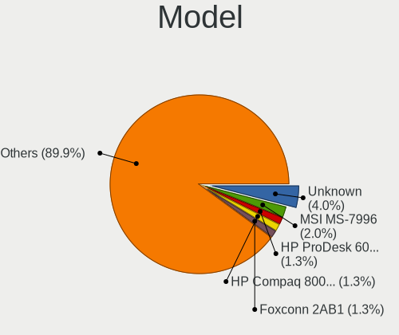
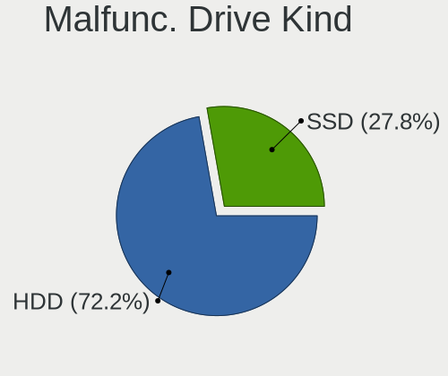
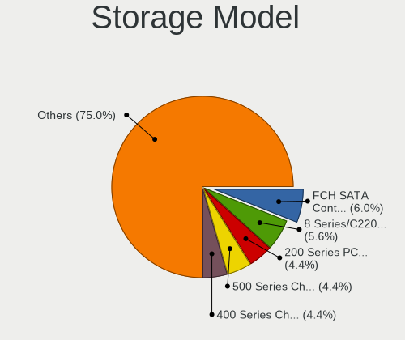
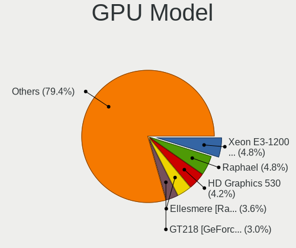
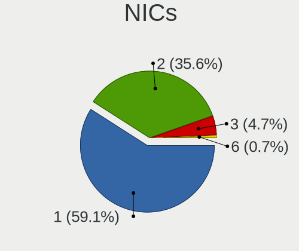
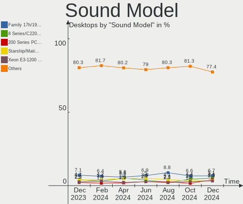

Linux Mint - Hardware Trends (Desktops)
---------------------------------------

A project to identify most popular hardware characteristics and track their change
over time based on data collected by Linux users at https://Linux-Hardware.org.

Anyone can contribute to this report by the [hw-probe](https://github.com/linuxhw/hw-probe) tool:

    sudo -E hw-probe -all -upload

This report is for one last month. Overall report since the beginning of time: [TestCoverage](https://github.com/linuxhw/TestCoverage)

Period: Jan, 2023.

Contents
--------

* [ System ](#system)
  - [ OS                       ](#os)
  - [ OS Family                ](#os-family)
  - [ Kernel                   ](#kernel)
  - [ Kernel Family            ](#kernel-family)
  - [ Kernel Major Ver.        ](#kernel-major-ver)
  - [ Arch                     ](#arch)
  - [ DE                       ](#de)
  - [ Display Server           ](#display-server)
  - [ Display Manager          ](#display-manager)
  - [ OS Lang                  ](#os-lang)
  - [ Boot Mode                ](#boot-mode)
  - [ Filesystem               ](#filesystem)
  - [ Part. scheme             ](#part-scheme)
  - [ Dual Boot with Linux/BSD ](#dual-boot-with-linuxbsd)
  - [ Dual Boot (Win)          ](#dual-boot-win)

* [ Board ](#board)
  - [ Vendor                   ](#vendor)
  - [ Model                    ](#model)
  - [ Model Family             ](#model-family)
  - [ MFG Year                 ](#mfg-year)
  - [ Form Factor              ](#form-factor)
  - [ Secure Boot              ](#secure-boot)
  - [ Coreboot                 ](#coreboot)
  - [ RAM Size                 ](#ram-size)
  - [ RAM Used                 ](#ram-used)
  - [ Total Drives             ](#total-drives)
  - [ Has CD-ROM               ](#has-cd-rom)
  - [ Has Ethernet             ](#has-ethernet)
  - [ Has WiFi                 ](#has-wifi)
  - [ Has Bluetooth            ](#has-bluetooth)

* [ Location ](#location)
  - [ Country                  ](#country)
  - [ City                     ](#city)

* [ Drives ](#drives)
  - [ Drive Vendor             ](#drive-vendor)
  - [ Drive Model              ](#drive-model)
  - [ HDD Vendor               ](#hdd-vendor)
  - [ SSD Vendor               ](#ssd-vendor)
  - [ Drive Kind               ](#drive-kind)
  - [ Drive Connector          ](#drive-connector)
  - [ Drive Size               ](#drive-size)
  - [ Space Total              ](#space-total)
  - [ Space Used               ](#space-used)
  - [ Malfunc. Drives          ](#malfunc-drives)
  - [ Malfunc. Drive Vendor    ](#malfunc-drive-vendor)
  - [ Malfunc. HDD Vendor      ](#malfunc-hdd-vendor)
  - [ Malfunc. Drive Kind      ](#malfunc-drive-kind)
  - [ Failed Drives            ](#failed-drives)
  - [ Failed Drive Vendor      ](#failed-drive-vendor)
  - [ Drive Status             ](#drive-status)

* [ Storage controller ](#storage-controller)
  - [ Storage Vendor           ](#storage-vendor)
  - [ Storage Model            ](#storage-model)
  - [ Storage Kind             ](#storage-kind)

* [ Processor ](#processor)
  - [ CPU Vendor               ](#cpu-vendor)
  - [ CPU Model                ](#cpu-model)
  - [ CPU Model Family         ](#cpu-model-family)
  - [ CPU Cores                ](#cpu-cores)
  - [ CPU Sockets              ](#cpu-sockets)
  - [ CPU Threads              ](#cpu-threads)
  - [ CPU Op-Modes             ](#cpu-op-modes)
  - [ CPU Microcode            ](#cpu-microcode)
  - [ CPU Microarch            ](#cpu-microarch)

* [ Graphics ](#graphics)
  - [ GPU Vendor               ](#gpu-vendor)
  - [ GPU Model                ](#gpu-model)
  - [ GPU Combo                ](#gpu-combo)
  - [ GPU Driver               ](#gpu-driver)
  - [ GPU Memory               ](#gpu-memory)

* [ Monitor ](#monitor)
  - [ Monitor Vendor           ](#monitor-vendor)
  - [ Monitor Model            ](#monitor-model)
  - [ Monitor Resolution       ](#monitor-resolution)
  - [ Monitor Diagonal         ](#monitor-diagonal)
  - [ Monitor Width            ](#monitor-width)
  - [ Aspect Ratio             ](#aspect-ratio)
  - [ Monitor Area             ](#monitor-area)
  - [ Pixel Density            ](#pixel-density)
  - [ Multiple Monitors        ](#multiple-monitors)

* [ Network ](#network)
  - [ Net Controller Vendor    ](#net-controller-vendor)
  - [ Net Controller Model     ](#net-controller-model)
  - [ Wireless Vendor          ](#wireless-vendor)
  - [ Wireless Model           ](#wireless-model)
  - [ Ethernet Vendor          ](#ethernet-vendor)
  - [ Ethernet Model           ](#ethernet-model)
  - [ Net Controller Kind      ](#net-controller-kind)
  - [ Used Controller          ](#used-controller)
  - [ NICs                     ](#nics)
  - [ IPv6                     ](#ipv6)

* [ Bluetooth ](#bluetooth)
  - [ Bluetooth Vendor         ](#bluetooth-vendor)
  - [ Bluetooth Model          ](#bluetooth-model)

* [ Sound ](#sound)
  - [ Sound Vendor             ](#sound-vendor)
  - [ Sound Model              ](#sound-model)

* [ Memory ](#memory)
  - [ Memory Vendor            ](#memory-vendor)
  - [ Memory Model             ](#memory-model)
  - [ Memory Kind              ](#memory-kind)
  - [ Memory Form Factor       ](#memory-form-factor)
  - [ Memory Size              ](#memory-size)
  - [ Memory Speed             ](#memory-speed)

* [ Printers & scanners ](#printers--scanners)
  - [ Printer Vendor           ](#printer-vendor)
  - [ Printer Model            ](#printer-model)
  - [ Scanner Vendor           ](#scanner-vendor)
  - [ Scanner Model            ](#scanner-model)

* [ Camera ](#camera)
  - [ Camera Vendor            ](#camera-vendor)
  - [ Camera Model             ](#camera-model)

* [ Security ](#security)
  - [ Fingerprint Vendor       ](#fingerprint-vendor)
  - [ Fingerprint Model        ](#fingerprint-model)
  - [ Chipcard Vendor          ](#chipcard-vendor)
  - [ Chipcard Model           ](#chipcard-model)

* [ Unsupported ](#unsupported)
  - [ Unsupported Devices      ](#unsupported-devices)
  - [ Unsupported Device Types ](#unsupported-device-types)

System
------

OS
--

Installed operating systems

| Name            | Desktops | Percent |
|-----------------|----------|---------|
| Linux Mint 21.1 | 126      | 57.27%  |
| Linux Mint 20.3 | 46       | 20.91%  |
| Linux Mint 21   | 23       | 10.45%  |
| Linux Mint 20.2 | 8        | 3.64%   |
| Linux Mint 20.1 | 5        | 2.27%   |
| Linux Mint 20   | 5        | 2.27%   |
| Linux Mint 19.3 | 5        | 2.27%   |
| Linux Mint 19.2 | 1        | 0.45%   |
| Linux Mint 18.3 | 1        | 0.45%   |

OS Family
---------

OS without a version

| Name       | Desktops | Percent |
|------------|----------|---------|
| Linux Mint | 220      | 100%    |

Kernel
------

Version of the Linux kernel

| Version                       | Desktops | Percent |
|-------------------------------|----------|---------|
| 5.15.0-58-generic             | 76       | 34.55%  |
| 5.15.0-56-generic             | 43       | 19.55%  |
| 5.4.0-137-generic             | 26       | 11.82%  |
| 5.15.0-57-generic             | 18       | 8.18%   |
| 5.4.0-135-generic             | 12       | 5.45%   |
| 5.4.0-136-generic             | 8        | 3.64%   |
| 5.15.0-52-generic             | 3        | 1.36%   |
| 5.15.0-41-generic             | 3        | 1.36%   |
| 5.4.0-91-generic              | 2        | 0.91%   |
| 6.1.8-4-liquorix-amd64        | 1        | 0.45%   |
| 6.1.4-060104-generic          | 1        | 0.45%   |
| 6.1.0-1.1-liquorix-amd64      | 1        | 0.45%   |
| 6.0.0-1010-oem                | 1        | 0.45%   |
| 5.4.0-99-generic              | 1        | 0.45%   |
| 5.4.0-74-generic              | 1        | 0.45%   |
| 5.4.0-70-generic              | 1        | 0.45%   |
| 5.4.0-131-generic             | 1        | 0.45%   |
| 5.4.0-122-generic             | 1        | 0.45%   |
| 5.4.0-121-generic             | 1        | 0.45%   |
| 5.4.0-120-generic             | 1        | 0.45%   |
| 5.4.0-117-generic             | 1        | 0.45%   |
| 5.4.0-109-generic             | 1        | 0.45%   |
| 5.4.0-107-generic             | 1        | 0.45%   |
| 5.19.0-28-generic             | 1        | 0.45%   |
| 5.15.84-xanmod1               | 1        | 0.45%   |
| 5.15.20-051520-generic        | 1        | 0.45%   |
| 5.15.0-60-generic             | 1        | 0.45%   |
| 5.15.0-58-lowlatency          | 1        | 0.45%   |
| 5.15.0-53-generic             | 1        | 0.45%   |
| 5.15.0-47-generic             | 1        | 0.45%   |
| 5.15.0-43-generic             | 1        | 0.45%   |
| 5.15.0-1021-intel-iotg        | 1        | 0.45%   |
| 5.15.0-1010-nvidia-lowlatency | 1        | 0.45%   |
| 5.13.0-52-generic             | 1        | 0.45%   |
| 5.0.0-23-generic              | 1        | 0.45%   |
| 4.15.0-54-generic             | 1        | 0.45%   |
| 4.15.0-202-lowlatency         | 1        | 0.45%   |
| 4.15.0-142-generic            | 1        | 0.45%   |

Kernel Family
-------------

Linux kernel without a distro release

| Version | Desktops | Percent |
|---------|----------|---------|
| 5.15.0  | 150      | 68.18%  |
| 5.4.0   | 58       | 26.36%  |
| 4.15.0  | 3        | 1.36%   |
| 6.1.8   | 1        | 0.45%   |
| 6.1.4   | 1        | 0.45%   |
| 6.1.0   | 1        | 0.45%   |
| 6.0.0   | 1        | 0.45%   |
| 5.19.0  | 1        | 0.45%   |
| 5.15.84 | 1        | 0.45%   |
| 5.15.20 | 1        | 0.45%   |
| 5.13.0  | 1        | 0.45%   |
| 5.0.0   | 1        | 0.45%   |

Kernel Major Ver.
-----------------

Linux kernel major version

| Version | Desktops | Percent |
|---------|----------|---------|
| 5.15    | 152      | 69.09%  |
| 5.4     | 58       | 26.36%  |
| 6.1     | 3        | 1.36%   |
| 4.15    | 3        | 1.36%   |
| 6.0     | 1        | 0.45%   |
| 5.19    | 1        | 0.45%   |
| 5.13    | 1        | 0.45%   |
| 5.0     | 1        | 0.45%   |

Arch
----

OS architecture (x86_64, i586, etc.)

| Name   | Desktops | Percent |
|--------|----------|---------|
| x86_64 | 220      | 100%    |

DE
--

Desktop Environment

| Name       | Desktops | Percent |
|------------|----------|---------|
| X-Cinnamon | 171      | 77.73%  |
| MATE       | 25       | 11.36%  |
| XFCE       | 10       | 4.55%   |
| GNOME      | 5        | 2.27%   |
| Cinnamon   | 5        | 2.27%   |
| KDE5       | 2        | 0.91%   |
| Unknown    | 2        | 0.91%   |

Display Server
--------------

X11 or Wayland

| Name    | Desktops | Percent |
|---------|----------|---------|
| X11     | 216      | 98.18%  |
| Tty     | 3        | 1.36%   |
| Wayland | 1        | 0.45%   |

Display Manager
---------------

SDDM, LightDM, etc.

| Name    | Desktops | Percent |
|---------|----------|---------|
| Unknown | 128      | 58.18%  |
| LightDM | 91       | 41.36%  |
| GDM     | 1        | 0.45%   |

OS Lang
-------

Language

| Lang    | Desktops | Percent |
|---------|----------|---------|
| en_US   | 61       | 27.73%  |
| de_DE   | 32       | 14.55%  |
| it_IT   | 18       | 8.18%   |
| pt_BR   | 15       | 6.82%   |
| ru_RU   | 12       | 5.45%   |
| en_GB   | 12       | 5.45%   |
| en_CA   | 11       | 5%      |
| fr_FR   | 9        | 4.09%   |
| es_ES   | 7        | 3.18%   |
| en_AU   | 6        | 2.73%   |
| C       | 6        | 2.73%   |
| nl_NL   | 3        | 1.36%   |
| es_AR   | 3        | 1.36%   |
| sv_SE   | 2        | 0.91%   |
| pt_PT   | 2        | 0.91%   |
| pl_PL   | 2        | 0.91%   |
| fi_FI   | 2        | 0.91%   |
| es_MX   | 2        | 0.91%   |
| el_GR   | 2        | 0.91%   |
| cs_CZ   | 2        | 0.91%   |
| sr_RS   | 1        | 0.45%   |
| sk_SK   | 1        | 0.45%   |
| nl_BE   | 1        | 0.45%   |
| hu_HU   | 1        | 0.45%   |
| fr_BE   | 1        | 0.45%   |
| es_VE   | 1        | 0.45%   |
| es_CL   | 1        | 0.45%   |
| de_AT   | 1        | 0.45%   |
| bg_BG   | 1        | 0.45%   |
| be_BY   | 1        | 0.45%   |
| Unknown | 1        | 0.45%   |

Boot Mode
---------

EFI or BIOS

| Mode | Desktops | Percent |
|------|----------|---------|
| EFI  | 113      | 51.36%  |
| BIOS | 107      | 48.64%  |

Filesystem
----------

Type of filesystem

| Type    | Desktops | Percent |
|---------|----------|---------|
| Ext4    | 209      | 95%     |
| Overlay | 6        | 2.73%   |
| Btrfs   | 4        | 1.82%   |
| Zfs     | 1        | 0.45%   |

Part. scheme
------------

Scheme of partitioning

| Type    | Desktops | Percent |
|---------|----------|---------|
| Unknown | 126      | 57.27%  |
| GPT     | 71       | 32.27%  |
| MBR     | 23       | 10.45%  |

Dual Boot with Linux/BSD
------------------------

Hosting more than one Linux/BSD

| Dual boot | Desktops | Percent |
|-----------|----------|---------|
| No        | 196      | 89.09%  |
| Yes       | 24       | 10.91%  |

Dual Boot (Win)
---------------

Hosting Linux and Windows

| Dual boot | Desktops | Percent |
|-----------|----------|---------|
| No        | 176      | 80%     |
| Yes       | 44       | 20%     |

Board
-----

Vendor
------

Motherboard manufacturer

| Name                | Desktops | Percent |
|---------------------|----------|---------|
| ASUSTek Computer    | 60       | 27.27%  |
| Gigabyte Technology | 41       | 18.64%  |
| MSI                 | 20       | 9.09%   |
| ASRock              | 19       | 8.64%   |
| Hewlett-Packard     | 17       | 7.73%   |
| Dell                | 17       | 7.73%   |
| Lenovo              | 9        | 4.09%   |
| Pegatron            | 6        | 2.73%   |
| Fujitsu             | 4        | 1.82%   |
| Unknown             | 4        | 1.82%   |
| Intel               | 3        | 1.36%   |
| ECS                 | 3        | 1.36%   |
| Biostar             | 2        | 0.91%   |
| AZW                 | 2        | 0.91%   |
| AMD                 | 2        | 0.91%   |
| Acer                | 2        | 0.91%   |
| Pyramid             | 1        | 0.45%   |
| Positivo            | 1        | 0.45%   |
| PCWare              | 1        | 0.45%   |
| Packard Bell        | 1        | 0.45%   |
| NEWSMAY             | 1        | 0.45%   |
| Medion              | 1        | 0.45%   |
| JGINYUE             | 1        | 0.45%   |
| Foxconn             | 1        | 0.45%   |
| DFI                 | 1        | 0.45%   |

Model
-----

Motherboard model

| Name                                | Desktops | Percent |
|-------------------------------------|----------|---------|
| ASUS All Series                     | 6        | 2.73%   |
| Unknown                             | 5        | 2.27%   |
| MSI MS-7C91                         | 3        | 1.36%   |
| Gigabyte B450M DS3H                 | 3        | 1.36%   |
| MSI MS-7C02                         | 2        | 0.91%   |
| Gigabyte H61M-S1                    | 2        | 0.91%   |
| Gigabyte A320M-S2H                  | 2        | 0.91%   |
| Fujitsu ESPRIMO Q920                | 2        | 0.91%   |
| Dell OptiPlex 3010                  | 2        | 0.91%   |
| ASUS TUF Gaming X570-PLUS           | 2        | 0.91%   |
| ASUS PRIME A320M-K                  | 2        | 0.91%   |
| ASUS M5A97 EVO R2.0                 | 2        | 0.91%   |
| ASRock H370M Pro4                   | 2        | 0.91%   |
| Pyramid Control Unit POF G4         | 1        | 0.45%   |
| Positivo POS-PIQ77CL                | 1        | 0.45%   |
| Pegatron p6-2310                    | 1        | 0.45%   |
| Pegatron p6-2013it                  | 1        | 0.45%   |
| Pegatron NARRA5                     | 1        | 0.45%   |
| Pegatron KN444AA-ABZ m9242.it       | 1        | 0.45%   |
| Pegatron h8-1403es                  | 1        | 0.45%   |
| Pegatron h8-1010                    | 1        | 0.45%   |
| PCWare IPMH110G                     | 1        | 0.45%   |
| Packard Bell IXTREME M5722          | 1        | 0.45%   |
| MSI MS-7D77                         | 1        | 0.45%   |
| MSI MS-7D46                         | 1        | 0.45%   |
| MSI MS-7D22                         | 1        | 0.45%   |
| MSI MS-7D20                         | 1        | 0.45%   |
| MSI MS-7C56                         | 1        | 0.45%   |
| MSI MS-7B86                         | 1        | 0.45%   |
| MSI MS-7B79                         | 1        | 0.45%   |
| MSI MS-7B09                         | 1        | 0.45%   |
| MSI MS-7982                         | 1        | 0.45%   |
| MSI MS-7891                         | 1        | 0.45%   |
| MSI MS-7885                         | 1        | 0.45%   |
| MSI MS-7817                         | 1        | 0.45%   |
| MSI MS-7732                         | 1        | 0.45%   |
| MSI MS-7513                         | 1        | 0.45%   |
| MSI MAG H410 Codex S (MS-B927)      | 1        | 0.45%   |
| Medion MS-7728                      | 1        | 0.45%   |
| Lenovo ThinkStation P620 30E0003QGE | 1        | 0.45%   |

Model Family
------------

Motherboard model prefix

| Name                 | Desktops | Percent |
|----------------------|----------|---------|
| ASUS PRIME           | 12       | 5.45%   |
| Dell OptiPlex        | 9        | 4.09%   |
| HP Compaq            | 6        | 2.73%   |
| ASUS All             | 6        | 2.73%   |
| HP Pavilion          | 5        | 2.27%   |
| Unknown              | 5        | 2.27%   |
| Lenovo ThinkCentre   | 4        | 1.82%   |
| Gigabyte B450M       | 4        | 1.82%   |
| Dell Precision       | 4        | 1.82%   |
| MSI MS-7C91          | 3        | 1.36%   |
| Fujitsu ESPRIMO      | 3        | 1.36%   |
| ASUS TUF             | 3        | 1.36%   |
| ASUS ROG             | 3        | 1.36%   |
| ASUS M5A97           | 3        | 1.36%   |
| MSI MS-7C02          | 2        | 0.91%   |
| Lenovo IdeaCentre    | 2        | 0.91%   |
| HP ProDesk           | 2        | 0.91%   |
| HP EliteDesk         | 2        | 0.91%   |
| Gigabyte X570        | 2        | 0.91%   |
| Gigabyte H61M-S1     | 2        | 0.91%   |
| Gigabyte B560M       | 2        | 0.91%   |
| Gigabyte B450        | 2        | 0.91%   |
| Gigabyte A320M-S2H   | 2        | 0.91%   |
| ASUS SABERTOOTH      | 2        | 0.91%   |
| ASRock X570          | 2        | 0.91%   |
| ASRock H370M         | 2        | 0.91%   |
| ASRock B450M         | 2        | 0.91%   |
| ASRock A320M-HDV     | 2        | 0.91%   |
| Acer Aspire          | 2        | 0.91%   |
| Pyramid Control      | 1        | 0.45%   |
| Positivo POS-PIQ77CL | 1        | 0.45%   |
| Pegatron p6-2310     | 1        | 0.45%   |
| Pegatron p6-2013it   | 1        | 0.45%   |
| Pegatron NARRA5      | 1        | 0.45%   |
| Pegatron KN444AA-ABZ | 1        | 0.45%   |
| Pegatron h8-1403es   | 1        | 0.45%   |
| Pegatron h8-1010     | 1        | 0.45%   |
| PCWare IPMH110G      | 1        | 0.45%   |
| Packard Bell IXTREME | 1        | 0.45%   |
| MSI MS-7D77          | 1        | 0.45%   |

MFG Year
--------

Motherboard manufacture year

| Year | Desktops | Percent |
|------|----------|---------|
| 2012 | 28       | 12.73%  |
| 2018 | 22       | 10%     |
| 2021 | 18       | 8.18%   |
| 2013 | 16       | 7.27%   |
| 2022 | 15       | 6.82%   |
| 2020 | 15       | 6.82%   |
| 2011 | 15       | 6.82%   |
| 2008 | 14       | 6.36%   |
| 2017 | 13       | 5.91%   |
| 2019 | 12       | 5.45%   |
| 2010 | 12       | 5.45%   |
| 2009 | 10       | 4.55%   |
| 2014 | 8        | 3.64%   |
| 2015 | 7        | 3.18%   |
| 2016 | 6        | 2.73%   |
| 2007 | 5        | 2.27%   |
| 2006 | 4        | 1.82%   |

Form Factor
-----------

Physical design of the computer

| Name    | Desktops | Percent |
|---------|----------|---------|
| Desktop | 220      | 100%    |

Secure Boot
-----------

Enabled or disabled

| State    | Desktops | Percent |
|----------|----------|---------|
| Disabled | 209      | 95%     |
| Enabled  | 11       | 5%      |

Coreboot
--------

Have coreboot on board

| Used | Desktops | Percent |
|------|----------|---------|
| No   | 220      | 100%    |

RAM Size
--------

Total RAM memory

| Size in GB  | Desktops | Percent |
|-------------|----------|---------|
| 16.01-24.0  | 51       | 23.18%  |
| 8.01-16.0   | 44       | 20%     |
| 4.01-8.0    | 38       | 17.27%  |
| 3.01-4.0    | 29       | 13.18%  |
| 32.01-64.0  | 27       | 12.27%  |
| 24.01-32.0  | 11       | 5%      |
| 64.01-256.0 | 9        | 4.09%   |
| 1.01-2.0    | 6        | 2.73%   |
| 2.01-3.0    | 4        | 1.82%   |
| 0.51-1.0    | 1        | 0.45%   |

RAM Used
--------

Used RAM memory

| Used GB    | Desktops | Percent |
|------------|----------|---------|
| 1.01-2.0   | 73       | 33.18%  |
| 2.01-3.0   | 63       | 28.64%  |
| 4.01-8.0   | 36       | 16.36%  |
| 3.01-4.0   | 35       | 15.91%  |
| 0.51-1.0   | 9        | 4.09%   |
| 8.01-16.0  | 3        | 1.36%   |
| 24.01-32.0 | 1        | 0.45%   |

Total Drives
------------

Number of drives on board

| Drives | Desktops | Percent |
|--------|----------|---------|
| 1      | 80       | 36.36%  |
| 2      | 58       | 26.36%  |
| 3      | 34       | 15.45%  |
| 4      | 23       | 10.45%  |
| 5      | 16       | 7.27%   |
| 7      | 4        | 1.82%   |
| 0      | 3        | 1.36%   |
| 6      | 2        | 0.91%   |

Has CD-ROM
----------

Has CD-ROM on board

| Presented | Desktops | Percent |
|-----------|----------|---------|
| Yes       | 127      | 57.73%  |
| No        | 93       | 42.27%  |

Has Ethernet
------------

Has Ethernet on board

| Presented | Desktops | Percent |
|-----------|----------|---------|
| Yes       | 216      | 98.18%  |
| No        | 4        | 1.82%   |

Has WiFi
--------

Has WiFi module

| Presented | Desktops | Percent |
|-----------|----------|---------|
| Yes       | 113      | 51.36%  |
| No        | 107      | 48.64%  |

Has Bluetooth
-------------

Has Bluetooth module

| Presented | Desktops | Percent |
|-----------|----------|---------|
| No        | 145      | 65.91%  |
| Yes       | 75       | 34.09%  |

Location
--------

Country
-------

Geographic location (country)

| Country     | Desktops | Percent |
|-------------|----------|---------|
| USA         | 38       | 17.27%  |
| Germany     | 31       | 14.09%  |
| Italy       | 19       | 8.64%   |
| Brazil      | 18       | 8.18%   |
| Russia      | 15       | 6.82%   |
| UK          | 12       | 5.45%   |
| Canada      | 12       | 5.45%   |
| France      | 10       | 4.55%   |
| Spain       | 8        | 3.64%   |
| Netherlands | 6        | 2.73%   |
| Australia   | 6        | 2.73%   |
| Sweden      | 5        | 2.27%   |
| Argentina   | 4        | 1.82%   |
| Portugal    | 3        | 1.36%   |
| Greece      | 3        | 1.36%   |
| Austria     | 3        | 1.36%   |
| Turkey      | 2        | 0.91%   |
| Serbia      | 2        | 0.91%   |
| Romania     | 2        | 0.91%   |
| Mexico      | 2        | 0.91%   |
| Finland     | 2        | 0.91%   |
| Czechia     | 2        | 0.91%   |
| Belgium     | 2        | 0.91%   |
| Venezuela   | 1        | 0.45%   |
| Tunisia     | 1        | 0.45%   |
| Switzerland | 1        | 0.45%   |
| Slovakia    | 1        | 0.45%   |
| Poland      | 1        | 0.45%   |
| Malaysia    | 1        | 0.45%   |
| Latvia      | 1        | 0.45%   |
| Hungary     | 1        | 0.45%   |
| Denmark     | 1        | 0.45%   |
| Croatia     | 1        | 0.45%   |
| Chile       | 1        | 0.45%   |
| Bulgaria    | 1        | 0.45%   |
| Belarus     | 1        | 0.45%   |

City
----

Geographic location (city)

| City                 | Desktops | Percent |
|----------------------|----------|---------|
| St Petersburg        | 3        | 1.36%   |
| Vienna               | 2        | 0.91%   |
| Sydney               | 2        | 0.91%   |
| Stockholm            | 2        | 0.91%   |
| Rome                 | 2        | 0.91%   |
| Moscow               | 2        | 0.91%   |
| Milano               | 2        | 0.91%   |
| Madrid               | 2        | 0.91%   |
| Los Angeles          | 2        | 0.91%   |
| London               | 2        | 0.91%   |
| Hamburg              | 2        | 0.91%   |
| Belgrade             | 2        | 0.91%   |
| Augsburg             | 2        | 0.91%   |
| Athens               | 2        | 0.91%   |
| Araucária           | 2        | 0.91%   |
| Zurich               | 1        | 0.45%   |
| Zeitz                | 1        | 0.45%   |
| Wolfsburg            | 1        | 0.45%   |
| West Valley City     | 1        | 0.45%   |
| Villimpenta          | 1        | 0.45%   |
| Vancouver            | 1        | 0.45%   |
| Vallenar             | 1        | 0.45%   |
| Valencia             | 1        | 0.45%   |
| Valence              | 1        | 0.45%   |
| Vaihingen an der Enz | 1        | 0.45%   |
| Urziceni             | 1        | 0.45%   |
| Unterhaching         | 1        | 0.45%   |
| Ulyanovsk            | 1        | 0.45%   |
| Uberlândia          | 1        | 0.45%   |
| Turin                | 1        | 0.45%   |
| Toronto              | 1        | 0.45%   |
| Tolleson             | 1        | 0.45%   |
| Tlalnepantla         | 1        | 0.45%   |
| Thornhill            | 1        | 0.45%   |
| Temple               | 1        | 0.45%   |
| Tempe                | 1        | 0.45%   |
| Telford              | 1        | 0.45%   |
| Tarnobrzeg           | 1        | 0.45%   |
| Swartz Creek         | 1        | 0.45%   |
| Sumaré              | 1        | 0.45%   |

Drives
------

Drive Vendor
------------

Hard drive vendors

| Vendor                    | Desktops | Drives | Percent |
|---------------------------|----------|--------|---------|
| WDC                       | 71       | 105    | 16.99%  |
| Seagate                   | 70       | 91     | 16.75%  |
| Samsung Electronics       | 60       | 83     | 14.35%  |
| Kingston                  | 23       | 24     | 5.5%    |
| Crucial                   | 22       | 23     | 5.26%   |
| Toshiba                   | 21       | 25     | 5.02%   |
| SanDisk                   | 20       | 21     | 4.78%   |
| China                     | 12       | 12     | 2.87%   |
| Hitachi                   | 10       | 10     | 2.39%   |
| PNY                       | 8        | 8      | 1.91%   |
| Intel                     | 8        | 9      | 1.91%   |
| Unknown                   | 7        | 9      | 1.67%   |
| Silicon Motion            | 5        | 5      | 1.2%    |
| OCZ                       | 5        | 6      | 1.2%    |
| HGST                      | 5        | 6      | 1.2%    |
| Phison Electronics        | 4        | 5      | 0.96%   |
| Maxtor                    | 4        | 4      | 0.96%   |
| JMicron Technology        | 4        | 4      | 0.96%   |
| Intenso                   | 4        | 5      | 0.96%   |
| SPCC                      | 3        | 3      | 0.72%   |
| SK hynix                  | 3        | 3      | 0.72%   |
| Micron/Crucial Technology | 3        | 3      | 0.72%   |
| Lexar                     | 3        | 3      | 0.72%   |
| A-DATA Technology         | 3        | 3      | 0.72%   |
| USB3.0                    | 2        | 2      | 0.48%   |
| Transcend                 | 2        | 2      | 0.48%   |
| Team                      | 2        | 2      | 0.48%   |
| Phison                    | 2        | 2      | 0.48%   |
| KingDian                  | 2        | 3      | 0.48%   |
| Gigabyte Technology       | 2        | 2      | 0.48%   |
| XPG                       | 1        | 1      | 0.24%   |
| Sony                      | 1        | 1      | 0.24%   |
| Smartbuy                  | 1        | 1      | 0.24%   |
| SABRENT                   | 1        | 1      | 0.24%   |
| s60                       | 1        | 1      | 0.24%   |
| S3+                       | 1        | 1      | 0.24%   |
| Realtek Semiconductor     | 1        | 1      | 0.24%   |
| NGFF                      | 1        | 1      | 0.24%   |
| Nextorag                  | 1        | 1      | 0.24%   |
| Mushkin                   | 1        | 1      | 0.24%   |

Drive Model
-----------

Hard drive models

| Model                                                 | Desktops | Percent |
|-------------------------------------------------------|----------|---------|
| Kingston SA400S37240G 240GB SSD                       | 9        | 1.82%   |
| Samsung SSD 850 EVO 250GB                             | 8        | 1.62%   |
| Samsung NVMe SSD Controller SM981/PM981/PM983 500GB   | 7        | 1.41%   |
| Seagate ST2000DM008-2FR102 2TB                        | 5        | 1.01%   |
| Samsung SSD 860 EVO 500GB                             | 5        | 1.01%   |
| Toshiba DT01ACA200 2TB                                | 4        | 0.81%   |
| Silicon Motion SM2263EN/SM2263XT SSD Controller 512GB | 4        | 0.81%   |
| Seagate ST500DM002-1BD142 500GB                       | 4        | 0.81%   |
| Seagate ST1000DM010-2EP102 1TB                        | 4        | 0.81%   |
| Crucial CT1000MX500SSD1 1TB                           | 4        | 0.81%   |
| WDC WDS240G2G0A-00JH30 240GB SSD                      | 3        | 0.61%   |
| WDC WD30EFRX-68EUZN0 3TB                              | 3        | 0.61%   |
| WDC WD10EZEX-08WN4A0 1TB                              | 3        | 0.61%   |
| Toshiba DT01ACA100 1TB                                | 3        | 0.61%   |
| Seagate ST8000DM004-2CX188 8TB                        | 3        | 0.61%   |
| Seagate ST3750528AS 752GB                             | 3        | 0.61%   |
| Seagate ST3500418AS 500GB                             | 3        | 0.61%   |
| Seagate ST31000528AS 1TB                              | 3        | 0.61%   |
| Seagate ST2000DM001-9YN164 2TB                        | 3        | 0.61%   |
| Seagate ST2000DL003-9VT166 2TB                        | 3        | 0.61%   |
| Seagate ST1000DM003-1CH162 1TB                        | 3        | 0.61%   |
| Sandisk WD Blue SN550 NVMe SSD 1TB                    | 3        | 0.61%   |
| Samsung SSD 870 QVO 1TB                               | 3        | 0.61%   |
| Samsung SSD 860 EVO 1TB                               | 3        | 0.61%   |
| Samsung SSD 850 EVO 500GB                             | 3        | 0.61%   |
| Samsung SSD 840 PRO Series 128GB                      | 3        | 0.61%   |
| Samsung HD501LJ 500GB                                 | 3        | 0.61%   |
| China SSD 256GB                                       | 3        | 0.61%   |
| WDC WDS400T2B0A-00SM50 4TB SSD                        | 2        | 0.4%    |
| WDC WDS120G2G0A-00JH30 120GB SSD                      | 2        | 0.4%    |
| WDC WDS100T2B0A-00SM50 1TB SSD                        | 2        | 0.4%    |
| WDC WD5000AAKX-60U6AA0 500GB                          | 2        | 0.4%    |
| WDC WD40EFRX-68N32N0 4TB                              | 2        | 0.4%    |
| WDC WD30EFRX-68N32N0 3TB                              | 2        | 0.4%    |
| WDC WD20EZAZ-00L9GB0 2TB                              | 2        | 0.4%    |
| WDC WD20EURS-63S48Y0 2TB                              | 2        | 0.4%    |
| WDC WD20EFRX-68EUZN0 2TB                              | 2        | 0.4%    |
| WDC WD20EARX-00PASB0 2TB                              | 2        | 0.4%    |
| WDC WD10EZEX-00ZF5A0 1TB                              | 2        | 0.4%    |
| WDC WD10EARS-22Y5B1 1TB                               | 2        | 0.4%    |

HDD Vendor
----------

Hard disk drive vendors

| Vendor              | Desktops | Drives | Percent |
|---------------------|----------|--------|---------|
| Seagate             | 70       | 91     | 36.27%  |
| WDC                 | 60       | 86     | 31.09%  |
| Toshiba             | 21       | 25     | 10.88%  |
| Samsung Electronics | 16       | 16     | 8.29%   |
| Hitachi             | 10       | 10     | 5.18%   |
| HGST                | 5        | 6      | 2.59%   |
| Maxtor              | 3        | 3      | 1.55%   |
| USB3.0              | 2        | 2      | 1.04%   |
| Unknown             | 2        | 2      | 1.04%   |
| SABRENT             | 1        | 1      | 0.52%   |
| JMicron Technology  | 1        | 1      | 0.52%   |
| HGST HTS            | 1        | 1      | 0.52%   |
| Apple               | 1        | 1      | 0.52%   |

SSD Vendor
----------

Solid state drive vendors

| Vendor              | Desktops | Drives | Percent |
|---------------------|----------|--------|---------|
| Samsung Electronics | 32       | 46     | 19.63%  |
| Kingston            | 19       | 20     | 11.66%  |
| Crucial             | 18       | 19     | 11.04%  |
| SanDisk             | 15       | 15     | 9.2%    |
| WDC                 | 13       | 13     | 7.98%   |
| China               | 11       | 11     | 6.75%   |
| PNY                 | 7        | 7      | 4.29%   |
| OCZ                 | 5        | 6      | 3.07%   |
| Intel               | 5        | 6      | 3.07%   |
| Intenso             | 4        | 5      | 2.45%   |
| SPCC                | 3        | 3      | 1.84%   |
| Lexar               | 3        | 3      | 1.84%   |
| A-DATA Technology   | 3        | 3      | 1.84%   |
| Team                | 2        | 2      | 1.23%   |
| KingDian            | 2        | 3      | 1.23%   |
| JMicron Technology  | 2        | 2      | 1.23%   |
| Transcend           | 1        | 1      | 0.61%   |
| Smartbuy            | 1        | 1      | 0.61%   |
| s60                 | 1        | 1      | 0.61%   |
| S3+                 | 1        | 1      | 0.61%   |
| NGFF                | 1        | 1      | 0.61%   |
| Nextorag            | 1        | 1      | 0.61%   |
| Mushkin             | 1        | 1      | 0.61%   |
| Micron Technology   | 1        | 1      | 0.61%   |
| Maxtor              | 1        | 1      | 0.61%   |
| LITEON              | 1        | 1      | 0.61%   |
| Leven               | 1        | 1      | 0.61%   |
| Kross Elegance      | 1        | 1      | 0.61%   |
| KIOXIA-EXCERIA      | 1        | 1      | 0.61%   |
| KingSpec            | 1        | 1      | 0.61%   |
| FCS                 | 1        | 1      | 0.61%   |
| Fanxiang            | 1        | 1      | 0.61%   |
| Apacer              | 1        | 1      | 0.61%   |
| AMD                 | 1        | 1      | 0.61%   |
| Unknown             | 1        | 1      | 0.61%   |

Drive Kind
----------

HDD or SSD

| Kind    | Desktops | Drives | Percent |
|---------|----------|--------|---------|
| HDD     | 143      | 245    | 41.57%  |
| SSD     | 130      | 183    | 37.79%  |
| NVMe    | 64       | 74     | 18.6%   |
| Unknown | 4        | 6      | 1.16%   |
| MMC     | 3        | 3      | 0.87%   |

Drive Connector
---------------

SATA, SAS, NVMe, etc.

| Type | Desktops | Drives | Percent |
|------|----------|--------|---------|
| SATA | 195      | 409    | 69.15%  |
| NVMe | 64       | 74     | 22.7%   |
| SAS  | 20       | 25     | 7.09%   |
| MMC  | 3        | 3      | 1.06%   |

Drive Size
----------

Size of hard drive

| Size in TB | Desktops | Drives | Percent |
|------------|----------|--------|---------|
| 0.01-0.5   | 138      | 219    | 45.7%   |
| 0.51-1.0   | 75       | 96     | 24.83%  |
| 1.01-2.0   | 43       | 51     | 14.24%  |
| 3.01-4.0   | 17       | 21     | 5.63%   |
| 2.01-3.0   | 14       | 18     | 4.64%   |
| 4.01-10.0  | 12       | 17     | 3.97%   |
| 10.01-20.0 | 3        | 6      | 0.99%   |

Space Total
-----------

Amount of disk space available on the file system

| Size in GB     | Desktops | Percent |
|----------------|----------|---------|
| 101-250        | 51       | 23.18%  |
| 251-500        | 43       | 19.55%  |
| 501-1000       | 35       | 15.91%  |
| 1001-2000      | 31       | 14.09%  |
| More than 3000 | 29       | 13.18%  |
| 2001-3000      | 11       | 5%      |
| 51-100         | 11       | 5%      |
| 1-20           | 5        | 2.27%   |
| 21-50          | 2        | 0.91%   |
| Unknown        | 2        | 0.91%   |

Space Used
----------

Amount of used disk space

| Used GB        | Desktops | Percent |
|----------------|----------|---------|
| 21-50          | 43       | 19.55%  |
| 101-250        | 37       | 16.82%  |
| 1-20           | 34       | 15.45%  |
| 51-100         | 30       | 13.64%  |
| 251-500        | 18       | 8.18%   |
| 501-1000       | 18       | 8.18%   |
| 1001-2000      | 16       | 7.27%   |
| More than 3000 | 11       | 5%      |
| 2001-3000      | 11       | 5%      |
| Unknown        | 2        | 0.91%   |

Malfunc. Drives
---------------

Drive models with a malfunction

| Model                               | Desktops | Drives | Percent |
|-------------------------------------|----------|--------|---------|
| XPG GAMMIX S11 Pro 1TB              | 1        | 1      | 4%      |
| WDC WDS240G2G0A-00JH30 240GB SSD    | 1        | 1      | 4%      |
| WDC WD800JD-00HKA0 80GB             | 1        | 1      | 4%      |
| WDC WD6400AAKS-00H2B0 640GB         | 1        | 1      | 4%      |
| WDC WD5000AAKX-60U6AA0 500GB        | 1        | 1      | 4%      |
| WDC WD3200AAKS-00L9A0 320GB         | 1        | 1      | 4%      |
| WDC WD30EFRX-68N32N0 3TB            | 1        | 1      | 4%      |
| WDC WD30EFRX-68EUZN0 3TB            | 1        | 1      | 4%      |
| WDC WD20EFRX-68EUZN0 2TB            | 1        | 2      | 4%      |
| USB3.0 Super Speed 128GB            | 1        | 1      | 4%      |
| Toshiba MK5059GSXP 500GB            | 1        | 1      | 4%      |
| Seagate ST4000VX007-2DT166 4TB      | 1        | 1      | 4%      |
| Seagate ST3500413AS 500GB           | 1        | 1      | 4%      |
| Seagate ST3500410AS 500GB           | 1        | 1      | 4%      |
| Seagate ST3320310CS 320GB           | 1        | 1      | 4%      |
| Seagate ST320LT012-1DG14C 320GB     | 1        | 1      | 4%      |
| Seagate ST31000333AS 1TB            | 1        | 1      | 4%      |
| Seagate ST1000LM024 HN-M101MBB 1TB  | 1        | 1      | 4%      |
| Seagate ST1000DM010-2EP102 1TB      | 1        | 1      | 4%      |
| Samsung Electronics SSD 870 EVO 1TB | 1        | 1      | 4%      |
| s60 60gb 55GB SSD                   | 1        | 1      | 4%      |
| OCZ VERTEX 64GB SSD                 | 1        | 1      | 4%      |
| Hitachi HTS543232L9A300 320GB       | 1        | 1      | 4%      |
| Hitachi HDT721032SLA380 320GB       | 1        | 1      | 4%      |
| China SSD 256GB                     | 1        | 1      | 4%      |

Malfunc. Drive Vendor
---------------------

Vendors of faulty drives

| Vendor              | Desktops | Drives | Percent |
|---------------------|----------|--------|---------|
| Seagate             | 8        | 8      | 34.78%  |
| WDC                 | 6        | 9      | 26.09%  |
| Hitachi             | 2        | 2      | 8.7%    |
| XPG                 | 1        | 1      | 4.35%   |
| USB3.0              | 1        | 1      | 4.35%   |
| Toshiba             | 1        | 1      | 4.35%   |
| Samsung Electronics | 1        | 1      | 4.35%   |
| s60                 | 1        | 1      | 4.35%   |
| OCZ                 | 1        | 1      | 4.35%   |
| China               | 1        | 1      | 4.35%   |

Malfunc. HDD Vendor
-------------------

Vendors of faulty HDD drives

| Vendor  | Desktops | Drives | Percent |
|---------|----------|--------|---------|
| Seagate | 8        | 8      | 47.06%  |
| WDC     | 5        | 8      | 29.41%  |
| Hitachi | 2        | 2      | 11.76%  |
| USB3.0  | 1        | 1      | 5.88%   |
| Toshiba | 1        | 1      | 5.88%   |

Malfunc. Drive Kind
-------------------

Kinds of faulty drives

| Kind | Desktops | Drives | Percent |
|------|----------|--------|---------|
| HDD  | 15       | 20     | 71.43%  |
| SSD  | 5        | 5      | 23.81%  |
| NVMe | 1        | 1      | 4.76%   |

Failed Drives
-------------

Failed drive models

Zero info for selected period =(

Failed Drive Vendor
-------------------

Failed drive vendors

Zero info for selected period =(

Drive Status
------------

Number of failed and malfunc. drives

| Status   | Desktops | Drives | Percent |
|----------|----------|--------|---------|
| Detected | 134      | 304    | 55.6%   |
| Works    | 86       | 181    | 35.68%  |
| Malfunc  | 21       | 26     | 8.71%   |

Storage controller
------------------

Storage Vendor
--------------

Storage controller vendors

| Vendor                           | Desktops | Percent |
|----------------------------------|----------|---------|
| Intel                            | 128      | 40.51%  |
| AMD                              | 80       | 25.32%  |
| Samsung Electronics              | 20       | 6.33%   |
| SanDisk                          | 11       | 3.48%   |
| Marvell Technology Group         | 11       | 3.48%   |
| JMicron Technology               | 11       | 3.48%   |
| Phison Electronics               | 9        | 2.85%   |
| ASMedia Technology               | 8        | 2.53%   |
| Nvidia                           | 7        | 2.22%   |
| Micron/Crucial Technology        | 6        | 1.9%    |
| Silicon Motion                   | 5        | 1.58%   |
| Kingston Technology Company      | 4        | 1.27%   |
| SK hynix                         | 3        | 0.95%   |
| VIA Technologies                 | 2        | 0.63%   |
| Transcend                        | 2        | 0.63%   |
| ADATA Technology                 | 2        | 0.63%   |
| Sony                             | 1        | 0.32%   |
| Silicon Integrated Systems [SiS] | 1        | 0.32%   |
| Silicon Image                    | 1        | 0.32%   |
| Realtek Semiconductor            | 1        | 0.32%   |
| KIOXIA                           | 1        | 0.32%   |
| Integrated Technology Express    | 1        | 0.32%   |
| Biwin Storage Technology         | 1        | 0.32%   |

Storage Model
-------------

Storage controller models

| Model                                                                                   | Desktops | Percent |
|-----------------------------------------------------------------------------------------|----------|---------|
| AMD FCH SATA Controller [AHCI mode]                                                     | 38       | 9.5%    |
| AMD SB7x0/SB8x0/SB9x0 SATA Controller [AHCI mode]                                       | 17       | 4.25%   |
| AMD 400 Series Chipset SATA Controller                                                  | 16       | 4%      |
| Samsung NVMe SSD Controller SM981/PM981/PM983                                           | 14       | 3.5%    |
| Intel 8 Series/C220 Series Chipset Family 6-port SATA Controller 1 [AHCI mode]          | 13       | 3.25%   |
| Intel 6 Series/C200 Series Chipset Family 6 port Desktop SATA AHCI Controller           | 12       | 3%      |
| Intel 7 Series/C210 Series Chipset Family 6-port SATA Controller [AHCI mode]            | 10       | 2.5%    |
| Intel SATA Controller [RAID mode]                                                       | 9        | 2.25%   |
| AMD SB7x0/SB8x0/SB9x0 IDE Controller                                                    | 9        | 2.25%   |
| JMicron JMB363 SATA/IDE Controller                                                      | 8        | 2%      |
| Intel Q170/Q150/B150/H170/H110/Z170/CM236 Chipset SATA Controller [AHCI Mode]           | 8        | 2%      |
| Intel NM10/ICH7 Family SATA Controller [IDE mode]                                       | 8        | 2%      |
| Intel 82801JI (ICH10 Family) 4 port SATA IDE Controller #1                              | 8        | 2%      |
| Intel 82801JI (ICH10 Family) 2 port SATA IDE Controller #2                              | 8        | 2%      |
| ASMedia ASM1062 Serial ATA Controller                                                   | 8        | 2%      |
| Intel Alder Lake-S PCH SATA Controller [AHCI Mode]                                      | 7        | 1.75%   |
| Intel 82801G (ICH7 Family) IDE Controller                                               | 7        | 1.75%   |
| AMD FCH SATA Controller D                                                               | 7        | 1.75%   |
| AMD 500 Series Chipset SATA Controller                                                  | 7        | 1.75%   |
| Intel 200 Series PCH SATA controller [AHCI mode]                                        | 6        | 1.5%    |
| AMD SATA controller                                                                     | 6        | 1.5%    |
| Silicon Motion SM2263EN/SM2263XT SSD Controller                                         | 5        | 1.25%   |
| Intel Volume Management Device NVMe RAID Controller                                     | 5        | 1.25%   |
| Intel Cannon Lake PCH SATA AHCI Controller                                              | 5        | 1.25%   |
| Intel 6 Series/C200 Series Chipset Family Desktop SATA Controller (IDE mode, ports 4-5) | 5        | 1.25%   |
| Intel 6 Series/C200 Series Chipset Family Desktop SATA Controller (IDE mode, ports 0-3) | 5        | 1.25%   |
| Intel 5 Series/3400 Series Chipset 6 port SATA AHCI Controller                          | 5        | 1.25%   |
| SanDisk WD Blue SN550 NVMe SSD                                                          | 4        | 1%      |
| Samsung NVMe SSD Controller PM9A1/PM9A3/980PRO                                          | 4        | 1%      |
| Phison E12 NVMe Controller                                                              | 4        | 1%      |
| Micron/Crucial P2 NVMe PCIe SSD                                                         | 4        | 1%      |
| JMicron JMB368 IDE controller                                                           | 4        | 1%      |
| Intel 500 Series Chipset Family SATA AHCI Controller                                    | 4        | 1%      |
| Samsung NVMe SSD Controller 980                                                         | 3        | 0.75%   |
| Phison E16 PCIe4 NVMe Controller                                                        | 3        | 0.75%   |
| Nvidia MCP61 SATA Controller                                                            | 3        | 0.75%   |
| Intel C600/X79 series chipset 6-Port SATA AHCI Controller                               | 3        | 0.75%   |
| Intel 9 Series Chipset Family SATA Controller [AHCI Mode]                               | 3        | 0.75%   |
| Intel 82801JD/DO (ICH10 Family) SATA AHCI Controller                                    | 3        | 0.75%   |
| Intel 82801IR/IO/IH (ICH9R/DO/DH) 6 port SATA Controller [AHCI mode]                    | 3        | 0.75%   |

Storage Kind
------------

Kind of storage controller (IDE, SATA, NVMe, SAS, ...)

| Kind | Desktops | Percent |
|------|----------|---------|
| SATA | 173      | 54.75%  |
| NVMe | 64       | 20.25%  |
| IDE  | 54       | 17.09%  |
| RAID | 23       | 7.28%   |
| SAS  | 2        | 0.63%   |

Processor
---------

CPU Vendor
----------

Processor vendors

| Vendor | Desktops | Percent |
|--------|----------|---------|
| Intel  | 135      | 61.36%  |
| AMD    | 85       | 38.64%  |

CPU Model
---------

Processor models

| Model                                       | Desktops | Percent |
|---------------------------------------------|----------|---------|
| AMD FX-8350 Eight-Core Processor            | 8        | 3.64%   |
| Intel Core i7-3770 CPU @ 3.40GHz            | 5        | 2.27%   |
| Intel Core i5-3470 CPU @ 3.20GHz            | 4        | 1.82%   |
| AMD Ryzen 7 7700X 8-Core Processor          | 4        | 1.82%   |
| AMD Ryzen 7 5700G with Radeon Graphics      | 4        | 1.82%   |
| AMD Ryzen 5 3600 6-Core Processor           | 4        | 1.82%   |
| AMD Ryzen 5 2600 Six-Core Processor         | 4        | 1.82%   |
| AMD FX-6300 Six-Core Processor              | 4        | 1.82%   |
| Intel Core i7-2600 CPU @ 3.40GHz            | 3        | 1.36%   |
| Intel Core i5-8400 CPU @ 2.80GHz            | 3        | 1.36%   |
| Intel Core i5-7500 CPU @ 3.40GHz            | 3        | 1.36%   |
| Intel Core i5-4440 CPU @ 3.10GHz            | 3        | 1.36%   |
| Intel Core i3-2120 CPU @ 3.30GHz            | 3        | 1.36%   |
| Intel Core i3-2100 CPU @ 3.10GHz            | 3        | 1.36%   |
| Intel Core 2 Duo CPU E7500 @ 2.93GHz        | 3        | 1.36%   |
| AMD Ryzen 9 5900X 12-Core Processor         | 3        | 1.36%   |
| AMD Ryzen 7 3700X 8-Core Processor          | 3        | 1.36%   |
| AMD Ryzen 5 2400G with Radeon Vega Graphics | 3        | 1.36%   |
| Intel Pentium Dual-Core CPU E5200 @ 2.50GHz | 2        | 0.91%   |
| Intel Pentium D CPU 2.80GHz                 | 2        | 0.91%   |
| Intel Pentium CPU G3220 @ 3.00GHz           | 2        | 0.91%   |
| Intel Core i7-4790K CPU @ 4.00GHz           | 2        | 0.91%   |
| Intel Core i7 CPU 950 @ 3.07GHz             | 2        | 0.91%   |
| Intel Core i5-4690 CPU @ 3.50GHz            | 2        | 0.91%   |
| Intel Core i5-10400F CPU @ 2.90GHz          | 2        | 0.91%   |
| Intel Core i3-8100 CPU @ 3.60GHz            | 2        | 0.91%   |
| Intel Core i3-4130 CPU @ 3.40GHz            | 2        | 0.91%   |
| Intel Core i3-3220 CPU @ 3.30GHz            | 2        | 0.91%   |
| Intel Core i3 CPU 550 @ 3.20GHz             | 2        | 0.91%   |
| Intel Core 2 Duo CPU E8400 @ 3.00GHz        | 2        | 0.91%   |
| Intel Celeron J4125 CPU @ 2.00GHz           | 2        | 0.91%   |
| Intel 11th Gen Core i7-11700 @ 2.50GHz      | 2        | 0.91%   |
| AMD Ryzen 9 3900X 12-Core Processor         | 2        | 0.91%   |
| AMD Ryzen 5 3400G with Radeon Vega Graphics | 2        | 0.91%   |
| AMD Ryzen 3 3200G with Radeon Vega Graphics | 2        | 0.91%   |
| AMD Ryzen 3 1200 Quad-Core Processor        | 2        | 0.91%   |
| AMD Athlon II X4 651 Quad-Core Processor    | 2        | 0.91%   |
| AMD Athlon II X2 215 Processor              | 2        | 0.91%   |
| Intel Xeon CPU X5675 @ 3.07GHz              | 1        | 0.45%   |
| Intel Xeon CPU X3470 @ 2.93GHz              | 1        | 0.45%   |

CPU Model Family
----------------

Processor model prefix

| Model                   | Desktops | Percent |
|-------------------------|----------|---------|
| Intel Core i5           | 34       | 15.45%  |
| Intel Core i7           | 28       | 12.73%  |
| AMD Ryzen 5             | 20       | 9.09%   |
| Intel Core i3           | 18       | 8.18%   |
| AMD Ryzen 7             | 17       | 7.73%   |
| AMD FX                  | 13       | 5.91%   |
| Other                   | 11       | 5%      |
| Intel Core 2 Duo        | 10       | 4.55%   |
| Intel Xeon              | 8        | 3.64%   |
| AMD Ryzen 9             | 6        | 2.73%   |
| AMD Ryzen 3             | 5        | 2.27%   |
| Intel Pentium Dual-Core | 4        | 1.82%   |
| Intel Core 2 Quad       | 4        | 1.82%   |
| Intel Pentium Dual      | 3        | 1.36%   |
| Intel Pentium D         | 3        | 1.36%   |
| Intel Pentium           | 3        | 1.36%   |
| Intel Celeron           | 3        | 1.36%   |
| AMD A6                  | 3        | 1.36%   |
| Intel Atom              | 2        | 0.91%   |
| AMD Ryzen Threadripper  | 2        | 0.91%   |
| AMD E                   | 2        | 0.91%   |
| AMD Athlon II X4        | 2        | 0.91%   |
| AMD Athlon II X2        | 2        | 0.91%   |
| AMD Athlon 64 X2        | 2        | 0.91%   |
| AMD A8                  | 2        | 0.91%   |
| AMD A4                  | 2        | 0.91%   |
| Intel Pentium Silver    | 1        | 0.45%   |
| Intel Pentium Gold      | 1        | 0.45%   |
| Intel Pentium 4         | 1        | 0.45%   |
| Intel Core 2 Extreme    | 1        | 0.45%   |
| AMD PRO A10             | 1        | 0.45%   |
| AMD Phenom II X6        | 1        | 0.45%   |
| AMD Phenom II X4        | 1        | 0.45%   |
| AMD Phenom II X3        | 1        | 0.45%   |
| AMD Athlon Dual Core    | 1        | 0.45%   |
| AMD Athlon              | 1        | 0.45%   |
| AMD A10                 | 1        | 0.45%   |

CPU Cores
---------

Number of processor cores

| Number | Desktops | Percent |
|--------|----------|---------|
| 4      | 86       | 39.09%  |
| 2      | 57       | 25.91%  |
| 6      | 32       | 14.55%  |
| 8      | 21       | 9.55%   |
| 12     | 9        | 4.09%   |
| 3      | 6        | 2.73%   |
| 16     | 3        | 1.36%   |
| 1      | 3        | 1.36%   |
| 20     | 1        | 0.45%   |
| 14     | 1        | 0.45%   |
| 10     | 1        | 0.45%   |

CPU Sockets
-----------

Number of sockets

| Number | Desktops | Percent |
|--------|----------|---------|
| 1      | 218      | 99.09%  |
| 2      | 2        | 0.91%   |

CPU Threads
-----------

Threads per core (Hyper-Threading)

| Number | Desktops | Percent |
|--------|----------|---------|
| 2      | 129      | 58.64%  |
| 1      | 91       | 41.36%  |

CPU Op-Modes
------------

CPU Operation Modes (32-bit, 64-bit)

| Op mode        | Desktops | Percent |
|----------------|----------|---------|
| 32-bit, 64-bit | 220      | 100%    |

CPU Microcode
-------------

Microcode number

| Number     | Desktops | Percent |
|------------|----------|---------|
| Unknown    | 19       | 8.64%   |
| 0x306c3    | 16       | 7.27%   |
| 0x306a9    | 16       | 7.27%   |
| 0x206a7    | 14       | 6.36%   |
| 0x06000852 | 12       | 5.45%   |
| 0x1067a    | 11       | 5%      |
| 0x08701021 | 11       | 5%      |
| 0x0800820d | 7        | 3.18%   |
| 0x906e9    | 6        | 2.73%   |
| 0x506e3    | 5        | 2.27%   |
| 0x0a20120a | 5        | 2.27%   |
| 0x03000027 | 5        | 2.27%   |
| 0x6fd      | 4        | 1.82%   |
| 0x0a601203 | 4        | 1.82%   |
| 0x06001119 | 4        | 1.82%   |
| 0xa0671    | 3        | 1.36%   |
| 0xa0653    | 3        | 1.36%   |
| 0x906ea    | 3        | 1.36%   |
| 0x90672    | 3        | 1.36%   |
| 0x6fb      | 3        | 1.36%   |
| 0x206d7    | 3        | 1.36%   |
| 0x20655    | 3        | 1.36%   |
| 0x106e5    | 3        | 1.36%   |
| 0x106a5    | 3        | 1.36%   |
| 0x0a50000d | 3        | 1.36%   |
| 0x08108109 | 3        | 1.36%   |
| 0xa0655    | 2        | 0.91%   |
| 0x906eb    | 2        | 0.91%   |
| 0x906c0    | 2        | 0.91%   |
| 0x90675    | 2        | 0.91%   |
| 0x706a8    | 2        | 0.91%   |
| 0x406f1    | 2        | 0.91%   |
| 0x206c2    | 2        | 0.91%   |
| 0x10677    | 2        | 0.91%   |
| 0x0a601201 | 2        | 0.91%   |
| 0x0a50000c | 2        | 0.91%   |
| 0x08101016 | 2        | 0.91%   |
| 0x08001138 | 2        | 0.91%   |
| 0xf64      | 1        | 0.45%   |
| 0xf62      | 1        | 0.45%   |

CPU Microarch
-------------

Microarchitecture

| Name             | Desktops | Percent |
|------------------|----------|---------|
| Haswell          | 18       | 8.18%   |
| SandyBridge      | 17       | 7.73%   |
| Piledriver       | 17       | 7.73%   |
| IvyBridge        | 17       | 7.73%   |
| Penryn           | 15       | 6.82%   |
| KabyLake         | 15       | 6.82%   |
| Zen 2            | 14       | 6.36%   |
| Zen 3            | 12       | 5.45%   |
| Zen+             | 11       | 5%      |
| Unknown          | 9        | 4.09%   |
| Zen              | 7        | 3.18%   |
| Skylake          | 7        | 3.18%   |
| Core             | 7        | 3.18%   |
| Nehalem          | 6        | 2.73%   |
| K10              | 6        | 2.73%   |
| Westmere         | 5        | 2.27%   |
| K10 Llano        | 5        | 2.27%   |
| CometLake        | 5        | 2.27%   |
| Alderlake Hybrid | 5        | 2.27%   |
| NetBurst         | 4        | 1.82%   |
| K8 Hammer        | 3        | 1.36%   |
| Icelake          | 3        | 1.36%   |
| Tremont          | 2        | 0.91%   |
| Goldmont plus    | 2        | 0.91%   |
| Broadwell        | 2        | 0.91%   |
| Bobcat           | 2        | 0.91%   |
| Steamroller      | 1        | 0.45%   |
| Silvermont       | 1        | 0.45%   |
| Jaguar           | 1        | 0.45%   |
| Bonnell          | 1        | 0.45%   |

Graphics
--------

GPU Vendor
----------

Vendors of graphics cards

| Vendor            | Desktops | Percent |
|-------------------|----------|---------|
| Nvidia            | 98       | 40.66%  |
| AMD               | 74       | 30.71%  |
| Intel             | 67       | 27.8%   |
| VIA Technologies  | 1        | 0.41%   |
| ASPEED Technology | 1        | 0.41%   |

GPU Model
---------

Graphics card models

| Model                                                                       | Desktops | Percent |
|-----------------------------------------------------------------------------|----------|---------|
| Intel Xeon E3-1200 v3/4th Gen Core Processor Integrated Graphics Controller | 10       | 3.98%   |
| Nvidia GP107 [GeForce GTX 1050 Ti]                                          | 8        | 3.19%   |
| Nvidia GP108 [GeForce GT 1030]                                              | 7        | 2.79%   |
| Intel Xeon E3-1200 v2/3rd Gen Core processor Graphics Controller            | 7        | 2.79%   |
| AMD Raphael                                                                 | 6        | 2.39%   |
| AMD Ellesmere [Radeon RX 470/480/570/570X/580/580X/590]                     | 6        | 2.39%   |
| AMD Caicos [Radeon HD 6450/7450/8450 / R5 230 OEM]                          | 6        | 2.39%   |
| Nvidia GM206 [GeForce GTX 960]                                              | 5        | 1.99%   |
| Intel HD Graphics 630                                                       | 5        | 1.99%   |
| Intel CoffeeLake-S GT2 [UHD Graphics 630]                                   | 5        | 1.99%   |
| Intel 2nd Generation Core Processor Family Integrated Graphics Controller   | 5        | 1.99%   |
| AMD Navi 22 [Radeon RX 6700/6700 XT/6750 XT / 6800M]                        | 5        | 1.99%   |
| Nvidia GT218 [GeForce 210]                                                  | 4        | 1.59%   |
| Nvidia GM107 [GeForce GTX 750 Ti]                                           | 4        | 1.59%   |
| Nvidia GK208B [GeForce GT 710]                                              | 4        | 1.59%   |
| Intel HD Graphics 530                                                       | 4        | 1.59%   |
| AMD Raven Ridge [Radeon Vega Series / Radeon Vega Mobile Series]            | 4        | 1.59%   |
| AMD Picasso/Raven 2 [Radeon Vega Series / Radeon Vega Mobile Series]        | 4        | 1.59%   |
| AMD Cezanne [Radeon Vega Series / Radeon Vega Mobile Series]                | 4        | 1.59%   |
| Nvidia TU117 [GeForce GTX 1650]                                             | 3        | 1.2%    |
| Nvidia GA106 [GeForce RTX 3060 Lite Hash Rate]                              | 3        | 1.2%    |
| Intel RocketLake-S GT1 [UHD Graphics 750]                                   | 3        | 1.2%    |
| Intel IvyBridge GT2 [HD Graphics 4000]                                      | 3        | 1.2%    |
| Intel 82G33/G31 Express Integrated Graphics Controller                      | 3        | 1.2%    |
| Intel 4 Series Chipset Integrated Graphics Controller                       | 3        | 1.2%    |
| AMD Cedar [Radeon HD 5000/6000/7350/8350 Series]                            | 3        | 1.2%    |
| Nvidia TU116 [GeForce GTX 1660 SUPER]                                       | 2        | 0.8%    |
| Nvidia TU104 [GeForce RTX 2060]                                             | 2        | 0.8%    |
| Nvidia GP106 [GeForce GTX 1060 6GB]                                         | 2        | 0.8%    |
| Nvidia GP104 [GeForce GTX 1060 6GB]                                         | 2        | 0.8%    |
| Nvidia GM206 [GeForce GTX 950]                                              | 2        | 0.8%    |
| Nvidia GK107 [GeForce GT 640]                                               | 2        | 0.8%    |
| Nvidia GK106 [GeForce GTX 650 Ti]                                           | 2        | 0.8%    |
| Nvidia GK104 [GeForce GTX 770]                                              | 2        | 0.8%    |
| Nvidia GF119 [GeForce GT 610]                                               | 2        | 0.8%    |
| Nvidia GF108 [GeForce GT 430]                                               | 2        | 0.8%    |
| Nvidia GF106GL [Quadro 2000]                                                | 2        | 0.8%    |
| Nvidia GF104 [GeForce GTX 460]                                              | 2        | 0.8%    |
| Nvidia GA104 [GeForce RTX 3070 Lite Hash Rate]                              | 2        | 0.8%    |
| Nvidia C61 [GeForce 6150SE nForce 430]                                      | 2        | 0.8%    |

GPU Combo
---------

Combinations of graphics cards

| Name            | Desktops | Percent |
|-----------------|----------|---------|
| 1 x Nvidia      | 84       | 38.18%  |
| 1 x AMD         | 61       | 27.73%  |
| 1 x Intel       | 55       | 25%     |
| 2 x AMD         | 7        | 3.18%   |
| Intel + Nvidia  | 4        | 1.82%   |
| AMD + Nvidia    | 4        | 1.82%   |
| 3 x AMD         | 1        | 0.45%   |
| 2 x Nvidia      | 1        | 0.45%   |
| 1 x VIA         | 1        | 0.45%   |
| Nvidia + ASPEED | 1        | 0.45%   |
| Intel + AMD     | 1        | 0.45%   |

GPU Driver
----------

Free vs proprietary

| Driver      | Desktops | Percent |
|-------------|----------|---------|
| Free        | 141      | 64.09%  |
| Proprietary | 70       | 31.82%  |
| Unknown     | 9        | 4.09%   |

GPU Memory
----------

Total video memory

| Size in GB | Desktops | Percent |
|------------|----------|---------|
| Unknown    | 68       | 30.91%  |
| 1.01-2.0   | 36       | 16.36%  |
| 0.51-1.0   | 31       | 14.09%  |
| 0.01-0.5   | 23       | 10.45%  |
| 3.01-4.0   | 20       | 9.09%   |
| 7.01-8.0   | 15       | 6.82%   |
| 8.01-16.0  | 12       | 5.45%   |
| 5.01-6.0   | 10       | 4.55%   |
| 2.01-3.0   | 5        | 2.27%   |

Monitor
-------

Monitor Vendor
--------------

Monitor vendors

| Vendor               | Desktops | Percent |
|----------------------|----------|---------|
| Samsung Electronics  | 39       | 16.74%  |
| Goldstar             | 29       | 12.45%  |
| Hewlett-Packard      | 19       | 8.15%   |
| Acer                 | 17       | 7.3%    |
| Dell                 | 16       | 6.87%   |
| Philips              | 12       | 5.15%   |
| AOC                  | 11       | 4.72%   |
| BenQ                 | 10       | 4.29%   |
| Ancor Communications | 10       | 4.29%   |
| ViewSonic            | 8        | 3.43%   |
| ASUSTek Computer     | 7        | 3%      |
| Lenovo               | 6        | 2.58%   |
| Iiyama               | 4        | 1.72%   |
| Eizo                 | 4        | 1.72%   |
| NEC Computers        | 2        | 0.86%   |
| Medion               | 2        | 0.86%   |
| HannStar             | 2        | 0.86%   |
| Gigabyte Technology  | 2        | 0.86%   |
| eMachines            | 2        | 0.86%   |
| Unknown              | 2        | 0.86%   |
| Wacom                | 1        | 0.43%   |
| Vestel Elektronik    | 1        | 0.43%   |
| Unknown              | 1        | 0.43%   |
| UMC                  | 1        | 0.43%   |
| STD                  | 1        | 0.43%   |
| Sony                 | 1        | 0.43%   |
| RTK                  | 1        | 0.43%   |
| Positivo             | 1        | 0.43%   |
| Panasonic            | 1        | 0.43%   |
| NCS                  | 1        | 0.43%   |
| MYS                  | 1        | 0.43%   |
| LG Electronics       | 1        | 0.43%   |
| KON                  | 1        | 0.43%   |
| INS                  | 1        | 0.43%   |
| Hyundai ImageQuest   | 1        | 0.43%   |
| HKC                  | 1        | 0.43%   |
| Hitachi              | 1        | 0.43%   |
| HB@                  | 1        | 0.43%   |
| HannStar Display     | 1        | 0.43%   |
| GVV                  | 1        | 0.43%   |

Monitor Model
-------------

Monitor models

| Model                                                                 | Desktops | Percent |
|-----------------------------------------------------------------------|----------|---------|
| Hewlett-Packard w2207 HWP26A9 1680x1050 473x296mm 22.0-inch           | 3        | 1.23%   |
| AOC 24B1W1G5 AOC2401 1920x1080 527x296mm 23.8-inch                    | 3        | 1.23%   |
| Samsung Electronics C24F390 SAM0D2C 1920x1080 521x293mm 23.5-inch     | 2        | 0.82%   |
| Goldstar E2350 GSM5790 1920x1080 510x290mm 23.1-inch                  | 2        | 0.82%   |
| Goldstar 32inch FHD GSM76F5 1920x1080 698x392mm 31.5-inch             | 2        | 0.82%   |
| eMachines E202H EMA00B5 1600x900 443x249mm 20.0-inch                  | 2        | 0.82%   |
| BenQ GW2480 BNQ78E7 1920x1080 530x300mm 24.0-inch                     | 2        | 0.82%   |
| ASUSTek Computer VA24E AUS24D1 1920x1080 530x300mm 24.0-inch          | 2        | 0.82%   |
| AOC 2460 AOC2460 1920x1080 531x299mm 24.0-inch                        | 2        | 0.82%   |
| Ancor Communications ASUS VS247 ACI249A 1920x1080 520x290mm 23.4-inch | 2        | 0.82%   |
| Ancor Communications ASUS VS228 ACI22FD 1920x1080 476x268mm 21.5-inch | 2        | 0.82%   |
| Unknown                                                               | 2        | 0.82%   |
| Wacom LCD Monitor WAC1022 1600x1200 430x320mm 21.1-inch               | 1        | 0.41%   |
| ViewSonic XG2705-2K VSCD73A 2560x1440 597x336mm 27.0-inch             | 1        | 0.41%   |
| ViewSonic VX2770 SERIES VSC3A2C 1920x1080 597x336mm 27.0-inch         | 1        | 0.41%   |
| ViewSonic VX2768-2KP VSC0A3B 2560x1440 600x340mm 27.2-inch            | 1        | 0.41%   |
| ViewSonic VX2457 VSCB931 1920x1080 521x293mm 23.5-inch                | 1        | 0.41%   |
| ViewSonic VX2260WM VSCFC21 1920x1080 477x268mm 21.5-inch              | 1        | 0.41%   |
| ViewSonic VP2765 SERIES VSC9F28 1920x1080 598x336mm 27.0-inch         | 1        | 0.41%   |
| ViewSonic VA2246 SERIES VSC6F2E 1920x1080 477x268mm 21.5-inch         | 1        | 0.41%   |
| ViewSonic LCD Monitor VSC2A29 1920x1080 598x336mm 27.0-inch           | 1        | 0.41%   |
| ViewSonic LCD Monitor VA2014 SERIES 1600x900                          | 1        | 0.41%   |
| Vestel Elektronik 50FHD_LCD_TV VES3700 1920x1080 1280x720mm 57.8-inch | 1        | 0.41%   |
| Unknown LCD Monitor ELE ELSFWC401?ELSFWC401 1920x1080                 | 1        | 0.41%   |
| UMC LCD Monitor SHARP 3840x2160                                       | 1        | 0.41%   |
| STD HDMI STDFFFF 1600x900 442x249mm 20.0-inch                         | 1        | 0.41%   |
| Sony TV SNY5501 1280x768 1200x900mm 59.1-inch                         | 1        | 0.41%   |
| Samsung Electronics U32J59x SAM0F35 3840x2160 700x390mm 31.5-inch     | 1        | 0.41%   |
| Samsung Electronics U28E590 SAM0C4D 3840x2160 607x345mm 27.5-inch     | 1        | 0.41%   |
| Samsung Electronics U28E590 SAM0C4C 3840x2160 608x345mm 27.5-inch     | 1        | 0.41%   |
| Samsung Electronics U28E570 SAM0D71 3840x2160 608x345mm 27.5-inch     | 1        | 0.41%   |
| Samsung Electronics SyncMaster SAM0608 1920x1080 510x290mm 23.1-inch  | 1        | 0.41%   |
| Samsung Electronics SyncMaster SAM0564 1360x768 410x230mm 18.5-inch   | 1        | 0.41%   |
| Samsung Electronics SyncMaster SAM03E3 1680x1050 433x271mm 20.1-inch  | 1        | 0.41%   |
| Samsung Electronics SyncMaster SAM011F 1280x1024 376x301mm 19.0-inch  | 1        | 0.41%   |
| Samsung Electronics SMBX2450 SAM0722 1920x1080 531x299mm 24.0-inch    | 1        | 0.41%   |
| Samsung Electronics SMB1630N SAM0630 1366x768 344x194mm 15.5-inch     | 1        | 0.41%   |
| Samsung Electronics SE790C SAM0BFD 3440x1440 797x333mm 34.0-inch      | 1        | 0.41%   |
| Samsung Electronics S34J55x SAM0F70 3440x1440 797x333mm 34.0-inch     | 1        | 0.41%   |
| Samsung Electronics S24F350 SAM0D20 1920x1080 521x293mm 23.5-inch     | 1        | 0.41%   |

Monitor Resolution
------------------

Monitor screen resolution

| Resolution         | Desktops | Percent |
|--------------------|----------|---------|
| 1920x1080 (FHD)    | 107      | 46.12%  |
| 3840x2160 (4K)     | 23       | 9.91%   |
| 2560x1440 (QHD)    | 17       | 7.33%   |
| 1366x768 (WXGA)    | 12       | 5.17%   |
| 1680x1050 (WSXGA+) | 11       | 4.74%   |
| 1600x900 (HD+)     | 11       | 4.74%   |
| 1280x1024 (SXGA)   | 11       | 4.74%   |
| 1920x1200 (WUXGA)  | 7        | 3.02%   |
| 1440x900 (WXGA+)   | 5        | 2.16%   |
| 1360x768           | 5        | 2.16%   |
| Unknown            | 5        | 2.16%   |
| 3440x1440          | 3        | 1.29%   |
| 2560x1080          | 3        | 1.29%   |
| 1920x540           | 3        | 1.29%   |
| 3840x1200          | 2        | 0.86%   |
| 3840x1080          | 2        | 0.86%   |
| 3520x1080          | 1        | 0.43%   |
| 3360x1080          | 1        | 0.43%   |
| 2288x1287          | 1        | 0.43%   |
| 1600x1200          | 1        | 0.43%   |
| 1280x768           | 1        | 0.43%   |

Monitor Diagonal
----------------

Diagonal size in inches

| Inches  | Desktops | Percent |
|---------|----------|---------|
| 24      | 44       | 19.21%  |
| 27      | 34       | 14.85%  |
| 23      | 24       | 10.48%  |
| Unknown | 21       | 9.17%   |
| 21      | 20       | 8.73%   |
| 31      | 16       | 6.99%   |
| 19      | 14       | 6.11%   |
| 20      | 13       | 5.68%   |
| 18      | 11       | 4.8%    |
| 22      | 6        | 2.62%   |
| 34      | 5        | 2.18%   |
| 54      | 4        | 1.75%   |
| 84      | 3        | 1.31%   |
| 17      | 3        | 1.31%   |
| 32      | 2        | 0.87%   |
| 15      | 2        | 0.87%   |
| 59      | 1        | 0.44%   |
| 52      | 1        | 0.44%   |
| 48      | 1        | 0.44%   |
| 46      | 1        | 0.44%   |
| 42      | 1        | 0.44%   |
| 25      | 1        | 0.44%   |
| 12      | 1        | 0.44%   |

Monitor Width
-------------

Physical width

| Width in mm | Desktops | Percent |
|-------------|----------|---------|
| 501-600     | 92       | 41.63%  |
| 401-500     | 52       | 23.53%  |
| Unknown     | 21       | 9.5%    |
| 601-700     | 20       | 9.05%   |
| 351-400     | 11       | 4.98%   |
| 1001-1500   | 8        | 3.62%   |
| 701-800     | 7        | 3.17%   |
| 301-350     | 5        | 2.26%   |
| 1501-2000   | 3        | 1.36%   |
| 201-300     | 1        | 0.45%   |
| 901-1000    | 1        | 0.45%   |

Aspect Ratio
------------

Proportional relationship between the width and the height

| Ratio   | Desktops | Percent |
|---------|----------|---------|
| 16/9    | 150      | 69.12%  |
| 16/10   | 25       | 11.52%  |
| Unknown | 18       | 8.29%   |
| 5/4     | 11       | 5.07%   |
| 21/9    | 5        | 2.3%    |
| 4/3     | 3        | 1.38%   |
| 6/5     | 2        | 0.92%   |
| 32/9    | 2        | 0.92%   |
| 3/2     | 1        | 0.46%   |

Monitor Area
------------

Area in inch²

| Area in inch² | Desktops | Percent |
|----------------|----------|---------|
| 201-250        | 67       | 29.65%  |
| 151-200        | 36       | 15.93%  |
| 301-350        | 34       | 15.04%  |
| 351-500        | 23       | 10.18%  |
| Unknown        | 21       | 9.29%   |
| 251-300        | 17       | 7.52%   |
| 141-150        | 13       | 5.75%   |
| More than 1000 | 9        | 3.98%   |
| 501-1000       | 3        | 1.33%   |
| 101-110        | 2        | 0.88%   |
| 71-80          | 1        | 0.44%   |

Pixel Density
-------------

Pixels per inch

| Density | Desktops | Percent |
|---------|----------|---------|
| 51-100  | 139      | 64.35%  |
| 101-120 | 33       | 15.28%  |
| Unknown | 21       | 9.72%   |
| 1-50    | 9        | 4.17%   |
| 161-240 | 7        | 3.24%   |
| 121-160 | 7        | 3.24%   |

Multiple Monitors
-----------------

Total monitors connected

| Total | Desktops | Percent |
|-------|----------|---------|
| 1     | 171      | 77.73%  |
| 2     | 35       | 15.91%  |
| 0     | 11       | 5%      |
| 3     | 3        | 1.36%   |

Network
-------

Net Controller Vendor
---------------------

Controller vendors

| Vendor                           | Desktops | Percent |
|----------------------------------|----------|---------|
| Realtek Semiconductor            | 146      | 46.79%  |
| Intel                            | 77       | 24.68%  |
| Qualcomm Atheros                 | 12       | 3.85%   |
| TP-Link                          | 10       | 3.21%   |
| Ralink Technology                | 10       | 3.21%   |
| MediaTek                         | 8        | 2.56%   |
| Broadcom                         | 8        | 2.56%   |
| Ralink                           | 7        | 2.24%   |
| Nvidia                           | 5        | 1.6%    |
| Qualcomm Atheros Communications  | 4        | 1.28%   |
| Marvell Technology Group         | 4        | 1.28%   |
| ASUSTek Computer                 | 3        | 0.96%   |
| VIA Technologies                 | 2        | 0.64%   |
| Aquantia                         | 2        | 0.64%   |
| Xiaomi                           | 1        | 0.32%   |
| Texas Instruments                | 1        | 0.32%   |
| Silicon Integrated Systems [SiS] | 1        | 0.32%   |
| OPPO Electronics                 | 1        | 0.32%   |
| NetGear                          | 1        | 0.32%   |
| Microchip Technology             | 1        | 0.32%   |
| Linksys                          | 1        | 0.32%   |
| IMC Networks                     | 1        | 0.32%   |
| Huawei Technologies              | 1        | 0.32%   |
| Gemtek                           | 1        | 0.32%   |
| D-Link System                    | 1        | 0.32%   |
| D-Link                           | 1        | 0.32%   |
| Broadcom Limited                 | 1        | 0.32%   |
| Belkin                           | 1        | 0.32%   |

Net Controller Model
--------------------

Controller models

| Model                                                             | Desktops | Percent |
|-------------------------------------------------------------------|----------|---------|
| Realtek RTL8111/8168/8411 PCI Express Gigabit Ethernet Controller | 120      | 33.52%  |
| Realtek RTL8125 2.5GbE Controller                                 | 14       | 3.91%   |
| Intel 82579LM Gigabit Network Connection (Lewisville)             | 12       | 3.35%   |
| Realtek 802.11ac NIC                                              | 8        | 2.23%   |
| Intel Wi-Fi 6 AX210/AX211/AX411 160MHz                            | 7        | 1.96%   |
| Intel Wi-Fi 6 AX200                                               | 7        | 1.96%   |
| Intel Ethernet Controller I225-V                                  | 7        | 1.96%   |
| Intel I211 Gigabit Network Connection                             | 6        | 1.68%   |
| Realtek RTL8821CE 802.11ac PCIe Wireless Network Adapter          | 5        | 1.4%    |
| Realtek RTL8188EUS 802.11n Wireless Network Adapter               | 4        | 1.12%   |
| Realtek RTL810xE PCI Express Fast Ethernet controller             | 4        | 1.12%   |
| MediaTek MT7922 802.11ax PCI Express Wireless Network Adapter     | 4        | 1.12%   |
| TP-Link TL-WN722N v2/v3 [Realtek RTL8188EUS]                      | 3        | 0.84%   |
| Realtek RTL8812AE 802.11ac PCIe Wireless Network Adapter          | 3        | 0.84%   |
| Ralink RT2870/RT3070 Wireless Adapter                             | 3        | 0.84%   |
| Ralink MT7601U Wireless Adapter                                   | 3        | 0.84%   |
| Qualcomm Atheros AR9271 802.11n                                   | 3        | 0.84%   |
| Nvidia MCP61 Ethernet                                             | 3        | 0.84%   |
| Intel Ethernet Connection I217-V                                  | 3        | 0.84%   |
| Intel Ethernet Connection I217-LM                                 | 3        | 0.84%   |
| Intel Ethernet Connection (7) I219-V                              | 3        | 0.84%   |
| Intel Ethernet Connection (2) I219-V                              | 3        | 0.84%   |
| Intel Ethernet Connection (2) I218-V                              | 3        | 0.84%   |
| Intel 82574L Gigabit Network Connection                           | 3        | 0.84%   |
| Intel 82567LM-3 Gigabit Network Connection                        | 3        | 0.84%   |
| VIA VT6102/VT6103 [Rhine-II]                                      | 2        | 0.56%   |
| TP-Link 802.11ac NIC                                              | 2        | 0.56%   |
| Realtek RTL88x2bu [AC1200 Techkey]                                | 2        | 0.56%   |
| Realtek RTL8822CE 802.11ac PCIe Wireless Network Adapter          | 2        | 0.56%   |
| Realtek RTL8723BU 802.11b/g/n WLAN Adapter                        | 2        | 0.56%   |
| Realtek RTL8188CUS 802.11n WLAN Adapter                           | 2        | 0.56%   |
| Realtek RTL8188CE 802.11b/g/n WiFi Adapter                        | 2        | 0.56%   |
| Qualcomm Atheros AR93xx Wireless Network Adapter                  | 2        | 0.56%   |
| Qualcomm Atheros AR9287 Wireless Network Adapter (PCI-Express)    | 2        | 0.56%   |
| Qualcomm Atheros AR8161 Gigabit Ethernet                          | 2        | 0.56%   |
| MediaTek MT7921 802.11ax PCI Express Wireless Network Adapter     | 2        | 0.56%   |
| Marvell Group 88E8053 PCI-E Gigabit Ethernet Controller           | 2        | 0.56%   |
| Intel Wireless 8260                                               | 2        | 0.56%   |
| Intel Wireless 3165                                               | 2        | 0.56%   |
| Intel Alder Lake-S PCH CNVi WiFi                                  | 2        | 0.56%   |

Wireless Vendor
---------------

Wireless vendors

| Vendor                          | Desktops | Percent |
|---------------------------------|----------|---------|
| Realtek Semiconductor           | 37       | 30.08%  |
| Intel                           | 28       | 22.76%  |
| TP-Link                         | 10       | 8.13%   |
| Ralink Technology               | 10       | 8.13%   |
| MediaTek                        | 8        | 6.5%    |
| Ralink                          | 7        | 5.69%   |
| Qualcomm Atheros                | 6        | 4.88%   |
| Qualcomm Atheros Communications | 4        | 3.25%   |
| ASUSTek Computer                | 3        | 2.44%   |
| Broadcom                        | 2        | 1.63%   |
| Texas Instruments               | 1        | 0.81%   |
| NetGear                         | 1        | 0.81%   |
| Linksys                         | 1        | 0.81%   |
| IMC Networks                    | 1        | 0.81%   |
| Gemtek                          | 1        | 0.81%   |
| D-Link System                   | 1        | 0.81%   |
| D-Link                          | 1        | 0.81%   |
| Belkin                          | 1        | 0.81%   |

Wireless Model
--------------

Wireless models

| Model                                                               | Desktops | Percent |
|---------------------------------------------------------------------|----------|---------|
| Realtek 802.11ac NIC                                                | 8        | 6.4%    |
| Intel Wi-Fi 6 AX210/AX211/AX411 160MHz                              | 7        | 5.6%    |
| Intel Wi-Fi 6 AX200                                                 | 7        | 5.6%    |
| Realtek RTL8821CE 802.11ac PCIe Wireless Network Adapter            | 5        | 4%      |
| Realtek RTL8188EUS 802.11n Wireless Network Adapter                 | 4        | 3.2%    |
| MediaTek MT7922 802.11ax PCI Express Wireless Network Adapter       | 4        | 3.2%    |
| TP-Link TL-WN722N v2/v3 [Realtek RTL8188EUS]                        | 3        | 2.4%    |
| Realtek RTL8812AE 802.11ac PCIe Wireless Network Adapter            | 3        | 2.4%    |
| Ralink RT2870/RT3070 Wireless Adapter                               | 3        | 2.4%    |
| Ralink MT7601U Wireless Adapter                                     | 3        | 2.4%    |
| Qualcomm Atheros AR9271 802.11n                                     | 3        | 2.4%    |
| TP-Link 802.11ac NIC                                                | 2        | 1.6%    |
| Realtek RTL88x2bu [AC1200 Techkey]                                  | 2        | 1.6%    |
| Realtek RTL8822CE 802.11ac PCIe Wireless Network Adapter            | 2        | 1.6%    |
| Realtek RTL8723BU 802.11b/g/n WLAN Adapter                          | 2        | 1.6%    |
| Realtek RTL8188CUS 802.11n WLAN Adapter                             | 2        | 1.6%    |
| Realtek RTL8188CE 802.11b/g/n WiFi Adapter                          | 2        | 1.6%    |
| Qualcomm Atheros AR93xx Wireless Network Adapter                    | 2        | 1.6%    |
| Qualcomm Atheros AR9287 Wireless Network Adapter (PCI-Express)      | 2        | 1.6%    |
| MediaTek MT7921 802.11ax PCI Express Wireless Network Adapter       | 2        | 1.6%    |
| Intel Wireless 8260                                                 | 2        | 1.6%    |
| Intel Wireless 3165                                                 | 2        | 1.6%    |
| Intel Alder Lake-S PCH CNVi WiFi                                    | 2        | 1.6%    |
| Broadcom BCM4360 802.11ac Wireless Network Adapter                  | 2        | 1.6%    |
| ASUS USB-AC56 802.11a/b/g/n/ac Wireless Adapter [Realtek RTL8812AU] | 2        | 1.6%    |
| TP-Link TL-WN823N v2/v3 [Realtek RTL8192EU]                         | 1        | 0.8%    |
| TP-Link TL-WN822N Version 4 RTL8192EU                               | 1        | 0.8%    |
| TP-Link Archer T4U ver.3                                            | 1        | 0.8%    |
| TP-Link Archer T4U v2 [Realtek RTL8812AU]                           | 1        | 0.8%    |
| TP-Link Archer T2U PLUS [RTL8821AU]                                 | 1        | 0.8%    |
| Texas Instruments ACX 100 22Mbps Wireless Interface                 | 1        | 0.8%    |
| Realtek RTL8814AU 802.11a/b/g/n/ac Wireless Adapter                 | 1        | 0.8%    |
| Realtek RTL8812AU 802.11a/b/g/n/ac 2T2R DB WLAN Adapter             | 1        | 0.8%    |
| Realtek RTL8192EU 802.11b/g/n WLAN Adapter                          | 1        | 0.8%    |
| Realtek RTL8192EE PCIe Wireless Network Adapter                     | 1        | 0.8%    |
| Realtek RTL8190 802.11n PCI Wireless Network Adapter                | 1        | 0.8%    |
| Realtek RTL8188FTV 802.11b/g/n 1T1R 2.4G WLAN Adapter               | 1        | 0.8%    |
| Realtek Realtek Network controller                                  | 1        | 0.8%    |
| Realtek 8821CE Wireless LAN 802.11ac PCIe NIC                       | 1        | 0.8%    |
| Ralink RT5572 Wireless Adapter                                      | 1        | 0.8%    |

Ethernet Vendor
---------------

Ethernet vendors

| Vendor                           | Desktops | Percent |
|----------------------------------|----------|---------|
| Realtek Semiconductor            | 136      | 60.71%  |
| Intel                            | 58       | 25.89%  |
| Qualcomm Atheros                 | 6        | 2.68%   |
| Broadcom                         | 6        | 2.68%   |
| Nvidia                           | 5        | 2.23%   |
| Marvell Technology Group         | 4        | 1.79%   |
| VIA Technologies                 | 2        | 0.89%   |
| Aquantia                         | 2        | 0.89%   |
| Xiaomi                           | 1        | 0.45%   |
| Silicon Integrated Systems [SiS] | 1        | 0.45%   |
| OPPO Electronics                 | 1        | 0.45%   |
| Huawei Technologies              | 1        | 0.45%   |
| Broadcom Limited                 | 1        | 0.45%   |

Ethernet Model
--------------

Ethernet models

| Model                                                                          | Desktops | Percent |
|--------------------------------------------------------------------------------|----------|---------|
| Realtek RTL8111/8168/8411 PCI Express Gigabit Ethernet Controller              | 120      | 51.72%  |
| Realtek RTL8125 2.5GbE Controller                                              | 14       | 6.03%   |
| Intel 82579LM Gigabit Network Connection (Lewisville)                          | 12       | 5.17%   |
| Intel Ethernet Controller I225-V                                               | 7        | 3.02%   |
| Intel I211 Gigabit Network Connection                                          | 6        | 2.59%   |
| Realtek RTL810xE PCI Express Fast Ethernet controller                          | 4        | 1.72%   |
| Nvidia MCP61 Ethernet                                                          | 3        | 1.29%   |
| Intel Ethernet Connection I217-V                                               | 3        | 1.29%   |
| Intel Ethernet Connection I217-LM                                              | 3        | 1.29%   |
| Intel Ethernet Connection (7) I219-V                                           | 3        | 1.29%   |
| Intel Ethernet Connection (2) I219-V                                           | 3        | 1.29%   |
| Intel Ethernet Connection (2) I218-V                                           | 3        | 1.29%   |
| Intel 82574L Gigabit Network Connection                                        | 3        | 1.29%   |
| Intel 82567LM-3 Gigabit Network Connection                                     | 3        | 1.29%   |
| VIA VT6102/VT6103 [Rhine-II]                                                   | 2        | 0.86%   |
| Qualcomm Atheros AR8161 Gigabit Ethernet                                       | 2        | 0.86%   |
| Marvell Group 88E8053 PCI-E Gigabit Ethernet Controller                        | 2        | 0.86%   |
| Intel 82579V Gigabit Network Connection                                        | 2        | 0.86%   |
| Broadcom NetXtreme BCM5761 Gigabit Ethernet PCIe                               | 2        | 0.86%   |
| Aquantia AQC107 NBase-T/IEEE 802.3bz Ethernet Controller [AQtion]              | 2        | 0.86%   |
| Xiaomi Mi/Redmi series (RNDIS)                                                 | 1        | 0.43%   |
| Silicon Integrated Systems [SiS] 191 Gigabit Ethernet Adapter                  | 1        | 0.43%   |
| Realtek RTL8153 Gigabit Ethernet Adapter                                       | 1        | 0.43%   |
| Realtek RTL-8100/8101L/8139 PCI Fast Ethernet Adapter                          | 1        | 0.43%   |
| Qualcomm Atheros Killer E2500 Gigabit Ethernet Controller                      | 1        | 0.43%   |
| Qualcomm Atheros AR8151 v2.0 Gigabit Ethernet                                  | 1        | 0.43%   |
| Qualcomm Atheros AR8151 v1.0 Gigabit Ethernet                                  | 1        | 0.43%   |
| Qualcomm Atheros AR8121/AR8113/AR8114 Gigabit or Fast Ethernet                 | 1        | 0.43%   |
| OPPO SDM710-MTP _SN:2396E2D4                                                   | 1        | 0.43%   |
| Nvidia MCP73 Ethernet                                                          | 1        | 0.43%   |
| Nvidia MCP67 Ethernet                                                          | 1        | 0.43%   |
| Marvell Group Yukon Optima 88E8059 [PCIe Gigabit Ethernet Controller with AVB] | 1        | 0.43%   |
| Marvell Group 88E8056 PCI-E Gigabit Ethernet Controller                        | 1        | 0.43%   |
| Marvell Group 88E8052 PCI-E ASF Gigabit Ethernet Controller                    | 1        | 0.43%   |
| Intel NM10/ICH7 Family LAN Controller                                          | 1        | 0.43%   |
| Intel I210 Gigabit Network Connection                                          | 1        | 0.43%   |
| Intel Ethernet Connection (5) I219-V                                           | 1        | 0.43%   |
| Intel Ethernet Connection (5) I219-LM                                          | 1        | 0.43%   |
| Intel Ethernet Connection (2) I219-LM                                          | 1        | 0.43%   |
| Intel Ethernet Connection (2) I218-LM                                          | 1        | 0.43%   |

Net Controller Kind
-------------------

Ethernet, WiFi or modem

| Kind     | Desktops | Percent |
|----------|----------|---------|
| Ethernet | 216      | 65.45%  |
| WiFi     | 113      | 34.24%  |
| Modem    | 1        | 0.3%    |

Used Controller
---------------

Currently used network controller

| Kind     | Desktops | Percent |
|----------|----------|---------|
| Ethernet | 163      | 69.96%  |
| WiFi     | 70       | 30.04%  |

NICs
----

Total network controllers on board

| Total | Desktops | Percent |
|-------|----------|---------|
| 1     | 136      | 61.82%  |
| 2     | 75       | 34.09%  |
| 3     | 6        | 2.73%   |
| 0     | 3        | 1.36%   |

IPv6
----

IPv6 vs IPv4

| Used | Desktops | Percent |
|------|----------|---------|
| No   | 147      | 66.82%  |
| Yes  | 73       | 33.18%  |

Bluetooth
---------

Bluetooth Vendor
----------------

Controller vendors

| Vendor                  | Desktops | Percent |
|-------------------------|----------|---------|
| Intel                   | 25       | 32.89%  |
| Cambridge Silicon Radio | 20       | 26.32%  |
| Realtek Semiconductor   | 11       | 14.47%  |
| Broadcom                | 6        | 7.89%   |
| MediaTek                | 4        | 5.26%   |
| ASUSTek Computer        | 4        | 5.26%   |
| TP-Link                 | 2        | 2.63%   |
| Sitecom Europe          | 1        | 1.32%   |
| Motorola PCS            | 1        | 1.32%   |
| IMC Networks            | 1        | 1.32%   |
| Unknown                 | 1        | 1.32%   |

Bluetooth Model
---------------

Controller models

| Model                                               | Desktops | Percent |
|-----------------------------------------------------|----------|---------|
| Cambridge Silicon Radio Bluetooth Dongle (HCI mode) | 20       | 26.32%  |
| Realtek Bluetooth Radio                             | 9        | 11.84%  |
| Intel Bluetooth wireless interface                  | 7        | 9.21%   |
| Intel AX200 Bluetooth                               | 7        | 9.21%   |
| Intel AX210 Bluetooth                               | 6        | 7.89%   |
| MediaTek Wireless_Device                            | 4        | 5.26%   |
| Broadcom BCM20702A0 Bluetooth 4.0                   | 4        | 5.26%   |
| Intel Bluetooth Device                              | 3        | 3.95%   |
| TP-Link TPuLink UB500 Adapter                       | 2        | 2.63%   |
| Realtek  Bluetooth 4.2 Adapter                      | 2        | 2.63%   |
| Sitecom Europe Bluetooth 2.0 Adapter DFU            | 1        | 1.32%   |
| Motorola PCS Bluetooth Device                       | 1        | 1.32%   |
| Intel Centrino Bluetooth Wireless Transceiver       | 1        | 1.32%   |
| Intel Bluetooth 9460/9560 Jefferson Peak (JfP)      | 1        | 1.32%   |
| IMC Networks Wireless_Device                        | 1        | 1.32%   |
| Broadcom BCM92046DG-CL1ROM Bluetooth 2.1 UHE Dongle | 1        | 1.32%   |
| Broadcom BCM2045 Bluetooth                          | 1        | 1.32%   |
| ASUS Broadcom BCM20702A0 Bluetooth                  | 1        | 1.32%   |
| ASUS Bluetooth Radio                                | 1        | 1.32%   |
| ASUS Bluetooth Adapter                              | 1        | 1.32%   |
| ASUS ASUS USB-BT500                                 | 1        | 1.32%   |
| Unknown                                             | 1        | 1.32%   |

Sound
-----

Sound Vendor
------------

Sound card vendors

| Vendor                           | Desktops | Percent |
|----------------------------------|----------|---------|
| Intel                            | 129      | 34.68%  |
| AMD                              | 96       | 25.81%  |
| Nvidia                           | 93       | 25%     |
| C-Media Electronics              | 9        | 2.42%   |
| Creative Labs                    | 6        | 1.61%   |
| JMTek                            | 4        | 1.08%   |
| VIA Technologies                 | 3        | 0.81%   |
| Logitech                         | 3        | 0.81%   |
| Texas Instruments                | 2        | 0.54%   |
| Razer USA                        | 2        | 0.54%   |
| KTMicro                          | 2        | 0.54%   |
| GN Netcom                        | 2        | 0.54%   |
| Generalplus Technology           | 2        | 0.54%   |
| FiiO Electronics Technology      | 2        | 0.54%   |
| ASUSTek Computer                 | 2        | 0.54%   |
| Unknown                          | 1        | 0.27%   |
| Syntek                           | 1        | 0.27%   |
| SteelSeries ApS                  | 1        | 0.27%   |
| Sound Devices                    | 1        | 0.27%   |
| Silicon Integrated Systems [SiS] | 1        | 0.27%   |
| SG.Ltd                           | 1        | 0.27%   |
| Sennheiser Communications        | 1        | 0.27%   |
| Samson Technologies              | 1        | 0.27%   |
| Plantronics                      | 1        | 0.27%   |
| Philips (or NXP)                 | 1        | 0.27%   |
| JBL                              | 1        | 0.27%   |
| Fry's Electronics                | 1        | 0.27%   |
| Focusrite-Novation               | 1        | 0.27%   |
| Corsair                          | 1        | 0.27%   |
| Blue Microphones                 | 1        | 0.27%   |

Sound Model
-----------

Sound card models

| Model                                                                             | Desktops | Percent |
|-----------------------------------------------------------------------------------|----------|---------|
| AMD Family 17h/19h HD Audio Controller                                            | 19       | 4.33%   |
| Intel 6 Series/C200 Series Chipset Family High Definition Audio Controller        | 18       | 4.1%    |
| AMD SBx00 Azalia (Intel HDA)                                                      | 18       | 4.1%    |
| AMD Starship/Matisse HD Audio Controller                                          | 17       | 3.87%   |
| Intel 8 Series/C220 Series Chipset High Definition Audio Controller               | 14       | 3.19%   |
| Intel 7 Series/C216 Chipset Family High Definition Audio Controller               | 12       | 2.73%   |
| AMD FCH Azalia Controller                                                         | 11       | 2.51%   |
| Intel Xeon E3-1200 v3/4th Gen Core Processor HD Audio Controller                  | 10       | 2.28%   |
| Intel 82801JI (ICH10 Family) HD Audio Controller                                  | 10       | 2.28%   |
| AMD Family 17h (Models 00h-0fh) HD Audio Controller                               | 10       | 2.28%   |
| Intel NM10/ICH7 Family High Definition Audio Controller                           | 9        | 2.05%   |
| Nvidia GP107GL High Definition Audio Controller                                   | 8        | 1.82%   |
| Intel 100 Series/C230 Series Chipset Family HD Audio Controller                   | 8        | 1.82%   |
| AMD Raven/Raven2/Fenghuang HDMI/DP Audio Controller                               | 8        | 1.82%   |
| AMD Navi 21/23 HDMI/DP Audio Controller                                           | 8        | 1.82%   |
| AMD Ellesmere HDMI Audio [Radeon RX 470/480 / 570/580/590]                        | 8        | 1.82%   |
| AMD Caicos HDMI Audio [Radeon HD 6450 / 7450/8450/8490 OEM / R5 230/235/235X OEM] | 8        | 1.82%   |
| Nvidia GP108 High Definition Audio Controller                                     | 7        | 1.59%   |
| Nvidia GM206 High Definition Audio Controller                                     | 7        | 1.59%   |
| Intel Alder Lake-S HD Audio Controller                                            | 7        | 1.59%   |
| Intel 200 Series PCH HD Audio                                                     | 7        | 1.59%   |
| Intel 5 Series/3400 Series Chipset High Definition Audio                          | 6        | 1.37%   |
| AMD Renoir Radeon High Definition Audio Controller                                | 6        | 1.37%   |
| AMD Rembrandt Radeon High Definition Audio Controller                             | 6        | 1.37%   |
| Nvidia GK208 HDMI/DP Audio Controller                                             | 5        | 1.14%   |
| Nvidia GF108 High Definition Audio Controller                                     | 5        | 1.14%   |
| Nvidia GA104 High Definition Audio Controller                                     | 5        | 1.14%   |
| Intel Cannon Lake PCH cAVS                                                        | 5        | 1.14%   |
| Nvidia High Definition Audio Controller                                           | 4        | 0.91%   |
| Nvidia GM107 High Definition Audio Controller [GeForce 940MX]                     | 4        | 0.91%   |
| Nvidia GK107 HDMI Audio Controller                                                | 4        | 0.91%   |
| Nvidia GA106 High Definition Audio Controller                                     | 4        | 0.91%   |
| Intel Tiger Lake-H HD Audio Controller                                            | 4        | 0.91%   |
| Intel C600/X79 series chipset High Definition Audio Controller                    | 4        | 0.91%   |
| Intel 82801I (ICH9 Family) HD Audio Controller                                    | 4        | 0.91%   |
| C-Media Electronics Audio Adapter (Unitek Y-247A)                                 | 4        | 0.91%   |
| AMD Tahiti HDMI Audio [Radeon HD 7870 XT / 7950/7970]                             | 4        | 0.91%   |
| AMD Juniper HDMI Audio [Radeon HD 5700 Series]                                    | 4        | 0.91%   |
| Nvidia TU116 High Definition Audio Controller                                     | 3        | 0.68%   |
| Nvidia TU107 GeForce GTX 1650 High Definition Audio Controller                    | 3        | 0.68%   |

Memory
------

Memory Vendor
-------------

Memory module vendors

| Vendor              | Desktops | Percent |
|---------------------|----------|---------|
| Kingston            | 20       | 18.02%  |
| Corsair             | 18       | 16.22%  |
| Unknown             | 17       | 15.32%  |
| Samsung Electronics | 14       | 12.61%  |
| Crucial             | 10       | 9.01%   |
| Micron Technology   | 6        | 5.41%   |
| G.Skill             | 5        | 4.5%    |
| SK hynix            | 4        | 3.6%    |
| Team                | 3        | 2.7%    |
| Unknown             | 3        | 2.7%    |
| Unknown (ABCD)      | 2        | 1.8%    |
| A-DATA Technology   | 2        | 1.8%    |
| Unknown (89F7)      | 1        | 0.9%    |
| Ramaxel Technology  | 1        | 0.9%    |
| PNY                 | 1        | 0.9%    |
| Nanya Technology    | 1        | 0.9%    |
| Kingmax             | 1        | 0.9%    |
| GOODRAM             | 1        | 0.9%    |
| Ankowall            | 1        | 0.9%    |

Memory Model
------------

Memory module models

| Model                                                        | Desktops | Percent |
|--------------------------------------------------------------|----------|---------|
| Corsair RAM CMK16GX4M2B3200C16 8GB DIMM DDR4 3600MT/s        | 4        | 3.45%   |
| Unknown                                                      | 3        | 2.59%   |
| Unknown RAM Module 2GB DIMM DDR2 667MT/s                     | 2        | 1.72%   |
| Unknown (ABCD) RAM 123456789012345678 4GB DIMM DDR4 2400MT/s | 2        | 1.72%   |
| Kingston RAM KHX2666C16/8G 8GB DIMM DDR4 3466MT/s            | 2        | 1.72%   |
| Kingston RAM KF3200C16D4/16GX 16GB DIMM DDR4 3200MT/s        | 2        | 1.72%   |
| Corsair RAM CMK16GX4M2B3000C15 8GB DIMM DDR4 3200MT/s        | 2        | 1.72%   |
| Unknown RAM Module 4GB DIMM 1600MT/s                         | 1        | 0.86%   |
| Unknown RAM Module 4096MB DIMM DDR3 1600MT/s                 | 1        | 0.86%   |
| Unknown RAM Module 4096MB DIMM 1333MT/s                      | 1        | 0.86%   |
| Unknown RAM Module 2GB DIMM DDR3 1333MT/s                    | 1        | 0.86%   |
| Unknown RAM Module 2GB DIMM DDR2 800MT/s                     | 1        | 0.86%   |
| Unknown RAM Module 2GB DIMM DDR2 533MT/s                     | 1        | 0.86%   |
| Unknown RAM Module 2GB DIMM DDR 1066MT/s                     | 1        | 0.86%   |
| Unknown RAM Module 2GB DIMM 800MT/s                          | 1        | 0.86%   |
| Unknown RAM Module 2GB DIMM 400MT/s                          | 1        | 0.86%   |
| Unknown RAM Module 2048MB DIMM DDR2 800MT/s                  | 1        | 0.86%   |
| Unknown RAM Module 2048MB DIMM DDR2 400MT/s                  | 1        | 0.86%   |
| Unknown RAM Module 2048MB DIMM DDR 1333MT/s                  | 1        | 0.86%   |
| Unknown RAM Module 1GB DIMM DDR2 800MT/s                     | 1        | 0.86%   |
| Unknown RAM Module 1GB DIMM DDR2 533MT/s                     | 1        | 0.86%   |
| Unknown RAM Module 1GB DIMM DDR 400MT/s                      | 1        | 0.86%   |
| Unknown RAM Module 16GB DIMM DDR4 2133MT/s                   | 1        | 0.86%   |
| Unknown RAM 1866 CL10 Ser 8192MB DIMM DDR3 800MT/s           | 1        | 0.86%   |
| Unknown (89F7) RAM Module 4GB DIMM DDR3 1333MT/s             | 1        | 0.86%   |
| Team RAM TEAMGROUP-UD4-3200 8GB DIMM DDR4 3733MT/s           | 1        | 0.86%   |
| Team RAM TEAMGROUP-UD4-2400 8GB DIMM DDR4 3007MT/s           | 1        | 0.86%   |
| Team RAM TEAMGROUP-UD3 8192MB DIMM DDR3 1600MT/s             | 1        | 0.86%   |
| SK hynix RAM Module 4GB DIMM DDR3 1333MT/s                   | 1        | 0.86%   |
| SK hynix RAM HYMP112U72CP8-S6 1GB DIMM DDR2 800MT/s          | 1        | 0.86%   |
| SK hynix RAM HMA82GS6DJR8N-VK 16GB SODIMM DDR4 2667MT/s      | 1        | 0.86%   |
| SK hynix RAM HMA451S6AFR8N-TF 4GB SODIMM DDR4 2133MT/s       | 1        | 0.86%   |
| Samsung RAM Module 8GB DIMM DDR4 2400MT/s                    | 1        | 0.86%   |
| Samsung RAM Module 2GB DIMM DDR3 1333MT/s                    | 1        | 0.86%   |
| Samsung RAM Module 16GB DIMM DDR4 3200MT/s                   | 1        | 0.86%   |
| Samsung RAM M471B5173QH0-YK0 4GB SODIMM DDR3 1600MT/s        | 1        | 0.86%   |
| Samsung RAM M393A2K43DB3-CWE 16GB DIMM DDR4 3200MT/s         | 1        | 0.86%   |
| Samsung RAM M393A1K43BB0-CRC 8GB DIMM DDR4 2400MT/s          | 1        | 0.86%   |
| Samsung RAM M391B5273DH0-CK0 4096MB DIMM DDR3 1600MT/s       | 1        | 0.86%   |
| Samsung RAM M378B5773DH0-CH9 2GB DIMM DDR3 1333MT/s          | 1        | 0.86%   |

Memory Kind
-----------

Memory module kinds

| Kind    | Desktops | Percent |
|---------|----------|---------|
| DDR4    | 44       | 44.9%   |
| DDR3    | 29       | 29.59%  |
| DDR2    | 8        | 8.16%   |
| DDR5    | 5        | 5.1%    |
| Unknown | 4        | 4.08%   |
| SDRAM   | 3        | 3.06%   |
| DDR     | 3        | 3.06%   |
| LPDDR4  | 2        | 2.04%   |

Memory Form Factor
------------------

Physical design of the memory module

| Name   | Desktops | Percent |
|--------|----------|---------|
| DIMM   | 90       | 93.75%  |
| SODIMM | 6        | 6.25%   |

Memory Size
-----------

Memory module size

| Size  | Desktops | Percent |
|-------|----------|---------|
| 8192  | 39       | 36.79%  |
| 16384 | 23       | 21.7%   |
| 4096  | 20       | 18.87%  |
| 2048  | 16       | 15.09%  |
| 32768 | 4        | 3.77%   |
| 1024  | 4        | 3.77%   |

Memory Speed
------------

Memory module speed

| Speed   | Desktops | Percent |
|---------|----------|---------|
| 1600    | 17       | 16.04%  |
| 3200    | 10       | 9.43%   |
| 1333    | 10       | 9.43%   |
| 3600    | 8        | 7.55%   |
| 2133    | 8        | 7.55%   |
| 2400    | 7        | 6.6%    |
| 800     | 6        | 5.66%   |
| 3466    | 4        | 3.77%   |
| 3000    | 4        | 3.77%   |
| 2667    | 4        | 3.77%   |
| 667     | 3        | 2.83%   |
| 400     | 3        | 2.83%   |
| 4800    | 2        | 1.89%   |
| 3733    | 2        | 1.89%   |
| 3400    | 2        | 1.89%   |
| 2933    | 2        | 1.89%   |
| 1867    | 2        | 1.89%   |
| 1066    | 2        | 1.89%   |
| 6000    | 1        | 0.94%   |
| 5800    | 1        | 0.94%   |
| 5200    | 1        | 0.94%   |
| 3666    | 1        | 0.94%   |
| 3500    | 1        | 0.94%   |
| 3007    | 1        | 0.94%   |
| 2666    | 1        | 0.94%   |
| 1866    | 1        | 0.94%   |
| 533     | 1        | 0.94%   |
| Unknown | 1        | 0.94%   |

Printers & scanners
-------------------

Printer Vendor
--------------

Printer device vendors

| Vendor              | Desktops | Percent |
|---------------------|----------|---------|
| Hewlett-Packard     | 6        | 40%     |
| Seiko Epson         | 3        | 20%     |
| Samsung Electronics | 2        | 13.33%  |
| Brother Industries  | 2        | 13.33%  |
| Seiko Instruments   | 1        | 6.67%   |
| Canon               | 1        | 6.67%   |

Printer Model
-------------

Printer device models

| Model                                     | Desktops | Percent |
|-------------------------------------------|----------|---------|
| Seiko Instruments Smart Label Printer 620 | 1        | 6.25%   |
| Seiko Epson XP-225 Series                 | 1        | 6.25%   |
| Seiko Epson Printer                       | 1        | 6.25%   |
| Seiko Epson ET-2710 Series                | 1        | 6.25%   |
| Samsung SCX-3400 Series                   | 1        | 6.25%   |
| Samsung ML-2950 Series                    | 1        | 6.25%   |
| HP OfficeJet 5200 series                  | 1        | 6.25%   |
| HP OfficeJet 4650 series                  | 1        | 6.25%   |
| HP LaserJet P1102                         | 1        | 6.25%   |
| HP LaserJet 1020                          | 1        | 6.25%   |
| HP ENVY 5000 series                       | 1        | 6.25%   |
| HP Deskjet 2510 series                    | 1        | 6.25%   |
| HP Deskjet 2050 J510                      | 1        | 6.25%   |
| Canon MF4410                              | 1        | 6.25%   |
| Brother HL-L2390DW                        | 1        | 6.25%   |
| Brother HL-L2340D series                  | 1        | 6.25%   |

Scanner Vendor
--------------

Scanner device vendors

| Vendor          | Desktops | Percent |
|-----------------|----------|---------|
| Canon           | 2        | 66.67%  |
| Hewlett-Packard | 1        | 33.33%  |

Scanner Model
-------------

Scanner device models

| Model                   | Desktops | Percent |
|-------------------------|----------|---------|
| HP ScanJet 3400cse      | 1        | 33.33%  |
| Canon CanoScan LiDE 210 | 1        | 33.33%  |
| Canon CanoScan LiDE 120 | 1        | 33.33%  |

Camera
------

Camera Vendor
-------------

Camera device vendors

| Vendor                        | Desktops | Percent |
|-------------------------------|----------|---------|
| Logitech                      | 21       | 42%     |
| Microdia                      | 6        | 12%     |
| Sunplus Innovation Technology | 3        | 6%      |
| Samsung Electronics           | 3        | 6%      |
| ARC International             | 3        | 6%      |
| MacroSilicon                  | 2        | 4%      |
| Jieli Technology              | 2        | 4%      |
| Z-Star Microelectronics       | 1        | 2%      |
| Sonix Technology              | 1        | 2%      |
| Silicon Motion                | 1        | 2%      |
| Realtek Semiconductor         | 1        | 2%      |
| Razer USA                     | 1        | 2%      |
| Novatel Wireless              | 1        | 2%      |
| Microsoft                     | 1        | 2%      |
| KYE Systems (Mouse Systems)   | 1        | 2%      |
| Generalplus Technology        | 1        | 2%      |
| Cubeternet                    | 1        | 2%      |

Camera Model
------------

Camera device models

| Model                                         | Desktops | Percent |
|-----------------------------------------------|----------|---------|
| Logitech Webcam C270                          | 4        | 8%      |
| Samsung Galaxy A5 (MTP)                       | 3        | 6%      |
| Logitech Webcam C930e                         | 3        | 6%      |
| Logitech Webcam C310                          | 3        | 6%      |
| ARC International Camera                      | 3        | 6%      |
| Microdia Webcam Vitade AF                     | 2        | 4%      |
| Logitech HD Pro Webcam C920                   | 2        | 4%      |
| Jieli USB PHY 2.0                             | 2        | 4%      |
| Z-Star Venus USB2.0 Camera                    | 1        | 2%      |
| Sunplus ZET USB WEBCAM                        | 1        | 2%      |
| Sunplus Full HD webcam                        | 1        | 2%      |
| Sunplus FHD Camera Microphone                 | 1        | 2%      |
| Sonix USB 2.0 Camera                          | 1        | 2%      |
| Silicon Motion WebCam SCB-0385N               | 1        | 2%      |
| Realtek HP 1.0MP High Definition Webcam       | 1        | 2%      |
| Razer USA Gaming Webcam [Kiyo]                | 1        | 2%      |
| Novatel Wireless Merlin U740 (non-Vodafone)   | 1        | 2%      |
| Microsoft LifeCam VX-500 [1357]               | 1        | 2%      |
| Microdia USB 2.0 Camera                       | 1        | 2%      |
| Microdia Sonix USB 2.0 Camera                 | 1        | 2%      |
| Microdia Laptop_Integrated_Webcam_FHD         | 1        | 2%      |
| Microdia Camera                               | 1        | 2%      |
| MacroSilicon USB Video                        | 1        | 2%      |
| MacroSilicon MS210x Video Grabber [EasierCAP] | 1        | 2%      |
| Logitech Webcam Pro 9000                      | 1        | 2%      |
| Logitech Webcam C210                          | 1        | 2%      |
| Logitech StreamCam                            | 1        | 2%      |
| Logitech QuickCam Pro 9000                    | 1        | 2%      |
| Logitech QuickCam Pro 5000                    | 1        | 2%      |
| Logitech HD Webcam C615                       | 1        | 2%      |
| Logitech HD Webcam C525                       | 1        | 2%      |
| Logitech C922 Pro Stream Webcam               | 1        | 2%      |
| Logitech BRIO Ultra HD Webcam                 | 1        | 2%      |
| KYE Systems (Mouse Systems) PC-LM1E Camera    | 1        | 2%      |
| Generalplus GENERAL WEBCAM                    | 1        | 2%      |
| Cubeternet GL-UPC822 UVC WebCam               | 1        | 2%      |

Security
--------

Fingerprint Vendor
------------------

Fingerprint sensor vendors

Zero info for selected period =(

Fingerprint Model
-----------------

Fingerprint sensor models

Zero info for selected period =(

Chipcard Vendor
---------------

Chipcard module vendors

| Vendor                | Desktops | Percent |
|-----------------------|----------|---------|
| Alcor Micro           | 2        | 66.67%  |
| Gemalto (was Gemplus) | 1        | 33.33%  |

Chipcard Model
--------------

Chipcard module models

| Model                                             | Desktops | Percent |
|---------------------------------------------------|----------|---------|
| Gemalto (was Gemplus) GemPC Twin SmartCard Reader | 1        | 33.33%  |
| Alcor Micro Watchdata W 1981                      | 1        | 33.33%  |
| Alcor Micro AU9540 Smartcard Reader               | 1        | 33.33%  |

Unsupported
-----------

Unsupported Devices
-------------------

Total unsupported devices on board

| Total | Desktops | Percent |
|-------|----------|---------|
| 0     | 170      | 77.27%  |
| 1     | 42       | 19.09%  |
| 2     | 7        | 3.18%   |
| 5     | 1        | 0.45%   |

Unsupported Device Types
------------------------

Types of unsupported devices

| Type                     | Desktops | Percent |
|--------------------------|----------|---------|
| Net/wireless             | 17       | 29.82%  |
| Graphics card            | 17       | 29.82%  |
| Communication controller | 5        | 8.77%   |
| Unassigned class         | 3        | 5.26%   |
| Storage/raid             | 3        | 5.26%   |
| Chipcard                 | 3        | 5.26%   |
| Net/ethernet             | 2        | 3.51%   |
| Bluetooth                | 2        | 3.51%   |
| Storage/ide              | 1        | 1.75%   |
| Storage/ata              | 1        | 1.75%   |
| Sound                    | 1        | 1.75%   |
| Card reader              | 1        | 1.75%   |
| Camera                   | 1        | 1.75%   |

