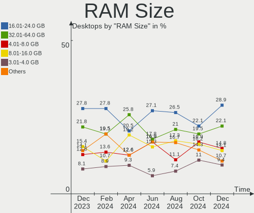
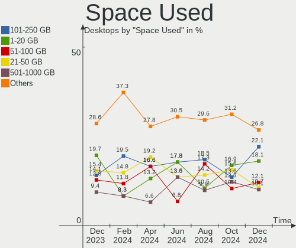
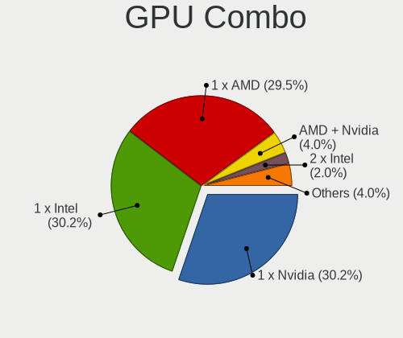
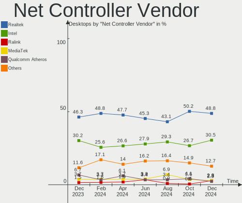

Linux Mint Hardware Trends (Desktops)
-------------------------------------

A project to identify most popular hardware characteristics and track their change
over time based on data collected by Linux Mint users at https://Linux-Hardware.org.

Anyone can contribute to this report by the [hw-probe](https://github.com/linuxhw/hw-probe) tool:

    sudo -E hw-probe -all -upload

Full-feature report is available here: https://linux-hardware.org/?view=trends&formfactor=desktop

Period: Aug, 2021.

Contents
--------

* [ System ](#system)
  - [ OS                       ](#os)
  - [ OS Family                ](#os-family)
  - [ Kernel                   ](#kernel)
  - [ Kernel Family            ](#kernel-family)
  - [ Kernel Major Ver.        ](#kernel-major-ver)
  - [ Arch                     ](#arch)
  - [ DE                       ](#de)
  - [ Display Server           ](#display-server)
  - [ Display Manager          ](#display-manager)
  - [ OS Lang                  ](#os-lang)
  - [ Boot Mode                ](#boot-mode)
  - [ Filesystem               ](#filesystem)
  - [ Part. scheme             ](#part-scheme)
  - [ Dual Boot with Linux/BSD ](#dual-boot-with-linuxbsd)
  - [ Dual Boot (Win)          ](#dual-boot-win)

* [ Board ](#board)
  - [ Vendor                   ](#vendor)
  - [ Model                    ](#model)
  - [ Model Family             ](#model-family)
  - [ MFG Year                 ](#mfg-year)
  - [ Form Factor              ](#form-factor)
  - [ Secure Boot              ](#secure-boot)
  - [ Coreboot                 ](#coreboot)
  - [ RAM Size                 ](#ram-size)
  - [ RAM Used                 ](#ram-used)
  - [ Total Drives             ](#total-drives)
  - [ Has CD-ROM               ](#has-cd-rom)
  - [ Has Ethernet             ](#has-ethernet)
  - [ Has WiFi                 ](#has-wifi)
  - [ Has Bluetooth            ](#has-bluetooth)

* [ Location ](#location)
  - [ Country                  ](#country)
  - [ City                     ](#city)

* [ Drives ](#drives)
  - [ Drive Vendor             ](#drive-vendor)
  - [ Drive Model              ](#drive-model)
  - [ HDD Vendor               ](#hdd-vendor)
  - [ SSD Vendor               ](#ssd-vendor)
  - [ Drive Kind               ](#drive-kind)
  - [ Drive Connector          ](#drive-connector)
  - [ Drive Size               ](#drive-size)
  - [ Space Total              ](#space-total)
  - [ Space Used               ](#space-used)
  - [ Malfunc. Drives          ](#malfunc-drives)
  - [ Malfunc. Drive Vendor    ](#malfunc-drive-vendor)
  - [ Malfunc. HDD Vendor      ](#malfunc-hdd-vendor)
  - [ Malfunc. Drive Kind      ](#malfunc-drive-kind)
  - [ Failed Drives            ](#failed-drives)
  - [ Failed Drive Vendor      ](#failed-drive-vendor)
  - [ Drive Status             ](#drive-status)

* [ Storage controller ](#storage-controller)
  - [ Storage Vendor           ](#storage-vendor)
  - [ Storage Model            ](#storage-model)
  - [ Storage Kind             ](#storage-kind)

* [ Processor ](#processor)
  - [ CPU Vendor               ](#cpu-vendor)
  - [ CPU Model                ](#cpu-model)
  - [ CPU Model Family         ](#cpu-model-family)
  - [ CPU Cores                ](#cpu-cores)
  - [ CPU Sockets              ](#cpu-sockets)
  - [ CPU Threads              ](#cpu-threads)
  - [ CPU Op-Modes             ](#cpu-op-modes)
  - [ CPU Microcode            ](#cpu-microcode)
  - [ CPU Microarch            ](#cpu-microarch)

* [ Graphics ](#graphics)
  - [ GPU Vendor               ](#gpu-vendor)
  - [ GPU Model                ](#gpu-model)
  - [ GPU Combo                ](#gpu-combo)
  - [ GPU Driver               ](#gpu-driver)
  - [ GPU Memory               ](#gpu-memory)

* [ Monitor ](#monitor)
  - [ Monitor Vendor           ](#monitor-vendor)
  - [ Monitor Model            ](#monitor-model)
  - [ Monitor Resolution       ](#monitor-resolution)
  - [ Monitor Diagonal         ](#monitor-diagonal)
  - [ Monitor Width            ](#monitor-width)
  - [ Aspect Ratio             ](#aspect-ratio)
  - [ Monitor Area             ](#monitor-area)
  - [ Pixel Density            ](#pixel-density)
  - [ Multiple Monitors        ](#multiple-monitors)

* [ Network ](#network)
  - [ Net Controller Vendor    ](#net-controller-vendor)
  - [ Net Controller Model     ](#net-controller-model)
  - [ Wireless Vendor          ](#wireless-vendor)
  - [ Wireless Model           ](#wireless-model)
  - [ Ethernet Vendor          ](#ethernet-vendor)
  - [ Ethernet Model           ](#ethernet-model)
  - [ Net Controller Kind      ](#net-controller-kind)
  - [ Used Controller          ](#used-controller)
  - [ NICs                     ](#nics)
  - [ IPv6                     ](#ipv6)

* [ Bluetooth ](#bluetooth)
  - [ Bluetooth Vendor         ](#bluetooth-vendor)
  - [ Bluetooth Model          ](#bluetooth-model)

* [ Sound ](#sound)
  - [ Sound Vendor             ](#sound-vendor)
  - [ Sound Model              ](#sound-model)

* [ Memory ](#memory)
  - [ Memory Vendor            ](#memory-vendor)
  - [ Memory Model             ](#memory-model)
  - [ Memory Kind              ](#memory-kind)
  - [ Memory Form Factor       ](#memory-form-factor)
  - [ Memory Size              ](#memory-size)
  - [ Memory Speed             ](#memory-speed)

* [ Printers & scanners ](#printers--scanners)
  - [ Printer Vendor           ](#printer-vendor)
  - [ Printer Model            ](#printer-model)
  - [ Scanner Vendor           ](#scanner-vendor)
  - [ Scanner Model            ](#scanner-model)

* [ Camera ](#camera)
  - [ Camera Vendor            ](#camera-vendor)
  - [ Camera Model             ](#camera-model)

* [ Security ](#security)
  - [ Fingerprint Vendor       ](#fingerprint-vendor)
  - [ Fingerprint Model        ](#fingerprint-model)
  - [ Chipcard Vendor          ](#chipcard-vendor)
  - [ Chipcard Model           ](#chipcard-model)

* [ Unsupported ](#unsupported)
  - [ Unsupported Devices      ](#unsupported-devices)
  - [ Unsupported Device Types ](#unsupported-device-types)

System
------

OS
--

Installed operating systems

| Name            | Desktops | Percent |
|-----------------|----------|---------|
| Linux Mint 20.2 | 150      | 76.14%  |
| Linux Mint 19.3 | 20       | 10.15%  |
| Linux Mint 20.1 | 18       | 9.14%   |
| Linux Mint 20   | 7        | 3.55%   |
| Linux Mint 19   | 2        | 1.02%   |

OS Family
---------

OS without a version

| Name       | Desktops | Percent |
|------------|----------|---------|
| Linux Mint | 197      | 100%    |

Kernel
------

Version of the Linux kernel

| Version                    | Desktops | Percent |
|----------------------------|----------|---------|
| 5.4.0-81-generic           | 87       | 44.16%  |
| 5.4.0-80-generic           | 57       | 28.93%  |
| 5.4.0-74-generic           | 16       | 8.12%   |
| 5.11.0-27-generic          | 9        | 4.57%   |
| 5.11.0-25-generic          | 4        | 2.03%   |
| 5.4.0-77-generic           | 3        | 1.52%   |
| 5.0.0-32-generic           | 3        | 1.52%   |
| 5.8.0-63-generic           | 2        | 1.02%   |
| 5.4.0-62-generic           | 2        | 1.02%   |
| 5.4.0-58-generic           | 2        | 1.02%   |
| 5.4.0-80-lowlatency        | 1        | 0.51%   |
| 5.4.0-70-generic           | 1        | 0.51%   |
| 5.4.0-67-generic           | 1        | 0.51%   |
| 5.4.0-66-generic           | 1        | 0.51%   |
| 5.13.8                     | 1        | 0.51%   |
| 5.13.4-051304-generic      | 1        | 0.51%   |
| 5.12.0-19.3-liquorix-amd64 | 1        | 0.51%   |
| 5.11.15-051115-generic     | 1        | 0.51%   |
| 5.10.5-2006-amd+           | 1        | 0.51%   |
| 5.0.21-050021-generic      | 1        | 0.51%   |
| 4.15.0-20-generic          | 1        | 0.51%   |
| 4.15.0-154-generic         | 1        | 0.51%   |

Kernel Family
-------------

Linux kernel without a distro release

| Version | Desktops | Percent |
|---------|----------|---------|
| 5.4.0   | 171      | 86.8%   |
| 5.11.0  | 13       | 6.6%    |
| 5.0.0   | 3        | 1.52%   |
| 5.8.0   | 2        | 1.02%   |
| 4.15.0  | 2        | 1.02%   |
| 5.13.8  | 1        | 0.51%   |
| 5.13.4  | 1        | 0.51%   |
| 5.12.0  | 1        | 0.51%   |
| 5.11.15 | 1        | 0.51%   |
| 5.10.5  | 1        | 0.51%   |
| 5.0.21  | 1        | 0.51%   |

Kernel Major Ver.
-----------------

Linux kernel major version

| Version | Desktops | Percent |
|---------|----------|---------|
| 5.4     | 171      | 86.8%   |
| 5.11    | 14       | 7.11%   |
| 5.0     | 4        | 2.03%   |
| 5.8     | 2        | 1.02%   |
| 5.13    | 2        | 1.02%   |
| 4.15    | 2        | 1.02%   |
| 5.12    | 1        | 0.51%   |
| 5.10    | 1        | 0.51%   |

Arch
----

OS architecture (x86_64, i586, etc.)

| Name   | Desktops | Percent |
|--------|----------|---------|
| x86_64 | 192      | 97.46%  |
| i686   | 5        | 2.54%   |

DE
--

Desktop Environment

| Name          | Desktops | Percent |
|---------------|----------|---------|
| X-Cinnamon    | 136      | 69.04%  |
| MATE          | 23       | 11.68%  |
| XFCE          | 17       | 8.63%   |
| Cinnamon      | 16       | 8.12%   |
| GNOME         | 2        | 1.02%   |
| KDE           | 1        | 0.51%   |
| GNOME Classic | 1        | 0.51%   |
| Unknown       | 1        | 0.51%   |

Display Server
--------------

X11 or Wayland

| Name | Desktops | Percent |
|------|----------|---------|
| X11  | 197      | 100%    |

Display Manager
---------------

SDDM, LightDM, etc.

| Name    | Desktops | Percent |
|---------|----------|---------|
| Unknown | 118      | 59.9%   |
| TDM     | 45       | 22.84%  |
| LightDM | 31       | 15.74%  |
| GDM     | 3        | 1.52%   |

OS Lang
-------

Language

| Lang  | Desktops | Percent |
|-------|----------|---------|
| de_DE | 52       | 26.4%   |
| en_US | 51       | 25.89%  |
| pt_BR | 16       | 8.12%   |
| fr_FR | 12       | 6.09%   |
| en_GB | 12       | 6.09%   |
| C     | 10       | 5.08%   |
| en_CA | 5        | 2.54%   |
| es_MX | 4        | 2.03%   |
| de_AT | 4        | 2.03%   |
| pl_PL | 3        | 1.52%   |
| it_IT | 3        | 1.52%   |
| ru_RU | 2        | 1.02%   |
| es_ES | 2        | 1.02%   |
| de_CH | 2        | 1.02%   |
| ar_KW | 2        | 1.02%   |
| zh_TW | 1        | 0.51%   |
| sk_SK | 1        | 0.51%   |
| ru_UA | 1        | 0.51%   |
| pt_PT | 1        | 0.51%   |
| nl_NL | 1        | 0.51%   |
| he_IL | 1        | 0.51%   |
| fr_BE | 1        | 0.51%   |
| es_PE | 1        | 0.51%   |
| es_CO | 1        | 0.51%   |
| es_CL | 1        | 0.51%   |
| es_AR | 1        | 0.51%   |
| en_PH | 1        | 0.51%   |
| en_NZ | 1        | 0.51%   |
| en_IL | 1        | 0.51%   |
| en_IE | 1        | 0.51%   |
| en_AU | 1        | 0.51%   |
| cs_CZ | 1        | 0.51%   |

Boot Mode
---------

EFI or BIOS

| Mode | Desktops | Percent |
|------|----------|---------|
| BIOS | 112      | 56.85%  |
| EFI  | 85       | 43.15%  |

Filesystem
----------

Type of filesystem

| Type    | Desktops | Percent |
|---------|----------|---------|
| Ext4    | 184      | 93.4%   |
| Overlay | 9        | 4.57%   |
| Btrfs   | 3        | 1.52%   |
| Unknown | 1        | 0.51%   |

Part. scheme
------------

Scheme of partitioning

| Type    | Desktops | Percent |
|---------|----------|---------|
| Unknown | 119      | 60.41%  |
| GPT     | 45       | 22.84%  |
| MBR     | 33       | 16.75%  |

Dual Boot with Linux/BSD
------------------------

Hosting more than one Linux/BSD

| Dual boot | Desktops | Percent |
|-----------|----------|---------|
| No        | 174      | 88.32%  |
| Yes       | 23       | 11.68%  |

Dual Boot (Win)
---------------

Hosting Linux and Windows

| Dual boot | Desktops | Percent |
|-----------|----------|---------|
| No        | 160      | 81.22%  |
| Yes       | 37       | 18.78%  |

Board
-----

Vendor
------

Motherboard manufacturer

| Name                | Desktops | Percent |
|---------------------|----------|---------|
| ASUSTek Computer    | 51       | 25.89%  |
| Gigabyte Technology | 25       | 12.69%  |
| ASRock              | 24       | 12.18%  |
| Hewlett-Packard     | 20       | 10.15%  |
| Dell                | 16       | 8.12%   |
| MSI                 | 15       | 7.61%   |
| Lenovo              | 6        | 3.05%   |
| Acer                | 6        | 3.05%   |
| Fujitsu             | 5        | 2.54%   |
| Intel               | 3        | 1.52%   |
| ECS                 | 3        | 1.52%   |
| Positivo            | 2        | 1.02%   |
| Pegatron            | 2        | 1.02%   |
| PCWare              | 2        | 1.02%   |
| Medion              | 2        | 1.02%   |
| Zillion B75FEL3     | 1        | 0.51%   |
| Seco                | 1        | 0.51%   |
| PCChips             | 1        | 0.51%   |
| Packard Bell        | 1        | 0.51%   |
| Itautec             | 1        | 0.51%   |
| Huanan              | 1        | 0.51%   |
| HC                  | 1        | 0.51%   |
| Gateway             | 1        | 0.51%   |
| Foxconn             | 1        | 0.51%   |
| DFI                 | 1        | 0.51%   |
| Biostar             | 1        | 0.51%   |
| Apple               | 1        | 0.51%   |
| AMI                 | 1        | 0.51%   |
| Alienware           | 1        | 0.51%   |
| Unknown             | 1        | 0.51%   |

Model
-----

Motherboard model

| Name                                                                | Desktops | Percent |
|---------------------------------------------------------------------|----------|---------|
| ASUS All Series                                                     | 5        | 2.54%   |
| MSI MS-7B86                                                         | 2        | 1.02%   |
| HP Compaq 8200 Elite SFF PC                                         | 2        | 1.02%   |
| HP Compaq 8100 Elite SFF PC                                         | 2        | 1.02%   |
| HP Compaq 6200 Pro SFF PC                                           | 2        | 1.02%   |
| HP Compaq 6000 Pro MT PC                                            | 2        | 1.02%   |
| Gigabyte H81M-D2V                                                   | 2        | 1.02%   |
| Gigabyte F2A88XM-D3H                                                | 2        | 1.02%   |
| Fujitsu ESPRIMO P910                                                | 2        | 1.02%   |
| Dell OptiPlex 9020                                                  | 2        | 1.02%   |
| ASUS PRIME Z390-A                                                   | 2        | 1.02%   |
| ASUS PRIME Z370-A                                                   | 2        | 1.02%   |
| ASUS PRIME X570-P                                                   | 2        | 1.02%   |
| ASUS P8H61-M LX3 PLUS R2.0                                          | 2        | 1.02%   |
| ASUS P8B75-M LX                                                     | 2        | 1.02%   |
| ASRock N68-GS4 FX R2.0                                              | 2        | 1.02%   |
| ASRock B550M Pro4                                                   | 2        | 1.02%   |
| Zillion B75FEL3 Board                                               | 1        | 0.51%   |
| Seco C40                                                            | 1        | 0.51%   |
| Positivo POS-PIG41BO                                                | 1        | 0.51%   |
| Positivo POS-EAA75DE                                                | 1        | 0.51%   |
| Pegatron Pro 3120 Microtower PC                                     | 1        | 0.51%   |
| Pegatron 505B Microtower PC                                         | 1        | 0.51%   |
| PCWare IPX1800E2                                                    | 1        | 0.51%   |
| PCWare IPMH61R1                                                     | 1        | 0.51%   |
| PCChips P53G                                                        | 1        | 0.51%   |
| Packard Bell imedia S3220                                           | 1        | 0.51%   |
| MSI MS-7C91                                                         | 1        | 0.51%   |
| MSI MS-7B54                                                         | 1        | 0.51%   |
| MSI MS-7B09                                                         | 1        | 0.51%   |
| MSI MS-7971                                                         | 1        | 0.51%   |
| MSI MS-7885                                                         | 1        | 0.51%   |
| MSI MS-7817                                                         | 1        | 0.51%   |
| MSI MS-7788                                                         | 1        | 0.51%   |
| MSI MS-7721                                                         | 1        | 0.51%   |
| MSI MS-7720                                                         | 1        | 0.51%   |
| MSI MS-7693                                                         | 1        | 0.51%   |
| MSI MS-7636                                                         | 1        | 0.51%   |
| MSI MS-7596                                                         | 1        | 0.51%   |
| MSI MS-7360                                                         | 1        | 0.51%   |
| Medion MS-7713                                                      | 1        | 0.51%   |
| Medion MS-7633                                                      | 1        | 0.51%   |
| Lenovo ThinkCentre M92p 3228FE3                                     | 1        | 0.51%   |
| Lenovo ThinkCentre M92p 32181D7                                     | 1        | 0.51%   |
| Lenovo ThinkCentre M91p 5027A25                                     | 1        | 0.51%   |
| Lenovo ThinkCentre M58 9728A5G                                      | 1        | 0.51%   |
| Lenovo IdeaCentre Y710 Cube-15ISH 90FL006CGE                        | 1        | 0.51%   |
| Lenovo H30-05 90BJ002RUK                                            | 1        | 0.51%   |
| Itautec Infoway ST-4265                                             | 1        | 0.51%   |
| Intel DX38BT AAD85848-503                                           | 1        | 0.51%   |
| Intel DP55WB AAE64798-204                                           | 1        | 0.51%   |
| Intel DG33BU AAD79951-413                                           | 1        | 0.51%   |
| Huanan X79 INTEL (INTEL Xeon E5/Corei7 DMI2 - C600/C200 Cipset V3.2 | 1        | 0.51%   |
| HP Z420 Workstation                                                 | 1        | 0.51%   |
| HP Z400 Workstation                                                 | 1        | 0.51%   |
| HP workstation xw6200                                               | 1        | 0.51%   |
| HP Pavilion Gaming Desktop TG01-2xxx                                | 1        | 0.51%   |
| HP EliteDesk 800 G2 DM 65W                                          | 1        | 0.51%   |
| HP EliteDesk 705 G4 DM 35W (TAA)                                    | 1        | 0.51%   |
| HP Compaq Pro 6305 SFF                                              | 1        | 0.51%   |

Model Family
------------

Motherboard model prefix

| Name                  | Desktops | Percent |
|-----------------------|----------|---------|
| HP Compaq             | 12       | 6.09%   |
| Dell OptiPlex         | 12       | 6.09%   |
| ASUS PRIME            | 11       | 5.58%   |
| ASUS TUF              | 5        | 2.54%   |
| ASUS All              | 5        | 2.54%   |
| Lenovo ThinkCentre    | 4        | 2.03%   |
| ASUS ROG              | 4        | 2.03%   |
| Fujitsu ESPRIMO       | 3        | 1.52%   |
| ASUS M5A78L-M         | 3        | 1.52%   |
| Acer Aspire           | 3        | 1.52%   |
| MSI MS-7B86           | 2        | 1.02%   |
| HP EliteDesk          | 2        | 1.02%   |
| Gigabyte H81M-D2V     | 2        | 1.02%   |
| Gigabyte F2A88XM-D3H  | 2        | 1.02%   |
| Gigabyte B450         | 2        | 1.02%   |
| Dell Precision        | 2        | 1.02%   |
| ASUS P8H61-M          | 2        | 1.02%   |
| ASUS P8B75-M          | 2        | 1.02%   |
| ASUS M5A97            | 2        | 1.02%   |
| ASRock X399           | 2        | 1.02%   |
| ASRock N68-GS4        | 2        | 1.02%   |
| ASRock B550M          | 2        | 1.02%   |
| Acer Veriton          | 2        | 1.02%   |
| Zillion B75FEL3 Board | 1        | 0.51%   |
| Seco C40              | 1        | 0.51%   |
| Positivo POS-PIG41BO  | 1        | 0.51%   |
| Positivo POS-EAA75DE  | 1        | 0.51%   |
| Pegatron Pro          | 1        | 0.51%   |
| Pegatron 505B         | 1        | 0.51%   |
| PCWare IPX1800E2      | 1        | 0.51%   |
| PCWare IPMH61R1       | 1        | 0.51%   |
| PCChips P53G          | 1        | 0.51%   |
| Packard Bell imedia   | 1        | 0.51%   |
| MSI MS-7C91           | 1        | 0.51%   |
| MSI MS-7B54           | 1        | 0.51%   |
| MSI MS-7B09           | 1        | 0.51%   |
| MSI MS-7971           | 1        | 0.51%   |
| MSI MS-7885           | 1        | 0.51%   |
| MSI MS-7817           | 1        | 0.51%   |
| MSI MS-7788           | 1        | 0.51%   |
| MSI MS-7721           | 1        | 0.51%   |
| MSI MS-7720           | 1        | 0.51%   |
| MSI MS-7693           | 1        | 0.51%   |
| MSI MS-7636           | 1        | 0.51%   |
| MSI MS-7596           | 1        | 0.51%   |
| MSI MS-7360           | 1        | 0.51%   |
| Medion MS-7713        | 1        | 0.51%   |
| Medion MS-7633        | 1        | 0.51%   |
| Lenovo IdeaCentre     | 1        | 0.51%   |
| Lenovo H30-05         | 1        | 0.51%   |
| Itautec Infoway       | 1        | 0.51%   |
| Intel DX38BT          | 1        | 0.51%   |
| Intel DP55WB          | 1        | 0.51%   |
| Intel DG33BU          | 1        | 0.51%   |
| Huanan X79            | 1        | 0.51%   |
| HP Z420               | 1        | 0.51%   |
| HP Z400               | 1        | 0.51%   |
| HP workstation        | 1        | 0.51%   |
| HP Pavilion           | 1        | 0.51%   |
| HP 24-g012            | 1        | 0.51%   |

MFG Year
--------

Motherboard manufacture year

| Year | Desktops | Percent |
|------|----------|---------|
| 2020 | 21       | 10.66%  |
| 2021 | 20       | 10.15%  |
| 2013 | 20       | 10.15%  |
| 2014 | 18       | 9.14%   |
| 2012 | 15       | 7.61%   |
| 2011 | 14       | 7.11%   |
| 2010 | 14       | 7.11%   |
| 2019 | 13       | 6.6%    |
| 2015 | 13       | 6.6%    |
| 2018 | 11       | 5.58%   |
| 2009 | 11       | 5.58%   |
| 2016 | 7        | 3.55%   |
| 2007 | 7        | 3.55%   |
| 2008 | 5        | 2.54%   |
| 2017 | 4        | 2.03%   |
| 2005 | 2        | 1.02%   |
| 2006 | 1        | 0.51%   |
| 2004 | 1        | 0.51%   |

Form Factor
-----------

Physical design of the computer

| Name    | Desktops | Percent |
|---------|----------|---------|
| Desktop | 197      | 100%    |

Secure Boot
-----------

Enabled or disabled

| State    | Desktops | Percent |
|----------|----------|---------|
| Disabled | 190      | 96.45%  |
| Enabled  | 7        | 3.55%   |

Coreboot
--------

Have coreboot on board

| Used | Desktops | Percent |
|------|----------|---------|
| No   | 197      | 100%    |

RAM Size
--------

Total RAM memory

| Size in GB  | Desktops | Percent |
|-------------|----------|---------|
| 8.01-16.0   | 41       | 20.81%  |
| 16.01-24.0  | 40       | 20.3%   |
| 3.01-4.0    | 36       | 18.27%  |
| 4.01-8.0    | 34       | 17.26%  |
| 32.01-64.0  | 26       | 13.2%   |
| 64.01-256.0 | 6        | 3.05%   |
| 1.01-2.0    | 6        | 3.05%   |
| 24.01-32.0  | 4        | 2.03%   |
| 2.01-3.0    | 3        | 1.52%   |
| 0.51-1.0    | 1        | 0.51%   |

RAM Used
--------

Used RAM memory

| Used GB    | Desktops | Percent |
|------------|----------|---------|
| 1.01-2.0   | 79       | 40.1%   |
| 2.01-3.0   | 66       | 33.5%   |
| 4.01-8.0   | 19       | 9.64%   |
| 3.01-4.0   | 12       | 6.09%   |
| 0.51-1.0   | 12       | 6.09%   |
| 8.01-16.0  | 6        | 3.05%   |
| 32.01-64.0 | 1        | 0.51%   |
| 24.01-32.0 | 1        | 0.51%   |
| 16.01-24.0 | 1        | 0.51%   |

Total Drives
------------

Number of drives on board

| Drives | Desktops | Percent |
|--------|----------|---------|
| 1      | 83       | 42.13%  |
| 2      | 53       | 26.9%   |
| 3      | 22       | 11.17%  |
| 4      | 19       | 9.64%   |
| 5      | 7        | 3.55%   |
| 6      | 6        | 3.05%   |
| 8      | 3        | 1.52%   |
| 0      | 3        | 1.52%   |
| 7      | 1        | 0.51%   |

Has CD-ROM
----------

Has CD-ROM on board

| Presented | Desktops | Percent |
|-----------|----------|---------|
| Yes       | 113      | 57.36%  |
| No        | 84       | 42.64%  |

Has Ethernet
------------

Has Ethernet on board

| Presented | Desktops | Percent |
|-----------|----------|---------|
| Yes       | 195      | 98.98%  |
| No        | 2        | 1.02%   |

Has WiFi
--------

Has WiFi module

| Presented | Desktops | Percent |
|-----------|----------|---------|
| No        | 108      | 54.82%  |
| Yes       | 89       | 45.18%  |

Has Bluetooth
-------------

Has Bluetooth module

| Presented | Desktops | Percent |
|-----------|----------|---------|
| No        | 140      | 71.07%  |
| Yes       | 57       | 28.93%  |

Location
--------

Country
-------

Geographic location (country)

| Country     | Desktops | Percent |
|-------------|----------|---------|
| Germany     | 55       | 27.92%  |
| USA         | 34       | 17.26%  |
| Brazil      | 18       | 9.14%   |
| UK          | 12       | 6.09%   |
| France      | 11       | 5.58%   |
| Canada      | 8        | 4.06%   |
| Mexico      | 6        | 3.05%   |
| Switzerland | 5        | 2.54%   |
| Netherlands | 5        | 2.54%   |
| Ukraine     | 4        | 2.03%   |
| Austria     | 4        | 2.03%   |
| Poland      | 3        | 1.52%   |
| Italy       | 3        | 1.52%   |
| Spain       | 2        | 1.02%   |
| South Korea | 2        | 1.02%   |
| Romania     | 2        | 1.02%   |
| Israel      | 2        | 1.02%   |
| Belgium     | 2        | 1.02%   |
| Australia   | 2        | 1.02%   |
| Turkey      | 1        | 0.51%   |
| Taiwan      | 1        | 0.51%   |
| Slovakia    | 1        | 0.51%   |
| Serbia      | 1        | 0.51%   |
| Russia      | 1        | 0.51%   |
| Portugal    | 1        | 0.51%   |
| Philippines | 1        | 0.51%   |
| Peru        | 1        | 0.51%   |
| New Zealand | 1        | 0.51%   |
| Latvia      | 1        | 0.51%   |
| Ivory Coast | 1        | 0.51%   |
| Ireland     | 1        | 0.51%   |
| Indonesia   | 1        | 0.51%   |
| Czechia     | 1        | 0.51%   |
| Colombia    | 1        | 0.51%   |
| Chile       | 1        | 0.51%   |
| Argentina   | 1        | 0.51%   |

City
----

Geographic location (city)

| City                | Desktops | Percent |
|---------------------|----------|---------|
| D??sseldorf         | 3        | 1.52%   |
| Tel Aviv            | 2        | 1.02%   |
| Stuttgart           | 2        | 1.02%   |
| S??o Paulo          | 2        | 1.02%   |
| Miami               | 2        | 1.02%   |
| Mainz               | 2        | 1.02%   |
| London              | 2        | 1.02%   |
| Leipzig             | 2        | 1.02%   |
| Frankfurt am Main   | 2        | 1.02%   |
| Zurich              | 1        | 0.51%   |
| Zehdenick           | 1        | 0.51%   |
| Xicotepec de Juarez | 1        | 0.51%   |
| Worpswede           | 1        | 0.51%   |
| Wendeburg           | 1        | 0.51%   |
| Weiterstadt         | 1        | 0.51%   |
| Waterloo            | 1        | 0.51%   |
| Warsaw              | 1        | 0.51%   |
| Voerde              | 1        | 0.51%   |
| Villa Hidalgo       | 1        | 0.51%   |
| Vienna              | 1        | 0.51%   |
| Vasylkiv            | 1        | 0.51%   |
| Tucson              | 1        | 0.51%   |
| Tijuana             | 1        | 0.51%   |
| Taichung            | 1        | 0.51%   |
| Steyr               | 1        | 0.51%   |
| Stelle              | 1        | 0.51%   |
| St Helens           | 1        | 0.51%   |
| Spencer             | 1        | 0.51%   |
| Simmerath           | 1        | 0.51%   |
| Simferopol          | 1        | 0.51%   |
| Seynod              | 1        | 0.51%   |
| Sens                | 1        | 0.51%   |
| Selm                | 1        | 0.51%   |
| Seelze              | 1        | 0.51%   |
| Schenefeld          | 1        | 0.51%   |
| S??o Jo??o del Rei  | 1        | 0.51%   |
| Sarcelles           | 1        | 0.51%   |
| Sao Vicente         | 1        | 0.51%   |
| Sao Marcos          | 1        | 0.51%   |
| Santurtzi           | 1        | 0.51%   |
| Santa Barbara       | 1        | 0.51%   |
| San Jose            | 1        | 0.51%   |
| Ruelzheim           | 1        | 0.51%   |
| Rostock             | 1        | 0.51%   |
| Rome                | 1        | 0.51%   |
| Rochester           | 1        | 0.51%   |
| Rioverde            | 1        | 0.51%   |
| Rio de Janeiro      | 1        | 0.51%   |
| Riga                | 1        | 0.51%   |
| Recife              | 1        | 0.51%   |
| Rawa Mazowiecka     | 1        | 0.51%   |
| Raleigh             | 1        | 0.51%   |
| Quer?©taro City     | 1        | 0.51%   |
| Pordic              | 1        | 0.51%   |
| Plainfield          | 1        | 0.51%   |
| Peterlee            | 1        | 0.51%   |
| Perpignan           | 1        | 0.51%   |
| Pasig               | 1        | 0.51%   |
| Pasadena            | 1        | 0.51%   |
| Pardubice           | 1        | 0.51%   |

Drives
------

Drive Vendor
------------

Hard drive vendors

| Vendor              | Desktops | Drives | Percent |
|---------------------|----------|--------|---------|
| WDC                 | 72       | 97     | 21.11%  |
| Seagate             | 64       | 85     | 18.77%  |
| Samsung Electronics | 50       | 74     | 14.66%  |
| SanDisk             | 28       | 32     | 8.21%   |
| Hitachi             | 16       | 18     | 4.69%   |
| Crucial             | 15       | 16     | 4.4%    |
| Toshiba             | 12       | 12     | 3.52%   |
| Kingston            | 11       | 13     | 3.23%   |
| A-DATA Technology   | 8        | 8      | 2.35%   |
| China               | 6        | 6      | 1.76%   |
| Intel               | 5        | 5      | 1.47%   |
| HGST                | 5        | 6      | 1.47%   |
| Unknown             | 4        | 7      | 1.17%   |
| Intenso             | 4        | 4      | 1.17%   |
| PNY                 | 3        | 3      | 0.88%   |
| PLEXTOR             | 3        | 3      | 0.88%   |
| XPG                 | 2        | 2      | 0.59%   |
| Team                | 2        | 2      | 0.59%   |
| SPCC                | 2        | 2      | 0.59%   |
| Silicon Motion      | 2        | 2      | 0.59%   |
| Micron Technology   | 2        | 2      | 0.59%   |
| KIOXIA-EXCERIA      | 2        | 2      | 0.59%   |
| Hewlett-Packard     | 2        | 2      | 0.59%   |
| Transcend           | 1        | 4      | 0.29%   |
| SK Hynix            | 1        | 1      | 0.29%   |
| SABRENT             | 1        | 1      | 0.29%   |
| Pioneer             | 1        | 1      | 0.29%   |
| Phison              | 1        | 2      | 0.29%   |
| Patriot             | 1        | 1      | 0.29%   |
| OCZ                 | 1        | 1      | 0.29%   |
| Maxtor              | 1        | 1      | 0.29%   |
| KIOXIA              | 1        | 1      | 0.29%   |
| JMicron             | 1        | 1      | 0.29%   |
| Golden              | 1        | 1      | 0.29%   |
| GeIL                | 1        | 1      | 0.29%   |
| CT240BX5            | 1        | 1      | 0.29%   |
| Corsair             | 1        | 1      | 0.29%   |
| BAITITON            | 1        | 1      | 0.29%   |
| Avant               | 1        | 1      | 0.29%   |
| ASMT                | 1        | 2      | 0.29%   |
| asmedia             | 1        | 1      | 0.29%   |
| Apacer              | 1        | 1      | 0.29%   |
| addlink             | 1        | 1      | 0.29%   |
| 1TB                 | 1        | 2      | 0.29%   |

Drive Model
-----------

Hard drive models

| Model                            | Desktops | Percent |
|----------------------------------|----------|---------|
| Seagate ST500DM002-1BD142 500GB  | 7        | 1.73%   |
| Seagate ST1000DM010-2EP102 1TB   | 5        | 1.24%   |
| Samsung SSD 860 EVO 500GB        | 5        | 1.24%   |
| SanDisk SSD PLUS 240GB           | 4        | 0.99%   |
| SanDisk SSD PLUS 120GB           | 4        | 0.99%   |
| Samsung SSD 860 EVO 1TB          | 4        | 0.99%   |
| Samsung SSD 850 EVO 500GB        | 4        | 0.99%   |
| Samsung SSD 850 EVO 250GB        | 4        | 0.99%   |
| Kingston SA400S37120G 120GB SSD  | 4        | 0.99%   |
| Crucial CT1000MX500SSD1 1TB      | 4        | 0.99%   |
| WDC WD20EZRZ-00Z5HB0 2TB         | 3        | 0.74%   |
| WDC WD20EZRX-00D8PB0 2TB         | 3        | 0.74%   |
| WDC WD10EARS-00Y5B1 1TB          | 3        | 0.74%   |
| Toshiba HDWD110 1TB              | 3        | 0.74%   |
| Toshiba DT01ACA100 1TB           | 3        | 0.74%   |
| Seagate ST31000528AS 1TB         | 3        | 0.74%   |
| Seagate ST2000DM008-2FR102 2TB   | 3        | 0.74%   |
| Seagate ST1000DM003-1ER162 1TB   | 3        | 0.74%   |
| Seagate ST1000DM003-1CH162 1TB   | 3        | 0.74%   |
| Seagate Expansion 2TB            | 3        | 0.74%   |
| SanDisk SDSSDA120G 120GB         | 3        | 0.74%   |
| Samsung SSD 860 EVO 250GB        | 3        | 0.74%   |
| Samsung HD103SJ 1TB              | 3        | 0.74%   |
| Kingston SA400S37240G 240GB SSD  | 3        | 0.74%   |
| WDC WDS500G2B0A-00SM50 500GB SSD | 2        | 0.5%    |
| WDC WDS100T2B0B-00YS70 1TB SSD   | 2        | 0.5%    |
| WDC WD6400AAKS-00A7B0 640GB      | 2        | 0.5%    |
| WDC WD5000AAKX-001CA0 500GB      | 2        | 0.5%    |
| WDC WD40EZRZ-00GXCB0 4TB         | 2        | 0.5%    |
| WDC WD20EARX-00PASB0 2TB         | 2        | 0.5%    |
| WDC WD10EZEX-00BN5A0 1TB         | 2        | 0.5%    |
| WDC WD10EADS-00L5B1 1TB          | 2        | 0.5%    |
| Seagate ST4000DM000-1F2168 4TB   | 2        | 0.5%    |
| Seagate ST3160318AS 160GB        | 2        | 0.5%    |
| Seagate ST2000DM006-2DM164 2TB   | 2        | 0.5%    |
| Seagate ST2000DM001-9YN164 2TB   | 2        | 0.5%    |
| Seagate ST1000DM003-1SB102 1TB   | 2        | 0.5%    |
| SanDisk SDSSDH3 500G             | 2        | 0.5%    |
| SanDisk SDSSDA240G 240GB         | 2        | 0.5%    |
| Sandisk NVMe SSD Drive 1TB       | 2        | 0.5%    |
| Samsung SSD 980 1TB              | 2        | 0.5%    |
| Samsung SSD 970 EVO 500GB        | 2        | 0.5%    |
| Samsung SSD 970 EVO 1TB          | 2        | 0.5%    |
| Samsung SSD 960 EVO 1TB          | 2        | 0.5%    |
| Samsung SSD 840 EVO 500GB        | 2        | 0.5%    |
| Samsung SSD 840 EVO 120GB        | 2        | 0.5%    |
| Samsung NVMe SSD Drive 512GB     | 2        | 0.5%    |
| Samsung HD753LJ 752GB            | 2        | 0.5%    |
| Samsung HD161HJ 160GB            | 2        | 0.5%    |
| PNY CS900 120GB SSD              | 2        | 0.5%    |
| KIOXIA-EXCERIA SATA SSD 480GB    | 2        | 0.5%    |
| Intenso SSD SATAIII 960GB        | 2        | 0.5%    |
| Hitachi HDS721010KLA330 1TB      | 2        | 0.5%    |
| HGST HTS541010A9E680 1TB         | 2        | 0.5%    |
| Crucial CT250MX500SSD1 250GB     | 2        | 0.5%    |
| Crucial CT240BX500SSD1 240GB     | 2        | 0.5%    |
| Crucial CT120BX500SSD1 120GB     | 2        | 0.5%    |
| China SSD 120GB                  | 2        | 0.5%    |
| China SATA SSD 120GB             | 2        | 0.5%    |
| A-DATA SU650 120GB SSD           | 2        | 0.5%    |

HDD Vendor
----------

Hard disk drive vendors

| Vendor              | Desktops | Drives | Percent |
|---------------------|----------|--------|---------|
| WDC                 | 64       | 86     | 35.75%  |
| Seagate             | 63       | 81     | 35.2%   |
| Samsung Electronics | 16       | 19     | 8.94%   |
| Hitachi             | 16       | 18     | 8.94%   |
| Toshiba             | 11       | 11     | 6.15%   |
| HGST                | 5        | 6      | 2.79%   |
| Maxtor              | 1        | 1      | 0.56%   |
| Intenso             | 1        | 1      | 0.56%   |
| ASMT                | 1        | 2      | 0.56%   |
| asmedia             | 1        | 1      | 0.56%   |

SSD Vendor
----------

Solid state drive vendors

| Vendor              | Desktops | Drives | Percent |
|---------------------|----------|--------|---------|
| Samsung Electronics | 29       | 35     | 22.48%  |
| SanDisk             | 23       | 27     | 17.83%  |
| Crucial             | 15       | 16     | 11.63%  |
| Kingston            | 10       | 11     | 7.75%   |
| WDC                 | 7        | 7      | 5.43%   |
| China               | 6        | 6      | 4.65%   |
| A-DATA Technology   | 6        | 6      | 4.65%   |
| Intel               | 4        | 4      | 3.1%    |
| PNY                 | 3        | 3      | 2.33%   |
| PLEXTOR             | 3        | 3      | 2.33%   |
| Seagate             | 2        | 2      | 1.55%   |
| KIOXIA-EXCERIA      | 2        | 2      | 1.55%   |
| Intenso             | 2        | 2      | 1.55%   |
| Hewlett-Packard     | 2        | 2      | 1.55%   |
| Unknown             | 1        | 1      | 0.78%   |
| Toshiba             | 1        | 1      | 0.78%   |
| Team                | 1        | 1      | 0.78%   |
| SPCC                | 1        | 1      | 0.78%   |
| SABRENT             | 1        | 1      | 0.78%   |
| Pioneer             | 1        | 1      | 0.78%   |
| OCZ                 | 1        | 1      | 0.78%   |
| Micron Technology   | 1        | 1      | 0.78%   |
| Golden              | 1        | 1      | 0.78%   |
| GeIL                | 1        | 1      | 0.78%   |
| CT240BX5            | 1        | 1      | 0.78%   |
| Corsair             | 1        | 1      | 0.78%   |
| BAITITON            | 1        | 1      | 0.78%   |
| Apacer              | 1        | 1      | 0.78%   |
| 1TB                 | 1        | 2      | 0.78%   |

Drive Kind
----------

HDD or SSD

| Kind    | Desktops | Drives | Percent |
|---------|----------|--------|---------|
| HDD     | 136      | 226    | 47.72%  |
| SSD     | 104      | 142    | 36.49%  |
| NVMe    | 38       | 52     | 13.33%  |
| Unknown | 6        | 8      | 2.11%   |
| MMC     | 1        | 2      | 0.35%   |

Drive Connector
---------------

SATA, SAS, NVMe, etc.

| Type | Desktops | Drives | Percent |
|------|----------|--------|---------|
| SATA | 176      | 353    | 75.86%  |
| NVMe | 38       | 52     | 16.38%  |
| SAS  | 17       | 23     | 7.33%   |
| MMC  | 1        | 2      | 0.43%   |

Drive Size
----------

Size of hard drive

| Size in TB | Desktops | Drives | Percent |
|------------|----------|--------|---------|
| 0.01-0.5   | 135      | 200    | 50%     |
| 0.51-1.0   | 85       | 102    | 31.48%  |
| 1.01-2.0   | 28       | 38     | 10.37%  |
| 3.01-4.0   | 11       | 16     | 4.07%   |
| 4.01-10.0  | 5        | 6      | 1.85%   |
| 2.01-3.0   | 4        | 4      | 1.48%   |
| 10.01-20.0 | 2        | 2      | 0.74%   |

Space Total
-----------

Amount of disk space available on the file system

| Size in GB     | Desktops | Percent |
|----------------|----------|---------|
| 101-250        | 48       | 24.37%  |
| 501-1000       | 45       | 22.84%  |
| 251-500        | 26       | 13.2%   |
| 1001-2000      | 23       | 11.68%  |
| More than 3000 | 20       | 10.15%  |
| 51-100         | 11       | 5.58%   |
| 2001-3000      | 9        | 4.57%   |
| 1-20           | 6        | 3.05%   |
| 21-50          | 5        | 2.54%   |
| Unknown        | 4        | 2.03%   |

Space Used
----------

Amount of used disk space

| Used GB        | Desktops | Percent |
|----------------|----------|---------|
| 1-20           | 38       | 19.29%  |
| 21-50          | 34       | 17.26%  |
| 101-250        | 31       | 15.74%  |
| 51-100         | 23       | 11.68%  |
| 251-500        | 22       | 11.17%  |
| 501-1000       | 22       | 11.17%  |
| 1001-2000      | 10       | 5.08%   |
| More than 3000 | 7        | 3.55%   |
| 2001-3000      | 6        | 3.05%   |
| Unknown        | 4        | 2.03%   |

Malfunc. Drives
---------------

Drive models with a malfunction

| Model                                 | Desktops | Drives | Percent |
|---------------------------------------|----------|--------|---------|
| Seagate ST500DM002-1BD142 500GB       | 3        | 3      | 13.64%  |
| WDC WD5002ABYS-01B1B0 500GB           | 1        | 1      | 4.55%   |
| WDC WD3200AVJS-63B6A0 320GB           | 1        | 1      | 4.55%   |
| WDC WD3200AAJS-60Z0A0 320GB           | 1        | 1      | 4.55%   |
| WDC WD20EFRX-68EUZN0 2TB              | 1        | 1      | 4.55%   |
| WDC WD1600BEVT-22A23T0 160GB          | 1        | 1      | 4.55%   |
| WDC WD10EARS-22Y5B1 1TB               | 1        | 1      | 4.55%   |
| WDC WD10EARS-00Y5B1 1TB               | 1        | 1      | 4.55%   |
| Seagate ST9320325AS 320GB             | 1        | 1      | 4.55%   |
| Seagate ST31000528AS 1TB              | 1        | 1      | 4.55%   |
| Seagate ST31000333AS 1TB              | 1        | 1      | 4.55%   |
| Seagate ST2000DM001-9YN164 2TB        | 1        | 1      | 4.55%   |
| SanDisk SDSSDHII480G 480GB            | 1        | 1      | 4.55%   |
| Samsung Electronics SSD 970 EVO 500GB | 1        | 1      | 4.55%   |
| Samsung Electronics SSD 970 EVO 250GB | 1        | 1      | 4.55%   |
| Samsung Electronics SSD 960 EVO 250GB | 1        | 1      | 4.55%   |
| Samsung Electronics SP1644N 160GB     | 1        | 1      | 4.55%   |
| Samsung Electronics HD322HJ 320GB     | 1        | 1      | 4.55%   |
| PLEXTOR PX-128M3 128GB SSD            | 1        | 1      | 4.55%   |
| Hitachi HDS721010KLA330 1TB           | 1        | 1      | 4.55%   |

Malfunc. Drive Vendor
---------------------

Vendors of faulty drives

| Vendor              | Desktops | Drives | Percent |
|---------------------|----------|--------|---------|
| WDC                 | 7        | 7      | 31.82%  |
| Seagate             | 7        | 7      | 31.82%  |
| Samsung Electronics | 5        | 5      | 22.73%  |
| SanDisk             | 1        | 1      | 4.55%   |
| PLEXTOR             | 1        | 1      | 4.55%   |
| Hitachi             | 1        | 1      | 4.55%   |

Malfunc. HDD Vendor
-------------------

Vendors of faulty HDD drives

| Vendor              | Desktops | Drives | Percent |
|---------------------|----------|--------|---------|
| WDC                 | 7        | 7      | 41.18%  |
| Seagate             | 7        | 7      | 41.18%  |
| Samsung Electronics | 2        | 2      | 11.76%  |
| Hitachi             | 1        | 1      | 5.88%   |

Malfunc. Drive Kind
-------------------

Kinds of faulty drives

| Kind | Desktops | Drives | Percent |
|------|----------|--------|---------|
| HDD  | 16       | 17     | 76.19%  |
| NVMe | 3        | 3      | 14.29%  |
| SSD  | 2        | 2      | 9.52%   |

Failed Drives
-------------

Failed drive models

Zero info for selected period =(

Failed Drive Vendor
-------------------

Failed drive vendors

Zero info for selected period =(

Drive Status
------------

Number of failed and malfunc. drives

| Status   | Desktops | Drives | Percent |
|----------|----------|--------|---------|
| Detected | 121      | 258    | 56.54%  |
| Works    | 73       | 150    | 34.11%  |
| Malfunc  | 20       | 22     | 9.35%   |

Storage controller
------------------

Storage Vendor
--------------

Storage controller vendors

| Vendor                      | Desktops | Percent |
|-----------------------------|----------|---------|
| Intel                       | 120      | 45.63%  |
| AMD                         | 67       | 25.48%  |
| Samsung Electronics         | 15       | 5.7%    |
| Sandisk                     | 8        | 3.04%   |
| Nvidia                      | 8        | 3.04%   |
| ASMedia Technology          | 8        | 3.04%   |
| Marvell Technology Group    | 7        | 2.66%   |
| Silicon Motion              | 6        | 2.28%   |
| Phison Electronics          | 4        | 1.52%   |
| JMicron Technology          | 4        | 1.52%   |
| VIA Technologies            | 2        | 0.76%   |
| LSI Logic / Symbios Logic   | 2        | 0.76%   |
| ADATA Technology            | 2        | 0.76%   |
| Adaptec                     | 2        | 0.76%   |
| ULi Electronics             | 1        | 0.38%   |
| SK Hynix                    | 1        | 0.38%   |
| Silicon Image               | 1        | 0.38%   |
| Realtek Semiconductor       | 1        | 0.38%   |
| Micron Technology           | 1        | 0.38%   |
| Lite-On IT Corp. / Plextor  | 1        | 0.38%   |
| KIOXIA                      | 1        | 0.38%   |
| Kingston Technology Company | 1        | 0.38%   |

Storage Model
-------------

Storage controller models

| Model                                                                                   | Desktops | Percent |
|-----------------------------------------------------------------------------------------|----------|---------|
| AMD FCH SATA Controller [AHCI mode]                                                     | 33       | 9.51%   |
| Intel 6 Series/C200 Series Chipset Family 6 port Desktop SATA AHCI Controller           | 16       | 4.61%   |
| Intel 8 Series/C220 Series Chipset Family 6-port SATA Controller 1 [AHCI mode]          | 14       | 4.03%   |
| AMD SB7x0/SB8x0/SB9x0 IDE Controller                                                    | 14       | 4.03%   |
| AMD SB7x0/SB8x0/SB9x0 SATA Controller [AHCI mode]                                       | 13       | 3.75%   |
| Samsung NVMe SSD Controller SM981/PM981/PM983                                           | 11       | 3.17%   |
| AMD 400 Series Chipset SATA Controller                                                  | 11       | 3.17%   |
| Intel NM10/ICH7 Family SATA Controller [IDE mode]                                       | 10       | 2.88%   |
| Intel 7 Series/C210 Series Chipset Family 6-port SATA Controller [AHCI mode]            | 10       | 2.88%   |
| Intel 82801G (ICH7 Family) IDE Controller                                               | 9        | 2.59%   |
| Intel SATA Controller [RAID mode]                                                       | 8        | 2.31%   |
| ASMedia ASM1062 Serial ATA Controller                                                   | 8        | 2.31%   |
| AMD Starship/Matisse Chipset SATA Controller [AHCI mode]                                | 7        | 2.02%   |
| AMD SB7x0/SB8x0/SB9x0 SATA Controller [IDE mode]                                        | 7        | 2.02%   |
| Intel Q170/Q150/B150/H170/H110/Z170/CM236 Chipset SATA Controller [AHCI Mode]           | 6        | 1.73%   |
| Intel 6 Series/C200 Series Chipset Family Desktop SATA Controller (IDE mode, ports 4-5) | 6        | 1.73%   |
| Intel 6 Series/C200 Series Chipset Family Desktop SATA Controller (IDE mode, ports 0-3) | 6        | 1.73%   |
| Nvidia MCP61 SATA Controller                                                            | 5        | 1.44%   |
| Intel 82801JI (ICH10 Family) 4 port SATA IDE Controller #1                              | 5        | 1.44%   |
| Samsung NVMe SSD Controller SM961/PM961/SM963                                           | 4        | 1.15%   |
| Intel 82801JI (ICH10 Family) 2 port SATA IDE Controller #2                              | 4        | 1.15%   |
| Intel 200 Series PCH SATA controller [AHCI mode]                                        | 4        | 1.15%   |
| Silicon Motion SM2263EN/SM2263XT SSD Controller                                         | 3        | 0.86%   |
| Sandisk WD Blue SN550 NVMe SSD                                                          | 3        | 0.86%   |
| Samsung NVMe Controller                                                                 | 3        | 0.86%   |
| Phison PS5013 E13 NVMe Controller                                                       | 3        | 0.86%   |
| Intel Comet Lake SATA AHCI Controller                                                   | 3        | 0.86%   |
| Intel 9 Series Chipset Family SATA Controller [AHCI Mode]                               | 3        | 0.86%   |
| Intel 82801JD/DO (ICH10 Family) SATA AHCI Controller                                    | 3        | 0.86%   |
| Intel 82801IR/IO/IH (ICH9R/DO/DH) 6 port SATA Controller [AHCI mode]                    | 3        | 0.86%   |
| Intel 7 Series/C210 Series Chipset Family 4-port SATA Controller [IDE mode]             | 3        | 0.86%   |
| Intel 7 Series/C210 Series Chipset Family 2-port SATA Controller [IDE mode]             | 3        | 0.86%   |
| Intel 5 Series/3400 Series Chipset 6 port SATA AHCI Controller                          | 3        | 0.86%   |
| Intel 4 Series Chipset PT IDER Controller                                               | 3        | 0.86%   |
| AMD X399 Series Chipset SATA Controller                                                 | 3        | 0.86%   |
| AMD 300 Series Chipset SATA Controller                                                  | 3        | 0.86%   |
| Silicon Motion SM2262/SM2262EN SSD Controller                                           | 2        | 0.58%   |
| Sandisk WD Black SN750 / PC SN730 NVMe SSD                                              | 2        | 0.58%   |
| Sandisk WD Black 2018/SN750 / PC SN720 NVMe SSD                                         | 2        | 0.58%   |
| Nvidia MCP61 IDE                                                                        | 2        | 0.58%   |
| Marvell Group 88SE9172 SATA 6Gb/s Controller                                            | 2        | 0.58%   |
| Intel Cannon Lake PCH SATA AHCI Controller                                              | 2        | 0.58%   |
| Intel Atom Processor E3800 Series SATA AHCI Controller                                  | 2        | 0.58%   |
| Intel 82801HR/HO/HH (ICH8R/DO/DH) 2 port SATA Controller [IDE mode]                     | 2        | 0.58%   |
| Intel 82801H (ICH8 Family) 4 port SATA Controller [IDE mode]                            | 2        | 0.58%   |
| Intel 5 Series/3400 Series Chipset 4 port SATA IDE Controller                           | 2        | 0.58%   |
| Intel 5 Series/3400 Series Chipset 2 port SATA IDE Controller                           | 2        | 0.58%   |
| Intel 400 Series Chipset Family SATA AHCI Controller                                    | 2        | 0.58%   |
| AMD FCH SATA Controller [IDE mode]                                                      | 2        | 0.58%   |
| AMD FCH IDE Controller                                                                  | 2        | 0.58%   |
| ADATA XPG SX8200 Pro PCIe Gen3x4 M.2 2280 Solid State Drive                             | 2        | 0.58%   |
| VIA VT82C586A/B/VT82C686/A/B/VT823x/A/C PIPC Bus Master IDE                             | 1        | 0.29%   |
| VIA VT8237/8251 Serial ATA Controller                                                   | 1        | 0.29%   |
| VIA VT6415 PATA IDE Host Controller                                                     | 1        | 0.29%   |
| ULi ULi 5287 SATA                                                                       | 1        | 0.29%   |
| ULi M5229 IDE                                                                           | 1        | 0.29%   |
| SK Hynix PC401 NVMe Solid State Drive 256GB                                             | 1        | 0.29%   |
| Silicon Motion Non-Volatile memory controller                                           | 1        | 0.29%   |
| Silicon Image SiI 3512 [SATALink/SATARaid] Serial ATA Controller                        | 1        | 0.29%   |
| Sandisk WD Blue SN500 / PC SN520 NVMe SSD                                               | 1        | 0.29%   |

Storage Kind
------------

Kind of storage controller (IDE, SATA, NVMe, SAS, ...)

| Kind | Desktops | Percent |
|------|----------|---------|
| SATA | 147      | 54.65%  |
| IDE  | 68       | 25.28%  |
| NVMe | 38       | 14.13%  |
| RAID | 12       | 4.46%   |
| SAS  | 2        | 0.74%   |
| SCSI | 2        | 0.74%   |

Processor
---------

CPU Vendor
----------

Processor vendors

| Vendor | Desktops | Percent |
|--------|----------|---------|
| Intel  | 123      | 62.44%  |
| AMD    | 74       | 37.56%  |

CPU Model
---------

Processor models

| Model                                          | Desktops | Percent |
|------------------------------------------------|----------|---------|
| AMD Ryzen 5 3600 6-Core Processor              | 10       | 5.08%   |
| AMD FX-6300 Six-Core Processor                 | 6        | 3.05%   |
| Intel Core i7-3770 CPU @ 3.40GHz               | 5        | 2.54%   |
| Intel Core i7-2600 CPU @ 3.40GHz               | 5        | 2.54%   |
| Intel Core i5-4570 CPU @ 3.20GHz               | 4        | 2.03%   |
| Intel Core i3-2120 CPU @ 3.30GHz               | 4        | 2.03%   |
| AMD FX-8350 Eight-Core Processor               | 4        | 2.03%   |
| Intel Core i9-9900KF CPU @ 3.60GHz             | 3        | 1.52%   |
| Intel Core i7-4790 CPU @ 3.60GHz               | 3        | 1.52%   |
| Intel Core i5-3470 CPU @ 3.20GHz               | 3        | 1.52%   |
| Intel Core i5-2400 CPU @ 3.10GHz               | 3        | 1.52%   |
| Intel Core i3-2100 CPU @ 3.10GHz               | 3        | 1.52%   |
| Intel Core 2 Duo CPU E7500 @ 2.93GHz           | 3        | 1.52%   |
| AMD Ryzen 7 3700X 8-Core Processor             | 3        | 1.52%   |
| AMD Ryzen 5 3400G with Radeon Vega Graphics    | 3        | 1.52%   |
| Intel Pentium Dual-Core CPU E5200 @ 2.50GHz    | 2        | 1.02%   |
| Intel Pentium D CPU 3.00GHz                    | 2        | 1.02%   |
| Intel Pentium CPU G3220 @ 3.00GHz              | 2        | 1.02%   |
| Intel Pentium CPU G2020 @ 2.90GHz              | 2        | 1.02%   |
| Intel Core i7-8700K CPU @ 3.70GHz              | 2        | 1.02%   |
| Intel Core i7-6700 CPU @ 3.40GHz               | 2        | 1.02%   |
| Intel Core i7-4790K CPU @ 4.00GHz              | 2        | 1.02%   |
| Intel Core i5-6400 CPU @ 2.70GHz               | 2        | 1.02%   |
| Intel Core i5-4690 CPU @ 3.50GHz               | 2        | 1.02%   |
| Intel Core i5-3570 CPU @ 3.40GHz               | 2        | 1.02%   |
| Intel Core i5-10400 CPU @ 2.90GHz              | 2        | 1.02%   |
| Intel Core i5 CPU 650 @ 3.20GHz                | 2        | 1.02%   |
| Intel Core i3-4130 CPU @ 3.40GHz               | 2        | 1.02%   |
| Intel Core 2 Duo CPU E4600 @ 2.40GHz           | 2        | 1.02%   |
| AMD Ryzen Threadripper 1920X 12-Core Processor | 2        | 1.02%   |
| AMD Ryzen 5 1600 Six-Core Processor            | 2        | 1.02%   |
| AMD Athlon II X2 270 Processor                 | 2        | 1.02%   |
| AMD Athlon II X2 250 Processor                 | 2        | 1.02%   |
| Intel Xeon CPU X5650 @ 2.67GHz                 | 1        | 0.51%   |
| Intel Xeon CPU X5355 @ 2.66GHz                 | 1        | 0.51%   |
| Intel Xeon CPU W3565 @ 3.20GHz                 | 1        | 0.51%   |
| Intel Xeon CPU E5-2689 0 @ 2.60GHz             | 1        | 0.51%   |
| Intel Xeon CPU E5-1620 0 @ 3.60GHz             | 1        | 0.51%   |
| Intel Xeon CPU E31225 @ 3.10GHz                | 1        | 0.51%   |
| Intel Xeon CPU 3.20GHz                         | 1        | 0.51%   |
| Intel Pentium Dual-Core CPU E6700 @ 3.20GHz    | 1        | 0.51%   |
| Intel Pentium Dual-Core CPU E5700 @ 3.00GHz    | 1        | 0.51%   |
| Intel Pentium Dual-Core CPU E5400 @ 2.70GHz    | 1        | 0.51%   |
| Intel Pentium Dual-Core CPU E5300 @ 2.60GHz    | 1        | 0.51%   |
| Intel Pentium Dual CPU E2200 @ 2.20GHz         | 1        | 0.51%   |
| Intel Pentium Dual CPU E2180 @ 2.00GHz         | 1        | 0.51%   |
| Intel Pentium D CPU 3.40GHz                    | 1        | 0.51%   |
| Intel Pentium CPU J3710 @ 1.60GHz              | 1        | 0.51%   |
| Intel Pentium CPU G6950 @ 2.80GHz              | 1        | 0.51%   |
| Intel Pentium CPU G620 @ 2.60GHz               | 1        | 0.51%   |
| Intel Pentium 4 CPU 3.06GHz                    | 1        | 0.51%   |
| Intel Pentium 4 CPU 2.80GHz                    | 1        | 0.51%   |
| Intel Core i9-10900K CPU @ 3.70GHz             | 1        | 0.51%   |
| Intel Core i9-10850K CPU @ 3.60GHz             | 1        | 0.51%   |
| Intel Core i7-9700K CPU @ 3.60GHz              | 1        | 0.51%   |
| Intel Core i7-7700K CPU @ 4.20GHz              | 1        | 0.51%   |
| Intel Core i7-5930K CPU @ 3.50GHz              | 1        | 0.51%   |
| Intel Core i7-4770 CPU @ 3.40GHz               | 1        | 0.51%   |
| Intel Core i7-2600K CPU @ 3.40GHz              | 1        | 0.51%   |
| Intel Core i7 CPU 950 @ 3.07GHz                | 1        | 0.51%   |

CPU Model Family
----------------

Processor model prefix

| Model                   | Desktops | Percent |
|-------------------------|----------|---------|
| Intel Core i5           | 31       | 15.74%  |
| Intel Core i7           | 26       | 13.2%   |
| AMD Ryzen 5             | 18       | 9.14%   |
| Intel Core i3           | 13       | 6.6%    |
| AMD FX                  | 13       | 6.6%    |
| Intel Core 2 Duo        | 8        | 4.06%   |
| AMD Ryzen 7             | 8        | 4.06%   |
| Intel Xeon              | 7        | 3.55%   |
| Intel Pentium           | 7        | 3.55%   |
| Intel Pentium Dual-Core | 6        | 3.05%   |
| AMD Athlon II X2        | 6        | 3.05%   |
| Intel Core i9           | 5        | 2.54%   |
| Intel Core 2 Quad       | 4        | 2.03%   |
| Intel Celeron           | 4        | 2.03%   |
| Other                   | 3        | 1.52%   |
| Intel Pentium D         | 3        | 1.52%   |
| AMD Sempron             | 3        | 1.52%   |
| AMD Ryzen Threadripper  | 3        | 1.52%   |
| AMD Ryzen 3             | 3        | 1.52%   |
| AMD A8                  | 3        | 1.52%   |
| AMD A6                  | 3        | 1.52%   |
| Intel Pentium Dual      | 2        | 1.02%   |
| Intel Pentium 4         | 2        | 1.02%   |
| AMD Phenom II X4        | 2        | 1.02%   |
| AMD A10                 | 2        | 1.02%   |
| Intel Core 2            | 1        | 0.51%   |
| Intel Atom              | 1        | 0.51%   |
| AMD Ryzen Embedded      | 1        | 0.51%   |
| AMD Ryzen 9             | 1        | 0.51%   |
| AMD Ryzen 5 PRO         | 1        | 0.51%   |
| AMD Phenom              | 1        | 0.51%   |
| AMD E                   | 1        | 0.51%   |
| AMD Athlon X4           | 1        | 0.51%   |
| AMD Athlon II X4        | 1        | 0.51%   |
| AMD Athlon II X3        | 1        | 0.51%   |
| AMD Athlon 64 X2        | 1        | 0.51%   |
| AMD Athlon              | 1        | 0.51%   |

CPU Cores
---------

Number of processor cores

| Number | Desktops | Percent |
|--------|----------|---------|
| 4      | 78       | 39.59%  |
| 2      | 58       | 29.44%  |
| 6      | 22       | 11.17%  |
| 8      | 15       | 7.61%   |
| 3      | 9        | 4.57%   |
| 1      | 7        | 3.55%   |
| 12     | 4        | 2.03%   |
| 10     | 2        | 1.02%   |
| 24     | 1        | 0.51%   |
| 5      | 1        | 0.51%   |

CPU Sockets
-----------

Number of sockets

| Number | Desktops | Percent |
|--------|----------|---------|
| 1      | 194      | 98.48%  |
| 2      | 3        | 1.52%   |

CPU Threads
-----------

Threads per core (Hyper-Threading)

| Number | Desktops | Percent |
|--------|----------|---------|
| 2      | 110      | 55.84%  |
| 1      | 87       | 44.16%  |

CPU Op-Modes
------------

CPU Operation Modes (32-bit, 64-bit)

| Op mode        | Desktops | Percent |
|----------------|----------|---------|
| 32-bit, 64-bit | 197      | 100%    |

CPU Microcode
-------------

Microcode number

| Number     | Desktops | Percent |
|------------|----------|---------|
| 0x206a7    | 20       | 10.15%  |
| Unknown    | 17       | 8.63%   |
| 0x306c3    | 15       | 7.61%   |
| 0x306a9    | 13       | 6.6%    |
| 0x1067a    | 12       | 6.09%   |
| 0x08701021 | 11       | 5.58%   |
| 0x06000852 | 9        | 4.57%   |
| 0x010000c8 | 6        | 3.05%   |
| 0x506e3    | 5        | 2.54%   |
| 0x06001119 | 5        | 2.54%   |
| 0x6fd      | 4        | 2.03%   |
| 0x08108109 | 4        | 2.03%   |
| 0xa0671    | 3        | 1.52%   |
| 0x906ec    | 3        | 1.52%   |
| 0x906ea    | 3        | 1.52%   |
| 0x0800820d | 3        | 1.52%   |
| 0x010000c7 | 3        | 1.52%   |
| 0xf65      | 2        | 1.02%   |
| 0xa0655    | 2        | 1.02%   |
| 0xa0653    | 2        | 1.02%   |
| 0x906ed    | 2        | 1.02%   |
| 0x406c4    | 2        | 1.02%   |
| 0x30678    | 2        | 1.02%   |
| 0x206d7    | 2        | 1.02%   |
| 0x20655    | 2        | 1.02%   |
| 0x20652    | 2        | 1.02%   |
| 0x106a5    | 2        | 1.02%   |
| 0x10676    | 2        | 1.02%   |
| 0x08701013 | 2        | 1.02%   |
| 0x08101016 | 2        | 1.02%   |
| 0x0810100b | 2        | 1.02%   |
| 0x08001137 | 2        | 1.02%   |
| 0x0600063e | 2        | 1.02%   |
| 0x03000027 | 2        | 1.02%   |
| 0x010000db | 2        | 1.02%   |
| 0xf49      | 1        | 0.51%   |
| 0xf44      | 1        | 0.51%   |
| 0xf43      | 1        | 0.51%   |
| 0xf41      | 1        | 0.51%   |
| 0x906e9    | 1        | 0.51%   |
| 0x706a1    | 1        | 0.51%   |
| 0x6fb      | 1        | 0.51%   |
| 0x6f7      | 1        | 0.51%   |
| 0x6f2      | 1        | 0.51%   |
| 0x306f2    | 1        | 0.51%   |
| 0x206c2    | 1        | 0.51%   |
| 0x106e5    | 1        | 0.51%   |
| 0x106a4    | 1        | 0.51%   |
| 0x0a50000c | 1        | 0.51%   |
| 0x0a201016 | 1        | 0.51%   |
| 0x08600106 | 1        | 0.51%   |
| 0x08600103 | 1        | 0.51%   |
| 0x0800820b | 1        | 0.51%   |
| 0x08001138 | 1        | 0.51%   |
| 0x08001126 | 1        | 0.51%   |
| 0x07030105 | 1        | 0.51%   |
| 0x0700010f | 1        | 0.51%   |
| 0x06003104 | 1        | 0.51%   |
| 0x05000029 | 1        | 0.51%   |
| 0x01000083 | 1        | 0.51%   |

CPU Microarch
-------------

Microarchitecture

| Name          | Desktops | Percent |
|---------------|----------|---------|
| SandyBridge   | 24       | 12.18%  |
| Haswell       | 19       | 9.64%   |
| Zen 2         | 17       | 8.63%   |
| Piledriver    | 16       | 8.12%   |
| Penryn        | 15       | 7.61%   |
| K10           | 13       | 6.6%    |
| IvyBridge     | 13       | 6.6%    |
| KabyLake      | 11       | 5.58%   |
| Zen+          | 8        | 4.06%   |
| Zen           | 8        | 4.06%   |
| Core          | 7        | 3.55%   |
| Westmere      | 6        | 3.05%   |
| Skylake       | 6        | 3.05%   |
| NetBurst      | 6        | 3.05%   |
| Silvermont    | 4        | 2.03%   |
| Nehalem       | 4        | 2.03%   |
| CometLake     | 4        | 2.03%   |
| Unknown       | 3        | 1.52%   |
| Zen 3         | 2        | 1.02%   |
| K8 Hammer     | 2        | 1.02%   |
| K10 Llano     | 2        | 1.02%   |
| Bulldozer     | 2        | 1.02%   |
| Steamroller   | 1        | 0.51%   |
| Puma          | 1        | 0.51%   |
| Jaguar        | 1        | 0.51%   |
| Goldmont plus | 1        | 0.51%   |
| Bobcat        | 1        | 0.51%   |

Graphics
--------

GPU Vendor
----------

Vendors of graphics cards

| Vendor           | Desktops | Percent |
|------------------|----------|---------|
| Nvidia           | 71       | 35.15%  |
| Intel            | 65       | 32.18%  |
| AMD              | 65       | 32.18%  |
| VIA Technologies | 1        | 0.5%    |

GPU Model
---------

Graphics card models

| Model                                                                                    | Desktops | Percent |
|------------------------------------------------------------------------------------------|----------|---------|
| Intel 2nd Generation Core Processor Family Integrated Graphics Controller                | 11       | 5.26%   |
| Nvidia GK208B [GeForce GT 710]                                                           | 9        | 4.31%   |
| Intel Xeon E3-1200 v3/4th Gen Core Processor Integrated Graphics Controller              | 9        | 4.31%   |
| Nvidia GP108 [GeForce GT 1030]                                                           | 6        | 2.87%   |
| Intel Xeon E3-1200 v2/3rd Gen Core processor Graphics Controller                         | 6        | 2.87%   |
| Intel CometLake-S GT2 [UHD Graphics 630]                                                 | 6        | 2.87%   |
| Intel 4 Series Chipset Integrated Graphics Controller                                    | 6        | 2.87%   |
| AMD Ellesmere [Radeon RX 470/480/570/570X/580/580X/590]                                  | 6        | 2.87%   |
| Nvidia GP107 [GeForce GTX 1050 Ti]                                                       | 5        | 2.39%   |
| Intel HD Graphics 530                                                                    | 4        | 1.91%   |
| AMD Raven Ridge [Radeon Vega Series / Radeon Vega Mobile Series]                         | 4        | 1.91%   |
| AMD Picasso                                                                              | 4        | 1.91%   |
| Nvidia GT218 [GeForce 210]                                                               | 3        | 1.44%   |
| Nvidia GP107 [GeForce GTX 1050]                                                          | 3        | 1.44%   |
| Nvidia GM206 [GeForce GTX 960]                                                           | 3        | 1.44%   |
| Nvidia GM204 [GeForce GTX 970]                                                           | 3        | 1.44%   |
| Nvidia GK208B [GeForce GT 730]                                                           | 3        | 1.44%   |
| Nvidia G96C [GeForce 9500 GT]                                                            | 3        | 1.44%   |
| Intel Core Processor Integrated Graphics Controller                                      | 3        | 1.44%   |
| Intel 4th Generation Core Processor Family Integrated Graphics Controller                | 3        | 1.44%   |
| AMD RS780L [Radeon 3000]                                                                 | 3        | 1.44%   |
| AMD Baffin [Radeon RX 550 640SP / RX 560/560X]                                           | 3        | 1.44%   |
| Nvidia TU106 [GeForce RTX 2060 SUPER]                                                    | 2        | 0.96%   |
| Nvidia GT218 [GeForce 8400 GS Rev. 3]                                                    | 2        | 0.96%   |
| Nvidia GF108 [GeForce GT 730]                                                            | 2        | 0.96%   |
| Nvidia GA102 [GeForce RTX 3090]                                                          | 2        | 0.96%   |
| Intel Atom/Celeron/Pentium Processor x5-E8000/J3xxx/N3xxx Integrated Graphics Controller | 2        | 0.96%   |
| Intel Atom Processor Z36xxx/Z37xxx Series Graphics & Display                             | 2        | 0.96%   |
| Intel 82Q963/Q965 Integrated Graphics Controller                                         | 2        | 0.96%   |
| Intel 82G33/G31 Express Integrated Graphics Controller                                   | 2        | 0.96%   |
| Intel 82945G/GZ Integrated Graphics Controller                                           | 2        | 0.96%   |
| AMD Trinity 2 [Radeon HD 7540D]                                                          | 2        | 0.96%   |
| AMD RV620 LE [Radeon HD 3450]                                                            | 2        | 0.96%   |
| AMD Renoir                                                                               | 2        | 0.96%   |
| AMD Oland PRO [Radeon R7 240/340]                                                        | 2        | 0.96%   |
| AMD Hawaii PRO [Radeon R9 290/390]                                                       | 2        | 0.96%   |
| AMD Cedar [Radeon HD 5000/6000/7350/8350 Series]                                         | 2        | 0.96%   |
| AMD Cape Verde XT [Radeon HD 7770/8760 / R7 250X]                                        | 2        | 0.96%   |
| AMD Caicos [Radeon HD 6450/7450/8450 / R5 230 OEM]                                       | 2        | 0.96%   |
| VIA Technologies CN896/VN896/P4M900 [Chrome 9 HC]                                        | 1        | 0.48%   |
| Nvidia TU116 [GeForce GTX 1660 Ti]                                                       | 1        | 0.48%   |
| Nvidia TU104 [GeForce RTX 2080 Rev. A]                                                   | 1        | 0.48%   |
| Nvidia TU102 [GeForce RTX 2080 Ti]                                                       | 1        | 0.48%   |
| Nvidia NV45GL [Quadro FX 3400/4400]                                                      | 1        | 0.48%   |
| Nvidia NV41GL [Quadro FX 1400]                                                           | 1        | 0.48%   |
| Nvidia GT200GL [Quadro FX 3800]                                                          | 1        | 0.48%   |
| Nvidia GP107GL [Quadro P400]                                                             | 1        | 0.48%   |
| Nvidia GP106 [GeForce GTX 1060 6GB]                                                      | 1        | 0.48%   |
| Nvidia GP106 [GeForce GTX 1060 6GB Rev. 2]                                               | 1        | 0.48%   |
| Nvidia GP106 [GeForce GTX 1060 3GB]                                                      | 1        | 0.48%   |
| Nvidia GP104 [GeForce GTX 1080]                                                          | 1        | 0.48%   |
| Nvidia GP104 [GeForce GTX 1070]                                                          | 1        | 0.48%   |
| Nvidia GK208 [GeForce GT 720]                                                            | 1        | 0.48%   |
| Nvidia GK208 [GeForce GT 635]                                                            | 1        | 0.48%   |
| Nvidia GK107 [GeForce GTX 650]                                                           | 1        | 0.48%   |
| Nvidia GK107 [GeForce GT 640]                                                            | 1        | 0.48%   |
| Nvidia GK106 [GeForce GTX 660]                                                           | 1        | 0.48%   |
| Nvidia GK106 [GeForce GTX 650 Ti]                                                        | 1        | 0.48%   |
| Nvidia GF116 [GeForce GTX 550 Ti]                                                        | 1        | 0.48%   |
| Nvidia G94 [GeForce 9600 GT]                                                             | 1        | 0.48%   |

GPU Combo
---------

Combinations of graphics cards

| Name           | Desktops | Percent |
|----------------|----------|---------|
| 1 x Nvidia     | 69       | 35.03%  |
| 1 x Intel      | 60       | 30.46%  |
| 1 x AMD        | 59       | 29.95%  |
| 2 x AMD        | 4        | 2.03%   |
| 3 x AMD        | 1        | 0.51%   |
| 2 x Nvidia     | 1        | 0.51%   |
| 1 x VIA        | 1        | 0.51%   |
| Intel + Nvidia | 1        | 0.51%   |
| Intel + AMD    | 1        | 0.51%   |

GPU Driver
----------

Free vs proprietary

| Driver      | Desktops | Percent |
|-------------|----------|---------|
| Free        | 135      | 68.53%  |
| Proprietary | 50       | 25.38%  |
| Unknown     | 12       | 6.09%   |

GPU Memory
----------

Total video memory

| Size in GB | Desktops | Percent |
|------------|----------|---------|
| Unknown    | 74       | 37.56%  |
| 1.01-2.0   | 38       | 19.29%  |
| 0.01-0.5   | 28       | 14.21%  |
| 0.51-1.0   | 26       | 13.2%   |
| 3.01-4.0   | 13       | 6.6%    |
| 7.01-8.0   | 11       | 5.58%   |
| 5.01-6.0   | 3        | 1.52%   |
| 2.01-3.0   | 2        | 1.02%   |
| 16.01-24.0 | 1        | 0.51%   |
| 8.01-16.0  | 1        | 0.51%   |

Monitor
-------

Monitor Vendor
--------------

Monitor vendors

| Vendor               | Desktops | Percent |
|----------------------|----------|---------|
| Samsung Electronics  | 31       | 15.9%   |
| Hewlett-Packard      | 16       | 8.21%   |
| Goldstar             | 16       | 8.21%   |
| Dell                 | 14       | 7.18%   |
| Acer                 | 13       | 6.67%   |
| Ancor Communications | 11       | 5.64%   |
| BenQ                 | 10       | 5.13%   |
| AOC                  | 9        | 4.62%   |
| Unknown              | 6        | 3.08%   |
| Philips              | 6        | 3.08%   |
| Fujitsu Siemens      | 5        | 2.56%   |
| ViewSonic            | 4        | 2.05%   |
| Medion               | 4        | 2.05%   |
| LG Electronics       | 4        | 2.05%   |
| Iiyama               | 3        | 1.54%   |
| FUS                  | 3        | 1.54%   |
| ASUSTek Computer     | 3        | 1.54%   |
| Xiaomi               | 2        | 1.03%   |
| Sony                 | 2        | 1.03%   |
| Packard Bell         | 2        | 1.03%   |
| NEC Computers        | 2        | 1.03%   |
| Lenovo               | 2        | 1.03%   |
| HPN                  | 2        | 1.03%   |
| HannStar             | 2        | 1.03%   |
| Grundig              | 2        | 1.03%   |
| Belinea              | 2        | 1.03%   |
| ___                  | 1        | 0.51%   |
| VIZ                  | 1        | 0.51%   |
| Vestel Elektronik    | 1        | 0.51%   |
| Unknown (XXX)        | 1        | 0.51%   |
| Toshiba              | 1        | 0.51%   |
| RS                   | 1        | 0.51%   |
| PZG                  | 1        | 0.51%   |
| Panasonic            | 1        | 0.51%   |
| ONN                  | 1        | 0.51%   |
| NAD                  | 1        | 0.51%   |
| MSI                  | 1        | 0.51%   |
| Microstep            | 1        | 0.51%   |
| Marantz              | 1        | 0.51%   |
| ITE                  | 1        | 0.51%   |
| Hitachi              | 1        | 0.51%   |
| Hannspree            | 1        | 0.51%   |
| Eizo                 | 1        | 0.51%   |
| DZX                  | 1        | 0.51%   |
| AGO                  | 1        | 0.51%   |

Monitor Model
-------------

Monitor models

| Model                                                                  | Desktops | Percent |
|------------------------------------------------------------------------|----------|---------|
| Unknown LCD Monitor SAMSUNG                                            | 2        | 0.99%   |
| Samsung Electronics C24F390 SAM0D2C 1920x1080 520x290mm 23.4-inch      | 2        | 0.99%   |
| Grundig G2 1080p dig GRU4448 1920x1080 1600x900mm 72.3-inch            | 2        | 0.99%   |
| Ancor Communications VS278 ACI27A1 1920x1080 598x336mm 27.0-inch       | 2        | 0.99%   |
| ___ LCDTV ___0309 1366x768 410x260mm 19.1-inch                         | 1        | 0.49%   |
| Xiaomi Mi TV XMD00E1 3840x2160 708x398mm 32.0-inch                     | 1        | 0.49%   |
| Xiaomi Mi TV XMD009A 2880x1800 480x270mm 21.7-inch                     | 1        | 0.49%   |
| VIZ LCD Monitor M506x-H9 1920x1080                                     | 1        | 0.49%   |
| ViewSonic VX2263 Series VSC692F 1920x1080 476x268mm 21.5-inch          | 1        | 0.49%   |
| ViewSonic VP2765 SERIES VSC9F28 1920x1080 598x336mm 27.0-inch          | 1        | 0.49%   |
| ViewSonic VE710s-2 VSC3A19 1280x1024 338x270mm 17.0-inch               | 1        | 0.49%   |
| ViewSonic LCD Monitor VSCDE2E 1920x1080 520x290mm 23.4-inch            | 1        | 0.49%   |
| Vestel Elektronik 50UHD_LCD_TV VES3700 3840x2160 1872x1053mm 84.6-inch | 1        | 0.49%   |
| Unknown LCDTV 0309 1366x768 410x260mm 19.1-inch                        | 1        | 0.49%   |
| Unknown LCD Monitor NVIDIA TV Encoder 1024x768                         | 1        | 0.49%   |
| Unknown LCD Monitor NVIDIA LCD_VGA                                     | 1        | 0.49%   |
| Unknown LCD Monitor hp L1702 2560x1024                                 | 1        | 0.49%   |
| Unknown LCD Monitor hp L1702 1280x1024                                 | 1        | 0.49%   |
| Unknown LCD Monitor GDH CHHWJT                                         | 1        | 0.49%   |
| Unknown (XXX) Beyond TV XXX2851 3840x2160 1209x680mm 54.6-inch         | 1        | 0.49%   |
| Toshiba SP9106 LCD9106 1280x1024 338x301mm 17.8-inch                   | 1        | 0.49%   |
| Sony TV SNYDC02 1920x1080 930x520mm 41.9-inch                          | 1        | 0.49%   |
| Sony TV SNY2601 1360x768 710x400mm 32.1-inch                           | 1        | 0.49%   |
| Samsung Electronics U28D590 SAM0B80 3840x2160 607x345mm 27.5-inch      | 1        | 0.49%   |
| Samsung Electronics T27B300 SAM0933 1920x1080 598x336mm 27.0-inch      | 1        | 0.49%   |
| Samsung Electronics T24C300 SAM0A9B 1920x1080 531x299mm 24.0-inch      | 1        | 0.49%   |
| Samsung Electronics SyncMaster SAM060C 1920x1080 510x290mm 23.1-inch   | 1        | 0.49%   |
| Samsung Electronics SyncMaster SAM058B 1920x1080 531x298mm 24.0-inch   | 1        | 0.49%   |
| Samsung Electronics SyncMaster SAM0424 1920x1200 518x324mm 24.1-inch   | 1        | 0.49%   |
| Samsung Electronics SyncMaster SAM02E3 1440x900 367x229mm 17.0-inch    | 1        | 0.49%   |
| Samsung Electronics SyncMaster SAM0285 1440x900 410x257mm 19.1-inch    | 1        | 0.49%   |
| Samsung Electronics SyncMaster SAM027D 1680x1050 433x271mm 20.1-inch   | 1        | 0.49%   |
| Samsung Electronics SyncMaster SAM022E 1024x768 267x200mm 13.1-inch    | 1        | 0.49%   |
| Samsung Electronics S32E511 SAM0D11 1920x1080 698x392mm 31.5-inch      | 1        | 0.49%   |
| Samsung Electronics S24D330 SAM0D92 1920x1080 531x299mm 24.0-inch      | 1        | 0.49%   |
| Samsung Electronics S24B300 SAM08CB 1920x1080 521x293mm 23.5-inch      | 1        | 0.49%   |
| Samsung Electronics S24B300 SAM08B3 1920x1080 521x293mm 23.5-inch      | 1        | 0.49%   |
| Samsung Electronics S23B300 SAM08AF 1920x1080 510x287mm 23.0-inch      | 1        | 0.49%   |
| Samsung Electronics S22C300 SAM0A20 1920x1080 477x268mm 21.5-inch      | 1        | 0.49%   |
| Samsung Electronics S22B300 SAM08AA 1920x1080 477x268mm 21.5-inch      | 1        | 0.49%   |
| Samsung Electronics LCD Monitor SyncMaster 1920x1200                   | 1        | 0.49%   |
| Samsung Electronics LCD Monitor SyncMaster                             | 1        | 0.49%   |
| Samsung Electronics LCD Monitor SAM0DF6 3840x2160 890x500mm 40.2-inch  | 1        | 0.49%   |
| Samsung Electronics LCD Monitor SAM0C26 1920x1080 1209x680mm 54.6-inch | 1        | 0.49%   |
| Samsung Electronics LCD Monitor SAM0A76 1280x720 949x543mm 43.0-inch   | 1        | 0.49%   |
| Samsung Electronics LCD Monitor SAM07C5 1920x1080 1020x570mm 46.0-inch | 1        | 0.49%   |
| Samsung Electronics LCD Monitor SAM04FC 1360x768 410x256mm 19.0-inch   | 1        | 0.49%   |
| Samsung Electronics LCD Monitor SAM039B 1280x720                       | 1        | 0.49%   |
| Samsung Electronics LCD Monitor S24D391 1920x1080                      | 1        | 0.49%   |
| Samsung Electronics LCD Monitor C49J89x 3840x1080                      | 1        | 0.49%   |
| Samsung Electronics LCD Monitor C27F390 1920x1080                      | 1        | 0.49%   |
| Samsung Electronics LC24RG50 SAM0F90 1920x1080 532x304mm 24.1-inch     | 1        | 0.49%   |
| Samsung Electronics C32F391 SAM0D35 1920x1080 698x393mm 31.5-inch      | 1        | 0.49%   |
| RS LE1940 BTC1940 1440x900 410x257mm 19.1-inch                         | 1        | 0.49%   |
| PZG HDMI PZG1900 1440x900 400x270mm 19.0-inch                          | 1        | 0.49%   |
| Philips PHL 242V8 PHLC219 1920x1080 527x296mm 23.8-inch                | 1        | 0.49%   |
| Philips PHL 223V5 PHLC0CF 1920x1080 480x270mm 21.7-inch                | 1        | 0.49%   |
| Philips PHL 193V5 PHLC0CD 1366x768 410x230mm 18.5-inch                 | 1        | 0.49%   |
| Philips LCD Monitor 215Vw 1920x1080                                    | 1        | 0.49%   |
| Philips LCD Monitor 190B 2560x1024                                     | 1        | 0.49%   |

Monitor Resolution
------------------

Monitor screen resolution

| Resolution         | Desktops | Percent |
|--------------------|----------|---------|
| 1920x1080 (FHD)    | 83       | 43.01%  |
| 1280x1024 (SXGA)   | 19       | 9.84%   |
| 3840x2160 (4K)     | 17       | 8.81%   |
| 1440x900 (WXGA+)   | 11       | 5.7%    |
| 1680x1050 (WSXGA+) | 10       | 5.18%   |
| Unknown            | 8        | 4.15%   |
| 1366x768 (WXGA)    | 7        | 3.63%   |
| 1920x1200 (WUXGA)  | 6        | 3.11%   |
| 1600x900 (HD+)     | 5        | 2.59%   |
| 3440x1440          | 4        | 2.07%   |
| 3840x1080          | 3        | 1.55%   |
| 2560x1440 (QHD)    | 3        | 1.55%   |
| 1280x720 (HD)      | 3        | 1.55%   |
| 1024x768 (XGA)     | 3        | 1.55%   |
| 2560x1024          | 2        | 1.04%   |
| 1360x768           | 2        | 1.04%   |
| 5200x1200          | 1        | 0.52%   |
| 5120x1440          | 1        | 0.52%   |
| 4721x1050          | 1        | 0.52%   |
| 3600x1080          | 1        | 0.52%   |
| 2880x1800          | 1        | 0.52%   |
| 2560x1080          | 1        | 0.52%   |
| 2304x768           | 1        | 0.52%   |

Monitor Diagonal
----------------

Diagonal size in inches

| Inches  | Desktops | Percent |
|---------|----------|---------|
| Unknown | 27       | 14.44%  |
| 23      | 24       | 12.83%  |
| 24      | 22       | 11.76%  |
| 19      | 18       | 9.63%   |
| 27      | 17       | 9.09%   |
| 21      | 15       | 8.02%   |
| 17      | 9        | 4.81%   |
| 22      | 8        | 4.28%   |
| 20      | 7        | 3.74%   |
| 18      | 6        | 3.21%   |
| 84      | 4        | 2.14%   |
| 31      | 4        | 2.14%   |
| 15      | 4        | 2.14%   |
| 34      | 3        | 1.6%    |
| 25      | 3        | 1.6%    |
| 72      | 2        | 1.07%   |
| 54      | 2        | 1.07%   |
| 43      | 2        | 1.07%   |
| 33      | 2        | 1.07%   |
| 65      | 1        | 0.53%   |
| 60      | 1        | 0.53%   |
| 46      | 1        | 0.53%   |
| 35      | 1        | 0.53%   |
| 32      | 1        | 0.53%   |
| 16      | 1        | 0.53%   |
| 14      | 1        | 0.53%   |
| 13      | 1        | 0.53%   |

Monitor Width
-------------

Physical width

| Width in mm | Desktops | Percent |
|-------------|----------|---------|
| 501-600     | 63       | 34.24%  |
| 401-500     | 40       | 21.74%  |
| Unknown     | 27       | 14.67%  |
| 351-400     | 13       | 7.07%   |
| 301-350     | 12       | 6.52%   |
| 601-700     | 7        | 3.8%    |
| 701-800     | 6        | 3.26%   |
| 1501-2000   | 6        | 3.26%   |
| 1001-1500   | 5        | 2.72%   |
| 201-300     | 2        | 1.09%   |
| 901-1000    | 2        | 1.09%   |
| 801-900     | 1        | 0.54%   |

Aspect Ratio
------------

Proportional relationship between the width and the height

| Ratio   | Desktops | Percent |
|---------|----------|---------|
| 16/9    | 101      | 55.49%  |
| 16/10   | 28       | 15.38%  |
| Unknown | 26       | 14.29%  |
| 5/4     | 16       | 8.79%   |
| 21/9    | 5        | 2.75%   |
| 4/3     | 2        | 1.1%    |
| 6/5     | 1        | 0.55%   |
| 3/2     | 1        | 0.55%   |
| 11/10   | 1        | 0.55%   |
| 1.00    | 1        | 0.55%   |

Monitor Area
------------

Area in inch²

| Area in inch² | Desktops | Percent |
|----------------|----------|---------|
| 201-250        | 60       | 32.26%  |
| 151-200        | 30       | 16.13%  |
| Unknown        | 27       | 14.52%  |
| 301-350        | 17       | 9.14%   |
| 351-500        | 11       | 5.91%   |
| More than 1000 | 10       | 5.38%   |
| 251-300        | 10       | 5.38%   |
| 141-150        | 10       | 5.38%   |
| 101-110        | 5        | 2.69%   |
| 501-1000       | 3        | 1.61%   |
| 81-90          | 1        | 0.54%   |
| 131-140        | 1        | 0.54%   |
| 121-130        | 1        | 0.54%   |

Pixel Density
-------------

Pixels per inch

| Density | Desktops | Percent |
|---------|----------|---------|
| 51-100  | 115      | 62.84%  |
| Unknown | 27       | 14.75%  |
| 101-120 | 25       | 13.66%  |
| 1-50    | 8        | 4.37%   |
| 121-160 | 5        | 2.73%   |
| 161-240 | 3        | 1.64%   |

Multiple Monitors
-----------------

Total monitors connected

| Total | Desktops | Percent |
|-------|----------|---------|
| 1     | 164      | 83.25%  |
| 2     | 20       | 10.15%  |
| 0     | 10       | 5.08%   |
| 3     | 3        | 1.52%   |

Network
-------

Net Controller Vendor
---------------------

Controller vendors

| Vendor                          | Desktops | Percent |
|---------------------------------|----------|---------|
| Realtek Semiconductor           | 110      | 39.43%  |
| Intel                           | 82       | 29.39%  |
| Qualcomm Atheros                | 15       | 5.38%   |
| Ralink Technology               | 11       | 3.94%   |
| Broadcom                        | 11       | 3.94%   |
| Nvidia                          | 8        | 2.87%   |
| TP-Link                         | 5        | 1.79%   |
| Marvell Technology Group        | 5        | 1.79%   |
| Ralink                          | 4        | 1.43%   |
| Broadcom Limited                | 3        | 1.08%   |
| Microsoft                       | 2        | 0.72%   |
| MediaTek                        | 2        | 0.72%   |
| IMC Networks                    | 2        | 0.72%   |
| D-Link                          | 2        | 0.72%   |
| Aquantia                        | 2        | 0.72%   |
| Xiaomi                          | 1        | 0.36%   |
| Wacom                           | 1        | 0.36%   |
| VIA Technologies                | 1        | 0.36%   |
| Tenda                           | 1        | 0.36%   |
| Samsung Electronics             | 1        | 0.36%   |
| Qualcomm Atheros Communications | 1        | 0.36%   |
| NetXen Incorporated             | 1        | 0.36%   |
| NetGear                         | 1        | 0.36%   |
| LG Electronics                  | 1        | 0.36%   |
| Huawei Technologies             | 1        | 0.36%   |
| Davicom Semiconductor           | 1        | 0.36%   |
| Belkin Components               | 1        | 0.36%   |
| AVM                             | 1        | 0.36%   |
| ASIX Electronics                | 1        | 0.36%   |
| ADMtek                          | 1        | 0.36%   |

Net Controller Model
--------------------

Controller models

| Model                                                                                         | Desktops | Percent |
|-----------------------------------------------------------------------------------------------|----------|---------|
| Realtek RTL8111/8168/8411 PCI Express Gigabit Ethernet Controller                             | 86       | 27.92%  |
| Intel 82579LM Gigabit Network Connection (Lewisville)                                         | 16       | 5.19%   |
| Intel Wi-Fi 6 AX200                                                                           | 9        | 2.92%   |
| Intel Ethernet Connection (2) I219-V                                                          | 8        | 2.6%    |
| Intel Dual Band Wireless-AC 3168NGW [Stone Peak]                                              | 8        | 2.6%    |
| Realtek RTL810xE PCI Express Fast Ethernet controller                                         | 7        | 2.27%   |
| Intel I211 Gigabit Network Connection                                                         | 7        | 2.27%   |
| Ralink MT7601U Wireless Adapter                                                               | 6        | 1.95%   |
| Nvidia MCP61 Ethernet                                                                         | 5        | 1.62%   |
| TP-Link TL-WN823N v2/v3 [Realtek RTL8192EU]                                                   | 4        | 1.3%    |
| Realtek RTL88x2bu [AC1200 Techkey]                                                            | 4        | 1.3%    |
| Realtek RTL8192CU 802.11n WLAN Adapter                                                        | 4        | 1.3%    |
| Realtek RTL8188EUS 802.11n Wireless Network Adapter                                           | 4        | 1.3%    |
| Intel Wireless-AC 9260                                                                        | 4        | 1.3%    |
| Intel Ethernet Connection (7) I219-V                                                          | 4        | 1.3%    |
| Realtek RTL8125 2.5GbE Controller                                                             | 3        | 0.97%   |
| Qualcomm Atheros AR9485 Wireless Network Adapter                                              | 3        | 0.97%   |
| Intel Ethernet Connection I217-V                                                              | 3        | 0.97%   |
| Intel Ethernet Connection I217-LM                                                             | 3        | 0.97%   |
| Intel Ethernet Connection (2) I218-V                                                          | 3        | 0.97%   |
| Intel 82578DM Gigabit Network Connection                                                      | 3        | 0.97%   |
| Intel 82567LM-3 Gigabit Network Connection                                                    | 3        | 0.97%   |
| Realtek RTL-8100/8101L/8139 PCI Fast Ethernet Adapter                                         | 2        | 0.65%   |
| Realtek 802.11ac NIC                                                                          | 2        | 0.65%   |
| Ralink MT7610U ("Archer T2U" 2.4G+5G WLAN Adapter                                             | 2        | 0.65%   |
| Ralink RT2790 Wireless 802.11n 1T/2R PCIe                                                     | 2        | 0.65%   |
| Qualcomm Atheros AR8151 v2.0 Gigabit Ethernet                                                 | 2        | 0.65%   |
| Microsoft Xbox 360 Wireless Adapter                                                           | 2        | 0.65%   |
| Marvell Group 88E8056 PCI-E Gigabit Ethernet Controller                                       | 2        | 0.65%   |
| Intel Ethernet Controller I225-V                                                              | 2        | 0.65%   |
| Intel Ethernet Connection (12) I219-V                                                         | 2        | 0.65%   |
| Intel 82579V Gigabit Network Connection                                                       | 2        | 0.65%   |
| Intel 82566DC-2 Gigabit Network Connection                                                    | 2        | 0.65%   |
| IMC Networks Mediao 802.11n WLAN [Realtek RTL8191SU]                                          | 2        | 0.65%   |
| Broadcom NetXtreme BCM5761 Gigabit Ethernet PCIe                                              | 2        | 0.65%   |
| Broadcom NetXtreme BCM5751 Gigabit Ethernet PCI Express                                       | 2        | 0.65%   |
| Broadcom NetLink BCM57780 Gigabit Ethernet PCIe                                               | 2        | 0.65%   |
| Aquantia AQC107 NBase-T/IEEE 802.3bz Ethernet Controller [AQtion]                             | 2        | 0.65%   |
| Xiaomi Mi/Redmi series (RNDIS)                                                                | 1        | 0.32%   |
| Wacom ACK-40401 [Wireless Accessory Kit]                                                      | 1        | 0.32%   |
| VIA VT6102/VT6103 [Rhine-II]                                                                  | 1        | 0.32%   |
| TP-Link Archer T3U [Realtek RTL8812BU]                                                        | 1        | 0.32%   |
| Tenda U12                                                                                     | 1        | 0.32%   |
| Samsung GT-I9070 (network tethering, USB debugging enabled)                                   | 1        | 0.32%   |
| Realtek RTL8821AE 802.11ac PCIe Wireless Network Adapter                                      | 1        | 0.32%   |
| Realtek RTL8812AU 802.11a/b/g/n/ac 2T2R DB WLAN Adapter                                       | 1        | 0.32%   |
| Realtek RTL8723BE PCIe Wireless Network Adapter                                               | 1        | 0.32%   |
| Realtek RTL8192EU 802.11b/g/n WLAN Adapter                                                    | 1        | 0.32%   |
| Realtek RTL8192EE PCIe Wireless Network Adapter                                               | 1        | 0.32%   |
| Realtek RTL8192CE PCIe Wireless Network Adapter                                               | 1        | 0.32%   |
| Realtek RTL8188FTV 802.11b/g/n 1T1R 2.4G WLAN Adapter                                         | 1        | 0.32%   |
| Realtek RTL8188CUS 802.11n WLAN Adapter                                                       | 1        | 0.32%   |
| Realtek RTL8188CE 802.11b/g/n WiFi Adapter                                                    | 1        | 0.32%   |
| Realtek RTL8169 PCI Gigabit Ethernet Controller                                               | 1        | 0.32%   |
| Realtek Realtek 8812AU/8821AU 802.11ac WLAN Adapter [USB Wireless Dual-Band Adapter 2.4/5Ghz] | 1        | 0.32%   |
| Realtek Killer E3000 2.5GbE Controller                                                        | 1        | 0.32%   |
| Ralink RT5572 Wireless Adapter                                                                | 1        | 0.32%   |
| Ralink RT5370 Wireless Adapter                                                                | 1        | 0.32%   |
| Ralink RT2870/RT3070 Wireless Adapter                                                         | 1        | 0.32%   |
| Ralink RT3060 Wireless 802.11n 1T/1R                                                          | 1        | 0.32%   |

Wireless Vendor
---------------

Wireless vendors

| Vendor                          | Desktops | Percent |
|---------------------------------|----------|---------|
| Intel                           | 28       | 29.79%  |
| Realtek Semiconductor           | 22       | 23.4%   |
| Ralink Technology               | 11       | 11.7%   |
| Qualcomm Atheros                | 9        | 9.57%   |
| TP-Link                         | 5        | 5.32%   |
| Ralink                          | 4        | 4.26%   |
| Microsoft                       | 2        | 2.13%   |
| IMC Networks                    | 2        | 2.13%   |
| D-Link                          | 2        | 2.13%   |
| Broadcom                        | 2        | 2.13%   |
| Wacom                           | 1        | 1.06%   |
| Tenda                           | 1        | 1.06%   |
| Qualcomm Atheros Communications | 1        | 1.06%   |
| NetGear                         | 1        | 1.06%   |
| MediaTek                        | 1        | 1.06%   |
| Belkin Components               | 1        | 1.06%   |
| AVM                             | 1        | 1.06%   |

Wireless Model
--------------

Wireless models

| Model                                                                                         | Desktops | Percent |
|-----------------------------------------------------------------------------------------------|----------|---------|
| Intel Wi-Fi 6 AX200                                                                           | 9        | 9.38%   |
| Intel Dual Band Wireless-AC 3168NGW [Stone Peak]                                              | 8        | 8.33%   |
| Ralink MT7601U Wireless Adapter                                                               | 6        | 6.25%   |
| TP-Link TL-WN823N v2/v3 [Realtek RTL8192EU]                                                   | 4        | 4.17%   |
| Realtek RTL88x2bu [AC1200 Techkey]                                                            | 4        | 4.17%   |
| Realtek RTL8192CU 802.11n WLAN Adapter                                                        | 4        | 4.17%   |
| Realtek RTL8188EUS 802.11n Wireless Network Adapter                                           | 4        | 4.17%   |
| Intel Wireless-AC 9260                                                                        | 4        | 4.17%   |
| Qualcomm Atheros AR9485 Wireless Network Adapter                                              | 3        | 3.13%   |
| Realtek 802.11ac NIC                                                                          | 2        | 2.08%   |
| Ralink MT7610U ("Archer T2U" 2.4G+5G WLAN Adapter                                             | 2        | 2.08%   |
| Ralink RT2790 Wireless 802.11n 1T/2R PCIe                                                     | 2        | 2.08%   |
| Microsoft Xbox 360 Wireless Adapter                                                           | 2        | 2.08%   |
| IMC Networks Mediao 802.11n WLAN [Realtek RTL8191SU]                                          | 2        | 2.08%   |
| Wacom ACK-40401 [Wireless Accessory Kit]                                                      | 1        | 1.04%   |
| TP-Link Archer T3U [Realtek RTL8812BU]                                                        | 1        | 1.04%   |
| Tenda U12                                                                                     | 1        | 1.04%   |
| Realtek RTL8821AE 802.11ac PCIe Wireless Network Adapter                                      | 1        | 1.04%   |
| Realtek RTL8812AU 802.11a/b/g/n/ac 2T2R DB WLAN Adapter                                       | 1        | 1.04%   |
| Realtek RTL8723BE PCIe Wireless Network Adapter                                               | 1        | 1.04%   |
| Realtek RTL8192EU 802.11b/g/n WLAN Adapter                                                    | 1        | 1.04%   |
| Realtek RTL8192EE PCIe Wireless Network Adapter                                               | 1        | 1.04%   |
| Realtek RTL8192CE PCIe Wireless Network Adapter                                               | 1        | 1.04%   |
| Realtek RTL8188FTV 802.11b/g/n 1T1R 2.4G WLAN Adapter                                         | 1        | 1.04%   |
| Realtek RTL8188CUS 802.11n WLAN Adapter                                                       | 1        | 1.04%   |
| Realtek RTL8188CE 802.11b/g/n WiFi Adapter                                                    | 1        | 1.04%   |
| Realtek Realtek 8812AU/8821AU 802.11ac WLAN Adapter [USB Wireless Dual-Band Adapter 2.4/5Ghz] | 1        | 1.04%   |
| Ralink RT5572 Wireless Adapter                                                                | 1        | 1.04%   |
| Ralink RT5370 Wireless Adapter                                                                | 1        | 1.04%   |
| Ralink RT2870/RT3070 Wireless Adapter                                                         | 1        | 1.04%   |
| Ralink RT3060 Wireless 802.11n 1T/1R                                                          | 1        | 1.04%   |
| Ralink RT2561/RT61 802.11g PCI                                                                | 1        | 1.04%   |
| Qualcomm Atheros QCA9565 / AR9565 Wireless Network Adapter                                    | 1        | 1.04%   |
| Qualcomm Atheros QCA9377 802.11ac Wireless Network Adapter                                    | 1        | 1.04%   |
| Qualcomm Atheros QCA6174 802.11ac Wireless Network Adapter                                    | 1        | 1.04%   |
| Qualcomm Atheros AR9271 802.11n                                                               | 1        | 1.04%   |
| Qualcomm Atheros AR93xx Wireless Network Adapter                                              | 1        | 1.04%   |
| Qualcomm Atheros AR9285 Wireless Network Adapter (PCI-Express)                                | 1        | 1.04%   |
| Qualcomm Atheros AR2413/AR2414 Wireless Network Adapter [AR5005G(S) 802.11bg]                 | 1        | 1.04%   |
| NetGear A6100 AC600 DB Wireless Adapter [Realtek RTL8811AU]                                   | 1        | 1.04%   |
| MediaTek 802.11 n WLAN                                                                        | 1        | 1.04%   |
| Intel Wireless 8260                                                                           | 1        | 1.04%   |
| Intel Wireless 7260                                                                           | 1        | 1.04%   |
| Intel Wireless 3160                                                                           | 1        | 1.04%   |
| Intel Wi-Fi 6 AX210/AX211/AX411 160MHz                                                        | 1        | 1.04%   |
| Intel Tiger Lake PCH CNVi WiFi                                                                | 1        | 1.04%   |
| Intel Comet Lake PCH CNVi WiFi                                                                | 1        | 1.04%   |
| Intel Centrino Wireless-N 2230                                                                | 1        | 1.04%   |
| D-Link Wireless N Nano USB Adapter                                                            | 1        | 1.04%   |
| D-Link 802.11 n WLAN                                                                          | 1        | 1.04%   |
| Broadcom BCM43225 802.11b/g/n                                                                 | 1        | 1.04%   |
| Broadcom BCM4306 802.11b/g Wireless LAN Controller                                            | 1        | 1.04%   |
| Belkin Components F5D7050 Wireless G Adapter v5000 [Realtek RTL8187B]                         | 1        | 1.04%   |
| AVM FRITZ!WLAN AC 860                                                                         | 1        | 1.04%   |

Ethernet Vendor
---------------

Ethernet vendors

| Vendor                   | Desktops | Percent |
|--------------------------|----------|---------|
| Realtek Semiconductor    | 99       | 47.14%  |
| Intel                    | 67       | 31.9%   |
| Broadcom                 | 9        | 4.29%   |
| Nvidia                   | 8        | 3.81%   |
| Qualcomm Atheros         | 7        | 3.33%   |
| Marvell Technology Group | 5        | 2.38%   |
| Broadcom Limited         | 3        | 1.43%   |
| Aquantia                 | 2        | 0.95%   |
| Xiaomi                   | 1        | 0.48%   |
| VIA Technologies         | 1        | 0.48%   |
| Samsung Electronics      | 1        | 0.48%   |
| NetXen Incorporated      | 1        | 0.48%   |
| MediaTek                 | 1        | 0.48%   |
| LG Electronics           | 1        | 0.48%   |
| Huawei Technologies      | 1        | 0.48%   |
| Davicom Semiconductor    | 1        | 0.48%   |
| ASIX Electronics         | 1        | 0.48%   |
| ADMtek                   | 1        | 0.48%   |

Ethernet Model
--------------

Ethernet models

| Model                                                                | Desktops | Percent |
|----------------------------------------------------------------------|----------|---------|
| Realtek RTL8111/8168/8411 PCI Express Gigabit Ethernet Controller    | 86       | 40.57%  |
| Intel 82579LM Gigabit Network Connection (Lewisville)                | 16       | 7.55%   |
| Intel Ethernet Connection (2) I219-V                                 | 8        | 3.77%   |
| Realtek RTL810xE PCI Express Fast Ethernet controller                | 7        | 3.3%    |
| Intel I211 Gigabit Network Connection                                | 7        | 3.3%    |
| Nvidia MCP61 Ethernet                                                | 5        | 2.36%   |
| Intel Ethernet Connection (7) I219-V                                 | 4        | 1.89%   |
| Realtek RTL8125 2.5GbE Controller                                    | 3        | 1.42%   |
| Intel Ethernet Connection I217-V                                     | 3        | 1.42%   |
| Intel Ethernet Connection I217-LM                                    | 3        | 1.42%   |
| Intel Ethernet Connection (2) I218-V                                 | 3        | 1.42%   |
| Intel 82578DM Gigabit Network Connection                             | 3        | 1.42%   |
| Intel 82567LM-3 Gigabit Network Connection                           | 3        | 1.42%   |
| Realtek RTL-8100/8101L/8139 PCI Fast Ethernet Adapter                | 2        | 0.94%   |
| Qualcomm Atheros AR8151 v2.0 Gigabit Ethernet                        | 2        | 0.94%   |
| Marvell Group 88E8056 PCI-E Gigabit Ethernet Controller              | 2        | 0.94%   |
| Intel Ethernet Controller I225-V                                     | 2        | 0.94%   |
| Intel Ethernet Connection (12) I219-V                                | 2        | 0.94%   |
| Intel 82579V Gigabit Network Connection                              | 2        | 0.94%   |
| Intel 82566DC-2 Gigabit Network Connection                           | 2        | 0.94%   |
| Broadcom NetXtreme BCM5761 Gigabit Ethernet PCIe                     | 2        | 0.94%   |
| Broadcom NetXtreme BCM5751 Gigabit Ethernet PCI Express              | 2        | 0.94%   |
| Broadcom NetLink BCM57780 Gigabit Ethernet PCIe                      | 2        | 0.94%   |
| Aquantia AQC107 NBase-T/IEEE 802.3bz Ethernet Controller [AQtion]    | 2        | 0.94%   |
| Xiaomi Mi/Redmi series (RNDIS)                                       | 1        | 0.47%   |
| VIA VT6102/VT6103 [Rhine-II]                                         | 1        | 0.47%   |
| Samsung GT-I9070 (network tethering, USB debugging enabled)          | 1        | 0.47%   |
| Realtek RTL8169 PCI Gigabit Ethernet Controller                      | 1        | 0.47%   |
| Realtek Killer E3000 2.5GbE Controller                               | 1        | 0.47%   |
| Qualcomm Atheros Killer E2400 Gigabit Ethernet Controller            | 1        | 0.47%   |
| Qualcomm Atheros Killer E220x Gigabit Ethernet Controller            | 1        | 0.47%   |
| Qualcomm Atheros AR8161 Gigabit Ethernet                             | 1        | 0.47%   |
| Qualcomm Atheros AR8152 v2.0 Fast Ethernet                           | 1        | 0.47%   |
| Qualcomm Atheros AR8121/AR8113/AR8114 Gigabit or Fast Ethernet       | 1        | 0.47%   |
| Nvidia MCP77 Ethernet                                                | 1        | 0.47%   |
| Nvidia MCP55 Ethernet                                                | 1        | 0.47%   |
| Nvidia MCP51 Ethernet Controller                                     | 1        | 0.47%   |
| NetXen Incorporated NX3031 Multifunction 1/10-Gigabit Server Adapter | 1        | 0.47%   |
| MediaTek Armor X5                                                    | 1        | 0.47%   |
| Marvell Group 88E8071 PCI-E Gigabit Ethernet Controller              | 1        | 0.47%   |
| Marvell Group 88E8053 PCI-E Gigabit Ethernet Controller              | 1        | 0.47%   |
| Marvell Group 88E8001 Gigabit Ethernet Controller                    | 1        | 0.47%   |
| LG G2 Android Phone [tethering mode]                                 | 1        | 0.47%   |
| Intel Ethernet Connection I219-V                                     | 1        | 0.47%   |
| Intel Ethernet Connection (2) I219-LM                                | 1        | 0.47%   |
| Intel Ethernet Connection (11) I219-LM                               | 1        | 0.47%   |
| Intel 82583V Gigabit Network Connection                              | 1        | 0.47%   |
| Intel 82578DC Gigabit Network Connection                             | 1        | 0.47%   |
| Intel 82567V-2 Gigabit Network Connection                            | 1        | 0.47%   |
| Intel 82567LF-2 Gigabit Network Connection                           | 1        | 0.47%   |
| Intel 82566DM-2 Gigabit Network Connection                           | 1        | 0.47%   |
| Intel 82566DM Gigabit Network Connection                             | 1        | 0.47%   |
| Intel 80003ES2LAN Gigabit Ethernet Controller (Copper)               | 1        | 0.47%   |
| Huawei MYA-U29                                                       | 1        | 0.47%   |
| Davicom DM9621A USB To FastEther                                     | 1        | 0.47%   |
| Broadcom NetXtreme BCM5764M Gigabit Ethernet PCIe                    | 1        | 0.47%   |
| Broadcom NetXtreme BCM5754 Gigabit Ethernet PCI Express              | 1        | 0.47%   |
| Broadcom NetLink BCM5784M Gigabit Ethernet PCIe                      | 1        | 0.47%   |
| Broadcom Limited NetXtreme BCM5761 Gigabit Ethernet PCIe             | 1        | 0.47%   |
| Broadcom Limited NetXtreme BCM5755 Gigabit Ethernet PCI Express      | 1        | 0.47%   |

Net Controller Kind
-------------------

Ethernet, WiFi or modem

| Kind     | Desktops | Percent |
|----------|----------|---------|
| Ethernet | 195      | 68.66%  |
| WiFi     | 89       | 31.34%  |

Used Controller
---------------

Currently used network controller

| Kind     | Desktops | Percent |
|----------|----------|---------|
| Ethernet | 178      | 72.36%  |
| WiFi     | 68       | 27.64%  |

NICs
----

Total network controllers on board

| Total | Desktops | Percent |
|-------|----------|---------|
| 1     | 138      | 70.05%  |
| 2     | 51       | 25.89%  |
| 3     | 4        | 2.03%   |
| 0     | 2        | 1.02%   |
| 6     | 1        | 0.51%   |
| 4     | 1        | 0.51%   |

IPv6
----

IPv6 vs IPv4

| Used | Desktops | Percent |
|------|----------|---------|
| No   | 138      | 70.05%  |
| Yes  | 59       | 29.95%  |

Bluetooth
---------

Bluetooth Vendor
----------------

Controller vendors

| Vendor                          | Desktops | Percent |
|---------------------------------|----------|---------|
| Intel                           | 23       | 40.35%  |
| Cambridge Silicon Radio         | 19       | 33.33%  |
| Broadcom                        | 5        | 8.77%   |
| Qualcomm Atheros Communications | 4        | 7.02%   |
| Realtek Semiconductor           | 2        | 3.51%   |
| ASUSTek Computer                | 2        | 3.51%   |
| IMC Networks                    | 1        | 1.75%   |
| Belkin Components               | 1        | 1.75%   |

Bluetooth Model
---------------

Controller models

| Model                                               | Desktops | Percent |
|-----------------------------------------------------|----------|---------|
| Cambridge Silicon Radio Bluetooth Dongle (HCI mode) | 19       | 33.33%  |
| Intel Wireless-AC 3168 Bluetooth                    | 7        | 12.28%  |
| Intel Bluetooth Device                              | 7        | 12.28%  |
| Intel AX200 Bluetooth                               | 7        | 12.28%  |
| Broadcom BCM20702A0 Bluetooth 4.0                   | 3        | 5.26%   |
| Realtek Bluetooth Radio                             | 2        | 3.51%   |
| ASUS Broadcom BCM20702A0 Bluetooth                  | 2        | 3.51%   |
| Qualcomm Atheros  Bluetooth Device                  | 1        | 1.75%   |
| Qualcomm Atheros QCA61x4 Bluetooth 4.0              | 1        | 1.75%   |
| Qualcomm Atheros Bluetooth USB Host Controller      | 1        | 1.75%   |
| Qualcomm Atheros AR3012 Bluetooth 4.0               | 1        | 1.75%   |
| Intel Centrino Bluetooth Wireless Transceiver       | 1        | 1.75%   |
| Intel Bluetooth wireless interface                  | 1        | 1.75%   |
| IMC Networks Bluetooth Radio                        | 1        | 1.75%   |
| Broadcom HP Bluethunder                             | 1        | 1.75%   |
| Broadcom BCM92046DG-CL1ROM Bluetooth 2.1 Adapter    | 1        | 1.75%   |
| Belkin Components F8T003v2 Bluetooth                | 1        | 1.75%   |

Sound
-----

Sound Vendor
------------

Sound card vendors

| Vendor                    | Desktops | Percent |
|---------------------------|----------|---------|
| Intel                     | 117      | 39.8%   |
| AMD                       | 84       | 28.57%  |
| Nvidia                    | 63       | 21.43%  |
| C-Media Electronics       | 7        | 2.38%   |
| Creative Labs             | 4        | 1.36%   |
| VIA Technologies          | 2        | 0.68%   |
| Texas Instruments         | 2        | 0.68%   |
| Razer USA                 | 2        | 0.68%   |
| Generalplus Technology    | 2        | 0.68%   |
| XMOS                      | 1        | 0.34%   |
| ULi Electronics           | 1        | 0.34%   |
| ThrustMaster              | 1        | 0.34%   |
| Sennheiser Communications | 1        | 0.34%   |
| Microsoft                 | 1        | 0.34%   |
| JMTek                     | 1        | 0.34%   |
| GN Netcom                 | 1        | 0.34%   |
| Focusrite-Novation        | 1        | 0.34%   |
| Dell                      | 1        | 0.34%   |
| Bose                      | 1        | 0.34%   |
| BEHRINGER International   | 1        | 0.34%   |

Sound Model
-----------

Sound card models

| Model                                                                             | Desktops | Percent |
|-----------------------------------------------------------------------------------|----------|---------|
| AMD SBx00 Azalia (Intel HDA)                                                      | 22       | 6.27%   |
| Intel 6 Series/C200 Series Chipset Family High Definition Audio Controller        | 20       | 5.7%    |
| AMD Starship/Matisse HD Audio Controller                                          | 16       | 4.56%   |
| Nvidia GK208 HDMI/DP Audio Controller                                             | 14       | 3.99%   |
| Intel 8 Series/C220 Series Chipset High Definition Audio Controller               | 14       | 3.99%   |
| Intel 7 Series/C216 Chipset Family High Definition Audio Controller               | 14       | 3.99%   |
| Intel Xeon E3-1200 v3/4th Gen Core Processor HD Audio Controller                  | 11       | 3.13%   |
| AMD Family 17h (Models 10h-1fh) HD Audio Controller                               | 11       | 3.13%   |
| AMD FCH Azalia Controller                                                         | 10       | 2.85%   |
| Nvidia GP107GL High Definition Audio Controller                                   | 9        | 2.56%   |
| Intel NM10/ICH7 Family High Definition Audio Controller                           | 9        | 2.56%   |
| AMD Oland/Hainan/Cape Verde/Pitcairn HDMI Audio [Radeon HD 7000 Series]           | 9        | 2.56%   |
| AMD Raven/Raven2/Fenghuang HDMI/DP Audio Controller                               | 8        | 2.28%   |
| AMD Family 17h (Models 00h-0fh) HD Audio Controller                               | 8        | 2.28%   |
| Intel 82801JI (ICH10 Family) HD Audio Controller                                  | 7        | 1.99%   |
| Nvidia GP108 High Definition Audio Controller                                     | 6        | 1.71%   |
| Intel 5 Series/3400 Series Chipset High Definition Audio                          | 6        | 1.71%   |
| Intel 200 Series PCH HD Audio                                                     | 6        | 1.71%   |
| Intel 100 Series/C230 Series Chipset Family HD Audio Controller                   | 6        | 1.71%   |
| AMD Ellesmere HDMI Audio [Radeon RX 470/480 / 570/580/590]                        | 6        | 1.71%   |
| Nvidia MCP61 High Definition Audio                                                | 5        | 1.42%   |
| Nvidia High Definition Audio Controller                                           | 5        | 1.42%   |
| Intel Cannon Lake PCH cAVS                                                        | 4        | 1.14%   |
| Intel 9 Series Chipset Family HD Audio Controller                                 | 4        | 1.14%   |
| Intel 82801I (ICH9 Family) HD Audio Controller                                    | 4        | 1.14%   |
| Nvidia GP106 High Definition Audio Controller                                     | 3        | 0.85%   |
| Nvidia GM204 High Definition Audio Controller                                     | 3        | 0.85%   |
| Intel 82801JD/DO (ICH10 Family) HD Audio Controller                               | 3        | 0.85%   |
| AMD Trinity HDMI Audio Controller                                                 | 3        | 0.85%   |
| AMD Renoir Radeon High Definition Audio Controller                                | 3        | 0.85%   |
| AMD Cedar HDMI Audio [Radeon HD 5400/6300/7300 Series]                            | 3        | 0.85%   |
| AMD Caicos HDMI Audio [Radeon HD 6450 / 7450/8450/8490 OEM / R5 230/235/235X OEM] | 3        | 0.85%   |
| AMD Baffin HDMI/DP Audio [Radeon RX 550 640SP / RX 560/560X]                      | 3        | 0.85%   |
| Nvidia TU106 High Definition Audio Controller                                     | 2        | 0.57%   |
| Nvidia GP104 High Definition Audio Controller                                     | 2        | 0.57%   |
| Nvidia GM206 High Definition Audio Controller                                     | 2        | 0.57%   |
| Nvidia GK107 HDMI Audio Controller                                                | 2        | 0.57%   |
| Nvidia GK106 HDMI Audio Controller                                                | 2        | 0.57%   |
| Nvidia GF116 High Definition Audio Controller                                     | 2        | 0.57%   |
| Nvidia GA102 High Definition Audio Controller                                     | 2        | 0.57%   |
| Intel Tiger Lake-H HD Audio Controller                                            | 2        | 0.57%   |
| Intel Comet Lake PCH-V Smart Sound Technology Audio Controller                    | 2        | 0.57%   |
| Intel Comet Lake PCH cAVS                                                         | 2        | 0.57%   |
| Intel Atom Processor Z36xxx/Z37xxx Series High Definition Audio Controller        | 2        | 0.57%   |
| Intel 82801H (ICH8 Family) HD Audio Controller                                    | 2        | 0.57%   |
| Generalplus Technology USB Audio Device                                           | 2        | 0.57%   |
| C-Media Electronics Audio Device                                                  | 2        | 0.57%   |
| AMD RV710/730 HDMI Audio [Radeon HD 4000 series]                                  | 2        | 0.57%   |
| AMD RV620 HDMI Audio [Radeon HD 3450/3470/3550/3570]                              | 2        | 0.57%   |
| AMD RS780 HDMI Audio [Radeon 3000/3100 / HD 3200/3300]                            | 2        | 0.57%   |
| AMD Navi 10 HDMI Audio                                                            | 2        | 0.57%   |
| AMD Hawaii HDMI Audio [Radeon R9 290/290X / 390/390X]                             | 2        | 0.57%   |
| XMOS iFi (by AMR) HD USB Audio                                                    | 1        | 0.28%   |
| VIA Technologies VX900/VT8xxx High Definition Audio Controller                    | 1        | 0.28%   |
| VIA Technologies VT1720/24 [Envy24PT/HT] PCI Multi-Channel Audio Controller       | 1        | 0.28%   |
| ULi Electronics HD Audio Controller                                               | 1        | 0.28%   |
| ThrustMaster Y-300CPX                                                             | 1        | 0.28%   |
| Texas Instruments PCM2902 Audio Codec                                             | 1        | 0.28%   |
| Texas Instruments PCM2900B Audio CODEC                                            | 1        | 0.28%   |
| Sennheiser Communications Headset [PC 8]                                          | 1        | 0.28%   |

Memory
------

Memory Vendor
-------------

Memory module vendors

| Vendor                               | Desktops | Percent |
|--------------------------------------|----------|---------|
| Corsair                              | 17       | 18.48%  |
| Kingston                             | 15       | 16.3%   |
| SK Hynix                             | 12       | 13.04%  |
| G.Skill                              | 9        | 9.78%   |
| Samsung Electronics                  | 8        | 8.7%    |
| Crucial                              | 8        | 8.7%    |
| Micron Technology                    | 6        | 6.52%   |
| Unknown                              | 4        | 4.35%   |
| Patriot                              | 2        | 2.17%   |
| A-DATA Technology                    | 2        | 2.17%   |
| Unifosa                              | 1        | 1.09%   |
| Transcend                            | 1        | 1.09%   |
| Nanya Technology                     | 1        | 1.09%   |
| HMD                                  | 1        | 1.09%   |
| GOODRAM                              | 1        | 1.09%   |
| GeIL                                 | 1        | 1.09%   |
| CSX                                  | 1        | 1.09%   |
| Chun Well Technology Holding Limited | 1        | 1.09%   |
| Avant                                | 1        | 1.09%   |

Memory Model
------------

Memory module models

| Model                                                      | Desktops | Percent |
|------------------------------------------------------------|----------|---------|
| Unknown RAM Module 4096MB DIMM 1333MT/s                    | 2        | 2.04%   |
| SK Hynix RAM HMT451U6AFR8C-PB 4GB DIMM DDR3 1600MT/s       | 2        | 2.04%   |
| Micron RAM 8JTF51264AZ-1G6E1 4096MB DIMM DDR3 1600MT/s     | 2        | 2.04%   |
| Kingston RAM KHX3200C16D4/8GX 8GB DIMM DDR4 3533MT/s       | 2        | 2.04%   |
| G.Skill RAM F4-3000C16-8GISB 8192MB DIMM DDR4 3200MT/s     | 2        | 2.04%   |
| Crucial RAM CT16G4DFD8266.M16FH 16384MB DIMM DDR4 2667MT/s | 2        | 2.04%   |
| Corsair RAM CMK8GX4M1A2666C16 8192MB DIMM DDR4 3000MT/s    | 2        | 2.04%   |
| Corsair RAM CMK32GX4M2A2666C16 16GB DIMM DDR4 3100MT/s     | 2        | 2.04%   |
| Corsair RAM CMK16GX4M2B3200C16 8GB DIMM DDR4 3600MT/s      | 2        | 2.04%   |
| Unknown RAM Module 512MB DIMM SDRAM                        | 1        | 1.02%   |
| Unknown RAM Module 2048MB DIMM DDR2                        | 1        | 1.02%   |
| Unifosa RAM Module 2048MB DIMM DDR3 1333MT/s               | 1        | 1.02%   |
| Transcend RAM TX2400KLN-8GK 4096MB DIMM DDR3 1600MT/s      | 1        | 1.02%   |
| SK Hynix RAM Module 8GB SODIMM DDR4 2667MT/s               | 1        | 1.02%   |
| SK Hynix RAM HMT451U6BFR8A-PB 4GB DIMM DDR3 1600MT/s       | 1        | 1.02%   |
| SK Hynix RAM HMT41GS6BFR8A-PB 8192MB DIMM DDR3 1333MT/s    | 1        | 1.02%   |
| SK Hynix RAM HMT351U6EFR8C-PB 4096MB DIMM DDR3 1600MT/s    | 1        | 1.02%   |
| SK Hynix RAM HMT351U6CFR8C-PB 4096MB DIMM DDR3 1800MT/s    | 1        | 1.02%   |
| SK Hynix RAM HMT351U6CFR8C-H9 4096MB DIMM DDR3 1333MT/s    | 1        | 1.02%   |
| SK Hynix RAM HMT351U6CFR8C 4096MB DIMM DDR3 1333MT/s       | 1        | 1.02%   |
| SK Hynix RAM HMT351S6CFR8C-PB 4096MB DIMM DDR3 1600MT/s    | 1        | 1.02%   |
| SK Hynix RAM HMT325U6EFR8C-PB 2048MB DIMM DDR3 1600MT/s    | 1        | 1.02%   |
| SK Hynix RAM HMT325R7BFR8A-H9 2048MB DIMM DDR3 1333MT/s    | 1        | 1.02%   |
| SK Hynix RAM HMA451U6AFR8N-TF 4096MB DIMM DDR4 2133MT/s    | 1        | 1.02%   |
| Samsung RAM Module 8192MB SODIMM DDR4 2133MT/s             | 1        | 1.02%   |
| Samsung RAM Module 2048MB DIMM DDR3 1333MT/s               | 1        | 1.02%   |
| Samsung RAM M471A5244CB0-CRC 4GB SODIMM DDR4 2667MT/s      | 1        | 1.02%   |
| Samsung RAM M393B1K70DH0-YH9 8192MB DIMM DDR3 1333MT/s     | 1        | 1.02%   |
| Samsung RAM M378B5673EH1-CH9 2048MB DIMM DDR3 1333MT/s     | 1        | 1.02%   |
| Samsung RAM M378B5273DH0-CK0 4096MB DIMM DDR3 2200MT/s     | 1        | 1.02%   |
| Samsung RAM M378B5173EB0-CK0 4096MB DIMM DDR3 1600MT/s     | 1        | 1.02%   |
| Samsung RAM M378A4G43AB2-CWE 32GB DIMM DDR4 3200MT/s       | 1        | 1.02%   |
| Patriot RAM PSD44G213382 4096MB DIMM DDR4 2133MT/s         | 1        | 1.02%   |
| Patriot RAM PSD34G133381 4096MB DIMM 1333MT/s              | 1        | 1.02%   |
| Nanya RAM Module 4096MB DIMM DDR3 1066MT/s                 | 1        | 1.02%   |
| Micron RAM 8JTF25664AZ-1G6K1 2048MB DIMM DDR3 1600MT/s     | 1        | 1.02%   |
| Micron RAM 8JTF25664AZ-1G4D1 2GB DIMM DDR3 1333MT/s        | 1        | 1.02%   |
| Micron RAM 16HTF25664AZ-667H1 2048MB DIMM DDR 667MT/s      | 1        | 1.02%   |
| Micron RAM 16ATF4G64HZ-3G2E1 32GB SODIMM DDR4 3200MT/s     | 1        | 1.02%   |
| Kingston RAM XVTW4H-MIE 32GB DIMM DDR4 3200MT/s            | 1        | 1.02%   |
| Kingston RAM Module 2048MB DIMM DDR2 800MT/s               | 1        | 1.02%   |
| Kingston RAM KHX3200C18D4/8G 8192MB DIMM DDR4 3333MT/s     | 1        | 1.02%   |
| Kingston RAM KHX3000C15D4/8GX 8192MB DIMM 3400MT/s         | 1        | 1.02%   |
| Kingston RAM KHX3000C15D4/4GX 4096MB DIMM DDR4 3000MT/s    | 1        | 1.02%   |
| Kingston RAM KHX2666C16/16G 16384MB DIMM DDR4 3200MT/s     | 1        | 1.02%   |
| Kingston RAM KHX1600C9D3/8GX 8192MB DIMM DDR3 1600MT/s     | 1        | 1.02%   |
| Kingston RAM KHX1600C10D3/8G 8GB DIMM DDR3 1867MT/s        | 1        | 1.02%   |
| Kingston RAM HP698650-154 4096MB DIMM DDR3 800MT/s         | 1        | 1.02%   |
| Kingston RAM CL16-18-18 D4-3200 8192MB DIMM DDR4 3200MT/s  | 1        | 1.02%   |
| Kingston RAM 99U5403-034.A00G 4096MB DIMM DDR3 1333MT/s    | 1        | 1.02%   |
| Kingston RAM 9905471-017.A00LF 4096MB DIMM DDR3 1333MT/s   | 1        | 1.02%   |
| Kingston RAM 9905403-400.A00LF 4096MB DIMM DDR3 1600MT/s   | 1        | 1.02%   |
| Kingston RAM 9905402-174.A00G 4096MB DIMM DDR3 1600MT/s    | 1        | 1.02%   |
| HMD RAM HMDS308GU728D1CBC 8192MB DIMM DDR3 1600MT/s        | 1        | 1.02%   |
| GOODRAM RAM GR1600D364L11/8G 8192MB DIMM DDR3 1600MT/s     | 1        | 1.02%   |
| GeIL RAM CL11-11-11 D3 4096MB DIMM DDR3 1600MT/s           | 1        | 1.02%   |
| G.Skill RAM F4-3600C19-8GSXKB 8GB DIMM DDR4 2933MT/s       | 1        | 1.02%   |
| G.Skill RAM F4-3600C17-8GTZR 8192MB DIMM DDR4              | 1        | 1.02%   |
| G.Skill RAM F4-3600C16-16GVKC 16384MB DIMM DDR4 3866MT/s   | 1        | 1.02%   |
| G.Skill RAM F4-3200C16-8GIS 8192MB DIMM DDR4 3200MT/s      | 1        | 1.02%   |

Memory Kind
-----------

Memory module kinds

| Kind    | Desktops | Percent |
|---------|----------|---------|
| DDR4    | 41       | 49.4%   |
| DDR3    | 36       | 43.37%  |
| DDR2    | 2        | 2.41%   |
| Unknown | 2        | 2.41%   |
| SDRAM   | 1        | 1.2%    |
| DDR     | 1        | 1.2%    |

Memory Form Factor
------------------

Physical design of the memory module

| Name   | Desktops | Percent |
|--------|----------|---------|
| DIMM   | 78       | 93.98%  |
| SODIMM | 5        | 6.02%   |

Memory Size
-----------

Memory module size

| Size  | Desktops | Percent |
|-------|----------|---------|
| 8192  | 33       | 37.5%   |
| 4096  | 27       | 30.68%  |
| 2048  | 12       | 13.64%  |
| 16384 | 10       | 11.36%  |
| 32768 | 5        | 5.68%   |
| 512   | 1        | 1.14%   |

Memory Speed
------------

Memory module speed

| Speed   | Desktops | Percent |
|---------|----------|---------|
| 1600    | 20       | 22.22%  |
| 1333    | 17       | 18.89%  |
| 3200    | 12       | 13.33%  |
| 2667    | 7        | 7.78%   |
| 3000    | 5        | 5.56%   |
| 3600    | 4        | 4.44%   |
| 2133    | 4        | 4.44%   |
| 3533    | 2        | 2.22%   |
| 3100    | 2        | 2.22%   |
| 2933    | 2        | 2.22%   |
| 800     | 2        | 2.22%   |
| 667     | 2        | 2.22%   |
| Unknown | 2        | 2.22%   |
| 4133    | 1        | 1.11%   |
| 3866    | 1        | 1.11%   |
| 3400    | 1        | 1.11%   |
| 3333    | 1        | 1.11%   |
| 3007    | 1        | 1.11%   |
| 2200    | 1        | 1.11%   |
| 1867    | 1        | 1.11%   |
| 1800    | 1        | 1.11%   |
| 1066    | 1        | 1.11%   |

Printers & scanners
-------------------

Printer Vendor
--------------

Printer device vendors

| Vendor                   | Desktops | Percent |
|--------------------------|----------|---------|
| Hewlett-Packard          | 8        | 47.06%  |
| Brother Industries       | 3        | 17.65%  |
| Samsung Electronics      | 2        | 11.76%  |
| Canon                    | 2        | 11.76%  |
| Magic Control Technology | 1        | 5.88%   |
| Dell                     | 1        | 5.88%   |

Printer Model
-------------

Printer device models

| Model                                  | Desktops | Percent |
|----------------------------------------|----------|---------|
| HP ENVY 5540 series                    | 2        | 11.76%  |
| Samsung SCX-3400 Series                | 1        | 5.88%   |
| Samsung ML-1740 Printer                | 1        | 5.88%   |
| Magic Control BAY-3U1S1P Parallel Port | 1        | 5.88%   |
| HP Officejet 4500 G510g-m              | 1        | 5.88%   |
| HP ENVY 4520 series                    | 1        | 5.88%   |
| HP DeskJet Plus 4100 series            | 1        | 5.88%   |
| HP DeskJet 3630 series                 | 1        | 5.88%   |
| HP Deskjet 3510 series                 | 1        | 5.88%   |
| HP DeskJet 2600 series                 | 1        | 5.88%   |
| Dell 1110 Laser Printer                | 1        | 5.88%   |
| Canon PIXMA MG3500 Series              | 1        | 5.88%   |
| Canon LiDE 400                         | 1        | 5.88%   |
| Brother HL-L3230CDW series             | 1        | 5.88%   |
| Brother HL-3070CW series               | 1        | 5.88%   |
| Brother HL-1240 Laser Printer          | 1        | 5.88%   |

Scanner Vendor
--------------

Scanner device vendors

| Vendor      | Desktops | Percent |
|-------------|----------|---------|
| Seiko Epson | 1        | 50%     |
| Canon       | 1        | 50%     |

Scanner Model
-------------

Scanner device models

| Model                                       | Desktops | Percent |
|---------------------------------------------|----------|---------|
| Seiko Epson GT-X820 [Perfection V600 Photo] | 1        | 50%     |
| Canon CanoScan N670U/N676U/LiDE 20          | 1        | 50%     |

Camera
------

Camera Vendor
-------------

Camera device vendors

| Vendor                                 | Desktops | Percent |
|----------------------------------------|----------|---------|
| Logitech                               | 18       | 45%     |
| Microdia                               | 6        | 15%     |
| Microsoft                              | 3        | 7.5%    |
| Generalplus Technology                 | 3        | 7.5%    |
| Sunplus Innovation Technology          | 2        | 5%      |
| Samsung Electronics                    | 1        | 2.5%    |
| MacroSilicon                           | 1        | 2.5%    |
| GEMBIRD                                | 1        | 2.5%    |
| Creative Technology                    | 1        | 2.5%    |
| Chicony Electronics                    | 1        | 2.5%    |
| Cheng Uei Precision Industry (Foxlink) | 1        | 2.5%    |
| Aveo Technology                        | 1        | 2.5%    |
| Apple                                  | 1        | 2.5%    |

Camera Model
------------

Camera device models

| Model                                                       | Desktops | Percent |
|-------------------------------------------------------------|----------|---------|
| Logitech Webcam C270                                        | 3        | 7.5%    |
| Logitech Webcam C170                                        | 3        | 7.5%    |
| Logitech HD Pro Webcam C920                                 | 3        | 7.5%    |
| Sunplus Integrated_Webcam_HD                                | 2        | 5%      |
| Microdia Webcam Vitade AF                                   | 2        | 5%      |
| Microdia USB 2.0 Camera                                     | 2        | 5%      |
| Microdia Sonix USB 2.0 Camera                               | 2        | 5%      |
| Logitech Webcam C310                                        | 2        | 5%      |
| Logitech Webcam C210                                        | 2        | 5%      |
| Generalplus GENERAL WEBCAM                                  | 2        | 5%      |
| Samsung Galaxy series, misc. (MTP mode)                     | 1        | 2.5%    |
| Microsoft Microsoft?‚ LifeCam Studio                        | 1        | 2.5%    |
| Microsoft LifeCam VX-500 [1357]                             | 1        | 2.5%    |
| Microsoft LifeCam HD-3000                                   | 1        | 2.5%    |
| MacroSilicon USB Video                                      | 1        | 2.5%    |
| Logitech Webcam C925e                                       | 1        | 2.5%    |
| Logitech Webcam C600                                        | 1        | 2.5%    |
| Logitech Webcam C110                                        | 1        | 2.5%    |
| Logitech HD Webcam C525                                     | 1        | 2.5%    |
| Logitech B525 HD Webcam                                     | 1        | 2.5%    |
| Generalplus WEB CAM                                         | 1        | 2.5%    |
| GEMBIRD Generic UVC 1.00 camera [AppoTech AX2311]           | 1        | 2.5%    |
| Creative Live! Cam Chat HD [VF0700]                         | 1        | 2.5%    |
| Chicony USB2.0 UVC VGA                                      | 1        | 2.5%    |
| Cheng Uei Precision Industry (Foxlink) HP Integrated Webcam | 1        | 2.5%    |
| Aveo UVC camera (Bresser microscope)                        | 1        | 2.5%    |
| Apple iPhone 5/5C/5S/6/SE                                   | 1        | 2.5%    |

Security
--------

Fingerprint Vendor
------------------

Fingerprint sensor vendors

Zero info for selected period =(

Fingerprint Model
-----------------

Fingerprint sensor models

Zero info for selected period =(

Chipcard Vendor
---------------

Chipcard module vendors

| Vendor                | Desktops | Percent |
|-----------------------|----------|---------|
| Realtek Semiconductor | 1        | 100%    |

Chipcard Model
--------------

Chipcard module models

| Model                                             | Desktops | Percent |
|---------------------------------------------------|----------|---------|
| Realtek Semiconductor Smart Card Reader Interface | 1        | 100%    |

Unsupported
-----------

Unsupported Devices
-------------------

Total unsupported devices on board

| Total | Desktops | Percent |
|-------|----------|---------|
| 0     | 163      | 82.74%  |
| 1     | 26       | 13.2%   |
| 2     | 7        | 3.55%   |
| 3     | 1        | 0.51%   |

Unsupported Device Types
------------------------

Types of unsupported devices

| Type                     | Desktops | Percent |
|--------------------------|----------|---------|
| Graphics card            | 16       | 41.03%  |
| Net/wireless             | 9        | 23.08%  |
| Communication controller | 5        | 12.82%  |
| Multimedia controller    | 2        | 5.13%   |
| Unassigned class         | 1        | 2.56%   |
| Storage/ide              | 1        | 2.56%   |
| Sound                    | 1        | 2.56%   |
| Net/ethernet             | 1        | 2.56%   |
| Dvb card                 | 1        | 2.56%   |
| Card reader              | 1        | 2.56%   |
| Bluetooth                | 1        | 2.56%   |

