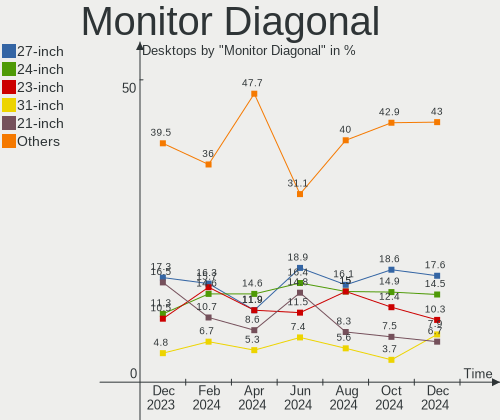
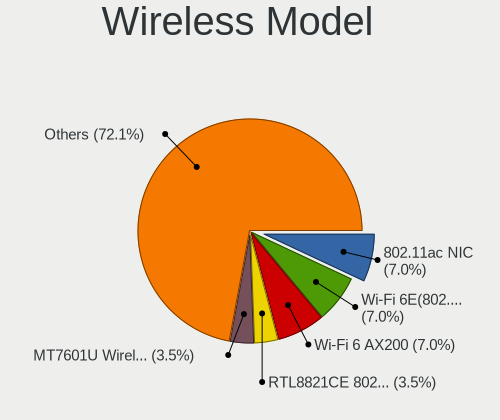
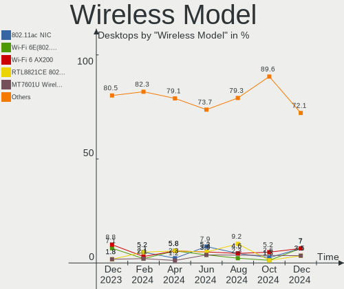

Linux Mint - Hardware Trends (Desktops)
---------------------------------------

A project to identify most popular hardware characteristics and track their change
over time based on data collected by Linux users at https://Linux-Hardware.org.

Anyone can contribute to this report by the [hw-probe](https://github.com/linuxhw/hw-probe) tool:

    sudo -E hw-probe -all -upload

This report is for one last month. Overall report since the beginning of time: [TestCoverage](https://github.com/linuxhw/TestCoverage)

Period: Nov, 2022.

Contents
--------

* [ System ](#system)
  - [ OS                       ](#os)
  - [ OS Family                ](#os-family)
  - [ Kernel                   ](#kernel)
  - [ Kernel Family            ](#kernel-family)
  - [ Kernel Major Ver.        ](#kernel-major-ver)
  - [ Arch                     ](#arch)
  - [ DE                       ](#de)
  - [ Display Server           ](#display-server)
  - [ Display Manager          ](#display-manager)
  - [ OS Lang                  ](#os-lang)
  - [ Boot Mode                ](#boot-mode)
  - [ Filesystem               ](#filesystem)
  - [ Part. scheme             ](#part-scheme)
  - [ Dual Boot with Linux/BSD ](#dual-boot-with-linuxbsd)
  - [ Dual Boot (Win)          ](#dual-boot-win)

* [ Board ](#board)
  - [ Vendor                   ](#vendor)
  - [ Model                    ](#model)
  - [ Model Family             ](#model-family)
  - [ MFG Year                 ](#mfg-year)
  - [ Form Factor              ](#form-factor)
  - [ Secure Boot              ](#secure-boot)
  - [ Coreboot                 ](#coreboot)
  - [ RAM Size                 ](#ram-size)
  - [ RAM Used                 ](#ram-used)
  - [ Total Drives             ](#total-drives)
  - [ Has CD-ROM               ](#has-cd-rom)
  - [ Has Ethernet             ](#has-ethernet)
  - [ Has WiFi                 ](#has-wifi)
  - [ Has Bluetooth            ](#has-bluetooth)

* [ Location ](#location)
  - [ Country                  ](#country)
  - [ City                     ](#city)

* [ Drives ](#drives)
  - [ Drive Vendor             ](#drive-vendor)
  - [ Drive Model              ](#drive-model)
  - [ HDD Vendor               ](#hdd-vendor)
  - [ SSD Vendor               ](#ssd-vendor)
  - [ Drive Kind               ](#drive-kind)
  - [ Drive Connector          ](#drive-connector)
  - [ Drive Size               ](#drive-size)
  - [ Space Total              ](#space-total)
  - [ Space Used               ](#space-used)
  - [ Malfunc. Drives          ](#malfunc-drives)
  - [ Malfunc. Drive Vendor    ](#malfunc-drive-vendor)
  - [ Malfunc. HDD Vendor      ](#malfunc-hdd-vendor)
  - [ Malfunc. Drive Kind      ](#malfunc-drive-kind)
  - [ Failed Drives            ](#failed-drives)
  - [ Failed Drive Vendor      ](#failed-drive-vendor)
  - [ Drive Status             ](#drive-status)

* [ Storage controller ](#storage-controller)
  - [ Storage Vendor           ](#storage-vendor)
  - [ Storage Model            ](#storage-model)
  - [ Storage Kind             ](#storage-kind)

* [ Processor ](#processor)
  - [ CPU Vendor               ](#cpu-vendor)
  - [ CPU Model                ](#cpu-model)
  - [ CPU Model Family         ](#cpu-model-family)
  - [ CPU Cores                ](#cpu-cores)
  - [ CPU Sockets              ](#cpu-sockets)
  - [ CPU Threads              ](#cpu-threads)
  - [ CPU Op-Modes             ](#cpu-op-modes)
  - [ CPU Microcode            ](#cpu-microcode)
  - [ CPU Microarch            ](#cpu-microarch)

* [ Graphics ](#graphics)
  - [ GPU Vendor               ](#gpu-vendor)
  - [ GPU Model                ](#gpu-model)
  - [ GPU Combo                ](#gpu-combo)
  - [ GPU Driver               ](#gpu-driver)
  - [ GPU Memory               ](#gpu-memory)

* [ Monitor ](#monitor)
  - [ Monitor Vendor           ](#monitor-vendor)
  - [ Monitor Model            ](#monitor-model)
  - [ Monitor Resolution       ](#monitor-resolution)
  - [ Monitor Diagonal         ](#monitor-diagonal)
  - [ Monitor Width            ](#monitor-width)
  - [ Aspect Ratio             ](#aspect-ratio)
  - [ Monitor Area             ](#monitor-area)
  - [ Pixel Density            ](#pixel-density)
  - [ Multiple Monitors        ](#multiple-monitors)

* [ Network ](#network)
  - [ Net Controller Vendor    ](#net-controller-vendor)
  - [ Net Controller Model     ](#net-controller-model)
  - [ Wireless Vendor          ](#wireless-vendor)
  - [ Wireless Model           ](#wireless-model)
  - [ Ethernet Vendor          ](#ethernet-vendor)
  - [ Ethernet Model           ](#ethernet-model)
  - [ Net Controller Kind      ](#net-controller-kind)
  - [ Used Controller          ](#used-controller)
  - [ NICs                     ](#nics)
  - [ IPv6                     ](#ipv6)

* [ Bluetooth ](#bluetooth)
  - [ Bluetooth Vendor         ](#bluetooth-vendor)
  - [ Bluetooth Model          ](#bluetooth-model)

* [ Sound ](#sound)
  - [ Sound Vendor             ](#sound-vendor)
  - [ Sound Model              ](#sound-model)

* [ Memory ](#memory)
  - [ Memory Vendor            ](#memory-vendor)
  - [ Memory Model             ](#memory-model)
  - [ Memory Kind              ](#memory-kind)
  - [ Memory Form Factor       ](#memory-form-factor)
  - [ Memory Size              ](#memory-size)
  - [ Memory Speed             ](#memory-speed)

* [ Printers & scanners ](#printers--scanners)
  - [ Printer Vendor           ](#printer-vendor)
  - [ Printer Model            ](#printer-model)
  - [ Scanner Vendor           ](#scanner-vendor)
  - [ Scanner Model            ](#scanner-model)

* [ Camera ](#camera)
  - [ Camera Vendor            ](#camera-vendor)
  - [ Camera Model             ](#camera-model)

* [ Security ](#security)
  - [ Fingerprint Vendor       ](#fingerprint-vendor)
  - [ Fingerprint Model        ](#fingerprint-model)
  - [ Chipcard Vendor          ](#chipcard-vendor)
  - [ Chipcard Model           ](#chipcard-model)

* [ Unsupported ](#unsupported)
  - [ Unsupported Devices      ](#unsupported-devices)
  - [ Unsupported Device Types ](#unsupported-device-types)

System
------

OS
--

Installed operating systems

| Name            | Desktops | Percent |
|-----------------|----------|---------|
| Linux Mint 21   | 87       | 54.38%  |
| Linux Mint 20.3 | 53       | 33.13%  |
| Linux Mint 20.2 | 7        | 4.38%   |
| Linux Mint 20.1 | 3        | 1.88%   |
| Linux Mint 20   | 3        | 1.88%   |
| Linux Mint 19.3 | 3        | 1.88%   |
| Linux Mint 19.2 | 2        | 1.25%   |
| Linux Mint 19   | 2        | 1.25%   |

OS Family
---------

OS without a version

| Name       | Desktops | Percent |
|------------|----------|---------|
| Linux Mint | 160      | 100%    |

Kernel
------

Version of the Linux kernel

| Version                     | Desktops | Percent |
|-----------------------------|----------|---------|
| 5.15.0-52-generic           | 48       | 30%     |
| 5.4.0-131-generic           | 30       | 18.75%  |
| 5.15.0-53-generic           | 28       | 17.5%   |
| 5.4.0-132-generic           | 20       | 12.5%   |
| 5.15.0-41-generic           | 8        | 5%      |
| 5.15.0-47-generic           | 3        | 1.88%   |
| 5.4.0-126-generic           | 2        | 1.25%   |
| 5.4.0-125-generic           | 2        | 1.25%   |
| 4.15.0-197-generic          | 2        | 1.25%   |
| 6.0.9-060009-generic        | 1        | 0.63%   |
| 6.0.7-x64v1-xanmod1         | 1        | 0.63%   |
| 6.0.0-9.1-liquorix-amd64    | 1        | 0.63%   |
| 5.4.0-99-generic            | 1        | 0.63%   |
| 5.4.0-91-generic            | 1        | 0.63%   |
| 5.4.0-26-generic            | 1        | 0.63%   |
| 5.4.0-128-generic           | 1        | 0.63%   |
| 5.4.0-122-generic           | 1        | 0.63%   |
| 5.4.0-121-generic           | 1        | 0.63%   |
| 5.4.0-1152206031516-generic | 1        | 0.63%   |
| 5.4.0-107-generic           | 1        | 0.63%   |
| 5.15.0-54-generic           | 1        | 0.63%   |
| 5.15.0-50-generic           | 1        | 0.63%   |
| 5.15.0-48-generic           | 1        | 0.63%   |
| 5.15.0-46-generic           | 1        | 0.63%   |
| 5.15.0-33-generic           | 1        | 0.63%   |
| 5.0.0-23-generic            | 1        | 0.63%   |

Kernel Family
-------------

Linux kernel without a distro release

| Version | Desktops | Percent |
|---------|----------|---------|
| 5.15.0  | 92       | 57.5%   |
| 5.4.0   | 62       | 38.75%  |
| 4.15.0  | 2        | 1.25%   |
| 6.0.9   | 1        | 0.63%   |
| 6.0.7   | 1        | 0.63%   |
| 6.0.0   | 1        | 0.63%   |
| 5.0.0   | 1        | 0.63%   |

Kernel Major Ver.
-----------------

Linux kernel major version

| Version | Desktops | Percent |
|---------|----------|---------|
| 5.15    | 92       | 57.5%   |
| 5.4     | 62       | 38.75%  |
| 6.0     | 3        | 1.88%   |
| 4.15    | 2        | 1.25%   |
| 5.0     | 1        | 0.63%   |

Arch
----

OS architecture (x86_64, i586, etc.)

| Name   | Desktops | Percent |
|--------|----------|---------|
| x86_64 | 160      | 100%    |

DE
--

Desktop Environment

| Name       | Desktops | Percent |
|------------|----------|---------|
| X-Cinnamon | 118      | 73.75%  |
| MATE       | 23       | 14.38%  |
| XFCE       | 10       | 6.25%   |
| Cinnamon   | 4        | 2.5%    |
| GNOME      | 3        | 1.88%   |
| Unknown    | 2        | 1.25%   |

Display Server
--------------

X11 or Wayland

| Name | Desktops | Percent |
|------|----------|---------|
| X11  | 159      | 99.38%  |
| Tty  | 1        | 0.63%   |

Display Manager
---------------

SDDM, LightDM, etc.

| Name    | Desktops | Percent |
|---------|----------|---------|
| Unknown | 105      | 65.63%  |
| LightDM | 54       | 33.75%  |
| SDDM    | 1        | 0.63%   |

OS Lang
-------

Language

| Lang    | Desktops | Percent |
|---------|----------|---------|
| en_US   | 47       | 29.38%  |
| de_DE   | 30       | 18.75%  |
| pt_BR   | 9        | 5.63%   |
| it_IT   | 9        | 5.63%   |
| fr_FR   | 9        | 5.63%   |
| en_GB   | 9        | 5.63%   |
| ru_RU   | 8        | 5%      |
| es_ES   | 6        | 3.75%   |
| en_AU   | 4        | 2.5%    |
| hu_HU   | 3        | 1.88%   |
| C       | 3        | 1.88%   |
| nl_NL   | 2        | 1.25%   |
| es_AR   | 2        | 1.25%   |
| en_CA   | 2        | 1.25%   |
| Unknown | 2        | 1.25%   |
| zh_TW   | 1        | 0.63%   |
| tr_TR   | 1        | 0.63%   |
| sv_SE   | 1        | 0.63%   |
| pt_PT   | 1        | 0.63%   |
| pl_PL   | 1        | 0.63%   |
| nl_BE   | 1        | 0.63%   |
| he_IL   | 1        | 0.63%   |
| fi_FI   | 1        | 0.63%   |
| es_MX   | 1        | 0.63%   |
| en_NZ   | 1        | 0.63%   |
| en_DK   | 1        | 0.63%   |
| el_GR   | 1        | 0.63%   |
| de_CH   | 1        | 0.63%   |
| da_DK   | 1        | 0.63%   |
| bg_BG   | 1        | 0.63%   |

Boot Mode
---------

EFI or BIOS

| Mode | Desktops | Percent |
|------|----------|---------|
| BIOS | 83       | 51.88%  |
| EFI  | 77       | 48.13%  |

Filesystem
----------

Type of filesystem

| Type    | Desktops | Percent |
|---------|----------|---------|
| Ext4    | 154      | 96.25%  |
| Overlay | 4        | 2.5%    |
| Btrfs   | 2        | 1.25%   |

Part. scheme
------------

Scheme of partitioning

| Type    | Desktops | Percent |
|---------|----------|---------|
| Unknown | 103      | 64.38%  |
| GPT     | 43       | 26.88%  |
| MBR     | 14       | 8.75%   |

Dual Boot with Linux/BSD
------------------------

Hosting more than one Linux/BSD

| Dual boot | Desktops | Percent |
|-----------|----------|---------|
| No        | 146      | 91.25%  |
| Yes       | 14       | 8.75%   |

Dual Boot (Win)
---------------

Hosting Linux and Windows

| Dual boot | Desktops | Percent |
|-----------|----------|---------|
| No        | 129      | 80.63%  |
| Yes       | 31       | 19.38%  |

Board
-----

Vendor
------

Motherboard manufacturer

| Name                | Desktops | Percent |
|---------------------|----------|---------|
| Gigabyte Technology | 35       | 21.88%  |
| ASUSTek Computer    | 33       | 20.63%  |
| MSI                 | 19       | 11.88%  |
| Hewlett-Packard     | 15       | 9.38%   |
| Dell                | 14       | 8.75%   |
| ASRock              | 13       | 8.13%   |
| Intel               | 6        | 3.75%   |
| Acer                | 5        | 3.13%   |
| Unknown             | 4        | 2.5%    |
| Fujitsu             | 3        | 1.88%   |
| PCWare              | 2        | 1.25%   |
| Lenovo              | 2        | 1.25%   |
| QIYIDA              | 1        | 0.63%   |
| Mediacom            | 1        | 0.63%   |
| Huanan              | 1        | 0.63%   |
| Gateway             | 1        | 0.63%   |
| Fujitsu Siemens     | 1        | 0.63%   |
| Biostar             | 1        | 0.63%   |
| AZW                 | 1        | 0.63%   |
| Apple               | 1        | 0.63%   |
| AMD                 | 1        | 0.63%   |

Model
-----

Motherboard model

| Name                                 | Desktops | Percent |
|--------------------------------------|----------|---------|
| Unknown                              | 4        | 2.5%    |
| MSI MS-7C56                          | 2        | 1.25%   |
| MSI MS-7C02                          | 2        | 1.25%   |
| MSI MS-7B86                          | 2        | 1.25%   |
| MSI MS-7758                          | 2        | 1.25%   |
| HP Compaq Pro 6300 SFF               | 2        | 1.25%   |
| HP Compaq Elite 8300 SFF             | 2        | 1.25%   |
| Gigabyte Z170X-Gaming 7              | 2        | 1.25%   |
| Gigabyte GA-MA770-UD3                | 2        | 1.25%   |
| ASUS All Series                      | 2        | 1.25%   |
| QIYIDA X99-H9 V2.0                   | 1        | 0.63%   |
| PCWare IPMH61R3                      | 1        | 0.63%   |
| PCWare IPMH61R2                      | 1        | 0.63%   |
| MSI MS-7D43                          | 1        | 0.63%   |
| MSI MS-7D32                          | 1        | 0.63%   |
| MSI MS-7D22                          | 1        | 0.63%   |
| MSI MS-7B89                          | 1        | 0.63%   |
| MSI MS-7A63                          | 1        | 0.63%   |
| MSI MS-7A35                          | 1        | 0.63%   |
| MSI MS-7A01                          | 1        | 0.63%   |
| MSI MS-7821                          | 1        | 0.63%   |
| MSI MS-7808                          | 1        | 0.63%   |
| MSI MS-7721                          | 1        | 0.63%   |
| MSI MS-7693                          | 1        | 0.63%   |
| Mediacom M-AO241/64                  | 1        | 0.63%   |
| Lenovo ThinkCentre M58p 9728W47      | 1        | 0.63%   |
| Lenovo ThinkCentre A70 7099A5G       | 1        | 0.63%   |
| Intel H61                            | 1        | 0.63%   |
| Intel H55                            | 1        | 0.63%   |
| Intel DG41WV                         | 1        | 0.63%   |
| Intel DG33BU AAD79951-407            | 1        | 0.63%   |
| Intel D525MW AAE93082-401            | 1        | 0.63%   |
| Intel B75                            | 1        | 0.63%   |
| Huanan X99-F8                        | 1        | 0.63%   |
| HP Z420 Workstation                  | 1        | 0.63%   |
| HP xw8400 Workstation                | 1        | 0.63%   |
| HP ProDesk 600 G3 SFF                | 1        | 0.63%   |
| HP ProDesk 600 G2 DM                 | 1        | 0.63%   |
| HP ProDesk 400 G2 MINI               | 1        | 0.63%   |
| HP Pavilion Gaming Desktop TG01-0xxx | 1        | 0.63%   |

Model Family
------------

Motherboard model prefix

| Name                   | Desktops | Percent |
|------------------------|----------|---------|
| Dell OptiPlex          | 9        | 5.63%   |
| HP Compaq              | 6        | 3.75%   |
| Acer Aspire            | 5        | 3.13%   |
| Dell Inspiron          | 4        | 2.5%    |
| ASUS PRIME             | 4        | 2.5%    |
| ASUS M5A78L-M          | 4        | 2.5%    |
| Unknown                | 4        | 2.5%    |
| HP ProDesk             | 3        | 1.88%   |
| HP EliteDesk           | 3        | 1.88%   |
| Gigabyte Z390          | 3        | 1.88%   |
| MSI MS-7C56            | 2        | 1.25%   |
| MSI MS-7C02            | 2        | 1.25%   |
| MSI MS-7B86            | 2        | 1.25%   |
| MSI MS-7758            | 2        | 1.25%   |
| Lenovo ThinkCentre     | 2        | 1.25%   |
| Gigabyte Z490          | 2        | 1.25%   |
| Gigabyte Z170X-Gaming  | 2        | 1.25%   |
| Gigabyte GA-MA770-UD3  | 2        | 1.25%   |
| Gigabyte GA-78LMT-USB3 | 2        | 1.25%   |
| Gigabyte B450          | 2        | 1.25%   |
| Fujitsu ESPRIMO        | 2        | 1.25%   |
| ASUS TUF               | 2        | 1.25%   |
| ASUS P5K               | 2        | 1.25%   |
| ASUS All               | 2        | 1.25%   |
| ASRock B450M           | 2        | 1.25%   |
| QIYIDA X99-H9          | 1        | 0.63%   |
| PCWare IPMH61R3        | 1        | 0.63%   |
| PCWare IPMH61R2        | 1        | 0.63%   |
| MSI MS-7D43            | 1        | 0.63%   |
| MSI MS-7D32            | 1        | 0.63%   |
| MSI MS-7D22            | 1        | 0.63%   |
| MSI MS-7B89            | 1        | 0.63%   |
| MSI MS-7A63            | 1        | 0.63%   |
| MSI MS-7A35            | 1        | 0.63%   |
| MSI MS-7A01            | 1        | 0.63%   |
| MSI MS-7821            | 1        | 0.63%   |
| MSI MS-7808            | 1        | 0.63%   |
| MSI MS-7721            | 1        | 0.63%   |
| MSI MS-7693            | 1        | 0.63%   |
| Mediacom M-AO241       | 1        | 0.63%   |

MFG Year
--------

Motherboard manufacture year

| Year | Desktops | Percent |
|------|----------|---------|
| 2012 | 19       | 11.88%  |
| 2018 | 16       | 10%     |
| 2014 | 13       | 8.13%   |
| 2013 | 12       | 7.5%    |
| 2008 | 12       | 7.5%    |
| 2020 | 11       | 6.88%   |
| 2011 | 11       | 6.88%   |
| 2007 | 11       | 6.88%   |
| 2021 | 9        | 5.63%   |
| 2017 | 9        | 5.63%   |
| 2016 | 8        | 5%      |
| 2022 | 7        | 4.38%   |
| 2019 | 6        | 3.75%   |
| 2010 | 6        | 3.75%   |
| 2015 | 5        | 3.13%   |
| 2009 | 5        | 3.13%   |

Form Factor
-----------

Physical design of the computer

| Name    | Desktops | Percent |
|---------|----------|---------|
| Desktop | 160      | 100%    |

Secure Boot
-----------

Enabled or disabled

| State    | Desktops | Percent |
|----------|----------|---------|
| Disabled | 154      | 96.25%  |
| Enabled  | 6        | 3.75%   |

Coreboot
--------

Have coreboot on board

| Used | Desktops | Percent |
|------|----------|---------|
| No   | 160      | 100%    |

RAM Size
--------

Total RAM memory

| Size in GB  | Desktops | Percent |
|-------------|----------|---------|
| 16.01-24.0  | 37       | 23.13%  |
| 8.01-16.0   | 35       | 21.88%  |
| 4.01-8.0    | 32       | 20%     |
| 32.01-64.0  | 25       | 15.63%  |
| 3.01-4.0    | 20       | 12.5%   |
| 64.01-256.0 | 5        | 3.13%   |
| 24.01-32.0  | 4        | 2.5%    |
| 2.01-3.0    | 1        | 0.63%   |
| 1.01-2.0    | 1        | 0.63%   |

RAM Used
--------

Used RAM memory

| Used GB   | Desktops | Percent |
|-----------|----------|---------|
| 1.01-2.0  | 65       | 40.63%  |
| 2.01-3.0  | 40       | 25%     |
| 4.01-8.0  | 22       | 13.75%  |
| 3.01-4.0  | 15       | 9.38%   |
| 0.51-1.0  | 10       | 6.25%   |
| 8.01-16.0 | 8        | 5%      |

Total Drives
------------

Number of drives on board

| Drives | Desktops | Percent |
|--------|----------|---------|
| 2      | 54       | 33.75%  |
| 1      | 45       | 28.13%  |
| 3      | 35       | 21.88%  |
| 4      | 13       | 8.13%   |
| 5      | 7        | 4.38%   |
| 6      | 5        | 3.13%   |
| 7      | 1        | 0.63%   |

Has CD-ROM
----------

Has CD-ROM on board

| Presented | Desktops | Percent |
|-----------|----------|---------|
| Yes       | 90       | 56.25%  |
| No        | 70       | 43.75%  |

Has Ethernet
------------

Has Ethernet on board

| Presented | Desktops | Percent |
|-----------|----------|---------|
| Yes       | 157      | 98.13%  |
| No        | 3        | 1.88%   |

Has WiFi
--------

Has WiFi module

| Presented | Desktops | Percent |
|-----------|----------|---------|
| No        | 98       | 61.25%  |
| Yes       | 62       | 38.75%  |

Has Bluetooth
-------------

Has Bluetooth module

| Presented | Desktops | Percent |
|-----------|----------|---------|
| No        | 105      | 65.63%  |
| Yes       | 55       | 34.38%  |

Location
--------

Country
-------

Geographic location (country)

| Country     | Desktops | Percent |
|-------------|----------|---------|
| USA         | 34       | 21.25%  |
| Germany     | 33       | 20.63%  |
| Brazil      | 10       | 6.25%   |
| Russia      | 9        | 5.63%   |
| Italy       | 9        | 5.63%   |
| France      | 9        | 5.63%   |
| UK          | 6        | 3.75%   |
| Spain       | 6        | 3.75%   |
| Canada      | 4        | 2.5%    |
| Australia   | 4        | 2.5%    |
| Netherlands | 3        | 1.88%   |
| Latvia      | 3        | 1.88%   |
| Hungary     | 3        | 1.88%   |
| Greece      | 3        | 1.88%   |
| Belgium     | 3        | 1.88%   |
| Turkey      | 2        | 1.25%   |
| Switzerland | 2        | 1.25%   |
| Poland      | 2        | 1.25%   |
| Denmark     | 2        | 1.25%   |
| Argentina   | 2        | 1.25%   |
| Ukraine     | 1        | 0.63%   |
| Taiwan      | 1        | 0.63%   |
| Sweden      | 1        | 0.63%   |
| Portugal    | 1        | 0.63%   |
| New Zealand | 1        | 0.63%   |
| Mexico      | 1        | 0.63%   |
| Kazakhstan  | 1        | 0.63%   |
| Israel      | 1        | 0.63%   |
| Finland     | 1        | 0.63%   |
| Czechia     | 1        | 0.63%   |
| Bulgaria    | 1        | 0.63%   |

City
----

Geographic location (city)

| City             | Desktops | Percent |
|------------------|----------|---------|
| Berlin           | 5        | 3.13%   |
| St Petersburg    | 3        | 1.88%   |
| Ventspils        | 2        | 1.25%   |
| Toronto          | 2        | 1.25%   |
| Sao Paulo        | 2        | 1.25%   |
| Perth            | 2        | 1.25%   |
| Naples           | 2        | 1.25%   |
| Munich           | 2        | 1.25%   |
| Moscow           | 2        | 1.25%   |
| Miami            | 2        | 1.25%   |
| Heemskerk        | 2        | 1.25%   |
| Criciúma        | 2        | 1.25%   |
| Barcelona        | 2        | 1.25%   |
| Zurich           | 1        | 0.63%   |
| Zottegem         | 1        | 0.63%   |
| Zaragoza         | 1        | 0.63%   |
| Zamberk          | 1        | 0.63%   |
| Yonkers          | 1        | 0.63%   |
| Wykroty          | 1        | 0.63%   |
| Worthing         | 1        | 0.63%   |
| Wirral           | 1        | 0.63%   |
| West Bloomfield  | 1        | 0.63%   |
| Weissenfels      | 1        | 0.63%   |
| Viggianello      | 1        | 0.63%   |
| Venice           | 1        | 0.63%   |
| Uetze            | 1        | 0.63%   |
| Topeka           | 1        | 0.63%   |
| Thessaloniki     | 1        | 0.63%   |
| Tel Aviv         | 1        | 0.63%   |
| Taoyuan District | 1        | 0.63%   |
| Surrey           | 1        | 0.63%   |
| Straubing        | 1        | 0.63%   |
| Spring           | 1        | 0.63%   |
| Spokane          | 1        | 0.63%   |
| Soumagne         | 1        | 0.63%   |
| Souillac         | 1        | 0.63%   |
| Sorbolo          | 1        | 0.63%   |
| Slagelse         | 1        | 0.63%   |
| Shymkent         | 1        | 0.63%   |
| Senonches        | 1        | 0.63%   |

Drives
------

Drive Vendor
------------

Hard drive vendors

| Vendor                    | Desktops | Drives | Percent |
|---------------------------|----------|--------|---------|
| Seagate                   | 64       | 85     | 20.38%  |
| WDC                       | 59       | 78     | 18.79%  |
| Samsung Electronics       | 45       | 53     | 14.33%  |
| Kingston                  | 20       | 22     | 6.37%   |
| Crucial                   | 18       | 20     | 5.73%   |
| Toshiba                   | 16       | 19     | 5.1%    |
| SanDisk                   | 13       | 14     | 4.14%   |
| Unknown                   | 6        | 9      | 1.91%   |
| Hitachi                   | 6        | 7      | 1.91%   |
| Intenso                   | 5        | 7      | 1.59%   |
| Intel                     | 5        | 5      | 1.59%   |
| China                     | 5        | 5      | 1.59%   |
| Micron Technology         | 4        | 4      | 1.27%   |
| Unknown                   | 4        | 4      | 1.27%   |
| A-DATA Technology         | 3        | 3      | 0.96%   |
| SPCC                      | 2        | 2      | 0.64%   |
| SK hynix                  | 2        | 2      | 0.64%   |
| Silicon Motion            | 2        | 2      | 0.64%   |
| PNY                       | 2        | 2      | 0.64%   |
| Patriot                   | 2        | 2      | 0.64%   |
| OCZ                       | 2        | 2      | 0.64%   |
| Maxtor                    | 2        | 2      | 0.64%   |
| HGST HTS                  | 2        | 2      | 0.64%   |
| ASMT                      | 2        | 2      | 0.64%   |
| USB                       | 1        | 1      | 0.32%   |
| TO Exter                  | 1        | 1      | 0.32%   |
| Team                      | 1        | 1      | 0.32%   |
| Phison Electronics        | 1        | 1      | 0.32%   |
| Phison                    | 1        | 1      | 0.32%   |
| NGFF                      | 1        | 1      | 0.32%   |
| Micron/Crucial Technology | 1        | 1      | 0.32%   |
| Longline                  | 1        | 1      | 0.32%   |
| LITEON                    | 1        | 1      | 0.32%   |
| Lexar                     | 1        | 1      | 0.32%   |
| Leven                     | 1        | 1      | 0.32%   |
| KNUP                      | 1        | 1      | 0.32%   |
| JMicron Technology        | 1        | 1      | 0.32%   |
| INNOVATION IT             | 1        | 1      | 0.32%   |
| HGST                      | 1        | 1      | 0.32%   |
| Hewlett-Packard           | 1        | 1      | 0.32%   |

Drive Model
-----------

Hard drive models

| Model                                                 | Desktops | Percent |
|-------------------------------------------------------|----------|---------|
| Seagate ST500DM002-1BD142 500GB                       | 10       | 2.78%   |
| Kingston SA400S37240G 240GB SSD                       | 8        | 2.22%   |
| Samsung SSD 850 EVO 250GB                             | 7        | 1.94%   |
| Samsung NVMe SSD Controller SM981/PM981/PM983 1TB     | 5        | 1.39%   |
| Crucial CT1000MX500SSD1 1TB                           | 5        | 1.39%   |
| WDC WD20EZRZ-00Z5HB0 2TB                              | 4        | 1.11%   |
| Seagate ST3500312CS 500GB                             | 4        | 1.11%   |
| Samsung SSD 850 EVO 500GB                             | 4        | 1.11%   |
| Crucial CT500MX500SSD1 500GB                          | 4        | 1.11%   |
| Unknown                                               | 4        | 1.11%   |
| WDC WDS120G2G0A-00JH30 120GB SSD                      | 3        | 0.83%   |
| WDC WD20EARS-00MVWB0 2TB                              | 3        | 0.83%   |
| WDC WD10EZEX-08WN4A0 1TB                              | 3        | 0.83%   |
| Unknown SD/MMC/MS PRO 8GB                             | 3        | 0.83%   |
| Seagate ST2000DM008-2FR102 2TB                        | 3        | 0.83%   |
| Seagate ST1000DM010-2EP102 1TB                        | 3        | 0.83%   |
| Samsung SSD 870 EVO 1TB                               | 3        | 0.83%   |
| Samsung SSD 860 EVO 1TB                               | 3        | 0.83%   |
| Crucial CT1000BX500SSD1 1TB                           | 3        | 0.83%   |
| WDC WD40EZAZ-19SF3B0 4TB                              | 2        | 0.56%   |
| WDC WD20EZBX-00AYRA0 2TB                              | 2        | 0.56%   |
| Toshiba DT01ACA200 2TB                                | 2        | 0.56%   |
| Toshiba DT01ACA100 1TB                                | 2        | 0.56%   |
| Silicon Motion SM2263EN/SM2263XT SSD Controller 128GB | 2        | 0.56%   |
| Seagate ST8000DM004-2CX188 8TB                        | 2        | 0.56%   |
| Seagate ST4000DM000-1F2168 4TB                        | 2        | 0.56%   |
| Seagate ST31000528AS 1TB                              | 2        | 0.56%   |
| Seagate ST2000DM006-2DM164 2TB                        | 2        | 0.56%   |
| Seagate ST2000DL003-9VT166 2TB                        | 2        | 0.56%   |
| Seagate ST1000DM003-1SB102 1TB                        | 2        | 0.56%   |
| Sandisk WD Blue SN550 NVMe SSD 1TB                    | 2        | 0.56%   |
| SanDisk SDSSDH3 500G                                  | 2        | 0.56%   |
| SanDisk NVMe SSD Drive 1TB                            | 2        | 0.56%   |
| Samsung SSD 860 EVO 500GB                             | 2        | 0.56%   |
| Samsung HD642JJ 640GB                                 | 2        | 0.56%   |
| Kingston SV300S37A60G 64GB SSD                        | 2        | 0.56%   |
| Kingston SA400S37120G 120GB SSD                       | 2        | 0.56%   |
| Intenso SSD Sata III 256GB                            | 2        | 0.56%   |
| HGST HTS 545050A7E380 500GB                           | 2        | 0.56%   |
| China FPT310M8SSD128G 128GB                           | 2        | 0.56%   |

HDD Vendor
----------

Hard disk drive vendors

| Vendor              | Desktops | Drives | Percent |
|---------------------|----------|--------|---------|
| Seagate             | 63       | 84     | 40.13%  |
| WDC                 | 52       | 67     | 33.12%  |
| Toshiba             | 14       | 16     | 8.92%   |
| Samsung Electronics | 9        | 10     | 5.73%   |
| Hitachi             | 6        | 7      | 3.82%   |
| Unknown             | 4        | 5      | 2.55%   |
| Maxtor              | 2        | 2      | 1.27%   |
| Intenso             | 2        | 2      | 1.27%   |
| USB                 | 1        | 1      | 0.64%   |
| HGST                | 1        | 1      | 0.64%   |
| Hewlett-Packard     | 1        | 1      | 0.64%   |
| ExcelStor           | 1        | 1      | 0.64%   |
| ASMT                | 1        | 1      | 0.64%   |

SSD Vendor
----------

Solid state drive vendors

| Vendor              | Desktops | Drives | Percent |
|---------------------|----------|--------|---------|
| Samsung Electronics | 24       | 29     | 20.51%  |
| Kingston            | 19       | 21     | 16.24%  |
| Crucial             | 18       | 19     | 15.38%  |
| WDC                 | 8        | 10     | 6.84%   |
| SanDisk             | 7        | 8      | 5.98%   |
| China               | 5        | 5      | 4.27%   |
| Intenso             | 4        | 5      | 3.42%   |
| Micron Technology   | 3        | 3      | 2.56%   |
| A-DATA Technology   | 3        | 3      | 2.56%   |
| Unknown             | 3        | 3      | 2.56%   |
| SPCC                | 2        | 2      | 1.71%   |
| PNY                 | 2        | 2      | 1.71%   |
| Patriot             | 2        | 2      | 1.71%   |
| OCZ                 | 2        | 2      | 1.71%   |
| Intel               | 2        | 2      | 1.71%   |
| Toshiba             | 1        | 1      | 0.85%   |
| TO Exter            | 1        | 1      | 0.85%   |
| Team                | 1        | 1      | 0.85%   |
| NGFF                | 1        | 1      | 0.85%   |
| LITEON              | 1        | 1      | 0.85%   |
| Lexar               | 1        | 1      | 0.85%   |
| Leven               | 1        | 1      | 0.85%   |
| KNUP                | 1        | 1      | 0.85%   |
| JMicron Technology  | 1        | 1      | 0.85%   |
| INNOVATION IT       | 1        | 1      | 0.85%   |
| GOODRAM             | 1        | 1      | 0.85%   |
| ASMT                | 1        | 1      | 0.85%   |
| Acer                | 1        | 1      | 0.85%   |

Drive Kind
----------

HDD or SSD

| Kind    | Desktops | Drives | Percent |
|---------|----------|--------|---------|
| HDD     | 118      | 198    | 45.38%  |
| SSD     | 101      | 129    | 38.85%  |
| NVMe    | 33       | 39     | 12.69%  |
| Unknown | 7        | 9      | 2.69%   |
| MMC     | 1        | 1      | 0.38%   |

Drive Connector
---------------

SATA, SAS, NVMe, etc.

| Type | Desktops | Drives | Percent |
|------|----------|--------|---------|
| SATA | 151      | 316    | 75.5%   |
| NVMe | 33       | 39     | 16.5%   |
| SAS  | 15       | 20     | 7.5%    |
| MMC  | 1        | 1      | 0.5%    |

Drive Size
----------

Size of hard drive

| Size in TB | Desktops | Drives | Percent |
|------------|----------|--------|---------|
| 0.01-0.5   | 120      | 172    | 50.42%  |
| 0.51-1.0   | 54       | 77     | 22.69%  |
| 1.01-2.0   | 32       | 42     | 13.45%  |
| 3.01-4.0   | 13       | 15     | 5.46%   |
| 4.01-10.0  | 9        | 10     | 3.78%   |
| 2.01-3.0   | 8        | 8      | 3.36%   |
| 10.01-20.0 | 2        | 3      | 0.84%   |

Space Total
-----------

Amount of disk space available on the file system

| Size in GB     | Desktops | Percent |
|----------------|----------|---------|
| 101-250        | 38       | 23.75%  |
| 251-500        | 28       | 17.5%   |
| More than 3000 | 24       | 15%     |
| 501-1000       | 24       | 15%     |
| 1001-2000      | 18       | 11.25%  |
| 2001-3000      | 11       | 6.88%   |
| 51-100         | 10       | 6.25%   |
| 21-50          | 3        | 1.88%   |
| 1-20           | 2        | 1.25%   |
| Unknown        | 2        | 1.25%   |

Space Used
----------

Amount of used disk space

| Used GB        | Desktops | Percent |
|----------------|----------|---------|
| 101-250        | 28       | 17.5%   |
| 1-20           | 27       | 16.88%  |
| 21-50          | 24       | 15%     |
| 51-100         | 19       | 11.88%  |
| 501-1000       | 17       | 10.63%  |
| 251-500        | 16       | 10%     |
| 1001-2000      | 12       | 7.5%    |
| More than 3000 | 9        | 5.63%   |
| 2001-3000      | 6        | 3.75%   |
| Unknown        | 2        | 1.25%   |

Malfunc. Drives
---------------

Drive models with a malfunction

| Model                             | Desktops | Drives | Percent |
|-----------------------------------|----------|--------|---------|
| WDC WD3200AAJS-00RYA0 320GB       | 1        | 1      | 5%      |
| WDC WD20EARS-00J2GB0 2TB          | 1        | 1      | 5%      |
| WDC WD10EARS-00MVWB0 1TB          | 1        | 1      | 5%      |
| WDC WD10EADS-00L5B1 1TB           | 1        | 1      | 5%      |
| Seagate ST9500325AS 500GB         | 1        | 1      | 5%      |
| Seagate ST9160314AS 160GB         | 1        | 1      | 5%      |
| Seagate ST8000DM004-2CX188 8TB    | 1        | 1      | 5%      |
| Seagate ST500DM002-1BD142 500GB   | 1        | 1      | 5%      |
| Seagate ST32000641AS 2TB          | 1        | 5      | 5%      |
| Seagate ST31000528AS 1TB          | 1        | 1      | 5%      |
| Seagate ST3000DM001-9YN166 3TB    | 1        | 1      | 5%      |
| Seagate ST2000DM001-9YN164 2TB    | 1        | 1      | 5%      |
| Seagate ST2000DL003-9VT166 2TB    | 1        | 1      | 5%      |
| Seagate ST1000DM003-1SB102 1TB    | 1        | 1      | 5%      |
| Samsung Electronics HD501LJ 500GB | 1        | 1      | 5%      |
| Samsung Electronics HD322HJ 320GB | 1        | 1      | 5%      |
| Maxtor STM3320820AS 320GB         | 1        | 1      | 5%      |
| Leven JAJS500M120C 120GB SSD      | 1        | 1      | 5%      |
| Intel SSDSC2BW120A4 120GB         | 1        | 1      | 5%      |
| HGST HTS545050A7E380 500GB        | 1        | 1      | 5%      |

Malfunc. Drive Vendor
---------------------

Vendors of faulty drives

| Vendor              | Desktops | Drives | Percent |
|---------------------|----------|--------|---------|
| Seagate             | 8        | 14     | 44.44%  |
| WDC                 | 4        | 4      | 22.22%  |
| Samsung Electronics | 2        | 2      | 11.11%  |
| Maxtor              | 1        | 1      | 5.56%   |
| Leven               | 1        | 1      | 5.56%   |
| Intel               | 1        | 1      | 5.56%   |
| HGST                | 1        | 1      | 5.56%   |

Malfunc. HDD Vendor
-------------------

Vendors of faulty HDD drives

| Vendor              | Desktops | Drives | Percent |
|---------------------|----------|--------|---------|
| Seagate             | 8        | 14     | 50%     |
| WDC                 | 4        | 4      | 25%     |
| Samsung Electronics | 2        | 2      | 12.5%   |
| Maxtor              | 1        | 1      | 6.25%   |
| HGST                | 1        | 1      | 6.25%   |

Malfunc. Drive Kind
-------------------

Kinds of faulty drives

| Kind | Desktops | Drives | Percent |
|------|----------|--------|---------|
| HDD  | 15       | 22     | 88.24%  |
| SSD  | 2        | 2      | 11.76%  |

Failed Drives
-------------

Failed drive models

Zero info for selected period =(

Failed Drive Vendor
-------------------

Failed drive vendors

Zero info for selected period =(

Drive Status
------------

Number of failed and malfunc. drives

| Status   | Desktops | Drives | Percent |
|----------|----------|--------|---------|
| Detected | 111      | 241    | 63.07%  |
| Works    | 49       | 111    | 27.84%  |
| Malfunc  | 16       | 24     | 9.09%   |

Storage controller
------------------

Storage Vendor
--------------

Storage controller vendors

| Vendor                       | Desktops | Percent |
|------------------------------|----------|---------|
| Intel                        | 113      | 50.9%   |
| AMD                          | 45       | 20.27%  |
| Samsung Electronics          | 14       | 6.31%   |
| ASMedia Technology           | 9        | 4.05%   |
| SanDisk                      | 7        | 3.15%   |
| Marvell Technology Group     | 7        | 3.15%   |
| JMicron Technology           | 7        | 3.15%   |
| Phison Electronics           | 3        | 1.35%   |
| Toshiba America Info Systems | 2        | 0.9%    |
| SK hynix                     | 2        | 0.9%    |
| Silicon Motion               | 2        | 0.9%    |
| Nvidia                       | 2        | 0.9%    |
| Micron/Crucial Technology    | 2        | 0.9%    |
| Broadcom / LSI               | 2        | 0.9%    |
| VIA Technologies             | 1        | 0.45%   |
| Micron Technology            | 1        | 0.45%   |
| Kingston Technology Company  | 1        | 0.45%   |
| Beijing Starblaze Technology | 1        | 0.45%   |
| ADATA Technology             | 1        | 0.45%   |

Storage Model
-------------

Storage controller models

| Model                                                                                   | Desktops | Percent |
|-----------------------------------------------------------------------------------------|----------|---------|
| AMD FCH SATA Controller [AHCI mode]                                                     | 19       | 6.67%   |
| Intel 8 Series/C220 Series Chipset Family 6-port SATA Controller 1 [AHCI mode]          | 15       | 5.26%   |
| Intel 7 Series/C210 Series Chipset Family 6-port SATA Controller [AHCI mode]            | 14       | 4.91%   |
| AMD SB7x0/SB8x0/SB9x0 IDE Controller                                                    | 14       | 4.91%   |
| AMD 400 Series Chipset SATA Controller                                                  | 11       | 3.86%   |
| Samsung NVMe SSD Controller SM981/PM981/PM983                                           | 10       | 3.51%   |
| Intel Q170/Q150/B150/H170/H110/Z170/CM236 Chipset SATA Controller [AHCI Mode]           | 10       | 3.51%   |
| AMD SB7x0/SB8x0/SB9x0 SATA Controller [IDE mode]                                        | 9        | 3.16%   |
| ASMedia ASM1062 Serial ATA Controller                                                   | 7        | 2.46%   |
| AMD SB7x0/SB8x0/SB9x0 SATA Controller [AHCI mode]                                       | 7        | 2.46%   |
| AMD 500 Series Chipset SATA Controller                                                  | 7        | 2.46%   |
| Intel NM10/ICH7 Family SATA Controller [IDE mode]                                       | 6        | 2.11%   |
| Intel Cannon Lake PCH SATA AHCI Controller                                              | 6        | 2.11%   |
| Intel Alder Lake-S PCH SATA Controller [AHCI Mode]                                      | 5        | 1.75%   |
| Intel 6 Series/C200 Series Chipset Family 6 port Desktop SATA AHCI Controller           | 5        | 1.75%   |
| Intel 200 Series PCH SATA controller [AHCI mode]                                        | 5        | 1.75%   |
| JMicron JMB363 SATA/IDE Controller                                                      | 4        | 1.4%    |
| Intel Celeron/Pentium Silver Processor SATA Controller                                  | 4        | 1.4%    |
| Intel 82801I (ICH9 Family) 2 port SATA Controller [IDE mode]                            | 4        | 1.4%    |
| Intel 6 Series/C200 Series Chipset Family Desktop SATA Controller (IDE mode, ports 4-5) | 4        | 1.4%    |
| Intel 6 Series/C200 Series Chipset Family Desktop SATA Controller (IDE mode, ports 0-3) | 4        | 1.4%    |
| SanDisk WD Blue SN550 NVMe SSD                                                          | 3        | 1.05%   |
| JMicron JMB368 IDE controller                                                           | 3        | 1.05%   |
| Intel SATA Controller [RAID mode]                                                       | 3        | 1.05%   |
| Intel 82801JI (ICH10 Family) 4 port SATA IDE Controller #1                              | 3        | 1.05%   |
| Intel 82801JI (ICH10 Family) 2 port SATA IDE Controller #2                              | 3        | 1.05%   |
| Intel 82801IR/IO/IH (ICH9R/DO/DH) 6 port SATA Controller [AHCI mode]                    | 3        | 1.05%   |
| SK hynix Gold P31/PC711 NVMe Solid State Drive                                          | 2        | 0.7%    |
| Silicon Motion SM2263EN/SM2263XT SSD Controller                                         | 2        | 0.7%    |
| SanDisk WD Blue SN570 NVMe SSD                                                          | 2        | 0.7%    |
| Samsung NVMe SSD Controller SM961/PM961/SM963                                           | 2        | 0.7%    |
| Samsung NVMe SSD Controller 980                                                         | 2        | 0.7%    |
| Phison E16 PCIe4 NVMe Controller                                                        | 2        | 0.7%    |
| Marvell Group 88SE9172 SATA 6Gb/s Controller                                            | 2        | 0.7%    |
| Marvell Group 88SE6111/6121 SATA II / PATA Controller                                   | 2        | 0.7%    |
| Marvell Group 88SE6101/6102 single-port PATA133 interface                               | 2        | 0.7%    |
| Intel Jasper Lake SATA AHCI Controller                                                  | 2        | 0.7%    |
| Intel 9 Series Chipset Family SATA Controller [AHCI Mode]                               | 2        | 0.7%    |
| Intel 82Q35 Express PT IDER Controller                                                  | 2        | 0.7%    |
| Intel 82801IR/IO/IH (ICH9R/DO/DH) 4 port SATA Controller [IDE mode]                     | 2        | 0.7%    |

Storage Kind
------------

Kind of storage controller (IDE, SATA, NVMe, SAS, ...)

| Kind | Desktops | Percent |
|------|----------|---------|
| SATA | 130      | 58.3%   |
| IDE  | 51       | 22.87%  |
| NVMe | 33       | 14.8%   |
| RAID | 6        | 2.69%   |
| SAS  | 2        | 0.9%    |
| SCSI | 1        | 0.45%   |

Processor
---------

CPU Vendor
----------

Processor vendors

| Vendor | Desktops | Percent |
|--------|----------|---------|
| Intel  | 113      | 70.63%  |
| AMD    | 47       | 29.38%  |

CPU Model
---------

Processor models

| Model                                        | Desktops | Percent |
|----------------------------------------------|----------|---------|
| Intel Core i7-3770 CPU @ 3.40GHz             | 5        | 3.13%   |
| AMD Ryzen 5 5600G with Radeon Graphics       | 5        | 3.13%   |
| Intel Core i7-3770K CPU @ 3.50GHz            | 4        | 2.5%    |
| Intel Celeron J4125 CPU @ 2.00GHz            | 4        | 2.5%    |
| AMD FX-8350 Eight-Core Processor             | 4        | 2.5%    |
| Intel Pentium CPU G630 @ 2.70GHz             | 3        | 1.88%   |
| Intel Core i5-3470 CPU @ 3.20GHz             | 3        | 1.88%   |
| Intel Pentium Dual CPU E2140 @ 1.60GHz       | 2        | 1.25%   |
| Intel Core i7-8700 CPU @ 3.20GHz             | 2        | 1.25%   |
| Intel Core i7-7700K CPU @ 4.20GHz            | 2        | 1.25%   |
| Intel Core i7-6700K CPU @ 4.00GHz            | 2        | 1.25%   |
| Intel Core i7-4770 CPU @ 3.40GHz             | 2        | 1.25%   |
| Intel Core i7-10700K CPU @ 3.80GHz           | 2        | 1.25%   |
| Intel Core i5-9600K CPU @ 3.70GHz            | 2        | 1.25%   |
| Intel Core i5-7500 CPU @ 3.40GHz             | 2        | 1.25%   |
| Intel Core i5-6500 CPU @ 3.20GHz             | 2        | 1.25%   |
| Intel Core i5-4460 CPU @ 3.20GHz             | 2        | 1.25%   |
| Intel Core i3-4150 CPU @ 3.50GHz             | 2        | 1.25%   |
| Intel Core i3-3240 CPU @ 3.40GHz             | 2        | 1.25%   |
| Intel Core i3-3220 CPU @ 3.30GHz             | 2        | 1.25%   |
| Intel Core 2 Quad CPU Q6600 @ 2.40GHz        | 2        | 1.25%   |
| Intel Core 2 Duo CPU E6750 @ 2.66GHz         | 2        | 1.25%   |
| Intel 12th Gen Core i7-12700KF               | 2        | 1.25%   |
| Intel 12th Gen Core i5-12400F                | 2        | 1.25%   |
| AMD Ryzen 7 5800X 8-Core Processor           | 2        | 1.25%   |
| AMD Ryzen 5 3600 6-Core Processor            | 2        | 1.25%   |
| AMD Ryzen 5 2400G with Radeon Vega Graphics  | 2        | 1.25%   |
| AMD Ryzen 3 3200G with Radeon Vega Graphics  | 2        | 1.25%   |
| AMD Ryzen 3 2200G with Radeon Vega Graphics  | 2        | 1.25%   |
| AMD FX-4100 Quad-Core Processor              | 2        | 1.25%   |
| AMD A6-7480 Radeon R5, 8 Compute Cores 2C+6G | 2        | 1.25%   |
| Intel Xeon CPU X5355 @ 2.66GHz               | 1        | 0.63%   |
| Intel Xeon CPU E5462 @ 2.80GHz               | 1        | 0.63%   |
| Intel Xeon CPU E5-2678 v3 @ 2.50GHz          | 1        | 0.63%   |
| Intel Xeon CPU E5-2630 v2 @ 2.60GHz          | 1        | 0.63%   |
| Intel Xeon CPU E5-2620 v3 @ 2.40GHz          | 1        | 0.63%   |
| Intel Xeon CPU E31245 @ 3.30GHz              | 1        | 0.63%   |
| Intel Pentium Dual-Core CPU E5700 @ 3.00GHz  | 1        | 0.63%   |
| Intel Pentium Dual CPU E2200 @ 2.20GHz       | 1        | 0.63%   |
| Intel Pentium CPU G2020 @ 2.90GHz            | 1        | 0.63%   |

CPU Model Family
----------------

Processor model prefix

| Model                   | Desktops | Percent |
|-------------------------|----------|---------|
| Intel Core i7           | 27       | 16.88%  |
| Intel Core i5           | 27       | 16.88%  |
| Intel Core i3           | 12       | 7.5%    |
| AMD Ryzen 5             | 12       | 7.5%    |
| Intel Celeron           | 11       | 6.88%   |
| AMD FX                  | 9        | 5.63%   |
| Intel Core 2 Duo        | 8        | 5%      |
| Other                   | 6        | 3.75%   |
| Intel Xeon              | 6        | 3.75%   |
| Intel Core 2 Quad       | 5        | 3.13%   |
| AMD Ryzen 3             | 5        | 3.13%   |
| Intel Pentium           | 4        | 2.5%    |
| AMD Ryzen 7             | 4        | 2.5%    |
| AMD A6                  | 4        | 2.5%    |
| Intel Pentium Dual      | 3        | 1.88%   |
| AMD Ryzen 9             | 2        | 1.25%   |
| AMD Phenom II X4        | 2        | 1.25%   |
| AMD Athlon 64 X2        | 2        | 1.25%   |
| Intel Pentium Dual-Core | 1        | 0.63%   |
| Intel Core i9           | 1        | 0.63%   |
| Intel Core 2            | 1        | 0.63%   |
| Intel Atom              | 1        | 0.63%   |
| AMD Phenom II X3        | 1        | 0.63%   |
| AMD Phenom              | 1        | 0.63%   |
| AMD E1                  | 1        | 0.63%   |
| AMD Athlon II X4        | 1        | 0.63%   |
| AMD Athlon II X3        | 1        | 0.63%   |
| AMD Athlon 64           | 1        | 0.63%   |
| AMD A8                  | 1        | 0.63%   |

CPU Cores
---------

Number of processor cores

| Number | Desktops | Percent |
|--------|----------|---------|
| 4      | 73       | 45.63%  |
| 2      | 43       | 26.88%  |
| 6      | 19       | 11.88%  |
| 8      | 11       | 6.88%   |
| 12     | 5        | 3.13%   |
| 1      | 5        | 3.13%   |
| 3      | 3        | 1.88%   |
| 16     | 1        | 0.63%   |

CPU Sockets
-----------

Number of sockets

| Number | Desktops | Percent |
|--------|----------|---------|
| 1      | 158      | 98.75%  |
| 2      | 2        | 1.25%   |

CPU Threads
-----------

Threads per core (Hyper-Threading)

| Number | Desktops | Percent |
|--------|----------|---------|
| 2      | 83       | 51.88%  |
| 1      | 77       | 48.13%  |

CPU Op-Modes
------------

CPU Operation Modes (32-bit, 64-bit)

| Op mode        | Desktops | Percent |
|----------------|----------|---------|
| 32-bit, 64-bit | 160      | 100%    |

CPU Microcode
-------------

Microcode number

| Number     | Desktops | Percent |
|------------|----------|---------|
| Unknown    | 19       | 11.88%  |
| 0x306c3    | 16       | 10%     |
| 0x306a9    | 16       | 10%     |
| 0x506e3    | 8        | 5%      |
| 0x1067a    | 6        | 3.75%   |
| 0x06000852 | 6        | 3.75%   |
| 0x6fb      | 5        | 3.13%   |
| 0x206a7    | 5        | 3.13%   |
| 0x08701021 | 5        | 3.13%   |
| 0x906ed    | 4        | 2.5%    |
| 0x906e9    | 4        | 2.5%    |
| 0x706a8    | 4        | 2.5%    |
| 0x6fd      | 4        | 2.5%    |
| 0x906ea    | 3        | 1.88%   |
| 0x90672    | 3        | 1.88%   |
| 0x0a50000d | 3        | 1.88%   |
| 0x08101016 | 3        | 1.88%   |
| 0x0600063e | 3        | 1.88%   |
| 0x010000c8 | 3        | 1.88%   |
| 0xa0655    | 2        | 1.25%   |
| 0x306f2    | 2        | 1.25%   |
| 0x20652    | 2        | 1.25%   |
| 0x10676    | 2        | 1.25%   |
| 0x0a50000c | 2        | 1.25%   |
| 0x010000db | 2        | 1.25%   |
| 0xa0671    | 1        | 0.63%   |
| 0xa0653    | 1        | 0.63%   |
| 0x906c0    | 1        | 0.63%   |
| 0x6f7      | 1        | 0.63%   |
| 0x6f6      | 1        | 0.63%   |
| 0x506c9    | 1        | 0.63%   |
| 0x406c3    | 1        | 0.63%   |
| 0x306e4    | 1        | 0.63%   |
| 0x30678    | 1        | 0.63%   |
| 0x20655    | 1        | 0.63%   |
| 0x106ca    | 1        | 0.63%   |
| 0x106a5    | 1        | 0.63%   |
| 0x106a4    | 1        | 0.63%   |
| 0x10677    | 1        | 0.63%   |
| 0x10661    | 1        | 0.63%   |

CPU Microarch
-------------

Microarchitecture

| Name             | Desktops | Percent |
|------------------|----------|---------|
| IvyBridge        | 21       | 13.13%  |
| Haswell          | 19       | 11.88%  |
| KabyLake         | 12       | 7.5%    |
| Core             | 12       | 7.5%    |
| Zen 3            | 9        | 5.63%   |
| Skylake          | 9        | 5.63%   |
| Penryn           | 9        | 5.63%   |
| Piledriver       | 7        | 4.38%   |
| Zen              | 6        | 3.75%   |
| SandyBridge      | 6        | 3.75%   |
| K10              | 6        | 3.75%   |
| Zen 2            | 5        | 3.13%   |
| Goldmont plus    | 4        | 2.5%    |
| CometLake        | 4        | 2.5%    |
| Zen+             | 3        | 1.88%   |
| Westmere         | 3        | 1.88%   |
| K8 Hammer        | 3        | 1.88%   |
| Excavator        | 3        | 1.88%   |
| Bulldozer        | 3        | 1.88%   |
| Alderlake Hybrid | 3        | 1.88%   |
| Unknown          | 3        | 1.88%   |
| Silvermont       | 2        | 1.25%   |
| Nehalem          | 2        | 1.25%   |
| Tremont          | 1        | 0.63%   |
| K10 Llano        | 1        | 0.63%   |
| Icelake          | 1        | 0.63%   |
| Goldmont         | 1        | 0.63%   |
| Bonnell          | 1        | 0.63%   |
| Bobcat           | 1        | 0.63%   |

Graphics
--------

GPU Vendor
----------

Vendors of graphics cards

| Vendor | Desktops | Percent |
|--------|----------|---------|
| Nvidia | 66       | 40%     |
| Intel  | 54       | 32.73%  |
| AMD    | 45       | 27.27%  |

GPU Model
---------

Graphics card models

| Model                                                                       | Desktops | Percent |
|-----------------------------------------------------------------------------|----------|---------|
| Intel Xeon E3-1200 v2/3rd Gen Core processor Graphics Controller            | 8        | 4.76%   |
| AMD Ellesmere [Radeon RX 470/480/570/570X/580/580X/590]                     | 7        | 4.17%   |
| Intel HD Graphics 530                                                       | 6        | 3.57%   |
| Intel Xeon E3-1200 v3/4th Gen Core Processor Integrated Graphics Controller | 5        | 2.98%   |
| AMD Cezanne [Radeon Vega Series / Radeon Vega Mobile Series]                | 5        | 2.98%   |
| Nvidia GP108 [GeForce GT 1030]                                              | 4        | 2.38%   |
| Nvidia GP107 [GeForce GTX 1050 Ti]                                          | 4        | 2.38%   |
| Intel GeminiLake [UHD Graphics 600]                                         | 4        | 2.38%   |
| Intel 2nd Generation Core Processor Family Integrated Graphics Controller   | 4        | 2.38%   |
| AMD Raven Ridge [Radeon Vega Series / Radeon Vega Mobile Series]            | 4        | 2.38%   |
| Nvidia GT218 [GeForce 210]                                                  | 3        | 1.79%   |
| Nvidia GK208B [GeForce GT 710]                                              | 3        | 1.79%   |
| Intel IvyBridge GT2 [HD Graphics 4000]                                      | 3        | 1.79%   |
| Intel CometLake-S GT2 [UHD Graphics 630]                                    | 3        | 1.79%   |
| Intel CoffeeLake-S GT2 [UHD Graphics 630]                                   | 3        | 1.79%   |
| AMD Picasso/Raven 2 [Radeon Vega Series / Radeon Vega Mobile Series]        | 3        | 1.79%   |
| Nvidia TU116 [GeForce GTX 1660 Ti]                                          | 2        | 1.19%   |
| Nvidia GP107 [GeForce GTX 1050]                                             | 2        | 1.19%   |
| Nvidia GP106 [GeForce GTX 1060 6GB]                                         | 2        | 1.19%   |
| Nvidia GP104 [GeForce GTX 1070]                                             | 2        | 1.19%   |
| Nvidia GM206 [GeForce GTX 960]                                              | 2        | 1.19%   |
| Nvidia GM206 [GeForce GTX 950]                                              | 2        | 1.19%   |
| Nvidia GM204 [GeForce GTX 970]                                              | 2        | 1.19%   |
| Nvidia GK107 [GeForce GTX 650]                                              | 2        | 1.19%   |
| Nvidia G96C [GeForce 9500 GT]                                               | 2        | 1.19%   |
| Intel JasperLake [UHD Graphics]                                             | 2        | 1.19%   |
| Intel Core Processor Integrated Graphics Controller                         | 2        | 1.19%   |
| Intel 82Q35 Express Integrated Graphics Controller                          | 2        | 1.19%   |
| Intel 82G33/G31 Express Integrated Graphics Controller                      | 2        | 1.19%   |
| Intel 4th Generation Core Processor Family Integrated Graphics Controller   | 2        | 1.19%   |
| Intel 4 Series Chipset Integrated Graphics Controller                       | 2        | 1.19%   |
| AMD Wani [Radeon R5/R6/R7 Graphics]                                         | 2        | 1.19%   |
| AMD Turks PRO [Radeon HD 6570/7570/8550 / R5 230]                           | 2        | 1.19%   |
| AMD Redwood XT [Radeon HD 5670/5690/5730]                                   | 2        | 1.19%   |
| AMD Baffin [Radeon RX 460/560D / Pro 450/455/460/555/555X/560/560X]         | 2        | 1.19%   |
| Nvidia TU117 [GeForce GTX 1650]                                             | 1        | 0.6%    |
| Nvidia TU116 [GeForce GTX 1660 SUPER]                                       | 1        | 0.6%    |
| Nvidia TU116 [GeForce GTX 1650 SUPER]                                       | 1        | 0.6%    |
| Nvidia TU106 [GeForce RTX 2060 Rev. A]                                      | 1        | 0.6%    |
| Nvidia GT218 [NVS 300]                                                      | 1        | 0.6%    |

GPU Combo
---------

Combinations of graphics cards

| Name         | Desktops | Percent |
|--------------|----------|---------|
| 1 x Nvidia   | 63       | 39.38%  |
| 1 x Intel    | 52       | 32.5%   |
| 1 x AMD      | 39       | 24.38%  |
| 2 x AMD      | 3        | 1.88%   |
| AMD + Nvidia | 3        | 1.88%   |

GPU Driver
----------

Free vs proprietary

| Driver      | Desktops | Percent |
|-------------|----------|---------|
| Free        | 110      | 68.75%  |
| Proprietary | 46       | 28.75%  |
| Unknown     | 4        | 2.5%    |

GPU Memory
----------

Total video memory

| Size in GB | Desktops | Percent |
|------------|----------|---------|
| Unknown    | 62       | 38.75%  |
| 1.01-2.0   | 27       | 16.88%  |
| 0.51-1.0   | 19       | 11.88%  |
| 3.01-4.0   | 18       | 11.25%  |
| 0.01-0.5   | 14       | 8.75%   |
| 7.01-8.0   | 11       | 6.88%   |
| 5.01-6.0   | 6        | 3.75%   |
| 8.01-16.0  | 2        | 1.25%   |
| 16.01-24.0 | 1        | 0.63%   |

Monitor
-------

Monitor Vendor
--------------

Monitor vendors

| Vendor               | Desktops | Percent |
|----------------------|----------|---------|
| Samsung Electronics  | 25       | 15.24%  |
| Dell                 | 17       | 10.37%  |
| Goldstar             | 14       | 8.54%   |
| Ancor Communications | 13       | 7.93%   |
| Acer                 | 13       | 7.93%   |
| Philips              | 8        | 4.88%   |
| Hewlett-Packard      | 8        | 4.88%   |
| Iiyama               | 6        | 3.66%   |
| AOC                  | 5        | 3.05%   |
| Toshiba              | 4        | 2.44%   |
| BenQ                 | 4        | 2.44%   |
| ViewSonic            | 3        | 1.83%   |
| Unknown              | 3        | 1.83%   |
| Sceptre Tech         | 3        | 1.83%   |
| MSI                  | 3        | 1.83%   |
| Medion               | 3        | 1.83%   |
| Eizo                 | 3        | 1.83%   |
| Unknown (XXX)        | 2        | 1.22%   |
| Sharp                | 2        | 1.22%   |
| Panasonic            | 2        | 1.22%   |
| LG Electronics       | 2        | 1.22%   |
| HUAWEI               | 2        | 1.22%   |
| Hitachi              | 2        | 1.22%   |
| ASUSTek Computer     | 2        | 1.22%   |
| ___                  | 1        | 0.61%   |
| Westinghouse         | 1        | 0.61%   |
| Vestel Elektronik    | 1        | 0.61%   |
| Unknown (AAA)        | 1        | 0.61%   |
| STD                  | 1        | 0.61%   |
| SANYO                | 1        | 0.61%   |
| Plain Tree Systems   | 1        | 0.61%   |
| NEC Computers        | 1        | 0.61%   |
| Lenovo               | 1        | 0.61%   |
| HannStar Display     | 1        | 0.61%   |
| Gigabyte Technology  | 1        | 0.61%   |
| eMachines            | 1        | 0.61%   |
| DSGR                 | 1        | 0.61%   |
| Compal               | 1        | 0.61%   |
| Unknown              | 1        | 0.61%   |

Monitor Model
-------------

Monitor models

| Model                                                                  | Desktops | Percent |
|------------------------------------------------------------------------|----------|---------|
| Dell U2410 DELF015 1920x1200 518x324mm 24.1-inch                       | 3        | 1.76%   |
| Toshiba TV TSB0108 1360x768 580x320mm 26.1-inch                        | 2        | 1.18%   |
| Samsung Electronics C24F390 SAM0D2C 1920x1080 520x290mm 23.4-inch      | 2        | 1.18%   |
| Philips PHL 273V7 PHLC156 1920x1080 598x336mm 27.0-inch                | 2        | 1.18%   |
| ___ LCD TV ___9000 1360x768                                            | 1        | 0.59%   |
| Westinghouse LD-4080 WDT18C4 1920x1080 890x500mm 40.2-inch             | 1        | 0.59%   |
| ViewSonic VX2703 SERIES VSCF62B 1920x1080 597x336mm 27.0-inch          | 1        | 0.59%   |
| ViewSonic VX2033WM VSC0323 1600x900 440x250mm 19.9-inch                | 1        | 0.59%   |
| ViewSonic VA2246 SERIES VSC6F2E 1920x1080 477x268mm 21.5-inch          | 1        | 0.59%   |
| Vestel Elektronik 55UHD_LCD_TV VES3700 3840x2160 1872x1053mm 84.6-inch | 1        | 0.59%   |
| Unknown PHILCO 9000 1360x768 1600x900mm 72.3-inch                      | 1        | 0.59%   |
| Unknown LCD Monitor XXX AAA 1920x1080                                  | 1        | 0.59%   |
| Unknown LCD Monitor FFFF 2288x1287 2550x2550mm 142.0-inch              | 1        | 0.59%   |
| Unknown (XXX) HDMI XXX0019 1680x1050 473x296mm 22.0-inch               | 1        | 0.59%   |
| Unknown (XXX) Beyond TV XXX2851 3840x2160 1209x680mm 54.6-inch         | 1        | 0.59%   |
| Unknown (AAA) LCDTV AAA3393 1360x768 890x500mm 40.2-inch               | 1        | 0.59%   |
| Toshiba LCD Monitor TV 1920x1080                                       | 1        | 0.59%   |
| Toshiba HDMI LCD320A 1920x1080 710x400mm 32.1-inch                     | 1        | 0.59%   |
| STD LCD TV STD0101 1920x1080                                           | 1        | 0.59%   |
| Sharp LCDTV SHP1003 1360x768 440x250mm 19.9-inch                       | 1        | 0.59%   |
| Sharp HDMI SHP0FFB 1920x1080 820x460mm 37.0-inch                       | 1        | 0.59%   |
| Sceptre Tech Sceptre M27 SPT0ACD 1920x1080 598x336mm 27.0-inch         | 1        | 0.59%   |
| Sceptre Tech Sceptre C35 SPT0DB7 3440x1440 819x346mm 35.0-inch         | 1        | 0.59%   |
| Sceptre Tech E20 SPT080D 1600x900 434x236mm 19.4-inch                  | 1        | 0.59%   |
| SANYO LCD SAN1207 1360x768                                             | 1        | 0.59%   |
| Samsung Electronics T24C300 SAM0A9B 1920x1080 530x300mm 24.0-inch      | 1        | 0.59%   |
| Samsung Electronics SyncMaster SAM060B 1920x1080 510x290mm 23.1-inch   | 1        | 0.59%   |
| Samsung Electronics SyncMaster SAM05C4 1920x1080 510x287mm 23.0-inch   | 1        | 0.59%   |
| Samsung Electronics SME2420L SAM06C2 1920x1080 521x293mm 23.5-inch     | 1        | 0.59%   |
| Samsung Electronics SMB2240W SAM0699 1680x1050 459x296mm 21.5-inch     | 1        | 0.59%   |
| Samsung Electronics SE790C SAM0C62 2560x1080 700x310mm 30.1-inch       | 1        | 0.59%   |
| Samsung Electronics SAMTRON STN0021 1280x1024 338x270mm 17.0-inch      | 1        | 0.59%   |
| Samsung Electronics SA300/SA350 SAM078F 1920x1080 477x268mm 21.5-inch  | 1        | 0.59%   |
| Samsung Electronics S24D330 SAM0D92 1920x1080 531x299mm 24.0-inch      | 1        | 0.59%   |
| Samsung Electronics S24D300 SAM0B43 1920x1080 531x299mm 24.0-inch      | 1        | 0.59%   |
| Samsung Electronics S22D390 SAM0B63 1920x1080 477x268mm 21.5-inch      | 1        | 0.59%   |
| Samsung Electronics S22D300 SAM0B3F 1920x1080 477x268mm 21.5-inch      | 1        | 0.59%   |
| Samsung Electronics S22C300 SAM0A1F 1920x1080 477x268mm 21.5-inch      | 1        | 0.59%   |
| Samsung Electronics S19D300 SAM0B36 1366x768 410x230mm 18.5-inch       | 1        | 0.59%   |
| Samsung Electronics Q80A SAM713F 3840x2160 1872x1053mm 84.6-inch       | 1        | 0.59%   |

Monitor Resolution
------------------

Monitor screen resolution

| Resolution         | Desktops | Percent |
|--------------------|----------|---------|
| 1920x1080 (FHD)    | 80       | 50.31%  |
| 3840x2160 (4K)     | 11       | 6.92%   |
| 1280x1024 (SXGA)   | 11       | 6.92%   |
| 1680x1050 (WSXGA+) | 9        | 5.66%   |
| 1920x1200 (WUXGA)  | 7        | 4.4%    |
| 1600x900 (HD+)     | 7        | 4.4%    |
| 1440x900 (WXGA+)   | 7        | 4.4%    |
| 1360x768           | 5        | 3.14%   |
| 3440x1440          | 4        | 2.52%   |
| 2560x1440 (QHD)    | 4        | 2.52%   |
| 1366x768 (WXGA)    | 4        | 2.52%   |
| 2560x1080          | 3        | 1.89%   |
| 1920x540           | 2        | 1.26%   |
| Unknown            | 2        | 1.26%   |
| 3840x1080          | 1        | 0.63%   |
| 3200x1080          | 1        | 0.63%   |
| 2288x1287          | 1        | 0.63%   |

Monitor Diagonal
----------------

Diagonal size in inches

| Inches  | Desktops | Percent |
|---------|----------|---------|
| 27      | 22       | 13.5%   |
| Unknown | 22       | 13.5%   |
| 24      | 20       | 12.27%  |
| 21      | 19       | 11.66%  |
| 23      | 14       | 8.59%   |
| 19      | 14       | 8.59%   |
| 22      | 9        | 5.52%   |
| 34      | 5        | 3.07%   |
| 20      | 5        | 3.07%   |
| 17      | 5        | 3.07%   |
| 72      | 4        | 2.45%   |
| 18      | 4        | 2.45%   |
| 84      | 3        | 1.84%   |
| 25      | 3        | 1.84%   |
| 54      | 2        | 1.23%   |
| 40      | 2        | 1.23%   |
| 31      | 2        | 1.23%   |
| 142     | 1        | 0.61%   |
| 65      | 1        | 0.61%   |
| 57      | 1        | 0.61%   |
| 46      | 1        | 0.61%   |
| 37      | 1        | 0.61%   |
| 35      | 1        | 0.61%   |
| 32      | 1        | 0.61%   |
| 30      | 1        | 0.61%   |

Monitor Width
-------------

Physical width

| Width in mm    | Desktops | Percent |
|----------------|----------|---------|
| 501-600        | 54       | 33.75%  |
| 401-500        | 45       | 28.13%  |
| Unknown        | 22       | 13.75%  |
| 1501-2000      | 7        | 4.38%   |
| 701-800        | 6        | 3.75%   |
| 351-400        | 6        | 3.75%   |
| 601-700        | 5        | 3.13%   |
| 301-350        | 5        | 3.13%   |
| 1001-1500      | 5        | 3.13%   |
| 801-900        | 4        | 2.5%    |
| More than 2000 | 1        | 0.63%   |

Aspect Ratio
------------

Proportional relationship between the width and the height

| Ratio   | Desktops | Percent |
|---------|----------|---------|
| 16/9    | 97       | 62.99%  |
| 16/10   | 22       | 14.29%  |
| Unknown | 16       | 10.39%  |
| 5/4     | 11       | 7.14%   |
| 21/9    | 7        | 4.55%   |
| 1.00    | 1        | 0.65%   |

Monitor Area
------------

Area in inch²

| Area in inch² | Desktops | Percent |
|----------------|----------|---------|
| 201-250        | 49       | 30.06%  |
| 151-200        | 25       | 15.34%  |
| 301-350        | 23       | 14.11%  |
| Unknown        | 22       | 13.5%   |
| More than 1000 | 12       | 7.36%   |
| 251-300        | 10       | 6.13%   |
| 351-500        | 9        | 5.52%   |
| 141-150        | 9        | 5.52%   |
| 501-1000       | 4        | 2.45%   |

Pixel Density
-------------

Pixels per inch

| Density | Desktops | Percent |
|---------|----------|---------|
| 51-100  | 93       | 60%     |
| 101-120 | 25       | 16.13%  |
| Unknown | 22       | 14.19%  |
| 1-50    | 10       | 6.45%   |
| 161-240 | 4        | 2.58%   |
| 121-160 | 1        | 0.65%   |

Multiple Monitors
-----------------

Total monitors connected

| Total | Desktops | Percent |
|-------|----------|---------|
| 1     | 133      | 83.13%  |
| 2     | 20       | 12.5%   |
| 0     | 5        | 3.13%   |
| 3     | 2        | 1.25%   |

Network
-------

Net Controller Vendor
---------------------

Controller vendors

| Vendor                   | Desktops | Percent |
|--------------------------|----------|---------|
| Realtek Semiconductor    | 111      | 50.92%  |
| Intel                    | 59       | 27.06%  |
| Qualcomm Atheros         | 17       | 7.8%    |
| Ralink Technology        | 5        | 2.29%   |
| TP-Link                  | 4        | 1.83%   |
| Microsoft                | 2        | 0.92%   |
| MediaTek                 | 2        | 0.92%   |
| Marvell Technology Group | 2        | 0.92%   |
| D-Link                   | 2        | 0.92%   |
| ASUSTek Computer         | 2        | 0.92%   |
| ASIX Electronics         | 2        | 0.92%   |
| U-Blox                   | 1        | 0.46%   |
| Qualcomm                 | 1        | 0.46%   |
| Nvidia                   | 1        | 0.46%   |
| Motorola                 | 1        | 0.46%   |
| Micro Star International | 1        | 0.46%   |
| Huawei Technologies      | 1        | 0.46%   |
| Broadcom Limited         | 1        | 0.46%   |
| Broadcom                 | 1        | 0.46%   |
| AMD                      | 1        | 0.46%   |
| 3Com                     | 1        | 0.46%   |

Net Controller Model
--------------------

Controller models

| Model                                                             | Desktops | Percent |
|-------------------------------------------------------------------|----------|---------|
| Realtek RTL8111/8168/8411 PCI Express Gigabit Ethernet Controller | 85       | 35.42%  |
| Intel 82579LM Gigabit Network Connection (Lewisville)             | 11       | 4.58%   |
| Realtek RTL8821CE 802.11ac PCIe Wireless Network Adapter          | 6        | 2.5%    |
| Realtek RTL8125 2.5GbE Controller                                 | 6        | 2.5%    |
| Intel Ethernet Controller I225-V                                  | 6        | 2.5%    |
| Intel Ethernet Connection (2) I219-V                              | 6        | 2.5%    |
| Intel Ethernet Connection (7) I219-V                              | 5        | 2.08%   |
| Realtek RTL88x2bu [AC1200 Techkey]                                | 4        | 1.67%   |
| Realtek 802.11ac NIC                                              | 4        | 1.67%   |
| Realtek RTL8192EE PCIe Wireless Network Adapter                   | 3        | 1.25%   |
| Realtek RTL8188EUS 802.11n Wireless Network Adapter               | 3        | 1.25%   |
| Realtek RTL-8100/8101L/8139 PCI Fast Ethernet Adapter             | 3        | 1.25%   |
| Qualcomm Atheros Killer E2400 Gigabit Ethernet Controller         | 3        | 1.25%   |
| Intel Wireless 3165                                               | 3        | 1.25%   |
| Intel Wi-Fi 6 AX200                                               | 3        | 1.25%   |
| Intel Ethernet Connection I217-LM                                 | 3        | 1.25%   |
| Realtek RTL8821AE 802.11ac PCIe Wireless Network Adapter          | 2        | 0.83%   |
| Realtek RTL810xE PCI Express Fast Ethernet controller             | 2        | 0.83%   |
| Realtek RTL-8110SC/8169SC Gigabit Ethernet                        | 2        | 0.83%   |
| Ralink RT2870/RT3070 Wireless Adapter                             | 2        | 0.83%   |
| Qualcomm Atheros QCA9565 / AR9565 Wireless Network Adapter        | 2        | 0.83%   |
| Qualcomm Atheros QCA9377 802.11ac Wireless Network Adapter        | 2        | 0.83%   |
| Qualcomm Atheros Killer E220x Gigabit Ethernet Controller         | 2        | 0.83%   |
| Qualcomm Atheros AR8151 v2.0 Gigabit Ethernet                     | 2        | 0.83%   |
| Marvell Group 88E8056 PCI-E Gigabit Ethernet Controller           | 2        | 0.83%   |
| Intel Wireless-AC 9260                                            | 2        | 0.83%   |
| Intel Ethernet Connection I217-V                                  | 2        | 0.83%   |
| Intel Ethernet Connection (2) I219-LM                             | 2        | 0.83%   |
| Intel Ethernet Connection (2) I218-V                              | 2        | 0.83%   |
| Intel Cannon Lake PCH CNVi WiFi                                   | 2        | 0.83%   |
| Intel Alder Lake-S PCH CNVi WiFi                                  | 2        | 0.83%   |
| Intel 82566DM-2 Gigabit Network Connection                        | 2        | 0.83%   |
| ASIX AX88179 Gigabit Ethernet                                     | 2        | 0.83%   |
| U-Blox GNSS receiver                                              | 1        | 0.42%   |
| TP-Link TL-WN821N v5/v6 [RTL8192EU]                               | 1        | 0.42%   |
| TP-Link Archer T9UH v1 [Realtek RTL8814AU]                        | 1        | 0.42%   |
| TP-Link Archer T4U ver.3                                          | 1        | 0.42%   |
| TP-Link 802.11ac WLAN Adapter                                     | 1        | 0.42%   |
| Realtek RTL8822BE 802.11a/b/g/n/ac WiFi adapter                   | 1        | 0.42%   |
| Realtek RTL8192EU 802.11b/g/n WLAN Adapter                        | 1        | 0.42%   |

Wireless Vendor
---------------

Wireless vendors

| Vendor                   | Desktops | Percent |
|--------------------------|----------|---------|
| Realtek Semiconductor    | 23       | 35.38%  |
| Intel                    | 16       | 24.62%  |
| Qualcomm Atheros         | 8        | 12.31%  |
| Ralink Technology        | 5        | 7.69%   |
| TP-Link                  | 4        | 6.15%   |
| Microsoft                | 2        | 3.08%   |
| MediaTek                 | 2        | 3.08%   |
| D-Link                   | 2        | 3.08%   |
| ASUSTek Computer         | 2        | 3.08%   |
| Micro Star International | 1        | 1.54%   |

Wireless Model
--------------

Wireless models

| Model                                                                                         | Desktops | Percent |
|-----------------------------------------------------------------------------------------------|----------|---------|
| Realtek RTL8821CE 802.11ac PCIe Wireless Network Adapter                                      | 6        | 8.82%   |
| Realtek RTL88x2bu [AC1200 Techkey]                                                            | 4        | 5.88%   |
| Realtek 802.11ac NIC                                                                          | 4        | 5.88%   |
| Realtek RTL8192EE PCIe Wireless Network Adapter                                               | 3        | 4.41%   |
| Realtek RTL8188EUS 802.11n Wireless Network Adapter                                           | 3        | 4.41%   |
| Intel Wireless 3165                                                                           | 3        | 4.41%   |
| Intel Wi-Fi 6 AX200                                                                           | 3        | 4.41%   |
| Realtek RTL8821AE 802.11ac PCIe Wireless Network Adapter                                      | 2        | 2.94%   |
| Ralink RT2870/RT3070 Wireless Adapter                                                         | 2        | 2.94%   |
| Qualcomm Atheros QCA9565 / AR9565 Wireless Network Adapter                                    | 2        | 2.94%   |
| Qualcomm Atheros QCA9377 802.11ac Wireless Network Adapter                                    | 2        | 2.94%   |
| Intel Wireless-AC 9260                                                                        | 2        | 2.94%   |
| Intel Cannon Lake PCH CNVi WiFi                                                               | 2        | 2.94%   |
| Intel Alder Lake-S PCH CNVi WiFi                                                              | 2        | 2.94%   |
| TP-Link TL-WN821N v5/v6 [RTL8192EU]                                                           | 1        | 1.47%   |
| TP-Link Archer T9UH v1 [Realtek RTL8814AU]                                                    | 1        | 1.47%   |
| TP-Link Archer T4U ver.3                                                                      | 1        | 1.47%   |
| TP-Link 802.11ac WLAN Adapter                                                                 | 1        | 1.47%   |
| Realtek RTL8822BE 802.11a/b/g/n/ac WiFi adapter                                               | 1        | 1.47%   |
| Realtek RTL8192EU 802.11b/g/n WLAN Adapter                                                    | 1        | 1.47%   |
| Realtek RTL8192CU 802.11n WLAN Adapter                                                        | 1        | 1.47%   |
| Realtek Realtek 8812AU/8821AU 802.11ac WLAN Adapter [USB Wireless Dual-Band Adapter 2.4/5Ghz] | 1        | 1.47%   |
| Ralink RT5372 Wireless Adapter                                                                | 1        | 1.47%   |
| Ralink RT2870 Wireless Adapter                                                                | 1        | 1.47%   |
| Ralink RT2501USB Wireless Adapter                                                             | 1        | 1.47%   |
| Qualcomm Atheros QCA6174 802.11ac Wireless Network Adapter                                    | 1        | 1.47%   |
| Qualcomm Atheros AR93xx Wireless Network Adapter                                              | 1        | 1.47%   |
| Qualcomm Atheros AR9285 Wireless Network Adapter (PCI-Express)                                | 1        | 1.47%   |
| Qualcomm Atheros AR9227 Wireless Network Adapter                                              | 1        | 1.47%   |
| Microsoft Xbox 360 Wireless Adapter                                                           | 1        | 1.47%   |
| Microsoft Wireless XBox Controller Dongle                                                     | 1        | 1.47%   |
| Micro Star International RT2573                                                               | 1        | 1.47%   |
| MediaTek MT7921K (RZ608) Wi-Fi 6E 80MHz                                                       | 1        | 1.47%   |
| MediaTek MT7921 802.11ax PCI Express Wireless Network Adapter                                 | 1        | 1.47%   |
| Intel Wireless 7265                                                                           | 1        | 1.47%   |
| Intel Ultimate N WiFi Link 5300                                                               | 1        | 1.47%   |
| Intel Tiger Lake PCH CNVi WiFi                                                                | 1        | 1.47%   |
| Intel Comet Lake PCH CNVi WiFi                                                                | 1        | 1.47%   |
| D-Link DWA-123 Wireless N 150 Adapter (rev.D1)                                                | 1        | 1.47%   |
| D-Link 802.11 n WLAN                                                                          | 1        | 1.47%   |

Ethernet Vendor
---------------

Ethernet vendors

| Vendor                   | Desktops | Percent |
|--------------------------|----------|---------|
| Realtek Semiconductor    | 96       | 57.83%  |
| Intel                    | 48       | 28.92%  |
| Qualcomm Atheros         | 11       | 6.63%   |
| Marvell Technology Group | 2        | 1.2%    |
| ASIX Electronics         | 2        | 1.2%    |
| Qualcomm                 | 1        | 0.6%    |
| Nvidia                   | 1        | 0.6%    |
| Huawei Technologies      | 1        | 0.6%    |
| Broadcom Limited         | 1        | 0.6%    |
| Broadcom                 | 1        | 0.6%    |
| AMD                      | 1        | 0.6%    |
| 3Com                     | 1        | 0.6%    |

Ethernet Model
--------------

Ethernet models

| Model                                                             | Desktops | Percent |
|-------------------------------------------------------------------|----------|---------|
| Realtek RTL8111/8168/8411 PCI Express Gigabit Ethernet Controller | 85       | 50%     |
| Intel 82579LM Gigabit Network Connection (Lewisville)             | 11       | 6.47%   |
| Realtek RTL8125 2.5GbE Controller                                 | 6        | 3.53%   |
| Intel Ethernet Controller I225-V                                  | 6        | 3.53%   |
| Intel Ethernet Connection (2) I219-V                              | 6        | 3.53%   |
| Intel Ethernet Connection (7) I219-V                              | 5        | 2.94%   |
| Realtek RTL-8100/8101L/8139 PCI Fast Ethernet Adapter             | 3        | 1.76%   |
| Qualcomm Atheros Killer E2400 Gigabit Ethernet Controller         | 3        | 1.76%   |
| Intel Ethernet Connection I217-LM                                 | 3        | 1.76%   |
| Realtek RTL810xE PCI Express Fast Ethernet controller             | 2        | 1.18%   |
| Realtek RTL-8110SC/8169SC Gigabit Ethernet                        | 2        | 1.18%   |
| Qualcomm Atheros Killer E220x Gigabit Ethernet Controller         | 2        | 1.18%   |
| Qualcomm Atheros AR8151 v2.0 Gigabit Ethernet                     | 2        | 1.18%   |
| Marvell Group 88E8056 PCI-E Gigabit Ethernet Controller           | 2        | 1.18%   |
| Intel Ethernet Connection I217-V                                  | 2        | 1.18%   |
| Intel Ethernet Connection (2) I219-LM                             | 2        | 1.18%   |
| Intel Ethernet Connection (2) I218-V                              | 2        | 1.18%   |
| Intel 82566DM-2 Gigabit Network Connection                        | 2        | 1.18%   |
| ASIX AX88179 Gigabit Ethernet                                     | 2        | 1.18%   |
| Realtek RTL8169 PCI Gigabit Ethernet Controller                   | 1        | 0.59%   |
| Realtek RTL8153 Gigabit Ethernet Adapter                          | 1        | 0.59%   |
| Qualcomm Atheros Killer E2500 Gigabit Ethernet Controller         | 1        | 0.59%   |
| Qualcomm Atheros Attansic L2 Fast Ethernet                        | 1        | 0.59%   |
| Qualcomm Atheros Attansic L1 Gigabit Ethernet                     | 1        | 0.59%   |
| Qualcomm Atheros AR8161 Gigabit Ethernet                          | 1        | 0.59%   |
| Qualcomm Android                                                  | 1        | 0.59%   |
| Nvidia MCP61 Ethernet                                             | 1        | 0.59%   |
| Intel NM10/ICH7 Family LAN Controller                             | 1        | 0.59%   |
| Intel I211 Gigabit Network Connection                             | 1        | 0.59%   |
| Intel Ethernet Connection (5) I219-LM                             | 1        | 0.59%   |
| Intel Ethernet Connection (17) I219-V                             | 1        | 0.59%   |
| Intel Ethernet Connection (10) I219-V                             | 1        | 0.59%   |
| Intel 82578DM Gigabit Network Connection                          | 1        | 0.59%   |
| Intel 82567LM-3 Gigabit Network Connection                        | 1        | 0.59%   |
| Intel 82566DC-2 Gigabit Network Connection                        | 1        | 0.59%   |
| Intel 80003ES2LAN Gigabit Ethernet Controller (Copper)            | 1        | 0.59%   |
| Huawei SNE-LX1                                                    | 1        | 0.59%   |
| Broadcom NetXtreme BCM5752 Gigabit Ethernet PCI Express           | 1        | 0.59%   |
| Broadcom Limited NetXtreme BCM5755 Gigabit Ethernet PCI Express   | 1        | 0.59%   |
| AMD 79c970 [PCnet32 LANCE]                                        | 1        | 0.59%   |

Net Controller Kind
-------------------

Ethernet, WiFi or modem

| Kind     | Desktops | Percent |
|----------|----------|---------|
| Ethernet | 157      | 71.04%  |
| WiFi     | 62       | 28.05%  |
| Modem    | 2        | 0.9%    |

Used Controller
---------------

Currently used network controller

| Kind     | Desktops | Percent |
|----------|----------|---------|
| Ethernet | 122      | 73.05%  |
| WiFi     | 45       | 26.95%  |

NICs
----

Total network controllers on board

| Total | Desktops | Percent |
|-------|----------|---------|
| 1     | 112      | 70%     |
| 2     | 44       | 27.5%   |
| 3     | 2        | 1.25%   |
| 0     | 2        | 1.25%   |

IPv6
----

IPv6 vs IPv4

| Used | Desktops | Percent |
|------|----------|---------|
| No   | 106      | 66.25%  |
| Yes  | 54       | 33.75%  |

Bluetooth
---------

Bluetooth Vendor
----------------

Controller vendors

| Vendor                          | Desktops | Percent |
|---------------------------------|----------|---------|
| Cambridge Silicon Radio         | 16       | 28.57%  |
| Intel                           | 14       | 25%     |
| Realtek Semiconductor           | 9        | 16.07%  |
| Qualcomm Atheros Communications | 3        | 5.36%   |
| Broadcom                        | 3        | 5.36%   |
| ASUSTek Computer                | 3        | 5.36%   |
| Lite-On Technology              | 2        | 3.57%   |
| IMC Networks                    | 2        | 3.57%   |
| TP-Link                         | 1        | 1.79%   |
| Motorola PCS                    | 1        | 1.79%   |
| Integrated System Solution      | 1        | 1.79%   |
| Apple                           | 1        | 1.79%   |

Bluetooth Model
---------------

Controller models

| Model                                               | Desktops | Percent |
|-----------------------------------------------------|----------|---------|
| Cambridge Silicon Radio Bluetooth Dongle (HCI mode) | 16       | 28.57%  |
| Realtek Bluetooth Radio                             | 7        | 12.5%   |
| Intel Bluetooth wireless interface                  | 4        | 7.14%   |
| Intel AX201 Bluetooth                               | 4        | 7.14%   |
| Broadcom BCM20702A0 Bluetooth 4.0                   | 3        | 5.36%   |
| ASUS ASUS USB-BT500                                 | 3        | 5.36%   |
| Qualcomm Atheros AR9462 Bluetooth                   | 2        | 3.57%   |
| Lite-On Qualcomm Atheros QCA9377 Bluetooth          | 2        | 3.57%   |
| Intel Wireless-AC 9260 Bluetooth Adapter            | 2        | 3.57%   |
| Intel Bluetooth 9460/9560 Jefferson Peak (JfP)      | 2        | 3.57%   |
| Intel AX200 Bluetooth                               | 2        | 3.57%   |
| TP-Link UB500 Adapter                               | 1        | 1.79%   |
| Realtek RTL8821A Bluetooth                          | 1        | 1.79%   |
| Realtek  Bluetooth 4.2 Adapter                      | 1        | 1.79%   |
| Qualcomm Atheros QCA61x4 Bluetooth 4.0              | 1        | 1.79%   |
| Motorola PCS Bluetooth Device                       | 1        | 1.79%   |
| Integrated System Solution Bluetooth Device         | 1        | 1.79%   |
| IMC Networks Wireless_Device                        | 1        | 1.79%   |
| IMC Networks Bluetooth Radio                        | 1        | 1.79%   |
| Apple Bluetooth HCI                                 | 1        | 1.79%   |

Sound
-----

Sound Vendor
------------

Sound card vendors

| Vendor                    | Desktops | Percent |
|---------------------------|----------|---------|
| Intel                     | 108      | 41.86%  |
| Nvidia                    | 58       | 22.48%  |
| AMD                       | 58       | 22.48%  |
| GN Netcom                 | 5        | 1.94%   |
| Creative Labs             | 4        | 1.55%   |
| C-Media Electronics       | 4        | 1.55%   |
| Tenx Technology           | 2        | 0.78%   |
| Sennheiser Communications | 2        | 0.78%   |
| Samson Technologies       | 2        | 0.78%   |
| Logitech                  | 2        | 0.78%   |
| Generalplus Technology    | 2        | 0.78%   |
| Texas Instruments         | 1        | 0.39%   |
| Syntek                    | 1        | 0.39%   |
| SteelSeries ApS           | 1        | 0.39%   |
| Plantronics               | 1        | 0.39%   |
| Micro Star International  | 1        | 0.39%   |
| KTMicro                   | 1        | 0.39%   |
| JMTek                     | 1        | 0.39%   |
| Ensoniq                   | 1        | 0.39%   |
| Creative Technology       | 1        | 0.39%   |
| Blue Microphones          | 1        | 0.39%   |
| ASUSTek Computer          | 1        | 0.39%   |

Sound Model
-----------

Sound card models

| Model                                                                      | Desktops | Percent |
|----------------------------------------------------------------------------|----------|---------|
| Intel 7 Series/C216 Chipset Family High Definition Audio Controller        | 16       | 5.39%   |
| Intel 8 Series/C220 Series Chipset High Definition Audio Controller        | 15       | 5.05%   |
| AMD SBx00 Azalia (Intel HDA)                                               | 15       | 5.05%   |
| AMD Family 17h/19h HD Audio Controller                                     | 13       | 4.38%   |
| Intel 100 Series/C230 Series Chipset Family HD Audio Controller            | 10       | 3.37%   |
| Intel 82801I (ICH9 Family) HD Audio Controller                             | 9        | 3.03%   |
| Intel 6 Series/C200 Series Chipset Family High Definition Audio Controller | 9        | 3.03%   |
| AMD Starship/Matisse HD Audio Controller                                   | 8        | 2.69%   |
| Intel Xeon E3-1200 v3/4th Gen Core Processor HD Audio Controller           | 7        | 2.36%   |
| Intel NM10/ICH7 Family High Definition Audio Controller                    | 7        | 2.36%   |
| AMD Raven/Raven2/Fenghuang HDMI/DP Audio Controller                        | 7        | 2.36%   |
| AMD Ellesmere HDMI Audio [Radeon RX 470/480 / 570/580/590]                 | 7        | 2.36%   |
| AMD Renoir Radeon High Definition Audio Controller                         | 6        | 2.02%   |
| Nvidia GP107GL High Definition Audio Controller                            | 5        | 1.68%   |
| Nvidia GM206 High Definition Audio Controller                              | 5        | 1.68%   |
| Nvidia GA104 High Definition Audio Controller                              | 5        | 1.68%   |
| Intel Cannon Lake PCH cAVS                                                 | 5        | 1.68%   |
| Intel Alder Lake-S HD Audio Controller                                     | 5        | 1.68%   |
| Intel 200 Series PCH HD Audio                                              | 5        | 1.68%   |
| AMD Turks HDMI Audio [Radeon HD 6500/6600 / 6700M Series]                  | 5        | 1.68%   |
| Nvidia TU116 High Definition Audio Controller                              | 4        | 1.35%   |
| Nvidia High Definition Audio Controller                                    | 4        | 1.35%   |
| Nvidia GP108 High Definition Audio Controller                              | 4        | 1.35%   |
| Nvidia GM107 High Definition Audio Controller [GeForce 940MX]              | 4        | 1.35%   |
| Nvidia GK208 HDMI/DP Audio Controller                                      | 4        | 1.35%   |
| Intel Celeron/Pentium Silver Processor High Definition Audio               | 4        | 1.35%   |
| Nvidia GM204 High Definition Audio Controller                              | 3        | 1.01%   |
| Intel 82801JI (ICH10 Family) HD Audio Controller                           | 3        | 1.01%   |
| Intel 5 Series/3400 Series Chipset High Definition Audio                   | 3        | 1.01%   |
| AMD FCH Azalia Controller                                                  | 3        | 1.01%   |
| AMD Baffin HDMI/DP Audio [Radeon RX 550 640SP / RX 560/560X]               | 3        | 1.01%   |
| Tenx Technology USB AUDIO                                                  | 2        | 0.67%   |
| Nvidia GP106 High Definition Audio Controller                              | 2        | 0.67%   |
| Nvidia GP104 High Definition Audio Controller                              | 2        | 0.67%   |
| Nvidia GK107 HDMI Audio Controller                                         | 2        | 0.67%   |
| Nvidia GF116 High Definition Audio Controller                              | 2        | 0.67%   |
| Nvidia GF108 High Definition Audio Controller                              | 2        | 0.67%   |
| Intel Jasper Lake HD Audio                                                 | 2        | 0.67%   |
| Intel Comet Lake PCH cAVS                                                  | 2        | 0.67%   |
| Intel 9 Series Chipset Family HD Audio Controller                          | 2        | 0.67%   |

Memory
------

Memory Vendor
-------------

Memory module vendors

| Vendor              | Desktops | Percent |
|---------------------|----------|---------|
| Kingston            | 14       | 21.54%  |
| Unknown             | 9        | 13.85%  |
| Corsair             | 9        | 13.85%  |
| SK hynix            | 6        | 9.23%   |
| Crucial             | 6        | 9.23%   |
| Samsung Electronics | 4        | 6.15%   |
| G.Skill             | 4        | 6.15%   |
| Unknown (ABCD)      | 2        | 3.08%   |
| Micron Technology   | 2        | 3.08%   |
| Veineda             | 1        | 1.54%   |
| Team                | 1        | 1.54%   |
| Strontium           | 1        | 1.54%   |
| Kllisre             | 1        | 1.54%   |
| Exceleram           | 1        | 1.54%   |
| Elpida              | 1        | 1.54%   |
| Apacer              | 1        | 1.54%   |
| AMD                 | 1        | 1.54%   |
| Unknown             | 1        | 1.54%   |

Memory Model
------------

Memory module models

| Model                                                        | Desktops | Percent |
|--------------------------------------------------------------|----------|---------|
| Unknown RAM Module 4096MB DIMM 1333MT/s                      | 2        | 2.78%   |
| Unknown RAM Module 2048MB DIMM DDR2 800MT/s                  | 2        | 2.78%   |
| Unknown (ABCD) RAM 123456789012345678 4GB DIMM DDR4 2400MT/s | 2        | 2.78%   |
| SK hynix RAM HMT351U6CFR8C-PB 4096MB DIMM DDR3 1800MT/s      | 2        | 2.78%   |
| Veineda RAM Module 4GB DIMM DDR3 1600MT/s                    | 1        | 1.39%   |
| Unknown RAM Module 8GB DIMM 1600MT/s                         | 1        | 1.39%   |
| Unknown RAM Module 4GB DIMM SDRAM                            | 1        | 1.39%   |
| Unknown RAM Module 2GB DIMM SDRAM                            | 1        | 1.39%   |
| Unknown RAM Module 2GB DIMM DDR2 800MT/s                     | 1        | 1.39%   |
| Unknown RAM Module 2048MB DIMM SDRAM 1066MT/s                | 1        | 1.39%   |
| Unknown RAM Module 2048MB DIMM 667MT/s                       | 1        | 1.39%   |
| Team RAM TEAMGROUP-UD4-3600 16GB DIMM DDR4 3600MT/s          | 1        | 1.39%   |
| Strontium RAM SRT2G86U1-H9H 2048MB DIMM DDR3 1333MT/s        | 1        | 1.39%   |
| SK hynix RAM HYMP151F72CP4D3-Y5 4096MB FB-DIMM DDR2 667MT/s  | 1        | 1.39%   |
| SK hynix RAM HMT325U6EFR8C-PB 2048MB DIMM DDR3 1600MT/s      | 1        | 1.39%   |
| SK hynix RAM HMA82GS6DJR8N-VK 16GB SODIMM DDR4 2667MT/s      | 1        | 1.39%   |
| SK hynix RAM HMA81GU6DJR8N-XN 8GB DIMM DDR4 3200MT/s         | 1        | 1.39%   |
| Samsung RAM M395T2953CZ4-CE60 1024MB FB-DIMM DDR2 667MT/s    | 1        | 1.39%   |
| Samsung RAM M378B5773CH0-CH9 2GB DIMM DDR3 1867MT/s          | 1        | 1.39%   |
| Samsung RAM M378B5273DH0-CH9 4GB DIMM DDR3 2133MT/s          | 1        | 1.39%   |
| Samsung RAM M3 78T5663EH3-CF7 2GB DIMM DDR2 800MT/s          | 1        | 1.39%   |
| Micron RAM 8JTF51264AZ-1G6E1 4GB DIMM DDR3 1600MT/s          | 1        | 1.39%   |
| Micron RAM 8ATF1G64AZ-2G6E1 8GB DIMM DDR4 2667MT/s           | 1        | 1.39%   |
| Kllisre RAM KRE-D3U1333M/4G 4GB DIMM DDR3 1333MT/s           | 1        | 1.39%   |
| Kingston RAM Module 2GB FB-DIMM DDR2 800MT/s                 | 1        | 1.39%   |
| Kingston RAM KV0M5R-MIE 8GB DIMM DDR4 3200MT/s               | 1        | 1.39%   |
| Kingston RAM KHX3200C18D4/16G 16GB DIMM DDR4 3200MT/s        | 1        | 1.39%   |
| Kingston RAM KHX2666C16/8G 8GB DIMM DDR4 3466MT/s            | 1        | 1.39%   |
| Kingston RAM KHX2666C13/16GX 16GB DIMM DDR4 3200MT/s         | 1        | 1.39%   |
| Kingston RAM KHX2400C15/8G 8GB DIMM DDR4 3400MT/s            | 1        | 1.39%   |
| Kingston RAM KHX1600C9D3/8GX 8192MB DIMM DDR3 2133MT/s       | 1        | 1.39%   |
| Kingston RAM KHX1600C9D3/4GX 4GB DIMM DDR3 2400MT/s          | 1        | 1.39%   |
| Kingston RAM KHX1600C10D3/8GX 8192MB DIMM DDR3 1600MT/s      | 1        | 1.39%   |
| Kingston RAM KHX1600C10D3/8G 8192MB DIMM DDR3 1600MT/s       | 1        | 1.39%   |
| Kingston RAM KHX1600C10D3/4G 4GB DIMM DDR3 1866MT/s          | 1        | 1.39%   |
| Kingston RAM KF3200C16D4/32GX 32GB DIMM DDR4 3200MT/s        | 1        | 1.39%   |
| Kingston RAM KF2666C16D4/8G 8GB DIMM DDR4 2667MT/s           | 1        | 1.39%   |
| Kingston RAM 99U5584-005.A 4096MB DIMM DDR3 1600MT/s         | 1        | 1.39%   |
| Kingston RAM 99U5471-025.A00LF 4096MB DIMM DDR3 1333MT/s     | 1        | 1.39%   |
| Kingston RAM 99U5458-001.A00LF 2048MB DIMM DDR3 1600MT/s     | 1        | 1.39%   |

Memory Kind
-----------

Memory module kinds

| Kind    | Desktops | Percent |
|---------|----------|---------|
| DDR4    | 25       | 43.86%  |
| DDR3    | 15       | 26.32%  |
| DDR2    | 6        | 10.53%  |
| SDRAM   | 5        | 8.77%   |
| Unknown | 4        | 7.02%   |
| LPDDR4  | 2        | 3.51%   |

Memory Form Factor
------------------

Physical design of the memory module

| Name    | Desktops | Percent |
|---------|----------|---------|
| DIMM    | 53       | 94.64%  |
| FB-DIMM | 2        | 3.57%   |
| SODIMM  | 1        | 1.79%   |

Memory Size
-----------

Memory module size

| Size  | Desktops | Percent |
|-------|----------|---------|
| 8192  | 22       | 36.07%  |
| 4096  | 14       | 22.95%  |
| 2048  | 11       | 18.03%  |
| 16384 | 9        | 14.75%  |
| 32768 | 3        | 4.92%   |
| 1024  | 2        | 3.28%   |

Memory Speed
------------

Memory module speed

| Speed   | Desktops | Percent |
|---------|----------|---------|
| 1600    | 9        | 13.85%  |
| 3200    | 8        | 12.31%  |
| 2667    | 5        | 7.69%   |
| 2133    | 5        | 7.69%   |
| 1333    | 5        | 7.69%   |
| 800     | 5        | 7.69%   |
| 3600    | 4        | 6.15%   |
| 2400    | 4        | 6.15%   |
| 3000    | 3        | 4.62%   |
| 3400    | 2        | 3.08%   |
| 1867    | 2        | 3.08%   |
| 1800    | 2        | 3.08%   |
| 667     | 2        | 3.08%   |
| 3733    | 1        | 1.54%   |
| 3466    | 1        | 1.54%   |
| 2933    | 1        | 1.54%   |
| 2048    | 1        | 1.54%   |
| 1866    | 1        | 1.54%   |
| 1200    | 1        | 1.54%   |
| 1067    | 1        | 1.54%   |
| 1066    | 1        | 1.54%   |
| Unknown | 1        | 1.54%   |

Printers & scanners
-------------------

Printer Vendor
--------------

Printer device vendors

| Vendor              | Desktops | Percent |
|---------------------|----------|---------|
| Hewlett-Packard     | 5        | 35.71%  |
| Brother Industries  | 4        | 28.57%  |
| Seiko Epson         | 1        | 7.14%   |
| Samsung Electronics | 1        | 7.14%   |
| Ricoh               | 1        | 7.14%   |
| Prolific Technology | 1        | 7.14%   |
| Canon               | 1        | 7.14%   |

Printer Model
-------------

Printer device models

| Model                              | Desktops | Percent |
|------------------------------------|----------|---------|
| Brother MFC-J6530DW                | 2        | 12.5%   |
| Seiko Epson L3150 Series           | 1        | 6.25%   |
| Samsung C48x Series                | 1        | 6.25%   |
| Ricoh AficioSG2100N                | 1        | 6.25%   |
| Prolific PL2305 Parallel Port      | 1        | 6.25%   |
| HP LaserJet Professional P1102w    | 1        | 6.25%   |
| HP LaserJet P1102                  | 1        | 6.25%   |
| HP LaserJet P1005                  | 1        | 6.25%   |
| HP Laser 107a                      | 1        | 6.25%   |
| HP DeskJet 2620 All-in-One Printer | 1        | 6.25%   |
| HP Deskjet 2050 J510               | 1        | 6.25%   |
| Canon D400-450                     | 1        | 6.25%   |
| Brother MFC-J5730DW                | 1        | 6.25%   |
| Brother HL-3180CDW                 | 1        | 6.25%   |
| Brother DCP-J140W                  | 1        | 6.25%   |

Scanner Vendor
--------------

Scanner device vendors

| Vendor                      | Desktops | Percent |
|-----------------------------|----------|---------|
| Canon                       | 4        | 66.67%  |
| Seiko Epson                 | 1        | 16.67%  |
| Acer Peripherals (now BenQ) | 1        | 16.67%  |

Scanner Model
-------------

Scanner device models

| Model                                                    | Desktops | Percent |
|----------------------------------------------------------|----------|---------|
| Canon CanoScan LiDE 210                                  | 2        | 33.33%  |
| Seiko Epson GT-F500/GT-F550 [Perfection 2480/2580 PHOTO] | 1        | 16.67%  |
| Canon CanoScan N650U/N656U                               | 1        | 16.67%  |
| Canon CanoScan LiDE 220                                  | 1        | 16.67%  |
| Acer Peripherals (now BenQ) S2W 3300U/4300U              | 1        | 16.67%  |

Camera
------

Camera Vendor
-------------

Camera device vendors

| Vendor                        | Desktops | Percent |
|-------------------------------|----------|---------|
| Logitech                      | 16       | 45.71%  |
| Microdia                      | 5        | 14.29%  |
| Microsoft                     | 3        | 8.57%   |
| Generalplus Technology        | 3        | 8.57%   |
| Z-Star Microelectronics       | 1        | 2.86%   |
| Xiaomi                        | 1        | 2.86%   |
| Sunplus Innovation Technology | 1        | 2.86%   |
| Sonix Technology              | 1        | 2.86%   |
| SJ-180517-N                   | 1        | 2.86%   |
| Samsung Electronics           | 1        | 2.86%   |
| Philips (or NXP)              | 1        | 2.86%   |
| Anchor Chips                  | 1        | 2.86%   |

Camera Model
------------

Camera device models

| Model                                      | Desktops | Percent |
|--------------------------------------------|----------|---------|
| Logitech Webcam C270                       | 3        | 8.57%   |
| Microsoft LifeCam HD-3000                  | 2        | 5.71%   |
| Logitech Webcam Pro 9000                   | 2        | 5.71%   |
| Logitech HD Pro Webcam C920                | 2        | 5.71%   |
| Logitech C920 PRO HD Webcam                | 2        | 5.71%   |
| Generalplus 808 Camera                     | 2        | 5.71%   |
| Z-Star A4 TECH USB2.0 PC Camera J          | 1        | 2.86%   |
| Xiaomi Redmi Note 10 Pro                   | 1        | 2.86%   |
| Sunplus Aukey-PC-LM1E Camera               | 1        | 2.86%   |
| Sonix USB 2.0 Camera                       | 1        | 2.86%   |
| SJ-180517-N 1080P Webcam                   | 1        | 2.86%   |
| Samsung Galaxy series, misc. (MTP mode)    | 1        | 2.86%   |
| Philips (or NXP) PCVC740K ToUcam Pro [pwc] | 1        | 2.86%   |
| Microsoft LifeCam VX-5000                  | 1        | 2.86%   |
| Microdia Webcam Vitade AF                  | 1        | 2.86%   |
| Microdia USB 2.0 Camera                    | 1        | 2.86%   |
| Microdia UHD4K Webcam                      | 1        | 2.86%   |
| Microdia Hy-HD-Camera                      | 1        | 2.86%   |
| Microdia Camera                            | 1        | 2.86%   |
| Logitech Webcam C925e                      | 1        | 2.86%   |
| Logitech Webcam C310                       | 1        | 2.86%   |
| Logitech StreamCam                         | 1        | 2.86%   |
| Logitech QuickCam Pro 4000                 | 1        | 2.86%   |
| Logitech HD Webcam C615                    | 1        | 2.86%   |
| Logitech HD Webcam C510                    | 1        | 2.86%   |
| Logitech C922 Pro Stream Webcam            | 1        | 2.86%   |
| Generalplus GENERAL WEBCAM                 | 1        | 2.86%   |
| Anchor Chips USB2.0 Camera                 | 1        | 2.86%   |

Security
--------

Fingerprint Vendor
------------------

Fingerprint sensor vendors

Zero info for selected period =(

Fingerprint Model
-----------------

Fingerprint sensor models

Zero info for selected period =(

Chipcard Vendor
---------------

Chipcard module vendors

Zero info for selected period =(

Chipcard Model
--------------

Chipcard module models

Zero info for selected period =(

Unsupported
-----------

Unsupported Devices
-------------------

Total unsupported devices on board

| Total | Desktops | Percent |
|-------|----------|---------|
| 0     | 139      | 86.88%  |
| 1     | 16       | 10%     |
| 2     | 4        | 2.5%    |
| 4     | 1        | 0.63%   |

Unsupported Device Types
------------------------

Types of unsupported devices

| Type                     | Desktops | Percent |
|--------------------------|----------|---------|
| Net/wireless             | 8        | 33.33%  |
| Graphics card            | 6        | 25%     |
| Communication controller | 3        | 12.5%   |
| Unassigned class         | 1        | 4.17%   |
| Storage/ide              | 1        | 4.17%   |
| Sound                    | 1        | 4.17%   |
| Net/ethernet             | 1        | 4.17%   |
| Modem                    | 1        | 4.17%   |
| Card reader              | 1        | 4.17%   |
| Camera                   | 1        | 4.17%   |

