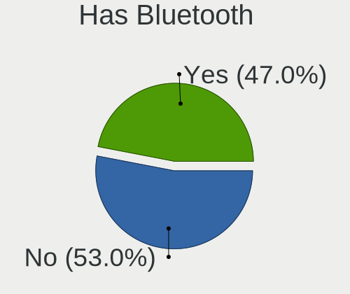
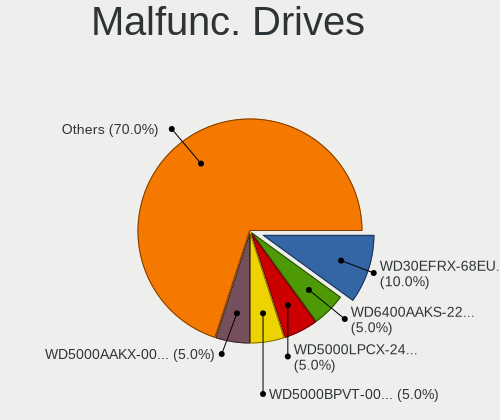
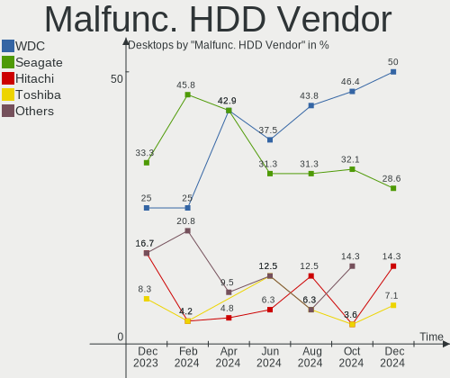
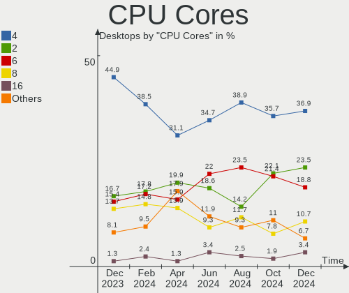
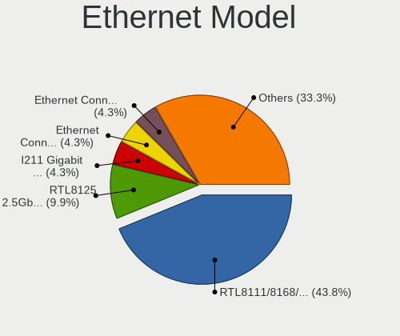
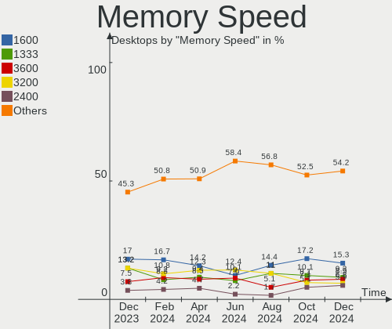

Linux Mint - Hardware Trends (Desktops)
---------------------------------------

A project to identify most popular hardware characteristics and track their change
over time based on data collected by Linux users at https://Linux-Hardware.org.

Anyone can contribute to this report by the [hw-probe](https://github.com/linuxhw/hw-probe) tool:

    sudo -E hw-probe -all -upload

This report is for one last month. Overall report since the beginning of time: [TestDays](https://github.com/linuxhw/TestDays)

Period: Mar, 2023.

Contents
--------

* [ System ](#system)
  - [ OS                       ](#os)
  - [ OS Family                ](#os-family)
  - [ Kernel                   ](#kernel)
  - [ Kernel Family            ](#kernel-family)
  - [ Kernel Major Ver.        ](#kernel-major-ver)
  - [ Arch                     ](#arch)
  - [ DE                       ](#de)
  - [ Display Server           ](#display-server)
  - [ Display Manager          ](#display-manager)
  - [ OS Lang                  ](#os-lang)
  - [ Boot Mode                ](#boot-mode)
  - [ Filesystem               ](#filesystem)
  - [ Part. scheme             ](#part-scheme)
  - [ Dual Boot with Linux/BSD ](#dual-boot-with-linuxbsd)
  - [ Dual Boot (Win)          ](#dual-boot-win)

* [ Board ](#board)
  - [ Vendor                   ](#vendor)
  - [ Model                    ](#model)
  - [ Model Family             ](#model-family)
  - [ MFG Year                 ](#mfg-year)
  - [ Form Factor              ](#form-factor)
  - [ Secure Boot              ](#secure-boot)
  - [ Coreboot                 ](#coreboot)
  - [ RAM Size                 ](#ram-size)
  - [ RAM Used                 ](#ram-used)
  - [ Total Drives             ](#total-drives)
  - [ Has CD-ROM               ](#has-cd-rom)
  - [ Has Ethernet             ](#has-ethernet)
  - [ Has WiFi                 ](#has-wifi)
  - [ Has Bluetooth            ](#has-bluetooth)

* [ Location ](#location)
  - [ Country                  ](#country)
  - [ City                     ](#city)

* [ Drives ](#drives)
  - [ Drive Vendor             ](#drive-vendor)
  - [ Drive Model              ](#drive-model)
  - [ HDD Vendor               ](#hdd-vendor)
  - [ SSD Vendor               ](#ssd-vendor)
  - [ Drive Kind               ](#drive-kind)
  - [ Drive Connector          ](#drive-connector)
  - [ Drive Size               ](#drive-size)
  - [ Space Total              ](#space-total)
  - [ Space Used               ](#space-used)
  - [ Malfunc. Drives          ](#malfunc-drives)
  - [ Malfunc. Drive Vendor    ](#malfunc-drive-vendor)
  - [ Malfunc. HDD Vendor      ](#malfunc-hdd-vendor)
  - [ Malfunc. Drive Kind      ](#malfunc-drive-kind)
  - [ Failed Drives            ](#failed-drives)
  - [ Failed Drive Vendor      ](#failed-drive-vendor)
  - [ Drive Status             ](#drive-status)

* [ Storage controller ](#storage-controller)
  - [ Storage Vendor           ](#storage-vendor)
  - [ Storage Model            ](#storage-model)
  - [ Storage Kind             ](#storage-kind)

* [ Processor ](#processor)
  - [ CPU Vendor               ](#cpu-vendor)
  - [ CPU Model                ](#cpu-model)
  - [ CPU Model Family         ](#cpu-model-family)
  - [ CPU Cores                ](#cpu-cores)
  - [ CPU Sockets              ](#cpu-sockets)
  - [ CPU Threads              ](#cpu-threads)
  - [ CPU Op-Modes             ](#cpu-op-modes)
  - [ CPU Microcode            ](#cpu-microcode)
  - [ CPU Microarch            ](#cpu-microarch)

* [ Graphics ](#graphics)
  - [ GPU Vendor               ](#gpu-vendor)
  - [ GPU Model                ](#gpu-model)
  - [ GPU Combo                ](#gpu-combo)
  - [ GPU Driver               ](#gpu-driver)
  - [ GPU Memory               ](#gpu-memory)

* [ Monitor ](#monitor)
  - [ Monitor Vendor           ](#monitor-vendor)
  - [ Monitor Model            ](#monitor-model)
  - [ Monitor Resolution       ](#monitor-resolution)
  - [ Monitor Diagonal         ](#monitor-diagonal)
  - [ Monitor Width            ](#monitor-width)
  - [ Aspect Ratio             ](#aspect-ratio)
  - [ Monitor Area             ](#monitor-area)
  - [ Pixel Density            ](#pixel-density)
  - [ Multiple Monitors        ](#multiple-monitors)

* [ Network ](#network)
  - [ Net Controller Vendor    ](#net-controller-vendor)
  - [ Net Controller Model     ](#net-controller-model)
  - [ Wireless Vendor          ](#wireless-vendor)
  - [ Wireless Model           ](#wireless-model)
  - [ Ethernet Vendor          ](#ethernet-vendor)
  - [ Ethernet Model           ](#ethernet-model)
  - [ Net Controller Kind      ](#net-controller-kind)
  - [ Used Controller          ](#used-controller)
  - [ NICs                     ](#nics)
  - [ IPv6                     ](#ipv6)

* [ Bluetooth ](#bluetooth)
  - [ Bluetooth Vendor         ](#bluetooth-vendor)
  - [ Bluetooth Model          ](#bluetooth-model)

* [ Sound ](#sound)
  - [ Sound Vendor             ](#sound-vendor)
  - [ Sound Model              ](#sound-model)

* [ Memory ](#memory)
  - [ Memory Vendor            ](#memory-vendor)
  - [ Memory Model             ](#memory-model)
  - [ Memory Kind              ](#memory-kind)
  - [ Memory Form Factor       ](#memory-form-factor)
  - [ Memory Size              ](#memory-size)
  - [ Memory Speed             ](#memory-speed)

* [ Printers & scanners ](#printers--scanners)
  - [ Printer Vendor           ](#printer-vendor)
  - [ Printer Model            ](#printer-model)
  - [ Scanner Vendor           ](#scanner-vendor)
  - [ Scanner Model            ](#scanner-model)

* [ Camera ](#camera)
  - [ Camera Vendor            ](#camera-vendor)
  - [ Camera Model             ](#camera-model)

* [ Security ](#security)
  - [ Fingerprint Vendor       ](#fingerprint-vendor)
  - [ Fingerprint Model        ](#fingerprint-model)
  - [ Chipcard Vendor          ](#chipcard-vendor)
  - [ Chipcard Model           ](#chipcard-model)

* [ Unsupported ](#unsupported)
  - [ Unsupported Devices      ](#unsupported-devices)
  - [ Unsupported Device Types ](#unsupported-device-types)

System
------

OS
--

Installed operating systems

| Name            | Desktops | Percent |
|-----------------|----------|---------|
| Linux Mint 21.1 | 175      | 70.85%  |
| Linux Mint 20.3 | 40       | 16.19%  |
| Linux Mint 21   | 16       | 6.48%   |
| Linux Mint 20.1 | 6        | 2.43%   |
| Linux Mint 20.2 | 5        | 2.02%   |
| Linux Mint 20   | 2        | 0.81%   |
| Linux Mint 19.3 | 2        | 0.81%   |
| Linux Mint 19.1 | 1        | 0.4%    |

OS Family
---------

OS without a version

| Name       | Desktops | Percent |
|------------|----------|---------|
| Linux Mint | 247      | 100%    |

Kernel
------

Version of the Linux kernel

| Version              | Desktops | Percent |
|----------------------|----------|---------|
| 5.15.0-67-generic    | 120      | 48.58%  |
| 5.4.0-144-generic    | 32       | 12.96%  |
| 5.19.0-35-generic    | 19       | 7.69%   |
| 5.15.0-56-generic    | 18       | 7.29%   |
| 5.15.0-60-generic    | 16       | 6.48%   |
| 5.15.0-69-generic    | 12       | 4.86%   |
| 5.4.0-139-generic    | 6        | 2.43%   |
| 5.15.0-58-generic    | 3        | 1.21%   |
| 6.0.0-1012-oem       | 2        | 0.81%   |
| 5.19.0-38-generic    | 2        | 0.81%   |
| 6.2.8-x64v1-xanmod1  | 1        | 0.4%    |
| 6.2.8-060208-generic | 1        | 0.4%    |
| 6.2.7                | 1        | 0.4%    |
| 6.2.6-060206-generic | 1        | 0.4%    |
| 6.2.2-060202-generic | 1        | 0.4%    |
| 6.1.22-x64v3-xanmod1 | 1        | 0.4%    |
| 5.4.0-91-generic     | 1        | 0.4%    |
| 5.4.0-77-generic     | 1        | 0.4%    |
| 5.4.0-135-generic    | 1        | 0.4%    |
| 5.4.0-132-generic    | 1        | 0.4%    |
| 5.4.0-117-generic    | 1        | 0.4%    |
| 5.19.12-xanmod1      | 1        | 0.4%    |
| 5.19.0-32-generic    | 1        | 0.4%    |
| 5.15.0-47-generic    | 1        | 0.4%    |
| 5.15.0-41-generic    | 1        | 0.4%    |
| 4.15.0-206-generic   | 1        | 0.4%    |
| 4.15.0-202-generic   | 1        | 0.4%    |

Kernel Family
-------------

Linux kernel without a distro release

| Version | Desktops | Percent |
|---------|----------|---------|
| 5.15.0  | 171      | 69.23%  |
| 5.4.0   | 43       | 17.41%  |
| 5.19.0  | 22       | 8.91%   |
| 6.2.8   | 2        | 0.81%   |
| 6.0.0   | 2        | 0.81%   |
| 4.15.0  | 2        | 0.81%   |
| 6.2.7   | 1        | 0.4%    |
| 6.2.6   | 1        | 0.4%    |
| 6.2.2   | 1        | 0.4%    |
| 6.1.22  | 1        | 0.4%    |
| 5.19.12 | 1        | 0.4%    |

Kernel Major Ver.
-----------------

Linux kernel major version

| Version | Desktops | Percent |
|---------|----------|---------|
| 5.15    | 171      | 69.23%  |
| 5.4     | 43       | 17.41%  |
| 5.19    | 23       | 9.31%   |
| 6.2     | 5        | 2.02%   |
| 6.0     | 2        | 0.81%   |
| 4.15    | 2        | 0.81%   |
| 6.1     | 1        | 0.4%    |

Arch
----

OS architecture (x86_64, i586, etc.)

| Name   | Desktops | Percent |
|--------|----------|---------|
| x86_64 | 247      | 100%    |

DE
--

Desktop Environment

| Name       | Desktops | Percent |
|------------|----------|---------|
| X-Cinnamon | 174      | 70.45%  |
| MATE       | 33       | 13.36%  |
| XFCE       | 29       | 11.74%  |
| Cinnamon   | 7        | 2.83%   |
| GNOME      | 2        | 0.81%   |
| KDE        | 1        | 0.4%    |
| ICEWM      | 1        | 0.4%    |

Display Server
--------------

X11 or Wayland

| Name | Desktops | Percent |
|------|----------|---------|
| X11  | 245      | 99.19%  |
| Tty  | 2        | 0.81%   |

Display Manager
---------------

SDDM, LightDM, etc.

| Name    | Desktops | Percent |
|---------|----------|---------|
| Unknown | 165      | 66.8%   |
| LightDM | 79       | 31.98%  |
| SDDM    | 2        | 0.81%   |
| LXDM    | 1        | 0.4%    |

OS Lang
-------

Language

| Lang  | Desktops | Percent |
|-------|----------|---------|
| en_US | 76       | 30.77%  |
| de_DE | 53       | 21.46%  |
| ru_RU | 13       | 5.26%   |
| pt_BR | 13       | 5.26%   |
| it_IT | 11       | 4.45%   |
| en_GB | 10       | 4.05%   |
| fr_FR | 8        | 3.24%   |
| en_CA | 7        | 2.83%   |
| en_AU | 6        | 2.43%   |
| pl_PL | 5        | 2.02%   |
| nl_NL | 5        | 2.02%   |
| es_ES | 4        | 1.62%   |
| sk_SK | 3        | 1.21%   |
| fi_FI | 3        | 1.21%   |
| en_IN | 3        | 1.21%   |
| C     | 3        | 1.21%   |
| pt_PT | 2        | 0.81%   |
| es_MX | 2        | 0.81%   |
| en_IE | 2        | 0.81%   |
| zh_CN | 1        | 0.4%    |
| uk_UA | 1        | 0.4%    |
| sv_SE | 1        | 0.4%    |
| ru_UA | 1        | 0.4%    |
| lv_LV | 1        | 0.4%    |
| ja_JP | 1        | 0.4%    |
| hu_HU | 1        | 0.4%    |
| fr_BE | 1        | 0.4%    |
| es_VE | 1        | 0.4%    |
| es_UY | 1        | 0.4%    |
| es_GT | 1        | 0.4%    |
| es_CO | 1        | 0.4%    |
| el_GR | 1        | 0.4%    |
| de_AT | 1        | 0.4%    |
| da_DK | 1        | 0.4%    |
| cs_CZ | 1        | 0.4%    |
| ca_FR | 1        | 0.4%    |
| bg_BG | 1        | 0.4%    |

Boot Mode
---------

EFI or BIOS

| Mode | Desktops | Percent |
|------|----------|---------|
| EFI  | 143      | 57.89%  |
| BIOS | 104      | 42.11%  |

Filesystem
----------

Type of filesystem

| Type    | Desktops | Percent |
|---------|----------|---------|
| Ext4    | 230      | 93.12%  |
| Btrfs   | 10       | 4.05%   |
| Zfs     | 4        | 1.62%   |
| Overlay | 2        | 0.81%   |
| Xfs     | 1        | 0.4%    |

Part. scheme
------------

Scheme of partitioning

| Type    | Desktops | Percent |
|---------|----------|---------|
| Unknown | 164      | 66.4%   |
| GPT     | 68       | 27.53%  |
| MBR     | 15       | 6.07%   |

Dual Boot with Linux/BSD
------------------------

Hosting more than one Linux/BSD

| Dual boot | Desktops | Percent |
|-----------|----------|---------|
| No        | 228      | 92.31%  |
| Yes       | 19       | 7.69%   |

Dual Boot (Win)
---------------

Hosting Linux and Windows

| Dual boot | Desktops | Percent |
|-----------|----------|---------|
| No        | 203      | 82.19%  |
| Yes       | 44       | 17.81%  |

Board
-----

Vendor
------

Motherboard manufacturer

| Name                                 | Desktops | Percent |
|--------------------------------------|----------|---------|
| ASUSTek Computer                     | 58       | 23.48%  |
| Gigabyte Technology                  | 43       | 17.41%  |
| MSI                                  | 24       | 9.72%   |
| Hewlett-Packard                      | 21       | 8.5%    |
| Dell                                 | 20       | 8.1%    |
| ASRock                               | 17       | 6.88%   |
| Lenovo                               | 15       | 6.07%   |
| Intel                                | 8        | 3.24%   |
| Acer                                 | 8        | 3.24%   |
| Fujitsu                              | 6        | 2.43%   |
| Foxconn                              | 3        | 1.21%   |
| AZW                                  | 3        | 1.21%   |
| Shenzhen Meigao Electronic Equipment | 2        | 0.81%   |
| Positivo                             | 2        | 0.81%   |
| Inventec                             | 2        | 0.81%   |
| ECS                                  | 2        | 0.81%   |
| BESSTAR Tech                         | 2        | 0.81%   |
| Supermicro                           | 1        | 0.4%    |
| Pegatron                             | 1        | 0.4%    |
| Packard Bell                         | 1        | 0.4%    |
| NEWSMAY                              | 1        | 0.4%    |
| Medion                               | 1        | 0.4%    |
| Huanan                               | 1        | 0.4%    |
| HOUTER                               | 1        | 0.4%    |
| Daten Tecnologia                     | 1        | 0.4%    |
| AMI                                  | 1        | 0.4%    |
| Alienware                            | 1        | 0.4%    |
| Unknown                              | 1        | 0.4%    |

Model
-----

Motherboard model

| Name                                       | Desktops | Percent |
|--------------------------------------------|----------|---------|
| MSI MS-7C56                                | 3        | 1.21%   |
| HP Compaq dc7800p Convertible Minitower    | 3        | 1.21%   |
| Gigabyte B450 AORUS M                      | 3        | 1.21%   |
| Dell OptiPlex 780                          | 3        | 1.21%   |
| ASUS All Series                            | 3        | 1.21%   |
| MSI MS-7C02                                | 2        | 0.81%   |
| MSI MS-7721                                | 2        | 0.81%   |
| HP Compaq dc7800 Small Form Factor         | 2        | 0.81%   |
| Gigabyte GB-BRR7H-4800                     | 2        | 0.81%   |
| Gigabyte B450M DS3H                        | 2        | 0.81%   |
| Gigabyte A320M-S2H                         | 2        | 0.81%   |
| Dell XPS 8700                              | 2        | 0.81%   |
| Dell OptiPlex 3010                         | 2        | 0.81%   |
| ASUS ROG STRIX B550-A GAMING               | 2        | 0.81%   |
| ASUS PRIME Z270-A                          | 2        | 0.81%   |
| ASUS PRIME A320M-K                         | 2        | 0.81%   |
| ASUS P8B75-M LE                            | 2        | 0.81%   |
| ASUS P5G41T-M LX2/GB                       | 2        | 0.81%   |
| ASUS M5A97 R2.0                            | 2        | 0.81%   |
| ASUS CROSSHAIR VI HERO                     | 2        | 0.81%   |
| ASUS A68HM-K                               | 2        | 0.81%   |
| Unknown                                    | 2        | 0.81%   |
| Supermicro X7SPA-H                         | 1        | 0.4%    |
| Shenzhen Meigao Electronic Equipment UM690 | 1        | 0.4%    |
| Shenzhen Meigao Electronic Equipment HX90G | 1        | 0.4%    |
| Positivo Positivo Master D610              | 1        | 0.4%    |
| Positivo POS-EIH61CE                       | 1        | 0.4%    |
| Pegatron h8-1134de                         | 1        | 0.4%    |
| Packard Bell IMEDIA S3800                  | 1        | 0.4%    |
| MSI Z97 PC Mate                            | 1        | 0.4%    |
| MSI MS-7D59                                | 1        | 0.4%    |
| MSI MS-7D50                                | 1        | 0.4%    |
| MSI MS-7D46                                | 1        | 0.4%    |
| MSI MS-7D43                                | 1        | 0.4%    |
| MSI MS-7D32                                | 1        | 0.4%    |
| MSI MS-7D17                                | 1        | 0.4%    |
| MSI MS-7C79                                | 1        | 0.4%    |
| MSI MS-7C35                                | 1        | 0.4%    |
| MSI MS-7A38                                | 1        | 0.4%    |
| MSI MS-7A32                                | 1        | 0.4%    |

Model Family
------------

Motherboard model prefix

| Name                                       | Desktops | Percent |
|--------------------------------------------|----------|---------|
| Lenovo ThinkCentre                         | 12       | 4.86%   |
| Dell OptiPlex                              | 11       | 4.45%   |
| HP Compaq                                  | 9        | 3.64%   |
| ASUS ROG                                   | 8        | 3.24%   |
| ASUS PRIME                                 | 6        | 2.43%   |
| Fujitsu ESPRIMO                            | 5        | 2.02%   |
| HP EliteDesk                               | 4        | 1.62%   |
| ASUS Maximus                               | 4        | 1.62%   |
| Acer Aspire                                | 4        | 1.62%   |
| MSI MS-7C56                                | 3        | 1.21%   |
| Lenovo ThinkStation                        | 3        | 1.21%   |
| HP ProDesk                                 | 3        | 1.21%   |
| Gigabyte B450M                             | 3        | 1.21%   |
| Gigabyte B450                              | 3        | 1.21%   |
| Dell Inspiron                              | 3        | 1.21%   |
| ASUS TUF                                   | 3        | 1.21%   |
| ASUS M5A97                                 | 3        | 1.21%   |
| ASUS All                                   | 3        | 1.21%   |
| MSI MS-7C02                                | 2        | 0.81%   |
| MSI MS-7721                                | 2        | 0.81%   |
| Intel X99                                  | 2        | 0.81%   |
| Gigabyte Z590                              | 2        | 0.81%   |
| Gigabyte X470                              | 2        | 0.81%   |
| Gigabyte GB-BRR7H-4800                     | 2        | 0.81%   |
| Gigabyte A320M-S2H                         | 2        | 0.81%   |
| Gigabyte 970A-DS3P                         | 2        | 0.81%   |
| Dell XPS                                   | 2        | 0.81%   |
| Dell Precision                             | 2        | 0.81%   |
| ASUS SABERTOOTH                            | 2        | 0.81%   |
| ASUS P8B75-M                               | 2        | 0.81%   |
| ASUS P5G41T-M                              | 2        | 0.81%   |
| ASUS CROSSHAIR                             | 2        | 0.81%   |
| ASUS A68HM-K                               | 2        | 0.81%   |
| Unknown                                    | 2        | 0.81%   |
| Supermicro X7SPA-H                         | 1        | 0.4%    |
| Shenzhen Meigao Electronic Equipment UM690 | 1        | 0.4%    |
| Shenzhen Meigao Electronic Equipment HX90G | 1        | 0.4%    |
| Positivo Positivo                          | 1        | 0.4%    |
| Positivo POS-EIH61CE                       | 1        | 0.4%    |
| Pegatron h8-1134de                         | 1        | 0.4%    |

MFG Year
--------

Motherboard manufacture year

| Year | Desktops | Percent |
|------|----------|---------|
| 2012 | 33       | 13.36%  |
| 2013 | 22       | 8.91%   |
| 2018 | 18       | 7.29%   |
| 2009 | 18       | 7.29%   |
| 2020 | 17       | 6.88%   |
| 2014 | 17       | 6.88%   |
| 2021 | 16       | 6.48%   |
| 2016 | 15       | 6.07%   |
| 2022 | 14       | 5.67%   |
| 2011 | 14       | 5.67%   |
| 2017 | 13       | 5.26%   |
| 2010 | 12       | 4.86%   |
| 2015 | 9        | 3.64%   |
| 2019 | 8        | 3.24%   |
| 2007 | 8        | 3.24%   |
| 2008 | 7        | 2.83%   |
| 2006 | 5        | 2.02%   |
| 2023 | 1        | 0.4%    |

Form Factor
-----------

Physical design of the computer

| Name    | Desktops | Percent |
|---------|----------|---------|
| Desktop | 247      | 100%    |

Secure Boot
-----------

Enabled or disabled

| State    | Desktops | Percent |
|----------|----------|---------|
| Disabled | 234      | 94.74%  |
| Enabled  | 13       | 5.26%   |

Coreboot
--------

Have coreboot on board

| Used | Desktops | Percent |
|------|----------|---------|
| No   | 247      | 100%    |

RAM Size
--------

Total RAM memory

| Size in GB  | Desktops | Percent |
|-------------|----------|---------|
| 8.01-16.0   | 54       | 21.86%  |
| 16.01-24.0  | 49       | 19.84%  |
| 4.01-8.0    | 47       | 19.03%  |
| 32.01-64.0  | 35       | 14.17%  |
| 3.01-4.0    | 33       | 13.36%  |
| 24.01-32.0  | 12       | 4.86%   |
| 64.01-256.0 | 11       | 4.45%   |
| 1.01-2.0    | 4        | 1.62%   |
| 2.01-3.0    | 2        | 0.81%   |

RAM Used
--------

Used RAM memory

| Used GB    | Desktops | Percent |
|------------|----------|---------|
| 1.01-2.0   | 84       | 34.01%  |
| 2.01-3.0   | 64       | 25.91%  |
| 4.01-8.0   | 43       | 17.41%  |
| 3.01-4.0   | 34       | 13.77%  |
| 8.01-16.0  | 11       | 4.45%   |
| 0.51-1.0   | 7        | 2.83%   |
| 16.01-24.0 | 3        | 1.21%   |
| 32.01-64.0 | 1        | 0.4%    |

Total Drives
------------

Number of drives on board

| Drives | Desktops | Percent |
|--------|----------|---------|
| 1      | 106      | 42.91%  |
| 2      | 55       | 22.27%  |
| 3      | 45       | 18.22%  |
| 4      | 20       | 8.1%    |
| 5      | 11       | 4.45%   |
| 6      | 4        | 1.62%   |
| 8      | 3        | 1.21%   |
| 9      | 2        | 0.81%   |
| 7      | 1        | 0.4%    |

Has CD-ROM
----------

Has CD-ROM on board

| Presented | Desktops | Percent |
|-----------|----------|---------|
| Yes       | 131      | 53.04%  |
| No        | 116      | 46.96%  |

Has Ethernet
------------

Has Ethernet on board

| Presented | Desktops | Percent |
|-----------|----------|---------|
| Yes       | 247      | 100%    |

Has WiFi
--------

Has WiFi module

| Presented | Desktops | Percent |
|-----------|----------|---------|
| No        | 135      | 54.66%  |
| Yes       | 112      | 45.34%  |

Has Bluetooth
-------------

Has Bluetooth module

| Presented | Desktops | Percent |
|-----------|----------|---------|
| No        | 168      | 68.02%  |
| Yes       | 79       | 31.98%  |

Location
--------

Country
-------

Geographic location (country)

| Country          | Desktops | Percent |
|------------------|----------|---------|
| Germany          | 55       | 22.27%  |
| USA              | 47       | 19.03%  |
| Brazil           | 17       | 6.88%   |
| Russia           | 13       | 5.26%   |
| UK               | 9        | 3.64%   |
| Netherlands      | 9        | 3.64%   |
| Canada           | 9        | 3.64%   |
| Italy            | 8        | 3.24%   |
| France           | 7        | 2.83%   |
| Spain            | 6        | 2.43%   |
| Australia        | 6        | 2.43%   |
| Sweden           | 5        | 2.02%   |
| Poland           | 5        | 2.02%   |
| Slovakia         | 3        | 1.21%   |
| India            | 3        | 1.21%   |
| Finland          | 3        | 1.21%   |
| Colombia         | 3        | 1.21%   |
| Ukraine          | 2        | 0.81%   |
| Thailand         | 2        | 0.81%   |
| Switzerland      | 2        | 0.81%   |
| Portugal         | 2        | 0.81%   |
| Mexico           | 2        | 0.81%   |
| Latvia           | 2        | 0.81%   |
| Japan            | 2        | 0.81%   |
| Ireland          | 2        | 0.81%   |
| Greece           | 2        | 0.81%   |
| Czechia          | 2        | 0.81%   |
| Belgium          | 2        | 0.81%   |
| Austria          | 2        | 0.81%   |
| Argentina        | 2        | 0.81%   |
| Venezuela        | 1        | 0.4%    |
| Uruguay          | 1        | 0.4%    |
| UAE              | 1        | 0.4%    |
| Romania          | 1        | 0.4%    |
| Pakistan         | 1        | 0.4%    |
| Jordan           | 1        | 0.4%    |
| Hungary          | 1        | 0.4%    |
| Guatemala        | 1        | 0.4%    |
| French Polynesia | 1        | 0.4%    |
| Denmark          | 1        | 0.4%    |

City
----

Geographic location (city)

| City                 | Desktops | Percent |
|----------------------|----------|---------|
| Hamburg              | 5        | 2.02%   |
| Stockholm            | 4        | 1.62%   |
| Frankfurt am Main    | 4        | 1.62%   |
| Turin                | 3        | 1.21%   |
| Rio de Janeiro       | 3        | 1.21%   |
| Moscow               | 3        | 1.21%   |
| Brisbane             | 3        | 1.21%   |
| Bogotá              | 3        | 1.21%   |
| Zurich               | 2        | 0.81%   |
| Traunstein           | 2        | 0.81%   |
| Rostock              | 2        | 0.81%   |
| Orlando              | 2        | 0.81%   |
| Nizhnekamsk          | 2        | 0.81%   |
| Montreal             | 2        | 0.81%   |
| Krefeld              | 2        | 0.81%   |
| Hochberg             | 2        | 0.81%   |
| Dresden              | 2        | 0.81%   |
| Cologne              | 2        | 0.81%   |
| Amsterdam            | 2        | 0.81%   |
| Zaigrayevo           | 1        | 0.4%    |
| Zagreb               | 1        | 0.4%    |
| Woodway              | 1        | 0.4%    |
| Wirral               | 1        | 0.4%    |
| Wiehl                | 1        | 0.4%    |
| Westerville          | 1        | 0.4%    |
| Waynesboro           | 1        | 0.4%    |
| Washington           | 1        | 0.4%    |
| Volos                | 1        | 0.4%    |
| Vladimirskiy Poselok | 1        | 0.4%    |
| Vladimir             | 1        | 0.4%    |
| Villachiara          | 1        | 0.4%    |
| Vigo                 | 1        | 0.4%    |
| Vienna               | 1        | 0.4%    |
| Vancouver            | 1        | 0.4%    |
| Valencia             | 1        | 0.4%    |
| Utrecht              | 1        | 0.4%    |
| Ulyanovsk            | 1        | 0.4%    |
| Torun                | 1        | 0.4%    |
| Tokyo                | 1        | 0.4%    |
| Tilburg              | 1        | 0.4%    |

Drives
------

Drive Vendor
------------

Hard drive vendors

| Vendor                    | Desktops | Drives | Percent |
|---------------------------|----------|--------|---------|
| WDC                       | 79       | 111    | 17.36%  |
| Seagate                   | 77       | 104    | 16.92%  |
| Samsung Electronics       | 69       | 90     | 15.16%  |
| Kingston                  | 34       | 38     | 7.47%   |
| Crucial                   | 21       | 22     | 4.62%   |
| Sandisk                   | 17       | 18     | 3.74%   |
| Toshiba                   | 14       | 16     | 3.08%   |
| Hitachi                   | 12       | 13     | 2.64%   |
| China                     | 8        | 8      | 1.76%   |
| Micron/Crucial Technology | 7        | 7      | 1.54%   |
| PNY                       | 6        | 6      | 1.32%   |
| Micron Technology         | 5        | 5      | 1.1%    |
| Intenso                   | 5        | 5      | 1.1%    |
| Intel                     | 5        | 5      | 1.1%    |
| A-DATA Technology         | 5        | 5      | 1.1%    |
| Unknown                   | 4        | 8      | 0.88%   |
| Transcend                 | 4        | 5      | 0.88%   |
| Patriot                   | 4        | 4      | 0.88%   |
| Maxtor                    | 4        | 4      | 0.88%   |
| HGST                      | 4        | 7      | 0.88%   |
| ADATA Technology          | 4        | 5      | 0.88%   |
| Team                      | 3        | 3      | 0.66%   |
| SPCC                      | 3        | 3      | 0.66%   |
| Realtek Semiconductor     | 3        | 4      | 0.66%   |
| Phison Electronics        | 3        | 3      | 0.66%   |
| Lexar                     | 3        | 3      | 0.66%   |
| KingSpec                  | 3        | 3      | 0.66%   |
| JMicron Technology        | 3        | 3      | 0.66%   |
| GOODRAM                   | 3        | 3      | 0.66%   |
| Fujitsu                   | 3        | 3      | 0.66%   |
| Fanxiang                  | 3        | 3      | 0.66%   |
| XrayDisk                  | 2        | 2      | 0.44%   |
| Silicon Motion            | 2        | 2      | 0.44%   |
| Plextor                   | 2        | 2      | 0.44%   |
| Netac                     | 2        | 2      | 0.44%   |
| KingFast                  | 2        | 2      | 0.44%   |
| KingDian                  | 2        | 2      | 0.44%   |
| Unknown                   | 2        | 2      | 0.44%   |
| ZHITAI                    | 1        | 1      | 0.22%   |
| XPG                       | 1        | 1      | 0.22%   |

Drive Model
-----------

Hard drive models

| Model                                               | Desktops | Percent |
|-----------------------------------------------------|----------|---------|
| Kingston SA400S37240G 240GB SSD                     | 10       | 1.87%   |
| Samsung NVMe SSD Controller SM981/PM981/PM983 250GB | 8        | 1.5%    |
| Samsung SSD 850 EVO 250GB                           | 7        | 1.31%   |
| Seagate ST500DM002-1BD142 500GB                     | 6        | 1.12%   |
| Seagate ST2000DM008-2FR102 2TB                      | 6        | 1.12%   |
| Samsung SSD 860 EVO 500GB                           | 5        | 0.94%   |
| WDC WDS500G2B0A-00SM50 500GB SSD                    | 4        | 0.75%   |
| WDC WD10EZEX-08WN4A0 1TB                            | 4        | 0.75%   |
| Toshiba DT01ACA100 1TB                              | 4        | 0.75%   |
| Seagate ST2000DM006-2DM164 2TB                      | 4        | 0.75%   |
| Seagate ST1000DM003-1CH162 1TB                      | 4        | 0.75%   |
| Samsung SSD 850 EVO 500GB                           | 4        | 0.75%   |
| Kingston SA400S37480G 480GB SSD                     | 4        | 0.75%   |
| Seagate ST2000DM001-1ER164 2TB                      | 3        | 0.56%   |
| Sandisk WD Black SN750 / PC SN730 NVMe SSD 1TB      | 3        | 0.56%   |
| Samsung SSD 860 EVO 1TB                             | 3        | 0.56%   |
| Samsung SSD 840 PRO Series 256GB                    | 3        | 0.56%   |
| Samsung SSD 840 EVO 250GB                           | 3        | 0.56%   |
| Samsung SSD 840 EVO 120GB                           | 3        | 0.56%   |
| Samsung NVMe SSD Controller PM9A1/PM9A3/980PRO 1TB  | 3        | 0.56%   |
| Micron/Crucial P2 NVMe PCIe SSD 1TB                 | 3        | 0.56%   |
| Hitachi HTS547575A9E384 752GB                       | 3        | 0.56%   |
| Crucial CT1000BX500SSD1 1TB                         | 3        | 0.56%   |
| A-DATA SU650 120GB SSD                              | 3        | 0.56%   |
| WDC WDS240G2G0A-00JH30 240GB SSD                    | 2        | 0.37%   |
| WDC WD800JD-22LSA0 80GB                             | 2        | 0.37%   |
| WDC WD5000AADS-00S9B0 500GB                         | 2        | 0.37%   |
| WDC WD40EFRX-68N32N0 4TB                            | 2        | 0.37%   |
| WDC WD3200AAJS-00L7A0 320GB                         | 2        | 0.37%   |
| WDC WD30EZRX-00DC0B0 3TB                            | 2        | 0.37%   |
| WDC WD20EZRZ-00Z5HB0 2TB                            | 2        | 0.37%   |
| WDC WD20EARX-00PASB0 2TB                            | 2        | 0.37%   |
| WDC WD10EZEX-21WN4A0 1TB                            | 2        | 0.37%   |
| WDC WD10EZEX-00WN4A0 1TB                            | 2        | 0.37%   |
| WDC WD10EZEX-00BN5A0 1TB                            | 2        | 0.37%   |
| WDC WD10EAVS-00D7B1 1TB                             | 2        | 0.37%   |
| Unknown SD/MMC/M.S.PRO 32GB                         | 2        | 0.37%   |
| Unknown SD/MMC 2GB                                  | 2        | 0.37%   |
| Unknown M.S./M.S.Pro/HG 16GB                        | 2        | 0.37%   |
| Transcend TS256GSSD360S 256GB                       | 2        | 0.37%   |

HDD Vendor
----------

Hard disk drive vendors

| Vendor              | Desktops | Drives | Percent |
|---------------------|----------|--------|---------|
| Seagate             | 76       | 103    | 39.58%  |
| WDC                 | 66       | 96     | 34.38%  |
| Toshiba             | 14       | 16     | 7.29%   |
| Hitachi             | 12       | 13     | 6.25%   |
| Samsung Electronics | 9        | 10     | 4.69%   |
| Maxtor              | 4        | 4      | 2.08%   |
| HGST                | 4        | 7      | 2.08%   |
| Fujitsu             | 3        | 3      | 1.56%   |
| Unknown             | 1        | 1      | 0.52%   |
| JMicron Technology  | 1        | 1      | 0.52%   |
| Intenso             | 1        | 1      | 0.52%   |
| ASMedia             | 1        | 1      | 0.52%   |

SSD Vendor
----------

Solid state drive vendors

| Vendor              | Desktops | Drives | Percent |
|---------------------|----------|--------|---------|
| Samsung Electronics | 44       | 53     | 23.53%  |
| Kingston            | 28       | 31     | 14.97%  |
| Crucial             | 18       | 19     | 9.63%   |
| WDC                 | 13       | 13     | 6.95%   |
| SanDisk             | 8        | 8      | 4.28%   |
| China               | 8        | 8      | 4.28%   |
| PNY                 | 5        | 5      | 2.67%   |
| A-DATA Technology   | 5        | 5      | 2.67%   |
| Transcend           | 4        | 5      | 2.14%   |
| Patriot             | 4        | 4      | 2.14%   |
| Intenso             | 4        | 4      | 2.14%   |
| Lexar               | 3        | 3      | 1.6%    |
| GOODRAM             | 3        | 3      | 1.6%    |
| Fanxiang            | 3        | 3      | 1.6%    |
| XrayDisk            | 2        | 2      | 1.07%   |
| Team                | 2        | 2      | 1.07%   |
| SPCC                | 2        | 2      | 1.07%   |
| Plextor             | 2        | 2      | 1.07%   |
| Netac               | 2        | 2      | 1.07%   |
| Micron Technology   | 2        | 2      | 1.07%   |
| KingSpec            | 2        | 2      | 1.07%   |
| KingDian            | 2        | 2      | 1.07%   |
| JMicron Technology  | 2        | 2      | 1.07%   |
| Intel               | 2        | 2      | 1.07%   |
| Unknown             | 2        | 2      | 1.07%   |
| ZHITAI              | 1        | 1      | 0.53%   |
| VICKTER             | 1        | 1      | 0.53%   |
| Verbatim            | 1        | 1      | 0.53%   |
| TO Exter            | 1        | 1      | 0.53%   |
| StoreJet            | 1        | 3      | 0.53%   |
| Seagate             | 1        | 1      | 0.53%   |
| QUMOX               | 1        | 1      | 0.53%   |
| OCZ                 | 1        | 2      | 0.53%   |
| Leven               | 1        | 1      | 0.53%   |
| KODAK               | 1        | 1      | 0.53%   |
| KIOXIA-EXCERIA      | 1        | 1      | 0.53%   |
| KingFast            | 1        | 1      | 0.53%   |
| INNOVATION IT       | 1        | 1      | 0.53%   |
| Corsair             | 1        | 1      | 0.53%   |
| Apacer              | 1        | 1      | 0.53%   |

Drive Kind
----------

HDD or SSD

| Kind    | Desktops | Drives | Percent |
|---------|----------|--------|---------|
| SSD     | 151      | 204    | 40.05%  |
| HDD     | 149      | 256    | 39.52%  |
| NVMe    | 67       | 83     | 17.77%  |
| Unknown | 9        | 12     | 2.39%   |
| MMC     | 1        | 1      | 0.27%   |

Drive Connector
---------------

SATA, SAS, NVMe, etc.

| Type | Desktops | Drives | Percent |
|------|----------|--------|---------|
| SATA | 227      | 442    | 72.29%  |
| NVMe | 67       | 83     | 21.34%  |
| SAS  | 19       | 30     | 6.05%   |
| MMC  | 1        | 1      | 0.32%   |

Drive Size
----------

Size of hard drive

| Size in TB      | Desktops | Drives | Percent |
|-----------------|----------|--------|---------|
| 0.01-0.5        | 168      | 254    | 51.69%  |
| 0.51-1.0        | 87       | 116    | 26.77%  |
| 1.01-2.0        | 40       | 49     | 12.31%  |
| 2.01-3.0        | 11       | 12     | 3.38%   |
| 3.01-4.0        | 10       | 16     | 3.08%   |
| 4.01-10.0       | 5        | 9      | 1.54%   |
| 10.01-20.0      | 3        | 3      | 0.92%   |
| More than 100.0 | 1        | 1      | 0.31%   |

Space Total
-----------

Amount of disk space available on the file system

| Size in GB     | Desktops | Percent |
|----------------|----------|---------|
| 101-250        | 61       | 24.7%   |
| 251-500        | 58       | 23.48%  |
| 501-1000       | 41       | 16.6%   |
| More than 3000 | 29       | 11.74%  |
| 1001-2000      | 23       | 9.31%   |
| 2001-3000      | 17       | 6.88%   |
| 51-100         | 15       | 6.07%   |
| 21-50          | 1        | 0.4%    |
| 1-20           | 1        | 0.4%    |
| Unknown        | 1        | 0.4%    |

Space Used
----------

Amount of used disk space

| Used GB        | Desktops | Percent |
|----------------|----------|---------|
| 21-50          | 52       | 21.05%  |
| 51-100         | 42       | 17%     |
| 101-250        | 32       | 12.96%  |
| 251-500        | 31       | 12.55%  |
| 1-20           | 30       | 12.15%  |
| 501-1000       | 21       | 8.5%    |
| More than 3000 | 14       | 5.67%   |
| 1001-2000      | 14       | 5.67%   |
| 2001-3000      | 10       | 4.05%   |
| Unknown        | 1        | 0.4%    |

Malfunc. Drives
---------------

Drive models with a malfunction

| Model                                        | Desktops | Drives | Percent |
|----------------------------------------------|----------|--------|---------|
| XPG GAMMIX S11 Pro 256GB                     | 1        | 1      | 4.35%   |
| WDC WD5000AAKX-00ERMA0 500GB                 | 1        | 1      | 4.35%   |
| WDC WD5000AADS-00S9B0 500GB                  | 1        | 1      | 4.35%   |
| WDC WD20EARX-00PASB0 2TB                     | 1        | 1      | 4.35%   |
| WDC WD10EALX-009BA0 1TB                      | 1        | 1      | 4.35%   |
| WDC WD10EALS-00Z8A0 1TB                      | 1        | 1      | 4.35%   |
| WDC WD10EADS-22M2B0 1TB                      | 1        | 1      | 4.35%   |
| WDC WD1000DHTZ-04N21V0 1TB                   | 1        | 3      | 4.35%   |
| Transcend TS256GSSD360S 256GB                | 1        | 1      | 4.35%   |
| Team TM8FP4004T 4TB                          | 1        | 1      | 4.35%   |
| Seagate ST500DM002-1BD142 500GB              | 1        | 1      | 4.35%   |
| Seagate ST250DM000-1BD141 250GB              | 1        | 1      | 4.35%   |
| Seagate ST2000DM008-2FR102 2TB               | 1        | 1      | 4.35%   |
| Seagate ST1000DM003-9YN162 1TB               | 1        | 1      | 4.35%   |
| Samsung Electronics SSD 840 Series 250GB     | 1        | 1      | 4.35%   |
| Samsung Electronics SSD 840 PRO Series 128GB | 1        | 1      | 4.35%   |
| Maxtor STM3250820AS 250GB                    | 1        | 1      | 4.35%   |
| Intenso SSD 256GB                            | 1        | 1      | 4.35%   |
| Hitachi HTS725025A9A364 250GB                | 1        | 1      | 4.35%   |
| Hitachi HTS545025B9SA02 250GB                | 1        | 1      | 4.35%   |
| Hitachi HDS721050CLA360 500GB                | 1        | 1      | 4.35%   |
| Hitachi HCC545050A7E380 500GB                | 1        | 1      | 4.35%   |
| Crucial CT525MX300SSD1 528GB                 | 1        | 1      | 4.35%   |

Malfunc. Drive Vendor
---------------------

Vendors of faulty drives

| Vendor              | Desktops | Drives | Percent |
|---------------------|----------|--------|---------|
| WDC                 | 6        | 9      | 28.57%  |
| Seagate             | 4        | 4      | 19.05%  |
| Hitachi             | 3        | 4      | 14.29%  |
| Samsung Electronics | 2        | 2      | 9.52%   |
| XPG                 | 1        | 1      | 4.76%   |
| Transcend           | 1        | 1      | 4.76%   |
| Team                | 1        | 1      | 4.76%   |
| Maxtor              | 1        | 1      | 4.76%   |
| Intenso             | 1        | 1      | 4.76%   |
| Crucial             | 1        | 1      | 4.76%   |

Malfunc. HDD Vendor
-------------------

Vendors of faulty HDD drives

| Vendor  | Desktops | Drives | Percent |
|---------|----------|--------|---------|
| WDC     | 6        | 9      | 42.86%  |
| Seagate | 4        | 4      | 28.57%  |
| Hitachi | 3        | 4      | 21.43%  |
| Maxtor  | 1        | 1      | 7.14%   |

Malfunc. Drive Kind
-------------------

Kinds of faulty drives

| Kind | Desktops | Drives | Percent |
|------|----------|--------|---------|
| HDD  | 14       | 18     | 66.67%  |
| SSD  | 5        | 5      | 23.81%  |
| NVMe | 2        | 2      | 9.52%   |

Failed Drives
-------------

Failed drive models

| Model                  | Desktops | Drives | Percent |
|------------------------|----------|--------|---------|
| Toshiba DT01ACA100 1TB | 1        | 1      | 100%    |

Failed Drive Vendor
-------------------

Failed drive vendors

| Vendor  | Desktops | Drives | Percent |
|---------|----------|--------|---------|
| Toshiba | 1        | 1      | 100%    |

Drive Status
------------

Number of failed and malfunc. drives

| Status   | Desktops | Drives | Percent |
|----------|----------|--------|---------|
| Detected | 173      | 376    | 63.37%  |
| Works    | 78       | 154    | 28.57%  |
| Malfunc  | 21       | 25     | 7.69%   |
| Failed   | 1        | 1      | 0.37%   |

Storage controller
------------------

Storage Vendor
--------------

Storage controller vendors

| Vendor                      | Desktops | Percent |
|-----------------------------|----------|---------|
| Intel                       | 151      | 42.78%  |
| AMD                         | 85       | 24.08%  |
| Samsung Electronics         | 25       | 7.08%   |
| Marvell Technology Group    | 12       | 3.4%    |
| SanDisk                     | 11       | 3.12%   |
| Micron/Crucial Technology   | 10       | 2.83%   |
| JMicron Technology          | 9        | 2.55%   |
| ASMedia Technology          | 9        | 2.55%   |
| Nvidia                      | 8        | 2.27%   |
| Phison Electronics          | 6        | 1.7%    |
| Kingston Technology Company | 6        | 1.7%    |
| ADATA Technology            | 5        | 1.42%   |
| Realtek Semiconductor       | 4        | 1.13%   |
| Micron Technology           | 3        | 0.85%   |
| Silicon Motion              | 2        | 0.57%   |
| Silicon Image               | 2        | 0.57%   |
| LSI Logic / Symbios Logic   | 2        | 0.57%   |
| VIA Technologies            | 1        | 0.28%   |
| Transcend                   | 1        | 0.28%   |
| Seagate Technology          | 1        | 0.28%   |

Storage Model
-------------

Storage controller models

| Model                                                                                   | Desktops | Percent |
|-----------------------------------------------------------------------------------------|----------|---------|
| AMD FCH SATA Controller [AHCI mode]                                                     | 46       | 10.2%   |
| Intel 8 Series/C220 Series Chipset Family 6-port SATA Controller 1 [AHCI mode]          | 16       | 3.55%   |
| Samsung NVMe SSD Controller SM981/PM981/PM983                                           | 15       | 3.33%   |
| Intel 7 Series/C210 Series Chipset Family 6-port SATA Controller [AHCI mode]            | 15       | 3.33%   |
| AMD SB7x0/SB8x0/SB9x0 SATA Controller [AHCI mode]                                       | 15       | 3.33%   |
| AMD 400 Series Chipset SATA Controller                                                  | 14       | 3.1%    |
| Intel Q170/Q150/B150/H170/H110/Z170/CM236 Chipset SATA Controller [AHCI Mode]           | 13       | 2.88%   |
| Intel 6 Series/C200 Series Chipset Family 6 port Desktop SATA AHCI Controller           | 13       | 2.88%   |
| AMD SB7x0/SB8x0/SB9x0 IDE Controller                                                    | 11       | 2.44%   |
| JMicron JMB363 SATA/IDE Controller                                                      | 9        | 2%      |
| Intel 82801I (ICH9 Family) 2 port SATA Controller [IDE mode]                            | 9        | 2%      |
| AMD 500 Series Chipset SATA Controller                                                  | 9        | 2%      |
| Intel NM10/ICH7 Family SATA Controller [IDE mode]                                       | 8        | 1.77%   |
| Intel 82801IR/IO/IH (ICH9R/DO/DH) 4 port SATA Controller [IDE mode]                     | 8        | 1.77%   |
| ASMedia ASM1062 Serial ATA Controller                                                   | 8        | 1.77%   |
| Intel SATA Controller [RAID mode]                                                       | 7        | 1.55%   |
| Intel 82801G (ICH7 Family) IDE Controller                                               | 7        | 1.55%   |
| Intel 200 Series PCH SATA controller [AHCI mode]                                        | 7        | 1.55%   |
| AMD SB7x0/SB8x0/SB9x0 SATA Controller [IDE mode]                                        | 7        | 1.55%   |
| Micron/Crucial P2 NVMe PCIe SSD                                                         | 6        | 1.33%   |
| Intel Cannon Lake PCH SATA AHCI Controller                                              | 6        | 1.33%   |
| Samsung NVMe SSD Controller PM9A1/PM9A3/980PRO                                          | 5        | 1.11%   |
| Intel Jasper Lake SATA AHCI Controller                                                  | 5        | 1.11%   |
| Intel Alder Lake-S PCH SATA Controller [AHCI Mode]                                      | 5        | 1.11%   |
| Intel 9 Series Chipset Family SATA Controller [AHCI Mode]                               | 5        | 1.11%   |
| Intel 82Q35 Express PT IDER Controller                                                  | 5        | 1.11%   |
| Intel 500 Series Chipset Family SATA AHCI Controller                                    | 5        | 1.11%   |
| AMD FCH SATA Controller D                                                               | 5        | 1.11%   |
| AMD FCH IDE Controller                                                                  | 5        | 1.11%   |
| Phison E12 NVMe Controller                                                              | 4        | 0.89%   |
| Nvidia MCP61 SATA Controller                                                            | 4        | 0.89%   |
| Nvidia MCP61 IDE                                                                        | 4        | 0.89%   |
| Marvell Group 88SE9215 PCIe 2.0 x1 4-port SATA 6 Gb/s Controller                        | 4        | 0.89%   |
| Kingston Company Company Non-Volatile memory controller                                 | 4        | 0.89%   |
| Intel 6 Series/C200 Series Chipset Family Desktop SATA Controller (IDE mode, ports 4-5) | 4        | 0.89%   |
| Intel 6 Series/C200 Series Chipset Family Desktop SATA Controller (IDE mode, ports 0-3) | 4        | 0.89%   |
| SanDisk WD Black SN750 / PC SN730 NVMe SSD                                              | 3        | 0.67%   |
| Samsung NVMe SSD Controller SM961/PM961/SM963                                           | 3        | 0.67%   |
| Samsung NVMe SSD Controller 980                                                         | 3        | 0.67%   |
| Micron/Crucial P5 Plus NVMe PCIe SSD                                                    | 3        | 0.67%   |

Storage Kind
------------

Kind of storage controller (IDE, SATA, NVMe, SAS, ...)

| Kind | Desktops | Percent |
|------|----------|---------|
| SATA | 197      | 56.61%  |
| NVMe | 68       | 19.54%  |
| IDE  | 66       | 18.97%  |
| RAID | 14       | 4.02%   |
| SAS  | 3        | 0.86%   |

Processor
---------

CPU Vendor
----------

Processor vendors

| Vendor | Desktops | Percent |
|--------|----------|---------|
| Intel  | 151      | 61.13%  |
| AMD    | 96       | 38.87%  |

CPU Model
---------

Processor models

| Model                                      | Desktops | Percent |
|--------------------------------------------|----------|---------|
| Intel Core i7-3770 CPU @ 3.40GHz           | 7        | 2.83%   |
| Intel Core i7-2600 CPU @ 3.40GHz           | 4        | 1.62%   |
| Intel Core 2 Duo CPU E6750 @ 2.66GHz       | 4        | 1.62%   |
| AMD Ryzen 7 3700X 8-Core Processor         | 4        | 1.62%   |
| AMD Ryzen 7 2700X Eight-Core Processor     | 4        | 1.62%   |
| Intel Core i7-6700K CPU @ 4.00GHz          | 3        | 1.21%   |
| Intel Core i7-4770 CPU @ 3.40GHz           | 3        | 1.21%   |
| Intel Core i5-4570 CPU @ 3.20GHz           | 3        | 1.21%   |
| Intel Core i5-3470T CPU @ 2.90GHz          | 3        | 1.21%   |
| Intel Core i5-2400 CPU @ 3.10GHz           | 3        | 1.21%   |
| Intel Core i5 CPU 650 @ 3.20GHz            | 3        | 1.21%   |
| Intel Core i3-3220 CPU @ 3.30GHz           | 3        | 1.21%   |
| Intel Core i3-2120 CPU @ 3.30GHz           | 3        | 1.21%   |
| Intel Celeron N5105 @ 2.00GHz              | 3        | 1.21%   |
| AMD Ryzen 7 5700G with Radeon Graphics     | 3        | 1.21%   |
| AMD Ryzen 5 5600X 6-Core Processor         | 3        | 1.21%   |
| AMD Ryzen 5 2600 Six-Core Processor        | 3        | 1.21%   |
| AMD FX-8350 Eight-Core Processor           | 3        | 1.21%   |
| AMD FX-8320 Eight-Core Processor           | 3        | 1.21%   |
| AMD Athlon 64 X2 Dual Core Processor 6000+ | 3        | 1.21%   |
| Intel Pentium D CPU 3.00GHz                | 2        | 0.81%   |
| Intel Core i7-8700K CPU @ 3.70GHz          | 2        | 0.81%   |
| Intel Core i7-8700 CPU @ 3.20GHz           | 2        | 0.81%   |
| Intel Core i7-6700T CPU @ 2.80GHz          | 2        | 0.81%   |
| Intel Core i7-3770K CPU @ 3.50GHz          | 2        | 0.81%   |
| Intel Core i7 CPU 870 @ 2.93GHz            | 2        | 0.81%   |
| Intel Core i5-9400F CPU @ 2.90GHz          | 2        | 0.81%   |
| Intel Core i5-7400 CPU @ 3.00GHz           | 2        | 0.81%   |
| Intel Core i5-6600 CPU @ 3.30GHz           | 2        | 0.81%   |
| Intel Core i5-6500 CPU @ 3.20GHz           | 2        | 0.81%   |
| Intel Core i5-4670 CPU @ 3.40GHz           | 2        | 0.81%   |
| Intel Core i5-4460 CPU @ 3.20GHz           | 2        | 0.81%   |
| Intel Core i5-3470 CPU @ 3.20GHz           | 2        | 0.81%   |
| Intel Core i3-6100 CPU @ 3.70GHz           | 2        | 0.81%   |
| Intel Core 2 Quad CPU Q9550 @ 2.83GHz      | 2        | 0.81%   |
| Intel Core 2 Quad CPU Q8300 @ 2.50GHz      | 2        | 0.81%   |
| Intel Core 2 Duo CPU E8400 @ 3.00GHz       | 2        | 0.81%   |
| Intel 12th Gen Core i5-12400               | 2        | 0.81%   |
| Intel 11th Gen Core i7-11700F @ 2.50GHz    | 2        | 0.81%   |
| AMD Ryzen 9 7950X 16-Core Processor        | 2        | 0.81%   |

CPU Model Family
----------------

Processor model prefix

| Model                   | Desktops | Percent |
|-------------------------|----------|---------|
| Intel Core i7           | 38       | 15.38%  |
| Intel Core i5           | 36       | 14.57%  |
| AMD Ryzen 7             | 19       | 7.69%   |
| Intel Core i3           | 15       | 6.07%   |
| AMD Ryzen 5             | 14       | 5.67%   |
| Other                   | 11       | 4.45%   |
| Intel Xeon              | 11       | 4.45%   |
| AMD FX                  | 11       | 4.45%   |
| Intel Celeron           | 10       | 4.05%   |
| Intel Core 2 Duo        | 9        | 3.64%   |
| AMD Ryzen 9             | 8        | 3.24%   |
| Intel Core 2 Quad       | 7        | 2.83%   |
| Intel Pentium           | 6        | 2.43%   |
| AMD Phenom II X4        | 6        | 2.43%   |
| AMD Athlon 64 X2        | 5        | 2.02%   |
| Intel Pentium Dual-Core | 4        | 1.62%   |
| AMD Athlon X4           | 4        | 1.62%   |
| AMD A8                  | 4        | 1.62%   |
| AMD A10                 | 4        | 1.62%   |
| AMD Phenom II X6        | 3        | 1.21%   |
| Intel Pentium D         | 2        | 0.81%   |
| Intel Atom              | 2        | 0.81%   |
| AMD Ryzen 5 PRO         | 2        | 0.81%   |
| AMD G                   | 2        | 0.81%   |
| AMD Athlon II X4        | 2        | 0.81%   |
| AMD A6                  | 2        | 0.81%   |
| AMD A4                  | 2        | 0.81%   |
| Intel Core i9           | 1        | 0.4%    |
| AMD Ryzen 3             | 1        | 0.4%    |
| AMD PRO A10             | 1        | 0.4%    |
| AMD Phenom II X3        | 1        | 0.4%    |
| AMD Athlon II X3        | 1        | 0.4%    |
| AMD Athlon II X2        | 1        | 0.4%    |
| AMD Athlon 64           | 1        | 0.4%    |
| AMD Athlon              | 1        | 0.4%    |

CPU Cores
---------

Number of processor cores

| Number | Desktops | Percent |
|--------|----------|---------|
| 4      | 100      | 40.49%  |
| 2      | 67       | 27.13%  |
| 8      | 30       | 12.15%  |
| 6      | 28       | 11.34%  |
| 12     | 8        | 3.24%   |
| 3      | 5        | 2.02%   |
| 1      | 5        | 2.02%   |
| 16     | 3        | 1.21%   |
| 14     | 1        | 0.4%    |

CPU Sockets
-----------

Number of sockets

| Number | Desktops | Percent |
|--------|----------|---------|
| 1      | 245      | 99.19%  |
| 2      | 2        | 0.81%   |

CPU Threads
-----------

Threads per core (Hyper-Threading)

| Number | Desktops | Percent |
|--------|----------|---------|
| 2      | 148      | 59.92%  |
| 1      | 99       | 40.08%  |

CPU Op-Modes
------------

CPU Operation Modes (32-bit, 64-bit)

| Op mode        | Desktops | Percent |
|----------------|----------|---------|
| 32-bit, 64-bit | 247      | 100%    |

CPU Microcode
-------------

Microcode number

| Number     | Desktops | Percent |
|------------|----------|---------|
| Unknown    | 29       | 11.74%  |
| 0x306a9    | 20       | 8.1%    |
| 0x306c3    | 17       | 6.88%   |
| 0x206a7    | 14       | 5.67%   |
| 0x1067a    | 12       | 4.86%   |
| 0x506e3    | 9        | 3.64%   |
| 0x0800820d | 7        | 2.83%   |
| 0x6fb      | 6        | 2.43%   |
| 0x06001119 | 6        | 2.43%   |
| 0x06000852 | 6        | 2.43%   |
| 0xa0671    | 5        | 2.02%   |
| 0x906ea    | 5        | 2.02%   |
| 0x906e9    | 5        | 2.02%   |
| 0x906c0    | 5        | 2.02%   |
| 0x010000c8 | 5        | 2.02%   |
| 0x306f2    | 4        | 1.62%   |
| 0x08701021 | 4        | 1.62%   |
| 0x06003106 | 4        | 1.62%   |
| 0x010000db | 4        | 1.62%   |
| 0x20655    | 3        | 1.21%   |
| 0x106e5    | 3        | 1.21%   |
| 0x10676    | 3        | 1.21%   |
| 0x0a601203 | 3        | 1.21%   |
| 0x0a50000d | 3        | 1.21%   |
| 0x0a50000c | 3        | 1.21%   |
| 0x0a201016 | 3        | 1.21%   |
| 0x08108109 | 3        | 1.21%   |
| 0x08001138 | 3        | 1.21%   |
| 0x0600063e | 3        | 1.21%   |
| 0xf65      | 2        | 0.81%   |
| 0xa0655    | 2        | 0.81%   |
| 0x906ed    | 2        | 0.81%   |
| 0x906eb    | 2        | 0.81%   |
| 0x90672    | 2        | 0.81%   |
| 0x206d7    | 2        | 0.81%   |
| 0x206c2    | 2        | 0.81%   |
| 0x0a404102 | 2        | 0.81%   |
| 0x0a20120a | 2        | 0.81%   |
| 0x08701013 | 2        | 0.81%   |
| 0x08600103 | 2        | 0.81%   |

CPU Microarch
-------------

Microarchitecture

| Name             | Desktops | Percent |
|------------------|----------|---------|
| Haswell          | 24       | 9.72%   |
| IvyBridge        | 22       | 8.91%   |
| SandyBridge      | 17       | 6.88%   |
| Penryn           | 16       | 6.48%   |
| KabyLake         | 16       | 6.48%   |
| Piledriver       | 14       | 5.67%   |
| K10              | 14       | 5.67%   |
| Zen 3            | 13       | 5.26%   |
| Skylake          | 13       | 5.26%   |
| Zen+             | 12       | 4.86%   |
| Zen 2            | 9        | 3.64%   |
| Steamroller      | 8        | 3.24%   |
| Unknown          | 8        | 3.24%   |
| Westmere         | 6        | 2.43%   |
| K8 Hammer        | 6        | 2.43%   |
| Core             | 6        | 2.43%   |
| Zen              | 5        | 2.02%   |
| Nehalem          | 5        | 2.02%   |
| Icelake          | 5        | 2.02%   |
| Tremont          | 4        | 1.62%   |
| CometLake        | 4        | 1.62%   |
| Excavator        | 3        | 1.21%   |
| Bulldozer        | 3        | 1.21%   |
| Alderlake Hybrid | 3        | 1.21%   |
| Silvermont       | 2        | 0.81%   |
| NetBurst         | 2        | 0.81%   |
| Bonnell          | 2        | 0.81%   |
| Bobcat           | 2        | 0.81%   |
| K10 Llano        | 1        | 0.4%    |
| Jaguar           | 1        | 0.4%    |
| Goldmont         | 1        | 0.4%    |

Graphics
--------

GPU Vendor
----------

Vendors of graphics cards

| Vendor | Desktops | Percent |
|--------|----------|---------|
| Nvidia | 104      | 39.39%  |
| Intel  | 82       | 31.06%  |
| AMD    | 78       | 29.55%  |

GPU Model
---------

Graphics card models

| Model                                                                       | Desktops | Percent |
|-----------------------------------------------------------------------------|----------|---------|
| Intel 2nd Generation Core Processor Family Integrated Graphics Controller   | 10       | 3.75%   |
| Nvidia GK208B [GeForce GT 710]                                              | 9        | 3.37%   |
| Intel Xeon E3-1200 v3/4th Gen Core Processor Integrated Graphics Controller | 9        | 3.37%   |
| Intel Xeon E3-1200 v2/3rd Gen Core processor Graphics Controller            | 8        | 3%      |
| Nvidia GT218 [GeForce 210]                                                  | 7        | 2.62%   |
| Intel HD Graphics 530                                                       | 7        | 2.62%   |
| Nvidia GP107 [GeForce GTX 1050 Ti]                                          | 6        | 2.25%   |
| Nvidia GP106 [GeForce GTX 1060 6GB]                                         | 6        | 2.25%   |
| Intel 4 Series Chipset Integrated Graphics Controller                       | 6        | 2.25%   |
| Nvidia GP108 [GeForce GT 1030]                                              | 5        | 1.87%   |
| Nvidia GF119 [GeForce GT 610]                                               | 5        | 1.87%   |
| Intel JasperLake [UHD Graphics]                                             | 5        | 1.87%   |
| Intel CoffeeLake-S GT2 [UHD Graphics 630]                                   | 5        | 1.87%   |
| Intel 82Q35 Express Integrated Graphics Controller                          | 5        | 1.87%   |
| AMD Cezanne [Radeon Vega Series / Radeon Vega Mobile Series]                | 5        | 1.87%   |
| Nvidia GK106 [GeForce GTX 650 Ti]                                           | 4        | 1.5%    |
| AMD Picasso/Raven 2 [Radeon Vega Series / Radeon Vega Mobile Series]        | 4        | 1.5%    |
| AMD Ellesmere [Radeon RX 470/480/570/570X/580/580X/590]                     | 4        | 1.5%    |
| Nvidia TU116 [GeForce GTX 1660 SUPER]                                       | 3        | 1.12%   |
| Nvidia GP106 [GeForce GTX 1060 3GB]                                         | 3        | 1.12%   |
| Nvidia GP102 [GeForce GTX 1080 Ti]                                          | 3        | 1.12%   |
| Nvidia GM206 [GeForce GTX 960]                                              | 3        | 1.12%   |
| Nvidia GM204 [GeForce GTX 970]                                              | 3        | 1.12%   |
| Intel HD Graphics 630                                                       | 3        | 1.12%   |
| Intel Core Processor Integrated Graphics Controller                         | 3        | 1.12%   |
| AMD Renoir                                                                  | 3        | 1.12%   |
| AMD Polaris 20 XL [Radeon RX 580 2048SP]                                    | 3        | 1.12%   |
| AMD Navi 23 [Radeon RX 6600/6600 XT/6600M]                                  | 3        | 1.12%   |
| AMD Navi 10 [Radeon RX 5600 OEM/5600 XT / 5700/5700 XT]                     | 3        | 1.12%   |
| AMD Kaveri [Radeon R7 Graphics]                                             | 3        | 1.12%   |
| AMD Caicos [Radeon HD 6450/7450/8450 / R5 230 OEM]                          | 3        | 1.12%   |
| Nvidia GP107 [GeForce GTX 1050]                                             | 2        | 0.75%   |
| Nvidia GM107 [GeForce GTX 750]                                              | 2        | 0.75%   |
| Nvidia GF108 [GeForce GT 730]                                               | 2        | 0.75%   |
| Nvidia GF108 [GeForce GT 630]                                               | 2        | 0.75%   |
| Nvidia GA106 [GeForce RTX 3060 Lite Hash Rate]                              | 2        | 0.75%   |
| Nvidia GA106 [Geforce RTX 3050]                                             | 2        | 0.75%   |
| Nvidia GA104 [GeForce RTX 3060 Ti Lite Hash Rate]                           | 2        | 0.75%   |
| Intel HD Graphics 510                                                       | 2        | 0.75%   |
| Intel CometLake-S GT2 [UHD Graphics 630]                                    | 2        | 0.75%   |

GPU Combo
---------

Combinations of graphics cards

| Name           | Desktops | Percent |
|----------------|----------|---------|
| 1 x Nvidia     | 97       | 39.27%  |
| 1 x AMD        | 71       | 28.74%  |
| 1 x Intel      | 69       | 27.94%  |
| AMD + Nvidia   | 4        | 1.62%   |
| 2 x Nvidia     | 2        | 0.81%   |
| Intel + AMD    | 2        | 0.81%   |
| 2 x AMD        | 1        | 0.4%    |
| Intel + Nvidia | 1        | 0.4%    |

GPU Driver
----------

Free vs proprietary

| Driver      | Desktops | Percent |
|-------------|----------|---------|
| Free        | 164      | 66.4%   |
| Proprietary | 78       | 31.58%  |
| Unknown     | 5        | 2.02%   |

GPU Memory
----------

Total video memory

| Size in GB | Desktops | Percent |
|------------|----------|---------|
| Unknown    | 83       | 33.6%   |
| 0.51-1.0   | 39       | 15.79%  |
| 1.01-2.0   | 32       | 12.96%  |
| 3.01-4.0   | 25       | 10.12%  |
| 0.01-0.5   | 24       | 9.72%   |
| 7.01-8.0   | 18       | 7.29%   |
| 8.01-16.0  | 11       | 4.45%   |
| 5.01-6.0   | 9        | 3.64%   |
| 2.01-3.0   | 6        | 2.43%   |

Monitor
-------

Monitor Vendor
--------------

Monitor vendors

| Vendor               | Desktops | Percent |
|----------------------|----------|---------|
| Samsung Electronics  | 35       | 13.83%  |
| Goldstar             | 24       | 9.49%   |
| Hewlett-Packard      | 23       | 9.09%   |
| Dell                 | 19       | 7.51%   |
| BenQ                 | 15       | 5.93%   |
| AOC                  | 14       | 5.53%   |
| Acer                 | 13       | 5.14%   |
| Ancor Communications | 10       | 3.95%   |
| Iiyama               | 9        | 3.56%   |
| Philips              | 8        | 3.16%   |
| LG Electronics       | 8        | 3.16%   |
| ViewSonic            | 7        | 2.77%   |
| ASUSTek Computer     | 6        | 2.37%   |
| Lenovo               | 4        | 1.58%   |
| Unknown              | 4        | 1.58%   |
| Gigabyte Technology  | 3        | 1.19%   |
| Fujitsu Siemens      | 3        | 1.19%   |
| Unknown              | 2        | 0.79%   |
| Sony                 | 2        | 0.79%   |
| RTK                  | 2        | 0.79%   |
| MSI                  | 2        | 0.79%   |
| Lenovo Group Limited | 2        | 0.79%   |
| HannStar             | 2        | 0.79%   |
| Eizo                 | 2        | 0.79%   |
| Yamaha               | 1        | 0.4%    |
| Westinghouse         | 1        | 0.4%    |
| Vizio                | 1        | 0.4%    |
| VIZ                  | 1        | 0.4%    |
| Vestel Elektronik    | 1        | 0.4%    |
| Toshiba              | 1        | 0.4%    |
| STN                  | 1        | 0.4%    |
| STD                  | 1        | 0.4%    |
| Sharp                | 1        | 0.4%    |
| RGT                  | 1        | 0.4%    |
| PZG                  | 1        | 0.4%    |
| PRI                  | 1        | 0.4%    |
| Positivo             | 1        | 0.4%    |
| Plain Tree Systems   | 1        | 0.4%    |
| Packard Bell         | 1        | 0.4%    |
| Onkyo                | 1        | 0.4%    |

Monitor Model
-------------

Monitor models

| Model                                                                  | Desktops | Percent |
|------------------------------------------------------------------------|----------|---------|
| Unknown                                                                | 4        | 1.5%    |
| Samsung Electronics LC24RG50 SAM0F90 1920x1080 532x304mm 24.1-inch     | 2        | 0.75%   |
| RTK TopTech TV RTK0001 1366x768                                        | 2        | 0.75%   |
| Goldstar W2234 GSM56B8 1680x1050 474x296mm 22.0-inch                   | 2        | 0.75%   |
| Goldstar HDR 4K GSM7750 3840x2160 697x392mm 31.5-inch                  | 2        | 0.75%   |
| Goldstar HDR 4K GSM7707 3840x2160 600x340mm 27.2-inch                  | 2        | 0.75%   |
| BenQ EL2870U BNQ7949 3840x2160 621x341mm 27.9-inch                     | 2        | 0.75%   |
| ASUSTek Computer VA249 AUS24C1 1920x1080 527x296mm 23.8-inch           | 2        | 0.75%   |
| Yamaha RX-A3070 YMH31EA 1920x540                                       | 1        | 0.38%   |
| Westinghouse TX-42F810G WDE5960 1920x1080 710x400mm 32.1-inch          | 1        | 0.38%   |
| Vizio E320i-A0 VIZ0091 1366x768 698x392mm 31.5-inch                    | 1        | 0.38%   |
| VIZ LCD Monitor E320VP 1280x720                                        | 1        | 0.38%   |
| ViewSonic VX2336 SERIES VSC402A 1920x1080 510x290mm 23.1-inch          | 1        | 0.38%   |
| ViewSonic VP171s VSCB716 1280x1024 338x270mm 17.0-inch                 | 1        | 0.38%   |
| ViewSonic VG2439 Series VSCD22B 1920x1080 521x293mm 23.5-inch          | 1        | 0.38%   |
| ViewSonic VG2239 Series VSCC42B 1920x1080 477x268mm 21.5-inch          | 1        | 0.38%   |
| ViewSonic VG1930wm VSC9D1E 1440x900 410x256mm 19.0-inch                | 1        | 0.38%   |
| ViewSonic VA712b VSCCE1B 1280x1024 338x270mm 17.0-inch                 | 1        | 0.38%   |
| ViewSonic VA3456-WQHD VSCFC3A 3440x1440 800x335mm 34.1-inch            | 1        | 0.38%   |
| Vestel Elektronik 55UHD_LCD_TV VES3700 3840x2160 1872x1053mm 84.6-inch | 1        | 0.38%   |
| Unknown LCDTV16 0101 1920x1080 1600x900mm 72.3-inch                    | 1        | 0.38%   |
| Unknown LCD Monitor XXX AAA                                            | 1        | 0.38%   |
| Toshiba TV TSB0106 1920x1080 708x398mm 32.0-inch                       | 1        | 0.38%   |
| STN LCD Monitor SAMTRON                                                | 1        | 0.38%   |
| STD HDMI TV STD00C7 1360x768 698x392mm 31.5-inch                       | 1        | 0.38%   |
| Sony TV SNYDB01 1920x1080                                              | 1        | 0.38%   |
| Sony TV SNY4B03 1920x1080 1063x598mm 48.0-inch                         | 1        | 0.38%   |
| Sharp HDMI SHP10A4 1400x1050 410x230mm 18.5-inch                       | 1        | 0.38%   |
| Samsung Electronics SyncMaster SAM060B 1920x1080 510x290mm 23.1-inch   | 1        | 0.38%   |
| Samsung Electronics SyncMaster SAM0586 1920x1200 518x324mm 24.1-inch   | 1        | 0.38%   |
| Samsung Electronics SyncMaster SAM0524 1920x1080 477x268mm 21.5-inch   | 1        | 0.38%   |
| Samsung Electronics SyncMaster SAM050B 1920x1080 477x268mm 21.5-inch   | 1        | 0.38%   |
| Samsung Electronics SyncMaster SAM03E5 1680x1050 474x296mm 22.0-inch   | 1        | 0.38%   |
| Samsung Electronics SyncMaster SAM037C 1680x1050 474x296mm 22.0-inch   | 1        | 0.38%   |
| Samsung Electronics SyncMaster SAM02E3 1440x900 367x229mm 17.0-inch    | 1        | 0.38%   |
| Samsung Electronics SMS27A650 SAM082D 1920x1080 598x336mm 27.0-inch    | 1        | 0.38%   |
| Samsung Electronics S27R65 SAM1045 1920x1080 598x336mm 27.0-inch       | 1        | 0.38%   |
| Samsung Electronics S27E310 SAM0C31 1920x1080 598x336mm 27.0-inch      | 1        | 0.38%   |
| Samsung Electronics S24R35xFZ SAM71A8 1920x1080 527x296mm 23.8-inch    | 1        | 0.38%   |
| Samsung Electronics S24F350 SAM0D21 1920x1080 521x293mm 23.5-inch      | 1        | 0.38%   |

Monitor Resolution
------------------

Monitor screen resolution

| Resolution         | Desktops | Percent |
|--------------------|----------|---------|
| 1920x1080 (FHD)    | 111      | 44.4%   |
| 3840x2160 (4K)     | 23       | 9.2%    |
| 1680x1050 (WSXGA+) | 20       | 8%      |
| 2560x1440 (QHD)    | 19       | 7.6%    |
| Unknown            | 13       | 5.2%    |
| 1280x1024 (SXGA)   | 11       | 4.4%    |
| 1600x900 (HD+)     | 8        | 3.2%    |
| 1440x900 (WXGA+)   | 7        | 2.8%    |
| 3840x1080          | 5        | 2%      |
| 3440x1440          | 5        | 2%      |
| 2560x1080          | 4        | 1.6%    |
| 1920x1200 (WUXGA)  | 4        | 1.6%    |
| 1366x768 (WXGA)    | 4        | 1.6%    |
| 1920x540           | 2        | 0.8%    |
| 1280x720 (HD)      | 2        | 0.8%    |
| 1024x768 (XGA)     | 2        | 0.8%    |
| 4560x1080          | 1        | 0.4%    |
| 4480x1792          | 1        | 0.4%    |
| 3840x1600          | 1        | 0.4%    |
| 3840x1440          | 1        | 0.4%    |
| 3520x1080          | 1        | 0.4%    |
| 3200x1080          | 1        | 0.4%    |
| 3120x1050          | 1        | 0.4%    |
| 2580x1440          | 1        | 0.4%    |
| 1400x1050          | 1        | 0.4%    |
| 1360x768           | 1        | 0.4%    |

Monitor Diagonal
----------------

Diagonal size in inches

| Inches  | Desktops | Percent |
|---------|----------|---------|
| Unknown | 44       | 17.89%  |
| 27      | 41       | 16.67%  |
| 23      | 25       | 10.16%  |
| 21      | 24       | 9.76%   |
| 24      | 23       | 9.35%   |
| 22      | 13       | 5.28%   |
| 19      | 10       | 4.07%   |
| 31      | 9        | 3.66%   |
| 34      | 8        | 3.25%   |
| 20      | 8        | 3.25%   |
| 17      | 8        | 3.25%   |
| 72      | 5        | 2.03%   |
| 32      | 5        | 2.03%   |
| 18      | 4        | 1.63%   |
| 15      | 3        | 1.22%   |
| 84      | 2        | 0.81%   |
| 47      | 2        | 0.81%   |
| 36      | 2        | 0.81%   |
| 26      | 2        | 0.81%   |
| 54      | 1        | 0.41%   |
| 52      | 1        | 0.41%   |
| 50      | 1        | 0.41%   |
| 49      | 1        | 0.41%   |
| 46      | 1        | 0.41%   |
| 40      | 1        | 0.41%   |
| 37      | 1        | 0.41%   |
| 35      | 1        | 0.41%   |

Monitor Width
-------------

Physical width

| Width in mm | Desktops | Percent |
|-------------|----------|---------|
| 501-600     | 83       | 34.3%   |
| 401-500     | 57       | 23.55%  |
| Unknown     | 44       | 18.18%  |
| 701-800     | 15       | 6.2%    |
| 601-700     | 11       | 4.55%   |
| 301-350     | 10       | 4.13%   |
| 1501-2000   | 7        | 2.89%   |
| 1001-1500   | 7        | 2.89%   |
| 351-400     | 5        | 2.07%   |
| 801-900     | 3        | 1.24%   |

Aspect Ratio
------------

Proportional relationship between the width and the height

| Ratio   | Desktops | Percent |
|---------|----------|---------|
| 16/9    | 142      | 60.94%  |
| Unknown | 40       | 17.17%  |
| 16/10   | 25       | 10.73%  |
| 5/4     | 10       | 4.29%   |
| 21/9    | 10       | 4.29%   |
| 4/3     | 3        | 1.29%   |
| 3/2     | 2        | 0.86%   |
| 32/9    | 1        | 0.43%   |

Monitor Area
------------

Area in inch²

| Area in inch² | Desktops | Percent |
|----------------|----------|---------|
| 201-250        | 71       | 29.1%   |
| Unknown        | 44       | 18.03%  |
| 301-350        | 43       | 17.62%  |
| 151-200        | 26       | 10.66%  |
| 351-500        | 24       | 9.84%   |
| More than 1000 | 11       | 4.51%   |
| 141-150        | 9        | 3.69%   |
| 251-300        | 6        | 2.46%   |
| 501-1000       | 6        | 2.46%   |
| 101-110        | 3        | 1.23%   |
| 131-140        | 1        | 0.41%   |

Pixel Density
-------------

Pixels per inch

| Density | Desktops | Percent |
|---------|----------|---------|
| 51-100  | 123      | 51.9%   |
| 101-120 | 45       | 18.99%  |
| Unknown | 44       | 18.57%  |
| 1-50    | 13       | 5.49%   |
| 121-160 | 8        | 3.38%   |
| 161-240 | 4        | 1.69%   |

Multiple Monitors
-----------------

Total monitors connected

| Total | Desktops | Percent |
|-------|----------|---------|
| 1     | 201      | 81.38%  |
| 2     | 36       | 14.57%  |
| 0     | 7        | 2.83%   |
| 3     | 3        | 1.21%   |

Network
-------

Net Controller Vendor
---------------------

Controller vendors

| Vendor                          | Desktops | Percent |
|---------------------------------|----------|---------|
| Realtek Semiconductor           | 152      | 42.46%  |
| Intel                           | 113      | 31.56%  |
| Qualcomm Atheros                | 18       | 5.03%   |
| Broadcom                        | 11       | 3.07%   |
| TP-Link                         | 9        | 2.51%   |
| Ralink Technology               | 9        | 2.51%   |
| Nvidia                          | 5        | 1.4%    |
| MediaTek                        | 5        | 1.4%    |
| Ralink                          | 4        | 1.12%   |
| Microsoft                       | 3        | 0.84%   |
| Marvell Technology Group        | 3        | 0.84%   |
| D-Link                          | 3        | 0.84%   |
| ASUSTek Computer                | 3        | 0.84%   |
| Xiaomi                          | 2        | 0.56%   |
| Samsung Electronics             | 2        | 0.56%   |
| Qualcomm Atheros Communications | 2        | 0.56%   |
| ASIX Electronics                | 2        | 0.56%   |
| VIA Technologies                | 1        | 0.28%   |
| Qualcomm                        | 1        | 0.28%   |
| OPPO Electronics                | 1        | 0.28%   |
| NetGear                         | 1        | 0.28%   |
| Motorola PCS                    | 1        | 0.28%   |
| MicroPython                     | 1        | 0.28%   |
| Linksys                         | 1        | 0.28%   |
| Fitbit                          | 1        | 0.28%   |
| D-Link System                   | 1        | 0.28%   |
| Broadcom Limited                | 1        | 0.28%   |
| AVM                             | 1        | 0.28%   |
| Arduino SA                      | 1        | 0.28%   |

Net Controller Model
--------------------

Controller models

| Model                                                             | Desktops | Percent |
|-------------------------------------------------------------------|----------|---------|
| Realtek RTL8111/8168/8411 PCI Express Gigabit Ethernet Controller | 114      | 28.43%  |
| Realtek RTL8125 2.5GbE Controller                                 | 13       | 3.24%   |
| Intel Ethernet Controller I225-V                                  | 13       | 3.24%   |
| Intel 82579LM Gigabit Network Connection (Lewisville)             | 13       | 3.24%   |
| Intel Ethernet Connection (2) I219-V                              | 11       | 2.74%   |
| Intel I211 Gigabit Network Connection                             | 10       | 2.49%   |
| Intel Wi-Fi 6 AX200                                               | 8        | 2%      |
| Intel Wi-Fi 6 AX210/AX211/AX411 160MHz                            | 7        | 1.75%   |
| Realtek RTL88x2bu [AC1200 Techkey]                                | 6        | 1.5%    |
| Intel 82574L Gigabit Network Connection                           | 6        | 1.5%    |
| Intel 82566DM-2 Gigabit Network Connection                        | 6        | 1.5%    |
| Realtek RTL810xE PCI Express Fast Ethernet controller             | 5        | 1.25%   |
| Realtek RTL-8100/8101L/8139 PCI Fast Ethernet Adapter             | 5        | 1.25%   |
| Intel Ethernet Connection I217-V                                  | 5        | 1.25%   |
| Intel Ethernet Connection I217-LM                                 | 5        | 1.25%   |
| Realtek RTL8188EUS 802.11n Wireless Network Adapter               | 4        | 1%      |
| Intel Ethernet Connection (7) I219-V                              | 4        | 1%      |
| Intel 82567LM-3 Gigabit Network Connection                        | 4        | 1%      |
| TP-Link TL-WN823N v2/v3 [Realtek RTL8192EU]                       | 3        | 0.75%   |
| Realtek RTL8821CE 802.11ac PCIe Wireless Network Adapter          | 3        | 0.75%   |
| Realtek RTL8812AE 802.11ac PCIe Wireless Network Adapter          | 3        | 0.75%   |
| Realtek 802.11ac NIC                                              | 3        | 0.75%   |
| Ralink MT7601U Wireless Adapter                                   | 3        | 0.75%   |
| Qualcomm Atheros AR9485 Wireless Network Adapter                  | 3        | 0.75%   |
| Qualcomm Atheros AR93xx Wireless Network Adapter                  | 3        | 0.75%   |
| Nvidia MCP61 Ethernet                                             | 3        | 0.75%   |
| Microsoft XBOX ACC                                                | 3        | 0.75%   |
| Marvell Group 88E8056 PCI-E Gigabit Ethernet Controller           | 3        | 0.75%   |
| Intel Wireless 7260                                               | 3        | 0.75%   |
| Intel Wireless 3165                                               | 3        | 0.75%   |
| Intel Cannon Lake PCH CNVi WiFi                                   | 3        | 0.75%   |
| Intel 82579V Gigabit Network Connection                           | 3        | 0.75%   |
| Intel 82578DM Gigabit Network Connection                          | 3        | 0.75%   |
| Intel 82578DC Gigabit Network Connection                          | 3        | 0.75%   |
| Broadcom NetXtreme BCM5762 Gigabit Ethernet PCIe                  | 3        | 0.75%   |
| Xiaomi Mi/Redmi series (RNDIS)                                    | 2        | 0.5%    |
| Samsung Galaxy series, misc. (tethering mode)                     | 2        | 0.5%    |
| Realtek RTL8192CU 802.11n WLAN Adapter                            | 2        | 0.5%    |
| Realtek RTL8153 Gigabit Ethernet Adapter                          | 2        | 0.5%    |
| Ralink RT5372 Wireless Adapter                                    | 2        | 0.5%    |

Wireless Vendor
---------------

Wireless vendors

| Vendor                          | Desktops | Percent |
|---------------------------------|----------|---------|
| Intel                           | 39       | 31.97%  |
| Realtek Semiconductor           | 30       | 24.59%  |
| TP-Link                         | 9        | 7.38%   |
| Ralink Technology               | 9        | 7.38%   |
| Qualcomm Atheros                | 9        | 7.38%   |
| MediaTek                        | 5        | 4.1%    |
| Ralink                          | 4        | 3.28%   |
| Microsoft                       | 3        | 2.46%   |
| Broadcom                        | 3        | 2.46%   |
| ASUSTek Computer                | 3        | 2.46%   |
| Qualcomm Atheros Communications | 2        | 1.64%   |
| D-Link                          | 2        | 1.64%   |
| NetGear                         | 1        | 0.82%   |
| Linksys                         | 1        | 0.82%   |
| D-Link System                   | 1        | 0.82%   |
| AVM                             | 1        | 0.82%   |

Wireless Model
--------------

Wireless models

| Model                                                         | Desktops | Percent |
|---------------------------------------------------------------|----------|---------|
| Intel Wi-Fi 6 AX200                                           | 8        | 6.56%   |
| Intel Wi-Fi 6 AX210/AX211/AX411 160MHz                        | 7        | 5.74%   |
| Realtek RTL88x2bu [AC1200 Techkey]                            | 6        | 4.92%   |
| Realtek RTL8188EUS 802.11n Wireless Network Adapter           | 4        | 3.28%   |
| TP-Link TL-WN823N v2/v3 [Realtek RTL8192EU]                   | 3        | 2.46%   |
| Realtek RTL8821CE 802.11ac PCIe Wireless Network Adapter      | 3        | 2.46%   |
| Realtek RTL8812AE 802.11ac PCIe Wireless Network Adapter      | 3        | 2.46%   |
| Realtek 802.11ac NIC                                          | 3        | 2.46%   |
| Ralink MT7601U Wireless Adapter                               | 3        | 2.46%   |
| Qualcomm Atheros AR9485 Wireless Network Adapter              | 3        | 2.46%   |
| Qualcomm Atheros AR93xx Wireless Network Adapter              | 3        | 2.46%   |
| Microsoft XBOX ACC                                            | 3        | 2.46%   |
| Intel Wireless 7260                                           | 3        | 2.46%   |
| Intel Wireless 3165                                           | 3        | 2.46%   |
| Intel Cannon Lake PCH CNVi WiFi                               | 3        | 2.46%   |
| Realtek RTL8192CU 802.11n WLAN Adapter                        | 2        | 1.64%   |
| Ralink RT5372 Wireless Adapter                                | 2        | 1.64%   |
| Ralink RT2870/RT3070 Wireless Adapter                         | 2        | 1.64%   |
| MediaTek MT7922 802.11ax PCI Express Wireless Network Adapter | 2        | 1.64%   |
| MediaTek MT7921K (RZ608) Wi-Fi 6E 80MHz                       | 2        | 1.64%   |
| Intel Wireless-AC 9260                                        | 2        | 1.64%   |
| Intel Wireless 8265 / 8275                                    | 2        | 1.64%   |
| Intel Wireless 7265                                           | 2        | 1.64%   |
| Intel Comet Lake PCH CNVi WiFi                                | 2        | 1.64%   |
| Intel Centrino Wireless-N 2230                                | 2        | 1.64%   |
| ASUS USB-N10 802.11n Network Adapter [Realtek RTL8188SU]      | 2        | 1.64%   |
| TP-Link TL-WN722N v2/v3 [Realtek RTL8188EUS]                  | 1        | 0.82%   |
| TP-Link Archer T4UH wireless Realtek 8812AU                   | 1        | 0.82%   |
| TP-Link Archer T3U [Realtek RTL8812BU]                        | 1        | 0.82%   |
| TP-Link Archer T2U PLUS [RTL8821AU]                           | 1        | 0.82%   |
| TP-Link AC600 wireless Realtek RTL8811AU [Archer T2U Nano]    | 1        | 0.82%   |
| TP-Link 802.11ac NIC                                          | 1        | 0.82%   |
| Realtek RTL8852BE PCIe 802.11ax Wireless Network Controller   | 1        | 0.82%   |
| Realtek RTL8814AU 802.11a/b/g/n/ac Wireless Adapter           | 1        | 0.82%   |
| Realtek RTL8723BU 802.11b/g/n WLAN Adapter                    | 1        | 0.82%   |
| Realtek RTL8188GU 802.11n WLAN Adapter (After Modeswitch)     | 1        | 0.82%   |
| Realtek RTL8188FTV 802.11b/g/n 1T1R 2.4G WLAN Adapter         | 1        | 0.82%   |
| Realtek RTL8188EE Wireless Network Adapter                    | 1        | 0.82%   |
| Realtek RTL8188CUS 802.11n WLAN Adapter                       | 1        | 0.82%   |
| Realtek RTL8188CE 802.11b/g/n WiFi Adapter                    | 1        | 0.82%   |

Ethernet Vendor
---------------

Ethernet vendors

| Vendor                   | Desktops | Percent |
|--------------------------|----------|---------|
| Realtek Semiconductor    | 140      | 52.04%  |
| Intel                    | 93       | 34.57%  |
| Qualcomm Atheros         | 9        | 3.35%   |
| Broadcom                 | 8        | 2.97%   |
| Nvidia                   | 5        | 1.86%   |
| Marvell Technology Group | 3        | 1.12%   |
| Xiaomi                   | 2        | 0.74%   |
| Samsung Electronics      | 2        | 0.74%   |
| ASIX Electronics         | 2        | 0.74%   |
| VIA Technologies         | 1        | 0.37%   |
| Qualcomm                 | 1        | 0.37%   |
| OPPO Electronics         | 1        | 0.37%   |
| D-Link                   | 1        | 0.37%   |
| Broadcom Limited         | 1        | 0.37%   |

Ethernet Model
--------------

Ethernet models

| Model                                                             | Desktops | Percent |
|-------------------------------------------------------------------|----------|---------|
| Realtek RTL8111/8168/8411 PCI Express Gigabit Ethernet Controller | 114      | 41.45%  |
| Realtek RTL8125 2.5GbE Controller                                 | 13       | 4.73%   |
| Intel Ethernet Controller I225-V                                  | 13       | 4.73%   |
| Intel 82579LM Gigabit Network Connection (Lewisville)             | 13       | 4.73%   |
| Intel Ethernet Connection (2) I219-V                              | 11       | 4%      |
| Intel I211 Gigabit Network Connection                             | 10       | 3.64%   |
| Intel 82574L Gigabit Network Connection                           | 6        | 2.18%   |
| Intel 82566DM-2 Gigabit Network Connection                        | 6        | 2.18%   |
| Realtek RTL810xE PCI Express Fast Ethernet controller             | 5        | 1.82%   |
| Realtek RTL-8100/8101L/8139 PCI Fast Ethernet Adapter             | 5        | 1.82%   |
| Intel Ethernet Connection I217-V                                  | 5        | 1.82%   |
| Intel Ethernet Connection I217-LM                                 | 5        | 1.82%   |
| Intel Ethernet Connection (7) I219-V                              | 4        | 1.45%   |
| Intel 82567LM-3 Gigabit Network Connection                        | 4        | 1.45%   |
| Nvidia MCP61 Ethernet                                             | 3        | 1.09%   |
| Marvell Group 88E8056 PCI-E Gigabit Ethernet Controller           | 3        | 1.09%   |
| Intel 82579V Gigabit Network Connection                           | 3        | 1.09%   |
| Intel 82578DM Gigabit Network Connection                          | 3        | 1.09%   |
| Intel 82578DC Gigabit Network Connection                          | 3        | 1.09%   |
| Broadcom NetXtreme BCM5762 Gigabit Ethernet PCIe                  | 3        | 1.09%   |
| Xiaomi Mi/Redmi series (RNDIS)                                    | 2        | 0.73%   |
| Samsung Galaxy series, misc. (tethering mode)                     | 2        | 0.73%   |
| Realtek RTL8153 Gigabit Ethernet Adapter                          | 2        | 0.73%   |
| Qualcomm Atheros Attansic L1 Gigabit Ethernet                     | 2        | 0.73%   |
| Qualcomm Atheros AR8151 v2.0 Gigabit Ethernet                     | 2        | 0.73%   |
| Nvidia MCP55 Ethernet                                             | 2        | 0.73%   |
| Intel Ethernet Connection (2) I218-V                              | 2        | 0.73%   |
| ASIX AX88179 Gigabit Ethernet                                     | 2        | 0.73%   |
| VIA VT6102/VT6103 [Rhine-II]                                      | 1        | 0.36%   |
| Realtek RTL8169 PCI Gigabit Ethernet Controller                   | 1        | 0.36%   |
| Realtek Killer E3000 2.5GbE Controller                            | 1        | 0.36%   |
| Realtek Killer E2600 Gigabit Ethernet Controller                  | 1        | 0.36%   |
| Qualcomm QM215-QRD _SN:E72764DE                                   | 1        | 0.36%   |
| Qualcomm Atheros QCA8171 Gigabit Ethernet                         | 1        | 0.36%   |
| Qualcomm Atheros Killer E220x Gigabit Ethernet Controller         | 1        | 0.36%   |
| Qualcomm Atheros AR8161 Gigabit Ethernet                          | 1        | 0.36%   |
| Qualcomm Atheros AR8152 v2.0 Fast Ethernet                        | 1        | 0.36%   |
| Qualcomm Atheros AR8121/AR8113/AR8114 Gigabit or Fast Ethernet    | 1        | 0.36%   |
| OPPO RMX3263                                                      | 1        | 0.36%   |
| Intel I210 Gigabit Network Connection                             | 1        | 0.36%   |

Net Controller Kind
-------------------

Ethernet, WiFi or modem

| Kind     | Desktops | Percent |
|----------|----------|---------|
| Ethernet | 247      | 68.04%  |
| WiFi     | 112      | 30.85%  |
| Modem    | 3        | 0.83%   |
| Unknown  | 1        | 0.28%   |

Used Controller
---------------

Currently used network controller

| Kind     | Desktops | Percent |
|----------|----------|---------|
| Ethernet | 195      | 75.29%  |
| WiFi     | 64       | 24.71%  |

NICs
----

Total network controllers on board

| Total | Desktops | Percent |
|-------|----------|---------|
| 1     | 156      | 63.16%  |
| 2     | 85       | 34.41%  |
| 3     | 5        | 2.02%   |
| 0     | 1        | 0.4%    |

IPv6
----

IPv6 vs IPv4

| Used | Desktops | Percent |
|------|----------|---------|
| No   | 162      | 65.59%  |
| Yes  | 85       | 34.41%  |

Bluetooth
---------

Bluetooth Vendor
----------------

Controller vendors

| Vendor                          | Desktops | Percent |
|---------------------------------|----------|---------|
| Intel                           | 36       | 44.44%  |
| Cambridge Silicon Radio         | 15       | 18.52%  |
| Realtek Semiconductor           | 7        | 8.64%   |
| ASUSTek Computer                | 7        | 8.64%   |
| Qualcomm Atheros Communications | 3        | 3.7%    |
| Broadcom                        | 3        | 3.7%    |
| MediaTek                        | 2        | 2.47%   |
| Foxconn / Hon Hai               | 2        | 2.47%   |
| TP-Link                         | 1        | 1.23%   |
| Realtek                         | 1        | 1.23%   |
| Ralink                          | 1        | 1.23%   |
| Plugable                        | 1        | 1.23%   |
| Motorola PCS                    | 1        | 1.23%   |
| D-Link System                   | 1        | 1.23%   |

Bluetooth Model
---------------

Controller models

| Model                                               | Desktops | Percent |
|-----------------------------------------------------|----------|---------|
| Cambridge Silicon Radio Bluetooth Dongle (HCI mode) | 15       | 18.52%  |
| Intel Bluetooth wireless interface                  | 9        | 11.11%  |
| Intel AX200 Bluetooth                               | 8        | 9.88%   |
| Intel AX210 Bluetooth                               | 7        | 8.64%   |
| Realtek Bluetooth Radio                             | 6        | 7.41%   |
| Intel AX201 Bluetooth                               | 4        | 4.94%   |
| Intel Centrino Bluetooth Wireless Transceiver       | 3        | 3.7%    |
| Intel Bluetooth 9460/9560 Jefferson Peak (JfP)      | 3        | 3.7%    |
| ASUS Broadcom BCM20702A0 Bluetooth                  | 3        | 3.7%    |
| Qualcomm Atheros AR3011 Bluetooth                   | 2        | 2.47%   |
| MediaTek Wireless_Device                            | 2        | 2.47%   |
| Intel Wireless-AC 9260 Bluetooth Adapter            | 2        | 2.47%   |
| Foxconn / Hon Hai Wireless_Device                   | 2        | 2.47%   |
| Broadcom BCM20702A0 Bluetooth 4.0                   | 2        | 2.47%   |
| ASUS ASUS USB-BT500                                 | 2        | 2.47%   |
| TP-Link UB500 Adapter                               | 1        | 1.23%   |
| Realtek  Bluetooth 4.2 Adapter                      | 1        | 1.23%   |
| Realtek Bluetooth Radio                             | 1        | 1.23%   |
| Ralink RT3290 Bluetooth                             | 1        | 1.23%   |
| Qualcomm Atheros Bluetooth USB Host Controller      | 1        | 1.23%   |
| Plugable Bluetooth 5.0 Adapter                      | 1        | 1.23%   |
| Motorola PCS Bluetooth Device                       | 1        | 1.23%   |
| D-Link System DBT-122 Bluetooth                     | 1        | 1.23%   |
| Broadcom BCM43142 Bluetooth 4.0                     | 1        | 1.23%   |
| ASUS Qualcomm Bluetooth 4.1                         | 1        | 1.23%   |
| ASUS BCM20702A0                                     | 1        | 1.23%   |

Sound
-----

Sound Vendor
------------

Sound card vendors

| Vendor                    | Desktops | Percent |
|---------------------------|----------|---------|
| Intel                     | 147      | 35.25%  |
| AMD                       | 101      | 24.22%  |
| Nvidia                    | 100      | 23.98%  |
| C-Media Electronics       | 13       | 3.12%   |
| Creative Labs             | 11       | 2.64%   |
| Texas Instruments         | 5        | 1.2%    |
| Logitech                  | 3        | 0.72%   |
| JMTek                     | 3        | 0.72%   |
| GN Netcom                 | 3        | 0.72%   |
| ASUSTek Computer          | 3        | 0.72%   |
| Sennheiser Communications | 2        | 0.48%   |
| Realtek Semiconductor     | 2        | 0.48%   |
| Micro Star International  | 2        | 0.48%   |
| KTMicro                   | 2        | 0.48%   |
| Kingston Technology       | 2        | 0.48%   |
| Generalplus Technology    | 2        | 0.48%   |
| Focusrite-Novation        | 2        | 0.48%   |
| XMOS                      | 1        | 0.24%   |
| VIA Technologies          | 1        | 0.24%   |
| Plantronics               | 1        | 0.24%   |
| MCS                       | 1        | 0.24%   |
| M-Audio                   | 1        | 0.24%   |
| Ensoniq                   | 1        | 0.24%   |
| DCMT Technology           | 1        | 0.24%   |
| Creative Technology       | 1        | 0.24%   |
| Corsair                   | 1        | 0.24%   |
| Conrad Electronic SE      | 1        | 0.24%   |
| Cambridge Audio           | 1        | 0.24%   |
| BEHRINGER International   | 1        | 0.24%   |
| Arturia                   | 1        | 0.24%   |
| Antlion Audio             | 1        | 0.24%   |

Sound Model
-----------

Sound card models

| Model                                                                      | Desktops | Percent |
|----------------------------------------------------------------------------|----------|---------|
| AMD SBx00 Azalia (Intel HDA)                                               | 23       | 4.74%   |
| Intel 7 Series/C216 Chipset Family High Definition Audio Controller        | 19       | 3.92%   |
| Intel 8 Series/C220 Series Chipset High Definition Audio Controller        | 17       | 3.51%   |
| Intel 6 Series/C200 Series Chipset Family High Definition Audio Controller | 17       | 3.51%   |
| AMD Family 17h/19h HD Audio Controller                                     | 16       | 3.3%    |
| AMD FCH Azalia Controller                                                  | 15       | 3.09%   |
| Intel 100 Series/C230 Series Chipset Family HD Audio Controller            | 14       | 2.89%   |
| Nvidia GK208 HDMI/DP Audio Controller                                      | 12       | 2.47%   |
| AMD Starship/Matisse HD Audio Controller                                   | 12       | 2.47%   |
| AMD Family 17h (Models 00h-0fh) HD Audio Controller                        | 12       | 2.47%   |
| Nvidia High Definition Audio Controller                                    | 10       | 2.06%   |
| Intel Xeon E3-1200 v3/4th Gen Core Processor HD Audio Controller           | 10       | 2.06%   |
| Nvidia GP106 High Definition Audio Controller                              | 9        | 1.86%   |
| Intel NM10/ICH7 Family High Definition Audio Controller                    | 9        | 1.86%   |
| Intel 82801I (ICH9 Family) HD Audio Controller                             | 9        | 1.86%   |
| Intel 200 Series PCH HD Audio                                              | 9        | 1.86%   |
| AMD Renoir Radeon High Definition Audio Controller                         | 9        | 1.86%   |
| Nvidia GP107GL High Definition Audio Controller                            | 8        | 1.65%   |
| AMD Navi 21/23 HDMI/DP Audio Controller                                    | 8        | 1.65%   |
| Intel 5 Series/3400 Series Chipset High Definition Audio                   | 7        | 1.44%   |
| AMD Ellesmere HDMI Audio [Radeon RX 470/480 / 570/580/590]                 | 7        | 1.44%   |
| Nvidia GA104 High Definition Audio Controller                              | 6        | 1.24%   |
| AMD Oland/Hainan/Cape Verde/Pitcairn HDMI Audio [Radeon HD 7000 Series]    | 6        | 1.24%   |
| Nvidia GP108 High Definition Audio Controller                              | 5        | 1.03%   |
| Nvidia GF119 HDMI Audio Controller                                         | 5        | 1.03%   |
| Nvidia GF108 High Definition Audio Controller                              | 5        | 1.03%   |
| Intel Jasper Lake HD Audio                                                 | 5        | 1.03%   |
| Intel Cannon Lake PCH cAVS                                                 | 5        | 1.03%   |
| Intel Alder Lake-S HD Audio Controller                                     | 5        | 1.03%   |
| Intel 9 Series Chipset Family HD Audio Controller                          | 5        | 1.03%   |
| Intel 82801JI (ICH10 Family) HD Audio Controller                           | 5        | 1.03%   |
| AMD Navi 10 HDMI Audio                                                     | 5        | 1.03%   |
| AMD Baffin HDMI/DP Audio [Radeon RX 550 640SP / RX 560/560X]               | 5        | 1.03%   |
| Nvidia TU116 High Definition Audio Controller                              | 4        | 0.82%   |
| Nvidia GM206 High Definition Audio Controller                              | 4        | 0.82%   |
| Nvidia GK106 HDMI Audio Controller                                         | 4        | 0.82%   |
| Nvidia GA106 High Definition Audio Controller                              | 4        | 0.82%   |
| Intel Tiger Lake-H HD Audio Controller                                     | 4        | 0.82%   |
| Intel 82801JD/DO (ICH10 Family) HD Audio Controller                        | 4        | 0.82%   |
| AMD Rembrandt Radeon High Definition Audio Controller                      | 4        | 0.82%   |

Memory
------

Memory Vendor
-------------

Memory module vendors

| Vendor              | Desktops | Percent |
|---------------------|----------|---------|
| Kingston            | 15       | 15.15%  |
| Unknown             | 14       | 14.14%  |
| Samsung Electronics | 13       | 13.13%  |
| Crucial             | 12       | 12.12%  |
| Corsair             | 11       | 11.11%  |
| G.Skill             | 6        | 6.06%   |
| SK hynix            | 5        | 5.05%   |
| Micron Technology   | 5        | 5.05%   |
| Unknown             | 4        | 4.04%   |
| Team                | 2        | 2.02%   |
| Ramaxel Technology  | 2        | 2.02%   |
| A-DATA Technology   | 2        | 2.02%   |
| Unknown (ABCD)      | 1        | 1.01%   |
| Unifosa             | 1        | 1.01%   |
| Silicon Power       | 1        | 1.01%   |
| Saikano             | 1        | 1.01%   |
| Patriot             | 1        | 1.01%   |
| GOODRAM             | 1        | 1.01%   |
| Elpida              | 1        | 1.01%   |
| Atermiter           | 1        | 1.01%   |

Memory Model
------------

Memory module models

| Model                                                        | Desktops | Percent |
|--------------------------------------------------------------|----------|---------|
| Unknown                                                      | 4        | 3.74%   |
| Unknown RAM Module 2GB DIMM DDR2 800MT/s                     | 3        | 2.8%    |
| Team RAM TEAMGROUP-UD4-3200 8GB DIMM DDR4 3800MT/s           | 2        | 1.87%   |
| Samsung RAM Module 8GB DIMM DDR4 2133MT/s                    | 2        | 1.87%   |
| Samsung RAM Module 4096MB SODIMM DDR3 1600MT/s               | 2        | 1.87%   |
| Kingston RAM KHX3200C16D4/8GX 8GB DIMM DDR4 3600MT/s         | 2        | 1.87%   |
| Crucial RAM BLS8G3D1609DS1S00. 8GB DIMM DDR3 1600MT/s        | 2        | 1.87%   |
| Corsair RAM CMX4GX3M2A1600C9 2GB DIMM DDR3 1600MT/s          | 2        | 1.87%   |
| Unknown RAM Module 8GB DIMM DDR4 2133MT/s                    | 1        | 0.93%   |
| Unknown RAM Module 8GB DIMM DDR 1333MT/s                     | 1        | 0.93%   |
| Unknown RAM Module 8192MB DIMM DDR4 2400MT/s                 | 1        | 0.93%   |
| Unknown RAM Module 8192MB DIMM DDR3 1600MT/s                 | 1        | 0.93%   |
| Unknown RAM Module 4GB DIMM DDR3 1333MT/s                    | 1        | 0.93%   |
| Unknown RAM Module 4GB DIMM 400MT/s                          | 1        | 0.93%   |
| Unknown RAM Module 4GB DIMM 1333MT/s                         | 1        | 0.93%   |
| Unknown RAM Module 2GB DIMM 1333MT/s                         | 1        | 0.93%   |
| Unknown RAM Module 2048MB DIMM DDR2 800MT/s                  | 1        | 0.93%   |
| Unknown RAM Module 2048MB DIMM DDR2 667MT/s                  | 1        | 0.93%   |
| Unknown RAM DDR4 NB 8G 2666 8GB SODIMM DDR4 2667MT/s         | 1        | 0.93%   |
| Unknown (ABCD) RAM 123456789012345678 1GB DIMM DDR3 2400MT/s | 1        | 0.93%   |
| Unifosa RAM GU512303EP0202 2GB DIMM DDR3 1333MT/s            | 1        | 0.93%   |
| SK hynix RAM HMT351U7CFR8C 4096MB DIMM DDR3 1333MT/s         | 1        | 0.93%   |
| SK hynix RAM HMT351U6CFR8C-PB 4GB DIMM DDR3 1800MT/s         | 1        | 0.93%   |
| SK hynix RAM HMT351U6CFR8C 4096MB DIMM DDR3 1333MT/s         | 1        | 0.93%   |
| SK hynix RAM HMT125U7TFR8C 2048MB DIMM DDR3 1333MT/s         | 1        | 0.93%   |
| SK hynix RAM HMA82GS6DJR8N-VK 16GB SODIMM DDR4 2667MT/s      | 1        | 0.93%   |
| SK hynix RAM HMA81GS6CJR8N-VK 8GB SODIMM DDR4 2667MT/s       | 1        | 0.93%   |
| SK hynix RAM 484D543432355336 2GB SODIMM DDR3 1600MT/s       | 1        | 0.93%   |
| Silicon Power RAM SP002GBLTU160 2GB DIMM DDR3 1600MT/s       | 1        | 0.93%   |
| Samsung RAM Module 2GB DIMM DDR3 1333MT/s                    | 1        | 0.93%   |
| Samsung RAM M471B5273DM0-CH9 4GB SODIMM DDR3 1334MT/s        | 1        | 0.93%   |
| Samsung RAM M471B5273CH0-CH9 4GB SODIMM DDR3 1334MT/s        | 1        | 0.93%   |
| Samsung RAM M378B5773CH0-CH9 2GB DIMM DDR3 1867MT/s          | 1        | 0.93%   |
| Samsung RAM M378B5673EH1-CH9 2GB DIMM DDR3 1333MT/s          | 1        | 0.93%   |
| Samsung RAM M378B5273DH0-CK0 4GB DIMM DDR3 2200MT/s          | 1        | 0.93%   |
| Samsung RAM M378B2873EH1-CH9 1GB DIMM DDR3 1334MT/s          | 1        | 0.93%   |
| Samsung RAM M378B1G73DB0-CK0 8192MB DIMM DDR3 2133MT/s       | 1        | 0.93%   |
| Samsung RAM M378B1G73AH0-K0 8192MB DIMM DDR3 1600MT/s        | 1        | 0.93%   |
| Samsung RAM M3 91T2953EZ3-CE6 1GB DIMM DDR2 667MT/s          | 1        | 0.93%   |
| Saikano RAM Memory0000 4GB DIMM 333MT/s                      | 1        | 0.93%   |

Memory Kind
-----------

Memory module kinds

| Kind    | Desktops | Percent |
|---------|----------|---------|
| DDR4    | 37       | 42.05%  |
| DDR3    | 32       | 36.36%  |
| DDR2    | 6        | 6.82%   |
| Unknown | 4        | 4.55%   |
| SDRAM   | 3        | 3.41%   |
| DDR5    | 3        | 3.41%   |
| DDR     | 2        | 2.27%   |
| LPDDR4  | 1        | 1.14%   |

Memory Form Factor
------------------

Physical design of the memory module

| Name   | Desktops | Percent |
|--------|----------|---------|
| DIMM   | 73       | 85.88%  |
| SODIMM | 12       | 14.12%  |

Memory Size
-----------

Memory module size

| Size  | Desktops | Percent |
|-------|----------|---------|
| 8192  | 35       | 36.46%  |
| 4096  | 20       | 20.83%  |
| 2048  | 19       | 19.79%  |
| 16384 | 15       | 15.63%  |
| 32768 | 5        | 5.21%   |
| 1024  | 2        | 2.08%   |

Memory Speed
------------

Memory module speed

| Speed | Desktops | Percent |
|-------|----------|---------|
| 1600  | 17       | 17.89%  |
| 1333  | 13       | 13.68%  |
| 3200  | 9        | 9.47%   |
| 2133  | 8        | 8.42%   |
| 3600  | 5        | 5.26%   |
| 2667  | 5        | 5.26%   |
| 2400  | 5        | 5.26%   |
| 800   | 4        | 4.21%   |
| 4800  | 3        | 3.16%   |
| 1334  | 3        | 3.16%   |
| 3800  | 2        | 2.11%   |
| 3400  | 2        | 2.11%   |
| 3000  | 2        | 2.11%   |
| 667   | 2        | 2.11%   |
| 59392 | 1        | 1.05%   |
| 3866  | 1        | 1.05%   |
| 3733  | 1        | 1.05%   |
| 3467  | 1        | 1.05%   |
| 3266  | 1        | 1.05%   |
| 3100  | 1        | 1.05%   |
| 2866  | 1        | 1.05%   |
| 2666  | 1        | 1.05%   |
| 2200  | 1        | 1.05%   |
| 1867  | 1        | 1.05%   |
| 1866  | 1        | 1.05%   |
| 1800  | 1        | 1.05%   |
| 1067  | 1        | 1.05%   |
| 400   | 1        | 1.05%   |
| 333   | 1        | 1.05%   |

Printers & scanners
-------------------

Printer Vendor
--------------

Printer device vendors

| Vendor                | Desktops | Percent |
|-----------------------|----------|---------|
| Canon                 | 6        | 27.27%  |
| Hewlett-Packard       | 4        | 18.18%  |
| Brother Industries    | 4        | 18.18%  |
| Seiko Epson           | 3        | 13.64%  |
| Xerox                 | 1        | 4.55%   |
| Samsung Electronics   | 1        | 4.55%   |
| Oki Data              | 1        | 4.55%   |
| Lexmark International | 1        | 4.55%   |
| Dymo-CoStar           | 1        | 4.55%   |

Printer Model
-------------

Printer device models

| Model                                                      | Desktops | Percent |
|------------------------------------------------------------|----------|---------|
| Xerox WorkCentre 6015N/NI                                  | 1        | 4.55%   |
| Seiko Epson WF-3520 Series                                 | 1        | 4.55%   |
| Seiko Epson L3110 Series                                   | 1        | 4.55%   |
| Seiko Epson ET-4750 [WorkForce ET-4750 EcoTank All-in-One] | 1        | 4.55%   |
| Samsung M2020 Series                                       | 1        | 4.55%   |
| Oki Data USB Device                                        | 1        | 4.55%   |
| Lexmark International MS415dn                              | 1        | 4.55%   |
| HP LaserJet 1020                                           | 1        | 4.55%   |
| HP LaserJet 1012                                           | 1        | 4.55%   |
| HP ENVY 5000 series                                        | 1        | 4.55%   |
| HP DeskJet 1110 series                                     | 1        | 4.55%   |
| Dymo-CoStar LabelWriter 330                                | 1        | 4.55%   |
| Canon PIXMA TS6250                                         | 1        | 4.55%   |
| Canon PIXMA MP230                                          | 1        | 4.55%   |
| Canon PIXMA MG2500 Series                                  | 1        | 4.55%   |
| Canon PIXMA iP3600 Printer                                 | 1        | 4.55%   |
| Canon MF4800 Series                                        | 1        | 4.55%   |
| Canon CanoScan LiDE 300                                    | 1        | 4.55%   |
| Brother MFC-J6530DW                                        | 1        | 4.55%   |
| Brother HL-L2315D series                                   | 1        | 4.55%   |
| Brother HL-52x0 series                                     | 1        | 4.55%   |
| Brother HL-3140CW series                                   | 1        | 4.55%   |

Scanner Vendor
--------------

Scanner device vendors

| Vendor                      | Desktops | Percent |
|-----------------------------|----------|---------|
| Canon                       | 3        | 37.5%   |
| Hewlett-Packard             | 2        | 25%     |
| Seiko Epson                 | 1        | 12.5%   |
| Salix Technology            | 1        | 12.5%   |
| Acer Peripherals (now BenQ) | 1        | 12.5%   |

Scanner Model
-------------

Scanner device models

| Model                                       | Desktops | Percent |
|---------------------------------------------|----------|---------|
| Canon CanoScan LiDE 210                     | 2        | 25%     |
| Seiko Epson ES-D200 [GT-S50]                | 1        | 12.5%   |
| Salix USB Scanner.                          | 1        | 12.5%   |
| HP ScanJet 3800c                            | 1        | 12.5%   |
| HP Scanjet 300                              | 1        | 12.5%   |
| Canon CanoScan LiDE 100                     | 1        | 12.5%   |
| Acer Peripherals (now BenQ) S2W 3300U/4300U | 1        | 12.5%   |

Camera
------

Camera Vendor
-------------

Camera device vendors

| Vendor                        | Desktops | Percent |
|-------------------------------|----------|---------|
| Logitech                      | 17       | 43.59%  |
| Microdia                      | 6        | 15.38%  |
| Samsung Electronics           | 2        | 5.13%   |
| Trust                         | 1        | 2.56%   |
| SunplusIT                     | 1        | 2.56%   |
| Sunplus Innovation Technology | 1        | 2.56%   |
| Sonix Technology              | 1        | 2.56%   |
| Philips (or NXP)              | 1        | 2.56%   |
| Microsoft                     | 1        | 2.56%   |
| KYE Systems (Mouse Systems)   | 1        | 2.56%   |
| Guillemot                     | 1        | 2.56%   |
| GenesysLogic Technology       | 1        | 2.56%   |
| Generalplus Technology        | 1        | 2.56%   |
| Cubeternet                    | 1        | 2.56%   |
| Aveo Technology               | 1        | 2.56%   |
| Apple                         | 1        | 2.56%   |
| Anker PowerConf C200          | 1        | 2.56%   |

Camera Model
------------

Camera device models

| Model                                      | Desktops | Percent |
|--------------------------------------------|----------|---------|
| Logitech Webcam C270                       | 4        | 10.26%  |
| Samsung Galaxy A5 (MTP)                    | 2        | 5.13%   |
| Microdia Webcam Vitade AF                  | 2        | 5.13%   |
| Microdia Integrated Camera                 | 2        | 5.13%   |
| Logitech Webcam C925e                      | 2        | 5.13%   |
| Logitech Webcam C310                       | 2        | 5.13%   |
| Logitech HD Pro Webcam C920                | 2        | 5.13%   |
| Logitech C920 PRO HD Webcam                | 2        | 5.13%   |
| Trust USB Camera                           | 1        | 2.56%   |
| SunplusIT USB 2.0 Camera                   | 1        | 2.56%   |
| Sunplus Aukey-PC-LM1E Camera               | 1        | 2.56%   |
| Sonix USB 2.0 Camera                       | 1        | 2.56%   |
| Philips (or NXP) PCVC740K ToUcam Pro [pwc] | 1        | 2.56%   |
| Microsoft Microsoft LifeCam Studio       | 1        | 2.56%   |
| Microdia PC Microscope camera              | 1        | 2.56%   |
| Microdia Camera                            | 1        | 2.56%   |
| Logitech Webcam C930e                      | 1        | 2.56%   |
| Logitech Webcam C210                       | 1        | 2.56%   |
| Logitech Webcam C120                       | 1        | 2.56%   |
| Logitech HD Webcam C615                    | 1        | 2.56%   |
| Logitech C922 Pro Stream Webcam            | 1        | 2.56%   |
| KYE Systems (Mouse Systems) Eye 320        | 1        | 2.56%   |
| Guillemot Dualpix HD                       | 1        | 2.56%   |
| GenesysLogic USB2.0 UVC PC Camera          | 1        | 2.56%   |
| Generalplus GENERAL WEBCAM                 | 1        | 2.56%   |
| Cubeternet WebCam                          | 1        | 2.56%   |
| Aveo UVC camera (Bresser microscope)       | 1        | 2.56%   |
| Apple iPhone 5/5C/5S/6/SE/7/8/X            | 1        | 2.56%   |
| Anker PowerConf C200 Anker PowerConf C200  | 1        | 2.56%   |

Security
--------

Fingerprint Vendor
------------------

Fingerprint sensor vendors

| Vendor                | Desktops | Percent |
|-----------------------|----------|---------|
| Microsoft             | 1        | 33.33%  |
| LighTuning Technology | 1        | 33.33%  |
| AuthenTec             | 1        | 33.33%  |

Fingerprint Model
-----------------

Fingerprint sensor models

| Model                         | Desktops | Percent |
|-------------------------------|----------|---------|
| Microsoft Fingerprint Reader  | 1        | 33.33%  |
| LighTuning Fingerprint Sensor | 1        | 33.33%  |
| AuthenTec AES1600             | 1        | 33.33%  |

Chipcard Vendor
---------------

Chipcard module vendors

| Vendor                | Desktops | Percent |
|-----------------------|----------|---------|
| Gemalto (was Gemplus) | 1        | 50%     |
| Alcor Micro           | 1        | 50%     |

Chipcard Model
--------------

Chipcard module models

| Model                                             | Desktops | Percent |
|---------------------------------------------------|----------|---------|
| Gemalto (was Gemplus) GemPC Twin SmartCard Reader | 1        | 50%     |
| Alcor Micro AU9540 Smartcard Reader               | 1        | 50%     |

Unsupported
-----------

Unsupported Devices
-------------------

Total unsupported devices on board

| Total | Desktops | Percent |
|-------|----------|---------|
| 0     | 205      | 83%     |
| 1     | 37       | 14.98%  |
| 2     | 5        | 2.02%   |

Unsupported Device Types
------------------------

Types of unsupported devices

| Type                     | Desktops | Percent |
|--------------------------|----------|---------|
| Net/wireless             | 16       | 34.78%  |
| Graphics card            | 9        | 19.57%  |
| Communication controller | 4        | 8.7%    |
| Multimedia controller    | 3        | 6.52%   |
| Unassigned class         | 2        | 4.35%   |
| Fingerprint reader       | 2        | 4.35%   |
| Chipcard                 | 2        | 4.35%   |
| Bluetooth                | 2        | 4.35%   |
| Storage/raid             | 1        | 2.17%   |
| Storage/nvme             | 1        | 2.17%   |
| Storage/ide              | 1        | 2.17%   |
| Sound                    | 1        | 2.17%   |
| Net/ethernet             | 1        | 2.17%   |
| Card reader              | 1        | 2.17%   |

