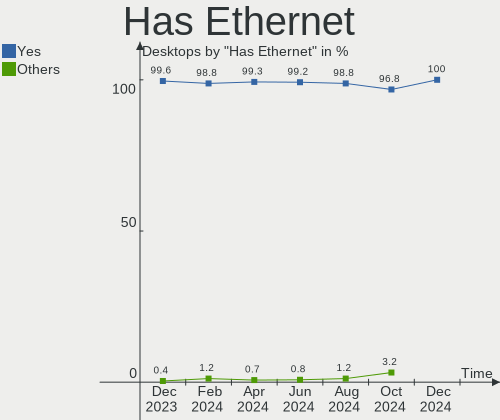
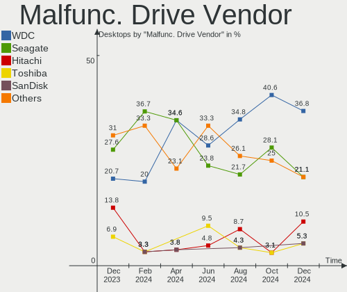
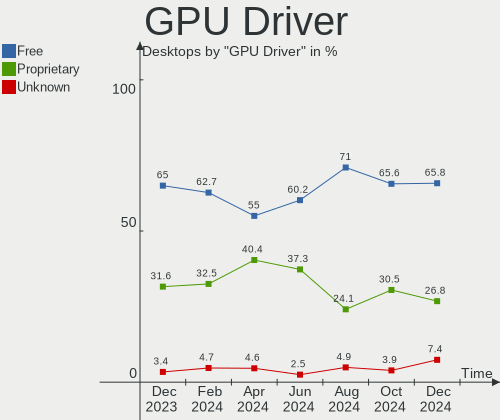
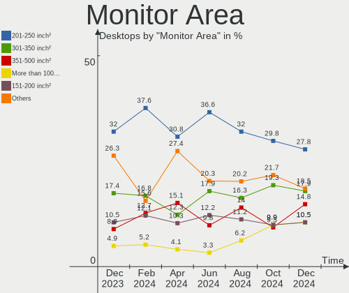
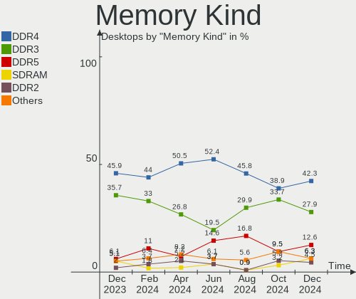

Linux Mint Hardware Trends (Desktops)
-------------------------------------

A project to identify most popular hardware characteristics and track their change
over time based on data collected by Linux Mint users at https://Linux-Hardware.org.

Anyone can contribute to this report by the [hw-probe](https://github.com/linuxhw/hw-probe) tool:

    sudo -E hw-probe -all -upload

Full-feature report is available here: https://linux-hardware.org/?view=trends

Period: Mar, 2022.

Contents
--------

* [ System ](#system)
  - [ OS                       ](#os)
  - [ OS Family                ](#os-family)
  - [ Kernel                   ](#kernel)
  - [ Kernel Family            ](#kernel-family)
  - [ Kernel Major Ver.        ](#kernel-major-ver)
  - [ Arch                     ](#arch)
  - [ DE                       ](#de)
  - [ Display Server           ](#display-server)
  - [ Display Manager          ](#display-manager)
  - [ OS Lang                  ](#os-lang)
  - [ Boot Mode                ](#boot-mode)
  - [ Filesystem               ](#filesystem)
  - [ Part. scheme             ](#part-scheme)
  - [ Dual Boot with Linux/BSD ](#dual-boot-with-linuxbsd)
  - [ Dual Boot (Win)          ](#dual-boot-win)

* [ Board ](#board)
  - [ Vendor                   ](#vendor)
  - [ Model                    ](#model)
  - [ Model Family             ](#model-family)
  - [ MFG Year                 ](#mfg-year)
  - [ Form Factor              ](#form-factor)
  - [ Secure Boot              ](#secure-boot)
  - [ Coreboot                 ](#coreboot)
  - [ RAM Size                 ](#ram-size)
  - [ RAM Used                 ](#ram-used)
  - [ Total Drives             ](#total-drives)
  - [ Has CD-ROM               ](#has-cd-rom)
  - [ Has Ethernet             ](#has-ethernet)
  - [ Has WiFi                 ](#has-wifi)
  - [ Has Bluetooth            ](#has-bluetooth)

* [ Location ](#location)
  - [ Country                  ](#country)
  - [ City                     ](#city)

* [ Drives ](#drives)
  - [ Drive Vendor             ](#drive-vendor)
  - [ Drive Model              ](#drive-model)
  - [ HDD Vendor               ](#hdd-vendor)
  - [ SSD Vendor               ](#ssd-vendor)
  - [ Drive Kind               ](#drive-kind)
  - [ Drive Connector          ](#drive-connector)
  - [ Drive Size               ](#drive-size)
  - [ Space Total              ](#space-total)
  - [ Space Used               ](#space-used)
  - [ Malfunc. Drives          ](#malfunc-drives)
  - [ Malfunc. Drive Vendor    ](#malfunc-drive-vendor)
  - [ Malfunc. HDD Vendor      ](#malfunc-hdd-vendor)
  - [ Malfunc. Drive Kind      ](#malfunc-drive-kind)
  - [ Failed Drives            ](#failed-drives)
  - [ Failed Drive Vendor      ](#failed-drive-vendor)
  - [ Drive Status             ](#drive-status)

* [ Storage controller ](#storage-controller)
  - [ Storage Vendor           ](#storage-vendor)
  - [ Storage Model            ](#storage-model)
  - [ Storage Kind             ](#storage-kind)

* [ Processor ](#processor)
  - [ CPU Vendor               ](#cpu-vendor)
  - [ CPU Model                ](#cpu-model)
  - [ CPU Model Family         ](#cpu-model-family)
  - [ CPU Cores                ](#cpu-cores)
  - [ CPU Sockets              ](#cpu-sockets)
  - [ CPU Threads              ](#cpu-threads)
  - [ CPU Op-Modes             ](#cpu-op-modes)
  - [ CPU Microcode            ](#cpu-microcode)
  - [ CPU Microarch            ](#cpu-microarch)

* [ Graphics ](#graphics)
  - [ GPU Vendor               ](#gpu-vendor)
  - [ GPU Model                ](#gpu-model)
  - [ GPU Combo                ](#gpu-combo)
  - [ GPU Driver               ](#gpu-driver)
  - [ GPU Memory               ](#gpu-memory)

* [ Monitor ](#monitor)
  - [ Monitor Vendor           ](#monitor-vendor)
  - [ Monitor Model            ](#monitor-model)
  - [ Monitor Resolution       ](#monitor-resolution)
  - [ Monitor Diagonal         ](#monitor-diagonal)
  - [ Monitor Width            ](#monitor-width)
  - [ Aspect Ratio             ](#aspect-ratio)
  - [ Monitor Area             ](#monitor-area)
  - [ Pixel Density            ](#pixel-density)
  - [ Multiple Monitors        ](#multiple-monitors)

* [ Network ](#network)
  - [ Net Controller Vendor    ](#net-controller-vendor)
  - [ Net Controller Model     ](#net-controller-model)
  - [ Wireless Vendor          ](#wireless-vendor)
  - [ Wireless Model           ](#wireless-model)
  - [ Ethernet Vendor          ](#ethernet-vendor)
  - [ Ethernet Model           ](#ethernet-model)
  - [ Net Controller Kind      ](#net-controller-kind)
  - [ Used Controller          ](#used-controller)
  - [ NICs                     ](#nics)
  - [ IPv6                     ](#ipv6)

* [ Bluetooth ](#bluetooth)
  - [ Bluetooth Vendor         ](#bluetooth-vendor)
  - [ Bluetooth Model          ](#bluetooth-model)

* [ Sound ](#sound)
  - [ Sound Vendor             ](#sound-vendor)
  - [ Sound Model              ](#sound-model)

* [ Memory ](#memory)
  - [ Memory Vendor            ](#memory-vendor)
  - [ Memory Model             ](#memory-model)
  - [ Memory Kind              ](#memory-kind)
  - [ Memory Form Factor       ](#memory-form-factor)
  - [ Memory Size              ](#memory-size)
  - [ Memory Speed             ](#memory-speed)

* [ Printers & scanners ](#printers--scanners)
  - [ Printer Vendor           ](#printer-vendor)
  - [ Printer Model            ](#printer-model)
  - [ Scanner Vendor           ](#scanner-vendor)
  - [ Scanner Model            ](#scanner-model)

* [ Camera ](#camera)
  - [ Camera Vendor            ](#camera-vendor)
  - [ Camera Model             ](#camera-model)

* [ Security ](#security)
  - [ Fingerprint Vendor       ](#fingerprint-vendor)
  - [ Fingerprint Model        ](#fingerprint-model)
  - [ Chipcard Vendor          ](#chipcard-vendor)
  - [ Chipcard Model           ](#chipcard-model)

* [ Unsupported ](#unsupported)
  - [ Unsupported Devices      ](#unsupported-devices)
  - [ Unsupported Device Types ](#unsupported-device-types)

System
------

OS
--

Installed operating systems

| Name            | Desktops | Percent |
|-----------------|----------|---------|
| Linux Mint 20.3 | 145      | 75.13%  |
| Linux Mint 20.2 | 22       | 11.4%   |
| Linux Mint 20.1 | 7        | 3.63%   |
| Linux Mint 20   | 6        | 3.11%   |
| Linux Mint 19.3 | 5        | 2.59%   |
| Linux Mint 19.1 | 3        | 1.55%   |
| Linux Mint 19.2 | 2        | 1.04%   |
| Linux Mint 18.3 | 2        | 1.04%   |
| Linux Mint 19   | 1        | 0.52%   |

OS Family
---------

OS without a version

| Name       | Desktops | Percent |
|------------|----------|---------|
| Linux Mint | 193      | 100%    |

Kernel
------

Version of the Linux kernel

| Version                  | Desktops | Percent |
|--------------------------|----------|---------|
| 5.4.0-104-generic        | 53       | 27.46%  |
| 5.4.0-100-generic        | 43       | 22.28%  |
| 5.4.0-105-generic        | 27       | 13.99%  |
| 5.4.0-91-generic         | 13       | 6.74%   |
| 5.13.0-35-generic        | 9        | 4.66%   |
| 5.13.0-37-generic        | 8        | 4.15%   |
| 5.13.0-30-generic        | 6        | 3.11%   |
| 5.4.0-96-generic         | 3        | 1.55%   |
| 5.4.0-107-generic        | 3        | 1.55%   |
| 5.13.0-27-generic        | 3        | 1.55%   |
| 5.4.0-92-generic         | 2        | 1.04%   |
| 4.15.0-54-generic        | 2        | 1.04%   |
| 4.15.0-20-generic        | 2        | 1.04%   |
| 4.15.0-142-generic       | 2        | 1.04%   |
| 5.4.177-rt69             | 1        | 0.52%   |
| 5.4.0-99-generic         | 1        | 0.52%   |
| 5.4.0-97-generic         | 1        | 0.52%   |
| 5.4.0-88-generic         | 1        | 0.52%   |
| 5.4.0-84-generic         | 1        | 0.52%   |
| 5.4.0-74-generic         | 1        | 0.52%   |
| 5.4.0-73-generic         | 1        | 0.52%   |
| 5.4.0-72-generic         | 1        | 0.52%   |
| 5.4.0-26-generic         | 1        | 0.52%   |
| 5.17.0-051700-generic    | 1        | 0.52%   |
| 5.16.12-xanmod1          | 1        | 0.52%   |
| 5.16.0-051600-lowlatency | 1        | 0.52%   |
| 5.15.26-xanmod1          | 1        | 0.52%   |
| 5.15.13-051513-generic   | 1        | 0.52%   |
| 5.11.0-46-generic        | 1        | 0.52%   |
| 4.15.0-173-generic       | 1        | 0.52%   |
| 4.15.0-171-generic       | 1        | 0.52%   |

Kernel Family
-------------

Linux kernel without a distro release

| Version | Desktops | Percent |
|---------|----------|---------|
| 5.4.0   | 152      | 78.76%  |
| 5.13.0  | 26       | 13.47%  |
| 4.15.0  | 8        | 4.15%   |
| 5.4.177 | 1        | 0.52%   |
| 5.17.0  | 1        | 0.52%   |
| 5.16.12 | 1        | 0.52%   |
| 5.16.0  | 1        | 0.52%   |
| 5.15.26 | 1        | 0.52%   |
| 5.15.13 | 1        | 0.52%   |
| 5.11.0  | 1        | 0.52%   |

Kernel Major Ver.
-----------------

Linux kernel major version

| Version | Desktops | Percent |
|---------|----------|---------|
| 5.4     | 153      | 79.27%  |
| 5.13    | 26       | 13.47%  |
| 4.15    | 8        | 4.15%   |
| 5.16    | 2        | 1.04%   |
| 5.15    | 2        | 1.04%   |
| 5.17    | 1        | 0.52%   |
| 5.11    | 1        | 0.52%   |

Arch
----

OS architecture (x86_64, i586, etc.)

| Name   | Desktops | Percent |
|--------|----------|---------|
| x86_64 | 190      | 98.45%  |
| i686   | 3        | 1.55%   |

DE
--

Desktop Environment

| Name       | Desktops | Percent |
|------------|----------|---------|
| X-Cinnamon | 130      | 67.36%  |
| MATE       | 26       | 13.47%  |
| XFCE       | 20       | 10.36%  |
| Cinnamon   | 14       | 7.25%   |
| GNOME      | 2        | 1.04%   |
| KDE5       | 1        | 0.52%   |

Display Server
--------------

X11 or Wayland

| Name    | Desktops | Percent |
|---------|----------|---------|
| X11     | 191      | 98.96%  |
| Wayland | 1        | 0.52%   |
| Tty     | 1        | 0.52%   |

Display Manager
---------------

SDDM, LightDM, etc.

| Name    | Desktops | Percent |
|---------|----------|---------|
| Unknown | 103      | 53.37%  |
| LightDM | 87       | 45.08%  |
| SDDM    | 1        | 0.52%   |
| MDM     | 1        | 0.52%   |
| GDM     | 1        | 0.52%   |

OS Lang
-------

Language

| Lang  | Desktops | Percent |
|-------|----------|---------|
| en_US | 65       | 33.68%  |
| de_DE | 32       | 16.58%  |
| en_CA | 14       | 7.25%   |
| ru_RU | 10       | 5.18%   |
| pt_BR | 10       | 5.18%   |
| fr_FR | 9        | 4.66%   |
| en_GB | 9        | 4.66%   |
| it_IT | 5        | 2.59%   |
| es_ES | 5        | 2.59%   |
| C     | 5        | 2.59%   |
| pl_PL | 4        | 2.07%   |
| el_GR | 3        | 1.55%   |
| cs_CZ | 3        | 1.55%   |
| sv_SE | 2        | 1.04%   |
| sk_SK | 2        | 1.04%   |
| nl_NL | 2        | 1.04%   |
| es_AR | 2        | 1.04%   |
| en_ZA | 2        | 1.04%   |
| ru_UA | 1        | 0.52%   |
| pt_PT | 1        | 0.52%   |
| ja_JP | 1        | 0.52%   |
| hu_HU | 1        | 0.52%   |
| es_VE | 1        | 0.52%   |
| en_NZ | 1        | 0.52%   |
| en_IE | 1        | 0.52%   |
| en_AU | 1        | 0.52%   |
| ca_ES | 1        | 0.52%   |

Boot Mode
---------

EFI or BIOS

| Mode | Desktops | Percent |
|------|----------|---------|
| BIOS | 107      | 55.44%  |
| EFI  | 86       | 44.56%  |

Filesystem
----------

Type of filesystem

| Type    | Desktops | Percent |
|---------|----------|---------|
| Ext4    | 181      | 93.78%  |
| Overlay | 5        | 2.59%   |
| Btrfs   | 4        | 2.07%   |
| Xfs     | 2        | 1.04%   |
| Ext3    | 1        | 0.52%   |

Part. scheme
------------

Scheme of partitioning

| Type    | Desktops | Percent |
|---------|----------|---------|
| Unknown | 115      | 59.59%  |
| GPT     | 47       | 24.35%  |
| MBR     | 31       | 16.06%  |

Dual Boot with Linux/BSD
------------------------

Hosting more than one Linux/BSD

| Dual boot | Desktops | Percent |
|-----------|----------|---------|
| No        | 177      | 91.71%  |
| Yes       | 16       | 8.29%   |

Dual Boot (Win)
---------------

Hosting Linux and Windows

| Dual boot | Desktops | Percent |
|-----------|----------|---------|
| No        | 141      | 73.06%  |
| Yes       | 52       | 26.94%  |

Board
-----

Vendor
------

Motherboard manufacturer

| Name                | Desktops | Percent |
|---------------------|----------|---------|
| ASUSTek Computer    | 51       | 26.42%  |
| Gigabyte Technology | 31       | 16.06%  |
| MSI                 | 26       | 13.47%  |
| ASRock              | 19       | 9.84%   |
| Dell                | 18       | 9.33%   |
| Hewlett-Packard     | 13       | 6.74%   |
| Lenovo              | 11       | 5.7%    |
| Intel               | 4        | 2.07%   |
| Biostar             | 3        | 1.55%   |
| Unknown             | 2        | 1.04%   |
| Visum               | 1        | 0.52%   |
| VIA Technologies    | 1        | 0.52%   |
| Shuttle             | 1        | 0.52%   |
| Purism              | 1        | 0.52%   |
| Positivo            | 1        | 0.52%   |
| Pegatron            | 1        | 0.52%   |
| Megaware            | 1        | 0.52%   |
| Maita               | 1        | 0.52%   |
| KLLISRE             | 1        | 0.52%   |
| Fujitsu Siemens     | 1        | 0.52%   |
| Fujitsu             | 1        | 0.52%   |
| Foxconn             | 1        | 0.52%   |
| ECS                 | 1        | 0.52%   |
| Alienware           | 1        | 0.52%   |
| Acer                | 1        | 0.52%   |

Model
-----

Motherboard model

| Name                                   | Desktops | Percent |
|----------------------------------------|----------|---------|
| ASUS TUF Gaming X570-PLUS              | 3        | 1.55%   |
| ASUS All Series                        | 3        | 1.55%   |
| MSI MS-7B86                            | 2        | 1.04%   |
| MSI MS-7693                            | 2        | 1.04%   |
| Gigabyte B450 AORUS M                  | 2        | 1.04%   |
| Gigabyte 970A-DS3P                     | 2        | 1.04%   |
| Dell OptiPlex 760                      | 2        | 1.04%   |
| Dell OptiPlex 390                      | 2        | 1.04%   |
| ASUS ROG STRIX X470-F GAMING           | 2        | 1.04%   |
| ASUS M5A99FX PRO R2.0                  | 2        | 1.04%   |
| ASUS M5A78L-M/USB3                     | 2        | 1.04%   |
| Unknown                                | 2        | 1.04%   |
| Visum A6VMX                            | 1        | 0.52%   |
| VIA KM266-8235                         | 1        | 0.52%   |
| Shuttle XH61V                          | 1        | 0.52%   |
| Purism Librem Mini v2                  | 1        | 0.52%   |
| Positivo POS-PIH77CM                   | 1        | 0.52%   |
| Pegatron AY627AA-ABA a4313w            | 1        | 0.52%   |
| MSI MS-7D43                            | 1        | 0.52%   |
| MSI MS-7D36                            | 1        | 0.52%   |
| MSI MS-7D22                            | 1        | 0.52%   |
| MSI MS-7D08                            | 1        | 0.52%   |
| MSI MS-7C75                            | 1        | 0.52%   |
| MSI MS-7C56                            | 1        | 0.52%   |
| MSI MS-7C37                            | 1        | 0.52%   |
| MSI MS-7C02                            | 1        | 0.52%   |
| MSI MS-7B87                            | 1        | 0.52%   |
| MSI MS-7B23                            | 1        | 0.52%   |
| MSI MS-7A72                            | 1        | 0.52%   |
| MSI MS-7A40                            | 1        | 0.52%   |
| MSI MS-7A38                            | 1        | 0.52%   |
| MSI MS-7A35                            | 1        | 0.52%   |
| MSI MS-7A34                            | 1        | 0.52%   |
| MSI MS-7885                            | 1        | 0.52%   |
| MSI MS-7821                            | 1        | 0.52%   |
| MSI MS-7751                            | 1        | 0.52%   |
| MSI MS-7740                            | 1        | 0.52%   |
| MSI MS-7721                            | 1        | 0.52%   |
| MSI MS-7681                            | 1        | 0.52%   |
| MSI MS-7091                            | 1        | 0.52%   |
| Megaware MW-H61M-2H                    | 1        | 0.52%   |
| Maita NUCCF01                          | 1        | 0.52%   |
| Lenovo ThinkStation S20 4157E92        | 1        | 0.52%   |
| Lenovo ThinkStation P300 30AH001JIX    | 1        | 0.52%   |
| Lenovo ThinkCentre M93p 10A9000SUS     | 1        | 0.52%   |
| Lenovo ThinkCentre M92p 3209B4G        | 1        | 0.52%   |
| Lenovo ThinkCentre M92p 2988D9U        | 1        | 0.52%   |
| Lenovo ThinkCentre M90p 5536K6M        | 1        | 0.52%   |
| Lenovo ThinkCentre M73 10AXS0JU00      | 1        | 0.52%   |
| Lenovo ThinkCentre M73 10AXS07P0G      | 1        | 0.52%   |
| Lenovo ThinkCentre Edge92 33874GG      | 1        | 0.52%   |
| Lenovo IdeaCentre K410 10089           | 1        | 0.52%   |
| Lenovo IdeaCentre 5 14IMB05 90NA0082US | 1        | 0.52%   |
| KLLISRE B75 V1.1                       | 1        | 0.52%   |
| Intel X99 V1.0                         | 1        | 0.52%   |
| Intel DH55TC AAE70932-301              | 1        | 0.52%   |
| Intel DG41RQ AAE54511-205              | 1        | 0.52%   |
| Intel D33217GKE G76540-201             | 1        | 0.52%   |
| HP Z800 Workstation                    | 1        | 0.52%   |
| HP Z420 Workstation                    | 1        | 0.52%   |

Model Family
------------

Motherboard model prefix

| Name                 | Desktops | Percent |
|----------------------|----------|---------|
| Dell OptiPlex        | 15       | 7.77%   |
| Lenovo ThinkCentre   | 7        | 3.63%   |
| ASUS PRIME           | 7        | 3.63%   |
| HP Compaq            | 6        | 3.11%   |
| ASUS TUF             | 5        | 2.59%   |
| ASUS ROG             | 5        | 2.59%   |
| ASUS M5A78L-M        | 4        | 2.07%   |
| HP EliteDesk         | 3        | 1.55%   |
| ASUS All             | 3        | 1.55%   |
| MSI MS-7B86          | 2        | 1.04%   |
| MSI MS-7693          | 2        | 1.04%   |
| Lenovo ThinkStation  | 2        | 1.04%   |
| Lenovo IdeaCentre    | 2        | 1.04%   |
| Gigabyte B450        | 2        | 1.04%   |
| Gigabyte 970A-DS3P   | 2        | 1.04%   |
| ASUS M5A99FX         | 2        | 1.04%   |
| ASRock B550M         | 2        | 1.04%   |
| Unknown              | 2        | 1.04%   |
| Visum A6VMX          | 1        | 0.52%   |
| VIA KM266-8235       | 1        | 0.52%   |
| Shuttle XH61V        | 1        | 0.52%   |
| Purism Librem        | 1        | 0.52%   |
| Positivo POS-PIH77CM | 1        | 0.52%   |
| Pegatron AY627AA-ABA | 1        | 0.52%   |
| MSI MS-7D43          | 1        | 0.52%   |
| MSI MS-7D36          | 1        | 0.52%   |
| MSI MS-7D22          | 1        | 0.52%   |
| MSI MS-7D08          | 1        | 0.52%   |
| MSI MS-7C75          | 1        | 0.52%   |
| MSI MS-7C56          | 1        | 0.52%   |
| MSI MS-7C37          | 1        | 0.52%   |
| MSI MS-7C02          | 1        | 0.52%   |
| MSI MS-7B87          | 1        | 0.52%   |
| MSI MS-7B23          | 1        | 0.52%   |
| MSI MS-7A72          | 1        | 0.52%   |
| MSI MS-7A40          | 1        | 0.52%   |
| MSI MS-7A38          | 1        | 0.52%   |
| MSI MS-7A35          | 1        | 0.52%   |
| MSI MS-7A34          | 1        | 0.52%   |
| MSI MS-7885          | 1        | 0.52%   |
| MSI MS-7821          | 1        | 0.52%   |
| MSI MS-7751          | 1        | 0.52%   |
| MSI MS-7740          | 1        | 0.52%   |
| MSI MS-7721          | 1        | 0.52%   |
| MSI MS-7681          | 1        | 0.52%   |
| MSI MS-7091          | 1        | 0.52%   |
| Megaware MW-H61M-2H  | 1        | 0.52%   |
| Maita NUCCF01        | 1        | 0.52%   |
| KLLISRE B75          | 1        | 0.52%   |
| Intel X99            | 1        | 0.52%   |
| Intel DH55TC         | 1        | 0.52%   |
| Intel DG41RQ         | 1        | 0.52%   |
| Intel D33217GKE      | 1        | 0.52%   |
| HP Z800              | 1        | 0.52%   |
| HP Z420              | 1        | 0.52%   |
| HP 200-5130ch        | 1        | 0.52%   |
| HP 110-016           | 1        | 0.52%   |
| Gigabyte Z97X-Gaming | 1        | 0.52%   |
| Gigabyte Z97-HD3     | 1        | 0.52%   |
| Gigabyte Z77-DS3H    | 1        | 0.52%   |

MFG Year
--------

Motherboard manufacture year

| Year | Desktops | Percent |
|------|----------|---------|
| 2012 | 26       | 13.47%  |
| 2011 | 17       | 8.81%   |
| 2020 | 16       | 8.29%   |
| 2013 | 16       | 8.29%   |
| 2021 | 15       | 7.77%   |
| 2018 | 15       | 7.77%   |
| 2019 | 12       | 6.22%   |
| 2017 | 11       | 5.7%    |
| 2014 | 11       | 5.7%    |
| 2015 | 9        | 4.66%   |
| 2010 | 9        | 4.66%   |
| 2016 | 8        | 4.15%   |
| 2008 | 8        | 4.15%   |
| 2009 | 7        | 3.63%   |
| 2022 | 5        | 2.59%   |
| 2007 | 5        | 2.59%   |
| 2006 | 1        | 0.52%   |
| 2005 | 1        | 0.52%   |
| 2002 | 1        | 0.52%   |

Form Factor
-----------

Physical design of the computer

| Name    | Desktops | Percent |
|---------|----------|---------|
| Desktop | 193      | 100%    |

Secure Boot
-----------

Enabled or disabled

| State    | Desktops | Percent |
|----------|----------|---------|
| Disabled | 187      | 96.89%  |
| Enabled  | 6        | 3.11%   |

Coreboot
--------

Have coreboot on board

| Used | Desktops | Percent |
|------|----------|---------|
| No   | 192      | 99.48%  |
| Yes  | 1        | 0.52%   |

RAM Size
--------

Total RAM memory

| Size in GB  | Desktops | Percent |
|-------------|----------|---------|
| 16.01-24.0  | 51       | 26.42%  |
| 8.01-16.0   | 41       | 21.24%  |
| 32.01-64.0  | 30       | 15.54%  |
| 3.01-4.0    | 28       | 14.51%  |
| 4.01-8.0    | 21       | 10.88%  |
| 64.01-256.0 | 10       | 5.18%   |
| 24.01-32.0  | 5        | 2.59%   |
| 1.01-2.0    | 5        | 2.59%   |
| 2.01-3.0    | 1        | 0.52%   |
| 0.51-1.0    | 1        | 0.52%   |

RAM Used
--------

Used RAM memory

| Used GB   | Desktops | Percent |
|-----------|----------|---------|
| 1.01-2.0  | 62       | 32.12%  |
| 2.01-3.0  | 46       | 23.83%  |
| 4.01-8.0  | 34       | 17.62%  |
| 3.01-4.0  | 30       | 15.54%  |
| 0.51-1.0  | 12       | 6.22%   |
| 8.01-16.0 | 8        | 4.15%   |
| 0.01-0.5  | 1        | 0.52%   |

Total Drives
------------

Number of drives on board

| Drives | Desktops | Percent |
|--------|----------|---------|
| 1      | 73       | 37.82%  |
| 2      | 54       | 27.98%  |
| 3      | 35       | 18.13%  |
| 4      | 18       | 9.33%   |
| 6      | 6        | 3.11%   |
| 5      | 5        | 2.59%   |
| 7      | 1        | 0.52%   |
| 0      | 1        | 0.52%   |

Has CD-ROM
----------

Has CD-ROM on board

| Presented | Desktops | Percent |
|-----------|----------|---------|
| Yes       | 99       | 51.3%   |
| No        | 94       | 48.7%   |

Has Ethernet
------------

Has Ethernet on board

| Presented | Desktops | Percent |
|-----------|----------|---------|
| Yes       | 190      | 98.45%  |
| No        | 3        | 1.55%   |

Has WiFi
--------

Has WiFi module

| Presented | Desktops | Percent |
|-----------|----------|---------|
| No        | 109      | 56.48%  |
| Yes       | 84       | 43.52%  |

Has Bluetooth
-------------

Has Bluetooth module

| Presented | Desktops | Percent |
|-----------|----------|---------|
| No        | 128      | 66.32%  |
| Yes       | 65       | 33.68%  |

Location
--------

Country
-------

Geographic location (country)

| Country      | Desktops | Percent |
|--------------|----------|---------|
| USA          | 44       | 22.8%   |
| Germany      | 35       | 18.13%  |
| Canada       | 15       | 7.77%   |
| Brazil       | 13       | 6.74%   |
| France       | 10       | 5.18%   |
| Russia       | 9        | 4.66%   |
| Poland       | 6        | 3.11%   |
| Italy        | 6        | 3.11%   |
| UK           | 5        | 2.59%   |
| Spain        | 5        | 2.59%   |
| Netherlands  | 5        | 2.59%   |
| Sweden       | 4        | 2.07%   |
| Czechia      | 4        | 2.07%   |
| Greece       | 3        | 1.55%   |
| Croatia      | 3        | 1.55%   |
| South Africa | 2        | 1.04%   |
| Slovakia     | 2        | 1.04%   |
| Japan        | 2        | 1.04%   |
| Indonesia    | 2        | 1.04%   |
| Venezuela    | 1        | 0.52%   |
| Taiwan       | 1        | 0.52%   |
| Switzerland  | 1        | 0.52%   |
| Slovenia     | 1        | 0.52%   |
| Serbia       | 1        | 0.52%   |
| Romania      | 1        | 0.52%   |
| Portugal     | 1        | 0.52%   |
| Pakistan     | 1        | 0.52%   |
| New Zealand  | 1        | 0.52%   |
| Mexico       | 1        | 0.52%   |
| Malaysia     | 1        | 0.52%   |
| Ireland      | 1        | 0.52%   |
| Hungary      | 1        | 0.52%   |
| Denmark      | 1        | 0.52%   |
| Belarus      | 1        | 0.52%   |
| Australia    | 1        | 0.52%   |
| Argentina    | 1        | 0.52%   |
| Albania      | 1        | 0.52%   |

City
----

Geographic location (city)

| City             | Desktops | Percent |
|------------------|----------|---------|
| Berlin           | 5        | 2.59%   |
| Zagreb           | 3        | 1.55%   |
| Stuttgart        | 3        | 1.55%   |
| Sao Paulo        | 3        | 1.55%   |
| New York         | 3        | 1.55%   |
| Montreal         | 3        | 1.55%   |
| Calgary          | 3        | 1.55%   |
| Warsaw           | 2        | 1.04%   |
| Toronto          | 2        | 1.04%   |
| Strasbourg       | 2        | 1.04%   |
| St Petersburg    | 2        | 1.04%   |
| Moscow           | 2        | 1.04%   |
| Madrid           | 2        | 1.04%   |
| Leipzig          | 2        | 1.04%   |
| Jakarta          | 2        | 1.04%   |
| Coeur d'Alene    | 2        | 1.04%   |
| Belleview        | 2        | 1.04%   |
| Aachen           | 2        | 1.04%   |
| Zevenaar         | 1        | 0.52%   |
| Yonkers          | 1        | 0.52%   |
| Wolfsburg        | 1        | 0.52%   |
| Wigan            | 1        | 0.52%   |
| Weiterstadt      | 1        | 0.52%   |
| Wateringen       | 1        | 0.52%   |
| Volos            | 1        | 0.52%   |
| Volgodonsk       | 1        | 0.52%   |
| Vila Velha       | 1        | 0.52%   |
| Vancouver        | 1        | 0.52%   |
| Upper Black Eddy | 1        | 0.52%   |
| Tyumen           | 1        | 0.52%   |
| Troy             | 1        | 0.52%   |
| Tours            | 1        | 0.52%   |
| Tokyo            | 1        | 0.52%   |
| Tirana           | 1        | 0.52%   |
| Tholey           | 1        | 0.52%   |
| Thessaloniki     | 1        | 0.52%   |
| Sun Prairie      | 1        | 0.52%   |
| Stenlose         | 1        | 0.52%   |
| Staten Island    | 1        | 0.52%   |
| St Louis         | 1        | 0.52%   |
| Spruce Grove     | 1        | 0.52%   |
| Spokane          | 1        | 0.52%   |
| Southampton      | 1        | 0.52%   |
| Soest            | 1        | 0.52%   |
| Södertälje     | 1        | 0.52%   |
| Shinjuku         | 1        | 0.52%   |
| Sfantu Gheorghe  | 1        | 0.52%   |
| Seregno          | 1        | 0.52%   |
| Seattle          | 1        | 0.52%   |
| Schwarzenbach    | 1        | 0.52%   |
| Sarego           | 1        | 0.52%   |
| Santa Monica     | 1        | 0.52%   |
| Santa Clara      | 1        | 0.52%   |
| Salt Lake City   | 1        | 0.52%   |
| Saint John       | 1        | 0.52%   |
| Riverside        | 1        | 0.52%   |
| Repy             | 1        | 0.52%   |
| Recife           | 1        | 0.52%   |
| Pullenreuth      | 1        | 0.52%   |
| Prague           | 1        | 0.52%   |

Drives
------

Drive Vendor
------------

Hard drive vendors

| Vendor                    | Desktops | Drives | Percent |
|---------------------------|----------|--------|---------|
| WDC                       | 70       | 85     | 19.89%  |
| Seagate                   | 68       | 84     | 19.32%  |
| Samsung Electronics       | 56       | 75     | 15.91%  |
| SanDisk                   | 26       | 34     | 7.39%   |
| Crucial                   | 22       | 23     | 6.25%   |
| Kingston                  | 19       | 22     | 5.4%    |
| Toshiba                   | 12       | 15     | 3.41%   |
| Hitachi                   | 10       | 11     | 2.84%   |
| Intenso                   | 6        | 8      | 1.7%    |
| HGST                      | 6        | 7      | 1.7%    |
| Intel                     | 5        | 5      | 1.42%   |
| A-DATA Technology         | 5        | 5      | 1.42%   |
| SPCC                      | 4        | 5      | 1.14%   |
| XPG                       | 2        | 2      | 0.57%   |
| Unknown                   | 2        | 2      | 0.57%   |
| SK Hynix                  | 2        | 2      | 0.57%   |
| Silicon Motion            | 2        | 2      | 0.57%   |
| PNY                       | 2        | 2      | 0.57%   |
| OCZ                       | 2        | 2      | 0.57%   |
| Mushkin                   | 2        | 2      | 0.57%   |
| Micron Technology         | 2        | 2      | 0.57%   |
| MAXTOR                    | 2        | 2      | 0.57%   |
| LITEONIT                  | 2        | 2      | 0.57%   |
| China                     | 2        | 2      | 0.57%   |
| XrayDisk                  | 1        | 1      | 0.28%   |
| WD MediaMax               | 1        | 1      | 0.28%   |
| USB 3.0                   | 1        | 1      | 0.28%   |
| Transcend                 | 1        | 1      | 0.28%   |
| SUNEAST                   | 1        | 1      | 0.28%   |
| Phison                    | 1        | 1      | 0.28%   |
| Patriot                   | 1        | 1      | 0.28%   |
| Micron/Crucial Technology | 1        | 1      | 0.28%   |
| M.2 SSD                   | 1        | 1      | 0.28%   |
| KLLISRE                   | 1        | 1      | 0.28%   |
| KIOXIA-EXCERIA            | 1        | 1      | 0.28%   |
| KingDian                  | 1        | 1      | 0.28%   |
| INNOVATION IT             | 1        | 2      | 0.28%   |
| HS256E                    | 1        | 1      | 0.28%   |
| Gigabyte Technology       | 1        | 1      | 0.28%   |
| Fujitsu                   | 1        | 1      | 0.28%   |
| Corsair                   | 1        | 1      | 0.28%   |
| Apacer                    | 1        | 1      | 0.28%   |
| 2.5                       | 1        | 1      | 0.28%   |
| 1TB                       | 1        | 1      | 0.28%   |
| Unknown                   | 1        | 1      | 0.28%   |

Drive Model
-----------

Hard drive models

| Model                             | Desktops | Percent |
|-----------------------------------|----------|---------|
| Kingston SA400S37240G 240GB SSD   | 6        | 1.5%    |
| WDC WDS500G2B0A-00SM50 500GB SSD  | 5        | 1.25%   |
| Seagate ST2000DM008-2FR102 2TB    | 5        | 1.25%   |
| Toshiba DT01ACA100 1TB            | 4        | 1%      |
| Seagate ST500DM002-1BD142 500GB   | 4        | 1%      |
| Seagate ST1000DM010-2EP102 1TB    | 4        | 1%      |
| Samsung NVMe SSD Drive 1TB        | 4        | 1%      |
| Crucial CT500MX500SSD1 500GB      | 4        | 1%      |
| WDC WD40EFRX-68N32N0 4TB          | 3        | 0.75%   |
| WDC WD20EZRX-00D8PB0 2TB          | 3        | 0.75%   |
| WDC WD20EFRX-68EUZN0 2TB          | 3        | 0.75%   |
| Seagate ST31000528AS 1TB          | 3        | 0.75%   |
| Seagate ST2000DM006-2DM164 2TB    | 3        | 0.75%   |
| Seagate Expansion 320GB           | 3        | 0.75%   |
| SanDisk SSD PLUS 480GB            | 3        | 0.75%   |
| Samsung SSD 860 EVO 250GB         | 3        | 0.75%   |
| Samsung SSD 860 EVO 1TB           | 3        | 0.75%   |
| Samsung SSD 850 EVO 250GB         | 3        | 0.75%   |
| Crucial CT1000P2SSD8 1TB          | 3        | 0.75%   |
| Crucial CT1000MX500SSD1 1TB       | 3        | 0.75%   |
| WDC WDS100T2B0A-00SM50 1TB SSD    | 2        | 0.5%    |
| WDC WD40EZRZ-00GXCB0 4TB          | 2        | 0.5%    |
| WDC WD20EARS-00MVWB0 2TB          | 2        | 0.5%    |
| WDC WD10EZEX-08WN4A0 1TB          | 2        | 0.5%    |
| WDC WD10EZEX-08M2NA0 1TB          | 2        | 0.5%    |
| WDC WD10EZEX-00WN4A0 1TB          | 2        | 0.5%    |
| WDC WD1001FALS-00J7B1 1TB         | 2        | 0.5%    |
| SPCC Solid State Disk 256GB       | 2        | 0.5%    |
| Seagate ST3500413AS 500GB         | 2        | 0.5%    |
| Seagate ST3250823AS 250GB         | 2        | 0.5%    |
| Seagate ST2000DM001-1CH164 2TB    | 2        | 0.5%    |
| Seagate ST16000NM001G-2KK103 16TB | 2        | 0.5%    |
| Seagate ST1000DM003-1ER162 1TB    | 2        | 0.5%    |
| Seagate ST1000DM003-1CH162 1TB    | 2        | 0.5%    |
| Seagate M3 Portable 500GB         | 2        | 0.5%    |
| Seagate BUP BK 4TB                | 2        | 0.5%    |
| SanDisk Ultra II 240GB SSD        | 2        | 0.5%    |
| SanDisk SSD PLUS 240GB            | 2        | 0.5%    |
| SanDisk SDSSDP064G 64GB           | 2        | 0.5%    |
| SanDisk SDSSDA240G 240GB          | 2        | 0.5%    |
| Sandisk NVMe SSD Drive 500GB      | 2        | 0.5%    |
| Sandisk NVMe SSD Drive 250GB      | 2        | 0.5%    |
| Sandisk NVMe SSD Drive 1TB        | 2        | 0.5%    |
| Samsung SSD 970 PRO 512GB         | 2        | 0.5%    |
| Samsung SSD 970 EVO Plus 500GB    | 2        | 0.5%    |
| Samsung SSD 870 EVO 1TB           | 2        | 0.5%    |
| Samsung SSD 860 QVO 2TB           | 2        | 0.5%    |
| Samsung SSD 860 EVO M.2 500GB     | 2        | 0.5%    |
| Samsung SSD 860 EVO 500GB         | 2        | 0.5%    |
| Samsung SSD 850 PRO 512GB         | 2        | 0.5%    |
| Samsung SSD 840 EVO 250GB         | 2        | 0.5%    |
| Samsung SSD 840 EVO 120GB         | 2        | 0.5%    |
| Samsung HD753LJ 752GB             | 2        | 0.5%    |
| Samsung HD502HJ 500GB             | 2        | 0.5%    |
| Samsung HD154UI 1TB               | 2        | 0.5%    |
| Kingston SV300S37A120G 120GB SSD  | 2        | 0.5%    |
| Kingston SA400S37480G 480GB SSD   | 2        | 0.5%    |
| Intenso SSD SATAIII 512GB         | 2        | 0.5%    |
| Intenso SSD Sata III 120GB        | 2        | 0.5%    |
| Hitachi HUA723020ALA641 2TB       | 2        | 0.5%    |

HDD Vendor
----------

Hard disk drive vendors

| Vendor              | Desktops | Drives | Percent |
|---------------------|----------|--------|---------|
| Seagate             | 66       | 79     | 38.82%  |
| WDC                 | 59       | 70     | 34.71%  |
| Samsung Electronics | 13       | 14     | 7.65%   |
| Toshiba             | 12       | 14     | 7.06%   |
| Hitachi             | 10       | 11     | 5.88%   |
| HGST                | 6        | 7      | 3.53%   |
| MAXTOR              | 2        | 2      | 1.18%   |
| USB 3.0             | 1        | 1      | 0.59%   |
| Fujitsu             | 1        | 1      | 0.59%   |

SSD Vendor
----------

Solid state drive vendors

| Vendor              | Desktops | Drives | Percent |
|---------------------|----------|--------|---------|
| Samsung Electronics | 30       | 37     | 23.26%  |
| SanDisk             | 19       | 25     | 14.73%  |
| Crucial             | 17       | 17     | 13.18%  |
| Kingston            | 16       | 19     | 12.4%   |
| WDC                 | 11       | 13     | 8.53%   |
| Intenso             | 5        | 7      | 3.88%   |
| SPCC                | 4        | 5      | 3.1%    |
| OCZ                 | 2        | 2      | 1.55%   |
| Mushkin             | 2        | 2      | 1.55%   |
| Micron Technology   | 2        | 2      | 1.55%   |
| LITEONIT            | 2        | 2      | 1.55%   |
| Intel               | 2        | 2      | 1.55%   |
| China               | 2        | 2      | 1.55%   |
| A-DATA Technology   | 2        | 2      | 1.55%   |
| Transcend           | 1        | 1      | 0.78%   |
| Toshiba             | 1        | 1      | 0.78%   |
| SUNEAST             | 1        | 1      | 0.78%   |
| SK Hynix            | 1        | 1      | 0.78%   |
| Seagate             | 1        | 1      | 0.78%   |
| PNY                 | 1        | 1      | 0.78%   |
| Patriot             | 1        | 1      | 0.78%   |
| KingDian            | 1        | 1      | 0.78%   |
| INNOVATION IT       | 1        | 2      | 0.78%   |
| Apacer              | 1        | 1      | 0.78%   |
| 2.5                 | 1        | 1      | 0.78%   |
| 1TB                 | 1        | 1      | 0.78%   |
| Unknown             | 1        | 1      | 0.78%   |

Drive Kind
----------

HDD or SSD

| Kind    | Desktops | Drives | Percent |
|---------|----------|--------|---------|
| HDD     | 133      | 199    | 43.32%  |
| SSD     | 112      | 151    | 36.48%  |
| NVMe    | 52       | 63     | 16.94%  |
| Unknown | 9        | 9      | 2.93%   |
| MMC     | 1        | 1      | 0.33%   |

Drive Connector
---------------

SATA, SAS, NVMe, etc.

| Type | Desktops | Drives | Percent |
|------|----------|--------|---------|
| SATA | 177      | 343    | 73.44%  |
| NVMe | 52       | 63     | 21.58%  |
| SAS  | 11       | 16     | 4.56%   |
| MMC  | 1        | 1      | 0.41%   |

Drive Size
----------

Size of hard drive

| Size in TB | Desktops | Drives | Percent |
|------------|----------|--------|---------|
| 0.01-0.5   | 122      | 183    | 47.47%  |
| 0.51-1.0   | 76       | 92     | 29.57%  |
| 1.01-2.0   | 39       | 46     | 15.18%  |
| 3.01-4.0   | 12       | 16     | 4.67%   |
| 2.01-3.0   | 3        | 4      | 1.17%   |
| 4.01-10.0  | 3        | 5      | 1.17%   |
| 10.01-20.0 | 2        | 4      | 0.78%   |

Space Total
-----------

Amount of disk space available on the file system

| Size in GB     | Desktops | Percent |
|----------------|----------|---------|
| 101-250        | 48       | 24.87%  |
| 501-1000       | 37       | 19.17%  |
| 251-500        | 30       | 15.54%  |
| More than 3000 | 27       | 13.99%  |
| 1001-2000      | 21       | 10.88%  |
| 2001-3000      | 12       | 6.22%   |
| 51-100         | 10       | 5.18%   |
| 1-20           | 4        | 2.07%   |
| 21-50          | 3        | 1.55%   |
| Unknown        | 1        | 0.52%   |

Space Used
----------

Amount of used disk space

| Used GB        | Desktops | Percent |
|----------------|----------|---------|
| 1-20           | 36       | 18.65%  |
| 101-250        | 34       | 17.62%  |
| 51-100         | 32       | 16.58%  |
| 21-50          | 27       | 13.99%  |
| 1001-2000      | 17       | 8.81%   |
| 251-500        | 16       | 8.29%   |
| More than 3000 | 13       | 6.74%   |
| 501-1000       | 10       | 5.18%   |
| 2001-3000      | 7        | 3.63%   |
| Unknown        | 1        | 0.52%   |

Malfunc. Drives
---------------

Drive models with a malfunction

| Model                                         | Desktops | Drives | Percent |
|-----------------------------------------------|----------|--------|---------|
| Crucial CT525MX300SSD1 528GB                  | 2        | 2      | 9.09%   |
| WDC WD5002ABYS-01B1B0 500GB                   | 1        | 1      | 4.55%   |
| WDC WD5000AAKS-00A7B0 500GB                   | 1        | 1      | 4.55%   |
| WDC WD30EFRX-68EUZN0 3TB                      | 1        | 1      | 4.55%   |
| WDC WD20EARS-00MVWB0 2TB                      | 1        | 1      | 4.55%   |
| Seagate ST9250410AS 250GB                     | 1        | 1      | 4.55%   |
| Seagate ST320LT012-1DG14C 320GB               | 1        | 1      | 4.55%   |
| Seagate ST31000333AS 1TB                      | 1        | 1      | 4.55%   |
| Seagate ST1500DL003-9VT16L 1TB                | 1        | 1      | 4.55%   |
| SanDisk SSD PLUS 1000GB                       | 1        | 2      | 4.55%   |
| SanDisk SDSSDA240G 240GB                      | 1        | 1      | 4.55%   |
| Samsung Electronics HD501LJ 500GB             | 1        | 1      | 4.55%   |
| Samsung Electronics HD322GJ 320GB             | 1        | 1      | 4.55%   |
| Samsung Electronics HD252HJ 250GB             | 1        | 1      | 4.55%   |
| Samsung Electronics HD161HJ 160GB             | 1        | 1      | 4.55%   |
| Samsung Electronics HD103UI 1TB               | 1        | 1      | 4.55%   |
| Micron Technology MTFDDAK512MAM-1K1 512GB SSD | 1        | 1      | 4.55%   |
| LITEONIT E200-080 80GB SSD                    | 1        | 1      | 4.55%   |
| Kingston SV300S37A60G 64GB SSD                | 1        | 1      | 4.55%   |
| Intenso SSD Sata III 256GB                    | 1        | 1      | 4.55%   |
| Hitachi HDT721010SLA360 1TB                   | 1        | 1      | 4.55%   |

Malfunc. Drive Vendor
---------------------

Vendors of faulty drives

| Vendor              | Desktops | Drives | Percent |
|---------------------|----------|--------|---------|
| WDC                 | 4        | 4      | 19.05%  |
| Seagate             | 4        | 4      | 19.05%  |
| Samsung Electronics | 4        | 5      | 19.05%  |
| SanDisk             | 2        | 3      | 9.52%   |
| Crucial             | 2        | 2      | 9.52%   |
| Micron Technology   | 1        | 1      | 4.76%   |
| LITEONIT            | 1        | 1      | 4.76%   |
| Kingston            | 1        | 1      | 4.76%   |
| Intenso             | 1        | 1      | 4.76%   |
| Hitachi             | 1        | 1      | 4.76%   |

Malfunc. HDD Vendor
-------------------

Vendors of faulty HDD drives

| Vendor              | Desktops | Drives | Percent |
|---------------------|----------|--------|---------|
| WDC                 | 4        | 4      | 30.77%  |
| Seagate             | 4        | 4      | 30.77%  |
| Samsung Electronics | 4        | 5      | 30.77%  |
| Hitachi             | 1        | 1      | 7.69%   |

Malfunc. Drive Kind
-------------------

Kinds of faulty drives

| Kind | Desktops | Drives | Percent |
|------|----------|--------|---------|
| HDD  | 13       | 14     | 61.9%   |
| SSD  | 8        | 9      | 38.1%   |

Failed Drives
-------------

Failed drive models

| Model                  | Desktops | Drives | Percent |
|------------------------|----------|--------|---------|
| Toshiba DT01ACA100 1TB | 1        | 1      | 100%    |

Failed Drive Vendor
-------------------

Failed drive vendors

| Vendor  | Desktops | Drives | Percent |
|---------|----------|--------|---------|
| Toshiba | 1        | 1      | 100%    |

Drive Status
------------

Number of failed and malfunc. drives

| Status   | Desktops | Drives | Percent |
|----------|----------|--------|---------|
| Detected | 116      | 245    | 54.98%  |
| Works    | 73       | 154    | 34.6%   |
| Malfunc  | 21       | 23     | 9.95%   |
| Failed   | 1        | 1      | 0.47%   |

Storage controller
------------------

Storage Vendor
--------------

Storage controller vendors

| Vendor                      | Desktops | Percent |
|-----------------------------|----------|---------|
| Intel                       | 121      | 44.16%  |
| AMD                         | 66       | 24.09%  |
| Samsung Electronics         | 18       | 6.57%   |
| ASMedia Technology          | 12       | 4.38%   |
| Sandisk                     | 11       | 4.01%   |
| Micron/Crucial Technology   | 7        | 2.55%   |
| Marvell Technology Group    | 7        | 2.55%   |
| Nvidia                      | 5        | 1.82%   |
| JMicron Technology          | 5        | 1.82%   |
| Phison Electronics          | 4        | 1.46%   |
| ADATA Technology            | 4        | 1.46%   |
| Silicon Motion              | 3        | 1.09%   |
| Kingston Technology Company | 3        | 1.09%   |
| VIA Technologies            | 1        | 0.36%   |
| SK Hynix                    | 1        | 0.36%   |
| Seagate Technology          | 1        | 0.36%   |
| Realtek Semiconductor       | 1        | 0.36%   |
| LSI Logic / Symbios Logic   | 1        | 0.36%   |
| KIOXIA                      | 1        | 0.36%   |
| Broadcom / LSI              | 1        | 0.36%   |
| Artop Electronic            | 1        | 0.36%   |

Storage Model
-------------

Storage controller models

| Model                                                                                   | Desktops | Percent |
|-----------------------------------------------------------------------------------------|----------|---------|
| AMD FCH SATA Controller [AHCI mode]                                                     | 27       | 7.71%   |
| Intel 8 Series/C220 Series Chipset Family 6-port SATA Controller 1 [AHCI mode]          | 13       | 3.71%   |
| Intel 6 Series/C200 Series Chipset Family 6 port Desktop SATA AHCI Controller           | 13       | 3.71%   |
| AMD SB7x0/SB8x0/SB9x0 SATA Controller [AHCI mode]                                       | 12       | 3.43%   |
| AMD 400 Series Chipset SATA Controller                                                  | 12       | 3.43%   |
| Intel 7 Series/C210 Series Chipset Family 6-port SATA Controller [AHCI mode]            | 11       | 3.14%   |
| ASMedia ASM1062 Serial ATA Controller                                                   | 11       | 3.14%   |
| AMD SB7x0/SB8x0/SB9x0 IDE Controller                                                    | 11       | 3.14%   |
| Samsung NVMe SSD Controller SM981/PM981/PM983                                           | 9        | 2.57%   |
| AMD SB7x0/SB8x0/SB9x0 SATA Controller [IDE mode]                                        | 9        | 2.57%   |
| AMD 500 Series Chipset SATA Controller                                                  | 8        | 2.29%   |
| Intel SATA Controller [RAID mode]                                                       | 7        | 2%      |
| Intel 6 Series/C200 Series Chipset Family Desktop SATA Controller (IDE mode, ports 4-5) | 7        | 2%      |
| Intel 6 Series/C200 Series Chipset Family Desktop SATA Controller (IDE mode, ports 0-3) | 7        | 2%      |
| Intel 500 Series Chipset Family SATA AHCI Controller                                    | 7        | 2%      |
| Intel 200 Series PCH SATA controller [AHCI mode]                                        | 7        | 2%      |
| Intel Alder Lake-S PCH SATA Controller [AHCI Mode]                                      | 6        | 1.71%   |
| Micron/Crucial P2 NVMe PCIe SSD                                                         | 5        | 1.43%   |
| Intel NM10/ICH7 Family SATA Controller [IDE mode]                                       | 5        | 1.43%   |
| Intel 4 Series Chipset PT IDER Controller                                               | 5        | 1.43%   |
| AMD 300 Series Chipset SATA Controller                                                  | 5        | 1.43%   |
| Samsung NVMe SSD Controller PM9A1/PM9A3/980PRO                                          | 4        | 1.14%   |
| Nvidia MCP61 SATA Controller                                                            | 4        | 1.14%   |
| Intel Q170/Q150/B150/H170/H110/Z170/CM236 Chipset SATA Controller [AHCI Mode]           | 4        | 1.14%   |
| Intel Comet Lake SATA AHCI Controller                                                   | 4        | 1.14%   |
| Intel Cannon Lake PCH SATA AHCI Controller                                              | 4        | 1.14%   |
| Intel 82801JI (ICH10 Family) SATA AHCI Controller                                       | 4        | 1.14%   |
| ADATA XPG SX8200 Pro PCIe Gen3x4 M.2 2280 Solid State Drive                             | 4        | 1.14%   |
| Silicon Motion SM2263EN/SM2263XT SSD Controller                                         | 3        | 0.86%   |
| Sandisk WD Black 2018/SN750 / PC SN720 NVMe SSD                                         | 3        | 0.86%   |
| Sandisk Non-Volatile memory controller                                                  | 3        | 0.86%   |
| Samsung NVMe SSD Controller 980                                                         | 3        | 0.86%   |
| Nvidia MCP61 IDE                                                                        | 3        | 0.86%   |
| JMicron JMB363 SATA/IDE Controller                                                      | 3        | 0.86%   |
| Intel C600/X79 series chipset 6-Port SATA AHCI Controller                               | 3        | 0.86%   |
| Intel 82801JD/DO (ICH10 Family) SATA AHCI Controller                                    | 3        | 0.86%   |
| Intel 82801G (ICH7 Family) IDE Controller                                               | 3        | 0.86%   |
| Intel 7 Series/C210 Series Chipset Family 4-port SATA Controller [IDE mode]             | 3        | 0.86%   |
| Intel 7 Series/C210 Series Chipset Family 2-port SATA Controller [IDE mode]             | 3        | 0.86%   |
| AMD FCH SATA Controller D                                                               | 3        | 0.86%   |
| Sandisk WD Blue SN550 NVMe SSD                                                          | 2        | 0.57%   |
| Samsung NVMe SSD Controller SM961/PM961/SM963                                           | 2        | 0.57%   |
| Phison E12 NVMe Controller                                                              | 2        | 0.57%   |
| Micron/Crucial P1 NVMe PCIe SSD                                                         | 2        | 0.57%   |
| Marvell Group 88SE912x IDE Controller                                                   | 2        | 0.57%   |
| Marvell Group 88SE9128 PCIe SATA 6 Gb/s RAID controller with HyperDuo                   | 2        | 0.57%   |
| Kingston Company A2000 NVMe SSD                                                         | 2        | 0.57%   |
| Intel Volume Management Device NVMe RAID Controller                                     | 2        | 0.57%   |
| Intel SSD Pro 7600p/760p/E 6100p Series                                                 | 2        | 0.57%   |
| Intel 9 Series Chipset Family SATA Controller [AHCI Mode]                               | 2        | 0.57%   |
| Intel 82801JD/DO (ICH10 Family) 4-port SATA IDE Controller                              | 2        | 0.57%   |
| Intel 82801JD/DO (ICH10 Family) 2-port SATA IDE Controller                              | 2        | 0.57%   |
| Intel 5 Series/3400 Series Chipset 6 port SATA AHCI Controller                          | 2        | 0.57%   |
| AMD X370 Series Chipset SATA Controller                                                 | 2        | 0.57%   |
| AMD SB600 Non-Raid-5 SATA                                                               | 2        | 0.57%   |
| AMD SB600 IDE                                                                           | 2        | 0.57%   |
| AMD RS690 PCI to PCI Bridge (PCI Express Port 2)                                        | 2        | 0.57%   |
| AMD FCH SATA Controller [IDE mode]                                                      | 2        | 0.57%   |
| AMD FCH IDE Controller                                                                  | 2        | 0.57%   |
| VIA VT82C586A/B/VT82C686/A/B/VT823x/A/C PIPC Bus Master IDE                             | 1        | 0.29%   |

Storage Kind
------------

Kind of storage controller (IDE, SATA, NVMe, SAS, ...)

| Kind | Desktops | Percent |
|------|----------|---------|
| SATA | 155      | 55.76%  |
| IDE  | 55       | 19.78%  |
| NVMe | 52       | 18.71%  |
| RAID | 13       | 4.68%   |
| SCSI | 2        | 0.72%   |
| SAS  | 1        | 0.36%   |

Processor
---------

CPU Vendor
----------

Processor vendors

| Vendor | Desktops | Percent |
|--------|----------|---------|
| Intel  | 121      | 62.69%  |
| AMD    | 72       | 37.31%  |

CPU Model
---------

Processor models

| Model                                       | Desktops | Percent |
|---------------------------------------------|----------|---------|
| Intel Core i5-3470 CPU @ 3.20GHz            | 6        | 3.11%   |
| AMD FX-6300 Six-Core Processor              | 5        | 2.59%   |
| Intel Core i7-4790 CPU @ 3.60GHz            | 4        | 2.07%   |
| Intel Core i5-2500K CPU @ 3.30GHz           | 4        | 2.07%   |
| Intel 12th Gen Core i7-12700K               | 4        | 2.07%   |
| AMD FX-8350 Eight-Core Processor            | 4        | 2.07%   |
| Intel Core i7-3770 CPU @ 3.40GHz            | 3        | 1.55%   |
| Intel Core i3-3220 CPU @ 3.30GHz            | 3        | 1.55%   |
| Intel 11th Gen Core i5-11400 @ 2.60GHz      | 3        | 1.55%   |
| AMD Ryzen 7 2700X Eight-Core Processor      | 3        | 1.55%   |
| AMD Ryzen 5 5600X 6-Core Processor          | 3        | 1.55%   |
| AMD Ryzen 5 3600X 6-Core Processor          | 3        | 1.55%   |
| AMD Ryzen 5 3600 6-Core Processor           | 3        | 1.55%   |
| Intel Xeon CPU X5670 @ 2.93GHz              | 2        | 1.04%   |
| Intel Pentium CPU G4400 @ 3.30GHz           | 2        | 1.04%   |
| Intel Core i7-7700K CPU @ 4.20GHz           | 2        | 1.04%   |
| Intel Core i7-7700 CPU @ 3.60GHz            | 2        | 1.04%   |
| Intel Core i7-4770K CPU @ 3.50GHz           | 2        | 1.04%   |
| Intel Core i7-10700K CPU @ 3.80GHz          | 2        | 1.04%   |
| Intel Core i5-3570 CPU @ 3.40GHz            | 2        | 1.04%   |
| Intel Core i5-3550 CPU @ 3.30GHz            | 2        | 1.04%   |
| Intel Core i5-2400 CPU @ 3.10GHz            | 2        | 1.04%   |
| Intel Core i3-4170 CPU @ 3.70GHz            | 2        | 1.04%   |
| Intel Core 2 Quad CPU Q9400 @ 2.66GHz       | 2        | 1.04%   |
| Intel Core 2 Duo CPU E8400 @ 3.00GHz        | 2        | 1.04%   |
| Intel Core 2 Duo CPU E7600 @ 3.06GHz        | 2        | 1.04%   |
| AMD Ryzen 7 3800X 8-Core Processor          | 2        | 1.04%   |
| AMD Ryzen 7 3700X 8-Core Processor          | 2        | 1.04%   |
| AMD Ryzen 7 1700 Eight-Core Processor       | 2        | 1.04%   |
| AMD Ryzen 5 3600XT 6-Core Processor         | 2        | 1.04%   |
| AMD Ryzen 5 2400G with Radeon Vega Graphics | 2        | 1.04%   |
| AMD Ryzen 5 1600 Six-Core Processor         | 2        | 1.04%   |
| AMD Phenom II X6 1090T Processor            | 2        | 1.04%   |
| AMD FX-8120 Eight-Core Processor            | 2        | 1.04%   |
| AMD Athlon II X2 250 Processor              | 2        | 1.04%   |
| AMD Athlon 64 Processor 3500+               | 2        | 1.04%   |
| AMD A8-3850 APU with Radeon HD Graphics     | 2        | 1.04%   |
| Intel Xeon CPU X3440 @ 2.53GHz              | 1        | 0.52%   |
| Intel Xeon CPU W3690 @ 3.47GHz              | 1        | 0.52%   |
| Intel Xeon CPU W3680 @ 3.33GHz              | 1        | 0.52%   |
| Intel Xeon CPU E5-2697 v4 @ 2.30GHz         | 1        | 0.52%   |
| Intel Xeon CPU E5-2690 0 @ 2.90GHz          | 1        | 0.52%   |
| Intel Xeon CPU E5-2630L v3 @ 1.80GHz        | 1        | 0.52%   |
| Intel Xeon CPU E5-1650 v2 @ 3.50GHz         | 1        | 0.52%   |
| Intel Xeon CPU E3-1271 v3 @ 3.60GHz         | 1        | 0.52%   |
| Intel Pentium Silver J5005 CPU @ 1.50GHz    | 1        | 0.52%   |
| Intel Pentium Dual-Core CPU E6500 @ 2.93GHz | 1        | 0.52%   |
| Intel Pentium Dual-Core CPU E5400 @ 2.70GHz | 1        | 0.52%   |
| Intel Pentium Dual CPU E2200 @ 2.20GHz      | 1        | 0.52%   |
| Intel Pentium CPU G860 @ 3.00GHz            | 1        | 0.52%   |
| Intel Pentium CPU G850 @ 2.90GHz            | 1        | 0.52%   |
| Intel Pentium CPU G645 @ 2.90GHz            | 1        | 0.52%   |
| Intel Pentium CPU G2020T @ 2.50GHz          | 1        | 0.52%   |
| Intel Pentium CPU G2020 @ 2.90GHz           | 1        | 0.52%   |
| Intel Pentium 4 CPU 3.20GHz                 | 1        | 0.52%   |
| Intel Core i9-10900KF CPU @ 3.70GHz         | 1        | 0.52%   |
| Intel Core i9-10900F CPU @ 2.80GHz          | 1        | 0.52%   |
| Intel Core i7-9700T CPU @ 2.00GHz           | 1        | 0.52%   |
| Intel Core i7-9700K CPU @ 3.60GHz           | 1        | 0.52%   |
| Intel Core i7-8700K CPU @ 3.70GHz           | 1        | 0.52%   |

CPU Model Family
----------------

Processor model prefix

| Model                   | Desktops | Percent |
|-------------------------|----------|---------|
| Intel Core i5           | 33       | 17.1%   |
| Intel Core i7           | 29       | 15.03%  |
| AMD Ryzen 5             | 18       | 9.33%   |
| AMD FX                  | 15       | 7.77%   |
| Intel Core i3           | 12       | 6.22%   |
| Intel Xeon              | 10       | 5.18%   |
| AMD Ryzen 7             | 10       | 5.18%   |
| Other                   | 9        | 4.66%   |
| Intel Core 2 Duo        | 8        | 4.15%   |
| Intel Pentium           | 7        | 3.63%   |
| AMD Ryzen 9             | 4        | 2.07%   |
| Intel Core 2 Quad       | 3        | 1.55%   |
| AMD Ryzen 3             | 3        | 1.55%   |
| Intel Pentium Dual-Core | 2        | 1.04%   |
| Intel Core i9           | 2        | 1.04%   |
| Intel Celeron           | 2        | 1.04%   |
| AMD Ryzen 5 PRO         | 2        | 1.04%   |
| AMD Phenom II X6        | 2        | 1.04%   |
| AMD Phenom II X4        | 2        | 1.04%   |
| AMD Athlon II X2        | 2        | 1.04%   |
| AMD Athlon 64 X2        | 2        | 1.04%   |
| AMD Athlon 64           | 2        | 1.04%   |
| AMD A8                  | 2        | 1.04%   |
| AMD A4                  | 2        | 1.04%   |
| Intel Pentium Silver    | 1        | 0.52%   |
| Intel Pentium Dual      | 1        | 0.52%   |
| Intel Pentium 4         | 1        | 0.52%   |
| Intel Core 2            | 1        | 0.52%   |
| AMD Sempron             | 1        | 0.52%   |
| AMD Phenom              | 1        | 0.52%   |
| AMD Athlon XP           | 1        | 0.52%   |
| AMD Athlon II X4        | 1        | 0.52%   |
| AMD Athlon Dual Core    | 1        | 0.52%   |
| AMD A12                 | 1        | 0.52%   |

CPU Cores
---------

Number of processor cores

| Number | Desktops | Percent |
|--------|----------|---------|
| 4      | 77       | 39.9%   |
| 2      | 38       | 19.69%  |
| 6      | 32       | 16.58%  |
| 8      | 18       | 9.33%   |
| 1      | 8        | 4.15%   |
| 12     | 7        | 3.63%   |
| 3      | 7        | 3.63%   |
| 16     | 3        | 1.55%   |
| 10     | 2        | 1.04%   |
| 18     | 1        | 0.52%   |

CPU Sockets
-----------

Number of sockets

| Number | Desktops | Percent |
|--------|----------|---------|
| 1      | 192      | 99.48%  |
| 2      | 1        | 0.52%   |

CPU Threads
-----------

Threads per core (Hyper-Threading)

| Number | Desktops | Percent |
|--------|----------|---------|
| 2      | 111      | 57.51%  |
| 1      | 82       | 42.49%  |

CPU Op-Modes
------------

CPU Operation Modes (32-bit, 64-bit)

| Op mode        | Desktops | Percent |
|----------------|----------|---------|
| 32-bit, 64-bit | 192      | 99.48%  |
| 32-bit         | 1        | 0.52%   |

CPU Microcode
-------------

Microcode number

| Number     | Desktops | Percent |
|------------|----------|---------|
| Unknown    | 24       | 12.44%  |
| 0x306a9    | 20       | 10.36%  |
| 0x306c3    | 15       | 7.77%   |
| 0x206a7    | 13       | 6.74%   |
| 0x1067a    | 13       | 6.74%   |
| 0x06000852 | 11       | 5.7%    |
| 0x08701021 | 10       | 5.18%   |
| 0x906e9    | 6        | 3.11%   |
| 0x90672    | 5        | 2.59%   |
| 0xa0655    | 4        | 2.07%   |
| 0x206c2    | 4        | 2.07%   |
| 0x0800820d | 4        | 2.07%   |
| 0xa0671    | 3        | 1.55%   |
| 0xa0653    | 3        | 1.55%   |
| 0x506e3    | 3        | 1.55%   |
| 0x08701013 | 3        | 1.55%   |
| 0x08108109 | 3        | 1.55%   |
| 0x08101016 | 3        | 1.55%   |
| 0x906eb    | 2        | 1.04%   |
| 0x306e4    | 2        | 1.04%   |
| 0x206d7    | 2        | 1.04%   |
| 0x0a201016 | 2        | 1.04%   |
| 0x0a201009 | 2        | 1.04%   |
| 0x0600063e | 2        | 1.04%   |
| 0x03000027 | 2        | 1.04%   |
| 0x010000dc | 2        | 1.04%   |
| 0x010000db | 2        | 1.04%   |
| 0x010000c8 | 2        | 1.04%   |
| 0xf43      | 1        | 0.52%   |
| 0x906ed    | 1        | 0.52%   |
| 0x906ec    | 1        | 0.52%   |
| 0x906ea    | 1        | 0.52%   |
| 0x90675    | 1        | 0.52%   |
| 0x806ea    | 1        | 0.52%   |
| 0x706a1    | 1        | 0.52%   |
| 0x6fd      | 1        | 0.52%   |
| 0x6f6      | 1        | 0.52%   |
| 0x506c9    | 1        | 0.52%   |
| 0x406f1    | 1        | 0.52%   |
| 0x306f2    | 1        | 0.52%   |
| 0x30678    | 1        | 0.52%   |
| 0x20655    | 1        | 0.52%   |
| 0x20652    | 1        | 0.52%   |
| 0x106e5    | 1        | 0.52%   |
| 0x0a201205 | 1        | 0.52%   |
| 0x0a201204 | 1        | 0.52%   |
| 0x0800820b | 1        | 0.52%   |
| 0x08001138 | 1        | 0.52%   |
| 0x08001129 | 1        | 0.52%   |
| 0x08001126 | 1        | 0.52%   |
| 0x0600611a | 1        | 0.52%   |
| 0x06001119 | 1        | 0.52%   |
| 0x010000b6 | 1        | 0.52%   |
| 0x01000083 | 1        | 0.52%   |

CPU Microarch
-------------

Microarchitecture

| Name             | Desktops | Percent |
|------------------|----------|---------|
| IvyBridge        | 24       | 12.44%  |
| Haswell          | 18       | 9.33%   |
| Zen 2            | 15       | 7.77%   |
| SandyBridge      | 15       | 7.77%   |
| KabyLake         | 14       | 7.25%   |
| Piledriver       | 13       | 6.74%   |
| Penryn           | 13       | 6.74%   |
| Zen+             | 9        | 4.66%   |
| K10              | 8        | 4.15%   |
| CometLake        | 8        | 4.15%   |
| Zen              | 7        | 3.63%   |
| Zen 3            | 6        | 3.11%   |
| Westmere         | 6        | 3.11%   |
| K8 Hammer        | 6        | 3.11%   |
| Alderlake Hybrid | 5        | 2.59%   |
| Skylake          | 4        | 2.07%   |
| Unknown          | 4        | 2.07%   |
| K10 Llano        | 3        | 1.55%   |
| Bulldozer        | 3        | 1.55%   |
| Broadwell        | 3        | 1.55%   |
| Core             | 2        | 1.04%   |
| Silvermont       | 1        | 0.52%   |
| NetBurst         | 1        | 0.52%   |
| Nehalem          | 1        | 0.52%   |
| K6               | 1        | 0.52%   |
| Goldmont plus    | 1        | 0.52%   |
| Goldmont         | 1        | 0.52%   |
| Excavator        | 1        | 0.52%   |

Graphics
--------

GPU Vendor
----------

Vendors of graphics cards

| Vendor      | Desktops | Percent |
|-------------|----------|---------|
| Nvidia      | 79       | 38.92%  |
| Intel       | 67       | 33%     |
| AMD         | 56       | 27.59%  |
| S3 Graphics | 1        | 0.49%   |

GPU Model
---------

Graphics card models

| Model                                                                       | Desktops | Percent |
|-----------------------------------------------------------------------------|----------|---------|
| AMD Ellesmere [Radeon RX 470/480/570/570X/580/580X/590]                     | 10       | 4.83%   |
| Intel Xeon E3-1200 v2/3rd Gen Core processor Graphics Controller            | 9        | 4.35%   |
| Intel 2nd Generation Core Processor Family Integrated Graphics Controller   | 9        | 4.35%   |
| Intel Xeon E3-1200 v3/4th Gen Core Processor Integrated Graphics Controller | 8        | 3.86%   |
| Intel 4 Series Chipset Integrated Graphics Controller                       | 7        | 3.38%   |
| Nvidia GP106 [GeForce GTX 1060 6GB]                                         | 6        | 2.9%    |
| Nvidia GK208B [GeForce GT 710]                                              | 5        | 2.42%   |
| Nvidia GT218 [GeForce 210]                                                  | 4        | 1.93%   |
| Nvidia GP104 [GeForce GTX 1070]                                             | 4        | 1.93%   |
| Nvidia GM206 [GeForce GTX 960]                                              | 4        | 1.93%   |
| Nvidia GM107 [GeForce GTX 750 Ti]                                           | 4        | 1.93%   |
| Intel CoffeeLake-S GT2 [UHD Graphics 630]                                   | 4        | 1.93%   |
| Intel AlderLake-S GT1                                                       | 4        | 1.93%   |
| AMD Cedar [Radeon HD 5000/6000/7350/8350 Series]                            | 4        | 1.93%   |
| Nvidia TU116 [GeForce GTX 1660 SUPER]                                       | 3        | 1.45%   |
| Nvidia GP107 [GeForce GTX 1050 Ti]                                          | 3        | 1.45%   |
| Nvidia GP104 [GeForce GTX 1080]                                             | 3        | 1.45%   |
| Nvidia GF108 [GeForce GT 730]                                               | 3        | 1.45%   |
| Intel IvyBridge GT2 [HD Graphics 4000]                                      | 3        | 1.45%   |
| Intel HD Graphics 630                                                       | 3        | 1.45%   |
| Intel 4th Generation Core Processor Family Integrated Graphics Controller   | 3        | 1.45%   |
| AMD Raven Ridge [Radeon Vega Series / Radeon Vega Mobile Series]            | 3        | 1.45%   |
| AMD Picasso/Raven 2 [Radeon Vega Series / Radeon Vega Mobile Series]        | 3        | 1.45%   |
| AMD Caicos [Radeon HD 6450/7450/8450 / R5 230 OEM]                          | 3        | 1.45%   |
| Nvidia TU104 [GeForce RTX 2060]                                             | 2        | 0.97%   |
| Nvidia GP107 [GeForce GTX 1050]                                             | 2        | 0.97%   |
| Nvidia GM204 [GeForce GTX 980]                                              | 2        | 0.97%   |
| Nvidia GM204 [GeForce GTX 970]                                              | 2        | 0.97%   |
| Nvidia GK208B [GeForce GT 730]                                              | 2        | 0.97%   |
| Nvidia GF108 [GeForce GT 630]                                               | 2        | 0.97%   |
| Nvidia GA104 [GeForce RTX 3070 Ti]                                          | 2        | 0.97%   |
| Intel HD Graphics 530                                                       | 2        | 0.97%   |
| Intel Core Processor Integrated Graphics Controller                         | 2        | 0.97%   |
| Intel CometLake-S GT2 [UHD Graphics 630]                                    | 2        | 0.97%   |
| AMD Sumo [Radeon HD 6550D]                                                  | 2        | 0.97%   |
| AMD RS780L [Radeon 3000]                                                    | 2        | 0.97%   |
| AMD Navi 22 [Radeon RX 6700/6700 XT/6750 XT / 6800M]                        | 2        | 0.97%   |
| AMD Lexa PRO [Radeon 540/540X/550/550X / RX 540X/550/550X]                  | 2        | 0.97%   |
| S3 Graphics VT8375 [ProSavage8 KM266/KL266]                                 | 1        | 0.48%   |
| Nvidia TU116 [GeForce GTX 1650 SUPER]                                       | 1        | 0.48%   |
| Nvidia TU106 [GeForce RTX 2070 Rev. A]                                      | 1        | 0.48%   |
| Nvidia TU106 [GeForce RTX 2060 Rev. A]                                      | 1        | 0.48%   |
| Nvidia NV43 [GeForce 6600 GT]                                               | 1        | 0.48%   |
| Nvidia NV41 [GeForce 6800 GS]                                               | 1        | 0.48%   |
| Nvidia GT218 [GeForce 8400 GS Rev. 3]                                       | 1        | 0.48%   |
| Nvidia GP108 [GeForce GT 1030]                                              | 1        | 0.48%   |
| Nvidia GP106 [GeForce GTX 1060 3GB]                                         | 1        | 0.48%   |
| Nvidia GP102 [GeForce GTX 1080 Ti]                                          | 1        | 0.48%   |
| Nvidia GM200 [GeForce GTX TITAN X]                                          | 1        | 0.48%   |
| Nvidia GM107GL [Quadro K2200]                                               | 1        | 0.48%   |
| Nvidia GK107 [GeForce GT 740]                                               | 1        | 0.48%   |
| Nvidia GK107 [GeForce GT 640]                                               | 1        | 0.48%   |
| Nvidia GK106 [GeForce GTX 660]                                              | 1        | 0.48%   |
| Nvidia GF119 [NVS 310]                                                      | 1        | 0.48%   |
| Nvidia GF114 [GeForce GTX 560 Ti]                                           | 1        | 0.48%   |
| Nvidia GF108M [GeForce GT 540M]                                             | 1        | 0.48%   |
| Nvidia GF108 [GeForce GT 430]                                               | 1        | 0.48%   |
| Nvidia GF106GL [Quadro 2000]                                                | 1        | 0.48%   |
| Nvidia GF100GL [Quadro 4000]                                                | 1        | 0.48%   |
| Nvidia GA104 [GeForce RTX 3070]                                             | 1        | 0.48%   |

GPU Combo
---------

Combinations of graphics cards

| Name            | Desktops | Percent |
|-----------------|----------|---------|
| 1 x Nvidia      | 73       | 37.82%  |
| 1 x Intel       | 57       | 29.53%  |
| 1 x AMD         | 51       | 26.42%  |
| Intel + Nvidia  | 5        | 2.59%   |
| 2 x AMD         | 3        | 1.55%   |
| Intel + AMD     | 2        | 1.04%   |
| 2 x Nvidia      | 1        | 0.52%   |
| 1 x S3 Graphics | 1        | 0.52%   |

GPU Driver
----------

Free vs proprietary

| Driver      | Desktops | Percent |
|-------------|----------|---------|
| Free        | 122      | 63.21%  |
| Proprietary | 60       | 31.09%  |
| Unknown     | 11       | 5.7%    |

GPU Memory
----------

Total video memory

| Size in GB | Desktops | Percent |
|------------|----------|---------|
| Unknown    | 72       | 37.31%  |
| 1.01-2.0   | 32       | 16.58%  |
| 7.01-8.0   | 21       | 10.88%  |
| 0.01-0.5   | 18       | 9.33%   |
| 3.01-4.0   | 17       | 8.81%   |
| 0.51-1.0   | 17       | 8.81%   |
| 5.01-6.0   | 11       | 5.7%    |
| 8.01-16.0  | 4        | 2.07%   |
| 2.01-3.0   | 1        | 0.52%   |

Monitor
-------

Monitor Vendor
--------------

Monitor vendors

| Vendor               | Desktops | Percent |
|----------------------|----------|---------|
| Samsung Electronics  | 30       | 15.71%  |
| Goldstar             | 17       | 8.9%    |
| Acer                 | 16       | 8.38%   |
| Dell                 | 15       | 7.85%   |
| BenQ                 | 13       | 6.81%   |
| Hewlett-Packard      | 10       | 5.24%   |
| Ancor Communications | 10       | 5.24%   |
| Philips              | 9        | 4.71%   |
| AOC                  | 9        | 4.71%   |
| Unknown              | 5        | 2.62%   |
| LG Electronics       | 5        | 2.62%   |
| Iiyama               | 4        | 2.09%   |
| ViewSonic            | 3        | 1.57%   |
| Sceptre Tech         | 3        | 1.57%   |
| Medion               | 3        | 1.57%   |
| Vizio                | 2        | 1.05%   |
| Toshiba              | 2        | 1.05%   |
| Panasonic            | 2        | 1.05%   |
| MSI                  | 2        | 1.05%   |
| Lenovo               | 2        | 1.05%   |
| Fujitsu Siemens      | 2        | 1.05%   |
| Eizo                 | 2        | 1.05%   |
| DENON                | 2        | 1.05%   |
| ASUSTek Computer     | 2        | 1.05%   |
| ___                  | 1        | 0.52%   |
| Vestel Elektronik    | 1        | 0.52%   |
| Vestel               | 1        | 0.52%   |
| Sony                 | 1        | 0.52%   |
| Sampo                | 1        | 0.52%   |
| S2-Tek               | 1        | 0.52%   |
| PKB                  | 1        | 0.52%   |
| Packard Bell         | 1        | 0.52%   |
| Onkyo                | 1        | 0.52%   |
| Olevia               | 1        | 0.52%   |
| Microstep            | 1        | 0.52%   |
| Jean                 | 1        | 0.52%   |
| Idek Iiyama          | 1        | 0.52%   |
| HannStar             | 1        | 0.52%   |
| Haier                | 1        | 0.52%   |
| Gateway              | 1        | 0.52%   |
| DSGR                 | 1        | 0.52%   |
| Compal               | 1        | 0.52%   |
| Belinea              | 1        | 0.52%   |
| AUS                  | 1        | 0.52%   |
| Unknown              | 1        | 0.52%   |

Monitor Model
-------------

Monitor models

| Model                                                                  | Desktops | Percent |
|------------------------------------------------------------------------|----------|---------|
| Toshiba TV TSB0206 1920x1080                                           | 2        | 0.97%   |
| BenQ GW2765 BNQ78D6 2560x1440 597x336mm 27.0-inch                      | 2        | 0.97%   |
| Acer S230HL ACR0280 1920x1080 509x286mm 23.0-inch                      | 2        | 0.97%   |
| Acer G236HL ACR02EB 1920x1080 509x286mm 23.0-inch                      | 2        | 0.97%   |
| ___ LCD TV ___9000 1360x768                                            | 1        | 0.48%   |
| Vizio M322i-B1 VIZ1005 1920x1080 698x392mm 31.5-inch                   | 1        | 0.48%   |
| Vizio E320-B2 VIZ0095 1360x768 477x268mm 21.5-inch                     | 1        | 0.48%   |
| ViewSonic VA2248 SERIES VSC0E28 1920x1080 477x268mm 21.5-inch          | 1        | 0.48%   |
| ViewSonic VA2246 Series VSC6F2E 1920x1080 477x268mm 21.5-inch          | 1        | 0.48%   |
| ViewSonic LCD Monitor VSC7931 1920x1080 520x290mm 23.4-inch            | 1        | 0.48%   |
| Vestel LCD Monitor 40W_LCD_TV 1920x1080                                | 1        | 0.48%   |
| Vestel Elektronik 22W_LCD_TV VES3700 1920x540                          | 1        | 0.48%   |
| Unknown LCD TV 9000 1360x768 1600x900mm 72.3-inch                      | 1        | 0.48%   |
| Unknown LCD Monitor Toshiba PA3552                                     | 1        | 0.48%   |
| Unknown LCD Monitor SAMSUNG 3840x2160                                  | 1        | 0.48%   |
| Unknown LCD Monitor SAMSUNG 3840x1080                                  | 1        | 0.48%   |
| Unknown LCD Monitor SAMSUNG 3200x1080                                  | 1        | 0.48%   |
| Unknown LCD Monitor SAMSUNG                                            | 1        | 0.48%   |
| Sony TV SNYB801 1360x768                                               | 1        | 0.48%   |
| Sceptre Tech X405BV-FMQR SPT0FD8 1920x1080                             | 1        | 0.48%   |
| Sceptre Tech X325BV-FMQR SPT0CB8 1920x1080 700x390mm 31.5-inch         | 1        | 0.48%   |
| Sceptre Tech Sceptre E24 SPT09AB 1920x1080 409x230mm 18.5-inch         | 1        | 0.48%   |
| Samsung Electronics U28E590 SAM0C4D 3840x2160 607x345mm 27.5-inch      | 1        | 0.48%   |
| Samsung Electronics U28E510 SAM0D64 1920x1080 608x345mm 27.5-inch      | 1        | 0.48%   |
| Samsung Electronics T24D391 SAM0DB0 1920x1080 521x293mm 23.5-inch      | 1        | 0.48%   |
| Samsung Electronics SyncMaster SAM0564 1360x768 410x230mm 18.5-inch    | 1        | 0.48%   |
| Samsung Electronics SyncMaster SAM0524 1920x1080 480x270mm 21.7-inch   | 1        | 0.48%   |
| Samsung Electronics SyncMaster SAM044C 1680x1050 474x296mm 22.0-inch   | 1        | 0.48%   |
| Samsung Electronics SyncMaster SAM0226 1440x900 410x257mm 19.1-inch    | 1        | 0.48%   |
| Samsung Electronics SMT27A550 SAM07B8 1920x1080 598x336mm 27.0-inch    | 1        | 0.48%   |
| Samsung Electronics SMB1940W SAM0695 1440x900 408x255mm 18.9-inch      | 1        | 0.48%   |
| Samsung Electronics SE790C SAM0BFD 3440x1440 800x330mm 34.1-inch       | 1        | 0.48%   |
| Samsung Electronics S27R35A SAM7126 1920x1080 598x336mm 27.0-inch      | 1        | 0.48%   |
| Samsung Electronics S24F350 SAM0D20 1920x1080 521x293mm 23.5-inch      | 1        | 0.48%   |
| Samsung Electronics S24E390 SAM0C1A 1920x1080 521x293mm 23.5-inch      | 1        | 0.48%   |
| Samsung Electronics S24D300 SAM0B45 1920x1080 521x293mm 23.5-inch      | 1        | 0.48%   |
| Samsung Electronics S23C350 SAM0A36 1920x1080 510x287mm 23.0-inch      | 1        | 0.48%   |
| Samsung Electronics S22D300 SAM0B3F 1920x1080 477x268mm 21.5-inch      | 1        | 0.48%   |
| Samsung Electronics S22C450 SAM09C5 1920x1080 477x268mm 21.5-inch      | 1        | 0.48%   |
| Samsung Electronics S22C300 SAM0A1D 1920x1080 480x270mm 21.7-inch      | 1        | 0.48%   |
| Samsung Electronics S19F350 SAM0D46 1366x768 410x230mm 18.5-inch       | 1        | 0.48%   |
| Samsung Electronics S19B300 SAM08A5 1366x768 410x230mm 18.5-inch       | 1        | 0.48%   |
| Samsung Electronics LCD Monitor SMB2230N                               | 1        | 0.48%   |
| Samsung Electronics LCD Monitor SAM0F3D 1366x768 522x293mm 23.6-inch   | 1        | 0.48%   |
| Samsung Electronics LCD Monitor SAM0C26 1920x1080 700x390mm 31.5-inch  | 1        | 0.48%   |
| Samsung Electronics LCD Monitor SAM0B7C 1920x1080 886x498mm 40.0-inch  | 1        | 0.48%   |
| Samsung Electronics LCD Monitor SAM0B30 1920x1080 1210x680mm 54.6-inch | 1        | 0.48%   |
| Samsung Electronics LCD Monitor SAM0505 1360x768                       | 1        | 0.48%   |
| Samsung Electronics LCD Monitor S24B350 1920x1080                      | 1        | 0.48%   |
| Samsung Electronics LCD Monitor C49RG9x 3840x1080                      | 1        | 0.48%   |
| Samsung Electronics LCD Monitor C27F390                                | 1        | 0.48%   |
| Samsung Electronics LC27RG50 SAM100A 1920x1080 530x300mm 24.0-inch     | 1        | 0.48%   |
| Samsung Electronics LC27G7xT SAM105C 2560x1440 597x336mm 27.0-inch     | 1        | 0.48%   |
| Sampo SLEM-24MF STC0902 1920x1080 521x293mm 23.5-inch                  | 1        | 0.48%   |
| S2-Tek TV STK531A 1920x1080 930x530mm 42.1-inch                        | 1        | 0.48%   |
| PKB LCD Monitor Viseo 191DXL 1366x768                                  | 1        | 0.48%   |
| Philips PHL 328P6A PHL0913 2560x1440 698x393mm 31.5-inch               | 1        | 0.48%   |
| Philips PHL 243V7 PHLC155 1920x1080 527x296mm 23.8-inch                | 1        | 0.48%   |
| Philips PHL 223V5LH PHLC114 1920x1080 477x268mm 21.5-inch              | 1        | 0.48%   |
| Philips LCD Monitor PHL0001 1920x1080 886x498mm 40.0-inch              | 1        | 0.48%   |

Monitor Resolution
------------------

Monitor screen resolution

| Resolution         | Desktops | Percent |
|--------------------|----------|---------|
| 1920x1080 (FHD)    | 86       | 43.65%  |
| 3840x2160 (4K)     | 17       | 8.63%   |
| Unknown            | 14       | 7.11%   |
| 2560x1440 (QHD)    | 13       | 6.6%    |
| 1680x1050 (WSXGA+) | 9        | 4.57%   |
| 1366x768 (WXGA)    | 9        | 4.57%   |
| 1280x1024 (SXGA)   | 9        | 4.57%   |
| 3840x1080          | 6        | 3.05%   |
| 1440x900 (WXGA+)   | 6        | 3.05%   |
| 1360x768           | 5        | 2.54%   |
| 2560x1080          | 4        | 2.03%   |
| 1600x900 (HD+)     | 3        | 1.52%   |
| 3440x1440          | 2        | 1.02%   |
| 3200x1080          | 2        | 1.02%   |
| 1920x1200 (WUXGA)  | 2        | 1.02%   |
| 1600x1200          | 2        | 1.02%   |
| 4480x1440          | 1        | 0.51%   |
| 3840x1200          | 1        | 0.51%   |
| 3653x1080          | 1        | 0.51%   |
| 3600x1080          | 1        | 0.51%   |
| 3520x1080          | 1        | 0.51%   |
| 3280x1080          | 1        | 0.51%   |
| 1920x540           | 1        | 0.51%   |
| 1024x768 (XGA)     | 1        | 0.51%   |

Monitor Diagonal
----------------

Diagonal size in inches

| Inches  | Desktops | Percent |
|---------|----------|---------|
| Unknown | 39       | 21.31%  |
| 27      | 29       | 15.85%  |
| 23      | 25       | 13.66%  |
| 24      | 19       | 10.38%  |
| 19      | 12       | 6.56%   |
| 21      | 10       | 5.46%   |
| 31      | 9        | 4.92%   |
| 22      | 6        | 3.28%   |
| 18      | 6        | 3.28%   |
| 34      | 5        | 2.73%   |
| 20      | 5        | 2.73%   |
| 74      | 2        | 1.09%   |
| 72      | 2        | 1.09%   |
| 40      | 2        | 1.09%   |
| 17      | 2        | 1.09%   |
| 15      | 2        | 1.09%   |
| 84      | 1        | 0.55%   |
| 60      | 1        | 0.55%   |
| 54      | 1        | 0.55%   |
| 42      | 1        | 0.55%   |
| 37      | 1        | 0.55%   |
| 32      | 1        | 0.55%   |
| 26      | 1        | 0.55%   |
| 16      | 1        | 0.55%   |

Monitor Width
-------------

Physical width

| Width in mm | Desktops | Percent |
|-------------|----------|---------|
| 501-600     | 68       | 37.16%  |
| Unknown     | 39       | 21.31%  |
| 401-500     | 33       | 18.03%  |
| 601-700     | 15       | 8.2%    |
| 351-400     | 7        | 3.83%   |
| 701-800     | 6        | 3.28%   |
| 1501-2000   | 5        | 2.73%   |
| 301-350     | 4        | 2.19%   |
| 801-900     | 3        | 1.64%   |
| 1001-1500   | 2        | 1.09%   |
| 901-1000    | 1        | 0.55%   |

Aspect Ratio
------------

Proportional relationship between the width and the height

| Ratio   | Desktops | Percent |
|---------|----------|---------|
| 16/9    | 111      | 61.33%  |
| Unknown | 34       | 18.78%  |
| 16/10   | 17       | 9.39%   |
| 5/4     | 8        | 4.42%   |
| 21/9    | 5        | 2.76%   |
| 4/3     | 3        | 1.66%   |
| 6/5     | 1        | 0.55%   |
| 32/9    | 1        | 0.55%   |
| 3/2     | 1        | 0.55%   |

Monitor Area
------------

Area in inch²

| Area in inch² | Desktops | Percent |
|----------------|----------|---------|
| 201-250        | 52       | 28.42%  |
| Unknown        | 39       | 21.31%  |
| 301-350        | 29       | 15.85%  |
| 151-200        | 20       | 10.93%  |
| 351-500        | 15       | 8.2%    |
| More than 1000 | 7        | 3.83%   |
| 141-150        | 7        | 3.83%   |
| 251-300        | 6        | 3.28%   |
| 501-1000       | 4        | 2.19%   |
| 131-140        | 2        | 1.09%   |
| 101-110        | 2        | 1.09%   |

Pixel Density
-------------

Pixels per inch

| Density | Desktops | Percent |
|---------|----------|---------|
| 51-100  | 101      | 55.49%  |
| Unknown | 39       | 21.43%  |
| 101-120 | 22       | 12.09%  |
| 1-50    | 8        | 4.4%    |
| 121-160 | 7        | 3.85%   |
| 161-240 | 5        | 2.75%   |

Multiple Monitors
-----------------

Total monitors connected

| Total | Desktops | Percent |
|-------|----------|---------|
| 1     | 155      | 80.31%  |
| 2     | 26       | 13.47%  |
| 0     | 10       | 5.18%   |
| 3     | 2        | 1.04%   |

Network
-------

Net Controller Vendor
---------------------

Controller vendors

| Vendor                          | Desktops | Percent |
|---------------------------------|----------|---------|
| Realtek Semiconductor           | 124      | 45.59%  |
| Intel                           | 77       | 28.31%  |
| Qualcomm Atheros                | 20       | 7.35%   |
| Broadcom                        | 8        | 2.94%   |
| TP-Link                         | 5        | 1.84%   |
| Ralink Technology               | 5        | 1.84%   |
| Ralink                          | 5        | 1.84%   |
| Nvidia                          | 4        | 1.47%   |
| VIA Technologies                | 2        | 0.74%   |
| NetGear                         | 2        | 0.74%   |
| MEDIATEK                        | 2        | 0.74%   |
| Edimax Technology               | 2        | 0.74%   |
| D-Link                          | 2        | 0.74%   |
| Broadcom Limited                | 2        | 0.74%   |
| SparkFun                        | 1        | 0.37%   |
| Samsung Electronics             | 1        | 0.37%   |
| Qualcomm Atheros Communications | 1        | 0.37%   |
| Qualcomm                        | 1        | 0.37%   |
| Pulse-Eight                     | 1        | 0.37%   |
| OnePlus Technology (Shenzhen)   | 1        | 0.37%   |
| Motorola PCS                    | 1        | 0.37%   |
| Motorola                        | 1        | 0.37%   |
| Marvell Technology Group        | 1        | 0.37%   |
| AVM                             | 1        | 0.37%   |
| ASUSTek Computer                | 1        | 0.37%   |
| Unknown                         | 1        | 0.37%   |

Net Controller Model
--------------------

Controller models

| Model                                                             | Desktops | Percent |
|-------------------------------------------------------------------|----------|---------|
| Realtek RTL8111/8168/8411 PCI Express Gigabit Ethernet Controller | 94       | 30.82%  |
| Realtek RTL8125 2.5GbE Controller                                 | 14       | 4.59%   |
| Intel I211 Gigabit Network Connection                             | 10       | 3.28%   |
| Intel 82579LM Gigabit Network Connection (Lewisville)             | 7        | 2.3%    |
| Intel Wi-Fi 6 AX200                                               | 6        | 1.97%   |
| Intel Ethernet Connection I217-LM                                 | 6        | 1.97%   |
| Intel 82579V Gigabit Network Connection                           | 6        | 1.97%   |
| Intel 82567LM-3 Gigabit Network Connection                        | 6        | 1.97%   |
| Intel Wireless-AC 9260                                            | 5        | 1.64%   |
| Intel Ethernet Controller I225-V                                  | 5        | 1.64%   |
| Realtek 802.11ac NIC                                              | 4        | 1.31%   |
| Intel Alder Lake-S PCH CNVi WiFi                                  | 4        | 1.31%   |
| Broadcom BCM4360 802.11ac Wireless Network Adapter                | 4        | 1.31%   |
| Realtek RTL8188EUS 802.11n Wireless Network Adapter               | 3        | 0.98%   |
| Qualcomm Atheros Killer E2500 Gigabit Ethernet Controller         | 3        | 0.98%   |
| Qualcomm Atheros Killer E220x Gigabit Ethernet Controller         | 3        | 0.98%   |
| Nvidia MCP61 Ethernet                                             | 3        | 0.98%   |
| Intel Wi-Fi 6 AX210/AX211/AX411 160MHz                            | 3        | 0.98%   |
| Intel Ethernet Connection I217-V                                  | 3        | 0.98%   |
| Intel Ethernet Connection (14) I219-V                             | 3        | 0.98%   |
| Intel Dual Band Wireless-AC 3168NGW [Stone Peak]                  | 3        | 0.98%   |
| VIA VT6105/VT6106S [Rhine-III]                                    | 2        | 0.66%   |
| Realtek RTL88x2bu [AC1200 Techkey]                                | 2        | 0.66%   |
| Realtek RTL8192CU 802.11n WLAN Adapter                            | 2        | 0.66%   |
| Realtek RTL8153 Gigabit Ethernet Adapter                          | 2        | 0.66%   |
| Realtek RTL810xE PCI Express Fast Ethernet controller             | 2        | 0.66%   |
| Realtek RTL-8100/8101L/8139 PCI Fast Ethernet Adapter             | 2        | 0.66%   |
| Ralink MT7601U Wireless Adapter                                   | 2        | 0.66%   |
| Qualcomm Atheros AR5212/5213/2414 Wireless Network Adapter        | 2        | 0.66%   |
| Intel Wireless 7265                                               | 2        | 0.66%   |
| Intel Wireless 3165                                               | 2        | 0.66%   |
| Intel Ethernet Connection (7) I219-V                              | 2        | 0.66%   |
| Intel Ethernet Connection (2) I219-V                              | 2        | 0.66%   |
| Intel Ethernet Connection (2) I219-LM                             | 2        | 0.66%   |
| Intel Ethernet Connection (2) I218-V                              | 2        | 0.66%   |
| Intel Ethernet Connection (11) I219-V                             | 2        | 0.66%   |
| TP-Link TL-WN823N v2/v3 [Realtek RTL8192EU]                       | 1        | 0.33%   |
| TP-Link TL-WN822N Version 4 RTL8192EU                             | 1        | 0.33%   |
| TP-Link TL-WN722N v2/v3 [Realtek RTL8188EUS]                      | 1        | 0.33%   |
| TP-Link Archer T2U PLUS [RTL8821AU]                               | 1        | 0.33%   |
| TP-Link 802.11ac NIC                                              | 1        | 0.33%   |
| SparkFun Pro Micro                                                | 1        | 0.33%   |
| Samsung Galaxy series, misc. (tethering mode)                     | 1        | 0.33%   |
| Realtek RTL8822CE 802.11ac PCIe Wireless Network Adapter          | 1        | 0.33%   |
| Realtek RTL8822BE 802.11a/b/g/n/ac WiFi adapter                   | 1        | 0.33%   |
| Realtek RTL8821AE 802.11ac PCIe Wireless Network Adapter          | 1        | 0.33%   |
| Realtek RTL8812AE 802.11ac PCIe Wireless Network Adapter          | 1        | 0.33%   |
| Realtek RTL8192EU 802.11b/g/n WLAN Adapter                        | 1        | 0.33%   |
| Realtek RTL8192CE PCIe Wireless Network Adapter                   | 1        | 0.33%   |
| Realtek RTL8191SU 802.11n WLAN Adapter                            | 1        | 0.33%   |
| Realtek RTL8188SU 802.11n WLAN Adapter                            | 1        | 0.33%   |
| Realtek RTL8188CUS 802.11n WLAN Adapter                           | 1        | 0.33%   |
| Realtek RTL8188CE 802.11b/g/n WiFi Adapter                        | 1        | 0.33%   |
| Realtek Killer E3000 2.5GbE Controller                            | 1        | 0.33%   |
| Realtek 802.11n                                                   | 1        | 0.33%   |
| Ralink RT2870/RT3070 Wireless Adapter                             | 1        | 0.33%   |
| Ralink RT2570 Wireless Adapter                                    | 1        | 0.33%   |
| Ralink RT2070 Wireless Adapter                                    | 1        | 0.33%   |
| Ralink RT3090 Wireless 802.11n 1T/1R PCIe                         | 1        | 0.33%   |
| Ralink RT3062 Wireless 802.11n 2T/2R                              | 1        | 0.33%   |

Wireless Vendor
---------------

Wireless vendors

| Vendor                          | Desktops | Percent |
|---------------------------------|----------|---------|
| Intel                           | 29       | 32.22%  |
| Realtek Semiconductor           | 21       | 23.33%  |
| Qualcomm Atheros                | 9        | 10%     |
| TP-Link                         | 5        | 5.56%   |
| Ralink Technology               | 5        | 5.56%   |
| Ralink                          | 5        | 5.56%   |
| Broadcom                        | 5        | 5.56%   |
| NetGear                         | 2        | 2.22%   |
| Edimax Technology               | 2        | 2.22%   |
| D-Link                          | 2        | 2.22%   |
| Qualcomm Atheros Communications | 1        | 1.11%   |
| MEDIATEK                        | 1        | 1.11%   |
| Broadcom Limited                | 1        | 1.11%   |
| AVM                             | 1        | 1.11%   |
| ASUSTek Computer                | 1        | 1.11%   |

Wireless Model
--------------

Wireless models

| Model                                                                         | Desktops | Percent |
|-------------------------------------------------------------------------------|----------|---------|
| Intel Wi-Fi 6 AX200                                                           | 6        | 6.45%   |
| Intel Wireless-AC 9260                                                        | 5        | 5.38%   |
| Realtek 802.11ac NIC                                                          | 4        | 4.3%    |
| Intel Alder Lake-S PCH CNVi WiFi                                              | 4        | 4.3%    |
| Broadcom BCM4360 802.11ac Wireless Network Adapter                            | 4        | 4.3%    |
| Realtek RTL8188EUS 802.11n Wireless Network Adapter                           | 3        | 3.23%   |
| Intel Wi-Fi 6 AX210/AX211/AX411 160MHz                                        | 3        | 3.23%   |
| Intel Dual Band Wireless-AC 3168NGW [Stone Peak]                              | 3        | 3.23%   |
| Realtek RTL88x2bu [AC1200 Techkey]                                            | 2        | 2.15%   |
| Realtek RTL8192CU 802.11n WLAN Adapter                                        | 2        | 2.15%   |
| Ralink MT7601U Wireless Adapter                                               | 2        | 2.15%   |
| Qualcomm Atheros AR5212/5213/2414 Wireless Network Adapter                    | 2        | 2.15%   |
| Intel Wireless 7265                                                           | 2        | 2.15%   |
| Intel Wireless 3165                                                           | 2        | 2.15%   |
| TP-Link TL-WN823N v2/v3 [Realtek RTL8192EU]                                   | 1        | 1.08%   |
| TP-Link TL-WN822N Version 4 RTL8192EU                                         | 1        | 1.08%   |
| TP-Link TL-WN722N v2/v3 [Realtek RTL8188EUS]                                  | 1        | 1.08%   |
| TP-Link Archer T2U PLUS [RTL8821AU]                                           | 1        | 1.08%   |
| TP-Link 802.11ac NIC                                                          | 1        | 1.08%   |
| Realtek RTL8822CE 802.11ac PCIe Wireless Network Adapter                      | 1        | 1.08%   |
| Realtek RTL8822BE 802.11a/b/g/n/ac WiFi adapter                               | 1        | 1.08%   |
| Realtek RTL8821AE 802.11ac PCIe Wireless Network Adapter                      | 1        | 1.08%   |
| Realtek RTL8812AE 802.11ac PCIe Wireless Network Adapter                      | 1        | 1.08%   |
| Realtek RTL8192EU 802.11b/g/n WLAN Adapter                                    | 1        | 1.08%   |
| Realtek RTL8192CE PCIe Wireless Network Adapter                               | 1        | 1.08%   |
| Realtek RTL8191SU 802.11n WLAN Adapter                                        | 1        | 1.08%   |
| Realtek RTL8188SU 802.11n WLAN Adapter                                        | 1        | 1.08%   |
| Realtek RTL8188CUS 802.11n WLAN Adapter                                       | 1        | 1.08%   |
| Realtek RTL8188CE 802.11b/g/n WiFi Adapter                                    | 1        | 1.08%   |
| Realtek 802.11n                                                               | 1        | 1.08%   |
| Ralink RT2870/RT3070 Wireless Adapter                                         | 1        | 1.08%   |
| Ralink RT2570 Wireless Adapter                                                | 1        | 1.08%   |
| Ralink RT2070 Wireless Adapter                                                | 1        | 1.08%   |
| Ralink RT3090 Wireless 802.11n 1T/1R PCIe                                     | 1        | 1.08%   |
| Ralink RT3062 Wireless 802.11n 2T/2R                                          | 1        | 1.08%   |
| Ralink RT2790 Wireless 802.11n 1T/2R PCIe                                     | 1        | 1.08%   |
| Ralink RT2760 Wireless 802.11n 1T/2R                                          | 1        | 1.08%   |
| Ralink RT2561/RT61 802.11g PCI                                                | 1        | 1.08%   |
| Qualcomm Atheros QCA9377 802.11ac Wireless Network Adapter                    | 1        | 1.08%   |
| Qualcomm Atheros TP-Link TL-WN821N v2 / TL-WN822N v1 802.11n [Atheros AR9170] | 1        | 1.08%   |
| Qualcomm Atheros AR9485 Wireless Network Adapter                              | 1        | 1.08%   |
| Qualcomm Atheros AR928X Wireless Network Adapter (PCI-Express)                | 1        | 1.08%   |
| Qualcomm Atheros AR9287 Wireless Network Adapter (PCI-Express)                | 1        | 1.08%   |
| Qualcomm Atheros AR9285 Wireless Network Adapter (PCI-Express)                | 1        | 1.08%   |
| Qualcomm Atheros AR9227 Wireless Network Adapter                              | 1        | 1.08%   |
| Qualcomm Atheros AR2413/AR2414 Wireless Network Adapter [AR5005G(S) 802.11bg] | 1        | 1.08%   |
| NetGear WNA3100M(v1) Wireless-N 300 [Realtek RTL8192CU]                       | 1        | 1.08%   |
| NetGear A6100 AC600 DB Wireless Adapter [Realtek RTL8811AU]                   | 1        | 1.08%   |
| MEDIATEK RZ608 Wi-Fi 6E 80MHz                                                 | 1        | 1.08%   |
| Intel Wireless 8260                                                           | 1        | 1.08%   |
| Intel Tiger Lake PCH CNVi WiFi                                                | 1        | 1.08%   |
| Intel Comet Lake PCH CNVi WiFi                                                | 1        | 1.08%   |
| Intel Centrino Wireless-N 105                                                 | 1        | 1.08%   |
| Intel Cannon Lake PCH CNVi WiFi                                               | 1        | 1.08%   |
| Edimax EW-7811Un 802.11n Wireless Adapter [Realtek RTL8188CUS]                | 1        | 1.08%   |
| Edimax EW-7711UTn nLite Wireless Adapter [Ralink RT3070]                      | 1        | 1.08%   |
| D-Link DWA-182 Wireless AC Dualband Adapter(rev.C) [Realtek RTL8812AU]        | 1        | 1.08%   |
| D-Link DWA-160 Xtreme N Dual Band USB Adapter(rev.C1)                         | 1        | 1.08%   |
| D-Link 802.11ac NIC                                                           | 1        | 1.08%   |
| Broadcom Limited BCM4352 802.11ac Wireless Network Adapter                    | 1        | 1.08%   |

Ethernet Vendor
---------------

Ethernet vendors

| Vendor                   | Desktops | Percent |
|--------------------------|----------|---------|
| Realtek Semiconductor    | 112      | 56%     |
| Intel                    | 63       | 31.5%   |
| Qualcomm Atheros         | 11       | 5.5%    |
| Nvidia                   | 4        | 2%      |
| Broadcom                 | 3        | 1.5%    |
| VIA Technologies         | 2        | 1%      |
| Samsung Electronics      | 1        | 0.5%    |
| Qualcomm                 | 1        | 0.5%    |
| MediaTek                 | 1        | 0.5%    |
| Marvell Technology Group | 1        | 0.5%    |
| Broadcom Limited         | 1        | 0.5%    |

Ethernet Model
--------------

Ethernet models

| Model                                                                          | Desktops | Percent |
|--------------------------------------------------------------------------------|----------|---------|
| Realtek RTL8111/8168/8411 PCI Express Gigabit Ethernet Controller              | 94       | 45.63%  |
| Realtek RTL8125 2.5GbE Controller                                              | 14       | 6.8%    |
| Intel I211 Gigabit Network Connection                                          | 10       | 4.85%   |
| Intel 82579LM Gigabit Network Connection (Lewisville)                          | 7        | 3.4%    |
| Intel Ethernet Connection I217-LM                                              | 6        | 2.91%   |
| Intel 82579V Gigabit Network Connection                                        | 6        | 2.91%   |
| Intel 82567LM-3 Gigabit Network Connection                                     | 6        | 2.91%   |
| Intel Ethernet Controller I225-V                                               | 5        | 2.43%   |
| Qualcomm Atheros Killer E2500 Gigabit Ethernet Controller                      | 3        | 1.46%   |
| Qualcomm Atheros Killer E220x Gigabit Ethernet Controller                      | 3        | 1.46%   |
| Nvidia MCP61 Ethernet                                                          | 3        | 1.46%   |
| Intel Ethernet Connection I217-V                                               | 3        | 1.46%   |
| Intel Ethernet Connection (14) I219-V                                          | 3        | 1.46%   |
| VIA VT6105/VT6106S [Rhine-III]                                                 | 2        | 0.97%   |
| Realtek RTL8153 Gigabit Ethernet Adapter                                       | 2        | 0.97%   |
| Realtek RTL810xE PCI Express Fast Ethernet controller                          | 2        | 0.97%   |
| Realtek RTL-8100/8101L/8139 PCI Fast Ethernet Adapter                          | 2        | 0.97%   |
| Intel Ethernet Connection (7) I219-V                                           | 2        | 0.97%   |
| Intel Ethernet Connection (2) I219-V                                           | 2        | 0.97%   |
| Intel Ethernet Connection (2) I219-LM                                          | 2        | 0.97%   |
| Intel Ethernet Connection (2) I218-V                                           | 2        | 0.97%   |
| Intel Ethernet Connection (11) I219-V                                          | 2        | 0.97%   |
| Samsung Galaxy series, misc. (tethering mode)                                  | 1        | 0.49%   |
| Realtek Killer E3000 2.5GbE Controller                                         | 1        | 0.49%   |
| Qualcomm Redmi Note 7                                                          | 1        | 0.49%   |
| Qualcomm Atheros QCA8171 Gigabit Ethernet                                      | 1        | 0.49%   |
| Qualcomm Atheros AR8161 Gigabit Ethernet                                       | 1        | 0.49%   |
| Qualcomm Atheros AR8152 v2.0 Fast Ethernet                                     | 1        | 0.49%   |
| Qualcomm Atheros AR8151 v2.0 Gigabit Ethernet                                  | 1        | 0.49%   |
| Qualcomm Atheros AR8121/AR8113/AR8114 Gigabit or Fast Ethernet                 | 1        | 0.49%   |
| Nvidia MCP67 Ethernet                                                          | 1        | 0.49%   |
| MediaTek U FEEL                                                                | 1        | 0.49%   |
| Marvell Group Yukon Optima 88E8059 [PCIe Gigabit Ethernet Controller with AVB] | 1        | 0.49%   |
| Intel I350 Gigabit Network Connection                                          | 1        | 0.49%   |
| Intel I210 Gigabit Network Connection                                          | 1        | 0.49%   |
| Intel Ethernet Connection (6) I219-V                                           | 1        | 0.49%   |
| Intel Ethernet Connection (5) I219-LM                                          | 1        | 0.49%   |
| Intel Ethernet Connection (2) I218-LM                                          | 1        | 0.49%   |
| Intel Ethernet Connection (10) I219-V                                          | 1        | 0.49%   |
| Intel 82578DM Gigabit Network Connection                                       | 1        | 0.49%   |
| Intel 82578DC Gigabit Network Connection                                       | 1        | 0.49%   |
| Intel 82574L Gigabit Network Connection                                        | 1        | 0.49%   |
| Intel 82566DM-2 Gigabit Network Connection                                     | 1        | 0.49%   |
| Broadcom NetXtreme II BCM5709 Gigabit Ethernet                                 | 1        | 0.49%   |
| Broadcom NetXtreme BCM5764M Gigabit Ethernet PCIe                              | 1        | 0.49%   |
| Broadcom NetXtreme BCM5754 Gigabit Ethernet PCI Express                        | 1        | 0.49%   |
| Broadcom Limited NetXtreme BCM5755 Gigabit Ethernet PCI Express                | 1        | 0.49%   |

Net Controller Kind
-------------------

Ethernet, WiFi or modem

| Kind     | Desktops | Percent |
|----------|----------|---------|
| Ethernet | 190      | 67.86%  |
| WiFi     | 84       | 30%     |
| Modem    | 4        | 1.43%   |
| Unknown  | 2        | 0.71%   |

Used Controller
---------------

Currently used network controller

| Kind     | Desktops | Percent |
|----------|----------|---------|
| Ethernet | 162      | 75.35%  |
| WiFi     | 53       | 24.65%  |

NICs
----

Total network controllers on board

| Total | Desktops | Percent |
|-------|----------|---------|
| 1     | 124      | 64.25%  |
| 2     | 61       | 31.61%  |
| 3     | 4        | 2.07%   |
| 4     | 2        | 1.04%   |
| 7     | 1        | 0.52%   |
| 0     | 1        | 0.52%   |

IPv6
----

IPv6 vs IPv4

| Used | Desktops | Percent |
|------|----------|---------|
| No   | 124      | 64.25%  |
| Yes  | 69       | 35.75%  |

Bluetooth
---------

Bluetooth Vendor
----------------

Controller vendors

| Vendor                          | Desktops | Percent |
|---------------------------------|----------|---------|
| Intel                           | 27       | 39.71%  |
| Cambridge Silicon Radio         | 21       | 30.88%  |
| Realtek Semiconductor           | 6        | 8.82%   |
| Broadcom                        | 5        | 7.35%   |
| IMC Networks                    | 2        | 2.94%   |
| ASUSTek Computer                | 2        | 2.94%   |
| Qualcomm Atheros Communications | 1        | 1.47%   |
| Micro Star International        | 1        | 1.47%   |
| MediaTek                        | 1        | 1.47%   |
| Dell                            | 1        | 1.47%   |
| Apple                           | 1        | 1.47%   |

Bluetooth Model
---------------

Controller models

| Model                                                 | Desktops | Percent |
|-------------------------------------------------------|----------|---------|
| Cambridge Silicon Radio Bluetooth Dongle (HCI mode)   | 21       | 30.43%  |
| Realtek Bluetooth Radio                               | 6        | 8.7%    |
| Intel AX200 Bluetooth                                 | 6        | 8.7%    |
| Intel Bluetooth Device                                | 5        | 7.25%   |
| Intel AX201 Bluetooth                                 | 5        | 7.25%   |
| Intel Bluetooth wireless interface                    | 4        | 5.8%    |
| Intel Wireless-AC 3168 Bluetooth                      | 3        | 4.35%   |
| Intel AX210 Bluetooth                                 | 3        | 4.35%   |
| Intel Bluetooth 9460/9560 Jefferson Peak (JfP)        | 2        | 2.9%    |
| Qualcomm Atheros AR3011 Bluetooth                     | 1        | 1.45%   |
| Micro Star International Bluetooth Device             | 1        | 1.45%   |
| MediaTek Wireless_Device                              | 1        | 1.45%   |
| IMC Networks Bluetooth Radio                          | 1        | 1.45%   |
| IMC Networks Bluetooth Device                         | 1        | 1.45%   |
| Dell Broadcom BCM20702A0 Bluetooth                    | 1        | 1.45%   |
| Broadcom Bluetooth Device                             | 1        | 1.45%   |
| Broadcom Bluetooth Controller                         | 1        | 1.45%   |
| Broadcom BCM92046DG-CL1ROM Bluetooth 2.1 Adapter      | 1        | 1.45%   |
| Broadcom BCM20702A0 Bluetooth 4.0                     | 1        | 1.45%   |
| Broadcom BCM2070 Bluetooth 3.0 + HS                   | 1        | 1.45%   |
| ASUS Broadcom BCM20702 Single-Chip Bluetooth 4.0 + LE | 1        | 1.45%   |
| ASUS Bluetooth Adapter                                | 1        | 1.45%   |
| Apple Bluetooth USB Host Controller                   | 1        | 1.45%   |

Sound
-----

Sound Vendor
------------

Sound card vendors

| Vendor                    | Desktops | Percent |
|---------------------------|----------|---------|
| Intel                     | 118      | 36.88%  |
| AMD                       | 81       | 25.31%  |
| Nvidia                    | 76       | 23.75%  |
| C-Media Electronics       | 6        | 1.88%   |
| Creative Technology       | 4        | 1.25%   |
| Creative Labs             | 4        | 1.25%   |
| Texas Instruments         | 3        | 0.94%   |
| Kingston Technology       | 3        | 0.94%   |
| VIA Technologies          | 2        | 0.63%   |
| Samson Technologies       | 2        | 0.63%   |
| Razer USA                 | 2        | 0.63%   |
| JMTek                     | 2        | 0.63%   |
| Yamaha                    | 1        | 0.31%   |
| USB-MIC                   | 1        | 0.31%   |
| Trust                     | 1        | 0.31%   |
| TOWA Electronics          | 1        | 0.31%   |
| Tenx Technology           | 1        | 0.31%   |
| SteelSeries ApS           | 1        | 0.31%   |
| SM900T Microphone         | 1        | 0.31%   |
| Sennheiser Communications | 1        | 0.31%   |
| Micro Star International  | 1        | 0.31%   |
| GN Netcom                 | 1        | 0.31%   |
| Corsair                   | 1        | 0.31%   |
| Cambridge Silicon Radio   | 1        | 0.31%   |
| Bose                      | 1        | 0.31%   |
| Audio-Technica            | 1        | 0.31%   |
| AlfaPlus Semiconductor    | 1        | 0.31%   |
| AKAI Professional M.I.    | 1        | 0.31%   |
| A4Tech                    | 1        | 0.31%   |

Sound Model
-----------

Sound card models

| Model                                                                             | Desktops | Percent |
|-----------------------------------------------------------------------------------|----------|---------|
| AMD SBx00 Azalia (Intel HDA)                                                      | 22       | 5.91%   |
| AMD Starship/Matisse HD Audio Controller                                          | 21       | 5.65%   |
| Intel 6 Series/C200 Series Chipset Family High Definition Audio Controller        | 19       | 5.11%   |
| Intel 8 Series/C220 Series Chipset High Definition Audio Controller               | 15       | 4.03%   |
| Intel 7 Series/C216 Chipset Family High Definition Audio Controller               | 15       | 4.03%   |
| Intel Xeon E3-1200 v3/4th Gen Core Processor HD Audio Controller                  | 10       | 2.69%   |
| AMD Family 17h (Models 00h-0fh) HD Audio Controller                               | 10       | 2.69%   |
| AMD Ellesmere HDMI Audio [Radeon RX 470/480 / 570/580/590]                        | 10       | 2.69%   |
| Nvidia GP106 High Definition Audio Controller                                     | 7        | 1.88%   |
| Nvidia GP104 High Definition Audio Controller                                     | 7        | 1.88%   |
| Nvidia GK208 HDMI/DP Audio Controller                                             | 7        | 1.88%   |
| Nvidia GF108 High Definition Audio Controller                                     | 7        | 1.88%   |
| Intel 200 Series PCH HD Audio                                                     | 7        | 1.88%   |
| AMD Oland/Hainan/Cape Verde/Pitcairn HDMI Audio [Radeon HD 7000 Series]           | 7        | 1.88%   |
| Intel Alder Lake-S HD Audio Controller                                            | 6        | 1.61%   |
| Intel 82801JD/DO (ICH10 Family) HD Audio Controller                               | 6        | 1.61%   |
| AMD Raven/Raven2/Fenghuang HDMI/DP Audio Controller                               | 6        | 1.61%   |
| AMD Family 17h/19h HD Audio Controller                                            | 6        | 1.61%   |
| Nvidia High Definition Audio Controller                                           | 5        | 1.34%   |
| Nvidia GP107GL High Definition Audio Controller                                   | 5        | 1.34%   |
| Nvidia GM107 High Definition Audio Controller [GeForce 940MX]                     | 5        | 1.34%   |
| Intel NM10/ICH7 Family High Definition Audio Controller                           | 5        | 1.34%   |
| Intel 82801JI (ICH10 Family) HD Audio Controller                                  | 5        | 1.34%   |
| Intel 100 Series/C230 Series Chipset Family HD Audio Controller                   | 5        | 1.34%   |
| AMD Caicos HDMI Audio [Radeon HD 6450 / 7450/8450/8490 OEM / R5 230/235/235X OEM] | 5        | 1.34%   |
| Nvidia TU116 High Definition Audio Controller                                     | 4        | 1.08%   |
| Nvidia GM206 High Definition Audio Controller                                     | 4        | 1.08%   |
| Nvidia GM204 High Definition Audio Controller                                     | 4        | 1.08%   |
| Intel C600/X79 series chipset High Definition Audio Controller                    | 4        | 1.08%   |
| Intel Audio device                                                                | 4        | 1.08%   |
| AMD FCH Azalia Controller                                                         | 4        | 1.08%   |
| AMD Cedar HDMI Audio [Radeon HD 5400/6300/7300 Series]                            | 4        | 1.08%   |
| AMD Baffin HDMI/DP Audio [Radeon RX 550 640SP / RX 560/560X]                      | 4        | 1.08%   |
| Nvidia MCP61 High Definition Audio                                                | 3        | 0.81%   |
| Nvidia GA104 High Definition Audio Controller                                     | 3        | 0.81%   |
| Intel Tiger Lake-H HD Audio Controller                                            | 3        | 0.81%   |
| Intel Comet Lake PCH cAVS                                                         | 3        | 0.81%   |
| Intel Cannon Lake PCH cAVS                                                        | 3        | 0.81%   |
| Intel C610/X99 series chipset HD Audio Controller                                 | 3        | 0.81%   |
| Intel 5 Series/3400 Series Chipset High Definition Audio                          | 3        | 0.81%   |
| AMD Navi 21/23 HDMI/DP Audio Controller                                           | 3        | 0.81%   |
| AMD BeaverCreek HDMI Audio [Radeon HD 6500D and 6400G-6600G series]               | 3        | 0.81%   |
| Texas Instruments PCM2902 Audio Codec                                             | 2        | 0.54%   |
| Samson Technologies Q1U dynamic microphone                                        | 2        | 0.54%   |
| Nvidia TU106 High Definition Audio Controller                                     | 2        | 0.54%   |
| Nvidia TU104 HD Audio Controller                                                  | 2        | 0.54%   |
| Nvidia GK107 HDMI Audio Controller                                                | 2        | 0.54%   |
| JMTek USB PnP Audio Device                                                        | 2        | 0.54%   |
| Intel 9 Series Chipset Family HD Audio Controller                                 | 2        | 0.54%   |
| Intel 82801I (ICH9 Family) HD Audio Controller                                    | 2        | 0.54%   |
| C-Media Electronics CMI8738/CMI8768 PCI Audio                                     | 2        | 0.54%   |
| AMD Tobago HDMI Audio [Radeon R7 360 / R9 360 OEM]                                | 2        | 0.54%   |
| AMD RS780 HDMI Audio [Radeon 3000/3100 / HD 3200/3300]                            | 2        | 0.54%   |
| AMD Navi 10 HDMI Audio                                                            | 2        | 0.54%   |
| Yamaha Steinberg UR44                                                             | 1        | 0.27%   |
| VIA Technologies VT8233/A/8235/8237 AC97 Audio Controller                         | 1        | 0.27%   |
| VIA Technologies VT1720/24 [Envy24PT/HT] PCI Multi-Channel Audio Controller       | 1        | 0.27%   |
| USB-MIC USB-MIC                                                                   | 1        | 0.27%   |
| Trust PC Headset                                                                  | 1        | 0.27%   |
| TOWA Electronics Olasonic                                                         | 1        | 0.27%   |

Memory
------

Memory Vendor
-------------

Memory module vendors

| Vendor              | Desktops | Percent |
|---------------------|----------|---------|
| Kingston            | 18       | 18.56%  |
| Unknown             | 17       | 17.53%  |
| Corsair             | 13       | 13.4%   |
| G.Skill             | 10       | 10.31%  |
| Crucial             | 10       | 10.31%  |
| SK Hynix            | 9        | 9.28%   |
| Samsung Electronics | 4        | 4.12%   |
| Nanya Technology    | 2        | 2.06%   |
| Micron Technology   | 2        | 2.06%   |
| A-DATA Technology   | 2        | 2.06%   |
| Unknown             | 2        | 2.06%   |
| V-Color             | 1        | 1.03%   |
| Teikon              | 1        | 1.03%   |
| Team                | 1        | 1.03%   |
| Smart               | 1        | 1.03%   |
| Ramaxel Technology  | 1        | 1.03%   |
| Patriot Memory      | 1        | 1.03%   |
| Patriot             | 1        | 1.03%   |
| Mushkin             | 1        | 1.03%   |

Memory Model
------------

Memory module models

| Model                                                        | Desktops | Percent |
|--------------------------------------------------------------|----------|---------|
| Corsair RAM CMK16GX4M2B3200C16 8192MB DIMM DDR4 3600MT/s     | 3        | 2.83%   |
| Unknown RAM Module 8192MB DIMM DDR3 1333MT/s                 | 2        | 1.89%   |
| Unknown RAM Module 2048MB DIMM DDR2 333MT/s                  | 2        | 1.89%   |
| Unknown RAM Module 2048MB DIMM 400MT/s                       | 2        | 1.89%   |
| Samsung RAM M378B5173QH0-CK0 4GB DIMM DDR3 1866MT/s          | 2        | 1.89%   |
| Kingston RAM KF3200C16D4/16GX 16384MB DIMM DDR4 3200MT/s     | 2        | 1.89%   |
| G.Skill RAM F4-3000C16-8GISB 8GB DIMM DDR4 3200MT/s          | 2        | 1.89%   |
| G.Skill RAM F3-10666CL9-4GBNT 4096MB DIMM DDR3 1400MT/s      | 2        | 1.89%   |
| Corsair RAM CMK32GX4M2E3200C16 16384MB DIMM DDR4 3200MT/s    | 2        | 1.89%   |
| Unknown                                                      | 2        | 1.89%   |
| V-Color RAM TD48G26S819-VC 8GB DIMM DDR4 2400MT/s            | 1        | 0.94%   |
| Unknown RAM Module 4GB DIMM DDR3 1333MT/s                    | 1        | 0.94%   |
| Unknown RAM Module 4GB DIMM 1600MT/s                         | 1        | 0.94%   |
| Unknown RAM Module 4096MB DIMM 400MT/s                       | 1        | 0.94%   |
| Unknown RAM Module 4096MB DIMM 1600MT/s                      | 1        | 0.94%   |
| Unknown RAM Module 2048MB DIMM DDR3 1333MT/s                 | 1        | 0.94%   |
| Unknown RAM Module 2048MB DIMM DDR2 800MT/s                  | 1        | 0.94%   |
| Unknown RAM Module 2048MB DIMM DDR2 667MT/s                  | 1        | 0.94%   |
| Unknown RAM Module 2048MB DIMM 800MT/s                       | 1        | 0.94%   |
| Unknown RAM Module 2048MB DIMM 1600MT/s                      | 1        | 0.94%   |
| Unknown RAM Module 16384MB DIMM DDR4 2666MT/s                | 1        | 0.94%   |
| Unknown RAM Module 1024MB DIMM DDR2 800MT/s                  | 1        | 0.94%   |
| Unknown RAM Module 1024MB DIMM 800MT/s                       | 1        | 0.94%   |
| Unknown RAM 3600 C18 Series 16GB DIMM DDR4 2933MT/s          | 1        | 0.94%   |
| Teikon RAM TMT251U6DFP8C-PBTJ 4096MB DIMM DDR3 1333MT/s      | 1        | 0.94%   |
| Team RAM TEAMGROUP-UD4-3200 16384MB DIMM DDR4 3733MT/s       | 1        | 0.94%   |
| Smart RAM SH564568FH8N0QHSCG 2048MB DIMM DDR3 1333MT/s       | 1        | 0.94%   |
| SK Hynix RAM Module 2048MB DIMM DDR3 1333MT/s                | 1        | 0.94%   |
| SK Hynix RAM Module 2048MB DIMM DDR2 266MT/s                 | 1        | 0.94%   |
| SK Hynix RAM HMT451U6AFR8C-PB 4GB DIMM DDR3 1600MT/s         | 1        | 0.94%   |
| SK Hynix RAM HMT41GS6BFR8A-PB 8192MB SODIMM DDR3 1600MT/s    | 1        | 0.94%   |
| SK Hynix RAM HMT41GS6AFR8A-PB 8192MB SODIMM DDR3 1600MT/s    | 1        | 0.94%   |
| SK Hynix RAM HMT351U6CFR8C-PBA 8192MB SODIMM DDR3 1600MT/s   | 1        | 0.94%   |
| SK Hynix RAM HMT351U6BFR8C-H9 4096MB DIMM DDR3 1333MT/s      | 1        | 0.94%   |
| SK Hynix RAM HMT325U6BFR8C-H9 2048MB DIMM DDR3 1333MT/s      | 1        | 0.94%   |
| SK Hynix RAM HMT325S6BFR8C-H9 2048MB DIMM DDR3 1333MT/s      | 1        | 0.94%   |
| SK Hynix RAM HMA851S6AFR6N-UH 4096MB SODIMM DDR4 2667MT/s    | 1        | 0.94%   |
| SK Hynix RAM HMA82GS6DJR8N-VK 16384MB SODIMM DDR4 2667MT/s   | 1        | 0.94%   |
| SK Hynix RAM 99U5429-006.A00LF0 16MB DIMM DDR2 266MT/s       | 1        | 0.94%   |
| Samsung RAM M471A5244CB0-CRC 4GB SODIMM DDR4 2667MT/s        | 1        | 0.94%   |
| Samsung RAM M378B5773EB0-CK0 2048MB DIMM DDR3 1333MT/s       | 1        | 0.94%   |
| Ramaxel RAM RMR5040MM58F9F1600 4096MB DIMM DDR3 1600MT/s     | 1        | 0.94%   |
| Patriot RAM PSD44G240082 4GB DIMM DDR4 2400MT/s              | 1        | 0.94%   |
| Patriot Memory RAM 3600 C17 Series 8192MB DIMM DDR4 3600MT/s | 1        | 0.94%   |
| Nanya RAM NT4GC64B8HG0NS-DI 4096MB SODIMM DDR3 1600MT/s      | 1        | 0.94%   |
| Nanya RAM NT2GC64B88B0NF-CG 2048MB DIMM DDR3 1333MT/s        | 1        | 0.94%   |
| Mushkin RAM 99[2/7/4]199[F/T] 8192MB DIMM DDR4 2400MT/s      | 1        | 0.94%   |
| Micron RAM 16KTF51264AZ-1G4K1 4096MB DIMM DDR3 1067MT/s      | 1        | 0.94%   |
| Micron RAM 16JTF51264AZ-1G4M1 4GB DIMM DDR3 1333MT/s         | 1        | 0.94%   |
| Kingston RAM KHX3333C16D4/8GX 8GB DIMM DDR4 3800MT/s         | 1        | 0.94%   |
| Kingston RAM KHX2400C15/16G 16384MB DIMM DDR4 3334MT/s       | 1        | 0.94%   |
| Kingston RAM KHX1866C9D3/4GX 4096MB DIMM DDR3 1867MT/s       | 1        | 0.94%   |
| Kingston RAM KHX1866C10D3/8G 8192MB DIMM DDR3 1867MT/s       | 1        | 0.94%   |
| Kingston RAM KF3600C18D4/16GX 16384MB DIMM DDR4 3600MT/s     | 1        | 0.94%   |
| Kingston RAM KF3200C16D4/32GX 32GB DIMM DDR4 3200MT/s        | 1        | 0.94%   |
| Kingston RAM CL16-20-20 D4-3200 8192MB DIMM DDR4 3200MT/s    | 1        | 0.94%   |
| Kingston RAM 99U5584-017.A00LF 4096MB DIMM DDR3 1600MT/s     | 1        | 0.94%   |
| Kingston RAM 99U5584-010.A00LF 4GB DIMM DDR3 1866MT/s        | 1        | 0.94%   |
| Kingston RAM 99U5471-012.A00LF 4GB DIMM DDR3 1600MT/s        | 1        | 0.94%   |
| Kingston RAM 99U5403-036.A 4096MB DIMM DDR3 800MT/s          | 1        | 0.94%   |

Memory Kind
-----------

Memory module kinds

| Kind    | Desktops | Percent |
|---------|----------|---------|
| DDR4    | 40       | 45.98%  |
| DDR3    | 30       | 34.48%  |
| Unknown | 10       | 11.49%  |
| DDR2    | 6        | 6.9%    |
| LPDDR4  | 1        | 1.15%   |

Memory Form Factor
------------------

Physical design of the memory module

| Name   | Desktops | Percent |
|--------|----------|---------|
| DIMM   | 80       | 93.02%  |
| SODIMM | 6        | 6.98%   |

Memory Size
-----------

Memory module size

| Size  | Desktops | Percent |
|-------|----------|---------|
| 8192  | 28       | 29.79%  |
| 4096  | 24       | 25.53%  |
| 16384 | 17       | 18.09%  |
| 2048  | 16       | 17.02%  |
| 32768 | 5        | 5.32%   |
| 1024  | 3        | 3.19%   |
| 16    | 1        | 1.06%   |

Memory Speed
------------

Memory module speed

| Speed | Desktops | Percent |
|-------|----------|---------|
| 1600  | 15       | 15.79%  |
| 1333  | 13       | 13.68%  |
| 3200  | 12       | 12.63%  |
| 3600  | 11       | 11.58%  |
| 800   | 6        | 6.32%   |
| 3000  | 4        | 4.21%   |
| 2667  | 3        | 3.16%   |
| 2400  | 3        | 3.16%   |
| 1866  | 3        | 3.16%   |
| 667   | 3        | 3.16%   |
| 3733  | 2        | 2.11%   |
| 2666  | 2        | 2.11%   |
| 1400  | 2        | 2.11%   |
| 400   | 2        | 2.11%   |
| 333   | 2        | 2.11%   |
| 4800  | 1        | 1.05%   |
| 3866  | 1        | 1.05%   |
| 3800  | 1        | 1.05%   |
| 3666  | 1        | 1.05%   |
| 3466  | 1        | 1.05%   |
| 3334  | 1        | 1.05%   |
| 3134  | 1        | 1.05%   |
| 2133  | 1        | 1.05%   |
| 1867  | 1        | 1.05%   |
| 1800  | 1        | 1.05%   |
| 1067  | 1        | 1.05%   |
| 266   | 1        | 1.05%   |

Printers & scanners
-------------------

Printer Vendor
--------------

Printer device vendors

| Vendor              | Desktops | Percent |
|---------------------|----------|---------|
| Brother Industries  | 6        | 50%     |
| Hewlett-Packard     | 4        | 33.33%  |
| Samsung Electronics | 1        | 8.33%   |
| Prolific Technology | 1        | 8.33%   |

Printer Model
-------------

Printer device models

| Model                           | Desktops | Percent |
|---------------------------------|----------|---------|
| Samsung M2070 Series            | 1        | 8.33%   |
| Prolific PL2305 Parallel Port   | 1        | 8.33%   |
| HP OfficeJet Pro 8020 series    | 1        | 8.33%   |
| HP OfficeJet 5200 series        | 1        | 8.33%   |
| HP LaserJet Professional P1102w | 1        | 8.33%   |
| HP DeskJet 2700 series          | 1        | 8.33%   |
| Brother MFC-L2710DW series      | 1        | 8.33%   |
| Brother MFC-J485DW              | 1        | 8.33%   |
| Brother HL-L2350DW series       | 1        | 8.33%   |
| Brother HL-3152CDW series       | 1        | 8.33%   |
| Brother HL-3140CW series        | 1        | 8.33%   |
| Brother HL-2270DW Laser Printer | 1        | 8.33%   |

Scanner Vendor
--------------

Scanner device vendors

| Vendor      | Desktops | Percent |
|-------------|----------|---------|
| Canon       | 2        | 66.67%  |
| Seiko Epson | 1        | 33.33%  |

Scanner Model
-------------

Scanner device models

| Model                                               | Desktops | Percent |
|-----------------------------------------------------|----------|---------|
| Seiko Epson GT-F520/GT-F570 [Perfection 3590 PHOTO] | 1        | 33.33%  |
| Canon CanoScan N670U/N676U/LiDE 20                  | 1        | 33.33%  |
| Canon CanoScan LiDE 90                              | 1        | 33.33%  |

Camera
------

Camera Vendor
-------------

Camera device vendors

| Vendor                        | Desktops | Percent |
|-------------------------------|----------|---------|
| Logitech                      | 20       | 45.45%  |
| Microdia                      | 5        | 11.36%  |
| Samsung Electronics           | 3        | 6.82%   |
| Creative Technology           | 3        | 6.82%   |
| Syntek                        | 2        | 4.55%   |
| Sunplus Innovation Technology | 2        | 4.55%   |
| Z-Star Microelectronics       | 1        | 2.27%   |
| Microsoft                     | 1        | 2.27%   |
| KYE Systems (Mouse Systems)   | 1        | 2.27%   |
| Jieli Technology              | 1        | 2.27%   |
| Generalplus Technology        | 1        | 2.27%   |
| GEMBIRD                       | 1        | 2.27%   |
| Arkmicro Technologies         | 1        | 2.27%   |
| ARC International             | 1        | 2.27%   |
| Alcor Micro                   | 1        | 2.27%   |

Camera Model
------------

Camera device models

| Model                                             | Desktops | Percent |
|---------------------------------------------------|----------|---------|
| Logitech HD Pro Webcam C920                       | 6        | 13.33%  |
| Samsung Galaxy series, misc. (MTP mode)           | 3        | 6.67%   |
| Microdia Webcam Vitade AF                         | 3        | 6.67%   |
| Logitech Webcam C270                              | 3        | 6.67%   |
| Logitech Webcam C925e                             | 2        | 4.44%   |
| Creative Live! Cam Sync HD [VF0770]               | 2        | 4.44%   |
| Z-Star Vimicro USB2.0 Camera                      | 1        | 2.22%   |
| Syntek XYZ printing cameraR2                      | 1        | 2.22%   |
| Syntek XYZ printing cameraL2                      | 1        | 2.22%   |
| Syntek USB Video Device                           | 1        | 2.22%   |
| Sunplus HD 720P webcam                            | 1        | 2.22%   |
| Sunplus FULL HD webcam                            | 1        | 2.22%   |
| Microsoft LifeCam NX-6000                         | 1        | 2.22%   |
| Microdia USB 2.0 Camera                           | 1        | 2.22%   |
| Microdia Camera                                   | 1        | 2.22%   |
| Logitech Webcam Pro 9000                          | 1        | 2.22%   |
| Logitech Webcam C310                              | 1        | 2.22%   |
| Logitech Webcam C200                              | 1        | 2.22%   |
| Logitech Webcam C120                              | 1        | 2.22%   |
| Logitech StreamCam                                | 1        | 2.22%   |
| Logitech Quickcam 3000 For Business               | 1        | 2.22%   |
| Logitech HD Webcam C615                           | 1        | 2.22%   |
| Logitech HD Webcam C525                           | 1        | 2.22%   |
| Logitech C505e HD Webcam                          | 1        | 2.22%   |
| KYE Systems (Mouse Systems) PC-LM1E Camera        | 1        | 2.22%   |
| Jieli USB PHY 2.0                                 | 1        | 2.22%   |
| Generalplus WEB CAM                               | 1        | 2.22%   |
| GEMBIRD Generic UVC 1.00 camera [AppoTech AX2311] | 1        | 2.22%   |
| Creative Live! Cam Chat HD [VF0700]               | 1        | 2.22%   |
| Arkmicro USB2.0 PC CAMERA                         | 1        | 2.22%   |
| ARC International Camera                          | 1        | 2.22%   |
| Alcor Micro USB 2.0 PC Camera                     | 1        | 2.22%   |

Security
--------

Fingerprint Vendor
------------------

Fingerprint sensor vendors

| Vendor    | Desktops | Percent |
|-----------|----------|---------|
| Synaptics | 1        | 100%    |

Fingerprint Model
-----------------

Fingerprint sensor models

| Model                                        | Desktops | Percent |
|----------------------------------------------|----------|---------|
| Synaptics  WBDI Fingerprint Reader - USB 052 | 1        | 100%    |

Chipcard Vendor
---------------

Chipcard module vendors

Zero info for selected period =(

Chipcard Model
--------------

Chipcard module models

Zero info for selected period =(

Unsupported
-----------

Unsupported Devices
-------------------

Total unsupported devices on board

| Total | Desktops | Percent |
|-------|----------|---------|
| 0     | 158      | 81.87%  |
| 1     | 29       | 15.03%  |
| 3     | 3        | 1.55%   |
| 2     | 3        | 1.55%   |

Unsupported Device Types
------------------------

Types of unsupported devices

| Type                     | Desktops | Percent |
|--------------------------|----------|---------|
| Graphics card            | 16       | 36.36%  |
| Net/wireless             | 8        | 18.18%  |
| Communication controller | 7        | 15.91%  |
| Unassigned class         | 3        | 6.82%   |
| Multimedia controller    | 3        | 6.82%   |
| Bluetooth                | 2        | 4.55%   |
| Storage/raid             | 1        | 2.27%   |
| Network                  | 1        | 2.27%   |
| Net/ethernet             | 1        | 2.27%   |
| Modem                    | 1        | 2.27%   |
| Fingerprint reader       | 1        | 2.27%   |

