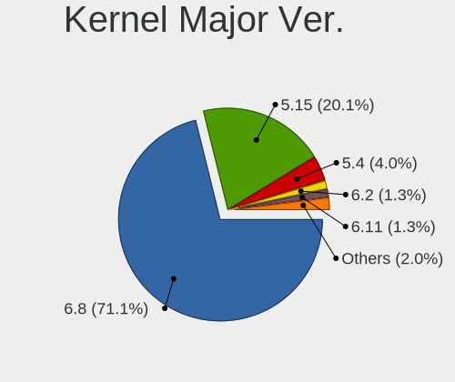
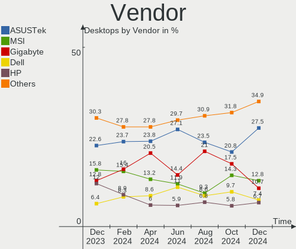
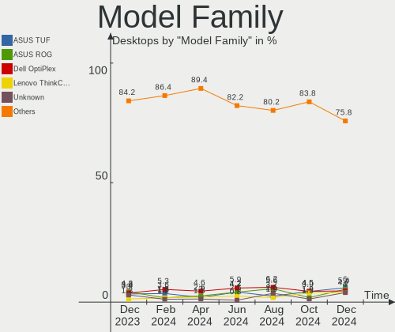
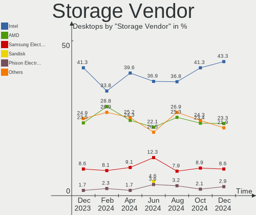
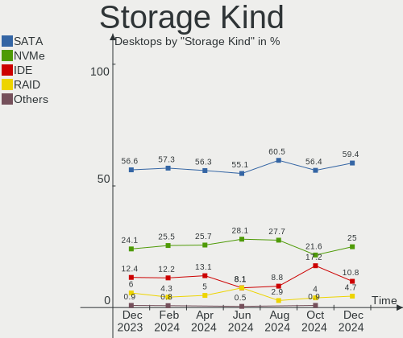
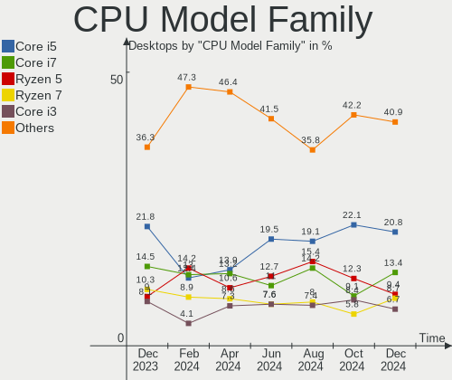
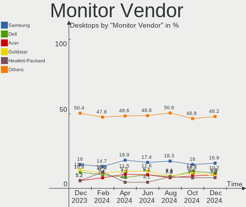
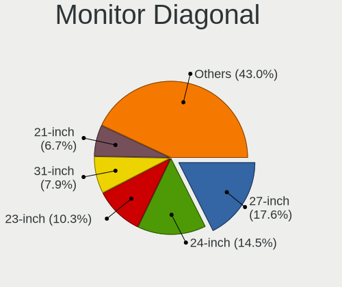

Linux Mint Hardware Trends (Desktops)
-------------------------------------

A project to identify most popular hardware characteristics and track their change
over time based on data collected by Linux Mint users at https://Linux-Hardware.org.

Anyone can contribute to this report by the [hw-probe](https://github.com/linuxhw/hw-probe) tool:

    sudo -E hw-probe -all -upload

Full-feature report is available here: https://linux-hardware.org/?view=trends

Period: Feb, 2022.

Contents
--------

* [ System ](#system)
  - [ OS                       ](#os)
  - [ OS Family                ](#os-family)
  - [ Kernel                   ](#kernel)
  - [ Kernel Family            ](#kernel-family)
  - [ Kernel Major Ver.        ](#kernel-major-ver)
  - [ Arch                     ](#arch)
  - [ DE                       ](#de)
  - [ Display Server           ](#display-server)
  - [ Display Manager          ](#display-manager)
  - [ OS Lang                  ](#os-lang)
  - [ Boot Mode                ](#boot-mode)
  - [ Filesystem               ](#filesystem)
  - [ Part. scheme             ](#part-scheme)
  - [ Dual Boot with Linux/BSD ](#dual-boot-with-linuxbsd)
  - [ Dual Boot (Win)          ](#dual-boot-win)

* [ Board ](#board)
  - [ Vendor                   ](#vendor)
  - [ Model                    ](#model)
  - [ Model Family             ](#model-family)
  - [ MFG Year                 ](#mfg-year)
  - [ Form Factor              ](#form-factor)
  - [ Secure Boot              ](#secure-boot)
  - [ Coreboot                 ](#coreboot)
  - [ RAM Size                 ](#ram-size)
  - [ RAM Used                 ](#ram-used)
  - [ Total Drives             ](#total-drives)
  - [ Has CD-ROM               ](#has-cd-rom)
  - [ Has Ethernet             ](#has-ethernet)
  - [ Has WiFi                 ](#has-wifi)
  - [ Has Bluetooth            ](#has-bluetooth)

* [ Location ](#location)
  - [ Country                  ](#country)
  - [ City                     ](#city)

* [ Drives ](#drives)
  - [ Drive Vendor             ](#drive-vendor)
  - [ Drive Model              ](#drive-model)
  - [ HDD Vendor               ](#hdd-vendor)
  - [ SSD Vendor               ](#ssd-vendor)
  - [ Drive Kind               ](#drive-kind)
  - [ Drive Connector          ](#drive-connector)
  - [ Drive Size               ](#drive-size)
  - [ Space Total              ](#space-total)
  - [ Space Used               ](#space-used)
  - [ Malfunc. Drives          ](#malfunc-drives)
  - [ Malfunc. Drive Vendor    ](#malfunc-drive-vendor)
  - [ Malfunc. HDD Vendor      ](#malfunc-hdd-vendor)
  - [ Malfunc. Drive Kind      ](#malfunc-drive-kind)
  - [ Failed Drives            ](#failed-drives)
  - [ Failed Drive Vendor      ](#failed-drive-vendor)
  - [ Drive Status             ](#drive-status)

* [ Storage controller ](#storage-controller)
  - [ Storage Vendor           ](#storage-vendor)
  - [ Storage Model            ](#storage-model)
  - [ Storage Kind             ](#storage-kind)

* [ Processor ](#processor)
  - [ CPU Vendor               ](#cpu-vendor)
  - [ CPU Model                ](#cpu-model)
  - [ CPU Model Family         ](#cpu-model-family)
  - [ CPU Cores                ](#cpu-cores)
  - [ CPU Sockets              ](#cpu-sockets)
  - [ CPU Threads              ](#cpu-threads)
  - [ CPU Op-Modes             ](#cpu-op-modes)
  - [ CPU Microcode            ](#cpu-microcode)
  - [ CPU Microarch            ](#cpu-microarch)

* [ Graphics ](#graphics)
  - [ GPU Vendor               ](#gpu-vendor)
  - [ GPU Model                ](#gpu-model)
  - [ GPU Combo                ](#gpu-combo)
  - [ GPU Driver               ](#gpu-driver)
  - [ GPU Memory               ](#gpu-memory)

* [ Monitor ](#monitor)
  - [ Monitor Vendor           ](#monitor-vendor)
  - [ Monitor Model            ](#monitor-model)
  - [ Monitor Resolution       ](#monitor-resolution)
  - [ Monitor Diagonal         ](#monitor-diagonal)
  - [ Monitor Width            ](#monitor-width)
  - [ Aspect Ratio             ](#aspect-ratio)
  - [ Monitor Area             ](#monitor-area)
  - [ Pixel Density            ](#pixel-density)
  - [ Multiple Monitors        ](#multiple-monitors)

* [ Network ](#network)
  - [ Net Controller Vendor    ](#net-controller-vendor)
  - [ Net Controller Model     ](#net-controller-model)
  - [ Wireless Vendor          ](#wireless-vendor)
  - [ Wireless Model           ](#wireless-model)
  - [ Ethernet Vendor          ](#ethernet-vendor)
  - [ Ethernet Model           ](#ethernet-model)
  - [ Net Controller Kind      ](#net-controller-kind)
  - [ Used Controller          ](#used-controller)
  - [ NICs                     ](#nics)
  - [ IPv6                     ](#ipv6)

* [ Bluetooth ](#bluetooth)
  - [ Bluetooth Vendor         ](#bluetooth-vendor)
  - [ Bluetooth Model          ](#bluetooth-model)

* [ Sound ](#sound)
  - [ Sound Vendor             ](#sound-vendor)
  - [ Sound Model              ](#sound-model)

* [ Memory ](#memory)
  - [ Memory Vendor            ](#memory-vendor)
  - [ Memory Model             ](#memory-model)
  - [ Memory Kind              ](#memory-kind)
  - [ Memory Form Factor       ](#memory-form-factor)
  - [ Memory Size              ](#memory-size)
  - [ Memory Speed             ](#memory-speed)

* [ Printers & scanners ](#printers--scanners)
  - [ Printer Vendor           ](#printer-vendor)
  - [ Printer Model            ](#printer-model)
  - [ Scanner Vendor           ](#scanner-vendor)
  - [ Scanner Model            ](#scanner-model)

* [ Camera ](#camera)
  - [ Camera Vendor            ](#camera-vendor)
  - [ Camera Model             ](#camera-model)

* [ Security ](#security)
  - [ Fingerprint Vendor       ](#fingerprint-vendor)
  - [ Fingerprint Model        ](#fingerprint-model)
  - [ Chipcard Vendor          ](#chipcard-vendor)
  - [ Chipcard Model           ](#chipcard-model)

* [ Unsupported ](#unsupported)
  - [ Unsupported Devices      ](#unsupported-devices)
  - [ Unsupported Device Types ](#unsupported-device-types)

System
------

OS
--

Installed operating systems

| Name            | Desktops | Percent |
|-----------------|----------|---------|
| Linux Mint 20.3 | 124      | 65.61%  |
| Linux Mint 20.2 | 33       | 17.46%  |
| Linux Mint 20.1 | 13       | 6.88%   |
| Linux Mint 19.3 | 9        | 4.76%   |
| Linux Mint 20   | 6        | 3.17%   |
| Linux Mint 19.1 | 2        | 1.06%   |
| Linux Mint 19.2 | 1        | 0.53%   |
| Linux Mint 19   | 1        | 0.53%   |

OS Family
---------

OS without a version

| Name       | Desktops | Percent |
|------------|----------|---------|
| Linux Mint | 189      | 100%    |

Kernel
------

Version of the Linux kernel

| Version                    | Desktops | Percent |
|----------------------------|----------|---------|
| 5.4.0-99-generic           | 50       | 26.46%  |
| 5.4.0-97-generic           | 47       | 24.87%  |
| 5.4.0-100-generic          | 45       | 23.81%  |
| 5.13.0-27-generic          | 9        | 4.76%   |
| 5.4.0-96-generic           | 6        | 3.17%   |
| 5.4.0-91-generic           | 4        | 2.12%   |
| 5.13.0-30-generic          | 3        | 1.59%   |
| 5.13.0-28-generic          | 3        | 1.59%   |
| 5.4.0-94-generic           | 2        | 1.06%   |
| 5.4.0-74-generic           | 2        | 1.06%   |
| 5.0.0-32-generic           | 2        | 1.06%   |
| 5.8.0-23-generic           | 1        | 0.53%   |
| 5.4.0-92-generic           | 1        | 0.53%   |
| 5.4.0-90-generic           | 1        | 0.53%   |
| 5.4.0-80-generic           | 1        | 0.53%   |
| 5.4.0-77-generic           | 1        | 0.53%   |
| 5.16.8-051608-generic      | 1        | 0.53%   |
| 5.16.6-051606-generic      | 1        | 0.53%   |
| 5.16.0-8.2-liquorix-amd64  | 1        | 0.53%   |
| 5.15.22-xanmod1            | 1        | 0.53%   |
| 5.15.0-16.1-liquorix-amd64 | 1        | 0.53%   |
| 5.11.0-46-generic          | 1        | 0.53%   |
| 5.11.0-27-generic          | 1        | 0.53%   |
| 4.15.0-43-generic          | 1        | 0.53%   |
| 4.15.0-169-generic         | 1        | 0.53%   |
| 4.15.0-166-generic         | 1        | 0.53%   |
| 4.15.0-163-generic         | 1        | 0.53%   |

Kernel Family
-------------

Linux kernel without a distro release

| Version | Desktops | Percent |
|---------|----------|---------|
| 5.4.0   | 160      | 84.66%  |
| 5.13.0  | 15       | 7.94%   |
| 4.15.0  | 4        | 2.12%   |
| 5.11.0  | 2        | 1.06%   |
| 5.0.0   | 2        | 1.06%   |
| 5.8.0   | 1        | 0.53%   |
| 5.16.8  | 1        | 0.53%   |
| 5.16.6  | 1        | 0.53%   |
| 5.16.0  | 1        | 0.53%   |
| 5.15.22 | 1        | 0.53%   |
| 5.15.0  | 1        | 0.53%   |

Kernel Major Ver.
-----------------

Linux kernel major version

| Version | Desktops | Percent |
|---------|----------|---------|
| 5.4     | 160      | 84.66%  |
| 5.13    | 15       | 7.94%   |
| 4.15    | 4        | 2.12%   |
| 5.16    | 3        | 1.59%   |
| 5.15    | 2        | 1.06%   |
| 5.11    | 2        | 1.06%   |
| 5.0     | 2        | 1.06%   |
| 5.8     | 1        | 0.53%   |

Arch
----

OS architecture (x86_64, i586, etc.)

| Name   | Desktops | Percent |
|--------|----------|---------|
| x86_64 | 186      | 98.41%  |
| i686   | 3        | 1.59%   |

DE
--

Desktop Environment

| Name       | Desktops | Percent |
|------------|----------|---------|
| X-Cinnamon | 135      | 71.43%  |
| XFCE       | 22       | 11.64%  |
| MATE       | 21       | 11.11%  |
| Cinnamon   | 6        | 3.17%   |
| KDE5       | 3        | 1.59%   |
| GNOME      | 1        | 0.53%   |
| Budgie     | 1        | 0.53%   |

Display Server
--------------

X11 or Wayland

| Name | Desktops | Percent |
|------|----------|---------|
| X11  | 189      | 100%    |

Display Manager
---------------

SDDM, LightDM, etc.

| Name    | Desktops | Percent |
|---------|----------|---------|
| Unknown | 106      | 56.08%  |
| LightDM | 83       | 43.92%  |

OS Lang
-------

Language

| Lang  | Desktops | Percent |
|-------|----------|---------|
| en_US | 55       | 29.1%   |
| de_DE | 38       | 20.11%  |
| pt_BR | 14       | 7.41%   |
| fr_FR | 13       | 6.88%   |
| en_AU | 10       | 5.29%   |
| nl_NL | 6        | 3.17%   |
| en_GB | 6        | 3.17%   |
| ru_RU | 5        | 2.65%   |
| en_CA | 5        | 2.65%   |
| es_ES | 4        | 2.12%   |
| cs_CZ | 4        | 2.12%   |
| pl_PL | 3        | 1.59%   |
| it_IT | 3        | 1.59%   |
| es_AR | 3        | 1.59%   |
| hu_HU | 2        | 1.06%   |
| fr_CH | 2        | 1.06%   |
| fr_BE | 2        | 1.06%   |
| C     | 2        | 1.06%   |
| zh_TW | 1        | 0.53%   |
| vi_VN | 1        | 0.53%   |
| tr_TR | 1        | 0.53%   |
| sv_SE | 1        | 0.53%   |
| sk_SK | 1        | 0.53%   |
| ru_UA | 1        | 0.53%   |
| nb_NO | 1        | 0.53%   |
| en_NZ | 1        | 0.53%   |
| en_IE | 1        | 0.53%   |
| en_HK | 1        | 0.53%   |
| de_IT | 1        | 0.53%   |
| de_AT | 1        | 0.53%   |

Boot Mode
---------

EFI or BIOS

| Mode | Desktops | Percent |
|------|----------|---------|
| BIOS | 118      | 62.43%  |
| EFI  | 71       | 37.57%  |

Filesystem
----------

Type of filesystem

| Type    | Desktops | Percent |
|---------|----------|---------|
| Ext4    | 177      | 93.65%  |
| Btrfs   | 5        | 2.65%   |
| Overlay | 2        | 1.06%   |
| Ext2    | 2        | 1.06%   |
| Zfs     | 1        | 0.53%   |
| Xfs     | 1        | 0.53%   |
| Ext3    | 1        | 0.53%   |

Part. scheme
------------

Scheme of partitioning

| Type    | Desktops | Percent |
|---------|----------|---------|
| Unknown | 120      | 63.49%  |
| GPT     | 47       | 24.87%  |
| MBR     | 22       | 11.64%  |

Dual Boot with Linux/BSD
------------------------

Hosting more than one Linux/BSD

| Dual boot | Desktops | Percent |
|-----------|----------|---------|
| No        | 169      | 89.42%  |
| Yes       | 20       | 10.58%  |

Dual Boot (Win)
---------------

Hosting Linux and Windows

| Dual boot | Desktops | Percent |
|-----------|----------|---------|
| No        | 140      | 74.07%  |
| Yes       | 49       | 25.93%  |

Board
-----

Vendor
------

Motherboard manufacturer

| Name                    | Desktops | Percent |
|-------------------------|----------|---------|
| Gigabyte Technology     | 41       | 21.69%  |
| ASUSTek Computer        | 41       | 21.69%  |
| MSI                     | 30       | 15.87%  |
| ASRock                  | 17       | 8.99%   |
| Dell                    | 13       | 6.88%   |
| Lenovo                  | 11       | 5.82%   |
| Hewlett-Packard         | 10       | 5.29%   |
| Foxconn                 | 3        | 1.59%   |
| Biostar                 | 3        | 1.59%   |
| Intel                   | 2        | 1.06%   |
| Gateway                 | 2        | 1.06%   |
| Fujitsu Siemens         | 2        | 1.06%   |
| Acer                    | 2        | 1.06%   |
| Unknown                 | 2        | 1.06%   |
| TYAN Computer           | 1        | 0.53%   |
| Shuttle                 | 1        | 0.53%   |
| Positivo                | 1        | 0.53%   |
| Pegatron                | 1        | 0.53%   |
| Packard Bell            | 1        | 0.53%   |
| MicroStar International | 1        | 0.53%   |
| Medion                  | 1        | 0.53%   |
| HC                      | 1        | 0.53%   |
| EVGA                    | 1        | 0.53%   |
| Apple                   | 1        | 0.53%   |

Model
-----

Motherboard model

| Name                                     | Desktops | Percent |
|------------------------------------------|----------|---------|
| MSI MS-7693                              | 4        | 2.12%   |
| MSI MS-7C56                              | 3        | 1.59%   |
| Gigabyte 970A-DS3P                       | 3        | 1.59%   |
| ASUS All Series                          | 3        | 1.59%   |
| MSI MS-7C91                              | 2        | 1.06%   |
| MSI MS-7C52                              | 2        | 1.06%   |
| MSI MS-7C37                              | 2        | 1.06%   |
| MSI MS-7B86                              | 2        | 1.06%   |
| HP Compaq Elite 8300 SFF                 | 2        | 1.06%   |
| ASUS PRIME B350-PLUS                     | 2        | 1.06%   |
| ASUS PRIME A320M-K                       | 2        | 1.06%   |
| Unknown                                  | 2        | 1.06%   |
| TYAN CELSIUS R630                        | 1        | 0.53%   |
| Shuttle System                           | 1        | 0.53%   |
| Positivo POS-EIBTPDC                     | 1        | 0.53%   |
| Pegatron Elite 7300 Series MT            | 1        | 0.53%   |
| Packard Bell ISTART D5535                | 1        | 0.53%   |
| MSI MS-7D25                              | 1        | 0.53%   |
| MSI MS-7C94                              | 1        | 0.53%   |
| MSI MS-7B93                              | 1        | 0.53%   |
| MSI MS-7B87                              | 1        | 0.53%   |
| MSI MS-7A71                              | 1        | 0.53%   |
| MSI MS-7A39                              | 1        | 0.53%   |
| MSI MS-7A37                              | 1        | 0.53%   |
| MSI MS-7A34                              | 1        | 0.53%   |
| MSI MS-7918                              | 1        | 0.53%   |
| MSI MS-7917                              | 1        | 0.53%   |
| MSI MS-7817                              | 1        | 0.53%   |
| MSI MS-7751                              | 1        | 0.53%   |
| MSI MS-7549                              | 1        | 0.53%   |
| MSI MS-7502                              | 1        | 0.53%   |
| MSI MS-7204                              | 1        | 0.53%   |
| MicroStar International E-2600S SB       | 1        | 0.53%   |
| Medion MS-7748                           | 1        | 0.53%   |
| Lenovo ThinkStation S30 056834G          | 1        | 0.53%   |
| Lenovo ThinkCentre M93z 10AD000CMX       | 1        | 0.53%   |
| Lenovo ThinkCentre M92p 2988D9U          | 1        | 0.53%   |
| Lenovo ThinkCentre M91p 7052A9G          | 1        | 0.53%   |
| Lenovo ThinkCentre M73 10B4S1N800        | 1        | 0.53%   |
| Lenovo ThinkCentre M58 7637AC6           | 1        | 0.53%   |
| Lenovo ThinkCentre A58 7515M6G           | 1        | 0.53%   |
| Lenovo QiTianM4500-N000 90CXCTO1WW       | 1        | 0.53%   |
| Lenovo Legion T530-28ICB 90L3003NUS      | 1        | 0.53%   |
| Lenovo H50-55 90BG0022US                 | 1        | 0.53%   |
| Lenovo 3140 SDK0J40697 WIN 3305165344369 | 1        | 0.53%   |
| Intel H55                                | 1        | 0.53%   |
| Intel D2550MUD2 AAG73892-600             | 1        | 0.53%   |
| HP Z800 Workstation                      | 1        | 0.53%   |
| HP Pavilion Desktop 590-p0xxx            | 1        | 0.53%   |
| HP OMEN 25L Desktop GT12-1xxx            | 1        | 0.53%   |
| HP Compaq Pro 6300 SFF                   | 1        | 0.53%   |
| HP Compaq dc7800 Small Form Factor       | 1        | 0.53%   |
| HP Compaq 8200 Elite SFF PC              | 1        | 0.53%   |
| HP 500-205t                              | 1        | 0.53%   |
| HP 23-m120                               | 1        | 0.53%   |
| HC HCAR357-MI                            | 1        | 0.53%   |
| Gigabyte Z87X-UD3H                       | 1        | 0.53%   |
| Gigabyte Z87X-D3H                        | 1        | 0.53%   |
| Gigabyte Z68X-UD3H-B3                    | 1        | 0.53%   |
| Gigabyte Z68X-UD3-B3                     | 1        | 0.53%   |

Model Family
------------

Motherboard model prefix

| Name                            | Desktops | Percent |
|---------------------------------|----------|---------|
| ASUS ROG                        | 7        | 3.7%    |
| Lenovo ThinkCentre              | 6        | 3.17%   |
| ASUS PRIME                      | 6        | 3.17%   |
| HP Compaq                       | 5        | 2.65%   |
| MSI MS-7693                     | 4        | 2.12%   |
| MSI MS-7C56                     | 3        | 1.59%   |
| Gigabyte 970A-DS3P              | 3        | 1.59%   |
| Dell XPS                        | 3        | 1.59%   |
| Dell OptiPlex                   | 3        | 1.59%   |
| ASUS All                        | 3        | 1.59%   |
| MSI MS-7C91                     | 2        | 1.06%   |
| MSI MS-7C52                     | 2        | 1.06%   |
| MSI MS-7C37                     | 2        | 1.06%   |
| MSI MS-7B86                     | 2        | 1.06%   |
| Dell Vostro                     | 2        | 1.06%   |
| Dell Inspiron                   | 2        | 1.06%   |
| Unknown                         | 2        | 1.06%   |
| TYAN CELSIUS                    | 1        | 0.53%   |
| Shuttle System                  | 1        | 0.53%   |
| Positivo POS-EIBTPDC            | 1        | 0.53%   |
| Pegatron Elite                  | 1        | 0.53%   |
| Packard Bell ISTART             | 1        | 0.53%   |
| MSI MS-7D25                     | 1        | 0.53%   |
| MSI MS-7C94                     | 1        | 0.53%   |
| MSI MS-7B93                     | 1        | 0.53%   |
| MSI MS-7B87                     | 1        | 0.53%   |
| MSI MS-7A71                     | 1        | 0.53%   |
| MSI MS-7A39                     | 1        | 0.53%   |
| MSI MS-7A37                     | 1        | 0.53%   |
| MSI MS-7A34                     | 1        | 0.53%   |
| MSI MS-7918                     | 1        | 0.53%   |
| MSI MS-7917                     | 1        | 0.53%   |
| MSI MS-7817                     | 1        | 0.53%   |
| MSI MS-7751                     | 1        | 0.53%   |
| MSI MS-7549                     | 1        | 0.53%   |
| MSI MS-7502                     | 1        | 0.53%   |
| MSI MS-7204                     | 1        | 0.53%   |
| MicroStar International E-2600S | 1        | 0.53%   |
| Medion MS-7748                  | 1        | 0.53%   |
| Lenovo ThinkStation             | 1        | 0.53%   |
| Lenovo QiTianM4500-N000         | 1        | 0.53%   |
| Lenovo Legion                   | 1        | 0.53%   |
| Lenovo H50-55                   | 1        | 0.53%   |
| Lenovo 3140                     | 1        | 0.53%   |
| Intel H55                       | 1        | 0.53%   |
| Intel D2550MUD2                 | 1        | 0.53%   |
| HP Z800                         | 1        | 0.53%   |
| HP Pavilion                     | 1        | 0.53%   |
| HP OMEN                         | 1        | 0.53%   |
| HP 500-205t                     | 1        | 0.53%   |
| HP 23-m120                      | 1        | 0.53%   |
| HC HCAR357-MI                   | 1        | 0.53%   |
| Gigabyte Z87X-UD3H              | 1        | 0.53%   |
| Gigabyte Z87X-D3H               | 1        | 0.53%   |
| Gigabyte Z68X-UD3H-B3           | 1        | 0.53%   |
| Gigabyte Z68X-UD3-B3            | 1        | 0.53%   |
| Gigabyte X58A-UD7               | 1        | 0.53%   |
| Gigabyte X570                   | 1        | 0.53%   |
| Gigabyte X170-Extreme           | 1        | 0.53%   |
| Gigabyte P55-UD3R               | 1        | 0.53%   |

MFG Year
--------

Motherboard manufacture year

| Year | Desktops | Percent |
|------|----------|---------|
| 2012 | 23       | 12.17%  |
| 2020 | 17       | 8.99%   |
| 2011 | 17       | 8.99%   |
| 2013 | 15       | 7.94%   |
| 2018 | 14       | 7.41%   |
| 2017 | 14       | 7.41%   |
| 2010 | 14       | 7.41%   |
| 2019 | 13       | 6.88%   |
| 2014 | 13       | 6.88%   |
| 2016 | 8        | 4.23%   |
| 2021 | 7        | 3.7%    |
| 2015 | 7        | 3.7%    |
| 2009 | 7        | 3.7%    |
| 2008 | 7        | 3.7%    |
| 2007 | 6        | 3.17%   |
| 2006 | 5        | 2.65%   |
| 2005 | 1        | 0.53%   |
| 2004 | 1        | 0.53%   |

Form Factor
-----------

Physical design of the computer

| Name    | Desktops | Percent |
|---------|----------|---------|
| Desktop | 189      | 100%    |

Secure Boot
-----------

Enabled or disabled

| State    | Desktops | Percent |
|----------|----------|---------|
| Disabled | 186      | 98.41%  |
| Enabled  | 3        | 1.59%   |

Coreboot
--------

Have coreboot on board

| Used | Desktops | Percent |
|------|----------|---------|
| No   | 189      | 100%    |

RAM Size
--------

Total RAM memory

| Size in GB  | Desktops | Percent |
|-------------|----------|---------|
| 16.01-24.0  | 48       | 25.4%   |
| 8.01-16.0   | 41       | 21.69%  |
| 3.01-4.0    | 35       | 18.52%  |
| 4.01-8.0    | 26       | 13.76%  |
| 32.01-64.0  | 22       | 11.64%  |
| 64.01-256.0 | 8        | 4.23%   |
| 1.01-2.0    | 6        | 3.17%   |
| 24.01-32.0  | 2        | 1.06%   |
| 0.51-1.0    | 1        | 0.53%   |

RAM Used
--------

Used RAM memory

| Used GB    | Desktops | Percent |
|------------|----------|---------|
| 1.01-2.0   | 73       | 38.62%  |
| 2.01-3.0   | 59       | 31.22%  |
| 3.01-4.0   | 21       | 11.11%  |
| 4.01-8.0   | 20       | 10.58%  |
| 0.51-1.0   | 8        | 4.23%   |
| 8.01-16.0  | 5        | 2.65%   |
| 24.01-32.0 | 2        | 1.06%   |
| 16.01-24.0 | 1        | 0.53%   |

Total Drives
------------

Number of drives on board

| Drives | Desktops | Percent |
|--------|----------|---------|
| 1      | 73       | 38.62%  |
| 2      | 54       | 28.57%  |
| 3      | 29       | 15.34%  |
| 4      | 21       | 11.11%  |
| 5      | 7        | 3.7%    |
| 7      | 2        | 1.06%   |
| 6      | 2        | 1.06%   |
| 8      | 1        | 0.53%   |

Has CD-ROM
----------

Has CD-ROM on board

| Presented | Desktops | Percent |
|-----------|----------|---------|
| Yes       | 112      | 59.26%  |
| No        | 77       | 40.74%  |

Has Ethernet
------------

Has Ethernet on board

| Presented | Desktops | Percent |
|-----------|----------|---------|
| Yes       | 187      | 98.94%  |
| No        | 2        | 1.06%   |

Has WiFi
--------

Has WiFi module

| Presented | Desktops | Percent |
|-----------|----------|---------|
| Yes       | 97       | 51.32%  |
| No        | 92       | 48.68%  |

Has Bluetooth
-------------

Has Bluetooth module

| Presented | Desktops | Percent |
|-----------|----------|---------|
| No        | 127      | 67.2%   |
| Yes       | 62       | 32.8%   |

Location
--------

Country
-------

Geographic location (country)

| Country     | Desktops | Percent |
|-------------|----------|---------|
| Germany     | 41       | 21.69%  |
| USA         | 39       | 20.63%  |
| France      | 15       | 7.94%   |
| Brazil      | 15       | 7.94%   |
| Australia   | 10       | 5.29%   |
| Netherlands | 9        | 4.76%   |
| Canada      | 7        | 3.7%    |
| UK          | 5        | 2.65%   |
| Russia      | 4        | 2.12%   |
| Poland      | 4        | 2.12%   |
| Argentina   | 4        | 2.12%   |
| Switzerland | 3        | 1.59%   |
| Spain       | 3        | 1.59%   |
| Czechia     | 3        | 1.59%   |
| Belgium     | 3        | 1.59%   |
| Sweden      | 2        | 1.06%   |
| Romania     | 2        | 1.06%   |
| Norway      | 2        | 1.06%   |
| Japan       | 2        | 1.06%   |
| Italy       | 2        | 1.06%   |
| Hungary     | 2        | 1.06%   |
| Austria     | 2        | 1.06%   |
| Vietnam     | 1        | 0.53%   |
| Turkey      | 1        | 0.53%   |
| Taiwan      | 1        | 0.53%   |
| Slovakia    | 1        | 0.53%   |
| New Zealand | 1        | 0.53%   |
| Ireland     | 1        | 0.53%   |
| India       | 1        | 0.53%   |
| Croatia     | 1        | 0.53%   |
| Colombia    | 1        | 0.53%   |
| China       | 1        | 0.53%   |

City
----

Geographic location (city)

| City              | Desktops | Percent |
|-------------------|----------|---------|
| Berlin            | 5        | 2.65%   |
| Munich            | 4        | 2.12%   |
| Sydney            | 3        | 1.59%   |
| Brisbane          | 3        | 1.59%   |
| Vleuten           | 2        | 1.06%   |
| São Paulo      | 2        | 1.06%   |
| Porto Alegre      | 2        | 1.06%   |
| Madrid            | 2        | 1.06%   |
| Cologne           | 2        | 1.06%   |
| Citrus Heights    | 2        | 1.06%   |
| Budapest          | 2        | 1.06%   |
| Bremen            | 2        | 1.06%   |
| Zweibrücken    | 1        | 0.53%   |
| Zurich            | 1        | 0.53%   |
| Zoetermeer        | 1        | 0.53%   |
| Zagreb            | 1        | 0.53%   |
| Yuba City         | 1        | 0.53%   |
| Yokohama          | 1        | 0.53%   |
| Yekaterinburg     | 1        | 0.53%   |
| Wroclaw           | 1        | 0.53%   |
| Wilmington        | 1        | 0.53%   |
| Westwood          | 1        | 0.53%   |
| Warsaw            | 1        | 0.53%   |
| Wałbrzych     | 1        | 0.53%   |
| Vlaardingen       | 1        | 0.53%   |
| Vitry-sur-Seine   | 1        | 0.53%   |
| Vigo              | 1        | 0.53%   |
| Vienna            | 1        | 0.53%   |
| Viarmes           | 1        | 0.53%   |
| Vancouver         | 1        | 0.53%   |
| Valasske Mezirici | 1        | 0.53%   |
| Tucson            | 1        | 0.53%   |
| Toulouges         | 1        | 0.53%   |
| Toulon            | 1        | 0.53%   |
| Toronto           | 1        | 0.53%   |
| Titusville        | 1        | 0.53%   |
| The Hague         | 1        | 0.53%   |
| Teltow            | 1        | 0.53%   |
| Taipei            | 1        | 0.53%   |
| Stuttgart         | 1        | 0.53%   |
| Sparta            | 1        | 0.53%   |
| South Yarra       | 1        | 0.53%   |
| Sorocaba          | 1        | 0.53%   |
| Soledade          | 1        | 0.53%   |
| Soest             | 1        | 0.53%   |
| Shorewood         | 1        | 0.53%   |
| Sherbrooke        | 1        | 0.53%   |
| Shenzhen          | 1        | 0.53%   |
| Senden            | 1        | 0.53%   |
| Seaforth          | 1        | 0.53%   |
| Salt Lake City    | 1        | 0.53%   |
| Salem             | 1        | 0.53%   |
| Salach            | 1        | 0.53%   |
| Romsee            | 1        | 0.53%   |
| Rome              | 1        | 0.53%   |
| Rodgau            | 1        | 0.53%   |
| Riviere-Bleue     | 1        | 0.53%   |
| Rio de Janeiro    | 1        | 0.53%   |
| Richmond          | 1        | 0.53%   |
| Repy              | 1        | 0.53%   |

Drives
------

Drive Vendor
------------

Hard drive vendors

| Vendor                | Desktops | Drives | Percent |
|-----------------------|----------|--------|---------|
| WDC                   | 79       | 107    | 22.83%  |
| Seagate               | 56       | 75     | 16.18%  |
| Samsung Electronics   | 53       | 68     | 15.32%  |
| Crucial               | 22       | 23     | 6.36%   |
| SanDisk               | 19       | 19     | 5.49%   |
| Kingston              | 17       | 17     | 4.91%   |
| Hitachi               | 14       | 14     | 4.05%   |
| Toshiba               | 8        | 9      | 2.31%   |
| A-DATA Technology     | 7        | 7      | 2.02%   |
| Intel                 | 5        | 5      | 1.45%   |
| HGST                  | 5        | 6      | 1.45%   |
| MAXTOR                | 4        | 4      | 1.16%   |
| Intenso               | 4        | 4      | 1.16%   |
| PNY                   | 3        | 3      | 0.87%   |
| Patriot               | 3        | 3      | 0.87%   |
| Netac                 | 3        | 3      | 0.87%   |
| Fujitsu               | 3        | 3      | 0.87%   |
| Unknown               | 2        | 2      | 0.58%   |
| SK Hynix              | 2        | 2      | 0.58%   |
| Silicon Motion        | 2        | 2      | 0.58%   |
| Phison                | 2        | 2      | 0.58%   |
| OCZ                   | 2        | 2      | 0.58%   |
| Lenovo                | 2        | 2      | 0.58%   |
| Gigabyte Technology   | 2        | 2      | 0.58%   |
| ExcelStor             | 2        | 2      | 0.58%   |
| Corsair               | 2        | 2      | 0.58%   |
| China                 | 2        | 2      | 0.58%   |
| Apacer                | 2        | 2      | 0.58%   |
| Unknown               | 2        | 2      | 0.58%   |
| ZOTAC                 | 1        | 1      | 0.29%   |
| USB30                 | 1        | 1      | 0.29%   |
| Transcend             | 1        | 1      | 0.29%   |
| TO Exter              | 1        | 1      | 0.29%   |
| TEXTORM               | 1        | 1      | 0.29%   |
| Team                  | 1        | 1      | 0.29%   |
| SPCC                  | 1        | 1      | 0.29%   |
| SP B75P               | 1        | 1      | 0.29%   |
| SATA3 51              | 1        | 1      | 0.29%   |
| Realtek Semiconductor | 1        | 1      | 0.29%   |
| Micron Technology     | 1        | 1      | 0.29%   |
| LITEONIT              | 1        | 1      | 0.29%   |
| GOODRAM               | 1        | 1      | 0.29%   |
| DOGFISH               | 1        | 1      | 0.29%   |
| Compaq                | 1        | 3      | 0.29%   |
| Colorful              | 1        | 1      | 0.29%   |
| Apricorn              | 1        | 1      | 0.29%   |

Drive Model
-----------

Hard drive models

| Model                            | Desktops | Percent |
|----------------------------------|----------|---------|
| Seagate ST3500418AS 500GB        | 6        | 1.5%    |
| Crucial CT240BX500SSD1 240GB     | 6        | 1.5%    |
| WDC WD40EZRZ-00GXCB0 4TB         | 5        | 1.25%   |
| Samsung SSD 860 EVO 1TB          | 5        | 1.25%   |
| Kingston SA400S37240G 240GB SSD  | 5        | 1.25%   |
| Crucial CT1000MX500SSD1 1TB      | 5        | 1.25%   |
| Seagate Expansion+ 2TB           | 4        | 1%      |
| WDC WDS500G2B0B-00YS70 500GB SSD | 3        | 0.75%   |
| WDC WDS120G2G0A-00JH30 120GB SSD | 3        | 0.75%   |
| WDC WD20EARX-00PASB0 2TB         | 3        | 0.75%   |
| WDC WD10EZEX-08WN4A0 1TB         | 3        | 0.75%   |
| Toshiba DT01ACA100 1TB           | 3        | 0.75%   |
| Seagate ST4000DM004-2CV104 4TB   | 3        | 0.75%   |
| Seagate ST2000DM008-2FR102 2TB   | 3        | 0.75%   |
| Seagate ST1000DM010-2EP102 1TB   | 3        | 0.75%   |
| Seagate ST1000DM003-1CH162 1TB   | 3        | 0.75%   |
| Sandisk NVMe SSD Drive 1TB       | 3        | 0.75%   |
| Samsung SSD 970 EVO Plus 500GB   | 3        | 0.75%   |
| Samsung SSD 860 EVO 500GB        | 3        | 0.75%   |
| Samsung SSD 850 EVO 250GB        | 3        | 0.75%   |
| Samsung SSD 840 EVO 250GB        | 3        | 0.75%   |
| Samsung HD103UJ 1TB              | 3        | 0.75%   |
| Hitachi HDS721010CLA332 1TB      | 3        | 0.75%   |
| WDC WDS500G2B0A-00SM50 500GB SSD | 2        | 0.5%    |
| WDC WD40EZRX-00SPEB0 4TB         | 2        | 0.5%    |
| WDC WD40EZAZ-00SF3B0 4TB         | 2        | 0.5%    |
| WDC WD30EZRX-00DC0B0 3TB         | 2        | 0.5%    |
| WDC WD30EZRX-00AZ6B0 3TB         | 2        | 0.5%    |
| WDC WD20EZRZ-00Z5HB0 2TB         | 2        | 0.5%    |
| WDC WD20EZRX-00D8PB0 2TB         | 2        | 0.5%    |
| Toshiba DT01ACA200 2TB           | 2        | 0.5%    |
| Seagate ST3500620AS 500GB        | 2        | 0.5%    |
| Seagate ST31000333AS 1TB         | 2        | 0.5%    |
| Seagate ST3000DM008-2DM166 3TB   | 2        | 0.5%    |
| Seagate ST2000DL003-9VT166 2TB   | 2        | 0.5%    |
| Seagate ST1000NM0033-9ZM173 1TB  | 2        | 0.5%    |
| SanDisk SSD PLUS 240GB           | 2        | 0.5%    |
| SanDisk SDSSDP064G 64GB          | 2        | 0.5%    |
| Samsung SSD 970 EVO Plus 2TB     | 2        | 0.5%    |
| Samsung SSD 850 PRO 256GB        | 2        | 0.5%    |
| Samsung SSD 840 EVO 120GB        | 2        | 0.5%    |
| Samsung NVMe SSD Drive 500GB     | 2        | 0.5%    |
| Samsung NVMe SSD Drive 250GB     | 2        | 0.5%    |
| Samsung NVMe SSD Drive 1TB       | 2        | 0.5%    |
| Samsung HD154UI 1TB              | 2        | 0.5%    |
| Patriot Burst 120GB SSD          | 2        | 0.5%    |
| Kingston SHFS37A120G 120GB SSD   | 2        | 0.5%    |
| Kingston SA400S37480G 480GB SSD  | 2        | 0.5%    |
| Kingston SA400S37120G 120GB SSD  | 2        | 0.5%    |
| Intenso SSD Sata III 128GB       | 2        | 0.5%    |
| Fujitsu MHY2120BH 120GB          | 2        | 0.5%    |
| Crucial CT500MX500SSD1 500GB     | 2        | 0.5%    |
| Unknown                          | 2        | 0.5%    |
| ZOTAC ZTSSD-S10-240G-TB 240GB    | 1        | 0.25%   |
| WDC WDS500G3XHC-00SJG0 500GB     | 1        | 0.25%   |
| WDC WDS500G2B0C-00PXH0 500GB     | 1        | 0.25%   |
| WDC WDS500G2B0A 500GB SSD        | 1        | 0.25%   |
| WDC WDS250G1B0A-00H9H0 250GB SSD | 1        | 0.25%   |
| WDC WDS240G2G0A-00JH30 240GB SSD | 1        | 0.25%   |
| WDC WDS100T2B0A 1TB SSD          | 1        | 0.25%   |

HDD Vendor
----------

Hard disk drive vendors

| Vendor              | Desktops | Drives | Percent |
|---------------------|----------|--------|---------|
| WDC                 | 65       | 86     | 37.79%  |
| Seagate             | 56       | 73     | 32.56%  |
| Samsung Electronics | 15       | 16     | 8.72%   |
| Hitachi             | 14       | 14     | 8.14%   |
| Toshiba             | 8        | 9      | 4.65%   |
| HGST                | 5        | 6      | 2.91%   |
| MAXTOR              | 4        | 4      | 2.33%   |
| Fujitsu             | 3        | 3      | 1.74%   |
| Unknown             | 1        | 1      | 0.58%   |
| ExcelStor           | 1        | 1      | 0.58%   |

SSD Vendor
----------

Solid state drive vendors

| Vendor              | Desktops | Drives | Percent |
|---------------------|----------|--------|---------|
| Samsung Electronics | 27       | 33     | 19.57%  |
| Crucial             | 19       | 20     | 13.77%  |
| SanDisk             | 16       | 16     | 11.59%  |
| WDC                 | 15       | 17     | 10.87%  |
| Kingston            | 14       | 14     | 10.14%  |
| A-DATA Technology   | 5        | 5      | 3.62%   |
| Intenso             | 4        | 4      | 2.9%    |
| PNY                 | 3        | 3      | 2.17%   |
| Patriot             | 3        | 3      | 2.17%   |
| Seagate             | 2        | 2      | 1.45%   |
| OCZ                 | 2        | 2      | 1.45%   |
| Netac               | 2        | 2      | 1.45%   |
| Lenovo              | 2        | 2      | 1.45%   |
| Intel               | 2        | 2      | 1.45%   |
| Corsair             | 2        | 2      | 1.45%   |
| China               | 2        | 2      | 1.45%   |
| Apacer              | 2        | 2      | 1.45%   |
| Unknown             | 2        | 2      | 1.45%   |
| ZOTAC               | 1        | 1      | 0.72%   |
| USB30               | 1        | 1      | 0.72%   |
| Transcend           | 1        | 1      | 0.72%   |
| TO Exter            | 1        | 1      | 0.72%   |
| TEXTORM             | 1        | 1      | 0.72%   |
| Team                | 1        | 1      | 0.72%   |
| SPCC                | 1        | 1      | 0.72%   |
| SATA3 51            | 1        | 1      | 0.72%   |
| Micron Technology   | 1        | 1      | 0.72%   |
| LITEONIT            | 1        | 1      | 0.72%   |
| GOODRAM             | 1        | 1      | 0.72%   |
| Gigabyte Technology | 1        | 1      | 0.72%   |
| DOGFISH             | 1        | 1      | 0.72%   |
| Colorful            | 1        | 1      | 0.72%   |

Drive Kind
----------

HDD or SSD

| Kind    | Desktops | Drives | Percent |
|---------|----------|--------|---------|
| HDD     | 131      | 213    | 45.02%  |
| SSD     | 115      | 147    | 39.52%  |
| NVMe    | 40       | 46     | 13.75%  |
| Unknown | 4        | 6      | 1.37%   |
| MMC     | 1        | 1      | 0.34%   |

Drive Connector
---------------

SATA, SAS, NVMe, etc.

| Type | Desktops | Drives | Percent |
|------|----------|--------|---------|
| SATA | 174      | 346    | 75.98%  |
| NVMe | 40       | 46     | 17.47%  |
| SAS  | 14       | 20     | 6.11%   |
| MMC  | 1        | 1      | 0.44%   |

Drive Size
----------

Size of hard drive

| Size in TB | Desktops | Drives | Percent |
|------------|----------|--------|---------|
| 0.01-0.5   | 135      | 193    | 50.94%  |
| 0.51-1.0   | 71       | 91     | 26.79%  |
| 1.01-2.0   | 28       | 34     | 10.57%  |
| 3.01-4.0   | 13       | 17     | 4.91%   |
| 2.01-3.0   | 11       | 13     | 4.15%   |
| 4.01-10.0  | 7        | 12     | 2.64%   |

Space Total
-----------

Amount of disk space available on the file system

| Size in GB     | Desktops | Percent |
|----------------|----------|---------|
| 101-250        | 50       | 26.46%  |
| 251-500        | 37       | 19.58%  |
| More than 3000 | 29       | 15.34%  |
| 501-1000       | 29       | 15.34%  |
| 1001-2000      | 17       | 8.99%   |
| 2001-3000      | 13       | 6.88%   |
| 51-100         | 7        | 3.7%    |
| 21-50          | 4        | 2.12%   |
| 1-20           | 3        | 1.59%   |

Space Used
----------

Amount of used disk space

| Used GB        | Desktops | Percent |
|----------------|----------|---------|
| 21-50          | 35       | 18.52%  |
| 1-20           | 35       | 18.52%  |
| 101-250        | 31       | 16.4%   |
| 51-100         | 22       | 11.64%  |
| 1001-2000      | 20       | 10.58%  |
| 251-500        | 18       | 9.52%   |
| More than 3000 | 13       | 6.88%   |
| 501-1000       | 13       | 6.88%   |
| 2001-3000      | 2        | 1.06%   |

Malfunc. Drives
---------------

Drive models with a malfunction

| Model                             | Desktops | Drives | Percent |
|-----------------------------------|----------|--------|---------|
| WDC WD6401AALS-00L3B2 640GB       | 1        | 1      | 5.56%   |
| WDC WD5002ABYS-01B1B0 500GB       | 1        | 1      | 5.56%   |
| WDC WD5000BEVT-75ZAT0 500GB       | 1        | 1      | 5.56%   |
| WDC WD5000AAKS-00A7B0 500GB       | 1        | 1      | 5.56%   |
| WDC WD10EALX-759BA1 1TB           | 1        | 1      | 5.56%   |
| WDC WD1003FBYX-01Y7B1 1TB         | 1        | 1      | 5.56%   |
| Seagate ST500DM002-1BD142 500GB   | 1        | 1      | 5.56%   |
| Seagate ST3500620AS 500GB         | 1        | 1      | 5.56%   |
| Seagate ST3500418AS 500GB         | 1        | 1      | 5.56%   |
| Seagate ST1000DM003-9YN162 1TB    | 1        | 1      | 5.56%   |
| SanDisk Ultra II 480GB SSD        | 1        | 1      | 5.56%   |
| Samsung Electronics HD160JJ 160GB | 1        | 1      | 5.56%   |
| Samsung Electronics HD154UI 1TB   | 1        | 2      | 5.56%   |
| Kingston SHFS37A120G 120GB SSD    | 1        | 1      | 5.56%   |
| Hitachi HTS723216A7A364 160GB     | 1        | 1      | 5.56%   |
| Hitachi HDS721010CLA332 1TB       | 1        | 1      | 5.56%   |
| Crucial CT525MX300SSD1 528GB      | 1        | 1      | 5.56%   |
| Crucial CT240M500SSD1 240GB       | 1        | 1      | 5.56%   |

Malfunc. Drive Vendor
---------------------

Vendors of faulty drives

| Vendor              | Desktops | Drives | Percent |
|---------------------|----------|--------|---------|
| WDC                 | 6        | 6      | 33.33%  |
| Seagate             | 4        | 4      | 22.22%  |
| Samsung Electronics | 2        | 3      | 11.11%  |
| Hitachi             | 2        | 2      | 11.11%  |
| Crucial             | 2        | 2      | 11.11%  |
| SanDisk             | 1        | 1      | 5.56%   |
| Kingston            | 1        | 1      | 5.56%   |

Malfunc. HDD Vendor
-------------------

Vendors of faulty HDD drives

| Vendor              | Desktops | Drives | Percent |
|---------------------|----------|--------|---------|
| WDC                 | 6        | 6      | 42.86%  |
| Seagate             | 4        | 4      | 28.57%  |
| Samsung Electronics | 2        | 3      | 14.29%  |
| Hitachi             | 2        | 2      | 14.29%  |

Malfunc. Drive Kind
-------------------

Kinds of faulty drives

| Kind | Desktops | Drives | Percent |
|------|----------|--------|---------|
| HDD  | 12       | 15     | 75%     |
| SSD  | 4        | 4      | 25%     |

Failed Drives
-------------

Failed drive models

Zero info for selected period =(

Failed Drive Vendor
-------------------

Failed drive vendors

Zero info for selected period =(

Drive Status
------------

Number of failed and malfunc. drives

| Status   | Desktops | Drives | Percent |
|----------|----------|--------|---------|
| Detected | 123      | 264    | 59.42%  |
| Works    | 68       | 130    | 32.85%  |
| Malfunc  | 16       | 19     | 7.73%   |

Storage controller
------------------

Storage Vendor
--------------

Storage controller vendors

| Vendor                           | Desktops | Percent |
|----------------------------------|----------|---------|
| Intel                            | 116      | 43.28%  |
| AMD                              | 69       | 25.75%  |
| Samsung Electronics              | 17       | 6.34%   |
| ASMedia Technology               | 13       | 4.85%   |
| Marvell Technology Group         | 9        | 3.36%   |
| Sandisk                          | 7        | 2.61%   |
| JMicron Technology               | 7        | 2.61%   |
| Nvidia                           | 4        | 1.49%   |
| LSI Logic / Symbios Logic        | 4        | 1.49%   |
| Silicon Motion                   | 3        | 1.12%   |
| Phison Electronics               | 3        | 1.12%   |
| Micron/Crucial Technology        | 3        | 1.12%   |
| Kingston Technology Company      | 3        | 1.12%   |
| SK Hynix                         | 2        | 0.75%   |
| Realtek Semiconductor            | 2        | 0.75%   |
| Silicon Integrated Systems [SiS] | 1        | 0.37%   |
| Silicon Image                    | 1        | 0.37%   |
| Promise Technology               | 1        | 0.37%   |
| Broadcom / LSI                   | 1        | 0.37%   |
| ADATA Technology                 | 1        | 0.37%   |
| Adaptec                          | 1        | 0.37%   |

Storage Model
-------------

Storage controller models

| Model                                                                                   | Desktops | Percent |
|-----------------------------------------------------------------------------------------|----------|---------|
| AMD FCH SATA Controller [AHCI mode]                                                     | 35       | 10.06%  |
| Intel 8 Series/C220 Series Chipset Family 6-port SATA Controller 1 [AHCI mode]          | 16       | 4.6%    |
| Intel 6 Series/C200 Series Chipset Family 6 port Desktop SATA AHCI Controller           | 16       | 4.6%    |
| AMD SB7x0/SB8x0/SB9x0 SATA Controller [AHCI mode]                                       | 14       | 4.02%   |
| Samsung NVMe SSD Controller SM981/PM981/PM983                                           | 13       | 3.74%   |
| Intel NM10/ICH7 Family SATA Controller [IDE mode]                                       | 10       | 2.87%   |
| ASMedia ASM1062 Serial ATA Controller                                                   | 10       | 2.87%   |
| AMD Starship/Matisse Chipset SATA Controller [AHCI mode]                                | 10       | 2.87%   |
| Intel 82801G (ICH7 Family) IDE Controller                                               | 9        | 2.59%   |
| AMD SB7x0/SB8x0/SB9x0 IDE Controller                                                    | 9        | 2.59%   |
| AMD 400 Series Chipset SATA Controller                                                  | 9        | 2.59%   |
| AMD FCH SATA Controller D                                                               | 8        | 2.3%    |
| Intel 7 Series/C210 Series Chipset Family 6-port SATA Controller [AHCI mode]            | 7        | 2.01%   |
| AMD 300 Series Chipset SATA Controller                                                  | 7        | 2.01%   |
| Intel Q170/Q150/B150/H170/H110/Z170/CM236 Chipset SATA Controller [AHCI Mode]           | 6        | 1.72%   |
| Intel Cannon Lake PCH SATA AHCI Controller                                              | 6        | 1.72%   |
| Intel 6 Series/C200 Series Chipset Family Desktop SATA Controller (IDE mode, ports 4-5) | 5        | 1.44%   |
| Intel 6 Series/C200 Series Chipset Family Desktop SATA Controller (IDE mode, ports 0-3) | 5        | 1.44%   |
| Sandisk WD Black SN750 / PC SN730 NVMe SSD                                              | 4        | 1.15%   |
| JMicron JMB363 SATA/IDE Controller                                                      | 4        | 1.15%   |
| Intel SATA Controller [RAID mode]                                                       | 4        | 1.15%   |
| Intel 5 Series/3400 Series Chipset 4 port SATA IDE Controller                           | 4        | 1.15%   |
| Samsung NVMe SSD Controller SM961/PM961/SM963                                           | 3        | 0.86%   |
| Nvidia MCP61 SATA Controller                                                            | 3        | 0.86%   |
| Nvidia MCP61 IDE                                                                        | 3        | 0.86%   |
| Intel 9 Series Chipset Family SATA Controller [AHCI Mode]                               | 3        | 0.86%   |
| Intel 82801JI (ICH10 Family) SATA AHCI Controller                                       | 3        | 0.86%   |
| Intel 82801JI (ICH10 Family) 4 port SATA IDE Controller #1                              | 3        | 0.86%   |
| Intel 82801JI (ICH10 Family) 2 port SATA IDE Controller #2                              | 3        | 0.86%   |
| Intel 82801IR/IO/IH (ICH9R/DO/DH) 6 port SATA Controller [AHCI mode]                    | 3        | 0.86%   |
| Intel 500 Series Chipset Family SATA AHCI Controller                                    | 3        | 0.86%   |
| Intel 5 Series/3400 Series Chipset 2 port SATA IDE Controller                           | 3        | 0.86%   |
| Intel 400 Series Chipset Family SATA AHCI Controller                                    | 3        | 0.86%   |
| Intel 200 Series PCH SATA controller [AHCI mode]                                        | 3        | 0.86%   |
| AMD SB7x0/SB8x0/SB9x0 SATA Controller [IDE mode]                                        | 3        | 0.86%   |
| AMD FCH SATA Controller [IDE mode]                                                      | 3        | 0.86%   |
| AMD FCH IDE Controller                                                                  | 3        | 0.86%   |
| Silicon Motion SM2262/SM2262EN SSD Controller                                           | 2        | 0.57%   |
| Sandisk WD Blue SN550 NVMe SSD                                                          | 2        | 0.57%   |
| Realtek RTS5763DL NVMe SSD Controller                                                   | 2        | 0.57%   |
| Micron/Crucial P1 NVMe PCIe SSD                                                         | 2        | 0.57%   |
| Marvell Group 88SE91A3 SATA-600 Controller                                              | 2        | 0.57%   |
| Marvell Group 88SE9172 SATA III 6Gb/s RAID Controller                                   | 2        | 0.57%   |
| LSI Logic / Symbios Logic MegaRAID SAS 2108 [Liberator]                                 | 2        | 0.57%   |
| JMicron JMB362 SATA Controller                                                          | 2        | 0.57%   |
| Intel NM10/ICH7 Family SATA Controller [AHCI mode]                                      | 2        | 0.57%   |
| Intel Comet Lake SATA AHCI Controller                                                   | 2        | 0.57%   |
| Intel 82Q35 Express PT IDER Controller                                                  | 2        | 0.57%   |
| Intel 7 Series/C210 Series Chipset Family 4-port SATA Controller [IDE mode]             | 2        | 0.57%   |
| Intel 7 Series/C210 Series Chipset Family 2-port SATA Controller [IDE mode]             | 2        | 0.57%   |
| Intel 6 Series/C200 Series Chipset Family IDE-r Controller                              | 2        | 0.57%   |
| ASMedia ASM1061 SATA IDE Controller                                                     | 2        | 0.57%   |
| AMD X370 Series Chipset SATA Controller                                                 | 2        | 0.57%   |
| SK Hynix PC300 NVMe Solid State Drive 512GB                                             | 1        | 0.29%   |
| SK Hynix Gold P31 SSD                                                                   | 1        | 0.29%   |
| Silicon Motion SM2263EN/SM2263XT SSD Controller                                         | 1        | 0.29%   |
| Silicon Integrated Systems [SiS] SATA Controller / IDE mode                             | 1        | 0.29%   |
| Silicon Integrated Systems [SiS] 5513 IDE Controller                                    | 1        | 0.29%   |
| Silicon Image SiI 3512 [SATALink/SATARaid] Serial ATA Controller                        | 1        | 0.29%   |
| Sandisk WD Black 2018/SN750 / PC SN720 NVMe SSD                                         | 1        | 0.29%   |

Storage Kind
------------

Kind of storage controller (IDE, SATA, NVMe, SAS, ...)

| Kind | Desktops | Percent |
|------|----------|---------|
| SATA | 149      | 56.23%  |
| IDE  | 60       | 22.64%  |
| NVMe | 40       | 15.09%  |
| RAID | 12       | 4.53%   |
| SAS  | 2        | 0.75%   |
| SCSI | 2        | 0.75%   |

Processor
---------

CPU Vendor
----------

Processor vendors

| Vendor | Desktops | Percent |
|--------|----------|---------|
| Intel  | 118      | 62.43%  |
| AMD    | 71       | 37.57%  |

CPU Model
---------

Processor models

| Model                                          | Desktops | Percent |
|------------------------------------------------|----------|---------|
| AMD Ryzen 5 3600 6-Core Processor              | 6        | 3.17%   |
| Intel Core i7-2600 CPU @ 3.40GHz               | 4        | 2.12%   |
| AMD Ryzen 7 5700G with Radeon Graphics         | 4        | 2.12%   |
| Intel Core i7-6700 CPU @ 3.40GHz               | 3        | 1.59%   |
| Intel Core i7-4770K CPU @ 3.50GHz              | 3        | 1.59%   |
| Intel Core i5-3470 CPU @ 3.20GHz               | 3        | 1.59%   |
| Intel Core i5-2500K CPU @ 3.30GHz              | 3        | 1.59%   |
| Intel Core i5-2400 CPU @ 3.10GHz               | 3        | 1.59%   |
| AMD Ryzen 7 5800X 8-Core Processor             | 3        | 1.59%   |
| AMD Ryzen 7 1700 Eight-Core Processor          | 3        | 1.59%   |
| AMD FX-8300 Eight-Core Processor               | 3        | 1.59%   |
| AMD FX-6300 Six-Core Processor                 | 3        | 1.59%   |
| Intel Pentium Dual-Core CPU E5400 @ 2.70GHz    | 2        | 1.06%   |
| Intel Pentium Dual-Core CPU E5300 @ 2.60GHz    | 2        | 1.06%   |
| Intel Pentium CPU G4560 @ 3.50GHz              | 2        | 1.06%   |
| Intel Core i7-3770 CPU @ 3.40GHz               | 2        | 1.06%   |
| Intel Core i5-9400F CPU @ 2.90GHz              | 2        | 1.06%   |
| Intel Core i5-4670 CPU @ 3.40GHz               | 2        | 1.06%   |
| Intel Core i5-4590 CPU @ 3.30GHz               | 2        | 1.06%   |
| Intel Core i5-4460 CPU @ 3.20GHz               | 2        | 1.06%   |
| Intel Core i5-3570 CPU @ 3.40GHz               | 2        | 1.06%   |
| Intel Core i5-10400 CPU @ 2.90GHz              | 2        | 1.06%   |
| Intel Core i5 CPU 650 @ 3.20GHz                | 2        | 1.06%   |
| Intel Core 2 Duo CPU E8500 @ 3.16GHz           | 2        | 1.06%   |
| Intel Core 2 Duo CPU E8400 @ 3.00GHz           | 2        | 1.06%   |
| AMD Ryzen 7 3700X 8-Core Processor             | 2        | 1.06%   |
| AMD Ryzen 5 5600X 6-Core Processor             | 2        | 1.06%   |
| AMD Ryzen 5 1600X Six-Core Processor           | 2        | 1.06%   |
| AMD Ryzen 5 1600 Six-Core Processor            | 2        | 1.06%   |
| AMD Ryzen 3 2200G with Radeon Vega Graphics    | 2        | 1.06%   |
| AMD Phenom II X6 1055T Processor               | 2        | 1.06%   |
| AMD Phenom II X4 955 Processor                 | 2        | 1.06%   |
| AMD FX-8350 Eight-Core Processor               | 2        | 1.06%   |
| AMD FX-8320 Eight-Core Processor               | 2        | 1.06%   |
| AMD A10-9700 RADEON R7, 10 COMPUTE CORES 4C+6G | 2        | 1.06%   |
| Intel Xeon CPU X5690 @ 3.47GHz                 | 1        | 0.53%   |
| Intel Xeon CPU E5530 @ 2.40GHz                 | 1        | 0.53%   |
| Intel Xeon CPU E5-1620 0 @ 3.60GHz             | 1        | 0.53%   |
| Intel Xeon CPU E3-1245 v5 @ 3.50GHz            | 1        | 0.53%   |
| Intel Xeon CPU 3.40GHz                         | 1        | 0.53%   |
| Intel Pentium Gold G5400 CPU @ 3.70GHz         | 1        | 0.53%   |
| Intel Pentium Dual CPU E2140 @ 1.60GHz         | 1        | 0.53%   |
| Intel Pentium D CPU 3.40GHz                    | 1        | 0.53%   |
| Intel Pentium D CPU 3.00GHz                    | 1        | 0.53%   |
| Intel Pentium D CPU 2.80GHz                    | 1        | 0.53%   |
| Intel Pentium CPU G860 @ 3.00GHz               | 1        | 0.53%   |
| Intel Pentium CPU G4400 @ 3.30GHz              | 1        | 0.53%   |
| Intel Pentium CPU G3430 @ 3.30GHz              | 1        | 0.53%   |
| Intel Pentium CPU G3240 @ 3.10GHz              | 1        | 0.53%   |
| Intel Pentium CPU G2120 @ 3.10GHz              | 1        | 0.53%   |
| Intel Pentium 4 CPU 3.40GHz                    | 1        | 0.53%   |
| Intel Pentium 4 CPU 3.00GHz                    | 1        | 0.53%   |
| Intel Genuine CPU 2140 @ 1.60GHz               | 1        | 0.53%   |
| Intel Core i9-9900K CPU @ 3.60GHz              | 1        | 0.53%   |
| Intel Core i9-7900X CPU @ 3.30GHz              | 1        | 0.53%   |
| Intel Core i7-9700 CPU @ 3.00GHz               | 1        | 0.53%   |
| Intel Core i7-7700K CPU @ 4.20GHz              | 1        | 0.53%   |
| Intel Core i7-4790K CPU @ 4.00GHz              | 1        | 0.53%   |
| Intel Core i7-4790 CPU @ 3.60GHz               | 1        | 0.53%   |
| Intel Core i7-3770S CPU @ 3.10GHz              | 1        | 0.53%   |

CPU Model Family
----------------

Processor model prefix

| Model                   | Desktops | Percent |
|-------------------------|----------|---------|
| Intel Core i5           | 38       | 20.11%  |
| Intel Core i7           | 23       | 12.17%  |
| AMD Ryzen 5             | 18       | 9.52%   |
| AMD Ryzen 7             | 14       | 7.41%   |
| AMD FX                  | 13       | 6.88%   |
| Intel Core i3           | 9        | 4.76%   |
| Intel Core 2 Duo        | 8        | 4.23%   |
| Intel Pentium           | 7        | 3.7%    |
| Intel Xeon              | 5        | 2.65%   |
| Intel Celeron           | 5        | 2.65%   |
| AMD Ryzen 3             | 5        | 2.65%   |
| Intel Pentium Dual-Core | 4        | 2.12%   |
| Intel Core 2 Quad       | 4        | 2.12%   |
| AMD A8                  | 4        | 2.12%   |
| Other                   | 3        | 1.59%   |
| Intel Pentium D         | 3        | 1.59%   |
| AMD Ryzen 9             | 3        | 1.59%   |
| AMD Athlon II X4        | 3        | 1.59%   |
| AMD A4                  | 3        | 1.59%   |
| Intel Pentium 4         | 2        | 1.06%   |
| Intel Core i9           | 2        | 1.06%   |
| AMD Phenom II X6        | 2        | 1.06%   |
| AMD Phenom II X4        | 2        | 1.06%   |
| AMD A10                 | 2        | 1.06%   |
| Intel Pentium Gold      | 1        | 0.53%   |
| Intel Pentium Dual      | 1        | 0.53%   |
| Intel Genuine           | 1        | 0.53%   |
| Intel Core 2            | 1        | 0.53%   |
| Intel Atom              | 1        | 0.53%   |
| AMD Phenom              | 1        | 0.53%   |
| AMD A6                  | 1        | 0.53%   |

CPU Cores
---------

Number of processor cores

| Number | Desktops | Percent |
|--------|----------|---------|
| 4      | 84       | 44.44%  |
| 2      | 46       | 24.34%  |
| 6      | 26       | 13.76%  |
| 8      | 18       | 9.52%   |
| 1      | 5        | 2.65%   |
| 3      | 4        | 2.12%   |
| 12     | 3        | 1.59%   |
| 10     | 2        | 1.06%   |
| 16     | 1        | 0.53%   |

CPU Sockets
-----------

Number of sockets

| Number | Desktops | Percent |
|--------|----------|---------|
| 1      | 187      | 98.94%  |
| 2      | 2        | 1.06%   |

CPU Threads
-----------

Threads per core (Hyper-Threading)

| Number | Desktops | Percent |
|--------|----------|---------|
| 2      | 103      | 54.5%   |
| 1      | 86       | 45.5%   |

CPU Op-Modes
------------

CPU Operation Modes (32-bit, 64-bit)

| Op mode        | Desktops | Percent |
|----------------|----------|---------|
| 32-bit, 64-bit | 188      | 99.47%  |
| 32-bit         | 1        | 0.53%   |

CPU Microcode
-------------

Microcode number

| Number     | Desktops | Percent |
|------------|----------|---------|
| 0x306c3    | 20       | 10.58%  |
| Unknown    | 19       | 10.05%  |
| 0x206a7    | 15       | 7.94%   |
| 0x306a9    | 11       | 5.82%   |
| 0x1067a    | 9        | 4.76%   |
| 0x08701021 | 8        | 4.23%   |
| 0x06000852 | 7        | 3.7%    |
| 0x08001138 | 6        | 3.17%   |
| 0x906ea    | 4        | 2.12%   |
| 0x906e9    | 4        | 2.12%   |
| 0x506e3    | 4        | 2.12%   |
| 0x10676    | 4        | 2.12%   |
| 0x0a201016 | 4        | 2.12%   |
| 0x010000c8 | 4        | 2.12%   |
| 0xa0655    | 3        | 1.59%   |
| 0x906ed    | 3        | 1.59%   |
| 0x0a50000c | 3        | 1.59%   |
| 0x0600611a | 3        | 1.59%   |
| 0x0600063e | 3        | 1.59%   |
| 0x03000027 | 3        | 1.59%   |
| 0xa0671    | 2        | 1.06%   |
| 0xa0653    | 2        | 1.06%   |
| 0x6fb      | 2        | 1.06%   |
| 0x206c2    | 2        | 1.06%   |
| 0x106e5    | 2        | 1.06%   |
| 0x106a5    | 2        | 1.06%   |
| 0x10677    | 2        | 1.06%   |
| 0x0a201009 | 2        | 1.06%   |
| 0x08701013 | 2        | 1.06%   |
| 0x0810100b | 2        | 1.06%   |
| 0x0800820d | 2        | 1.06%   |
| 0x06001119 | 2        | 1.06%   |
| 0x010000dc | 2        | 1.06%   |
| 0xf62      | 1        | 0.53%   |
| 0xf4a      | 1        | 0.53%   |
| 0xf49      | 1        | 0.53%   |
| 0xf47      | 1        | 0.53%   |
| 0xf44      | 1        | 0.53%   |
| 0xf34      | 1        | 0.53%   |
| 0x90672    | 1        | 0.53%   |
| 0x706a1    | 1        | 0.53%   |
| 0x6fd      | 1        | 0.53%   |
| 0x6f6      | 1        | 0.53%   |
| 0x6f2      | 1        | 0.53%   |
| 0x506c9    | 1        | 0.53%   |
| 0x50654    | 1        | 0.53%   |
| 0x30678    | 1        | 0.53%   |
| 0x30661    | 1        | 0.53%   |
| 0x206d7    | 1        | 0.53%   |
| 0x20655    | 1        | 0.53%   |
| 0x20652    | 1        | 0.53%   |
| 0x0a50000b | 1        | 0.53%   |
| 0x0a201003 | 1        | 0.53%   |
| 0x08108109 | 1        | 0.53%   |
| 0x08101016 | 1        | 0.53%   |
| 0x08001137 | 1        | 0.53%   |
| 0x06003106 | 1        | 0.53%   |
| 0x010000db | 1        | 0.53%   |
| 0x010000c9 | 1        | 0.53%   |

CPU Microarch
-------------

Microarchitecture

| Name             | Desktops | Percent |
|------------------|----------|---------|
| Haswell          | 21       | 11.11%  |
| SandyBridge      | 18       | 9.52%   |
| Penryn           | 15       | 7.94%   |
| Zen              | 13       | 6.88%   |
| Piledriver       | 13       | 6.88%   |
| IvyBridge        | 13       | 6.88%   |
| Zen 3            | 12       | 6.35%   |
| Zen 2            | 11       | 5.82%   |
| KabyLake         | 11       | 5.82%   |
| K10              | 8        | 4.23%   |
| Skylake          | 7        | 3.7%    |
| NetBurst         | 6        | 3.17%   |
| CometLake        | 6        | 3.17%   |
| Westmere         | 5        | 2.65%   |
| Core             | 5        | 2.65%   |
| Zen+             | 4        | 2.12%   |
| Nehalem          | 4        | 2.12%   |
| K10 Llano        | 3        | 1.59%   |
| Excavator        | 3        | 1.59%   |
| Bulldozer        | 3        | 1.59%   |
| Unknown          | 2        | 1.06%   |
| Steamroller      | 1        | 0.53%   |
| Silvermont       | 1        | 0.53%   |
| Goldmont plus    | 1        | 0.53%   |
| Goldmont         | 1        | 0.53%   |
| Bonnell          | 1        | 0.53%   |
| Alderlake Hybrid | 1        | 0.53%   |

Graphics
--------

GPU Vendor
----------

Vendors of graphics cards

| Vendor                           | Desktops | Percent |
|----------------------------------|----------|---------|
| Nvidia                           | 78       | 38.61%  |
| AMD                              | 64       | 31.68%  |
| Intel                            | 59       | 29.21%  |
| Silicon Integrated Systems [SiS] | 1        | 0.5%    |

GPU Model
---------

Graphics card models

| Model                                                                       | Desktops | Percent |
|-----------------------------------------------------------------------------|----------|---------|
| Nvidia GK208B [GeForce GT 710]                                              | 8        | 3.96%   |
| Nvidia GP108 [GeForce GT 1030]                                              | 7        | 3.47%   |
| Intel Xeon E3-1200 v2/3rd Gen Core processor Graphics Controller            | 7        | 3.47%   |
| Intel Xeon E3-1200 v3/4th Gen Core Processor Integrated Graphics Controller | 6        | 2.97%   |
| AMD Ellesmere [Radeon RX 470/480/570/570X/580/580X/590]                     | 6        | 2.97%   |
| Intel IvyBridge GT2 [HD Graphics 4000]                                      | 5        | 2.48%   |
| Intel 4 Series Chipset Integrated Graphics Controller                       | 5        | 2.48%   |
| Intel 2nd Generation Core Processor Family Integrated Graphics Controller   | 5        | 2.48%   |
| Intel CometLake-S GT2 [UHD Graphics 630]                                    | 4        | 1.98%   |
| AMD Cezanne                                                                 | 4        | 1.98%   |
| Nvidia TU117 [GeForce GTX 1650]                                             | 3        | 1.49%   |
| Nvidia TU116 [GeForce GTX 1660 Ti]                                          | 3        | 1.49%   |
| Nvidia TU116 [GeForce GTX 1660 SUPER]                                       | 3        | 1.49%   |
| Nvidia TU104 [GeForce RTX 2070 SUPER]                                       | 3        | 1.49%   |
| Nvidia GT218 [GeForce 210]                                                  | 3        | 1.49%   |
| Nvidia GK208B [GeForce GT 730]                                              | 3        | 1.49%   |
| Intel CoffeeLake-S GT2 [UHD Graphics 630]                                   | 3        | 1.49%   |
| Intel 82G33/G31 Express Integrated Graphics Controller                      | 3        | 1.49%   |
| Intel 4th Generation Core Processor Family Integrated Graphics Controller   | 3        | 1.49%   |
| AMD Cape Verde XT [Radeon HD 7770/8760 / R7 250X]                           | 3        | 1.49%   |
| AMD Caicos [Radeon HD 6450/7450/8450 / R5 230 OEM]                          | 3        | 1.49%   |
| AMD Baffin [Radeon RX 460/560D / Pro 450/455/460/555/555X/560/560X]         | 3        | 1.49%   |
| Nvidia GP107 [GeForce GTX 1050]                                             | 2        | 0.99%   |
| Nvidia GP107 [GeForce GTX 1050 Ti]                                          | 2        | 0.99%   |
| Nvidia GP106 [GeForce GTX 1060 6GB]                                         | 2        | 0.99%   |
| Nvidia GP106 [GeForce GTX 1060 3GB]                                         | 2        | 0.99%   |
| Nvidia GM107 [GeForce GTX 750 Ti]                                           | 2        | 0.99%   |
| Nvidia GA104 [GeForce RTX 3060 Ti Lite Hash Rate]                           | 2        | 0.99%   |
| Intel HD Graphics 610                                                       | 2        | 0.99%   |
| Intel HD Graphics 530                                                       | 2        | 0.99%   |
| Intel 82Q35 Express Integrated Graphics Controller                          | 2        | 0.99%   |
| Intel 82945G/GZ Integrated Graphics Controller                              | 2        | 0.99%   |
| AMD Wani [Radeon R5/R6/R7 Graphics]                                         | 2        | 0.99%   |
| AMD Turks PRO [Radeon HD 6570/7570/8550 / R5 230]                           | 2        | 0.99%   |
| AMD Tobago PRO [Radeon R7 360 / R9 360 OEM]                                 | 2        | 0.99%   |
| AMD Sumo [Radeon HD 6550D]                                                  | 2        | 0.99%   |
| AMD Raven Ridge [Radeon Vega Series / Radeon Vega Mobile Series]            | 2        | 0.99%   |
| AMD Pitcairn XT [Radeon HD 7870 GHz Edition]                                | 2        | 0.99%   |
| AMD Oland [Radeon HD 8570 / R5 430 OEM / R7 240/340 / Radeon 520 OEM]       | 2        | 0.99%   |
| AMD Navi 10 [Radeon RX 5600 OEM/5600 XT / 5700/5700 XT]                     | 2        | 0.99%   |
| AMD Cedar [Radeon HD 5000/6000/7350/8350 Series]                            | 2        | 0.99%   |
| AMD Caicos XTX [Radeon HD 8490 / R5 235X OEM]                               | 2        | 0.99%   |
| AMD Bonaire XTX [Radeon R7 260X/360]                                        | 2        | 0.99%   |
| Silicon Integrated Systems [SiS] 771/671 PCIE VGA Display Adapter           | 1        | 0.5%    |
| Nvidia TU106 [GeForce RTX 2060 Rev. A]                                      | 1        | 0.5%    |
| Nvidia TU104 [GeForce RTX 2060]                                             | 1        | 0.5%    |
| Nvidia NV43 [GeForce 6700 XL]                                               | 1        | 0.5%    |
| Nvidia NV43 [GeForce 6600]                                                  | 1        | 0.5%    |
| Nvidia NV41 [GeForce 6800 GS]                                               | 1        | 0.5%    |
| Nvidia GT218 [NVS 300]                                                      | 1        | 0.5%    |
| Nvidia GP104 [GeForce GTX 1080]                                             | 1        | 0.5%    |
| Nvidia GP104 [GeForce GTX 1070]                                             | 1        | 0.5%    |
| Nvidia GP102 [GeForce GTX 1080 Ti]                                          | 1        | 0.5%    |
| Nvidia GM204 [GeForce GTX 970]                                              | 1        | 0.5%    |
| Nvidia GK208M [GeForce GT 730M]                                             | 1        | 0.5%    |
| Nvidia GK208B [GeForce GT 720]                                              | 1        | 0.5%    |
| Nvidia GK107 [GeForce GTX 650]                                              | 1        | 0.5%    |
| Nvidia GK107 [GeForce GT 640]                                               | 1        | 0.5%    |
| Nvidia GF119 [GeForce GT 610]                                               | 1        | 0.5%    |
| Nvidia GF116 [GeForce GTS 450 Rev. 2]                                       | 1        | 0.5%    |

GPU Combo
---------

Combinations of graphics cards

| Name           | Desktops | Percent |
|----------------|----------|---------|
| 1 x Nvidia     | 73       | 38.62%  |
| 1 x AMD        | 60       | 31.75%  |
| 1 x Intel      | 47       | 24.87%  |
| Intel + Nvidia | 4        | 2.12%   |
| Intel + AMD    | 3        | 1.59%   |
| 1 x SiS        | 1        | 0.53%   |
| AMD + Nvidia   | 1        | 0.53%   |

GPU Driver
----------

Free vs proprietary

| Driver      | Desktops | Percent |
|-------------|----------|---------|
| Free        | 123      | 65.08%  |
| Proprietary | 57       | 30.16%  |
| Unknown     | 9        | 4.76%   |

GPU Memory
----------

Total video memory

| Size in GB | Desktops | Percent |
|------------|----------|---------|
| Unknown    | 67       | 35.45%  |
| 1.01-2.0   | 32       | 16.93%  |
| 0.51-1.0   | 29       | 15.34%  |
| 0.01-0.5   | 23       | 12.17%  |
| 7.01-8.0   | 12       | 6.35%   |
| 3.01-4.0   | 12       | 6.35%   |
| 5.01-6.0   | 8        | 4.23%   |
| 2.01-3.0   | 5        | 2.65%   |
| 8.01-16.0  | 1        | 0.53%   |

Monitor
-------

Monitor Vendor
--------------

Monitor vendors

| Vendor               | Desktops | Percent |
|----------------------|----------|---------|
| Samsung Electronics  | 21       | 11.29%  |
| Goldstar             | 18       | 9.68%   |
| Acer                 | 18       | 9.68%   |
| Dell                 | 14       | 7.53%   |
| Hewlett-Packard      | 11       | 5.91%   |
| BenQ                 | 11       | 5.91%   |
| Ancor Communications | 10       | 5.38%   |
| AOC                  | 8        | 4.3%    |
| Philips              | 7        | 3.76%   |
| Unknown              | 6        | 3.23%   |
| Iiyama               | 5        | 2.69%   |
| ASUSTek Computer     | 5        | 2.69%   |
| Sony                 | 4        | 2.15%   |
| LG Electronics       | 4        | 2.15%   |
| Fujitsu Siemens      | 4        | 2.15%   |
| ViewSonic            | 3        | 1.61%   |
| Medion               | 3        | 1.61%   |
| Lenovo               | 3        | 1.61%   |
| Idek Iiyama          | 3        | 1.61%   |
| Hitachi              | 3        | 1.61%   |
| Eizo                 | 3        | 1.61%   |
| Sceptre Tech         | 2        | 1.08%   |
| NEC Computers        | 2        | 1.08%   |
| MSI                  | 2        | 1.08%   |
| Vizio                | 1        | 0.54%   |
| Vestel Elektronik    | 1        | 0.54%   |
| Unknown (XXX)        | 1        | 0.54%   |
| TVT                  | 1        | 0.54%   |
| Toshiba              | 1        | 0.54%   |
| Panasonic            | 1        | 0.54%   |
| Packard Bell         | 1        | 0.54%   |
| Microstep            | 1        | 0.54%   |
| Impression           | 1        | 0.54%   |
| HUAWEI               | 1        | 0.54%   |
| HannStar Display     | 1        | 0.54%   |
| HannStar             | 1        | 0.54%   |
| Grundig              | 1        | 0.54%   |
| COZ                  | 1        | 0.54%   |
| AUS                  | 1        | 0.54%   |
| Unknown              | 1        | 0.54%   |

Monitor Model
-------------

Monitor models

| Model                                                                  | Desktops | Percent |
|------------------------------------------------------------------------|----------|---------|
| BenQ GW2280 BNQ78E8 1920x1080 476x268mm 21.5-inch                      | 3        | 1.49%   |
| Dell U2412M DELA07A 1920x1200 518x324mm 24.1-inch                      | 2        | 1%      |
| Vizio VA19L HDTV10T VIZ0019 1360x768 410x230mm 18.5-inch               | 1        | 0.5%    |
| ViewSonic VA2246 SERIES VSC6F2E 1920x1080 477x268mm 21.5-inch          | 1        | 0.5%    |
| ViewSonic VA1916wSERIES VSCF91F 1440x900 410x256mm 19.0-inch           | 1        | 0.5%    |
| ViewSonic LCD Monitor VX3276-FHD 1920x1080                             | 1        | 0.5%    |
| Vestel Elektronik 50UHD_LCD_TV VES3700 3840x2160 1100x620mm 49.7-inch  | 1        | 0.5%    |
| Unknown LCD Monitor Toshiba PA3552                                     | 1        | 0.5%    |
| Unknown LCD Monitor SAMSUNG 3840x2160                                  | 1        | 0.5%    |
| Unknown LCD Monitor SAMSUNG 3200x1080                                  | 1        | 0.5%    |
| Unknown LCD Monitor SAMSUNG 1920x1080                                  | 1        | 0.5%    |
| Unknown LCD Monitor SAMSUNG 1366x768                                   | 1        | 0.5%    |
| Unknown LCD Monitor MARANTZ JAPAN, INC. marantz-AVR 1920x1080          | 1        | 0.5%    |
| Unknown (XXX) Beyond TV XXX2851 3840x2160 1209x680mm 54.6-inch         | 1        | 0.5%    |
| TVT T910 TVT005E 1280x1024 376x301mm 19.0-inch                         | 1        | 0.5%    |
| Toshiba TV TSB0206 1920x1080 886x498mm 40.0-inch                       | 1        | 0.5%    |
| Sony TV SNYC901 1920x1080                                              | 1        | 0.5%    |
| Sony TV SNYAA01 1360x768                                               | 1        | 0.5%    |
| Sony TV SNY8E03 1920x1080                                              | 1        | 0.5%    |
| Sony TV SNY4B03 1920x1080 1107x623mm 50.0-inch                         | 1        | 0.5%    |
| Sceptre Tech X325BV-FMQR SPT0CB8 1920x1080 700x390mm 31.5-inch         | 1        | 0.5%    |
| Sceptre Tech Sceptre T24 SPT09AB 1920x1080 520x320mm 24.0-inch         | 1        | 0.5%    |
| Sceptre Tech Sceptre H24 SPT09B4 1920x1080 575x323mm 26.0-inch         | 1        | 0.5%    |
| Samsung Electronics T22C310 SAM0AE9 1920x1080 477x268mm 21.5-inch      | 1        | 0.5%    |
| Samsung Electronics SyncMaster SAM0650 1920x1080                       | 1        | 0.5%    |
| Samsung Electronics SyncMaster SAM0608 1920x1080 510x290mm 23.1-inch   | 1        | 0.5%    |
| Samsung Electronics SyncMaster SAM0599 1600x900 443x249mm 20.0-inch    | 1        | 0.5%    |
| Samsung Electronics SyncMaster SAM0598 1360x768 410x230mm 18.5-inch    | 1        | 0.5%    |
| Samsung Electronics SyncMaster SAM049B 1920x1080 477x268mm 21.5-inch   | 1        | 0.5%    |
| Samsung Electronics SyncMaster SAM02F3 1680x1050 474x296mm 22.0-inch   | 1        | 0.5%    |
| Samsung Electronics SyncMaster SAM01DE 1280x1024 376x301mm 19.0-inch   | 1        | 0.5%    |
| Samsung Electronics SMBX2231 SAM076D 1920x1080 477x268mm 21.5-inch     | 1        | 0.5%    |
| Samsung Electronics S27F350 SAM0D22 1920x1080 598x336mm 27.0-inch      | 1        | 0.5%    |
| Samsung Electronics S27B350 SAM08DC 1920x1080 598x336mm 27.0-inch      | 1        | 0.5%    |
| Samsung Electronics S24D300 SAM0B42 1920x1080 531x299mm 24.0-inch      | 1        | 0.5%    |
| Samsung Electronics S22D300 SAM0B3F 1920x1080 477x268mm 21.5-inch      | 1        | 0.5%    |
| Samsung Electronics S22D300 SAM0B3E 1920x1080 477x268mm 21.5-inch      | 1        | 0.5%    |
| Samsung Electronics S22C300 SAM0A1D 1920x1080 480x270mm 21.7-inch      | 1        | 0.5%    |
| Samsung Electronics S22B310 SAM0915 1920x1080 477x268mm 21.5-inch      | 1        | 0.5%    |
| Samsung Electronics LU28R55 SAM1016 3840x2160 632x360mm 28.6-inch      | 1        | 0.5%    |
| Samsung Electronics LCD Monitor SAM0F0E 3840x2160 1420x800mm 64.2-inch | 1        | 0.5%    |
| Samsung Electronics LCD Monitor SAM0900 1366x768 410x230mm 18.5-inch   | 1        | 0.5%    |
| Samsung Electronics C32F391 SAM0D35 1920x1080 698x393mm 31.5-inch      | 1        | 0.5%    |
| Samsung Electronics C32F391 SAM0D34 1920x1080 700x390mm 31.5-inch      | 1        | 0.5%    |
| Samsung Electronics C27F390 SAM0D32 1920x1080 598x336mm 27.0-inch      | 1        | 0.5%    |
| Philips PHL 273V5 PHLC0D2 1920x1080 600x340mm 27.2-inch                | 1        | 0.5%    |
| Philips PHL 247E6 PHLC0E7 1920x1080 521x293mm 23.5-inch                | 1        | 0.5%    |
| Philips LCD Monitor PHL BDM3270 2560x1440                              | 1        | 0.5%    |
| Philips LCD Monitor FTV 1920x1080                                      | 1        | 0.5%    |
| Philips LCD Monitor 190B 2560x1024                                     | 1        | 0.5%    |
| Philips LCD Monitor 190B                                               | 1        | 0.5%    |
| Philips 273PLPH PHL08A8 1920x1080 598x336mm 27.0-inch                  | 1        | 0.5%    |
| Philips 196V4 PHLC0AF 1366x768 410x230mm 18.5-inch                     | 1        | 0.5%    |
| Panasonic TV MEIC329 1920x1080 698x392mm 31.5-inch                     | 1        | 0.5%    |
| Packard Bell Viseo 200Ws PKB00C2 1600x900 442x249mm 20.0-inch          | 1        | 0.5%    |
| NEC Computers LCD Monitor EA192M 1280x1024                             | 1        | 0.5%    |
| NEC Computers EA244WMi NEC68D7 1920x1200 520x320mm 24.0-inch           | 1        | 0.5%    |
| MSI Optix G24C MSI1462 1920x1080 521x293mm 23.5-inch                   | 1        | 0.5%    |
| MSI LCD Monitor MSI3CA6 2560x1440 600x340mm 27.2-inch                  | 1        | 0.5%    |
| Microstep LCD Monitor MSI G27C4 1920x1080                              | 1        | 0.5%    |

Monitor Resolution
------------------

Monitor screen resolution

| Resolution         | Desktops | Percent |
|--------------------|----------|---------|
| 1920x1080 (FHD)    | 90       | 46.88%  |
| 1280x1024 (SXGA)   | 16       | 8.33%   |
| 3840x2160 (4K)     | 14       | 7.29%   |
| 1680x1050 (WSXGA+) | 11       | 5.73%   |
| Unknown            | 11       | 5.73%   |
| 1920x1200 (WUXGA)  | 8        | 4.17%   |
| 2560x1440 (QHD)    | 6        | 3.13%   |
| 1366x768 (WXGA)    | 6        | 3.13%   |
| 1600x900 (HD+)     | 5        | 2.6%    |
| 3440x1440          | 4        | 2.08%   |
| 1440x900 (WXGA+)   | 4        | 2.08%   |
| 3840x1080          | 3        | 1.56%   |
| 2960x1050          | 2        | 1.04%   |
| 1360x768           | 2        | 1.04%   |
| 3840x1200          | 1        | 0.52%   |
| 3600x1080          | 1        | 0.52%   |
| 3360x1050          | 1        | 0.52%   |
| 3200x1080          | 1        | 0.52%   |
| 2560x1080          | 1        | 0.52%   |
| 2560x1024          | 1        | 0.52%   |
| 1920x540           | 1        | 0.52%   |
| 1600x1200          | 1        | 0.52%   |
| 1152x864           | 1        | 0.52%   |
| 1024x768 (XGA)     | 1        | 0.52%   |

Monitor Diagonal
----------------

Diagonal size in inches

| Inches  | Desktops | Percent |
|---------|----------|---------|
| Unknown | 34       | 18.58%  |
| 24      | 23       | 12.57%  |
| 21      | 21       | 11.48%  |
| 27      | 18       | 9.84%   |
| 23      | 16       | 8.74%   |
| 31      | 10       | 5.46%   |
| 22      | 10       | 5.46%   |
| 19      | 9        | 4.92%   |
| 20      | 8        | 4.37%   |
| 34      | 5        | 2.73%   |
| 18      | 5        | 2.73%   |
| 17      | 5        | 2.73%   |
| 84      | 4        | 2.19%   |
| 15      | 3        | 1.64%   |
| 54      | 2        | 1.09%   |
| 28      | 2        | 1.09%   |
| 26      | 2        | 1.09%   |
| 25      | 2        | 1.09%   |
| 74      | 1        | 0.55%   |
| 72      | 1        | 0.55%   |
| 50      | 1        | 0.55%   |
| 39      | 1        | 0.55%   |

Monitor Width
-------------

Physical width

| Width in mm | Desktops | Percent |
|-------------|----------|---------|
| 501-600     | 54       | 30%     |
| 401-500     | 47       | 26.11%  |
| Unknown     | 34       | 18.89%  |
| 601-700     | 16       | 8.89%   |
| 351-400     | 7        | 3.89%   |
| 301-350     | 7        | 3.89%   |
| 1501-2000   | 6        | 3.33%   |
| 701-800     | 5        | 2.78%   |
| 1001-1500   | 3        | 1.67%   |
| 801-900     | 1        | 0.56%   |

Aspect Ratio
------------

Proportional relationship between the width and the height

| Ratio   | Desktops | Percent |
|---------|----------|---------|
| 16/9    | 102      | 57.63%  |
| Unknown | 32       | 18.08%  |
| 16/10   | 25       | 14.12%  |
| 5/4     | 10       | 5.65%   |
| 21/9    | 5        | 2.82%   |
| 4/3     | 3        | 1.69%   |

Monitor Area
------------

Area in inch²

| Area in inch² | Desktops | Percent |
|----------------|----------|---------|
| 201-250        | 56       | 30.6%   |
| Unknown        | 34       | 18.58%  |
| 151-200        | 25       | 13.66%  |
| 301-350        | 18       | 9.84%   |
| 351-500        | 17       | 9.29%   |
| 251-300        | 12       | 6.56%   |
| More than 1000 | 9        | 4.92%   |
| 141-150        | 8        | 4.37%   |
| 101-110        | 2        | 1.09%   |
| 111-120        | 1        | 0.55%   |
| 501-1000       | 1        | 0.55%   |

Pixel Density
-------------

Pixels per inch

| Density | Desktops | Percent |
|---------|----------|---------|
| 51-100  | 104      | 59.43%  |
| Unknown | 34       | 19.43%  |
| 101-120 | 29       | 16.57%  |
| 1-50    | 4        | 2.29%   |
| 121-160 | 4        | 2.29%   |

Multiple Monitors
-----------------

Total monitors connected

| Total | Desktops | Percent |
|-------|----------|---------|
| 1     | 152      | 80.42%  |
| 2     | 29       | 15.34%  |
| 0     | 8        | 4.23%   |

Network
-------

Net Controller Vendor
---------------------

Controller vendors

| Vendor                          | Desktops | Percent |
|---------------------------------|----------|---------|
| Realtek Semiconductor           | 134      | 49.08%  |
| Intel                           | 60       | 21.98%  |
| Qualcomm Atheros                | 18       | 6.59%   |
| Broadcom                        | 10       | 3.66%   |
| Ralink Technology               | 9        | 3.3%    |
| Ralink                          | 6        | 2.2%    |
| TP-Link                         | 4        | 1.47%   |
| NetGear                         | 4        | 1.47%   |
| Marvell Technology Group        | 4        | 1.47%   |
| Nvidia                          | 3        | 1.1%    |
| Broadcom Limited                | 3        | 1.1%    |
| Xiaomi                          | 2        | 0.73%   |
| IMC Networks                    | 2        | 0.73%   |
| ASUSTek Computer                | 2        | 0.73%   |
| ZyXEL Communications            | 1        | 0.37%   |
| VIA Technologies                | 1        | 0.37%   |
| U-Blox                          | 1        | 0.37%   |
| Sitecom Europe                  | 1        | 0.37%   |
| Samsung Electronics             | 1        | 0.37%   |
| Qualcomm Atheros Communications | 1        | 0.37%   |
| Holtek Semiconductor            | 1        | 0.37%   |
| D-Link System                   | 1        | 0.37%   |
| D-Link                          | 1        | 0.37%   |
| AVM                             | 1        | 0.37%   |
| Atmel                           | 1        | 0.37%   |
| AirVast                         | 1        | 0.37%   |

Net Controller Model
--------------------

Controller models

| Model                                                             | Desktops | Percent |
|-------------------------------------------------------------------|----------|---------|
| Realtek RTL8111/8168/8411 PCI Express Gigabit Ethernet Controller | 109      | 35.05%  |
| Intel Wi-Fi 6 AX200                                               | 11       | 3.54%   |
| Intel 82579LM Gigabit Network Connection (Lewisville)             | 10       | 3.22%   |
| Intel I211 Gigabit Network Connection                             | 8        | 2.57%   |
| Realtek RTL8125 2.5GbE Controller                                 | 7        | 2.25%   |
| Realtek 802.11ac NIC                                              | 5        | 1.61%   |
| Ralink MT7601U Wireless Adapter                                   | 5        | 1.61%   |
| Intel Ethernet Connection (2) I219-V                              | 5        | 1.61%   |
| Realtek RTL810xE PCI Express Fast Ethernet controller             | 4        | 1.29%   |
| Qualcomm Atheros Killer E220x Gigabit Ethernet Controller         | 4        | 1.29%   |
| Intel Dual Band Wireless-AC 3168NGW [Stone Peak]                  | 4        | 1.29%   |
| TP-Link 802.11ac NIC                                              | 3        | 0.96%   |
| Realtek RTL8188EUS 802.11n Wireless Network Adapter               | 3        | 0.96%   |
| Intel Ethernet Connection (7) I219-V                              | 3        | 0.96%   |
| Intel 82579V Gigabit Network Connection                           | 3        | 0.96%   |
| Xiaomi Mi/Redmi series (RNDIS)                                    | 2        | 0.64%   |
| Realtek RTL88x2bu [AC1200 Techkey]                                | 2        | 0.64%   |
| Realtek RTL8822BE 802.11a/b/g/n/ac WiFi adapter                   | 2        | 0.64%   |
| Realtek RTL8812AE 802.11ac PCIe Wireless Network Adapter          | 2        | 0.64%   |
| Realtek RTL8811AU 802.11a/b/g/n/ac WLAN Adapter                   | 2        | 0.64%   |
| Realtek RTL8192EU 802.11b/g/n WLAN Adapter                        | 2        | 0.64%   |
| Realtek RTL8192CU 802.11n WLAN Adapter                            | 2        | 0.64%   |
| Realtek RTL8190 802.11n PCI Wireless Network Adapter              | 2        | 0.64%   |
| Realtek RTL8169 PCI Gigabit Ethernet Controller                   | 2        | 0.64%   |
| Realtek RTL-8100/8101L/8139 PCI Fast Ethernet Adapter             | 2        | 0.64%   |
| Realtek 802.11n WLAN Adapter                                      | 2        | 0.64%   |
| Ralink RT5390 Wireless 802.11n 1T/1R PCIe                         | 2        | 0.64%   |
| Qualcomm Atheros AR93xx Wireless Network Adapter                  | 2        | 0.64%   |
| Qualcomm Atheros AR928X Wireless Network Adapter (PCI-Express)    | 2        | 0.64%   |
| Qualcomm Atheros AR9285 Wireless Network Adapter (PCI-Express)    | 2        | 0.64%   |
| Qualcomm Atheros AR5212/5213/2414 Wireless Network Adapter        | 2        | 0.64%   |
| Nvidia MCP61 Ethernet                                             | 2        | 0.64%   |
| Intel Wireless 3165                                               | 2        | 0.64%   |
| Intel Wi-Fi 6 AX210/AX211/AX411 160MHz                            | 2        | 0.64%   |
| Intel Ethernet Controller I225-V                                  | 2        | 0.64%   |
| Intel 82574L Gigabit Network Connection                           | 2        | 0.64%   |
| Intel 82566DM-2 Gigabit Network Connection                        | 2        | 0.64%   |
| Broadcom NetLink BCM57788 Gigabit Ethernet PCIe                   | 2        | 0.64%   |
| Broadcom NetLink BCM57781 Gigabit Ethernet PCIe                   | 2        | 0.64%   |
| Broadcom Limited NetXtreme BCM5751 Gigabit Ethernet PCI Express   | 2        | 0.64%   |
| Broadcom BCM4360 802.11ac Wireless Network Adapter                | 2        | 0.64%   |
| ZyXEL NWD2205 802.11n Wireless N Adapter [Realtek RTL8192CU]      | 1        | 0.32%   |
| VIA VT86C100A [Rhine]                                             | 1        | 0.32%   |
| U-Blox [u-blox 7]                                                 | 1        | 0.32%   |
| TP-Link Archer T4U ver.3                                          | 1        | 0.32%   |
| Sitecom Europe WL-352 802.11n Adapter [Realtek RTL8191SU]         | 1        | 0.32%   |
| Samsung Galaxy series, misc. (tethering mode)                     | 1        | 0.32%   |
| Realtek RTL8852AE 802.11ax PCIe Wireless Network Adapter          | 1        | 0.32%   |
| Realtek RTL8822CE 802.11ac PCIe Wireless Network Adapter          | 1        | 0.32%   |
| Realtek RTL8821CE 802.11ac PCIe Wireless Network Adapter          | 1        | 0.32%   |
| Realtek RTL8821AE 802.11ac PCIe Wireless Network Adapter          | 1        | 0.32%   |
| Realtek RTL8723BE PCIe Wireless Network Adapter                   | 1        | 0.32%   |
| Realtek RTL8192EE PCIe Wireless Network Adapter                   | 1        | 0.32%   |
| Realtek RTL8192CE PCIe Wireless Network Adapter                   | 1        | 0.32%   |
| Realtek RTL8187B Wireless 802.11g 54Mbps Network Adapter          | 1        | 0.32%   |
| Realtek RTL8153 Gigabit Ethernet Adapter                          | 1        | 0.32%   |
| Realtek Killer E2600 Gigabit Ethernet Controller                  | 1        | 0.32%   |
| Ralink RT5370 Wireless Adapter                                    | 1        | 0.32%   |
| Ralink RT2870/RT3070 Wireless Adapter                             | 1        | 0.32%   |
| Ralink RT2070 Wireless Adapter                                    | 1        | 0.32%   |

Wireless Vendor
---------------

Wireless vendors

| Vendor                          | Desktops | Percent |
|---------------------------------|----------|---------|
| Realtek Semiconductor           | 31       | 29.52%  |
| Intel                           | 25       | 23.81%  |
| Qualcomm Atheros                | 10       | 9.52%   |
| Ralink Technology               | 9        | 8.57%   |
| Ralink                          | 6        | 5.71%   |
| TP-Link                         | 4        | 3.81%   |
| NetGear                         | 4        | 3.81%   |
| Broadcom                        | 3        | 2.86%   |
| IMC Networks                    | 2        | 1.9%    |
| ASUSTek Computer                | 2        | 1.9%    |
| ZyXEL Communications            | 1        | 0.95%   |
| Sitecom Europe                  | 1        | 0.95%   |
| Qualcomm Atheros Communications | 1        | 0.95%   |
| D-Link System                   | 1        | 0.95%   |
| D-Link                          | 1        | 0.95%   |
| Broadcom Limited                | 1        | 0.95%   |
| AVM                             | 1        | 0.95%   |
| Atmel                           | 1        | 0.95%   |
| AirVast                         | 1        | 0.95%   |

Wireless Model
--------------

Wireless models

| Model                                                                       | Desktops | Percent |
|-----------------------------------------------------------------------------|----------|---------|
| Intel Wi-Fi 6 AX200                                                         | 11       | 10.38%  |
| Realtek 802.11ac NIC                                                        | 5        | 4.72%   |
| Ralink MT7601U Wireless Adapter                                             | 5        | 4.72%   |
| Intel Dual Band Wireless-AC 3168NGW [Stone Peak]                            | 4        | 3.77%   |
| TP-Link 802.11ac NIC                                                        | 3        | 2.83%   |
| Realtek RTL8188EUS 802.11n Wireless Network Adapter                         | 3        | 2.83%   |
| Realtek RTL88x2bu [AC1200 Techkey]                                          | 2        | 1.89%   |
| Realtek RTL8822BE 802.11a/b/g/n/ac WiFi adapter                             | 2        | 1.89%   |
| Realtek RTL8812AE 802.11ac PCIe Wireless Network Adapter                    | 2        | 1.89%   |
| Realtek RTL8811AU 802.11a/b/g/n/ac WLAN Adapter                             | 2        | 1.89%   |
| Realtek RTL8192EU 802.11b/g/n WLAN Adapter                                  | 2        | 1.89%   |
| Realtek RTL8192CU 802.11n WLAN Adapter                                      | 2        | 1.89%   |
| Realtek RTL8190 802.11n PCI Wireless Network Adapter                        | 2        | 1.89%   |
| Realtek 802.11n WLAN Adapter                                                | 2        | 1.89%   |
| Ralink RT5390 Wireless 802.11n 1T/1R PCIe                                   | 2        | 1.89%   |
| Qualcomm Atheros AR93xx Wireless Network Adapter                            | 2        | 1.89%   |
| Qualcomm Atheros AR928X Wireless Network Adapter (PCI-Express)              | 2        | 1.89%   |
| Qualcomm Atheros AR9285 Wireless Network Adapter (PCI-Express)              | 2        | 1.89%   |
| Qualcomm Atheros AR5212/5213/2414 Wireless Network Adapter                  | 2        | 1.89%   |
| Intel Wireless 3165                                                         | 2        | 1.89%   |
| Intel Wi-Fi 6 AX210/AX211/AX411 160MHz                                      | 2        | 1.89%   |
| Broadcom BCM4360 802.11ac Wireless Network Adapter                          | 2        | 1.89%   |
| ZyXEL NWD2205 802.11n Wireless N Adapter [Realtek RTL8192CU]                | 1        | 0.94%   |
| TP-Link Archer T4U ver.3                                                    | 1        | 0.94%   |
| Sitecom Europe WL-352 802.11n Adapter [Realtek RTL8191SU]                   | 1        | 0.94%   |
| Realtek RTL8852AE 802.11ax PCIe Wireless Network Adapter                    | 1        | 0.94%   |
| Realtek RTL8822CE 802.11ac PCIe Wireless Network Adapter                    | 1        | 0.94%   |
| Realtek RTL8821CE 802.11ac PCIe Wireless Network Adapter                    | 1        | 0.94%   |
| Realtek RTL8821AE 802.11ac PCIe Wireless Network Adapter                    | 1        | 0.94%   |
| Realtek RTL8723BE PCIe Wireless Network Adapter                             | 1        | 0.94%   |
| Realtek RTL8192EE PCIe Wireless Network Adapter                             | 1        | 0.94%   |
| Realtek RTL8192CE PCIe Wireless Network Adapter                             | 1        | 0.94%   |
| Realtek RTL8187B Wireless 802.11g 54Mbps Network Adapter                    | 1        | 0.94%   |
| Ralink RT5370 Wireless Adapter                                              | 1        | 0.94%   |
| Ralink RT2870/RT3070 Wireless Adapter                                       | 1        | 0.94%   |
| Ralink RT2070 Wireless Adapter                                              | 1        | 0.94%   |
| Ralink MT7610U ("Archer T2U" 2.4G+5G WLAN Adapter                           | 1        | 0.94%   |
| Ralink RT3090 Wireless 802.11n 1T/1R PCIe                                   | 1        | 0.94%   |
| Ralink RT3062 Wireless 802.11n 2T/2R                                        | 1        | 0.94%   |
| Ralink RT2790 Wireless 802.11n 1T/2R PCIe                                   | 1        | 0.94%   |
| Ralink RT2561/RT61 rev B 802.11g                                            | 1        | 0.94%   |
| Qualcomm Atheros AR9271 802.11n                                             | 1        | 0.94%   |
| Qualcomm Atheros AR9227 Wireless Network Adapter                            | 1        | 0.94%   |
| Qualcomm Atheros AR5416 Wireless Network Adapter [AR5008 802.11(a)bgn]      | 1        | 0.94%   |
| NetGear WNDA3100v3 802.11abgn 2x2:2 [MediaTek MT7632U]                      | 1        | 0.94%   |
| NetGear WN111(v2) RangeMax Next Wireless [Atheros AR9170+AR9101]            | 1        | 0.94%   |
| NetGear WG111v2 54 Mbps Wireless [RealTek RTL8187L]                         | 1        | 0.94%   |
| NetGear A6210                                                               | 1        | 0.94%   |
| Intel Wireless 8265 / 8275                                                  | 1        | 0.94%   |
| Intel Wireless 7260                                                         | 1        | 0.94%   |
| Intel Comet Lake PCH CNVi WiFi                                              | 1        | 0.94%   |
| Intel Centrino Advanced-N 6235                                              | 1        | 0.94%   |
| Intel Cannon Lake PCH CNVi WiFi                                             | 1        | 0.94%   |
| Intel Alder Lake-S PCH CNVi WiFi                                            | 1        | 0.94%   |
| IMC Networks Mediao 802.11n WLAN [Realtek RTL8191SU]                        | 1        | 0.94%   |
| IMC Networks AW-NU222 802.11bgn Wireless Module [Ralink RT2770+RT2720]      | 1        | 0.94%   |
| D-Link System DWA-140 RangeBooster N Adapter(rev.B1) [Ralink RT2870]        | 1        | 0.94%   |
| D-Link DWA-131 802.11n Wireless N Nano Adapter (rev.B1) [Realtek RTL8192CU] | 1        | 0.94%   |
| Broadcom Limited BCM4352 802.11ac Wireless Network Adapter                  | 1        | 0.94%   |
| Broadcom BCM4306 802.11b/g Wireless LAN Controller                          | 1        | 0.94%   |

Ethernet Vendor
---------------

Ethernet vendors

| Vendor                   | Desktops | Percent |
|--------------------------|----------|---------|
| Realtek Semiconductor    | 123      | 62.44%  |
| Intel                    | 46       | 23.35%  |
| Qualcomm Atheros         | 8        | 4.06%   |
| Broadcom                 | 7        | 3.55%   |
| Marvell Technology Group | 4        | 2.03%   |
| Nvidia                   | 3        | 1.52%   |
| Xiaomi                   | 2        | 1.02%   |
| Broadcom Limited         | 2        | 1.02%   |
| VIA Technologies         | 1        | 0.51%   |
| Samsung Electronics      | 1        | 0.51%   |

Ethernet Model
--------------

Ethernet models

| Model                                                                         | Desktops | Percent |
|-------------------------------------------------------------------------------|----------|---------|
| Realtek RTL8111/8168/8411 PCI Express Gigabit Ethernet Controller             | 109      | 53.69%  |
| Intel 82579LM Gigabit Network Connection (Lewisville)                         | 10       | 4.93%   |
| Intel I211 Gigabit Network Connection                                         | 8        | 3.94%   |
| Realtek RTL8125 2.5GbE Controller                                             | 7        | 3.45%   |
| Intel Ethernet Connection (2) I219-V                                          | 5        | 2.46%   |
| Realtek RTL810xE PCI Express Fast Ethernet controller                         | 4        | 1.97%   |
| Qualcomm Atheros Killer E220x Gigabit Ethernet Controller                     | 4        | 1.97%   |
| Intel Ethernet Connection (7) I219-V                                          | 3        | 1.48%   |
| Intel 82579V Gigabit Network Connection                                       | 3        | 1.48%   |
| Xiaomi Mi/Redmi series (RNDIS)                                                | 2        | 0.99%   |
| Realtek RTL8169 PCI Gigabit Ethernet Controller                               | 2        | 0.99%   |
| Realtek RTL-8100/8101L/8139 PCI Fast Ethernet Adapter                         | 2        | 0.99%   |
| Nvidia MCP61 Ethernet                                                         | 2        | 0.99%   |
| Intel Ethernet Controller I225-V                                              | 2        | 0.99%   |
| Intel 82574L Gigabit Network Connection                                       | 2        | 0.99%   |
| Intel 82566DM-2 Gigabit Network Connection                                    | 2        | 0.99%   |
| Broadcom NetLink BCM57788 Gigabit Ethernet PCIe                               | 2        | 0.99%   |
| Broadcom NetLink BCM57781 Gigabit Ethernet PCIe                               | 2        | 0.99%   |
| Broadcom Limited NetXtreme BCM5751 Gigabit Ethernet PCI Express               | 2        | 0.99%   |
| VIA VT86C100A [Rhine]                                                         | 1        | 0.49%   |
| Samsung Galaxy series, misc. (tethering mode)                                 | 1        | 0.49%   |
| Realtek RTL8153 Gigabit Ethernet Adapter                                      | 1        | 0.49%   |
| Realtek Killer E2600 Gigabit Ethernet Controller                              | 1        | 0.49%   |
| Qualcomm Atheros QCA8171 Gigabit Ethernet                                     | 1        | 0.49%   |
| Qualcomm Atheros Killer E2400 Gigabit Ethernet Controller                     | 1        | 0.49%   |
| Qualcomm Atheros AR8151 v2.0 Gigabit Ethernet                                 | 1        | 0.49%   |
| Qualcomm Atheros AR8121/AR8113/AR8114 Gigabit or Fast Ethernet                | 1        | 0.49%   |
| Nvidia MCP55 Ethernet                                                         | 1        | 0.49%   |
| Marvell Group 88E8057 PCI-E Gigabit Ethernet Controller                       | 1        | 0.49%   |
| Marvell Group 88E8056 PCI-E Gigabit Ethernet Controller                       | 1        | 0.49%   |
| Marvell Group 88E8053 PCI-E Gigabit Ethernet Controller                       | 1        | 0.49%   |
| Marvell Group 88E8001 Gigabit Ethernet Controller                             | 1        | 0.49%   |
| Intel NM10/ICH7 Family LAN Controller                                         | 1        | 0.49%   |
| Intel I350 Gigabit Network Connection                                         | 1        | 0.49%   |
| Intel Ethernet Connection I217-V                                              | 1        | 0.49%   |
| Intel Ethernet Connection I217-LM                                             | 1        | 0.49%   |
| Intel Ethernet Connection (2) I219-LM                                         | 1        | 0.49%   |
| Intel Ethernet Connection (2) I218-V                                          | 1        | 0.49%   |
| Intel Ethernet Connection (14) I219-V                                         | 1        | 0.49%   |
| Intel Ethernet Connection (12) I219-V                                         | 1        | 0.49%   |
| Intel Ethernet Connection (11) I219-V                                         | 1        | 0.49%   |
| Intel 82576 Gigabit Network Connection                                        | 1        | 0.49%   |
| Intel 82573L Gigabit Ethernet Controller                                      | 1        | 0.49%   |
| Intel 82571EB/82571GB Gigabit Ethernet Controller D0/D1 (copper applications) | 1        | 0.49%   |
| Intel 82567LM-3 Gigabit Network Connection                                    | 1        | 0.49%   |
| Intel 82562V-2 10/100 Network Connection                                      | 1        | 0.49%   |
| Broadcom NetXtreme BCM5764M Gigabit Ethernet PCIe                             | 1        | 0.49%   |
| Broadcom NetXtreme BCM5754 Gigabit Ethernet PCI Express                       | 1        | 0.49%   |
| Broadcom NetLink BCM57780 Gigabit Ethernet PCIe                               | 1        | 0.49%   |

Net Controller Kind
-------------------

Ethernet, WiFi or modem

| Kind     | Desktops | Percent |
|----------|----------|---------|
| Ethernet | 187      | 65.38%  |
| WiFi     | 97       | 33.92%  |
| Modem    | 1        | 0.35%   |
| Unknown  | 1        | 0.35%   |

Used Controller
---------------

Currently used network controller

| Kind     | Desktops | Percent |
|----------|----------|---------|
| Ethernet | 168      | 70.29%  |
| WiFi     | 71       | 29.71%  |

NICs
----

Total network controllers on board

| Total | Desktops | Percent |
|-------|----------|---------|
| 1     | 119      | 62.96%  |
| 2     | 61       | 32.28%  |
| 3     | 6        | 3.17%   |
| 7     | 1        | 0.53%   |
| 4     | 1        | 0.53%   |
| 0     | 1        | 0.53%   |

IPv6
----

IPv6 vs IPv4

| Used | Desktops | Percent |
|------|----------|---------|
| No   | 116      | 61.38%  |
| Yes  | 73       | 38.62%  |

Bluetooth
---------

Bluetooth Vendor
----------------

Controller vendors

| Vendor                     | Desktops | Percent |
|----------------------------|----------|---------|
| Intel                      | 21       | 32.81%  |
| Cambridge Silicon Radio    | 18       | 28.13%  |
| Realtek Semiconductor      | 9        | 14.06%  |
| Broadcom                   | 5        | 7.81%   |
| ASUSTek Computer           | 3        | 4.69%   |
| TP-Link                    | 1        | 1.56%   |
| Integrated System Solution | 1        | 1.56%   |
| IMC Networks               | 1        | 1.56%   |
| Hewlett-Packard            | 1        | 1.56%   |
| Edimax Technology          | 1        | 1.56%   |
| Dynex                      | 1        | 1.56%   |
| Conwise Technology         | 1        | 1.56%   |
| Apple                      | 1        | 1.56%   |

Bluetooth Model
---------------

Controller models

| Model                                                    | Desktops | Percent |
|----------------------------------------------------------|----------|---------|
| Cambridge Silicon Radio Bluetooth Dongle (HCI mode)      | 18       | 28.13%  |
| Intel AX200 Bluetooth                                    | 8        | 12.5%   |
| Realtek Bluetooth Radio                                  | 7        | 10.94%  |
| Intel Wireless-AC 3168 Bluetooth                         | 4        | 6.25%   |
| Intel Bluetooth wireless interface                       | 3        | 4.69%   |
| Intel Bluetooth Device                                   | 3        | 4.69%   |
| Intel AX201 Bluetooth                                    | 2        | 3.13%   |
| Broadcom BCM20702A0 Bluetooth 4.0                        | 2        | 3.13%   |
| TP-Link UB500 Adapter                                    | 1        | 1.56%   |
| Realtek RTL8821A Bluetooth                               | 1        | 1.56%   |
| Realtek  Bluetooth 4.2 Adapter                           | 1        | 1.56%   |
| Intel Centrino Bluetooth Wireless Transceiver            | 1        | 1.56%   |
| Integrated System Solution Bluetooth Device              | 1        | 1.56%   |
| IMC Networks Bluetooth Radio                             | 1        | 1.56%   |
| HP Bluetooth Adapter                                     | 1        | 1.56%   |
| Edimax Bluetooth Adapter                                 | 1        | 1.56%   |
| Dynex Bluetooth 4.0 Adapter [Broadcom, 1.12, BCM20702A0] | 1        | 1.56%   |
| Conwise CW6622                                           | 1        | 1.56%   |
| Broadcom Bluetooth Controller                            | 1        | 1.56%   |
| Broadcom BCM20702A0                                      | 1        | 1.56%   |
| Broadcom BCM2070 Bluetooth 3.0 + HS                      | 1        | 1.56%   |
| ASUS Broadcom BCM20702A0 Bluetooth                       | 1        | 1.56%   |
| ASUS Bluetooth Radio                                     | 1        | 1.56%   |
| ASUS ASUS USB-BT500                                      | 1        | 1.56%   |
| Apple Built-in Bluetooth 2.0+EDR HCI                     | 1        | 1.56%   |

Sound
-----

Sound Vendor
------------

Sound card vendors

| Vendor                           | Desktops | Percent |
|----------------------------------|----------|---------|
| Intel                            | 112      | 36.25%  |
| AMD                              | 94       | 30.42%  |
| Nvidia                           | 66       | 21.36%  |
| C-Media Electronics              | 11       | 3.56%   |
| Creative Labs                    | 5        | 1.62%   |
| Logitech                         | 3        | 0.97%   |
| Kingston Technology              | 2        | 0.65%   |
| GN Netcom                        | 2        | 0.65%   |
| Generalplus Technology           | 2        | 0.65%   |
| Creative Technology              | 2        | 0.65%   |
| Turtle Beach                     | 1        | 0.32%   |
| Texas Instruments                | 1        | 0.32%   |
| Tenx Technology                  | 1        | 0.32%   |
| Silicon Integrated Systems [SiS] | 1        | 0.32%   |
| Sennheiser Communications        | 1        | 0.32%   |
| JMTek                            | 1        | 0.32%   |
| GS3                              | 1        | 0.32%   |
| Corsair                          | 1        | 0.32%   |
| Atmel                            | 1        | 0.32%   |
| ASUSTek Computer                 | 1        | 0.32%   |

Sound Model
-----------

Sound card models

| Model                                                                             | Desktops | Percent |
|-----------------------------------------------------------------------------------|----------|---------|
| Intel 6 Series/C200 Series Chipset Family High Definition Audio Controller        | 20       | 5.67%   |
| AMD Starship/Matisse HD Audio Controller                                          | 17       | 4.82%   |
| AMD SBx00 Azalia (Intel HDA)                                                      | 17       | 4.82%   |
| Intel 8 Series/C220 Series Chipset High Definition Audio Controller               | 16       | 4.53%   |
| Nvidia GK208 HDMI/DP Audio Controller                                             | 12       | 3.4%    |
| Intel NM10/ICH7 Family High Definition Audio Controller                           | 12       | 3.4%    |
| AMD Family 17h (Models 00h-0fh) HD Audio Controller                               | 12       | 3.4%    |
| AMD Oland/Hainan/Cape Verde/Pitcairn HDMI Audio [Radeon HD 7000 Series]           | 10       | 2.83%   |
| AMD Family 17h/19h HD Audio Controller                                            | 10       | 2.83%   |
| Intel 7 Series/C216 Chipset Family High Definition Audio Controller               | 9        | 2.55%   |
| Intel 100 Series/C230 Series Chipset Family HD Audio Controller                   | 8        | 2.27%   |
| Nvidia GP108 High Definition Audio Controller                                     | 7        | 1.98%   |
| Intel Xeon E3-1200 v3/4th Gen Core Processor HD Audio Controller                  | 7        | 1.98%   |
| Intel 82801JI (ICH10 Family) HD Audio Controller                                  | 7        | 1.98%   |
| AMD FCH Azalia Controller                                                         | 7        | 1.98%   |
| Nvidia TU116 High Definition Audio Controller                                     | 6        | 1.7%    |
| Intel Cannon Lake PCH cAVS                                                        | 6        | 1.7%    |
| AMD Ellesmere HDMI Audio [Radeon RX 470/480 / 570/580/590]                        | 6        | 1.7%    |
| AMD Caicos HDMI Audio [Radeon HD 6450 / 7450/8450/8490 OEM / R5 230/235/235X OEM] | 5        | 1.42%   |
| AMD Baffin HDMI/DP Audio [Radeon RX 550 640SP / RX 560/560X]                      | 5        | 1.42%   |
| Nvidia TU104 HD Audio Controller                                                  | 4        | 1.13%   |
| Nvidia GP107GL High Definition Audio Controller                                   | 4        | 1.13%   |
| Nvidia GP106 High Definition Audio Controller                                     | 4        | 1.13%   |
| Intel 9 Series Chipset Family HD Audio Controller                                 | 4        | 1.13%   |
| Intel 82801I (ICH9 Family) HD Audio Controller                                    | 4        | 1.13%   |
| Intel 5 Series/3400 Series Chipset High Definition Audio                          | 4        | 1.13%   |
| Intel 200 Series PCH HD Audio                                                     | 4        | 1.13%   |
| C-Media Electronics CMI8788 [Oxygen HD Audio]                                     | 4        | 1.13%   |
| AMD Tobago HDMI Audio [Radeon R7 360 / R9 360 OEM]                                | 4        | 1.13%   |
| AMD RV710/730 HDMI Audio [Radeon HD 4000 series]                                  | 4        | 1.13%   |
| AMD Renoir Radeon High Definition Audio Controller                                | 4        | 1.13%   |
| Nvidia TU107 GeForce GTX 1650 High Definition Audio Controller                    | 3        | 0.85%   |
| Nvidia MCP61 High Definition Audio                                                | 3        | 0.85%   |
| Nvidia High Definition Audio Controller                                           | 3        | 0.85%   |
| Nvidia GF108 High Definition Audio Controller                                     | 3        | 0.85%   |
| Intel Comet Lake PCH-V cAVS                                                       | 3        | 0.85%   |
| C-Media Electronics SADES Hammer                                                  | 3        | 0.85%   |
| AMD Turks HDMI Audio [Radeon HD 6500/6600 / 6700M Series]                         | 3        | 0.85%   |
| AMD Raven/Raven2/Fenghuang HDMI/DP Audio Controller                               | 3        | 0.85%   |
| AMD Family 15h (Models 60h-6fh) Audio Controller                                  | 3        | 0.85%   |
| Nvidia GP104 High Definition Audio Controller                                     | 2        | 0.57%   |
| Nvidia GM107 High Definition Audio Controller [GeForce 940MX]                     | 2        | 0.57%   |
| Nvidia GK107 HDMI Audio Controller                                                | 2        | 0.57%   |
| Nvidia GF116 High Definition Audio Controller                                     | 2        | 0.57%   |
| Nvidia GA104 High Definition Audio Controller                                     | 2        | 0.57%   |
| Intel Tiger Lake-H HD Audio Controller                                            | 2        | 0.57%   |
| Intel Comet Lake PCH cAVS                                                         | 2        | 0.57%   |
| Generalplus Technology USB Audio Device                                           | 2        | 0.57%   |
| Creative Labs Sound Core3D [Sound Blaster Recon3D / Z-Series]                     | 2        | 0.57%   |
| Creative Labs EMU20k2 [Sound Blaster X-Fi Titanium Series]                        | 2        | 0.57%   |
| C-Media Electronics CM106 Like Sound Device                                       | 2        | 0.57%   |
| AMD Tahiti HDMI Audio [Radeon HD 7870 XT / 7950/7970]                             | 2        | 0.57%   |
| AMD Navi 21 HDMI Audio [Radeon RX 6800/6800 XT / 6900 XT]                         | 2        | 0.57%   |
| AMD Navi 10 HDMI Audio                                                            | 2        | 0.57%   |
| AMD Kabini HDMI/DP Audio                                                          | 2        | 0.57%   |
| AMD Cedar HDMI Audio [Radeon HD 5400/6300/7300 Series]                            | 2        | 0.57%   |
| AMD BeaverCreek HDMI Audio [Radeon HD 6500D and 6400G-6600G series]               | 2        | 0.57%   |
| Turtle Beach USB Headset                                                          | 1        | 0.28%   |
| Texas Instruments PCM2902 Audio Codec                                             | 1        | 0.28%   |
| Tenx Technology USB AUDIO                                                         | 1        | 0.28%   |

Memory
------

Memory Vendor
-------------

Memory module vendors

| Vendor              | Desktops | Percent |
|---------------------|----------|---------|
| Crucial             | 13       | 15.12%  |
| Kingston            | 12       | 13.95%  |
| Unknown             | 11       | 12.79%  |
| Corsair             | 10       | 11.63%  |
| Samsung Electronics | 6        | 6.98%   |
| G.Skill             | 6        | 6.98%   |
| SK Hynix            | 5        | 5.81%   |
| Ramaxel Technology  | 4        | 4.65%   |
| Micron Technology   | 4        | 4.65%   |
| Nanya Technology    | 3        | 3.49%   |
| Patriot             | 2        | 2.33%   |
| Unknown             | 2        | 2.33%   |
| Unifosa             | 1        | 1.16%   |
| Team                | 1        | 1.16%   |
| TakeMS              | 1        | 1.16%   |
| Sesame              | 1        | 1.16%   |
| GOODRAM             | 1        | 1.16%   |
| Avant               | 1        | 1.16%   |
| A-DATA Technology   | 1        | 1.16%   |
| 8945000080AD        | 1        | 1.16%   |

Memory Model
------------

Memory module models

| Model                                                    | Desktops | Percent |
|----------------------------------------------------------|----------|---------|
| Unknown RAM Module 4096MB DIMM 1333MT/s                  | 2        | 2.25%   |
| Micron RAM 16JTF51264AZ-1G4M1 4096MB DIMM DDR3 1333MT/s  | 2        | 2.25%   |
| Crucial RAM BLS8G3D1609DS1S00. 8192MB DIMM DDR3 1600MT/s | 2        | 2.25%   |
| Corsair RAM CMK16GX4M2B3200C16 8192MB DIMM DDR4 3600MT/s | 2        | 2.25%   |
| Unknown                                                  | 2        | 2.25%   |
| Unknown RAM Module 8192MB DIMM 1600MT/s                  | 1        | 1.12%   |
| Unknown RAM Module 512MB DIMM SDRAM                      | 1        | 1.12%   |
| Unknown RAM Module 4096MB DIMM SDRAM                     | 1        | 1.12%   |
| Unknown RAM Module 4096MB DIMM DDR3 1333MT/s             | 1        | 1.12%   |
| Unknown RAM Module 4096MB DIMM DDR3 1066MT/s             | 1        | 1.12%   |
| Unknown RAM Module 4096MB DIMM 1600MT/s                  | 1        | 1.12%   |
| Unknown RAM Module 1024MB DIMM DDR2 533MT/s              | 1        | 1.12%   |
| Unknown RAM Module 1024MB DIMM DDR                       | 1        | 1.12%   |
| Unknown RAM Module 1024MB DIMM                           | 1        | 1.12%   |
| Unifosa RAM HU524303EP0200 2048MB DIMM DDR3 1333MT/s     | 1        | 1.12%   |
| Team RAM Elite-2400 8192MB DIMM DDR4 2400MT/s            | 1        | 1.12%   |
| TakeMS RAM TMS4GB364F081139EM 4096MB DIMM DDR3 1333MT/s  | 1        | 1.12%   |
| SK Hynix RAM Module 2048MB DIMM DDR3 1333MT/s            | 1        | 1.12%   |
| SK Hynix RAM HMT451U6BFR8C-PB 4GB DIMM DDR3 1600MT/s     | 1        | 1.12%   |
| SK Hynix RAM HMT451U6AFR8A-PB 4096MB DIMM DDR3 1600MT/s  | 1        | 1.12%   |
| SK Hynix RAM HMA81GU6CJR8N-XN 8192MB DIMM DDR4 3200MT/s  | 1        | 1.12%   |
| SK Hynix RAM HMA451U6AFR8N-TF 4096MB DIMM DDR4 2133MT/s  | 1        | 1.12%   |
| Sesame RAM S939A2UGS-ITR 8GB DIMM DDR3 1600MT/s          | 1        | 1.12%   |
| Samsung RAM M378B5773DH0-CK0 2048MB DIMM 1600MT/s        | 1        | 1.12%   |
| Samsung RAM M378B5773CH0-CH9 2GB DIMM DDR3 1867MT/s      | 1        | 1.12%   |
| Samsung RAM M378B5773CH0 2048MB DIMM DDR3 1333MT/s       | 1        | 1.12%   |
| Samsung RAM M378B5173QH0-CK0 4GB DIMM DDR3 1866MT/s      | 1        | 1.12%   |
| Samsung RAM M378A2K43CB1-CTD 16384MB DIMM DDR4 2667MT/s  | 1        | 1.12%   |
| Samsung RAM M378A1K43CB2-CTD 8192MB DIMM DDR4 3200MT/s   | 1        | 1.12%   |
| Samsung RAM M378A1K43CB2-CRC 8192MB DIMM DDR4 3500MT/s   | 1        | 1.12%   |
| Ramaxel RAM RMR5040MM58F9F1600 4GB DIMM DDR3 1600MT/s    | 1        | 1.12%   |
| Ramaxel RAM RMR5040ED58E9W1600 4GB DIMM DDR3 1600MT/s    | 1        | 1.12%   |
| Ramaxel RAM RMR1870EC58E9F1333 4GB DIMM DDR3 1333MT/s    | 1        | 1.12%   |
| Ramaxel RAM RMR1810EC58E8F1333 2048MB DIMM DDR3 1333MT/s | 1        | 1.12%   |
| Patriot RAM PSD416G26662 16GB DIMM DDR4 2667MT/s         | 1        | 1.12%   |
| Patriot RAM 1866EL Series00000 4096MB DIMM 840MT/s       | 1        | 1.12%   |
| Nanya RAM M2F4G64CB8HG4 4096MB DIMM DDR3 1600MT/s        | 1        | 1.12%   |
| Nanya RAM M2F2G64CB88G7N-CG 2048MB DIMM DDR3 1333MT/s    | 1        | 1.12%   |
| Nanya RAM M2F2G64CB88B7N-CG 2GB DIMM 1333MT/s            | 1        | 1.12%   |
| Micron RAM 8JTF51264AZ-1G6E1 4GB DIMM DDR3 1600MT/s      | 1        | 1.12%   |
| Micron RAM 36KSF2G72PZ-1 16384MB DIMM DDR3 1600MT/s      | 1        | 1.12%   |
| Kingston RAM KHX2133C14D4/4G 4096MB DIMM DDR4 2933MT/s   | 1        | 1.12%   |
| Kingston RAM KHX1866C10D3/4G 4096MB DIMM DDR3 1867MT/s   | 1        | 1.12%   |
| Kingston RAM KHX1600C9D3/4G 4096MB DIMM DDR3 1866MT/s    | 1        | 1.12%   |
| Kingston RAM KF3200C16D4/8GX 8GB DIMM DDR4 3200MT/s      | 1        | 1.12%   |
| Kingston RAM KF3200C16D4/16GX 16384MB DIMM DDR4 3200MT/s | 1        | 1.12%   |
| Kingston RAM HP37D4U1S8ME-8X 8192MB DIMM DDR4 3200MT/s   | 1        | 1.12%   |
| Kingston RAM ACR16D3LU1KFG/4G 4GB DIMM DDR3 1600MT/s     | 1        | 1.12%   |
| Kingston RAM 99U5702-094.A00G 8192MB DIMM DDR4 2400MT/s  | 1        | 1.12%   |
| Kingston RAM 99U5474-026.A00LF 4096MB DIMM DDR3 1333MT/s | 1        | 1.12%   |
| Kingston RAM 99U5403-162.A00LF 8192MB DIMM DDR3 1600MT/s | 1        | 1.12%   |
| Kingston RAM 9965669-009.A00G 8192MB DIMM DDR4 2133MT/s  | 1        | 1.12%   |
| Kingston RAM 9905678-043.A00G 8192MB DIMM DDR4 2133MT/s  | 1        | 1.12%   |
| Kingston RAM 9905678-023.A00G 8192MB DIMM DDR4 2134MT/s  | 1        | 1.12%   |
| Kingston RAM 9905471-006.A01LF 4096MB DIMM DDR3 1333MT/s | 1        | 1.12%   |
| GOODRAM RAM GY1866D364L10/8G 8192MB DIMM DDR3 1867MT/s   | 1        | 1.12%   |
| G.Skill RAM F4-3600C16-16GTZNC 16GB DIMM DDR4 3600MT/s   | 1        | 1.12%   |
| G.Skill RAM F4-3200C14-8GTZR 8192MB DIMM DDR4 3200MT/s   | 1        | 1.12%   |
| G.Skill RAM F4-3000C16-8GISB 8GB DIMM DDR4 3200MT/s      | 1        | 1.12%   |
| G.Skill RAM F4-3000C15-16GVR 16384MB DIMM DDR4 3000MT/s  | 1        | 1.12%   |

Memory Kind
-----------

Memory module kinds

| Kind    | Desktops | Percent |
|---------|----------|---------|
| DDR4    | 38       | 48.72%  |
| DDR3    | 27       | 34.62%  |
| Unknown | 6        | 7.69%   |
| SDRAM   | 3        | 3.85%   |
| DDR2    | 2        | 2.56%   |
| DRAM    | 1        | 1.28%   |
| DDR     | 1        | 1.28%   |

Memory Form Factor
------------------

Physical design of the memory module

| Name | Desktops | Percent |
|------|----------|---------|
| DIMM | 77       | 100%    |

Memory Size
-----------

Memory module size

| Size  | Desktops | Percent |
|-------|----------|---------|
| 8192  | 28       | 33.73%  |
| 4096  | 27       | 32.53%  |
| 16384 | 15       | 18.07%  |
| 2048  | 9        | 10.84%  |
| 1024  | 3        | 3.61%   |
| 512   | 1        | 1.2%    |

Memory Speed
------------

Memory module speed

| Speed   | Desktops | Percent |
|---------|----------|---------|
| 1600    | 16       | 19.05%  |
| 1333    | 14       | 16.67%  |
| 3200    | 13       | 15.48%  |
| 2133    | 8        | 9.52%   |
| 2667    | 5        | 5.95%   |
| 3600    | 4        | 4.76%   |
| Unknown | 4        | 4.76%   |
| 3000    | 3        | 3.57%   |
| 2400    | 3        | 3.57%   |
| 1866    | 3        | 3.57%   |
| 2933    | 2        | 2.38%   |
| 1867    | 2        | 2.38%   |
| 3500    | 1        | 1.19%   |
| 2666    | 1        | 1.19%   |
| 2134    | 1        | 1.19%   |
| 1066    | 1        | 1.19%   |
| 840     | 1        | 1.19%   |
| 800     | 1        | 1.19%   |
| 533     | 1        | 1.19%   |

Printers & scanners
-------------------

Printer Vendor
--------------

Printer device vendors

| Vendor             | Desktops | Percent |
|--------------------|----------|---------|
| Hewlett-Packard    | 4        | 33.33%  |
| Canon              | 3        | 25%     |
| Brother Industries | 3        | 25%     |
| Seiko Epson        | 1        | 8.33%   |
| Kyocera            | 1        | 8.33%   |

Printer Model
-------------

Printer device models

| Model                                                                 | Desktops | Percent |
|-----------------------------------------------------------------------|----------|---------|
| Seiko Epson XP-4100 Series                                            | 1        | 7.69%   |
| Seiko Epson ME OFFICE 620F Series/Stylus Office BX305F/BX305FW/TX320F | 1        | 7.69%   |
| Kyocera ECOSYS M5521cdw                                               | 1        | 7.69%   |
| HP LaserJet Pro M12a                                                  | 1        | 7.69%   |
| HP LaserJet 2300d                                                     | 1        | 7.69%   |
| HP DeskJet 2620 All-in-One Printer                                    | 1        | 7.69%   |
| HP designjet 30/130 series                                            | 1        | 7.69%   |
| Canon PIXMA MP230                                                     | 1        | 7.69%   |
| Canon MP140 ser                                                       | 1        | 7.69%   |
| Canon MF4320-4350                                                     | 1        | 7.69%   |
| Brother MFC-J497DW                                                    | 1        | 7.69%   |
| Brother HL-L2390DW                                                    | 1        | 7.69%   |
| Brother HL-2270DW Laser Printer                                       | 1        | 7.69%   |

Scanner Vendor
--------------

Scanner device vendors

| Vendor                      | Desktops | Percent |
|-----------------------------|----------|---------|
| Seiko Epson                 | 1        | 20%     |
| Microtek International      | 1        | 20%     |
| Hewlett-Packard             | 1        | 20%     |
| Canon                       | 1        | 20%     |
| Acer Peripherals (now BenQ) | 1        | 20%     |

Scanner Model
-------------

Scanner device models

| Model                                       | Desktops | Percent |
|---------------------------------------------|----------|---------|
| Seiko Epson GT-X820 [Perfection V600 Photo] | 1        | 20%     |
| Microtek International USB1200 Scanner      | 1        | 20%     |
| HP ScanJet 2200c                            | 1        | 20%     |
| Canon CanoScan LiDE 220                     | 1        | 20%     |
| Acer Peripherals (now BenQ) S2W 3300U/4300U | 1        | 20%     |

Camera
------

Camera Vendor
-------------

Camera device vendors

| Vendor                                 | Desktops | Percent |
|----------------------------------------|----------|---------|
| Logitech                               | 11       | 36.67%  |
| Trust                                  | 2        | 6.67%   |
| Sunplus Innovation Technology          | 2        | 6.67%   |
| Microdia                               | 2        | 6.67%   |
| Generalplus Technology                 | 2        | 6.67%   |
| Sonix Technology                       | 1        | 3.33%   |
| SHENZHEN EMEET TECHNOLOGY              | 1        | 3.33%   |
| Samsung Electronics                    | 1        | 3.33%   |
| Razer USA                              | 1        | 3.33%   |
| Oculus                                 | 1        | 3.33%   |
| LG Electronics                         | 1        | 3.33%   |
| eMeet-200611                           | 1        | 3.33%   |
| Cubeternet                             | 1        | 3.33%   |
| Cheng Uei Precision Industry (Foxlink) | 1        | 3.33%   |
| ARC International                      | 1        | 3.33%   |
| Alcor Micro                            | 1        | 3.33%   |

Camera Model
------------

Camera device models

| Model                                                                | Desktops | Percent |
|----------------------------------------------------------------------|----------|---------|
| Logitech Webcam C270                                                 | 2        | 6.67%   |
| Logitech HD Webcam C525                                              | 2        | 6.67%   |
| Logitech HD Pro Webcam C920                                          | 2        | 6.67%   |
| Generalplus GENERAL WEBCAM                                           | 2        | 6.67%   |
| Trust Webcam                                                         | 1        | 3.33%   |
| Trust WB-6250X Webcam                                                | 1        | 3.33%   |
| Sunplus papalook FHD Camera                                          | 1        | 3.33%   |
| Sunplus Full HD webcam                                               | 1        | 3.33%   |
| Sonix GENERAL WEBCAM                                                 | 1        | 3.33%   |
| SHENZHEN EMEET TECHNOLOGY HD Webcam eMeet C960                       | 1        | 3.33%   |
| Samsung Galaxy A5 (MTP)                                              | 1        | 3.33%   |
| Razer USA Gaming Webcam [Kiyo]                                       | 1        | 3.33%   |
| Oculus Quest 2                                                       | 1        | 3.33%   |
| Microdia Webcam Vitade AF                                            | 1        | 3.33%   |
| Microdia Camera                                                      | 1        | 3.33%   |
| Logitech Webcam Pro 9000                                             | 1        | 3.33%   |
| Logitech Webcam C930e                                                | 1        | 3.33%   |
| Logitech Webcam C310                                                 | 1        | 3.33%   |
| Logitech Webcam C250                                                 | 1        | 3.33%   |
| Logitech HD Webcam C615                                              | 1        | 3.33%   |
| LG VS995                                                             | 1        | 3.33%   |
| eMeet-200611 eMeet Nova                                              | 1        | 3.33%   |
| Cubeternet WebCam                                                    | 1        | 3.33%   |
| Cheng Uei Precision Industry (Foxlink) HP High Definition 1MP Webcam | 1        | 3.33%   |
| ARC International Camera                                             | 1        | 3.33%   |
| Alcor Micro USB 2.0 PC Camera                                        | 1        | 3.33%   |

Security
--------

Fingerprint Vendor
------------------

Fingerprint sensor vendors

| Vendor                | Desktops | Percent |
|-----------------------|----------|---------|
| Synaptics             | 1        | 33.33%  |
| STMicroelectronics    | 1        | 33.33%  |
| Elan Microelectronics | 1        | 33.33%  |

Fingerprint Model
-----------------

Fingerprint sensor models

| Model                                        | Desktops | Percent |
|----------------------------------------------|----------|---------|
| Synaptics  WBDI Fingerprint Reader - USB 052 | 1        | 33.33%  |
| STMicroelectronics Fingerprint Reader        | 1        | 33.33%  |
| Elan fingerprint sensor [FeinTech FPS00200]  | 1        | 33.33%  |

Chipcard Vendor
---------------

Chipcard module vendors

| Vendor      | Desktops | Percent |
|-------------|----------|---------|
| Alcor Micro | 2        | 100%    |

Chipcard Model
--------------

Chipcard module models

| Model                        | Desktops | Percent |
|------------------------------|----------|---------|
| Alcor Micro Watchdata W 1981 | 2        | 100%    |

Unsupported
-----------

Unsupported Devices
-------------------

Total unsupported devices on board

| Total | Desktops | Percent |
|-------|----------|---------|
| 0     | 146      | 77.25%  |
| 1     | 37       | 19.58%  |
| 2     | 4        | 2.12%   |
| 3     | 2        | 1.06%   |

Unsupported Device Types
------------------------

Types of unsupported devices

| Type                     | Desktops | Percent |
|--------------------------|----------|---------|
| Net/wireless             | 14       | 26.92%  |
| Graphics card            | 11       | 21.15%  |
| Communication controller | 6        | 11.54%  |
| Network                  | 3        | 5.77%   |
| Fingerprint reader       | 3        | 5.77%   |
| Sound                    | 2        | 3.85%   |
| Net/ethernet             | 2        | 3.85%   |
| Multimedia controller    | 2        | 3.85%   |
| Chipcard                 | 2        | 3.85%   |
| Bluetooth                | 2        | 3.85%   |
| Storage/raid             | 1        | 1.92%   |
| Storage/ide              | 1        | 1.92%   |
| Dvb card                 | 1        | 1.92%   |
| Card reader              | 1        | 1.92%   |
| Camera                   | 1        | 1.92%   |

