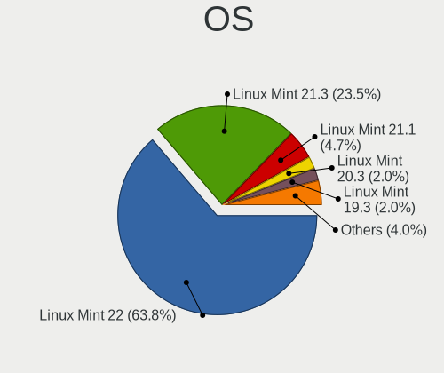
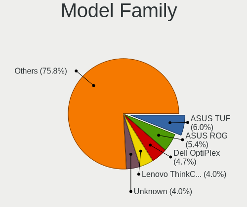
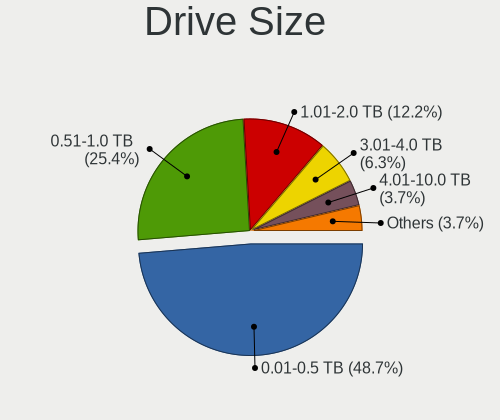
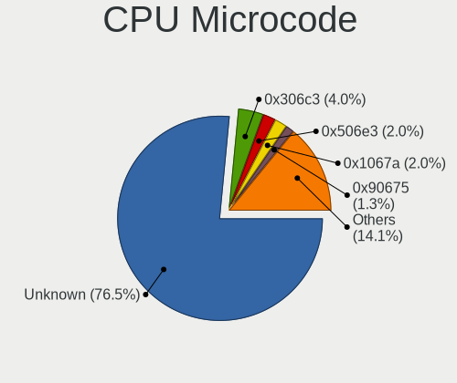
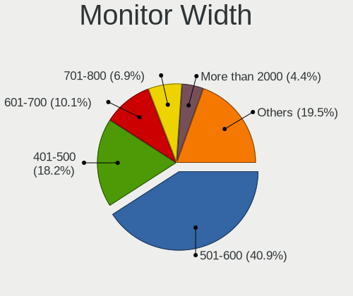
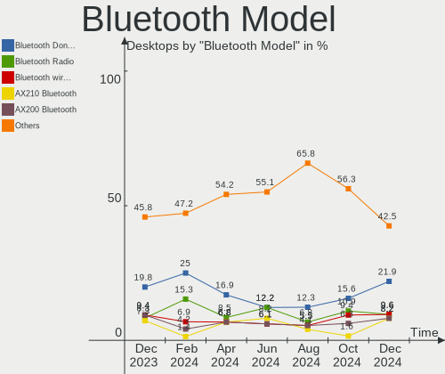
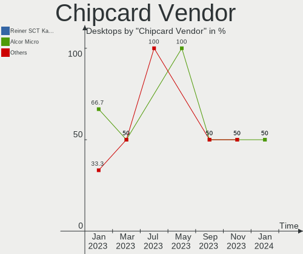

Linux Mint Hardware Trends (Desktops)
-------------------------------------

A project to identify most popular hardware characteristics and track their change
over time based on data collected by Linux Mint users at https://Linux-Hardware.org.

Anyone can contribute to this report by the [hw-probe](https://github.com/linuxhw/hw-probe) tool:

    sudo -E hw-probe -all -upload

Full-feature report is available here: https://linux-hardware.org/?view=trends

Period: Jan, 2022.

Contents
--------

* [ System ](#system)
  - [ OS                       ](#os)
  - [ OS Family                ](#os-family)
  - [ Kernel                   ](#kernel)
  - [ Kernel Family            ](#kernel-family)
  - [ Kernel Major Ver.        ](#kernel-major-ver)
  - [ Arch                     ](#arch)
  - [ DE                       ](#de)
  - [ Display Server           ](#display-server)
  - [ Display Manager          ](#display-manager)
  - [ OS Lang                  ](#os-lang)
  - [ Boot Mode                ](#boot-mode)
  - [ Filesystem               ](#filesystem)
  - [ Part. scheme             ](#part-scheme)
  - [ Dual Boot with Linux/BSD ](#dual-boot-with-linuxbsd)
  - [ Dual Boot (Win)          ](#dual-boot-win)

* [ Board ](#board)
  - [ Vendor                   ](#vendor)
  - [ Model                    ](#model)
  - [ Model Family             ](#model-family)
  - [ MFG Year                 ](#mfg-year)
  - [ Form Factor              ](#form-factor)
  - [ Secure Boot              ](#secure-boot)
  - [ Coreboot                 ](#coreboot)
  - [ RAM Size                 ](#ram-size)
  - [ RAM Used                 ](#ram-used)
  - [ Total Drives             ](#total-drives)
  - [ Has CD-ROM               ](#has-cd-rom)
  - [ Has Ethernet             ](#has-ethernet)
  - [ Has WiFi                 ](#has-wifi)
  - [ Has Bluetooth            ](#has-bluetooth)

* [ Location ](#location)
  - [ Country                  ](#country)
  - [ City                     ](#city)

* [ Drives ](#drives)
  - [ Drive Vendor             ](#drive-vendor)
  - [ Drive Model              ](#drive-model)
  - [ HDD Vendor               ](#hdd-vendor)
  - [ SSD Vendor               ](#ssd-vendor)
  - [ Drive Kind               ](#drive-kind)
  - [ Drive Connector          ](#drive-connector)
  - [ Drive Size               ](#drive-size)
  - [ Space Total              ](#space-total)
  - [ Space Used               ](#space-used)
  - [ Malfunc. Drives          ](#malfunc-drives)
  - [ Malfunc. Drive Vendor    ](#malfunc-drive-vendor)
  - [ Malfunc. HDD Vendor      ](#malfunc-hdd-vendor)
  - [ Malfunc. Drive Kind      ](#malfunc-drive-kind)
  - [ Failed Drives            ](#failed-drives)
  - [ Failed Drive Vendor      ](#failed-drive-vendor)
  - [ Drive Status             ](#drive-status)

* [ Storage controller ](#storage-controller)
  - [ Storage Vendor           ](#storage-vendor)
  - [ Storage Model            ](#storage-model)
  - [ Storage Kind             ](#storage-kind)

* [ Processor ](#processor)
  - [ CPU Vendor               ](#cpu-vendor)
  - [ CPU Model                ](#cpu-model)
  - [ CPU Model Family         ](#cpu-model-family)
  - [ CPU Cores                ](#cpu-cores)
  - [ CPU Sockets              ](#cpu-sockets)
  - [ CPU Threads              ](#cpu-threads)
  - [ CPU Op-Modes             ](#cpu-op-modes)
  - [ CPU Microcode            ](#cpu-microcode)
  - [ CPU Microarch            ](#cpu-microarch)

* [ Graphics ](#graphics)
  - [ GPU Vendor               ](#gpu-vendor)
  - [ GPU Model                ](#gpu-model)
  - [ GPU Combo                ](#gpu-combo)
  - [ GPU Driver               ](#gpu-driver)
  - [ GPU Memory               ](#gpu-memory)

* [ Monitor ](#monitor)
  - [ Monitor Vendor           ](#monitor-vendor)
  - [ Monitor Model            ](#monitor-model)
  - [ Monitor Resolution       ](#monitor-resolution)
  - [ Monitor Diagonal         ](#monitor-diagonal)
  - [ Monitor Width            ](#monitor-width)
  - [ Aspect Ratio             ](#aspect-ratio)
  - [ Monitor Area             ](#monitor-area)
  - [ Pixel Density            ](#pixel-density)
  - [ Multiple Monitors        ](#multiple-monitors)

* [ Network ](#network)
  - [ Net Controller Vendor    ](#net-controller-vendor)
  - [ Net Controller Model     ](#net-controller-model)
  - [ Wireless Vendor          ](#wireless-vendor)
  - [ Wireless Model           ](#wireless-model)
  - [ Ethernet Vendor          ](#ethernet-vendor)
  - [ Ethernet Model           ](#ethernet-model)
  - [ Net Controller Kind      ](#net-controller-kind)
  - [ Used Controller          ](#used-controller)
  - [ NICs                     ](#nics)
  - [ IPv6                     ](#ipv6)

* [ Bluetooth ](#bluetooth)
  - [ Bluetooth Vendor         ](#bluetooth-vendor)
  - [ Bluetooth Model          ](#bluetooth-model)

* [ Sound ](#sound)
  - [ Sound Vendor             ](#sound-vendor)
  - [ Sound Model              ](#sound-model)

* [ Memory ](#memory)
  - [ Memory Vendor            ](#memory-vendor)
  - [ Memory Model             ](#memory-model)
  - [ Memory Kind              ](#memory-kind)
  - [ Memory Form Factor       ](#memory-form-factor)
  - [ Memory Size              ](#memory-size)
  - [ Memory Speed             ](#memory-speed)

* [ Printers & scanners ](#printers--scanners)
  - [ Printer Vendor           ](#printer-vendor)
  - [ Printer Model            ](#printer-model)
  - [ Scanner Vendor           ](#scanner-vendor)
  - [ Scanner Model            ](#scanner-model)

* [ Camera ](#camera)
  - [ Camera Vendor            ](#camera-vendor)
  - [ Camera Model             ](#camera-model)

* [ Security ](#security)
  - [ Fingerprint Vendor       ](#fingerprint-vendor)
  - [ Fingerprint Model        ](#fingerprint-model)
  - [ Chipcard Vendor          ](#chipcard-vendor)
  - [ Chipcard Model           ](#chipcard-model)

* [ Unsupported ](#unsupported)
  - [ Unsupported Devices      ](#unsupported-devices)
  - [ Unsupported Device Types ](#unsupported-device-types)

System
------

OS
--

Installed operating systems

| Name            | Desktops | Percent |
|-----------------|----------|---------|
| Linux Mint 20.3 | 114      | 53.77%  |
| Linux Mint 20.2 | 64       | 30.19%  |
| Linux Mint 19.3 | 12       | 5.66%   |
| Linux Mint 20.1 | 10       | 4.72%   |
| Linux Mint 20   | 8        | 3.77%   |
| Linux Mint 19.1 | 2        | 0.94%   |
| Linux Mint 18.3 | 2        | 0.94%   |

OS Family
---------

OS without a version

| Name       | Desktops | Percent |
|------------|----------|---------|
| Linux Mint | 212      | 100%    |

Kernel
------

Version of the Linux kernel

| Version                    | Desktops | Percent |
|----------------------------|----------|---------|
| 5.4.0-96-generic           | 53       | 25%     |
| 5.4.0-92-generic           | 46       | 21.7%   |
| 5.4.0-91-generic           | 35       | 16.51%  |
| 5.4.0-94-generic           | 29       | 13.68%  |
| 5.13.0-23-generic          | 7        | 3.3%    |
| 5.4.0-90-generic           | 4        | 1.89%   |
| 5.4.0-74-generic           | 4        | 1.89%   |
| 5.13.0-27-generic          | 4        | 1.89%   |
| 5.13.0-25-generic          | 4        | 1.89%   |
| 5.0.0-32-generic           | 3        | 1.42%   |
| 5.13.0-22-generic          | 2        | 0.94%   |
| 5.11.0-46-generic          | 2        | 0.94%   |
| 4.15.0-142-generic         | 2        | 0.94%   |
| 5.4.0-94-lowlatency        | 1        | 0.47%   |
| 5.4.0-902110311031-generic | 1        | 0.47%   |
| 5.4.0-88-generic           | 1        | 0.47%   |
| 5.4.0-81-generic           | 1        | 0.47%   |
| 5.4.0-70-generic           | 1        | 0.47%   |
| 5.4.0-58-generic           | 1        | 0.47%   |
| 5.4.0-26-generic           | 1        | 0.47%   |
| 5.15.15-051515-generic     | 1        | 0.47%   |
| 5.15.13-051513-generic     | 1        | 0.47%   |
| 5.15.0-17.1-liquorix-amd64 | 1        | 0.47%   |
| 5.14.0-1013-oem            | 1        | 0.47%   |
| 5.11.0-44-generic          | 1        | 0.47%   |
| 5.11.0-43-generic          | 1        | 0.47%   |
| 5.11.0-22-generic          | 1        | 0.47%   |
| 4.15.0-166-generic         | 1        | 0.47%   |
| 4.15.0-163-generic         | 1        | 0.47%   |
| 4.15.0-109-generic         | 1        | 0.47%   |

Kernel Family
-------------

Linux kernel without a distro release

| Version | Desktops | Percent |
|---------|----------|---------|
| 5.4.0   | 178      | 83.96%  |
| 5.13.0  | 17       | 8.02%   |
| 5.11.0  | 5        | 2.36%   |
| 4.15.0  | 5        | 2.36%   |
| 5.0.0   | 3        | 1.42%   |
| 5.15.15 | 1        | 0.47%   |
| 5.15.13 | 1        | 0.47%   |
| 5.15.0  | 1        | 0.47%   |
| 5.14.0  | 1        | 0.47%   |

Kernel Major Ver.
-----------------

Linux kernel major version

| Version | Desktops | Percent |
|---------|----------|---------|
| 5.4     | 178      | 83.96%  |
| 5.13    | 17       | 8.02%   |
| 5.11    | 5        | 2.36%   |
| 4.15    | 5        | 2.36%   |
| 5.15    | 3        | 1.42%   |
| 5.0     | 3        | 1.42%   |
| 5.14    | 1        | 0.47%   |

Arch
----

OS architecture (x86_64, i586, etc.)

| Name   | Desktops | Percent |
|--------|----------|---------|
| x86_64 | 209      | 98.58%  |
| i686   | 3        | 1.42%   |

DE
--

Desktop Environment

| Name       | Desktops | Percent |
|------------|----------|---------|
| X-Cinnamon | 149      | 70.28%  |
| MATE       | 29       | 13.68%  |
| XFCE       | 20       | 9.43%   |
| Cinnamon   | 7        | 3.3%    |
| Unknown    | 3        | 1.42%   |
| GNOME      | 2        | 0.94%   |
| LXDE       | 1        | 0.47%   |
| KDE5       | 1        | 0.47%   |

Display Server
--------------

X11 or Wayland

| Name | Desktops | Percent |
|------|----------|---------|
| X11  | 211      | 99.53%  |
| Tty  | 1        | 0.47%   |

Display Manager
---------------

SDDM, LightDM, etc.

| Name    | Desktops | Percent |
|---------|----------|---------|
| Unknown | 137      | 64.62%  |
| LightDM | 74       | 34.91%  |
| GDM     | 1        | 0.47%   |

OS Lang
-------

Language

| Lang    | Desktops | Percent |
|---------|----------|---------|
| en_US   | 59       | 27.83%  |
| de_DE   | 44       | 20.75%  |
| pt_BR   | 13       | 6.13%   |
| en_CA   | 13       | 6.13%   |
| en_GB   | 11       | 5.19%   |
| fr_FR   | 10       | 4.72%   |
| ru_RU   | 8        | 3.77%   |
| it_IT   | 7        | 3.3%    |
| pl_PL   | 5        | 2.36%   |
| hu_HU   | 4        | 1.89%   |
| fi_FI   | 4        | 1.89%   |
| es_ES   | 4        | 1.89%   |
| en_AU   | 4        | 1.89%   |
| es_MX   | 3        | 1.42%   |
| es_AR   | 3        | 1.42%   |
| ru_UA   | 2        | 0.94%   |
| en_NZ   | 2        | 0.94%   |
| C       | 2        | 0.94%   |
| uk_UA   | 1        | 0.47%   |
| sv_SE   | 1        | 0.47%   |
| sk_SK   | 1        | 0.47%   |
| ja_JP   | 1        | 0.47%   |
| id_ID   | 1        | 0.47%   |
| fr_CA   | 1        | 0.47%   |
| es_CO   | 1        | 0.47%   |
| en_ZA   | 1        | 0.47%   |
| de_CH   | 1        | 0.47%   |
| de_AT   | 1        | 0.47%   |
| da_DK   | 1        | 0.47%   |
| cs_CZ   | 1        | 0.47%   |
| ar_SA   | 1        | 0.47%   |
| Unknown | 1        | 0.47%   |

Boot Mode
---------

EFI or BIOS

| Mode | Desktops | Percent |
|------|----------|---------|
| BIOS | 132      | 62.26%  |
| EFI  | 80       | 37.74%  |

Filesystem
----------

Type of filesystem

| Type    | Desktops | Percent |
|---------|----------|---------|
| Ext4    | 207      | 97.64%  |
| Xfs     | 2        | 0.94%   |
| Overlay | 1        | 0.47%   |
| Ext3    | 1        | 0.47%   |
| Btrfs   | 1        | 0.47%   |

Part. scheme
------------

Scheme of partitioning

| Type    | Desktops | Percent |
|---------|----------|---------|
| Unknown | 144      | 67.92%  |
| GPT     | 44       | 20.75%  |
| MBR     | 24       | 11.32%  |

Dual Boot with Linux/BSD
------------------------

Hosting more than one Linux/BSD

| Dual boot | Desktops | Percent |
|-----------|----------|---------|
| No        | 201      | 94.81%  |
| Yes       | 11       | 5.19%   |

Dual Boot (Win)
---------------

Hosting Linux and Windows

| Dual boot | Desktops | Percent |
|-----------|----------|---------|
| No        | 179      | 84.43%  |
| Yes       | 33       | 15.57%  |

Board
-----

Vendor
------

Motherboard manufacturer

| Name                | Desktops | Percent |
|---------------------|----------|---------|
| ASUSTek Computer    | 43       | 20.28%  |
| Gigabyte Technology | 35       | 16.51%  |
| MSI                 | 24       | 11.32%  |
| ASRock              | 21       | 9.91%   |
| Dell                | 19       | 8.96%   |
| Hewlett-Packard     | 12       | 5.66%   |
| Intel               | 10       | 4.72%   |
| Lenovo              | 9        | 4.25%   |
| Acer                | 7        | 3.3%    |
| Positivo            | 3        | 1.42%   |
| Pegatron            | 3        | 1.42%   |
| Medion              | 3        | 1.42%   |
| Fujitsu Siemens     | 2        | 0.94%   |
| Fujitsu             | 2        | 0.94%   |
| ECS                 | 2        | 0.94%   |
| Biostar             | 2        | 0.94%   |
| Supermicro          | 1        | 0.47%   |
| Shuttle             | 1        | 0.47%   |
| Semp Toshiba        | 1        | 0.47%   |
| Packard Bell        | 1        | 0.47%   |
| MediaVue            | 1        | 0.47%   |
| KLLISRE             | 1        | 0.47%   |
| Gateway             | 1        | 0.47%   |
| Foxconn             | 1        | 0.47%   |
| DFI                 | 1        | 0.47%   |
| BESSTAR Tech        | 1        | 0.47%   |
| AURES               | 1        | 0.47%   |
| Apple               | 1        | 0.47%   |
| AMD                 | 1        | 0.47%   |
| Alienware           | 1        | 0.47%   |
| Unknown             | 1        | 0.47%   |

Model
-----

Motherboard model

| Name                               | Desktops | Percent |
|------------------------------------|----------|---------|
| ASUS All Series                    | 5        | 2.36%   |
| Dell OptiPlex 790                  | 3        | 1.42%   |
| MSI MS-7C52                        | 2        | 0.94%   |
| MSI MS-7B86                        | 2        | 0.94%   |
| MSI MS-7721                        | 2        | 0.94%   |
| Lenovo ThinkCentre M90 5485W45     | 2        | 0.94%   |
| Intel H61                          | 2        | 0.94%   |
| Gigabyte B550M DS3H                | 2        | 0.94%   |
| Dell OptiPlex 990                  | 2        | 0.94%   |
| Dell OptiPlex 745                  | 2        | 0.94%   |
| Dell OptiPlex 7010                 | 2        | 0.94%   |
| Dell Inspiron 660                  | 2        | 0.94%   |
| ASUS P8Z77-M                       | 2        | 0.94%   |
| ASUS M2N68-AM Plus                 | 2        | 0.94%   |
| Supermicro X7DWE                   | 1        | 0.47%   |
| Shuttle XH61V                      | 1        | 0.47%   |
| Semp Toshiba STI                   | 1        | 0.47%   |
| Positivo POS-PQ45AU                | 1        | 0.47%   |
| Positivo POS-PIH81DI               | 1        | 0.47%   |
| Positivo POS-MIG31AG               | 1        | 0.47%   |
| Pegatron NC701AA-ABA IQ524         | 1        | 0.47%   |
| Pegatron KZ631AA-ABA IQ505         | 1        | 0.47%   |
| Pegatron 320-1030                  | 1        | 0.47%   |
| Packard Bell IMEDIA S1360          | 1        | 0.47%   |
| MSI p7-1240                        | 1        | 0.47%   |
| MSI MS-7D25                        | 1        | 0.47%   |
| MSI MS-7D22                        | 1        | 0.47%   |
| MSI MS-7D08                        | 1        | 0.47%   |
| MSI MS-7C94                        | 1        | 0.47%   |
| MSI MS-7C84                        | 1        | 0.47%   |
| MSI MS-7C56                        | 1        | 0.47%   |
| MSI MS-7B98                        | 1        | 0.47%   |
| MSI MS-7A15                        | 1        | 0.47%   |
| MSI MS-7994                        | 1        | 0.47%   |
| MSI MS-7978                        | 1        | 0.47%   |
| MSI MS-7891                        | 1        | 0.47%   |
| MSI MS-7846                        | 1        | 0.47%   |
| MSI MS-7817                        | 1        | 0.47%   |
| MSI MS-7751                        | 1        | 0.47%   |
| MSI MS-7693                        | 1        | 0.47%   |
| MSI MS-7641                        | 1        | 0.47%   |
| MSI MS-7597                        | 1        | 0.47%   |
| Medion P961x                       | 1        | 0.47%   |
| Medion MS-7748                     | 1        | 0.47%   |
| Medion MS-7728                     | 1        | 0.47%   |
| MediaVue MV-890GX V1.2             | 1        | 0.47%   |
| Lenovo ThinkCentre M93p 10A9000SUS | 1        | 0.47%   |
| Lenovo ThinkCentre M93p 10A8S3C100 | 1        | 0.47%   |
| Lenovo ThinkCentre M92P 3237AG5    | 1        | 0.47%   |
| Lenovo ThinkCentre M92p 3227K75    | 1        | 0.47%   |
| Lenovo ThinkCentre M81 5049W16     | 1        | 0.47%   |
| Lenovo ThinkCentre M700 10HY002UGE | 1        | 0.47%   |
| Lenovo IdeaCentre K430 10086       | 1        | 0.47%   |
| KLLISRE X79 V1.2                   | 1        | 0.47%   |
| Intel QC6003                       | 1        | 0.47%   |
| Intel H81                          | 1        | 0.47%   |
| Intel H55                          | 1        | 0.47%   |
| Intel DX442X                       | 1        | 0.47%   |
| Intel DH61HO AAG62445-102          | 1        | 0.47%   |
| Intel DG31PR AAD97573-306          | 1        | 0.47%   |

Model Family
------------

Motherboard model prefix

| Name                   | Desktops | Percent |
|------------------------|----------|---------|
| Dell OptiPlex          | 15       | 7.08%   |
| Lenovo ThinkCentre     | 8        | 3.77%   |
| ASUS PRIME             | 8        | 3.77%   |
| HP Compaq              | 6        | 2.83%   |
| ASUS All               | 5        | 2.36%   |
| Acer Aspire            | 5        | 2.36%   |
| MSI MS-7C52            | 2        | 0.94%   |
| MSI MS-7B86            | 2        | 0.94%   |
| MSI MS-7721            | 2        | 0.94%   |
| Intel H61              | 2        | 0.94%   |
| Gigabyte Z370          | 2        | 0.94%   |
| Gigabyte X570          | 2        | 0.94%   |
| Gigabyte GA-78LMT-USB3 | 2        | 0.94%   |
| Gigabyte B550M         | 2        | 0.94%   |
| Dell Inspiron          | 2        | 0.94%   |
| ASUS ROG               | 2        | 0.94%   |
| ASUS P8Z77-M           | 2        | 0.94%   |
| ASUS P8H61-M           | 2        | 0.94%   |
| ASUS P5G41T-M          | 2        | 0.94%   |
| ASUS M5A97             | 2        | 0.94%   |
| ASUS M2N68-AM          | 2        | 0.94%   |
| Acer Veriton           | 2        | 0.94%   |
| Supermicro X7DWE       | 1        | 0.47%   |
| Shuttle XH61V          | 1        | 0.47%   |
| Semp Toshiba STI       | 1        | 0.47%   |
| Positivo POS-PQ45AU    | 1        | 0.47%   |
| Positivo POS-PIH81DI   | 1        | 0.47%   |
| Positivo POS-MIG31AG   | 1        | 0.47%   |
| Pegatron NC701AA-ABA   | 1        | 0.47%   |
| Pegatron KZ631AA-ABA   | 1        | 0.47%   |
| Pegatron 320-1030      | 1        | 0.47%   |
| Packard Bell IMEDIA    | 1        | 0.47%   |
| MSI p7-1240            | 1        | 0.47%   |
| MSI MS-7D25            | 1        | 0.47%   |
| MSI MS-7D22            | 1        | 0.47%   |
| MSI MS-7D08            | 1        | 0.47%   |
| MSI MS-7C94            | 1        | 0.47%   |
| MSI MS-7C84            | 1        | 0.47%   |
| MSI MS-7C56            | 1        | 0.47%   |
| MSI MS-7B98            | 1        | 0.47%   |
| MSI MS-7A15            | 1        | 0.47%   |
| MSI MS-7994            | 1        | 0.47%   |
| MSI MS-7978            | 1        | 0.47%   |
| MSI MS-7891            | 1        | 0.47%   |
| MSI MS-7846            | 1        | 0.47%   |
| MSI MS-7817            | 1        | 0.47%   |
| MSI MS-7751            | 1        | 0.47%   |
| MSI MS-7693            | 1        | 0.47%   |
| MSI MS-7641            | 1        | 0.47%   |
| MSI MS-7597            | 1        | 0.47%   |
| Medion P961x           | 1        | 0.47%   |
| Medion MS-7748         | 1        | 0.47%   |
| Medion MS-7728         | 1        | 0.47%   |
| MediaVue MV-890GX      | 1        | 0.47%   |
| Lenovo IdeaCentre      | 1        | 0.47%   |
| KLLISRE X79            | 1        | 0.47%   |
| Intel QC6003           | 1        | 0.47%   |
| Intel H81              | 1        | 0.47%   |
| Intel H55              | 1        | 0.47%   |
| Intel DX442X           | 1        | 0.47%   |

MFG Year
--------

Motherboard manufacture year

| Year | Desktops | Percent |
|------|----------|---------|
| 2011 | 25       | 11.79%  |
| 2012 | 23       | 10.85%  |
| 2013 | 18       | 8.49%   |
| 2018 | 16       | 7.55%   |
| 2010 | 16       | 7.55%   |
| 2014 | 15       | 7.08%   |
| 2021 | 14       | 6.6%    |
| 2017 | 13       | 6.13%   |
| 2019 | 12       | 5.66%   |
| 2009 | 12       | 5.66%   |
| 2015 | 11       | 5.19%   |
| 2008 | 9        | 4.25%   |
| 2020 | 8        | 3.77%   |
| 2016 | 8        | 3.77%   |
| 2007 | 7        | 3.3%    |
| 2006 | 4        | 1.89%   |
| 2005 | 1        | 0.47%   |

Form Factor
-----------

Physical design of the computer

| Name    | Desktops | Percent |
|---------|----------|---------|
| Desktop | 212      | 100%    |

Secure Boot
-----------

Enabled or disabled

| State    | Desktops | Percent |
|----------|----------|---------|
| Disabled | 205      | 96.7%   |
| Enabled  | 7        | 3.3%    |

Coreboot
--------

Have coreboot on board

| Used | Desktops | Percent |
|------|----------|---------|
| No   | 212      | 100%    |

RAM Size
--------

Total RAM memory

| Size in GB  | Desktops | Percent |
|-------------|----------|---------|
| 16.01-24.0  | 53       | 25%     |
| 8.01-16.0   | 44       | 20.75%  |
| 4.01-8.0    | 33       | 15.57%  |
| 3.01-4.0    | 33       | 15.57%  |
| 32.01-64.0  | 31       | 14.62%  |
| 1.01-2.0    | 6        | 2.83%   |
| 24.01-32.0  | 5        | 2.36%   |
| 2.01-3.0    | 4        | 1.89%   |
| 64.01-256.0 | 3        | 1.42%   |

RAM Used
--------

Used RAM memory

| Used GB    | Desktops | Percent |
|------------|----------|---------|
| 1.01-2.0   | 81       | 38.21%  |
| 2.01-3.0   | 55       | 25.94%  |
| 3.01-4.0   | 31       | 14.62%  |
| 4.01-8.0   | 20       | 9.43%   |
| 0.51-1.0   | 15       | 7.08%   |
| 8.01-16.0  | 9        | 4.25%   |
| 16.01-24.0 | 1        | 0.47%   |

Total Drives
------------

Number of drives on board

| Drives | Desktops | Percent |
|--------|----------|---------|
| 1      | 86       | 40.57%  |
| 2      | 63       | 29.72%  |
| 3      | 29       | 13.68%  |
| 4      | 18       | 8.49%   |
| 5      | 11       | 5.19%   |
| 9      | 2        | 0.94%   |
| 8      | 1        | 0.47%   |
| 7      | 1        | 0.47%   |
| 6      | 1        | 0.47%   |

Has CD-ROM
----------

Has CD-ROM on board

| Presented | Desktops | Percent |
|-----------|----------|---------|
| Yes       | 132      | 62.26%  |
| No        | 80       | 37.74%  |

Has Ethernet
------------

Has Ethernet on board

| Presented | Desktops | Percent |
|-----------|----------|---------|
| Yes       | 209      | 98.58%  |
| No        | 3        | 1.42%   |

Has WiFi
--------

Has WiFi module

| Presented | Desktops | Percent |
|-----------|----------|---------|
| No        | 113      | 53.3%   |
| Yes       | 99       | 46.7%   |

Has Bluetooth
-------------

Has Bluetooth module

| Presented | Desktops | Percent |
|-----------|----------|---------|
| No        | 162      | 76.42%  |
| Yes       | 50       | 23.58%  |

Location
--------

Country
-------

Geographic location (country)

| Country      | Desktops | Percent |
|--------------|----------|---------|
| Germany      | 50       | 23.58%  |
| USA          | 40       | 18.87%  |
| Canada       | 13       | 6.13%   |
| Brazil       | 13       | 6.13%   |
| UK           | 11       | 5.19%   |
| France       | 9        | 4.25%   |
| Ukraine      | 7        | 3.3%    |
| Italy        | 6        | 2.83%   |
| Russia       | 5        | 2.36%   |
| Poland       | 5        | 2.36%   |
| Hungary      | 5        | 2.36%   |
| Switzerland  | 4        | 1.89%   |
| Finland      | 4        | 1.89%   |
| Australia    | 4        | 1.89%   |
| Spain        | 3        | 1.42%   |
| Mexico       | 3        | 1.42%   |
| Argentina    | 3        | 1.42%   |
| Sweden       | 2        | 0.94%   |
| Slovakia     | 2        | 0.94%   |
| Serbia       | 2        | 0.94%   |
| New Zealand  | 2        | 0.94%   |
| Denmark      | 2        | 0.94%   |
| Belarus      | 2        | 0.94%   |
| Uzbekistan   | 1        | 0.47%   |
| South Africa | 1        | 0.47%   |
| Saudi Arabia | 1        | 0.47%   |
| Norway       | 1        | 0.47%   |
| Netherlands  | 1        | 0.47%   |
| Luxembourg   | 1        | 0.47%   |
| Japan        | 1        | 0.47%   |
| Ireland      | 1        | 0.47%   |
| Iran         | 1        | 0.47%   |
| Indonesia    | 1        | 0.47%   |
| Czechia      | 1        | 0.47%   |
| Croatia      | 1        | 0.47%   |
| Colombia     | 1        | 0.47%   |
| Bangladesh   | 1        | 0.47%   |
| Austria      | 1        | 0.47%   |

City
----

Geographic location (city)

| City                   | Desktops | Percent |
|------------------------|----------|---------|
| Kyiv                   | 3        | 1.42%   |
| Buenos Aires           | 3        | 1.42%   |
| Berlin                 | 3        | 1.42%   |
| Toronto                | 2        | 0.94%   |
| The Bronx              | 2        | 0.94%   |
| Stuttgart              | 2        | 0.94%   |
| Sault Ste. Marie       | 2        | 0.94%   |
| Reutlingen             | 2        | 0.94%   |
| Luton                  | 2        | 0.94%   |
| Lansdale               | 2        | 0.94%   |
| Heerbrugg              | 2        | 0.94%   |
| Frankfurt am Main      | 2        | 0.94%   |
| Essen                  | 2        | 0.94%   |
| Dagenham               | 2        | 0.94%   |
| Budapest               | 2        | 0.94%   |
| Brisbane               | 2        | 0.94%   |
| Belgrade               | 2        | 0.94%   |
| Zurich                 | 1        | 0.47%   |
| Zagreb                 | 1        | 0.47%   |
| Yonkers                | 1        | 0.47%   |
| Wroclaw                | 1        | 0.47%   |
| Wrexham                | 1        | 0.47%   |
| Wobbenbull             | 1        | 0.47%   |
| Winter Springs         | 1        | 0.47%   |
| Windermere             | 1        | 0.47%   |
| Willoughby             | 1        | 0.47%   |
| Wandlitz               | 1        | 0.47%   |
| Wabern                 | 1        | 0.47%   |
| Voronezh               | 1        | 0.47%   |
| Voitsberg              | 1        | 0.47%   |
| Voerde                 | 1        | 0.47%   |
| Vanlay                 | 1        | 0.47%   |
| Vancouver              | 1        | 0.47%   |
| Valencia               | 1        | 0.47%   |
| Urasoe                 | 1        | 0.47%   |
| Turku                  | 1        | 0.47%   |
| Tongi                  | 1        | 0.47%   |
| Tijuana                | 1        | 0.47%   |
| Taxco                  | 1        | 0.47%   |
| Tashkent               | 1        | 0.47%   |
| Tampere                | 1        | 0.47%   |
| Stockholm              | 1        | 0.47%   |
| St Petersburg          | 1        | 0.47%   |
| Singen                 | 1        | 0.47%   |
| Shawnee                | 1        | 0.47%   |
| Sepino                 | 1        | 0.47%   |
| Senden                 | 1        | 0.47%   |
| Seifhennersdorf        | 1        | 0.47%   |
| Seattle                | 1        | 0.47%   |
| Schwabach              | 1        | 0.47%   |
| Sant Cugat del Vall??s | 1        | 0.47%   |
| San Nicolo a Tordino   | 1        | 0.47%   |
| Salzgitter             | 1        | 0.47%   |
| Saint-Nazaire          | 1        | 0.47%   |
| Ryman                  | 1        | 0.47%   |
| Ruthin                 | 1        | 0.47%   |
| Rostock                | 1        | 0.47%   |
| Rosenheim              | 1        | 0.47%   |
| Rome                   | 1        | 0.47%   |
| Riyadh                 | 1        | 0.47%   |

Drives
------

Drive Vendor
------------

Hard drive vendors

| Vendor                    | Desktops | Drives | Percent |
|---------------------------|----------|--------|---------|
| Seagate                   | 75       | 94     | 19.63%  |
| WDC                       | 72       | 97     | 18.85%  |
| Samsung Electronics       | 61       | 78     | 15.97%  |
| Kingston                  | 25       | 26     | 6.54%   |
| SanDisk                   | 21       | 22     | 5.5%    |
| Toshiba                   | 17       | 19     | 4.45%   |
| Hitachi                   | 17       | 19     | 4.45%   |
| Crucial                   | 14       | 16     | 3.66%   |
| A-DATA Technology         | 7        | 7      | 1.83%   |
| Intenso                   | 6        | 6      | 1.57%   |
| HGST                      | 6        | 7      | 1.57%   |
| China                     | 6        | 6      | 1.57%   |
| MAXTOR                    | 5        | 7      | 1.31%   |
| Unknown                   | 4        | 4      | 1.05%   |
| SPCC                      | 4        | 4      | 1.05%   |
| Patriot                   | 4        | 4      | 1.05%   |
| Intel                     | 4        | 5      | 1.05%   |
| PNY                       | 3        | 3      | 0.79%   |
| Corsair                   | 3        | 4      | 0.79%   |
| Micron Technology         | 2        | 2      | 0.52%   |
| Apacer                    | 2        | 2      | 0.52%   |
| Unknown                   | 2        | 2      | 0.52%   |
| ZOTAC                     | 1        | 1      | 0.26%   |
| XPG                       | 1        | 1      | 0.26%   |
| USB30                     | 1        | 1      | 0.26%   |
| TrueNAS                   | 1        | 1      | 0.26%   |
| Transcend                 | 1        | 1      | 0.26%   |
| SSSTC                     | 1        | 1      | 0.26%   |
| Realtek Semiconductor     | 1        | 1      | 0.26%   |
| Phison                    | 1        | 1      | 0.26%   |
| PHD 3.0                   | 1        | 1      | 0.26%   |
| OCZ                       | 1        | 1      | 0.26%   |
| Micron/Crucial Technology | 1        | 1      | 0.26%   |
| Maxtor 6                  | 1        | 1      | 0.26%   |
| LITEON                    | 1        | 1      | 0.26%   |
| Leven                     | 1        | 1      | 0.26%   |
| KLLISRE                   | 1        | 1      | 0.26%   |
| KingSpec                  | 1        | 1      | 0.26%   |
| JMicron                   | 1        | 1      | 0.26%   |
| GOODRAM                   | 1        | 1      | 0.26%   |
| Gigabyte Technology       | 1        | 1      | 0.26%   |
| ASMT                      | 1        | 1      | 0.26%   |
| Apple                     | 1        | 1      | 0.26%   |
| AMD                       | 1        | 1      | 0.26%   |

Drive Model
-----------

Hard drive models

| Model                            | Desktops | Percent |
|----------------------------------|----------|---------|
| Samsung SSD 860 EVO 500GB        | 8        | 1.85%   |
| Seagate ST2000DM008-2FR102 2TB   | 6        | 1.39%   |
| Samsung SSD 850 EVO 250GB        | 6        | 1.39%   |
| Kingston SA400S37240G 240GB SSD  | 5        | 1.16%   |
| WDC WD20EZRZ-00Z5HB0 2TB         | 4        | 0.93%   |
| WDC WD10EZEX-08WN4A0 1TB         | 4        | 0.93%   |
| SanDisk SDSSDA240G 240GB         | 4        | 0.93%   |
| Samsung SSD 860 EVO 250GB        | 4        | 0.93%   |
| Samsung NVMe SSD Drive 250GB     | 4        | 0.93%   |
| Kingston SV300S37A120G 120GB SSD | 4        | 0.93%   |
| Toshiba DT01ACA200 2TB           | 3        | 0.69%   |
| Toshiba DT01ACA050 500GB         | 3        | 0.69%   |
| Seagate ST3500413AS 500GB        | 3        | 0.69%   |
| Seagate ST3500312CS 500GB        | 3        | 0.69%   |
| Seagate ST2000DM006-2DM164 2TB   | 3        | 0.69%   |
| Seagate ST2000DM001-1ER164 2TB   | 3        | 0.69%   |
| Seagate ST1000DM003-1CH162 1TB   | 3        | 0.69%   |
| SanDisk SSD PLUS 240GB           | 3        | 0.69%   |
| Sandisk NVMe SSD Drive 500GB     | 3        | 0.69%   |
| Samsung SSD 970 EVO Plus 1TB     | 3        | 0.69%   |
| Samsung SSD 850 EVO 500GB        | 3        | 0.69%   |
| Samsung SSD 840 EVO 500GB        | 3        | 0.69%   |
| Samsung HD154UI 1TB              | 3        | 0.69%   |
| Patriot Burst 120GB SSD          | 3        | 0.69%   |
| Hitachi HDS721010CLA332 1TB      | 3        | 0.69%   |
| Crucial CT240BX500SSD1 240GB     | 3        | 0.69%   |
| WDC WDS500G2B0A-00SM50 500GB SSD | 2        | 0.46%   |
| WDC WDS100T2B0A-00SM50 1TB SSD   | 2        | 0.46%   |
| WDC WD5002ABYS-01B1B0 500GB      | 2        | 0.46%   |
| WDC WD5000AAKX-60U6AA0 500GB     | 2        | 0.46%   |
| WDC WD5000AAKX-22ERMA0 500GB     | 2        | 0.46%   |
| WDC WD10EZEX-00BN5A0 1TB         | 2        | 0.46%   |
| WDC WD1003FZEX-00MK2A0 1TB       | 2        | 0.46%   |
| Unknown SD/MMC/MS PRO 128GB      | 2        | 0.46%   |
| Toshiba HDWD110 1TB              | 2        | 0.46%   |
| Toshiba DT01ACA100 1TB           | 2        | 0.46%   |
| SPCC Solid State Disk 512GB      | 2        | 0.46%   |
| Seagate ST8000DM004-2CX188 8TB   | 2        | 0.46%   |
| Seagate ST500DM002-1BD142 500GB  | 2        | 0.46%   |
| Seagate ST4000DM004-2CV104 4TB   | 2        | 0.46%   |
| Seagate ST380815AS 80GB          | 2        | 0.46%   |
| Seagate ST3500418AS 500GB        | 2        | 0.46%   |
| Seagate ST3320820AS 320GB        | 2        | 0.46%   |
| Seagate ST3250312AS 250GB        | 2        | 0.46%   |
| Seagate ST31000528AS 1TB         | 2        | 0.46%   |
| Seagate ST250DM000-1BD141 250GB  | 2        | 0.46%   |
| Seagate ST2000DM001-1CH164 2TB   | 2        | 0.46%   |
| Seagate ST1000DM010-2EP102 1TB   | 2        | 0.46%   |
| Seagate ST1000DM003-9YN162 1TB   | 2        | 0.46%   |
| Seagate Expansion Desk 8TB       | 2        | 0.46%   |
| Samsung SSD 870 EVO 1TB          | 2        | 0.46%   |
| Samsung SSD 860 QVO 2TB          | 2        | 0.46%   |
| Samsung SSD 860 EVO 1TB          | 2        | 0.46%   |
| Samsung SSD 840 EVO 250GB        | 2        | 0.46%   |
| Samsung SP2504C 250GB            | 2        | 0.46%   |
| Samsung Portable SSD T5 500GB    | 2        | 0.46%   |
| Samsung NVMe SSD Drive 500GB     | 2        | 0.46%   |
| Samsung NVMe SSD Drive 1TB       | 2        | 0.46%   |
| Samsung HD502HI 500GB            | 2        | 0.46%   |
| MAXTOR 6Y080M0 80GB              | 2        | 0.46%   |

HDD Vendor
----------

Hard disk drive vendors

| Vendor              | Desktops | Drives | Percent |
|---------------------|----------|--------|---------|
| Seagate             | 74       | 92     | 37.56%  |
| WDC                 | 61       | 85     | 30.96%  |
| Hitachi             | 17       | 19     | 8.63%   |
| Toshiba             | 13       | 15     | 6.6%    |
| Samsung Electronics | 13       | 16     | 6.6%    |
| HGST                | 6        | 7      | 3.05%   |
| MAXTOR              | 5        | 7      | 2.54%   |
| Unknown             | 3        | 3      | 1.52%   |
| PHD 3.0             | 1        | 1      | 0.51%   |
| Maxtor 6            | 1        | 1      | 0.51%   |
| Intenso             | 1        | 1      | 0.51%   |
| China               | 1        | 1      | 0.51%   |
| Apple               | 1        | 1      | 0.51%   |

SSD Vendor
----------

Solid state drive vendors

| Vendor              | Desktops | Drives | Percent |
|---------------------|----------|--------|---------|
| Samsung Electronics | 37       | 47     | 25%     |
| Kingston            | 23       | 24     | 15.54%  |
| SanDisk             | 18       | 18     | 12.16%  |
| Crucial             | 13       | 15     | 8.78%   |
| WDC                 | 9        | 9      | 6.08%   |
| A-DATA Technology   | 6        | 6      | 4.05%   |
| China               | 5        | 5      | 3.38%   |
| SPCC                | 4        | 4      | 2.7%    |
| Patriot             | 4        | 4      | 2.7%    |
| Toshiba             | 3        | 3      | 2.03%   |
| PNY                 | 3        | 3      | 2.03%   |
| Intenso             | 3        | 3      | 2.03%   |
| Intel               | 3        | 3      | 2.03%   |
| Corsair             | 2        | 2      | 1.35%   |
| Apacer              | 2        | 2      | 1.35%   |
| ZOTAC               | 1        | 1      | 0.68%   |
| USB30               | 1        | 1      | 0.68%   |
| TrueNAS             | 1        | 1      | 0.68%   |
| Seagate             | 1        | 1      | 0.68%   |
| OCZ                 | 1        | 1      | 0.68%   |
| Micron Technology   | 1        | 1      | 0.68%   |
| LITEON              | 1        | 1      | 0.68%   |
| Leven               | 1        | 1      | 0.68%   |
| KingSpec            | 1        | 1      | 0.68%   |
| GOODRAM             | 1        | 1      | 0.68%   |
| ASMT                | 1        | 1      | 0.68%   |
| AMD                 | 1        | 1      | 0.68%   |
| Unknown             | 1        | 1      | 0.68%   |

Drive Kind
----------

HDD or SSD

| Kind    | Desktops | Drives | Percent |
|---------|----------|--------|---------|
| HDD     | 144      | 249    | 46.6%   |
| SSD     | 125      | 161    | 40.45%  |
| NVMe    | 35       | 41     | 11.33%  |
| Unknown | 5        | 5      | 1.62%   |

Drive Connector
---------------

SATA, SAS, NVMe, etc.

| Type | Desktops | Drives | Percent |
|------|----------|--------|---------|
| SATA | 205      | 385    | 79.46%  |
| NVMe | 34       | 40     | 13.18%  |
| SAS  | 19       | 31     | 7.36%   |

Drive Size
----------

Size of hard drive

| Size in TB | Desktops | Drives | Percent |
|------------|----------|--------|---------|
| 0.01-0.5   | 159      | 234    | 54.64%  |
| 0.51-1.0   | 75       | 97     | 25.77%  |
| 1.01-2.0   | 31       | 41     | 10.65%  |
| 3.01-4.0   | 9        | 10     | 3.09%   |
| 4.01-10.0  | 9        | 11     | 3.09%   |
| 2.01-3.0   | 7        | 9      | 2.41%   |
| 10.01-20.0 | 1        | 8      | 0.34%   |

Space Total
-----------

Amount of disk space available on the file system

| Size in GB     | Desktops | Percent |
|----------------|----------|---------|
| 101-250        | 68       | 32.08%  |
| 251-500        | 45       | 21.23%  |
| 501-1000       | 29       | 13.68%  |
| More than 3000 | 23       | 10.85%  |
| 1001-2000      | 22       | 10.38%  |
| 2001-3000      | 10       | 4.72%   |
| 51-100         | 9        | 4.25%   |
| 21-50          | 3        | 1.42%   |
| 1-20           | 2        | 0.94%   |
| Unknown        | 1        | 0.47%   |

Space Used
----------

Amount of used disk space

| Used GB        | Desktops | Percent |
|----------------|----------|---------|
| 21-50          | 46       | 21.7%   |
| 1-20           | 43       | 20.28%  |
| 101-250        | 29       | 13.68%  |
| 51-100         | 29       | 13.68%  |
| 251-500        | 21       | 9.91%   |
| 501-1000       | 16       | 7.55%   |
| 1001-2000      | 13       | 6.13%   |
| More than 3000 | 9        | 4.25%   |
| 2001-3000      | 5        | 2.36%   |
| Unknown        | 1        | 0.47%   |

Malfunc. Drives
---------------

Drive models with a malfunction

| Model                             | Desktops | Drives | Percent |
|-----------------------------------|----------|--------|---------|
| WDC WD5002ABYS-01B1B0 500GB       | 1        | 1      | 5%      |
| WDC WD40EFRX-68N32N0 4TB          | 1        | 1      | 5%      |
| WDC WD3200AAJS-60Z0A0 320GB       | 1        | 1      | 5%      |
| WDC WD10EZEX-00WN4A0 1TB          | 1        | 1      | 5%      |
| WDC WD1002FAEX-00Z3A0 1TB         | 1        | 1      | 5%      |
| Toshiba MK7559GSXF 752GB          | 1        | 1      | 5%      |
| Toshiba HDWD110 1TB               | 1        | 1      | 5%      |
| Toshiba DT01ACA300 3TB            | 1        | 1      | 5%      |
| Seagate ST4000DM000-1F21 4TB      | 1        | 1      | 5%      |
| Seagate ST380817AS 80GB           | 1        | 1      | 5%      |
| Seagate ST3500418AS 500GB         | 1        | 1      | 5%      |
| Seagate ST3500312CS 500GB         | 1        | 1      | 5%      |
| Seagate ST31000528AS 1TB          | 1        | 1      | 5%      |
| Seagate ST2000DM001-1CH164 2TB    | 1        | 1      | 5%      |
| Samsung Electronics SP2504C 250GB | 1        | 1      | 5%      |
| MAXTOR 6Y080M0 80GB               | 1        | 1      | 5%      |
| Hitachi HDT725040VLA360 400GB     | 1        | 1      | 5%      |
| Hitachi HDT725025VLA380 250GB     | 1        | 1      | 5%      |
| Crucial CT128MX100SSD1 128GB      | 1        | 2      | 5%      |
| Corsair Force 3 SSD 120GB         | 1        | 1      | 5%      |

Malfunc. Drive Vendor
---------------------

Vendors of faulty drives

| Vendor              | Desktops | Drives | Percent |
|---------------------|----------|--------|---------|
| WDC                 | 5        | 5      | 26.32%  |
| Seagate             | 5        | 6      | 26.32%  |
| Toshiba             | 3        | 3      | 15.79%  |
| Hitachi             | 2        | 2      | 10.53%  |
| Samsung Electronics | 1        | 1      | 5.26%   |
| MAXTOR              | 1        | 1      | 5.26%   |
| Crucial             | 1        | 2      | 5.26%   |
| Corsair             | 1        | 1      | 5.26%   |

Malfunc. HDD Vendor
-------------------

Vendors of faulty HDD drives

| Vendor              | Desktops | Drives | Percent |
|---------------------|----------|--------|---------|
| WDC                 | 5        | 5      | 29.41%  |
| Seagate             | 5        | 6      | 29.41%  |
| Toshiba             | 3        | 3      | 17.65%  |
| Hitachi             | 2        | 2      | 11.76%  |
| Samsung Electronics | 1        | 1      | 5.88%   |
| MAXTOR              | 1        | 1      | 5.88%   |

Malfunc. Drive Kind
-------------------

Kinds of faulty drives

| Kind | Desktops | Drives | Percent |
|------|----------|--------|---------|
| HDD  | 15       | 18     | 88.24%  |
| SSD  | 2        | 3      | 11.76%  |

Failed Drives
-------------

Failed drive models

Zero info for selected period =(

Failed Drive Vendor
-------------------

Failed drive vendors

Zero info for selected period =(

Drive Status
------------

Number of failed and malfunc. drives

| Status   | Desktops | Drives | Percent |
|----------|----------|--------|---------|
| Detected | 151      | 320    | 65.37%  |
| Works    | 63       | 115    | 27.27%  |
| Malfunc  | 17       | 21     | 7.36%   |

Storage controller
------------------

Storage Vendor
--------------

Storage controller vendors

| Vendor                           | Desktops | Percent |
|----------------------------------|----------|---------|
| Intel                            | 140      | 52.04%  |
| AMD                              | 61       | 22.68%  |
| Samsung Electronics              | 15       | 5.58%   |
| Nvidia                           | 11       | 4.09%   |
| ASMedia Technology               | 8        | 2.97%   |
| Sandisk                          | 7        | 2.6%    |
| JMicron Technology               | 5        | 1.86%   |
| Marvell Technology Group         | 4        | 1.49%   |
| Phison Electronics               | 3        | 1.12%   |
| Micron/Crucial Technology        | 2        | 0.74%   |
| Kingston Technology Company      | 2        | 0.74%   |
| ADATA Technology                 | 2        | 0.74%   |
| VIA Technologies                 | 1        | 0.37%   |
| Unknown                          | 1        | 0.37%   |
| Toshiba America Info Systems     | 1        | 0.37%   |
| Solid State Storage Technology   | 1        | 0.37%   |
| Silicon Motion                   | 1        | 0.37%   |
| Silicon Integrated Systems [SiS] | 1        | 0.37%   |
| Realtek Semiconductor            | 1        | 0.37%   |
| Micron Technology                | 1        | 0.37%   |
| LSI Logic / Symbios Logic        | 1        | 0.37%   |

Storage Model
-------------

Storage controller models

| Model                                                                                   | Desktops | Percent |
|-----------------------------------------------------------------------------------------|----------|---------|
| AMD FCH SATA Controller [AHCI mode]                                                     | 34       | 9.88%   |
| Intel 8 Series/C220 Series Chipset Family 6-port SATA Controller 1 [AHCI mode]          | 23       | 6.69%   |
| Intel 6 Series/C200 Series Chipset Family 6 port Desktop SATA AHCI Controller           | 23       | 6.69%   |
| AMD SB7x0/SB8x0/SB9x0 SATA Controller [AHCI mode]                                       | 14       | 4.07%   |
| Intel 7 Series/C210 Series Chipset Family 6-port SATA Controller [AHCI mode]            | 12       | 3.49%   |
| Intel Q170/Q150/B150/H170/H110/Z170/CM236 Chipset SATA Controller [AHCI Mode]           | 9        | 2.62%   |
| AMD SB7x0/SB8x0/SB9x0 IDE Controller                                                    | 9        | 2.62%   |
| AMD 400 Series Chipset SATA Controller                                                  | 9        | 2.62%   |
| Samsung NVMe SSD Controller SM981/PM981/PM983                                           | 8        | 2.33%   |
| Intel NM10/ICH7 Family SATA Controller [IDE mode]                                       | 8        | 2.33%   |
| Nvidia MCP61 SATA Controller                                                            | 7        | 2.03%   |
| Intel 82801G (ICH7 Family) IDE Controller                                               | 7        | 2.03%   |
| Intel 500 Series Chipset Family SATA AHCI Controller                                    | 7        | 2.03%   |
| Intel 200 Series PCH SATA controller [AHCI mode]                                        | 7        | 2.03%   |
| ASMedia ASM1062 Serial ATA Controller                                                   | 7        | 2.03%   |
| Intel Cannon Lake PCH SATA AHCI Controller                                              | 6        | 1.74%   |
| Nvidia MCP61 IDE                                                                        | 5        | 1.45%   |
| Intel SATA Controller [RAID mode]                                                       | 5        | 1.45%   |
| Intel 6 Series/C200 Series Chipset Family Desktop SATA Controller (IDE mode, ports 4-5) | 5        | 1.45%   |
| Intel 6 Series/C200 Series Chipset Family Desktop SATA Controller (IDE mode, ports 0-3) | 5        | 1.45%   |
| Intel 5 Series/3400 Series Chipset 6 port SATA AHCI Controller                          | 5        | 1.45%   |
| Intel 4 Series Chipset PT IDER Controller                                               | 5        | 1.45%   |
| AMD Starship/Matisse Chipset SATA Controller [AHCI mode]                                | 5        | 1.45%   |
| AMD SB7x0/SB8x0/SB9x0 SATA Controller [IDE mode]                                        | 5        | 1.45%   |
| AMD FCH SATA Controller D                                                               | 5        | 1.45%   |
| Samsung NVMe SSD Controller SM961/PM961/SM963                                           | 4        | 1.16%   |
| Intel 82801JD/DO (ICH10 Family) SATA AHCI Controller                                    | 4        | 1.16%   |
| AMD 300 Series Chipset SATA Controller                                                  | 4        | 1.16%   |
| Marvell Group 88SE9172 SATA 6Gb/s Controller                                            | 3        | 0.87%   |
| JMicron JMB363 SATA/IDE Controller                                                      | 3        | 0.87%   |
| Intel 82801HR/HO/HH (ICH8R/DO/DH) 2 port SATA Controller [IDE mode]                     | 3        | 0.87%   |
| Intel 82801H (ICH8 Family) 4 port SATA Controller [IDE mode]                            | 3        | 0.87%   |
| AMD FCH IDE Controller                                                                  | 3        | 0.87%   |
| Sandisk WD Blue SN550 NVMe SSD                                                          | 2        | 0.58%   |
| Sandisk Non-Volatile memory controller                                                  | 2        | 0.58%   |
| Samsung NVMe SSD Controller PM9A1/PM9A3/980PRO                                          | 2        | 0.58%   |
| Phison E16 PCIe4 NVMe Controller                                                        | 2        | 0.58%   |
| JMicron JMB368 IDE controller                                                           | 2        | 0.58%   |
| Intel Alder Lake-S PCH SATA Controller [AHCI Mode]                                      | 2        | 0.58%   |
| Intel 9 Series Chipset Family SATA Controller [AHCI Mode]                               | 2        | 0.58%   |
| Intel 82801JI (ICH10 Family) SATA AHCI Controller                                       | 2        | 0.58%   |
| Intel 82801JD/DO (ICH10 Family) 2-port SATA IDE Controller                              | 2        | 0.58%   |
| Intel 82801IBM/IEM (ICH9M/ICH9M-E) 4 port SATA Controller [AHCI mode]                   | 2        | 0.58%   |
| Intel 5 Series/3400 Series Chipset 4 port SATA IDE Controller                           | 2        | 0.58%   |
| Intel 5 Series/3400 Series Chipset 2 port SATA IDE Controller                           | 2        | 0.58%   |
| ASMedia ASM1061 SATA IDE Controller                                                     | 2        | 0.58%   |
| ADATA XPG SX8200 Pro PCIe Gen3x4 M.2 2280 Solid State Drive                             | 2        | 0.58%   |
| VIA VT6415 PATA IDE Host Controller                                                     | 1        | 0.29%   |
| Unknown Non-Volatile memory controller                                                  | 1        | 0.29%   |
| Toshiba America Info Systems Toshiba America Info Non-Volatile memory controller        | 1        | 0.29%   |
| Solid State Storage Non-Volatile memory controller                                      | 1        | 0.29%   |
| Silicon Motion SM2263EN/SM2263XT SSD Controller                                         | 1        | 0.29%   |
| Silicon Integrated Systems [SiS] SATA Controller / IDE mode                             | 1        | 0.29%   |
| Silicon Integrated Systems [SiS] 5513 IDE Controller                                    | 1        | 0.29%   |
| Sandisk WD Blue SN500 / PC SN520 NVMe SSD                                               | 1        | 0.29%   |
| Sandisk WD Black SN750 / PC SN730 NVMe SSD                                              | 1        | 0.29%   |
| Sandisk WD Black 2018/SN750 / PC SN720 NVMe SSD                                         | 1        | 0.29%   |
| Samsung NVMe SSD Controller 980                                                         | 1        | 0.29%   |
| Realtek RTS5763DL NVMe SSD Controller                                                   | 1        | 0.29%   |
| Phison E12 NVMe Controller                                                              | 1        | 0.29%   |

Storage Kind
------------

Kind of storage controller (IDE, SATA, NVMe, SAS, ...)

| Kind | Desktops | Percent |
|------|----------|---------|
| SATA | 171      | 63.1%   |
| IDE  | 57       | 21.03%  |
| NVMe | 34       | 12.55%  |
| RAID | 8        | 2.95%   |
| SAS  | 1        | 0.37%   |

Processor
---------

CPU Vendor
----------

Processor vendors

| Vendor | Desktops | Percent |
|--------|----------|---------|
| Intel  | 142      | 66.98%  |
| AMD    | 70       | 33.02%  |

CPU Model
---------

Processor models

| Model                                         | Desktops | Percent |
|-----------------------------------------------|----------|---------|
| Intel Core i5-3470 CPU @ 3.20GHz              | 5        | 2.36%   |
| AMD FX-8350 Eight-Core Processor              | 5        | 2.36%   |
| Intel Core i7-2600 CPU @ 3.40GHz              | 4        | 1.89%   |
| Intel Pentium Dual-Core CPU E5400 @ 2.70GHz   | 3        | 1.42%   |
| Intel Pentium CPU G630 @ 2.70GHz              | 3        | 1.42%   |
| Intel Core i7-4790K CPU @ 4.00GHz             | 3        | 1.42%   |
| Intel Core i7-4790 CPU @ 3.60GHz              | 3        | 1.42%   |
| Intel Core i7-2600K CPU @ 3.40GHz             | 3        | 1.42%   |
| Intel Core i5-4590 CPU @ 3.30GHz              | 3        | 1.42%   |
| Intel Core i5-2500 CPU @ 3.30GHz              | 3        | 1.42%   |
| Intel Core i5-2400 CPU @ 3.10GHz              | 3        | 1.42%   |
| Intel Core i3-6100 CPU @ 3.70GHz              | 3        | 1.42%   |
| Intel Core i3-4130 CPU @ 3.40GHz              | 3        | 1.42%   |
| Intel Core i3-3220 CPU @ 3.30GHz              | 3        | 1.42%   |
| Intel Core 2 Quad CPU Q6600 @ 2.40GHz         | 3        | 1.42%   |
| AMD Ryzen 5 3600 6-Core Processor             | 3        | 1.42%   |
| AMD FX-4300 Quad-Core Processor               | 3        | 1.42%   |
| Intel Core i9-9900K CPU @ 3.60GHz             | 2        | 0.94%   |
| Intel Core i7-8700K CPU @ 3.70GHz             | 2        | 0.94%   |
| Intel Core i7-8700 CPU @ 3.20GHz              | 2        | 0.94%   |
| Intel Core i7-3770K CPU @ 3.50GHz             | 2        | 0.94%   |
| Intel Core i5-7400 CPU @ 3.00GHz              | 2        | 0.94%   |
| Intel Core i5-4570 CPU @ 3.20GHz              | 2        | 0.94%   |
| Intel Core i5-3330 CPU @ 3.00GHz              | 2        | 0.94%   |
| Intel Core i5-2500K CPU @ 3.30GHz             | 2        | 0.94%   |
| Intel Core i5 CPU 650 @ 3.20GHz               | 2        | 0.94%   |
| Intel Core i3-4160 CPU @ 3.60GHz              | 2        | 0.94%   |
| Intel Core i3-2130 CPU @ 3.40GHz              | 2        | 0.94%   |
| Intel Core 2 Quad CPU Q8400 @ 2.66GHz         | 2        | 0.94%   |
| Intel Core 2 Duo CPU E8400 @ 3.00GHz          | 2        | 0.94%   |
| Intel Celeron CPU G3900 @ 2.80GHz             | 2        | 0.94%   |
| Intel 11th Gen Core i5-11400 @ 2.60GHz        | 2        | 0.94%   |
| AMD Ryzen 9 5900X 12-Core Processor           | 2        | 0.94%   |
| AMD Ryzen 9 3900X 12-Core Processor           | 2        | 0.94%   |
| AMD Ryzen 7 2700 Eight-Core Processor         | 2        | 0.94%   |
| AMD A8-7600 Radeon R7, 10 Compute Cores 4C+6G | 2        | 0.94%   |
| AMD A8-5600K APU with Radeon HD Graphics      | 2        | 0.94%   |
| Intel Xeon CPU X5660 @ 2.80GHz                | 1        | 0.47%   |
| Intel Xeon CPU X5482 @ 3.20GHz                | 1        | 0.47%   |
| Intel Xeon CPU X3440 @ 2.53GHz                | 1        | 0.47%   |
| Intel Xeon CPU W3520 @ 2.67GHz                | 1        | 0.47%   |
| Intel Xeon CPU E5-2650L 0 @ 1.80GHz           | 1        | 0.47%   |
| Intel Xeon CPU E5-1650 v3 @ 3.50GHz           | 1        | 0.47%   |
| Intel Xeon CPU E31220L @ 2.20GHz              | 1        | 0.47%   |
| Intel Xeon CPU E31220 @ 3.10GHz               | 1        | 0.47%   |
| Intel Pentium Gold G5400 CPU @ 3.70GHz        | 1        | 0.47%   |
| Intel Pentium Dual-Core CPU E5800 @ 3.20GHz   | 1        | 0.47%   |
| Intel Pentium Dual-Core CPU E5700 @ 3.00GHz   | 1        | 0.47%   |
| Intel Pentium Dual CPU E2140 @ 1.60GHz        | 1        | 0.47%   |
| Intel Pentium D CPU 3.40GHz                   | 1        | 0.47%   |
| Intel Pentium D CPU 3.00GHz                   | 1        | 0.47%   |
| Intel Pentium D CPU 2.80GHz                   | 1        | 0.47%   |
| Intel Pentium CPU G3240 @ 3.10GHz             | 1        | 0.47%   |
| Intel Pentium CPU G2010 @ 2.80GHz             | 1        | 0.47%   |
| Intel Pentium 4 CPU 2.80GHz                   | 1        | 0.47%   |
| Intel Genuine CPU 0000 @ 2.00GHz              | 1        | 0.47%   |
| Intel Core i7-7700K CPU @ 4.20GHz             | 1        | 0.47%   |
| Intel Core i7-4770K CPU @ 3.50GHz             | 1        | 0.47%   |
| Intel Core i7-4770 CPU @ 3.40GHz              | 1        | 0.47%   |
| Intel Core i7-3770 CPU @ 3.40GHz              | 1        | 0.47%   |

CPU Model Family
----------------

Processor model prefix

| Model                   | Desktops | Percent |
|-------------------------|----------|---------|
| Intel Core i5           | 41       | 19.34%  |
| Intel Core i7           | 28       | 13.21%  |
| Intel Core i3           | 20       | 9.43%   |
| AMD Ryzen 5             | 13       | 6.13%   |
| AMD FX                  | 12       | 5.66%   |
| Intel Xeon              | 8        | 3.77%   |
| Intel Core 2 Quad       | 8        | 3.77%   |
| AMD Ryzen 7             | 7        | 3.3%    |
| Other                   | 6        | 2.83%   |
| Intel Core 2 Duo        | 6        | 2.83%   |
| AMD A8                  | 6        | 2.83%   |
| Intel Pentium Dual-Core | 5        | 2.36%   |
| Intel Pentium           | 5        | 2.36%   |
| AMD Ryzen 9             | 5        | 2.36%   |
| Intel Celeron           | 4        | 1.89%   |
| AMD Athlon 64 X2        | 4        | 1.89%   |
| Intel Pentium D         | 3        | 1.42%   |
| AMD Phenom II X4        | 3        | 1.42%   |
| AMD Athlon II X2        | 3        | 1.42%   |
| Intel Core i9           | 2        | 0.94%   |
| AMD Athlon II X4        | 2        | 0.94%   |
| AMD Athlon              | 2        | 0.94%   |
| AMD A10                 | 2        | 0.94%   |
| Intel Pentium Gold      | 1        | 0.47%   |
| Intel Pentium Dual      | 1        | 0.47%   |
| Intel Pentium 4         | 1        | 0.47%   |
| Intel Genuine           | 1        | 0.47%   |
| Intel Core 2            | 1        | 0.47%   |
| Intel Atom              | 1        | 0.47%   |
| AMD Ryzen 5 PRO         | 1        | 0.47%   |
| AMD Ryzen 3             | 1        | 0.47%   |
| AMD Phenom II X6        | 1        | 0.47%   |
| AMD Phenom              | 1        | 0.47%   |
| AMD E                   | 1        | 0.47%   |
| AMD Athlon X4           | 1        | 0.47%   |
| AMD Athlon X2           | 1        | 0.47%   |
| AMD Athlon II X3        | 1        | 0.47%   |
| AMD Athlon 64           | 1        | 0.47%   |
| AMD A6                  | 1        | 0.47%   |
| AMD A4                  | 1        | 0.47%   |

CPU Cores
---------

Number of processor cores

| Number | Desktops | Percent |
|--------|----------|---------|
| 4      | 84       | 39.62%  |
| 2      | 74       | 34.91%  |
| 6      | 25       | 11.79%  |
| 8      | 15       | 7.08%   |
| 12     | 7        | 3.3%    |
| 1      | 4        | 1.89%   |
| 3      | 2        | 0.94%   |
| 16     | 1        | 0.47%   |

CPU Sockets
-----------

Number of sockets

| Number | Desktops | Percent |
|--------|----------|---------|
| 1      | 210      | 99.06%  |
| 2      | 2        | 0.94%   |

CPU Threads
-----------

Threads per core (Hyper-Threading)

| Number | Desktops | Percent |
|--------|----------|---------|
| 2      | 113      | 53.3%   |
| 1      | 99       | 46.7%   |

CPU Op-Modes
------------

CPU Operation Modes (32-bit, 64-bit)

| Op mode        | Desktops | Percent |
|----------------|----------|---------|
| 32-bit, 64-bit | 211      | 99.53%  |
| Unknown        | 1        | 0.47%   |

CPU Microcode
-------------

Microcode number

| Number     | Desktops | Percent |
|------------|----------|---------|
| Unknown    | 25       | 11.79%  |
| 0x306c3    | 22       | 10.38%  |
| 0x206a7    | 22       | 10.38%  |
| 0x306a9    | 17       | 8.02%   |
| 0x1067a    | 14       | 6.6%    |
| 0x506e3    | 9        | 4.25%   |
| 0x906ea    | 8        | 3.77%   |
| 0x06000852 | 7        | 3.3%    |
| 0x010000c8 | 7        | 3.3%    |
| 0x08701021 | 6        | 2.83%   |
| 0xa0671    | 4        | 1.89%   |
| 0x20655    | 4        | 1.89%   |
| 0xa0655    | 3        | 1.42%   |
| 0x906e9    | 3        | 1.42%   |
| 0x0a201016 | 3        | 1.42%   |
| 0x0800820d | 3        | 1.42%   |
| 0x08001138 | 3        | 1.42%   |
| 0x06003106 | 3        | 1.42%   |
| 0xf65      | 2        | 0.94%   |
| 0x90672    | 2        | 0.94%   |
| 0x6fd      | 2        | 0.94%   |
| 0x6fb      | 2        | 0.94%   |
| 0x106e5    | 2        | 0.94%   |
| 0x106a5    | 2        | 0.94%   |
| 0x0a50000c | 2        | 0.94%   |
| 0x08108109 | 2        | 0.94%   |
| 0x0600063e | 2        | 0.94%   |
| 0x03000027 | 2        | 0.94%   |
| 0xf47      | 1        | 0.47%   |
| 0xf43      | 1        | 0.47%   |
| 0xa0653    | 1        | 0.47%   |
| 0x906ed    | 1        | 0.47%   |
| 0x906ec    | 1        | 0.47%   |
| 0x906eb    | 1        | 0.47%   |
| 0x6f2      | 1        | 0.47%   |
| 0x40651    | 1        | 0.47%   |
| 0x306f2    | 1        | 0.47%   |
| 0x206d7    | 1        | 0.47%   |
| 0x206c2    | 1        | 0.47%   |
| 0x10677    | 1        | 0.47%   |
| 0x10676    | 1        | 0.47%   |
| 0x10661    | 1        | 0.47%   |
| 0x0a201204 | 1        | 0.47%   |
| 0x08701013 | 1        | 0.47%   |
| 0x08600106 | 1        | 0.47%   |
| 0x08108102 | 1        | 0.47%   |
| 0x08101013 | 1        | 0.47%   |
| 0x08001129 | 1        | 0.47%   |
| 0x08001126 | 1        | 0.47%   |
| 0x0600611a | 1        | 0.47%   |
| 0x06001119 | 1        | 0.47%   |
| 0x05000119 | 1        | 0.47%   |
| 0x010000dc | 1        | 0.47%   |
| 0x010000db | 1        | 0.47%   |
| 0x010000c7 | 1        | 0.47%   |
| 0x01000095 | 1        | 0.47%   |
| 0x01000083 | 1        | 0.47%   |

CPU Microarch
-------------

Microarchitecture

| Name        | Desktops | Percent |
|-------------|----------|---------|
| Haswell     | 27       | 12.74%  |
| SandyBridge | 24       | 11.32%  |
| IvyBridge   | 19       | 8.96%   |
| Penryn      | 16       | 7.55%   |
| Piledriver  | 14       | 6.6%    |
| KabyLake    | 14       | 6.6%    |
| K10         | 13       | 6.13%   |
| Zen 2       | 9        | 4.25%   |
| Skylake     | 9        | 4.25%   |
| Zen+        | 7        | 3.3%    |
| Core        | 7        | 3.3%    |
| Zen 3       | 6        | 2.83%   |
| Zen         | 6        | 2.83%   |
| Westmere    | 5        | 2.36%   |
| Nehalem     | 5        | 2.36%   |
| K8 Hammer   | 5        | 2.36%   |
| CometLake   | 5        | 2.36%   |
| NetBurst    | 4        | 1.89%   |
| Unknown     | 4        | 1.89%   |
| Steamroller | 3        | 1.42%   |
| K10 Llano   | 2        | 0.94%   |
| Icelake     | 2        | 0.94%   |
| Excavator   | 2        | 0.94%   |
| Bulldozer   | 2        | 0.94%   |
| Bonnell     | 1        | 0.47%   |
| Bobcat      | 1        | 0.47%   |

Graphics
--------

GPU Vendor
----------

Vendors of graphics cards

| Vendor                                       | Desktops | Percent |
|----------------------------------------------|----------|---------|
| Nvidia                                       | 83       | 36.24%  |
| Intel                                        | 75       | 32.75%  |
| AMD                                          | 68       | 29.69%  |
| XGI Technology (eXtreme Graphics Innovation) | 1        | 0.44%   |
| Silicon Integrated Systems [SiS]             | 1        | 0.44%   |
| ATI Technologies                             | 1        | 0.44%   |

GPU Model
---------

Graphics card models

| Model                                                                       | Desktops | Percent |
|-----------------------------------------------------------------------------|----------|---------|
| Intel Xeon E3-1200 v2/3rd Gen Core processor Graphics Controller            | 12       | 5.13%   |
| Nvidia GK208B [GeForce GT 710]                                              | 10       | 4.27%   |
| AMD Ellesmere [Radeon RX 470/480/570/570X/580/580X/590]                     | 9        | 3.85%   |
| Intel Xeon E3-1200 v3/4th Gen Core Processor Integrated Graphics Controller | 8        | 3.42%   |
| Intel 4 Series Chipset Integrated Graphics Controller                       | 7        | 2.99%   |
| Intel 2nd Generation Core Processor Family Integrated Graphics Controller   | 7        | 2.99%   |
| Nvidia GP108 [GeForce GT 1030]                                              | 6        | 2.56%   |
| Nvidia GP107 [GeForce GTX 1050 Ti]                                          | 6        | 2.56%   |
| Intel HD Graphics 530                                                       | 6        | 2.56%   |
| Nvidia GT218 [GeForce 210]                                                  | 5        | 2.14%   |
| Nvidia GF119 [GeForce GT 610]                                               | 5        | 2.14%   |
| Intel Core Processor Integrated Graphics Controller                         | 4        | 1.71%   |
| Intel 4th Generation Core Processor Family Integrated Graphics Controller   | 4        | 1.71%   |
| Nvidia G96C [GeForce 9500 GT]                                               | 3        | 1.28%   |
| Intel IvyBridge GT2 [HD Graphics 4000]                                      | 3        | 1.28%   |
| Intel CoffeeLake-S GT2 [UHD Graphics 630]                                   | 3        | 1.28%   |
| Intel 82G33/G31 Express Integrated Graphics Controller                      | 3        | 1.28%   |
| AMD RV730 XT [Radeon HD 4670]                                               | 3        | 1.28%   |
| AMD RV710 [Radeon HD 4350/4550]                                             | 3        | 1.28%   |
| AMD Picasso/Raven 2 [Radeon Vega Series / Radeon Vega Mobile Series]        | 3        | 1.28%   |
| AMD Cedar [Radeon HD 5000/6000/7350/8350 Series]                            | 3        | 1.28%   |
| AMD Caicos [Radeon HD 6450/7450/8450 / R5 230 OEM]                          | 3        | 1.28%   |
| Nvidia TU106 [GeForce GTX 1650]                                             | 2        | 0.85%   |
| Nvidia GP106 [GeForce GTX 1060 3GB]                                         | 2        | 0.85%   |
| Nvidia GP102 [GeForce GTX 1080 Ti]                                          | 2        | 0.85%   |
| Nvidia GM206 [GeForce GTX 960]                                              | 2        | 0.85%   |
| Nvidia GM204 [GeForce GTX 970]                                              | 2        | 0.85%   |
| Nvidia GK208B [GeForce GT 730]                                              | 2        | 0.85%   |
| Nvidia GK107 [GeForce GT 640 OEM]                                           | 2        | 0.85%   |
| Intel RocketLake-S GT1 [UHD Graphics 730]                                   | 2        | 0.85%   |
| Intel HD Graphics 510                                                       | 2        | 0.85%   |
| Intel 82Q963/Q965 Integrated Graphics Controller                            | 2        | 0.85%   |
| AMD Trinity [Radeon HD 7560D]                                               | 2        | 0.85%   |
| AMD Redwood XT [Radeon HD 5670/5690/5730]                                   | 2        | 0.85%   |
| AMD Redwood PRO [Radeon HD 5550/5570/5630/6510/6610/7570]                   | 2        | 0.85%   |
| AMD Oland [Radeon HD 8570 / R5 430 OEM / R7 240/340 / Radeon 520 OEM]       | 2        | 0.85%   |
| AMD Oland XT [Radeon HD 8670 / R5 340X OEM / R7 250/350/350X OEM]           | 2        | 0.85%   |
| AMD Navi 22 [Radeon RX 6700/6700 XT / 6800M]                                | 2        | 0.85%   |
| AMD Cezanne                                                                 | 2        | 0.85%   |
| XGI Technology (eXtreme Graphics Innovation) Z7/Z9 (XG20 core)              | 1        | 0.43%   |
| Silicon Integrated Systems [SiS] 771/671 PCIE VGA Display Adapter           | 1        | 0.43%   |
| Nvidia TU116 [GeForce GTX 1660 SUPER]                                       | 1        | 0.43%   |
| Nvidia TU116 [GeForce GTX 1650 SUPER]                                       | 1        | 0.43%   |
| Nvidia TU106 [GeForce RTX 2070]                                             | 1        | 0.43%   |
| Nvidia TU106 [GeForce RTX 2060 Rev. A]                                      | 1        | 0.43%   |
| Nvidia TU104 [GeForce RTX 2080]                                             | 1        | 0.43%   |
| Nvidia NV43 [GeForce 6600]                                                  | 1        | 0.43%   |
| Nvidia NV41 [GeForce 6800 GS]                                               | 1        | 0.43%   |
| Nvidia GT218 [GeForce 8400 GS Rev. 3]                                       | 1        | 0.43%   |
| Nvidia GT216M [GeForce GT 330M]                                             | 1        | 0.43%   |
| Nvidia GT216 [GeForce GT 220]                                               | 1        | 0.43%   |
| Nvidia GP106 [GeForce GTX 1060 6GB]                                         | 1        | 0.43%   |
| Nvidia GP104 [GeForce GTX 1070]                                             | 1        | 0.43%   |
| Nvidia GP104 [GeForce GTX 1070 Ti]                                          | 1        | 0.43%   |
| Nvidia GP104 [GeForce GTX 1060 6GB]                                         | 1        | 0.43%   |
| Nvidia GM200 [GeForce GTX TITAN X]                                          | 1        | 0.43%   |
| Nvidia GM107 [GeForce GTX 750]                                              | 1        | 0.43%   |
| Nvidia GM107 [GeForce GTX 750 Ti]                                           | 1        | 0.43%   |
| Nvidia GK208B [GeForce GT 720]                                              | 1        | 0.43%   |
| Nvidia GK107 [GeForce GT 740]                                               | 1        | 0.43%   |

GPU Combo
---------

Combinations of graphics cards

| Name           | Desktops | Percent |
|----------------|----------|---------|
| 1 x Nvidia     | 79       | 37.26%  |
| 1 x Intel      | 63       | 29.72%  |
| 1 x AMD        | 61       | 28.77%  |
| Intel + AMD    | 3        | 1.42%   |
| 2 x AMD        | 2        | 0.94%   |
| 1 x SiS        | 1        | 0.47%   |
| Nvidia + XGI   | 1        | 0.47%   |
| Intel + Nvidia | 1        | 0.47%   |
| AMD + Nvidia   | 1        | 0.47%   |

GPU Driver
----------

Free vs proprietary

| Driver      | Desktops | Percent |
|-------------|----------|---------|
| Free        | 128      | 60.38%  |
| Proprietary | 69       | 32.55%  |
| Unknown     | 15       | 7.08%   |

GPU Memory
----------

Total video memory

| Size in GB | Desktops | Percent |
|------------|----------|---------|
| Unknown    | 75       | 35.38%  |
| 0.01-0.5   | 36       | 16.98%  |
| 1.01-2.0   | 35       | 16.51%  |
| 0.51-1.0   | 29       | 13.68%  |
| 7.01-8.0   | 13       | 6.13%   |
| 3.01-4.0   | 13       | 6.13%   |
| 5.01-6.0   | 4        | 1.89%   |
| 8.01-16.0  | 4        | 1.89%   |
| 2.01-3.0   | 3        | 1.42%   |

Monitor
-------

Monitor Vendor
--------------

Monitor vendors

| Vendor               | Desktops | Percent |
|----------------------|----------|---------|
| Samsung Electronics  | 35       | 17.24%  |
| Dell                 | 20       | 9.85%   |
| Acer                 | 20       | 9.85%   |
| Hewlett-Packard      | 16       | 7.88%   |
| Goldstar             | 14       | 6.9%    |
| Ancor Communications | 11       | 5.42%   |
| BenQ                 | 10       | 4.93%   |
| Philips              | 9        | 4.43%   |
| LG Electronics       | 8        | 3.94%   |
| AOC                  | 7        | 3.45%   |
| Unknown              | 5        | 2.46%   |
| Iiyama               | 4        | 1.97%   |
| Fujitsu Siemens      | 4        | 1.97%   |
| ViewSonic            | 3        | 1.48%   |
| Toshiba              | 3        | 1.48%   |
| NEC Computers        | 3        | 1.48%   |
| Gateway              | 3        | 1.48%   |
| ASUSTek Computer     | 3        | 1.48%   |
| Sony                 | 2        | 0.99%   |
| HannStar             | 2        | 0.99%   |
| Eizo                 | 2        | 0.99%   |
| Vizio                | 1        | 0.49%   |
| UGD                  | 1        | 0.49%   |
| TXD                  | 1        | 0.49%   |
| SKY                  | 1        | 0.49%   |
| Sceptre Tech         | 1        | 0.49%   |
| Sanyo                | 1        | 0.49%   |
| Panasonic            | 1        | 0.49%   |
| Onkyo                | 1        | 0.49%   |
| Microstep            | 1        | 0.49%   |
| Medion               | 1        | 0.49%   |
| Lenovo Group Limited | 1        | 0.49%   |
| Lenovo               | 1        | 0.49%   |
| JRY                  | 1        | 0.49%   |
| InnoLux Display      | 1        | 0.49%   |
| Impression           | 1        | 0.49%   |
| Idek Iiyama          | 1        | 0.49%   |
| FUS                  | 1        | 0.49%   |
| AUS                  | 1        | 0.49%   |
| Unknown              | 1        | 0.49%   |

Monitor Model
-------------

Monitor models

| Model                                                                  | Desktops | Percent |
|------------------------------------------------------------------------|----------|---------|
| Toshiba TV TSB0206 1920x1080 886x498mm 40.0-inch                       | 2        | 0.92%   |
| Samsung Electronics SyncMaster SAM0598 1360x768 410x230mm 18.5-inch    | 2        | 0.92%   |
| Samsung Electronics S24E650 SAM0CB8 1920x1080 521x293mm 23.5-inch      | 2        | 0.92%   |
| Samsung Electronics C27F390 SAM0D32 1920x1080 598x336mm 27.0-inch      | 2        | 0.92%   |
| Dell E197FP DELA024 1280x1024 380x305mm 19.2-inch                      | 2        | 0.92%   |
| Vizio E320-A0 VIZ0095 1366x768 700x390mm 31.5-inch                     | 1        | 0.46%   |
| ViewSonic VX2270 SERIES VSCE02C 1920x1080 476x267mm 21.5-inch          | 1        | 0.46%   |
| ViewSonic VA2248 SERIES VSC0E28 1920x1080 477x268mm 21.5-inch          | 1        | 0.46%   |
| ViewSonic LCD Monitor VX2770 SERIES 3600x1080                          | 1        | 0.46%   |
| Unknown LCD Monitor SAMSUNG 3200x1080                                  | 1        | 0.46%   |
| Unknown LCD Monitor SAMSUNG 1920x1080                                  | 1        | 0.46%   |
| Unknown LCD Monitor Medion23.6 PC 1920x1080                            | 1        | 0.46%   |
| Unknown LCD Monitor HRX 32H4030 1920x1080                              | 1        | 0.46%   |
| Unknown LCD Monitor DTV CHHWJT 1920x1080                               | 1        | 0.46%   |
| UGD Artist22R Pro UGD2202 1920x1080 476x268mm 21.5-inch                | 1        | 0.46%   |
| TXD HDMI TXD7825 1440x900 408x255mm 18.9-inch                          | 1        | 0.46%   |
| Toshiba 22FPDEU-DA20 TOS2237 1920x540                                  | 1        | 0.46%   |
| Sony TV SNYEE01 1920x1080                                              | 1        | 0.46%   |
| Sony TV SNYDC02 1920x1080 930x523mm 42.0-inch                          | 1        | 0.46%   |
| SKY TV-monitor SKY1402 3840x2160 708x398mm 32.0-inch                   | 1        | 0.46%   |
| Sceptre Tech X325BV-FMQR SPT0CB8 1920x1080 700x390mm 31.5-inch         | 1        | 0.46%   |
| Sanyo LCD TV SAN0523 1920x1080 443x249mm 20.0-inch                     | 1        | 0.46%   |
| Samsung Electronics U32E850 SAM0CE4 3840x2160 697x392mm 31.5-inch      | 1        | 0.46%   |
| Samsung Electronics U32E850 SAM0CE3 3840x2160 697x392mm 31.5-inch      | 1        | 0.46%   |
| Samsung Electronics T22C350 SAM0AB9 1920x1080 477x268mm 21.5-inch      | 1        | 0.46%   |
| Samsung Electronics SyncMaster SAM060B 1920x1080 510x290mm 23.1-inch   | 1        | 0.46%   |
| Samsung Electronics SyncMaster SAM0587 1920x1200 518x324mm 24.1-inch   | 1        | 0.46%   |
| Samsung Electronics SyncMaster SAM052A 1920x1080 510x290mm 23.1-inch   | 1        | 0.46%   |
| Samsung Electronics SyncMaster SAM0526 1920x1080 510x287mm 23.0-inch   | 1        | 0.46%   |
| Samsung Electronics SyncMaster SAM0523 1920x1080 477x268mm 21.5-inch   | 1        | 0.46%   |
| Samsung Electronics SyncMaster SAM03F5 1920x1200                       | 1        | 0.46%   |
| Samsung Electronics SyncMaster SAM03F4 1920x1200 518x324mm 24.1-inch   | 1        | 0.46%   |
| Samsung Electronics SyncMaster SAM03E5 1680x1050 470x300mm 22.0-inch   | 1        | 0.46%   |
| Samsung Electronics SyncMaster SAM0322 1440x900 428x255mm 19.6-inch    | 1        | 0.46%   |
| Samsung Electronics SyncMaster SAM0302 1680x1050 459x296mm 21.5-inch   | 1        | 0.46%   |
| Samsung Electronics SyncMaster SAM022B 1280x1024 338x270mm 17.0-inch   | 1        | 0.46%   |
| Samsung Electronics SMT24A350 SAM07AD 1920x1080 531x299mm 24.0-inch    | 1        | 0.46%   |
| Samsung Electronics SMBX2431 SAM0771 1920x1080 531x299mm 24.0-inch     | 1        | 0.46%   |
| Samsung Electronics S27F350 SAM0D22 1920x1080 598x336mm 27.0-inch      | 1        | 0.46%   |
| Samsung Electronics S24F350 SAM0D20 1920x1080 521x293mm 23.5-inch      | 1        | 0.46%   |
| Samsung Electronics S24E450 SAM0CA2 1920x1080 531x299mm 24.0-inch      | 1        | 0.46%   |
| Samsung Electronics S19B300 SAM08A5 1366x768 410x230mm 18.5-inch       | 1        | 0.46%   |
| Samsung Electronics LF22T35 SAM707B 1920x1080 477x268mm 21.5-inch      | 1        | 0.46%   |
| Samsung Electronics LCD Monitor U32J59x 3840x2160                      | 1        | 0.46%   |
| Samsung Electronics LCD Monitor U28E590 3840x2160                      | 1        | 0.46%   |
| Samsung Electronics LCD Monitor SAM0F3D 1366x768 522x293mm 23.6-inch   | 1        | 0.46%   |
| Samsung Electronics LCD Monitor SAM0B5C 1920x1080 1212x682mm 54.8-inch | 1        | 0.46%   |
| Samsung Electronics LCD Monitor SAM0A7A 1920x1080 1060x626mm 48.5-inch | 1        | 0.46%   |
| Samsung Electronics LCD Monitor SAM0659 1920x1080                      | 1        | 0.46%   |
| Samsung Electronics LCD Monitor SAM02A4 1360x768                       | 1        | 0.46%   |
| Samsung Electronics LCD Monitor S24F350 1920x1080                      | 1        | 0.46%   |
| Samsung Electronics LCD Monitor S24E650                                | 1        | 0.46%   |
| Samsung Electronics LCD Monitor LC24RG50 1920x1080                     | 1        | 0.46%   |
| Samsung Electronics C34H89x SAM0E25 3440x1440 797x333mm 34.0-inch      | 1        | 0.46%   |
| Samsung Electronics C27JG5x SAM0F58 2560x1440 600x340mm 27.2-inch      | 1        | 0.46%   |
| Philips PHL 247E6 PHLC0E7 1920x1080 521x293mm 23.5-inch                | 1        | 0.46%   |
| Philips PHL 243V5 PHLC0D1 1920x1080 521x293mm 23.5-inch                | 1        | 0.46%   |
| Philips PHL 224E5 PHLC0C6 1920x1080 480x270mm 21.7-inch                | 1        | 0.46%   |
| Philips LCD Monitor PHL0001 1920x1080 886x498mm 40.0-inch              | 1        | 0.46%   |
| Philips LCD Monitor PHILIPS FTV 1920x1080                              | 1        | 0.46%   |

Monitor Resolution
------------------

Monitor screen resolution

| Resolution         | Desktops | Percent |
|--------------------|----------|---------|
| 1920x1080 (FHD)    | 94       | 46.31%  |
| 1280x1024 (SXGA)   | 22       | 10.84%  |
| 1680x1050 (WSXGA+) | 13       | 6.4%    |
| 1366x768 (WXGA)    | 11       | 5.42%   |
| 1920x1200 (WUXGA)  | 10       | 4.93%   |
| 3840x2160 (4K)     | 9        | 4.43%   |
| Unknown            | 8        | 3.94%   |
| 1600x900 (HD+)     | 7        | 3.45%   |
| 2560x1440 (QHD)    | 6        | 2.96%   |
| 1440x900 (WXGA+)   | 6        | 2.96%   |
| 3840x1080          | 3        | 1.48%   |
| 2560x1080          | 3        | 1.48%   |
| 1360x768           | 3        | 1.48%   |
| 3200x1080          | 2        | 0.99%   |
| 1600x1200          | 2        | 0.99%   |
| 4480x1440          | 1        | 0.49%   |
| 3600x1080          | 1        | 0.49%   |
| 3440x1440          | 1        | 0.49%   |
| 1920x540           | 1        | 0.49%   |

Monitor Diagonal
----------------

Diagonal size in inches

| Inches  | Desktops | Percent |
|---------|----------|---------|
| Unknown | 51       | 25.12%  |
| 24      | 22       | 10.84%  |
| 23      | 22       | 10.84%  |
| 19      | 19       | 9.36%   |
| 21      | 18       | 8.87%   |
| 27      | 15       | 7.39%   |
| 22      | 10       | 4.93%   |
| 18      | 10       | 4.93%   |
| 31      | 7        | 3.45%   |
| 20      | 7        | 3.45%   |
| 17      | 6        | 2.96%   |
| 34      | 4        | 1.97%   |
| 74      | 2        | 0.99%   |
| 72      | 1        | 0.49%   |
| 65      | 1        | 0.49%   |
| 54      | 1        | 0.49%   |
| 48      | 1        | 0.49%   |
| 46      | 1        | 0.49%   |
| 40      | 1        | 0.49%   |
| 39      | 1        | 0.49%   |
| 32      | 1        | 0.49%   |
| 25      | 1        | 0.49%   |
| 16      | 1        | 0.49%   |

Monitor Width
-------------

Physical width

| Width in mm | Desktops | Percent |
|-------------|----------|---------|
| 501-600     | 54       | 27.55%  |
| Unknown     | 51       | 26.02%  |
| 401-500     | 48       | 24.49%  |
| 351-400     | 13       | 6.63%   |
| 601-700     | 9        | 4.59%   |
| 301-350     | 7        | 3.57%   |
| 701-800     | 5        | 2.55%   |
| 1001-1500   | 4        | 2.04%   |
| 1501-2000   | 3        | 1.53%   |
| 801-900     | 2        | 1.02%   |

Aspect Ratio
------------

Proportional relationship between the width and the height

| Ratio   | Desktops | Percent |
|---------|----------|---------|
| 16/9    | 95       | 48.72%  |
| Unknown | 47       | 24.1%   |
| 16/10   | 26       | 13.33%  |
| 5/4     | 19       | 9.74%   |
| 21/9    | 4        | 2.05%   |
| 6/5     | 1        | 0.51%   |
| 4/3     | 1        | 0.51%   |
| 32/9    | 1        | 0.51%   |
| 3/2     | 1        | 0.51%   |

Monitor Area
------------

Area in inch

| Area in inch | Desktops | Percent |
|----------------|----------|---------|
| 201-250        | 57       | 28.5%   |
| Unknown        | 51       | 25.5%   |
| 151-200        | 31       | 15.5%   |
| 301-350        | 15       | 7.5%    |
| 141-150        | 15       | 7.5%    |
| 351-500        | 12       | 6%      |
| 251-300        | 9        | 4.5%    |
| More than 1000 | 6        | 3%      |
| 501-1000       | 3        | 1.5%    |
| 121-130        | 1        | 0.5%    |

Pixel Density
-------------

Pixels per inch

| Density | Desktops | Percent |
|---------|----------|---------|
| 51-100  | 104      | 54.45%  |
| Unknown | 51       | 26.7%   |
| 101-120 | 23       | 12.04%  |
| 1-50    | 9        | 4.71%   |
| 121-160 | 4        | 2.09%   |

Multiple Monitors
-----------------

Total monitors connected

| Total | Desktops | Percent |
|-------|----------|---------|
| 1     | 170      | 80.19%  |
| 2     | 30       | 14.15%  |
| 0     | 11       | 5.19%   |
| 4     | 1        | 0.47%   |

Network
-------

Net Controller Vendor
---------------------

Controller vendors

| Vendor                                | Desktops | Percent |
|---------------------------------------|----------|---------|
| Realtek Semiconductor                 | 127      | 41.91%  |
| Intel                                 | 81       | 26.73%  |
| Qualcomm Atheros                      | 19       | 6.27%   |
| Nvidia                                | 10       | 3.3%    |
| Broadcom                              | 8        | 2.64%   |
| TP-Link                               | 7        | 2.31%   |
| Ralink                                | 7        | 2.31%   |
| Ralink Technology                     | 6        | 1.98%   |
| Broadcom Limited                      | 4        | 1.32%   |
| Marvell Technology Group              | 3        | 0.99%   |
| Qualcomm Atheros Communications       | 2        | 0.66%   |
| NetGear                               | 2        | 0.66%   |
| IMC Networks                          | 2        | 0.66%   |
| D-Link                                | 2        | 0.66%   |
| ASIX Electronics                      | 2        | 0.66%   |
| Aquantia                              | 2        | 0.66%   |
| Xiaomi                                | 1        | 0.33%   |
| VIA Technologies                      | 1        | 0.33%   |
| U-Blox                                | 1        | 0.33%   |
| Silicon Integrated Systems [SiS]      | 1        | 0.33%   |
| Samsung Electronics                   | 1        | 0.33%   |
| Pulse-Eight                           | 1        | 0.33%   |
| OPPO Electronics                      | 1        | 0.33%   |
| Oculus VR                             | 1        | 0.33%   |
| Motorola PCS                          | 1        | 0.33%   |
| Motorola                              | 1        | 0.33%   |
| Microchip Technology                  | 1        | 0.33%   |
| MediaTek                              | 1        | 0.33%   |
| Google                                | 1        | 0.33%   |
| Fujitsu Siemens Computers             | 1        | 0.33%   |
| Fairphone                             | 1        | 0.33%   |
| Edimax Technology                     | 1        | 0.33%   |
| D-Link System                         | 1        | 0.33%   |
| Belkin Components                     | 1        | 0.33%   |
| 802.11g Adapter [Linksys WUSB54GC v3] | 1        | 0.33%   |

Net Controller Model
--------------------

Controller models

| Model                                                             | Desktops | Percent |
|-------------------------------------------------------------------|----------|---------|
| Realtek RTL8111/8168/8411 PCI Express Gigabit Ethernet Controller | 99       | 29.03%  |
| Intel 82579LM Gigabit Network Connection (Lewisville)             | 16       | 4.69%   |
| Intel Wi-Fi 6 AX200                                               | 9        | 2.64%   |
| Intel Ethernet Connection (2) I219-V                              | 9        | 2.64%   |
| Realtek 802.11ac NIC                                              | 8        | 2.35%   |
| Intel I211 Gigabit Network Connection                             | 8        | 2.35%   |
| Nvidia MCP61 Ethernet                                             | 6        | 1.76%   |
| Intel Ethernet Connection I217-LM                                 | 6        | 1.76%   |
| Realtek RTL810xE PCI Express Fast Ethernet controller             | 5        | 1.47%   |
| Intel Ethernet Controller I225-V                                  | 5        | 1.47%   |
| Intel 82567LM-3 Gigabit Network Connection                        | 5        | 1.47%   |
| Realtek RTL8188EUS 802.11n Wireless Network Adapter               | 4        | 1.17%   |
| Realtek RTL8125 2.5GbE Controller                                 | 4        | 1.17%   |
| Intel Wi-Fi 6 AX210/AX211/AX411 160MHz                            | 4        | 1.17%   |
| Intel Ethernet Connection (7) I219-V                              | 4        | 1.17%   |
| TP-Link 802.11ac WLAN Adapter                                     | 3        | 0.88%   |
| Realtek RTL88x2bu [AC1200 Techkey]                                | 3        | 0.88%   |
| Realtek RTL8188FTV 802.11b/g/n 1T1R 2.4G WLAN Adapter             | 3        | 0.88%   |
| Realtek RTL-8100/8101L/8139 PCI Fast Ethernet Adapter             | 3        | 0.88%   |
| Ralink MT7601U Wireless Adapter                                   | 3        | 0.88%   |
| Ralink RT3090 Wireless 802.11n 1T/1R PCIe                         | 3        | 0.88%   |
| Qualcomm Atheros AR8151 v2.0 Gigabit Ethernet                     | 3        | 0.88%   |
| Intel Ethernet Connection I217-V                                  | 3        | 0.88%   |
| Intel 82579V Gigabit Network Connection                           | 3        | 0.88%   |
| Realtek RTL8192EU 802.11b/g/n WLAN Adapter                        | 2        | 0.59%   |
| Realtek RTL8192EE PCIe Wireless Network Adapter                   | 2        | 0.59%   |
| Realtek RTL8192CE PCIe Wireless Network Adapter                   | 2        | 0.59%   |
| Ralink RT5370 Wireless Adapter                                    | 2        | 0.59%   |
| Qualcomm Atheros AR9485 Wireless Network Adapter                  | 2        | 0.59%   |
| Qualcomm Atheros AR9287 Wireless Network Adapter (PCI-Express)    | 2        | 0.59%   |
| Qualcomm Atheros AR5212/5213/2414 Wireless Network Adapter        | 2        | 0.59%   |
| Intel 82578DM Gigabit Network Connection                          | 2        | 0.59%   |
| Intel 82574L Gigabit Network Connection                           | 2        | 0.59%   |
| IMC Networks Mediao 802.11n WLAN [Realtek RTL8191SU]              | 2        | 0.59%   |
| D-Link DWA-123 Wireless N 150 Adapter (rev.D1)                    | 2        | 0.59%   |
| Broadcom NetXtreme BCM5754 Gigabit Ethernet PCI Express           | 2        | 0.59%   |
| Broadcom NetLink BCM57788 Gigabit Ethernet PCIe                   | 2        | 0.59%   |
| Broadcom Limited NetXtreme BCM5722 Gigabit Ethernet PCI Express   | 2        | 0.59%   |
| Xiaomi Mi/Redmi series (RNDIS)                                    | 1        | 0.29%   |
| VIA VIA VNT-6656 [WiFi 802.11b/g USB Dongle]                      | 1        | 0.29%   |
| U-Blox [u-blox 7]                                                 | 1        | 0.29%   |
| TP-Link Archer T4U ver.3                                          | 1        | 0.29%   |
| TP-Link Archer T3U [Realtek RTL8812BU]                            | 1        | 0.29%   |
| TP-Link Archer T2U PLUS [RTL8821AU]                               | 1        | 0.29%   |
| TP-Link 802.11ac NIC                                              | 1        | 0.29%   |
| Silicon Integrated Systems [SiS] 191 Gigabit Ethernet Adapter     | 1        | 0.29%   |
| Samsung GT-I9070 (network tethering, USB debugging enabled)       | 1        | 0.29%   |
| Realtek RTL8821CE 802.11ac PCIe Wireless Network Adapter          | 1        | 0.29%   |
| Realtek RTL8821AE 802.11ac PCIe Wireless Network Adapter          | 1        | 0.29%   |
| Realtek RTL8812AU 802.11a/b/g/n/ac 2T2R DB WLAN Adapter           | 1        | 0.29%   |
| Realtek RTL8812AE 802.11ac PCIe Wireless Network Adapter          | 1        | 0.29%   |
| Realtek RTL8192CU 802.11n WLAN Adapter                            | 1        | 0.29%   |
| Realtek RTL8191SU 802.11n WLAN Adapter                            | 1        | 0.29%   |
| Realtek RTL8191SEvB Wireless LAN Controller                       | 1        | 0.29%   |
| Realtek RTL8188EE Wireless Network Adapter                        | 1        | 0.29%   |
| Realtek RTL8188CE 802.11b/g/n WiFi Adapter                        | 1        | 0.29%   |
| Realtek RTL8187B Wireless 802.11g 54Mbps Network Adapter          | 1        | 0.29%   |
| Realtek RTL8187 Wireless Adapter                                  | 1        | 0.29%   |
| Realtek RTL8169 PCI Gigabit Ethernet Controller                   | 1        | 0.29%   |
| Realtek RTL-8110SC/8169SC Gigabit Ethernet                        | 1        | 0.29%   |

Wireless Vendor
---------------

Wireless vendors

| Vendor                                | Desktops | Percent |
|---------------------------------------|----------|---------|
| Realtek Semiconductor                 | 33       | 31.73%  |
| Intel                                 | 22       | 21.15%  |
| Qualcomm Atheros                      | 12       | 11.54%  |
| TP-Link                               | 7        | 6.73%   |
| Ralink                                | 7        | 6.73%   |
| Ralink Technology                     | 6        | 5.77%   |
| Qualcomm Atheros Communications       | 2        | 1.92%   |
| NetGear                               | 2        | 1.92%   |
| IMC Networks                          | 2        | 1.92%   |
| D-Link                                | 2        | 1.92%   |
| Broadcom                              | 2        | 1.92%   |
| VIA Technologies                      | 1        | 0.96%   |
| Fujitsu Siemens Computers             | 1        | 0.96%   |
| Edimax Technology                     | 1        | 0.96%   |
| D-Link System                         | 1        | 0.96%   |
| Broadcom Limited                      | 1        | 0.96%   |
| Belkin Components                     | 1        | 0.96%   |
| 802.11g Adapter [Linksys WUSB54GC v3] | 1        | 0.96%   |

Wireless Model
--------------

Wireless models

| Model                                                                                 | Desktops | Percent |
|---------------------------------------------------------------------------------------|----------|---------|
| Intel Wi-Fi 6 AX200                                                                   | 9        | 8.49%   |
| Realtek 802.11ac NIC                                                                  | 8        | 7.55%   |
| Realtek RTL8188EUS 802.11n Wireless Network Adapter                                   | 4        | 3.77%   |
| Intel Wi-Fi 6 AX210/AX211/AX411 160MHz                                                | 4        | 3.77%   |
| TP-Link 802.11ac WLAN Adapter                                                         | 3        | 2.83%   |
| Realtek RTL88x2bu [AC1200 Techkey]                                                    | 3        | 2.83%   |
| Realtek RTL8188FTV 802.11b/g/n 1T1R 2.4G WLAN Adapter                                 | 3        | 2.83%   |
| Ralink MT7601U Wireless Adapter                                                       | 3        | 2.83%   |
| Ralink RT3090 Wireless 802.11n 1T/1R PCIe                                             | 3        | 2.83%   |
| Realtek RTL8192EU 802.11b/g/n WLAN Adapter                                            | 2        | 1.89%   |
| Realtek RTL8192EE PCIe Wireless Network Adapter                                       | 2        | 1.89%   |
| Realtek RTL8192CE PCIe Wireless Network Adapter                                       | 2        | 1.89%   |
| Ralink RT5370 Wireless Adapter                                                        | 2        | 1.89%   |
| Qualcomm Atheros AR9485 Wireless Network Adapter                                      | 2        | 1.89%   |
| Qualcomm Atheros AR9287 Wireless Network Adapter (PCI-Express)                        | 2        | 1.89%   |
| Qualcomm Atheros AR5212/5213/2414 Wireless Network Adapter                            | 2        | 1.89%   |
| IMC Networks Mediao 802.11n WLAN [Realtek RTL8191SU]                                  | 2        | 1.89%   |
| D-Link DWA-123 Wireless N 150 Adapter (rev.D1)                                        | 2        | 1.89%   |
| VIA VIA VNT-6656 [WiFi 802.11b/g USB Dongle]                                          | 1        | 0.94%   |
| TP-Link Archer T4U ver.3                                                              | 1        | 0.94%   |
| TP-Link Archer T3U [Realtek RTL8812BU]                                                | 1        | 0.94%   |
| TP-Link Archer T2U PLUS [RTL8821AU]                                                   | 1        | 0.94%   |
| TP-Link 802.11ac NIC                                                                  | 1        | 0.94%   |
| Realtek RTL8821CE 802.11ac PCIe Wireless Network Adapter                              | 1        | 0.94%   |
| Realtek RTL8821AE 802.11ac PCIe Wireless Network Adapter                              | 1        | 0.94%   |
| Realtek RTL8812AU 802.11a/b/g/n/ac 2T2R DB WLAN Adapter                               | 1        | 0.94%   |
| Realtek RTL8812AE 802.11ac PCIe Wireless Network Adapter                              | 1        | 0.94%   |
| Realtek RTL8192CU 802.11n WLAN Adapter                                                | 1        | 0.94%   |
| Realtek RTL8191SU 802.11n WLAN Adapter                                                | 1        | 0.94%   |
| Realtek RTL8191SEvB Wireless LAN Controller                                           | 1        | 0.94%   |
| Realtek RTL8188EE Wireless Network Adapter                                            | 1        | 0.94%   |
| Realtek RTL8188CE 802.11b/g/n WiFi Adapter                                            | 1        | 0.94%   |
| Realtek RTL8187B Wireless 802.11g 54Mbps Network Adapter                              | 1        | 0.94%   |
| Realtek RTL8187 Wireless Adapter                                                      | 1        | 0.94%   |
| Ralink RT5572 Wireless Adapter                                                        | 1        | 0.94%   |
| Ralink RT5390 Wireless 802.11n 1T/1R PCIe                                             | 1        | 0.94%   |
| Ralink RT3062 Wireless 802.11n 2T/2R                                                  | 1        | 0.94%   |
| Ralink RT2790 Wireless 802.11n 1T/2R PCIe                                             | 1        | 0.94%   |
| Ralink RT2561/RT61 rev B 802.11g                                                      | 1        | 0.94%   |
| Qualcomm Atheros TP-Link TL-WN322G v3 / TL-WN422G v2 802.11g [Atheros AR9271]         | 1        | 0.94%   |
| Qualcomm Atheros AR9271 802.11n                                                       | 1        | 0.94%   |
| Qualcomm Atheros AR93xx Wireless Network Adapter                                      | 1        | 0.94%   |
| Qualcomm Atheros AR928X Wireless Network Adapter (PCI-Express)                        | 1        | 0.94%   |
| Qualcomm Atheros AR9285 Wireless Network Adapter (PCI-Express)                        | 1        | 0.94%   |
| Qualcomm Atheros AR5418 Wireless Network Adapter [AR5008E 802.11(a)bgn] (PCI-Express) | 1        | 0.94%   |
| Qualcomm Atheros AR242x / AR542x Wireless Network Adapter (PCI-Express)               | 1        | 0.94%   |
| Qualcomm Atheros AR2413/AR2414 Wireless Network Adapter [AR5005G(S) 802.11bg]         | 1        | 0.94%   |
| NetGear A6210                                                                         | 1        | 0.94%   |
| NetGear A6100 AC600 DB Wireless Adapter [Realtek RTL8811AU]                           | 1        | 0.94%   |
| Intel Wireless-AC 9260                                                                | 1        | 0.94%   |
| Intel Wireless 8265 / 8275                                                            | 1        | 0.94%   |
| Intel Wireless 8260                                                                   | 1        | 0.94%   |
| Intel Wireless 7265                                                                   | 1        | 0.94%   |
| Intel Wireless 3165                                                                   | 1        | 0.94%   |
| Intel Wireless 3160                                                                   | 1        | 0.94%   |
| Intel Dual Band Wireless-AC 3168NGW [Stone Peak]                                      | 1        | 0.94%   |
| Intel Centrino Advanced-N 6205 [Taylor Peak]                                          | 1        | 0.94%   |
| Intel Cannon Lake PCH CNVi WiFi                                                       | 1        | 0.94%   |
| Fujitsu Siemens Computers miniCard D2301 802.11bg Wireless Module [SiS 163U]          | 1        | 0.94%   |
| Edimax EW-7811Un 802.11n Wireless Adapter [Realtek RTL8188CUS]                        | 1        | 0.94%   |

Ethernet Vendor
---------------

Ethernet vendors

| Vendor                           | Desktops | Percent |
|----------------------------------|----------|---------|
| Realtek Semiconductor            | 112      | 50.22%  |
| Intel                            | 71       | 31.84%  |
| Nvidia                           | 10       | 4.48%   |
| Qualcomm Atheros                 | 8        | 3.59%   |
| Broadcom                         | 6        | 2.69%   |
| Marvell Technology Group         | 3        | 1.35%   |
| Broadcom Limited                 | 3        | 1.35%   |
| ASIX Electronics                 | 2        | 0.9%    |
| Aquantia                         | 2        | 0.9%    |
| Xiaomi                           | 1        | 0.45%   |
| Silicon Integrated Systems [SiS] | 1        | 0.45%   |
| Samsung Electronics              | 1        | 0.45%   |
| OPPO Electronics                 | 1        | 0.45%   |
| MediaTek                         | 1        | 0.45%   |
| Google                           | 1        | 0.45%   |

Ethernet Model
--------------

Ethernet models

| Model                                                                         | Desktops | Percent |
|-------------------------------------------------------------------------------|----------|---------|
| Realtek RTL8111/8168/8411 PCI Express Gigabit Ethernet Controller             | 99       | 43.42%  |
| Intel 82579LM Gigabit Network Connection (Lewisville)                         | 16       | 7.02%   |
| Intel Ethernet Connection (2) I219-V                                          | 9        | 3.95%   |
| Intel I211 Gigabit Network Connection                                         | 8        | 3.51%   |
| Nvidia MCP61 Ethernet                                                         | 6        | 2.63%   |
| Intel Ethernet Connection I217-LM                                             | 6        | 2.63%   |
| Realtek RTL810xE PCI Express Fast Ethernet controller                         | 5        | 2.19%   |
| Intel Ethernet Controller I225-V                                              | 5        | 2.19%   |
| Intel 82567LM-3 Gigabit Network Connection                                    | 5        | 2.19%   |
| Realtek RTL8125 2.5GbE Controller                                             | 4        | 1.75%   |
| Intel Ethernet Connection (7) I219-V                                          | 4        | 1.75%   |
| Realtek RTL-8100/8101L/8139 PCI Fast Ethernet Adapter                         | 3        | 1.32%   |
| Qualcomm Atheros AR8151 v2.0 Gigabit Ethernet                                 | 3        | 1.32%   |
| Intel Ethernet Connection I217-V                                              | 3        | 1.32%   |
| Intel 82579V Gigabit Network Connection                                       | 3        | 1.32%   |
| Intel 82578DM Gigabit Network Connection                                      | 2        | 0.88%   |
| Intel 82574L Gigabit Network Connection                                       | 2        | 0.88%   |
| Broadcom NetXtreme BCM5754 Gigabit Ethernet PCI Express                       | 2        | 0.88%   |
| Broadcom NetLink BCM57788 Gigabit Ethernet PCIe                               | 2        | 0.88%   |
| Broadcom Limited NetXtreme BCM5722 Gigabit Ethernet PCI Express               | 2        | 0.88%   |
| Xiaomi Mi/Redmi series (RNDIS)                                                | 1        | 0.44%   |
| Silicon Integrated Systems [SiS] 191 Gigabit Ethernet Adapter                 | 1        | 0.44%   |
| Samsung GT-I9070 (network tethering, USB debugging enabled)                   | 1        | 0.44%   |
| Realtek RTL8169 PCI Gigabit Ethernet Controller                               | 1        | 0.44%   |
| Realtek RTL-8110SC/8169SC Gigabit Ethernet                                    | 1        | 0.44%   |
| Realtek Killer E3000 2.5GbE Controller                                        | 1        | 0.44%   |
| Qualcomm Atheros Killer E2400 Gigabit Ethernet Controller                     | 1        | 0.44%   |
| Qualcomm Atheros Attansic L1 Gigabit Ethernet                                 | 1        | 0.44%   |
| Qualcomm Atheros AR8161 Gigabit Ethernet                                      | 1        | 0.44%   |
| Qualcomm Atheros AR8152 v2.0 Fast Ethernet                                    | 1        | 0.44%   |
| Qualcomm Atheros AR8131 Gigabit Ethernet                                      | 1        | 0.44%   |
| OPPO RMX3381                                                                  | 1        | 0.44%   |
| Nvidia MCP79 Ethernet                                                         | 1        | 0.44%   |
| Nvidia MCP77 Ethernet                                                         | 1        | 0.44%   |
| Nvidia MCP73 Ethernet                                                         | 1        | 0.44%   |
| Nvidia MCP55 Ethernet                                                         | 1        | 0.44%   |
| MediaTek Infinix HOT 10T                                                      | 1        | 0.44%   |
| Marvell Group 88E8071 PCI-E Gigabit Ethernet Controller                       | 1        | 0.44%   |
| Marvell Group 88E8056 PCI-E Gigabit Ethernet Controller                       | 1        | 0.44%   |
| Marvell Group 88E8053 PCI-E Gigabit Ethernet Controller                       | 1        | 0.44%   |
| Intel Ethernet Connection I218-V                                              | 1        | 0.44%   |
| Intel Ethernet Connection (7) I219-LM                                         | 1        | 0.44%   |
| Intel Ethernet Connection (2) I218-V                                          | 1        | 0.44%   |
| Intel Ethernet Connection (14) I219-V                                         | 1        | 0.44%   |
| Intel Ethernet Connection (12) I219-V                                         | 1        | 0.44%   |
| Intel Ethernet Connection (11) I219-V                                         | 1        | 0.44%   |
| Intel Ethernet Connection (10) I219-V                                         | 1        | 0.44%   |
| Intel 82571EB/82571GB Gigabit Ethernet Controller D0/D1 (copper applications) | 1        | 0.44%   |
| Intel 82567LF-2 Gigabit Network Connection                                    | 1        | 0.44%   |
| Intel 82562V-2 10/100 Network Connection                                      | 1        | 0.44%   |
| Intel 80003ES2LAN Gigabit Ethernet Controller (Copper)                        | 1        | 0.44%   |
| Google Nexus/Pixel Device (tether)                                            | 1        | 0.44%   |
| Broadcom NetXtreme BCM5764M Gigabit Ethernet PCIe                             | 1        | 0.44%   |
| Broadcom NetLink BCM57781 Gigabit Ethernet PCIe                               | 1        | 0.44%   |
| Broadcom Limited NetXtreme BCM5751 Gigabit Ethernet PCI Express               | 1        | 0.44%   |
| ASIX AX88772                                                                  | 1        | 0.44%   |
| ASIX AX88179 Gigabit Ethernet                                                 | 1        | 0.44%   |
| Aquantia AQC108 NBase-T/IEEE 802.3bz Ethernet Controller [AQtion]             | 1        | 0.44%   |
| Aquantia AQC107 NBase-T/IEEE 802.3bz Ethernet Controller [AQtion]             | 1        | 0.44%   |

Net Controller Kind
-------------------

Ethernet, WiFi or modem

| Kind     | Desktops | Percent |
|----------|----------|---------|
| Ethernet | 209      | 66.14%  |
| WiFi     | 100      | 31.65%  |
| Modem    | 5        | 1.58%   |
| Unknown  | 2        | 0.63%   |

Used Controller
---------------

Currently used network controller

| Kind     | Desktops | Percent |
|----------|----------|---------|
| Ethernet | 189      | 71.86%  |
| WiFi     | 73       | 27.76%  |
| Unknown  | 1        | 0.38%   |

NICs
----

Total network controllers on board

| Total | Desktops | Percent |
|-------|----------|---------|
| 1     | 143      | 67.45%  |
| 2     | 61       | 28.77%  |
| 3     | 5        | 2.36%   |
| 0     | 2        | 0.94%   |
| 4     | 1        | 0.47%   |

IPv6
----

IPv6 vs IPv4

| Used | Desktops | Percent |
|------|----------|---------|
| No   | 150      | 70.75%  |
| Yes  | 62       | 29.25%  |

Bluetooth
---------

Bluetooth Vendor
----------------

Controller vendors

| Vendor                          | Desktops | Percent |
|---------------------------------|----------|---------|
| Intel                           | 19       | 35.19%  |
| Cambridge Silicon Radio         | 13       | 24.07%  |
| Realtek Semiconductor           | 4        | 7.41%   |
| ASUSTek Computer                | 4        | 7.41%   |
| Broadcom                        | 3        | 5.56%   |
| Qualcomm Atheros Communications | 2        | 3.7%    |
| Integrated System Solution      | 2        | 3.7%    |
| IMC Networks                    | 2        | 3.7%    |
| TP-Link                         | 1        | 1.85%   |
| Hewlett-Packard                 | 1        | 1.85%   |
| Fujitsu Siemens Computers       | 1        | 1.85%   |
| Belkin Components               | 1        | 1.85%   |
| Apple                           | 1        | 1.85%   |

Bluetooth Model
---------------

Controller models

| Model                                                 | Desktops | Percent |
|-------------------------------------------------------|----------|---------|
| Cambridge Silicon Radio Bluetooth Dongle (HCI mode)   | 13       | 24.07%  |
| Intel Bluetooth Device                                | 11       | 20.37%  |
| Intel AX210 Bluetooth                                 | 4        | 7.41%   |
| Realtek Bluetooth Radio                               | 3        | 5.56%   |
| Qualcomm Atheros AR3011 Bluetooth                     | 2        | 3.7%    |
| ASUS Broadcom BCM20702A0 Bluetooth                    | 2        | 3.7%    |
| ASUS ASUS USB-BT500                                   | 2        | 3.7%    |
| TP-Link UB500 Adapter                                 | 1        | 1.85%   |
| Realtek  Bluetooth 4.2 Adapter                        | 1        | 1.85%   |
| Intel Wireless-AC 9260 Bluetooth Adapter              | 1        | 1.85%   |
| Intel Wireless-AC 3168 Bluetooth                      | 1        | 1.85%   |
| Intel Bluetooth wireless interface                    | 1        | 1.85%   |
| Intel Bluetooth 9460/9560 Jefferson Peak (JfP)        | 1        | 1.85%   |
| Integrated System Solution KY-BT100 Bluetooth Adapter | 1        | 1.85%   |
| Integrated System Solution Bluetooth Device           | 1        | 1.85%   |
| IMC Networks Bluetooth Radio                          | 1        | 1.85%   |
| IMC Networks Bluetooth Module                         | 1        | 1.85%   |
| HP Bluetooth 2.0 Interface [Broadcom BCM2045]         | 1        | 1.85%   |
| Fujitsu Siemens Computers Bluetooth Device            | 1        | 1.85%   |
| Broadcom HP Bluethunder                               | 1        | 1.85%   |
| Broadcom BCM20702A0 Bluetooth 4.0                     | 1        | 1.85%   |
| Broadcom BCM2070 Bluetooth 3.0 + HS                   | 1        | 1.85%   |
| Belkin Components Bluetooth Mini Dongle               | 1        | 1.85%   |
| Apple Built-in Bluetooth 2.0+EDR HCI                  | 1        | 1.85%   |

Sound
-----

Sound Vendor
------------

Sound card vendors

| Vendor                           | Desktops | Percent |
|----------------------------------|----------|---------|
| Intel                            | 135      | 39.59%  |
| AMD                              | 88       | 25.81%  |
| Nvidia                           | 81       | 23.75%  |
| C-Media Electronics              | 10       | 2.93%   |
| Logitech                         | 5        | 1.47%   |
| VIA Technologies                 | 2        | 0.59%   |
| Razer USA                        | 2        | 0.59%   |
| Creative Technology              | 2        | 0.59%   |
| ZOOM                             | 1        | 0.29%   |
| Texas Instruments                | 1        | 0.29%   |
| Tenx Technology                  | 1        | 0.29%   |
| SteelSeries ApS                  | 1        | 0.29%   |
| Silicon Integrated Systems [SiS] | 1        | 0.29%   |
| SAVITECH                         | 1        | 0.29%   |
| Qualsense                        | 1        | 0.29%   |
| Nuforce                          | 1        | 0.29%   |
| mvsilicon                        | 1        | 0.29%   |
| Micro Star International         | 1        | 0.29%   |
| Kingston Technology              | 1        | 0.29%   |
| Generalplus Technology           | 1        | 0.29%   |
| Focusrite-Novation               | 1        | 0.29%   |
| Creative Labs                    | 1        | 0.29%   |
| Blue Microphones                 | 1        | 0.29%   |
| ATI Technologies                 | 1        | 0.29%   |

Sound Model
-----------

Sound card models

| Model                                                                             | Desktops | Percent |
|-----------------------------------------------------------------------------------|----------|---------|
| Intel 6 Series/C200 Series Chipset Family High Definition Audio Controller        | 26       | 6.72%   |
| Intel 8 Series/C220 Series Chipset High Definition Audio Controller               | 23       | 5.94%   |
| AMD SBx00 Azalia (Intel HDA)                                                      | 19       | 4.91%   |
| Intel 7 Series/C216 Chipset Family High Definition Audio Controller               | 14       | 3.62%   |
| Nvidia GK208 HDMI/DP Audio Controller                                             | 13       | 3.36%   |
| Intel Xeon E3-1200 v3/4th Gen Core Processor HD Audio Controller                  | 11       | 2.84%   |
| AMD Starship/Matisse HD Audio Controller                                          | 11       | 2.84%   |
| AMD FCH Azalia Controller                                                         | 10       | 2.58%   |
| Intel 100 Series/C230 Series Chipset Family HD Audio Controller                   | 9        | 2.33%   |
| AMD Family 17h (Models 00h-0fh) HD Audio Controller                               | 9        | 2.33%   |
| AMD Ellesmere HDMI Audio [Radeon RX 470/480 / 570/580/590]                        | 9        | 2.33%   |
| Intel NM10/ICH7 Family High Definition Audio Controller                           | 8        | 2.07%   |
| Intel 200 Series PCH HD Audio                                                     | 8        | 2.07%   |
| AMD Oland/Hainan/Cape Verde/Pitcairn HDMI Audio [Radeon HD 7000 Series]           | 8        | 2.07%   |
| Nvidia MCP61 High Definition Audio                                                | 7        | 1.81%   |
| Intel 5 Series/3400 Series Chipset High Definition Audio                          | 7        | 1.81%   |
| AMD Family 17h (Models 10h-1fh) HD Audio Controller                               | 7        | 1.81%   |
| Nvidia High Definition Audio Controller                                           | 6        | 1.55%   |
| Nvidia GP108 High Definition Audio Controller                                     | 6        | 1.55%   |
| Nvidia GP107GL High Definition Audio Controller                                   | 6        | 1.55%   |
| Intel Cannon Lake PCH cAVS                                                        | 6        | 1.55%   |
| AMD RV710/730 HDMI Audio [Radeon HD 4000 series]                                  | 6        | 1.55%   |
| Nvidia GF119 HDMI Audio Controller                                                | 5        | 1.29%   |
| Intel 82801JD/DO (ICH10 Family) HD Audio Controller                               | 5        | 1.29%   |
| Intel 82801H (ICH8 Family) HD Audio Controller                                    | 5        | 1.29%   |
| Nvidia TU106 High Definition Audio Controller                                     | 4        | 1.03%   |
| Intel Tiger Lake-H HD Audio Controller                                            | 4        | 1.03%   |
| Intel 82801I (ICH9 Family) HD Audio Controller                                    | 4        | 1.03%   |
| AMD Redwood HDMI Audio [Radeon HD 5000 Series]                                    | 4        | 1.03%   |
| AMD Raven/Raven2/Fenghuang HDMI/DP Audio Controller                               | 4        | 1.03%   |
| AMD Cedar HDMI Audio [Radeon HD 5400/6300/7300 Series]                            | 4        | 1.03%   |
| Nvidia GP106 High Definition Audio Controller                                     | 3        | 0.78%   |
| Nvidia GP104 High Definition Audio Controller                                     | 3        | 0.78%   |
| Nvidia GK107 HDMI Audio Controller                                                | 3        | 0.78%   |
| Nvidia GF110 High Definition Audio Controller                                     | 3        | 0.78%   |
| Intel Audio device                                                                | 3        | 0.78%   |
| Intel 82801JI (ICH10 Family) HD Audio Controller                                  | 3        | 0.78%   |
| AMD Renoir Radeon High Definition Audio Controller                                | 3        | 0.78%   |
| AMD Navi 21 HDMI Audio [Radeon RX 6800/6800 XT / 6900 XT]                         | 3        | 0.78%   |
| AMD Caicos HDMI Audio [Radeon HD 6450 / 7450/8450/8490 OEM / R5 230/235/235X OEM] | 3        | 0.78%   |
| Nvidia TU116 High Definition Audio Controller                                     | 2        | 0.52%   |
| Nvidia GT216 HDMI Audio Controller                                                | 2        | 0.52%   |
| Nvidia GP102 HDMI Audio Controller                                                | 2        | 0.52%   |
| Nvidia GM206 High Definition Audio Controller                                     | 2        | 0.52%   |
| Nvidia GM204 High Definition Audio Controller                                     | 2        | 0.52%   |
| Nvidia GM107 High Definition Audio Controller [GeForce 940MX]                     | 2        | 0.52%   |
| Intel Alder Lake-S HD Audio Controller                                            | 2        | 0.52%   |
| Intel 9 Series Chipset Family HD Audio Controller                                 | 2        | 0.52%   |
| C-Media Electronics CMI8788 [Oxygen HD Audio]                                     | 2        | 0.52%   |
| C-Media Electronics CMI8738/CMI8768 PCI Audio                                     | 2        | 0.52%   |
| C-Media Electronics Audio Adapter (Unitek Y-247A)                                 | 2        | 0.52%   |
| AMD Trinity HDMI Audio Controller                                                 | 2        | 0.52%   |
| ZOOM H1n                                                                          | 1        | 0.26%   |
| VIA Technologies VT1720/24 [Envy24PT/HT] PCI Multi-Channel Audio Controller       | 1        | 0.26%   |
| VIA Technologies ICE1712 [Envy24] PCI Multi-Channel I/O Controller                | 1        | 0.26%   |
| Texas Instruments PCM2902 Audio Codec                                             | 1        | 0.26%   |
| Tenx Technology TP6911 Audio Headset                                              | 1        | 0.26%   |
| SteelSeries ApS SteelSeries Arctis 5                                              | 1        | 0.26%   |
| Silicon Integrated Systems [SiS] Azalia Audio Controller                          | 1        | 0.26%   |
| SAVITECH SA9023 audio controller                                                  | 1        | 0.26%   |

Memory
------

Memory Vendor
-------------

Memory module vendors

| Vendor              | Desktops | Percent |
|---------------------|----------|---------|
| Kingston            | 15       | 18.99%  |
| G.Skill             | 13       | 16.46%  |
| Unknown             | 10       | 12.66%  |
| Crucial             | 8        | 10.13%  |
| Corsair             | 8        | 10.13%  |
| SK Hynix            | 7        | 8.86%   |
| Samsung Electronics | 6        | 7.59%   |
| Micron Technology   | 5        | 6.33%   |
| Unknown             | 2        | 2.53%   |
| Unifosa             | 1        | 1.27%   |
| OCZ                 | 1        | 1.27%   |
| Nanya Technology    | 1        | 1.27%   |
| GeIL                | 1        | 1.27%   |
| A-DATA Technology   | 1        | 1.27%   |

Memory Model
------------

Memory module models

| Model                                                          | Desktops | Percent |
|----------------------------------------------------------------|----------|---------|
| G.Skill RAM F4-3200C16-16GVK 16GB DIMM DDR4 3600MT/s           | 3        | 3.53%   |
| SK Hynix RAM HMT351U6CFR8C-PB 4GB DIMM DDR3 1800MT/s           | 2        | 2.35%   |
| Kingston RAM KHX3200C16D4/8GX 8192MB DIMM DDR4 3533MT/s        | 2        | 2.35%   |
| Corsair RAM CMK16GX4M2B3000C15 8192MB DIMM DDR4 2400MT/s       | 2        | 2.35%   |
| Unknown                                                        | 2        | 2.35%   |
| Unknown RAM Module 8192MB DIMM DDR3 1600MT/s                   | 1        | 1.18%   |
| Unknown RAM Module 8192MB DIMM 1333MT/s                        | 1        | 1.18%   |
| Unknown RAM Module 512MB DIMM DDR2 667MT/s                     | 1        | 1.18%   |
| Unknown RAM Module 4096MB DIMM DDR3 1067MT/s                   | 1        | 1.18%   |
| Unknown RAM Module 4096MB DIMM 800MT/s                         | 1        | 1.18%   |
| Unknown RAM Module 2048MB SODIMM DDR3 800MT/s                  | 1        | 1.18%   |
| Unknown RAM Module 2048MB DIMM DDR2 667MT/s                    | 1        | 1.18%   |
| Unknown RAM Module 2048MB DIMM DDR 800MT/s                     | 1        | 1.18%   |
| Unknown RAM Module 2048MB DIMM                                 | 1        | 1.18%   |
| Unknown RAM Module 1024MB DIMM DDR2 667MT/s                    | 1        | 1.18%   |
| Unknown RAM Module 1024MB DIMM 800MT/s                         | 1        | 1.18%   |
| Unifosa RAM Module 4096MB DIMM DDR3 1333MT/s                   | 1        | 1.18%   |
| SK Hynix RAM HYMP125S64CP8-S6 2GB SODIMM DDR 975MT/s           | 1        | 1.18%   |
| SK Hynix RAM HMT41GU6BFR8A-PB 8GB DIMM DDR3 2000MT/s           | 1        | 1.18%   |
| SK Hynix RAM HMT351U6BFR8C-H9 4096MB DIMM DDR3 1333MT/s        | 1        | 1.18%   |
| SK Hynix RAM HMT325U6EFR8C-PB 2048MB DIMM DDR3 1600MT/s        | 1        | 1.18%   |
| SK Hynix RAM HMA82GS6JJR8N-VK 16384MB SODIMM DDR4 2667MT/s     | 1        | 1.18%   |
| Samsung RAM M471B5773DH0-CH9 2048MB DIMM DDR3 1333MT/s         | 1        | 1.18%   |
| Samsung RAM M471A1K43CB1-CRC 8GB SODIMM DDR4 2667MT/s          | 1        | 1.18%   |
| Samsung RAM M378B5773DH0-CK0 2048MB DIMM DDR3 1600MT/s         | 1        | 1.18%   |
| Samsung RAM M378B5773DH0-CH9 2GB DIMM DDR3 1333MT/s            | 1        | 1.18%   |
| Samsung RAM M378B5773CH0-CK0 2048MB DIMM DDR3 1600MT/s         | 1        | 1.18%   |
| Samsung RAM M378B5673FH0-CH9 2GB DIMM DDR3 1600MT/s            | 1        | 1.18%   |
| Samsung RAM M378A1K43CB2-CTD 8192MB DIMM DDR4 3200MT/s         | 1        | 1.18%   |
| OCZ RAM OCZ3G1333LV2G 2048MB DIMM DDR3 1333MT/s                | 1        | 1.18%   |
| Nanya RAM M2F2G64CB88G7N-CG 2048MB DIMM DDR3 1333MT/s          | 1        | 1.18%   |
| Micron RAM 8KTF25664HZ-1G6M1 2048MB SODIMM DDR3 1600MT/s       | 1        | 1.18%   |
| Micron RAM 36JSF1G72PZ-1 8192MB DIMM DDR3 1600MT/s             | 1        | 1.18%   |
| Micron RAM 36HTS1G72FY667A1D4 8192MB DIMM DDR2 FB-DIMM 800MT/s | 1        | 1.18%   |
| Micron RAM 36HTF1G72FZ667C1D4 8192MB DIMM DDR2 FB-DIMM 800MT/s | 1        | 1.18%   |
| Micron RAM 16JTF1G64AZ-1G6E1 8GB DIMM DDR3 1600MT/s            | 1        | 1.18%   |
| Micron RAM 16HTF256 2048MB DIMM DDR2 800MT/s                   | 1        | 1.18%   |
| Kingston RAM TTX760-ELF 2048MB SODIMM DDR2 975MT/s             | 1        | 1.18%   |
| Kingston RAM Module 2048MB DIMM DDR2 800MT/s                   | 1        | 1.18%   |
| Kingston RAM KHX3600C18D4/16GX 16384MB DIMM DDR4 3600MT/s      | 1        | 1.18%   |
| Kingston RAM KHX3200C16D4/16GX 16GB DIMM DDR4 3600MT/s         | 1        | 1.18%   |
| Kingston RAM KHX2666C16/8G 8GB DIMM DDR4 3200MT/s              | 1        | 1.18%   |
| Kingston RAM KHX2400C15D4/4G 4GB DIMM DDR4 3151MT/s            | 1        | 1.18%   |
| Kingston RAM KHX1866C10D3/8G 8192MB DIMM DDR3 1867MT/s         | 1        | 1.18%   |
| Kingston RAM KHX1600C9D3/8GX 8GB DIMM DDR3 1600MT/s            | 1        | 1.18%   |
| Kingston RAM KHX1600C10D3/8G 8192MB DIMM DDR3 1867MT/s         | 1        | 1.18%   |
| Kingston RAM CBD32D4S2S1ME-8 8192MB SODIMM DDR4 3200MT/s       | 1        | 1.18%   |
| Kingston RAM 99U5584-005.A00LF 4096MB DIMM DDR3 1600MT/s       | 1        | 1.18%   |
| Kingston RAM 99U5474-038.A00LF 4096MB DIMM DDR3 1333MT/s       | 1        | 1.18%   |
| Kingston RAM 99U5471-058.A00LF 8192MB DIMM DDR3 1600MT/s       | 1        | 1.18%   |
| GeIL RAM CL9-9-9 D3-1333 8192MB DIMM DDR3 1333MT/s             | 1        | 1.18%   |
| G.Skill RAM F4-3600C19-16GVRB 16GB DIMM DDR4 3600MT/s          | 1        | 1.18%   |
| G.Skill RAM F4-3600C18-8GTZR 8192MB DIMM DDR4 3600MT/s         | 1        | 1.18%   |
| G.Skill RAM F4-3200C16-8GTZR 8GB DIMM DDR4 3200MT/s            | 1        | 1.18%   |
| G.Skill RAM F4-3200C16-8GTZB 8192MB DIMM DDR4 3200MT/s         | 1        | 1.18%   |
| G.Skill RAM F4-3200C16-8GIS 8192MB DIMM DDR4 3200MT/s          | 1        | 1.18%   |
| G.Skill RAM F4-3200C16-32GVK 32GB DIMM DDR4 3200MT/s           | 1        | 1.18%   |
| G.Skill RAM F4-3200C14-8GFX 8GB DIMM DDR4 3733MT/s             | 1        | 1.18%   |
| G.Skill RAM F4-3000C16-16GISB 16GB DIMM DDR4 3000MT/s          | 1        | 1.18%   |
| G.Skill RAM F4-2666C15-8GVR 8192MB DIMM DDR4 2800MT/s          | 1        | 1.18%   |

Memory Kind
-----------

Memory module kinds

| Kind         | Desktops | Percent |
|--------------|----------|---------|
| DDR4         | 32       | 43.84%  |
| DDR3         | 27       | 36.99%  |
| Unknown      | 5        | 6.85%   |
| DDR2         | 4        | 5.48%   |
| SDRAM        | 3        | 4.11%   |
| DDR2 FB-DIMM | 1        | 1.37%   |
| DDR          | 1        | 1.37%   |

Memory Form Factor
------------------

Physical design of the memory module

| Name   | Desktops | Percent |
|--------|----------|---------|
| DIMM   | 65       | 90.28%  |
| SODIMM | 7        | 9.72%   |

Memory Size
-----------

Memory module size

| Size  | Desktops | Percent |
|-------|----------|---------|
| 8192  | 35       | 46.05%  |
| 2048  | 15       | 19.74%  |
| 4096  | 13       | 17.11%  |
| 16384 | 9        | 11.84%  |
| 1024  | 2        | 2.63%   |
| 32768 | 1        | 1.32%   |
| 512   | 1        | 1.32%   |

Memory Speed
------------

Memory module speed

| Speed   | Desktops | Percent |
|---------|----------|---------|
| 1600    | 13       | 16.67%  |
| 3600    | 10       | 12.82%  |
| 1333    | 10       | 12.82%  |
| 3200    | 8        | 10.26%  |
| 2667    | 6        | 7.69%   |
| 800     | 6        | 7.69%   |
| 3533    | 2        | 2.56%   |
| 3466    | 2        | 2.56%   |
| 2400    | 2        | 2.56%   |
| 1867    | 2        | 2.56%   |
| 1800    | 2        | 2.56%   |
| 667     | 2        | 2.56%   |
| 4800    | 1        | 1.28%   |
| 3733    | 1        | 1.28%   |
| 3151    | 1        | 1.28%   |
| 3007    | 1        | 1.28%   |
| 3000    | 1        | 1.28%   |
| 2933    | 1        | 1.28%   |
| 2800    | 1        | 1.28%   |
| 2133    | 1        | 1.28%   |
| 2132    | 1        | 1.28%   |
| 2000    | 1        | 1.28%   |
| 1067    | 1        | 1.28%   |
| 975     | 1        | 1.28%   |
| Unknown | 1        | 1.28%   |

Printers & scanners
-------------------

Printer Vendor
--------------

Printer device vendors

| Vendor                 | Desktops | Percent |
|------------------------|----------|---------|
| Hewlett-Packard        | 8        | 36.36%  |
| Seiko Epson            | 3        | 13.64%  |
| Samsung Electronics    | 3        | 13.64%  |
| Canon                  | 2        | 9.09%   |
| Brother Industries     | 2        | 9.09%   |
| Seiko Instruments      | 1        | 4.55%   |
| QinHeng Electronics    | 1        | 4.55%   |
| Kyocera                | 1        | 4.55%   |
| Agere Systems (Lucent) | 1        | 4.55%   |

Printer Model
-------------

Printer device models

| Model                                       | Desktops | Percent |
|---------------------------------------------|----------|---------|
| HP Officejet 4500 G510n-z                   | 2        | 9.09%   |
| Seiko Instruments Smart Label Printer 620   | 1        | 4.55%   |
| Seiko Epson Printer                         | 1        | 4.55%   |
| Seiko Epson L222 Series                     | 1        | 4.55%   |
| Seiko Epson ET-2710 Series                  | 1        | 4.55%   |
| Samsung ML-1740 Printer                     | 1        | 4.55%   |
| Samsung ML-1670 Series                      | 1        | 4.55%   |
| Samsung M2020 Series                        | 1        | 4.55%   |
| QinHeng CH340S                              | 1        | 4.55%   |
| Kyocera FS-1041                             | 1        | 4.55%   |
| HP Officejet Pro 8100                       | 1        | 4.55%   |
| HP LaserJet Professional P 1102w            | 1        | 4.55%   |
| HP LaserJet P2055 series                    | 1        | 4.55%   |
| HP LaserJet 3050                            | 1        | 4.55%   |
| HP DeskJet F300 series                      | 1        | 4.55%   |
| HP Deskjet 3520 series                      | 1        | 4.55%   |
| Canon PIXMA MX490 Series                    | 1        | 4.55%   |
| Canon iP4800 series                         | 1        | 4.55%   |
| Brother MFC-J480DW                          | 1        | 4.55%   |
| Brother HL-L2350DW series                   | 1        | 4.55%   |
| Agere Systems (Lucent) USS720 Parallel Port | 1        | 4.55%   |

Scanner Vendor
--------------

Scanner device vendors

| Vendor          | Desktops | Percent |
|-----------------|----------|---------|
| Canon           | 3        | 60%     |
| Seiko Epson     | 1        | 20%     |
| Hewlett-Packard | 1        | 20%     |

Scanner Model
-------------

Scanner device models

| Model                                       | Desktops | Percent |
|---------------------------------------------|----------|---------|
| Seiko Epson GT-X800 [Perfection 4990 PHOTO] | 1        | 20%     |
| HP ScanJet 2200c                            | 1        | 20%     |
| Canon CanoScan LIDE 25                      | 1        | 20%     |
| Canon CanoScan LiDE 220                     | 1        | 20%     |
| Canon CanoScan                              | 1        | 20%     |

Camera
------

Camera Vendor
-------------

Camera device vendors

| Vendor                        | Desktops | Percent |
|-------------------------------|----------|---------|
| Logitech                      | 20       | 44.44%  |
| Microdia                      | 7        | 15.56%  |
| Chicony Electronics           | 4        | 8.89%   |
| Silicon Motion                | 2        | 4.44%   |
| Microsoft                     | 2        | 4.44%   |
| Apple                         | 2        | 4.44%   |
| Sunplus Innovation Technology | 1        | 2.22%   |
| Sonix Technology              | 1        | 2.22%   |
| Realtek Semiconductor         | 1        | 2.22%   |
| Novatek Microelectronics      | 1        | 2.22%   |
| MacroSilicon                  | 1        | 2.22%   |
| Google                        | 1        | 2.22%   |
| Generalplus Technology        | 1        | 2.22%   |
| GEMBIRD                       | 1        | 2.22%   |

Camera Model
------------

Camera device models

| Model                                   | Desktops | Percent |
|-----------------------------------------|----------|---------|
| Logitech Webcam C270                    | 6        | 13.33%  |
| Microdia Sonix USB 2.0 Camera           | 3        | 6.67%   |
| Silicon Motion Silicon Motion Camera    | 2        | 4.44%   |
| Microsoft LifeCam HD-3000               | 2        | 4.44%   |
| Microdia Webcam Vitade AF               | 2        | 4.44%   |
| Logitech Webcam C310                    | 2        | 4.44%   |
| Logitech HD Webcam C510                 | 2        | 4.44%   |
| Logitech C920 PRO HD Webcam             | 2        | 4.44%   |
| Chicony CNF7042                         | 2        | 4.44%   |
| Apple iPhone 5/5C/5S/6/SE               | 2        | 4.44%   |
| Sunplus FHD Camera Microphone           | 1        | 2.22%   |
| Sonix USB Camera                        | 1        | 2.22%   |
| Realtek FULL HD 1080P Webcam            | 1        | 2.22%   |
| Novatek J1455                           | 1        | 2.22%   |
| Microdia USB 2.0 Camera                 | 1        | 2.22%   |
| Microdia Camera                         | 1        | 2.22%   |
| MacroSilicon MiraBox Capture            | 1        | 2.22%   |
| Logitech Webcam C260                    | 1        | 2.22%   |
| Logitech Webcam C210                    | 1        | 2.22%   |
| Logitech Webcam C200                    | 1        | 2.22%   |
| Logitech Logi Webcam C920e              | 1        | 2.22%   |
| Logitech HD Webcam C615                 | 1        | 2.22%   |
| Logitech C505e HD Webcam                | 1        | 2.22%   |
| Logitech BRIO 4K Stream Edition         | 1        | 2.22%   |
| Logitech BRIO                           | 1        | 2.22%   |
| Google Nexus/Pixel Device (MTP + debug) | 1        | 2.22%   |
| Generalplus WEB CAM                     | 1        | 2.22%   |
| GEMBIRD USB2.0 PC CAMERA                | 1        | 2.22%   |
| Chicony HP High Definition 1MP Webcam   | 1        | 2.22%   |
| Chicony CNF9123                         | 1        | 2.22%   |

Security
--------

Fingerprint Vendor
------------------

Fingerprint sensor vendors

Zero info for selected period =(

Fingerprint Model
-----------------

Fingerprint sensor models

Zero info for selected period =(

Chipcard Vendor
---------------

Chipcard module vendors

| Vendor           | Desktops | Percent |
|------------------|----------|---------|
| SCM Microsystems | 1        | 50%     |
| Alcor Micro      | 1        | 50%     |

Chipcard Model
--------------

Chipcard module models

| Model                                                  | Desktops | Percent |
|--------------------------------------------------------|----------|---------|
| SCM Microsystems SCR331-LC1 / SCR3310 SmartCard Reader | 1        | 50%     |
| Alcor Micro AU9540 Smartcard Reader                    | 1        | 50%     |

Unsupported
-----------

Unsupported Devices
-------------------

Total unsupported devices on board

| Total | Desktops | Percent |
|-------|----------|---------|
| 0     | 164      | 77.36%  |
| 1     | 39       | 18.4%   |
| 2     | 6        | 2.83%   |
| 3     | 2        | 0.94%   |
| 6     | 1        | 0.47%   |

Unsupported Device Types
------------------------

Types of unsupported devices

| Type                     | Desktops | Percent |
|--------------------------|----------|---------|
| Graphics card            | 20       | 32.79%  |
| Net/wireless             | 18       | 29.51%  |
| Communication controller | 10       | 16.39%  |
| Multimedia controller    | 3        | 4.92%   |
| Net/ethernet             | 2        | 3.28%   |
| Bluetooth                | 2        | 3.28%   |
| Unassigned class         | 1        | 1.64%   |
| Network                  | 1        | 1.64%   |
| Modem                    | 1        | 1.64%   |
| Chipcard                 | 1        | 1.64%   |
| Card reader              | 1        | 1.64%   |
| Camera                   | 1        | 1.64%   |

