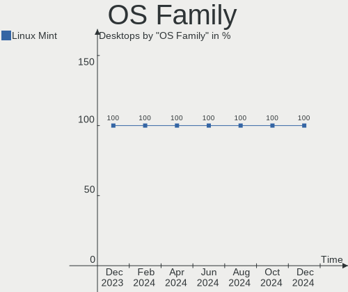
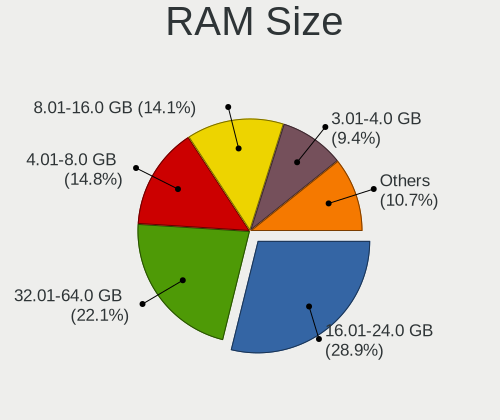
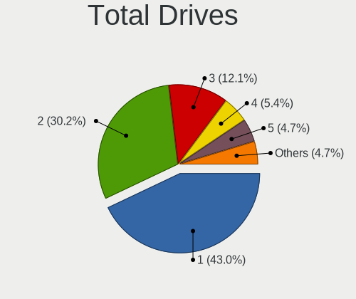
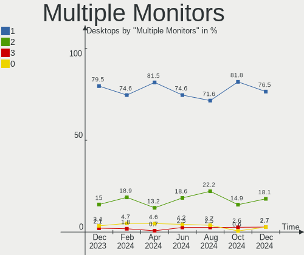
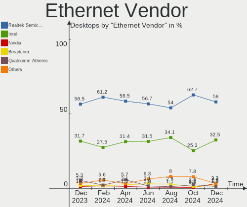

Linux Mint - Hardware Trends (Desktops)
---------------------------------------

A project to identify most popular hardware characteristics and track their change
over time based on data collected by Linux users at https://Linux-Hardware.org.

Anyone can contribute to this report by the [hw-probe](https://github.com/linuxhw/hw-probe) tool:

    sudo -E hw-probe -all -upload

This report is for one last month. Overall report since the beginning of time: [TestDays](https://github.com/linuxhw/TestDays)

Period: Jan, 2024.

Contents
--------

* [ System ](#system)
  - [ OS                       ](#os)
  - [ OS Family                ](#os-family)
  - [ Kernel                   ](#kernel)
  - [ Kernel Family            ](#kernel-family)
  - [ Kernel Major Ver.        ](#kernel-major-ver)
  - [ Arch                     ](#arch)
  - [ DE                       ](#de)
  - [ Display Server           ](#display-server)
  - [ Display Manager          ](#display-manager)
  - [ OS Lang                  ](#os-lang)
  - [ Boot Mode                ](#boot-mode)
  - [ Filesystem               ](#filesystem)
  - [ Part. scheme             ](#part-scheme)
  - [ Dual Boot with Linux/BSD ](#dual-boot-with-linuxbsd)
  - [ Dual Boot (Win)          ](#dual-boot-win)

* [ Board ](#board)
  - [ Vendor                   ](#vendor)
  - [ Model                    ](#model)
  - [ Model Family             ](#model-family)
  - [ MFG Year                 ](#mfg-year)
  - [ Form Factor              ](#form-factor)
  - [ Secure Boot              ](#secure-boot)
  - [ Coreboot                 ](#coreboot)
  - [ RAM Size                 ](#ram-size)
  - [ RAM Used                 ](#ram-used)
  - [ Total Drives             ](#total-drives)
  - [ Has CD-ROM               ](#has-cd-rom)
  - [ Has Ethernet             ](#has-ethernet)
  - [ Has WiFi                 ](#has-wifi)
  - [ Has Bluetooth            ](#has-bluetooth)

* [ Location ](#location)
  - [ Country                  ](#country)
  - [ City                     ](#city)

* [ Drives ](#drives)
  - [ Drive Vendor             ](#drive-vendor)
  - [ Drive Model              ](#drive-model)
  - [ HDD Vendor               ](#hdd-vendor)
  - [ SSD Vendor               ](#ssd-vendor)
  - [ Drive Kind               ](#drive-kind)
  - [ Drive Connector          ](#drive-connector)
  - [ Drive Size               ](#drive-size)
  - [ Space Total              ](#space-total)
  - [ Space Used               ](#space-used)
  - [ Malfunc. Drives          ](#malfunc-drives)
  - [ Malfunc. Drive Vendor    ](#malfunc-drive-vendor)
  - [ Malfunc. HDD Vendor      ](#malfunc-hdd-vendor)
  - [ Malfunc. Drive Kind      ](#malfunc-drive-kind)
  - [ Failed Drives            ](#failed-drives)
  - [ Failed Drive Vendor      ](#failed-drive-vendor)
  - [ Drive Status             ](#drive-status)

* [ Storage controller ](#storage-controller)
  - [ Storage Vendor           ](#storage-vendor)
  - [ Storage Model            ](#storage-model)
  - [ Storage Kind             ](#storage-kind)

* [ Processor ](#processor)
  - [ CPU Vendor               ](#cpu-vendor)
  - [ CPU Model                ](#cpu-model)
  - [ CPU Model Family         ](#cpu-model-family)
  - [ CPU Cores                ](#cpu-cores)
  - [ CPU Sockets              ](#cpu-sockets)
  - [ CPU Threads              ](#cpu-threads)
  - [ CPU Op-Modes             ](#cpu-op-modes)
  - [ CPU Microcode            ](#cpu-microcode)
  - [ CPU Microarch            ](#cpu-microarch)

* [ Graphics ](#graphics)
  - [ GPU Vendor               ](#gpu-vendor)
  - [ GPU Model                ](#gpu-model)
  - [ GPU Combo                ](#gpu-combo)
  - [ GPU Driver               ](#gpu-driver)
  - [ GPU Memory               ](#gpu-memory)

* [ Monitor ](#monitor)
  - [ Monitor Vendor           ](#monitor-vendor)
  - [ Monitor Model            ](#monitor-model)
  - [ Monitor Resolution       ](#monitor-resolution)
  - [ Monitor Diagonal         ](#monitor-diagonal)
  - [ Monitor Width            ](#monitor-width)
  - [ Aspect Ratio             ](#aspect-ratio)
  - [ Monitor Area             ](#monitor-area)
  - [ Pixel Density            ](#pixel-density)
  - [ Multiple Monitors        ](#multiple-monitors)

* [ Network ](#network)
  - [ Net Controller Vendor    ](#net-controller-vendor)
  - [ Net Controller Model     ](#net-controller-model)
  - [ Wireless Vendor          ](#wireless-vendor)
  - [ Wireless Model           ](#wireless-model)
  - [ Ethernet Vendor          ](#ethernet-vendor)
  - [ Ethernet Model           ](#ethernet-model)
  - [ Net Controller Kind      ](#net-controller-kind)
  - [ Used Controller          ](#used-controller)
  - [ NICs                     ](#nics)
  - [ IPv6                     ](#ipv6)

* [ Bluetooth ](#bluetooth)
  - [ Bluetooth Vendor         ](#bluetooth-vendor)
  - [ Bluetooth Model          ](#bluetooth-model)

* [ Sound ](#sound)
  - [ Sound Vendor             ](#sound-vendor)
  - [ Sound Model              ](#sound-model)

* [ Memory ](#memory)
  - [ Memory Vendor            ](#memory-vendor)
  - [ Memory Model             ](#memory-model)
  - [ Memory Kind              ](#memory-kind)
  - [ Memory Form Factor       ](#memory-form-factor)
  - [ Memory Size              ](#memory-size)
  - [ Memory Speed             ](#memory-speed)

* [ Printers & scanners ](#printers--scanners)
  - [ Printer Vendor           ](#printer-vendor)
  - [ Printer Model            ](#printer-model)
  - [ Scanner Vendor           ](#scanner-vendor)
  - [ Scanner Model            ](#scanner-model)

* [ Camera ](#camera)
  - [ Camera Vendor            ](#camera-vendor)
  - [ Camera Model             ](#camera-model)

* [ Security ](#security)
  - [ Fingerprint Vendor       ](#fingerprint-vendor)
  - [ Fingerprint Model        ](#fingerprint-model)
  - [ Chipcard Vendor          ](#chipcard-vendor)
  - [ Chipcard Model           ](#chipcard-model)

* [ Unsupported ](#unsupported)
  - [ Unsupported Devices      ](#unsupported-devices)
  - [ Unsupported Device Types ](#unsupported-device-types)

System
------

OS
--

Installed operating systems

| Name              | Desktops | Percent |
|-------------------|----------|---------|
| Linux Mint 21.2   | 107      | 49.31%  |
| Linux Mint 21.3   | 66       | 30.41%  |
| Linux Mint 20.3   | 13       | 5.99%   |
| Linux Mint 21.1   | 12       | 5.53%   |
| Linux Mint 19.3   | 6        | 2.76%   |
| Linux Mint 20     | 5        | 2.3%    |
| Linux Mint 21     | 3        | 1.38%   |
| Linux Mint 20.2   | 2        | 0.92%   |
| Linux Mint 21.2.0 | 1        | 0.46%   |
| Linux Mint 20.1   | 1        | 0.46%   |
| Linux Mint 19.1   | 1        | 0.46%   |

OS Family
---------

OS without a version

| Name       | Desktops | Percent |
|------------|----------|---------|
| Linux Mint | 217      | 100%    |

Kernel
------

Version of the Linux kernel

| Version               | Desktops | Percent |
|-----------------------|----------|---------|
| 5.15.0-91-generic     | 118      | 54.38%  |
| 5.15.0-92-generic     | 22       | 10.14%  |
| 5.4.0-169-generic     | 13       | 5.99%   |
| 5.15.0-76-generic     | 10       | 4.61%   |
| 6.5.0-14-generic      | 8        | 3.69%   |
| 6.5.0-15-generic      | 6        | 2.76%   |
| 6.2.0-39-generic      | 6        | 2.76%   |
| 5.4.0-150-generic     | 5        | 2.3%    |
| 6.7.0-060700-generic  | 2        | 0.92%   |
| 6.5.0-1011-oem        | 2        | 0.92%   |
| 6.1.0-1027-oem        | 2        | 0.92%   |
| 5.4.0-167-generic     | 2        | 0.92%   |
| 5.15.0-89-generic     | 2        | 0.92%   |
| 5.15.0-84-generic     | 2        | 0.92%   |
| 6.5.8-kim1+           | 1        | 0.46%   |
| 6.5.11-060511-generic | 1        | 0.46%   |
| 6.2.0-37-generic      | 1        | 0.46%   |
| 6.2.0-35-generic      | 1        | 0.46%   |
| 6.2.0-33-generic      | 1        | 0.46%   |
| 6.2.0-060200-generic  | 1        | 0.46%   |
| 5.4.0-91-generic      | 1        | 0.46%   |
| 5.4.0-65-generic      | 1        | 0.46%   |
| 5.4.0-155-generic     | 1        | 0.46%   |
| 5.4.0-152-generic     | 1        | 0.46%   |
| 5.15.0-88-generic     | 1        | 0.46%   |
| 5.15.0-78-generic     | 1        | 0.46%   |
| 5.15.0-67-generic     | 1        | 0.46%   |
| 5.15.0-52-generic     | 1        | 0.46%   |
| 5.15.0-50-generic     | 1        | 0.46%   |
| 5.15.0-41-generic     | 1        | 0.46%   |
| 4.15.0-213-generic    | 1        | 0.46%   |

Kernel Family
-------------

Linux kernel without a distro release

| Version | Desktops | Percent |
|---------|----------|---------|
| 5.15.0  | 160      | 73.73%  |
| 5.4.0   | 24       | 11.06%  |
| 6.5.0   | 16       | 7.37%   |
| 6.2.0   | 10       | 4.61%   |
| 6.7.0   | 2        | 0.92%   |
| 6.1.0   | 2        | 0.92%   |
| 6.5.8   | 1        | 0.46%   |
| 6.5.11  | 1        | 0.46%   |
| 4.15.0  | 1        | 0.46%   |

Kernel Major Ver.
-----------------

Linux kernel major version

| Version | Desktops | Percent |
|---------|----------|---------|
| 5.15    | 160      | 73.73%  |
| 5.4     | 24       | 11.06%  |
| 6.5     | 18       | 8.29%   |
| 6.2     | 10       | 4.61%   |
| 6.7     | 2        | 0.92%   |
| 6.1     | 2        | 0.92%   |
| 4.15    | 1        | 0.46%   |

Arch
----

OS architecture (x86_64, i586, etc.)

| Name   | Desktops | Percent |
|--------|----------|---------|
| x86_64 | 216      | 99.54%  |
| i686   | 1        | 0.46%   |

DE
--

Desktop Environment

| Name       | Desktops | Percent |
|------------|----------|---------|
| X-Cinnamon | 151      | 69.59%  |
| MATE       | 34       | 15.67%  |
| XFCE       | 25       | 11.52%  |
| GNOME      | 2        | 0.92%   |
| Cinnamon   | 2        | 0.92%   |
| Unknown    | 2        | 0.92%   |
| KDE5       | 1        | 0.46%   |

Display Server
--------------

X11 or Wayland

| Name    | Desktops | Percent |
|---------|----------|---------|
| X11     | 212      | 97.7%   |
| Wayland | 4        | 1.84%   |
| Tty     | 1        | 0.46%   |

Display Manager
---------------

SDDM, LightDM, etc.

| Name    | Desktops | Percent |
|---------|----------|---------|
| Unknown | 120      | 55.3%   |
| LightDM | 95       | 43.78%  |
| GDM3    | 1        | 0.46%   |
| GDM     | 1        | 0.46%   |

OS Lang
-------

Language

| Lang    | Desktops | Percent |
|---------|----------|---------|
| en_US   | 68       | 31.34%  |
| de_DE   | 36       | 16.59%  |
| it_IT   | 16       | 7.37%   |
| fr_FR   | 12       | 5.53%   |
| pt_BR   | 11       | 5.07%   |
| en_AU   | 10       | 4.61%   |
| en_GB   | 9        | 4.15%   |
| C       | 7        | 3.23%   |
| en_CA   | 6        | 2.76%   |
| ru_RU   | 5        | 2.3%    |
| es_ES   | 3        | 1.38%   |
| de_CH   | 3        | 1.38%   |
| da_DK   | 3        | 1.38%   |
| sv_SE   | 2        | 0.92%   |
| fr_CA   | 2        | 0.92%   |
| fr_BE   | 2        | 0.92%   |
| fi_FI   | 2        | 0.92%   |
| en_IN   | 2        | 0.92%   |
| en_IE   | 2        | 0.92%   |
| de_AT   | 2        | 0.92%   |
| Unknown | 2        | 0.92%   |
| pl_PL   | 1        | 0.46%   |
| nl_NL   | 1        | 0.46%   |
| it_CH   | 1        | 0.46%   |
| fr_CH   | 1        | 0.46%   |
| es_VE   | 1        | 0.46%   |
| es_PE   | 1        | 0.46%   |
| es_MX   | 1        | 0.46%   |
| es_CR   | 1        | 0.46%   |
| es_CL   | 1        | 0.46%   |
| en_NZ   | 1        | 0.46%   |
| cs_CZ   | 1        | 0.46%   |
| bg_BG   | 1        | 0.46%   |

Boot Mode
---------

EFI or BIOS

| Mode | Desktops | Percent |
|------|----------|---------|
| EFI  | 127      | 58.53%  |
| BIOS | 90       | 41.47%  |

Filesystem
----------

Type of filesystem

| Type    | Desktops | Percent |
|---------|----------|---------|
| Ext4    | 200      | 92.17%  |
| Tmpfs   | 6        | 2.76%   |
| Overlay | 6        | 2.76%   |
| Zfs     | 2        | 0.92%   |
| Xfs     | 1        | 0.46%   |
| Ext2    | 1        | 0.46%   |
| Btrfs   | 1        | 0.46%   |

Part. scheme
------------

Scheme of partitioning

| Type    | Desktops | Percent |
|---------|----------|---------|
| Unknown | 120      | 55.3%   |
| GPT     | 80       | 36.87%  |
| MBR     | 17       | 7.83%   |

Dual Boot with Linux/BSD
------------------------

Hosting more than one Linux/BSD

| Dual boot | Desktops | Percent |
|-----------|----------|---------|
| No        | 189      | 87.1%   |
| Yes       | 28       | 12.9%   |

Dual Boot (Win)
---------------

Hosting Linux and Windows

| Dual boot | Desktops | Percent |
|-----------|----------|---------|
| No        | 164      | 75.58%  |
| Yes       | 53       | 24.42%  |

Board
-----

Vendor
------

Motherboard manufacturer

| Name                                 | Desktops | Percent |
|--------------------------------------|----------|---------|
| ASUSTek Computer                     | 44       | 20.28%  |
| Gigabyte Technology                  | 41       | 18.89%  |
| Hewlett-Packard                      | 22       | 10.14%  |
| ASRock                               | 22       | 10.14%  |
| MSI                                  | 21       | 9.68%   |
| Dell                                 | 21       | 9.68%   |
| Lenovo                               | 9        | 4.15%   |
| Intel                                | 5        | 2.3%    |
| Unknown                              | 5        | 2.3%    |
| ECS                                  | 4        | 1.84%   |
| Biostar                              | 4        | 1.84%   |
| AZW                                  | 4        | 1.84%   |
| Foxconn                              | 3        | 1.38%   |
| Pegatron                             | 2        | 0.92%   |
| Medion                               | 2        | 0.92%   |
| Shenzhen Meigao Electronic Equipment | 1        | 0.46%   |
| Sapphire                             | 1        | 0.46%   |
| Megaware                             | 1        | 0.46%   |
| GMKtec                               | 1        | 0.46%   |
| Fujitsu                              | 1        | 0.46%   |
| BESSTAR Tech                         | 1        | 0.46%   |
| AMI                                  | 1        | 0.46%   |
| Acer                                 | 1        | 0.46%   |

Model
-----

Motherboard model

| Name                                            | Desktops | Percent |
|-------------------------------------------------|----------|---------|
| ASUS All Series                                 | 5        | 2.3%    |
| Unknown                                         | 5        | 2.3%    |
| Dell OptiPlex 9020                              | 3        | 1.38%   |
| Dell OptiPlex 7040                              | 3        | 1.38%   |
| Intel X99                                       | 2        | 0.92%   |
| HP EliteDesk 800 G2 SFF                         | 2        | 0.92%   |
| HP Compaq 8200 Elite SFF PC                     | 2        | 0.92%   |
| Gigabyte X570 AORUS ULTRA                       | 2        | 0.92%   |
| Gigabyte H81M-HD3                               | 2        | 0.92%   |
| Gigabyte A320M-S2H V2                           | 2        | 0.92%   |
| Dell Precision T1700                            | 2        | 0.92%   |
| Dell OptiPlex 7010                              | 2        | 0.92%   |
| ASUS ROG STRIX Z690-F GAMING WIFI               | 2        | 0.92%   |
| ASUS PRIME A520M-K                              | 2        | 0.92%   |
| ASUS PRIME A320M-K                              | 2        | 0.92%   |
| Shenzhen Meigao Electronic Equipment UM773 Lite | 1        | 0.46%   |
| Sapphire PE-AM2RS690V2                          | 1        | 0.46%   |
| Pegatron p6-2053itm                             | 1        | 0.46%   |
| Pegatron 810-370st                              | 1        | 0.46%   |
| MSI VENGEANCE i7400                             | 1        | 0.46%   |
| MSI MS-7D76                                     | 1        | 0.46%   |
| MSI MS-7D59                                     | 1        | 0.46%   |
| MSI MS-7D19                                     | 1        | 0.46%   |
| MSI MS-7C95                                     | 1        | 0.46%   |
| MSI MS-7C91                                     | 1        | 0.46%   |
| MSI MS-7C90                                     | 1        | 0.46%   |
| MSI MS-7C56                                     | 1        | 0.46%   |
| MSI MS-7C52                                     | 1        | 0.46%   |
| MSI MS-7C51                                     | 1        | 0.46%   |
| MSI MS-7B93                                     | 1        | 0.46%   |
| MSI MS-7B89                                     | 1        | 0.46%   |
| MSI MS-7B86                                     | 1        | 0.46%   |
| MSI MS-7995                                     | 1        | 0.46%   |
| MSI MS-7976                                     | 1        | 0.46%   |
| MSI MS-7971                                     | 1        | 0.46%   |
| MSI MS-7916                                     | 1        | 0.46%   |
| MSI MS-7817                                     | 1        | 0.46%   |
| MSI MS-7349                                     | 1        | 0.46%   |
| MSI H310 Gaming Infinite S (MS-B928)            | 1        | 0.46%   |
| MSI A320M/ac                                    | 1        | 0.46%   |

Model Family
------------

Motherboard model prefix

| Name                                       | Desktops | Percent |
|--------------------------------------------|----------|---------|
| Dell OptiPlex                              | 15       | 6.91%   |
| ASUS ROG                                   | 10       | 4.61%   |
| ASUS PRIME                                 | 8        | 3.69%   |
| Lenovo ThinkCentre                         | 6        | 2.76%   |
| HP Compaq                                  | 6        | 2.76%   |
| ASUS All                                   | 5        | 2.3%    |
| Unknown                                    | 5        | 2.3%    |
| HP EliteDesk                               | 4        | 1.84%   |
| ASUS TUF                                   | 4        | 1.84%   |
| Gigabyte X570                              | 3        | 1.38%   |
| Gigabyte A320M-S2H                         | 3        | 1.38%   |
| ASRock X570                                | 3        | 1.38%   |
| Intel X99                                  | 2        | 0.92%   |
| Gigabyte H81M-HD3                          | 2        | 0.92%   |
| Gigabyte B450M                             | 2        | 0.92%   |
| Dell XPS                                   | 2        | 0.92%   |
| Dell Precision                             | 2        | 0.92%   |
| ASUS P8H67-M                               | 2        | 0.92%   |
| ASUS M5A99X                                | 2        | 0.92%   |
| ASRock Z77                                 | 2        | 0.92%   |
| ASRock FM2A88X                             | 2        | 0.92%   |
| Shenzhen Meigao Electronic Equipment UM773 | 1        | 0.46%   |
| Sapphire PE-AM2RS690V2                     | 1        | 0.46%   |
| Pegatron p6-2053itm                        | 1        | 0.46%   |
| Pegatron 810-370st                         | 1        | 0.46%   |
| MSI VENGEANCE                              | 1        | 0.46%   |
| MSI MS-7D76                                | 1        | 0.46%   |
| MSI MS-7D59                                | 1        | 0.46%   |
| MSI MS-7D19                                | 1        | 0.46%   |
| MSI MS-7C95                                | 1        | 0.46%   |
| MSI MS-7C91                                | 1        | 0.46%   |
| MSI MS-7C90                                | 1        | 0.46%   |
| MSI MS-7C56                                | 1        | 0.46%   |
| MSI MS-7C52                                | 1        | 0.46%   |
| MSI MS-7C51                                | 1        | 0.46%   |
| MSI MS-7B93                                | 1        | 0.46%   |
| MSI MS-7B89                                | 1        | 0.46%   |
| MSI MS-7B86                                | 1        | 0.46%   |
| MSI MS-7995                                | 1        | 0.46%   |
| MSI MS-7976                                | 1        | 0.46%   |

MFG Year
--------

Motherboard manufacture year

| Year | Desktops | Percent |
|------|----------|---------|
| 2014 | 22       | 10.14%  |
| 2012 | 22       | 10.14%  |
| 2013 | 20       | 9.22%   |
| 2022 | 19       | 8.76%   |
| 2020 | 18       | 8.29%   |
| 2018 | 15       | 6.91%   |
| 2021 | 14       | 6.45%   |
| 2015 | 14       | 6.45%   |
| 2017 | 13       | 5.99%   |
| 2019 | 11       | 5.07%   |
| 2011 | 10       | 4.61%   |
| 2023 | 8        | 3.69%   |
| 2010 | 7        | 3.23%   |
| 2009 | 7        | 3.23%   |
| 2016 | 6        | 2.76%   |
| 2008 | 5        | 2.3%    |
| 2007 | 4        | 1.84%   |
| 2006 | 1        | 0.46%   |
| 2004 | 1        | 0.46%   |

Form Factor
-----------

Physical design of the computer

| Name    | Desktops | Percent |
|---------|----------|---------|
| Desktop | 217      | 100%    |

Secure Boot
-----------

Enabled or disabled

| State    | Desktops | Percent |
|----------|----------|---------|
| Disabled | 214      | 98.62%  |
| Enabled  | 3        | 1.38%   |

Coreboot
--------

Have coreboot on board

| Used | Desktops | Percent |
|------|----------|---------|
| No   | 217      | 100%    |

RAM Size
--------

Total RAM memory

| Size in GB  | Desktops | Percent |
|-------------|----------|---------|
| 16.01-24.0  | 57       | 26.27%  |
| 32.01-64.0  | 40       | 18.43%  |
| 4.01-8.0    | 39       | 17.97%  |
| 8.01-16.0   | 37       | 17.05%  |
| 3.01-4.0    | 16       | 7.37%   |
| 64.01-256.0 | 12       | 5.53%   |
| 24.01-32.0  | 11       | 5.07%   |
| 2.01-3.0    | 3        | 1.38%   |
| 1.01-2.0    | 1        | 0.46%   |
| 0.51-1.0    | 1        | 0.46%   |

RAM Used
--------

Used RAM memory

| Used GB    | Desktops | Percent |
|------------|----------|---------|
| 2.01-3.0   | 68       | 31.34%  |
| 1.01-2.0   | 53       | 24.42%  |
| 4.01-8.0   | 38       | 17.51%  |
| 3.01-4.0   | 37       | 17.05%  |
| 8.01-16.0  | 11       | 5.07%   |
| 0.51-1.0   | 8        | 3.69%   |
| 16.01-24.0 | 1        | 0.46%   |
| 0.01-0.5   | 1        | 0.46%   |

Total Drives
------------

Number of drives on board

| Drives | Desktops | Percent |
|--------|----------|---------|
| 1      | 77       | 35.48%  |
| 2      | 71       | 32.72%  |
| 3      | 36       | 16.59%  |
| 4      | 18       | 8.29%   |
| 5      | 9        | 4.15%   |
| 6      | 6        | 2.76%   |

Has CD-ROM
----------

Has CD-ROM on board

| Presented | Desktops | Percent |
|-----------|----------|---------|
| No        | 110      | 50.69%  |
| Yes       | 107      | 49.31%  |

Has Ethernet
------------

Has Ethernet on board

| Presented | Desktops | Percent |
|-----------|----------|---------|
| Yes       | 215      | 99.08%  |
| No        | 2        | 0.92%   |

Has WiFi
--------

Has WiFi module

| Presented | Desktops | Percent |
|-----------|----------|---------|
| Yes       | 115      | 53%     |
| No        | 102      | 47%     |

Has Bluetooth
-------------

Has Bluetooth module

| Presented | Desktops | Percent |
|-----------|----------|---------|
| No        | 135      | 62.21%  |
| Yes       | 82       | 37.79%  |

Location
--------

Country
-------

Geographic location (country)

| Country     | Desktops | Percent |
|-------------|----------|---------|
| USA         | 46       | 21.2%   |
| Germany     | 43       | 19.82%  |
| Italy       | 19       | 8.76%   |
| France      | 13       | 5.99%   |
| Brazil      | 13       | 5.99%   |
| UK          | 10       | 4.61%   |
| Australia   | 10       | 4.61%   |
| Canada      | 9        | 4.15%   |
| Switzerland | 7        | 3.23%   |
| Russia      | 7        | 3.23%   |
| Sweden      | 3        | 1.38%   |
| Poland      | 3        | 1.38%   |
| Mexico      | 3        | 1.38%   |
| Finland     | 3        | 1.38%   |
| Denmark     | 3        | 1.38%   |
| Spain       | 2        | 0.92%   |
| Peru        | 2        | 0.92%   |
| Netherlands | 2        | 0.92%   |
| India       | 2        | 0.92%   |
| Bulgaria    | 2        | 0.92%   |
| Austria     | 2        | 0.92%   |
| Venezuela   | 1        | 0.46%   |
| Taiwan      | 1        | 0.46%   |
| New Zealand | 1        | 0.46%   |
| Ireland     | 1        | 0.46%   |
| Indonesia   | 1        | 0.46%   |
| Hungary     | 1        | 0.46%   |
| Greece      | 1        | 0.46%   |
| Czechia     | 1        | 0.46%   |
| Costa Rica  | 1        | 0.46%   |
| Chile       | 1        | 0.46%   |
| Belgium     | 1        | 0.46%   |
| Argentina   | 1        | 0.46%   |
| Algeria     | 1        | 0.46%   |

City
----

Geographic location (city)

| City            | Desktops | Percent |
|-----------------|----------|---------|
| Milan           | 4        | 1.84%   |
| Melbourne       | 4        | 1.84%   |
| Berlin          | 4        | 1.84%   |
| Sao Paulo       | 3        | 1.38%   |
| Rome            | 3        | 1.38%   |
| Helsinki        | 3        | 1.38%   |
| Ulyanovsk       | 2        | 0.92%   |
| Turin           | 2        | 0.92%   |
| Tampa           | 2        | 0.92%   |
| Sydney          | 2        | 0.92%   |
| Manchester      | 2        | 0.92%   |
| Düsseldorf     | 2        | 0.92%   |
| Cologne         | 2        | 0.92%   |
| Brisbane        | 2        | 0.92%   |
| Brasília       | 2        | 0.92%   |
| Aix-en-Provence | 2        | 0.92%   |
| Zielona Góra   | 1        | 0.46%   |
| Yuma            | 1        | 0.46%   |
| Wolfsburg       | 1        | 0.46%   |
| Wittenberg      | 1        | 0.46%   |
| Wilmette        | 1        | 0.46%   |
| Willich         | 1        | 0.46%   |
| West Palm Beach | 1        | 0.46%   |
| West Jordan     | 1        | 0.46%   |
| Weilheim        | 1        | 0.46%   |
| Wedel           | 1        | 0.46%   |
| Watford City    | 1        | 0.46%   |
| Watertown       | 1        | 0.46%   |
| Warragul        | 1        | 0.46%   |
| Warendorf       | 1        | 0.46%   |
| Waedenswil      | 1        | 0.46%   |
| Voronezh        | 1        | 0.46%   |
| Vladimir        | 1        | 0.46%   |
| Visakhapatnam   | 1        | 0.46%   |
| Vienna          | 1        | 0.46%   |
| Venosa          | 1        | 0.46%   |
| Vaernamo        | 1        | 0.46%   |
| Uzwil           | 1        | 0.46%   |
| Ufa             | 1        | 0.46%   |
| Tver            | 1        | 0.46%   |

Drives
------

Drive Vendor
------------

Hard drive vendors

| Vendor                       | Desktops | Drives | Percent |
|------------------------------|----------|--------|---------|
| WDC                          | 75       | 90     | 18.89%  |
| Seagate                      | 71       | 98     | 17.88%  |
| Samsung Electronics          | 64       | 84     | 16.12%  |
| Kingston                     | 26       | 28     | 6.55%   |
| Crucial                      | 24       | 27     | 6.05%   |
| SanDisk                      | 23       | 25     | 5.79%   |
| Toshiba                      | 9        | 10     | 2.27%   |
| Intenso                      | 7        | 8      | 1.76%   |
| Hitachi                      | 7        | 8      | 1.76%   |
| China                        | 7        | 7      | 1.76%   |
| A-DATA Technology            | 6        | 6      | 1.51%   |
| Unknown                      | 5        | 13     | 1.26%   |
| Micron/Crucial Technology    | 5        | 5      | 1.26%   |
| Patriot                      | 4        | 4      | 1.01%   |
| MAXIO Technology (Hangzhou)  | 4        | 4      | 1.01%   |
| SPCC                         | 3        | 3      | 0.76%   |
| PNY                          | 3        | 3      | 0.76%   |
| Netac                        | 3        | 3      | 0.76%   |
| Kingston Technology Company  | 3        | 3      | 0.76%   |
| HGST                         | 3        | 3      | 0.76%   |
| Corsair                      | 3        | 3      | 0.76%   |
| Realtek Semiconductor        | 2        | 2      | 0.5%    |
| Phison                       | 2        | 3      | 0.5%    |
| Micron Technology            | 2        | 2      | 0.5%    |
| Maxtor                       | 2        | 2      | 0.5%    |
| Lexar                        | 2        | 2      | 0.5%    |
| XrayDisk                     | 1        | 1      | 0.25%   |
| VERICO                       | 1        | 1      | 0.25%   |
| USB                          | 1        | 1      | 0.25%   |
| Unique                       | 1        | 1      | 0.25%   |
| Transcend                    | 1        | 1      | 0.25%   |
| Timetec                      | 1        | 1      | 0.25%   |
| Team                         | 1        | 1      | 0.25%   |
| T-FORCE                      | 1        | 1      | 0.25%   |
| sobetter                     | 1        | 1      | 0.25%   |
| SK hynix                     | 1        | 1      | 0.25%   |
| Silicon Motion               | 1        | 1      | 0.25%   |
| Shenzhen Longsys Electronics | 1        | 1      | 0.25%   |
| Seagate Technology           | 1        | 1      | 0.25%   |
| Phison Electronics           | 1        | 1      | 0.25%   |

Drive Model
-----------

Hard drive models

| Model                                              | Desktops | Percent |
|----------------------------------------------------|----------|---------|
| Samsung NVMe SSD Controller SM981/PM981/PM983 1TB  | 7        | 1.54%   |
| Kingston SA400S37240G 240GB SSD                    | 6        | 1.32%   |
| Seagate ST500DM002-1BD142 500GB                    | 5        | 1.1%    |
| Seagate ST1000DM010-2EP102 1TB                     | 5        | 1.1%    |
| Samsung SSD 860 EVO 500GB                          | 5        | 1.1%    |
| WDC WD10EZEX-08WN4A0 1TB                           | 4        | 0.88%   |
| Unknown Compact Flash 977MB                        | 4        | 0.88%   |
| Seagate ST3500418AS 500GB                          | 4        | 0.88%   |
| Seagate ST2000DM008-2FR102 2TB                     | 4        | 0.88%   |
| Samsung SSD 860 EVO 1TB                            | 4        | 0.88%   |
| Samsung NVMe SSD Controller PM9A1/PM9A3/980PRO 2TB | 4        | 0.88%   |
| Kingston SA400S37480G 480GB SSD                    | 4        | 0.88%   |
| Crucial CT1000BX500SSD1 1TB                        | 4        | 0.88%   |
| WDC WD40EZRZ-00GXCB0 4TB                           | 3        | 0.66%   |
| WDC WD10EZEX-00BN5A0 1TB                           | 3        | 0.66%   |
| Unknown SD/MMC 2GB                                 | 3        | 0.66%   |
| Unknown M.S./M.S.Pro/HG 16GB                       | 3        | 0.66%   |
| Seagate ST250DM000-1BD141 250GB                    | 3        | 0.66%   |
| Samsung SSD 970 EVO Plus 1TB                       | 3        | 0.66%   |
| Micron/Crucial P1 NVMe PCIe SSD 1TB                | 3        | 0.66%   |
| Kingston SUV400S37240G 240GB SSD                   | 3        | 0.66%   |
| Crucial CT480BX500SSD1 480GB                       | 3        | 0.66%   |
| Crucial CT250MX500SSD1 250GB                       | 3        | 0.66%   |
| WDC WDS240G2G0A-00JH30 240GB SSD                   | 2        | 0.44%   |
| WDC WD4005FZBX-00K5WB0 4TB                         | 2        | 0.44%   |
| WDC WD30EFRX-68EUZN0 3TB                           | 2        | 0.44%   |
| WDC WD2500AAKX-00ERMA0 250GB                       | 2        | 0.44%   |
| WDC WD20EZRZ-00Z5HB0 2TB                           | 2        | 0.44%   |
| WDC WD2003FZEX-00SRLA0 2TB                         | 2        | 0.44%   |
| WDC WD1600AAJS-00L7A0 160GB                        | 2        | 0.44%   |
| WDC WD10EZEX-60ZF5A0 1TB                           | 2        | 0.44%   |
| WDC WD10EZEX-60M2NA0 1TB                           | 2        | 0.44%   |
| WDC WD10EZEX-22BN5A0 1TB                           | 2        | 0.44%   |
| WDC WD10EZEX-08M2NA0 1TB                           | 2        | 0.44%   |
| WDC WD1003FZEX-00MK2A0 1TB                         | 2        | 0.44%   |
| Unknown SD/MMC/MS PRO 256GB                        | 2        | 0.44%   |
| Seagate ST6000DM003-2CY186 6TB                     | 2        | 0.44%   |
| Seagate ST4000DM004-2CV104 4TB                     | 2        | 0.44%   |
| Seagate ST380815AS 80GB                            | 2        | 0.44%   |
| Seagate ST3500312CS 500GB                          | 2        | 0.44%   |

HDD Vendor
----------

Hard disk drive vendors

| Vendor              | Desktops | Drives | Percent |
|---------------------|----------|--------|---------|
| Seagate             | 70       | 96     | 41.67%  |
| WDC                 | 65       | 78     | 38.69%  |
| Toshiba             | 8        | 8      | 4.76%   |
| Hitachi             | 7        | 8      | 4.17%   |
| Samsung Electronics | 6        | 8      | 3.57%   |
| HGST                | 3        | 3      | 1.79%   |
| Unknown             | 2        | 2      | 1.19%   |
| Maxtor              | 2        | 2      | 1.19%   |
| Inateck             | 1        | 1      | 0.6%    |
| HPE                 | 1        | 1      | 0.6%    |
| Hewlett-Packard     | 1        | 1      | 0.6%    |
| External            | 1        | 1      | 0.6%    |
| Apple               | 1        | 1      | 0.6%    |

SSD Vendor
----------

Solid state drive vendors

| Vendor              | Desktops | Drives | Percent |
|---------------------|----------|--------|---------|
| Samsung Electronics | 34       | 38     | 22.67%  |
| Kingston            | 22       | 24     | 14.67%  |
| Crucial             | 16       | 19     | 10.67%  |
| SanDisk             | 14       | 16     | 9.33%   |
| WDC                 | 9        | 9      | 6%      |
| China               | 7        | 7      | 4.67%   |
| Intenso             | 6        | 7      | 4%      |
| A-DATA Technology   | 6        | 6      | 4%      |
| Patriot             | 4        | 4      | 2.67%   |
| SPCC                | 3        | 3      | 2%      |
| PNY                 | 3        | 3      | 2%      |
| Netac               | 3        | 3      | 2%      |
| Toshiba             | 2        | 2      | 1.33%   |
| Lexar               | 2        | 2      | 1.33%   |
| Corsair             | 2        | 2      | 1.33%   |
| VERICO              | 1        | 1      | 0.67%   |
| Unique              | 1        | 1      | 0.67%   |
| Transcend           | 1        | 1      | 0.67%   |
| Timetec             | 1        | 1      | 0.67%   |
| Team                | 1        | 1      | 0.67%   |
| sobetter            | 1        | 1      | 0.67%   |
| OCZ                 | 1        | 1      | 0.67%   |
| Micron Technology   | 1        | 1      | 0.67%   |
| LITEON              | 1        | 1      | 0.67%   |
| LDLC                | 1        | 1      | 0.67%   |
| KingSpec            | 1        | 1      | 0.67%   |
| Integral            | 1        | 1      | 0.67%   |
| Fanxiang            | 1        | 1      | 0.67%   |
| Dahua               | 1        | 1      | 0.67%   |
| BIWIN               | 1        | 1      | 0.67%   |
| BAITITON            | 1        | 1      | 0.67%   |
| Apacer              | 1        | 1      | 0.67%   |

Drive Kind
----------

HDD or SSD

| Kind    | Desktops | Drives | Percent |
|---------|----------|--------|---------|
| HDD     | 138      | 210    | 39.66%  |
| SSD     | 131      | 162    | 37.64%  |
| NVMe    | 71       | 91     | 20.4%   |
| Unknown | 8        | 15     | 2.3%    |

Drive Connector
---------------

SATA, SAS, NVMe, etc.

| Type | Desktops | Drives | Percent |
|------|----------|--------|---------|
| SATA | 199      | 356    | 68.86%  |
| NVMe | 71       | 90     | 24.57%  |
| SAS  | 19       | 32     | 6.57%   |

Drive Size
----------

Size of hard drive

| Size in TB | Desktops | Drives | Percent |
|------------|----------|--------|---------|
| 0.01-0.5   | 132      | 181    | 46.15%  |
| 0.51-1.0   | 80       | 100    | 27.97%  |
| 1.01-2.0   | 40       | 51     | 13.99%  |
| 3.01-4.0   | 14       | 17     | 4.9%    |
| 2.01-3.0   | 9        | 9      | 3.15%   |
| 4.01-10.0  | 8        | 10     | 2.8%    |
| 10.01-20.0 | 3        | 4      | 1.05%   |

Space Total
-----------

Amount of disk space available on the file system

| Size in GB     | Desktops | Percent |
|----------------|----------|---------|
| 101-250        | 54       | 24.88%  |
| 501-1000       | 46       | 21.2%   |
| 251-500        | 39       | 17.97%  |
| More than 3000 | 26       | 11.98%  |
| 1001-2000      | 19       | 8.76%   |
| 2001-3000      | 14       | 6.45%   |
| 51-100         | 7        | 3.23%   |
| 1-20           | 5        | 2.3%    |
| 21-50          | 4        | 1.84%   |
| Unknown        | 3        | 1.38%   |

Space Used
----------

Amount of used disk space

| Used GB        | Desktops | Percent |
|----------------|----------|---------|
| 21-50          | 37       | 17.05%  |
| 51-100         | 37       | 17.05%  |
| 101-250        | 32       | 14.75%  |
| 501-1000       | 29       | 13.36%  |
| 1-20           | 27       | 12.44%  |
| 251-500        | 23       | 10.6%   |
| 1001-2000      | 14       | 6.45%   |
| More than 3000 | 9        | 4.15%   |
| 2001-3000      | 6        | 2.76%   |
| Unknown        | 3        | 1.38%   |

Malfunc. Drives
---------------

Drive models with a malfunction

| Model                                 | Desktops | Drives | Percent |
|---------------------------------------|----------|--------|---------|
| Seagate ST500DM002-1BD142 500GB       | 2        | 2      | 10%     |
| WDC WD30EZRZ-00Z5HB0 3TB              | 1        | 1      | 5%      |
| WDC WD20EARS-00MVWB0 2TB              | 1        | 1      | 5%      |
| SPCC Solid State Disk 240GB           | 1        | 1      | 5%      |
| Seagate ST380815AS 80GB               | 1        | 1      | 5%      |
| Seagate ST31000528AS 1TB              | 1        | 1      | 5%      |
| Seagate ST250DM000-1BD141 250GB       | 1        | 2      | 5%      |
| Seagate ST1000DX001-1NS162 1TB        | 1        | 1      | 5%      |
| Seagate ST1000DM003-9YN162 1TB        | 1        | 1      | 5%      |
| SanDisk SDSSDHII120G 120GB            | 1        | 1      | 5%      |
| Samsung Electronics SSD 950 PRO 512GB | 1        | 1      | 5%      |
| Patriot P200 1TB SSD                  | 1        | 1      | 5%      |
| OCZ VECTOR150 120GB SSD               | 1        | 1      | 5%      |
| Kingston SA400S37240G 240GB SSD       | 1        | 1      | 5%      |
| Hitachi HUA723020ALA641 2TB           | 1        | 1      | 5%      |
| Hitachi HDT725025VLA380 250GB         | 1        | 1      | 5%      |
| Hitachi HDP725050GLA360 500GB         | 1        | 1      | 5%      |
| BAITITON BT58SSD07N 128GB             | 1        | 1      | 5%      |
| Apple HDD ST1000DM003 1TB             | 1        | 1      | 5%      |

Malfunc. Drive Vendor
---------------------

Vendors of faulty drives

| Vendor              | Desktops | Drives | Percent |
|---------------------|----------|--------|---------|
| Seagate             | 7        | 8      | 35%     |
| Hitachi             | 3        | 3      | 15%     |
| WDC                 | 2        | 2      | 10%     |
| SPCC                | 1        | 1      | 5%      |
| SanDisk             | 1        | 1      | 5%      |
| Samsung Electronics | 1        | 1      | 5%      |
| Patriot             | 1        | 1      | 5%      |
| OCZ                 | 1        | 1      | 5%      |
| Kingston            | 1        | 1      | 5%      |
| BAITITON            | 1        | 1      | 5%      |
| Apple               | 1        | 1      | 5%      |

Malfunc. HDD Vendor
-------------------

Vendors of faulty HDD drives

| Vendor  | Desktops | Drives | Percent |
|---------|----------|--------|---------|
| Seagate | 7        | 8      | 53.85%  |
| Hitachi | 3        | 3      | 23.08%  |
| WDC     | 2        | 2      | 15.38%  |
| Apple   | 1        | 1      | 7.69%   |

Malfunc. Drive Kind
-------------------

Kinds of faulty drives

| Kind | Desktops | Drives | Percent |
|------|----------|--------|---------|
| HDD  | 12       | 14     | 63.16%  |
| SSD  | 6        | 6      | 31.58%  |
| NVMe | 1        | 1      | 5.26%   |

Failed Drives
-------------

Failed drive models

| Model                         | Desktops | Drives | Percent |
|-------------------------------|----------|--------|---------|
| Transcend TS120GSSD220S 120GB | 1        | 1      | 100%    |

Failed Drive Vendor
-------------------

Failed drive vendors

| Vendor    | Desktops | Drives | Percent |
|-----------|----------|--------|---------|
| Transcend | 1        | 1      | 100%    |

Drive Status
------------

Number of failed and malfunc. drives

| Status   | Desktops | Drives | Percent |
|----------|----------|--------|---------|
| Detected | 132      | 277    | 55%     |
| Works    | 89       | 179    | 37.08%  |
| Malfunc  | 18       | 21     | 7.5%    |
| Failed   | 1        | 1      | 0.42%   |

Storage controller
------------------

Storage Vendor
--------------

Storage controller vendors

| Vendor                       | Desktops | Percent |
|------------------------------|----------|---------|
| Intel                        | 131      | 41.85%  |
| AMD                          | 79       | 25.24%  |
| Samsung Electronics          | 28       | 8.95%   |
| ASMedia Technology           | 13       | 4.15%   |
| SanDisk                      | 12       | 3.83%   |
| Micron/Crucial Technology    | 11       | 3.51%   |
| Kingston Technology Company  | 6        | 1.92%   |
| Phison Electronics           | 5        | 1.6%    |
| Marvell Technology Group     | 5        | 1.6%    |
| Nvidia                       | 4        | 1.28%   |
| MAXIO Technology (Hangzhou)  | 4        | 1.28%   |
| Seagate Technology           | 3        | 0.96%   |
| JMicron Technology           | 3        | 0.96%   |
| VIA Technologies             | 2        | 0.64%   |
| Realtek Semiconductor        | 2        | 0.64%   |
| SK hynix                     | 1        | 0.32%   |
| Silicon Motion               | 1        | 0.32%   |
| Silicon Image                | 1        | 0.32%   |
| Shenzhen Longsys Electronics | 1        | 0.32%   |
| Micron Technology            | 1        | 0.32%   |

Storage Model
-------------

Storage controller models

| Model                                                                                   | Desktops | Percent |
|-----------------------------------------------------------------------------------------|----------|---------|
| AMD FCH SATA Controller [AHCI mode]                                                     | 37       | 9.84%   |
| Intel 8 Series/C220 Series Chipset Family 6-port SATA Controller 1 [AHCI mode]          | 26       | 6.91%   |
| Intel Q170/Q150/B150/H170/H110/Z170/CM236 Chipset SATA Controller [AHCI Mode]           | 14       | 3.72%   |
| AMD 500 Series Chipset SATA Controller                                                  | 14       | 3.72%   |
| Samsung NVMe SSD Controller SM981/PM981/PM983                                           | 13       | 3.46%   |
| ASMedia ASM1061/ASM1062 Serial ATA Controller                                           | 13       | 3.46%   |
| Intel SATA Controller [RAID mode]                                                       | 11       | 2.93%   |
| Intel 7 Series/C210 Series Chipset Family 6-port SATA Controller [AHCI mode]            | 11       | 2.93%   |
| Intel 6 Series/C200 Series Chipset Family 6 port Desktop SATA AHCI Controller           | 10       | 2.66%   |
| AMD SB7x0/SB8x0/SB9x0 SATA Controller [AHCI mode]                                       | 10       | 2.66%   |
| AMD FCH SATA Controller D                                                               | 10       | 2.66%   |
| AMD SB7x0/SB8x0/SB9x0 IDE Controller                                                    | 9        | 2.39%   |
| AMD 400 Series Chipset SATA Controller                                                  | 9        | 2.39%   |
| Samsung NVMe SSD Controller PM9A1/PM9A3/980PRO                                          | 8        | 2.13%   |
| Intel 200 Series PCH SATA controller [AHCI mode]                                        | 7        | 1.86%   |
| Intel Cannon Lake PCH SATA AHCI Controller                                              | 6        | 1.6%    |
| Intel Alder Lake-S PCH SATA Controller [AHCI Mode]                                      | 6        | 1.6%    |
| AMD 600 Series Chipset SATA Controller                                                  | 6        | 1.6%    |
| Micron/Crucial P2 [Nick P2] / P3 / P3 Plus NVMe PCIe SSD (DRAM-less)                    | 5        | 1.33%   |
| Intel NM10/ICH7 Family SATA Controller [IDE mode]                                       | 5        | 1.33%   |
| Intel 9 Series Chipset Family SATA Controller [AHCI Mode]                               | 5        | 1.33%   |
| AMD SB7x0/SB8x0/SB9x0 SATA Controller [IDE mode]                                        | 4        | 1.06%   |
| Sandisk WD Black SN850X NVMe SSD                                                        | 3        | 0.8%    |
| Samsung NVMe SSD Controller 980 (DRAM-less)                                             | 3        | 0.8%    |
| Phison E16 PCIe4 NVMe Controller                                                        | 3        | 0.8%    |
| Micron/Crucial P1 NVMe PCIe SSD[Frampton]                                               | 3        | 0.8%    |
| Intel SATA controller                                                                   | 3        | 0.8%    |
| Intel 82801G (ICH7 Family) IDE Controller                                               | 3        | 0.8%    |
| Intel 6 Series/C200 Series Chipset Family Desktop SATA Controller (IDE mode, ports 4-5) | 3        | 0.8%    |
| Intel 6 Series/C200 Series Chipset Family Desktop SATA Controller (IDE mode, ports 0-3) | 3        | 0.8%    |
| Intel 500 Series Chipset Family SATA AHCI Controller                                    | 3        | 0.8%    |
| AMD FCH IDE Controller                                                                  | 3        | 0.8%    |
| AMD 300 Series Chipset SATA Controller                                                  | 3        | 0.8%    |
| SanDisk WD Green SN350 240GB (DRAM-less) / SN560E NVMe SSD                              | 2        | 0.53%   |
| SanDisk Ultra 3D / WD Blue SN550 NVMe SSD                                               | 2        | 0.53%   |
| SanDisk Extreme Pro / WD Black SN750 / PC SN730 / Red SN700 NVMe SSD                    | 2        | 0.53%   |
| Samsung NVMe SSD Controller SM961/PM961/SM963                                           | 2        | 0.53%   |
| Samsung NVMe SSD Controller SM951/PM951                                                 | 2        | 0.53%   |
| Samsung NVMe SSD Controller S4LV008[Pascal]                                             | 2        | 0.53%   |
| Realtek RTS5765DL NVMe SSD Controller (DRAM-less)                                       | 2        | 0.53%   |

Storage Kind
------------

Kind of storage controller (IDE, SATA, NVMe, SAS, ...)

| Kind | Desktops | Percent |
|------|----------|---------|
| SATA | 181      | 59.54%  |
| NVMe | 68       | 22.37%  |
| IDE  | 37       | 12.17%  |
| RAID | 18       | 5.92%   |

Processor
---------

CPU Vendor
----------

Processor vendors

| Vendor | Desktops | Percent |
|--------|----------|---------|
| Intel  | 132      | 60.83%  |
| AMD    | 85       | 39.17%  |

CPU Model
---------

Processor models

| Model                                       | Desktops | Percent |
|---------------------------------------------|----------|---------|
| Intel Core i5-3470 CPU @ 3.20GHz            | 8        | 3.69%   |
| Intel Core i7-6700 CPU @ 3.40GHz            | 6        | 2.76%   |
| Intel Core i3-4130 CPU @ 3.40GHz            | 4        | 1.84%   |
| AMD Ryzen 7 5800X 8-Core Processor          | 4        | 1.84%   |
| AMD Ryzen 5 3600 6-Core Processor           | 4        | 1.84%   |
| Intel Core i5-6500 CPU @ 3.20GHz            | 3        | 1.38%   |
| Intel Core i5-4690 CPU @ 3.50GHz            | 3        | 1.38%   |
| Intel Core i5-4590 CPU @ 3.30GHz            | 3        | 1.38%   |
| Intel Core i5-4460 CPU @ 3.20GHz            | 3        | 1.38%   |
| Intel Core i5-3570 CPU @ 3.40GHz            | 3        | 1.38%   |
| Intel Core 2 Quad CPU Q6600 @ 2.40GHz       | 3        | 1.38%   |
| AMD Ryzen 7 3700X 8-Core Processor          | 3        | 1.38%   |
| AMD Ryzen 5 PRO 4650G with Radeon Graphics  | 3        | 1.38%   |
| AMD Ryzen 5 4600G with Radeon Graphics      | 3        | 1.38%   |
| Intel Xeon CPU E3-1240 v3 @ 3.40GHz         | 2        | 0.92%   |
| Intel Pentium CPU G3220 @ 3.00GHz           | 2        | 0.92%   |
| Intel Pentium 4 CPU 3.00GHz                 | 2        | 0.92%   |
| Intel N95                                   | 2        | 0.92%   |
| Intel Core i7-7700 CPU @ 3.60GHz            | 2        | 0.92%   |
| Intel Core i7-3770 CPU @ 3.40GHz            | 2        | 0.92%   |
| Intel Core i7-2600 CPU @ 3.40GHz            | 2        | 0.92%   |
| Intel Core i5-7400 CPU @ 3.00GHz            | 2        | 0.92%   |
| Intel Core i5-4670 CPU @ 3.40GHz            | 2        | 0.92%   |
| Intel Core i5-4440 CPU @ 3.10GHz            | 2        | 0.92%   |
| Intel Core i3-7100 CPU @ 3.90GHz            | 2        | 0.92%   |
| Intel Core i3-6100 CPU @ 3.70GHz            | 2        | 0.92%   |
| Intel Core i3-2100 CPU @ 3.10GHz            | 2        | 0.92%   |
| Intel Celeron CPU E1400 @ 2.00GHz           | 2        | 0.92%   |
| Intel 12th Gen Core i9-12900K               | 2        | 0.92%   |
| AMD Ryzen 9 3950X 16-Core Processor         | 2        | 0.92%   |
| AMD Ryzen 7 7700X 8-Core Processor          | 2        | 0.92%   |
| AMD Ryzen 7 5700G with Radeon Graphics      | 2        | 0.92%   |
| AMD Ryzen 5 7600 6-Core Processor           | 2        | 0.92%   |
| AMD Ryzen 5 5600G with Radeon Graphics      | 2        | 0.92%   |
| AMD Ryzen 5 2400G with Radeon Vega Graphics | 2        | 0.92%   |
| AMD Ryzen 3 3200G with Radeon Vega Graphics | 2        | 0.92%   |
| AMD Ryzen 3 2200G with Radeon Vega Graphics | 2        | 0.92%   |
| AMD Ryzen 3 1200 Quad-Core Processor        | 2        | 0.92%   |
| AMD FX-8350 Eight-Core Processor            | 2        | 0.92%   |
| AMD FX-6300 Six-Core Processor              | 2        | 0.92%   |

CPU Model Family
----------------

Processor model prefix

| Model                   | Desktops | Percent |
|-------------------------|----------|---------|
| Intel Core i5           | 44       | 20.28%  |
| Intel Core i7           | 24       | 11.06%  |
| AMD Ryzen 5             | 19       | 8.76%   |
| AMD Ryzen 7             | 16       | 7.37%   |
| Intel Core i3           | 14       | 6.45%   |
| Other                   | 12       | 5.53%   |
| Intel Xeon              | 11       | 5.07%   |
| AMD Ryzen 3             | 9        | 4.15%   |
| Intel Celeron           | 8        | 3.69%   |
| AMD FX                  | 8        | 3.69%   |
| Intel Pentium           | 7        | 3.23%   |
| AMD Ryzen 9             | 5        | 2.3%    |
| Intel Core 2 Quad       | 4        | 1.84%   |
| AMD Phenom II X4        | 4        | 1.84%   |
| Intel Core 2 Duo        | 3        | 1.38%   |
| AMD Ryzen 5 PRO         | 3        | 1.38%   |
| AMD Athlon II X2        | 3        | 1.38%   |
| AMD Athlon              | 3        | 1.38%   |
| AMD A8                  | 3        | 1.38%   |
| Intel Pentium 4         | 2        | 0.92%   |
| Intel Core i9           | 2        | 0.92%   |
| AMD Athlon X4           | 2        | 0.92%   |
| AMD Athlon 64 X2        | 2        | 0.92%   |
| AMD A6                  | 2        | 0.92%   |
| AMD A4                  | 2        | 0.92%   |
| Intel Pentium Dual-Core | 1        | 0.46%   |
| AMD Turion II Neo       | 1        | 0.46%   |
| AMD Phenom II X6        | 1        | 0.46%   |
| AMD Phenom II X2        | 1        | 0.46%   |
| AMD A10                 | 1        | 0.46%   |

CPU Cores
---------

Number of processor cores

| Number | Desktops | Percent |
|--------|----------|---------|
| 4      | 94       | 43.32%  |
| 2      | 46       | 21.2%   |
| 6      | 32       | 14.75%  |
| 8      | 22       | 10.14%  |
| 16     | 6        | 2.76%   |
| 10     | 4        | 1.84%   |
| 3      | 4        | 1.84%   |
| 1      | 4        | 1.84%   |
| 14     | 2        | 0.92%   |
| 36     | 1        | 0.46%   |
| 18     | 1        | 0.46%   |
| 12     | 1        | 0.46%   |

CPU Sockets
-----------

Number of sockets

| Number | Desktops | Percent |
|--------|----------|---------|
| 1      | 215      | 99.08%  |
| 2      | 2        | 0.92%   |

CPU Threads
-----------

Threads per core (Hyper-Threading)

| Number | Desktops | Percent |
|--------|----------|---------|
| 2      | 125      | 57.6%   |
| 1      | 92       | 42.4%   |

CPU Op-Modes
------------

CPU Operation Modes (32-bit, 64-bit)

| Op mode        | Desktops | Percent |
|----------------|----------|---------|
| 32-bit, 64-bit | 216      | 99.54%  |
| 32-bit         | 1        | 0.46%   |

CPU Microcode
-------------

Microcode number

| Number     | Desktops | Percent |
|------------|----------|---------|
| Unknown    | 31       | 14.29%  |
| 0x306c3    | 27       | 12.44%  |
| 0x306a9    | 14       | 6.45%   |
| 0x506e3    | 10       | 4.61%   |
| 0x206a7    | 9        | 4.15%   |
| 0x08701021 | 8        | 3.69%   |
| 0x906e9    | 6        | 2.76%   |
| 0x06000852 | 6        | 2.76%   |
| 0x08600106 | 5        | 2.3%    |
| 0x06001119 | 5        | 2.3%    |
| 0x1067a    | 4        | 1.84%   |
| 0x0a601206 | 4        | 1.84%   |
| 0x08101016 | 4        | 1.84%   |
| 0xb0671    | 3        | 1.38%   |
| 0x906ea    | 3        | 1.38%   |
| 0x90672    | 3        | 1.38%   |
| 0x6fb      | 3        | 1.38%   |
| 0x0a50000f | 3        | 1.38%   |
| 0x08701013 | 3        | 1.38%   |
| 0x08108109 | 3        | 1.38%   |
| 0x0800820d | 3        | 1.38%   |
| 0x010000c8 | 3        | 1.38%   |
| 0xa0655    | 2        | 0.92%   |
| 0xa0653    | 2        | 0.92%   |
| 0x906ed    | 2        | 0.92%   |
| 0x6fd      | 2        | 0.92%   |
| 0x406f1    | 2        | 0.92%   |
| 0x306f2    | 2        | 0.92%   |
| 0x10676    | 2        | 0.92%   |
| 0x08701030 | 2        | 0.92%   |
| 0x08600109 | 2        | 0.92%   |
| 0x0600611a | 2        | 0.92%   |
| 0x0600063e | 2        | 0.92%   |
| 0x03000027 | 2        | 0.92%   |
| 0x010000dc | 2        | 0.92%   |
| 0x010000db | 2        | 0.92%   |
| 0xf41      | 1        | 0.46%   |
| 0xb06f2    | 1        | 0.46%   |
| 0xb06e0    | 1        | 0.46%   |
| 0xa0671    | 1        | 0.46%   |

CPU Microarch
-------------

Microarchitecture

| Name             | Desktops | Percent |
|------------------|----------|---------|
| Haswell          | 35       | 16.13%  |
| Zen 2            | 21       | 9.68%   |
| IvyBridge        | 19       | 8.76%   |
| KabyLake         | 15       | 6.91%   |
| Skylake          | 14       | 6.45%   |
| Unknown          | 13       | 5.99%   |
| Zen 3            | 12       | 5.53%   |
| Piledriver       | 11       | 5.07%   |
| SandyBridge      | 10       | 4.61%   |
| K10              | 10       | 4.61%   |
| Zen+             | 7        | 3.23%   |
| Zen              | 7        | 3.23%   |
| Penryn           | 6        | 2.76%   |
| Core             | 5        | 2.3%    |
| CometLake        | 5        | 2.3%    |
| Alderlake Hybrid | 5        | 2.3%    |
| Westmere         | 2        | 0.92%   |
| NetBurst         | 2        | 0.92%   |
| K8 Hammer        | 2        | 0.92%   |
| K10 Llano        | 2        | 0.92%   |
| Gracemont        | 2        | 0.92%   |
| Goldmont plus    | 2        | 0.92%   |
| Excavator        | 2        | 0.92%   |
| Bulldozer        | 2        | 0.92%   |
| Broadwell        | 2        | 0.92%   |
| Tremont          | 1        | 0.46%   |
| Steamroller      | 1        | 0.46%   |
| Nehalem          | 1        | 0.46%   |
| Icelake          | 1        | 0.46%   |

Graphics
--------

GPU Vendor
----------

Vendors of graphics cards

| Vendor                     | Desktops | Percent |
|----------------------------|----------|---------|
| Nvidia                     | 90       | 37.19%  |
| Intel                      | 75       | 30.99%  |
| AMD                        | 75       | 30.99%  |
| Matrox Electronics Systems | 1        | 0.41%   |
| ASPEED Technology          | 1        | 0.41%   |

GPU Model
---------

Graphics card models

| Model                                                                       | Desktops | Percent |
|-----------------------------------------------------------------------------|----------|---------|
| Intel Xeon E3-1200 v3/4th Gen Core Processor Integrated Graphics Controller | 12       | 4.8%    |
| Intel Xeon E3-1200 v2/3rd Gen Core processor Graphics Controller            | 10       | 4%      |
| Intel HD Graphics 530                                                       | 10       | 4%      |
| AMD Ellesmere [Radeon RX 470/480/570/570X/580/580X/590]                     | 8        | 3.2%    |
| Nvidia GP107 [GeForce GTX 1050 Ti]                                          | 6        | 2.4%    |
| Nvidia GK208B [GeForce GT 710]                                              | 6        | 2.4%    |
| Intel HD Graphics 630                                                       | 6        | 2.4%    |
| Intel 4th Generation Core Processor Family Integrated Graphics Controller   | 6        | 2.4%    |
| AMD Renoir [Radeon RX Vega 6 (Ryzen 4000/5000 Mobile Series)]               | 6        | 2.4%    |
| AMD Raphael                                                                 | 6        | 2.4%    |
| Nvidia GA106 [GeForce RTX 3060 Lite Hash Rate]                              | 5        | 2%      |
| AMD Raven Ridge [Radeon Vega Series / Radeon Vega Mobile Series]            | 5        | 2%      |
| AMD Cezanne [Radeon Vega Series / Radeon Vega Mobile Series]                | 5        | 2%      |
| Intel CoffeeLake-S GT2 [UHD Graphics 630]                                   | 4        | 1.6%    |
| Intel 2nd Generation Core Processor Family Integrated Graphics Controller   | 4        | 1.6%    |
| AMD Picasso/Raven 2 [Radeon Vega Series / Radeon Vega Mobile Series]        | 4        | 1.6%    |
| AMD Navi 23 [Radeon RX 6600/6600 XT/6600M]                                  | 4        | 1.6%    |
| Nvidia GP108 [GeForce GT 1030]                                              | 3        | 1.2%    |
| Nvidia GP107 [GeForce GTX 1050]                                             | 3        | 1.2%    |
| Nvidia GP106 [GeForce GTX 1060 6GB]                                         | 3        | 1.2%    |
| Nvidia GF119 [GeForce GT 610]                                               | 3        | 1.2%    |
| Nvidia GA104 [GeForce RTX 3070]                                             | 3        | 1.2%    |
| Nvidia AD102 [GeForce RTX 4090]                                             | 3        | 1.2%    |
| Intel CometLake-S GT2 [UHD Graphics 630]                                    | 3        | 1.2%    |
| Intel Alder Lake-N [UHD Graphics]                                           | 3        | 1.2%    |
| Intel 82G33/G31 Express Integrated Graphics Controller                      | 3        | 1.2%    |
| AMD Navi 14 [Radeon RX 5500/5500M / Pro 5500M]                              | 3        | 1.2%    |
| Nvidia TU116 [GeForce GTX 1660 Ti]                                          | 2        | 0.8%    |
| Nvidia GT218 [GeForce 8400 GS Rev. 3]                                       | 2        | 0.8%    |
| Nvidia GT218 [GeForce 405]                                                  | 2        | 0.8%    |
| Nvidia GM204 [GeForce GTX 970]                                              | 2        | 0.8%    |
| Nvidia GK107 [GeForce GTX 650]                                              | 2        | 0.8%    |
| Nvidia GF108 [GeForce GT 730]                                               | 2        | 0.8%    |
| Nvidia GF108 [GeForce GT 430]                                               | 2        | 0.8%    |
| Nvidia GF106GL [Quadro 2000]                                                | 2        | 0.8%    |
| Nvidia GA104 [GeForce RTX 3060 Ti Lite Hash Rate]                           | 2        | 0.8%    |
| Intel Raptor Lake-S GT1 [UHD Graphics 770]                                  | 2        | 0.8%    |
| Intel JasperLake [UHD Graphics]                                             | 2        | 0.8%    |
| Intel IvyBridge GT2 [HD Graphics 4000]                                      | 2        | 0.8%    |
| Intel GeminiLake [UHD Graphics 600]                                         | 2        | 0.8%    |

GPU Combo
---------

Combinations of graphics cards

| Name            | Desktops | Percent |
|-----------------|----------|---------|
| 1 x Nvidia      | 78       | 35.94%  |
| 1 x Intel       | 58       | 26.73%  |
| 1 x AMD         | 58       | 26.73%  |
| AMD + Nvidia    | 7        | 3.23%   |
| 2 x AMD         | 6        | 2.76%   |
| Intel + AMD     | 4        | 1.84%   |
| Intel + Nvidia  | 3        | 1.38%   |
| 2 x Nvidia      | 1        | 0.46%   |
| Nvidia + ASPEED | 1        | 0.46%   |
| 1 x Matrox      | 1        | 0.46%   |

GPU Driver
----------

Free vs proprietary

| Driver      | Desktops | Percent |
|-------------|----------|---------|
| Free        | 150      | 69.12%  |
| Proprietary | 63       | 29.03%  |
| Unknown     | 4        | 1.84%   |

GPU Memory
----------

Total video memory

| Size in GB | Desktops | Percent |
|------------|----------|---------|
| Unknown    | 68       | 31.34%  |
| 1.01-2.0   | 35       | 16.13%  |
| 0.01-0.5   | 29       | 13.36%  |
| 0.51-1.0   | 22       | 10.14%  |
| 3.01-4.0   | 21       | 9.68%   |
| 7.01-8.0   | 20       | 9.22%   |
| 8.01-16.0  | 10       | 4.61%   |
| 5.01-6.0   | 6        | 2.76%   |
| 2.01-3.0   | 4        | 1.84%   |
| 16.01-24.0 | 2        | 0.92%   |

Monitor
-------

Monitor Vendor
--------------

Monitor vendors

| Vendor               | Desktops | Percent |
|----------------------|----------|---------|
| Samsung Electronics  | 40       | 17.47%  |
| Goldstar             | 24       | 10.48%  |
| Ancor Communications | 18       | 7.86%   |
| Dell                 | 16       | 6.99%   |
| Hewlett-Packard      | 13       | 5.68%   |
| BenQ                 | 12       | 5.24%   |
| AOC                  | 12       | 5.24%   |
| Acer                 | 12       | 5.24%   |
| Philips              | 8        | 3.49%   |
| Unknown              | 6        | 2.62%   |
| ViewSonic            | 5        | 2.18%   |
| ASUSTek Computer     | 5        | 2.18%   |
| MSI                  | 4        | 1.75%   |
| Lenovo               | 4        | 1.75%   |
| Iiyama               | 4        | 1.75%   |
| Sceptre Tech         | 3        | 1.31%   |
| LG Electronics       | 3        | 1.31%   |
| Eizo                 | 3        | 1.31%   |
| Toshiba              | 2        | 0.87%   |
| Sony                 | 2        | 0.87%   |
| SKG                  | 2        | 0.87%   |
| SANSUI               | 2        | 0.87%   |
| Plain Tree Systems   | 2        | 0.87%   |
| NEC Computers        | 2        | 0.87%   |
| Insignia             | 2        | 0.87%   |
| Vizio                | 1        | 0.44%   |
| Vestel Elektronik    | 1        | 0.44%   |
| Vestel               | 1        | 0.44%   |
| Unknown (XXX)        | 1        | 0.44%   |
| QBell                | 1        | 0.44%   |
| Planar               | 1        | 0.44%   |
| Panasonic            | 1        | 0.44%   |
| NUL                  | 1        | 0.44%   |
| MiTAC                | 1        | 0.44%   |
| Mi                   | 1        | 0.44%   |
| KTC                  | 1        | 0.44%   |
| Kogan                | 1        | 0.44%   |
| Impression           | 1        | 0.44%   |
| Hyundai ImageQuest   | 1        | 0.44%   |
| HKC                  | 1        | 0.44%   |

Monitor Model
-------------

Monitor models

| Model                                                                 | Desktops | Percent |
|-----------------------------------------------------------------------|----------|---------|
| Unknown                                                               | 6        | 2.5%    |
| Ancor Communications ASUS VS247 ACI249A 1920x1080 521x293mm 23.5-inch | 3        | 1.25%   |
| Hewlett-Packard 24w HPN3431 1920x1080 527x296mm 23.8-inch             | 2        | 0.83%   |
| Goldstar Ultra HD GSM5B08 3840x2160 600x340mm 27.2-inch               | 2        | 0.83%   |
| Goldstar MP59HT GSM5B44 1920x1080 480x270mm 21.7-inch                 | 2        | 0.83%   |
| Goldstar E2210 GSM57FB 1680x1050 474x296mm 22.0-inch                  | 2        | 0.83%   |
| BenQ GW2780 BNQ78E6 1920x1080 598x336mm 27.0-inch                     | 2        | 0.83%   |
| Ancor Communications VS278 ACI27A1 1920x1080 598x336mm 27.0-inch      | 2        | 0.83%   |
| Ancor Communications VE247 ACI2493 1920x1080 531x299mm 24.0-inch      | 2        | 0.83%   |
| Vizio V405-H9 VIZ1039 3840x2160 878x485mm 39.5-inch                   | 1        | 0.42%   |
| Vizio V405-G9 VIZ1033 3840x2160 1096x616mm 49.5-inch                  | 1        | 0.42%   |
| ViewSonic VX2739 Series VSC3F24 1920x1080 598x336mm 27.0-inch         | 1        | 0.42%   |
| ViewSonic VX2257 VSCB731 1920x1080 477x268mm 21.5-inch                | 1        | 0.42%   |
| ViewSonic VG1932 SERIES VSC9F24 1440x900 408x255mm 18.9-inch          | 1        | 0.42%   |
| ViewSonic VA703 SERIES VSC0F1E 1280x1024 338x270mm 17.0-inch          | 1        | 0.42%   |
| ViewSonic VA2231 Series VSCBB25 1920x1080 477x268mm 21.5-inch         | 1        | 0.42%   |
| Vestel LCD Monitor 32FHD_LCD_TV 1920x1080                             | 1        | 0.42%   |
| Vestel Elektronik 32FHD_LCD_TV VES3700 1920x1080 700x400mm 31.7-inch  | 1        | 0.42%   |
| Unknown (XXX) Beyond TV XXX2851 2560x1440 1209x680mm 54.6-inch        | 1        | 0.42%   |
| Toshiba LCD-MONITOR LCDE980 1440x900 408x255mm 18.9-inch              | 1        | 0.42%   |
| Toshiba LCD Monitor LCD1775 1280x1024 340x270mm 17.1-inch             | 1        | 0.42%   |
| Sony TV SNY3002 1920x1080 1018x573mm 46.0-inch                        | 1        | 0.42%   |
| Sony TV *00 SNY7105 3840x2160 1218x685mm 55.0-inch                    | 1        | 0.42%   |
| SKG Q3202S SKG3202 1920x1080 698x392mm 31.5-inch                      | 1        | 0.42%   |
| SKG H27S17 SKG2709 2560x1440 597x336mm 27.0-inch                      | 1        | 0.42%   |
| Sceptre Tech X322BV-HDR SPT0CB4 1680x1050 698x392mm 31.5-inch         | 1        | 0.42%   |
| Sceptre Tech Sceptre F24 SPT09AB 1920x1080 530x290mm 23.8-inch        | 1        | 0.42%   |
| Sceptre Tech Sceptre E24 SPT099D 1920x1080 521x293mm 23.5-inch        | 1        | 0.42%   |
| SANSUI ES-27F1 XEC1658 1920x1080 597x336mm 27.0-inch                  | 1        | 0.42%   |
| SANSUI ES-22F1 XEC3150 1920x1080 476x268mm 21.5-inch                  | 1        | 0.42%   |
| Samsung Electronics U28H75x SAM0DFE 3840x2160 608x345mm 27.5-inch     | 1        | 0.42%   |
| Samsung Electronics T24D390 SAM0B6E 1920x1080 521x293mm 23.5-inch     | 1        | 0.42%   |
| Samsung Electronics T22B300 SAM092D 1920x1080 477x268mm 21.5-inch     | 1        | 0.42%   |
| Samsung Electronics SyncMaster SAM0486 1920x1080                      | 1        | 0.42%   |
| Samsung Electronics SyncMaster SAM03E5 1680x1050 474x296mm 22.0-inch  | 1        | 0.42%   |
| Samsung Electronics SyncMaster SAM036F 1440x900 428x255mm 19.6-inch   | 1        | 0.42%   |
| Samsung Electronics SyncMaster SAM0292 1280x1024 376x301mm 19.0-inch  | 1        | 0.42%   |
| Samsung Electronics SyncMaster SAM01B7 1280x1024 338x270mm 17.0-inch  | 1        | 0.42%   |
| Samsung Electronics SMT24A350 SAM07AD 1920x1080 531x299mm 24.0-inch   | 1        | 0.42%   |
| Samsung Electronics SMB2230W SAM0641 1680x1050 459x296mm 21.5-inch    | 1        | 0.42%   |

Monitor Resolution
------------------

Monitor screen resolution

| Resolution         | Desktops | Percent |
|--------------------|----------|---------|
| 1920x1080 (FHD)    | 105      | 47.3%   |
| 3840x2160 (4K)     | 22       | 9.91%   |
| 1280x1024 (SXGA)   | 19       | 8.56%   |
| 2560x1440 (QHD)    | 11       | 4.95%   |
| 1680x1050 (WSXGA+) | 9        | 4.05%   |
| 1366x768 (WXGA)    | 9        | 4.05%   |
| 1920x1200 (WUXGA)  | 7        | 3.15%   |
| 1600x900 (HD+)     | 7        | 3.15%   |
| 3440x1440          | 5        | 2.25%   |
| 1440x900 (WXGA+)   | 5        | 2.25%   |
| Unknown            | 5        | 2.25%   |
| 2560x1080          | 4        | 1.8%    |
| 3840x1080          | 3        | 1.35%   |
| 1360x768           | 3        | 1.35%   |
| 3360x1080          | 2        | 0.9%    |
| 1024x768 (XGA)     | 2        | 0.9%    |
| 5760x2160          | 1        | 0.45%   |
| 5360x1440          | 1        | 0.45%   |
| 3200x1080          | 1        | 0.45%   |
| 1280x720 (HD)      | 1        | 0.45%   |

Monitor Diagonal
----------------

Diagonal size in inches

| Inches  | Desktops | Percent |
|---------|----------|---------|
| 27      | 39       | 17.26%  |
| 24      | 31       | 13.72%  |
| 23      | 27       | 11.95%  |
| Unknown | 21       | 9.29%   |
| 21      | 15       | 6.64%   |
| 18      | 13       | 5.75%   |
| 17      | 12       | 5.31%   |
| 31      | 9        | 3.98%   |
| 19      | 9        | 3.98%   |
| 20      | 8        | 3.54%   |
| 34      | 7        | 3.1%    |
| 22      | 6        | 2.65%   |
| 54      | 5        | 2.21%   |
| 32      | 4        | 1.77%   |
| 84      | 3        | 1.33%   |
| 15      | 3        | 1.33%   |
| 46      | 2        | 0.88%   |
| 75      | 1        | 0.44%   |
| 72      | 1        | 0.44%   |
| 69      | 1        | 0.44%   |
| 65      | 1        | 0.44%   |
| 60      | 1        | 0.44%   |
| 49      | 1        | 0.44%   |
| 48      | 1        | 0.44%   |
| 44      | 1        | 0.44%   |
| 43      | 1        | 0.44%   |
| 42      | 1        | 0.44%   |
| 36      | 1        | 0.44%   |
| 25      | 1        | 0.44%   |

Monitor Width
-------------

Physical width

| Width in mm | Desktops | Percent |
|-------------|----------|---------|
| 501-600     | 90       | 40.54%  |
| 401-500     | 44       | 19.82%  |
| Unknown     | 21       | 9.46%   |
| 301-350     | 14       | 6.31%   |
| 601-700     | 13       | 5.86%   |
| 701-800     | 12       | 5.41%   |
| 1001-1500   | 12       | 5.41%   |
| 351-400     | 8        | 3.6%    |
| 1501-2000   | 6        | 2.7%    |
| 901-1000    | 2        | 0.9%    |

Aspect Ratio
------------

Proportional relationship between the width and the height

| Ratio   | Desktops | Percent |
|---------|----------|---------|
| 16/9    | 144      | 67.61%  |
| 16/10   | 21       | 9.86%   |
| 5/4     | 18       | 8.45%   |
| Unknown | 16       | 7.51%   |
| 21/9    | 9        | 4.23%   |
| 4/3     | 3        | 1.41%   |
| 32/9    | 2        | 0.94%   |

Monitor Area
------------

Area in inch²

| Area in inch² | Desktops | Percent |
|----------------|----------|---------|
| 201-250        | 63       | 28.13%  |
| 301-350        | 39       | 17.41%  |
| 151-200        | 25       | 11.16%  |
| Unknown        | 21       | 9.38%   |
| 351-500        | 20       | 8.93%   |
| 141-150        | 20       | 8.93%   |
| More than 1000 | 13       | 5.8%    |
| 251-300        | 12       | 5.36%   |
| 501-1000       | 8        | 3.57%   |
| 101-110        | 3        | 1.34%   |

Pixel Density
-------------

Pixels per inch

| Density | Desktops | Percent |
|---------|----------|---------|
| 51-100  | 144      | 67.29%  |
| 101-120 | 26       | 12.15%  |
| Unknown | 21       | 9.81%   |
| 1-50    | 11       | 5.14%   |
| 161-240 | 6        | 2.8%    |
| 121-160 | 6        | 2.8%    |

Multiple Monitors
-----------------

Total monitors connected

| Total | Desktops | Percent |
|-------|----------|---------|
| 1     | 176      | 81.11%  |
| 2     | 33       | 15.21%  |
| 0     | 5        | 2.3%    |
| 3     | 3        | 1.38%   |

Network
-------

Net Controller Vendor
---------------------

Controller vendors

| Vendor                          | Desktops | Percent |
|---------------------------------|----------|---------|
| Realtek Semiconductor           | 140      | 44.73%  |
| Intel                           | 91       | 29.07%  |
| Qualcomm Atheros                | 22       | 7.03%   |
| MediaTek                        | 9        | 2.88%   |
| Broadcom                        | 9        | 2.88%   |
| TP-Link                         | 7        | 2.24%   |
| Ralink Technology               | 6        | 1.92%   |
| Nvidia                          | 3        | 0.96%   |
| Linksys                         | 3        | 0.96%   |
| AVM                             | 3        | 0.96%   |
| ASUSTek Computer                | 3        | 0.96%   |
| Ralink                          | 2        | 0.64%   |
| Xiaomi                          | 1        | 0.32%   |
| VIA Technologies                | 1        | 0.32%   |
| T & A Mobile Phones             | 1        | 0.32%   |
| Qualcomm Atheros Communications | 1        | 0.32%   |
| NetGear                         | 1        | 0.32%   |
| Motorola PCS                    | 1        | 0.32%   |
| IMC Networks                    | 1        | 0.32%   |
| Edimax Technology               | 1        | 0.32%   |
| DisplayLink                     | 1        | 0.32%   |
| D-Link System                   | 1        | 0.32%   |
| D-Link                          | 1        | 0.32%   |
| Broadcom Limited                | 1        | 0.32%   |
| Belkin Components               | 1        | 0.32%   |
| ASIX Electronics                | 1        | 0.32%   |
| Aquantia                        | 1        | 0.32%   |

Net Controller Model
--------------------

Controller models

| Model                                                                  | Desktops | Percent |
|------------------------------------------------------------------------|----------|---------|
| Realtek RTL8111/8168/8211/8411 PCI Express Gigabit Ethernet Controller | 109      | 30.45%  |
| Realtek RTL8125 2.5GbE Controller                                      | 16       | 4.47%   |
| Intel Wi-Fi 6 AX200                                                    | 12       | 3.35%   |
| Intel Ethernet Controller I225-V                                       | 10       | 2.79%   |
| Intel 82579LM Gigabit Network Connection (Lewisville)                  | 10       | 2.79%   |
| Realtek RTL88x2bu [AC1200 Techkey]                                     | 8        | 2.23%   |
| Intel I211 Gigabit Network Connection                                  | 8        | 2.23%   |
| Intel Ethernet Connection I217-LM                                      | 8        | 2.23%   |
| Intel Ethernet Connection I217-V                                       | 7        | 1.96%   |
| Intel Ethernet Connection (2) I219-V                                   | 7        | 1.96%   |
| Realtek RTL8821CE 802.11ac PCIe Wireless Network Adapter               | 5        | 1.4%    |
| Intel Wi-Fi 6E(802.11ax) AX210/AX1675* 2x2 [Typhoon Peak]              | 5        | 1.4%    |
| Intel Ethernet Connection (2) I219-LM                                  | 5        | 1.4%    |
| Intel Dual Band Wireless-AC 3168NGW [Stone Peak]                       | 5        | 1.4%    |
| Qualcomm Atheros QCA8171 Gigabit Ethernet                              | 4        | 1.12%   |
| MediaTek MT7921K (RZ608) Wi-Fi 6E 80MHz                                | 4        | 1.12%   |
| Intel Alder Lake-S PCH CNVi WiFi                                       | 4        | 1.12%   |
| Realtek RTL8822BE 802.11a/b/g/n/ac WiFi adapter                        | 3        | 0.84%   |
| Realtek RTL810xE PCI Express Fast Ethernet controller                  | 3        | 0.84%   |
| Realtek 802.11ac NIC                                                   | 3        | 0.84%   |
| Qualcomm Atheros AR9485 Wireless Network Adapter                       | 3        | 0.84%   |
| Intel Wireless 3165                                                    | 3        | 0.84%   |
| Realtek RTL8192EE PCIe Wireless Network Adapter                        | 2        | 0.56%   |
| Realtek RTL8169 PCI Gigabit Ethernet Controller                        | 2        | 0.56%   |
| Realtek RTL-8100/8101L/8139 PCI Fast Ethernet Adapter                  | 2        | 0.56%   |
| Ralink RT5370 Wireless Adapter                                         | 2        | 0.56%   |
| Ralink RT2870/RT3070 Wireless Adapter                                  | 2        | 0.56%   |
| Ralink RT5390 Wireless 802.11n 1T/1R PCIe                              | 2        | 0.56%   |
| Qualcomm Atheros AR93xx Wireless Network Adapter                       | 2        | 0.56%   |
| Qualcomm Atheros AR9287 Wireless Network Adapter (PCI-Express)         | 2        | 0.56%   |
| MediaTek MT7922 802.11ax PCI Express Wireless Network Adapter          | 2        | 0.56%   |
| Intel Wireless 8260                                                    | 2        | 0.56%   |
| Intel Wireless 7260                                                    | 2        | 0.56%   |
| Intel I210 Gigabit Network Connection                                  | 2        | 0.56%   |
| Intel Ethernet Connection (7) I219-LM                                  | 2        | 0.56%   |
| Intel Ethernet Connection (2) I218-LM                                  | 2        | 0.56%   |
| Intel 82567LM-3 Gigabit Network Connection                             | 2        | 0.56%   |
| Xiaomi Mi/Redmi series (RNDIS)                                         | 1        | 0.28%   |
| VIA VT6102/VT6103 [Rhine-II]                                           | 1        | 0.28%   |
| TP-Link TL-WN822N Version 4 RTL8192EU                                  | 1        | 0.28%   |

Wireless Vendor
---------------

Wireless vendors

| Vendor                          | Desktops | Percent |
|---------------------------------|----------|---------|
| Intel                           | 38       | 30.89%  |
| Realtek Semiconductor           | 30       | 24.39%  |
| Qualcomm Atheros                | 12       | 9.76%   |
| MediaTek                        | 9        | 7.32%   |
| TP-Link                         | 7        | 5.69%   |
| Ralink Technology               | 6        | 4.88%   |
| Linksys                         | 3        | 2.44%   |
| Broadcom                        | 3        | 2.44%   |
| AVM                             | 3        | 2.44%   |
| ASUSTek Computer                | 3        | 2.44%   |
| Ralink                          | 2        | 1.63%   |
| Qualcomm Atheros Communications | 1        | 0.81%   |
| NetGear                         | 1        | 0.81%   |
| IMC Networks                    | 1        | 0.81%   |
| Edimax Technology               | 1        | 0.81%   |
| D-Link System                   | 1        | 0.81%   |
| D-Link                          | 1        | 0.81%   |
| Belkin Components               | 1        | 0.81%   |

Wireless Model
--------------

Wireless models

| Model                                                          | Desktops | Percent |
|----------------------------------------------------------------|----------|---------|
| Intel Wi-Fi 6 AX200                                            | 12       | 9.76%   |
| Realtek RTL88x2bu [AC1200 Techkey]                             | 8        | 6.5%    |
| Realtek RTL8821CE 802.11ac PCIe Wireless Network Adapter       | 5        | 4.07%   |
| Intel Wi-Fi 6E(802.11ax) AX210/AX1675* 2x2 [Typhoon Peak]      | 5        | 4.07%   |
| Intel Dual Band Wireless-AC 3168NGW [Stone Peak]               | 5        | 4.07%   |
| MediaTek MT7921K (RZ608) Wi-Fi 6E 80MHz                        | 4        | 3.25%   |
| Intel Alder Lake-S PCH CNVi WiFi                               | 4        | 3.25%   |
| Realtek RTL8822BE 802.11a/b/g/n/ac WiFi adapter                | 3        | 2.44%   |
| Realtek 802.11ac NIC                                           | 3        | 2.44%   |
| Qualcomm Atheros AR9485 Wireless Network Adapter               | 3        | 2.44%   |
| Intel Wireless 3165                                            | 3        | 2.44%   |
| Realtek RTL8192EE PCIe Wireless Network Adapter                | 2        | 1.63%   |
| Ralink RT5370 Wireless Adapter                                 | 2        | 1.63%   |
| Ralink RT2870/RT3070 Wireless Adapter                          | 2        | 1.63%   |
| Ralink RT5390 Wireless 802.11n 1T/1R PCIe                      | 2        | 1.63%   |
| Qualcomm Atheros AR93xx Wireless Network Adapter               | 2        | 1.63%   |
| Qualcomm Atheros AR9287 Wireless Network Adapter (PCI-Express) | 2        | 1.63%   |
| MediaTek MT7922 802.11ax PCI Express Wireless Network Adapter  | 2        | 1.63%   |
| Intel Wireless 8260                                            | 2        | 1.63%   |
| Intel Wireless 7260                                            | 2        | 1.63%   |
| TP-Link TL-WN822N Version 4 RTL8192EU                          | 1        | 0.81%   |
| TP-Link TL-WN821N v5/v6 [RTL8192EU]                            | 1        | 0.81%   |
| TP-Link TL-WN722N v2/v3 [Realtek RTL8188EUS]                   | 1        | 0.81%   |
| TP-Link Archer T3U [Realtek RTL8812BU]                         | 1        | 0.81%   |
| TP-Link Archer T2U PLUS [RTL8821AU]                            | 1        | 0.81%   |
| TP-Link 802.11ac WLAN Adapter                                  | 1        | 0.81%   |
| TP-Link 802.11ac NIC                                           | 1        | 0.81%   |
| Realtek RTL8852BE PCIe 802.11ax Wireless Network Controller    | 1        | 0.81%   |
| Realtek RTL8821AE 802.11ac PCIe Wireless Network Adapter       | 1        | 0.81%   |
| Realtek RTL8812AU 802.11a/b/g/n/ac 2T2R DB WLAN Adapter        | 1        | 0.81%   |
| Realtek RTL8812AE 802.11ac PCIe Wireless Network Adapter       | 1        | 0.81%   |
| Realtek RTL8192EU 802.11b/g/n WLAN Adapter                     | 1        | 0.81%   |
| Realtek RTL8188GU 802.11n WLAN Adapter (After Modeswitch)      | 1        | 0.81%   |
| Realtek RTL8188EUS 802.11n Wireless Network Adapter            | 1        | 0.81%   |
| Realtek RTL8188EE Wireless Network Adapter                     | 1        | 0.81%   |
| Realtek RTL8188CUS 802.11n WLAN Adapter                        | 1        | 0.81%   |
| Ralink RT5572 Wireless Adapter                                 | 1        | 0.81%   |
| Ralink MT7610U ("Archer T2U" 2.4G+5G WLAN Adapter              | 1        | 0.81%   |
| Qualcomm Atheros QCA9565 / AR9565 Wireless Network Adapter     | 1        | 0.81%   |
| Qualcomm Atheros QCA9377 802.11ac Wireless Network Adapter     | 1        | 0.81%   |

Ethernet Vendor
---------------

Ethernet vendors

| Vendor                | Desktops | Percent |
|-----------------------|----------|---------|
| Realtek Semiconductor | 131      | 56.96%  |
| Intel                 | 71       | 30.87%  |
| Qualcomm Atheros      | 11       | 4.78%   |
| Broadcom              | 6        | 2.61%   |
| Nvidia                | 3        | 1.3%    |
| Xiaomi                | 1        | 0.43%   |
| VIA Technologies      | 1        | 0.43%   |
| T & A Mobile Phones   | 1        | 0.43%   |
| Motorola PCS          | 1        | 0.43%   |
| DisplayLink           | 1        | 0.43%   |
| Broadcom Limited      | 1        | 0.43%   |
| ASIX Electronics      | 1        | 0.43%   |
| Aquantia              | 1        | 0.43%   |

Ethernet Model
--------------

Ethernet models

| Model                                                                  | Desktops | Percent |
|------------------------------------------------------------------------|----------|---------|
| Realtek RTL8111/8168/8211/8411 PCI Express Gigabit Ethernet Controller | 109      | 46.38%  |
| Realtek RTL8125 2.5GbE Controller                                      | 16       | 6.81%   |
| Intel Ethernet Controller I225-V                                       | 10       | 4.26%   |
| Intel 82579LM Gigabit Network Connection (Lewisville)                  | 10       | 4.26%   |
| Intel I211 Gigabit Network Connection                                  | 8        | 3.4%    |
| Intel Ethernet Connection I217-LM                                      | 8        | 3.4%    |
| Intel Ethernet Connection I217-V                                       | 7        | 2.98%   |
| Intel Ethernet Connection (2) I219-V                                   | 7        | 2.98%   |
| Intel Ethernet Connection (2) I219-LM                                  | 5        | 2.13%   |
| Qualcomm Atheros QCA8171 Gigabit Ethernet                              | 4        | 1.7%    |
| Realtek RTL810xE PCI Express Fast Ethernet controller                  | 3        | 1.28%   |
| Realtek RTL8169 PCI Gigabit Ethernet Controller                        | 2        | 0.85%   |
| Realtek RTL-8100/8101L/8139 PCI Fast Ethernet Adapter                  | 2        | 0.85%   |
| Intel I210 Gigabit Network Connection                                  | 2        | 0.85%   |
| Intel Ethernet Connection (7) I219-LM                                  | 2        | 0.85%   |
| Intel Ethernet Connection (2) I218-LM                                  | 2        | 0.85%   |
| Intel 82567LM-3 Gigabit Network Connection                             | 2        | 0.85%   |
| Xiaomi Mi/Redmi series (RNDIS)                                         | 1        | 0.43%   |
| VIA VT6102/VT6103 [Rhine-II]                                           | 1        | 0.43%   |
| T & A Mobile Phones TCL 30 XE 5G                                       | 1        | 0.43%   |
| Realtek RTL8111/8168/8411 PCI Express Gigabit Ethernet Controller      | 1        | 0.43%   |
| Realtek Killer E3000 2.5GbE Controller                                 | 1        | 0.43%   |
| Qualcomm Atheros Killer E2400 Gigabit Ethernet Controller              | 1        | 0.43%   |
| Qualcomm Atheros Killer E220x Gigabit Ethernet Controller              | 1        | 0.43%   |
| Qualcomm Atheros Attansic L2 Fast Ethernet                             | 1        | 0.43%   |
| Qualcomm Atheros AR8161 Gigabit Ethernet                               | 1        | 0.43%   |
| Qualcomm Atheros AR8151 v2.0 Gigabit Ethernet                          | 1        | 0.43%   |
| Qualcomm Atheros AR8131 Gigabit Ethernet                               | 1        | 0.43%   |
| Qualcomm Atheros AR8121/AR8113/AR8114 Gigabit or Fast Ethernet         | 1        | 0.43%   |
| Nvidia MCP77 Ethernet                                                  | 1        | 0.43%   |
| Nvidia MCP67 Ethernet                                                  | 1        | 0.43%   |
| Nvidia MCP61 Ethernet                                                  | 1        | 0.43%   |
| Motorola PCS moto g52                                                  | 1        | 0.43%   |
| Intel Ethernet Controller I225-LM                                      | 1        | 0.43%   |
| Intel Ethernet Connection (17) I219-LM                                 | 1        | 0.43%   |
| Intel Ethernet Connection (11) I219-V                                  | 1        | 0.43%   |
| Intel 82579V Gigabit Network Connection                                | 1        | 0.43%   |
| Intel 82578DM Gigabit Network Connection                               | 1        | 0.43%   |
| Intel 82578DC Gigabit Network Connection                               | 1        | 0.43%   |
| Intel 82574L Gigabit Network Connection                                | 1        | 0.43%   |

Net Controller Kind
-------------------

Ethernet, WiFi or modem

| Kind     | Desktops | Percent |
|----------|----------|---------|
| Ethernet | 215      | 65.15%  |
| WiFi     | 115      | 34.85%  |

Used Controller
---------------

Currently used network controller

| Kind     | Desktops | Percent |
|----------|----------|---------|
| Ethernet | 165      | 71.74%  |
| WiFi     | 65       | 28.26%  |

NICs
----

Total network controllers on board

| Total | Desktops | Percent |
|-------|----------|---------|
| 1     | 126      | 58.06%  |
| 2     | 85       | 39.17%  |
| 3     | 4        | 1.84%   |
| 0     | 2        | 0.92%   |

IPv6
----

IPv6 vs IPv4

| Used | Desktops | Percent |
|------|----------|---------|
| No   | 137      | 63.13%  |
| Yes  | 80       | 36.87%  |

Bluetooth
---------

Bluetooth Vendor
----------------

Controller vendors

| Vendor                          | Desktops | Percent |
|---------------------------------|----------|---------|
| Intel                           | 36       | 43.37%  |
| Cambridge Silicon Radio         | 13       | 15.66%  |
| Realtek Semiconductor           | 11       | 13.25%  |
| MediaTek                        | 5        | 6.02%   |
| Qualcomm Atheros Communications | 3        | 3.61%   |
| IMC Networks                    | 3        | 3.61%   |
| Broadcom                        | 3        | 3.61%   |
| ASUSTek Computer                | 3        | 3.61%   |
| TP-Link                         | 2        | 2.41%   |
| Lite-On Technology              | 1        | 1.2%    |
| Foxconn / Hon Hai               | 1        | 1.2%    |
| Edimax Technology               | 1        | 1.2%    |
| Belkin Components               | 1        | 1.2%    |

Bluetooth Model
---------------

Controller models

| Model                                               | Desktops | Percent |
|-----------------------------------------------------|----------|---------|
| Cambridge Silicon Radio Bluetooth Dongle (HCI mode) | 13       | 15.66%  |
| Intel AX200 Bluetooth                               | 12       | 14.46%  |
| Realtek Bluetooth Radio                             | 10       | 12.05%  |
| Intel Bluetooth wireless interface                  | 6        | 7.23%   |
| MediaTek Wireless_Device                            | 5        | 6.02%   |
| Intel Wireless-AC 3168 Bluetooth                    | 5        | 6.02%   |
| Intel AX210 Bluetooth                               | 5        | 6.02%   |
| Intel Bluetooth Device                              | 4        | 4.82%   |
| TP-Link UB500 Adapter                               | 2        | 2.41%   |
| Qualcomm Atheros  Bluetooth Device                  | 2        | 2.41%   |
| Intel AX201 Bluetooth                               | 2        | 2.41%   |
| IMC Networks Bluetooth Radio                        | 2        | 2.41%   |
| Broadcom BCM20702A0 Bluetooth 4.0                   | 2        | 2.41%   |
| ASUS Bluetooth Radio                                | 2        | 2.41%   |
| Realtek  Bluetooth 4.2 Adapter                      | 1        | 1.2%    |
| Qualcomm Atheros Bluetooth USB Host Controller      | 1        | 1.2%    |
| Lite-On Qualcomm Atheros QCA9377 Bluetooth          | 1        | 1.2%    |
| Intel Centrino Bluetooth Wireless Transceiver       | 1        | 1.2%    |
| Intel Bluetooth 9460/9560 Jefferson Peak (JfP)      | 1        | 1.2%    |
| IMC Networks Wireless_Device                        | 1        | 1.2%    |
| Foxconn / Hon Hai Wireless_Device                   | 1        | 1.2%    |
| Edimax Bluetooth Adapter                            | 1        | 1.2%    |
| Broadcom BCM43142A0 Bluetooth 4.0                   | 1        | 1.2%    |
| Belkin Components F8T012 Bluetooth Adapter          | 1        | 1.2%    |
| ASUS Bluetooth Device                               | 1        | 1.2%    |

Sound
-----

Sound Vendor
------------

Sound card vendors

| Vendor                                       | Desktops | Percent |
|----------------------------------------------|----------|---------|
| Intel                                        | 131      | 35.79%  |
| AMD                                          | 90       | 24.59%  |
| Nvidia                                       | 86       | 23.5%   |
| C-Media Electronics                          | 15       | 4.1%    |
| Texas Instruments                            | 5        | 1.37%   |
| Logitech                                     | 5        | 1.37%   |
| ASUSTek Computer                             | 5        | 1.37%   |
| JMTek                                        | 3        | 0.82%   |
| GN Netcom                                    | 3        | 0.82%   |
| Zoran Co. Personal Media Division (Nogatech) | 2        | 0.55%   |
| Razer USA                                    | 2        | 0.55%   |
| Creative Technology                          | 2        | 0.55%   |
| Creative Labs                                | 2        | 0.55%   |
| Blue Microphones                             | 2        | 0.55%   |
| VIA Technologies                             | 1        | 0.27%   |
| Tenx Technology                              | 1        | 0.27%   |
| SAVITECH                                     | 1        | 0.27%   |
| PreSonus Audio Electronics                   | 1        | 0.27%   |
| Micro Star International                     | 1        | 0.27%   |
| M-Audio                                      | 1        | 0.27%   |
| KTMicro                                      | 1        | 0.27%   |
| Kingston Technology                          | 1        | 0.27%   |
| IK Multimedia                                | 1        | 0.27%   |
| GYROCOM C&C                                  | 1        | 0.27%   |
| Generalplus Technology                       | 1        | 0.27%   |
| FiiO Electronics Technology                  | 1        | 0.27%   |
| AudioQuest                                   | 1        | 0.27%   |

Sound Model
-----------

Sound card models

| Model                                                                      | Desktops | Percent |
|----------------------------------------------------------------------------|----------|---------|
| AMD Family 17h/19h HD Audio Controller                                     | 30       | 6.71%   |
| Intel 8 Series/C220 Series Chipset High Definition Audio Controller        | 29       | 6.49%   |
| AMD Starship/Matisse HD Audio Controller                                   | 18       | 4.03%   |
| Intel Xeon E3-1200 v3/4th Gen Core Processor HD Audio Controller           | 17       | 3.8%    |
| Intel 100 Series/C230 Series Chipset Family HD Audio Controller            | 16       | 3.58%   |
| Intel 7 Series/C216 Chipset Family High Definition Audio Controller        | 15       | 3.36%   |
| AMD SBx00 Azalia (Intel HDA)                                               | 14       | 3.13%   |
| AMD Renoir Radeon High Definition Audio Controller                         | 14       | 3.13%   |
| Intel 6 Series/C200 Series Chipset Family High Definition Audio Controller | 13       | 2.91%   |
| AMD Ellesmere HDMI Audio [Radeon RX 470/480 / 570/580/590]                 | 10       | 2.24%   |
| Nvidia GP107GL High Definition Audio Controller                            | 9        | 2.01%   |
| AMD Raven/Raven2/Fenghuang HDMI/DP Audio Controller                        | 9        | 2.01%   |
| AMD Rembrandt Radeon High Definition Audio Controller                      | 8        | 1.79%   |
| AMD FCH Azalia Controller                                                  | 8        | 1.79%   |
| Nvidia GA106 High Definition Audio Controller                              | 7        | 1.57%   |
| Intel 200 Series PCH HD Audio                                              | 7        | 1.57%   |
| AMD Navi 21/23 HDMI/DP Audio Controller                                    | 7        | 1.57%   |
| Nvidia High Definition Audio Controller                                    | 6        | 1.34%   |
| Nvidia GK208 HDMI/DP Audio Controller                                      | 6        | 1.34%   |
| Nvidia GK107 HDMI Audio Controller                                         | 6        | 1.34%   |
| Nvidia GA104 High Definition Audio Controller                              | 6        | 1.34%   |
| Intel Cannon Lake PCH cAVS                                                 | 6        | 1.34%   |
| Intel Alder Lake-S HD Audio Controller                                     | 6        | 1.34%   |
| Nvidia GF108 High Definition Audio Controller                              | 5        | 1.12%   |
| Intel NM10/ICH7 Family High Definition Audio Controller                    | 5        | 1.12%   |
| Intel 9 Series Chipset Family HD Audio Controller                          | 5        | 1.12%   |
| Nvidia GP106 High Definition Audio Controller                              | 4        | 0.89%   |
| Nvidia GM107 High Definition Audio Controller [GeForce 940MX]              | 4        | 0.89%   |
| Nvidia GF119 HDMI Audio Controller                                         | 4        | 0.89%   |
| Nvidia GF106 High Definition Audio Controller                              | 4        | 0.89%   |
| C-Media Electronics Audio Adapter (Unitek Y-247A)                          | 4        | 0.89%   |
| ASUSTek Computer USB Audio                                                 | 4        | 0.89%   |
| AMD Trinity HDMI Audio Controller                                          | 4        | 0.89%   |
| AMD Oland/Hainan/Cape Verde/Pitcairn HDMI Audio [Radeon HD 7000 Series]    | 4        | 0.89%   |
| AMD Navi 10 HDMI Audio                                                     | 4        | 0.89%   |
| AMD Family 17h (Models 00h-0fh) HD Audio Controller                        | 4        | 0.89%   |
| Nvidia TU116 High Definition Audio Controller                              | 3        | 0.67%   |
| Nvidia GP108 High Definition Audio Controller                              | 3        | 0.67%   |
| Nvidia AD102 High Definition Audio Controller                              | 3        | 0.67%   |
| Intel C610/X99 series chipset HD Audio Controller                          | 3        | 0.67%   |

Memory
------

Memory Vendor
-------------

Memory module vendors

| Vendor              | Desktops | Percent |
|---------------------|----------|---------|
| Corsair             | 22       | 19.3%   |
| Kingston            | 20       | 17.54%  |
| Crucial             | 18       | 15.79%  |
| SK hynix            | 10       | 8.77%   |
| Samsung Electronics | 10       | 8.77%   |
| Unknown             | 7        | 6.14%   |
| Micron Technology   | 6        | 5.26%   |
| Nanya Technology    | 3        | 2.63%   |
| G.Skill             | 3        | 2.63%   |
| Ramaxel Technology  | 2        | 1.75%   |
| A-DATA Technology   | 2        | 1.75%   |
| Unknown             | 2        | 1.75%   |
| Unknown (ABCD)      | 1        | 0.88%   |
| Unknown (0x0E9D)    | 1        | 0.88%   |
| Team                | 1        | 0.88%   |
| Qumo                | 1        | 0.88%   |
| PNY                 | 1        | 0.88%   |
| OLOY                | 1        | 0.88%   |
| Exceleram           | 1        | 0.88%   |
| Elpida              | 1        | 0.88%   |
| Apacer              | 1        | 0.88%   |

Memory Model
------------

Memory module models

| Model                                                              | Desktops | Percent |
|--------------------------------------------------------------------|----------|---------|
| SK hynix RAM HMT351U6CFR8C-PB 4GB DIMM DDR3 1800MT/s               | 2        | 1.63%   |
| Kingston RAM KHX3200C16D4/8GX 8GB DIMM DDR4 3733MT/s               | 2        | 1.63%   |
| Corsair RAM CMK32GX4M2D3600C18 16GB DIMM DDR4 3800MT/s             | 2        | 1.63%   |
| Corsair RAM CMK32GX4M2B3200C16 16GB DIMM DDR4 3800MT/s             | 2        | 1.63%   |
| Corsair RAM CMK16GX4M2B3200C16 8GB DIMM DDR4 3600MT/s              | 2        | 1.63%   |
| Unknown                                                            | 2        | 1.63%   |
| Unknown RAM Module 8GB DIMM DDR3 1600MT/s                          | 1        | 0.81%   |
| Unknown RAM Module 8GB DIMM 1333MT/s                               | 1        | 0.81%   |
| Unknown RAM Module 8192MB DIMM 1333MT/s                            | 1        | 0.81%   |
| Unknown RAM Module 512MB DIMM DDR2 333MT/s                         | 1        | 0.81%   |
| Unknown RAM Module 4GB DIMM DDR3 1333MT/s                          | 1        | 0.81%   |
| Unknown RAM Module 4GB DIMM 1333MT/s                               | 1        | 0.81%   |
| Unknown RAM Module 4096MB DIMM                                     | 1        | 0.81%   |
| Unknown RAM Module 2GB DIMM 1066MT/s                               | 1        | 0.81%   |
| Unknown RAM Module 2048MB DIMM 1333MT/s                            | 1        | 0.81%   |
| Unknown RAM Module 1GB DIMM 667MT/s                                | 1        | 0.81%   |
| Unknown RAM Module 1024MB DIMM DDR2 333MT/s                        | 1        | 0.81%   |
| Unknown (ABCD) RAM 123456789012345678 2GB DIMM LPDDR4 2400MT/s     | 1        | 0.81%   |
| Unknown (0x0E9D) RAM KINSOTIN16GB2666MHZ 16GB SODIMM DDR4 2667MT/s | 1        | 0.81%   |
| Team RAM TEAMGROUP-UD4-3000 8GB DIMM DDR4 3200MT/s                 | 1        | 0.81%   |
| SK hynix RAM Module 8GB DIMM DDR3 1333MT/s                         | 1        | 0.81%   |
| SK hynix RAM Module 1GB DIMM DDR3 1333MT/s                         | 1        | 0.81%   |
| SK hynix RAM HMT451U6BFR8C-PB 4GB DIMM DDR3 1600MT/s               | 1        | 0.81%   |
| SK hynix RAM HMT451U6BFR8C-PB 4GB DIMM DDR3 1333MT/s               | 1        | 0.81%   |
| SK hynix RAM HMT451U6AFR8C-PB 4GB DIMM DDR3 1600MT/s               | 1        | 0.81%   |
| SK hynix RAM HMT451U6AFR8A-PB 4GB DIMM DDR3 1600MT/s               | 1        | 0.81%   |
| SK hynix RAM HMT451S6AFR8A-PB 4GB SODIMM DDR3 1600MT/s             | 1        | 0.81%   |
| SK hynix RAM HMT325U6BFR8C-H9 2GB DIMM DDR3 1333MT/s               | 1        | 0.81%   |
| SK hynix RAM HMT125U6BFR8C-H9 2GB DIMM DDR3 1333MT/s               | 1        | 0.81%   |
| SK hynix RAM HMA451U6AFR8N-TF 4GB DIMM DDR4 2133MT/s               | 1        | 0.81%   |
| Samsung RAM Module 8GB DIMM DDR4 2133MT/s                          | 1        | 0.81%   |
| Samsung RAM Module 16GB DIMM 4800MT/s                              | 1        | 0.81%   |
| Samsung RAM M471A2K43CB1-CTD 16GB SODIMM DDR4 8400MT/s             | 1        | 0.81%   |
| Samsung RAM M393B5673EH1-CH9 2GB DIMM DDR3 1333MT/s                | 1        | 0.81%   |
| Samsung RAM M393A4K40CB2-CTD 32GB DIMM DDR4 2667MT/s               | 1        | 0.81%   |
| Samsung RAM M386A4G40DM0-CPB 32GB DIMM DDR4 2400MT/s               | 1        | 0.81%   |
| Samsung RAM M378B5773SB0-CK0 2GB DIMM DDR3 1600MT/s                | 1        | 0.81%   |
| Samsung RAM M378B5673EH1-CH9 2GB DIMM DDR3 1333MT/s                | 1        | 0.81%   |
| Samsung RAM M378B5173QH0-CK0 4GB DIMM DDR3 1600MT/s                | 1        | 0.81%   |
| Samsung RAM M378B1G73QH0-CK0 8GB DIMM DDR3 1600MT/s                | 1        | 0.81%   |

Memory Kind
-----------

Memory module kinds

| Kind    | Desktops | Percent |
|---------|----------|---------|
| DDR4    | 44       | 44.44%  |
| DDR3    | 35       | 35.35%  |
| DDR5    | 9        | 9.09%   |
| Unknown | 6        | 6.06%   |
| SDRAM   | 3        | 3.03%   |
| LPDDR4  | 1        | 1.01%   |
| DDR2    | 1        | 1.01%   |

Memory Form Factor
------------------

Physical design of the memory module

| Name   | Desktops | Percent |
|--------|----------|---------|
| DIMM   | 89       | 91.75%  |
| SODIMM | 8        | 8.25%   |

Memory Size
-----------

Memory module size

| Size  | Desktops | Percent |
|-------|----------|---------|
| 8192  | 38       | 34.86%  |
| 16384 | 27       | 24.77%  |
| 4096  | 22       | 20.18%  |
| 2048  | 11       | 10.09%  |
| 32768 | 7        | 6.42%   |
| 1024  | 3        | 2.75%   |
| 512   | 1        | 0.92%   |

Memory Speed
------------

Memory module speed

| Speed   | Desktops | Percent |
|---------|----------|---------|
| 1600    | 22       | 20.18%  |
| 1333    | 13       | 11.93%  |
| 2667    | 9        | 8.26%   |
| 2133    | 9        | 8.26%   |
| 3200    | 7        | 6.42%   |
| 4800    | 5        | 4.59%   |
| 2400    | 5        | 4.59%   |
| 3800    | 4        | 3.67%   |
| 3600    | 4        | 3.67%   |
| 3733    | 3        | 2.75%   |
| 1800    | 3        | 2.75%   |
| 5200    | 2        | 1.83%   |
| 3400    | 2        | 1.83%   |
| 2666    | 2        | 1.83%   |
| 1866    | 2        | 1.83%   |
| 8400    | 1        | 0.92%   |
| 6000    | 1        | 0.92%   |
| 5808    | 1        | 0.92%   |
| 5600    | 1        | 0.92%   |
| 3866    | 1        | 0.92%   |
| 3534    | 1        | 0.92%   |
| 3007    | 1        | 0.92%   |
| 3000    | 1        | 0.92%   |
| 2933    | 1        | 0.92%   |
| 2132    | 1        | 0.92%   |
| 2048    | 1        | 0.92%   |
| 1334    | 1        | 0.92%   |
| 1067    | 1        | 0.92%   |
| 1066    | 1        | 0.92%   |
| 667     | 1        | 0.92%   |
| 333     | 1        | 0.92%   |
| Unknown | 1        | 0.92%   |

Printers & scanners
-------------------

Printer Vendor
--------------

Printer device vendors

| Vendor              | Desktops | Percent |
|---------------------|----------|---------|
| Canon               | 4        | 36.36%  |
| Seiko Epson         | 3        | 27.27%  |
| Brother Industries  | 2        | 18.18%  |
| Samsung Electronics | 1        | 9.09%   |
| Hewlett-Packard     | 1        | 9.09%   |

Printer Model
-------------

Printer device models

| Model                                | Desktops | Percent |
|--------------------------------------|----------|---------|
| Seiko Epson WF-M5299 Series          | 1        | 9.09%   |
| Seiko Epson L3250 Series             | 1        | 9.09%   |
| Seiko Epson ET-4850 Series           | 1        | 9.09%   |
| Samsung ML-1640 Series Laser Printer | 1        | 9.09%   |
| HP ENVY 5540 series                  | 1        | 9.09%   |
| Canon PIXMA MP280                    | 1        | 9.09%   |
| Canon LiDE 400                       | 1        | 9.09%   |
| Canon LBP810                         | 1        | 9.09%   |
| Canon LBP2900                        | 1        | 9.09%   |
| Brother HL-1210W series              | 1        | 9.09%   |
| Brother DCP-7030                     | 1        | 9.09%   |

Scanner Vendor
--------------

Scanner device vendors

| Vendor | Desktops | Percent |
|--------|----------|---------|
| Canon  | 3        | 100%    |

Scanner Model
-------------

Scanner device models

| Model                   | Desktops | Percent |
|-------------------------|----------|---------|
| Canon CanoScan LiDE 60  | 1        | 33.33%  |
| Canon CanoScan LIDE 25  | 1        | 33.33%  |
| Canon CanoScan LiDE 210 | 1        | 33.33%  |

Camera
------

Camera Vendor
-------------

Camera device vendors

| Vendor                        | Desktops | Percent |
|-------------------------------|----------|---------|
| Logitech                      | 19       | 39.58%  |
| Microdia                      | 5        | 10.42%  |
| Samsung Electronics           | 3        | 6.25%   |
| Microsoft                     | 3        | 6.25%   |
| Z-Star Microelectronics       | 2        | 4.17%   |
| Sunplus Innovation Technology | 2        | 4.17%   |
| webcamvendor                  | 1        | 2.08%   |
| Sonix Technology              | 1        | 2.08%   |
| Remo Tech                     | 1        | 2.08%   |
| Realtek Semiconductor         | 1        | 2.08%   |
| MacroSilicon                  | 1        | 2.08%   |
| Linux Foundation              | 1        | 2.08%   |
| KYE Systems (Mouse Systems)   | 1        | 2.08%   |
| Jieli Technology              | 1        | 2.08%   |
| Guillemot                     | 1        | 2.08%   |
| Generalplus Technology        | 1        | 2.08%   |
| GEMBIRD                       | 1        | 2.08%   |
| Cubeternet                    | 1        | 2.08%   |
| Creative Technology           | 1        | 2.08%   |
| ARC International             | 1        | 2.08%   |

Camera Model
------------

Camera device models

| Model                                             | Desktops | Percent |
|---------------------------------------------------|----------|---------|
| Logitech HD Pro Webcam C920                       | 7        | 14.58%  |
| Samsung Galaxy series, misc. (MTP mode)           | 3        | 6.25%   |
| Microdia USB 2.0 Camera                           | 3        | 6.25%   |
| Logitech Webcam Pro 9000                          | 3        | 6.25%   |
| Z-Star Integrated Camera                          | 2        | 4.17%   |
| Sunplus FHD Camera Microphone                     | 2        | 4.17%   |
| Microsoft LifeCam HD-3000                         | 2        | 4.17%   |
| Logitech Webcam C310                              | 2        | 4.17%   |
| Logitech Webcam C270                              | 2        | 4.17%   |
| Logitech HD Webcam C525                           | 2        | 4.17%   |
| webcamvendor webcamproduct                        | 1        | 2.08%   |
| Sonix USB 2.0 Camera                              | 1        | 2.08%   |
| Remo Tech OBSBOT Tiny                             | 1        | 2.08%   |
| Realtek USB Camera                                | 1        | 2.08%   |
| Microsoft LifeCam Studio                          | 1        | 2.08%   |
| Microdia Webcam Vitade AF                         | 1        | 2.08%   |
| Microdia Sonix USB 2.0 Camera                     | 1        | 2.08%   |
| MacroSilicon MS210x Video Grabber [EasierCAP]     | 1        | 2.08%   |
| Logitech HD Webcam B910                           | 1        | 2.08%   |
| Logitech C920 PRO HD Webcam                       | 1        | 2.08%   |
| Logitech C505 HD Webcam                           | 1        | 2.08%   |
| Linux Foundation EEM Gadget                       | 1        | 2.08%   |
| KYE Systems (Mouse Systems) Genius iSlim 330      | 1        | 2.08%   |
| Jieli USB PHY 2.0                                 | 1        | 2.08%   |
| Guillemot Hercules Optical Glass                  | 1        | 2.08%   |
| Generalplus GENERAL WEBCAM                        | 1        | 2.08%   |
| GEMBIRD Generic UVC 1.00 camera [AppoTech AX2311] | 1        | 2.08%   |
| Cubeternet GL-UPC822 UVC WebCam                   | 1        | 2.08%   |
| Creative Live! Cam Sync V3                        | 1        | 2.08%   |
| ARC International Camera                          | 1        | 2.08%   |

Security
--------

Fingerprint Vendor
------------------

Fingerprint sensor vendors

Zero info for selected period =(

Fingerprint Model
-----------------

Fingerprint sensor models

Zero info for selected period =(

Chipcard Vendor
---------------

Chipcard module vendors

| Vendor                   | Desktops | Percent |
|--------------------------|----------|---------|
| Reiner SCT Kartensysteme | 1        | 50%     |
| Alcor Micro              | 1        | 50%     |

Chipcard Model
--------------

Chipcard module models

| Model                                                                      | Desktops | Percent |
|----------------------------------------------------------------------------|----------|---------|
| Reiner SCT Kartensysteme cyberJack RFID basis contactless smartcard reader | 1        | 50%     |
| Alcor Micro AU9540 Smartcard Reader                                        | 1        | 50%     |

Unsupported
-----------

Unsupported Devices
-------------------

Total unsupported devices on board

| Total | Desktops | Percent |
|-------|----------|---------|
| 0     | 188      | 86.64%  |
| 1     | 24       | 11.06%  |
| 2     | 5        | 2.3%    |

Unsupported Device Types
------------------------

Types of unsupported devices

| Type                     | Desktops | Percent |
|--------------------------|----------|---------|
| Graphics card            | 16       | 44.44%  |
| Net/wireless             | 8        | 22.22%  |
| Unassigned class         | 3        | 8.33%   |
| Communication controller | 2        | 5.56%   |
| Chipcard                 | 2        | 5.56%   |
| Storage/raid             | 1        | 2.78%   |
| Sound                    | 1        | 2.78%   |
| Network                  | 1        | 2.78%   |
| Net/ethernet             | 1        | 2.78%   |
| Bluetooth                | 1        | 2.78%   |

