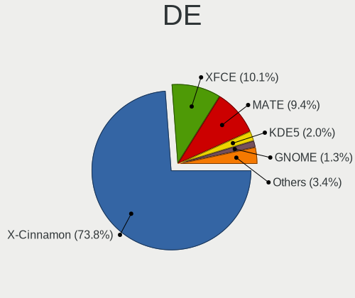
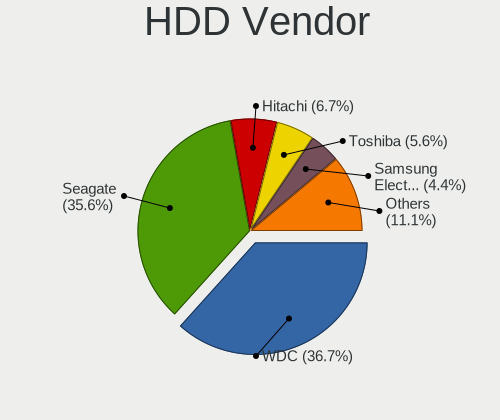
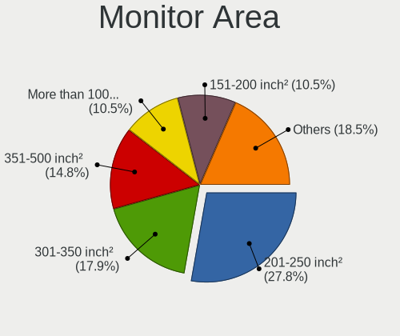
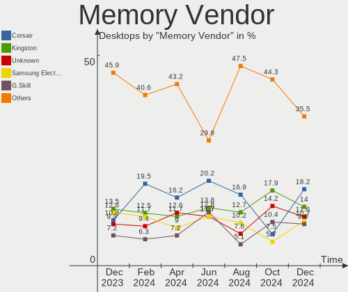
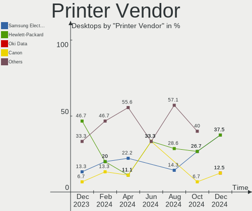
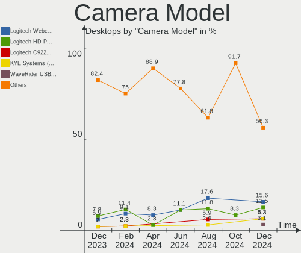

Linux Mint - Hardware Trends (Desktops)
---------------------------------------

A project to identify most popular hardware characteristics and track their change
over time based on data collected by Linux users at https://Linux-Hardware.org.

Anyone can contribute to this report by the [hw-probe](https://github.com/linuxhw/hw-probe) tool:

    sudo -E hw-probe -all -upload

This report is for one last month. Overall report since the beginning of time: [TestDays](https://github.com/linuxhw/TestDays)

Period: Sep, 2023.

Contents
--------

* [ System ](#system)
  - [ OS                       ](#os)
  - [ OS Family                ](#os-family)
  - [ Kernel                   ](#kernel)
  - [ Kernel Family            ](#kernel-family)
  - [ Kernel Major Ver.        ](#kernel-major-ver)
  - [ Arch                     ](#arch)
  - [ DE                       ](#de)
  - [ Display Server           ](#display-server)
  - [ Display Manager          ](#display-manager)
  - [ OS Lang                  ](#os-lang)
  - [ Boot Mode                ](#boot-mode)
  - [ Filesystem               ](#filesystem)
  - [ Part. scheme             ](#part-scheme)
  - [ Dual Boot with Linux/BSD ](#dual-boot-with-linuxbsd)
  - [ Dual Boot (Win)          ](#dual-boot-win)

* [ Board ](#board)
  - [ Vendor                   ](#vendor)
  - [ Model                    ](#model)
  - [ Model Family             ](#model-family)
  - [ MFG Year                 ](#mfg-year)
  - [ Form Factor              ](#form-factor)
  - [ Secure Boot              ](#secure-boot)
  - [ Coreboot                 ](#coreboot)
  - [ RAM Size                 ](#ram-size)
  - [ RAM Used                 ](#ram-used)
  - [ Total Drives             ](#total-drives)
  - [ Has CD-ROM               ](#has-cd-rom)
  - [ Has Ethernet             ](#has-ethernet)
  - [ Has WiFi                 ](#has-wifi)
  - [ Has Bluetooth            ](#has-bluetooth)

* [ Location ](#location)
  - [ Country                  ](#country)
  - [ City                     ](#city)

* [ Drives ](#drives)
  - [ Drive Vendor             ](#drive-vendor)
  - [ Drive Model              ](#drive-model)
  - [ HDD Vendor               ](#hdd-vendor)
  - [ SSD Vendor               ](#ssd-vendor)
  - [ Drive Kind               ](#drive-kind)
  - [ Drive Connector          ](#drive-connector)
  - [ Drive Size               ](#drive-size)
  - [ Space Total              ](#space-total)
  - [ Space Used               ](#space-used)
  - [ Malfunc. Drives          ](#malfunc-drives)
  - [ Malfunc. Drive Vendor    ](#malfunc-drive-vendor)
  - [ Malfunc. HDD Vendor      ](#malfunc-hdd-vendor)
  - [ Malfunc. Drive Kind      ](#malfunc-drive-kind)
  - [ Failed Drives            ](#failed-drives)
  - [ Failed Drive Vendor      ](#failed-drive-vendor)
  - [ Drive Status             ](#drive-status)

* [ Storage controller ](#storage-controller)
  - [ Storage Vendor           ](#storage-vendor)
  - [ Storage Model            ](#storage-model)
  - [ Storage Kind             ](#storage-kind)

* [ Processor ](#processor)
  - [ CPU Vendor               ](#cpu-vendor)
  - [ CPU Model                ](#cpu-model)
  - [ CPU Model Family         ](#cpu-model-family)
  - [ CPU Cores                ](#cpu-cores)
  - [ CPU Sockets              ](#cpu-sockets)
  - [ CPU Threads              ](#cpu-threads)
  - [ CPU Op-Modes             ](#cpu-op-modes)
  - [ CPU Microcode            ](#cpu-microcode)
  - [ CPU Microarch            ](#cpu-microarch)

* [ Graphics ](#graphics)
  - [ GPU Vendor               ](#gpu-vendor)
  - [ GPU Model                ](#gpu-model)
  - [ GPU Combo                ](#gpu-combo)
  - [ GPU Driver               ](#gpu-driver)
  - [ GPU Memory               ](#gpu-memory)

* [ Monitor ](#monitor)
  - [ Monitor Vendor           ](#monitor-vendor)
  - [ Monitor Model            ](#monitor-model)
  - [ Monitor Resolution       ](#monitor-resolution)
  - [ Monitor Diagonal         ](#monitor-diagonal)
  - [ Monitor Width            ](#monitor-width)
  - [ Aspect Ratio             ](#aspect-ratio)
  - [ Monitor Area             ](#monitor-area)
  - [ Pixel Density            ](#pixel-density)
  - [ Multiple Monitors        ](#multiple-monitors)

* [ Network ](#network)
  - [ Net Controller Vendor    ](#net-controller-vendor)
  - [ Net Controller Model     ](#net-controller-model)
  - [ Wireless Vendor          ](#wireless-vendor)
  - [ Wireless Model           ](#wireless-model)
  - [ Ethernet Vendor          ](#ethernet-vendor)
  - [ Ethernet Model           ](#ethernet-model)
  - [ Net Controller Kind      ](#net-controller-kind)
  - [ Used Controller          ](#used-controller)
  - [ NICs                     ](#nics)
  - [ IPv6                     ](#ipv6)

* [ Bluetooth ](#bluetooth)
  - [ Bluetooth Vendor         ](#bluetooth-vendor)
  - [ Bluetooth Model          ](#bluetooth-model)

* [ Sound ](#sound)
  - [ Sound Vendor             ](#sound-vendor)
  - [ Sound Model              ](#sound-model)

* [ Memory ](#memory)
  - [ Memory Vendor            ](#memory-vendor)
  - [ Memory Model             ](#memory-model)
  - [ Memory Kind              ](#memory-kind)
  - [ Memory Form Factor       ](#memory-form-factor)
  - [ Memory Size              ](#memory-size)
  - [ Memory Speed             ](#memory-speed)

* [ Printers & scanners ](#printers--scanners)
  - [ Printer Vendor           ](#printer-vendor)
  - [ Printer Model            ](#printer-model)
  - [ Scanner Vendor           ](#scanner-vendor)
  - [ Scanner Model            ](#scanner-model)

* [ Camera ](#camera)
  - [ Camera Vendor            ](#camera-vendor)
  - [ Camera Model             ](#camera-model)

* [ Security ](#security)
  - [ Fingerprint Vendor       ](#fingerprint-vendor)
  - [ Fingerprint Model        ](#fingerprint-model)
  - [ Chipcard Vendor          ](#chipcard-vendor)
  - [ Chipcard Model           ](#chipcard-model)

* [ Unsupported ](#unsupported)
  - [ Unsupported Devices      ](#unsupported-devices)
  - [ Unsupported Device Types ](#unsupported-device-types)

System
------

OS
--

Installed operating systems

| Name            | Desktops | Percent |
|-----------------|----------|---------|
| Linux Mint 21.2 | 117      | 69.23%  |
| Linux Mint 21.1 | 19       | 11.24%  |
| Linux Mint 20.3 | 17       | 10.06%  |
| Linux Mint 21   | 6        | 3.55%   |
| Linux Mint 20   | 3        | 1.78%   |
| Linux Mint 20.2 | 2        | 1.18%   |
| Linux Mint 20.1 | 2        | 1.18%   |
| Linux Mint 19.3 | 2        | 1.18%   |
| Linux Mint 19.2 | 1        | 0.59%   |

OS Family
---------

OS without a version

| Name       | Desktops | Percent |
|------------|----------|---------|
| Linux Mint | 169      | 100%    |

Kernel
------

Version of the Linux kernel

| Version               | Desktops | Percent |
|-----------------------|----------|---------|
| 5.15.0-83-generic     | 42       | 24.85%  |
| 5.15.0-84-generic     | 32       | 18.93%  |
| 5.15.0-82-generic     | 21       | 12.43%  |
| 5.15.0-76-generic     | 14       | 8.28%   |
| 6.2.0-32-generic      | 8        | 4.73%   |
| 5.4.0-162-generic     | 7        | 4.14%   |
| 5.4.0-163-generic     | 6        | 3.55%   |
| 5.15.0-79-generic     | 6        | 3.55%   |
| 6.2.0-33-generic      | 5        | 2.96%   |
| 6.2.0-31-generic      | 3        | 1.78%   |
| 5.4.0-159-generic     | 3        | 1.78%   |
| 5.4.0-91-generic      | 2        | 1.18%   |
| 5.15.0-56-generic     | 2        | 1.18%   |
| 6.5.3-060503-generic  | 1        | 0.59%   |
| 6.5.1-060501-generic  | 1        | 0.59%   |
| 6.3.0-060300-generic  | 1        | 0.59%   |
| 6.2.12-060212-generic | 1        | 0.59%   |
| 6.2.0-26-generic      | 1        | 0.59%   |
| 6.2.0-1012-aws        | 1        | 0.59%   |
| 6.1.0-1016-oem        | 1        | 0.59%   |
| 5.4.23520230914       | 1        | 0.59%   |
| 5.4.0-58-generic      | 1        | 0.59%   |
| 5.4.0-155-generic     | 1        | 0.59%   |
| 5.4.0-150-generic     | 1        | 0.59%   |
| 5.4.0-137-generic     | 1        | 0.59%   |
| 5.15.0-85-generic     | 1        | 0.59%   |
| 5.15.0-75-generic     | 1        | 0.59%   |
| 5.15.0-60-generic     | 1        | 0.59%   |
| 5.15.0-52-generic     | 1        | 0.59%   |
| 5.0.0-23-generic      | 1        | 0.59%   |
| 4.15.0-213-generic    | 1        | 0.59%   |

Kernel Family
-------------

Linux kernel without a distro release

| Version         | Desktops | Percent |
|-----------------|----------|---------|
| 5.15.0          | 121      | 71.6%   |
| 5.4.0           | 22       | 13.02%  |
| 6.2.0           | 18       | 10.65%  |
| 6.5.3           | 1        | 0.59%   |
| 6.5.1           | 1        | 0.59%   |
| 6.3.0           | 1        | 0.59%   |
| 6.2.12          | 1        | 0.59%   |
| 6.1.0           | 1        | 0.59%   |
| 5.4.23520230914 | 1        | 0.59%   |
| 5.0.0           | 1        | 0.59%   |
| 4.15.0          | 1        | 0.59%   |

Kernel Major Ver.
-----------------

Linux kernel major version

| Version | Desktops | Percent |
|---------|----------|---------|
| 5.15    | 121      | 71.6%   |
| 5.4     | 23       | 13.61%  |
| 6.2     | 19       | 11.24%  |
| 6.5     | 2        | 1.18%   |
| 6.3     | 1        | 0.59%   |
| 6.1     | 1        | 0.59%   |
| 5.0     | 1        | 0.59%   |
| 4.15    | 1        | 0.59%   |

Arch
----

OS architecture (x86_64, i586, etc.)

| Name   | Desktops | Percent |
|--------|----------|---------|
| x86_64 | 169      | 100%    |

DE
--

Desktop Environment

| Name       | Desktops | Percent |
|------------|----------|---------|
| X-Cinnamon | 128      | 75.74%  |
| XFCE       | 18       | 10.65%  |
| MATE       | 14       | 8.28%   |
| GNOME      | 4        | 2.37%   |
| Unknown    | 2        | 1.18%   |
| i3         | 1        | 0.59%   |
| Cinnamon   | 1        | 0.59%   |
| Budgie     | 1        | 0.59%   |

Display Server
--------------

X11 or Wayland

| Name    | Desktops | Percent |
|---------|----------|---------|
| X11     | 168      | 99.41%  |
| Wayland | 1        | 0.59%   |

Display Manager
---------------

SDDM, LightDM, etc.

| Name    | Desktops | Percent |
|---------|----------|---------|
| Unknown | 109      | 64.5%   |
| LightDM | 60       | 35.5%   |

OS Lang
-------

Language

| Lang    | Desktops | Percent |
|---------|----------|---------|
| en_US   | 50       | 29.59%  |
| de_DE   | 24       | 14.2%   |
| it_IT   | 12       | 7.1%    |
| pt_BR   | 10       | 5.92%   |
| ru_RU   | 9        | 5.33%   |
| en_GB   | 8        | 4.73%   |
| fr_FR   | 6        | 3.55%   |
| C       | 6        | 3.55%   |
| pl_PL   | 5        | 2.96%   |
| es_ES   | 5        | 2.96%   |
| en_CA   | 5        | 2.96%   |
| nl_NL   | 3        | 1.78%   |
| en_AU   | 3        | 1.78%   |
| fi_FI   | 2        | 1.18%   |
| es_CL   | 2        | 1.18%   |
| es_AR   | 2        | 1.18%   |
| en_IE   | 2        | 1.18%   |
| de_AT   | 2        | 1.18%   |
| Unknown | 2        | 1.18%   |
| uk_UA   | 1        | 0.59%   |
| tr_TR   | 1        | 0.59%   |
| sv_SE   | 1        | 0.59%   |
| sk_SK   | 1        | 0.59%   |
| pt_PT   | 1        | 0.59%   |
| nl_BE   | 1        | 0.59%   |
| fr_CA   | 1        | 0.59%   |
| es_VE   | 1        | 0.59%   |
| es_MX   | 1        | 0.59%   |
| en_PH   | 1        | 0.59%   |
| bg_BG   | 1        | 0.59%   |

Boot Mode
---------

EFI or BIOS

| Mode | Desktops | Percent |
|------|----------|---------|
| EFI  | 105      | 62.13%  |
| BIOS | 64       | 37.87%  |

Filesystem
----------

Type of filesystem

| Type    | Desktops | Percent |
|---------|----------|---------|
| Ext4    | 151      | 89.35%  |
| Tmpfs   | 10       | 5.92%   |
| Overlay | 3        | 1.78%   |
| Zfs     | 2        | 1.18%   |
| Ext3    | 1        | 0.59%   |
| Ext2    | 1        | 0.59%   |
| Btrfs   | 1        | 0.59%   |

Part. scheme
------------

Scheme of partitioning

| Type    | Desktops | Percent |
|---------|----------|---------|
| Unknown | 106      | 62.72%  |
| GPT     | 52       | 30.77%  |
| MBR     | 11       | 6.51%   |

Dual Boot with Linux/BSD
------------------------

Hosting more than one Linux/BSD

| Dual boot | Desktops | Percent |
|-----------|----------|---------|
| No        | 157      | 92.9%   |
| Yes       | 12       | 7.1%    |

Dual Boot (Win)
---------------

Hosting Linux and Windows

| Dual boot | Desktops | Percent |
|-----------|----------|---------|
| No        | 143      | 84.62%  |
| Yes       | 26       | 15.38%  |

Board
-----

Vendor
------

Motherboard manufacturer

| Name                | Desktops | Percent |
|---------------------|----------|---------|
| ASUSTek Computer    | 33       | 19.53%  |
| Hewlett-Packard     | 23       | 13.61%  |
| Gigabyte Technology | 22       | 13.02%  |
| MSI                 | 20       | 11.83%  |
| Dell                | 17       | 10.06%  |
| ASRock              | 15       | 8.88%   |
| Lenovo              | 8        | 4.73%   |
| Unknown             | 6        | 3.55%   |
| Intel               | 4        | 2.37%   |
| Foxconn             | 3        | 1.78%   |
| Positivo            | 2        | 1.18%   |
| Fujitsu             | 2        | 1.18%   |
| Biostar             | 2        | 1.18%   |
| BESSTAR Tech        | 2        | 1.18%   |
| AZW                 | 2        | 1.18%   |
| wpc                 | 1        | 0.59%   |
| MACHINIST           | 1        | 0.59%   |
| Hardkernel          | 1        | 0.59%   |
| Gateway             | 1        | 0.59%   |
| ECS                 | 1        | 0.59%   |
| Cincoze             | 1        | 0.59%   |
| Alienware           | 1        | 0.59%   |
| Acer                | 1        | 0.59%   |

Model
-----

Motherboard model

| Name                                    | Desktops | Percent |
|-----------------------------------------|----------|---------|
| Unknown                                 | 6        | 3.55%   |
| ASRock B450 Pro4                        | 3        | 1.78%   |
| MSI MS-7C02                             | 2        | 1.18%   |
| HP ProDesk 600 G1 SFF                   | 2        | 1.18%   |
| HP Compaq Pro 4300 SFF PC               | 2        | 1.18%   |
| ASUS PRIME X370-PRO                     | 2        | 1.18%   |
| ASUS All Series                         | 2        | 1.18%   |
| wpc wpc616                              | 1        | 0.59%   |
| Positivo D3400                          | 1        | 0.59%   |
| Positivo C6300                          | 1        | 0.59%   |
| MSI p6630fr                             | 1        | 0.59%   |
| MSI MS-7D90                             | 1        | 0.59%   |
| MSI MS-7D75                             | 1        | 0.59%   |
| MSI MS-7D15                             | 1        | 0.59%   |
| MSI MS-7D07                             | 1        | 0.59%   |
| MSI MS-7D06                             | 1        | 0.59%   |
| MSI MS-7C95                             | 1        | 0.59%   |
| MSI MS-7C94                             | 1        | 0.59%   |
| MSI MS-7C91                             | 1        | 0.59%   |
| MSI MS-7C83                             | 1        | 0.59%   |
| MSI MS-7C56                             | 1        | 0.59%   |
| MSI MS-7B98                             | 1        | 0.59%   |
| MSI MS-7B24                             | 1        | 0.59%   |
| MSI MS-7B17                             | 1        | 0.59%   |
| MSI MS-7A63                             | 1        | 0.59%   |
| MSI MS-7A37                             | 1        | 0.59%   |
| MSI MS-7721                             | 1        | 0.59%   |
| MSI MS-7583                             | 1        | 0.59%   |
| MACHINIST X99-K9 V2.0                   | 1        | 0.59%   |
| Lenovo ThinkCentre M720t 10SQS08L00     | 1        | 0.59%   |
| Lenovo ThinkCentre M720t 10SQ006AMZ     | 1        | 0.59%   |
| Lenovo ThinkCentre M700 10HY002UGE      | 1        | 0.59%   |
| Lenovo ThinkCentre M58p 7484AEF         | 1        | 0.59%   |
| Lenovo ThinkCentre Edge72z 3569Q6P      | 1        | 0.59%   |
| Lenovo ThinkCentre E73 10AS00HRUM       | 1        | 0.59%   |
| Lenovo Legion T5 28ICB05 90NUZ58DUS     | 1        | 0.59%   |
| Lenovo IdeaCentre 310S-08ASR 90G90059MW | 1        | 0.59%   |
| Intel X99                               | 1        | 0.59%   |
| Intel H55                               | 1        | 0.59%   |
| Intel DG31PR AAD97573-205               | 1        | 0.59%   |

Model Family
------------

Motherboard model prefix

| Name               | Desktops | Percent |
|--------------------|----------|---------|
| Dell OptiPlex      | 9        | 5.33%   |
| ASUS PRIME         | 9        | 5.33%   |
| HP Compaq          | 7        | 4.14%   |
| Lenovo ThinkCentre | 6        | 3.55%   |
| Unknown            | 6        | 3.55%   |
| ASRock B450        | 5        | 2.96%   |
| HP ProDesk         | 3        | 1.78%   |
| HP Pavilion        | 3        | 1.78%   |
| HP EliteDesk       | 3        | 1.78%   |
| Gigabyte B550      | 3        | 1.78%   |
| MSI MS-7C02        | 2        | 1.18%   |
| Gigabyte H310M     | 2        | 1.18%   |
| Fujitsu ESPRIMO    | 2        | 1.18%   |
| Dell Vostro        | 2        | 1.18%   |
| Dell Precision     | 2        | 1.18%   |
| ASUS ROG           | 2        | 1.18%   |
| ASUS All           | 2        | 1.18%   |
| wpc wpc616         | 1        | 0.59%   |
| Positivo D3400     | 1        | 0.59%   |
| Positivo C6300     | 1        | 0.59%   |
| MSI p6630fr        | 1        | 0.59%   |
| MSI MS-7D90        | 1        | 0.59%   |
| MSI MS-7D75        | 1        | 0.59%   |
| MSI MS-7D15        | 1        | 0.59%   |
| MSI MS-7D07        | 1        | 0.59%   |
| MSI MS-7D06        | 1        | 0.59%   |
| MSI MS-7C95        | 1        | 0.59%   |
| MSI MS-7C94        | 1        | 0.59%   |
| MSI MS-7C91        | 1        | 0.59%   |
| MSI MS-7C83        | 1        | 0.59%   |
| MSI MS-7C56        | 1        | 0.59%   |
| MSI MS-7B98        | 1        | 0.59%   |
| MSI MS-7B24        | 1        | 0.59%   |
| MSI MS-7B17        | 1        | 0.59%   |
| MSI MS-7A63        | 1        | 0.59%   |
| MSI MS-7A37        | 1        | 0.59%   |
| MSI MS-7721        | 1        | 0.59%   |
| MSI MS-7583        | 1        | 0.59%   |
| MACHINIST X99-K9   | 1        | 0.59%   |
| Lenovo Legion      | 1        | 0.59%   |

MFG Year
--------

Motherboard manufacture year

| Year | Desktops | Percent |
|------|----------|---------|
| 2018 | 21       | 12.43%  |
| 2020 | 16       | 9.47%   |
| 2012 | 16       | 9.47%   |
| 2022 | 14       | 8.28%   |
| 2013 | 14       | 8.28%   |
| 2021 | 10       | 5.92%   |
| 2011 | 10       | 5.92%   |
| 2010 | 10       | 5.92%   |
| 2019 | 9        | 5.33%   |
| 2017 | 8        | 4.73%   |
| 2016 | 7        | 4.14%   |
| 2014 | 7        | 4.14%   |
| 2009 | 7        | 4.14%   |
| 2008 | 5        | 2.96%   |
| 2023 | 4        | 2.37%   |
| 2007 | 4        | 2.37%   |
| 2006 | 4        | 2.37%   |
| 2015 | 3        | 1.78%   |

Form Factor
-----------

Physical design of the computer

| Name    | Desktops | Percent |
|---------|----------|---------|
| Desktop | 169      | 100%    |

Secure Boot
-----------

Enabled or disabled

| State    | Desktops | Percent |
|----------|----------|---------|
| Disabled | 155      | 91.72%  |
| Enabled  | 14       | 8.28%   |

Coreboot
--------

Have coreboot on board

| Used | Desktops | Percent |
|------|----------|---------|
| No   | 169      | 100%    |

RAM Size
--------

Total RAM memory

| Size in GB  | Desktops | Percent |
|-------------|----------|---------|
| 16.01-24.0  | 45       | 26.63%  |
| 4.01-8.0    | 31       | 18.34%  |
| 3.01-4.0    | 30       | 17.75%  |
| 32.01-64.0  | 26       | 15.38%  |
| 8.01-16.0   | 17       | 10.06%  |
| 64.01-256.0 | 12       | 7.1%    |
| 24.01-32.0  | 7        | 4.14%   |
| 0.51-1.0    | 1        | 0.59%   |

RAM Used
--------

Used RAM memory

| Used GB    | Desktops | Percent |
|------------|----------|---------|
| 2.01-3.0   | 59       | 34.91%  |
| 1.01-2.0   | 41       | 24.26%  |
| 4.01-8.0   | 26       | 15.38%  |
| 3.01-4.0   | 24       | 14.2%   |
| 8.01-16.0  | 9        | 5.33%   |
| 0.51-1.0   | 5        | 2.96%   |
| 16.01-24.0 | 4        | 2.37%   |
| 24.01-32.0 | 1        | 0.59%   |

Total Drives
------------

Number of drives on board

| Drives | Desktops | Percent |
|--------|----------|---------|
| 1      | 69       | 40.83%  |
| 2      | 48       | 28.4%   |
| 3      | 26       | 15.38%  |
| 4      | 11       | 6.51%   |
| 5      | 8        | 4.73%   |
| 0      | 3        | 1.78%   |
| 6      | 2        | 1.18%   |
| 9      | 1        | 0.59%   |
| 7      | 1        | 0.59%   |

Has CD-ROM
----------

Has CD-ROM on board

| Presented | Desktops | Percent |
|-----------|----------|---------|
| Yes       | 85       | 50.3%   |
| No        | 84       | 49.7%   |

Has Ethernet
------------

Has Ethernet on board

| Presented | Desktops | Percent |
|-----------|----------|---------|
| Yes       | 169      | 100%    |

Has WiFi
--------

Has WiFi module

| Presented | Desktops | Percent |
|-----------|----------|---------|
| Yes       | 93       | 55.03%  |
| No        | 76       | 44.97%  |

Has Bluetooth
-------------

Has Bluetooth module

| Presented | Desktops | Percent |
|-----------|----------|---------|
| No        | 103      | 60.95%  |
| Yes       | 66       | 39.05%  |

Location
--------

Country
-------

Geographic location (country)

| Country     | Desktops | Percent |
|-------------|----------|---------|
| USA         | 35       | 20.71%  |
| Germany     | 30       | 17.75%  |
| Italy       | 13       | 7.69%   |
| Russia      | 11       | 6.51%   |
| Brazil      | 10       | 5.92%   |
| UK          | 7        | 4.14%   |
| Spain       | 6        | 3.55%   |
| Canada      | 6        | 3.55%   |
| Poland      | 5        | 2.96%   |
| France      | 5        | 2.96%   |
| Netherlands | 4        | 2.37%   |
| Australia   | 4        | 2.37%   |
| Finland     | 3        | 1.78%   |
| Belgium     | 3        | 1.78%   |
| Austria     | 3        | 1.78%   |
| Sweden      | 2        | 1.18%   |
| Ireland     | 2        | 1.18%   |
| Indonesia   | 2        | 1.18%   |
| Chile       | 2        | 1.18%   |
| Argentina   | 2        | 1.18%   |
| Venezuela   | 1        | 0.59%   |
| Ukraine     | 1        | 0.59%   |
| UAE         | 1        | 0.59%   |
| Turkey      | 1        | 0.59%   |
| Switzerland | 1        | 0.59%   |
| Slovakia    | 1        | 0.59%   |
| Portugal    | 1        | 0.59%   |
| Philippines | 1        | 0.59%   |
| Mexico      | 1        | 0.59%   |
| Kenya       | 1        | 0.59%   |
| Japan       | 1        | 0.59%   |
| Hungary     | 1        | 0.59%   |
| Greece      | 1        | 0.59%   |
| Bulgaria    | 1        | 0.59%   |

City
----

Geographic location (city)

| City                 | Desktops | Percent |
|----------------------|----------|---------|
| Berlin               | 6        | 3.55%   |
| Vienna               | 3        | 1.78%   |
| Moscow               | 3        | 1.78%   |
| Warsaw               | 2        | 1.18%   |
| Santiago             | 2        | 1.18%   |
| Rio de Janeiro       | 2        | 1.18%   |
| Montreal             | 2        | 1.18%   |
| Milan                | 2        | 1.18%   |
| Helsinki             | 2        | 1.18%   |
| Hanover              | 2        | 1.18%   |
| Hamburg              | 2        | 1.18%   |
| Gdansk               | 2        | 1.18%   |
| Curitiba             | 2        | 1.18%   |
| Wylie                | 1        | 0.59%   |
| Winnipeg             | 1        | 0.59%   |
| Whittier             | 1        | 0.59%   |
| Villejuif            | 1        | 0.59%   |
| Vero Beach           | 1        | 0.59%   |
| Ulyanovsk            | 1        | 0.59%   |
| Turin                | 1        | 0.59%   |
| Treviglio            | 1        | 0.59%   |
| Tomsk                | 1        | 0.59%   |
| Tolyatti             | 1        | 0.59%   |
| Tlalnepantla         | 1        | 0.59%   |
| Thessaloniki         | 1        | 0.59%   |
| Sydney               | 1        | 0.59%   |
| Stade                | 1        | 0.59%   |
| Spruce Grove         | 1        | 0.59%   |
| Spokane              | 1        | 0.59%   |
| South Tangerang      | 1        | 0.59%   |
| Solihull             | 1        | 0.59%   |
| Seville              | 1        | 0.59%   |
| Sao Joao Evangelista | 1        | 0.59%   |
| Santa Clara          | 1        | 0.59%   |
| Sandpoint            | 1        | 0.59%   |
| San Antonio          | 1        | 0.59%   |
| Salvador             | 1        | 0.59%   |
| Ruhpolding           | 1        | 0.59%   |
| Ruda Śląska        | 1        | 0.59%   |
| Rome                 | 1        | 0.59%   |

Drives
------

Drive Vendor
------------

Hard drive vendors

| Vendor                      | Desktops | Drives | Percent |
|-----------------------------|----------|--------|---------|
| WDC                         | 53       | 69     | 17.49%  |
| Seagate                     | 48       | 54     | 15.84%  |
| Samsung Electronics         | 37       | 44     | 12.21%  |
| Kingston                    | 21       | 24     | 6.93%   |
| Toshiba                     | 19       | 19     | 6.27%   |
| Crucial                     | 18       | 21     | 5.94%   |
| Sandisk                     | 16       | 21     | 5.28%   |
| Hitachi                     | 9        | 9      | 2.97%   |
| Unknown                     | 7        | 10     | 2.31%   |
| Kingston Technology Company | 7        | 7      | 2.31%   |
| PNY                         | 5        | 7      | 1.65%   |
| China                       | 5        | 5      | 1.65%   |
| Micron/Crucial Technology   | 4        | 6      | 1.32%   |
| Intel                       | 4        | 4      | 1.32%   |
| ADATA Technology            | 4        | 5      | 1.32%   |
| A-DATA Technology           | 4        | 4      | 1.32%   |
| Realtek Semiconductor       | 3        | 4      | 0.99%   |
| Micron Technology           | 3        | 3      | 0.99%   |
| Intenso                     | 3        | 3      | 0.99%   |
| HGST                        | 3        | 3      | 0.99%   |
| Hewlett-Packard             | 3        | 3      | 0.99%   |
| SK hynix                    | 2        | 2      | 0.66%   |
| Silicon Motion              | 2        | 2      | 0.66%   |
| Emtec                       | 2        | 2      | 0.66%   |
| XrayDisk                    | 1        | 1      | 0.33%   |
| Win Memory                  | 1        | 1      | 0.33%   |
| Transcend                   | 1        | 1      | 0.33%   |
| SPCC                        | 1        | 1      | 0.33%   |
| Ramsta                      | 1        | 1      | 0.33%   |
| Phison Electronics          | 1        | 1      | 0.33%   |
| Patriot                     | 1        | 1      | 0.33%   |
| NGFF                        | 1        | 1      | 0.33%   |
| Netac                       | 1        | 1      | 0.33%   |
| MidasForce                  | 1        | 1      | 0.33%   |
| Maxtor                      | 1        | 1      | 0.33%   |
| Lexar                       | 1        | 1      | 0.33%   |
| Lenovo                      | 1        | 2      | 0.33%   |
| KIOXIA                      | 1        | 1      | 0.33%   |
| Integral                    | 1        | 1      | 0.33%   |
| GOODRAM                     | 1        | 1      | 0.33%   |

Drive Model
-----------

Hard drive models

| Model                                               | Desktops | Percent |
|-----------------------------------------------------|----------|---------|
| Kingston SA400S37240G 240GB SSD                     | 7        | 2.09%   |
| Seagate ST500DM002-1BD142 500GB                     | 6        | 1.79%   |
| Samsung SSD 850 EVO 250GB                           | 6        | 1.79%   |
| WDC WD10EZEX-08WN4A0 1TB                            | 5        | 1.49%   |
| Toshiba DT01ACA100 1TB                              | 5        | 1.49%   |
| Seagate ST2000DM008-2FR102 2TB                      | 5        | 1.49%   |
| Seagate ST1000DM010-2EP102 1TB                      | 4        | 1.19%   |
| Kingston Company A2000 NVMe SSD 1TB                 | 4        | 1.19%   |
| Crucial CT500MX500SSD1 500GB                        | 4        | 1.19%   |
| Unknown SD/MMC/MS PRO 128GB                         | 3        | 0.9%    |
| Samsung SSD 860 EVO 1TB                             | 3        | 0.9%    |
| Micron/Crucial P2 NVMe PCIe SSD 1TB                 | 3        | 0.9%    |
| Kingston SA400S37960G 960GB SSD                     | 3        | 0.9%    |
| Kingston SA400S37120G 120GB SSD                     | 3        | 0.9%    |
| Crucial CT1000BX500SSD1 1TB                         | 3        | 0.9%    |
| WDC WDS240G2G0A-00JH30 240GB SSD                    | 2        | 0.6%    |
| WDC WD40EZRZ-00GXCB0 4TB                            | 2        | 0.6%    |
| WDC WD20EZRZ-00Z5HB0 2TB                            | 2        | 0.6%    |
| WDC WD10EZEX-21WN4A0 1TB                            | 2        | 0.6%    |
| WDC WD1003FZEX-00MK2A0 1TB                          | 2        | 0.6%    |
| WDC WD1001FALS-00J7B0 1TB                           | 2        | 0.6%    |
| Unknown SD/MMC 2GB                                  | 2        | 0.6%    |
| Unknown M.S./M.S.Pro/HG 16GB                        | 2        | 0.6%    |
| Toshiba MQ01ABF050 500GB                            | 2        | 0.6%    |
| Toshiba DT01ACA300 3TB                              | 2        | 0.6%    |
| Seagate ST2000DL003-9VT166 2TB                      | 2        | 0.6%    |
| Seagate ST1000DM003-1ER162 1TB                      | 2        | 0.6%    |
| Sandisk WD_BLACK SN770 2TB                          | 2        | 0.6%    |
| SanDisk SSD PLUS 480GB                              | 2        | 0.6%    |
| SanDisk SSD PLUS 1000GB                             | 2        | 0.6%    |
| Samsung SSD 980 500GB                               | 2        | 0.6%    |
| Samsung SSD 870 EVO 1TB                             | 2        | 0.6%    |
| Samsung SSD 860 EVO 500GB                           | 2        | 0.6%    |
| Samsung SSD 850 EVO 500GB                           | 2        | 0.6%    |
| Samsung SSD 750 EVO 250GB                           | 2        | 0.6%    |
| Samsung NVMe SSD Controller SM961/PM961/SM963 500GB | 2        | 0.6%    |
| PNY CS900 500GB SSD                                 | 2        | 0.6%    |
| Kingston Company OM3PDP3 NVMe SSD 512GB             | 2        | 0.6%    |
| Crucial CT240BX500SSD1 240GB                        | 2        | 0.6%    |
| Crucial CT2000MX500SSD1 2TB                         | 2        | 0.6%    |

HDD Vendor
----------

Hard disk drive vendors

| Vendor              | Desktops | Drives | Percent |
|---------------------|----------|--------|---------|
| WDC                 | 47       | 60     | 35.34%  |
| Seagate             | 47       | 53     | 35.34%  |
| Toshiba             | 18       | 18     | 13.53%  |
| Hitachi             | 9        | 9      | 6.77%   |
| Unknown             | 3        | 3      | 2.26%   |
| Samsung Electronics | 3        | 3      | 2.26%   |
| HGST                | 3        | 3      | 2.26%   |
| Hewlett-Packard     | 2        | 2      | 1.5%    |
| Maxtor              | 1        | 1      | 0.75%   |

SSD Vendor
----------

Solid state drive vendors

| Vendor              | Desktops | Drives | Percent |
|---------------------|----------|--------|---------|
| Samsung Electronics | 26       | 29     | 22.61%  |
| Kingston            | 18       | 20     | 15.65%  |
| Crucial             | 16       | 19     | 13.91%  |
| SanDisk             | 11       | 11     | 9.57%   |
| WDC                 | 8        | 8      | 6.96%   |
| PNY                 | 5        | 7      | 4.35%   |
| China               | 5        | 5      | 4.35%   |
| A-DATA Technology   | 4        | 4      | 3.48%   |
| Micron Technology   | 3        | 3      | 2.61%   |
| Intel               | 2        | 2      | 1.74%   |
| Emtec               | 2        | 2      | 1.74%   |
| Win Memory          | 1        | 1      | 0.87%   |
| Transcend           | 1        | 1      | 0.87%   |
| SK hynix            | 1        | 1      | 0.87%   |
| Patriot             | 1        | 1      | 0.87%   |
| NGFF                | 1        | 1      | 0.87%   |
| Netac               | 1        | 1      | 0.87%   |
| MidasForce          | 1        | 1      | 0.87%   |
| Lexar               | 1        | 1      | 0.87%   |
| Lenovo              | 1        | 1      | 0.87%   |
| Intenso             | 1        | 1      | 0.87%   |
| Integral            | 1        | 1      | 0.87%   |
| GOODRAM             | 1        | 1      | 0.87%   |
| Fanxiang            | 1        | 1      | 0.87%   |
| Apacer              | 1        | 1      | 0.87%   |
| Advantech           | 1        | 2      | 0.87%   |

Drive Kind
----------

HDD or SSD

| Kind    | Desktops | Drives | Percent |
|---------|----------|--------|---------|
| HDD     | 104      | 152    | 40.94%  |
| SSD     | 91       | 126    | 35.83%  |
| NVMe    | 53       | 68     | 20.87%  |
| Unknown | 6        | 9      | 2.36%   |

Drive Connector
---------------

SATA, SAS, NVMe, etc.

| Type | Desktops | Drives | Percent |
|------|----------|--------|---------|
| SATA | 149      | 269    | 69.3%   |
| NVMe | 53       | 68     | 24.65%  |
| SAS  | 13       | 18     | 6.05%   |

Drive Size
----------

Size of hard drive

| Size in TB | Desktops | Drives | Percent |
|------------|----------|--------|---------|
| 0.01-0.5   | 106      | 136    | 47.75%  |
| 0.51-1.0   | 69       | 83     | 31.08%  |
| 1.01-2.0   | 25       | 30     | 11.26%  |
| 3.01-4.0   | 9        | 9      | 4.05%   |
| 4.01-10.0  | 7        | 9      | 3.15%   |
| 2.01-3.0   | 4        | 5      | 1.8%    |
| 10.01-20.0 | 2        | 6      | 0.9%    |

Space Total
-----------

Amount of disk space available on the file system

| Size in GB     | Desktops | Percent |
|----------------|----------|---------|
| 101-250        | 39       | 23.08%  |
| 251-500        | 36       | 21.3%   |
| 1001-2000      | 28       | 16.57%  |
| 501-1000       | 27       | 15.98%  |
| More than 3000 | 17       | 10.06%  |
| 2001-3000      | 6        | 3.55%   |
| 1-20           | 5        | 2.96%   |
| Unknown        | 5        | 2.96%   |
| 21-50          | 4        | 2.37%   |
| 51-100         | 2        | 1.18%   |

Space Used
----------

Amount of used disk space

| Used GB        | Desktops | Percent |
|----------------|----------|---------|
| 21-50          | 34       | 20.12%  |
| 101-250        | 32       | 18.93%  |
| 1-20           | 27       | 15.98%  |
| 51-100         | 18       | 10.65%  |
| 251-500        | 15       | 8.88%   |
| 1001-2000      | 14       | 8.28%   |
| 501-1000       | 14       | 8.28%   |
| More than 3000 | 7        | 4.14%   |
| Unknown        | 5        | 2.96%   |
| 2001-3000      | 3        | 1.78%   |

Malfunc. Drives
---------------

Drive models with a malfunction

| Model                                     | Desktops | Drives | Percent |
|-------------------------------------------|----------|--------|---------|
| Seagate ST500DM002-1BD142 500GB           | 2        | 2      | 10.53%  |
| WDC WD5000AZLX-08K2TA0 500GB              | 1        | 1      | 5.26%   |
| WDC WD5000AVDS-63U7B1 500GB               | 1        | 1      | 5.26%   |
| WDC WD5000AAKX-60U6AA0 500GB              | 1        | 1      | 5.26%   |
| WDC WD5000AAKX-08ERMA0 500GB              | 1        | 1      | 5.26%   |
| WDC WD20EARX-32PASB0 2TB                  | 1        | 1      | 5.26%   |
| WDC WD20EADS-00S2B0 2TB                   | 1        | 1      | 5.26%   |
| WDC WD2002FYPS-02W3B0 2TB                 | 1        | 1      | 5.26%   |
| WDC WD1600JD-75HBB0 160GB                 | 1        | 1      | 5.26%   |
| Toshiba MQ01ABF050 500GB                  | 1        | 1      | 5.26%   |
| Toshiba DT01ABA200V 2TB                   | 1        | 1      | 5.26%   |
| Seagate ST3250310AS 250GB                 | 1        | 1      | 5.26%   |
| Seagate ST2000DX001-1CM164 2TB            | 1        | 1      | 5.26%   |
| Seagate ST1000LX015-1U7172 1TB            | 1        | 1      | 5.26%   |
| Seagate ST1000DL002-9TT153 1TB            | 1        | 1      | 5.26%   |
| Samsung Electronics HD322HJ 320GB         | 1        | 1      | 5.26%   |
| Samsung Electronics HD103SI 1TB           | 1        | 1      | 5.26%   |
| Micron Technology MTFDDAK256TDL 256GB SSD | 1        | 1      | 5.26%   |

Malfunc. Drive Vendor
---------------------

Vendors of faulty drives

| Vendor              | Desktops | Drives | Percent |
|---------------------|----------|--------|---------|
| WDC                 | 8        | 8      | 44.44%  |
| Seagate             | 5        | 6      | 27.78%  |
| Toshiba             | 2        | 2      | 11.11%  |
| Samsung Electronics | 2        | 2      | 11.11%  |
| Micron Technology   | 1        | 1      | 5.56%   |

Malfunc. HDD Vendor
-------------------

Vendors of faulty HDD drives

| Vendor              | Desktops | Drives | Percent |
|---------------------|----------|--------|---------|
| WDC                 | 8        | 8      | 47.06%  |
| Seagate             | 5        | 6      | 29.41%  |
| Toshiba             | 2        | 2      | 11.76%  |
| Samsung Electronics | 2        | 2      | 11.76%  |

Malfunc. Drive Kind
-------------------

Kinds of faulty drives

| Kind | Desktops | Drives | Percent |
|------|----------|--------|---------|
| HDD  | 14       | 18     | 93.33%  |
| SSD  | 1        | 1      | 6.67%   |

Failed Drives
-------------

Failed drive models

Zero info for selected period =(

Failed Drive Vendor
-------------------

Failed drive vendors

Zero info for selected period =(

Drive Status
------------

Number of failed and malfunc. drives

| Status   | Desktops | Drives | Percent |
|----------|----------|--------|---------|
| Detected | 118      | 243    | 67.05%  |
| Works    | 43       | 93     | 24.43%  |
| Malfunc  | 15       | 19     | 8.52%   |

Storage controller
------------------

Storage Vendor
--------------

Storage controller vendors

| Vendor                       | Desktops | Percent |
|------------------------------|----------|---------|
| Intel                        | 110      | 44.9%   |
| AMD                          | 53       | 21.63%  |
| Kingston Technology Company  | 11       | 4.49%   |
| ASMedia Technology           | 11       | 4.49%   |
| Samsung Electronics          | 10       | 4.08%   |
| JMicron Technology           | 8        | 3.27%   |
| SanDisk                      | 7        | 2.86%   |
| Micron/Crucial Technology    | 6        | 2.45%   |
| Silicon Motion               | 5        | 2.04%   |
| ADATA Technology             | 5        | 2.04%   |
| Realtek Semiconductor        | 4        | 1.63%   |
| Nvidia                       | 4        | 1.63%   |
| Phison Electronics           | 2        | 0.82%   |
| Marvell Technology Group     | 2        | 0.82%   |
| VIA Technologies             | 1        | 0.41%   |
| Toshiba America Info Systems | 1        | 0.41%   |
| SK hynix                     | 1        | 0.41%   |
| Netac Technology             | 1        | 0.41%   |
| MAXIO Technology (Hangzhou)  | 1        | 0.41%   |
| LSI Logic / Symbios Logic    | 1        | 0.41%   |
| KIOXIA                       | 1        | 0.41%   |

Storage Model
-------------

Storage controller models

| Model                                                                                   | Desktops | Percent |
|-----------------------------------------------------------------------------------------|----------|---------|
| AMD FCH SATA Controller [AHCI mode]                                                     | 23       | 7.93%   |
| Intel Cannon Lake PCH SATA AHCI Controller                                              | 13       | 4.48%   |
| AMD 400 Series Chipset SATA Controller                                                  | 13       | 4.48%   |
| Intel 8 Series/C220 Series Chipset Family 6-port SATA Controller 1 [AHCI mode]          | 12       | 4.14%   |
| AMD 500 Series Chipset SATA Controller                                                  | 11       | 3.79%   |
| Intel SATA Controller [RAID mode]                                                       | 10       | 3.45%   |
| Intel 6 Series/C200 Series Chipset Family 6 port Desktop SATA AHCI Controller           | 10       | 3.45%   |
| ASMedia ASM1062 Serial ATA Controller                                                   | 10       | 3.45%   |
| AMD SB7x0/SB8x0/SB9x0 SATA Controller [AHCI mode]                                       | 8        | 2.76%   |
| AMD SB7x0/SB8x0/SB9x0 IDE Controller                                                    | 8        | 2.76%   |
| Kingston Company A2000 NVMe SSD                                                         | 6        | 2.07%   |
| Intel 7 Series/C210 Series Chipset Family 6-port SATA Controller [AHCI mode]            | 6        | 2.07%   |
| Intel 200 Series PCH SATA controller [AHCI mode]                                        | 6        | 2.07%   |
| Intel 500 Series Chipset Family SATA AHCI Controller                                    | 5        | 1.72%   |
| Silicon Motion SM2263EN/SM2263XT (DRAM-less) NVMe SSD Controllers                       | 4        | 1.38%   |
| SanDisk WD Black SN770 / PC SN740 256GB / PC SN560 (DRAM-less) NVMe SSD                 | 4        | 1.38%   |
| JMicron JMB363 SATA/IDE Controller                                                      | 4        | 1.38%   |
| Intel Q170/Q150/B150/H170/H110/Z170/CM236 Chipset SATA Controller [AHCI Mode]           | 4        | 1.38%   |
| Intel NM10/ICH7 Family SATA Controller [IDE mode]                                       | 4        | 1.38%   |
| Intel 82801G (ICH7 Family) IDE Controller                                               | 4        | 1.38%   |
| Samsung NVMe SSD Controller SM981/PM981/PM983                                           | 3        | 1.03%   |
| Samsung NVMe SSD Controller 980                                                         | 3        | 1.03%   |
| Realtek RTS5765DL NVMe SSD Controller (DRAM-less)                                       | 3        | 1.03%   |
| Micron/Crucial P2 [Nick P2] / P3 / P3 Plus NVMe PCIe SSD (DRAM-less)                    | 3        | 1.03%   |
| JMicron JMB368 IDE controller                                                           | 3        | 1.03%   |
| Intel Jasper Lake SATA AHCI Controller                                                  | 3        | 1.03%   |
| Intel Comet Lake SATA AHCI Controller                                                   | 3        | 1.03%   |
| Intel 7 Series/C210 Series Chipset Family 4-port SATA Controller [IDE mode]             | 3        | 1.03%   |
| Intel 7 Series/C210 Series Chipset Family 2-port SATA Controller [IDE mode]             | 3        | 1.03%   |
| Intel 6 Series/C200 Series Chipset Family Desktop SATA Controller (IDE mode, ports 4-5) | 3        | 1.03%   |
| Intel 6 Series/C200 Series Chipset Family Desktop SATA Controller (IDE mode, ports 0-3) | 3        | 1.03%   |
| Intel 5 Series/3400 Series Chipset 4 port SATA IDE Controller                           | 3        | 1.03%   |
| Intel 5 Series/3400 Series Chipset 2 port SATA IDE Controller                           | 3        | 1.03%   |
| AMD SB7x0/SB8x0/SB9x0 SATA Controller [IDE mode]                                        | 3        | 1.03%   |
| Samsung NVMe SSD Controller SM961/PM961/SM963                                           | 2        | 0.69%   |
| Phison E12 NVMe Controller                                                              | 2        | 0.69%   |
| Nvidia MCP61 SATA Controller                                                            | 2        | 0.69%   |
| Nvidia MCP61 IDE                                                                        | 2        | 0.69%   |
| Micron/Crucial P5 Plus NVMe PCIe SSD                                                    | 2        | 0.69%   |
| Micron/Crucial P1 NVMe PCIe SSD[Frampton2]                                              | 2        | 0.69%   |

Storage Kind
------------

Kind of storage controller (IDE, SATA, NVMe, SAS, ...)

| Kind | Desktops | Percent |
|------|----------|---------|
| SATA | 133      | 56.36%  |
| NVMe | 53       | 22.46%  |
| IDE  | 33       | 13.98%  |
| RAID | 15       | 6.36%   |
| SAS  | 2        | 0.85%   |

Processor
---------

CPU Vendor
----------

Processor vendors

| Vendor | Desktops | Percent |
|--------|----------|---------|
| Intel  | 112      | 66.27%  |
| AMD    | 57       | 33.73%  |

CPU Model
---------

Processor models

| Model                                    | Desktops | Percent |
|------------------------------------------|----------|---------|
| AMD Ryzen 5 3600 6-Core Processor        | 5        | 2.96%   |
| Intel Core i7-9700K CPU @ 3.60GHz        | 3        | 1.78%   |
| Intel Core i7-4790 CPU @ 3.60GHz         | 3        | 1.78%   |
| Intel Core i7-2600 CPU @ 3.40GHz         | 3        | 1.78%   |
| Intel Core i5-4590 CPU @ 3.30GHz         | 3        | 1.78%   |
| Intel Core i5-2400 CPU @ 3.10GHz         | 3        | 1.78%   |
| Intel Core i3-3220 CPU @ 3.30GHz         | 3        | 1.78%   |
| AMD Ryzen 5 5600X 6-Core Processor       | 3        | 1.78%   |
| Intel Pentium Gold G5400 CPU @ 3.70GHz   | 2        | 1.18%   |
| Intel Pentium 4 CPU 3.00GHz              | 2        | 1.18%   |
| Intel Core i7-7700K CPU @ 4.20GHz        | 2        | 1.18%   |
| Intel Core i7-4770S CPU @ 3.10GHz        | 2        | 1.18%   |
| Intel Core i5-9400F CPU @ 2.90GHz        | 2        | 1.18%   |
| Intel Core i5-8500 CPU @ 3.00GHz         | 2        | 1.18%   |
| Intel Core i5-8400 CPU @ 2.80GHz         | 2        | 1.18%   |
| Intel Core i5-6500 CPU @ 3.20GHz         | 2        | 1.18%   |
| Intel Core i5-3570K CPU @ 3.40GHz        | 2        | 1.18%   |
| Intel Core i5-3470S CPU @ 2.90GHz        | 2        | 1.18%   |
| Intel Core i5-3470 CPU @ 3.20GHz         | 2        | 1.18%   |
| Intel Core i5-2500 CPU @ 3.30GHz         | 2        | 1.18%   |
| Intel Core i5-10400F CPU @ 2.90GHz       | 2        | 1.18%   |
| Intel Core i5 CPU 650 @ 3.20GHz          | 2        | 1.18%   |
| Intel Core 2 Quad CPU Q8200 @ 2.33GHz    | 2        | 1.18%   |
| Intel Core 2 Duo CPU E8400 @ 3.00GHz     | 2        | 1.18%   |
| Intel Celeron N5095 @ 2.00GHz            | 2        | 1.18%   |
| Intel 11th Gen Core i9-11900KF @ 3.50GHz | 2        | 1.18%   |
| AMD Ryzen 7 5800X 8-Core Processor       | 2        | 1.18%   |
| AMD Ryzen 7 5700G with Radeon Graphics   | 2        | 1.18%   |
| AMD Ryzen 7 3700X 8-Core Processor       | 2        | 1.18%   |
| AMD Ryzen 5 5600 6-Core Processor        | 2        | 1.18%   |
| AMD Ryzen 5 1600 Six-Core Processor      | 2        | 1.18%   |
| AMD Phenom II X4 955 Processor           | 2        | 1.18%   |
| AMD Phenom II X4 945 Processor           | 2        | 1.18%   |
| AMD A8-6600K APU with Radeon HD Graphics | 2        | 1.18%   |
| Intel Xeon CPU X3470 @ 2.93GHz           | 1        | 0.59%   |
| Intel Xeon CPU W3565 @ 3.20GHz           | 1        | 0.59%   |
| Intel Xeon CPU L5640 @ 2.27GHz           | 1        | 0.59%   |
| Intel Xeon CPU E5450 @ 3.00GHz           | 1        | 0.59%   |
| Intel Xeon CPU E5-2650 v4 @ 2.20GHz      | 1        | 0.59%   |
| Intel Xeon CPU E5-2640 v4 @ 2.40GHz      | 1        | 0.59%   |

CPU Model Family
----------------

Processor model prefix

| Model              | Desktops | Percent |
|--------------------|----------|---------|
| Intel Core i5      | 38       | 22.49%  |
| Intel Core i7      | 21       | 12.43%  |
| AMD Ryzen 5        | 17       | 10.06%  |
| Other              | 12       | 7.1%    |
| Intel Core i3      | 11       | 6.51%   |
| AMD Ryzen 7        | 11       | 6.51%   |
| Intel Xeon         | 8        | 4.73%   |
| Intel Celeron      | 7        | 4.14%   |
| Intel Core 2 Quad  | 4        | 2.37%   |
| Intel Core 2 Duo   | 4        | 2.37%   |
| AMD Phenom II X4   | 4        | 2.37%   |
| AMD FX             | 4        | 2.37%   |
| AMD Ryzen 9        | 3        | 1.78%   |
| Intel Pentium Gold | 2        | 1.18%   |
| Intel Pentium 4    | 2        | 1.18%   |
| Intel Core i9      | 2        | 1.18%   |
| AMD Ryzen 5 PRO    | 2        | 1.18%   |
| AMD Ryzen 3        | 2        | 1.18%   |
| AMD Phenom         | 2        | 1.18%   |
| AMD A8             | 2        | 1.18%   |
| AMD A6             | 2        | 1.18%   |
| Intel Pentium      | 1        | 0.59%   |
| Intel Core 2       | 1        | 0.59%   |
| Intel Atom         | 1        | 0.59%   |
| AMD Phenom II X2   | 1        | 0.59%   |
| AMD Athlon II X4   | 1        | 0.59%   |
| AMD Athlon II X3   | 1        | 0.59%   |
| AMD Athlon II X2   | 1        | 0.59%   |
| AMD Athlon 64 X2   | 1        | 0.59%   |
| AMD A10            | 1        | 0.59%   |

CPU Cores
---------

Number of processor cores

| Number | Desktops | Percent |
|--------|----------|---------|
| 4      | 71       | 42.01%  |
| 2      | 32       | 18.93%  |
| 6      | 30       | 17.75%  |
| 8      | 20       | 11.83%  |
| 12     | 7        | 4.14%   |
| 3      | 4        | 2.37%   |
| 1      | 4        | 2.37%   |
| 10     | 1        | 0.59%   |

CPU Sockets
-----------

Number of sockets

| Number | Desktops | Percent |
|--------|----------|---------|
| 1      | 167      | 98.82%  |
| 2      | 2        | 1.18%   |

CPU Threads
-----------

Threads per core (Hyper-Threading)

| Number | Desktops | Percent |
|--------|----------|---------|
| 2      | 94       | 55.62%  |
| 1      | 75       | 44.38%  |

CPU Op-Modes
------------

CPU Operation Modes (32-bit, 64-bit)

| Op mode        | Desktops | Percent |
|----------------|----------|---------|
| 32-bit, 64-bit | 169      | 100%    |

CPU Microcode
-------------

Microcode number

| Number     | Desktops | Percent |
|------------|----------|---------|
| Unknown    | 23       | 13.61%  |
| 0x306c3    | 14       | 8.28%   |
| 0x306a9    | 10       | 5.92%   |
| 0x206a7    | 10       | 5.92%   |
| 0x906ea    | 6        | 3.55%   |
| 0x1067a    | 6        | 3.55%   |
| 0x906ed    | 5        | 2.96%   |
| 0x506e3    | 5        | 2.96%   |
| 0x08701021 | 5        | 2.96%   |
| 0x010000c8 | 5        | 2.96%   |
| 0xa0653    | 4        | 2.37%   |
| 0x08701030 | 4        | 2.37%   |
| 0x06001119 | 4        | 2.37%   |
| 0xa0671    | 3        | 1.78%   |
| 0x0a601203 | 3        | 1.78%   |
| 0x0a50000d | 3        | 1.78%   |
| 0x0a20120a | 3        | 1.78%   |
| 0x0a201016 | 3        | 1.78%   |
| 0x08108109 | 3        | 1.78%   |
| 0x0800820d | 3        | 1.78%   |
| 0x06000852 | 3        | 1.78%   |
| 0x010000db | 3        | 1.78%   |
| 0x906ec    | 2        | 1.18%   |
| 0x906e9    | 2        | 1.18%   |
| 0x906c0    | 2        | 1.18%   |
| 0x90675    | 2        | 1.18%   |
| 0x6fd      | 2        | 1.18%   |
| 0x406f1    | 2        | 1.18%   |
| 0x206d7    | 2        | 1.18%   |
| 0x20655    | 2        | 1.18%   |
| 0x20652    | 2        | 1.18%   |
| 0x106e5    | 2        | 1.18%   |
| 0x01000095 | 2        | 1.18%   |
| 0xf43      | 1        | 0.59%   |
| 0xb06e0    | 1        | 0.59%   |
| 0xa0655    | 1        | 0.59%   |
| 0x906eb    | 1        | 0.59%   |
| 0x806c2    | 1        | 0.59%   |
| 0x6fb      | 1        | 0.59%   |
| 0x6f6      | 1        | 0.59%   |

CPU Microarch
-------------

Microarchitecture

| Name             | Desktops | Percent |
|------------------|----------|---------|
| KabyLake         | 20       | 11.83%  |
| Haswell          | 14       | 8.28%   |
| SandyBridge      | 13       | 7.69%   |
| IvyBridge        | 13       | 7.69%   |
| Zen 3            | 12       | 7.1%    |
| Zen 2            | 10       | 5.92%   |
| K10              | 10       | 5.92%   |
| Zen+             | 8        | 4.73%   |
| Skylake          | 8        | 4.73%   |
| Piledriver       | 7        | 4.14%   |
| Penryn           | 7        | 4.14%   |
| CometLake        | 6        | 3.55%   |
| Westmere         | 5        | 2.96%   |
| Unknown          | 5        | 2.96%   |
| Icelake          | 4        | 2.37%   |
| Core             | 4        | 2.37%   |
| Nehalem          | 3        | 1.78%   |
| Alderlake Hybrid | 3        | 1.78%   |
| Zen              | 2        | 1.18%   |
| Tremont          | 2        | 1.18%   |
| TigerLake        | 2        | 1.18%   |
| NetBurst         | 2        | 1.18%   |
| Excavator        | 2        | 1.18%   |
| Broadwell        | 2        | 1.18%   |
| Silvermont       | 1        | 0.59%   |
| Puma             | 1        | 0.59%   |
| K8 Hammer        | 1        | 0.59%   |
| Bulldozer        | 1        | 0.59%   |
| Bonnell          | 1        | 0.59%   |

Graphics
--------

GPU Vendor
----------

Vendors of graphics cards

| Vendor | Desktops | Percent |
|--------|----------|---------|
| Nvidia | 65       | 36.31%  |
| Intel  | 59       | 32.96%  |
| AMD    | 55       | 30.73%  |

GPU Model
---------

Graphics card models

| Model                                                                       | Desktops | Percent |
|-----------------------------------------------------------------------------|----------|---------|
| Intel Xeon E3-1200 v3/4th Gen Core Processor Integrated Graphics Controller | 10       | 5.46%   |
| Intel CoffeeLake-S GT2 [UHD Graphics 630]                                   | 7        | 3.83%   |
| Intel Xeon E3-1200 v2/3rd Gen Core processor Graphics Controller            | 6        | 3.28%   |
| Nvidia GP108 [GeForce GT 1030]                                              | 5        | 2.73%   |
| Intel HD Graphics 530                                                       | 5        | 2.73%   |
| Intel 2nd Generation Core Processor Family Integrated Graphics Controller   | 5        | 2.73%   |
| Nvidia TU116 [GeForce GTX 1660 SUPER]                                       | 4        | 2.19%   |
| Nvidia GP107 [GeForce GTX 1050 Ti]                                          | 4        | 2.19%   |
| Nvidia GA106 [GeForce RTX 3060 Lite Hash Rate]                              | 4        | 2.19%   |
| AMD Ellesmere [Radeon RX 470/480/570/570X/580/580X/590]                     | 4        | 2.19%   |
| Nvidia TU106 [GeForce RTX 2060 Rev. A]                                      | 3        | 1.64%   |
| Nvidia GF108 [GeForce GT 730]                                               | 3        | 1.64%   |
| Intel JasperLake [UHD Graphics]                                             | 3        | 1.64%   |
| AMD Picasso/Raven 2 [Radeon Vega Series / Radeon Vega Mobile Series]        | 3        | 1.64%   |
| AMD Navi 23 [Radeon RX 6600/6600 XT/6600M]                                  | 3        | 1.64%   |
| AMD Cezanne [Radeon Vega Series / Radeon Vega Mobile Series]                | 3        | 1.64%   |
| AMD Cedar [Radeon HD 5000/6000/7350/8350 Series]                            | 3        | 1.64%   |
| Nvidia TU106 [GeForce RTX 2060 SUPER]                                       | 2        | 1.09%   |
| Nvidia TU104 [GeForce RTX 2070 SUPER]                                       | 2        | 1.09%   |
| Nvidia GP102 [GeForce GTX 1080 Ti]                                          | 2        | 1.09%   |
| Nvidia GK208B [GeForce GT 730]                                              | 2        | 1.09%   |
| Nvidia GK208B [GeForce GT 710]                                              | 2        | 1.09%   |
| Nvidia GA104 [GeForce RTX 3060]                                             | 2        | 1.09%   |
| Nvidia GA104 [GeForce RTX 3060 Ti]                                          | 2        | 1.09%   |
| Intel TigerLake-LP GT2 [Iris Xe Graphics]                                   | 2        | 1.09%   |
| Intel Core Processor Integrated Graphics Controller                         | 2        | 1.09%   |
| Intel CometLake-S GT2 [UHD Graphics 630]                                    | 2        | 1.09%   |
| Intel CoffeeLake-S GT1 [UHD Graphics 610]                                   | 2        | 1.09%   |
| Intel Alder Lake-S GT1 [UHD Graphics 730]                                   | 2        | 1.09%   |
| Intel 82G33/G31 Express Integrated Graphics Controller                      | 2        | 1.09%   |
| Intel 4th Generation Core Processor Family Integrated Graphics Controller   | 2        | 1.09%   |
| AMD RS880 [Radeon HD 4200]                                                  | 2        | 1.09%   |
| AMD Richland [Radeon HD 8570D]                                              | 2        | 1.09%   |
| AMD Raphael                                                                 | 2        | 1.09%   |
| AMD Navi 33 [Radeon RX 7700S/7600/7600S/7600M XT/PRO W7600]                 | 2        | 1.09%   |
| AMD Cayman PRO [Radeon HD 6950]                                             | 2        | 1.09%   |
| AMD Cape Verde PRO [Radeon HD 7750/8740 / R7 250E]                          | 2        | 1.09%   |
| AMD Caicos [Radeon HD 6450/7450/8450 / R5 230 OEM]                          | 2        | 1.09%   |
| Nvidia TU116 [GeForce GTX 1660]                                             | 1        | 0.55%   |
| Nvidia TU116 [GeForce GTX 1660 Ti]                                          | 1        | 0.55%   |

GPU Combo
---------

Combinations of graphics cards

| Name         | Desktops | Percent |
|--------------|----------|---------|
| 1 x Nvidia   | 59       | 34.91%  |
| 1 x Intel    | 53       | 31.36%  |
| 1 x AMD      | 48       | 28.4%   |
| AMD + Nvidia | 3        | 1.78%   |
| 2 x Nvidia   | 2        | 1.18%   |
| 2 x AMD      | 2        | 1.18%   |
| Intel + AMD  | 2        | 1.18%   |

GPU Driver
----------

Free vs proprietary

| Driver      | Desktops | Percent |
|-------------|----------|---------|
| Free        | 116      | 68.64%  |
| Proprietary | 48       | 28.4%   |
| Unknown     | 5        | 2.96%   |

GPU Memory
----------

Total video memory

| Size in GB | Desktops | Percent |
|------------|----------|---------|
| Unknown    | 65       | 38.46%  |
| 1.01-2.0   | 27       | 15.98%  |
| 0.51-1.0   | 20       | 11.83%  |
| 7.01-8.0   | 15       | 8.88%   |
| 3.01-4.0   | 12       | 7.1%    |
| 5.01-6.0   | 11       | 6.51%   |
| 0.01-0.5   | 11       | 6.51%   |
| 8.01-16.0  | 6        | 3.55%   |
| 2.01-3.0   | 1        | 0.59%   |
| 16.01-24.0 | 1        | 0.59%   |

Monitor
-------

Monitor Vendor
--------------

Monitor vendors

| Vendor               | Desktops | Percent |
|----------------------|----------|---------|
| Samsung Electronics  | 31       | 17.22%  |
| Hewlett-Packard      | 18       | 10%     |
| Goldstar             | 18       | 10%     |
| Dell                 | 14       | 7.78%   |
| Acer                 | 12       | 6.67%   |
| BenQ                 | 11       | 6.11%   |
| AOC                  | 8        | 4.44%   |
| Philips              | 7        | 3.89%   |
| Lenovo               | 6        | 3.33%   |
| Ancor Communications | 6        | 3.33%   |
| ViewSonic            | 5        | 2.78%   |
| MSI                  | 3        | 1.67%   |
| HannStar             | 3        | 1.67%   |
| Vizio                | 2        | 1.11%   |
| Unknown (XXX)        | 2        | 1.11%   |
| Toshiba              | 2        | 1.11%   |
| Positivo             | 2        | 1.11%   |
| LG Electronics       | 2        | 1.11%   |
| Insignia             | 2        | 1.11%   |
| Eizo                 | 2        | 1.11%   |
| ASUSTek Computer     | 2        | 1.11%   |
| WAN                  | 1        | 0.56%   |
| Videoseven           | 1        | 0.56%   |
| Vestel Elektronik    | 1        | 0.56%   |
| UpStar               | 1        | 0.56%   |
| Sony                 | 1        | 0.56%   |
| Sceptre              | 1        | 0.56%   |
| QTX                  | 1        | 0.56%   |
| NEC Computers        | 1        | 0.56%   |
| MStar                | 1        | 0.56%   |
| Mi                   | 1        | 0.56%   |
| Kogan                | 1        | 0.56%   |
| Iiyama               | 1        | 0.56%   |
| Hannspree            | 1        | 0.56%   |
| Gigabyte Technology  | 1        | 0.56%   |
| GDH                  | 1        | 0.56%   |
| Fujitsu Siemens      | 1        | 0.56%   |
| eMachines            | 1        | 0.56%   |
| Denver               | 1        | 0.56%   |
| CHR                  | 1        | 0.56%   |

Monitor Model
-------------

Monitor models

| Model                                                                 | Desktops | Percent |
|-----------------------------------------------------------------------|----------|---------|
| AOC 27B2 AOC2702 1920x1080 598x336mm 27.0-inch                        | 3        | 1.61%   |
| Unknown (XXX) Union TV XXX2841 1920x1080 1209x680mm 54.6-inch         | 2        | 1.08%   |
| Hewlett-Packard w2207 HWP26A9 1680x1050 473x296mm 22.0-inch           | 2        | 1.08%   |
| Hewlett-Packard 24f HPN3545 1920x1080 527x296mm 23.8-inch             | 2        | 1.08%   |
| Goldstar ULTRAWIDE GSM59F1 2560x1080 673x284mm 28.8-inch              | 2        | 1.08%   |
| Goldstar L227W GSM566F 1680x1050 474x296mm 22.0-inch                  | 2        | 1.08%   |
| Ancor Communications ASUS VS247 ACI249A 1920x1080 521x293mm 23.5-inch | 2        | 1.08%   |
| Acer QG241Y ACR06F9 1920x1080 527x296mm 23.8-inch                     | 2        | 1.08%   |
| WAN MGN-002-21S WAN2150 1920x1080 410x230mm 18.5-inch                 | 1        | 0.54%   |
| Vizio E320VL VIZ0067 1920x1080 698x393mm 31.5-inch                    | 1        | 0.54%   |
| Vizio E280i-A1 VIZ1002 1360x768 607x345mm 27.5-inch                   | 1        | 0.54%   |
| ViewSonic VX2370 SERIES VSC342C 1920x1080 509x286mm 23.0-inch         | 1        | 0.54%   |
| ViewSonic VX2260WM VSCFC21 1920x1080 480x270mm 21.7-inch              | 1        | 0.54%   |
| ViewSonic VG2439 Series VSCD22B 1920x1080 521x293mm 23.5-inch         | 1        | 0.54%   |
| ViewSonic TD2423 VSC5E3A 1920x1080 521x293mm 23.5-inch                | 1        | 0.54%   |
| ViewSonic TD2220 VSC052C 1920x1080 480x270mm 21.7-inch                | 1        | 0.54%   |
| Videoseven L236VA IGM2380 1920x1080 521x293mm 23.5-inch               | 1        | 0.54%   |
| Vestel Elektronik 32W_LCD_TV VES3700 1920x1080 710x400mm 32.1-inch    | 1        | 0.54%   |
| UpStar M27A1 UPS2700 1920x1080 597x336mm 27.0-inch                    | 1        | 0.54%   |
| Toshiba LCD-MONITOR LCDE780 1280x1024 340x270mm 17.1-inch             | 1        | 0.54%   |
| Toshiba LCD-MONITOR LCD1885 1366x768 410x230mm 18.5-inch              | 1        | 0.54%   |
| Sony LCD Monitor TV                                                   | 1        | 0.54%   |
| Sceptre LCD Monitor F27 3840x1080                                     | 1        | 0.54%   |
| Sceptre LCD Monitor F27                                               | 1        | 0.54%   |
| Samsung Electronics U28E510 SAM0D64 3840x2160 608x345mm 27.5-inch     | 1        | 0.54%   |
| Samsung Electronics SyncMaster SAM0613 1920x1080                      | 1        | 0.54%   |
| Samsung Electronics SyncMaster SAM05D5 1360x768                       | 1        | 0.54%   |
| Samsung Electronics SyncMaster SAM030A 1280x1024 376x301mm 19.0-inch  | 1        | 0.54%   |
| Samsung Electronics SyncMaster SAM01B7 1280x1024 338x270mm 17.0-inch  | 1        | 0.54%   |
| Samsung Electronics SMS27A550H SAM07CC 1920x1080 598x336mm 27.0-inch  | 1        | 0.54%   |
| Samsung Electronics SMB1930N SAM0632 1366x768 410x230mm 18.5-inch     | 1        | 0.54%   |
| Samsung Electronics SA300/SA350 SAM0788 1366x768 410x230mm 18.5-inch  | 1        | 0.54%   |
| Samsung Electronics S27D850 SAM0BC8 2560x1440 598x336mm 27.0-inch     | 1        | 0.54%   |
| Samsung Electronics S27B971 SAM0A95 1920x1080 597x336mm 27.0-inch     | 1        | 0.54%   |
| Samsung Electronics S24F350 SAM0D20 1920x1080 521x293mm 23.5-inch     | 1        | 0.54%   |
| Samsung Electronics S24E650 SAM0CB7 1920x1080 520x290mm 23.4-inch     | 1        | 0.54%   |
| Samsung Electronics S24C36x SAM7314 1920x1080 521x293mm 23.5-inch     | 1        | 0.54%   |
| Samsung Electronics S23B350 SAM08D5 1920x1080 510x287mm 23.0-inch     | 1        | 0.54%   |
| Samsung Electronics S22F350 SAM0D1B 1920x1080 477x268mm 21.5-inch     | 1        | 0.54%   |
| Samsung Electronics S22E200 SAM0C6D 1920x1080 477x268mm 21.5-inch     | 1        | 0.54%   |

Monitor Resolution
------------------

Monitor screen resolution

| Resolution         | Desktops | Percent |
|--------------------|----------|---------|
| 1920x1080 (FHD)    | 87       | 49.15%  |
| 3840x2160 (4K)     | 19       | 10.73%  |
| 1366x768 (WXGA)    | 11       | 6.21%   |
| 1280x1024 (SXGA)   | 10       | 5.65%   |
| 2560x1440 (QHD)    | 9        | 5.08%   |
| 1680x1050 (WSXGA+) | 8        | 4.52%   |
| 1440x900 (WXGA+)   | 8        | 4.52%   |
| 1600x900 (HD+)     | 5        | 2.82%   |
| 3440x1440          | 4        | 2.26%   |
| 2560x1080          | 4        | 2.26%   |
| 1920x1200 (WUXGA)  | 4        | 2.26%   |
| 3840x1080          | 2        | 1.13%   |
| 2560x1600          | 2        | 1.13%   |
| 1360x768           | 2        | 1.13%   |
| Unknown            | 2        | 1.13%   |

Monitor Diagonal
----------------

Diagonal size in inches

| Inches  | Desktops | Percent |
|---------|----------|---------|
| 23      | 27       | 15.17%  |
| 24      | 24       | 13.48%  |
| 27      | 23       | 12.92%  |
| 21      | 15       | 8.43%   |
| 18      | 14       | 7.87%   |
| Unknown | 14       | 7.87%   |
| 19      | 10       | 5.62%   |
| 34      | 7        | 3.93%   |
| 17      | 7        | 3.93%   |
| 84      | 5        | 2.81%   |
| 22      | 5        | 2.81%   |
| 54      | 3        | 1.69%   |
| 52      | 3        | 1.69%   |
| 31      | 3        | 1.69%   |
| 40      | 2        | 1.12%   |
| 29      | 2        | 1.12%   |
| 26      | 2        | 1.12%   |
| 25      | 2        | 1.12%   |
| 20      | 2        | 1.12%   |
| 63      | 1        | 0.56%   |
| 58      | 1        | 0.56%   |
| 49      | 1        | 0.56%   |
| 38      | 1        | 0.56%   |
| 36      | 1        | 0.56%   |
| 35      | 1        | 0.56%   |
| 32      | 1        | 0.56%   |
| 15      | 1        | 0.56%   |

Monitor Width
-------------

Physical width

| Width in mm | Desktops | Percent |
|-------------|----------|---------|
| 501-600     | 66       | 38.6%   |
| 401-500     | 43       | 25.15%  |
| Unknown     | 14       | 8.19%   |
| 701-800     | 9        | 5.26%   |
| 601-700     | 9        | 5.26%   |
| 1001-1500   | 9        | 5.26%   |
| 301-350     | 7        | 4.09%   |
| 351-400     | 5        | 2.92%   |
| 1501-2000   | 5        | 2.92%   |
| 801-900     | 4        | 2.34%   |

Aspect Ratio
------------

Proportional relationship between the width and the height

| Ratio   | Desktops | Percent |
|---------|----------|---------|
| 16/9    | 113      | 68.48%  |
| 16/10   | 22       | 13.33%  |
| Unknown | 10       | 6.06%   |
| 5/4     | 9        | 5.45%   |
| 21/9    | 8        | 4.85%   |
| 3/2     | 2        | 1.21%   |
| 6/5     | 1        | 0.61%   |

Monitor Area
------------

Area in inch²

| Area in inch² | Desktops | Percent |
|----------------|----------|---------|
| 201-250        | 62       | 35.03%  |
| 301-350        | 25       | 14.12%  |
| 151-200        | 17       | 9.6%    |
| 141-150        | 17       | 9.6%    |
| More than 1000 | 14       | 7.91%   |
| Unknown        | 14       | 7.91%   |
| 351-500        | 13       | 7.34%   |
| 251-300        | 9        | 5.08%   |
| 501-1000       | 4        | 2.26%   |
| 121-130        | 1        | 0.56%   |
| 101-110        | 1        | 0.56%   |

Pixel Density
-------------

Pixels per inch

| Density | Desktops | Percent |
|---------|----------|---------|
| 51-100  | 107      | 65.64%  |
| 101-120 | 27       | 16.56%  |
| Unknown | 14       | 8.59%   |
| 1-50    | 9        | 5.52%   |
| 121-160 | 4        | 2.45%   |
| 161-240 | 2        | 1.23%   |

Multiple Monitors
-----------------

Total monitors connected

| Total | Desktops | Percent |
|-------|----------|---------|
| 1     | 135      | 79.88%  |
| 2     | 21       | 12.43%  |
| 0     | 7        | 4.14%   |
| 3     | 5        | 2.96%   |
| 4     | 1        | 0.59%   |

Network
-------

Net Controller Vendor
---------------------

Controller vendors

| Vendor                   | Desktops | Percent |
|--------------------------|----------|---------|
| Realtek Semiconductor    | 112      | 45.34%  |
| Intel                    | 69       | 27.94%  |
| Qualcomm Atheros         | 16       | 6.48%   |
| Broadcom                 | 8        | 3.24%   |
| TP-Link                  | 6        | 2.43%   |
| Ralink Technology        | 5        | 2.02%   |
| Ralink                   | 4        | 1.62%   |
| Nvidia                   | 4        | 1.62%   |
| MediaTek                 | 4        | 1.62%   |
| D-Link System            | 3        | 1.21%   |
| Broadcom Limited         | 3        | 1.21%   |
| Samsung Electronics      | 2        | 0.81%   |
| Motorola PCS             | 2        | 0.81%   |
| Marvell Technology Group | 2        | 0.81%   |
| Xiaomi                   | 1        | 0.4%    |
| VIA Technologies         | 1        | 0.4%    |
| NetGear                  | 1        | 0.4%    |
| Linksys                  | 1        | 0.4%    |
| AVM                      | 1        | 0.4%    |
| ASUSTek Computer         | 1        | 0.4%    |
| Apple                    | 1        | 0.4%    |

Net Controller Model
--------------------

Controller models

| Model                                                                         | Desktops | Percent |
|-------------------------------------------------------------------------------|----------|---------|
| Realtek RTL8111/8168/8411 PCI Express Gigabit Ethernet Controller             | 79       | 28.21%  |
| Realtek RTL8125 2.5GbE Controller                                             | 11       | 3.93%   |
| Intel 82579LM Gigabit Network Connection (Lewisville)                         | 9        | 3.21%   |
| Realtek 802.11ac NIC                                                          | 8        | 2.86%   |
| Realtek RTL810xE PCI Express Fast Ethernet controller                         | 7        | 2.5%    |
| Intel Wi-Fi 6 AX200                                                           | 7        | 2.5%    |
| Intel Ethernet Connection I217-LM                                             | 7        | 2.5%    |
| Intel I211 Gigabit Network Connection                                         | 5        | 1.79%   |
| Intel Ethernet Controller I225-V                                              | 5        | 1.79%   |
| Intel Ethernet Connection (2) I219-V                                          | 5        | 1.79%   |
| Intel Ethernet Connection (7) I219-V                                          | 4        | 1.43%   |
| Intel Dual Band Wireless-AC 3168NGW [Stone Peak]                              | 4        | 1.43%   |
| Realtek RTL8153 Gigabit Ethernet Adapter                                      | 3        | 1.07%   |
| Qualcomm Atheros QCA9377 802.11ac Wireless Network Adapter                    | 3        | 1.07%   |
| Intel Wireless 8260                                                           | 3        | 1.07%   |
| Intel Wireless 3165                                                           | 3        | 1.07%   |
| Intel Ethernet Connection (2) I219-LM                                         | 3        | 1.07%   |
| TP-Link TL-WN823N v2/v3 [Realtek RTL8192EU]                                   | 2        | 0.71%   |
| TP-Link Archer T2U PLUS [RTL8821AU]                                           | 2        | 0.71%   |
| Samsung Galaxy series, misc. (tethering mode)                                 | 2        | 0.71%   |
| Realtek RTL88x2bu [AC1200 Techkey]                                            | 2        | 0.71%   |
| Realtek RTL8852BE PCIe 802.11ax Wireless Network Controller                   | 2        | 0.71%   |
| Realtek RTL8821CE 802.11ac PCIe Wireless Network Adapter                      | 2        | 0.71%   |
| Realtek RTL8192EE PCIe Wireless Network Adapter                               | 2        | 0.71%   |
| Realtek RTL8188FTV 802.11b/g/n 1T1R 2.4G WLAN Adapter                         | 2        | 0.71%   |
| Ralink RT5572 Wireless Adapter                                                | 2        | 0.71%   |
| Ralink MT7601U Wireless Adapter                                               | 2        | 0.71%   |
| Ralink RT3090 Wireless 802.11n 1T/1R PCIe                                     | 2        | 0.71%   |
| Qualcomm Atheros AR93xx Wireless Network Adapter                              | 2        | 0.71%   |
| Qualcomm Atheros AR9285 Wireless Network Adapter (PCI-Express)                | 2        | 0.71%   |
| Qualcomm Atheros AR9227 Wireless Network Adapter                              | 2        | 0.71%   |
| Qualcomm Atheros AR8121/AR8113/AR8114 Gigabit or Fast Ethernet                | 2        | 0.71%   |
| Qualcomm Atheros AR2413/AR2414 Wireless Network Adapter [AR5005G(S) 802.11bg] | 2        | 0.71%   |
| Nvidia MCP61 Ethernet                                                         | 2        | 0.71%   |
| Motorola PCS moto g51 5G                                                      | 2        | 0.71%   |
| MediaTek MT7922 802.11ax PCI Express Wireless Network Adapter                 | 2        | 0.71%   |
| MediaTek MT7921K (RZ608) Wi-Fi 6E 80MHz                                       | 2        | 0.71%   |
| Intel Wi-Fi 6 AX210/AX211/AX411 160MHz                                        | 2        | 0.71%   |
| Intel I210 Gigabit Network Connection                                         | 2        | 0.71%   |
| Intel Ethernet Connection (7) I219-LM                                         | 2        | 0.71%   |

Wireless Vendor
---------------

Wireless vendors

| Vendor                   | Desktops | Percent |
|--------------------------|----------|---------|
| Realtek Semiconductor    | 27       | 27.84%  |
| Intel                    | 27       | 27.84%  |
| Qualcomm Atheros         | 12       | 12.37%  |
| TP-Link                  | 6        | 6.19%   |
| Ralink Technology        | 5        | 5.15%   |
| Ralink                   | 4        | 4.12%   |
| MediaTek                 | 4        | 4.12%   |
| Broadcom                 | 4        | 4.12%   |
| D-Link System            | 2        | 2.06%   |
| NetGear                  | 1        | 1.03%   |
| Marvell Technology Group | 1        | 1.03%   |
| Linksys                  | 1        | 1.03%   |
| Broadcom Limited         | 1        | 1.03%   |
| AVM                      | 1        | 1.03%   |
| ASUSTek Computer         | 1        | 1.03%   |

Wireless Model
--------------

Wireless models

| Model                                                                         | Desktops | Percent |
|-------------------------------------------------------------------------------|----------|---------|
| Realtek 802.11ac NIC                                                          | 8        | 8.16%   |
| Intel Wi-Fi 6 AX200                                                           | 7        | 7.14%   |
| Intel Dual Band Wireless-AC 3168NGW [Stone Peak]                              | 4        | 4.08%   |
| Qualcomm Atheros QCA9377 802.11ac Wireless Network Adapter                    | 3        | 3.06%   |
| Intel Wireless 8260                                                           | 3        | 3.06%   |
| Intel Wireless 3165                                                           | 3        | 3.06%   |
| TP-Link TL-WN823N v2/v3 [Realtek RTL8192EU]                                   | 2        | 2.04%   |
| TP-Link Archer T2U PLUS [RTL8821AU]                                           | 2        | 2.04%   |
| Realtek RTL88x2bu [AC1200 Techkey]                                            | 2        | 2.04%   |
| Realtek RTL8852BE PCIe 802.11ax Wireless Network Controller                   | 2        | 2.04%   |
| Realtek RTL8821CE 802.11ac PCIe Wireless Network Adapter                      | 2        | 2.04%   |
| Realtek RTL8192EE PCIe Wireless Network Adapter                               | 2        | 2.04%   |
| Realtek RTL8188FTV 802.11b/g/n 1T1R 2.4G WLAN Adapter                         | 2        | 2.04%   |
| Ralink RT5572 Wireless Adapter                                                | 2        | 2.04%   |
| Ralink MT7601U Wireless Adapter                                               | 2        | 2.04%   |
| Ralink RT3090 Wireless 802.11n 1T/1R PCIe                                     | 2        | 2.04%   |
| Qualcomm Atheros AR93xx Wireless Network Adapter                              | 2        | 2.04%   |
| Qualcomm Atheros AR9285 Wireless Network Adapter (PCI-Express)                | 2        | 2.04%   |
| Qualcomm Atheros AR9227 Wireless Network Adapter                              | 2        | 2.04%   |
| Qualcomm Atheros AR2413/AR2414 Wireless Network Adapter [AR5005G(S) 802.11bg] | 2        | 2.04%   |
| MediaTek MT7922 802.11ax PCI Express Wireless Network Adapter                 | 2        | 2.04%   |
| MediaTek MT7921K (RZ608) Wi-Fi 6E 80MHz                                       | 2        | 2.04%   |
| Intel Wi-Fi 6 AX210/AX211/AX411 160MHz                                        | 2        | 2.04%   |
| TP-Link TL-WN722N v2/v3 [Realtek RTL8188EUS]                                  | 1        | 1.02%   |
| TP-Link 802.11n NIC                                                           | 1        | 1.02%   |
| Realtek RTL8821AE 802.11ac PCIe Wireless Network Adapter                      | 1        | 1.02%   |
| Realtek RTL8811AU 802.11a/b/g/n/ac WLAN Adapter                               | 1        | 1.02%   |
| Realtek RTL8723BE PCIe Wireless Network Adapter                               | 1        | 1.02%   |
| Realtek RTL8192CE PCIe Wireless Network Adapter                               | 1        | 1.02%   |
| Realtek RTL8191SU 802.11n WLAN Adapter                                        | 1        | 1.02%   |
| Realtek RTL8190 802.11n PCI Wireless Network Adapter                          | 1        | 1.02%   |
| Realtek RTL8187 Wireless Adapter                                              | 1        | 1.02%   |
| Realtek Realtek WLAN controller                                               | 1        | 1.02%   |
| Realtek 802.11ax WLAN Adapter                                                 | 1        | 1.02%   |
| Ralink RT5370 Wireless Adapter                                                | 1        | 1.02%   |
| Ralink RT2870/RT3070 Wireless Adapter                                         | 1        | 1.02%   |
| Ralink RT5592 PCIe Wireless Network Adapter                                   | 1        | 1.02%   |
| Ralink RT5390 Wireless 802.11n 1T/1R PCIe                                     | 1        | 1.02%   |
| Qualcomm Atheros QCA6174 802.11ac Wireless Network Adapter                    | 1        | 1.02%   |
| NetGear A6210                                                                 | 1        | 1.02%   |

Ethernet Vendor
---------------

Ethernet vendors

| Vendor                   | Desktops | Percent |
|--------------------------|----------|---------|
| Realtek Semiconductor    | 99       | 56.25%  |
| Intel                    | 53       | 30.11%  |
| Broadcom                 | 5        | 2.84%   |
| Qualcomm Atheros         | 4        | 2.27%   |
| Nvidia                   | 4        | 2.27%   |
| Samsung Electronics      | 2        | 1.14%   |
| Motorola PCS             | 2        | 1.14%   |
| Broadcom Limited         | 2        | 1.14%   |
| Xiaomi                   | 1        | 0.57%   |
| VIA Technologies         | 1        | 0.57%   |
| Marvell Technology Group | 1        | 0.57%   |
| D-Link System            | 1        | 0.57%   |
| Apple                    | 1        | 0.57%   |

Ethernet Model
--------------

Ethernet models

| Model                                                                         | Desktops | Percent |
|-------------------------------------------------------------------------------|----------|---------|
| Realtek RTL8111/8168/8411 PCI Express Gigabit Ethernet Controller             | 79       | 43.41%  |
| Realtek RTL8125 2.5GbE Controller                                             | 11       | 6.04%   |
| Intel 82579LM Gigabit Network Connection (Lewisville)                         | 9        | 4.95%   |
| Realtek RTL810xE PCI Express Fast Ethernet controller                         | 7        | 3.85%   |
| Intel Ethernet Connection I217-LM                                             | 7        | 3.85%   |
| Intel I211 Gigabit Network Connection                                         | 5        | 2.75%   |
| Intel Ethernet Controller I225-V                                              | 5        | 2.75%   |
| Intel Ethernet Connection (2) I219-V                                          | 5        | 2.75%   |
| Intel Ethernet Connection (7) I219-V                                          | 4        | 2.2%    |
| Realtek RTL8153 Gigabit Ethernet Adapter                                      | 3        | 1.65%   |
| Intel Ethernet Connection (2) I219-LM                                         | 3        | 1.65%   |
| Samsung Galaxy series, misc. (tethering mode)                                 | 2        | 1.1%    |
| Qualcomm Atheros AR8121/AR8113/AR8114 Gigabit or Fast Ethernet                | 2        | 1.1%    |
| Nvidia MCP61 Ethernet                                                         | 2        | 1.1%    |
| Motorola PCS moto g51 5G                                                      | 2        | 1.1%    |
| Intel I210 Gigabit Network Connection                                         | 2        | 1.1%    |
| Intel Ethernet Connection (7) I219-LM                                         | 2        | 1.1%    |
| Intel Ethernet Connection (13) I219-V                                         | 2        | 1.1%    |
| Broadcom NetXtreme BCM5764M Gigabit Ethernet PCIe                             | 2        | 1.1%    |
| Broadcom NetLink BCM57788 Gigabit Ethernet PCIe                               | 2        | 1.1%    |
| Broadcom Limited NetLink BCM57788 Gigabit Ethernet PCIe                       | 2        | 1.1%    |
| Xiaomi Mi/Redmi series (RNDIS + ADB)                                          | 1        | 0.55%   |
| VIA VT6102/VT6103 [Rhine-II]                                                  | 1        | 0.55%   |
| Realtek Killer E3000 2.5GbE Controller                                        | 1        | 0.55%   |
| Realtek Killer E2600 Gigabit Ethernet Controller                              | 1        | 0.55%   |
| Qualcomm Atheros AR8161 Gigabit Ethernet                                      | 1        | 0.55%   |
| Qualcomm Atheros AR8151 v2.0 Gigabit Ethernet                                 | 1        | 0.55%   |
| Nvidia MCP77 Ethernet                                                         | 1        | 0.55%   |
| Nvidia CK804 Ethernet Controller                                              | 1        | 0.55%   |
| Marvell Group 88E8056 PCI-E Gigabit Ethernet Controller                       | 1        | 0.55%   |
| Intel NM10/ICH7 Family LAN Controller                                         | 1        | 0.55%   |
| Intel Ethernet Connection I219-LM                                             | 1        | 0.55%   |
| Intel Ethernet Connection I217-V                                              | 1        | 0.55%   |
| Intel Ethernet Connection (14) I219-V                                         | 1        | 0.55%   |
| Intel Ethernet Connection (11) I219-V                                         | 1        | 0.55%   |
| Intel Ethernet Connection (10) I219-V                                         | 1        | 0.55%   |
| Intel 82579V Gigabit Network Connection                                       | 1        | 0.55%   |
| Intel 82578DM Gigabit Network Connection                                      | 1        | 0.55%   |
| Intel 82573L Gigabit Ethernet Controller                                      | 1        | 0.55%   |
| Intel 82571EB/82571GB Gigabit Ethernet Controller D0/D1 (copper applications) | 1        | 0.55%   |

Net Controller Kind
-------------------

Ethernet, WiFi or modem

| Kind     | Desktops | Percent |
|----------|----------|---------|
| Ethernet | 169      | 64.5%   |
| WiFi     | 93       | 35.5%   |

Used Controller
---------------

Currently used network controller

| Kind     | Desktops | Percent |
|----------|----------|---------|
| Ethernet | 121      | 67.98%  |
| WiFi     | 57       | 32.02%  |

NICs
----

Total network controllers on board

| Total | Desktops | Percent |
|-------|----------|---------|
| 1     | 94       | 55.62%  |
| 2     | 68       | 40.24%  |
| 3     | 4        | 2.37%   |
| 0     | 2        | 1.18%   |
| 5     | 1        | 0.59%   |

IPv6
----

IPv6 vs IPv4

| Used | Desktops | Percent |
|------|----------|---------|
| No   | 112      | 66.27%  |
| Yes  | 57       | 33.73%  |

Bluetooth
---------

Bluetooth Vendor
----------------

Controller vendors

| Vendor                          | Desktops | Percent |
|---------------------------------|----------|---------|
| Intel                           | 24       | 35.82%  |
| Cambridge Silicon Radio         | 14       | 20.9%   |
| Realtek Semiconductor           | 13       | 19.4%   |
| Qualcomm Atheros Communications | 4        | 5.97%   |
| MediaTek                        | 3        | 4.48%   |
| Broadcom                        | 3        | 4.48%   |
| Foxconn / Hon Hai               | 2        | 2.99%   |
| TP-Link                         | 1        | 1.49%   |
| Realtek                         | 1        | 1.49%   |
| ASUSTek Computer                | 1        | 1.49%   |
| Unknown                         | 1        | 1.49%   |

Bluetooth Model
---------------

Controller models

| Model                                               | Desktops | Percent |
|-----------------------------------------------------|----------|---------|
| Cambridge Silicon Radio Bluetooth Dongle (HCI mode) | 14       | 20.9%   |
| Realtek Bluetooth Radio                             | 11       | 16.42%  |
| Intel Bluetooth wireless interface                  | 7        | 10.45%  |
| Intel AX200 Bluetooth                               | 7        | 10.45%  |
| Qualcomm Atheros  Bluetooth Device                  | 4        | 5.97%   |
| Intel Wireless-AC 3168 Bluetooth                    | 4        | 5.97%   |
| MediaTek Wireless_Device                            | 3        | 4.48%   |
| Intel Bluetooth 9460/9560 Jefferson Peak (JfP)      | 3        | 4.48%   |
| Intel AX210 Bluetooth                               | 2        | 2.99%   |
| Foxconn / Hon Hai Wireless_Device                   | 2        | 2.99%   |
| Broadcom BCM20702A0 Bluetooth 4.0                   | 2        | 2.99%   |
| TP-Link UB5A Adapter                                | 1        | 1.49%   |
| Realtek RTL8821A Bluetooth                          | 1        | 1.49%   |
| Realtek  Bluetooth 4.2 Adapter                      | 1        | 1.49%   |
| Realtek Bluetooth Radio                             | 1        | 1.49%   |
| Intel Wireless-AC 9260 Bluetooth Adapter            | 1        | 1.49%   |
| Broadcom Bluetooth 3.0 Dongle                       | 1        | 1.49%   |
| ASUS Broadcom BCM20702A0 Bluetooth                  | 1        | 1.49%   |
| Unknown                                             | 1        | 1.49%   |

Sound
-----

Sound Vendor
------------

Sound card vendors

| Vendor                                       | Desktops | Percent |
|----------------------------------------------|----------|---------|
| Intel                                        | 110      | 36.42%  |
| AMD                                          | 76       | 25.17%  |
| Nvidia                                       | 63       | 20.86%  |
| C-Media Electronics                          | 10       | 3.31%   |
| Micro Star International                     | 3        | 0.99%   |
| Generalplus Technology                       | 3        | 0.99%   |
| Creative Labs                                | 3        | 0.99%   |
| Corsair                                      | 3        | 0.99%   |
| ASUSTek Computer                             | 3        | 0.99%   |
| Texas Instruments                            | 2        | 0.66%   |
| Plantronics                                  | 2        | 0.66%   |
| KTMicro                                      | 2        | 0.66%   |
| Kingston Technology                          | 2        | 0.66%   |
| Zoran Co. Personal Media Division (Nogatech) | 1        | 0.33%   |
| Xiaomi                                       | 1        | 0.33%   |
| VIA Technologies                             | 1        | 0.33%   |
| Unknown                                      | 1        | 0.33%   |
| SteelSeries ApS                              | 1        | 0.33%   |
| SAVITECH                                     | 1        | 0.33%   |
| Realtek Semiconductor                        | 1        | 0.33%   |
| Razer USA                                    | 1        | 0.33%   |
| Nordic Semiconductor ASA                     | 1        | 0.33%   |
| Logitech                                     | 1        | 0.33%   |
| KESUMO                                       | 1        | 0.33%   |
| JMTek                                        | 1        | 0.33%   |
| Hewlett-Packard                              | 1        | 0.33%   |
| Hangzhou Worlde                              | 1        | 0.33%   |
| Dell                                         | 1        | 0.33%   |
| DCMT Technology                              | 1        | 0.33%   |
| Creative Technology                          | 1        | 0.33%   |
| CME                                          | 1        | 0.33%   |
| BR23                                         | 1        | 0.33%   |
| BEHRINGER International                      | 1        | 0.33%   |

Sound Model
-----------

Sound card models

| Model                                                                      | Desktops | Percent |
|----------------------------------------------------------------------------|----------|---------|
| AMD Starship/Matisse HD Audio Controller                                   | 18       | 5.26%   |
| Intel Cannon Lake PCH cAVS                                                 | 15       | 4.39%   |
| Intel 8 Series/C220 Series Chipset High Definition Audio Controller        | 14       | 4.09%   |
| Intel 6 Series/C200 Series Chipset Family High Definition Audio Controller | 14       | 4.09%   |
| Intel Xeon E3-1200 v3/4th Gen Core Processor HD Audio Controller           | 11       | 3.22%   |
| Intel 7 Series/C216 Chipset Family High Definition Audio Controller        | 10       | 2.92%   |
| AMD SBx00 Azalia (Intel HDA)                                               | 10       | 2.92%   |
| AMD Family 17h/19h HD Audio Controller                                     | 10       | 2.92%   |
| Intel NM10/ICH7 Family High Definition Audio Controller                    | 7        | 2.05%   |
| Intel 200 Series PCH HD Audio                                              | 7        | 2.05%   |
| Nvidia TU116 High Definition Audio Controller                              | 6        | 1.75%   |
| Intel 5 Series/3400 Series Chipset High Definition Audio                   | 6        | 1.75%   |
| Intel 100 Series/C230 Series Chipset Family HD Audio Controller            | 6        | 1.75%   |
| Nvidia TU106 High Definition Audio Controller                              | 5        | 1.46%   |
| Nvidia GP108 High Definition Audio Controller                              | 5        | 1.46%   |
| Nvidia GP107GL High Definition Audio Controller                            | 5        | 1.46%   |
| Nvidia GA106 High Definition Audio Controller                              | 5        | 1.46%   |
| Nvidia GA104 High Definition Audio Controller                              | 5        | 1.46%   |
| Intel 82801JI (ICH10 Family) HD Audio Controller                           | 5        | 1.46%   |
| AMD FCH Azalia Controller                                                  | 5        | 1.46%   |
| AMD Family 17h (Models 00h-0fh) HD Audio Controller                        | 5        | 1.46%   |
| Nvidia GK208 HDMI/DP Audio Controller                                      | 4        | 1.17%   |
| C-Media Electronics Audio Adapter (Unitek Y-247A)                          | 4        | 1.17%   |
| AMD Renoir Radeon High Definition Audio Controller                         | 4        | 1.17%   |
| AMD Raven/Raven2/Fenghuang HDMI/DP Audio Controller                        | 4        | 1.17%   |
| AMD Oland/Hainan/Cape Verde/Pitcairn HDMI Audio [Radeon HD 7000 Series]    | 4        | 1.17%   |
| AMD Navi 21/23 HDMI/DP Audio Controller                                    | 4        | 1.17%   |
| AMD Ellesmere HDMI Audio [Radeon RX 470/480 / 570/580/590]                 | 4        | 1.17%   |
| Nvidia TU104 HD Audio Controller                                           | 3        | 0.88%   |
| Nvidia GF108 High Definition Audio Controller                              | 3        | 0.88%   |
| Micro Star International USB Audio                                         | 3        | 0.88%   |
| Intel Tiger Lake-H HD Audio Controller                                     | 3        | 0.88%   |
| Intel Jasper Lake HD Audio                                                 | 3        | 0.88%   |
| Generalplus Technology USB Audio Device                                    | 3        | 0.88%   |
| AMD Turks HDMI Audio [Radeon HD 6500/6600 / 6700M Series]                  | 3        | 0.88%   |
| AMD Redwood HDMI Audio [Radeon HD 5000 Series]                             | 3        | 0.88%   |
| AMD Cedar HDMI Audio [Radeon HD 5400/6300/7300 Series]                     | 3        | 0.88%   |
| AMD Cayman/Antilles HDMI Audio [Radeon HD 6930/6950/6970/6990]             | 3        | 0.88%   |
| Nvidia MCP61 High Definition Audio                                         | 2        | 0.58%   |
| Nvidia High Definition Audio Controller                                    | 2        | 0.58%   |

Memory
------

Memory Vendor
-------------

Memory module vendors

| Vendor              | Desktops | Percent |
|---------------------|----------|---------|
| Unknown             | 9        | 14.06%  |
| Kingston            | 9        | 14.06%  |
| SK hynix            | 7        | 10.94%  |
| Crucial             | 6        | 9.38%   |
| Corsair             | 6        | 9.38%   |
| Samsung Electronics | 5        | 7.81%   |
| G.Skill             | 4        | 6.25%   |
| Micron Technology   | 3        | 4.69%   |
| Team                | 2        | 3.13%   |
| A-DATA Technology   | 2        | 3.13%   |
| Unknown (0x5846)    | 1        | 1.56%   |
| Unknown (0x0E9D)    | 1        | 1.56%   |
| Unknown (0x0B79)    | 1        | 1.56%   |
| Multilaser          | 1        | 1.56%   |
| Magnum Tech         | 1        | 1.56%   |
| GOODRAM             | 1        | 1.56%   |
| Exceleram           | 1        | 1.56%   |
| Elpida              | 1        | 1.56%   |
| CSX                 | 1        | 1.56%   |
| Asgard              | 1        | 1.56%   |
| AMD                 | 1        | 1.56%   |

Memory Model
------------

Memory module models

| Model                                                              | Desktops | Percent |
|--------------------------------------------------------------------|----------|---------|
| G.Skill RAM F4-3200C16-8GVKB 8GB DIMM DDR4 3866MT/s                | 2        | 2.74%   |
| Unknown RAM Module 8GB SODIMM DDR3 1333MT/s                        | 1        | 1.37%   |
| Unknown RAM Module 8GB DIMM DDR4 2667MT/s                          | 1        | 1.37%   |
| Unknown RAM Module 8GB DIMM 667MT/s                                | 1        | 1.37%   |
| Unknown RAM Module 8192MB DIMM DDR4 2666MT/s                       | 1        | 1.37%   |
| Unknown RAM Module 2GB DIMM DDR 667MT/s                            | 1        | 1.37%   |
| Unknown RAM Module 2GB DIMM 400MT/s                                | 1        | 1.37%   |
| Unknown RAM Module 2048MB DIMM DDR 1333MT/s                        | 1        | 1.37%   |
| Unknown RAM Module 2048MB DIMM 667MT/s                             | 1        | 1.37%   |
| Unknown RAM Module 1GB DIMM DDR2 667MT/s                           | 1        | 1.37%   |
| Unknown (0x5846) RAM DDR4 NB 8G 2400 8GB SODIMM DDR4 2133MT/s      | 1        | 1.37%   |
| Unknown (0x0E9D) RAM KINSOTIN16GB2666MHZ 16GB SODIMM DDR4 2667MT/s | 1        | 1.37%   |
| Unknown (0x0B79) RAM Module 8GB DIMM DDR4 3200MT/s                 | 1        | 1.37%   |
| Team RAM TEAMGROUP-UD4-3200 8GB DIMM DDR4 3733MT/s                 | 1        | 1.37%   |
| Team RAM TEAMGROUP-UD4-3000 8GB DIMM DDR4 3200MT/s                 | 1        | 1.37%   |
| SK hynix RAM Module 4GB DIMM DDR3 1333MT/s                         | 1        | 1.37%   |
| SK hynix RAM HMT451U6BFR8C-PB 4GB DIMM DDR3 1600MT/s               | 1        | 1.37%   |
| SK hynix RAM HMT451S6BFR8A-PB 4GB SODIMM DDR3 1600MT/s             | 1        | 1.37%   |
| SK hynix RAM HMT425U6CFR6A-PB 2GB DIMM DDR3 1600MT/s               | 1        | 1.37%   |
| SK hynix RAM HMT41GU6MFR8C-PB 8GB SODIMM DDR3 1333MT/s             | 1        | 1.37%   |
| SK hynix RAM HMT351U6CFR8C-H9 4GB DIMM DDR3 1600MT/s               | 1        | 1.37%   |
| SK hynix RAM HMA81GU6CJR8N-VK 8GB DIMM DDR4 2667MT/s               | 1        | 1.37%   |
| Samsung RAM Module 4GB DIMM DDR4 2400MT/s                          | 1        | 1.37%   |
| Samsung RAM M391B5773CH0-CH9 2GB DIMM DDR3 1333MT/s                | 1        | 1.37%   |
| Samsung RAM M378B5273DH0-CK0 4GB SODIMM DDR3 1333MT/s              | 1        | 1.37%   |
| Samsung RAM M378B5273DH0-CK0 4GB DIMM DDR3 2200MT/s                | 1        | 1.37%   |
| Samsung RAM M378B5273CH0-CK0 4096MB DIMM DDR3 2000MT/s             | 1        | 1.37%   |
| Samsung RAM M378B5173EB0-YK0 4GB DIMM DDR3 1600MT/s                | 1        | 1.37%   |
| Samsung RAM M378B5173DB0-CK0 4GB DIMM DDR3 1600MT/s                | 1        | 1.37%   |
| Multilaser RAM MD301GNSA-CA3G1 8192MB DIMM DDR3 1333MT/s           | 1        | 1.37%   |
| Micron RAM 8KTF51264AZ-1G9P1 4GB DIMM DDR3 1866MT/s                | 1        | 1.37%   |
| Micron RAM 8JTF51264AZ-1G6E1 4GB DIMM DDR3 1600MT/s                | 1        | 1.37%   |
| Micron RAM 36KSF2G72PZ-1G4E1 16384MB DIMM DDR3 1333MT/s            | 1        | 1.37%   |
| Magnum Tech RAM MAGNUMTECH 4GB DIMM DDR3 1600MT/s                  | 1        | 1.37%   |
| Kingston RAM KHX3200C16D4/16GX 16GB DIMM DDR4 3600MT/s             | 1        | 1.37%   |
| Kingston RAM KHX1600C9D3/4GX 4GB DIMM DDR3 1600MT/s                | 1        | 1.37%   |
| Kingston RAM KF560C36-16 16GB DIMM DDR5 6000MT/s                   | 1        | 1.37%   |
| Kingston RAM KF3200C16D4/32GX 32GB DIMM DDR4 3933MT/s              | 1        | 1.37%   |
| Kingston RAM 99U5702-095.A00G 8GB DIMM DDR4 2667MT/s               | 1        | 1.37%   |
| Kingston RAM 9965745-002.A00G 16GB DIMM DDR4 3000MT/s              | 1        | 1.37%   |

Memory Kind
-----------

Memory module kinds

| Kind    | Desktops | Percent |
|---------|----------|---------|
| DDR4    | 32       | 57.14%  |
| DDR3    | 17       | 30.36%  |
| Unknown | 3        | 5.36%   |
| DDR     | 2        | 3.57%   |
| DDR5    | 1        | 1.79%   |
| DDR2    | 1        | 1.79%   |

Memory Form Factor
------------------

Physical design of the memory module

| Name   | Desktops | Percent |
|--------|----------|---------|
| DIMM   | 49       | 87.5%   |
| SODIMM | 7        | 12.5%   |

Memory Size
-----------

Memory module size

| Size  | Desktops | Percent |
|-------|----------|---------|
| 8192  | 22       | 36.67%  |
| 4096  | 17       | 28.33%  |
| 16384 | 12       | 20%     |
| 2048  | 6        | 10%     |
| 32768 | 2        | 3.33%   |
| 1024  | 1        | 1.67%   |

Memory Speed
------------

Memory module speed

| Speed | Desktops | Percent |
|-------|----------|---------|
| 3200  | 9        | 13.64%  |
| 1600  | 9        | 13.64%  |
| 1333  | 8        | 12.12%  |
| 3600  | 6        | 9.09%   |
| 2667  | 6        | 9.09%   |
| 2400  | 6        | 9.09%   |
| 667   | 4        | 6.06%   |
| 3866  | 2        | 3.03%   |
| 2666  | 2        | 3.03%   |
| 6000  | 1        | 1.52%   |
| 3933  | 1        | 1.52%   |
| 3733  | 1        | 1.52%   |
| 3400  | 1        | 1.52%   |
| 3100  | 1        | 1.52%   |
| 3000  | 1        | 1.52%   |
| 2933  | 1        | 1.52%   |
| 2800  | 1        | 1.52%   |
| 2200  | 1        | 1.52%   |
| 2133  | 1        | 1.52%   |
| 2000  | 1        | 1.52%   |
| 1866  | 1        | 1.52%   |
| 1067  | 1        | 1.52%   |
| 400   | 1        | 1.52%   |

Printers & scanners
-------------------

Printer Vendor
--------------

Printer device vendors

| Vendor                 | Desktops | Percent |
|------------------------|----------|---------|
| Brother Industries     | 5        | 35.71%  |
| Seiko Epson            | 2        | 14.29%  |
| Hewlett-Packard        | 2        | 14.29%  |
| Samsung Electronics    | 1        | 7.14%   |
| Pantum                 | 1        | 7.14%   |
| Oki Data               | 1        | 7.14%   |
| Canon                  | 1        | 7.14%   |
| Agere Systems (Lucent) | 1        | 7.14%   |

Printer Model
-------------

Printer device models

| Model                                       | Desktops | Percent |
|---------------------------------------------|----------|---------|
| Seiko Epson L3110 Series                    | 1        | 7.14%   |
| Seiko Epson ET-2710 Series                  | 1        | 7.14%   |
| Samsung M2020 Series                        | 1        | 7.14%   |
| Pantum M6500NW-series                       | 1        | 7.14%   |
| Oki Data USB Device                         | 1        | 7.14%   |
| HP OfficeJet 8010 series                    | 1        | 7.14%   |
| HP Officejet 4500 G510a-f                   | 1        | 7.14%   |
| Canon LiDE 400                              | 1        | 7.14%   |
| Brother MFC-7360N                           | 1        | 7.14%   |
| Brother HL-L3230CDW series                  | 1        | 7.14%   |
| Brother HL-L2360D series                    | 1        | 7.14%   |
| Brother HL-L2300D series                    | 1        | 7.14%   |
| Brother HL-1210W series                     | 1        | 7.14%   |
| Agere Systems (Lucent) USS720 Parallel Port | 1        | 7.14%   |

Scanner Vendor
--------------

Scanner device vendors

| Vendor | Desktops | Percent |
|--------|----------|---------|
| Canon  | 1        | 100%    |

Scanner Model
-------------

Scanner device models

| Model                   | Desktops | Percent |
|-------------------------|----------|---------|
| Canon CanoScan LiDE 110 | 1        | 100%    |

Camera
------

Camera Vendor
-------------

Camera device vendors

| Vendor                        | Desktops | Percent |
|-------------------------------|----------|---------|
| Logitech                      | 11       | 37.93%  |
| Apple                         | 5        | 17.24%  |
| Microsoft                     | 3        | 10.34%  |
| Microdia                      | 3        | 10.34%  |
| Z-Star Microelectronics       | 1        | 3.45%   |
| WaveRider Communications      | 1        | 3.45%   |
| Sunplus Innovation Technology | 1        | 3.45%   |
| KYE Systems (Mouse Systems)   | 1        | 3.45%   |
| IMC Networks                  | 1        | 3.45%   |
| Hewlett-Packard               | 1        | 3.45%   |
| GEMBIRD                       | 1        | 3.45%   |

Camera Model
------------

Camera device models

| Model                                      | Desktops | Percent |
|--------------------------------------------|----------|---------|
| Apple iPhone 5/5C/5S/6/SE/7/8/X/XR         | 5        | 17.24%  |
| Logitech Webcam C270                       | 3        | 10.34%  |
| Z-Star Integrated Camera                   | 1        | 3.45%   |
| WaveRider USB Live camera                  | 1        | 3.45%   |
| Sunplus HD720P Webcam                      | 1        | 3.45%   |
| Microsoft LifeCam Studio                   | 1        | 3.45%   |
| Microsoft LifeCam HD-5000                  | 1        | 3.45%   |
| Microsoft LifeCam Cinema                   | 1        | 3.45%   |
| Microdia Webcam Vitade AF                  | 1        | 3.45%   |
| Microdia USB Camera                        | 1        | 3.45%   |
| Microdia USB 2.0 Camera                    | 1        | 3.45%   |
| Logitech Webcam C600                       | 1        | 3.45%   |
| Logitech Webcam C210                       | 1        | 3.45%   |
| Logitech HD Webcam C615                    | 1        | 3.45%   |
| Logitech HD Webcam C525                    | 1        | 3.45%   |
| Logitech HD Pro Webcam C920                | 1        | 3.45%   |
| Logitech C930c                             | 1        | 3.45%   |
| Logitech BRIO                              | 1        | 3.45%   |
| KYE Systems (Mouse Systems) PC-LM1E Camera | 1        | 3.45%   |
| IMC Networks XHC Camera                    | 1        | 3.45%   |
| HP Webcam HD 2300                          | 1        | 3.45%   |
| GEMBIRD USB2.0 PC CAMERA                   | 1        | 3.45%   |
| Unknown                                    | 1        | 3.45%   |

Security
--------

Fingerprint Vendor
------------------

Fingerprint sensor vendors

| Vendor             | Desktops | Percent |
|--------------------|----------|---------|
| STMicroelectronics | 1        | 100%    |

Fingerprint Model
-----------------

Fingerprint sensor models

| Model                                 | Desktops | Percent |
|---------------------------------------|----------|---------|
| STMicroelectronics Fingerprint Reader | 1        | 100%    |

Chipcard Vendor
---------------

Chipcard module vendors

| Vendor                | Desktops | Percent |
|-----------------------|----------|---------|
| Alcor Micro           | 1        | 50%     |
| Advanced Card Systems | 1        | 50%     |

Chipcard Model
--------------

Chipcard module models

| Model                         | Desktops | Percent |
|-------------------------------|----------|---------|
| Alcor Micro Watchdata W 1981  | 1        | 50%     |
| Advanced Card Systems ACR122U | 1        | 50%     |

Unsupported
-----------

Unsupported Devices
-------------------

Total unsupported devices on board

| Total | Desktops | Percent |
|-------|----------|---------|
| 0     | 138      | 81.66%  |
| 1     | 26       | 15.38%  |
| 2     | 4        | 2.37%   |
| 4     | 1        | 0.59%   |

Unsupported Device Types
------------------------

Types of unsupported devices

| Type                  | Desktops | Percent |
|-----------------------|----------|---------|
| Net/wireless          | 12       | 36.36%  |
| Graphics card         | 10       | 30.3%   |
| Sound                 | 2        | 6.06%   |
| Multimedia controller | 2        | 6.06%   |
| Unassigned class      | 1        | 3.03%   |
| Storage/ide           | 1        | 3.03%   |
| Net/ethernet          | 1        | 3.03%   |
| Firewire controller   | 1        | 3.03%   |
| Fingerprint reader    | 1        | 3.03%   |
| Chipcard              | 1        | 3.03%   |
| Bluetooth             | 1        | 3.03%   |

