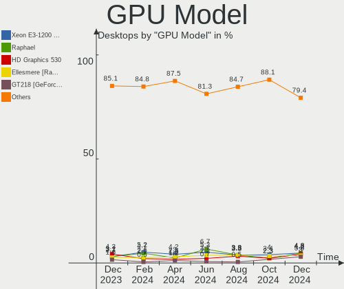
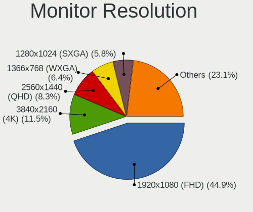

Linux Mint - Hardware Trends (Desktops)
---------------------------------------

A project to identify most popular hardware characteristics and track their change
over time based on data collected by Linux users at https://Linux-Hardware.org.

Anyone can contribute to this report by the [hw-probe](https://github.com/linuxhw/hw-probe) tool:

    sudo -E hw-probe -all -upload

This report is for one last month. Overall report since the beginning of time: [TestCoverage](https://github.com/linuxhw/TestCoverage)

Period: Dec, 2022.

Contents
--------

* [ System ](#system)
  - [ OS                       ](#os)
  - [ OS Family                ](#os-family)
  - [ Kernel                   ](#kernel)
  - [ Kernel Family            ](#kernel-family)
  - [ Kernel Major Ver.        ](#kernel-major-ver)
  - [ Arch                     ](#arch)
  - [ DE                       ](#de)
  - [ Display Server           ](#display-server)
  - [ Display Manager          ](#display-manager)
  - [ OS Lang                  ](#os-lang)
  - [ Boot Mode                ](#boot-mode)
  - [ Filesystem               ](#filesystem)
  - [ Part. scheme             ](#part-scheme)
  - [ Dual Boot with Linux/BSD ](#dual-boot-with-linuxbsd)
  - [ Dual Boot (Win)          ](#dual-boot-win)

* [ Board ](#board)
  - [ Vendor                   ](#vendor)
  - [ Model                    ](#model)
  - [ Model Family             ](#model-family)
  - [ MFG Year                 ](#mfg-year)
  - [ Form Factor              ](#form-factor)
  - [ Secure Boot              ](#secure-boot)
  - [ Coreboot                 ](#coreboot)
  - [ RAM Size                 ](#ram-size)
  - [ RAM Used                 ](#ram-used)
  - [ Total Drives             ](#total-drives)
  - [ Has CD-ROM               ](#has-cd-rom)
  - [ Has Ethernet             ](#has-ethernet)
  - [ Has WiFi                 ](#has-wifi)
  - [ Has Bluetooth            ](#has-bluetooth)

* [ Location ](#location)
  - [ Country                  ](#country)
  - [ City                     ](#city)

* [ Drives ](#drives)
  - [ Drive Vendor             ](#drive-vendor)
  - [ Drive Model              ](#drive-model)
  - [ HDD Vendor               ](#hdd-vendor)
  - [ SSD Vendor               ](#ssd-vendor)
  - [ Drive Kind               ](#drive-kind)
  - [ Drive Connector          ](#drive-connector)
  - [ Drive Size               ](#drive-size)
  - [ Space Total              ](#space-total)
  - [ Space Used               ](#space-used)
  - [ Malfunc. Drives          ](#malfunc-drives)
  - [ Malfunc. Drive Vendor    ](#malfunc-drive-vendor)
  - [ Malfunc. HDD Vendor      ](#malfunc-hdd-vendor)
  - [ Malfunc. Drive Kind      ](#malfunc-drive-kind)
  - [ Failed Drives            ](#failed-drives)
  - [ Failed Drive Vendor      ](#failed-drive-vendor)
  - [ Drive Status             ](#drive-status)

* [ Storage controller ](#storage-controller)
  - [ Storage Vendor           ](#storage-vendor)
  - [ Storage Model            ](#storage-model)
  - [ Storage Kind             ](#storage-kind)

* [ Processor ](#processor)
  - [ CPU Vendor               ](#cpu-vendor)
  - [ CPU Model                ](#cpu-model)
  - [ CPU Model Family         ](#cpu-model-family)
  - [ CPU Cores                ](#cpu-cores)
  - [ CPU Sockets              ](#cpu-sockets)
  - [ CPU Threads              ](#cpu-threads)
  - [ CPU Op-Modes             ](#cpu-op-modes)
  - [ CPU Microcode            ](#cpu-microcode)
  - [ CPU Microarch            ](#cpu-microarch)

* [ Graphics ](#graphics)
  - [ GPU Vendor               ](#gpu-vendor)
  - [ GPU Model                ](#gpu-model)
  - [ GPU Combo                ](#gpu-combo)
  - [ GPU Driver               ](#gpu-driver)
  - [ GPU Memory               ](#gpu-memory)

* [ Monitor ](#monitor)
  - [ Monitor Vendor           ](#monitor-vendor)
  - [ Monitor Model            ](#monitor-model)
  - [ Monitor Resolution       ](#monitor-resolution)
  - [ Monitor Diagonal         ](#monitor-diagonal)
  - [ Monitor Width            ](#monitor-width)
  - [ Aspect Ratio             ](#aspect-ratio)
  - [ Monitor Area             ](#monitor-area)
  - [ Pixel Density            ](#pixel-density)
  - [ Multiple Monitors        ](#multiple-monitors)

* [ Network ](#network)
  - [ Net Controller Vendor    ](#net-controller-vendor)
  - [ Net Controller Model     ](#net-controller-model)
  - [ Wireless Vendor          ](#wireless-vendor)
  - [ Wireless Model           ](#wireless-model)
  - [ Ethernet Vendor          ](#ethernet-vendor)
  - [ Ethernet Model           ](#ethernet-model)
  - [ Net Controller Kind      ](#net-controller-kind)
  - [ Used Controller          ](#used-controller)
  - [ NICs                     ](#nics)
  - [ IPv6                     ](#ipv6)

* [ Bluetooth ](#bluetooth)
  - [ Bluetooth Vendor         ](#bluetooth-vendor)
  - [ Bluetooth Model          ](#bluetooth-model)

* [ Sound ](#sound)
  - [ Sound Vendor             ](#sound-vendor)
  - [ Sound Model              ](#sound-model)

* [ Memory ](#memory)
  - [ Memory Vendor            ](#memory-vendor)
  - [ Memory Model             ](#memory-model)
  - [ Memory Kind              ](#memory-kind)
  - [ Memory Form Factor       ](#memory-form-factor)
  - [ Memory Size              ](#memory-size)
  - [ Memory Speed             ](#memory-speed)

* [ Printers & scanners ](#printers--scanners)
  - [ Printer Vendor           ](#printer-vendor)
  - [ Printer Model            ](#printer-model)
  - [ Scanner Vendor           ](#scanner-vendor)
  - [ Scanner Model            ](#scanner-model)

* [ Camera ](#camera)
  - [ Camera Vendor            ](#camera-vendor)
  - [ Camera Model             ](#camera-model)

* [ Security ](#security)
  - [ Fingerprint Vendor       ](#fingerprint-vendor)
  - [ Fingerprint Model        ](#fingerprint-model)
  - [ Chipcard Vendor          ](#chipcard-vendor)
  - [ Chipcard Model           ](#chipcard-model)

* [ Unsupported ](#unsupported)
  - [ Unsupported Devices      ](#unsupported-devices)
  - [ Unsupported Device Types ](#unsupported-device-types)

System
------

OS
--

Installed operating systems

| Name            | Desktops | Percent |
|-----------------|----------|---------|
| Linux Mint 21   | 84       | 44.68%  |
| Linux Mint 20.3 | 42       | 22.34%  |
| Linux Mint 21.1 | 39       | 20.74%  |
| Linux Mint 20.2 | 6        | 3.19%   |
| Linux Mint 19.3 | 5        | 2.66%   |
| Linux Mint 20.1 | 4        | 2.13%   |
| Linux Mint 20   | 4        | 2.13%   |
| Linux Mint 19.2 | 2        | 1.06%   |
| Linux Mint 19.1 | 1        | 0.53%   |
| Linux Mint 18.3 | 1        | 0.53%   |

OS Family
---------

OS without a version

| Name       | Desktops | Percent |
|------------|----------|---------|
| Linux Mint | 188      | 100%    |

Kernel
------

Version of the Linux kernel

| Version                   | Desktops | Percent |
|---------------------------|----------|---------|
| 5.15.0-56-generic         | 100      | 53.19%  |
| 5.4.0-135-generic         | 35       | 18.62%  |
| 5.15.0-41-generic         | 13       | 6.91%   |
| 5.4.0-91-generic          | 4        | 2.13%   |
| 5.4.0-132-generic         | 4        | 2.13%   |
| 5.15.0-53-generic         | 4        | 2.13%   |
| 5.4.0-131-generic         | 3        | 1.6%    |
| 6.0.0-1007-oem            | 1        | 0.53%   |
| 6.0.0-10.1-liquorix-amd64 | 1        | 0.53%   |
| 5.4.0-99-generic          | 1        | 0.53%   |
| 5.4.0-74-generic          | 1        | 0.53%   |
| 5.4.0-65-generic          | 1        | 0.53%   |
| 5.4.0-128-generic         | 1        | 0.53%   |
| 5.4.0-126-generic         | 1        | 0.53%   |
| 5.4.0-124-generic         | 1        | 0.53%   |
| 5.4.0-122-generic         | 1        | 0.53%   |
| 5.19.0-28-generic         | 1        | 0.53%   |
| 5.19.0-21-generic         | 1        | 0.53%   |
| 5.19.0-051900-generic     | 1        | 0.53%   |
| 5.17.0-1019-oem           | 1        | 0.53%   |
| 5.15.0-52-generic         | 1        | 0.53%   |
| 5.15.0-46-generic         | 1        | 0.53%   |
| 5.15.0-43-generic         | 1        | 0.53%   |
| 5.15.0-1021-intel-iotg    | 1        | 0.53%   |
| 5.15.0-1010-nvidia        | 1        | 0.53%   |
| 5.13.0-23-generic         | 1        | 0.53%   |
| 5.0.0-32-generic          | 1        | 0.53%   |
| 4.15.0-54-generic         | 1        | 0.53%   |
| 4.15.0-200-generic        | 1        | 0.53%   |
| 4.15.0-20-generic         | 1        | 0.53%   |
| 4.15.0-101-generic        | 1        | 0.53%   |
| 4.10.0-38-generic         | 1        | 0.53%   |

Kernel Family
-------------

Linux kernel without a distro release

| Version | Desktops | Percent |
|---------|----------|---------|
| 5.15.0  | 122      | 64.89%  |
| 5.4.0   | 53       | 28.19%  |
| 4.15.0  | 4        | 2.13%   |
| 5.19.0  | 3        | 1.6%    |
| 6.0.0   | 2        | 1.06%   |
| 5.17.0  | 1        | 0.53%   |
| 5.13.0  | 1        | 0.53%   |
| 5.0.0   | 1        | 0.53%   |
| 4.10.0  | 1        | 0.53%   |

Kernel Major Ver.
-----------------

Linux kernel major version

| Version | Desktops | Percent |
|---------|----------|---------|
| 5.15    | 122      | 64.89%  |
| 5.4     | 53       | 28.19%  |
| 4.15    | 4        | 2.13%   |
| 5.19    | 3        | 1.6%    |
| 6.0     | 2        | 1.06%   |
| 5.17    | 1        | 0.53%   |
| 5.13    | 1        | 0.53%   |
| 5.0     | 1        | 0.53%   |
| 4.10    | 1        | 0.53%   |

Arch
----

OS architecture (x86_64, i586, etc.)

| Name   | Desktops | Percent |
|--------|----------|---------|
| x86_64 | 188      | 100%    |

DE
--

Desktop Environment

| Name       | Desktops | Percent |
|------------|----------|---------|
| X-Cinnamon | 135      | 71.81%  |
| XFCE       | 25       | 13.3%   |
| MATE       | 17       | 9.04%   |
| Cinnamon   | 6        | 3.19%   |
| GNOME      | 3        | 1.6%    |
| KDE5       | 1        | 0.53%   |
| Unknown    | 1        | 0.53%   |

Display Server
--------------

X11 or Wayland

| Name | Desktops | Percent |
|------|----------|---------|
| X11  | 187      | 99.47%  |
| Tty  | 1        | 0.53%   |

Display Manager
---------------

SDDM, LightDM, etc.

| Name    | Desktops | Percent |
|---------|----------|---------|
| Unknown | 103      | 54.79%  |
| LightDM | 83       | 44.15%  |
| LXDM    | 1        | 0.53%   |
| GDM3    | 1        | 0.53%   |

OS Lang
-------

Language

| Lang  | Desktops | Percent |
|-------|----------|---------|
| en_US | 51       | 27.13%  |
| de_DE | 27       | 14.36%  |
| pt_BR | 14       | 7.45%   |
| it_IT | 12       | 6.38%   |
| en_GB | 10       | 5.32%   |
| fr_FR | 9        | 4.79%   |
| C     | 9        | 4.79%   |
| en_CA | 7        | 3.72%   |
| ru_RU | 6        | 3.19%   |
| es_ES | 5        | 2.66%   |
| en_SG | 5        | 2.66%   |
| pl_PL | 3        | 1.6%    |
| hu_HU | 3        | 1.6%    |
| en_PH | 3        | 1.6%    |
| en_AU | 3        | 1.6%    |
| sr_RS | 2        | 1.06%   |
| pt_PT | 2        | 1.06%   |
| nl_NL | 2        | 1.06%   |
| fr_CH | 2        | 1.06%   |
| en_NZ | 2        | 1.06%   |
| tr_TR | 1        | 0.53%   |
| sv_SE | 1        | 0.53%   |
| nl_BE | 1        | 0.53%   |
| ja_JP | 1        | 0.53%   |
| es_MX | 1        | 0.53%   |
| es_CO | 1        | 0.53%   |
| en_ZA | 1        | 0.53%   |
| en_IE | 1        | 0.53%   |
| de_AT | 1        | 0.53%   |
| cs_CZ | 1        | 0.53%   |
| bs_BA | 1        | 0.53%   |

Boot Mode
---------

EFI or BIOS

| Mode | Desktops | Percent |
|------|----------|---------|
| EFI  | 98       | 52.13%  |
| BIOS | 90       | 47.87%  |

Filesystem
----------

Type of filesystem

| Type    | Desktops | Percent |
|---------|----------|---------|
| Ext4    | 175      | 93.09%  |
| Overlay | 7        | 3.72%   |
| Ext2    | 2        | 1.06%   |
| Btrfs   | 2        | 1.06%   |
| Zfs     | 1        | 0.53%   |
| Xfs     | 1        | 0.53%   |

Part. scheme
------------

Scheme of partitioning

| Type    | Desktops | Percent |
|---------|----------|---------|
| Unknown | 103      | 54.79%  |
| GPT     | 61       | 32.45%  |
| MBR     | 24       | 12.77%  |

Dual Boot with Linux/BSD
------------------------

Hosting more than one Linux/BSD

| Dual boot | Desktops | Percent |
|-----------|----------|---------|
| No        | 169      | 89.89%  |
| Yes       | 19       | 10.11%  |

Dual Boot (Win)
---------------

Hosting Linux and Windows

| Dual boot | Desktops | Percent |
|-----------|----------|---------|
| No        | 142      | 75.53%  |
| Yes       | 46       | 24.47%  |

Board
-----

Vendor
------

Motherboard manufacturer

| Name                | Desktops | Percent |
|---------------------|----------|---------|
| ASUSTek Computer    | 42       | 22.34%  |
| Gigabyte Technology | 31       | 16.49%  |
| Hewlett-Packard     | 23       | 12.23%  |
| Dell                | 21       | 11.17%  |
| MSI                 | 14       | 7.45%   |
| ASRock              | 13       | 6.91%   |
| Intel               | 10       | 5.32%   |
| Lenovo              | 7        | 3.72%   |
| Foxconn             | 4        | 2.13%   |
| ECS                 | 3        | 1.6%    |
| Biostar             | 2        | 1.06%   |
| AZW                 | 2        | 1.06%   |
| AMI                 | 2        | 1.06%   |
| Acer                | 2        | 1.06%   |
| Unknown             | 2        | 1.06%   |
| VXL                 | 1        | 0.53%   |
| Supermicro          | 1        | 0.53%   |
| QIYIDA              | 1        | 0.53%   |
| Pegatron            | 1        | 0.53%   |
| PCWare              | 1        | 0.53%   |
| MiTAC               | 1        | 0.53%   |
| Megaware            | 1        | 0.53%   |
| Inventec            | 1        | 0.53%   |
| Google              | 1        | 0.53%   |
| Apple               | 1        | 0.53%   |

Model
-----

Motherboard model

| Name                                 | Desktops | Percent |
|--------------------------------------|----------|---------|
| Gigabyte GA-78LMT-USB3               | 3        | 1.6%    |
| Foxconn Pro 3330 MT                  | 3        | 1.6%    |
| Unknown                              | 3        | 1.6%    |
| MSI MS-7C94                          | 2        | 1.06%   |
| Intel X99                            | 2        | 1.06%   |
| HP Pavilion Gaming Desktop TG01-0xxx | 2        | 1.06%   |
| HP Compaq Pro 6300 SFF               | 2        | 1.06%   |
| HP Compaq 6005 Pro SFF PC            | 2        | 1.06%   |
| Gigabyte B85M-D3H                    | 2        | 1.06%   |
| Gigabyte A320M-H                     | 2        | 1.06%   |
| Dell OptiPlex 780                    | 2        | 1.06%   |
| Dell OptiPlex 7010                   | 2        | 1.06%   |
| Dell OptiPlex 380                    | 2        | 1.06%   |
| Dell OptiPlex 3050                   | 2        | 1.06%   |
| Dell OptiPlex 3020                   | 2        | 1.06%   |
| Dell OptiPlex 3010                   | 2        | 1.06%   |
| Dell Inspiron 560                    | 2        | 1.06%   |
| ASUS TUF Gaming X570-PLUS            | 2        | 1.06%   |
| ASUS ROG STRIX Z370-E GAMING         | 2        | 1.06%   |
| ASUS M4A89GTD-PRO/USB3               | 2        | 1.06%   |
| ASUS All Series                      | 2        | 1.06%   |
| VXL TC7520d                          | 1        | 0.53%   |
| Supermicro X9SCL/X9SCM               | 1        | 0.53%   |
| QIYIDA X99-H9 V2.0                   | 1        | 0.53%   |
| Pegatron 520-1050                    | 1        | 0.53%   |
| PCWare IPMH61R3                      | 1        | 0.53%   |
| MSI NM917AA-ABU CQ5001UK             | 1        | 0.53%   |
| MSI MS-7C75                          | 1        | 0.53%   |
| MSI MS-7C56                          | 1        | 0.53%   |
| MSI MS-7C37                          | 1        | 0.53%   |
| MSI MS-7C02                          | 1        | 0.53%   |
| MSI MS-7B84                          | 1        | 0.53%   |
| MSI MS-7B79                          | 1        | 0.53%   |
| MSI MS-7B17                          | 1        | 0.53%   |
| MSI MS-7850                          | 1        | 0.53%   |
| MSI MS-7817                          | 1        | 0.53%   |
| MSI MS-7788                          | 1        | 0.53%   |
| MSI MS-7641                          | 1        | 0.53%   |
| MiTAC PD14RI                         | 1        | 0.53%   |
| Megaware MW-H61M-2H                  | 1        | 0.53%   |

Model Family
------------

Motherboard model prefix

| Name                   | Desktops | Percent |
|------------------------|----------|---------|
| Dell OptiPlex          | 13       | 6.91%   |
| HP Compaq              | 7        | 3.72%   |
| ASUS ROG               | 7        | 3.72%   |
| Lenovo ThinkCentre     | 6        | 3.19%   |
| ASUS PRIME             | 6        | 3.19%   |
| HP ProDesk             | 5        | 2.66%   |
| Dell Inspiron          | 5        | 2.66%   |
| HP EliteDesk           | 4        | 2.13%   |
| Intel X99              | 3        | 1.6%    |
| Gigabyte GA-78LMT-USB3 | 3        | 1.6%    |
| Foxconn Pro            | 3        | 1.6%    |
| Unknown                | 3        | 1.6%    |
| MSI MS-7C94            | 2        | 1.06%   |
| HP Pavilion            | 2        | 1.06%   |
| Gigabyte B85M-D3H      | 2        | 1.06%   |
| Gigabyte A320M-H       | 2        | 1.06%   |
| Dell Precision         | 2        | 1.06%   |
| ASUS TUF               | 2        | 1.06%   |
| ASUS M5A78L-M          | 2        | 1.06%   |
| ASUS M4A89GTD-PRO      | 2        | 1.06%   |
| ASUS All               | 2        | 1.06%   |
| Acer Aspire            | 2        | 1.06%   |
| VXL TC7520d            | 1        | 0.53%   |
| Supermicro X9SCL       | 1        | 0.53%   |
| QIYIDA X99-H9          | 1        | 0.53%   |
| Pegatron 520-1050      | 1        | 0.53%   |
| PCWare IPMH61R3        | 1        | 0.53%   |
| MSI NM917AA-ABU        | 1        | 0.53%   |
| MSI MS-7C75            | 1        | 0.53%   |
| MSI MS-7C56            | 1        | 0.53%   |
| MSI MS-7C37            | 1        | 0.53%   |
| MSI MS-7C02            | 1        | 0.53%   |
| MSI MS-7B84            | 1        | 0.53%   |
| MSI MS-7B79            | 1        | 0.53%   |
| MSI MS-7B17            | 1        | 0.53%   |
| MSI MS-7850            | 1        | 0.53%   |
| MSI MS-7817            | 1        | 0.53%   |
| MSI MS-7788            | 1        | 0.53%   |
| MSI MS-7641            | 1        | 0.53%   |
| MiTAC PD14RI           | 1        | 0.53%   |

MFG Year
--------

Motherboard manufacture year

| Year | Desktops | Percent |
|------|----------|---------|
| 2012 | 28       | 14.89%  |
| 2013 | 16       | 8.51%   |
| 2010 | 16       | 8.51%   |
| 2018 | 14       | 7.45%   |
| 2020 | 12       | 6.38%   |
| 2019 | 12       | 6.38%   |
| 2016 | 12       | 6.38%   |
| 2011 | 12       | 6.38%   |
| 2017 | 11       | 5.85%   |
| 2009 | 11       | 5.85%   |
| 2014 | 9        | 4.79%   |
| 2022 | 7        | 3.72%   |
| 2021 | 7        | 3.72%   |
| 2015 | 6        | 3.19%   |
| 2007 | 6        | 3.19%   |
| 2008 | 5        | 2.66%   |
| 2006 | 3        | 1.6%    |
| 2005 | 1        | 0.53%   |

Form Factor
-----------

Physical design of the computer

| Name    | Desktops | Percent |
|---------|----------|---------|
| Desktop | 188      | 100%    |

Secure Boot
-----------

Enabled or disabled

| State    | Desktops | Percent |
|----------|----------|---------|
| Disabled | 179      | 95.21%  |
| Enabled  | 9        | 4.79%   |

Coreboot
--------

Have coreboot on board

| Used | Desktops | Percent |
|------|----------|---------|
| No   | 187      | 99.47%  |
| Yes  | 1        | 0.53%   |

RAM Size
--------

Total RAM memory

| Size in GB  | Desktops | Percent |
|-------------|----------|---------|
| 16.01-24.0  | 49       | 26.06%  |
| 8.01-16.0   | 40       | 21.28%  |
| 4.01-8.0    | 30       | 15.96%  |
| 32.01-64.0  | 23       | 12.23%  |
| 3.01-4.0    | 23       | 12.23%  |
| 1.01-2.0    | 11       | 5.85%   |
| 64.01-256.0 | 7        | 3.72%   |
| 24.01-32.0  | 5        | 2.66%   |

RAM Used
--------

Used RAM memory

| Used GB    | Desktops | Percent |
|------------|----------|---------|
| 1.01-2.0   | 73       | 38.83%  |
| 2.01-3.0   | 56       | 29.79%  |
| 3.01-4.0   | 25       | 13.3%   |
| 4.01-8.0   | 19       | 10.11%  |
| 0.51-1.0   | 8        | 4.26%   |
| 8.01-16.0  | 6        | 3.19%   |
| 16.01-24.0 | 1        | 0.53%   |

Total Drives
------------

Number of drives on board

| Drives | Desktops | Percent |
|--------|----------|---------|
| 1      | 72       | 38.3%   |
| 2      | 56       | 29.79%  |
| 3      | 31       | 16.49%  |
| 4      | 16       | 8.51%   |
| 5      | 9        | 4.79%   |
| 6      | 3        | 1.6%    |
| 8      | 1        | 0.53%   |

Has CD-ROM
----------

Has CD-ROM on board

| Presented | Desktops | Percent |
|-----------|----------|---------|
| Yes       | 96       | 51.06%  |
| No        | 92       | 48.94%  |

Has Ethernet
------------

Has Ethernet on board

| Presented | Desktops | Percent |
|-----------|----------|---------|
| Yes       | 182      | 96.81%  |
| No        | 6        | 3.19%   |

Has WiFi
--------

Has WiFi module

| Presented | Desktops | Percent |
|-----------|----------|---------|
| Yes       | 99       | 52.66%  |
| No        | 89       | 47.34%  |

Has Bluetooth
-------------

Has Bluetooth module

| Presented | Desktops | Percent |
|-----------|----------|---------|
| No        | 125      | 66.49%  |
| Yes       | 63       | 33.51%  |

Location
--------

Country
-------

Geographic location (country)

| Country                | Desktops | Percent |
|------------------------|----------|---------|
| USA                    | 38       | 20.21%  |
| Germany                | 27       | 14.36%  |
| Brazil                 | 17       | 9.04%   |
| Italy                  | 12       | 6.38%   |
| France                 | 11       | 5.85%   |
| UK                     | 10       | 5.32%   |
| Canada                 | 8        | 4.26%   |
| Spain                  | 7        | 3.72%   |
| Russia                 | 7        | 3.72%   |
| Singapore              | 5        | 2.66%   |
| Netherlands            | 4        | 2.13%   |
| Hungary                | 4        | 2.13%   |
| Switzerland            | 3        | 1.6%    |
| Poland                 | 3        | 1.6%    |
| Australia              | 3        | 1.6%    |
| Philippines            | 2        | 1.06%   |
| New Zealand            | 2        | 1.06%   |
| Indonesia              | 2        | 1.06%   |
| Czechia                | 2        | 1.06%   |
| Bosnia and Herzegovina | 2        | 1.06%   |
| Austria                | 2        | 1.06%   |
| Turkey                 | 1        | 0.53%   |
| Sweden                 | 1        | 0.53%   |
| South Africa           | 1        | 0.53%   |
| Slovakia               | 1        | 0.53%   |
| Serbia                 | 1        | 0.53%   |
| Portugal               | 1        | 0.53%   |
| Mexico                 | 1        | 0.53%   |
| Kenya                  | 1        | 0.53%   |
| Japan                  | 1        | 0.53%   |
| Ireland                | 1        | 0.53%   |
| Greece                 | 1        | 0.53%   |
| Egypt                  | 1        | 0.53%   |
| Denmark                | 1        | 0.53%   |
| Colombia               | 1        | 0.53%   |
| Belgium                | 1        | 0.53%   |
| Belarus                | 1        | 0.53%   |
| Argentina              | 1        | 0.53%   |

City
----

Geographic location (city)

| City              | Desktops | Percent |
|-------------------|----------|---------|
| Berlin            | 5        | 2.66%   |
| Kampong Pasir Ris | 4        | 2.13%   |
| Hamburg           | 3        | 1.6%    |
| Seattle           | 2        | 1.06%   |
| Sao Paulo         | 2        | 1.06%   |
| Rome              | 2        | 1.06%   |
| Raleigh           | 2        | 1.06%   |
| Paris             | 2        | 1.06%   |
| Moscow            | 2        | 1.06%   |
| Miami             | 2        | 1.06%   |
| Madrid            | 2        | 1.06%   |
| Hamilton          | 2        | 1.06%   |
| Gudensberg        | 2        | 1.06%   |
| Chicago           | 2        | 1.06%   |
| Amsterdam         | 2        | 1.06%   |
| Albstadt          | 2        | 1.06%   |
| Zurich            | 1        | 0.53%   |
| Zeitz             | 1        | 0.53%   |
| Yogyakarta        | 1        | 0.53%   |
| Winsen            | 1        | 0.53%   |
| West Columbia     | 1        | 0.53%   |
| Vigo              | 1        | 0.53%   |
| Vienna            | 1        | 0.53%   |
| Viamao            | 1        | 0.53%   |
| Veracruz          | 1        | 0.53%   |
| Valognes          | 1        | 0.53%   |
| Uberlândia       | 1        | 0.53%   |
| Twickenham        | 1        | 0.53%   |
| Tullahoma         | 1        | 0.53%   |
| Tucson            | 1        | 0.53%   |
| Tracy             | 1        | 0.53%   |
| Thornhill         | 1        | 0.53%   |
| Telford           | 1        | 0.53%   |
| Sydney            | 1        | 0.53%   |
| Świętochłowice | 1        | 0.53%   |
| Stadthagen        | 1        | 0.53%   |
| St Petersburg     | 1        | 0.53%   |
| St Louis          | 1        | 0.53%   |
| Spruce Grove      | 1        | 0.53%   |
| Sorocaba          | 1        | 0.53%   |

Drives
------

Drive Vendor
------------

Hard drive vendors

| Vendor                      | Desktops | Drives | Percent |
|-----------------------------|----------|--------|---------|
| Seagate                     | 67       | 77     | 18.98%  |
| WDC                         | 60       | 81     | 17%     |
| Samsung Electronics         | 47       | 54     | 13.31%  |
| Crucial                     | 23       | 26     | 6.52%   |
| Kingston                    | 21       | 23     | 5.95%   |
| Toshiba                     | 19       | 20     | 5.38%   |
| SanDisk                     | 15       | 15     | 4.25%   |
| Hitachi                     | 9        | 9      | 2.55%   |
| China                       | 8        | 8      | 2.27%   |
| Unknown                     | 7        | 11     | 1.98%   |
| Intel                       | 6        | 6      | 1.7%    |
| Maxtor                      | 5        | 6      | 1.42%   |
| SPCC                        | 3        | 3      | 0.85%   |
| PNY                         | 3        | 3      | 0.85%   |
| Phison Electronics          | 3        | 5      | 0.85%   |
| HGST                        | 3        | 3      | 0.85%   |
| A-DATA Technology           | 3        | 3      | 0.85%   |
| Transcend                   | 2        | 2      | 0.57%   |
| SK hynix                    | 2        | 2      | 0.57%   |
| Silicon Motion              | 2        | 2      | 0.57%   |
| Realtek Semiconductor       | 2        | 2      | 0.57%   |
| OCZ                         | 2        | 2      | 0.57%   |
| Micron/Crucial Technology   | 2        | 2      | 0.57%   |
| Micron Technology           | 2        | 2      | 0.57%   |
| Kingston Technology Company | 2        | 2      | 0.57%   |
| JMicron Technology          | 2        | 2      | 0.57%   |
| Intenso                     | 2        | 2      | 0.57%   |
| AMD                         | 2        | 2      | 0.57%   |
| Unknown                     | 2        | 2      | 0.57%   |
| YS                          | 1        | 1      | 0.28%   |
| WALRAM                      | 1        | 1      | 0.28%   |
| USB 3.0                     | 1        | 1      | 0.28%   |
| TSA                         | 1        | 1      | 0.28%   |
| TO Exter                    | 1        | 1      | 0.28%   |
| SMI                         | 1        | 2      | 0.28%   |
| Ramsta                      | 1        | 1      | 0.28%   |
| Plextor                     | 1        | 1      | 0.28%   |
| Phison                      | 1        | 1      | 0.28%   |
| NGFF                        | 1        | 1      | 0.28%   |
| Netac                       | 1        | 2      | 0.28%   |

Drive Model
-----------

Hard drive models

| Model                                               | Desktops | Percent |
|-----------------------------------------------------|----------|---------|
| WDC WD10EZEX-08WN4A0 1TB                            | 6        | 1.54%   |
| Kingston SA400S37240G 240GB SSD                     | 6        | 1.54%   |
| Seagate ST500DM002-1BD142 500GB                     | 5        | 1.28%   |
| Samsung SSD 860 EVO 1TB                             | 5        | 1.28%   |
| Toshiba DT01ACA100 1TB                              | 4        | 1.03%   |
| Seagate ST2000DM008-2FR102 2TB                      | 4        | 1.03%   |
| Samsung SSD 850 EVO 250GB                           | 4        | 1.03%   |
| Samsung NVMe SSD Controller SM981/PM981/PM983 500GB | 4        | 1.03%   |
| WDC WD5000AAKX-60U6AA0 500GB                        | 3        | 0.77%   |
| WDC WD20EFRX-68EUZN0 2TB                            | 3        | 0.77%   |
| Unknown SD/MMC/MS PRO 64GB                          | 3        | 0.77%   |
| Seagate ST3500418AS 500GB                           | 3        | 0.77%   |
| Seagate ST3500413AS 500GB                           | 3        | 0.77%   |
| Seagate ST2000DM006-2DM164 2TB                      | 3        | 0.77%   |
| Seagate ST2000DL003-9VT166 2TB                      | 3        | 0.77%   |
| Seagate ST1000DM010-2EP102 1TB                      | 3        | 0.77%   |
| Seagate ST1000DM003-1ER162 1TB                      | 3        | 0.77%   |
| Samsung SSD 970 EVO Plus 1TB                        | 3        | 0.77%   |
| Samsung SSD 840 EVO 250GB                           | 3        | 0.77%   |
| Kingston SA400S37120G 120GB SSD                     | 3        | 0.77%   |
| Crucial CT500MX500SSD1 500GB                        | 3        | 0.77%   |
| Crucial CT480BX500SSD1 480GB                        | 3        | 0.77%   |
| Crucial CT1000MX500SSD1 1TB                         | 3        | 0.77%   |
| WDC WDS500G2B0A-00SM50 500GB SSD                    | 2        | 0.51%   |
| WDC WDS240G2G0A-00JH30 240GB SSD                    | 2        | 0.51%   |
| WDC WD5000AAKX-001CA0 500GB                         | 2        | 0.51%   |
| WDC WD3200AAJS-00L7A0 320GB                         | 2        | 0.51%   |
| WDC WD10EZEX-22MFCA0 1TB                            | 2        | 0.51%   |
| WDC WD10EZEX-00BN5A0 1TB                            | 2        | 0.51%   |
| Unknown SD/MMC 2GB                                  | 2        | 0.51%   |
| Unknown M.S./M.S.Pro/HG 16GB                        | 2        | 0.51%   |
| Toshiba HDWD120 2TB                                 | 2        | 0.51%   |
| SPCC Solid State Disk 512GB                         | 2        | 0.51%   |
| Seagate ST9500420AS 500GB                           | 2        | 0.51%   |
| Seagate ST9160314AS 160GB                           | 2        | 0.51%   |
| Seagate ST8000DM004-2CX188 8TB                      | 2        | 0.51%   |
| Seagate ST4000DM004-2CV104 4TB                      | 2        | 0.51%   |
| Seagate ST2000DM001-1ER164 2TB                      | 2        | 0.51%   |
| Sandisk WDC WDS100T2B0C-00PXH0 1TB                  | 2        | 0.51%   |
| SanDisk SSD PLUS 1000GB                             | 2        | 0.51%   |

HDD Vendor
----------

Hard disk drive vendors

| Vendor              | Desktops | Drives | Percent |
|---------------------|----------|--------|---------|
| Seagate             | 64       | 74     | 37.87%  |
| WDC                 | 54       | 73     | 31.95%  |
| Toshiba             | 17       | 18     | 10.06%  |
| Samsung Electronics | 9        | 9      | 5.33%   |
| Hitachi             | 9        | 9      | 5.33%   |
| Maxtor              | 5        | 6      | 2.96%   |
| Unknown             | 3        | 3      | 1.78%   |
| HGST                | 3        | 3      | 1.78%   |
| USB 3.0             | 1        | 1      | 0.59%   |
| JMicron Technology  | 1        | 1      | 0.59%   |
| Intenso             | 1        | 1      | 0.59%   |
| Fujitsu             | 1        | 1      | 0.59%   |
| ASMT                | 1        | 2      | 0.59%   |

SSD Vendor
----------

Solid state drive vendors

| Vendor              | Desktops | Drives | Percent |
|---------------------|----------|--------|---------|
| Samsung Electronics | 25       | 27     | 19.53%  |
| Crucial             | 21       | 23     | 16.41%  |
| Kingston            | 16       | 18     | 12.5%   |
| SanDisk             | 11       | 11     | 8.59%   |
| China               | 8        | 8      | 6.25%   |
| WDC                 | 6        | 6      | 4.69%   |
| SPCC                | 3        | 3      | 2.34%   |
| PNY                 | 3        | 3      | 2.34%   |
| A-DATA Technology   | 3        | 3      | 2.34%   |
| Transcend           | 2        | 2      | 1.56%   |
| OCZ                 | 2        | 2      | 1.56%   |
| Intel               | 2        | 2      | 1.56%   |
| AMD                 | 2        | 2      | 1.56%   |
| YS                  | 1        | 1      | 0.78%   |
| TSA                 | 1        | 1      | 0.78%   |
| Toshiba             | 1        | 1      | 0.78%   |
| TO Exter            | 1        | 1      | 0.78%   |
| SMI                 | 1        | 1      | 0.78%   |
| SK hynix            | 1        | 1      | 0.78%   |
| Seagate             | 1        | 1      | 0.78%   |
| Ramsta              | 1        | 1      | 0.78%   |
| Plextor             | 1        | 1      | 0.78%   |
| NGFF                | 1        | 1      | 0.78%   |
| Netac               | 1        | 2      | 0.78%   |
| MidasForce          | 1        | 1      | 0.78%   |
| Micron Technology   | 1        | 1      | 0.78%   |
| Lexar               | 1        | 1      | 0.78%   |
| Kingmax             | 1        | 1      | 0.78%   |
| Integral            | 1        | 1      | 0.78%   |
| GOODRAM             | 1        | 1      | 0.78%   |
| FORESEE             | 1        | 1      | 0.78%   |
| Drevo               | 1        | 1      | 0.78%   |
| Corsair             | 1        | 1      | 0.78%   |
| CERVVO              | 1        | 1      | 0.78%   |
| ASMedia             | 1        | 1      | 0.78%   |
| Apple               | 1        | 1      | 0.78%   |
| Unknown             | 1        | 1      | 0.78%   |

Drive Kind
----------

HDD or SSD

| Kind    | Desktops | Drives | Percent |
|---------|----------|--------|---------|
| HDD     | 133      | 201    | 45.55%  |
| SSD     | 103      | 135    | 35.27%  |
| NVMe    | 43       | 54     | 14.73%  |
| Unknown | 11       | 14     | 3.77%   |
| MMC     | 2        | 3      | 0.68%   |

Drive Connector
---------------

SATA, SAS, NVMe, etc.

| Type | Desktops | Drives | Percent |
|------|----------|--------|---------|
| SATA | 172      | 324    | 72.88%  |
| NVMe | 43       | 54     | 18.22%  |
| SAS  | 19       | 26     | 8.05%   |
| MMC  | 2        | 3      | 0.85%   |

Drive Size
----------

Size of hard drive

| Size in TB | Desktops | Drives | Percent |
|------------|----------|--------|---------|
| 0.01-0.5   | 132      | 196    | 54.1%   |
| 0.51-1.0   | 66       | 82     | 27.05%  |
| 1.01-2.0   | 25       | 35     | 10.25%  |
| 4.01-10.0  | 9        | 10     | 3.69%   |
| 3.01-4.0   | 8        | 8      | 3.28%   |
| 2.01-3.0   | 4        | 5      | 1.64%   |

Space Total
-----------

Amount of disk space available on the file system

| Size in GB     | Desktops | Percent |
|----------------|----------|---------|
| 101-250        | 55       | 29.26%  |
| 251-500        | 37       | 19.68%  |
| 501-1000       | 24       | 12.77%  |
| More than 3000 | 23       | 12.23%  |
| 1001-2000      | 20       | 10.64%  |
| 51-100         | 9        | 4.79%   |
| 1-20           | 8        | 4.26%   |
| 21-50          | 7        | 3.72%   |
| 2001-3000      | 5        | 2.66%   |

Space Used
----------

Amount of used disk space

| Used GB        | Desktops | Percent |
|----------------|----------|---------|
| 1-20           | 50       | 26.6%   |
| 51-100         | 31       | 16.49%  |
| 21-50          | 30       | 15.96%  |
| 101-250        | 23       | 12.23%  |
| 251-500        | 15       | 7.98%   |
| 501-1000       | 13       | 6.91%   |
| 1001-2000      | 12       | 6.38%   |
| More than 3000 | 10       | 5.32%   |
| 2001-3000      | 4        | 2.13%   |

Malfunc. Drives
---------------

Drive models with a malfunction

| Model                             | Desktops | Drives | Percent |
|-----------------------------------|----------|--------|---------|
| Seagate ST1000DM003-1ER162 1TB    | 2        | 2      | 11.11%  |
| WDC WDS240G2G0A-00JH30 240GB SSD  | 1        | 1      | 5.56%   |
| WDC WD5000AAKX-60U6AA0 500GB      | 1        | 1      | 5.56%   |
| WDC WD5000AAKX-001CA0 500GB       | 1        | 2      | 5.56%   |
| WDC WD10EZEX-22RKKA0 1TB          | 1        | 1      | 5.56%   |
| Toshiba MQ01ABC150 1TB            | 1        | 1      | 5.56%   |
| Toshiba HDWD110 1TB               | 1        | 1      | 5.56%   |
| SPCC Solid State Disk 512GB       | 1        | 1      | 5.56%   |
| Seagate ST9160314AS 160GB         | 1        | 1      | 5.56%   |
| Seagate ST3320310CS 320GB         | 1        | 1      | 5.56%   |
| Seagate ST1500DL003-9VT16L 1TB    | 1        | 1      | 5.56%   |
| Seagate ST1000LX015-1U7172 1TB    | 1        | 1      | 5.56%   |
| SanDisk SSD PLUS 240GB            | 1        | 1      | 5.56%   |
| Samsung Electronics HD322HJ 320GB | 1        | 1      | 5.56%   |
| Maxtor STM3320613AS 320GB         | 1        | 2      | 5.56%   |
| Maxtor 6Y160M0 160GB              | 1        | 1      | 5.56%   |
| Crucial CT275MX300SSD1 275GB      | 1        | 1      | 5.56%   |

Malfunc. Drive Vendor
---------------------

Vendors of faulty drives

| Vendor              | Desktops | Drives | Percent |
|---------------------|----------|--------|---------|
| Seagate             | 6        | 6      | 33.33%  |
| WDC                 | 4        | 5      | 22.22%  |
| Toshiba             | 2        | 2      | 11.11%  |
| Maxtor              | 2        | 3      | 11.11%  |
| SPCC                | 1        | 1      | 5.56%   |
| SanDisk             | 1        | 1      | 5.56%   |
| Samsung Electronics | 1        | 1      | 5.56%   |
| Crucial             | 1        | 1      | 5.56%   |

Malfunc. HDD Vendor
-------------------

Vendors of faulty HDD drives

| Vendor              | Desktops | Drives | Percent |
|---------------------|----------|--------|---------|
| Seagate             | 6        | 6      | 42.86%  |
| WDC                 | 3        | 4      | 21.43%  |
| Toshiba             | 2        | 2      | 14.29%  |
| Maxtor              | 2        | 3      | 14.29%  |
| Samsung Electronics | 1        | 1      | 7.14%   |

Malfunc. Drive Kind
-------------------

Kinds of faulty drives

| Kind | Desktops | Drives | Percent |
|------|----------|--------|---------|
| HDD  | 13       | 16     | 76.47%  |
| SSD  | 4        | 4      | 23.53%  |

Failed Drives
-------------

Failed drive models

Zero info for selected period =(

Failed Drive Vendor
-------------------

Failed drive vendors

Zero info for selected period =(

Drive Status
------------

Number of failed and malfunc. drives

| Status   | Desktops | Drives | Percent |
|----------|----------|--------|---------|
| Detected | 122      | 261    | 60.4%   |
| Works    | 63       | 126    | 31.19%  |
| Malfunc  | 17       | 20     | 8.42%   |

Storage controller
------------------

Storage Vendor
--------------

Storage controller vendors

| Vendor                        | Desktops | Percent |
|-------------------------------|----------|---------|
| Intel                         | 120      | 46.69%  |
| AMD                           | 56       | 21.79%  |
| Samsung Electronics           | 16       | 6.23%   |
| Nvidia                        | 8        | 3.11%   |
| ASMedia Technology            | 8        | 3.11%   |
| Kingston Technology Company   | 7        | 2.72%   |
| JMicron Technology            | 7        | 2.72%   |
| SanDisk                       | 6        | 2.33%   |
| Marvell Technology Group      | 6        | 2.33%   |
| Micron/Crucial Technology     | 5        | 1.95%   |
| Phison Electronics            | 4        | 1.56%   |
| VIA Technologies              | 3        | 1.17%   |
| Silicon Motion                | 2        | 0.78%   |
| Realtek Semiconductor         | 2        | 0.78%   |
| Toshiba America Info Systems  | 1        | 0.39%   |
| SK hynix                      | 1        | 0.39%   |
| Micron Technology             | 1        | 0.39%   |
| KIOXIA                        | 1        | 0.39%   |
| Integrated Technology Express | 1        | 0.39%   |
| Hewlett-Packard               | 1        | 0.39%   |
| Adaptec                       | 1        | 0.39%   |

Storage Model
-------------

Storage controller models

| Model                                                                                   | Desktops | Percent |
|-----------------------------------------------------------------------------------------|----------|---------|
| AMD FCH SATA Controller [AHCI mode]                                                     | 19       | 5.81%   |
| Intel 8 Series/C220 Series Chipset Family 6-port SATA Controller 1 [AHCI mode]          | 16       | 4.89%   |
| AMD SB7x0/SB8x0/SB9x0 IDE Controller                                                    | 15       | 4.59%   |
| Intel 6 Series/C200 Series Chipset Family 6 port Desktop SATA AHCI Controller           | 13       | 3.98%   |
| AMD SB7x0/SB8x0/SB9x0 SATA Controller [IDE mode]                                        | 13       | 3.98%   |
| Samsung NVMe SSD Controller SM981/PM981/PM983                                           | 10       | 3.06%   |
| Intel 7 Series/C210 Series Chipset Family 6-port SATA Controller [AHCI mode]            | 9        | 2.75%   |
| Intel 200 Series PCH SATA controller [AHCI mode]                                        | 9        | 2.75%   |
| AMD SB7x0/SB8x0/SB9x0 SATA Controller [AHCI mode]                                       | 9        | 2.75%   |
| AMD 400 Series Chipset SATA Controller                                                  | 8        | 2.45%   |
| Intel 6 Series/C200 Series Chipset Family Desktop SATA Controller (IDE mode, ports 4-5) | 7        | 2.14%   |
| Intel 6 Series/C200 Series Chipset Family Desktop SATA Controller (IDE mode, ports 0-3) | 7        | 2.14%   |
| ASMedia ASM1062 Serial ATA Controller                                                   | 7        | 2.14%   |
| AMD 500 Series Chipset SATA Controller                                                  | 7        | 2.14%   |
| Intel SATA Controller [RAID mode]                                                       | 6        | 1.83%   |
| Intel Q170/Q150/B150/H170/H110/Z170/CM236 Chipset SATA Controller [AHCI Mode]           | 6        | 1.83%   |
| Intel NM10/ICH7 Family SATA Controller [IDE mode]                                       | 6        | 1.83%   |
| Intel 82801G (ICH7 Family) IDE Controller                                               | 6        | 1.83%   |
| SanDisk Non-Volatile memory controller                                                  | 5        | 1.53%   |
| Kingston Company Company Non-Volatile memory controller                                 | 5        | 1.53%   |
| JMicron JMB363 SATA/IDE Controller                                                      | 5        | 1.53%   |
| Intel Cannon Lake PCH SATA AHCI Controller                                              | 5        | 1.53%   |
| Samsung NVMe SSD Controller PM9A1/PM9A3/980PRO                                          | 4        | 1.22%   |
| Intel 82801JI (ICH10 Family) SATA AHCI Controller                                       | 4        | 1.22%   |
| Intel 500 Series Chipset Family SATA AHCI Controller                                    | 4        | 1.22%   |
| Intel 5 Series/3400 Series Chipset 6 port SATA AHCI Controller                          | 4        | 1.22%   |
| Intel 4 Series Chipset PT IDER Controller                                               | 4        | 1.22%   |
| Micron/Crucial P2 NVMe PCIe SSD                                                         | 3        | 0.92%   |
| Marvell Group 88SE6111/6121 SATA II / PATA Controller                                   | 3        | 0.92%   |
| Intel 9 Series Chipset Family SATA Controller [AHCI Mode]                               | 3        | 0.92%   |
| Intel 82801JI (ICH10 Family) 4 port SATA IDE Controller #1                              | 3        | 0.92%   |
| Intel 82801JI (ICH10 Family) 2 port SATA IDE Controller #2                              | 3        | 0.92%   |
| Intel 82801JD/DO (ICH10 Family) SATA AHCI Controller                                    | 3        | 0.92%   |
| Intel 5 Series/3400 Series Chipset 4 port SATA IDE Controller                           | 3        | 0.92%   |
| Intel 5 Series/3400 Series Chipset 2 port SATA IDE Controller                           | 3        | 0.92%   |
| AMD FCH IDE Controller                                                                  | 3        | 0.92%   |
| AMD 300 Series Chipset SATA Controller                                                  | 3        | 0.92%   |
| Silicon Motion SM2263EN/SM2263XT SSD Controller                                         | 2        | 0.61%   |
| Samsung NVMe SSD Controller 980                                                         | 2        | 0.61%   |
| Realtek RTS5763DL NVMe SSD Controller                                                   | 2        | 0.61%   |

Storage Kind
------------

Kind of storage controller (IDE, SATA, NVMe, SAS, ...)

| Kind | Desktops | Percent |
|------|----------|---------|
| SATA | 148      | 56.7%   |
| IDE  | 58       | 22.22%  |
| NVMe | 43       | 16.48%  |
| RAID | 10       | 3.83%   |
| SAS  | 1        | 0.38%   |
| SCSI | 1        | 0.38%   |

Processor
---------

CPU Vendor
----------

Processor vendors

| Vendor       | Desktops | Percent |
|--------------|----------|---------|
| Intel        | 123      | 65.43%  |
| AMD          | 64       | 34.04%  |
| CentaurHauls | 1        | 0.53%   |

CPU Model
---------

Processor models

| Model                                       | Desktops | Percent |
|---------------------------------------------|----------|---------|
| Intel Core i5-3470 CPU @ 3.20GHz            | 5        | 2.66%   |
| Intel Core i3-2120 CPU @ 3.30GHz            | 5        | 2.66%   |
| Intel Core i5-2400 CPU @ 3.10GHz            | 4        | 2.13%   |
| Intel Core i7-4790 CPU @ 3.60GHz            | 3        | 1.6%    |
| Intel Core i7-3770 CPU @ 3.40GHz            | 3        | 1.6%    |
| Intel Core i5-4570 CPU @ 3.20GHz            | 3        | 1.6%    |
| Intel Core i5 CPU 650 @ 3.20GHz             | 3        | 1.6%    |
| AMD Ryzen 7 3700X 8-Core Processor          | 3        | 1.6%    |
| AMD Ryzen 5 3600 6-Core Processor           | 3        | 1.6%    |
| Intel Xeon CPU E5-2620 v3 @ 2.40GHz         | 2        | 1.06%   |
| Intel Pentium Gold G5400 CPU @ 3.70GHz      | 2        | 1.06%   |
| Intel Pentium CPU G3220 @ 3.00GHz           | 2        | 1.06%   |
| Intel Core i7-8700K CPU @ 3.70GHz           | 2        | 1.06%   |
| Intel Core i7-6700 CPU @ 3.40GHz            | 2        | 1.06%   |
| Intel Core i5-6500 CPU @ 3.20GHz            | 2        | 1.06%   |
| Intel Core i5-4690K CPU @ 3.50GHz           | 2        | 1.06%   |
| Intel Core i5-4590 CPU @ 3.30GHz            | 2        | 1.06%   |
| Intel Core i5-3570K CPU @ 3.40GHz           | 2        | 1.06%   |
| Intel Core i5-3570 CPU @ 3.40GHz            | 2        | 1.06%   |
| Intel Core 2 Duo CPU E8400 @ 3.00GHz        | 2        | 1.06%   |
| Intel Celeron J4125 CPU @ 2.00GHz           | 2        | 1.06%   |
| Intel 11th Gen Core i5-11400 @ 2.60GHz      | 2        | 1.06%   |
| AMD Ryzen 9 3900X 12-Core Processor         | 2        | 1.06%   |
| AMD Ryzen 7 5800X3D 8-Core Processor        | 2        | 1.06%   |
| AMD Ryzen 5 5600G with Radeon Graphics      | 2        | 1.06%   |
| AMD Ryzen 5 5600 6-Core Processor           | 2        | 1.06%   |
| AMD FX-8320 Eight-Core Processor            | 2        | 1.06%   |
| AMD FX-6300 Six-Core Processor              | 2        | 1.06%   |
| AMD FX-4100 Quad-Core Processor             | 2        | 1.06%   |
| Intel Xeon CPU X5680 @ 3.33GHz              | 1        | 0.53%   |
| Intel Xeon CPU X5675 @ 3.07GHz              | 1        | 0.53%   |
| Intel Xeon CPU X3470 @ 2.93GHz              | 1        | 0.53%   |
| Intel Xeon CPU W3520 @ 2.67GHz              | 1        | 0.53%   |
| Intel Xeon CPU L5640 @ 2.27GHz              | 1        | 0.53%   |
| Intel Xeon CPU E5-2680 v3 @ 2.50GHz         | 1        | 0.53%   |
| Intel Xeon CPU E5-2670 v3 @ 2.30GHz         | 1        | 0.53%   |
| Intel Xeon CPU E5-2420 v2 @ 2.20GHz         | 1        | 0.53%   |
| Intel Xeon CPU E5-1650 v2 @ 3.50GHz         | 1        | 0.53%   |
| Intel Pentium Dual-Core CPU E5800 @ 3.20GHz | 1        | 0.53%   |
| Intel Pentium Dual-Core CPU E5400 @ 2.70GHz | 1        | 0.53%   |

CPU Model Family
----------------

Processor model prefix

| Model                   | Desktops | Percent |
|-------------------------|----------|---------|
| Intel Core i5           | 37       | 19.68%  |
| Intel Core i7           | 22       | 11.7%   |
| Intel Core i3           | 15       | 7.98%   |
| Intel Xeon              | 11       | 5.85%   |
| AMD Ryzen 5             | 11       | 5.85%   |
| AMD FX                  | 10       | 5.32%   |
| Other                   | 8        | 4.26%   |
| Intel Celeron           | 8        | 4.26%   |
| Intel Core 2 Duo        | 7        | 3.72%   |
| AMD Ryzen 7             | 7        | 3.72%   |
| Intel Pentium           | 5        | 2.66%   |
| AMD Ryzen 9             | 5        | 2.66%   |
| AMD Athlon 64 X2        | 4        | 2.13%   |
| Intel Pentium Dual-Core | 3        | 1.6%    |
| Intel Core 2 Quad       | 3        | 1.6%    |
| AMD Ryzen 3             | 3        | 1.6%    |
| AMD Phenom II X6        | 3        | 1.6%    |
| AMD Athlon II X2        | 3        | 1.6%    |
| Intel Pentium Gold      | 2        | 1.06%   |
| Intel Atom              | 2        | 1.06%   |
| AMD Phenom II X4        | 2        | 1.06%   |
| AMD Athlon II X3        | 2        | 1.06%   |
| AMD A8                  | 2        | 1.06%   |
| AMD A6                  | 2        | 1.06%   |
| Intel Pentium Dual      | 1        | 0.53%   |
| Intel Pentium 4         | 1        | 0.53%   |
| Intel Core 2            | 1        | 0.53%   |
| CentaurHauls VIA Eden   | 1        | 0.53%   |
| AMD Phenom II X3        | 1        | 0.53%   |
| AMD G                   | 1        | 0.53%   |
| AMD E1                  | 1        | 0.53%   |
| AMD Athlon II X4        | 1        | 0.53%   |
| AMD Athlon              | 1        | 0.53%   |
| AMD A4                  | 1        | 0.53%   |
| AMD A10                 | 1        | 0.53%   |

CPU Cores
---------

Number of processor cores

| Number | Desktops | Percent |
|--------|----------|---------|
| 4      | 70       | 37.23%  |
| 2      | 55       | 29.26%  |
| 6      | 30       | 15.96%  |
| 8      | 11       | 5.85%   |
| 1      | 7        | 3.72%   |
| 12     | 6        | 3.19%   |
| 3      | 6        | 3.19%   |
| 16     | 2        | 1.06%   |
| 24     | 1        | 0.53%   |

CPU Sockets
-----------

Number of sockets

| Number | Desktops | Percent |
|--------|----------|---------|
| 1      | 185      | 98.4%   |
| 2      | 3        | 1.6%    |

CPU Threads
-----------

Threads per core (Hyper-Threading)

| Number | Desktops | Percent |
|--------|----------|---------|
| 1      | 95       | 50.53%  |
| 2      | 93       | 49.47%  |

CPU Op-Modes
------------

CPU Operation Modes (32-bit, 64-bit)

| Op mode        | Desktops | Percent |
|----------------|----------|---------|
| 32-bit, 64-bit | 188      | 100%    |

CPU Microcode
-------------

Microcode number

| Number     | Desktops | Percent |
|------------|----------|---------|
| 0x306c3    | 18       | 9.57%   |
| 0x306a9    | 17       | 9.04%   |
| Unknown    | 17       | 9.04%   |
| 0x206a7    | 12       | 6.38%   |
| 0x1067a    | 9        | 4.79%   |
| 0x906ea    | 8        | 4.26%   |
| 0x506e3    | 7        | 3.72%   |
| 0x08701021 | 7        | 3.72%   |
| 0x010000c8 | 7        | 3.72%   |
| 0x20652    | 5        | 2.66%   |
| 0x06000852 | 5        | 2.66%   |
| 0x0600063e | 5        | 2.66%   |
| 0x306f2    | 4        | 2.13%   |
| 0x06001119 | 4        | 2.13%   |
| 0xa0671    | 3        | 1.6%    |
| 0x906e9    | 3        | 1.6%    |
| 0x0a201016 | 3        | 1.6%    |
| 0x010000dc | 3        | 1.6%    |
| 0xa0653    | 2        | 1.06%   |
| 0x906ed    | 2        | 1.06%   |
| 0x706a8    | 2        | 1.06%   |
| 0x406c3    | 2        | 1.06%   |
| 0x306e4    | 2        | 1.06%   |
| 0x10676    | 2        | 1.06%   |
| 0x0a601203 | 2        | 1.06%   |
| 0x0a50000c | 2        | 1.06%   |
| 0x0a20120a | 2        | 1.06%   |
| 0x08701013 | 2        | 1.06%   |
| 0x010000db | 2        | 1.06%   |
| 0xf43      | 1        | 0.53%   |
| 0x906ec    | 1        | 0.53%   |
| 0x906c0    | 1        | 0.53%   |
| 0x90675    | 1        | 0.53%   |
| 0x90672    | 1        | 0.53%   |
| 0x6fd      | 1        | 0.53%   |
| 0x6fb      | 1        | 0.53%   |
| 0x6f7      | 1        | 0.53%   |
| 0x6f6      | 1        | 0.53%   |
| 0x506c9    | 1        | 0.53%   |
| 0x50654    | 1        | 0.53%   |

CPU Microarch
-------------

Microarchitecture

| Name             | Desktops | Percent |
|------------------|----------|---------|
| Haswell          | 24       | 12.77%  |
| IvyBridge        | 21       | 11.17%  |
| KabyLake         | 14       | 7.45%   |
| K10              | 14       | 7.45%   |
| Zen 2            | 12       | 6.38%   |
| SandyBridge      | 12       | 6.38%   |
| Penryn           | 11       | 5.85%   |
| Skylake          | 10       | 5.32%   |
| Piledriver       | 10       | 5.32%   |
| Zen 3            | 9        | 4.79%   |
| Westmere         | 9        | 4.79%   |
| K8 Hammer        | 5        | 2.66%   |
| Core             | 5        | 2.66%   |
| Bulldozer        | 5        | 2.66%   |
| Silvermont       | 3        | 1.6%    |
| Icelake          | 3        | 1.6%    |
| Unknown          | 3        | 1.6%    |
| Zen              | 2        | 1.06%   |
| Nehalem          | 2        | 1.06%   |
| Goldmont plus    | 2        | 1.06%   |
| CometLake        | 2        | 1.06%   |
| Alderlake Hybrid | 2        | 1.06%   |
| Zen+             | 1        | 0.53%   |
| Tremont          | 1        | 0.53%   |
| Puma             | 1        | 0.53%   |
| NetBurst         | 1        | 0.53%   |
| K10 Llano        | 1        | 0.53%   |
| Goldmont         | 1        | 0.53%   |
| Excavator        | 1        | 0.53%   |
| Bobcat           | 1        | 0.53%   |

Graphics
--------

GPU Vendor
----------

Vendors of graphics cards

| Vendor           | Desktops | Percent |
|------------------|----------|---------|
| Intel            | 71       | 35.32%  |
| Nvidia           | 70       | 34.83%  |
| AMD              | 59       | 29.35%  |
| VIA Technologies | 1        | 0.5%    |

GPU Model
---------

Graphics card models

| Model                                                                                    | Desktops | Percent |
|------------------------------------------------------------------------------------------|----------|---------|
| Intel Xeon E3-1200 v3/4th Gen Core Processor Integrated Graphics Controller              | 9        | 4.33%   |
| Intel Xeon E3-1200 v2/3rd Gen Core processor Graphics Controller                         | 9        | 4.33%   |
| Intel 2nd Generation Core Processor Family Integrated Graphics Controller                | 8        | 3.85%   |
| Intel HD Graphics 530                                                                    | 7        | 3.37%   |
| Intel 4 Series Chipset Integrated Graphics Controller                                    | 7        | 3.37%   |
| Nvidia GP107 [GeForce GTX 1050 Ti]                                                       | 6        | 2.88%   |
| Nvidia GK208B [GeForce GT 710]                                                           | 6        | 2.88%   |
| Intel IvyBridge GT2 [HD Graphics 4000]                                                   | 5        | 2.4%    |
| AMD Ellesmere [Radeon RX 470/480/570/570X/580/580X/590]                                  | 5        | 2.4%    |
| Nvidia GP108 [GeForce GT 1030]                                                           | 3        | 1.44%   |
| Nvidia GP107 [GeForce GTX 1050]                                                          | 3        | 1.44%   |
| Nvidia GP104 [GeForce GTX 1070]                                                          | 3        | 1.44%   |
| Nvidia GM107 [GeForce GTX 750]                                                           | 3        | 1.44%   |
| Nvidia GK107 [GeForce GT 640]                                                            | 3        | 1.44%   |
| Intel Core Processor Integrated Graphics Controller                                      | 3        | 1.44%   |
| Intel CoffeeLake-S GT2 [UHD Graphics 630]                                                | 3        | 1.44%   |
| Intel Atom/Celeron/Pentium Processor x5-E8000/J3xxx/N3xxx Integrated Graphics Controller | 3        | 1.44%   |
| AMD Navi 22 [Radeon RX 6700/6700 XT/6750 XT / 6800M]                                     | 3        | 1.44%   |
| AMD Navi 10 [Radeon RX 5600 OEM/5600 XT / 5700/5700 XT]                                  | 3        | 1.44%   |
| Nvidia TU106 [GeForce RTX 2060 Rev. A]                                                   | 2        | 0.96%   |
| Nvidia TU104 [GeForce RTX 2060]                                                          | 2        | 0.96%   |
| Nvidia GM206 [GeForce GTX 960]                                                           | 2        | 0.96%   |
| Nvidia GF119 [GeForce GT 610]                                                            | 2        | 0.96%   |
| Nvidia G96C [GeForce 9500 GT]                                                            | 2        | 0.96%   |
| Nvidia G94 [GeForce 9600 GT]                                                             | 2        | 0.96%   |
| Intel RocketLake-S GT1 [UHD Graphics 730]                                                | 2        | 0.96%   |
| Intel Haswell-ULT Integrated Graphics Controller                                         | 2        | 0.96%   |
| Intel GeminiLake [UHD Graphics 600]                                                      | 2        | 0.96%   |
| Intel CoffeeLake-S GT1 [UHD Graphics 610]                                                | 2        | 0.96%   |
| Intel 82G33/G31 Express Integrated Graphics Controller                                   | 2        | 0.96%   |
| Intel 4th Generation Core Processor Family Integrated Graphics Controller                | 2        | 0.96%   |
| AMD RV370 [Radeon X300]                                                                  | 2        | 0.96%   |
| AMD RV370 [Radeon X300 SE]                                                               | 2        | 0.96%   |
| AMD RS780L [Radeon 3000]                                                                 | 2        | 0.96%   |
| AMD Richland [Radeon HD 8470D]                                                           | 2        | 0.96%   |
| AMD Raphael                                                                              | 2        | 0.96%   |
| AMD Oland PRO [Radeon R7 240/340 / Radeon 520]                                           | 2        | 0.96%   |
| AMD Cedar [Radeon HD 5000/6000/7350/8350 Series]                                         | 2        | 0.96%   |
| AMD Cape Verde PRO [Radeon HD 7750/8740 / R7 250E]                                       | 2        | 0.96%   |
| AMD Baffin [Radeon RX 460/560D / Pro 450/455/460/555/555X/560/560X]                      | 2        | 0.96%   |

GPU Combo
---------

Combinations of graphics cards

| Name           | Desktops | Percent |
|----------------|----------|---------|
| 1 x Nvidia     | 67       | 35.64%  |
| 1 x Intel      | 61       | 32.45%  |
| 1 x AMD        | 49       | 26.06%  |
| 2 x AMD        | 6        | 3.19%   |
| AMD + Nvidia   | 2        | 1.06%   |
| 1 x VIA        | 1        | 0.53%   |
| Intel + Nvidia | 1        | 0.53%   |
| Intel + AMD    | 1        | 0.53%   |

GPU Driver
----------

Free vs proprietary

| Driver      | Desktops | Percent |
|-------------|----------|---------|
| Free        | 136      | 72.34%  |
| Proprietary | 46       | 24.47%  |
| Unknown     | 6        | 3.19%   |

GPU Memory
----------

Total video memory

| Size in GB | Desktops | Percent |
|------------|----------|---------|
| Unknown    | 71       | 37.77%  |
| 0.51-1.0   | 31       | 16.49%  |
| 1.01-2.0   | 28       | 14.89%  |
| 0.01-0.5   | 19       | 10.11%  |
| 7.01-8.0   | 15       | 7.98%   |
| 3.01-4.0   | 10       | 5.32%   |
| 5.01-6.0   | 7        | 3.72%   |
| 8.01-16.0  | 5        | 2.66%   |
| 2.01-3.0   | 2        | 1.06%   |

Monitor
-------

Monitor Vendor
--------------

Monitor vendors

| Vendor               | Desktops | Percent |
|----------------------|----------|---------|
| Samsung Electronics  | 32       | 17.02%  |
| Goldstar             | 24       | 12.77%  |
| Dell                 | 18       | 9.57%   |
| Acer                 | 18       | 9.57%   |
| Hewlett-Packard      | 13       | 6.91%   |
| Philips              | 9        | 4.79%   |
| Ancor Communications | 9        | 4.79%   |
| BenQ                 | 7        | 3.72%   |
| ASUSTek Computer     | 5        | 2.66%   |
| ViewSonic            | 4        | 2.13%   |
| NEC Computers        | 4        | 2.13%   |
| Eizo                 | 4        | 2.13%   |
| AOC                  | 4        | 2.13%   |
| Unknown              | 4        | 2.13%   |
| Sony                 | 3        | 1.6%    |
| Lenovo               | 3        | 1.6%    |
| eMachines            | 3        | 1.6%    |
| LG Electronics       | 2        | 1.06%   |
| XKX                  | 1        | 0.53%   |
| Vestel Elektronik    | 1        | 0.53%   |
| Unknown (XXX)        | 1        | 0.53%   |
| STD                  | 1        | 0.53%   |
| SKY                  | 1        | 0.53%   |
| SKG                  | 1        | 0.53%   |
| Plain Tree Systems   | 1        | 0.53%   |
| Onkyo                | 1        | 0.53%   |
| MSI                  | 1        | 0.53%   |
| Insignia             | 1        | 0.53%   |
| Iiyama               | 1        | 0.53%   |
| Hyundai ImageQuest   | 1        | 0.53%   |
| HUAWEI               | 1        | 0.53%   |
| HannStar Display     | 1        | 0.53%   |
| HannStar             | 1        | 0.53%   |
| Gateway              | 1        | 0.53%   |
| FUS                  | 1        | 0.53%   |
| ENMAR                | 1        | 0.53%   |
| Element              | 1        | 0.53%   |
| CTV                  | 1        | 0.53%   |
| CASIO                | 1        | 0.53%   |
| AUS                  | 1        | 0.53%   |

Monitor Model
-------------

Monitor models

| Model                                                                 | Desktops | Percent |
|-----------------------------------------------------------------------|----------|---------|
| Goldstar HDR WFHD GSM7714 2560x1080 798x334mm 34.1-inch               | 4        | 2.07%   |
| Unknown                                                               | 4        | 2.07%   |
| Philips PHL 240V5A PHLC10C 1920x1080 527x296mm 23.8-inch              | 2        | 1.04%   |
| Lenovo LEN L1900pA LEN114F 1280x1024 376x301mm 19.0-inch              | 2        | 1.04%   |
| Hewlett-Packard LA2306 HWP2949 1920x1080 509x286mm 23.0-inch          | 2        | 1.04%   |
| Goldstar FULL HD GSM5B54 1920x1080 480x270mm 21.7-inch                | 2        | 1.04%   |
| eMachines E202H EMA00B5 1600x900 443x249mm 20.0-inch                  | 2        | 1.04%   |
| Dell U2412M DELA07B 1920x1200 518x324mm 24.1-inch                     | 2        | 1.04%   |
| Dell E2219HN DEL2008 1920x1080 476x268mm 21.5-inch                    | 2        | 1.04%   |
| Ancor Communications ASUS VN247 ACI24C3 1920x1080 521x293mm 23.5-inch | 2        | 1.04%   |
| XKX LED-2202 XKX2202 1920x1080 368x207mm 16.6-inch                    | 1        | 0.52%   |
| ViewSonic XG2401 SERIES VSCBB31 1920x1080 531x299mm 24.0-inch         | 1        | 0.52%   |
| ViewSonic VX3276-FHD VSCE735 1920x1080 698x393mm 31.5-inch            | 1        | 0.52%   |
| ViewSonic VX2453 Series VSC0C28 1920x1080 520x290mm 23.4-inch         | 1        | 0.52%   |
| ViewSonic VA2432-FHD VSCB639 1920x1080 530x300mm 24.0-inch            | 1        | 0.52%   |
| Vestel Elektronik 40UHD_LCD_TV VES3700 3840x2160 890x500mm 40.2-inch  | 1        | 0.52%   |
| Unknown (XXX) Union TV XXX2841 1920x1080 1209x680mm 54.6-inch         | 1        | 0.52%   |
| STD HDMI TV STD00C7 1680x1050 698x392mm 31.5-inch                     | 1        | 0.52%   |
| Sony TV SNY9501 1920x1080                                             | 1        | 0.52%   |
| Sony TV SNY3002 1920x1080 708x398mm 32.0-inch                         | 1        | 0.52%   |
| Sony LCD Monitor TV 1920x1080                                         | 1        | 0.52%   |
| SKY SKYWORTH SKY0001 1920x1080 885x498mm 40.0-inch                    | 1        | 0.52%   |
| SKG Q3202S SKG3202 1920x1080 698x392mm 31.5-inch                      | 1        | 0.52%   |
| Samsung Electronics U28E590 SAM0C4D 3840x2160 607x345mm 27.5-inch     | 1        | 0.52%   |
| Samsung Electronics U28E570 SAM0D71 3840x2160 608x345mm 27.5-inch     | 1        | 0.52%   |
| Samsung Electronics T24D390 SAM0B6E 1920x1080 521x293mm 23.5-inch     | 1        | 0.52%   |
| Samsung Electronics SyncMaster SAM0599 1600x900 443x249mm 20.0-inch   | 1        | 0.52%   |
| Samsung Electronics SyncMaster SAM0523 1920x1080 477x268mm 21.5-inch  | 1        | 0.52%   |
| Samsung Electronics SyncMaster SAM044C 1680x1050 474x296mm 22.0-inch  | 1        | 0.52%   |
| Samsung Electronics SyncMaster SAM044B 1680x1050 474x296mm 22.0-inch  | 1        | 0.52%   |
| Samsung Electronics SyncMaster SAM03E1 1440x900 410x257mm 19.1-inch   | 1        | 0.52%   |
| Samsung Electronics SyncMaster SAM0364 1360x768 344x194mm 15.5-inch   | 1        | 0.52%   |
| Samsung Electronics SyncMaster SAM0088 1024x768 304x228mm 15.0-inch   | 1        | 0.52%   |
| Samsung Electronics SMBX2240 SAM0684 1920x1080 477x268mm 21.5-inch    | 1        | 0.52%   |
| Samsung Electronics S27E590 SAM0C5C 1920x1080 598x336mm 27.0-inch     | 1        | 0.52%   |
| Samsung Electronics S24F350 SAM0D20 1920x1080 520x290mm 23.4-inch     | 1        | 0.52%   |
| Samsung Electronics S24E650 SAM0CB7 1920x1080 521x293mm 23.5-inch     | 1        | 0.52%   |
| Samsung Electronics S24D590 SAM0B46 1920x1080 520x290mm 23.4-inch     | 1        | 0.52%   |
| Samsung Electronics S24D330 SAM0D92 1920x1080 531x299mm 24.0-inch     | 1        | 0.52%   |
| Samsung Electronics S22C300 SAM0A1F 1920x1080 477x268mm 21.5-inch     | 1        | 0.52%   |

Monitor Resolution
------------------

Monitor screen resolution

| Resolution         | Desktops | Percent |
|--------------------|----------|---------|
| 1920x1080 (FHD)    | 83       | 45.36%  |
| 3840x2160 (4K)     | 15       | 8.2%    |
| 1280x1024 (SXGA)   | 12       | 6.56%   |
| 1600x900 (HD+)     | 11       | 6.01%   |
| 1680x1050 (WSXGA+) | 10       | 5.46%   |
| 1366x768 (WXGA)    | 8        | 4.37%   |
| 2560x1080          | 7        | 3.83%   |
| Unknown            | 6        | 3.28%   |
| 2560x1440 (QHD)    | 5        | 2.73%   |
| 1440x900 (WXGA+)   | 5        | 2.73%   |
| 1360x768           | 4        | 2.19%   |
| 3840x1200          | 3        | 1.64%   |
| 1920x1200 (WUXGA)  | 3        | 1.64%   |
| 3440x1440          | 2        | 1.09%   |
| 1600x1200          | 2        | 1.09%   |
| 1024x768 (XGA)     | 2        | 1.09%   |
| 7680x2160          | 1        | 0.55%   |
| 5760x1080          | 1        | 0.55%   |
| 3280x1080          | 1        | 0.55%   |
| 3200x1080          | 1        | 0.55%   |
| 1920x540           | 1        | 0.55%   |

Monitor Diagonal
----------------

Diagonal size in inches

| Inches  | Desktops | Percent |
|---------|----------|---------|
| 23      | 23       | 12.57%  |
| Unknown | 23       | 12.57%  |
| 27      | 20       | 10.93%  |
| 21      | 20       | 10.93%  |
| 24      | 19       | 10.38%  |
| 20      | 13       | 7.1%    |
| 18      | 10       | 5.46%   |
| 34      | 9        | 4.92%   |
| 22      | 8        | 4.37%   |
| 31      | 6        | 3.28%   |
| 19      | 6        | 3.28%   |
| 17      | 5        | 2.73%   |
| 15      | 4        | 2.19%   |
| 28      | 3        | 1.64%   |
| 84      | 2        | 1.09%   |
| 40      | 2        | 1.09%   |
| 32      | 2        | 1.09%   |
| 72      | 1        | 0.55%   |
| 54      | 1        | 0.55%   |
| 49      | 1        | 0.55%   |
| 48      | 1        | 0.55%   |
| 43      | 1        | 0.55%   |
| 37      | 1        | 0.55%   |
| 25      | 1        | 0.55%   |
| 16      | 1        | 0.55%   |

Monitor Width
-------------

Physical width

| Width in mm | Desktops | Percent |
|-------------|----------|---------|
| 501-600     | 54       | 30.68%  |
| 401-500     | 50       | 28.41%  |
| Unknown     | 23       | 13.07%  |
| 601-700     | 13       | 7.39%   |
| 701-800     | 11       | 6.25%   |
| 301-350     | 9        | 5.11%   |
| 351-400     | 6        | 3.41%   |
| 1001-1500   | 4        | 2.27%   |
| 801-900     | 3        | 1.7%    |
| 1501-2000   | 3        | 1.7%    |

Aspect Ratio
------------

Proportional relationship between the width and the height

| Ratio   | Desktops | Percent |
|---------|----------|---------|
| 16/9    | 113      | 64.2%   |
| Unknown | 20       | 11.36%  |
| 16/10   | 19       | 10.8%   |
| 5/4     | 10       | 5.68%   |
| 21/9    | 9        | 5.11%   |
| 4/3     | 3        | 1.7%    |
| 32/9    | 1        | 0.57%   |
| 3.20    | 1        | 0.57%   |

Monitor Area
------------

Area in inch²

| Area in inch² | Desktops | Percent |
|----------------|----------|---------|
| 201-250        | 54       | 30.34%  |
| 151-200        | 27       | 15.17%  |
| Unknown        | 23       | 12.92%  |
| 351-500        | 20       | 11.24%  |
| 301-350        | 20       | 11.24%  |
| 141-150        | 13       | 7.3%    |
| More than 1000 | 6        | 3.37%   |
| 251-300        | 6        | 3.37%   |
| 101-110        | 4        | 2.25%   |
| 501-1000       | 4        | 2.25%   |
| 111-120        | 1        | 0.56%   |

Pixel Density
-------------

Pixels per inch

| Density | Desktops | Percent |
|---------|----------|---------|
| 51-100  | 112      | 64%     |
| 101-120 | 25       | 14.29%  |
| Unknown | 23       | 13.14%  |
| 121-160 | 8        | 4.57%   |
| 1-50    | 5        | 2.86%   |
| 161-240 | 2        | 1.14%   |

Multiple Monitors
-----------------

Total monitors connected

| Total | Desktops | Percent |
|-------|----------|---------|
| 1     | 157      | 83.51%  |
| 2     | 18       | 9.57%   |
| 0     | 9        | 4.79%   |
| 3     | 3        | 1.6%    |
| 4     | 1        | 0.53%   |

Network
-------

Net Controller Vendor
---------------------

Controller vendors

| Vendor                          | Desktops | Percent |
|---------------------------------|----------|---------|
| Realtek Semiconductor           | 124      | 45.42%  |
| Intel                           | 62       | 22.71%  |
| Qualcomm Atheros                | 14       | 5.13%   |
| Ralink Technology               | 12       | 4.4%    |
| TP-Link                         | 10       | 3.66%   |
| Broadcom                        | 10       | 3.66%   |
| MediaTek                        | 6        | 2.2%    |
| Nvidia                          | 5        | 1.83%   |
| NetGear                         | 4        | 1.47%   |
| ASUSTek Computer                | 4        | 1.47%   |
| Ralink                          | 3        | 1.1%    |
| VIA Technologies                | 2        | 0.73%   |
| Qualcomm Atheros Communications | 2        | 0.73%   |
| DisplayLink                     | 2        | 0.73%   |
| ASIX Electronics                | 2        | 0.73%   |
| Z-Com                           | 1        | 0.37%   |
| Xiaomi                          | 1        | 0.37%   |
| Samsung Electronics             | 1        | 0.37%   |
| OPPO Electronics                | 1        | 0.37%   |
| OpenMoko                        | 1        | 0.37%   |
| Marvell Technology Group        | 1        | 0.37%   |
| Linksys                         | 1        | 0.37%   |
| IMC Networks                    | 1        | 0.37%   |
| Edimax Technology               | 1        | 0.37%   |
| Broadcom Limited                | 1        | 0.37%   |
| Belkin                          | 1        | 0.37%   |

Net Controller Model
--------------------

Controller models

| Model                                                             | Desktops | Percent |
|-------------------------------------------------------------------|----------|---------|
| Realtek RTL8111/8168/8411 PCI Express Gigabit Ethernet Controller | 104      | 33.23%  |
| Intel Ethernet Connection (2) I219-V                              | 9        | 2.88%   |
| Intel 82579LM Gigabit Network Connection (Lewisville)             | 8        | 2.56%   |
| Intel Wi-Fi 6 AX200                                               | 7        | 2.24%   |
| Realtek RTL810xE PCI Express Fast Ethernet controller             | 6        | 1.92%   |
| Realtek RTL8125 2.5GbE Controller                                 | 5        | 1.6%    |
| Ralink MT7601U Wireless Adapter                                   | 5        | 1.6%    |
| Intel Wi-Fi 6 AX210/AX211/AX411 160MHz                            | 5        | 1.6%    |
| Intel I211 Gigabit Network Connection                             | 5        | 1.6%    |
| Intel Ethernet Connection I217-LM                                 | 5        | 1.6%    |
| Realtek RTL8821CE 802.11ac PCIe Wireless Network Adapter          | 4        | 1.28%   |
| Realtek 802.11ac NIC                                              | 4        | 1.28%   |
| Intel Wireless 3165                                               | 4        | 1.28%   |
| Intel Ethernet Controller I225-V                                  | 4        | 1.28%   |
| Intel 82567LM-3 Gigabit Network Connection                        | 4        | 1.28%   |
| TP-Link TL-WN823N v2/v3 [Realtek RTL8192EU]                       | 3        | 0.96%   |
| Realtek RTL88x2bu [AC1200 Techkey]                                | 3        | 0.96%   |
| Intel Ethernet Connection (7) I219-V                              | 3        | 0.96%   |
| Intel Cannon Lake PCH CNVi WiFi                                   | 3        | 0.96%   |
| Intel 82574L Gigabit Network Connection                           | 3        | 0.96%   |
| Broadcom NetXtreme BCM5761 Gigabit Ethernet PCIe                  | 3        | 0.96%   |
| ASUS USB-N14 802.11b/g/n (2x2) Wireless Adapter [Ralink RT5372]   | 3        | 0.96%   |
| TP-Link Archer T3U [Realtek RTL8812BU]                            | 2        | 0.64%   |
| TP-Link 802.11ac WLAN Adapter                                     | 2        | 0.64%   |
| Realtek RTL8822BE 802.11a/b/g/n/ac WiFi adapter                   | 2        | 0.64%   |
| Realtek RTL8192EE PCIe Wireless Network Adapter                   | 2        | 0.64%   |
| Realtek RTL8192CE PCIe Wireless Network Adapter                   | 2        | 0.64%   |
| Realtek RTL8188FTV 802.11b/g/n 1T1R 2.4G WLAN Adapter             | 2        | 0.64%   |
| Realtek RTL8188CUS 802.11n WLAN Adapter                           | 2        | 0.64%   |
| Realtek RTL8169 PCI Gigabit Ethernet Controller                   | 2        | 0.64%   |
| Realtek RTL-8100/8101L/8139 PCI Fast Ethernet Adapter             | 2        | 0.64%   |
| Realtek 802.11ac+Bluetooth 5.0 Adapter                            | 2        | 0.64%   |
| Ralink RT5372 Wireless Adapter                                    | 2        | 0.64%   |
| Qualcomm Atheros QCA6174 802.11ac Wireless Network Adapter        | 2        | 0.64%   |
| Qualcomm Atheros AR9271 802.11n                                   | 2        | 0.64%   |
| Qualcomm Atheros AR9462 Wireless Network Adapter                  | 2        | 0.64%   |
| Qualcomm Atheros AR93xx Wireless Network Adapter                  | 2        | 0.64%   |
| Qualcomm Atheros AR8151 v2.0 Gigabit Ethernet                     | 2        | 0.64%   |
| Nvidia MCP61 Ethernet                                             | 2        | 0.64%   |
| MediaTek MT7922 802.11ax PCI Express Wireless Network Adapter     | 2        | 0.64%   |

Wireless Vendor
---------------

Wireless vendors

| Vendor                          | Desktops | Percent |
|---------------------------------|----------|---------|
| Realtek Semiconductor           | 28       | 25%     |
| Intel                           | 26       | 23.21%  |
| Ralink Technology               | 12       | 10.71%  |
| TP-Link                         | 10       | 8.93%   |
| Qualcomm Atheros                | 10       | 8.93%   |
| MediaTek                        | 5        | 4.46%   |
| NetGear                         | 4        | 3.57%   |
| ASUSTek Computer                | 4        | 3.57%   |
| Ralink                          | 3        | 2.68%   |
| Qualcomm Atheros Communications | 2        | 1.79%   |
| Broadcom                        | 2        | 1.79%   |
| Z-Com                           | 1        | 0.89%   |
| VIA Technologies                | 1        | 0.89%   |
| Linksys                         | 1        | 0.89%   |
| IMC Networks                    | 1        | 0.89%   |
| Edimax Technology               | 1        | 0.89%   |
| Belkin                          | 1        | 0.89%   |

Wireless Model
--------------

Wireless models

| Model                                                           | Desktops | Percent |
|-----------------------------------------------------------------|----------|---------|
| Intel Wi-Fi 6 AX200                                             | 7        | 6.25%   |
| Ralink MT7601U Wireless Adapter                                 | 5        | 4.46%   |
| Intel Wi-Fi 6 AX210/AX211/AX411 160MHz                          | 5        | 4.46%   |
| Realtek RTL8821CE 802.11ac PCIe Wireless Network Adapter        | 4        | 3.57%   |
| Realtek 802.11ac NIC                                            | 4        | 3.57%   |
| Intel Wireless 3165                                             | 4        | 3.57%   |
| TP-Link TL-WN823N v2/v3 [Realtek RTL8192EU]                     | 3        | 2.68%   |
| Realtek RTL88x2bu [AC1200 Techkey]                              | 3        | 2.68%   |
| Intel Cannon Lake PCH CNVi WiFi                                 | 3        | 2.68%   |
| ASUS USB-N14 802.11b/g/n (2x2) Wireless Adapter [Ralink RT5372] | 3        | 2.68%   |
| TP-Link Archer T3U [Realtek RTL8812BU]                          | 2        | 1.79%   |
| TP-Link 802.11ac WLAN Adapter                                   | 2        | 1.79%   |
| Realtek RTL8822BE 802.11a/b/g/n/ac WiFi adapter                 | 2        | 1.79%   |
| Realtek RTL8192EE PCIe Wireless Network Adapter                 | 2        | 1.79%   |
| Realtek RTL8192CE PCIe Wireless Network Adapter                 | 2        | 1.79%   |
| Realtek RTL8188FTV 802.11b/g/n 1T1R 2.4G WLAN Adapter           | 2        | 1.79%   |
| Realtek RTL8188CUS 802.11n WLAN Adapter                         | 2        | 1.79%   |
| Realtek 802.11ac+Bluetooth 5.0 Adapter                          | 2        | 1.79%   |
| Ralink RT5372 Wireless Adapter                                  | 2        | 1.79%   |
| Qualcomm Atheros QCA6174 802.11ac Wireless Network Adapter      | 2        | 1.79%   |
| Qualcomm Atheros AR9271 802.11n                                 | 2        | 1.79%   |
| Qualcomm Atheros AR9462 Wireless Network Adapter                | 2        | 1.79%   |
| Qualcomm Atheros AR93xx Wireless Network Adapter                | 2        | 1.79%   |
| MediaTek MT7922 802.11ax PCI Express Wireless Network Adapter   | 2        | 1.79%   |
| Intel Wireless 7265                                             | 2        | 1.79%   |
| Z-Com XG-703A 802.11g Wireless Adapter [Intersil ISL3887]       | 1        | 0.89%   |
| VIA USB2.0 WLAN                                                 | 1        | 0.89%   |
| TP-Link TL-WN722N v2/v3 [Realtek RTL8188EUS]                    | 1        | 0.89%   |
| TP-Link Archer T4U ver.3                                        | 1        | 0.89%   |
| TP-Link 802.11ac NIC                                            | 1        | 0.89%   |
| Realtek RTL8821AE 802.11ac PCIe Wireless Network Adapter        | 1        | 0.89%   |
| Realtek RTL8190 802.11n PCI Wireless Network Adapter            | 1        | 0.89%   |
| Realtek RTL8188EUS 802.11n Wireless Network Adapter             | 1        | 0.89%   |
| Realtek RTL8188CE 802.11b/g/n WiFi Adapter                      | 1        | 0.89%   |
| Realtek 802.11n WLAN Adapter                                    | 1        | 0.89%   |
| Ralink RT5572 Wireless Adapter                                  | 1        | 0.89%   |
| Ralink RT5370 Wireless Adapter                                  | 1        | 0.89%   |
| Ralink RT2870/RT3070 Wireless Adapter                           | 1        | 0.89%   |
| Ralink RT2501USB Wireless Adapter                               | 1        | 0.89%   |
| Ralink MT7610U ("Archer T2U" 2.4G+5G WLAN Adapter               | 1        | 0.89%   |

Ethernet Vendor
---------------

Ethernet vendors

| Vendor                   | Desktops | Percent |
|--------------------------|----------|---------|
| Realtek Semiconductor    | 115      | 59.59%  |
| Intel                    | 49       | 25.39%  |
| Broadcom                 | 8        | 4.15%   |
| Qualcomm Atheros         | 5        | 2.59%   |
| Nvidia                   | 5        | 2.59%   |
| DisplayLink              | 2        | 1.04%   |
| ASIX Electronics         | 2        | 1.04%   |
| Xiaomi                   | 1        | 0.52%   |
| VIA Technologies         | 1        | 0.52%   |
| Samsung Electronics      | 1        | 0.52%   |
| OPPO Electronics         | 1        | 0.52%   |
| MediaTek                 | 1        | 0.52%   |
| Marvell Technology Group | 1        | 0.52%   |
| Broadcom Limited         | 1        | 0.52%   |

Ethernet Model
--------------

Ethernet models

| Model                                                                         | Desktops | Percent |
|-------------------------------------------------------------------------------|----------|---------|
| Realtek RTL8111/8168/8411 PCI Express Gigabit Ethernet Controller             | 104      | 52%     |
| Intel Ethernet Connection (2) I219-V                                          | 9        | 4.5%    |
| Intel 82579LM Gigabit Network Connection (Lewisville)                         | 8        | 4%      |
| Realtek RTL810xE PCI Express Fast Ethernet controller                         | 6        | 3%      |
| Realtek RTL8125 2.5GbE Controller                                             | 5        | 2.5%    |
| Intel I211 Gigabit Network Connection                                         | 5        | 2.5%    |
| Intel Ethernet Connection I217-LM                                             | 5        | 2.5%    |
| Intel Ethernet Controller I225-V                                              | 4        | 2%      |
| Intel 82567LM-3 Gigabit Network Connection                                    | 4        | 2%      |
| Intel Ethernet Connection (7) I219-V                                          | 3        | 1.5%    |
| Intel 82574L Gigabit Network Connection                                       | 3        | 1.5%    |
| Broadcom NetXtreme BCM5761 Gigabit Ethernet PCIe                              | 3        | 1.5%    |
| Realtek RTL8169 PCI Gigabit Ethernet Controller                               | 2        | 1%      |
| Realtek RTL-8100/8101L/8139 PCI Fast Ethernet Adapter                         | 2        | 1%      |
| Qualcomm Atheros AR8151 v2.0 Gigabit Ethernet                                 | 2        | 1%      |
| Nvidia MCP61 Ethernet                                                         | 2        | 1%      |
| Intel 82578DM Gigabit Network Connection                                      | 2        | 1%      |
| Xiaomi Mi/Redmi series (RNDIS)                                                | 1        | 0.5%    |
| VIA VT6102/VT6103 [Rhine-II]                                                  | 1        | 0.5%    |
| Samsung Galaxy series, misc. (tethering mode)                                 | 1        | 0.5%    |
| Realtek RTL8153 Gigabit Ethernet Adapter                                      | 1        | 0.5%    |
| Qualcomm Atheros Killer E2500 Gigabit Ethernet Controller                     | 1        | 0.5%    |
| Qualcomm Atheros Killer E220x Gigabit Ethernet Controller                     | 1        | 0.5%    |
| Qualcomm Atheros AR8161 Gigabit Ethernet                                      | 1        | 0.5%    |
| OPPO RMX3263                                                                  | 1        | 0.5%    |
| Nvidia MCP67 Ethernet                                                         | 1        | 0.5%    |
| Nvidia MCP65 Ethernet                                                         | 1        | 0.5%    |
| Nvidia MCP55 Ethernet                                                         | 1        | 0.5%    |
| MediaTek TECNO CAMON 18P                                                      | 1        | 0.5%    |
| Marvell Group 88E8057 PCI-E Gigabit Ethernet Controller                       | 1        | 0.5%    |
| Intel Ethernet Connection I218-V                                              | 1        | 0.5%    |
| Intel Ethernet Connection (7) I219-LM                                         | 1        | 0.5%    |
| Intel Ethernet Connection (17) I219-V                                         | 1        | 0.5%    |
| Intel 82579V Gigabit Network Connection                                       | 1        | 0.5%    |
| Intel 82573V Gigabit Ethernet Controller (Copper)                             | 1        | 0.5%    |
| Intel 82571EB/82571GB Gigabit Ethernet Controller D0/D1 (copper applications) | 1        | 0.5%    |
| Intel 82567LM-2 Gigabit Network Connection                                    | 1        | 0.5%    |
| Intel 82562V-2 10/100 Network Connection                                      | 1        | 0.5%    |
| DisplayLink Targus USB3.0 DV Docking Station                                  | 1        | 0.5%    |
| DisplayLink Dell Universal Dock D6000                                         | 1        | 0.5%    |

Net Controller Kind
-------------------

Ethernet, WiFi or modem

| Kind     | Desktops | Percent |
|----------|----------|---------|
| Ethernet | 182      | 64.77%  |
| WiFi     | 98       | 34.88%  |
| Modem    | 1        | 0.36%   |

Used Controller
---------------

Currently used network controller

| Kind     | Desktops | Percent |
|----------|----------|---------|
| Ethernet | 129      | 64.82%  |
| WiFi     | 70       | 35.18%  |

NICs
----

Total network controllers on board

| Total | Desktops | Percent |
|-------|----------|---------|
| 1     | 118      | 62.77%  |
| 2     | 57       | 30.32%  |
| 3     | 8        | 4.26%   |
| 0     | 5        | 2.66%   |

IPv6
----

IPv6 vs IPv4

| Used | Desktops | Percent |
|------|----------|---------|
| No   | 118      | 62.77%  |
| Yes  | 70       | 37.23%  |

Bluetooth
---------

Bluetooth Vendor
----------------

Controller vendors

| Vendor                          | Desktops | Percent |
|---------------------------------|----------|---------|
| Intel                           | 23       | 35.94%  |
| Cambridge Silicon Radio         | 16       | 25%     |
| Broadcom                        | 6        | 9.38%   |
| Realtek Semiconductor           | 4        | 6.25%   |
| Qualcomm Atheros Communications | 3        | 4.69%   |
| Lite-On Technology              | 3        | 4.69%   |
| IMC Networks                    | 2        | 3.13%   |
| ASUSTek Computer                | 2        | 3.13%   |
| Motorola PCS                    | 1        | 1.56%   |
| MediaTek                        | 1        | 1.56%   |
| Integrated System Solution      | 1        | 1.56%   |
| Foxconn / Hon Hai               | 1        | 1.56%   |
| Apple                           | 1        | 1.56%   |

Bluetooth Model
---------------

Controller models

| Model                                                 | Desktops | Percent |
|-------------------------------------------------------|----------|---------|
| Cambridge Silicon Radio Bluetooth Dongle (HCI mode)   | 16       | 25%     |
| Intel Bluetooth wireless interface                    | 8        | 12.5%   |
| Intel AX210 Bluetooth                                 | 5        | 7.81%   |
| Intel AX200 Bluetooth                                 | 5        | 7.81%   |
| Broadcom BCM20702A0 Bluetooth 4.0                     | 5        | 7.81%   |
| Intel Bluetooth 9460/9560 Jefferson Peak (JfP)        | 3        | 4.69%   |
| Realtek  Bluetooth 4.2 Adapter                        | 2        | 3.13%   |
| Realtek Bluetooth Radio                               | 2        | 3.13%   |
| Qualcomm Atheros  Bluetooth Device                    | 2        | 3.13%   |
| Lite-On Bluetooth Device                              | 2        | 3.13%   |
| Qualcomm Atheros QCA61x4 Bluetooth 4.0                | 1        | 1.56%   |
| Motorola PCS Bluetooth Device                         | 1        | 1.56%   |
| MediaTek Wireless_Device                              | 1        | 1.56%   |
| Lite-On Qualcomm Atheros QCA9377 Bluetooth            | 1        | 1.56%   |
| Intel Wireless-AC 9260 Bluetooth Adapter              | 1        | 1.56%   |
| Intel AX201 Bluetooth                                 | 1        | 1.56%   |
| Integrated System Solution KY-BT100 Bluetooth Adapter | 1        | 1.56%   |
| IMC Networks Wireless_Device                          | 1        | 1.56%   |
| IMC Networks Bluetooth Radio                          | 1        | 1.56%   |
| Foxconn / Hon Hai Wireless_Device                     | 1        | 1.56%   |
| Broadcom HP Bluethunder                               | 1        | 1.56%   |
| ASUS Broadcom BCM20702A0 Bluetooth                    | 1        | 1.56%   |
| ASUS Bluetooth Radio                                  | 1        | 1.56%   |
| Apple Built-in Bluetooth 2.0+EDR HCI                  | 1        | 1.56%   |

Sound
-----

Sound Vendor
------------

Sound card vendors

| Vendor                | Desktops | Percent |
|-----------------------|----------|---------|
| Intel                 | 113      | 38.31%  |
| AMD                   | 74       | 25.08%  |
| Nvidia                | 67       | 22.71%  |
| C-Media Electronics   | 11       | 3.73%   |
| Creative Labs         | 7        | 2.37%   |
| VIA Technologies      | 3        | 1.02%   |
| Plantronics           | 3        | 1.02%   |
| ASUSTek Computer      | 3        | 1.02%   |
| Creative Technology   | 2        | 0.68%   |
| Unknown               | 1        | 0.34%   |
| Trust                 | 1        | 0.34%   |
| Texas Instruments     | 1        | 0.34%   |
| Syntek                | 1        | 0.34%   |
| SAVITECH              | 1        | 0.34%   |
| Realtek Semiconductor | 1        | 0.34%   |
| KTMicro               | 1        | 0.34%   |
| Kingston Technology   | 1        | 0.34%   |
| JMTek                 | 1        | 0.34%   |
| Hewlett-Packard       | 1        | 0.34%   |
| GYROCOM C&C           | 1        | 0.34%   |
| Allen & Heath         | 1        | 0.34%   |

Sound Model
-----------

Sound card models

| Model                                                                             | Desktops | Percent |
|-----------------------------------------------------------------------------------|----------|---------|
| AMD SBx00 Azalia (Intel HDA)                                                      | 22       | 6.45%   |
| Intel 8 Series/C220 Series Chipset High Definition Audio Controller               | 18       | 5.28%   |
| Intel 6 Series/C200 Series Chipset Family High Definition Audio Controller        | 18       | 5.28%   |
| AMD Starship/Matisse HD Audio Controller                                          | 16       | 4.69%   |
| Intel 7 Series/C216 Chipset Family High Definition Audio Controller               | 12       | 3.52%   |
| Nvidia GP107GL High Definition Audio Controller                                   | 9        | 2.64%   |
| Intel Xeon E3-1200 v3/4th Gen Core Processor HD Audio Controller                  | 9        | 2.64%   |
| AMD Oland/Hainan/Cape Verde/Pitcairn HDMI Audio [Radeon HD 7000 Series]           | 9        | 2.64%   |
| Nvidia GK208 HDMI/DP Audio Controller                                             | 8        | 2.35%   |
| Intel 200 Series PCH HD Audio                                                     | 8        | 2.35%   |
| Intel NM10/ICH7 Family High Definition Audio Controller                           | 7        | 2.05%   |
| Intel Cannon Lake PCH cAVS                                                        | 7        | 2.05%   |
| Intel 100 Series/C230 Series Chipset Family HD Audio Controller                   | 7        | 2.05%   |
| AMD Family 17h/19h HD Audio Controller                                            | 7        | 2.05%   |
| Intel 82801JI (ICH10 Family) HD Audio Controller                                  | 6        | 1.76%   |
| Intel 5 Series/3400 Series Chipset High Definition Audio                          | 6        | 1.76%   |
| AMD FCH Azalia Controller                                                         | 6        | 1.76%   |
| AMD Navi 21/23 HDMI/DP Audio Controller                                           | 5        | 1.47%   |
| AMD Ellesmere HDMI Audio [Radeon RX 470/480 / 570/580/590]                        | 5        | 1.47%   |
| Nvidia TU104 HD Audio Controller                                                  | 4        | 1.17%   |
| Nvidia GP104 High Definition Audio Controller                                     | 4        | 1.17%   |
| Nvidia GK107 HDMI Audio Controller                                                | 4        | 1.17%   |
| Nvidia GF119 HDMI Audio Controller                                                | 4        | 1.17%   |
| Intel 82801JD/DO (ICH10 Family) HD Audio Controller                               | 4        | 1.17%   |
| C-Media Electronics Audio Adapter (Unitek Y-247A)                                 | 4        | 1.17%   |
| AMD Trinity HDMI Audio Controller                                                 | 4        | 1.17%   |
| AMD Renoir Radeon High Definition Audio Controller                                | 4        | 1.17%   |
| AMD Navi 10 HDMI Audio                                                            | 4        | 1.17%   |
| Nvidia GP108 High Definition Audio Controller                                     | 3        | 0.88%   |
| Nvidia GM206 High Definition Audio Controller                                     | 3        | 0.88%   |
| Nvidia GM107 High Definition Audio Controller [GeForce 940MX]                     | 3        | 0.88%   |
| Nvidia GF108 High Definition Audio Controller                                     | 3        | 0.88%   |
| Nvidia GA104 High Definition Audio Controller                                     | 3        | 0.88%   |
| Intel Tiger Lake-H HD Audio Controller                                            | 3        | 0.88%   |
| C-Media Electronics Blue Snowball                                                 | 3        | 0.88%   |
| AMD Caicos HDMI Audio [Radeon HD 6450 / 7450/8450/8490 OEM / R5 230/235/235X OEM] | 3        | 0.88%   |
| AMD Baffin HDMI/DP Audio [Radeon RX 550 640SP / RX 560/560X]                      | 3        | 0.88%   |
| Nvidia TU116 High Definition Audio Controller                                     | 2        | 0.59%   |
| Nvidia TU106 High Definition Audio Controller                                     | 2        | 0.59%   |
| Nvidia MCP61 High Definition Audio                                                | 2        | 0.59%   |

Memory
------

Memory Vendor
-------------

Memory module vendors

| Vendor              | Desktops | Percent |
|---------------------|----------|---------|
| Unknown             | 14       | 14.74%  |
| Corsair             | 14       | 14.74%  |
| Kingston            | 10       | 10.53%  |
| Samsung Electronics | 9        | 9.47%   |
| Crucial             | 9        | 9.47%   |
| SK hynix            | 8        | 8.42%   |
| G.Skill             | 5        | 5.26%   |
| Unknown (ABCD)      | 2        | 2.11%   |
| Unifosa             | 2        | 2.11%   |
| Patriot             | 2        | 2.11%   |
| Micron Technology   | 2        | 2.11%   |
| A-DATA Technology   | 2        | 2.11%   |
| Unknown             | 2        | 2.11%   |
| ZION                | 1        | 1.05%   |
| Unknown (0x094A)    | 1        | 1.05%   |
| Transcend           | 1        | 1.05%   |
| Team                | 1        | 1.05%   |
| TakeMS              | 1        | 1.05%   |
| Smart               | 1        | 1.05%   |
| PUSKILL             | 1        | 1.05%   |
| PNY                 | 1        | 1.05%   |
| Nanya Technology    | 1        | 1.05%   |
| Kllisre             | 1        | 1.05%   |
| Kingmax             | 1        | 1.05%   |
| Elpida              | 1        | 1.05%   |
| Atermiter           | 1        | 1.05%   |
| AMD                 | 1        | 1.05%   |

Memory Model
------------

Memory module models

| Model                                                        | Desktops | Percent |
|--------------------------------------------------------------|----------|---------|
| Corsair RAM CMK16GX4M2B3200C16 8GB DIMM DDR4 3600MT/s        | 3        | 2.86%   |
| Unknown RAM Module 2GB DIMM 800MT/s                          | 2        | 1.9%    |
| Unknown (ABCD) RAM 123456789012345678 4GB DIMM DDR4 2400MT/s | 2        | 1.9%    |
| Samsung RAM M378B5173QH0-CK0 4GB DIMM DDR3 1600MT/s          | 2        | 1.9%    |
| Crucial RAM CT8G4DFS8266.C8FN 8GB DIMM DDR4 2667MT/s         | 2        | 1.9%    |
| Unknown                                                      | 2        | 1.9%    |
| ZION RAM Module 2GB SODIMM DDR3 1600MT/s                     | 1        | 0.95%   |
| Unknown RAM Module 8GB DIMM DDR3 1333MT/s                    | 1        | 0.95%   |
| Unknown RAM Module 8192MB DIMM DDR3 1600MT/s                 | 1        | 0.95%   |
| Unknown RAM Module 8192MB DIMM 1600MT/s                      | 1        | 0.95%   |
| Unknown RAM Module 4GB DIMM DDR3 1066MT/s                    | 1        | 0.95%   |
| Unknown RAM Module 4096MB DIMM SDRAM                         | 1        | 0.95%   |
| Unknown RAM Module 4096MB DIMM 1600MT/s                      | 1        | 0.95%   |
| Unknown RAM Module 4096MB DIMM 1333MT/s                      | 1        | 0.95%   |
| Unknown RAM Module 2GB DIMM DDR2 800MT/s                     | 1        | 0.95%   |
| Unknown RAM Module 2048MB DIMM DDR 1333MT/s                  | 1        | 0.95%   |
| Unknown RAM Module 2048MB DIMM 1600MT/s                      | 1        | 0.95%   |
| Unknown RAM Module 1GB DIMM SDRAM 800MT/s                    | 1        | 0.95%   |
| Unknown RAM Module 16GB DIMM DDR4 2133MT/s                   | 1        | 0.95%   |
| Unknown (0x094A) RAM Module 8GB DIMM DDR3 1333MT/s           | 1        | 0.95%   |
| Unifosa RAM GU512303EP0202 2048MB DIMM DDR3 1333MT/s         | 1        | 0.95%   |
| Unifosa RAM GU341G0ALEPR6B2C6F 1024MB DIMM DDR2 667MT/s      | 1        | 0.95%   |
| Transcend RAM JM800QLU-2G 2048MB DIMM DDR 2048MT/s           | 1        | 0.95%   |
| Team RAM TEAMGROUP-UD4-3200 16GB DIMM DDR4 3800MT/s          | 1        | 0.95%   |
| TakeMS RAM TMS4GB364E081139EM 4096MB DIMM DDR3 1333MT/s      | 1        | 0.95%   |
| Smart RAM SH564128FH8N0TNSDG 4GB DIMM DDR3 1600MT/s          | 1        | 0.95%   |
| SK hynix RAM Module 2048MB DIMM DDR3 1600MT/s                | 1        | 0.95%   |
| SK hynix RAM HYMP112U64CP8-Y5 1024MB DIMM DDR2 1639MT/s      | 1        | 0.95%   |
| SK hynix RAM HMT451S6BFR8A-PB 4096MB DIMM DDR3 1333MT/s      | 1        | 0.95%   |
| SK hynix RAM HMT41GU6BFR8A-PB 8GB DIMM DDR3 2000MT/s         | 1        | 0.95%   |
| SK hynix RAM HMT351U6CFR8C-PB 4096MB DIMM DDR3 1800MT/s      | 1        | 0.95%   |
| SK hynix RAM HMT125S6BFR8C-H9 2048MB DIMM DDR3 4199MT/s      | 1        | 0.95%   |
| SK hynix RAM HMAA1GU6CJR6N-XN 8GB DIMM DDR4 3200MT/s         | 1        | 0.95%   |
| SK hynix RAM HMA41GU6AFR8N-TF 8GB DIMM DDR4 2465MT/s         | 1        | 0.95%   |
| Samsung RAM Module 8GB SODIMM DDR4 2667MT/s                  | 1        | 0.95%   |
| Samsung RAM Module 8GB DIMM DDR4 3200MT/s                    | 1        | 0.95%   |
| Samsung RAM Module 4GB DIMM DDR4 2400MT/s                    | 1        | 0.95%   |
| Samsung RAM Module 4096MB DIMM DDR4 2400MT/s                 | 1        | 0.95%   |
| Samsung RAM M393B1K70CHD-CH9 8GB DIMM DDR3 1333MT/s          | 1        | 0.95%   |
| Samsung RAM M378B5773DH0-CK0 2GB DIMM DDR3 1600MT/s          | 1        | 0.95%   |

Memory Kind
-----------

Memory module kinds

| Kind    | Desktops | Percent |
|---------|----------|---------|
| DDR4    | 33       | 40.74%  |
| DDR3    | 26       | 32.1%   |
| SDRAM   | 6        | 7.41%   |
| Unknown | 6        | 7.41%   |
| DDR2    | 5        | 6.17%   |
| LPDDR4  | 2        | 2.47%   |
| DDR5    | 2        | 2.47%   |
| DDR     | 1        | 1.23%   |

Memory Form Factor
------------------

Physical design of the memory module

| Name   | Desktops | Percent |
|--------|----------|---------|
| DIMM   | 74       | 94.87%  |
| SODIMM | 4        | 5.13%   |

Memory Size
-----------

Memory module size

| Size  | Desktops | Percent |
|-------|----------|---------|
| 8192  | 33       | 37.93%  |
| 4096  | 21       | 24.14%  |
| 2048  | 14       | 16.09%  |
| 16384 | 10       | 11.49%  |
| 32768 | 5        | 5.75%   |
| 1024  | 4        | 4.6%    |

Memory Speed
------------

Memory module speed

| Speed   | Desktops | Percent |
|---------|----------|---------|
| 1600    | 16       | 17.02%  |
| 1333    | 12       | 12.77%  |
| 2400    | 11       | 11.7%   |
| 3200    | 8        | 8.51%   |
| 2133    | 6        | 6.38%   |
| 800     | 6        | 6.38%   |
| 3600    | 4        | 4.26%   |
| 2667    | 3        | 3.19%   |
| 4800    | 2        | 2.13%   |
| 3466    | 2        | 2.13%   |
| 2933    | 2        | 2.13%   |
| 1866    | 2        | 2.13%   |
| 1639    | 2        | 2.13%   |
| 1066    | 2        | 2.13%   |
| 4199    | 1        | 1.06%   |
| 4000    | 1        | 1.06%   |
| 3800    | 1        | 1.06%   |
| 3733    | 1        | 1.06%   |
| 3400    | 1        | 1.06%   |
| 3000    | 1        | 1.06%   |
| 2866    | 1        | 1.06%   |
| 2465    | 1        | 1.06%   |
| 2134    | 1        | 1.06%   |
| 2048    | 1        | 1.06%   |
| 2000    | 1        | 1.06%   |
| 1867    | 1        | 1.06%   |
| 1800    | 1        | 1.06%   |
| 667     | 1        | 1.06%   |
| 400     | 1        | 1.06%   |
| Unknown | 1        | 1.06%   |

Printers & scanners
-------------------

Printer Vendor
--------------

Printer device vendors

| Vendor                | Desktops | Percent |
|-----------------------|----------|---------|
| Hewlett-Packard       | 6        | 40%     |
| Canon                 | 2        | 13.33%  |
| Brother Industries    | 2        | 13.33%  |
| Seiko Epson           | 1        | 6.67%   |
| Ricoh                 | 1        | 6.67%   |
| Pantum                | 1        | 6.67%   |
| Lexmark International | 1        | 6.67%   |
| Dymo-CoStar           | 1        | 6.67%   |

Printer Model
-------------

Printer device models

| Model                             | Desktops | Percent |
|-----------------------------------|----------|---------|
| Seiko Epson WF-7310 Series        | 1        | 6.25%   |
| Ricoh SP 150                      | 1        | 6.25%   |
| Pantum P2510 series               | 1        | 6.25%   |
| Lexmark International 2600 Series | 1        | 6.25%   |
| HP Officejet J4500 series         | 1        | 6.25%   |
| HP OfficeJet 4650 series          | 1        | 6.25%   |
| HP Officejet 4620 series          | 1        | 6.25%   |
| HP LaserJet P1102                 | 1        | 6.25%   |
| HP LaserJet 400 M401n             | 1        | 6.25%   |
| HP Deskjet F2280 series           | 1        | 6.25%   |
| HP Deskjet 2050 J510              | 1        | 6.25%   |
| Dymo-CoStar LabelWriter 330       | 1        | 6.25%   |
| Canon PIXMA MX530 Series          | 1        | 6.25%   |
| Canon MF4800 Series               | 1        | 6.25%   |
| Brother HL-3180CDW                | 1        | 6.25%   |
| Brother DCP-9020CDW               | 1        | 6.25%   |

Scanner Vendor
--------------

Scanner device vendors

| Vendor      | Desktops | Percent |
|-------------|----------|---------|
| Seiko Epson | 2        | 66.67%  |
| Canon       | 1        | 33.33%  |

Scanner Model
-------------

Scanner device models

| Model                                             | Desktops | Percent |
|---------------------------------------------------|----------|---------|
| Seiko Epson GT-7300U [Perfection 1260/1260 PHOTO] | 1        | 33.33%  |
| Seiko Epson GT-6600U [Perfection 610]             | 1        | 33.33%  |
| Canon CanoScan LiDE 120                           | 1        | 33.33%  |

Camera
------

Camera Vendor
-------------

Camera device vendors

| Vendor                        | Desktops | Percent |
|-------------------------------|----------|---------|
| Logitech                      | 14       | 35%     |
| Microdia                      | 4        | 10%     |
| Sunplus Innovation Technology | 2        | 5%      |
| Samsung Electronics           | 2        | 5%      |
| Microsoft                     | 2        | 5%      |
| KYE Systems (Mouse Systems)   | 2        | 5%      |
| Guillemot                     | 2        | 5%      |
| GEMBIRD                       | 2        | 5%      |
| Creative Technology           | 2        | 5%      |
| Chicony Electronics           | 2        | 5%      |
| Sonix Technology              | 1        | 2.5%    |
| Philips (or NXP)              | 1        | 2.5%    |
| Hewlett-Packard               | 1        | 2.5%    |
| Generalplus Technology        | 1        | 2.5%    |
| Apple                         | 1        | 2.5%    |
| Anchor Chips                  | 1        | 2.5%    |

Camera Model
------------

Camera device models

| Model                                             | Desktops | Percent |
|---------------------------------------------------|----------|---------|
| Logitech Webcam C270                              | 5        | 12.5%   |
| Samsung Galaxy A5 (MTP)                           | 2        | 5%      |
| Microdia USB 2.0 Camera                           | 2        | 5%      |
| Logitech C922 Pro Stream Webcam                   | 2        | 5%      |
| GEMBIRD Generic UVC 1.00 camera [AppoTech AX2311] | 2        | 5%      |
| Sunplus SPCA2650 AV Camera                        | 1        | 2.5%    |
| Sunplus Full HD webcam                            | 1        | 2.5%    |
| Sonix USB 2.0 Camera                              | 1        | 2.5%    |
| Philips (or NXP) SPZ2000 Webcam [PixArt PAC7332]  | 1        | 2.5%    |
| Microsoft LifeCam VX-500 [1357]                   | 1        | 2.5%    |
| Microsoft LifeCam HD-3000                         | 1        | 2.5%    |
| Microdia Webcam Vitade AF                         | 1        | 2.5%    |
| Microdia Sonix USB 2.0 Camera                     | 1        | 2.5%    |
| Logitech Webcam C930e                             | 1        | 2.5%    |
| Logitech Webcam C310                              | 1        | 2.5%    |
| Logitech Logi Webcam C920e                        | 1        | 2.5%    |
| Logitech Logi 4K Stream Edition                   | 1        | 2.5%    |
| Logitech HD Webcam C615                           | 1        | 2.5%    |
| Logitech HD Pro Webcam C920                       | 1        | 2.5%    |
| Logitech C920 PRO HD Webcam                       | 1        | 2.5%    |
| KYE Systems (Mouse Systems) PC-LM1E Camera        | 1        | 2.5%    |
| KYE Systems (Mouse Systems) JOYACCESS JA-Webcam   | 1        | 2.5%    |
| HP Webcam 3110                                    | 1        | 2.5%    |
| Guillemot Hercules HD Twist                       | 1        | 2.5%    |
| Guillemot Hercules HD Emotion                     | 1        | 2.5%    |
| Generalplus GENERAL WEBCAM                        | 1        | 2.5%    |
| Creative Live! Cam inPerson HD VF0720             | 1        | 2.5%    |
| Creative Live! Cam Chat HD [VF0700]               | 1        | 2.5%    |
| Chicony HP High Definition Webcam                 | 1        | 2.5%    |
| Chicony HP High Definition 1MP Webcam             | 1        | 2.5%    |
| Apple iPhone5/5C/5S/6                             | 1        | 2.5%    |
| Anchor Chips USB2.0 Camera                        | 1        | 2.5%    |

Security
--------

Fingerprint Vendor
------------------

Fingerprint sensor vendors

Zero info for selected period =(

Fingerprint Model
-----------------

Fingerprint sensor models

Zero info for selected period =(

Chipcard Vendor
---------------

Chipcard module vendors

| Vendor             | Desktops | Percent |
|--------------------|----------|---------|
| Precise Biometrics | 1        | 100%    |

Chipcard Model
--------------

Chipcard module models

| Model                                                      | Desktops | Percent |
|------------------------------------------------------------|----------|---------|
| Precise Biometrics 200 MC FingerPrint and SmartCard Reader | 1        | 100%    |

Unsupported
-----------

Unsupported Devices
-------------------

Total unsupported devices on board

| Total | Desktops | Percent |
|-------|----------|---------|
| 0     | 150      | 79.79%  |
| 1     | 35       | 18.62%  |
| 2     | 2        | 1.06%   |
| 6     | 1        | 0.53%   |

Unsupported Device Types
------------------------

Types of unsupported devices

| Type                     | Desktops | Percent |
|--------------------------|----------|---------|
| Net/wireless             | 13       | 30.23%  |
| Graphics card            | 12       | 27.91%  |
| Communication controller | 3        | 6.98%   |
| Unassigned class         | 2        | 4.65%   |
| Storage/ide              | 2        | 4.65%   |
| Network                  | 2        | 4.65%   |
| Net/ethernet             | 2        | 4.65%   |
| Bluetooth                | 2        | 4.65%   |
| Storage/raid             | 1        | 2.33%   |
| Sound                    | 1        | 2.33%   |
| Chipcard                 | 1        | 2.33%   |
| Card reader              | 1        | 2.33%   |
| Camera                   | 1        | 2.33%   |

