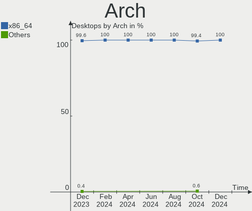
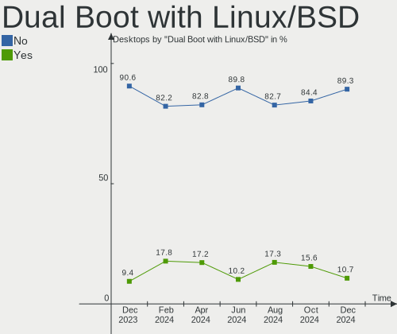
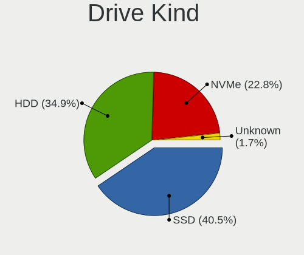
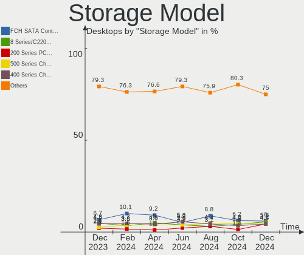
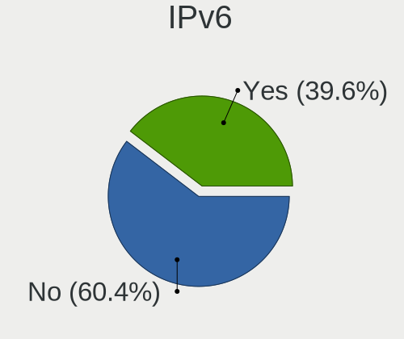
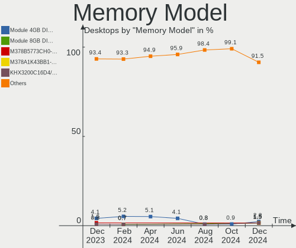
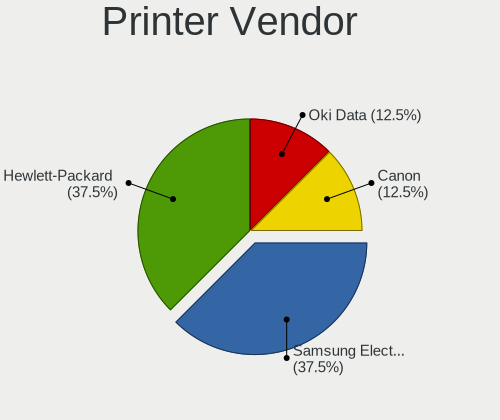

Linux Mint - Hardware Trends (Desktops)
---------------------------------------

A project to identify most popular hardware characteristics and track their change
over time based on data collected by Linux users at https://Linux-Hardware.org.

Anyone can contribute to this report by the [hw-probe](https://github.com/linuxhw/hw-probe) tool:

    sudo -E hw-probe -all -upload

This report is for one last month. Overall report since the beginning of time: [TestDays](https://github.com/linuxhw/TestDays)

Period: Jul, 2023.

Contents
--------

* [ System ](#system)
  - [ OS                       ](#os)
  - [ OS Family                ](#os-family)
  - [ Kernel                   ](#kernel)
  - [ Kernel Family            ](#kernel-family)
  - [ Kernel Major Ver.        ](#kernel-major-ver)
  - [ Arch                     ](#arch)
  - [ DE                       ](#de)
  - [ Display Server           ](#display-server)
  - [ Display Manager          ](#display-manager)
  - [ OS Lang                  ](#os-lang)
  - [ Boot Mode                ](#boot-mode)
  - [ Filesystem               ](#filesystem)
  - [ Part. scheme             ](#part-scheme)
  - [ Dual Boot with Linux/BSD ](#dual-boot-with-linuxbsd)
  - [ Dual Boot (Win)          ](#dual-boot-win)

* [ Board ](#board)
  - [ Vendor                   ](#vendor)
  - [ Model                    ](#model)
  - [ Model Family             ](#model-family)
  - [ MFG Year                 ](#mfg-year)
  - [ Form Factor              ](#form-factor)
  - [ Secure Boot              ](#secure-boot)
  - [ Coreboot                 ](#coreboot)
  - [ RAM Size                 ](#ram-size)
  - [ RAM Used                 ](#ram-used)
  - [ Total Drives             ](#total-drives)
  - [ Has CD-ROM               ](#has-cd-rom)
  - [ Has Ethernet             ](#has-ethernet)
  - [ Has WiFi                 ](#has-wifi)
  - [ Has Bluetooth            ](#has-bluetooth)

* [ Location ](#location)
  - [ Country                  ](#country)
  - [ City                     ](#city)

* [ Drives ](#drives)
  - [ Drive Vendor             ](#drive-vendor)
  - [ Drive Model              ](#drive-model)
  - [ HDD Vendor               ](#hdd-vendor)
  - [ SSD Vendor               ](#ssd-vendor)
  - [ Drive Kind               ](#drive-kind)
  - [ Drive Connector          ](#drive-connector)
  - [ Drive Size               ](#drive-size)
  - [ Space Total              ](#space-total)
  - [ Space Used               ](#space-used)
  - [ Malfunc. Drives          ](#malfunc-drives)
  - [ Malfunc. Drive Vendor    ](#malfunc-drive-vendor)
  - [ Malfunc. HDD Vendor      ](#malfunc-hdd-vendor)
  - [ Malfunc. Drive Kind      ](#malfunc-drive-kind)
  - [ Failed Drives            ](#failed-drives)
  - [ Failed Drive Vendor      ](#failed-drive-vendor)
  - [ Drive Status             ](#drive-status)

* [ Storage controller ](#storage-controller)
  - [ Storage Vendor           ](#storage-vendor)
  - [ Storage Model            ](#storage-model)
  - [ Storage Kind             ](#storage-kind)

* [ Processor ](#processor)
  - [ CPU Vendor               ](#cpu-vendor)
  - [ CPU Model                ](#cpu-model)
  - [ CPU Model Family         ](#cpu-model-family)
  - [ CPU Cores                ](#cpu-cores)
  - [ CPU Sockets              ](#cpu-sockets)
  - [ CPU Threads              ](#cpu-threads)
  - [ CPU Op-Modes             ](#cpu-op-modes)
  - [ CPU Microcode            ](#cpu-microcode)
  - [ CPU Microarch            ](#cpu-microarch)

* [ Graphics ](#graphics)
  - [ GPU Vendor               ](#gpu-vendor)
  - [ GPU Model                ](#gpu-model)
  - [ GPU Combo                ](#gpu-combo)
  - [ GPU Driver               ](#gpu-driver)
  - [ GPU Memory               ](#gpu-memory)

* [ Monitor ](#monitor)
  - [ Monitor Vendor           ](#monitor-vendor)
  - [ Monitor Model            ](#monitor-model)
  - [ Monitor Resolution       ](#monitor-resolution)
  - [ Monitor Diagonal         ](#monitor-diagonal)
  - [ Monitor Width            ](#monitor-width)
  - [ Aspect Ratio             ](#aspect-ratio)
  - [ Monitor Area             ](#monitor-area)
  - [ Pixel Density            ](#pixel-density)
  - [ Multiple Monitors        ](#multiple-monitors)

* [ Network ](#network)
  - [ Net Controller Vendor    ](#net-controller-vendor)
  - [ Net Controller Model     ](#net-controller-model)
  - [ Wireless Vendor          ](#wireless-vendor)
  - [ Wireless Model           ](#wireless-model)
  - [ Ethernet Vendor          ](#ethernet-vendor)
  - [ Ethernet Model           ](#ethernet-model)
  - [ Net Controller Kind      ](#net-controller-kind)
  - [ Used Controller          ](#used-controller)
  - [ NICs                     ](#nics)
  - [ IPv6                     ](#ipv6)

* [ Bluetooth ](#bluetooth)
  - [ Bluetooth Vendor         ](#bluetooth-vendor)
  - [ Bluetooth Model          ](#bluetooth-model)

* [ Sound ](#sound)
  - [ Sound Vendor             ](#sound-vendor)
  - [ Sound Model              ](#sound-model)

* [ Memory ](#memory)
  - [ Memory Vendor            ](#memory-vendor)
  - [ Memory Model             ](#memory-model)
  - [ Memory Kind              ](#memory-kind)
  - [ Memory Form Factor       ](#memory-form-factor)
  - [ Memory Size              ](#memory-size)
  - [ Memory Speed             ](#memory-speed)

* [ Printers & scanners ](#printers--scanners)
  - [ Printer Vendor           ](#printer-vendor)
  - [ Printer Model            ](#printer-model)
  - [ Scanner Vendor           ](#scanner-vendor)
  - [ Scanner Model            ](#scanner-model)

* [ Camera ](#camera)
  - [ Camera Vendor            ](#camera-vendor)
  - [ Camera Model             ](#camera-model)

* [ Security ](#security)
  - [ Fingerprint Vendor       ](#fingerprint-vendor)
  - [ Fingerprint Model        ](#fingerprint-model)
  - [ Chipcard Vendor          ](#chipcard-vendor)
  - [ Chipcard Model           ](#chipcard-model)

* [ Unsupported ](#unsupported)
  - [ Unsupported Devices      ](#unsupported-devices)
  - [ Unsupported Device Types ](#unsupported-device-types)

System
------

OS
--

Installed operating systems

| Name            | Desktops | Percent |
|-----------------|----------|---------|
| Linux Mint 21.1 | 116      | 53.46%  |
| Linux Mint 21.2 | 61       | 28.11%  |
| Linux Mint 20.3 | 26       | 11.98%  |
| Linux Mint 21   | 8        | 3.69%   |
| Linux Mint 20.1 | 3        | 1.38%   |
| Linux Mint 20.2 | 2        | 0.92%   |
| Linux Mint 19.3 | 1        | 0.46%   |

OS Family
---------

OS without a version

| Name       | Desktops | Percent |
|------------|----------|---------|
| Linux Mint | 217      | 100%    |

Kernel
------

Version of the Linux kernel

| Version              | Desktops | Percent |
|----------------------|----------|---------|
| 5.15.0-76-generic    | 109      | 50.23%  |
| 5.15.0-78-generic    | 29       | 13.36%  |
| 5.4.0-153-generic    | 21       | 9.68%   |
| 5.19.0-46-generic    | 14       | 6.45%   |
| 5.15.0-56-generic    | 11       | 5.07%   |
| 5.15.0-75-generic    | 6        | 2.76%   |
| 6.2.0-25-generic     | 3        | 1.38%   |
| 5.4.0-155-generic    | 3        | 1.38%   |
| 5.15.0-72-generic    | 3        | 1.38%   |
| 6.4.0-060400-generic | 2        | 0.92%   |
| 5.19.0-43-generic    | 2        | 0.92%   |
| 5.15.0-73-generic    | 2        | 0.92%   |
| 5.15.0-69-generic    | 2        | 0.92%   |
| 6.4.3-060403-generic | 1        | 0.46%   |
| 6.3.4-060304-generic | 1        | 0.46%   |
| 6.2.0-26-generic     | 1        | 0.46%   |
| 6.1.0-1016-oem       | 1        | 0.46%   |
| 6.0.0-1020-oem       | 1        | 0.46%   |
| 5.4.0-91-generic     | 1        | 0.46%   |
| 5.4.0-88-generic     | 1        | 0.46%   |
| 5.4.0-150-generic    | 1        | 0.46%   |
| 5.15.0-67-generic    | 1        | 0.46%   |
| 5.11.0-22-generic    | 1        | 0.46%   |

Kernel Family
-------------

Linux kernel without a distro release

| Version | Desktops | Percent |
|---------|----------|---------|
| 5.15.0  | 163      | 75.12%  |
| 5.4.0   | 27       | 12.44%  |
| 5.19.0  | 16       | 7.37%   |
| 6.2.0   | 4        | 1.84%   |
| 6.4.0   | 2        | 0.92%   |
| 6.4.3   | 1        | 0.46%   |
| 6.3.4   | 1        | 0.46%   |
| 6.1.0   | 1        | 0.46%   |
| 6.0.0   | 1        | 0.46%   |
| 5.11.0  | 1        | 0.46%   |

Kernel Major Ver.
-----------------

Linux kernel major version

| Version | Desktops | Percent |
|---------|----------|---------|
| 5.15    | 163      | 75.12%  |
| 5.4     | 27       | 12.44%  |
| 5.19    | 16       | 7.37%   |
| 6.2     | 4        | 1.84%   |
| 6.4     | 3        | 1.38%   |
| 6.3     | 1        | 0.46%   |
| 6.1     | 1        | 0.46%   |
| 6.0     | 1        | 0.46%   |
| 5.11    | 1        | 0.46%   |

Arch
----

OS architecture (x86_64, i586, etc.)

| Name   | Desktops | Percent |
|--------|----------|---------|
| x86_64 | 217      | 100%    |

DE
--

Desktop Environment

| Name       | Desktops | Percent |
|------------|----------|---------|
| X-Cinnamon | 158      | 72.81%  |
| MATE       | 25       | 11.52%  |
| XFCE       | 21       | 9.68%   |
| Cinnamon   | 6        | 2.76%   |
| KDE5       | 4        | 1.84%   |
| Unknown    | 2        | 0.92%   |
| GNOME      | 1        | 0.46%   |

Display Server
--------------

X11 or Wayland

| Name    | Desktops | Percent |
|---------|----------|---------|
| X11     | 215      | 99.08%  |
| Wayland | 2        | 0.92%   |

Display Manager
---------------

SDDM, LightDM, etc.

| Name    | Desktops | Percent |
|---------|----------|---------|
| Unknown | 143      | 65.9%   |
| LightDM | 74       | 34.1%   |

OS Lang
-------

Language

| Lang    | Desktops | Percent |
|---------|----------|---------|
| en_US   | 60       | 27.65%  |
| de_DE   | 38       | 17.51%  |
| pt_BR   | 20       | 9.22%   |
| en_GB   | 11       | 5.07%   |
| fr_FR   | 10       | 4.61%   |
| es_ES   | 8        | 3.69%   |
| it_IT   | 6        | 2.76%   |
| en_CA   | 6        | 2.76%   |
| ru_RU   | 5        | 2.3%    |
| pl_PL   | 5        | 2.3%    |
| es_MX   | 5        | 2.3%    |
| en_AU   | 5        | 2.3%    |
| nl_NL   | 3        | 1.38%   |
| de_AT   | 3        | 1.38%   |
| cs_CZ   | 3        | 1.38%   |
| C       | 3        | 1.38%   |
| sv_SE   | 2        | 0.92%   |
| nl_BE   | 2        | 0.92%   |
| es_VE   | 2        | 0.92%   |
| Unknown | 2        | 0.92%   |
| zh_CN   | 1        | 0.46%   |
| tr_TR   | 1        | 0.46%   |
| sk_SK   | 1        | 0.46%   |
| ro_RO   | 1        | 0.46%   |
| pt_PT   | 1        | 0.46%   |
| nb_NO   | 1        | 0.46%   |
| hu_HU   | 1        | 0.46%   |
| fr_CA   | 1        | 0.46%   |
| fr_BE   | 1        | 0.46%   |
| fi_FI   | 1        | 0.46%   |
| es_UY   | 1        | 0.46%   |
| es_CO   | 1        | 0.46%   |
| es_CL   | 1        | 0.46%   |
| es_AR   | 1        | 0.46%   |
| en_ZA   | 1        | 0.46%   |
| en_PH   | 1        | 0.46%   |
| en_IN   | 1        | 0.46%   |
| de_CH   | 1        | 0.46%   |

Boot Mode
---------

EFI or BIOS

| Mode | Desktops | Percent |
|------|----------|---------|
| EFI  | 129      | 59.45%  |
| BIOS | 88       | 40.55%  |

Filesystem
----------

Type of filesystem

| Type    | Desktops | Percent |
|---------|----------|---------|
| Ext4    | 202      | 93.09%  |
| Zfs     | 5        | 2.3%    |
| Tmpfs   | 4        | 1.84%   |
| Btrfs   | 4        | 1.84%   |
| XXXX    | 1        | 0.46%   |
| Overlay | 1        | 0.46%   |

Part. scheme
------------

Scheme of partitioning

| Type    | Desktops | Percent |
|---------|----------|---------|
| Unknown | 141      | 64.98%  |
| GPT     | 61       | 28.11%  |
| MBR     | 15       | 6.91%   |

Dual Boot with Linux/BSD
------------------------

Hosting more than one Linux/BSD

| Dual boot | Desktops | Percent |
|-----------|----------|---------|
| No        | 199      | 91.71%  |
| Yes       | 18       | 8.29%   |

Dual Boot (Win)
---------------

Hosting Linux and Windows

| Dual boot | Desktops | Percent |
|-----------|----------|---------|
| No        | 176      | 81.11%  |
| Yes       | 41       | 18.89%  |

Board
-----

Vendor
------

Motherboard manufacturer

| Name                                 | Desktops | Percent |
|--------------------------------------|----------|---------|
| ASUSTek Computer                     | 44       | 20.28%  |
| Gigabyte Technology                  | 43       | 19.82%  |
| MSI                                  | 24       | 11.06%  |
| Dell                                 | 21       | 9.68%   |
| ASRock                               | 19       | 8.76%   |
| Lenovo                               | 14       | 6.45%   |
| Hewlett-Packard                      | 12       | 5.53%   |
| Intel                                | 8        | 3.69%   |
| Unknown                              | 6        | 2.76%   |
| Acer                                 | 4        | 1.84%   |
| Fujitsu                              | 3        | 1.38%   |
| Foxconn                              | 2        | 0.92%   |
| System76                             | 1        | 0.46%   |
| Supermicro                           | 1        | 0.46%   |
| Shenzhen Meigao Electronic Equipment | 1        | 0.46%   |
| Samsung Electronics                  | 1        | 0.46%   |
| POWERX                               | 1        | 0.46%   |
| Positivo                             | 1        | 0.46%   |
| Pegatron                             | 1        | 0.46%   |
| PCChips                              | 1        | 0.46%   |
| OEM                                  | 1        | 0.46%   |
| Medion                               | 1        | 0.46%   |
| MACHINIST                            | 1        | 0.46%   |
| ECS                                  | 1        | 0.46%   |
| Digitron                             | 1        | 0.46%   |
| Compaq                               | 1        | 0.46%   |
| Cincoze                              | 1        | 0.46%   |
| Biostar                              | 1        | 0.46%   |
| Apple                                | 1        | 0.46%   |

Model
-----

Motherboard model

| Name                                       | Desktops | Percent |
|--------------------------------------------|----------|---------|
| Unknown                                    | 6        | 2.76%   |
| MSI MS-7C56                                | 3        | 1.38%   |
| Dell OptiPlex 7050                         | 3        | 1.38%   |
| ASRock B450M Pro4                          | 3        | 1.38%   |
| MSI MS-7C91                                | 2        | 0.92%   |
| MSI MS-7B93                                | 2        | 0.92%   |
| Intel H61                                  | 2        | 0.92%   |
| Intel H55                                  | 2        | 0.92%   |
| Gigabyte 970A-DS3P                         | 2        | 0.92%   |
| Dell OptiPlex 790                          | 2        | 0.92%   |
| Dell OptiPlex 760                          | 2        | 0.92%   |
| ASUS M5A78L-M/USB3                         | 2        | 0.92%   |
| ASUS All Series                            | 2        | 0.92%   |
| System76 Thelio Mira                       | 1        | 0.46%   |
| Supermicro X9DAi                           | 1        | 0.46%   |
| Shenzhen Meigao Electronic Equipment HX99G | 1        | 0.46%   |
| Samsung DeskTop System                     | 1        | 0.46%   |
| POWERX G41                                 | 1        | 0.46%   |
| Positivo POS-EAA75DE                       | 1        | 0.46%   |
| Pegatron p6-2114                           | 1        | 0.46%   |
| PCChips P17G                               | 1        | 0.46%   |
| OEM B75                                    | 1        | 0.46%   |
| MSI MS-7D99                                | 1        | 0.46%   |
| MSI MS-7D50                                | 1        | 0.46%   |
| MSI MS-7D46                                | 1        | 0.46%   |
| MSI MS-7D22                                | 1        | 0.46%   |
| MSI MS-7D08                                | 1        | 0.46%   |
| MSI MS-7C95                                | 1        | 0.46%   |
| MSI MS-7C73                                | 1        | 0.46%   |
| MSI MS-7C52                                | 1        | 0.46%   |
| MSI MS-7C37                                | 1        | 0.46%   |
| MSI MS-7B33                                | 1        | 0.46%   |
| MSI MS-7B24                                | 1        | 0.46%   |
| MSI MS-7994                                | 1        | 0.46%   |
| MSI MS-7817                                | 1        | 0.46%   |
| MSI MS-7816                                | 1        | 0.46%   |
| MSI MS-7788                                | 1        | 0.46%   |
| MSI MS-7693                                | 1        | 0.46%   |
| MSI MS-7641                                | 1        | 0.46%   |
| Medion MS-7633                             | 1        | 0.46%   |

Model Family
------------

Motherboard model prefix

| Name                                       | Desktops | Percent |
|--------------------------------------------|----------|---------|
| Dell OptiPlex                              | 15       | 6.91%   |
| Lenovo ThinkCentre                         | 8        | 3.69%   |
| ASUS ROG                                   | 8        | 3.69%   |
| ASUS PRIME                                 | 7        | 3.23%   |
| Unknown                                    | 6        | 2.76%   |
| Lenovo IdeaCentre                          | 4        | 1.84%   |
| HP ProDesk                                 | 4        | 1.84%   |
| ASUS M5A78L-M                              | 4        | 1.84%   |
| Acer Aspire                                | 4        | 1.84%   |
| MSI MS-7C56                                | 3        | 1.38%   |
| Fujitsu ESPRIMO                            | 3        | 1.38%   |
| ASUS TUF                                   | 3        | 1.38%   |
| ASRock B450M                               | 3        | 1.38%   |
| MSI MS-7C91                                | 2        | 0.92%   |
| MSI MS-7B93                                | 2        | 0.92%   |
| Intel H61                                  | 2        | 0.92%   |
| Intel H55                                  | 2        | 0.92%   |
| HP EliteDesk                               | 2        | 0.92%   |
| HP Compaq                                  | 2        | 0.92%   |
| Gigabyte B550M                             | 2        | 0.92%   |
| Gigabyte 970A-DS3P                         | 2        | 0.92%   |
| Dell Precision                             | 2        | 0.92%   |
| Dell Inspiron                              | 2        | 0.92%   |
| ASUS P8Z77-V                               | 2        | 0.92%   |
| ASUS P5G41T-M                              | 2        | 0.92%   |
| ASUS All                                   | 2        | 0.92%   |
| System76 Thelio                            | 1        | 0.46%   |
| Supermicro X9DAi                           | 1        | 0.46%   |
| Shenzhen Meigao Electronic Equipment HX99G | 1        | 0.46%   |
| Samsung DeskTop                            | 1        | 0.46%   |
| POWERX G41                                 | 1        | 0.46%   |
| Positivo POS-EAA75DE                       | 1        | 0.46%   |
| Pegatron p6-2114                           | 1        | 0.46%   |
| PCChips P17G                               | 1        | 0.46%   |
| OEM B75                                    | 1        | 0.46%   |
| MSI MS-7D99                                | 1        | 0.46%   |
| MSI MS-7D50                                | 1        | 0.46%   |
| MSI MS-7D46                                | 1        | 0.46%   |
| MSI MS-7D22                                | 1        | 0.46%   |
| MSI MS-7D08                                | 1        | 0.46%   |

MFG Year
--------

Motherboard manufacture year

| Year | Desktops | Percent |
|------|----------|---------|
| 2018 | 24       | 11.06%  |
| 2011 | 20       | 9.22%   |
| 2022 | 19       | 8.76%   |
| 2020 | 16       | 7.37%   |
| 2017 | 16       | 7.37%   |
| 2013 | 16       | 7.37%   |
| 2012 | 15       | 6.91%   |
| 2010 | 14       | 6.45%   |
| 2021 | 13       | 5.99%   |
| 2014 | 12       | 5.53%   |
| 2015 | 11       | 5.07%   |
| 2009 | 10       | 4.61%   |
| 2007 | 9        | 4.15%   |
| 2019 | 7        | 3.23%   |
| 2016 | 6        | 2.76%   |
| 2008 | 5        | 2.3%    |
| 2023 | 4        | 1.84%   |

Form Factor
-----------

Physical design of the computer

| Name    | Desktops | Percent |
|---------|----------|---------|
| Desktop | 217      | 100%    |

Secure Boot
-----------

Enabled or disabled

| State    | Desktops | Percent |
|----------|----------|---------|
| Disabled | 211      | 97.24%  |
| Enabled  | 6        | 2.76%   |

Coreboot
--------

Have coreboot on board

| Used | Desktops | Percent |
|------|----------|---------|
| No   | 217      | 100%    |

RAM Size
--------

Total RAM memory

| Size in GB  | Desktops | Percent |
|-------------|----------|---------|
| 16.01-24.0  | 55       | 25.35%  |
| 8.01-16.0   | 43       | 19.82%  |
| 4.01-8.0    | 38       | 17.51%  |
| 3.01-4.0    | 31       | 14.29%  |
| 32.01-64.0  | 29       | 13.36%  |
| 64.01-256.0 | 11       | 5.07%   |
| 24.01-32.0  | 4        | 1.84%   |
| 1.01-2.0    | 4        | 1.84%   |
| 2.01-3.0    | 2        | 0.92%   |

RAM Used
--------

Used RAM memory

| Used GB   | Desktops | Percent |
|-----------|----------|---------|
| 1.01-2.0  | 81       | 37.33%  |
| 2.01-3.0  | 67       | 30.88%  |
| 4.01-8.0  | 29       | 13.36%  |
| 3.01-4.0  | 29       | 13.36%  |
| 8.01-16.0 | 5        | 2.3%    |
| 0.51-1.0  | 5        | 2.3%    |
| 0.01-0.5  | 1        | 0.46%   |

Total Drives
------------

Number of drives on board

| Drives | Desktops | Percent |
|--------|----------|---------|
| 1      | 76       | 35.02%  |
| 2      | 57       | 26.27%  |
| 3      | 43       | 19.82%  |
| 4      | 21       | 9.68%   |
| 5      | 14       | 6.45%   |
| 6      | 4        | 1.84%   |
| 7      | 2        | 0.92%   |

Has CD-ROM
----------

Has CD-ROM on board

| Presented | Desktops | Percent |
|-----------|----------|---------|
| Yes       | 113      | 52.07%  |
| No        | 104      | 47.93%  |

Has Ethernet
------------

Has Ethernet on board

| Presented | Desktops | Percent |
|-----------|----------|---------|
| Yes       | 215      | 99.08%  |
| No        | 2        | 0.92%   |

Has WiFi
--------

Has WiFi module

| Presented | Desktops | Percent |
|-----------|----------|---------|
| No        | 114      | 52.53%  |
| Yes       | 103      | 47.47%  |

Has Bluetooth
-------------

Has Bluetooth module

| Presented | Desktops | Percent |
|-----------|----------|---------|
| No        | 140      | 64.52%  |
| Yes       | 77       | 35.48%  |

Location
--------

Country
-------

Geographic location (country)

| Country      | Desktops | Percent |
|--------------|----------|---------|
| USA          | 45       | 20.74%  |
| Germany      | 42       | 19.35%  |
| Brazil       | 23       | 10.6%   |
| UK           | 12       | 5.53%   |
| France       | 9        | 4.15%   |
| Canada       | 8        | 3.69%   |
| Spain        | 7        | 3.23%   |
| Italy        | 7        | 3.23%   |
| Netherlands  | 6        | 2.76%   |
| Sweden       | 5        | 2.3%    |
| Russia       | 5        | 2.3%    |
| Mexico       | 5        | 2.3%    |
| Australia    | 5        | 2.3%    |
| Poland       | 4        | 1.84%   |
| Belgium      | 4        | 1.84%   |
| Czechia      | 3        | 1.38%   |
| Austria      | 3        | 1.38%   |
| Venezuela    | 2        | 0.92%   |
| Switzerland  | 2        | 0.92%   |
| Norway       | 2        | 0.92%   |
| Uruguay      | 1        | 0.46%   |
| South Africa | 1        | 0.46%   |
| Slovakia     | 1        | 0.46%   |
| Romania      | 1        | 0.46%   |
| Portugal     | 1        | 0.46%   |
| Philippines  | 1        | 0.46%   |
| Malaysia     | 1        | 0.46%   |
| Latvia       | 1        | 0.46%   |
| Iran         | 1        | 0.46%   |
| India        | 1        | 0.46%   |
| Hungary      | 1        | 0.46%   |
| Finland      | 1        | 0.46%   |
| Colombia     | 1        | 0.46%   |
| China        | 1        | 0.46%   |
| Chile        | 1        | 0.46%   |
| Belarus      | 1        | 0.46%   |
| Argentina    | 1        | 0.46%   |
| Algeria      | 1        | 0.46%   |

City
----

Geographic location (city)

| City              | Desktops | Percent |
|-------------------|----------|---------|
| Sydney            | 3        | 1.38%   |
| Rio de Janeiro    | 3        | 1.38%   |
| Dresden           | 3        | 1.38%   |
| Berlin            | 3        | 1.38%   |
| Wheaton           | 2        | 0.92%   |
| Porto Alegre      | 2        | 0.92%   |
| Pittsburgh        | 2        | 0.92%   |
| Phoenix           | 2        | 0.92%   |
| Muncie            | 2        | 0.92%   |
| Madrid            | 2        | 0.92%   |
| Lemgo             | 2        | 0.92%   |
| Kiel              | 2        | 0.92%   |
| Heubach           | 2        | 0.92%   |
| Gothenburg        | 2        | 0.92%   |
| Zwickau           | 1        | 0.46%   |
| Zurich            | 1        | 0.46%   |
| Zaragoza          | 1        | 0.46%   |
| Westminster       | 1        | 0.46%   |
| Warsaw            | 1        | 0.46%   |
| Waregem           | 1        | 0.46%   |
| Voorburg          | 1        | 0.46%   |
| Vitebsk           | 1        | 0.46%   |
| Viña del Mar     | 1        | 0.46%   |
| Villenave-d'Ornon | 1        | 0.46%   |
| Vienna            | 1        | 0.46%   |
| Ventspils         | 1        | 0.46%   |
| Valldal           | 1        | 0.46%   |
| Uckfield          | 1        | 0.46%   |
| Tuxtla Gutiérrez | 1        | 0.46%   |
| Turin             | 1        | 0.46%   |
| Toledo            | 1        | 0.46%   |
| Thornton          | 1        | 0.46%   |
| Tehran            | 1        | 0.46%   |
| Taunton           | 1        | 0.46%   |
| Tampa             | 1        | 0.46%   |
| Syracuse          | 1        | 0.46%   |
| Swadlincote       | 1        | 0.46%   |
| Surrey            | 1        | 0.46%   |
| Sunderland        | 1        | 0.46%   |
| Summerleas        | 1        | 0.46%   |

Drives
------

Drive Vendor
------------

Hard drive vendors

| Vendor                      | Desktops | Drives | Percent |
|-----------------------------|----------|--------|---------|
| Seagate                     | 83       | 111    | 19.86%  |
| WDC                         | 79       | 89     | 18.9%   |
| Samsung Electronics         | 57       | 83     | 13.64%  |
| Kingston                    | 29       | 32     | 6.94%   |
| Sandisk                     | 19       | 25     | 4.55%   |
| Hitachi                     | 16       | 17     | 3.83%   |
| Crucial                     | 12       | 12     | 2.87%   |
| Toshiba                     | 11       | 14     | 2.63%   |
| Intenso                     | 8        | 10     | 1.91%   |
| Intel                       | 7        | 7      | 1.67%   |
| China                       | 7        | 7      | 1.67%   |
| Micron/Crucial Technology   | 6        | 7      | 1.44%   |
| A-DATA Technology           | 6        | 6      | 1.44%   |
| Team                        | 4        | 5      | 0.96%   |
| Silicon Motion              | 4        | 4      | 0.96%   |
| Micron Technology           | 4        | 4      | 0.96%   |
| Kingston Technology Company | 4        | 4      | 0.96%   |
| Verbatim                    | 3        | 3      | 0.72%   |
| Unknown                     | 3        | 6      | 0.72%   |
| SPCC                        | 3        | 4      | 0.72%   |
| PNY                         | 3        | 4      | 0.72%   |
| Phison Electronics          | 3        | 3      | 0.72%   |
| Patriot                     | 3        | 3      | 0.72%   |
| Realtek Semiconductor       | 2        | 2      | 0.48%   |
| Netac                       | 2        | 3      | 0.48%   |
| Maxtor                      | 2        | 2      | 0.48%   |
| KIOXIA                      | 2        | 2      | 0.48%   |
| KingSpec                    | 2        | 6      | 0.48%   |
| HGST                        | 2        | 2      | 0.48%   |
| Hewlett-Packard             | 2        | 2      | 0.48%   |
| Emtec                       | 2        | 2      | 0.48%   |
| ASMT                        | 2        | 3      | 0.48%   |
| Unknown                     | 2        | 3      | 0.48%   |
| XrayDisk                    | 1        | 1      | 0.24%   |
| Vaseky                      | 1        | 1      | 0.24%   |
| Transcend                   | 1        | 1      | 0.24%   |
| tecmiyo                     | 1        | 1      | 0.24%   |
| SK hynix                    | 1        | 1      | 0.24%   |
| Plextor                     | 1        | 1      | 0.24%   |
| PHD 3.0                     | 1        | 1      | 0.24%   |

Drive Model
-----------

Hard drive models

| Model                                                 | Desktops | Percent |
|-------------------------------------------------------|----------|---------|
| Kingston SA400S37240G 240GB SSD                       | 9        | 1.86%   |
| Seagate ST1000DM010-2EP102 1TB                        | 8        | 1.65%   |
| Kingston SA400S37480G 480GB SSD                       | 7        | 1.45%   |
| Seagate ST2000DM008-2FR102 2TB                        | 6        | 1.24%   |
| Seagate ST1000DM003-1ER162 1TB                        | 5        | 1.03%   |
| Seagate Expansion 1TB                                 | 5        | 1.03%   |
| Samsung NVMe SSD Controller PM9A1/PM9A3/980PRO 1TB    | 5        | 1.03%   |
| Seagate ST3500418AS 500GB                             | 4        | 0.83%   |
| Seagate Expansion Desk 8TB                            | 4        | 0.83%   |
| Samsung SSD 970 EVO Plus 1TB                          | 4        | 0.83%   |
| Samsung SSD 870 EVO 2TB                               | 4        | 0.83%   |
| Samsung SSD 860 EVO 1TB                               | 4        | 0.83%   |
| Samsung SSD 850 EVO 500GB                             | 4        | 0.83%   |
| Samsung HD322HJ 320GB                                 | 4        | 0.83%   |
| Seagate ST500DM002-1BD142 500GB                       | 3        | 0.62%   |
| Seagate ST4000DM000-1F2168 4TB                        | 3        | 0.62%   |
| Sandisk WD Blue SN550 NVMe SSD 250GB                  | 3        | 0.62%   |
| Samsung SSD 860 EVO 500GB                             | 3        | 0.62%   |
| Samsung SSD 850 EVO 250GB                             | 3        | 0.62%   |
| Samsung NVMe SSD Controller SM981/PM981/PM983 500GB   | 3        | 0.62%   |
| Samsung HD501LJ 500GB                                 | 3        | 0.62%   |
| Phison E12 NVMe Controller 2TB                        | 3        | 0.62%   |
| Micron/Crucial P2 NVMe PCIe SSD 1TB                   | 3        | 0.62%   |
| Kingston SA400S37120G 120GB SSD                       | 3        | 0.62%   |
| WDC WDS500G2B0A-00SM50 500GB SSD                      | 2        | 0.41%   |
| WDC WDS240G2G0A-00JH30 240GB SSD                      | 2        | 0.41%   |
| WDC WD5000AZLX-75K2TA0 500GB                          | 2        | 0.41%   |
| WDC WD5000AVDS-63U7B1 500GB                           | 2        | 0.41%   |
| WDC WD5000AAKX-08ERMA0 500GB                          | 2        | 0.41%   |
| WDC WD40EZRZ-00GXCB0 4TB                              | 2        | 0.41%   |
| WDC WD20EARX-00PASB0 2TB                              | 2        | 0.41%   |
| WDC WD10EARS-00Y5B1 1TB                               | 2        | 0.41%   |
| WDC WD10EACS-00D6B1 1TB                               | 2        | 0.41%   |
| Verbatim Vi550 S3 128GB                               | 2        | 0.41%   |
| Unknown SD/MMC 2GB                                    | 2        | 0.41%   |
| Unknown M.S./M.S.Pro/HG 16GB                          | 2        | 0.41%   |
| Silicon Motion SM2263EN/SM2263XT SSD Controller 500GB | 2        | 0.41%   |
| Seagate ST5000LM000-2AN170 5TB                        | 2        | 0.41%   |
| Seagate ST3500312CS 500GB                             | 2        | 0.41%   |
| Seagate ST1000DM003-1SB102 1TB                        | 2        | 0.41%   |

HDD Vendor
----------

Hard disk drive vendors

| Vendor              | Desktops | Drives | Percent |
|---------------------|----------|--------|---------|
| Seagate             | 80       | 105    | 40.2%   |
| WDC                 | 68       | 77     | 34.17%  |
| Hitachi             | 16       | 17     | 8.04%   |
| Samsung Electronics | 12       | 12     | 6.03%   |
| Toshiba             | 9        | 12     | 4.52%   |
| Maxtor              | 2        | 2      | 1.01%   |
| HGST                | 2        | 2      | 1.01%   |
| Unknown             | 1        | 1      | 0.5%    |
| PHD 3.0             | 1        | 1      | 0.5%    |
| MDT                 | 1        | 1      | 0.5%    |
| LaCie               | 1        | 1      | 0.5%    |
| Intenso             | 1        | 1      | 0.5%    |
| HPE                 | 1        | 1      | 0.5%    |
| Hewlett-Packard     | 1        | 1      | 0.5%    |
| China               | 1        | 1      | 0.5%    |
| ASMT                | 1        | 1      | 0.5%    |
| Apple               | 1        | 1      | 0.5%    |

SSD Vendor
----------

Solid state drive vendors

| Vendor              | Desktops | Drives | Percent |
|---------------------|----------|--------|---------|
| Samsung Electronics | 36       | 43     | 23.68%  |
| Kingston            | 24       | 26     | 15.79%  |
| WDC                 | 11       | 11     | 7.24%   |
| SanDisk             | 10       | 11     | 6.58%   |
| Crucial             | 10       | 10     | 6.58%   |
| Intenso             | 6        | 7      | 3.95%   |
| China               | 6        | 6      | 3.95%   |
| A-DATA Technology   | 6        | 6      | 3.95%   |
| Team                | 4        | 4      | 2.63%   |
| Verbatim            | 3        | 3      | 1.97%   |
| PNY                 | 3        | 4      | 1.97%   |
| Micron Technology   | 3        | 3      | 1.97%   |
| Toshiba             | 2        | 2      | 1.32%   |
| SPCC                | 2        | 3      | 1.32%   |
| Patriot             | 2        | 2      | 1.32%   |
| Netac               | 2        | 3      | 1.32%   |
| KingSpec            | 2        | 6      | 1.32%   |
| Intel               | 2        | 2      | 1.32%   |
| Emtec               | 2        | 2      | 1.32%   |
| Vaseky              | 1        | 1      | 0.66%   |
| Transcend           | 1        | 1      | 0.66%   |
| tecmiyo             | 1        | 1      | 0.66%   |
| Seagate             | 1        | 1      | 0.66%   |
| Plextor             | 1        | 1      | 0.66%   |
| Mushkin             | 1        | 1      | 0.66%   |
| Lexar               | 1        | 1      | 0.66%   |
| KODAK               | 1        | 1      | 0.66%   |
| KingDian            | 1        | 1      | 0.66%   |
| Integral            | 1        | 1      | 0.66%   |
| Hewlett-Packard     | 1        | 1      | 0.66%   |
| GOODRAM             | 1        | 1      | 0.66%   |
| Gigabyte Technology | 1        | 1      | 0.66%   |
| Corsair             | 1        | 1      | 0.66%   |
| Biostar             | 1        | 1      | 0.66%   |
| ASMT                | 1        | 2      | 0.66%   |

Drive Kind
----------

HDD or SSD

| Kind    | Desktops | Drives | Percent |
|---------|----------|--------|---------|
| HDD     | 151      | 237    | 41.94%  |
| SSD     | 131      | 171    | 36.39%  |
| NVMe    | 65       | 85     | 18.06%  |
| Unknown | 12       | 18     | 3.33%   |
| MMC     | 1        | 1      | 0.28%   |

Drive Connector
---------------

SATA, SAS, NVMe, etc.

| Type | Desktops | Drives | Percent |
|------|----------|--------|---------|
| SATA | 207      | 387    | 68.54%  |
| NVMe | 65       | 85     | 21.52%  |
| SAS  | 29       | 39     | 9.6%    |
| MMC  | 1        | 1      | 0.33%   |

Drive Size
----------

Size of hard drive

| Size in TB | Desktops | Drives | Percent |
|------------|----------|--------|---------|
| 0.01-0.5   | 146      | 218    | 48.67%  |
| 0.51-1.0   | 83       | 103    | 27.67%  |
| 1.01-2.0   | 33       | 38     | 11%     |
| 3.01-4.0   | 18       | 23     | 6%      |
| 4.01-10.0  | 12       | 18     | 4%      |
| 2.01-3.0   | 6        | 6      | 2%      |
| 10.01-20.0 | 2        | 2      | 0.67%   |

Space Total
-----------

Amount of disk space available on the file system

| Size in GB     | Desktops | Percent |
|----------------|----------|---------|
| 101-250        | 53       | 24.42%  |
| 251-500        | 45       | 20.74%  |
| 501-1000       | 37       | 17.05%  |
| More than 3000 | 35       | 16.13%  |
| 1001-2000      | 19       | 8.76%   |
| 2001-3000      | 14       | 6.45%   |
| Unknown        | 5        | 2.3%    |
| 51-100         | 4        | 1.84%   |
| 1-20           | 3        | 1.38%   |
| 21-50          | 2        | 0.92%   |

Space Used
----------

Amount of used disk space

| Used GB        | Desktops | Percent |
|----------------|----------|---------|
| 101-250        | 45       | 20.74%  |
| 51-100         | 32       | 14.75%  |
| 1-20           | 31       | 14.29%  |
| 21-50          | 29       | 13.36%  |
| 251-500        | 23       | 10.6%   |
| 501-1000       | 20       | 9.22%   |
| More than 3000 | 16       | 7.37%   |
| 1001-2000      | 12       | 5.53%   |
| Unknown        | 5        | 2.3%    |
| 2001-3000      | 4        | 1.84%   |

Malfunc. Drives
---------------

Drive models with a malfunction

| Model                                                           | Desktops | Drives | Percent |
|-----------------------------------------------------------------|----------|--------|---------|
| Samsung Electronics HD322HJ 320GB                               | 2        | 2      | 6.25%   |
| WDC WD800AAJB-00J3A0 80GB                                       | 1        | 1      | 3.13%   |
| WDC WD6400AAKS-22A7B2 640GB                                     | 1        | 1      | 3.13%   |
| WDC WD5003ABYX-01WERA1 500GB                                    | 1        | 1      | 3.13%   |
| WDC WD5000AVDS-63U7B1 500GB                                     | 1        | 1      | 3.13%   |
| WDC WD5000AAKX-08ERMA0 500GB                                    | 1        | 1      | 3.13%   |
| WDC WD30EFRX-68EUZN0 3TB                                        | 1        | 1      | 3.13%   |
| WDC WD2500AAJS-00VTA0 250GB                                     | 1        | 1      | 3.13%   |
| WDC WD20EARS-00J2GB0 2TB                                        | 1        | 1      | 3.13%   |
| WDC WD1200BB-22GUA0 120GB                                       | 1        | 1      | 3.13%   |
| WDC WD10EZRX-22A3KB0 1TB                                        | 1        | 1      | 3.13%   |
| WDC WD10EARS-00Y5B1 1TB                                         | 1        | 1      | 3.13%   |
| tecmiyo SATA SSD 128GB                                          | 1        | 1      | 3.13%   |
| Seagate ST9750420AS 752GB                                       | 1        | 1      | 3.13%   |
| Seagate ST500DM002-1BD142 500GB                                 | 1        | 1      | 3.13%   |
| Seagate ST3250410AS 250GB                                       | 1        | 1      | 3.13%   |
| Seagate ST2000DM001-1CH164 2TB                                  | 1        | 1      | 3.13%   |
| Seagate ST1000DM003-1SB102 1TB                                  | 1        | 1      | 3.13%   |
| Samsung Electronics SSD 970 EVO Plus 1TB                        | 1        | 2      | 3.13%   |
| Samsung Electronics NVMe SSD Controller SM981/PM981/PM983 500GB | 1        | 2      | 3.13%   |
| Samsung Electronics HD502HI 500GB                               | 1        | 1      | 3.13%   |
| Samsung Electronics HD501LJ 500GB                               | 1        | 1      | 3.13%   |
| PNY CS1311 240GB SSD                                            | 1        | 1      | 3.13%   |
| MDT MD6400AAKS-00A7B0 640GB                                     | 1        | 1      | 3.13%   |
| Kingston SA400S37480G 480GB SSD                                 | 1        | 1      | 3.13%   |
| Intel SSDSC2CW120A3 120GB                                       | 1        | 1      | 3.13%   |
| Intel SSDPEKKW512G7 512GB                                       | 1        | 1      | 3.13%   |
| Hitachi HTS541010A9E680 1TB                                     | 1        | 1      | 3.13%   |
| Hitachi HCP725032GLA380 320GB                                   | 1        | 1      | 3.13%   |
| Crucial CT128MX100SSD1 128GB                                    | 1        | 1      | 3.13%   |
| ASMT USB 3.0 Destop H 120GB SSD                                 | 1        | 2      | 3.13%   |

Malfunc. Drive Vendor
---------------------

Vendors of faulty drives

| Vendor              | Desktops | Drives | Percent |
|---------------------|----------|--------|---------|
| WDC                 | 9        | 11     | 30%     |
| Samsung Electronics | 6        | 8      | 20%     |
| Seagate             | 5        | 5      | 16.67%  |
| Intel               | 2        | 2      | 6.67%   |
| Hitachi             | 2        | 2      | 6.67%   |
| tecmiyo             | 1        | 1      | 3.33%   |
| PNY                 | 1        | 1      | 3.33%   |
| MDT                 | 1        | 1      | 3.33%   |
| Kingston            | 1        | 1      | 3.33%   |
| Crucial             | 1        | 1      | 3.33%   |
| ASMT                | 1        | 2      | 3.33%   |

Malfunc. HDD Vendor
-------------------

Vendors of faulty HDD drives

| Vendor              | Desktops | Drives | Percent |
|---------------------|----------|--------|---------|
| WDC                 | 9        | 11     | 42.86%  |
| Seagate             | 5        | 5      | 23.81%  |
| Samsung Electronics | 4        | 4      | 19.05%  |
| Hitachi             | 2        | 2      | 9.52%   |
| MDT                 | 1        | 1      | 4.76%   |

Malfunc. Drive Kind
-------------------

Kinds of faulty drives

| Kind | Desktops | Drives | Percent |
|------|----------|--------|---------|
| HDD  | 18       | 23     | 66.67%  |
| SSD  | 6        | 7      | 22.22%  |
| NVMe | 3        | 5      | 11.11%  |

Failed Drives
-------------

Failed drive models

Zero info for selected period =(

Failed Drive Vendor
-------------------

Failed drive vendors

Zero info for selected period =(

Drive Status
------------

Number of failed and malfunc. drives

| Status   | Desktops | Drives | Percent |
|----------|----------|--------|---------|
| Detected | 154      | 356    | 63.37%  |
| Works    | 64       | 121    | 26.34%  |
| Malfunc  | 25       | 35     | 10.29%  |

Storage controller
------------------

Storage Vendor
--------------

Storage controller vendors

| Vendor                       | Desktops | Percent |
|------------------------------|----------|---------|
| Intel                        | 135      | 42.32%  |
| AMD                          | 79       | 24.76%  |
| Samsung Electronics          | 23       | 7.21%   |
| SanDisk                      | 12       | 3.76%   |
| JMicron Technology           | 9        | 2.82%   |
| ASMedia Technology           | 9        | 2.82%   |
| Micron/Crucial Technology    | 8        | 2.51%   |
| Kingston Technology Company  | 8        | 2.51%   |
| Marvell Technology Group     | 7        | 2.19%   |
| Silicon Motion               | 6        | 1.88%   |
| Nvidia                       | 4        | 1.25%   |
| Phison Electronics           | 3        | 0.94%   |
| VIA Technologies             | 2        | 0.63%   |
| Silicon Image                | 2        | 0.63%   |
| Seagate Technology           | 2        | 0.63%   |
| Realtek Semiconductor        | 2        | 0.63%   |
| Toshiba America Info Systems | 1        | 0.31%   |
| SK hynix                     | 1        | 0.31%   |
| Micron Technology            | 1        | 0.31%   |
| MAXIO Technology (Hangzhou)  | 1        | 0.31%   |
| LSI Logic / Symbios Logic    | 1        | 0.31%   |
| KIOXIA                       | 1        | 0.31%   |
| HighPoint Technologies       | 1        | 0.31%   |
| Artop Electronic             | 1        | 0.31%   |

Storage Model
-------------

Storage controller models

| Model                                                                          | Desktops | Percent |
|--------------------------------------------------------------------------------|----------|---------|
| AMD FCH SATA Controller [AHCI mode]                                            | 36       | 9.23%   |
| Intel 6 Series/C200 Series Chipset Family 6 port Desktop SATA AHCI Controller  | 20       | 5.13%   |
| AMD SB7x0/SB8x0/SB9x0 IDE Controller                                           | 16       | 4.1%    |
| AMD 500 Series Chipset SATA Controller                                         | 16       | 4.1%    |
| Intel 8 Series/C220 Series Chipset Family 6-port SATA Controller 1 [AHCI mode] | 14       | 3.59%   |
| Intel Q170/Q150/B150/H170/H110/Z170/CM236 Chipset SATA Controller [AHCI Mode]  | 12       | 3.08%   |
| AMD 400 Series Chipset SATA Controller                                         | 12       | 3.08%   |
| Intel NM10/ICH7 Family SATA Controller [IDE mode]                              | 11       | 2.82%   |
| Samsung NVMe SSD Controller PM9A1/PM9A3/980PRO                                 | 10       | 2.56%   |
| AMD SB7x0/SB8x0/SB9x0 SATA Controller [IDE mode]                               | 10       | 2.56%   |
| AMD SB7x0/SB8x0/SB9x0 SATA Controller [AHCI mode]                              | 10       | 2.56%   |
| Samsung NVMe SSD Controller SM981/PM981/PM983                                  | 9        | 2.31%   |
| Intel 200 Series PCH SATA controller [AHCI mode]                               | 8        | 2.05%   |
| Intel Cannon Lake PCH SATA AHCI Controller                                     | 7        | 1.79%   |
| Intel 82801G (ICH7 Family) IDE Controller                                      | 7        | 1.79%   |
| Intel 7 Series/C210 Series Chipset Family 6-port SATA Controller [AHCI mode]   | 7        | 1.79%   |
| ASMedia ASM1062 Serial ATA Controller                                          | 7        | 1.79%   |
| Silicon Motion SM2263EN/SM2263XT (DRAM-less) NVMe SSD Controllers              | 6        | 1.54%   |
| JMicron JMB363 SATA/IDE Controller                                             | 6        | 1.54%   |
| Intel Alder Lake-S PCH SATA Controller [AHCI Mode]                             | 5        | 1.28%   |
| SanDisk WD Blue SN550 NVMe SSD                                                 | 4        | 1.03%   |
| Micron/Crucial P2 [Nick P2] / P3 / P3 Plus NVMe PCIe SSD (DRAM-less)           | 4        | 1.03%   |
| Intel SATA Controller [RAID mode]                                              | 4        | 1.03%   |
| Intel Comet Lake SATA AHCI Controller                                          | 4        | 1.03%   |
| Intel 9 Series Chipset Family SATA Controller [AHCI Mode]                      | 4        | 1.03%   |
| Intel 82801JI (ICH10 Family) SATA AHCI Controller                              | 4        | 1.03%   |
| Intel 500 Series Chipset Family SATA AHCI Controller                           | 4        | 1.03%   |
| Phison E12 NVMe Controller                                                     | 3        | 0.77%   |
| Marvell Group 88SE9172 SATA 6Gb/s Controller                                   | 3        | 0.77%   |
| Intel 82801JD/DO (ICH10 Family) SATA AHCI Controller                           | 3        | 0.77%   |
| Intel 7 Series/C210 Series Chipset Family 4-port SATA Controller [IDE mode]    | 3        | 0.77%   |
| Intel 7 Series/C210 Series Chipset Family 2-port SATA Controller [IDE mode]    | 3        | 0.77%   |
| Intel 4 Series Chipset PT IDER Controller                                      | 3        | 0.77%   |
| AMD FCH SATA Controller [IDE mode]                                             | 3        | 0.77%   |
| AMD FCH SATA Controller D                                                      | 3        | 0.77%   |
| AMD 300 Series Chipset SATA Controller                                         | 3        | 0.77%   |
| VIA VT82C586A/B/VT82C686/A/B/VT823x/A/C PIPC Bus Master IDE                    | 2        | 0.51%   |
| Silicon Image SiI 3114 [SATALink/SATARaid] Serial ATA Controller               | 2        | 0.51%   |
| SanDisk WD Blue SN570 NVMe SSD 1TB                                             | 2        | 0.51%   |
| Samsung NVMe SSD Controller 980                                                | 2        | 0.51%   |

Storage Kind
------------

Kind of storage controller (IDE, SATA, NVMe, SAS, ...)

| Kind | Desktops | Percent |
|------|----------|---------|
| SATA | 184      | 58.04%  |
| NVMe | 65       | 20.5%   |
| IDE  | 54       | 17.03%  |
| RAID | 10       | 3.15%   |
| SAS  | 2        | 0.63%   |
| SCSI | 2        | 0.63%   |

Processor
---------

CPU Vendor
----------

Processor vendors

| Vendor | Desktops | Percent |
|--------|----------|---------|
| Intel  | 132      | 60.83%  |
| AMD    | 85       | 39.17%  |

CPU Model
---------

Processor models

| Model                                       | Desktops | Percent |
|---------------------------------------------|----------|---------|
| AMD Ryzen 5 3600 6-Core Processor           | 8        | 3.69%   |
| Intel Core i5-4590 CPU @ 3.30GHz            | 4        | 1.84%   |
| Intel Core i5-3470 CPU @ 3.20GHz            | 4        | 1.84%   |
| Intel Core i5-2400 CPU @ 3.10GHz            | 4        | 1.84%   |
| Intel Core i5 CPU 650 @ 3.20GHz             | 4        | 1.84%   |
| Intel Core 2 Duo CPU E8400 @ 3.00GHz        | 4        | 1.84%   |
| AMD Ryzen 3 3200G with Radeon Vega Graphics | 4        | 1.84%   |
| Intel Core i7-7700 CPU @ 3.60GHz            | 3        | 1.38%   |
| Intel Core i7-4790K CPU @ 4.00GHz           | 3        | 1.38%   |
| Intel Core i5-6500 CPU @ 3.20GHz            | 3        | 1.38%   |
| Intel Core i5-6400 CPU @ 2.70GHz            | 3        | 1.38%   |
| AMD Ryzen 7 5800X 8-Core Processor          | 3        | 1.38%   |
| AMD Ryzen 7 5700G with Radeon Graphics      | 3        | 1.38%   |
| AMD Ryzen 5 5600G with Radeon Graphics      | 3        | 1.38%   |
| AMD Phenom II X4 945 Processor              | 3        | 1.38%   |
| AMD FX-8350 Eight-Core Processor            | 3        | 1.38%   |
| AMD FX-6300 Six-Core Processor              | 3        | 1.38%   |
| Intel Core i7-6700K CPU @ 4.00GHz           | 2        | 0.92%   |
| Intel Core i7-4790 CPU @ 3.60GHz            | 2        | 0.92%   |
| Intel Core i7-4770 CPU @ 3.40GHz            | 2        | 0.92%   |
| Intel Core i7-3770 CPU @ 3.40GHz            | 2        | 0.92%   |
| Intel Core i7-2600 CPU @ 3.40GHz            | 2        | 0.92%   |
| Intel Core i7-10700K CPU @ 3.80GHz          | 2        | 0.92%   |
| Intel Core i5-3570K CPU @ 3.40GHz           | 2        | 0.92%   |
| Intel Core i5-3570 CPU @ 3.40GHz            | 2        | 0.92%   |
| Intel Core i3-8100 CPU @ 3.60GHz            | 2        | 0.92%   |
| Intel Core i3-3240 CPU @ 3.40GHz            | 2        | 0.92%   |
| Intel Core i3-2120 CPU @ 3.30GHz            | 2        | 0.92%   |
| Intel Core 2 Duo CPU E8300 @ 2.83GHz        | 2        | 0.92%   |
| AMD Ryzen 9 5900X 12-Core Processor         | 2        | 0.92%   |
| AMD Ryzen 7 3700X 8-Core Processor          | 2        | 0.92%   |
| AMD Ryzen 5 5600X 6-Core Processor          | 2        | 0.92%   |
| AMD Ryzen 5 4600G with Radeon Graphics      | 2        | 0.92%   |
| AMD Ryzen 5 1600X Six-Core Processor        | 2        | 0.92%   |
| AMD Ryzen 3 2200G with Radeon Vega Graphics | 2        | 0.92%   |
| AMD Phenom II X4 955 Processor              | 2        | 0.92%   |
| AMD Athlon 64 X2 Dual Core Processor 4200+  | 2        | 0.92%   |
| Intel Xeon CPU X5450 @ 3.00GHz              | 1        | 0.46%   |
| Intel Xeon CPU X3353 @ 2.66GHz              | 1        | 0.46%   |
| Intel Xeon CPU W3565 @ 3.20GHz              | 1        | 0.46%   |

CPU Model Family
----------------

Processor model prefix

| Model                   | Desktops | Percent |
|-------------------------|----------|---------|
| Intel Core i5           | 43       | 19.82%  |
| Intel Core i7           | 28       | 12.9%   |
| AMD Ryzen 5             | 20       | 9.22%   |
| Intel Core i3           | 16       | 7.37%   |
| AMD Ryzen 7             | 13       | 5.99%   |
| Other                   | 12       | 5.53%   |
| AMD FX                  | 10       | 4.61%   |
| Intel Core 2 Duo        | 8        | 3.69%   |
| Intel Xeon              | 7        | 3.23%   |
| AMD Ryzen 3             | 7        | 3.23%   |
| AMD Phenom II X4        | 7        | 3.23%   |
| AMD Ryzen 9             | 6        | 2.76%   |
| Intel Pentium           | 5        | 2.3%    |
| Intel Core 2 Quad       | 4        | 1.84%   |
| Intel Celeron           | 4        | 1.84%   |
| Intel Pentium Dual-Core | 2        | 0.92%   |
| Intel Core i9           | 2        | 0.92%   |
| AMD Athlon X4           | 2        | 0.92%   |
| AMD Athlon 64 X2        | 2        | 0.92%   |
| AMD Athlon              | 2        | 0.92%   |
| AMD A4                  | 2        | 0.92%   |
| AMD A10                 | 2        | 0.92%   |
| Intel Pentium Dual      | 1        | 0.46%   |
| Intel Atom              | 1        | 0.46%   |
| AMD Sempron             | 1        | 0.46%   |
| AMD Ryzen Threadripper  | 1        | 0.46%   |
| AMD PRO A8              | 1        | 0.46%   |
| AMD Phenom II X6        | 1        | 0.46%   |
| AMD Phenom II X2        | 1        | 0.46%   |
| AMD Athlon II X4        | 1        | 0.46%   |
| AMD Athlon II X3        | 1        | 0.46%   |
| AMD Athlon II X2        | 1        | 0.46%   |
| AMD Athlon 64           | 1        | 0.46%   |
| AMD A8                  | 1        | 0.46%   |
| AMD A6                  | 1        | 0.46%   |

CPU Cores
---------

Number of processor cores

| Number | Desktops | Percent |
|--------|----------|---------|
| 4      | 97       | 44.7%   |
| 2      | 49       | 22.58%  |
| 6      | 28       | 12.9%   |
| 8      | 20       | 9.22%   |
| 12     | 7        | 3.23%   |
| 3      | 5        | 2.3%    |
| 1      | 5        | 2.3%    |
| 16     | 3        | 1.38%   |
| 10     | 3        | 1.38%   |

CPU Sockets
-----------

Number of sockets

| Number | Desktops | Percent |
|--------|----------|---------|
| 1      | 216      | 99.54%  |
| 2      | 1        | 0.46%   |

CPU Threads
-----------

Threads per core (Hyper-Threading)

| Number | Desktops | Percent |
|--------|----------|---------|
| 2      | 122      | 56.22%  |
| 1      | 95       | 43.78%  |

CPU Op-Modes
------------

CPU Operation Modes (32-bit, 64-bit)

| Op mode        | Desktops | Percent |
|----------------|----------|---------|
| 32-bit, 64-bit | 217      | 100%    |

CPU Microcode
-------------

Microcode number

| Number     | Desktops | Percent |
|------------|----------|---------|
| Unknown    | 22       | 10.14%  |
| 0x206a7    | 17       | 7.83%   |
| 0x306c3    | 16       | 7.37%   |
| 0x306a9    | 14       | 6.45%   |
| 0x506e3    | 12       | 5.53%   |
| 0x08701021 | 9        | 4.15%   |
| 0x906e9    | 8        | 3.69%   |
| 0x1067a    | 8        | 3.69%   |
| 0x06000852 | 7        | 3.23%   |
| 0x106a5    | 5        | 2.3%    |
| 0x0a50000d | 5        | 2.3%    |
| 0x90672    | 4        | 1.84%   |
| 0x10676    | 4        | 1.84%   |
| 0x0a20120a | 4        | 1.84%   |
| 0x08108109 | 4        | 1.84%   |
| 0x010000db | 4        | 1.84%   |
| 0x010000c8 | 4        | 1.84%   |
| 0xa0653    | 3        | 1.38%   |
| 0x906eb    | 3        | 1.38%   |
| 0x6fd      | 3        | 1.38%   |
| 0x20655    | 3        | 1.38%   |
| 0x0a601203 | 3        | 1.38%   |
| 0x08701013 | 3        | 1.38%   |
| 0x08001138 | 3        | 1.38%   |
| 0x06003106 | 3        | 1.38%   |
| 0x06001119 | 3        | 1.38%   |
| 0xa0655    | 2        | 0.92%   |
| 0x906ed    | 2        | 0.92%   |
| 0x20652    | 2        | 0.92%   |
| 0x08600109 | 2        | 0.92%   |
| 0x08101016 | 2        | 0.92%   |
| 0x0800820d | 2        | 0.92%   |
| 0x0600063e | 2        | 0.92%   |
| 0xb06f2    | 1        | 0.46%   |
| 0xb06e0    | 1        | 0.46%   |
| 0x906ec    | 1        | 0.46%   |
| 0x906ea    | 1        | 0.46%   |
| 0x906c0    | 1        | 0.46%   |
| 0x90675    | 1        | 0.46%   |
| 0x6fb      | 1        | 0.46%   |

CPU Microarch
-------------

Microarchitecture

| Name             | Desktops | Percent |
|------------------|----------|---------|
| SandyBridge      | 18       | 8.29%   |
| Haswell          | 18       | 8.29%   |
| KabyLake         | 16       | 7.37%   |
| IvyBridge        | 16       | 7.37%   |
| Zen 3            | 15       | 6.91%   |
| Zen 2            | 15       | 6.91%   |
| Skylake          | 13       | 5.99%   |
| Penryn           | 13       | 5.99%   |
| Piledriver       | 12       | 5.53%   |
| K10              | 11       | 5.07%   |
| Unknown          | 9        | 4.15%   |
| Zen              | 8        | 3.69%   |
| Zen+             | 7        | 3.23%   |
| Westmere         | 6        | 2.76%   |
| CometLake        | 6        | 2.76%   |
| Nehalem          | 5        | 2.3%    |
| Core             | 5        | 2.3%    |
| Alderlake Hybrid | 5        | 2.3%    |
| Steamroller      | 4        | 1.84%   |
| K8 Hammer        | 4        | 1.84%   |
| Goldmont         | 2        | 0.92%   |
| Bulldozer        | 2        | 0.92%   |
| Tremont          | 1        | 0.46%   |
| K10 Llano        | 1        | 0.46%   |
| Jaguar           | 1        | 0.46%   |
| Icelake          | 1        | 0.46%   |
| Excavator        | 1        | 0.46%   |
| Broadwell        | 1        | 0.46%   |
| Bonnell          | 1        | 0.46%   |

Graphics
--------

GPU Vendor
----------

Vendors of graphics cards

| Vendor | Desktops | Percent |
|--------|----------|---------|
| Intel  | 82       | 35.04%  |
| Nvidia | 81       | 34.62%  |
| AMD    | 71       | 30.34%  |

GPU Model
---------

Graphics card models

| Model                                                                       | Desktops | Percent |
|-----------------------------------------------------------------------------|----------|---------|
| Intel Xeon E3-1200 v3/4th Gen Core Processor Integrated Graphics Controller | 14       | 5.86%   |
| Intel Xeon E3-1200 v2/3rd Gen Core processor Graphics Controller            | 9        | 3.77%   |
| Intel HD Graphics 630                                                       | 8        | 3.35%   |
| Intel 2nd Generation Core Processor Family Integrated Graphics Controller   | 8        | 3.35%   |
| Nvidia GP108 [GeForce GT 1030]                                              | 7        | 2.93%   |
| Intel HD Graphics 530                                                       | 7        | 2.93%   |
| Nvidia GK208B [GeForce GT 710]                                              | 6        | 2.51%   |
| AMD Ellesmere [Radeon RX 470/480/570/570X/580/580X/590]                     | 6        | 2.51%   |
| AMD Cezanne [Radeon Vega Series / Radeon Vega Mobile Series]                | 6        | 2.51%   |
| Nvidia GM107 [GeForce GTX 750 Ti]                                           | 5        | 2.09%   |
| Intel Core Processor Integrated Graphics Controller                         | 5        | 2.09%   |
| Intel 4 Series Chipset Integrated Graphics Controller                       | 5        | 2.09%   |
| AMD Picasso/Raven 2 [Radeon Vega Series / Radeon Vega Mobile Series]        | 5        | 2.09%   |
| Nvidia GP107 [GeForce GTX 1050 Ti]                                          | 4        | 1.67%   |
| Intel AlderLake-S GT1                                                       | 4        | 1.67%   |
| AMD Navi 21 [Radeon RX 6800/6800 XT / 6900 XT]                              | 4        | 1.67%   |
| AMD Cedar [Radeon HD 5000/6000/7350/8350 Series]                            | 4        | 1.67%   |
| Nvidia TU116 [GeForce GTX 1660 SUPER]                                       | 3        | 1.26%   |
| Nvidia TU106 [GeForce RTX 2060 Rev. A]                                      | 3        | 1.26%   |
| Nvidia GP104 [GeForce GTX 1070]                                             | 3        | 1.26%   |
| Nvidia GK208B [GeForce GT 730]                                              | 3        | 1.26%   |
| Nvidia GF108 [GeForce GT 730]                                               | 3        | 1.26%   |
| Nvidia GA106 [GeForce RTX 3060 Lite Hash Rate]                              | 3        | 1.26%   |
| Intel CoffeeLake-S GT2 [UHD Graphics 630]                                   | 3        | 1.26%   |
| AMD Raven Ridge [Radeon Vega Series / Radeon Vega Mobile Series]            | 3        | 1.26%   |
| AMD Navi 23 [Radeon RX 6600/6600 XT/6600M]                                  | 3        | 1.26%   |
| AMD Lexa PRO [Radeon 540/540X/550/550X / RX 540X/550/550X]                  | 3        | 1.26%   |
| Nvidia TU116 [GeForce GTX 1660 Ti]                                          | 2        | 0.84%   |
| Nvidia TU104 [GeForce RTX 2070 SUPER]                                       | 2        | 0.84%   |
| Nvidia GT218 [GeForce 210]                                                  | 2        | 0.84%   |
| Nvidia GT216 [GeForce GT 220]                                               | 2        | 0.84%   |
| Nvidia GP106 [GeForce GTX 1060 6GB]                                         | 2        | 0.84%   |
| Nvidia GM107 [GeForce GTX 750]                                              | 2        | 0.84%   |
| Nvidia GF116 [GeForce GTX 550 Ti]                                           | 2        | 0.84%   |
| Nvidia G84 [GeForce 8600 GT]                                                | 2        | 0.84%   |
| Intel IvyBridge GT2 [HD Graphics 4000]                                      | 2        | 0.84%   |
| Intel HD Graphics 510                                                       | 2        | 0.84%   |
| Intel HD Graphics 500                                                       | 2        | 0.84%   |
| Intel CometLake-S GT2 [UHD Graphics 630]                                    | 2        | 0.84%   |
| Intel 82G33/G31 Express Integrated Graphics Controller                      | 2        | 0.84%   |

GPU Combo
---------

Combinations of graphics cards

| Name           | Desktops | Percent |
|----------------|----------|---------|
| 1 x Nvidia     | 73       | 33.64%  |
| 1 x Intel      | 70       | 32.26%  |
| 1 x AMD        | 60       | 27.65%  |
| 2 x AMD        | 4        | 1.84%   |
| AMD + Nvidia   | 4        | 1.84%   |
| Intel + AMD    | 3        | 1.38%   |
| Intel + Nvidia | 2        | 0.92%   |
| 2 x Nvidia     | 1        | 0.46%   |

GPU Driver
----------

Free vs proprietary

| Driver      | Desktops | Percent |
|-------------|----------|---------|
| Free        | 151      | 69.59%  |
| Proprietary | 61       | 28.11%  |
| Unknown     | 5        | 2.3%    |

GPU Memory
----------

Total video memory

| Size in GB | Desktops | Percent |
|------------|----------|---------|
| Unknown    | 82       | 37.79%  |
| 1.01-2.0   | 37       | 17.05%  |
| 0.51-1.0   | 27       | 12.44%  |
| 0.01-0.5   | 19       | 8.76%   |
| 7.01-8.0   | 15       | 6.91%   |
| 3.01-4.0   | 14       | 6.45%   |
| 5.01-6.0   | 11       | 5.07%   |
| 8.01-16.0  | 10       | 4.61%   |
| 4.01-5.0   | 1        | 0.46%   |
| 16.01-24.0 | 1        | 0.46%   |

Monitor
-------

Monitor Vendor
--------------

Monitor vendors

| Vendor               | Desktops | Percent |
|----------------------|----------|---------|
| Samsung Electronics  | 35       | 15.15%  |
| Goldstar             | 30       | 12.99%  |
| Dell                 | 22       | 9.52%   |
| Acer                 | 20       | 8.66%   |
| Hewlett-Packard      | 16       | 6.93%   |
| AOC                  | 14       | 6.06%   |
| BenQ                 | 11       | 4.76%   |
| Philips              | 9        | 3.9%    |
| Ancor Communications | 8        | 3.46%   |
| Iiyama               | 7        | 3.03%   |
| Lenovo               | 5        | 2.16%   |
| Vestel Elektronik    | 4        | 1.73%   |
| Unknown              | 4        | 1.73%   |
| ASUSTek Computer     | 4        | 1.73%   |
| Sony                 | 3        | 1.3%    |
| Sceptre Tech         | 2        | 0.87%   |
| Pixio                | 2        | 0.87%   |
| LG Electronics       | 2        | 0.87%   |
| Hitachi              | 2        | 0.87%   |
| HannStar             | 2        | 0.87%   |
| Fujitsu Siemens      | 2        | 0.87%   |
| Eizo                 | 2        | 0.87%   |
| Yamaha               | 1        | 0.43%   |
| Xiaomi               | 1        | 0.43%   |
| WAN                  | 1        | 0.43%   |
| Wacom                | 1        | 0.43%   |
| ViewSonic            | 1        | 0.43%   |
| Toshiba              | 1        | 0.43%   |
| STN                  | 1        | 0.43%   |
| STA                  | 1        | 0.43%   |
| PZG                  | 1        | 0.43%   |
| Plain Tree Systems   | 1        | 0.43%   |
| Panasonic            | 1        | 0.43%   |
| MYS                  | 1        | 0.43%   |
| MSI                  | 1        | 0.43%   |
| Mi                   | 1        | 0.43%   |
| ITE                  | 1        | 0.43%   |
| Grundig              | 1        | 0.43%   |
| Denver               | 1        | 0.43%   |
| DENON                | 1        | 0.43%   |

Monitor Model
-------------

Monitor models

| Model                                                                 | Desktops | Percent |
|-----------------------------------------------------------------------|----------|---------|
| Vestel Elektronik 42 FHD_LCD-TV VES3700 1920x540                      | 4        | 1.67%   |
| Goldstar LG IPS FULLHD GSM5AB8 1920x1080 480x270mm 21.7-inch          | 3        | 1.25%   |
| AOC 2770 AOC2770 1920x1080 598x336mm 27.0-inch                        | 3        | 1.25%   |
| Unknown LCD Monitor SAMSUNG 1920x1080                                 | 2        | 0.83%   |
| Sony TV SNYE903 1920x1080                                             | 2        | 0.83%   |
| Samsung Electronics C24F390 SAM0D2C 1920x1080 521x293mm 23.5-inch     | 2        | 0.83%   |
| Dell S3422DWG DELD12C 3440x1440 797x334mm 34.0-inch                   | 2        | 0.83%   |
| Dell S2722DGM DEL4239 2560x1440 597x336mm 27.0-inch                   | 2        | 0.83%   |
| BenQ GL2460 BNQ78CE 1920x1080 531x299mm 24.0-inch                     | 2        | 0.83%   |
| ASUSTek Computer VG249 AUS2421 1920x1080 527x296mm 23.8-inch          | 2        | 0.83%   |
| Ancor Communications ASUS VP278 ACI27C8 1920x1080 598x336mm 27.0-inch | 2        | 0.83%   |
| Acer K272HL ACR0523 1920x1080 598x336mm 27.0-inch                     | 2        | 0.83%   |
| Yamaha ATS-1080 YMH3322 1280x720 1150x650mm 52.0-inch                 | 1        | 0.42%   |
| Xiaomi Mi TV XMD009A 3440x1440 480x270mm 21.7-inch                    | 1        | 0.42%   |
| WAN MGN-002-21S WAN2150 1920x1080 410x230mm 18.5-inch                 | 1        | 0.42%   |
| Wacom Cintiq 22HD WAC1031 1920x1080 480x270mm 21.7-inch               | 1        | 0.42%   |
| ViewSonic VX2476 Series VSCD332 1920x1080 527x296mm 23.8-inch         | 1        | 0.42%   |
| Unknown LCD Monitor SAMSUNG 1366x768                                  | 1        | 0.42%   |
| Unknown LCD Monitor SAMSUNG 1360x768                                  | 1        | 0.42%   |
| Toshiba LCD Monitor TV                                                | 1        | 0.42%   |
| STN LCD Monitor SAMTRON                                               | 1        | 0.42%   |
| STA SEMP LEDTV STA0030 1920x540                                       | 1        | 0.42%   |
| Sony TV SNY0C02 1360x768                                              | 1        | 0.42%   |
| Sceptre Tech Sceptre P30 SPT0BCC 2560x1080 690x291mm 29.5-inch        | 1        | 0.42%   |
| Sceptre Tech Sceptre L24 SPT098C 1920x1080 530x300mm 24.0-inch        | 1        | 0.42%   |
| Samsung Electronics SyncMaster SAM060B 1920x1080 510x290mm 23.1-inch  | 1        | 0.42%   |
| Samsung Electronics SyncMaster SAM058F 1920x1080 477x268mm 21.5-inch  | 1        | 0.42%   |
| Samsung Electronics SyncMaster SAM0587 1920x1200 520x320mm 24.0-inch  | 1        | 0.42%   |
| Samsung Electronics SyncMaster SAM0472 1440x900 367x229mm 17.0-inch   | 1        | 0.42%   |
| Samsung Electronics SyncMaster SAM0378 1440x900 410x257mm 19.1-inch   | 1        | 0.42%   |
| Samsung Electronics SyncMaster SAM0377 1440x900 410x257mm 19.1-inch   | 1        | 0.42%   |
| Samsung Electronics SyncMaster SAM027D 1680x1050 433x271mm 20.1-inch  | 1        | 0.42%   |
| Samsung Electronics SyncMaster SAM01CE 1024x768 304x228mm 15.0-inch   | 1        | 0.42%   |
| Samsung Electronics SyncMaster SAM010D 1280x1024 338x270mm 17.0-inch  | 1        | 0.42%   |
| Samsung Electronics SMEX2220 SAM0685 1920x1080 477x268mm 21.5-inch    | 1        | 0.42%   |
| Samsung Electronics SMB2440L SAM069E 1920x1080 521x293mm 23.5-inch    | 1        | 0.42%   |
| Samsung Electronics SM2443DW SAM073B 1920x1200 520x320mm 24.0-inch    | 1        | 0.42%   |
| Samsung Electronics SAMTRON STN0022 1280x1024 380x300mm 19.1-inch     | 1        | 0.42%   |
| Samsung Electronics S27E330 SAM0D90 1920x1080 598x336mm 27.0-inch     | 1        | 0.42%   |
| Samsung Electronics S27D590 SAM0B49 1920x1080 598x336mm 27.0-inch     | 1        | 0.42%   |

Monitor Resolution
------------------

Monitor screen resolution

| Resolution         | Desktops | Percent |
|--------------------|----------|---------|
| 1920x1080 (FHD)    | 107      | 47.14%  |
| 3840x2160 (4K)     | 18       | 7.93%   |
| 2560x1440 (QHD)    | 16       | 7.05%   |
| 1280x1024 (SXGA)   | 14       | 6.17%   |
| 1366x768 (WXGA)    | 13       | 5.73%   |
| 3440x1440          | 10       | 4.41%   |
| 1680x1050 (WSXGA+) | 8        | 3.52%   |
| 1440x900 (WXGA+)   | 7        | 3.08%   |
| 1920x1200 (WUXGA)  | 6        | 2.64%   |
| 1600x900 (HD+)     | 6        | 2.64%   |
| 1360x768           | 5        | 2.2%    |
| Unknown            | 4        | 1.76%   |
| 1024x768 (XGA)     | 3        | 1.32%   |
| 1280x720 (HD)      | 2        | 0.88%   |
| 7120x2160          | 1        | 0.44%   |
| 3840x1080          | 1        | 0.44%   |
| 2580x1440          | 1        | 0.44%   |
| 2560x1600          | 1        | 0.44%   |
| 2560x1080          | 1        | 0.44%   |
| 2560x1024          | 1        | 0.44%   |
| 1920x540           | 1        | 0.44%   |
| 1280x800 (WXGA)    | 1        | 0.44%   |

Monitor Diagonal
----------------

Diagonal size in inches

| Inches  | Desktops | Percent |
|---------|----------|---------|
| 27      | 44       | 19.56%  |
| 24      | 30       | 13.33%  |
| 21      | 22       | 9.78%   |
| 23      | 20       | 8.89%   |
| Unknown | 17       | 7.56%   |
| 19      | 15       | 6.67%   |
| 18      | 11       | 4.89%   |
| 84      | 9        | 4%      |
| 34      | 9        | 4%      |
| 17      | 7        | 3.11%   |
| 31      | 6        | 2.67%   |
| 22      | 6        | 2.67%   |
| 20      | 6        | 2.67%   |
| 15      | 5        | 2.22%   |
| 72      | 3        | 1.33%   |
| 54      | 2        | 0.89%   |
| 47      | 2        | 0.89%   |
| 29      | 2        | 0.89%   |
| 26      | 2        | 0.89%   |
| 25      | 2        | 0.89%   |
| 60      | 1        | 0.44%   |
| 52      | 1        | 0.44%   |
| 39      | 1        | 0.44%   |
| 37      | 1        | 0.44%   |
| 32      | 1        | 0.44%   |

Monitor Width
-------------

Physical width

| Width in mm | Desktops | Percent |
|-------------|----------|---------|
| 501-600     | 89       | 40.64%  |
| 401-500     | 52       | 23.74%  |
| Unknown     | 17       | 7.76%   |
| 351-400     | 12       | 5.48%   |
| 1501-2000   | 12       | 5.48%   |
| 701-800     | 10       | 4.57%   |
| 601-700     | 10       | 4.57%   |
| 301-350     | 9        | 4.11%   |
| 1001-1500   | 6        | 2.74%   |
| 801-900     | 2        | 0.91%   |

Aspect Ratio
------------

Proportional relationship between the width and the height

| Ratio   | Desktops | Percent |
|---------|----------|---------|
| 16/9    | 145      | 67.76%  |
| 16/10   | 23       | 10.75%  |
| Unknown | 15       | 7.01%   |
| 5/4     | 14       | 6.54%   |
| 21/9    | 10       | 4.67%   |
| 4/3     | 4        | 1.87%   |
| 3/2     | 3        | 1.4%    |

Monitor Area
------------

Area in inch²

| Area in inch² | Desktops | Percent |
|----------------|----------|---------|
| 201-250        | 64       | 28.7%   |
| 301-350        | 44       | 19.73%  |
| 151-200        | 25       | 11.21%  |
| Unknown        | 17       | 7.62%   |
| More than 1000 | 16       | 7.17%   |
| 351-500        | 16       | 7.17%   |
| 251-300        | 15       | 6.73%   |
| 141-150        | 15       | 6.73%   |
| 101-110        | 4        | 1.79%   |
| 501-1000       | 4        | 1.79%   |
| 131-140        | 2        | 0.9%    |
| 111-120        | 1        | 0.45%   |

Pixel Density
-------------

Pixels per inch

| Density | Desktops | Percent |
|---------|----------|---------|
| 51-100  | 137      | 63.13%  |
| 101-120 | 45       | 20.74%  |
| Unknown | 17       | 7.83%   |
| 1-50    | 10       | 4.61%   |
| 121-160 | 6        | 2.76%   |
| 161-240 | 2        | 0.92%   |

Multiple Monitors
-----------------

Total monitors connected

| Total | Desktops | Percent |
|-------|----------|---------|
| 1     | 174      | 80.18%  |
| 2     | 32       | 14.75%  |
| 3     | 5        | 2.3%    |
| 0     | 5        | 2.3%    |
| 4     | 1        | 0.46%   |

Network
-------

Net Controller Vendor
---------------------

Controller vendors

| Vendor                          | Desktops | Percent |
|---------------------------------|----------|---------|
| Realtek Semiconductor           | 142      | 45.95%  |
| Intel                           | 90       | 29.13%  |
| Qualcomm Atheros                | 17       | 5.5%    |
| TP-Link                         | 12       | 3.88%   |
| MediaTek                        | 8        | 2.59%   |
| Broadcom                        | 5        | 1.62%   |
| Nvidia                          | 4        | 1.29%   |
| NetGear                         | 3        | 0.97%   |
| Aquantia                        | 3        | 0.97%   |
| Samsung Electronics             | 2        | 0.65%   |
| Ralink Technology               | 2        | 0.65%   |
| Ralink                          | 2        | 0.65%   |
| Qualcomm Atheros Communications | 2        | 0.65%   |
| D-Link                          | 2        | 0.65%   |
| ASIX Electronics                | 2        | 0.65%   |
| VIA Technologies                | 1        | 0.32%   |
| OPPO Electronics                | 1        | 0.32%   |
| Motorola PCS                    | 1        | 0.32%   |
| Microsoft                       | 1        | 0.32%   |
| Marvell Technology Group        | 1        | 0.32%   |
| Linksys                         | 1        | 0.32%   |
| LG Electronics                  | 1        | 0.32%   |
| Leaflabs                        | 1        | 0.32%   |
| InterBiometrics                 | 1        | 0.32%   |
| Huawei Technologies             | 1        | 0.32%   |
| AVM                             | 1        | 0.32%   |
| ASUSTek Computer                | 1        | 0.32%   |
| Arduino SA                      | 1        | 0.32%   |

Net Controller Model
--------------------

Controller models

| Model                                                             | Desktops | Percent |
|-------------------------------------------------------------------|----------|---------|
| Realtek RTL8111/8168/8411 PCI Express Gigabit Ethernet Controller | 105      | 30.09%  |
| Realtek RTL8125 2.5GbE Controller                                 | 16       | 4.58%   |
| Intel I211 Gigabit Network Connection                             | 13       | 3.72%   |
| Intel Ethernet Connection (2) I219-V                              | 9        | 2.58%   |
| Realtek RTL810xE PCI Express Fast Ethernet controller             | 8        | 2.29%   |
| Intel Ethernet Controller I225-V                                  | 8        | 2.29%   |
| Intel 82579LM Gigabit Network Connection (Lewisville)             | 8        | 2.29%   |
| Realtek 802.11ac NIC                                              | 6        | 1.72%   |
| Intel Wi-Fi 6 AX210/AX211/AX411 160MHz                            | 6        | 1.72%   |
| Intel Ethernet Connection I217-LM                                 | 6        | 1.72%   |
| Realtek RTL8821CE 802.11ac PCIe Wireless Network Adapter          | 5        | 1.43%   |
| Realtek RTL8188EUS 802.11n Wireless Network Adapter               | 5        | 1.43%   |
| MediaTek MT7921K (RZ608) Wi-Fi 6E 80MHz                           | 5        | 1.43%   |
| Intel Wi-Fi 6 AX200                                               | 5        | 1.43%   |
| Intel Ethernet Connection (5) I219-LM                             | 4        | 1.15%   |
| Intel Dual Band Wireless-AC 3168NGW [Stone Peak]                  | 4        | 1.15%   |
| TP-Link TL-WN823N v2/v3 [Realtek RTL8192EU]                       | 3        | 0.86%   |
| Realtek RTL88x2bu [AC1200 Techkey]                                | 3        | 0.86%   |
| Realtek RTL8192EE PCIe Wireless Network Adapter                   | 3        | 0.86%   |
| Qualcomm Atheros AR9227 Wireless Network Adapter                  | 3        | 0.86%   |
| Qualcomm Atheros AR8161 Gigabit Ethernet                          | 3        | 0.86%   |
| Intel Wireless 7265                                               | 3        | 0.86%   |
| Intel Ethernet Connection (7) I219-V                              | 3        | 0.86%   |
| Intel Comet Lake PCH CNVi WiFi                                    | 3        | 0.86%   |
| Intel 82579V Gigabit Network Connection                           | 3        | 0.86%   |
| Intel 82567LM-3 Gigabit Network Connection                        | 3        | 0.86%   |
| TP-Link Archer T2U PLUS [RTL8821AU]                               | 2        | 0.57%   |
| Samsung Galaxy series, misc. (tethering mode)                     | 2        | 0.57%   |
| Realtek RTL8811AU 802.11a/b/g/n/ac WLAN Adapter                   | 2        | 0.57%   |
| Realtek RTL8723BU 802.11b/g/n WLAN Adapter                        | 2        | 0.57%   |
| Realtek RTL8192EU 802.11b/g/n WLAN Adapter                        | 2        | 0.57%   |
| Realtek RTL8190 802.11n PCI Wireless Network Adapter              | 2        | 0.57%   |
| Ralink RT3090 Wireless 802.11n 1T/1R PCIe                         | 2        | 0.57%   |
| Qualcomm Atheros Killer E220x Gigabit Ethernet Controller         | 2        | 0.57%   |
| Qualcomm Atheros AR9271 802.11n                                   | 2        | 0.57%   |
| Qualcomm Atheros AR9485 Wireless Network Adapter                  | 2        | 0.57%   |
| Qualcomm Atheros AR8151 v2.0 Gigabit Ethernet                     | 2        | 0.57%   |
| Nvidia MCP61 Ethernet                                             | 2        | 0.57%   |
| MediaTek MT7922 802.11ax PCI Express Wireless Network Adapter     | 2        | 0.57%   |
| Intel Wireless 7260                                               | 2        | 0.57%   |

Wireless Vendor
---------------

Wireless vendors

| Vendor                          | Desktops | Percent |
|---------------------------------|----------|---------|
| Realtek Semiconductor           | 32       | 29.63%  |
| Intel                           | 29       | 26.85%  |
| TP-Link                         | 12       | 11.11%  |
| Qualcomm Atheros                | 9        | 8.33%   |
| MediaTek                        | 8        | 7.41%   |
| NetGear                         | 3        | 2.78%   |
| Ralink Technology               | 2        | 1.85%   |
| Ralink                          | 2        | 1.85%   |
| Qualcomm Atheros Communications | 2        | 1.85%   |
| D-Link                          | 2        | 1.85%   |
| Broadcom                        | 2        | 1.85%   |
| Microsoft                       | 1        | 0.93%   |
| Linksys                         | 1        | 0.93%   |
| LG Electronics                  | 1        | 0.93%   |
| AVM                             | 1        | 0.93%   |
| ASUSTek Computer                | 1        | 0.93%   |

Wireless Model
--------------

Wireless models

| Model                                                          | Desktops | Percent |
|----------------------------------------------------------------|----------|---------|
| Realtek 802.11ac NIC                                           | 6        | 5.45%   |
| Intel Wi-Fi 6 AX210/AX211/AX411 160MHz                         | 6        | 5.45%   |
| Realtek RTL8821CE 802.11ac PCIe Wireless Network Adapter       | 5        | 4.55%   |
| Realtek RTL8188EUS 802.11n Wireless Network Adapter            | 5        | 4.55%   |
| MediaTek MT7921K (RZ608) Wi-Fi 6E 80MHz                        | 5        | 4.55%   |
| Intel Wi-Fi 6 AX200                                            | 5        | 4.55%   |
| Intel Dual Band Wireless-AC 3168NGW [Stone Peak]               | 4        | 3.64%   |
| TP-Link TL-WN823N v2/v3 [Realtek RTL8192EU]                    | 3        | 2.73%   |
| Realtek RTL88x2bu [AC1200 Techkey]                             | 3        | 2.73%   |
| Realtek RTL8192EE PCIe Wireless Network Adapter                | 3        | 2.73%   |
| Qualcomm Atheros AR9227 Wireless Network Adapter               | 3        | 2.73%   |
| Intel Wireless 7265                                            | 3        | 2.73%   |
| Intel Comet Lake PCH CNVi WiFi                                 | 3        | 2.73%   |
| TP-Link Archer T2U PLUS [RTL8821AU]                            | 2        | 1.82%   |
| Realtek RTL8811AU 802.11a/b/g/n/ac WLAN Adapter                | 2        | 1.82%   |
| Realtek RTL8723BU 802.11b/g/n WLAN Adapter                     | 2        | 1.82%   |
| Realtek RTL8192EU 802.11b/g/n WLAN Adapter                     | 2        | 1.82%   |
| Realtek RTL8190 802.11n PCI Wireless Network Adapter           | 2        | 1.82%   |
| Ralink RT3090 Wireless 802.11n 1T/1R PCIe                      | 2        | 1.82%   |
| Qualcomm Atheros AR9271 802.11n                                | 2        | 1.82%   |
| Qualcomm Atheros AR9485 Wireless Network Adapter               | 2        | 1.82%   |
| MediaTek MT7922 802.11ax PCI Express Wireless Network Adapter  | 2        | 1.82%   |
| Intel Wireless 7260                                            | 2        | 1.82%   |
| D-Link 802.11ac NIC                                            | 2        | 1.82%   |
| TP-Link TL-WN822N Version 4 RTL8192EU                          | 1        | 0.91%   |
| TP-Link TL-WN821N v5/v6 [RTL8192EU]                            | 1        | 0.91%   |
| TP-Link TL-WN722N v2/v3 [Realtek RTL8188EUS]                   | 1        | 0.91%   |
| TP-Link Archer T9UH v1 [Realtek RTL8814AU]                     | 1        | 0.91%   |
| TP-Link Archer T4U ver.3                                       | 1        | 0.91%   |
| TP-Link Archer T3U [Realtek RTL8812BU]                         | 1        | 0.91%   |
| TP-Link 802.11ac WLAN Adapter                                  | 1        | 0.91%   |
| Realtek RTL8822CE 802.11ac PCIe Wireless Network Adapter       | 1        | 0.91%   |
| Realtek RTL8821AE 802.11ac PCIe Wireless Network Adapter       | 1        | 0.91%   |
| Realtek RTL8812AU 802.11a/b/g/n/ac 2T2R DB WLAN Adapter        | 1        | 0.91%   |
| Realtek RTL8188EE Wireless Network Adapter                     | 1        | 0.91%   |
| Ralink RT2870/RT3070 Wireless Adapter                          | 1        | 0.91%   |
| Ralink MT7601U Wireless Adapter                                | 1        | 0.91%   |
| Qualcomm Atheros QCA9565 / AR9565 Wireless Network Adapter     | 1        | 0.91%   |
| Qualcomm Atheros AR93xx Wireless Network Adapter               | 1        | 0.91%   |
| Qualcomm Atheros AR9285 Wireless Network Adapter (PCI-Express) | 1        | 0.91%   |

Ethernet Vendor
---------------

Ethernet vendors

| Vendor                   | Desktops | Percent |
|--------------------------|----------|---------|
| Realtek Semiconductor    | 129      | 56.58%  |
| Intel                    | 72       | 31.58%  |
| Qualcomm Atheros         | 9        | 3.95%   |
| Nvidia                   | 4        | 1.75%   |
| Broadcom                 | 3        | 1.32%   |
| Aquantia                 | 3        | 1.32%   |
| Samsung Electronics      | 2        | 0.88%   |
| ASIX Electronics         | 2        | 0.88%   |
| VIA Technologies         | 1        | 0.44%   |
| OPPO Electronics         | 1        | 0.44%   |
| Marvell Technology Group | 1        | 0.44%   |
| Huawei Technologies      | 1        | 0.44%   |

Ethernet Model
--------------

Ethernet models

| Model                                                             | Desktops | Percent |
|-------------------------------------------------------------------|----------|---------|
| Realtek RTL8111/8168/8411 PCI Express Gigabit Ethernet Controller | 105      | 44.68%  |
| Realtek RTL8125 2.5GbE Controller                                 | 16       | 6.81%   |
| Intel I211 Gigabit Network Connection                             | 13       | 5.53%   |
| Intel Ethernet Connection (2) I219-V                              | 9        | 3.83%   |
| Realtek RTL810xE PCI Express Fast Ethernet controller             | 8        | 3.4%    |
| Intel Ethernet Controller I225-V                                  | 8        | 3.4%    |
| Intel 82579LM Gigabit Network Connection (Lewisville)             | 8        | 3.4%    |
| Intel Ethernet Connection I217-LM                                 | 6        | 2.55%   |
| Intel Ethernet Connection (5) I219-LM                             | 4        | 1.7%    |
| Qualcomm Atheros AR8161 Gigabit Ethernet                          | 3        | 1.28%   |
| Intel Ethernet Connection (7) I219-V                              | 3        | 1.28%   |
| Intel 82579V Gigabit Network Connection                           | 3        | 1.28%   |
| Intel 82567LM-3 Gigabit Network Connection                        | 3        | 1.28%   |
| Samsung Galaxy series, misc. (tethering mode)                     | 2        | 0.85%   |
| Qualcomm Atheros Killer E220x Gigabit Ethernet Controller         | 2        | 0.85%   |
| Qualcomm Atheros AR8151 v2.0 Gigabit Ethernet                     | 2        | 0.85%   |
| Nvidia MCP61 Ethernet                                             | 2        | 0.85%   |
| Intel Ethernet Connection (2) I218-V                              | 2        | 0.85%   |
| Intel Ethernet Connection (11) I219-V                             | 2        | 0.85%   |
| Intel Ethernet Connection (10) I219-V                             | 2        | 0.85%   |
| Intel 82566DM-2 Gigabit Network Connection                        | 2        | 0.85%   |
| Aquantia AQC107 NBase-T/IEEE 802.3bz Ethernet Controller [AQtion] | 2        | 0.85%   |
| VIA VT6102/VT6103 [Rhine-II]                                      | 1        | 0.43%   |
| Realtek RTL8152 Fast Ethernet Adapter                             | 1        | 0.43%   |
| Realtek RTL-8110SC/8169SC Gigabit Ethernet                        | 1        | 0.43%   |
| Realtek RTL-8100/8101L/8139 PCI Fast Ethernet Adapter             | 1        | 0.43%   |
| Qualcomm Atheros Attansic L2 Fast Ethernet                        | 1        | 0.43%   |
| Qualcomm Atheros AR8131 Gigabit Ethernet                          | 1        | 0.43%   |
| OPPO SM6375-QRD _SN:F4A23F05                                      | 1        | 0.43%   |
| Nvidia MCP67 Ethernet                                             | 1        | 0.43%   |
| Nvidia MCP65 Ethernet                                             | 1        | 0.43%   |
| Marvell Group 88E8071 PCI-E Gigabit Ethernet Controller           | 1        | 0.43%   |
| Intel I350 Gigabit Network Connection                             | 1        | 0.43%   |
| Intel I210 Gigabit Network Connection                             | 1        | 0.43%   |
| Intel Ethernet Connection I219-LM                                 | 1        | 0.43%   |
| Intel Ethernet Connection I217-V                                  | 1        | 0.43%   |
| Intel Ethernet Connection (5) I219-V                              | 1        | 0.43%   |
| Intel Ethernet Connection (2) I219-LM                             | 1        | 0.43%   |
| Intel Ethernet Connection (17) I219-V                             | 1        | 0.43%   |
| Intel Ethernet Connection (17) I219-LM                            | 1        | 0.43%   |

Net Controller Kind
-------------------

Ethernet, WiFi or modem

| Kind     | Desktops | Percent |
|----------|----------|---------|
| Ethernet | 215      | 67.19%  |
| WiFi     | 101      | 31.56%  |
| Modem    | 3        | 0.94%   |
| Unknown  | 1        | 0.31%   |

Used Controller
---------------

Currently used network controller

| Kind     | Desktops | Percent |
|----------|----------|---------|
| Ethernet | 164      | 71.93%  |
| WiFi     | 64       | 28.07%  |

NICs
----

Total network controllers on board

| Total | Desktops | Percent |
|-------|----------|---------|
| 1     | 147      | 67.74%  |
| 2     | 64       | 29.49%  |
| 3     | 6        | 2.76%   |

IPv6
----

IPv6 vs IPv4

| Used | Desktops | Percent |
|------|----------|---------|
| No   | 130      | 59.91%  |
| Yes  | 87       | 40.09%  |

Bluetooth
---------

Bluetooth Vendor
----------------

Controller vendors

| Vendor                          | Desktops | Percent |
|---------------------------------|----------|---------|
| Intel                           | 26       | 33.33%  |
| Cambridge Silicon Radio         | 21       | 26.92%  |
| Realtek Semiconductor           | 13       | 16.67%  |
| MediaTek                        | 6        | 7.69%   |
| ASUSTek Computer                | 3        | 3.85%   |
| Qualcomm Atheros Communications | 2        | 2.56%   |
| Broadcom                        | 2        | 2.56%   |
| TP-Link                         | 1        | 1.28%   |
| Integrated System Solution      | 1        | 1.28%   |
| Foxconn / Hon Hai               | 1        | 1.28%   |
| Belkin Components               | 1        | 1.28%   |
| Apple                           | 1        | 1.28%   |

Bluetooth Model
---------------

Controller models

| Model                                                 | Desktops | Percent |
|-------------------------------------------------------|----------|---------|
| Cambridge Silicon Radio Bluetooth Dongle (HCI mode)   | 21       | 26.92%  |
| Realtek Bluetooth Radio                               | 8        | 10.26%  |
| MediaTek Wireless_Device                              | 6        | 7.69%   |
| Intel Bluetooth wireless interface                    | 5        | 6.41%   |
| Intel AX210 Bluetooth                                 | 5        | 6.41%   |
| Intel AX201 Bluetooth                                 | 5        | 6.41%   |
| Intel AX200 Bluetooth                                 | 5        | 6.41%   |
| Intel Wireless-AC 3168 Bluetooth                      | 4        | 5.13%   |
| Realtek Bluetooth 5.1 Radio                           | 2        | 2.56%   |
| ASUS ASUS USB-BT500                                   | 2        | 2.56%   |
| TP-Link UB500 Adapter                                 | 1        | 1.28%   |
| Realtek RTL8821A Bluetooth                            | 1        | 1.28%   |
| Realtek  Bluetooth 4.2 Adapter                        | 1        | 1.28%   |
| Realtek Bluetooth 5.3 Radio                           | 1        | 1.28%   |
| Qualcomm Atheros AR9462 Bluetooth                     | 1        | 1.28%   |
| Qualcomm Atheros AR3011 Bluetooth                     | 1        | 1.28%   |
| Intel Wireless-AC 9260 Bluetooth Adapter              | 1        | 1.28%   |
| Intel Bluetooth Device                                | 1        | 1.28%   |
| Integrated System Solution Bluetooth Device           | 1        | 1.28%   |
| Foxconn / Hon Hai Wireless_Device                     | 1        | 1.28%   |
| Broadcom BCM20702A0 Bluetooth 4.0                     | 1        | 1.28%   |
| Broadcom BCM2045 Bluetooth                            | 1        | 1.28%   |
| Belkin Components F8T065BF Mini Bluetooth 4.0 Adapter | 1        | 1.28%   |
| ASUS Broadcom BCM20702A0 Bluetooth                    | 1        | 1.28%   |
| Apple Built-in Bluetooth 2.0+EDR HCI                  | 1        | 1.28%   |

Sound
-----

Sound Vendor
------------

Sound card vendors

| Vendor                                       | Desktops | Percent |
|----------------------------------------------|----------|---------|
| Intel                                        | 127      | 36.08%  |
| AMD                                          | 92       | 26.14%  |
| Nvidia                                       | 79       | 22.44%  |
| C-Media Electronics                          | 12       | 3.41%   |
| Logitech                                     | 3        | 0.85%   |
| Generalplus Technology                       | 3        | 0.85%   |
| ASUSTek Computer                             | 3        | 0.85%   |
| VIA Technologies                             | 2        | 0.57%   |
| Micro Star International                     | 2        | 0.57%   |
| Corsair                                      | 2        | 0.57%   |
| Zoran Co. Personal Media Division (Nogatech) | 1        | 0.28%   |
| Universal Audio                              | 1        | 0.28%   |
| Texas Instruments                            | 1        | 0.28%   |
| Tenx Technology                              | 1        | 0.28%   |
| Syntek                                       | 1        | 0.28%   |
| Sony                                         | 1        | 0.28%   |
| Samson Technologies                          | 1        | 0.28%   |
| RODE Microphones                             | 1        | 0.28%   |
| ROCCAT                                       | 1        | 0.28%   |
| Plantronics                                  | 1        | 0.28%   |
| Native Instruments                           | 1        | 0.28%   |
| Midiplus                                     | 1        | 0.28%   |
| Medeli Electronics                           | 1        | 0.28%   |
| MCS                                          | 1        | 0.28%   |
| Lenovo                                       | 1        | 0.28%   |
| Hewlett-Packard                              | 1        | 0.28%   |
| Hauppauge                                    | 1        | 0.28%   |
| Fry's Electronics                            | 1        | 0.28%   |
| Focusrite-Novation                           | 1        | 0.28%   |
| Edifier Technology                           | 1        | 0.28%   |
| DigiTech                                     | 1        | 0.28%   |
| Dell                                         | 1        | 0.28%   |
| Cambridge Silicon Radio                      | 1        | 0.28%   |
| Blue Microphones                             | 1        | 0.28%   |
| BEHRINGER International                      | 1        | 0.28%   |
| Apple                                        | 1        | 0.28%   |
| AKAI Professional M.I.                       | 1        | 0.28%   |

Sound Model
-----------

Sound card models

| Model                                                                      | Desktops | Percent |
|----------------------------------------------------------------------------|----------|---------|
| Intel 6 Series/C200 Series Chipset Family High Definition Audio Controller | 21       | 4.91%   |
| AMD Starship/Matisse HD Audio Controller                                   | 21       | 4.91%   |
| AMD Family 17h/19h HD Audio Controller                                     | 21       | 4.91%   |
| AMD SBx00 Azalia (Intel HDA)                                               | 19       | 4.44%   |
| Intel Xeon E3-1200 v3/4th Gen Core Processor HD Audio Controller           | 15       | 3.5%    |
| Intel 8 Series/C220 Series Chipset High Definition Audio Controller        | 15       | 3.5%    |
| Intel 100 Series/C230 Series Chipset Family HD Audio Controller            | 12       | 2.8%    |
| Intel NM10/ICH7 Family High Definition Audio Controller                    | 11       | 2.57%   |
| Intel 7 Series/C216 Chipset Family High Definition Audio Controller        | 11       | 2.57%   |
| Intel 200 Series PCH HD Audio                                              | 10       | 2.34%   |
| AMD Navi 21/23 HDMI/DP Audio Controller                                    | 10       | 2.34%   |
| AMD FCH Azalia Controller                                                  | 10       | 2.34%   |
| Nvidia GK208 HDMI/DP Audio Controller                                      | 9        | 2.1%    |
| AMD Renoir Radeon High Definition Audio Controller                         | 9        | 2.1%    |
| AMD Raven/Raven2/Fenghuang HDMI/DP Audio Controller                        | 8        | 1.87%   |
| Nvidia GP108 High Definition Audio Controller                              | 7        | 1.64%   |
| Nvidia GM107 High Definition Audio Controller [GeForce 940MX]              | 7        | 1.64%   |
| Intel Cannon Lake PCH cAVS                                                 | 7        | 1.64%   |
| Nvidia TU116 High Definition Audio Controller                              | 6        | 1.4%    |
| Intel 5 Series/3400 Series Chipset High Definition Audio                   | 6        | 1.4%    |
| AMD Family 17h (Models 00h-0fh) HD Audio Controller                        | 6        | 1.4%    |
| AMD Ellesmere HDMI Audio [Radeon RX 470/480 / 570/580/590]                 | 6        | 1.4%    |
| Nvidia TU106 High Definition Audio Controller                              | 5        | 1.17%   |
| Nvidia High Definition Audio Controller                                    | 5        | 1.17%   |
| Intel Alder Lake-S HD Audio Controller                                     | 5        | 1.17%   |
| Intel 82801JI (ICH10 Family) HD Audio Controller                           | 5        | 1.17%   |
| AMD Oland/Hainan/Cape Verde/Pitcairn HDMI Audio [Radeon HD 7000 Series]    | 5        | 1.17%   |
| Nvidia GP107GL High Definition Audio Controller                            | 4        | 0.93%   |
| Intel Comet Lake PCH cAVS                                                  | 4        | 0.93%   |
| AMD Turks HDMI Audio [Radeon HD 6500/6600 / 6700M Series]                  | 4        | 0.93%   |
| AMD Cedar HDMI Audio [Radeon HD 5400/6300/7300 Series]                     | 4        | 0.93%   |
| Nvidia GP106 High Definition Audio Controller                              | 3        | 0.7%    |
| Nvidia GP104 High Definition Audio Controller                              | 3        | 0.7%    |
| Nvidia GK104 HDMI Audio Controller                                         | 3        | 0.7%    |
| Nvidia GA106 High Definition Audio Controller                              | 3        | 0.7%    |
| Intel 82801JD/DO (ICH10 Family) HD Audio Controller                        | 3        | 0.7%    |
| Intel 82801I (ICH9 Family) HD Audio Controller                             | 3        | 0.7%    |
| C-Media Electronics Audio Adapter (Unitek Y-247A)                          | 3        | 0.7%    |
| AMD Trinity HDMI Audio Controller                                          | 3        | 0.7%    |
| AMD Rembrandt Radeon High Definition Audio Controller                      | 3        | 0.7%    |

Memory
------

Memory Vendor
-------------

Memory module vendors

| Vendor              | Desktops | Percent |
|---------------------|----------|---------|
| Unknown             | 13       | 15.29%  |
| Kingston            | 13       | 15.29%  |
| Corsair             | 11       | 12.94%  |
| G.Skill             | 10       | 11.76%  |
| Samsung Electronics | 8        | 9.41%   |
| Crucial             | 8        | 9.41%   |
| SK hynix            | 6        | 7.06%   |
| Micron Technology   | 5        | 5.88%   |
| Unknown (ABCD)      | 2        | 2.35%   |
| Unknown (AB)        | 1        | 1.18%   |
| Transcend           | 1        | 1.18%   |
| Team                | 1        | 1.18%   |
| Smart               | 1        | 1.18%   |
| PNY                 | 1        | 1.18%   |
| GeIL                | 1        | 1.18%   |
| Exceleram           | 1        | 1.18%   |
| Asgard              | 1        | 1.18%   |
| A-DATA Technology   | 1        | 1.18%   |

Memory Model
------------

Memory module models

| Model                                                             | Desktops | Percent |
|-------------------------------------------------------------------|----------|---------|
| Unknown RAM Module 4GB DIMM SDRAM                                 | 2        | 2.2%    |
| Unknown RAM Module 2GB DIMM SDRAM                                 | 2        | 2.2%    |
| Unknown (ABCD) RAM 123456789012345678 1536MB DIMM LPDDR4 2400MT/s | 2        | 2.2%    |
| Kingston RAM Module 2GB DIMM DDR3 1333MT/s                        | 2        | 2.2%    |
| Kingston RAM KHX1600C10D3/8G 8GB DIMM DDR3 1600MT/s               | 2        | 2.2%    |
| Corsair RAM CMK16GX4M2B3000C15 8GB DIMM DDR4 3533MT/s             | 2        | 2.2%    |
| Unknown RAM Module 512MB DIMM DDR2 533MT/s                        | 1        | 1.1%    |
| Unknown RAM Module 4GB DIMM DDR3 667MT/s                          | 1        | 1.1%    |
| Unknown RAM Module 4GB DIMM 1066MT/s                              | 1        | 1.1%    |
| Unknown RAM Module 2GB DIMM DDR2 667MT/s                          | 1        | 1.1%    |
| Unknown RAM Module 2GB DIMM DDR2 533MT/s                          | 1        | 1.1%    |
| Unknown RAM Module 2GB DIMM DDR2 1067MT/s                         | 1        | 1.1%    |
| Unknown RAM Module 2GB DIMM 400MT/s                               | 1        | 1.1%    |
| Unknown RAM Module 2GB DIMM 1333MT/s                              | 1        | 1.1%    |
| Unknown RAM Module 2048MB DIMM 667MT/s                            | 1        | 1.1%    |
| Unknown RAM Module 16384MB DIMM DDR4 2666MT/s                     | 1        | 1.1%    |
| Unknown (AB) RAM Module 2GB DIMM LPDDR3 1333MT/s                  | 1        | 1.1%    |
| Transcend RAM JM800QLU-2G 2GB DIMM DDR2 2048MT/s                  | 1        | 1.1%    |
| Team RAM TEAMGROUP-UD4-3200 16GB DIMM DDR4 3733MT/s               | 1        | 1.1%    |
| Smart RAM SH564128FH8N0QHSCR 4GB DIMM DDR3 1333MT/s               | 1        | 1.1%    |
| SK hynix RAM HMT451U6BFR8C-PB 4GB DIMM DDR3 1600MT/s              | 1        | 1.1%    |
| SK hynix RAM HMT451U6AFR8C 4GB DIMM DDR3 1600MT/s                 | 1        | 1.1%    |
| SK hynix RAM HMT41GU6AFR8A-PB 8GB DIMM DDR3 1600MT/s              | 1        | 1.1%    |
| SK hynix RAM HMT351U7BFR8A-H9 4GB DIMM DDR3 1333MT/s              | 1        | 1.1%    |
| SK hynix RAM HMT351U6EFR8C-PB 4GB DIMM DDR3 1600MT/s              | 1        | 1.1%    |
| SK hynix RAM HMT351U6CFR8C-PB 4GB DIMM DDR3 1600MT/s              | 1        | 1.1%    |
| SK hynix RAM HMA81GU6AFR8N-UH 8GB DIMM DDR4 2400MT/s              | 1        | 1.1%    |
| Samsung RAM Module 8192MB SODIMM DDR4 2133MT/s                    | 1        | 1.1%    |
| Samsung RAM Module 8192MB DIMM DDR4 2667MT/s                      | 1        | 1.1%    |
| Samsung RAM M471B5773DH0-CH9 2GB DIMM DDR3 1333MT/s               | 1        | 1.1%    |
| Samsung RAM M471B5673FH0-CH9 2GB DIMM DDR3 4199MT/s               | 1        | 1.1%    |
| Samsung RAM M471B5173QH0-YK0 4096MB SODIMM DDR3 1600MT/s          | 1        | 1.1%    |
| Samsung RAM M392B1K70CM0 8GB DIMM DDR3 1333MT/s                   | 1        | 1.1%    |
| Samsung RAM M378A4G43MB1-CTD 32GB DIMM DDR4 3466MT/s              | 1        | 1.1%    |
| Samsung RAM M378A1G44AB0-CWE 8GB DIMM DDR4 3200MT/s               | 1        | 1.1%    |
| Samsung RAM M3 78T5663EH3-CF7 2GB DIMM DDR2 800MT/s               | 1        | 1.1%    |
| PNY RAM 64D0JKHHJ 8GB DIMM DDR3 1600MT/s                          | 1        | 1.1%    |
| Micron RAM Module 2GB DIMM DDR3 1333MT/s                          | 1        | 1.1%    |
| Micron RAM DDR4 8GB 3200MHz 8GB DIMM DDR4 2666MT/s                | 1        | 1.1%    |
| Micron RAM CT4G4DFS8213.8FA11 4GB DIMM DDR4 2133MT/s              | 1        | 1.1%    |

Memory Kind
-----------

Memory module kinds

| Kind    | Desktops | Percent |
|---------|----------|---------|
| DDR4    | 31       | 39.74%  |
| DDR3    | 24       | 30.77%  |
| DDR5    | 7        | 8.97%   |
| SDRAM   | 6        | 7.69%   |
| Unknown | 4        | 5.13%   |
| DDR2    | 3        | 3.85%   |
| LPDDR4  | 2        | 2.56%   |
| LPDDR3  | 1        | 1.28%   |

Memory Form Factor
------------------

Physical design of the memory module

| Name   | Desktops | Percent |
|--------|----------|---------|
| DIMM   | 71       | 93.42%  |
| SODIMM | 5        | 6.58%   |

Memory Size
-----------

Memory module size

| Size  | Desktops | Percent |
|-------|----------|---------|
| 8192  | 26       | 31.71%  |
| 4096  | 19       | 23.17%  |
| 16384 | 17       | 20.73%  |
| 2048  | 14       | 17.07%  |
| 32768 | 4        | 4.88%   |
| 1024  | 1        | 1.22%   |
| 512   | 1        | 1.22%   |

Memory Speed
------------

Memory module speed

| Speed   | Desktops | Percent |
|---------|----------|---------|
| 1600    | 11       | 13.25%  |
| 1333    | 10       | 12.05%  |
| 2400    | 6        | 7.23%   |
| 3600    | 5        | 6.02%   |
| 4800    | 4        | 4.82%   |
| Unknown | 4        | 4.82%   |
| 3733    | 3        | 3.61%   |
| 3200    | 3        | 3.61%   |
| 2667    | 3        | 3.61%   |
| 2133    | 3        | 3.61%   |
| 1867    | 3        | 3.61%   |
| 667     | 3        | 3.61%   |
| 3866    | 2        | 2.41%   |
| 3533    | 2        | 2.41%   |
| 3400    | 2        | 2.41%   |
| 2666    | 2        | 2.41%   |
| 2048    | 2        | 2.41%   |
| 1067    | 2        | 2.41%   |
| 1066    | 2        | 2.41%   |
| 5808    | 1        | 1.2%    |
| 5800    | 1        | 1.2%    |
| 5600    | 1        | 1.2%    |
| 4199    | 1        | 1.2%    |
| 3466    | 1        | 1.2%    |
| 3333    | 1        | 1.2%    |
| 3000    | 1        | 1.2%    |
| 2933    | 1        | 1.2%    |
| 800     | 1        | 1.2%    |
| 533     | 1        | 1.2%    |
| 400     | 1        | 1.2%    |

Printers & scanners
-------------------

Printer Vendor
--------------

Printer device vendors

| Vendor              | Desktops | Percent |
|---------------------|----------|---------|
| Samsung Electronics | 3        | 25%     |
| Seiko Epson         | 2        | 16.67%  |
| Canon               | 2        | 16.67%  |
| Brother Industries  | 2        | 16.67%  |
| Zebra               | 1        | 8.33%   |
| Prolific Technology | 1        | 8.33%   |
| Dymo-CoStar         | 1        | 8.33%   |

Printer Model
-------------

Printer device models

| Model                             | Desktops | Percent |
|-----------------------------------|----------|---------|
| Samsung M2070 Series              | 2        | 16.67%  |
| Zebra ZTC GX430t                  | 1        | 8.33%   |
| Seiko Epson WF-2840 Series        | 1        | 8.33%   |
| Seiko Epson L3250 Series          | 1        | 8.33%   |
| Samsung ML-1630W Series           | 1        | 8.33%   |
| Prolific PL2305 Parallel Port     | 1        | 8.33%   |
| Dymo-CoStar LabelWriter 400 Turbo | 1        | 8.33%   |
| Canon PIXMA TS6250                | 1        | 8.33%   |
| Canon D400-450                    | 1        | 8.33%   |
| Brother MFC-J460DW                | 1        | 8.33%   |
| Brother HL-2270DW Laser Printer   | 1        | 8.33%   |

Scanner Vendor
--------------

Scanner device vendors

| Vendor           | Desktops | Percent |
|------------------|----------|---------|
| Canon            | 3        | 50%     |
| Salix Technology | 1        | 16.67%  |
| Mustek Systems   | 1        | 16.67%  |
| Hewlett-Packard  | 1        | 16.67%  |

Scanner Model
-------------

Scanner device models

| Model                              | Desktops | Percent |
|------------------------------------|----------|---------|
| Salix USB Scanner.                 | 1        | 16.67%  |
| Mustek Systems ScanExpress 1200 UB | 1        | 16.67%  |
| HP ScanJet 2200c                   | 1        | 16.67%  |
| Canon CanoScan N670U/N676U/LiDE 20 | 1        | 16.67%  |
| Canon CanoScan LiDE 210            | 1        | 16.67%  |
| Canon CanoScan LiDE 200            | 1        | 16.67%  |

Camera
------

Camera Vendor
-------------

Camera device vendors

| Vendor                        | Desktops | Percent |
|-------------------------------|----------|---------|
| Logitech                      | 15       | 42.86%  |
| Microsoft                     | 3        | 8.57%   |
| Microdia                      | 3        | 8.57%   |
| Sunplus Innovation Technology | 2        | 5.71%   |
| MacroSilicon                  | 2        | 5.71%   |
| Apple                         | 2        | 5.71%   |
| Z-Star Microelectronics       | 1        | 2.86%   |
| YT-221117-J                   | 1        | 2.86%   |
| Y Media                       | 1        | 2.86%   |
| SHENZHEN AONI ELECTRONIC      | 1        | 2.86%   |
| KYE Systems                   | 1        | 2.86%   |
| eMeet                         | 1        | 2.86%   |
| Creative Technology           | 1        | 2.86%   |
| AVerMedia Technologies        | 1        | 2.86%   |

Camera Model
------------

Camera device models

| Model                                          | Desktops | Percent |
|------------------------------------------------|----------|---------|
| Logitech Webcam C270                           | 4        | 11.43%  |
| Logitech Webcam C930e                          | 2        | 5.71%   |
| Logitech HD Webcam C615                        | 2        | 5.71%   |
| Logitech C922 Pro Stream Webcam                | 2        | 5.71%   |
| Z-Star Lenovo IdeaCentre Web Camera            | 1        | 2.86%   |
| YT-221117-J USB2.0 Camera                      | 1        | 2.86%   |
| Y Media USB Camera                             | 1        | 2.86%   |
| Sunplus papalook AF 925                        | 1        | 2.86%   |
| Sunplus 1080P Webcam                           | 1        | 2.86%   |
| SHENZHEN AONI ELECTRONIC NexiGo N990 4K Camera | 1        | 2.86%   |
| Microsoft LifeCam VX-800                       | 1        | 2.86%   |
| Microsoft LifeCam VX-500 [1357]                | 1        | 2.86%   |
| Microsoft LifeCam HD-5000                      | 1        | 2.86%   |
| Microdia Webcam Vitade AF                      | 1        | 2.86%   |
| Microdia Sonix USB 2.0 Camera                  | 1        | 2.86%   |
| Microdia Integrated Camera                     | 1        | 2.86%   |
| MacroSilicon USB Video                         | 1        | 2.86%   |
| MacroSilicon MS210x Video Grabber [EasierCAP]  | 1        | 2.86%   |
| Logitech Webcam Pro 9000                       | 1        | 2.86%   |
| Logitech Webcam C310                           | 1        | 2.86%   |
| Logitech HD Webcam C525                        | 1        | 2.86%   |
| Logitech HD Pro Webcam C920                    | 1        | 2.86%   |
| Logitech C920 PRO HD Webcam                    | 1        | 2.86%   |
| KYE Systems Genius iLook 1321 V2               | 1        | 2.86%   |
| eMeet HD Webcam C950                           | 1        | 2.86%   |
| Creative Live! Cam Sync HD [VF0770]            | 1        | 2.86%   |
| AVerMedia Live Streamer CAM 313                | 1        | 2.86%   |
| Apple iSight in LED Cinema Display             | 1        | 2.86%   |
| Apple iPhone 5/5C/5S/6/SE/7/8/X                | 1        | 2.86%   |

Security
--------

Fingerprint Vendor
------------------

Fingerprint sensor vendors

Zero info for selected period =(

Fingerprint Model
-----------------

Fingerprint sensor models

Zero info for selected period =(

Chipcard Vendor
---------------

Chipcard module vendors

| Vendor           | Desktops | Percent |
|------------------|----------|---------|
| SCM Microsystems | 1        | 50%     |
| OmniKey          | 1        | 50%     |

Chipcard Model
--------------

Chipcard module models

| Model                                                  | Desktops | Percent |
|--------------------------------------------------------|----------|---------|
| SCM Microsystems SCR331-LC1 / SCR3310 SmartCard Reader | 1        | 50%     |
| OmniKey CardMan 3121 (HID Technologies)                | 1        | 50%     |

Unsupported
-----------

Unsupported Devices
-------------------

Total unsupported devices on board

| Total | Desktops | Percent |
|-------|----------|---------|
| 0     | 178      | 82.03%  |
| 1     | 36       | 16.59%  |
| 2     | 2        | 0.92%   |
| 3     | 1        | 0.46%   |

Unsupported Device Types
------------------------

Types of unsupported devices

| Type                     | Desktops | Percent |
|--------------------------|----------|---------|
| Net/wireless             | 16       | 39.02%  |
| Graphics card            | 11       | 26.83%  |
| Communication controller | 3        | 7.32%   |
| Storage/ide              | 2        | 4.88%   |
| Sound                    | 2        | 4.88%   |
| Multimedia controller    | 2        | 4.88%   |
| Card reader              | 2        | 4.88%   |
| Storage/raid             | 1        | 2.44%   |
| Modem                    | 1        | 2.44%   |
| Chipcard                 | 1        | 2.44%   |

