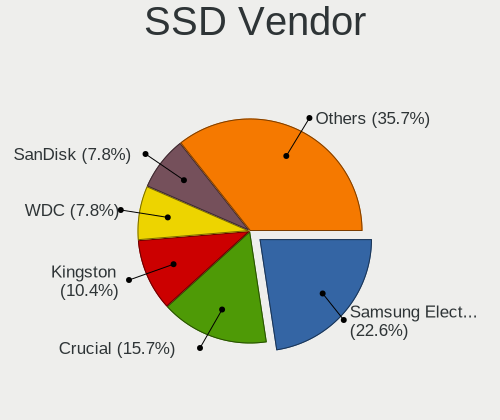
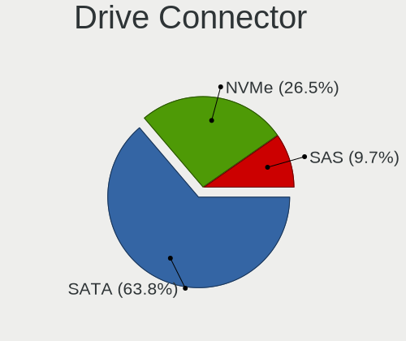
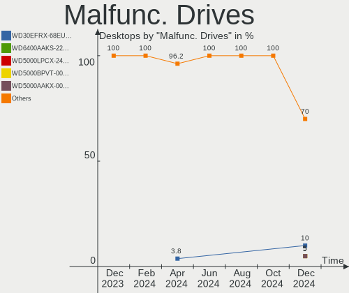

Linux Mint - Hardware Trends (Desktops)
---------------------------------------

A project to identify most popular hardware characteristics and track their change
over time based on data collected by Linux users at https://Linux-Hardware.org.

Anyone can contribute to this report by the [hw-probe](https://github.com/linuxhw/hw-probe) tool:

    sudo -E hw-probe -all -upload

This report is for one last month. Overall report since the beginning of time: [TestDays](https://github.com/linuxhw/TestDays)

Period: May, 2023.

Contents
--------

* [ System ](#system)
  - [ OS                       ](#os)
  - [ OS Family                ](#os-family)
  - [ Kernel                   ](#kernel)
  - [ Kernel Family            ](#kernel-family)
  - [ Kernel Major Ver.        ](#kernel-major-ver)
  - [ Arch                     ](#arch)
  - [ DE                       ](#de)
  - [ Display Server           ](#display-server)
  - [ Display Manager          ](#display-manager)
  - [ OS Lang                  ](#os-lang)
  - [ Boot Mode                ](#boot-mode)
  - [ Filesystem               ](#filesystem)
  - [ Part. scheme             ](#part-scheme)
  - [ Dual Boot with Linux/BSD ](#dual-boot-with-linuxbsd)
  - [ Dual Boot (Win)          ](#dual-boot-win)

* [ Board ](#board)
  - [ Vendor                   ](#vendor)
  - [ Model                    ](#model)
  - [ Model Family             ](#model-family)
  - [ MFG Year                 ](#mfg-year)
  - [ Form Factor              ](#form-factor)
  - [ Secure Boot              ](#secure-boot)
  - [ Coreboot                 ](#coreboot)
  - [ RAM Size                 ](#ram-size)
  - [ RAM Used                 ](#ram-used)
  - [ Total Drives             ](#total-drives)
  - [ Has CD-ROM               ](#has-cd-rom)
  - [ Has Ethernet             ](#has-ethernet)
  - [ Has WiFi                 ](#has-wifi)
  - [ Has Bluetooth            ](#has-bluetooth)

* [ Location ](#location)
  - [ Country                  ](#country)
  - [ City                     ](#city)

* [ Drives ](#drives)
  - [ Drive Vendor             ](#drive-vendor)
  - [ Drive Model              ](#drive-model)
  - [ HDD Vendor               ](#hdd-vendor)
  - [ SSD Vendor               ](#ssd-vendor)
  - [ Drive Kind               ](#drive-kind)
  - [ Drive Connector          ](#drive-connector)
  - [ Drive Size               ](#drive-size)
  - [ Space Total              ](#space-total)
  - [ Space Used               ](#space-used)
  - [ Malfunc. Drives          ](#malfunc-drives)
  - [ Malfunc. Drive Vendor    ](#malfunc-drive-vendor)
  - [ Malfunc. HDD Vendor      ](#malfunc-hdd-vendor)
  - [ Malfunc. Drive Kind      ](#malfunc-drive-kind)
  - [ Failed Drives            ](#failed-drives)
  - [ Failed Drive Vendor      ](#failed-drive-vendor)
  - [ Drive Status             ](#drive-status)

* [ Storage controller ](#storage-controller)
  - [ Storage Vendor           ](#storage-vendor)
  - [ Storage Model            ](#storage-model)
  - [ Storage Kind             ](#storage-kind)

* [ Processor ](#processor)
  - [ CPU Vendor               ](#cpu-vendor)
  - [ CPU Model                ](#cpu-model)
  - [ CPU Model Family         ](#cpu-model-family)
  - [ CPU Cores                ](#cpu-cores)
  - [ CPU Sockets              ](#cpu-sockets)
  - [ CPU Threads              ](#cpu-threads)
  - [ CPU Op-Modes             ](#cpu-op-modes)
  - [ CPU Microcode            ](#cpu-microcode)
  - [ CPU Microarch            ](#cpu-microarch)

* [ Graphics ](#graphics)
  - [ GPU Vendor               ](#gpu-vendor)
  - [ GPU Model                ](#gpu-model)
  - [ GPU Combo                ](#gpu-combo)
  - [ GPU Driver               ](#gpu-driver)
  - [ GPU Memory               ](#gpu-memory)

* [ Monitor ](#monitor)
  - [ Monitor Vendor           ](#monitor-vendor)
  - [ Monitor Model            ](#monitor-model)
  - [ Monitor Resolution       ](#monitor-resolution)
  - [ Monitor Diagonal         ](#monitor-diagonal)
  - [ Monitor Width            ](#monitor-width)
  - [ Aspect Ratio             ](#aspect-ratio)
  - [ Monitor Area             ](#monitor-area)
  - [ Pixel Density            ](#pixel-density)
  - [ Multiple Monitors        ](#multiple-monitors)

* [ Network ](#network)
  - [ Net Controller Vendor    ](#net-controller-vendor)
  - [ Net Controller Model     ](#net-controller-model)
  - [ Wireless Vendor          ](#wireless-vendor)
  - [ Wireless Model           ](#wireless-model)
  - [ Ethernet Vendor          ](#ethernet-vendor)
  - [ Ethernet Model           ](#ethernet-model)
  - [ Net Controller Kind      ](#net-controller-kind)
  - [ Used Controller          ](#used-controller)
  - [ NICs                     ](#nics)
  - [ IPv6                     ](#ipv6)

* [ Bluetooth ](#bluetooth)
  - [ Bluetooth Vendor         ](#bluetooth-vendor)
  - [ Bluetooth Model          ](#bluetooth-model)

* [ Sound ](#sound)
  - [ Sound Vendor             ](#sound-vendor)
  - [ Sound Model              ](#sound-model)

* [ Memory ](#memory)
  - [ Memory Vendor            ](#memory-vendor)
  - [ Memory Model             ](#memory-model)
  - [ Memory Kind              ](#memory-kind)
  - [ Memory Form Factor       ](#memory-form-factor)
  - [ Memory Size              ](#memory-size)
  - [ Memory Speed             ](#memory-speed)

* [ Printers & scanners ](#printers--scanners)
  - [ Printer Vendor           ](#printer-vendor)
  - [ Printer Model            ](#printer-model)
  - [ Scanner Vendor           ](#scanner-vendor)
  - [ Scanner Model            ](#scanner-model)

* [ Camera ](#camera)
  - [ Camera Vendor            ](#camera-vendor)
  - [ Camera Model             ](#camera-model)

* [ Security ](#security)
  - [ Fingerprint Vendor       ](#fingerprint-vendor)
  - [ Fingerprint Model        ](#fingerprint-model)
  - [ Chipcard Vendor          ](#chipcard-vendor)
  - [ Chipcard Model           ](#chipcard-model)

* [ Unsupported ](#unsupported)
  - [ Unsupported Devices      ](#unsupported-devices)
  - [ Unsupported Device Types ](#unsupported-device-types)

System
------

OS
--

Installed operating systems

| Name            | Desktops | Percent |
|-----------------|----------|---------|
| Linux Mint 21.1 | 162      | 72.97%  |
| Linux Mint 20.3 | 31       | 13.96%  |
| Linux Mint 21   | 15       | 6.76%   |
| Linux Mint 20.2 | 6        | 2.7%    |
| Linux Mint 20   | 2        | 0.9%    |
| Linux Mint 19.3 | 2        | 0.9%    |
| Linux Mint 18.3 | 2        | 0.9%    |
| Linux Mint 20.1 | 1        | 0.45%   |
| Linux Mint 19.2 | 1        | 0.45%   |

OS Family
---------

OS without a version

| Name       | Desktops | Percent |
|------------|----------|---------|
| Linux Mint | 222      | 100%    |

Kernel
------

Version of the Linux kernel

| Version                     | Desktops | Percent |
|-----------------------------|----------|---------|
| 5.15.0-71-generic           | 76       | 34.23%  |
| 5.15.0-72-generic           | 57       | 25.68%  |
| 5.4.0-148-generic           | 21       | 9.46%   |
| 5.15.0-56-generic           | 17       | 7.66%   |
| 5.19.0-41-generic           | 11       | 4.95%   |
| 5.4.0-149-generic           | 5        | 2.25%   |
| 6.3.4-060304-generic        | 2        | 0.9%    |
| 6.1.0-1010-oem              | 2        | 0.9%    |
| 5.4.0-146-generic           | 2        | 0.9%    |
| 5.19.0-42-generic           | 2        | 0.9%    |
| 5.15.0-69-generic           | 2        | 0.9%    |
| 5.15.0-41-generic           | 2        | 0.9%    |
| 6.2.15-060215-generic       | 1        | 0.45%   |
| 6.2.13-060213-generic       | 1        | 0.45%   |
| 6.2.0-060200-generic        | 1        | 0.45%   |
| 6.1.4-060104-generic        | 1        | 0.45%   |
| 5.4.0-91-generic            | 1        | 0.45%   |
| 5.4.0-88-generic            | 1        | 0.45%   |
| 5.4.0-150-generic           | 1        | 0.45%   |
| 5.4.0-144-generic           | 1        | 0.45%   |
| 5.4.0-139-generic           | 1        | 0.45%   |
| 5.4.0-137-generic           | 1        | 0.45%   |
| 5.4.0-135-generic           | 1        | 0.45%   |
| 5.4.0-128-generic           | 1        | 0.45%   |
| 5.4.0-117-generic           | 1        | 0.45%   |
| 5.19.0-35-generic           | 1        | 0.45%   |
| 5.19.0-17.2-liquorix-amd64  | 1        | 0.45%   |
| 5.15.0-73-generic           | 1        | 0.45%   |
| 5.15.0-70-generic           | 1        | 0.45%   |
| 5.15.0-58-generic           | 1        | 0.45%   |
| 5.15.0-522304060810-generic | 1        | 0.45%   |
| 5.15.0-48-generic           | 1        | 0.45%   |
| 4.8.0-58-generic            | 1        | 0.45%   |
| 4.15.0-54-generic           | 1        | 0.45%   |
| 4.10.0-38-generic           | 1        | 0.45%   |

Kernel Family
-------------

Linux kernel without a distro release

| Version | Desktops | Percent |
|---------|----------|---------|
| 5.15.0  | 159      | 71.62%  |
| 5.4.0   | 37       | 16.67%  |
| 5.19.0  | 15       | 6.76%   |
| 6.3.4   | 2        | 0.9%    |
| 6.1.0   | 2        | 0.9%    |
| 6.2.15  | 1        | 0.45%   |
| 6.2.13  | 1        | 0.45%   |
| 6.2.0   | 1        | 0.45%   |
| 6.1.4   | 1        | 0.45%   |
| 4.8.0   | 1        | 0.45%   |
| 4.15.0  | 1        | 0.45%   |
| 4.10.0  | 1        | 0.45%   |

Kernel Major Ver.
-----------------

Linux kernel major version

| Version | Desktops | Percent |
|---------|----------|---------|
| 5.15    | 159      | 71.62%  |
| 5.4     | 37       | 16.67%  |
| 5.19    | 15       | 6.76%   |
| 6.2     | 3        | 1.35%   |
| 6.1     | 3        | 1.35%   |
| 6.3     | 2        | 0.9%    |
| 4.8     | 1        | 0.45%   |
| 4.15    | 1        | 0.45%   |
| 4.10    | 1        | 0.45%   |

Arch
----

OS architecture (x86_64, i586, etc.)

| Name   | Desktops | Percent |
|--------|----------|---------|
| x86_64 | 222      | 100%    |

DE
--

Desktop Environment

| Name       | Desktops | Percent |
|------------|----------|---------|
| X-Cinnamon | 153      | 68.92%  |
| XFCE       | 29       | 13.06%  |
| MATE       | 28       | 12.61%  |
| GNOME      | 5        | 2.25%   |
| Cinnamon   | 5        | 2.25%   |
| KDE5       | 1        | 0.45%   |
| Unknown    | 1        | 0.45%   |

Display Server
--------------

X11 or Wayland

| Name    | Desktops | Percent |
|---------|----------|---------|
| X11     | 220      | 99.1%   |
| Wayland | 1        | 0.45%   |
| Tty     | 1        | 0.45%   |

Display Manager
---------------

SDDM, LightDM, etc.

| Name    | Desktops | Percent |
|---------|----------|---------|
| Unknown | 138      | 62.16%  |
| LightDM | 81       | 36.49%  |
| SDDM    | 2        | 0.9%    |
| GDM3    | 1        | 0.45%   |

OS Lang
-------

Language

| Lang    | Desktops | Percent |
|---------|----------|---------|
| en_US   | 73       | 32.88%  |
| de_DE   | 32       | 14.41%  |
| fr_FR   | 15       | 6.76%   |
| it_IT   | 12       | 5.41%   |
| en_CA   | 10       | 4.5%    |
| C       | 10       | 4.5%    |
| ru_RU   | 7        | 3.15%   |
| pt_BR   | 7        | 3.15%   |
| nl_NL   | 6        | 2.7%    |
| en_GB   | 6        | 2.7%    |
| pl_PL   | 5        | 2.25%   |
| es_VE   | 4        | 1.8%    |
| es_ES   | 4        | 1.8%    |
| sk_SK   | 3        | 1.35%   |
| en_AU   | 3        | 1.35%   |
| cs_CZ   | 3        | 1.35%   |
| hu_HU   | 2        | 0.9%    |
| es_AR   | 2        | 0.9%    |
| de_CH   | 2        | 0.9%    |
| de_AT   | 2        | 0.9%    |
| uk_UA   | 1        | 0.45%   |
| sv_SE   | 1        | 0.45%   |
| pt_PT   | 1        | 0.45%   |
| nb_NO   | 1        | 0.45%   |
| ja_JP   | 1        | 0.45%   |
| es_PE   | 1        | 0.45%   |
| es_MX   | 1        | 0.45%   |
| en_ZA   | 1        | 0.45%   |
| en_PH   | 1        | 0.45%   |
| en_NZ   | 1        | 0.45%   |
| en_IN   | 1        | 0.45%   |
| da_DK   | 1        | 0.45%   |
| ca_ES   | 1        | 0.45%   |
| Unknown | 1        | 0.45%   |

Boot Mode
---------

EFI or BIOS

| Mode | Desktops | Percent |
|------|----------|---------|
| EFI  | 133      | 59.91%  |
| BIOS | 89       | 40.09%  |

Filesystem
----------

Type of filesystem

| Type    | Desktops | Percent |
|---------|----------|---------|
| Ext4    | 202      | 90.99%  |
| Overlay | 8        | 3.6%    |
| Tmpfs   | 5        | 2.25%   |
| Zfs     | 4        | 1.8%    |
| Btrfs   | 2        | 0.9%    |
| Xfs     | 1        | 0.45%   |

Part. scheme
------------

Scheme of partitioning

| Type    | Desktops | Percent |
|---------|----------|---------|
| Unknown | 137      | 61.71%  |
| GPT     | 69       | 31.08%  |
| MBR     | 16       | 7.21%   |

Dual Boot with Linux/BSD
------------------------

Hosting more than one Linux/BSD

| Dual boot | Desktops | Percent |
|-----------|----------|---------|
| No        | 194      | 87.39%  |
| Yes       | 28       | 12.61%  |

Dual Boot (Win)
---------------

Hosting Linux and Windows

| Dual boot | Desktops | Percent |
|-----------|----------|---------|
| No        | 176      | 79.28%  |
| Yes       | 46       | 20.72%  |

Board
-----

Vendor
------

Motherboard manufacturer

| Name                | Desktops | Percent |
|---------------------|----------|---------|
| ASUSTek Computer    | 56       | 25.23%  |
| Gigabyte Technology | 36       | 16.22%  |
| MSI                 | 29       | 13.06%  |
| ASRock              | 23       | 10.36%  |
| Hewlett-Packard     | 19       | 8.56%   |
| Lenovo              | 13       | 5.86%   |
| Dell                | 12       | 5.41%   |
| Medion              | 4        | 1.8%    |
| Foxconn             | 4        | 1.8%    |
| Acer                | 4        | 1.8%    |
| Pegatron            | 3        | 1.35%   |
| Intel               | 3        | 1.35%   |
| Fujitsu             | 3        | 1.35%   |
| Unknown             | 3        | 1.35%   |
| ECS                 | 2        | 0.9%    |
| Biostar             | 2        | 0.9%    |
| PCChips             | 1        | 0.45%   |
| MouseComputer       | 1        | 0.45%   |
| Megaware            | 1        | 0.45%   |
| MACHINIST           | 1        | 0.45%   |
| Fujitsu Siemens     | 1        | 0.45%   |
| Alienware           | 1        | 0.45%   |

Model
-----

Motherboard model

| Name                         | Desktops | Percent |
|------------------------------|----------|---------|
| Gigabyte B450M DS3H          | 4        | 1.8%    |
| MSI MS-7C56                  | 3        | 1.35%   |
| Dell OptiPlex 7010           | 3        | 1.35%   |
| ASUS TUF Gaming X570-PLUS    | 3        | 1.35%   |
| Unknown                      | 3        | 1.35%   |
| MSI MS-7693                  | 2        | 0.9%    |
| MSI MS-7309                  | 2        | 0.9%    |
| Medion MS-7848               | 2        | 0.9%    |
| HP Compaq Elite 8300 USDT    | 2        | 0.9%    |
| Gigabyte B450 AORUS M        | 2        | 0.9%    |
| Gigabyte A320M-S2H           | 2        | 0.9%    |
| Foxconn Pro 3500 Series      | 2        | 0.9%    |
| Dell OptiPlex 9020           | 2        | 0.9%    |
| ASUS ROG STRIX B550-F GAMING | 2        | 0.9%    |
| ASUS All Series              | 2        | 0.9%    |
| ASRock AB350 Pro4            | 2        | 0.9%    |
| Pegatron NC692AA-ABA m9510f  | 1        | 0.45%   |
| Pegatron FR440AA-ABU a6652uk | 1        | 0.45%   |
| Pegatron FQ515AA-ABA a6620f  | 1        | 0.45%   |
| PCChips P17G                 | 1        | 0.45%   |
| MSI MS-7D25                  | 1        | 0.45%   |
| MSI MS-7C95                  | 1        | 0.45%   |
| MSI MS-7C52                  | 1        | 0.45%   |
| MSI MS-7B98                  | 1        | 0.45%   |
| MSI MS-7B92                  | 1        | 0.45%   |
| MSI MS-7B85                  | 1        | 0.45%   |
| MSI MS-7B33                  | 1        | 0.45%   |
| MSI MS-7B24                  | 1        | 0.45%   |
| MSI MS-7A93                  | 1        | 0.45%   |
| MSI MS-7A16                  | 1        | 0.45%   |
| MSI MS-7982                  | 1        | 0.45%   |
| MSI MS-7816                  | 1        | 0.45%   |
| MSI MS-7758                  | 1        | 0.45%   |
| MSI MS-7721                  | 1        | 0.45%   |
| MSI MS-7697                  | 1        | 0.45%   |
| MSI MS-7641                  | 1        | 0.45%   |
| MSI MS-7592                  | 1        | 0.45%   |
| MSI MS-7513                  | 1        | 0.45%   |
| MSI MS-7502                  | 1        | 0.45%   |
| MSI MS-7369                  | 1        | 0.45%   |

Model Family
------------

Motherboard model prefix

| Name                 | Desktops | Percent |
|----------------------|----------|---------|
| ASUS ROG             | 10       | 4.5%    |
| ASUS PRIME           | 10       | 4.5%    |
| HP Compaq            | 8        | 3.6%    |
| Lenovo ThinkCentre   | 6        | 2.7%    |
| Gigabyte B450M       | 6        | 2.7%    |
| Dell OptiPlex        | 6        | 2.7%    |
| Lenovo IdeaCentre    | 5        | 2.25%   |
| ASUS TUF             | 5        | 2.25%   |
| HP ProDesk           | 4        | 1.8%    |
| MSI MS-7C56          | 3        | 1.35%   |
| Unknown              | 3        | 1.35%   |
| MSI MS-7693          | 2        | 0.9%    |
| MSI MS-7309          | 2        | 0.9%    |
| Medion MS-7848       | 2        | 0.9%    |
| Lenovo Legion        | 2        | 0.9%    |
| Gigabyte X570        | 2        | 0.9%    |
| Gigabyte B650        | 2        | 0.9%    |
| Gigabyte B550        | 2        | 0.9%    |
| Gigabyte B450        | 2        | 0.9%    |
| Gigabyte A320M-S2H   | 2        | 0.9%    |
| Fujitsu ESPRIMO      | 2        | 0.9%    |
| Foxconn Pro          | 2        | 0.9%    |
| Dell Precision       | 2        | 0.9%    |
| Dell Inspiron        | 2        | 0.9%    |
| ASUS M5A78L-M        | 2        | 0.9%    |
| ASUS All             | 2        | 0.9%    |
| ASRock AB350         | 2        | 0.9%    |
| Acer Veriton         | 2        | 0.9%    |
| Pegatron NC692AA-ABA | 1        | 0.45%   |
| Pegatron FR440AA-ABU | 1        | 0.45%   |
| Pegatron FQ515AA-ABA | 1        | 0.45%   |
| PCChips P17G         | 1        | 0.45%   |
| MSI MS-7D25          | 1        | 0.45%   |
| MSI MS-7C95          | 1        | 0.45%   |
| MSI MS-7C52          | 1        | 0.45%   |
| MSI MS-7B98          | 1        | 0.45%   |
| MSI MS-7B92          | 1        | 0.45%   |
| MSI MS-7B85          | 1        | 0.45%   |
| MSI MS-7B33          | 1        | 0.45%   |
| MSI MS-7B24          | 1        | 0.45%   |

MFG Year
--------

Motherboard manufacture year

| Year | Desktops | Percent |
|------|----------|---------|
| 2012 | 28       | 12.61%  |
| 2018 | 25       | 11.26%  |
| 2020 | 22       | 9.91%   |
| 2014 | 15       | 6.76%   |
| 2015 | 14       | 6.31%   |
| 2019 | 13       | 5.86%   |
| 2011 | 13       | 5.86%   |
| 2009 | 12       | 5.41%   |
| 2021 | 11       | 4.95%   |
| 2013 | 11       | 4.95%   |
| 2016 | 10       | 4.5%    |
| 2017 | 9        | 4.05%   |
| 2023 | 8        | 3.6%    |
| 2022 | 8        | 3.6%    |
| 2010 | 8        | 3.6%    |
| 2007 | 7        | 3.15%   |
| 2008 | 5        | 2.25%   |
| 2006 | 3        | 1.35%   |

Form Factor
-----------

Physical design of the computer

| Name    | Desktops | Percent |
|---------|----------|---------|
| Desktop | 222      | 100%    |

Secure Boot
-----------

Enabled or disabled

| State    | Desktops | Percent |
|----------|----------|---------|
| Disabled | 211      | 95.05%  |
| Enabled  | 11       | 4.95%   |

Coreboot
--------

Have coreboot on board

| Used | Desktops | Percent |
|------|----------|---------|
| No   | 222      | 100%    |

RAM Size
--------

Total RAM memory

| Size in GB  | Desktops | Percent |
|-------------|----------|---------|
| 16.01-24.0  | 51       | 22.97%  |
| 32.01-64.0  | 42       | 18.92%  |
| 4.01-8.0    | 38       | 17.12%  |
| 3.01-4.0    | 33       | 14.86%  |
| 8.01-16.0   | 33       | 14.86%  |
| 64.01-256.0 | 17       | 7.66%   |
| 24.01-32.0  | 6        | 2.7%    |
| 2.01-3.0    | 1        | 0.45%   |
| 0.51-1.0    | 1        | 0.45%   |

RAM Used
--------

Used RAM memory

| Used GB    | Desktops | Percent |
|------------|----------|---------|
| 1.01-2.0   | 77       | 34.68%  |
| 2.01-3.0   | 61       | 27.48%  |
| 4.01-8.0   | 39       | 17.57%  |
| 3.01-4.0   | 26       | 11.71%  |
| 8.01-16.0  | 11       | 4.95%   |
| 0.51-1.0   | 4        | 1.8%    |
| 16.01-24.0 | 3        | 1.35%   |
| 24.01-32.0 | 1        | 0.45%   |

Total Drives
------------

Number of drives on board

| Drives | Desktops | Percent |
|--------|----------|---------|
| 1      | 75       | 33.78%  |
| 2      | 54       | 24.32%  |
| 3      | 52       | 23.42%  |
| 4      | 22       | 9.91%   |
| 5      | 13       | 5.86%   |
| 7      | 3        | 1.35%   |
| 6      | 3        | 1.35%   |

Has CD-ROM
----------

Has CD-ROM on board

| Presented | Desktops | Percent |
|-----------|----------|---------|
| No        | 115      | 51.8%   |
| Yes       | 107      | 48.2%   |

Has Ethernet
------------

Has Ethernet on board

| Presented | Desktops | Percent |
|-----------|----------|---------|
| Yes       | 221      | 99.55%  |
| No        | 1        | 0.45%   |

Has WiFi
--------

Has WiFi module

| Presented | Desktops | Percent |
|-----------|----------|---------|
| No        | 115      | 51.8%   |
| Yes       | 107      | 48.2%   |

Has Bluetooth
-------------

Has Bluetooth module

| Presented | Desktops | Percent |
|-----------|----------|---------|
| No        | 143      | 64.41%  |
| Yes       | 79       | 35.59%  |

Location
--------

Country
-------

Geographic location (country)

| Country      | Desktops | Percent |
|--------------|----------|---------|
| USA          | 47       | 21.17%  |
| Germany      | 38       | 17.12%  |
| Italy        | 16       | 7.21%   |
| France       | 15       | 6.76%   |
| Canada       | 10       | 4.5%    |
| Brazil       | 10       | 4.5%    |
| Russia       | 8        | 3.6%    |
| Netherlands  | 8        | 3.6%    |
| UK           | 6        | 2.7%    |
| Poland       | 6        | 2.7%    |
| Switzerland  | 5        | 2.25%   |
| Czechia      | 5        | 2.25%   |
| Venezuela    | 4        | 1.8%    |
| Spain        | 4        | 1.8%    |
| Slovakia     | 3        | 1.35%   |
| Austria      | 3        | 1.35%   |
| Australia    | 3        | 1.35%   |
| Argentina    | 3        | 1.35%   |
| Romania      | 2        | 0.9%    |
| Philippines  | 2        | 0.9%    |
| Norway       | 2        | 0.9%    |
| Japan        | 2        | 0.9%    |
| Hungary      | 2        | 0.9%    |
| Ukraine      | 1        | 0.45%   |
| Thailand     | 1        | 0.45%   |
| Sweden       | 1        | 0.45%   |
| South Africa | 1        | 0.45%   |
| Serbia       | 1        | 0.45%   |
| Portugal     | 1        | 0.45%   |
| Peru         | 1        | 0.45%   |
| New Zealand  | 1        | 0.45%   |
| Mexico       | 1        | 0.45%   |
| Lithuania    | 1        | 0.45%   |
| Ireland      | 1        | 0.45%   |
| India        | 1        | 0.45%   |
| Ecuador      | 1        | 0.45%   |
| Denmark      | 1        | 0.45%   |
| Colombia     | 1        | 0.45%   |
| Chile        | 1        | 0.45%   |
| Belgium      | 1        | 0.45%   |

City
----

Geographic location (city)

| City                  | Desktops | Percent |
|-----------------------|----------|---------|
| Rome                  | 4        | 1.8%    |
| Weston                | 2        | 0.9%    |
| Warsaw                | 2        | 0.9%    |
| Vienna                | 2        | 0.9%    |
| Vannes                | 2        | 0.9%    |
| Scarborough           | 2        | 0.9%    |
| Rpety                 | 2        | 0.9%    |
| Nizhniy Novgorod      | 2        | 0.9%    |
| Landau                | 2        | 0.9%    |
| Krakow                | 2        | 0.9%    |
| Hanover               | 2        | 0.9%    |
| Hamburg               | 2        | 0.9%    |
| Caracas               | 2        | 0.9%    |
| Caen                  | 2        | 0.9%    |
| Brisbane              | 2        | 0.9%    |
| Amsterdam             | 2        | 0.9%    |
| Zweidlen-Dorf         | 1        | 0.45%   |
| Zhukovskiy            | 1        | 0.45%   |
| Zdar                  | 1        | 0.45%   |
| Wolfsburg             | 1        | 0.45%   |
| Wisconsin Rapids      | 1        | 0.45%   |
| Winston-Salem         | 1        | 0.45%   |
| Wellington            | 1        | 0.45%   |
| Waynesboro            | 1        | 0.45%   |
| Waltham               | 1        | 0.45%   |
| Wake Forest           | 1        | 0.45%   |
| Vitória da Conquista | 1        | 0.45%   |
| Versailles            | 1        | 0.45%   |
| Vancouver             | 1        | 0.45%   |
| Van Buren             | 1        | 0.45%   |
| Ulyanovsk             | 1        | 0.45%   |
| Twinsburg             | 1        | 0.45%   |
| Turin                 | 1        | 0.45%   |
| Traunstein            | 1        | 0.45%   |
| Telford               | 1        | 0.45%   |
| Taylors Falls         | 1        | 0.45%   |
| Tatabánya            | 1        | 0.45%   |
| Tarlac City           | 1        | 0.45%   |
| Tampa                 | 1        | 0.45%   |
| Szombathely           | 1        | 0.45%   |

Drives
------

Drive Vendor
------------

Hard drive vendors

| Vendor                       | Desktops | Drives | Percent |
|------------------------------|----------|--------|---------|
| Seagate                      | 84       | 113    | 19.4%   |
| WDC                          | 75       | 102    | 17.32%  |
| Samsung Electronics          | 66       | 88     | 15.24%  |
| Sandisk                      | 32       | 37     | 7.39%   |
| Kingston                     | 28       | 35     | 6.47%   |
| Toshiba                      | 19       | 21     | 4.39%   |
| Crucial                      | 17       | 20     | 3.93%   |
| Hitachi                      | 12       | 13     | 2.77%   |
| China                        | 10       | 10     | 2.31%   |
| PNY                          | 9        | 9      | 2.08%   |
| A-DATA Technology            | 9        | 9      | 2.08%   |
| Micron/Crucial Technology    | 5        | 7      | 1.15%   |
| Intenso                      | 5        | 5      | 1.15%   |
| SK hynix                     | 4        | 4      | 0.92%   |
| HGST                         | 4        | 4      | 0.92%   |
| Team                         | 3        | 3      | 0.69%   |
| SPCC                         | 3        | 3      | 0.69%   |
| Phison Electronics           | 3        | 3      | 0.69%   |
| Patriot                      | 3        | 3      | 0.69%   |
| Micron Technology            | 3        | 3      | 0.69%   |
| WD MediaMax                  | 2        | 2      | 0.46%   |
| Unknown                      | 2        | 3      | 0.46%   |
| MAXIO Technology (Hangzhou)  | 2        | 2      | 0.46%   |
| Kingston Technology Company  | 2        | 2      | 0.46%   |
| Intel                        | 2        | 2      | 0.46%   |
| Corsair                      | 2        | 2      | 0.46%   |
| XrayDisk                     | 1        | 1      | 0.23%   |
| XPG                          | 1        | 1      | 0.23%   |
| UMIS                         | 1        | 1      | 0.23%   |
| Transcend                    | 1        | 1      | 0.23%   |
| Smartbuy                     | 1        | 1      | 0.23%   |
| Silicon Motion               | 1        | 1      | 0.23%   |
| ShiJi                        | 1        | 1      | 0.23%   |
| Shenzhen Longsys Electronics | 1        | 1      | 0.23%   |
| SD                           | 1        | 1      | 0.23%   |
| Plextor                      | 1        | 1      | 0.23%   |
| Neo                          | 1        | 1      | 0.23%   |
| Maxtor                       | 1        | 1      | 0.23%   |
| LITEON                       | 1        | 1      | 0.23%   |
| KOWIN                        | 1        | 1      | 0.23%   |

Drive Model
-----------

Hard drive models

| Model                                               | Desktops | Percent |
|-----------------------------------------------------|----------|---------|
| Samsung NVMe SSD Controller SM981/PM981/PM983 256GB | 15       | 3%      |
| Kingston SA400S37240G 240GB SSD                     | 12       | 2.4%    |
| Seagate ST2000DM008-2FR102 2TB                      | 7        | 1.4%    |
| Seagate ST2000DM001-1ER164 2TB                      | 6        | 1.2%    |
| Seagate ST1000DM003-1ER162 1TB                      | 6        | 1.2%    |
| Toshiba DT01ACA100 1TB                              | 5        | 1%      |
| Samsung SSD 980 1TB                                 | 5        | 1%      |
| Toshiba HDWD110 1TB                                 | 4        | 0.8%    |
| Seagate ST500DM002-1BD142 500GB                     | 4        | 0.8%    |
| Seagate ST1000DM010-2EP102 1TB                      | 4        | 0.8%    |
| Samsung SSD 850 EVO 250GB                           | 4        | 0.8%    |
| Kingston SA400S37120G 120GB SSD                     | 4        | 0.8%    |
| WDC WD10EZEX-22MFCA0 1TB                            | 3        | 0.6%    |
| Seagate ST4000DM004-2CV104 4TB                      | 3        | 0.6%    |
| Seagate ST31000528AS 1TB                            | 3        | 0.6%    |
| Seagate ST2000DM008-2UB102 2TB                      | 3        | 0.6%    |
| Seagate ST2000DM006-2DM164 2TB                      | 3        | 0.6%    |
| Seagate ST1000DM003-1SB102 1TB                      | 3        | 0.6%    |
| Seagate ST1000DM003-1CH162 1TB                      | 3        | 0.6%    |
| Sandisk WD Blue SN550 NVMe SSD 512GB                | 3        | 0.6%    |
| Samsung SSD 970 EVO Plus 1TB                        | 3        | 0.6%    |
| Samsung SSD 870 EVO 500GB                           | 3        | 0.6%    |
| Samsung SSD 860 EVO 500GB                           | 3        | 0.6%    |
| Samsung NVMe SSD Controller PM9A1/PM9A3/980PRO 1TB  | 3        | 0.6%    |
| Phison E12 NVMe Controller 256GB                    | 3        | 0.6%    |
| Micron/Crucial P2 NVMe PCIe SSD 1TB                 | 3        | 0.6%    |
| Crucial CT240BX500SSD1 240GB                        | 3        | 0.6%    |
| WDC WDS480G2G0A-00JH30 480GB SSD                    | 2        | 0.4%    |
| WDC WDS100T2B0C-00PXH0 1TB                          | 2        | 0.4%    |
| WDC WD5003ABYX-01WERA0 500GB                        | 2        | 0.4%    |
| WDC WD5000AAKX-603CA0 500GB                         | 2        | 0.4%    |
| WDC WD3200AAJS-56M0A0 320GB                         | 2        | 0.4%    |
| WDC WD20PURZ-85GU6Y0 2TB                            | 2        | 0.4%    |
| WDC WD20EARX-00PASB0 2TB                            | 2        | 0.4%    |
| WDC WD10EZRZ-00HTKB0 1TB                            | 2        | 0.4%    |
| WDC WD10EZEX-60ZF5A0 1TB                            | 2        | 0.4%    |
| WDC WD10EZEX-00WN4A0 1TB                            | 2        | 0.4%    |
| WDC WD10EZEX-00BN5A0 1TB                            | 2        | 0.4%    |
| Seagate ST4000VN006-3CW104 4TB                      | 2        | 0.4%    |
| Seagate ST3500418AS 500GB                           | 2        | 0.4%    |

HDD Vendor
----------

Hard disk drive vendors

| Vendor              | Desktops | Drives | Percent |
|---------------------|----------|--------|---------|
| Seagate             | 79       | 105    | 40.93%  |
| WDC                 | 69       | 88     | 35.75%  |
| Toshiba             | 17       | 19     | 8.81%   |
| Hitachi             | 12       | 13     | 6.22%   |
| Samsung Electronics | 6        | 6      | 3.11%   |
| HGST                | 4        | 4      | 2.07%   |
| Unknown             | 1        | 1      | 0.52%   |
| Maxtor              | 1        | 1      | 0.52%   |
| Intenso             | 1        | 1      | 0.52%   |
| Fujitsu             | 1        | 1      | 0.52%   |
| FSR202              | 1        | 1      | 0.52%   |
| External            | 1        | 1      | 0.52%   |

SSD Vendor
----------

Solid state drive vendors

| Vendor              | Desktops | Drives | Percent |
|---------------------|----------|--------|---------|
| Samsung Electronics | 33       | 38     | 20.75%  |
| Kingston            | 26       | 30     | 16.35%  |
| SanDisk             | 19       | 20     | 11.95%  |
| Crucial             | 15       | 17     | 9.43%   |
| WDC                 | 11       | 11     | 6.92%   |
| China               | 10       | 10     | 6.29%   |
| PNY                 | 8        | 8      | 5.03%   |
| A-DATA Technology   | 8        | 8      | 5.03%   |
| Team                | 3        | 3      | 1.89%   |
| SPCC                | 3        | 3      | 1.89%   |
| Patriot             | 3        | 3      | 1.89%   |
| Seagate             | 2        | 2      | 1.26%   |
| Intenso             | 2        | 2      | 1.26%   |
| Transcend           | 1        | 1      | 0.63%   |
| Toshiba             | 1        | 1      | 0.63%   |
| Smartbuy            | 1        | 1      | 0.63%   |
| SD                  | 1        | 1      | 0.63%   |
| Plextor             | 1        | 1      | 0.63%   |
| Neo                 | 1        | 1      | 0.63%   |
| Micron Technology   | 1        | 1      | 0.63%   |
| LITEON              | 1        | 1      | 0.63%   |
| Intel               | 1        | 1      | 0.63%   |
| Integral            | 1        | 1      | 0.63%   |
| Hewlett-Packard     | 1        | 1      | 0.63%   |
| Fanxiang            | 1        | 1      | 0.63%   |
| Corsair             | 1        | 1      | 0.63%   |
| Apacer              | 1        | 1      | 0.63%   |
| 1TBE                | 1        | 1      | 0.63%   |
| Unknown             | 1        | 1      | 0.63%   |

Drive Kind
----------

HDD or SSD

| Kind    | Desktops | Drives | Percent |
|---------|----------|--------|---------|
| HDD     | 155      | 241    | 41.78%  |
| SSD     | 132      | 171    | 35.58%  |
| NVMe    | 71       | 103    | 19.14%  |
| Unknown | 13       | 17     | 3.5%    |

Drive Connector
---------------

SATA, SAS, NVMe, etc.

| Type | Desktops | Drives | Percent |
|------|----------|--------|---------|
| SATA | 203      | 412    | 70.98%  |
| NVMe | 71       | 103    | 24.83%  |
| SAS  | 12       | 17     | 4.2%    |

Drive Size
----------

Size of hard drive

| Size in TB | Desktops | Drives | Percent |
|------------|----------|--------|---------|
| 0.01-0.5   | 135      | 193    | 44.41%  |
| 0.51-1.0   | 93       | 114    | 30.59%  |
| 1.01-2.0   | 43       | 60     | 14.14%  |
| 3.01-4.0   | 18       | 24     | 5.92%   |
| 2.01-3.0   | 7        | 11     | 2.3%    |
| 10.01-20.0 | 4        | 6      | 1.32%   |
| 4.01-10.0  | 4        | 4      | 1.32%   |

Space Total
-----------

Amount of disk space available on the file system

| Size in GB     | Desktops | Percent |
|----------------|----------|---------|
| 101-250        | 48       | 21.62%  |
| 251-500        | 41       | 18.47%  |
| More than 3000 | 36       | 16.22%  |
| 501-1000       | 30       | 13.51%  |
| 1001-2000      | 28       | 12.61%  |
| 2001-3000      | 22       | 9.91%   |
| 1-20           | 8        | 3.6%    |
| 51-100         | 4        | 1.8%    |
| 21-50          | 3        | 1.35%   |
| Unknown        | 2        | 0.9%    |

Space Used
----------

Amount of used disk space

| Used GB        | Desktops | Percent |
|----------------|----------|---------|
| 1-20           | 41       | 18.47%  |
| 21-50          | 35       | 15.77%  |
| 101-250        | 28       | 12.61%  |
| 501-1000       | 27       | 12.16%  |
| 51-100         | 26       | 11.71%  |
| 251-500        | 22       | 9.91%   |
| 1001-2000      | 17       | 7.66%   |
| More than 3000 | 14       | 6.31%   |
| 2001-3000      | 10       | 4.5%    |
| Unknown        | 2        | 0.9%    |

Malfunc. Drives
---------------

Drive models with a malfunction

| Model                                   | Desktops | Drives | Percent |
|-----------------------------------------|----------|--------|---------|
| XPG GAMMIX S41 256GB                    | 1        | 1      | 3.33%   |
| WDC WDS240G2G0B-00EPW0 240GB SSD        | 1        | 1      | 3.33%   |
| WDC WD5000AAKX-75U6AA0 500GB            | 1        | 1      | 3.33%   |
| WDC WD5000AAKX-603CA0 500GB             | 1        | 1      | 3.33%   |
| WDC WD3200AAJS-08L7A0 320GB             | 1        | 1      | 3.33%   |
| WDC WD20EZRX-22D8PB0 2TB                | 1        | 1      | 3.33%   |
| WDC WD20EZRX-00D8PB0 2TB                | 1        | 1      | 3.33%   |
| WDC WD20EFRX-68EUZN0 2TB                | 1        | 2      | 3.33%   |
| WDC WD10EZEX-60WN4A0 1TB                | 1        | 1      | 3.33%   |
| WDC WD10EZEX-22MFCA0 1TB                | 1        | 1      | 3.33%   |
| WDC WD10EARS-00Y5B1 1TB                 | 1        | 1      | 3.33%   |
| WDC WD10EADS-11M2B3 1TB                 | 1        | 1      | 3.33%   |
| Seagate ST8000NM0055-1RM112 8TB         | 1        | 1      | 3.33%   |
| Seagate ST500LX012-SSHD-8GB             | 1        | 1      | 3.33%   |
| Seagate ST3250410AS 250GB               | 1        | 1      | 3.33%   |
| Seagate ST320LT020-9YG142 320GB         | 1        | 1      | 3.33%   |
| Seagate ST31000528AS 1TB                | 1        | 1      | 3.33%   |
| Seagate ST250DM000-1BD141 250GB         | 1        | 1      | 3.33%   |
| Seagate ST1000DM010-2EP102 1TB          | 1        | 1      | 3.33%   |
| Seagate ST1000DM003-1ER162 1TB          | 1        | 1      | 3.33%   |
| SanDisk SDSSDA-2T00 2TB                 | 1        | 1      | 3.33%   |
| Samsung Electronics SSD 980 PRO 1TB     | 1        | 1      | 3.33%   |
| Samsung Electronics SSD 870 EVO 500GB   | 1        | 1      | 3.33%   |
| Samsung Electronics SSD 870 EVO 250GB   | 1        | 1      | 3.33%   |
| Samsung Electronics HD502HJ 500GB       | 1        | 1      | 3.33%   |
| Neo Forza NFS121SA312-6007000 120GB SSD | 1        | 1      | 3.33%   |
| LITEON CV8-CE256-HP 256GB SSD           | 1        | 1      | 3.33%   |
| Kingston SA400S37240G 240GB SSD         | 1        | 1      | 3.33%   |
| Hitachi HTS545050B9A300 500GB           | 1        | 1      | 3.33%   |
| Crucial CT120M500SSD1 120GB             | 1        | 1      | 3.33%   |

Malfunc. Drive Vendor
---------------------

Vendors of faulty drives

| Vendor              | Desktops | Drives | Percent |
|---------------------|----------|--------|---------|
| WDC                 | 10       | 12     | 34.48%  |
| Seagate             | 8        | 8      | 27.59%  |
| Samsung Electronics | 4        | 4      | 13.79%  |
| XPG                 | 1        | 1      | 3.45%   |
| SanDisk             | 1        | 1      | 3.45%   |
| Neo                 | 1        | 1      | 3.45%   |
| LITEON              | 1        | 1      | 3.45%   |
| Kingston            | 1        | 1      | 3.45%   |
| Hitachi             | 1        | 1      | 3.45%   |
| Crucial             | 1        | 1      | 3.45%   |

Malfunc. HDD Vendor
-------------------

Vendors of faulty HDD drives

| Vendor              | Desktops | Drives | Percent |
|---------------------|----------|--------|---------|
| WDC                 | 9        | 11     | 47.37%  |
| Seagate             | 8        | 8      | 42.11%  |
| Samsung Electronics | 1        | 1      | 5.26%   |
| Hitachi             | 1        | 1      | 5.26%   |

Malfunc. Drive Kind
-------------------

Kinds of faulty drives

| Kind | Desktops | Drives | Percent |
|------|----------|--------|---------|
| HDD  | 19       | 21     | 65.52%  |
| SSD  | 8        | 8      | 27.59%  |
| NVMe | 2        | 2      | 6.9%    |

Failed Drives
-------------

Failed drive models

Zero info for selected period =(

Failed Drive Vendor
-------------------

Failed drive vendors

Zero info for selected period =(

Drive Status
------------

Number of failed and malfunc. drives

| Status   | Desktops | Drives | Percent |
|----------|----------|--------|---------|
| Detected | 148      | 337    | 59.68%  |
| Works    | 74       | 164    | 29.84%  |
| Malfunc  | 26       | 31     | 10.48%  |

Storage controller
------------------

Storage Vendor
--------------

Storage controller vendors

| Vendor                       | Desktops | Percent |
|------------------------------|----------|---------|
| Intel                        | 121      | 35.17%  |
| AMD                          | 92       | 26.74%  |
| Samsung Electronics          | 35       | 10.17%  |
| SanDisk                      | 19       | 5.52%   |
| ASMedia Technology           | 13       | 3.78%   |
| Nvidia                       | 8        | 2.33%   |
| Micron/Crucial Technology    | 8        | 2.33%   |
| JMicron Technology           | 8        | 2.33%   |
| Kingston Technology Company  | 6        | 1.74%   |
| Phison Electronics           | 5        | 1.45%   |
| SK hynix                     | 4        | 1.16%   |
| Adaptec                      | 4        | 1.16%   |
| VIA Technologies             | 3        | 0.87%   |
| Marvell Technology Group     | 3        | 0.87%   |
| Realtek Semiconductor        | 2        | 0.58%   |
| Micron Technology            | 2        | 0.58%   |
| MAXIO Technology (Hangzhou)  | 2        | 0.58%   |
| Union Memory (Shenzhen)      | 1        | 0.29%   |
| Toshiba America Info Systems | 1        | 0.29%   |
| Silicon Motion               | 1        | 0.29%   |
| Silicon Image                | 1        | 0.29%   |
| Shenzhen Longsys Electronics | 1        | 0.29%   |
| Seagate Technology           | 1        | 0.29%   |
| LSI Logic / Symbios Logic    | 1        | 0.29%   |
| HighPoint Technologies       | 1        | 0.29%   |
| ADATA Technology             | 1        | 0.29%   |

Storage Model
-------------

Storage controller models

| Model                                                                          | Desktops | Percent |
|--------------------------------------------------------------------------------|----------|---------|
| AMD FCH SATA Controller [AHCI mode]                                            | 40       | 9.5%    |
| Intel 8 Series/C220 Series Chipset Family 6-port SATA Controller 1 [AHCI mode] | 20       | 4.75%   |
| Samsung NVMe SSD Controller SM981/PM981/PM983                                  | 19       | 4.51%   |
| AMD 500 Series Chipset SATA Controller                                         | 18       | 4.28%   |
| AMD SB7x0/SB8x0/SB9x0 IDE Controller                                           | 16       | 3.8%    |
| Intel Q170/Q150/B150/H170/H110/Z170/CM236 Chipset SATA Controller [AHCI Mode]  | 15       | 3.56%   |
| AMD 400 Series Chipset SATA Controller                                         | 13       | 3.09%   |
| Intel 7 Series/C210 Series Chipset Family 6-port SATA Controller [AHCI mode]   | 12       | 2.85%   |
| AMD SB7x0/SB8x0/SB9x0 SATA Controller [AHCI mode]                              | 11       | 2.61%   |
| Intel 6 Series/C200 Series Chipset Family 6 port Desktop SATA AHCI Controller  | 10       | 2.38%   |
| ASMedia ASM1062 Serial ATA Controller                                          | 10       | 2.38%   |
| AMD SB7x0/SB8x0/SB9x0 SATA Controller [IDE mode]                               | 10       | 2.38%   |
| Intel 200 Series PCH SATA controller [AHCI mode]                               | 8        | 1.9%    |
| Samsung NVMe SSD Controller PM9A1/PM9A3/980PRO                                 | 7        | 1.66%   |
| Samsung NVMe SSD Controller 980                                                | 7        | 1.66%   |
| Intel Alder Lake-S PCH SATA Controller [AHCI Mode]                             | 6        | 1.43%   |
| AMD FCH SATA Controller D                                                      | 6        | 1.43%   |
| Sandisk Western Digital WD Black SN850X NVMe SSD                               | 5        | 1.19%   |
| SanDisk WD Blue SN550 NVMe SSD                                                 | 5        | 1.19%   |
| Phison E12 NVMe Controller                                                     | 5        | 1.19%   |
| Nvidia MCP61 SATA Controller                                                   | 5        | 1.19%   |
| Nvidia MCP61 IDE                                                               | 5        | 1.19%   |
| Micron/Crucial P2 NVMe PCIe SSD                                                | 5        | 1.19%   |
| Kingston Company Company Non-Volatile memory controller                        | 5        | 1.19%   |
| JMicron JMB363 SATA/IDE Controller                                             | 5        | 1.19%   |
| Intel SATA Controller [RAID mode]                                              | 5        | 1.19%   |
| Intel Cannon Lake PCH SATA AHCI Controller                                     | 5        | 1.19%   |
| Micron/Crucial P5 Plus NVMe PCIe SSD                                           | 4        | 0.95%   |
| Intel NM10/ICH7 Family SATA Controller [IDE mode]                              | 4        | 0.95%   |
| Intel 82801IR/IO/IH (ICH9R/DO/DH) 4 port SATA Controller [IDE mode]            | 4        | 0.95%   |
| Intel 82801I (ICH9 Family) 2 port SATA Controller [IDE mode]                   | 4        | 0.95%   |
| Intel 82801G (ICH7 Family) IDE Controller                                      | 4        | 0.95%   |
| AMD FCH SATA Controller [IDE mode]                                             | 4        | 0.95%   |
| AMD 300 Series Chipset SATA Controller                                         | 4        | 0.95%   |
| SanDisk WD Blue SN570 NVMe SSD 1TB                                             | 3        | 0.71%   |
| Samsung NVMe SSD Controller SM961/PM961/SM963                                  | 3        | 0.71%   |
| Intel Volume Management Device NVMe RAID Controller                            | 3        | 0.71%   |
| Intel Celeron/Pentium Silver Processor SATA Controller                         | 3        | 0.71%   |
| Intel 82801JI (ICH10 Family) SATA AHCI Controller                              | 3        | 0.71%   |
| Intel 7 Series/C210 Series Chipset Family 4-port SATA Controller [IDE mode]    | 3        | 0.71%   |

Storage Kind
------------

Kind of storage controller (IDE, SATA, NVMe, SAS, ...)

| Kind | Desktops | Percent |
|------|----------|---------|
| SATA | 194      | 59.33%  |
| NVMe | 71       | 21.71%  |
| IDE  | 46       | 14.07%  |
| RAID | 13       | 3.98%   |
| SCSI | 2        | 0.61%   |
| SAS  | 1        | 0.31%   |

Processor
---------

CPU Vendor
----------

Processor vendors

| Vendor | Desktops | Percent |
|--------|----------|---------|
| Intel  | 124      | 55.86%  |
| AMD    | 98       | 44.14%  |

CPU Model
---------

Processor models

| Model                                        | Desktops | Percent |
|----------------------------------------------|----------|---------|
| Intel Core i5-3470 CPU @ 3.20GHz             | 5        | 2.25%   |
| AMD Ryzen 5 3600 6-Core Processor            | 5        | 2.25%   |
| Intel Core i7-4790 CPU @ 3.60GHz             | 4        | 1.8%    |
| Intel Core i3-2120 CPU @ 3.30GHz             | 4        | 1.8%    |
| AMD Ryzen 7 3700X 8-Core Processor           | 4        | 1.8%    |
| AMD Ryzen 5 5600X 6-Core Processor           | 4        | 1.8%    |
| AMD Ryzen 5 5600G with Radeon Graphics       | 4        | 1.8%    |
| AMD Ryzen 5 1600 Six-Core Processor          | 4        | 1.8%    |
| Intel Core i7-3770 CPU @ 3.40GHz             | 3        | 1.35%   |
| Intel Core i5-6500 CPU @ 3.20GHz             | 3        | 1.35%   |
| Intel Core 2 Quad CPU Q6600 @ 2.40GHz        | 3        | 1.35%   |
| AMD Ryzen 9 5900X 12-Core Processor          | 3        | 1.35%   |
| AMD Ryzen 7 5800X 8-Core Processor           | 3        | 1.35%   |
| AMD Ryzen 7 5700G with Radeon Graphics       | 3        | 1.35%   |
| AMD Ryzen 3 2200G with Radeon Vega Graphics  | 3        | 1.35%   |
| AMD FX-8350 Eight-Core Processor             | 3        | 1.35%   |
| AMD FX-8320 Eight-Core Processor             | 3        | 1.35%   |
| AMD FX-6300 Six-Core Processor               | 3        | 1.35%   |
| AMD Athlon II X2 250 Processor               | 3        | 1.35%   |
| Intel Pentium CPU G3220 @ 3.00GHz            | 2        | 0.9%    |
| Intel Core i9-7980XE CPU @ 2.60GHz           | 2        | 0.9%    |
| Intel Core i7-7700K CPU @ 4.20GHz            | 2        | 0.9%    |
| Intel Core i7-7700 CPU @ 3.60GHz             | 2        | 0.9%    |
| Intel Core i7-6700 CPU @ 3.40GHz             | 2        | 0.9%    |
| Intel Core i5-8400 CPU @ 2.80GHz             | 2        | 0.9%    |
| Intel Core i5-6600K CPU @ 3.50GHz            | 2        | 0.9%    |
| Intel Core i5-4590T CPU @ 2.00GHz            | 2        | 0.9%    |
| Intel Core i5-4570 CPU @ 3.20GHz             | 2        | 0.9%    |
| Intel Core i5-4440 CPU @ 3.10GHz             | 2        | 0.9%    |
| Intel Core i5-3570 CPU @ 3.40GHz             | 2        | 0.9%    |
| Intel Core i5-3470S CPU @ 2.90GHz            | 2        | 0.9%    |
| Intel Core i5-2400 CPU @ 3.10GHz             | 2        | 0.9%    |
| Intel 12th Gen Core i9-12900K                | 2        | 0.9%    |
| AMD Ryzen 7 1700 Eight-Core Processor        | 2        | 0.9%    |
| AMD Ryzen 5 7600X 6-Core Processor           | 2        | 0.9%    |
| AMD Phenom II X4 955 Processor               | 2        | 0.9%    |
| AMD A6-7480 Radeon R5, 8 Compute Cores 2C+6G | 2        | 0.9%    |
| Intel Xeon CPU X5690 @ 3.47GHz               | 1        | 0.45%   |
| Intel Xeon CPU X5660 @ 2.80GHz               | 1        | 0.45%   |
| Intel Xeon CPU E5-2650 v4 @ 2.20GHz          | 1        | 0.45%   |

CPU Model Family
----------------

Processor model prefix

| Model                   | Desktops | Percent |
|-------------------------|----------|---------|
| Intel Core i5           | 39       | 17.57%  |
| Intel Core i7           | 23       | 10.36%  |
| AMD Ryzen 5             | 23       | 10.36%  |
| AMD Ryzen 7             | 17       | 7.66%   |
| Intel Core i3           | 15       | 6.76%   |
| Other                   | 11       | 4.95%   |
| AMD FX                  | 11       | 4.95%   |
| AMD Ryzen 9             | 8        | 3.6%    |
| AMD Athlon II X2        | 7        | 3.15%   |
| Intel Pentium           | 6        | 2.7%    |
| Intel Core 2 Quad       | 6        | 2.7%    |
| AMD Ryzen 3             | 6        | 2.7%    |
| AMD Phenom II X4        | 6        | 2.7%    |
| Intel Xeon              | 5        | 2.25%   |
| Intel Pentium Dual-Core | 4        | 1.8%    |
| Intel Core 2 Duo        | 4        | 1.8%    |
| Intel Celeron           | 4        | 1.8%    |
| AMD A6                  | 4        | 1.8%    |
| Intel Core i9           | 3        | 1.35%   |
| AMD Ryzen Threadripper  | 2        | 0.9%    |
| AMD Ryzen 5 PRO         | 2        | 0.9%    |
| AMD Athlon              | 2        | 0.9%    |
| AMD A4                  | 2        | 0.9%    |
| AMD A10                 | 2        | 0.9%    |
| Intel Pentium Silver    | 1        | 0.45%   |
| Intel Pentium Dual      | 1        | 0.45%   |
| Intel Pentium 4         | 1        | 0.45%   |
| Intel Core 2 Extreme    | 1        | 0.45%   |
| Intel Core 2            | 1        | 0.45%   |
| AMD Turion II Neo       | 1        | 0.45%   |
| AMD Phenom II X6        | 1        | 0.45%   |
| AMD Phenom              | 1        | 0.45%   |
| AMD GX                  | 1        | 0.45%   |
| AMD Athlon 64 X2        | 1        | 0.45%   |

CPU Cores
---------

Number of processor cores

| Number | Desktops | Percent |
|--------|----------|---------|
| 4      | 91       | 40.99%  |
| 2      | 46       | 20.72%  |
| 6      | 34       | 15.32%  |
| 8      | 19       | 8.56%   |
| 12     | 10       | 4.5%    |
| 1      | 7        | 3.15%   |
| 3      | 5        | 2.25%   |
| 16     | 4        | 1.8%    |
| 18     | 3        | 1.35%   |
| 32     | 1        | 0.45%   |
| 24     | 1        | 0.45%   |
| 14     | 1        | 0.45%   |

CPU Sockets
-----------

Number of sockets

| Number | Desktops | Percent |
|--------|----------|---------|
| 1      | 222      | 100%    |

CPU Threads
-----------

Threads per core (Hyper-Threading)

| Number | Desktops | Percent |
|--------|----------|---------|
| 2      | 126      | 56.76%  |
| 1      | 96       | 43.24%  |

CPU Op-Modes
------------

CPU Operation Modes (32-bit, 64-bit)

| Op mode        | Desktops | Percent |
|----------------|----------|---------|
| 32-bit, 64-bit | 221      | 99.55%  |
| Unknown        | 1        | 0.45%   |

CPU Microcode
-------------

Microcode number

| Number     | Desktops | Percent |
|------------|----------|---------|
| 0x306c3    | 18       | 8.11%   |
| 0x306a9    | 18       | 8.11%   |
| Unknown    | 18       | 8.11%   |
| 0x506e3    | 12       | 5.41%   |
| 0x08701021 | 10       | 4.5%    |
| 0x06000852 | 9        | 4.05%   |
| 0x206a7    | 8        | 3.6%    |
| 0x010000c8 | 7        | 3.15%   |
| 0x906ea    | 5        | 2.25%   |
| 0x906e9    | 5        | 2.25%   |
| 0x1067a    | 5        | 2.25%   |
| 0x0a601203 | 5        | 2.25%   |
| 0x0800820d | 5        | 2.25%   |
| 0x90672    | 4        | 1.8%    |
| 0x6fb      | 4        | 1.8%    |
| 0x0a50000d | 4        | 1.8%    |
| 0x0a20120a | 4        | 1.8%    |
| 0x0a201016 | 4        | 1.8%    |
| 0x08108109 | 4        | 1.8%    |
| 0x08001138 | 4        | 1.8%    |
| 0x206c2    | 3        | 1.35%   |
| 0x10676    | 3        | 1.35%   |
| 0x08101016 | 3        | 1.35%   |
| 0x06001119 | 3        | 1.35%   |
| 0x010000dc | 3        | 1.35%   |
| 0xb06e0    | 2        | 0.9%    |
| 0xa0655    | 2        | 0.9%    |
| 0xa0653    | 2        | 0.9%    |
| 0x906ed    | 2        | 0.9%    |
| 0x706a1    | 2        | 0.9%    |
| 0x50654    | 2        | 0.9%    |
| 0x10677    | 2        | 0.9%    |
| 0x0a50000c | 2        | 0.9%    |
| 0x0a201205 | 2        | 0.9%    |
| 0x08701013 | 2        | 0.9%    |
| 0x0810100b | 2        | 0.9%    |
| 0x03000027 | 2        | 0.9%    |
| 0xf49      | 1        | 0.45%   |
| 0xb06f2    | 1        | 0.45%   |
| 0xa0671    | 1        | 0.45%   |

CPU Microarch
-------------

Microarchitecture

| Name             | Desktops | Percent |
|------------------|----------|---------|
| Haswell          | 21       | 9.46%   |
| Zen 3            | 19       | 8.56%   |
| IvyBridge        | 18       | 8.11%   |
| Skylake          | 16       | 7.21%   |
| K10              | 16       | 7.21%   |
| KabyLake         | 15       | 6.76%   |
| Zen 2            | 14       | 6.31%   |
| Piledriver       | 13       | 5.86%   |
| Zen              | 12       | 5.41%   |
| Penryn           | 11       | 4.95%   |
| Zen+             | 9        | 4.05%   |
| SandyBridge      | 9        | 4.05%   |
| Unknown          | 9        | 4.05%   |
| Core             | 7        | 3.15%   |
| Westmere         | 5        | 2.25%   |
| Alderlake Hybrid | 5        | 2.25%   |
| CometLake        | 4        | 1.8%    |
| Goldmont plus    | 3        | 1.35%   |
| Excavator        | 3        | 1.35%   |
| K10 Llano        | 2        | 0.9%    |
| Steamroller      | 1        | 0.45%   |
| Silvermont       | 1        | 0.45%   |
| NetBurst         | 1        | 0.45%   |
| Nehalem          | 1        | 0.45%   |
| K8 Hammer        | 1        | 0.45%   |
| Jaguar           | 1        | 0.45%   |
| Icelake          | 1        | 0.45%   |
| Gracemont        | 1        | 0.45%   |
| Goldmont         | 1        | 0.45%   |
| Bulldozer        | 1        | 0.45%   |
| Broadwell        | 1        | 0.45%   |

Graphics
--------

GPU Vendor
----------

Vendors of graphics cards

| Vendor | Desktops | Percent |
|--------|----------|---------|
| Nvidia | 92       | 38.82%  |
| AMD    | 87       | 36.71%  |
| Intel  | 58       | 24.47%  |

GPU Model
---------

Graphics card models

| Model                                                                       | Desktops | Percent |
|-----------------------------------------------------------------------------|----------|---------|
| Intel Xeon E3-1200 v3/4th Gen Core Processor Integrated Graphics Controller | 8        | 3.32%   |
| AMD Ellesmere [Radeon RX 470/480/570/570X/580/580X/590]                     | 8        | 3.32%   |
| Nvidia GK208B [GeForce GT 710]                                              | 7        | 2.9%    |
| AMD Cezanne [Radeon Vega Series / Radeon Vega Mobile Series]                | 7        | 2.9%    |
| Intel HD Graphics 530                                                       | 6        | 2.49%   |
| AMD Raphael                                                                 | 6        | 2.49%   |
| Nvidia GP108 [GeForce GT 1030]                                              | 5        | 2.07%   |
| Nvidia GP106 [GeForce GTX 1060 6GB]                                         | 5        | 2.07%   |
| Intel Xeon E3-1200 v2/3rd Gen Core processor Graphics Controller            | 5        | 2.07%   |
| Intel 2nd Generation Core Processor Family Integrated Graphics Controller   | 5        | 2.07%   |
| Nvidia GT218 [GeForce 210]                                                  | 4        | 1.66%   |
| Nvidia GP107 [GeForce GTX 1050 Ti]                                          | 4        | 1.66%   |
| AMD Picasso/Raven 2 [Radeon Vega Series / Radeon Vega Mobile Series]        | 4        | 1.66%   |
| AMD Cedar [Radeon HD 5000/6000/7350/8350 Series]                            | 4        | 1.66%   |
| AMD Caicos [Radeon HD 6450/7450/8450 / R5 230 OEM]                          | 4        | 1.66%   |
| Nvidia TU117 [GeForce GTX 1650]                                             | 3        | 1.24%   |
| Nvidia GM206 [GeForce GTX 960]                                              | 3        | 1.24%   |
| Nvidia GM107 [GeForce GTX 750 Ti]                                           | 3        | 1.24%   |
| Nvidia GF119 [GeForce GT 610]                                               | 3        | 1.24%   |
| Intel IvyBridge GT2 [HD Graphics 4000]                                      | 3        | 1.24%   |
| Intel CoffeeLake-S GT2 [UHD Graphics 630]                                   | 3        | 1.24%   |
| Intel 4 Series Chipset Integrated Graphics Controller                       | 3        | 1.24%   |
| AMD Navi 22 [Radeon RX 6700/6700 XT/6750 XT / 6800M/6850M XT]               | 3        | 1.24%   |
| AMD Lexa PRO [Radeon 540/540X/550/550X / RX 540X/550/550X]                  | 3        | 1.24%   |
| AMD Bonaire XTX [Radeon R7 260X/360]                                        | 3        | 1.24%   |
| Nvidia TU116 [GeForce GTX 1660 SUPER]                                       | 2        | 0.83%   |
| Nvidia TU116 [GeForce GTX 1650 SUPER]                                       | 2        | 0.83%   |
| Nvidia TU104 [GeForce RTX 2060]                                             | 2        | 0.83%   |
| Nvidia GP106 [GeForce GTX 1060 3GB]                                         | 2        | 0.83%   |
| Nvidia GP104 [GeForce GTX 1080]                                             | 2        | 0.83%   |
| Nvidia GP104 [GeForce GTX 1070]                                             | 2        | 0.83%   |
| Nvidia GP102 [GeForce GTX 1080 Ti]                                          | 2        | 0.83%   |
| Nvidia GM204 [GeForce GTX 970]                                              | 2        | 0.83%   |
| Nvidia GK107 [GeForce GTX 650]                                              | 2        | 0.83%   |
| Nvidia GA106 [GeForce RTX 3060 Lite Hash Rate]                              | 2        | 0.83%   |
| Nvidia GA104 [GeForce RTX 3070 Lite Hash Rate]                              | 2        | 0.83%   |
| Nvidia GA104 [GeForce RTX 3060]                                             | 2        | 0.83%   |
| Nvidia GA102 [GeForce RTX 3090]                                             | 2        | 0.83%   |
| Nvidia AD102 [GeForce RTX 4090]                                             | 2        | 0.83%   |
| Intel HD Graphics 630                                                       | 2        | 0.83%   |

GPU Combo
---------

Combinations of graphics cards

| Name           | Desktops | Percent |
|----------------|----------|---------|
| 1 x Nvidia     | 81       | 36.49%  |
| 1 x AMD        | 75       | 33.78%  |
| 1 x Intel      | 51       | 22.97%  |
| AMD + Nvidia   | 8        | 3.6%    |
| 2 x AMD        | 3        | 1.35%   |
| Intel + Nvidia | 2        | 0.9%    |
| 2 x Nvidia     | 1        | 0.45%   |
| Intel + AMD    | 1        | 0.45%   |

GPU Driver
----------

Free vs proprietary

| Driver      | Desktops | Percent |
|-------------|----------|---------|
| Free        | 146      | 65.77%  |
| Proprietary | 71       | 31.98%  |
| Unknown     | 5        | 2.25%   |

GPU Memory
----------

Total video memory

| Size in GB | Desktops | Percent |
|------------|----------|---------|
| Unknown    | 61       | 27.48%  |
| 0.51-1.0   | 33       | 14.86%  |
| 3.01-4.0   | 28       | 12.61%  |
| 1.01-2.0   | 26       | 11.71%  |
| 0.01-0.5   | 22       | 9.91%   |
| 7.01-8.0   | 19       | 8.56%   |
| 8.01-16.0  | 14       | 6.31%   |
| 5.01-6.0   | 13       | 5.86%   |
| 2.01-3.0   | 3        | 1.35%   |
| 16.01-24.0 | 3        | 1.35%   |

Monitor
-------

Monitor Vendor
--------------

Monitor vendors

| Vendor               | Desktops | Percent |
|----------------------|----------|---------|
| Samsung Electronics  | 32       | 13.68%  |
| Goldstar             | 28       | 11.97%  |
| Dell                 | 26       | 11.11%  |
| Hewlett-Packard      | 18       | 7.69%   |
| Acer                 | 18       | 7.69%   |
| BenQ                 | 12       | 5.13%   |
| Philips              | 10       | 4.27%   |
| Ancor Communications | 9        | 3.85%   |
| AOC                  | 8        | 3.42%   |
| Iiyama               | 7        | 2.99%   |
| ViewSonic            | 5        | 2.14%   |
| ASUSTek Computer     | 5        | 2.14%   |
| LG Electronics       | 4        | 1.71%   |
| Eizo                 | 4        | 1.71%   |
| Sceptre Tech         | 3        | 1.28%   |
| Lenovo               | 3        | 1.28%   |
| Vestel Elektronik    | 2        | 0.85%   |
| Toshiba              | 2        | 0.85%   |
| Medion               | 2        | 0.85%   |
| HannStar             | 2        | 0.85%   |
| Gigabyte Technology  | 2        | 0.85%   |
| Fujitsu Siemens      | 2        | 0.85%   |
| Unknown              | 2        | 0.85%   |
| Vizio                | 1        | 0.43%   |
| Valve                | 1        | 0.43%   |
| Unknown (AAA)        | 1        | 0.43%   |
| Unknown              | 1        | 0.43%   |
| TCL                  | 1        | 0.43%   |
| Sony                 | 1        | 0.43%   |
| SGT                  | 1        | 0.43%   |
| Sceptre              | 1        | 0.43%   |
| SAC                  | 1        | 0.43%   |
| RGT                  | 1        | 0.43%   |
| PZG                  | 1        | 0.43%   |
| Plain Tree Systems   | 1        | 0.43%   |
| Pixio                | 1        | 0.43%   |
| Packard Bell         | 1        | 0.43%   |
| Orion                | 1        | 0.43%   |
| Optoma               | 1        | 0.43%   |
| ONN                  | 1        | 0.43%   |

Monitor Model
-------------

Monitor models

| Model                                                                 | Desktops | Percent |
|-----------------------------------------------------------------------|----------|---------|
| Vestel Elektronik 43UHD_LCD_TV VES3700 3840x2160 950x540mm 43.0-inch  | 2        | 0.81%   |
| Samsung Electronics LC49G95T SAM7053 3840x1080 1193x336mm 48.8-inch   | 2        | 0.81%   |
| Philips PHL 243V7 PHLC155 1920x1080 527x296mm 23.8-inch               | 2        | 0.81%   |
| Iiyama PL2492H IVM612F 1920x1080 530x300mm 24.0-inch                  | 2        | 0.81%   |
| Goldstar ULTRAWIDE GSM7770 2560x1080 798x334mm 34.1-inch              | 2        | 0.81%   |
| Dell U2412M DELA07A 1920x1200 518x324mm 24.1-inch                     | 2        | 0.81%   |
| Dell SE2417HG DELD08D 1920x1080 521x293mm 23.5-inch                   | 2        | 0.81%   |
| Unknown                                                               | 2        | 0.81%   |
| Vizio E231-B1 VIZ0095 1360x768 534x311mm 24.3-inch                    | 1        | 0.4%    |
| ViewSonic XG2401 SERIES VSCBB31 1920x1080 531x299mm 24.0-inch         | 1        | 0.4%    |
| ViewSonic VG2239 Series VSCC42B 1920x1080 477x268mm 21.5-inch         | 1        | 0.4%    |
| ViewSonic VA3456-WQHD VSCFC3A 3440x1440 800x335mm 34.1-inch           | 1        | 0.4%    |
| ViewSonic VA2702w VSCE727 1920x1080 598x336mm 27.0-inch               | 1        | 0.4%    |
| ViewSonic VA2246 SERIES VSC6F2E 1920x1080 477x268mm 21.5-inch         | 1        | 0.4%    |
| Valve Index HMD VLV91A8                                               | 1        | 0.4%    |
| Unknown LCD Monitor SAMSUNG 3840x2160                                 | 1        | 0.4%    |
| Unknown (AAA) LCDTV AAA3393 1360x768 890x500mm 40.2-inch              | 1        | 0.4%    |
| Toshiba TV TSB0108 1920x540                                           | 1        | 0.4%    |
| Toshiba LCD Monitor TV                                                | 1        | 0.4%    |
| TCL SMART TV TCL6586 3840x2160 1210x680mm 54.6-inch                   | 1        | 0.4%    |
| Sony TV SNYE903 1920x1080                                             | 1        | 0.4%    |
| SGT    SGT0161 1920x1080 345x194mm 15.6-inch                          | 1        | 0.4%    |
| Sceptre Tech T32 SPT0CB3 1920x1080 544x303mm 24.5-inch                | 1        | 0.4%    |
| Sceptre Tech Sceptre F24 SPT09AB 1920x1080 521x293mm 23.5-inch        | 1        | 0.4%    |
| Sceptre Tech E24 SPT099D 1920x1080 521x293mm 23.5-inch                | 1        | 0.4%    |
| Sceptre LCD Monitor X322BV-HD* 1360x768                               | 1        | 0.4%    |
| Samsung Electronics U28E570 SAM0D70 3840x2160 610x350mm 27.7-inch     | 1        | 0.4%    |
| Samsung Electronics SyncMaster SAM036F 1440x900 428x255mm 19.6-inch   | 1        | 0.4%    |
| Samsung Electronics SyncMaster SAM0364 1360x768 344x194mm 15.5-inch   | 1        | 0.4%    |
| Samsung Electronics SyncMaster SAM027F 1680x1050 474x296mm 22.0-inch  | 1        | 0.4%    |
| Samsung Electronics SyncMaster SAM027C 1680x1050 433x271mm 20.1-inch  | 1        | 0.4%    |
| Samsung Electronics SyncMaster SAM0248 1280x1024 376x301mm 19.0-inch  | 1        | 0.4%    |
| Samsung Electronics SyncMaster SAM01F9 1280x1024 376x301mm 19.0-inch  | 1        | 0.4%    |
| Samsung Electronics SMB2230H SAM0648 1920x1080                        | 1        | 0.4%    |
| Samsung Electronics SA300/SA350 SAM0793 1920x1080 531x299mm 24.0-inch | 1        | 0.4%    |
| Samsung Electronics S27F350 SAM0D23 1920x1080 598x336mm 27.0-inch     | 1        | 0.4%    |
| Samsung Electronics S27F350 SAM0D22 1920x1080 598x336mm 27.0-inch     | 1        | 0.4%    |
| Samsung Electronics S27C36x SAM7315 1920x1080 598x336mm 27.0-inch     | 1        | 0.4%    |
| Samsung Electronics S24F350 SAM0D21 1920x1080 521x293mm 23.5-inch     | 1        | 0.4%    |
| Samsung Electronics S24D300 SAM0B42 1920x1080 531x299mm 24.0-inch     | 1        | 0.4%    |

Monitor Resolution
------------------

Monitor screen resolution

| Resolution         | Desktops | Percent |
|--------------------|----------|---------|
| 1920x1080 (FHD)    | 118      | 53.15%  |
| 3840x2160 (4K)     | 14       | 6.31%   |
| 2560x1440 (QHD)    | 12       | 5.41%   |
| 1366x768 (WXGA)    | 11       | 4.95%   |
| 1440x900 (WXGA+)   | 8        | 3.6%    |
| 1280x1024 (SXGA)   | 8        | 3.6%    |
| 2560x1080          | 7        | 3.15%   |
| 1920x1200 (WUXGA)  | 7        | 3.15%   |
| 1680x1050 (WSXGA+) | 6        | 2.7%    |
| 1600x900 (HD+)     | 5        | 2.25%   |
| 3440x1440          | 4        | 1.8%    |
| Unknown            | 4        | 1.8%    |
| 1600x1200          | 3        | 1.35%   |
| 1360x768           | 3        | 1.35%   |
| 3840x1080          | 2        | 0.9%    |
| 1920x540           | 2        | 0.9%    |
| 1024x768 (XGA)     | 2        | 0.9%    |
| 7120x2160          | 1        | 0.45%   |
| 3840x1600          | 1        | 0.45%   |
| 3360x1050          | 1        | 0.45%   |
| 2048x1280          | 1        | 0.45%   |
| 1280x800 (WXGA)    | 1        | 0.45%   |
| 1280x720 (HD)      | 1        | 0.45%   |

Monitor Diagonal
----------------

Diagonal size in inches

| Inches  | Desktops | Percent |
|---------|----------|---------|
| 24      | 42       | 17.87%  |
| 27      | 36       | 15.32%  |
| 23      | 29       | 12.34%  |
| 21      | 26       | 11.06%  |
| Unknown | 18       | 7.66%   |
| 19      | 16       | 6.81%   |
| 18      | 10       | 4.26%   |
| 34      | 9        | 3.83%   |
| 31      | 6        | 2.55%   |
| 20      | 6        | 2.55%   |
| 15      | 5        | 2.13%   |
| 84      | 4        | 1.7%    |
| 40      | 4        | 1.7%    |
| 72      | 3        | 1.28%   |
| 32      | 3        | 1.28%   |
| 22      | 3        | 1.28%   |
| 54      | 2        | 0.85%   |
| 48      | 2        | 0.85%   |
| 26      | 2        | 0.85%   |
| 17      | 2        | 0.85%   |
| 42      | 1        | 0.43%   |
| 37      | 1        | 0.43%   |
| 35      | 1        | 0.43%   |
| 29      | 1        | 0.43%   |
| 28      | 1        | 0.43%   |
| 25      | 1        | 0.43%   |
| 16      | 1        | 0.43%   |

Monitor Width
-------------

Physical width

| Width in mm | Desktops | Percent |
|-------------|----------|---------|
| 501-600     | 94       | 41.78%  |
| 401-500     | 61       | 27.11%  |
| Unknown     | 18       | 8%      |
| 701-800     | 12       | 5.33%   |
| 601-700     | 9        | 4%      |
| 301-350     | 8        | 3.56%   |
| 1501-2000   | 7        | 3.11%   |
| 801-900     | 6        | 2.67%   |
| 351-400     | 5        | 2.22%   |
| 1001-1500   | 4        | 1.78%   |
| 901-1000    | 1        | 0.44%   |

Aspect Ratio
------------

Proportional relationship between the width and the height

| Ratio   | Desktops | Percent |
|---------|----------|---------|
| 16/9    | 148      | 68.84%  |
| 16/10   | 28       | 13.02%  |
| Unknown | 14       | 6.51%   |
| 21/9    | 10       | 4.65%   |
| 5/4     | 7        | 3.26%   |
| 4/3     | 3        | 1.4%    |
| 32/9    | 2        | 0.93%   |
| 3/2     | 2        | 0.93%   |
| 6/5     | 1        | 0.47%   |

Monitor Area
------------

Area in inch²

| Area in inch² | Desktops | Percent |
|----------------|----------|---------|
| 201-250        | 73       | 31.6%   |
| 301-350        | 37       | 16.02%  |
| 151-200        | 32       | 13.85%  |
| 351-500        | 21       | 9.09%   |
| Unknown        | 18       | 7.79%   |
| 251-300        | 17       | 7.36%   |
| 141-150        | 10       | 4.33%   |
| More than 1000 | 9        | 3.9%    |
| 501-1000       | 8        | 3.46%   |
| 101-110        | 5        | 2.16%   |
| 131-140        | 1        | 0.43%   |

Pixel Density
-------------

Pixels per inch

| Density | Desktops | Percent |
|---------|----------|---------|
| 51-100  | 142      | 66.05%  |
| 101-120 | 44       | 20.47%  |
| Unknown | 18       | 8.37%   |
| 1-50    | 6        | 2.79%   |
| 121-160 | 4        | 1.86%   |
| 161-240 | 1        | 0.47%   |

Multiple Monitors
-----------------

Total monitors connected

| Total | Desktops | Percent |
|-------|----------|---------|
| 1     | 175      | 78.83%  |
| 2     | 34       | 15.32%  |
| 3     | 6        | 2.7%    |
| 0     | 6        | 2.7%    |
| 5     | 1        | 0.45%   |

Network
-------

Net Controller Vendor
---------------------

Controller vendors

| Vendor                            | Desktops | Percent |
|-----------------------------------|----------|---------|
| Realtek Semiconductor             | 146      | 46.35%  |
| Intel                             | 80       | 25.4%   |
| Qualcomm Atheros                  | 19       | 6.03%   |
| TP-Link                           | 15       | 4.76%   |
| Broadcom                          | 7        | 2.22%   |
| Ralink Technology                 | 6        | 1.9%    |
| MediaTek                          | 6        | 1.9%    |
| Nvidia                            | 5        | 1.59%   |
| Linksys                           | 5        | 1.59%   |
| Ralink                            | 3        | 0.95%   |
| Realtek                           | 2        | 0.63%   |
| D-Link                            | 2        | 0.63%   |
| Aquantia                          | 2        | 0.63%   |
| Z-Com                             | 1        | 0.32%   |
| Wacom                             | 1        | 0.32%   |
| VIA Technologies                  | 1        | 0.32%   |
| Sundance Technology Inc / IC Plus | 1        | 0.32%   |
| Qualcomm                          | 1        | 0.32%   |
| Micro Star International          | 1        | 0.32%   |
| Marvell Technology Group          | 1        | 0.32%   |
| IMC Networks                      | 1        | 0.32%   |
| Guillemot                         | 1        | 0.32%   |
| Google                            | 1        | 0.32%   |
| Fitbit                            | 1        | 0.32%   |
| D-Link System                     | 1        | 0.32%   |
| CyberTAN Technology               | 1        | 0.32%   |
| Broadcom Limited                  | 1        | 0.32%   |
| ASIX Electronics                  | 1        | 0.32%   |
| Arduino SA                        | 1        | 0.32%   |
| Accton Technology                 | 1        | 0.32%   |

Net Controller Model
--------------------

Controller models

| Model                                                             | Desktops | Percent |
|-------------------------------------------------------------------|----------|---------|
| Realtek RTL8111/8168/8411 PCI Express Gigabit Ethernet Controller | 124      | 34.16%  |
| Intel I211 Gigabit Network Connection                             | 12       | 3.31%   |
| Intel Ethernet Controller I225-V                                  | 10       | 2.75%   |
| Intel 82579LM Gigabit Network Connection (Lewisville)             | 10       | 2.75%   |
| Intel Ethernet Connection I217-LM                                 | 9        | 2.48%   |
| Intel Ethernet Connection (2) I219-V                              | 9        | 2.48%   |
| Realtek RTL8125 2.5GbE Controller                                 | 8        | 2.2%    |
| Intel Wi-Fi 6 AX200                                               | 7        | 1.93%   |
| TP-Link TL-WN823N v2/v3 [Realtek RTL8192EU]                       | 6        | 1.65%   |
| Realtek RTL88x2bu [AC1200 Techkey]                                | 6        | 1.65%   |
| Realtek 802.11ac NIC                                              | 6        | 1.65%   |
| Intel Wi-Fi 6 AX210/AX211/AX411 160MHz                            | 6        | 1.65%   |
| TP-Link Archer T4U ver.3                                          | 4        | 1.1%    |
| Nvidia MCP61 Ethernet                                             | 4        | 1.1%    |
| Intel Wireless-AC 9260                                            | 4        | 1.1%    |
| Realtek RTL810xE PCI Express Fast Ethernet controller             | 3        | 0.83%   |
| Realtek 802.11ac WLAN Adapter                                     | 3        | 0.83%   |
| Ralink MT7601U Wireless Adapter                                   | 3        | 0.83%   |
| MediaTek MT7921K (RZ608) Wi-Fi 6E 80MHz                           | 3        | 0.83%   |
| Intel Wireless 7260                                               | 3        | 0.83%   |
| Intel Ethernet Connection (2) I219-LM                             | 3        | 0.83%   |
| Intel Alder Lake-S PCH CNVi WiFi                                  | 3        | 0.83%   |
| Intel 82574L Gigabit Network Connection                           | 3        | 0.83%   |
| TP-Link 802.11ac NIC                                              | 2        | 0.55%   |
| Realtek RTL8821CE 802.11ac PCIe Wireless Network Adapter          | 2        | 0.55%   |
| Realtek RTL8812AU 802.11a/b/g/n/ac 2T2R DB WLAN Adapter           | 2        | 0.55%   |
| Realtek RTL8192EE PCIe Wireless Network Adapter                   | 2        | 0.55%   |
| Realtek 802.11n NIC                                               | 2        | 0.55%   |
| Qualcomm Atheros QCA6174 802.11ac Wireless Network Adapter        | 2        | 0.55%   |
| Qualcomm Atheros AR9485 Wireless Network Adapter                  | 2        | 0.55%   |
| Qualcomm Atheros AR93xx Wireless Network Adapter                  | 2        | 0.55%   |
| Qualcomm Atheros AR9285 Wireless Network Adapter (PCI-Express)    | 2        | 0.55%   |
| Qualcomm Atheros AR8151 v2.0 Gigabit Ethernet                     | 2        | 0.55%   |
| Qualcomm Atheros AR8131 Gigabit Ethernet                          | 2        | 0.55%   |
| MediaTek MT7922 802.11ax PCI Express Wireless Network Adapter     | 2        | 0.55%   |
| Linksys AE1200 802.11bgn Wireless Adapter [Broadcom BCM43235]     | 2        | 0.55%   |
| Intel Wireless 7265                                               | 2        | 0.55%   |
| Intel Ethernet Connection (17) I219-V                             | 2        | 0.55%   |
| Intel Dual Band Wireless-AC 3168NGW [Stone Peak]                  | 2        | 0.55%   |
| Intel 82579V Gigabit Network Connection                           | 2        | 0.55%   |

Wireless Vendor
---------------

Wireless vendors

| Vendor                   | Desktops | Percent |
|--------------------------|----------|---------|
| Realtek Semiconductor    | 31       | 25.83%  |
| Intel                    | 30       | 25%     |
| TP-Link                  | 15       | 12.5%   |
| Qualcomm Atheros         | 11       | 9.17%   |
| Ralink Technology        | 6        | 5%      |
| MediaTek                 | 6        | 5%      |
| Linksys                  | 5        | 4.17%   |
| Ralink                   | 3        | 2.5%    |
| Realtek                  | 2        | 1.67%   |
| D-Link                   | 2        | 1.67%   |
| Z-Com                    | 1        | 0.83%   |
| Wacom                    | 1        | 0.83%   |
| Micro Star International | 1        | 0.83%   |
| IMC Networks             | 1        | 0.83%   |
| Guillemot                | 1        | 0.83%   |
| D-Link System            | 1        | 0.83%   |
| CyberTAN Technology      | 1        | 0.83%   |
| Broadcom                 | 1        | 0.83%   |
| Accton Technology        | 1        | 0.83%   |

Wireless Model
--------------

Wireless models

| Model                                                          | Desktops | Percent |
|----------------------------------------------------------------|----------|---------|
| Intel Wi-Fi 6 AX200                                            | 7        | 5.83%   |
| TP-Link TL-WN823N v2/v3 [Realtek RTL8192EU]                    | 6        | 5%      |
| Realtek RTL88x2bu [AC1200 Techkey]                             | 6        | 5%      |
| Realtek 802.11ac NIC                                           | 6        | 5%      |
| Intel Wi-Fi 6 AX210/AX211/AX411 160MHz                         | 6        | 5%      |
| TP-Link Archer T4U ver.3                                       | 4        | 3.33%   |
| Intel Wireless-AC 9260                                         | 4        | 3.33%   |
| Realtek 802.11ac WLAN Adapter                                  | 3        | 2.5%    |
| Ralink MT7601U Wireless Adapter                                | 3        | 2.5%    |
| MediaTek MT7921K (RZ608) Wi-Fi 6E 80MHz                        | 3        | 2.5%    |
| Intel Wireless 7260                                            | 3        | 2.5%    |
| Intel Alder Lake-S PCH CNVi WiFi                               | 3        | 2.5%    |
| TP-Link 802.11ac NIC                                           | 2        | 1.67%   |
| Realtek RTL8821CE 802.11ac PCIe Wireless Network Adapter       | 2        | 1.67%   |
| Realtek RTL8812AU 802.11a/b/g/n/ac 2T2R DB WLAN Adapter        | 2        | 1.67%   |
| Realtek RTL8192EE PCIe Wireless Network Adapter                | 2        | 1.67%   |
| Realtek 802.11n NIC                                            | 2        | 1.67%   |
| Qualcomm Atheros QCA6174 802.11ac Wireless Network Adapter     | 2        | 1.67%   |
| Qualcomm Atheros AR9485 Wireless Network Adapter               | 2        | 1.67%   |
| Qualcomm Atheros AR93xx Wireless Network Adapter               | 2        | 1.67%   |
| Qualcomm Atheros AR9285 Wireless Network Adapter (PCI-Express) | 2        | 1.67%   |
| MediaTek MT7922 802.11ax PCI Express Wireless Network Adapter  | 2        | 1.67%   |
| Linksys AE1200 802.11bgn Wireless Adapter [Broadcom BCM43235]  | 2        | 1.67%   |
| Intel Wireless 7265                                            | 2        | 1.67%   |
| Intel Dual Band Wireless-AC 3168NGW [Stone Peak]               | 2        | 1.67%   |
| Z-Com XG-300 802.11b Adapter                                   | 1        | 0.83%   |
| Wacom ACK-40401 [Wireless Accessory Kit]                       | 1        | 0.83%   |
| TP-Link TL-WN822N Version 4 RTL8192EU                          | 1        | 0.83%   |
| TP-Link TL-WN722N v2/v3 [Realtek RTL8188EUS]                   | 1        | 0.83%   |
| TP-Link 802.11ac WLAN Adapter                                  | 1        | 0.83%   |
| Realtek RTL8852BE PCIe 802.11ax Wireless Network Controller    | 1        | 0.83%   |
| Realtek RTL8822CE 802.11ac PCIe Wireless Network Adapter       | 1        | 0.83%   |
| Realtek RTL8822BE 802.11a/b/g/n/ac WiFi adapter                | 1        | 0.83%   |
| Realtek RTL8821AE 802.11ac PCIe Wireless Network Adapter       | 1        | 0.83%   |
| Realtek RTL8812AE 802.11ac PCIe Wireless Network Adapter       | 1        | 0.83%   |
| Realtek RTL8192EU 802.11b/g/n WLAN Adapter                     | 1        | 0.83%   |
| Realtek RTL8191SEvB Wireless LAN Controller                    | 1        | 0.83%   |
| Realtek RTL8188FTV 802.11b/g/n 1T1R 2.4G WLAN Adapter          | 1        | 0.83%   |
| Realtek RTL8188EUS 802.11n Wireless Network Adapter            | 1        | 0.83%   |
| Realtek RTL8188CUS 802.11n WLAN Adapter                        | 1        | 0.83%   |

Ethernet Vendor
---------------

Ethernet vendors

| Vendor                            | Desktops | Percent |
|-----------------------------------|----------|---------|
| Realtek Semiconductor             | 138      | 59.23%  |
| Intel                             | 67       | 28.76%  |
| Qualcomm Atheros                  | 8        | 3.43%   |
| Broadcom                          | 6        | 2.58%   |
| Nvidia                            | 5        | 2.15%   |
| Aquantia                          | 2        | 0.86%   |
| VIA Technologies                  | 1        | 0.43%   |
| Sundance Technology Inc / IC Plus | 1        | 0.43%   |
| Qualcomm                          | 1        | 0.43%   |
| Marvell Technology Group          | 1        | 0.43%   |
| Google                            | 1        | 0.43%   |
| Broadcom Limited                  | 1        | 0.43%   |
| ASIX Electronics                  | 1        | 0.43%   |

Ethernet Model
--------------

Ethernet models

| Model                                                                      | Desktops | Percent |
|----------------------------------------------------------------------------|----------|---------|
| Realtek RTL8111/8168/8411 PCI Express Gigabit Ethernet Controller          | 124      | 51.45%  |
| Intel I211 Gigabit Network Connection                                      | 12       | 4.98%   |
| Intel Ethernet Controller I225-V                                           | 10       | 4.15%   |
| Intel 82579LM Gigabit Network Connection (Lewisville)                      | 10       | 4.15%   |
| Intel Ethernet Connection I217-LM                                          | 9        | 3.73%   |
| Intel Ethernet Connection (2) I219-V                                       | 9        | 3.73%   |
| Realtek RTL8125 2.5GbE Controller                                          | 8        | 3.32%   |
| Nvidia MCP61 Ethernet                                                      | 4        | 1.66%   |
| Realtek RTL810xE PCI Express Fast Ethernet controller                      | 3        | 1.24%   |
| Intel Ethernet Connection (2) I219-LM                                      | 3        | 1.24%   |
| Intel 82574L Gigabit Network Connection                                    | 3        | 1.24%   |
| Qualcomm Atheros AR8151 v2.0 Gigabit Ethernet                              | 2        | 0.83%   |
| Qualcomm Atheros AR8131 Gigabit Ethernet                                   | 2        | 0.83%   |
| Intel Ethernet Connection (17) I219-V                                      | 2        | 0.83%   |
| Intel 82579V Gigabit Network Connection                                    | 2        | 0.83%   |
| Intel 82566DM-2 Gigabit Network Connection                                 | 2        | 0.83%   |
| VIA VT6102/VT6103 [Rhine-II]                                               | 1        | 0.41%   |
| Sundance Inc / IC Plus IC Plus IP100A Integrated 10/100 Ethernet MAC + PHY | 1        | 0.41%   |
| Realtek RTL8169 PCI Gigabit Ethernet Controller                            | 1        | 0.41%   |
| Realtek RTL8153 Gigabit Ethernet Adapter                                   | 1        | 0.41%   |
| Realtek Killer E3000 2.5GbE Controller                                     | 1        | 0.41%   |
| Realtek Killer E2600 Gigabit Ethernet Controller                           | 1        | 0.41%   |
| Qualcomm Fairphone 4 5G                                                    | 1        | 0.41%   |
| Qualcomm Atheros QCA8171 Gigabit Ethernet                                  | 1        | 0.41%   |
| Qualcomm Atheros Killer E2400 Gigabit Ethernet Controller                  | 1        | 0.41%   |
| Qualcomm Atheros Killer E220x Gigabit Ethernet Controller                  | 1        | 0.41%   |
| Qualcomm Atheros AR8161 Gigabit Ethernet                                   | 1        | 0.41%   |
| Nvidia MCP51 Ethernet Controller                                           | 1        | 0.41%   |
| Marvell Group 88E8056 PCI-E Gigabit Ethernet Controller                    | 1        | 0.41%   |
| Intel I210 Gigabit Network Connection                                      | 1        | 0.41%   |
| Intel Ethernet Controller I226-V                                           | 1        | 0.41%   |
| Intel Ethernet Connection (7) I219-V                                       | 1        | 0.41%   |
| Intel Ethernet Connection (7) I219-LM                                      | 1        | 0.41%   |
| Intel Ethernet Connection (5) I219-V                                       | 1        | 0.41%   |
| Intel Ethernet Connection (5) I219-LM                                      | 1        | 0.41%   |
| Intel 82599ES 10-Gigabit SFI/SFP+ Network Connection                       | 1        | 0.41%   |
| Intel 82578DC Gigabit Network Connection                                   | 1        | 0.41%   |
| Intel 82567LM-3 Gigabit Network Connection                                 | 1        | 0.41%   |
| Intel 82567LF-3 Gigabit Network Connection                                 | 1        | 0.41%   |
| Intel 82566DC-2 Gigabit Network Connection                                 | 1        | 0.41%   |

Net Controller Kind
-------------------

Ethernet, WiFi or modem

| Kind     | Desktops | Percent |
|----------|----------|---------|
| Ethernet | 221      | 66.97%  |
| WiFi     | 107      | 32.42%  |
| Modem    | 2        | 0.61%   |

Used Controller
---------------

Currently used network controller

| Kind     | Desktops | Percent |
|----------|----------|---------|
| Ethernet | 169      | 73.16%  |
| WiFi     | 62       | 26.84%  |

NICs
----

Total network controllers on board

| Total | Desktops | Percent |
|-------|----------|---------|
| 1     | 149      | 67.12%  |
| 2     | 65       | 29.28%  |
| 3     | 7        | 3.15%   |
| 5     | 1        | 0.45%   |

IPv6
----

IPv6 vs IPv4

| Used | Desktops | Percent |
|------|----------|---------|
| No   | 154      | 69.37%  |
| Yes  | 68       | 30.63%  |

Bluetooth
---------

Bluetooth Vendor
----------------

Controller vendors

| Vendor                          | Desktops | Percent |
|---------------------------------|----------|---------|
| Intel                           | 26       | 32.1%   |
| Cambridge Silicon Radio         | 18       | 22.22%  |
| Broadcom                        | 10       | 12.35%  |
| Realtek Semiconductor           | 8        | 9.88%   |
| MediaTek                        | 5        | 6.17%   |
| ASUSTek Computer                | 5        | 6.17%   |
| Qualcomm Atheros Communications | 3        | 3.7%    |
| TP-Link                         | 2        | 2.47%   |
| Micro Star International        | 2        | 2.47%   |
| IMC Networks                    | 1        | 1.23%   |
| Unknown                         | 1        | 1.23%   |

Bluetooth Model
---------------

Controller models

| Model                                                        | Desktops | Percent |
|--------------------------------------------------------------|----------|---------|
| Cambridge Silicon Radio Bluetooth Dongle (HCI mode)          | 18       | 22.22%  |
| Realtek Bluetooth Radio                                      | 6        | 7.41%   |
| Intel AX210 Bluetooth                                        | 6        | 7.41%   |
| Intel AX200 Bluetooth                                        | 6        | 7.41%   |
| Broadcom BCM20702A0 Bluetooth 4.0                            | 6        | 7.41%   |
| MediaTek Wireless_Device                                     | 5        | 6.17%   |
| Intel Bluetooth wireless interface                           | 5        | 6.17%   |
| Intel Wireless-AC 9260 Bluetooth Adapter                     | 4        | 4.94%   |
| Intel Bluetooth Device                                       | 3        | 3.7%    |
| TP-Link UB500 Adapter                                        | 2        | 2.47%   |
| Intel Wireless-AC 3168 Bluetooth                             | 2        | 2.47%   |
| ASUS Broadcom BCM20702A0 Bluetooth                           | 2        | 2.47%   |
| Realtek RTL8821A Bluetooth                                   | 1        | 1.23%   |
| Realtek  Bluetooth 4.2 Adapter                               | 1        | 1.23%   |
| Qualcomm Atheros  Bluetooth Device                           | 1        | 1.23%   |
| Qualcomm Atheros QCA61x4 Bluetooth 4.0                       | 1        | 1.23%   |
| Qualcomm Atheros Bluetooth USB Host Controller               | 1        | 1.23%   |
| Micro Star International Bluetooth Dongle                    | 1        | 1.23%   |
| Micro Star International Bluetooth Device                    | 1        | 1.23%   |
| IMC Networks Bluetooth Radio                                 | 1        | 1.23%   |
| Broadcom Bluetooth Device                                    | 1        | 1.23%   |
| Broadcom BCM2045 Bluetooth                                   | 1        | 1.23%   |
| Broadcom ANYCOM Blue USB-UHE 200/250                         | 1        | 1.23%   |
| Broadcom 2045 Bluetooth 2.0 USB-UHE Device with trace filter | 1        | 1.23%   |
| ASUS Qualcomm Bluetooth 4.1                                  | 1        | 1.23%   |
| ASUS Bluetooth Radio                                         | 1        | 1.23%   |
| ASUS ASUS USB-BT500                                          | 1        | 1.23%   |
| Unknown                                                      | 1        | 1.23%   |

Sound
-----

Sound Vendor
------------

Sound card vendors

| Vendor                                       | Desktops | Percent |
|----------------------------------------------|----------|---------|
| Intel                                        | 117      | 31.62%  |
| AMD                                          | 114      | 30.81%  |
| Nvidia                                       | 90       | 24.32%  |
| Creative Labs                                | 7        | 1.89%   |
| C-Media Electronics                          | 6        | 1.62%   |
| Logitech                                     | 4        | 1.08%   |
| Focusrite-Novation                           | 3        | 0.81%   |
| ASUSTek Computer                             | 3        | 0.81%   |
| Trust                                        | 2        | 0.54%   |
| Razer USA                                    | 2        | 0.54%   |
| MCS                                          | 2        | 0.54%   |
| Kingston Technology                          | 2        | 0.54%   |
| Generalplus Technology                       | 2        | 0.54%   |
| Zoran Co. Personal Media Division (Nogatech) | 1        | 0.27%   |
| VIA Technologies                             | 1        | 0.27%   |
| UCQ01000                                     | 1        | 0.27%   |
| Texas Instruments                            | 1        | 0.27%   |
| TC Electronic                                | 1        | 0.27%   |
| SteelSeries ApS                              | 1        | 0.27%   |
| Positive Grid                                | 1        | 0.27%   |
| NZXT                                         | 1        | 0.27%   |
| Nordic Semiconductor ASA                     | 1        | 0.27%   |
| Micronas                                     | 1        | 0.27%   |
| Micro Star International                     | 1        | 0.27%   |
| Harman                                       | 1        | 0.27%   |
| Goldvish                                     | 1        | 0.27%   |
| DSEA A/S                                     | 1        | 0.27%   |
| Creative Technology                          | 1        | 0.27%   |
| Conexant Systems                             | 1        | 0.27%   |

Sound Model
-----------

Sound card models

| Model                                                                             | Desktops | Percent |
|-----------------------------------------------------------------------------------|----------|---------|
| AMD Starship/Matisse HD Audio Controller                                          | 24       | 5.39%   |
| AMD Family 17h/19h HD Audio Controller                                            | 21       | 4.72%   |
| Intel 8 Series/C220 Series Chipset High Definition Audio Controller               | 20       | 4.49%   |
| AMD SBx00 Azalia (Intel HDA)                                                      | 20       | 4.49%   |
| Intel 7 Series/C216 Chipset Family High Definition Audio Controller               | 15       | 3.37%   |
| Intel 100 Series/C230 Series Chipset Family HD Audio Controller                   | 15       | 3.37%   |
| AMD Family 17h (Models 00h-0fh) HD Audio Controller                               | 12       | 2.7%    |
| Intel 6 Series/C200 Series Chipset Family High Definition Audio Controller        | 11       | 2.47%   |
| AMD Ellesmere HDMI Audio [Radeon RX 470/480 / 570/580/590]                        | 10       | 2.25%   |
| Intel Xeon E3-1200 v3/4th Gen Core Processor HD Audio Controller                  | 9        | 2.02%   |
| Intel 200 Series PCH HD Audio                                                     | 9        | 2.02%   |
| AMD FCH Azalia Controller                                                         | 9        | 2.02%   |
| Nvidia GK208 HDMI/DP Audio Controller                                             | 8        | 1.8%    |
| AMD Renoir Radeon High Definition Audio Controller                                | 8        | 1.8%    |
| AMD Oland/Hainan/Cape Verde/Pitcairn HDMI Audio [Radeon HD 7000 Series]           | 8        | 1.8%    |
| Nvidia GP106 High Definition Audio Controller                                     | 7        | 1.57%   |
| AMD Navi 21/23 HDMI/DP Audio Controller                                           | 7        | 1.57%   |
| AMD Caicos HDMI Audio [Radeon HD 6450 / 7450/8450/8490 OEM / R5 230/235/235X OEM] | 7        | 1.57%   |
| Nvidia TU116 High Definition Audio Controller                                     | 6        | 1.35%   |
| Nvidia GA104 High Definition Audio Controller                                     | 6        | 1.35%   |
| Intel Alder Lake-S HD Audio Controller                                            | 6        | 1.35%   |
| Intel 82801I (ICH9 Family) HD Audio Controller                                    | 6        | 1.35%   |
| AMD Rembrandt Radeon High Definition Audio Controller                             | 6        | 1.35%   |
| AMD Raven/Raven2/Fenghuang HDMI/DP Audio Controller                               | 6        | 1.35%   |
| Nvidia MCP61 High Definition Audio                                                | 5        | 1.12%   |
| Nvidia High Definition Audio Controller                                           | 5        | 1.12%   |
| Nvidia GP108 High Definition Audio Controller                                     | 5        | 1.12%   |
| Nvidia GM107 High Definition Audio Controller [GeForce 940MX]                     | 5        | 1.12%   |
| Intel Cannon Lake PCH cAVS                                                        | 5        | 1.12%   |
| Intel 82801JI (ICH10 Family) HD Audio Controller                                  | 5        | 1.12%   |
| AMD Tobago HDMI Audio [Radeon R7 360 / R9 360 OEM]                                | 5        | 1.12%   |
| AMD Cedar HDMI Audio [Radeon HD 5400/6300/7300 Series]                            | 5        | 1.12%   |
| Nvidia TU104 HD Audio Controller                                                  | 4        | 0.9%    |
| Nvidia GP107GL High Definition Audio Controller                                   | 4        | 0.9%    |
| Nvidia GP104 High Definition Audio Controller                                     | 4        | 0.9%    |
| Nvidia GA102 High Definition Audio Controller                                     | 4        | 0.9%    |
| AMD Baffin HDMI/DP Audio [Radeon RX 550 640SP / RX 560/560X]                      | 4        | 0.9%    |
| Nvidia TU107 GeForce GTX 1650 High Definition Audio Controller                    | 3        | 0.67%   |
| Nvidia GM206 High Definition Audio Controller                                     | 3        | 0.67%   |
| Nvidia GA106 High Definition Audio Controller                                     | 3        | 0.67%   |

Memory
------

Memory Vendor
-------------

Memory module vendors

| Vendor              | Desktops | Percent |
|---------------------|----------|---------|
| Kingston            | 19       | 19.19%  |
| Corsair             | 15       | 15.15%  |
| Unknown             | 10       | 10.1%   |
| G.Skill             | 10       | 10.1%   |
| SK hynix            | 8        | 8.08%   |
| Samsung Electronics | 8        | 8.08%   |
| Micron Technology   | 7        | 7.07%   |
| Crucial             | 7        | 7.07%   |
| Team                | 3        | 3.03%   |
| PNY                 | 2        | 2.02%   |
| A-DATA Technology   | 2        | 2.02%   |
| Transcend           | 1        | 1.01%   |
| Swissbit            | 1        | 1.01%   |
| Smart               | 1        | 1.01%   |
| Patriot             | 1        | 1.01%   |
| Nanya Technology    | 1        | 1.01%   |
| GOODRAM             | 1        | 1.01%   |
| Elpida              | 1        | 1.01%   |
| Unknown             | 1        | 1.01%   |

Memory Model
------------

Memory module models

| Model                                                   | Desktops | Percent |
|---------------------------------------------------------|----------|---------|
| Corsair RAM CMK16GX4M2B3200C16 8GB DIMM DDR4 3600MT/s   | 4        | 3.51%   |
| Kingston RAM KF3200C16D4/16GX 16GB DIMM DDR4 3200MT/s   | 3        | 2.63%   |
| Unknown RAM Module 8GB DIMM DDR3 1866MT/s               | 2        | 1.75%   |
| Corsair RAM CMK32GX4M2B3200C16 16GB DIMM DDR4 3400MT/s  | 2        | 1.75%   |
| Unknown RAM Module 8GB DIMM 667MT/s                     | 1        | 0.88%   |
| Unknown RAM Module 4GB DIMM DDR2 800MT/s                | 1        | 0.88%   |
| Unknown RAM Module 4GB DIMM 1333MT/s                    | 1        | 0.88%   |
| Unknown RAM Module 4GB DIMM 1066MT/s                    | 1        | 0.88%   |
| Unknown RAM Module 4096MB DIMM DDR3 1333MT/s            | 1        | 0.88%   |
| Unknown RAM Module 2GB DIMM DDR2 333MT/s                | 1        | 0.88%   |
| Unknown RAM Module 2GB DIMM 800MT/s                     | 1        | 0.88%   |
| Unknown RAM Module 2GB DIMM 1333MT/s                    | 1        | 0.88%   |
| Unknown RAM Module 2048MB DIMM DDR2 1067MT/s            | 1        | 0.88%   |
| Unknown RAM Module 1GB DIMM DDR2 333MT/s                | 1        | 0.88%   |
| Unknown RAM Module 1GB DIMM 800MT/s                     | 1        | 0.88%   |
| Unknown RAM Module 1024MB DIMM DDR2 1067MT/s            | 1        | 0.88%   |
| Transcend RAM JM1333KLN-4G 4GB DIMM DDR3 1600MT/s       | 1        | 0.88%   |
| Team RAM TEAMGROUP-UD4-3600 16GB DIMM DDR4 3733MT/s     | 1        | 0.88%   |
| Team RAM TEAMGROUP-UD4-3000 8GB DIMM DDR4 3200MT/s      | 1        | 0.88%   |
| Team RAM TEAMGROUP-UD4-2666 8GB DIMM DDR4 3000MT/s      | 1        | 0.88%   |
| Swissbit RAM MEN02G64D2BF2EP-2A 2GB DIMM SDRAM 2048MT/s | 1        | 0.88%   |
| Smart RAM Module 8GB SODIMM DDR4 2667MT/s               | 1        | 0.88%   |
| Smart RAM Module 8GB SODIMM DDR4 2400MT/s               | 1        | 0.88%   |
| SK hynix RAM Module 2GB DIMM DDR3 1333MT/s              | 1        | 0.88%   |
| SK hynix RAM Module 2048MB DIMM DDR3 1333MT/s           | 1        | 0.88%   |
| SK hynix RAM HYMP112U64CP8-S6 1GB DIMM DDR2 800MT/s     | 1        | 0.88%   |
| SK hynix RAM HMT351U6EFR8C-PBA 8GB DIMM DDR3 1600MT/s   | 1        | 0.88%   |
| SK hynix RAM HMT351U6CFR8C-PB 4GB DIMM DDR3 1800MT/s    | 1        | 0.88%   |
| SK hynix RAM HMT325U6CFR8C-PB 2048MB DIMM DDR3 1600MT/s | 1        | 0.88%   |
| SK hynix RAM HMT125U6TFR8C-H9 2GB DIMM DDR3 1333MT/s    | 1        | 0.88%   |
| SK hynix RAM HMP125U6EFR8C-S6 2GB DIMM DDR2 800MT/s     | 1        | 0.88%   |
| SK hynix RAM HMA81GU6AFR8N-UH 8GB DIMM DDR4 2400MT/s    | 1        | 0.88%   |
| Samsung RAM Module 4096MB DIMM DDR3 1333MT/s            | 1        | 0.88%   |
| Samsung RAM Module 2048MB DIMM DDR3 1333MT/s            | 1        | 0.88%   |
| Samsung RAM M471B5273DH0-CK0 4GB DIMM DDR3 1333MT/s     | 1        | 0.88%   |
| Samsung RAM M471A5244CB0-CWE 4GB SODIMM DDR4 3200MT/s   | 1        | 0.88%   |
| Samsung RAM M393B1K70DH0-CK0 8GB DIMM DDR3 1600MT/s     | 1        | 0.88%   |
| Samsung RAM M378B5273CH0-CK0 4GB DIMM DDR3 2000MT/s     | 1        | 0.88%   |
| Samsung RAM M378A2G43MX3-CTD 16GB DIMM DDR4 3466MT/s    | 1        | 0.88%   |
| Samsung RAM M3 78T5663QZ3-CF7 2048MB DIMM DDR2 800MT/s  | 1        | 0.88%   |

Memory Kind
-----------

Memory module kinds

| Kind    | Desktops | Percent |
|---------|----------|---------|
| DDR4    | 48       | 54.55%  |
| DDR3    | 21       | 23.86%  |
| DDR2    | 7        | 7.95%   |
| SDRAM   | 4        | 4.55%   |
| DDR5    | 4        | 4.55%   |
| Unknown | 4        | 4.55%   |

Memory Form Factor
------------------

Physical design of the memory module

| Name   | Desktops | Percent |
|--------|----------|---------|
| DIMM   | 84       | 97.67%  |
| SODIMM | 2        | 2.33%   |

Memory Size
-----------

Memory module size

| Size  | Desktops | Percent |
|-------|----------|---------|
| 8192  | 35       | 35.71%  |
| 4096  | 20       | 20.41%  |
| 16384 | 17       | 17.35%  |
| 2048  | 15       | 15.31%  |
| 32768 | 6        | 6.12%   |
| 1024  | 5        | 5.1%    |

Memory Speed
------------

Memory module speed

| Speed | Desktops | Percent |
|-------|----------|---------|
| 3200  | 16       | 16.16%  |
| 1600  | 13       | 13.13%  |
| 1333  | 10       | 10.1%   |
| 3600  | 8        | 8.08%   |
| 2400  | 7        | 7.07%   |
| 2667  | 6        | 6.06%   |
| 800   | 6        | 6.06%   |
| 3400  | 3        | 3.03%   |
| 3000  | 3        | 3.03%   |
| 4800  | 2        | 2.02%   |
| 3733  | 2        | 2.02%   |
| 3466  | 2        | 2.02%   |
| 2933  | 2        | 2.02%   |
| 1866  | 2        | 2.02%   |
| 1639  | 2        | 2.02%   |
| 5808  | 1        | 1.01%   |
| 5600  | 1        | 1.01%   |
| 3866  | 1        | 1.01%   |
| 3666  | 1        | 1.01%   |
| 3534  | 1        | 1.01%   |
| 2866  | 1        | 1.01%   |
| 2800  | 1        | 1.01%   |
| 2733  | 1        | 1.01%   |
| 2048  | 1        | 1.01%   |
| 2000  | 1        | 1.01%   |
| 1800  | 1        | 1.01%   |
| 1067  | 1        | 1.01%   |
| 1066  | 1        | 1.01%   |
| 667   | 1        | 1.01%   |
| 333   | 1        | 1.01%   |

Printers & scanners
-------------------

Printer Vendor
--------------

Printer device vendors

| Vendor                 | Desktops | Percent |
|------------------------|----------|---------|
| Hewlett-Packard        | 5        | 33.33%  |
| Seiko Epson            | 2        | 13.33%  |
| Canon                  | 2        | 13.33%  |
| Samsung Electronics    | 1        | 6.67%   |
| Ricoh                  | 1        | 6.67%   |
| QinHeng Electronics    | 1        | 6.67%   |
| Dymo-CoStar            | 1        | 6.67%   |
| Brother Industries     | 1        | 6.67%   |
| Agere Systems (Lucent) | 1        | 6.67%   |

Printer Model
-------------

Printer device models

| Model                                       | Desktops | Percent |
|---------------------------------------------|----------|---------|
| Seiko Epson USB2.0 Printer (Hi-speed)       | 1        | 6.67%   |
| Seiko Epson ET-2800 Series                  | 1        | 6.67%   |
| Samsung M2070 Series                        | 1        | 6.67%   |
| Ricoh Aficio SP 3510DN                      | 1        | 6.67%   |
| QinHeng CH340S                              | 1        | 6.67%   |
| HP LaserJet Professional P 1102w            | 1        | 6.67%   |
| HP LaserJet P2014                           | 1        | 6.67%   |
| HP LaserJet 1020                            | 1        | 6.67%   |
| HP ENVY 6400 series                         | 1        | 6.67%   |
| HP DeskJet 2700 series                      | 1        | 6.67%   |
| Dymo-CoStar DYMO LabelWriter 4XL            | 1        | 6.67%   |
| Canon MF8200C Series                        | 1        | 6.67%   |
| Canon LiDE 400                              | 1        | 6.67%   |
| Brother MFC-J480DW                          | 1        | 6.67%   |
| Agere Systems (Lucent) USS720 Parallel Port | 1        | 6.67%   |

Scanner Vendor
--------------

Scanner device vendors

| Vendor | Desktops | Percent |
|--------|----------|---------|
| Canon  | 3        | 100%    |

Scanner Model
-------------

Scanner device models

| Model                   | Desktops | Percent |
|-------------------------|----------|---------|
| Canon CanoScan LiDE 210 | 1        | 33.33%  |
| Canon CanoScan LiDE 200 | 1        | 33.33%  |
| Canon CanoScan LiDE 120 | 1        | 33.33%  |

Camera
------

Camera Vendor
-------------

Camera device vendors

| Vendor                        | Desktops | Percent |
|-------------------------------|----------|---------|
| Logitech                      | 16       | 35.56%  |
| Microdia                      | 5        | 11.11%  |
| Samsung Electronics           | 4        | 8.89%   |
| Microsoft                     | 3        | 6.67%   |
| Realtek Semiconductor         | 2        | 4.44%   |
| Generalplus Technology        | 2        | 4.44%   |
| WJZ_USB                       | 1        | 2.22%   |
| webcam                        | 1        | 2.22%   |
| Sunplus Innovation Technology | 1        | 2.22%   |
| Novatel Wireless              | 1        | 2.22%   |
| Huawei Technologies           | 1        | 2.22%   |
| eMeet                         | 1        | 2.22%   |
| Elgato Systems                | 1        | 2.22%   |
| Creative Technology           | 1        | 2.22%   |
| Chicony Electronics           | 1        | 2.22%   |
| AVerMedia Technologies        | 1        | 2.22%   |
| ARC International             | 1        | 2.22%   |
| Apple                         | 1        | 2.22%   |
| Unknown                       | 1        | 2.22%   |

Camera Model
------------

Camera device models

| Model                                       | Desktops | Percent |
|---------------------------------------------|----------|---------|
| Samsung Galaxy series, misc. (MTP mode)     | 4        | 8.89%   |
| Logitech Webcam C270                        | 4        | 8.89%   |
| Microsoft LifeCam HD-3000                   | 3        | 6.67%   |
| Logitech Webcam C930e                       | 3        | 6.67%   |
| Microdia CameraA                            | 2        | 4.44%   |
| Logitech Webcam C310                        | 2        | 4.44%   |
| Generalplus GENERAL WEBCAM                  | 2        | 4.44%   |
| WJZ_USB FHD WEB CAM                         | 1        | 2.22%   |
| webcam webcam                               | 1        | 2.22%   |
| Sunplus FHD Camera Microphone               | 1        | 2.22%   |
| Realtek WEB CAM 2K                          | 1        | 2.22%   |
| Realtek Dell_Monitor_IR_Webcam              | 1        | 2.22%   |
| Novatel Wireless Merlin U740 (non-Vodafone) | 1        | 2.22%   |
| Microdia USB 2.0 Camera                     | 1        | 2.22%   |
| Microdia HP Integrated Webcam               | 1        | 2.22%   |
| Microdia AUKEY-W1                           | 1        | 2.22%   |
| Logitech Webcam C110                        | 1        | 2.22%   |
| Logitech QuickCam Pro 9000                  | 1        | 2.22%   |
| Logitech Logi Webcam C920e                  | 1        | 2.22%   |
| Logitech HD Webcam C525                     | 1        | 2.22%   |
| Logitech HD Pro Webcam C920                 | 1        | 2.22%   |
| Logitech CrystalCam                         | 1        | 2.22%   |
| Logitech C922 Pro Stream Webcam             | 1        | 2.22%   |
| Huawei UVC Camera                           | 1        | 2.22%   |
| eMeet HD Webcam C950                        | 1        | 2.22%   |
| Elgato Systems Elgato Facecam               | 1        | 2.22%   |
| Creative Live! Cam Chat HD [VF0700/VF0790]  | 1        | 2.22%   |
| Chicony WebCam                              | 1        | 2.22%   |
| AVerMedia Live Streamer CAM 313             | 1        | 2.22%   |
| ARC International Camera                    | 1        | 2.22%   |
| Apple iPhone 5/5C/5S/6/SE/7/8/X             | 1        | 2.22%   |
| Unknown                                     | 1        | 2.22%   |

Security
--------

Fingerprint Vendor
------------------

Fingerprint sensor vendors

Zero info for selected period =(

Fingerprint Model
-----------------

Fingerprint sensor models

Zero info for selected period =(

Chipcard Vendor
---------------

Chipcard module vendors

| Vendor      | Desktops | Percent |
|-------------|----------|---------|
| Alcor Micro | 1        | 100%    |

Chipcard Model
--------------

Chipcard module models

| Model                               | Desktops | Percent |
|-------------------------------------|----------|---------|
| Alcor Micro AU9540 Smartcard Reader | 1        | 100%    |

Unsupported
-----------

Unsupported Devices
-------------------

Total unsupported devices on board

| Total | Desktops | Percent |
|-------|----------|---------|
| 0     | 181      | 81.53%  |
| 1     | 36       | 16.22%  |
| 2     | 4        | 1.8%    |
| 3     | 1        | 0.45%   |

Unsupported Device Types
------------------------

Types of unsupported devices

| Type                     | Desktops | Percent |
|--------------------------|----------|---------|
| Net/wireless             | 20       | 45.45%  |
| Graphics card            | 13       | 29.55%  |
| Multimedia controller    | 6        | 13.64%  |
| Communication controller | 2        | 4.55%   |
| Storage/raid             | 1        | 2.27%   |
| Sound                    | 1        | 2.27%   |
| Chipcard                 | 1        | 2.27%   |

