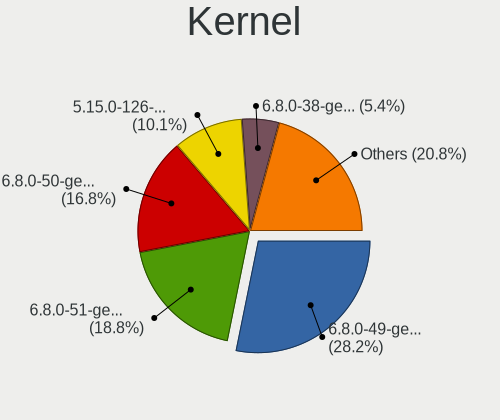
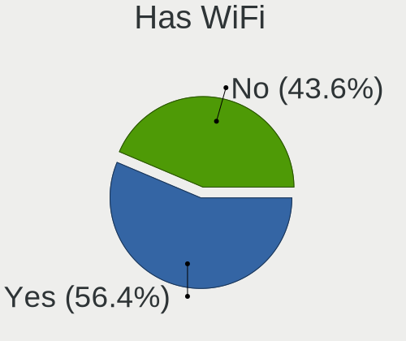
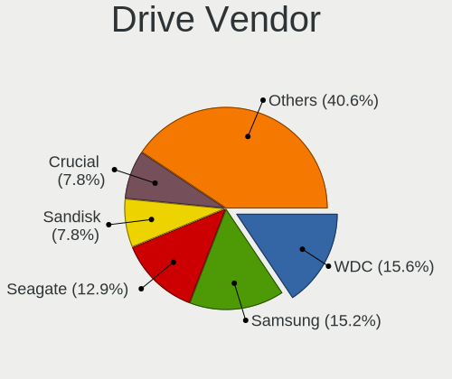
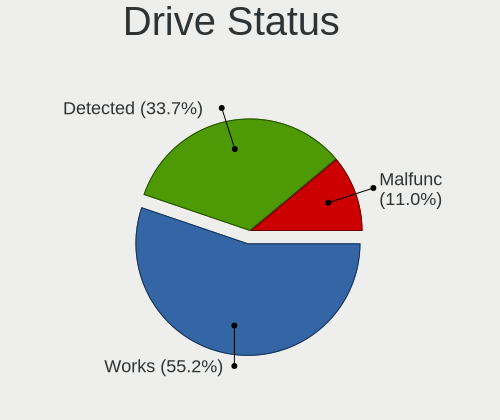
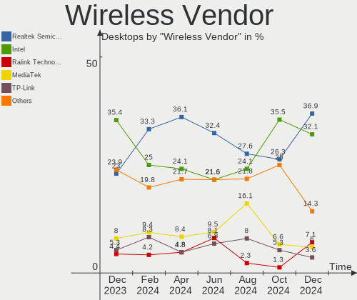
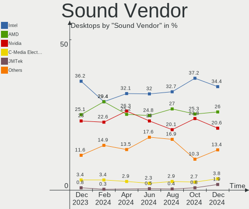
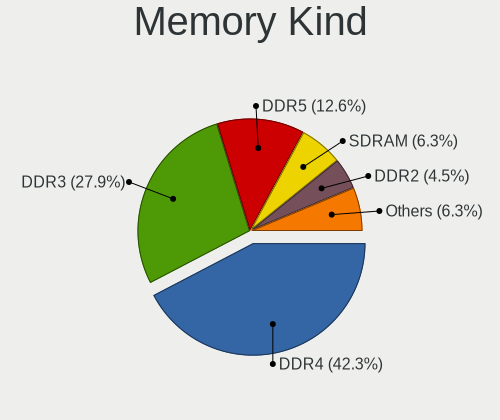

Linux Mint - Hardware Trends (Desktops)
---------------------------------------

A project to identify most popular hardware characteristics and track their change
over time based on data collected by Linux users at https://Linux-Hardware.org.

Anyone can contribute to this report by the [hw-probe](https://github.com/linuxhw/hw-probe) tool:

    sudo -E hw-probe -all -upload

This report is for one last month. Overall report since the beginning of time: [TestDays](https://github.com/linuxhw/TestDays)

Period: Apr, 2024.

Contents
--------

* [ System ](#system)
  - [ OS                       ](#os)
  - [ OS Family                ](#os-family)
  - [ Kernel                   ](#kernel)
  - [ Kernel Family            ](#kernel-family)
  - [ Kernel Major Ver.        ](#kernel-major-ver)
  - [ Arch                     ](#arch)
  - [ DE                       ](#de)
  - [ Display Server           ](#display-server)
  - [ Display Manager          ](#display-manager)
  - [ OS Lang                  ](#os-lang)
  - [ Boot Mode                ](#boot-mode)
  - [ Filesystem               ](#filesystem)
  - [ Part. scheme             ](#part-scheme)
  - [ Dual Boot with Linux/BSD ](#dual-boot-with-linuxbsd)
  - [ Dual Boot (Win)          ](#dual-boot-win)

* [ Board ](#board)
  - [ Vendor                   ](#vendor)
  - [ Model                    ](#model)
  - [ Model Family             ](#model-family)
  - [ MFG Year                 ](#mfg-year)
  - [ Form Factor              ](#form-factor)
  - [ Secure Boot              ](#secure-boot)
  - [ Coreboot                 ](#coreboot)
  - [ RAM Size                 ](#ram-size)
  - [ RAM Used                 ](#ram-used)
  - [ Total Drives             ](#total-drives)
  - [ Has CD-ROM               ](#has-cd-rom)
  - [ Has Ethernet             ](#has-ethernet)
  - [ Has WiFi                 ](#has-wifi)
  - [ Has Bluetooth            ](#has-bluetooth)

* [ Location ](#location)
  - [ Country                  ](#country)
  - [ City                     ](#city)

* [ Drives ](#drives)
  - [ Drive Vendor             ](#drive-vendor)
  - [ Drive Model              ](#drive-model)
  - [ HDD Vendor               ](#hdd-vendor)
  - [ SSD Vendor               ](#ssd-vendor)
  - [ Drive Kind               ](#drive-kind)
  - [ Drive Connector          ](#drive-connector)
  - [ Drive Size               ](#drive-size)
  - [ Space Total              ](#space-total)
  - [ Space Used               ](#space-used)
  - [ Malfunc. Drives          ](#malfunc-drives)
  - [ Malfunc. Drive Vendor    ](#malfunc-drive-vendor)
  - [ Malfunc. HDD Vendor      ](#malfunc-hdd-vendor)
  - [ Malfunc. Drive Kind      ](#malfunc-drive-kind)
  - [ Failed Drives            ](#failed-drives)
  - [ Failed Drive Vendor      ](#failed-drive-vendor)
  - [ Drive Status             ](#drive-status)

* [ Storage controller ](#storage-controller)
  - [ Storage Vendor           ](#storage-vendor)
  - [ Storage Model            ](#storage-model)
  - [ Storage Kind             ](#storage-kind)

* [ Processor ](#processor)
  - [ CPU Vendor               ](#cpu-vendor)
  - [ CPU Model                ](#cpu-model)
  - [ CPU Model Family         ](#cpu-model-family)
  - [ CPU Cores                ](#cpu-cores)
  - [ CPU Sockets              ](#cpu-sockets)
  - [ CPU Threads              ](#cpu-threads)
  - [ CPU Op-Modes             ](#cpu-op-modes)
  - [ CPU Microcode            ](#cpu-microcode)
  - [ CPU Microarch            ](#cpu-microarch)

* [ Graphics ](#graphics)
  - [ GPU Vendor               ](#gpu-vendor)
  - [ GPU Model                ](#gpu-model)
  - [ GPU Combo                ](#gpu-combo)
  - [ GPU Driver               ](#gpu-driver)
  - [ GPU Memory               ](#gpu-memory)

* [ Monitor ](#monitor)
  - [ Monitor Vendor           ](#monitor-vendor)
  - [ Monitor Model            ](#monitor-model)
  - [ Monitor Resolution       ](#monitor-resolution)
  - [ Monitor Diagonal         ](#monitor-diagonal)
  - [ Monitor Width            ](#monitor-width)
  - [ Aspect Ratio             ](#aspect-ratio)
  - [ Monitor Area             ](#monitor-area)
  - [ Pixel Density            ](#pixel-density)
  - [ Multiple Monitors        ](#multiple-monitors)

* [ Network ](#network)
  - [ Net Controller Vendor    ](#net-controller-vendor)
  - [ Net Controller Model     ](#net-controller-model)
  - [ Wireless Vendor          ](#wireless-vendor)
  - [ Wireless Model           ](#wireless-model)
  - [ Ethernet Vendor          ](#ethernet-vendor)
  - [ Ethernet Model           ](#ethernet-model)
  - [ Net Controller Kind      ](#net-controller-kind)
  - [ Used Controller          ](#used-controller)
  - [ NICs                     ](#nics)
  - [ IPv6                     ](#ipv6)

* [ Bluetooth ](#bluetooth)
  - [ Bluetooth Vendor         ](#bluetooth-vendor)
  - [ Bluetooth Model          ](#bluetooth-model)

* [ Sound ](#sound)
  - [ Sound Vendor             ](#sound-vendor)
  - [ Sound Model              ](#sound-model)

* [ Memory ](#memory)
  - [ Memory Vendor            ](#memory-vendor)
  - [ Memory Model             ](#memory-model)
  - [ Memory Kind              ](#memory-kind)
  - [ Memory Form Factor       ](#memory-form-factor)
  - [ Memory Size              ](#memory-size)
  - [ Memory Speed             ](#memory-speed)

* [ Printers & scanners ](#printers--scanners)
  - [ Printer Vendor           ](#printer-vendor)
  - [ Printer Model            ](#printer-model)
  - [ Scanner Vendor           ](#scanner-vendor)
  - [ Scanner Model            ](#scanner-model)

* [ Camera ](#camera)
  - [ Camera Vendor            ](#camera-vendor)
  - [ Camera Model             ](#camera-model)

* [ Security ](#security)
  - [ Fingerprint Vendor       ](#fingerprint-vendor)
  - [ Fingerprint Model        ](#fingerprint-model)
  - [ Chipcard Vendor          ](#chipcard-vendor)
  - [ Chipcard Model           ](#chipcard-model)

* [ Unsupported ](#unsupported)
  - [ Unsupported Devices      ](#unsupported-devices)
  - [ Unsupported Device Types ](#unsupported-device-types)

System
------

OS
--

Installed operating systems

| Name            | Desktops | Percent |
|-----------------|----------|---------|
| Linux Mint 21.3 | 105      | 69.54%  |
| Linux Mint 21.2 | 19       | 12.58%  |
| Linux Mint 20.3 | 12       | 7.95%   |
| Linux Mint 21.1 | 6        | 3.97%   |
| Linux Mint 21   | 3        | 1.99%   |
| Linux Mint 20   | 3        | 1.99%   |
| Linux Mint 20.2 | 1        | 0.66%   |
| Linux Mint 20.1 | 1        | 0.66%   |
| Linux Mint 19.3 | 1        | 0.66%   |

OS Family
---------

OS without a version

| Name       | Desktops | Percent |
|------------|----------|---------|
| Linux Mint | 151      | 100%    |

Kernel
------

Version of the Linux kernel

| Version               | Desktops | Percent |
|-----------------------|----------|---------|
| 5.15.0-102-generic    | 29       | 19.21%  |
| 5.15.0-105-generic    | 23       | 15.23%  |
| 5.15.0-101-generic    | 23       | 15.23%  |
| 6.5.0-26-generic      | 14       | 9.27%   |
| 6.5.0-28-generic      | 11       | 7.28%   |
| 6.5.0-27-generic      | 10       | 6.62%   |
| 5.15.0-91-generic     | 10       | 6.62%   |
| 5.4.0-177-generic     | 4        | 2.65%   |
| 5.4.0-176-generic     | 3        | 1.99%   |
| 5.15.0-76-generic     | 3        | 1.99%   |
| 5.4.0-91-generic      | 2        | 1.32%   |
| 5.4.0-174-generic     | 2        | 1.32%   |
| 5.15.0-100-generic    | 2        | 1.32%   |
| 6.8.4-060804-generic  | 1        | 0.66%   |
| 6.7.6-060706-generic  | 1        | 0.66%   |
| 6.7.1-060701-generic  | 1        | 0.66%   |
| 6.2.0-39-generic      | 1        | 0.66%   |
| 6.2.0-33-generic      | 1        | 0.66%   |
| 5.4.0-170-generic     | 1        | 0.66%   |
| 5.4.0-109-generic     | 1        | 0.66%   |
| 5.15.0-94-generic     | 1        | 0.66%   |
| 5.15.0-92-generic     | 1        | 0.66%   |
| 5.15.0-58-generic     | 1        | 0.66%   |
| 5.15.0-56-generic     | 1        | 0.66%   |
| 5.15.0-105-lowlatency | 1        | 0.66%   |
| 5.15.0-1025-nvidia    | 1        | 0.66%   |
| 5.0.0-23-generic      | 1        | 0.66%   |
| 4.15.0-213-generic    | 1        | 0.66%   |

Kernel Family
-------------

Linux kernel without a distro release

| Version | Desktops | Percent |
|---------|----------|---------|
| 5.15.0  | 96       | 63.58%  |
| 6.5.0   | 35       | 23.18%  |
| 5.4.0   | 13       | 8.61%   |
| 6.2.0   | 2        | 1.32%   |
| 6.8.4   | 1        | 0.66%   |
| 6.7.6   | 1        | 0.66%   |
| 6.7.1   | 1        | 0.66%   |
| 5.0.0   | 1        | 0.66%   |
| 4.15.0  | 1        | 0.66%   |

Kernel Major Ver.
-----------------

Linux kernel major version

| Version | Desktops | Percent |
|---------|----------|---------|
| 5.15    | 96       | 63.58%  |
| 6.5     | 35       | 23.18%  |
| 5.4     | 13       | 8.61%   |
| 6.7     | 2        | 1.32%   |
| 6.2     | 2        | 1.32%   |
| 6.8     | 1        | 0.66%   |
| 5.0     | 1        | 0.66%   |
| 4.15    | 1        | 0.66%   |

Arch
----

OS architecture (x86_64, i586, etc.)

| Name   | Desktops | Percent |
|--------|----------|---------|
| x86_64 | 151      | 100%    |

DE
--

Desktop Environment

| Name       | Desktops | Percent |
|------------|----------|---------|
| X-Cinnamon | 119      | 78.81%  |
| MATE       | 15       | 9.93%   |
| XFCE       | 10       | 6.62%   |
| GNOME      | 2        | 1.32%   |
| Cinnamon   | 2        | 1.32%   |
| i3         | 1        | 0.66%   |
| bspwm      | 1        | 0.66%   |
| Unknown    | 1        | 0.66%   |

Display Server
--------------

X11 or Wayland

| Name    | Desktops | Percent |
|---------|----------|---------|
| X11     | 149      | 98.68%  |
| Wayland | 2        | 1.32%   |

Display Manager
---------------

SDDM, LightDM, etc.

| Name    | Desktops | Percent |
|---------|----------|---------|
| LightDM | 97       | 64.24%  |
| Unknown | 53       | 35.1%   |
| GDM3    | 1        | 0.66%   |

OS Lang
-------

Language

| Lang    | Desktops | Percent |
|---------|----------|---------|
| en_US   | 40       | 26.49%  |
| it_IT   | 21       | 13.91%  |
| pt_BR   | 14       | 9.27%   |
| de_DE   | 13       | 8.61%   |
| en_GB   | 9        | 5.96%   |
| fr_FR   | 8        | 5.3%    |
| C       | 6        | 3.97%   |
| en_CA   | 5        | 3.31%   |
| ru_RU   | 4        | 2.65%   |
| es_ES   | 4        | 2.65%   |
| hu_HU   | 3        | 1.99%   |
| en_AU   | 3        | 1.99%   |
| de_AT   | 3        | 1.99%   |
| ja_JP   | 2        | 1.32%   |
| en_IE   | 2        | 1.32%   |
| de_CH   | 2        | 1.32%   |
| pl_PL   | 1        | 0.66%   |
| nl_NL   | 1        | 0.66%   |
| nl_BE   | 1        | 0.66%   |
| nb_NO   | 1        | 0.66%   |
| fi_FI   | 1        | 0.66%   |
| es_UY   | 1        | 0.66%   |
| es_US   | 1        | 0.66%   |
| es_CO   | 1        | 0.66%   |
| es_AR   | 1        | 0.66%   |
| cs_CZ   | 1        | 0.66%   |
| bg_BG   | 1        | 0.66%   |
| Unknown | 1        | 0.66%   |

Boot Mode
---------

EFI or BIOS

| Mode | Desktops | Percent |
|------|----------|---------|
| EFI  | 101      | 66.89%  |
| BIOS | 50       | 33.11%  |

Filesystem
----------

Type of filesystem

| Type    | Desktops | Percent |
|---------|----------|---------|
| Ext4    | 132      | 87.42%  |
| Tmpfs   | 7        | 4.64%   |
| Overlay | 5        | 3.31%   |
| Btrfs   | 3        | 1.99%   |
| Zfs     | 2        | 1.32%   |
| Xfs     | 2        | 1.32%   |

Part. scheme
------------

Scheme of partitioning

| Type    | Desktops | Percent |
|---------|----------|---------|
| GPT     | 87       | 57.62%  |
| Unknown | 51       | 33.77%  |
| MBR     | 13       | 8.61%   |

Dual Boot with Linux/BSD
------------------------

Hosting more than one Linux/BSD

| Dual boot | Desktops | Percent |
|-----------|----------|---------|
| No        | 125      | 82.78%  |
| Yes       | 26       | 17.22%  |

Dual Boot (Win)
---------------

Hosting Linux and Windows

| Dual boot | Desktops | Percent |
|-----------|----------|---------|
| No        | 94       | 62.25%  |
| Yes       | 57       | 37.75%  |

Board
-----

Vendor
------

Motherboard manufacturer

| Name                                 | Desktops | Percent |
|--------------------------------------|----------|---------|
| ASUSTek Computer                     | 36       | 23.84%  |
| Gigabyte Technology                  | 31       | 20.53%  |
| MSI                                  | 20       | 13.25%  |
| Dell                                 | 13       | 8.61%   |
| ASRock                               | 12       | 7.95%   |
| Hewlett-Packard                      | 9        | 5.96%   |
| Intel                                | 5        | 3.31%   |
| Shenzhen Meigao Electronic Equipment | 3        | 1.99%   |
| Lenovo                               | 2        | 1.32%   |
| GEEKOM                               | 2        | 1.32%   |
| Biostar                              | 2        | 1.32%   |
| Unknown                              | 2        | 1.32%   |
| Supermicro                           | 1        | 0.66%   |
| Positivo                             | 1        | 0.66%   |
| Packard Bell                         | 1        | 0.66%   |
| NCR                                  | 1        | 0.66%   |
| Medion                               | 1        | 0.66%   |
| MACHINIST                            | 1        | 0.66%   |
| Kraftway                             | 1        | 0.66%   |
| Hardkernel                           | 1        | 0.66%   |
| Fujitsu                              | 1        | 0.66%   |
| Foxconn                              | 1        | 0.66%   |
| BESSTAR Tech                         | 1        | 0.66%   |
| AZW                                  | 1        | 0.66%   |
| ANGXUN                               | 1        | 0.66%   |
| AMD                                  | 1        | 0.66%   |

Model
-----

Motherboard model

| Name                                              | Desktops | Percent |
|---------------------------------------------------|----------|---------|
| ASUS All Series                                   | 4        | 2.65%   |
| Shenzhen Meigao Electronic Equipment UM690        | 2        | 1.32%   |
| MSI MS-7C56                                       | 2        | 1.32%   |
| MSI MS-7817                                       | 2        | 1.32%   |
| Intel H61                                         | 2        | 1.32%   |
| Gigabyte B550 AORUS ELITE V2                      | 2        | 1.32%   |
| Gigabyte B450M GAMING                             | 2        | 1.32%   |
| GEEKOM Mini IT13                                  | 2        | 1.32%   |
| Unknown                                           | 2        | 1.32%   |
| Supermicro X9SPU-F                                | 1        | 0.66%   |
| Shenzhen Meigao Electronic Equipment Venus series | 1        | 0.66%   |
| Positivo POS-AG31AP                               | 1        | 0.66%   |
| Packard Bell IMEDIA S3210                         | 1        | 0.66%   |
| NCR IPMQ57                                        | 1        | 0.66%   |
| MSI MS-7E26                                       | 1        | 0.66%   |
| MSI MS-7D32                                       | 1        | 0.66%   |
| MSI MS-7D09                                       | 1        | 0.66%   |
| MSI MS-7C96                                       | 1        | 0.66%   |
| MSI MS-7C91                                       | 1        | 0.66%   |
| MSI MS-7C51                                       | 1        | 0.66%   |
| MSI MS-7C37                                       | 1        | 0.66%   |
| MSI MS-7C02                                       | 1        | 0.66%   |
| MSI MS-7B89                                       | 1        | 0.66%   |
| MSI MS-7B38                                       | 1        | 0.66%   |
| MSI MS-7977                                       | 1        | 0.66%   |
| MSI MS-7976                                       | 1        | 0.66%   |
| MSI MS-7850                                       | 1        | 0.66%   |
| MSI MS-7597                                       | 1        | 0.66%   |
| MSI MS-7586                                       | 1        | 0.66%   |
| MSI Mr.Whisper XII                                | 1        | 0.66%   |
| Medion MS-7616                                    | 1        | 0.66%   |
| MACHINIST H81M-PRO S1 V2.0                        | 1        | 0.66%   |
| Lenovo ThinkStation P700 30A8S12U00               | 1        | 0.66%   |
| Lenovo ThinkStation E32 30A0A0DCFR                | 1        | 0.66%   |
| Kraftway KWH77                                    | 1        | 0.66%   |
| Intel X99-P4 V5.1                                 | 1        | 0.66%   |
| Intel Jasper Lake Client Platform                 | 1        | 0.66%   |
| Intel H55                                         | 1        | 0.66%   |
| HP Z4 G4 Workstation                              | 1        | 0.66%   |
| HP Z2 Tower G4 Workstation                        | 1        | 0.66%   |

Model Family
------------

Motherboard model prefix

| Name                                       | Desktops | Percent |
|--------------------------------------------|----------|---------|
| ASUS PRIME                                 | 9        | 5.96%   |
| Dell OptiPlex                              | 7        | 4.64%   |
| Gigabyte B550                              | 4        | 2.65%   |
| ASUS ROG                                   | 4        | 2.65%   |
| ASUS All                                   | 4        | 2.65%   |
| Gigabyte B450M                             | 3        | 1.99%   |
| Gigabyte B450                              | 3        | 1.99%   |
| ASUS TUF                                   | 3        | 1.99%   |
| Shenzhen Meigao Electronic Equipment UM690 | 2        | 1.32%   |
| MSI MS-7C56                                | 2        | 1.32%   |
| MSI MS-7817                                | 2        | 1.32%   |
| Lenovo ThinkStation                        | 2        | 1.32%   |
| Intel H61                                  | 2        | 1.32%   |
| HP Compaq                                  | 2        | 1.32%   |
| Gigabyte B760M                             | 2        | 1.32%   |
| GEEKOM Mini                                | 2        | 1.32%   |
| Dell Precision                             | 2        | 1.32%   |
| Dell Inspiron                              | 2        | 1.32%   |
| ASUS P5GC-MX                               | 2        | 1.32%   |
| Unknown                                    | 2        | 1.32%   |
| Supermicro X9SPU-F                         | 1        | 0.66%   |
| Shenzhen Meigao Electronic Equipment Venus | 1        | 0.66%   |
| Positivo POS-AG31AP                        | 1        | 0.66%   |
| Packard Bell IMEDIA                        | 1        | 0.66%   |
| NCR IPMQ57                                 | 1        | 0.66%   |
| MSI MS-7E26                                | 1        | 0.66%   |
| MSI MS-7D32                                | 1        | 0.66%   |
| MSI MS-7D09                                | 1        | 0.66%   |
| MSI MS-7C96                                | 1        | 0.66%   |
| MSI MS-7C91                                | 1        | 0.66%   |
| MSI MS-7C51                                | 1        | 0.66%   |
| MSI MS-7C37                                | 1        | 0.66%   |
| MSI MS-7C02                                | 1        | 0.66%   |
| MSI MS-7B89                                | 1        | 0.66%   |
| MSI MS-7B38                                | 1        | 0.66%   |
| MSI MS-7977                                | 1        | 0.66%   |
| MSI MS-7976                                | 1        | 0.66%   |
| MSI MS-7850                                | 1        | 0.66%   |
| MSI MS-7597                                | 1        | 0.66%   |
| MSI MS-7586                                | 1        | 0.66%   |

MFG Year
--------

Motherboard manufacture year

| Year | Desktops | Percent |
|------|----------|---------|
| 2018 | 20       | 13.25%  |
| 2020 | 13       | 8.61%   |
| 2019 | 12       | 7.95%   |
| 2013 | 12       | 7.95%   |
| 2023 | 11       | 7.28%   |
| 2022 | 11       | 7.28%   |
| 2017 | 9        | 5.96%   |
| 2014 | 9        | 5.96%   |
| 2021 | 8        | 5.3%    |
| 2012 | 7        | 4.64%   |
| 2011 | 7        | 4.64%   |
| 2016 | 6        | 3.97%   |
| 2015 | 6        | 3.97%   |
| 2010 | 6        | 3.97%   |
| 2009 | 5        | 3.31%   |
| 2008 | 3        | 1.99%   |
| 2024 | 2        | 1.32%   |
| 2007 | 2        | 1.32%   |
| 2006 | 2        | 1.32%   |

Form Factor
-----------

Physical design of the computer

| Name    | Desktops | Percent |
|---------|----------|---------|
| Desktop | 151      | 100%    |

Secure Boot
-----------

Enabled or disabled

| State    | Desktops | Percent |
|----------|----------|---------|
| Disabled | 142      | 94.04%  |
| Enabled  | 9        | 5.96%   |

Coreboot
--------

Have coreboot on board

| Used | Desktops | Percent |
|------|----------|---------|
| No   | 151      | 100%    |

RAM Size
--------

Total RAM memory

| Size in GB  | Desktops | Percent |
|-------------|----------|---------|
| 32.01-64.0  | 39       | 25.83%  |
| 16.01-24.0  | 31       | 20.53%  |
| 8.01-16.0   | 29       | 19.21%  |
| 4.01-8.0    | 19       | 12.58%  |
| 3.01-4.0    | 14       | 9.27%   |
| 64.01-256.0 | 12       | 7.95%   |
| 24.01-32.0  | 3        | 1.99%   |
| 1.01-2.0    | 3        | 1.99%   |
| 2.01-3.0    | 1        | 0.66%   |

RAM Used
--------

Used RAM memory

| Used GB    | Desktops | Percent |
|------------|----------|---------|
| 2.01-3.0   | 43       | 28.48%  |
| 1.01-2.0   | 43       | 28.48%  |
| 3.01-4.0   | 27       | 17.88%  |
| 4.01-8.0   | 22       | 14.57%  |
| 8.01-16.0  | 9        | 5.96%   |
| 0.51-1.0   | 4        | 2.65%   |
| 32.01-64.0 | 1        | 0.66%   |
| 16.01-24.0 | 1        | 0.66%   |
| 0.01-0.5   | 1        | 0.66%   |

Total Drives
------------

Number of drives on board

| Drives | Desktops | Percent |
|--------|----------|---------|
| 2      | 48       | 31.79%  |
| 1      | 46       | 30.46%  |
| 3      | 25       | 16.56%  |
| 4      | 17       | 11.26%  |
| 6      | 5        | 3.31%   |
| 5      | 4        | 2.65%   |
| 8      | 2        | 1.32%   |
| 0      | 2        | 1.32%   |
| 10     | 1        | 0.66%   |
| 7      | 1        | 0.66%   |

Has CD-ROM
----------

Has CD-ROM on board

| Presented | Desktops | Percent |
|-----------|----------|---------|
| No        | 94       | 62.25%  |
| Yes       | 57       | 37.75%  |

Has Ethernet
------------

Has Ethernet on board

| Presented | Desktops | Percent |
|-----------|----------|---------|
| Yes       | 150      | 99.34%  |
| No        | 1        | 0.66%   |

Has WiFi
--------

Has WiFi module

| Presented | Desktops | Percent |
|-----------|----------|---------|
| Yes       | 79       | 52.32%  |
| No        | 72       | 47.68%  |

Has Bluetooth
-------------

Has Bluetooth module

| Presented | Desktops | Percent |
|-----------|----------|---------|
| No        | 93       | 61.59%  |
| Yes       | 58       | 38.41%  |

Location
--------

Country
-------

Geographic location (country)

| Country          | Desktops | Percent |
|------------------|----------|---------|
| USA              | 26       | 17.22%  |
| Italy            | 21       | 13.91%  |
| Brazil           | 17       | 11.26%  |
| Germany          | 15       | 9.93%   |
| UK               | 10       | 6.62%   |
| France           | 8        | 5.3%    |
| Russia           | 6        | 3.97%   |
| Canada           | 6        | 3.97%   |
| Austria          | 5        | 3.31%   |
| Australia        | 4        | 2.65%   |
| Spain            | 3        | 1.99%   |
| Hungary          | 3        | 1.99%   |
| Switzerland      | 2        | 1.32%   |
| Romania          | 2        | 1.32%   |
| Poland           | 2        | 1.32%   |
| Norway           | 2        | 1.32%   |
| Japan            | 2        | 1.32%   |
| Ireland          | 2        | 1.32%   |
| Czechia          | 2        | 1.32%   |
| Uruguay          | 1        | 0.66%   |
| Serbia           | 1        | 0.66%   |
| Panama           | 1        | 0.66%   |
| Netherlands      | 1        | 0.66%   |
| French Polynesia | 1        | 0.66%   |
| Finland          | 1        | 0.66%   |
| Denmark          | 1        | 0.66%   |
| Cuba             | 1        | 0.66%   |
| Croatia          | 1        | 0.66%   |
| Colombia         | 1        | 0.66%   |
| Bulgaria         | 1        | 0.66%   |
| Belgium          | 1        | 0.66%   |
| Argentina        | 1        | 0.66%   |

City
----

Geographic location (city)

| City             | Desktops | Percent |
|------------------|----------|---------|
| Sydney           | 4        | 2.65%   |
| Rome             | 4        | 2.65%   |
| Vienna           | 3        | 1.99%   |
| Sao Paulo        | 3        | 1.99%   |
| Milan            | 3        | 1.99%   |
| Stockton-on-Tees | 2        | 1.32%   |
| Rho              | 2        | 1.32%   |
| Orlando          | 2        | 1.32%   |
| Moscow           | 2        | 1.32%   |
| Monteux          | 2        | 1.32%   |
| Lahr             | 2        | 1.32%   |
| Kilkelly         | 2        | 1.32%   |
| Bucharest        | 2        | 1.32%   |
| Warsaw           | 1        | 0.66%   |
| Votorantim       | 1        | 0.66%   |
| Veszprém        | 1        | 0.66%   |
| Verolanuova      | 1        | 0.66%   |
| Vernon           | 1        | 0.66%   |
| Varaždin        | 1        | 0.66%   |
| Valencia         | 1        | 0.66%   |
| Turin            | 1        | 0.66%   |
| Troutdale        | 1        | 0.66%   |
| Toronto          | 1        | 0.66%   |
| Teresina         | 1        | 0.66%   |
| Tempe            | 1        | 0.66%   |
| Szombathely      | 1        | 0.66%   |
| Strasbourg       | 1        | 0.66%   |
| St Louis         | 1        | 0.66%   |
| Spoltore         | 1        | 0.66%   |
| Sofia            | 1        | 0.66%   |
| Santo André     | 1        | 0.66%   |
| Sangerhausen     | 1        | 0.66%   |
| Salt Lake City   | 1        | 0.66%   |
| Sakurai          | 1        | 0.66%   |
| Rotherham        | 1        | 0.66%   |
| Rio de Janeiro   | 1        | 0.66%   |
| Richville        | 1        | 0.66%   |
| Rennes           | 1        | 0.66%   |
| Regensburg       | 1        | 0.66%   |
| Radcliff         | 1        | 0.66%   |

Drives
------

Drive Vendor
------------

Hard drive vendors

| Vendor                       | Desktops | Drives | Percent |
|------------------------------|----------|--------|---------|
| WDC                          | 58       | 76     | 20%     |
| Seagate                      | 47       | 63     | 16.21%  |
| Samsung Electronics          | 41       | 60     | 14.14%  |
| Kingston                     | 18       | 20     | 6.21%   |
| Crucial                      | 16       | 23     | 5.52%   |
| Sandisk                      | 10       | 10     | 3.45%   |
| Toshiba                      | 9        | 9      | 3.1%    |
| Hitachi                      | 6        | 7      | 2.07%   |
| Unknown                      | 5        | 6      | 1.72%   |
| China                        | 5        | 7      | 1.72%   |
| Micron/Crucial Technology    | 4        | 5      | 1.38%   |
| Intel                        | 4        | 4      | 1.38%   |
| SPCC                         | 3        | 3      | 1.03%   |
| PNY                          | 3        | 4      | 1.03%   |
| Phison Electronics           | 3        | 3      | 1.03%   |
| Maxtor                       | 3        | 4      | 1.03%   |
| Lexar                        | 3        | 4      | 1.03%   |
| Intenso                      | 3        | 4      | 1.03%   |
| Fanxiang                     | 3        | 3      | 1.03%   |
| ADATA Technology             | 3        | 3      | 1.03%   |
| A-DATA Technology            | 3        | 3      | 1.03%   |
| SK hynix                     | 2        | 2      | 0.69%   |
| SABRENT                      | 2        | 2      | 0.69%   |
| MAXIO Technology (Hangzhou)  | 2        | 3      | 0.69%   |
| Kingston Technology Company  | 2        | 2      | 0.69%   |
| Unknown                      | 2        | 2      | 0.69%   |
| TwinMOS                      | 1        | 1      | 0.34%   |
| TSA                          | 1        | 1      | 0.34%   |
| Transcend                    | 1        | 2      | 0.34%   |
| T-FORCE                      | 1        | 1      | 0.34%   |
| SUNEAST                      | 1        | 1      | 0.34%   |
| SSK                          | 1        | 1      | 0.34%   |
| Silicon Motion               | 1        | 1      | 0.34%   |
| Shenzhen Longsys Electronics | 1        | 1      | 0.34%   |
| S3+                          | 1        | 1      | 0.34%   |
| Realtek Semiconductor        | 1        | 1      | 0.34%   |
| Pichau                       | 1        | 1      | 0.34%   |
| Phison                       | 1        | 1      | 0.34%   |
| Patriot                      | 1        | 1      | 0.34%   |
| OCZ                          | 1        | 1      | 0.34%   |

Drive Model
-----------

Hard drive models

| Model                            | Desktops | Percent |
|----------------------------------|----------|---------|
| Seagate ST2000DM008-2FR102 2TB   | 8        | 2.28%   |
| Seagate ST500DM002-1BD142 500GB  | 6        | 1.71%   |
| WDC WD10EZEX-08WN4A0 1TB         | 5        | 1.42%   |
| Samsung SSD 870 EVO 1TB          | 5        | 1.42%   |
| Kingston SA400S37240G 240GB SSD  | 5        | 1.42%   |
| Crucial CT1000MX500SSD1 1TB      | 5        | 1.42%   |
| Toshiba DT01ACA050 500GB         | 3        | 0.85%   |
| Seagate ST31000524AS 1TB         | 3        | 0.85%   |
| Seagate ST2000DM006-2DM164 2TB   | 3        | 0.85%   |
| Seagate ST1000DM003-1ER162 1TB   | 3        | 0.85%   |
| Samsung SSD 980 1TB              | 3        | 0.85%   |
| Samsung SSD 860 EVO 500GB        | 3        | 0.85%   |
| Samsung SSD 860 EVO 1TB          | 3        | 0.85%   |
| Kingston SA400S37480G 480GB SSD  | 3        | 0.85%   |
| Crucial CT1000BX500SSD1 1TB      | 3        | 0.85%   |
| WDC WDS500G2B0A-00SM50 500GB SSD | 2        | 0.57%   |
| WDC WDS100T3X0C-00SJG0 1TB       | 2        | 0.57%   |
| WDC WDS100T2B0C-00PXH0 1TB       | 2        | 0.57%   |
| WDC WDS100T2B0A-00SM50 1TB SSD   | 2        | 0.57%   |
| WDC WD30EZRX-00DC0B0 3TB         | 2        | 0.57%   |
| WDC WD20EFRX-68EUZN0 2TB         | 2        | 0.57%   |
| WDC WD10EZEX-22MFCA0 1TB         | 2        | 0.57%   |
| WDC WD10EZEX-00BN5A0 1TB         | 2        | 0.57%   |
| Toshiba DT01ACA100 1TB           | 2        | 0.57%   |
| SPCC Solid State Disk 512GB      | 2        | 0.57%   |
| Seagate ST4000DM004-2CV104 4TB   | 2        | 0.57%   |
| Seagate ST3500418AS 500GB        | 2        | 0.57%   |
| Seagate ST3500413AS 500GB        | 2        | 0.57%   |
| Seagate ST31000528AS 1TB         | 2        | 0.57%   |
| Seagate ST1000DM003-1SB102 1TB   | 2        | 0.57%   |
| Sandisk WD Blue SN570 500GB      | 2        | 0.57%   |
| Samsung SSD 980 PRO 2TB          | 2        | 0.57%   |
| Samsung SSD 980 PRO 1TB          | 2        | 0.57%   |
| Samsung SSD 970 EVO Plus 2TB     | 2        | 0.57%   |
| Samsung SSD 870 EVO 500GB        | 2        | 0.57%   |
| Samsung SSD 850 EVO 500GB        | 2        | 0.57%   |
| Samsung SSD 850 EVO 250GB        | 2        | 0.57%   |
| SABRENT Disk 1TB                 | 2        | 0.57%   |
| Phison E12 NVMe Controller 2TB   | 2        | 0.57%   |
| Crucial CT480BX500SSD1 480GB     | 2        | 0.57%   |

HDD Vendor
----------

Hard disk drive vendors

| Vendor              | Desktops | Drives | Percent |
|---------------------|----------|--------|---------|
| WDC                 | 49       | 62     | 41.88%  |
| Seagate             | 45       | 61     | 38.46%  |
| Toshiba             | 8        | 8      | 6.84%   |
| Hitachi             | 6        | 7      | 5.13%   |
| Samsung Electronics | 3        | 3      | 2.56%   |
| Maxtor              | 3        | 4      | 2.56%   |
| SABRENT             | 2        | 2      | 1.71%   |
| Unknown             | 1        | 1      | 0.85%   |

SSD Vendor
----------

Solid state drive vendors

| Vendor              | Desktops | Drives | Percent |
|---------------------|----------|--------|---------|
| Samsung Electronics | 21       | 26     | 19.44%  |
| Crucial             | 14       | 17     | 12.96%  |
| Kingston            | 13       | 13     | 12.04%  |
| WDC                 | 8        | 8      | 7.41%   |
| SanDisk             | 5        | 5      | 4.63%   |
| China               | 5        | 7      | 4.63%   |
| SPCC                | 3        | 3      | 2.78%   |
| PNY                 | 3        | 4      | 2.78%   |
| Intenso             | 3        | 4      | 2.78%   |
| A-DATA Technology   | 3        | 3      | 2.78%   |
| Intel               | 2        | 2      | 1.85%   |
| Fanxiang            | 2        | 2      | 1.85%   |
| TwinMOS             | 1        | 1      | 0.93%   |
| TSA                 | 1        | 1      | 0.93%   |
| Transcend           | 1        | 2      | 0.93%   |
| Toshiba             | 1        | 1      | 0.93%   |
| T-FORCE             | 1        | 1      | 0.93%   |
| SUNEAST             | 1        | 1      | 0.93%   |
| SK hynix            | 1        | 1      | 0.93%   |
| Seagate             | 1        | 1      | 0.93%   |
| S3+                 | 1        | 1      | 0.93%   |
| Pichau              | 1        | 1      | 0.93%   |
| Patriot             | 1        | 1      | 0.93%   |
| OCZ                 | 1        | 1      | 0.93%   |
| MSI                 | 1        | 1      | 0.93%   |
| Lexar               | 1        | 1      | 0.93%   |
| KW                  | 1        | 1      | 0.93%   |
| KingSpec            | 1        | 1      | 0.93%   |
| KingDian            | 1        | 1      | 0.93%   |
| Kimtigo             | 1        | 1      | 0.93%   |
| HUSKY               | 1        | 1      | 0.93%   |
| Gigastone           | 1        | 1      | 0.93%   |
| Gigabyte Technology | 1        | 1      | 0.93%   |
| EDILOCA             | 1        | 1      | 0.93%   |
| Corsair             | 1        | 2      | 0.93%   |
| BIWIN               | 1        | 1      | 0.93%   |
| Biostar             | 1        | 1      | 0.93%   |
| Unknown             | 1        | 1      | 0.93%   |

Drive Kind
----------

HDD or SSD

| Kind    | Desktops | Drives | Percent |
|---------|----------|--------|---------|
| HDD     | 96       | 148    | 38.1%   |
| SSD     | 88       | 122    | 34.92%  |
| NVMe    | 59       | 84     | 23.41%  |
| Unknown | 7        | 8      | 2.78%   |
| MMC     | 2        | 3      | 0.79%   |

Drive Connector
---------------

SATA, SAS, NVMe, etc.

| Type | Desktops | Drives | Percent |
|------|----------|--------|---------|
| SATA | 133      | 264    | 64.88%  |
| NVMe | 58       | 83     | 28.29%  |
| SAS  | 12       | 15     | 5.85%   |
| MMC  | 2        | 3      | 0.98%   |

Drive Size
----------

Size of hard drive

| Size in TB | Desktops | Drives | Percent |
|------------|----------|--------|---------|
| 0.01-0.5   | 88       | 117    | 44%     |
| 0.51-1.0   | 62       | 87     | 31%     |
| 1.01-2.0   | 31       | 38     | 15.5%   |
| 3.01-4.0   | 10       | 16     | 5%      |
| 4.01-10.0  | 4        | 5      | 2%      |
| 2.01-3.0   | 3        | 4      | 1.5%    |
| 10.01-20.0 | 2        | 3      | 1%      |

Space Total
-----------

Amount of disk space available on the file system

| Size in GB     | Desktops | Percent |
|----------------|----------|---------|
| 251-500        | 42       | 27.81%  |
| 501-1000       | 29       | 19.21%  |
| 101-250        | 26       | 17.22%  |
| More than 3000 | 19       | 12.58%  |
| 1001-2000      | 19       | 12.58%  |
| 2001-3000      | 5        | 3.31%   |
| 51-100         | 4        | 2.65%   |
| 1-20           | 3        | 1.99%   |
| Unknown        | 3        | 1.99%   |
| 21-50          | 1        | 0.66%   |

Space Used
----------

Amount of used disk space

| Used GB        | Desktops | Percent |
|----------------|----------|---------|
| 21-50          | 29       | 19.21%  |
| 101-250        | 25       | 16.56%  |
| 51-100         | 25       | 16.56%  |
| 1-20           | 20       | 13.25%  |
| 251-500        | 15       | 9.93%   |
| 1001-2000      | 13       | 8.61%   |
| More than 3000 | 10       | 6.62%   |
| 501-1000       | 10       | 6.62%   |
| Unknown        | 3        | 1.99%   |
| 2001-3000      | 1        | 0.66%   |

Malfunc. Drives
---------------

Drive models with a malfunction

| Model                               | Desktops | Drives | Percent |
|-------------------------------------|----------|--------|---------|
| Samsung Electronics SSD 980 1TB     | 2        | 2      | 7.69%   |
| WDC WD60EZRZ-00RWYB1 6TB            | 1        | 1      | 3.85%   |
| WDC WD5000LPLX-60ZNTT2 500GB        | 1        | 1      | 3.85%   |
| WDC WD3200BEKT-08PVMT1 320GB        | 1        | 1      | 3.85%   |
| WDC WD30EFRX-68EUZN0 3TB            | 1        | 1      | 3.85%   |
| WDC WD2003FYYS-05T9B0 2TB           | 1        | 1      | 3.85%   |
| WDC WD10JPVX-75JC3T0 1TB            | 1        | 1      | 3.85%   |
| WDC WD10EZEX-21WN4A0 1TB            | 1        | 1      | 3.85%   |
| WDC WD10EARS-00Y5B1 1TB             | 1        | 1      | 3.85%   |
| WDC WD1002FBYS-18W8B1 1TB           | 1        | 1      | 3.85%   |
| Seagate ST500LM021-1KJ152 500GB     | 1        | 1      | 3.85%   |
| Seagate ST500DM002-1BD142 500GB     | 1        | 1      | 3.85%   |
| Seagate ST380013AS 80GB             | 1        | 1      | 3.85%   |
| Seagate ST3500418AS 500GB           | 1        | 1      | 3.85%   |
| Seagate ST3500413AS 500GB           | 1        | 1      | 3.85%   |
| Seagate ST31000524AS 1TB            | 1        | 1      | 3.85%   |
| Seagate ST2000LX001-1RG174 2TB      | 1        | 1      | 3.85%   |
| Seagate ST1000LM048-2E7172 1TB      | 1        | 1      | 3.85%   |
| Seagate ST1000LM014-1EJ164-SSHD 1TB | 1        | 1      | 3.85%   |
| SanDisk SSD PLUS 480GB              | 1        | 1      | 3.85%   |
| Samsung Electronics HD753LJ 752GB   | 1        | 1      | 3.85%   |
| Maxtor STM3160215AS 160GB           | 1        | 1      | 3.85%   |
| Intel SSDSC2BF180A5L 180GB          | 1        | 1      | 3.85%   |
| Hitachi HDP725050GLA360 500GB       | 1        | 1      | 3.85%   |
| China SSD 1TB                       | 1        | 1      | 3.85%   |

Malfunc. Drive Vendor
---------------------

Vendors of faulty drives

| Vendor              | Desktops | Drives | Percent |
|---------------------|----------|--------|---------|
| WDC                 | 9        | 9      | 34.62%  |
| Seagate             | 9        | 9      | 34.62%  |
| Samsung Electronics | 3        | 3      | 11.54%  |
| SanDisk             | 1        | 1      | 3.85%   |
| Maxtor              | 1        | 1      | 3.85%   |
| Intel               | 1        | 1      | 3.85%   |
| Hitachi             | 1        | 1      | 3.85%   |
| China               | 1        | 1      | 3.85%   |

Malfunc. HDD Vendor
-------------------

Vendors of faulty HDD drives

| Vendor              | Desktops | Drives | Percent |
|---------------------|----------|--------|---------|
| WDC                 | 9        | 9      | 42.86%  |
| Seagate             | 9        | 9      | 42.86%  |
| Samsung Electronics | 1        | 1      | 4.76%   |
| Maxtor              | 1        | 1      | 4.76%   |
| Hitachi             | 1        | 1      | 4.76%   |

Malfunc. Drive Kind
-------------------

Kinds of faulty drives

| Kind | Desktops | Drives | Percent |
|------|----------|--------|---------|
| HDD  | 20       | 21     | 80%     |
| SSD  | 3        | 3      | 12%     |
| NVMe | 2        | 2      | 8%      |

Failed Drives
-------------

Failed drive models

Zero info for selected period =(

Failed Drive Vendor
-------------------

Failed drive vendors

Zero info for selected period =(

Drive Status
------------

Number of failed and malfunc. drives

| Status   | Desktops | Drives | Percent |
|----------|----------|--------|---------|
| Works    | 85       | 194    | 48.85%  |
| Detected | 65       | 145    | 37.36%  |
| Malfunc  | 24       | 26     | 13.79%  |

Storage controller
------------------

Storage Vendor
--------------

Storage controller vendors

| Vendor                       | Desktops | Percent |
|------------------------------|----------|---------|
| Intel                        | 91       | 39.57%  |
| AMD                          | 56       | 24.35%  |
| Samsung Electronics          | 21       | 9.13%   |
| SanDisk                      | 11       | 4.78%   |
| Micron/Crucial Technology    | 9        | 3.91%   |
| Kingston Technology Company  | 8        | 3.48%   |
| MAXIO Technology (Hangzhou)  | 6        | 2.61%   |
| ASMedia Technology           | 5        | 2.17%   |
| Phison Electronics           | 4        | 1.74%   |
| Nvidia                       | 3        | 1.3%    |
| ADATA Technology             | 3        | 1.3%    |
| Shenzhen Longsys Electronics | 2        | 0.87%   |
| Marvell Technology Group     | 2        | 0.87%   |
| JMicron Technology           | 2        | 0.87%   |
| VIA Technologies             | 1        | 0.43%   |
| Transcend                    | 1        | 0.43%   |
| SK hynix                     | 1        | 0.43%   |
| Silicon Motion               | 1        | 0.43%   |
| Realtek Semiconductor        | 1        | 0.43%   |
| Micron Technology            | 1        | 0.43%   |
| INNOGRIT                     | 1        | 0.43%   |

Storage Model
-------------

Storage controller models

| Model                                                                                   | Desktops | Percent |
|-----------------------------------------------------------------------------------------|----------|---------|
| AMD FCH SATA Controller [AHCI mode]                                                     | 26       | 9.22%   |
| Intel 8 Series/C220 Series Chipset Family 6-port SATA Controller 1 [AHCI mode]          | 14       | 4.96%   |
| AMD 400 Series Chipset SATA Controller                                                  | 12       | 4.26%   |
| AMD 500 Series Chipset SATA Controller                                                  | 11       | 3.9%    |
| Samsung NVMe SSD Controller SM981/PM981/PM983                                           | 9        | 3.19%   |
| AMD SB7x0/SB8x0/SB9x0 IDE Controller                                                    | 9        | 3.19%   |
| Intel SATA Controller [RAID Mode]                                                       | 8        | 2.84%   |
| Intel 6 Series/C200 Series Chipset Family 6 port Desktop SATA AHCI Controller           | 7        | 2.48%   |
| AMD SB7x0/SB8x0/SB9x0 SATA Controller [AHCI mode]                                       | 7        | 2.48%   |
| Intel NM10/ICH7 Family SATA Controller [IDE mode]                                       | 6        | 2.13%   |
| Intel Cannon Lake PCH SATA AHCI Controller                                              | 6        | 2.13%   |
| Intel 7 Series/C210 Series Chipset Family 6-port SATA Controller [AHCI mode]            | 6        | 2.13%   |
| Samsung NVMe SSD Controller PM9A1/PM9A3/980PRO                                          | 5        | 1.77%   |
| Intel Alder Lake-S PCH SATA Controller [AHCI Mode]                                      | 5        | 1.77%   |
| Intel 82801G (ICH7 Family) IDE Controller                                               | 5        | 1.77%   |
| Intel 6 Series/C200 Series Chipset Family Desktop SATA Controller (IDE mode, ports 4-5) | 5        | 1.77%   |
| Intel 6 Series/C200 Series Chipset Family Desktop SATA Controller (IDE mode, ports 0-3) | 5        | 1.77%   |
| ASMedia ASM1061/ASM1062 Serial ATA Controller                                           | 5        | 1.77%   |
| Samsung NVMe SSD Controller 980 (DRAM-less)                                             | 4        | 1.42%   |
| Micron/Crucial P5 Plus NVMe PCIe SSD                                                    | 4        | 1.42%   |
| MAXIO (Hangzhou) NVMe SSD Controller MAP1202 (DRAM-less)                                | 4        | 1.42%   |
| Intel C610/X99 series chipset 6-Port SATA Controller [AHCI mode]                        | 4        | 1.42%   |
| AMD SB7x0/SB8x0/SB9x0 SATA Controller [IDE mode]                                        | 4        | 1.42%   |
| AMD FCH SATA Controller D                                                               | 4        | 1.42%   |
| AMD 600 Series Chipset SATA Controller                                                  | 4        | 1.42%   |
| SanDisk Ultra 3D / WD Blue SN570 NVMe SSD (DRAM-less)                                   | 3        | 1.06%   |
| SanDisk Extreme Pro / WD Black SN750 / PC SN730 / Red SN700 NVMe SSD                    | 3        | 1.06%   |
| Samsung NVMe SSD Controller SM961/PM961/SM963                                           | 3        | 1.06%   |
| Samsung NVMe SSD Controller S4LV008[Pascal]                                             | 3        | 1.06%   |
| Phison E12 NVMe Controller                                                              | 3        | 1.06%   |
| Micron/Crucial P2 [Nick P2] / P3 / P3 Plus NVMe PCIe SSD (DRAM-less)                    | 3        | 1.06%   |
| Intel Raptor Lake SATA AHCI Controller                                                  | 3        | 1.06%   |
| Intel Alder Lake-P SATA AHCI Controller                                                 | 3        | 1.06%   |
| Intel 5 Series/3400 Series Chipset 6 port SATA AHCI Controller                          | 3        | 1.06%   |
| Intel 200 Series PCH SATA controller [AHCI mode]                                        | 3        | 1.06%   |
| SanDisk Ultra 3D / WD Blue SN550 NVMe SSD                                               | 2        | 0.71%   |
| Nvidia MCP78S [GeForce 8200] IDE                                                        | 2        | 0.71%   |
| Nvidia MCP78S [GeForce 8200] AHCI Controller                                            | 2        | 0.71%   |
| Micron/Crucial T500 NVMe PCIe SSD                                                       | 2        | 0.71%   |
| MAXIO (Hangzhou) NVMe SSD Controller MAP1602 (DRAM-less)                                | 2        | 0.71%   |

Storage Kind
------------

Kind of storage controller (IDE, SATA, NVMe, SAS, ...)

| Kind | Desktops | Percent |
|------|----------|---------|
| SATA | 125      | 56.31%  |
| NVMe | 57       | 25.68%  |
| IDE  | 29       | 13.06%  |
| RAID | 11       | 4.95%   |

Processor
---------

CPU Vendor
----------

Processor vendors

| Vendor | Desktops | Percent |
|--------|----------|---------|
| Intel  | 90       | 59.6%   |
| AMD    | 61       | 40.4%   |

CPU Model
---------

Processor models

| Model                                       | Desktops | Percent |
|---------------------------------------------|----------|---------|
| AMD Ryzen 7 5700G with Radeon Graphics      | 4        | 2.65%   |
| AMD Ryzen 7 3800X 8-Core Processor          | 4        | 2.65%   |
| AMD FX-6300 Six-Core Processor              | 4        | 2.65%   |
| Intel Core i7-3770 CPU @ 3.40GHz            | 3        | 1.99%   |
| AMD Ryzen 9 5900X 12-Core Processor         | 3        | 1.99%   |
| AMD Ryzen 5 5600G with Radeon Graphics      | 3        | 1.99%   |
| AMD Ryzen 5 2600 Six-Core Processor         | 3        | 1.99%   |
| Intel Core i9-9900K CPU @ 3.60GHz           | 2        | 1.32%   |
| Intel Core i7-7700 CPU @ 3.60GHz            | 2        | 1.32%   |
| Intel Core i7-6700K CPU @ 4.00GHz           | 2        | 1.32%   |
| Intel Core i5-9400 CPU @ 2.90GHz            | 2        | 1.32%   |
| Intel Core i5-8400 CPU @ 2.80GHz            | 2        | 1.32%   |
| Intel Core i5-6500 CPU @ 3.20GHz            | 2        | 1.32%   |
| Intel Core i5-4460 CPU @ 3.20GHz            | 2        | 1.32%   |
| Intel Core i5-3470 CPU @ 3.20GHz            | 2        | 1.32%   |
| Intel Core i3-4150 CPU @ 3.50GHz            | 2        | 1.32%   |
| Intel Core i3-3240 CPU @ 3.40GHz            | 2        | 1.32%   |
| Intel Core 2 Duo CPU E7500 @ 2.93GHz        | 2        | 1.32%   |
| Intel Celeron N5105 @ 2.00GHz               | 2        | 1.32%   |
| Intel 12th Gen Core i5-12400                | 2        | 1.32%   |
| AMD Ryzen 9 6900HX with Radeon Graphics     | 2        | 1.32%   |
| AMD Ryzen 7 5800X 8-Core Processor          | 2        | 1.32%   |
| AMD Ryzen 7 2700 Eight-Core Processor       | 2        | 1.32%   |
| AMD Ryzen 5 2400G with Radeon Vega Graphics | 2        | 1.32%   |
| Intel Xeon W-2255 CPU @ 3.70GHz             | 1        | 0.66%   |
| Intel Xeon CPU E5-2690 v3 @ 2.60GHz         | 1        | 0.66%   |
| Intel Xeon CPU E5-2687W v3 @ 3.10GHz        | 1        | 0.66%   |
| Intel Xeon CPU E5-2683 v3 @ 2.00GHz         | 1        | 0.66%   |
| Intel Xeon CPU E5-2678 v3 @ 2.50GHz         | 1        | 0.66%   |
| Intel Xeon CPU E31270 @ 3.40GHz             | 1        | 0.66%   |
| Intel Pentium Dual CPU E2180 @ 2.00GHz      | 1        | 0.66%   |
| Intel Pentium D CPU 2.80GHz                 | 1        | 0.66%   |
| Intel Pentium CPU G3260 @ 3.30GHz           | 1        | 0.66%   |
| Intel Pentium CPU G3220 @ 3.00GHz           | 1        | 0.66%   |
| Intel Pentium 4 CPU 3.00GHz                 | 1        | 0.66%   |
| Intel N95                                   | 1        | 0.66%   |
| Intel N100                                  | 1        | 0.66%   |
| Intel Core i9-14900KF                       | 1        | 0.66%   |
| Intel Core i9-10900KF CPU @ 3.70GHz         | 1        | 0.66%   |
| Intel Core i7-9700KF CPU @ 3.60GHz          | 1        | 0.66%   |

CPU Model Family
----------------

Processor model prefix

| Model              | Desktops | Percent |
|--------------------|----------|---------|
| Intel Core i5      | 21       | 13.91%  |
| Intel Core i7      | 20       | 13.25%  |
| AMD Ryzen 5        | 16       | 10.6%   |
| Other              | 13       | 8.61%   |
| AMD Ryzen 7        | 13       | 8.61%   |
| Intel Core i3      | 11       | 7.28%   |
| AMD Ryzen 9        | 9        | 5.96%   |
| AMD FX             | 7        | 4.64%   |
| Intel Xeon         | 6        | 3.97%   |
| Intel Celeron      | 5        | 3.31%   |
| Intel Core i9      | 4        | 2.65%   |
| Intel Core 2 Duo   | 4        | 2.65%   |
| AMD Athlon II X2   | 3        | 1.99%   |
| AMD A6             | 3        | 1.99%   |
| Intel Pentium      | 2        | 1.32%   |
| AMD Athlon II X4   | 2        | 1.32%   |
| AMD A10            | 2        | 1.32%   |
| Intel Pentium Dual | 1        | 0.66%   |
| Intel Pentium D    | 1        | 0.66%   |
| Intel Pentium 4    | 1        | 0.66%   |
| Intel Atom         | 1        | 0.66%   |
| AMD Ryzen 5 PRO    | 1        | 0.66%   |
| AMD Ryzen 3 PRO    | 1        | 0.66%   |
| AMD Ryzen 3        | 1        | 0.66%   |
| AMD Phenom II X4   | 1        | 0.66%   |
| AMD Phenom         | 1        | 0.66%   |
| AMD A8             | 1        | 0.66%   |

CPU Cores
---------

Number of processor cores

| Number | Desktops | Percent |
|--------|----------|---------|
| 4      | 47       | 31.13%  |
| 2      | 30       | 19.87%  |
| 6      | 24       | 15.89%  |
| 8      | 21       | 13.91%  |
| 12     | 9        | 5.96%   |
| 3      | 5        | 3.31%   |
| 14     | 3        | 1.99%   |
| 10     | 3        | 1.99%   |
| 1      | 3        | 1.99%   |
| 20     | 2        | 1.32%   |
| 16     | 2        | 1.32%   |
| 28     | 1        | 0.66%   |
| 24     | 1        | 0.66%   |

CPU Sockets
-----------

Number of sockets

| Number | Desktops | Percent |
|--------|----------|---------|
| 1      | 149      | 98.68%  |
| 2      | 2        | 1.32%   |

CPU Threads
-----------

Threads per core (Hyper-Threading)

| Number | Desktops | Percent |
|--------|----------|---------|
| 2      | 103      | 68.21%  |
| 1      | 48       | 31.79%  |

CPU Op-Modes
------------

CPU Operation Modes (32-bit, 64-bit)

| Op mode        | Desktops | Percent |
|----------------|----------|---------|
| 32-bit, 64-bit | 151      | 100%    |

CPU Microcode
-------------

Microcode number

| Number     | Desktops | Percent |
|------------|----------|---------|
| Unknown    | 27       | 17.88%  |
| 0x306c3    | 12       | 7.95%   |
| 0x206a7    | 8        | 5.3%    |
| 0x306a9    | 7        | 4.64%   |
| 0x0800820d | 6        | 3.97%   |
| 0x906ea    | 5        | 3.31%   |
| 0x06000852 | 5        | 3.31%   |
| 0x0a50000d | 4        | 2.65%   |
| 0x010000c8 | 4        | 2.65%   |
| 0xb0671    | 3        | 1.99%   |
| 0x90672    | 3        | 1.99%   |
| 0x506e3    | 3        | 1.99%   |
| 0x306f2    | 3        | 1.99%   |
| 0x1067a    | 3        | 1.99%   |
| 0x0a601206 | 3        | 1.99%   |
| 0x08701030 | 3        | 1.99%   |
| 0x06001119 | 3        | 1.99%   |
| 0xb06e0    | 2        | 1.32%   |
| 0xa0671    | 2        | 1.32%   |
| 0xa0655    | 2        | 1.32%   |
| 0x906ec    | 2        | 1.32%   |
| 0x906c0    | 2        | 1.32%   |
| 0x20655    | 2        | 1.32%   |
| 0x0a50000f | 2        | 1.32%   |
| 0x0a404102 | 2        | 1.32%   |
| 0x0a20120e | 2        | 1.32%   |
| 0x0a20120a | 2        | 1.32%   |
| 0x08701021 | 2        | 1.32%   |
| 0x08101016 | 2        | 1.32%   |
| 0x08001138 | 2        | 1.32%   |
| 0xf65      | 1        | 0.66%   |
| 0xf44      | 1        | 0.66%   |
| 0x906ed    | 1        | 0.66%   |
| 0x906e9    | 1        | 0.66%   |
| 0x90675    | 1        | 0.66%   |
| 0x6fd      | 1        | 0.66%   |
| 0x6fb      | 1        | 0.66%   |
| 0x406c4    | 1        | 0.66%   |
| 0x20652    | 1        | 0.66%   |
| 0x106e5    | 1        | 0.66%   |

CPU Microarch
-------------

Microarchitecture

| Name             | Desktops | Percent |
|------------------|----------|---------|
| Haswell          | 23       | 15.23%  |
| Zen 3            | 15       | 9.93%   |
| KabyLake         | 11       | 7.28%   |
| Unknown          | 11       | 7.28%   |
| SandyBridge      | 9        | 5.96%   |
| Piledriver       | 9        | 5.96%   |
| IvyBridge        | 9        | 5.96%   |
| Zen 2            | 8        | 5.3%    |
| Alderlake Hybrid | 8        | 5.3%    |
| Zen+             | 7        | 4.64%   |
| K10              | 7        | 4.64%   |
| Skylake          | 6        | 3.97%   |
| Zen              | 5        | 3.31%   |
| Westmere         | 3        | 1.99%   |
| Penryn           | 3        | 1.99%   |
| Tremont          | 2        | 1.32%   |
| Steamroller      | 2        | 1.32%   |
| NetBurst         | 2        | 1.32%   |
| Icelake          | 2        | 1.32%   |
| Core             | 2        | 1.32%   |
| CometLake        | 2        | 1.32%   |
| Silvermont       | 1        | 0.66%   |
| Nehalem          | 1        | 0.66%   |
| Goldmont         | 1        | 0.66%   |
| Excavator        | 1        | 0.66%   |
| Bulldozer        | 1        | 0.66%   |

Graphics
--------

GPU Vendor
----------

Vendors of graphics cards

| Vendor                     | Desktops | Percent |
|----------------------------|----------|---------|
| Nvidia                     | 73       | 44.24%  |
| Intel                      | 46       | 27.88%  |
| AMD                        | 45       | 27.27%  |
| Matrox Electronics Systems | 1        | 0.61%   |

GPU Model
---------

Graphics card models

| Model                                                                       | Desktops | Percent |
|-----------------------------------------------------------------------------|----------|---------|
| Nvidia GP108 [GeForce GT 1030]                                              | 7        | 4.17%   |
| Intel Xeon E3-1200 v3/4th Gen Core Processor Integrated Graphics Controller | 7        | 4.17%   |
| AMD Cezanne [Radeon Vega Series / Radeon Vega Mobile Series]                | 6        | 3.57%   |
| Nvidia GK208B [GeForce GT 710]                                              | 5        | 2.98%   |
| Nvidia GA106 [GeForce RTX 3060 Lite Hash Rate]                              | 5        | 2.98%   |
| AMD Ellesmere [Radeon RX 470/480/570/570X/580/580X/590]                     | 5        | 2.98%   |
| Intel Xeon E3-1200 v2/3rd Gen Core processor Graphics Controller            | 4        | 2.38%   |
| Intel 4th Generation Core Processor Family Integrated Graphics Controller   | 4        | 2.38%   |
| AMD Raphael                                                                 | 4        | 2.38%   |
| AMD Cedar [Radeon HD 5000/6000/7350/8350 Series]                            | 4        | 2.38%   |
| Nvidia GT215 [GeForce GT 240]                                               | 3        | 1.79%   |
| Nvidia GP106 [GeForce GTX 1060 6GB]                                         | 3        | 1.79%   |
| Nvidia GF119 [GeForce GT 610]                                               | 3        | 1.79%   |
| Nvidia GA102 [GeForce RTX 3080]                                             | 3        | 1.79%   |
| Intel IvyBridge GT2 [HD Graphics 4000]                                      | 3        | 1.79%   |
| Intel HD Graphics 530                                                       | 3        | 1.79%   |
| Intel CoffeeLake-S GT2 [UHD Graphics 630]                                   | 3        | 1.79%   |
| Intel 2nd Generation Core Processor Family Integrated Graphics Controller   | 3        | 1.79%   |
| AMD Navi 10 [Radeon RX 5600 OEM/5600 XT / 5700/5700 XT]                     | 3        | 1.79%   |
| Nvidia TU116 [GeForce GTX 1660 SUPER]                                       | 2        | 1.19%   |
| Nvidia GT218 [GeForce 210]                                                  | 2        | 1.19%   |
| Nvidia GP104 [GeForce GTX 1070 Ti]                                          | 2        | 1.19%   |
| Nvidia GF108 [GeForce GT 630]                                               | 2        | 1.19%   |
| Nvidia GA104 [GeForce RTX 3070 Ti]                                          | 2        | 1.19%   |
| Nvidia GA103 [GeForce RTX 3060 Ti]                                          | 2        | 1.19%   |
| Intel JasperLake [UHD Graphics]                                             | 2        | 1.19%   |
| Intel Core Processor Integrated Graphics Controller                         | 2        | 1.19%   |
| Intel Alder Lake-S GT1 [UHD Graphics 730]                                   | 2        | 1.19%   |
| Intel Alder Lake-N [UHD Graphics]                                           | 2        | 1.19%   |
| AMD Rembrandt [Radeon 680M]                                                 | 2        | 1.19%   |
| AMD Navi 23 [Radeon RX 6600/6600 XT/6600M]                                  | 2        | 1.19%   |
| AMD Lexa XT [Radeon PRO WX 2100]                                            | 2        | 1.19%   |
| Nvidia TU106 [GeForce RTX 2060 SUPER]                                       | 1        | 0.6%    |
| Nvidia NV34 [GeForce FX 5200]                                               | 1        | 0.6%    |
| Nvidia GT218 [GeForce 8400 GS Rev. 3]                                       | 1        | 0.6%    |
| Nvidia GT216 [GeForce GT 220]                                               | 1        | 0.6%    |
| Nvidia GT216 [GeForce 405]                                                  | 1        | 0.6%    |
| Nvidia GP106GL [Quadro P2000]                                               | 1        | 0.6%    |
| Nvidia GP104 [GeForce GTX 1070]                                             | 1        | 0.6%    |
| Nvidia GP102 [GeForce GTX 1080 Ti]                                          | 1        | 0.6%    |

GPU Combo
---------

Combinations of graphics cards

| Name           | Desktops | Percent |
|----------------|----------|---------|
| 1 x Nvidia     | 66       | 43.71%  |
| 1 x AMD        | 37       | 24.5%   |
| 1 x Intel      | 36       | 23.84%  |
| Intel + Nvidia | 3        | 1.99%   |
| AMD + Nvidia   | 3        | 1.99%   |
| 2 x AMD        | 2        | 1.32%   |
| Intel + AMD    | 2        | 1.32%   |
| 2 x Nvidia     | 1        | 0.66%   |
| 1 x Matrox     | 1        | 0.66%   |

GPU Driver
----------

Free vs proprietary

| Driver      | Desktops | Percent |
|-------------|----------|---------|
| Free        | 83       | 54.97%  |
| Proprietary | 61       | 40.4%   |
| Unknown     | 7        | 4.64%   |

GPU Memory
----------

Total video memory

| Size in GB | Desktops | Percent |
|------------|----------|---------|
| Unknown    | 41       | 27.15%  |
| 1.01-2.0   | 26       | 17.22%  |
| 0.51-1.0   | 25       | 16.56%  |
| 7.01-8.0   | 19       | 12.58%  |
| 8.01-16.0  | 12       | 7.95%   |
| 0.01-0.5   | 12       | 7.95%   |
| 5.01-6.0   | 7        | 4.64%   |
| 3.01-4.0   | 6        | 3.97%   |
| 16.01-24.0 | 2        | 1.32%   |
| 4.01-5.0   | 1        | 0.66%   |

Monitor
-------

Monitor Vendor
--------------

Monitor vendors

| Vendor               | Desktops | Percent |
|----------------------|----------|---------|
| Samsung Electronics  | 28       | 18.92%  |
| Goldstar             | 17       | 11.49%  |
| Acer                 | 14       | 9.46%   |
| Dell                 | 11       | 7.43%   |
| AOC                  | 11       | 7.43%   |
| Ancor Communications | 9        | 6.08%   |
| Philips              | 8        | 5.41%   |
| Hewlett-Packard      | 6        | 4.05%   |
| ViewSonic            | 4        | 2.7%    |
| Iiyama               | 3        | 2.03%   |
| HannStar             | 3        | 2.03%   |
| BenQ                 | 3        | 2.03%   |
| ASUSTek Computer     | 3        | 2.03%   |
| IOD                  | 2        | 1.35%   |
| Eizo                 | 2        | 1.35%   |
| Westinghouse         | 1        | 0.68%   |
| Unknown (AAA)        | 1        | 0.68%   |
| Toshiba              | 1        | 0.68%   |
| Sony                 | 1        | 0.68%   |
| SNC                  | 1        | 0.68%   |
| Sceptre Tech         | 1        | 0.68%   |
| Plain Tree Systems   | 1        | 0.68%   |
| PKB                  | 1        | 0.68%   |
| ONN                  | 1        | 0.68%   |
| Mi                   | 1        | 0.68%   |
| LG Electronics       | 1        | 0.68%   |
| Lenovo               | 1        | 0.68%   |
| JRY                  | 1        | 0.68%   |
| ITE                  | 1        | 0.68%   |
| Insignia             | 1        | 0.68%   |
| Hyundai ImageQuest   | 1        | 0.68%   |
| HKC                  | 1        | 0.68%   |
| Hitachi              | 1        | 0.68%   |
| Haier                | 1        | 0.68%   |
| Fujitsu Siemens      | 1        | 0.68%   |
| Denver               | 1        | 0.68%   |
| AUS                  | 1        | 0.68%   |
| Apple                | 1        | 0.68%   |
| Unknown              | 1        | 0.68%   |

Monitor Model
-------------

Monitor models

| Model                                                                 | Desktops | Percent |
|-----------------------------------------------------------------------|----------|---------|
| Dell U2518D DEL413A 2560x1440 553x311mm 25.0-inch                     | 3        | 1.95%   |
| AOC 27G2G3 AOC2702 1920x1080 598x336mm 27.0-inch                      | 3        | 1.95%   |
| Ancor Communications VE247 ACI2493 1920x1080 531x299mm 24.0-inch      | 3        | 1.95%   |
| AOC Q3279WG5B AOC3279 2560x1440 725x428mm 33.1-inch                   | 2        | 1.3%    |
| Acer SA240Y ACR057F 1920x1080 530x300mm 24.0-inch                     | 2        | 1.3%    |
| Westinghouse SK-26H590D WDE5040 1366x768 576x324mm 26.0-inch          | 1        | 0.65%   |
| ViewSonic VX2457 VSCB931 1920x1080 521x293mm 23.5-inch                | 1        | 0.65%   |
| ViewSonic VX2452 Series VSCDE2E 1920x1080 521x293mm 23.5-inch         | 1        | 0.65%   |
| ViewSonic VA2718-FHD VSCD839 1920x1080 598x336mm 27.0-inch            | 1        | 0.65%   |
| ViewSonic VA2248 SERIES VSC0E28 1920x1080 477x268mm 21.5-inch         | 1        | 0.65%   |
| Unknown (AAA) '' AAA1900 1440x900 400x270mm 19.0-inch                 | 1        | 0.65%   |
| Toshiba TV TSB0105 1920x1080 708x398mm 32.0-inch                      | 1        | 0.65%   |
| Sony TV SNYA401 1920x1080                                             | 1        | 0.65%   |
| SNC SKP_E5-24 SNC2360 1920x1080 521x293mm 23.5-inch                   | 1        | 0.65%   |
| Sceptre Tech Sceptre F24 SPT09AB 1920x1080 530x290mm 23.8-inch        | 1        | 0.65%   |
| Samsung Electronics U32R59x SAM0F96 3840x2160 697x392mm 31.5-inch     | 1        | 0.65%   |
| Samsung Electronics U28E590 SAM0C4D 3840x2160 607x345mm 27.5-inch     | 1        | 0.65%   |
| Samsung Electronics U28E570 SAM0D6F 3840x2160 607x345mm 27.5-inch     | 1        | 0.65%   |
| Samsung Electronics T24C300 SAM0A9B 1920x1080 530x300mm 24.0-inch     | 1        | 0.65%   |
| Samsung Electronics SyncMaster SAM0294 1440x900 408x225mm 18.3-inch   | 1        | 0.65%   |
| Samsung Electronics SyncMaster SAM01B7 1280x1024 340x270mm 17.1-inch  | 1        | 0.65%   |
| Samsung Electronics SyncMaster SAM0167 1280x1024 338x270mm 17.0-inch  | 1        | 0.65%   |
| Samsung Electronics S34J55x SAM0F72 3440x1440 797x333mm 34.0-inch     | 1        | 0.65%   |
| Samsung Electronics S24F350 SAM0D20 1920x1080 521x293mm 23.5-inch     | 1        | 0.65%   |
| Samsung Electronics S23C350 SAM0A36 1920x1080 510x287mm 23.0-inch     | 1        | 0.65%   |
| Samsung Electronics S22F350 SAM0D1B 1920x1080 480x270mm 21.7-inch     | 1        | 0.65%   |
| Samsung Electronics S22F350 SAM0D1A 1920x1080 477x268mm 21.5-inch     | 1        | 0.65%   |
| Samsung Electronics S22D300 SAM0B3E 1920x1080 477x268mm 21.5-inch     | 1        | 0.65%   |
| Samsung Electronics S20D300 SAM0BDB 1366x768 432x240mm 19.5-inch      | 1        | 0.65%   |
| Samsung Electronics S19C150 SAM0AE6 1366x768 410x230mm 18.5-inch      | 1        | 0.65%   |
| Samsung Electronics LU28R55 SAM1017 3840x2160 632x360mm 28.6-inch     | 1        | 0.65%   |
| Samsung Electronics LF24T35 SAM707D 1920x1080 528x297mm 23.9-inch     | 1        | 0.65%   |
| Samsung Electronics LCD Monitor SAM7129 3840x2160 950x540mm 43.0-inch | 1        | 0.65%   |
| Samsung Electronics LCD Monitor SAM0A7A 1920x1080 480x270mm 21.7-inch | 1        | 0.65%   |
| Samsung Electronics LCD Monitor SAM03D4 1360x768                      | 1        | 0.65%   |
| Samsung Electronics LCD Monitor SAM033A 1920x1080                     | 1        | 0.65%   |
| Samsung Electronics LC34G55T SAM711A 3440x1440 798x334mm 34.1-inch    | 1        | 0.65%   |
| Samsung Electronics LC24RG50 SAM0F90 1920x1080 532x304mm 24.1-inch    | 1        | 0.65%   |
| Samsung Electronics F24G3xTF SAM710A 1920x1080 527x296mm 23.8-inch    | 1        | 0.65%   |
| Samsung Electronics CF791 SAM0DC4 3440x1440 797x333mm 34.0-inch       | 1        | 0.65%   |

Monitor Resolution
------------------

Monitor screen resolution

| Resolution         | Desktops | Percent |
|--------------------|----------|---------|
| 1920x1080 (FHD)    | 58       | 39.73%  |
| 3840x2160 (4K)     | 20       | 13.7%   |
| 2560x1440 (QHD)    | 16       | 10.96%  |
| 1280x1024 (SXGA)   | 10       | 6.85%   |
| 3440x1440          | 8        | 5.48%   |
| 1680x1050 (WSXGA+) | 7        | 4.79%   |
| 1366x768 (WXGA)    | 7        | 4.79%   |
| 1440x900 (WXGA+)   | 5        | 3.42%   |
| 1920x1200 (WUXGA)  | 4        | 2.74%   |
| 2560x1080          | 3        | 2.05%   |
| 1024x768 (XGA)     | 3        | 2.05%   |
| 3840x1080          | 1        | 0.68%   |
| 2560x1600          | 1        | 0.68%   |
| 1600x900 (HD+)     | 1        | 0.68%   |
| 1360x768           | 1        | 0.68%   |
| 1280x720 (HD)      | 1        | 0.68%   |

Monitor Diagonal
----------------

Diagonal size in inches

| Inches  | Desktops | Percent |
|---------|----------|---------|
| 24      | 22       | 14.67%  |
| 27      | 18       | 12%     |
| 23      | 17       | 11.33%  |
| 21      | 14       | 9.33%   |
| 34      | 9        | 6%      |
| Unknown | 9        | 6%      |
| 18      | 8        | 5.33%   |
| 31      | 7        | 4.67%   |
| 19      | 6        | 4%      |
| 17      | 6        | 4%      |
| 22      | 5        | 3.33%   |
| 25      | 3        | 2%      |
| 20      | 3        | 2%      |
| 15      | 3        | 2%      |
| 84      | 2        | 1.33%   |
| 72      | 2        | 1.33%   |
| 49      | 2        | 1.33%   |
| 48      | 2        | 1.33%   |
| 40      | 2        | 1.33%   |
| 33      | 2        | 1.33%   |
| 26      | 2        | 1.33%   |
| 47      | 1        | 0.67%   |
| 43      | 1        | 0.67%   |
| 39      | 1        | 0.67%   |
| 32      | 1        | 0.67%   |
| 29      | 1        | 0.67%   |
| 28      | 1        | 0.67%   |

Monitor Width
-------------

Physical width

| Width in mm | Desktops | Percent |
|-------------|----------|---------|
| 501-600     | 56       | 38.36%  |
| 401-500     | 32       | 21.92%  |
| 601-700     | 13       | 8.9%    |
| 701-800     | 12       | 8.22%   |
| Unknown     | 9        | 6.16%   |
| 301-350     | 7        | 4.79%   |
| 1001-1500   | 5        | 3.42%   |
| 351-400     | 4        | 2.74%   |
| 1501-2000   | 4        | 2.74%   |
| 801-900     | 3        | 2.05%   |
| 901-1000    | 1        | 0.68%   |

Aspect Ratio
------------

Proportional relationship between the width and the height

| Ratio   | Desktops | Percent |
|---------|----------|---------|
| 16/9    | 94       | 66.67%  |
| 16/10   | 16       | 11.35%  |
| 5/4     | 9        | 6.38%   |
| 21/9    | 9        | 6.38%   |
| Unknown | 7        | 4.96%   |
| 4/3     | 3        | 2.13%   |
| 32/9    | 2        | 1.42%   |
| 3/2     | 1        | 0.71%   |

Monitor Area
------------

Area in inch²

| Area in inch² | Desktops | Percent |
|----------------|----------|---------|
| 201-250        | 46       | 31.51%  |
| 351-500        | 21       | 14.38%  |
| 301-350        | 18       | 12.33%  |
| 151-200        | 14       | 9.59%   |
| 141-150        | 12       | 8.22%   |
| 251-300        | 10       | 6.85%   |
| Unknown        | 9        | 6.16%   |
| 501-1000       | 7        | 4.79%   |
| More than 1000 | 6        | 4.11%   |
| 101-110        | 2        | 1.37%   |
| 111-120        | 1        | 0.68%   |

Pixel Density
-------------

Pixels per inch

| Density | Desktops | Percent |
|---------|----------|---------|
| 51-100  | 87       | 61.7%   |
| 101-120 | 33       | 23.4%   |
| Unknown | 9        | 6.38%   |
| 121-160 | 8        | 5.67%   |
| 1-50    | 4        | 2.84%   |

Multiple Monitors
-----------------

Total monitors connected

| Total | Desktops | Percent |
|-------|----------|---------|
| 1     | 123      | 81.46%  |
| 2     | 20       | 13.25%  |
| 0     | 7        | 4.64%   |
| 3     | 1        | 0.66%   |

Network
-------

Net Controller Vendor
---------------------

Controller vendors

| Vendor                          | Desktops | Percent |
|---------------------------------|----------|---------|
| Realtek Semiconductor           | 102      | 47.66%  |
| Intel                           | 57       | 26.64%  |
| Qualcomm Atheros                | 13       | 6.07%   |
| MediaTek                        | 8        | 3.74%   |
| TP-Link                         | 4        | 1.87%   |
| Ralink Technology               | 4        | 1.87%   |
| Broadcom                        | 4        | 1.87%   |
| Microsoft                       | 3        | 1.4%    |
| Nvidia                          | 2        | 0.93%   |
| Linksys                         | 2        | 0.93%   |
| Xiaomi                          | 1        | 0.47%   |
| Samsung Electronics             | 1        | 0.47%   |
| Qualcomm Atheros Communications | 1        | 0.47%   |
| Oculus VR                       | 1        | 0.47%   |
| NetGear                         | 1        | 0.47%   |
| Netchip Technology              | 1        | 0.47%   |
| IMC Networks                    | 1        | 0.47%   |
| ID BOX                          | 1        | 0.47%   |
| Google                          | 1        | 0.47%   |
| Fitbit                          | 1        | 0.47%   |
| Espressif                       | 1        | 0.47%   |
| DisplayLink                     | 1        | 0.47%   |
| D-Link                          | 1        | 0.47%   |
| Broadcom Limited                | 1        | 0.47%   |
| AVM                             | 1        | 0.47%   |

Net Controller Model
--------------------

Controller models

| Model                                                                  | Desktops | Percent |
|------------------------------------------------------------------------|----------|---------|
| Realtek RTL8111/8168/8211/8411 PCI Express Gigabit Ethernet Controller | 79       | 30.74%  |
| Intel Ethernet Controller I225-V                                       | 11       | 4.28%   |
| Realtek RTL8125 2.5GbE Controller                                      | 10       | 3.89%   |
| Realtek RTL88x2bu [AC1200 Techkey]                                     | 7        | 2.72%   |
| Intel Ethernet Connection I217-LM                                      | 6        | 2.33%   |
| Realtek RTL8821CE 802.11ac PCIe Wireless Network Adapter               | 5        | 1.95%   |
| Intel Wi-Fi 6E(802.11ax) AX210/AX1675* 2x2 [Typhoon Peak]              | 5        | 1.95%   |
| Intel Wi-Fi 6 AX200                                                    | 5        | 1.95%   |
| Intel I211 Gigabit Network Connection                                  | 5        | 1.95%   |
| Intel Ethernet Connection (7) I219-V                                   | 4        | 1.56%   |
| Realtek RTL810xE PCI Express Fast Ethernet controller                  | 3        | 1.17%   |
| MediaTek MT7922 802.11ax PCI Express Wireless Network Adapter          | 3        | 1.17%   |
| Intel I210 Gigabit Network Connection                                  | 3        | 1.17%   |
| Intel Ethernet Connection (2) I219-V                                   | 3        | 1.17%   |
| Intel Ethernet Connection (2) I219-LM                                  | 3        | 1.17%   |
| Intel Alder Lake-S PCH CNVi WiFi                                       | 3        | 1.17%   |
| Intel 82579V Gigabit Network Connection                                | 3        | 1.17%   |
| Realtek RTL8852BE PCIe 802.11ax Wireless Network Controller            | 2        | 0.78%   |
| Realtek RTL8821AE 802.11ac PCIe Wireless Network Adapter               | 2        | 0.78%   |
| Realtek RTL8812AU 802.11a/b/g/n/ac 2T2R DB WLAN Adapter                | 2        | 0.78%   |
| Realtek RTL8188EUS 802.11n Wireless Network Adapter                    | 2        | 0.78%   |
| Realtek RTL8188CUS 802.11n WLAN Adapter                                | 2        | 0.78%   |
| Realtek RTL-8100/8101L/8139 PCI Fast Ethernet Adapter                  | 2        | 0.78%   |
| Realtek 802.11ac NIC                                                   | 2        | 0.78%   |
| Ralink RT2870/RT3070 Wireless Adapter                                  | 2        | 0.78%   |
| Qualcomm Atheros Killer E2400 Gigabit Ethernet Controller              | 2        | 0.78%   |
| Qualcomm Atheros Attansic L2 Fast Ethernet                             | 2        | 0.78%   |
| Qualcomm Atheros AR8151 v2.0 Gigabit Ethernet                          | 2        | 0.78%   |
| Nvidia MCP77 Ethernet                                                  | 2        | 0.78%   |
| Microsoft XBOX ACC                                                     | 2        | 0.78%   |
| Microsoft Xbox 360 Wireless Adapter                                    | 2        | 0.78%   |
| MediaTek MT7921 802.11ax PCI Express Wireless Network Adapter          | 2        | 0.78%   |
| Intel Wireless 7265                                                    | 2        | 0.78%   |
| Intel Ethernet Controller I226-V                                       | 2        | 0.78%   |
| Intel Cannon Lake PCH CNVi WiFi                                        | 2        | 0.78%   |
| Intel 82579LM Gigabit Network Connection (Lewisville)                  | 2        | 0.78%   |
| Broadcom BCM4360 802.11ac Dual Band Wireless Network Adapter           | 2        | 0.78%   |
| Xiaomi Mi/Redmi series (RNDIS)                                         | 1        | 0.39%   |
| TP-Link TL-WN823N v2/v3 [Realtek RTL8192EU]                            | 1        | 0.39%   |
| TP-Link TL-WN822N Version 4 RTL8192EU                                  | 1        | 0.39%   |

Wireless Vendor
---------------

Wireless vendors

| Vendor                          | Desktops | Percent |
|---------------------------------|----------|---------|
| Realtek Semiconductor           | 30       | 36.14%  |
| Intel                           | 20       | 24.1%   |
| MediaTek                        | 7        | 8.43%   |
| TP-Link                         | 4        | 4.82%   |
| Ralink Technology               | 4        | 4.82%   |
| Qualcomm Atheros                | 4        | 4.82%   |
| Broadcom                        | 4        | 4.82%   |
| Microsoft                       | 3        | 3.61%   |
| Linksys                         | 2        | 2.41%   |
| Qualcomm Atheros Communications | 1        | 1.2%    |
| NetGear                         | 1        | 1.2%    |
| IMC Networks                    | 1        | 1.2%    |
| D-Link                          | 1        | 1.2%    |
| AVM                             | 1        | 1.2%    |

Wireless Model
--------------

Wireless models

| Model                                                                                         | Desktops | Percent |
|-----------------------------------------------------------------------------------------------|----------|---------|
| Realtek RTL88x2bu [AC1200 Techkey]                                                            | 7        | 8.14%   |
| Realtek RTL8821CE 802.11ac PCIe Wireless Network Adapter                                      | 5        | 5.81%   |
| Intel Wi-Fi 6E(802.11ax) AX210/AX1675* 2x2 [Typhoon Peak]                                     | 5        | 5.81%   |
| Intel Wi-Fi 6 AX200                                                                           | 5        | 5.81%   |
| MediaTek MT7922 802.11ax PCI Express Wireless Network Adapter                                 | 3        | 3.49%   |
| Intel Alder Lake-S PCH CNVi WiFi                                                              | 3        | 3.49%   |
| Realtek RTL8852BE PCIe 802.11ax Wireless Network Controller                                   | 2        | 2.33%   |
| Realtek RTL8821AE 802.11ac PCIe Wireless Network Adapter                                      | 2        | 2.33%   |
| Realtek RTL8812AU 802.11a/b/g/n/ac 2T2R DB WLAN Adapter                                       | 2        | 2.33%   |
| Realtek RTL8188EUS 802.11n Wireless Network Adapter                                           | 2        | 2.33%   |
| Realtek RTL8188CUS 802.11n WLAN Adapter                                                       | 2        | 2.33%   |
| Realtek 802.11ac NIC                                                                          | 2        | 2.33%   |
| Ralink RT2870/RT3070 Wireless Adapter                                                         | 2        | 2.33%   |
| Microsoft XBOX ACC                                                                            | 2        | 2.33%   |
| Microsoft Xbox 360 Wireless Adapter                                                           | 2        | 2.33%   |
| MediaTek MT7921 802.11ax PCI Express Wireless Network Adapter                                 | 2        | 2.33%   |
| Intel Wireless 7265                                                                           | 2        | 2.33%   |
| Intel Cannon Lake PCH CNVi WiFi                                                               | 2        | 2.33%   |
| Broadcom BCM4360 802.11ac Dual Band Wireless Network Adapter                                  | 2        | 2.33%   |
| TP-Link TL-WN823N v2/v3 [Realtek RTL8192EU]                                                   | 1        | 1.16%   |
| TP-Link TL-WN822N Version 4 RTL8192EU                                                         | 1        | 1.16%   |
| TP-Link Archer T4U ver.3                                                                      | 1        | 1.16%   |
| TP-Link AC600 wireless Realtek RTL8811AU [Archer T2U Nano]                                    | 1        | 1.16%   |
| Realtek RTL8852CE PCIe 802.11ax Wireless Network Controller                                   | 1        | 1.16%   |
| Realtek RTL8822BE 802.11a/b/g/n/ac WiFi adapter                                               | 1        | 1.16%   |
| Realtek RTL8192EU 802.11b/g/n WLAN Adapter                                                    | 1        | 1.16%   |
| Realtek RTL8192EE PCIe Wireless Network Adapter                                               | 1        | 1.16%   |
| Realtek RTL8192CU 802.11n WLAN Adapter                                                        | 1        | 1.16%   |
| Realtek RTL8191SU 802.11n WLAN Adapter                                                        | 1        | 1.16%   |
| Realtek RTL8188EE Wireless Network Adapter                                                    | 1        | 1.16%   |
| Realtek Realtek 8812AU/8821AU 802.11ac WLAN Adapter [USB Wireless Dual-Band Adapter 2.4/5Ghz] | 1        | 1.16%   |
| Ralink RT5372 Wireless Adapter                                                                | 1        | 1.16%   |
| Ralink MT7601U Wireless Adapter                                                               | 1        | 1.16%   |
| Qualcomm Atheros QCA9565 / AR9565 Wireless Network Adapter                                    | 1        | 1.16%   |
| Qualcomm Atheros AR9271 802.11n                                                               | 1        | 1.16%   |
| Qualcomm Atheros AR9485 Wireless Network Adapter                                              | 1        | 1.16%   |
| Qualcomm Atheros AR93xx Wireless Network Adapter                                              | 1        | 1.16%   |
| Qualcomm Atheros AR5416 Wireless Network Adapter [AR5008 802.11(a)bgn]                        | 1        | 1.16%   |
| NetGear WNA1100 Wireless-N 150 [Atheros AR9271]                                               | 1        | 1.16%   |
| MediaTek WiFi                                                                                 | 1        | 1.16%   |

Ethernet Vendor
---------------

Ethernet vendors

| Vendor                | Desktops | Percent |
|-----------------------|----------|---------|
| Realtek Semiconductor | 93       | 58.13%  |
| Intel                 | 50       | 31.25%  |
| Qualcomm Atheros      | 9        | 5.63%   |
| Nvidia                | 2        | 1.25%   |
| Xiaomi                | 1        | 0.63%   |
| Samsung Electronics   | 1        | 0.63%   |
| MediaTek              | 1        | 0.63%   |
| Google                | 1        | 0.63%   |
| DisplayLink           | 1        | 0.63%   |
| Broadcom Limited      | 1        | 0.63%   |

Ethernet Model
--------------

Ethernet models

| Model                                                                  | Desktops | Percent |
|------------------------------------------------------------------------|----------|---------|
| Realtek RTL8111/8168/8211/8411 PCI Express Gigabit Ethernet Controller | 79       | 47.59%  |
| Intel Ethernet Controller I225-V                                       | 11       | 6.63%   |
| Realtek RTL8125 2.5GbE Controller                                      | 10       | 6.02%   |
| Intel Ethernet Connection I217-LM                                      | 6        | 3.61%   |
| Intel I211 Gigabit Network Connection                                  | 5        | 3.01%   |
| Intel Ethernet Connection (7) I219-V                                   | 4        | 2.41%   |
| Realtek RTL810xE PCI Express Fast Ethernet controller                  | 3        | 1.81%   |
| Intel I210 Gigabit Network Connection                                  | 3        | 1.81%   |
| Intel Ethernet Connection (2) I219-V                                   | 3        | 1.81%   |
| Intel Ethernet Connection (2) I219-LM                                  | 3        | 1.81%   |
| Intel 82579V Gigabit Network Connection                                | 3        | 1.81%   |
| Realtek RTL-8100/8101L/8139 PCI Fast Ethernet Adapter                  | 2        | 1.2%    |
| Qualcomm Atheros Killer E2400 Gigabit Ethernet Controller              | 2        | 1.2%    |
| Qualcomm Atheros Attansic L2 Fast Ethernet                             | 2        | 1.2%    |
| Qualcomm Atheros AR8151 v2.0 Gigabit Ethernet                          | 2        | 1.2%    |
| Nvidia MCP77 Ethernet                                                  | 2        | 1.2%    |
| Intel Ethernet Controller I226-V                                       | 2        | 1.2%    |
| Intel 82579LM Gigabit Network Connection (Lewisville)                  | 2        | 1.2%    |
| Xiaomi Mi/Redmi series (RNDIS)                                         | 1        | 0.6%    |
| Samsung GT-I9070 (network tethering, USB debugging enabled)            | 1        | 0.6%    |
| Realtek RTL8153 Gigabit Ethernet Adapter                               | 1        | 0.6%    |
| Qualcomm Atheros Attansic L1 Gigabit Ethernet                          | 1        | 0.6%    |
| Qualcomm Atheros AR8152 v2.0 Fast Ethernet                             | 1        | 0.6%    |
| Qualcomm Atheros AR8121/AR8113/AR8114 Gigabit or Fast Ethernet         | 1        | 0.6%    |
| MediaTek RMX3085                                                       | 1        | 0.6%    |
| Intel NM10/ICH7 Family LAN Controller                                  | 1        | 0.6%    |
| Intel Ethernet Controller X710 for 10GbE SFP+                          | 1        | 0.6%    |
| Intel Ethernet Controller 10-Gigabit X540-AT2                          | 1        | 0.6%    |
| Intel Ethernet Connection (7) I219-LM                                  | 1        | 0.6%    |
| Intel Ethernet Connection (2) I218-V                                   | 1        | 0.6%    |
| Intel Ethernet Connection (2) I218-LM                                  | 1        | 0.6%    |
| Intel Ethernet Connection (17) I219-V                                  | 1        | 0.6%    |
| Intel Ethernet Connection (14) I219-V                                  | 1        | 0.6%    |
| Intel Ethernet Connection (11) I219-V                                  | 1        | 0.6%    |
| Intel 82578DM Gigabit Network Connection                               | 1        | 0.6%    |
| Intel 82574L Gigabit Network Connection                                | 1        | 0.6%    |
| Intel 82557/8/9/0/1 Ethernet Pro 100                                   | 1        | 0.6%    |
| Google Pixel 6                                                         | 1        | 0.6%    |
| DisplayLink Kensington SD3600 Dual Video Dock                          | 1        | 0.6%    |
| Broadcom Limited NetLink BCM57788 Gigabit Ethernet PCIe                | 1        | 0.6%    |

Net Controller Kind
-------------------

Ethernet, WiFi or modem

| Kind     | Desktops | Percent |
|----------|----------|---------|
| Ethernet | 150      | 64.38%  |
| WiFi     | 78       | 33.48%  |
| Modem    | 5        | 2.15%   |

Used Controller
---------------

Currently used network controller

| Kind     | Desktops | Percent |
|----------|----------|---------|
| Ethernet | 113      | 71.07%  |
| WiFi     | 46       | 28.93%  |

NICs
----

Total network controllers on board

| Total | Desktops | Percent |
|-------|----------|---------|
| 1     | 96       | 63.58%  |
| 2     | 51       | 33.77%  |
| 3     | 3        | 1.99%   |
| 4     | 1        | 0.66%   |

IPv6
----

IPv6 vs IPv4

| Used | Desktops | Percent |
|------|----------|---------|
| No   | 99       | 65.56%  |
| Yes  | 52       | 34.44%  |

Bluetooth
---------

Bluetooth Vendor
----------------

Controller vendors

| Vendor                          | Desktops | Percent |
|---------------------------------|----------|---------|
| Intel                           | 18       | 30.51%  |
| Cambridge Silicon Radio         | 10       | 16.95%  |
| ASUSTek Computer                | 7        | 11.86%  |
| Realtek Semiconductor           | 6        | 10.17%  |
| MediaTek                        | 5        | 8.47%   |
| IMC Networks                    | 3        | 5.08%   |
| TP-Link                         | 2        | 3.39%   |
| Broadcom                        | 2        | 3.39%   |
| Actions                         | 2        | 3.39%   |
| Unknown                         | 2        | 3.39%   |
| Qualcomm Atheros Communications | 1        | 1.69%   |
| Apple                           | 1        | 1.69%   |

Bluetooth Model
---------------

Controller models

| Model                                               | Desktops | Percent |
|-----------------------------------------------------|----------|---------|
| Cambridge Silicon Radio Bluetooth Dongle (HCI mode) | 10       | 16.95%  |
| Realtek Bluetooth Radio                             | 5        | 8.47%   |
| MediaTek Wireless_Device                            | 5        | 8.47%   |
| Intel Bluetooth wireless interface                  | 4        | 6.78%   |
| Intel AX210 Bluetooth                               | 4        | 6.78%   |
| Intel AX200 Bluetooth                               | 4        | 6.78%   |
| Intel AX201 Bluetooth                               | 3        | 5.08%   |
| ASUS Bluetooth Radio                                | 3        | 5.08%   |
| TP-Link UB500 Adapter                               | 2        | 3.39%   |
| Intel Bluetooth 9460/9560 Jefferson Peak (JfP)      | 2        | 3.39%   |
| IMC Networks Wireless_Device                        | 2        | 3.39%   |
| ASUS Broadcom BCM20702A0 Bluetooth                  | 2        | 3.39%   |
| Actions general adapter                             | 2        | 3.39%   |
| Unknown                                             | 2        | 3.39%   |
| Realtek  Bluetooth 4.2 Adapter                      | 1        | 1.69%   |
| Qualcomm Atheros AR9462 Bluetooth                   | 1        | 1.69%   |
| Intel AX211 Bluetooth                               | 1        | 1.69%   |
| IMC Networks Bluetooth Radio                        | 1        | 1.69%   |
| Broadcom BCM20702A0 Bluetooth 4.0                   | 1        | 1.69%   |
| Broadcom ANYCOM Blue USB-UHE 200/250                | 1        | 1.69%   |
| ASUS Bluetooth Adapter                              | 1        | 1.69%   |
| ASUS ASUS USB-BT500                                 | 1        | 1.69%   |
| Apple Bluetooth Host Controller                     | 1        | 1.69%   |

Sound
-----

Sound Vendor
------------

Sound card vendors

| Vendor                                       | Desktops | Percent |
|----------------------------------------------|----------|---------|
| Intel                                        | 88       | 32.12%  |
| Nvidia                                       | 72       | 26.28%  |
| AMD                                          | 69       | 25.18%  |
| C-Media Electronics                          | 8        | 2.92%   |
| Logitech                                     | 4        | 1.46%   |
| Creative Labs                                | 4        | 1.46%   |
| Razer USA                                    | 3        | 1.09%   |
| Texas Instruments                            | 2        | 0.73%   |
| Kingston Technology                          | 2        | 0.73%   |
| GN Netcom                                    | 2        | 0.73%   |
| Generalplus Technology                       | 2        | 0.73%   |
| Focusrite-Novation                           | 2        | 0.73%   |
| Zoran Co. Personal Media Division (Nogatech) | 1        | 0.36%   |
| VIA Technologies                             | 1        | 0.36%   |
| Trust                                        | 1        | 0.36%   |
| SteelSeries ApS                              | 1        | 0.36%   |
| SAVITECH                                     | 1        | 0.36%   |
| Realtek Semiconductor                        | 1        | 0.36%   |
| Nordic Semiconductor ASA                     | 1        | 0.36%   |
| Micro Star International                     | 1        | 0.36%   |
| Lenovo                                       | 1        | 0.36%   |
| FIFINE 683 Microphone                        | 1        | 0.36%   |
| Dell                                         | 1        | 0.36%   |
| DCMT Technology                              | 1        | 0.36%   |
| Creative Technology                          | 1        | 0.36%   |
| Corsair                                      | 1        | 0.36%   |
| AudioQuest                                   | 1        | 0.36%   |
| Unknown                                      | 1        | 0.36%   |

Sound Model
-----------

Sound card models

| Model                                                                      | Desktops | Percent |
|----------------------------------------------------------------------------|----------|---------|
| AMD Family 17h/19h HD Audio Controller                                     | 18       | 5.75%   |
| Intel 8 Series/C220 Series Chipset High Definition Audio Controller        | 16       | 5.11%   |
| AMD Starship/Matisse HD Audio Controller                                   | 15       | 4.79%   |
| Intel 6 Series/C200 Series Chipset Family High Definition Audio Controller | 12       | 3.83%   |
| AMD SBx00 Azalia (Intel HDA)                                               | 9        | 2.88%   |
| AMD Renoir Radeon High Definition Audio Controller                         | 8        | 2.56%   |
| Nvidia GP108 High Definition Audio Controller                              | 7        | 2.24%   |
| Intel Xeon E3-1200 v3/4th Gen Core Processor HD Audio Controller           | 7        | 2.24%   |
| Intel Cannon Lake PCH cAVS                                                 | 7        | 2.24%   |
| AMD Family 17h (Models 00h-0fh) HD Audio Controller                        | 7        | 2.24%   |
| Nvidia High Definition Audio Controller                                    | 6        | 1.92%   |
| Nvidia GK208 HDMI/DP Audio Controller                                      | 6        | 1.92%   |
| Nvidia Audio device                                                        | 6        | 1.92%   |
| Intel 200 Series PCH HD Audio                                              | 6        | 1.92%   |
| Nvidia GF108 High Definition Audio Controller                              | 5        | 1.6%    |
| Nvidia GA106 High Definition Audio Controller                              | 5        | 1.6%    |
| Nvidia GA104 High Definition Audio Controller                              | 5        | 1.6%    |
| Intel NM10/ICH7 Family High Definition Audio Controller                    | 5        | 1.6%    |
| Intel Alder Lake-S HD Audio Controller                                     | 5        | 1.6%    |
| Intel 7 Series/C216 Chipset Family High Definition Audio Controller        | 5        | 1.6%    |
| AMD Rembrandt Radeon High Definition Audio Controller                      | 5        | 1.6%    |
| AMD FCH Azalia Controller                                                  | 5        | 1.6%    |
| AMD Ellesmere HDMI Audio [Radeon RX 470/480 / 570/580/590]                 | 5        | 1.6%    |
| Nvidia GP106 High Definition Audio Controller                              | 4        | 1.28%   |
| Nvidia GF119 HDMI Audio Controller                                         | 4        | 1.28%   |
| Nvidia GA102 High Definition Audio Controller                              | 4        | 1.28%   |
| Intel C610/X99 series chipset HD Audio Controller                          | 4        | 1.28%   |
| Intel 5 Series/3400 Series Chipset High Definition Audio                   | 4        | 1.28%   |
| Intel 100 Series/C230 Series Chipset Family HD Audio Controller            | 4        | 1.28%   |
| AMD Cedar HDMI Audio [Radeon HD 5400/6300/7300 Series]                     | 4        | 1.28%   |
| Nvidia GP104 High Definition Audio Controller                              | 3        | 0.96%   |
| Intel Raptor Lake High Definition Audio Controller                         | 3        | 0.96%   |
| AMD Navi 10 HDMI Audio                                                     | 3        | 0.96%   |
| Texas Instruments PCM2902 Audio Codec                                      | 2        | 0.64%   |
| Nvidia TU116 High Definition Audio Controller                              | 2        | 0.64%   |
| Nvidia MCP72XE/MCP72P/MCP78U/MCP78S High Definition Audio                  | 2        | 0.64%   |
| Nvidia GT216 HDMI Audio Controller                                         | 2        | 0.64%   |
| Nvidia GM107 High Definition Audio Controller [GeForce 940MX]              | 2        | 0.64%   |
| Nvidia GK107 HDMI Audio Controller                                         | 2        | 0.64%   |
| Intel Tiger Lake-H HD Audio Controller                                     | 2        | 0.64%   |

Memory
------

Memory Vendor
-------------

Memory module vendors

| Vendor              | Desktops | Percent |
|---------------------|----------|---------|
| Corsair             | 18       | 16.22%  |
| Unknown             | 14       | 12.61%  |
| Kingston            | 13       | 11.71%  |
| SK hynix            | 10       | 9.01%   |
| Samsung Electronics | 10       | 9.01%   |
| G.Skill             | 8        | 7.21%   |
| Unknown             | 6        | 5.41%   |
| Team                | 5        | 4.5%    |
| Crucial             | 5        | 4.5%    |
| Micron Technology   | 4        | 3.6%    |
| A-DATA Technology   | 3        | 2.7%    |
| Unknown (0x0B45)    | 2        | 1.8%    |
| Patriot             | 2        | 1.8%    |
| Lexar Co Limited    | 2        | 1.8%    |
| Unknown (ABCD)      | 1        | 0.9%    |
| Unknown (AB)        | 1        | 0.9%    |
| Unifosa             | 1        | 0.9%    |
| Silicon Power       | 1        | 0.9%    |
| Multilaser          | 1        | 0.9%    |
| Kllisre             | 1        | 0.9%    |
| GeIL                | 1        | 0.9%    |
| Exceleram           | 1        | 0.9%    |
| Apacer              | 1        | 0.9%    |

Memory Model
------------

Memory module models

| Model                                                            | Desktops | Percent |
|------------------------------------------------------------------|----------|---------|
| Unknown                                                          | 6        | 5.08%   |
| Corsair RAM CMK32GX4M2B3200C16 16GB DIMM DDR4 3800MT/s           | 3        | 2.54%   |
| Unknown RAM Module 4GB DIMM DDR3 1600MT/s                        | 2        | 1.69%   |
| Unknown RAM Module 4GB DIMM 1333MT/s                             | 2        | 1.69%   |
| Unknown RAM Module 2GB DIMM DDR2 333MT/s                         | 2        | 1.69%   |
| Unknown RAM Module 2GB DIMM 1333MT/s                             | 2        | 1.69%   |
| Unknown (0x0B45) RAM WPBH32D408SWM-16G 16GB SODIMM DDR4 3200MT/s | 2        | 1.69%   |
| Team RAM TEAMGROUP-UD4-3200 16GB DIMM DDR4 3733MT/s              | 2        | 1.69%   |
| SK hynix RAM HMT351U6EFR8C-PB 4GB DIMM DDR3 1600MT/s             | 2        | 1.69%   |
| Kingston RAM KHX2666C16/8G 8GB DIMM DDR4 3466MT/s                | 2        | 1.69%   |
| G.Skill RAM F4-3200C16-16GIS 16GB DIMM DDR4 3600MT/s             | 2        | 1.69%   |
| Corsair RAM CMK32GX4M2D3600C18 16GB DIMM DDR4 3800MT/s           | 2        | 1.69%   |
| A-DATA RAM DDR4 3200 8GB DIMM DDR4 3600MT/s                      | 2        | 1.69%   |
| Unknown RAM Module 8GB DIMM SDRAM 1333MT/s                       | 1        | 0.85%   |
| Unknown RAM Module 8192MB DIMM 1333MT/s                          | 1        | 0.85%   |
| Unknown RAM Module 4GB SODIMM DDR3 1333MT/s                      | 1        | 0.85%   |
| Unknown RAM Module 2GB DIMM SDRAM                                | 1        | 0.85%   |
| Unknown RAM Module 2GB DIMM DDR2 800MT/s                         | 1        | 0.85%   |
| Unknown RAM Module 2GB DIMM DDR 800MT/s                          | 1        | 0.85%   |
| Unknown RAM Module 2048MB DIMM DDR 800MT/s                       | 1        | 0.85%   |
| Unknown RAM Module 2048MB DIMM 1333MT/s                          | 1        | 0.85%   |
| Unknown RAM Module 1024MB DIMM DDR2 333MT/s                      | 1        | 0.85%   |
| Unknown RAM 3600 C17 Series 8GB DIMM DDR4 3200MT/s               | 1        | 0.85%   |
| Unknown (ABCD) RAM 123456789012345678 4GB DIMM DDR4 2400MT/s     | 1        | 0.85%   |
| Unknown (AB) RAM Module 2GB DIMM LPDDR3 1333MT/s                 | 1        | 0.85%   |
| Unifosa RAM GU342G0ALEPR692C6 2GB DIMM DDR2 2048MT/s             | 1        | 0.85%   |
| Team RAM TEAMGROUP-UD4-3200 8GB DIMM DDR4 3800MT/s               | 1        | 0.85%   |
| Team RAM TEAMGROUP-UD4-2666 8GB DIMM DDR4 3200MT/s               | 1        | 0.85%   |
| Team RAM Elite-1600 8GB DIMM DDR3 1600MT/s                       | 1        | 0.85%   |
| SK hynix RAM Module 16GB SODIMM DDR4 2667MT/s                    | 1        | 0.85%   |
| SK hynix RAM HMT451U7BFR8A-PB 4GB DIMM DDR3 1600MT/s             | 1        | 0.85%   |
| SK hynix RAM HMT451U6AFR8A-PB 4GB DIMM DDR3 1333MT/s             | 1        | 0.85%   |
| SK hynix RAM HMT451S6BFR8A-PB 4GB SODIMM DDR3 1600MT/s           | 1        | 0.85%   |
| SK hynix RAM HMT41GU6MFR8C-PB 8GB DIMM DDR3 1600MT/s             | 1        | 0.85%   |
| SK hynix RAM HMT351U6CFR8C-PB 4GB DIMM DDR3 1800MT/s             | 1        | 0.85%   |
| SK hynix RAM HMT125U6AFP8C-H9 2GB DIMM DDR3 1333MT/s             | 1        | 0.85%   |
| SK hynix RAM HMA41GU6AFR8N-TF 8GB DIMM DDR4 2465MT/s             | 1        | 0.85%   |
| Silicon Power RAM DBLT2GNC88S 2GB DIMM DDR3 1333MT/s             | 1        | 0.85%   |
| Samsung RAM Module 16GB DIMM DDR4 2667MT/s                       | 1        | 0.85%   |
| Samsung RAM M471B1G73QH0-YK0 8GB SODIMM DDR3 1600MT/s            | 1        | 0.85%   |

Memory Kind
-----------

Memory module kinds

| Kind    | Desktops | Percent |
|---------|----------|---------|
| DDR4    | 49       | 50.52%  |
| DDR3    | 26       | 26.8%   |
| DDR5    | 7        | 7.22%   |
| DDR2    | 5        | 5.15%   |
| Unknown | 3        | 3.09%   |
| SDRAM   | 2        | 2.06%   |
| DDR     | 2        | 2.06%   |
| LPDDR4  | 1        | 1.03%   |
| LPDDR3  | 1        | 1.03%   |
| DRAM    | 1        | 1.03%   |

Memory Form Factor
------------------

Physical design of the memory module

| Name   | Desktops | Percent |
|--------|----------|---------|
| DIMM   | 85       | 88.54%  |
| SODIMM | 11       | 11.46%  |

Memory Size
-----------

Memory module size

| Size  | Desktops | Percent |
|-------|----------|---------|
| 16384 | 32       | 30.48%  |
| 8192  | 28       | 26.67%  |
| 4096  | 19       | 18.1%   |
| 32768 | 12       | 11.43%  |
| 2048  | 12       | 11.43%  |
| 1024  | 1        | 0.95%   |
| 512   | 1        | 0.95%   |

Memory Speed
------------

Memory module speed

| Speed   | Desktops | Percent |
|---------|----------|---------|
| 3200    | 15       | 14.02%  |
| 1600    | 15       | 14.02%  |
| 1333    | 10       | 9.35%   |
| 3800    | 9        | 8.41%   |
| 3600    | 8        | 7.48%   |
| 2667    | 6        | 5.61%   |
| 2400    | 5        | 4.67%   |
| 1800    | 4        | 3.74%   |
| 6400    | 3        | 2.8%    |
| 3733    | 3        | 2.8%    |
| 3466    | 3        | 2.8%    |
| 2666    | 3        | 2.8%    |
| 333     | 3        | 2.8%    |
| 1867    | 2        | 1.87%   |
| 800     | 2        | 1.87%   |
| 6000    | 1        | 0.93%   |
| 5808    | 1        | 0.93%   |
| 5200    | 1        | 0.93%   |
| 4800    | 1        | 0.93%   |
| 4333    | 1        | 0.93%   |
| 3534    | 1        | 0.93%   |
| 3000    | 1        | 0.93%   |
| 2933    | 1        | 0.93%   |
| 2465    | 1        | 0.93%   |
| 2133    | 1        | 0.93%   |
| 2048    | 1        | 0.93%   |
| 2000    | 1        | 0.93%   |
| 1866    | 1        | 0.93%   |
| 1067    | 1        | 0.93%   |
| 533     | 1        | 0.93%   |
| Unknown | 1        | 0.93%   |

Printers & scanners
-------------------

Printer Vendor
--------------

Printer device vendors

| Vendor              | Desktops | Percent |
|---------------------|----------|---------|
| Seiko Epson         | 3        | 33.33%  |
| Samsung Electronics | 2        | 22.22%  |
| Brother Industries  | 2        | 22.22%  |
| Hewlett-Packard     | 1        | 11.11%  |
| Canon               | 1        | 11.11%  |

Printer Model
-------------

Printer device models

| Model                                                  | Desktops | Percent |
|--------------------------------------------------------|----------|---------|
| Seiko Epson XP-2100 Series                             | 1        | 11.11%  |
| Seiko Epson ME Office 600F/Stylus Office BX300F/TX300F | 1        | 11.11%  |
| Seiko Epson ET-2710 Series                             | 1        | 11.11%  |
| Samsung ML-2010P Mono Laser Printer                    | 1        | 11.11%  |
| Samsung M2070 Series                                   | 1        | 11.11%  |
| HP Deskjet 2540 series                                 | 1        | 11.11%  |
| Canon TS3300 series                                    | 1        | 11.11%  |
| Brother HL-1210W series                                | 1        | 11.11%  |
| Brother DCP-9020CDW                                    | 1        | 11.11%  |

Scanner Vendor
--------------

Scanner device vendors

| Vendor      | Desktops | Percent |
|-------------|----------|---------|
| Seiko Epson | 2        | 66.67%  |
| Canon       | 1        | 33.33%  |

Scanner Model
-------------

Scanner device models

| Model                                         | Desktops | Percent |
|-----------------------------------------------|----------|---------|
| Seiko Epson GT-X820 [Perfection V600 Photo]   | 1        | 33.33%  |
| Seiko Epson GT-9300UF [Perfection 2400 PHOTO] | 1        | 33.33%  |
| Canon CanoScan LiDE 210                       | 1        | 33.33%  |

Camera
------

Camera Vendor
-------------

Camera device vendors

| Vendor                        | Desktops | Percent |
|-------------------------------|----------|---------|
| Logitech                      | 10       | 27.78%  |
| Sunplus Innovation Technology | 5        | 13.89%  |
| Microsoft                     | 4        | 11.11%  |
| Microdia                      | 3        | 8.33%   |
| Samsung Electronics           | 2        | 5.56%   |
| Generalplus Technology        | 2        | 5.56%   |
| Chicony Electronics           | 2        | 5.56%   |
| MacroSilicon                  | 1        | 2.78%   |
| Linux Foundation              | 1        | 2.78%   |
| GEMBIRD                       | 1        | 2.78%   |
| DarkHorse .                   | 1        | 2.78%   |
| Arkmicro Technologies         | 1        | 2.78%   |
| ARC International             | 1        | 2.78%   |
| Apple                         | 1        | 2.78%   |
| 2M UVC CAMERA                 | 1        | 2.78%   |

Camera Model
------------

Camera device models

| Model                                   | Desktops | Percent |
|-----------------------------------------|----------|---------|
| Microsoft LifeCam HD-3000               | 3        | 8.33%   |
| Microdia USB 2.0 Camera                 | 3        | 8.33%   |
| Logitech Webcam C270                    | 3        | 8.33%   |
| Samsung Galaxy series, misc. (MTP mode) | 2        | 5.56%   |
| Logitech Webcam C310                    | 2        | 5.56%   |
| Sunplus SPCA2650 PC Camera              | 1        | 2.78%   |
| Sunplus PC Camera                       | 1        | 2.78%   |
| Sunplus HD 720P webcam                  | 1        | 2.78%   |
| Sunplus Full HD webcam                  | 1        | 2.78%   |
| Sunplus Depstech webcam                 | 1        | 2.78%   |
| Microsoft LifeCam VX-800                | 1        | 2.78%   |
| MacroSilicon MiraBox Capture            | 1        | 2.78%   |
| Logitech StreamCam                      | 1        | 2.78%   |
| Logitech HD Webcam C910                 | 1        | 2.78%   |
| Logitech HD Webcam C525                 | 1        | 2.78%   |
| Logitech C920 PRO HD Webcam             | 1        | 2.78%   |
| Logitech BRIO Ultra HD Webcam           | 1        | 2.78%   |
| Linux Foundation EEM Gadget             | 1        | 2.78%   |
| Generalplus CAMERA - UVC                | 1        | 2.78%   |
| Generalplus 808 Camera                  | 1        | 2.78%   |
| GEMBIRD USB2.0 PC CAMERA                | 1        | 2.78%   |
| DarkHorse . USB2.0 Web Camera           | 1        | 2.78%   |
| Chicony HP High Definition 1MP Webcam   | 1        | 2.78%   |
| Chicony HP Deluxe Webcam KQ246AA        | 1        | 2.78%   |
| Arkmicro USB2.0 PC CAMERA               | 1        | 2.78%   |
| ARC International Camera                | 1        | 2.78%   |
| Apple iPhone 5/5C/5S/6/SE/7/8/X         | 1        | 2.78%   |
| 2M UVC CAMERA NexiGo N60 FHD Webcam     | 1        | 2.78%   |

Security
--------

Fingerprint Vendor
------------------

Fingerprint sensor vendors

Zero info for selected period =(

Fingerprint Model
-----------------

Fingerprint sensor models

Zero info for selected period =(

Chipcard Vendor
---------------

Chipcard module vendors

Zero info for selected period =(

Chipcard Model
--------------

Chipcard module models

Zero info for selected period =(

Unsupported
-----------

Unsupported Devices
-------------------

Total unsupported devices on board

| Total | Desktops | Percent |
|-------|----------|---------|
| 0     | 123      | 81.46%  |
| 1     | 25       | 16.56%  |
| 2     | 2        | 1.32%   |
| 8     | 1        | 0.66%   |

Unsupported Device Types
------------------------

Types of unsupported devices

| Type                     | Desktops | Percent |
|--------------------------|----------|---------|
| Graphics card            | 10       | 30.3%   |
| Net/wireless             | 8        | 24.24%  |
| Unassigned class         | 4        | 12.12%  |
| Bluetooth                | 3        | 9.09%   |
| Multimedia controller    | 2        | 6.06%   |
| Communication controller | 2        | 6.06%   |
| Storage/raid             | 1        | 3.03%   |
| Sound                    | 1        | 3.03%   |
| Card reader              | 1        | 3.03%   |
| Camera                   | 1        | 3.03%   |

