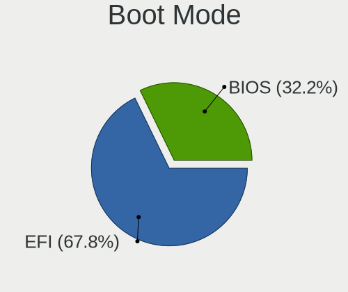
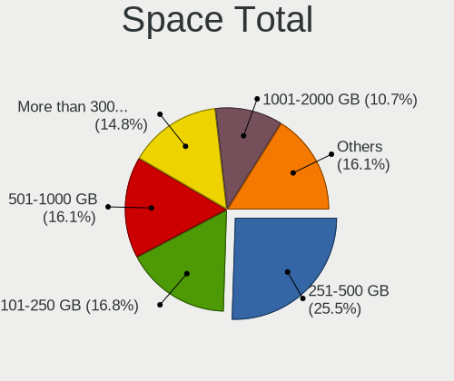
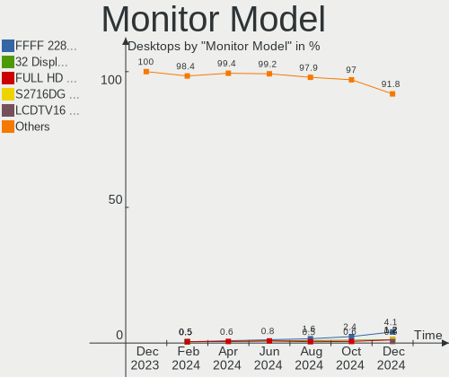
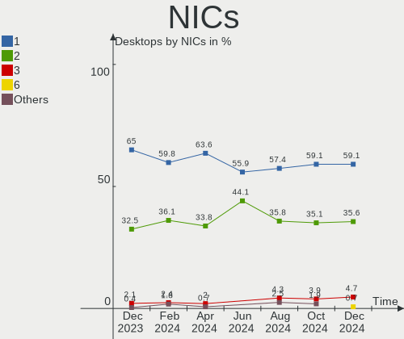
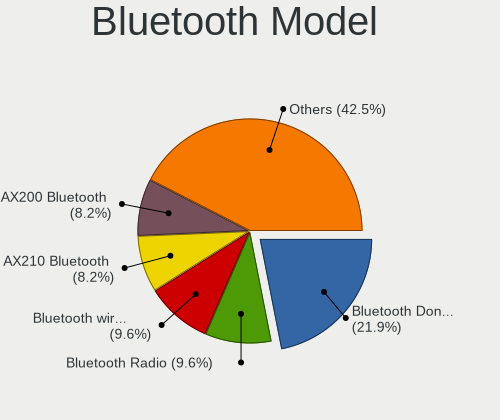
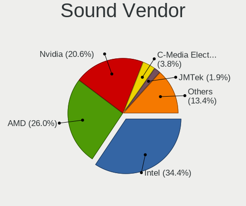

Linux Mint - Hardware Trends (Desktops)
---------------------------------------

A project to identify most popular hardware characteristics and track their change
over time based on data collected by Linux users at https://Linux-Hardware.org.

Anyone can contribute to this report by the [hw-probe](https://github.com/linuxhw/hw-probe) tool:

    sudo -E hw-probe -all -upload

This report is for one last month. Overall report since the beginning of time: [TestCoverage](https://github.com/linuxhw/TestCoverage)

Period: May, 2022.

Contents
--------

* [ System ](#system)
  - [ OS                       ](#os)
  - [ OS Family                ](#os-family)
  - [ Kernel                   ](#kernel)
  - [ Kernel Family            ](#kernel-family)
  - [ Kernel Major Ver.        ](#kernel-major-ver)
  - [ Arch                     ](#arch)
  - [ DE                       ](#de)
  - [ Display Server           ](#display-server)
  - [ Display Manager          ](#display-manager)
  - [ OS Lang                  ](#os-lang)
  - [ Boot Mode                ](#boot-mode)
  - [ Filesystem               ](#filesystem)
  - [ Part. scheme             ](#part-scheme)
  - [ Dual Boot with Linux/BSD ](#dual-boot-with-linuxbsd)
  - [ Dual Boot (Win)          ](#dual-boot-win)

* [ Board ](#board)
  - [ Vendor                   ](#vendor)
  - [ Model                    ](#model)
  - [ Model Family             ](#model-family)
  - [ MFG Year                 ](#mfg-year)
  - [ Form Factor              ](#form-factor)
  - [ Secure Boot              ](#secure-boot)
  - [ Coreboot                 ](#coreboot)
  - [ RAM Size                 ](#ram-size)
  - [ RAM Used                 ](#ram-used)
  - [ Total Drives             ](#total-drives)
  - [ Has CD-ROM               ](#has-cd-rom)
  - [ Has Ethernet             ](#has-ethernet)
  - [ Has WiFi                 ](#has-wifi)
  - [ Has Bluetooth            ](#has-bluetooth)

* [ Location ](#location)
  - [ Country                  ](#country)
  - [ City                     ](#city)

* [ Drives ](#drives)
  - [ Drive Vendor             ](#drive-vendor)
  - [ Drive Model              ](#drive-model)
  - [ HDD Vendor               ](#hdd-vendor)
  - [ SSD Vendor               ](#ssd-vendor)
  - [ Drive Kind               ](#drive-kind)
  - [ Drive Connector          ](#drive-connector)
  - [ Drive Size               ](#drive-size)
  - [ Space Total              ](#space-total)
  - [ Space Used               ](#space-used)
  - [ Malfunc. Drives          ](#malfunc-drives)
  - [ Malfunc. Drive Vendor    ](#malfunc-drive-vendor)
  - [ Malfunc. HDD Vendor      ](#malfunc-hdd-vendor)
  - [ Malfunc. Drive Kind      ](#malfunc-drive-kind)
  - [ Failed Drives            ](#failed-drives)
  - [ Failed Drive Vendor      ](#failed-drive-vendor)
  - [ Drive Status             ](#drive-status)

* [ Storage controller ](#storage-controller)
  - [ Storage Vendor           ](#storage-vendor)
  - [ Storage Model            ](#storage-model)
  - [ Storage Kind             ](#storage-kind)

* [ Processor ](#processor)
  - [ CPU Vendor               ](#cpu-vendor)
  - [ CPU Model                ](#cpu-model)
  - [ CPU Model Family         ](#cpu-model-family)
  - [ CPU Cores                ](#cpu-cores)
  - [ CPU Sockets              ](#cpu-sockets)
  - [ CPU Threads              ](#cpu-threads)
  - [ CPU Op-Modes             ](#cpu-op-modes)
  - [ CPU Microcode            ](#cpu-microcode)
  - [ CPU Microarch            ](#cpu-microarch)

* [ Graphics ](#graphics)
  - [ GPU Vendor               ](#gpu-vendor)
  - [ GPU Model                ](#gpu-model)
  - [ GPU Combo                ](#gpu-combo)
  - [ GPU Driver               ](#gpu-driver)
  - [ GPU Memory               ](#gpu-memory)

* [ Monitor ](#monitor)
  - [ Monitor Vendor           ](#monitor-vendor)
  - [ Monitor Model            ](#monitor-model)
  - [ Monitor Resolution       ](#monitor-resolution)
  - [ Monitor Diagonal         ](#monitor-diagonal)
  - [ Monitor Width            ](#monitor-width)
  - [ Aspect Ratio             ](#aspect-ratio)
  - [ Monitor Area             ](#monitor-area)
  - [ Pixel Density            ](#pixel-density)
  - [ Multiple Monitors        ](#multiple-monitors)

* [ Network ](#network)
  - [ Net Controller Vendor    ](#net-controller-vendor)
  - [ Net Controller Model     ](#net-controller-model)
  - [ Wireless Vendor          ](#wireless-vendor)
  - [ Wireless Model           ](#wireless-model)
  - [ Ethernet Vendor          ](#ethernet-vendor)
  - [ Ethernet Model           ](#ethernet-model)
  - [ Net Controller Kind      ](#net-controller-kind)
  - [ Used Controller          ](#used-controller)
  - [ NICs                     ](#nics)
  - [ IPv6                     ](#ipv6)

* [ Bluetooth ](#bluetooth)
  - [ Bluetooth Vendor         ](#bluetooth-vendor)
  - [ Bluetooth Model          ](#bluetooth-model)

* [ Sound ](#sound)
  - [ Sound Vendor             ](#sound-vendor)
  - [ Sound Model              ](#sound-model)

* [ Memory ](#memory)
  - [ Memory Vendor            ](#memory-vendor)
  - [ Memory Model             ](#memory-model)
  - [ Memory Kind              ](#memory-kind)
  - [ Memory Form Factor       ](#memory-form-factor)
  - [ Memory Size              ](#memory-size)
  - [ Memory Speed             ](#memory-speed)

* [ Printers & scanners ](#printers--scanners)
  - [ Printer Vendor           ](#printer-vendor)
  - [ Printer Model            ](#printer-model)
  - [ Scanner Vendor           ](#scanner-vendor)
  - [ Scanner Model            ](#scanner-model)

* [ Camera ](#camera)
  - [ Camera Vendor            ](#camera-vendor)
  - [ Camera Model             ](#camera-model)

* [ Security ](#security)
  - [ Fingerprint Vendor       ](#fingerprint-vendor)
  - [ Fingerprint Model        ](#fingerprint-model)
  - [ Chipcard Vendor          ](#chipcard-vendor)
  - [ Chipcard Model           ](#chipcard-model)

* [ Unsupported ](#unsupported)
  - [ Unsupported Devices      ](#unsupported-devices)
  - [ Unsupported Device Types ](#unsupported-device-types)

System
------

OS
--

Installed operating systems

| Name            | Desktops | Percent |
|-----------------|----------|---------|
| Linux Mint 20.3 | 133      | 81.1%   |
| Linux Mint 20.2 | 7        | 4.27%   |
| Linux Mint 20.1 | 6        | 3.66%   |
| Linux Mint 20   | 5        | 3.05%   |
| Linux Mint 19.1 | 5        | 3.05%   |
| Linux Mint 19.3 | 4        | 2.44%   |
| Linux Mint 19.2 | 3        | 1.83%   |
| Linux Mint 19   | 1        | 0.61%   |

OS Family
---------

OS without a version

| Name       | Desktops | Percent |
|------------|----------|---------|
| Linux Mint | 164      | 100%    |

Kernel
------

Version of the Linux kernel

| Version                   | Desktops | Percent |
|---------------------------|----------|---------|
| 5.4.0-109-generic         | 42       | 25.61%  |
| 5.4.0-110-generic         | 38       | 23.17%  |
| 5.4.0-113-generic         | 29       | 17.68%  |
| 5.4.0-91-generic          | 10       | 6.1%    |
| 5.13.0-40-generic         | 6        | 3.66%   |
| 5.13.0-27-generic         | 6        | 3.66%   |
| 5.13.0-41-generic         | 4        | 2.44%   |
| 5.4.0-74-generic          | 3        | 1.83%   |
| 4.15.0-176-generic        | 3        | 1.83%   |
| 5.4.0-100-generic         | 2        | 1.22%   |
| 5.13.0-44-generic         | 2        | 1.22%   |
| 5.4.0-97-generic          | 1        | 0.61%   |
| 5.4.0-94-generic          | 1        | 0.61%   |
| 5.4.0-91-lowlatency       | 1        | 0.61%   |
| 5.4.0-89-generic          | 1        | 0.61%   |
| 5.4.0-77-generic          | 1        | 0.61%   |
| 5.4.0-113-lowlatency      | 1        | 0.61%   |
| 5.4.0-105-generic         | 1        | 0.61%   |
| 5.17.8-051708-generic     | 1        | 0.61%   |
| 5.17.5-051705-generic     | 1        | 0.61%   |
| 5.17.0-5.2-liquorix-amd64 | 1        | 0.61%   |
| 5.15.13-051513-generic    | 1        | 0.61%   |
| 5.15.0-28-generic         | 1        | 0.61%   |
| 5.14.0-1038-oem           | 1        | 0.61%   |
| 5.13.0-39-generic         | 1        | 0.61%   |
| 5.13.0-30-generic         | 1        | 0.61%   |
| 5.13.0-28-generic         | 1        | 0.61%   |
| 4.15.0-51-generic         | 1        | 0.61%   |
| 4.15.0-177-lowlatency     | 1        | 0.61%   |
| 4.15.0-108-generic        | 1        | 0.61%   |

Kernel Family
-------------

Linux kernel without a distro release

| Version | Desktops | Percent |
|---------|----------|---------|
| 5.4.0   | 131      | 79.88%  |
| 5.13.0  | 21       | 12.8%   |
| 4.15.0  | 6        | 3.66%   |
| 5.17.8  | 1        | 0.61%   |
| 5.17.5  | 1        | 0.61%   |
| 5.17.0  | 1        | 0.61%   |
| 5.15.13 | 1        | 0.61%   |
| 5.15.0  | 1        | 0.61%   |
| 5.14.0  | 1        | 0.61%   |

Kernel Major Ver.
-----------------

Linux kernel major version

| Version | Desktops | Percent |
|---------|----------|---------|
| 5.4     | 131      | 79.88%  |
| 5.13    | 21       | 12.8%   |
| 4.15    | 6        | 3.66%   |
| 5.17    | 3        | 1.83%   |
| 5.15    | 2        | 1.22%   |
| 5.14    | 1        | 0.61%   |

Arch
----

OS architecture (x86_64, i586, etc.)

| Name   | Desktops | Percent |
|--------|----------|---------|
| x86_64 | 164      | 100%    |

DE
--

Desktop Environment

| Name       | Desktops | Percent |
|------------|----------|---------|
| X-Cinnamon | 112      | 68.29%  |
| MATE       | 24       | 14.63%  |
| XFCE       | 15       | 9.15%   |
| Cinnamon   | 6        | 3.66%   |
| KDE5       | 3        | 1.83%   |
| GNOME      | 2        | 1.22%   |
| qtile      | 1        | 0.61%   |
| Unknown    | 1        | 0.61%   |

Display Server
--------------

X11 or Wayland

| Name | Desktops | Percent |
|------|----------|---------|
| X11  | 161      | 98.17%  |
| Tty  | 3        | 1.83%   |

Display Manager
---------------

SDDM, LightDM, etc.

| Name    | Desktops | Percent |
|---------|----------|---------|
| Unknown | 102      | 62.2%   |
| LightDM | 60       | 36.59%  |
| SDDM    | 2        | 1.22%   |

OS Lang
-------

Language

| Lang  | Desktops | Percent |
|-------|----------|---------|
| en_US | 43       | 26.22%  |
| de_DE | 41       | 25%     |
| ru_RU | 10       | 6.1%    |
| pt_BR | 9        | 5.49%   |
| en_GB | 9        | 5.49%   |
| fr_FR | 7        | 4.27%   |
| hu_HU | 4        | 2.44%   |
| es_ES | 4        | 2.44%   |
| en_CA | 4        | 2.44%   |
| en_AU | 4        | 2.44%   |
| C     | 4        | 2.44%   |
| pl_PL | 3        | 1.83%   |
| pt_PT | 2        | 1.22%   |
| he_IL | 2        | 1.22%   |
| es_CL | 2        | 1.22%   |
| es_AR | 2        | 1.22%   |
| tr_TR | 1        | 0.61%   |
| sk_SK | 1        | 0.61%   |
| ro_RO | 1        | 0.61%   |
| nl_NL | 1        | 0.61%   |
| it_IT | 1        | 0.61%   |
| fr_CA | 1        | 0.61%   |
| es_VE | 1        | 0.61%   |
| es_MX | 1        | 0.61%   |
| en_PH | 1        | 0.61%   |
| en_IL | 1        | 0.61%   |
| en_HK | 1        | 0.61%   |
| el_GR | 1        | 0.61%   |
| de_AT | 1        | 0.61%   |
| cs_CZ | 1        | 0.61%   |

Boot Mode
---------

EFI or BIOS

| Mode | Desktops | Percent |
|------|----------|---------|
| BIOS | 93       | 56.71%  |
| EFI  | 71       | 43.29%  |

Filesystem
----------

Type of filesystem

| Type    | Desktops | Percent |
|---------|----------|---------|
| Ext4    | 155      | 94.51%  |
| Overlay | 4        | 2.44%   |
| Btrfs   | 4        | 2.44%   |
| Ext3    | 1        | 0.61%   |

Part. scheme
------------

Scheme of partitioning

| Type    | Desktops | Percent |
|---------|----------|---------|
| Unknown | 112      | 68.29%  |
| GPT     | 35       | 21.34%  |
| MBR     | 17       | 10.37%  |

Dual Boot with Linux/BSD
------------------------

Hosting more than one Linux/BSD

| Dual boot | Desktops | Percent |
|-----------|----------|---------|
| No        | 149      | 90.85%  |
| Yes       | 15       | 9.15%   |

Dual Boot (Win)
---------------

Hosting Linux and Windows

| Dual boot | Desktops | Percent |
|-----------|----------|---------|
| No        | 138      | 84.15%  |
| Yes       | 26       | 15.85%  |

Board
-----

Vendor
------

Motherboard manufacturer

| Name                | Desktops | Percent |
|---------------------|----------|---------|
| ASUSTek Computer    | 37       | 22.56%  |
| Gigabyte Technology | 25       | 15.24%  |
| MSI                 | 23       | 14.02%  |
| Hewlett-Packard     | 19       | 11.59%  |
| Dell                | 14       | 8.54%   |
| Lenovo              | 11       | 6.71%   |
| ASRock              | 9        | 5.49%   |
| Intel               | 5        | 3.05%   |
| Pegatron            | 4        | 2.44%   |
| ECS                 | 3        | 1.83%   |
| Acer                | 3        | 1.83%   |
| AMI                 | 2        | 1.22%   |
| Unknown             | 2        | 1.22%   |
| YANYU               | 1        | 0.61%   |
| Purism              | 1        | 0.61%   |
| Positivo            | 1        | 0.61%   |
| Packard Bell        | 1        | 0.61%   |
| Medion              | 1        | 0.61%   |
| Fujitsu             | 1        | 0.61%   |
| Biostar             | 1        | 0.61%   |

Model
-----

Motherboard model

| Name                                   | Desktops | Percent |
|----------------------------------------|----------|---------|
| ASUS All Series                        | 7        | 4.27%   |
| MSI MS-7D46                            | 2        | 1.22%   |
| MSI MS-7C56                            | 2        | 1.22%   |
| MSI MS-7721                            | 2        | 1.22%   |
| MSI MS-7693                            | 2        | 1.22%   |
| Intel H61                              | 2        | 1.22%   |
| HP Compaq 6200 Pro SFF PC              | 2        | 1.22%   |
| Gigabyte GA-78LMT-USB3                 | 2        | 1.22%   |
| Gigabyte GA-78LMT-S2P                  | 2        | 1.22%   |
| Gigabyte 970A-DS3P                     | 2        | 1.22%   |
| Dell OptiPlex 780                      | 2        | 1.22%   |
| ASUS PRIME X570-P                      | 2        | 1.22%   |
| Unknown                                | 2        | 1.22%   |
| YANYU ITX-N29 VER:1.3                  | 1        | 0.61%   |
| Purism Librem Mini v2                  | 1        | 0.61%   |
| Positivo POS-PIH77CM                   | 1        | 0.61%   |
| Pegatron s5-1050br                     | 1        | 0.61%   |
| Pegatron IPPPV-D3G                     | 1        | 0.61%   |
| Pegatron IPMIP-GS                      | 1        | 0.61%   |
| Pegatron Compaq dx2400 Microtower PC   | 1        | 0.61%   |
| Packard Bell IMEDIA S3720              | 1        | 0.61%   |
| MSI MS-7D22                            | 1        | 0.61%   |
| MSI MS-7D19                            | 1        | 0.61%   |
| MSI MS-7C37                            | 1        | 0.61%   |
| MSI MS-7B54                            | 1        | 0.61%   |
| MSI MS-7B48                            | 1        | 0.61%   |
| MSI MS-7B33                            | 1        | 0.61%   |
| MSI MS-7A34                            | 1        | 0.61%   |
| MSI MS-7A33                            | 1        | 0.61%   |
| MSI MS-7A32                            | 1        | 0.61%   |
| MSI MS-7924                            | 1        | 0.61%   |
| MSI MS-7866                            | 1        | 0.61%   |
| MSI MS-7821                            | 1        | 0.61%   |
| MSI MS-7760                            | 1        | 0.61%   |
| MSI MS-7758                            | 1        | 0.61%   |
| MSI MS-7751                            | 1        | 0.61%   |
| Medion MS-7621                         | 1        | 0.61%   |
| Lenovo ThinkCentre M92P 3237A1G        | 1        | 0.61%   |
| Lenovo ThinkCentre M920s 10SKS2SK00    | 1        | 0.61%   |
| Lenovo ThinkCentre M81 5049W16         | 1        | 0.61%   |
| Lenovo ThinkCentre M81 5049W15         | 1        | 0.61%   |
| Lenovo ThinkCentre M73 10B60009US      | 1        | 0.61%   |
| Lenovo ThinkCentre M73 10AXS0JU00      | 1        | 0.61%   |
| Lenovo ThinkCentre M70t 11EVCTO1WW     | 1        | 0.61%   |
| Lenovo ThinkCentre M58p 6137E61        | 1        | 0.61%   |
| Lenovo ThinkCentre M57e 6176A13        | 1        | 0.61%   |
| Lenovo IdeaCentre 300-20ISH 90DA00NPTX | 1        | 0.61%   |
| Lenovo 11051CS ThinkServer TS130       | 1        | 0.61%   |
| Intel Q3XXG4-P V1.0                    | 1        | 0.61%   |
| Intel DX58SO AAE29331-501              | 1        | 0.61%   |
| Intel DG41KR AAE62839-304              | 1        | 0.61%   |
| HP Z800 Workstation                    | 1        | 0.61%   |
| HP Z420 Workstation                    | 1        | 0.61%   |
| HP Z400 Workstation                    | 1        | 0.61%   |
| HP xw8600 Workstation                  | 1        | 0.61%   |
| HP ProDesk 600 G4 SFF                  | 1        | 0.61%   |
| HP ProDesk 600 G1 SFF                  | 1        | 0.61%   |
| HP OMEN 25L Desktop GT12-0xxx          | 1        | 0.61%   |
| HP Desktop 190-0xxx                    | 1        | 0.61%   |
| HP Compaq Pro 6305 SFF                 | 1        | 0.61%   |

Model Family
------------

Motherboard model prefix

| Name                   | Desktops | Percent |
|------------------------|----------|---------|
| Dell OptiPlex          | 12       | 7.32%   |
| Lenovo ThinkCentre     | 9        | 5.49%   |
| HP Compaq              | 8        | 4.88%   |
| ASUS All               | 7        | 4.27%   |
| ASUS PRIME             | 6        | 3.66%   |
| ASUS ROG               | 4        | 2.44%   |
| ASUS TUF               | 3        | 1.83%   |
| Acer Aspire            | 3        | 1.83%   |
| MSI MS-7D46            | 2        | 1.22%   |
| MSI MS-7C56            | 2        | 1.22%   |
| MSI MS-7721            | 2        | 1.22%   |
| MSI MS-7693            | 2        | 1.22%   |
| Intel H61              | 2        | 1.22%   |
| HP ProDesk             | 2        | 1.22%   |
| Gigabyte GA-78LMT-USB3 | 2        | 1.22%   |
| Gigabyte GA-78LMT-S2P  | 2        | 1.22%   |
| Gigabyte 970A-DS3P     | 2        | 1.22%   |
| ASUS SABERTOOTH        | 2        | 1.22%   |
| ASUS M5A97             | 2        | 1.22%   |
| Unknown                | 2        | 1.22%   |
| YANYU ITX-N29          | 1        | 0.61%   |
| Purism Librem          | 1        | 0.61%   |
| Positivo POS-PIH77CM   | 1        | 0.61%   |
| Pegatron s5-1050br     | 1        | 0.61%   |
| Pegatron IPPPV-D3G     | 1        | 0.61%   |
| Pegatron IPMIP-GS      | 1        | 0.61%   |
| Pegatron Compaq        | 1        | 0.61%   |
| Packard Bell IMEDIA    | 1        | 0.61%   |
| MSI MS-7D22            | 1        | 0.61%   |
| MSI MS-7D19            | 1        | 0.61%   |
| MSI MS-7C37            | 1        | 0.61%   |
| MSI MS-7B54            | 1        | 0.61%   |
| MSI MS-7B48            | 1        | 0.61%   |
| MSI MS-7B33            | 1        | 0.61%   |
| MSI MS-7A34            | 1        | 0.61%   |
| MSI MS-7A33            | 1        | 0.61%   |
| MSI MS-7A32            | 1        | 0.61%   |
| MSI MS-7924            | 1        | 0.61%   |
| MSI MS-7866            | 1        | 0.61%   |
| MSI MS-7821            | 1        | 0.61%   |
| MSI MS-7760            | 1        | 0.61%   |
| MSI MS-7758            | 1        | 0.61%   |
| MSI MS-7751            | 1        | 0.61%   |
| Medion MS-7621         | 1        | 0.61%   |
| Lenovo IdeaCentre      | 1        | 0.61%   |
| Lenovo 11051CS         | 1        | 0.61%   |
| Intel Q3XXG4-P         | 1        | 0.61%   |
| Intel DX58SO           | 1        | 0.61%   |
| Intel DG41KR           | 1        | 0.61%   |
| HP Z800                | 1        | 0.61%   |
| HP Z420                | 1        | 0.61%   |
| HP Z400                | 1        | 0.61%   |
| HP xw8600              | 1        | 0.61%   |
| HP OMEN                | 1        | 0.61%   |
| HP Desktop             | 1        | 0.61%   |
| HP 500-205t            | 1        | 0.61%   |
| HP 23-b231             | 1        | 0.61%   |
| HP 200-5130ch          | 1        | 0.61%   |
| Gigabyte Z97-HD3P      | 1        | 0.61%   |
| Gigabyte Z690          | 1        | 0.61%   |

MFG Year
--------

Motherboard manufacture year

| Year | Desktops | Percent |
|------|----------|---------|
| 2012 | 19       | 11.59%  |
| 2013 | 18       | 10.98%  |
| 2011 | 18       | 10.98%  |
| 2017 | 15       | 9.15%   |
| 2018 | 14       | 8.54%   |
| 2008 | 11       | 6.71%   |
| 2010 | 10       | 6.1%    |
| 2021 | 9        | 5.49%   |
| 2014 | 9        | 5.49%   |
| 2020 | 8        | 4.88%   |
| 2015 | 8        | 4.88%   |
| 2016 | 7        | 4.27%   |
| 2009 | 7        | 4.27%   |
| 2019 | 6        | 3.66%   |
| 2022 | 2        | 1.22%   |
| 2007 | 2        | 1.22%   |
| 2006 | 1        | 0.61%   |

Form Factor
-----------

Physical design of the computer

| Name    | Desktops | Percent |
|---------|----------|---------|
| Desktop | 164      | 100%    |

Secure Boot
-----------

Enabled or disabled

| State    | Desktops | Percent |
|----------|----------|---------|
| Disabled | 159      | 96.95%  |
| Enabled  | 5        | 3.05%   |

Coreboot
--------

Have coreboot on board

| Used | Desktops | Percent |
|------|----------|---------|
| No   | 163      | 99.39%  |
| Yes  | 1        | 0.61%   |

RAM Size
--------

Total RAM memory

| Size in GB  | Desktops | Percent |
|-------------|----------|---------|
| 16.01-24.0  | 41       | 25%     |
| 8.01-16.0   | 39       | 23.78%  |
| 3.01-4.0    | 29       | 17.68%  |
| 4.01-8.0    | 27       | 16.46%  |
| 32.01-64.0  | 21       | 12.8%   |
| 24.01-32.0  | 2        | 1.22%   |
| 64.01-256.0 | 2        | 1.22%   |
| 1.01-2.0    | 2        | 1.22%   |
| 2.01-3.0    | 1        | 0.61%   |

RAM Used
--------

Used RAM memory

| Used GB   | Desktops | Percent |
|-----------|----------|---------|
| 1.01-2.0  | 68       | 41.46%  |
| 2.01-3.0  | 40       | 24.39%  |
| 3.01-4.0  | 24       | 14.63%  |
| 4.01-8.0  | 20       | 12.2%   |
| 0.51-1.0  | 8        | 4.88%   |
| 8.01-16.0 | 4        | 2.44%   |

Total Drives
------------

Number of drives on board

| Drives | Desktops | Percent |
|--------|----------|---------|
| 1      | 73       | 44.51%  |
| 2      | 43       | 26.22%  |
| 3      | 27       | 16.46%  |
| 4      | 13       | 7.93%   |
| 5      | 5        | 3.05%   |
| 7      | 2        | 1.22%   |
| 8      | 1        | 0.61%   |

Has CD-ROM
----------

Has CD-ROM on board

| Presented | Desktops | Percent |
|-----------|----------|---------|
| Yes       | 99       | 60.37%  |
| No        | 65       | 39.63%  |

Has Ethernet
------------

Has Ethernet on board

| Presented | Desktops | Percent |
|-----------|----------|---------|
| Yes       | 162      | 98.78%  |
| No        | 2        | 1.22%   |

Has WiFi
--------

Has WiFi module

| Presented | Desktops | Percent |
|-----------|----------|---------|
| No        | 96       | 58.54%  |
| Yes       | 68       | 41.46%  |

Has Bluetooth
-------------

Has Bluetooth module

| Presented | Desktops | Percent |
|-----------|----------|---------|
| No        | 121      | 73.78%  |
| Yes       | 43       | 26.22%  |

Location
--------

Country
-------

Geographic location (country)

| Country            | Desktops | Percent |
|--------------------|----------|---------|
| Germany            | 36       | 21.95%  |
| USA                | 29       | 17.68%  |
| Brazil             | 12       | 7.32%   |
| France             | 9        | 5.49%   |
| UK                 | 8        | 4.88%   |
| Russia             | 8        | 4.88%   |
| Spain              | 5        | 3.05%   |
| Hungary            | 5        | 3.05%   |
| Canada             | 5        | 3.05%   |
| Australia          | 4        | 2.44%   |
| Turkey             | 3        | 1.83%   |
| Poland             | 3        | 1.83%   |
| Israel             | 3        | 1.83%   |
| Venezuela          | 2        | 1.22%   |
| Romania            | 2        | 1.22%   |
| Portugal           | 2        | 1.22%   |
| Netherlands        | 2        | 1.22%   |
| Mexico             | 2        | 1.22%   |
| Greece             | 2        | 1.22%   |
| Chile              | 2        | 1.22%   |
| Belarus            | 2        | 1.22%   |
| Austria            | 2        | 1.22%   |
| Argentina          | 2        | 1.22%   |
| Uzbekistan         | 1        | 0.61%   |
| Switzerland        | 1        | 0.61%   |
| Slovakia           | 1        | 0.61%   |
| Serbia             | 1        | 0.61%   |
| Puerto Rico        | 1        | 0.61%   |
| Philippines        | 1        | 0.61%   |
| Lithuania          | 1        | 0.61%   |
| Italy              | 1        | 0.61%   |
| Hong Kong          | 1        | 0.61%   |
| Finland            | 1        | 0.61%   |
| Dominican Republic | 1        | 0.61%   |
| Czechia            | 1        | 0.61%   |
| Croatia            | 1        | 0.61%   |
| Belgium            | 1        | 0.61%   |

City
----

Geographic location (city)

| City                   | Desktops | Percent |
|------------------------|----------|---------|
| St Petersburg          | 3        | 1.83%   |
| Sao Paulo              | 3        | 1.83%   |
| Munich                 | 2        | 1.22%   |
| Kirchgellersen         | 2        | 1.22%   |
| Fair Lawn              | 2        | 1.22%   |
| Croydon                | 2        | 1.22%   |
| Chicago                | 2        | 1.22%   |
| Bursa                  | 2        | 1.22%   |
| Zagreb                 | 1        | 0.61%   |
| Wuppertal              | 1        | 0.61%   |
| West Lebanon           | 1        | 0.61%   |
| Wellington             | 1        | 0.61%   |
| Voluntari              | 1        | 0.61%   |
| Vilnius                | 1        | 0.61%   |
| Villeneuve les beziers | 1        | 0.61%   |
| Villejuif              | 1        | 0.61%   |
| Vienna                 | 1        | 0.61%   |
| Uetze                  | 1        | 0.61%   |
| Troisdorf              | 1        | 0.61%   |
| Trebur                 | 1        | 0.61%   |
| Toledo                 | 1        | 0.61%   |
| Thessaloniki           | 1        | 0.61%   |
| The Hague              | 1        | 0.61%   |
| The Bronx              | 1        | 0.61%   |
| Teutschenthal          | 1        | 0.61%   |
| Tashkent               | 1        | 0.61%   |
| Talca                  | 1        | 0.61%   |
| Sydney                 | 1        | 0.61%   |
| Sullivan               | 1        | 0.61%   |
| Stuttgart              | 1        | 0.61%   |
| Stelle                 | 1        | 0.61%   |
| Stade                  | 1        | 0.61%   |
| St Helens              | 1        | 0.61%   |
| Spruce Grove           | 1        | 0.61%   |
| Spring                 | 1        | 0.61%   |
| Sochi                  | 1        | 0.61%   |
| Slatington             | 1        | 0.61%   |
| Schafisheim            | 1        | 0.61%   |
| Sao Domingos de Rana   | 1        | 0.61%   |
| Santo Domingo Este     | 1        | 0.61%   |
| Salt Lake City         | 1        | 0.61%   |
| Riverside              | 1        | 0.61%   |
| Rishon LeZiyyon        | 1        | 0.61%   |
| Ris-Orangis            | 1        | 0.61%   |
| Rio de Janeiro         | 1        | 0.61%   |
| Rimbach                | 1        | 0.61%   |
| Rendsburg              | 1        | 0.61%   |
| Redhill                | 1        | 0.61%   |
| Recife                 | 1        | 0.61%   |
| Ravensburg             | 1        | 0.61%   |
| Raleigh                | 1        | 0.61%   |
| Québec                | 1        | 0.61%   |
| Pulaski                | 1        | 0.61%   |
| Poznan                 | 1        | 0.61%   |
| Porto Murtinho         | 1        | 0.61%   |
| Point Cook             | 1        | 0.61%   |
| Piracicaba             | 1        | 0.61%   |
| Pforzheim              | 1        | 0.61%   |
| Petaluma               | 1        | 0.61%   |
| Petaẖ Tiqwa          | 1        | 0.61%   |

Drives
------

Drive Vendor
------------

Hard drive vendors

| Vendor              | Desktops | Drives | Percent |
|---------------------|----------|--------|---------|
| Seagate             | 61       | 81     | 21.55%  |
| WDC                 | 50       | 62     | 17.67%  |
| Samsung Electronics | 43       | 56     | 15.19%  |
| Kingston            | 21       | 22     | 7.42%   |
| Toshiba             | 17       | 20     | 6.01%   |
| Crucial             | 15       | 17     | 5.3%    |
| SanDisk             | 12       | 12     | 4.24%   |
| Hitachi             | 10       | 10     | 3.53%   |
| China               | 4        | 4      | 1.41%   |
| A-DATA Technology   | 4        | 4      | 1.41%   |
| Unknown             | 3        | 4      | 1.06%   |
| SPCC                | 3        | 3      | 1.06%   |
| Silicon Motion      | 3        | 3      | 1.06%   |
| Micron Technology   | 3        | 3      | 1.06%   |
| Phison              | 2        | 3      | 0.71%   |
| OCZ                 | 2        | 2      | 0.71%   |
| Netac               | 2        | 2      | 0.71%   |
| Intenso             | 2        | 3      | 0.71%   |
| Intel               | 2        | 2      | 0.71%   |
| Fujitsu             | 2        | 2      | 0.71%   |
| Unknown             | 2        | 2      | 0.71%   |
| USB 3.0             | 1        | 1      | 0.35%   |
| Transcend           | 1        | 1      | 0.35%   |
| TDAS                | 1        | 3      | 0.35%   |
| sobetter            | 1        | 1      | 0.35%   |
| Smartbuy            | 1        | 1      | 0.35%   |
| SABRENT             | 1        | 1      | 0.35%   |
| PNY                 | 1        | 1      | 0.35%   |
| OCZ-AGIL            | 1        | 1      | 0.35%   |
| Mushkin             | 1        | 1      | 0.35%   |
| MAXTOR              | 1        | 1      | 0.35%   |
| MACROVIP            | 1        | 1      | 0.35%   |
| LITEON              | 1        | 1      | 0.35%   |
| Lexar               | 1        | 1      | 0.35%   |
| JMicron             | 1        | 1      | 0.35%   |
| Hoodisk             | 1        | 1      | 0.35%   |
| HGST                | 1        | 1      | 0.35%   |
| GOODRAM             | 1        | 1      | 0.35%   |
| DREVO               | 1        | 1      | 0.35%   |
| BIWIN               | 1        | 1      | 0.35%   |
| ASMT106x            | 1        | 1      | 0.35%   |

Drive Model
-----------

Hard drive models

| Model                            | Desktops | Percent |
|----------------------------------|----------|---------|
| Seagate ST500DM002-1BD142 500GB  | 7        | 2.17%   |
| Kingston SA400S37240G 240GB SSD  | 6        | 1.86%   |
| Crucial CT1000MX500SSD1 1TB      | 5        | 1.55%   |
| Toshiba DT01ACA100 1TB           | 4        | 1.24%   |
| Seagate ST3500413AS 500GB        | 4        | 1.24%   |
| Seagate ST1000DM010-2EP102 1TB   | 4        | 1.24%   |
| Seagate ST1000DM003-1ER162 1TB   | 4        | 1.24%   |
| Samsung SSD 850 EVO 250GB        | 4        | 1.24%   |
| Seagate ST31000524AS 1TB         | 3        | 0.93%   |
| Samsung NVMe SSD Drive 250GB     | 3        | 0.93%   |
| WDC WDS500G2B0A-00SM50 500GB SSD | 2        | 0.62%   |
| WDC WDS240G2G0A-00JH30 240GB SSD | 2        | 0.62%   |
| WDC WDS100T2B0A-00SM50 1TB SSD   | 2        | 0.62%   |
| WDC WD6400AAKS-65Z7B0 640GB      | 2        | 0.62%   |
| WDC WD20EZRX-00D8PB0 2TB         | 2        | 0.62%   |
| Toshiba MK5059GSXP 500GB         | 2        | 0.62%   |
| Toshiba HDWD110 1TB              | 2        | 0.62%   |
| Toshiba DT01ACA050 500GB         | 2        | 0.62%   |
| Seagate ST9320325AS 320GB        | 2        | 0.62%   |
| Seagate ST4000DM004-2CV104 4TB   | 2        | 0.62%   |
| Seagate ST3500320AS 500GB        | 2        | 0.62%   |
| Seagate ST31000528AS 1TB         | 2        | 0.62%   |
| Seagate ST2000DM006-2DM164 2TB   | 2        | 0.62%   |
| Seagate ST2000DM001-1ER164 2TB   | 2        | 0.62%   |
| Seagate ST1000LM035-1RK172 1TB   | 2        | 0.62%   |
| Seagate ST1000DM003-1SB102 1TB   | 2        | 0.62%   |
| Seagate ST1000DM003-1CH162 1TB   | 2        | 0.62%   |
| Seagate Portable 1TB             | 2        | 0.62%   |
| Seagate Expansion Desk 10TB      | 2        | 0.62%   |
| Seagate Expansion 4TB            | 2        | 0.62%   |
| SanDisk SSD PLUS 240GB           | 2        | 0.62%   |
| SanDisk SDSSDH31024G 1TB         | 2        | 0.62%   |
| SanDisk SDSSDA240G 240GB         | 2        | 0.62%   |
| Samsung SSD 870 EVO 1TB          | 2        | 0.62%   |
| Samsung SSD 860 EVO 250GB        | 2        | 0.62%   |
| Samsung SSD 850 EVO 500GB        | 2        | 0.62%   |
| Samsung NVMe SSD Drive 512GB     | 2        | 0.62%   |
| Samsung HD502HJ 500GB            | 2        | 0.62%   |
| Samsung HD501LJ 500GB            | 2        | 0.62%   |
| Samsung HD154UI 1TB              | 2        | 0.62%   |
| Samsung HD103SI 1TB              | 2        | 0.62%   |
| Kingston SV300S37A120G 120GB SSD | 2        | 0.62%   |
| Kingston SNVS500G 500GB          | 2        | 0.62%   |
| Kingston SA400S37120G 120GB SSD  | 2        | 0.62%   |
| Kingston NVMe SSD Drive 500GB    | 2        | 0.62%   |
| Hitachi HDS721050CLA360 500GB    | 2        | 0.62%   |
| Crucial CT500MX500SSD4 500GB     | 2        | 0.62%   |
| Crucial CT240BX500SSD1 240GB     | 2        | 0.62%   |
| Unknown                          | 2        | 0.62%   |
| WDC WDS500G2B0A 500GB SSD        | 1        | 0.31%   |
| WDC WDS500G1X0E-00AFY0 500GB     | 1        | 0.31%   |
| WDC WDS480G2G0A-00JH30 480GB SSD | 1        | 0.31%   |
| WDC WDS250G2B0A-00SM50 250GB SSD | 1        | 0.31%   |
| WDC WDS120G2G0A-00JH30 120GB SSD | 1        | 0.31%   |
| WDC WD740ADFD-00NLR5 74GB        | 1        | 0.31%   |
| WDC WD6400AAKS-22A7B0 640GB      | 1        | 0.31%   |
| WDC WD60EFAX-68JH4N1 6TB         | 1        | 0.31%   |
| WDC WD5002ABYS-01B1B0 500GB      | 1        | 0.31%   |
| WDC WD5000LPZX-22Z10T0 500GB     | 1        | 0.31%   |
| WDC WD5000LPVX-22V0TT0 500GB     | 1        | 0.31%   |

HDD Vendor
----------

Hard disk drive vendors

| Vendor              | Desktops | Drives | Percent |
|---------------------|----------|--------|---------|
| Seagate             | 60       | 78     | 39.47%  |
| WDC                 | 42       | 49     | 27.63%  |
| Toshiba             | 16       | 18     | 10.53%  |
| Samsung Electronics | 15       | 16     | 9.87%   |
| Hitachi             | 10       | 10     | 6.58%   |
| Fujitsu             | 2        | 2      | 1.32%   |
| USB 3.0             | 1        | 1      | 0.66%   |
| Unknown             | 1        | 1      | 0.66%   |
| SABRENT             | 1        | 1      | 0.66%   |
| MAXTOR              | 1        | 1      | 0.66%   |
| JMicron             | 1        | 1      | 0.66%   |
| Intenso             | 1        | 1      | 0.66%   |
| HGST                | 1        | 1      | 0.66%   |

SSD Vendor
----------

Solid state drive vendors

| Vendor              | Desktops | Drives | Percent |
|---------------------|----------|--------|---------|
| Samsung Electronics | 17       | 22     | 16.83%  |
| Kingston            | 17       | 18     | 16.83%  |
| Crucial             | 15       | 17     | 14.85%  |
| WDC                 | 10       | 11     | 9.9%    |
| SanDisk             | 10       | 10     | 9.9%    |
| China               | 4        | 4      | 3.96%   |
| SPCC                | 3        | 3      | 2.97%   |
| A-DATA Technology   | 3        | 3      | 2.97%   |
| Toshiba             | 2        | 2      | 1.98%   |
| OCZ                 | 2        | 2      | 1.98%   |
| Netac               | 2        | 2      | 1.98%   |
| Unknown             | 2        | 2      | 1.98%   |
| Transcend           | 1        | 1      | 0.99%   |
| Smartbuy            | 1        | 1      | 0.99%   |
| Seagate             | 1        | 1      | 0.99%   |
| PNY                 | 1        | 1      | 0.99%   |
| OCZ-AGIL            | 1        | 1      | 0.99%   |
| Mushkin             | 1        | 1      | 0.99%   |
| Micron Technology   | 1        | 1      | 0.99%   |
| Lexar               | 1        | 1      | 0.99%   |
| Intenso             | 1        | 2      | 0.99%   |
| Intel               | 1        | 1      | 0.99%   |
| Hoodisk             | 1        | 1      | 0.99%   |
| GOODRAM             | 1        | 1      | 0.99%   |
| DREVO               | 1        | 1      | 0.99%   |
| BIWIN               | 1        | 1      | 0.99%   |

Drive Kind
----------

HDD or SSD

| Kind    | Desktops | Drives | Percent |
|---------|----------|--------|---------|
| HDD     | 108      | 180    | 46.35%  |
| SSD     | 85       | 111    | 36.48%  |
| NVMe    | 32       | 37     | 13.73%  |
| Unknown | 6        | 8      | 2.58%   |
| MMC     | 2        | 3      | 0.86%   |

Drive Connector
---------------

SATA, SAS, NVMe, etc.

| Type | Desktops | Drives | Percent |
|------|----------|--------|---------|
| SATA | 150      | 281    | 76.53%  |
| NVMe | 32       | 37     | 16.33%  |
| SAS  | 12       | 18     | 6.12%   |
| MMC  | 2        | 3      | 1.02%   |

Drive Size
----------

Size of hard drive

| Size in TB | Desktops | Drives | Percent |
|------------|----------|--------|---------|
| 0.01-0.5   | 105      | 162    | 49.76%  |
| 0.51-1.0   | 63       | 78     | 29.86%  |
| 1.01-2.0   | 25       | 28     | 11.85%  |
| 3.01-4.0   | 8        | 10     | 3.79%   |
| 4.01-10.0  | 5        | 7      | 2.37%   |
| 2.01-3.0   | 4        | 5      | 1.9%    |
| 10.01-20.0 | 1        | 1      | 0.47%   |

Space Total
-----------

Amount of disk space available on the file system

| Size in GB     | Desktops | Percent |
|----------------|----------|---------|
| 101-250        | 49       | 29.88%  |
| 251-500        | 32       | 19.51%  |
| 501-1000       | 26       | 15.85%  |
| More than 3000 | 19       | 11.59%  |
| 1001-2000      | 19       | 11.59%  |
| 51-100         | 6        | 3.66%   |
| 2001-3000      | 5        | 3.05%   |
| 21-50          | 4        | 2.44%   |
| 1-20           | 4        | 2.44%   |

Space Used
----------

Amount of used disk space

| Used GB        | Desktops | Percent |
|----------------|----------|---------|
| 21-50          | 32       | 19.51%  |
| 1-20           | 31       | 18.9%   |
| 51-100         | 26       | 15.85%  |
| 501-1000       | 20       | 12.2%   |
| 101-250        | 19       | 11.59%  |
| 251-500        | 17       | 10.37%  |
| 1001-2000      | 8        | 4.88%   |
| More than 3000 | 7        | 4.27%   |
| 2001-3000      | 4        | 2.44%   |

Malfunc. Drives
---------------

Drive models with a malfunction

| Model                              | Desktops | Drives | Percent |
|------------------------------------|----------|--------|---------|
| WDC WD5002ABYS-01B1B0 500GB        | 1        | 1      | 5.26%   |
| WDC WD2500JS-22NCB1 250GB          | 1        | 1      | 5.26%   |
| WDC WD10EZEX-00KUWA0 1TB           | 1        | 1      | 5.26%   |
| WDC WD10EARS-00Y5B1 1TB            | 1        | 1      | 5.26%   |
| WDC WD10EADS-22M2B0 1TB            | 1        | 1      | 5.26%   |
| SPCC Solid State Disk 512GB        | 1        | 1      | 5.26%   |
| Seagate ST9320325AS 320GB          | 1        | 1      | 5.26%   |
| Seagate ST380215AS 80GB            | 1        | 1      | 5.26%   |
| Seagate ST3500413AS 500GB          | 1        | 2      | 5.26%   |
| Seagate ST31000528AS 1TB           | 1        | 1      | 5.26%   |
| Seagate ST2000LM003 HN-M201RAD 2TB | 1        | 1      | 5.26%   |
| Seagate ST2000DL003-9VT166 2TB     | 1        | 1      | 5.26%   |
| Seagate ST1000DX002-2DV162 1TB     | 1        | 1      | 5.26%   |
| Seagate ST1000DM003-1ER162 1TB     | 1        | 2      | 5.26%   |
| SanDisk SD6SF1M128G1022I 128GB SSD | 1        | 1      | 5.26%   |
| Samsung Electronics SP2014N 200GB  | 1        | 1      | 5.26%   |
| Samsung Electronics HD321HJ 320GB  | 1        | 1      | 5.26%   |
| Hitachi HDS721616PLA380 164GB      | 1        | 1      | 5.26%   |
| Hitachi HDS721050CLA360 500GB      | 1        | 1      | 5.26%   |

Malfunc. Drive Vendor
---------------------

Vendors of faulty drives

| Vendor              | Desktops | Drives | Percent |
|---------------------|----------|--------|---------|
| Seagate             | 8        | 10     | 42.11%  |
| WDC                 | 5        | 5      | 26.32%  |
| Samsung Electronics | 2        | 2      | 10.53%  |
| Hitachi             | 2        | 2      | 10.53%  |
| SPCC                | 1        | 1      | 5.26%   |
| SanDisk             | 1        | 1      | 5.26%   |

Malfunc. HDD Vendor
-------------------

Vendors of faulty HDD drives

| Vendor              | Desktops | Drives | Percent |
|---------------------|----------|--------|---------|
| Seagate             | 8        | 10     | 47.06%  |
| WDC                 | 5        | 5      | 29.41%  |
| Samsung Electronics | 2        | 2      | 11.76%  |
| Hitachi             | 2        | 2      | 11.76%  |

Malfunc. Drive Kind
-------------------

Kinds of faulty drives

| Kind | Desktops | Drives | Percent |
|------|----------|--------|---------|
| HDD  | 14       | 19     | 87.5%   |
| SSD  | 2        | 2      | 12.5%   |

Failed Drives
-------------

Failed drive models

Zero info for selected period =(

Failed Drive Vendor
-------------------

Failed drive vendors

Zero info for selected period =(

Drive Status
------------

Number of failed and malfunc. drives

| Status   | Desktops | Drives | Percent |
|----------|----------|--------|---------|
| Detected | 115      | 229    | 63.89%  |
| Works    | 50       | 89     | 27.78%  |
| Malfunc  | 15       | 21     | 8.33%   |

Storage controller
------------------

Storage Vendor
--------------

Storage controller vendors

| Vendor                      | Desktops | Percent |
|-----------------------------|----------|---------|
| Intel                       | 105      | 48.61%  |
| AMD                         | 51       | 23.61%  |
| Samsung Electronics         | 15       | 6.94%   |
| ASMedia Technology          | 11       | 5.09%   |
| Nvidia                      | 5        | 2.31%   |
| Kingston Technology Company | 5        | 2.31%   |
| JMicron Technology          | 5        | 2.31%   |
| Sandisk                     | 4        | 1.85%   |
| Silicon Motion              | 3        | 1.39%   |
| Marvell Technology Group    | 3        | 1.39%   |
| Phison Electronics          | 2        | 0.93%   |
| Micron Technology           | 2        | 0.93%   |
| VIA Technologies            | 1        | 0.46%   |
| LSI Logic / Symbios Logic   | 1        | 0.46%   |
| Lite-On Technology          | 1        | 0.46%   |
| Broadcom / LSI              | 1        | 0.46%   |
| ADATA Technology            | 1        | 0.46%   |

Storage Model
-------------

Storage controller models

| Model                                                                                   | Desktops | Percent |
|-----------------------------------------------------------------------------------------|----------|---------|
| AMD FCH SATA Controller [AHCI mode]                                                     | 18       | 6.72%   |
| Intel 8 Series/C220 Series Chipset Family 6-port SATA Controller 1 [AHCI mode]          | 15       | 5.6%    |
| AMD SB7x0/SB8x0/SB9x0 SATA Controller [AHCI mode]                                       | 14       | 5.22%   |
| Intel 6 Series/C200 Series Chipset Family 6 port Desktop SATA AHCI Controller           | 12       | 4.48%   |
| AMD SB7x0/SB8x0/SB9x0 IDE Controller                                                    | 11       | 4.1%    |
| Samsung NVMe SSD Controller SM981/PM981/PM983                                           | 9        | 3.36%   |
| Intel Cannon Lake PCH SATA AHCI Controller                                              | 9        | 3.36%   |
| Intel 7 Series/C210 Series Chipset Family 6-port SATA Controller [AHCI mode]            | 9        | 3.36%   |
| ASMedia ASM1062 Serial ATA Controller                                                   | 9        | 3.36%   |
| Intel SATA Controller [RAID mode]                                                       | 7        | 2.61%   |
| Intel NM10/ICH7 Family SATA Controller [IDE mode]                                       | 7        | 2.61%   |
| Intel 200 Series PCH SATA controller [AHCI mode]                                        | 7        | 2.61%   |
| AMD SB7x0/SB8x0/SB9x0 SATA Controller [IDE mode]                                        | 7        | 2.61%   |
| AMD 500 Series Chipset SATA Controller                                                  | 6        | 2.24%   |
| Intel 82801G (ICH7 Family) IDE Controller                                               | 5        | 1.87%   |
| Intel Q170/Q150/B150/H170/H110/Z170/CM236 Chipset SATA Controller [AHCI Mode]           | 4        | 1.49%   |
| Silicon Motion SM2263EN/SM2263XT SSD Controller                                         | 3        | 1.12%   |
| Samsung NVMe SSD Controller SM961/PM961/SM963                                           | 3        | 1.12%   |
| Samsung NVMe SSD Controller PM9A1/PM9A3/980PRO                                          | 3        | 1.12%   |
| Kingston Company Company Non-Volatile memory controller                                 | 3        | 1.12%   |
| Intel Comet Lake SATA AHCI Controller                                                   | 3        | 1.12%   |
| Intel Alder Lake-S PCH SATA Controller [AHCI Mode]                                      | 3        | 1.12%   |
| Intel 82801I (ICH9 Family) 2 port SATA Controller [IDE mode]                            | 3        | 1.12%   |
| Intel 6 Series/C200 Series Chipset Family Desktop SATA Controller (IDE mode, ports 4-5) | 3        | 1.12%   |
| Intel 6 Series/C200 Series Chipset Family Desktop SATA Controller (IDE mode, ports 0-3) | 3        | 1.12%   |
| Intel 4 Series Chipset PT IDER Controller                                               | 3        | 1.12%   |
| AMD 400 Series Chipset SATA Controller                                                  | 3        | 1.12%   |
| AMD 300 Series Chipset SATA Controller                                                  | 3        | 1.12%   |
| Sandisk WD Blue SN550 NVMe SSD                                                          | 2        | 0.75%   |
| Phison E12 NVMe Controller                                                              | 2        | 0.75%   |
| Nvidia MCP61 SATA Controller                                                            | 2        | 0.75%   |
| Nvidia MCP61 IDE                                                                        | 2        | 0.75%   |
| Micron Non-Volatile memory controller                                                   | 2        | 0.75%   |
| JMicron JMB363 SATA/IDE Controller                                                      | 2        | 0.75%   |
| Intel C600/X79 series chipset SATA RAID Controller                                      | 2        | 0.75%   |
| Intel 9 Series Chipset Family SATA Controller [AHCI Mode]                               | 2        | 0.75%   |
| Intel 82801JD/DO (ICH10 Family) SATA AHCI Controller                                    | 2        | 0.75%   |
| Intel 82801IR/IO/IH (ICH9R/DO/DH) 4 port SATA Controller [IDE mode]                     | 2        | 0.75%   |
| Intel 8 Series/C220 Series Chipset Family 4-port SATA Controller 1 [IDE mode]           | 2        | 0.75%   |
| Intel 500 Series Chipset Family SATA AHCI Controller                                    | 2        | 0.75%   |
| Intel 5 Series/3400 Series Chipset 4 port SATA IDE Controller                           | 2        | 0.75%   |
| Intel 5 Series/3400 Series Chipset 2 port SATA IDE Controller                           | 2        | 0.75%   |
| AMD SB600 Non-Raid-5 SATA                                                               | 2        | 0.75%   |
| AMD SB600 IDE                                                                           | 2        | 0.75%   |
| AMD FCH SATA Controller [IDE mode]                                                      | 2        | 0.75%   |
| AMD FCH IDE Controller                                                                  | 2        | 0.75%   |
| VIA VT6415 PATA IDE Host Controller                                                     | 1        | 0.37%   |
| Sandisk WD PC SN810 / Black SN850 NVMe SSD                                              | 1        | 0.37%   |
| Sandisk WD Blue SN500 / PC SN520 NVMe SSD                                               | 1        | 0.37%   |
| Samsung NVMe SSD Controller 980                                                         | 1        | 0.37%   |
| Nvidia MCP79 AHCI Controller                                                            | 1        | 0.37%   |
| Nvidia MCP78S [GeForce 8200] SATA Controller (non-AHCI mode)                            | 1        | 0.37%   |
| Nvidia MCP78S [GeForce 8200] IDE                                                        | 1        | 0.37%   |
| Nvidia MCP73 IDE Controller                                                             | 1        | 0.37%   |
| Nvidia GeForce 7100/nForce 630i SATA                                                    | 1        | 0.37%   |
| Marvell Group 88SE9230 PCIe 2.0 x2 4-port SATA 6 Gb/s RAID Controller                   | 1        | 0.37%   |
| Marvell Group 88SE9172 SATA III 6Gb/s RAID Controller                                   | 1        | 0.37%   |
| Marvell Group 88SE6111/6121 SATA II / PATA Controller                                   | 1        | 0.37%   |
| LSI Logic / Symbios Logic SAS1068E PCI-Express Fusion-MPT SAS                           | 1        | 0.37%   |
| Lite-On Non-Volatile memory controller                                                  | 1        | 0.37%   |

Storage Kind
------------

Kind of storage controller (IDE, SATA, NVMe, SAS, ...)

| Kind | Desktops | Percent |
|------|----------|---------|
| SATA | 127      | 57.47%  |
| IDE  | 48       | 21.72%  |
| NVMe | 32       | 14.48%  |
| RAID | 11       | 4.98%   |
| SCSI | 2        | 0.9%    |
| SAS  | 1        | 0.45%   |

Processor
---------

CPU Vendor
----------

Processor vendors

| Vendor | Desktops | Percent |
|--------|----------|---------|
| Intel  | 110      | 67.07%  |
| AMD    | 54       | 32.93%  |

CPU Model
---------

Processor models

| Model                                       | Desktops | Percent |
|---------------------------------------------|----------|---------|
| Intel Core i7-3770 CPU @ 3.40GHz            | 4        | 2.44%   |
| AMD FX-8320 Eight-Core Processor            | 4        | 2.44%   |
| Intel Core i5-3470 CPU @ 3.20GHz            | 3        | 1.83%   |
| Intel Core i3-8100 CPU @ 3.60GHz            | 3        | 1.83%   |
| Intel Core i3-4170 CPU @ 3.70GHz            | 3        | 1.83%   |
| Intel Core i3-4130 CPU @ 3.40GHz            | 3        | 1.83%   |
| Intel Core i3-2100 CPU @ 3.10GHz            | 3        | 1.83%   |
| Intel Core 2 Duo CPU E7500 @ 2.93GHz        | 3        | 1.83%   |
| AMD Ryzen 5 3600 6-Core Processor           | 3        | 1.83%   |
| AMD FX-8350 Eight-Core Processor            | 3        | 1.83%   |
| AMD FX-6300 Six-Core Processor              | 3        | 1.83%   |
| Intel Pentium Gold G5400 CPU @ 3.70GHz      | 2        | 1.22%   |
| Intel Core i7-7700 CPU @ 3.60GHz            | 2        | 1.22%   |
| Intel Core i7-6700K CPU @ 4.00GHz           | 2        | 1.22%   |
| Intel Core i7-4790 CPU @ 3.60GHz            | 2        | 1.22%   |
| Intel Core i7-2600 CPU @ 3.40GHz            | 2        | 1.22%   |
| Intel Core i5-4690K CPU @ 3.50GHz           | 2        | 1.22%   |
| Intel Core i5 CPU 650 @ 3.20GHz             | 2        | 1.22%   |
| Intel Core 2 Duo CPU E4500 @ 2.20GHz        | 2        | 1.22%   |
| Intel Atom x5-Z8350 CPU @ 1.44GHz           | 2        | 1.22%   |
| Intel 12th Gen Core i7-12700                | 2        | 1.22%   |
| AMD Ryzen 7 3700X 8-Core Processor          | 2        | 1.22%   |
| AMD Ryzen 7 2700X Eight-Core Processor      | 2        | 1.22%   |
| AMD Ryzen 5 PRO 4650G with Radeon Graphics  | 2        | 1.22%   |
| AMD Ryzen 3 2200G with Radeon Vega Graphics | 2        | 1.22%   |
| AMD Athlon II X3 435 Processor              | 2        | 1.22%   |
| Intel Xeon CPU X5482 @ 3.20GHz              | 1        | 0.61%   |
| Intel Xeon CPU W3670 @ 3.20GHz              | 1        | 0.61%   |
| Intel Xeon CPU E5540 @ 2.53GHz              | 1        | 0.61%   |
| Intel Xeon CPU E5-2670 v2 @ 2.50GHz         | 1        | 0.61%   |
| Intel Xeon CPU E5-1650 v2 @ 3.50GHz         | 1        | 0.61%   |
| Intel Xeon CPU E31225 @ 3.10GHz             | 1        | 0.61%   |
| Intel Xeon CPU E3-1265L V2 @ 2.50GHz        | 1        | 0.61%   |
| Intel Xeon CPU E3-1246 v3 @ 3.50GHz         | 1        | 0.61%   |
| Intel Xeon CPU E3-1225 v5 @ 3.30GHz         | 1        | 0.61%   |
| Intel Pentium Gold G6400 CPU @ 4.00GHz      | 1        | 0.61%   |
| Intel Pentium Gold G5420 CPU @ 3.80GHz      | 1        | 0.61%   |
| Intel Pentium Dual-Core CPU T4500 @ 2.30GHz | 1        | 0.61%   |
| Intel Pentium Dual CPU E2200 @ 2.20GHz      | 1        | 0.61%   |
| Intel Pentium CPU G630 @ 2.70GHz            | 1        | 0.61%   |
| Intel Pentium CPU G3258 @ 3.20GHz           | 1        | 0.61%   |
| Intel Pentium CPU G3220 @ 3.00GHz           | 1        | 0.61%   |
| Intel Core i7-9700T CPU @ 2.00GHz           | 1        | 0.61%   |
| Intel Core i7-8700K CPU @ 3.70GHz           | 1        | 0.61%   |
| Intel Core i7-8700 CPU @ 3.20GHz            | 1        | 0.61%   |
| Intel Core i7-6900K CPU @ 3.20GHz           | 1        | 0.61%   |
| Intel Core i7-6700 CPU @ 3.40GHz            | 1        | 0.61%   |
| Intel Core i7-4771 CPU @ 3.50GHz            | 1        | 0.61%   |
| Intel Core i7-4770K CPU @ 3.50GHz           | 1        | 0.61%   |
| Intel Core i7-2600K CPU @ 3.40GHz           | 1        | 0.61%   |
| Intel Core i7-10700F CPU @ 2.90GHz          | 1        | 0.61%   |
| Intel Core i7-10510U CPU @ 1.80GHz          | 1        | 0.61%   |
| Intel Core i7 CPU 940 @ 2.93GHz             | 1        | 0.61%   |
| Intel Core i7 CPU 880 @ 3.07GHz             | 1        | 0.61%   |
| Intel Core i5-9600K CPU @ 3.70GHz           | 1        | 0.61%   |
| Intel Core i5-8500 CPU @ 3.00GHz            | 1        | 0.61%   |
| Intel Core i5-8400 CPU @ 2.80GHz            | 1        | 0.61%   |
| Intel Core i5-6500T CPU @ 2.50GHz           | 1        | 0.61%   |
| Intel Core i5-6400 CPU @ 2.70GHz            | 1        | 0.61%   |
| Intel Core i5-4670K CPU @ 3.40GHz           | 1        | 0.61%   |

CPU Model Family
----------------

Processor model prefix

| Model                   | Desktops | Percent |
|-------------------------|----------|---------|
| Intel Core i7           | 24       | 14.63%  |
| Intel Core i5           | 24       | 14.63%  |
| Intel Core i3           | 19       | 11.59%  |
| AMD FX                  | 14       | 8.54%   |
| Intel Xeon              | 9        | 5.49%   |
| Intel Core 2 Duo        | 8        | 4.88%   |
| AMD Ryzen 5             | 8        | 4.88%   |
| AMD Ryzen 7             | 7        | 4.27%   |
| Intel Core 2 Quad       | 6        | 3.66%   |
| Other                   | 5        | 3.05%   |
| Intel Pentium Gold      | 4        | 2.44%   |
| Intel Pentium           | 3        | 1.83%   |
| Intel Celeron           | 3        | 1.83%   |
| Intel Atom              | 3        | 1.83%   |
| AMD Ryzen 3             | 3        | 1.83%   |
| AMD A8                  | 3        | 1.83%   |
| AMD Ryzen 5 PRO         | 2        | 1.22%   |
| AMD Phenom II X6        | 2        | 1.22%   |
| AMD Phenom II X4        | 2        | 1.22%   |
| AMD Athlon II X3        | 2        | 1.22%   |
| AMD Athlon II X2        | 2        | 1.22%   |
| AMD Athlon 64 X2        | 2        | 1.22%   |
| Intel Pentium Dual-Core | 1        | 0.61%   |
| Intel Pentium Dual      | 1        | 0.61%   |
| AMD Ryzen 9             | 1        | 0.61%   |
| AMD E2                  | 1        | 0.61%   |
| AMD Athlon X2           | 1        | 0.61%   |
| AMD Athlon II X4        | 1        | 0.61%   |
| AMD A6                  | 1        | 0.61%   |
| AMD A4                  | 1        | 0.61%   |
| AMD A10                 | 1        | 0.61%   |

CPU Cores
---------

Number of processor cores

| Number | Desktops | Percent |
|--------|----------|---------|
| 4      | 68       | 41.46%  |
| 2      | 51       | 31.1%   |
| 6      | 19       | 11.59%  |
| 8      | 14       | 8.54%   |
| 3      | 5        | 3.05%   |
| 12     | 4        | 2.44%   |
| 1      | 2        | 1.22%   |
| 10     | 1        | 0.61%   |

CPU Sockets
-----------

Number of sockets

| Number | Desktops | Percent |
|--------|----------|---------|
| 1      | 162      | 98.78%  |
| 2      | 2        | 1.22%   |

CPU Threads
-----------

Threads per core (Hyper-Threading)

| Number | Desktops | Percent |
|--------|----------|---------|
| 2      | 89       | 54.27%  |
| 1      | 74       | 45.12%  |
| 8      | 1        | 0.61%   |

CPU Op-Modes
------------

CPU Operation Modes (32-bit, 64-bit)

| Op mode        | Desktops | Percent |
|----------------|----------|---------|
| 32-bit, 64-bit | 164      | 100%    |

CPU Microcode
-------------

Microcode number

| Number     | Desktops | Percent |
|------------|----------|---------|
| Unknown    | 20       | 12.2%   |
| 0x306c3    | 19       | 11.59%  |
| 0x206a7    | 12       | 7.32%   |
| 0x06000852 | 12       | 7.32%   |
| 0x306a9    | 11       | 6.71%   |
| 0x1067a    | 9        | 5.49%   |
| 0x506e3    | 6        | 3.66%   |
| 0x906ea    | 5        | 3.05%   |
| 0x08701021 | 4        | 2.44%   |
| 0x010000c8 | 4        | 2.44%   |
| 0x90672    | 3        | 1.83%   |
| 0x6fd      | 3        | 1.83%   |
| 0x10677    | 3        | 1.83%   |
| 0x0800820d | 3        | 1.83%   |
| 0xa0671    | 2        | 1.22%   |
| 0xa0653    | 2        | 1.22%   |
| 0x906eb    | 2        | 1.22%   |
| 0x906e9    | 2        | 1.22%   |
| 0x6fb      | 2        | 1.22%   |
| 0x406c4    | 2        | 1.22%   |
| 0x20655    | 2        | 1.22%   |
| 0x08600106 | 2        | 1.22%   |
| 0x08001137 | 2        | 1.22%   |
| 0x06003106 | 2        | 1.22%   |
| 0x06001119 | 2        | 1.22%   |
| 0x03000027 | 2        | 1.22%   |
| 0x010000dc | 2        | 1.22%   |
| 0xa0655    | 1        | 0.61%   |
| 0x906ed    | 1        | 0.61%   |
| 0x906ec    | 1        | 0.61%   |
| 0x806ec    | 1        | 0.61%   |
| 0x706a8    | 1        | 0.61%   |
| 0x40651    | 1        | 0.61%   |
| 0x306e4    | 1        | 0.61%   |
| 0x30678    | 1        | 0.61%   |
| 0x206c2    | 1        | 0.61%   |
| 0x20652    | 1        | 0.61%   |
| 0x106ca    | 1        | 0.61%   |
| 0x106a5    | 1        | 0.61%   |
| 0x106a4    | 1        | 0.61%   |
| 0x10676    | 1        | 0.61%   |
| 0x0a50000c | 1        | 0.61%   |
| 0x0a201009 | 1        | 0.61%   |
| 0x08701013 | 1        | 0.61%   |
| 0x08101016 | 1        | 0.61%   |
| 0x0810100b | 1        | 0.61%   |
| 0x08001138 | 1        | 0.61%   |
| 0x0600063e | 1        | 0.61%   |
| 0x010000db | 1        | 0.61%   |
| 0x010000c7 | 1        | 0.61%   |
| 0x00000000 | 1        | 0.61%   |

CPU Microarch
-------------

Microarchitecture

| Name             | Desktops | Percent |
|------------------|----------|---------|
| Haswell          | 21       | 12.8%   |
| KabyLake         | 16       | 9.76%   |
| Piledriver       | 15       | 9.15%   |
| IvyBridge        | 15       | 9.15%   |
| SandyBridge      | 13       | 7.93%   |
| Penryn           | 13       | 7.93%   |
| K10              | 10       | 6.1%    |
| Zen 2            | 7        | 4.27%   |
| Skylake          | 6        | 3.66%   |
| Zen 3            | 5        | 3.05%   |
| Zen              | 5        | 3.05%   |
| Core             | 5        | 3.05%   |
| Zen+             | 4        | 2.44%   |
| Westmere         | 4        | 2.44%   |
| Silvermont       | 3        | 1.83%   |
| Nehalem          | 3        | 1.83%   |
| CometLake        | 3        | 1.83%   |
| Steamroller      | 2        | 1.22%   |
| K8 Hammer        | 2        | 1.22%   |
| K10 Llano        | 2        | 1.22%   |
| Alderlake Hybrid | 2        | 1.22%   |
| Unknown          | 2        | 1.22%   |
| Icelake          | 1        | 0.61%   |
| Goldmont plus    | 1        | 0.61%   |
| Bulldozer        | 1        | 0.61%   |
| Broadwell        | 1        | 0.61%   |
| Bonnell          | 1        | 0.61%   |
| Bobcat           | 1        | 0.61%   |

Graphics
--------

GPU Vendor
----------

Vendors of graphics cards

| Vendor | Desktops | Percent |
|--------|----------|---------|
| Nvidia | 68       | 39.77%  |
| Intel  | 58       | 33.92%  |
| AMD    | 45       | 26.32%  |

GPU Model
---------

Graphics card models

| Model                                                                                    | Desktops | Percent |
|------------------------------------------------------------------------------------------|----------|---------|
| Intel CoffeeLake-S GT2 [UHD Graphics 630]                                                | 7        | 3.95%   |
| Nvidia GP108 [GeForce GT 1030]                                                           | 6        | 3.39%   |
| Intel Xeon E3-1200 v3/4th Gen Core Processor Integrated Graphics Controller              | 6        | 3.39%   |
| Intel 2nd Generation Core Processor Family Integrated Graphics Controller                | 6        | 3.39%   |
| Intel 4th Generation Core Processor Family Integrated Graphics Controller                | 5        | 2.82%   |
| Nvidia GT218 [GeForce 210]                                                               | 4        | 2.26%   |
| Nvidia GK208B [GeForce GT 730]                                                           | 4        | 2.26%   |
| Intel IvyBridge GT2 [HD Graphics 4000]                                                   | 4        | 2.26%   |
| AMD Ellesmere [Radeon RX 470/480/570/570X/580/580X/590]                                  | 4        | 2.26%   |
| Nvidia GP107 [GeForce GTX 1050 Ti]                                                       | 3        | 1.69%   |
| Nvidia GM204 [GeForce GTX 970]                                                           | 3        | 1.69%   |
| Nvidia GM107 [GeForce GTX 750 Ti]                                                        | 3        | 1.69%   |
| Intel HD Graphics 630                                                                    | 3        | 1.69%   |
| Intel HD Graphics 530                                                                    | 3        | 1.69%   |
| Intel 4 Series Chipset Integrated Graphics Controller                                    | 3        | 1.69%   |
| AMD RS780L [Radeon 3000]                                                                 | 3        | 1.69%   |
| AMD Caicos [Radeon HD 6450/7450/8450 / R5 230 OEM]                                       | 3        | 1.69%   |
| Nvidia TU117 [GeForce GTX 1650]                                                          | 2        | 1.13%   |
| Nvidia TU106 [GeForce RTX 2060 Rev. A]                                                   | 2        | 1.13%   |
| Nvidia GP107 [GeForce GTX 1050]                                                          | 2        | 1.13%   |
| Nvidia GP104 [GeForce GTX 1070]                                                          | 2        | 1.13%   |
| Nvidia GM206 [GeForce GTX 960]                                                           | 2        | 1.13%   |
| Nvidia GK106 [GeForce GTX 660]                                                           | 2        | 1.13%   |
| Nvidia G96C [GeForce 9500 GT]                                                            | 2        | 1.13%   |
| Intel Xeon E3-1200 v2/3rd Gen Core processor Graphics Controller                         | 2        | 1.13%   |
| Intel Core Processor Integrated Graphics Controller                                      | 2        | 1.13%   |
| Intel CoffeeLake-S GT1 [UHD Graphics 610]                                                | 2        | 1.13%   |
| Intel Atom/Celeron/Pentium Processor x5-E8000/J3xxx/N3xxx Integrated Graphics Controller | 2        | 1.13%   |
| Intel AlderLake-S GT1                                                                    | 2        | 1.13%   |
| AMD Trinity [Radeon HD 7560D]                                                            | 2        | 1.13%   |
| AMD RV710 [Radeon HD 4350/4550]                                                          | 2        | 1.13%   |
| AMD Raven Ridge [Radeon Vega Series / Radeon Vega Mobile Series]                         | 2        | 1.13%   |
| AMD Oland PRO [Radeon R7 240/340 / Radeon 520]                                           | 2        | 1.13%   |
| Nvidia TU116 [GeForce GTX 1660 SUPER]                                                    | 1        | 0.56%   |
| Nvidia NV41 [GeForce 6800 GS]                                                            | 1        | 0.56%   |
| Nvidia GT218 [ION]                                                                       | 1        | 0.56%   |
| Nvidia GT215 [GeForce GT 240]                                                            | 1        | 0.56%   |
| Nvidia GP107GL [Quadro P400]                                                             | 1        | 0.56%   |
| Nvidia GP106 [GeForce GTX 1060 3GB]                                                      | 1        | 0.56%   |
| Nvidia GP104 [GeForce GTX 1080]                                                          | 1        | 0.56%   |
| Nvidia GM204 [GeForce GTX 980]                                                           | 1        | 0.56%   |
| Nvidia GM200 [GeForce GTX TITAN X]                                                       | 1        | 0.56%   |
| Nvidia GK208B [GeForce GT 710]                                                           | 1        | 0.56%   |
| Nvidia GK107GL [Quadro K600]                                                             | 1        | 0.56%   |
| Nvidia GK107 [GeForce GT 640]                                                            | 1        | 0.56%   |
| Nvidia GK106GL [Quadro K4000]                                                            | 1        | 0.56%   |
| Nvidia GK106 [GeForce GTX 650 Ti]                                                        | 1        | 0.56%   |
| Nvidia GK106 [GeForce GTX 650 OEM]                                                       | 1        | 0.56%   |
| Nvidia GK104 [GeForce GTX 770]                                                           | 1        | 0.56%   |
| Nvidia GK104 [GeForce GTX 760]                                                           | 1        | 0.56%   |
| Nvidia GF119 [GeForce GT 610]                                                            | 1        | 0.56%   |
| Nvidia GF119 [GeForce GT 520]                                                            | 1        | 0.56%   |
| Nvidia GF108 [GeForce GT 730]                                                            | 1        | 0.56%   |
| Nvidia GF108 [GeForce GT 440]                                                            | 1        | 0.56%   |
| Nvidia GF108 [GeForce GT 430]                                                            | 1        | 0.56%   |
| Nvidia GF100GL [Quadro 4000]                                                             | 1        | 0.56%   |
| Nvidia GA104 [GeForce RTX 3060]                                                          | 1        | 0.56%   |
| Nvidia GA104 [GeForce RTX 3060 Ti]                                                       | 1        | 0.56%   |
| Nvidia GA102 [GeForce RTX 3080 Lite Hash Rate]                                           | 1        | 0.56%   |
| Nvidia G98 [GeForce 8400 GS Rev. 2]                                                      | 1        | 0.56%   |

GPU Combo
---------

Combinations of graphics cards

| Name           | Desktops | Percent |
|----------------|----------|---------|
| 1 x Nvidia     | 61       | 37.2%   |
| 1 x Intel      | 53       | 32.32%  |
| 1 x AMD        | 41       | 25%     |
| 2 x Nvidia     | 3        | 1.83%   |
| 2 x AMD        | 2        | 1.22%   |
| Intel + Nvidia | 2        | 1.22%   |
| AMD + Nvidia   | 2        | 1.22%   |

GPU Driver
----------

Free vs proprietary

| Driver      | Desktops | Percent |
|-------------|----------|---------|
| Free        | 98       | 59.76%  |
| Proprietary | 57       | 34.76%  |
| Unknown     | 9        | 5.49%   |

GPU Memory
----------

Total video memory

| Size in GB | Desktops | Percent |
|------------|----------|---------|
| Unknown    | 63       | 38.41%  |
| 1.01-2.0   | 27       | 16.46%  |
| 0.51-1.0   | 21       | 12.8%   |
| 0.01-0.5   | 21       | 12.8%   |
| 3.01-4.0   | 15       | 9.15%   |
| 7.01-8.0   | 8        | 4.88%   |
| 5.01-6.0   | 3        | 1.83%   |
| 2.01-3.0   | 3        | 1.83%   |
| 8.01-16.0  | 3        | 1.83%   |

Monitor
-------

Monitor Vendor
--------------

Monitor vendors

| Vendor               | Desktops | Percent |
|----------------------|----------|---------|
| Samsung Electronics  | 24       | 13.95%  |
| Goldstar             | 20       | 11.63%  |
| Dell                 | 19       | 11.05%  |
| AOC                  | 14       | 8.14%   |
| Hewlett-Packard      | 8        | 4.65%   |
| BenQ                 | 8        | 4.65%   |
| Unknown              | 6        | 3.49%   |
| ViewSonic            | 5        | 2.91%   |
| Philips              | 5        | 2.91%   |
| Acer                 | 5        | 2.91%   |
| Toshiba              | 4        | 2.33%   |
| NEC Computers        | 4        | 2.33%   |
| Ancor Communications | 4        | 2.33%   |
| Unknown              | 4        | 2.33%   |
| Sony                 | 3        | 1.74%   |
| HannStar             | 3        | 1.74%   |
| Vizio                | 2        | 1.16%   |
| RTK                  | 2        | 1.16%   |
| Medion               | 2        | 1.16%   |
| LG Electronics       | 2        | 1.16%   |
| Insignia             | 2        | 1.16%   |
| Iiyama               | 2        | 1.16%   |
| FUS                  | 2        | 1.16%   |
| AUS                  | 2        | 1.16%   |
| ASUSTek Computer     | 2        | 1.16%   |
| AGO                  | 2        | 1.16%   |
| Unknown (XXX)        | 1        | 0.58%   |
| Unknown (AAA)        | 1        | 0.58%   |
| TAR                  | 1        | 0.58%   |
| Sceptre Tech         | 1        | 0.58%   |
| RXT                  | 1        | 0.58%   |
| Orion                | 1        | 0.58%   |
| MiTAC                | 1        | 0.58%   |
| Mi                   | 1        | 0.58%   |
| HPN                  | 1        | 0.58%   |
| HKC                  | 1        | 0.58%   |
| HannStar Display     | 1        | 0.58%   |
| Grundig              | 1        | 0.58%   |
| Fujitsu Siemens      | 1        | 0.58%   |
| Compal               | 1        | 0.58%   |
| Belinea              | 1        | 0.58%   |
| AVX                  | 1        | 0.58%   |

Monitor Model
-------------

Monitor models

| Model                                                                  | Desktops | Percent |
|------------------------------------------------------------------------|----------|---------|
| Unknown                                                                | 4        | 2.17%   |
| Unknown LCD Monitor SAMSUNG                                            | 3        | 1.63%   |
| Goldstar FULL HD GSM5B55 1920x1080 480x270mm 21.7-inch                 | 3        | 1.63%   |
| Samsung Electronics LCD Monitor SAM7016 3840x2160 1210x680mm 54.6-inch | 2        | 1.09%   |
| RTK LCD Monitor RTK1D1A 1920x1080 1020x570mm 46.0-inch                 | 2        | 1.09%   |
| Vizio VA19L HDTV10T VIZ0019 1360x768 410x230mm 18.5-inch               | 1        | 0.54%   |
| Vizio E28h-C1 VIZ1002 1360x768 610x350mm 27.7-inch                     | 1        | 0.54%   |
| ViewSonic VP2765 SERIES VSC9F28 1920x1080 598x336mm 27.0-inch          | 1        | 0.54%   |
| ViewSonic VA2448 SERIES VSC3828 1920x1080 521x293mm 23.5-inch          | 1        | 0.54%   |
| ViewSonic TD2220 VSC052C 1920x1080 480x270mm 21.7-inch                 | 1        | 0.54%   |
| ViewSonic Q201WB VSC5E21 1680x1050 433x271mm 20.1-inch                 | 1        | 0.54%   |
| ViewSonic LCD Monitor VA2465 SERIES 3840x1080                          | 1        | 0.54%   |
| Unknown LCD Monitor SAMSUNG 3840x2160                                  | 1        | 0.54%   |
| Unknown LCD Monitor SAMSUNG 1366x768                                   | 1        | 0.54%   |
| Unknown LCD Monitor SAMSUNG 1360x768                                   | 1        | 0.54%   |
| Unknown (XXX) LED TV XXX3553 1920x1080 530x290mm 23.8-inch             | 1        | 0.54%   |
| Unknown (AAA) LCDTV AAA3393 1360x768 890x500mm 40.2-inch               | 1        | 0.54%   |
| Toshiba TV TSB0108 1920x540                                            | 1        | 0.54%   |
| Toshiba TV TSB0105 1920x1080 708x398mm 32.0-inch                       | 1        | 0.54%   |
| Toshiba LCD Monitor TV                                                 | 1        | 0.54%   |
| Toshiba 49UHD_LCD_TV TSB3700 3840x2160 1872x1053mm 84.6-inch           | 1        | 0.54%   |
| TAR LCD Monitor LCD 24-1 Wide                                          | 1        | 0.54%   |
| Sony TV SNY4302 1920x1080                                              | 1        | 0.54%   |
| Sony TV *00 SNY3F05 3840x2160 952x535mm 43.0-inch                      | 1        | 0.54%   |
| Sony LCD Monitor SNY050C 1280x720 800x450mm 36.1-inch                  | 1        | 0.54%   |
| Sceptre Tech Sceptre E22 SPT08D5 1920x1080 470x300mm 22.0-inch         | 1        | 0.54%   |
| Samsung Electronics T22C300 SAM0AB1 1920x1080 477x268mm 21.5-inch      | 1        | 0.54%   |
| Samsung Electronics SyncMaster SAM044C 1680x1050 474x296mm 22.0-inch   | 1        | 0.54%   |
| Samsung Electronics SyncMaster SAM027E 1680x1050 470x300mm 22.0-inch   | 1        | 0.54%   |
| Samsung Electronics SyncMaster SAM021E 1680x1050 430x270mm 20.0-inch   | 1        | 0.54%   |
| Samsung Electronics SyncMaster SAM018F 1280x1024 338x270mm 17.0-inch   | 1        | 0.54%   |
| Samsung Electronics SMB2030N SAM0634 1600x900 443x249mm 20.0-inch      | 1        | 0.54%   |
| Samsung Electronics SA300/SA350 SAM0788 1366x768 410x230mm 18.5-inch   | 1        | 0.54%   |
| Samsung Electronics S24F350 SAM0D20 1920x1080 521x293mm 23.5-inch      | 1        | 0.54%   |
| Samsung Electronics S24D330 SAM0D92 1920x1080 531x299mm 24.0-inch      | 1        | 0.54%   |
| Samsung Electronics S22F350 SAM0D1A 1920x1080 480x270mm 21.7-inch      | 1        | 0.54%   |
| Samsung Electronics LS32R75 SAM0F93 3840x2160 700x390mm 31.5-inch      | 1        | 0.54%   |
| Samsung Electronics LCD Monitor SyncMaster 2944x1080                   | 1        | 0.54%   |
| Samsung Electronics LCD Monitor SyncMaster                             | 1        | 0.54%   |
| Samsung Electronics LCD Monitor SMS24A350H 5760x2160                   | 1        | 0.54%   |
| Samsung Electronics LCD Monitor SMBX1950 1366x768                      | 1        | 0.54%   |
| Samsung Electronics LCD Monitor SAM71B4 3840x2160 950x540mm 43.0-inch  | 1        | 0.54%   |
| Samsung Electronics LCD Monitor SAM0DF7 3840x2160 950x540mm 43.0-inch  | 1        | 0.54%   |
| Samsung Electronics LCD Monitor SAM0B30 1920x1080 480x270mm 21.7-inch  | 1        | 0.54%   |
| Samsung Electronics LCD Monitor SAM0659 1920x1080                      | 1        | 0.54%   |
| Samsung Electronics LCD Monitor SAM03D4 1280x720                       | 1        | 0.54%   |
| Samsung Electronics LCD Monitor SAM03A7 1920x540                       | 1        | 0.54%   |
| Samsung Electronics LCD Monitor S24C300 1920x1080                      | 1        | 0.54%   |
| Samsung Electronics LCD Monitor S22F350 3200x1080                      | 1        | 0.54%   |
| Samsung Electronics LCD Monitor S22E310 1920x1080                      | 1        | 0.54%   |
| Samsung Electronics LCD Monitor C27F390                                | 1        | 0.54%   |
| Samsung Electronics C27F398 SAM0D44 1920x1080 600x340mm 27.2-inch      | 1        | 0.54%   |
| RXT V_2D1912-01 RXT801A 1920x1200 519x324mm 24.1-inch                  | 1        | 0.54%   |
| Philips PHL 278B1 PHL0949 3840x2160 597x336mm 27.0-inch                | 1        | 0.54%   |
| Philips PHL 276E8V PHLC18F 3840x2160 597x336mm 27.0-inch               | 1        | 0.54%   |
| Philips PHL 247E6 PHLC0E7 1920x1080 521x293mm 23.5-inch                | 1        | 0.54%   |
| Philips LCD Monitor FTV                                                | 1        | 0.54%   |
| Philips 273EL PHLC07C 1920x1080 598x336mm 27.0-inch                    | 1        | 0.54%   |
| Orion CLB40B962S ORN0030 1920x1080 890x510mm 40.4-inch                 | 1        | 0.54%   |
| NEC Computers LCD2170NX NEC6695 1600x1200 430x320mm 21.1-inch          | 1        | 0.54%   |

Monitor Resolution
------------------

Monitor screen resolution

| Resolution         | Desktops | Percent |
|--------------------|----------|---------|
| 1920x1080 (FHD)    | 62       | 35.03%  |
| 3840x2160 (4K)     | 18       | 10.17%  |
| 1280x1024 (SXGA)   | 14       | 7.91%   |
| Unknown            | 12       | 6.78%   |
| 1680x1050 (WSXGA+) | 11       | 6.21%   |
| 1366x768 (WXGA)    | 10       | 5.65%   |
| 1920x1200 (WUXGA)  | 7        | 3.95%   |
| 1440x900 (WXGA+)   | 7        | 3.95%   |
| 2560x1440 (QHD)    | 5        | 2.82%   |
| 1360x768           | 5        | 2.82%   |
| 1920x540           | 4        | 2.26%   |
| 1600x900 (HD+)     | 4        | 2.26%   |
| 3840x1080          | 2        | 1.13%   |
| 1600x1200          | 2        | 1.13%   |
| 5760x2160          | 1        | 0.56%   |
| 5760x1080          | 1        | 0.56%   |
| 5200x1200          | 1        | 0.56%   |
| 4480x1080          | 1        | 0.56%   |
| 3653x1080          | 1        | 0.56%   |
| 3360x1050          | 1        | 0.56%   |
| 3280x1080          | 1        | 0.56%   |
| 3200x1080          | 1        | 0.56%   |
| 2944x1080          | 1        | 0.56%   |
| 2560x1080          | 1        | 0.56%   |
| 2384x768           | 1        | 0.56%   |
| 1280x768           | 1        | 0.56%   |
| 1280x720 (HD)      | 1        | 0.56%   |
| 1024x768 (XGA)     | 1        | 0.56%   |

Monitor Diagonal
----------------

Diagonal size in inches

| Inches  | Desktops | Percent |
|---------|----------|---------|
| Unknown | 40       | 23.95%  |
| 23      | 17       | 10.18%  |
| 27      | 16       | 9.58%   |
| 21      | 15       | 8.98%   |
| 24      | 13       | 7.78%   |
| 19      | 13       | 7.78%   |
| 18      | 9        | 5.39%   |
| 20      | 8        | 4.79%   |
| 84      | 5        | 2.99%   |
| 22      | 5        | 2.99%   |
| 32      | 4        | 2.4%    |
| 17      | 4        | 2.4%    |
| 72      | 3        | 1.8%    |
| 31      | 3        | 1.8%    |
| 54      | 2        | 1.2%    |
| 46      | 2        | 1.2%    |
| 40      | 2        | 1.2%    |
| 55      | 1        | 0.6%    |
| 48      | 1        | 0.6%    |
| 38      | 1        | 0.6%    |
| 36      | 1        | 0.6%    |
| 34      | 1        | 0.6%    |
| 28      | 1        | 0.6%    |

Monitor Width
-------------

Physical width

| Width in mm | Desktops | Percent |
|-------------|----------|---------|
| 501-600     | 43       | 26.71%  |
| Unknown     | 40       | 24.84%  |
| 401-500     | 39       | 24.22%  |
| 351-400     | 9        | 5.59%   |
| 1501-2000   | 8        | 4.97%   |
| 701-800     | 6        | 3.73%   |
| 1001-1500   | 6        | 3.73%   |
| 601-700     | 4        | 2.48%   |
| 801-900     | 3        | 1.86%   |
| 301-350     | 3        | 1.86%   |

Aspect Ratio
------------

Proportional relationship between the width and the height

| Ratio   | Desktops | Percent |
|---------|----------|---------|
| 16/9    | 86       | 53.42%  |
| Unknown | 36       | 22.36%  |
| 16/10   | 23       | 14.29%  |
| 5/4     | 12       | 7.45%   |
| 4/3     | 2        | 1.24%   |
| 21/9    | 1        | 0.62%   |
| 1.96    | 1        | 0.62%   |

Monitor Area
------------

Area in inch²

| Area in inch² | Desktops | Percent |
|----------------|----------|---------|
| 201-250        | 40       | 24.1%   |
| Unknown        | 40       | 24.1%   |
| 151-200        | 26       | 15.66%  |
| 301-350        | 16       | 9.64%   |
| More than 1000 | 11       | 6.63%   |
| 141-150        | 10       | 6.02%   |
| 351-500        | 9        | 5.42%   |
| 501-1000       | 7        | 4.22%   |
| 251-300        | 6        | 3.61%   |
| 121-130        | 1        | 0.6%    |

Pixel Density
-------------

Pixels per inch

| Density | Desktops | Percent |
|---------|----------|---------|
| 51-100  | 83       | 53.55%  |
| Unknown | 40       | 25.81%  |
| 101-120 | 16       | 10.32%  |
| 1-50    | 11       | 7.1%    |
| 161-240 | 4        | 2.58%   |
| 121-160 | 1        | 0.65%   |

Multiple Monitors
-----------------

Total monitors connected

| Total | Desktops | Percent |
|-------|----------|---------|
| 1     | 127      | 77.44%  |
| 2     | 28       | 17.07%  |
| 0     | 6        | 3.66%   |
| 3     | 3        | 1.83%   |

Network
-------

Net Controller Vendor
---------------------

Controller vendors

| Vendor                   | Desktops | Percent |
|--------------------------|----------|---------|
| Realtek Semiconductor    | 93       | 42.08%  |
| Intel                    | 68       | 30.77%  |
| Qualcomm Atheros         | 14       | 6.33%   |
| TP-Link                  | 6        | 2.71%   |
| Ralink Technology        | 6        | 2.71%   |
| Broadcom                 | 6        | 2.71%   |
| Ralink                   | 4        | 1.81%   |
| Marvell Technology Group | 4        | 1.81%   |
| Xiaomi                   | 2        | 0.9%    |
| Nvidia                   | 2        | 0.9%    |
| Microsoft                | 2        | 0.9%    |
| MediaTek                 | 2        | 0.9%    |
| Broadcom Limited         | 2        | 0.9%    |
| ASUSTek Computer         | 2        | 0.9%    |
| VIA Technologies         | 1        | 0.45%   |
| Samsung Electronics      | 1        | 0.45%   |
| JMicron Technology       | 1        | 0.45%   |
| IMC Networks             | 1        | 0.45%   |
| D-Link System            | 1        | 0.45%   |
| D-Link                   | 1        | 0.45%   |
| Belkin Components        | 1        | 0.45%   |
| Aquantia                 | 1        | 0.45%   |

Net Controller Model
--------------------

Controller models

| Model                                                             | Desktops | Percent |
|-------------------------------------------------------------------|----------|---------|
| Realtek RTL8111/8168/8411 PCI Express Gigabit Ethernet Controller | 73       | 29.67%  |
| Intel 82579LM Gigabit Network Connection (Lewisville)             | 13       | 5.28%   |
| Intel I211 Gigabit Network Connection                             | 8        | 3.25%   |
| Intel Wi-Fi 6 AX200                                               | 5        | 2.03%   |
| Intel Ethernet Connection (2) I219-V                              | 5        | 2.03%   |
| Realtek RTL8125 2.5GbE Controller                                 | 4        | 1.63%   |
| Realtek 802.11ac NIC                                              | 4        | 1.63%   |
| Intel 82579V Gigabit Network Connection                           | 4        | 1.63%   |
| Intel 82567LM-3 Gigabit Network Connection                        | 4        | 1.63%   |
| Realtek RTL8822BE 802.11a/b/g/n/ac WiFi adapter                   | 3        | 1.22%   |
| Realtek RTL8188EUS 802.11n Wireless Network Adapter               | 3        | 1.22%   |
| Realtek RTL810xE PCI Express Fast Ethernet controller             | 3        | 1.22%   |
| Qualcomm Atheros Killer E220x Gigabit Ethernet Controller         | 3        | 1.22%   |
| Marvell Group 88E8056 PCI-E Gigabit Ethernet Controller           | 3        | 1.22%   |
| Intel Ethernet Controller I225-V                                  | 3        | 1.22%   |
| Intel Ethernet Connection (7) I219-V                              | 3        | 1.22%   |
| TP-Link TL-WN722N v2/v3 [Realtek RTL8188EUS]                      | 2        | 0.81%   |
| TP-Link 802.11ac WLAN Adapter                                     | 2        | 0.81%   |
| Realtek RTL88x2bu [AC1200 Techkey]                                | 2        | 0.81%   |
| Realtek RTL8192EU 802.11b/g/n WLAN Adapter                        | 2        | 0.81%   |
| Ralink RT2870/RT3070 Wireless Adapter                             | 2        | 0.81%   |
| Ralink MT7601U Wireless Adapter                                   | 2        | 0.81%   |
| Ralink RT5390 Wireless 802.11n 1T/1R PCIe                         | 2        | 0.81%   |
| Qualcomm Atheros QCA8171 Gigabit Ethernet                         | 2        | 0.81%   |
| Qualcomm Atheros AR9485 Wireless Network Adapter                  | 2        | 0.81%   |
| Qualcomm Atheros AR8151 v2.0 Gigabit Ethernet                     | 2        | 0.81%   |
| Microsoft Xbox 360 Wireless Adapter                               | 2        | 0.81%   |
| Intel Wireless-AC 9260                                            | 2        | 0.81%   |
| Intel Wireless 3165                                               | 2        | 0.81%   |
| Intel Ethernet Connection I217-V                                  | 2        | 0.81%   |
| Intel Ethernet Connection I217-LM                                 | 2        | 0.81%   |
| Intel Ethernet Connection (7) I219-LM                             | 2        | 0.81%   |
| Intel Ethernet Connection (2) I219-LM                             | 2        | 0.81%   |
| Intel Ethernet Connection (2) I218-V                              | 2        | 0.81%   |
| Intel Ethernet Connection (17) I219-V                             | 2        | 0.81%   |
| Intel Cannon Lake PCH CNVi WiFi                                   | 2        | 0.81%   |
| Broadcom NetXtreme BCM5764M Gigabit Ethernet PCIe                 | 2        | 0.81%   |
| Xiaomi Mi/Redmi series (RNDIS)                                    | 1        | 0.41%   |
| Xiaomi Mi/Redmi series (RNDIS + ADB)                              | 1        | 0.41%   |
| VIA VIA VNT-6656 [WiFi 802.11b/g USB Dongle]                      | 1        | 0.41%   |
| TP-Link TL-WN823N v2/v3 [Realtek RTL8192EU]                       | 1        | 0.41%   |
| TP-Link TL-WN822N Version 4 RTL8192EU                             | 1        | 0.41%   |
| Samsung Galaxy series, misc. (tethering mode)                     | 1        | 0.41%   |
| Realtek RTL8821CE 802.11ac PCIe Wireless Network Adapter          | 1        | 0.41%   |
| Realtek RTL8821AE 802.11ac PCIe Wireless Network Adapter          | 1        | 0.41%   |
| Realtek RTL8812AE 802.11ac PCIe Wireless Network Adapter          | 1        | 0.41%   |
| Realtek RTL8811AU 802.11a/b/g/n/ac WLAN Adapter                   | 1        | 0.41%   |
| Realtek RTL8723BU 802.11b/g/n WLAN Adapter                        | 1        | 0.41%   |
| Realtek RTL8192CU 802.11n WLAN Adapter                            | 1        | 0.41%   |
| Realtek RTL8192CE PCIe Wireless Network Adapter                   | 1        | 0.41%   |
| Realtek RTL8191SEvB Wireless LAN Controller                       | 1        | 0.41%   |
| Realtek RTL8188SU 802.11n WLAN Adapter                            | 1        | 0.41%   |
| Realtek RTL8188FTV 802.11b/g/n 1T1R 2.4G WLAN Adapter             | 1        | 0.41%   |
| Realtek RTL8169 PCI Gigabit Ethernet Controller                   | 1        | 0.41%   |
| Realtek RTL-8110SC/8169SC Gigabit Ethernet                        | 1        | 0.41%   |
| Realtek RTL-8100/8101L/8139 PCI Fast Ethernet Adapter             | 1        | 0.41%   |
| Ralink RT5370 Wireless Adapter                                    | 1        | 0.41%   |
| Ralink RT2870 Wireless Adapter                                    | 1        | 0.41%   |
| Ralink RT3090 Wireless 802.11n 1T/1R PCIe                         | 1        | 0.41%   |
| Ralink RT2561/RT61 802.11g PCI                                    | 1        | 0.41%   |

Wireless Vendor
---------------

Wireless vendors

| Vendor                   | Desktops | Percent |
|--------------------------|----------|---------|
| Realtek Semiconductor    | 23       | 32.39%  |
| Intel                    | 17       | 23.94%  |
| TP-Link                  | 6        | 8.45%   |
| Ralink Technology        | 6        | 8.45%   |
| Ralink                   | 4        | 5.63%   |
| Qualcomm Atheros         | 2        | 2.82%   |
| Microsoft                | 2        | 2.82%   |
| MEDIATEK                 | 2        | 2.82%   |
| Broadcom                 | 2        | 2.82%   |
| ASUSTek Computer         | 2        | 2.82%   |
| VIA Technologies         | 1        | 1.41%   |
| Marvell Technology Group | 1        | 1.41%   |
| IMC Networks             | 1        | 1.41%   |
| D-Link System            | 1        | 1.41%   |
| D-Link                   | 1        | 1.41%   |

Wireless Model
--------------

Wireless models

| Model                                                                | Desktops | Percent |
|----------------------------------------------------------------------|----------|---------|
| Intel Wi-Fi 6 AX200                                                  | 5        | 6.85%   |
| Realtek 802.11ac NIC                                                 | 4        | 5.48%   |
| Realtek RTL8822BE 802.11a/b/g/n/ac WiFi adapter                      | 3        | 4.11%   |
| Realtek RTL8188EUS 802.11n Wireless Network Adapter                  | 3        | 4.11%   |
| TP-Link TL-WN722N v2/v3 [Realtek RTL8188EUS]                         | 2        | 2.74%   |
| TP-Link 802.11ac WLAN Adapter                                        | 2        | 2.74%   |
| Realtek RTL88x2bu [AC1200 Techkey]                                   | 2        | 2.74%   |
| Realtek RTL8192EU 802.11b/g/n WLAN Adapter                           | 2        | 2.74%   |
| Ralink RT2870/RT3070 Wireless Adapter                                | 2        | 2.74%   |
| Ralink MT7601U Wireless Adapter                                      | 2        | 2.74%   |
| Ralink RT5390 Wireless 802.11n 1T/1R PCIe                            | 2        | 2.74%   |
| Qualcomm Atheros AR9485 Wireless Network Adapter                     | 2        | 2.74%   |
| Microsoft Xbox 360 Wireless Adapter                                  | 2        | 2.74%   |
| Intel Wireless-AC 9260                                               | 2        | 2.74%   |
| Intel Wireless 3165                                                  | 2        | 2.74%   |
| Intel Cannon Lake PCH CNVi WiFi                                      | 2        | 2.74%   |
| VIA VIA VNT-6656 [WiFi 802.11b/g USB Dongle]                         | 1        | 1.37%   |
| TP-Link TL-WN823N v2/v3 [Realtek RTL8192EU]                          | 1        | 1.37%   |
| TP-Link TL-WN822N Version 4 RTL8192EU                                | 1        | 1.37%   |
| Realtek RTL8821CE 802.11ac PCIe Wireless Network Adapter             | 1        | 1.37%   |
| Realtek RTL8821AE 802.11ac PCIe Wireless Network Adapter             | 1        | 1.37%   |
| Realtek RTL8812AE 802.11ac PCIe Wireless Network Adapter             | 1        | 1.37%   |
| Realtek RTL8811AU 802.11a/b/g/n/ac WLAN Adapter                      | 1        | 1.37%   |
| Realtek RTL8723BU 802.11b/g/n WLAN Adapter                           | 1        | 1.37%   |
| Realtek RTL8192CU 802.11n WLAN Adapter                               | 1        | 1.37%   |
| Realtek RTL8192CE PCIe Wireless Network Adapter                      | 1        | 1.37%   |
| Realtek RTL8191SEvB Wireless LAN Controller                          | 1        | 1.37%   |
| Realtek RTL8188SU 802.11n WLAN Adapter                               | 1        | 1.37%   |
| Realtek RTL8188FTV 802.11b/g/n 1T1R 2.4G WLAN Adapter                | 1        | 1.37%   |
| Ralink RT5370 Wireless Adapter                                       | 1        | 1.37%   |
| Ralink RT2870 Wireless Adapter                                       | 1        | 1.37%   |
| Ralink RT3090 Wireless 802.11n 1T/1R PCIe                            | 1        | 1.37%   |
| Ralink RT2561/RT61 802.11g PCI                                       | 1        | 1.37%   |
| MediaTek Wireless                                                    | 1        | 1.37%   |
| MEDIATEK MT7921 802.11ax PCI Express Wireless Network Adapter        | 1        | 1.37%   |
| Marvell Group 88w8335 [Libertas] 802.11b/g Wireless                  | 1        | 1.37%   |
| Intel Wireless 8265 / 8275                                           | 1        | 1.37%   |
| Intel Wireless 8260                                                  | 1        | 1.37%   |
| Intel Wireless 7260                                                  | 1        | 1.37%   |
| Intel Wi-Fi 6 AX210/AX211/AX411 160MHz                               | 1        | 1.37%   |
| Intel Comet Lake PCH CNVi WiFi                                       | 1        | 1.37%   |
| Intel Centrino Wireless-N 105                                        | 1        | 1.37%   |
| Intel Alder Lake-S PCH CNVi WiFi                                     | 1        | 1.37%   |
| IMC Networks RTL8191S WLAN Adapter                                   | 1        | 1.37%   |
| D-Link System DWA-140 RangeBooster N Adapter(rev.B2) [Ralink RT3072] | 1        | 1.37%   |
| D-Link 802.11ac NIC                                                  | 1        | 1.37%   |
| Broadcom Network controller                                          | 1        | 1.37%   |
| Broadcom BCM4352 802.11ac Wireless Network Adapter                   | 1        | 1.37%   |
| ASUS USB-N13 802.11n Network Adapter (rev. B1) [Realtek RTL8192CU]   | 1        | 1.37%   |
| ASUS N10 Nano 802.11n Network Adapter [Realtek RTL8192CU]            | 1        | 1.37%   |

Ethernet Vendor
---------------

Ethernet vendors

| Vendor                   | Desktops | Percent |
|--------------------------|----------|---------|
| Realtek Semiconductor    | 82       | 48.81%  |
| Intel                    | 58       | 34.52%  |
| Qualcomm Atheros         | 12       | 7.14%   |
| Broadcom                 | 4        | 2.38%   |
| Marvell Technology Group | 3        | 1.79%   |
| Xiaomi                   | 2        | 1.19%   |
| Nvidia                   | 2        | 1.19%   |
| Broadcom Limited         | 2        | 1.19%   |
| Samsung Electronics      | 1        | 0.6%    |
| JMicron Technology       | 1        | 0.6%    |
| Aquantia                 | 1        | 0.6%    |

Ethernet Model
--------------

Ethernet models

| Model                                                             | Desktops | Percent |
|-------------------------------------------------------------------|----------|---------|
| Realtek RTL8111/8168/8411 PCI Express Gigabit Ethernet Controller | 73       | 42.44%  |
| Intel 82579LM Gigabit Network Connection (Lewisville)             | 13       | 7.56%   |
| Intel I211 Gigabit Network Connection                             | 8        | 4.65%   |
| Intel Ethernet Connection (2) I219-V                              | 5        | 2.91%   |
| Realtek RTL8125 2.5GbE Controller                                 | 4        | 2.33%   |
| Intel 82579V Gigabit Network Connection                           | 4        | 2.33%   |
| Intel 82567LM-3 Gigabit Network Connection                        | 4        | 2.33%   |
| Realtek RTL810xE PCI Express Fast Ethernet controller             | 3        | 1.74%   |
| Qualcomm Atheros Killer E220x Gigabit Ethernet Controller         | 3        | 1.74%   |
| Marvell Group 88E8056 PCI-E Gigabit Ethernet Controller           | 3        | 1.74%   |
| Intel Ethernet Controller I225-V                                  | 3        | 1.74%   |
| Intel Ethernet Connection (7) I219-V                              | 3        | 1.74%   |
| Qualcomm Atheros QCA8171 Gigabit Ethernet                         | 2        | 1.16%   |
| Qualcomm Atheros AR8151 v2.0 Gigabit Ethernet                     | 2        | 1.16%   |
| Intel Ethernet Connection I217-V                                  | 2        | 1.16%   |
| Intel Ethernet Connection I217-LM                                 | 2        | 1.16%   |
| Intel Ethernet Connection (7) I219-LM                             | 2        | 1.16%   |
| Intel Ethernet Connection (2) I219-LM                             | 2        | 1.16%   |
| Intel Ethernet Connection (2) I218-V                              | 2        | 1.16%   |
| Intel Ethernet Connection (17) I219-V                             | 2        | 1.16%   |
| Broadcom NetXtreme BCM5764M Gigabit Ethernet PCIe                 | 2        | 1.16%   |
| Xiaomi Mi/Redmi series (RNDIS)                                    | 1        | 0.58%   |
| Xiaomi Mi/Redmi series (RNDIS + ADB)                              | 1        | 0.58%   |
| Samsung Galaxy series, misc. (tethering mode)                     | 1        | 0.58%   |
| Realtek RTL8169 PCI Gigabit Ethernet Controller                   | 1        | 0.58%   |
| Realtek RTL-8110SC/8169SC Gigabit Ethernet                        | 1        | 0.58%   |
| Realtek RTL-8100/8101L/8139 PCI Fast Ethernet Adapter             | 1        | 0.58%   |
| Qualcomm Atheros Killer E2400 Gigabit Ethernet Controller         | 1        | 0.58%   |
| Qualcomm Atheros Attansic L2 Fast Ethernet                        | 1        | 0.58%   |
| Qualcomm Atheros Attansic L1 Gigabit Ethernet                     | 1        | 0.58%   |
| Qualcomm Atheros AR8131 Gigabit Ethernet                          | 1        | 0.58%   |
| Qualcomm Atheros AR8121/AR8113/AR8114 Gigabit or Fast Ethernet    | 1        | 0.58%   |
| Nvidia MCP77 Ethernet                                             | 1        | 0.58%   |
| Nvidia MCP73 Ethernet                                             | 1        | 0.58%   |
| Marvell Group 88E8001 Gigabit Ethernet Controller                 | 1        | 0.58%   |
| JMicron JMC260 PCI Express Fast Ethernet Controller               | 1        | 0.58%   |
| Intel I350 Gigabit Network Connection                             | 1        | 0.58%   |
| Intel Ethernet Connection (5) I219-LM                             | 1        | 0.58%   |
| Intel Ethernet Connection (11) I219-V                             | 1        | 0.58%   |
| Intel Ethernet Connection (11) I219-LM                            | 1        | 0.58%   |
| Intel Ethernet Connection (10) I219-V                             | 1        | 0.58%   |
| Intel 82578DM Gigabit Network Connection                          | 1        | 0.58%   |
| Intel 82578DC Gigabit Network Connection                          | 1        | 0.58%   |
| Intel 82567LM-2 Gigabit Network Connection                        | 1        | 0.58%   |
| Broadcom NetXtreme BCM5761 Gigabit Ethernet PCIe                  | 1        | 0.58%   |
| Broadcom NetXtreme BCM5755 Gigabit Ethernet PCI Express           | 1        | 0.58%   |
| Broadcom Limited NetXtreme BCM5761 Gigabit Ethernet PCIe          | 1        | 0.58%   |
| Broadcom Limited NetXtreme BCM5755 Gigabit Ethernet PCI Express   | 1        | 0.58%   |
| Aquantia AQC107 NBase-T/IEEE 802.3bz Ethernet Controller [AQtion] | 1        | 0.58%   |

Net Controller Kind
-------------------

Ethernet, WiFi or modem

| Kind     | Desktops | Percent |
|----------|----------|---------|
| Ethernet | 163      | 70.56%  |
| WiFi     | 67       | 29%     |
| Unknown  | 1        | 0.43%   |

Used Controller
---------------

Currently used network controller

| Kind     | Desktops | Percent |
|----------|----------|---------|
| Ethernet | 128      | 74.85%  |
| WiFi     | 43       | 25.15%  |

NICs
----

Total network controllers on board

| Total | Desktops | Percent |
|-------|----------|---------|
| 1     | 123      | 75%     |
| 2     | 36       | 21.95%  |
| 4     | 3        | 1.83%   |
| 5     | 1        | 0.61%   |
| 0     | 1        | 0.61%   |

IPv6
----

IPv6 vs IPv4

| Used | Desktops | Percent |
|------|----------|---------|
| No   | 108      | 65.85%  |
| Yes  | 56       | 34.15%  |

Bluetooth
---------

Bluetooth Vendor
----------------

Controller vendors

| Vendor                  | Desktops | Percent |
|-------------------------|----------|---------|
| Intel                   | 14       | 31.82%  |
| Cambridge Silicon Radio | 9        | 20.45%  |
| Realtek Semiconductor   | 5        | 11.36%  |
| Broadcom                | 5        | 11.36%  |
| ASUSTek Computer        | 5        | 11.36%  |
| IMC Networks            | 2        | 4.55%   |
| Belkin Components       | 2        | 4.55%   |
| Edimax Technology       | 1        | 2.27%   |
| Conwise Technology      | 1        | 2.27%   |

Bluetooth Model
---------------

Controller models

| Model                                                 | Desktops | Percent |
|-------------------------------------------------------|----------|---------|
| Cambridge Silicon Radio Bluetooth Dongle (HCI mode)   | 9        | 20%     |
| Intel AX200 Bluetooth                                 | 5        | 11.11%  |
| Realtek Bluetooth Radio                               | 4        | 8.89%   |
| Intel Bluetooth wireless interface                    | 4        | 8.89%   |
| Broadcom BCM20702A0 Bluetooth 4.0                     | 3        | 6.67%   |
| ASUS Broadcom BCM20702A0 Bluetooth                    | 3        | 6.67%   |
| Intel Wireless-AC 9260 Bluetooth Adapter              | 2        | 4.44%   |
| Intel Bluetooth 9460/9560 Jefferson Peak (JfP)        | 2        | 4.44%   |
| Broadcom Bluetooth 3.0 Dongle                         | 2        | 4.44%   |
| Belkin Components F8T065BF Mini Bluetooth 4.0 Adapter | 2        | 4.44%   |
| Realtek  Bluetooth 4.2 Adapter                        | 1        | 2.22%   |
| Intel AX210 Bluetooth                                 | 1        | 2.22%   |
| Intel AX201 Bluetooth                                 | 1        | 2.22%   |
| IMC Networks Wireless_Device                          | 1        | 2.22%   |
| IMC Networks Atheros AR3012 Bluetooth 4.0 Adapter     | 1        | 2.22%   |
| Edimax Wi-Fi N150 Bluetooth4.0 USB Adapter            | 1        | 2.22%   |
| Conwise CW6622                                        | 1        | 2.22%   |
| ASUS BCM20702A0                                       | 1        | 2.22%   |
| ASUS ASUS USB-BT500                                   | 1        | 2.22%   |

Sound
-----

Sound Vendor
------------

Sound card vendors

| Vendor                   | Desktops | Percent |
|--------------------------|----------|---------|
| Intel                    | 101      | 39.3%   |
| AMD                      | 64       | 24.9%   |
| Nvidia                   | 62       | 24.12%  |
| C-Media Electronics      | 9        | 3.5%    |
| Texas Instruments        | 4        | 1.56%   |
| Generalplus Technology   | 4        | 1.56%   |
| SteelSeries ApS          | 2        | 0.78%   |
| GN Netcom                | 2        | 0.78%   |
| Asahi Kasei Microsystems | 2        | 0.78%   |
| Razer USA                | 1        | 0.39%   |
| Plantronics              | 1        | 0.39%   |
| Microchip Technology     | 1        | 0.39%   |
| Logitech                 | 1        | 0.39%   |
| JMTek                    | 1        | 0.39%   |
| Corsair                  | 1        | 0.39%   |
| Barco Display Systems    | 1        | 0.39%   |

Sound Model
-----------

Sound card models

| Model                                                                             | Desktops | Percent |
|-----------------------------------------------------------------------------------|----------|---------|
| AMD SBx00 Azalia (Intel HDA)                                                      | 22       | 7.43%   |
| Intel 8 Series/C220 Series Chipset High Definition Audio Controller               | 16       | 5.41%   |
| Intel 6 Series/C200 Series Chipset Family High Definition Audio Controller        | 15       | 5.07%   |
| Intel Xeon E3-1200 v3/4th Gen Core Processor HD Audio Controller                  | 10       | 3.38%   |
| Intel 7 Series/C216 Chipset Family High Definition Audio Controller               | 10       | 3.38%   |
| Intel Cannon Lake PCH cAVS                                                        | 8        | 2.7%    |
| AMD Starship/Matisse HD Audio Controller                                          | 8        | 2.7%    |
| Intel NM10/ICH7 Family High Definition Audio Controller                           | 7        | 2.36%   |
| Intel 200 Series PCH HD Audio                                                     | 7        | 2.36%   |
| AMD Family 17h (Models 00h-0fh) HD Audio Controller                               | 7        | 2.36%   |
| Nvidia High Definition Audio Controller                                           | 6        | 2.03%   |
| Nvidia GP108 High Definition Audio Controller                                     | 6        | 2.03%   |
| AMD Oland/Hainan/Cape Verde/Pitcairn HDMI Audio [Radeon HD 7000 Series]           | 6        | 2.03%   |
| AMD FCH Azalia Controller                                                         | 6        | 2.03%   |
| AMD Family 17h/19h HD Audio Controller                                            | 6        | 2.03%   |
| Nvidia GP107GL High Definition Audio Controller                                   | 5        | 1.69%   |
| Nvidia GK208 HDMI/DP Audio Controller                                             | 5        | 1.69%   |
| Nvidia GK106 HDMI Audio Controller                                                | 5        | 1.69%   |
| Intel 100 Series/C230 Series Chipset Family HD Audio Controller                   | 5        | 1.69%   |
| AMD Caicos HDMI Audio [Radeon HD 6450 / 7450/8450/8490 OEM / R5 230/235/235X OEM] | 5        | 1.69%   |
| Nvidia GM204 High Definition Audio Controller                                     | 4        | 1.35%   |
| Intel 82801JI (ICH10 Family) HD Audio Controller                                  | 4        | 1.35%   |
| Intel 82801JD/DO (ICH10 Family) HD Audio Controller                               | 4        | 1.35%   |
| Intel 5 Series/3400 Series Chipset High Definition Audio                          | 4        | 1.35%   |
| Generalplus Technology Usb Audio Device                                           | 4        | 1.35%   |
| C-Media Electronics Audio Adapter (Unitek Y-247A)                                 | 4        | 1.35%   |
| AMD Renoir Radeon High Definition Audio Controller                                | 4        | 1.35%   |
| AMD Ellesmere HDMI Audio [Radeon RX 470/480 / 570/580/590]                        | 4        | 1.35%   |
| Nvidia GP104 High Definition Audio Controller                                     | 3        | 1.01%   |
| Nvidia GM107 High Definition Audio Controller [GeForce 940MX]                     | 3        | 1.01%   |
| Nvidia GF108 High Definition Audio Controller                                     | 3        | 1.01%   |
| Intel Comet Lake PCH cAVS                                                         | 3        | 1.01%   |
| Intel Alder Lake-S HD Audio Controller                                            | 3        | 1.01%   |
| Intel 9 Series Chipset Family HD Audio Controller                                 | 3        | 1.01%   |
| Intel 82801I (ICH9 Family) HD Audio Controller                                    | 3        | 1.01%   |
| AMD Navi 21/23 HDMI/DP Audio Controller                                           | 3        | 1.01%   |
| SteelSeries ApS SteelSeries Arctis 7                                              | 2        | 0.68%   |
| Nvidia TU107 GeForce GTX 1650 High Definition Audio Controller                    | 2        | 0.68%   |
| Nvidia TU106 High Definition Audio Controller                                     | 2        | 0.68%   |
| Nvidia MCP61 High Definition Audio                                                | 2        | 0.68%   |
| Nvidia GM206 High Definition Audio Controller                                     | 2        | 0.68%   |
| Nvidia GK107 HDMI Audio Controller                                                | 2        | 0.68%   |
| Nvidia GK104 HDMI Audio Controller                                                | 2        | 0.68%   |
| Nvidia GF119 HDMI Audio Controller                                                | 2        | 0.68%   |
| Nvidia GA104 High Definition Audio Controller                                     | 2        | 0.68%   |
| Intel C600/X79 series chipset High Definition Audio Controller                    | 2        | 0.68%   |
| Asahi Kasei Microsystems AK5370 I/F A/D Converter                                 | 2        | 0.68%   |
| AMD Trinity HDMI Audio Controller                                                 | 2        | 0.68%   |
| AMD Tahiti HDMI Audio [Radeon HD 7870 XT / 7950/7970]                             | 2        | 0.68%   |
| AMD RV710/730 HDMI Audio [Radeon HD 4000 series]                                  | 2        | 0.68%   |
| AMD RS780 HDMI Audio [Radeon 3000/3100 / HD 3200/3300]                            | 2        | 0.68%   |
| AMD Raven/Raven2/Fenghuang HDMI/DP Audio Controller                               | 2        | 0.68%   |
| AMD Baffin HDMI/DP Audio [Radeon RX 550 640SP / RX 560/560X]                      | 2        | 0.68%   |
| Texas Instruments PCM2903B Audio CODEC                                            | 1        | 0.34%   |
| Texas Instruments PCM2902 Audio Codec                                             | 1        | 0.34%   |
| Texas Instruments PCM2704 16-bit stereo audio DAC                                 | 1        | 0.34%   |
| Texas Instruments PCM2702 16-bit stereo audio DAC                                 | 1        | 0.34%   |
| Razer USA RZ19-0229 Gaming Microphone                                             | 1        | 0.34%   |
| Plantronics Blackwire 520                                                         | 1        | 0.34%   |
| Nvidia TU116 High Definition Audio Controller                                     | 1        | 0.34%   |

Memory
------

Memory Vendor
-------------

Memory module vendors

| Vendor              | Desktops | Percent |
|---------------------|----------|---------|
| Unknown             | 13       | 18.31%  |
| SK Hynix            | 9        | 12.68%  |
| Samsung Electronics | 9        | 12.68%  |
| Crucial             | 9        | 12.68%  |
| Kingston            | 8        | 11.27%  |
| Corsair             | 8        | 11.27%  |
| G.Skill             | 6        | 8.45%   |
| Smart               | 2        | 2.82%   |
| A-DATA Technology   | 2        | 2.82%   |
| Unknown (094A)      | 1        | 1.41%   |
| Ramaxel Technology  | 1        | 1.41%   |
| Micron Technology   | 1        | 1.41%   |
| Kimtigo             | 1        | 1.41%   |
| GOODRAM             | 1        | 1.41%   |

Memory Model
------------

Memory module models

| Model                                                        | Desktops | Percent |
|--------------------------------------------------------------|----------|---------|
| Unknown RAM Module 8192MB DIMM DDR3 1333MT/s                 | 3        | 3.95%   |
| Unknown RAM Module 8192MB DIMM 1333MT/s                      | 3        | 3.95%   |
| Unknown RAM Module 4096MB DIMM DDR3 800MT/s                  | 2        | 2.63%   |
| Crucial RAM CT16G4DFRA32A.M16FR 16384MB DIMM DDR4 3200MT/s   | 2        | 2.63%   |
| Crucial RAM BLS8G3D1609DS1S00. 8192MB DIMM DDR3 1600MT/s     | 2        | 2.63%   |
| Unknown RAM Module 8192MB DIMM 1600MT/s                      | 1        | 1.32%   |
| Unknown RAM Module 4096MB DIMM DDR3 1600MT/s                 | 1        | 1.32%   |
| Unknown RAM Module 4096MB DIMM 1333MT/s                      | 1        | 1.32%   |
| Unknown RAM Module 2048MB DIMM DDR2 667MT/s                  | 1        | 1.32%   |
| Unknown RAM Module 2048MB DIMM DDR2                          | 1        | 1.32%   |
| Unknown RAM Module 2048MB DIMM 1333MT/s                      | 1        | 1.32%   |
| Unknown RAM Module 1024MB DIMM DDR2 667MT/s                  | 1        | 1.32%   |
| Unknown (094A) RAM ZFWY8G1600LNB 8192MB SODIMM DDR3 1600MT/s | 1        | 1.32%   |
| Smart RAM SH564568FH8N0QHSCG 2048MB DIMM DDR3 1333MT/s       | 1        | 1.32%   |
| Smart RAM SF4641G8CK8I8HLSBG 8192MB DIMM DDR4 2667MT/s       | 1        | 1.32%   |
| SK Hynix RAM Module 2048MB DIMM DDR3 800MT/s                 | 1        | 1.32%   |
| SK Hynix RAM HMT351U6CFR8C-PB 4096MB DIMM DDR3 1800MT/s      | 1        | 1.32%   |
| SK Hynix RAM HMT351S6EFR8C-PB 4096MB SODIMM DDR3 1600MT/s    | 1        | 1.32%   |
| SK Hynix RAM HMT125U6TFR8C-H9 2048MB DIMM DDR3               | 1        | 1.32%   |
| SK Hynix RAM HMAA2GU6AJR8N-XN 16384MB DIMM DDR4 3200MT/s     | 1        | 1.32%   |
| SK Hynix RAM HMA851U6DJR6N-WM 4096MB DIMM DDR4 2933MT/s      | 1        | 1.32%   |
| SK Hynix RAM HMA82GS6DJR8N-VK 16384MB SODIMM DDR4 2667MT/s   | 1        | 1.32%   |
| SK Hynix RAM HMA81GU7AFR8N-UH 8GB DIMM DDR4 2400MT/s         | 1        | 1.32%   |
| SK Hynix RAM HMA451S6AFR8N-TF 4GB SODIMM DDR4 2133MT/s       | 1        | 1.32%   |
| Samsung RAM Module 2GB DIMM DDR3 1333MT/s                    | 1        | 1.32%   |
| Samsung RAM M471B5673FH0-CH9 2048MB DIMM SDRAM 4199MT/s      | 1        | 1.32%   |
| Samsung RAM M471B5173QH0-YK0 4096MB DIMM DDR3 1600MT/s       | 1        | 1.32%   |
| Samsung RAM M391B5273DH0-CH9 4GB DIMM DDR3 1333MT/s          | 1        | 1.32%   |
| Samsung RAM M378B1G73BH0-CK0 8GB DIMM DDR3 1600MT/s          | 1        | 1.32%   |
| Samsung RAM M378A1K43BB1-CPB 8192MB DIMM DDR4 2733MT/s       | 1        | 1.32%   |
| Samsung RAM M378A1G44AB0-CWE 8192MB DIMM DDR4 3200MT/s       | 1        | 1.32%   |
| Samsung RAM M3 78T2863QZS-CF7 1024MB DIMM DDR2 800MT/s       | 1        | 1.32%   |
| Samsung RAM M3 78T2863DZS-CE6 1024MB DIMM DDR2 667MT/s       | 1        | 1.32%   |
| Samsung RAM M2S4G64CB8HD5N-CG 4096MB SODIMM DDR3 1333MT/s    | 1        | 1.32%   |
| Ramaxel RAM RMR1870EC58E9F1333 4096MB DIMM DDR3 1333MT/s     | 1        | 1.32%   |
| Micron RAM Module 4GB DIMM DDR3 1333MT/s                     | 1        | 1.32%   |
| Kingston RAM Module 16384MB DIMM DDR4 2933MT/s               | 1        | 1.32%   |
| Kingston RAM KHX1866C10D3/8G 8GB DIMM DDR3 1867MT/s          | 1        | 1.32%   |
| Kingston RAM KHX1866C10D3/4G 4096MB DIMM DDR3 1867MT/s       | 1        | 1.32%   |
| Kingston RAM KHX1866C10D3/ 4096MB DIMM DDR3 1866MT/s         | 1        | 1.32%   |
| Kingston RAM HX318C10F/8 8192MB DIMM DDR3 933MT/s            | 1        | 1.32%   |
| Kingston RAM 99U5702-101.A00G 8192MB DIMM DDR4 2667MT/s      | 1        | 1.32%   |
| Kingston RAM 99U5403-067.A00LF 4096MB DIMM DDR3 1600MT/s     | 1        | 1.32%   |
| Kingston RAM 99U5403-002.A00LF 2048MB DIMM DDR3 1333MT/s     | 1        | 1.32%   |
| Kingston RAM 9905458-020.A00LF 4096MB DIMM DDR3 1333MT/s     | 1        | 1.32%   |
| Kingston RAM 9905402-474.A01LF 4096MB DIMM DDR3 1333MT/s     | 1        | 1.32%   |
| Kimtigo RAM KT8GS3EDF 8192MB SODIMM DDR3 1600MT/s            | 1        | 1.32%   |
| GOODRAM RAM IRX2666D464L16S/8G 8192MB DIMM DDR4 3200MT/s     | 1        | 1.32%   |
| G.Skill RAM F4-3200C16-16GIS 16384MB DIMM DDR4 3600MT/s      | 1        | 1.32%   |
| G.Skill RAM F4-3200C14-8GFX 8GB DIMM DDR4 3733MT/s           | 1        | 1.32%   |
| G.Skill RAM F4-3200C14-16GVK 16GB DIMM DDR4 3200MT/s         | 1        | 1.32%   |
| G.Skill RAM F4-2400C17-4GNT 4096MB DIMM DDR4 2400MT/s        | 1        | 1.32%   |
| G.Skill RAM F4-2400C15-8GVR 8192MB DIMM DDR4 3200MT/s        | 1        | 1.32%   |
| G.Skill RAM F3-14900CL9-4GBSR 4GB DIMM DDR3 1867MT/s         | 1        | 1.32%   |
| Crucial RAM CT8G4DFRA266.M8FR 8192MB DIMM DDR4 2666MT/s      | 1        | 1.32%   |
| Crucial RAM CT51264BA160BJ.C8F 4096MB DIMM DDR3 1600MT/s     | 1        | 1.32%   |
| Crucial RAM CT51264BA160B.C16F 4096MB DIMM DDR3 1600MT/s     | 1        | 1.32%   |
| Crucial RAM BLS8G4D32AESEK.M8FE 8192MB DIMM DDR4 3200MT/s    | 1        | 1.32%   |
| Crucial RAM BL8G32C16U4B.M8FE1 8192MB DIMM DDR4 3600MT/s     | 1        | 1.32%   |
| Corsair RAM Module 4096MB DIMM DDR3 1333MT/s                 | 1        | 1.32%   |

Memory Kind
-----------

Memory module kinds

| Kind    | Desktops | Percent |
|---------|----------|---------|
| DDR3    | 28       | 45.9%   |
| DDR4    | 23       | 37.7%   |
| DDR2    | 4        | 6.56%   |
| Unknown | 4        | 6.56%   |
| SDRAM   | 2        | 3.28%   |

Memory Form Factor
------------------

Physical design of the memory module

| Name   | Desktops | Percent |
|--------|----------|---------|
| DIMM   | 55       | 91.67%  |
| SODIMM | 5        | 8.33%   |

Memory Size
-----------

Memory module size

| Size  | Desktops | Percent |
|-------|----------|---------|
| 8192  | 29       | 43.28%  |
| 4096  | 18       | 26.87%  |
| 2048  | 9        | 13.43%  |
| 16384 | 8        | 11.94%  |
| 1024  | 2        | 2.99%   |
| 32768 | 1        | 1.49%   |

Memory Speed
------------

Memory module speed

| Speed   | Desktops | Percent |
|---------|----------|---------|
| 1333    | 15       | 21.43%  |
| 1600    | 14       | 20%     |
| 3200    | 10       | 14.29%  |
| 3600    | 4        | 5.71%   |
| 800     | 4        | 5.71%   |
| 2667    | 3        | 4.29%   |
| 2133    | 3        | 4.29%   |
| 667     | 3        | 4.29%   |
| 2933    | 2        | 2.86%   |
| 2400    | 2        | 2.86%   |
| 1867    | 2        | 2.86%   |
| 4199    | 1        | 1.43%   |
| 3733    | 1        | 1.43%   |
| 2733    | 1        | 1.43%   |
| 2666    | 1        | 1.43%   |
| 1866    | 1        | 1.43%   |
| 1800    | 1        | 1.43%   |
| 933     | 1        | 1.43%   |
| Unknown | 1        | 1.43%   |

Printers & scanners
-------------------

Printer Vendor
--------------

Printer device vendors

| Vendor              | Desktops | Percent |
|---------------------|----------|---------|
| Hewlett-Packard     | 5        | 38.46%  |
| Brother Industries  | 3        | 23.08%  |
| Canon               | 2        | 15.38%  |
| Samsung Electronics | 1        | 7.69%   |
| QinHeng Electronics | 1        | 7.69%   |
| Oki Data            | 1        | 7.69%   |

Printer Model
-------------

Printer device models

| Model                              | Desktops | Percent |
|------------------------------------|----------|---------|
| Brother MFC-L8600CDW               | 2        | 15.38%  |
| Samsung SCX-3400 Series            | 1        | 7.69%   |
| QinHeng CH340S                     | 1        | 7.69%   |
| Oki Data USB Device                | 1        | 7.69%   |
| HP OfficeJet Pro 8020 series       | 1        | 7.69%   |
| HP LaserJet 1200                   | 1        | 7.69%   |
| HP Deskjet 3520 series             | 1        | 7.69%   |
| HP DeskJet 2620 All-in-One Printer | 1        | 7.69%   |
| HP Color LaserJet CP2025dn         | 1        | 7.69%   |
| Canon iP4700 series                | 1        | 7.69%   |
| Canon G6000 series                 | 1        | 7.69%   |
| Brother DCP-L2540DW                | 1        | 7.69%   |

Scanner Vendor
--------------

Scanner device vendors

| Vendor         | Desktops | Percent |
|----------------|----------|---------|
| Seiko Epson    | 2        | 40%     |
| Canon          | 2        | 40%     |
| Mustek Systems | 1        | 20%     |

Scanner Model
-------------

Scanner device models

| Model                                         | Desktops | Percent |
|-----------------------------------------------|----------|---------|
| Seiko Epson GT-X820 [Perfection V600 Photo]   | 1        | 20%     |
| Seiko Epson GT-8300UF [Perfection 1660 PHOTO] | 1        | 20%     |
| Mustek Systems ScanExpress 1200 UB            | 1        | 20%     |
| Canon CanoScan LiDE 210                       | 1        | 20%     |
| Canon CanoScan LiDE 110                       | 1        | 20%     |

Camera
------

Camera Vendor
-------------

Camera device vendors

| Vendor                        | Desktops | Percent |
|-------------------------------|----------|---------|
| Logitech                      | 11       | 28.21%  |
| Samsung Electronics           | 4        | 10.26%  |
| Microdia                      | 3        | 7.69%   |
| IMC Networks                  | 2        | 5.13%   |
| HD USB Camera                 | 2        | 5.13%   |
| Cubeternet                    | 2        | 5.13%   |
| Aveo Technology               | 2        | 5.13%   |
| Sunplus Innovation Technology | 1        | 2.56%   |
| Sonix Technology              | 1        | 2.56%   |
| Omnivision                    | 1        | 2.56%   |
| Nokia Mobile Phones           | 1        | 2.56%   |
| Microsoft                     | 1        | 2.56%   |
| KYE Systems (Mouse Systems)   | 1        | 2.56%   |
| Jieli Technology              | 1        | 2.56%   |
| Guillemot                     | 1        | 2.56%   |
| Generalplus Technology        | 1        | 2.56%   |
| GEMBIRD                       | 1        | 2.56%   |
| Creative Technology           | 1        | 2.56%   |
| Chicony Electronics           | 1        | 2.56%   |
| AVerMedia Technologies        | 1        | 2.56%   |

Camera Model
------------

Camera device models

| Model                                             | Desktops | Percent |
|---------------------------------------------------|----------|---------|
| Samsung Galaxy A5 (MTP)                           | 4        | 10.26%  |
| Logitech HD Webcam C510                           | 2        | 5.13%   |
| Logitech HD Pro Webcam C920                       | 2        | 5.13%   |
| HD USB Camera                                     | 2        | 5.13%   |
| Cubeternet USB2.0 Camera                          | 2        | 5.13%   |
| Sunplus USB 2.0 Camera                            | 1        | 2.56%   |
| Sonix USB Camera                                  | 1        | 2.56%   |
| Omnivision Scanner Mouse                          | 1        | 2.56%   |
| Nokia Mobile Phones Lumia 640 Phone               | 1        | 2.56%   |
| Microsoft LifeCam VX-700                          | 1        | 2.56%   |
| Microdia USB Camera                               | 1        | 2.56%   |
| Microdia Integrated Camera                        | 1        | 2.56%   |
| Microdia Camera                                   | 1        | 2.56%   |
| Logitech Webcam C310                              | 1        | 2.56%   |
| Logitech Webcam C270                              | 1        | 2.56%   |
| Logitech Webcam C210                              | 1        | 2.56%   |
| Logitech Webcam C110                              | 1        | 2.56%   |
| Logitech C922 Pro Stream Webcam                   | 1        | 2.56%   |
| Logitech BRIO Ultra HD Webcam                     | 1        | 2.56%   |
| Logitech B525 HD Webcam                           | 1        | 2.56%   |
| KYE Systems (Mouse Systems) Genius WideCam F100   | 1        | 2.56%   |
| Jieli USB PHY 2.0                                 | 1        | 2.56%   |
| IMC Networks XHC Camera                           | 1        | 2.56%   |
| IMC Networks USB 2.0 Camera                       | 1        | 2.56%   |
| Guillemot Hercules Dualpix Exchange               | 1        | 2.56%   |
| Generalplus CAMERA - UVC                          | 1        | 2.56%   |
| GEMBIRD Generic UVC 1.00 camera [AppoTech AX2311] | 1        | 2.56%   |
| Creative VF0380 Live! Cam Optia Pro               | 1        | 2.56%   |
| Chicony HP High Definition 1MP Webcam             | 1        | 2.56%   |
| AVerMedia Live Streamer CAM 313                   | 1        | 2.56%   |
| Aveo UVC camera (Bresser microscope)              | 1        | 2.56%   |
| Aveo USB2.0 Camera                                | 1        | 2.56%   |

Security
--------

Fingerprint Vendor
------------------

Fingerprint sensor vendors

Zero info for selected period =(

Fingerprint Model
-----------------

Fingerprint sensor models

Zero info for selected period =(

Chipcard Vendor
---------------

Chipcard module vendors

| Vendor                    | Desktops | Percent |
|---------------------------|----------|---------|
| Hewlett-Packard           | 1        | 50%     |
| Aladdin Knowledge Systems | 1        | 50%     |

Chipcard Model
--------------

Chipcard module models

| Model                                         | Desktops | Percent |
|-----------------------------------------------|----------|---------|
| Hewlett-Packard SC Keyboard - Apollo (Liteon) | 1        | 50%     |
| Aladdin Knowledge Systems Token JC            | 1        | 50%     |

Unsupported
-----------

Unsupported Devices
-------------------

Total unsupported devices on board

| Total | Desktops | Percent |
|-------|----------|---------|
| 0     | 134      | 81.71%  |
| 1     | 27       | 16.46%  |
| 2     | 3        | 1.83%   |

Unsupported Device Types
------------------------

Types of unsupported devices

| Type                     | Desktops | Percent |
|--------------------------|----------|---------|
| Graphics card            | 14       | 42.42%  |
| Net/wireless             | 9        | 27.27%  |
| Multimedia controller    | 2        | 6.06%   |
| Communication controller | 2        | 6.06%   |
| Unassigned class         | 1        | 3.03%   |
| Storage/raid             | 1        | 3.03%   |
| Storage/ide              | 1        | 3.03%   |
| Chipcard                 | 1        | 3.03%   |
| Card reader              | 1        | 3.03%   |
| Bluetooth                | 1        | 3.03%   |

