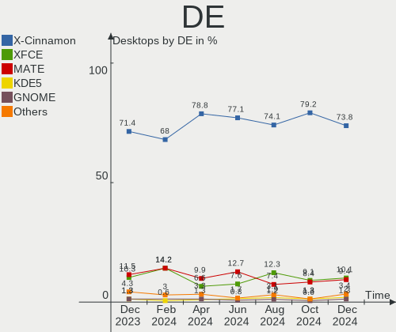
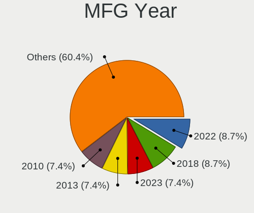
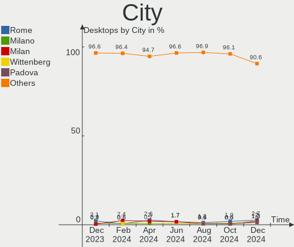
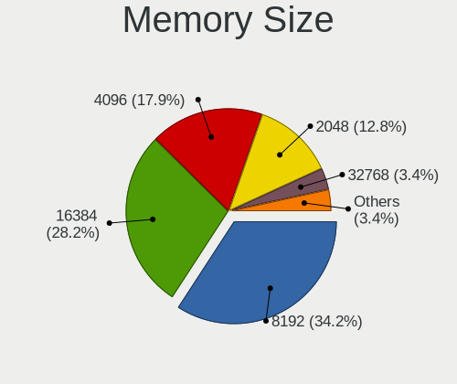

Linux Mint Hardware Trends (Desktops)
-------------------------------------

A project to identify most popular hardware characteristics and track their change
over time based on data collected by Linux Mint users at https://Linux-Hardware.org.

Anyone can contribute to this report by the [hw-probe](https://github.com/linuxhw/hw-probe) tool:

    sudo -E hw-probe -all -upload

Full-feature report is available here: https://linux-hardware.org/?view=trends&formfactor=desktop

Period: Oct, 2021.

Contents
--------

* [ System ](#system)
  - [ OS                       ](#os)
  - [ OS Family                ](#os-family)
  - [ Kernel                   ](#kernel)
  - [ Kernel Family            ](#kernel-family)
  - [ Kernel Major Ver.        ](#kernel-major-ver)
  - [ Arch                     ](#arch)
  - [ DE                       ](#de)
  - [ Display Server           ](#display-server)
  - [ Display Manager          ](#display-manager)
  - [ OS Lang                  ](#os-lang)
  - [ Boot Mode                ](#boot-mode)
  - [ Filesystem               ](#filesystem)
  - [ Part. scheme             ](#part-scheme)
  - [ Dual Boot with Linux/BSD ](#dual-boot-with-linuxbsd)
  - [ Dual Boot (Win)          ](#dual-boot-win)

* [ Board ](#board)
  - [ Vendor                   ](#vendor)
  - [ Model                    ](#model)
  - [ Model Family             ](#model-family)
  - [ MFG Year                 ](#mfg-year)
  - [ Form Factor              ](#form-factor)
  - [ Secure Boot              ](#secure-boot)
  - [ Coreboot                 ](#coreboot)
  - [ RAM Size                 ](#ram-size)
  - [ RAM Used                 ](#ram-used)
  - [ Total Drives             ](#total-drives)
  - [ Has CD-ROM               ](#has-cd-rom)
  - [ Has Ethernet             ](#has-ethernet)
  - [ Has WiFi                 ](#has-wifi)
  - [ Has Bluetooth            ](#has-bluetooth)

* [ Location ](#location)
  - [ Country                  ](#country)
  - [ City                     ](#city)

* [ Drives ](#drives)
  - [ Drive Vendor             ](#drive-vendor)
  - [ Drive Model              ](#drive-model)
  - [ HDD Vendor               ](#hdd-vendor)
  - [ SSD Vendor               ](#ssd-vendor)
  - [ Drive Kind               ](#drive-kind)
  - [ Drive Connector          ](#drive-connector)
  - [ Drive Size               ](#drive-size)
  - [ Space Total              ](#space-total)
  - [ Space Used               ](#space-used)
  - [ Malfunc. Drives          ](#malfunc-drives)
  - [ Malfunc. Drive Vendor    ](#malfunc-drive-vendor)
  - [ Malfunc. HDD Vendor      ](#malfunc-hdd-vendor)
  - [ Malfunc. Drive Kind      ](#malfunc-drive-kind)
  - [ Failed Drives            ](#failed-drives)
  - [ Failed Drive Vendor      ](#failed-drive-vendor)
  - [ Drive Status             ](#drive-status)

* [ Storage controller ](#storage-controller)
  - [ Storage Vendor           ](#storage-vendor)
  - [ Storage Model            ](#storage-model)
  - [ Storage Kind             ](#storage-kind)

* [ Processor ](#processor)
  - [ CPU Vendor               ](#cpu-vendor)
  - [ CPU Model                ](#cpu-model)
  - [ CPU Model Family         ](#cpu-model-family)
  - [ CPU Cores                ](#cpu-cores)
  - [ CPU Sockets              ](#cpu-sockets)
  - [ CPU Threads              ](#cpu-threads)
  - [ CPU Op-Modes             ](#cpu-op-modes)
  - [ CPU Microcode            ](#cpu-microcode)
  - [ CPU Microarch            ](#cpu-microarch)

* [ Graphics ](#graphics)
  - [ GPU Vendor               ](#gpu-vendor)
  - [ GPU Model                ](#gpu-model)
  - [ GPU Combo                ](#gpu-combo)
  - [ GPU Driver               ](#gpu-driver)
  - [ GPU Memory               ](#gpu-memory)

* [ Monitor ](#monitor)
  - [ Monitor Vendor           ](#monitor-vendor)
  - [ Monitor Model            ](#monitor-model)
  - [ Monitor Resolution       ](#monitor-resolution)
  - [ Monitor Diagonal         ](#monitor-diagonal)
  - [ Monitor Width            ](#monitor-width)
  - [ Aspect Ratio             ](#aspect-ratio)
  - [ Monitor Area             ](#monitor-area)
  - [ Pixel Density            ](#pixel-density)
  - [ Multiple Monitors        ](#multiple-monitors)

* [ Network ](#network)
  - [ Net Controller Vendor    ](#net-controller-vendor)
  - [ Net Controller Model     ](#net-controller-model)
  - [ Wireless Vendor          ](#wireless-vendor)
  - [ Wireless Model           ](#wireless-model)
  - [ Ethernet Vendor          ](#ethernet-vendor)
  - [ Ethernet Model           ](#ethernet-model)
  - [ Net Controller Kind      ](#net-controller-kind)
  - [ Used Controller          ](#used-controller)
  - [ NICs                     ](#nics)
  - [ IPv6                     ](#ipv6)

* [ Bluetooth ](#bluetooth)
  - [ Bluetooth Vendor         ](#bluetooth-vendor)
  - [ Bluetooth Model          ](#bluetooth-model)

* [ Sound ](#sound)
  - [ Sound Vendor             ](#sound-vendor)
  - [ Sound Model              ](#sound-model)

* [ Memory ](#memory)
  - [ Memory Vendor            ](#memory-vendor)
  - [ Memory Model             ](#memory-model)
  - [ Memory Kind              ](#memory-kind)
  - [ Memory Form Factor       ](#memory-form-factor)
  - [ Memory Size              ](#memory-size)
  - [ Memory Speed             ](#memory-speed)

* [ Printers & scanners ](#printers--scanners)
  - [ Printer Vendor           ](#printer-vendor)
  - [ Printer Model            ](#printer-model)
  - [ Scanner Vendor           ](#scanner-vendor)
  - [ Scanner Model            ](#scanner-model)

* [ Camera ](#camera)
  - [ Camera Vendor            ](#camera-vendor)
  - [ Camera Model             ](#camera-model)

* [ Security ](#security)
  - [ Fingerprint Vendor       ](#fingerprint-vendor)
  - [ Fingerprint Model        ](#fingerprint-model)
  - [ Chipcard Vendor          ](#chipcard-vendor)
  - [ Chipcard Model           ](#chipcard-model)

* [ Unsupported ](#unsupported)
  - [ Unsupported Devices      ](#unsupported-devices)
  - [ Unsupported Device Types ](#unsupported-device-types)

System
------

OS
--

Installed operating systems

| Name            | Desktops | Percent |
|-----------------|----------|---------|
| Linux Mint 20.2 | 160      | 78.82%  |
| Linux Mint 20.1 | 14       | 6.9%    |
| Linux Mint 19.3 | 11       | 5.42%   |
| Linux Mint 20   | 9        | 4.43%   |
| Linux Mint 19.2 | 3        | 1.48%   |
| Linux Mint 19   | 3        | 1.48%   |
| Linux Mint 18.3 | 2        | 0.99%   |
| Linux Mint 19.1 | 1        | 0.49%   |

OS Family
---------

OS without a version

| Name       | Desktops | Percent |
|------------|----------|---------|
| Linux Mint | 203      | 100%    |

Kernel
------

Version of the Linux kernel

| Version                | Desktops | Percent |
|------------------------|----------|---------|
| 5.4.0-88-generic       | 95       | 46.8%   |
| 5.4.0-89-generic       | 45       | 22.17%  |
| 5.4.0-74-generic       | 8        | 3.94%   |
| 5.11.0-38-generic      | 7        | 3.45%   |
| 5.11.0-37-generic      | 7        | 3.45%   |
| 5.4.0-87-generic       | 4        | 1.97%   |
| 5.4.0-84-generic       | 4        | 1.97%   |
| 5.4.0-81-generic       | 2        | 0.99%   |
| 5.4.0-26-generic       | 2        | 0.99%   |
| 5.11.0-34-generic      | 2        | 0.99%   |
| 5.0.0-32-generic       | 2        | 0.99%   |
| 4.15.0-54-generic      | 2        | 0.99%   |
| 4.15.0-20-generic      | 2        | 0.99%   |
| 4.15.0-159-generic     | 2        | 0.99%   |
| 4.15.0-142-generic     | 2        | 0.99%   |
| 5.8.0-59-generic       | 1        | 0.49%   |
| 5.4.0-80-generic       | 1        | 0.49%   |
| 5.4.0-77-generic       | 1        | 0.49%   |
| 5.4.0-62-generic       | 1        | 0.49%   |
| 5.4.0-58-generic       | 1        | 0.49%   |
| 5.4.0-56-generic       | 1        | 0.49%   |
| 5.4.0-48-generic       | 1        | 0.49%   |
| 5.4.0-39-generic       | 1        | 0.49%   |
| 5.14.15-xanmod1-cacule | 1        | 0.49%   |
| 5.13.12-xanmod1        | 1        | 0.49%   |
| 5.13.12-051312-generic | 1        | 0.49%   |
| 5.12.9-steamvr-generic | 1        | 0.49%   |
| 5.11.0-37-lowlatency   | 1        | 0.49%   |
| 5.11.0-22-generic      | 1        | 0.49%   |
| 5.10.0-1050-oem        | 1        | 0.49%   |
| 5.10.0-1049-oem        | 1        | 0.49%   |
| 5.0.0-23-generic       | 1        | 0.49%   |

Kernel Family
-------------

Linux kernel without a distro release

| Version | Desktops | Percent |
|---------|----------|---------|
| 5.4.0   | 167      | 82.27%  |
| 5.11.0  | 18       | 8.87%   |
| 4.15.0  | 8        | 3.94%   |
| 5.0.0   | 3        | 1.48%   |
| 5.13.12 | 2        | 0.99%   |
| 5.10.0  | 2        | 0.99%   |
| 5.8.0   | 1        | 0.49%   |
| 5.14.15 | 1        | 0.49%   |
| 5.12.9  | 1        | 0.49%   |

Kernel Major Ver.
-----------------

Linux kernel major version

| Version | Desktops | Percent |
|---------|----------|---------|
| 5.4     | 167      | 82.27%  |
| 5.11    | 18       | 8.87%   |
| 4.15    | 8        | 3.94%   |
| 5.0     | 3        | 1.48%   |
| 5.13    | 2        | 0.99%   |
| 5.10    | 2        | 0.99%   |
| 5.8     | 1        | 0.49%   |
| 5.14    | 1        | 0.49%   |
| 5.12    | 1        | 0.49%   |

Arch
----

OS architecture (x86_64, i586, etc.)

| Name   | Desktops | Percent |
|--------|----------|---------|
| x86_64 | 197      | 97.04%  |
| i686   | 6        | 2.96%   |

DE
--

Desktop Environment

| Name       | Desktops | Percent |
|------------|----------|---------|
| X-Cinnamon | 143      | 70.44%  |
| MATE       | 36       | 17.73%  |
| XFCE       | 12       | 5.91%   |
| Cinnamon   | 7        | 3.45%   |
| GNOME      | 2        | 0.99%   |
| Unknown    | 2        | 0.99%   |
| KDE        | 1        | 0.49%   |

Display Server
--------------

X11 or Wayland

| Name | Desktops | Percent |
|------|----------|---------|
| X11  | 202      | 99.51%  |
| Tty  | 1        | 0.49%   |

Display Manager
---------------

SDDM, LightDM, etc.

| Name    | Desktops | Percent |
|---------|----------|---------|
| Unknown | 135      | 66.5%   |
| LightDM | 68       | 33.5%   |

OS Lang
-------

Language

| Lang  | Desktops | Percent |
|-------|----------|---------|
| de_DE | 50       | 24.63%  |
| en_US | 43       | 21.18%  |
| pt_BR | 15       | 7.39%   |
| ru_RU | 11       | 5.42%   |
| en_GB | 11       | 5.42%   |
| fr_FR | 8        | 3.94%   |
| en_CA | 7        | 3.45%   |
| pl_PL | 5        | 2.46%   |
| es_ES | 5        | 2.46%   |
| en_AU | 5        | 2.46%   |
| it_IT | 4        | 1.97%   |
| ru_UA | 3        | 1.48%   |
| hu_HU | 3        | 1.48%   |
| es_AR | 3        | 1.48%   |
| de_CH | 3        | 1.48%   |
| cs_CZ | 3        | 1.48%   |
| fr_BE | 2        | 0.99%   |
| es_VE | 2        | 0.99%   |
| es_CO | 2        | 0.99%   |
| da_DK | 2        | 0.99%   |
| zh_CN | 1        | 0.49%   |
| tr_TR | 1        | 0.49%   |
| sk_SK | 1        | 0.49%   |
| pt_PT | 1        | 0.49%   |
| nl_NL | 1        | 0.49%   |
| nl_BE | 1        | 0.49%   |
| nb_NO | 1        | 0.49%   |
| fr_CA | 1        | 0.49%   |
| es_PE | 1        | 0.49%   |
| es_CR | 1        | 0.49%   |
| es_CL | 1        | 0.49%   |
| en_IN | 1        | 0.49%   |
| en_IL | 1        | 0.49%   |
| en_IE | 1        | 0.49%   |
| ca_ES | 1        | 0.49%   |
| C     | 1        | 0.49%   |

Boot Mode
---------

EFI or BIOS

| Mode | Desktops | Percent |
|------|----------|---------|
| BIOS | 124      | 61.08%  |
| EFI  | 79       | 38.92%  |

Filesystem
----------

Type of filesystem

| Type    | Desktops | Percent |
|---------|----------|---------|
| Ext4    | 196      | 96.55%  |
| Btrfs   | 5        | 2.46%   |
| Xfs     | 1        | 0.49%   |
| Overlay | 1        | 0.49%   |

Part. scheme
------------

Scheme of partitioning

| Type    | Desktops | Percent |
|---------|----------|---------|
| Unknown | 141      | 69.46%  |
| GPT     | 33       | 16.26%  |
| MBR     | 29       | 14.29%  |

Dual Boot with Linux/BSD
------------------------

Hosting more than one Linux/BSD

| Dual boot | Desktops | Percent |
|-----------|----------|---------|
| No        | 186      | 91.63%  |
| Yes       | 17       | 8.37%   |

Dual Boot (Win)
---------------

Hosting Linux and Windows

| Dual boot | Desktops | Percent |
|-----------|----------|---------|
| No        | 170      | 83.74%  |
| Yes       | 33       | 16.26%  |

Board
-----

Vendor
------

Motherboard manufacturer

| Name                | Desktops | Percent |
|---------------------|----------|---------|
| ASUSTek Computer    | 54       | 26.6%   |
| Gigabyte Technology | 30       | 14.78%  |
| Dell                | 20       | 9.85%   |
| ASRock              | 19       | 9.36%   |
| MSI                 | 16       | 7.88%   |
| Hewlett-Packard     | 14       | 6.9%    |
| Lenovo              | 7        | 3.45%   |
| Intel               | 7        | 3.45%   |
| Pegatron            | 5        | 2.46%   |
| Unknown             | 5        | 2.46%   |
| Medion              | 3        | 1.48%   |
| Fujitsu             | 3        | 1.48%   |
| Biostar             | 3        | 1.48%   |
| Foxconn             | 2        | 0.99%   |
| Acer                | 2        | 0.99%   |
| TPV-INVENTA         | 1        | 0.49%   |
| T-bao               | 1        | 0.49%   |
| Supermicro          | 1        | 0.49%   |
| Shuttle             | 1        | 0.49%   |
| R-StyleComputers    | 1        | 0.49%   |
| LattePanda          | 1        | 0.49%   |
| Huanan              | 1        | 0.49%   |
| Gateway             | 1        | 0.49%   |
| Fujitsu Siemens     | 1        | 0.49%   |
| Digitron            | 1        | 0.49%   |
| Chuwi               | 1        | 0.49%   |
| BESSTAR Tech        | 1        | 0.49%   |
| Alienware           | 1        | 0.49%   |

Model
-----

Motherboard model

| Name                                       | Desktops | Percent |
|--------------------------------------------|----------|---------|
| ASUS All Series                            | 5        | 2.46%   |
| Unknown                                    | 5        | 2.46%   |
| Gigabyte B450M DS3H                        | 4        | 1.97%   |
| ASUS TUF GAMING X570-PLUS                  | 3        | 1.48%   |
| MSI MS-7982                                | 2        | 0.99%   |
| Intel H61                                  | 2        | 0.99%   |
| Gigabyte GA-870A-UD3                       | 2        | 0.99%   |
| Dell PowerEdge T30                         | 2        | 0.99%   |
| Dell OptiPlex 790                          | 2        | 0.99%   |
| Dell OptiPlex 7010                         | 2        | 0.99%   |
| ASUS ROG STRIX X470-F GAMING               | 2        | 0.99%   |
| ASRock B450M Pro4                          | 2        | 0.99%   |
| TPV-INVENTA 18-2003LA                      | 1        | 0.49%   |
| T-bao MINI PC                              | 1        | 0.49%   |
| Supermicro X7SPA-HF                        | 1        | 0.49%   |
| Shuttle SX50                               | 1        | 0.49%   |
| R-StyleComputers MS-7395                   | 1        | 0.49%   |
| Pegatron TouchSmart 7320 Lavaca-B EU L6 PC | 1        | 0.49%   |
| Pegatron h9-1160ez                         | 1        | 0.49%   |
| Pegatron Elite 7300 Series MT              | 1        | 0.49%   |
| Pegatron CQ2722LA                          | 1        | 0.49%   |
| Pegatron 2A94h                             | 1        | 0.49%   |
| MSI Pro 3515 Series                        | 1        | 0.49%   |
| MSI MS-7D09                                | 1        | 0.49%   |
| MSI MS-7C37                                | 1        | 0.49%   |
| MSI MS-7B84                                | 1        | 0.49%   |
| MSI MS-7B54                                | 1        | 0.49%   |
| MSI MS-7971                                | 1        | 0.49%   |
| MSI MS-7924                                | 1        | 0.49%   |
| MSI MS-7823                                | 1        | 0.49%   |
| MSI MS-7798                                | 1        | 0.49%   |
| MSI MS-7693                                | 1        | 0.49%   |
| MSI MS-7681                                | 1        | 0.49%   |
| MSI MS-7641                                | 1        | 0.49%   |
| MSI MS-7270                                | 1        | 0.49%   |
| MSI MS-7255                                | 1        | 0.49%   |
| Medion MS-7728                             | 1        | 0.49%   |
| Medion MS-7707                             | 1        | 0.49%   |
| Medion MS-7633                             | 1        | 0.49%   |
| Lenovo ThinkStation E31 2553CM8            | 1        | 0.49%   |
| Lenovo ThinkCentre M81 5049W16             | 1        | 0.49%   |
| Lenovo ThinkCentre M58p 6234A1G            | 1        | 0.49%   |
| Lenovo ThinkCentre M58e 7303AZ2            | 1        | 0.49%   |
| Lenovo IdeaCentre 5 14IMB05 90NA0082US     | 1        | 0.49%   |
| Lenovo H520S 10093                         | 1        | 0.49%   |
| Lenovo H30-05 90BJ002RUK                   | 1        | 0.49%   |
| LattePanda Alpha                           | 1        | 0.49%   |
| Intel H55                                  | 1        | 0.49%   |
| Intel DQ77KB AAG81483-500                  | 1        | 0.49%   |
| Intel DH77EB AAG39073-304                  | 1        | 0.49%   |
| Intel DG33BU AAD90159-403                  | 1        | 0.49%   |
| Intel DG31PR AAE58249-301                  | 1        | 0.49%   |
| Huanan X79 249PC V2.2                      | 1        | 0.49%   |
| HP Z420 Workstation                        | 1        | 0.49%   |
| HP Z400 Workstation                        | 1        | 0.49%   |
| HP ProDesk 600 G1 SFF                      | 1        | 0.49%   |
| HP EliteDesk 800 G1 SFF                    | 1        | 0.49%   |
| HP EliteDesk 705 G4 DM 35W (TAA)           | 1        | 0.49%   |
| HP Desktop M01-F0xxx                       | 1        | 0.49%   |
| HP Compaq Pro 6305 SFF                     | 1        | 0.49%   |

Model Family
------------

Motherboard model prefix

| Name                     | Desktops | Percent |
|--------------------------|----------|---------|
| Dell OptiPlex            | 14       | 6.9%    |
| ASUS PRIME               | 9        | 4.43%   |
| HP Compaq                | 7        | 3.45%   |
| ASUS ROG                 | 5        | 2.46%   |
| ASUS All                 | 5        | 2.46%   |
| Unknown                  | 5        | 2.46%   |
| Gigabyte B450M           | 4        | 1.97%   |
| ASUS TUF                 | 4        | 1.97%   |
| Lenovo ThinkCentre       | 3        | 1.48%   |
| MSI MS-7982              | 2        | 0.99%   |
| Intel H61                | 2        | 0.99%   |
| HP EliteDesk             | 2        | 0.99%   |
| Gigabyte GA-870A-UD3     | 2        | 0.99%   |
| Fujitsu ESPRIMO          | 2        | 0.99%   |
| Dell Precision           | 2        | 0.99%   |
| Dell PowerEdge           | 2        | 0.99%   |
| ASUS P8H61-M             | 2        | 0.99%   |
| ASRock B450M             | 2        | 0.99%   |
| ASRock 970               | 2        | 0.99%   |
| TPV-INVENTA 18-2003LA    | 1        | 0.49%   |
| T-bao MINI               | 1        | 0.49%   |
| Supermicro X7SPA-HF      | 1        | 0.49%   |
| Shuttle SX50             | 1        | 0.49%   |
| R-StyleComputers MS-7395 | 1        | 0.49%   |
| Pegatron TouchSmart      | 1        | 0.49%   |
| Pegatron h9-1160ez       | 1        | 0.49%   |
| Pegatron Elite           | 1        | 0.49%   |
| Pegatron CQ2722LA        | 1        | 0.49%   |
| Pegatron 2A94h           | 1        | 0.49%   |
| MSI Pro                  | 1        | 0.49%   |
| MSI MS-7D09              | 1        | 0.49%   |
| MSI MS-7C37              | 1        | 0.49%   |
| MSI MS-7B84              | 1        | 0.49%   |
| MSI MS-7B54              | 1        | 0.49%   |
| MSI MS-7971              | 1        | 0.49%   |
| MSI MS-7924              | 1        | 0.49%   |
| MSI MS-7823              | 1        | 0.49%   |
| MSI MS-7798              | 1        | 0.49%   |
| MSI MS-7693              | 1        | 0.49%   |
| MSI MS-7681              | 1        | 0.49%   |
| MSI MS-7641              | 1        | 0.49%   |
| MSI MS-7270              | 1        | 0.49%   |
| MSI MS-7255              | 1        | 0.49%   |
| Medion MS-7728           | 1        | 0.49%   |
| Medion MS-7707           | 1        | 0.49%   |
| Medion MS-7633           | 1        | 0.49%   |
| Lenovo ThinkStation      | 1        | 0.49%   |
| Lenovo IdeaCentre        | 1        | 0.49%   |
| Lenovo H520S             | 1        | 0.49%   |
| Lenovo H30-05            | 1        | 0.49%   |
| LattePanda Alpha         | 1        | 0.49%   |
| Intel H55                | 1        | 0.49%   |
| Intel DQ77KB             | 1        | 0.49%   |
| Intel DH77EB             | 1        | 0.49%   |
| Intel DG33BU             | 1        | 0.49%   |
| Intel DG31PR             | 1        | 0.49%   |
| Huanan X79               | 1        | 0.49%   |
| HP Z420                  | 1        | 0.49%   |
| HP Z400                  | 1        | 0.49%   |
| HP ProDesk               | 1        | 0.49%   |

MFG Year
--------

Motherboard manufacture year

| Year | Desktops | Percent |
|------|----------|---------|
| 2020 | 28       | 13.79%  |
| 2018 | 17       | 8.37%   |
| 2011 | 17       | 8.37%   |
| 2021 | 16       | 7.88%   |
| 2012 | 16       | 7.88%   |
| 2019 | 15       | 7.39%   |
| 2013 | 15       | 7.39%   |
| 2014 | 13       | 6.4%    |
| 2010 | 13       | 6.4%    |
| 2009 | 12       | 5.91%   |
| 2016 | 10       | 4.93%   |
| 2015 | 9        | 4.43%   |
| 2017 | 7        | 3.45%   |
| 2008 | 6        | 2.96%   |
| 2007 | 6        | 2.96%   |
| 2006 | 2        | 0.99%   |
| 2003 | 1        | 0.49%   |

Form Factor
-----------

Physical design of the computer

| Name    | Desktops | Percent |
|---------|----------|---------|
| Desktop | 203      | 100%    |

Secure Boot
-----------

Enabled or disabled

| State    | Desktops | Percent |
|----------|----------|---------|
| Disabled | 196      | 96.55%  |
| Enabled  | 7        | 3.45%   |

Coreboot
--------

Have coreboot on board

| Used | Desktops | Percent |
|------|----------|---------|
| No   | 203      | 100%    |

RAM Size
--------

Total RAM memory

| Size in GB  | Desktops | Percent |
|-------------|----------|---------|
| 16.01-24.0  | 55       | 27.09%  |
| 8.01-16.0   | 39       | 19.21%  |
| 3.01-4.0    | 36       | 17.73%  |
| 4.01-8.0    | 30       | 14.78%  |
| 32.01-64.0  | 21       | 10.34%  |
| 1.01-2.0    | 8        | 3.94%   |
| 2.01-3.0    | 7        | 3.45%   |
| 64.01-256.0 | 4        | 1.97%   |
| 0.51-1.0    | 2        | 0.99%   |
| 24.01-32.0  | 1        | 0.49%   |

RAM Used
--------

Used RAM memory

| Used GB   | Desktops | Percent |
|-----------|----------|---------|
| 1.01-2.0  | 80       | 39.41%  |
| 2.01-3.0  | 47       | 23.15%  |
| 3.01-4.0  | 30       | 14.78%  |
| 4.01-8.0  | 20       | 9.85%   |
| 0.51-1.0  | 19       | 9.36%   |
| 8.01-16.0 | 7        | 3.45%   |

Total Drives
------------

Number of drives on board

| Drives | Desktops | Percent |
|--------|----------|---------|
| 1      | 88       | 43.35%  |
| 2      | 55       | 27.09%  |
| 3      | 30       | 14.78%  |
| 4      | 20       | 9.85%   |
| 5      | 4        | 1.97%   |
| 6      | 3        | 1.48%   |
| 22     | 1        | 0.49%   |
| 8      | 1        | 0.49%   |
| 0      | 1        | 0.49%   |

Has CD-ROM
----------

Has CD-ROM on board

| Presented | Desktops | Percent |
|-----------|----------|---------|
| Yes       | 127      | 62.56%  |
| No        | 76       | 37.44%  |

Has Ethernet
------------

Has Ethernet on board

| Presented | Desktops | Percent |
|-----------|----------|---------|
| Yes       | 202      | 99.51%  |
| No        | 1        | 0.49%   |

Has WiFi
--------

Has WiFi module

| Presented | Desktops | Percent |
|-----------|----------|---------|
| No        | 122      | 60.1%   |
| Yes       | 81       | 39.9%   |

Has Bluetooth
-------------

Has Bluetooth module

| Presented | Desktops | Percent |
|-----------|----------|---------|
| No        | 155      | 76.35%  |
| Yes       | 48       | 23.65%  |

Location
--------

Country
-------

Geographic location (country)

| Country     | Desktops | Percent |
|-------------|----------|---------|
| Germany     | 51       | 25.12%  |
| USA         | 25       | 12.32%  |
| Brazil      | 15       | 7.39%   |
| UK          | 10       | 4.93%   |
| Russia      | 10       | 4.93%   |
| Canada      | 10       | 4.93%   |
| France      | 7        | 3.45%   |
| Spain       | 6        | 2.96%   |
| Switzerland | 5        | 2.46%   |
| Poland      | 5        | 2.46%   |
| Australia   | 5        | 2.46%   |
| Italy       | 4        | 1.97%   |
| Hungary     | 4        | 1.97%   |
| Denmark     | 4        | 1.97%   |
| Belgium     | 4        | 1.97%   |
| Ukraine     | 3        | 1.48%   |
| Czechia     | 3        | 1.48%   |
| Colombia    | 3        | 1.48%   |
| Argentina   | 3        | 1.48%   |
| Venezuela   | 2        | 0.99%   |
| Romania     | 2        | 0.99%   |
| Portugal    | 2        | 0.99%   |
| Netherlands | 2        | 0.99%   |
| Turkey      | 1        | 0.49%   |
| Slovenia    | 1        | 0.49%   |
| Slovakia    | 1        | 0.49%   |
| Peru        | 1        | 0.49%   |
| Pakistan    | 1        | 0.49%   |
| Norway      | 1        | 0.49%   |
| Lithuania   | 1        | 0.49%   |
| Israel      | 1        | 0.49%   |
| Ireland     | 1        | 0.49%   |
| Indonesia   | 1        | 0.49%   |
| India       | 1        | 0.49%   |
| Egypt       | 1        | 0.49%   |
| Costa Rica  | 1        | 0.49%   |
| China       | 1        | 0.49%   |
| Chile       | 1        | 0.49%   |
| Belarus     | 1        | 0.49%   |
| Austria     | 1        | 0.49%   |
| Algeria     | 1        | 0.49%   |

City
----

Geographic location (city)

| City                        | Desktops | Percent |
|-----------------------------|----------|---------|
| Stuttgart                   | 3        | 1.48%   |
| Hamburg                     | 3        | 1.48%   |
| Frankfurt am Main           | 3        | 1.48%   |
| Budapest                    | 3        | 1.48%   |
| Wuppertal                   | 2        | 0.99%   |
| Teplice                     | 2        | 0.99%   |
| Sydney                      | 2        | 0.99%   |
| St Petersburg               | 2        | 0.99%   |
| Recife                      | 2        | 0.99%   |
| Munich                      | 2        | 0.99%   |
| D??sseldorf                 | 2        | 0.99%   |
| Copenhagen                  | 2        | 0.99%   |
| Clemmons                    | 2        | 0.99%   |
| Barcelona                   | 2        | 0.99%   |
| Zurich                      | 1        | 0.49%   |
| Zaporizhzhya                | 1        | 0.49%   |
| Wuhan                       | 1        | 0.49%   |
| Wroclaw                     | 1        | 0.49%   |
| Winter Springs              | 1        | 0.49%   |
| Winston-Salem               | 1        | 0.49%   |
| Willits                     | 1        | 0.49%   |
| Wichita Falls               | 1        | 0.49%   |
| Weitersfelden               | 1        | 0.49%   |
| Warton                      | 1        | 0.49%   |
| Warsaw                      | 1        | 0.49%   |
| Wandsworth                  | 1        | 0.49%   |
| Vilnius                     | 1        | 0.49%   |
| Viechtach                   | 1        | 0.49%   |
| Viam??o                     | 1        | 0.49%   |
| Velikiye Luki               | 1        | 0.49%   |
| Vasvar                      | 1        | 0.49%   |
| Vanlose                     | 1        | 0.49%   |
| Valparaiso de Goias         | 1        | 0.49%   |
| Valencia                    | 1        | 0.49%   |
| Val-d'Or                    | 1        | 0.49%   |
| Tolyatti                    | 1        | 0.49%   |
| Tolochenaz                  | 1        | 0.49%   |
| Temse                       | 1        | 0.49%   |
| Temryuk                     | 1        | 0.49%   |
| Talca                       | 1        | 0.49%   |
| Stockton-on-Tees            | 1        | 0.49%   |
| Srednyaya Akhtuba           | 1        | 0.49%   |
| Sprimont                    | 1        | 0.49%   |
| Solingen                    | 1        | 0.49%   |
| Siegen                      | 1        | 0.49%   |
| Schwerte                    | 1        | 0.49%   |
| Schmitshausen               | 1        | 0.49%   |
| S??o Paulo                  | 1        | 0.49%   |
| Santurtzi                   | 1        | 0.49%   |
| Santos                      | 1        | 0.49%   |
| Salvador                    | 1        | 0.49%   |
| Saint-Nazaire               | 1        | 0.49%   |
| Saint-Guillaume             | 1        | 0.49%   |
| Saint-Augustin-de-Desmaures | 1        | 0.49%   |
| Rumlang                     | 1        | 0.49%   |
| Rosario                     | 1        | 0.49%   |
| Rochedale                   | 1        | 0.49%   |
| Riviere-Bleue               | 1        | 0.49%   |
| Rio de Janeiro              | 1        | 0.49%   |
| Rheda-Wiedenbrueck          | 1        | 0.49%   |

Drives
------

Drive Vendor
------------

Hard drive vendors

| Vendor                    | Desktops | Drives | Percent |
|---------------------------|----------|--------|---------|
| WDC                       | 87       | 104    | 23.51%  |
| Seagate                   | 72       | 92     | 19.46%  |
| Samsung Electronics       | 53       | 59     | 14.32%  |
| Kingston                  | 23       | 25     | 6.22%   |
| SanDisk                   | 16       | 16     | 4.32%   |
| Toshiba                   | 15       | 16     | 4.05%   |
| Hitachi                   | 12       | 13     | 3.24%   |
| Crucial                   | 11       | 15     | 2.97%   |
| Intel                     | 7        | 7      | 1.89%   |
| China                     | 6        | 6      | 1.62%   |
| A-DATA Technology         | 6        | 6      | 1.62%   |
| MAXTOR                    | 5        | 5      | 1.35%   |
| Intenso                   | 5        | 5      | 1.35%   |
| Patriot                   | 4        | 4      | 1.08%   |
| HGST                      | 4        | 5      | 1.08%   |
| Unknown                   | 4        | 4      | 1.08%   |
| XPG                       | 3        | 3      | 0.81%   |
| SPCC                      | 3        | 3      | 0.81%   |
| Silicon Motion            | 3        | 3      | 0.81%   |
| GOODRAM                   | 3        | 3      | 0.81%   |
| Unknown                   | 2        | 3      | 0.54%   |
| Team                      | 2        | 2      | 0.54%   |
| SK Hynix                  | 2        | 3      | 0.54%   |
| Verbatim                  | 1        | 1      | 0.27%   |
| Transcend                 | 1        | 4      | 0.27%   |
| TO Exter                  | 1        | 1      | 0.27%   |
| TCSUNBOW                  | 1        | 1      | 0.27%   |
| Solid                     | 1        | 1      | 0.27%   |
| Smartbuy                  | 1        | 1      | 0.27%   |
| PNY                       | 1        | 1      | 0.27%   |
| Phison                    | 1        | 1      | 0.27%   |
| NETAPP                    | 1        | 4      | 0.27%   |
| Micron/Crucial Technology | 1        | 1      | 0.27%   |
| Micron Technology         | 1        | 1      | 0.27%   |
| LITEONIT                  | 1        | 1      | 0.27%   |
| Lexar                     | 1        | 1      | 0.27%   |
| KingSpec                  | 1        | 1      | 0.27%   |
| inateck                   | 1        | 1      | 0.27%   |
| IBM-SSG                   | 1        | 7      | 0.27%   |
| HS-SSD-E100               | 1        | 1      | 0.27%   |
| ExcelStor                 | 1        | 1      | 0.27%   |
| Corsair                   | 1        | 1      | 0.27%   |
| Apacer                    | 1        | 1      | 0.27%   |
| ADATA SU                  | 1        | 1      | 0.27%   |
| 1TB                       | 1        | 1      | 0.27%   |

Drive Model
-----------

Hard drive models

| Model                                  | Desktops | Percent |
|----------------------------------------|----------|---------|
| Seagate ST500DM002-1BD142 500GB        | 7        | 1.71%   |
| Kingston SA400S37240G 240GB SSD        | 6        | 1.46%   |
| WDC WD20EARX-00PASB0 2TB               | 5        | 1.22%   |
| Kingston SA400S37120G 120GB SSD        | 5        | 1.22%   |
| WDC WD10EZEX-08WN4A0 1TB               | 4        | 0.98%   |
| Seagate ST3500418AS 500GB              | 4        | 0.98%   |
| Seagate ST1000DM010-2EP102 1TB         | 4        | 0.98%   |
| Seagate ST1000DM003-1CH162 1TB         | 4        | 0.98%   |
| Samsung SSD 860 EVO 500GB              | 4        | 0.98%   |
| Unknown                                | 4        | 0.98%   |
| WDC WD5000AAKX-60U6AA0 500GB           | 3        | 0.73%   |
| WDC WD20EZRZ-00Z5HB0 2TB               | 3        | 0.73%   |
| WDC WD10EZEX-00WN4A0 1TB               | 3        | 0.73%   |
| Toshiba MQ01ABF050 500GB               | 3        | 0.73%   |
| Seagate ST3500413AS 500GB              | 3        | 0.73%   |
| Seagate ST31000524AS 1TB               | 3        | 0.73%   |
| Seagate ST2000DM008-2FR102 2TB         | 3        | 0.73%   |
| Seagate ST2000DM006-2DM164 2TB         | 3        | 0.73%   |
| SanDisk SSD PLUS 480GB                 | 3        | 0.73%   |
| Samsung SSD 850 EVO 500GB              | 3        | 0.73%   |
| Samsung SSD 850 EVO 250GB              | 3        | 0.73%   |
| Samsung NVMe SSD Drive 500GB           | 3        | 0.73%   |
| Samsung NVMe SSD Drive 2TB             | 3        | 0.73%   |
| Samsung NVMe SSD Drive 1TB             | 3        | 0.73%   |
| Kingston SV300S37A120G 120GB SSD       | 3        | 0.73%   |
| Kingston SA400S37480G 480GB SSD        | 3        | 0.73%   |
| WDC WDS500G2B0A-00SM50 500GB SSD       | 2        | 0.49%   |
| WDC WD5000AAKS-00A7B0 500GB            | 2        | 0.49%   |
| WDC WD20EZRX-00D8PB0 2TB               | 2        | 0.49%   |
| WDC WD10EZEX-08M2NA0 1TB               | 2        | 0.49%   |
| Toshiba TR200 240GB SSD                | 2        | 0.49%   |
| Toshiba DT01ACA100 1TB                 | 2        | 0.49%   |
| SPCC Solid State Disk 128GB            | 2        | 0.49%   |
| Seagate ST750LX003-1AC154 752GB        | 2        | 0.49%   |
| Seagate ST4000DM004-2CV104 4TB         | 2        | 0.49%   |
| Seagate ST3500312CS 500GB              | 2        | 0.49%   |
| Seagate ST320LT012-1DG14C 320GB        | 2        | 0.49%   |
| Seagate ST250DM000-1BD141 250GB        | 2        | 0.49%   |
| Seagate ST2000DM001-1ER164 2TB         | 2        | 0.49%   |
| Seagate ST1000LM035-1RK172 1TB         | 2        | 0.49%   |
| SanDisk SSD PLUS 240GB                 | 2        | 0.49%   |
| Sandisk NVMe SSD Drive 256GB           | 2        | 0.49%   |
| Samsung SSD 970 EVO 1TB                | 2        | 0.49%   |
| Samsung SSD 870 EVO 1TB                | 2        | 0.49%   |
| Samsung SSD 860 EVO 250GB              | 2        | 0.49%   |
| Samsung SSD 860 EVO 1TB                | 2        | 0.49%   |
| Samsung SSD 840 Series 120GB           | 2        | 0.49%   |
| Samsung SM963 2.5" NVMe PCIe SSD 250GB | 2        | 0.49%   |
| Samsung NVMe SSD Drive 256GB           | 2        | 0.49%   |
| Samsung HD502IJ 500GB                  | 2        | 0.49%   |
| Samsung HD204UI 2TB                    | 2        | 0.49%   |
| Hitachi HUA722010CLA331 1TB            | 2        | 0.49%   |
| Crucial CT500MX500SSD1 500GB           | 2        | 0.49%   |
| Crucial CT480BX500SSD1 480GB           | 2        | 0.49%   |
| Crucial CT240BX500SSD1 240GB           | 2        | 0.49%   |
| Crucial CT1000BX500SSD1 1TB            | 2        | 0.49%   |
| XPG NVMe SSD Drive 2TB                 | 1        | 0.24%   |
| XPG NVMe SSD Drive 256GB               | 1        | 0.24%   |
| XPG NVMe SSD Drive 1024GB              | 1        | 0.24%   |
| WDC WDS500G1B0A-00H9H0 500GB SSD       | 1        | 0.24%   |

HDD Vendor
----------

Hard disk drive vendors

| Vendor              | Desktops | Drives | Percent |
|---------------------|----------|--------|---------|
| WDC                 | 80       | 96     | 39.22%  |
| Seagate             | 71       | 90     | 34.8%   |
| Samsung Electronics | 18       | 18     | 8.82%   |
| Toshiba             | 12       | 12     | 5.88%   |
| Hitachi             | 12       | 13     | 5.88%   |
| MAXTOR              | 5        | 5      | 2.45%   |
| HGST                | 4        | 5      | 1.96%   |
| TO Exter            | 1        | 1      | 0.49%   |
| ExcelStor           | 1        | 1      | 0.49%   |

SSD Vendor
----------

Solid state drive vendors

| Vendor              | Desktops | Drives | Percent |
|---------------------|----------|--------|---------|
| Samsung Electronics | 25       | 25     | 21.01%  |
| Kingston            | 19       | 21     | 15.97%  |
| SanDisk             | 12       | 12     | 10.08%  |
| Crucial             | 11       | 14     | 9.24%   |
| WDC                 | 6        | 6      | 5.04%   |
| China               | 6        | 6      | 5.04%   |
| Intenso             | 5        | 5      | 4.2%    |
| A-DATA Technology   | 5        | 5      | 4.2%    |
| Patriot             | 4        | 4      | 3.36%   |
| Toshiba             | 3        | 3      | 2.52%   |
| SPCC                | 3        | 3      | 2.52%   |
| GOODRAM             | 3        | 3      | 2.52%   |
| Team                | 2        | 2      | 1.68%   |
| Intel               | 2        | 2      | 1.68%   |
| Unknown             | 2        | 2      | 1.68%   |
| Verbatim            | 1        | 1      | 0.84%   |
| TCSUNBOW            | 1        | 1      | 0.84%   |
| Solid               | 1        | 1      | 0.84%   |
| PNY                 | 1        | 1      | 0.84%   |
| Micron Technology   | 1        | 1      | 0.84%   |
| LITEONIT            | 1        | 1      | 0.84%   |
| Lexar               | 1        | 1      | 0.84%   |
| KingSpec            | 1        | 1      | 0.84%   |
| Corsair             | 1        | 1      | 0.84%   |
| ADATA SU            | 1        | 1      | 0.84%   |
| 1TB                 | 1        | 1      | 0.84%   |

Drive Kind
----------

HDD or SSD

| Kind    | Desktops | Drives | Percent |
|---------|----------|--------|---------|
| HDD     | 151      | 241    | 50.33%  |
| SSD     | 100      | 124    | 33.33%  |
| NVMe    | 41       | 52     | 13.67%  |
| Unknown | 7        | 18     | 2.33%   |
| MMC     | 1        | 1      | 0.33%   |

Drive Connector
---------------

SATA, SAS, NVMe, etc.

| Type | Desktops | Drives | Percent |
|------|----------|--------|---------|
| SATA | 194      | 357    | 78.54%  |
| NVMe | 41       | 51     | 16.6%   |
| SAS  | 11       | 27     | 4.45%   |
| MMC  | 1        | 1      | 0.4%    |

Drive Size
----------

Size of hard drive

| Size in TB | Desktops | Drives | Percent |
|------------|----------|--------|---------|
| 0.01-0.5   | 146      | 208    | 55.09%  |
| 0.51-1.0   | 70       | 90     | 26.42%  |
| 1.01-2.0   | 34       | 46     | 12.83%  |
| 3.01-4.0   | 8        | 11     | 3.02%   |
| 2.01-3.0   | 5        | 8      | 1.89%   |
| 4.01-10.0  | 2        | 2      | 0.75%   |

Space Total
-----------

Amount of disk space available on the file system

| Size in GB     | Desktops | Percent |
|----------------|----------|---------|
| 101-250        | 60       | 29.56%  |
| 251-500        | 48       | 23.65%  |
| 501-1000       | 29       | 14.29%  |
| More than 3000 | 21       | 10.34%  |
| 1001-2000      | 18       | 8.87%   |
| 51-100         | 16       | 7.88%   |
| 2001-3000      | 8        | 3.94%   |
| 21-50          | 2        | 0.99%   |
| 1-20           | 1        | 0.49%   |

Space Used
----------

Amount of used disk space

| Used GB        | Desktops | Percent |
|----------------|----------|---------|
| 101-250        | 40       | 19.7%   |
| 51-100         | 38       | 18.72%  |
| 1-20           | 37       | 18.23%  |
| 21-50          | 32       | 15.76%  |
| 251-500        | 21       | 10.34%  |
| 1001-2000      | 14       | 6.9%    |
| 501-1000       | 11       | 5.42%   |
| More than 3000 | 6        | 2.96%   |
| 2001-3000      | 4        | 1.97%   |

Malfunc. Drives
---------------

Drive models with a malfunction

| Model                                 | Desktops | Drives | Percent |
|---------------------------------------|----------|--------|---------|
| Seagate ST500DM002-1BD142 500GB       | 2        | 2      | 9.52%   |
| Seagate ST3500418AS 500GB             | 2        | 2      | 9.52%   |
| Seagate ST320LT012-1DG14C 320GB       | 2        | 2      | 9.52%   |
| WDC WD5002ABYS-01B1B0 500GB           | 1        | 1      | 4.76%   |
| WDC WD5000AAKS-00A7B0 500GB           | 1        | 1      | 4.76%   |
| WDC WD3200BEKT-60F3T1 320GB           | 1        | 1      | 4.76%   |
| WDC WD3200AAJS-00B4A0 320GB           | 1        | 1      | 4.76%   |
| WDC WD30EFRX-68AX9N0 3TB              | 1        | 1      | 4.76%   |
| WDC WD20EZRZ-00Z5HB0 2TB              | 1        | 1      | 4.76%   |
| WDC WD10PURZ-85U8XY0 1TB              | 1        | 1      | 4.76%   |
| WDC WD1003FZEX-00MK2A0 1TB            | 1        | 1      | 4.76%   |
| Seagate ST3500413AS 500GB             | 1        | 2      | 4.76%   |
| SanDisk SSD PLUS 240GB                | 1        | 1      | 4.76%   |
| Samsung Electronics SSD 960 EVO 250GB | 1        | 1      | 4.76%   |
| Samsung Electronics HD250HJ 250GB     | 1        | 1      | 4.76%   |
| Samsung Electronics HD081GJ 80GB      | 1        | 1      | 4.76%   |
| Hitachi HDS721010DLE630 1TB           | 1        | 1      | 4.76%   |
| Hitachi HCS5C3225SLA380 250GB         | 1        | 1      | 4.76%   |

Malfunc. Drive Vendor
---------------------

Vendors of faulty drives

| Vendor              | Desktops | Drives | Percent |
|---------------------|----------|--------|---------|
| WDC                 | 7        | 8      | 36.84%  |
| Seagate             | 6        | 8      | 31.58%  |
| Samsung Electronics | 3        | 3      | 15.79%  |
| Hitachi             | 2        | 2      | 10.53%  |
| SanDisk             | 1        | 1      | 5.26%   |

Malfunc. HDD Vendor
-------------------

Vendors of faulty HDD drives

| Vendor              | Desktops | Drives | Percent |
|---------------------|----------|--------|---------|
| WDC                 | 7        | 8      | 41.18%  |
| Seagate             | 6        | 8      | 35.29%  |
| Samsung Electronics | 2        | 2      | 11.76%  |
| Hitachi             | 2        | 2      | 11.76%  |

Malfunc. Drive Kind
-------------------

Kinds of faulty drives

| Kind | Desktops | Drives | Percent |
|------|----------|--------|---------|
| HDD  | 15       | 20     | 88.24%  |
| NVMe | 1        | 1      | 5.88%   |
| SSD  | 1        | 1      | 5.88%   |

Failed Drives
-------------

Failed drive models

Zero info for selected period =(

Failed Drive Vendor
-------------------

Failed drive vendors

Zero info for selected period =(

Drive Status
------------

Number of failed and malfunc. drives

| Status   | Desktops | Drives | Percent |
|----------|----------|--------|---------|
| Detected | 147      | 309    | 66.22%  |
| Works    | 58       | 105    | 26.13%  |
| Malfunc  | 17       | 22     | 7.66%   |

Storage controller
------------------

Storage Vendor
--------------

Storage controller vendors

| Vendor                       | Desktops | Percent |
|------------------------------|----------|---------|
| Intel                        | 125      | 46.47%  |
| AMD                          | 64       | 23.79%  |
| Samsung Electronics          | 14       | 5.2%    |
| Nvidia                       | 10       | 3.72%   |
| JMicron Technology           | 9        | 3.35%   |
| ASMedia Technology           | 9        | 3.35%   |
| Sandisk                      | 6        | 2.23%   |
| Silicon Motion               | 5        | 1.86%   |
| VIA Technologies             | 4        | 1.49%   |
| Marvell Technology Group     | 4        | 1.49%   |
| Kingston Technology Company  | 4        | 1.49%   |
| ADATA Technology             | 4        | 1.49%   |
| SK Hynix                     | 2        | 0.74%   |
| Phison Electronics           | 2        | 0.74%   |
| Micron/Crucial Technology    | 2        | 0.74%   |
| ULi Electronics              | 1        | 0.37%   |
| Toshiba America Info Systems | 1        | 0.37%   |
| Silicon Image                | 1        | 0.37%   |
| LSI Logic / Symbios Logic    | 1        | 0.37%   |
| Adaptec                      | 1        | 0.37%   |

Storage Model
-------------

Storage controller models

| Model                                                                                   | Desktops | Percent |
|-----------------------------------------------------------------------------------------|----------|---------|
| AMD FCH SATA Controller [AHCI mode]                                                     | 37       | 10.63%  |
| Intel 6 Series/C200 Series Chipset Family 6 port Desktop SATA AHCI Controller           | 24       | 6.9%    |
| AMD 400 Series Chipset SATA Controller                                                  | 14       | 4.02%   |
| Intel 8 Series/C220 Series Chipset Family 6-port SATA Controller 1 [AHCI mode]          | 13       | 3.74%   |
| Intel NM10/ICH7 Family SATA Controller [IDE mode]                                       | 12       | 3.45%   |
| AMD SB7x0/SB8x0/SB9x0 IDE Controller                                                    | 12       | 3.45%   |
| Intel 7 Series/C210 Series Chipset Family 6-port SATA Controller [AHCI mode]            | 10       | 2.87%   |
| AMD SB7x0/SB8x0/SB9x0 SATA Controller [AHCI mode]                                       | 10       | 2.87%   |
| Intel Q170/Q150/B150/H170/H110/Z170/CM236 Chipset SATA Controller [AHCI Mode]           | 9        | 2.59%   |
| ASMedia ASM1062 Serial ATA Controller                                                   | 9        | 2.59%   |
| Samsung NVMe SSD Controller SM981/PM981/PM983                                           | 8        | 2.3%    |
| Intel 200 Series PCH SATA controller [AHCI mode]                                        | 8        | 2.3%    |
| AMD SB7x0/SB8x0/SB9x0 SATA Controller [IDE mode]                                        | 8        | 2.3%    |
| JMicron JMB363 SATA/IDE Controller                                                      | 7        | 2.01%   |
| Intel 82801G (ICH7 Family) IDE Controller                                               | 7        | 2.01%   |
| Intel Cannon Lake PCH SATA AHCI Controller                                              | 6        | 1.72%   |
| Intel 9 Series Chipset Family SATA Controller [AHCI Mode]                               | 5        | 1.44%   |
| VIA VT82C586A/B/VT82C686/A/B/VT823x/A/C PIPC Bus Master IDE                             | 4        | 1.15%   |
| Silicon Motion SM2263EN/SM2263XT SSD Controller                                         | 4        | 1.15%   |
| Samsung NVMe SSD Controller SM961/PM961/SM963                                           | 4        | 1.15%   |
| Nvidia MCP61 SATA Controller                                                            | 4        | 1.15%   |
| Intel SATA Controller [RAID mode]                                                       | 4        | 1.15%   |
| Intel 82801JD/DO (ICH10 Family) SATA AHCI Controller                                    | 4        | 1.15%   |
| Intel 82801I (ICH9 Family) 2 port SATA Controller [IDE mode]                            | 4        | 1.15%   |
| AMD Starship/Matisse Chipset SATA Controller [AHCI mode]                                | 4        | 1.15%   |
| ADATA XPG SX8200 Pro PCIe Gen3x4 M.2 2280 Solid State Drive                             | 4        | 1.15%   |
| Sandisk WD Blue SN500 / PC SN520 NVMe SSD                                               | 3        | 0.86%   |
| Nvidia MCP78S [GeForce 8200] SATA Controller (non-AHCI mode)                            | 3        | 0.86%   |
| Nvidia MCP78S [GeForce 8200] IDE                                                        | 3        | 0.86%   |
| Nvidia MCP61 IDE                                                                        | 3        | 0.86%   |
| Kingston Company A2000 NVMe SSD                                                         | 3        | 0.86%   |
| Intel 82801JI (ICH10 Family) SATA AHCI Controller                                       | 3        | 0.86%   |
| Intel 82801IR/IO/IH (ICH9R/DO/DH) 4 port SATA Controller [IDE mode]                     | 3        | 0.86%   |
| Intel 6 Series/C200 Series Chipset Family Desktop SATA Controller (IDE mode, ports 4-5) | 3        | 0.86%   |
| Intel 6 Series/C200 Series Chipset Family Desktop SATA Controller (IDE mode, ports 0-3) | 3        | 0.86%   |
| Intel 4 Series Chipset PT IDER Controller                                               | 3        | 0.86%   |
| AMD FCH SATA Controller [IDE mode]                                                      | 3        | 0.86%   |
| AMD FCH IDE Controller                                                                  | 3        | 0.86%   |
| VIA Serial ATA Controller                                                               | 2        | 0.57%   |
| Sandisk WD Blue SN550 NVMe SSD                                                          | 2        | 0.57%   |
| Samsung NVMe SSD Controller 980                                                         | 2        | 0.57%   |
| Marvell Group 88SE9172 SATA 6Gb/s Controller                                            | 2        | 0.57%   |
| JMicron JMB368 IDE controller                                                           | 2        | 0.57%   |
| Intel NVMe Optane Memory Series                                                         | 2        | 0.57%   |
| Intel C600/X79 series chipset SATA RAID Controller                                      | 2        | 0.57%   |
| Intel C600/X79 series chipset 6-Port SATA AHCI Controller                               | 2        | 0.57%   |
| Intel 82Q35 Express PT IDER Controller                                                  | 2        | 0.57%   |
| Intel 82801IR/IO/IH (ICH9R/DO/DH) 6 port SATA Controller [AHCI mode]                    | 2        | 0.57%   |
| Intel 5 Series/3400 Series Chipset 6 port SATA AHCI Controller                          | 2        | 0.57%   |
| Intel 400 Series Chipset Family SATA AHCI Controller                                    | 2        | 0.57%   |
| AMD FCH SATA Controller D                                                               | 2        | 0.57%   |
| AMD 300 Series Chipset SATA Controller                                                  | 2        | 0.57%   |
| VIA VIA VT6420 SATA RAID Controller                                                     | 1        | 0.29%   |
| ULi ULi M5288 SATA                                                                      | 1        | 0.29%   |
| ULi M5229 IDE                                                                           | 1        | 0.29%   |
| Toshiba America Info Systems BG3 NVMe SSD Controller                                    | 1        | 0.29%   |
| SK Hynix PC401 NVMe Solid State Drive 256GB                                             | 1        | 0.29%   |
| SK Hynix Gold P31 SSD                                                                   | 1        | 0.29%   |
| Silicon Motion SM2262/SM2262EN SSD Controller                                           | 1        | 0.29%   |
| Silicon Image SiI 3114 [SATALink/SATARaid] Serial ATA Controller                        | 1        | 0.29%   |

Storage Kind
------------

Kind of storage controller (IDE, SATA, NVMe, SAS, ...)

| Kind | Desktops | Percent |
|------|----------|---------|
| SATA | 159      | 57.4%   |
| IDE  | 66       | 23.83%  |
| NVMe | 41       | 14.8%   |
| RAID | 8        | 2.89%   |
| SAS  | 2        | 0.72%   |
| SCSI | 1        | 0.36%   |

Processor
---------

CPU Vendor
----------

Processor vendors

| Vendor | Desktops | Percent |
|--------|----------|---------|
| Intel  | 127      | 62.56%  |
| AMD    | 76       | 37.44%  |

CPU Model
---------

Processor models

| Model                                       | Desktops | Percent |
|---------------------------------------------|----------|---------|
| Intel Core i7-2600 CPU @ 3.40GHz            | 7        | 3.45%   |
| Intel Core i7-3770 CPU @ 3.40GHz            | 4        | 1.97%   |
| Intel Core i3-2120 CPU @ 3.30GHz            | 4        | 1.97%   |
| AMD Ryzen 7 3700X 8-Core Processor          | 4        | 1.97%   |
| AMD Ryzen 7 2700X Eight-Core Processor      | 4        | 1.97%   |
| AMD Ryzen 5 3600 6-Core Processor           | 4        | 1.97%   |
| AMD Ryzen 5 1600 Six-Core Processor         | 4        | 1.97%   |
| Intel Core i7-8700 CPU @ 3.20GHz            | 3        | 1.48%   |
| Intel Core i5-4590 CPU @ 3.30GHz            | 3        | 1.48%   |
| Intel Core i5 CPU 650 @ 3.20GHz             | 3        | 1.48%   |
| Intel Core i3-4130 CPU @ 3.40GHz            | 3        | 1.48%   |
| Intel Core 2 Quad CPU Q6600 @ 2.40GHz       | 3        | 1.48%   |
| AMD Ryzen 5 3400G with Radeon Vega Graphics | 3        | 1.48%   |
| Intel Xeon CPU E3-1225 v5 @ 3.30GHz         | 2        | 0.99%   |
| Intel Pentium Dual-Core CPU E5400 @ 2.70GHz | 2        | 0.99%   |
| Intel Pentium Dual-Core CPU E5200 @ 2.50GHz | 2        | 0.99%   |
| Intel Core i7-7700K CPU @ 4.20GHz           | 2        | 0.99%   |
| Intel Core i7-2600K CPU @ 3.40GHz           | 2        | 0.99%   |
| Intel Core i5-9600K CPU @ 3.70GHz           | 2        | 0.99%   |
| Intel Core i5-8500 CPU @ 3.00GHz            | 2        | 0.99%   |
| Intel Core i5-6400 CPU @ 2.70GHz            | 2        | 0.99%   |
| Intel Core i5-3570 CPU @ 3.40GHz            | 2        | 0.99%   |
| Intel Core i5-3470 CPU @ 3.20GHz            | 2        | 0.99%   |
| Intel Core i3-6100 CPU @ 3.70GHz            | 2        | 0.99%   |
| Intel Core i3-2100 CPU @ 3.10GHz            | 2        | 0.99%   |
| Intel Core 2 Quad CPU Q8300 @ 2.50GHz       | 2        | 0.99%   |
| Intel Core 2 Duo CPU E8500 @ 3.16GHz        | 2        | 0.99%   |
| AMD Ryzen 9 5950X 16-Core Processor         | 2        | 0.99%   |
| AMD Ryzen 5 5600X 6-Core Processor          | 2        | 0.99%   |
| AMD Phenom II X4 965 Processor              | 2        | 0.99%   |
| AMD Phenom II X4 955 Processor              | 2        | 0.99%   |
| AMD FX-8350 Eight-Core Processor            | 2        | 0.99%   |
| AMD Athlon II X2 250 Processor              | 2        | 0.99%   |
| Intel Xeon CPU X5660 @ 2.80GHz              | 1        | 0.49%   |
| Intel Xeon CPU W3503 @ 2.40GHz              | 1        | 0.49%   |
| Intel Xeon CPU L5420 @ 2.50GHz              | 1        | 0.49%   |
| Intel Xeon CPU E5-2690 0 @ 2.90GHz          | 1        | 0.49%   |
| Intel Xeon CPU E5-2670 0 @ 2.60GHz          | 1        | 0.49%   |
| Intel Xeon CPU E5-1603 v3 @ 2.80GHz         | 1        | 0.49%   |
| Intel Xeon CPU E3-1245 v5 @ 3.50GHz         | 1        | 0.49%   |
| Intel Pentium Dual-Core CPU E5700 @ 3.00GHz | 1        | 0.49%   |
| Intel Pentium Dual CPU E2200 @ 2.20GHz      | 1        | 0.49%   |
| Intel Pentium Dual CPU E2180 @ 2.00GHz      | 1        | 0.49%   |
| Intel Pentium D CPU 2.80GHz                 | 1        | 0.49%   |
| Intel Pentium CPU G645T @ 2.50GHz           | 1        | 0.49%   |
| Intel Pentium CPU G630T @ 2.30GHz           | 1        | 0.49%   |
| Intel Pentium CPU G630 @ 2.70GHz            | 1        | 0.49%   |
| Intel Pentium CPU G620 @ 2.60GHz            | 1        | 0.49%   |
| Intel Pentium CPU G3460 @ 3.50GHz           | 1        | 0.49%   |
| Intel Pentium CPU G3258 @ 3.20GHz           | 1        | 0.49%   |
| Intel Pentium CPU G3250 @ 3.20GHz           | 1        | 0.49%   |
| Intel Core m3-8100Y CPU @ 1.10GHz           | 1        | 0.49%   |
| Intel Core i7-9750H CPU @ 2.60GHz           | 1        | 0.49%   |
| Intel Core i7-9700K CPU @ 3.60GHz           | 1        | 0.49%   |
| Intel Core i7-8700K CPU @ 3.70GHz           | 1        | 0.49%   |
| Intel Core i7-6700K CPU @ 4.00GHz           | 1        | 0.49%   |
| Intel Core i7-4820K CPU @ 3.70GHz           | 1        | 0.49%   |
| Intel Core i7-4790K CPU @ 4.00GHz           | 1        | 0.49%   |
| Intel Core i7-4790 CPU @ 3.60GHz            | 1        | 0.49%   |
| Intel Core i7-4770 CPU @ 3.40GHz            | 1        | 0.49%   |

CPU Model Family
----------------

Processor model prefix

| Model                   | Desktops | Percent |
|-------------------------|----------|---------|
| Intel Core i5           | 31       | 15.27%  |
| Intel Core i7           | 30       | 14.78%  |
| Intel Core i3           | 18       | 8.87%   |
| AMD Ryzen 5             | 15       | 7.39%   |
| Intel Xeon              | 9        | 4.43%   |
| Intel Core 2 Duo        | 9        | 4.43%   |
| AMD Ryzen 7             | 9        | 4.43%   |
| Intel Pentium           | 7        | 3.45%   |
| Intel Core 2 Quad       | 6        | 2.96%   |
| AMD Phenom II X4        | 6        | 2.96%   |
| AMD FX                  | 6        | 2.96%   |
| Intel Pentium Dual-Core | 5        | 2.46%   |
| Intel Celeron           | 5        | 2.46%   |
| AMD Athlon 64 X2        | 5        | 2.46%   |
| AMD A4                  | 4        | 1.97%   |
| Intel Atom              | 3        | 1.48%   |
| AMD Ryzen 9             | 3        | 1.48%   |
| AMD A8                  | 3        | 1.48%   |
| AMD A10                 | 3        | 1.48%   |
| Intel Pentium Dual      | 2        | 0.99%   |
| AMD Ryzen 5 PRO         | 2        | 0.99%   |
| AMD Ryzen 3             | 2        | 0.99%   |
| AMD Phenom II X3        | 2        | 0.99%   |
| AMD Athlon II X2        | 2        | 0.99%   |
| AMD Athlon              | 2        | 0.99%   |
| Other                   | 1        | 0.49%   |
| Intel Pentium D         | 1        | 0.49%   |
| Intel Core m3           | 1        | 0.49%   |
| AMD Ryzen Threadripper  | 1        | 0.49%   |
| AMD Phenom II X2        | 1        | 0.49%   |
| AMD Phenom              | 1        | 0.49%   |
| AMD Opteron             | 1        | 0.49%   |
| AMD E1                  | 1        | 0.49%   |
| AMD Athlon XP           | 1        | 0.49%   |
| AMD Athlon X4           | 1        | 0.49%   |
| AMD Athlon X2           | 1        | 0.49%   |
| AMD Athlon II X4        | 1        | 0.49%   |
| AMD Athlon II X3        | 1        | 0.49%   |
| AMD A6                  | 1        | 0.49%   |

CPU Cores
---------

Number of processor cores

| Number | Desktops | Percent |
|--------|----------|---------|
| 4      | 81       | 39.9%   |
| 2      | 69       | 33.99%  |
| 6      | 24       | 11.82%  |
| 8      | 13       | 6.4%    |
| 1      | 8        | 3.94%   |
| 16     | 4        | 1.97%   |
| 3      | 4        | 1.97%   |

CPU Sockets
-----------

Number of sockets

| Number | Desktops | Percent |
|--------|----------|---------|
| 1      | 203      | 100%    |

CPU Threads
-----------

Threads per core (Hyper-Threading)

| Number | Desktops | Percent |
|--------|----------|---------|
| 2      | 104      | 51.23%  |
| 1      | 99       | 48.77%  |

CPU Op-Modes
------------

CPU Operation Modes (32-bit, 64-bit)

| Op mode        | Desktops | Percent |
|----------------|----------|---------|
| 32-bit, 64-bit | 202      | 99.51%  |
| 32-bit         | 1        | 0.49%   |

CPU Microcode
-------------

Microcode number

| Number     | Desktops | Percent |
|------------|----------|---------|
| Unknown    | 23       | 11.33%  |
| 0x206a7    | 20       | 9.85%   |
| 0x306c3    | 16       | 7.88%   |
| 0x306a9    | 13       | 6.4%    |
| 0x1067a    | 11       | 5.42%   |
| 0x506e3    | 9        | 4.43%   |
| 0x906ea    | 7        | 3.45%   |
| 0x0800820d | 7        | 3.45%   |
| 0x06001119 | 7        | 3.45%   |
| 0x010000c8 | 7        | 3.45%   |
| 0x08701021 | 6        | 2.96%   |
| 0x06000852 | 6        | 2.96%   |
| 0x6fd      | 4        | 1.97%   |
| 0x6fb      | 4        | 1.97%   |
| 0x08108109 | 4        | 1.97%   |
| 0x906ed    | 3        | 1.48%   |
| 0x08701013 | 3        | 1.48%   |
| 0x010000db | 3        | 1.48%   |
| 0xa0653    | 2        | 0.99%   |
| 0x906e9    | 2        | 0.99%   |
| 0x20652    | 2        | 0.99%   |
| 0x106ca    | 2        | 0.99%   |
| 0x10676    | 2        | 0.99%   |
| 0x0a201016 | 2        | 0.99%   |
| 0x08600106 | 2        | 0.99%   |
| 0x0600611a | 2        | 0.99%   |
| 0x06003106 | 2        | 0.99%   |
| 0x010000c7 | 2        | 0.99%   |
| 0xf64      | 1        | 0.49%   |
| 0xa0655    | 1        | 0.49%   |
| 0x906ec    | 1        | 0.49%   |
| 0x906eb    | 1        | 0.49%   |
| 0x706a1    | 1        | 0.49%   |
| 0x506c9    | 1        | 0.49%   |
| 0x306f2    | 1        | 0.49%   |
| 0x306e4    | 1        | 0.49%   |
| 0x206d7    | 1        | 0.49%   |
| 0x206c2    | 1        | 0.49%   |
| 0x20655    | 1        | 0.49%   |
| 0x106e5    | 1        | 0.49%   |
| 0x106c2    | 1        | 0.49%   |
| 0x106a5    | 1        | 0.49%   |
| 0x106a4    | 1        | 0.49%   |
| 0x0a201009 | 1        | 0.49%   |
| 0x08600103 | 1        | 0.49%   |
| 0x08101016 | 1        | 0.49%   |
| 0x0810100b | 1        | 0.49%   |
| 0x08001138 | 1        | 0.49%   |
| 0x08001137 | 1        | 0.49%   |
| 0x0800111c | 1        | 0.49%   |
| 0x07030105 | 1        | 0.49%   |
| 0x0700010f | 1        | 0.49%   |
| 0x0600063e | 1        | 0.49%   |
| 0x05000119 | 1        | 0.49%   |
| 0x010000dc | 1        | 0.49%   |
| 0x010000b6 | 1        | 0.49%   |
| 0x01000095 | 1        | 0.49%   |
| 0x01000083 | 1        | 0.49%   |

CPU Microarch
-------------

Microarchitecture

| Name          | Desktops | Percent |
|---------------|----------|---------|
| SandyBridge   | 27       | 13.3%   |
| Haswell       | 20       | 9.85%   |
| Penryn        | 16       | 7.88%   |
| K10           | 16       | 7.88%   |
| KabyLake      | 15       | 7.39%   |
| IvyBridge     | 14       | 6.9%    |
| Piledriver    | 13       | 6.4%    |
| Zen 2         | 12       | 5.91%   |
| Zen+          | 11       | 5.42%   |
| Skylake       | 11       | 5.42%   |
| Core          | 8        | 3.94%   |
| K8 Hammer     | 6        | 2.96%   |
| Zen           | 5        | 2.46%   |
| Zen 3         | 4        | 1.97%   |
| Westmere      | 4        | 1.97%   |
| Nehalem       | 3        | 1.48%   |
| CometLake     | 3        | 1.48%   |
| Bonnell       | 3        | 1.48%   |
| Steamroller   | 2        | 0.99%   |
| Excavator     | 2        | 0.99%   |
| Puma          | 1        | 0.49%   |
| NetBurst      | 1        | 0.49%   |
| K6            | 1        | 0.49%   |
| Jaguar        | 1        | 0.49%   |
| Goldmont plus | 1        | 0.49%   |
| Goldmont      | 1        | 0.49%   |
| Bulldozer     | 1        | 0.49%   |
| Bobcat        | 1        | 0.49%   |

Graphics
--------

GPU Vendor
----------

Vendors of graphics cards

| Vendor                     | Desktops | Percent |
|----------------------------|----------|---------|
| Nvidia                     | 86       | 40%     |
| Intel                      | 74       | 34.42%  |
| AMD                        | 52       | 24.19%  |
| VIA Technologies           | 2        | 0.93%   |
| Matrox Electronics Systems | 1        | 0.47%   |

GPU Model
---------

Graphics card models

| Model                                                                       | Desktops | Percent |
|-----------------------------------------------------------------------------|----------|---------|
| Intel 2nd Generation Core Processor Family Integrated Graphics Controller   | 14       | 6.45%   |
| Intel Xeon E3-1200 v2/3rd Gen Core processor Graphics Controller            | 10       | 4.61%   |
| Intel Xeon E3-1200 v3/4th Gen Core Processor Integrated Graphics Controller | 8        | 3.69%   |
| AMD Ellesmere [Radeon RX 470/480/570/570X/580/580X/590]                     | 8        | 3.69%   |
| Intel CometLake-S GT2 [UHD Graphics 630]                                    | 7        | 3.23%   |
| Nvidia GT218 [GeForce 210]                                                  | 6        | 2.76%   |
| Nvidia GP107 [GeForce GTX 1050 Ti]                                          | 6        | 2.76%   |
| Nvidia GP106 [GeForce GTX 1060 6GB]                                         | 6        | 2.76%   |
| Intel 4 Series Chipset Integrated Graphics Controller                       | 6        | 2.76%   |
| Nvidia GK208B [GeForce GT 710]                                              | 5        | 2.3%    |
| Intel 4th Generation Core Processor Family Integrated Graphics Controller   | 5        | 2.3%    |
| Intel HD Graphics 530                                                       | 4        | 1.84%   |
| Nvidia GM204 [GeForce GTX 970]                                              | 3        | 1.38%   |
| Nvidia GK208B [GeForce GT 730]                                              | 3        | 1.38%   |
| Nvidia GK106 [GeForce GTX 660]                                              | 3        | 1.38%   |
| Nvidia GF119 [GeForce GT 610]                                               | 3        | 1.38%   |
| Intel HD Graphics P530                                                      | 3        | 1.38%   |
| Intel 82G33/G31 Express Integrated Graphics Controller                      | 3        | 1.38%   |
| AMD RS780L [Radeon 3000]                                                    | 3        | 1.38%   |
| AMD Renoir                                                                  | 3        | 1.38%   |
| AMD Picasso                                                                 | 3        | 1.38%   |
| AMD Cedar [Radeon HD 5000/6000/7350/8350 Series]                            | 3        | 1.38%   |
| AMD Caicos [Radeon HD 6450/7450/8450 / R5 230 OEM]                          | 3        | 1.38%   |
| Nvidia TU106 [GeForce RTX 2060 Rev. A]                                      | 2        | 0.92%   |
| Nvidia GP108 [GeForce GT 1030]                                              | 2        | 0.92%   |
| Nvidia GP106 [GeForce GTX 1060 3GB]                                         | 2        | 0.92%   |
| Nvidia GP104 [GeForce GTX 1060 6GB]                                         | 2        | 0.92%   |
| Nvidia GM206 [GeForce GTX 960]                                              | 2        | 0.92%   |
| Nvidia GF106GL [Quadro 2000]                                                | 2        | 0.92%   |
| Nvidia G92 [GeForce 9800 GT]                                                | 2        | 0.92%   |
| Nvidia C77 [GeForce 8200]                                                   | 2        | 0.92%   |
| Intel Core Processor Integrated Graphics Controller                         | 2        | 0.92%   |
| Intel CoffeeLake-S GT2 [UHD Graphics 630]                                   | 2        | 0.92%   |
| Intel 82945G/GZ Integrated Graphics Controller                              | 2        | 0.92%   |
| AMD Trinity 2 [Radeon HD 7480D]                                             | 2        | 0.92%   |
| AMD Raven Ridge [Radeon Vega Series / Radeon Vega Mobile Series]            | 2        | 0.92%   |
| AMD Caicos XT [Radeon HD 7470/8470 / R5 235/310 OEM]                        | 2        | 0.92%   |
| VIA Technologies K8M800/K8N800/K8N800A [S3 UniChrome Pro]                   | 1        | 0.46%   |
| VIA Technologies CN896/VN896/P4M900 [Chrome 9 HC]                           | 1        | 0.46%   |
| Nvidia TU117 [GeForce GTX 1650]                                             | 1        | 0.46%   |
| Nvidia TU116 [GeForce GTX 1660]                                             | 1        | 0.46%   |
| Nvidia TU116 [GeForce GTX 1660 Ti]                                          | 1        | 0.46%   |
| Nvidia TU116 [GeForce GTX 1660 SUPER]                                       | 1        | 0.46%   |
| Nvidia TU106 [GeForce GTX 1650]                                             | 1        | 0.46%   |
| Nvidia TU104 [GeForce RTX 2080 Rev. A]                                      | 1        | 0.46%   |
| Nvidia TU104 [GeForce RTX 2060]                                             | 1        | 0.46%   |
| Nvidia NV34 [GeForce FX 5200]                                               | 1        | 0.46%   |
| Nvidia GT218 [NVS 300]                                                      | 1        | 0.46%   |
| Nvidia GP107 [GeForce GTX 1050]                                             | 1        | 0.46%   |
| Nvidia GP104 [GeForce GTX 1080]                                             | 1        | 0.46%   |
| Nvidia GP104 [GeForce GTX 1070]                                             | 1        | 0.46%   |
| Nvidia GP104 [GeForce GTX 1070 Ti]                                          | 1        | 0.46%   |
| Nvidia GM200 [GeForce GTX TITAN X]                                          | 1        | 0.46%   |
| Nvidia GM107GL [Quadro K620]                                                | 1        | 0.46%   |
| Nvidia GM107 [GeForce GTX 750 Ti]                                           | 1        | 0.46%   |
| Nvidia GK107GL [Quadro K420]                                                | 1        | 0.46%   |
| Nvidia GK107 [GeForce GT 740]                                               | 1        | 0.46%   |
| Nvidia GK107 [GeForce GT 640]                                               | 1        | 0.46%   |
| Nvidia GK104 [GeForce GTX 660 Ti]                                           | 1        | 0.46%   |
| Nvidia GF119 [NVS 315]                                                      | 1        | 0.46%   |

GPU Combo
---------

Combinations of graphics cards

| Name           | Desktops | Percent |
|----------------|----------|---------|
| 1 x Nvidia     | 79       | 38.92%  |
| 1 x Intel      | 64       | 31.53%  |
| 1 x AMD        | 52       | 25.62%  |
| Intel + Nvidia | 3        | 1.48%   |
| 2 x Nvidia     | 2        | 0.99%   |
| 1 x VIA        | 2        | 0.99%   |
| 1 x Matrox     | 1        | 0.49%   |

GPU Driver
----------

Free vs proprietary

| Driver      | Desktops | Percent |
|-------------|----------|---------|
| Free        | 130      | 64.04%  |
| Proprietary | 64       | 31.53%  |
| Unknown     | 9        | 4.43%   |

GPU Memory
----------

Total video memory

| Size in GB | Desktops | Percent |
|------------|----------|---------|
| Unknown    | 76       | 37.44%  |
| 0.51-1.0   | 39       | 19.21%  |
| 0.01-0.5   | 24       | 11.82%  |
| 1.01-2.0   | 21       | 10.34%  |
| 3.01-4.0   | 15       | 7.39%   |
| 5.01-6.0   | 14       | 6.9%    |
| 7.01-8.0   | 9        | 4.43%   |
| 2.01-3.0   | 3        | 1.48%   |
| 16.01-24.0 | 1        | 0.49%   |
| 8.01-16.0  | 1        | 0.49%   |

Monitor
-------

Monitor Vendor
--------------

Monitor vendors

| Vendor               | Desktops | Percent |
|----------------------|----------|---------|
| Samsung Electronics  | 34       | 16.75%  |
| Acer                 | 19       | 9.36%   |
| Hewlett-Packard      | 17       | 8.37%   |
| Dell                 | 14       | 6.9%    |
| Ancor Communications | 14       | 6.9%    |
| Goldstar             | 13       | 6.4%    |
| BenQ                 | 12       | 5.91%   |
| LG Electronics       | 8        | 3.94%   |
| AOC                  | 7        | 3.45%   |
| Iiyama               | 5        | 2.46%   |
| Lenovo               | 4        | 1.97%   |
| ViewSonic            | 3        | 1.48%   |
| Unknown              | 3        | 1.48%   |
| Philips              | 3        | 1.48%   |
| Vizio                | 2        | 0.99%   |
| Unknown (XXX)        | 2        | 0.99%   |
| Toshiba              | 2        | 0.99%   |
| Sony                 | 2        | 0.99%   |
| Medion               | 2        | 0.99%   |
| FUS                  | 2        | 0.99%   |
| Eizo                 | 2        | 0.99%   |
| DENON                | 2        | 0.99%   |
| Unknown              | 2        | 0.99%   |
| Vestel Elektronik    | 1        | 0.49%   |
| Vestel               | 1        | 0.49%   |
| TopView              | 1        | 0.49%   |
| Tech Concepts        | 1        | 0.49%   |
| SKY                  | 1        | 0.49%   |
| PRI                  | 1        | 0.49%   |
| Positivo             | 1        | 0.49%   |
| Plain Tree Systems   | 1        | 0.49%   |
| Panasonic            | 1        | 0.49%   |
| OTC                  | 1        | 0.49%   |
| ONN                  | 1        | 0.49%   |
| OEM                  | 1        | 0.49%   |
| NEC Computers        | 1        | 0.49%   |
| NCS                  | 1        | 0.49%   |
| Multilaser           | 1        | 0.49%   |
| MSI                  | 1        | 0.49%   |
| Lenovo Group Limited | 1        | 0.49%   |
| HUAWEI               | 1        | 0.49%   |
| HPN                  | 1        | 0.49%   |
| HannStar             | 1        | 0.49%   |
| GDH                  | 1        | 0.49%   |
| Gateway              | 1        | 0.49%   |
| Fujitsu Siemens      | 1        | 0.49%   |
| Envision Peripherals | 1        | 0.49%   |
| Denver               | 1        | 0.49%   |
| Compaq Computer      | 1        | 0.49%   |
| CHD                  | 1        | 0.49%   |
| AU Optronics         | 1        | 0.49%   |
| ASUSTek Computer     | 1        | 0.49%   |

Monitor Model
-------------

Monitor models

| Model                                                                  | Desktops | Percent |
|------------------------------------------------------------------------|----------|---------|
| Toshiba TV TSB0206 1920x1080 886x498mm 40.0-inch                       | 2        | 0.96%   |
| Samsung Electronics C27F390 SAM0D33 1920x1080 598x336mm 27.0-inch      | 2        | 0.96%   |
| LG Electronics LCD Monitor MP59G 1920x1080                             | 2        | 0.96%   |
| Dell 2009W DEL4041 1680x1050 430x270mm 20.0-inch                       | 2        | 0.96%   |
| Acer V193W ACR001A 1440x900 410x256mm 19.0-inch                        | 2        | 0.96%   |
| Unknown                                                                | 2        | 0.96%   |
| Vizio VA19L HDTV10T VIZ0019 1360x768 410x230mm 18.5-inch               | 1        | 0.48%   |
| Vizio E241i-A1 VIZ1005 1920x1080 521x293mm 23.5-inch                   | 1        | 0.48%   |
| ViewSonic VX3276-QHD VSCE635 2560x1440 698x393mm 31.5-inch             | 1        | 0.48%   |
| ViewSonic LCD Monitor VX2433wm                                         | 1        | 0.48%   |
| ViewSonic LCD Monitor VA1703w-2 1024x768                               | 1        | 0.48%   |
| Vestel LCD Monitor 22W_LCD_TV                                          | 1        | 0.48%   |
| Vestel Elektronik 50UHD_LCD_TV VES3700 3840x2160 1872x1053mm 84.6-inch | 1        | 0.48%   |
| Unknown LCD Monitor SAMSUNG 5760x1080                                  | 1        | 0.48%   |
| Unknown LCD Monitor RJT HDMI                                           | 1        | 0.48%   |
| Unknown LCD Monitor GDH Smart TV 1920x1080                             | 1        | 0.48%   |
| Unknown (XXX) LED TV XXX3553 1920x1080 530x290mm 23.8-inch             | 1        | 0.48%   |
| Unknown (XXX) HDMI XXX0088 1920x540                                    | 1        | 0.48%   |
| TopView Digital TOP0001 1920x1080                                      | 1        | 0.48%   |
| Tech Concepts LCD Monitor TCL SMART TV 3840x2160                       | 1        | 0.48%   |
| Sony TV SNY2C02 1920x1080 708x398mm 32.0-inch                          | 1        | 0.48%   |
| Sony LCD Monitor TV  *00 1920x1080                                     | 1        | 0.48%   |
| SKY TV-monitor SKY0104 1920x1080 885x498mm 40.0-inch                   | 1        | 0.48%   |
| Samsung Electronics U28E590 SAM0C4E 3840x2160 608x345mm 27.5-inch      | 1        | 0.48%   |
| Samsung Electronics U28D590 SAM0B80 3840x2160 607x345mm 27.5-inch      | 1        | 0.48%   |
| Samsung Electronics T24D390 SAM0B6E 1920x1080 520x290mm 23.4-inch      | 1        | 0.48%   |
| Samsung Electronics T24C300 SAM0A99 1920x1080 521x293mm 23.5-inch      | 1        | 0.48%   |
| Samsung Electronics SyncMaster SAM0598 1360x768 410x230mm 18.5-inch    | 1        | 0.48%   |
| Samsung Electronics SyncMaster SAM0593 1920x1080 477x268mm 21.5-inch   | 1        | 0.48%   |
| Samsung Electronics SyncMaster SAM0587 1920x1200 518x324mm 24.1-inch   | 1        | 0.48%   |
| Samsung Electronics SyncMaster SAM0564 1024x768 410x230mm 18.5-inch    | 1        | 0.48%   |
| Samsung Electronics SyncMaster SAM03D0 1440x900 410x257mm 19.1-inch    | 1        | 0.48%   |
| Samsung Electronics SyncMaster SAM0326 1440x900 428x255mm 19.6-inch    | 1        | 0.48%   |
| Samsung Electronics SyncMaster SAM0292 1280x1024 376x301mm 19.0-inch   | 1        | 0.48%   |
| Samsung Electronics SyncMaster SAM01E1 1280x1024 376x301mm 19.0-inch   | 1        | 0.48%   |
| Samsung Electronics SyncMaster SAM009D 1024x768 304x228mm 15.0-inch    | 1        | 0.48%   |
| Samsung Electronics SMT22A550 SAM07AE 1920x1080 477x268mm 21.5-inch    | 1        | 0.48%   |
| Samsung Electronics SMS27A550H SAM07CC 1920x1080 600x340mm 27.2-inch   | 1        | 0.48%   |
| Samsung Electronics SME1920N SAM06A3 1366x768 410x230mm 18.5-inch      | 1        | 0.48%   |
| Samsung Electronics SMB2430L SAM0644 1920x1080 521x293mm 23.5-inch     | 1        | 0.48%   |
| Samsung Electronics S24F350 SAM0D21 1680x1050 520x290mm 23.4-inch      | 1        | 0.48%   |
| Samsung Electronics S24E650 SAM0CB8 1920x1080 521x293mm 23.5-inch      | 1        | 0.48%   |
| Samsung Electronics S22E450 SAM0C92 1920x1080 477x268mm 21.5-inch      | 1        | 0.48%   |
| Samsung Electronics S22B300 SAM08A9 1440x900 440x250mm 19.9-inch       | 1        | 0.48%   |
| Samsung Electronics LCD Monitor U32J59x 3840x2160                      | 1        | 0.48%   |
| Samsung Electronics LCD Monitor SMEX2220 1920x1080                     | 1        | 0.48%   |
| Samsung Electronics LCD Monitor SAM0C3C 1920x1080 700x390mm 31.5-inch  | 1        | 0.48%   |
| Samsung Electronics LCD Monitor SAM0B32 1920x1080 890x500mm 40.2-inch  | 1        | 0.48%   |
| Samsung Electronics LCD Monitor SAM0509 1920x1080                      | 1        | 0.48%   |
| Samsung Electronics LCD Monitor S24F350 3840x1080                      | 1        | 0.48%   |
| Samsung Electronics LCD Monitor S24F350                                | 1        | 0.48%   |
| Samsung Electronics LCD Monitor S24D391 1920x1080                      | 1        | 0.48%   |
| Samsung Electronics LCD Monitor C49J89x 3840x1080                      | 1        | 0.48%   |
| Samsung Electronics C49HG9x SAM0E5E 3840x1080 1196x336mm 48.9-inch     | 1        | 0.48%   |
| Samsung Electronics C49HG9x SAM0E5D 3840x1080 1200x340mm 49.1-inch     | 1        | 0.48%   |
| Samsung Electronics C32R50x SAM7000 1920x1080 698x393mm 31.5-inch      | 1        | 0.48%   |
| Samsung Electronics C27F398 SAM0D45 1920x1080 600x340mm 27.2-inch      | 1        | 0.48%   |
| PRI BBY LCD TV PRI0032 1360x768 530x398mm 26.1-inch                    | 1        | 0.48%   |
| Positivo FIT85X NON1801 1360x768 344x194mm 15.5-inch                   | 1        | 0.48%   |
| Plain Tree Systems Monitor PTS06A5 1280x1024 337x270mm 17.0-inch       | 1        | 0.48%   |

Monitor Resolution
------------------

Monitor screen resolution

| Resolution         | Desktops | Percent |
|--------------------|----------|---------|
| 1920x1080 (FHD)    | 89       | 44.06%  |
| 1280x1024 (SXGA)   | 15       | 7.43%   |
| 1440x900 (WXGA+)   | 13       | 6.44%   |
| 1366x768 (WXGA)    | 12       | 5.94%   |
| 3840x2160 (4K)     | 10       | 4.95%   |
| 2560x1440 (QHD)    | 10       | 4.95%   |
| 1920x1200 (WUXGA)  | 8        | 3.96%   |
| 1680x1050 (WSXGA+) | 8        | 3.96%   |
| Unknown            | 8        | 3.96%   |
| 1360x768           | 7        | 3.47%   |
| 3840x1080          | 6        | 2.97%   |
| 1024x768 (XGA)     | 3        | 1.49%   |
| 1920x540           | 2        | 0.99%   |
| 1600x900 (HD+)     | 2        | 0.99%   |
| 8960x2160          | 1        | 0.5%    |
| 5760x1080          | 1        | 0.5%    |
| 3600x1080          | 1        | 0.5%    |
| 3440x1440          | 1        | 0.5%    |
| 3360x1080          | 1        | 0.5%    |
| 2944x1080          | 1        | 0.5%    |
| 2560x1600          | 1        | 0.5%    |
| 1600x1200          | 1        | 0.5%    |
| 1204x677           | 1        | 0.5%    |

Monitor Diagonal
----------------

Diagonal size in inches

| Inches  | Desktops | Percent |
|---------|----------|---------|
| Unknown | 46       | 23.23%  |
| 23      | 23       | 11.62%  |
| 24      | 20       | 10.1%   |
| 27      | 17       | 8.59%   |
| 21      | 17       | 8.59%   |
| 19      | 17       | 8.59%   |
| 31      | 11       | 5.56%   |
| 18      | 10       | 5.05%   |
| 22      | 5        | 2.53%   |
| 20      | 5        | 2.53%   |
| 40      | 4        | 2.02%   |
| 17      | 4        | 2.02%   |
| 15      | 4        | 2.02%   |
| 74      | 2        | 1.01%   |
| 32      | 2        | 1.01%   |
| 25      | 2        | 1.01%   |
| 84      | 1        | 0.51%   |
| 55      | 1        | 0.51%   |
| 49      | 1        | 0.51%   |
| 34      | 1        | 0.51%   |
| 30      | 1        | 0.51%   |
| 28      | 1        | 0.51%   |
| 26      | 1        | 0.51%   |
| 14      | 1        | 0.51%   |
| 13      | 1        | 0.51%   |

Monitor Width
-------------

Physical width

| Width in mm | Desktops | Percent |
|-------------|----------|---------|
| 501-600     | 58       | 30.05%  |
| Unknown     | 46       | 23.83%  |
| 401-500     | 45       | 23.32%  |
| 601-700     | 15       | 7.77%   |
| 351-400     | 8        | 4.15%   |
| 301-350     | 7        | 3.63%   |
| 801-900     | 4        | 2.07%   |
| 701-800     | 3        | 1.55%   |
| 1501-2000   | 3        | 1.55%   |
| 201-300     | 2        | 1.04%   |
| 1001-1500   | 2        | 1.04%   |

Aspect Ratio
------------

Proportional relationship between the width and the height

| Ratio   | Desktops | Percent |
|---------|----------|---------|
| 16/9    | 98       | 51.04%  |
| Unknown | 43       | 22.4%   |
| 16/10   | 32       | 16.67%  |
| 5/4     | 10       | 5.21%   |
| 4/3     | 5        | 2.6%    |
| 32/9    | 2        | 1.04%   |
| 3/2     | 1        | 0.52%   |
| 21/9    | 1        | 0.52%   |

Monitor Area
------------

Area in inch

| Area in inch | Desktops | Percent |
|----------------|----------|---------|
| 201-250        | 49       | 25.13%  |
| Unknown        | 46       | 23.59%  |
| 151-200        | 24       | 12.31%  |
| 301-350        | 18       | 9.23%   |
| 351-500        | 16       | 8.21%   |
| 251-300        | 14       | 7.18%   |
| 141-150        | 12       | 6.15%   |
| 101-110        | 5        | 2.56%   |
| 501-1000       | 5        | 2.56%   |
| More than 1000 | 4        | 2.05%   |
| 81-90          | 1        | 0.51%   |
| 131-140        | 1        | 0.51%   |

Pixel Density
-------------

Pixels per inch

| Density | Desktops | Percent |
|---------|----------|---------|
| 51-100  | 110      | 56.99%  |
| Unknown | 46       | 23.83%  |
| 101-120 | 25       | 12.95%  |
| 1-50    | 6        | 3.11%   |
| 121-160 | 6        | 3.11%   |

Multiple Monitors
-----------------

Total monitors connected

| Total | Desktops | Percent |
|-------|----------|---------|
| 1     | 169      | 83.25%  |
| 2     | 24       | 11.82%  |
| 0     | 8        | 3.94%   |
| 3     | 2        | 0.99%   |

Network
-------

Net Controller Vendor
---------------------

Controller vendors

| Vendor                          | Desktops | Percent |
|---------------------------------|----------|---------|
| Realtek Semiconductor           | 127      | 45.04%  |
| Intel                           | 63       | 22.34%  |
| Qualcomm Atheros                | 17       | 6.03%   |
| Nvidia                          | 9        | 3.19%   |
| Ralink Technology               | 8        | 2.84%   |
| Ralink                          | 7        | 2.48%   |
| Marvell Technology Group        | 5        | 1.77%   |
| VIA Technologies                | 4        | 1.42%   |
| TP-Link                         | 4        | 1.42%   |
| Broadcom                        | 4        | 1.42%   |
| Realtek                         | 3        | 1.06%   |
| Microsoft                       | 3        | 1.06%   |
| MediaTek                        | 3        | 1.06%   |
| IMC Networks                    | 3        | 1.06%   |
| Xiaomi                          | 2        | 0.71%   |
| ULi Electronics                 | 2        | 0.71%   |
| Samsung Electronics             | 2        | 0.71%   |
| Qualcomm Atheros Communications | 2        | 0.71%   |
| D-Link System                   | 2        | 0.71%   |
| ASUSTek Computer                | 2        | 0.71%   |
| OPPO Electronics                | 1        | 0.35%   |
| OnePlus Technology (Shenzhen)   | 1        | 0.35%   |
| NetGear                         | 1        | 0.35%   |
| Linksys                         | 1        | 0.35%   |
| Huawei Technologies             | 1        | 0.35%   |
| Exar                            | 1        | 0.35%   |
| Broadcom Limited                | 1        | 0.35%   |
| Belkin Components               | 1        | 0.35%   |
| AVM                             | 1        | 0.35%   |
| Accton Technology               | 1        | 0.35%   |

Net Controller Model
--------------------

Controller models

| Model                                                             | Desktops | Percent |
|-------------------------------------------------------------------|----------|---------|
| Realtek RTL8111/8168/8411 PCI Express Gigabit Ethernet Controller | 107      | 34.52%  |
| Intel 82579LM Gigabit Network Connection (Lewisville)             | 12       | 3.87%   |
| Intel I211 Gigabit Network Connection                             | 11       | 3.55%   |
| Ralink MT7601U Wireless Adapter                                   | 6        | 1.94%   |
| Realtek RTL810xE PCI Express Fast Ethernet controller             | 5        | 1.61%   |
| Intel Wireless-AC 9260                                            | 5        | 1.61%   |
| Intel Ethernet Connection I217-LM                                 | 5        | 1.61%   |
| Intel Ethernet Connection (2) I219-V                              | 5        | 1.61%   |
| Intel Wi-Fi 6 AX200                                               | 4        | 1.29%   |
| Intel Ethernet Connection (7) I219-V                              | 4        | 1.29%   |
| Intel Ethernet Connection (2) I219-LM                             | 4        | 1.29%   |
| Intel 82567LM-3 Gigabit Network Connection                        | 4        | 1.29%   |
| VIA VT6102/VT6103 [Rhine-II]                                      | 3        | 0.97%   |
| Realtek RTL8192CE PCIe Wireless Network Adapter                   | 3        | 0.97%   |
| Realtek 802.11n NIC                                               | 3        | 0.97%   |
| Nvidia MCP77 Ethernet                                             | 3        | 0.97%   |
| Nvidia MCP61 Ethernet                                             | 3        | 0.97%   |
| Microsoft Xbox 360 Wireless Adapter                               | 3        | 0.97%   |
| MediaTek moto g(8) power lite                                     | 3        | 0.97%   |
| Marvell Group 88E8056 PCI-E Gigabit Ethernet Controller           | 3        | 0.97%   |
| IMC Networks Mediao 802.11n WLAN [Realtek RTL8191SU]              | 3        | 0.97%   |
| Xiaomi Mi/Redmi series (RNDIS + ADB)                              | 2        | 0.65%   |
| Samsung Galaxy series, misc. (tethering mode)                     | 2        | 0.65%   |
| Realtek RTL8821CE 802.11ac PCIe Wireless Network Adapter          | 2        | 0.65%   |
| Realtek RTL8192EU 802.11b/g/n WLAN Adapter                        | 2        | 0.65%   |
| Realtek RTL8188EUS 802.11n Wireless Network Adapter               | 2        | 0.65%   |
| Realtek RTL8125 2.5GbE Controller                                 | 2        | 0.65%   |
| Realtek RTL-8100/8101L/8139 PCI Fast Ethernet Adapter             | 2        | 0.65%   |
| Realtek 802.11ac NIC                                              | 2        | 0.65%   |
| Ralink RT5390 Wireless 802.11n 1T/1R PCIe                         | 2        | 0.65%   |
| Ralink RT2790 Wireless 802.11n 1T/2R PCIe                         | 2        | 0.65%   |
| Qualcomm Atheros Killer E2400 Gigabit Ethernet Controller         | 2        | 0.65%   |
| Qualcomm Atheros Killer E220x Gigabit Ethernet Controller         | 2        | 0.65%   |
| Qualcomm Atheros AR9271 802.11n                                   | 2        | 0.65%   |
| Qualcomm Atheros AR8161 Gigabit Ethernet                          | 2        | 0.65%   |
| Intel Ethernet Controller I225-V                                  | 2        | 0.65%   |
| Intel Ethernet Connection I217-V                                  | 2        | 0.65%   |
| Intel Dual Band Wireless-AC 3168NGW [Stone Peak]                  | 2        | 0.65%   |
| Intel 82579V Gigabit Network Connection                           | 2        | 0.65%   |
| Intel 82566DM-2 Gigabit Network Connection                        | 2        | 0.65%   |
| Broadcom NetXtreme BCM5761 Gigabit Ethernet PCIe                  | 2        | 0.65%   |
| VIA VIA VNT-6656 [WiFi 802.11b/g USB Dongle]                      | 1        | 0.32%   |
| ULi ULi 1689,1573 integrated ethernet.                            | 1        | 0.32%   |
| ULi SmartLink SmartPCI561 56K Modem                               | 1        | 0.32%   |
| TP-Link TL-WN822N Version 4 RTL8192EU                             | 1        | 0.32%   |
| TP-Link TL-WN722N v2/v3 [Realtek RTL8188EUS]                      | 1        | 0.32%   |
| TP-Link Archer T4U ver.3                                          | 1        | 0.32%   |
| TP-Link 802.11n NIC                                               | 1        | 0.32%   |
| Realtek RTL88x2bu [AC1200 Techkey]                                | 1        | 0.32%   |
| Realtek RTL8822CE 802.11ac PCIe Wireless Network Adapter          | 1        | 0.32%   |
| Realtek RTL8822BE 802.11a/b/g/n/ac WiFi adapter                   | 1        | 0.32%   |
| Realtek RTL8192CU 802.11n WLAN Adapter                            | 1        | 0.32%   |
| Realtek RTL8191SU 802.11n WLAN Adapter                            | 1        | 0.32%   |
| Realtek RTL8190 802.11n PCI Wireless Network Adapter              | 1        | 0.32%   |
| Realtek RTL8188GU 802.11n WLAN Adapter (After Modeswitch)         | 1        | 0.32%   |
| Realtek RTL8188CE 802.11b/g/n WiFi Adapter                        | 1        | 0.32%   |
| Realtek RTL8187 Wireless Adapter                                  | 1        | 0.32%   |
| Realtek RTL8169 PCI Gigabit Ethernet Controller                   | 1        | 0.32%   |
| Realtek RTL8153 Gigabit Ethernet Adapter                          | 1        | 0.32%   |
| Realtek RTL-8110SC/8169SC Gigabit Ethernet                        | 1        | 0.32%   |

Wireless Vendor
---------------

Wireless vendors

| Vendor                          | Desktops | Percent |
|---------------------------------|----------|---------|
| Realtek Semiconductor           | 21       | 25%     |
| Intel                           | 16       | 19.05%  |
| Qualcomm Atheros                | 9        | 10.71%  |
| Ralink Technology               | 8        | 9.52%   |
| Ralink                          | 7        | 8.33%   |
| TP-Link                         | 4        | 4.76%   |
| Realtek                         | 3        | 3.57%   |
| Microsoft                       | 3        | 3.57%   |
| IMC Networks                    | 3        | 3.57%   |
| Qualcomm Atheros Communications | 2        | 2.38%   |
| ASUSTek Computer                | 2        | 2.38%   |
| VIA Technologies                | 1        | 1.19%   |
| NetGear                         | 1        | 1.19%   |
| Linksys                         | 1        | 1.19%   |
| D-Link System                   | 1        | 1.19%   |
| Belkin Components               | 1        | 1.19%   |
| AVM                             | 1        | 1.19%   |

Wireless Model
--------------

Wireless models

| Model                                                                         | Desktops | Percent |
|-------------------------------------------------------------------------------|----------|---------|
| Ralink MT7601U Wireless Adapter                                               | 6        | 7.14%   |
| Intel Wireless-AC 9260                                                        | 5        | 5.95%   |
| Intel Wi-Fi 6 AX200                                                           | 4        | 4.76%   |
| Realtek RTL8192CE PCIe Wireless Network Adapter                               | 3        | 3.57%   |
| Realtek 802.11n NIC                                                           | 3        | 3.57%   |
| Microsoft Xbox 360 Wireless Adapter                                           | 3        | 3.57%   |
| IMC Networks Mediao 802.11n WLAN [Realtek RTL8191SU]                          | 3        | 3.57%   |
| Realtek RTL8821CE 802.11ac PCIe Wireless Network Adapter                      | 2        | 2.38%   |
| Realtek RTL8192EU 802.11b/g/n WLAN Adapter                                    | 2        | 2.38%   |
| Realtek RTL8188EUS 802.11n Wireless Network Adapter                           | 2        | 2.38%   |
| Realtek 802.11ac NIC                                                          | 2        | 2.38%   |
| Ralink RT5390 Wireless 802.11n 1T/1R PCIe                                     | 2        | 2.38%   |
| Ralink RT2790 Wireless 802.11n 1T/2R PCIe                                     | 2        | 2.38%   |
| Qualcomm Atheros AR9271 802.11n                                               | 2        | 2.38%   |
| Intel Dual Band Wireless-AC 3168NGW [Stone Peak]                              | 2        | 2.38%   |
| VIA VIA VNT-6656 [WiFi 802.11b/g USB Dongle]                                  | 1        | 1.19%   |
| TP-Link TL-WN822N Version 4 RTL8192EU                                         | 1        | 1.19%   |
| TP-Link TL-WN722N v2/v3 [Realtek RTL8188EUS]                                  | 1        | 1.19%   |
| TP-Link Archer T4U ver.3                                                      | 1        | 1.19%   |
| TP-Link 802.11n NIC                                                           | 1        | 1.19%   |
| Realtek RTL88x2bu [AC1200 Techkey]                                            | 1        | 1.19%   |
| Realtek RTL8822CE 802.11ac PCIe Wireless Network Adapter                      | 1        | 1.19%   |
| Realtek RTL8822BE 802.11a/b/g/n/ac WiFi adapter                               | 1        | 1.19%   |
| Realtek RTL8192CU 802.11n WLAN Adapter                                        | 1        | 1.19%   |
| Realtek RTL8191SU 802.11n WLAN Adapter                                        | 1        | 1.19%   |
| Realtek RTL8190 802.11n PCI Wireless Network Adapter                          | 1        | 1.19%   |
| Realtek RTL8188GU 802.11n WLAN Adapter (After Modeswitch)                     | 1        | 1.19%   |
| Realtek RTL8188CE 802.11b/g/n WiFi Adapter                                    | 1        | 1.19%   |
| Realtek RTL8187 Wireless Adapter                                              | 1        | 1.19%   |
| Realtek 8821CE Wireless LAN 802.11ac PCIe NIC                                 | 1        | 1.19%   |
| Ralink RT5572 Wireless Adapter                                                | 1        | 1.19%   |
| Ralink RT2070 Wireless Adapter                                                | 1        | 1.19%   |
| Ralink RT5390R 802.11bgn PCIe Wireless Network Adapter                        | 1        | 1.19%   |
| Ralink RT3090 Wireless 802.11n 1T/1R PCIe                                     | 1        | 1.19%   |
| Ralink RT2500 Wireless 802.11bg                                               | 1        | 1.19%   |
| Qualcomm Atheros QCA9565 / AR9565 Wireless Network Adapter                    | 1        | 1.19%   |
| Qualcomm Atheros QCA9377 802.11ac Wireless Network Adapter                    | 1        | 1.19%   |
| Qualcomm Atheros QCA6174 802.11ac Wireless Network Adapter                    | 1        | 1.19%   |
| Qualcomm Atheros AR9485 Wireless Network Adapter                              | 1        | 1.19%   |
| Qualcomm Atheros AR928X Wireless Network Adapter (PCI-Express)                | 1        | 1.19%   |
| Qualcomm Atheros AR9285 Wireless Network Adapter (PCI-Express)                | 1        | 1.19%   |
| Qualcomm Atheros AR9227 Wireless Network Adapter                              | 1        | 1.19%   |
| Qualcomm Atheros AR2417 Wireless Network Adapter [AR5007G 802.11bg]           | 1        | 1.19%   |
| Qualcomm Atheros AR2413/AR2414 Wireless Network Adapter [AR5005G(S) 802.11bg] | 1        | 1.19%   |
| NetGear WNA3100(v1) Wireless-N 300 [Broadcom BCM43231]                        | 1        | 1.19%   |
| Linksys WUSB54GC v3 802.11g Adapter [Ralink RT2070L]                          | 1        | 1.19%   |
| Intel Wireless 8260                                                           | 1        | 1.19%   |
| Intel Wireless 7260                                                           | 1        | 1.19%   |
| Intel Wireless 3160                                                           | 1        | 1.19%   |
| Intel Gemini Lake PCH CNVi WiFi                                               | 1        | 1.19%   |
| Intel Centrino Advanced-N 6230 [Rainbow Peak]                                 | 1        | 1.19%   |
| D-Link System DWA-125 Wireless N 150 Adapter(rev.A2) [Ralink RT3070]          | 1        | 1.19%   |
| Belkin Components F9L1103 N750 DB 802.11abgn 2x3:3 [Ralink RT3573]            | 1        | 1.19%   |
| AVM FRITZ WLAN N v2 [RT5572/rt2870.bin]                                       | 1        | 1.19%   |
| ASUS USB-N14 802.11b/g/n (2x2) Wireless Adapter [Ralink RT5372]               | 1        | 1.19%   |
| ASUS 802.11ac NIC                                                             | 1        | 1.19%   |

Ethernet Vendor
---------------

Ethernet vendors

| Vendor                        | Desktops | Percent |
|-------------------------------|----------|---------|
| Realtek Semiconductor         | 118      | 53.88%  |
| Intel                         | 55       | 25.11%  |
| Qualcomm Atheros              | 11       | 5.02%   |
| Nvidia                        | 9        | 4.11%   |
| Marvell Technology Group      | 5        | 2.28%   |
| Broadcom                      | 4        | 1.83%   |
| VIA Technologies              | 3        | 1.37%   |
| MediaTek                      | 3        | 1.37%   |
| Xiaomi                        | 2        | 0.91%   |
| Samsung Electronics           | 2        | 0.91%   |
| ULi Electronics               | 1        | 0.46%   |
| OPPO Electronics              | 1        | 0.46%   |
| OnePlus Technology (Shenzhen) | 1        | 0.46%   |
| Huawei Technologies           | 1        | 0.46%   |
| D-Link System                 | 1        | 0.46%   |
| Broadcom Limited              | 1        | 0.46%   |
| Accton Technology             | 1        | 0.46%   |

Ethernet Model
--------------

Ethernet models

| Model                                                             | Desktops | Percent |
|-------------------------------------------------------------------|----------|---------|
| Realtek RTL8111/8168/8411 PCI Express Gigabit Ethernet Controller | 107      | 47.77%  |
| Intel 82579LM Gigabit Network Connection (Lewisville)             | 12       | 5.36%   |
| Intel I211 Gigabit Network Connection                             | 11       | 4.91%   |
| Realtek RTL810xE PCI Express Fast Ethernet controller             | 5        | 2.23%   |
| Intel Ethernet Connection I217-LM                                 | 5        | 2.23%   |
| Intel Ethernet Connection (2) I219-V                              | 5        | 2.23%   |
| Intel Ethernet Connection (7) I219-V                              | 4        | 1.79%   |
| Intel Ethernet Connection (2) I219-LM                             | 4        | 1.79%   |
| Intel 82567LM-3 Gigabit Network Connection                        | 4        | 1.79%   |
| VIA VT6102/VT6103 [Rhine-II]                                      | 3        | 1.34%   |
| Nvidia MCP77 Ethernet                                             | 3        | 1.34%   |
| Nvidia MCP61 Ethernet                                             | 3        | 1.34%   |
| MediaTek moto g(8) power lite                                     | 3        | 1.34%   |
| Marvell Group 88E8056 PCI-E Gigabit Ethernet Controller           | 3        | 1.34%   |
| Xiaomi Mi/Redmi series (RNDIS + ADB)                              | 2        | 0.89%   |
| Samsung Galaxy series, misc. (tethering mode)                     | 2        | 0.89%   |
| Realtek RTL8125 2.5GbE Controller                                 | 2        | 0.89%   |
| Realtek RTL-8100/8101L/8139 PCI Fast Ethernet Adapter             | 2        | 0.89%   |
| Qualcomm Atheros Killer E2400 Gigabit Ethernet Controller         | 2        | 0.89%   |
| Qualcomm Atheros Killer E220x Gigabit Ethernet Controller         | 2        | 0.89%   |
| Qualcomm Atheros AR8161 Gigabit Ethernet                          | 2        | 0.89%   |
| Intel Ethernet Controller I225-V                                  | 2        | 0.89%   |
| Intel Ethernet Connection I217-V                                  | 2        | 0.89%   |
| Intel 82579V Gigabit Network Connection                           | 2        | 0.89%   |
| Intel 82566DM-2 Gigabit Network Connection                        | 2        | 0.89%   |
| Broadcom NetXtreme BCM5761 Gigabit Ethernet PCIe                  | 2        | 0.89%   |
| ULi ULi 1689,1573 integrated ethernet.                            | 1        | 0.45%   |
| Realtek RTL8169 PCI Gigabit Ethernet Controller                   | 1        | 0.45%   |
| Realtek RTL8153 Gigabit Ethernet Adapter                          | 1        | 0.45%   |
| Realtek RTL-8110SC/8169SC Gigabit Ethernet                        | 1        | 0.45%   |
| Qualcomm Atheros Killer E2500 Gigabit Ethernet Controller         | 1        | 0.45%   |
| Qualcomm Atheros Attansic L2 Fast Ethernet                        | 1        | 0.45%   |
| Qualcomm Atheros AR8152 v2.0 Fast Ethernet                        | 1        | 0.45%   |
| Qualcomm Atheros AR8151 v2.0 Gigabit Ethernet                     | 1        | 0.45%   |
| Qualcomm Atheros AR8131 Gigabit Ethernet                          | 1        | 0.45%   |
| OPPO SDM712-MTP _SN:E0B69F21                                      | 1        | 0.45%   |
| OnePlus (Shenzhen) AC2003                                         | 1        | 0.45%   |
| Nvidia MCP73 Ethernet                                             | 1        | 0.45%   |
| Nvidia MCP55 Ethernet                                             | 1        | 0.45%   |
| Nvidia CK804 Ethernet Controller                                  | 1        | 0.45%   |
| Marvell Group 88E8071 PCI-E Gigabit Ethernet Controller           | 1        | 0.45%   |
| Marvell Group 88E8057 PCI-E Gigabit Ethernet Controller           | 1        | 0.45%   |
| Marvell Group 88E8001 Gigabit Ethernet Controller                 | 1        | 0.45%   |
| Intel Ethernet Connection (7) I219-LM                             | 1        | 0.45%   |
| Intel 82578DM Gigabit Network Connection                          | 1        | 0.45%   |
| Intel 82578DC Gigabit Network Connection                          | 1        | 0.45%   |
| Intel 82574L Gigabit Network Connection                           | 1        | 0.45%   |
| Intel 82566DC-2 Gigabit Network Connection                        | 1        | 0.45%   |
| Huawei E353/E3131                                                 | 1        | 0.45%   |
| D-Link System DGE-530T Gigabit Ethernet Adapter (rev 11)          | 1        | 0.45%   |
| Broadcom NetXtreme BCM5764M Gigabit Ethernet PCIe                 | 1        | 0.45%   |
| Broadcom NetLink BCM57781 Gigabit Ethernet PCIe                   | 1        | 0.45%   |
| Broadcom Limited NetXtreme BCM5761 Gigabit Ethernet PCIe          | 1        | 0.45%   |
| Accton EN-1216 Ethernet Adapter                                   | 1        | 0.45%   |

Net Controller Kind
-------------------

Ethernet, WiFi or modem

| Kind     | Desktops | Percent |
|----------|----------|---------|
| Ethernet | 202      | 70.63%  |
| WiFi     | 82       | 28.67%  |
| Modem    | 2        | 0.7%    |

Used Controller
---------------

Currently used network controller

| Kind     | Desktops | Percent |
|----------|----------|---------|
| Ethernet | 181      | 73.88%  |
| WiFi     | 64       | 26.12%  |

NICs
----

Total network controllers on board

| Total | Desktops | Percent |
|-------|----------|---------|
| 1     | 151      | 74.38%  |
| 2     | 47       | 23.15%  |
| 3     | 5        | 2.46%   |

IPv6
----

IPv6 vs IPv4

| Used | Desktops | Percent |
|------|----------|---------|
| No   | 149      | 73.4%   |
| Yes  | 54       | 26.6%   |

Bluetooth
---------

Bluetooth Vendor
----------------

Controller vendors

| Vendor                          | Desktops | Percent |
|---------------------------------|----------|---------|
| Cambridge Silicon Radio         | 17       | 33.33%  |
| Intel                           | 14       | 27.45%  |
| Broadcom                        | 7        | 13.73%  |
| Qualcomm Atheros Communications | 5        | 9.8%    |
| Realtek Semiconductor           | 4        | 7.84%   |
| Logitech                        | 1        | 1.96%   |
| IMC Networks                    | 1        | 1.96%   |
| Edimax Technology               | 1        | 1.96%   |
| ASUSTek Computer                | 1        | 1.96%   |

Bluetooth Model
---------------

Controller models

| Model                                                     | Desktops | Percent |
|-----------------------------------------------------------|----------|---------|
| Cambridge Silicon Radio Bluetooth Dongle (HCI mode)       | 16       | 31.37%  |
| Intel Wireless-AC 9260 Bluetooth Adapter                  | 5        | 9.8%    |
| Intel AX200 Bluetooth                                     | 4        | 7.84%   |
| Broadcom BCM20702A0 Bluetooth 4.0                         | 4        | 7.84%   |
| Realtek Bluetooth Radio                                   | 3        | 5.88%   |
| Qualcomm Atheros  Bluetooth Device                        | 2        | 3.92%   |
| Intel Bluetooth Device                                    | 2        | 3.92%   |
| Realtek  Bluetooth 4.2 Adapter                            | 1        | 1.96%   |
| Qualcomm Atheros Bluetooth USB Host Controller            | 1        | 1.96%   |
| Qualcomm Atheros AR3012 Bluetooth 4.0                     | 1        | 1.96%   |
| Qualcomm Atheros AR3011 Bluetooth                         | 1        | 1.96%   |
| Logitech BT Mini-Receiver (HCI mode)                      | 1        | 1.96%   |
| Intel Wireless-AC 3168 Bluetooth                          | 1        | 1.96%   |
| Intel Bluetooth wireless interface                        | 1        | 1.96%   |
| Intel Bluetooth 9460/9560 Jefferson Peak (JfP)            | 1        | 1.96%   |
| IMC Networks Bluetooth Radio                              | 1        | 1.96%   |
| Edimax EW-7611ULB 802.11b/g/n and Bluetooth 4.0 Adapter   | 1        | 1.96%   |
| Cambridge Silicon Radio USB Bluetooth Device in DFU State | 1        | 1.96%   |
| Broadcom Bluetooth Device                                 | 1        | 1.96%   |
| Broadcom Bluetooth 3.0 Dongle                             | 1        | 1.96%   |
| Broadcom BCM92046DG-CL1ROM Bluetooth 2.1 Adapter          | 1        | 1.96%   |
| ASUS Bluetooth Radio                                      | 1        | 1.96%   |

Sound
-----

Sound Vendor
------------

Sound card vendors

| Vendor                 | Desktops | Percent |
|------------------------|----------|---------|
| Intel                  | 119      | 38.26%  |
| AMD                    | 81       | 26.05%  |
| Nvidia                 | 80       | 25.72%  |
| C-Media Electronics    | 8        | 2.57%   |
| VIA Technologies       | 4        | 1.29%   |
| Creative Labs          | 4        | 1.29%   |
| Texas Instruments      | 2        | 0.64%   |
| SteelSeries ApS        | 2        | 0.64%   |
| Logitech               | 2        | 0.64%   |
| Kingston Technology    | 2        | 0.64%   |
| ULi Electronics        | 1        | 0.32%   |
| Tenx Technology        | 1        | 0.32%   |
| M-Audio                | 1        | 0.32%   |
| GN Netcom              | 1        | 0.32%   |
| Generalplus Technology | 1        | 0.32%   |
| Fry's Electronics      | 1        | 0.32%   |
| Corsair                | 1        | 0.32%   |

Sound Model
-----------

Sound card models

| Model                                                                             | Desktops | Percent |
|-----------------------------------------------------------------------------------|----------|---------|
| Intel 6 Series/C200 Series Chipset Family High Definition Audio Controller        | 26       | 7.24%   |
| AMD SBx00 Azalia (Intel HDA)                                                      | 18       | 5.01%   |
| Intel 8 Series/C220 Series Chipset High Definition Audio Controller               | 14       | 3.9%    |
| AMD Starship/Matisse HD Audio Controller                                          | 13       | 3.62%   |
| AMD FCH Azalia Controller                                                         | 13       | 3.62%   |
| Intel Xeon E3-1200 v3/4th Gen Core Processor HD Audio Controller                  | 12       | 3.34%   |
| Intel 7 Series/C216 Chipset Family High Definition Audio Controller               | 11       | 3.06%   |
| Intel NM10/ICH7 Family High Definition Audio Controller                           | 10       | 2.79%   |
| Intel 100 Series/C230 Series Chipset Family HD Audio Controller                   | 10       | 2.79%   |
| AMD Family 17h (Models 00h-0fh) HD Audio Controller                               | 10       | 2.79%   |
| AMD Family 17h (Models 10h-1fh) HD Audio Controller                               | 9        | 2.51%   |
| Nvidia GP106 High Definition Audio Controller                                     | 8        | 2.23%   |
| Nvidia GK208 HDMI/DP Audio Controller                                             | 8        | 2.23%   |
| Intel 200 Series PCH HD Audio                                                     | 8        | 2.23%   |
| AMD Ellesmere HDMI Audio [Radeon RX 470/480 / 570/580/590]                        | 8        | 2.23%   |
| Intel Cannon Lake PCH cAVS                                                        | 7        | 1.95%   |
| Nvidia High Definition Audio Controller                                           | 6        | 1.67%   |
| Nvidia GP107GL High Definition Audio Controller                                   | 6        | 1.67%   |
| Intel 82801I (ICH9 Family) HD Audio Controller                                    | 6        | 1.67%   |
| AMD Caicos HDMI Audio [Radeon HD 6450 / 7450/8450/8490 OEM / R5 230/235/235X OEM] | 6        | 1.67%   |
| Nvidia GP104 High Definition Audio Controller                                     | 5        | 1.39%   |
| Intel 9 Series Chipset Family HD Audio Controller                                 | 5        | 1.39%   |
| AMD Raven/Raven2/Fenghuang HDMI/DP Audio Controller                               | 5        | 1.39%   |
| AMD Cedar HDMI Audio [Radeon HD 5400/6300/7300 Series]                            | 5        | 1.39%   |
| Nvidia MCP61 High Definition Audio                                                | 4        | 1.11%   |
| Nvidia GF119 HDMI Audio Controller                                                | 4        | 1.11%   |
| Nvidia GF106 High Definition Audio Controller                                     | 4        | 1.11%   |
| Intel 82801JI (ICH10 Family) HD Audio Controller                                  | 4        | 1.11%   |
| Intel 82801JD/DO (ICH10 Family) HD Audio Controller                               | 4        | 1.11%   |
| Intel 5 Series/3400 Series Chipset High Definition Audio                          | 4        | 1.11%   |
| C-Media Electronics CMI8788 [Oxygen HD Audio]                                     | 4        | 1.11%   |
| AMD Oland/Hainan/Cape Verde/Pitcairn HDMI Audio [Radeon HD 7000 Series]           | 4        | 1.11%   |
| Nvidia TU116 High Definition Audio Controller                                     | 3        | 0.84%   |
| Nvidia TU106 High Definition Audio Controller                                     | 3        | 0.84%   |
| Nvidia MCP72XE/MCP72P/MCP78U/MCP78S High Definition Audio                         | 3        | 0.84%   |
| Nvidia GM204 High Definition Audio Controller                                     | 3        | 0.84%   |
| Nvidia GK107 HDMI Audio Controller                                                | 3        | 0.84%   |
| Nvidia GK106 HDMI Audio Controller                                                | 3        | 0.84%   |
| AMD Renoir Radeon High Definition Audio Controller                                | 3        | 0.84%   |
| VIA Technologies VX900/VT8xxx High Definition Audio Controller                    | 2        | 0.56%   |
| VIA Technologies VT8233/A/8235/8237 AC97 Audio Controller                         | 2        | 0.56%   |
| Texas Instruments PCM2902 Audio Codec                                             | 2        | 0.56%   |
| Nvidia TU104 HD Audio Controller                                                  | 2        | 0.56%   |
| Nvidia GP108 High Definition Audio Controller                                     | 2        | 0.56%   |
| Nvidia GM206 High Definition Audio Controller                                     | 2        | 0.56%   |
| Nvidia GM107 High Definition Audio Controller [GeForce 940MX]                     | 2        | 0.56%   |
| Nvidia GF116 High Definition Audio Controller                                     | 2        | 0.56%   |
| Nvidia GF108 High Definition Audio Controller                                     | 2        | 0.56%   |
| Nvidia GA102 High Definition Audio Controller                                     | 2        | 0.56%   |
| Kingston Technology HyperX 7.1 Audio                                              | 2        | 0.56%   |
| Intel Comet Lake PCH-V Smart Sound Technology Audio Controller                    | 2        | 0.56%   |
| Intel C600/X79 series chipset High Definition Audio Controller                    | 2        | 0.56%   |
| AMD Turks HDMI Audio [Radeon HD 6500/6600 / 6700M Series]                         | 2        | 0.56%   |
| AMD Trinity HDMI Audio Controller                                                 | 2        | 0.56%   |
| AMD RV710/730 HDMI Audio [Radeon HD 4000 series]                                  | 2        | 0.56%   |
| AMD RS780 HDMI Audio [Radeon 3000/3100 / HD 3200/3300]                            | 2        | 0.56%   |
| AMD Kabini HDMI/DP Audio                                                          | 2        | 0.56%   |
| AMD Hawaii HDMI Audio [Radeon R9 290/290X / 390/390X]                             | 2        | 0.56%   |
| AMD Baffin HDMI/DP Audio [Radeon RX 550 640SP / RX 560/560X]                      | 2        | 0.56%   |
| ULi Electronics HD Audio Controller                                               | 1        | 0.28%   |

Memory
------

Memory Vendor
-------------

Memory module vendors

| Vendor              | Desktops | Percent |
|---------------------|----------|---------|
| Unknown             | 21       | 26.58%  |
| Kingston            | 21       | 26.58%  |
| Corsair             | 10       | 12.66%  |
| Samsung Electronics | 4        | 5.06%   |
| SK Hynix            | 3        | 3.8%    |
| G.Skill             | 3        | 3.8%    |
| Crucial             | 3        | 3.8%    |
| Ramaxel Technology  | 2        | 2.53%   |
| Micron Technology   | 2        | 2.53%   |
| Wilk                | 1        | 1.27%   |
| Unknown (ABCD)      | 1        | 1.27%   |
| PNY                 | 1        | 1.27%   |
| Patriot             | 1        | 1.27%   |
| M                   | 1        | 1.27%   |
| Kingmax             | 1        | 1.27%   |
| GOODRAM             | 1        | 1.27%   |
| AMD                 | 1        | 1.27%   |
| A-DATA Technology   | 1        | 1.27%   |
| Unknown             | 1        | 1.27%   |

Memory Model
------------

Memory module models

| Model                                                        | Desktops | Percent |
|--------------------------------------------------------------|----------|---------|
| Unknown RAM Module 8192MB DIMM DDR3 1333MT/s                 | 2        | 2.3%    |
| Unknown RAM Module 4096MB DIMM DDR3 1333MT/s                 | 2        | 2.3%    |
| Kingston RAM KHX1600C10D3/4G 4096MB DIMM DDR3 1866MT/s       | 2        | 2.3%    |
| Corsair RAM CMK16GX4M2B3200C16 8GB DIMM DDR4 3600MT/s        | 2        | 2.3%    |
| Wilk RAM GR2666D464L19/16G 16384MB DIMM DDR4 2666MT/s        | 1        | 1.15%   |
| Unknown RAM Module 8192MB DIMM 1333MT/s                      | 1        | 1.15%   |
| Unknown RAM Module 512MB SODIMM DDR2 667MT/s                 | 1        | 1.15%   |
| Unknown RAM Module 4096MB DIMM SDRAM                         | 1        | 1.15%   |
| Unknown RAM Module 4096MB DIMM DDR3 1600MT/s                 | 1        | 1.15%   |
| Unknown RAM Module 4096MB DIMM DDR2 800MT/s                  | 1        | 1.15%   |
| Unknown RAM Module 4096MB DIMM 667MT/s                       | 1        | 1.15%   |
| Unknown RAM Module 4096MB DIMM 1333MT/s                      | 1        | 1.15%   |
| Unknown RAM Module 2048MB SODIMM DDR3 800MT/s                | 1        | 1.15%   |
| Unknown RAM Module 2048MB SODIMM DDR2 667MT/s                | 1        | 1.15%   |
| Unknown RAM Module 2048MB DIMM DDR3 667MT/s                  | 1        | 1.15%   |
| Unknown RAM Module 2048MB DIMM DDR2 667MT/s                  | 1        | 1.15%   |
| Unknown RAM Module 2048MB DIMM DDR2                          | 1        | 1.15%   |
| Unknown RAM Module 2048MB DIMM DDR 800MT/s                   | 1        | 1.15%   |
| Unknown RAM Module 2048MB DIMM DDR 667MT/s                   | 1        | 1.15%   |
| Unknown RAM Module 2048MB DIMM 667MT/s                       | 1        | 1.15%   |
| Unknown RAM Module 2048MB DIMM 533MT/s                       | 1        | 1.15%   |
| Unknown RAM Module 16384MB DIMM DDR4 2666MT/s                | 1        | 1.15%   |
| Unknown RAM Module 1024MB DIMM DDR2 667MT/s                  | 1        | 1.15%   |
| Unknown RAM Module 1024MB DIMM DDR2                          | 1        | 1.15%   |
| Unknown RAM Module 1024MB DIMM 667MT/s                       | 1        | 1.15%   |
| Unknown RAM Module 1024MB DIMM 533MT/s                       | 1        | 1.15%   |
| Unknown RAM DDR4 NB 16G 2666 16384MB SODIMM DDR4 2667MT/s    | 1        | 1.15%   |
| Unknown (ABCD) RAM 123456789012345678 1GB DIMM DDR3 2400MT/s | 1        | 1.15%   |
| SK Hynix RAM HMT325U6BFR8C-H9 2048MB DIMM DDR3 1333MT/s      | 1        | 1.15%   |
| SK Hynix RAM HMT325S6BFR8C-H9 2048MB DIMM DDR3 1333MT/s      | 1        | 1.15%   |
| SK Hynix RAM HMT125U6TFR8C-H9 2048MB DIMM DDR3 1333MT/s      | 1        | 1.15%   |
| Samsung RAM M391B5273CH0-CH9 4096MB DIMM DDR3 1333MT/s       | 1        | 1.15%   |
| Samsung RAM M378B5273DH0-CH9 4096MB DIMM DDR3 2133MT/s       | 1        | 1.15%   |
| Samsung RAM M378B5273CH0-CH9 4096MB DIMM DDR3 1867MT/s       | 1        | 1.15%   |
| Samsung RAM M378B5173EB0-CK0 4096MB DIMM DDR3 1600MT/s       | 1        | 1.15%   |
| Ramaxel RAM RMR5030KQ68F9F1600 4096MB DIMM DDR3 1600MT/s     | 1        | 1.15%   |
| Ramaxel RAM RMR5030ED58E8W1600 2048MB DIMM DDR3 1600MT/s     | 1        | 1.15%   |
| PNY RAM Module 8192MB DIMM DDR3 1600MT/s                     | 1        | 1.15%   |
| Patriot RAM 2666 C16 Series 8GB DIMM DDR4 2667MT/s           | 1        | 1.15%   |
| Micron RAM 8JTF51264AZ-1G6E1 4GB DIMM DDR3 1600MT/s          | 1        | 1.15%   |
| Micron RAM 8JTF25664HZ-1G6M1 2048MB SODIMM DDR3 1600MT/s     | 1        | 1.15%   |
| M RAM Module 2048MB DIMM DDR3 667MT/s                        | 1        | 1.15%   |
| Kingston RAM KP223C-ELD 2048MB DIMM DDR3 1333MT/s            | 1        | 1.15%   |
| Kingston RAM KHX3200C16D4/8GX 8192MB DIMM DDR4 3533MT/s      | 1        | 1.15%   |
| Kingston RAM KHX2666C13/8GX 8192MB DIMM DDR4 2667MT/s        | 1        | 1.15%   |
| Kingston RAM KHX2133C14D4/4G 4GB DIMM DDR4 2933MT/s          | 1        | 1.15%   |
| Kingston RAM KHX2133C14/8G 8GB DIMM DDR4 2400MT/s            | 1        | 1.15%   |
| Kingston RAM KHX1866C10D3/8G 8GB DIMM 1867MT/s               | 1        | 1.15%   |
| Kingston RAM KHX1866C10D3/4G 8GB DIMM DDR3 1866MT/s          | 1        | 1.15%   |
| Kingston RAM KHX1600C10D3/8G 8192MB DIMM 1867MT/s            | 1        | 1.15%   |
| Kingston RAM KF3200C16D4/8GX 8192MB DIMM DDR4 3200MT/s       | 1        | 1.15%   |
| Kingston RAM CL16-18-18 D4-3000 8192MB DIMM DDR4 3000MT/s    | 1        | 1.15%   |
| Kingston RAM CBD32D4S2S1ME-8 8192MB SODIMM DDR4 3200MT/s     | 1        | 1.15%   |
| Kingston RAM ACR512X64D3U13C9G 4096MB DIMM DDR3 1333MT/s     | 1        | 1.15%   |
| Kingston RAM 99U5584-005.A00LF 4096MB DIMM DDR3 1600MT/s     | 1        | 1.15%   |
| Kingston RAM 99U5471-038.A00LF 8GB DIMM DDR3 1333MT/s        | 1        | 1.15%   |
| Kingston RAM 99U5458-002.A00LF 2048MB DIMM DDR3 1333MT/s     | 1        | 1.15%   |
| Kingston RAM 99U5402-060.A00LF 2048MB DIMM DDR3 1333MT/s     | 1        | 1.15%   |
| Kingston RAM 99U5402-034.A00LF 4096MB DIMM 1333MT/s          | 1        | 1.15%   |
| Kingston RAM 99P5474-015.A00LF 2048MB DIMM DDR3 1333MT/s     | 1        | 1.15%   |

Memory Kind
-----------

Memory module kinds

| Kind    | Desktops | Percent |
|---------|----------|---------|
| DDR3    | 33       | 50%     |
| DDR4    | 20       | 30.3%   |
| Unknown | 5        | 7.58%   |
| DDR2    | 4        | 6.06%   |
| DDR     | 2        | 3.03%   |
| SDRAM   | 1        | 1.52%   |
| LPDDR4  | 1        | 1.52%   |

Memory Form Factor
------------------

Physical design of the memory module

| Name   | Desktops | Percent |
|--------|----------|---------|
| DIMM   | 61       | 92.42%  |
| SODIMM | 5        | 7.58%   |

Memory Size
-----------

Memory module size

| Size  | Desktops | Percent |
|-------|----------|---------|
| 8192  | 26       | 34.21%  |
| 4096  | 22       | 28.95%  |
| 2048  | 16       | 21.05%  |
| 16384 | 7        | 9.21%   |
| 1024  | 4        | 5.26%   |
| 512   | 1        | 1.32%   |

Memory Speed
------------

Memory module speed

| Speed   | Desktops | Percent |
|---------|----------|---------|
| 1333    | 14       | 19.18%  |
| 1600    | 13       | 17.81%  |
| 3200    | 7        | 9.59%   |
| 667     | 6        | 8.22%   |
| 2133    | 4        | 5.48%   |
| 3600    | 3        | 4.11%   |
| 3000    | 3        | 4.11%   |
| 2667    | 3        | 4.11%   |
| 2666    | 3        | 4.11%   |
| 2400    | 3        | 4.11%   |
| 1867    | 3        | 4.11%   |
| 800     | 3        | 4.11%   |
| 1866    | 2        | 2.74%   |
| Unknown | 2        | 2.74%   |
| 4133    | 1        | 1.37%   |
| 3533    | 1        | 1.37%   |
| 2933    | 1        | 1.37%   |
| 533     | 1        | 1.37%   |

Printers & scanners
-------------------

Printer Vendor
--------------

Printer device vendors

| Vendor             | Desktops | Percent |
|--------------------|----------|---------|
| Brother Industries | 5        | 33.33%  |
| Seiko Epson        | 4        | 26.67%  |
| Hewlett-Packard    | 3        | 20%     |
| Canon              | 2        | 13.33%  |
| Unknown            | 1        | 6.67%   |

Printer Model
-------------

Printer device models

| Model                                        | Desktops | Percent |
|----------------------------------------------|----------|---------|
| Seiko Epson ME 320/330 Series [Stylus SX125] | 1        | 6.67%   |
| Seiko Epson L365 Series                      | 1        | 6.67%   |
| Seiko Epson L3150 Series                     | 1        | 6.67%   |
| Seiko Epson L3110 Series                     | 1        | 6.67%   |
| HP Officejet 2620 series                     | 1        | 6.67%   |
| HP ENVY 5540 series                          | 1        | 6.67%   |
| HP DeskJet 930c                              | 1        | 6.67%   |
| Canon PIXMA MX530 Series                     | 1        | 6.67%   |
| Canon G2000 series                           | 1        | 6.67%   |
| Brother Printer                              | 1        | 6.67%   |
| Brother MFC-J470DW                           | 1        | 6.67%   |
| Brother HL-3152CDW series                    | 1        | 6.67%   |
| Brother HL-2240D series                      | 1        | 6.67%   |
| Brother DCP-L2500D                           | 1        | 6.67%   |
| Unknown                                      | 1        | 6.67%   |

Scanner Vendor
--------------

Scanner device vendors

| Vendor          | Desktops | Percent |
|-----------------|----------|---------|
| Canon           | 5        | 83.33%  |
| Hewlett-Packard | 1        | 16.67%  |

Scanner Model
-------------

Scanner device models

| Model                                  | Desktops | Percent |
|----------------------------------------|----------|---------|
| Canon CanoScan LiDE 50/LiDE 35/LiDE 40 | 2        | 33.33%  |
| HP ScanJet 2200c                       | 1        | 16.67%  |
| Canon CanoScan N670U/N676U/LiDE 20     | 1        | 16.67%  |
| Canon CanoScan LiDE 220                | 1        | 16.67%  |
| Canon CanoScan LiDE 210                | 1        | 16.67%  |

Camera
------

Camera Vendor
-------------

Camera device vendors

| Vendor                        | Desktops | Percent |
|-------------------------------|----------|---------|
| Logitech                      | 16       | 40%     |
| Microdia                      | 5        | 12.5%   |
| Sunplus Innovation Technology | 2        | 5%      |
| Generalplus Technology        | 2        | 5%      |
| ARC International             | 2        | 5%      |
| Syntek                        | 1        | 2.5%    |
| Samsung Electronics           | 1        | 2.5%    |
| Realtek Semiconductor         | 1        | 2.5%    |
| Philips (or NXP)              | 1        | 2.5%    |
| Novatek Microelectronics      | 1        | 2.5%    |
| Microsoft                     | 1        | 2.5%    |
| MacroSilicon                  | 1        | 2.5%    |
| Hewlett-Packard               | 1        | 2.5%    |
| Genesys Logic                 | 1        | 2.5%    |
| Chicony Electronics           | 1        | 2.5%    |
| Arkmicro Technologies         | 1        | 2.5%    |
| Apple                         | 1        | 2.5%    |
| Alcor Micro                   | 1        | 2.5%    |

Camera Model
------------

Camera device models

| Model                                         | Desktops | Percent |
|-----------------------------------------------|----------|---------|
| Logitech Webcam C270                          | 9        | 22.5%   |
| ARC International Camera                      | 2        | 5%      |
| Syntek USB Video Device                       | 1        | 2.5%    |
| Sunplus Integrated_Webcam_HD                  | 1        | 2.5%    |
| Sunplus Full HD webcam                        | 1        | 2.5%    |
| Samsung Galaxy A5 (MTP)                       | 1        | 2.5%    |
| Realtek USB2.0 HD UVC WebCam                  | 1        | 2.5%    |
| Philips (or NXP) Webcam SPC530NC              | 1        | 2.5%    |
| Novatek HP High Definition 2MP Webcam         | 1        | 2.5%    |
| Microsoft LifeCam HD-3000                     | 1        | 2.5%    |
| Microdia Webcam Vitade AF                     | 1        | 2.5%    |
| Microdia USB 2.0 Camera                       | 1        | 2.5%    |
| Microdia Sonix USB 2.0 Camera                 | 1        | 2.5%    |
| Microdia Integrated Camera                    | 1        | 2.5%    |
| Microdia Defender G-Lens 2577 HD720p Camera   | 1        | 2.5%    |
| MacroSilicon MS210x Video Grabber [EasierCAP] | 1        | 2.5%    |
| Logitech Webcam C310                          | 1        | 2.5%    |
| Logitech Webcam C300                          | 1        | 2.5%    |
| Logitech Webcam C170                          | 1        | 2.5%    |
| Logitech StreamCam                            | 1        | 2.5%    |
| Logitech QuickCam Pro 5000                    | 1        | 2.5%    |
| Logitech HD Webcam C525                       | 1        | 2.5%    |
| Logitech HD Webcam C510                       | 1        | 2.5%    |
| HP Webcam HD 2300                             | 1        | 2.5%    |
| Genesys Logic USB 2.0 Camera                  | 1        | 2.5%    |
| Generalplus GENERAL WEBCAM                    | 1        | 2.5%    |
| Generalplus 808 Camera                        | 1        | 2.5%    |
| Chicony HP High Definition 1MP Webcam         | 1        | 2.5%    |
| Arkmicro USB2.0 PC CAMERA                     | 1        | 2.5%    |
| Apple iPhone 5/5C/5S/6/SE                     | 1        | 2.5%    |
| Alcor Micro USB 2.0 Camera                    | 1        | 2.5%    |

Security
--------

Fingerprint Vendor
------------------

Fingerprint sensor vendors

Zero info for selected period =(

Fingerprint Model
-----------------

Fingerprint sensor models

Zero info for selected period =(

Chipcard Vendor
---------------

Chipcard module vendors

| Vendor                   | Desktops | Percent |
|--------------------------|----------|---------|
| Reiner SCT Kartensysteme | 1        | 33.33%  |
| In Focus Systems         | 1        | 33.33%  |
| Aktiv                    | 1        | 33.33%  |

Chipcard Model
--------------

Chipcard module models

| Model                                 | Desktops | Percent |
|---------------------------------------|----------|---------|
| Reiner SCT Kartensysteme tanJack USB  | 1        | 33.33%  |
| In Focus Systems EMV Smartcard Reader | 1        | 33.33%  |
| Aktiv Rutoken lite                    | 1        | 33.33%  |

Unsupported
-----------

Unsupported Devices
-------------------

Total unsupported devices on board

| Total | Desktops | Percent |
|-------|----------|---------|
| 0     | 171      | 84.24%  |
| 1     | 29       | 14.29%  |
| 2     | 2        | 0.99%   |
| 3     | 1        | 0.49%   |

Unsupported Device Types
------------------------

Types of unsupported devices

| Type                     | Desktops | Percent |
|--------------------------|----------|---------|
| Graphics card            | 13       | 39.39%  |
| Net/wireless             | 8        | 24.24%  |
| Sound                    | 3        | 9.09%   |
| Chipcard                 | 3        | 9.09%   |
| Multimedia controller    | 2        | 6.06%   |
| Unassigned class         | 1        | 3.03%   |
| Storage/ide              | 1        | 3.03%   |
| Communication controller | 1        | 3.03%   |
| Bluetooth                | 1        | 3.03%   |

