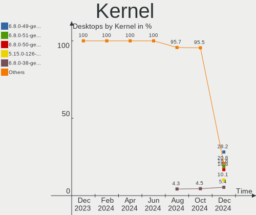
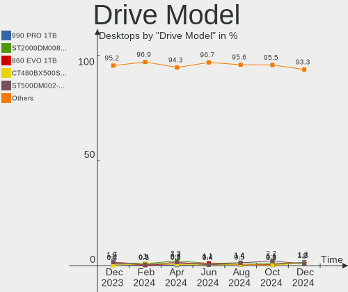
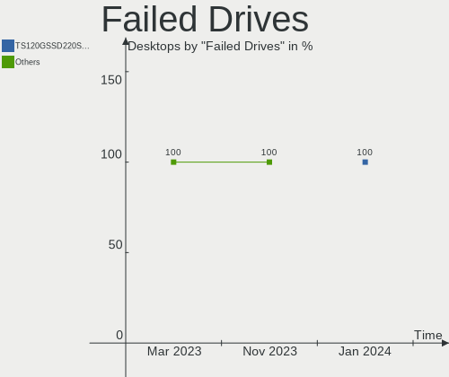
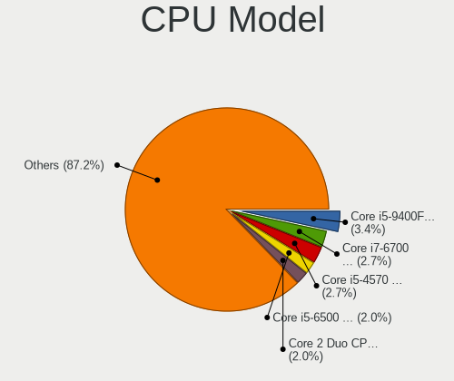
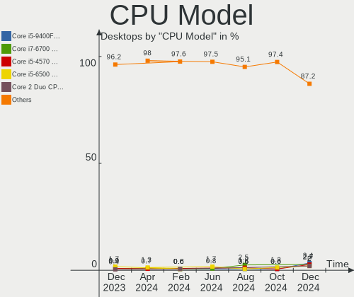
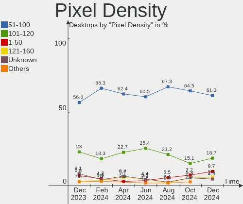
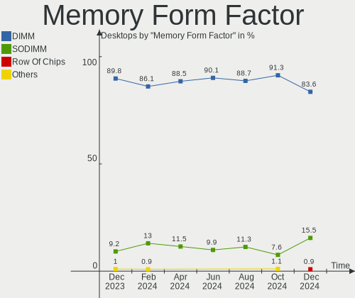

Linux Mint - Hardware Trends (Desktops)
---------------------------------------

A project to identify most popular hardware characteristics and track their change
over time based on data collected by Linux users at https://Linux-Hardware.org.

Anyone can contribute to this report by the [hw-probe](https://github.com/linuxhw/hw-probe) tool:

    sudo -E hw-probe -all -upload

This report is for one last month. Overall report since the beginning of time: [TestCoverage](https://github.com/linuxhw/TestCoverage)

Period: Aug, 2022.

Contents
--------

* [ System ](#system)
  - [ OS                       ](#os)
  - [ OS Family                ](#os-family)
  - [ Kernel                   ](#kernel)
  - [ Kernel Family            ](#kernel-family)
  - [ Kernel Major Ver.        ](#kernel-major-ver)
  - [ Arch                     ](#arch)
  - [ DE                       ](#de)
  - [ Display Server           ](#display-server)
  - [ Display Manager          ](#display-manager)
  - [ OS Lang                  ](#os-lang)
  - [ Boot Mode                ](#boot-mode)
  - [ Filesystem               ](#filesystem)
  - [ Part. scheme             ](#part-scheme)
  - [ Dual Boot with Linux/BSD ](#dual-boot-with-linuxbsd)
  - [ Dual Boot (Win)          ](#dual-boot-win)

* [ Board ](#board)
  - [ Vendor                   ](#vendor)
  - [ Model                    ](#model)
  - [ Model Family             ](#model-family)
  - [ MFG Year                 ](#mfg-year)
  - [ Form Factor              ](#form-factor)
  - [ Secure Boot              ](#secure-boot)
  - [ Coreboot                 ](#coreboot)
  - [ RAM Size                 ](#ram-size)
  - [ RAM Used                 ](#ram-used)
  - [ Total Drives             ](#total-drives)
  - [ Has CD-ROM               ](#has-cd-rom)
  - [ Has Ethernet             ](#has-ethernet)
  - [ Has WiFi                 ](#has-wifi)
  - [ Has Bluetooth            ](#has-bluetooth)

* [ Location ](#location)
  - [ Country                  ](#country)
  - [ City                     ](#city)

* [ Drives ](#drives)
  - [ Drive Vendor             ](#drive-vendor)
  - [ Drive Model              ](#drive-model)
  - [ HDD Vendor               ](#hdd-vendor)
  - [ SSD Vendor               ](#ssd-vendor)
  - [ Drive Kind               ](#drive-kind)
  - [ Drive Connector          ](#drive-connector)
  - [ Drive Size               ](#drive-size)
  - [ Space Total              ](#space-total)
  - [ Space Used               ](#space-used)
  - [ Malfunc. Drives          ](#malfunc-drives)
  - [ Malfunc. Drive Vendor    ](#malfunc-drive-vendor)
  - [ Malfunc. HDD Vendor      ](#malfunc-hdd-vendor)
  - [ Malfunc. Drive Kind      ](#malfunc-drive-kind)
  - [ Failed Drives            ](#failed-drives)
  - [ Failed Drive Vendor      ](#failed-drive-vendor)
  - [ Drive Status             ](#drive-status)

* [ Storage controller ](#storage-controller)
  - [ Storage Vendor           ](#storage-vendor)
  - [ Storage Model            ](#storage-model)
  - [ Storage Kind             ](#storage-kind)

* [ Processor ](#processor)
  - [ CPU Vendor               ](#cpu-vendor)
  - [ CPU Model                ](#cpu-model)
  - [ CPU Model Family         ](#cpu-model-family)
  - [ CPU Cores                ](#cpu-cores)
  - [ CPU Sockets              ](#cpu-sockets)
  - [ CPU Threads              ](#cpu-threads)
  - [ CPU Op-Modes             ](#cpu-op-modes)
  - [ CPU Microcode            ](#cpu-microcode)
  - [ CPU Microarch            ](#cpu-microarch)

* [ Graphics ](#graphics)
  - [ GPU Vendor               ](#gpu-vendor)
  - [ GPU Model                ](#gpu-model)
  - [ GPU Combo                ](#gpu-combo)
  - [ GPU Driver               ](#gpu-driver)
  - [ GPU Memory               ](#gpu-memory)

* [ Monitor ](#monitor)
  - [ Monitor Vendor           ](#monitor-vendor)
  - [ Monitor Model            ](#monitor-model)
  - [ Monitor Resolution       ](#monitor-resolution)
  - [ Monitor Diagonal         ](#monitor-diagonal)
  - [ Monitor Width            ](#monitor-width)
  - [ Aspect Ratio             ](#aspect-ratio)
  - [ Monitor Area             ](#monitor-area)
  - [ Pixel Density            ](#pixel-density)
  - [ Multiple Monitors        ](#multiple-monitors)

* [ Network ](#network)
  - [ Net Controller Vendor    ](#net-controller-vendor)
  - [ Net Controller Model     ](#net-controller-model)
  - [ Wireless Vendor          ](#wireless-vendor)
  - [ Wireless Model           ](#wireless-model)
  - [ Ethernet Vendor          ](#ethernet-vendor)
  - [ Ethernet Model           ](#ethernet-model)
  - [ Net Controller Kind      ](#net-controller-kind)
  - [ Used Controller          ](#used-controller)
  - [ NICs                     ](#nics)
  - [ IPv6                     ](#ipv6)

* [ Bluetooth ](#bluetooth)
  - [ Bluetooth Vendor         ](#bluetooth-vendor)
  - [ Bluetooth Model          ](#bluetooth-model)

* [ Sound ](#sound)
  - [ Sound Vendor             ](#sound-vendor)
  - [ Sound Model              ](#sound-model)

* [ Memory ](#memory)
  - [ Memory Vendor            ](#memory-vendor)
  - [ Memory Model             ](#memory-model)
  - [ Memory Kind              ](#memory-kind)
  - [ Memory Form Factor       ](#memory-form-factor)
  - [ Memory Size              ](#memory-size)
  - [ Memory Speed             ](#memory-speed)

* [ Printers & scanners ](#printers--scanners)
  - [ Printer Vendor           ](#printer-vendor)
  - [ Printer Model            ](#printer-model)
  - [ Scanner Vendor           ](#scanner-vendor)
  - [ Scanner Model            ](#scanner-model)

* [ Camera ](#camera)
  - [ Camera Vendor            ](#camera-vendor)
  - [ Camera Model             ](#camera-model)

* [ Security ](#security)
  - [ Fingerprint Vendor       ](#fingerprint-vendor)
  - [ Fingerprint Model        ](#fingerprint-model)
  - [ Chipcard Vendor          ](#chipcard-vendor)
  - [ Chipcard Model           ](#chipcard-model)

* [ Unsupported ](#unsupported)
  - [ Unsupported Devices      ](#unsupported-devices)
  - [ Unsupported Device Types ](#unsupported-device-types)

System
------

OS
--

Installed operating systems

| Name            | Desktops | Percent |
|-----------------|----------|---------|
| Linux Mint 20.3 | 75       | 49.67%  |
| Linux Mint 21   | 54       | 35.76%  |
| Linux Mint 20.2 | 8        | 5.3%    |
| Linux Mint 19.3 | 4        | 2.65%   |
| Linux Mint 20.1 | 3        | 1.99%   |
| Linux Mint 20   | 3        | 1.99%   |
| Linux Mint 19.1 | 3        | 1.99%   |
| Linux Mint 19.2 | 1        | 0.66%   |

OS Family
---------

OS without a version

| Name       | Desktops | Percent |
|------------|----------|---------|
| Linux Mint | 151      | 100%    |

Kernel
------

Version of the Linux kernel

| Version              | Desktops | Percent |
|----------------------|----------|---------|
| 5.15.0-46-generic    | 36       | 23.84%  |
| 5.4.0-124-generic    | 26       | 17.22%  |
| 5.4.0-122-generic    | 26       | 17.22%  |
| 5.15.0-43-generic    | 18       | 11.92%  |
| 5.15.0-41-generic    | 11       | 7.28%   |
| 5.4.0-125-generic    | 8        | 5.3%    |
| 5.4.0-91-generic     | 5        | 3.31%   |
| 5.15.0-46-lowlatency | 4        | 2.65%   |
| 5.15.0-33-generic    | 2        | 1.32%   |
| 4.15.0-191-generic   | 2        | 1.32%   |
| 5.4.0-26-generic     | 1        | 0.66%   |
| 5.4.0-113-generic    | 1        | 0.66%   |
| 5.4.0-110-generic    | 1        | 0.66%   |
| 5.4.0-109-generic    | 1        | 0.66%   |
| 5.18.12-tkg-pds      | 1        | 0.66%   |
| 5.15.0-47-generic    | 1        | 0.66%   |
| 5.15.0-25-generic    | 1        | 0.66%   |
| 5.14.0-1048-oem      | 1        | 0.66%   |
| 5.14.0-1047-oem      | 1        | 0.66%   |
| 5.13.0-52-generic    | 1        | 0.66%   |
| 5.11.0-7614-generic  | 1        | 0.66%   |
| 4.15.0-189-generic   | 1        | 0.66%   |
| 4.15.0-173-generic   | 1        | 0.66%   |

Kernel Family
-------------

Linux kernel without a distro release

| Version | Desktops | Percent |
|---------|----------|---------|
| 5.15.0  | 73       | 48.34%  |
| 5.4.0   | 69       | 45.7%   |
| 4.15.0  | 4        | 2.65%   |
| 5.14.0  | 2        | 1.32%   |
| 5.18.12 | 1        | 0.66%   |
| 5.13.0  | 1        | 0.66%   |
| 5.11.0  | 1        | 0.66%   |

Kernel Major Ver.
-----------------

Linux kernel major version

| Version | Desktops | Percent |
|---------|----------|---------|
| 5.15    | 73       | 48.34%  |
| 5.4     | 69       | 45.7%   |
| 4.15    | 4        | 2.65%   |
| 5.14    | 2        | 1.32%   |
| 5.18    | 1        | 0.66%   |
| 5.13    | 1        | 0.66%   |
| 5.11    | 1        | 0.66%   |

Arch
----

OS architecture (x86_64, i586, etc.)

| Name   | Desktops | Percent |
|--------|----------|---------|
| x86_64 | 150      | 99.34%  |
| i686   | 1        | 0.66%   |

DE
--

Desktop Environment

| Name       | Desktops | Percent |
|------------|----------|---------|
| X-Cinnamon | 95       | 62.91%  |
| MATE       | 27       | 17.88%  |
| XFCE       | 16       | 10.6%   |
| Cinnamon   | 8        | 5.3%    |
| GNOME      | 3        | 1.99%   |
| Unknown    | 2        | 1.32%   |

Display Server
--------------

X11 or Wayland

| Name | Desktops | Percent |
|------|----------|---------|
| X11  | 150      | 99.34%  |
| Tty  | 1        | 0.66%   |

Display Manager
---------------

SDDM, LightDM, etc.

| Name    | Desktops | Percent |
|---------|----------|---------|
| Unknown | 87       | 57.62%  |
| LightDM | 63       | 41.72%  |
| SDDM    | 1        | 0.66%   |

OS Lang
-------

Language

| Lang  | Desktops | Percent |
|-------|----------|---------|
| en_US | 52       | 34.44%  |
| de_DE | 25       | 16.56%  |
| en_GB | 7        | 4.64%   |
| it_IT | 6        | 3.97%   |
| fr_FR | 6        | 3.97%   |
| pt_BR | 5        | 3.31%   |
| nl_NL | 4        | 2.65%   |
| en_CA | 4        | 2.65%   |
| en_AU | 4        | 2.65%   |
| C     | 4        | 2.65%   |
| ru_RU | 3        | 1.99%   |
| pt_PT | 2        | 1.32%   |
| pl_PL | 2        | 1.32%   |
| fi_FI | 2        | 1.32%   |
| es_CO | 2        | 1.32%   |
| en_IL | 2        | 1.32%   |
| de_CH | 2        | 1.32%   |
| cs_CZ | 2        | 1.32%   |
| zh_CN | 1        | 0.66%   |
| nb_NO | 1        | 0.66%   |
| hu_HU | 1        | 0.66%   |
| fr_CA | 1        | 0.66%   |
| fr_BE | 1        | 0.66%   |
| es_VE | 1        | 0.66%   |
| es_UY | 1        | 0.66%   |
| es_PE | 1        | 0.66%   |
| es_ES | 1        | 0.66%   |
| es_CR | 1        | 0.66%   |
| es_CL | 1        | 0.66%   |
| es_AR | 1        | 0.66%   |
| en_ZA | 1        | 0.66%   |
| en_NZ | 1        | 0.66%   |
| en_IE | 1        | 0.66%   |
| el_GR | 1        | 0.66%   |
| de_AT | 1        | 0.66%   |

Boot Mode
---------

EFI or BIOS

| Mode | Desktops | Percent |
|------|----------|---------|
| BIOS | 79       | 52.32%  |
| EFI  | 72       | 47.68%  |

Filesystem
----------

Type of filesystem

| Type    | Desktops | Percent |
|---------|----------|---------|
| Ext4    | 144      | 95.36%  |
| Btrfs   | 4        | 2.65%   |
| Overlay | 2        | 1.32%   |
| Ext2    | 1        | 0.66%   |

Part. scheme
------------

Scheme of partitioning

| Type    | Desktops | Percent |
|---------|----------|---------|
| Unknown | 91       | 60.26%  |
| GPT     | 43       | 28.48%  |
| MBR     | 17       | 11.26%  |

Dual Boot with Linux/BSD
------------------------

Hosting more than one Linux/BSD

| Dual boot | Desktops | Percent |
|-----------|----------|---------|
| No        | 138      | 91.39%  |
| Yes       | 13       | 8.61%   |

Dual Boot (Win)
---------------

Hosting Linux and Windows

| Dual boot | Desktops | Percent |
|-----------|----------|---------|
| No        | 121      | 80.13%  |
| Yes       | 30       | 19.87%  |

Board
-----

Vendor
------

Motherboard manufacturer

| Name                | Desktops | Percent |
|---------------------|----------|---------|
| ASUSTek Computer    | 38       | 25.17%  |
| MSI                 | 22       | 14.57%  |
| Hewlett-Packard     | 21       | 13.91%  |
| Gigabyte Technology | 20       | 13.25%  |
| ASRock              | 16       | 10.6%   |
| Lenovo              | 5        | 3.31%   |
| Dell                | 4        | 2.65%   |
| Biostar             | 3        | 1.99%   |
| OEM                 | 2        | 1.32%   |
| Intel               | 2        | 1.32%   |
| Foxconn             | 2        | 1.32%   |
| ECS                 | 2        | 1.32%   |
| Acer                | 2        | 1.32%   |
| Vorke               | 1        | 0.66%   |
| Standard            | 1        | 0.66%   |
| Shuttle             | 1        | 0.66%   |
| Positivo            | 1        | 0.66%   |
| Pegatron            | 1        | 0.66%   |
| PCWare              | 1        | 0.66%   |
| Medion              | 1        | 0.66%   |
| JGINYUE             | 1        | 0.66%   |
| IBASE Technology    | 1        | 0.66%   |
| Huanan              | 1        | 0.66%   |
| AZW                 | 1        | 0.66%   |
| Unknown             | 1        | 0.66%   |

Model
-----

Motherboard model

| Name                                                                 | Desktops | Percent |
|----------------------------------------------------------------------|----------|---------|
| MSI MS-7C94                                                          | 2        | 1.32%   |
| MSI MS-7C56                                                          | 2        | 1.32%   |
| ASUS TUF Gaming B550M-PLUS                                           | 2        | 1.32%   |
| ASUS All Series                                                      | 2        | 1.32%   |
| Vorke V1 Plus                                                        | 1        | 0.66%   |
| Standard X50-V2                                                      | 1        | 0.66%   |
| Shuttle XH310V2                                                      | 1        | 0.66%   |
| Positivo POS-PIQ77CL                                                 | 1        | 0.66%   |
| Pegatron 505B Microtower PC                                          | 1        | 0.66%   |
| PCWare IPMH61R3                                                      | 1        | 0.66%   |
| OEM Intel H81                                                        | 1        | 0.66%   |
| OEM G41 775 ICH7 8712                                                | 1        | 0.66%   |
| MSI MS-7D54                                                          | 1        | 0.66%   |
| MSI MS-7D22                                                          | 1        | 0.66%   |
| MSI MS-7D13                                                          | 1        | 0.66%   |
| MSI MS-7C91                                                          | 1        | 0.66%   |
| MSI MS-7C84                                                          | 1        | 0.66%   |
| MSI MS-7C37                                                          | 1        | 0.66%   |
| MSI MS-7B86                                                          | 1        | 0.66%   |
| MSI MS-7A37                                                          | 1        | 0.66%   |
| MSI MS-7A33                                                          | 1        | 0.66%   |
| MSI MS-7994                                                          | 1        | 0.66%   |
| MSI MS-7977                                                          | 1        | 0.66%   |
| MSI MS-7788                                                          | 1        | 0.66%   |
| MSI MS-7693                                                          | 1        | 0.66%   |
| MSI MS-7641                                                          | 1        | 0.66%   |
| MSI MS-7610                                                          | 1        | 0.66%   |
| MSI MS-7528                                                          | 1        | 0.66%   |
| MSI MS-7369                                                          | 1        | 0.66%   |
| MSI FZ078AA-UUZ a6611ch                                              | 1        | 0.66%   |
| Medion P961x                                                         | 1        | 0.66%   |
| Lenovo ThinkStation P620 30E0003QGE                                  | 1        | 0.66%   |
| Lenovo ThinkCentre M83 10AHS03K00                                    | 1        | 0.66%   |
| Lenovo ThinkCentre M81 5049W16                                       | 1        | 0.66%   |
| Lenovo ThinkCentre M800 10FY0026MH                                   | 1        | 0.66%   |
| Lenovo IdeaCentre K410 10089                                         | 1        | 0.66%   |
| JGINYUE B85I PLUS V2.1                                               | 1        | 0.66%   |
| Intel D975XBX2 AAD53350-503                                          | 1        | 0.66%   |
| Intel 945GCT-M                                                       | 1        | 0.66%   |
| IBASE MI970VF                                                        | 1        | 0.66%   |
| Huanan X79 INTEL (INTEL Xeon E5/Corei7 DMI2 - C600/C200 Cipset V3.4C | 1        | 0.66%   |
| HP Z600 Workstation                                                  | 1        | 0.66%   |
| HP Z420 Workstation                                                  | 1        | 0.66%   |
| HP Z230 SFF Workstation                                              | 1        | 0.66%   |
| HP xw8600 Workstation                                                | 1        | 0.66%   |
| HP ProLiant ML310e Gen8                                              | 1        | 0.66%   |
| HP ProDesk 600 G1 TWR                                                | 1        | 0.66%   |
| HP ProDesk 600 G1 SFF                                                | 1        | 0.66%   |
| HP ProDesk 400 G3 SFF                                                | 1        | 0.66%   |
| HP ProDesk 400 G2 MT                                                 | 1        | 0.66%   |
| HP Pavilion Desktop TP01-2xxx                                        | 1        | 0.66%   |
| HP EliteDesk 805 G6 Small Form Factor PC                             | 1        | 0.66%   |
| HP EliteDesk 800 G1 TWR                                              | 1        | 0.66%   |
| HP EliteDesk 800 G1 SFF                                              | 1        | 0.66%   |
| HP EliteDesk 705 G2 SFF                                              | 1        | 0.66%   |
| HP EliteDesk 705 G2 MINI                                             | 1        | 0.66%   |
| HP Compaq dc7100 SFF(DX878AV)                                        | 1        | 0.66%   |
| HP Compaq dc5800 Small Form Factor                                   | 1        | 0.66%   |
| HP Compaq 6200 Pro SFF PC                                            | 1        | 0.66%   |
| HP Compaq 4000 Pro SFF PC                                            | 1        | 0.66%   |

Model Family
------------

Motherboard model prefix

| Name                 | Desktops | Percent |
|----------------------|----------|---------|
| ASUS PRIME           | 6        | 3.97%   |
| HP EliteDesk         | 5        | 3.31%   |
| ASUS ROG             | 5        | 3.31%   |
| HP ProDesk           | 4        | 2.65%   |
| HP Compaq            | 4        | 2.65%   |
| Dell OptiPlex        | 4        | 2.65%   |
| Lenovo ThinkCentre   | 3        | 1.99%   |
| ASUS TUF             | 3        | 1.99%   |
| MSI MS-7C94          | 2        | 1.32%   |
| MSI MS-7C56          | 2        | 1.32%   |
| Gigabyte X570        | 2        | 1.32%   |
| Gigabyte B550        | 2        | 1.32%   |
| ASUS All             | 2        | 1.32%   |
| ASRock N68-S         | 2        | 1.32%   |
| Acer Aspire          | 2        | 1.32%   |
| Vorke V1             | 1        | 0.66%   |
| Standard X50-V2      | 1        | 0.66%   |
| Shuttle XH310V2      | 1        | 0.66%   |
| Positivo POS-PIQ77CL | 1        | 0.66%   |
| Pegatron 505B        | 1        | 0.66%   |
| PCWare IPMH61R3      | 1        | 0.66%   |
| OEM Intel            | 1        | 0.66%   |
| OEM G41              | 1        | 0.66%   |
| MSI MS-7D54          | 1        | 0.66%   |
| MSI MS-7D22          | 1        | 0.66%   |
| MSI MS-7D13          | 1        | 0.66%   |
| MSI MS-7C91          | 1        | 0.66%   |
| MSI MS-7C84          | 1        | 0.66%   |
| MSI MS-7C37          | 1        | 0.66%   |
| MSI MS-7B86          | 1        | 0.66%   |
| MSI MS-7A37          | 1        | 0.66%   |
| MSI MS-7A33          | 1        | 0.66%   |
| MSI MS-7994          | 1        | 0.66%   |
| MSI MS-7977          | 1        | 0.66%   |
| MSI MS-7788          | 1        | 0.66%   |
| MSI MS-7693          | 1        | 0.66%   |
| MSI MS-7641          | 1        | 0.66%   |
| MSI MS-7610          | 1        | 0.66%   |
| MSI MS-7528          | 1        | 0.66%   |
| MSI MS-7369          | 1        | 0.66%   |
| MSI FZ078AA-UUZ      | 1        | 0.66%   |
| Medion P961x         | 1        | 0.66%   |
| Lenovo ThinkStation  | 1        | 0.66%   |
| Lenovo IdeaCentre    | 1        | 0.66%   |
| JGINYUE B85I         | 1        | 0.66%   |
| Intel D975XBX2       | 1        | 0.66%   |
| Intel 945GCT-M       | 1        | 0.66%   |
| IBASE MI970VF        | 1        | 0.66%   |
| Huanan X79           | 1        | 0.66%   |
| HP Z600              | 1        | 0.66%   |
| HP Z420              | 1        | 0.66%   |
| HP Z230              | 1        | 0.66%   |
| HP xw8600            | 1        | 0.66%   |
| HP ProLiant          | 1        | 0.66%   |
| HP Pavilion          | 1        | 0.66%   |
| HP 810-490nz         | 1        | 0.66%   |
| HP 3031h             | 1        | 0.66%   |
| Gigabyte Z87M-D3HP   | 1        | 0.66%   |
| Gigabyte Z690        | 1        | 0.66%   |
| Gigabyte Z490        | 1        | 0.66%   |

MFG Year
--------

Motherboard manufacture year

| Year | Desktops | Percent |
|------|----------|---------|
| 2020 | 21       | 13.91%  |
| 2013 | 16       | 10.6%   |
| 2012 | 12       | 7.95%   |
| 2018 | 11       | 7.28%   |
| 2011 | 11       | 7.28%   |
| 2008 | 10       | 6.62%   |
| 2019 | 9        | 5.96%   |
| 2021 | 7        | 4.64%   |
| 2016 | 7        | 4.64%   |
| 2010 | 7        | 4.64%   |
| 2022 | 6        | 3.97%   |
| 2017 | 6        | 3.97%   |
| 2015 | 6        | 3.97%   |
| 2014 | 6        | 3.97%   |
| 2007 | 6        | 3.97%   |
| 2006 | 5        | 3.31%   |
| 2009 | 4        | 2.65%   |
| 2004 | 1        | 0.66%   |

Form Factor
-----------

Physical design of the computer

| Name    | Desktops | Percent |
|---------|----------|---------|
| Desktop | 151      | 100%    |

Secure Boot
-----------

Enabled or disabled

| State    | Desktops | Percent |
|----------|----------|---------|
| Disabled | 144      | 95.36%  |
| Enabled  | 7        | 4.64%   |

Coreboot
--------

Have coreboot on board

| Used | Desktops | Percent |
|------|----------|---------|
| No   | 151      | 100%    |

RAM Size
--------

Total RAM memory

| Size in GB      | Desktops | Percent |
|-----------------|----------|---------|
| 16.01-24.0      | 33       | 21.85%  |
| 8.01-16.0       | 31       | 20.53%  |
| 32.01-64.0      | 21       | 13.91%  |
| 3.01-4.0        | 21       | 13.91%  |
| 4.01-8.0        | 19       | 12.58%  |
| 64.01-256.0     | 9        | 5.96%   |
| 1.01-2.0        | 9        | 5.96%   |
| 24.01-32.0      | 5        | 3.31%   |
| More than 256.0 | 1        | 0.66%   |
| 2.01-3.0        | 1        | 0.66%   |
| 0.51-1.0        | 1        | 0.66%   |

RAM Used
--------

Used RAM memory

| Used GB    | Desktops | Percent |
|------------|----------|---------|
| 1.01-2.0   | 63       | 41.72%  |
| 2.01-3.0   | 35       | 23.18%  |
| 4.01-8.0   | 21       | 13.91%  |
| 3.01-4.0   | 16       | 10.6%   |
| 0.51-1.0   | 9        | 5.96%   |
| 8.01-16.0  | 6        | 3.97%   |
| 16.01-24.0 | 1        | 0.66%   |

Total Drives
------------

Number of drives on board

| Drives | Desktops | Percent |
|--------|----------|---------|
| 2      | 54       | 35.76%  |
| 1      | 54       | 35.76%  |
| 3      | 14       | 9.27%   |
| 4      | 13       | 8.61%   |
| 6      | 10       | 6.62%   |
| 5      | 5        | 3.31%   |
| 7      | 1        | 0.66%   |

Has CD-ROM
----------

Has CD-ROM on board

| Presented | Desktops | Percent |
|-----------|----------|---------|
| Yes       | 78       | 51.66%  |
| No        | 73       | 48.34%  |

Has Ethernet
------------

Has Ethernet on board

| Presented | Desktops | Percent |
|-----------|----------|---------|
| Yes       | 149      | 98.68%  |
| No        | 2        | 1.32%   |

Has WiFi
--------

Has WiFi module

| Presented | Desktops | Percent |
|-----------|----------|---------|
| No        | 76       | 50.33%  |
| Yes       | 75       | 49.67%  |

Has Bluetooth
-------------

Has Bluetooth module

| Presented | Desktops | Percent |
|-----------|----------|---------|
| No        | 100      | 66.23%  |
| Yes       | 51       | 33.77%  |

Location
--------

Country
-------

Geographic location (country)

| Country      | Desktops | Percent |
|--------------|----------|---------|
| Germany      | 28       | 18.54%  |
| USA          | 26       | 17.22%  |
| Italy        | 7        | 4.64%   |
| Brazil       | 7        | 4.64%   |
| Russia       | 6        | 3.97%   |
| France       | 6        | 3.97%   |
| Netherlands  | 5        | 3.31%   |
| Canada       | 5        | 3.31%   |
| Australia    | 5        | 3.31%   |
| UK           | 4        | 2.65%   |
| Switzerland  | 3        | 1.99%   |
| Poland       | 3        | 1.99%   |
| Greece       | 3        | 1.99%   |
| Finland      | 3        | 1.99%   |
| Thailand     | 2        | 1.32%   |
| Taiwan       | 2        | 1.32%   |
| Spain        | 2        | 1.32%   |
| Portugal     | 2        | 1.32%   |
| Kenya        | 2        | 1.32%   |
| Israel       | 2        | 1.32%   |
| Czechia      | 2        | 1.32%   |
| Colombia     | 2        | 1.32%   |
| Belgium      | 2        | 1.32%   |
| Austria      | 2        | 1.32%   |
| Vietnam      | 1        | 0.66%   |
| Venezuela    | 1        | 0.66%   |
| Uruguay      | 1        | 0.66%   |
| South Africa | 1        | 0.66%   |
| Peru         | 1        | 0.66%   |
| Norway       | 1        | 0.66%   |
| New Zealand  | 1        | 0.66%   |
| Morocco      | 1        | 0.66%   |
| Mexico       | 1        | 0.66%   |
| Malaysia     | 1        | 0.66%   |
| Latvia       | 1        | 0.66%   |
| Ireland      | 1        | 0.66%   |
| Iran         | 1        | 0.66%   |
| Indonesia    | 1        | 0.66%   |
| El Salvador  | 1        | 0.66%   |
| Costa Rica   | 1        | 0.66%   |
| China        | 1        | 0.66%   |
| Chile        | 1        | 0.66%   |
| Bulgaria     | 1        | 0.66%   |
| Argentina    | 1        | 0.66%   |

City
----

Geographic location (city)

| City                     | Desktops | Percent |
|--------------------------|----------|---------|
| Berlin                   | 3        | 1.99%   |
| Vienna                   | 2        | 1.32%   |
| San José                | 2        | 1.32%   |
| Nuremberg                | 2        | 1.32%   |
| Nairobi                  | 2        | 1.32%   |
| Kirchheim unter Teck     | 2        | 1.32%   |
| Athens                   | 2        | 1.32%   |
| Amsterdam                | 2        | 1.32%   |
| Ząbki                   | 1        | 0.66%   |
| Ystradgynlais            | 1        | 0.66%   |
| Yoshkar-Ola              | 1        | 0.66%   |
| Wroclaw                  | 1        | 0.66%   |
| Willisau                 | 1        | 0.66%   |
| Wichita                  | 1        | 0.66%   |
| Vijfhuizen               | 1        | 0.66%   |
| Victoria                 | 1        | 0.66%   |
| Ventspils                | 1        | 0.66%   |
| Venice                   | 1        | 0.66%   |
| Vantaa                   | 1        | 0.66%   |
| Valdivia                 | 1        | 0.66%   |
| Uetze                    | 1        | 0.66%   |
| Treviso                  | 1        | 0.66%   |
| Teuchern                 | 1        | 0.66%   |
| Tel Aviv                 | 1        | 0.66%   |
| Tehran                   | 1        | 0.66%   |
| Tarvasjoki               | 1        | 0.66%   |
| Taichung                 | 1        | 0.66%   |
| Sydney                   | 1        | 0.66%   |
| Sunderland               | 1        | 0.66%   |
| Stuttgart                | 1        | 0.66%   |
| Sparks                   | 1        | 0.66%   |
| Sofia                    | 1        | 0.66%   |
| Sleman                   | 1        | 0.66%   |
| Siniscola                | 1        | 0.66%   |
| Sherbrooke               | 1        | 0.66%   |
| Seropedica               | 1        | 0.66%   |
| Seremban                 | 1        | 0.66%   |
| Sarnia                   | 1        | 0.66%   |
| Santa Cruz do Sul        | 1        | 0.66%   |
| Sant'Egidio alla Vibrata | 1        | 0.66%   |
| Salt Lake City           | 1        | 0.66%   |
| Saarlouis                | 1        | 0.66%   |
| Rosh HaAyin              | 1        | 0.66%   |
| Roselle                  | 1        | 0.66%   |
| Roche-la-Moliere         | 1        | 0.66%   |
| Rio de Janeiro           | 1        | 0.66%   |
| Rendsburg                | 1        | 0.66%   |
| Rastatt                  | 1        | 0.66%   |
| Prague                   | 1        | 0.66%   |
| Poznan                   | 1        | 0.66%   |
| Plasencia                | 1        | 0.66%   |
| Palhoca                  | 1        | 0.66%   |
| Nottingham               | 1        | 0.66%   |
| Nizhny Tagil             | 1        | 0.66%   |
| Naucalpan                | 1        | 0.66%   |
| Naperville               | 1        | 0.66%   |
| Munich                   | 1        | 0.66%   |
| Muncie                   | 1        | 0.66%   |
| Moscow Oblast            | 1        | 0.66%   |
| Moscow                   | 1        | 0.66%   |

Drives
------

Drive Vendor
------------

Hard drive vendors

| Vendor                    | Desktops | Drives | Percent |
|---------------------------|----------|--------|---------|
| Seagate                   | 50       | 63     | 17.61%  |
| WDC                       | 45       | 59     | 15.85%  |
| Samsung Electronics       | 40       | 58     | 14.08%  |
| Kingston                  | 20       | 22     | 7.04%   |
| Crucial                   | 15       | 17     | 5.28%   |
| Toshiba                   | 11       | 14     | 3.87%   |
| SanDisk                   | 10       | 11     | 3.52%   |
| Intel                     | 9        | 9      | 3.17%   |
| A-DATA Technology         | 6        | 8      | 2.11%   |
| Micron/Crucial Technology | 5        | 5      | 1.76%   |
| Maxtor                    | 5        | 6      | 1.76%   |
| Unknown                   | 4        | 7      | 1.41%   |
| SPCC                      | 4        | 4      | 1.41%   |
| SK hynix                  | 4        | 4      | 1.41%   |
| Hitachi                   | 4        | 4      | 1.41%   |
| HGST                      | 4        | 5      | 1.41%   |
| China                     | 4        | 5      | 1.41%   |
| Silicon Motion            | 3        | 3      | 1.06%   |
| PNY                       | 3        | 3      | 1.06%   |
| Unknown                   | 3        | 3      | 1.06%   |
| Phison                    | 2        | 2      | 0.7%    |
| Patriot                   | 2        | 2      | 0.7%    |
| Micron Technology         | 2        | 2      | 0.7%    |
| HS-SSD-C100               | 2        | 2      | 0.7%    |
| GOODRAM                   | 2        | 2      | 0.7%    |
| Corsair                   | 2        | 2      | 0.7%    |
| Apacer                    | 2        | 2      | 0.7%    |
| YS                        | 1        | 1      | 0.35%   |
| XPG                       | 1        | 1      | 0.35%   |
| Transcend                 | 1        | 1      | 0.35%   |
| TO Exter                  | 1        | 1      | 0.35%   |
| TANDBERG                  | 1        | 1      | 0.35%   |
| Storeva                   | 1        | 1      | 0.35%   |
| Realtek Semiconductor     | 1        | 1      | 0.35%   |
| Palit                     | 1        | 1      | 0.35%   |
| OCZ                       | 1        | 1      | 0.35%   |
| NGFF                      | 1        | 1      | 0.35%   |
| MidasForce                | 1        | 1      | 0.35%   |
| MAX                       | 1        | 1      | 0.35%   |
| KingSpec                  | 1        | 1      | 0.35%   |
| KingDian                  | 1        | 2      | 0.35%   |
| Kingchuxing               | 1        | 1      | 0.35%   |
| Hoodisk                   | 1        | 1      | 0.35%   |
| Hikvision                 | 1        | 1      | 0.35%   |
| FORESEE                   | 1        | 1      | 0.35%   |
| BlueRay                   | 1        | 1      | 0.35%   |
| AMD                       | 1        | 1      | 0.35%   |
| ADATA SU                  | 1        | 1      | 0.35%   |

Drive Model
-----------

Hard drive models

| Model                               | Desktops | Percent |
|-------------------------------------|----------|---------|
| Crucial CT500MX500SSD1 500GB        | 5        | 1.52%   |
| Seagate ST500DM002-1BD142 500GB     | 4        | 1.22%   |
| Seagate ST2000DM008-2FR102 2TB      | 4        | 1.22%   |
| Kingston SA400S37480G 480GB SSD     | 4        | 1.22%   |
| Toshiba DT01ACA100 1TB              | 3        | 0.91%   |
| Seagate ST2000DM001-1ER164 2TB      | 3        | 0.91%   |
| Samsung SSD 970 EVO Plus 500GB      | 3        | 0.91%   |
| Samsung SSD 970 EVO Plus 1TB        | 3        | 0.91%   |
| Samsung SSD 860 EVO 500GB           | 3        | 0.91%   |
| Samsung SSD 860 EVO 1TB             | 3        | 0.91%   |
| Samsung SSD 850 EVO 250GB           | 3        | 0.91%   |
| Samsung NVMe SSD Drive 500GB        | 3        | 0.91%   |
| Micron/Crucial NVMe SSD Drive 500GB | 3        | 0.91%   |
| Kingston SV300S37A240G 240GB SSD    | 3        | 0.91%   |
| Kingston SA400S37240G 240GB SSD     | 3        | 0.91%   |
| Unknown                             | 3        | 0.91%   |
| WDC WDS500G2B0A-00SM50 500GB SSD    | 2        | 0.61%   |
| WDC WDS100T2B0A-00SM50 1TB SSD      | 2        | 0.61%   |
| WDC WD30EFRX-68AX9N0 3TB            | 2        | 0.61%   |
| WDC WD1002FAEX-00Z3A0 1TB           | 2        | 0.61%   |
| Unknown SD/MMC/MS PRO 128GB         | 2        | 0.61%   |
| Unknown SD/MMC 16GB                 | 2        | 0.61%   |
| Unknown M.S./M.S.Pro/HG 16GB        | 2        | 0.61%   |
| Toshiba DT01ACA200 2TB              | 2        | 0.61%   |
| Silicon Motion NVMe SSD Drive 128GB | 2        | 0.61%   |
| Seagate ST6000DM003-2CY186 6TB      | 2        | 0.61%   |
| Seagate ST500LT012-1DG142 500GB     | 2        | 0.61%   |
| Seagate ST4000DM004-2CV104 4TB      | 2        | 0.61%   |
| Seagate ST4000DM000-1F2168 4TB      | 2        | 0.61%   |
| Seagate ST3250310AS 250GB           | 2        | 0.61%   |
| Seagate ST2000DX001-1CM164 2TB      | 2        | 0.61%   |
| Seagate Expansion 500GB             | 2        | 0.61%   |
| SanDisk SSD PLUS 240GB              | 2        | 0.61%   |
| SanDisk SDSSDA120G 120GB            | 2        | 0.61%   |
| Samsung SSD 980 PRO 1TB             | 2        | 0.61%   |
| Samsung SSD 850 EVO 500GB           | 2        | 0.61%   |
| Samsung SSD 840 EVO 500GB           | 2        | 0.61%   |
| Samsung NVMe SSD Drive 1TB          | 2        | 0.61%   |
| Samsung HD501LJ 500GB               | 2        | 0.61%   |
| Micron/Crucial NVMe SSD Drive 1TB   | 2        | 0.61%   |
| Kingston SA400S37120G 120GB SSD     | 2        | 0.61%   |
| Kingston NVMe SSD Drive 500GB       | 2        | 0.61%   |
| HGST HTS721010A9E630 1TB            | 2        | 0.61%   |
| Crucial CT250MX500SSD1 250GB        | 2        | 0.61%   |
| Crucial CT1000MX500SSD1 1TB         | 2        | 0.61%   |
| YS SSD 120GB                        | 1        | 0.3%    |
| XPG NVMe SSD Drive 1024GB           | 1        | 0.3%    |
| WDC WDS500G2B0A 500GB SSD           | 1        | 0.3%    |
| WDC WDS500G1B0A-00H9H0 500GB SSD    | 1        | 0.3%    |
| WDC WDS480G2G0B-00EPW0 480GB SSD    | 1        | 0.3%    |
| WDC WDS250G2B0B-00YS70 250GB SSD    | 1        | 0.3%    |
| WDC WDS250G1B0A-00H9H0 250GB SSD    | 1        | 0.3%    |
| WDC WDS240G2G0A-00JH30 240GB SSD    | 1        | 0.3%    |
| WDC WDS100T1R0A-68A4W0 1TB SSD      | 1        | 0.3%    |
| WDC WDBNCE5000PNC 500GB SSD         | 1        | 0.3%    |
| WDC WD5002ABYS-01B1B0 500GB         | 1        | 0.3%    |
| WDC WD5000AZLX-60K2TA0 500GB        | 1        | 0.3%    |
| WDC WD5000AVCS-612DY1 500GB         | 1        | 0.3%    |
| WDC WD5000AAKX-60U6AA0 500GB        | 1        | 0.3%    |
| WDC WD5000AAKX-00U6AA0 500GB        | 1        | 0.3%    |

HDD Vendor
----------

Hard disk drive vendors

| Vendor              | Desktops | Drives | Percent |
|---------------------|----------|--------|---------|
| Seagate             | 48       | 61     | 40.34%  |
| WDC                 | 37       | 47     | 31.09%  |
| Toshiba             | 11       | 14     | 9.24%   |
| Samsung Electronics | 6        | 7      | 5.04%   |
| Maxtor              | 5        | 6      | 4.2%    |
| Hitachi             | 4        | 4      | 3.36%   |
| HGST                | 4        | 5      | 3.36%   |
| Unknown             | 2        | 2      | 1.68%   |
| TANDBERG            | 1        | 1      | 0.84%   |
| Storeva             | 1        | 1      | 0.84%   |

SSD Vendor
----------

Solid state drive vendors

| Vendor              | Desktops | Drives | Percent |
|---------------------|----------|--------|---------|
| Samsung Electronics | 23       | 29     | 19.49%  |
| Kingston            | 14       | 15     | 11.86%  |
| Crucial             | 14       | 15     | 11.86%  |
| WDC                 | 11       | 12     | 9.32%   |
| SanDisk             | 9        | 10     | 7.63%   |
| Intel               | 4        | 4      | 3.39%   |
| China               | 4        | 5      | 3.39%   |
| A-DATA Technology   | 4        | 4      | 3.39%   |
| SPCC                | 3        | 3      | 2.54%   |
| SK hynix            | 3        | 3      | 2.54%   |
| PNY                 | 3        | 3      | 2.54%   |
| Unknown             | 3        | 3      | 2.54%   |
| Patriot             | 2        | 2      | 1.69%   |
| GOODRAM             | 2        | 2      | 1.69%   |
| Apacer              | 2        | 2      | 1.69%   |
| YS                  | 1        | 1      | 0.85%   |
| Transcend           | 1        | 1      | 0.85%   |
| TO Exter            | 1        | 1      | 0.85%   |
| Palit               | 1        | 1      | 0.85%   |
| OCZ                 | 1        | 1      | 0.85%   |
| NGFF                | 1        | 1      | 0.85%   |
| MidasForce          | 1        | 1      | 0.85%   |
| Micron Technology   | 1        | 1      | 0.85%   |
| KingSpec            | 1        | 1      | 0.85%   |
| KingDian            | 1        | 2      | 0.85%   |
| Hoodisk             | 1        | 1      | 0.85%   |
| Hikvision           | 1        | 1      | 0.85%   |
| FORESEE             | 1        | 1      | 0.85%   |
| Corsair             | 1        | 1      | 0.85%   |
| BlueRay             | 1        | 1      | 0.85%   |
| AMD                 | 1        | 1      | 0.85%   |
| ADATA SU            | 1        | 1      | 0.85%   |

Drive Kind
----------

HDD or SSD

| Kind    | Desktops | Drives | Percent |
|---------|----------|--------|---------|
| HDD     | 93       | 148    | 39.41%  |
| SSD     | 90       | 130    | 38.14%  |
| NVMe    | 45       | 57     | 19.07%  |
| Unknown | 8        | 11     | 3.39%   |

Drive Connector
---------------

SATA, SAS, NVMe, etc.

| Type | Desktops | Drives | Percent |
|------|----------|--------|---------|
| SATA | 139      | 272    | 70.56%  |
| NVMe | 45       | 57     | 22.84%  |
| SAS  | 13       | 17     | 6.6%    |

Drive Size
----------

Size of hard drive

| Size in TB | Desktops | Drives | Percent |
|------------|----------|--------|---------|
| 0.01-0.5   | 108      | 162    | 53.47%  |
| 0.51-1.0   | 43       | 50     | 21.29%  |
| 1.01-2.0   | 25       | 31     | 12.38%  |
| 3.01-4.0   | 13       | 15     | 6.44%   |
| 2.01-3.0   | 5        | 6      | 2.48%   |
| 4.01-10.0  | 5        | 7      | 2.48%   |
| 10.01-20.0 | 3        | 7      | 1.49%   |

Space Total
-----------

Amount of disk space available on the file system

| Size in GB     | Desktops | Percent |
|----------------|----------|---------|
| 101-250        | 42       | 27.81%  |
| 501-1000       | 28       | 18.54%  |
| 251-500        | 25       | 16.56%  |
| More than 3000 | 22       | 14.57%  |
| 1001-2000      | 12       | 7.95%   |
| 51-100         | 9        | 5.96%   |
| 2001-3000      | 7        | 4.64%   |
| 1-20           | 3        | 1.99%   |
| 21-50          | 2        | 1.32%   |
| Unknown        | 1        | 0.66%   |

Space Used
----------

Amount of used disk space

| Used GB        | Desktops | Percent |
|----------------|----------|---------|
| 1-20           | 42       | 27.81%  |
| 21-50          | 21       | 13.91%  |
| 51-100         | 20       | 13.25%  |
| 101-250        | 16       | 10.6%   |
| 251-500        | 15       | 9.93%   |
| 501-1000       | 12       | 7.95%   |
| More than 3000 | 11       | 7.28%   |
| 1001-2000      | 10       | 6.62%   |
| 2001-3000      | 3        | 1.99%   |
| Unknown        | 1        | 0.66%   |

Malfunc. Drives
---------------

Drive models with a malfunction

| Model                             | Desktops | Drives | Percent |
|-----------------------------------|----------|--------|---------|
| WDC WD4003FZEX-00Z4SA0 4TB        | 1        | 1      | 5.26%   |
| WDC WD4000FYYZ-01UL1B2 4TB        | 1        | 2      | 5.26%   |
| WDC WD2000JD-00HBB0 200GB         | 1        | 1      | 5.26%   |
| Toshiba MK2555GSX 250GB           | 1        | 1      | 5.26%   |
| Seagate ST9500620NS 500GB         | 1        | 1      | 5.26%   |
| Seagate ST500LT012-1DG142 500GB   | 1        | 1      | 5.26%   |
| Seagate ST500DM002-1BD142 500GB   | 1        | 1      | 5.26%   |
| Seagate ST1500DL003-9VT16L 1TB    | 1        | 1      | 5.26%   |
| Seagate ST1000DM003-1SB102 1TB    | 1        | 1      | 5.26%   |
| Samsung Electronics HM500JI 500GB | 1        | 1      | 5.26%   |
| Samsung Electronics HD501LJ 500GB | 1        | 1      | 5.26%   |
| Samsung Electronics HD322HJ 320GB | 1        | 1      | 5.26%   |
| OCZ VERTEX 64GB SSD               | 1        | 1      | 5.26%   |
| Maxtor STM3250824AS 250GB         | 1        | 1      | 5.26%   |
| Kingston SUV400S37240G 240GB SSD  | 1        | 1      | 5.26%   |
| Intel SSDSC2CT180A4 180GB         | 1        | 1      | 5.26%   |
| Hitachi HDT721064SLA360 640GB     | 1        | 1      | 5.26%   |
| China SSD 360GB                   | 1        | 1      | 5.26%   |
| China SATA3 480GB SSD             | 1        | 1      | 5.26%   |

Malfunc. Drive Vendor
---------------------

Vendors of faulty drives

| Vendor              | Desktops | Drives | Percent |
|---------------------|----------|--------|---------|
| Seagate             | 5        | 5      | 26.32%  |
| WDC                 | 3        | 4      | 15.79%  |
| Samsung Electronics | 3        | 3      | 15.79%  |
| China               | 2        | 2      | 10.53%  |
| Toshiba             | 1        | 1      | 5.26%   |
| OCZ                 | 1        | 1      | 5.26%   |
| Maxtor              | 1        | 1      | 5.26%   |
| Kingston            | 1        | 1      | 5.26%   |
| Intel               | 1        | 1      | 5.26%   |
| Hitachi             | 1        | 1      | 5.26%   |

Malfunc. HDD Vendor
-------------------

Vendors of faulty HDD drives

| Vendor              | Desktops | Drives | Percent |
|---------------------|----------|--------|---------|
| Seagate             | 5        | 5      | 35.71%  |
| WDC                 | 3        | 4      | 21.43%  |
| Samsung Electronics | 3        | 3      | 21.43%  |
| Toshiba             | 1        | 1      | 7.14%   |
| Maxtor              | 1        | 1      | 7.14%   |
| Hitachi             | 1        | 1      | 7.14%   |

Malfunc. Drive Kind
-------------------

Kinds of faulty drives

| Kind | Desktops | Drives | Percent |
|------|----------|--------|---------|
| HDD  | 10       | 15     | 66.67%  |
| SSD  | 5        | 5      | 33.33%  |

Failed Drives
-------------

Failed drive models

| Model                           | Desktops | Drives | Percent |
|---------------------------------|----------|--------|---------|
| Samsung Electronics SSD 980 1TB | 1        | 1      | 100%    |

Failed Drive Vendor
-------------------

Failed drive vendors

| Vendor              | Desktops | Drives | Percent |
|---------------------|----------|--------|---------|
| Samsung Electronics | 1        | 1      | 100%    |

Drive Status
------------

Number of failed and malfunc. drives

| Status   | Desktops | Drives | Percent |
|----------|----------|--------|---------|
| Detected | 97       | 214    | 57.4%   |
| Works    | 57       | 111    | 33.73%  |
| Malfunc  | 14       | 20     | 8.28%   |
| Failed   | 1        | 1      | 0.59%   |

Storage controller
------------------

Storage Vendor
--------------

Storage controller vendors

| Vendor                      | Desktops | Percent |
|-----------------------------|----------|---------|
| Intel                       | 91       | 41.94%  |
| AMD                         | 52       | 23.96%  |
| Samsung Electronics         | 19       | 8.76%   |
| ASMedia Technology          | 10       | 4.61%   |
| Micron/Crucial Technology   | 7        | 3.23%   |
| Nvidia                      | 6        | 2.76%   |
| Kingston Technology Company | 6        | 2.76%   |
| JMicron Technology          | 6        | 2.76%   |
| VIA Technologies            | 4        | 1.84%   |
| Phison Electronics          | 4        | 1.84%   |
| Silicon Motion              | 3        | 1.38%   |
| Realtek Semiconductor       | 2        | 0.92%   |
| ADATA Technology            | 2        | 0.92%   |
| SK hynix                    | 1        | 0.46%   |
| SanDisk                     | 1        | 0.46%   |
| Micron Technology           | 1        | 0.46%   |
| Marvell Technology Group    | 1        | 0.46%   |
| Broadcom / LSI              | 1        | 0.46%   |

Storage Model
-------------

Storage controller models

| Model                                                                                   | Desktops | Percent |
|-----------------------------------------------------------------------------------------|----------|---------|
| AMD FCH SATA Controller [AHCI mode]                                                     | 25       | 9.09%   |
| AMD 500 Series Chipset SATA Controller                                                  | 14       | 5.09%   |
| Samsung NVMe SSD Controller SM981/PM981/PM983                                           | 12       | 4.36%   |
| Intel 8 Series/C220 Series Chipset Family 6-port SATA Controller 1 [AHCI mode]          | 12       | 4.36%   |
| Intel 6 Series/C200 Series Chipset Family 6 port Desktop SATA AHCI Controller           | 11       | 4%      |
| Intel NM10/ICH7 Family SATA Controller [IDE mode]                                       | 9        | 3.27%   |
| ASMedia ASM1062 Serial ATA Controller                                                   | 9        | 3.27%   |
| Intel Q170/Q150/B150/H170/H110/Z170/CM236 Chipset SATA Controller [AHCI Mode]           | 8        | 2.91%   |
| AMD SB7x0/SB8x0/SB9x0 IDE Controller                                                    | 8        | 2.91%   |
| AMD 400 Series Chipset SATA Controller                                                  | 8        | 2.91%   |
| Intel 82801G (ICH7 Family) IDE Controller                                               | 7        | 2.55%   |
| AMD SB7x0/SB8x0/SB9x0 SATA Controller [IDE mode]                                        | 6        | 2.18%   |
| Samsung NVMe SSD Controller 980                                                         | 5        | 1.82%   |
| JMicron JMB363 SATA/IDE Controller                                                      | 5        | 1.82%   |
| Intel SSD 660P Series                                                                   | 5        | 1.82%   |
| VIA VT82C586A/B/VT82C686/A/B/VT823x/A/C PIPC Bus Master IDE                             | 4        | 1.45%   |
| Phison E12 NVMe Controller                                                              | 4        | 1.45%   |
| Nvidia MCP61 SATA Controller                                                            | 4        | 1.45%   |
| Kingston Company Company Non-Volatile memory controller                                 | 4        | 1.45%   |
| Intel 7 Series/C210 Series Chipset Family 6-port SATA Controller [AHCI mode]            | 4        | 1.45%   |
| Intel 200 Series PCH SATA controller [AHCI mode]                                        | 4        | 1.45%   |
| AMD X370 Series Chipset SATA Controller                                                 | 4        | 1.45%   |
| AMD SB7x0/SB8x0/SB9x0 SATA Controller [AHCI mode]                                       | 4        | 1.45%   |
| VIA VT8237A SATA 2-Port Controller                                                      | 3        | 1.09%   |
| Silicon Motion SM2263EN/SM2263XT SSD Controller                                         | 3        | 1.09%   |
| Samsung NVMe SSD Controller PM9A1/PM9A3/980PRO                                          | 3        | 1.09%   |
| Nvidia MCP61 IDE                                                                        | 3        | 1.09%   |
| Micron/Crucial P1 NVMe PCIe SSD                                                         | 3        | 1.09%   |
| Intel Alder Lake-S PCH SATA Controller [AHCI Mode]                                      | 3        | 1.09%   |
| Intel 9 Series Chipset Family SATA Controller [AHCI Mode]                               | 3        | 1.09%   |
| Micron/Crucial NVMe Controller                                                          | 2        | 0.73%   |
| Intel SATA Controller [RAID mode]                                                       | 2        | 0.73%   |
| Intel Celeron N3350/Pentium N4200/Atom E3900 Series SATA AHCI Controller                | 2        | 0.73%   |
| Intel 82801IR/IO/IH (ICH9R/DO/DH) 6 port SATA Controller [AHCI mode]                    | 2        | 0.73%   |
| Intel 82801IB (ICH9) 4 port SATA Controller [AHCI mode]                                 | 2        | 0.73%   |
| Intel 7 Series/C210 Series Chipset Family 4-port SATA Controller [IDE mode]             | 2        | 0.73%   |
| Intel 7 Series/C210 Series Chipset Family 2-port SATA Controller [IDE mode]             | 2        | 0.73%   |
| Intel 6 Series/C200 Series Chipset Family Desktop SATA Controller (IDE mode, ports 4-5) | 2        | 0.73%   |
| Intel 6 Series/C200 Series Chipset Family Desktop SATA Controller (IDE mode, ports 0-3) | 2        | 0.73%   |
| Intel 400 Series Chipset Family SATA AHCI Controller                                    | 2        | 0.73%   |
| AMD FCH IDE Controller                                                                  | 2        | 0.73%   |
| ADATA XPG SX8200 Pro PCIe Gen3x4 M.2 2280 Solid State Drive                             | 2        | 0.73%   |
| VIA Serial ATA Controller                                                               | 1        | 0.36%   |
| SK hynix BC511                                                                          | 1        | 0.36%   |
| SanDisk WD Black SN750 / PC SN730 NVMe SSD                                              | 1        | 0.36%   |
| Realtek RTS5763DL NVMe SSD Controller                                                   | 1        | 0.36%   |
| Realtek Realtek Non-Volatile memory controller                                          | 1        | 0.36%   |
| Nvidia MCP65 SATA Controller                                                            | 1        | 0.36%   |
| Nvidia MCP65 IDE                                                                        | 1        | 0.36%   |
| Nvidia MCP55 SATA Controller                                                            | 1        | 0.36%   |
| Nvidia MCP55 IDE                                                                        | 1        | 0.36%   |
| Micron/Crucial P2 NVMe PCIe SSD                                                         | 1        | 0.36%   |
| Micron/Crucial Non-Volatile memory controller                                           | 1        | 0.36%   |
| Micron Non-Volatile memory controller                                                   | 1        | 0.36%   |
| Marvell Group 88SE6145 SATA II PCI-E controller                                         | 1        | 0.36%   |
| Kingston Company U-SNS8154P3 NVMe SSD                                                   | 1        | 0.36%   |
| Kingston Company A2000 NVMe SSD                                                         | 1        | 0.36%   |
| JMicron JMB368 IDE controller                                                           | 1        | 0.36%   |
| Intel Volume Management Device NVMe RAID Controller                                     | 1        | 0.36%   |
| Intel NM10/ICH7 Family SATA Controller [AHCI mode]                                      | 1        | 0.36%   |

Storage Kind
------------

Kind of storage controller (IDE, SATA, NVMe, SAS, ...)

| Kind | Desktops | Percent |
|------|----------|---------|
| SATA | 118      | 54.63%  |
| NVMe | 45       | 20.83%  |
| IDE  | 44       | 20.37%  |
| RAID | 7        | 3.24%   |
| SAS  | 1        | 0.46%   |
| SCSI | 1        | 0.46%   |

Processor
---------

CPU Vendor
----------

Processor vendors

| Vendor | Desktops | Percent |
|--------|----------|---------|
| Intel  | 91       | 60.26%  |
| AMD    | 60       | 39.74%  |

CPU Model
---------

Processor models

| Model                                           | Desktops | Percent |
|-------------------------------------------------|----------|---------|
| Intel Core i5-3470 CPU @ 3.20GHz                | 4        | 2.65%   |
| Intel Core i5-6500 CPU @ 3.20GHz                | 3        | 1.99%   |
| Intel Core i5-4570 CPU @ 3.20GHz                | 3        | 1.99%   |
| AMD Ryzen 9 5900X 12-Core Processor             | 3        | 1.99%   |
| AMD Ryzen 7 5800X 8-Core Processor              | 3        | 1.99%   |
| AMD Ryzen 5 5600X 6-Core Processor              | 3        | 1.99%   |
| AMD FX-8350 Eight-Core Processor                | 3        | 1.99%   |
| Intel Pentium Dual CPU E2180 @ 2.00GHz          | 2        | 1.32%   |
| Intel Core i7-4790K CPU @ 4.00GHz               | 2        | 1.32%   |
| Intel Core i7-4790 CPU @ 3.60GHz                | 2        | 1.32%   |
| Intel Core i7-3770 CPU @ 3.40GHz                | 2        | 1.32%   |
| Intel Core i7-2600K CPU @ 3.40GHz               | 2        | 1.32%   |
| Intel Core i5-4690 CPU @ 3.50GHz                | 2        | 1.32%   |
| Intel Celeron CPU J3455 @ 1.50GHz               | 2        | 1.32%   |
| Intel 12th Gen Core i5-12600K                   | 2        | 1.32%   |
| AMD Ryzen 7 5700G with Radeon Graphics          | 2        | 1.32%   |
| AMD Ryzen 7 3700X 8-Core Processor              | 2        | 1.32%   |
| AMD Ryzen 5 PRO 4650G with Radeon Graphics      | 2        | 1.32%   |
| AMD Ryzen 5 5600G with Radeon Graphics          | 2        | 1.32%   |
| AMD Ryzen 5 2600 Six-Core Processor             | 2        | 1.32%   |
| AMD Athlon II X4 645 Processor                  | 2        | 1.32%   |
| AMD A10-7850K Radeon R7, 12 Compute Cores 4C+8G | 2        | 1.32%   |
| Intel Xeon CPU X5570 @ 2.93GHz                  | 1        | 0.66%   |
| Intel Xeon CPU X5482 @ 3.20GHz                  | 1        | 0.66%   |
| Intel Xeon CPU X5460 @ 3.16GHz                  | 1        | 0.66%   |
| Intel Xeon CPU X5450 @ 3.00GHz                  | 1        | 0.66%   |
| Intel Xeon CPU L5420 @ 2.50GHz                  | 1        | 0.66%   |
| Intel Xeon CPU E5430 @ 2.66GHz                  | 1        | 0.66%   |
| Intel Xeon CPU E5-2670 0 @ 2.60GHz              | 1        | 0.66%   |
| Intel Xeon CPU E5-2640 0 @ 2.50GHz              | 1        | 0.66%   |
| Intel Xeon CPU E3-1245 v3 @ 3.40GHz             | 1        | 0.66%   |
| Intel Xeon CPU E3-1220 V2 @ 3.10GHz             | 1        | 0.66%   |
| Intel Pentium Dual-Core CPU E6700 @ 3.20GHz     | 1        | 0.66%   |
| Intel Pentium Dual-Core CPU E6500 @ 2.93GHz     | 1        | 0.66%   |
| Intel Pentium Dual-Core CPU E5700 @ 3.00GHz     | 1        | 0.66%   |
| Intel Pentium Dual CPU E2200 @ 2.20GHz          | 1        | 0.66%   |
| Intel Pentium Dual CPU E2140 @ 1.60GHz          | 1        | 0.66%   |
| Intel Pentium D CPU 3.00GHz                     | 1        | 0.66%   |
| Intel Pentium CPU G850 @ 2.90GHz                | 1        | 0.66%   |
| Intel Pentium CPU G630 @ 2.70GHz                | 1        | 0.66%   |
| Intel Pentium 4 CPU 3.00GHz                     | 1        | 0.66%   |
| Intel Pentium 4 CPU 2.80GHz                     | 1        | 0.66%   |
| Intel Core i9-9900K CPU @ 3.60GHz               | 1        | 0.66%   |
| Intel Core i9-10900KF CPU @ 3.70GHz             | 1        | 0.66%   |
| Intel Core i7-9700F CPU @ 3.00GHz               | 1        | 0.66%   |
| Intel Core i7-9700 CPU @ 3.00GHz                | 1        | 0.66%   |
| Intel Core i7-6700K CPU @ 4.00GHz               | 1        | 0.66%   |
| Intel Core i7-4770 CPU @ 3.40GHz                | 1        | 0.66%   |
| Intel Core i7-3820 CPU @ 3.60GHz                | 1        | 0.66%   |
| Intel Core i7-3770K CPU @ 3.50GHz               | 1        | 0.66%   |
| Intel Core i7-2600 CPU @ 3.40GHz                | 1        | 0.66%   |
| Intel Core i7 CPU 860 @ 2.80GHz                 | 1        | 0.66%   |
| Intel Core i5-9600K CPU @ 3.70GHz               | 1        | 0.66%   |
| Intel Core i5-8600K CPU @ 3.60GHz               | 1        | 0.66%   |
| Intel Core i5-7500 CPU @ 3.40GHz                | 1        | 0.66%   |
| Intel Core i5-6600K CPU @ 3.50GHz               | 1        | 0.66%   |
| Intel Core i5-6400 CPU @ 2.70GHz                | 1        | 0.66%   |
| Intel Core i5-4670K CPU @ 3.40GHz               | 1        | 0.66%   |
| Intel Core i5-4440 CPU @ 3.10GHz                | 1        | 0.66%   |
| Intel Core i5-3450 CPU @ 3.10GHz                | 1        | 0.66%   |

CPU Model Family
----------------

Processor model prefix

| Model                   | Desktops | Percent |
|-------------------------|----------|---------|
| Intel Core i5           | 25       | 16.56%  |
| Intel Core i7           | 16       | 10.6%   |
| AMD Ryzen 5             | 14       | 9.27%   |
| Intel Xeon              | 10       | 6.62%   |
| AMD Ryzen 7             | 10       | 6.62%   |
| Intel Core i3           | 8        | 5.3%    |
| Other                   | 7        | 4.64%   |
| AMD Ryzen 9             | 6        | 3.97%   |
| Intel Core 2 Duo        | 5        | 3.31%   |
| AMD FX                  | 5        | 3.31%   |
| Intel Pentium Dual      | 4        | 2.65%   |
| Intel Celeron           | 4        | 2.65%   |
| AMD Athlon 64 X2        | 4        | 2.65%   |
| Intel Pentium Dual-Core | 3        | 1.99%   |
| Intel Core 2 Quad       | 3        | 1.99%   |
| AMD Ryzen 3             | 3        | 1.99%   |
| AMD Athlon II X4        | 3        | 1.99%   |
| Intel Pentium 4         | 2        | 1.32%   |
| Intel Pentium           | 2        | 1.32%   |
| Intel Core i9           | 2        | 1.32%   |
| AMD Ryzen Threadripper  | 2        | 1.32%   |
| AMD Ryzen 5 PRO         | 2        | 1.32%   |
| AMD Phenom II X4        | 2        | 1.32%   |
| AMD A10                 | 2        | 1.32%   |
| Intel Pentium D         | 1        | 0.66%   |
| Intel Core 2            | 1        | 0.66%   |
| Intel Atom              | 1        | 0.66%   |
| AMD Sempron             | 1        | 0.66%   |
| AMD PRO A10             | 1        | 0.66%   |
| AMD Athlon X4           | 1        | 0.66%   |
| AMD A4                  | 1        | 0.66%   |

CPU Cores
---------

Number of processor cores

| Number | Desktops | Percent |
|--------|----------|---------|
| 4      | 59       | 39.07%  |
| 2      | 37       | 24.5%   |
| 6      | 21       | 13.91%  |
| 8      | 17       | 11.26%  |
| 12     | 5        | 3.31%   |
| 1      | 4        | 2.65%   |
| 16     | 3        | 1.99%   |
| 10     | 3        | 1.99%   |
| 64     | 1        | 0.66%   |
| 3      | 1        | 0.66%   |

CPU Sockets
-----------

Number of sockets

| Number | Desktops | Percent |
|--------|----------|---------|
| 1      | 149      | 98.68%  |
| 2      | 2        | 1.32%   |

CPU Threads
-----------

Threads per core (Hyper-Threading)

| Number | Desktops | Percent |
|--------|----------|---------|
| 2      | 80       | 52.98%  |
| 1      | 71       | 47.02%  |

CPU Op-Modes
------------

CPU Operation Modes (32-bit, 64-bit)

| Op mode        | Desktops | Percent |
|----------------|----------|---------|
| 32-bit, 64-bit | 151      | 100%    |

CPU Microcode
-------------

Microcode number

| Number     | Desktops | Percent |
|------------|----------|---------|
| 0x306c3    | 15       | 9.93%   |
| Unknown    | 15       | 9.93%   |
| 0x306a9    | 12       | 7.95%   |
| 0x1067a    | 9        | 5.96%   |
| 0x206a7    | 8        | 5.3%    |
| 0x506e3    | 7        | 4.64%   |
| 0x6fd      | 5        | 3.31%   |
| 0x0a201016 | 5        | 3.31%   |
| 0x08701021 | 5        | 3.31%   |
| 0x06000852 | 4        | 2.65%   |
| 0x906ed    | 3        | 1.99%   |
| 0x90672    | 3        | 1.99%   |
| 0x206d7    | 3        | 1.99%   |
| 0x0a50000d | 3        | 1.99%   |
| 0x0a201204 | 3        | 1.99%   |
| 0x0800820d | 3        | 1.99%   |
| 0x06003106 | 3        | 1.99%   |
| 0x010000c8 | 3        | 1.99%   |
| 0xa0655    | 2        | 1.32%   |
| 0x906e9    | 2        | 1.32%   |
| 0x6fb      | 2        | 1.32%   |
| 0x506c9    | 2        | 1.32%   |
| 0x10676    | 2        | 1.32%   |
| 0x08600106 | 2        | 1.32%   |
| 0x0830104d | 2        | 1.32%   |
| 0x08108109 | 2        | 1.32%   |
| 0xa0671    | 1        | 0.66%   |
| 0xa0653    | 1        | 0.66%   |
| 0x906ec    | 1        | 0.66%   |
| 0x906ea    | 1        | 0.66%   |
| 0x906c0    | 1        | 0.66%   |
| 0x706a8    | 1        | 0.66%   |
| 0x6f7      | 1        | 0.66%   |
| 0x6f6      | 1        | 0.66%   |
| 0x106e5    | 1        | 0.66%   |
| 0x106ca    | 1        | 0.66%   |
| 0x106a5    | 1        | 0.66%   |
| 0x0a50000c | 1        | 0.66%   |
| 0x0a20120a | 1        | 0.66%   |
| 0x0a201205 | 1        | 0.66%   |
| 0x0a201009 | 1        | 0.66%   |
| 0x08701013 | 1        | 0.66%   |
| 0x08101016 | 1        | 0.66%   |
| 0x0800820b | 1        | 0.66%   |
| 0x08001138 | 1        | 0.66%   |
| 0x08001137 | 1        | 0.66%   |
| 0x0600611a | 1        | 0.66%   |
| 0x06001119 | 1        | 0.66%   |
| 0x0600063e | 1        | 0.66%   |
| 0x010000dc | 1        | 0.66%   |
| 0x010000db | 1        | 0.66%   |
| 0x010000c7 | 1        | 0.66%   |

CPU Microarch
-------------

Microarchitecture

| Name             | Desktops | Percent |
|------------------|----------|---------|
| Zen 3            | 16       | 10.6%   |
| Haswell          | 16       | 10.6%   |
| Penryn           | 12       | 7.95%   |
| IvyBridge        | 12       | 7.95%   |
| SandyBridge      | 11       | 7.28%   |
| Zen 2            | 10       | 6.62%   |
| Core             | 9        | 5.96%   |
| Zen+             | 8        | 5.3%    |
| Skylake          | 7        | 4.64%   |
| KabyLake         | 7        | 4.64%   |
| K10              | 7        | 4.64%   |
| Piledriver       | 5        | 3.31%   |
| K8 Hammer        | 5        | 3.31%   |
| Zen              | 3        | 1.99%   |
| Steamroller      | 3        | 1.99%   |
| NetBurst         | 3        | 1.99%   |
| CometLake        | 3        | 1.99%   |
| Nehalem          | 2        | 1.32%   |
| Goldmont         | 2        | 1.32%   |
| Excavator        | 2        | 1.32%   |
| Alderlake Hybrid | 2        | 1.32%   |
| Tremont          | 1        | 0.66%   |
| Icelake          | 1        | 0.66%   |
| Goldmont plus    | 1        | 0.66%   |
| Bulldozer        | 1        | 0.66%   |
| Bonnell          | 1        | 0.66%   |
| Unknown          | 1        | 0.66%   |

Graphics
--------

GPU Vendor
----------

Vendors of graphics cards

| Vendor                     | Desktops | Percent |
|----------------------------|----------|---------|
| Nvidia                     | 60       | 37.97%  |
| AMD                        | 49       | 31.01%  |
| Intel                      | 46       | 29.11%  |
| VIA Technologies           | 2        | 1.27%   |
| Matrox Electronics Systems | 1        | 0.63%   |

GPU Model
---------

Graphics card models

| Model                                                                       | Desktops | Percent |
|-----------------------------------------------------------------------------|----------|---------|
| Intel Xeon E3-1200 v3/4th Gen Core Processor Integrated Graphics Controller | 7        | 4.4%    |
| Intel 2nd Generation Core Processor Family Integrated Graphics Controller   | 6        | 3.77%   |
| AMD Ellesmere [Radeon RX 470/480/570/570X/580/580X/590]                     | 6        | 3.77%   |
| Intel HD Graphics 530                                                       | 5        | 3.14%   |
| Nvidia GP108 [GeForce GT 1030]                                              | 4        | 2.52%   |
| Intel Xeon E3-1200 v2/3rd Gen Core processor Graphics Controller            | 4        | 2.52%   |
| Intel 4 Series Chipset Integrated Graphics Controller                       | 4        | 2.52%   |
| AMD Cezanne                                                                 | 4        | 2.52%   |
| Nvidia GM206 [GeForce GTX 960]                                              | 3        | 1.89%   |
| Nvidia GK208B [GeForce GT 710]                                              | 3        | 1.89%   |
| AMD Lexa PRO [Radeon 540/540X/550/550X / RX 540X/550/550X]                  | 3        | 1.89%   |
| AMD Kaveri [Radeon R7 Graphics]                                             | 3        | 1.89%   |
| AMD Caicos [Radeon HD 6450/7450/8450 / R5 230 OEM]                          | 3        | 1.89%   |
| VIA Technologies CN896/VN896/P4M900 [Chrome 9 HC]                           | 2        | 1.26%   |
| Nvidia TU117 [GeForce GTX 1650]                                             | 2        | 1.26%   |
| Nvidia TU116 [GeForce GTX 1660 Ti]                                          | 2        | 1.26%   |
| Nvidia GF108 [GeForce GT 630]                                               | 2        | 1.26%   |
| Nvidia GA104 [GeForce RTX 3060 Ti Lite Hash Rate]                           | 2        | 1.26%   |
| Nvidia GA102 [GeForce RTX 3080 Ti]                                          | 2        | 1.26%   |
| Intel IvyBridge GT2 [HD Graphics 4000]                                      | 2        | 1.26%   |
| Intel HD Graphics 630                                                       | 2        | 1.26%   |
| Intel HD Graphics 500                                                       | 2        | 1.26%   |
| Intel CoffeeLake-S GT2 [UHD Graphics 630]                                   | 2        | 1.26%   |
| Intel AlderLake-S GT1                                                       | 2        | 1.26%   |
| Intel 82G33/G31 Express Integrated Graphics Controller                      | 2        | 1.26%   |
| Intel 4th Generation Core Processor Family Integrated Graphics Controller   | 2        | 1.26%   |
| AMD Navi 24 [Radeon RX 6400 / 6500 XT]                                      | 2        | 1.26%   |
| AMD Navi 22 [Radeon RX 6700/6700 XT/6750 XT / 6800M]                        | 2        | 1.26%   |
| AMD Cape Verde XT [Radeon HD 7770/8760 / R7 250X]                           | 2        | 1.26%   |
| Nvidia TU116 [GeForce GTX 1660]                                             | 1        | 0.63%   |
| Nvidia TU106 [GeForce RTX 2070 Rev. A]                                      | 1        | 0.63%   |
| Nvidia TU106 [GeForce RTX 2060 SUPER]                                       | 1        | 0.63%   |
| Nvidia TU106 [GeForce RTX 2060 Rev. A]                                      | 1        | 0.63%   |
| Nvidia GT218 [GeForce G210]                                                 | 1        | 0.63%   |
| Nvidia GT218 [GeForce 210]                                                  | 1        | 0.63%   |
| Nvidia GT216M [GeForce GT 330M]                                             | 1        | 0.63%   |
| Nvidia GP107 [GeForce GTX 1050]                                             | 1        | 0.63%   |
| Nvidia GP107 [GeForce GTX 1050 Ti]                                          | 1        | 0.63%   |
| Nvidia GP106 [GeForce GTX 1060 6GB]                                         | 1        | 0.63%   |
| Nvidia GP106 [GeForce GTX 1060 5GB]                                         | 1        | 0.63%   |
| Nvidia GP106 [GeForce GTX 1060 3GB]                                         | 1        | 0.63%   |
| Nvidia GP104 [GeForce GTX 1060 6GB]                                         | 1        | 0.63%   |
| Nvidia GP102 [GeForce GTX 1080 Ti]                                          | 1        | 0.63%   |
| Nvidia GM204 [GeForce GTX 980]                                              | 1        | 0.63%   |
| Nvidia GM204 [GeForce GTX 970]                                              | 1        | 0.63%   |
| Nvidia GM200 [GeForce GTX 980 Ti]                                           | 1        | 0.63%   |
| Nvidia GK107GL [Quadro 410]                                                 | 1        | 0.63%   |
| Nvidia GK107 [GeForce GT 640 OEM]                                           | 1        | 0.63%   |
| Nvidia GK104 [GeForce GTX 760 OEM]                                          | 1        | 0.63%   |
| Nvidia GF119 [GeForce GT 610]                                               | 1        | 0.63%   |
| Nvidia GF116 [GeForce GTX 550 Ti]                                           | 1        | 0.63%   |
| Nvidia GF110 [GeForce GTX 570 Rev. 2]                                       | 1        | 0.63%   |
| Nvidia GF108 [GeForce GT 730]                                               | 1        | 0.63%   |
| Nvidia GF104 [GeForce GTX 460]                                              | 1        | 0.63%   |
| Nvidia GA106 [Geforce RTX 3050]                                             | 1        | 0.63%   |
| Nvidia GA104GL [RTX A4000]                                                  | 1        | 0.63%   |
| Nvidia GA104 [GeForce RTX 3070]                                             | 1        | 0.63%   |
| Nvidia GA104 [GeForce RTX 3070 Lite Hash Rate]                              | 1        | 0.63%   |
| Nvidia GA104 [GeForce RTX 3060]                                             | 1        | 0.63%   |
| Nvidia GA102 [GeForce RTX 3090]                                             | 1        | 0.63%   |

GPU Combo
---------

Combinations of graphics cards

| Name           | Desktops | Percent |
|----------------|----------|---------|
| 1 x Nvidia     | 59       | 39.07%  |
| 1 x AMD        | 45       | 29.8%   |
| 1 x Intel      | 39       | 25.83%  |
| Intel + AMD    | 3        | 1.99%   |
| 1 x VIA        | 2        | 1.32%   |
| 2 x AMD        | 1        | 0.66%   |
| 1 x Matrox     | 1        | 0.66%   |
| Intel + Nvidia | 1        | 0.66%   |

GPU Driver
----------

Free vs proprietary

| Driver      | Desktops | Percent |
|-------------|----------|---------|
| Free        | 100      | 66.23%  |
| Proprietary | 43       | 28.48%  |
| Unknown     | 8        | 5.3%    |

GPU Memory
----------

Total video memory

| Size in GB | Desktops | Percent |
|------------|----------|---------|
| Unknown    | 50       | 33.11%  |
| 0.51-1.0   | 23       | 15.23%  |
| 0.01-0.5   | 18       | 11.92%  |
| 7.01-8.0   | 14       | 9.27%   |
| 3.01-4.0   | 14       | 9.27%   |
| 1.01-2.0   | 14       | 9.27%   |
| 8.01-16.0  | 8        | 5.3%    |
| 5.01-6.0   | 7        | 4.64%   |
| 4.01-5.0   | 1        | 0.66%   |
| 2.01-3.0   | 1        | 0.66%   |
| 16.01-24.0 | 1        | 0.66%   |

Monitor
-------

Monitor Vendor
--------------

Monitor vendors

| Vendor               | Desktops | Percent |
|----------------------|----------|---------|
| Samsung Electronics  | 25       | 16.03%  |
| Goldstar             | 19       | 12.18%  |
| Ancor Communications | 13       | 8.33%   |
| Philips              | 11       | 7.05%   |
| AOC                  | 10       | 6.41%   |
| Hewlett-Packard      | 9        | 5.77%   |
| Dell                 | 9        | 5.77%   |
| Acer                 | 9        | 5.77%   |
| ViewSonic            | 5        | 3.21%   |
| Iiyama               | 5        | 3.21%   |
| Toshiba              | 4        | 2.56%   |
| BenQ                 | 4        | 2.56%   |
| ASUSTek Computer     | 4        | 2.56%   |
| Fujitsu Siemens      | 3        | 1.92%   |
| Eizo                 | 3        | 1.92%   |
| Unknown              | 3        | 1.92%   |
| Unknown              | 2        | 1.28%   |
| Sony                 | 2        | 1.28%   |
| Compal               | 2        | 1.28%   |
| Vestel Elektronik    | 1        | 0.64%   |
| UpStar               | 1        | 0.64%   |
| STA                  | 1        | 0.64%   |
| Planar               | 1        | 0.64%   |
| Panasonic            | 1        | 0.64%   |
| OEM                  | 1        | 0.64%   |
| Medion Akoya         | 1        | 0.64%   |
| LG Electronics       | 1        | 0.64%   |
| Lenovo               | 1        | 0.64%   |
| InfoVision           | 1        | 0.64%   |
| HKC                  | 1        | 0.64%   |
| Hitachi              | 1        | 0.64%   |
| Gigabyte Technology  | 1        | 0.64%   |
| FUS                  | 1        | 0.64%   |

Monitor Model
-------------

Monitor models

| Model                                                                  | Desktops | Percent |
|------------------------------------------------------------------------|----------|---------|
| Goldstar LCD Monitor GSM5AB8 1920x1080 480x270mm 21.7-inch             | 3        | 1.84%   |
| Unknown                                                                | 3        | 1.84%   |
| Samsung Electronics S24F350 SAM0D20 1920x1080 521x293mm 23.5-inch      | 2        | 1.23%   |
| ViewSonic VX3276-QHD VSCE635 2560x1440 698x393mm 31.5-inch             | 1        | 0.61%   |
| ViewSonic VX2770 SERIES VSC3A2C 1920x1080 597x336mm 27.0-inch          | 1        | 0.61%   |
| ViewSonic VA2405-FHD VSCA939 1920x1080 527x296mm 23.8-inch             | 1        | 0.61%   |
| ViewSonic LCD Monitor VA2855 SERIES 1920x1080                          | 1        | 0.61%   |
| ViewSonic LCD Monitor VA2746 SERIES 3840x1080                          | 1        | 0.61%   |
| ViewSonic LCD Monitor VA2746 SERIES                                    | 1        | 0.61%   |
| Vestel Elektronik 50UHD_LCD_TV VES3700 3840x2160 1872x1053mm 84.6-inch | 1        | 0.61%   |
| UpStar M27A1 UPS2700 1920x1080 597x336mm 27.0-inch                     | 1        | 0.61%   |
| Unknown LCD Monitor SAMSUNG 1920x1080                                  | 1        | 0.61%   |
| Unknown LCD Monitor SAMSUNG                                            | 1        | 0.61%   |
| Unknown LCD Monitor Medion23.6 PC 1920x1080                            | 1        | 0.61%   |
| Toshiba TV TSB0106 1920x1080 708x398mm 32.0-inch                       | 1        | 0.61%   |
| Toshiba SP9106 LCD9106 1280x1024 338x301mm 17.8-inch                   | 1        | 0.61%   |
| Toshiba LCD Monitor TV 3840x1080                                       | 1        | 0.61%   |
| Toshiba LCD Monitor TV                                                 | 1        | 0.61%   |
| STA SEMP LEDTV STA0030 1920x1080 708x398mm 32.0-inch                   | 1        | 0.61%   |
| Sony TV SNY8200 1920x1080 560x420mm 27.6-inch                          | 1        | 0.61%   |
| Sony HD FORU SNY1A02 1920x1080                                         | 1        | 0.61%   |
| Samsung Electronics U28E510 SAM0D63 3840x2160 610x350mm 27.7-inch      | 1        | 0.61%   |
| Samsung Electronics U28D590 SAM0B80 3840x2160 610x350mm 27.7-inch      | 1        | 0.61%   |
| Samsung Electronics SyncMaster SAM0586 1920x1200 518x324mm 24.1-inch   | 1        | 0.61%   |
| Samsung Electronics SyncMaster SAM037A 1680x1050 433x271mm 20.1-inch   | 1        | 0.61%   |
| Samsung Electronics SyncMaster SAM0364 1360x768 344x194mm 15.5-inch    | 1        | 0.61%   |
| Samsung Electronics SMS24A450 SAM083A 1920x1200 518x324mm 24.1-inch    | 1        | 0.61%   |
| Samsung Electronics SA300/SA350 SAM0788 1366x768 410x230mm 18.5-inch   | 1        | 0.61%   |
| Samsung Electronics S24F350 SAM0D21 1920x1080 521x293mm 23.5-inch      | 1        | 0.61%   |
| Samsung Electronics S24E390 SAM0C1A 1920x1080 521x293mm 23.5-inch      | 1        | 0.61%   |
| Samsung Electronics S24D390 SAM0B65 1920x1080 520x290mm 23.4-inch      | 1        | 0.61%   |
| Samsung Electronics S22C300 SAM0A1F 1920x1080 477x268mm 21.5-inch      | 1        | 0.61%   |
| Samsung Electronics S20B300 SAM08A8 1600x900 443x249mm 20.0-inch       | 1        | 0.61%   |
| Samsung Electronics LCD Monitor SyncMaster 3840x1080                   | 1        | 0.61%   |
| Samsung Electronics LCD Monitor SyncMaster 1440x900                    | 1        | 0.61%   |
| Samsung Electronics LCD Monitor SAM7103 3840x2160 700x390mm 31.5-inch  | 1        | 0.61%   |
| Samsung Electronics LCD Monitor SAM0C39 1920x1080 885x498mm 40.0-inch  | 1        | 0.61%   |
| Samsung Electronics LCD Monitor SAM0C38 1920x1080 885x498mm 40.0-inch  | 1        | 0.61%   |
| Samsung Electronics LCD Monitor SAM0B60 1920x1080 887x500mm 40.1-inch  | 1        | 0.61%   |
| Samsung Electronics LCD Monitor SAM03D3 1360x768 410x256mm 19.0-inch   | 1        | 0.61%   |
| Samsung Electronics C32JG5x SAM0F55 2560x1440 697x392mm 31.5-inch      | 1        | 0.61%   |
| Samsung Electronics C27R50x SAM0F9D 1920x1080 598x336mm 27.0-inch      | 1        | 0.61%   |
| Samsung Electronics C27F398 SAM0D45 1920x1080 598x336mm 27.0-inch      | 1        | 0.61%   |
| Samsung Electronics C27F390 SAM0D32 1920x1080 600x340mm 27.2-inch      | 1        | 0.61%   |
| Samsung Electronics C24F390 SAM0D2C 1920x1080 520x290mm 23.4-inch      | 1        | 0.61%   |
| Planar PCT2235 PLN2235 1920x1080 477x268mm 21.5-inch                   | 1        | 0.61%   |
| Philips PHL19PFL3405 PHLD071 1360x768 477x268mm 21.5-inch              | 1        | 0.61%   |
| Philips PHL BDM4065 PHL08E1 3840x2160 880x490mm 39.7-inch              | 1        | 0.61%   |
| Philips PHL 325M8C PHLC21E 2560x1440 700x390mm 31.5-inch               | 1        | 0.61%   |
| Philips PHL 278E1 PHLC217 3840x2160 597x336mm 27.0-inch                | 1        | 0.61%   |
| Philips PHL 276E8V PHLC18F 3840x2160 597x336mm 27.0-inch               | 1        | 0.61%   |
| Philips PHL 241V8 PHLC212 1920x1080 527x296mm 23.8-inch                | 1        | 0.61%   |
| Philips PHL 240V5 PHLC10A 1920x1080 527x296mm 23.8-inch                | 1        | 0.61%   |
| Philips PHL 223V5 PHLC0CF 1920x1080 477x268mm 21.5-inch                | 1        | 0.61%   |
| Philips LCD Monitor PHL 278E1 3840x2160                                | 1        | 0.61%   |
| Philips LCD Monitor 40PFA4509 1920x1080                                | 1        | 0.61%   |
| Philips 196VL PHLC07F 1366x768 409x230mm 18.5-inch                     | 1        | 0.61%   |
| Panasonic PanasonicTV0 MEIA0AF 1920x540                                | 1        | 0.61%   |
| OEM LCD Monitor 22W_LCD_TV                                             | 1        | 0.61%   |
| Medion Akoya MEC-N-3-H MEC0001 3840x2160 1150x650mm 52.0-inch          | 1        | 0.61%   |

Monitor Resolution
------------------

Monitor screen resolution

| Resolution         | Desktops | Percent |
|--------------------|----------|---------|
| 1920x1080 (FHD)    | 59       | 38.82%  |
| 3840x2160 (4K)     | 17       | 11.18%  |
| 2560x1440 (QHD)    | 11       | 7.24%   |
| 1680x1050 (WSXGA+) | 7        | 4.61%   |
| 1440x900 (WXGA+)   | 7        | 4.61%   |
| 1366x768 (WXGA)    | 7        | 4.61%   |
| 1280x1024 (SXGA)   | 7        | 4.61%   |
| 1920x1200 (WUXGA)  | 6        | 3.95%   |
| 1360x768           | 5        | 3.29%   |
| Unknown            | 5        | 3.29%   |
| 3840x1080          | 4        | 2.63%   |
| 2560x1080          | 3        | 1.97%   |
| 1920x540           | 3        | 1.97%   |
| 1600x900 (HD+)     | 3        | 1.97%   |
| 1600x1200          | 2        | 1.32%   |
| 1280x720 (HD)      | 2        | 1.32%   |
| 3280x1080          | 1        | 0.66%   |
| 2560x1600          | 1        | 0.66%   |
| 1280x768           | 1        | 0.66%   |
| 1024x768 (XGA)     | 1        | 0.66%   |

Monitor Diagonal
----------------

Diagonal size in inches

| Inches  | Desktops | Percent |
|---------|----------|---------|
| 27      | 25       | 16.56%  |
| 24      | 18       | 11.92%  |
| 23      | 17       | 11.26%  |
| 21      | 16       | 10.6%   |
| Unknown | 16       | 10.6%   |
| 19      | 13       | 8.61%   |
| 18      | 8        | 5.3%    |
| 20      | 6        | 3.97%   |
| 31      | 5        | 3.31%   |
| 22      | 4        | 2.65%   |
| 34      | 3        | 1.99%   |
| 17      | 3        | 1.99%   |
| 84      | 2        | 1.32%   |
| 47      | 2        | 1.32%   |
| 15      | 2        | 1.32%   |
| 72      | 1        | 0.66%   |
| 54      | 1        | 0.66%   |
| 52      | 1        | 0.66%   |
| 43      | 1        | 0.66%   |
| 40      | 1        | 0.66%   |
| 39      | 1        | 0.66%   |
| 37      | 1        | 0.66%   |
| 33      | 1        | 0.66%   |
| 29      | 1        | 0.66%   |
| 25      | 1        | 0.66%   |
| 16      | 1        | 0.66%   |

Monitor Width
-------------

Physical width

| Width in mm | Desktops | Percent |
|-------------|----------|---------|
| 501-600     | 55       | 36.91%  |
| 401-500     | 40       | 26.85%  |
| Unknown     | 16       | 10.74%  |
| 601-700     | 11       | 7.38%   |
| 351-400     | 6        | 4.03%   |
| 301-350     | 6        | 4.03%   |
| 701-800     | 4        | 2.68%   |
| 1001-1500   | 4        | 2.68%   |
| 801-900     | 3        | 2.01%   |
| 1501-2000   | 3        | 2.01%   |
| 901-1000    | 1        | 0.67%   |

Aspect Ratio
------------

Proportional relationship between the width and the height

| Ratio   | Desktops | Percent |
|---------|----------|---------|
| 16/9    | 91       | 63.64%  |
| 16/10   | 21       | 14.69%  |
| Unknown | 15       | 10.49%  |
| 5/4     | 8        | 5.59%   |
| 4/3     | 3        | 2.1%    |
| 21/9    | 3        | 2.1%    |
| 32/9    | 1        | 0.7%    |
| 11/10   | 1        | 0.7%    |

Monitor Area
------------

Area in inch²

| Area in inch² | Desktops | Percent |
|----------------|----------|---------|
| 201-250        | 38       | 25.68%  |
| 151-200        | 26       | 17.57%  |
| 301-350        | 25       | 16.89%  |
| Unknown        | 16       | 10.81%  |
| 351-500        | 10       | 6.76%   |
| 141-150        | 10       | 6.76%   |
| 251-300        | 9        | 6.08%   |
| 501-1000       | 6        | 4.05%   |
| More than 1000 | 5        | 3.38%   |
| 101-110        | 2        | 1.35%   |
| 131-140        | 1        | 0.68%   |

Pixel Density
-------------

Pixels per inch

| Density | Desktops | Percent |
|---------|----------|---------|
| 51-100  | 90       | 62.5%   |
| 101-120 | 22       | 15.28%  |
| Unknown | 16       | 11.11%  |
| 121-160 | 8        | 5.56%   |
| 1-50    | 4        | 2.78%   |
| 161-240 | 4        | 2.78%   |

Multiple Monitors
-----------------

Total monitors connected

| Total | Desktops | Percent |
|-------|----------|---------|
| 1     | 123      | 81.46%  |
| 2     | 22       | 14.57%  |
| 0     | 5        | 3.31%   |
| 3     | 1        | 0.66%   |

Network
-------

Net Controller Vendor
---------------------

Controller vendors

| Vendor                                 | Desktops | Percent |
|----------------------------------------|----------|---------|
| Realtek Semiconductor                  | 99       | 44.2%   |
| Intel                                  | 58       | 25.89%  |
| Qualcomm Atheros                       | 14       | 6.25%   |
| TP-Link                                | 6        | 2.68%   |
| Broadcom                               | 5        | 2.23%   |
| Nvidia                                 | 4        | 1.79%   |
| NetGear                                | 4        | 1.79%   |
| ASIX Electronics                       | 4        | 1.79%   |
| Ralink Technology                      | 3        | 1.34%   |
| Xiaomi                                 | 2        | 0.89%   |
| VIA Technologies                       | 2        | 0.89%   |
| Ralink                                 | 2        | 0.89%   |
| Motorola PCS                           | 2        | 0.89%   |
| D-Link System                          | 2        | 0.89%   |
| Broadcom Limited                       | 2        | 0.89%   |
| ZyXEL Communications                   | 1        | 0.45%   |
| ZyDAS                                  | 1        | 0.45%   |
| Sundance Technology Inc / IC Plus      | 1        | 0.45%   |
| Spreadtrum Communications              | 1        | 0.45%   |
| Sony Ericsson Mobile Communications AB | 1        | 0.45%   |
| Samsung Electronics                    | 1        | 0.45%   |
| Qualcomm                               | 1        | 0.45%   |
| OPPO Electronics                       | 1        | 0.45%   |
| MediaTek                               | 1        | 0.45%   |
| LeafLabs                               | 1        | 0.45%   |
| JMicron Technology                     | 1        | 0.45%   |
| Holtek Semiconductor                   | 1        | 0.45%   |
| D-Link                                 | 1        | 0.45%   |
| AVM                                    | 1        | 0.45%   |
| Aquantia                               | 1        | 0.45%   |

Net Controller Model
--------------------

Controller models

| Model                                                                                         | Desktops | Percent |
|-----------------------------------------------------------------------------------------------|----------|---------|
| Realtek RTL8111/8168/8411 PCI Express Gigabit Ethernet Controller                             | 67       | 26.27%  |
| Intel Wi-Fi 6 AX200                                                                           | 16       | 6.27%   |
| Realtek RTL8125 2.5GbE Controller                                                             | 12       | 4.71%   |
| Intel I211 Gigabit Network Connection                                                         | 8        | 3.14%   |
| Realtek RTL810xE PCI Express Fast Ethernet controller                                         | 6        | 2.35%   |
| Intel Ethernet Connection I217-LM                                                             | 6        | 2.35%   |
| Intel 82579LM Gigabit Network Connection (Lewisville)                                         | 6        | 2.35%   |
| Realtek RTL8188FTV 802.11b/g/n 1T1R 2.4G WLAN Adapter                                         | 5        | 1.96%   |
| Intel Wireless 3165                                                                           | 4        | 1.57%   |
| Realtek RTL8188EUS 802.11n Wireless Network Adapter                                           | 3        | 1.18%   |
| Realtek 802.11ac NIC                                                                          | 3        | 1.18%   |
| Ralink MT7601U Wireless Adapter                                                               | 3        | 1.18%   |
| Nvidia MCP61 Ethernet                                                                         | 3        | 1.18%   |
| Intel Wireless-AC 9260                                                                        | 3        | 1.18%   |
| Intel Ethernet Connection (2) I219-V                                                          | 3        | 1.18%   |
| Intel Dual Band Wireless-AC 3168NGW [Stone Peak]                                              | 3        | 1.18%   |
| Xiaomi Mi/Redmi series (RNDIS)                                                                | 2        | 0.78%   |
| VIA VT6102/VT6103 [Rhine-II]                                                                  | 2        | 0.78%   |
| TP-Link TL-WN722N v2                                                                          | 2        | 0.78%   |
| TP-Link Archer T4U ver.3                                                                      | 2        | 0.78%   |
| Realtek RTL88x2bu [AC1200 Techkey]                                                            | 2        | 0.78%   |
| Realtek RTL8188CE 802.11b/g/n WiFi Adapter                                                    | 2        | 0.78%   |
| Realtek RTL-8110SC/8169SC Gigabit Ethernet                                                    | 2        | 0.78%   |
| Qualcomm Atheros Killer E220x Gigabit Ethernet Controller                                     | 2        | 0.78%   |
| Qualcomm Atheros AR9227 Wireless Network Adapter                                              | 2        | 0.78%   |
| Qualcomm Atheros AR8151 v2.0 Gigabit Ethernet                                                 | 2        | 0.78%   |
| Motorola PCS Moto E (4) Plus                                                                  | 2        | 0.78%   |
| Intel Ethernet Controller I225-V                                                              | 2        | 0.78%   |
| Intel Ethernet Connection (7) I219-V                                                          | 2        | 0.78%   |
| Intel Alder Lake-S PCH CNVi WiFi                                                              | 2        | 0.78%   |
| Intel 82579V Gigabit Network Connection                                                       | 2        | 0.78%   |
| Intel 82566DM-2 Gigabit Network Connection                                                    | 2        | 0.78%   |
| Broadcom NetXtreme BCM5762 Gigabit Ethernet PCIe                                              | 2        | 0.78%   |
| Broadcom Limited NetXtreme BCM5751 Gigabit Ethernet PCI Express                               | 2        | 0.78%   |
| ASIX AX88772B                                                                                 | 2        | 0.78%   |
| ASIX AX88179 Gigabit Ethernet                                                                 | 2        | 0.78%   |
| ZyXEL NWD6505 802.11a/b/g/n/ac Wireless Adapter [MediaTek MT7610U]                            | 1        | 0.39%   |
| ZyDAS ZD1211B 802.11g                                                                         | 1        | 0.39%   |
| TP-Link TL-WN822N Version 4 RTL8192EU                                                         | 1        | 0.39%   |
| TP-Link AC600 wireless Realtek RTL8811AU [Archer T2U Nano]                                    | 1        | 0.39%   |
| Sundance Inc / IC Plus IC Plus IP100A Integrated 10/100 Ethernet MAC + PHY                    | 1        | 0.39%   |
| Spreadtrum Note 6                                                                             | 1        | 0.39%   |
| Sony Ericsson Mobile AB XQ-BC72                                                               | 1        | 0.39%   |
| Samsung GT-I9070 (network tethering, USB debugging enabled)                                   | 1        | 0.39%   |
| Realtek RTL8822CE 802.11ac PCIe Wireless Network Adapter                                      | 1        | 0.39%   |
| Realtek RTL8822BE 802.11a/b/g/n/ac WiFi adapter                                               | 1        | 0.39%   |
| Realtek RTL8821CE 802.11ac PCIe Wireless Network Adapter                                      | 1        | 0.39%   |
| Realtek RTL8814AU 802.11a/b/g/n/ac Wireless Adapter                                           | 1        | 0.39%   |
| Realtek RTL8812AE 802.11ac PCIe Wireless Network Adapter                                      | 1        | 0.39%   |
| Realtek RTL8192EE PCIe Wireless Network Adapter                                               | 1        | 0.39%   |
| Realtek RTL8192CE PCIe Wireless Network Adapter                                               | 1        | 0.39%   |
| Realtek RTL8191SU 802.11n Wireless Adapter                                                    | 1        | 0.39%   |
| Realtek RTL8191SEvB Wireless LAN Controller                                                   | 1        | 0.39%   |
| Realtek RTL8188CUS 802.11n WLAN Adapter                                                       | 1        | 0.39%   |
| Realtek RTL8187B Wireless 802.11g 54Mbps Network Adapter                                      | 1        | 0.39%   |
| Realtek RTL8169 PCI Gigabit Ethernet Controller                                               | 1        | 0.39%   |
| Realtek RTL-8185 IEEE 802.11a/b/g Wireless LAN Controller                                     | 1        | 0.39%   |
| Realtek Realtek 8812AU/8821AU 802.11ac WLAN Adapter [USB Wireless Dual-Band Adapter 2.4/5Ghz] | 1        | 0.39%   |
| Realtek Killer E2600 Gigabit Ethernet Controller                                              | 1        | 0.39%   |
| Ralink RT5592 PCIe Wireless Network Adapter                                                   | 1        | 0.39%   |

Wireless Vendor
---------------

Wireless vendors

| Vendor                | Desktops | Percent |
|-----------------------|----------|---------|
| Intel                 | 30       | 36.59%  |
| Realtek Semiconductor | 27       | 32.93%  |
| TP-Link               | 6        | 7.32%   |
| Qualcomm Atheros      | 5        | 6.1%    |
| NetGear               | 4        | 4.88%   |
| Ralink Technology     | 3        | 3.66%   |
| Ralink                | 2        | 2.44%   |
| ZyXEL Communications  | 1        | 1.22%   |
| ZyDAS                 | 1        | 1.22%   |
| MediaTek              | 1        | 1.22%   |
| D-Link                | 1        | 1.22%   |
| AVM                   | 1        | 1.22%   |

Wireless Model
--------------

Wireless models

| Model                                                                                         | Desktops | Percent |
|-----------------------------------------------------------------------------------------------|----------|---------|
| Intel Wi-Fi 6 AX200                                                                           | 16       | 19.28%  |
| Realtek RTL8188FTV 802.11b/g/n 1T1R 2.4G WLAN Adapter                                         | 5        | 6.02%   |
| Intel Wireless 3165                                                                           | 4        | 4.82%   |
| Realtek RTL8188EUS 802.11n Wireless Network Adapter                                           | 3        | 3.61%   |
| Realtek 802.11ac NIC                                                                          | 3        | 3.61%   |
| Ralink MT7601U Wireless Adapter                                                               | 3        | 3.61%   |
| Intel Wireless-AC 9260                                                                        | 3        | 3.61%   |
| Intel Dual Band Wireless-AC 3168NGW [Stone Peak]                                              | 3        | 3.61%   |
| TP-Link TL-WN722N v2                                                                          | 2        | 2.41%   |
| TP-Link Archer T4U ver.3                                                                      | 2        | 2.41%   |
| Realtek RTL88x2bu [AC1200 Techkey]                                                            | 2        | 2.41%   |
| Realtek RTL8188CE 802.11b/g/n WiFi Adapter                                                    | 2        | 2.41%   |
| Qualcomm Atheros AR9227 Wireless Network Adapter                                              | 2        | 2.41%   |
| Intel Alder Lake-S PCH CNVi WiFi                                                              | 2        | 2.41%   |
| ZyXEL NWD6505 802.11a/b/g/n/ac Wireless Adapter [MediaTek MT7610U]                            | 1        | 1.2%    |
| ZyDAS ZD1211B 802.11g                                                                         | 1        | 1.2%    |
| TP-Link TL-WN822N Version 4 RTL8192EU                                                         | 1        | 1.2%    |
| TP-Link AC600 wireless Realtek RTL8811AU [Archer T2U Nano]                                    | 1        | 1.2%    |
| Realtek RTL8822CE 802.11ac PCIe Wireless Network Adapter                                      | 1        | 1.2%    |
| Realtek RTL8822BE 802.11a/b/g/n/ac WiFi adapter                                               | 1        | 1.2%    |
| Realtek RTL8821CE 802.11ac PCIe Wireless Network Adapter                                      | 1        | 1.2%    |
| Realtek RTL8814AU 802.11a/b/g/n/ac Wireless Adapter                                           | 1        | 1.2%    |
| Realtek RTL8812AE 802.11ac PCIe Wireless Network Adapter                                      | 1        | 1.2%    |
| Realtek RTL8192EE PCIe Wireless Network Adapter                                               | 1        | 1.2%    |
| Realtek RTL8192CE PCIe Wireless Network Adapter                                               | 1        | 1.2%    |
| Realtek RTL8191SU 802.11n Wireless Adapter                                                    | 1        | 1.2%    |
| Realtek RTL8191SEvB Wireless LAN Controller                                                   | 1        | 1.2%    |
| Realtek RTL8188CUS 802.11n WLAN Adapter                                                       | 1        | 1.2%    |
| Realtek RTL8187B Wireless 802.11g 54Mbps Network Adapter                                      | 1        | 1.2%    |
| Realtek RTL-8185 IEEE 802.11a/b/g Wireless LAN Controller                                     | 1        | 1.2%    |
| Realtek Realtek 8812AU/8821AU 802.11ac WLAN Adapter [USB Wireless Dual-Band Adapter 2.4/5Ghz] | 1        | 1.2%    |
| Ralink RT5592 PCIe Wireless Network Adapter                                                   | 1        | 1.2%    |
| Ralink RT2790 Wireless 802.11n 1T/2R PCIe                                                     | 1        | 1.2%    |
| Qualcomm Atheros QCA9377 802.11ac Wireless Network Adapter                                    | 1        | 1.2%    |
| Qualcomm Atheros AR93xx Wireless Network Adapter                                              | 1        | 1.2%    |
| Qualcomm Atheros AR5413/AR5414 Wireless Network Adapter [AR5006X(S) 802.11abg]                | 1        | 1.2%    |
| NetGear WG111v2 54 Mbps Wireless [RealTek RTL8187L]                                           | 1        | 1.2%    |
| NetGear Nighthawk A7000 802.11ac Wireless Adapter AC1900 [Realtek 8814AU]                     | 1        | 1.2%    |
| NetGear A6210                                                                                 | 1        | 1.2%    |
| NetGear A6150                                                                                 | 1        | 1.2%    |
| MediaTek WiFi                                                                                 | 1        | 1.2%    |
| Intel Wireless 7265                                                                           | 1        | 1.2%    |
| Intel Wireless 7260                                                                           | 1        | 1.2%    |
| D-Link 802.11ac NIC                                                                           | 1        | 1.2%    |
| AVM FRITZ!WLAN AC 860                                                                         | 1        | 1.2%    |

Ethernet Vendor
---------------

Ethernet vendors

| Vendor                            | Desktops | Percent |
|-----------------------------------|----------|---------|
| Realtek Semiconductor             | 87       | 52.73%  |
| Intel                             | 39       | 23.64%  |
| Qualcomm Atheros                  | 9        | 5.45%   |
| Broadcom                          | 5        | 3.03%   |
| Nvidia                            | 4        | 2.42%   |
| ASIX Electronics                  | 4        | 2.42%   |
| Xiaomi                            | 2        | 1.21%   |
| VIA Technologies                  | 2        | 1.21%   |
| Motorola PCS                      | 2        | 1.21%   |
| D-Link System                     | 2        | 1.21%   |
| Broadcom Limited                  | 2        | 1.21%   |
| Sundance Technology Inc / IC Plus | 1        | 0.61%   |
| Spreadtrum Communications         | 1        | 0.61%   |
| Samsung Electronics               | 1        | 0.61%   |
| Qualcomm                          | 1        | 0.61%   |
| OPPO Electronics                  | 1        | 0.61%   |
| JMicron Technology                | 1        | 0.61%   |
| Aquantia                          | 1        | 0.61%   |

Ethernet Model
--------------

Ethernet models

| Model                                                                         | Desktops | Percent |
|-------------------------------------------------------------------------------|----------|---------|
| Realtek RTL8111/8168/8411 PCI Express Gigabit Ethernet Controller             | 67       | 39.64%  |
| Realtek RTL8125 2.5GbE Controller                                             | 12       | 7.1%    |
| Intel I211 Gigabit Network Connection                                         | 8        | 4.73%   |
| Realtek RTL810xE PCI Express Fast Ethernet controller                         | 6        | 3.55%   |
| Intel Ethernet Connection I217-LM                                             | 6        | 3.55%   |
| Intel 82579LM Gigabit Network Connection (Lewisville)                         | 6        | 3.55%   |
| Nvidia MCP61 Ethernet                                                         | 3        | 1.78%   |
| Intel Ethernet Connection (2) I219-V                                          | 3        | 1.78%   |
| Xiaomi Mi/Redmi series (RNDIS)                                                | 2        | 1.18%   |
| VIA VT6102/VT6103 [Rhine-II]                                                  | 2        | 1.18%   |
| Realtek RTL-8110SC/8169SC Gigabit Ethernet                                    | 2        | 1.18%   |
| Qualcomm Atheros Killer E220x Gigabit Ethernet Controller                     | 2        | 1.18%   |
| Qualcomm Atheros AR8151 v2.0 Gigabit Ethernet                                 | 2        | 1.18%   |
| Motorola PCS Moto E (4) Plus                                                  | 2        | 1.18%   |
| Intel Ethernet Controller I225-V                                              | 2        | 1.18%   |
| Intel Ethernet Connection (7) I219-V                                          | 2        | 1.18%   |
| Intel 82579V Gigabit Network Connection                                       | 2        | 1.18%   |
| Intel 82566DM-2 Gigabit Network Connection                                    | 2        | 1.18%   |
| Broadcom NetXtreme BCM5762 Gigabit Ethernet PCIe                              | 2        | 1.18%   |
| Broadcom Limited NetXtreme BCM5751 Gigabit Ethernet PCI Express               | 2        | 1.18%   |
| ASIX AX88772B                                                                 | 2        | 1.18%   |
| ASIX AX88179 Gigabit Ethernet                                                 | 2        | 1.18%   |
| Sundance Inc / IC Plus IC Plus IP100A Integrated 10/100 Ethernet MAC + PHY    | 1        | 0.59%   |
| Spreadtrum Note 6                                                             | 1        | 0.59%   |
| Samsung GT-I9070 (network tethering, USB debugging enabled)                   | 1        | 0.59%   |
| Realtek RTL8169 PCI Gigabit Ethernet Controller                               | 1        | 0.59%   |
| Realtek Killer E2600 Gigabit Ethernet Controller                              | 1        | 0.59%   |
| Qualcomm Redmi 5 Plus                                                         | 1        | 0.59%   |
| Qualcomm Atheros QCA8171 Gigabit Ethernet                                     | 1        | 0.59%   |
| Qualcomm Atheros Killer E2400 Gigabit Ethernet Controller                     | 1        | 0.59%   |
| Qualcomm Atheros Attansic L1 Gigabit Ethernet                                 | 1        | 0.59%   |
| Qualcomm Atheros AR8152 v2.0 Fast Ethernet                                    | 1        | 0.59%   |
| Qualcomm Atheros AR8121/AR8113/AR8114 Gigabit or Fast Ethernet                | 1        | 0.59%   |
| OPPO 9R                                                                       | 1        | 0.59%   |
| Nvidia MCP55 Ethernet                                                         | 1        | 0.59%   |
| JMicron JMC260 PCI Express Fast Ethernet Controller                           | 1        | 0.59%   |
| Intel Ethernet Connection I217-V                                              | 1        | 0.59%   |
| Intel Ethernet Connection (2) I219-LM                                         | 1        | 0.59%   |
| Intel Ethernet Connection (2) I218-V                                          | 1        | 0.59%   |
| Intel Ethernet Connection (12) I219-V                                         | 1        | 0.59%   |
| Intel Ethernet Connection (10) I219-V                                         | 1        | 0.59%   |
| Intel 82583V Gigabit Network Connection                                       | 1        | 0.59%   |
| Intel 82573L Gigabit Ethernet Controller                                      | 1        | 0.59%   |
| Intel 82571EB/82571GB Gigabit Ethernet Controller D0/D1 (copper applications) | 1        | 0.59%   |
| Intel 82567V-4 Gigabit Network Connection                                     | 1        | 0.59%   |
| Intel 82567LM-3 Gigabit Network Connection                                    | 1        | 0.59%   |
| D-Link System Gigabit Ethernet Adapter                                        | 1        | 0.59%   |
| D-Link System DGE-528T Gigabit Ethernet Adapter                               | 1        | 0.59%   |
| Broadcom NetXtreme BCM5764M Gigabit Ethernet PCIe                             | 1        | 0.59%   |
| Broadcom NetXtreme BCM5755 Gigabit Ethernet PCI Express                       | 1        | 0.59%   |
| Broadcom NetXtreme BCM5717 Gigabit Ethernet PCIe                              | 1        | 0.59%   |
| Aquantia AQC107 NBase-T/IEEE 802.3bz Ethernet Controller [AQtion]             | 1        | 0.59%   |

Net Controller Kind
-------------------

Ethernet, WiFi or modem

| Kind     | Desktops | Percent |
|----------|----------|---------|
| Ethernet | 149      | 65.64%  |
| WiFi     | 75       | 33.04%  |
| Unknown  | 2        | 0.88%   |
| Modem    | 1        | 0.44%   |

Used Controller
---------------

Currently used network controller

| Kind     | Desktops | Percent |
|----------|----------|---------|
| Ethernet | 114      | 72.61%  |
| WiFi     | 42       | 26.75%  |
| Unknown  | 1        | 0.64%   |

NICs
----

Total network controllers on board

| Total | Desktops | Percent |
|-------|----------|---------|
| 1     | 89       | 58.94%  |
| 2     | 54       | 35.76%  |
| 3     | 4        | 2.65%   |
| 0     | 4        | 2.65%   |

IPv6
----

IPv6 vs IPv4

| Used | Desktops | Percent |
|------|----------|---------|
| No   | 105      | 69.54%  |
| Yes  | 46       | 30.46%  |

Bluetooth
---------

Bluetooth Vendor
----------------

Controller vendors

| Vendor                  | Desktops | Percent |
|-------------------------|----------|---------|
| Intel                   | 30       | 55.56%  |
| Broadcom                | 7        | 12.96%  |
| Cambridge Silicon Radio | 6        | 11.11%  |
| Realtek Semiconductor   | 4        | 7.41%   |
| ASUSTek Computer        | 3        | 5.56%   |
| IMC Networks            | 2        | 3.7%    |
| Lite-On Technology      | 1        | 1.85%   |
| Belkin Components       | 1        | 1.85%   |

Bluetooth Model
---------------

Controller models

| Model                                               | Desktops | Percent |
|-----------------------------------------------------|----------|---------|
| Intel AX200 Bluetooth                               | 16       | 29.63%  |
| Intel Bluetooth wireless interface                  | 6        | 11.11%  |
| Cambridge Silicon Radio Bluetooth Dongle (HCI mode) | 6        | 11.11%  |
| Broadcom BCM20702A0 Bluetooth 4.0                   | 5        | 9.26%   |
| Realtek Bluetooth Radio                             | 4        | 7.41%   |
| Intel Wireless-AC 9260 Bluetooth Adapter            | 3        | 5.56%   |
| Intel Wireless-AC 3168 Bluetooth                    | 3        | 5.56%   |
| ASUS Broadcom BCM20702A0 Bluetooth                  | 3        | 5.56%   |
| Intel AX201 Bluetooth                               | 2        | 3.7%    |
| Lite-On Qualcomm Atheros QCA9377 Bluetooth          | 1        | 1.85%   |
| IMC Networks Bluetooth Radio                        | 1        | 1.85%   |
| IMC Networks Bluetooth Module                       | 1        | 1.85%   |
| Broadcom Bluetooth 3.0 Dongle                       | 1        | 1.85%   |
| Broadcom BCM2045 Bluetooth                          | 1        | 1.85%   |
| Belkin Components F8T012 Bluetooth Adapter          | 1        | 1.85%   |

Sound
-----

Sound Vendor
------------

Sound card vendors

| Vendor                               | Desktops | Percent |
|--------------------------------------|----------|---------|
| Intel                                | 86       | 33.2%   |
| AMD                                  | 69       | 26.64%  |
| Nvidia                               | 56       | 21.62%  |
| C-Media Electronics                  | 9        | 3.47%   |
| Logitech                             | 5        | 1.93%   |
| VIA Technologies                     | 4        | 1.54%   |
| Kingston Technology                  | 3        | 1.16%   |
| Creative Labs                        | 3        | 1.16%   |
| Blue Microphones                     | 3        | 1.16%   |
| SteelSeries ApS                      | 2        | 0.77%   |
| Sennheiser Communications            | 2        | 0.77%   |
| Unknown                              | 1        | 0.39%   |
| Thesycon Systemsoftware & Consulting | 1        | 0.39%   |
| Texas Instruments                    | 1        | 0.39%   |
| Samson Technologies                  | 1        | 0.39%   |
| ROCCAT                               | 1        | 0.39%   |
| ONN                                  | 1        | 0.39%   |
| Micro Star International             | 1        | 0.39%   |
| KTMicro                              | 1        | 0.39%   |
| JMTek                                | 1        | 0.39%   |
| Giga-Byte Technology                 | 1        | 0.39%   |
| Generalplus Technology               | 1        | 0.39%   |
| Focusrite-Novation                   | 1        | 0.39%   |
| Corsair                              | 1        | 0.39%   |
| Chicony Electronics                  | 1        | 0.39%   |
| Cambridge Silicon Radio              | 1        | 0.39%   |
| Audio-Technica                       | 1        | 0.39%   |
| ASUSTek Computer                     | 1        | 0.39%   |

Sound Model
-----------

Sound card models

| Model                                                                             | Desktops | Percent |
|-----------------------------------------------------------------------------------|----------|---------|
| AMD Starship/Matisse HD Audio Controller                                          | 17       | 5.67%   |
| Intel 8 Series/C220 Series Chipset High Definition Audio Controller               | 13       | 4.33%   |
| Intel 6 Series/C200 Series Chipset Family High Definition Audio Controller        | 13       | 4.33%   |
| Intel NM10/ICH7 Family High Definition Audio Controller                           | 10       | 3.33%   |
| AMD SBx00 Azalia (Intel HDA)                                                      | 10       | 3.33%   |
| AMD Family 17h/19h HD Audio Controller                                            | 10       | 3.33%   |
| Intel Xeon E3-1200 v3/4th Gen Core Processor HD Audio Controller                  | 8        | 2.67%   |
| Intel 100 Series/C230 Series Chipset Family HD Audio Controller                   | 8        | 2.67%   |
| AMD Family 17h (Models 00h-0fh) HD Audio Controller                               | 8        | 2.67%   |
| Intel 7 Series/C216 Chipset Family High Definition Audio Controller               | 7        | 2.33%   |
| AMD Renoir Radeon High Definition Audio Controller                                | 7        | 2.33%   |
| Nvidia GA104 High Definition Audio Controller                                     | 6        | 2%      |
| Intel 82801I (ICH9 Family) HD Audio Controller                                    | 6        | 2%      |
| AMD Ellesmere HDMI Audio [Radeon RX 470/480 / 570/580/590]                        | 6        | 2%      |
| Nvidia GA102 High Definition Audio Controller                                     | 5        | 1.67%   |
| VIA Technologies VX900/VT8xxx High Definition Audio Controller                    | 4        | 1.33%   |
| Nvidia GP108 High Definition Audio Controller                                     | 4        | 1.33%   |
| Intel 200 Series PCH HD Audio                                                     | 4        | 1.33%   |
| AMD Navi 21/23 HDMI/DP Audio Controller                                           | 4        | 1.33%   |
| AMD FCH Azalia Controller                                                         | 4        | 1.33%   |
| AMD Caicos HDMI Audio [Radeon HD 6450 / 7450/8450/8490 OEM / R5 230/235/235X OEM] | 4        | 1.33%   |
| AMD Baffin HDMI/DP Audio [Radeon RX 550 640SP / RX 560/560X]                      | 4        | 1.33%   |
| Nvidia TU116 High Definition Audio Controller                                     | 3        | 1%      |
| Nvidia TU106 High Definition Audio Controller                                     | 3        | 1%      |
| Nvidia MCP61 High Definition Audio                                                | 3        | 1%      |
| Nvidia GP106 High Definition Audio Controller                                     | 3        | 1%      |
| Nvidia GM206 High Definition Audio Controller                                     | 3        | 1%      |
| Nvidia GK208 HDMI/DP Audio Controller                                             | 3        | 1%      |
| Nvidia GF108 High Definition Audio Controller                                     | 3        | 1%      |
| Intel Alder Lake-S HD Audio Controller                                            | 3        | 1%      |
| Intel 9 Series Chipset Family HD Audio Controller                                 | 3        | 1%      |
| Blue Microphones Yeti Stereo Microphone                                           | 3        | 1%      |
| AMD Oland/Hainan/Cape Verde/Pitcairn HDMI Audio [Radeon HD 7000 Series]           | 3        | 1%      |
| AMD Kaveri HDMI/DP Audio Controller                                               | 3        | 1%      |
| AMD Juniper HDMI Audio [Radeon HD 5700 Series]                                    | 3        | 1%      |
| Nvidia TU107 GeForce GTX 1650 High Definition Audio Controller                    | 2        | 0.67%   |
| Nvidia High Definition Audio Controller                                           | 2        | 0.67%   |
| Nvidia GP107GL High Definition Audio Controller                                   | 2        | 0.67%   |
| Nvidia GM204 High Definition Audio Controller                                     | 2        | 0.67%   |
| Nvidia GK107 HDMI Audio Controller                                                | 2        | 0.67%   |
| Kingston Technology HyperX 7.1 Audio                                              | 2        | 0.67%   |
| Intel Comet Lake PCH-V cAVS                                                       | 2        | 0.67%   |
| Intel Celeron N3350/Pentium N4200/Atom E3900 Series Audio Cluster                 | 2        | 0.67%   |
| Intel Cannon Lake PCH cAVS                                                        | 2        | 0.67%   |
| Intel 82801JI (ICH10 Family) HD Audio Controller                                  | 2        | 0.67%   |
| Intel 82801JD/DO (ICH10 Family) HD Audio Controller                               | 2        | 0.67%   |
| C-Media Electronics Audio Adapter (Unitek Y-247A)                                 | 2        | 0.67%   |
| AMD RV770 HDMI Audio [Radeon HD 4850/4870]                                        | 2        | 0.67%   |
| AMD Redwood HDMI Audio [Radeon HD 5000 Series]                                    | 2        | 0.67%   |
| AMD Navi 10 HDMI Audio                                                            | 2        | 0.67%   |
| AMD Hawaii HDMI Audio [Radeon R9 290/290X / 390/390X]                             | 2        | 0.67%   |
| AMD Family 15h (Models 60h-6fh) Audio Controller                                  | 2        | 0.67%   |
| Unknown Realtek USB Audio Rear                                                    | 1        | 0.33%   |
| Unknown Realtek USB Audio Front                                                   | 1        | 0.33%   |
| Thesycon Systemsoftware & Consulting SMSL USB AUDIO                               | 1        | 0.33%   |
| Texas Instruments PCM2902 Audio Codec                                             | 1        | 0.33%   |
| SteelSeries ApS SteelSeries Arctis 7                                              | 1        | 0.33%   |
| SteelSeries ApS Arctis Pro Wireless                                               | 1        | 0.33%   |
| Sennheiser Communications Sennheiser USB headset                                  | 1        | 0.33%   |
| Sennheiser Communications SCx5 MS                                                 | 1        | 0.33%   |

Memory
------

Memory Vendor
-------------

Memory module vendors

| Vendor              | Desktops | Percent |
|---------------------|----------|---------|
| Corsair             | 11       | 15.71%  |
| Unknown             | 10       | 14.29%  |
| Crucial             | 8        | 11.43%  |
| SK hynix            | 7        | 10%     |
| Samsung Electronics | 7        | 10%     |
| Kingston            | 7        | 10%     |
| G.Skill             | 5        | 7.14%   |
| Micron Technology   | 4        | 5.71%   |
| Elpida              | 2        | 2.86%   |
| A-DATA Technology   | 2        | 2.86%   |
| Unknown (ABCD)      | 1        | 1.43%   |
| Team                | 1        | 1.43%   |
| Smart               | 1        | 1.43%   |
| Qumo                | 1        | 1.43%   |
| Patriot             | 1        | 1.43%   |
| Lexar               | 1        | 1.43%   |
| Kllisre             | 1        | 1.43%   |

Memory Model
------------

Memory module models

| Model                                                        | Desktops | Percent |
|--------------------------------------------------------------|----------|---------|
| Kingston RAM 99U5584-005.A00LF 4GB DIMM DDR3 1600MT/s        | 2        | 2.5%    |
| Crucial RAM CT8G4DFS8266.M8FD 8192MB DIMM DDR4 2667MT/s      | 2        | 2.5%    |
| Unknown RAM Module 4GB DIMM 1333MT/s                         | 1        | 1.25%   |
| Unknown RAM Module 4096MB DIMM 1333MT/s                      | 1        | 1.25%   |
| Unknown RAM Module 2GB DIMM SDRAM                            | 1        | 1.25%   |
| Unknown RAM Module 2GB DIMM DDR 1066MT/s                     | 1        | 1.25%   |
| Unknown RAM Module 2048MB DIMM DDR2                          | 1        | 1.25%   |
| Unknown RAM Module 2048MB DIMM 667MT/s                       | 1        | 1.25%   |
| Unknown RAM Module 1GB DIMM SDRAM 800MT/s                    | 1        | 1.25%   |
| Unknown RAM Module 1GB DIMM DDR2 667MT/s                     | 1        | 1.25%   |
| Unknown RAM Module 1024MB DIMM DDR2 800MT/s                  | 1        | 1.25%   |
| Unknown RAM Module 1024MB DIMM DDR2 333MT/s                  | 1        | 1.25%   |
| Unknown RAM Module 1024MB DIMM 800MT/s                       | 1        | 1.25%   |
| Unknown (ABCD) RAM 123456789012345678 1GB DIMM DDR3 2400MT/s | 1        | 1.25%   |
| Team RAM TEAMGROUP-UD4-3200 32GB DIMM DDR4 3200MT/s          | 1        | 1.25%   |
| Smart RAM SH564128FH8N0QNSCG 4096MB DIMM DDR3 1600MT/s       | 1        | 1.25%   |
| Smart RAM SF564128CJ8N6NNSEG 4096MB DIMM DDR3 1333MT/s       | 1        | 1.25%   |
| SK hynix RAM Module 8192MB DIMM DDR4 3200MT/s                | 1        | 1.25%   |
| SK hynix RAM HMT41GU7AFR8C-PB 8192MB DIMM DDR3 1600MT/s      | 1        | 1.25%   |
| SK hynix RAM HMT351U6CFR8C-PBA 2GB DIMM DDR3 1600MT/s        | 1        | 1.25%   |
| SK hynix RAM HMT351U6CFR8C-PB 4GB DIMM DDR3 1800MT/s         | 1        | 1.25%   |
| SK hynix RAM HMT351U6CFR8C-H9 4096MB DIMM DDR3 1600MT/s      | 1        | 1.25%   |
| SK hynix RAM HMT325U7CFR8C-H9 2GB DIMM DDR3 1333MT/s         | 1        | 1.25%   |
| SK hynix RAM HMT125U6TFR8C-H9 2GB DIMM DDR3 1333MT/s         | 1        | 1.25%   |
| Samsung RAM Module 4096MB DIMM DDR3 1333MT/s                 | 1        | 1.25%   |
| Samsung RAM M471A5244CB0-CTD 4096MB SODIMM DDR4 3266MT/s     | 1        | 1.25%   |
| Samsung RAM M393A2K43DB3-CWE 16GB DIMM DDR4 3200MT/s         | 1        | 1.25%   |
| Samsung RAM M378B5273DH0-CK0 4GB DIMM DDR3 2200MT/s          | 1        | 1.25%   |
| Samsung RAM M378B5273CH0-CK0 4096MB DIMM DDR3 2000MT/s       | 1        | 1.25%   |
| Samsung RAM M378B5173QH0-CK0 4GB DIMM DDR3 1866MT/s          | 1        | 1.25%   |
| Samsung RAM M378B5173DB0-CK0 4GB DIMM DDR3 1600MT/s          | 1        | 1.25%   |
| Samsung RAM M378A2K43EB1-CWE 16384MB DIMM DDR4 3200MT/s      | 1        | 1.25%   |
| Samsung RAM M378A1K43BB1-CPB 8192MB DIMM DDR4 2733MT/s       | 1        | 1.25%   |
| Qumo RAM Module 32GB DIMM DDR4 2666MT/s                      | 1        | 1.25%   |
| Patriot RAM 3200 C16 Series 8GB DIMM DDR4 3200MT/s           | 1        | 1.25%   |
| Micron RAM 8JTF51264AZ-1G6E1 4096MB DIMM DDR3 1600MT/s       | 1        | 1.25%   |
| Micron RAM 18ASF2G72PDZ-3G2E1 16GB DIMM DDR4 3200MT/s        | 1        | 1.25%   |
| Micron RAM 16JTF51264AZ-1G4M1 4096MB DIMM DDR3 1333MT/s      | 1        | 1.25%   |
| Micron RAM 16JTF51264AZ-1G4D1 4GB DIMM DDR3 1333MT/s         | 1        | 1.25%   |
| Lexar RAM LD4AU016G-H3200GST 16GB DIMM DDR4 3200MT/s         | 1        | 1.25%   |
| Kllisre RAM KRE-D3U1333M/4G 4096MB DIMM DDR3 1333MT/s        | 1        | 1.25%   |
| Kingston RAM KHX3200C16D4/8GX 8GB DIMM DDR4 3600MT/s         | 1        | 1.25%   |
| Kingston RAM KHX3200C16D4/16GX 16GB DIMM DDR4 3600MT/s       | 1        | 1.25%   |
| Kingston RAM KHX2400C15/16G 16384MB DIMM DDR4 3334MT/s       | 1        | 1.25%   |
| Kingston RAM KHX1600C10D3/8GX 8192MB DIMM DDR3 1600MT/s      | 1        | 1.25%   |
| Kingston RAM HP497157-D88-ELFW 2GB DIMM DDR3 1333MT/s        | 1        | 1.25%   |
| Kingston RAM 99U5584-010.A00LF 4096MB DIMM 1866MT/s          | 1        | 1.25%   |
| Kingston RAM 99U5584-003.A00LF 4GB DIMM DDR3 1600MT/s        | 1        | 1.25%   |
| Kingston RAM 99U5474-016.A00LF 4GB DIMM DDR3 1600MT/s        | 1        | 1.25%   |
| Kingston RAM 9905584-015.A00LF 4GB DIMM 1600MT/s             | 1        | 1.25%   |
| G.Skill RAM F4-3600C16-16GVKC 16GB DIMM DDR4 3866MT/s        | 1        | 1.25%   |
| G.Skill RAM F4-3200C16-32GVK 32GB DIMM DDR4 3200MT/s         | 1        | 1.25%   |
| G.Skill RAM F4-3200C14-8GTZR 8192MB DIMM DDR4 3200MT/s       | 1        | 1.25%   |
| G.Skill RAM F4-2400C16-8GRS 8192MB SODIMM DDR4 2400MT/s      | 1        | 1.25%   |
| G.Skill RAM F3-2133C9-8GXH 8192MB DIMM DDR3 2133MT/s         | 1        | 1.25%   |
| Elpida RAM EBJ41EF8BDWA-GN-F 4096MB DIMM DDR3 1600MT/s       | 1        | 1.25%   |
| Elpida RAM EBJ20EF8BDWA-GN-F 2GB DIMM DDR3 1600MT/s          | 1        | 1.25%   |
| Crucial RAM CT8G4DFS824A.C8FHD1 8GB DIMM DDR4 2667MT/s       | 1        | 1.25%   |
| Crucial RAM CT8G4DFS824A.C8FBD1 8GB DIMM DDR4 3000MT/s       | 1        | 1.25%   |
| Crucial RAM CT8G4DFRA266.M16FG 8GB DIMM DDR4 2666MT/s        | 1        | 1.25%   |

Memory Kind
-----------

Memory module kinds

| Kind    | Desktops | Percent |
|---------|----------|---------|
| DDR4    | 31       | 47.69%  |
| DDR3    | 20       | 30.77%  |
| Unknown | 5        | 7.69%   |
| DDR2    | 4        | 6.15%   |
| SDRAM   | 3        | 4.62%   |
| LPDDR4  | 1        | 1.54%   |
| DDR     | 1        | 1.54%   |

Memory Form Factor
------------------

Physical design of the memory module

| Name   | Desktops | Percent |
|--------|----------|---------|
| DIMM   | 62       | 96.88%  |
| SODIMM | 2        | 3.13%   |

Memory Size
-----------

Memory module size

| Size  | Desktops | Percent |
|-------|----------|---------|
| 8192  | 18       | 26.87%  |
| 4096  | 18       | 26.87%  |
| 16384 | 13       | 19.4%   |
| 2048  | 7        | 10.45%  |
| 32768 | 6        | 8.96%   |
| 1024  | 5        | 7.46%   |

Memory Speed
------------

Memory module speed

| Speed   | Desktops | Percent |
|---------|----------|---------|
| 1600    | 13       | 17.57%  |
| 3200    | 10       | 13.51%  |
| 1333    | 9        | 12.16%  |
| 3000    | 4        | 5.41%   |
| 3600    | 3        | 4.05%   |
| 2667    | 3        | 4.05%   |
| 2400    | 3        | 4.05%   |
| 800     | 3        | 4.05%   |
| 3266    | 2        | 2.7%    |
| 2933    | 2        | 2.7%    |
| 2666    | 2        | 2.7%    |
| 1866    | 2        | 2.7%    |
| 667     | 2        | 2.7%    |
| Unknown | 2        | 2.7%    |
| 5600    | 1        | 1.35%   |
| 4800    | 1        | 1.35%   |
| 3866    | 1        | 1.35%   |
| 3733    | 1        | 1.35%   |
| 3334    | 1        | 1.35%   |
| 3134    | 1        | 1.35%   |
| 3100    | 1        | 1.35%   |
| 2733    | 1        | 1.35%   |
| 2200    | 1        | 1.35%   |
| 2133    | 1        | 1.35%   |
| 2000    | 1        | 1.35%   |
| 1800    | 1        | 1.35%   |
| 1066    | 1        | 1.35%   |
| 333     | 1        | 1.35%   |

Printers & scanners
-------------------

Printer Vendor
--------------

Printer device vendors

| Vendor             | Desktops | Percent |
|--------------------|----------|---------|
| Hewlett-Packard    | 2        | 33.33%  |
| Brother Industries | 2        | 33.33%  |
| Xerox              | 1        | 16.67%  |
| Seiko Epson        | 1        | 16.67%  |

Printer Model
-------------

Printer device models

| Model                    | Desktops | Percent |
|--------------------------|----------|---------|
| Xerox Phaser 6022        | 1        | 16.67%  |
| Seiko Epson L3150 Series | 1        | 16.67%  |
| HP LaserJet CM1415fnw    | 1        | 16.67%  |
| HP LaserJet 4250         | 1        | 16.67%  |
| Brother MFC-9335CDW      | 1        | 16.67%  |
| Brother HL-L2320D series | 1        | 16.67%  |

Scanner Vendor
--------------

Scanner device vendors

| Vendor | Desktops | Percent |
|--------|----------|---------|
| Canon  | 2        | 100%    |

Scanner Model
-------------

Scanner device models

| Model                   | Desktops | Percent |
|-------------------------|----------|---------|
| Canon CanoScan LiDE 100 | 1        | 50%     |
| Canon CanoScan 8800F    | 1        | 50%     |

Camera
------

Camera Vendor
-------------

Camera device vendors

| Vendor                        | Desktops | Percent |
|-------------------------------|----------|---------|
| Logitech                      | 11       | 45.83%  |
| Z-Star Microelectronics       | 2        | 8.33%   |
| Microsoft                     | 2        | 8.33%   |
| Trust                         | 1        | 4.17%   |
| Sunplus Innovation Technology | 1        | 4.17%   |
| Sonix Technology              | 1        | 4.17%   |
| SHENZHEN EMEET TECHNOLOGY     | 1        | 4.17%   |
| Microdia                      | 1        | 4.17%   |
| Guillemot                     | 1        | 4.17%   |
| Generalplus Technology        | 1        | 4.17%   |
| Chicony Electronics           | 1        | 4.17%   |
| Acer                          | 1        | 4.17%   |

Camera Model
------------

Camera device models

| Model                                          | Desktops | Percent |
|------------------------------------------------|----------|---------|
| Microsoft LifeCam Cinema                       | 2        | 8.33%   |
| Logitech Webcam C310                           | 2        | 8.33%   |
| Z-Star Venus USB2.0 Camera                     | 1        | 4.17%   |
| Z-Star A4 TECH USB2.0 PC Camera E              | 1        | 4.17%   |
| Trust WB-6250X Webcam                          | 1        | 4.17%   |
| Sunplus Full HD webcam                         | 1        | 4.17%   |
| Sonix USB 2.0 Camera                           | 1        | 4.17%   |
| SHENZHEN EMEET TECHNOLOGY HD Webcam eMeet C960 | 1        | 4.17%   |
| Microdia Rapoo Camera                          | 1        | 4.17%   |
| Logitech Webcam C270                           | 1        | 4.17%   |
| Logitech Webcam C210                           | 1        | 4.17%   |
| Logitech Webcam B500                           | 1        | 4.17%   |
| Logitech StreamCam                             | 1        | 4.17%   |
| Logitech Logitech Webcam C160                  | 1        | 4.17%   |
| Logitech HD Webcam C525                        | 1        | 4.17%   |
| Logitech HD Webcam C510                        | 1        | 4.17%   |
| Logitech HD Webcam B910                        | 1        | 4.17%   |
| Logitech HD Pro Webcam C920                    | 1        | 4.17%   |
| Guillemot Hercules Dualpix Exchange            | 1        | 4.17%   |
| Generalplus GENERAL WEBCAM                     | 1        | 4.17%   |
| Chicony CNF9123                                | 1        | 4.17%   |
| Acer USB Camera                                | 1        | 4.17%   |

Security
--------

Fingerprint Vendor
------------------

Fingerprint sensor vendors

| Vendor                | Desktops | Percent |
|-----------------------|----------|---------|
| Elan Microelectronics | 1        | 100%    |

Fingerprint Model
-----------------

Fingerprint sensor models

| Model                                       | Desktops | Percent |
|---------------------------------------------|----------|---------|
| Elan fingerprint sensor [FeinTech FPS00200] | 1        | 100%    |

Chipcard Vendor
---------------

Chipcard module vendors

Zero info for selected period =(

Chipcard Model
--------------

Chipcard module models

Zero info for selected period =(

Unsupported
-----------

Unsupported Devices
-------------------

Total unsupported devices on board

| Total | Desktops | Percent |
|-------|----------|---------|
| 0     | 123      | 81.46%  |
| 1     | 28       | 18.54%  |

Unsupported Device Types
------------------------

Types of unsupported devices

| Type                     | Desktops | Percent |
|--------------------------|----------|---------|
| Graphics card            | 10       | 37.04%  |
| Net/wireless             | 8        | 29.63%  |
| Camera                   | 2        | 7.41%   |
| Unassigned class         | 1        | 3.7%    |
| Storage/raid             | 1        | 3.7%    |
| Sound                    | 1        | 3.7%    |
| Multimedia controller    | 1        | 3.7%    |
| Fingerprint reader       | 1        | 3.7%    |
| Communication controller | 1        | 3.7%    |
| Card reader              | 1        | 3.7%    |

