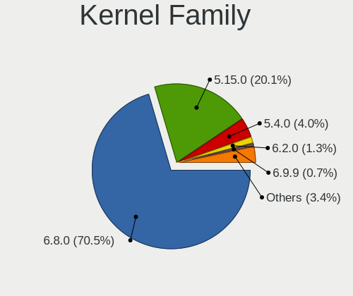
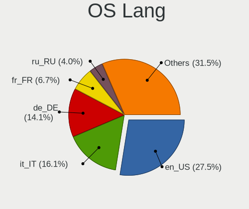
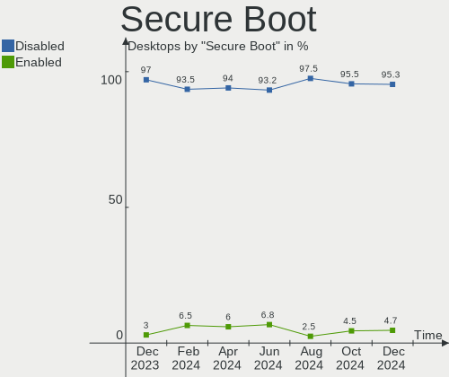
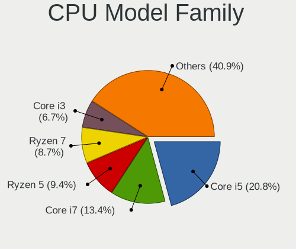
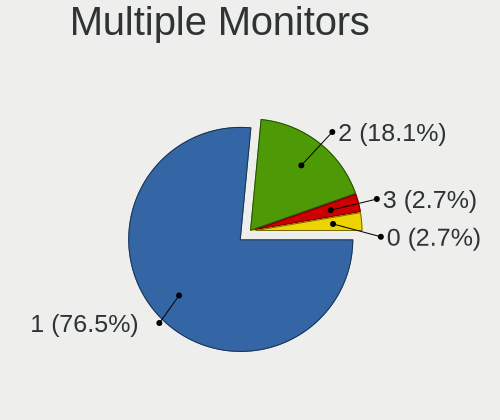
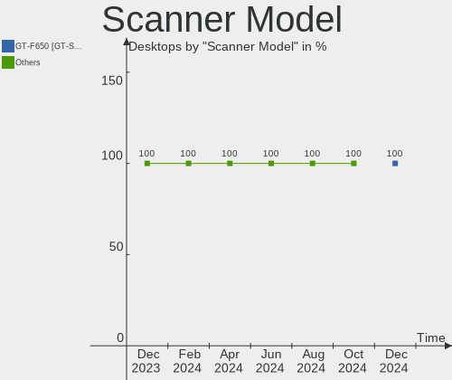
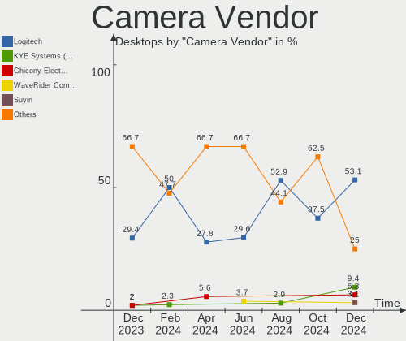

Linux Mint Hardware Trends (Desktops)
-------------------------------------

A project to identify most popular hardware characteristics and track their change
over time based on data collected by Linux Mint users at https://Linux-Hardware.org.

Anyone can contribute to this report by the [hw-probe](https://github.com/linuxhw/hw-probe) tool:

    sudo -E hw-probe -all -upload

Full-feature report is available here: https://linux-hardware.org/?view=trends&formfactor=desktop

Period: Sep, 2021.

Contents
--------

* [ System ](#system)
  - [ OS                       ](#os)
  - [ OS Family                ](#os-family)
  - [ Kernel                   ](#kernel)
  - [ Kernel Family            ](#kernel-family)
  - [ Kernel Major Ver.        ](#kernel-major-ver)
  - [ Arch                     ](#arch)
  - [ DE                       ](#de)
  - [ Display Server           ](#display-server)
  - [ Display Manager          ](#display-manager)
  - [ OS Lang                  ](#os-lang)
  - [ Boot Mode                ](#boot-mode)
  - [ Filesystem               ](#filesystem)
  - [ Part. scheme             ](#part-scheme)
  - [ Dual Boot with Linux/BSD ](#dual-boot-with-linuxbsd)
  - [ Dual Boot (Win)          ](#dual-boot-win)

* [ Board ](#board)
  - [ Vendor                   ](#vendor)
  - [ Model                    ](#model)
  - [ Model Family             ](#model-family)
  - [ MFG Year                 ](#mfg-year)
  - [ Form Factor              ](#form-factor)
  - [ Secure Boot              ](#secure-boot)
  - [ Coreboot                 ](#coreboot)
  - [ RAM Size                 ](#ram-size)
  - [ RAM Used                 ](#ram-used)
  - [ Total Drives             ](#total-drives)
  - [ Has CD-ROM               ](#has-cd-rom)
  - [ Has Ethernet             ](#has-ethernet)
  - [ Has WiFi                 ](#has-wifi)
  - [ Has Bluetooth            ](#has-bluetooth)

* [ Location ](#location)
  - [ Country                  ](#country)
  - [ City                     ](#city)

* [ Drives ](#drives)
  - [ Drive Vendor             ](#drive-vendor)
  - [ Drive Model              ](#drive-model)
  - [ HDD Vendor               ](#hdd-vendor)
  - [ SSD Vendor               ](#ssd-vendor)
  - [ Drive Kind               ](#drive-kind)
  - [ Drive Connector          ](#drive-connector)
  - [ Drive Size               ](#drive-size)
  - [ Space Total              ](#space-total)
  - [ Space Used               ](#space-used)
  - [ Malfunc. Drives          ](#malfunc-drives)
  - [ Malfunc. Drive Vendor    ](#malfunc-drive-vendor)
  - [ Malfunc. HDD Vendor      ](#malfunc-hdd-vendor)
  - [ Malfunc. Drive Kind      ](#malfunc-drive-kind)
  - [ Failed Drives            ](#failed-drives)
  - [ Failed Drive Vendor      ](#failed-drive-vendor)
  - [ Drive Status             ](#drive-status)

* [ Storage controller ](#storage-controller)
  - [ Storage Vendor           ](#storage-vendor)
  - [ Storage Model            ](#storage-model)
  - [ Storage Kind             ](#storage-kind)

* [ Processor ](#processor)
  - [ CPU Vendor               ](#cpu-vendor)
  - [ CPU Model                ](#cpu-model)
  - [ CPU Model Family         ](#cpu-model-family)
  - [ CPU Cores                ](#cpu-cores)
  - [ CPU Sockets              ](#cpu-sockets)
  - [ CPU Threads              ](#cpu-threads)
  - [ CPU Op-Modes             ](#cpu-op-modes)
  - [ CPU Microcode            ](#cpu-microcode)
  - [ CPU Microarch            ](#cpu-microarch)

* [ Graphics ](#graphics)
  - [ GPU Vendor               ](#gpu-vendor)
  - [ GPU Model                ](#gpu-model)
  - [ GPU Combo                ](#gpu-combo)
  - [ GPU Driver               ](#gpu-driver)
  - [ GPU Memory               ](#gpu-memory)

* [ Monitor ](#monitor)
  - [ Monitor Vendor           ](#monitor-vendor)
  - [ Monitor Model            ](#monitor-model)
  - [ Monitor Resolution       ](#monitor-resolution)
  - [ Monitor Diagonal         ](#monitor-diagonal)
  - [ Monitor Width            ](#monitor-width)
  - [ Aspect Ratio             ](#aspect-ratio)
  - [ Monitor Area             ](#monitor-area)
  - [ Pixel Density            ](#pixel-density)
  - [ Multiple Monitors        ](#multiple-monitors)

* [ Network ](#network)
  - [ Net Controller Vendor    ](#net-controller-vendor)
  - [ Net Controller Model     ](#net-controller-model)
  - [ Wireless Vendor          ](#wireless-vendor)
  - [ Wireless Model           ](#wireless-model)
  - [ Ethernet Vendor          ](#ethernet-vendor)
  - [ Ethernet Model           ](#ethernet-model)
  - [ Net Controller Kind      ](#net-controller-kind)
  - [ Used Controller          ](#used-controller)
  - [ NICs                     ](#nics)
  - [ IPv6                     ](#ipv6)

* [ Bluetooth ](#bluetooth)
  - [ Bluetooth Vendor         ](#bluetooth-vendor)
  - [ Bluetooth Model          ](#bluetooth-model)

* [ Sound ](#sound)
  - [ Sound Vendor             ](#sound-vendor)
  - [ Sound Model              ](#sound-model)

* [ Memory ](#memory)
  - [ Memory Vendor            ](#memory-vendor)
  - [ Memory Model             ](#memory-model)
  - [ Memory Kind              ](#memory-kind)
  - [ Memory Form Factor       ](#memory-form-factor)
  - [ Memory Size              ](#memory-size)
  - [ Memory Speed             ](#memory-speed)

* [ Printers & scanners ](#printers--scanners)
  - [ Printer Vendor           ](#printer-vendor)
  - [ Printer Model            ](#printer-model)
  - [ Scanner Vendor           ](#scanner-vendor)
  - [ Scanner Model            ](#scanner-model)

* [ Camera ](#camera)
  - [ Camera Vendor            ](#camera-vendor)
  - [ Camera Model             ](#camera-model)

* [ Security ](#security)
  - [ Fingerprint Vendor       ](#fingerprint-vendor)
  - [ Fingerprint Model        ](#fingerprint-model)
  - [ Chipcard Vendor          ](#chipcard-vendor)
  - [ Chipcard Model           ](#chipcard-model)

* [ Unsupported ](#unsupported)
  - [ Unsupported Devices      ](#unsupported-devices)
  - [ Unsupported Device Types ](#unsupported-device-types)

System
------

OS
--

Installed operating systems

| Name            | Desktops | Percent |
|-----------------|----------|---------|
| Linux Mint 20.2 | 119      | 70.41%  |
| Linux Mint 20.1 | 20       | 11.83%  |
| Linux Mint 19.3 | 15       | 8.88%   |
| Linux Mint 20   | 11       | 6.51%   |
| Linux Mint 19   | 2        | 1.18%   |
| Linux Mint 19.1 | 1        | 0.59%   |
| Linux Mint 18.3 | 1        | 0.59%   |

OS Family
---------

OS without a version

| Name       | Desktops | Percent |
|------------|----------|---------|
| Linux Mint | 169      | 100%    |

Kernel
------

Version of the Linux kernel

| Version                     | Desktops | Percent |
|-----------------------------|----------|---------|
| 5.4.0-84-generic            | 54       | 31.95%  |
| 5.4.0-81-generic            | 27       | 15.98%  |
| 5.4.0-86-generic            | 18       | 10.65%  |
| 5.4.0-88-generic            | 15       | 8.88%   |
| 5.4.0-74-generic            | 13       | 7.69%   |
| 5.4.0-58-generic            | 4        | 2.37%   |
| 5.4.0-26-generic            | 4        | 2.37%   |
| 5.11.0-34-generic           | 4        | 2.37%   |
| 5.4.0-77-generic            | 3        | 1.78%   |
| 5.11.0-27-generic           | 3        | 1.78%   |
| 5.4.0-80-generic            | 2        | 1.18%   |
| 5.11.0-37-generic           | 2        | 1.18%   |
| 5.0.0-32-generic            | 2        | 1.18%   |
| 4.15.0-20-generic           | 2        | 1.18%   |
| 5.8.0-59-generic            | 1        | 0.59%   |
| 5.8.0-33-generic            | 1        | 0.59%   |
| 5.4.0-84-lowlatency         | 1        | 0.59%   |
| 5.4.0-81-lowlatency         | 1        | 0.59%   |
| 5.4.0-73-generic            | 1        | 0.59%   |
| 5.4.0-70-generic            | 1        | 0.59%   |
| 5.4.0-67-generic            | 1        | 0.59%   |
| 5.4.0-62-generic            | 1        | 0.59%   |
| 5.14.0-7.1-liquorix-amd64   | 1        | 0.59%   |
| 5.13.4-051304-generic       | 1        | 0.59%   |
| 5.11.0-36-generic           | 1        | 0.59%   |
| 5.11.0-342109090909-generic | 1        | 0.59%   |
| 5.11.0-22-generic           | 1        | 0.59%   |
| 4.15.0-156-lowlatency       | 1        | 0.59%   |
| 4.15.0-156-generic          | 1        | 0.59%   |
| 4.15.0-142-generic          | 1        | 0.59%   |

Kernel Family
-------------

Linux kernel without a distro release

| Version | Desktops | Percent |
|---------|----------|---------|
| 5.4.0   | 146      | 86.39%  |
| 5.11.0  | 12       | 7.1%    |
| 4.15.0  | 5        | 2.96%   |
| 5.8.0   | 2        | 1.18%   |
| 5.0.0   | 2        | 1.18%   |
| 5.14.0  | 1        | 0.59%   |
| 5.13.4  | 1        | 0.59%   |

Kernel Major Ver.
-----------------

Linux kernel major version

| Version | Desktops | Percent |
|---------|----------|---------|
| 5.4     | 146      | 86.39%  |
| 5.11    | 12       | 7.1%    |
| 4.15    | 5        | 2.96%   |
| 5.8     | 2        | 1.18%   |
| 5.0     | 2        | 1.18%   |
| 5.14    | 1        | 0.59%   |
| 5.13    | 1        | 0.59%   |

Arch
----

OS architecture (x86_64, i586, etc.)

| Name   | Desktops | Percent |
|--------|----------|---------|
| x86_64 | 165      | 97.63%  |
| i686   | 4        | 2.37%   |

DE
--

Desktop Environment

| Name       | Desktops | Percent |
|------------|----------|---------|
| X-Cinnamon | 120      | 71.01%  |
| MATE       | 20       | 11.83%  |
| XFCE       | 18       | 10.65%  |
| Cinnamon   | 5        | 2.96%   |
| KDE        | 2        | 1.18%   |
| GNOME      | 2        | 1.18%   |
| KDE5       | 1        | 0.59%   |
| Unknown    | 1        | 0.59%   |

Display Server
--------------

X11 or Wayland

| Name | Desktops | Percent |
|------|----------|---------|
| X11  | 168      | 99.41%  |
| Tty  | 1        | 0.59%   |

Display Manager
---------------

SDDM, LightDM, etc.

| Name    | Desktops | Percent |
|---------|----------|---------|
| Unknown | 118      | 69.82%  |
| LightDM | 51       | 30.18%  |

OS Lang
-------

Language

| Lang  | Desktops | Percent |
|-------|----------|---------|
| en_US | 49       | 28.99%  |
| de_DE | 33       | 19.53%  |
| pt_BR | 14       | 8.28%   |
| fr_FR | 13       | 7.69%   |
| en_GB | 10       | 5.92%   |
| ru_RU | 6        | 3.55%   |
| C     | 5        | 2.96%   |
| pl_PL | 4        | 2.37%   |
| en_CA | 4        | 2.37%   |
| nl_NL | 3        | 1.78%   |
| it_IT | 3        | 1.78%   |
| es_CO | 3        | 1.78%   |
| ru_UA | 2        | 1.18%   |
| pt_PT | 2        | 1.18%   |
| hu_HU | 2        | 1.18%   |
| fr_BE | 2        | 1.18%   |
| es_ES | 2        | 1.18%   |
| es_AR | 2        | 1.18%   |
| en_AU | 2        | 1.18%   |
| cs_CZ | 2        | 1.18%   |
| fr_CA | 1        | 0.59%   |
| es_MX | 1        | 0.59%   |
| es_CL | 1        | 0.59%   |
| en_IL | 1        | 0.59%   |
| en_IE | 1        | 0.59%   |
| de_CH | 1        | 0.59%   |

Boot Mode
---------

EFI or BIOS

| Mode | Desktops | Percent |
|------|----------|---------|
| BIOS | 98       | 57.99%  |
| EFI  | 71       | 42.01%  |

Filesystem
----------

Type of filesystem

| Type    | Desktops | Percent |
|---------|----------|---------|
| Ext4    | 154      | 91.12%  |
| Overlay | 6        | 3.55%   |
| Xfs     | 4        | 2.37%   |
| Btrfs   | 4        | 2.37%   |
| Ext3    | 1        | 0.59%   |

Part. scheme
------------

Scheme of partitioning

| Type    | Desktops | Percent |
|---------|----------|---------|
| Unknown | 120      | 71.01%  |
| GPT     | 26       | 15.38%  |
| MBR     | 23       | 13.61%  |

Dual Boot with Linux/BSD
------------------------

Hosting more than one Linux/BSD

| Dual boot | Desktops | Percent |
|-----------|----------|---------|
| No        | 156      | 92.31%  |
| Yes       | 13       | 7.69%   |

Dual Boot (Win)
---------------

Hosting Linux and Windows

| Dual boot | Desktops | Percent |
|-----------|----------|---------|
| No        | 141      | 83.43%  |
| Yes       | 28       | 16.57%  |

Board
-----

Vendor
------

Motherboard manufacturer

| Name                | Desktops | Percent |
|---------------------|----------|---------|
| ASUSTek Computer    | 44       | 26.04%  |
| Gigabyte Technology | 23       | 13.61%  |
| MSI                 | 18       | 10.65%  |
| Hewlett-Packard     | 18       | 10.65%  |
| ASRock              | 17       | 10.06%  |
| Dell                | 12       | 7.1%    |
| Lenovo              | 7        | 4.14%   |
| Pegatron            | 5        | 2.96%   |
| Biostar             | 4        | 2.37%   |
| Intel               | 3        | 1.78%   |
| Fujitsu Siemens     | 2        | 1.18%   |
| Foxconn             | 2        | 1.18%   |
| Acer                | 2        | 1.18%   |
| Unknown             | 2        | 1.18%   |
| Positivo            | 1        | 0.59%   |
| Medion              | 1        | 0.59%   |
| Itautec             | 1        | 0.59%   |
| Huanan              | 1        | 0.59%   |
| HC                  | 1        | 0.59%   |
| HARDKERNEL          | 1        | 0.59%   |
| Fujitsu             | 1        | 0.59%   |
| ECS                 | 1        | 0.59%   |
| DFI                 | 1        | 0.59%   |
| Apple               | 1        | 0.59%   |

Model
-----

Motherboard model

| Name                                                                | Desktops | Percent |
|---------------------------------------------------------------------|----------|---------|
| ASUS TUF GAMING X570-PLUS                                           | 4        | 2.37%   |
| MSI MS-7693                                                         | 3        | 1.78%   |
| MSI MS-7C83                                                         | 2        | 1.18%   |
| MSI MS-7788                                                         | 2        | 1.18%   |
| HP Desktop M01-F1xxx                                                | 2        | 1.18%   |
| HP Compaq Pro 6300 SFF                                              | 2        | 1.18%   |
| Dell OptiPlex 790                                                   | 2        | 1.18%   |
| Dell OptiPlex 755                                                   | 2        | 1.18%   |
| Dell OptiPlex 390                                                   | 2        | 1.18%   |
| ASUS M5A99FX PRO R2.0                                               | 2        | 1.18%   |
| ASUS All Series                                                     | 2        | 1.18%   |
| Unknown                                                             | 2        | 1.18%   |
| Positivo POS-EINM70CS                                               | 1        | 0.59%   |
| Pegatron NC890AA-ABA a6803w                                         | 1        | 0.59%   |
| Pegatron KJ385AA-ABA a6433w                                         | 1        | 0.59%   |
| Pegatron FL340AA-ABD m9489de                                        | 1        | 0.59%   |
| Pegatron AY627AA-ABA a4313w                                         | 1        | 0.59%   |
| Pegatron 23-b030                                                    | 1        | 0.59%   |
| MSI MS-7C81                                                         | 1        | 0.59%   |
| MSI MS-7C75                                                         | 1        | 0.59%   |
| MSI MS-7C37                                                         | 1        | 0.59%   |
| MSI MS-7A62                                                         | 1        | 0.59%   |
| MSI MS-7A39                                                         | 1        | 0.59%   |
| MSI MS-7917                                                         | 1        | 0.59%   |
| MSI MS-7821                                                         | 1        | 0.59%   |
| MSI MS-7817                                                         | 1        | 0.59%   |
| MSI MS-7720                                                         | 1        | 0.59%   |
| MSI MS-7681                                                         | 1        | 0.59%   |
| MSI MS-7253                                                         | 1        | 0.59%   |
| Medion MS-7633                                                      | 1        | 0.59%   |
| Lenovo ThinkCentre M900 10FLS3G601                                  | 1        | 0.59%   |
| Lenovo ThinkCentre M700 10GSS28C00                                  | 1        | 0.59%   |
| Lenovo ThinkCentre M58p 3285W2N                                     | 1        | 0.59%   |
| Lenovo IdeaCentre 5 14IMB05 90NA0082US                              | 1        | 0.59%   |
| Lenovo IdeaCentre 5 14IMB05 90NA001RIX                              | 1        | 0.59%   |
| Lenovo H50-55 90BG0022US                                            | 1        | 0.59%   |
| Lenovo H30-05 90BJ002RUK                                            | 1        | 0.59%   |
| Itautec Infoway ST-4265                                             | 1        | 0.59%   |
| Intel DP55WB AAE64798-204                                           | 1        | 0.59%   |
| Intel DG41WV                                                        | 1        | 0.59%   |
| Intel D945GCLF2D AAE59323-101                                       | 1        | 0.59%   |
| Huanan X79 INTEL (INTEL Xeon E5/Corei7 DMI2 - C600/C200 Cipset V3.2 | 1        | 0.59%   |
| HP Z420 Workstation                                                 | 1        | 0.59%   |
| HP xw8600 Workstation                                               | 1        | 0.59%   |
| HP ProDesk 600 G4 SFF                                               | 1        | 0.59%   |
| HP ProDesk 600 G1 SFF                                               | 1        | 0.59%   |
| HP Pavilion Desktop PC 570-p0xx                                     | 1        | 0.59%   |
| HP OMEN 30L Desktop GT13-0xxx                                       | 1        | 0.59%   |
| HP EliteDesk 805 G6 Small Form Factor PC                            | 1        | 0.59%   |
| HP EliteDesk 800 G2 DM 65W                                          | 1        | 0.59%   |
| HP Compaq Elite 8300 SFF                                            | 1        | 0.59%   |
| HP Compaq 8100 Elite SFF PC                                         | 1        | 0.59%   |
| HP Compaq 6200 Pro MT PC                                            | 1        | 0.59%   |
| HP Compaq 6005 Pro SFF PC                                           | 1        | 0.59%   |
| HP 580-009nw                                                        | 1        | 0.59%   |
| HP 500-205t                                                         | 1        | 0.59%   |
| HC HCAR357-MI                                                       | 1        | 0.59%   |
| HARDKERNEL ODROID-H2                                                | 1        | 0.59%   |
| Gigabyte Z170M-D3H                                                  | 1        | 0.59%   |
| Gigabyte X99-UD4-CF                                                 | 1        | 0.59%   |

Model Family
------------

Motherboard model prefix

| Name                  | Desktops | Percent |
|-----------------------|----------|---------|
| Dell OptiPlex         | 10       | 5.92%   |
| ASUS PRIME            | 8        | 4.73%   |
| HP Compaq             | 6        | 3.55%   |
| ASUS TUF              | 6        | 3.55%   |
| MSI MS-7693           | 3        | 1.78%   |
| Lenovo ThinkCentre    | 3        | 1.78%   |
| ASUS ROG              | 3        | 1.78%   |
| MSI MS-7C83           | 2        | 1.18%   |
| MSI MS-7788           | 2        | 1.18%   |
| Lenovo IdeaCentre     | 2        | 1.18%   |
| HP ProDesk            | 2        | 1.18%   |
| HP EliteDesk          | 2        | 1.18%   |
| HP Desktop            | 2        | 1.18%   |
| ASUS M5A99FX          | 2        | 1.18%   |
| ASUS M5A78L-M         | 2        | 1.18%   |
| ASUS M4N68T-M         | 2        | 1.18%   |
| ASUS All              | 2        | 1.18%   |
| ASRock 970            | 2        | 1.18%   |
| Unknown               | 2        | 1.18%   |
| Positivo POS-EINM70CS | 1        | 0.59%   |
| Pegatron NC890AA-ABA  | 1        | 0.59%   |
| Pegatron KJ385AA-ABA  | 1        | 0.59%   |
| Pegatron FL340AA-ABD  | 1        | 0.59%   |
| Pegatron AY627AA-ABA  | 1        | 0.59%   |
| Pegatron 23-b030      | 1        | 0.59%   |
| MSI MS-7C81           | 1        | 0.59%   |
| MSI MS-7C75           | 1        | 0.59%   |
| MSI MS-7C37           | 1        | 0.59%   |
| MSI MS-7A62           | 1        | 0.59%   |
| MSI MS-7A39           | 1        | 0.59%   |
| MSI MS-7917           | 1        | 0.59%   |
| MSI MS-7821           | 1        | 0.59%   |
| MSI MS-7817           | 1        | 0.59%   |
| MSI MS-7720           | 1        | 0.59%   |
| MSI MS-7681           | 1        | 0.59%   |
| MSI MS-7253           | 1        | 0.59%   |
| Medion MS-7633        | 1        | 0.59%   |
| Lenovo H50-55         | 1        | 0.59%   |
| Lenovo H30-05         | 1        | 0.59%   |
| Itautec Infoway       | 1        | 0.59%   |
| Intel DP55WB          | 1        | 0.59%   |
| Intel DG41WV          | 1        | 0.59%   |
| Intel D945GCLF2D      | 1        | 0.59%   |
| Huanan X79            | 1        | 0.59%   |
| HP Z420               | 1        | 0.59%   |
| HP xw8600             | 1        | 0.59%   |
| HP Pavilion           | 1        | 0.59%   |
| HP OMEN               | 1        | 0.59%   |
| HP 580-009nw          | 1        | 0.59%   |
| HP 500-205t           | 1        | 0.59%   |
| HC HCAR357-MI         | 1        | 0.59%   |
| HARDKERNEL ODROID-H2  | 1        | 0.59%   |
| Gigabyte Z170M-D3H    | 1        | 0.59%   |
| Gigabyte X99-UD4-CF   | 1        | 0.59%   |
| Gigabyte X99-Gaming   | 1        | 0.59%   |
| Gigabyte THEIS-Extra  | 1        | 0.59%   |
| Gigabyte P35-DS4      | 1        | 0.59%   |
| Gigabyte P35-DS3R     | 1        | 0.59%   |
| Gigabyte M68SM-S2L    | 1        | 0.59%   |
| Gigabyte M56S-S3      | 1        | 0.59%   |

MFG Year
--------

Motherboard manufacture year

| Year | Desktops | Percent |
|------|----------|---------|
| 2012 | 22       | 13.02%  |
| 2020 | 21       | 12.43%  |
| 2021 | 16       | 9.47%   |
| 2014 | 15       | 8.88%   |
| 2013 | 12       | 7.1%    |
| 2008 | 11       | 6.51%   |
| 2018 | 10       | 5.92%   |
| 2011 | 10       | 5.92%   |
| 2019 | 9        | 5.33%   |
| 2016 | 9        | 5.33%   |
| 2009 | 8        | 4.73%   |
| 2010 | 7        | 4.14%   |
| 2007 | 7        | 4.14%   |
| 2017 | 5        | 2.96%   |
| 2015 | 5        | 2.96%   |
| 2005 | 1        | 0.59%   |
| 2004 | 1        | 0.59%   |

Form Factor
-----------

Physical design of the computer

| Name    | Desktops | Percent |
|---------|----------|---------|
| Desktop | 169      | 100%    |

Secure Boot
-----------

Enabled or disabled

| State    | Desktops | Percent |
|----------|----------|---------|
| Disabled | 159      | 94.08%  |
| Enabled  | 10       | 5.92%   |

Coreboot
--------

Have coreboot on board

| Used | Desktops | Percent |
|------|----------|---------|
| No   | 169      | 100%    |

RAM Size
--------

Total RAM memory

| Size in GB  | Desktops | Percent |
|-------------|----------|---------|
| 4.01-8.0    | 40       | 23.67%  |
| 16.01-24.0  | 40       | 23.67%  |
| 8.01-16.0   | 29       | 17.16%  |
| 3.01-4.0    | 28       | 16.57%  |
| 32.01-64.0  | 18       | 10.65%  |
| 2.01-3.0    | 5        | 2.96%   |
| 24.01-32.0  | 3        | 1.78%   |
| 64.01-256.0 | 3        | 1.78%   |
| 1.01-2.0    | 2        | 1.18%   |
| 0.51-1.0    | 1        | 0.59%   |

RAM Used
--------

Used RAM memory

| Used GB    | Desktops | Percent |
|------------|----------|---------|
| 1.01-2.0   | 71       | 42.01%  |
| 2.01-3.0   | 44       | 26.04%  |
| 4.01-8.0   | 27       | 15.98%  |
| 0.51-1.0   | 13       | 7.69%   |
| 3.01-4.0   | 10       | 5.92%   |
| 8.01-16.0  | 3        | 1.78%   |
| 16.01-24.0 | 1        | 0.59%   |

Total Drives
------------

Number of drives on board

| Drives | Desktops | Percent |
|--------|----------|---------|
| 1      | 69       | 40.83%  |
| 2      | 44       | 26.04%  |
| 3      | 23       | 13.61%  |
| 4      | 22       | 13.02%  |
| 5      | 5        | 2.96%   |
| 6      | 3        | 1.78%   |
| 10     | 1        | 0.59%   |
| 8      | 1        | 0.59%   |
| 0      | 1        | 0.59%   |

Has CD-ROM
----------

Has CD-ROM on board

| Presented | Desktops | Percent |
|-----------|----------|---------|
| Yes       | 94       | 55.62%  |
| No        | 75       | 44.38%  |

Has Ethernet
------------

Has Ethernet on board

| Presented | Desktops | Percent |
|-----------|----------|---------|
| Yes       | 167      | 98.82%  |
| No        | 2        | 1.18%   |

Has WiFi
--------

Has WiFi module

| Presented | Desktops | Percent |
|-----------|----------|---------|
| No        | 99       | 58.58%  |
| Yes       | 70       | 41.42%  |

Has Bluetooth
-------------

Has Bluetooth module

| Presented | Desktops | Percent |
|-----------|----------|---------|
| No        | 119      | 70.41%  |
| Yes       | 50       | 29.59%  |

Location
--------

Country
-------

Geographic location (country)

| Country     | Desktops | Percent |
|-------------|----------|---------|
| Germany     | 36       | 21.3%   |
| USA         | 33       | 19.53%  |
| Brazil      | 15       | 8.88%   |
| France      | 13       | 7.69%   |
| UK          | 10       | 5.92%   |
| Poland      | 8        | 4.73%   |
| Canada      | 6        | 3.55%   |
| Netherlands | 5        | 2.96%   |
| Italy       | 5        | 2.96%   |
| Russia      | 4        | 2.37%   |
| Ukraine     | 3        | 1.78%   |
| Colombia    | 3        | 1.78%   |
| Portugal    | 2        | 1.18%   |
| Israel      | 2        | 1.18%   |
| Czechia     | 2        | 1.18%   |
| Chile       | 2        | 1.18%   |
| Belgium     | 2        | 1.18%   |
| Austria     | 2        | 1.18%   |
| Australia   | 2        | 1.18%   |
| Argentina   | 2        | 1.18%   |
| Switzerland | 1        | 0.59%   |
| Spain       | 1        | 0.59%   |
| Serbia      | 1        | 0.59%   |
| Romania     | 1        | 0.59%   |
| Philippines | 1        | 0.59%   |
| Pakistan    | 1        | 0.59%   |
| Mexico      | 1        | 0.59%   |
| Ireland     | 1        | 0.59%   |
| Hungary     | 1        | 0.59%   |
| Belarus     | 1        | 0.59%   |
| Bangladesh  | 1        | 0.59%   |
| Algeria     | 1        | 0.59%   |

City
----

Geographic location (city)

| City                        | Desktops | Percent |
|-----------------------------|----------|---------|
| Paris                       | 3        | 1.78%   |
| Moscow                      | 3        | 1.78%   |
| Leipzig                     | 3        | 1.78%   |
| Dallas                      | 3        | 1.78%   |
| Vienna                      | 2        | 1.18%   |
| Stuttgart                   | 2        | 1.18%   |
| Strasbourg                  | 2        | 1.18%   |
| London                      | 2        | 1.18%   |
| Krakow                      | 2        | 1.18%   |
| Gateshead                   | 2        | 1.18%   |
| Bogot??                     | 2        | 1.18%   |
| Amsterdam                   | 2        | 1.18%   |
| Zawiercie                   | 1        | 0.59%   |
| Zaporizhzhya                | 1        | 0.59%   |
| Zanesville                  | 1        | 0.59%   |
| Wuppertal                   | 1        | 0.59%   |
| Wroclaw                     | 1        | 0.59%   |
| Wright City                 | 1        | 0.59%   |
| Waterloo                    | 1        | 0.59%   |
| Warsaw                      | 1        | 0.59%   |
| Villa Ballester             | 1        | 0.59%   |
| Vila Real de Santo Ant??nio | 1        | 0.59%   |
| Viam??o                     | 1        | 0.59%   |
| Venegono Superiore          | 1        | 0.59%   |
| Vendargues                  | 1        | 0.59%   |
| Tulsa                       | 1        | 0.59%   |
| Toronto                     | 1        | 0.59%   |
| Tel Aviv                    | 1        | 0.59%   |
| Talca                       | 1        | 0.59%   |
| Szombathely                 | 1        | 0.59%   |
| Sydney                      | 1        | 0.59%   |
| Speyer                      | 1        | 0.59%   |
| Shalazhi                    | 1        | 0.59%   |
| Sept-Iles                   | 1        | 0.59%   |
| Senonches                   | 1        | 0.59%   |
| Schwetzingen                | 1        | 0.59%   |
| Schrobenhausen              | 1        | 0.59%   |
| S??o Paulo                  | 1        | 0.59%   |
| S??o Leopoldo               | 1        | 0.59%   |
| Santiago                    | 1        | 0.59%   |
| Sankt Ingbert               | 1        | 0.59%   |
| Salinas                     | 1        | 0.59%   |
| Saint-Jean-de-la-Ruelle     | 1        | 0.59%   |
| Saint-Denis                 | 1        | 0.59%   |
| Roman                       | 1        | 0.59%   |
| Rocky Mount                 | 1        | 0.59%   |
| Rochester                   | 1        | 0.59%   |
| Rio de Janeiro              | 1        | 0.59%   |
| Rio das Ostras              | 1        | 0.59%   |
| Reno                        | 1        | 0.59%   |
| Rawa Mazowiecka             | 1        | 0.59%   |
| Portland                    | 1        | 0.59%   |
| Pittsburgh                  | 1        | 0.59%   |
| Pisa                        | 1        | 0.59%   |
| Pirmasens                   | 1        | 0.59%   |
| Pickering                   | 1        | 0.59%   |
| Perth                       | 1        | 0.59%   |
| Pelotas                     | 1        | 0.59%   |
| Pasaia                      | 1        | 0.59%   |
| Paramus                     | 1        | 0.59%   |

Drives
------

Drive Vendor
------------

Hard drive vendors

| Vendor                    | Desktops | Drives | Percent |
|---------------------------|----------|--------|---------|
| WDC                       | 64       | 92     | 20.71%  |
| Seagate                   | 62       | 74     | 20.06%  |
| Samsung Electronics       | 43       | 58     | 13.92%  |
| SanDisk                   | 17       | 18     | 5.5%    |
| Kingston                  | 16       | 16     | 5.18%   |
| Hitachi                   | 15       | 16     | 4.85%   |
| Crucial                   | 13       | 19     | 4.21%   |
| Toshiba                   | 11       | 14     | 3.56%   |
| Unknown                   | 6        | 6      | 1.94%   |
| A-DATA Technology         | 5        | 5      | 1.62%   |
| Phison                    | 4        | 4      | 1.29%   |
| MAXTOR                    | 4        | 4      | 1.29%   |
| Intenso                   | 4        | 4      | 1.29%   |
| GOODRAM                   | 4        | 4      | 1.29%   |
| XPG                       | 3        | 3      | 0.97%   |
| SK Hynix                  | 3        | 4      | 0.97%   |
| OCZ                       | 3        | 3      | 0.97%   |
| Intel                     | 3        | 3      | 0.97%   |
| Silicon Motion            | 2        | 3      | 0.65%   |
| PNY                       | 2        | 2      | 0.65%   |
| Micron/Crucial Technology | 2        | 2      | 0.65%   |
| LDLC                      | 2        | 2      | 0.65%   |
| JMicron                   | 2        | 2      | 0.65%   |
| HGST                      | 2        | 3      | 0.65%   |
| China                     | 2        | 2      | 0.65%   |
| WD MediaMax               | 1        | 1      | 0.32%   |
| Union Memory              | 1        | 1      | 0.32%   |
| Team                      | 1        | 1      | 0.32%   |
| SPCC                      | 1        | 1      | 0.32%   |
| Realtek Semiconductor     | 1        | 1      | 0.32%   |
| Pichau                    | 1        | 1      | 0.32%   |
| Patriot                   | 1        | 1      | 0.32%   |
| Micron Technology         | 1        | 1      | 0.32%   |
| LITEON                    | 1        | 1      | 0.32%   |
| HUAWEI                    | 1        | 1      | 0.32%   |
| Fujitsu                   | 1        | 1      | 0.32%   |
| ExcelStor                 | 1        | 2      | 0.32%   |
| Biostar                   | 1        | 1      | 0.32%   |
| asmedia                   | 1        | 1      | 0.32%   |
| Apacer                    | 1        | 1      | 0.32%   |

Drive Model
-----------

Hard drive models

| Model                               | Desktops | Percent |
|-------------------------------------|----------|---------|
| Seagate ST3500418AS 500GB           | 6        | 1.64%   |
| WDC WD10EZEX-08WN4A0 1TB            | 5        | 1.37%   |
| Seagate ST500DM002-1BD142 500GB     | 5        | 1.37%   |
| Seagate ST1000DM010-2EP102 1TB      | 5        | 1.37%   |
| Kingston SA400S37240G 240GB SSD     | 5        | 1.37%   |
| WDC WDS120G2G0A-00JH30 120GB SSD    | 3        | 0.82%   |
| Seagate ST2000DM008-2FR102 2TB      | 3        | 0.82%   |
| Seagate ST1000DM003-1ER162 1TB      | 3        | 0.82%   |
| Samsung SSD 860 EVO 250GB           | 3        | 0.82%   |
| Samsung SSD 850 EVO 250GB           | 3        | 0.82%   |
| Samsung SSD 840 PRO Series 128GB    | 3        | 0.82%   |
| Samsung NVMe SSD Drive 256GB        | 3        | 0.82%   |
| Samsung NVMe SSD Drive 250GB        | 3        | 0.82%   |
| Kingston SA400S37480G 480GB SSD     | 3        | 0.82%   |
| Kingston SA400S37120G 120GB SSD     | 3        | 0.82%   |
| Crucial CT1000MX500SSD1 1TB         | 3        | 0.82%   |
| WDC WDS100T2B0A-00SM50 1TB SSD      | 2        | 0.55%   |
| WDC WD6400AAKS-65A7B2 640GB         | 2        | 0.55%   |
| WDC WD5000AVDS-63U7B1 500GB         | 2        | 0.55%   |
| WDC WD5000AAKX-60U6AA0 500GB        | 2        | 0.55%   |
| WDC WD40EZRZ-00GXCB0 4TB            | 2        | 0.55%   |
| WDC WD20EURX-63T0FY0 2TB            | 2        | 0.55%   |
| WDC WD10EZEX-00BN5A0 1TB            | 2        | 0.55%   |
| WDC WD10EADS-00L5B1 1TB             | 2        | 0.55%   |
| Unknown SD/MMC/MS PRO 128GB         | 2        | 0.55%   |
| Toshiba DT01ACA100 1TB              | 2        | 0.55%   |
| SK Hynix NVMe SSD Drive 256GB       | 2        | 0.55%   |
| Seagate ST3500413AS 500GB           | 2        | 0.55%   |
| Seagate ST3160812AS 160GB           | 2        | 0.55%   |
| Seagate ST31000528AS 1TB            | 2        | 0.55%   |
| Seagate ST2000DM001-1ER164 2TB      | 2        | 0.55%   |
| Seagate ST1000DM003-1CH162 1TB      | 2        | 0.55%   |
| Seagate Expansion Desk 4TB          | 2        | 0.55%   |
| SanDisk SSD PLUS 480GB              | 2        | 0.55%   |
| SanDisk SSD PLUS 1000GB             | 2        | 0.55%   |
| Samsung SSD 860 EVO 500GB           | 2        | 0.55%   |
| Samsung SSD 850 EVO 500GB           | 2        | 0.55%   |
| Samsung SSD 840 EVO 250GB           | 2        | 0.55%   |
| Samsung NVMe SSD Drive 1TB          | 2        | 0.55%   |
| Samsung HD501LJ 500GB               | 2        | 0.55%   |
| Samsung HD161GJ 160GB               | 2        | 0.55%   |
| Samsung HD103UJ 1TB                 | 2        | 0.55%   |
| Phison NVMe SSD Drive 256GB         | 2        | 0.55%   |
| Micron/Crucial NVMe SSD Drive 500GB | 2        | 0.55%   |
| Hitachi HTS545032B9A300 320GB       | 2        | 0.55%   |
| Crucial CT480BX500SSD1 480GB        | 2        | 0.55%   |
| XPG NVMe SSD Drive 512GB            | 1        | 0.27%   |
| XPG NVMe SSD Drive 2TB              | 1        | 0.27%   |
| XPG NVMe SSD Drive 1024GB           | 1        | 0.27%   |
| WDC WDS500G3X0C-00SJG0 500GB        | 1        | 0.27%   |
| WDC WDS500G2B0A-00SM50 500GB SSD    | 1        | 0.27%   |
| WDC WDS240G2G0B-00EPW0 240GB SSD    | 1        | 0.27%   |
| WDC WDS240G2G0A-00JH30 240GB SSD    | 1        | 0.27%   |
| WDC WDS100T2B0B-00YS70 1TB SSD      | 1        | 0.27%   |
| WDC WDS100T2B0A 1TB SSD             | 1        | 0.27%   |
| WDC WDBNCE5000PNC 500GB SSD         | 1        | 0.27%   |
| WDC WD80EZAZ-11TDBA0 8TB            | 1        | 0.27%   |
| WDC WD80EMAZ-00WJTA0 8TB            | 1        | 0.27%   |
| WDC WD80EMAZ-00M9AA0 8TB            | 1        | 0.27%   |
| WDC WD80EFAX-68KNBN0 8TB            | 1        | 0.27%   |

HDD Vendor
----------

Hard disk drive vendors

| Vendor              | Desktops | Drives | Percent |
|---------------------|----------|--------|---------|
| Seagate             | 62       | 73     | 37.58%  |
| WDC                 | 55       | 79     | 33.33%  |
| Hitachi             | 15       | 16     | 9.09%   |
| Samsung Electronics | 12       | 13     | 7.27%   |
| Toshiba             | 10       | 12     | 6.06%   |
| MAXTOR              | 4        | 4      | 2.42%   |
| Unknown             | 2        | 2      | 1.21%   |
| HGST                | 2        | 3      | 1.21%   |
| Intenso             | 1        | 1      | 0.61%   |
| Fujitsu             | 1        | 1      | 0.61%   |
| ExcelStor           | 1        | 2      | 0.61%   |

SSD Vendor
----------

Solid state drive vendors

| Vendor              | Desktops | Drives | Percent |
|---------------------|----------|--------|---------|
| Samsung Electronics | 25       | 30     | 23.36%  |
| SanDisk             | 14       | 15     | 13.08%  |
| Kingston            | 14       | 14     | 13.08%  |
| Crucial             | 12       | 18     | 11.21%  |
| WDC                 | 11       | 11     | 10.28%  |
| GOODRAM             | 4        | 4      | 3.74%   |
| A-DATA Technology   | 4        | 4      | 3.74%   |
| OCZ                 | 3        | 3      | 2.8%    |
| Unknown             | 2        | 2      | 1.87%   |
| Toshiba             | 2        | 2      | 1.87%   |
| PNY                 | 2        | 2      | 1.87%   |
| LDLC                | 2        | 2      | 1.87%   |
| Intenso             | 2        | 2      | 1.87%   |
| China               | 2        | 2      | 1.87%   |
| Team                | 1        | 1      | 0.93%   |
| SPCC                | 1        | 1      | 0.93%   |
| Pichau              | 1        | 1      | 0.93%   |
| Patriot             | 1        | 1      | 0.93%   |
| LITEON              | 1        | 1      | 0.93%   |
| JMicron             | 1        | 1      | 0.93%   |
| Intel               | 1        | 1      | 0.93%   |
| Apacer              | 1        | 1      | 0.93%   |

Drive Kind
----------

HDD or SSD

| Kind    | Desktops | Drives | Percent |
|---------|----------|--------|---------|
| HDD     | 120      | 206    | 48.19%  |
| SSD     | 83       | 119    | 33.33%  |
| NVMe    | 39       | 47     | 15.66%  |
| Unknown | 6        | 6      | 2.41%   |
| MMC     | 1        | 1      | 0.4%    |

Drive Connector
---------------

SATA, SAS, NVMe, etc.

| Type | Desktops | Drives | Percent |
|------|----------|--------|---------|
| SATA | 158      | 315    | 74.53%  |
| NVMe | 38       | 46     | 17.92%  |
| SAS  | 15       | 17     | 7.08%   |
| MMC  | 1        | 1      | 0.47%   |

Drive Size
----------

Size of hard drive

| Size in TB | Desktops | Drives | Percent |
|------------|----------|--------|---------|
| 0.01-0.5   | 120      | 185    | 53.57%  |
| 0.51-1.0   | 63       | 80     | 28.13%  |
| 1.01-2.0   | 26       | 32     | 11.61%  |
| 3.01-4.0   | 9        | 13     | 4.02%   |
| 4.01-10.0  | 4        | 12     | 1.79%   |
| 2.01-3.0   | 2        | 3      | 0.89%   |

Space Total
-----------

Amount of disk space available on the file system

| Size in GB     | Desktops | Percent |
|----------------|----------|---------|
| 101-250        | 50       | 29.59%  |
| 251-500        | 34       | 20.12%  |
| 501-1000       | 31       | 18.34%  |
| 1001-2000      | 17       | 10.06%  |
| More than 3000 | 14       | 8.28%   |
| 2001-3000      | 12       | 7.1%    |
| 51-100         | 6        | 3.55%   |
| 1-20           | 3        | 1.78%   |
| 21-50          | 2        | 1.18%   |

Space Used
----------

Amount of used disk space

| Used GB        | Desktops | Percent |
|----------------|----------|---------|
| 1-20           | 41       | 24.26%  |
| 101-250        | 30       | 17.75%  |
| 21-50          | 24       | 14.2%   |
| 51-100         | 22       | 13.02%  |
| 501-1000       | 18       | 10.65%  |
| 251-500        | 14       | 8.28%   |
| 1001-2000      | 8        | 4.73%   |
| More than 3000 | 7        | 4.14%   |
| 2001-3000      | 5        | 2.96%   |

Malfunc. Drives
---------------

Drive models with a malfunction

| Model                                          | Desktops | Drives | Percent |
|------------------------------------------------|----------|--------|---------|
| Seagate ST3500418AS 500GB                      | 2        | 2      | 8%      |
| Seagate ST3160812AS 160GB                      | 2        | 2      | 8%      |
| WDC WD5002ABYS-01B1B0 500GB                    | 1        | 1      | 4%      |
| WDC WD5000AVDS-63U7B1 500GB                    | 1        | 1      | 4%      |
| WDC WD5000AAKX-22ERMA0 500GB                   | 1        | 1      | 4%      |
| WDC WD5000AAKX-003CA0 500GB                    | 1        | 1      | 4%      |
| WDC WD5000AAKS-00D2B0 500GB                    | 1        | 1      | 4%      |
| WDC WD2500BEVS-60UST0 250GB                    | 1        | 1      | 4%      |
| WDC WD1200JB-00CRA1 120GB                      | 1        | 1      | 4%      |
| WDC WD10EACS-65D6B0 1TB                        | 1        | 1      | 4%      |
| Toshiba MQ04ABF100 1TB                         | 1        | 1      | 4%      |
| Seagate ST9640320AS 640GB                      | 1        | 1      | 4%      |
| Seagate ST500DM002-1BD142 500GB                | 1        | 1      | 4%      |
| Seagate ST3500320AS 500GB                      | 1        | 1      | 4%      |
| Seagate ST3250620AS 250GB                      | 1        | 1      | 4%      |
| Seagate ST3160811AS 160GB                      | 1        | 1      | 4%      |
| Seagate ST31500341AS 1TB                       | 1        | 2      | 4%      |
| Seagate ST2000DM001-9YN164 2TB                 | 1        | 1      | 4%      |
| Seagate ST1000LM035-1RK172 1TB                 | 1        | 1      | 4%      |
| Samsung Electronics HD501LJ 500GB              | 1        | 1      | 4%      |
| Hitachi HUA722010CLA330 59Y5306 42C0423IBM 1TB | 1        | 1      | 4%      |
| Hitachi HDT722525DLAT80 250GB                  | 1        | 1      | 4%      |
| Hitachi HDS721050CLA362 500GB                  | 1        | 1      | 4%      |

Malfunc. Drive Vendor
---------------------

Vendors of faulty drives

| Vendor              | Desktops | Drives | Percent |
|---------------------|----------|--------|---------|
| Seagate             | 12       | 13     | 52.17%  |
| WDC                 | 6        | 8      | 26.09%  |
| Hitachi             | 3        | 3      | 13.04%  |
| Toshiba             | 1        | 1      | 4.35%   |
| Samsung Electronics | 1        | 1      | 4.35%   |

Malfunc. HDD Vendor
-------------------

Vendors of faulty HDD drives

| Vendor              | Desktops | Drives | Percent |
|---------------------|----------|--------|---------|
| Seagate             | 12       | 13     | 52.17%  |
| WDC                 | 6        | 8      | 26.09%  |
| Hitachi             | 3        | 3      | 13.04%  |
| Toshiba             | 1        | 1      | 4.35%   |
| Samsung Electronics | 1        | 1      | 4.35%   |

Malfunc. Drive Kind
-------------------

Kinds of faulty drives

| Kind | Desktops | Drives | Percent |
|------|----------|--------|---------|
| HDD  | 18       | 26     | 100%    |

Failed Drives
-------------

Failed drive models

Zero info for selected period =(

Failed Drive Vendor
-------------------

Failed drive vendors

Zero info for selected period =(

Drive Status
------------

Number of failed and malfunc. drives

| Status   | Desktops | Drives | Percent |
|----------|----------|--------|---------|
| Detected | 125      | 272    | 65.79%  |
| Works    | 47       | 81     | 24.74%  |
| Malfunc  | 18       | 26     | 9.47%   |

Storage controller
------------------

Storage Vendor
--------------

Storage controller vendors

| Vendor                        | Desktops | Percent |
|-------------------------------|----------|---------|
| Intel                         | 103      | 44.78%  |
| AMD                           | 54       | 23.48%  |
| Samsung Electronics           | 13       | 5.65%   |
| Nvidia                        | 13       | 5.65%   |
| JMicron Technology            | 8        | 3.48%   |
| VIA Technologies              | 4        | 1.74%   |
| Sandisk                       | 4        | 1.74%   |
| Phison Electronics            | 4        | 1.74%   |
| ASMedia Technology            | 4        | 1.74%   |
| ADATA Technology              | 4        | 1.74%   |
| SK Hynix                      | 3        | 1.3%    |
| Micron/Crucial Technology     | 3        | 1.3%    |
| Marvell Technology Group      | 3        | 1.3%    |
| Silicon Motion                | 2        | 0.87%   |
| Realtek Semiconductor         | 2        | 0.87%   |
| Kingston Technology Company   | 2        | 0.87%   |
| Union Memory (Shenzhen)       | 1        | 0.43%   |
| Micron Technology             | 1        | 0.43%   |
| Integrated Technology Express | 1        | 0.43%   |
| Broadcom / LSI                | 1        | 0.43%   |

Storage Model
-------------

Storage controller models

| Model                                                                                   | Desktops | Percent |
|-----------------------------------------------------------------------------------------|----------|---------|
| AMD FCH SATA Controller [AHCI mode]                                                     | 26       | 8.61%   |
| AMD SB7x0/SB8x0/SB9x0 SATA Controller [AHCI mode]                                       | 14       | 4.64%   |
| Intel 6 Series/C200 Series Chipset Family 6 port Desktop SATA AHCI Controller           | 10       | 3.31%   |
| AMD SB7x0/SB8x0/SB9x0 IDE Controller                                                    | 10       | 3.31%   |
| Nvidia MCP61 SATA Controller                                                            | 9        | 2.98%   |
| Intel 6 Series/C200 Series Chipset Family Desktop SATA Controller (IDE mode, ports 4-5) | 9        | 2.98%   |
| Intel 6 Series/C200 Series Chipset Family Desktop SATA Controller (IDE mode, ports 0-3) | 9        | 2.98%   |
| Samsung NVMe SSD Controller SM981/PM981/PM983                                           | 8        | 2.65%   |
| Intel 7 Series/C210 Series Chipset Family 6-port SATA Controller [AHCI mode]            | 8        | 2.65%   |
| Intel SATA Controller [RAID mode]                                                       | 7        | 2.32%   |
| AMD Starship/Matisse Chipset SATA Controller [AHCI mode]                                | 7        | 2.32%   |
| Nvidia MCP61 IDE                                                                        | 6        | 1.99%   |
| Intel 8 Series/C220 Series Chipset Family 6-port SATA Controller 1 [AHCI mode]          | 6        | 1.99%   |
| Intel 400 Series Chipset Family SATA AHCI Controller                                    | 6        | 1.99%   |
| AMD 400 Series Chipset SATA Controller                                                  | 6        | 1.99%   |
| JMicron JMB363 SATA/IDE Controller                                                      | 5        | 1.66%   |
| Intel Q170/Q150/B150/H170/H110/Z170/CM236 Chipset SATA Controller [AHCI Mode]           | 5        | 1.66%   |
| Intel 82801I (ICH9 Family) 2 port SATA Controller [IDE mode]                            | 5        | 1.66%   |
| AMD SB7x0/SB8x0/SB9x0 SATA Controller [IDE mode]                                        | 5        | 1.66%   |
| Samsung NVMe SSD Controller 980                                                         | 4        | 1.32%   |
| Intel NM10/ICH7 Family SATA Controller [IDE mode]                                       | 4        | 1.32%   |
| Intel Cannon Lake PCH SATA AHCI Controller                                              | 4        | 1.32%   |
| Intel 82801IR/IO/IH (ICH9R/DO/DH) 4 port SATA Controller [IDE mode]                     | 4        | 1.32%   |
| ASMedia ASM1062 Serial ATA Controller                                                   | 4        | 1.32%   |
| ADATA XPG SX8200 Pro PCIe Gen3x4 M.2 2280 Solid State Drive                             | 4        | 1.32%   |
| VIA VT6415 PATA IDE Host Controller                                                     | 3        | 0.99%   |
| Intel 82Q35 Express PT IDER Controller                                                  | 3        | 0.99%   |
| Intel 82801JI (ICH10 Family) 4 port SATA IDE Controller #1                              | 3        | 0.99%   |
| Intel 82801JI (ICH10 Family) 2 port SATA IDE Controller #2                              | 3        | 0.99%   |
| Intel 82801G (ICH7 Family) IDE Controller                                               | 3        | 0.99%   |
| Intel 5 Series/3400 Series Chipset 4 port SATA IDE Controller                           | 3        | 0.99%   |
| Intel 200 Series PCH SATA controller [AHCI mode]                                        | 3        | 0.99%   |
| SK Hynix Non-Volatile memory controller                                                 | 2        | 0.66%   |
| Silicon Motion SM2263EN/SM2263XT SSD Controller                                         | 2        | 0.66%   |
| Sandisk WD Blue SN550 NVMe SSD                                                          | 2        | 0.66%   |
| Samsung NVMe SSD Controller PM9A1/PM9A3/980PRO                                          | 2        | 0.66%   |
| Phison E16 PCIe4 NVMe Controller                                                        | 2        | 0.66%   |
| Micron/Crucial P2 NVMe PCIe SSD                                                         | 2        | 0.66%   |
| Kingston Company A2000 NVMe SSD                                                         | 2        | 0.66%   |
| JMicron JMB368 IDE controller                                                           | 2        | 0.66%   |
| Intel Comet Lake SATA AHCI Controller                                                   | 2        | 0.66%   |
| Intel Celeron/Pentium Silver Processor SATA Controller                                  | 2        | 0.66%   |
| Intel 82801IR/IO/IH (ICH9R/DO/DH) 6 port SATA Controller [AHCI mode]                    | 2        | 0.66%   |
| Intel 82801FB/FBM/FR/FW/FRW (ICH6 Family) IDE Controller                                | 2        | 0.66%   |
| Intel 631xESB/632xESB IDE Controller                                                    | 2        | 0.66%   |
| Intel 500 Series Chipset Family SATA AHCI Controller                                    | 2        | 0.66%   |
| Intel 5 Series/3400 Series Chipset 6 port SATA AHCI Controller                          | 2        | 0.66%   |
| Intel 5 Series/3400 Series Chipset 2 port SATA IDE Controller                           | 2        | 0.66%   |
| AMD X370 Series Chipset SATA Controller                                                 | 2        | 0.66%   |
| AMD SB600 Non-Raid-5 SATA                                                               | 2        | 0.66%   |
| AMD SB600 IDE                                                                           | 2        | 0.66%   |
| AMD FCH SATA Controller D                                                               | 2        | 0.66%   |
| AMD 300 Series Chipset SATA Controller                                                  | 2        | 0.66%   |
| VIA VT82C586A/B/VT82C686/A/B/VT823x/A/C PIPC Bus Master IDE                             | 1        | 0.33%   |
| VIA VT8237A SATA 2-Port Controller                                                      | 1        | 0.33%   |
| Union Memory (Shenzhen) Non-Volatile memory controller                                  | 1        | 0.33%   |
| SK Hynix PC401 NVMe Solid State Drive 256GB                                             | 1        | 0.33%   |
| Sandisk WD Black SN750 / PC SN730 NVMe SSD                                              | 1        | 0.33%   |
| Sandisk WD Black 2018/SN750 / PC SN720 NVMe SSD                                         | 1        | 0.33%   |
| Realtek RTS5763DL NVMe SSD Controller                                                   | 1        | 0.33%   |

Storage Kind
------------

Kind of storage controller (IDE, SATA, NVMe, SAS, ...)

| Kind | Desktops | Percent |
|------|----------|---------|
| SATA | 117      | 50%     |
| IDE  | 67       | 28.63%  |
| NVMe | 38       | 16.24%  |
| RAID | 10       | 4.27%   |
| SAS  | 1        | 0.43%   |
| SCSI | 1        | 0.43%   |

Processor
---------

CPU Vendor
----------

Processor vendors

| Vendor | Desktops | Percent |
|--------|----------|---------|
| Intel  | 103      | 60.95%  |
| AMD    | 66       | 39.05%  |

CPU Model
---------

Processor models

| Model                                       | Desktops | Percent |
|---------------------------------------------|----------|---------|
| AMD FX-8350 Eight-Core Processor            | 6        | 3.55%   |
| Intel Core i5-10400 CPU @ 2.90GHz           | 5        | 2.96%   |
| Intel Core i5-3570 CPU @ 3.40GHz            | 4        | 2.37%   |
| Intel Core i5-3470 CPU @ 3.20GHz            | 4        | 2.37%   |
| AMD Ryzen 7 3700X 8-Core Processor          | 4        | 2.37%   |
| Intel Core i7-2600 CPU @ 3.40GHz            | 3        | 1.78%   |
| AMD Ryzen 5 1600 Six-Core Processor         | 3        | 1.78%   |
| AMD FX-6300 Six-Core Processor              | 3        | 1.78%   |
| Intel Core i7-4790K CPU @ 4.00GHz           | 2        | 1.18%   |
| Intel Core i7-3770 CPU @ 3.40GHz            | 2        | 1.18%   |
| Intel Core i5-9400 CPU @ 2.90GHz            | 2        | 1.18%   |
| Intel Core i5-6500 CPU @ 3.20GHz            | 2        | 1.18%   |
| Intel Core i5-2400 CPU @ 3.10GHz            | 2        | 1.18%   |
| Intel Core i5-10400F CPU @ 2.90GHz          | 2        | 1.18%   |
| Intel Core 2 Quad CPU Q9550 @ 2.83GHz       | 2        | 1.18%   |
| Intel Core 2 Duo CPU E8400 @ 3.00GHz        | 2        | 1.18%   |
| Intel Core 2 Duo CPU E6550 @ 2.33GHz        | 2        | 1.18%   |
| Intel Celeron CPU 847 @ 1.10GHz             | 2        | 1.18%   |
| AMD Sempron Processor LE-1250               | 2        | 1.18%   |
| AMD Ryzen 5 5600X 6-Core Processor          | 2        | 1.18%   |
| AMD Ryzen 5 3600 6-Core Processor           | 2        | 1.18%   |
| AMD Athlon II X2 250 Processor              | 2        | 1.18%   |
| Intel Xeon CPU X5670 @ 2.93GHz              | 1        | 0.59%   |
| Intel Xeon CPU X5355 @ 2.66GHz              | 1        | 0.59%   |
| Intel Xeon CPU E5410 @ 2.33GHz              | 1        | 0.59%   |
| Intel Xeon CPU E5-2689 0 @ 2.60GHz          | 1        | 0.59%   |
| Intel Xeon CPU E5-1607 0 @ 3.00GHz          | 1        | 0.59%   |
| Intel Xeon CPU E31225 @ 3.10GHz             | 1        | 0.59%   |
| Intel Pentium Gold G5400 CPU @ 3.70GHz      | 1        | 0.59%   |
| Intel Pentium Dual-Core CPU E5700 @ 3.00GHz | 1        | 0.59%   |
| Intel Pentium Dual-Core CPU E5400 @ 2.70GHz | 1        | 0.59%   |
| Intel Pentium Dual-Core CPU E5200 @ 2.50GHz | 1        | 0.59%   |
| Intel Pentium Dual CPU E2200 @ 2.20GHz      | 1        | 0.59%   |
| Intel Pentium Dual CPU E2180 @ 2.00GHz      | 1        | 0.59%   |
| Intel Pentium D CPU 3.40GHz                 | 1        | 0.59%   |
| Intel Pentium CPU G850 @ 2.90GHz            | 1        | 0.59%   |
| Intel Pentium CPU G640 @ 2.80GHz            | 1        | 0.59%   |
| Intel Pentium CPU G4400 @ 3.30GHz           | 1        | 0.59%   |
| Intel Pentium 4 CPU 3.00GHz                 | 1        | 0.59%   |
| Intel Pentium 4 CPU 2.80GHz                 | 1        | 0.59%   |
| Intel Core i9-10850K CPU @ 3.60GHz          | 1        | 0.59%   |
| Intel Core i7-9700K CPU @ 3.60GHz           | 1        | 0.59%   |
| Intel Core i7-7700 CPU @ 3.60GHz            | 1        | 0.59%   |
| Intel Core i7-5930K CPU @ 3.50GHz           | 1        | 0.59%   |
| Intel Core i7-5820K CPU @ 3.30GHz           | 1        | 0.59%   |
| Intel Core i7-4770K CPU @ 3.50GHz           | 1        | 0.59%   |
| Intel Core i7-2600K CPU @ 3.40GHz           | 1        | 0.59%   |
| Intel Core i7-10700F CPU @ 2.90GHz          | 1        | 0.59%   |
| Intel Core i7-10700 CPU @ 2.90GHz           | 1        | 0.59%   |
| Intel Core i7 CPU 870 @ 2.93GHz             | 1        | 0.59%   |
| Intel Core i7 CPU 860 @ 2.80GHz             | 1        | 0.59%   |
| Intel Core i5-8600K CPU @ 3.60GHz           | 1        | 0.59%   |
| Intel Core i5-7500 CPU @ 3.40GHz            | 1        | 0.59%   |
| Intel Core i5-6600 CPU @ 3.30GHz            | 1        | 0.59%   |
| Intel Core i5-6400T CPU @ 2.20GHz           | 1        | 0.59%   |
| Intel Core i5-4590S CPU @ 3.00GHz           | 1        | 0.59%   |
| Intel Core i5-4590 CPU @ 3.30GHz            | 1        | 0.59%   |
| Intel Core i5-4570 CPU @ 3.20GHz            | 1        | 0.59%   |
| Intel Core i5-4460S CPU @ 2.90GHz           | 1        | 0.59%   |
| Intel Core i5-4430 CPU @ 3.00GHz            | 1        | 0.59%   |

CPU Model Family
----------------

Processor model prefix

| Model                   | Desktops | Percent |
|-------------------------|----------|---------|
| Intel Core i5           | 38       | 22.49%  |
| Intel Core i7           | 17       | 10.06%  |
| AMD FX                  | 13       | 7.69%   |
| AMD Ryzen 5             | 12       | 7.1%    |
| Intel Core i3           | 9        | 5.33%   |
| AMD Ryzen 7             | 9        | 5.33%   |
| Intel Core 2 Duo        | 7        | 4.14%   |
| Intel Xeon              | 6        | 3.55%   |
| Intel Core 2 Quad       | 6        | 3.55%   |
| Intel Celeron           | 6        | 3.55%   |
| AMD Athlon II X2        | 5        | 2.96%   |
| Intel Pentium Dual-Core | 3        | 1.78%   |
| Intel Pentium           | 3        | 1.78%   |
| AMD Sempron             | 3        | 1.78%   |
| Intel Pentium Dual      | 2        | 1.18%   |
| Intel Pentium 4         | 2        | 1.18%   |
| AMD Ryzen 9             | 2        | 1.18%   |
| AMD Phenom II X4        | 2        | 1.18%   |
| AMD Athlon II X4        | 2        | 1.18%   |
| AMD Athlon Dual Core    | 2        | 1.18%   |
| AMD Athlon 64 X2        | 2        | 1.18%   |
| AMD A8                  | 2        | 1.18%   |
| AMD A4                  | 2        | 1.18%   |
| Other                   | 1        | 0.59%   |
| Intel Pentium Gold      | 1        | 0.59%   |
| Intel Pentium D         | 1        | 0.59%   |
| Intel Core i9           | 1        | 0.59%   |
| Intel Atom              | 1        | 0.59%   |
| AMD Ryzen 5 PRO         | 1        | 0.59%   |
| AMD Ryzen 3             | 1        | 0.59%   |
| AMD PRO A10             | 1        | 0.59%   |
| AMD Opteron             | 1        | 0.59%   |
| AMD E                   | 1        | 0.59%   |
| AMD Athlon 64           | 1        | 0.59%   |
| AMD Athlon              | 1        | 0.59%   |
| AMD A12                 | 1        | 0.59%   |
| AMD A10                 | 1        | 0.59%   |

CPU Cores
---------

Number of processor cores

| Number | Desktops | Percent |
|--------|----------|---------|
| 4      | 69       | 40.83%  |
| 2      | 48       | 28.4%   |
| 6      | 24       | 14.2%   |
| 8      | 14       | 8.28%   |
| 1      | 7        | 4.14%   |
| 3      | 4        | 2.37%   |
| 16     | 2        | 1.18%   |
| 10     | 1        | 0.59%   |

CPU Sockets
-----------

Number of sockets

| Number | Desktops | Percent |
|--------|----------|---------|
| 1      | 167      | 98.82%  |
| 2      | 2        | 1.18%   |

CPU Threads
-----------

Threads per core (Hyper-Threading)

| Number | Desktops | Percent |
|--------|----------|---------|
| 1      | 86       | 50.89%  |
| 2      | 83       | 49.11%  |

CPU Op-Modes
------------

CPU Operation Modes (32-bit, 64-bit)

| Op mode        | Desktops | Percent |
|----------------|----------|---------|
| 32-bit, 64-bit | 168      | 99.41%  |
| 32-bit         | 1        | 0.59%   |

CPU Microcode
-------------

Microcode number

| Number     | Desktops | Percent |
|------------|----------|---------|
| Unknown    | 21       | 12.43%  |
| 0x206a7    | 14       | 8.28%   |
| 0x306a9    | 12       | 7.1%    |
| 0x1067a    | 10       | 5.92%   |
| 0x06000852 | 10       | 5.92%   |
| 0x306c3    | 7        | 4.14%   |
| 0x08701021 | 7        | 4.14%   |
| 0x010000c8 | 6        | 3.55%   |
| 0xa0653    | 5        | 2.96%   |
| 0xa0655    | 4        | 2.37%   |
| 0x906ea    | 4        | 2.37%   |
| 0x506e3    | 4        | 2.37%   |
| 0x0800820d | 4        | 2.37%   |
| 0x906e9    | 3        | 1.78%   |
| 0x6fd      | 3        | 1.78%   |
| 0x6fb      | 3        | 1.78%   |
| 0x106e5    | 3        | 1.78%   |
| 0x306f2    | 2        | 1.18%   |
| 0x206d7    | 2        | 1.18%   |
| 0x20655    | 2        | 1.18%   |
| 0x10677    | 2        | 1.18%   |
| 0x0a201016 | 2        | 1.18%   |
| 0x08701013 | 2        | 1.18%   |
| 0x06003106 | 2        | 1.18%   |
| 0x06001119 | 2        | 1.18%   |
| 0x010000c7 | 2        | 1.18%   |
| 0xf64      | 1        | 0.59%   |
| 0xf43      | 1        | 0.59%   |
| 0xf41      | 1        | 0.59%   |
| 0x906ed    | 1        | 0.59%   |
| 0x906eb    | 1        | 0.59%   |
| 0x706a8    | 1        | 0.59%   |
| 0x706a1    | 1        | 0.59%   |
| 0x6f7      | 1        | 0.59%   |
| 0x506c9    | 1        | 0.59%   |
| 0x406c3    | 1        | 0.59%   |
| 0x206c2    | 1        | 0.59%   |
| 0x20652    | 1        | 0.59%   |
| 0x106c2    | 1        | 0.59%   |
| 0x10676    | 1        | 0.59%   |
| 0x0a50000c | 1        | 0.59%   |
| 0x0a201009 | 1        | 0.59%   |
| 0x08600106 | 1        | 0.59%   |
| 0x08600104 | 1        | 0.59%   |
| 0x08108109 | 1        | 0.59%   |
| 0x08108102 | 1        | 0.59%   |
| 0x08101016 | 1        | 0.59%   |
| 0x0810100b | 1        | 0.59%   |
| 0x08001138 | 1        | 0.59%   |
| 0x08001137 | 1        | 0.59%   |
| 0x07030105 | 1        | 0.59%   |
| 0x0700010f | 1        | 0.59%   |
| 0x0600611a | 1        | 0.59%   |
| 0x06000822 | 1        | 0.59%   |
| 0x0600063e | 1        | 0.59%   |
| 0x05000029 | 1        | 0.59%   |
| 0x010000b6 | 1        | 0.59%   |

CPU Microarch
-------------

Microarchitecture

| Name          | Desktops | Percent |
|---------------|----------|---------|
| SandyBridge   | 16       | 9.47%   |
| Piledriver    | 15       | 8.88%   |
| IvyBridge     | 15       | 8.88%   |
| Penryn        | 13       | 7.69%   |
| CometLake     | 12       | 7.1%    |
| Zen 2         | 11       | 6.51%   |
| Haswell       | 11       | 6.51%   |
| K10           | 10       | 5.92%   |
| KabyLake      | 9        | 5.33%   |
| K8 Hammer     | 8        | 4.73%   |
| Core          | 7        | 4.14%   |
| Zen+          | 6        | 3.55%   |
| Skylake       | 5        | 2.96%   |
| Zen 3         | 4        | 2.37%   |
| Zen           | 4        | 2.37%   |
| Westmere      | 4        | 2.37%   |
| Steamroller   | 3        | 1.78%   |
| NetBurst      | 3        | 1.78%   |
| Nehalem       | 3        | 1.78%   |
| Goldmont plus | 2        | 1.18%   |
| Silvermont    | 1        | 0.59%   |
| Puma          | 1        | 0.59%   |
| Jaguar        | 1        | 0.59%   |
| Goldmont      | 1        | 0.59%   |
| Excavator     | 1        | 0.59%   |
| Bulldozer     | 1        | 0.59%   |
| Bonnell       | 1        | 0.59%   |
| Bobcat        | 1        | 0.59%   |

Graphics
--------

GPU Vendor
----------

Vendors of graphics cards

| Vendor                     | Desktops | Percent |
|----------------------------|----------|---------|
| Nvidia                     | 82       | 46.33%  |
| Intel                      | 50       | 28.25%  |
| AMD                        | 44       | 24.86%  |
| Matrox Electronics Systems | 1        | 0.56%   |

GPU Model
---------

Graphics card models

| Model                                                                     | Desktops | Percent |
|---------------------------------------------------------------------------|----------|---------|
| Intel Xeon E3-1200 v2/3rd Gen Core processor Graphics Controller          | 10       | 5.56%   |
| Intel CometLake-S GT2 [UHD Graphics 630]                                  | 10       | 5.56%   |
| Intel 2nd Generation Core Processor Family Integrated Graphics Controller | 7        | 3.89%   |
| Nvidia GP107 [GeForce GTX 1050 Ti]                                        | 6        | 3.33%   |
| Nvidia GP106 [GeForce GTX 1060 6GB]                                       | 4        | 2.22%   |
| Nvidia GK208B [GeForce GT 730]                                            | 4        | 2.22%   |
| Nvidia GK208B [GeForce GT 710]                                            | 4        | 2.22%   |
| Nvidia GT218 [GeForce 210]                                                | 3        | 1.67%   |
| Nvidia GP108 [GeForce GT 1030]                                            | 3        | 1.67%   |
| Nvidia GM206 [GeForce GTX 960]                                            | 3        | 1.67%   |
| Nvidia C61 [GeForce 6150SE nForce 430]                                    | 3        | 1.67%   |
| Intel HD Graphics 630                                                     | 3        | 1.67%   |
| Intel HD Graphics 530                                                     | 3        | 1.67%   |
| Intel 4 Series Chipset Integrated Graphics Controller                     | 3        | 1.67%   |
| AMD Kaveri [Radeon R7 Graphics]                                           | 3        | 1.67%   |
| Nvidia TU117 [GeForce GTX 1650]                                           | 2        | 1.11%   |
| Nvidia TU116 [GeForce GTX 1660]                                           | 2        | 1.11%   |
| Nvidia GP107 [GeForce GTX 1050]                                           | 2        | 1.11%   |
| Nvidia GP104 [GeForce GTX 1070]                                           | 2        | 1.11%   |
| Nvidia GP102 [GeForce GTX 1080 Ti]                                        | 2        | 1.11%   |
| Nvidia GK107 [GeForce GT 740]                                             | 2        | 1.11%   |
| Nvidia GK106 [GeForce GTX 660]                                            | 2        | 1.11%   |
| Nvidia GF106GL [Quadro 2000]                                              | 2        | 1.11%   |
| Nvidia C61 [GeForce 7025 / nForce 630a]                                   | 2        | 1.11%   |
| Intel GeminiLake [UHD Graphics 600]                                       | 2        | 1.11%   |
| Intel 82Q35 Express Integrated Graphics Controller                        | 2        | 1.11%   |
| AMD RV710 [Radeon HD 4350/4550]                                           | 2        | 1.11%   |
| AMD RS880 [Radeon HD 4200]                                                | 2        | 1.11%   |
| AMD RS780L [Radeon 3000]                                                  | 2        | 1.11%   |
| AMD Renoir                                                                | 2        | 1.11%   |
| AMD Raven Ridge [Radeon Vega Series / Radeon Vega Mobile Series]          | 2        | 1.11%   |
| AMD Picasso                                                               | 2        | 1.11%   |
| AMD Hawaii PRO [Radeon R9 290/390]                                        | 2        | 1.11%   |
| AMD Ellesmere [Radeon RX 470/480/570/570X/580/580X/590]                   | 2        | 1.11%   |
| Nvidia TU116 [GeForce GTX 1650 SUPER]                                     | 1        | 0.56%   |
| Nvidia TU106 [GeForce RTX 2060 SUPER]                                     | 1        | 0.56%   |
| Nvidia TU104 [GeForce RTX 2080]                                           | 1        | 0.56%   |
| Nvidia TU104 [GeForce RTX 2080 Rev. A]                                    | 1        | 0.56%   |
| Nvidia TU102 [GeForce RTX 2080 Ti Rev. A]                                 | 1        | 0.56%   |
| Nvidia GT216 [GeForce 315]                                                | 1        | 0.56%   |
| Nvidia GT200GL [Quadro FX 4800]                                           | 1        | 0.56%   |
| Nvidia GT200 [GeForce GTX 260]                                            | 1        | 0.56%   |
| Nvidia GM206 [GeForce GTX 950]                                            | 1        | 0.56%   |
| Nvidia GM200 [GeForce GTX 980 Ti]                                         | 1        | 0.56%   |
| Nvidia GM107 [GeForce GTX 745]                                            | 1        | 0.56%   |
| Nvidia GK107 [GeForce GTX 650]                                            | 1        | 0.56%   |
| Nvidia GK104 [GeForce GTX 680]                                            | 1        | 0.56%   |
| Nvidia GF119 [GeForce GT 620 OEM]                                         | 1        | 0.56%   |
| Nvidia GF119 [GeForce GT 610]                                             | 1        | 0.56%   |
| Nvidia GF116 [GeForce GTS 450 Rev. 2]                                     | 1        | 0.56%   |
| Nvidia GF114 [GeForce GTX 560]                                            | 1        | 0.56%   |
| Nvidia GF108 [GeForce GT 530]                                             | 1        | 0.56%   |
| Nvidia GF106 [GeForce GTS 450]                                            | 1        | 0.56%   |
| Nvidia GA106 [GeForce RTX 3060]                                           | 1        | 0.56%   |
| Nvidia GA104 [GeForce RTX 3070]                                           | 1        | 0.56%   |
| Nvidia GA102 [GeForce RTX 3090]                                           | 1        | 0.56%   |
| Nvidia G96C [GeForce 9500 GT]                                             | 1        | 0.56%   |
| Nvidia G92 [GeForce GTS 250]                                              | 1        | 0.56%   |
| Nvidia G92 [GeForce 9800 GT]                                              | 1        | 0.56%   |
| Nvidia G92 [GeForce 8800 GT]                                              | 1        | 0.56%   |

GPU Combo
---------

Combinations of graphics cards

| Name           | Desktops | Percent |
|----------------|----------|---------|
| 1 x Nvidia     | 78       | 46.15%  |
| 1 x Intel      | 44       | 26.04%  |
| 1 x AMD        | 41       | 24.26%  |
| AMD + Nvidia   | 2        | 1.18%   |
| 2 x Nvidia     | 1        | 0.59%   |
| 2 x AMD        | 1        | 0.59%   |
| 1 x Matrox     | 1        | 0.59%   |
| Intel + Nvidia | 1        | 0.59%   |

GPU Driver
----------

Free vs proprietary

| Driver      | Desktops | Percent |
|-------------|----------|---------|
| Free        | 97       | 57.4%   |
| Proprietary | 58       | 34.32%  |
| Unknown     | 14       | 8.28%   |

GPU Memory
----------

Total video memory

| Size in GB | Desktops | Percent |
|------------|----------|---------|
| Unknown    | 60       | 35.5%   |
| 1.01-2.0   | 31       | 18.34%  |
| 0.01-0.5   | 26       | 15.38%  |
| 0.51-1.0   | 19       | 11.24%  |
| 3.01-4.0   | 14       | 8.28%   |
| 7.01-8.0   | 8        | 4.73%   |
| 5.01-6.0   | 7        | 4.14%   |
| 8.01-16.0  | 3        | 1.78%   |
| 16.01-24.0 | 1        | 0.59%   |

Monitor
-------

Monitor Vendor
--------------

Monitor vendors

| Vendor               | Desktops | Percent |
|----------------------|----------|---------|
| Samsung Electronics  | 22       | 14.38%  |
| Acer                 | 14       | 9.15%   |
| Hewlett-Packard      | 13       | 8.5%    |
| AOC                  | 9        | 5.88%   |
| Ancor Communications | 9        | 5.88%   |
| LG Electronics       | 8        | 5.23%   |
| Goldstar             | 7        | 4.58%   |
| Dell                 | 7        | 4.58%   |
| Unknown              | 7        | 4.58%   |
| BenQ                 | 5        | 3.27%   |
| Philips              | 4        | 2.61%   |
| Unknown              | 3        | 1.96%   |
| Sony                 | 3        | 1.96%   |
| Iiyama               | 3        | 1.96%   |
| Fujitsu Siemens      | 3        | 1.96%   |
| Vizio                | 2        | 1.31%   |
| Sharp                | 2        | 1.31%   |
| Packard Bell         | 2        | 1.31%   |
| Lenovo               | 2        | 1.31%   |
| YOC                  | 1        | 0.65%   |
| VIE                  | 1        | 0.65%   |
| Unknown (XXX)        | 1        | 0.65%   |
| TCL                  | 1        | 0.65%   |
| Sceptre Tech         | 1        | 0.65%   |
| Sanyo                | 1        | 0.65%   |
| SAC                  | 1        | 0.65%   |
| RTK                  | 1        | 0.65%   |
| RS                   | 1        | 0.65%   |
| RDS                  | 1        | 0.65%   |
| Panasonic            | 1        | 0.65%   |
| ONN                  | 1        | 0.65%   |
| Multilaser           | 1        | 0.65%   |
| MStar                | 1        | 0.65%   |
| Microstep            | 1        | 0.65%   |
| Medion               | 1        | 0.65%   |
| LLL                  | 1        | 0.65%   |
| Kogan                | 1        | 0.65%   |
| INS                  | 1        | 0.65%   |
| HannStar             | 1        | 0.65%   |
| Grundig              | 1        | 0.65%   |
| Gateway              | 1        | 0.65%   |
| FUS                  | 1        | 0.65%   |
| eMachines            | 1        | 0.65%   |
| Eizo                 | 1        | 0.65%   |
| Compal               | 1        | 0.65%   |
| ASUSTek Computer     | 1        | 0.65%   |
| AMW                  | 1        | 0.65%   |

Monitor Model
-------------

Monitor models

| Model                                                                 | Desktops | Percent |
|-----------------------------------------------------------------------|----------|---------|
| Unknown                                                               | 7        | 4.19%   |
| Samsung Electronics SyncMaster SAM027F 1680x1050 474x296mm 22.0-inch  | 2        | 1.2%    |
| Packard Bell Viseo 190W PKB00DF 1366x768 409x230mm 18.5-inch          | 2        | 1.2%    |
| YOC MST3200 YOC6016 1440x900 708x398mm 32.0-inch                      | 1        | 0.6%    |
| Vizio VA19L HDTV10T VIZ0019 1360x768 410x230mm 18.5-inch              | 1        | 0.6%    |
| Vizio E241i-A1 VIZ1005 1920x1080 521x293mm 23.5-inch                  | 1        | 0.6%    |
| VIE A2256 VIEE001 1920x1080 509x286mm 23.0-inch                       | 1        | 0.6%    |
| Unknown LCD Monitor SAMSUNG 3840x2160                                 | 1        | 0.6%    |
| Unknown LCD Monitor SAMSUNG 3200x1080                                 | 1        | 0.6%    |
| Unknown LCD Monitor QMX Q24LED 1920x1080                              | 1        | 0.6%    |
| Unknown (XXX) LED TV XXX3553 1920x1080 530x290mm 23.8-inch            | 1        | 0.6%    |
| TCL SMART TV TCL6586 3840x2160 1209x680mm 54.6-inch                   | 1        | 0.6%    |
| Sony TV SNYA401 1920x1080 1600x900mm 72.3-inch                        | 1        | 0.6%    |
| Sony TV SNY4302 1920x1080 1600x900mm 72.3-inch                        | 1        | 0.6%    |
| Sony TV *00 SNYA003 1920x1080 1218x685mm 55.0-inch                    | 1        | 0.6%    |
| Sharp LCD SHP4177 1920x1080 640x360mm 28.9-inch                       | 1        | 0.6%    |
| SHARP LCD Monitor LCD 1360x768                                        | 1        | 0.6%    |
| Sharp HDMI SHP4176 1920x1080 1210x680mm 54.6-inch                     | 1        | 0.6%    |
| Sceptre Tech H32 SPT0CB8 1920x1080 575x323mm 26.0-inch                | 1        | 0.6%    |
| Sanyo LCD MONITOR SAN050E 1440x900 410x260mm 19.1-inch                | 1        | 0.6%    |
| Samsung Electronics SyncMaster SAM0587 1920x1200 518x324mm 24.1-inch  | 1        | 0.6%    |
| Samsung Electronics SyncMaster SAM036F 1440x900 428x255mm 19.6-inch   | 1        | 0.6%    |
| Samsung Electronics SyncMaster SAM00A1 1280x1024 340x270mm 17.1-inch  | 1        | 0.6%    |
| Samsung Electronics SMS19A100 SAM0867 1366x768 410x230mm 18.5-inch    | 1        | 0.6%    |
| Samsung Electronics SMBX2450 SAM0722 1920x1080 531x299mm 24.0-inch    | 1        | 0.6%    |
| Samsung Electronics SMBX2231 SAM076C 1920x1080 477x268mm 21.5-inch    | 1        | 0.6%    |
| Samsung Electronics SA300/SA350 SAM07D1 1920x1080 477x268mm 21.5-inch | 1        | 0.6%    |
| Samsung Electronics S27F358 SAM0D73 1920x1080 598x336mm 27.0-inch     | 1        | 0.6%    |
| Samsung Electronics S27E330 SAM0D90 1920x1080 598x336mm 27.0-inch     | 1        | 0.6%    |
| Samsung Electronics S24B150 SAM0982 1920x1080 521x293mm 23.5-inch     | 1        | 0.6%    |
| Samsung Electronics S22D300 SAM0B3F 1920x1080 477x268mm 21.5-inch     | 1        | 0.6%    |
| Samsung Electronics S22D300 SAM0B3E 1920x1080 477x268mm 21.5-inch     | 1        | 0.6%    |
| Samsung Electronics S22B300 SAM08AA 1920x1080 477x268mm 21.5-inch     | 1        | 0.6%    |
| Samsung Electronics LCD Monitor U28E590 3840x2160                     | 1        | 0.6%    |
| Samsung Electronics LCD Monitor SyncMaster 1920x1200                  | 1        | 0.6%    |
| Samsung Electronics LCD Monitor S24F350 3840x1080                     | 1        | 0.6%    |
| Samsung Electronics LCD Monitor S24F350                               | 1        | 0.6%    |
| Samsung Electronics LCD Monitor S24E650                               | 1        | 0.6%    |
| Samsung Electronics LCD Monitor S24D391 1920x1080                     | 1        | 0.6%    |
| Samsung Electronics LCD Monitor S24D390 1920x1080                     | 1        | 0.6%    |
| Samsung Electronics LCD Monitor C49J89x 3840x1080                     | 1        | 0.6%    |
| Samsung Electronics C27F390 SAM0D32 1920x1080 600x340mm 27.2-inch     | 1        | 0.6%    |
| SAC LED MONITOR SAC952D 1920x1080 443x249mm 20.0-inch                 | 1        | 0.6%    |
| RTK LCD Monitor RTK1D1A 1920x1080 1020x570mm 46.0-inch                | 1        | 0.6%    |
| RS LE1940 BTC1940 1440x900 410x257mm 19.1-inch                        | 1        | 0.6%    |
| RDS KDS Rad-7xp RDS1763 1280x1024 320x280mm 16.7-inch                 | 1        | 0.6%    |
| Philips LCD Monitor PHL BDM4350 3840x2160                             | 1        | 0.6%    |
| Philips LCD Monitor PHL 328P6VU 1920x1080                             | 1        | 0.6%    |
| Philips LCD Monitor PHL 278E1 3840x2160                               | 1        | 0.6%    |
| Philips 196VL PHLC07F 1366x768 409x230mm 18.5-inch                    | 1        | 0.6%    |
| Panasonic TV MEIA296 1920x1080 1280x720mm 57.8-inch                   | 1        | 0.6%    |
| ONN ONN50 ONN3458 3840x2160 575x323mm 26.0-inch                       | 1        | 0.6%    |
| Multilaser Multilaser MUL3000 1366x768 530x290mm 23.8-inch            | 1        | 0.6%    |
| MStar LCD Monitor Demo 1920x1080                                      | 1        | 0.6%    |
| Microstep LCD Monitor MSI G27C5 1920x1080                             | 1        | 0.6%    |
| Medion MD20434 MED36C8 1920x1080 521x293mm 23.5-inch                  | 1        | 0.6%    |
| LLL LCD LLL0001 1280x800 360x290mm 18.2-inch                          | 1        | 0.6%    |
| LG Electronics LCD Monitor LG TV 1920x1080                            | 1        | 0.6%    |
| LG Electronics LCD Monitor LG TV                                      | 1        | 0.6%    |
| LG Electronics LCD Monitor LG IPS FULLHD 5760x1080                    | 1        | 0.6%    |

Monitor Resolution
------------------

Monitor screen resolution

| Resolution         | Desktops | Percent |
|--------------------|----------|---------|
| 1920x1080 (FHD)    | 72       | 46.75%  |
| 3840x2160 (4K)     | 12       | 7.79%   |
| 1280x1024 (SXGA)   | 10       | 6.49%   |
| Unknown            | 10       | 6.49%   |
| 1366x768 (WXGA)    | 9        | 5.84%   |
| 1440x900 (WXGA+)   | 7        | 4.55%   |
| 1680x1050 (WSXGA+) | 6        | 3.9%    |
| 2560x1440 (QHD)    | 4        | 2.6%    |
| 1920x1200 (WUXGA)  | 4        | 2.6%    |
| 1600x900 (HD+)     | 4        | 2.6%    |
| 3840x1080          | 3        | 1.95%   |
| 4480x1440          | 2        | 1.3%    |
| 1360x768           | 2        | 1.3%    |
| 8960x2160          | 1        | 0.65%   |
| 5760x1080          | 1        | 0.65%   |
| 4224x1080          | 1        | 0.65%   |
| 3840x1200          | 1        | 0.65%   |
| 3440x1440          | 1        | 0.65%   |
| 3200x1080          | 1        | 0.65%   |
| 2048x1152          | 1        | 0.65%   |
| 1920x540           | 1        | 0.65%   |
| 1280x720 (HD)      | 1        | 0.65%   |

Monitor Diagonal
----------------

Diagonal size in inches

| Inches  | Desktops | Percent |
|---------|----------|---------|
| Unknown | 40       | 26.67%  |
| 23      | 24       | 16%     |
| 21      | 14       | 9.33%   |
| 18      | 12       | 8%      |
| 27      | 9        | 6%      |
| 19      | 9        | 6%      |
| 24      | 8        | 5.33%   |
| 22      | 5        | 3.33%   |
| 17      | 5        | 3.33%   |
| 31      | 4        | 2.67%   |
| 72      | 3        | 2%      |
| 20      | 3        | 2%      |
| 54      | 2        | 1.33%   |
| 32      | 2        | 1.33%   |
| 28      | 2        | 1.33%   |
| 84      | 1        | 0.67%   |
| 55      | 1        | 0.67%   |
| 46      | 1        | 0.67%   |
| 39      | 1        | 0.67%   |
| 36      | 1        | 0.67%   |
| 34      | 1        | 0.67%   |
| 26      | 1        | 0.67%   |
| 16      | 1        | 0.67%   |

Monitor Width
-------------

Physical width

| Width in mm | Desktops | Percent |
|-------------|----------|---------|
| 501-600     | 41       | 27.7%   |
| Unknown     | 40       | 27.03%  |
| 401-500     | 37       | 25%     |
| 601-700     | 6        | 4.05%   |
| 351-400     | 6        | 4.05%   |
| 301-350     | 5        | 3.38%   |
| 701-800     | 4        | 2.7%    |
| 1501-2000   | 4        | 2.7%    |
| 1001-1500   | 4        | 2.7%    |
| 801-900     | 1        | 0.68%   |

Aspect Ratio
------------

Proportional relationship between the width and the height

| Ratio   | Desktops | Percent |
|---------|----------|---------|
| 16/9    | 78       | 54.55%  |
| Unknown | 40       | 27.97%  |
| 16/10   | 13       | 9.09%   |
| 5/4     | 10       | 6.99%   |
| 21/9    | 1        | 0.7%    |
| 11/10   | 1        | 0.7%    |

Monitor Area
------------

Area in inch

| Area in inch | Desktops | Percent |
|----------------|----------|---------|
| 201-250        | 44       | 29.53%  |
| Unknown        | 40       | 26.85%  |
| 151-200        | 19       | 12.75%  |
| 141-150        | 14       | 9.4%    |
| 351-500        | 9        | 6.04%   |
| 301-350        | 9        | 6.04%   |
| More than 1000 | 7        | 4.7%    |
| 251-300        | 3        | 2.01%   |
| 501-1000       | 3        | 2.01%   |
| 131-140        | 1        | 0.67%   |

Pixel Density
-------------

Pixels per inch

| Density | Desktops | Percent |
|---------|----------|---------|
| 51-100  | 79       | 54.48%  |
| Unknown | 40       | 27.59%  |
| 101-120 | 16       | 11.03%  |
| 1-50    | 6        | 4.14%   |
| 121-160 | 3        | 2.07%   |
| 161-240 | 1        | 0.69%   |

Multiple Monitors
-----------------

Total monitors connected

| Total | Desktops | Percent |
|-------|----------|---------|
| 1     | 127      | 75.15%  |
| 2     | 23       | 13.61%  |
| 0     | 16       | 9.47%   |
| 3     | 3        | 1.78%   |

Network
-------

Net Controller Vendor
---------------------

Controller vendors

| Vendor                            | Desktops | Percent |
|-----------------------------------|----------|---------|
| Realtek Semiconductor             | 108      | 43.55%  |
| Intel                             | 52       | 20.97%  |
| Qualcomm Atheros                  | 17       | 6.85%   |
| Ralink Technology                 | 12       | 4.84%   |
| Nvidia                            | 11       | 4.44%   |
| Ralink                            | 7        | 2.82%   |
| Broadcom                          | 7        | 2.82%   |
| Marvell Technology Group          | 4        | 1.61%   |
| Microsoft                         | 3        | 1.21%   |
| MediaTek                          | 3        | 1.21%   |
| Broadcom Limited                  | 3        | 1.21%   |
| Xiaomi                            | 2        | 0.81%   |
| TP-Link                           | 2        | 0.81%   |
| NetGear                           | 2        | 0.81%   |
| Motorola PCS                      | 2        | 0.81%   |
| VIA Technologies                  | 1        | 0.4%    |
| U-Blox                            | 1        | 0.4%    |
| Tehuti Networks                   | 1        | 0.4%    |
| Sundance Technology Inc / IC Plus | 1        | 0.4%    |
| Sitecom Europe                    | 1        | 0.4%    |
| Linksys                           | 1        | 0.4%    |
| LG Electronics                    | 1        | 0.4%    |
| IMC Networks                      | 1        | 0.4%    |
| Huawei Technologies               | 1        | 0.4%    |
| Belkin Components                 | 1        | 0.4%    |
| AVM                               | 1        | 0.4%    |
| ASUSTek Computer                  | 1        | 0.4%    |
| ASIX Electronics                  | 1        | 0.4%    |

Net Controller Model
--------------------

Controller models

| Model                                                                      | Desktops | Percent |
|----------------------------------------------------------------------------|----------|---------|
| Realtek RTL8111/8168/8411 PCI Express Gigabit Ethernet Controller          | 86       | 32.21%  |
| Intel 82579LM Gigabit Network Connection (Lewisville)                      | 10       | 3.75%   |
| Ralink MT7601U Wireless Adapter                                            | 8        | 3%      |
| Realtek RTL810xE PCI Express Fast Ethernet controller                      | 7        | 2.62%   |
| Nvidia MCP61 Ethernet                                                      | 7        | 2.62%   |
| Qualcomm Atheros Killer E220x Gigabit Ethernet Controller                  | 6        | 2.25%   |
| Intel Dual Band Wireless-AC 3168NGW [Stone Peak]                           | 6        | 2.25%   |
| Realtek RTL8125 2.5GbE Controller                                          | 5        | 1.87%   |
| Intel Wi-Fi 6 AX200                                                        | 5        | 1.87%   |
| Realtek RTL88x2bu [AC1200 Techkey]                                         | 4        | 1.5%    |
| Intel Wireless-AC 9260                                                     | 4        | 1.5%    |
| Intel I211 Gigabit Network Connection                                      | 4        | 1.5%    |
| Realtek RTL8192CU 802.11n WLAN Adapter                                     | 3        | 1.12%   |
| Ralink RT2870/RT3070 Wireless Adapter                                      | 3        | 1.12%   |
| Ralink RT2790 Wireless 802.11n 1T/2R PCIe                                  | 3        | 1.12%   |
| Microsoft Xbox 360 Wireless Adapter                                        | 3        | 1.12%   |
| Marvell Group 88E8056 PCI-E Gigabit Ethernet Controller                    | 3        | 1.12%   |
| Intel 82566DM-2 Gigabit Network Connection                                 | 3        | 1.12%   |
| Xiaomi Mi/Redmi series (RNDIS)                                             | 2        | 0.75%   |
| Realtek RTL8821CE 802.11ac PCIe Wireless Network Adapter                   | 2        | 0.75%   |
| Realtek RTL8821AE 802.11ac PCIe Wireless Network Adapter                   | 2        | 0.75%   |
| Realtek RTL8192EU 802.11b/g/n WLAN Adapter                                 | 2        | 0.75%   |
| Realtek RTL8188EUS 802.11n Wireless Network Adapter                        | 2        | 0.75%   |
| Qualcomm Atheros QCA9565 / AR9565 Wireless Network Adapter                 | 2        | 0.75%   |
| Qualcomm Atheros QCA8171 Gigabit Ethernet                                  | 2        | 0.75%   |
| Qualcomm Atheros Killer E2500 Gigabit Ethernet Controller                  | 2        | 0.75%   |
| MediaTek Titan                                                             | 2        | 0.75%   |
| Marvell Group 88E8001 Gigabit Ethernet Controller                          | 2        | 0.75%   |
| Intel Wireless 7265                                                        | 2        | 0.75%   |
| Intel Ethernet Connection (2) I219-V                                       | 2        | 0.75%   |
| Intel Ethernet Connection (2) I219-LM                                      | 2        | 0.75%   |
| Intel 82574L Gigabit Network Connection                                    | 2        | 0.75%   |
| VIA VT6102/VT6103 [Rhine-II]                                               | 1        | 0.37%   |
| U-Blox [u-blox 8]                                                          | 1        | 0.37%   |
| TP-Link TL-WN823N v2/v3 [Realtek RTL8192EU]                                | 1        | 0.37%   |
| TP-Link TL-WN722N v2                                                       | 1        | 0.37%   |
| Tehuti Networks TN9710P 10GBase-T/NBASE-T Ethernet Adapter                 | 1        | 0.37%   |
| Sundance Inc / IC Plus IC Plus IP100A Integrated 10/100 Ethernet MAC + PHY | 1        | 0.37%   |
| Sitecom Europe 802.11n WLAN Adapter                                        | 1        | 0.37%   |
| Realtek RTL8822CE 802.11ac PCIe Wireless Network Adapter                   | 1        | 0.37%   |
| Realtek RTL8812AU 802.11a/b/g/n/ac 2T2R DB WLAN Adapter                    | 1        | 0.37%   |
| Realtek RTL8192CE PCIe Wireless Network Adapter                            | 1        | 0.37%   |
| Realtek RTL8191SU 802.11n WLAN Adapter                                     | 1        | 0.37%   |
| Realtek RTL8188CE 802.11b/g/n WiFi Adapter                                 | 1        | 0.37%   |
| Realtek RTL8152 Fast Ethernet Adapter                                      | 1        | 0.37%   |
| Realtek RTL-8110SC/8169SC Gigabit Ethernet                                 | 1        | 0.37%   |
| Realtek RTL-8100/8101L/8139 PCI Fast Ethernet Adapter                      | 1        | 0.37%   |
| Realtek 802.11ac NIC                                                       | 1        | 0.37%   |
| Ralink MT7610U ("Archer T2U" 2.4G+5G WLAN Adapter                          | 1        | 0.37%   |
| Ralink RT5390R 802.11bgn PCIe Wireless Network Adapter                     | 1        | 0.37%   |
| Ralink RT3062 Wireless 802.11n 2T/2R                                       | 1        | 0.37%   |
| Ralink RT3060 Wireless 802.11n 1T/1R                                       | 1        | 0.37%   |
| Ralink RT2561/RT61 802.11g PCI                                             | 1        | 0.37%   |
| Qualcomm Atheros Attansic L1 Gigabit Ethernet                              | 1        | 0.37%   |
| Qualcomm Atheros AR9227 Wireless Network Adapter                           | 1        | 0.37%   |
| Qualcomm Atheros AR8151 v2.0 Gigabit Ethernet                              | 1        | 0.37%   |
| Qualcomm Atheros AR8121/AR8113/AR8114 Gigabit or Fast Ethernet             | 1        | 0.37%   |
| Qualcomm Atheros AR5212/5213/2414 Wireless Network Adapter                 | 1        | 0.37%   |
| Nvidia MCP79 Ethernet                                                      | 1        | 0.37%   |
| Nvidia MCP77 Ethernet                                                      | 1        | 0.37%   |

Wireless Vendor
---------------

Wireless vendors

| Vendor                | Desktops | Percent |
|-----------------------|----------|---------|
| Intel                 | 19       | 24.68%  |
| Realtek Semiconductor | 17       | 22.08%  |
| Ralink Technology     | 12       | 15.58%  |
| Ralink                | 7        | 9.09%   |
| Qualcomm Atheros      | 4        | 5.19%   |
| Microsoft             | 3        | 3.9%    |
| Broadcom              | 3        | 3.9%    |
| TP-Link               | 2        | 2.6%    |
| NetGear               | 2        | 2.6%    |
| Sitecom Europe        | 1        | 1.3%    |
| MediaTek              | 1        | 1.3%    |
| Linksys               | 1        | 1.3%    |
| IMC Networks          | 1        | 1.3%    |
| Broadcom Limited      | 1        | 1.3%    |
| Belkin Components     | 1        | 1.3%    |
| AVM                   | 1        | 1.3%    |
| ASUSTek Computer      | 1        | 1.3%    |

Wireless Model
--------------

Wireless models

| Model                                                                 | Desktops | Percent |
|-----------------------------------------------------------------------|----------|---------|
| Ralink MT7601U Wireless Adapter                                       | 8        | 9.88%   |
| Intel Dual Band Wireless-AC 3168NGW [Stone Peak]                      | 6        | 7.41%   |
| Intel Wi-Fi 6 AX200                                                   | 5        | 6.17%   |
| Realtek RTL88x2bu [AC1200 Techkey]                                    | 4        | 4.94%   |
| Intel Wireless-AC 9260                                                | 4        | 4.94%   |
| Realtek RTL8192CU 802.11n WLAN Adapter                                | 3        | 3.7%    |
| Ralink RT2870/RT3070 Wireless Adapter                                 | 3        | 3.7%    |
| Ralink RT2790 Wireless 802.11n 1T/2R PCIe                             | 3        | 3.7%    |
| Microsoft Xbox 360 Wireless Adapter                                   | 3        | 3.7%    |
| Realtek RTL8821CE 802.11ac PCIe Wireless Network Adapter              | 2        | 2.47%   |
| Realtek RTL8821AE 802.11ac PCIe Wireless Network Adapter              | 2        | 2.47%   |
| Realtek RTL8192EU 802.11b/g/n WLAN Adapter                            | 2        | 2.47%   |
| Realtek RTL8188EUS 802.11n Wireless Network Adapter                   | 2        | 2.47%   |
| Qualcomm Atheros QCA9565 / AR9565 Wireless Network Adapter            | 2        | 2.47%   |
| Intel Wireless 7265                                                   | 2        | 2.47%   |
| TP-Link TL-WN823N v2/v3 [Realtek RTL8192EU]                           | 1        | 1.23%   |
| TP-Link TL-WN722N v2                                                  | 1        | 1.23%   |
| Sitecom Europe 802.11n WLAN Adapter                                   | 1        | 1.23%   |
| Realtek RTL8822CE 802.11ac PCIe Wireless Network Adapter              | 1        | 1.23%   |
| Realtek RTL8812AU 802.11a/b/g/n/ac 2T2R DB WLAN Adapter               | 1        | 1.23%   |
| Realtek RTL8192CE PCIe Wireless Network Adapter                       | 1        | 1.23%   |
| Realtek RTL8191SU 802.11n WLAN Adapter                                | 1        | 1.23%   |
| Realtek RTL8188CE 802.11b/g/n WiFi Adapter                            | 1        | 1.23%   |
| Realtek 802.11ac NIC                                                  | 1        | 1.23%   |
| Ralink MT7610U ("Archer T2U" 2.4G+5G WLAN Adapter                     | 1        | 1.23%   |
| Ralink RT5390R 802.11bgn PCIe Wireless Network Adapter                | 1        | 1.23%   |
| Ralink RT3062 Wireless 802.11n 2T/2R                                  | 1        | 1.23%   |
| Ralink RT3060 Wireless 802.11n 1T/1R                                  | 1        | 1.23%   |
| Ralink RT2561/RT61 802.11g PCI                                        | 1        | 1.23%   |
| Qualcomm Atheros AR9227 Wireless Network Adapter                      | 1        | 1.23%   |
| Qualcomm Atheros AR5212/5213/2414 Wireless Network Adapter            | 1        | 1.23%   |
| NetGear WNA3100M(v1) Wireless-N 300 [Realtek RTL8192CU]               | 1        | 1.23%   |
| NetGear WN111(v2) RangeMax Next Wireless [Atheros AR9170+AR9101]      | 1        | 1.23%   |
| MediaTek WiFi                                                         | 1        | 1.23%   |
| Linksys AE2500 802.11abgn Wireless Adapter [Broadcom BCM43236]        | 1        | 1.23%   |
| Intel Tiger Lake PCH CNVi WiFi                                        | 1        | 1.23%   |
| Intel Comet Lake PCH CNVi WiFi                                        | 1        | 1.23%   |
| IMC Networks Mediao 802.11n WLAN [Realtek RTL8191SU]                  | 1        | 1.23%   |
| Broadcom Limited BCM4360 802.11ac Wireless Network Adapter            | 1        | 1.23%   |
| Broadcom BCM43228 802.11a/b/g/n                                       | 1        | 1.23%   |
| Broadcom BCM4318 [AirForce One 54g] 802.11g Wireless LAN Controller   | 1        | 1.23%   |
| Broadcom BCM4311 802.11b/g WLAN                                       | 1        | 1.23%   |
| Belkin Components F5D7050 Wireless G Adapter v5000 [Realtek RTL8187B] | 1        | 1.23%   |
| AVM FRITZ!WLAN AC 860                                                 | 1        | 1.23%   |
| ASUS USB-N13 802.11n Network Adapter (rev. B1) [Realtek RTL8192CU]    | 1        | 1.23%   |

Ethernet Vendor
---------------

Ethernet vendors

| Vendor                            | Desktops | Percent |
|-----------------------------------|----------|---------|
| Realtek Semiconductor             | 100      | 55.87%  |
| Intel                             | 35       | 19.55%  |
| Qualcomm Atheros                  | 13       | 7.26%   |
| Nvidia                            | 11       | 6.15%   |
| Marvell Technology Group          | 4        | 2.23%   |
| Broadcom                          | 4        | 2.23%   |
| Xiaomi                            | 2        | 1.12%   |
| MediaTek                          | 2        | 1.12%   |
| Broadcom Limited                  | 2        | 1.12%   |
| VIA Technologies                  | 1        | 0.56%   |
| Tehuti Networks                   | 1        | 0.56%   |
| Sundance Technology Inc / IC Plus | 1        | 0.56%   |
| Motorola PCS                      | 1        | 0.56%   |
| LG Electronics                    | 1        | 0.56%   |
| ASIX Electronics                  | 1        | 0.56%   |

Ethernet Model
--------------

Ethernet models

| Model                                                                      | Desktops | Percent |
|----------------------------------------------------------------------------|----------|---------|
| Realtek RTL8111/8168/8411 PCI Express Gigabit Ethernet Controller          | 86       | 46.99%  |
| Intel 82579LM Gigabit Network Connection (Lewisville)                      | 10       | 5.46%   |
| Realtek RTL810xE PCI Express Fast Ethernet controller                      | 7        | 3.83%   |
| Nvidia MCP61 Ethernet                                                      | 7        | 3.83%   |
| Qualcomm Atheros Killer E220x Gigabit Ethernet Controller                  | 6        | 3.28%   |
| Realtek RTL8125 2.5GbE Controller                                          | 5        | 2.73%   |
| Intel I211 Gigabit Network Connection                                      | 4        | 2.19%   |
| Marvell Group 88E8056 PCI-E Gigabit Ethernet Controller                    | 3        | 1.64%   |
| Intel 82566DM-2 Gigabit Network Connection                                 | 3        | 1.64%   |
| Xiaomi Mi/Redmi series (RNDIS)                                             | 2        | 1.09%   |
| Qualcomm Atheros QCA8171 Gigabit Ethernet                                  | 2        | 1.09%   |
| Qualcomm Atheros Killer E2500 Gigabit Ethernet Controller                  | 2        | 1.09%   |
| MediaTek Titan                                                             | 2        | 1.09%   |
| Marvell Group 88E8001 Gigabit Ethernet Controller                          | 2        | 1.09%   |
| Intel Ethernet Connection (2) I219-V                                       | 2        | 1.09%   |
| Intel Ethernet Connection (2) I219-LM                                      | 2        | 1.09%   |
| Intel 82574L Gigabit Network Connection                                    | 2        | 1.09%   |
| VIA VT6102/VT6103 [Rhine-II]                                               | 1        | 0.55%   |
| Tehuti Networks TN9710P 10GBase-T/NBASE-T Ethernet Adapter                 | 1        | 0.55%   |
| Sundance Inc / IC Plus IC Plus IP100A Integrated 10/100 Ethernet MAC + PHY | 1        | 0.55%   |
| Realtek RTL8152 Fast Ethernet Adapter                                      | 1        | 0.55%   |
| Realtek RTL-8110SC/8169SC Gigabit Ethernet                                 | 1        | 0.55%   |
| Realtek RTL-8100/8101L/8139 PCI Fast Ethernet Adapter                      | 1        | 0.55%   |
| Qualcomm Atheros Attansic L1 Gigabit Ethernet                              | 1        | 0.55%   |
| Qualcomm Atheros AR8151 v2.0 Gigabit Ethernet                              | 1        | 0.55%   |
| Qualcomm Atheros AR8121/AR8113/AR8114 Gigabit or Fast Ethernet             | 1        | 0.55%   |
| Nvidia MCP79 Ethernet                                                      | 1        | 0.55%   |
| Nvidia MCP77 Ethernet                                                      | 1        | 0.55%   |
| Nvidia MCP67 Ethernet                                                      | 1        | 0.55%   |
| Nvidia MCP65 Ethernet                                                      | 1        | 0.55%   |
| Motorola PCS moto e5                                                       | 1        | 0.55%   |
| Marvell Group 88E8053 PCI-E Gigabit Ethernet Controller                    | 1        | 0.55%   |
| LG G2 Android Phone [tethering mode]                                       | 1        | 0.55%   |
| Intel Ethernet Controller I225-V                                           | 1        | 0.55%   |
| Intel Ethernet Connection I217-V                                           | 1        | 0.55%   |
| Intel Ethernet Connection I217-LM                                          | 1        | 0.55%   |
| Intel Ethernet Connection (7) I219-V                                       | 1        | 0.55%   |
| Intel Ethernet Connection (7) I219-LM                                      | 1        | 0.55%   |
| Intel Ethernet Connection (2) I218-V                                       | 1        | 0.55%   |
| Intel Ethernet Connection (14) I219-V                                      | 1        | 0.55%   |
| Intel Ethernet Connection (11) I219-V                                      | 1        | 0.55%   |
| Intel 82579V Gigabit Network Connection                                    | 1        | 0.55%   |
| Intel 82578DM Gigabit Network Connection                                   | 1        | 0.55%   |
| Intel 82578DC Gigabit Network Connection                                   | 1        | 0.55%   |
| Intel 82567LM-3 Gigabit Network Connection                                 | 1        | 0.55%   |
| Intel 80003ES2LAN Gigabit Ethernet Controller (Copper)                     | 1        | 0.55%   |
| Broadcom NetXtreme BCM5761 Gigabit Ethernet PCIe                           | 1        | 0.55%   |
| Broadcom NetXtreme BCM5755 Gigabit Ethernet PCI Express                    | 1        | 0.55%   |
| Broadcom NetLink BCM57788 Gigabit Ethernet PCIe                            | 1        | 0.55%   |
| Broadcom NetLink BCM57780 Gigabit Ethernet PCIe                            | 1        | 0.55%   |
| Broadcom Limited NetXtreme BCM5751 Gigabit Ethernet PCI Express            | 1        | 0.55%   |
| Broadcom Limited NetXtreme BCM5722 Gigabit Ethernet PCI Express            | 1        | 0.55%   |
| ASIX AX88772B                                                              | 1        | 0.55%   |

Net Controller Kind
-------------------

Ethernet, WiFi or modem

| Kind     | Desktops | Percent |
|----------|----------|---------|
| Ethernet | 167      | 69.01%  |
| WiFi     | 72       | 29.75%  |
| Modem    | 2        | 0.83%   |
| Unknown  | 1        | 0.41%   |

Used Controller
---------------

Currently used network controller

| Kind     | Desktops | Percent |
|----------|----------|---------|
| Ethernet | 153      | 72.17%  |
| WiFi     | 59       | 27.83%  |

NICs
----

Total network controllers on board

| Total | Desktops | Percent |
|-------|----------|---------|
| 1     | 116      | 68.64%  |
| 2     | 50       | 29.59%  |
| 0     | 2        | 1.18%   |
| 4     | 1        | 0.59%   |

IPv6
----

IPv6 vs IPv4

| Used | Desktops | Percent |
|------|----------|---------|
| No   | 109      | 64.5%   |
| Yes  | 60       | 35.5%   |

Bluetooth
---------

Bluetooth Vendor
----------------

Controller vendors

| Vendor                          | Desktops | Percent |
|---------------------------------|----------|---------|
| Intel                           | 19       | 34.55%  |
| Cambridge Silicon Radio         | 17       | 30.91%  |
| Realtek Semiconductor           | 6        | 10.91%  |
| Broadcom                        | 3        | 5.45%   |
| ASUSTek Computer                | 3        | 5.45%   |
| Qualcomm Atheros Communications | 2        | 3.64%   |
| Motorola PCS                    | 1        | 1.82%   |
| Kensington                      | 1        | 1.82%   |
| IMC Networks                    | 1        | 1.82%   |
| Belkin Components               | 1        | 1.82%   |
| Apple                           | 1        | 1.82%   |

Bluetooth Model
---------------

Controller models

| Model                                               | Desktops | Percent |
|-----------------------------------------------------|----------|---------|
| Cambridge Silicon Radio Bluetooth Dongle (HCI mode) | 17       | 30.91%  |
| Intel Bluetooth Device                              | 12       | 21.82%  |
| Intel AX200 Bluetooth                               | 5        | 9.09%   |
| Realtek Bluetooth Radio                             | 4        | 7.27%   |
| Realtek  Bluetooth 4.2 Adapter                      | 2        | 3.64%   |
| Intel AX201 Bluetooth                               | 2        | 3.64%   |
| Qualcomm Atheros  Bluetooth Device                  | 1        | 1.82%   |
| Qualcomm Atheros AR3012 Bluetooth 4.0               | 1        | 1.82%   |
| Motorola PCS Bluetooth Device                       | 1        | 1.82%   |
| Kensington PocketMouse Bluetooth                    | 1        | 1.82%   |
| IMC Networks Bluetooth Radio                        | 1        | 1.82%   |
| Broadcom Bluetooth 3.0 Dongle                       | 1        | 1.82%   |
| Broadcom BCM20702A0 Bluetooth 4.0                   | 1        | 1.82%   |
| Broadcom BCM2070 Bluetooth 3.0 + HS                 | 1        | 1.82%   |
| Belkin Components F8T003v2 Bluetooth                | 1        | 1.82%   |
| ASUS Broadcom BCM20702A0 Bluetooth                  | 1        | 1.82%   |
| ASUS BCM20702A0                                     | 1        | 1.82%   |
| ASUS ASUS USB-BT500                                 | 1        | 1.82%   |
| Apple Bluetooth USB Host Controller                 | 1        | 1.82%   |

Sound
-----

Sound Vendor
------------

Sound card vendors

| Vendor                 | Desktops | Percent |
|------------------------|----------|---------|
| Intel                  | 97       | 36.6%   |
| Nvidia                 | 71       | 26.79%  |
| AMD                    | 69       | 26.04%  |
| C-Media Electronics    | 6        | 2.26%   |
| Creative Labs          | 5        | 1.89%   |
| JMTek                  | 3        | 1.13%   |
| TerraTec Electronic    | 2        | 0.75%   |
| Plantronics            | 2        | 0.75%   |
| Generalplus Technology | 2        | 0.75%   |
| VIA Technologies       | 1        | 0.38%   |
| Texas Instruments      | 1        | 0.38%   |
| Tenx Technology        | 1        | 0.38%   |
| M-Audio                | 1        | 0.38%   |
| Kingston Technology    | 1        | 0.38%   |
| GN Netcom              | 1        | 0.38%   |
| Ensoniq                | 1        | 0.38%   |
| BY EDIFIER             | 1        | 0.38%   |

Sound Model
-----------

Sound card models

| Model                                                                             | Desktops | Percent |
|-----------------------------------------------------------------------------------|----------|---------|
| AMD SBx00 Azalia (Intel HDA)                                                      | 20       | 6.85%   |
| Intel 6 Series/C200 Series Chipset Family High Definition Audio Controller        | 19       | 6.51%   |
| AMD Starship/Matisse HD Audio Controller                                          | 12       | 4.11%   |
| Intel 7 Series/C216 Chipset Family High Definition Audio Controller               | 9        | 3.08%   |
| Nvidia GK208 HDMI/DP Audio Controller                                             | 8        | 2.74%   |
| Intel 82801I (ICH9 Family) HD Audio Controller                                    | 8        | 2.74%   |
| Nvidia MCP61 High Definition Audio                                                | 7        | 2.4%    |
| Intel Comet Lake PCH-V Smart Sound Technology Audio Controller                    | 7        | 2.4%    |
| Intel 8 Series/C220 Series Chipset High Definition Audio Controller               | 7        | 2.4%    |
| AMD FCH Azalia Controller                                                         | 7        | 2.4%    |
| AMD Family 17h (Models 10h-1fh) HD Audio Controller                               | 7        | 2.4%    |
| Nvidia GP107GL High Definition Audio Controller                                   | 6        | 2.05%   |
| Intel 5 Series/3400 Series Chipset High Definition Audio                          | 6        | 2.05%   |
| Intel 100 Series/C230 Series Chipset Family HD Audio Controller                   | 6        | 2.05%   |
| AMD Oland/Hainan/Cape Verde/Pitcairn HDMI Audio [Radeon HD 7000 Series]           | 6        | 2.05%   |
| AMD Family 17h (Models 00h-0fh) HD Audio Controller                               | 6        | 2.05%   |
| Nvidia GF106 High Definition Audio Controller                                     | 5        | 1.71%   |
| Nvidia GP106 High Definition Audio Controller                                     | 4        | 1.37%   |
| Nvidia GM206 High Definition Audio Controller                                     | 4        | 1.37%   |
| Intel NM10/ICH7 Family High Definition Audio Controller                           | 4        | 1.37%   |
| Intel Cannon Lake PCH cAVS                                                        | 4        | 1.37%   |
| Intel 82801JI (ICH10 Family) HD Audio Controller                                  | 4        | 1.37%   |
| Intel 200 Series PCH HD Audio                                                     | 4        | 1.37%   |
| AMD Raven/Raven2/Fenghuang HDMI/DP Audio Controller                               | 4        | 1.37%   |
| Nvidia TU116 High Definition Audio Controller                                     | 3        | 1.03%   |
| Nvidia GP108 High Definition Audio Controller                                     | 3        | 1.03%   |
| Nvidia GK107 HDMI Audio Controller                                                | 3        | 1.03%   |
| Intel Comet Lake PCH cAVS                                                         | 3        | 1.03%   |
| Creative Labs Sound Core3D [Sound Blaster Recon3D / Z-Series]                     | 3        | 1.03%   |
| C-Media Electronics Audio Adapter (Unitek Y-247A)                                 | 3        | 1.03%   |
| AMD Turks HDMI Audio [Radeon HD 6500/6600 / 6700M Series]                         | 3        | 1.03%   |
| AMD RV710/730 HDMI Audio [Radeon HD 4000 series]                                  | 3        | 1.03%   |
| AMD Renoir Radeon High Definition Audio Controller                                | 3        | 1.03%   |
| AMD Kaveri HDMI/DP Audio Controller                                               | 3        | 1.03%   |
| AMD Hawaii HDMI Audio [Radeon R9 290/290X / 390/390X]                             | 3        | 1.03%   |
| Nvidia TU107 GeForce GTX 1650 High Definition Audio Controller                    | 2        | 0.68%   |
| Nvidia TU104 HD Audio Controller                                                  | 2        | 0.68%   |
| Nvidia High Definition Audio Controller                                           | 2        | 0.68%   |
| Nvidia GP104 High Definition Audio Controller                                     | 2        | 0.68%   |
| Nvidia GP102 HDMI Audio Controller                                                | 2        | 0.68%   |
| Nvidia GK106 HDMI Audio Controller                                                | 2        | 0.68%   |
| Nvidia GF119 HDMI Audio Controller                                                | 2        | 0.68%   |
| Intel Celeron/Pentium Silver Processor High Definition Audio                      | 2        | 0.68%   |
| Intel C610/X99 series chipset HD Audio Controller                                 | 2        | 0.68%   |
| Intel Audio device                                                                | 2        | 0.68%   |
| Intel 9 Series Chipset Family HD Audio Controller                                 | 2        | 0.68%   |
| Generalplus Technology Usb Audio Device                                           | 2        | 0.68%   |
| C-Media Electronics CMI8738/CMI8768 PCI Audio                                     | 2        | 0.68%   |
| AMD Ellesmere HDMI Audio [Radeon RX 470/480 / 570/580/590]                        | 2        | 0.68%   |
| AMD Caicos HDMI Audio [Radeon HD 6450 / 7450/8450/8490 OEM / R5 230/235/235X OEM] | 2        | 0.68%   |
| AMD Baffin HDMI/DP Audio [Radeon RX 550 640SP / RX 560/560X]                      | 2        | 0.68%   |
| VIA Technologies VX900/VT8xxx High Definition Audio Controller                    | 1        | 0.34%   |
| Texas Instruments PCM2902C Audio CODEC                                            | 1        | 0.34%   |
| TerraTec Electronic TerraTec G3                                                   | 1        | 0.34%   |
| TerraTec Electronic AUREON XFIRE8.0 HD                                            | 1        | 0.34%   |
| Tenx Technology USB AUDIO                                                         | 1        | 0.34%   |
| Plantronics BT600                                                                 | 1        | 0.34%   |
| Plantronics Audio 655 DSP                                                         | 1        | 0.34%   |
| Nvidia TU106 High Definition Audio Controller                                     | 1        | 0.34%   |
| Nvidia TU102 High Definition Audio Controller                                     | 1        | 0.34%   |

Memory
------

Memory Vendor
-------------

Memory module vendors

| Vendor              | Desktops | Percent |
|---------------------|----------|---------|
| Unknown             | 14       | 18.92%  |
| SK Hynix            | 10       | 13.51%  |
| G.Skill             | 7        | 9.46%   |
| Samsung Electronics | 6        | 8.11%   |
| Kingston            | 5        | 6.76%   |
| Crucial             | 5        | 6.76%   |
| Corsair             | 3        | 4.05%   |
| A-DATA Technology   | 3        | 4.05%   |
| Patriot             | 2        | 2.7%    |
| Micron Technology   | 2        | 2.7%    |
| GOODRAM             | 2        | 2.7%    |
| GeIL                | 2        | 2.7%    |
| Elpida              | 2        | 2.7%    |
| Wilk Elektronik     | 1        | 1.35%   |
| Unknown (ABCD)      | 1        | 1.35%   |
| Unifosa             | 1        | 1.35%   |
| Teikon              | 1        | 1.35%   |
| Team                | 1        | 1.35%   |
| Silicon Power       | 1        | 1.35%   |
| Qumo                | 1        | 1.35%   |
| PNY                 | 1        | 1.35%   |
| Nanya Technology    | 1        | 1.35%   |
| Multilaser          | 1        | 1.35%   |
| Axiom               | 1        | 1.35%   |

Memory Model
------------

Memory module models

| Model                                                             | Desktops | Percent |
|-------------------------------------------------------------------|----------|---------|
| Unknown RAM Module 2048MB DIMM 400MT/s                            | 2        | 2.56%   |
| SK Hynix RAM Module 8192MB DIMM DDR4 3200MT/s                     | 2        | 2.56%   |
| SK Hynix RAM HMT451U6AFR8C-PB 4096MB DIMM DDR3 1600MT/s           | 2        | 2.56%   |
| G.Skill RAM F4-2666C15-4GVR 4096MB DIMM DDR4 2933MT/s             | 2        | 2.56%   |
| Elpida RAM EBJ21UE8BDF0-DJ-F 2048MB DIMM DDR3 1333MT/s            | 2        | 2.56%   |
| Wilk Elektronik RAM IRP3600D4V64L17S/8G 8192MB DIMM DDR4 3600MT/s | 1        | 1.28%   |
| Unknown RAM Module 8192MB DIMM DDR3 1600MT/s                      | 1        | 1.28%   |
| Unknown RAM Module 8192MB DIMM 1333MT/s                           | 1        | 1.28%   |
| Unknown RAM Module 4GB DIMM 800MT/s                               | 1        | 1.28%   |
| Unknown RAM Module 4096MB DIMM DDR 1333MT/s                       | 1        | 1.28%   |
| Unknown RAM Module 4096MB DIMM 667MT/s                            | 1        | 1.28%   |
| Unknown RAM Module 4096MB DIMM 1333MT/s                           | 1        | 1.28%   |
| Unknown RAM Module 2048MB DIMM DDR2 800MT/s                       | 1        | 1.28%   |
| Unknown RAM Module 2048MB DIMM DDR2 667MT/s                       | 1        | 1.28%   |
| Unknown RAM Module 2048MB DIMM DDR2                               | 1        | 1.28%   |
| Unknown RAM Module 2048MB DIMM 800MT/s                            | 1        | 1.28%   |
| Unknown RAM Module 2048MB DIMM 1333MT/s                           | 1        | 1.28%   |
| Unknown RAM Module 16384MB DIMM 667MT/s                           | 1        | 1.28%   |
| Unknown RAM Module 1536MB DIMM DDR2                               | 1        | 1.28%   |
| Unknown (ABCD) RAM 123456789012345678 2GB DIMM DDR3 2400MT/s      | 1        | 1.28%   |
| Unifosa RAM GU512303EP0202 2048MB DIMM 1333MT/s                   | 1        | 1.28%   |
| Teikon RAM TMT451U6BFR8C-PBHJ 4096MB DIMM DDR3 1067MT/s           | 1        | 1.28%   |
| Team RAM TEAMGROUP-UD4-3200 16384MB DIMM DDR4 3200MT/s            | 1        | 1.28%   |
| SK Hynix RAM Module 2048MB DIMM DDR2 266MT/s                      | 1        | 1.28%   |
| SK Hynix RAM HMT351U6EFR8C-PB 4096MB DIMM DDR3 1800MT/s           | 1        | 1.28%   |
| SK Hynix RAM HMT351U6CFR8C-PB 4096MB DIMM DDR3 1800MT/s           | 1        | 1.28%   |
| SK Hynix RAM HMT351R7BFR4A-H9 4096MB DIMM DDR3 1333MT/s           | 1        | 1.28%   |
| SK Hynix RAM HMT112U7TFR8C-H9 1024MB DIMM 1333MT/s                | 1        | 1.28%   |
| SK Hynix RAM HMA81GU6CJR8N-XN 8192MB DIMM DDR4 3200MT/s           | 1        | 1.28%   |
| SK Hynix RAM 99U5429-006.A00LF0 16MB DIMM DDR2 266MT/s            | 1        | 1.28%   |
| Silicon Power RAM SP008GLSTU160N02 8192MB DIMM DDR3 1600MT/s      | 1        | 1.28%   |
| Samsung RAM M393B1K70DH0 8192MB DIMM DDR3 1866MT/s                | 1        | 1.28%   |
| Samsung RAM M378B5673FH0-CH9 2048MB DIMM DDR3 1600MT/s            | 1        | 1.28%   |
| Samsung RAM M378B5273DH0-CH9 4GB DIMM DDR3 2133MT/s               | 1        | 1.28%   |
| Samsung RAM M378B1G73QH0-CK0 8192MB DIMM DDR3 1600MT/s            | 1        | 1.28%   |
| Samsung RAM M3 78T5663QZ3-CF7 2048MB DIMM DDR2 1639MT/s           | 1        | 1.28%   |
| Samsung RAM 8G1600CL1100000000 8192MB DIMM 1866MT/s               | 1        | 1.28%   |
| Qumo RAM Module 8192MB DIMM DDR4 2400MT/s                         | 1        | 1.28%   |
| PNY RAM 8GBF1X08QFHH38-135-K 8192MB DIMM DDR4 3200MT/s            | 1        | 1.28%   |
| Patriot RAM PSD34G160082 4096MB DIMM DDR3 1600MT/s                | 1        | 1.28%   |
| Patriot RAM 3200 C16 Series 16GB DIMM DDR4 3200MT/s               | 1        | 1.28%   |
| Nanya RAM NT2GC64B8HC0NF-CG 2048MB DIMM DDR3 1333MT/s             | 1        | 1.28%   |
| Multilaser RAM MD301GNSA-CA3G1 8192MB DIMM DDR3 1333MT/s          | 1        | 1.28%   |
| Micron RAM 18JSF25672PDZ1G4F 2048MB DIMM DDR3 1333MT/s            | 1        | 1.28%   |
| Micron RAM 16ATF2G64AZ-2G6J1 16384MB DIMM DDR4 2667MT/s           | 1        | 1.28%   |
| Kingston RAM KHX2666C16/16G 16384MB DIMM DDR4 3200MT/s            | 1        | 1.28%   |
| Kingston RAM KHX2666C15D4/8G 8GB DIMM DDR4 2667MT/s               | 1        | 1.28%   |
| Kingston RAM KF3600C17D4/8GX 8192MB DIMM DDR4 2400MT/s            | 1        | 1.28%   |
| Kingston RAM ACR256X64D3U13C9G 2048MB DIMM DDR3 1333MT/s          | 1        | 1.28%   |
| Kingston RAM 9905402-532.A00LF 4096MB DIMM DDR3 1600MT/s          | 1        | 1.28%   |
| GOODRAM RAM GR1600D364L11/8G 8192MB DIMM DDR3 1600MT/s            | 1        | 1.28%   |
| GOODRAM RAM GR1333D364L9S/4G 4096MB DIMM DDR3 1600MT/s            | 1        | 1.28%   |
| GeIL RAM CL9-9-9 DDR3 1600 4096MB DIMM DDR3 1600MT/s              | 1        | 1.28%   |
| GEIL RAM CL18-20-20 D4-3000 8192MB DIMM DDR4 3000MT/s             | 1        | 1.28%   |
| G.Skill RAM F4-3200C16-32GVK 32GB DIMM DDR4 3200MT/s              | 1        | 1.28%   |
| G.Skill RAM F4-3000C16-8GTZR 8192MB DIMM DDR4 3000MT/s            | 1        | 1.28%   |
| G.Skill RAM F4-2400C15-8GVR 8192MB DIMM DDR4 3200MT/s             | 1        | 1.28%   |
| G.Skill RAM F3-1600C9-8GXM 8192MB DIMM DDR3 1600MT/s              | 1        | 1.28%   |
| G.Skill RAM F3-1600C11-4GNT 4096MB DIMM DDR3 1333MT/s             | 1        | 1.28%   |
| Elpida RAM EBJ20UF8BCF0-DJ-F 2048MB DIMM DDR3 1333MT/s            | 1        | 1.28%   |

Memory Kind
-----------

Memory module kinds

| Kind    | Desktops | Percent |
|---------|----------|---------|
| DDR3    | 22       | 34.38%  |
| DDR4    | 21       | 32.81%  |
| Unknown | 11       | 17.19%  |
| SDRAM   | 4        | 6.25%   |
| DDR2    | 4        | 6.25%   |
| LPDDR4  | 1        | 1.56%   |
| DDR     | 1        | 1.56%   |

Memory Form Factor
------------------

Physical design of the memory module

| Name | Desktops | Percent |
|------|----------|---------|
| DIMM | 61       | 100%    |

Memory Size
-----------

Memory module size

| Size  | Desktops | Percent |
|-------|----------|---------|
| 8192  | 25       | 36.76%  |
| 4096  | 18       | 26.47%  |
| 2048  | 14       | 20.59%  |
| 16384 | 5        | 7.35%   |
| 32768 | 3        | 4.41%   |
| 1536  | 1        | 1.47%   |
| 1024  | 1        | 1.47%   |
| 16    | 1        | 1.47%   |

Memory Speed
------------

Memory module speed

| Speed   | Desktops | Percent |
|---------|----------|---------|
| 1600    | 13       | 19.4%   |
| 3200    | 11       | 16.42%  |
| 1333    | 11       | 16.42%  |
| 2667    | 3        | 4.48%   |
| 2400    | 3        | 4.48%   |
| 1800    | 3        | 4.48%   |
| 800     | 3        | 4.48%   |
| 667     | 3        | 4.48%   |
| 3600    | 2        | 2.99%   |
| 3000    | 2        | 2.99%   |
| 2933    | 2        | 2.99%   |
| 2666    | 2        | 2.99%   |
| 1866    | 2        | 2.99%   |
| 400     | 2        | 2.99%   |
| 2133    | 1        | 1.49%   |
| 1639    | 1        | 1.49%   |
| 1067    | 1        | 1.49%   |
| 266     | 1        | 1.49%   |
| Unknown | 1        | 1.49%   |

Printers & scanners
-------------------

Printer Vendor
--------------

Printer device vendors

| Vendor              | Desktops | Percent |
|---------------------|----------|---------|
| Brother Industries  | 4        | 28.57%  |
| Hewlett-Packard     | 3        | 21.43%  |
| Seiko Epson         | 2        | 14.29%  |
| Canon               | 2        | 14.29%  |
| Seiko Instruments   | 1        | 7.14%   |
| Ricoh               | 1        | 7.14%   |
| QinHeng Electronics | 1        | 7.14%   |

Printer Model
-------------

Printer device models

| Model                            | Desktops | Percent |
|----------------------------------|----------|---------|
| Seiko Instruments SLP-450 Driver | 1        | 7.14%   |
| Seiko Epson L395 Series          | 1        | 7.14%   |
| Seiko Epson L3150 Series         | 1        | 7.14%   |
| Ricoh SP 311DNw                  | 1        | 7.14%   |
| QinHeng CH340S                   | 1        | 7.14%   |
| HP ENVY 5540 series              | 1        | 7.14%   |
| HP ENVY 4520 series              | 1        | 7.14%   |
| HP Deskjet 1000 J110 series      | 1        | 7.14%   |
| Canon MG5700 series              | 1        | 7.14%   |
| Canon MF4320-4350                | 1        | 7.14%   |
| Brother MFC-L8600CDW             | 1        | 7.14%   |
| Brother HL-L2360D series         | 1        | 7.14%   |
| Brother HL-3142CW series         | 1        | 7.14%   |
| Brother DCP-9020CDW              | 1        | 7.14%   |

Scanner Vendor
--------------

Scanner device vendors

| Vendor      | Desktops | Percent |
|-------------|----------|---------|
| Seiko Epson | 1        | 50%     |
| Canon       | 1        | 50%     |

Scanner Model
-------------

Scanner device models

| Model                                         | Desktops | Percent |
|-----------------------------------------------|----------|---------|
| Seiko Epson GT-8300UF [Perfection 1660 PHOTO] | 1        | 50%     |
| Canon CanoScan LiDE 110                       | 1        | 50%     |

Camera
------

Camera Vendor
-------------

Camera device vendors

| Vendor                        | Desktops | Percent |
|-------------------------------|----------|---------|
| Logitech                      | 12       | 34.29%  |
| Microdia                      | 5        | 14.29%  |
| Microsoft                     | 4        | 11.43%  |
| Samsung Electronics           | 2        | 5.71%   |
| LG Electronics                | 2        | 5.71%   |
| Generalplus Technology        | 2        | 5.71%   |
| Sunplus Innovation Technology | 1        | 2.86%   |
| PrehKeyTec                    | 1        | 2.86%   |
| HY_JUNmeng                    | 1        | 2.86%   |
| Huawei Technologies           | 1        | 2.86%   |
| HD USB Camera                 | 1        | 2.86%   |
| Chicony Electronics           | 1        | 2.86%   |
| Asuscom Network               | 1        | 2.86%   |
| Alcor Micro                   | 1        | 2.86%   |

Camera Model
------------

Camera device models

| Model                                          | Desktops | Percent |
|------------------------------------------------|----------|---------|
| Logitech Webcam C270                           | 6        | 17.14%  |
| Microdia Webcam Vitade AF                      | 3        | 8.57%   |
| Samsung Galaxy A5 (MTP)                        | 2        | 5.71%   |
| Logitech HD Pro Webcam C920                    | 2        | 5.71%   |
| Sunplus FHD Camera Microphone                  | 1        | 2.86%   |
| PrehKeyTec MikrOkularFullHD                    | 1        | 2.86%   |
| Microsoft LifeCam NX-6000                      | 1        | 2.86%   |
| Microsoft LifeCam HD-5000                      | 1        | 2.86%   |
| Microsoft LifeCam HD-3000                      | 1        | 2.86%   |
| Microsoft LifeCam Cinema                       | 1        | 2.86%   |
| Microdia USB 2.0 Camera                        | 1        | 2.86%   |
| Microdia Sonix USB 2.0 Camera                  | 1        | 2.86%   |
| Logitech Webcam C310                           | 1        | 2.86%   |
| Logitech QuickCam Zoom                         | 1        | 2.86%   |
| Logitech HD Webcam C910                        | 1        | 2.86%   |
| Logitech HD Webcam C525                        | 1        | 2.86%   |
| LG Optimus (Various Models) MTP Mode           | 1        | 2.86%   |
| LG G2/G3 Android Phone [MTP/PTP/Download mode] | 1        | 2.86%   |
| HY_JUNmeng USB Camera                          | 1        | 2.86%   |
| Huawei HiCamera                                | 1        | 2.86%   |
| HD USB Camera                                  | 1        | 2.86%   |
| Generalplus WEB CAM                            | 1        | 2.86%   |
| Generalplus GENERAL WEBCAM                     | 1        | 2.86%   |
| Chicony HP High Definition 1MP Webcam          | 1        | 2.86%   |
| Asuscom Network REDRAGON Live Camera           | 1        | 2.86%   |
| Alcor Micro USB 2.0 Camera                     | 1        | 2.86%   |

Security
--------

Fingerprint Vendor
------------------

Fingerprint sensor vendors

Zero info for selected period =(

Fingerprint Model
-----------------

Fingerprint sensor models

Zero info for selected period =(

Chipcard Vendor
---------------

Chipcard module vendors

Zero info for selected period =(

Chipcard Model
--------------

Chipcard module models

Zero info for selected period =(

Unsupported
-----------

Unsupported Devices
-------------------

Total unsupported devices on board

| Total | Desktops | Percent |
|-------|----------|---------|
| 0     | 132      | 78.11%  |
| 1     | 33       | 19.53%  |
| 2     | 3        | 1.78%   |
| 3     | 1        | 0.59%   |

Unsupported Device Types
------------------------

Types of unsupported devices

| Type                     | Desktops | Percent |
|--------------------------|----------|---------|
| Graphics card            | 16       | 40%     |
| Net/wireless             | 5        | 12.5%   |
| Unassigned class         | 3        | 7.5%    |
| Multimedia controller    | 3        | 7.5%    |
| Communication controller | 3        | 7.5%    |
| Storage/ide              | 2        | 5%      |
| Sound                    | 2        | 5%      |
| Net/ethernet             | 2        | 5%      |
| Camera                   | 2        | 5%      |
| Storage/raid             | 1        | 2.5%    |
| Network                  | 1        | 2.5%    |

