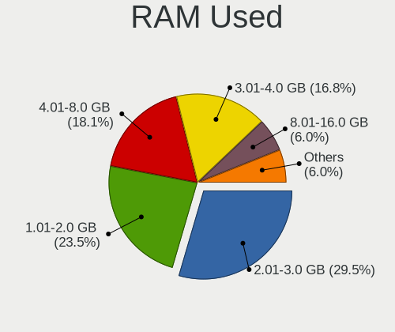
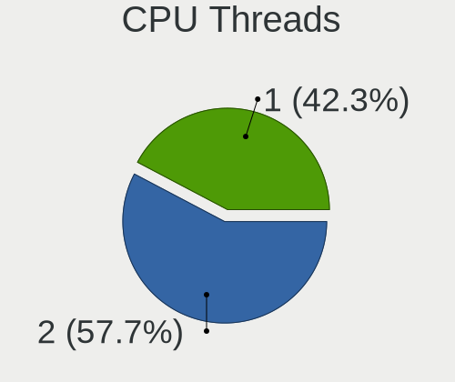
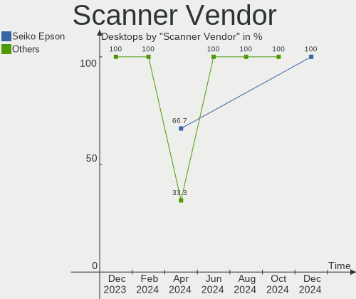
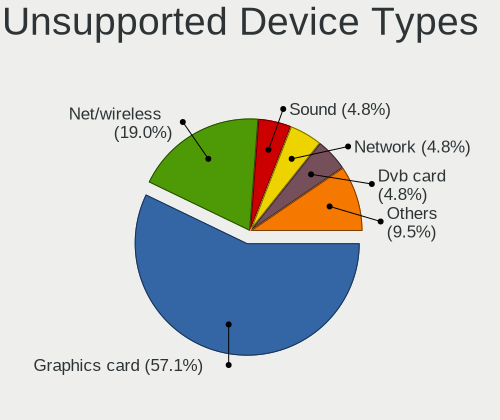

Linux Mint Hardware Trends (Desktops)
-------------------------------------

A project to identify most popular hardware characteristics and track their change
over time based on data collected by Linux Mint users at https://Linux-Hardware.org.

Anyone can contribute to this report by the [hw-probe](https://github.com/linuxhw/hw-probe) tool:

    sudo -E hw-probe -all -upload

Full-feature report is available here: https://linux-hardware.org/?view=trends

Period: Dec, 2021.

Contents
--------

* [ System ](#system)
  - [ OS                       ](#os)
  - [ OS Family                ](#os-family)
  - [ Kernel                   ](#kernel)
  - [ Kernel Family            ](#kernel-family)
  - [ Kernel Major Ver.        ](#kernel-major-ver)
  - [ Arch                     ](#arch)
  - [ DE                       ](#de)
  - [ Display Server           ](#display-server)
  - [ Display Manager          ](#display-manager)
  - [ OS Lang                  ](#os-lang)
  - [ Boot Mode                ](#boot-mode)
  - [ Filesystem               ](#filesystem)
  - [ Part. scheme             ](#part-scheme)
  - [ Dual Boot with Linux/BSD ](#dual-boot-with-linuxbsd)
  - [ Dual Boot (Win)          ](#dual-boot-win)

* [ Board ](#board)
  - [ Vendor                   ](#vendor)
  - [ Model                    ](#model)
  - [ Model Family             ](#model-family)
  - [ MFG Year                 ](#mfg-year)
  - [ Form Factor              ](#form-factor)
  - [ Secure Boot              ](#secure-boot)
  - [ Coreboot                 ](#coreboot)
  - [ RAM Size                 ](#ram-size)
  - [ RAM Used                 ](#ram-used)
  - [ Total Drives             ](#total-drives)
  - [ Has CD-ROM               ](#has-cd-rom)
  - [ Has Ethernet             ](#has-ethernet)
  - [ Has WiFi                 ](#has-wifi)
  - [ Has Bluetooth            ](#has-bluetooth)

* [ Location ](#location)
  - [ Country                  ](#country)
  - [ City                     ](#city)

* [ Drives ](#drives)
  - [ Drive Vendor             ](#drive-vendor)
  - [ Drive Model              ](#drive-model)
  - [ HDD Vendor               ](#hdd-vendor)
  - [ SSD Vendor               ](#ssd-vendor)
  - [ Drive Kind               ](#drive-kind)
  - [ Drive Connector          ](#drive-connector)
  - [ Drive Size               ](#drive-size)
  - [ Space Total              ](#space-total)
  - [ Space Used               ](#space-used)
  - [ Malfunc. Drives          ](#malfunc-drives)
  - [ Malfunc. Drive Vendor    ](#malfunc-drive-vendor)
  - [ Malfunc. HDD Vendor      ](#malfunc-hdd-vendor)
  - [ Malfunc. Drive Kind      ](#malfunc-drive-kind)
  - [ Failed Drives            ](#failed-drives)
  - [ Failed Drive Vendor      ](#failed-drive-vendor)
  - [ Drive Status             ](#drive-status)

* [ Storage controller ](#storage-controller)
  - [ Storage Vendor           ](#storage-vendor)
  - [ Storage Model            ](#storage-model)
  - [ Storage Kind             ](#storage-kind)

* [ Processor ](#processor)
  - [ CPU Vendor               ](#cpu-vendor)
  - [ CPU Model                ](#cpu-model)
  - [ CPU Model Family         ](#cpu-model-family)
  - [ CPU Cores                ](#cpu-cores)
  - [ CPU Sockets              ](#cpu-sockets)
  - [ CPU Threads              ](#cpu-threads)
  - [ CPU Op-Modes             ](#cpu-op-modes)
  - [ CPU Microcode            ](#cpu-microcode)
  - [ CPU Microarch            ](#cpu-microarch)

* [ Graphics ](#graphics)
  - [ GPU Vendor               ](#gpu-vendor)
  - [ GPU Model                ](#gpu-model)
  - [ GPU Combo                ](#gpu-combo)
  - [ GPU Driver               ](#gpu-driver)
  - [ GPU Memory               ](#gpu-memory)

* [ Monitor ](#monitor)
  - [ Monitor Vendor           ](#monitor-vendor)
  - [ Monitor Model            ](#monitor-model)
  - [ Monitor Resolution       ](#monitor-resolution)
  - [ Monitor Diagonal         ](#monitor-diagonal)
  - [ Monitor Width            ](#monitor-width)
  - [ Aspect Ratio             ](#aspect-ratio)
  - [ Monitor Area             ](#monitor-area)
  - [ Pixel Density            ](#pixel-density)
  - [ Multiple Monitors        ](#multiple-monitors)

* [ Network ](#network)
  - [ Net Controller Vendor    ](#net-controller-vendor)
  - [ Net Controller Model     ](#net-controller-model)
  - [ Wireless Vendor          ](#wireless-vendor)
  - [ Wireless Model           ](#wireless-model)
  - [ Ethernet Vendor          ](#ethernet-vendor)
  - [ Ethernet Model           ](#ethernet-model)
  - [ Net Controller Kind      ](#net-controller-kind)
  - [ Used Controller          ](#used-controller)
  - [ NICs                     ](#nics)
  - [ IPv6                     ](#ipv6)

* [ Bluetooth ](#bluetooth)
  - [ Bluetooth Vendor         ](#bluetooth-vendor)
  - [ Bluetooth Model          ](#bluetooth-model)

* [ Sound ](#sound)
  - [ Sound Vendor             ](#sound-vendor)
  - [ Sound Model              ](#sound-model)

* [ Memory ](#memory)
  - [ Memory Vendor            ](#memory-vendor)
  - [ Memory Model             ](#memory-model)
  - [ Memory Kind              ](#memory-kind)
  - [ Memory Form Factor       ](#memory-form-factor)
  - [ Memory Size              ](#memory-size)
  - [ Memory Speed             ](#memory-speed)

* [ Printers & scanners ](#printers--scanners)
  - [ Printer Vendor           ](#printer-vendor)
  - [ Printer Model            ](#printer-model)
  - [ Scanner Vendor           ](#scanner-vendor)
  - [ Scanner Model            ](#scanner-model)

* [ Camera ](#camera)
  - [ Camera Vendor            ](#camera-vendor)
  - [ Camera Model             ](#camera-model)

* [ Security ](#security)
  - [ Fingerprint Vendor       ](#fingerprint-vendor)
  - [ Fingerprint Model        ](#fingerprint-model)
  - [ Chipcard Vendor          ](#chipcard-vendor)
  - [ Chipcard Model           ](#chipcard-model)

* [ Unsupported ](#unsupported)
  - [ Unsupported Devices      ](#unsupported-devices)
  - [ Unsupported Device Types ](#unsupported-device-types)

System
------

OS
--

Installed operating systems

| Name            | Desktops | Percent |
|-----------------|----------|---------|
| Linux Mint 20.2 | 158      | 80.61%  |
| Linux Mint 19.3 | 12       | 6.12%   |
| Linux Mint 20.1 | 10       | 5.1%    |
| Linux Mint 20.3 | 6        | 3.06%   |
| Linux Mint 20   | 5        | 2.55%   |
| Linux Mint 19.2 | 3        | 1.53%   |
| Linux Mint 18.3 | 2        | 1.02%   |

OS Family
---------

OS without a version

| Name       | Desktops | Percent |
|------------|----------|---------|
| Linux Mint | 196      | 100%    |

Kernel
------

Version of the Linux kernel

| Version                     | Desktops | Percent |
|-----------------------------|----------|---------|
| 5.4.0-91-generic            | 129      | 65.82%  |
| 5.13.0-22-generic           | 17       | 8.67%   |
| 5.4.0-90-generic            | 8        | 4.08%   |
| 5.4.0-74-generic            | 7        | 3.57%   |
| 5.4.0-77-generic            | 3        | 1.53%   |
| 5.11.0-43-generic           | 3        | 1.53%   |
| 5.4.0-89-generic            | 2        | 1.02%   |
| 5.4.0-26-generic            | 2        | 1.02%   |
| 5.15.10-051510-generic      | 2        | 1.02%   |
| 5.11.0-41-generic           | 2        | 1.02%   |
| 4.15.0-54-generic           | 2        | 1.02%   |
| 4.15.0-142-generic          | 2        | 1.02%   |
| 5.8.0-43-generic            | 1        | 0.51%   |
| 5.6.17-050617-generic       | 1        | 0.51%   |
| 5.4.0-88-generic            | 1        | 0.51%   |
| 5.4.0-86-generic            | 1        | 0.51%   |
| 5.4.0-84-generic            | 1        | 0.51%   |
| 5.4.0-81-generic            | 1        | 0.51%   |
| 5.4.0-71-generic            | 1        | 0.51%   |
| 5.15.5-76051505-generic     | 1        | 0.51%   |
| 5.14.0-1007-oem             | 1        | 0.51%   |
| 5.13.0-22-lowlatency        | 1        | 0.51%   |
| 5.13.0-21-generic           | 1        | 0.51%   |
| 5.11.0-402110311031-generic | 1        | 0.51%   |
| 5.11.0-40-generic           | 1        | 0.51%   |
| 5.11.0-22-generic           | 1        | 0.51%   |
| 5.0.0-32-generic            | 1        | 0.51%   |
| 4.15.0-163-lowlatency       | 1        | 0.51%   |
| 4.15.0-163-generic          | 1        | 0.51%   |

Kernel Family
-------------

Linux kernel without a distro release

| Version | Desktops | Percent |
|---------|----------|---------|
| 5.4.0   | 156      | 79.59%  |
| 5.13.0  | 19       | 9.69%   |
| 5.11.0  | 8        | 4.08%   |
| 4.15.0  | 6        | 3.06%   |
| 5.15.10 | 2        | 1.02%   |
| 5.8.0   | 1        | 0.51%   |
| 5.6.17  | 1        | 0.51%   |
| 5.15.5  | 1        | 0.51%   |
| 5.14.0  | 1        | 0.51%   |
| 5.0.0   | 1        | 0.51%   |

Kernel Major Ver.
-----------------

Linux kernel major version

| Version | Desktops | Percent |
|---------|----------|---------|
| 5.4     | 156      | 79.59%  |
| 5.13    | 19       | 9.69%   |
| 5.11    | 8        | 4.08%   |
| 4.15    | 6        | 3.06%   |
| 5.15    | 3        | 1.53%   |
| 5.8     | 1        | 0.51%   |
| 5.6     | 1        | 0.51%   |
| 5.14    | 1        | 0.51%   |
| 5.0     | 1        | 0.51%   |

Arch
----

OS architecture (x86_64, i586, etc.)

| Name   | Desktops | Percent |
|--------|----------|---------|
| x86_64 | 192      | 97.96%  |
| i686   | 4        | 2.04%   |

DE
--

Desktop Environment

| Name       | Desktops | Percent |
|------------|----------|---------|
| X-Cinnamon | 136      | 69.39%  |
| MATE       | 31       | 15.82%  |
| XFCE       | 15       | 7.65%   |
| Cinnamon   | 6        | 3.06%   |
| LXDE       | 2        | 1.02%   |
| KDE        | 2        | 1.02%   |
| GNOME      | 2        | 1.02%   |
| KDE5       | 1        | 0.51%   |
| Unknown    | 1        | 0.51%   |

Display Server
--------------

X11 or Wayland

| Name | Desktops | Percent |
|------|----------|---------|
| X11  | 195      | 99.49%  |
| Tty  | 1        | 0.51%   |

Display Manager
---------------

SDDM, LightDM, etc.

| Name    | Desktops | Percent |
|---------|----------|---------|
| Unknown | 125      | 63.78%  |
| LightDM | 69       | 35.2%   |
| MDM     | 1        | 0.51%   |
| GDM     | 1        | 0.51%   |

OS Lang
-------

Language

| Lang  | Desktops | Percent |
|-------|----------|---------|
| en_US | 59       | 30.1%   |
| de_DE | 42       | 21.43%  |
| ru_RU | 9        | 4.59%   |
| pt_BR | 9        | 4.59%   |
| en_GB | 9        | 4.59%   |
| fr_FR | 8        | 4.08%   |
| pl_PL | 5        | 2.55%   |
| it_IT | 5        | 2.55%   |
| hu_HU | 5        | 2.55%   |
| en_CA | 5        | 2.55%   |
| en_AU | 5        | 2.55%   |
| es_ES | 4        | 2.04%   |
| es_AR | 4        | 2.04%   |
| en_IN | 3        | 1.53%   |
| de_CH | 3        | 1.53%   |
| uk_UA | 2        | 1.02%   |
| nl_NL | 2        | 1.02%   |
| en_IE | 2        | 1.02%   |
| C     | 2        | 1.02%   |
| sl_SI | 1        | 0.51%   |
| ru_UA | 1        | 0.51%   |
| pt_PT | 1        | 0.51%   |
| hr_HR | 1        | 0.51%   |
| fr_CH | 1        | 0.51%   |
| fr_BE | 1        | 0.51%   |
| es_UY | 1        | 0.51%   |
| es_MX | 1        | 0.51%   |
| en_ZA | 1        | 0.51%   |
| en_NZ | 1        | 0.51%   |
| el_GR | 1        | 0.51%   |
| da_DK | 1        | 0.51%   |
| cs_CZ | 1        | 0.51%   |

Boot Mode
---------

EFI or BIOS

| Mode | Desktops | Percent |
|------|----------|---------|
| BIOS | 128      | 65.31%  |
| EFI  | 68       | 34.69%  |

Filesystem
----------

Type of filesystem

| Type    | Desktops | Percent |
|---------|----------|---------|
| Ext4    | 193      | 98.47%  |
| Xfs     | 1        | 0.51%   |
| Overlay | 1        | 0.51%   |
| Ext2    | 1        | 0.51%   |

Part. scheme
------------

Scheme of partitioning

| Type    | Desktops | Percent |
|---------|----------|---------|
| Unknown | 136      | 69.39%  |
| GPT     | 32       | 16.33%  |
| MBR     | 28       | 14.29%  |

Dual Boot with Linux/BSD
------------------------

Hosting more than one Linux/BSD

| Dual boot | Desktops | Percent |
|-----------|----------|---------|
| No        | 180      | 91.84%  |
| Yes       | 16       | 8.16%   |

Dual Boot (Win)
---------------

Hosting Linux and Windows

| Dual boot | Desktops | Percent |
|-----------|----------|---------|
| No        | 171      | 87.24%  |
| Yes       | 25       | 12.76%  |

Board
-----

Vendor
------

Motherboard manufacturer

| Name                  | Desktops | Percent |
|-----------------------|----------|---------|
| ASUSTek Computer      | 41       | 20.92%  |
| Gigabyte Technology   | 28       | 14.29%  |
| ASRock                | 23       | 11.73%  |
| MSI                   | 20       | 10.2%   |
| Dell                  | 19       | 9.69%   |
| Hewlett-Packard       | 15       | 7.65%   |
| Lenovo                | 9        | 4.59%   |
| Acer                  | 5        | 2.55%   |
| Unknown               | 5        | 2.55%   |
| Intel                 | 4        | 2.04%   |
| Pegatron              | 3        | 1.53%   |
| Medion                | 3        | 1.53%   |
| Fujitsu               | 3        | 1.53%   |
| Apple                 | 3        | 1.53%   |
| Huanan                | 2        | 1.02%   |
| ECS                   | 2        | 1.02%   |
| Biostar               | 2        | 1.02%   |
| Shuttle               | 1        | 0.51%   |
| Positivo              | 1        | 0.51%   |
| Packard Bell          | 1        | 0.51%   |
| HPE                   | 1        | 0.51%   |
| Fujitsu Siemens       | 1        | 0.51%   |
| Foxconn               | 1        | 0.51%   |
| BESSTAR Tech          | 1        | 0.51%   |
| ASUSTeK_COMPUTER_INC. | 1        | 0.51%   |
| ASRockRack            | 1        | 0.51%   |

Model
-----

Motherboard model

| Name                                                                | Desktops | Percent |
|---------------------------------------------------------------------|----------|---------|
| Dell OptiPlex 790                                                   | 5        | 2.55%   |
| Unknown                                                             | 5        | 2.55%   |
| Apple MacPro5,1                                                     | 3        | 1.53%   |
| MSI MS-7B98                                                         | 2        | 1.02%   |
| MSI MS-7B79                                                         | 2        | 1.02%   |
| Gigabyte G31M-ES2L                                                  | 2        | 1.02%   |
| Gigabyte B550 AORUS ELITE                                           | 2        | 1.02%   |
| Dell OptiPlex 760                                                   | 2        | 1.02%   |
| Dell OptiPlex 755                                                   | 2        | 1.02%   |
| ASUS TUF GAMING B550-PLUS                                           | 2        | 1.02%   |
| ASUS ROG STRIX X470-F GAMING                                        | 2        | 1.02%   |
| ASUS P8Z77-V LX                                                     | 2        | 1.02%   |
| ASUS All Series                                                     | 2        | 1.02%   |
| ASRock M3A770DE                                                     | 2        | 1.02%   |
| ASRock AB350M Pro4                                                  | 2        | 1.02%   |
| Shuttle XH61V                                                       | 1        | 0.51%   |
| Positivo POS-MI945AA                                                | 1        | 0.51%   |
| Pegatron VN523AA-ABD p6134de                                        | 1        | 0.51%   |
| Pegatron NQ857AA-ABD a6749de                                        | 1        | 0.51%   |
| Pegatron IPMIP-GS                                                   | 1        | 0.51%   |
| Packard Bell IMEDIA S3810                                           | 1        | 0.51%   |
| MSI MS-7D25                                                         | 1        | 0.51%   |
| MSI MS-7D13                                                         | 1        | 0.51%   |
| MSI MS-7C95                                                         | 1        | 0.51%   |
| MSI MS-7C91                                                         | 1        | 0.51%   |
| MSI MS-7C71                                                         | 1        | 0.51%   |
| MSI MS-7C52                                                         | 1        | 0.51%   |
| MSI MS-7C35                                                         | 1        | 0.51%   |
| MSI MS-7B33                                                         | 1        | 0.51%   |
| MSI MS-7B10                                                         | 1        | 0.51%   |
| MSI MS-7A38                                                         | 1        | 0.51%   |
| MSI MS-7A34                                                         | 1        | 0.51%   |
| MSI MS-7971                                                         | 1        | 0.51%   |
| MSI MS-7924                                                         | 1        | 0.51%   |
| MSI MS-7923                                                         | 1        | 0.51%   |
| MSI MS-7817                                                         | 1        | 0.51%   |
| MSI CML-U PRO Cubi 5 (MS-B183)                                      | 1        | 0.51%   |
| Medion P961x                                                        | 1        | 0.51%   |
| Medion MS-7707                                                      | 1        | 0.51%   |
| Medion MS-7633                                                      | 1        | 0.51%   |
| Lenovo ThinkCentre M93p 10A8S1MG04                                  | 1        | 0.51%   |
| Lenovo ThinkCentre M92z 3327A88                                     | 1        | 0.51%   |
| Lenovo ThinkCentre M92p 3227K75                                     | 1        | 0.51%   |
| Lenovo ThinkCentre M910s 10MLS2CG0E                                 | 1        | 0.51%   |
| Lenovo ThinkCentre M81 5049W16                                      | 1        | 0.51%   |
| Lenovo ThinkCentre M58p 7479AA3                                     | 1        | 0.51%   |
| Lenovo ThinkCentre M57e 9439WHV                                     | 1        | 0.51%   |
| Lenovo ThinkCentre A52 8381W7G                                      | 1        | 0.51%   |
| Lenovo H535 10117                                                   | 1        | 0.51%   |
| Intel H61                                                           | 1        | 0.51%   |
| Intel DH67CL AAG10212-210                                           | 1        | 0.51%   |
| Intel DH61CR AAG14064-204                                           | 1        | 0.51%   |
| Intel DG965WH AAD41692-304                                          | 1        | 0.51%   |
| Huanan X79 INTEL (INTEL Xeon E5/Corei7 DMI2 - C600/C200 Cipset V3.2 | 1        | 0.51%   |
| Huanan X79 249PC V2.2                                               | 1        | 0.51%   |
| HPE ProLiant ML30 Gen10                                             | 1        | 0.51%   |
| HP t520 Flexible Series TC                                          | 1        | 0.51%   |
| HP ProDesk 600 G1 TWR                                               | 1        | 0.51%   |
| HP ProDesk 400 G2 MT (TPM DP)                                       | 1        | 0.51%   |
| HP ProDesk 400 G2 MINI                                              | 1        | 0.51%   |

Model Family
------------

Motherboard model prefix

| Name                 | Desktops | Percent |
|----------------------|----------|---------|
| Dell OptiPlex        | 15       | 7.65%   |
| Lenovo ThinkCentre   | 8        | 4.08%   |
| ASUS PRIME           | 6        | 3.06%   |
| HP Compaq            | 5        | 2.55%   |
| Unknown              | 5        | 2.55%   |
| ASUS TUF             | 4        | 2.04%   |
| ASUS ROG             | 4        | 2.04%   |
| Acer Aspire          | 4        | 2.04%   |
| HP ProDesk           | 3        | 1.53%   |
| Fujitsu ESPRIMO      | 3        | 1.53%   |
| ASUS SABERTOOTH      | 3        | 1.53%   |
| Apple MacPro5        | 3        | 1.53%   |
| MSI MS-7B98          | 2        | 1.02%   |
| MSI MS-7B79          | 2        | 1.02%   |
| Huanan X79           | 2        | 1.02%   |
| Gigabyte G31M-ES2L   | 2        | 1.02%   |
| Gigabyte B550        | 2        | 1.02%   |
| Dell Vostro          | 2        | 1.02%   |
| ASUS P8Z77-V         | 2        | 1.02%   |
| ASUS P8H61-M         | 2        | 1.02%   |
| ASUS All             | 2        | 1.02%   |
| ASRock M3A770DE      | 2        | 1.02%   |
| ASRock B450M         | 2        | 1.02%   |
| ASRock AB350M        | 2        | 1.02%   |
| Shuttle XH61V        | 1        | 0.51%   |
| Positivo POS-MI945AA | 1        | 0.51%   |
| Pegatron VN523AA-ABD | 1        | 0.51%   |
| Pegatron NQ857AA-ABD | 1        | 0.51%   |
| Pegatron IPMIP-GS    | 1        | 0.51%   |
| Packard Bell IMEDIA  | 1        | 0.51%   |
| MSI MS-7D25          | 1        | 0.51%   |
| MSI MS-7D13          | 1        | 0.51%   |
| MSI MS-7C95          | 1        | 0.51%   |
| MSI MS-7C91          | 1        | 0.51%   |
| MSI MS-7C71          | 1        | 0.51%   |
| MSI MS-7C52          | 1        | 0.51%   |
| MSI MS-7C35          | 1        | 0.51%   |
| MSI MS-7B33          | 1        | 0.51%   |
| MSI MS-7B10          | 1        | 0.51%   |
| MSI MS-7A38          | 1        | 0.51%   |
| MSI MS-7A34          | 1        | 0.51%   |
| MSI MS-7971          | 1        | 0.51%   |
| MSI MS-7924          | 1        | 0.51%   |
| MSI MS-7923          | 1        | 0.51%   |
| MSI MS-7817          | 1        | 0.51%   |
| MSI CML-U            | 1        | 0.51%   |
| Medion P961x         | 1        | 0.51%   |
| Medion MS-7707       | 1        | 0.51%   |
| Medion MS-7633       | 1        | 0.51%   |
| Lenovo H535          | 1        | 0.51%   |
| Intel H61            | 1        | 0.51%   |
| Intel DH67CL         | 1        | 0.51%   |
| Intel DH61CR         | 1        | 0.51%   |
| Intel DG965WH        | 1        | 0.51%   |
| HPE ProLiant         | 1        | 0.51%   |
| HP t520              | 1        | 0.51%   |
| HP EliteDesk         | 1        | 0.51%   |
| HP CQ2930EA          | 1        | 0.51%   |
| HP 500-439nl         | 1        | 0.51%   |
| HP 280               | 1        | 0.51%   |

MFG Year
--------

Motherboard manufacture year

| Year | Desktops | Percent |
|------|----------|---------|
| 2021 | 25       | 12.76%  |
| 2010 | 18       | 9.18%   |
| 2018 | 17       | 8.67%   |
| 2014 | 17       | 8.67%   |
| 2012 | 17       | 8.67%   |
| 2019 | 16       | 8.16%   |
| 2020 | 14       | 7.14%   |
| 2011 | 14       | 7.14%   |
| 2013 | 12       | 6.12%   |
| 2015 | 10       | 5.1%    |
| 2016 | 9        | 4.59%   |
| 2009 | 7        | 3.57%   |
| 2008 | 6        | 3.06%   |
| 2006 | 5        | 2.55%   |
| 2017 | 4        | 2.04%   |
| 2007 | 4        | 2.04%   |
| 2004 | 1        | 0.51%   |

Form Factor
-----------

Physical design of the computer

| Name    | Desktops | Percent |
|---------|----------|---------|
| Desktop | 196      | 100%    |

Secure Boot
-----------

Enabled or disabled

| State    | Desktops | Percent |
|----------|----------|---------|
| Disabled | 194      | 98.98%  |
| Enabled  | 2        | 1.02%   |

Coreboot
--------

Have coreboot on board

| Used | Desktops | Percent |
|------|----------|---------|
| No   | 196      | 100%    |

RAM Size
--------

Total RAM memory

| Size in GB  | Desktops | Percent |
|-------------|----------|---------|
| 16.01-24.0  | 45       | 22.96%  |
| 3.01-4.0    | 38       | 19.39%  |
| 4.01-8.0    | 36       | 18.37%  |
| 8.01-16.0   | 32       | 16.33%  |
| 32.01-64.0  | 27       | 13.78%  |
| 64.01-256.0 | 7        | 3.57%   |
| 1.01-2.0    | 7        | 3.57%   |
| 24.01-32.0  | 2        | 1.02%   |
| 2.01-3.0    | 2        | 1.02%   |

RAM Used
--------

Used RAM memory

| Used GB    | Desktops | Percent |
|------------|----------|---------|
| 1.01-2.0   | 75       | 38.27%  |
| 2.01-3.0   | 47       | 23.98%  |
| 4.01-8.0   | 28       | 14.29%  |
| 3.01-4.0   | 21       | 10.71%  |
| 0.51-1.0   | 17       | 8.67%   |
| 8.01-16.0  | 7        | 3.57%   |
| 16.01-24.0 | 1        | 0.51%   |

Total Drives
------------

Number of drives on board

| Drives | Desktops | Percent |
|--------|----------|---------|
| 1      | 79       | 40.31%  |
| 2      | 55       | 28.06%  |
| 3      | 30       | 15.31%  |
| 4      | 13       | 6.63%   |
| 5      | 12       | 6.12%   |
| 6      | 4        | 2.04%   |
| 8      | 1        | 0.51%   |
| 7      | 1        | 0.51%   |
| 0      | 1        | 0.51%   |

Has CD-ROM
----------

Has CD-ROM on board

| Presented | Desktops | Percent |
|-----------|----------|---------|
| Yes       | 120      | 61.22%  |
| No        | 76       | 38.78%  |

Has Ethernet
------------

Has Ethernet on board

| Presented | Desktops | Percent |
|-----------|----------|---------|
| Yes       | 192      | 97.96%  |
| No        | 4        | 2.04%   |

Has WiFi
--------

Has WiFi module

| Presented | Desktops | Percent |
|-----------|----------|---------|
| No        | 115      | 58.67%  |
| Yes       | 81       | 41.33%  |

Has Bluetooth
-------------

Has Bluetooth module

| Presented | Desktops | Percent |
|-----------|----------|---------|
| No        | 152      | 77.55%  |
| Yes       | 44       | 22.45%  |

Location
--------

Country
-------

Geographic location (country)

| Country      | Desktops | Percent |
|--------------|----------|---------|
| Germany      | 45       | 22.96%  |
| USA          | 35       | 17.86%  |
| Brazil       | 15       | 7.65%   |
| UK           | 10       | 5.1%    |
| Russia       | 8        | 4.08%   |
| France       | 7        | 3.57%   |
| Switzerland  | 5        | 2.55%   |
| Netherlands  | 5        | 2.55%   |
| Italy        | 5        | 2.55%   |
| Hungary      | 5        | 2.55%   |
| Poland       | 4        | 2.04%   |
| Australia    | 4        | 2.04%   |
| Argentina    | 4        | 2.04%   |
| Ukraine      | 3        | 1.53%   |
| Spain        | 3        | 1.53%   |
| India        | 3        | 1.53%   |
| Denmark      | 3        | 1.53%   |
| Croatia      | 3        | 1.53%   |
| Canada       | 3        | 1.53%   |
| Mexico       | 2        | 1.02%   |
| Ireland      | 2        | 1.02%   |
| Greece       | 2        | 1.02%   |
| Belgium      | 2        | 1.02%   |
| Uzbekistan   | 1        | 0.51%   |
| Uruguay      | 1        | 0.51%   |
| Thailand     | 1        | 0.51%   |
| Sweden       | 1        | 0.51%   |
| South Africa | 1        | 0.51%   |
| Slovenia     | 1        | 0.51%   |
| Slovakia     | 1        | 0.51%   |
| Serbia       | 1        | 0.51%   |
| Portugal     | 1        | 0.51%   |
| Norway       | 1        | 0.51%   |
| New Zealand  | 1        | 0.51%   |
| Morocco      | 1        | 0.51%   |
| Lithuania    | 1        | 0.51%   |
| Iceland      | 1        | 0.51%   |
| Czechia      | 1        | 0.51%   |
| Costa Rica   | 1        | 0.51%   |
| Bulgaria     | 1        | 0.51%   |
| Austria      | 1        | 0.51%   |

City
----

Geographic location (city)

| City                      | Desktops | Percent |
|---------------------------|----------|---------|
| Rio de Janeiro            | 4        | 2.04%   |
| La Marque                 | 3        | 1.53%   |
| Frankfurt am Main         | 3        | 1.53%   |
| Berlin                    | 3        | 1.53%   |
| Zagreb                    | 2        | 1.02%   |
| Reutlingen                | 2        | 1.02%   |
| Paris                     | 2        | 1.02%   |
| Padova                    | 2        | 1.02%   |
| Mumbai                    | 2        | 1.02%   |
| Moscow                    | 2        | 1.02%   |
| Melbourne                 | 2        | 1.02%   |
| Herne                     | 2        | 1.02%   |
| Dublin                    | 2        | 1.02%   |
| Curitiba                  | 2        | 1.02%   |
| Buenos Aires              | 2        | 1.02%   |
| Budapest                  | 2        | 1.02%   |
| Wuppertal                 | 1        | 0.51%   |
| Wroclaw                   | 1        | 0.51%   |
| Weida                     | 1        | 0.51%   |
| Washington                | 1        | 0.51%   |
| Vinkovci                  | 1        | 0.51%   |
| Vilafranca del Pened??s   | 1        | 0.51%   |
| Vienna                    | 1        | 0.51%   |
| Uxbridge                  | 1        | 0.51%   |
| Uberl??ndia               | 1        | 0.51%   |
| Turin                     | 1        | 0.51%   |
| Tocina                    | 1        | 0.51%   |
| The Hague                 | 1        | 0.51%   |
| Tepic                     | 1        | 0.51%   |
| Taganrog                  | 1        | 0.51%   |
| Szombathely               | 1        | 0.51%   |
| Szamocin                  | 1        | 0.51%   |
| Sydney                    | 1        | 0.51%   |
| Stockholm                 | 1        | 0.51%   |
| Steubenville              | 1        | 0.51%   |
| St Louis                  | 1        | 0.51%   |
| Sofia                     | 1        | 0.51%   |
| Smolensk                  | 1        | 0.51%   |
| Shawnee                   | 1        | 0.51%   |
| Seattle                   | 1        | 0.51%   |
| Saltash                   | 1        | 0.51%   |
| Saint-Germain-les-Arpajon | 1        | 0.51%   |
| Saint-Genest-Lerpt        | 1        | 0.51%   |
| Saalfeld                  | 1        | 0.51%   |
| Rostov-on-Don             | 1        | 0.51%   |
| Rostock                   | 1        | 0.51%   |
| Rosario                   | 1        | 0.51%   |
| Riviere-Bleue             | 1        | 0.51%   |
| Reykjavik                 | 1        | 0.51%   |
| Rengsdorf                 | 1        | 0.51%   |
| Redding                   | 1        | 0.51%   |
| Recife                    | 1        | 0.51%   |
| Rechtenstein              | 1        | 0.51%   |
| Rainsville                | 1        | 0.51%   |
| Quinta Do Conde           | 1        | 0.51%   |
| Purmerend                 | 1        | 0.51%   |
| Port Alberni              | 1        | 0.51%   |
| Pleasanton                | 1        | 0.51%   |
| Pforzheim                 | 1        | 0.51%   |
| Pfarrkirchen              | 1        | 0.51%   |

Drives
------

Drive Vendor
------------

Hard drive vendors

| Vendor                    | Desktops | Drives | Percent |
|---------------------------|----------|--------|---------|
| WDC                       | 75       | 99     | 21.19%  |
| Seagate                   | 67       | 84     | 18.93%  |
| Samsung Electronics       | 58       | 72     | 16.38%  |
| Kingston                  | 26       | 27     | 7.34%   |
| Toshiba                   | 16       | 18     | 4.52%   |
| SanDisk                   | 16       | 16     | 4.52%   |
| Crucial                   | 15       | 20     | 4.24%   |
| Hitachi                   | 12       | 13     | 3.39%   |
| Intel                     | 7        | 7      | 1.98%   |
| A-DATA Technology         | 7        | 8      | 1.98%   |
| Unknown                   | 6        | 6      | 1.69%   |
| Phison                    | 5        | 7      | 1.41%   |
| XPG                       | 4        | 4      | 1.13%   |
| Silicon Motion            | 3        | 4      | 0.85%   |
| Intenso                   | 3        | 3      | 0.85%   |
| Unknown                   | 2        | 2      | 0.56%   |
| SPCC                      | 2        | 3      | 0.56%   |
| Netac                     | 2        | 2      | 0.56%   |
| Mushkin                   | 2        | 2      | 0.56%   |
| Lite-On                   | 2        | 2      | 0.56%   |
| Fujitsu                   | 2        | 2      | 0.56%   |
| Corsair                   | 2        | 2      | 0.56%   |
| China                     | 2        | 2      | 0.56%   |
| Transcend                 | 1        | 1      | 0.28%   |
| TO Exter                  | 1        | 1      | 0.28%   |
| Team                      | 1        | 1      | 0.28%   |
| QUANTUM                   | 1        | 1      | 0.28%   |
| PLEXTOR                   | 1        | 1      | 0.28%   |
| Patriot                   | 1        | 1      | 0.28%   |
| OCZ                       | 1        | 1      | 0.28%   |
| Micron/Crucial Technology | 1        | 1      | 0.28%   |
| MAXTOR                    | 1        | 1      | 0.28%   |
| KingSpec                  | 1        | 1      | 0.28%   |
| KingDian                  | 1        | 1      | 0.28%   |
| INNOVATION IT             | 1        | 1      | 0.28%   |
| HGST                      | 1        | 1      | 0.28%   |
| GOODRAM                   | 1        | 1      | 0.28%   |
| GALAX                     | 1        | 1      | 0.28%   |
| EMTEC                     | 1        | 1      | 0.28%   |
| asmedia                   | 1        | 1      | 0.28%   |
| Apacer                    | 1        | 1      | 0.28%   |

Drive Model
-----------

Hard drive models

| Model                              | Desktops | Percent |
|------------------------------------|----------|---------|
| Samsung SSD 860 EVO 500GB          | 7        | 1.72%   |
| Samsung SSD 860 EVO 1TB            | 7        | 1.72%   |
| Unknown                            | 6        | 1.47%   |
| Seagate ST2000DM008-2FR102 2TB     | 5        | 1.23%   |
| Seagate ST1000DM003-1CH162 1TB     | 5        | 1.23%   |
| Samsung HD103SJ 1TB                | 5        | 1.23%   |
| Kingston SV300S37A120G 120GB SSD   | 5        | 1.23%   |
| Crucial CT500MX500SSD1 500GB       | 5        | 1.23%   |
| WDC WD20EZRZ-00Z5HB0 2TB           | 4        | 0.98%   |
| Seagate ST3500418AS 500GB          | 4        | 0.98%   |
| Seagate ST31000528AS 1TB           | 4        | 0.98%   |
| Samsung NVMe SSD Drive 1TB         | 4        | 0.98%   |
| WDC WDS250G2B0A-00SM50 250GB SSD   | 3        | 0.74%   |
| WDC WD5000AAKX-60U6AA0 500GB       | 3        | 0.74%   |
| Toshiba DT01ACA300 3TB             | 3        | 0.74%   |
| Toshiba DT01ACA100 1TB             | 3        | 0.74%   |
| Toshiba DT01ACA050 500GB           | 3        | 0.74%   |
| Seagate ST31000524AS 1TB           | 3        | 0.74%   |
| Seagate ST1000DM010-2EP102 1TB     | 3        | 0.74%   |
| SanDisk SDSSDA240G 240GB           | 3        | 0.74%   |
| Samsung NVMe SSD Drive 250GB       | 3        | 0.74%   |
| Samsung HD753LJ 752GB              | 3        | 0.74%   |
| Samsung HD080HJ 80GB               | 3        | 0.74%   |
| Kingston SUV400S37240G 240GB SSD   | 3        | 0.74%   |
| Kingston SA400S37480G 480GB SSD    | 3        | 0.74%   |
| Kingston NVMe SSD Drive 250GB      | 3        | 0.74%   |
| Hitachi HDS721010CLA332 1TB        | 3        | 0.74%   |
| XPG NVMe SSD Drive 512GB           | 2        | 0.49%   |
| WDC WDS500G2B0A-00SM50 500GB SSD   | 2        | 0.49%   |
| WDC WDS240G2G0A-00JH30 240GB SSD   | 2        | 0.49%   |
| WDC WD800JD-75MSA3 80GB            | 2        | 0.49%   |
| WDC WD5000AAKX-753CA1 500GB        | 2        | 0.49%   |
| WDC WD5000AAKX-22ERMA0 500GB       | 2        | 0.49%   |
| WDC WD20EARX-00PASB0 2TB           | 2        | 0.49%   |
| WDC WD10EZEX-08WN4A0 1TB           | 2        | 0.49%   |
| WDC WD10EZEX-00WN4A0 1TB           | 2        | 0.49%   |
| Toshiba HDWD130 3TB                | 2        | 0.49%   |
| Seagate ST500DM002-1BD142 500GB    | 2        | 0.49%   |
| Seagate ST4000DM004-2CV104 4TB     | 2        | 0.49%   |
| Seagate ST4000DM000-1F2168 4TB     | 2        | 0.49%   |
| Seagate ST3750528AS 752GB          | 2        | 0.49%   |
| Seagate ST3500820AS 500GB          | 2        | 0.49%   |
| Seagate ST3250310AS 250GB          | 2        | 0.49%   |
| Seagate ST250DM000-1BD141 250GB    | 2        | 0.49%   |
| Seagate ST2000DM001-1ER164 2TB     | 2        | 0.49%   |
| Seagate ST1000LM024 HN-M101MBB 1TB | 2        | 0.49%   |
| Seagate Expansion Desk 5TB         | 2        | 0.49%   |
| Seagate Expansion 1TB              | 2        | 0.49%   |
| SanDisk SSD PLUS 480GB             | 2        | 0.49%   |
| SanDisk SDSSDH3 500G               | 2        | 0.49%   |
| Samsung SSD 980 1TB                | 2        | 0.49%   |
| Samsung SSD 970 EVO Plus 500GB     | 2        | 0.49%   |
| Samsung SSD 850 EVO M.2 500GB      | 2        | 0.49%   |
| Samsung SSD 850 EVO 500GB          | 2        | 0.49%   |
| Samsung SSD 850 EVO 250GB          | 2        | 0.49%   |
| Samsung SSD 840 EVO 500GB          | 2        | 0.49%   |
| Samsung NVMe SSD Drive 500GB       | 2        | 0.49%   |
| Samsung NVMe SSD Drive 2TB         | 2        | 0.49%   |
| Phison NVMe SSD Drive 256GB        | 2        | 0.49%   |
| Phison NVMe SSD Drive 1TB          | 2        | 0.49%   |

HDD Vendor
----------

Hard disk drive vendors

| Vendor              | Desktops | Drives | Percent |
|---------------------|----------|--------|---------|
| Seagate             | 66       | 82     | 35.87%  |
| WDC                 | 65       | 86     | 35.33%  |
| Toshiba             | 16       | 17     | 8.7%    |
| Samsung Electronics | 16       | 17     | 8.7%    |
| Hitachi             | 12       | 13     | 6.52%   |
| Fujitsu             | 2        | 2      | 1.09%   |
| Unknown             | 2        | 2      | 1.09%   |
| Unknown             | 1        | 1      | 0.54%   |
| TO Exter            | 1        | 1      | 0.54%   |
| QUANTUM             | 1        | 1      | 0.54%   |
| MAXTOR              | 1        | 1      | 0.54%   |
| HGST                | 1        | 1      | 0.54%   |

SSD Vendor
----------

Solid state drive vendors

| Vendor              | Desktops | Drives | Percent |
|---------------------|----------|--------|---------|
| Samsung Electronics | 31       | 36     | 24.03%  |
| Kingston            | 22       | 23     | 17.05%  |
| SanDisk             | 14       | 14     | 10.85%  |
| Crucial             | 13       | 18     | 10.08%  |
| WDC                 | 11       | 12     | 8.53%   |
| A-DATA Technology   | 6        | 7      | 4.65%   |
| Intel               | 5        | 5      | 3.88%   |
| Intenso             | 3        | 3      | 2.33%   |
| SPCC                | 2        | 3      | 1.55%   |
| Netac               | 2        | 2      | 1.55%   |
| China               | 2        | 2      | 1.55%   |
| Unknown             | 2        | 2      | 1.55%   |
| Transcend           | 1        | 1      | 0.78%   |
| Toshiba             | 1        | 1      | 0.78%   |
| Team                | 1        | 1      | 0.78%   |
| Seagate             | 1        | 1      | 0.78%   |
| PLEXTOR             | 1        | 1      | 0.78%   |
| Patriot             | 1        | 1      | 0.78%   |
| OCZ                 | 1        | 1      | 0.78%   |
| Mushkin             | 1        | 1      | 0.78%   |
| KingSpec            | 1        | 1      | 0.78%   |
| KingDian            | 1        | 1      | 0.78%   |
| INNOVATION IT       | 1        | 1      | 0.78%   |
| GOODRAM             | 1        | 1      | 0.78%   |
| GALAX               | 1        | 1      | 0.78%   |
| EMTEC               | 1        | 1      | 0.78%   |
| Corsair             | 1        | 1      | 0.78%   |
| Apacer              | 1        | 1      | 0.78%   |

Drive Kind
----------

HDD or SSD

| Kind    | Desktops | Drives | Percent |
|---------|----------|--------|---------|
| HDD     | 143      | 224    | 48.81%  |
| SSD     | 105      | 143    | 35.84%  |
| NVMe    | 41       | 52     | 13.99%  |
| Unknown | 3        | 3      | 1.02%   |
| MMC     | 1        | 1      | 0.34%   |

Drive Connector
---------------

SATA, SAS, NVMe, etc.

| Type | Desktops | Drives | Percent |
|------|----------|--------|---------|
| SATA | 187      | 358    | 77.59%  |
| NVMe | 41       | 52     | 17.01%  |
| SAS  | 12       | 12     | 4.98%   |
| MMC  | 1        | 1      | 0.41%   |

Drive Size
----------

Size of hard drive

| Size in TB | Desktops | Drives | Percent |
|------------|----------|--------|---------|
| 0.01-0.5   | 142      | 210    | 53.38%  |
| 0.51-1.0   | 70       | 96     | 26.32%  |
| 1.01-2.0   | 31       | 36     | 11.65%  |
| 3.01-4.0   | 9        | 9      | 3.38%   |
| 2.01-3.0   | 9        | 11     | 3.38%   |
| 4.01-10.0  | 5        | 5      | 1.88%   |

Space Total
-----------

Amount of disk space available on the file system

| Size in GB     | Desktops | Percent |
|----------------|----------|---------|
| 101-250        | 50       | 25.51%  |
| 251-500        | 41       | 20.92%  |
| 501-1000       | 25       | 12.76%  |
| More than 3000 | 24       | 12.24%  |
| 1001-2000      | 23       | 11.73%  |
| 2001-3000      | 15       | 7.65%   |
| 51-100         | 12       | 6.12%   |
| 21-50          | 3        | 1.53%   |
| 1-20           | 2        | 1.02%   |
| Unknown        | 1        | 0.51%   |

Space Used
----------

Amount of used disk space

| Used GB        | Desktops | Percent |
|----------------|----------|---------|
| 1-20           | 40       | 20.41%  |
| 101-250        | 31       | 15.82%  |
| 21-50          | 27       | 13.78%  |
| 51-100         | 26       | 13.27%  |
| 501-1000       | 21       | 10.71%  |
| 251-500        | 18       | 9.18%   |
| 1001-2000      | 17       | 8.67%   |
| More than 3000 | 11       | 5.61%   |
| 2001-3000      | 4        | 2.04%   |
| Unknown        | 1        | 0.51%   |

Malfunc. Drives
---------------

Drive models with a malfunction

| Model                              | Desktops | Drives | Percent |
|------------------------------------|----------|--------|---------|
| WDC WDS240G2G0A-00JH30 240GB SSD   | 1        | 1      | 5.26%   |
| WDC WD5002ABYS-01B1B0 500GB        | 1        | 1      | 5.26%   |
| WDC WD5000AAJS-00A8B0 500GB        | 1        | 1      | 5.26%   |
| WDC WD5000AADS-00S9B0 500GB        | 1        | 1      | 5.26%   |
| WDC WD10EZEX-00BN5A0 1TB           | 1        | 1      | 5.26%   |
| WDC WD1002FAEX-00Z3A0 1TB          | 1        | 1      | 5.26%   |
| Transcend TS512GSSD720 512GB       | 1        | 1      | 5.26%   |
| Seagate ST3500418AS 500GB          | 1        | 1      | 5.26%   |
| Seagate ST3400633AS 400GB          | 1        | 1      | 5.26%   |
| Seagate ST2000DM008-2FR102 2TB     | 1        | 1      | 5.26%   |
| Seagate ST1000DM003-1CH162 1TB     | 1        | 1      | 5.26%   |
| SanDisk SDSA6MM-016G-1006 16GB SSD | 1        | 1      | 5.26%   |
| Samsung Electronics HD753LJ 752GB  | 1        | 1      | 5.26%   |
| Samsung Electronics HD103SJ 1TB    | 1        | 1      | 5.26%   |
| Intenso SSD SATAIII 128GB          | 1        | 1      | 5.26%   |
| Hitachi HTS541612J9SA00 120GB      | 1        | 1      | 5.26%   |
| Hitachi HDS721010CLA332 1TB        | 1        | 1      | 5.26%   |
| A-DATA Technology SU800 2TB SSD    | 1        | 1      | 5.26%   |
| Unknown                            | 1        | 1      | 5.26%   |

Malfunc. Drive Vendor
---------------------

Vendors of faulty drives

| Vendor              | Desktops | Drives | Percent |
|---------------------|----------|--------|---------|
| WDC                 | 6        | 6      | 35.29%  |
| Seagate             | 3        | 4      | 17.65%  |
| Hitachi             | 2        | 2      | 11.76%  |
| Transcend           | 1        | 1      | 5.88%   |
| SanDisk             | 1        | 1      | 5.88%   |
| Samsung Electronics | 1        | 2      | 5.88%   |
| Intenso             | 1        | 1      | 5.88%   |
| A-DATA Technology   | 1        | 1      | 5.88%   |
| Unknown             | 1        | 1      | 5.88%   |

Malfunc. HDD Vendor
-------------------

Vendors of faulty HDD drives

| Vendor              | Desktops | Drives | Percent |
|---------------------|----------|--------|---------|
| WDC                 | 5        | 5      | 41.67%  |
| Seagate             | 3        | 4      | 25%     |
| Hitachi             | 2        | 2      | 16.67%  |
| Samsung Electronics | 1        | 2      | 8.33%   |
| Unknown             | 1        | 1      | 8.33%   |

Malfunc. Drive Kind
-------------------

Kinds of faulty drives

| Kind | Desktops | Drives | Percent |
|------|----------|--------|---------|
| HDD  | 10       | 14     | 66.67%  |
| SSD  | 5        | 5      | 33.33%  |

Failed Drives
-------------

Failed drive models

Zero info for selected period =(

Failed Drive Vendor
-------------------

Failed drive vendors

Zero info for selected period =(

Drive Status
------------

Number of failed and malfunc. drives

| Status   | Desktops | Drives | Percent |
|----------|----------|--------|---------|
| Detected | 138      | 298    | 65.71%  |
| Works    | 57       | 106    | 27.14%  |
| Malfunc  | 15       | 19     | 7.14%   |

Storage controller
------------------

Storage Vendor
--------------

Storage controller vendors

| Vendor                           | Desktops | Percent |
|----------------------------------|----------|---------|
| Intel                            | 134      | 50.38%  |
| AMD                              | 54       | 20.3%   |
| Samsung Electronics              | 17       | 6.39%   |
| Phison Electronics               | 7        | 2.63%   |
| Nvidia                           | 7        | 2.63%   |
| Marvell Technology Group         | 7        | 2.63%   |
| JMicron Technology               | 7        | 2.63%   |
| ASMedia Technology               | 7        | 2.63%   |
| ADATA Technology                 | 5        | 1.88%   |
| Silicon Motion                   | 4        | 1.5%    |
| Kingston Technology Company      | 4        | 1.5%    |
| Sandisk                          | 3        | 1.13%   |
| VIA Technologies                 | 2        | 0.75%   |
| Micron/Crucial Technology        | 2        | 0.75%   |
| Lite-On Technology               | 2        | 0.75%   |
| Broadcom / LSI                   | 2        | 0.75%   |
| Silicon Integrated Systems [SiS] | 1        | 0.38%   |
| Micron Technology                | 1        | 0.38%   |

Storage Model
-------------

Storage controller models

| Model                                                                                   | Desktops | Percent |
|-----------------------------------------------------------------------------------------|----------|---------|
| Intel 6 Series/C200 Series Chipset Family 6 port Desktop SATA AHCI Controller           | 21       | 6.29%   |
| AMD FCH SATA Controller [AHCI mode]                                                     | 21       | 6.29%   |
| Intel Q170/Q150/B150/H170/H110/Z170/CM236 Chipset SATA Controller [AHCI Mode]           | 12       | 3.59%   |
| Intel 8 Series/C220 Series Chipset Family 6-port SATA Controller 1 [AHCI mode]          | 12       | 3.59%   |
| AMD 400 Series Chipset SATA Controller                                                  | 12       | 3.59%   |
| AMD SB7x0/SB8x0/SB9x0 IDE Controller                                                    | 11       | 3.29%   |
| Samsung NVMe SSD Controller SM981/PM981/PM983                                           | 10       | 2.99%   |
| AMD SB7x0/SB8x0/SB9x0 SATA Controller [AHCI mode]                                       | 10       | 2.99%   |
| AMD Starship/Matisse Chipset SATA Controller [AHCI mode]                                | 9        | 2.69%   |
| Intel NM10/ICH7 Family SATA Controller [IDE mode]                                       | 8        | 2.4%    |
| Intel Cannon Lake PCH SATA AHCI Controller                                              | 8        | 2.4%    |
| Intel 7 Series/C210 Series Chipset Family 6-port SATA Controller [AHCI mode]            | 8        | 2.4%    |
| Intel 200 Series PCH SATA controller [AHCI mode]                                        | 8        | 2.4%    |
| Intel 6 Series/C200 Series Chipset Family Desktop SATA Controller (IDE mode, ports 4-5) | 7        | 2.1%    |
| Intel 6 Series/C200 Series Chipset Family Desktop SATA Controller (IDE mode, ports 0-3) | 7        | 2.1%    |
| ASMedia ASM1062 Serial ATA Controller                                                   | 7        | 2.1%    |
| Intel 82801G (ICH7 Family) IDE Controller                                               | 6        | 1.8%    |
| AMD SB7x0/SB8x0/SB9x0 SATA Controller [IDE mode]                                        | 6        | 1.8%    |
| Phison E12 NVMe Controller                                                              | 5        | 1.5%    |
| Intel 9 Series Chipset Family SATA Controller [AHCI Mode]                               | 5        | 1.5%    |
| ADATA XPG SX8200 Pro PCIe Gen3x4 M.2 2280 Solid State Drive                             | 5        | 1.5%    |
| Nvidia MCP61 SATA Controller                                                            | 4        | 1.2%    |
| Intel SATA Controller [RAID mode]                                                       | 4        | 1.2%    |
| Intel 82801JD/DO (ICH10 Family) SATA AHCI Controller                                    | 4        | 1.2%    |
| Intel 5 Series/3400 Series Chipset 4 port SATA IDE Controller                           | 4        | 1.2%    |
| Intel 5 Series/3400 Series Chipset 2 port SATA IDE Controller                           | 4        | 1.2%    |
| Intel 4 Series Chipset PT IDER Controller                                               | 4        | 1.2%    |
| AMD 300 Series Chipset SATA Controller                                                  | 4        | 1.2%    |
| Samsung NVMe SSD Controller 980                                                         | 3        | 0.9%    |
| Nvidia MCP78S [GeForce 8200] SATA Controller (non-AHCI mode)                            | 3        | 0.9%    |
| Marvell Group 88SE9172 SATA 6Gb/s Controller                                            | 3        | 0.9%    |
| JMicron JMB363 SATA/IDE Controller                                                      | 3        | 0.9%    |
| Intel Comet Lake SATA AHCI Controller                                                   | 3        | 0.9%    |
| Intel 82801JI (ICH10 Family) SATA AHCI Controller                                       | 3        | 0.9%    |
| Intel 82801JI (ICH10 Family) 4 port SATA IDE Controller #1                              | 3        | 0.9%    |
| Intel 82801I (ICH9 Family) 2 port SATA Controller [IDE mode]                            | 3        | 0.9%    |
| Intel 5 Series/3400 Series Chipset 6 port SATA AHCI Controller                          | 3        | 0.9%    |
| Silicon Motion SM2263EN/SM2263XT SSD Controller                                         | 2        | 0.6%    |
| Silicon Motion SM2262/SM2262EN SSD Controller                                           | 2        | 0.6%    |
| Samsung NVMe SSD Controller SM951/PM951                                                 | 2        | 0.6%    |
| Samsung NVMe SSD Controller PM9A1/PM9A3/980PRO                                          | 2        | 0.6%    |
| Phison E16 PCIe4 NVMe Controller                                                        | 2        | 0.6%    |
| Nvidia MCP78S [GeForce 8200] IDE                                                        | 2        | 0.6%    |
| Nvidia MCP61 IDE                                                                        | 2        | 0.6%    |
| Kingston Company A2000 NVMe SSD                                                         | 2        | 0.6%    |
| JMicron JMB368 IDE controller                                                           | 2        | 0.6%    |
| Intel Celeron N3350/Pentium N4200/Atom E3900 Series SATA AHCI Controller                | 2        | 0.6%    |
| Intel 82Q35 Express PT IDER Controller                                                  | 2        | 0.6%    |
| Intel 82801JI (ICH10 Family) 2 port SATA IDE Controller #2                              | 2        | 0.6%    |
| Intel 82801IR/IO/IH (ICH9R/DO/DH) 6 port SATA Controller [AHCI mode]                    | 2        | 0.6%    |
| Intel 82801IR/IO/IH (ICH9R/DO/DH) 4 port SATA Controller [IDE mode]                     | 2        | 0.6%    |
| Intel 7 Series/C210 Series Chipset Family 4-port SATA Controller [IDE mode]             | 2        | 0.6%    |
| Intel 7 Series/C210 Series Chipset Family 2-port SATA Controller [IDE mode]             | 2        | 0.6%    |
| Intel 600 Series Chipset Family SATA AHCI Controller                                    | 2        | 0.6%    |
| Broadcom / LSI SAS2308 PCI-Express Fusion-MPT SAS-2                                     | 2        | 0.6%    |
| AMD SB600 Non-Raid-5 SATA                                                               | 2        | 0.6%    |
| AMD SB600 IDE                                                                           | 2        | 0.6%    |
| AMD FCH SATA Controller D                                                               | 2        | 0.6%    |
| VIA VT82C586A/B/VT82C686/A/B/VT823x/A/C PIPC Bus Master IDE                             | 1        | 0.3%    |
| VIA VT8237A SATA 2-Port Controller                                                      | 1        | 0.3%    |

Storage Kind
------------

Kind of storage controller (IDE, SATA, NVMe, SAS, ...)

| Kind | Desktops | Percent |
|------|----------|---------|
| SATA | 152      | 57.79%  |
| IDE  | 60       | 22.81%  |
| NVMe | 42       | 15.97%  |
| RAID | 7        | 2.66%   |
| SAS  | 2        | 0.76%   |

Processor
---------

CPU Vendor
----------

Processor vendors

| Vendor | Desktops | Percent |
|--------|----------|---------|
| Intel  | 136      | 69.39%  |
| AMD    | 60       | 30.61%  |

CPU Model
---------

Processor models

| Model                                       | Desktops | Percent |
|---------------------------------------------|----------|---------|
| Intel Core i7-3770K CPU @ 3.50GHz           | 4        | 2.04%   |
| Intel Core i5-3470 CPU @ 3.20GHz            | 4        | 2.04%   |
| Intel Core i5-2500K CPU @ 3.30GHz           | 4        | 2.04%   |
| Intel Core 2 Duo CPU E8500 @ 3.16GHz        | 4        | 2.04%   |
| Intel Pentium Dual CPU E2140 @ 1.60GHz      | 3        | 1.53%   |
| Intel Core i7-6700 CPU @ 3.40GHz            | 3        | 1.53%   |
| Intel Core i7-3770 CPU @ 3.40GHz            | 3        | 1.53%   |
| Intel Core i7-2600 CPU @ 3.40GHz            | 3        | 1.53%   |
| Intel Core i5 CPU 760 @ 2.80GHz             | 3        | 1.53%   |
| Intel Core i3-3220 CPU @ 3.30GHz            | 3        | 1.53%   |
| AMD Ryzen 7 2700 Eight-Core Processor       | 3        | 1.53%   |
| AMD Ryzen 5 5600G with Radeon Graphics      | 3        | 1.53%   |
| AMD Ryzen 5 3600 6-Core Processor           | 3        | 1.53%   |
| Intel Xeon CPU X5690 @ 3.47GHz              | 2        | 1.02%   |
| Intel Core i7-8086K CPU @ 4.00GHz           | 2        | 1.02%   |
| Intel Core i7-6700K CPU @ 4.00GHz           | 2        | 1.02%   |
| Intel Core i5-7400 CPU @ 3.00GHz            | 2        | 1.02%   |
| Intel Core i5-4670K CPU @ 3.40GHz           | 2        | 1.02%   |
| Intel Core i5-4590 CPU @ 3.30GHz            | 2        | 1.02%   |
| Intel Core i5-2500 CPU @ 3.30GHz            | 2        | 1.02%   |
| Intel Core i5-2400 CPU @ 3.10GHz            | 2        | 1.02%   |
| Intel Core i5 CPU 650 @ 3.20GHz             | 2        | 1.02%   |
| Intel Core i3-8100 CPU @ 3.60GHz            | 2        | 1.02%   |
| Intel Core i3-2100 CPU @ 3.10GHz            | 2        | 1.02%   |
| Intel Core 2 Quad CPU Q8200 @ 2.33GHz       | 2        | 1.02%   |
| Intel Core 2 Quad CPU Q6600 @ 2.40GHz       | 2        | 1.02%   |
| Intel Core 2 Duo CPU E7500 @ 2.93GHz        | 2        | 1.02%   |
| Intel Celeron CPU J3455 @ 1.50GHz           | 2        | 1.02%   |
| Intel 12th Gen Core i5-12600K               | 2        | 1.02%   |
| AMD Ryzen 9 3950X 16-Core Processor         | 2        | 1.02%   |
| AMD Ryzen 9 3900X 12-Core Processor         | 2        | 1.02%   |
| AMD Ryzen 7 3800X 8-Core Processor          | 2        | 1.02%   |
| AMD Ryzen 5 3600X 6-Core Processor          | 2        | 1.02%   |
| AMD FX-8350 Eight-Core Processor            | 2        | 1.02%   |
| AMD FX-6300 Six-Core Processor              | 2        | 1.02%   |
| AMD FX-6100 Six-Core Processor              | 2        | 1.02%   |
| AMD Athlon II X4 640 Processor              | 2        | 1.02%   |
| AMD Athlon 64 X2 Dual Core Processor 3600+  | 2        | 1.02%   |
| Intel Xeon E-2224 CPU @ 3.40GHz             | 1        | 0.51%   |
| Intel Xeon CPU E5620 @ 2.40GHz              | 1        | 0.51%   |
| Intel Xeon CPU E5-2689 0 @ 2.60GHz          | 1        | 0.51%   |
| Intel Xeon CPU E3-1285 v6 @ 4.10GHz         | 1        | 0.51%   |
| Intel Xeon CPU E3-1231 v3 @ 3.40GHz         | 1        | 0.51%   |
| Intel Pentium Dual-Core CPU E5500 @ 2.80GHz | 1        | 0.51%   |
| Intel Pentium Dual-Core CPU E5400 @ 2.70GHz | 1        | 0.51%   |
| Intel Pentium Dual CPU E2200 @ 2.20GHz      | 1        | 0.51%   |
| Intel Pentium D CPU 3.00GHz                 | 1        | 0.51%   |
| Intel Pentium CPU G870 @ 3.10GHz            | 1        | 0.51%   |
| Intel Pentium CPU G850 @ 2.90GHz            | 1        | 0.51%   |
| Intel Pentium CPU G645 @ 2.90GHz            | 1        | 0.51%   |
| Intel Pentium CPU G630 @ 2.70GHz            | 1        | 0.51%   |
| Intel Pentium CPU G620 @ 2.60GHz            | 1        | 0.51%   |
| Intel Pentium CPU G4560 @ 3.50GHz           | 1        | 0.51%   |
| Intel Pentium CPU G3420 @ 3.20GHz           | 1        | 0.51%   |
| Intel Pentium CPU G2030 @ 3.00GHz           | 1        | 0.51%   |
| Intel Pentium CPU G2020 @ 2.90GHz           | 1        | 0.51%   |
| Intel Pentium 4 CPU 3.00GHz                 | 1        | 0.51%   |
| Intel Pentium 4 CPU 2.80GHz                 | 1        | 0.51%   |
| Intel Core i9-9900KS CPU @ 4.00GHz          | 1        | 0.51%   |
| Intel Core i9-9900K CPU @ 3.60GHz           | 1        | 0.51%   |

CPU Model Family
----------------

Processor model prefix

| Model                   | Desktops | Percent |
|-------------------------|----------|---------|
| Intel Core i5           | 37       | 18.88%  |
| Intel Core i7           | 29       | 14.8%   |
| Intel Core i3           | 15       | 7.65%   |
| AMD Ryzen 5             | 15       | 7.65%   |
| Intel Core 2 Duo        | 11       | 5.61%   |
| Intel Pentium           | 9        | 4.59%   |
| AMD FX                  | 9        | 4.59%   |
| Intel Xeon              | 7        | 3.57%   |
| Intel Core 2 Quad       | 7        | 3.57%   |
| AMD Ryzen 7             | 7        | 3.57%   |
| AMD Athlon 64 X2        | 5        | 2.55%   |
| Intel Pentium Dual      | 4        | 2.04%   |
| Intel Celeron           | 4        | 2.04%   |
| AMD Ryzen 9             | 4        | 2.04%   |
| Other                   | 3        | 1.53%   |
| Intel Core i9           | 3        | 1.53%   |
| Intel Pentium Dual-Core | 2        | 1.02%   |
| Intel Pentium 4         | 2        | 1.02%   |
| Intel Core 2            | 2        | 1.02%   |
| AMD E1                  | 2        | 1.02%   |
| AMD Athlon II X4        | 2        | 1.02%   |
| AMD Athlon              | 2        | 1.02%   |
| Intel Pentium D         | 1        | 0.51%   |
| AMD Ryzen 7 PRO         | 1        | 0.51%   |
| AMD Ryzen 5 PRO         | 1        | 0.51%   |
| AMD Ryzen 3             | 1        | 0.51%   |
| AMD Phenom II X4        | 1        | 0.51%   |
| AMD Phenom II X3        | 1        | 0.51%   |
| AMD Phenom II X2        | 1        | 0.51%   |
| AMD GX                  | 1        | 0.51%   |
| AMD Athlon X4           | 1        | 0.51%   |
| AMD Athlon X2           | 1        | 0.51%   |
| AMD Athlon II X3        | 1        | 0.51%   |
| AMD Athlon II X2        | 1        | 0.51%   |
| AMD A8                  | 1        | 0.51%   |
| AMD A6                  | 1        | 0.51%   |
| AMD A10                 | 1        | 0.51%   |

CPU Cores
---------

Number of processor cores

| Number | Desktops | Percent |
|--------|----------|---------|
| 4      | 80       | 40.82%  |
| 2      | 62       | 31.63%  |
| 6      | 20       | 10.2%   |
| 8      | 15       | 7.65%   |
| 3      | 6        | 3.06%   |
| 12     | 4        | 2.04%   |
| 1      | 4        | 2.04%   |
| 10     | 3        | 1.53%   |
| 16     | 2        | 1.02%   |

CPU Sockets
-----------

Number of sockets

| Number | Desktops | Percent |
|--------|----------|---------|
| 1      | 193      | 98.47%  |
| 2      | 3        | 1.53%   |

CPU Threads
-----------

Threads per core (Hyper-Threading)

| Number | Desktops | Percent |
|--------|----------|---------|
| 1      | 100      | 51.02%  |
| 2      | 96       | 48.98%  |

CPU Op-Modes
------------

CPU Operation Modes (32-bit, 64-bit)

| Op mode        | Desktops | Percent |
|----------------|----------|---------|
| 32-bit, 64-bit | 195      | 99.49%  |
| 32-bit         | 1        | 0.51%   |

CPU Microcode
-------------

Microcode number

| Number     | Desktops | Percent |
|------------|----------|---------|
| Unknown    | 21       | 10.71%  |
| 0x206a7    | 18       | 9.18%   |
| 0x306a9    | 16       | 8.16%   |
| 0x306c3    | 15       | 7.65%   |
| 0x1067a    | 12       | 6.12%   |
| 0x08701021 | 10       | 5.1%    |
| 0x906e9    | 7        | 3.57%   |
| 0x506e3    | 7        | 3.57%   |
| 0x6fd      | 5        | 2.55%   |
| 0x06000852 | 5        | 2.55%   |
| 0x010000c8 | 5        | 2.55%   |
| 0x6fb      | 4        | 2.04%   |
| 0x20655    | 4        | 2.04%   |
| 0x0a50000c | 4        | 2.04%   |
| 0x0800820d | 4        | 2.04%   |
| 0x906ed    | 3        | 1.53%   |
| 0x906ea    | 3        | 1.53%   |
| 0x206c2    | 3        | 1.53%   |
| 0x106e5    | 3        | 1.53%   |
| 0x0600063e | 3        | 1.53%   |
| 0xa0655    | 2        | 1.02%   |
| 0x906eb    | 2        | 1.02%   |
| 0x90672    | 2        | 1.02%   |
| 0x10676    | 2        | 1.02%   |
| 0x08701013 | 2        | 1.02%   |
| 0x08108109 | 2        | 1.02%   |
| 0x06001119 | 2        | 1.02%   |
| 0x05000119 | 2        | 1.02%   |
| 0xf65      | 1        | 0.51%   |
| 0xf49      | 1        | 0.51%   |
| 0xf41      | 1        | 0.51%   |
| 0xa0671    | 1        | 0.51%   |
| 0x906ec    | 1        | 0.51%   |
| 0x806ec    | 1        | 0.51%   |
| 0x6f6      | 1        | 0.51%   |
| 0x6f2      | 1        | 0.51%   |
| 0x506ca    | 1        | 0.51%   |
| 0x506c9    | 1        | 0.51%   |
| 0x406c3    | 1        | 0.51%   |
| 0x306e4    | 1        | 0.51%   |
| 0x206d7    | 1        | 0.51%   |
| 0x10677    | 1        | 0.51%   |
| 0x0a201016 | 1        | 0.51%   |
| 0x08600106 | 1        | 0.51%   |
| 0x08600103 | 1        | 0.51%   |
| 0x08101013 | 1        | 0.51%   |
| 0x0810100b | 1        | 0.51%   |
| 0x08001138 | 1        | 0.51%   |
| 0x08001126 | 1        | 0.51%   |
| 0x07030104 | 1        | 0.51%   |
| 0x0700010f | 1        | 0.51%   |
| 0x06003106 | 1        | 0.51%   |
| 0x06003104 | 1        | 0.51%   |
| 0x06000822 | 1        | 0.51%   |
| 0x010000db | 1        | 0.51%   |
| 0x010000c7 | 1        | 0.51%   |

CPU Microarch
-------------

Microarchitecture

| Name        | Desktops | Percent |
|-------------|----------|---------|
| SandyBridge | 22       | 11.22%  |
| KabyLake    | 21       | 10.71%  |
| IvyBridge   | 20       | 10.2%   |
| Haswell     | 17       | 8.67%   |
| Penryn      | 15       | 7.65%   |
| Zen 2       | 14       | 7.14%   |
| Core        | 11       | 5.61%   |
| Skylake     | 9        | 4.59%   |
| Piledriver  | 8        | 4.08%   |
| K10         | 8        | 4.08%   |
| Zen+        | 7        | 3.57%   |
| Westmere    | 7        | 3.57%   |
| Zen 3       | 5        | 2.55%   |
| K8 Hammer   | 5        | 2.55%   |
| Zen         | 4        | 2.04%   |
| NetBurst    | 3        | 1.53%   |
| Nehalem     | 3        | 1.53%   |
| Bulldozer   | 3        | 1.53%   |
| Unknown     | 3        | 1.53%   |
| Steamroller | 2        | 1.02%   |
| Goldmont    | 2        | 1.02%   |
| CometLake   | 2        | 1.02%   |
| Bobcat      | 2        | 1.02%   |
| Silvermont  | 1        | 0.51%   |
| Puma        | 1        | 0.51%   |
| Jaguar      | 1        | 0.51%   |

Graphics
--------

GPU Vendor
----------

Vendors of graphics cards

| Vendor                           | Desktops | Percent |
|----------------------------------|----------|---------|
| Nvidia                           | 71       | 34.47%  |
| Intel                            | 69       | 33.5%   |
| AMD                              | 64       | 31.07%  |
| Silicon Integrated Systems [SiS] | 1        | 0.49%   |
| Matrox Electronics Systems       | 1        | 0.49%   |

GPU Model
---------

Graphics card models

| Model                                                                       | Desktops | Percent |
|-----------------------------------------------------------------------------|----------|---------|
| AMD Ellesmere [Radeon RX 470/480/570/570X/580/580X/590]                     | 13       | 6.19%   |
| Intel 2nd Generation Core Processor Family Integrated Graphics Controller   | 11       | 5.24%   |
| Nvidia GK208B [GeForce GT 710]                                              | 8        | 3.81%   |
| Intel Xeon E3-1200 v3/4th Gen Core Processor Integrated Graphics Controller | 7        | 3.33%   |
| Intel HD Graphics 530                                                       | 7        | 3.33%   |
| Intel Xeon E3-1200 v2/3rd Gen Core processor Graphics Controller            | 5        | 2.38%   |
| Intel HD Graphics 630                                                       | 5        | 2.38%   |
| Intel CoffeeLake-S GT2 [UHD Graphics 630]                                   | 4        | 1.9%    |
| Intel 4 Series Chipset Integrated Graphics Controller                       | 4        | 1.9%    |
| AMD Cezanne                                                                 | 4        | 1.9%    |
| AMD Cedar [Radeon HD 5000/6000/7350/8350 Series]                            | 4        | 1.9%    |
| Nvidia TU117 [GeForce GTX 1650]                                             | 3        | 1.43%   |
| Nvidia GP108 [GeForce GT 1030]                                              | 3        | 1.43%   |
| Nvidia GP106 [GeForce GTX 1060 6GB]                                         | 3        | 1.43%   |
| Nvidia GM107 [GeForce GTX 750 Ti]                                           | 3        | 1.43%   |
| Intel Core Processor Integrated Graphics Controller                         | 3        | 1.43%   |
| Intel 82G33/G31 Express Integrated Graphics Controller                      | 3        | 1.43%   |
| Intel 82945G/GZ Integrated Graphics Controller                              | 3        | 1.43%   |
| Nvidia GT218 [GeForce 210]                                                  | 2        | 0.95%   |
| Nvidia GP104 [GeForce GTX 1070]                                             | 2        | 0.95%   |
| Nvidia GP102 [GeForce GTX 1080 Ti]                                          | 2        | 0.95%   |
| Nvidia GM204 [GeForce GTX 980]                                              | 2        | 0.95%   |
| Nvidia GM200 [GeForce GTX TITAN X]                                          | 2        | 0.95%   |
| Nvidia GK208B [GeForce GT 730]                                              | 2        | 0.95%   |
| Nvidia GK107GL [Quadro K420]                                                | 2        | 0.95%   |
| Nvidia GK107 [GeForce GTX 650]                                              | 2        | 0.95%   |
| Nvidia GF108 [GeForce GT 630]                                               | 2        | 0.95%   |
| Nvidia G96C [GeForce 9500 GT]                                               | 2        | 0.95%   |
| Nvidia C77 [GeForce 8200]                                                   | 2        | 0.95%   |
| Intel IvyBridge GT2 [HD Graphics 4000]                                      | 2        | 0.95%   |
| Intel HD Graphics 610                                                       | 2        | 0.95%   |
| Intel HD Graphics 500                                                       | 2        | 0.95%   |
| AMD Wrestler [Radeon HD 7310]                                               | 2        | 0.95%   |
| AMD Turks XT [Radeon HD 6670/7670]                                          | 2        | 0.95%   |
| AMD RS780L [Radeon 3000]                                                    | 2        | 0.95%   |
| AMD Renoir                                                                  | 2        | 0.95%   |
| AMD Raven Ridge [Radeon Vega Series / Radeon Vega Mobile Series]            | 2        | 0.95%   |
| AMD Oland [Radeon HD 8570 / R5 430 OEM / R7 240/340 / Radeon 520 OEM]       | 2        | 0.95%   |
| AMD Juniper XT [Radeon HD 5770]                                             | 2        | 0.95%   |
| AMD Caicos XT [Radeon HD 7470/8470 / R5 235/310 OEM]                        | 2        | 0.95%   |
| AMD Baffin [Radeon RX 550 640SP / RX 560/560X]                              | 2        | 0.95%   |
| Silicon Integrated Systems [SiS] 771/671 PCIE VGA Display Adapter           | 1        | 0.48%   |
| Nvidia TU116 [GeForce GTX 1650]                                             | 1        | 0.48%   |
| Nvidia TU116 [GeForce GTX 1650 SUPER]                                       | 1        | 0.48%   |
| Nvidia TU106 [GeForce RTX 2070 Rev. A]                                      | 1        | 0.48%   |
| Nvidia TU104 [GeForce RTX 2080]                                             | 1        | 0.48%   |
| Nvidia NV41 [GeForce 6800 GS]                                               | 1        | 0.48%   |
| Nvidia GT216M [GeForce GT 330M]                                             | 1        | 0.48%   |
| Nvidia GT215 [GeForce GT 240]                                               | 1        | 0.48%   |
| Nvidia GT200b [GeForce GTX 285]                                             | 1        | 0.48%   |
| Nvidia GT200 [GeForce GTX 260]                                              | 1        | 0.48%   |
| Nvidia GP104 [GeForce GTX 1080]                                             | 1        | 0.48%   |
| Nvidia GM204 [GeForce GTX 970]                                              | 1        | 0.48%   |
| Nvidia GK110 [GeForce GTX 780]                                              | 1        | 0.48%   |
| Nvidia GK107 [GeForce GT 640]                                               | 1        | 0.48%   |
| Nvidia GK104 [GeForce GTX 770]                                              | 1        | 0.48%   |
| Nvidia GK104 [GeForce GTX 760]                                              | 1        | 0.48%   |
| Nvidia GK104 [GeForce GTX 680]                                              | 1        | 0.48%   |
| Nvidia GF119 [GeForce GT 520]                                               | 1        | 0.48%   |
| Nvidia GF116 [GeForce GTX 550 Ti]                                           | 1        | 0.48%   |

GPU Combo
---------

Combinations of graphics cards

| Name           | Desktops | Percent |
|----------------|----------|---------|
| 1 x Nvidia     | 67       | 34.18%  |
| 1 x AMD        | 62       | 31.63%  |
| 1 x Intel      | 61       | 31.12%  |
| Intel + Nvidia | 2        | 1.02%   |
| 2 x Nvidia     | 1        | 0.51%   |
| 2 x AMD        | 1        | 0.51%   |
| 1 x SiS        | 1        | 0.51%   |
| 1 x Matrox     | 1        | 0.51%   |

GPU Driver
----------

Free vs proprietary

| Driver      | Desktops | Percent |
|-------------|----------|---------|
| Free        | 138      | 70.41%  |
| Proprietary | 51       | 26.02%  |
| Unknown     | 7        | 3.57%   |

GPU Memory
----------

Total video memory

| Size in GB | Desktops | Percent |
|------------|----------|---------|
| Unknown    | 74       | 37.76%  |
| 0.51-1.0   | 31       | 15.82%  |
| 0.01-0.5   | 27       | 13.78%  |
| 1.01-2.0   | 25       | 12.76%  |
| 7.01-8.0   | 17       | 8.67%   |
| 3.01-4.0   | 14       | 7.14%   |
| 5.01-6.0   | 3        | 1.53%   |
| 8.01-16.0  | 3        | 1.53%   |
| 2.01-3.0   | 1        | 0.51%   |
| 16.01-24.0 | 1        | 0.51%   |

Monitor
-------

Monitor Vendor
--------------

Monitor vendors

| Vendor               | Desktops | Percent |
|----------------------|----------|---------|
| Samsung Electronics  | 34       | 17.17%  |
| Dell                 | 23       | 11.62%  |
| Acer                 | 21       | 10.61%  |
| Goldstar             | 17       | 8.59%   |
| AOC                  | 12       | 6.06%   |
| Hewlett-Packard      | 10       | 5.05%   |
| LG Electronics       | 9        | 4.55%   |
| BenQ                 | 8        | 4.04%   |
| Ancor Communications | 7        | 3.54%   |
| Sony                 | 6        | 3.03%   |
| Medion               | 6        | 3.03%   |
| ViewSonic            | 5        | 2.53%   |
| Philips              | 4        | 2.02%   |
| NEC Computers        | 4        | 2.02%   |
| Unknown              | 3        | 1.52%   |
| Eizo                 | 3        | 1.52%   |
| VIZ                  | 2        | 1.01%   |
| Unknown (XXX)        | 2        | 1.01%   |
| Toshiba              | 1        | 0.51%   |
| Tech Concepts        | 1        | 0.51%   |
| TCL                  | 1        | 0.51%   |
| STD                  | 1        | 0.51%   |
| Skyworth             | 1        | 0.51%   |
| Sampo                | 1        | 0.51%   |
| SAC                  | 1        | 0.51%   |
| Pioneer Electronic   | 1        | 0.51%   |
| Panasonic            | 1        | 0.51%   |
| Onkyo                | 1        | 0.51%   |
| MStar                | 1        | 0.51%   |
| Mi                   | 1        | 0.51%   |
| Lenovo               | 1        | 0.51%   |
| KTC                  | 1        | 0.51%   |
| Iiyama               | 1        | 0.51%   |
| Gateway              | 1        | 0.51%   |
| FUS                  | 1        | 0.51%   |
| Fujitsu Siemens      | 1        | 0.51%   |
| CDR                  | 1        | 0.51%   |
| AUS                  | 1        | 0.51%   |
| Arnos Instruments    | 1        | 0.51%   |
| AOpen                | 1        | 0.51%   |

Monitor Model
-------------

Monitor models

| Model                                                                 | Desktops | Percent |
|-----------------------------------------------------------------------|----------|---------|
| Samsung Electronics SMB2230N SAM0635 1920x1080 477x268mm 21.5-inch    | 2        | 0.94%   |
| Samsung Electronics C27F390 SAM0D32 1920x1080 600x340mm 27.2-inch     | 2        | 0.94%   |
| LG Electronics LCD Monitor LG FULL HD 1920x1080                       | 2        | 0.94%   |
| Goldstar LG ULTRAWIDE GSM59F2 1920x1080 800x340mm 34.2-inch           | 2        | 0.94%   |
| Goldstar HDR 4K GSM7750 3840x2160 697x392mm 31.5-inch                 | 2        | 0.94%   |
| Dell U2711 DELA057 2560x1440 597x336mm 27.0-inch                      | 2        | 0.94%   |
| Dell LCD Monitor U2415 1920x1200                                      | 2        | 0.94%   |
| VIZ LCD Monitor E43u-D2                                               | 1        | 0.47%   |
| VIZ LCD Monitor E43-E2 3840x2160                                      | 1        | 0.47%   |
| ViewSonic VX3276-UHD VSC5138 3840x2160 697x392mm 31.5-inch            | 1        | 0.47%   |
| ViewSonic VT2645 VSC2397 1440x900 710x400mm 32.1-inch                 | 1        | 0.47%   |
| ViewSonic VP2765 SERIES VSC9F28 1920x1080 598x336mm 27.0-inch         | 1        | 0.47%   |
| ViewSonic VA2323wm VSC3323 1920x1080 510x290mm 23.1-inch              | 1        | 0.47%   |
| ViewSonic VA2248 SERIES VSC0E28 1920x1080 477x268mm 21.5-inch         | 1        | 0.47%   |
| Unknown LCD Monitor SAMSUNG 3200x1080                                 | 1        | 0.47%   |
| Unknown LCD Monitor Medion23.6 PC 1920x1080                           | 1        | 0.47%   |
| Unknown LCD Monitor HRX 32H4030 1920x1080                             | 1        | 0.47%   |
| Unknown (XXX) Union TV XXX2841 1920x1080 1209x680mm 54.6-inch         | 1        | 0.47%   |
| Unknown (XXX) Beyond TV XXX2851 3840x2160 1209x680mm 54.6-inch        | 1        | 0.47%   |
| Toshiba TV TSB0206 1920x1080 886x498mm 40.0-inch                      | 1        | 0.47%   |
| Tech Concepts LCD Monitor LCD TV 1920x1080                            | 1        | 0.47%   |
| TCL SMART TV TCL6586 3840x2160 1209x680mm 54.6-inch                   | 1        | 0.47%   |
| STD STD HDMI TV STD00C7 1920x1080 698x392mm 31.5-inch                 | 1        | 0.47%   |
| Sony TV XV SNY5C01 1920x1080 1600x900mm 72.3-inch                     | 1        | 0.47%   |
| Sony TV SNY5703 1920x1080 1600x900mm 72.3-inch                        | 1        | 0.47%   |
| Sony TV SNY4803 1920x1080 1107x623mm 50.0-inch                        | 1        | 0.47%   |
| Sony TV *00 SNY7804 1920x1080 1218x685mm 55.0-inch                    | 1        | 0.47%   |
| Sony SDM-HS75 SNY2400 1280x1024 338x270mm 17.0-inch                   | 1        | 0.47%   |
| Sony LCD Monitor TV  *00 1920x1080                                    | 1        | 0.47%   |
| Skyworth CP9287 SII9287 1920x1080 708x398mm 32.0-inch                 | 1        | 0.47%   |
| Samsung Electronics U28E590 SAM0C4D 3840x2160 607x345mm 27.5-inch     | 1        | 0.47%   |
| Samsung Electronics SyncMaster SAM060C 1920x1080 510x290mm 23.1-inch  | 1        | 0.47%   |
| Samsung Electronics SyncMaster SAM060B 1920x1080 510x290mm 23.1-inch  | 1        | 0.47%   |
| Samsung Electronics SyncMaster SAM0598 1360x768 410x230mm 18.5-inch   | 1        | 0.47%   |
| Samsung Electronics SyncMaster SAM0423 1920x1080                      | 1        | 0.47%   |
| Samsung Electronics SyncMaster SAM03D0 1440x900 410x257mm 19.1-inch   | 1        | 0.47%   |
| Samsung Electronics SyncMaster SAM0302 1680x1050 459x296mm 21.5-inch  | 1        | 0.47%   |
| Samsung Electronics SyncMaster SAM0274 1440x900 410x257mm 19.1-inch   | 1        | 0.47%   |
| Samsung Electronics SyncMaster SAM0218 1280x1024 376x301mm 19.0-inch  | 1        | 0.47%   |
| Samsung Electronics SyncMaster SAM01E1 1280x1024 376x301mm 19.0-inch  | 1        | 0.47%   |
| Samsung Electronics SyncMaster SAM011E 1280x1024 338x270mm 17.0-inch  | 1        | 0.47%   |
| Samsung Electronics SM2333T SAM0737 1920x1080 510x290mm 23.1-inch     | 1        | 0.47%   |
| Samsung Electronics SA300/SA350 SAM0795 1920x1080 521x293mm 23.5-inch | 1        | 0.47%   |
| Samsung Electronics SA300/SA350 SAM0794 1920x1080 521x293mm 23.5-inch | 1        | 0.47%   |
| Samsung Electronics S24F350 SAM0D20 1920x1080 521x293mm 23.5-inch     | 1        | 0.47%   |
| Samsung Electronics S24E650 SAM0CB8 1920x1080 521x293mm 23.5-inch     | 1        | 0.47%   |
| Samsung Electronics S24E390 SAM0C19 1920x1080 521x293mm 23.5-inch     | 1        | 0.47%   |
| Samsung Electronics S24C300 SAM0A28 1920x1080 531x299mm 24.0-inch     | 1        | 0.47%   |
| Samsung Electronics S22B300 SAM08AA 1920x1080 477x268mm 21.5-inch     | 1        | 0.47%   |
| Samsung Electronics S20B350 SAM0916 1600x900 443x249mm 20.0-inch      | 1        | 0.47%   |
| Samsung Electronics LCD Monitor T27B350 3840x1080                     | 1        | 0.47%   |
| Samsung Electronics LCD Monitor T27B350                               | 1        | 0.47%   |
| Samsung Electronics LCD Monitor SyncMaster 2560x1024                  | 1        | 0.47%   |
| Samsung Electronics LCD Monitor SME1720NR                             | 1        | 0.47%   |
| Samsung Electronics LCD Monitor SAM7016 3840x2160 950x540mm 43.0-inch | 1        | 0.47%   |
| Samsung Electronics LCD Monitor SAM0C44 3840x2160 890x500mm 40.2-inch | 1        | 0.47%   |
| Samsung Electronics LCD Monitor SAM07BF 1920x1080 886x498mm 40.0-inch | 1        | 0.47%   |
| Samsung Electronics LCD Monitor SA300/SA350 1366x768                  | 1        | 0.47%   |
| Samsung Electronics LCD Monitor S27E390 1920x1080                     | 1        | 0.47%   |
| Samsung Electronics LCD Monitor C27F390 640x480                       | 1        | 0.47%   |

Monitor Resolution
------------------

Monitor screen resolution

| Resolution         | Desktops | Percent |
|--------------------|----------|---------|
| 1920x1080 (FHD)    | 88       | 44.9%   |
| 1280x1024 (SXGA)   | 18       | 9.18%   |
| 3840x2160 (4K)     | 16       | 8.16%   |
| Unknown            | 12       | 6.12%   |
| 1920x1200 (WUXGA)  | 8        | 4.08%   |
| 1680x1050 (WSXGA+) | 8        | 4.08%   |
| 1440x900 (WXGA+)   | 8        | 4.08%   |
| 2560x1440 (QHD)    | 7        | 3.57%   |
| 1366x768 (WXGA)    | 6        | 3.06%   |
| 3840x1080          | 5        | 2.55%   |
| 2560x1080          | 3        | 1.53%   |
| 1600x900 (HD+)     | 3        | 1.53%   |
| 1360x768           | 2        | 1.02%   |
| 1024x768 (XGA)     | 2        | 1.02%   |
| 8960x2160          | 1        | 0.51%   |
| 640x480            | 1        | 0.51%   |
| 5120x1080          | 1        | 0.51%   |
| 3440x1440          | 1        | 0.51%   |
| 3200x1080          | 1        | 0.51%   |
| 2960x1050          | 1        | 0.51%   |
| 2944x1080          | 1        | 0.51%   |
| 2656x1494          | 1        | 0.51%   |
| 2560x1024          | 1        | 0.51%   |
| 1360x765           | 1        | 0.51%   |

Monitor Diagonal
----------------

Diagonal size in inches

| Inches  | Desktops | Percent |
|---------|----------|---------|
| Unknown | 41       | 20.92%  |
| 27      | 23       | 11.73%  |
| 23      | 22       | 11.22%  |
| 21      | 21       | 10.71%  |
| 24      | 20       | 10.2%   |
| 19      | 14       | 7.14%   |
| 17      | 8        | 4.08%   |
| 31      | 7        | 3.57%   |
| 22      | 5        | 2.55%   |
| 20      | 5        | 2.55%   |
| 18      | 5        | 2.55%   |
| 34      | 4        | 2.04%   |
| 84      | 3        | 1.53%   |
| 54      | 3        | 1.53%   |
| 72      | 2        | 1.02%   |
| 55      | 2        | 1.02%   |
| 32      | 2        | 1.02%   |
| 25      | 2        | 1.02%   |
| 74      | 1        | 0.51%   |
| 65      | 1        | 0.51%   |
| 52      | 1        | 0.51%   |
| 48      | 1        | 0.51%   |
| 40      | 1        | 0.51%   |
| 16      | 1        | 0.51%   |
| 15      | 1        | 0.51%   |

Monitor Width
-------------

Physical width

| Width in mm | Desktops | Percent |
|-------------|----------|---------|
| 501-600     | 59       | 31.05%  |
| 401-500     | 41       | 21.58%  |
| Unknown     | 41       | 21.58%  |
| 601-700     | 10       | 5.26%   |
| 351-400     | 9        | 4.74%   |
| 301-350     | 9        | 4.74%   |
| 1001-1500   | 8        | 4.21%   |
| 701-800     | 6        | 3.16%   |
| 1501-2000   | 6        | 3.16%   |
| 801-900     | 1        | 0.53%   |

Aspect Ratio
------------

Proportional relationship between the width and the height

| Ratio   | Desktops | Percent |
|---------|----------|---------|
| 16/9    | 97       | 53.01%  |
| Unknown | 40       | 21.86%  |
| 16/10   | 23       | 12.57%  |
| 5/4     | 16       | 8.74%   |
| 21/9    | 4        | 2.19%   |
| 4/3     | 1        | 0.55%   |
| 32/9    | 1        | 0.55%   |
| 3/2     | 1        | 0.55%   |

Monitor Area
------------

Area in inch

| Area in inch | Desktops | Percent |
|----------------|----------|---------|
| 201-250        | 51       | 26.42%  |
| Unknown        | 41       | 21.24%  |
| 151-200        | 24       | 12.44%  |
| 301-350        | 23       | 11.92%  |
| More than 1000 | 13       | 6.74%   |
| 351-500        | 13       | 6.74%   |
| 251-300        | 12       | 6.22%   |
| 141-150        | 12       | 6.22%   |
| 501-1000       | 2        | 1.04%   |
| 111-120        | 1        | 0.52%   |
| 101-110        | 1        | 0.52%   |

Pixel Density
-------------

Pixels per inch

| Density | Desktops | Percent |
|---------|----------|---------|
| 51-100  | 104      | 55.61%  |
| Unknown | 41       | 21.93%  |
| 101-120 | 24       | 12.83%  |
| 1-50    | 9        | 4.81%   |
| 121-160 | 9        | 4.81%   |

Multiple Monitors
-----------------

Total monitors connected

| Total | Desktops | Percent |
|-------|----------|---------|
| 1     | 157      | 80.1%   |
| 2     | 27       | 13.78%  |
| 0     | 8        | 4.08%   |
| 3     | 4        | 2.04%   |

Network
-------

Net Controller Vendor
---------------------

Controller vendors

| Vendor                           | Desktops | Percent |
|----------------------------------|----------|---------|
| Realtek Semiconductor            | 110      | 40.44%  |
| Intel                            | 80       | 29.41%  |
| Qualcomm Atheros                 | 14       | 5.15%   |
| Ralink Technology                | 10       | 3.68%   |
| Qualcomm Atheros Communications  | 8        | 2.94%   |
| Broadcom                         | 8        | 2.94%   |
| Nvidia                           | 6        | 2.21%   |
| TP-Link                          | 4        | 1.47%   |
| Xiaomi                           | 3        | 1.1%    |
| VIA Technologies                 | 3        | 1.1%    |
| Broadcom Limited                 | 3        | 1.1%    |
| Marvell Technology Group         | 2        | 0.74%   |
| IMC Networks                     | 2        | 0.74%   |
| AVM                              | 2        | 0.74%   |
| ASUSTek Computer                 | 2        | 0.74%   |
| Aquantia                         | 2        | 0.74%   |
| ZTE WCDMA Technologies MSM       | 1        | 0.37%   |
| U-Blox                           | 1        | 0.37%   |
| Sitecom Europe                   | 1        | 0.37%   |
| Silicon Integrated Systems [SiS] | 1        | 0.37%   |
| Sagem                            | 1        | 0.37%   |
| Ralink                           | 1        | 0.37%   |
| Pulse-Eight                      | 1        | 0.37%   |
| OnePlus                          | 1        | 0.37%   |
| Google                           | 1        | 0.37%   |
| Edimax Technology                | 1        | 0.37%   |
| D-Link System                    | 1        | 0.37%   |
| D-Link                           | 1        | 0.37%   |
| ASIX Electronics                 | 1        | 0.37%   |

Net Controller Model
--------------------

Controller models

| Model                                                             | Desktops | Percent |
|-------------------------------------------------------------------|----------|---------|
| Realtek RTL8111/8168/8411 PCI Express Gigabit Ethernet Controller | 89       | 29.97%  |
| Intel 82579LM Gigabit Network Connection (Lewisville)             | 12       | 4.04%   |
| Realtek RTL8125 2.5GbE Controller                                 | 10       | 3.37%   |
| Intel Ethernet Connection (2) I219-V                              | 10       | 3.37%   |
| Qualcomm Atheros AR9271 802.11n                                   | 7        | 2.36%   |
| Intel I211 Gigabit Network Connection                             | 7        | 2.36%   |
| Intel Wi-Fi 6 AX200                                               | 6        | 2.02%   |
| Intel 82579V Gigabit Network Connection                           | 6        | 2.02%   |
| Ralink MT7601U Wireless Adapter                                   | 5        | 1.68%   |
| Intel Ethernet Connection (7) I219-V                              | 5        | 1.68%   |
| Intel 82574L Gigabit Network Connection                           | 5        | 1.68%   |
| Realtek RTL8188EUS 802.11n Wireless Network Adapter               | 4        | 1.35%   |
| Realtek 802.11ac NIC                                              | 4        | 1.35%   |
| Nvidia MCP61 Ethernet                                             | 4        | 1.35%   |
| Intel Ethernet Connection I217-V                                  | 4        | 1.35%   |
| Realtek RTL810xE PCI Express Fast Ethernet controller             | 3        | 1.01%   |
| Intel Ethernet Controller I225-V                                  | 3        | 1.01%   |
| Intel Ethernet Connection I217-LM                                 | 3        | 1.01%   |
| Intel 82567LM-3 Gigabit Network Connection                        | 3        | 1.01%   |
| Intel 82566DM-2 Gigabit Network Connection                        | 3        | 1.01%   |
| Xiaomi Mi/Redmi series (RNDIS)                                    | 2        | 0.67%   |
| Realtek RTL8192EU 802.11b/g/n WLAN Adapter                        | 2        | 0.67%   |
| Realtek RTL8192CU 802.11n WLAN Adapter                            | 2        | 0.67%   |
| Ralink RT2870/RT3070 Wireless Adapter                             | 2        | 0.67%   |
| Qualcomm Atheros AR9485 Wireless Network Adapter                  | 2        | 0.67%   |
| Qualcomm Atheros AR8131 Gigabit Ethernet                          | 2        | 0.67%   |
| Nvidia MCP77 Ethernet                                             | 2        | 0.67%   |
| Marvell Group 88E8056 PCI-E Gigabit Ethernet Controller           | 2        | 0.67%   |
| Intel Wireless-AC 9260                                            | 2        | 0.67%   |
| Intel Wireless 7265                                               | 2        | 0.67%   |
| Intel Wireless 3165                                               | 2        | 0.67%   |
| Intel Ethernet Connection (2) I218-V                              | 2        | 0.67%   |
| Intel Dual Band Wireless-AC 3168NGW [Stone Peak]                  | 2        | 0.67%   |
| IMC Networks Mediao 802.11n WLAN [Realtek RTL8191SU]              | 2        | 0.67%   |
| Broadcom NetXtreme BCM5754 Gigabit Ethernet PCI Express           | 2        | 0.67%   |
| Aquantia AQC107 NBase-T/IEEE 802.3bz Ethernet Controller [AQtion] | 2        | 0.67%   |
| ZTE WCDMA MSM Spreadtrum Phone                                    | 1        | 0.34%   |
| Xiaomi Mi/Redmi series (RNDIS + ADB)                              | 1        | 0.34%   |
| VIA VT6105/VT6106S [Rhine-III]                                    | 1        | 0.34%   |
| VIA VT6102/VT6103 [Rhine-II]                                      | 1        | 0.34%   |
| VIA VIA VNT-6656 [WiFi 802.11b/g USB Dongle]                      | 1        | 0.34%   |
| U-Blox [u-blox 7]                                                 | 1        | 0.34%   |
| TP-Link TL-WN823N v2/v3 [Realtek RTL8192EU]                       | 1        | 0.34%   |
| TP-Link TL-WN822N Version 4 RTL8192EU                             | 1        | 0.34%   |
| TP-Link Archer T4U ver.3                                          | 1        | 0.34%   |
| TP-Link Archer T2U PLUS [RTL8821AU]                               | 1        | 0.34%   |
| Sitecom Europe WL-344 Wireless Adapter 300N X2 [Ralink RT3071]    | 1        | 0.34%   |
| Silicon Integrated Systems [SiS] 191 Gigabit Ethernet Adapter     | 1        | 0.34%   |
| Sagem XG-76NA 802.11bg                                            | 1        | 0.34%   |
| Realtek RTL88x2bu [AC1200 Techkey]                                | 1        | 0.34%   |
| Realtek RTL8192CE PCIe Wireless Network Adapter                   | 1        | 0.34%   |
| Realtek RTL8191SEvB Wireless LAN Controller                       | 1        | 0.34%   |
| Realtek RTL8188SU 802.11n WLAN Adapter                            | 1        | 0.34%   |
| Realtek RTL8188CE 802.11b/g/n WiFi Adapter                        | 1        | 0.34%   |
| Realtek RTL8169 PCI Gigabit Ethernet Controller                   | 1        | 0.34%   |
| Realtek RTL8153 Gigabit Ethernet Adapter                          | 1        | 0.34%   |
| Realtek RTL-8100/8101L/8139 PCI Fast Ethernet Adapter             | 1        | 0.34%   |
| Ralink RT5370 Wireless Adapter                                    | 1        | 0.34%   |
| Ralink RT2070 Wireless Adapter                                    | 1        | 0.34%   |
| Ralink MT7610U ("Archer T2U" 2.4G+5G WLAN Adapter                 | 1        | 0.34%   |

Wireless Vendor
---------------

Wireless vendors

| Vendor                          | Desktops | Percent |
|---------------------------------|----------|---------|
| Intel                           | 21       | 25%     |
| Realtek Semiconductor           | 17       | 20.24%  |
| Ralink Technology               | 10       | 11.9%   |
| Qualcomm Atheros Communications | 8        | 9.52%   |
| Qualcomm Atheros                | 8        | 9.52%   |
| TP-Link                         | 4        | 4.76%   |
| Broadcom                        | 3        | 3.57%   |
| IMC Networks                    | 2        | 2.38%   |
| AVM                             | 2        | 2.38%   |
| ASUSTek Computer                | 2        | 2.38%   |
| VIA Technologies                | 1        | 1.19%   |
| Sitecom Europe                  | 1        | 1.19%   |
| Sagem                           | 1        | 1.19%   |
| Ralink                          | 1        | 1.19%   |
| Edimax Technology               | 1        | 1.19%   |
| D-Link System                   | 1        | 1.19%   |
| D-Link                          | 1        | 1.19%   |

Wireless Model
--------------

Wireless models

| Model                                                                                | Desktops | Percent |
|--------------------------------------------------------------------------------------|----------|---------|
| Qualcomm Atheros AR9271 802.11n                                                      | 7        | 8.33%   |
| Intel Wi-Fi 6 AX200                                                                  | 6        | 7.14%   |
| Ralink MT7601U Wireless Adapter                                                      | 5        | 5.95%   |
| Realtek RTL8188EUS 802.11n Wireless Network Adapter                                  | 4        | 4.76%   |
| Realtek 802.11ac NIC                                                                 | 4        | 4.76%   |
| Realtek RTL8192EU 802.11b/g/n WLAN Adapter                                           | 2        | 2.38%   |
| Realtek RTL8192CU 802.11n WLAN Adapter                                               | 2        | 2.38%   |
| Ralink RT2870/RT3070 Wireless Adapter                                                | 2        | 2.38%   |
| Qualcomm Atheros AR9485 Wireless Network Adapter                                     | 2        | 2.38%   |
| Intel Wireless-AC 9260                                                               | 2        | 2.38%   |
| Intel Wireless 7265                                                                  | 2        | 2.38%   |
| Intel Wireless 3165                                                                  | 2        | 2.38%   |
| Intel Dual Band Wireless-AC 3168NGW [Stone Peak]                                     | 2        | 2.38%   |
| IMC Networks Mediao 802.11n WLAN [Realtek RTL8191SU]                                 | 2        | 2.38%   |
| VIA VIA VNT-6656 [WiFi 802.11b/g USB Dongle]                                         | 1        | 1.19%   |
| TP-Link TL-WN823N v2/v3 [Realtek RTL8192EU]                                          | 1        | 1.19%   |
| TP-Link TL-WN822N Version 4 RTL8192EU                                                | 1        | 1.19%   |
| TP-Link Archer T4U ver.3                                                             | 1        | 1.19%   |
| TP-Link Archer T2U PLUS [RTL8821AU]                                                  | 1        | 1.19%   |
| Sitecom Europe WL-344 Wireless Adapter 300N X2 [Ralink RT3071]                       | 1        | 1.19%   |
| Sagem XG-76NA 802.11bg                                                               | 1        | 1.19%   |
| Realtek RTL88x2bu [AC1200 Techkey]                                                   | 1        | 1.19%   |
| Realtek RTL8192CE PCIe Wireless Network Adapter                                      | 1        | 1.19%   |
| Realtek RTL8191SEvB Wireless LAN Controller                                          | 1        | 1.19%   |
| Realtek RTL8188SU 802.11n WLAN Adapter                                               | 1        | 1.19%   |
| Realtek RTL8188CE 802.11b/g/n WiFi Adapter                                           | 1        | 1.19%   |
| Ralink RT5370 Wireless Adapter                                                       | 1        | 1.19%   |
| Ralink RT2070 Wireless Adapter                                                       | 1        | 1.19%   |
| Ralink MT7610U ("Archer T2U" 2.4G+5G WLAN Adapter                                    | 1        | 1.19%   |
| Ralink RT3090 Wireless 802.11n 1T/1R PCIe                                            | 1        | 1.19%   |
| Qualcomm Atheros TP-Link TL-WN821N v3 / TL-WN822N v2 802.11n [Atheros AR7010+AR9287] | 1        | 1.19%   |
| Qualcomm Atheros AR9462 Wireless Network Adapter                                     | 1        | 1.19%   |
| Qualcomm Atheros AR928X Wireless Network Adapter (PCI-Express)                       | 1        | 1.19%   |
| Qualcomm Atheros AR9287 Wireless Network Adapter (PCI-Express)                       | 1        | 1.19%   |
| Qualcomm Atheros AR5413/AR5414 Wireless Network Adapter [AR5006X(S) 802.11abg]       | 1        | 1.19%   |
| Qualcomm Atheros AR5212/5213/2414 Wireless Network Adapter                           | 1        | 1.19%   |
| Qualcomm Atheros AR2413/AR2414 Wireless Network Adapter [AR5005G(S) 802.11bg]        | 1        | 1.19%   |
| Intel Wireless 7260                                                                  | 1        | 1.19%   |
| Intel Wireless 3160                                                                  | 1        | 1.19%   |
| Intel Wi-Fi 6 AX210/AX211/AX411 160MHz                                               | 1        | 1.19%   |
| Intel Comet Lake PCH-LP CNVi WiFi                                                    | 1        | 1.19%   |
| Intel Comet Lake PCH CNVi WiFi                                                       | 1        | 1.19%   |
| Intel Cannon Lake PCH CNVi WiFi                                                      | 1        | 1.19%   |
| Intel 600 Series Chipset Family Wireless-AC 9560                                     | 1        | 1.19%   |
| Edimax EW-7811Un 802.11n Wireless Adapter [Realtek RTL8188CUS]                       | 1        | 1.19%   |
| D-Link System AirPlus G DWL-G122 Wireless Adapter(rev.C1) [Ralink RT2571W]           | 1        | 1.19%   |
| D-Link DWA-123 Wireless N 150 Adapter (rev.D1)                                       | 1        | 1.19%   |
| Broadcom BCM43602 802.11ac Wireless LAN SoC                                          | 1        | 1.19%   |
| Broadcom BCM4322 802.11a/b/g/n Wireless LAN Controller                               | 1        | 1.19%   |
| Broadcom BCM4318 [AirForce One 54g] 802.11g Wireless LAN Controller                  | 1        | 1.19%   |
| AVM Fritz!WLAN N 2.4 [Atheros AR9001U]                                               | 1        | 1.19%   |
| AVM FRITZ WLAN N v2 [RT5572/rt2870.bin]                                              | 1        | 1.19%   |
| ASUS USB-N53 802.11abgn Network Adapter [Ralink RT3572]                              | 1        | 1.19%   |
| ASUS USB-N13 802.11n Network Adapter (rev. B1) [Realtek RTL8192CU]                   | 1        | 1.19%   |

Ethernet Vendor
---------------

Ethernet vendors

| Vendor                           | Desktops | Percent |
|----------------------------------|----------|---------|
| Realtek Semiconductor            | 101      | 49.27%  |
| Intel                            | 70       | 34.15%  |
| Qualcomm Atheros                 | 6        | 2.93%   |
| Nvidia                           | 6        | 2.93%   |
| Broadcom                         | 5        | 2.44%   |
| Xiaomi                           | 3        | 1.46%   |
| Broadcom Limited                 | 3        | 1.46%   |
| VIA Technologies                 | 2        | 0.98%   |
| Marvell Technology Group         | 2        | 0.98%   |
| Aquantia                         | 2        | 0.98%   |
| ZTE WCDMA Technologies MSM       | 1        | 0.49%   |
| Silicon Integrated Systems [SiS] | 1        | 0.49%   |
| OnePlus                          | 1        | 0.49%   |
| Google                           | 1        | 0.49%   |
| ASIX Electronics                 | 1        | 0.49%   |

Ethernet Model
--------------

Ethernet models

| Model                                                             | Desktops | Percent |
|-------------------------------------------------------------------|----------|---------|
| Realtek RTL8111/8168/8411 PCI Express Gigabit Ethernet Controller | 89       | 42.18%  |
| Intel 82579LM Gigabit Network Connection (Lewisville)             | 12       | 5.69%   |
| Realtek RTL8125 2.5GbE Controller                                 | 10       | 4.74%   |
| Intel Ethernet Connection (2) I219-V                              | 10       | 4.74%   |
| Intel I211 Gigabit Network Connection                             | 7        | 3.32%   |
| Intel 82579V Gigabit Network Connection                           | 6        | 2.84%   |
| Intel Ethernet Connection (7) I219-V                              | 5        | 2.37%   |
| Intel 82574L Gigabit Network Connection                           | 5        | 2.37%   |
| Nvidia MCP61 Ethernet                                             | 4        | 1.9%    |
| Intel Ethernet Connection I217-V                                  | 4        | 1.9%    |
| Realtek RTL810xE PCI Express Fast Ethernet controller             | 3        | 1.42%   |
| Intel Ethernet Controller I225-V                                  | 3        | 1.42%   |
| Intel Ethernet Connection I217-LM                                 | 3        | 1.42%   |
| Intel 82567LM-3 Gigabit Network Connection                        | 3        | 1.42%   |
| Intel 82566DM-2 Gigabit Network Connection                        | 3        | 1.42%   |
| Xiaomi Mi/Redmi series (RNDIS)                                    | 2        | 0.95%   |
| Qualcomm Atheros AR8131 Gigabit Ethernet                          | 2        | 0.95%   |
| Nvidia MCP77 Ethernet                                             | 2        | 0.95%   |
| Marvell Group 88E8056 PCI-E Gigabit Ethernet Controller           | 2        | 0.95%   |
| Intel Ethernet Connection (2) I218-V                              | 2        | 0.95%   |
| Broadcom NetXtreme BCM5754 Gigabit Ethernet PCI Express           | 2        | 0.95%   |
| Aquantia AQC107 NBase-T/IEEE 802.3bz Ethernet Controller [AQtion] | 2        | 0.95%   |
| ZTE WCDMA MSM Spreadtrum Phone                                    | 1        | 0.47%   |
| Xiaomi Mi/Redmi series (RNDIS + ADB)                              | 1        | 0.47%   |
| VIA VT6105/VT6106S [Rhine-III]                                    | 1        | 0.47%   |
| VIA VT6102/VT6103 [Rhine-II]                                      | 1        | 0.47%   |
| Silicon Integrated Systems [SiS] 191 Gigabit Ethernet Adapter     | 1        | 0.47%   |
| Realtek RTL8169 PCI Gigabit Ethernet Controller                   | 1        | 0.47%   |
| Realtek RTL8153 Gigabit Ethernet Adapter                          | 1        | 0.47%   |
| Realtek RTL-8100/8101L/8139 PCI Fast Ethernet Adapter             | 1        | 0.47%   |
| Qualcomm Atheros AR8161 Gigabit Ethernet                          | 1        | 0.47%   |
| Qualcomm Atheros AR8152 v2.0 Fast Ethernet                        | 1        | 0.47%   |
| Qualcomm Atheros AR8151 v2.0 Gigabit Ethernet                     | 1        | 0.47%   |
| Qualcomm Atheros AR8121/AR8113/AR8114 Gigabit or Fast Ethernet    | 1        | 0.47%   |
| OnePlus SM8150-MTP _SN:D8D6033B                                   | 1        | 0.47%   |
| Intel NM10/ICH7 Family LAN Controller                             | 1        | 0.47%   |
| Intel I350 Gigabit Network Connection                             | 1        | 0.47%   |
| Intel Ethernet Connection (6) I219-V                              | 1        | 0.47%   |
| Intel Ethernet Connection (2) I219-LM                             | 1        | 0.47%   |
| Intel Ethernet Connection (11) I219-V                             | 1        | 0.47%   |
| Intel 82599 10 Gigabit Network Connection                         | 1        | 0.47%   |
| Intel 82578DC Gigabit Network Connection                          | 1        | 0.47%   |
| Intel 82566DC Gigabit Network Connection                          | 1        | 0.47%   |
| Intel 82562V-2 10/100 Network Connection                          | 1        | 0.47%   |
| Google Nexus/Pixel Device (tether)                                | 1        | 0.47%   |
| Broadcom NetLink BCM5787 Gigabit Ethernet PCI Express             | 1        | 0.47%   |
| Broadcom NetLink BCM57788 Gigabit Ethernet PCIe                   | 1        | 0.47%   |
| Broadcom NetLink BCM57781 Gigabit Ethernet PCIe                   | 1        | 0.47%   |
| Broadcom Limited NetXtreme BCM5755 Gigabit Ethernet PCI Express   | 1        | 0.47%   |
| Broadcom Limited NetXtreme BCM5751 Gigabit Ethernet PCI Express   | 1        | 0.47%   |
| Broadcom Limited NetLink BCM5789 Gigabit Ethernet PCI Express     | 1        | 0.47%   |
| ASIX AX88179 Gigabit Ethernet                                     | 1        | 0.47%   |

Net Controller Kind
-------------------

Ethernet, WiFi or modem

| Kind     | Desktops | Percent |
|----------|----------|---------|
| Ethernet | 192      | 69.82%  |
| WiFi     | 81       | 29.45%  |
| Modem    | 2        | 0.73%   |

Used Controller
---------------

Currently used network controller

| Kind     | Desktops | Percent |
|----------|----------|---------|
| Ethernet | 172      | 71.67%  |
| WiFi     | 68       | 28.33%  |

NICs
----

Total network controllers on board

| Total | Desktops | Percent |
|-------|----------|---------|
| 1     | 143      | 72.96%  |
| 2     | 44       | 22.45%  |
| 0     | 5        | 2.55%   |
| 3     | 4        | 2.04%   |

IPv6
----

IPv6 vs IPv4

| Used | Desktops | Percent |
|------|----------|---------|
| No   | 141      | 71.94%  |
| Yes  | 55       | 28.06%  |

Bluetooth
---------

Bluetooth Vendor
----------------

Controller vendors

| Vendor                  | Desktops | Percent |
|-------------------------|----------|---------|
| Intel                   | 19       | 43.18%  |
| Cambridge Silicon Radio | 11       | 25%     |
| Broadcom                | 4        | 9.09%   |
| ASUSTek Computer        | 3        | 6.82%   |
| Apple                   | 3        | 6.82%   |
| Realtek Semiconductor   | 2        | 4.55%   |
| Lite-On Technology      | 1        | 2.27%   |
| IMC Networks            | 1        | 2.27%   |

Bluetooth Model
---------------

Controller models

| Model                                               | Desktops | Percent |
|-----------------------------------------------------|----------|---------|
| Cambridge Silicon Radio Bluetooth Dongle (HCI mode) | 11       | 25%     |
| Intel Bluetooth wireless interface                  | 6        | 13.64%  |
| Intel Bluetooth Device                              | 5        | 11.36%  |
| Intel AX200 Bluetooth                               | 4        | 9.09%   |
| Broadcom BCM20702A0 Bluetooth 4.0                   | 4        | 9.09%   |
| Realtek Bluetooth Radio                             | 2        | 4.55%   |
| Intel Wireless-AC 9260 Bluetooth Adapter            | 2        | 4.55%   |
| Intel Wireless-AC 3168 Bluetooth                    | 2        | 4.55%   |
| ASUS Broadcom BCM20702A0 Bluetooth                  | 2        | 4.55%   |
| Apple Built-in Bluetooth 2.0+EDR HCI                | 2        | 4.55%   |
| Lite-On Bluetooth Device                            | 1        | 2.27%   |
| IMC Networks Bluetooth Module                       | 1        | 2.27%   |
| ASUS ASUS USB-BT500                                 | 1        | 2.27%   |
| Apple Bluetooth USB Host Controller                 | 1        | 2.27%   |

Sound
-----

Sound Vendor
------------

Sound card vendors

| Vendor                           | Desktops | Percent |
|----------------------------------|----------|---------|
| Intel                            | 128      | 41.56%  |
| AMD                              | 82       | 26.62%  |
| Nvidia                           | 63       | 20.45%  |
| C-Media Electronics              | 12       | 3.9%    |
| Creative Labs                    | 5        | 1.62%   |
| VIA Technologies                 | 3        | 0.97%   |
| Texas Instruments                | 2        | 0.65%   |
| Logitech                         | 2        | 0.65%   |
| TerraTec Electronic              | 1        | 0.32%   |
| SteelSeries ApS                  | 1        | 0.32%   |
| Silicon Integrated Systems [SiS] | 1        | 0.32%   |
| SAVITECH                         | 1        | 0.32%   |
| PreSonus Audio Electronics       | 1        | 0.32%   |
| Kingston Technology              | 1        | 0.32%   |
| JBL                              | 1        | 0.32%   |
| GN Netcom                        | 1        | 0.32%   |
| Generalplus Technology           | 1        | 0.32%   |
| Dell                             | 1        | 0.32%   |
| BEHRINGER International          | 1        | 0.32%   |

Sound Model
-----------

Sound card models

| Model                                                                             | Desktops | Percent |
|-----------------------------------------------------------------------------------|----------|---------|
| Intel 6 Series/C200 Series Chipset Family High Definition Audio Controller        | 28       | 8.05%   |
| AMD SBx00 Azalia (Intel HDA)                                                      | 16       | 4.6%    |
| AMD Ellesmere HDMI Audio [Radeon RX 470/480 / 570/580/590]                        | 13       | 3.74%   |
| Intel 8 Series/C220 Series Chipset High Definition Audio Controller               | 12       | 3.45%   |
| Intel 100 Series/C230 Series Chipset Family HD Audio Controller                   | 12       | 3.45%   |
| AMD Starship/Matisse HD Audio Controller                                          | 12       | 3.45%   |
| Nvidia GK208 HDMI/DP Audio Controller                                             | 10       | 2.87%   |
| Intel 7 Series/C216 Chipset Family High Definition Audio Controller               | 10       | 2.87%   |
| AMD Family 17h (Models 10h-1fh) HD Audio Controller                               | 10       | 2.87%   |
| Intel Xeon E3-1200 v3/4th Gen Core Processor HD Audio Controller                  | 8        | 2.3%    |
| Intel NM10/ICH7 Family High Definition Audio Controller                           | 8        | 2.3%    |
| Intel 200 Series PCH HD Audio                                                     | 8        | 2.3%    |
| Intel Cannon Lake PCH cAVS                                                        | 7        | 2.01%   |
| Intel 82801I (ICH9 Family) HD Audio Controller                                    | 7        | 2.01%   |
| Intel 5 Series/3400 Series Chipset High Definition Audio                          | 7        | 2.01%   |
| AMD Oland/Hainan/Cape Verde/Pitcairn HDMI Audio [Radeon HD 7000 Series]           | 7        | 2.01%   |
| AMD Family 17h (Models 00h-0fh) HD Audio Controller                               | 7        | 2.01%   |
| Intel 82801JI (ICH10 Family) HD Audio Controller                                  | 6        | 1.72%   |
| AMD Renoir Radeon High Definition Audio Controller                                | 6        | 1.72%   |
| AMD FCH Azalia Controller                                                         | 6        | 1.72%   |
| Nvidia GK107 HDMI Audio Controller                                                | 5        | 1.44%   |
| Intel 9 Series Chipset Family HD Audio Controller                                 | 5        | 1.44%   |
| AMD Cedar HDMI Audio [Radeon HD 5400/6300/7300 Series]                            | 5        | 1.44%   |
| Nvidia MCP61 High Definition Audio                                                | 4        | 1.15%   |
| Nvidia GF108 High Definition Audio Controller                                     | 4        | 1.15%   |
| Intel 82801JD/DO (ICH10 Family) HD Audio Controller                               | 4        | 1.15%   |
| Creative Labs Sound Core3D [Sound Blaster Recon3D / Z-Series]                     | 4        | 1.15%   |
| Nvidia TU107 GeForce GTX 1650 High Definition Audio Controller                    | 3        | 0.86%   |
| Nvidia MCP72XE/MCP72P/MCP78U/MCP78S High Definition Audio                         | 3        | 0.86%   |
| Nvidia High Definition Audio Controller                                           | 3        | 0.86%   |
| Nvidia GP108 High Definition Audio Controller                                     | 3        | 0.86%   |
| Nvidia GP106 High Definition Audio Controller                                     | 3        | 0.86%   |
| Nvidia GP104 High Definition Audio Controller                                     | 3        | 0.86%   |
| Nvidia GM204 High Definition Audio Controller                                     | 3        | 0.86%   |
| Nvidia GM107 High Definition Audio Controller [GeForce 940MX]                     | 3        | 0.86%   |
| Nvidia GK104 HDMI Audio Controller                                                | 3        | 0.86%   |
| C-Media Electronics CM106 Like Sound Device                                       | 3        | 0.86%   |
| C-Media Electronics Audio Adapter (Unitek Y-247A)                                 | 3        | 0.86%   |
| AMD RV710/730 HDMI Audio [Radeon HD 4000 series]                                  | 3        | 0.86%   |
| AMD Baffin HDMI/DP Audio [Radeon RX 550 640SP / RX 560/560X]                      | 3        | 0.86%   |
| VIA Technologies ICE1712 [Envy24] PCI Multi-Channel I/O Controller                | 2        | 0.57%   |
| Nvidia TU116 High Definition Audio Controller                                     | 2        | 0.57%   |
| Nvidia GP102 HDMI Audio Controller                                                | 2        | 0.57%   |
| Nvidia GM200 High Definition Audio                                                | 2        | 0.57%   |
| Nvidia GF110 High Definition Audio Controller                                     | 2        | 0.57%   |
| Intel Comet Lake PCH cAVS                                                         | 2        | 0.57%   |
| Intel Celeron N3350/Pentium N4200/Atom E3900 Series Audio Cluster                 | 2        | 0.57%   |
| Intel 82801H (ICH8 Family) HD Audio Controller                                    | 2        | 0.57%   |
| Intel 600 Series Chipset Family Smart Sound Technology (SST) Audio Controller     | 2        | 0.57%   |
| C-Media Electronics USB Audio Device                                              | 2        | 0.57%   |
| C-Media Electronics CMI8788 [Oxygen HD Audio]                                     | 2        | 0.57%   |
| AMD Turks HDMI Audio [Radeon HD 6500/6600 / 6700M Series]                         | 2        | 0.57%   |
| AMD Trinity HDMI Audio Controller                                                 | 2        | 0.57%   |
| AMD Redwood HDMI Audio [Radeon HD 5000 Series]                                    | 2        | 0.57%   |
| AMD Raven/Raven2/Fenghuang HDMI/DP Audio Controller                               | 2        | 0.57%   |
| AMD Navi 10 HDMI Audio                                                            | 2        | 0.57%   |
| AMD Kabini HDMI/DP Audio                                                          | 2        | 0.57%   |
| AMD Juniper HDMI Audio [Radeon HD 5700 Series]                                    | 2        | 0.57%   |
| AMD Caicos HDMI Audio [Radeon HD 6450 / 7450/8450/8490 OEM / R5 230/235/235X OEM] | 2        | 0.57%   |
| VIA Technologies VX900/VT8xxx High Definition Audio Controller                    | 1        | 0.29%   |

Memory
------

Memory Vendor
-------------

Memory module vendors

| Vendor              | Desktops | Percent |
|---------------------|----------|---------|
| Corsair             | 13       | 16.46%  |
| Unknown             | 11       | 13.92%  |
| G.Skill             | 11       | 13.92%  |
| Kingston            | 10       | 12.66%  |
| Samsung Electronics | 9        | 11.39%  |
| SK Hynix            | 8        | 10.13%  |
| Crucial             | 4        | 5.06%   |
| Micron Technology   | 3        | 3.8%    |
| Nanya Technology    | 2        | 2.53%   |
| A-DATA Technology   | 2        | 2.53%   |
| Unknown (ABCD)      | 1        | 1.27%   |
| Ramaxel Technology  | 1        | 1.27%   |
| HPE                 | 1        | 1.27%   |
| GOODRAM             | 1        | 1.27%   |
| Elpida              | 1        | 1.27%   |
| Unknown             | 1        | 1.27%   |

Memory Model
------------

Memory module models

| Model                                                        | Desktops | Percent |
|--------------------------------------------------------------|----------|---------|
| Unknown RAM Module 4096MB DIMM 1333MT/s                      | 3        | 3.57%   |
| G.Skill RAM F4-3200C16-16GVK 16GB DIMM DDR4 3600MT/s         | 3        | 3.57%   |
| Corsair RAM CMK16GX4M2B3000C15 8GB DIMM DDR4 3466MT/s        | 3        | 3.57%   |
| Unknown RAM Module 2048MB DIMM 1333MT/s                      | 2        | 2.38%   |
| Samsung RAM M378B5773CH0-CH9 2048MB DIMM DDR3 1867MT/s       | 2        | 2.38%   |
| Unknown RAM Module 8192MB DIMM 667MT/s                       | 1        | 1.19%   |
| Unknown RAM Module 2048MB DIMM DDR2 800MT/s                  | 1        | 1.19%   |
| Unknown RAM Module 2048MB DIMM DDR2 667MT/s                  | 1        | 1.19%   |
| Unknown RAM Module 2048MB DIMM DDR2 1067MT/s                 | 1        | 1.19%   |
| Unknown RAM Module 2048MB DIMM DDR 667MT/s                   | 1        | 1.19%   |
| Unknown RAM Module 2048MB DIMM 800MT/s                       | 1        | 1.19%   |
| Unknown RAM Module 1024MB DIMM DDR2                          | 1        | 1.19%   |
| Unknown RAM DDR4 NB 16G 2666 16384MB SODIMM DDR4 2667MT/s    | 1        | 1.19%   |
| Unknown (ABCD) RAM 123456789012345678 4GB DIMM DDR4 2400MT/s | 1        | 1.19%   |
| SK Hynix RAM Module 1024MB DIMM DDR3 1066MT/s                | 1        | 1.19%   |
| SK Hynix RAM HYMP512U64BP8-Y5 1024MB DIMM DDR 667MT/s        | 1        | 1.19%   |
| SK Hynix RAM HMT451U6BFR8A-PB 4GB DIMM DDR3 1600MT/s         | 1        | 1.19%   |
| SK Hynix RAM HMT325U6CFR8C-PB 2GB DIMM DDR3 1600MT/s         | 1        | 1.19%   |
| SK Hynix RAM HMT325U6CFR8C-H9 2GB DIMM DDR3 1600MT/s         | 1        | 1.19%   |
| SK Hynix RAM HMT125U6BFR8C-G7 2048MB DIMM 1066MT/s           | 1        | 1.19%   |
| SK Hynix RAM HMA81GU6AFR8N-UH 8GB DIMM DDR4 2400MT/s         | 1        | 1.19%   |
| SK Hynix RAM HMA81GS6MFR8N-UH 8192MB SODIMM DDR4 2400MT/s    | 1        | 1.19%   |
| SK Hynix RAM HMA81GS6AFR8N-UH 8GB SODIMM DDR4 2667MT/s       | 1        | 1.19%   |
| Samsung RAM Module 8192MB SODIMM DDR4 2133MT/s               | 1        | 1.19%   |
| Samsung RAM Module 8192MB DIMM DDR3 1333MT/s                 | 1        | 1.19%   |
| Samsung RAM M471B5173EB0-YK0 4GB SODIMM DDR3 1600MT/s        | 1        | 1.19%   |
| Samsung RAM M378B5773QB0-CK0 2GB DIMM DDR3 1600MT/s          | 1        | 1.19%   |
| Samsung RAM M378B5773DH0-CH9 2GB DIMM DDR3 1333MT/s          | 1        | 1.19%   |
| Samsung RAM M378B5673EH1-CH9 2048MB DIMM 1333MT/s            | 1        | 1.19%   |
| Samsung RAM M378B5173EB0-YK0 4096MB DIMM DDR3 1600MT/s       | 1        | 1.19%   |
| Ramaxel RAM RMR5030EF68F9W1600 4096MB DIMM DDR3 1600MT/s     | 1        | 1.19%   |
| Nanya RAM NT1GT64U8HB0BY-25D 1024MB DIMM DDR2 800MT/s        | 1        | 1.19%   |
| Nanya RAM M2Y2G64TU8HD6B-AC 2048MB DIMM DDR2 800MT/s         | 1        | 1.19%   |
| Micron RAM 8KTF51264AZ-1G6E1 4096MB DIMM DDR3 1600MT/s       | 1        | 1.19%   |
| Micron RAM 16HTF25664AZ-800J1 2048MB DIMM DDR2 800MT/s       | 1        | 1.19%   |
| Micron RAM 16ATF2G64AZ-2G1B1 16GB DIMM DDR4 2133MT/s         | 1        | 1.19%   |
| Kingston RAM Module 4096MB DIMM DDR3 1066MT/s                | 1        | 1.19%   |
| Kingston RAM KVT8FP-HYC 4GB DIMM DDR3 1600MT/s               | 1        | 1.19%   |
| Kingston RAM KHX2666C16/8G 8GB DIMM DDR4 3200MT/s            | 1        | 1.19%   |
| Kingston RAM KHX1600C9D3/4GX 4GB DIMM DDR3 2400MT/s          | 1        | 1.19%   |
| Kingston RAM 99U5702-094.A00G 8GB DIMM DDR4 2400MT/s         | 1        | 1.19%   |
| Kingston RAM 99U5474-038.A00LF 4096MB DIMM DDR3 1333MT/s     | 1        | 1.19%   |
| Kingston RAM 99U5471-012.A00LF 4GB DIMM DDR3 1600MT/s        | 1        | 1.19%   |
| Kingston RAM 99U5402-137.A00LF 4096MB DIMM DDR3 1333MT/s     | 1        | 1.19%   |
| Kingston RAM 9905625-030.A00G 8192MB DIMM DDR4 2133MT/s      | 1        | 1.19%   |
| Kingston RAM 9905474-050.A00LF 4096MB DIMM DDR3 1333MT/s     | 1        | 1.19%   |
| Kingston RAM 39P5429-006.AO-Ls 2048MB DIMM DDR2 800MT/s      | 1        | 1.19%   |
| HPE RAM 879527-091 16384MB DIMM DDR4 2666MT/s                | 1        | 1.19%   |
| GOODRAM RAM GR2133D464L15S/4G 4096MB DIMM DDR4 2133MT/s      | 1        | 1.19%   |
| G.Skill RAM F4-3600C16-16GVKC 16GB DIMM DDR4 3866MT/s        | 1        | 1.19%   |
| G.Skill RAM F4-3400C16-8GTZ 8192MB DIMM DDR4 2197MT/s        | 1        | 1.19%   |
| G.Skill RAM F4-3000C16-16GVRB 16384MB DIMM DDR4 3000MT/s     | 1        | 1.19%   |
| G.Skill RAM F4-2400C17-4GNT 4096MB DIMM DDR4 2400MT/s        | 1        | 1.19%   |
| G.Skill RAM F3-1600C10-8GAO 8192MB DIMM DDR3 1600MT/s        | 1        | 1.19%   |
| G.Skill RAM F3-10666CL9-2GBNS 2048MB DIMM DDR3 1333MT/s      | 1        | 1.19%   |
| G.Skill RAM F3-10600CL9-2GBNT 2048MB DIMM DDR3 1333MT/s      | 1        | 1.19%   |
| G.Skill RAM F2-6400CL5-4GBPQ 4096MB DIMM DDR2 800MT/s        | 1        | 1.19%   |
| Elpida RAM EBE21UE8AEFA-8G-E 2048MB DIMM DDR2 800MT/s        | 1        | 1.19%   |
| Crucial RAM CT8G4DFRA266.C8FJ 8192MB DIMM DDR4 2667MT/s      | 1        | 1.19%   |
| Crucial RAM CT8G4DFRA266.C8FE 8GB DIMM DDR4 2667MT/s         | 1        | 1.19%   |

Memory Kind
-----------

Memory module kinds

| Kind    | Desktops | Percent |
|---------|----------|---------|
| DDR4    | 27       | 40.3%   |
| DDR3    | 24       | 35.82%  |
| DDR2    | 8        | 11.94%  |
| Unknown | 5        | 7.46%   |
| SDRAM   | 1        | 1.49%   |
| LPDDR4  | 1        | 1.49%   |
| DDR     | 1        | 1.49%   |

Memory Form Factor
------------------

Physical design of the memory module

| Name   | Desktops | Percent |
|--------|----------|---------|
| DIMM   | 60       | 90.91%  |
| SODIMM | 6        | 9.09%   |

Memory Size
-----------

Memory module size

| Size  | Desktops | Percent |
|-------|----------|---------|
| 8192  | 20       | 26.67%  |
| 4096  | 20       | 26.67%  |
| 2048  | 18       | 24%     |
| 16384 | 13       | 17.33%  |
| 1024  | 4        | 5.33%   |

Memory Speed
------------

Memory module speed

| Speed   | Desktops | Percent |
|---------|----------|---------|
| 1600    | 12       | 17.14%  |
| 1333    | 11       | 15.71%  |
| 2400    | 7        | 10%     |
| 800     | 6        | 8.57%   |
| 2133    | 5        | 7.14%   |
| 3600    | 4        | 5.71%   |
| 2667    | 4        | 5.71%   |
| 3466    | 3        | 4.29%   |
| 667     | 3        | 4.29%   |
| 3200    | 2        | 2.86%   |
| 2666    | 2        | 2.86%   |
| 1867    | 2        | 2.86%   |
| 1066    | 2        | 2.86%   |
| 3866    | 1        | 1.43%   |
| 3800    | 1        | 1.43%   |
| 3000    | 1        | 1.43%   |
| 2197    | 1        | 1.43%   |
| 1800    | 1        | 1.43%   |
| 1067    | 1        | 1.43%   |
| Unknown | 1        | 1.43%   |

Printers & scanners
-------------------

Printer Vendor
--------------

Printer device vendors

| Vendor              | Desktops | Percent |
|---------------------|----------|---------|
| Brother Industries  | 6        | 33.33%  |
| Hewlett-Packard     | 5        | 27.78%  |
| Seiko Epson         | 2        | 11.11%  |
| Samsung Electronics | 2        | 11.11%  |
| Canon               | 2        | 11.11%  |
| NXP Semiconductors  | 1        | 5.56%   |

Printer Model
-------------

Printer device models

| Model                                        | Desktops | Percent |
|----------------------------------------------|----------|---------|
| Brother HL-1110 series                       | 2        | 11.11%  |
| Seiko Epson ME 320/330 Series [Stylus SX125] | 1        | 5.56%   |
| Seiko Epson L375 Series                      | 1        | 5.56%   |
| Samsung SCX-3400 Series                      | 1        | 5.56%   |
| Samsung M2020 Series                         | 1        | 5.56%   |
| NXP Semiconductors Printer-80                | 1        | 5.56%   |
| HP OfficeJet Pro 69                          | 1        | 5.56%   |
| HP OfficeJet 5200 series                     | 1        | 5.56%   |
| HP OfficeJet 4650 series                     | 1        | 5.56%   |
| HP Officejet 4500 G510n-z                    | 1        | 5.56%   |
| HP ENVY 5540 series                          | 1        | 5.56%   |
| Canon PIXMA MX720 Series                     | 1        | 5.56%   |
| Canon CanoScan LiDE 300                      | 1        | 5.56%   |
| Brother MFC-L2710DW series                   | 1        | 5.56%   |
| Brother MFC-J480DW                           | 1        | 5.56%   |
| Brother MFC-1810                             | 1        | 5.56%   |
| Brother HL-3142CW series                     | 1        | 5.56%   |

Scanner Vendor
--------------

Scanner device vendors

| Vendor          | Desktops | Percent |
|-----------------|----------|---------|
| Hewlett-Packard | 3        | 42.86%  |
| Canon           | 3        | 42.86%  |
| AGFA-Gevaert NV | 1        | 14.29%  |

Scanner Model
-------------

Scanner device models

| Model                          | Desktops | Percent |
|--------------------------------|----------|---------|
| HP ScanJet G3010               | 1        | 14.29%  |
| HP ScanJet 4070 PhotoSmart     | 1        | 14.29%  |
| HP ScanJet 2200c               | 1        | 14.29%  |
| Canon CanoScan LIDE 25         | 1        | 14.29%  |
| Canon CanoScan LiDE 120        | 1        | 14.29%  |
| Canon CanoScan LiDE 110        | 1        | 14.29%  |
| AGFA-Gevaert NV SnapScan 1212U | 1        | 14.29%  |

Camera
------

Camera Vendor
-------------

Camera device vendors

| Vendor                        | Desktops | Percent |
|-------------------------------|----------|---------|
| Logitech                      | 17       | 39.53%  |
| Samsung Electronics           | 4        | 9.3%    |
| Microdia                      | 4        | 9.3%    |
| Microsoft                     | 3        | 6.98%   |
| KYE Systems (Mouse Systems)   | 2        | 4.65%   |
| Generalplus Technology        | 2        | 4.65%   |
| Chicony Electronics           | 2        | 4.65%   |
| Z-Star Microelectronics       | 1        | 2.33%   |
| TP                            | 1        | 2.33%   |
| Sunplus Innovation Technology | 1        | 2.33%   |
| Sony                          | 1        | 2.33%   |
| Ruision                       | 1        | 2.33%   |
| Realtek Semiconductor         | 1        | 2.33%   |
| LG Electronics                | 1        | 2.33%   |
| Genesys Logic                 | 1        | 2.33%   |
| AVerMedia Technologies        | 1        | 2.33%   |

Camera Model
------------

Camera device models

| Model                                                 | Desktops | Percent |
|-------------------------------------------------------|----------|---------|
| Samsung Galaxy A5 (MTP)                               | 4        | 9.3%    |
| Logitech Webcam C270                                  | 4        | 9.3%    |
| Logitech HD Pro Webcam C920                           | 4        | 9.3%    |
| Microdia Camera                                       | 2        | 4.65%   |
| Logitech Webcam C200                                  | 2        | 4.65%   |
| KYE Systems (Mouse Systems) Genius Webcam             | 2        | 4.65%   |
| Generalplus GENERAL WEBCAM                            | 2        | 4.65%   |
| Z-Star Integrated Camera                              | 1        | 2.33%   |
| TP C2CMOS12000KPA                                     | 1        | 2.33%   |
| Sunplus Full HD webcam                                | 1        | 2.33%   |
| Sony CEVCECM                                          | 1        | 2.33%   |
| Ruision UVC Camera                                    | 1        | 2.33%   |
| Realtek Full HD Webcam                                | 1        | 2.33%   |
| Microsoft LifeCam VX-2000                             | 1        | 2.33%   |
| Microsoft LifeCam HD-3000                             | 1        | 2.33%   |
| Microsoft LifeCam Cinema                              | 1        | 2.33%   |
| Microdia Webcam Vitade AF                             | 1        | 2.33%   |
| Microdia USB 2.0 Camera                               | 1        | 2.33%   |
| Logitech Webcam C300                                  | 1        | 2.33%   |
| Logitech Webcam C170                                  | 1        | 2.33%   |
| Logitech QuickCam Communicate MP/S5500                | 1        | 2.33%   |
| Logitech HD Webcam C525                               | 1        | 2.33%   |
| Logitech HD Webcam C510                               | 1        | 2.33%   |
| Logitech C505e HD Webcam                              | 1        | 2.33%   |
| Logitech BRIO 4K Stream Edition                       | 1        | 2.33%   |
| LG LM-X420xxx/G2/G3 Android Phone (MTP/download mode) | 1        | 2.33%   |
| Genesys Logic USB2.0 Digital Camera                   | 1        | 2.33%   |
| Chicony CNF9123                                       | 1        | 2.33%   |
| Chicony CNF7166                                       | 1        | 2.33%   |
| AVerMedia Live Streamer CAM 313                       | 1        | 2.33%   |

Security
--------

Fingerprint Vendor
------------------

Fingerprint sensor vendors

Zero info for selected period =(

Fingerprint Model
-----------------

Fingerprint sensor models

Zero info for selected period =(

Chipcard Vendor
---------------

Chipcard module vendors

| Vendor              | Desktops | Percent |
|---------------------|----------|---------|
| Giesecke & Devrient | 1        | 100%    |

Chipcard Model
--------------

Chipcard module models

| Model                            | Desktops | Percent |
|----------------------------------|----------|---------|
| Giesecke & Devrient StarSign CUT | 1        | 100%    |

Unsupported
-----------

Unsupported Devices
-------------------

Total unsupported devices on board

| Total | Desktops | Percent |
|-------|----------|---------|
| 0     | 173      | 88.27%  |
| 1     | 15       | 7.65%   |
| 2     | 6        | 3.06%   |
| 5     | 1        | 0.51%   |
| 3     | 1        | 0.51%   |

Unsupported Device Types
------------------------

Types of unsupported devices

| Type                     | Desktops | Percent |
|--------------------------|----------|---------|
| Graphics card            | 10       | 31.25%  |
| Net/wireless             | 6        | 18.75%  |
| Communication controller | 6        | 18.75%  |
| Multimedia controller    | 3        | 9.38%   |
| Tv card                  | 1        | 3.13%   |
| Sound                    | 1        | 3.13%   |
| Network                  | 1        | 3.13%   |
| Firewire controller      | 1        | 3.13%   |
| Dvb card                 | 1        | 3.13%   |
| Camera                   | 1        | 3.13%   |
| Bluetooth                | 1        | 3.13%   |

