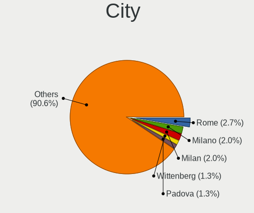
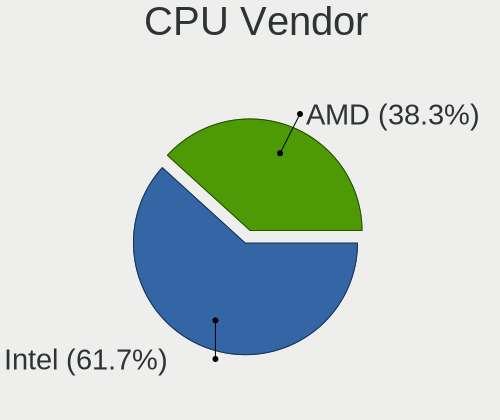
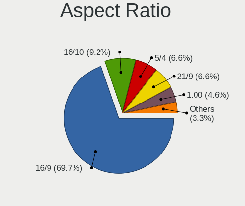
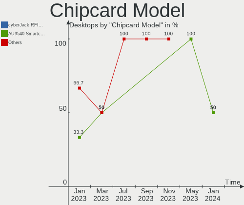
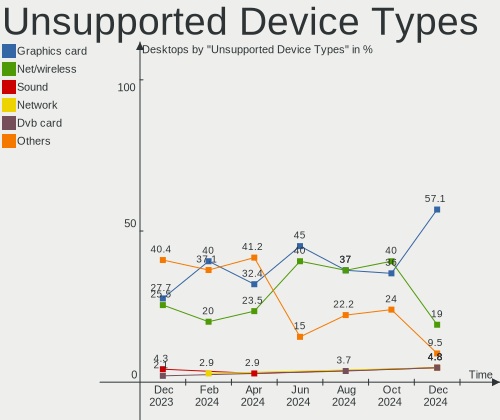

Linux Mint - Hardware Trends (Desktops)
---------------------------------------

A project to identify most popular hardware characteristics and track their change
over time based on data collected by Linux users at https://Linux-Hardware.org.

Anyone can contribute to this report by the [hw-probe](https://github.com/linuxhw/hw-probe) tool:

    sudo -E hw-probe -all -upload

This report is for one last month. Overall report since the beginning of time: [TestCoverage](https://github.com/linuxhw/TestCoverage)

Period: Jul, 2022.

Contents
--------

* [ System ](#system)
  - [ OS                       ](#os)
  - [ OS Family                ](#os-family)
  - [ Kernel                   ](#kernel)
  - [ Kernel Family            ](#kernel-family)
  - [ Kernel Major Ver.        ](#kernel-major-ver)
  - [ Arch                     ](#arch)
  - [ DE                       ](#de)
  - [ Display Server           ](#display-server)
  - [ Display Manager          ](#display-manager)
  - [ OS Lang                  ](#os-lang)
  - [ Boot Mode                ](#boot-mode)
  - [ Filesystem               ](#filesystem)
  - [ Part. scheme             ](#part-scheme)
  - [ Dual Boot with Linux/BSD ](#dual-boot-with-linuxbsd)
  - [ Dual Boot (Win)          ](#dual-boot-win)

* [ Board ](#board)
  - [ Vendor                   ](#vendor)
  - [ Model                    ](#model)
  - [ Model Family             ](#model-family)
  - [ MFG Year                 ](#mfg-year)
  - [ Form Factor              ](#form-factor)
  - [ Secure Boot              ](#secure-boot)
  - [ Coreboot                 ](#coreboot)
  - [ RAM Size                 ](#ram-size)
  - [ RAM Used                 ](#ram-used)
  - [ Total Drives             ](#total-drives)
  - [ Has CD-ROM               ](#has-cd-rom)
  - [ Has Ethernet             ](#has-ethernet)
  - [ Has WiFi                 ](#has-wifi)
  - [ Has Bluetooth            ](#has-bluetooth)

* [ Location ](#location)
  - [ Country                  ](#country)
  - [ City                     ](#city)

* [ Drives ](#drives)
  - [ Drive Vendor             ](#drive-vendor)
  - [ Drive Model              ](#drive-model)
  - [ HDD Vendor               ](#hdd-vendor)
  - [ SSD Vendor               ](#ssd-vendor)
  - [ Drive Kind               ](#drive-kind)
  - [ Drive Connector          ](#drive-connector)
  - [ Drive Size               ](#drive-size)
  - [ Space Total              ](#space-total)
  - [ Space Used               ](#space-used)
  - [ Malfunc. Drives          ](#malfunc-drives)
  - [ Malfunc. Drive Vendor    ](#malfunc-drive-vendor)
  - [ Malfunc. HDD Vendor      ](#malfunc-hdd-vendor)
  - [ Malfunc. Drive Kind      ](#malfunc-drive-kind)
  - [ Failed Drives            ](#failed-drives)
  - [ Failed Drive Vendor      ](#failed-drive-vendor)
  - [ Drive Status             ](#drive-status)

* [ Storage controller ](#storage-controller)
  - [ Storage Vendor           ](#storage-vendor)
  - [ Storage Model            ](#storage-model)
  - [ Storage Kind             ](#storage-kind)

* [ Processor ](#processor)
  - [ CPU Vendor               ](#cpu-vendor)
  - [ CPU Model                ](#cpu-model)
  - [ CPU Model Family         ](#cpu-model-family)
  - [ CPU Cores                ](#cpu-cores)
  - [ CPU Sockets              ](#cpu-sockets)
  - [ CPU Threads              ](#cpu-threads)
  - [ CPU Op-Modes             ](#cpu-op-modes)
  - [ CPU Microcode            ](#cpu-microcode)
  - [ CPU Microarch            ](#cpu-microarch)

* [ Graphics ](#graphics)
  - [ GPU Vendor               ](#gpu-vendor)
  - [ GPU Model                ](#gpu-model)
  - [ GPU Combo                ](#gpu-combo)
  - [ GPU Driver               ](#gpu-driver)
  - [ GPU Memory               ](#gpu-memory)

* [ Monitor ](#monitor)
  - [ Monitor Vendor           ](#monitor-vendor)
  - [ Monitor Model            ](#monitor-model)
  - [ Monitor Resolution       ](#monitor-resolution)
  - [ Monitor Diagonal         ](#monitor-diagonal)
  - [ Monitor Width            ](#monitor-width)
  - [ Aspect Ratio             ](#aspect-ratio)
  - [ Monitor Area             ](#monitor-area)
  - [ Pixel Density            ](#pixel-density)
  - [ Multiple Monitors        ](#multiple-monitors)

* [ Network ](#network)
  - [ Net Controller Vendor    ](#net-controller-vendor)
  - [ Net Controller Model     ](#net-controller-model)
  - [ Wireless Vendor          ](#wireless-vendor)
  - [ Wireless Model           ](#wireless-model)
  - [ Ethernet Vendor          ](#ethernet-vendor)
  - [ Ethernet Model           ](#ethernet-model)
  - [ Net Controller Kind      ](#net-controller-kind)
  - [ Used Controller          ](#used-controller)
  - [ NICs                     ](#nics)
  - [ IPv6                     ](#ipv6)

* [ Bluetooth ](#bluetooth)
  - [ Bluetooth Vendor         ](#bluetooth-vendor)
  - [ Bluetooth Model          ](#bluetooth-model)

* [ Sound ](#sound)
  - [ Sound Vendor             ](#sound-vendor)
  - [ Sound Model              ](#sound-model)

* [ Memory ](#memory)
  - [ Memory Vendor            ](#memory-vendor)
  - [ Memory Model             ](#memory-model)
  - [ Memory Kind              ](#memory-kind)
  - [ Memory Form Factor       ](#memory-form-factor)
  - [ Memory Size              ](#memory-size)
  - [ Memory Speed             ](#memory-speed)

* [ Printers & scanners ](#printers--scanners)
  - [ Printer Vendor           ](#printer-vendor)
  - [ Printer Model            ](#printer-model)
  - [ Scanner Vendor           ](#scanner-vendor)
  - [ Scanner Model            ](#scanner-model)

* [ Camera ](#camera)
  - [ Camera Vendor            ](#camera-vendor)
  - [ Camera Model             ](#camera-model)

* [ Security ](#security)
  - [ Fingerprint Vendor       ](#fingerprint-vendor)
  - [ Fingerprint Model        ](#fingerprint-model)
  - [ Chipcard Vendor          ](#chipcard-vendor)
  - [ Chipcard Model           ](#chipcard-model)

* [ Unsupported ](#unsupported)
  - [ Unsupported Devices      ](#unsupported-devices)
  - [ Unsupported Device Types ](#unsupported-device-types)

System
------

OS
--

Installed operating systems

| Name            | Desktops | Percent |
|-----------------|----------|---------|
| Linux Mint 20.3 | 159      | 81.54%  |
| Linux Mint 20.2 | 16       | 8.21%   |
| Linux Mint 19.3 | 9        | 4.62%   |
| Linux Mint 20.1 | 5        | 2.56%   |
| Linux Mint 21   | 3        | 1.54%   |
| Linux Mint 20   | 2        | 1.03%   |
| Linux Mint 18.3 | 1        | 0.51%   |

OS Family
---------

OS without a version

| Name       | Desktops | Percent |
|------------|----------|---------|
| Linux Mint | 195      | 100%    |

Kernel
------

Version of the Linux kernel

| Version                     | Desktops | Percent |
|-----------------------------|----------|---------|
| 5.4.0-122-generic           | 77       | 39.49%  |
| 5.4.0-121-generic           | 50       | 25.64%  |
| 5.4.0-91-generic            | 15       | 7.69%   |
| 5.15.0-41-generic           | 12       | 6.15%   |
| 5.15.0-33-generic           | 4        | 2.05%   |
| 5.4.0-120-generic           | 3        | 1.54%   |
| 5.4.0-117-generic           | 3        | 1.54%   |
| 5.4.0-107-generic           | 2        | 1.03%   |
| 5.4.0-105-generic           | 2        | 1.03%   |
| 5.15.0-43-generic           | 2        | 1.03%   |
| 5.13.0-51-generic           | 2        | 1.03%   |
| 4.15.0-189-generic          | 2        | 1.03%   |
| 5.4.0-97-generic            | 1        | 0.51%   |
| 5.4.0-90-generic            | 1        | 0.51%   |
| 5.4.0-81-generic            | 1        | 0.51%   |
| 5.4.0-74-generic            | 1        | 0.51%   |
| 5.4.0-58-generic            | 1        | 0.51%   |
| 5.4.0-45-generic            | 1        | 0.51%   |
| 5.4.0-26-generic            | 1        | 0.51%   |
| 5.4.0-122-lowlatency        | 1        | 0.51%   |
| 5.4.0-1132206031516-generic | 1        | 0.51%   |
| 5.4.0-113-generic           | 1        | 0.51%   |
| 5.4.0-110-generic           | 1        | 0.51%   |
| 5.4.0-109-generic           | 1        | 0.51%   |
| 5.18.5-051805-generic       | 1        | 0.51%   |
| 5.18.12-051812-generic      | 1        | 0.51%   |
| 5.18.10-051810-generic      | 1        | 0.51%   |
| 5.17.0-051700-generic       | 1        | 0.51%   |
| 5.16.0-6mx-amd64            | 1        | 0.51%   |
| 5.13.0-52-generic           | 1        | 0.51%   |
| 5.13.0-25-generic           | 1        | 0.51%   |
| 5.0.0-32-generic            | 1        | 0.51%   |
| 4.10.0-38-generic           | 1        | 0.51%   |

Kernel Family
-------------

Linux kernel without a distro release

| Version | Desktops | Percent |
|---------|----------|---------|
| 5.4.0   | 164      | 84.1%   |
| 5.15.0  | 18       | 9.23%   |
| 5.13.0  | 4        | 2.05%   |
| 4.15.0  | 2        | 1.03%   |
| 5.18.5  | 1        | 0.51%   |
| 5.18.12 | 1        | 0.51%   |
| 5.18.10 | 1        | 0.51%   |
| 5.17.0  | 1        | 0.51%   |
| 5.16.0  | 1        | 0.51%   |
| 5.0.0   | 1        | 0.51%   |
| 4.10.0  | 1        | 0.51%   |

Kernel Major Ver.
-----------------

Linux kernel major version

| Version | Desktops | Percent |
|---------|----------|---------|
| 5.4     | 164      | 84.1%   |
| 5.15    | 18       | 9.23%   |
| 5.13    | 4        | 2.05%   |
| 5.18    | 3        | 1.54%   |
| 4.15    | 2        | 1.03%   |
| 5.17    | 1        | 0.51%   |
| 5.16    | 1        | 0.51%   |
| 5.0     | 1        | 0.51%   |
| 4.10    | 1        | 0.51%   |

Arch
----

OS architecture (x86_64, i586, etc.)

| Name   | Desktops | Percent |
|--------|----------|---------|
| x86_64 | 193      | 98.97%  |
| i686   | 2        | 1.03%   |

DE
--

Desktop Environment

| Name       | Desktops | Percent |
|------------|----------|---------|
| X-Cinnamon | 124      | 63.59%  |
| MATE       | 27       | 13.85%  |
| XFCE       | 25       | 12.82%  |
| Cinnamon   | 12       | 6.15%   |
| GNOME      | 5        | 2.56%   |
| Unknown    | 2        | 1.03%   |

Display Server
--------------

X11 or Wayland

| Name    | Desktops | Percent |
|---------|----------|---------|
| X11     | 191      | 97.95%  |
| Tty     | 3        | 1.54%   |
| Wayland | 1        | 0.51%   |

Display Manager
---------------

SDDM, LightDM, etc.

| Name    | Desktops | Percent |
|---------|----------|---------|
| Unknown | 107      | 54.87%  |
| LightDM | 85       | 43.59%  |
| GDM     | 3        | 1.54%   |

OS Lang
-------

Language

| Lang  | Desktops | Percent |
|-------|----------|---------|
| en_US | 58       | 29.74%  |
| de_DE | 37       | 18.97%  |
| ru_RU | 13       | 6.67%   |
| pt_BR | 13       | 6.67%   |
| fr_FR | 9        | 4.62%   |
| en_GB | 9        | 4.62%   |
| en_CA | 6        | 3.08%   |
| es_ES | 5        | 2.56%   |
| pl_PL | 4        | 2.05%   |
| it_IT | 4        | 2.05%   |
| C     | 4        | 2.05%   |
| es_AR | 3        | 1.54%   |
| de_CH | 3        | 1.54%   |
| cs_CZ | 3        | 1.54%   |
| sv_SE | 2        | 1.03%   |
| nl_NL | 2        | 1.03%   |
| fr_CA | 2        | 1.03%   |
| es_MX | 2        | 1.03%   |
| en_IN | 2        | 1.03%   |
| el_GR | 2        | 1.03%   |
| sk_SK | 1        | 0.51%   |
| nl_BE | 1        | 0.51%   |
| ja_JP | 1        | 0.51%   |
| hu_HU | 1        | 0.51%   |
| fr_CH | 1        | 0.51%   |
| es_CO | 1        | 0.51%   |
| es_CL | 1        | 0.51%   |
| en_ZA | 1        | 0.51%   |
| en_PH | 1        | 0.51%   |
| en_NZ | 1        | 0.51%   |
| en_AU | 1        | 0.51%   |
| bg_BG | 1        | 0.51%   |

Boot Mode
---------

EFI or BIOS

| Mode | Desktops | Percent |
|------|----------|---------|
| BIOS | 106      | 54.36%  |
| EFI  | 89       | 45.64%  |

Filesystem
----------

Type of filesystem

| Type    | Desktops | Percent |
|---------|----------|---------|
| Ext4    | 184      | 94.36%  |
| Btrfs   | 5        | 2.56%   |
| Overlay | 4        | 2.05%   |
| Ext3    | 1        | 0.51%   |
| Ext2    | 1        | 0.51%   |

Part. scheme
------------

Scheme of partitioning

| Type    | Desktops | Percent |
|---------|----------|---------|
| Unknown | 114      | 58.46%  |
| GPT     | 46       | 23.59%  |
| MBR     | 35       | 17.95%  |

Dual Boot with Linux/BSD
------------------------

Hosting more than one Linux/BSD

| Dual boot | Desktops | Percent |
|-----------|----------|---------|
| No        | 177      | 90.77%  |
| Yes       | 18       | 9.23%   |

Dual Boot (Win)
---------------

Hosting Linux and Windows

| Dual boot | Desktops | Percent |
|-----------|----------|---------|
| No        | 154      | 78.97%  |
| Yes       | 41       | 21.03%  |

Board
-----

Vendor
------

Motherboard manufacturer

| Name                | Desktops | Percent |
|---------------------|----------|---------|
| ASUSTek Computer    | 46       | 23.59%  |
| Gigabyte Technology | 33       | 16.92%  |
| MSI                 | 24       | 12.31%  |
| Dell                | 18       | 9.23%   |
| Hewlett-Packard     | 15       | 7.69%   |
| ASRock              | 15       | 7.69%   |
| Lenovo              | 8        | 4.1%    |
| Intel               | 6        | 3.08%   |
| Biostar             | 4        | 2.05%   |
| Positivo            | 3        | 1.54%   |
| Medion              | 3        | 1.54%   |
| ECS                 | 3        | 1.54%   |
| AZW                 | 3        | 1.54%   |
| Pegatron            | 2        | 1.03%   |
| Foxconn             | 2        | 1.03%   |
| Apple               | 2        | 1.03%   |
| Acer                | 2        | 1.03%   |
| Unknown             | 2        | 1.03%   |
| PCWare              | 1        | 0.51%   |
| Minix               | 1        | 0.51%   |
| MACHINIST           | 1        | 0.51%   |
| BESSTAR Tech        | 1        | 0.51%   |

Model
-----

Motherboard model

| Name                                | Desktops | Percent |
|-------------------------------------|----------|---------|
| MSI MS-7B86                         | 3        | 1.54%   |
| ASUS All Series                     | 3        | 1.54%   |
| MSI MS-7693                         | 2        | 1.03%   |
| MSI MS-7529                         | 2        | 1.03%   |
| HP EliteDesk 800 G1 SFF             | 2        | 1.03%   |
| HP Compaq Pro 6300 SFF              | 2        | 1.03%   |
| Gigabyte G33M-S2                    | 2        | 1.03%   |
| Dell OptiPlex 780                   | 2        | 1.03%   |
| Dell OptiPlex 7010                  | 2        | 1.03%   |
| AZW Green G2                        | 2        | 1.03%   |
| ASUS TUF Gaming X570-PLUS           | 2        | 1.03%   |
| ASUS TUF B450-PRO GAMING            | 2        | 1.03%   |
| ASUS PRIME X570-P                   | 2        | 1.03%   |
| Unknown                             | 2        | 1.03%   |
| Positivo POS-MIG31AG                | 1        | 0.51%   |
| Positivo POS-MI945AA                | 1        | 0.51%   |
| Positivo D6200                      | 1        | 0.51%   |
| Pegatron p7-1154                    | 1        | 0.51%   |
| Pegatron p7-1142                    | 1        | 0.51%   |
| PCWare IPMH61R3                     | 1        | 0.51%   |
| MSI NM917AA-ABU CQ5001UK            | 1        | 0.51%   |
| MSI MS-7D22                         | 1        | 0.51%   |
| MSI MS-7D13                         | 1        | 0.51%   |
| MSI MS-7C94                         | 1        | 0.51%   |
| MSI MS-7C91                         | 1        | 0.51%   |
| MSI MS-7C75                         | 1        | 0.51%   |
| MSI MS-7C56                         | 1        | 0.51%   |
| MSI MS-7C52                         | 1        | 0.51%   |
| MSI MS-7C39                         | 1        | 0.51%   |
| MSI MS-7C09                         | 1        | 0.51%   |
| MSI MS-7B98                         | 1        | 0.51%   |
| MSI MS-7B89                         | 1        | 0.51%   |
| MSI MS-7B18                         | 1        | 0.51%   |
| MSI MS-7A35                         | 1        | 0.51%   |
| MSI MS-7850                         | 1        | 0.51%   |
| MSI MS-7793                         | 1        | 0.51%   |
| MSI MS-7751                         | 1        | 0.51%   |
| Minix Z83-4                         | 1        | 0.51%   |
| Medion MS-7713                      | 1        | 0.51%   |
| Medion MS-7667                      | 1        | 0.51%   |
| Medion MS-7633                      | 1        | 0.51%   |
| MACHINIST X79 V2.82H                | 1        | 0.51%   |
| Lenovo ThinkCentre M93p 10A9000SUS  | 1        | 0.51%   |
| Lenovo ThinkCentre M92P 3237AG5     | 1        | 0.51%   |
| Lenovo ThinkCentre M79 10CWS00700   | 1        | 0.51%   |
| Lenovo ThinkCentre M73 10AY0004US   | 1        | 0.51%   |
| Lenovo ThinkCentre M710s 10M8S0BQ0U | 1        | 0.51%   |
| Lenovo ThinkCentre Edge92 33874GG   | 1        | 0.51%   |
| Lenovo QiTianM4500-N000 90CXCTO1WW  | 1        | 0.51%   |
| Lenovo IdeaCentre Q180 10087&3110   | 1        | 0.51%   |
| Intel Z77                           | 1        | 0.51%   |
| Intel X99 V1.0                      | 1        | 0.51%   |
| Intel X99                           | 1        | 0.51%   |
| Intel STK1AW32SC                    | 1        | 0.51%   |
| Intel H61                           | 1        | 0.51%   |
| Intel D2500CC AAG81477-400          | 1        | 0.51%   |
| HP Z800 Workstation                 | 1        | 0.51%   |
| HP Z600 Workstation                 | 1        | 0.51%   |
| HP workstation xw8200               | 1        | 0.51%   |
| HP ProDesk 600 G1 SFF               | 1        | 0.51%   |

Model Family
------------

Motherboard model prefix

| Name                    | Desktops | Percent |
|-------------------------|----------|---------|
| Dell OptiPlex           | 11       | 5.64%   |
| ASUS PRIME              | 9        | 4.62%   |
| ASUS TUF                | 7        | 3.59%   |
| Lenovo ThinkCentre      | 6        | 3.08%   |
| ASUS ROG                | 5        | 2.56%   |
| HP Compaq               | 4        | 2.05%   |
| MSI MS-7B86             | 3        | 1.54%   |
| HP ProDesk              | 3        | 1.54%   |
| Dell Precision          | 3        | 1.54%   |
| ASUS All                | 3        | 1.54%   |
| MSI MS-7693             | 2        | 1.03%   |
| MSI MS-7529             | 2        | 1.03%   |
| Intel X99               | 2        | 1.03%   |
| HP EliteDesk            | 2        | 1.03%   |
| Gigabyte Z590           | 2        | 1.03%   |
| Gigabyte Z390           | 2        | 1.03%   |
| Gigabyte H410M          | 2        | 1.03%   |
| Gigabyte G33M-S2        | 2        | 1.03%   |
| Gigabyte B550           | 2        | 1.03%   |
| AZW Green               | 2        | 1.03%   |
| ASUS P8B75-M            | 2        | 1.03%   |
| ASRock X370             | 2        | 1.03%   |
| Acer Aspire             | 2        | 1.03%   |
| Unknown                 | 2        | 1.03%   |
| Positivo POS-MIG31AG    | 1        | 0.51%   |
| Positivo POS-MI945AA    | 1        | 0.51%   |
| Positivo D6200          | 1        | 0.51%   |
| Pegatron p7-1154        | 1        | 0.51%   |
| Pegatron p7-1142        | 1        | 0.51%   |
| PCWare IPMH61R3         | 1        | 0.51%   |
| MSI NM917AA-ABU         | 1        | 0.51%   |
| MSI MS-7D22             | 1        | 0.51%   |
| MSI MS-7D13             | 1        | 0.51%   |
| MSI MS-7C94             | 1        | 0.51%   |
| MSI MS-7C91             | 1        | 0.51%   |
| MSI MS-7C75             | 1        | 0.51%   |
| MSI MS-7C56             | 1        | 0.51%   |
| MSI MS-7C52             | 1        | 0.51%   |
| MSI MS-7C39             | 1        | 0.51%   |
| MSI MS-7C09             | 1        | 0.51%   |
| MSI MS-7B98             | 1        | 0.51%   |
| MSI MS-7B89             | 1        | 0.51%   |
| MSI MS-7B18             | 1        | 0.51%   |
| MSI MS-7A35             | 1        | 0.51%   |
| MSI MS-7850             | 1        | 0.51%   |
| MSI MS-7793             | 1        | 0.51%   |
| MSI MS-7751             | 1        | 0.51%   |
| Minix Z83-4             | 1        | 0.51%   |
| Medion MS-7713          | 1        | 0.51%   |
| Medion MS-7667          | 1        | 0.51%   |
| Medion MS-7633          | 1        | 0.51%   |
| MACHINIST X79           | 1        | 0.51%   |
| Lenovo QiTianM4500-N000 | 1        | 0.51%   |
| Lenovo IdeaCentre       | 1        | 0.51%   |
| Intel Z77               | 1        | 0.51%   |
| Intel STK1AW32SC        | 1        | 0.51%   |
| Intel H61               | 1        | 0.51%   |
| Intel D2500CC           | 1        | 0.51%   |
| HP Z800                 | 1        | 0.51%   |
| HP Z600                 | 1        | 0.51%   |

MFG Year
--------

Motherboard manufacture year

| Year | Desktops | Percent |
|------|----------|---------|
| 2021 | 20       | 10.26%  |
| 2019 | 19       | 9.74%   |
| 2018 | 19       | 9.74%   |
| 2012 | 17       | 8.72%   |
| 2020 | 16       | 8.21%   |
| 2013 | 16       | 8.21%   |
| 2009 | 16       | 8.21%   |
| 2010 | 14       | 7.18%   |
| 2014 | 11       | 5.64%   |
| 2011 | 11       | 5.64%   |
| 2016 | 7        | 3.59%   |
| 2007 | 7        | 3.59%   |
| 2022 | 5        | 2.56%   |
| 2017 | 5        | 2.56%   |
| 2015 | 5        | 2.56%   |
| 2008 | 5        | 2.56%   |
| 2006 | 1        | 0.51%   |
| 2005 | 1        | 0.51%   |

Form Factor
-----------

Physical design of the computer

| Name    | Desktops | Percent |
|---------|----------|---------|
| Desktop | 195      | 100%    |

Secure Boot
-----------

Enabled or disabled

| State    | Desktops | Percent |
|----------|----------|---------|
| Disabled | 190      | 97.44%  |
| Enabled  | 5        | 2.56%   |

Coreboot
--------

Have coreboot on board

| Used | Desktops | Percent |
|------|----------|---------|
| No   | 195      | 100%    |

RAM Size
--------

Total RAM memory

| Size in GB  | Desktops | Percent |
|-------------|----------|---------|
| 16.01-24.0  | 56       | 28.72%  |
| 32.01-64.0  | 37       | 18.97%  |
| 8.01-16.0   | 35       | 17.95%  |
| 4.01-8.0    | 28       | 14.36%  |
| 3.01-4.0    | 23       | 11.79%  |
| 24.01-32.0  | 5        | 2.56%   |
| 2.01-3.0    | 4        | 2.05%   |
| 1.01-2.0    | 4        | 2.05%   |
| 64.01-256.0 | 3        | 1.54%   |

RAM Used
--------

Used RAM memory

| Used GB   | Desktops | Percent |
|-----------|----------|---------|
| 1.01-2.0  | 87       | 44.62%  |
| 2.01-3.0  | 43       | 22.05%  |
| 3.01-4.0  | 33       | 16.92%  |
| 4.01-8.0  | 22       | 11.28%  |
| 8.01-16.0 | 5        | 2.56%   |
| 0.51-1.0  | 4        | 2.05%   |
| 0.01-0.5  | 1        | 0.51%   |

Total Drives
------------

Number of drives on board

| Drives | Desktops | Percent |
|--------|----------|---------|
| 1      | 69       | 35.38%  |
| 2      | 58       | 29.74%  |
| 3      | 29       | 14.87%  |
| 4      | 25       | 12.82%  |
| 5      | 6        | 3.08%   |
| 6      | 4        | 2.05%   |
| 7      | 2        | 1.03%   |
| 14     | 1        | 0.51%   |
| 8      | 1        | 0.51%   |

Has CD-ROM
----------

Has CD-ROM on board

| Presented | Desktops | Percent |
|-----------|----------|---------|
| Yes       | 105      | 53.85%  |
| No        | 90       | 46.15%  |

Has Ethernet
------------

Has Ethernet on board

| Presented | Desktops | Percent |
|-----------|----------|---------|
| Yes       | 194      | 99.49%  |
| No        | 1        | 0.51%   |

Has WiFi
--------

Has WiFi module

| Presented | Desktops | Percent |
|-----------|----------|---------|
| No        | 99       | 50.77%  |
| Yes       | 96       | 49.23%  |

Has Bluetooth
-------------

Has Bluetooth module

| Presented | Desktops | Percent |
|-----------|----------|---------|
| No        | 127      | 65.13%  |
| Yes       | 68       | 34.87%  |

Location
--------

Country
-------

Geographic location (country)

| Country      | Desktops | Percent |
|--------------|----------|---------|
| USA          | 38       | 19.49%  |
| Germany      | 38       | 19.49%  |
| Brazil       | 15       | 7.69%   |
| Russia       | 14       | 7.18%   |
| France       | 10       | 5.13%   |
| Canada       | 10       | 5.13%   |
| UK           | 8        | 4.1%    |
| Spain        | 5        | 2.56%   |
| Poland       | 5        | 2.56%   |
| Switzerland  | 4        | 2.05%   |
| Sweden       | 4        | 2.05%   |
| Netherlands  | 4        | 2.05%   |
| Italy        | 4        | 2.05%   |
| Latvia       | 3        | 1.54%   |
| Greece       | 3        | 1.54%   |
| Argentina    | 3        | 1.54%   |
| Mexico       | 2        | 1.03%   |
| Japan        | 2        | 1.03%   |
| India        | 2        | 1.03%   |
| Czechia      | 2        | 1.03%   |
| Colombia     | 2        | 1.03%   |
| Belarus      | 2        | 1.03%   |
| South Africa | 1        | 0.51%   |
| Slovakia     | 1        | 0.51%   |
| Qatar        | 1        | 0.51%   |
| Philippines  | 1        | 0.51%   |
| New Zealand  | 1        | 0.51%   |
| Namibia      | 1        | 0.51%   |
| Hungary      | 1        | 0.51%   |
| Egypt        | 1        | 0.51%   |
| Denmark      | 1        | 0.51%   |
| Cyprus       | 1        | 0.51%   |
| China        | 1        | 0.51%   |
| Chile        | 1        | 0.51%   |
| Bulgaria     | 1        | 0.51%   |
| Belgium      | 1        | 0.51%   |
| Australia    | 1        | 0.51%   |

City
----

Geographic location (city)

| City                 | Desktops | Percent |
|----------------------|----------|---------|
| Ventspils            | 3        | 1.54%   |
| Rio de Janeiro       | 3        | 1.54%   |
| Uetze                | 2        | 1.03%   |
| Rendsburg            | 2        | 1.03%   |
| Prague               | 2        | 1.03%   |
| Moscow               | 2        | 1.03%   |
| Montreal             | 2        | 1.03%   |
| Miami                | 2        | 1.03%   |
| Granollers           | 2        | 1.03%   |
| Bogotá              | 2        | 1.03%   |
| Berlin               | 2        | 1.03%   |
| Athens               | 2        | 1.03%   |
| Yaroslavl            | 1        | 0.51%   |
| Yamagata             | 1        | 0.51%   |
| Witten               | 1        | 0.51%   |
| Winningen            | 1        | 0.51%   |
| Windhoek             | 1        | 0.51%   |
| Wijchen              | 1        | 0.51%   |
| Wied                 | 1        | 0.51%   |
| Wichita              | 1        | 0.51%   |
| West Kelowna         | 1        | 0.51%   |
| Wałbrzych           | 1        | 0.51%   |
| Warsaw               | 1        | 0.51%   |
| Voronezh             | 1        | 0.51%   |
| Vitry-sur-Seine      | 1        | 0.51%   |
| Vigo                 | 1        | 0.51%   |
| Victorville          | 1        | 0.51%   |
| Venice               | 1        | 0.51%   |
| Veliky Novgorod      | 1        | 0.51%   |
| Vancouver            | 1        | 0.51%   |
| Vaerlose             | 1        | 0.51%   |
| Unterschleissheim    | 1        | 0.51%   |
| Ulyanovsk            | 1        | 0.51%   |
| Ufa                  | 1        | 0.51%   |
| Tupper Lake          | 1        | 0.51%   |
| Trebur               | 1        | 0.51%   |
| Toronto              | 1        | 0.51%   |
| Tokyo                | 1        | 0.51%   |
| Thessaloniki         | 1        | 0.51%   |
| Szombathely          | 1        | 0.51%   |
| Strasbourg           | 1        | 0.51%   |
| Stockholm            | 1        | 0.51%   |
| Stevens Point        | 1        | 0.51%   |
| Stenhamra            | 1        | 0.51%   |
| Staten Island        | 1        | 0.51%   |
| St Louis             | 1        | 0.51%   |
| Sierre               | 1        | 0.51%   |
| Shenzhen             | 1        | 0.51%   |
| Shelton              | 1        | 0.51%   |
| Sheffield            | 1        | 0.51%   |
| Shawnee              | 1        | 0.51%   |
| Seitingen-Oberflacht | 1        | 0.51%   |
| Schechingen          | 1        | 0.51%   |
| Sarre-Union          | 1        | 0.51%   |
| Sao Paulo            | 1        | 0.51%   |
| San Antonio          | 1        | 0.51%   |
| Salvador             | 1        | 0.51%   |
| Runcorn              | 1        | 0.51%   |
| Rumia                | 1        | 0.51%   |
| Rieseby              | 1        | 0.51%   |

Drives
------

Drive Vendor
------------

Hard drive vendors

| Vendor                    | Desktops | Drives | Percent |
|---------------------------|----------|--------|---------|
| Seagate                   | 78       | 115    | 20.74%  |
| WDC                       | 74       | 89     | 19.68%  |
| Samsung Electronics       | 53       | 64     | 14.1%   |
| Kingston                  | 25       | 27     | 6.65%   |
| Toshiba                   | 17       | 21     | 4.52%   |
| Crucial                   | 14       | 14     | 3.72%   |
| SanDisk                   | 13       | 15     | 3.46%   |
| Hitachi                   | 12       | 13     | 3.19%   |
| A-DATA Technology         | 7        | 7      | 1.86%   |
| Intel                     | 6        | 7      | 1.6%    |
| China                     | 6        | 6      | 1.6%    |
| Unknown                   | 5        | 9      | 1.33%   |
| Phison                    | 5        | 5      | 1.33%   |
| HGST                      | 5        | 6      | 1.33%   |
| Maxtor                    | 4        | 4      | 1.06%   |
| Intenso                   | 4        | 4      | 1.06%   |
| Silicon Motion            | 3        | 3      | 0.8%    |
| PNY                       | 3        | 3      | 0.8%    |
| Micron/Crucial Technology | 3        | 3      | 0.8%    |
| SPCC                      | 2        | 2      | 0.53%   |
| Patriot                   | 2        | 2      | 0.53%   |
| NGFF                      | 2        | 2      | 0.53%   |
| GOODRAM                   | 2        | 2      | 0.53%   |
| Gigabyte Technology       | 2        | 2      | 0.53%   |
| Dogfish                   | 2        | 2      | 0.53%   |
| XPG                       | 1        | 1      | 0.27%   |
| TO Exter                  | 1        | 1      | 0.27%   |
| SSK                       | 1        | 1      | 0.27%   |
| SK hynix                  | 1        | 1      | 0.27%   |
| SAGE                      | 1        | 1      | 0.27%   |
| SABRENT                   | 1        | 1      | 0.27%   |
| Realtek Semiconductor     | 1        | 2      | 0.27%   |
| Qumo                      | 1        | 1      | 0.27%   |
| PHD 3.0                   | 1        | 1      | 0.27%   |
| ORIGIN                    | 1        | 1      | 0.27%   |
| OCZ                       | 1        | 1      | 0.27%   |
| Netac SS                  | 1        | 1      | 0.27%   |
| Micron Technology         | 1        | 1      | 0.27%   |
| LITEONIT                  | 1        | 1      | 0.27%   |
| Lenovo                    | 1        | 1      | 0.27%   |
| JMicron Technology        | 1        | 1      | 0.27%   |
| HS-SSD-E100               | 1        | 1      | 0.27%   |
| HPE                       | 1        | 1      | 0.27%   |
| HipDisk                   | 1        | 1      | 0.27%   |
| Hikvision                 | 1        | 1      | 0.27%   |
| Hewlett-Packard           | 1        | 1      | 0.27%   |
| Corsair                   | 1        | 1      | 0.27%   |
| ASMT                      | 1        | 1      | 0.27%   |
| Apple                     | 1        | 1      | 0.27%   |
| Apacer                    | 1        | 1      | 0.27%   |
| AMD                       | 1        | 1      | 0.27%   |
| Unknown                   | 1        | 1      | 0.27%   |

Drive Model
-----------

Hard drive models

| Model                               | Desktops | Percent |
|-------------------------------------|----------|---------|
| Seagate ST500DM002-1BD142 500GB     | 9        | 2.07%   |
| Kingston SA400S37120G 120GB SSD     | 7        | 1.61%   |
| Toshiba DT01ACA100 1TB              | 5        | 1.15%   |
| Samsung NVMe SSD Drive 500GB        | 5        | 1.15%   |
| Toshiba HDWD120 2TB                 | 4        | 0.92%   |
| Seagate ST4000DM004-2CV104 4TB      | 4        | 0.92%   |
| Seagate ST3500418AS 500GB           | 4        | 0.92%   |
| Seagate ST2000DM008-2FR102 2TB      | 4        | 0.92%   |
| Seagate ST1000DM003-1SB102 1TB      | 4        | 0.92%   |
| Seagate ST1000DM003-1ER162 1TB      | 4        | 0.92%   |
| Samsung SSD 850 EVO 250GB           | 4        | 0.92%   |
| WDC WD20EZRZ-00Z5HB0 2TB            | 3        | 0.69%   |
| WDC WD10EZEX-00BN5A0 1TB            | 3        | 0.69%   |
| Seagate ST500LM012 HN-M500MBB 500GB | 3        | 0.69%   |
| Seagate ST1000DM003-1CH162 1TB      | 3        | 0.69%   |
| Seagate Backup+ Hub BK 4TB          | 3        | 0.69%   |
| SanDisk SSD PLUS 480GB              | 3        | 0.69%   |
| Samsung SSD 980 500GB               | 3        | 0.69%   |
| Samsung SSD 860 EVO 250GB           | 3        | 0.69%   |
| Samsung SSD 850 EVO 500GB           | 3        | 0.69%   |
| Samsung HD502HJ 500GB               | 3        | 0.69%   |
| Kingston NVMe SSD Drive 500GB       | 3        | 0.69%   |
| Crucial CT500MX500SSD1 500GB        | 3        | 0.69%   |
| Crucial CT1000MX500SSD1 1TB         | 3        | 0.69%   |
| WDC WD40EZRZ-00GXCB0 4TB            | 2        | 0.46%   |
| WDC WD30EFRX-68EUZN0 3TB            | 2        | 0.46%   |
| WDC WD30EFRX-68AX9N0 3TB            | 2        | 0.46%   |
| WDC WD20EZBX-00AYRA0 2TB            | 2        | 0.46%   |
| WDC WD20EARX-00PASB0 2TB            | 2        | 0.46%   |
| WDC WD2000JD-00HBB0 200GB           | 2        | 0.46%   |
| WDC WD10EZEX-08M2NA0 1TB            | 2        | 0.46%   |
| Unknown SD/MMC 16GB                 | 2        | 0.46%   |
| Unknown M.S./M.S.Pro/HG 16GB        | 2        | 0.46%   |
| Seagate ST8000DM004-2CX188 8TB      | 2        | 0.46%   |
| Seagate ST3750528AS 752GB           | 2        | 0.46%   |
| Seagate ST3250310AS 250GB           | 2        | 0.46%   |
| Seagate ST2000DM006-2DM164 2TB      | 2        | 0.46%   |
| Seagate One Touch HDD 5TB           | 2        | 0.46%   |
| Seagate Expansion Desk 4TB          | 2        | 0.46%   |
| SanDisk NVMe SSD Drive 1TB          | 2        | 0.46%   |
| Samsung SSD 870 QVO 1TB             | 2        | 0.46%   |
| Samsung SSD 850 EVO 2TB             | 2        | 0.46%   |
| Samsung NVMe SSD Drive 250GB        | 2        | 0.46%   |
| Samsung NVMe SSD Drive 1TB          | 2        | 0.46%   |
| Samsung HD501LJ 500GB               | 2        | 0.46%   |
| Samsung HD204UI 2TB                 | 2        | 0.46%   |
| NGFF 2280 512GB SSD                 | 2        | 0.46%   |
| Micron/Crucial NVMe SSD Drive 500GB | 2        | 0.46%   |
| Kingston SA400S37480G 480GB SSD     | 2        | 0.46%   |
| Kingston SA400S37240G 240GB SSD     | 2        | 0.46%   |
| Intenso SSD Sata III 256GB          | 2        | 0.46%   |
| Hitachi HUA722020ALA331 2TB         | 2        | 0.46%   |
| GOODRAM SSDPR-CX400-128-G2 128GB    | 2        | 0.46%   |
| Gigabyte GP-GSTFS31120GNTD 120GB    | 2        | 0.46%   |
| Crucial CT240BX500SSD1 240GB        | 2        | 0.46%   |
| China SATA SSD 240GB                | 2        | 0.46%   |
| XPG NVMe SSD Drive 1024GB           | 1        | 0.23%   |
| WDC WUH721414ALE604 14TB            | 1        | 0.23%   |
| WDC WDS500G2B0A-00SM50 500GB SSD    | 1        | 0.23%   |
| WDC WDS480G2G0C-00AJM0 480GB        | 1        | 0.23%   |

HDD Vendor
----------

Hard disk drive vendors

| Vendor              | Desktops | Drives | Percent |
|---------------------|----------|--------|---------|
| Seagate             | 77       | 112    | 38.5%   |
| WDC                 | 64       | 77     | 32%     |
| Samsung Electronics | 16       | 17     | 8%      |
| Toshiba             | 15       | 17     | 7.5%    |
| Hitachi             | 12       | 13     | 6%      |
| HGST                | 5        | 6      | 2.5%    |
| Maxtor              | 4        | 4      | 2%      |
| Unknown             | 1        | 1      | 0.5%    |
| SAGE                | 1        | 1      | 0.5%    |
| SABRENT             | 1        | 1      | 0.5%    |
| PHD 3.0             | 1        | 1      | 0.5%    |
| Intenso             | 1        | 1      | 0.5%    |
| Hewlett-Packard     | 1        | 1      | 0.5%    |
| ASMT                | 1        | 1      | 0.5%    |

SSD Vendor
----------

Solid state drive vendors

| Vendor              | Desktops | Drives | Percent |
|---------------------|----------|--------|---------|
| Samsung Electronics | 24       | 27     | 20.51%  |
| Kingston            | 16       | 18     | 13.68%  |
| Crucial             | 12       | 12     | 10.26%  |
| SanDisk             | 10       | 12     | 8.55%   |
| WDC                 | 9        | 9      | 7.69%   |
| China               | 6        | 6      | 5.13%   |
| A-DATA Technology   | 6        | 6      | 5.13%   |
| Toshiba             | 4        | 4      | 3.42%   |
| Intenso             | 3        | 3      | 2.56%   |
| SPCC                | 2        | 2      | 1.71%   |
| PNY                 | 2        | 2      | 1.71%   |
| Patriot             | 2        | 2      | 1.71%   |
| NGFF                | 2        | 2      | 1.71%   |
| Intel               | 2        | 3      | 1.71%   |
| GOODRAM             | 2        | 2      | 1.71%   |
| Gigabyte Technology | 2        | 2      | 1.71%   |
| Dogfish             | 2        | 2      | 1.71%   |
| TO Exter            | 1        | 1      | 0.85%   |
| SK hynix            | 1        | 1      | 0.85%   |
| Qumo                | 1        | 1      | 0.85%   |
| ORIGIN              | 1        | 1      | 0.85%   |
| OCZ                 | 1        | 1      | 0.85%   |
| Micron Technology   | 1        | 1      | 0.85%   |
| LITEONIT            | 1        | 1      | 0.85%   |
| Lenovo              | 1        | 1      | 0.85%   |
| HS-SSD-E100         | 1        | 1      | 0.85%   |
| HPE                 | 1        | 1      | 0.85%   |
| Unknown             | 1        | 1      | 0.85%   |

Drive Kind
----------

HDD or SSD

| Kind    | Desktops | Drives | Percent |
|---------|----------|--------|---------|
| HDD     | 147      | 253    | 47.42%  |
| SSD     | 99       | 125    | 31.94%  |
| NVMe    | 55       | 64     | 17.74%  |
| Unknown | 7        | 10     | 2.26%   |
| MMC     | 2        | 3      | 0.65%   |

Drive Connector
---------------

SATA, SAS, NVMe, etc.

| Type | Desktops | Drives | Percent |
|------|----------|--------|---------|
| SATA | 176      | 357    | 68.22%  |
| NVMe | 55       | 63     | 21.32%  |
| SAS  | 25       | 32     | 9.69%   |
| MMC  | 2        | 3      | 0.78%   |

Drive Size
----------

Size of hard drive

| Size in TB | Desktops | Drives | Percent |
|------------|----------|--------|---------|
| 0.01-0.5   | 119      | 182    | 43.27%  |
| 0.51-1.0   | 77       | 92     | 28%     |
| 1.01-2.0   | 38       | 43     | 13.82%  |
| 3.01-4.0   | 17       | 25     | 6.18%   |
| 4.01-10.0  | 14       | 23     | 5.09%   |
| 2.01-3.0   | 7        | 9      | 2.55%   |
| 10.01-20.0 | 3        | 4      | 1.09%   |

Space Total
-----------

Amount of disk space available on the file system

| Size in GB     | Desktops | Percent |
|----------------|----------|---------|
| 101-250        | 43       | 22.05%  |
| 251-500        | 41       | 21.03%  |
| 501-1000       | 35       | 17.95%  |
| 1001-2000      | 26       | 13.33%  |
| More than 3000 | 25       | 12.82%  |
| 2001-3000      | 11       | 5.64%   |
| 51-100         | 7        | 3.59%   |
| 21-50          | 5        | 2.56%   |
| 1-20           | 2        | 1.03%   |

Space Used
----------

Amount of used disk space

| Used GB        | Desktops | Percent |
|----------------|----------|---------|
| 1-20           | 42       | 21.54%  |
| 101-250        | 35       | 17.95%  |
| 21-50          | 28       | 14.36%  |
| 501-1000       | 22       | 11.28%  |
| 51-100         | 20       | 10.26%  |
| 251-500        | 17       | 8.72%   |
| 1001-2000      | 15       | 7.69%   |
| More than 3000 | 11       | 5.64%   |
| 2001-3000      | 5        | 2.56%   |

Malfunc. Drives
---------------

Drive models with a malfunction

| Model                             | Desktops | Drives | Percent |
|-----------------------------------|----------|--------|---------|
| WDC WD2000JD-00HBB0 200GB         | 2        | 2      | 6.06%   |
| Seagate ST1000DM003-1SB102 1TB    | 2        | 2      | 6.06%   |
| Samsung Electronics HD501LJ 500GB | 2        | 2      | 6.06%   |
| WDC WDS480G2G0B-00EPW0 480GB SSD  | 1        | 1      | 3.03%   |
| WDC WDS240G2G0B-00EPW0 240GB SSD  | 1        | 1      | 3.03%   |
| WDC WD6400AAKS-22A7B2 640GB       | 1        | 1      | 3.03%   |
| WDC WD5002ABYS-01B1B0 500GB       | 1        | 1      | 3.03%   |
| WDC WD20EARX-22PASB0 2TB          | 1        | 1      | 3.03%   |
| WDC WD10JPVX-22JC3T0 1TB          | 1        | 1      | 3.03%   |
| WDC WD10EZEX-60ZF5A0 1TB          | 1        | 1      | 3.03%   |
| WDC WD10EFRX-68FYTN0 1TB          | 1        | 1      | 3.03%   |
| WDC WD10EAVS-00D7B0 1TB           | 1        | 1      | 3.03%   |
| WDC WD1001FAES-75W7A0 1TB         | 1        | 1      | 3.03%   |
| Toshiba HDWD120 2TB               | 1        | 1      | 3.03%   |
| SK hynix SH920 2.5 7MM 256GB SSD  | 1        | 1      | 3.03%   |
| Seagate ST9500420AS 500GB         | 1        | 1      | 3.03%   |
| Seagate ST9500325AS 500GB         | 1        | 1      | 3.03%   |
| Seagate ST4000VX000-2AG166 4TB    | 1        | 2      | 3.03%   |
| Seagate ST3750525AS 752GB         | 1        | 1      | 3.03%   |
| Seagate ST3500418AS 500GB         | 1        | 1      | 3.03%   |
| Seagate ST3250318AS 250GB         | 1        | 1      | 3.03%   |
| Seagate ST3120813AS 120GB         | 1        | 1      | 3.03%   |
| Seagate ST31000524AS 1TB          | 1        | 1      | 3.03%   |
| Seagate ST1000DM003-1ER162 1TB    | 1        | 1      | 3.03%   |
| SanDisk SSD PLUS 480GB            | 1        | 1      | 3.03%   |
| Samsung Electronics SP0802N 80GB  | 1        | 1      | 3.03%   |
| Samsung Electronics HD322HJ 320GB | 1        | 1      | 3.03%   |
| OCZ VECTOR150 240GB SSD           | 1        | 1      | 3.03%   |
| Hewlett-Packard MB2000EBUCF 2TB   | 1        | 1      | 3.03%   |
| China SSD 360GB                   | 1        | 1      | 3.03%   |

Malfunc. Drive Vendor
---------------------

Vendors of faulty drives

| Vendor              | Desktops | Drives | Percent |
|---------------------|----------|--------|---------|
| WDC                 | 11       | 12     | 35.48%  |
| Seagate             | 10       | 12     | 32.26%  |
| Samsung Electronics | 4        | 4      | 12.9%   |
| Toshiba             | 1        | 1      | 3.23%   |
| SK hynix            | 1        | 1      | 3.23%   |
| SanDisk             | 1        | 1      | 3.23%   |
| OCZ                 | 1        | 1      | 3.23%   |
| Hewlett-Packard     | 1        | 1      | 3.23%   |
| China               | 1        | 1      | 3.23%   |

Malfunc. HDD Vendor
-------------------

Vendors of faulty HDD drives

| Vendor              | Desktops | Drives | Percent |
|---------------------|----------|--------|---------|
| Seagate             | 10       | 12     | 40%     |
| WDC                 | 9        | 10     | 36%     |
| Samsung Electronics | 4        | 4      | 16%     |
| Toshiba             | 1        | 1      | 4%      |
| Hewlett-Packard     | 1        | 1      | 4%      |

Malfunc. Drive Kind
-------------------

Kinds of faulty drives

| Kind | Desktops | Drives | Percent |
|------|----------|--------|---------|
| HDD  | 21       | 28     | 77.78%  |
| SSD  | 6        | 6      | 22.22%  |

Failed Drives
-------------

Failed drive models

Zero info for selected period =(

Failed Drive Vendor
-------------------

Failed drive vendors

Zero info for selected period =(

Drive Status
------------

Number of failed and malfunc. drives

| Status   | Desktops | Drives | Percent |
|----------|----------|--------|---------|
| Detected | 125      | 275    | 56.82%  |
| Works    | 70       | 146    | 31.82%  |
| Malfunc  | 25       | 34     | 11.36%  |

Storage controller
------------------

Storage Vendor
--------------

Storage controller vendors

| Vendor                      | Desktops | Percent |
|-----------------------------|----------|---------|
| Intel                       | 124      | 45.09%  |
| AMD                         | 62       | 22.55%  |
| Samsung Electronics         | 18       | 6.55%   |
| Kingston Technology Company | 9        | 3.27%   |
| JMicron Technology          | 9        | 3.27%   |
| ASMedia Technology          | 9        | 3.27%   |
| Phison Electronics          | 8        | 2.91%   |
| Nvidia                      | 6        | 2.18%   |
| SanDisk                     | 5        | 1.82%   |
| Micron/Crucial Technology   | 5        | 1.82%   |
| Silicon Motion              | 4        | 1.45%   |
| Marvell Technology Group    | 4        | 1.45%   |
| LSI Logic / Symbios Logic   | 3        | 1.09%   |
| ADATA Technology            | 2        | 0.73%   |
| VIA Technologies            | 1        | 0.36%   |
| Unknown                     | 1        | 0.36%   |
| Silicon Image               | 1        | 0.36%   |
| Seagate Technology          | 1        | 0.36%   |
| Realtek Semiconductor       | 1        | 0.36%   |
| MAXIO Technology (Hangzhou) | 1        | 0.36%   |
| Apple                       | 1        | 0.36%   |

Storage Model
-------------

Storage controller models

| Model                                                                                   | Desktops | Percent |
|-----------------------------------------------------------------------------------------|----------|---------|
| AMD FCH SATA Controller [AHCI mode]                                                     | 35       | 10.36%  |
| Intel 8 Series/C220 Series Chipset Family 6-port SATA Controller 1 [AHCI mode]          | 16       | 4.73%   |
| AMD 400 Series Chipset SATA Controller                                                  | 13       | 3.85%   |
| Intel 6 Series/C200 Series Chipset Family 6 port Desktop SATA AHCI Controller           | 12       | 3.55%   |
| Intel NM10/ICH7 Family SATA Controller [IDE mode]                                       | 11       | 3.25%   |
| Intel 7 Series/C210 Series Chipset Family 6-port SATA Controller [AHCI mode]            | 10       | 2.96%   |
| AMD 500 Series Chipset SATA Controller                                                  | 10       | 2.96%   |
| Samsung NVMe SSD Controller SM981/PM981/PM983                                           | 9        | 2.66%   |
| AMD SB7x0/SB8x0/SB9x0 IDE Controller                                                    | 9        | 2.66%   |
| Intel 82801G (ICH7 Family) IDE Controller                                               | 8        | 2.37%   |
| Intel 200 Series PCH SATA controller [AHCI mode]                                        | 8        | 2.37%   |
| AMD SB7x0/SB8x0/SB9x0 SATA Controller [IDE mode]                                        | 8        | 2.37%   |
| Intel Q170/Q150/B150/H170/H110/Z170/CM236 Chipset SATA Controller [AHCI Mode]           | 7        | 2.07%   |
| Intel Cannon Lake PCH SATA AHCI Controller                                              | 7        | 2.07%   |
| Intel 500 Series Chipset Family SATA AHCI Controller                                    | 6        | 1.78%   |
| ASMedia ASM1062 Serial ATA Controller                                                   | 6        | 1.78%   |
| Samsung NVMe SSD Controller 980                                                         | 5        | 1.48%   |
| Intel SATA Controller [RAID mode]                                                       | 5        | 1.48%   |
| AMD SB7x0/SB8x0/SB9x0 SATA Controller [AHCI mode]                                       | 5        | 1.48%   |
| Silicon Motion SM2263EN/SM2263XT SSD Controller                                         | 4        | 1.18%   |
| Phison E12 NVMe Controller                                                              | 4        | 1.18%   |
| JMicron JMB368 IDE controller                                                           | 4        | 1.18%   |
| Intel Comet Lake SATA AHCI Controller                                                   | 4        | 1.18%   |
| AMD X370 Series Chipset SATA Controller                                                 | 4        | 1.18%   |
| Samsung NVMe SSD Controller PM9A1/PM9A3/980PRO                                          | 3        | 0.89%   |
| Phison PS5013 E13 NVMe Controller                                                       | 3        | 0.89%   |
| Micron/Crucial P2 NVMe PCIe SSD                                                         | 3        | 0.89%   |
| Kingston Company Company Non-Volatile memory controller                                 | 3        | 0.89%   |
| Kingston Company OM3PDP3 NVMe SSD                                                       | 3        | 0.89%   |
| Kingston Company A2000 NVMe SSD                                                         | 3        | 0.89%   |
| JMicron JMB363 SATA/IDE Controller                                                      | 3        | 0.89%   |
| Intel Jasper Lake SATA AHCI Controller                                                  | 3        | 0.89%   |
| Intel 9 Series Chipset Family SATA Controller [AHCI Mode]                               | 3        | 0.89%   |
| Intel 82801JI (ICH10 Family) SATA AHCI Controller                                       | 3        | 0.89%   |
| Intel 82801IB (ICH9) 4 port SATA Controller [AHCI mode]                                 | 3        | 0.89%   |
| AMD FCH SATA Controller D                                                               | 3        | 0.89%   |
| SanDisk WD Blue SN550 NVMe SSD                                                          | 2        | 0.59%   |
| SanDisk Non-Volatile memory controller                                                  | 2        | 0.59%   |
| Nvidia MCP78S [GeForce 8200] IDE                                                        | 2        | 0.59%   |
| Nvidia MCP61 SATA Controller                                                            | 2        | 0.59%   |
| Nvidia MCP61 IDE                                                                        | 2        | 0.59%   |
| Marvell Group 88SE9172 SATA 6Gb/s Controller                                            | 2        | 0.59%   |
| JMicron JMB362 SATA Controller                                                          | 2        | 0.59%   |
| Intel SSD 660P Series                                                                   | 2        | 0.59%   |
| Intel 82801JI (ICH10 Family) 4 port SATA IDE Controller #1                              | 2        | 0.59%   |
| Intel 82801JI (ICH10 Family) 2 port SATA IDE Controller #2                              | 2        | 0.59%   |
| Intel 82801JD/DO (ICH10 Family) 4-port SATA IDE Controller                              | 2        | 0.59%   |
| Intel 82801JD/DO (ICH10 Family) 2-port SATA IDE Controller                              | 2        | 0.59%   |
| Intel 82801IR/IO/IH (ICH9R/DO/DH) 6 port SATA Controller [AHCI mode]                    | 2        | 0.59%   |
| Intel 8 Series/C220 Series Chipset Family 4-port SATA Controller 1 [IDE mode]           | 2        | 0.59%   |
| Intel 7 Series/C210 Series Chipset Family 4-port SATA Controller [IDE mode]             | 2        | 0.59%   |
| Intel 7 Series/C210 Series Chipset Family 2-port SATA Controller [IDE mode]             | 2        | 0.59%   |
| Intel 6 Series/C200 Series Chipset Family Desktop SATA Controller (IDE mode, ports 4-5) | 2        | 0.59%   |
| Intel 6 Series/C200 Series Chipset Family Desktop SATA Controller (IDE mode, ports 0-3) | 2        | 0.59%   |
| Intel 5 Series/3400 Series Chipset 6 port SATA AHCI Controller                          | 2        | 0.59%   |
| Intel 400 Series Chipset Family SATA AHCI Controller                                    | 2        | 0.59%   |
| ASMedia ASM1061 SATA IDE Controller                                                     | 2        | 0.59%   |
| ADATA XPG SX8200 Pro PCIe Gen3x4 M.2 2280 Solid State Drive                             | 2        | 0.59%   |
| VIA VT6415 PATA IDE Host Controller                                                     | 1        | 0.3%    |
| Unknown Non-Volatile memory controller                                                  | 1        | 0.3%    |

Storage Kind
------------

Kind of storage controller (IDE, SATA, NVMe, SAS, ...)

| Kind | Desktops | Percent |
|------|----------|---------|
| SATA | 157      | 57.3%   |
| NVMe | 55       | 20.07%  |
| IDE  | 51       | 18.61%  |
| RAID | 8        | 2.92%   |
| SCSI | 3        | 1.09%   |

Processor
---------

CPU Vendor
----------

Processor vendors

| Vendor | Desktops | Percent |
|--------|----------|---------|
| Intel  | 128      | 65.64%  |
| AMD    | 67       | 34.36%  |

CPU Model
---------

Processor models

| Model                                       | Desktops | Percent |
|---------------------------------------------|----------|---------|
| AMD Ryzen 5 5600X 6-Core Processor          | 5        | 2.56%   |
| Intel Core i7-3770 CPU @ 3.40GHz            | 4        | 2.05%   |
| Intel Core i3-3220 CPU @ 3.30GHz            | 4        | 2.05%   |
| AMD Ryzen 7 3700X 8-Core Processor          | 4        | 2.05%   |
| Intel Core i5-4570 CPU @ 3.20GHz            | 3        | 1.54%   |
| Intel Core 2 Duo CPU E8400 @ 3.00GHz        | 3        | 1.54%   |
| AMD Ryzen 7 5700G with Radeon Graphics      | 3        | 1.54%   |
| AMD Ryzen 5 5600G with Radeon Graphics      | 3        | 1.54%   |
| AMD Ryzen 5 3600 6-Core Processor           | 3        | 1.54%   |
| AMD Ryzen 5 1600 Six-Core Processor         | 3        | 1.54%   |
| AMD Ryzen 3 3200G with Radeon Vega Graphics | 3        | 1.54%   |
| AMD Athlon II X4 640 Processor              | 3        | 1.54%   |
| Intel Xeon CPU E5-2650 v2 @ 2.60GHz         | 2        | 1.03%   |
| Intel Pentium Dual-Core CPU E5300 @ 2.60GHz | 2        | 1.03%   |
| Intel Core i7-9700K CPU @ 3.60GHz           | 2        | 1.03%   |
| Intel Core i7-7700K CPU @ 4.20GHz           | 2        | 1.03%   |
| Intel Core i7-4770K CPU @ 3.50GHz           | 2        | 1.03%   |
| Intel Core i7-4770 CPU @ 3.40GHz            | 2        | 1.03%   |
| Intel Core i7-2600K CPU @ 3.40GHz           | 2        | 1.03%   |
| Intel Core i7-2600 CPU @ 3.40GHz            | 2        | 1.03%   |
| Intel Core i5-9600K CPU @ 3.70GHz           | 2        | 1.03%   |
| Intel Core i5-6500 CPU @ 3.20GHz            | 2        | 1.03%   |
| Intel Core i5-4670 CPU @ 3.40GHz            | 2        | 1.03%   |
| Intel Core i5-4590 CPU @ 3.30GHz            | 2        | 1.03%   |
| Intel Core i3-4130 CPU @ 3.40GHz            | 2        | 1.03%   |
| Intel Core i3-2100 CPU @ 3.10GHz            | 2        | 1.03%   |
| Intel Core i3-10105F CPU @ 3.70GHz          | 2        | 1.03%   |
| Intel Core 2 Quad CPU Q8200 @ 2.33GHz       | 2        | 1.03%   |
| Intel Core 2 Duo CPU E7500 @ 2.93GHz        | 2        | 1.03%   |
| Intel Celeron N5095 @ 2.00GHz               | 2        | 1.03%   |
| AMD Ryzen 9 5900X 12-Core Processor         | 2        | 1.03%   |
| AMD Ryzen 7 5800X 8-Core Processor          | 2        | 1.03%   |
| AMD Ryzen 5 2600X Six-Core Processor        | 2        | 1.03%   |
| AMD FX-8350 Eight-Core Processor            | 2        | 1.03%   |
| Intel Xeon W-2140B CPU @ 3.20GHz            | 1        | 0.51%   |
| Intel Xeon CPU X5690 @ 3.47GHz              | 1        | 0.51%   |
| Intel Xeon CPU X5650 @ 2.67GHz              | 1        | 0.51%   |
| Intel Xeon CPU X3360 @ 2.83GHz              | 1        | 0.51%   |
| Intel Xeon CPU L5420 @ 2.50GHz              | 1        | 0.51%   |
| Intel Xeon CPU E5540 @ 2.53GHz              | 1        | 0.51%   |
| Intel Xeon CPU E5530 @ 2.40GHz              | 1        | 0.51%   |
| Intel Xeon CPU E5-2678 v3 @ 2.50GHz         | 1        | 0.51%   |
| Intel Xeon CPU E5-2620 v3 @ 2.40GHz         | 1        | 0.51%   |
| Intel Xeon CPU E31225 @ 3.10GHz             | 1        | 0.51%   |
| Intel Xeon CPU 3.60GHz                      | 1        | 0.51%   |
| Intel Pentium Silver N6005 @ 2.00GHz        | 1        | 0.51%   |
| Intel Pentium Gold G5420 CPU @ 3.80GHz      | 1        | 0.51%   |
| Intel Pentium Dual-Core CPU E5400 @ 2.70GHz | 1        | 0.51%   |
| Intel Pentium Dual CPU E2220 @ 2.40GHz      | 1        | 0.51%   |
| Intel Pentium CPU G630 @ 2.70GHz            | 1        | 0.51%   |
| Intel Pentium CPU G3220 @ 3.00GHz           | 1        | 0.51%   |
| Intel Pentium CPU G2030 @ 3.00GHz           | 1        | 0.51%   |
| Intel Core i9-9900KS CPU @ 4.00GHz          | 1        | 0.51%   |
| Intel Core i9-10900K CPU @ 3.70GHz          | 1        | 0.51%   |
| Intel Core i9-10900 CPU @ 2.80GHz           | 1        | 0.51%   |
| Intel Core i9-10850K CPU @ 3.60GHz          | 1        | 0.51%   |
| Intel Core i7-9700T CPU @ 2.00GHz           | 1        | 0.51%   |
| Intel Core i7-8700K CPU @ 3.70GHz           | 1        | 0.51%   |
| Intel Core i7-6700K CPU @ 4.00GHz           | 1        | 0.51%   |
| Intel Core i7-4790K CPU @ 4.00GHz           | 1        | 0.51%   |

CPU Model Family
----------------

Processor model prefix

| Model                   | Desktops | Percent |
|-------------------------|----------|---------|
| Intel Core i5           | 32       | 16.41%  |
| Intel Core i7           | 25       | 12.82%  |
| AMD Ryzen 5             | 19       | 9.74%   |
| Intel Core i3           | 15       | 7.69%   |
| Intel Xeon              | 13       | 6.67%   |
| AMD Ryzen 7             | 11       | 5.64%   |
| Intel Core 2 Duo        | 8        | 4.1%    |
| Intel Core 2 Quad       | 6        | 3.08%   |
| Other                   | 5        | 2.56%   |
| Intel Celeron           | 5        | 2.56%   |
| Intel Atom              | 5        | 2.56%   |
| AMD Ryzen 9             | 5        | 2.56%   |
| AMD FX                  | 5        | 2.56%   |
| Intel Core i9           | 4        | 2.05%   |
| AMD Ryzen 3             | 4        | 2.05%   |
| AMD Athlon II X4        | 4        | 2.05%   |
| Intel Pentium Dual-Core | 3        | 1.54%   |
| Intel Pentium           | 3        | 1.54%   |
| AMD A6                  | 3        | 1.54%   |
| AMD Sempron             | 2        | 1.03%   |
| AMD Phenom II X4        | 2        | 1.03%   |
| AMD Athlon 64 X2        | 2        | 1.03%   |
| AMD A8                  | 2        | 1.03%   |
| Intel Pentium Silver    | 1        | 0.51%   |
| Intel Pentium Gold      | 1        | 0.51%   |
| Intel Pentium Dual      | 1        | 0.51%   |
| Intel Core 2            | 1        | 0.51%   |
| AMD Ryzen 5 PRO         | 1        | 0.51%   |
| AMD Phenom II X6        | 1        | 0.51%   |
| AMD Phenom              | 1        | 0.51%   |
| AMD Athlon X4           | 1        | 0.51%   |
| AMD Athlon Neo X2       | 1        | 0.51%   |
| AMD Athlon II X3        | 1        | 0.51%   |
| AMD Athlon II X2        | 1        | 0.51%   |
| AMD A10                 | 1        | 0.51%   |

CPU Cores
---------

Number of processor cores

| Number | Desktops | Percent |
|--------|----------|---------|
| 4      | 83       | 42.56%  |
| 2      | 44       | 22.56%  |
| 6      | 33       | 16.92%  |
| 8      | 22       | 11.28%  |
| 12     | 6        | 3.08%   |
| 10     | 3        | 1.54%   |
| 1      | 2        | 1.03%   |
| 16     | 1        | 0.51%   |
| 3      | 1        | 0.51%   |

CPU Sockets
-----------

Number of sockets

| Number | Desktops | Percent |
|--------|----------|---------|
| 1      | 192      | 98.46%  |
| 2      | 3        | 1.54%   |

CPU Threads
-----------

Threads per core (Hyper-Threading)

| Number | Desktops | Percent |
|--------|----------|---------|
| 2      | 101      | 51.79%  |
| 1      | 94       | 48.21%  |

CPU Op-Modes
------------

CPU Operation Modes (32-bit, 64-bit)

| Op mode        | Desktops | Percent |
|----------------|----------|---------|
| 32-bit, 64-bit | 195      | 100%    |

CPU Microcode
-------------

Microcode number

| Number     | Desktops | Percent |
|------------|----------|---------|
| 0x306c3    | 19       | 9.74%   |
| Unknown    | 16       | 8.21%   |
| 0x306a9    | 13       | 6.67%   |
| 0x1067a    | 13       | 6.67%   |
| 0x206a7    | 11       | 5.64%   |
| 0x906ed    | 5        | 2.56%   |
| 0x906ea    | 5        | 2.56%   |
| 0x08701021 | 5        | 2.56%   |
| 0x0800820d | 5        | 2.56%   |
| 0xa0671    | 4        | 2.05%   |
| 0xa0655    | 4        | 2.05%   |
| 0x506e3    | 4        | 2.05%   |
| 0x06001119 | 4        | 2.05%   |
| 0x010000c8 | 4        | 2.05%   |
| 0xa0653    | 3        | 1.54%   |
| 0x906e9    | 3        | 1.54%   |
| 0x906c0    | 3        | 1.54%   |
| 0x406c4    | 3        | 1.54%   |
| 0x0a50000d | 3        | 1.54%   |
| 0x0a201016 | 3        | 1.54%   |
| 0x0a201009 | 3        | 1.54%   |
| 0x08600106 | 3        | 1.54%   |
| 0x08108109 | 3        | 1.54%   |
| 0x06000852 | 3        | 1.54%   |
| 0x03000027 | 3        | 1.54%   |
| 0x906ec    | 2        | 1.03%   |
| 0x906eb    | 2        | 1.03%   |
| 0x6fd      | 2        | 1.03%   |
| 0x6fb      | 2        | 1.03%   |
| 0x306f2    | 2        | 1.03%   |
| 0x306e4    | 2        | 1.03%   |
| 0x30661    | 2        | 1.03%   |
| 0x206c2    | 2        | 1.03%   |
| 0x106a5    | 2        | 1.03%   |
| 0x10676    | 2        | 1.03%   |
| 0x0a50000c | 2        | 1.03%   |
| 0x0a201204 | 2        | 1.03%   |
| 0x08001126 | 2        | 1.03%   |
| 0x0600063e | 2        | 1.03%   |
| 0x010000db | 2        | 1.03%   |
| 0xf4a      | 1        | 0.51%   |
| 0x90672    | 1        | 0.51%   |
| 0x806ec    | 1        | 0.51%   |
| 0x806ea    | 1        | 0.51%   |
| 0x706a1    | 1        | 0.51%   |
| 0x6f6      | 1        | 0.51%   |
| 0x50654    | 1        | 0.51%   |
| 0x20655    | 1        | 0.51%   |
| 0x106e5    | 1        | 0.51%   |
| 0x106c2    | 1        | 0.51%   |
| 0x10677    | 1        | 0.51%   |
| 0x0a50000b | 1        | 0.51%   |
| 0x08701013 | 1        | 0.51%   |
| 0x08701012 | 1        | 0.51%   |
| 0x08101016 | 1        | 0.51%   |
| 0x08001137 | 1        | 0.51%   |
| 0x0700010f | 1        | 0.51%   |
| 0x010000dc | 1        | 0.51%   |
| 0x010000c7 | 1        | 0.51%   |
| 0x01000095 | 1        | 0.51%   |

CPU Microarch
-------------

Microarchitecture

| Name          | Desktops | Percent |
|---------------|----------|---------|
| Haswell       | 22       | 11.28%  |
| KabyLake      | 21       | 10.77%  |
| Penryn        | 17       | 8.72%   |
| IvyBridge     | 17       | 8.72%   |
| Zen 3         | 16       | 8.21%   |
| Zen 2         | 11       | 5.64%   |
| SandyBridge   | 11       | 5.64%   |
| K10           | 10       | 5.13%   |
| Zen+          | 8        | 4.1%    |
| Piledriver    | 7        | 3.59%   |
| CometLake     | 7        | 3.59%   |
| Skylake       | 6        | 3.08%   |
| Unknown       | 6        | 3.08%   |
| Zen           | 5        | 2.56%   |
| Core          | 5        | 2.56%   |
| K8 Hammer     | 4        | 2.05%   |
| Westmere      | 3        | 1.54%   |
| Silvermont    | 3        | 1.54%   |
| Nehalem       | 3        | 1.54%   |
| K10 Llano     | 3        | 1.54%   |
| Bonnell       | 3        | 1.54%   |
| Bulldozer     | 2        | 1.03%   |
| Tremont       | 1        | 0.51%   |
| NetBurst      | 1        | 0.51%   |
| Jaguar        | 1        | 0.51%   |
| Icelake       | 1        | 0.51%   |
| Goldmont plus | 1        | 0.51%   |

Graphics
--------

GPU Vendor
----------

Vendors of graphics cards

| Vendor                     | Desktops | Percent |
|----------------------------|----------|---------|
| Nvidia                     | 82       | 40.2%   |
| AMD                        | 62       | 30.39%  |
| Intel                      | 59       | 28.92%  |
| Matrox Electronics Systems | 1        | 0.49%   |

GPU Model
---------

Graphics card models

| Model                                                                                    | Desktops | Percent |
|------------------------------------------------------------------------------------------|----------|---------|
| Intel Xeon E3-1200 v3/4th Gen Core Processor Integrated Graphics Controller              | 10       | 4.78%   |
| Intel Xeon E3-1200 v2/3rd Gen Core processor Graphics Controller                         | 9        | 4.31%   |
| Nvidia GP107 [GeForce GTX 1050 Ti]                                                       | 8        | 3.83%   |
| Nvidia GK208B [GeForce GT 710]                                                           | 7        | 3.35%   |
| AMD Cezanne                                                                              | 6        | 2.87%   |
| Nvidia GP108 [GeForce GT 1030]                                                           | 5        | 2.39%   |
| Intel CoffeeLake-S GT2 [UHD Graphics 630]                                                | 5        | 2.39%   |
| Nvidia GA104 [GeForce RTX 3070]                                                          | 4        | 1.91%   |
| Intel 4 Series Chipset Integrated Graphics Controller                                    | 4        | 1.91%   |
| AMD Oland [Radeon HD 8570 / R5 430 OEM / R7 240/340 / Radeon 520 OEM]                    | 4        | 1.91%   |
| AMD Ellesmere [Radeon RX 470/480/570/570X/580/580X/590]                                  | 4        | 1.91%   |
| Nvidia GT218 [GeForce 210]                                                               | 3        | 1.44%   |
| Nvidia GP106 [GeForce GTX 1060 6GB]                                                      | 3        | 1.44%   |
| Nvidia GM206 [GeForce GTX 960]                                                           | 3        | 1.44%   |
| Intel JasperLake [UHD Graphics]                                                          | 3        | 1.44%   |
| Intel HD Graphics 530                                                                    | 3        | 1.44%   |
| Intel Atom/Celeron/Pentium Processor x5-E8000/J3xxx/N3xxx Integrated Graphics Controller | 3        | 1.44%   |
| Intel 82G33/G31 Express Integrated Graphics Controller                                   | 3        | 1.44%   |
| AMD Turks XT [Radeon HD 6670/7670]                                                       | 3        | 1.44%   |
| Nvidia TU104 [GeForce RTX 2080 SUPER]                                                    | 2        | 0.96%   |
| Nvidia GP107 [GeForce GTX 1050]                                                          | 2        | 0.96%   |
| Nvidia GM204 [GeForce GTX 970]                                                           | 2        | 0.96%   |
| Nvidia GM107 [GeForce GTX 750]                                                           | 2        | 0.96%   |
| Nvidia GF108 [GeForce GT 440]                                                            | 2        | 0.96%   |
| Nvidia GA104 [GeForce RTX 3060]                                                          | 2        | 0.96%   |
| Nvidia GA104 [GeForce RTX 3060 Ti Lite Hash Rate]                                        | 2        | 0.96%   |
| Intel IvyBridge GT2 [HD Graphics 4000]                                                   | 2        | 0.96%   |
| Intel HD Graphics 630                                                                    | 2        | 0.96%   |
| Intel CometLake-S GT2 [UHD Graphics 630]                                                 | 2        | 0.96%   |
| Intel 2nd Generation Core Processor Family Integrated Graphics Controller                | 2        | 0.96%   |
| AMD RV710 [Radeon HD 4350/4550]                                                          | 2        | 0.96%   |
| AMD Renoir                                                                               | 2        | 0.96%   |
| AMD Picasso/Raven 2 [Radeon Vega Series / Radeon Vega Mobile Series]                     | 2        | 0.96%   |
| AMD Navi 14 [Radeon RX 5500/5500M / Pro 5500M]                                           | 2        | 0.96%   |
| AMD Juniper XT [Radeon HD 5770]                                                          | 2        | 0.96%   |
| AMD Caicos [Radeon HD 6450/7450/8450 / R5 230 OEM]                                       | 2        | 0.96%   |
| AMD Bonaire XTX [Radeon R7 260X/360]                                                     | 2        | 0.96%   |
| Nvidia TU106 [GeForce RTX 2070]                                                          | 1        | 0.48%   |
| Nvidia TU106 [GeForce RTX 2070 Rev. A]                                                   | 1        | 0.48%   |
| Nvidia TU104 [GeForce RTX 2080 Rev. A]                                                   | 1        | 0.48%   |
| Nvidia NV44A [GeForce 6200]                                                              | 1        | 0.48%   |
| Nvidia NV41 [GeForce 6800 GS]                                                            | 1        | 0.48%   |
| Nvidia GT218 [GeForce 8400 GS Rev. 3]                                                    | 1        | 0.48%   |
| Nvidia GT218 [GeForce 310]                                                               | 1        | 0.48%   |
| Nvidia GT216 [GeForce GT 220]                                                            | 1        | 0.48%   |
| Nvidia GP104 [GeForce GTX 1070 Ti]                                                       | 1        | 0.48%   |
| Nvidia GM204GL [Quadro M4000]                                                            | 1        | 0.48%   |
| Nvidia GK208B [GeForce GT 730]                                                           | 1        | 0.48%   |
| Nvidia GK107GL [Quadro K600]                                                             | 1        | 0.48%   |
| Nvidia GK107 [NVS 510]                                                                   | 1        | 0.48%   |
| Nvidia GK107 [GeForce GTX 650]                                                           | 1        | 0.48%   |
| Nvidia GK107 [GeForce GT 640]                                                            | 1        | 0.48%   |
| Nvidia GK104 [GeForce GTX 760]                                                           | 1        | 0.48%   |
| Nvidia GK104 [GeForce GTX 680]                                                           | 1        | 0.48%   |
| Nvidia GF116 [GeForce GTX 550 Ti]                                                        | 1        | 0.48%   |
| Nvidia GF110 [GeForce GTX 570 Rev. 2]                                                    | 1        | 0.48%   |
| Nvidia GF110 [GeForce GTX 560 OEM]                                                       | 1        | 0.48%   |
| Nvidia GF108GL [Quadro 600]                                                              | 1        | 0.48%   |
| Nvidia GF108 [GeForce GT 630]                                                            | 1        | 0.48%   |
| Nvidia GF108 [GeForce GT 420]                                                            | 1        | 0.48%   |

GPU Combo
---------

Combinations of graphics cards

| Name           | Desktops | Percent |
|----------------|----------|---------|
| 1 x Nvidia     | 78       | 40%     |
| 1 x AMD        | 57       | 29.23%  |
| 1 x Intel      | 51       | 26.15%  |
| 2 x AMD        | 3        | 1.54%   |
| 2 x Nvidia     | 2        | 1.03%   |
| Intel + AMD    | 2        | 1.03%   |
| 1 x Matrox     | 1        | 0.51%   |
| Intel + Nvidia | 1        | 0.51%   |

GPU Driver
----------

Free vs proprietary

| Driver      | Desktops | Percent |
|-------------|----------|---------|
| Free        | 120      | 61.54%  |
| Proprietary | 62       | 31.79%  |
| Unknown     | 13       | 6.67%   |

GPU Memory
----------

Total video memory

| Size in GB | Desktops | Percent |
|------------|----------|---------|
| Unknown    | 65       | 33.33%  |
| 0.51-1.0   | 33       | 16.92%  |
| 1.01-2.0   | 31       | 15.9%   |
| 0.01-0.5   | 23       | 11.79%  |
| 7.01-8.0   | 22       | 11.28%  |
| 3.01-4.0   | 13       | 6.67%   |
| 8.01-16.0  | 5        | 2.56%   |
| 5.01-6.0   | 3        | 1.54%   |

Monitor
-------

Monitor Vendor
--------------

Monitor vendors

| Vendor               | Desktops | Percent |
|----------------------|----------|---------|
| Samsung Electronics  | 25       | 12.2%   |
| Goldstar             | 22       | 10.73%  |
| Dell                 | 17       | 8.29%   |
| Hewlett-Packard      | 14       | 6.83%   |
| Philips              | 11       | 5.37%   |
| Acer                 | 11       | 5.37%   |
| BenQ                 | 10       | 4.88%   |
| AOC                  | 10       | 4.88%   |
| Ancor Communications | 9        | 4.39%   |
| Unknown              | 6        | 2.93%   |
| LG Electronics       | 6        | 2.93%   |
| Iiyama               | 6        | 2.93%   |
| Unknown              | 5        | 2.44%   |
| ViewSonic            | 4        | 1.95%   |
| Sony                 | 4        | 1.95%   |
| ASUSTek Computer     | 4        | 1.95%   |
| Lenovo               | 3        | 1.46%   |
| HannStar             | 3        | 1.46%   |
| Eizo                 | 3        | 1.46%   |
| ___                  | 2        | 0.98%   |
| JRY                  | 2        | 0.98%   |
| Fujitsu Siemens      | 2        | 0.98%   |
| Vestel Elektronik    | 1        | 0.49%   |
| Unknown (AAA)        | 1        | 0.49%   |
| Toshiba              | 1        | 0.49%   |
| SAC                  | 1        | 0.49%   |
| RTK                  | 1        | 0.49%   |
| Positivo             | 1        | 0.49%   |
| Planar               | 1        | 0.49%   |
| Plain Tree Systems   | 1        | 0.49%   |
| Packard Bell         | 1        | 0.49%   |
| ONN                  | 1        | 0.49%   |
| OEM                  | 1        | 0.49%   |
| NEC Computers        | 1        | 0.49%   |
| MStar                | 1        | 0.49%   |
| MSI                  | 1        | 0.49%   |
| Mi                   | 1        | 0.49%   |
| Medion               | 1        | 0.49%   |
| LKM                  | 1        | 0.49%   |
| HUAWEI               | 1        | 0.49%   |
| HPN                  | 1        | 0.49%   |
| Hannspree            | 1        | 0.49%   |
| FUS                  | 1        | 0.49%   |
| eMachines            | 1        | 0.49%   |
| AUS                  | 1        | 0.49%   |
| Arnos Instruments    | 1        | 0.49%   |
| Apple                | 1        | 0.49%   |
| AGO                  | 1        | 0.49%   |

Monitor Model
-------------

Monitor models

| Model                                                                   | Desktops | Percent |
|-------------------------------------------------------------------------|----------|---------|
| Unknown                                                                 | 5        | 2.35%   |
| Goldstar L194WT GSM4B06 1440x900 408x255mm 18.9-inch                    | 3        | 1.41%   |
| ___ LCD TV ___9000 1360x768                                             | 2        | 0.94%   |
| Unknown LCD TV 9000 1360x768 1600x900mm 72.3-inch                       | 2        | 0.94%   |
| Samsung Electronics SyncMaster SAM0226 1440x900 410x257mm 19.1-inch     | 2        | 0.94%   |
| Samsung Electronics S19B150 SAM08A2 1366x768 410x230mm 18.5-inch        | 2        | 0.94%   |
| LG Electronics LCD Monitor LG TV 1920x1080                              | 2        | 0.94%   |
| Iiyama PL2483H IVM6138 1920x1080 531x299mm 24.0-inch                    | 2        | 0.94%   |
| Goldstar FULL HD GSM5B55 1920x1080 480x270mm 21.7-inch                  | 2        | 0.94%   |
| Acer P166HQL ACR0280 1366x768 344x194mm 15.5-inch                       | 2        | 0.94%   |
| ViewSonic VX3276-FHD VSCE735 1920x1080 698x393mm 31.5-inch              | 1        | 0.47%   |
| ViewSonic LCD Monitor XG2431 1920x1080                                  | 1        | 0.47%   |
| ViewSonic LCD Monitor VSCC132 1920x1080 600x340mm 27.2-inch             | 1        | 0.47%   |
| ViewSonic LCD Monitor VA2746 SERIES 3840x1080                           | 1        | 0.47%   |
| ViewSonic LCD Monitor VA2746 SERIES                                     | 1        | 0.47%   |
| Vestel Elektronik 39FHD_LCD_TV VES3700 1920x1080 1280x720mm 57.8-inch   | 1        | 0.47%   |
| Unknown SMART TV 0563 1920x1080 1209x680mm 54.6-inch                    | 1        | 0.47%   |
| Unknown LCD Monitor XMI Mi Monitor 3440x1440                            | 1        | 0.47%   |
| Unknown LCD Monitor HRX 32H4030 1920x1080                               | 1        | 0.47%   |
| Unknown LCD Monitor GDH CHHWJT                                          | 1        | 0.47%   |
| Unknown (AAA) TV AAA3553 1360x768 890x500mm 40.2-inch                   | 1        | 0.47%   |
| Toshiba LCD-MONITOR LCDEC80 1680x1050 470x300mm 22.0-inch               | 1        | 0.47%   |
| Sony TV SNYB800 1280x768 690x390mm 31.2-inch                            | 1        | 0.47%   |
| Sony TV SNY4402 1360x768                                                | 1        | 0.47%   |
| Sony TV SNY4302 1920x1080                                               | 1        | 0.47%   |
| Sony TV *30 SNY7905 3840x2160 1439x809mm 65.0-inch                      | 1        | 0.47%   |
| Samsung Electronics T22C350 SAM0AB9 1920x1080 477x268mm 21.5-inch       | 1        | 0.47%   |
| Samsung Electronics SyncMaster SAM060B 1920x1080 510x290mm 23.1-inch    | 1        | 0.47%   |
| Samsung Electronics SyncMaster SAM0526 1920x1080 510x287mm 23.0-inch    | 1        | 0.47%   |
| Samsung Electronics SyncMaster SAM04CF 1920x1200 518x324mm 24.1-inch    | 1        | 0.47%   |
| Samsung Electronics SyncMaster SAM0487 1920x1080                        | 1        | 0.47%   |
| Samsung Electronics SyncMaster SAM0456 1360x768 410x230mm 18.5-inch     | 1        | 0.47%   |
| Samsung Electronics SMB2230 SAM063F 1920x1080 477x268mm 21.5-inch       | 1        | 0.47%   |
| Samsung Electronics S34J55x SAM0F70 3440x1440 800x330mm 34.1-inch       | 1        | 0.47%   |
| Samsung Electronics S27C450 SAM09D1 1920x1080 598x336mm 27.0-inch       | 1        | 0.47%   |
| Samsung Electronics S22F350 SAM0D1A 1920x1080 477x268mm 21.5-inch       | 1        | 0.47%   |
| Samsung Electronics S22E200 SAM0C6E 1920x1080 477x268mm 21.5-inch       | 1        | 0.47%   |
| Samsung Electronics S20B350 SAM0916 1600x900 443x249mm 20.0-inch        | 1        | 0.47%   |
| Samsung Electronics S19D300 SAM0B34 1366x768 410x230mm 18.5-inch        | 1        | 0.47%   |
| Samsung Electronics S19C150 SAM0AE6 1366x768 410x230mm 18.5-inch        | 1        | 0.47%   |
| Samsung Electronics LCD Monitor U28E590 3840x2160                       | 1        | 0.47%   |
| Samsung Electronics LCD Monitor SAM0F9F 3840x2160 1872x1053mm 84.6-inch | 1        | 0.47%   |
| Samsung Electronics LCD Monitor SAM0C39 1920x1080 885x498mm 40.0-inch   | 1        | 0.47%   |
| Samsung Electronics LCD Monitor SAM0B5C 1920x1080 1210x680mm 54.6-inch  | 1        | 0.47%   |
| Samsung Electronics LCD Monitor SAM0B32 1366x768 610x350mm 27.7-inch    | 1        | 0.47%   |
| Samsung Electronics LCD Monitor SAM02BF 1280x720                        | 1        | 0.47%   |
| Samsung Electronics LCD Monitor S22D390                                 | 1        | 0.47%   |
| SAC LED MONITOR SAC3220 1360x768 477x268mm 21.5-inch                    | 1        | 0.47%   |
| RTK LCD Monitor RTK1D1A 1920x1080 1020x570mm 46.0-inch                  | 1        | 0.47%   |
| Positivo 22BN550Y POS5BA2 1920x1080 480x270mm 21.7-inch                 | 1        | 0.47%   |
| Planar PCT2235 PLN2235 1920x1080 477x268mm 21.5-inch                    | 1        | 0.47%   |
| Plain Tree Systems Monitor PTS089A 1680x1050 474x296mm 22.0-inch        | 1        | 0.47%   |
| Philips PHL 275E1 PHLC20C 2560x1440 597x336mm 27.0-inch                 | 1        | 0.47%   |
| Philips PHL 272V8 PHLC21A 1920x1080 600x340mm 27.2-inch                 | 1        | 0.47%   |
| Philips PHL 243V5 PHLC0D1 1920x1080 521x293mm 23.5-inch                 | 1        | 0.47%   |
| Philips PHL 240V5A PHLC10C 1920x1080 527x296mm 23.8-inch                | 1        | 0.47%   |
| Philips LCD Monitor PHLC081 1920x1080 480x270mm 21.7-inch               | 1        | 0.47%   |
| Philips LCD Monitor PHL 278E1 3840x2160                                 | 1        | 0.47%   |
| Philips LCD Monitor PHL 252B9 3840x1200                                 | 1        | 0.47%   |
| Philips LCD Monitor PHL 252B9                                           | 1        | 0.47%   |

Monitor Resolution
------------------

Monitor screen resolution

| Resolution         | Desktops | Percent |
|--------------------|----------|---------|
| 1920x1080 (FHD)    | 87       | 43.28%  |
| 3840x2160 (4K)     | 13       | 6.47%   |
| 2560x1440 (QHD)    | 13       | 6.47%   |
| 1366x768 (WXGA)    | 11       | 5.47%   |
| 1680x1050 (WSXGA+) | 10       | 4.98%   |
| 1440x900 (WXGA+)   | 10       | 4.98%   |
| 1280x1024 (SXGA)   | 9        | 4.48%   |
| 1360x768           | 8        | 3.98%   |
| Unknown            | 8        | 3.98%   |
| 1920x1200 (WUXGA)  | 5        | 2.49%   |
| 1600x900 (HD+)     | 5        | 2.49%   |
| 3840x1080          | 3        | 1.49%   |
| 3440x1440          | 3        | 1.49%   |
| 3840x1200          | 2        | 1%      |
| 1600x1200          | 2        | 1%      |
| 1280x768           | 2        | 1%      |
| 1280x720 (HD)      | 2        | 1%      |
| 1024x768 (XGA)     | 2        | 1%      |
| 4310x1080          | 1        | 0.5%    |
| 3840x1600          | 1        | 0.5%    |
| 3520x1080          | 1        | 0.5%    |
| 3200x1080          | 1        | 0.5%    |
| 2560x1080          | 1        | 0.5%    |
| 1920x540           | 1        | 0.5%    |

Monitor Diagonal
----------------

Diagonal size in inches

| Inches  | Desktops | Percent |
|---------|----------|---------|
| Unknown | 36       | 18.18%  |
| 27      | 27       | 13.64%  |
| 21      | 23       | 11.62%  |
| 23      | 21       | 10.61%  |
| 24      | 20       | 10.1%   |
| 19      | 16       | 8.08%   |
| 20      | 10       | 5.05%   |
| 22      | 8        | 4.04%   |
| 18      | 7        | 3.54%   |
| 72      | 4        | 2.02%   |
| 31      | 4        | 2.02%   |
| 34      | 3        | 1.52%   |
| 15      | 3        | 1.52%   |
| 84      | 2        | 1.01%   |
| 54      | 2        | 1.01%   |
| 40      | 2        | 1.01%   |
| 25      | 2        | 1.01%   |
| 17      | 2        | 1.01%   |
| 65      | 1        | 0.51%   |
| 52      | 1        | 0.51%   |
| 47      | 1        | 0.51%   |
| 46      | 1        | 0.51%   |
| 37      | 1        | 0.51%   |
| 14      | 1        | 0.51%   |

Monitor Width
-------------

Physical width

| Width in mm | Desktops | Percent |
|-------------|----------|---------|
| 501-600     | 66       | 34.55%  |
| 401-500     | 52       | 27.23%  |
| Unknown     | 36       | 18.85%  |
| 351-400     | 10       | 5.24%   |
| 1501-2000   | 6        | 3.14%   |
| 1001-1500   | 6        | 3.14%   |
| 601-700     | 4        | 2.09%   |
| 301-350     | 4        | 2.09%   |
| 801-900     | 3        | 1.57%   |
| 701-800     | 3        | 1.57%   |
| 201-300     | 1        | 0.52%   |

Aspect Ratio
------------

Proportional relationship between the width and the height

| Ratio   | Desktops | Percent |
|---------|----------|---------|
| 16/9    | 114      | 61.96%  |
| Unknown | 32       | 17.39%  |
| 16/10   | 19       | 10.33%  |
| 5/4     | 10       | 5.43%   |
| 4/3     | 4        | 2.17%   |
| 21/9    | 4        | 2.17%   |
| 3/2     | 1        | 0.54%   |

Monitor Area
------------

Area in inch²

| Area in inch² | Desktops | Percent |
|----------------|----------|---------|
| 201-250        | 59       | 29.8%   |
| Unknown        | 36       | 18.18%  |
| 151-200        | 33       | 16.67%  |
| 301-350        | 27       | 13.64%  |
| More than 1000 | 10       | 5.05%   |
| 351-500        | 8        | 4.04%   |
| 251-300        | 8        | 4.04%   |
| 141-150        | 8        | 4.04%   |
| 101-110        | 4        | 2.02%   |
| 501-1000       | 4        | 2.02%   |
| 131-140        | 1        | 0.51%   |

Pixel Density
-------------

Pixels per inch

| Density | Desktops | Percent |
|---------|----------|---------|
| 51-100  | 98       | 51.58%  |
| 101-120 | 39       | 20.53%  |
| Unknown | 36       | 18.95%  |
| 1-50    | 13       | 6.84%   |
| 161-240 | 4        | 2.11%   |

Multiple Monitors
-----------------

Total monitors connected

| Total | Desktops | Percent |
|-------|----------|---------|
| 1     | 151      | 77.44%  |
| 2     | 28       | 14.36%  |
| 0     | 12       | 6.15%   |
| 3     | 3        | 1.54%   |
| 4     | 1        | 0.51%   |

Network
-------

Net Controller Vendor
---------------------

Controller vendors

| Vendor                          | Desktops | Percent |
|---------------------------------|----------|---------|
| Realtek Semiconductor           | 133      | 46.83%  |
| Intel                           | 71       | 25%     |
| Qualcomm Atheros                | 10       | 3.52%   |
| Broadcom                        | 8        | 2.82%   |
| TP-Link                         | 7        | 2.46%   |
| Nvidia                          | 6        | 2.11%   |
| Ralink                          | 5        | 1.76%   |
| MediaTek                        | 5        | 1.76%   |
| Xiaomi                          | 4        | 1.41%   |
| Samsung Electronics             | 4        | 1.41%   |
| Aquantia                        | 4        | 1.41%   |
| Ralink Technology               | 3        | 1.06%   |
| IMC Networks                    | 3        | 1.06%   |
| NetGear                         | 2        | 0.7%    |
| D-Link System                   | 2        | 0.7%    |
| D-Link                          | 2        | 0.7%    |
| Broadcom Limited                | 2        | 0.7%    |
| ASIX Electronics                | 2        | 0.7%    |
| VIA Technologies                | 1        | 0.35%   |
| T & A Mobile Phones             | 1        | 0.35%   |
| Realtek                         | 1        | 0.35%   |
| Qualcomm Atheros Communications | 1        | 0.35%   |
| OnePlus Technology (Shenzhen)   | 1        | 0.35%   |
| Marvell Technology Group        | 1        | 0.35%   |
| Edimax Technology               | 1        | 0.35%   |
| AVM                             | 1        | 0.35%   |
| ASUSTek Computer                | 1        | 0.35%   |
| Accton Technology               | 1        | 0.35%   |
| Unknown                         | 1        | 0.35%   |

Net Controller Model
--------------------

Controller models

| Model                                                             | Desktops | Percent |
|-------------------------------------------------------------------|----------|---------|
| Realtek RTL8111/8168/8411 PCI Express Gigabit Ethernet Controller | 99       | 30.37%  |
| Realtek RTL8125 2.5GbE Controller                                 | 12       | 3.68%   |
| Realtek RTL810xE PCI Express Fast Ethernet controller             | 9        | 2.76%   |
| Intel I211 Gigabit Network Connection                             | 9        | 2.76%   |
| Intel 82579LM Gigabit Network Connection (Lewisville)             | 9        | 2.76%   |
| Realtek 802.11ac NIC                                              | 7        | 2.15%   |
| Intel Ethernet Connection (7) I219-V                              | 7        | 2.15%   |
| Realtek RTL8188EUS 802.11n Wireless Network Adapter               | 6        | 1.84%   |
| Intel Ethernet Controller I225-V                                  | 6        | 1.84%   |
| Intel Ethernet Connection (2) I219-V                              | 6        | 1.84%   |
| Intel Ethernet Connection I217-V                                  | 5        | 1.53%   |
| Intel Ethernet Connection I217-LM                                 | 5        | 1.53%   |
| Realtek RTL88x2bu [AC1200 Techkey]                                | 4        | 1.23%   |
| Realtek RTL8192EU 802.11b/g/n WLAN Adapter                        | 4        | 1.23%   |
| Intel Wi-Fi 6 AX200                                               | 4        | 1.23%   |
| Realtek RTL8192CU 802.11n WLAN Adapter                            | 3        | 0.92%   |
| Ralink MT7601U Wireless Adapter                                   | 3        | 0.92%   |
| Qualcomm Atheros AR9287 Wireless Network Adapter (PCI-Express)    | 3        | 0.92%   |
| MediaTek MT7921K (RZ608) Wi-Fi 6E 80MHz                           | 3        | 0.92%   |
| Intel Wireless 7265                                               | 3        | 0.92%   |
| Intel Wireless 3165                                               | 3        | 0.92%   |
| Intel Wi-Fi 6 AX210/AX211/AX411 160MHz                            | 3        | 0.92%   |
| Intel Cannon Lake PCH CNVi WiFi                                   | 3        | 0.92%   |
| Intel 82579V Gigabit Network Connection                           | 3        | 0.92%   |
| Intel 82567LM-3 Gigabit Network Connection                        | 3        | 0.92%   |
| IMC Networks Mediao 802.11n WLAN [Realtek RTL8191SU]              | 3        | 0.92%   |
| Xiaomi Mi/Redmi series (RNDIS)                                    | 2        | 0.61%   |
| Xiaomi Mi/Redmi series (RNDIS + ADB)                              | 2        | 0.61%   |
| TP-Link TL-WN823N v2/v3 [Realtek RTL8192EU]                       | 2        | 0.61%   |
| TP-Link 802.11ac NIC                                              | 2        | 0.61%   |
| Samsung GT-I9070 (network tethering, USB debugging enabled)       | 2        | 0.61%   |
| Samsung Galaxy series, misc. (tethering mode)                     | 2        | 0.61%   |
| Realtek RTL8821CE 802.11ac PCIe Wireless Network Adapter          | 2        | 0.61%   |
| Realtek RTL8188FTV 802.11b/g/n 1T1R 2.4G WLAN Adapter             | 2        | 0.61%   |
| Realtek RTL-8100/8101L/8139 PCI Fast Ethernet Adapter             | 2        | 0.61%   |
| Ralink RT5390 Wireless 802.11n 1T/1R PCIe                         | 2        | 0.61%   |
| Ralink RT2561/RT61 802.11g PCI                                    | 2        | 0.61%   |
| Nvidia MCP77 Ethernet                                             | 2        | 0.61%   |
| Nvidia MCP61 Ethernet                                             | 2        | 0.61%   |
| Intel Wireless-AC 9260                                            | 2        | 0.61%   |
| Intel Wireless 7260                                               | 2        | 0.61%   |
| Intel Dual Band Wireless-AC 3168NGW [Stone Peak]                  | 2        | 0.61%   |
| Intel 82574L Gigabit Network Connection                           | 2        | 0.61%   |
| Broadcom NetXtreme BCM5764M Gigabit Ethernet PCIe                 | 2        | 0.61%   |
| Broadcom NetLink BCM57780 Gigabit Ethernet PCIe                   | 2        | 0.61%   |
| ASIX AX88772B                                                     | 2        | 0.61%   |
| Aquantia AQC107 NBase-T/IEEE 802.3bz Ethernet Controller [AQtion] | 2        | 0.61%   |
| VIA VT6105/VT6106S [Rhine-III]                                    | 1        | 0.31%   |
| TP-Link TL-WN821N v5/v6 [RTL8192EU]                               | 1        | 0.31%   |
| TP-Link TL-WN722N v2/v3 [Realtek RTL8188EUS]                      | 1        | 0.31%   |
| TP-Link Archer T2U PLUS [RTL8821AU]                               | 1        | 0.31%   |
| T & A Mobile Phones TCL 30                                        | 1        | 0.31%   |
| Realtek RTL8822CE 802.11ac PCIe Wireless Network Adapter          | 1        | 0.31%   |
| Realtek RTL8822BE 802.11a/b/g/n/ac WiFi adapter                   | 1        | 0.31%   |
| Realtek RTL8812AE 802.11ac PCIe Wireless Network Adapter          | 1        | 0.31%   |
| Realtek RTL8811AU 802.11a/b/g/n/ac WLAN Adapter                   | 1        | 0.31%   |
| Realtek RTL8192EE PCIe Wireless Network Adapter                   | 1        | 0.31%   |
| Realtek RTL8191SU 802.11n Wireless Adapter                        | 1        | 0.31%   |
| Realtek RTL8188CE 802.11b/g/n WiFi Adapter                        | 1        | 0.31%   |
| Realtek RTL8169 PCI Gigabit Ethernet Controller                   | 1        | 0.31%   |

Wireless Vendor
---------------

Wireless vendors

| Vendor                          | Desktops | Percent |
|---------------------------------|----------|---------|
| Realtek Semiconductor           | 33       | 32.35%  |
| Intel                           | 26       | 25.49%  |
| TP-Link                         | 7        | 6.86%   |
| Ralink                          | 5        | 4.9%    |
| Qualcomm Atheros                | 5        | 4.9%    |
| MediaTek                        | 5        | 4.9%    |
| Ralink Technology               | 3        | 2.94%   |
| IMC Networks                    | 3        | 2.94%   |
| NetGear                         | 2        | 1.96%   |
| D-Link System                   | 2        | 1.96%   |
| D-Link                          | 2        | 1.96%   |
| Broadcom                        | 2        | 1.96%   |
| Realtek                         | 1        | 0.98%   |
| Qualcomm Atheros Communications | 1        | 0.98%   |
| Edimax Technology               | 1        | 0.98%   |
| Broadcom Limited                | 1        | 0.98%   |
| AVM                             | 1        | 0.98%   |
| ASUSTek Computer                | 1        | 0.98%   |
| Accton Technology               | 1        | 0.98%   |

Wireless Model
--------------

Wireless models

| Model                                                                                | Desktops | Percent |
|--------------------------------------------------------------------------------------|----------|---------|
| Realtek 802.11ac NIC                                                                 | 7        | 6.73%   |
| Realtek RTL8188EUS 802.11n Wireless Network Adapter                                  | 6        | 5.77%   |
| Realtek RTL88x2bu [AC1200 Techkey]                                                   | 4        | 3.85%   |
| Realtek RTL8192EU 802.11b/g/n WLAN Adapter                                           | 4        | 3.85%   |
| Intel Wi-Fi 6 AX200                                                                  | 4        | 3.85%   |
| Realtek RTL8192CU 802.11n WLAN Adapter                                               | 3        | 2.88%   |
| Ralink MT7601U Wireless Adapter                                                      | 3        | 2.88%   |
| Qualcomm Atheros AR9287 Wireless Network Adapter (PCI-Express)                       | 3        | 2.88%   |
| MediaTek MT7921K (RZ608) Wi-Fi 6E 80MHz                                              | 3        | 2.88%   |
| Intel Wireless 7265                                                                  | 3        | 2.88%   |
| Intel Wireless 3165                                                                  | 3        | 2.88%   |
| Intel Wi-Fi 6 AX210/AX211/AX411 160MHz                                               | 3        | 2.88%   |
| Intel Cannon Lake PCH CNVi WiFi                                                      | 3        | 2.88%   |
| IMC Networks Mediao 802.11n WLAN [Realtek RTL8191SU]                                 | 3        | 2.88%   |
| TP-Link TL-WN823N v2/v3 [Realtek RTL8192EU]                                          | 2        | 1.92%   |
| TP-Link 802.11ac NIC                                                                 | 2        | 1.92%   |
| Realtek RTL8821CE 802.11ac PCIe Wireless Network Adapter                             | 2        | 1.92%   |
| Realtek RTL8188FTV 802.11b/g/n 1T1R 2.4G WLAN Adapter                                | 2        | 1.92%   |
| Ralink RT5390 Wireless 802.11n 1T/1R PCIe                                            | 2        | 1.92%   |
| Ralink RT2561/RT61 802.11g PCI                                                       | 2        | 1.92%   |
| Intel Wireless-AC 9260                                                               | 2        | 1.92%   |
| Intel Wireless 7260                                                                  | 2        | 1.92%   |
| Intel Dual Band Wireless-AC 3168NGW [Stone Peak]                                     | 2        | 1.92%   |
| TP-Link TL-WN821N v5/v6 [RTL8192EU]                                                  | 1        | 0.96%   |
| TP-Link TL-WN722N v2/v3 [Realtek RTL8188EUS]                                         | 1        | 0.96%   |
| TP-Link Archer T2U PLUS [RTL8821AU]                                                  | 1        | 0.96%   |
| Realtek RTL8822CE 802.11ac PCIe Wireless Network Adapter                             | 1        | 0.96%   |
| Realtek RTL8822BE 802.11a/b/g/n/ac WiFi adapter                                      | 1        | 0.96%   |
| Realtek RTL8812AE 802.11ac PCIe Wireless Network Adapter                             | 1        | 0.96%   |
| Realtek RTL8811AU 802.11a/b/g/n/ac WLAN Adapter                                      | 1        | 0.96%   |
| Realtek RTL8192EE PCIe Wireless Network Adapter                                      | 1        | 0.96%   |
| Realtek RTL8191SU 802.11n Wireless Adapter                                           | 1        | 0.96%   |
| Realtek RTL8188CE 802.11b/g/n WiFi Adapter                                           | 1        | 0.96%   |
| Realtek 802.11n NIC                                                                  | 1        | 0.96%   |
| Ralink RT3090 Wireless 802.11n 1T/1R PCIe                                            | 1        | 0.96%   |
| Qualcomm Atheros QCA6174 802.11ac Wireless Network Adapter                           | 1        | 0.96%   |
| Qualcomm Atheros TP-Link TL-WN821N v3 / TL-WN822N v2 802.11n [Atheros AR7010+AR9287] | 1        | 0.96%   |
| Qualcomm Atheros AR9485 Wireless Network Adapter                                     | 1        | 0.96%   |
| NetGear A6150                                                                        | 1        | 0.96%   |
| NetGear A6100 AC600 DB Wireless Adapter [Realtek RTL8811AU]                          | 1        | 0.96%   |
| MediaTek WiFi                                                                        | 1        | 0.96%   |
| MediaTek MT7612U 802.11a/b/g/n/ac Wireless Adapter                                   | 1        | 0.96%   |
| Intel Wireless 8260                                                                  | 1        | 0.96%   |
| Intel Wireless 3160                                                                  | 1        | 0.96%   |
| Intel Comet Lake PCH CNVi WiFi                                                       | 1        | 0.96%   |
| Intel Alder Lake-S PCH CNVi WiFi                                                     | 1        | 0.96%   |
| Edimax EW-7811Un 802.11n Wireless Adapter [Realtek RTL8188CUS]                       | 1        | 0.96%   |
| D-Link System DWA-140 RangeBooster N Adapter(rev.B1) [Ralink RT2870]                 | 1        | 0.96%   |
| D-Link System DWA-125 Wireless N 150 Adapter(rev.A1) [Ralink RT3070]                 | 1        | 0.96%   |
| D-Link DWA-123 Wireless N 150 Adapter (rev.D1)                                       | 1        | 0.96%   |
| D-Link 802.11ac NIC                                                                  | 1        | 0.96%   |
| Broadcom Limited BCM4312 802.11b/g LP-PHY                                            | 1        | 0.96%   |
| Broadcom BCM4364 802.11ac Wireless Network Adapter                                   | 1        | 0.96%   |
| Broadcom BCM43602 802.11ac Wireless LAN SoC                                          | 1        | 0.96%   |
| AVM Fritz!WLAN N v2 [Atheros AR9271]                                                 | 1        | 0.96%   |
| ASUS USB-AC55 802.11a/b/g/n/ac Wireless Adapter [MediaTek MT7612U]                   | 1        | 0.96%   |
| Accton Speedport W 102 Stick IEEE 802.11n USB 2.0 Adapter                            | 1        | 0.96%   |

Ethernet Vendor
---------------

Ethernet vendors

| Vendor                   | Desktops | Percent |
|--------------------------|----------|---------|
| Realtek Semiconductor    | 121      | 56.81%  |
| Intel                    | 56       | 26.29%  |
| Qualcomm Atheros         | 6        | 2.82%   |
| Nvidia                   | 6        | 2.82%   |
| Broadcom                 | 6        | 2.82%   |
| Xiaomi                   | 4        | 1.88%   |
| Samsung Electronics      | 4        | 1.88%   |
| Aquantia                 | 4        | 1.88%   |
| ASIX Electronics         | 2        | 0.94%   |
| VIA Technologies         | 1        | 0.47%   |
| T & A Mobile Phones      | 1        | 0.47%   |
| Marvell Technology Group | 1        | 0.47%   |
| Broadcom Limited         | 1        | 0.47%   |

Ethernet Model
--------------

Ethernet models

| Model                                                               | Desktops | Percent |
|---------------------------------------------------------------------|----------|---------|
| Realtek RTL8111/8168/8411 PCI Express Gigabit Ethernet Controller   | 99       | 45%     |
| Realtek RTL8125 2.5GbE Controller                                   | 12       | 5.45%   |
| Realtek RTL810xE PCI Express Fast Ethernet controller               | 9        | 4.09%   |
| Intel I211 Gigabit Network Connection                               | 9        | 4.09%   |
| Intel 82579LM Gigabit Network Connection (Lewisville)               | 9        | 4.09%   |
| Intel Ethernet Connection (7) I219-V                                | 7        | 3.18%   |
| Intel Ethernet Controller I225-V                                    | 6        | 2.73%   |
| Intel Ethernet Connection (2) I219-V                                | 6        | 2.73%   |
| Intel Ethernet Connection I217-V                                    | 5        | 2.27%   |
| Intel Ethernet Connection I217-LM                                   | 5        | 2.27%   |
| Intel 82579V Gigabit Network Connection                             | 3        | 1.36%   |
| Intel 82567LM-3 Gigabit Network Connection                          | 3        | 1.36%   |
| Xiaomi Mi/Redmi series (RNDIS)                                      | 2        | 0.91%   |
| Xiaomi Mi/Redmi series (RNDIS + ADB)                                | 2        | 0.91%   |
| Samsung GT-I9070 (network tethering, USB debugging enabled)         | 2        | 0.91%   |
| Samsung Galaxy series, misc. (tethering mode)                       | 2        | 0.91%   |
| Realtek RTL-8100/8101L/8139 PCI Fast Ethernet Adapter               | 2        | 0.91%   |
| Nvidia MCP77 Ethernet                                               | 2        | 0.91%   |
| Nvidia MCP61 Ethernet                                               | 2        | 0.91%   |
| Intel 82574L Gigabit Network Connection                             | 2        | 0.91%   |
| Broadcom NetXtreme BCM5764M Gigabit Ethernet PCIe                   | 2        | 0.91%   |
| Broadcom NetLink BCM57780 Gigabit Ethernet PCIe                     | 2        | 0.91%   |
| ASIX AX88772B                                                       | 2        | 0.91%   |
| Aquantia AQC107 NBase-T/IEEE 802.3bz Ethernet Controller [AQtion]   | 2        | 0.91%   |
| VIA VT6105/VT6106S [Rhine-III]                                      | 1        | 0.45%   |
| T & A Mobile Phones TCL 30                                          | 1        | 0.45%   |
| Realtek RTL8169 PCI Gigabit Ethernet Controller                     | 1        | 0.45%   |
| Realtek RTL8153 Gigabit Ethernet Adapter                            | 1        | 0.45%   |
| Qualcomm Atheros Killer E2500 Gigabit Ethernet Controller           | 1        | 0.45%   |
| Qualcomm Atheros Killer E2400 Gigabit Ethernet Controller           | 1        | 0.45%   |
| Qualcomm Atheros Killer E220x Gigabit Ethernet Controller           | 1        | 0.45%   |
| Qualcomm Atheros Attansic L1 Gigabit Ethernet                       | 1        | 0.45%   |
| Qualcomm Atheros AR8151 v2.0 Gigabit Ethernet                       | 1        | 0.45%   |
| Qualcomm Atheros AR8121/AR8113/AR8114 Gigabit or Fast Ethernet      | 1        | 0.45%   |
| Nvidia MCP79 Ethernet                                               | 1        | 0.45%   |
| Nvidia MCP55 Ethernet                                               | 1        | 0.45%   |
| Marvell Group 88E8056 PCI-E Gigabit Ethernet Controller             | 1        | 0.45%   |
| Intel Ethernet Connection (10) I219-V                               | 1        | 0.45%   |
| Intel 82566DM-2 Gigabit Network Connection                          | 1        | 0.45%   |
| Intel 82562V 10/100 Network Connection                              | 1        | 0.45%   |
| Intel 82541PI Gigabit Ethernet Controller                           | 1        | 0.45%   |
| Intel 82541GI Gigabit Ethernet Controller                           | 1        | 0.45%   |
| Broadcom NetXtreme BCM5761 Gigabit Ethernet PCIe                    | 1        | 0.45%   |
| Broadcom NetLink BCM57788 Gigabit Ethernet PCIe                     | 1        | 0.45%   |
| Broadcom Limited NetXtreme BCM5755 Gigabit Ethernet PCI Express     | 1        | 0.45%   |
| Aquantia AQC113CS NBase-T/IEEE 802.3bz Ethernet Controller [AQtion] | 1        | 0.45%   |
| Aquantia AQC108 NBase-T/IEEE 802.3bz Ethernet Controller [AQtion]   | 1        | 0.45%   |

Net Controller Kind
-------------------

Ethernet, WiFi or modem

| Kind     | Desktops | Percent |
|----------|----------|---------|
| Ethernet | 194      | 66.67%  |
| WiFi     | 95       | 32.65%  |
| Modem    | 1        | 0.34%   |
| Unknown  | 1        | 0.34%   |

Used Controller
---------------

Currently used network controller

| Kind     | Desktops | Percent |
|----------|----------|---------|
| Ethernet | 144      | 72.36%  |
| WiFi     | 55       | 27.64%  |

NICs
----

Total network controllers on board

| Total | Desktops | Percent |
|-------|----------|---------|
| 1     | 132      | 67.69%  |
| 2     | 53       | 27.18%  |
| 3     | 8        | 4.1%    |
| 4     | 1        | 0.51%   |
| 0     | 1        | 0.51%   |

IPv6
----

IPv6 vs IPv4

| Used | Desktops | Percent |
|------|----------|---------|
| No   | 143      | 73.33%  |
| Yes  | 52       | 26.67%  |

Bluetooth
---------

Bluetooth Vendor
----------------

Controller vendors

| Vendor                          | Desktops | Percent |
|---------------------------------|----------|---------|
| Intel                           | 24       | 34.78%  |
| Cambridge Silicon Radio         | 23       | 33.33%  |
| Broadcom                        | 5        | 7.25%   |
| Qualcomm Atheros Communications | 4        | 5.8%    |
| MediaTek                        | 3        | 4.35%   |
| Realtek Semiconductor           | 2        | 2.9%    |
| IMC Networks                    | 2        | 2.9%    |
| Motorola PCS                    | 1        | 1.45%   |
| Lite-On Technology              | 1        | 1.45%   |
| Integrated System Solution      | 1        | 1.45%   |
| Edimax Technology               | 1        | 1.45%   |
| Belkin Components               | 1        | 1.45%   |
| Apple                           | 1        | 1.45%   |

Bluetooth Model
---------------

Controller models

| Model                                                 | Desktops | Percent |
|-------------------------------------------------------|----------|---------|
| Cambridge Silicon Radio Bluetooth Dongle (HCI mode)   | 23       | 33.33%  |
| Intel Bluetooth wireless interface                    | 8        | 11.59%  |
| Intel Bluetooth 9460/9560 Jefferson Peak (JfP)        | 4        | 5.8%    |
| Intel AX200 Bluetooth                                 | 4        | 5.8%    |
| Qualcomm Atheros AR3011 Bluetooth                     | 3        | 4.35%   |
| MediaTek Wireless_Device                              | 3        | 4.35%   |
| Intel AX210 Bluetooth                                 | 3        | 4.35%   |
| Broadcom BCM20702A0 Bluetooth 4.0                     | 3        | 4.35%   |
| Realtek Bluetooth 5.1 Radio                           | 2        | 2.9%    |
| Intel Wireless-AC 3168 Bluetooth                      | 2        | 2.9%    |
| Intel Bluetooth Device                                | 2        | 2.9%    |
| IMC Networks Bluetooth Radio                          | 2        | 2.9%    |
| Qualcomm Atheros  Bluetooth Device                    | 1        | 1.45%   |
| Motorola PCS Bluetooth Device                         | 1        | 1.45%   |
| Lite-On Bluetooth Radio                               | 1        | 1.45%   |
| Intel AX201 Bluetooth                                 | 1        | 1.45%   |
| Integrated System Solution KY-BT100 Bluetooth Adapter | 1        | 1.45%   |
| Edimax Wi-Fi N150 Bluetooth4.0 USB Adapter            | 1        | 1.45%   |
| Broadcom Bluetooth 3.0 USB Dongle                     | 1        | 1.45%   |
| Broadcom Bluetooth 2.0+eDR dongle                     | 1        | 1.45%   |
| Belkin Components Bluetooth Device with trace filter  | 1        | 1.45%   |
| Apple Bluetooth USB Host Controller                   | 1        | 1.45%   |

Sound
-----

Sound Vendor
------------

Sound card vendors

| Vendor                                       | Desktops | Percent |
|----------------------------------------------|----------|---------|
| Intel                                        | 120      | 36.47%  |
| AMD                                          | 85       | 25.84%  |
| Nvidia                                       | 77       | 23.4%   |
| C-Media Electronics                          | 10       | 3.04%   |
| Creative Labs                                | 8        | 2.43%   |
| Logitech                                     | 6        | 1.82%   |
| KTMicro                                      | 3        | 0.91%   |
| Texas Instruments                            | 2        | 0.61%   |
| SteelSeries ApS                              | 2        | 0.61%   |
| Plantronics                                  | 2        | 0.61%   |
| Generalplus Technology                       | 2        | 0.61%   |
| Creative Technology                          | 2        | 0.61%   |
| Zoran Co. Personal Media Division (Nogatech) | 1        | 0.3%    |
| Microsoft                                    | 1        | 0.3%    |
| M-Audio                                      | 1        | 0.3%    |
| JMTek                                        | 1        | 0.3%    |
| INSIGNIA                                     | 1        | 0.3%    |
| GN Netcom                                    | 1        | 0.3%    |
| Focusrite-Novation                           | 1        | 0.3%    |
| Conexant Systems                             | 1        | 0.3%    |
| AVerMedia Technologies                       | 1        | 0.3%    |
| Apple                                        | 1        | 0.3%    |

Sound Model
-----------

Sound card models

| Model                                                                             | Desktops | Percent |
|-----------------------------------------------------------------------------------|----------|---------|
| Intel 8 Series/C220 Series Chipset High Definition Audio Controller               | 18       | 4.71%   |
| AMD Starship/Matisse HD Audio Controller                                          | 16       | 4.19%   |
| AMD SBx00 Azalia (Intel HDA)                                                      | 14       | 3.66%   |
| AMD Family 17h/19h HD Audio Controller                                            | 14       | 3.66%   |
| Intel NM10/ICH7 Family High Definition Audio Controller                           | 12       | 3.14%   |
| Intel 7 Series/C216 Chipset Family High Definition Audio Controller               | 12       | 3.14%   |
| Intel 6 Series/C200 Series Chipset Family High Definition Audio Controller        | 12       | 3.14%   |
| Intel Xeon E3-1200 v3/4th Gen Core Processor HD Audio Controller                  | 11       | 2.88%   |
| Nvidia GP107GL High Definition Audio Controller                                   | 10       | 2.62%   |
| Nvidia GA104 High Definition Audio Controller                                     | 10       | 2.62%   |
| AMD Renoir Radeon High Definition Audio Controller                                | 10       | 2.62%   |
| Intel 200 Series PCH HD Audio                                                     | 9        | 2.36%   |
| AMD Oland/Hainan/Cape Verde/Pitcairn HDMI Audio [Radeon HD 7000 Series]           | 9        | 2.36%   |
| AMD Family 17h (Models 00h-0fh) HD Audio Controller                               | 9        | 2.36%   |
| Nvidia GK208 HDMI/DP Audio Controller                                             | 8        | 2.09%   |
| AMD FCH Azalia Controller                                                         | 8        | 2.09%   |
| Intel Cannon Lake PCH cAVS                                                        | 7        | 1.83%   |
| Intel 82801JI (ICH10 Family) HD Audio Controller                                  | 7        | 1.83%   |
| Intel 100 Series/C230 Series Chipset Family HD Audio Controller                   | 7        | 1.83%   |
| Nvidia High Definition Audio Controller                                           | 5        | 1.31%   |
| Nvidia GP108 High Definition Audio Controller                                     | 5        | 1.31%   |
| Nvidia GF108 High Definition Audio Controller                                     | 5        | 1.31%   |
| C-Media Electronics Audio Adapter (Unitek Y-247A)                                 | 5        | 1.31%   |
| AMD RV710/730 HDMI Audio [Radeon HD 4000 series]                                  | 5        | 1.31%   |
| AMD Caicos HDMI Audio [Radeon HD 6450 / 7450/8450/8490 OEM / R5 230/235/235X OEM] | 5        | 1.31%   |
| Nvidia GK107 HDMI Audio Controller                                                | 4        | 1.05%   |
| Intel Tiger Lake-H HD Audio Controller                                            | 4        | 1.05%   |
| Intel 82801I (ICH9 Family) HD Audio Controller                                    | 4        | 1.05%   |
| AMD Turks HDMI Audio [Radeon HD 6500/6600 / 6700M Series]                         | 4        | 1.05%   |
| AMD Ellesmere HDMI Audio [Radeon RX 470/480 / 570/580/590]                        | 4        | 1.05%   |
| Nvidia TU104 HD Audio Controller                                                  | 3        | 0.79%   |
| Nvidia GP106 High Definition Audio Controller                                     | 3        | 0.79%   |
| Nvidia GM206 High Definition Audio Controller                                     | 3        | 0.79%   |
| Nvidia GM204 High Definition Audio Controller                                     | 3        | 0.79%   |
| KTMicro KT USB Audio                                                              | 3        | 0.79%   |
| Intel Jasper Lake HD Audio                                                        | 3        | 0.79%   |
| Intel Comet Lake PCH cAVS                                                         | 3        | 0.79%   |
| Intel 9 Series Chipset Family HD Audio Controller                                 | 3        | 0.79%   |
| Intel 82801JD/DO (ICH10 Family) HD Audio Controller                               | 3        | 0.79%   |
| AMD Tobago HDMI Audio [Radeon R7 360 / R9 360 OEM]                                | 3        | 0.79%   |
| AMD Navi 21/23 HDMI/DP Audio Controller                                           | 3        | 0.79%   |
| AMD Navi 10 HDMI Audio                                                            | 3        | 0.79%   |
| Texas Instruments PCM2902 Audio Codec                                             | 2        | 0.52%   |
| Nvidia TU106 High Definition Audio Controller                                     | 2        | 0.52%   |
| Nvidia MCP72XE/MCP72P/MCP78U/MCP78S High Definition Audio                         | 2        | 0.52%   |
| Nvidia MCP61 High Definition Audio                                                | 2        | 0.52%   |
| Nvidia GM107 High Definition Audio Controller [GeForce 940MX]                     | 2        | 0.52%   |
| Nvidia GK104 HDMI Audio Controller                                                | 2        | 0.52%   |
| Nvidia GF110 High Definition Audio Controller                                     | 2        | 0.52%   |
| Nvidia GA106 High Definition Audio Controller                                     | 2        | 0.52%   |
| Logitech USB Headset                                                              | 2        | 0.52%   |
| Logitech G733 Gaming Headset                                                      | 2        | 0.52%   |
| Intel Comet Lake PCH-V cAVS                                                       | 2        | 0.52%   |
| Intel C600/X79 series chipset High Definition Audio Controller                    | 2        | 0.52%   |
| Intel Audio device                                                                | 2        | 0.52%   |
| Intel 5 Series/3400 Series Chipset High Definition Audio                          | 2        | 0.52%   |
| Generalplus Technology USB Audio Device                                           | 2        | 0.52%   |
| Creative Labs Sound Core3D [Sound Blaster Recon3D / Z-Series]                     | 2        | 0.52%   |
| Creative Labs EMU10k1 [Sound Blaster Live! Series]                                | 2        | 0.52%   |
| Creative Labs CA0110 [Sound Blaster X-Fi Xtreme Audio]                            | 2        | 0.52%   |

Memory
------

Memory Vendor
-------------

Memory module vendors

| Vendor              | Desktops | Percent |
|---------------------|----------|---------|
| Unknown             | 15       | 15.79%  |
| SK hynix            | 11       | 11.58%  |
| Kingston            | 10       | 10.53%  |
| Crucial             | 10       | 10.53%  |
| Corsair             | 10       | 10.53%  |
| G.Skill             | 9        | 9.47%   |
| Samsung Electronics | 7        | 7.37%   |
| Micron Technology   | 5        | 5.26%   |
| Team                | 3        | 3.16%   |
| Nanya Technology    | 3        | 3.16%   |
| Kllisre             | 2        | 2.11%   |
| Unknown             | 2        | 2.11%   |
| Unknown (0x5846)    | 1        | 1.05%   |
| Patriot             | 1        | 1.05%   |
| Multilaser          | 1        | 1.05%   |
| Kingmax             | 1        | 1.05%   |
| GOODRAM             | 1        | 1.05%   |
| GeIL                | 1        | 1.05%   |
| AMD                 | 1        | 1.05%   |
| A-DATA Technology   | 1        | 1.05%   |

Memory Model
------------

Memory module models

| Model                                                         | Desktops | Percent |
|---------------------------------------------------------------|----------|---------|
| Unknown RAM Module 2048MB DIMM SDRAM                          | 3        | 2.78%   |
| Kingston RAM KF2666C16D4/8G 8192MB DIMM DDR4 2667MT/s         | 3        | 2.78%   |
| Unknown RAM Module 4096MB DIMM 1333MT/s                       | 2        | 1.85%   |
| Unknown RAM Module 2048MB DIMM 667MT/s                        | 2        | 1.85%   |
| Team RAM TEAMGROUP-UD4-3200 16GB DIMM DDR4 3200MT/s           | 2        | 1.85%   |
| SK hynix RAM HMT351U6CFR8C-PB 4096MB DIMM DDR3 1800MT/s       | 2        | 1.85%   |
| Samsung RAM M378B5273CH0-CK0 4GB DIMM DDR3 2000MT/s           | 2        | 1.85%   |
| G.Skill RAM F4-3200C16-16GIS 16GB DIMM DDR4 3600MT/s          | 2        | 1.85%   |
| Unknown                                                       | 2        | 1.85%   |
| Unknown RAM Module 8192MB DIMM DDR3 1600MT/s                  | 1        | 0.93%   |
| Unknown RAM Module 4096MB DIMM SDRAM                          | 1        | 0.93%   |
| Unknown RAM Module 4096MB DIMM DDR3 1600MT/s                  | 1        | 0.93%   |
| Unknown RAM Module 4096MB DIMM 400MT/s                        | 1        | 0.93%   |
| Unknown RAM Module 4096MB DIMM 1600MT/s                       | 1        | 0.93%   |
| Unknown RAM Module 2GB DIMM DDR2 800MT/s                      | 1        | 0.93%   |
| Unknown RAM Module 2048MB DIMM DDR2 800MT/s                   | 1        | 0.93%   |
| Unknown RAM Module 2048MB DIMM 800MT/s                        | 1        | 0.93%   |
| Unknown RAM Module 1024MB DIMM SDRAM                          | 1        | 0.93%   |
| Unknown RAM Module 1024MB DIMM DDR2 800MT/s                   | 1        | 0.93%   |
| Unknown RAM Module 1024MB DIMM DDR2 333MT/s                   | 1        | 0.93%   |
| Unknown RAM Module 1024MB DIMM 800MT/s                        | 1        | 0.93%   |
| Unknown (0x5846) RAM DDR4 NB 8G 2666 8GB SODIMM DDR4 2667MT/s | 1        | 0.93%   |
| Team RAM TEAMGROUP-UD4-3200 8GB DIMM DDR4 3733MT/s            | 1        | 0.93%   |
| SK hynix RAM Module 8192MB SODIMM DDR4 2666MT/s               | 1        | 0.93%   |
| SK hynix RAM Module 2048MB DIMM DDR3 1600MT/s                 | 1        | 0.93%   |
| SK hynix RAM HMT451U6BFR8A-PB 4GB DIMM DDR3 1600MT/s          | 1        | 0.93%   |
| SK hynix RAM HMT451S6BFR8A-PB 4GB SODIMM DDR3 1600MT/s        | 1        | 0.93%   |
| SK hynix RAM HMT41GU6BFR8 8192MB DIMM 1600MT/s                | 1        | 0.93%   |
| SK hynix RAM HMT41GU6AFR8A-PB 8192MB DIMM DDR3 1600MT/s       | 1        | 0.93%   |
| SK hynix RAM HMT351U7BFR8C-H9 4096MB DIMM DDR3 1333MT/s       | 1        | 0.93%   |
| SK hynix RAM HMT351U6EFR8C-PB 4GB DIMM DDR3 1800MT/s          | 1        | 0.93%   |
| SK hynix RAM HMAA2GU6AJR8N-XN 16384MB DIMM DDR4 3200MT/s      | 1        | 0.93%   |
| SK hynix RAM HMA82GS6DJR8N-VK 16384MB SODIMM DDR4 2667MT/s    | 1        | 0.93%   |
| Samsung RAM Module 8192MB SODIMM DDR4 2133MT/s                | 1        | 0.93%   |
| Samsung RAM M471B5173DB0-YK0 4GB SODIMM DDR3 1600MT/s         | 1        | 0.93%   |
| Samsung RAM M393B1K70DH0-CK0 8192MB DIMM DDR3 1600MT/s        | 1        | 0.93%   |
| Samsung RAM M393B1G70QH0-CK0 8192MB DIMM DDR3 1600MT/s        | 1        | 0.93%   |
| Samsung RAM M393B1G70BH0-CK0 8192MB DIMM DDR3 1600MT/s        | 1        | 0.93%   |
| Samsung RAM M378B5273DH0-CH9 4GB SODIMM DDR3 1333MT/s         | 1        | 0.93%   |
| Samsung RAM M378B5173QH0-CK0 4GB DIMM DDR3 1866MT/s           | 1        | 0.93%   |
| Patriot RAM 2666 C16 Series 16384MB DIMM DDR4 2667MT/s        | 1        | 0.93%   |
| Nanya RAM NT2GT64U8HD0BY-AD 2GB DIMM DDR2 2048MT/s            | 1        | 0.93%   |
| Nanya RAM NT2GC64B8HC0NF-CG 2048MB DIMM 1333MT/s              | 1        | 0.93%   |
| Nanya RAM M2F2G64CB88B7N-CG 2048MB DIMM 1333MT/s              | 1        | 0.93%   |
| Multilaser RAM MD3512NSA-CA3G1 4096MB DIMM DDR3               | 1        | 0.93%   |
| Micron RAM 8JTF51264AZ-1G6E1 4096MB DIMM DDR3 1600MT/s        | 1        | 0.93%   |
| Micron RAM 8ATF1G64AZ-2G3E1 8GB DIMM DDR4 2400MT/s            | 1        | 0.93%   |
| Micron RAM 18JSF1G72PZ-1G6E1 8192MB DIMM DDR3 1600MT/s        | 1        | 0.93%   |
| Micron RAM 16KTF51264HZ-1G6M1 4GB SODIMM DDR3 1600MT/s        | 1        | 0.93%   |
| Micron RAM 16JTF1G64AZ-1G6E1 8192MB DIMM DDR3 1600MT/s        | 1        | 0.93%   |
| Kllisre RAM KRE-D3U1600M/8G 8GB DIMM DDR3 1600MT/s            | 1        | 0.93%   |
| Kllisre RAM KRE-D3U1600M/4G 4096MB DIMM DDR3 1600MT/s         | 1        | 0.93%   |
| Kllisre RAM KRE-D3U1333M/4G 4096MB DIMM DDR3 1333MT/s         | 1        | 0.93%   |
| Kingston RAM KHX2666C16/8G 8GB DIMM DDR4 3466MT/s             | 1        | 0.93%   |
| Kingston RAM KHX1600C9D3/8GX 8192MB DIMM DDR3 2133MT/s        | 1        | 0.93%   |
| Kingston RAM KHX1600C9D3/4G 4096MB DIMM DDR3 1866MT/s         | 1        | 0.93%   |
| Kingston RAM KHX1600C10D3/8GX 8192MB DIMM DDR3 1600MT/s       | 1        | 0.93%   |
| Kingston RAM KHX1600C10D3/8G 4096MB DIMM DDR3 1600MT/s        | 1        | 0.93%   |
| Kingston RAM CBD32D4S2S8MF-16 16384MB SODIMM DDR4 3200MT/s    | 1        | 0.93%   |
| Kingston RAM 99U5471-002.A00LF 2GB DIMM DDR3 1334MT/s         | 1        | 0.93%   |

Memory Kind
-----------

Memory module kinds

| Kind    | Desktops | Percent |
|---------|----------|---------|
| DDR4    | 41       | 47.67%  |
| DDR3    | 27       | 31.4%   |
| Unknown | 8        | 9.3%    |
| SDRAM   | 6        | 6.98%   |
| DDR2    | 4        | 4.65%   |

Memory Form Factor
------------------

Physical design of the memory module

| Name   | Desktops | Percent |
|--------|----------|---------|
| DIMM   | 76       | 89.41%  |
| SODIMM | 9        | 10.59%  |

Memory Size
-----------

Memory module size

| Size  | Desktops | Percent |
|-------|----------|---------|
| 8192  | 32       | 34.41%  |
| 4096  | 23       | 24.73%  |
| 16384 | 17       | 18.28%  |
| 2048  | 12       | 12.9%   |
| 1024  | 5        | 5.38%   |
| 32768 | 4        | 4.3%    |

Memory Speed
------------

Memory module speed

| Speed   | Desktops | Percent |
|---------|----------|---------|
| 1600    | 20       | 20.2%   |
| 3200    | 11       | 11.11%  |
| 2667    | 11       | 11.11%  |
| 1333    | 8        | 8.08%   |
| 3600    | 5        | 5.05%   |
| 2133    | 5        | 5.05%   |
| 3000    | 4        | 4.04%   |
| 2400    | 4        | 4.04%   |
| 800     | 4        | 4.04%   |
| Unknown | 4        | 4.04%   |
| 667     | 3        | 3.03%   |
| 3733    | 2        | 2.02%   |
| 3466    | 2        | 2.02%   |
| 2666    | 2        | 2.02%   |
| 2000    | 2        | 2.02%   |
| 1867    | 2        | 2.02%   |
| 1866    | 2        | 2.02%   |
| 1800    | 2        | 2.02%   |
| 3400    | 1        | 1.01%   |
| 3266    | 1        | 1.01%   |
| 2048    | 1        | 1.01%   |
| 1334    | 1        | 1.01%   |
| 400     | 1        | 1.01%   |
| 333     | 1        | 1.01%   |

Printers & scanners
-------------------

Printer Vendor
--------------

Printer device vendors

| Vendor                 | Desktops | Percent |
|------------------------|----------|---------|
| Hewlett-Packard        | 6        | 33.33%  |
| Brother Industries     | 5        | 27.78%  |
| Dymo-CoStar            | 2        | 11.11%  |
| Xerox                  | 1        | 5.56%   |
| Seiko Epson            | 1        | 5.56%   |
| Samsung Electronics    | 1        | 5.56%   |
| Prolific Technology    | 1        | 5.56%   |
| Panasonic (Matsushita) | 1        | 5.56%   |

Printer Model
-------------

Printer device models

| Model                              | Desktops | Percent |
|------------------------------------|----------|---------|
| Xerox Phaser 6022                  | 1        | 5.56%   |
| Seiko Epson L3150 Series           | 1        | 5.56%   |
| Samsung ML-1740 Printer            | 1        | 5.56%   |
| Prolific PL2305 Parallel Port      | 1        | 5.56%   |
| Panasonic (Matsushita) KX-MB1500RU | 1        | 5.56%   |
| HP Officejet 4500 G510n-z          | 1        | 5.56%   |
| HP LaserJet Professional P1102w    | 1        | 5.56%   |
| HP LaserJet P2055 series           | 1        | 5.56%   |
| HP ENVY 5540 series                | 1        | 5.56%   |
| HP DeskJet 5550                    | 1        | 5.56%   |
| HP Color LaserJet CP1215           | 1        | 5.56%   |
| Dymo-CoStar LabelWriter 450        | 1        | 5.56%   |
| Dymo-CoStar LabelWriter 400        | 1        | 5.56%   |
| Brother Printer                    | 1        | 5.56%   |
| Brother MFC-L8690CDW series        | 1        | 5.56%   |
| Brother HL-3152CDW series          | 1        | 5.56%   |
| Brother HL-3140CW series           | 1        | 5.56%   |
| Brother HL-1210W series            | 1        | 5.56%   |

Scanner Vendor
--------------

Scanner device vendors

| Vendor          | Desktops | Percent |
|-----------------|----------|---------|
| Seiko Epson     | 2        | 40%     |
| Canon           | 2        | 40%     |
| AGFA-Gevaert NV | 1        | 20%     |

Scanner Model
-------------

Scanner device models

| Model                                               | Desktops | Percent |
|-----------------------------------------------------|----------|---------|
| Seiko Epson GT-F520/GT-F570 [Perfection 3590 PHOTO] | 1        | 20%     |
| Seiko Epson GT-8400UF [Perfection 1670/1670 PHOTO]  | 1        | 20%     |
| Canon CanoScan LiDE 100                             | 1        | 20%     |
| Canon CanoScan 9000F Mark II                        | 1        | 20%     |
| AGFA-Gevaert NV SnapScan 1212U (?)                  | 1        | 20%     |

Camera
------

Camera Vendor
-------------

Camera device vendors

| Vendor                        | Desktops | Percent |
|-------------------------------|----------|---------|
| Logitech                      | 13       | 33.33%  |
| KYE Systems (Mouse Systems)   | 4        | 10.26%  |
| Microsoft                     | 3        | 7.69%   |
| Microdia                      | 2        | 5.13%   |
| Generalplus Technology        | 2        | 5.13%   |
| Creative Technology           | 2        | 5.13%   |
| Z-Star Microelectronics       | 1        | 2.56%   |
| Syntek                        | 1        | 2.56%   |
| Sunplus Technology            | 1        | 2.56%   |
| Sunplus Innovation Technology | 1        | 2.56%   |
| Sonix Technology              | 1        | 2.56%   |
| Samsung Electronics           | 1        | 2.56%   |
| Philips (or NXP)              | 1        | 2.56%   |
| MacroSilicon                  | 1        | 2.56%   |
| IMC Networks                  | 1        | 2.56%   |
| Genesys Logic                 | 1        | 2.56%   |
| GEMBIRD                       | 1        | 2.56%   |
| Apple                         | 1        | 2.56%   |
| 2M UVC CAMERA                 | 1        | 2.56%   |

Camera Model
------------

Camera device models

| Model                                            | Desktops | Percent |
|--------------------------------------------------|----------|---------|
| Logitech Webcam C270                             | 4        | 10%     |
| Logitech HD Pro Webcam C920                      | 4        | 10%     |
| Microsoft LifeCam HD-3000                        | 2        | 5%      |
| KYE Systems (Mouse Systems) FaceCam 1000X        | 2        | 5%      |
| KYE Systems (Mouse Systems) AUKEY PC-LM1E Camera | 2        | 5%      |
| Generalplus WEB CAM                              | 2        | 5%      |
| Creative Live! Cam Sync HD [VF0770]              | 2        | 5%      |
| Z-Star Venus USB2.0 Camera                       | 1        | 2.5%    |
| Syntek XYZ printing cameraR2                     | 1        | 2.5%    |
| Syntek XYZ printing cameraL2                     | 1        | 2.5%    |
| Sunplus General Image Device                     | 1        | 2.5%    |
| Sunplus Full HD webcam                           | 1        | 2.5%    |
| Sonix USB 2.0 Camera                             | 1        | 2.5%    |
| Samsung Galaxy A5 (MTP)                          | 1        | 2.5%    |
| Philips (or NXP) SPZ2000 Webcam [PixArt PAC7332] | 1        | 2.5%    |
| Microsoft Microsoft LifeCam Cinema             | 1        | 2.5%    |
| Microdia HDP Webcam USB                          | 1        | 2.5%    |
| Microdia Amcrest AWC2198 USB Webcam              | 1        | 2.5%    |
| MacroSilicon USB3.0 HD VIDEO                     | 1        | 2.5%    |
| Logitech Webcam C600                             | 1        | 2.5%    |
| Logitech Webcam C310                             | 1        | 2.5%    |
| Logitech Webcam C210                             | 1        | 2.5%    |
| Logitech Webcam C170                             | 1        | 2.5%    |
| Logitech HD Webcam C525                          | 1        | 2.5%    |
| IMC Networks Integrated Camera                   | 1        | 2.5%    |
| Genesys Logic Webcam                             | 1        | 2.5%    |
| GEMBIRD USB2.0 PC CAMERA                         | 1        | 2.5%    |
| Apple iPhone 5/5C/5S/6/SE                        | 1        | 2.5%    |
| 2M UVC CAMERA NexiGo N660 FHD Webcam             | 1        | 2.5%    |

Security
--------

Fingerprint Vendor
------------------

Fingerprint sensor vendors

Zero info for selected period =(

Fingerprint Model
-----------------

Fingerprint sensor models

Zero info for selected period =(

Chipcard Vendor
---------------

Chipcard module vendors

| Vendor      | Desktops | Percent |
|-------------|----------|---------|
| Alcor Micro | 1        | 100%    |

Chipcard Model
--------------

Chipcard module models

| Model                        | Desktops | Percent |
|------------------------------|----------|---------|
| Alcor Micro Watchdata W 1981 | 1        | 100%    |

Unsupported
-----------

Unsupported Devices
-------------------

Total unsupported devices on board

| Total | Desktops | Percent |
|-------|----------|---------|
| 0     | 147      | 75.38%  |
| 1     | 34       | 17.44%  |
| 2     | 8        | 4.1%    |
| 4     | 3        | 1.54%   |
| 3     | 3        | 1.54%   |

Unsupported Device Types
------------------------

Types of unsupported devices

| Type                     | Desktops | Percent |
|--------------------------|----------|---------|
| Graphics card            | 23       | 34.33%  |
| Net/wireless             | 21       | 31.34%  |
| Communication controller | 10       | 14.93%  |
| Sound                    | 4        | 5.97%   |
| Unassigned class         | 2        | 2.99%   |
| Network                  | 2        | 2.99%   |
| Multimedia controller    | 2        | 2.99%   |
| Storage/raid             | 1        | 1.49%   |
| Chipcard                 | 1        | 1.49%   |
| Bluetooth                | 1        | 1.49%   |

