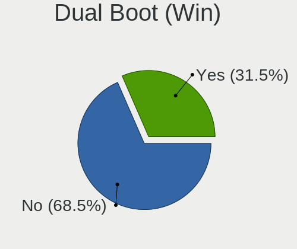
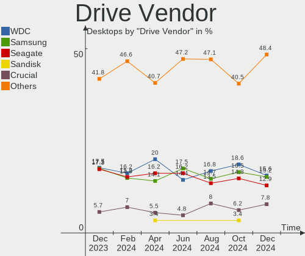
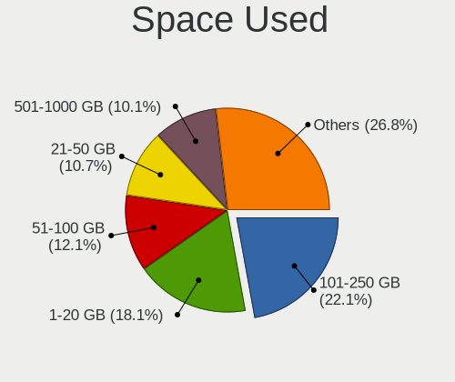
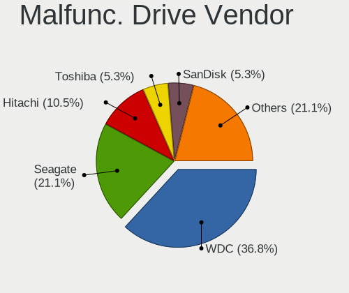
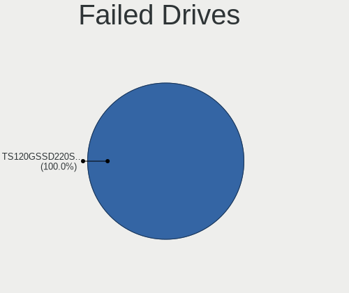
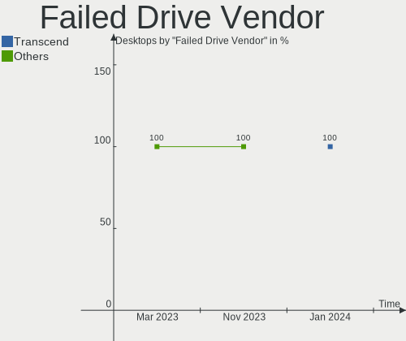

Linux Mint - Hardware Trends (Desktops)
---------------------------------------

A project to identify most popular hardware characteristics and track their change
over time based on data collected by Linux users at https://Linux-Hardware.org.

Anyone can contribute to this report by the [hw-probe](https://github.com/linuxhw/hw-probe) tool:

    sudo -E hw-probe -all -upload

This report is for one last month. Overall report since the beginning of time: [TestDays](https://github.com/linuxhw/TestDays)

Period: Nov, 2023.

Contents
--------

* [ System ](#system)
  - [ OS                       ](#os)
  - [ OS Family                ](#os-family)
  - [ Kernel                   ](#kernel)
  - [ Kernel Family            ](#kernel-family)
  - [ Kernel Major Ver.        ](#kernel-major-ver)
  - [ Arch                     ](#arch)
  - [ DE                       ](#de)
  - [ Display Server           ](#display-server)
  - [ Display Manager          ](#display-manager)
  - [ OS Lang                  ](#os-lang)
  - [ Boot Mode                ](#boot-mode)
  - [ Filesystem               ](#filesystem)
  - [ Part. scheme             ](#part-scheme)
  - [ Dual Boot with Linux/BSD ](#dual-boot-with-linuxbsd)
  - [ Dual Boot (Win)          ](#dual-boot-win)

* [ Board ](#board)
  - [ Vendor                   ](#vendor)
  - [ Model                    ](#model)
  - [ Model Family             ](#model-family)
  - [ MFG Year                 ](#mfg-year)
  - [ Form Factor              ](#form-factor)
  - [ Secure Boot              ](#secure-boot)
  - [ Coreboot                 ](#coreboot)
  - [ RAM Size                 ](#ram-size)
  - [ RAM Used                 ](#ram-used)
  - [ Total Drives             ](#total-drives)
  - [ Has CD-ROM               ](#has-cd-rom)
  - [ Has Ethernet             ](#has-ethernet)
  - [ Has WiFi                 ](#has-wifi)
  - [ Has Bluetooth            ](#has-bluetooth)

* [ Location ](#location)
  - [ Country                  ](#country)
  - [ City                     ](#city)

* [ Drives ](#drives)
  - [ Drive Vendor             ](#drive-vendor)
  - [ Drive Model              ](#drive-model)
  - [ HDD Vendor               ](#hdd-vendor)
  - [ SSD Vendor               ](#ssd-vendor)
  - [ Drive Kind               ](#drive-kind)
  - [ Drive Connector          ](#drive-connector)
  - [ Drive Size               ](#drive-size)
  - [ Space Total              ](#space-total)
  - [ Space Used               ](#space-used)
  - [ Malfunc. Drives          ](#malfunc-drives)
  - [ Malfunc. Drive Vendor    ](#malfunc-drive-vendor)
  - [ Malfunc. HDD Vendor      ](#malfunc-hdd-vendor)
  - [ Malfunc. Drive Kind      ](#malfunc-drive-kind)
  - [ Failed Drives            ](#failed-drives)
  - [ Failed Drive Vendor      ](#failed-drive-vendor)
  - [ Drive Status             ](#drive-status)

* [ Storage controller ](#storage-controller)
  - [ Storage Vendor           ](#storage-vendor)
  - [ Storage Model            ](#storage-model)
  - [ Storage Kind             ](#storage-kind)

* [ Processor ](#processor)
  - [ CPU Vendor               ](#cpu-vendor)
  - [ CPU Model                ](#cpu-model)
  - [ CPU Model Family         ](#cpu-model-family)
  - [ CPU Cores                ](#cpu-cores)
  - [ CPU Sockets              ](#cpu-sockets)
  - [ CPU Threads              ](#cpu-threads)
  - [ CPU Op-Modes             ](#cpu-op-modes)
  - [ CPU Microcode            ](#cpu-microcode)
  - [ CPU Microarch            ](#cpu-microarch)

* [ Graphics ](#graphics)
  - [ GPU Vendor               ](#gpu-vendor)
  - [ GPU Model                ](#gpu-model)
  - [ GPU Combo                ](#gpu-combo)
  - [ GPU Driver               ](#gpu-driver)
  - [ GPU Memory               ](#gpu-memory)

* [ Monitor ](#monitor)
  - [ Monitor Vendor           ](#monitor-vendor)
  - [ Monitor Model            ](#monitor-model)
  - [ Monitor Resolution       ](#monitor-resolution)
  - [ Monitor Diagonal         ](#monitor-diagonal)
  - [ Monitor Width            ](#monitor-width)
  - [ Aspect Ratio             ](#aspect-ratio)
  - [ Monitor Area             ](#monitor-area)
  - [ Pixel Density            ](#pixel-density)
  - [ Multiple Monitors        ](#multiple-monitors)

* [ Network ](#network)
  - [ Net Controller Vendor    ](#net-controller-vendor)
  - [ Net Controller Model     ](#net-controller-model)
  - [ Wireless Vendor          ](#wireless-vendor)
  - [ Wireless Model           ](#wireless-model)
  - [ Ethernet Vendor          ](#ethernet-vendor)
  - [ Ethernet Model           ](#ethernet-model)
  - [ Net Controller Kind      ](#net-controller-kind)
  - [ Used Controller          ](#used-controller)
  - [ NICs                     ](#nics)
  - [ IPv6                     ](#ipv6)

* [ Bluetooth ](#bluetooth)
  - [ Bluetooth Vendor         ](#bluetooth-vendor)
  - [ Bluetooth Model          ](#bluetooth-model)

* [ Sound ](#sound)
  - [ Sound Vendor             ](#sound-vendor)
  - [ Sound Model              ](#sound-model)

* [ Memory ](#memory)
  - [ Memory Vendor            ](#memory-vendor)
  - [ Memory Model             ](#memory-model)
  - [ Memory Kind              ](#memory-kind)
  - [ Memory Form Factor       ](#memory-form-factor)
  - [ Memory Size              ](#memory-size)
  - [ Memory Speed             ](#memory-speed)

* [ Printers & scanners ](#printers--scanners)
  - [ Printer Vendor           ](#printer-vendor)
  - [ Printer Model            ](#printer-model)
  - [ Scanner Vendor           ](#scanner-vendor)
  - [ Scanner Model            ](#scanner-model)

* [ Camera ](#camera)
  - [ Camera Vendor            ](#camera-vendor)
  - [ Camera Model             ](#camera-model)

* [ Security ](#security)
  - [ Fingerprint Vendor       ](#fingerprint-vendor)
  - [ Fingerprint Model        ](#fingerprint-model)
  - [ Chipcard Vendor          ](#chipcard-vendor)
  - [ Chipcard Model           ](#chipcard-model)

* [ Unsupported ](#unsupported)
  - [ Unsupported Devices      ](#unsupported-devices)
  - [ Unsupported Device Types ](#unsupported-device-types)

System
------

OS
--

Installed operating systems

| Name            | Desktops | Percent |
|-----------------|----------|---------|
| Linux Mint 21.2 | 189      | 79.08%  |
| Linux Mint 20.3 | 17       | 7.11%   |
| Linux Mint 21.1 | 14       | 5.86%   |
| Linux Mint 21   | 8        | 3.35%   |
| Linux Mint 20.2 | 4        | 1.67%   |
| Linux Mint 20   | 3        | 1.26%   |
| Linux Mint 19.3 | 2        | 0.84%   |
| Linux Mint 19.2 | 1        | 0.42%   |
| Linux Mint 18.2 | 1        | 0.42%   |

OS Family
---------

OS without a version

| Name       | Desktops | Percent |
|------------|----------|---------|
| Linux Mint | 239      | 100%    |

Kernel
------

Version of the Linux kernel

| Version                 | Desktops | Percent |
|-------------------------|----------|---------|
| 5.15.0-88-generic       | 83       | 34.73%  |
| 5.15.0-89-generic       | 47       | 19.67%  |
| 6.2.0-36-generic        | 24       | 10.04%  |
| 5.4.0-166-generic       | 15       | 6.28%   |
| 5.15.0-76-generic       | 14       | 5.86%   |
| 6.2.0-37-generic        | 10       | 4.18%   |
| 5.15.0-87-generic       | 10       | 4.18%   |
| 5.4.0-167-generic       | 4        | 1.67%   |
| 6.2.0-33-generic        | 3        | 1.26%   |
| 5.15.0-83-generic       | 3        | 1.26%   |
| 5.15.0-84-generic       | 2        | 0.84%   |
| 5.15.0-82-generic       | 2        | 0.84%   |
| 5.15.0-56-generic       | 2        | 0.84%   |
| 6.6.1-060601-generic    | 1        | 0.42%   |
| 6.6.0-x64v3-xanmod1     | 1        | 0.42%   |
| 6.5.7-060507-generic    | 1        | 0.42%   |
| 6.5.10-1-liquorix-amd64 | 1        | 0.42%   |
| 6.5.0-9-generic         | 1        | 0.42%   |
| 6.5.0-1008-oem          | 1        | 0.42%   |
| 6.5.0-1006-oem          | 1        | 0.42%   |
| 6.2.0-35-generic        | 1        | 0.42%   |
| 6.2.0-34-generic        | 1        | 0.42%   |
| 6.2.0-1015-oracle       | 1        | 0.42%   |
| 6.2.0-1010-nvidia       | 1        | 0.42%   |
| 6.1.0-1024-oem          | 1        | 0.42%   |
| 6.0.3-060003-generic    | 1        | 0.42%   |
| 5.4.0-164-generic       | 1        | 0.42%   |
| 5.4.0-150-generic       | 1        | 0.42%   |
| 5.4.0-139-generic       | 1        | 0.42%   |
| 5.15.0-86-generic       | 1        | 0.42%   |
| 5.15.0-69-generic       | 1        | 0.42%   |
| 4.8.0-53-generic        | 1        | 0.42%   |
| 4.15.0-213-generic      | 1        | 0.42%   |

Kernel Family
-------------

Linux kernel without a distro release

| Version | Desktops | Percent |
|---------|----------|---------|
| 5.15.0  | 165      | 69.04%  |
| 6.2.0   | 41       | 17.15%  |
| 5.4.0   | 22       | 9.21%   |
| 6.5.0   | 3        | 1.26%   |
| 6.6.1   | 1        | 0.42%   |
| 6.6.0   | 1        | 0.42%   |
| 6.5.7   | 1        | 0.42%   |
| 6.5.10  | 1        | 0.42%   |
| 6.1.0   | 1        | 0.42%   |
| 6.0.3   | 1        | 0.42%   |
| 4.8.0   | 1        | 0.42%   |
| 4.15.0  | 1        | 0.42%   |

Kernel Major Ver.
-----------------

Linux kernel major version

| Version | Desktops | Percent |
|---------|----------|---------|
| 5.15    | 165      | 69.04%  |
| 6.2     | 41       | 17.15%  |
| 5.4     | 22       | 9.21%   |
| 6.5     | 5        | 2.09%   |
| 6.6     | 2        | 0.84%   |
| 6.1     | 1        | 0.42%   |
| 6.0     | 1        | 0.42%   |
| 4.8     | 1        | 0.42%   |
| 4.15    | 1        | 0.42%   |

Arch
----

OS architecture (x86_64, i586, etc.)

| Name   | Desktops | Percent |
|--------|----------|---------|
| x86_64 | 239      | 100%    |

DE
--

Desktop Environment

| Name       | Desktops | Percent |
|------------|----------|---------|
| X-Cinnamon | 159      | 66.53%  |
| MATE       | 36       | 15.06%  |
| XFCE       | 32       | 13.39%  |
| GNOME      | 4        | 1.67%   |
| Unknown    | 3        | 1.26%   |
| KDE5       | 2        | 0.84%   |
| Cinnamon   | 2        | 0.84%   |
| KDE        | 1        | 0.42%   |

Display Server
--------------

X11 or Wayland

| Name    | Desktops | Percent |
|---------|----------|---------|
| X11     | 234      | 97.91%  |
| Tty     | 4        | 1.67%   |
| Wayland | 1        | 0.42%   |

Display Manager
---------------

SDDM, LightDM, etc.

| Name    | Desktops | Percent |
|---------|----------|---------|
| Unknown | 155      | 64.85%  |
| LightDM | 83       | 34.73%  |
| SDDM    | 1        | 0.42%   |

OS Lang
-------

Language

| Lang    | Desktops | Percent |
|---------|----------|---------|
| en_US   | 69       | 28.87%  |
| de_DE   | 40       | 16.74%  |
| it_IT   | 18       | 7.53%   |
| fr_FR   | 14       | 5.86%   |
| en_GB   | 13       | 5.44%   |
| pt_BR   | 8        | 3.35%   |
| en_CA   | 8        | 3.35%   |
| en_AU   | 8        | 3.35%   |
| pl_PL   | 7        | 2.93%   |
| es_ES   | 7        | 2.93%   |
| C       | 7        | 2.93%   |
| ru_RU   | 6        | 2.51%   |
| Unknown | 3        | 1.26%   |
| sk_SK   | 2        | 0.84%   |
| pt_PT   | 2        | 0.84%   |
| fr_BE   | 2        | 0.84%   |
| fi_FI   | 2        | 0.84%   |
| es_VE   | 2        | 0.84%   |
| es_MX   | 2        | 0.84%   |
| es_CO   | 2        | 0.84%   |
| es_AR   | 2        | 0.84%   |
| de_CH   | 2        | 0.84%   |
| sv_SE   | 1        | 0.42%   |
| nl_NL   | 1        | 0.42%   |
| hu_HU   | 1        | 0.42%   |
| eu_ES   | 1        | 0.42%   |
| es_UY   | 1        | 0.42%   |
| es_CL   | 1        | 0.42%   |
| en_ZA   | 1        | 0.42%   |
| en_PH   | 1        | 0.42%   |
| en_NZ   | 1        | 0.42%   |
| en_IN   | 1        | 0.42%   |
| de_BE   | 1        | 0.42%   |
| de_AT   | 1        | 0.42%   |
| da_DK   | 1        | 0.42%   |

Boot Mode
---------

EFI or BIOS

| Mode | Desktops | Percent |
|------|----------|---------|
| EFI  | 144      | 60.25%  |
| BIOS | 95       | 39.75%  |

Filesystem
----------

Type of filesystem

| Type    | Desktops | Percent |
|---------|----------|---------|
| Ext4    | 221      | 92.47%  |
| Tmpfs   | 8        | 3.35%   |
| Overlay | 3        | 1.26%   |
| Btrfs   | 3        | 1.26%   |
| Xfs     | 2        | 0.84%   |
| Zfs     | 1        | 0.42%   |
| Ext2    | 1        | 0.42%   |

Part. scheme
------------

Scheme of partitioning

| Type    | Desktops | Percent |
|---------|----------|---------|
| Unknown | 153      | 64.02%  |
| GPT     | 75       | 31.38%  |
| MBR     | 11       | 4.6%    |

Dual Boot with Linux/BSD
------------------------

Hosting more than one Linux/BSD

| Dual boot | Desktops | Percent |
|-----------|----------|---------|
| No        | 218      | 91.21%  |
| Yes       | 21       | 8.79%   |

Dual Boot (Win)
---------------

Hosting Linux and Windows

| Dual boot | Desktops | Percent |
|-----------|----------|---------|
| No        | 198      | 82.85%  |
| Yes       | 41       | 17.15%  |

Board
-----

Vendor
------

Motherboard manufacturer

| Name                                 | Desktops | Percent |
|--------------------------------------|----------|---------|
| ASUSTek Computer                     | 50       | 20.92%  |
| Gigabyte Technology                  | 32       | 13.39%  |
| MSI                                  | 29       | 12.13%  |
| Hewlett-Packard                      | 27       | 11.3%   |
| Dell                                 | 26       | 10.88%  |
| ASRock                               | 20       | 8.37%   |
| Lenovo                               | 13       | 5.44%   |
| ECS                                  | 5        | 2.09%   |
| Fujitsu                              | 4        | 1.67%   |
| Unknown                              | 4        | 1.67%   |
| Pegatron                             | 3        | 1.26%   |
| Medion                               | 3        | 1.26%   |
| Intel                                | 3        | 1.26%   |
| Foxconn                              | 3        | 1.26%   |
| Gateway                              | 2        | 0.84%   |
| BESSTAR Tech                         | 2        | 0.84%   |
| Acer                                 | 2        | 0.84%   |
| Supermicro                           | 1        | 0.42%   |
| Shenzhen Meigao Electronic Equipment | 1        | 0.42%   |
| Sapphire                             | 1        | 0.42%   |
| Packard Bell                         | 1        | 0.42%   |
| NZXT                                 | 1        | 0.42%   |
| EPoX Computer                        | 1        | 0.42%   |
| eMachines                            | 1        | 0.42%   |
| AZW                                  | 1        | 0.42%   |
| Apple                                | 1        | 0.42%   |
| AMI                                  | 1        | 0.42%   |
| Alienware                            | 1        | 0.42%   |

Model
-----

Motherboard model

| Name                                       | Desktops | Percent |
|--------------------------------------------|----------|---------|
| Unknown                                    | 4        | 1.67%   |
| Dell OptiPlex 7040                         | 3        | 1.26%   |
| ASUS TUF Gaming B550M-PLUS                 | 3        | 1.26%   |
| MSI MS-7C75                                | 2        | 0.84%   |
| MSI MS-7B89                                | 2        | 0.84%   |
| MSI MS-7B86                                | 2        | 0.84%   |
| HP ProDesk 600 G1 DM                       | 2        | 0.84%   |
| HP Compaq Pro 6300 SFF                     | 2        | 0.84%   |
| HP Compaq 8200 Elite SFF PC                | 2        | 0.84%   |
| HP Compaq 6200 Pro SFF PC                  | 2        | 0.84%   |
| Gigabyte Z590 GAMING X                     | 2        | 0.84%   |
| Gigabyte H61M-S1                           | 2        | 0.84%   |
| Dell XPS 8300                              | 2        | 0.84%   |
| Dell OptiPlex 7020                         | 2        | 0.84%   |
| Dell OptiPlex 3020                         | 2        | 0.84%   |
| ASUS TUF Gaming B450-PLUS II               | 2        | 0.84%   |
| ASUS ROG STRIX B450-F GAMING               | 2        | 0.84%   |
| ASUS PRIME X670-P                          | 2        | 0.84%   |
| ASUS PRIME A320M-E                         | 2        | 0.84%   |
| ASUS M32CD_A_F_K20CD_K31CD                 | 2        | 0.84%   |
| ASUS All Series                            | 2        | 0.84%   |
| Supermicro X9SCL/X9SCM                     | 1        | 0.42%   |
| Shenzhen Meigao Electronic Equipment F7BSC | 1        | 0.42%   |
| Sapphire PE-AM2RS690V2                     | 1        | 0.42%   |
| Pegatron NQ852AA-ABH IQ830nl               | 1        | 0.42%   |
| Pegatron IPM41-D3                          | 1        | 0.42%   |
| Pegatron 520-1020                          | 1        | 0.42%   |
| Packard Bell IXTREME M5740                 | 1        | 0.42%   |
| NZXT N7 B550                               | 1        | 0.42%   |
| MSI MS-7E06                                | 1        | 0.42%   |
| MSI MS-7D67                                | 1        | 0.42%   |
| MSI MS-7D46                                | 1        | 0.42%   |
| MSI MS-7D08                                | 1        | 0.42%   |
| MSI MS-7C56                                | 1        | 0.42%   |
| MSI MS-7C52                                | 1        | 0.42%   |
| MSI MS-7C37                                | 1        | 0.42%   |
| MSI MS-7B98                                | 1        | 0.42%   |
| MSI MS-7B93                                | 1        | 0.42%   |
| MSI MS-7B79                                | 1        | 0.42%   |
| MSI MS-7B24                                | 1        | 0.42%   |

Model Family
------------

Motherboard model prefix

| Name                                       | Desktops | Percent |
|--------------------------------------------|----------|---------|
| Dell OptiPlex                              | 17       | 7.11%   |
| ASUS PRIME                                 | 11       | 4.6%    |
| HP Compaq                                  | 10       | 4.18%   |
| ASUS TUF                                   | 9        | 3.77%   |
| ASUS ROG                                   | 8        | 3.35%   |
| Lenovo ThinkCentre                         | 6        | 2.51%   |
| HP ProDesk                                 | 4        | 1.67%   |
| Dell XPS                                   | 4        | 1.67%   |
| Unknown                                    | 4        | 1.67%   |
| Lenovo IdeaCentre                          | 3        | 1.26%   |
| HP Pavilion                                | 3        | 1.26%   |
| Fujitsu ESPRIMO                            | 3        | 1.26%   |
| ASRock B550M                               | 3        | 1.26%   |
| MSI MS-7C75                                | 2        | 0.84%   |
| MSI MS-7B89                                | 2        | 0.84%   |
| MSI MS-7B86                                | 2        | 0.84%   |
| Lenovo ThinkStation                        | 2        | 0.84%   |
| Gigabyte Z590                              | 2        | 0.84%   |
| Gigabyte X570                              | 2        | 0.84%   |
| Gigabyte H61M-S1                           | 2        | 0.84%   |
| Gigabyte B550M                             | 2        | 0.84%   |
| Dell Inspiron                              | 2        | 0.84%   |
| ASUS P5KPL-AM                              | 2        | 0.84%   |
| ASUS M32CD                                 | 2        | 0.84%   |
| ASUS All                                   | 2        | 0.84%   |
| Supermicro X9SCL                           | 1        | 0.42%   |
| Shenzhen Meigao Electronic Equipment F7BSC | 1        | 0.42%   |
| Sapphire PE-AM2RS690V2                     | 1        | 0.42%   |
| Pegatron NQ852AA-ABH                       | 1        | 0.42%   |
| Pegatron IPM41-D3                          | 1        | 0.42%   |
| Pegatron 520-1020                          | 1        | 0.42%   |
| Packard Bell IXTREME                       | 1        | 0.42%   |
| NZXT N7                                    | 1        | 0.42%   |
| MSI MS-7E06                                | 1        | 0.42%   |
| MSI MS-7D67                                | 1        | 0.42%   |
| MSI MS-7D46                                | 1        | 0.42%   |
| MSI MS-7D08                                | 1        | 0.42%   |
| MSI MS-7C56                                | 1        | 0.42%   |
| MSI MS-7C52                                | 1        | 0.42%   |
| MSI MS-7C37                                | 1        | 0.42%   |

MFG Year
--------

Motherboard manufacture year

| Year | Desktops | Percent |
|------|----------|---------|
| 2020 | 25       | 10.46%  |
| 2018 | 24       | 10.04%  |
| 2012 | 20       | 8.37%   |
| 2022 | 19       | 7.95%   |
| 2011 | 18       | 7.53%   |
| 2014 | 17       | 7.11%   |
| 2021 | 16       | 6.69%   |
| 2013 | 16       | 6.69%   |
| 2017 | 14       | 5.86%   |
| 2019 | 12       | 5.02%   |
| 2015 | 11       | 4.6%    |
| 2009 | 11       | 4.6%    |
| 2016 | 10       | 4.18%   |
| 2010 | 9        | 3.77%   |
| 2023 | 6        | 2.51%   |
| 2008 | 6        | 2.51%   |
| 2006 | 3        | 1.26%   |
| 2007 | 1        | 0.42%   |
| 2005 | 1        | 0.42%   |

Form Factor
-----------

Physical design of the computer

| Name    | Desktops | Percent |
|---------|----------|---------|
| Desktop | 239      | 100%    |

Secure Boot
-----------

Enabled or disabled

| State    | Desktops | Percent |
|----------|----------|---------|
| Disabled | 227      | 94.98%  |
| Enabled  | 12       | 5.02%   |

Coreboot
--------

Have coreboot on board

| Used | Desktops | Percent |
|------|----------|---------|
| No   | 239      | 100%    |

RAM Size
--------

Total RAM memory

| Size in GB  | Desktops | Percent |
|-------------|----------|---------|
| 16.01-24.0  | 77       | 32.22%  |
| 4.01-8.0    | 39       | 16.32%  |
| 8.01-16.0   | 39       | 16.32%  |
| 32.01-64.0  | 38       | 15.9%   |
| 3.01-4.0    | 22       | 9.21%   |
| 64.01-256.0 | 12       | 5.02%   |
| 24.01-32.0  | 8        | 3.35%   |
| 2.01-3.0    | 3        | 1.26%   |
| 1.01-2.0    | 1        | 0.42%   |

RAM Used
--------

Used RAM memory

| Used GB    | Desktops | Percent |
|------------|----------|---------|
| 2.01-3.0   | 74       | 30.96%  |
| 1.01-2.0   | 62       | 25.94%  |
| 4.01-8.0   | 47       | 19.67%  |
| 3.01-4.0   | 38       | 15.9%   |
| 8.01-16.0  | 9        | 3.77%   |
| 0.51-1.0   | 5        | 2.09%   |
| 16.01-24.0 | 2        | 0.84%   |
| 24.01-32.0 | 1        | 0.42%   |
| 0.01-0.5   | 1        | 0.42%   |

Total Drives
------------

Number of drives on board

| Drives | Desktops | Percent |
|--------|----------|---------|
| 1      | 93       | 38.91%  |
| 2      | 67       | 28.03%  |
| 3      | 41       | 17.15%  |
| 4      | 15       | 6.28%   |
| 6      | 9        | 3.77%   |
| 5      | 9        | 3.77%   |
| 7      | 2        | 0.84%   |
| 0      | 2        | 0.84%   |
| 9      | 1        | 0.42%   |

Has CD-ROM
----------

Has CD-ROM on board

| Presented | Desktops | Percent |
|-----------|----------|---------|
| No        | 120      | 50.21%  |
| Yes       | 119      | 49.79%  |

Has Ethernet
------------

Has Ethernet on board

| Presented | Desktops | Percent |
|-----------|----------|---------|
| Yes       | 239      | 100%    |

Has WiFi
--------

Has WiFi module

| Presented | Desktops | Percent |
|-----------|----------|---------|
| Yes       | 131      | 54.81%  |
| No        | 108      | 45.19%  |

Has Bluetooth
-------------

Has Bluetooth module

| Presented | Desktops | Percent |
|-----------|----------|---------|
| No        | 137      | 57.32%  |
| Yes       | 102      | 42.68%  |

Location
--------

Country
-------

Geographic location (country)

| Country      | Desktops | Percent |
|--------------|----------|---------|
| Germany      | 47       | 19.67%  |
| USA          | 43       | 17.99%  |
| Italy        | 20       | 8.37%   |
| France       | 12       | 5.02%   |
| UK           | 10       | 4.18%   |
| Spain        | 8        | 3.35%   |
| Russia       | 8        | 3.35%   |
| Poland       | 8        | 3.35%   |
| Brazil       | 8        | 3.35%   |
| Australia    | 8        | 3.35%   |
| Canada       | 7        | 2.93%   |
| Netherlands  | 5        | 2.09%   |
| Switzerland  | 4        | 1.67%   |
| Belgium      | 4        | 1.67%   |
| Sweden       | 3        | 1.26%   |
| Slovakia     | 3        | 1.26%   |
| Finland      | 3        | 1.26%   |
| Venezuela    | 2        | 0.84%   |
| Turkey       | 2        | 0.84%   |
| Portugal     | 2        | 0.84%   |
| Mexico       | 2        | 0.84%   |
| Denmark      | 2        | 0.84%   |
| Colombia     | 2        | 0.84%   |
| Chile        | 2        | 0.84%   |
| Austria      | 2        | 0.84%   |
| Argentina    | 2        | 0.84%   |
| Uruguay      | 1        | 0.42%   |
| Tunisia      | 1        | 0.42%   |
| Thailand     | 1        | 0.42%   |
| South Africa | 1        | 0.42%   |
| Serbia       | 1        | 0.42%   |
| Romania      | 1        | 0.42%   |
| Philippines  | 1        | 0.42%   |
| Norway       | 1        | 0.42%   |
| New Zealand  | 1        | 0.42%   |
| Kazakhstan   | 1        | 0.42%   |
| Japan        | 1        | 0.42%   |
| Ireland      | 1        | 0.42%   |
| Indonesia    | 1        | 0.42%   |
| India        | 1        | 0.42%   |

City
----

Geographic location (city)

| City            | Desktops | Percent |
|-----------------|----------|---------|
| Berlin          | 5        | 2.09%   |
| Sydney          | 4        | 1.67%   |
| Hamburg         | 4        | 1.67%   |
| Warsaw          | 3        | 1.26%   |
| Milan           | 3        | 1.26%   |
| Melbourne       | 3        | 1.26%   |
| Stockholm       | 2        | 0.84%   |
| Schwerin        | 2        | 0.84%   |
| Phoenix         | 2        | 0.84%   |
| Nussdorf am Inn | 2        | 0.84%   |
| Novosibirsk     | 2        | 0.84%   |
| Krakow          | 2        | 0.84%   |
| Knoxville       | 2        | 0.84%   |
| Helsinki        | 2        | 0.84%   |
| Granada         | 2        | 0.84%   |
| Cologne         | 2        | 0.84%   |
| Brussels        | 2        | 0.84%   |
| Amsterdam       | 2        | 0.84%   |
| Yekaterinburg   | 1        | 0.42%   |
| Wola            | 1        | 0.42%   |
| Winston-Salem   | 1        | 0.42%   |
| Winsen          | 1        | 0.42%   |
| Wetzlar         | 1        | 0.42%   |
| West Liberty    | 1        | 0.42%   |
| Wangen          | 1        | 0.42%   |
| Vysny Kubin     | 1        | 0.42%   |
| Vyškov         | 1        | 0.42%   |
| Vitry-sur-Seine | 1        | 0.42%   |
| Vitória        | 1        | 0.42%   |
| Vienna          | 1        | 0.42%   |
| Venice          | 1        | 0.42%   |
| Vancouver       | 1        | 0.42%   |
| Valparaíso     | 1        | 0.42%   |
| Valledupar      | 1        | 0.42%   |
| Valencia        | 1        | 0.42%   |
| Vaernamo        | 1        | 0.42%   |
| Ulyanovsk       | 1        | 0.42%   |
| Ufa             | 1        | 0.42%   |
| Trondheim       | 1        | 0.42%   |
| Trelissac       | 1        | 0.42%   |

Drives
------

Drive Vendor
------------

Hard drive vendors

| Vendor                      | Desktops | Drives | Percent |
|-----------------------------|----------|--------|---------|
| WDC                         | 75       | 87     | 16.78%  |
| Seagate                     | 70       | 82     | 15.66%  |
| Samsung Electronics         | 56       | 82     | 12.53%  |
| Crucial                     | 29       | 34     | 6.49%   |
| Kingston                    | 28       | 30     | 6.26%   |
| Sandisk                     | 26       | 30     | 5.82%   |
| Toshiba                     | 20       | 26     | 4.47%   |
| Hitachi                     | 13       | 13     | 2.91%   |
| Micron/Crucial Technology   | 11       | 12     | 2.46%   |
| China                       | 9        | 10     | 2.01%   |
| Unknown                     | 8        | 12     | 1.79%   |
| PNY                         | 7        | 8      | 1.57%   |
| Team                        | 6        | 6      | 1.34%   |
| Phison Electronics          | 5        | 5      | 1.12%   |
| Kingston Technology Company | 5        | 5      | 1.12%   |
| Micron Technology           | 4        | 4      | 0.89%   |
| Intenso                     | 4        | 4      | 0.89%   |
| SK hynix                    | 3        | 3      | 0.67%   |
| Silicon Motion              | 3        | 3      | 0.67%   |
| Patriot                     | 3        | 3      | 0.67%   |
| Mushkin                     | 3        | 3      | 0.67%   |
| MAXIO Technology (Hangzhou) | 3        | 3      | 0.67%   |
| Intel                       | 3        | 3      | 0.67%   |
| HGST                        | 3        | 3      | 0.67%   |
| Fanxiang                    | 3        | 4      | 0.67%   |
| Transcend                   | 2        | 2      | 0.45%   |
| OCZ                         | 2        | 2      | 0.45%   |
| LITEON                      | 2        | 2      | 0.45%   |
| JMicron Technology          | 2        | 2      | 0.45%   |
| GOODRAM                     | 2        | 2      | 0.45%   |
| G-DRIVE                     | 2        | 2      | 0.45%   |
| ASMT                        | 2        | 2      | 0.45%   |
| Acer                        | 2        | 2      | 0.45%   |
| A-DATA Technology           | 2        | 2      | 0.45%   |
| YHJC                        | 1        | 1      | 0.22%   |
| XrayDisk                    | 1        | 1      | 0.22%   |
| XPG                         | 1        | 1      | 0.22%   |
| StoreJet                    | 1        | 1      | 0.22%   |
| SPCC                        | 1        | 1      | 0.22%   |
| Seagate Technology          | 1        | 1      | 0.22%   |

Drive Model
-----------

Hard drive models

| Model                                               | Desktops | Percent |
|-----------------------------------------------------|----------|---------|
| Samsung NVMe SSD Controller SM981/PM981/PM983 250GB | 12       | 2.38%   |
| Seagate ST500DM002-1BD142 500GB                     | 9        | 1.78%   |
| Toshiba DT01ACA100 1TB                              | 8        | 1.58%   |
| Seagate ST2000DM008-2FR102 2TB                      | 7        | 1.39%   |
| Crucial CT1000MX500SSD1 1TB                         | 6        | 1.19%   |
| Unknown SD/MMC/MS PRO 128GB                         | 5        | 0.99%   |
| Seagate ST31000528AS 1TB                            | 5        | 0.99%   |
| Micron/Crucial P2 NVMe PCIe SSD 1TB                 | 5        | 0.99%   |
| Kingston SA400S37240G 240GB SSD                     | 5        | 0.99%   |
| WDC WD10EZEX-22MFCA0 1TB                            | 4        | 0.79%   |
| Seagate ST2000DM006-2DM164 2TB                      | 4        | 0.79%   |
| Seagate ST1000DM003-1ER162 1TB                      | 4        | 0.79%   |
| Samsung SSD 980 1TB                                 | 4        | 0.79%   |
| Samsung SSD 850 EVO 250GB                           | 4        | 0.79%   |
| Micron/Crucial CT1000P5PSSD8 1TB                    | 4        | 0.79%   |
| Kingston SA400S37480G 480GB SSD                     | 4        | 0.79%   |
| Crucial CT250MX500SSD1 250GB                        | 4        | 0.79%   |
| Seagate ST4000DM004-2CV104 4TB                      | 3        | 0.59%   |
| Samsung SSD 990 PRO 2TB                             | 3        | 0.59%   |
| Samsung SSD 870 QVO 1TB                             | 3        | 0.59%   |
| Samsung SSD 860 EVO 1TB                             | 3        | 0.59%   |
| Samsung SSD 840 EVO 250GB                           | 3        | 0.59%   |
| Samsung NVMe SSD Controller PM9A1/PM9A3/980PRO 2TB  | 3        | 0.59%   |
| Crucial CT500MX500SSD1 500GB                        | 3        | 0.59%   |
| Crucial CT480BX500SSD1 480GB                        | 3        | 0.59%   |
| Crucial CT1000BX500SSD1 1TB                         | 3        | 0.59%   |
| WDC WDS240G2G0B-00EPW0 240GB SSD                    | 2        | 0.4%    |
| WDC WDS120G2G0A-00JH30 120GB SSD                    | 2        | 0.4%    |
| WDC WD5000AAKX-60U6AA0 500GB                        | 2        | 0.4%    |
| WDC WD5000AAKX-001CA0 500GB                         | 2        | 0.4%    |
| WDC WD30EZRX-00MMMB0 3TB                            | 2        | 0.4%    |
| WDC WD2500AAKX-75U6AA0 250GB                        | 2        | 0.4%    |
| WDC WD20EARX-00PASB0 2TB                            | 2        | 0.4%    |
| WDC WD20EARS-00MVWB0 2TB                            | 2        | 0.4%    |
| WDC WD10EZEX-60WN4A0 1TB                            | 2        | 0.4%    |
| WDC WD10EZEX-21WN4A0 1TB                            | 2        | 0.4%    |
| WDC WD10EZEX-08WN4A0 1TB                            | 2        | 0.4%    |
| WDC WD10EADS-00M2B0 1TB                             | 2        | 0.4%    |
| WDC WD1003FZEX-00MK2A0 1TB                          | 2        | 0.4%    |
| Unknown SD/MMC/M.S.PRO 32GB                         | 2        | 0.4%    |

HDD Vendor
----------

Hard disk drive vendors

| Vendor              | Desktops | Drives | Percent |
|---------------------|----------|--------|---------|
| Seagate             | 68       | 80     | 36.56%  |
| WDC                 | 66       | 75     | 35.48%  |
| Toshiba             | 19       | 24     | 10.22%  |
| Hitachi             | 13       | 13     | 6.99%   |
| Unknown             | 5        | 5      | 2.69%   |
| Samsung Electronics | 5        | 6      | 2.69%   |
| HGST                | 3        | 3      | 1.61%   |
| StoreJet            | 1        | 1      | 0.54%   |
| Maxtor              | 1        | 1      | 0.54%   |
| Intenso             | 1        | 1      | 0.54%   |
| Inateck             | 1        | 1      | 0.54%   |
| Hewlett-Packard     | 1        | 1      | 0.54%   |
| Fujitsu             | 1        | 1      | 0.54%   |
| ASMT                | 1        | 1      | 0.54%   |

SSD Vendor
----------

Solid state drive vendors

| Vendor              | Desktops | Drives | Percent |
|---------------------|----------|--------|---------|
| Samsung Electronics | 30       | 42     | 18.18%  |
| Crucial             | 27       | 30     | 16.36%  |
| Kingston            | 24       | 25     | 14.55%  |
| SanDisk             | 15       | 16     | 9.09%   |
| China               | 9        | 10     | 5.45%   |
| WDC                 | 8        | 8      | 4.85%   |
| PNY                 | 7        | 8      | 4.24%   |
| Team                | 6        | 6      | 3.64%   |
| Micron Technology   | 4        | 4      | 2.42%   |
| Transcend           | 2        | 2      | 1.21%   |
| Patriot             | 2        | 2      | 1.21%   |
| OCZ                 | 2        | 2      | 1.21%   |
| Mushkin             | 2        | 2      | 1.21%   |
| LITEON              | 2        | 2      | 1.21%   |
| Intenso             | 2        | 2      | 1.21%   |
| Acer                | 2        | 2      | 1.21%   |
| XrayDisk            | 1        | 1      | 0.61%   |
| Toshiba             | 1        | 1      | 0.61%   |
| SPCC                | 1        | 1      | 0.61%   |
| Plextor             | 1        | 1      | 0.61%   |
| PHISON 1            | 1        | 1      | 0.61%   |
| Netac               | 1        | 1      | 0.61%   |
| Londisk             | 1        | 1      | 0.61%   |
| Lenovo              | 1        | 1      | 0.61%   |
| KingSpec            | 1        | 1      | 0.61%   |
| JMicron Technology  | 1        | 1      | 0.61%   |
| INNOVATION IT       | 1        | 1      | 0.61%   |
| GOODRAM             | 1        | 1      | 0.61%   |
| Fanxiang            | 1        | 2      | 0.61%   |
| Emtec               | 1        | 1      | 0.61%   |
| DEXP                | 1        | 1      | 0.61%   |
| Dahua               | 1        | 1      | 0.61%   |
| BUFFALO             | 1        | 1      | 0.61%   |
| Azerty              | 1        | 1      | 0.61%   |
| ASMT                | 1        | 1      | 0.61%   |
| A-DATA Technology   | 1        | 1      | 0.61%   |
| Unknown             | 1        | 1      | 0.61%   |

Drive Kind
----------

HDD or SSD

| Kind    | Desktops | Drives | Percent |
|---------|----------|--------|---------|
| HDD     | 142      | 213    | 38.38%  |
| SSD     | 133      | 185    | 35.95%  |
| NVMe    | 84       | 109    | 22.7%   |
| Unknown | 11       | 16     | 2.97%   |

Drive Connector
---------------

SATA, SAS, NVMe, etc.

| Type | Desktops | Drives | Percent |
|------|----------|--------|---------|
| SATA | 212      | 376    | 65.03%  |
| NVMe | 84       | 109    | 25.77%  |
| SAS  | 30       | 38     | 9.2%    |

Drive Size
----------

Size of hard drive

| Size in TB | Desktops | Drives | Percent |
|------------|----------|--------|---------|
| 0.01-0.5   | 141      | 188    | 45.78%  |
| 0.51-1.0   | 95       | 125    | 30.84%  |
| 1.01-2.0   | 38       | 43     | 12.34%  |
| 3.01-4.0   | 15       | 18     | 4.87%   |
| 2.01-3.0   | 10       | 11     | 3.25%   |
| 4.01-10.0  | 9        | 13     | 2.92%   |

Space Total
-----------

Amount of disk space available on the file system

| Size in GB     | Desktops | Percent |
|----------------|----------|---------|
| 101-250        | 59       | 24.69%  |
| 251-500        | 44       | 18.41%  |
| More than 3000 | 39       | 16.32%  |
| 501-1000       | 38       | 15.9%   |
| 1001-2000      | 26       | 10.88%  |
| 2001-3000      | 17       | 7.11%   |
| 51-100         | 5        | 2.09%   |
| 21-50          | 4        | 1.67%   |
| 1-20           | 4        | 1.67%   |
| Unknown        | 3        | 1.26%   |

Space Used
----------

Amount of used disk space

| Used GB        | Desktops | Percent |
|----------------|----------|---------|
| 101-250        | 41       | 17.15%  |
| 21-50          | 36       | 15.06%  |
| 1-20           | 34       | 14.23%  |
| 51-100         | 34       | 14.23%  |
| 501-1000       | 26       | 10.88%  |
| 251-500        | 20       | 8.37%   |
| 1001-2000      | 19       | 7.95%   |
| More than 3000 | 15       | 6.28%   |
| 2001-3000      | 11       | 4.6%    |
| Unknown        | 3        | 1.26%   |

Malfunc. Drives
---------------

Drive models with a malfunction

| Model                                               | Desktops | Drives | Percent |
|-----------------------------------------------------|----------|--------|---------|
| Seagate ST31000528AS 1TB                            | 2        | 2      | 7.69%   |
| XrayDisk SSD 256GB                                  | 1        | 1      | 3.85%   |
| WDC WDS120G2G0A-00JH30 120GB SSD                    | 1        | 1      | 3.85%   |
| WDC WD5000AAVS-00ZTB0 500GB                         | 1        | 1      | 3.85%   |
| WDC WD5000AAKX-001CA0 500GB                         | 1        | 1      | 3.85%   |
| WDC WD5000AAKS-22V1A0 500GB                         | 1        | 1      | 3.85%   |
| WDC WD10SPCX-22HWST0 1TB                            | 1        | 1      | 3.85%   |
| WDC WD10EZEX-60WN4A0 1TB                            | 1        | 1      | 3.85%   |
| WDC WD10EZEX-60M2NA0 1TB                            | 1        | 1      | 3.85%   |
| Toshiba MK5059GSXP 500GB                            | 1        | 1      | 3.85%   |
| Toshiba DT01ACA050 500GB                            | 1        | 1      | 3.85%   |
| StoreJet Disk 1TB                                   | 1        | 1      | 3.85%   |
| Seagate ST500DM002-1BD142 500GB                     | 1        | 1      | 3.85%   |
| Seagate ST500DM002 500GB                            | 1        | 1      | 3.85%   |
| Seagate ST3500830AS 500GB                           | 1        | 1      | 3.85%   |
| Seagate ST3250620AS 250GB                           | 1        | 1      | 3.85%   |
| SanDisk SDSSDP128G 128GB                            | 1        | 1      | 3.85%   |
| Samsung Electronics SSD 980 PRO 1TB S5GXNF0R448681H | 1        | 1      | 3.85%   |
| Samsung Electronics HD103SI 1TB                     | 1        | 1      | 3.85%   |
| Maxtor 2B020H1 20GB                                 | 1        | 1      | 3.85%   |
| Intenso SSD SATAIII 512GB                           | 1        | 1      | 3.85%   |
| Hitachi HTS547550A9E384 500GB                       | 1        | 1      | 3.85%   |
| Hitachi HDS721010DLE630 1TB                         | 1        | 1      | 3.85%   |
| Crucial CT1000MX500SSD1 1TB                         | 1        | 1      | 3.85%   |
| Crucial CT1000BX500SSD1 1TB                         | 1        | 1      | 3.85%   |

Malfunc. Drive Vendor
---------------------

Vendors of faulty drives

| Vendor              | Desktops | Drives | Percent |
|---------------------|----------|--------|---------|
| WDC                 | 7        | 7      | 26.92%  |
| Seagate             | 6        | 6      | 23.08%  |
| Toshiba             | 2        | 2      | 7.69%   |
| Samsung Electronics | 2        | 2      | 7.69%   |
| Hitachi             | 2        | 2      | 7.69%   |
| Crucial             | 2        | 2      | 7.69%   |
| XrayDisk            | 1        | 1      | 3.85%   |
| StoreJet            | 1        | 1      | 3.85%   |
| SanDisk             | 1        | 1      | 3.85%   |
| Maxtor              | 1        | 1      | 3.85%   |
| Intenso             | 1        | 1      | 3.85%   |

Malfunc. HDD Vendor
-------------------

Vendors of faulty HDD drives

| Vendor              | Desktops | Drives | Percent |
|---------------------|----------|--------|---------|
| WDC                 | 6        | 6      | 31.58%  |
| Seagate             | 6        | 6      | 31.58%  |
| Toshiba             | 2        | 2      | 10.53%  |
| Hitachi             | 2        | 2      | 10.53%  |
| StoreJet            | 1        | 1      | 5.26%   |
| Samsung Electronics | 1        | 1      | 5.26%   |
| Maxtor              | 1        | 1      | 5.26%   |

Malfunc. Drive Kind
-------------------

Kinds of faulty drives

| Kind | Desktops | Drives | Percent |
|------|----------|--------|---------|
| HDD  | 17       | 19     | 70.83%  |
| SSD  | 6        | 6      | 25%     |
| NVMe | 1        | 1      | 4.17%   |

Failed Drives
-------------

Failed drive models

| Model                 | Desktops | Drives | Percent |
|-----------------------|----------|--------|---------|
| Mushkin MKNSSDEC120GB | 1        | 1      | 100%    |

Failed Drive Vendor
-------------------

Failed drive vendors

| Vendor  | Desktops | Drives | Percent |
|---------|----------|--------|---------|
| Mushkin | 1        | 1      | 100%    |

Drive Status
------------

Number of failed and malfunc. drives

| Status   | Desktops | Drives | Percent |
|----------|----------|--------|---------|
| Detected | 168      | 349    | 63.88%  |
| Works    | 71       | 147    | 27%     |
| Malfunc  | 23       | 26     | 8.75%   |
| Failed   | 1        | 1      | 0.38%   |

Storage controller
------------------

Storage Vendor
--------------

Storage controller vendors

| Vendor                       | Desktops | Percent |
|------------------------------|----------|---------|
| Intel                        | 155      | 43.06%  |
| AMD                          | 79       | 21.94%  |
| Samsung Electronics          | 32       | 8.89%   |
| SanDisk                      | 15       | 4.17%   |
| Micron/Crucial Technology    | 13       | 3.61%   |
| Kingston Technology Company  | 10       | 2.78%   |
| ASMedia Technology           | 10       | 2.78%   |
| Marvell Technology Group     | 8        | 2.22%   |
| Phison Electronics           | 7        | 1.94%   |
| MAXIO Technology (Hangzhou)  | 6        | 1.67%   |
| Silicon Motion               | 4        | 1.11%   |
| JMicron Technology           | 4        | 1.11%   |
| SK hynix                     | 3        | 0.83%   |
| Nvidia                       | 3        | 0.83%   |
| ADATA Technology             | 3        | 0.83%   |
| Seagate Technology           | 2        | 0.56%   |
| VIA Technologies             | 1        | 0.28%   |
| Toshiba America Info Systems | 1        | 0.28%   |
| Realtek Semiconductor        | 1        | 0.28%   |
| OCZ Technology Group         | 1        | 0.28%   |
| Micron Technology            | 1        | 0.28%   |
| KIOXIA                       | 1        | 0.28%   |

Storage Model
-------------

Storage controller models

| Model                                                                                   | Desktops | Percent |
|-----------------------------------------------------------------------------------------|----------|---------|
| AMD FCH SATA Controller [AHCI mode]                                                     | 42       | 9.88%   |
| Intel 8 Series/C220 Series Chipset Family 6-port SATA Controller 1 [AHCI mode]          | 24       | 5.65%   |
| AMD 500 Series Chipset SATA Controller                                                  | 20       | 4.71%   |
| Samsung NVMe SSD Controller SM981/PM981/PM983                                           | 19       | 4.47%   |
| Intel 6 Series/C200 Series Chipset Family 6 port Desktop SATA AHCI Controller           | 19       | 4.47%   |
| AMD 400 Series Chipset SATA Controller                                                  | 18       | 4.24%   |
| Intel Q170/Q150/B150/H170/H110/Z170/CM236 Chipset SATA Controller [AHCI Mode]           | 16       | 3.76%   |
| Intel 7 Series/C210 Series Chipset Family 6-port SATA Controller [AHCI mode]            | 11       | 2.59%   |
| Intel 200 Series PCH SATA controller [AHCI mode]                                        | 11       | 2.59%   |
| Intel 6 Series/C200 Series Chipset Family Desktop SATA Controller (IDE mode, ports 4-5) | 9        | 2.12%   |
| Intel 6 Series/C200 Series Chipset Family Desktop SATA Controller (IDE mode, ports 0-3) | 9        | 2.12%   |
| ASMedia ASM1062 Serial ATA Controller                                                   | 9        | 2.12%   |
| AMD SB7x0/SB8x0/SB9x0 IDE Controller                                                    | 9        | 2.12%   |
| Intel NM10/ICH7 Family SATA Controller [IDE mode]                                       | 8        | 1.88%   |
| Intel Cannon Lake PCH SATA AHCI Controller                                              | 8        | 1.88%   |
| AMD SB7x0/SB8x0/SB9x0 SATA Controller [AHCI mode]                                       | 8        | 1.88%   |
| Micron/Crucial P2 [Nick P2] / P3 / P3 Plus NVMe PCIe SSD (DRAM-less)                    | 7        | 1.65%   |
| Intel 500 Series Chipset Family SATA AHCI Controller                                    | 7        | 1.65%   |
| Samsung NVMe SSD Controller PM9A1/PM9A3/980PRO                                          | 6        | 1.41%   |
| Micron/Crucial P5 Plus NVMe PCIe SSD                                                    | 5        | 1.18%   |
| Intel 82801G (ICH7 Family) IDE Controller                                               | 5        | 1.18%   |
| Samsung NVMe SSD Controller 980 (DRAM-less)                                             | 4        | 0.94%   |
| MAXIO (Hangzhou) NVMe SSD Controller MAP1602                                            | 4        | 0.94%   |
| Intel Comet Lake SATA AHCI Controller                                                   | 4        | 0.94%   |
| Intel Alder Lake-S PCH SATA Controller [AHCI Mode]                                      | 4        | 0.94%   |
| Intel 82801JI (ICH10 Family) SATA AHCI Controller                                       | 4        | 0.94%   |
| AMD SB7x0/SB8x0/SB9x0 SATA Controller [IDE mode]                                        | 4        | 0.94%   |
| AMD FCH SATA Controller D                                                               | 4        | 0.94%   |
| SanDisk WD Black SN770 / PC SN740 256GB / PC SN560 (DRAM-less) NVMe SSD                 | 3        | 0.71%   |
| SanDisk Extreme Pro / WD Black SN750 / PC SN730 / Red SN700 NVMe SSD                    | 3        | 0.71%   |
| Samsung NVMe SSD Controller S4LV008[Pascal]                                             | 3        | 0.71%   |
| Phison E12 NVMe Controller                                                              | 3        | 0.71%   |
| Marvell Group 88SE9172 SATA 6Gb/s Controller                                            | 3        | 0.71%   |
| Kingston Company NV2 NVMe SSD SM2267XT                                                  | 3        | 0.71%   |
| Intel SATA Controller [RAID mode]                                                       | 3        | 0.71%   |
| SK hynix Platinum P41/PC801 NVMe Solid State Drive                                      | 2        | 0.47%   |
| Silicon Motion SM2263EN/SM2263XT (DRAM-less) NVMe SSD Controllers                       | 2        | 0.47%   |
| Silicon Motion SM2262/SM2262EN SSD Controller                                           | 2        | 0.47%   |
| SanDisk WD PC SN810 / Black SN850 NVMe SSD                                              | 2        | 0.47%   |
| SanDisk WD Green SN350 240GB (DRAM-less) / SN560E NVMe SSD                              | 2        | 0.47%   |

Storage Kind
------------

Kind of storage controller (IDE, SATA, NVMe, SAS, ...)

| Kind | Desktops | Percent |
|------|----------|---------|
| SATA | 204      | 60%     |
| NVMe | 84       | 24.71%  |
| IDE  | 42       | 12.35%  |
| RAID | 9        | 2.65%   |
| SCSI | 1        | 0.29%   |

Processor
---------

CPU Vendor
----------

Processor vendors

| Vendor | Desktops | Percent |
|--------|----------|---------|
| Intel  | 155      | 64.85%  |
| AMD    | 84       | 35.15%  |

CPU Model
---------

Processor models

| Model                                       | Desktops | Percent |
|---------------------------------------------|----------|---------|
| Intel Core i5-3470 CPU @ 3.20GHz            | 6        | 2.51%   |
| AMD Ryzen 5 5600G with Radeon Graphics      | 6        | 2.51%   |
| Intel Core i7-4770 CPU @ 3.40GHz            | 5        | 2.09%   |
| Intel Core i7-2600 CPU @ 3.40GHz            | 5        | 2.09%   |
| Intel Core i5-7500 CPU @ 3.40GHz            | 5        | 2.09%   |
| AMD Ryzen 5 5600X 6-Core Processor          | 5        | 2.09%   |
| Intel Core i7-3770 CPU @ 3.40GHz            | 4        | 1.67%   |
| Intel Core i3-3220 CPU @ 3.30GHz            | 4        | 1.67%   |
| Intel Core i3-2120 CPU @ 3.30GHz            | 4        | 1.67%   |
| AMD Ryzen 5 5500                            | 4        | 1.67%   |
| AMD Ryzen 5 3600 6-Core Processor           | 4        | 1.67%   |
| Intel Core i5-6500 CPU @ 3.20GHz            | 3        | 1.26%   |
| Intel Core i5-4590 CPU @ 3.30GHz            | 3        | 1.26%   |
| Intel Core i5-10400F CPU @ 2.90GHz          | 3        | 1.26%   |
| Intel Core 2 Duo CPU E8400 @ 3.00GHz        | 3        | 1.26%   |
| AMD Ryzen 7 7700X 8-Core Processor          | 3        | 1.26%   |
| AMD Ryzen 7 3700X 8-Core Processor          | 3        | 1.26%   |
| AMD Ryzen 5 2600 Six-Core Processor         | 3        | 1.26%   |
| AMD Ryzen 3 1200 Quad-Core Processor        | 3        | 1.26%   |
| Intel Pentium Dual-Core CPU E5400 @ 2.70GHz | 2        | 0.84%   |
| Intel N95                                   | 2        | 0.84%   |
| Intel Core i7-8700 CPU @ 3.20GHz            | 2        | 0.84%   |
| Intel Core i7-7700K CPU @ 4.20GHz           | 2        | 0.84%   |
| Intel Core i7-7700 CPU @ 3.60GHz            | 2        | 0.84%   |
| Intel Core i7-4790K CPU @ 4.00GHz           | 2        | 0.84%   |
| Intel Core i7-2700K CPU @ 3.50GHz           | 2        | 0.84%   |
| Intel Core i7-10700K CPU @ 3.80GHz          | 2        | 0.84%   |
| Intel Core i5-8400 CPU @ 2.80GHz            | 2        | 0.84%   |
| Intel Core i5-7400 CPU @ 3.00GHz            | 2        | 0.84%   |
| Intel Core i5-4460 CPU @ 3.20GHz            | 2        | 0.84%   |
| Intel Core i5-2400 CPU @ 3.10GHz            | 2        | 0.84%   |
| Intel Core i5-2320 CPU @ 3.00GHz            | 2        | 0.84%   |
| Intel Core i3-6100 CPU @ 3.70GHz            | 2        | 0.84%   |
| Intel Core i3-4160 CPU @ 3.60GHz            | 2        | 0.84%   |
| Intel 11th Gen Core i5-11600K @ 3.90GHz     | 2        | 0.84%   |
| AMD Ryzen 9 7950X 16-Core Processor         | 2        | 0.84%   |
| AMD Ryzen 7 5700X 8-Core Processor          | 2        | 0.84%   |
| AMD Ryzen 7 5700G with Radeon Graphics      | 2        | 0.84%   |
| AMD Ryzen 7 2700X Eight-Core Processor      | 2        | 0.84%   |
| AMD Ryzen 5 5600 6-Core Processor           | 2        | 0.84%   |

CPU Model Family
----------------

Processor model prefix

| Model                   | Desktops | Percent |
|-------------------------|----------|---------|
| Intel Core i5           | 51       | 21.34%  |
| Intel Core i7           | 33       | 13.81%  |
| AMD Ryzen 5             | 31       | 12.97%  |
| Intel Core i3           | 20       | 8.37%   |
| AMD Ryzen 7             | 18       | 7.53%   |
| Other                   | 14       | 5.86%   |
| Intel Xeon              | 7        | 2.93%   |
| Intel Core 2 Duo        | 7        | 2.93%   |
| AMD Ryzen 9             | 7        | 2.93%   |
| Intel Pentium           | 6        | 2.51%   |
| AMD FX                  | 6        | 2.51%   |
| Intel Core 2 Quad       | 4        | 1.67%   |
| AMD Ryzen 3             | 4        | 1.67%   |
| AMD Phenom II X4        | 4        | 1.67%   |
| Intel Pentium Dual-Core | 3        | 1.26%   |
| Intel Core i9           | 3        | 1.26%   |
| Intel Pentium 4         | 2        | 0.84%   |
| Intel Celeron           | 2        | 0.84%   |
| AMD Ryzen 5 PRO         | 2        | 0.84%   |
| AMD Phenom              | 2        | 0.84%   |
| AMD A6                  | 2        | 0.84%   |
| AMD A10                 | 2        | 0.84%   |
| Intel Pentium Gold      | 1        | 0.42%   |
| Intel Pentium D         | 1        | 0.42%   |
| Intel Core 2 Extreme    | 1        | 0.42%   |
| AMD Phenom II X2        | 1        | 0.42%   |
| AMD Athlon II X4        | 1        | 0.42%   |
| AMD Athlon II X3        | 1        | 0.42%   |
| AMD Athlon 64 X2        | 1        | 0.42%   |
| AMD Athlon              | 1        | 0.42%   |
| AMD A8                  | 1        | 0.42%   |

CPU Cores
---------

Number of processor cores

| Number | Desktops | Percent |
|--------|----------|---------|
| 4      | 97       | 40.59%  |
| 2      | 47       | 19.67%  |
| 6      | 46       | 19.25%  |
| 8      | 27       | 11.3%   |
| 3      | 5        | 2.09%   |
| 1      | 5        | 2.09%   |
| 16     | 4        | 1.67%   |
| 12     | 4        | 1.67%   |
| 24     | 2        | 0.84%   |
| 14     | 1        | 0.42%   |
| 10     | 1        | 0.42%   |

CPU Sockets
-----------

Number of sockets

| Number | Desktops | Percent |
|--------|----------|---------|
| 1      | 239      | 100%    |

CPU Threads
-----------

Threads per core (Hyper-Threading)

| Number | Desktops | Percent |
|--------|----------|---------|
| 2      | 150      | 62.76%  |
| 1      | 89       | 37.24%  |

CPU Op-Modes
------------

CPU Operation Modes (32-bit, 64-bit)

| Op mode        | Desktops | Percent |
|----------------|----------|---------|
| 32-bit, 64-bit | 239      | 100%    |

CPU Microcode
-------------

Microcode number

| Number     | Desktops | Percent |
|------------|----------|---------|
| Unknown    | 35       | 14.64%  |
| 0x306c3    | 21       | 8.79%   |
| 0x306a9    | 17       | 7.11%   |
| 0x206a7    | 16       | 6.69%   |
| 0x906e9    | 11       | 4.6%    |
| 0x1067a    | 11       | 4.6%    |
| 0x506e3    | 9        | 3.77%   |
| 0x0a50000d | 9        | 3.77%   |
| 0x0800820d | 8        | 3.35%   |
| 0x906ea    | 7        | 2.93%   |
| 0x0a601203 | 6        | 2.51%   |
| 0x08701021 | 6        | 2.51%   |
| 0xa0655    | 4        | 1.67%   |
| 0x0a20120a | 4        | 1.67%   |
| 0x06000852 | 4        | 1.67%   |
| 0x010000c8 | 4        | 1.67%   |
| 0xa0671    | 3        | 1.26%   |
| 0x906ed    | 3        | 1.26%   |
| 0x08701030 | 3        | 1.26%   |
| 0x08701013 | 3        | 1.26%   |
| 0x08108102 | 3        | 1.26%   |
| 0x08001138 | 3        | 1.26%   |
| 0x06001119 | 3        | 1.26%   |
| 0xf65      | 2        | 0.84%   |
| 0xb0671    | 2        | 0.84%   |
| 0xa0653    | 2        | 0.84%   |
| 0x10676    | 2        | 0.84%   |
| 0x0a50000c | 2        | 0.84%   |
| 0x0a20120e | 2        | 0.84%   |
| 0x0a201025 | 2        | 0.84%   |
| 0x08600106 | 2        | 0.84%   |
| 0x06006118 | 2        | 0.84%   |
| 0x0600063e | 2        | 0.84%   |
| 0x010000db | 2        | 0.84%   |
| 0xf43      | 1        | 0.42%   |
| 0xb06e0    | 1        | 0.42%   |
| 0x906eb    | 1        | 0.42%   |
| 0x806ea    | 1        | 0.42%   |
| 0x806e9    | 1        | 0.42%   |
| 0x806c2    | 1        | 0.42%   |

CPU Microarch
-------------

Microarchitecture

| Name             | Desktops | Percent |
|------------------|----------|---------|
| Haswell          | 28       | 11.72%  |
| KabyLake         | 27       | 11.3%   |
| Zen 3            | 23       | 9.62%   |
| IvyBridge        | 21       | 8.79%   |
| SandyBridge      | 19       | 7.95%   |
| Penryn           | 15       | 6.28%   |
| Zen 2            | 14       | 5.86%   |
| Skylake          | 13       | 5.44%   |
| Unknown          | 13       | 5.44%   |
| Zen+             | 12       | 5.02%   |
| K10              | 9        | 3.77%   |
| CometLake        | 9        | 3.77%   |
| Piledriver       | 7        | 2.93%   |
| Zen              | 5        | 2.09%   |
| Icelake          | 4        | 1.67%   |
| Alderlake Hybrid | 4        | 1.67%   |
| NetBurst         | 3        | 1.26%   |
| Westmere         | 2        | 0.84%   |
| Nehalem          | 2        | 0.84%   |
| Excavator        | 2        | 0.84%   |
| Bulldozer        | 2        | 0.84%   |
| TigerLake        | 1        | 0.42%   |
| K8 Hammer        | 1        | 0.42%   |
| Gracemont        | 1        | 0.42%   |
| Goldmont plus    | 1        | 0.42%   |
| Core             | 1        | 0.42%   |

Graphics
--------

GPU Vendor
----------

Vendors of graphics cards

| Vendor                     | Desktops | Percent |
|----------------------------|----------|---------|
| Nvidia                     | 91       | 35.41%  |
| AMD                        | 84       | 32.68%  |
| Intel                      | 81       | 31.52%  |
| Matrox Electronics Systems | 1        | 0.39%   |

GPU Model
---------

Graphics card models

| Model                                                                       | Desktops | Percent |
|-----------------------------------------------------------------------------|----------|---------|
| Intel Xeon E3-1200 v3/4th Gen Core Processor Integrated Graphics Controller | 14       | 5.32%   |
| Intel 2nd Generation Core Processor Family Integrated Graphics Controller   | 9        | 3.42%   |
| AMD Ellesmere [Radeon RX 470/480/570/570X/580/580X/590]                     | 9        | 3.42%   |
| AMD Cezanne [Radeon Vega Series / Radeon Vega Mobile Series]                | 9        | 3.42%   |
| Intel HD Graphics 630                                                       | 8        | 3.04%   |
| Intel Xeon E3-1200 v2/3rd Gen Core processor Graphics Controller            | 7        | 2.66%   |
| Intel HD Graphics 530                                                       | 7        | 2.66%   |
| AMD Raphael                                                                 | 7        | 2.66%   |
| Nvidia GP106 [GeForce GTX 1060 6GB]                                         | 6        | 2.28%   |
| Nvidia GK208B [GeForce GT 710]                                              | 6        | 2.28%   |
| Intel 4 Series Chipset Integrated Graphics Controller                       | 6        | 2.28%   |
| Nvidia TU116 [GeForce GTX 1660]                                             | 4        | 1.52%   |
| Nvidia GP108 [GeForce GT 1030]                                              | 4        | 1.52%   |
| Nvidia GK208B [GeForce GT 730]                                              | 4        | 1.52%   |
| Intel CoffeeLake-S GT2 [UHD Graphics 630]                                   | 4        | 1.52%   |
| Intel 4th Generation Core Processor Family Integrated Graphics Controller   | 4        | 1.52%   |
| AMD Picasso/Raven 2 [Radeon Vega Series / Radeon Vega Mobile Series]        | 4        | 1.52%   |
| Nvidia GP104 [GeForce GTX 1080]                                             | 3        | 1.14%   |
| Nvidia GP104 [GeForce GTX 1070]                                             | 3        | 1.14%   |
| Nvidia GM204 [GeForce GTX 970]                                              | 3        | 1.14%   |
| Intel Raptor Lake-S GT1 [UHD Graphics 770]                                  | 3        | 1.14%   |
| Intel IvyBridge GT2 [HD Graphics 4000]                                      | 3        | 1.14%   |
| AMD Navi 24 [Radeon RX 6400/6500 XT/6500M]                                  | 3        | 1.14%   |
| AMD Navi 10 [Radeon RX 5600 OEM/5600 XT / 5700/5700 XT]                     | 3        | 1.14%   |
| AMD Cedar [Radeon HD 5000/6000/7350/8350 Series]                            | 3        | 1.14%   |
| AMD Baffin [Radeon RX 460/560D / Pro 450/455/460/555/555X/560/560X]         | 3        | 1.14%   |
| Nvidia TU117 [GeForce GTX 1650]                                             | 2        | 0.76%   |
| Nvidia GP107 [GeForce GTX 1050 Ti]                                          | 2        | 0.76%   |
| Nvidia GK107 [GeForce GTX 650]                                              | 2        | 0.76%   |
| Nvidia GK107 [GeForce GT 640]                                               | 2        | 0.76%   |
| Nvidia GK104 [GeForce GTX 760]                                              | 2        | 0.76%   |
| Nvidia GF119 [GeForce GT 610]                                               | 2        | 0.76%   |
| Nvidia GF108 [GeForce GT 730]                                               | 2        | 0.76%   |
| Nvidia GF108 [GeForce GT 630]                                               | 2        | 0.76%   |
| Nvidia GA106 [GeForce RTX 3060 Lite Hash Rate]                              | 2        | 0.76%   |
| Nvidia GA104 [GeForce RTX 3060 Ti Lite Hash Rate]                           | 2        | 0.76%   |
| Intel Alder Lake-N [UHD Graphics]                                           | 2        | 0.76%   |
| Intel 82G33/G31 Express Integrated Graphics Controller                      | 2        | 0.76%   |
| AMD Turks XT [Radeon HD 6670/7670]                                          | 2        | 0.76%   |
| AMD RV620 LE [Radeon HD 3450]                                               | 2        | 0.76%   |

GPU Combo
---------

Combinations of graphics cards

| Name            | Desktops | Percent |
|-----------------|----------|---------|
| 1 x Nvidia      | 80       | 33.47%  |
| 1 x AMD         | 72       | 30.13%  |
| 1 x Intel       | 69       | 28.87%  |
| 2 x AMD         | 5        | 2.09%   |
| Intel + Nvidia  | 5        | 2.09%   |
| AMD + Nvidia    | 4        | 1.67%   |
| Intel + AMD     | 2        | 0.84%   |
| 2 x Nvidia      | 1        | 0.42%   |
| Nvidia + Matrox | 1        | 0.42%   |

GPU Driver
----------

Free vs proprietary

| Driver      | Desktops | Percent |
|-------------|----------|---------|
| Free        | 167      | 69.87%  |
| Proprietary | 67       | 28.03%  |
| Unknown     | 5        | 2.09%   |

GPU Memory
----------

Total video memory

| Size in GB | Desktops | Percent |
|------------|----------|---------|
| Unknown    | 79       | 33.05%  |
| 1.01-2.0   | 35       | 14.64%  |
| 7.01-8.0   | 29       | 12.13%  |
| 0.01-0.5   | 26       | 10.88%  |
| 3.01-4.0   | 25       | 10.46%  |
| 0.51-1.0   | 20       | 8.37%   |
| 5.01-6.0   | 13       | 5.44%   |
| 8.01-16.0  | 9        | 3.77%   |
| 16.01-24.0 | 2        | 0.84%   |
| 2.01-3.0   | 1        | 0.42%   |

Monitor
-------

Monitor Vendor
--------------

Monitor vendors

| Vendor               | Desktops | Percent |
|----------------------|----------|---------|
| Samsung Electronics  | 51       | 19.69%  |
| Dell                 | 29       | 11.2%   |
| Hewlett-Packard      | 25       | 9.65%   |
| Philips              | 21       | 8.11%   |
| Acer                 | 21       | 8.11%   |
| Goldstar             | 14       | 5.41%   |
| BenQ                 | 14       | 5.41%   |
| AOC                  | 9        | 3.47%   |
| Ancor Communications | 8        | 3.09%   |
| Lenovo               | 5        | 1.93%   |
| Fujitsu Siemens      | 5        | 1.93%   |
| NEC Computers        | 4        | 1.54%   |
| Unknown              | 4        | 1.54%   |
| ViewSonic            | 3        | 1.16%   |
| Sony                 | 3        | 1.16%   |
| MSI                  | 3        | 1.16%   |
| HannStar             | 3        | 1.16%   |
| Eizo                 | 3        | 1.16%   |
| Unknown              | 2        | 0.77%   |
| HKC                  | 2        | 0.77%   |
| Gigabyte Technology  | 2        | 0.77%   |
| DENON                | 2        | 0.77%   |
| ___                  | 1        | 0.39%   |
| Vizio                | 1        | 0.39%   |
| Targa Visionary      | 1        | 0.39%   |
| SKY                  | 1        | 0.39%   |
| SGT                  | 1        | 0.39%   |
| SENSY                | 1        | 0.39%   |
| SANYO                | 1        | 0.39%   |
| SAC                  | 1        | 0.39%   |
| Packard Bell         | 1        | 0.39%   |
| Mi                   | 1        | 0.39%   |
| LRX                  | 1        | 0.39%   |
| Lenovo Group Limited | 1        | 0.39%   |
| KTC                  | 1        | 0.39%   |
| JINGLITAI            | 1        | 0.39%   |
| Insignia             | 1        | 0.39%   |
| Iiyama               | 1        | 0.39%   |
| Idek Iiyama          | 1        | 0.39%   |
| Huion                | 1        | 0.39%   |

Monitor Model
-------------

Monitor models

| Model                                                                   | Desktops | Percent |
|-------------------------------------------------------------------------|----------|---------|
| Philips PHL 273V7 PHLC156 1920x1080 598x336mm 27.0-inch                 | 5        | 1.85%   |
| Unknown                                                                 | 4        | 1.48%   |
| Dell U2415 DELA0BA 1920x1200 518x324mm 24.1-inch                        | 3        | 1.11%   |
| Samsung Electronics S24D300 SAM0B45 1920x1080 521x293mm 23.5-inch       | 2        | 0.74%   |
| Samsung Electronics LF24T35 SAM707D 1920x1080 528x297mm 23.9-inch       | 2        | 0.74%   |
| Samsung Electronics C27F390 SAM0D32 1920x1080 598x336mm 27.0-inch       | 2        | 0.74%   |
| Samsung Electronics C24F390 SAM0D2C 1920x1080 521x293mm 23.5-inch       | 2        | 0.74%   |
| Dell SE198WFP DELF003 1440x900 408x255mm 18.9-inch                      | 2        | 0.74%   |
| Dell P2213 DELF041 1680x1050 473x296mm 22.0-inch                        | 2        | 0.74%   |
| Dell E193FP DEL700E 1280x1024 338x270mm 17.0-inch                       | 2        | 0.74%   |
| AOC U32E2WG6 AOC3202 3840x2160 697x392mm 31.5-inch                      | 2        | 0.74%   |
| ___ LCD TV ___0101 1920x1080                                            | 1        | 0.37%   |
| Vizio E241i-A1 VIZ1005 1920x1080 521x293mm 23.5-inch                    | 1        | 0.37%   |
| ViewSonic VX3258 SERIES VSCDE35 2560x1440 697x392mm 31.5-inch           | 1        | 0.37%   |
| ViewSonic VX3211-4K VSCC336 3840x2160 698x393mm 31.5-inch               | 1        | 0.37%   |
| ViewSonic VA2248 SERIES VSC0E28 1920x1080 477x268mm 21.5-inch           | 1        | 0.37%   |
| Unknown LCD TV 0101 1920x1080 1600x900mm 72.3-inch                      | 1        | 0.37%   |
| Unknown LCD Monitor SAMSUNG 1920x1080                                   | 1        | 0.37%   |
| Targa Visionary LCD Monitor TAR0C50 1280x1024                           | 1        | 0.37%   |
| Sony TV SNY9C01 1360x768                                                | 1        | 0.37%   |
| Sony TV SNY3002 1920x1080 1018x573mm 46.0-inch                          | 1        | 0.37%   |
| Sony SDM-S51 SNY1E50 1024x768 304x228mm 15.0-inch                       | 1        | 0.37%   |
| SKY TV-monitor SKY1801 3840x2160 708x398mm 32.0-inch                    | 1        | 0.37%   |
| SGT    SGT0161 1920x1080 345x194mm 15.6-inch                            | 1        | 0.37%   |
| SENSY LCD19VAL-W PCK2205 1440x900 410x256mm 19.0-inch                   | 1        | 0.37%   |
| SANYO TV SAN1040 1920x1080 819x460mm 37.0-inch                          | 1        | 0.37%   |
| Samsung Electronics U32J59x SAM0F35 3840x2160 697x392mm 31.5-inch       | 1        | 0.37%   |
| Samsung Electronics U28E510 SAM0D68 3840x2160 608x345mm 27.5-inch       | 1        | 0.37%   |
| Samsung Electronics SyncMaster SAM05C4 1920x1080 510x287mm 23.0-inch    | 1        | 0.37%   |
| Samsung Electronics SyncMaster SAM050B 1920x1080 477x268mm 21.5-inch    | 1        | 0.37%   |
| Samsung Electronics SyncMaster SAM04D4 1920x1080 531x298mm 24.0-inch    | 1        | 0.37%   |
| Samsung Electronics SyncMaster SAM02FB 1440x900 410x257mm 19.1-inch     | 1        | 0.37%   |
| Samsung Electronics SyncMaster SAM02B6 1920x1200 518x324mm 24.1-inch    | 1        | 0.37%   |
| Samsung Electronics SyncMaster SAM0292 1280x1024 376x301mm 19.0-inch    | 1        | 0.37%   |
| Samsung Electronics SyncMaster SAM01B7 1280x1024 340x270mm 17.1-inch    | 1        | 0.37%   |
| Samsung Electronics SyncMaster SAM011F 1280x1024 376x301mm 19.0-inch    | 1        | 0.37%   |
| Samsung Electronics SyncMaster SAM00A1 1280x1024 338x270mm 17.0-inch    | 1        | 0.37%   |
| Samsung Electronics SyncMaster SAM0017 1024x768 304x228mm 15.0-inch     | 1        | 0.37%   |
| Samsung Electronics SMS22A200/460 SAM0831 1920x1080 477x268mm 21.5-inch | 1        | 0.37%   |
| Samsung Electronics SMS19A100 SAM0867 1366x768 410x230mm 18.5-inch      | 1        | 0.37%   |

Monitor Resolution
------------------

Monitor screen resolution

| Resolution         | Desktops | Percent |
|--------------------|----------|---------|
| 1920x1080 (FHD)    | 107      | 42.8%   |
| 3840x2160 (4K)     | 29       | 11.6%   |
| 1280x1024 (SXGA)   | 21       | 8.4%    |
| 2560x1440 (QHD)    | 19       | 7.6%    |
| 1680x1050 (WSXGA+) | 13       | 5.2%    |
| 1440x900 (WXGA+)   | 11       | 4.4%    |
| 1366x768 (WXGA)    | 8        | 3.2%    |
| 1920x1200 (WUXGA)  | 7        | 2.8%    |
| 1600x900 (HD+)     | 7        | 2.8%    |
| 1360x768           | 6        | 2.4%    |
| Unknown            | 5        | 2%      |
| 3440x1440          | 4        | 1.6%    |
| 3840x1080          | 3        | 1.2%    |
| 1024x768 (XGA)     | 3        | 1.2%    |
| 3360x1080          | 2        | 0.8%    |
| 2580x1440          | 1        | 0.4%    |
| 2560x1080          | 1        | 0.4%    |
| 1920x540           | 1        | 0.4%    |
| 1600x1200          | 1        | 0.4%    |
| 1280x960           | 1        | 0.4%    |

Monitor Diagonal
----------------

Diagonal size in inches

| Inches  | Desktops | Percent |
|---------|----------|---------|
| 27      | 45       | 17.51%  |
| 24      | 29       | 11.28%  |
| 21      | 28       | 10.89%  |
| Unknown | 25       | 9.73%   |
| 19      | 22       | 8.56%   |
| 23      | 21       | 8.17%   |
| 31      | 17       | 6.61%   |
| 22      | 11       | 4.28%   |
| 18      | 8        | 3.11%   |
| 17      | 7        | 2.72%   |
| 20      | 5        | 1.95%   |
| 15      | 5        | 1.95%   |
| 84      | 4        | 1.56%   |
| 34      | 4        | 1.56%   |
| 32      | 4        | 1.56%   |
| 72      | 3        | 1.17%   |
| 42      | 3        | 1.17%   |
| 65      | 2        | 0.78%   |
| 54      | 2        | 0.78%   |
| 40      | 2        | 0.78%   |
| 52      | 1        | 0.39%   |
| 48      | 1        | 0.39%   |
| 46      | 1        | 0.39%   |
| 37      | 1        | 0.39%   |
| 35      | 1        | 0.39%   |
| 33      | 1        | 0.39%   |
| 29      | 1        | 0.39%   |
| 28      | 1        | 0.39%   |
| 25      | 1        | 0.39%   |
| 16      | 1        | 0.39%   |

Monitor Width
-------------

Physical width

| Width in mm | Desktops | Percent |
|-------------|----------|---------|
| 501-600     | 84       | 33.6%   |
| 401-500     | 60       | 24%     |
| Unknown     | 25       | 10%     |
| 601-700     | 24       | 9.6%    |
| 351-400     | 15       | 6%      |
| 301-350     | 12       | 4.8%    |
| 701-800     | 8        | 3.2%    |
| 1501-2000   | 7        | 2.8%    |
| 1001-1500   | 7        | 2.8%    |
| 801-900     | 5        | 2%      |
| 901-1000    | 3        | 1.2%    |

Aspect Ratio
------------

Proportional relationship between the width and the height

| Ratio   | Desktops | Percent |
|---------|----------|---------|
| 16/9    | 152      | 63.33%  |
| 16/10   | 33       | 13.75%  |
| 5/4     | 21       | 8.75%   |
| Unknown | 19       | 7.92%   |
| 4/3     | 7        | 2.92%   |
| 21/9    | 5        | 2.08%   |
| 32/9    | 2        | 0.83%   |
| 6/5     | 1        | 0.42%   |

Monitor Area
------------

Area in inch²

| Area in inch² | Desktops | Percent |
|----------------|----------|---------|
| 201-250        | 64       | 25.6%   |
| 301-350        | 45       | 18%     |
| 151-200        | 36       | 14.4%   |
| 351-500        | 27       | 10.8%   |
| Unknown        | 25       | 10%     |
| 251-300        | 14       | 5.6%    |
| 141-150        | 13       | 5.2%    |
| More than 1000 | 12       | 4.8%    |
| 501-1000       | 8        | 3.2%    |
| 101-110        | 5        | 2%      |
| 131-140        | 1        | 0.4%    |

Pixel Density
-------------

Pixels per inch

| Density | Desktops | Percent |
|---------|----------|---------|
| 51-100  | 147      | 60.49%  |
| 101-120 | 41       | 16.87%  |
| Unknown | 25       | 10.29%  |
| 121-160 | 15       | 6.17%   |
| 1-50    | 11       | 4.53%   |
| 161-240 | 4        | 1.65%   |

Multiple Monitors
-----------------

Total monitors connected

| Total | Desktops | Percent |
|-------|----------|---------|
| 1     | 194      | 81.17%  |
| 2     | 31       | 12.97%  |
| 3     | 8        | 3.35%   |
| 0     | 5        | 2.09%   |
| 4     | 1        | 0.42%   |

Network
-------

Net Controller Vendor
---------------------

Controller vendors

| Vendor                          | Desktops | Percent |
|---------------------------------|----------|---------|
| Realtek Semiconductor           | 158      | 45.53%  |
| Intel                           | 106      | 30.55%  |
| Qualcomm Atheros                | 19       | 5.48%   |
| Broadcom                        | 9        | 2.59%   |
| TP-Link                         | 8        | 2.31%   |
| Ralink                          | 6        | 1.73%   |
| MediaTek                        | 6        | 1.73%   |
| Ralink Technology               | 4        | 1.15%   |
| Microsoft                       | 4        | 1.15%   |
| D-Link System                   | 4        | 1.15%   |
| Qualcomm Atheros Communications | 3        | 0.86%   |
| Linksys                         | 3        | 0.86%   |
| Nvidia                          | 2        | 0.58%   |
| NetGear                         | 2        | 0.58%   |
| Motorola PCS                    | 2        | 0.58%   |
| ASIX Electronics                | 2        | 0.58%   |
| Micro Star International        | 1        | 0.29%   |
| Intersil                        | 1        | 0.29%   |
| IMC Networks                    | 1        | 0.29%   |
| Google                          | 1        | 0.29%   |
| DisplayLink                     | 1        | 0.29%   |
| AVM                             | 1        | 0.29%   |
| ASUSTek Computer                | 1        | 0.29%   |
| Arduino SA                      | 1        | 0.29%   |
| Aquantia                        | 1        | 0.29%   |

Net Controller Model
--------------------

Controller models

| Model                                                             | Desktops | Percent |
|-------------------------------------------------------------------|----------|---------|
| Realtek RTL8111/8168/8411 PCI Express Gigabit Ethernet Controller | 112      | 27.86%  |
| Realtek RTL8125 2.5GbE Controller                                 | 19       | 4.73%   |
| Intel Ethernet Controller I225-V                                  | 12       | 2.99%   |
| Intel I211 Gigabit Network Connection                             | 11       | 2.74%   |
| Intel 82579LM Gigabit Network Connection (Lewisville)             | 11       | 2.74%   |
| Intel Wi-Fi 6 AX200                                               | 10       | 2.49%   |
| Realtek RTL810xE PCI Express Fast Ethernet controller             | 9        | 2.24%   |
| Intel Ethernet Connection I217-LM                                 | 8        | 1.99%   |
| Intel Ethernet Connection (2) I219-V                              | 7        | 1.74%   |
| Intel Ethernet Connection (2) I219-LM                             | 7        | 1.74%   |
| Realtek RTL88x2bu [AC1200 Techkey]                                | 6        | 1.49%   |
| Intel Wireless 7265                                               | 6        | 1.49%   |
| Intel Wi-Fi 6 AX210/AX211/AX411 160MHz                            | 6        | 1.49%   |
| Realtek 802.11ac NIC                                              | 5        | 1.24%   |
| Intel Dual Band Wireless-AC 3168NGW [Stone Peak]                  | 5        | 1.24%   |
| Realtek RTL8192EU 802.11b/g/n WLAN Adapter                        | 4        | 1%      |
| Realtek RTL8188EUS 802.11n Wireless Network Adapter               | 4        | 1%      |
| Intel Ethernet Connection (7) I219-V                              | 4        | 1%      |
| TP-Link TL-WN823N v2/v3 [Realtek RTL8192EU]                       | 3        | 0.75%   |
| Realtek RTL8821CE 802.11ac PCIe Wireless Network Adapter          | 3        | 0.75%   |
| Realtek RTL8821AE 802.11ac PCIe Wireless Network Adapter          | 3        | 0.75%   |
| Qualcomm Atheros Killer E220x Gigabit Ethernet Controller         | 3        | 0.75%   |
| Qualcomm Atheros AR9271 802.11n                                   | 3        | 0.75%   |
| MediaTek MT7921K (RZ608) Wi-Fi 6E 80MHz                           | 3        | 0.75%   |
| Intel I210 Gigabit Network Connection                             | 3        | 0.75%   |
| Intel 82574L Gigabit Network Connection                           | 3        | 0.75%   |
| Intel 82567LM-3 Gigabit Network Connection                        | 3        | 0.75%   |
| Realtek RTL8822CE 802.11ac PCIe Wireless Network Adapter          | 2        | 0.5%    |
| Realtek RTL8192CU 802.11n WLAN Adapter                            | 2        | 0.5%    |
| Realtek RTL8188CUS 802.11n WLAN Adapter                           | 2        | 0.5%    |
| Realtek RTL8153 Gigabit Ethernet Adapter                          | 2        | 0.5%    |
| Ralink MT7601U Wireless Adapter                                   | 2        | 0.5%    |
| Ralink RT3090 Wireless 802.11n 1T/1R PCIe                         | 2        | 0.5%    |
| Ralink RT2790 Wireless 802.11n 1T/2R PCIe                         | 2        | 0.5%    |
| Qualcomm Atheros AR9485 Wireless Network Adapter                  | 2        | 0.5%    |
| Qualcomm Atheros AR93xx Wireless Network Adapter                  | 2        | 0.5%    |
| Qualcomm Atheros AR9285 Wireless Network Adapter (PCI-Express)    | 2        | 0.5%    |
| Motorola PCS moto g62 5G                                          | 2        | 0.5%    |
| Microsoft Xbox 360 Wireless Adapter                               | 2        | 0.5%    |
| MediaTek MT7922 802.11ax PCI Express Wireless Network Adapter     | 2        | 0.5%    |

Wireless Vendor
---------------

Wireless vendors

| Vendor                          | Desktops | Percent |
|---------------------------------|----------|---------|
| Realtek Semiconductor           | 41       | 29.08%  |
| Intel                           | 41       | 29.08%  |
| Qualcomm Atheros                | 11       | 7.8%    |
| TP-Link                         | 8        | 5.67%   |
| Ralink                          | 6        | 4.26%   |
| MediaTek                        | 6        | 4.26%   |
| Broadcom                        | 6        | 4.26%   |
| Ralink Technology               | 4        | 2.84%   |
| Microsoft                       | 4        | 2.84%   |
| Qualcomm Atheros Communications | 3        | 2.13%   |
| Linksys                         | 3        | 2.13%   |
| NetGear                         | 2        | 1.42%   |
| D-Link System                   | 2        | 1.42%   |
| Micro Star International        | 1        | 0.71%   |
| IMC Networks                    | 1        | 0.71%   |
| AVM                             | 1        | 0.71%   |
| ASUSTek Computer                | 1        | 0.71%   |

Wireless Model
--------------

Wireless models

| Model                                                            | Desktops | Percent |
|------------------------------------------------------------------|----------|---------|
| Intel Wi-Fi 6 AX200                                              | 10       | 7.04%   |
| Realtek RTL88x2bu [AC1200 Techkey]                               | 6        | 4.23%   |
| Intel Wireless 7265                                              | 6        | 4.23%   |
| Intel Wi-Fi 6 AX210/AX211/AX411 160MHz                           | 6        | 4.23%   |
| Realtek 802.11ac NIC                                             | 5        | 3.52%   |
| Intel Dual Band Wireless-AC 3168NGW [Stone Peak]                 | 5        | 3.52%   |
| Realtek RTL8192EU 802.11b/g/n WLAN Adapter                       | 4        | 2.82%   |
| Realtek RTL8188EUS 802.11n Wireless Network Adapter              | 4        | 2.82%   |
| TP-Link TL-WN823N v2/v3 [Realtek RTL8192EU]                      | 3        | 2.11%   |
| Realtek RTL8821CE 802.11ac PCIe Wireless Network Adapter         | 3        | 2.11%   |
| Realtek RTL8821AE 802.11ac PCIe Wireless Network Adapter         | 3        | 2.11%   |
| Qualcomm Atheros AR9271 802.11n                                  | 3        | 2.11%   |
| MediaTek MT7921K (RZ608) Wi-Fi 6E 80MHz                          | 3        | 2.11%   |
| Realtek RTL8822CE 802.11ac PCIe Wireless Network Adapter         | 2        | 1.41%   |
| Realtek RTL8192CU 802.11n WLAN Adapter                           | 2        | 1.41%   |
| Realtek RTL8188CUS 802.11n WLAN Adapter                          | 2        | 1.41%   |
| Ralink MT7601U Wireless Adapter                                  | 2        | 1.41%   |
| Ralink RT3090 Wireless 802.11n 1T/1R PCIe                        | 2        | 1.41%   |
| Ralink RT2790 Wireless 802.11n 1T/2R PCIe                        | 2        | 1.41%   |
| Qualcomm Atheros AR9485 Wireless Network Adapter                 | 2        | 1.41%   |
| Qualcomm Atheros AR93xx Wireless Network Adapter                 | 2        | 1.41%   |
| Qualcomm Atheros AR9285 Wireless Network Adapter (PCI-Express)   | 2        | 1.41%   |
| Microsoft Xbox 360 Wireless Adapter                              | 2        | 1.41%   |
| MediaTek MT7922 802.11ax PCI Express Wireless Network Adapter    | 2        | 1.41%   |
| Linksys AE3000 802.11abgn (3x3) Wireless Adapter [Ralink RT3573] | 2        | 1.41%   |
| Intel Wireless-AC 9260                                           | 2        | 1.41%   |
| Intel Wireless 8265 / 8275                                       | 2        | 1.41%   |
| Intel Wireless 8260                                              | 2        | 1.41%   |
| Intel Wireless 3165                                              | 2        | 1.41%   |
| Intel Comet Lake PCH CNVi WiFi                                   | 2        | 1.41%   |
| Intel Cannon Lake PCH CNVi WiFi                                  | 2        | 1.41%   |
| TP-Link Archer T9UH v1 [Realtek RTL8814AU]                       | 1        | 0.7%    |
| TP-Link Archer T4U ver.3                                         | 1        | 0.7%    |
| TP-Link Archer T3U [Realtek RTL8812BU]                           | 1        | 0.7%    |
| TP-Link Archer T2U PLUS [RTL8821AU]                              | 1        | 0.7%    |
| TP-Link 802.11ac WLAN Adapter                                    | 1        | 0.7%    |
| Realtek RTL8852BE PCIe 802.11ax Wireless Network Controller      | 1        | 0.7%    |
| Realtek RTL8812AE 802.11ac PCIe Wireless Network Adapter         | 1        | 0.7%    |
| Realtek RTL8811AU 802.11a/b/g/n/ac WLAN Adapter                  | 1        | 0.7%    |
| Realtek RTL8192EE PCIe Wireless Network Adapter                  | 1        | 0.7%    |

Ethernet Vendor
---------------

Ethernet vendors

| Vendor                | Desktops | Percent |
|-----------------------|----------|---------|
| Realtek Semiconductor | 145      | 57.77%  |
| Intel                 | 82       | 32.67%  |
| Qualcomm Atheros      | 9        | 3.59%   |
| Broadcom              | 4        | 1.59%   |
| Nvidia                | 2        | 0.8%    |
| Motorola PCS          | 2        | 0.8%    |
| D-Link System         | 2        | 0.8%    |
| ASIX Electronics      | 2        | 0.8%    |
| Google                | 1        | 0.4%    |
| DisplayLink           | 1        | 0.4%    |
| Aquantia              | 1        | 0.4%    |

Ethernet Model
--------------

Ethernet models

| Model                                                                         | Desktops | Percent |
|-------------------------------------------------------------------------------|----------|---------|
| Realtek RTL8111/8168/8411 PCI Express Gigabit Ethernet Controller             | 112      | 43.41%  |
| Realtek RTL8125 2.5GbE Controller                                             | 19       | 7.36%   |
| Intel Ethernet Controller I225-V                                              | 12       | 4.65%   |
| Intel I211 Gigabit Network Connection                                         | 11       | 4.26%   |
| Intel 82579LM Gigabit Network Connection (Lewisville)                         | 11       | 4.26%   |
| Realtek RTL810xE PCI Express Fast Ethernet controller                         | 9        | 3.49%   |
| Intel Ethernet Connection I217-LM                                             | 8        | 3.1%    |
| Intel Ethernet Connection (2) I219-V                                          | 7        | 2.71%   |
| Intel Ethernet Connection (2) I219-LM                                         | 7        | 2.71%   |
| Intel Ethernet Connection (7) I219-V                                          | 4        | 1.55%   |
| Qualcomm Atheros Killer E220x Gigabit Ethernet Controller                     | 3        | 1.16%   |
| Intel I210 Gigabit Network Connection                                         | 3        | 1.16%   |
| Intel 82574L Gigabit Network Connection                                       | 3        | 1.16%   |
| Intel 82567LM-3 Gigabit Network Connection                                    | 3        | 1.16%   |
| Realtek RTL8153 Gigabit Ethernet Adapter                                      | 2        | 0.78%   |
| Motorola PCS moto g62 5G                                                      | 2        | 0.78%   |
| Intel Ethernet Connection (5) I219-LM                                         | 2        | 0.78%   |
| Intel Ethernet Connection (2) I218-V                                          | 2        | 0.78%   |
| Intel 82579V Gigabit Network Connection                                       | 2        | 0.78%   |
| Broadcom NetLink BCM57788 Gigabit Ethernet PCIe                               | 2        | 0.78%   |
| Realtek RTL8169 PCI Gigabit Ethernet Controller                               | 1        | 0.39%   |
| Realtek RTL8152 Fast Ethernet Adapter                                         | 1        | 0.39%   |
| Realtek Killer E3000 2.5GbE Controller                                        | 1        | 0.39%   |
| Qualcomm Atheros Killer E2500 Gigabit Ethernet Controller                     | 1        | 0.39%   |
| Qualcomm Atheros Killer E2400 Gigabit Ethernet Controller                     | 1        | 0.39%   |
| Qualcomm Atheros Attansic L1 Gigabit Ethernet                                 | 1        | 0.39%   |
| Qualcomm Atheros AR8151 v2.0 Gigabit Ethernet                                 | 1        | 0.39%   |
| Qualcomm Atheros AR8131 Gigabit Ethernet                                      | 1        | 0.39%   |
| Qualcomm Atheros AR8121/AR8113/AR8114 Gigabit or Fast Ethernet                | 1        | 0.39%   |
| Nvidia MCP77 Ethernet                                                         | 1        | 0.39%   |
| Nvidia MCP61 Ethernet                                                         | 1        | 0.39%   |
| Intel Killer E3100X 2.5 Gigabit Ethernet Controller                           | 1        | 0.39%   |
| Intel Ethernet Controller I219-LM                                             | 1        | 0.39%   |
| Intel Ethernet Connection I218-V                                              | 1        | 0.39%   |
| Intel Ethernet Connection I217-V                                              | 1        | 0.39%   |
| Intel Ethernet Connection (17) I219-V                                         | 1        | 0.39%   |
| Intel Ethernet Connection (14) I219-V                                         | 1        | 0.39%   |
| Intel 82578DM Gigabit Network Connection                                      | 1        | 0.39%   |
| Intel 82578DC Gigabit Network Connection                                      | 1        | 0.39%   |
| Intel 82571EB/82571GB Gigabit Ethernet Controller D0/D1 (copper applications) | 1        | 0.39%   |

Net Controller Kind
-------------------

Ethernet, WiFi or modem

| Kind     | Desktops | Percent |
|----------|----------|---------|
| Ethernet | 239      | 64.25%  |
| WiFi     | 131      | 35.22%  |
| Modem    | 1        | 0.27%   |
| Unknown  | 1        | 0.27%   |

Used Controller
---------------

Currently used network controller

| Kind     | Desktops | Percent |
|----------|----------|---------|
| Ethernet | 172      | 69.35%  |
| WiFi     | 76       | 30.65%  |

NICs
----

Total network controllers on board

| Total | Desktops | Percent |
|-------|----------|---------|
| 1     | 141      | 59%     |
| 2     | 89       | 37.24%  |
| 3     | 7        | 2.93%   |
| 5     | 1        | 0.42%   |
| 0     | 1        | 0.42%   |

IPv6
----

IPv6 vs IPv4

| Used | Desktops | Percent |
|------|----------|---------|
| No   | 165      | 69.04%  |
| Yes  | 74       | 30.96%  |

Bluetooth
---------

Bluetooth Vendor
----------------

Controller vendors

| Vendor                          | Desktops | Percent |
|---------------------------------|----------|---------|
| Intel                           | 41       | 39.81%  |
| Cambridge Silicon Radio         | 14       | 13.59%  |
| Realtek Semiconductor           | 10       | 9.71%   |
| Qualcomm Atheros Communications | 5        | 4.85%   |
| TP-Link                         | 4        | 3.88%   |
| IMC Networks                    | 4        | 3.88%   |
| Broadcom                        | 4        | 3.88%   |
| MediaTek                        | 3        | 2.91%   |
| ASUSTek Computer                | 3        | 2.91%   |
| Integrated System Solution      | 2        | 1.94%   |
| Foxconn / Hon Hai               | 2        | 1.94%   |
| Apple                           | 2        | 1.94%   |
| Actions                         | 2        | 1.94%   |
| Ralink                          | 1        | 0.97%   |
| Motorola PCS                    | 1        | 0.97%   |
| Micro Star International        | 1        | 0.97%   |
| Lite-On Technology              | 1        | 0.97%   |
| Hewlett-Packard                 | 1        | 0.97%   |
| Edimax Technology               | 1        | 0.97%   |
| Belkin Components               | 1        | 0.97%   |

Bluetooth Model
---------------

Controller models

| Model                                                   | Desktops | Percent |
|---------------------------------------------------------|----------|---------|
| Cambridge Silicon Radio Bluetooth Dongle (HCI mode)     | 14       | 13.59%  |
| Intel Bluetooth wireless interface                      | 11       | 10.68%  |
| Intel AX200 Bluetooth                                   | 10       | 9.71%   |
| Realtek Bluetooth Radio                                 | 9        | 8.74%   |
| Intel Wireless-AC 3168 Bluetooth                        | 5        | 4.85%   |
| Intel AX210 Bluetooth                                   | 5        | 4.85%   |
| TP-Link TP-Cdj+ UB5A Adapter                            | 4        | 3.88%   |
| IMC Networks Bluetooth Radio                            | 4        | 3.88%   |
| MediaTek Wireless_Device                                | 3        | 2.91%   |
| Intel Bluetooth 9460/9560 Jefferson Peak (JfP)          | 3        | 2.91%   |
| Intel AX201 Bluetooth                                   | 3        | 2.91%   |
| Qualcomm Atheros AR3011 Bluetooth                       | 2        | 1.94%   |
| Intel Wireless-AC 9260 Bluetooth Adapter                | 2        | 1.94%   |
| Intel Bluetooth Device                                  | 2        | 1.94%   |
| Foxconn / Hon Hai Wireless_Device                       | 2        | 1.94%   |
| Actions general adapter                                 | 2        | 1.94%   |
| Realtek  Bluetooth 4.2 Adapter                          | 1        | 0.97%   |
| Ralink RT3290 Bluetooth                                 | 1        | 0.97%   |
| Qualcomm Atheros  Bluetooth Device                      | 1        | 0.97%   |
| Qualcomm Atheros Bluetooth USB Host Controller          | 1        | 0.97%   |
| Qualcomm Atheros AR9462 Bluetooth                       | 1        | 0.97%   |
| Motorola PCS Bluetooth Device                           | 1        | 0.97%   |
| Micro Star International Bluetooth Device               | 1        | 0.97%   |
| Lite-On Bluetooth Device                                | 1        | 0.97%   |
| Integrated System Solution KY-BT100 Bluetooth Adapter   | 1        | 0.97%   |
| Integrated System Solution Bluetooth Device             | 1        | 0.97%   |
| HP Bluetooth 2.0 Interface [Broadcom BCM2045]           | 1        | 0.97%   |
| Edimax EW-7611ULB 802.11b/g/n and Bluetooth 4.0 Adapter | 1        | 0.97%   |
| Broadcom BCM92045B3 ROM                                 | 1        | 0.97%   |
| Broadcom BCM43142A0 Bluetooth Device                    | 1        | 0.97%   |
| Broadcom BCM20702A0 Bluetooth 4.0                       | 1        | 0.97%   |
| Broadcom BCM2045 Bluetooth                              | 1        | 0.97%   |
| Belkin Components Bluetooth Mini Dongle                 | 1        | 0.97%   |
| ASUS Qualcomm Bluetooth 4.1                             | 1        | 0.97%   |
| ASUS Broadcom BCM20702A0 Bluetooth                      | 1        | 0.97%   |
| ASUS ASUS USB-BT500                                     | 1        | 0.97%   |
| Apple Built-in Bluetooth 2.0+EDR HCI                    | 1        | 0.97%   |
| Apple Bluetooth Host Controller                         | 1        | 0.97%   |

Sound
-----

Sound Vendor
------------

Sound card vendors

| Vendor                                       | Desktops | Percent |
|----------------------------------------------|----------|---------|
| Intel                                        | 149      | 37.53%  |
| AMD                                          | 100      | 25.19%  |
| Nvidia                                       | 89       | 22.42%  |
| Creative Labs                                | 9        | 2.27%   |
| C-Media Electronics                          | 7        | 1.76%   |
| ASUSTek Computer                             | 4        | 1.01%   |
| SteelSeries ApS                              | 3        | 0.76%   |
| Logitech                                     | 3        | 0.76%   |
| Kingston Technology                          | 3        | 0.76%   |
| Texas Instruments                            | 2        | 0.5%    |
| Micro Star International                     | 2        | 0.5%    |
| JMTek                                        | 2        | 0.5%    |
| GN Netcom                                    | 2        | 0.5%    |
| Generalplus Technology                       | 2        | 0.5%    |
| Focusrite-Novation                           | 2        | 0.5%    |
| Zoran Co. Personal Media Division (Nogatech) | 1        | 0.25%   |
| XMOS                                         | 1        | 0.25%   |
| VIA Technologies                             | 1        | 0.25%   |
| Thesycon Systemsoftware & Consulting         | 1        | 0.25%   |
| Sony                                         | 1        | 0.25%   |
| Razer USA                                    | 1        | 0.25%   |
| Plantronics                                  | 1        | 0.25%   |
| Nordic Semiconductor ASA                     | 1        | 0.25%   |
| KTMicro                                      | 1        | 0.25%   |
| FIFINE Microphones                           | 1        | 0.25%   |
| Ensoniq                                      | 1        | 0.25%   |
| Elite Silicon                                | 1        | 0.25%   |
| Creative Technology                          | 1        | 0.25%   |
| CMTECK                                       | 1        | 0.25%   |
| Bose                                         | 1        | 0.25%   |
| Blue Microphones                             | 1        | 0.25%   |
| ASRock                                       | 1        | 0.25%   |
| AKAI                                         | 1        | 0.25%   |

Sound Model
-----------

Sound card models

| Model                                                                      | Desktops | Percent |
|----------------------------------------------------------------------------|----------|---------|
| Intel 6 Series/C200 Series Chipset Family High Definition Audio Controller | 27       | 5.66%   |
| AMD Family 17h/19h HD Audio Controller                                     | 27       | 5.66%   |
| Intel 8 Series/C220 Series Chipset High Definition Audio Controller        | 24       | 5.03%   |
| AMD Starship/Matisse HD Audio Controller                                   | 21       | 4.4%    |
| Intel 100 Series/C230 Series Chipset Family HD Audio Controller            | 17       | 3.56%   |
| Intel Xeon E3-1200 v3/4th Gen Core Processor HD Audio Controller           | 16       | 3.35%   |
| AMD Renoir Radeon High Definition Audio Controller                         | 15       | 3.14%   |
| Intel 7 Series/C216 Chipset Family High Definition Audio Controller        | 12       | 2.52%   |
| Intel 200 Series PCH HD Audio                                              | 11       | 2.31%   |
| AMD SBx00 Azalia (Intel HDA)                                               | 11       | 2.31%   |
| AMD Family 17h (Models 00h-0fh) HD Audio Controller                        | 11       | 2.31%   |
| Nvidia GK208 HDMI/DP Audio Controller                                      | 10       | 2.1%    |
| AMD Ellesmere HDMI Audio [Radeon RX 470/480 / 570/580/590]                 | 10       | 2.1%    |
| AMD Navi 21/23 HDMI/DP Audio Controller                                    | 9        | 1.89%   |
| Intel NM10/ICH7 Family High Definition Audio Controller                    | 8        | 1.68%   |
| AMD Rembrandt Radeon High Definition Audio Controller                      | 8        | 1.68%   |
| AMD Oland/Hainan/Cape Verde/Pitcairn HDMI Audio [Radeon HD 7000 Series]    | 8        | 1.68%   |
| Nvidia GP104 High Definition Audio Controller                              | 7        | 1.47%   |
| Nvidia GP106 High Definition Audio Controller                              | 6        | 1.26%   |
| Intel Cannon Lake PCH cAVS                                                 | 6        | 1.26%   |
| Nvidia TU116 High Definition Audio Controller                              | 5        | 1.05%   |
| Nvidia GF119 HDMI Audio Controller                                         | 5        | 1.05%   |
| Nvidia GF108 High Definition Audio Controller                              | 5        | 1.05%   |
| Intel Tiger Lake-H HD Audio Controller                                     | 5        | 1.05%   |
| Intel Comet Lake PCH cAVS                                                  | 5        | 1.05%   |
| AMD Raven/Raven2/Fenghuang HDMI/DP Audio Controller                        | 5        | 1.05%   |
| Nvidia GP108 High Definition Audio Controller                              | 4        | 0.84%   |
| Nvidia GK107 HDMI Audio Controller                                         | 4        | 0.84%   |
| Nvidia GK104 HDMI Audio Controller                                         | 4        | 0.84%   |
| Nvidia Audio device                                                        | 4        | 0.84%   |
| Intel Alder Lake-S HD Audio Controller                                     | 4        | 0.84%   |
| Intel 82801JI (ICH10 Family) HD Audio Controller                           | 4        | 0.84%   |
| AMD Navi 10 HDMI Audio                                                     | 4        | 0.84%   |
| AMD Baffin HDMI/DP Audio [Radeon RX 550 640SP / RX 560/560X]               | 4        | 0.84%   |
| Nvidia TU107 GeForce GTX 1650 High Definition Audio Controller             | 3        | 0.63%   |
| Nvidia TU104 HD Audio Controller                                           | 3        | 0.63%   |
| Nvidia GM204 High Definition Audio Controller                              | 3        | 0.63%   |
| Nvidia GM107 High Definition Audio Controller [GeForce 940MX]              | 3        | 0.63%   |
| Nvidia GA104 High Definition Audio Controller                              | 3        | 0.63%   |
| Intel Smart Sound Technology (SST) Audio Controller                        | 3        | 0.63%   |

Memory
------

Memory Vendor
-------------

Memory module vendors

| Vendor              | Desktops | Percent |
|---------------------|----------|---------|
| SK hynix            | 17       | 16.35%  |
| Kingston            | 17       | 16.35%  |
| Samsung Electronics | 13       | 12.5%   |
| G.Skill             | 13       | 12.5%   |
| Corsair             | 11       | 10.58%  |
| Crucial             | 8        | 7.69%   |
| Unknown             | 5        | 4.81%   |
| Micron Technology   | 4        | 3.85%   |
| Nanya Technology    | 3        | 2.88%   |
| GOODRAM             | 2        | 1.92%   |
| Unknown             | 2        | 1.92%   |
| Transcend           | 1        | 0.96%   |
| Ramaxel Technology  | 1        | 0.96%   |
| Patriot             | 1        | 0.96%   |
| Lexar               | 1        | 0.96%   |
| Juhor               | 1        | 0.96%   |
| Exceleram           | 1        | 0.96%   |
| Atermiter           | 1        | 0.96%   |
| ASint Technology    | 1        | 0.96%   |
| A-DATA Technology   | 1        | 0.96%   |

Memory Model
------------

Memory module models

| Model                                                          | Desktops | Percent |
|----------------------------------------------------------------|----------|---------|
| Corsair RAM CMK16GX4M2B3200C16 8GB DIMM DDR4 3600MT/s          | 4        | 3.51%   |
| Corsair RAM CMK16GX4M2D3600C18 8GB DIMM DDR4 3600MT/s          | 3        | 2.63%   |
| Samsung RAM M378A1K43CB2-CTD 8GB DIMM DDR4 3266MT/s            | 2        | 1.75%   |
| Samsung RAM M378A1G43DB0-CPB 8GB DIMM DDR4 2133MT/s            | 2        | 1.75%   |
| Kingston RAM KHX3200C16D4/16GX 16GB DIMM DDR4 3600MT/s         | 2        | 1.75%   |
| G.Skill RAM F4-3200C16-8GIS 8192MB DIMM DDR4 3200MT/s          | 2        | 1.75%   |
| Unknown                                                        | 2        | 1.75%   |
| Unknown RAM Module 4GB DIMM DDR3 1600MT/s                      | 1        | 0.88%   |
| Unknown RAM Module 4GB DIMM DDR 1333MT/s                       | 1        | 0.88%   |
| Unknown RAM Module 2GB DIMM DDR3 1333MT/s                      | 1        | 0.88%   |
| Unknown RAM Module 2GB DIMM DDR2 800MT/s                       | 1        | 0.88%   |
| Unknown RAM Module 1GB DIMM 667MT/s                            | 1        | 0.88%   |
| Transcend RAM JM2400HLB-8G 8GB DIMM DDR4 2667MT/s              | 1        | 0.88%   |
| SK hynix RAM Module 8192MB DIMM DDR4 2666MT/s                  | 1        | 0.88%   |
| SK hynix RAM Module 4GB DIMM DDR3 1333MT/s                     | 1        | 0.88%   |
| SK hynix RAM HMT451U6AFR8C-PB 4GB DIMM DDR3 1600MT/s           | 1        | 0.88%   |
| SK hynix RAM HMT451S6BFR8A-PB 4GB SODIMM DDR3 1600MT/s         | 1        | 0.88%   |
| SK hynix RAM HMT41GU6BFR8A-PB 8GB DIMM DDR3 2000MT/s           | 1        | 0.88%   |
| SK hynix RAM HMT351U6EFR8C-PBC 8GB DIMM DDR3 1067MT/s          | 1        | 0.88%   |
| SK hynix RAM HMT351U6EFR8C-PB 4GB DIMM DDR3 1800MT/s           | 1        | 0.88%   |
| SK hynix RAM HMT351U6CFR8C-H9 4GB DIMM DDR3 1600MT/s           | 1        | 0.88%   |
| SK hynix RAM HMT325U6BFR8C-H9 2GB DIMM DDR3 1333MT/s           | 1        | 0.88%   |
| SK hynix RAM HMCG88AGBUA081N 32GB DIMM DDR5 5600MT/s           | 1        | 0.88%   |
| SK hynix RAM HMA851U6AFR6N-UH 4GB DIMM DDR4 2400MT/s           | 1        | 0.88%   |
| SK hynix RAM HMA82GU6AFR8N-UH 16GB DIMM DDR4 2400MT/s          | 1        | 0.88%   |
| SK hynix RAM HMA82GS6DJR8N-VK 16GB SODIMM DDR4 2667MT/s        | 1        | 0.88%   |
| SK hynix RAM HMA81GS6MFR8N-UH 8GB SODIMM DDR4 2400MT/s         | 1        | 0.88%   |
| SK hynix RAM HMA81GS6AFR8N-UH 8GB SODIMM DDR4 2667MT/s         | 1        | 0.88%   |
| SK hynix RAM HMA451U7AFR8N-TF 4GB DIMM DDR4 2133MT/s           | 1        | 0.88%   |
| SK hynix RAM HMA41GU6AFR8N-TF 8GB DIMM DDR4 2465MT/s           | 1        | 0.88%   |
| SK hynix RAM HKNNNFBMAVAR-NEH 2GB Row Of Chips LPDDR4 3200MT/s | 1        | 0.88%   |
| Samsung RAM Module 8GB DIMM DDR3 1333MT/s                      | 1        | 0.88%   |
| Samsung RAM Module 4GB DIMM DDR3 800MT/s                       | 1        | 0.88%   |
| Samsung RAM Module 4GB DIMM DDR3 1333MT/s                      | 1        | 0.88%   |
| Samsung RAM Module 2GB DIMM DDR3 800MT/s                       | 1        | 0.88%   |
| Samsung RAM Module 2048MB DIMM 1333MT/s                        | 1        | 0.88%   |
| Samsung RAM M378B5773DH0-CH9 2GB DIMM DDR3 1333MT/s            | 1        | 0.88%   |
| Samsung RAM M378B5673FH0-CF8 2GB DIMM DDR3 1067MT/s            | 1        | 0.88%   |
| Samsung RAM M378B5173EB0-YK0 4GB DIMM DDR3 1600MT/s            | 1        | 0.88%   |
| Samsung RAM M378B5173DB0-CK0 4GB DIMM DDR3 1600MT/s            | 1        | 0.88%   |

Memory Kind
-----------

Memory module kinds

| Kind    | Desktops | Percent |
|---------|----------|---------|
| DDR4    | 47       | 55.95%  |
| DDR3    | 24       | 28.57%  |
| DDR5    | 5        | 5.95%   |
| SDRAM   | 2        | 2.38%   |
| DDR2    | 2        | 2.38%   |
| Unknown | 2        | 2.38%   |
| LPDDR4  | 1        | 1.19%   |
| DDR     | 1        | 1.19%   |

Memory Form Factor
------------------

Physical design of the memory module

| Name         | Desktops | Percent |
|--------------|----------|---------|
| DIMM         | 73       | 87.95%  |
| SODIMM       | 9        | 10.84%  |
| Row Of Chips | 1        | 1.2%    |

Memory Size
-----------

Memory module size

| Size  | Desktops | Percent |
|-------|----------|---------|
| 8192  | 39       | 43.33%  |
| 4096  | 22       | 24.44%  |
| 16384 | 13       | 14.44%  |
| 2048  | 11       | 12.22%  |
| 32768 | 4        | 4.44%   |
| 1024  | 1        | 1.11%   |

Memory Speed
------------

Memory module speed

| Speed   | Desktops | Percent |
|---------|----------|---------|
| 1600    | 15       | 14.85%  |
| 3600    | 8        | 7.92%   |
| 3200    | 8        | 7.92%   |
| 1333    | 8        | 7.92%   |
| 2400    | 7        | 6.93%   |
| 2133    | 6        | 5.94%   |
| 3666    | 3        | 2.97%   |
| 2933    | 3        | 2.97%   |
| 2667    | 3        | 2.97%   |
| 1067    | 3        | 2.97%   |
| 5600    | 2        | 1.98%   |
| 4800    | 2        | 1.98%   |
| 3866    | 2        | 1.98%   |
| 3733    | 2        | 1.98%   |
| 3533    | 2        | 1.98%   |
| 3400    | 2        | 1.98%   |
| 3266    | 2        | 1.98%   |
| 3000    | 2        | 1.98%   |
| 2666    | 2        | 1.98%   |
| 800     | 2        | 1.98%   |
| 667     | 2        | 1.98%   |
| 6000    | 1        | 0.99%   |
| 3933    | 1        | 0.99%   |
| 3800    | 1        | 0.99%   |
| 3333    | 1        | 0.99%   |
| 3066    | 1        | 0.99%   |
| 2800    | 1        | 0.99%   |
| 2465    | 1        | 0.99%   |
| 2448    | 1        | 0.99%   |
| 2134    | 1        | 0.99%   |
| 2000    | 1        | 0.99%   |
| 1867    | 1        | 0.99%   |
| 1866    | 1        | 0.99%   |
| 1800    | 1        | 0.99%   |
| 1066    | 1        | 0.99%   |
| Unknown | 1        | 0.99%   |

Printers & scanners
-------------------

Printer Vendor
--------------

Printer device vendors

| Vendor              | Desktops | Percent |
|---------------------|----------|---------|
| Brother Industries  | 8        | 36.36%  |
| Hewlett-Packard     | 4        | 18.18%  |
| Canon               | 3        | 13.64%  |
| Seiko Epson         | 2        | 9.09%   |
| Samsung Electronics | 2        | 9.09%   |
| Xerox               | 1        | 4.55%   |
| STMicroelectronics  | 1        | 4.55%   |
| Ricoh               | 1        | 4.55%   |

Printer Model
-------------

Printer device models

| Model                              | Desktops | Percent |
|------------------------------------|----------|---------|
| Xerox WorkCentre 6015N/NI          | 1        | 4.55%   |
| STMicroelectronics USB Printer P   | 1        | 4.55%   |
| Seiko Epson L3150 Series           | 1        | 4.55%   |
| Seiko Epson ET-2810 Series         | 1        | 4.55%   |
| Samsung M267x 287x Series          | 1        | 4.55%   |
| Samsung M2020 Series               | 1        | 4.55%   |
| Ricoh Aficio SP 3510DN             | 1        | 4.55%   |
| HP LaserJet P1005                  | 1        | 4.55%   |
| HP DeskJet 4530 series             | 1        | 4.55%   |
| HP DeskJet 2700 series             | 1        | 4.55%   |
| HP DeskJet 2620 All-in-One Printer | 1        | 4.55%   |
| Canon PIXMA TS6250                 | 1        | 4.55%   |
| Canon MF4700 Series                | 1        | 4.55%   |
| Canon G3020 series                 | 1        | 4.55%   |
| Brother MFC-9330CDW                | 1        | 4.55%   |
| Brother MFC-8440                   | 1        | 4.55%   |
| Brother MFC-7360N                  | 1        | 4.55%   |
| Brother HL-L8260CDN series         | 1        | 4.55%   |
| Brother HL-2030 Laser Printer      | 1        | 4.55%   |
| Brother HL-1210W series            | 1        | 4.55%   |
| Brother DCP-7010                   | 1        | 4.55%   |
| Brother DCP-1610W                  | 1        | 4.55%   |

Scanner Vendor
--------------

Scanner device vendors

| Vendor           | Desktops | Percent |
|------------------|----------|---------|
| Seiko Epson      | 1        | 50%     |
| Salix Technology | 1        | 50%     |

Scanner Model
-------------

Scanner device models

| Model                                       | Desktops | Percent |
|---------------------------------------------|----------|---------|
| Seiko Epson GT-X820 [Perfection V600 Photo] | 1        | 50%     |
| Salix USB Scanner.                          | 1        | 50%     |

Camera
------

Camera Vendor
-------------

Camera device vendors

| Vendor                                 | Desktops | Percent |
|----------------------------------------|----------|---------|
| Logitech                               | 22       | 37.29%  |
| Microdia                               | 6        | 10.17%  |
| Sunplus Innovation Technology          | 4        | 6.78%   |
| Realtek Semiconductor                  | 3        | 5.08%   |
| Microsoft                              | 3        | 5.08%   |
| Z-Star Microelectronics                | 2        | 3.39%   |
| Samsung Electronics                    | 2        | 3.39%   |
| Chicony Electronics                    | 2        | 3.39%   |
| ARC International                      | 2        | 3.39%   |
| Xiaomi                                 | 1        | 1.69%   |
| vivo                                   | 1        | 1.69%   |
| Vimicro                                | 1        | 1.69%   |
| Sunplus IT                             | 1        | 1.69%   |
| Sonix Technology                       | 1        | 1.69%   |
| SHENZHEN AONI ELECTRONIC               | 1        | 1.69%   |
| Ruision                                | 1        | 1.69%   |
| KYE Systems (Mouse Systems)            | 1        | 1.69%   |
| HDR webcam                             | 1        | 1.69%   |
| Genesys Logic                          | 1        | 1.69%   |
| GEMBIRD                                | 1        | 1.69%   |
| Cheng Uei Precision Industry (Foxlink) | 1        | 1.69%   |
| A4Tech                                 | 1        | 1.69%   |

Camera Model
------------

Camera device models

| Model                                             | Desktops | Percent |
|---------------------------------------------------|----------|---------|
| Logitech Webcam C270                              | 6        | 10.17%  |
| Logitech HD Pro Webcam C920                       | 3        | 5.08%   |
| Logitech C922 Pro Stream Webcam                   | 3        | 5.08%   |
| Logitech C920 PRO HD Webcam                       | 3        | 5.08%   |
| Samsung Galaxy series, misc. (MTP mode)           | 2        | 3.39%   |
| Realtek FULL HD 1080P Webcam                      | 2        | 3.39%   |
| Microdia Webcam Vitade AF                         | 2        | 3.39%   |
| Microdia USB 2.0 Camera                           | 2        | 3.39%   |
| Logitech Logitech Webcam C925e                    | 2        | 3.39%   |
| ARC International Camera                          | 2        | 3.39%   |
| Z-Star Traveler TV 6500 SF Dia-scanner            | 1        | 1.69%   |
| Z-Star Sirius USB2.0 Camera                       | 1        | 1.69%   |
| Xiaomi Mi 11 Lite                                 | 1        | 1.69%   |
| vivo V2036                                        | 1        | 1.69%   |
| Vimicro S108-45100                                | 1        | 1.69%   |
| Sunplus IT AUKEY PC-LM1 USB Camera                | 1        | 1.69%   |
| Sunplus WEBCAM ESSENTIELB W1                      | 1        | 1.69%   |
| Sunplus SPCA2281 Web Camera                       | 1        | 1.69%   |
| Sunplus HD 720P webcam                            | 1        | 1.69%   |
| Sunplus FHD Camera Microphone                     | 1        | 1.69%   |
| Sonix USB Camera                                  | 1        | 1.69%   |
| SHENZHEN AONI ELECTRONIC NexiGo N930AF FHD Webcam | 1        | 1.69%   |
| Ruision UVC Camera                                | 1        | 1.69%   |
| Realtek HP 1.0MP High Definition Webcam           | 1        | 1.69%   |
| Microsoft LifeCam NX-6000                         | 1        | 1.69%   |
| Microsoft LifeCam HD-3000                         | 1        | 1.69%   |
| Microsoft LifeCam Cinema                          | 1        | 1.69%   |
| Microdia USB Camera                               | 1        | 1.69%   |
| Microdia Lumina Camera - Raw                      | 1        | 1.69%   |
| Logitech Webcam C210                              | 1        | 1.69%   |
| Logitech HD Webcam C615                           | 1        | 1.69%   |
| Logitech HD Webcam C525                           | 1        | 1.69%   |
| Logitech C505e HD Webcam                          | 1        | 1.69%   |
| Logitech BRIO Ultra HD Webcam                     | 1        | 1.69%   |
| KYE Systems (Mouse Systems) FaceCam 1320          | 1        | 1.69%   |
| HDR webcam HDR webcam                             | 1        | 1.69%   |
| Genesys Logic USB 2.0 Camera                      | 1        | 1.69%   |
| GEMBIRD TIGA Device                               | 1        | 1.69%   |
| Chicony HP High Definition 1MP Webcam             | 1        | 1.69%   |
| Chicony CNF7042                                   | 1        | 1.69%   |

Security
--------

Fingerprint Vendor
------------------

Fingerprint sensor vendors

Zero info for selected period =(

Fingerprint Model
-----------------

Fingerprint sensor models

Zero info for selected period =(

Chipcard Vendor
---------------

Chipcard module vendors

| Vendor      | Desktops | Percent |
|-------------|----------|---------|
| OmniKey     | 1        | 50%     |
| Alcor Micro | 1        | 50%     |

Chipcard Model
--------------

Chipcard module models

| Model                                   | Desktops | Percent |
|-----------------------------------------|----------|---------|
| OmniKey CardMan 3121 (HID Technologies) | 1        | 50%     |
| Alcor Micro Watchdata W 1981            | 1        | 50%     |

Unsupported
-----------

Unsupported Devices
-------------------

Total unsupported devices on board

| Total | Desktops | Percent |
|-------|----------|---------|
| 0     | 200      | 83.68%  |
| 1     | 34       | 14.23%  |
| 3     | 2        | 0.84%   |
| 2     | 2        | 0.84%   |
| 4     | 1        | 0.42%   |

Unsupported Device Types
------------------------

Types of unsupported devices

| Type                  | Desktops | Percent |
|-----------------------|----------|---------|
| Net/wireless          | 17       | 36.96%  |
| Graphics card         | 16       | 34.78%  |
| Sound                 | 2        | 4.35%   |
| Net/ethernet          | 2        | 4.35%   |
| Multimedia controller | 2        | 4.35%   |
| Chipcard              | 2        | 4.35%   |
| Bluetooth             | 2        | 4.35%   |
| Storage/raid          | 1        | 2.17%   |
| Network               | 1        | 2.17%   |
| Camera                | 1        | 2.17%   |

