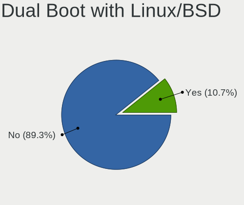
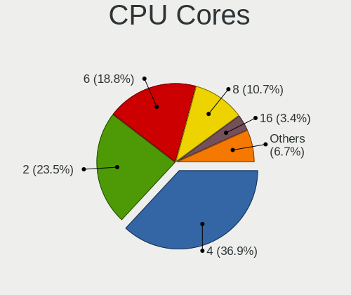
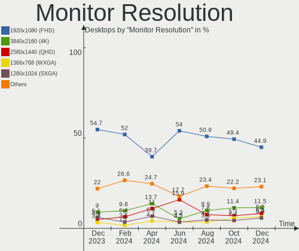
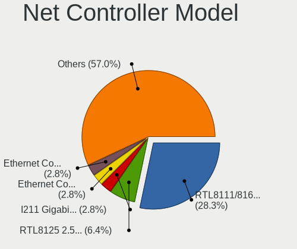
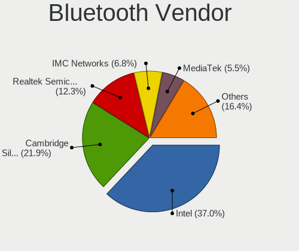
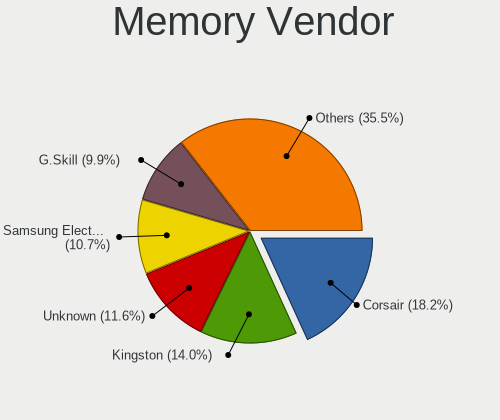

Linux Mint Hardware Trends (Desktops)
-------------------------------------

A project to identify most popular hardware characteristics and track their change
over time based on data collected by Linux Mint users at https://Linux-Hardware.org.

Anyone can contribute to this report by the [hw-probe](https://github.com/linuxhw/hw-probe) tool:

    sudo -E hw-probe -all -upload

Full-feature report is available here: https://linux-hardware.org/?view=trends

Period: Nov, 2021.

Contents
--------

* [ System ](#system)
  - [ OS                       ](#os)
  - [ OS Family                ](#os-family)
  - [ Kernel                   ](#kernel)
  - [ Kernel Family            ](#kernel-family)
  - [ Kernel Major Ver.        ](#kernel-major-ver)
  - [ Arch                     ](#arch)
  - [ DE                       ](#de)
  - [ Display Server           ](#display-server)
  - [ Display Manager          ](#display-manager)
  - [ OS Lang                  ](#os-lang)
  - [ Boot Mode                ](#boot-mode)
  - [ Filesystem               ](#filesystem)
  - [ Part. scheme             ](#part-scheme)
  - [ Dual Boot with Linux/BSD ](#dual-boot-with-linuxbsd)
  - [ Dual Boot (Win)          ](#dual-boot-win)

* [ Board ](#board)
  - [ Vendor                   ](#vendor)
  - [ Model                    ](#model)
  - [ Model Family             ](#model-family)
  - [ MFG Year                 ](#mfg-year)
  - [ Form Factor              ](#form-factor)
  - [ Secure Boot              ](#secure-boot)
  - [ Coreboot                 ](#coreboot)
  - [ RAM Size                 ](#ram-size)
  - [ RAM Used                 ](#ram-used)
  - [ Total Drives             ](#total-drives)
  - [ Has CD-ROM               ](#has-cd-rom)
  - [ Has Ethernet             ](#has-ethernet)
  - [ Has WiFi                 ](#has-wifi)
  - [ Has Bluetooth            ](#has-bluetooth)

* [ Location ](#location)
  - [ Country                  ](#country)
  - [ City                     ](#city)

* [ Drives ](#drives)
  - [ Drive Vendor             ](#drive-vendor)
  - [ Drive Model              ](#drive-model)
  - [ HDD Vendor               ](#hdd-vendor)
  - [ SSD Vendor               ](#ssd-vendor)
  - [ Drive Kind               ](#drive-kind)
  - [ Drive Connector          ](#drive-connector)
  - [ Drive Size               ](#drive-size)
  - [ Space Total              ](#space-total)
  - [ Space Used               ](#space-used)
  - [ Malfunc. Drives          ](#malfunc-drives)
  - [ Malfunc. Drive Vendor    ](#malfunc-drive-vendor)
  - [ Malfunc. HDD Vendor      ](#malfunc-hdd-vendor)
  - [ Malfunc. Drive Kind      ](#malfunc-drive-kind)
  - [ Failed Drives            ](#failed-drives)
  - [ Failed Drive Vendor      ](#failed-drive-vendor)
  - [ Drive Status             ](#drive-status)

* [ Storage controller ](#storage-controller)
  - [ Storage Vendor           ](#storage-vendor)
  - [ Storage Model            ](#storage-model)
  - [ Storage Kind             ](#storage-kind)

* [ Processor ](#processor)
  - [ CPU Vendor               ](#cpu-vendor)
  - [ CPU Model                ](#cpu-model)
  - [ CPU Model Family         ](#cpu-model-family)
  - [ CPU Cores                ](#cpu-cores)
  - [ CPU Sockets              ](#cpu-sockets)
  - [ CPU Threads              ](#cpu-threads)
  - [ CPU Op-Modes             ](#cpu-op-modes)
  - [ CPU Microcode            ](#cpu-microcode)
  - [ CPU Microarch            ](#cpu-microarch)

* [ Graphics ](#graphics)
  - [ GPU Vendor               ](#gpu-vendor)
  - [ GPU Model                ](#gpu-model)
  - [ GPU Combo                ](#gpu-combo)
  - [ GPU Driver               ](#gpu-driver)
  - [ GPU Memory               ](#gpu-memory)

* [ Monitor ](#monitor)
  - [ Monitor Vendor           ](#monitor-vendor)
  - [ Monitor Model            ](#monitor-model)
  - [ Monitor Resolution       ](#monitor-resolution)
  - [ Monitor Diagonal         ](#monitor-diagonal)
  - [ Monitor Width            ](#monitor-width)
  - [ Aspect Ratio             ](#aspect-ratio)
  - [ Monitor Area             ](#monitor-area)
  - [ Pixel Density            ](#pixel-density)
  - [ Multiple Monitors        ](#multiple-monitors)

* [ Network ](#network)
  - [ Net Controller Vendor    ](#net-controller-vendor)
  - [ Net Controller Model     ](#net-controller-model)
  - [ Wireless Vendor          ](#wireless-vendor)
  - [ Wireless Model           ](#wireless-model)
  - [ Ethernet Vendor          ](#ethernet-vendor)
  - [ Ethernet Model           ](#ethernet-model)
  - [ Net Controller Kind      ](#net-controller-kind)
  - [ Used Controller          ](#used-controller)
  - [ NICs                     ](#nics)
  - [ IPv6                     ](#ipv6)

* [ Bluetooth ](#bluetooth)
  - [ Bluetooth Vendor         ](#bluetooth-vendor)
  - [ Bluetooth Model          ](#bluetooth-model)

* [ Sound ](#sound)
  - [ Sound Vendor             ](#sound-vendor)
  - [ Sound Model              ](#sound-model)

* [ Memory ](#memory)
  - [ Memory Vendor            ](#memory-vendor)
  - [ Memory Model             ](#memory-model)
  - [ Memory Kind              ](#memory-kind)
  - [ Memory Form Factor       ](#memory-form-factor)
  - [ Memory Size              ](#memory-size)
  - [ Memory Speed             ](#memory-speed)

* [ Printers & scanners ](#printers--scanners)
  - [ Printer Vendor           ](#printer-vendor)
  - [ Printer Model            ](#printer-model)
  - [ Scanner Vendor           ](#scanner-vendor)
  - [ Scanner Model            ](#scanner-model)

* [ Camera ](#camera)
  - [ Camera Vendor            ](#camera-vendor)
  - [ Camera Model             ](#camera-model)

* [ Security ](#security)
  - [ Fingerprint Vendor       ](#fingerprint-vendor)
  - [ Fingerprint Model        ](#fingerprint-model)
  - [ Chipcard Vendor          ](#chipcard-vendor)
  - [ Chipcard Model           ](#chipcard-model)

* [ Unsupported ](#unsupported)
  - [ Unsupported Devices      ](#unsupported-devices)
  - [ Unsupported Device Types ](#unsupported-device-types)

System
------

OS
--

Installed operating systems

| Name            | Desktops | Percent |
|-----------------|----------|---------|
| Linux Mint 20.2 | 172      | 78.18%  |
| Linux Mint 19.3 | 19       | 8.64%   |
| Linux Mint 20   | 12       | 5.45%   |
| Linux Mint 20.1 | 10       | 4.55%   |
| Linux Mint 19.2 | 4        | 1.82%   |
| Linux Mint 19.1 | 3        | 1.36%   |

OS Family
---------

OS without a version

| Name       | Desktops | Percent |
|------------|----------|---------|
| Linux Mint | 220      | 100%    |

Kernel
------

Version of the Linux kernel

| Version                    | Desktops | Percent |
|----------------------------|----------|---------|
| 5.4.0-90-generic           | 96       | 43.64%  |
| 5.4.0-89-generic           | 45       | 20.45%  |
| 5.4.0-74-generic           | 14       | 6.36%   |
| 5.13.0-21-generic          | 9        | 4.09%   |
| 5.11.0-38-generic          | 9        | 4.09%   |
| 5.4.0-91-generic           | 4        | 1.82%   |
| 5.4.0-88-generic           | 4        | 1.82%   |
| 4.15.0-162-generic         | 4        | 1.82%   |
| 5.4.0-90-lowlatency        | 3        | 1.36%   |
| 5.4.0-77-generic           | 3        | 1.36%   |
| 5.4.0-58-generic           | 3        | 1.36%   |
| 5.11.0-40-generic          | 3        | 1.36%   |
| 5.4.0-26-generic           | 2        | 0.91%   |
| 4.15.0-20-generic          | 2        | 0.91%   |
| 5.4.0-89-lowlatency        | 1        | 0.45%   |
| 5.4.0-87-generic           | 1        | 0.45%   |
| 5.4.0-84-generic           | 1        | 0.45%   |
| 5.4.0-81-generic           | 1        | 0.45%   |
| 5.4.0-80-generic           | 1        | 0.45%   |
| 5.4.0-67-generic           | 1        | 0.45%   |
| 5.4.0-65-generic           | 1        | 0.45%   |
| 5.4.0-62-generic           | 1        | 0.45%   |
| 5.15.5-051505-generic      | 1        | 0.45%   |
| 5.15.4-xanmod1             | 1        | 0.45%   |
| 5.14.0-18.1-liquorix-amd64 | 1        | 0.45%   |
| 5.11.16-051116-generic     | 1        | 0.45%   |
| 5.11.13-051113-generic     | 1        | 0.45%   |
| 5.0.0-32-generic           | 1        | 0.45%   |
| 4.15.0-70-generic          | 1        | 0.45%   |
| 4.15.0-43-generic          | 1        | 0.45%   |
| 4.15.0-162-lowlatency      | 1        | 0.45%   |
| 4.15.0-161-generic         | 1        | 0.45%   |
| 4.15.0-147-generic         | 1        | 0.45%   |

Kernel Family
-------------

Linux kernel without a distro release

| Version | Desktops | Percent |
|---------|----------|---------|
| 5.4.0   | 182      | 82.73%  |
| 5.11.0  | 12       | 5.45%   |
| 4.15.0  | 11       | 5%      |
| 5.13.0  | 9        | 4.09%   |
| 5.15.5  | 1        | 0.45%   |
| 5.15.4  | 1        | 0.45%   |
| 5.14.0  | 1        | 0.45%   |
| 5.11.16 | 1        | 0.45%   |
| 5.11.13 | 1        | 0.45%   |
| 5.0.0   | 1        | 0.45%   |

Kernel Major Ver.
-----------------

Linux kernel major version

| Version | Desktops | Percent |
|---------|----------|---------|
| 5.4     | 182      | 82.73%  |
| 5.11    | 14       | 6.36%   |
| 4.15    | 11       | 5%      |
| 5.13    | 9        | 4.09%   |
| 5.15    | 2        | 0.91%   |
| 5.14    | 1        | 0.45%   |
| 5.0     | 1        | 0.45%   |

Arch
----

OS architecture (x86_64, i586, etc.)

| Name   | Desktops | Percent |
|--------|----------|---------|
| x86_64 | 217      | 98.64%  |
| i686   | 3        | 1.36%   |

DE
--

Desktop Environment

| Name       | Desktops | Percent |
|------------|----------|---------|
| X-Cinnamon | 151      | 68.64%  |
| MATE       | 29       | 13.18%  |
| Cinnamon   | 18       | 8.18%   |
| XFCE       | 17       | 7.73%   |
| Unknown    | 3        | 1.36%   |
| KDE        | 1        | 0.45%   |
| GNOME      | 1        | 0.45%   |

Display Server
--------------

X11 or Wayland

| Name    | Desktops | Percent |
|---------|----------|---------|
| X11     | 216      | 98.18%  |
| Wayland | 2        | 0.91%   |
| Tty     | 2        | 0.91%   |

Display Manager
---------------

SDDM, LightDM, etc.

| Name    | Desktops | Percent |
|---------|----------|---------|
| Unknown | 126      | 57.27%  |
| LightDM | 92       | 41.82%  |
| GDM     | 2        | 0.91%   |

OS Lang
-------

Language

| Lang  | Desktops | Percent |
|-------|----------|---------|
| en_US | 57       | 25.91%  |
| de_DE | 47       | 21.36%  |
| en_GB | 15       | 6.82%   |
| pt_BR | 14       | 6.36%   |
| ru_RU | 8        | 3.64%   |
| pl_PL | 7        | 3.18%   |
| en_CA | 6        | 2.73%   |
| fr_FR | 5        | 2.27%   |
| ru_UA | 4        | 1.82%   |
| it_IT | 4        | 1.82%   |
| en_AU | 4        | 1.82%   |
| nl_NL | 3        | 1.36%   |
| hu_HU | 3        | 1.36%   |
| en_IN | 3        | 1.36%   |
| el_GR | 3        | 1.36%   |
| de_CH | 3        | 1.36%   |
| C     | 3        | 1.36%   |
| zh_CN | 2        | 0.91%   |
| sk_SK | 2        | 0.91%   |
| hr_HR | 2        | 0.91%   |
| fr_CA | 2        | 0.91%   |
| es_US | 2        | 0.91%   |
| es_ES | 2        | 0.91%   |
| de_AT | 2        | 0.91%   |
| sv_SE | 1        | 0.45%   |
| ro_RO | 1        | 0.45%   |
| fr_CH | 1        | 0.45%   |
| fr_BE | 1        | 0.45%   |
| fi_FI | 1        | 0.45%   |
| es_PE | 1        | 0.45%   |
| es_CR | 1        | 0.45%   |
| es_CO | 1        | 0.45%   |
| es_AR | 1        | 0.45%   |
| en_ZA | 1        | 0.45%   |
| en_PH | 1        | 0.45%   |
| en_NZ | 1        | 0.45%   |
| en_IL | 1        | 0.45%   |
| en_DK | 1        | 0.45%   |
| da_DK | 1        | 0.45%   |
| cs_CZ | 1        | 0.45%   |
| bg_BG | 1        | 0.45%   |

Boot Mode
---------

EFI or BIOS

| Mode | Desktops | Percent |
|------|----------|---------|
| BIOS | 123      | 55.91%  |
| EFI  | 97       | 44.09%  |

Filesystem
----------

Type of filesystem

| Type    | Desktops | Percent |
|---------|----------|---------|
| Ext4    | 213      | 96.82%  |
| Overlay | 3        | 1.36%   |
| Btrfs   | 2        | 0.91%   |
| Xfs     | 1        | 0.45%   |
| Unknown | 1        | 0.45%   |

Part. scheme
------------

Scheme of partitioning

| Type    | Desktops | Percent |
|---------|----------|---------|
| Unknown | 142      | 64.55%  |
| GPT     | 54       | 24.55%  |
| MBR     | 24       | 10.91%  |

Dual Boot with Linux/BSD
------------------------

Hosting more than one Linux/BSD

| Dual boot | Desktops | Percent |
|-----------|----------|---------|
| No        | 201      | 91.36%  |
| Yes       | 19       | 8.64%   |

Dual Boot (Win)
---------------

Hosting Linux and Windows

| Dual boot | Desktops | Percent |
|-----------|----------|---------|
| No        | 181      | 82.27%  |
| Yes       | 39       | 17.73%  |

Board
-----

Vendor
------

Motherboard manufacturer

| Name                | Desktops | Percent |
|---------------------|----------|---------|
| ASUSTek Computer    | 56       | 25.45%  |
| Gigabyte Technology | 31       | 14.09%  |
| MSI                 | 27       | 12.27%  |
| ASRock              | 26       | 11.82%  |
| Hewlett-Packard     | 19       | 8.64%   |
| Dell                | 16       | 7.27%   |
| Lenovo              | 8        | 3.64%   |
| Foxconn             | 4        | 1.82%   |
| Acer                | 4        | 1.82%   |
| Unknown             | 4        | 1.82%   |
| ECS                 | 3        | 1.36%   |
| Biostar             | 3        | 1.36%   |
| Apple               | 3        | 1.36%   |
| Positivo            | 2        | 0.91%   |
| Medion              | 2        | 0.91%   |
| Intel               | 2        | 0.91%   |
| Fujitsu             | 2        | 0.91%   |
| SZMZ                | 1        | 0.45%   |
| SIMPC               | 1        | 0.45%   |
| Shuttle             | 1        | 0.45%   |
| OEM                 | 1        | 0.45%   |
| Huanan              | 1        | 0.45%   |
| HC                  | 1        | 0.45%   |
| Gateway             | 1        | 0.45%   |
| Emaxx Technology.   | 1        | 0.45%   |

Model
-----

Motherboard model

| Name                                   | Desktops | Percent |
|----------------------------------------|----------|---------|
| ASUS All Series                        | 8        | 3.64%   |
| Unknown                                | 5        | 2.27%   |
| HP EliteDesk 800 G1 TWR                | 3        | 1.36%   |
| HP EliteDesk 800 G1 SFF                | 3        | 1.36%   |
| Gigabyte B560M AORUS ELITE             | 3        | 1.36%   |
| Dell OptiPlex 7010                     | 3        | 1.36%   |
| ASUS M5A99FX PRO R2.0                  | 3        | 1.36%   |
| MSI MS-7B89                            | 2        | 0.91%   |
| MSI MS-7808                            | 2        | 0.91%   |
| MSI MS-7693                            | 2        | 0.91%   |
| Gigabyte B550M S2H                     | 2        | 0.91%   |
| ECS H61H2-M6                           | 2        | 0.91%   |
| Dell OptiPlex 9020                     | 2        | 0.91%   |
| Dell OptiPlex 790                      | 2        | 0.91%   |
| Dell OptiPlex 780                      | 2        | 0.91%   |
| ASUS TUF GAMING X570-PLUS              | 2        | 0.91%   |
| ASUS A68HM-PLUS                        | 2        | 0.91%   |
| ASRock Z77 Extreme6                    | 2        | 0.91%   |
| ASRock 970M Pro3                       | 2        | 0.91%   |
| Apple MacPro2,1                        | 2        | 0.91%   |
| SZMZ X99M-G2                           | 1        | 0.45%   |
| SIMPC MS-7621                          | 1        | 0.45%   |
| Shuttle XH410G                         | 1        | 0.45%   |
| Positivo POS-PIH81DI                   | 1        | 0.45%   |
| Positivo POS-EINM70CS                  | 1        | 0.45%   |
| MSI P8571A-ABG 722a                    | 1        | 0.45%   |
| MSI MS-7C67                            | 1        | 0.45%   |
| MSI MS-7C52                            | 1        | 0.45%   |
| MSI MS-7B87                            | 1        | 0.45%   |
| MSI MS-7B79                            | 1        | 0.45%   |
| MSI MS-7B51                            | 1        | 0.45%   |
| MSI MS-7B48                            | 1        | 0.45%   |
| MSI MS-7A62                            | 1        | 0.45%   |
| MSI MS-7A38                            | 1        | 0.45%   |
| MSI MS-7A34                            | 1        | 0.45%   |
| MSI MS-7924                            | 1        | 0.45%   |
| MSI MS-7846                            | 1        | 0.45%   |
| MSI MS-7845                            | 1        | 0.45%   |
| MSI MS-7821                            | 1        | 0.45%   |
| MSI MS-7720                            | 1        | 0.45%   |
| MSI MS-7641                            | 1        | 0.45%   |
| MSI MS-7636                            | 1        | 0.45%   |
| MSI MS-7276                            | 1        | 0.45%   |
| MSI MS-7255                            | 1        | 0.45%   |
| MSI ESPRIMO P1510                      | 1        | 0.45%   |
| MSI AY603AA-ABL HPE-150f               | 1        | 0.45%   |
| Medion MS-7633                         | 1        | 0.45%   |
| Medion Akoya P5360 E MD8881/2478       | 1        | 0.45%   |
| Lenovo ThinkStation P330 30C8S06M00    | 1        | 0.45%   |
| Lenovo ThinkCentre M82 27562U1         | 1        | 0.45%   |
| Lenovo ThinkCentre M81 5049W16         | 1        | 0.45%   |
| Lenovo ThinkCentre M73 10B60008US      | 1        | 0.45%   |
| Lenovo ThinkCentre M58e 7303AZ2        | 1        | 0.45%   |
| Lenovo ThinkCentre A52 8381W7G         | 1        | 0.45%   |
| Lenovo IdeaCentre 5 14IMB05 90NA0082US | 1        | 0.45%   |
| Lenovo 1730BF8                         | 1        | 0.45%   |
| Intel H61                              | 1        | 0.45%   |
| Intel DH61BF AAG81311-101              | 1        | 0.45%   |
| Huanan X99-F8 GAMING V2.0              | 1        | 0.45%   |
| HP ProDesk 600 G4 SFF                  | 1        | 0.45%   |

Model Family
------------

Motherboard model prefix

| Name                  | Desktops | Percent |
|-----------------------|----------|---------|
| Dell OptiPlex         | 12       | 5.45%   |
| HP EliteDesk          | 8        | 3.64%   |
| ASUS PRIME            | 8        | 3.64%   |
| ASUS All              | 8        | 3.64%   |
| Lenovo ThinkCentre    | 5        | 2.27%   |
| HP Compaq             | 5        | 2.27%   |
| ASUS TUF              | 5        | 2.27%   |
| Unknown               | 5        | 2.27%   |
| Gigabyte B560M        | 4        | 1.82%   |
| ASUS SABERTOOTH       | 3        | 1.36%   |
| ASUS ROG              | 3        | 1.36%   |
| ASUS M5A99FX          | 3        | 1.36%   |
| ASUS M5A78L-M         | 3        | 1.36%   |
| MSI MS-7B89           | 2        | 0.91%   |
| MSI MS-7808           | 2        | 0.91%   |
| MSI MS-7693           | 2        | 0.91%   |
| HP ProDesk            | 2        | 0.91%   |
| Gigabyte B550M        | 2        | 0.91%   |
| Gigabyte B550         | 2        | 0.91%   |
| ECS H61H2-M6          | 2        | 0.91%   |
| ASUS P8Z77-V          | 2        | 0.91%   |
| ASUS Maximus          | 2        | 0.91%   |
| ASUS M5A97            | 2        | 0.91%   |
| ASUS A68HM-PLUS       | 2        | 0.91%   |
| ASRock Z77            | 2        | 0.91%   |
| ASRock X570           | 2        | 0.91%   |
| ASRock B450M          | 2        | 0.91%   |
| ASRock 970M           | 2        | 0.91%   |
| Apple MacPro2         | 2        | 0.91%   |
| Acer Revo             | 2        | 0.91%   |
| Acer Aspire           | 2        | 0.91%   |
| SZMZ X99M-G2          | 1        | 0.45%   |
| SIMPC MS-7621         | 1        | 0.45%   |
| Shuttle XH410G        | 1        | 0.45%   |
| Positivo POS-PIH81DI  | 1        | 0.45%   |
| Positivo POS-EINM70CS | 1        | 0.45%   |
| MSI P8571A-ABG        | 1        | 0.45%   |
| MSI MS-7C67           | 1        | 0.45%   |
| MSI MS-7C52           | 1        | 0.45%   |
| MSI MS-7B87           | 1        | 0.45%   |
| MSI MS-7B79           | 1        | 0.45%   |
| MSI MS-7B51           | 1        | 0.45%   |
| MSI MS-7B48           | 1        | 0.45%   |
| MSI MS-7A62           | 1        | 0.45%   |
| MSI MS-7A38           | 1        | 0.45%   |
| MSI MS-7A34           | 1        | 0.45%   |
| MSI MS-7924           | 1        | 0.45%   |
| MSI MS-7846           | 1        | 0.45%   |
| MSI MS-7845           | 1        | 0.45%   |
| MSI MS-7821           | 1        | 0.45%   |
| MSI MS-7720           | 1        | 0.45%   |
| MSI MS-7641           | 1        | 0.45%   |
| MSI MS-7636           | 1        | 0.45%   |
| MSI MS-7276           | 1        | 0.45%   |
| MSI MS-7255           | 1        | 0.45%   |
| MSI ESPRIMO           | 1        | 0.45%   |
| MSI AY603AA-ABL       | 1        | 0.45%   |
| Medion MS-7633        | 1        | 0.45%   |
| Medion Akoya          | 1        | 0.45%   |
| Lenovo ThinkStation   | 1        | 0.45%   |

MFG Year
--------

Motherboard manufacture year

| Year | Desktops | Percent |
|------|----------|---------|
| 2021 | 27       | 12.27%  |
| 2013 | 24       | 10.91%  |
| 2020 | 21       | 9.55%   |
| 2019 | 19       | 8.64%   |
| 2012 | 19       | 8.64%   |
| 2018 | 18       | 8.18%   |
| 2014 | 18       | 8.18%   |
| 2015 | 13       | 5.91%   |
| 2011 | 13       | 5.91%   |
| 2010 | 10       | 4.55%   |
| 2016 | 7        | 3.18%   |
| 2007 | 7        | 3.18%   |
| 2017 | 6        | 2.73%   |
| 2009 | 6        | 2.73%   |
| 2008 | 6        | 2.73%   |
| 2005 | 3        | 1.36%   |
| 2006 | 2        | 0.91%   |
| 2002 | 1        | 0.45%   |

Form Factor
-----------

Physical design of the computer

| Name    | Desktops | Percent |
|---------|----------|---------|
| Desktop | 220      | 100%    |

Secure Boot
-----------

Enabled or disabled

| State    | Desktops | Percent |
|----------|----------|---------|
| Disabled | 210      | 95.45%  |
| Enabled  | 10       | 4.55%   |

Coreboot
--------

Have coreboot on board

| Used | Desktops | Percent |
|------|----------|---------|
| No   | 220      | 100%    |

RAM Size
--------

Total RAM memory

| Size in GB  | Desktops | Percent |
|-------------|----------|---------|
| 16.01-24.0  | 70       | 31.82%  |
| 8.01-16.0   | 39       | 17.73%  |
| 32.01-64.0  | 35       | 15.91%  |
| 4.01-8.0    | 32       | 14.55%  |
| 3.01-4.0    | 32       | 14.55%  |
| 2.01-3.0    | 4        | 1.82%   |
| 24.01-32.0  | 3        | 1.36%   |
| 1.01-2.0    | 3        | 1.36%   |
| 64.01-256.0 | 1        | 0.45%   |
| 0.51-1.0    | 1        | 0.45%   |

RAM Used
--------

Used RAM memory

| Used GB   | Desktops | Percent |
|-----------|----------|---------|
| 1.01-2.0  | 86       | 39.09%  |
| 2.01-3.0  | 67       | 30.45%  |
| 4.01-8.0  | 28       | 12.73%  |
| 3.01-4.0  | 20       | 9.09%   |
| 0.51-1.0  | 9        | 4.09%   |
| 8.01-16.0 | 8        | 3.64%   |
| 0.01-0.5  | 2        | 0.91%   |

Total Drives
------------

Number of drives on board

| Drives | Desktops | Percent |
|--------|----------|---------|
| 1      | 84       | 38.18%  |
| 2      | 72       | 32.73%  |
| 3      | 32       | 14.55%  |
| 4      | 17       | 7.73%   |
| 5      | 6        | 2.73%   |
| 6      | 4        | 1.82%   |
| 0      | 3        | 1.36%   |
| 8      | 1        | 0.45%   |
| 7      | 1        | 0.45%   |

Has CD-ROM
----------

Has CD-ROM on board

| Presented | Desktops | Percent |
|-----------|----------|---------|
| Yes       | 124      | 56.36%  |
| No        | 96       | 43.64%  |

Has Ethernet
------------

Has Ethernet on board

| Presented | Desktops | Percent |
|-----------|----------|---------|
| Yes       | 215      | 97.73%  |
| No        | 5        | 2.27%   |

Has WiFi
--------

Has WiFi module

| Presented | Desktops | Percent |
|-----------|----------|---------|
| No        | 119      | 54.09%  |
| Yes       | 101      | 45.91%  |

Has Bluetooth
-------------

Has Bluetooth module

| Presented | Desktops | Percent |
|-----------|----------|---------|
| No        | 159      | 72.27%  |
| Yes       | 61       | 27.73%  |

Location
--------

Country
-------

Geographic location (country)

| Country           | Desktops | Percent |
|-------------------|----------|---------|
| Germany           | 47       | 21.36%  |
| USA               | 42       | 19.09%  |
| Brazil            | 18       | 8.18%   |
| UK                | 14       | 6.36%   |
| Russia            | 9        | 4.09%   |
| Poland            | 9        | 4.09%   |
| Canada            | 8        | 3.64%   |
| Ukraine           | 7        | 3.18%   |
| Italy             | 6        | 2.73%   |
| France            | 6        | 2.73%   |
| Switzerland       | 4        | 1.82%   |
| Netherlands       | 4        | 1.82%   |
| Australia         | 4        | 1.82%   |
| Spain             | 3        | 1.36%   |
| India             | 3        | 1.36%   |
| Hungary           | 3        | 1.36%   |
| Greece            | 3        | 1.36%   |
| Denmark           | 3        | 1.36%   |
| Slovakia          | 2        | 0.91%   |
| China             | 2        | 0.91%   |
| Belgium           | 2        | 0.91%   |
| Austria           | 2        | 0.91%   |
| Sweden            | 1        | 0.45%   |
| South Africa      | 1        | 0.45%   |
| Serbia            | 1        | 0.45%   |
| Romania           | 1        | 0.45%   |
| Puerto Rico       | 1        | 0.45%   |
| Philippines       | 1        | 0.45%   |
| Peru              | 1        | 0.45%   |
| New Zealand       | 1        | 0.45%   |
| Mexico            | 1        | 0.45%   |
| Israel            | 1        | 0.45%   |
| Indonesia         | 1        | 0.45%   |
| Finland           | 1        | 0.45%   |
| Equatorial Guinea | 1        | 0.45%   |
| Czechia           | 1        | 0.45%   |
| Croatia           | 1        | 0.45%   |
| Costa Rica        | 1        | 0.45%   |
| Colombia          | 1        | 0.45%   |
| Bangladesh        | 1        | 0.45%   |
| Argentina         | 1        | 0.45%   |

City
----

Geographic location (city)

| City           | Desktops | Percent |
|----------------|----------|---------|
| Moscow         | 4        | 1.82%   |
| Rio de Janeiro | 3        | 1.36%   |
| Portland       | 3        | 1.36%   |
| London         | 3        | 1.36%   |
| Berlin         | 3        | 1.36%   |
| Rostock        | 2        | 0.91%   |
| Paris          | 2        | 0.91%   |
| Nuremberg      | 2        | 0.91%   |
| New York       | 2        | 0.91%   |
| Melbourne      | 2        | 0.91%   |
| Kyiv           | 2        | 0.91%   |
| Brussels       | 2        | 0.91%   |
| Bila Tserkva   | 2        | 0.91%   |
| Bendorf        | 2        | 0.91%   |
| Athens         | 2        | 0.91%   |
| Zutphen        | 1        | 0.45%   |
| Zurich         | 1        | 0.45%   |
| Yaroslavl      | 1        | 0.45%   |
| Wuppertal      | 1        | 0.45%   |
| Wroclaw        | 1        | 0.45%   |
| Wolfsburg      | 1        | 0.45%   |
| Wo?‚omin       | 1        | 0.45%   |
| Windsor        | 1        | 0.45%   |
| Wiesbaden      | 1        | 0.45%   |
| Wetter (Ruhr)  | 1        | 0.45%   |
| Westfield      | 1        | 0.45%   |
| Wellington     | 1        | 0.45%   |
| Watford        | 1        | 0.45%   |
| Warsaw         | 1        | 0.45%   |
| Uba            | 1        | 0.45%   |
| Trivandrum     | 1        | 0.45%   |
| Tonara         | 1        | 0.45%   |
| Tianjin        | 1        | 0.45%   |
| Thornhill      | 1        | 0.45%   |
| Thalheim       | 1        | 0.45%   |
| Szombathely    | 1        | 0.45%   |
| Sydney         | 1        | 0.45%   |
| Stourbridge    | 1        | 0.45%   |
| St Louis       | 1        | 0.45%   |
| St Helens      | 1        | 0.45%   |
| Spokane        | 1        | 0.45%   |
| Split          | 1        | 0.45%   |
| Sindelfingen   | 1        | 0.45%   |
| Seville        | 1        | 0.45%   |
| Sergiyevsk     | 1        | 0.45%   |
| Selters        | 1        | 0.45%   |
| Schorndorf     | 1        | 0.45%   |
| Schmalkalden   | 1        | 0.45%   |
| S??o Paulo     | 1        | 0.45%   |
| S??o Carlos    | 1        | 0.45%   |
| Sarnthein      | 1        | 0.45%   |
| Sao Goncalo    | 1        | 0.45%   |
| San Juan       | 1        | 0.45%   |
| San Jos?©      | 1        | 0.45%   |
| San Francisco  | 1        | 0.45%   |
| Saltash        | 1        | 0.45%   |
| Riviere-Bleue  | 1        | 0.45%   |
| Redditch       | 1        | 0.45%   |
| Randwick       | 1        | 0.45%   |
| Qu?©bec        | 1        | 0.45%   |

Drives
------

Drive Vendor
------------

Hard drive vendors

| Vendor              | Desktops | Drives | Percent |
|---------------------|----------|--------|---------|
| WDC                 | 83       | 103    | 21.34%  |
| Seagate             | 79       | 95     | 20.31%  |
| Samsung Electronics | 58       | 76     | 14.91%  |
| Kingston            | 22       | 23     | 5.66%   |
| SanDisk             | 21       | 25     | 5.4%    |
| Hitachi             | 19       | 19     | 4.88%   |
| Toshiba             | 17       | 19     | 4.37%   |
| Crucial             | 11       | 12     | 2.83%   |
| Intenso             | 8        | 9      | 2.06%   |
| A-DATA Technology   | 8        | 8      | 2.06%   |
| Patriot             | 6        | 6      | 1.54%   |
| Intel               | 5        | 5      | 1.29%   |
| MAXTOR              | 4        | 4      | 1.03%   |
| Unknown             | 4        | 4      | 1.03%   |
| China               | 3        | 3      | 0.77%   |
| XPG                 | 2        | 2      | 0.51%   |
| Unknown             | 2        | 2      | 0.51%   |
| SK Hynix            | 2        | 2      | 0.51%   |
| PNY                 | 2        | 2      | 0.51%   |
| Phison              | 2        | 3      | 0.51%   |
| KingSpec            | 2        | 2      | 0.51%   |
| HGST                | 2        | 2      | 0.51%   |
| GOODRAM             | 2        | 2      | 0.51%   |
| Fujitsu             | 2        | 2      | 0.51%   |
| Verbatim            | 1        | 1      | 0.26%   |
| Transcend           | 1        | 1      | 0.26%   |
| Team                | 1        | 1      | 0.26%   |
| TDAS                | 1        | 4      | 0.26%   |
| SPCC                | 1        | 1      | 0.26%   |
| Silicon Motion      | 1        | 1      | 0.26%   |
| SABRENT             | 1        | 1      | 0.26%   |
| Pioneer             | 1        | 1      | 0.26%   |
| Mushkin             | 1        | 1      | 0.26%   |
| Micron Technology   | 1        | 1      | 0.26%   |
| Lexar               | 1        | 1      | 0.26%   |
| Leven               | 1        | 1      | 0.26%   |
| LaCie               | 1        | 1      | 0.26%   |
| KingFast            | 1        | 1      | 0.26%   |
| KESU                | 1        | 1      | 0.26%   |
| HGST HTS            | 1        | 1      | 0.26%   |
| Hewlett-Packard     | 1        | 1      | 0.26%   |
| External            | 1        | 1      | 0.26%   |
| ExcelStor           | 1        | 1      | 0.26%   |
| EMTEC               | 1        | 1      | 0.26%   |
| Apacer              | 1        | 1      | 0.26%   |
| ADATA SU            | 1        | 1      | 0.26%   |
| 1TB                 | 1        | 1      | 0.26%   |

Drive Model
-----------

Hard drive models

| Model                              | Desktops | Percent |
|------------------------------------|----------|---------|
| Seagate ST1000DM010-2EP102 1TB     | 11       | 2.51%   |
| Kingston SA400S37240G 240GB SSD    | 9        | 2.05%   |
| Seagate ST500DM002-1BD142 500GB    | 6        | 1.37%   |
| Samsung SSD 860 EVO 500GB          | 6        | 1.37%   |
| Seagate ST2000DM006-2DM164 2TB     | 5        | 1.14%   |
| Samsung SSD 970 EVO Plus 1TB       | 5        | 1.14%   |
| Toshiba DT01ACA100 1TB             | 4        | 0.91%   |
| Seagate ST2000DM008-2FR102 2TB     | 4        | 0.91%   |
| Samsung SSD 860 EVO 1TB            | 4        | 0.91%   |
| Unknown                            | 4        | 0.91%   |
| WDC WD40EZRZ-00GXCB0 4TB           | 3        | 0.68%   |
| WDC WD20EZRX-00D8PB0 2TB           | 3        | 0.68%   |
| WDC WD10EZEX-08WN4A0 1TB           | 3        | 0.68%   |
| WDC WD10EADS-00L5B1 1TB            | 3        | 0.68%   |
| Seagate ST3500418AS 500GB          | 3        | 0.68%   |
| Seagate ST2000DX001-1NS164 2TB     | 3        | 0.68%   |
| Seagate ST2000DM001-1CH164 2TB     | 3        | 0.68%   |
| Seagate ST1000DM003-1ER162 1TB     | 3        | 0.68%   |
| Seagate ST1000DM003-1CH162 1TB     | 3        | 0.68%   |
| Seagate Expansion 1TB              | 3        | 0.68%   |
| SanDisk SSD PLUS 480GB             | 3        | 0.68%   |
| Sandisk NVMe SSD Drive 1TB         | 3        | 0.68%   |
| Samsung NVMe SSD Drive 500GB       | 3        | 0.68%   |
| Samsung NVMe SSD Drive 1TB         | 3        | 0.68%   |
| Samsung HD204UI 2TB                | 3        | 0.68%   |
| Patriot Burst 240GB SSD            | 3        | 0.68%   |
| Kingston SA400S37120G 120GB SSD    | 3        | 0.68%   |
| WDC WDS100T2B0C-00PXH0 1TB         | 2        | 0.46%   |
| WDC WD20EARS-00MVWB0 2TB           | 2        | 0.46%   |
| WDC WD2000FYYZ-01UL1B1 2TB         | 2        | 0.46%   |
| Toshiba TR200 240GB SSD            | 2        | 0.46%   |
| Toshiba DT01ACA050 500GB           | 2        | 0.46%   |
| Seagate ST4000VN008-2DR166 4TB     | 2        | 0.46%   |
| Seagate ST4000DM000-1F2168 4TB     | 2        | 0.46%   |
| Seagate ST3500413AS 500GB          | 2        | 0.46%   |
| Seagate ST31000524AS 1TB           | 2        | 0.46%   |
| Seagate ST3000DM001-1ER166 3TB     | 2        | 0.46%   |
| Seagate ST1000LM024 HN-M101MBB 1TB | 2        | 0.46%   |
| Seagate Expansion Desk 8TB         | 2        | 0.46%   |
| SanDisk SSD PLUS 240GB             | 2        | 0.46%   |
| SanDisk SDSSDP064G 64GB            | 2        | 0.46%   |
| SanDisk SDSSDA240G 240GB           | 2        | 0.46%   |
| Samsung SSD 980 PRO 500GB          | 2        | 0.46%   |
| Samsung SSD 960 EVO 250GB          | 2        | 0.46%   |
| Samsung SSD 870 QVO 1TB            | 2        | 0.46%   |
| Samsung SSD 860 EVO 250GB          | 2        | 0.46%   |
| Samsung SSD 850 EVO 500GB          | 2        | 0.46%   |
| Samsung SSD 850 EVO 250GB          | 2        | 0.46%   |
| Samsung SSD 850 EVO 120GB          | 2        | 0.46%   |
| Samsung SP2504C 250GB              | 2        | 0.46%   |
| Samsung PSSD T7 1TB                | 2        | 0.46%   |
| Samsung NVMe SSD Drive 256GB       | 2        | 0.46%   |
| Samsung HD502HI 500GB              | 2        | 0.46%   |
| Samsung HD103UJ 1TB                | 2        | 0.46%   |
| Kingston SA400S37480G 480GB SSD    | 2        | 0.46%   |
| Intenso SSD Sata III 120GB         | 2        | 0.46%   |
| Intel SSDSC2CW120A3 120GB          | 2        | 0.46%   |
| Hitachi HDS728080PLA380 82GB       | 2        | 0.46%   |
| Hitachi HDS721010CLA630 1TB        | 2        | 0.46%   |
| Crucial CT500MX500SSD1 500GB       | 2        | 0.46%   |

HDD Vendor
----------

Hard disk drive vendors

| Vendor              | Desktops | Drives | Percent |
|---------------------|----------|--------|---------|
| Seagate             | 79       | 94     | 35.11%  |
| WDC                 | 76       | 95     | 33.78%  |
| Hitachi             | 19       | 19     | 8.44%   |
| Samsung Electronics | 18       | 20     | 8%      |
| Toshiba             | 16       | 16     | 7.11%   |
| MAXTOR              | 4        | 4      | 1.78%   |
| Intenso             | 2        | 2      | 0.89%   |
| HGST                | 2        | 2      | 0.89%   |
| Fujitsu             | 2        | 2      | 0.89%   |
| Unknown             | 1        | 1      | 0.44%   |
| LaCie               | 1        | 1      | 0.44%   |
| KESU                | 1        | 1      | 0.44%   |
| HGST HTS            | 1        | 1      | 0.44%   |
| External            | 1        | 1      | 0.44%   |
| ExcelStor           | 1        | 1      | 0.44%   |
| Unknown             | 1        | 1      | 0.44%   |

SSD Vendor
----------

Solid state drive vendors

| Vendor              | Desktops | Drives | Percent |
|---------------------|----------|--------|---------|
| Samsung Electronics | 32       | 34     | 24.62%  |
| Kingston            | 19       | 19     | 14.62%  |
| SanDisk             | 17       | 20     | 13.08%  |
| Crucial             | 10       | 11     | 7.69%   |
| Intenso             | 6        | 6      | 4.62%   |
| Patriot             | 5        | 5      | 3.85%   |
| A-DATA Technology   | 5        | 5      | 3.85%   |
| WDC                 | 4        | 4      | 3.08%   |
| Intel               | 4        | 4      | 3.08%   |
| Toshiba             | 3        | 3      | 2.31%   |
| China               | 3        | 3      | 2.31%   |
| PNY                 | 2        | 2      | 1.54%   |
| KingSpec            | 2        | 2      | 1.54%   |
| GOODRAM             | 2        | 2      | 1.54%   |
| Verbatim            | 1        | 1      | 0.77%   |
| Transcend           | 1        | 1      | 0.77%   |
| Team                | 1        | 1      | 0.77%   |
| SPCC                | 1        | 1      | 0.77%   |
| SK Hynix            | 1        | 1      | 0.77%   |
| Pioneer             | 1        | 1      | 0.77%   |
| Mushkin             | 1        | 1      | 0.77%   |
| Micron Technology   | 1        | 1      | 0.77%   |
| Lexar               | 1        | 1      | 0.77%   |
| Leven               | 1        | 1      | 0.77%   |
| Hewlett-Packard     | 1        | 1      | 0.77%   |
| EMTEC               | 1        | 1      | 0.77%   |
| Apacer              | 1        | 1      | 0.77%   |
| ADATA SU            | 1        | 1      | 0.77%   |
| 1TB                 | 1        | 1      | 0.77%   |
| Unknown             | 1        | 1      | 0.77%   |

Drive Kind
----------

HDD or SSD

| Kind    | Desktops | Drives | Percent |
|---------|----------|--------|---------|
| HDD     | 162      | 261    | 49.85%  |
| SSD     | 115      | 136    | 35.38%  |
| NVMe    | 41       | 49     | 12.62%  |
| Unknown | 6        | 9      | 1.85%   |
| MMC     | 1        | 1      | 0.31%   |

Drive Connector
---------------

SATA, SAS, NVMe, etc.

| Type | Desktops | Drives | Percent |
|------|----------|--------|---------|
| SATA | 203      | 380    | 76.32%  |
| NVMe | 40       | 48     | 15.04%  |
| SAS  | 22       | 27     | 8.27%   |
| MMC  | 1        | 1      | 0.38%   |

Drive Size
----------

Size of hard drive

| Size in TB | Desktops | Drives | Percent |
|------------|----------|--------|---------|
| 0.01-0.5   | 151      | 202    | 48.87%  |
| 0.51-1.0   | 87       | 106    | 28.16%  |
| 1.01-2.0   | 44       | 53     | 14.24%  |
| 3.01-4.0   | 15       | 19     | 4.85%   |
| 2.01-3.0   | 7        | 10     | 2.27%   |
| 4.01-10.0  | 5        | 7      | 1.62%   |

Space Total
-----------

Amount of disk space available on the file system

| Size in GB     | Desktops | Percent |
|----------------|----------|---------|
| 101-250        | 46       | 20.91%  |
| 501-1000       | 40       | 18.18%  |
| 251-500        | 39       | 17.73%  |
| 1001-2000      | 35       | 15.91%  |
| More than 3000 | 32       | 14.55%  |
| 2001-3000      | 11       | 5%      |
| 51-100         | 10       | 4.55%   |
| 1-20           | 4        | 1.82%   |
| 21-50          | 3        | 1.36%   |

Space Used
----------

Amount of used disk space

| Used GB        | Desktops | Percent |
|----------------|----------|---------|
| 1-20           | 47       | 21.36%  |
| 101-250        | 37       | 16.82%  |
| 51-100         | 32       | 14.55%  |
| 21-50          | 30       | 13.64%  |
| 1001-2000      | 24       | 10.91%  |
| 501-1000       | 18       | 8.18%   |
| 251-500        | 16       | 7.27%   |
| More than 3000 | 9        | 4.09%   |
| 2001-3000      | 7        | 3.18%   |

Malfunc. Drives
---------------

Drive models with a malfunction

| Model                                         | Desktops | Drives | Percent |
|-----------------------------------------------|----------|--------|---------|
| WDC WD5002ABYS-01B1B0 500GB                   | 1        | 1      | 5%      |
| WDC WD5000LPVX-80V0TT0 500GB                  | 1        | 1      | 5%      |
| WDC WD15EARS-00MVWB0 1TB                      | 1        | 1      | 5%      |
| Seagate ST500LM012 HN-M500MBB 500GB           | 1        | 1      | 5%      |
| Seagate ST500DM002-1BD142 500GB               | 1        | 1      | 5%      |
| Seagate ST3500418AS 500GB                     | 1        | 1      | 5%      |
| Seagate ST1000LM024 HN-M101MBB 1TB            | 1        | 1      | 5%      |
| Seagate ST1000DM003-9YN162 1TB                | 1        | 1      | 5%      |
| SanDisk SDSSDA120G 120GB                      | 1        | 1      | 5%      |
| Samsung Electronics SP2504C 250GB             | 1        | 1      | 5%      |
| Samsung Electronics HM080HI 80GB              | 1        | 1      | 5%      |
| Samsung Electronics HD103UI 1TB               | 1        | 1      | 5%      |
| Micron Technology MTFDDAK512MAM-1K1 512GB SSD | 1        | 1      | 5%      |
| MAXTOR STM3500320AS 500GB                     | 1        | 1      | 5%      |
| MAXTOR STM3250310AS 250GB                     | 1        | 1      | 5%      |
| Intel SSDSC2CW120A3 120GB                     | 1        | 1      | 5%      |
| Hitachi HDS728080PLA380 82GB                  | 1        | 1      | 5%      |
| Hitachi HDS721050CLA660 500GB                 | 1        | 1      | 5%      |
| ExcelStor Technology J8160S 165GB             | 1        | 1      | 5%      |
| Unknown                                       | 1        | 1      | 5%      |

Malfunc. Drive Vendor
---------------------

Vendors of faulty drives

| Vendor              | Desktops | Drives | Percent |
|---------------------|----------|--------|---------|
| Seagate             | 5        | 5      | 25%     |
| WDC                 | 3        | 3      | 15%     |
| Samsung Electronics | 3        | 3      | 15%     |
| MAXTOR              | 2        | 2      | 10%     |
| Hitachi             | 2        | 2      | 10%     |
| SanDisk             | 1        | 1      | 5%      |
| Micron Technology   | 1        | 1      | 5%      |
| Intel               | 1        | 1      | 5%      |
| ExcelStor           | 1        | 1      | 5%      |
| Unknown             | 1        | 1      | 5%      |

Malfunc. HDD Vendor
-------------------

Vendors of faulty HDD drives

| Vendor              | Desktops | Drives | Percent |
|---------------------|----------|--------|---------|
| Seagate             | 5        | 5      | 29.41%  |
| WDC                 | 3        | 3      | 17.65%  |
| Samsung Electronics | 3        | 3      | 17.65%  |
| MAXTOR              | 2        | 2      | 11.76%  |
| Hitachi             | 2        | 2      | 11.76%  |
| ExcelStor           | 1        | 1      | 5.88%   |
| Unknown             | 1        | 1      | 5.88%   |

Malfunc. Drive Kind
-------------------

Kinds of faulty drives

| Kind | Desktops | Drives | Percent |
|------|----------|--------|---------|
| HDD  | 17       | 17     | 85%     |
| SSD  | 3        | 3      | 15%     |

Failed Drives
-------------

Failed drive models

Zero info for selected period =(

Failed Drive Vendor
-------------------

Failed drive vendors

Zero info for selected period =(

Drive Status
------------

Number of failed and malfunc. drives

| Status   | Desktops | Drives | Percent |
|----------|----------|--------|---------|
| Detected | 145      | 303    | 61.7%   |
| Works    | 70       | 133    | 29.79%  |
| Malfunc  | 20       | 20     | 8.51%   |

Storage controller
------------------

Storage Vendor
--------------

Storage controller vendors

| Vendor                      | Desktops | Percent |
|-----------------------------|----------|---------|
| Intel                       | 148      | 50.34%  |
| AMD                         | 65       | 22.11%  |
| Samsung Electronics         | 18       | 6.12%   |
| ASMedia Technology          | 16       | 5.44%   |
| Sandisk                     | 9        | 3.06%   |
| Marvell Technology Group    | 7        | 2.38%   |
| JMicron Technology          | 7        | 2.38%   |
| Nvidia                      | 6        | 2.04%   |
| Kingston Technology Company | 4        | 1.36%   |
| Silicon Motion              | 3        | 1.02%   |
| VIA Technologies            | 2        | 0.68%   |
| Realtek Semiconductor       | 2        | 0.68%   |
| Phison Electronics          | 2        | 0.68%   |
| ADATA Technology            | 2        | 0.68%   |
| SK Hynix                    | 1        | 0.34%   |
| Micron/Crucial Technology   | 1        | 0.34%   |
| HighPoint Technologies      | 1        | 0.34%   |

Storage Model
-------------

Storage controller models

| Model                                                                                   | Desktops | Percent |
|-----------------------------------------------------------------------------------------|----------|---------|
| AMD FCH SATA Controller [AHCI mode]                                                     | 28       | 7.63%   |
| Intel 8 Series/C220 Series Chipset Family 6-port SATA Controller 1 [AHCI mode]          | 25       | 6.81%   |
| AMD SB7x0/SB8x0/SB9x0 SATA Controller [AHCI mode]                                       | 16       | 4.36%   |
| Intel 6 Series/C200 Series Chipset Family 6 port Desktop SATA AHCI Controller           | 15       | 4.09%   |
| ASMedia ASM1062 Serial ATA Controller                                                   | 15       | 4.09%   |
| Intel 7 Series/C210 Series Chipset Family 6-port SATA Controller [AHCI mode]            | 13       | 3.54%   |
| AMD SB7x0/SB8x0/SB9x0 IDE Controller                                                    | 13       | 3.54%   |
| Intel NM10/ICH7 Family SATA Controller [IDE mode]                                       | 12       | 3.27%   |
| Samsung NVMe SSD Controller SM981/PM981/PM983                                           | 11       | 3%      |
| AMD 400 Series Chipset SATA Controller                                                  | 11       | 3%      |
| Intel 500 Series Chipset Family SATA AHCI Controller                                    | 10       | 2.72%   |
| AMD Starship/Matisse Chipset SATA Controller [AHCI mode]                                | 9        | 2.45%   |
| Intel Cannon Lake PCH SATA AHCI Controller                                              | 8        | 2.18%   |
| Intel 200 Series PCH SATA controller [AHCI mode]                                        | 8        | 2.18%   |
| AMD SB7x0/SB8x0/SB9x0 SATA Controller [IDE mode]                                        | 7        | 1.91%   |
| Intel 82801JI (ICH10 Family) SATA AHCI Controller                                       | 6        | 1.63%   |
| Intel 82801G (ICH7 Family) IDE Controller                                               | 6        | 1.63%   |
| Intel 6 Series/C200 Series Chipset Family Desktop SATA Controller (IDE mode, ports 4-5) | 6        | 1.63%   |
| Intel 6 Series/C200 Series Chipset Family Desktop SATA Controller (IDE mode, ports 0-3) | 6        | 1.63%   |
| Intel SATA Controller [RAID mode]                                                       | 5        | 1.36%   |
| Sandisk WD Blue SN550 NVMe SSD                                                          | 4        | 1.09%   |
| Sandisk WD Black SN750 / PC SN730 NVMe SSD                                              | 4        | 1.09%   |
| Samsung NVMe SSD Controller 980                                                         | 4        | 1.09%   |
| JMicron JMB368 IDE controller                                                           | 4        | 1.09%   |
| Intel Q170/Q150/B150/H170/H110/Z170/CM236 Chipset SATA Controller [AHCI Mode]           | 4        | 1.09%   |
| Intel 9 Series Chipset Family SATA Controller [AHCI Mode]                               | 4        | 1.09%   |
| Intel 82801JI (ICH10 Family) 4 port SATA IDE Controller #1                              | 4        | 1.09%   |
| Intel 82801JI (ICH10 Family) 2 port SATA IDE Controller #2                              | 4        | 1.09%   |
| Intel 5 Series/3400 Series Chipset 6 port SATA AHCI Controller                          | 4        | 1.09%   |
| AMD 300 Series Chipset SATA Controller                                                  | 4        | 1.09%   |
| Samsung NVMe SSD Controller PM9A1/PM9A3/980PRO                                          | 3        | 0.82%   |
| Nvidia MCP61 SATA Controller                                                            | 3        | 0.82%   |
| JMicron JMB362 SATA Controller                                                          | 3        | 0.82%   |
| Intel 82801JD/DO (ICH10 Family) SATA AHCI Controller                                    | 3        | 0.82%   |
| Intel 7 Series/C210 Series Chipset Family 4-port SATA Controller [IDE mode]             | 3        | 0.82%   |
| Intel 7 Series/C210 Series Chipset Family 2-port SATA Controller [IDE mode]             | 3        | 0.82%   |
| Intel 4 Series Chipset PT IDER Controller                                               | 3        | 0.82%   |
| AMD FCH SATA Controller [IDE mode]                                                      | 3        | 0.82%   |
| AMD FCH SATA Controller D                                                               | 3        | 0.82%   |
| Silicon Motion SM2263EN/SM2263XT SSD Controller                                         | 2        | 0.54%   |
| Samsung NVMe SSD Controller SM961/PM961/SM963                                           | 2        | 0.54%   |
| Realtek Realtek Non-Volatile memory controller                                          | 2        | 0.54%   |
| Nvidia MCP61 IDE                                                                        | 2        | 0.54%   |
| Marvell Group 88SE9172 SATA 6Gb/s Controller                                            | 2        | 0.54%   |
| Marvell Group 88SE6111/6121 SATA II / PATA Controller                                   | 2        | 0.54%   |
| Intel Comet Lake SATA AHCI Controller                                                   | 2        | 0.54%   |
| Intel Celeron N3350/Pentium N4200/Atom E3900 Series SATA AHCI Controller                | 2        | 0.54%   |
| Intel 82801HR/HO/HH (ICH8R/DO/DH) 2 port SATA Controller [IDE mode]                     | 2        | 0.54%   |
| Intel 82801H (ICH8 Family) 4 port SATA Controller [IDE mode]                            | 2        | 0.54%   |
| Intel 82801FB/FW (ICH6/ICH6W) SATA Controller                                           | 2        | 0.54%   |
| Intel 82801FB/FBM/FR/FW/FRW (ICH6 Family) IDE Controller                                | 2        | 0.54%   |
| Intel 631xESB/632xESB SATA AHCI Controller                                              | 2        | 0.54%   |
| Intel 631xESB/632xESB IDE Controller                                                    | 2        | 0.54%   |
| Intel 6 Series/C200 Series Chipset Family IDE-r Controller                              | 2        | 0.54%   |
| Intel 400 Series Chipset Family SATA AHCI Controller                                    | 2        | 0.54%   |
| AMD FCH IDE Controller                                                                  | 2        | 0.54%   |
| ADATA XPG SX8200 Pro PCIe Gen3x4 M.2 2280 Solid State Drive                             | 2        | 0.54%   |
| VIA VT82C586A/B/VT82C686/A/B/VT823x/A/C PIPC Bus Master IDE                             | 1        | 0.27%   |
| VIA VT8237A SATA 2-Port Controller                                                      | 1        | 0.27%   |
| VIA VT6421 IDE/SATA Controller                                                          | 1        | 0.27%   |

Storage Kind
------------

Kind of storage controller (IDE, SATA, NVMe, SAS, ...)

| Kind | Desktops | Percent |
|------|----------|---------|
| SATA | 179      | 61.51%  |
| IDE  | 63       | 21.65%  |
| NVMe | 40       | 13.75%  |
| RAID | 9        | 3.09%   |

Processor
---------

CPU Vendor
----------

Processor vendors

| Vendor | Desktops | Percent |
|--------|----------|---------|
| Intel  | 150      | 68.18%  |
| AMD    | 70       | 31.82%  |

CPU Model
---------

Processor models

| Model                                       | Desktops | Percent |
|---------------------------------------------|----------|---------|
| AMD FX-8350 Eight-Core Processor            | 6        | 2.73%   |
| Intel Core i7-2600 CPU @ 3.40GHz            | 5        | 2.27%   |
| Intel Core i3-3220 CPU @ 3.30GHz            | 5        | 2.27%   |
| AMD Ryzen 5 3600 6-Core Processor           | 5        | 2.27%   |
| Intel Core i7-2600K CPU @ 3.40GHz           | 4        | 1.82%   |
| Intel Core i5-4570 CPU @ 3.20GHz            | 4        | 1.82%   |
| AMD Ryzen 7 3700X 8-Core Processor          | 4        | 1.82%   |
| Intel Core i7-4790 CPU @ 3.60GHz            | 3        | 1.36%   |
| Intel Core i7-4770K CPU @ 3.50GHz           | 3        | 1.36%   |
| Intel Core i7-4770 CPU @ 3.40GHz            | 3        | 1.36%   |
| Intel Core i7-3770 CPU @ 3.40GHz            | 3        | 1.36%   |
| Intel Core i5-4460 CPU @ 3.20GHz            | 3        | 1.36%   |
| Intel Core 2 Quad CPU Q9550 @ 2.83GHz       | 3        | 1.36%   |
| Intel Core 2 Duo CPU E8400 @ 3.00GHz        | 3        | 1.36%   |
| AMD Ryzen 5 5600X 6-Core Processor          | 3        | 1.36%   |
| AMD FX-8300 Eight-Core Processor            | 3        | 1.36%   |
| AMD FX-6300 Six-Core Processor              | 3        | 1.36%   |
| Intel Pentium Dual-Core CPU E5400 @ 2.70GHz | 2        | 0.91%   |
| Intel Pentium 4 CPU 3.00GHz                 | 2        | 0.91%   |
| Intel Core i7-8700 CPU @ 3.20GHz            | 2        | 0.91%   |
| Intel Core i7-7700K CPU @ 4.20GHz           | 2        | 0.91%   |
| Intel Core i7-3770K CPU @ 3.50GHz           | 2        | 0.91%   |
| Intel Core i5-9400F CPU @ 2.90GHz           | 2        | 0.91%   |
| Intel Core i5-8500 CPU @ 3.00GHz            | 2        | 0.91%   |
| Intel Core i5-4690 CPU @ 3.50GHz            | 2        | 0.91%   |
| Intel Core i5-4670K CPU @ 3.40GHz           | 2        | 0.91%   |
| Intel Core i5-3570 CPU @ 3.40GHz            | 2        | 0.91%   |
| Intel Core i5-3470 CPU @ 3.20GHz            | 2        | 0.91%   |
| Intel Core i5-2500 CPU @ 3.30GHz            | 2        | 0.91%   |
| Intel Core i5-2400 CPU @ 3.10GHz            | 2        | 0.91%   |
| Intel Core i5 CPU 650 @ 3.20GHz             | 2        | 0.91%   |
| Intel Celeron CPU J3455 @ 1.50GHz           | 2        | 0.91%   |
| Intel 11th Gen Core i5-11500 @ 2.70GHz      | 2        | 0.91%   |
| AMD Phenom II X4 965 Processor              | 2        | 0.91%   |
| AMD FX-8320 Eight-Core Processor            | 2        | 0.91%   |
| AMD Athlon 64 X2 Dual Core Processor 5200+  | 2        | 0.91%   |
| AMD Athlon 5350 APU with Radeon R3          | 2        | 0.91%   |
| Intel Xeon CPU X5690 @ 3.47GHz              | 1        | 0.45%   |
| Intel Xeon CPU X5355 @ 2.66GHz              | 1        | 0.45%   |
| Intel Xeon CPU W3550 @ 3.07GHz              | 1        | 0.45%   |
| Intel Xeon CPU E5345 @ 2.33GHz              | 1        | 0.45%   |
| Intel Xeon CPU E5-2678 v3 @ 2.50GHz         | 1        | 0.45%   |
| Intel Xeon CPU E5-2620 v3 @ 2.40GHz         | 1        | 0.45%   |
| Intel Xeon CPU E5-2609 0 @ 2.40GHz          | 1        | 0.45%   |
| Intel Pentium Silver N6005 @ 2.00GHz        | 1        | 0.45%   |
| Intel Pentium Dual-Core CPU T4500 @ 2.30GHz | 1        | 0.45%   |
| Intel Pentium Dual-Core CPU E5700 @ 3.00GHz | 1        | 0.45%   |
| Intel Pentium Dual-Core CPU E5300 @ 2.60GHz | 1        | 0.45%   |
| Intel Pentium Dual CPU E2140 @ 1.60GHz      | 1        | 0.45%   |
| Intel Pentium D CPU 3.40GHz                 | 1        | 0.45%   |
| Intel Pentium CPU G645 @ 2.90GHz            | 1        | 0.45%   |
| Intel Pentium CPU G630 @ 2.70GHz            | 1        | 0.45%   |
| Intel Pentium CPU G620 @ 2.60GHz            | 1        | 0.45%   |
| Intel Pentium CPU G3220 @ 3.00GHz           | 1        | 0.45%   |
| Intel Pentium CPU G2030 @ 3.00GHz           | 1        | 0.45%   |
| Intel Pentium 4 CPU 2.80GHz                 | 1        | 0.45%   |
| Intel Pentium 4 CPU 2.66GHz                 | 1        | 0.45%   |
| Intel Pentium 4 CPU 2.53GHz                 | 1        | 0.45%   |
| Intel Genuine CPU 2140 @ 1.60GHz            | 1        | 0.45%   |
| Intel Core i7-8700K CPU @ 3.70GHz           | 1        | 0.45%   |

CPU Model Family
----------------

Processor model prefix

| Model                   | Desktops | Percent |
|-------------------------|----------|---------|
| Intel Core i5           | 45       | 20.45%  |
| Intel Core i7           | 39       | 17.73%  |
| AMD FX                  | 18       | 8.18%   |
| Intel Core i3           | 16       | 7.27%   |
| AMD Ryzen 5             | 13       | 5.91%   |
| AMD Ryzen 7             | 8        | 3.64%   |
| Intel Xeon              | 7        | 3.18%   |
| Other                   | 6        | 2.73%   |
| Intel Core 2 Quad       | 6        | 2.73%   |
| Intel Core 2 Duo        | 6        | 2.73%   |
| Intel Pentium Dual-Core | 5        | 2.27%   |
| Intel Pentium 4         | 5        | 2.27%   |
| Intel Pentium           | 5        | 2.27%   |
| AMD Athlon              | 4        | 1.82%   |
| Intel Celeron           | 3        | 1.36%   |
| AMD Phenom II X4        | 3        | 1.36%   |
| AMD A10                 | 3        | 1.36%   |
| Intel Atom              | 2        | 0.91%   |
| AMD Ryzen 9             | 2        | 0.91%   |
| AMD Ryzen 5 PRO         | 2        | 0.91%   |
| AMD Ryzen 3             | 2        | 0.91%   |
| AMD E                   | 2        | 0.91%   |
| AMD Athlon 64 X2        | 2        | 0.91%   |
| AMD A8                  | 2        | 0.91%   |
| AMD A4                  | 2        | 0.91%   |
| Intel Pentium Silver    | 1        | 0.45%   |
| Intel Pentium Dual      | 1        | 0.45%   |
| Intel Pentium D         | 1        | 0.45%   |
| Intel Genuine           | 1        | 0.45%   |
| Intel Core 2            | 1        | 0.45%   |
| AMD Sempron             | 1        | 0.45%   |
| AMD Ryzen 7 PRO         | 1        | 0.45%   |
| AMD PRO A10             | 1        | 0.45%   |
| AMD Phenom              | 1        | 0.45%   |
| AMD Athlon X4           | 1        | 0.45%   |
| AMD Athlon X2           | 1        | 0.45%   |
| AMD Athlon II X4        | 1        | 0.45%   |

CPU Cores
---------

Number of processor cores

| Number | Desktops | Percent |
|--------|----------|---------|
| 4      | 99       | 45%     |
| 2      | 56       | 25.45%  |
| 6      | 34       | 15.45%  |
| 8      | 16       | 7.27%   |
| 1      | 8        | 3.64%   |
| 12     | 3        | 1.36%   |
| 3      | 3        | 1.36%   |
| 16     | 1        | 0.45%   |

CPU Sockets
-----------

Number of sockets

| Number | Desktops | Percent |
|--------|----------|---------|
| 1      | 217      | 98.64%  |
| 2      | 3        | 1.36%   |

CPU Threads
-----------

Threads per core (Hyper-Threading)

| Number | Desktops | Percent |
|--------|----------|---------|
| 2      | 126      | 57.27%  |
| 1      | 94       | 42.73%  |

CPU Op-Modes
------------

CPU Operation Modes (32-bit, 64-bit)

| Op mode        | Desktops | Percent |
|----------------|----------|---------|
| 32-bit, 64-bit | 219      | 99.55%  |
| 32-bit         | 1        | 0.45%   |

CPU Microcode
-------------

Microcode number

| Number     | Desktops | Percent |
|------------|----------|---------|
| 0x306c3    | 27       | 12.27%  |
| 0x206a7    | 19       | 8.64%   |
| 0x306a9    | 18       | 8.18%   |
| Unknown    | 17       | 7.73%   |
| 0x1067a    | 15       | 6.82%   |
| 0x06000852 | 14       | 6.36%   |
| 0x906ea    | 10       | 4.55%   |
| 0x08701021 | 10       | 4.55%   |
| 0xa0671    | 6        | 2.73%   |
| 0x010000c8 | 5        | 2.27%   |
| 0xa0655    | 4        | 1.82%   |
| 0x906e9    | 4        | 1.82%   |
| 0x506e3    | 4        | 1.82%   |
| 0x0a201016 | 4        | 1.82%   |
| 0xa0653    | 3        | 1.36%   |
| 0x0810100b | 3        | 1.36%   |
| 0xf49      | 2        | 0.91%   |
| 0x906eb    | 2        | 0.91%   |
| 0x6f2      | 2        | 0.91%   |
| 0x506c9    | 2        | 0.91%   |
| 0x306f2    | 2        | 0.91%   |
| 0x20655    | 2        | 0.91%   |
| 0x20652    | 2        | 0.91%   |
| 0x106e5    | 2        | 0.91%   |
| 0x106a5    | 2        | 0.91%   |
| 0x08701013 | 2        | 0.91%   |
| 0x08600106 | 2        | 0.91%   |
| 0x08001137 | 2        | 0.91%   |
| 0x0700010f | 2        | 0.91%   |
| 0x0600611a | 2        | 0.91%   |
| 0x06001119 | 2        | 0.91%   |
| 0x03000027 | 2        | 0.91%   |
| 0xf65      | 1        | 0.45%   |
| 0xf4a      | 1        | 0.45%   |
| 0xf41      | 1        | 0.45%   |
| 0x906ed    | 1        | 0.45%   |
| 0x906ec    | 1        | 0.45%   |
| 0x906c0    | 1        | 0.45%   |
| 0x6fd      | 1        | 0.45%   |
| 0x6fb      | 1        | 0.45%   |
| 0x6f7      | 1        | 0.45%   |
| 0x40671    | 1        | 0.45%   |
| 0x30661    | 1        | 0.45%   |
| 0x206d7    | 1        | 0.45%   |
| 0x206c2    | 1        | 0.45%   |
| 0x106ca    | 1        | 0.45%   |
| 0x106a4    | 1        | 0.45%   |
| 0x10677    | 1        | 0.45%   |
| 0x0a50000c | 1        | 0.45%   |
| 0x08108109 | 1        | 0.45%   |
| 0x0800820d | 1        | 0.45%   |
| 0x08001138 | 1        | 0.45%   |
| 0x0600063e | 1        | 0.45%   |
| 0x05000119 | 1        | 0.45%   |
| 0x05000029 | 1        | 0.45%   |
| 0x010000c7 | 1        | 0.45%   |
| 0x01000083 | 1        | 0.45%   |

CPU Microarch
-------------

Microarchitecture

| Name        | Desktops | Percent |
|-------------|----------|---------|
| Haswell     | 30       | 13.64%  |
| SandyBridge | 20       | 9.09%   |
| IvyBridge   | 20       | 9.09%   |
| Piledriver  | 18       | 8.18%   |
| KabyLake    | 18       | 8.18%   |
| Penryn      | 16       | 7.27%   |
| Zen 2       | 15       | 6.82%   |
| CometLake   | 8        | 3.64%   |
| Zen         | 7        | 3.18%   |
| K10         | 7        | 3.18%   |
| NetBurst    | 6        | 2.73%   |
| Core        | 6        | 2.73%   |
| Unknown     | 6        | 2.73%   |
| Zen 3       | 5        | 2.27%   |
| Westmere    | 5        | 2.27%   |
| Nehalem     | 5        | 2.27%   |
| Skylake     | 4        | 1.82%   |
| Excavator   | 4        | 1.82%   |
| Zen+        | 3        | 1.36%   |
| Steamroller | 2        | 0.91%   |
| K8 Hammer   | 2        | 0.91%   |
| K10 Llano   | 2        | 0.91%   |
| Jaguar      | 2        | 0.91%   |
| Goldmont    | 2        | 0.91%   |
| Bonnell     | 2        | 0.91%   |
| Bobcat      | 2        | 0.91%   |
| Icelake     | 1        | 0.45%   |
| Bulldozer   | 1        | 0.45%   |
| Broadwell   | 1        | 0.45%   |

Graphics
--------

GPU Vendor
----------

Vendors of graphics cards

| Vendor | Desktops | Percent |
|--------|----------|---------|
| Nvidia | 101      | 43.53%  |
| Intel  | 69       | 29.74%  |
| AMD    | 62       | 26.72%  |

GPU Model
---------

Graphics card models

| Model                                                                       | Desktops | Percent |
|-----------------------------------------------------------------------------|----------|---------|
| Intel Xeon E3-1200 v3/4th Gen Core Processor Integrated Graphics Controller | 14       | 6.01%   |
| Nvidia GK208B [GeForce GT 710]                                              | 10       | 4.29%   |
| Intel 2nd Generation Core Processor Family Integrated Graphics Controller   | 10       | 4.29%   |
| Intel 4 Series Chipset Integrated Graphics Controller                       | 7        | 3%      |
| Nvidia GP107 [GeForce GTX 1050 Ti]                                          | 6        | 2.58%   |
| Intel Xeon E3-1200 v2/3rd Gen Core processor Graphics Controller            | 6        | 2.58%   |
| AMD Cedar [Radeon HD 5000/6000/7350/8350 Series]                            | 6        | 2.58%   |
| Intel CoffeeLake-S GT2 [UHD Graphics 630]                                   | 5        | 2.15%   |
| AMD Ellesmere [Radeon RX 470/480/570/570X/580/580X/590]                     | 5        | 2.15%   |
| Nvidia GT218 [GeForce 210]                                                  | 4        | 1.72%   |
| Nvidia GP108 [GeForce GT 1030]                                              | 4        | 1.72%   |
| Nvidia GP106 [GeForce GTX 1060 6GB]                                         | 4        | 1.72%   |
| Nvidia GM206 [GeForce GTX 960]                                              | 4        | 1.72%   |
| Nvidia GM107 [GeForce GTX 750 Ti]                                           | 4        | 1.72%   |
| Nvidia GF116 [GeForce GTX 550 Ti]                                           | 4        | 1.72%   |
| AMD Raven Ridge [Radeon Vega Series / Radeon Vega Mobile Series]            | 4        | 1.72%   |
| Nvidia GP104 [GeForce GTX 1080]                                             | 3        | 1.29%   |
| Nvidia GP104 [GeForce GTX 1070]                                             | 3        | 1.29%   |
| Intel CometLake-S GT2 [UHD Graphics 630]                                    | 3        | 1.29%   |
| Intel 82945G/GZ Integrated Graphics Controller                              | 3        | 1.29%   |
| AMD Juniper XT [Radeon HD 5770]                                             | 3        | 1.29%   |
| AMD Caicos XT [Radeon HD 7470/8470 / R5 235/310 OEM]                        | 3        | 1.29%   |
| Nvidia TU117 [GeForce GTX 1650]                                             | 2        | 0.86%   |
| Nvidia TU106 [GeForce RTX 2070 Rev. A]                                      | 2        | 0.86%   |
| Nvidia GT218 [GeForce 8400 GS Rev. 3]                                       | 2        | 0.86%   |
| Nvidia GM204 [GeForce GTX 970]                                              | 2        | 0.86%   |
| Nvidia GK107 [GeForce GT 640]                                               | 2        | 0.86%   |
| Nvidia GK106 [GeForce GTX 660]                                              | 2        | 0.86%   |
| Nvidia GF114 [GeForce GTX 560 Ti]                                           | 2        | 0.86%   |
| Nvidia GF106GL [Quadro 2000]                                                | 2        | 0.86%   |
| Nvidia G98 [GeForce 8400 GS Rev. 2]                                         | 2        | 0.86%   |
| Nvidia G84 [GeForce 8600 GTS]                                               | 2        | 0.86%   |
| Intel RocketLake-S GT1 [UHD Graphics 750]                                   | 2        | 0.86%   |
| Intel IvyBridge GT2 [HD Graphics 4000]                                      | 2        | 0.86%   |
| Intel HD Graphics 630                                                       | 2        | 0.86%   |
| Intel HD Graphics 530                                                       | 2        | 0.86%   |
| Intel HD Graphics 500                                                       | 2        | 0.86%   |
| Intel Core Processor Integrated Graphics Controller                         | 2        | 0.86%   |
| AMD Wani [Radeon R5/R6/R7 Graphics]                                         | 2        | 0.86%   |
| AMD RS780L [Radeon 3000]                                                    | 2        | 0.86%   |
| AMD Renoir                                                                  | 2        | 0.86%   |
| AMD Picasso/Raven 2 [Radeon Vega Series / Radeon Vega Mobile Series]        | 2        | 0.86%   |
| AMD Kaveri [Radeon R7 Graphics]                                             | 2        | 0.86%   |
| AMD Kabini [Radeon HD 8400 / R3 Series]                                     | 2        | 0.86%   |
| AMD Hawaii PRO [Radeon R9 290/390]                                          | 2        | 0.86%   |
| AMD Curacao XT / Trinidad XT [Radeon R7 370 / R9 270X/370X]                 | 2        | 0.86%   |
| AMD Barts PRO [Radeon HD 6850]                                              | 2        | 0.86%   |
| AMD Baffin [Radeon RX 550 640SP / RX 560/560X]                              | 2        | 0.86%   |
| Nvidia TU116 [GeForce GTX 1660 SUPER]                                       | 1        | 0.43%   |
| Nvidia TU116 [GeForce GTX 1650]                                             | 1        | 0.43%   |
| Nvidia TU106 [GeForce RTX 2070]                                             | 1        | 0.43%   |
| Nvidia TU106 [GeForce GTX 1650]                                             | 1        | 0.43%   |
| Nvidia TU102 [GeForce RTX 2080 Ti]                                          | 1        | 0.43%   |
| Nvidia NV41 [GeForce 6800 GS]                                               | 1        | 0.43%   |
| Nvidia NV17 [GeForce4 MX 420]                                               | 1        | 0.43%   |
| Nvidia GT216 [GeForce GT 220]                                               | 1        | 0.43%   |
| Nvidia GT215 [GeForce GT 240]                                               | 1        | 0.43%   |
| Nvidia GP107 [GeForce GTX 1050]                                             | 1        | 0.43%   |
| Nvidia GP106 [GeForce GTX 1060 3GB]                                         | 1        | 0.43%   |
| Nvidia GP104 [GeForce GTX 1060 6GB]                                         | 1        | 0.43%   |

GPU Combo
---------

Combinations of graphics cards

| Name           | Desktops | Percent |
|----------------|----------|---------|
| 1 x Nvidia     | 96       | 43.64%  |
| 1 x Intel      | 60       | 27.27%  |
| 1 x AMD        | 59       | 26.82%  |
| AMD + Nvidia   | 2        | 0.91%   |
| 2 x Nvidia     | 1        | 0.45%   |
| 2 x AMD        | 1        | 0.45%   |
| Intel + Nvidia | 1        | 0.45%   |

GPU Driver
----------

Free vs proprietary

| Driver      | Desktops | Percent |
|-------------|----------|---------|
| Free        | 128      | 58.18%  |
| Proprietary | 81       | 36.82%  |
| Unknown     | 11       | 5%      |

GPU Memory
----------

Total video memory

| Size in GB | Desktops | Percent |
|------------|----------|---------|
| Unknown    | 71       | 32.27%  |
| 1.01-2.0   | 41       | 18.64%  |
| 0.51-1.0   | 36       | 16.36%  |
| 0.01-0.5   | 23       | 10.45%  |
| 7.01-8.0   | 18       | 8.18%   |
| 3.01-4.0   | 18       | 8.18%   |
| 5.01-6.0   | 8        | 3.64%   |
| 8.01-16.0  | 4        | 1.82%   |
| 2.01-3.0   | 1        | 0.45%   |

Monitor
-------

Monitor Vendor
--------------

Monitor vendors

| Vendor               | Desktops | Percent |
|----------------------|----------|---------|
| Samsung Electronics  | 36       | 17.06%  |
| Dell                 | 24       | 11.37%  |
| Goldstar             | 20       | 9.48%   |
| Acer                 | 19       | 9%      |
| Philips              | 15       | 7.11%   |
| Ancor Communications | 14       | 6.64%   |
| AOC                  | 9        | 4.27%   |
| Hewlett-Packard      | 7        | 3.32%   |
| BenQ                 | 7        | 3.32%   |
| LG Electronics       | 6        | 2.84%   |
| ViewSonic            | 4        | 1.9%    |
| Eizo                 | 4        | 1.9%    |
| Medion               | 3        | 1.42%   |
| Unknown              | 2        | 0.95%   |
| NEC Computers        | 2        | 0.95%   |
| Lenovo               | 2        | 0.95%   |
| Iiyama               | 2        | 0.95%   |
| Idek Iiyama          | 2        | 0.95%   |
| HannStar             | 2        | 0.95%   |
| FUS                  | 2        | 0.95%   |
| AUS                  | 2        | 0.95%   |
| ASUSTek Computer     | 2        | 0.95%   |
| Vestel               | 1        | 0.47%   |
| Toshiba              | 1        | 0.47%   |
| TCL                  | 1        | 0.47%   |
| STD                  | 1        | 0.47%   |
| STA                  | 1        | 0.47%   |
| Sony                 | 1        | 0.47%   |
| Sharp                | 1        | 0.47%   |
| Sceptre Tech         | 1        | 0.47%   |
| RTK                  | 1        | 0.47%   |
| Positivo             | 1        | 0.47%   |
| Pioneer Electronic   | 1        | 0.47%   |
| Packard Bell         | 1        | 0.47%   |
| ONN                  | 1        | 0.47%   |
| NECCI                | 1        | 0.47%   |
| MStar                | 1        | 0.47%   |
| MSI                  | 1        | 0.47%   |
| Microstep            | 1        | 0.47%   |
| Lenovo Group Limited | 1        | 0.47%   |
| HPN                  | 1        | 0.47%   |
| Hitachi              | 1        | 0.47%   |
| GVV                  | 1        | 0.47%   |
| Gigabyte Technology  | 1        | 0.47%   |
| Gericom              | 1        | 0.47%   |
| CTV                  | 1        | 0.47%   |
| Unknown              | 1        | 0.47%   |

Monitor Model
-------------

Monitor models

| Model                                                                   | Desktops | Percent |
|-------------------------------------------------------------------------|----------|---------|
| Goldstar W1943 GSM4BAD 1024x768 410x230mm 18.5-inch                     | 3        | 1.34%   |
| Samsung Electronics SMB2230N SAM0635 1920x1080 477x268mm 21.5-inch      | 2        | 0.89%   |
| Samsung Electronics S22B300 SAM08AA 1920x1080 477x268mm 21.5-inch       | 2        | 0.89%   |
| Samsung Electronics LCD Monitor SyncMaster 1920x1200                    | 2        | 0.89%   |
| Philips PHL 193V5 PHLC0CD 1366x768 410x230mm 18.5-inch                  | 2        | 0.89%   |
| Philips LCD Monitor PHILIPS FTV 1920x1080                               | 2        | 0.89%   |
| Iiyama PL2792H IVM664F 1920x1080 598x336mm 27.0-inch                    | 2        | 0.89%   |
| Goldstar ULTRAWIDE GSM76F9 2560x1080 531x298mm 24.0-inch                | 2        | 0.89%   |
| Goldstar FULL HD GSM5B55 1920x1080 480x270mm 21.7-inch                  | 2        | 0.89%   |
| AUS LCD Monitor ASUS VA27EHE 1920x1080                                  | 2        | 0.89%   |
| Acer AL1715 ACR06B0 1280x1024 338x270mm 17.0-inch                       | 2        | 0.89%   |
| ViewSonic VP2765 SERIES VSC9F28 1920x1080 598x336mm 27.0-inch           | 1        | 0.45%   |
| ViewSonic VA712-2SERIES VSC941C 1280x1024 338x270mm 17.0-inch           | 1        | 0.45%   |
| ViewSonic VA2223wm VSC0523 1920x1080 480x270mm 21.7-inch                | 1        | 0.45%   |
| ViewSonic LCD Monitor VX2770 SERIES 3600x1080                           | 1        | 0.45%   |
| Vestel LCD Monitor 49FHD_LCD_TV 1920x1080                               | 1        | 0.45%   |
| Unknown LCD Monitor SAMSUNG 3200x1080                                   | 1        | 0.45%   |
| Unknown LCD Monitor Dell S2716DG 2560x1440                              | 1        | 0.45%   |
| Toshiba TV TSB0206 1920x1080 886x498mm 40.0-inch                        | 1        | 0.45%   |
| TCL SMART TV TCL6586 3840x2160 1209x680mm 54.6-inch                     | 1        | 0.45%   |
| STD STD HDMI TV STD00C7 1920x1080 698x392mm 31.5-inch                   | 1        | 0.45%   |
| STA SEMP LEDTV STA0030 1920x540 708x398mm 32.0-inch                     | 1        | 0.45%   |
| Sony LCD Monitor TV  *00 3840x2160                                      | 1        | 0.45%   |
| Sharp LCD SHP0FE2 1360x768                                              | 1        | 0.45%   |
| Sceptre Tech H32 SPT0CB8 1920x1080 575x323mm 26.0-inch                  | 1        | 0.45%   |
| Samsung Electronics U28E590 SAM0C4D 3840x2160 607x345mm 27.5-inch       | 1        | 0.45%   |
| Samsung Electronics T27B300 SAM0931 1920x1080 598x336mm 27.0-inch       | 1        | 0.45%   |
| Samsung Electronics T24C350 SAM0ABD 1920x1080 531x299mm 24.0-inch       | 1        | 0.45%   |
| Samsung Electronics SyncMaster SAM05EC 1920x1080 597x336mm 27.0-inch    | 1        | 0.45%   |
| Samsung Electronics SyncMaster SAM0587 1920x1200 518x324mm 24.1-inch    | 1        | 0.45%   |
| Samsung Electronics SyncMaster SAM0381 1280x1024 338x270mm 17.0-inch    | 1        | 0.45%   |
| Samsung Electronics SyncMaster SAM0288 1680x1050 474x296mm 22.0-inch    | 1        | 0.45%   |
| Samsung Electronics SyncMaster SAM0218 1280x1024 376x301mm 19.0-inch    | 1        | 0.45%   |
| Samsung Electronics SyncMaster SAM011F 1280x1024 376x301mm 19.0-inch    | 1        | 0.45%   |
| Samsung Electronics SA300/SA350 SAM0795 1920x1080 521x293mm 23.5-inch   | 1        | 0.45%   |
| Samsung Electronics S32D850 SAM0BCB 1920x1080 710x400mm 32.1-inch       | 1        | 0.45%   |
| Samsung Electronics S27R35x SAM1053 1920x1080 598x336mm 27.0-inch       | 1        | 0.45%   |
| Samsung Electronics S24D300 SAM0B43 1920x1080 531x299mm 24.0-inch       | 1        | 0.45%   |
| Samsung Electronics S23B550 SAM0919 1920x1080 510x287mm 23.0-inch       | 1        | 0.45%   |
| Samsung Electronics S22F350 SAM0D1B 1920x1080 477x268mm 21.5-inch       | 1        | 0.45%   |
| Samsung Electronics S22D300 SAM0B3F 1920x1080 477x268mm 21.5-inch       | 1        | 0.45%   |
| Samsung Electronics S19B300 SAM08A5 1366x768 410x230mm 18.5-inch        | 1        | 0.45%   |
| Samsung Electronics LU28R55 SAM1017 3840x2160 630x360mm 28.6-inch       | 1        | 0.45%   |
| Samsung Electronics LCD Monitor T27B550                                 | 1        | 0.45%   |
| Samsung Electronics LCD Monitor SAM0F14 3840x2160 1872x1053mm 84.6-inch | 1        | 0.45%   |
| Samsung Electronics LCD Monitor SAM0C3C 1920x1080 700x390mm 31.5-inch   | 1        | 0.45%   |
| Samsung Electronics LCD Monitor SAM0B54 1366x768 609x347mm 27.6-inch    | 1        | 0.45%   |
| Samsung Electronics LCD Monitor SAM0902 1920x1080 1020x570mm 46.0-inch  | 1        | 0.45%   |
| Samsung Electronics LCD Monitor SAM03BC 1920x1080                       | 1        | 0.45%   |
| Samsung Electronics LCD Monitor S24F350 3840x1080                       | 1        | 0.45%   |
| Samsung Electronics LCD Monitor S24F350                                 | 1        | 0.45%   |
| Samsung Electronics LCD Monitor S24B350 1920x1080                       | 1        | 0.45%   |
| Samsung Electronics LCD Monitor C27F390                                 | 1        | 0.45%   |
| Samsung Electronics LC27G7xT SAM105E 2560x1440 600x340mm 27.2-inch      | 1        | 0.45%   |
| Samsung Electronics C27F390 SAM0D33 1920x1080 598x336mm 27.0-inch       | 1        | 0.45%   |
| Samsung Electronics C27F390 SAM0D32 1920x1080 600x340mm 27.2-inch       | 1        | 0.45%   |
| Samsung Electronics C24F390 SAM0D2C 1920x1080 520x290mm 23.4-inch       | 1        | 0.45%   |
| RTK LCD Monitor RTK1D1A 1920x1080 1020x570mm 46.0-inch                  | 1        | 0.45%   |
| Positivo FIT85X NON1801 1360x768 344x194mm 15.5-inch                    | 1        | 0.45%   |
| Pioneer Electronic LCD Monitor VSX-923 1920x1080                        | 1        | 0.45%   |

Monitor Resolution
------------------

Monitor screen resolution

| Resolution         | Desktops | Percent |
|--------------------|----------|---------|
| 1920x1080 (FHD)    | 91       | 41.36%  |
| 3840x2160 (4K)     | 20       | 9.09%   |
| 1280x1024 (SXGA)   | 18       | 8.18%   |
| Unknown            | 16       | 7.27%   |
| 2560x1440 (QHD)    | 11       | 5%      |
| 1366x768 (WXGA)    | 10       | 4.55%   |
| 1920x1200 (WUXGA)  | 9        | 4.09%   |
| 3840x1080          | 6        | 2.73%   |
| 1360x768           | 6        | 2.73%   |
| 1680x1050 (WSXGA+) | 5        | 2.27%   |
| 2560x1080          | 4        | 1.82%   |
| 1440x900 (WXGA+)   | 4        | 1.82%   |
| 3600x1080          | 3        | 1.36%   |
| 1600x900 (HD+)     | 3        | 1.36%   |
| 1024x768 (XGA)     | 3        | 1.36%   |
| 4480x1440          | 1        | 0.45%   |
| 3840x1600          | 1        | 0.45%   |
| 3840x1200          | 1        | 0.45%   |
| 3520x1080          | 1        | 0.45%   |
| 3440x1440          | 1        | 0.45%   |
| 3360x1080          | 1        | 0.45%   |
| 3200x1080          | 1        | 0.45%   |
| 2960x1050          | 1        | 0.45%   |
| 1920x540           | 1        | 0.45%   |
| 1280x720 (HD)      | 1        | 0.45%   |
| 1152x864           | 1        | 0.45%   |

Monitor Diagonal
----------------

Diagonal size in inches

| Inches  | Desktops | Percent |
|---------|----------|---------|
| Unknown | 55       | 26.7%   |
| 27      | 29       | 14.08%  |
| 24      | 20       | 9.71%   |
| 23      | 19       | 9.22%   |
| 21      | 19       | 9.22%   |
| 19      | 11       | 5.34%   |
| 18      | 10       | 4.85%   |
| 17      | 9        | 4.37%   |
| 31      | 6        | 2.91%   |
| 22      | 5        | 2.43%   |
| 34      | 4        | 1.94%   |
| 15      | 3        | 1.46%   |
| 84      | 2        | 0.97%   |
| 46      | 2        | 0.97%   |
| 37      | 2        | 0.97%   |
| 32      | 2        | 0.97%   |
| 20      | 2        | 0.97%   |
| 74      | 1        | 0.49%   |
| 54      | 1        | 0.49%   |
| 52      | 1        | 0.49%   |
| 29      | 1        | 0.49%   |
| 28      | 1        | 0.49%   |
| 25      | 1        | 0.49%   |

Monitor Width
-------------

Physical width

| Width in mm | Desktops | Percent |
|-------------|----------|---------|
| 501-600     | 64       | 31.07%  |
| Unknown     | 55       | 26.7%   |
| 401-500     | 40       | 19.42%  |
| 601-700     | 13       | 6.31%   |
| 301-350     | 12       | 5.83%   |
| 351-400     | 7        | 3.4%    |
| 701-800     | 6        | 2.91%   |
| 1001-1500   | 4        | 1.94%   |
| 1501-2000   | 3        | 1.46%   |
| 801-900     | 2        | 0.97%   |

Aspect Ratio
------------

Proportional relationship between the width and the height

| Ratio   | Desktops | Percent |
|---------|----------|---------|
| 16/9    | 109      | 53.69%  |
| Unknown | 53       | 26.11%  |
| 16/10   | 17       | 8.37%   |
| 5/4     | 16       | 7.88%   |
| 21/9    | 6        | 2.96%   |
| 4/3     | 2        | 0.99%   |

Monitor Area
------------

Area in inch²

| Area in inch² | Desktops | Percent |
|----------------|----------|---------|
| Unknown        | 55       | 26.83%  |
| 201-250        | 51       | 24.88%  |
| 301-350        | 30       | 14.63%  |
| 141-150        | 18       | 8.78%   |
| 151-200        | 17       | 8.29%   |
| 351-500        | 14       | 6.83%   |
| 251-300        | 9        | 4.39%   |
| More than 1000 | 5        | 2.44%   |
| 501-1000       | 3        | 1.46%   |
| 101-110        | 2        | 0.98%   |
| 111-120        | 1        | 0.49%   |

Pixel Density
-------------

Pixels per inch

| Density | Desktops | Percent |
|---------|----------|---------|
| 51-100  | 108      | 52.68%  |
| Unknown | 55       | 26.83%  |
| 101-120 | 28       | 13.66%  |
| 1-50    | 5        | 2.44%   |
| 121-160 | 5        | 2.44%   |
| 161-240 | 4        | 1.95%   |

Multiple Monitors
-----------------

Total monitors connected

| Total | Desktops | Percent |
|-------|----------|---------|
| 1     | 175      | 79.55%  |
| 2     | 30       | 13.64%  |
| 0     | 14       | 6.36%   |
| 3     | 1        | 0.45%   |

Network
-------

Net Controller Vendor
---------------------

Controller vendors

| Vendor                            | Desktops | Percent |
|-----------------------------------|----------|---------|
| Realtek Semiconductor             | 137      | 42.81%  |
| Intel                             | 80       | 25%     |
| Qualcomm Atheros                  | 26       | 8.13%   |
| TP-Link                           | 10       | 3.13%   |
| Ralink Technology                 | 9        | 2.81%   |
| Broadcom                          | 8        | 2.5%    |
| ASUSTek Computer                  | 5        | 1.56%   |
| Nvidia                            | 4        | 1.25%   |
| Marvell Technology Group          | 4        | 1.25%   |
| Samsung Electronics               | 3        | 0.94%   |
| Ralink                            | 3        | 0.94%   |
| D-Link                            | 3        | 0.94%   |
| Broadcom Limited                  | 3        | 0.94%   |
| Xiaomi                            | 2        | 0.63%   |
| VIA Technologies                  | 2        | 0.63%   |
| NetGear                           | 2        | 0.63%   |
| Microsoft                         | 2        | 0.63%   |
| Sundance Technology Inc / IC Plus | 1        | 0.31%   |
| STMicroelectronics                | 1        | 0.31%   |
| ROCCAT                            | 1        | 0.31%   |
| Qualcomm Atheros Communications   | 1        | 0.31%   |
| Motorola PCS                      | 1        | 0.31%   |
| Microchip Technology              | 1        | 0.31%   |
| MediaTek                          | 1        | 0.31%   |
| Loupedeck                         | 1        | 0.31%   |
| Linksys                           | 1        | 0.31%   |
| IMC Networks                      | 1        | 0.31%   |
| DisplayLink                       | 1        | 0.31%   |
| D-Link System                     | 1        | 0.31%   |
| Belkin Components                 | 1        | 0.31%   |
| ASIX Electronics                  | 1        | 0.31%   |
| Arduino SA                        | 1        | 0.31%   |
| Accton Technology                 | 1        | 0.31%   |
| AboCom Systems                    | 1        | 0.31%   |

Net Controller Model
--------------------

Controller models

| Model                                                                      | Desktops | Percent |
|----------------------------------------------------------------------------|----------|---------|
| Realtek RTL8111/8168/8411 PCI Express Gigabit Ethernet Controller          | 106      | 30.64%  |
| Intel 82579LM Gigabit Network Connection (Lewisville)                      | 14       | 4.05%   |
| Intel Wi-Fi 6 AX200                                                        | 11       | 3.18%   |
| Intel Ethernet Connection I217-LM                                          | 9        | 2.6%    |
| Realtek RTL8125 2.5GbE Controller                                          | 8        | 2.31%   |
| Intel 82579V Gigabit Network Connection                                    | 7        | 2.02%   |
| Realtek RTL810xE PCI Express Fast Ethernet controller                      | 6        | 1.73%   |
| Realtek 802.11ac NIC                                                       | 6        | 1.73%   |
| Intel Ethernet Connection (2) I219-V                                       | 6        | 1.73%   |
| Ralink MT7601U Wireless Adapter                                            | 4        | 1.16%   |
| Qualcomm Atheros Killer E220x Gigabit Ethernet Controller                  | 4        | 1.16%   |
| Qualcomm Atheros AR928X Wireless Network Adapter (PCI-Express)             | 4        | 1.16%   |
| Intel Cannon Lake PCH CNVi WiFi                                            | 4        | 1.16%   |
| TP-Link TL-WN822N Version 4 RTL8192EU                                      | 3        | 0.87%   |
| TP-Link TL-WN722N v2/v3 [Realtek RTL8188EUS]                               | 3        | 0.87%   |
| Samsung Galaxy series, misc. (tethering mode)                              | 3        | 0.87%   |
| Realtek RTL8821CE 802.11ac PCIe Wireless Network Adapter                   | 3        | 0.87%   |
| Realtek RTL8192EU 802.11b/g/n WLAN Adapter                                 | 3        | 0.87%   |
| Realtek RTL-8100/8101L/8139 PCI Fast Ethernet Adapter                      | 3        | 0.87%   |
| Qualcomm Atheros AR9485 Wireless Network Adapter                           | 3        | 0.87%   |
| Intel Wireless-AC 9260                                                     | 3        | 0.87%   |
| Intel Wireless 7265                                                        | 3        | 0.87%   |
| Intel Wireless 7260                                                        | 3        | 0.87%   |
| Intel I211 Gigabit Network Connection                                      | 3        | 0.87%   |
| Intel Ethernet Connection (7) I219-V                                       | 3        | 0.87%   |
| Intel 82567LM-3 Gigabit Network Connection                                 | 3        | 0.87%   |
| Xiaomi Mi/Redmi series (RNDIS)                                             | 2        | 0.58%   |
| Realtek RTL8812AE 802.11ac PCIe Wireless Network Adapter                   | 2        | 0.58%   |
| Realtek RTL8187B Wireless 802.11g 54Mbps Network Adapter                   | 2        | 0.58%   |
| Realtek RTL8153 Gigabit Ethernet Adapter                                   | 2        | 0.58%   |
| Realtek RTL-8110SC/8169SC Gigabit Ethernet                                 | 2        | 0.58%   |
| Ralink MT7610U ("Archer T2U" 2.4G+5G WLAN Adapter                          | 2        | 0.58%   |
| Qualcomm Atheros Killer E2500 Gigabit Ethernet Controller                  | 2        | 0.58%   |
| Qualcomm Atheros AR9287 Wireless Network Adapter (PCI-Express)             | 2        | 0.58%   |
| Qualcomm Atheros AR8161 Gigabit Ethernet                                   | 2        | 0.58%   |
| Qualcomm Atheros AR8121/AR8113/AR8114 Gigabit or Fast Ethernet             | 2        | 0.58%   |
| Nvidia MCP61 Ethernet                                                      | 2        | 0.58%   |
| NetGear WNA1100 Wireless-N 150 [Atheros AR9271]                            | 2        | 0.58%   |
| Microsoft Xbox 360 Wireless Adapter                                        | 2        | 0.58%   |
| Marvell Group 88E8056 PCI-E Gigabit Ethernet Controller                    | 2        | 0.58%   |
| Intel Ethernet Connection I217-V                                           | 2        | 0.58%   |
| Intel Ethernet Connection (7) I219-LM                                      | 2        | 0.58%   |
| Intel Ethernet Connection (14) I219-V                                      | 2        | 0.58%   |
| Intel 80003ES2LAN Gigabit Ethernet Controller (Copper)                     | 2        | 0.58%   |
| Broadcom NetLink BCM57781 Gigabit Ethernet PCIe                            | 2        | 0.58%   |
| ASUS USB-N14 802.11b/g/n (2x2) Wireless Adapter [Ralink RT5372]            | 2        | 0.58%   |
| VIA VT6102/VT6103 [Rhine-II]                                               | 1        | 0.29%   |
| VIA VIA VNT-6656 [WiFi 802.11b/g USB Dongle]                               | 1        | 0.29%   |
| TP-Link TL-WN821N v5/v6 [RTL8192EU]                                        | 1        | 0.29%   |
| TP-Link Archer T9UH v1 [Realtek RTL8814AU]                                 | 1        | 0.29%   |
| TP-Link Archer T4U ver.3                                                   | 1        | 0.29%   |
| TP-Link 802.11ac NIC                                                       | 1        | 0.29%   |
| Sundance Inc / IC Plus IC Plus IP100A Integrated 10/100 Ethernet MAC + PHY | 1        | 0.29%   |
| STMicroelectronics Virtual COM Port                                        | 1        | 0.29%   |
| ROCCAT OSA Express Network card                                            | 1        | 0.29%   |
| Realtek RTL88x2bu [AC1200 Techkey]                                         | 1        | 0.29%   |
| Realtek RTL8822CE 802.11ac PCIe Wireless Network Adapter                   | 1        | 0.29%   |
| Realtek RTL8811AU 802.11a/b/g/n/ac WLAN Adapter                            | 1        | 0.29%   |
| Realtek RTL8192CU 802.11n WLAN Adapter                                     | 1        | 0.29%   |
| Realtek RTL8191SEvB Wireless LAN Controller                                | 1        | 0.29%   |

Wireless Vendor
---------------

Wireless vendors

| Vendor                          | Desktops | Percent |
|---------------------------------|----------|---------|
| Realtek Semiconductor           | 28       | 25.45%  |
| Intel                           | 27       | 24.55%  |
| Qualcomm Atheros                | 13       | 11.82%  |
| TP-Link                         | 10       | 9.09%   |
| Ralink Technology               | 9        | 8.18%   |
| ASUSTek Computer                | 5        | 4.55%   |
| Ralink                          | 3        | 2.73%   |
| D-Link                          | 3        | 2.73%   |
| NetGear                         | 2        | 1.82%   |
| Microsoft                       | 2        | 1.82%   |
| Broadcom                        | 2        | 1.82%   |
| VIA Technologies                | 1        | 0.91%   |
| Qualcomm Atheros Communications | 1        | 0.91%   |
| Linksys                         | 1        | 0.91%   |
| IMC Networks                    | 1        | 0.91%   |
| Belkin Components               | 1        | 0.91%   |
| AboCom Systems                  | 1        | 0.91%   |

Wireless Model
--------------

Wireless models

| Model                                                                  | Desktops | Percent |
|------------------------------------------------------------------------|----------|---------|
| Intel Wi-Fi 6 AX200                                                    | 11       | 10%     |
| Realtek 802.11ac NIC                                                   | 6        | 5.45%   |
| Ralink MT7601U Wireless Adapter                                        | 4        | 3.64%   |
| Qualcomm Atheros AR928X Wireless Network Adapter (PCI-Express)         | 4        | 3.64%   |
| Intel Cannon Lake PCH CNVi WiFi                                        | 4        | 3.64%   |
| TP-Link TL-WN822N Version 4 RTL8192EU                                  | 3        | 2.73%   |
| TP-Link TL-WN722N v2/v3 [Realtek RTL8188EUS]                           | 3        | 2.73%   |
| Realtek RTL8821CE 802.11ac PCIe Wireless Network Adapter               | 3        | 2.73%   |
| Realtek RTL8192EU 802.11b/g/n WLAN Adapter                             | 3        | 2.73%   |
| Qualcomm Atheros AR9485 Wireless Network Adapter                       | 3        | 2.73%   |
| Intel Wireless-AC 9260                                                 | 3        | 2.73%   |
| Intel Wireless 7265                                                    | 3        | 2.73%   |
| Intel Wireless 7260                                                    | 3        | 2.73%   |
| Realtek RTL8812AE 802.11ac PCIe Wireless Network Adapter               | 2        | 1.82%   |
| Realtek RTL8187B Wireless 802.11g 54Mbps Network Adapter               | 2        | 1.82%   |
| Ralink MT7610U ("Archer T2U" 2.4G+5G WLAN Adapter                      | 2        | 1.82%   |
| Qualcomm Atheros AR9287 Wireless Network Adapter (PCI-Express)         | 2        | 1.82%   |
| NetGear WNA1100 Wireless-N 150 [Atheros AR9271]                        | 2        | 1.82%   |
| Microsoft Xbox 360 Wireless Adapter                                    | 2        | 1.82%   |
| ASUS USB-N14 802.11b/g/n (2x2) Wireless Adapter [Ralink RT5372]        | 2        | 1.82%   |
| VIA VIA VNT-6656 [WiFi 802.11b/g USB Dongle]                           | 1        | 0.91%   |
| TP-Link TL-WN821N v5/v6 [RTL8192EU]                                    | 1        | 0.91%   |
| TP-Link Archer T9UH v1 [Realtek RTL8814AU]                             | 1        | 0.91%   |
| TP-Link Archer T4U ver.3                                               | 1        | 0.91%   |
| TP-Link 802.11ac NIC                                                   | 1        | 0.91%   |
| Realtek RTL88x2bu [AC1200 Techkey]                                     | 1        | 0.91%   |
| Realtek RTL8822CE 802.11ac PCIe Wireless Network Adapter               | 1        | 0.91%   |
| Realtek RTL8811AU 802.11a/b/g/n/ac WLAN Adapter                        | 1        | 0.91%   |
| Realtek RTL8192CU 802.11n WLAN Adapter                                 | 1        | 0.91%   |
| Realtek RTL8191SEvB Wireless LAN Controller                            | 1        | 0.91%   |
| Realtek RTL8191SEvA Wireless LAN Controller                            | 1        | 0.91%   |
| Realtek RTL8188GU 802.11n WLAN Adapter (After Modeswitch)              | 1        | 0.91%   |
| Realtek RTL8188FTV 802.11b/g/n 1T1R 2.4G WLAN Adapter                  | 1        | 0.91%   |
| Realtek RTL8188EUS 802.11n Wireless Network Adapter                    | 1        | 0.91%   |
| Realtek RTL8188EE Wireless Network Adapter                             | 1        | 0.91%   |
| Realtek RTL8188CUS 802.11n WLAN Adapter                                | 1        | 0.91%   |
| Realtek B1680191051                                                    | 1        | 0.91%   |
| Ralink RT5372 Wireless Adapter                                         | 1        | 0.91%   |
| Ralink RT5370 Wireless Adapter                                         | 1        | 0.91%   |
| Ralink RT2870/RT3070 Wireless Adapter                                  | 1        | 0.91%   |
| Ralink RT5390 Wireless 802.11n 1T/1R PCIe                              | 1        | 0.91%   |
| Ralink RT3090 Wireless 802.11n 1T/1R PCIe                              | 1        | 0.91%   |
| Ralink RT2790 Wireless 802.11n 1T/2R PCIe                              | 1        | 0.91%   |
| Qualcomm Atheros AR9271 802.11n                                        | 1        | 0.91%   |
| Qualcomm Atheros AR9462 Wireless Network Adapter                       | 1        | 0.91%   |
| Qualcomm Atheros AR93xx Wireless Network Adapter                       | 1        | 0.91%   |
| Qualcomm Atheros AR9227 Wireless Network Adapter                       | 1        | 0.91%   |
| Qualcomm Atheros AR5212/5213/2414 Wireless Network Adapter             | 1        | 0.91%   |
| Linksys WUSB6300 802.11a/b/g/n/ac Wireless Adapter [Realtek RTL8812AU] | 1        | 0.91%   |
| Intel Wi-Fi 6 AX210/AX211/AX411 160MHz                                 | 1        | 0.91%   |
| Intel Tiger Lake PCH CNVi WiFi                                         | 1        | 0.91%   |
| Intel Dual Band Wireless-AC 3168NGW [Stone Peak]                       | 1        | 0.91%   |
| IMC Networks Mediao 802.11n WLAN [Realtek RTL8191SU]                   | 1        | 0.91%   |
| D-Link DWA-131 Wireless N Nano Adapter (Rev. E1) [Realtek RTL8192EU]   | 1        | 0.91%   |
| D-Link DWA-123 Wireless N 150 Adapter(rev.A1) [Ralink RT3370]          | 1        | 0.91%   |
| D-Link 802.11ac NIC                                                    | 1        | 0.91%   |
| Broadcom BCM4360 802.11ac Wireless Network Adapter                     | 1        | 0.91%   |
| Broadcom BCM43228 802.11a/b/g/n                                        | 1        | 0.91%   |
| Belkin Components F5D7050 Wireless G Adapter v5000 [Realtek RTL8187B]  | 1        | 0.91%   |
| ASUS WL-167G v3 802.11n Adapter [Realtek RTL8188SU]                    | 1        | 0.91%   |

Ethernet Vendor
---------------

Ethernet vendors

| Vendor                            | Desktops | Percent |
|-----------------------------------|----------|---------|
| Realtek Semiconductor             | 125      | 54.59%  |
| Intel                             | 60       | 26.2%   |
| Qualcomm Atheros                  | 13       | 5.68%   |
| Broadcom                          | 6        | 2.62%   |
| Nvidia                            | 4        | 1.75%   |
| Marvell Technology Group          | 4        | 1.75%   |
| Samsung Electronics               | 3        | 1.31%   |
| Broadcom Limited                  | 3        | 1.31%   |
| Xiaomi                            | 2        | 0.87%   |
| VIA Technologies                  | 1        | 0.44%   |
| Sundance Technology Inc / IC Plus | 1        | 0.44%   |
| Motorola PCS                      | 1        | 0.44%   |
| Microchip Technology              | 1        | 0.44%   |
| MediaTek                          | 1        | 0.44%   |
| DisplayLink                       | 1        | 0.44%   |
| D-Link System                     | 1        | 0.44%   |
| ASIX Electronics                  | 1        | 0.44%   |
| Accton Technology                 | 1        | 0.44%   |

Ethernet Model
--------------

Ethernet models

| Model                                                                      | Desktops | Percent |
|----------------------------------------------------------------------------|----------|---------|
| Realtek RTL8111/8168/8411 PCI Express Gigabit Ethernet Controller          | 106      | 45.69%  |
| Intel 82579LM Gigabit Network Connection (Lewisville)                      | 14       | 6.03%   |
| Intel Ethernet Connection I217-LM                                          | 9        | 3.88%   |
| Realtek RTL8125 2.5GbE Controller                                          | 8        | 3.45%   |
| Intel 82579V Gigabit Network Connection                                    | 7        | 3.02%   |
| Realtek RTL810xE PCI Express Fast Ethernet controller                      | 6        | 2.59%   |
| Intel Ethernet Connection (2) I219-V                                       | 6        | 2.59%   |
| Qualcomm Atheros Killer E220x Gigabit Ethernet Controller                  | 4        | 1.72%   |
| Samsung Galaxy series, misc. (tethering mode)                              | 3        | 1.29%   |
| Realtek RTL-8100/8101L/8139 PCI Fast Ethernet Adapter                      | 3        | 1.29%   |
| Intel I211 Gigabit Network Connection                                      | 3        | 1.29%   |
| Intel Ethernet Connection (7) I219-V                                       | 3        | 1.29%   |
| Intel 82567LM-3 Gigabit Network Connection                                 | 3        | 1.29%   |
| Xiaomi Mi/Redmi series (RNDIS)                                             | 2        | 0.86%   |
| Realtek RTL8153 Gigabit Ethernet Adapter                                   | 2        | 0.86%   |
| Realtek RTL-8110SC/8169SC Gigabit Ethernet                                 | 2        | 0.86%   |
| Qualcomm Atheros Killer E2500 Gigabit Ethernet Controller                  | 2        | 0.86%   |
| Qualcomm Atheros AR8161 Gigabit Ethernet                                   | 2        | 0.86%   |
| Qualcomm Atheros AR8121/AR8113/AR8114 Gigabit or Fast Ethernet             | 2        | 0.86%   |
| Nvidia MCP61 Ethernet                                                      | 2        | 0.86%   |
| Marvell Group 88E8056 PCI-E Gigabit Ethernet Controller                    | 2        | 0.86%   |
| Intel Ethernet Connection I217-V                                           | 2        | 0.86%   |
| Intel Ethernet Connection (7) I219-LM                                      | 2        | 0.86%   |
| Intel Ethernet Connection (14) I219-V                                      | 2        | 0.86%   |
| Intel 80003ES2LAN Gigabit Ethernet Controller (Copper)                     | 2        | 0.86%   |
| Broadcom NetLink BCM57781 Gigabit Ethernet PCIe                            | 2        | 0.86%   |
| VIA VT6102/VT6103 [Rhine-II]                                               | 1        | 0.43%   |
| Sundance Inc / IC Plus IC Plus IP100A Integrated 10/100 Ethernet MAC + PHY | 1        | 0.43%   |
| Qualcomm Atheros AR8152 v2.0 Fast Ethernet                                 | 1        | 0.43%   |
| Qualcomm Atheros AR8151 v2.0 Gigabit Ethernet                              | 1        | 0.43%   |
| Qualcomm Atheros AR8131 Gigabit Ethernet                                   | 1        | 0.43%   |
| Nvidia MCP77 Ethernet                                                      | 1        | 0.43%   |
| Nvidia MCP55 Ethernet                                                      | 1        | 0.43%   |
| Motorola PCS moto g(6) plus                                                | 1        | 0.43%   |
| Microchip LAN7500 Ethernet 10/100/1000 Adapter                             | 1        | 0.43%   |
| MediaTek REVVL V+ 5G                                                       | 1        | 0.43%   |
| Marvell Group 88E8057 PCI-E Gigabit Ethernet Controller                    | 1        | 0.43%   |
| Marvell Group 88E8053 PCI-E Gigabit Ethernet Controller                    | 1        | 0.43%   |
| Intel NM10/ICH7 Family LAN Controller                                      | 1        | 0.43%   |
| Intel Ethernet Controller I225-V                                           | 1        | 0.43%   |
| Intel Ethernet Connection (12) I219-LM                                     | 1        | 0.43%   |
| Intel Ethernet Connection (11) I219-V                                      | 1        | 0.43%   |
| Intel 82599 10 Gigabit Network Connection                                  | 1        | 0.43%   |
| Intel 82578DM Gigabit Network Connection                                   | 1        | 0.43%   |
| Intel 82574L Gigabit Network Connection                                    | 1        | 0.43%   |
| Intel 82566DM Gigabit Network Connection                                   | 1        | 0.43%   |
| DisplayLink Dell D1000 USB3.0 Dock                                         | 1        | 0.43%   |
| D-Link System DGE-528T Gigabit Ethernet Adapter                            | 1        | 0.43%   |
| Broadcom NetXtreme BCM5762 Gigabit Ethernet PCIe                           | 1        | 0.43%   |
| Broadcom NetXtreme BCM5754 Gigabit Ethernet PCI Express                    | 1        | 0.43%   |
| Broadcom NetXtreme BCM5751 Gigabit Ethernet PCI Express                    | 1        | 0.43%   |
| Broadcom NetLink BCM57788 Gigabit Ethernet PCIe                            | 1        | 0.43%   |
| Broadcom Limited NetXtreme BCM5751 Gigabit Ethernet PCI Express            | 1        | 0.43%   |
| Broadcom Limited NetLink BCM5789 Gigabit Ethernet PCI Express              | 1        | 0.43%   |
| Broadcom Limited BCM4401 100Base-T                                         | 1        | 0.43%   |
| ASIX AX88772A Fast Ethernet                                                | 1        | 0.43%   |
| Accton EN-1216 Ethernet Adapter                                            | 1        | 0.43%   |

Net Controller Kind
-------------------

Ethernet, WiFi or modem

| Kind     | Desktops | Percent |
|----------|----------|---------|
| Ethernet | 215      | 67.19%  |
| WiFi     | 101      | 31.56%  |
| Modem    | 3        | 0.94%   |
| Unknown  | 1        | 0.31%   |

Used Controller
---------------

Currently used network controller

| Kind     | Desktops | Percent |
|----------|----------|---------|
| Ethernet | 188      | 70.94%  |
| WiFi     | 76       | 28.68%  |
| Unknown  | 1        | 0.38%   |

NICs
----

Total network controllers on board

| Total | Desktops | Percent |
|-------|----------|---------|
| 1     | 153      | 69.55%  |
| 2     | 62       | 28.18%  |
| 0     | 4        | 1.82%   |
| 3     | 1        | 0.45%   |

IPv6
----

IPv6 vs IPv4

| Used | Desktops | Percent |
|------|----------|---------|
| No   | 149      | 67.73%  |
| Yes  | 71       | 32.27%  |

Bluetooth
---------

Bluetooth Vendor
----------------

Controller vendors

| Vendor                          | Desktops | Percent |
|---------------------------------|----------|---------|
| Cambridge Silicon Radio         | 26       | 40.63%  |
| Intel                           | 21       | 32.81%  |
| Broadcom                        | 5        | 7.81%   |
| ASUSTek Computer                | 4        | 6.25%   |
| Realtek Semiconductor           | 3        | 4.69%   |
| Qualcomm Atheros Communications | 1        | 1.56%   |
| Lite-On Technology              | 1        | 1.56%   |
| IMC Networks                    | 1        | 1.56%   |
| Edimax Technology               | 1        | 1.56%   |
| Apple                           | 1        | 1.56%   |

Bluetooth Model
---------------

Controller models

| Model                                               | Desktops | Percent |
|-----------------------------------------------------|----------|---------|
| Cambridge Silicon Radio Bluetooth Dongle (HCI mode) | 26       | 40.63%  |
| Intel AX200 Bluetooth                               | 8        | 12.5%   |
| Intel Bluetooth wireless interface                  | 4        | 6.25%   |
| Intel Bluetooth 9460/9560 Jefferson Peak (JfP)      | 4        | 6.25%   |
| Intel Wireless-AC 9260 Bluetooth Adapter            | 3        | 4.69%   |
| Realtek Bluetooth Radio                             | 2        | 3.13%   |
| Broadcom BCM20702A0 Bluetooth 4.0                   | 2        | 3.13%   |
| Realtek  Bluetooth 4.2 Adapter                      | 1        | 1.56%   |
| Qualcomm Atheros AR3011 Bluetooth                   | 1        | 1.56%   |
| Lite-On Bluetooth Device                            | 1        | 1.56%   |
| Intel Wireless-AC 3168 Bluetooth                    | 1        | 1.56%   |
| Intel Bluetooth Device                              | 1        | 1.56%   |
| IMC Networks Bluetooth Radio                        | 1        | 1.56%   |
| Edimax Bluetooth Adapter                            | 1        | 1.56%   |
| Broadcom Bluetooth 2.0+eDR dongle                   | 1        | 1.56%   |
| Broadcom BCM92046DG-CL1ROM Bluetooth 2.1 Adapter    | 1        | 1.56%   |
| Broadcom BCM2070 Bluetooth 3.0 + HS                 | 1        | 1.56%   |
| ASUS Broadcom BCM20702A0 Bluetooth                  | 1        | 1.56%   |
| ASUS Bluetooth Radio                                | 1        | 1.56%   |
| ASUS Bluetooth Adapter                              | 1        | 1.56%   |
| ASUS BCM20702A0                                     | 1        | 1.56%   |
| Apple Built-in Bluetooth 2.0+EDR HCI                | 1        | 1.56%   |

Sound
-----

Sound Vendor
------------

Sound card vendors

| Vendor                                          | Desktops | Percent |
|-------------------------------------------------|----------|---------|
| Intel                                           | 145      | 39.94%  |
| Nvidia                                          | 92       | 25.34%  |
| AMD                                             | 87       | 23.97%  |
| Creative Labs                                   | 7        | 1.93%   |
| C-Media Electronics                             | 7        | 1.93%   |
| Logitech                                        | 2        | 0.55%   |
| JMTek                                           | 2        | 0.55%   |
| GN Netcom                                       | 2        | 0.55%   |
| Winbond Electronics                             | 1        | 0.28%   |
| VIA Technologies                                | 1        | 0.28%   |
| Texas Instruments                               | 1        | 0.28%   |
| Sony                                            | 1        | 0.28%   |
| Samson Technologies                             | 1        | 0.28%   |
| RODE Microphones                                | 1        | 0.28%   |
| Realtek Semiconductor                           | 1        | 0.28%   |
| Polycom                                         | 1        | 0.28%   |
| Nordic Semiconductor ASA                        | 1        | 0.28%   |
| Licensed by Sony Computer Entertainment America | 1        | 0.28%   |
| Kawai Musical Instruments Mfg.                  | 1        | 0.28%   |
| Jieli Technology                                | 1        | 0.28%   |
| Generalplus Technology                          | 1        | 0.28%   |
| Elgato Systems                                  | 1        | 0.28%   |
| Creative Technology                             | 1        | 0.28%   |
| Conrad Electronic SE                            | 1        | 0.28%   |
| C-Thru Music                                    | 1        | 0.28%   |
| BEHRINGER International                         | 1        | 0.28%   |
| Afatech                                         | 1        | 0.28%   |

Sound Model
-----------

Sound card models

| Model                                                                             | Desktops | Percent |
|-----------------------------------------------------------------------------------|----------|---------|
| Intel 8 Series/C220 Series Chipset High Definition Audio Controller               | 26       | 6.28%   |
| AMD SBx00 Azalia (Intel HDA)                                                      | 23       | 5.56%   |
| Intel 6 Series/C200 Series Chipset Family High Definition Audio Controller        | 20       | 4.83%   |
| Intel 7 Series/C216 Chipset Family High Definition Audio Controller               | 18       | 4.35%   |
| AMD Starship/Matisse HD Audio Controller                                          | 16       | 3.86%   |
| Intel Xeon E3-1200 v3/4th Gen Core Processor HD Audio Controller                  | 15       | 3.62%   |
| Nvidia GK208 HDMI/DP Audio Controller                                             | 11       | 2.66%   |
| Intel NM10/ICH7 Family High Definition Audio Controller                           | 10       | 2.42%   |
| Intel 82801JI (ICH10 Family) HD Audio Controller                                  | 9        | 2.17%   |
| Intel 200 Series PCH HD Audio                                                     | 9        | 2.17%   |
| AMD Family 17h (Models 10h-1fh) HD Audio Controller                               | 9        | 2.17%   |
| Intel Cannon Lake PCH cAVS                                                        | 8        | 1.93%   |
| AMD FCH Azalia Controller                                                         | 8        | 1.93%   |
| Nvidia High Definition Audio Controller                                           | 7        | 1.69%   |
| Nvidia GP104 High Definition Audio Controller                                     | 7        | 1.69%   |
| AMD Oland/Hainan/Cape Verde/Pitcairn HDMI Audio [Radeon HD 7000 Series]           | 7        | 1.69%   |
| Nvidia GP107GL High Definition Audio Controller                                   | 6        | 1.45%   |
| Intel Tiger Lake-H HD Audio Controller                                            | 6        | 1.45%   |
| Intel 5 Series/3400 Series Chipset High Definition Audio                          | 6        | 1.45%   |
| AMD Raven/Raven2/Fenghuang HDMI/DP Audio Controller                               | 6        | 1.45%   |
| Nvidia GP106 High Definition Audio Controller                                     | 5        | 1.21%   |
| Nvidia GM206 High Definition Audio Controller                                     | 5        | 1.21%   |
| Nvidia GF106 High Definition Audio Controller                                     | 5        | 1.21%   |
| AMD Ellesmere HDMI Audio [Radeon RX 470/480 / 570/580/590]                        | 5        | 1.21%   |
| AMD Cedar HDMI Audio [Radeon HD 5400/6300/7300 Series]                            | 5        | 1.21%   |
| Nvidia TU106 High Definition Audio Controller                                     | 4        | 0.97%   |
| Nvidia GP108 High Definition Audio Controller                                     | 4        | 0.97%   |
| Nvidia GM107 High Definition Audio Controller [GeForce 940MX]                     | 4        | 0.97%   |
| Nvidia GF116 High Definition Audio Controller                                     | 4        | 0.97%   |
| Intel Audio device                                                                | 4        | 0.97%   |
| Intel 9 Series Chipset Family HD Audio Controller                                 | 4        | 0.97%   |
| Intel 100 Series/C230 Series Chipset Family HD Audio Controller                   | 4        | 0.97%   |
| AMD Kabini HDMI/DP Audio                                                          | 4        | 0.97%   |
| AMD Family 17h (Models 00h-0fh) HD Audio Controller                               | 4        | 0.97%   |
| AMD Family 15h (Models 60h-6fh) Audio Controller                                  | 4        | 0.97%   |
| AMD Caicos HDMI Audio [Radeon HD 6450 / 7450/8450/8490 OEM / R5 230/235/235X OEM] | 4        | 0.97%   |
| Nvidia MCP61 High Definition Audio                                                | 3        | 0.72%   |
| Nvidia GK107 HDMI Audio Controller                                                | 3        | 0.72%   |
| Nvidia GK104 HDMI Audio Controller                                                | 3        | 0.72%   |
| Intel 82801JD/DO (ICH10 Family) HD Audio Controller                               | 3        | 0.72%   |
| AMD Renoir Radeon High Definition Audio Controller                                | 3        | 0.72%   |
| AMD Navi 21 HDMI Audio [Radeon RX 6800/6800 XT / 6900 XT]                         | 3        | 0.72%   |
| AMD Juniper HDMI Audio [Radeon HD 5700 Series]                                    | 3        | 0.72%   |
| AMD Baffin HDMI/DP Audio [Radeon RX 550 640SP / RX 560/560X]                      | 3        | 0.72%   |
| Nvidia TU116 High Definition Audio Controller                                     | 2        | 0.48%   |
| Nvidia TU107 GeForce GTX 1650 High Definition Audio Controller                    | 2        | 0.48%   |
| Nvidia GM204 High Definition Audio Controller                                     | 2        | 0.48%   |
| Nvidia GK106 HDMI Audio Controller                                                | 2        | 0.48%   |
| Nvidia GF119 HDMI Audio Controller                                                | 2        | 0.48%   |
| Nvidia GF114 HDMI Audio Controller                                                | 2        | 0.48%   |
| JMTek USB PnP Audio Device                                                        | 2        | 0.48%   |
| Intel Comet Lake PCH-V cAVS                                                       | 2        | 0.48%   |
| Intel Comet Lake PCH cAVS                                                         | 2        | 0.48%   |
| Intel Celeron N3350/Pentium N4200/Atom E3900 Series Audio Cluster                 | 2        | 0.48%   |
| Intel 82801H (ICH8 Family) HD Audio Controller                                    | 2        | 0.48%   |
| Intel 82801G (ICH7 Family) AC'97 Audio Controller                                 | 2        | 0.48%   |
| Intel 82801FB/FBM/FR/FW/FRW (ICH6 Family) AC'97 Audio Controller                  | 2        | 0.48%   |
| Intel 631xESB/632xESB High Definition Audio Controller                            | 2        | 0.48%   |
| Creative Labs Sound Core3D [Sound Blaster Recon3D / Z-Series]                     | 2        | 0.48%   |
| Creative Labs CA0108/CA10300 [Sound Blaster Audigy Series]                        | 2        | 0.48%   |

Memory
------

Memory Vendor
-------------

Memory module vendors

| Vendor              | Desktops | Percent |
|---------------------|----------|---------|
| Kingston            | 18       | 17.65%  |
| SK Hynix            | 12       | 11.76%  |
| Samsung Electronics | 11       | 10.78%  |
| Crucial             | 11       | 10.78%  |
| G.Skill             | 10       | 9.8%    |
| Corsair             | 10       | 9.8%    |
| Unknown             | 7        | 6.86%   |
| Micron Technology   | 4        | 3.92%   |
| Nanya Technology    | 3        | 2.94%   |
| Ramaxel Technology  | 2        | 1.96%   |
| Elpida              | 2        | 1.96%   |
| Wilk Elektronik     | 1        | 0.98%   |
| Wilk                | 1        | 0.98%   |
| Unknown (0x8551)    | 1        | 0.98%   |
| Transcend           | 1        | 0.98%   |
| Teikon              | 1        | 0.98%   |
| Smart               | 1        | 0.98%   |
| Patriot             | 1        | 0.98%   |
| GOODRAM             | 1        | 0.98%   |
| GeIL                | 1        | 0.98%   |
| CSX                 | 1        | 0.98%   |
| Avant               | 1        | 0.98%   |
| Unknown             | 1        | 0.98%   |

Memory Model
------------

Memory module models

| Model                                                              | Desktops | Percent |
|--------------------------------------------------------------------|----------|---------|
| Samsung RAM M378A4G43MB1-CTD 32GB DIMM DDR4 2667MT/s               | 3        | 2.7%    |
| Samsung RAM M378B5773CH0-CH9 2048MB DIMM DDR3 1867MT/s             | 2        | 1.8%    |
| Kingston RAM KHX2133C14D4/4G 4GB DIMM DDR4 2933MT/s                | 2        | 1.8%    |
| Crucial RAM CT102464BA160B.C16 8GB DIMM DDR3 1600MT/s              | 2        | 1.8%    |
| Crucial RAM BLS8G3D1609DS1S00. 8192MB DIMM DDR3 1600MT/s           | 2        | 1.8%    |
| Corsair RAM CMK16GX4M2B3000C15 8GB DIMM DDR4 3466MT/s              | 2        | 1.8%    |
| Wilk RAM IRX3000D464L16/16G 16384MB DIMM DDR4 2400MT/s             | 1        | 0.9%    |
| Wilk Elektronik RAM IRP3600D4V64L17/16G 16384MB DIMM DDR4 3600MT/s | 1        | 0.9%    |
| Unknown RAM Module 8192MB DIMM DDR3 1066MT/s                       | 1        | 0.9%    |
| Unknown RAM Module 8192MB DIMM 1600MT/s                            | 1        | 0.9%    |
| Unknown RAM Module 4096MB DIMM DDR3 1600MT/s                       | 1        | 0.9%    |
| Unknown RAM Module 2048MB DIMM SDRAM 1333MT/s                      | 1        | 0.9%    |
| Unknown RAM Module 2048MB DIMM SDRAM                               | 1        | 0.9%    |
| Unknown RAM Module 2048MB DIMM DDR 800MT/s                         | 1        | 0.9%    |
| Unknown RAM Module 2048MB DIMM 1333MT/s                            | 1        | 0.9%    |
| Unknown RAM Module 1024MB DIMM SDRAM                               | 1        | 0.9%    |
| Unknown (0x8551) RAM Module 4096MB FB-DIMM DDR2 667MT/s            | 1        | 0.9%    |
| Transcend RAM JM1600KLN-2G 2048MB DIMM DDR3 1333MT/s               | 1        | 0.9%    |
| Teikon RAM TMT325S6EFR8A-PBHJ 2048MB SODIMM DDR3 1600MT/s          | 1        | 0.9%    |
| Smart RAM SH564128FH8N6TNSQR 4096MB DIMM DDR3 1600MT/s             | 1        | 0.9%    |
| SK Hynix RAM SNOAMOO Ltd:009.0C 4096MB DIMM DDR3 1333MT/s          | 1        | 0.9%    |
| SK Hynix RAM HMT451U6AFR8C-PB 4GB DIMM DDR3 1600MT/s               | 1        | 0.9%    |
| SK Hynix RAM HMT451U6AFR8C-PB 4096MB DIMM DDR3 1600MT/s            | 1        | 0.9%    |
| SK Hynix RAM HMT41GU6MFR8C-PB 8192MB DIMM DDR3 1600MT/s            | 1        | 0.9%    |
| SK Hynix RAM HMT41GU6MFR8C-H9 8192MB DIMM DDR3 1333MT/s            | 1        | 0.9%    |
| SK Hynix RAM HMT351U6EFR8C-PB 4096MB DIMM DDR3 1800MT/s            | 1        | 0.9%    |
| SK Hynix RAM HMT351U6CFR8C-PBA 4096MB DIMM DDR3 1600MT/s           | 1        | 0.9%    |
| SK Hynix RAM HMT351U6BFR8C-H9 4096MB DIMM DDR3 1333MT/s            | 1        | 0.9%    |
| SK Hynix RAM HMT125U7BFR8C-H9 2048MB DIMM DDR3 1333MT/s            | 1        | 0.9%    |
| SK Hynix RAM HMT125S6BFR8C-H9 2048MB DIMM SDRAM 4199MT/s           | 1        | 0.9%    |
| SK Hynix RAM HMA81GU6CJR8N-VK 8GB DIMM DDR4 2667MT/s               | 1        | 0.9%    |
| SK Hynix RAM HMA41GU6AFR8N-UH 8192MB DIMM DDR4 2400MT/s            | 1        | 0.9%    |
| SK Hynix RAM HMA41GU6AFR8N-TF 8192MB DIMM DDR4 2465MT/s            | 1        | 0.9%    |
| Samsung RAM Module 8192MB SODIMM DDR4 2133MT/s                     | 1        | 0.9%    |
| Samsung RAM M378B5673EH1-CH9 2048MB DIMM DDR3 1333MT/s             | 1        | 0.9%    |
| Samsung RAM M378B5273CH0-CH9 4096MB DIMM DDR3 1867MT/s             | 1        | 0.9%    |
| Samsung RAM M378B5173EB0-CK0 4GB DIMM DDR3 1600MT/s                | 1        | 0.9%    |
| Samsung RAM M378B5173DB0-CK0 4GB DIMM DDR3 1600MT/s                | 1        | 0.9%    |
| Samsung RAM M378B5173BH0-CK0 4096MB DIMM DDR3 1600MT/s             | 1        | 0.9%    |
| Samsung RAM M378A1K43DB2-CVF 8192MB DIMM DDR4 2933MT/s             | 1        | 0.9%    |
| Samsung RAM M378A1K43CB2-CTD 8GB DIMM DDR4 3200MT/s                | 1        | 0.9%    |
| Ramaxel RAM RMUA5110ME78HAF-2666 8192MB DIMM DDR4 2667MT/s         | 1        | 0.9%    |
| Ramaxel RAM RMR1870EF48E8W1333 2048MB DIMM DDR3 1333MT/s           | 1        | 0.9%    |
| Patriot RAM PSD48G240081 8192MB DIMM DDR4 2400MT/s                 | 1        | 0.9%    |
| Nanya RAM NT4GC64B8HG0NF-CG 4096MB SODIMM DDR3 1333MT/s            | 1        | 0.9%    |
| Nanya RAM NT2GC64B8HC0NF-CG 2048MB DIMM DDR3 1333MT/s              | 1        | 0.9%    |
| Nanya RAM NT2GC64B88G0NF-CG 2048MB DIMM DDR3 1333MT/s              | 1        | 0.9%    |
| Nanya RAM Module 4GB DIMM DDR3 1600MT/s                            | 1        | 0.9%    |
| Micron RAM 8ATF1G64AZ-2G6H1 8192MB DIMM DDR4 2667MT/s              | 1        | 0.9%    |
| Micron RAM 16JTF25664AZ-1G4G1 2048MB DIMM 1400MT/s                 | 1        | 0.9%    |
| Micron RAM 16JTF1G64AZ-1G6J1 8GB DIMM DDR3 1333MT/s                | 1        | 0.9%    |
| Micron RAM 16JTF1G64AZ-1G6E1 8192MB DIMM DDR3 1600MT/s             | 1        | 0.9%    |
| Kingston RAM Module 2048MB DIMM DDR3 1333MT/s                      | 1        | 0.9%    |
| Kingston RAM KHX3000C15D4/8GX 8GB DIMM DDR4 3400MT/s               | 1        | 0.9%    |
| Kingston RAM KHX2400C11D3/8GX 8GB DIMM DDR3 2400MT/s               | 1        | 0.9%    |
| Kingston RAM KHX2133C14D4/8G 8192MB DIMM DDR4 2667MT/s             | 1        | 0.9%    |
| Kingston RAM KHX1866C9D3/4GX 4096MB DIMM DDR3 1867MT/s             | 1        | 0.9%    |
| Kingston RAM KHX1866C10D3/4G 4GB DIMM DDR3                         | 1        | 0.9%    |
| Kingston RAM KHX1600C9D3L/8GX 8192MB DIMM DDR3 1600MT/s            | 1        | 0.9%    |
| Kingston RAM KHX1600C9D3/8GX 8GB DIMM DDR3 1600MT/s                | 1        | 0.9%    |

Memory Kind
-----------

Memory module kinds

| Kind    | Desktops | Percent |
|---------|----------|---------|
| DDR4    | 41       | 46.07%  |
| DDR3    | 39       | 43.82%  |
| SDRAM   | 4        | 4.49%   |
| Unknown | 3        | 3.37%   |
| DDR2    | 1        | 1.12%   |
| DDR     | 1        | 1.12%   |

Memory Form Factor
------------------

Physical design of the memory module

| Name    | Desktops | Percent |
|---------|----------|---------|
| DIMM    | 81       | 92.05%  |
| SODIMM  | 6        | 6.82%   |
| FB-DIMM | 1        | 1.14%   |

Memory Size
-----------

Memory module size

| Size  | Desktops | Percent |
|-------|----------|---------|
| 8192  | 37       | 40.66%  |
| 4096  | 21       | 23.08%  |
| 2048  | 16       | 17.58%  |
| 16384 | 13       | 14.29%  |
| 32768 | 3        | 3.3%    |
| 1024  | 1        | 1.1%    |

Memory Speed
------------

Memory module speed

| Speed   | Desktops | Percent |
|---------|----------|---------|
| 1600    | 21       | 21.21%  |
| 1333    | 14       | 14.14%  |
| 2667    | 9        | 9.09%   |
| 2400    | 8        | 8.08%   |
| 1867    | 8        | 8.08%   |
| 3200    | 6        | 6.06%   |
| 3600    | 5        | 5.05%   |
| 2933    | 4        | 4.04%   |
| 2133    | 4        | 4.04%   |
| 1066    | 3        | 3.03%   |
| 3466    | 2        | 2.02%   |
| 3000    | 2        | 2.02%   |
| 4199    | 1        | 1.01%   |
| 3866    | 1        | 1.01%   |
| 3733    | 1        | 1.01%   |
| 3400    | 1        | 1.01%   |
| 3007    | 1        | 1.01%   |
| 2666    | 1        | 1.01%   |
| 2465    | 1        | 1.01%   |
| 1800    | 1        | 1.01%   |
| 1400    | 1        | 1.01%   |
| 1334    | 1        | 1.01%   |
| 800     | 1        | 1.01%   |
| 667     | 1        | 1.01%   |
| Unknown | 1        | 1.01%   |

Printers & scanners
-------------------

Printer Vendor
--------------

Printer device vendors

| Vendor              | Desktops | Percent |
|---------------------|----------|---------|
| Hewlett-Packard     | 10       | 45.45%  |
| Brother Industries  | 6        | 27.27%  |
| Samsung Electronics | 3        | 13.64%  |
| Canon               | 2        | 9.09%   |
| QinHeng Electronics | 1        | 4.55%   |

Printer Model
-------------

Printer device models

| Model                          | Desktops | Percent |
|--------------------------------|----------|---------|
| Samsung SCX-3400 Series        | 1        | 4.55%   |
| Samsung ML-1865W Series        | 1        | 4.55%   |
| Samsung M337x 387x 407x Series | 1        | 4.55%   |
| QinHeng CH340S                 | 1        | 4.55%   |
| HP Officejet J4680             | 1        | 4.55%   |
| HP OfficeJet 6950              | 1        | 4.55%   |
| HP LaserJet P2015 series       | 1        | 4.55%   |
| HP LaserJet M14-M17            | 1        | 4.55%   |
| HP LaserJet 1012               | 1        | 4.55%   |
| HP EWS UPD                     | 1        | 4.55%   |
| HP ENVY 5540 series            | 1        | 4.55%   |
| HP Deskjet F4500 series        | 1        | 4.55%   |
| HP DeskJet 3700 series         | 1        | 4.55%   |
| HP Deskjet 2540 series         | 1        | 4.55%   |
| Canon PIXMA MP230              | 1        | 4.55%   |
| Canon LBP7110Cw                | 1        | 4.55%   |
| Brother Printer                | 1        | 4.55%   |
| Brother MFC-L2750DW series     | 1        | 4.55%   |
| Brother MFC-7320               | 1        | 4.55%   |
| Brother HL-3152CDW series      | 1        | 4.55%   |
| Brother HL-3142CW series       | 1        | 4.55%   |
| Brother DCP-7030               | 1        | 4.55%   |

Scanner Vendor
--------------

Scanner device vendors

| Vendor          | Desktops | Percent |
|-----------------|----------|---------|
| Canon           | 2        | 50%     |
| Seiko Epson     | 1        | 25%     |
| Hewlett-Packard | 1        | 25%     |

Scanner Model
-------------

Scanner device models

| Model                                                    | Desktops | Percent |
|----------------------------------------------------------|----------|---------|
| Seiko Epson GT-F500/GT-F550 [Perfection 2480/2580 PHOTO] | 1        | 25%     |
| HP ScanJet 2200c                                         | 1        | 25%     |
| Canon CanoScan LiDE 50/LiDE 35/LiDE 40                   | 1        | 25%     |
| Canon CanoScan LiDE 110                                  | 1        | 25%     |

Camera
------

Camera Vendor
-------------

Camera device vendors

| Vendor                        | Desktops | Percent |
|-------------------------------|----------|---------|
| Logitech                      | 15       | 31.25%  |
| Microdia                      | 8        | 16.67%  |
| Samsung Electronics           | 5        | 10.42%  |
| Generalplus Technology        | 4        | 8.33%   |
| Microsoft                     | 2        | 4.17%   |
| Z-Star Microelectronics       | 1        | 2.08%   |
| WaveRider Communications      | 1        | 2.08%   |
| Sunplus Innovation Technology | 1        | 2.08%   |
| Novatek Microelectronics      | 1        | 2.08%   |
| Magic Control Technology      | 1        | 2.08%   |
| Lenovo                        | 1        | 2.08%   |
| Jieli Technology              | 1        | 2.08%   |
| IMC Networks                  | 1        | 2.08%   |
| Huawei Technologies           | 1        | 2.08%   |
| Genesys Logic                 | 1        | 2.08%   |
| GEMBIRD                       | 1        | 2.08%   |
| Chicony Electronics           | 1        | 2.08%   |
| Aveo Technology               | 1        | 2.08%   |
| Arkmicro Technologies         | 1        | 2.08%   |

Camera Model
------------

Camera device models

| Model                              | Desktops | Percent |
|------------------------------------|----------|---------|
| Logitech Webcam C270               | 7        | 14.58%  |
| Samsung Galaxy A5 (MTP)            | 5        | 10.42%  |
| Logitech HD Pro Webcam C920        | 3        | 6.25%   |
| Generalplus GENERAL WEBCAM         | 3        | 6.25%   |
| Microsoft LifeCam HD-3000          | 2        | 4.17%   |
| Microdia USB Live camera           | 2        | 4.17%   |
| Microdia USB 2.0 Camera            | 2        | 4.17%   |
| Microdia PC Microscope camera      | 2        | 4.17%   |
| Microdia Camera                    | 2        | 4.17%   |
| Z-Star Venus USB2.0 Camera         | 1        | 2.08%   |
| WaveRider USB 2.0 Camera           | 1        | 2.08%   |
| Sunplus PAPALOOK_229AF             | 1        | 2.08%   |
| Novatek J1455                      | 1        | 2.08%   |
| Magic Control j5 WebCam JVCU100    | 1        | 2.08%   |
| Logitech Webcam C310               | 1        | 2.08%   |
| Logitech Webcam C210               | 1        | 2.08%   |
| Logitech HD Webcam C910            | 1        | 2.08%   |
| Logitech HD Webcam C510            | 1        | 2.08%   |
| Logitech CrystalCam                | 1        | 2.08%   |
| Lenovo 500 RGB Camera              | 1        | 2.08%   |
| Jieli USB PHY 2.0                  | 1        | 2.08%   |
| IMC Networks USB 2.0 Camera        | 1        | 2.08%   |
| Huawei HiCamera                    | 1        | 2.08%   |
| Genesys Logic USB2.0 UVC PC Camera | 1        | 2.08%   |
| Generalplus 808 Camera             | 1        | 2.08%   |
| GEMBIRD TIGA Device                | 1        | 2.08%   |
| Chicony HP Deluxe Webcam KQ246AA   | 1        | 2.08%   |
| Aveo USB2.0 Camera                 | 1        | 2.08%   |
| Arkmicro USB2.0 PC CAMERA          | 1        | 2.08%   |

Security
--------

Fingerprint Vendor
------------------

Fingerprint sensor vendors

Zero info for selected period =(

Fingerprint Model
-----------------

Fingerprint sensor models

Zero info for selected period =(

Chipcard Vendor
---------------

Chipcard module vendors

Zero info for selected period =(

Chipcard Model
--------------

Chipcard module models

Zero info for selected period =(

Unsupported
-----------

Unsupported Devices
-------------------

Total unsupported devices on board

| Total | Desktops | Percent |
|-------|----------|---------|
| 0     | 175      | 79.55%  |
| 1     | 37       | 16.82%  |
| 2     | 6        | 2.73%   |
| 4     | 1        | 0.45%   |
| 3     | 1        | 0.45%   |

Unsupported Device Types
------------------------

Types of unsupported devices

| Type                     | Desktops | Percent |
|--------------------------|----------|---------|
| Graphics card            | 14       | 25.45%  |
| Communication controller | 14       | 25.45%  |
| Net/wireless             | 10       | 18.18%  |
| Multimedia controller    | 4        | 7.27%   |
| Network                  | 3        | 5.45%   |
| Camera                   | 3        | 5.45%   |
| Net/ethernet             | 2        | 3.64%   |
| Unassigned class         | 1        | 1.82%   |
| Storage/raid             | 1        | 1.82%   |
| Storage/nvme             | 1        | 1.82%   |
| Sound                    | 1        | 1.82%   |
| Card reader              | 1        | 1.82%   |

