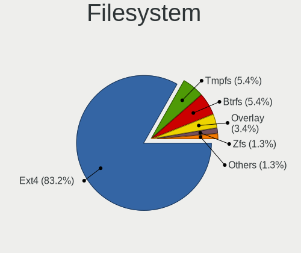
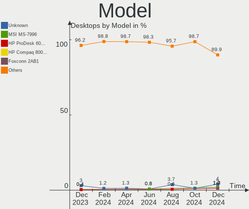
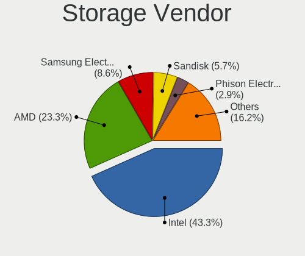
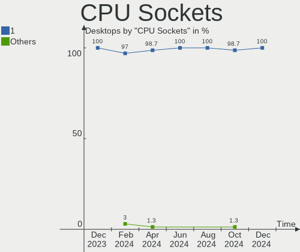
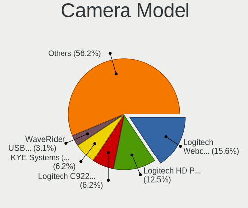

Linux Mint - Hardware Trends (Desktops)
---------------------------------------

A project to identify most popular hardware characteristics and track their change
over time based on data collected by Linux users at https://Linux-Hardware.org.

Anyone can contribute to this report by the [hw-probe](https://github.com/linuxhw/hw-probe) tool:

    sudo -E hw-probe -all -upload

This report is for one last month. Overall report since the beginning of time: [TestDays](https://github.com/linuxhw/TestDays)

Period: Apr, 2023.

Contents
--------

* [ System ](#system)
  - [ OS                       ](#os)
  - [ OS Family                ](#os-family)
  - [ Kernel                   ](#kernel)
  - [ Kernel Family            ](#kernel-family)
  - [ Kernel Major Ver.        ](#kernel-major-ver)
  - [ Arch                     ](#arch)
  - [ DE                       ](#de)
  - [ Display Server           ](#display-server)
  - [ Display Manager          ](#display-manager)
  - [ OS Lang                  ](#os-lang)
  - [ Boot Mode                ](#boot-mode)
  - [ Filesystem               ](#filesystem)
  - [ Part. scheme             ](#part-scheme)
  - [ Dual Boot with Linux/BSD ](#dual-boot-with-linuxbsd)
  - [ Dual Boot (Win)          ](#dual-boot-win)

* [ Board ](#board)
  - [ Vendor                   ](#vendor)
  - [ Model                    ](#model)
  - [ Model Family             ](#model-family)
  - [ MFG Year                 ](#mfg-year)
  - [ Form Factor              ](#form-factor)
  - [ Secure Boot              ](#secure-boot)
  - [ Coreboot                 ](#coreboot)
  - [ RAM Size                 ](#ram-size)
  - [ RAM Used                 ](#ram-used)
  - [ Total Drives             ](#total-drives)
  - [ Has CD-ROM               ](#has-cd-rom)
  - [ Has Ethernet             ](#has-ethernet)
  - [ Has WiFi                 ](#has-wifi)
  - [ Has Bluetooth            ](#has-bluetooth)

* [ Location ](#location)
  - [ Country                  ](#country)
  - [ City                     ](#city)

* [ Drives ](#drives)
  - [ Drive Vendor             ](#drive-vendor)
  - [ Drive Model              ](#drive-model)
  - [ HDD Vendor               ](#hdd-vendor)
  - [ SSD Vendor               ](#ssd-vendor)
  - [ Drive Kind               ](#drive-kind)
  - [ Drive Connector          ](#drive-connector)
  - [ Drive Size               ](#drive-size)
  - [ Space Total              ](#space-total)
  - [ Space Used               ](#space-used)
  - [ Malfunc. Drives          ](#malfunc-drives)
  - [ Malfunc. Drive Vendor    ](#malfunc-drive-vendor)
  - [ Malfunc. HDD Vendor      ](#malfunc-hdd-vendor)
  - [ Malfunc. Drive Kind      ](#malfunc-drive-kind)
  - [ Failed Drives            ](#failed-drives)
  - [ Failed Drive Vendor      ](#failed-drive-vendor)
  - [ Drive Status             ](#drive-status)

* [ Storage controller ](#storage-controller)
  - [ Storage Vendor           ](#storage-vendor)
  - [ Storage Model            ](#storage-model)
  - [ Storage Kind             ](#storage-kind)

* [ Processor ](#processor)
  - [ CPU Vendor               ](#cpu-vendor)
  - [ CPU Model                ](#cpu-model)
  - [ CPU Model Family         ](#cpu-model-family)
  - [ CPU Cores                ](#cpu-cores)
  - [ CPU Sockets              ](#cpu-sockets)
  - [ CPU Threads              ](#cpu-threads)
  - [ CPU Op-Modes             ](#cpu-op-modes)
  - [ CPU Microcode            ](#cpu-microcode)
  - [ CPU Microarch            ](#cpu-microarch)

* [ Graphics ](#graphics)
  - [ GPU Vendor               ](#gpu-vendor)
  - [ GPU Model                ](#gpu-model)
  - [ GPU Combo                ](#gpu-combo)
  - [ GPU Driver               ](#gpu-driver)
  - [ GPU Memory               ](#gpu-memory)

* [ Monitor ](#monitor)
  - [ Monitor Vendor           ](#monitor-vendor)
  - [ Monitor Model            ](#monitor-model)
  - [ Monitor Resolution       ](#monitor-resolution)
  - [ Monitor Diagonal         ](#monitor-diagonal)
  - [ Monitor Width            ](#monitor-width)
  - [ Aspect Ratio             ](#aspect-ratio)
  - [ Monitor Area             ](#monitor-area)
  - [ Pixel Density            ](#pixel-density)
  - [ Multiple Monitors        ](#multiple-monitors)

* [ Network ](#network)
  - [ Net Controller Vendor    ](#net-controller-vendor)
  - [ Net Controller Model     ](#net-controller-model)
  - [ Wireless Vendor          ](#wireless-vendor)
  - [ Wireless Model           ](#wireless-model)
  - [ Ethernet Vendor          ](#ethernet-vendor)
  - [ Ethernet Model           ](#ethernet-model)
  - [ Net Controller Kind      ](#net-controller-kind)
  - [ Used Controller          ](#used-controller)
  - [ NICs                     ](#nics)
  - [ IPv6                     ](#ipv6)

* [ Bluetooth ](#bluetooth)
  - [ Bluetooth Vendor         ](#bluetooth-vendor)
  - [ Bluetooth Model          ](#bluetooth-model)

* [ Sound ](#sound)
  - [ Sound Vendor             ](#sound-vendor)
  - [ Sound Model              ](#sound-model)

* [ Memory ](#memory)
  - [ Memory Vendor            ](#memory-vendor)
  - [ Memory Model             ](#memory-model)
  - [ Memory Kind              ](#memory-kind)
  - [ Memory Form Factor       ](#memory-form-factor)
  - [ Memory Size              ](#memory-size)
  - [ Memory Speed             ](#memory-speed)

* [ Printers & scanners ](#printers--scanners)
  - [ Printer Vendor           ](#printer-vendor)
  - [ Printer Model            ](#printer-model)
  - [ Scanner Vendor           ](#scanner-vendor)
  - [ Scanner Model            ](#scanner-model)

* [ Camera ](#camera)
  - [ Camera Vendor            ](#camera-vendor)
  - [ Camera Model             ](#camera-model)

* [ Security ](#security)
  - [ Fingerprint Vendor       ](#fingerprint-vendor)
  - [ Fingerprint Model        ](#fingerprint-model)
  - [ Chipcard Vendor          ](#chipcard-vendor)
  - [ Chipcard Model           ](#chipcard-model)

* [ Unsupported ](#unsupported)
  - [ Unsupported Devices      ](#unsupported-devices)
  - [ Unsupported Device Types ](#unsupported-device-types)

System
------

OS
--

Installed operating systems

| Name            | Desktops | Percent |
|-----------------|----------|---------|
| Linux Mint 21.1 | 161      | 79.31%  |
| Linux Mint 20.3 | 20       | 9.85%   |
| Linux Mint 21   | 13       | 6.4%    |
| Linux Mint 20.2 | 2        | 0.99%   |
| Linux Mint 19.3 | 2        | 0.99%   |
| Linux Mint 19   | 2        | 0.99%   |
| Linux Mint 20.1 | 1        | 0.49%   |
| Linux Mint 18.3 | 1        | 0.49%   |
| Linux Mint 18   | 1        | 0.49%   |

OS Family
---------

OS without a version

| Name       | Desktops | Percent |
|------------|----------|---------|
| Linux Mint | 203      | 100%    |

Kernel
------

Version of the Linux kernel

| Version                 | Desktops | Percent |
|-------------------------|----------|---------|
| 5.15.0-69-generic       | 88       | 43.35%  |
| 5.15.0-70-generic       | 31       | 15.27%  |
| 5.15.0-71-generic       | 14       | 6.9%    |
| 5.4.0-146-generic       | 13       | 6.4%    |
| 5.15.0-56-generic       | 12       | 5.91%   |
| 5.19.0-38-generic       | 9        | 4.43%   |
| 5.15.0-67-generic       | 8        | 3.94%   |
| 5.19.0-41-generic       | 4        | 1.97%   |
| 4.15.0-209-generic      | 3        | 1.48%   |
| 6.2.0-060200-generic    | 2        | 0.99%   |
| 6.1.0-1009-oem          | 2        | 0.99%   |
| 5.4.0-139-generic       | 2        | 0.99%   |
| 6.2.9-060209-generic    | 1        | 0.49%   |
| 6.2.13-1-liquorix-amd64 | 1        | 0.49%   |
| 6.2.12-x64v3-xanmod1    | 1        | 0.49%   |
| 6.2.12-060212-generic   | 1        | 0.49%   |
| 6.1.13-060113-generic   | 1        | 0.49%   |
| 6.1.0-1008-oem          | 1        | 0.49%   |
| 5.4.0-147-generic       | 1        | 0.49%   |
| 5.4.0-144-generic       | 1        | 0.49%   |
| 5.4.0-109-generic       | 1        | 0.49%   |
| 5.17.0-1029-oem         | 1        | 0.49%   |
| 5.15.0-58-generic       | 1        | 0.49%   |
| 5.15.0-41-generic       | 1        | 0.49%   |
| 5.0.0-23-generic        | 1        | 0.49%   |
| 4.4.0-140-generic       | 1        | 0.49%   |
| 4.10.0-38-generic       | 1        | 0.49%   |

Kernel Family
-------------

Linux kernel without a distro release

| Version | Desktops | Percent |
|---------|----------|---------|
| 5.15.0  | 155      | 76.35%  |
| 5.4.0   | 18       | 8.87%   |
| 5.19.0  | 13       | 6.4%    |
| 6.1.0   | 3        | 1.48%   |
| 4.15.0  | 3        | 1.48%   |
| 6.2.12  | 2        | 0.99%   |
| 6.2.0   | 2        | 0.99%   |
| 6.2.9   | 1        | 0.49%   |
| 6.2.13  | 1        | 0.49%   |
| 6.1.13  | 1        | 0.49%   |
| 5.17.0  | 1        | 0.49%   |
| 5.0.0   | 1        | 0.49%   |
| 4.4.0   | 1        | 0.49%   |
| 4.10.0  | 1        | 0.49%   |

Kernel Major Ver.
-----------------

Linux kernel major version

| Version | Desktops | Percent |
|---------|----------|---------|
| 5.15    | 155      | 76.35%  |
| 5.4     | 18       | 8.87%   |
| 5.19    | 13       | 6.4%    |
| 6.2     | 6        | 2.96%   |
| 6.1     | 4        | 1.97%   |
| 4.15    | 3        | 1.48%   |
| 5.17    | 1        | 0.49%   |
| 5.0     | 1        | 0.49%   |
| 4.4     | 1        | 0.49%   |
| 4.10    | 1        | 0.49%   |

Arch
----

OS architecture (x86_64, i586, etc.)

| Name   | Desktops | Percent |
|--------|----------|---------|
| x86_64 | 202      | 99.51%  |
| i686   | 1        | 0.49%   |

DE
--

Desktop Environment

| Name       | Desktops | Percent |
|------------|----------|---------|
| X-Cinnamon | 146      | 71.92%  |
| MATE       | 31       | 15.27%  |
| XFCE       | 21       | 10.34%  |
| Cinnamon   | 2        | 0.99%   |
| KDE5       | 1        | 0.49%   |
| GNOME      | 1        | 0.49%   |
| Unknown    | 1        | 0.49%   |

Display Server
--------------

X11 or Wayland

| Name | Desktops | Percent |
|------|----------|---------|
| X11  | 203      | 100%    |

Display Manager
---------------

SDDM, LightDM, etc.

| Name    | Desktops | Percent |
|---------|----------|---------|
| Unknown | 123      | 60.59%  |
| LightDM | 79       | 38.92%  |
| MDM     | 1        | 0.49%   |

OS Lang
-------

Language

| Lang    | Desktops | Percent |
|---------|----------|---------|
| en_US   | 53       | 26.11%  |
| de_DE   | 37       | 18.23%  |
| fr_FR   | 18       | 8.87%   |
| en_GB   | 15       | 7.39%   |
| pt_BR   | 14       | 6.9%    |
| it_IT   | 9        | 4.43%   |
| en_CA   | 9        | 4.43%   |
| en_AU   | 6        | 2.96%   |
| ru_RU   | 5        | 2.46%   |
| sk_SK   | 4        | 1.97%   |
| pl_PL   | 4        | 1.97%   |
| C       | 4        | 1.97%   |
| nl_NL   | 3        | 1.48%   |
| es_ES   | 2        | 0.99%   |
| de_CH   | 2        | 0.99%   |
| de_AT   | 2        | 0.99%   |
| uk_UA   | 1        | 0.49%   |
| sv_SE   | 1        | 0.49%   |
| ko_KR   | 1        | 0.49%   |
| ja_JP   | 1        | 0.49%   |
| fr_BE   | 1        | 0.49%   |
| es_VE   | 1        | 0.49%   |
| es_MX   | 1        | 0.49%   |
| es_GT   | 1        | 0.49%   |
| es_AR   | 1        | 0.49%   |
| en_ZA   | 1        | 0.49%   |
| en_IN   | 1        | 0.49%   |
| en_IL   | 1        | 0.49%   |
| en_IE   | 1        | 0.49%   |
| el_GR   | 1        | 0.49%   |
| ar_KW   | 1        | 0.49%   |
| Unknown | 1        | 0.49%   |

Boot Mode
---------

EFI or BIOS

| Mode | Desktops | Percent |
|------|----------|---------|
| EFI  | 120      | 59.11%  |
| BIOS | 83       | 40.89%  |

Filesystem
----------

Type of filesystem

| Type    | Desktops | Percent |
|---------|----------|---------|
| Ext4    | 192      | 94.58%  |
| Overlay | 4        | 1.97%   |
| Xfs     | 3        | 1.48%   |
| Btrfs   | 3        | 1.48%   |
| Zfs     | 1        | 0.49%   |

Part. scheme
------------

Scheme of partitioning

| Type    | Desktops | Percent |
|---------|----------|---------|
| Unknown | 122      | 60.1%   |
| GPT     | 67       | 33%     |
| MBR     | 14       | 6.9%    |

Dual Boot with Linux/BSD
------------------------

Hosting more than one Linux/BSD

| Dual boot | Desktops | Percent |
|-----------|----------|---------|
| No        | 180      | 88.67%  |
| Yes       | 23       | 11.33%  |

Dual Boot (Win)
---------------

Hosting Linux and Windows

| Dual boot | Desktops | Percent |
|-----------|----------|---------|
| No        | 163      | 80.3%   |
| Yes       | 40       | 19.7%   |

Board
-----

Vendor
------

Motherboard manufacturer

| Name                                 | Desktops | Percent |
|--------------------------------------|----------|---------|
| ASUSTek Computer                     | 53       | 26.11%  |
| Gigabyte Technology                  | 35       | 17.24%  |
| MSI                                  | 28       | 13.79%  |
| Dell                                 | 21       | 10.34%  |
| Hewlett-Packard                      | 17       | 8.37%   |
| ASRock                               | 11       | 5.42%   |
| Lenovo                               | 6        | 2.96%   |
| OEM                                  | 3        | 1.48%   |
| Intel                                | 3        | 1.48%   |
| Acer                                 | 3        | 1.48%   |
| PCWare                               | 2        | 0.99%   |
| Medion                               | 2        | 0.99%   |
| Gateway                              | 2        | 0.99%   |
| Foxconn                              | 2        | 0.99%   |
| Biostar                              | 2        | 0.99%   |
| AZW                                  | 2        | 0.99%   |
| AMD                                  | 2        | 0.99%   |
| Shuttle                              | 1        | 0.49%   |
| Shenzhen Meigao Electronic Equipment | 1        | 0.49%   |
| Pegatron                             | 1        | 0.49%   |
| Inventec                             | 1        | 0.49%   |
| Huanan                               | 1        | 0.49%   |
| Cincoze                              | 1        | 0.49%   |
| BESSTAR Tech                         | 1        | 0.49%   |
| AMI                                  | 1        | 0.49%   |
| Unknown                              | 1        | 0.49%   |

Model
-----

Motherboard model

| Name                                       | Desktops | Percent |
|--------------------------------------------|----------|---------|
| ASUS All Series                            | 4        | 1.97%   |
| MSI MS-7C37                                | 3        | 1.48%   |
| Gigabyte B550 AORUS ELITE V2               | 3        | 1.48%   |
| ASUS TUF Gaming B550M-PLUS                 | 3        | 1.48%   |
| MSI MS-7C56                                | 2        | 0.99%   |
| MSI MS-7C52                                | 2        | 0.99%   |
| MSI MS-7B86                                | 2        | 0.99%   |
| Gigabyte X570 GAMING X                     | 2        | 0.99%   |
| Gigabyte GA-MA785GM-US2H                   | 2        | 0.99%   |
| Gigabyte B450 AORUS M                      | 2        | 0.99%   |
| Dell OptiPlex 990                          | 2        | 0.99%   |
| Dell OptiPlex 9020                         | 2        | 0.99%   |
| Dell OptiPlex 780                          | 2        | 0.99%   |
| Dell OptiPlex 7010                         | 2        | 0.99%   |
| Dell OptiPlex 3020                         | 2        | 0.99%   |
| ASUS TUF Gaming X570-PLUS                  | 2        | 0.99%   |
| ASUS SABERTOOTH 990FX R2.0                 | 2        | 0.99%   |
| ASUS M5A78L-M PLUS/USB3                    | 2        | 0.99%   |
| Shuttle SH67H3                             | 1        | 0.49%   |
| Shenzhen Meigao Electronic Equipment UM690 | 1        | 0.49%   |
| Pegatron IPMH61P1                          | 1        | 0.49%   |
| PCWare IPX1800G2                           | 1        | 0.49%   |
| PCWare IPMH61R3                            | 1        | 0.49%   |
| OEM X99-Turbo                              | 1        | 0.49%   |
| OEM Intel H81                              | 1        | 0.49%   |
| OEM H110                                   | 1        | 0.49%   |
| MSI MS-7D52                                | 1        | 0.49%   |
| MSI MS-7D50                                | 1        | 0.49%   |
| MSI MS-7D46                                | 1        | 0.49%   |
| MSI MS-7D31                                | 1        | 0.49%   |
| MSI MS-7D25                                | 1        | 0.49%   |
| MSI MS-7D18                                | 1        | 0.49%   |
| MSI MS-7C95                                | 1        | 0.49%   |
| MSI MS-7C91                                | 1        | 0.49%   |
| MSI MS-7C02                                | 1        | 0.49%   |
| MSI MS-7B79                                | 1        | 0.49%   |
| MSI MS-7B33                                | 1        | 0.49%   |
| MSI MS-7A37                                | 1        | 0.49%   |
| MSI MS-7A36                                | 1        | 0.49%   |
| MSI MS-7850                                | 1        | 0.49%   |

Model Family
------------

Motherboard model prefix

| Name                                       | Desktops | Percent |
|--------------------------------------------|----------|---------|
| Dell OptiPlex                              | 16       | 7.88%   |
| ASUS TUF                                   | 9        | 4.43%   |
| ASUS PRIME                                 | 9        | 4.43%   |
| Lenovo ThinkCentre                         | 5        | 2.46%   |
| HP Compaq                                  | 5        | 2.46%   |
| ASUS ROG                                   | 4        | 1.97%   |
| ASUS All                                   | 4        | 1.97%   |
| MSI MS-7C37                                | 3        | 1.48%   |
| HP EliteDesk                               | 3        | 1.48%   |
| Gigabyte X570                              | 3        | 1.48%   |
| Gigabyte B550                              | 3        | 1.48%   |
| Dell Precision                             | 3        | 1.48%   |
| ASUS M5A78L-M                              | 3        | 1.48%   |
| MSI MS-7C56                                | 2        | 0.99%   |
| MSI MS-7C52                                | 2        | 0.99%   |
| MSI MS-7B86                                | 2        | 0.99%   |
| Gigabyte GA-MA785GM-US2H                   | 2        | 0.99%   |
| Gigabyte B450                              | 2        | 0.99%   |
| Gigabyte AB350-Gaming                      | 2        | 0.99%   |
| ASUS SABERTOOTH                            | 2        | 0.99%   |
| ASUS P8H61-M                               | 2        | 0.99%   |
| ASUS M5A97                                 | 2        | 0.99%   |
| ASRock Z370                                | 2        | 0.99%   |
| Acer Aspire                                | 2        | 0.99%   |
| Shuttle SH67H3                             | 1        | 0.49%   |
| Shenzhen Meigao Electronic Equipment UM690 | 1        | 0.49%   |
| Pegatron IPMH61P1                          | 1        | 0.49%   |
| PCWare IPX1800G2                           | 1        | 0.49%   |
| PCWare IPMH61R3                            | 1        | 0.49%   |
| OEM X99-Turbo                              | 1        | 0.49%   |
| OEM Intel                                  | 1        | 0.49%   |
| OEM H110                                   | 1        | 0.49%   |
| MSI MS-7D52                                | 1        | 0.49%   |
| MSI MS-7D50                                | 1        | 0.49%   |
| MSI MS-7D46                                | 1        | 0.49%   |
| MSI MS-7D31                                | 1        | 0.49%   |
| MSI MS-7D25                                | 1        | 0.49%   |
| MSI MS-7D18                                | 1        | 0.49%   |
| MSI MS-7C95                                | 1        | 0.49%   |
| MSI MS-7C91                                | 1        | 0.49%   |

MFG Year
--------

Motherboard manufacture year

| Year | Desktops | Percent |
|------|----------|---------|
| 2020 | 23       | 11.33%  |
| 2012 | 22       | 10.84%  |
| 2019 | 18       | 8.87%   |
| 2018 | 16       | 7.88%   |
| 2014 | 16       | 7.88%   |
| 2011 | 13       | 6.4%    |
| 2022 | 11       | 5.42%   |
| 2021 | 11       | 5.42%   |
| 2017 | 11       | 5.42%   |
| 2009 | 11       | 5.42%   |
| 2013 | 10       | 4.93%   |
| 2010 | 10       | 4.93%   |
| 2016 | 9        | 4.43%   |
| 2015 | 9        | 4.43%   |
| 2008 | 5        | 2.46%   |
| 2007 | 5        | 2.46%   |
| 2023 | 2        | 0.99%   |
| 2006 | 1        | 0.49%   |

Form Factor
-----------

Physical design of the computer

| Name    | Desktops | Percent |
|---------|----------|---------|
| Desktop | 203      | 100%    |

Secure Boot
-----------

Enabled or disabled

| State    | Desktops | Percent |
|----------|----------|---------|
| Disabled | 192      | 94.58%  |
| Enabled  | 11       | 5.42%   |

Coreboot
--------

Have coreboot on board

| Used | Desktops | Percent |
|------|----------|---------|
| No   | 203      | 100%    |

RAM Size
--------

Total RAM memory

| Size in GB  | Desktops | Percent |
|-------------|----------|---------|
| 16.01-24.0  | 59       | 29.06%  |
| 32.01-64.0  | 38       | 18.72%  |
| 8.01-16.0   | 32       | 15.76%  |
| 4.01-8.0    | 29       | 14.29%  |
| 3.01-4.0    | 24       | 11.82%  |
| 64.01-256.0 | 13       | 6.4%    |
| 24.01-32.0  | 5        | 2.46%   |
| 2.01-3.0    | 2        | 0.99%   |
| 1.01-2.0    | 1        | 0.49%   |

RAM Used
--------

Used RAM memory

| Used GB   | Desktops | Percent |
|-----------|----------|---------|
| 2.01-3.0  | 71       | 34.98%  |
| 1.01-2.0  | 61       | 30.05%  |
| 3.01-4.0  | 35       | 17.24%  |
| 4.01-8.0  | 25       | 12.32%  |
| 8.01-16.0 | 8        | 3.94%   |
| 0.51-1.0  | 3        | 1.48%   |

Total Drives
------------

Number of drives on board

| Drives | Desktops | Percent |
|--------|----------|---------|
| 1      | 65       | 32.02%  |
| 2      | 62       | 30.54%  |
| 3      | 33       | 16.26%  |
| 4      | 21       | 10.34%  |
| 6      | 9        | 4.43%   |
| 5      | 9        | 4.43%   |
| 7      | 2        | 0.99%   |
| 28     | 1        | 0.49%   |
| 8      | 1        | 0.49%   |

Has CD-ROM
----------

Has CD-ROM on board

| Presented | Desktops | Percent |
|-----------|----------|---------|
| Yes       | 114      | 56.16%  |
| No        | 89       | 43.84%  |

Has Ethernet
------------

Has Ethernet on board

| Presented | Desktops | Percent |
|-----------|----------|---------|
| Yes       | 203      | 100%    |

Has WiFi
--------

Has WiFi module

| Presented | Desktops | Percent |
|-----------|----------|---------|
| No        | 113      | 55.67%  |
| Yes       | 90       | 44.33%  |

Has Bluetooth
-------------

Has Bluetooth module

| Presented | Desktops | Percent |
|-----------|----------|---------|
| No        | 129      | 63.55%  |
| Yes       | 74       | 36.45%  |

Location
--------

Country
-------

Geographic location (country)

| Country          | Desktops | Percent |
|------------------|----------|---------|
| Germany          | 38       | 18.72%  |
| USA              | 36       | 17.73%  |
| France           | 16       | 7.88%   |
| Brazil           | 16       | 7.88%   |
| UK               | 14       | 6.9%    |
| Italy            | 11       | 5.42%   |
| Canada           | 11       | 5.42%   |
| Netherlands      | 7        | 3.45%   |
| Australia        | 6        | 2.96%   |
| Russia           | 5        | 2.46%   |
| Poland           | 5        | 2.46%   |
| Slovakia         | 4        | 1.97%   |
| Switzerland      | 3        | 1.48%   |
| Sweden           | 3        | 1.48%   |
| Spain            | 2        | 0.99%   |
| Greece           | 2        | 0.99%   |
| Ecuador          | 2        | 0.99%   |
| Austria          | 2        | 0.99%   |
| Venezuela        | 1        | 0.49%   |
| Ukraine          | 1        | 0.49%   |
| South Korea      | 1        | 0.49%   |
| South Africa     | 1        | 0.49%   |
| Serbia           | 1        | 0.49%   |
| Qatar            | 1        | 0.49%   |
| Pakistan         | 1        | 0.49%   |
| Norway           | 1        | 0.49%   |
| Mexico           | 1        | 0.49%   |
| Japan            | 1        | 0.49%   |
| Israel           | 1        | 0.49%   |
| Ireland          | 1        | 0.49%   |
| India            | 1        | 0.49%   |
| Guatemala        | 1        | 0.49%   |
| French Polynesia | 1        | 0.49%   |
| Denmark          | 1        | 0.49%   |
| Croatia          | 1        | 0.49%   |
| Bulgaria         | 1        | 0.49%   |
| Belgium          | 1        | 0.49%   |
| Argentina        | 1        | 0.49%   |

City
----

Geographic location (city)

| City                  | Desktops | Percent |
|-----------------------|----------|---------|
| Lübeck               | 3        | 1.48%   |
| Zurich                | 2        | 0.99%   |
| West Valley City      | 2        | 0.99%   |
| Vancouver             | 2        | 0.99%   |
| Stockholm             | 2        | 0.99%   |
| Rome                  | 2        | 0.99%   |
| Ludwigshafen am Rhein | 2        | 0.99%   |
| Guayaquil             | 2        | 0.99%   |
| Edmonton              | 2        | 0.99%   |
| Cologne               | 2        | 0.99%   |
| Caen                  | 2        | 0.99%   |
| Brisbane              | 2        | 0.99%   |
| Yeosu                 | 1        | 0.49%   |
| Yamagata              | 1        | 0.49%   |
| Xochimilco            | 1        | 0.49%   |
| Würzburg             | 1        | 0.49%   |
| Woodway               | 1        | 0.49%   |
| Wismar                | 1        | 0.49%   |
| Weert                 | 1        | 0.49%   |
| Waterbury             | 1        | 0.49%   |
| Warsaw                | 1        | 0.49%   |
| Warburg               | 1        | 0.49%   |
| Voskresensk           | 1        | 0.49%   |
| Velky Krtis           | 1        | 0.49%   |
| Utrecht               | 1        | 0.49%   |
| Ulyanovsk             | 1        | 0.49%   |
| Twickenham            | 1        | 0.49%   |
| Traunstein            | 1        | 0.49%   |
| Toronto               | 1        | 0.49%   |
| Thomasville           | 1        | 0.49%   |
| Thessaloniki          | 1        | 0.49%   |
| The Hague             | 1        | 0.49%   |
| Taufkirchen           | 1        | 0.49%   |
| Sydney                | 1        | 0.49%   |
| Swords                | 1        | 0.49%   |
| Swaffham              | 1        | 0.49%   |
| Suhl                  | 1        | 0.49%   |
| Stephenville Crossing | 1        | 0.49%   |
| St Helens             | 1        | 0.49%   |
| Sofia                 | 1        | 0.49%   |

Drives
------

Drive Vendor
------------

Hard drive vendors

| Vendor                      | Desktops | Drives | Percent |
|-----------------------------|----------|--------|---------|
| WDC                         | 73       | 114    | 18.34%  |
| Seagate                     | 65       | 93     | 16.33%  |
| Samsung Electronics         | 55       | 79     | 13.82%  |
| SanDisk                     | 26       | 31     | 6.53%   |
| Kingston                    | 26       | 31     | 6.53%   |
| Toshiba                     | 24       | 31     | 6.03%   |
| Crucial                     | 20       | 24     | 5.03%   |
| Hitachi                     | 15       | 15     | 3.77%   |
| A-DATA Technology           | 7        | 7      | 1.76%   |
| Kingston Technology Company | 6        | 6      | 1.51%   |
| Intel                       | 6        | 6      | 1.51%   |
| Unknown                     | 5        | 7      | 1.26%   |
| HGST                        | 5        | 5      | 1.26%   |
| China                       | 5        | 5      | 1.26%   |
| Phison Electronics          | 4        | 4      | 1.01%   |
| Micron/Crucial Technology   | 4        | 4      | 1.01%   |
| PNY                         | 3        | 3      | 0.75%   |
| Maxtor                      | 3        | 3      | 0.75%   |
| JMicron Technology          | 3        | 5      | 0.75%   |
| Intenso                     | 3        | 4      | 0.75%   |
| Transcend                   | 2        | 2      | 0.5%    |
| Team                        | 2        | 2      | 0.5%    |
| SPCC                        | 2        | 2      | 0.5%    |
| Realtek Semiconductor       | 2        | 2      | 0.5%    |
| OCZ-VERTEX3                 | 2        | 2      | 0.5%    |
| Lexar                       | 2        | 2      | 0.5%    |
| GOODRAM                     | 2        | 2      | 0.5%    |
| Fanxiang                    | 2        | 2      | 0.5%    |
| Corsair                     | 2        | 2      | 0.5%    |
| VICKTER                     | 1        | 1      | 0.25%   |
| Verbatim                    | 1        | 1      | 0.25%   |
| TS256GSS                    | 1        | 1      | 0.25%   |
| sobetter                    | 1        | 1      | 0.25%   |
| SK hynix                    | 1        | 1      | 0.25%   |
| Silicon Motion              | 1        | 1      | 0.25%   |
| Rogueware                   | 1        | 1      | 0.25%   |
| Phison                      | 1        | 1      | 0.25%   |
| Patriot                     | 1        | 1      | 0.25%   |
| Netac                       | 1        | 1      | 0.25%   |
| MyDigitalSSD                | 1        | 1      | 0.25%   |

Drive Model
-----------

Hard drive models

| Model                                              | Desktops | Percent |
|----------------------------------------------------|----------|---------|
| Kingston SA400S37240G 240GB SSD                    | 10       | 2.05%   |
| Seagate ST1000DM010-2EP102 1TB                     | 7        | 1.43%   |
| Samsung NVMe SSD Controller SM981/PM981/PM983 1TB  | 7        | 1.43%   |
| Toshiba DT01ACA200 2TB                             | 5        | 1.02%   |
| Toshiba DT01ACA100 1TB                             | 5        | 1.02%   |
| Seagate ST500DM002-1BD142 500GB                    | 5        | 1.02%   |
| Samsung SSD 850 EVO 500GB                          | 5        | 1.02%   |
| Samsung SSD 850 EVO 250GB                          | 5        | 1.02%   |
| WDC WD10EZEX-08WN4A0 1TB                           | 4        | 0.82%   |
| WDC WD10EZEX-00BN5A0 1TB                           | 4        | 0.82%   |
| Samsung SSD 870 QVO 2TB                            | 4        | 0.82%   |
| Samsung SSD 860 EVO 500GB                          | 4        | 0.82%   |
| Samsung SSD 860 EVO 1TB                            | 4        | 0.82%   |
| WDC WDS240G2G0A-00JH30 240GB SSD                   | 3        | 0.61%   |
| WDC WD2003FZEX-00Z4SA0 2TB                         | 3        | 0.61%   |
| Seagate ST3500418AS 500GB                          | 3        | 0.61%   |
| Seagate ST2000DM001-1ER164 2TB                     | 3        | 0.61%   |
| Seagate ST1000DM003-1ER162 1TB                     | 3        | 0.61%   |
| Seagate Expansion Desk 8TB                         | 3        | 0.61%   |
| SanDisk SDSSDH3512G 512GB                          | 3        | 0.61%   |
| Samsung SSD 980 1TB                                | 3        | 0.61%   |
| Samsung SSD 870 QVO 1TB                            | 3        | 0.61%   |
| Samsung SSD 870 EVO 500GB                          | 3        | 0.61%   |
| Samsung NVMe SSD Controller PM9A1/PM9A3/980PRO 2TB | 3        | 0.61%   |
| Phison E12 NVMe Controller 512GB                   | 3        | 0.61%   |
| Kingston SV300S37A60G 64GB SSD                     | 3        | 0.61%   |
| Kingston SNVS500G 500GB                            | 3        | 0.61%   |
| Kingston SA400S37480G 480GB SSD                    | 3        | 0.61%   |
| Crucial CT480BX500SSD1 480GB                       | 3        | 0.61%   |
| Crucial CT1000BX500SSD1 1TB                        | 3        | 0.61%   |
| WDC WDS500G2B0A-00SM50 500GB SSD                   | 2        | 0.41%   |
| WDC WDS250G2B0B-00YS70 250GB SSD                   | 2        | 0.41%   |
| WDC WD40EFAX-68JH4N1 4TB                           | 2        | 0.41%   |
| WDC WD30EZRX-00DC0B0 3TB                           | 2        | 0.41%   |
| WDC WD2500AAKX-00ERMA0 250GB                       | 2        | 0.41%   |
| WDC WD2500AAKS-00VSA0 250GB                        | 2        | 0.41%   |
| WDC WD20EFRX-68AX9N0 2TB                           | 2        | 0.41%   |
| WDC WD20EARX-00PASB0 2TB                           | 2        | 0.41%   |
| WDC WD1600AAJS-75M0A0 160GB                        | 2        | 0.41%   |
| WDC WD10EZEX-75WN4A0 1TB                           | 2        | 0.41%   |

HDD Vendor
----------

Hard disk drive vendors

| Vendor              | Desktops | Drives | Percent |
|---------------------|----------|--------|---------|
| Seagate             | 64       | 91     | 33.68%  |
| WDC                 | 63       | 96     | 33.16%  |
| Toshiba             | 22       | 29     | 11.58%  |
| Hitachi             | 15       | 15     | 7.89%   |
| Samsung Electronics | 9        | 9      | 4.74%   |
| HGST                | 5        | 5      | 2.63%   |
| Maxtor              | 3        | 3      | 1.58%   |
| JMicron Technology  | 3        | 5      | 1.58%   |
| Unknown             | 2        | 2      | 1.05%   |
| LaCie               | 1        | 1      | 0.53%   |
| Intenso             | 1        | 1      | 0.53%   |
| Inateck             | 1        | 1      | 0.53%   |
| ASMT                | 1        | 1      | 0.53%   |

SSD Vendor
----------

Solid state drive vendors

| Vendor              | Desktops | Drives | Percent |
|---------------------|----------|--------|---------|
| Samsung Electronics | 34       | 41     | 23.13%  |
| Kingston            | 24       | 27     | 16.33%  |
| Crucial             | 19       | 20     | 12.93%  |
| SanDisk             | 17       | 18     | 11.56%  |
| WDC                 | 9        | 9      | 6.12%   |
| China               | 5        | 5      | 3.4%    |
| A-DATA Technology   | 5        | 5      | 3.4%    |
| PNY                 | 3        | 3      | 2.04%   |
| Toshiba             | 2        | 2      | 1.36%   |
| Team                | 2        | 2      | 1.36%   |
| SPCC                | 2        | 2      | 1.36%   |
| OCZ-VERTEX3         | 2        | 2      | 1.36%   |
| Lexar               | 2        | 2      | 1.36%   |
| GOODRAM             | 2        | 2      | 1.36%   |
| Corsair             | 2        | 2      | 1.36%   |
| Verbatim            | 1        | 1      | 0.68%   |
| Transcend           | 1        | 1      | 0.68%   |
| SK hynix            | 1        | 1      | 0.68%   |
| Seagate             | 1        | 1      | 0.68%   |
| Rogueware           | 1        | 1      | 0.68%   |
| Patriot             | 1        | 1      | 0.68%   |
| Netac               | 1        | 1      | 0.68%   |
| MyDigitalSSD        | 1        | 1      | 0.68%   |
| Micron Technology   | 1        | 1      | 0.68%   |
| Lenovo              | 1        | 1      | 0.68%   |
| Intenso             | 1        | 1      | 0.68%   |
| Intel               | 1        | 1      | 0.68%   |
| GALAX               | 1        | 1      | 0.68%   |
| G.Skill             | 1        | 1      | 0.68%   |
| Fanxiang            | 1        | 1      | 0.68%   |
| Apacer              | 1        | 1      | 0.68%   |
| Unknown             | 1        | 1      | 0.68%   |

Drive Kind
----------

HDD or SSD

| Kind    | Desktops | Drives | Percent |
|---------|----------|--------|---------|
| HDD     | 136      | 259    | 40.72%  |
| SSD     | 119      | 159    | 35.63%  |
| NVMe    | 69       | 88     | 20.66%  |
| Unknown | 8        | 10     | 2.4%    |
| MMC     | 2        | 2      | 0.6%    |

Drive Connector
---------------

SATA, SAS, NVMe, etc.

| Type | Desktops | Drives | Percent |
|------|----------|--------|---------|
| SATA | 187      | 400    | 66.31%  |
| NVMe | 69       | 88     | 24.47%  |
| SAS  | 24       | 28     | 8.51%   |
| MMC  | 2        | 2      | 0.71%   |

Drive Size
----------

Size of hard drive

| Size in TB | Desktops | Drives | Percent |
|------------|----------|--------|---------|
| 0.01-0.5   | 133      | 199    | 44.93%  |
| 0.51-1.0   | 92       | 117    | 31.08%  |
| 1.01-2.0   | 39       | 45     | 13.18%  |
| 3.01-4.0   | 14       | 14     | 4.73%   |
| 2.01-3.0   | 10       | 13     | 3.38%   |
| 4.01-10.0  | 5        | 9      | 1.69%   |
| 10.01-20.0 | 3        | 21     | 1.01%   |

Space Total
-----------

Amount of disk space available on the file system

| Size in GB     | Desktops | Percent |
|----------------|----------|---------|
| 101-250        | 47       | 23.15%  |
| 251-500        | 40       | 19.7%   |
| More than 3000 | 30       | 14.78%  |
| 501-1000       | 29       | 14.29%  |
| 1001-2000      | 27       | 13.3%   |
| 2001-3000      | 13       | 6.4%    |
| 51-100         | 8        | 3.94%   |
| 21-50          | 6        | 2.96%   |
| 1-20           | 2        | 0.99%   |
| Unknown        | 1        | 0.49%   |

Space Used
----------

Amount of used disk space

| Used GB        | Desktops | Percent |
|----------------|----------|---------|
| 21-50          | 35       | 17.24%  |
| 51-100         | 35       | 17.24%  |
| 1-20           | 30       | 14.78%  |
| 251-500        | 27       | 13.3%   |
| 101-250        | 25       | 12.32%  |
| 1001-2000      | 18       | 8.87%   |
| 501-1000       | 17       | 8.37%   |
| More than 3000 | 11       | 5.42%   |
| 2001-3000      | 4        | 1.97%   |
| Unknown        | 1        | 0.49%   |

Malfunc. Drives
---------------

Drive models with a malfunction

| Model                               | Desktops | Drives | Percent |
|-------------------------------------|----------|--------|---------|
| Toshiba DT01ACA100 1TB              | 2        | 2      | 6.06%   |
| WDC WD5000AAKX-22ERMA0 500GB        | 1        | 1      | 3.03%   |
| WDC WD3200AAKS-22L6A0 320GB         | 1        | 1      | 3.03%   |
| WDC WD3200AAJS-60M0A0 320GB         | 1        | 1      | 3.03%   |
| WDC WD30EZRZ-00Z5HB0 3TB            | 1        | 1      | 3.03%   |
| WDC WD10EZEX-75ZF5A0 1TB            | 1        | 1      | 3.03%   |
| WDC WD10EZEX-75WN4A0 1TB            | 1        | 1      | 3.03%   |
| WDC WD10EZEX-08WN4A0 1TB            | 1        | 1      | 3.03%   |
| WDC WD10EAVS-32D7B1 1TB             | 1        | 1      | 3.03%   |
| WDC WD10EADX-22TDHB0 1TB            | 1        | 1      | 3.03%   |
| WDC WD1002FAEX-00Z3A0 1TB           | 1        | 1      | 3.03%   |
| Toshiba MQ01ABB200 2TB              | 1        | 1      | 3.03%   |
| Toshiba MK2035GSS 200GB             | 1        | 1      | 3.03%   |
| Seagate ST9500325AS 500GB           | 1        | 1      | 3.03%   |
| Seagate ST3500418AS 500GB           | 1        | 1      | 3.03%   |
| Seagate ST3500412AS 500GB           | 1        | 1      | 3.03%   |
| Seagate ST3320820AS 320GB           | 1        | 1      | 3.03%   |
| Seagate ST31000520AS 1TB            | 1        | 1      | 3.03%   |
| Seagate ST2000DM006-2DM164 2TB      | 1        | 1      | 3.03%   |
| SanDisk SDSSDH3512G 512GB           | 1        | 1      | 3.03%   |
| SanDisk SDSSDA-2T00 2TB             | 1        | 1      | 3.03%   |
| Samsung Electronics SSD 970 EVO 1TB | 1        | 1      | 3.03%   |
| Samsung Electronics HD753LJ 752GB   | 1        | 1      | 3.03%   |
| Samsung Electronics HD322HJ 320GB   | 1        | 1      | 3.03%   |
| Maxtor 7Y250M0 250GB                | 1        | 1      | 3.03%   |
| Kingston SV300S37A60G 64GB SSD      | 1        | 1      | 3.03%   |
| Intel SSDPEKKF256G7L 256GB          | 1        | 1      | 3.03%   |
| Hitachi HDS721616PLA380 160GB       | 1        | 1      | 3.03%   |
| Hitachi HDS721050DLE630 500GB       | 1        | 1      | 3.03%   |
| G.Skill FM-25S3-120GBP3 SSD         | 1        | 1      | 3.03%   |
| Crucial CT960BX500SSD1 960GB        | 1        | 1      | 3.03%   |
| A-DATA Technology SU630 480GB SSD   | 1        | 1      | 3.03%   |

Malfunc. Drive Vendor
---------------------

Vendors of faulty drives

| Vendor              | Desktops | Drives | Percent |
|---------------------|----------|--------|---------|
| WDC                 | 9        | 10     | 29.03%  |
| Seagate             | 5        | 6      | 16.13%  |
| Toshiba             | 4        | 4      | 12.9%   |
| Samsung Electronics | 3        | 3      | 9.68%   |
| SanDisk             | 2        | 2      | 6.45%   |
| Hitachi             | 2        | 2      | 6.45%   |
| Maxtor              | 1        | 1      | 3.23%   |
| Kingston            | 1        | 1      | 3.23%   |
| Intel               | 1        | 1      | 3.23%   |
| G.Skill             | 1        | 1      | 3.23%   |
| Crucial             | 1        | 1      | 3.23%   |
| A-DATA Technology   | 1        | 1      | 3.23%   |

Malfunc. HDD Vendor
-------------------

Vendors of faulty HDD drives

| Vendor              | Desktops | Drives | Percent |
|---------------------|----------|--------|---------|
| WDC                 | 9        | 10     | 39.13%  |
| Seagate             | 5        | 6      | 21.74%  |
| Toshiba             | 4        | 4      | 17.39%  |
| Samsung Electronics | 2        | 2      | 8.7%    |
| Hitachi             | 2        | 2      | 8.7%    |
| Maxtor              | 1        | 1      | 4.35%   |

Malfunc. Drive Kind
-------------------

Kinds of faulty drives

| Kind | Desktops | Drives | Percent |
|------|----------|--------|---------|
| HDD  | 22       | 25     | 73.33%  |
| SSD  | 6        | 6      | 20%     |
| NVMe | 2        | 2      | 6.67%   |

Failed Drives
-------------

Failed drive models

Zero info for selected period =(

Failed Drive Vendor
-------------------

Failed drive vendors

Zero info for selected period =(

Drive Status
------------

Number of failed and malfunc. drives

| Status   | Desktops | Drives | Percent |
|----------|----------|--------|---------|
| Detected | 134      | 331    | 57.02%  |
| Works    | 74       | 154    | 31.49%  |
| Malfunc  | 27       | 33     | 11.49%  |

Storage controller
------------------

Storage Vendor
--------------

Storage controller vendors

| Vendor                      | Desktops | Percent |
|-----------------------------|----------|---------|
| Intel                       | 117      | 38.24%  |
| AMD                         | 83       | 27.12%  |
| Samsung Electronics         | 22       | 7.19%   |
| SanDisk                     | 17       | 5.56%   |
| ASMedia Technology          | 15       | 4.9%    |
| Kingston Technology Company | 10       | 3.27%   |
| Marvell Technology Group    | 7        | 2.29%   |
| JMicron Technology          | 7        | 2.29%   |
| Micron/Crucial Technology   | 6        | 1.96%   |
| Phison Electronics          | 5        | 1.63%   |
| VIA Technologies            | 2        | 0.65%   |
| Silicon Motion              | 2        | 0.65%   |
| Silicon Image               | 2        | 0.65%   |
| Realtek Semiconductor       | 2        | 0.65%   |
| Nvidia                      | 2        | 0.65%   |
| MAXIO Technology (Hangzhou) | 2        | 0.65%   |
| ADATA Technology            | 2        | 0.65%   |
| Transcend                   | 1        | 0.33%   |
| LSI Logic / Symbios Logic   | 1        | 0.33%   |
| Broadcom / LSI              | 1        | 0.33%   |

Storage Model
-------------

Storage controller models

| Model                                                                                   | Desktops | Percent |
|-----------------------------------------------------------------------------------------|----------|---------|
| AMD FCH SATA Controller [AHCI mode]                                                     | 41       | 10.7%   |
| Intel 8 Series/C220 Series Chipset Family 6-port SATA Controller 1 [AHCI mode]          | 17       | 4.44%   |
| AMD SB7x0/SB8x0/SB9x0 IDE Controller                                                    | 15       | 3.92%   |
| AMD 500 Series Chipset SATA Controller                                                  | 14       | 3.66%   |
| AMD 400 Series Chipset SATA Controller                                                  | 14       | 3.66%   |
| Intel Q170/Q150/B150/H170/H110/Z170/CM236 Chipset SATA Controller [AHCI Mode]           | 13       | 3.39%   |
| ASMedia ASM1062 Serial ATA Controller                                                   | 12       | 3.13%   |
| Samsung NVMe SSD Controller SM981/PM981/PM983                                           | 11       | 2.87%   |
| AMD SB7x0/SB8x0/SB9x0 SATA Controller [AHCI mode]                                       | 11       | 2.87%   |
| AMD SB7x0/SB8x0/SB9x0 SATA Controller [IDE mode]                                        | 10       | 2.61%   |
| Intel SATA Controller [RAID mode]                                                       | 8        | 2.09%   |
| Intel 200 Series PCH SATA controller [AHCI mode]                                        | 7        | 1.83%   |
| SanDisk WD Blue SN550 NVMe SSD                                                          | 6        | 1.57%   |
| JMicron JMB363 SATA/IDE Controller                                                      | 6        | 1.57%   |
| Intel 6 Series/C200 Series Chipset Family Desktop SATA Controller (IDE mode, ports 4-5) | 6        | 1.57%   |
| Intel 6 Series/C200 Series Chipset Family Desktop SATA Controller (IDE mode, ports 0-3) | 6        | 1.57%   |
| Samsung NVMe SSD Controller PM9A1/PM9A3/980PRO                                          | 5        | 1.31%   |
| Intel Cannon Lake PCH SATA AHCI Controller                                              | 5        | 1.31%   |
| Intel Alder Lake-S PCH SATA Controller [AHCI Mode]                                      | 5        | 1.31%   |
| Intel 7 Series/C210 Series Chipset Family 6-port SATA Controller [AHCI mode]            | 5        | 1.31%   |
| Intel 6 Series/C200 Series Chipset Family 6 port Desktop SATA AHCI Controller           | 5        | 1.31%   |
| Samsung NVMe SSD Controller 980                                                         | 4        | 1.04%   |
| Micron/Crucial P2 NVMe PCIe SSD                                                         | 4        | 1.04%   |
| Kingston Company Company Non-Volatile memory controller                                 | 4        | 1.04%   |
| Intel 9 Series Chipset Family SATA Controller [AHCI Mode]                               | 4        | 1.04%   |
| Intel 82801JI (ICH10 Family) SATA AHCI Controller                                       | 4        | 1.04%   |
| Intel 500 Series Chipset Family SATA AHCI Controller                                    | 4        | 1.04%   |
| AMD FCH SATA Controller D                                                               | 4        | 1.04%   |
| AMD 300 Series Chipset SATA Controller                                                  | 4        | 1.04%   |
| SanDisk WD Black SN750 / PC SN730 NVMe SSD                                              | 3        | 0.78%   |
| SanDisk WD Black 2018/SN750 / PC SN720 NVMe SSD                                         | 3        | 0.78%   |
| Samsung NVMe SSD Controller SM961/PM961/SM963                                           | 3        | 0.78%   |
| Phison E12 NVMe Controller                                                              | 3        | 0.78%   |
| Kingston Company NVMe Controller                                                        | 3        | 0.78%   |
| Intel C600/X79 series chipset 6-Port SATA AHCI Controller                               | 3        | 0.78%   |
| Intel 7 Series/C210 Series Chipset Family 4-port SATA Controller [IDE mode]             | 3        | 0.78%   |
| Intel 7 Series/C210 Series Chipset Family 2-port SATA Controller [IDE mode]             | 3        | 0.78%   |
| SanDisk WD PC SN810 / Black SN850 NVMe SSD                                              | 2        | 0.52%   |
| SanDisk WD Blue SN570 NVMe SSD 1TB                                                      | 2        | 0.52%   |
| SanDisk WD Black SN770 NVMe SSD                                                         | 2        | 0.52%   |

Storage Kind
------------

Kind of storage controller (IDE, SATA, NVMe, SAS, ...)

| Kind | Desktops | Percent |
|------|----------|---------|
| SATA | 168      | 55.63%  |
| NVMe | 69       | 22.85%  |
| IDE  | 47       | 15.56%  |
| RAID | 17       | 5.63%   |
| SCSI | 1        | 0.33%   |

Processor
---------

CPU Vendor
----------

Processor vendors

| Vendor | Desktops | Percent |
|--------|----------|---------|
| Intel  | 119      | 58.62%  |
| AMD    | 84       | 41.38%  |

CPU Model
---------

Processor models

| Model                                        | Desktops | Percent |
|----------------------------------------------|----------|---------|
| AMD Ryzen 5 1600 Six-Core Processor          | 6        | 2.96%   |
| AMD Ryzen 7 3700X 8-Core Processor           | 5        | 2.46%   |
| AMD Ryzen 5 5600X 6-Core Processor           | 5        | 2.46%   |
| Intel Core i5-4440 CPU @ 3.10GHz             | 4        | 1.97%   |
| Intel Core i5-3470 CPU @ 3.20GHz             | 4        | 1.97%   |
| Intel Core i3-4130 CPU @ 3.40GHz             | 4        | 1.97%   |
| AMD Ryzen 9 5900X 12-Core Processor          | 4        | 1.97%   |
| AMD Ryzen 7 5800X 8-Core Processor           | 4        | 1.97%   |
| Intel Core i7-4790 CPU @ 3.60GHz             | 3        | 1.48%   |
| Intel Core i7-2600 CPU @ 3.40GHz             | 3        | 1.48%   |
| Intel Core i5-4570 CPU @ 3.20GHz             | 3        | 1.48%   |
| AMD Ryzen 5 5600G with Radeon Graphics       | 3        | 1.48%   |
| AMD Ryzen 5 3600X 6-Core Processor           | 3        | 1.48%   |
| AMD Ryzen 5 3600 6-Core Processor            | 3        | 1.48%   |
| Intel Pentium CPU G630 @ 2.70GHz             | 2        | 0.99%   |
| Intel Core i7-7700K CPU @ 4.20GHz            | 2        | 0.99%   |
| Intel Core i7-6700K CPU @ 4.00GHz            | 2        | 0.99%   |
| Intel Core i7-4930K CPU @ 3.40GHz            | 2        | 0.99%   |
| Intel Core i7-4790K CPU @ 4.00GHz            | 2        | 0.99%   |
| Intel Core i7 CPU 920 @ 2.67GHz              | 2        | 0.99%   |
| Intel Core i7 CPU 870 @ 2.93GHz              | 2        | 0.99%   |
| Intel Core i5-7400 CPU @ 3.00GHz             | 2        | 0.99%   |
| Intel Core i5-6500T CPU @ 2.50GHz            | 2        | 0.99%   |
| Intel Core i5-4590 CPU @ 3.30GHz             | 2        | 0.99%   |
| Intel Core i5-4460 CPU @ 3.20GHz             | 2        | 0.99%   |
| Intel Core i3-8100 CPU @ 3.60GHz             | 2        | 0.99%   |
| Intel Core i3-3220 CPU @ 3.30GHz             | 2        | 0.99%   |
| Intel Core i3-2100 CPU @ 3.10GHz             | 2        | 0.99%   |
| Intel Core 2 Duo CPU E4500 @ 2.20GHz         | 2        | 0.99%   |
| Intel 13th Gen Core i7-13700K                | 2        | 0.99%   |
| AMD Ryzen 9 5950X 16-Core Processor          | 2        | 0.99%   |
| AMD Ryzen 5 2600X Six-Core Processor         | 2        | 0.99%   |
| AMD Phenom II X4 965 Processor               | 2        | 0.99%   |
| AMD FX-8370 Eight-Core Processor             | 2        | 0.99%   |
| AMD FX-8350 Eight-Core Processor             | 2        | 0.99%   |
| AMD Athlon II X2 250 Processor               | 2        | 0.99%   |
| AMD A4-6300 APU with Radeon HD Graphics      | 2        | 0.99%   |
| AMD A10 PRO-7800B R7, 12 Compute Cores 4C+8G | 2        | 0.99%   |
| Intel Xeon CPU X5482 @ 3.20GHz               | 1        | 0.49%   |
| Intel Xeon CPU W3550 @ 3.07GHz               | 1        | 0.49%   |

CPU Model Family
----------------

Processor model prefix

| Model                   | Desktops | Percent |
|-------------------------|----------|---------|
| Intel Core i5           | 35       | 17.24%  |
| AMD Ryzen 5             | 28       | 13.79%  |
| Intel Core i7           | 26       | 12.81%  |
| Intel Core i3           | 14       | 6.9%    |
| AMD Ryzen 7             | 13       | 6.4%    |
| Other                   | 11       | 5.42%   |
| Intel Xeon              | 8        | 3.94%   |
| Intel Pentium           | 8        | 3.94%   |
| AMD Ryzen 9             | 8        | 3.94%   |
| AMD FX                  | 6        | 2.96%   |
| Intel Core 2 Duo        | 5        | 2.46%   |
| AMD Phenom II X4        | 5        | 2.46%   |
| Intel Celeron           | 4        | 1.97%   |
| Intel Pentium Dual-Core | 3        | 1.48%   |
| Intel Core 2 Quad       | 3        | 1.48%   |
| AMD Ryzen 3             | 3        | 1.48%   |
| AMD Athlon II X4        | 3        | 1.48%   |
| AMD Athlon II X2        | 3        | 1.48%   |
| AMD A10                 | 3        | 1.48%   |
| Intel Core i9           | 2        | 0.99%   |
| AMD A8                  | 2        | 0.99%   |
| AMD A4                  | 2        | 0.99%   |
| Intel Core 2            | 1        | 0.49%   |
| Intel Atom              | 1        | 0.49%   |
| AMD Phenom II X6        | 1        | 0.49%   |
| AMD Phenom II X3        | 1        | 0.49%   |
| AMD Phenom              | 1        | 0.49%   |
| AMD G                   | 1        | 0.49%   |
| AMD E                   | 1        | 0.49%   |
| AMD Athlon 64 X2        | 1        | 0.49%   |

CPU Cores
---------

Number of processor cores

| Number | Desktops | Percent |
|--------|----------|---------|
| 4      | 79       | 38.92%  |
| 2      | 46       | 22.66%  |
| 6      | 37       | 18.23%  |
| 8      | 21       | 10.34%  |
| 16     | 6        | 2.96%   |
| 12     | 6        | 2.96%   |
| 3      | 3        | 1.48%   |
| 10     | 2        | 0.99%   |
| 1      | 2        | 0.99%   |
| 14     | 1        | 0.49%   |

CPU Sockets
-----------

Number of sockets

| Number | Desktops | Percent |
|--------|----------|---------|
| 1      | 201      | 99.01%  |
| 2      | 2        | 0.99%   |

CPU Threads
-----------

Threads per core (Hyper-Threading)

| Number | Desktops | Percent |
|--------|----------|---------|
| 2      | 119      | 58.62%  |
| 1      | 84       | 41.38%  |

CPU Op-Modes
------------

CPU Operation Modes (32-bit, 64-bit)

| Op mode        | Desktops | Percent |
|----------------|----------|---------|
| 32-bit, 64-bit | 203      | 100%    |

CPU Microcode
-------------

Microcode number

| Number     | Desktops | Percent |
|------------|----------|---------|
| 0x306c3    | 20       | 9.85%   |
| Unknown    | 15       | 7.39%   |
| 0x206a7    | 11       | 5.42%   |
| 0x306a9    | 9        | 4.43%   |
| 0x1067a    | 9        | 4.43%   |
| 0x08701021 | 9        | 4.43%   |
| 0x906e9    | 8        | 3.94%   |
| 0x506e3    | 7        | 3.45%   |
| 0x0a20120a | 7        | 3.45%   |
| 0x0800820d | 6        | 2.96%   |
| 0x010000c8 | 6        | 2.96%   |
| 0x0a201016 | 5        | 2.46%   |
| 0x08001138 | 4        | 1.97%   |
| 0x06001119 | 4        | 1.97%   |
| 0x06000852 | 4        | 1.97%   |
| 0xa0655    | 3        | 1.48%   |
| 0xa0653    | 3        | 1.48%   |
| 0x906ed    | 3        | 1.48%   |
| 0x906eb    | 3        | 1.48%   |
| 0x6fb      | 3        | 1.48%   |
| 0x306e4    | 3        | 1.48%   |
| 0x106e5    | 3        | 1.48%   |
| 0x0a50000d | 3        | 1.48%   |
| 0x08108109 | 3        | 1.48%   |
| 0xb0671    | 2        | 0.99%   |
| 0xa0671    | 2        | 0.99%   |
| 0x906ea    | 2        | 0.99%   |
| 0x90672    | 2        | 0.99%   |
| 0x6fd      | 2        | 0.99%   |
| 0x306f2    | 2        | 0.99%   |
| 0x106a5    | 2        | 0.99%   |
| 0x0a201204 | 2        | 0.99%   |
| 0x08001137 | 2        | 0.99%   |
| 0x06003106 | 2        | 0.99%   |
| 0x010000dc | 2        | 0.99%   |
| 0x010000db | 2        | 0.99%   |
| 0x010000c7 | 2        | 0.99%   |
| 0xb06f2    | 1        | 0.49%   |
| 0x906ec    | 1        | 0.49%   |
| 0x906c0    | 1        | 0.49%   |

CPU Microarch
-------------

Microarchitecture

| Name             | Desktops | Percent |
|------------------|----------|---------|
| Haswell          | 25       | 12.32%  |
| Zen 3            | 20       | 9.85%   |
| KabyLake         | 17       | 8.37%   |
| Zen 2            | 14       | 6.9%    |
| K10              | 14       | 6.9%    |
| SandyBridge      | 13       | 6.4%    |
| IvyBridge        | 13       | 6.4%    |
| Piledriver       | 10       | 4.93%   |
| Zen+             | 9        | 4.43%   |
| Skylake          | 9        | 4.43%   |
| Penryn           | 9        | 4.43%   |
| Zen              | 7        | 3.45%   |
| Nehalem          | 6        | 2.96%   |
| Core             | 6        | 2.96%   |
| CometLake        | 6        | 2.96%   |
| Unknown          | 6        | 2.96%   |
| Alderlake Hybrid | 4        | 1.97%   |
| Steamroller      | 3        | 1.48%   |
| Icelake          | 3        | 1.48%   |
| Silvermont       | 2        | 0.99%   |
| Excavator        | 2        | 0.99%   |
| Bobcat           | 2        | 0.99%   |
| Westmere         | 1        | 0.49%   |
| K8 Hammer        | 1        | 0.49%   |
| Broadwell        | 1        | 0.49%   |

Graphics
--------

GPU Vendor
----------

Vendors of graphics cards

| Vendor           | Desktops | Percent |
|------------------|----------|---------|
| Nvidia           | 84       | 39.44%  |
| AMD              | 68       | 31.92%  |
| Intel            | 60       | 28.17%  |
| VIA Technologies | 1        | 0.47%   |

GPU Model
---------

Graphics card models

| Model                                                                       | Desktops | Percent |
|-----------------------------------------------------------------------------|----------|---------|
| AMD Ellesmere [Radeon RX 470/480/570/570X/580/580X/590]                     | 11       | 5.09%   |
| Intel Xeon E3-1200 v3/4th Gen Core Processor Integrated Graphics Controller | 9        | 4.17%   |
| Nvidia GK208B [GeForce GT 710]                                              | 7        | 3.24%   |
| Nvidia GP107 [GeForce GTX 1050 Ti]                                          | 6        | 2.78%   |
| Intel HD Graphics 630                                                       | 6        | 2.78%   |
| Intel 2nd Generation Core Processor Family Integrated Graphics Controller   | 6        | 2.78%   |
| Intel Xeon E3-1200 v2/3rd Gen Core processor Graphics Controller            | 5        | 2.31%   |
| Intel HD Graphics 530                                                       | 5        | 2.31%   |
| Nvidia GP108 [GeForce GT 1030]                                              | 4        | 1.85%   |
| Nvidia GP106 [GeForce GTX 1060 6GB]                                         | 4        | 1.85%   |
| Nvidia GM107 [GeForce GTX 750 Ti]                                           | 4        | 1.85%   |
| AMD Cezanne [Radeon Vega Series / Radeon Vega Mobile Series]                | 4        | 1.85%   |
| Nvidia TU116 [GeForce GTX 1660 SUPER]                                       | 3        | 1.39%   |
| Nvidia TU106 [GeForce RTX 2060 SUPER]                                       | 3        | 1.39%   |
| Intel 4th Generation Core Processor Family Integrated Graphics Controller   | 3        | 1.39%   |
| Intel 4 Series Chipset Integrated Graphics Controller                       | 3        | 1.39%   |
| AMD Tonga PRO [Radeon R9 285/380]                                           | 3        | 1.39%   |
| AMD Picasso/Raven 2 [Radeon Vega Series / Radeon Vega Mobile Series]        | 3        | 1.39%   |
| AMD Navi 23 [Radeon RX 6600/6600 XT/6600M]                                  | 3        | 1.39%   |
| AMD Navi 21 [Radeon RX 6800/6800 XT / 6900 XT]                              | 3        | 1.39%   |
| AMD Cedar [Radeon HD 5000/6000/7350/8350 Series]                            | 3        | 1.39%   |
| AMD Caicos [Radeon HD 6450/7450/8450 / R5 230 OEM]                          | 3        | 1.39%   |
| Nvidia TU116 [GeForce GTX 1660]                                             | 2        | 0.93%   |
| Nvidia TU106 [GeForce RTX 2060 12GB]                                        | 2        | 0.93%   |
| Nvidia GM206 [GeForce GTX 960]                                              | 2        | 0.93%   |
| Nvidia GM107GL [Quadro K2200]                                               | 2        | 0.93%   |
| Nvidia GK208B [GeForce GT 730]                                              | 2        | 0.93%   |
| Nvidia GF119 [GeForce GT 610]                                               | 2        | 0.93%   |
| Nvidia GA104 [GeForce RTX 3070]                                             | 2        | 0.93%   |
| Intel HD Graphics 610                                                       | 2        | 0.93%   |
| Intel HD Graphics 510                                                       | 2        | 0.93%   |
| Intel CometLake-S GT2 [UHD Graphics 630]                                    | 2        | 0.93%   |
| Intel CoffeeLake-S GT2 [UHD Graphics 630]                                   | 2        | 0.93%   |
| Intel AlderLake-S GT1                                                       | 2        | 0.93%   |
| Intel 82Q963/Q965 Integrated Graphics Controller                            | 2        | 0.93%   |
| Intel 82Q35 Express Integrated Graphics Controller                          | 2        | 0.93%   |
| AMD RS880 [Radeon HD 4200]                                                  | 2        | 0.93%   |
| AMD RS780L [Radeon 3000]                                                    | 2        | 0.93%   |
| AMD Oland [Radeon HD 8570 / R5 430 OEM / R7 240/340 / Radeon 520 OEM]       | 2        | 0.93%   |
| AMD Oland XT [Radeon HD 8670 / R5 340X OEM / R7 250/350/350X OEM]           | 2        | 0.93%   |

GPU Combo
---------

Combinations of graphics cards

| Name           | Desktops | Percent |
|----------------|----------|---------|
| 1 x Nvidia     | 81       | 39.9%   |
| 1 x AMD        | 64       | 31.53%  |
| 1 x Intel      | 50       | 24.63%  |
| Intel + Nvidia | 3        | 1.48%   |
| Intel + AMD    | 2        | 0.99%   |
| 3 x AMD        | 1        | 0.49%   |
| 2 x AMD        | 1        | 0.49%   |
| 1 x VIA        | 1        | 0.49%   |

GPU Driver
----------

Free vs proprietary

| Driver      | Desktops | Percent |
|-------------|----------|---------|
| Free        | 133      | 65.52%  |
| Proprietary | 66       | 32.51%  |
| Unknown     | 4        | 1.97%   |

GPU Memory
----------

Total video memory

| Size in GB | Desktops | Percent |
|------------|----------|---------|
| Unknown    | 63       | 31.03%  |
| 1.01-2.0   | 26       | 12.81%  |
| 7.01-8.0   | 23       | 11.33%  |
| 3.01-4.0   | 23       | 11.33%  |
| 0.51-1.0   | 22       | 10.84%  |
| 0.01-0.5   | 19       | 9.36%   |
| 5.01-6.0   | 14       | 6.9%    |
| 8.01-16.0  | 11       | 5.42%   |
| 2.01-3.0   | 2        | 0.99%   |

Monitor
-------

Monitor Vendor
--------------

Monitor vendors

| Vendor               | Desktops | Percent |
|----------------------|----------|---------|
| Samsung Electronics  | 30       | 14.56%  |
| Goldstar             | 22       | 10.68%  |
| Dell                 | 18       | 8.74%   |
| Acer                 | 18       | 8.74%   |
| BenQ                 | 13       | 6.31%   |
| Hewlett-Packard      | 12       | 5.83%   |
| AOC                  | 12       | 5.83%   |
| Ancor Communications | 12       | 5.83%   |
| Iiyama               | 6        | 2.91%   |
| MSI                  | 4        | 1.94%   |
| Lenovo               | 4        | 1.94%   |
| Sony                 | 3        | 1.46%   |
| Philips              | 3        | 1.46%   |
| LG Electronics       | 3        | 1.46%   |
| ASUSTek Computer     | 3        | 1.46%   |
| Vizio                | 2        | 0.97%   |
| ViewSonic            | 2        | 0.97%   |
| Vestel Elektronik    | 2        | 0.97%   |
| NEC Computers        | 2        | 0.97%   |
| Idek Iiyama          | 2        | 0.97%   |
| HannStar             | 2        | 0.97%   |
| Eizo                 | 2        | 0.97%   |
| Denver               | 2        | 0.97%   |
| Xiaomi               | 1        | 0.49%   |
| Westinghouse         | 1        | 0.49%   |
| Valve                | 1        | 0.49%   |
| UpStar               | 1        | 0.49%   |
| Unknown (XXX)        | 1        | 0.49%   |
| Toshiba              | 1        | 0.49%   |
| SGT                  | 1        | 0.49%   |
| SENSY                | 1        | 0.49%   |
| Sceptre Tech         | 1        | 0.49%   |
| Sceptre              | 1        | 0.49%   |
| Sampo                | 1        | 0.49%   |
| Positivo             | 1        | 0.49%   |
| Panasonic            | 1        | 0.49%   |
| Packard Bell         | 1        | 0.49%   |
| Insignia             | 1        | 0.49%   |
| IBM                  | 1        | 0.49%   |
| Hyundai ImageQuest   | 1        | 0.49%   |

Monitor Model
-------------

Monitor models

| Model                                                                   | Desktops | Percent |
|-------------------------------------------------------------------------|----------|---------|
| Samsung Electronics LCD Monitor SyncMaster 1680x1050                    | 3        | 1.4%    |
| Vestel Elektronik 55UHD_LCD_TV VES3700 3840x2160 1872x1053mm 84.6-inch  | 2        | 0.93%   |
| Samsung Electronics LC24RG50 SAM0F90 1920x1080 532x304mm 24.1-inch      | 2        | 0.93%   |
| Goldstar 2D HD TV GSM59C8 1366x768 575x323mm 26.0-inch                  | 2        | 0.93%   |
| Dell S2721HGF DEL41E7 1920x1080 597x336mm 27.0-inch                     | 2        | 0.93%   |
| AOC 2251w AOC2251 1920x1080 477x268mm 21.5-inch                         | 2        | 0.93%   |
| Ancor Communications ASUS VS247 ACI249A 1920x1080 521x293mm 23.5-inch   | 2        | 0.93%   |
| Ancor Communications ASUS VS228 ACI22FD 1920x1080 476x268mm 21.5-inch   | 2        | 0.93%   |
| Xiaomi Mi TV XMD009A 3440x1440 480x270mm 21.7-inch                      | 1        | 0.47%   |
| Westinghouse TX-42F810G WDE5960 1920x1080 710x400mm 32.1-inch           | 1        | 0.47%   |
| Vizio D24hn-E1 VIZ1031 1360x768 521x293mm 23.5-inch                     | 1        | 0.47%   |
| Vizio D24f4-J01 VIZ1044 1920x1080 527x296mm 23.8-inch                   | 1        | 0.47%   |
| ViewSonic VX3276-FHD VSCE735 1920x1080 698x393mm 31.5-inch              | 1        | 0.47%   |
| ViewSonic VG2239 Series VSCC42B 1920x1080 477x268mm 21.5-inch           | 1        | 0.47%   |
| Valve LCD Monitor VLV91A8                                               | 1        | 0.47%   |
| UpStar M27A1 UPS2700 1920x1080 597x336mm 27.0-inch                      | 1        | 0.47%   |
| Unknown (XXX) Beyond TV XXX2851 3840x2160 1209x680mm 54.6-inch          | 1        | 0.47%   |
| Toshiba TV TSB0209 1920x1080 1594x900mm 72.1-inch                       | 1        | 0.47%   |
| Sony TV *30 SNY7206 3840x2160 1439x809mm 65.0-inch                      | 1        | 0.47%   |
| Sony TV *00 SNY9D03 1920x1080 1218x685mm 55.0-inch                      | 1        | 0.47%   |
| Sony LCD Monitor TV                                                     | 1        | 0.47%   |
| SGT LCD Monitor SGT0161 1920x1080 345x194mm 15.6-inch                   | 1        | 0.47%   |
| SENSY LCD19VAL-W PCK2205 1440x900 410x256mm 19.0-inch                   | 1        | 0.47%   |
| Sceptre Tech Sceptre X20WG-NagaII SPT2094 1680x1050 433x270mm 20.1-inch | 1        | 0.47%   |
| Sceptre LCD Monitor X322BV-HD* 1360x768                                 | 1        | 0.47%   |
| Samsung Electronics SyncMaster SAM0423 1920x1080                        | 1        | 0.47%   |
| Samsung Electronics SyncMaster SAM037C 1680x1050 474x296mm 22.0-inch    | 1        | 0.47%   |
| Samsung Electronics SyncMaster SAM036A 1920x1080                        | 1        | 0.47%   |
| Samsung Electronics SyncMaster SAM0304 1680x1050 494x320mm 23.2-inch    | 1        | 0.47%   |
| Samsung Electronics SyncMaster SAM01AE 1600x1200 408x306mm 20.1-inch    | 1        | 0.47%   |
| Samsung Electronics SMB2430H SAM064E 1920x1080                          | 1        | 0.47%   |
| Samsung Electronics SMB2430H SAM064D 1920x1080 531x299mm 24.0-inch      | 1        | 0.47%   |
| Samsung Electronics SA300/SA350 SAM0795 1920x1080 521x293mm 23.5-inch   | 1        | 0.47%   |
| Samsung Electronics S27F350 SAM0D22 1920x1080 598x336mm 27.0-inch       | 1        | 0.47%   |
| Samsung Electronics S24D300 SAM0B43 1920x1080 531x299mm 24.0-inch       | 1        | 0.47%   |
| Samsung Electronics S24D300 SAM0B42 1920x1080 531x299mm 24.0-inch       | 1        | 0.47%   |
| Samsung Electronics S22E200 SAM0C6D 1920x1080 477x268mm 21.5-inch       | 1        | 0.47%   |
| Samsung Electronics LU28R55 SAM1017 3840x2160 632x360mm 28.6-inch       | 1        | 0.47%   |
| Samsung Electronics LF24T35 SAM707E 1920x1080 528x297mm 23.9-inch       | 1        | 0.47%   |
| Samsung Electronics LCD Monitor SyncMaster 3840x1080                    | 1        | 0.47%   |

Monitor Resolution
------------------

Monitor screen resolution

| Resolution         | Desktops | Percent |
|--------------------|----------|---------|
| 1920x1080 (FHD)    | 101      | 49.51%  |
| 3840x2160 (4K)     | 21       | 10.29%  |
| 1280x1024 (SXGA)   | 10       | 4.9%    |
| Unknown            | 10       | 4.9%    |
| 2560x1440 (QHD)    | 9        | 4.41%   |
| 1680x1050 (WSXGA+) | 9        | 4.41%   |
| 1600x900 (HD+)     | 7        | 3.43%   |
| 3840x1080          | 5        | 2.45%   |
| 3440x1440          | 5        | 2.45%   |
| 1920x1200 (WUXGA)  | 5        | 2.45%   |
| 1440x900 (WXGA+)   | 4        | 1.96%   |
| 1366x768 (WXGA)    | 4        | 1.96%   |
| 1360x768           | 4        | 1.96%   |
| 2560x1080          | 2        | 0.98%   |
| 2048x1152          | 2        | 0.98%   |
| 1600x1200          | 2        | 0.98%   |
| 3840x1200          | 1        | 0.49%   |
| 3600x1080          | 1        | 0.49%   |
| 1920x540           | 1        | 0.49%   |
| 1366x1080          | 1        | 0.49%   |

Monitor Diagonal
----------------

Diagonal size in inches

| Inches  | Desktops | Percent |
|---------|----------|---------|
| 27      | 38       | 18.91%  |
| 23      | 28       | 13.93%  |
| Unknown | 28       | 13.93%  |
| 24      | 22       | 10.95%  |
| 21      | 21       | 10.45%  |
| 19      | 12       | 5.97%   |
| 31      | 8        | 3.98%   |
| 20      | 7        | 3.48%   |
| 84      | 5        | 2.49%   |
| 34      | 4        | 1.99%   |
| 17      | 4        | 1.99%   |
| 54      | 3        | 1.49%   |
| 22      | 3        | 1.49%   |
| 40      | 2        | 1%      |
| 35      | 2        | 1%      |
| 32      | 2        | 1%      |
| 28      | 2        | 1%      |
| 26      | 2        | 1%      |
| 72      | 1        | 0.5%    |
| 65      | 1        | 0.5%    |
| 55      | 1        | 0.5%    |
| 52      | 1        | 0.5%    |
| 47      | 1        | 0.5%    |
| 37      | 1        | 0.5%    |
| 18      | 1        | 0.5%    |
| 15      | 1        | 0.5%    |

Monitor Width
-------------

Physical width

| Width in mm | Desktops | Percent |
|-------------|----------|---------|
| 501-600     | 82       | 41.41%  |
| 401-500     | 43       | 21.72%  |
| Unknown     | 28       | 14.14%  |
| 601-700     | 11       | 5.56%   |
| 1001-1500   | 7        | 3.54%   |
| 701-800     | 6        | 3.03%   |
| 1501-2000   | 6        | 3.03%   |
| 801-900     | 5        | 2.53%   |
| 351-400     | 5        | 2.53%   |
| 301-350     | 5        | 2.53%   |

Aspect Ratio
------------

Proportional relationship between the width and the height

| Ratio   | Desktops | Percent |
|---------|----------|---------|
| 16/9    | 134      | 70.9%   |
| Unknown | 23       | 12.17%  |
| 16/10   | 15       | 7.94%   |
| 5/4     | 9        | 4.76%   |
| 21/9    | 6        | 3.17%   |
| 4/3     | 1        | 0.53%   |
| 3/2     | 1        | 0.53%   |

Monitor Area
------------

Area in inch²

| Area in inch² | Desktops | Percent |
|----------------|----------|---------|
| 201-250        | 55       | 27.36%  |
| 301-350        | 38       | 18.91%  |
| 151-200        | 29       | 14.43%  |
| Unknown        | 28       | 13.93%  |
| 351-500        | 18       | 8.96%   |
| More than 1000 | 12       | 5.97%   |
| 251-300        | 11       | 5.47%   |
| 141-150        | 5        | 2.49%   |
| 501-1000       | 4        | 1.99%   |
| 101-110        | 1        | 0.5%    |

Pixel Density
-------------

Pixels per inch

| Density | Desktops | Percent |
|---------|----------|---------|
| 51-100  | 117      | 60%     |
| 101-120 | 33       | 16.92%  |
| Unknown | 28       | 14.36%  |
| 1-50    | 8        | 4.1%    |
| 121-160 | 7        | 3.59%   |
| 161-240 | 2        | 1.03%   |

Multiple Monitors
-----------------

Total monitors connected

| Total | Desktops | Percent |
|-------|----------|---------|
| 1     | 163      | 80.3%   |
| 2     | 33       | 16.26%  |
| 0     | 5        | 2.46%   |
| 3     | 2        | 0.99%   |

Network
-------

Net Controller Vendor
---------------------

Controller vendors

| Vendor                          | Desktops | Percent |
|---------------------------------|----------|---------|
| Realtek Semiconductor           | 138      | 48.42%  |
| Intel                           | 73       | 25.61%  |
| Qualcomm Atheros                | 18       | 6.32%   |
| TP-Link                         | 10       | 3.51%   |
| Broadcom                        | 8        | 2.81%   |
| NetGear                         | 4        | 1.4%    |
| Microsoft                       | 4        | 1.4%    |
| ASUSTek Computer                | 3        | 1.05%   |
| Samsung Electronics             | 2        | 0.7%    |
| Ralink Technology               | 2        | 0.7%    |
| Ralink                          | 2        | 0.7%    |
| Qualcomm                        | 2        | 0.7%    |
| MediaTek                        | 2        | 0.7%    |
| Marvell Technology Group        | 2        | 0.7%    |
| D-Link                          | 2        | 0.7%    |
| VIA Technologies                | 1        | 0.35%   |
| Texas Instruments               | 1        | 0.35%   |
| Tenda                           | 1        | 0.35%   |
| Qualcomm Atheros Communications | 1        | 0.35%   |
| Nvidia                          | 1        | 0.35%   |
| Linksys                         | 1        | 0.35%   |
| D-Link System                   | 1        | 0.35%   |
| Broadcom Limited                | 1        | 0.35%   |
| Belkin Components               | 1        | 0.35%   |
| AVM                             | 1        | 0.35%   |
| ASIX Electronics                | 1        | 0.35%   |
| Arduino SA                      | 1        | 0.35%   |
| Aquantia                        | 1        | 0.35%   |

Net Controller Model
--------------------

Controller models

| Model                                                             | Desktops | Percent |
|-------------------------------------------------------------------|----------|---------|
| Realtek RTL8111/8168/8411 PCI Express Gigabit Ethernet Controller | 112      | 35.11%  |
| Realtek RTL8125 2.5GbE Controller                                 | 15       | 4.7%    |
| Intel Wi-Fi 6 AX200                                               | 10       | 3.13%   |
| Intel Ethernet Connection (2) I219-V                              | 8        | 2.51%   |
| Intel 82579LM Gigabit Network Connection (Lewisville)             | 8        | 2.51%   |
| Intel Wi-Fi 6 AX210/AX211/AX411 160MHz                            | 6        | 1.88%   |
| Intel Ethernet Controller I225-V                                  | 6        | 1.88%   |
| Intel Ethernet Connection I217-LM                                 | 6        | 1.88%   |
| Realtek RTL88x2bu [AC1200 Techkey]                                | 4        | 1.25%   |
| Realtek RTL810xE PCI Express Fast Ethernet controller             | 4        | 1.25%   |
| Intel I211 Gigabit Network Connection                             | 4        | 1.25%   |
| Intel Ethernet Connection (2) I219-LM                             | 4        | 1.25%   |
| TP-Link Archer T4U ver.3                                          | 3        | 0.94%   |
| Realtek RTL8188EUS 802.11n Wireless Network Adapter               | 3        | 0.94%   |
| Qualcomm Atheros Killer E220x Gigabit Ethernet Controller         | 3        | 0.94%   |
| Qualcomm Atheros AR93xx Wireless Network Adapter                  | 3        | 0.94%   |
| Microsoft Xbox 360 Wireless Adapter                               | 3        | 0.94%   |
| Intel Wireless-AC 9260                                            | 3        | 0.94%   |
| Intel Dual Band Wireless-AC 3168NGW [Stone Peak]                  | 3        | 0.94%   |
| Intel 82567LM-3 Gigabit Network Connection                        | 3        | 0.94%   |
| TP-Link TL-WN821N v5/v6 [RTL8192EU]                               | 2        | 0.63%   |
| Samsung Galaxy series, misc. (tethering mode)                     | 2        | 0.63%   |
| Realtek RTL8821CE 802.11ac PCIe Wireless Network Adapter          | 2        | 0.63%   |
| Realtek RTL8192CU 802.11n WLAN Adapter                            | 2        | 0.63%   |
| Realtek RTL8153 Gigabit Ethernet Adapter                          | 2        | 0.63%   |
| Qualcomm Atheros AR9485 Wireless Network Adapter                  | 2        | 0.63%   |
| Qualcomm Atheros AR9287 Wireless Network Adapter (PCI-Express)    | 2        | 0.63%   |
| Qualcomm Atheros AR8161 Gigabit Ethernet                          | 2        | 0.63%   |
| Qualcomm Atheros AR8151 v2.0 Gigabit Ethernet                     | 2        | 0.63%   |
| MediaTek MT7921K (RZ608) Wi-Fi 6E 80MHz                           | 2        | 0.63%   |
| Marvell Group 88E8056 PCI-E Gigabit Ethernet Controller           | 2        | 0.63%   |
| Intel Ethernet Connection (17) I219-V                             | 2        | 0.63%   |
| Intel Ethernet Connection (11) I219-V                             | 2        | 0.63%   |
| Intel Alder Lake-S PCH CNVi WiFi                                  | 2        | 0.63%   |
| Intel 82579V Gigabit Network Connection                           | 2        | 0.63%   |
| Intel 82566DM-2 Gigabit Network Connection                        | 2        | 0.63%   |
| D-Link 802.11ac NIC                                               | 2        | 0.63%   |
| Broadcom BCM4360 802.11ac Wireless Network Adapter                | 2        | 0.63%   |
| ASUS 802.11ac NIC                                                 | 2        | 0.63%   |
| VIA VT6102/VT6103 [Rhine-II]                                      | 1        | 0.31%   |

Wireless Vendor
---------------

Wireless vendors

| Vendor                          | Desktops | Percent |
|---------------------------------|----------|---------|
| Intel                           | 29       | 30.21%  |
| Realtek Semiconductor           | 21       | 21.88%  |
| TP-Link                         | 9        | 9.38%   |
| Qualcomm Atheros                | 8        | 8.33%   |
| NetGear                         | 4        | 4.17%   |
| Microsoft                       | 4        | 4.17%   |
| Broadcom                        | 3        | 3.13%   |
| ASUSTek Computer                | 3        | 3.13%   |
| Ralink Technology               | 2        | 2.08%   |
| Ralink                          | 2        | 2.08%   |
| MediaTek                        | 2        | 2.08%   |
| D-Link                          | 2        | 2.08%   |
| Texas Instruments               | 1        | 1.04%   |
| Tenda                           | 1        | 1.04%   |
| Qualcomm Atheros Communications | 1        | 1.04%   |
| Linksys                         | 1        | 1.04%   |
| D-Link System                   | 1        | 1.04%   |
| Belkin Components               | 1        | 1.04%   |
| AVM                             | 1        | 1.04%   |

Wireless Model
--------------

Wireless models

| Model                                                          | Desktops | Percent |
|----------------------------------------------------------------|----------|---------|
| Intel Wi-Fi 6 AX200                                            | 10       | 10.31%  |
| Intel Wi-Fi 6 AX210/AX211/AX411 160MHz                         | 6        | 6.19%   |
| Realtek RTL88x2bu [AC1200 Techkey]                             | 4        | 4.12%   |
| TP-Link Archer T4U ver.3                                       | 3        | 3.09%   |
| Realtek RTL8188EUS 802.11n Wireless Network Adapter            | 3        | 3.09%   |
| Qualcomm Atheros AR93xx Wireless Network Adapter               | 3        | 3.09%   |
| Microsoft Xbox 360 Wireless Adapter                            | 3        | 3.09%   |
| Intel Wireless-AC 9260                                         | 3        | 3.09%   |
| Intel Dual Band Wireless-AC 3168NGW [Stone Peak]               | 3        | 3.09%   |
| TP-Link TL-WN821N v5/v6 [RTL8192EU]                            | 2        | 2.06%   |
| Realtek RTL8821CE 802.11ac PCIe Wireless Network Adapter       | 2        | 2.06%   |
| Realtek RTL8192CU 802.11n WLAN Adapter                         | 2        | 2.06%   |
| Qualcomm Atheros AR9485 Wireless Network Adapter               | 2        | 2.06%   |
| Qualcomm Atheros AR9287 Wireless Network Adapter (PCI-Express) | 2        | 2.06%   |
| MediaTek MT7921K (RZ608) Wi-Fi 6E 80MHz                        | 2        | 2.06%   |
| Intel Alder Lake-S PCH CNVi WiFi                               | 2        | 2.06%   |
| D-Link 802.11ac NIC                                            | 2        | 2.06%   |
| Broadcom BCM4360 802.11ac Wireless Network Adapter             | 2        | 2.06%   |
| ASUS 802.11ac NIC                                              | 2        | 2.06%   |
| TP-Link TL-WN823N v2/v3 [Realtek RTL8192EU]                    | 1        | 1.03%   |
| TP-Link TL-WN722N v2/v3 [Realtek RTL8188EUS]                   | 1        | 1.03%   |
| TP-Link AC600 wireless Realtek RTL8811AU [Archer T2U Nano]     | 1        | 1.03%   |
| TP-Link 802.11ac NIC                                           | 1        | 1.03%   |
| Texas Instruments ACX 111 54Mbps Wireless Interface            | 1        | 1.03%   |
| Tenda U12                                                      | 1        | 1.03%   |
| Realtek RTL8822CE 802.11ac PCIe Wireless Network Adapter       | 1        | 1.03%   |
| Realtek RTL8821AE 802.11ac PCIe Wireless Network Adapter       | 1        | 1.03%   |
| Realtek RTL8812AE 802.11ac PCIe Wireless Network Adapter       | 1        | 1.03%   |
| Realtek RTL8811AU 802.11a/b/g/n/ac WLAN Adapter                | 1        | 1.03%   |
| Realtek RTL8192EU 802.11b/g/n WLAN Adapter                     | 1        | 1.03%   |
| Realtek RTL8192EE PCIe Wireless Network Adapter                | 1        | 1.03%   |
| Realtek RTL8192CE PCIe Wireless Network Adapter                | 1        | 1.03%   |
| Realtek RTL8191SEvB Wireless LAN Controller                    | 1        | 1.03%   |
| Realtek RTL8188CE 802.11b/g/n WiFi Adapter                     | 1        | 1.03%   |
| Realtek RTL8187 Wireless Adapter                               | 1        | 1.03%   |
| Realtek 802.11ac NIC                                           | 1        | 1.03%   |
| Ralink RT5370 Wireless Adapter                                 | 1        | 1.03%   |
| Ralink MT7601U Wireless Adapter                                | 1        | 1.03%   |
| Ralink RT3090 Wireless 802.11n 1T/1R PCIe                      | 1        | 1.03%   |
| Ralink RT3060 Wireless 802.11n 1T/1R                           | 1        | 1.03%   |

Ethernet Vendor
---------------

Ethernet vendors

| Vendor                   | Desktops | Percent |
|--------------------------|----------|---------|
| Realtek Semiconductor    | 131      | 61.21%  |
| Intel                    | 57       | 26.64%  |
| Qualcomm Atheros         | 10       | 4.67%   |
| Broadcom                 | 5        | 2.34%   |
| Samsung Electronics      | 2        | 0.93%   |
| Marvell Technology Group | 2        | 0.93%   |
| VIA Technologies         | 1        | 0.47%   |
| TP-Link                  | 1        | 0.47%   |
| Qualcomm                 | 1        | 0.47%   |
| Nvidia                   | 1        | 0.47%   |
| Broadcom Limited         | 1        | 0.47%   |
| ASIX Electronics         | 1        | 0.47%   |
| Aquantia                 | 1        | 0.47%   |

Ethernet Model
--------------

Ethernet models

| Model                                                             | Desktops | Percent |
|-------------------------------------------------------------------|----------|---------|
| Realtek RTL8111/8168/8411 PCI Express Gigabit Ethernet Controller | 112      | 50.91%  |
| Realtek RTL8125 2.5GbE Controller                                 | 15       | 6.82%   |
| Intel Ethernet Connection (2) I219-V                              | 8        | 3.64%   |
| Intel 82579LM Gigabit Network Connection (Lewisville)             | 8        | 3.64%   |
| Intel Ethernet Controller I225-V                                  | 6        | 2.73%   |
| Intel Ethernet Connection I217-LM                                 | 6        | 2.73%   |
| Realtek RTL810xE PCI Express Fast Ethernet controller             | 4        | 1.82%   |
| Intel I211 Gigabit Network Connection                             | 4        | 1.82%   |
| Intel Ethernet Connection (2) I219-LM                             | 4        | 1.82%   |
| Qualcomm Atheros Killer E220x Gigabit Ethernet Controller         | 3        | 1.36%   |
| Intel 82567LM-3 Gigabit Network Connection                        | 3        | 1.36%   |
| Samsung Galaxy series, misc. (tethering mode)                     | 2        | 0.91%   |
| Realtek RTL8153 Gigabit Ethernet Adapter                          | 2        | 0.91%   |
| Qualcomm Atheros AR8161 Gigabit Ethernet                          | 2        | 0.91%   |
| Qualcomm Atheros AR8151 v2.0 Gigabit Ethernet                     | 2        | 0.91%   |
| Marvell Group 88E8056 PCI-E Gigabit Ethernet Controller           | 2        | 0.91%   |
| Intel Ethernet Connection (17) I219-V                             | 2        | 0.91%   |
| Intel Ethernet Connection (11) I219-V                             | 2        | 0.91%   |
| Intel 82579V Gigabit Network Connection                           | 2        | 0.91%   |
| Intel 82566DM-2 Gigabit Network Connection                        | 2        | 0.91%   |
| VIA VT6102/VT6103 [Rhine-II]                                      | 1        | 0.45%   |
| TP-Link UE300 10/100/1000 LAN (ethernet mode) [Realtek RTL8153]   | 1        | 0.45%   |
| Qualcomm Nokia XR20                                               | 1        | 0.45%   |
| Qualcomm Atheros QCA8171 Gigabit Ethernet                         | 1        | 0.45%   |
| Qualcomm Atheros Killer E2400 Gigabit Ethernet Controller         | 1        | 0.45%   |
| Qualcomm Atheros Attansic L1 Gigabit Ethernet                     | 1        | 0.45%   |
| Nvidia MCP61 Ethernet                                             | 1        | 0.45%   |
| Marvell Group 88E8001 Gigabit Ethernet Controller                 | 1        | 0.45%   |
| Intel I350 Gigabit Network Connection                             | 1        | 0.45%   |
| Intel I210 Gigabit Network Connection                             | 1        | 0.45%   |
| Intel Ethernet Controller I226-V                                  | 1        | 0.45%   |
| Intel Ethernet Connection I219-LM                                 | 1        | 0.45%   |
| Intel Ethernet Connection I218-V                                  | 1        | 0.45%   |
| Intel Ethernet Connection (7) I219-V                              | 1        | 0.45%   |
| Intel Ethernet Connection (7) I219-LM                             | 1        | 0.45%   |
| Intel Ethernet Connection (5) I219-LM                             | 1        | 0.45%   |
| Intel Ethernet Connection (2) I218-LM                             | 1        | 0.45%   |
| Intel Ethernet Connection (14) I219-V                             | 1        | 0.45%   |
| Intel 82578DM Gigabit Network Connection                          | 1        | 0.45%   |
| Intel 82574L Gigabit Network Connection                           | 1        | 0.45%   |

Net Controller Kind
-------------------

Ethernet, WiFi or modem

| Kind     | Desktops | Percent |
|----------|----------|---------|
| Ethernet | 203      | 68.81%  |
| WiFi     | 90       | 30.51%  |
| Modem    | 1        | 0.34%   |
| Unknown  | 1        | 0.34%   |

Used Controller
---------------

Currently used network controller

| Kind     | Desktops | Percent |
|----------|----------|---------|
| Ethernet | 153      | 71.83%  |
| WiFi     | 59       | 27.7%   |
| Unknown  | 1        | 0.47%   |

NICs
----

Total network controllers on board

| Total | Desktops | Percent |
|-------|----------|---------|
| 1     | 138      | 67.98%  |
| 2     | 60       | 29.56%  |
| 3     | 5        | 2.46%   |

IPv6
----

IPv6 vs IPv4

| Used | Desktops | Percent |
|------|----------|---------|
| No   | 127      | 62.56%  |
| Yes  | 76       | 37.44%  |

Bluetooth
---------

Bluetooth Vendor
----------------

Controller vendors

| Vendor                          | Desktops | Percent |
|---------------------------------|----------|---------|
| Intel                           | 26       | 34.21%  |
| Cambridge Silicon Radio         | 20       | 26.32%  |
| Realtek Semiconductor           | 12       | 15.79%  |
| Broadcom                        | 5        | 6.58%   |
| TP-Link                         | 4        | 5.26%   |
| ASUSTek Computer                | 3        | 3.95%   |
| Qualcomm Atheros Communications | 2        | 2.63%   |
| Motorola PCS                    | 1        | 1.32%   |
| MediaTek                        | 1        | 1.32%   |
| Belkin Components               | 1        | 1.32%   |
| Unknown                         | 1        | 1.32%   |

Bluetooth Model
---------------

Controller models

| Model                                                 | Desktops | Percent |
|-------------------------------------------------------|----------|---------|
| Cambridge Silicon Radio Bluetooth Dongle (HCI mode)   | 20       | 25.97%  |
| Realtek Bluetooth Radio                               | 9        | 11.69%  |
| Intel AX200 Bluetooth                                 | 8        | 10.39%  |
| Intel AX210 Bluetooth                                 | 6        | 7.79%   |
| TP-Link UB500 Adapter                                 | 4        | 5.19%   |
| Intel Wireless-AC 9260 Bluetooth Adapter              | 3        | 3.9%    |
| Realtek  Bluetooth 4.2 Adapter                        | 2        | 2.6%    |
| Intel Wireless-AC 3168 Bluetooth                      | 2        | 2.6%    |
| Intel Bluetooth wireless interface                    | 2        | 2.6%    |
| Intel Bluetooth Device                                | 2        | 2.6%    |
| Intel AX201 Bluetooth                                 | 2        | 2.6%    |
| Broadcom BCM20702A0 Bluetooth 4.0                     | 2        | 2.6%    |
| Broadcom BCM2045 Bluetooth                            | 2        | 2.6%    |
| ASUS ASUS USB-BT500                                   | 2        | 2.6%    |
| Realtek RTL8821A Bluetooth                            | 1        | 1.3%    |
| Realtek Bluetooth 5.1 Radio                           | 1        | 1.3%    |
| Qualcomm Atheros Bluetooth USB Host Controller        | 1        | 1.3%    |
| Qualcomm Atheros AR3011 Bluetooth                     | 1        | 1.3%    |
| Motorola PCS Bluetooth Device                         | 1        | 1.3%    |
| MediaTek Wireless_Device                              | 1        | 1.3%    |
| Intel Bluetooth 9460/9560 Jefferson Peak (JfP)        | 1        | 1.3%    |
| Broadcom ANYCOM Blue USB-UHE 200/250                  | 1        | 1.3%    |
| Belkin Components F8T065BF Mini Bluetooth 4.0 Adapter | 1        | 1.3%    |
| ASUS Qualcomm Bluetooth 4.1                           | 1        | 1.3%    |
| Unknown                                               | 1        | 1.3%    |

Sound
-----

Sound Vendor
------------

Sound card vendors

| Vendor                    | Desktops | Percent |
|---------------------------|----------|---------|
| Intel                     | 114      | 32.95%  |
| AMD                       | 99       | 28.61%  |
| Nvidia                    | 79       | 22.83%  |
| C-Media Electronics       | 15       | 4.34%   |
| Logitech                  | 6        | 1.73%   |
| Micro Star International  | 3        | 0.87%   |
| ASUSTek Computer          | 3        | 0.87%   |
| XMOS                      | 2        | 0.58%   |
| Samson Technologies       | 2        | 0.58%   |
| VIA Technologies          | 1        | 0.29%   |
| Valve Software            | 1        | 0.29%   |
| USB Audio                 | 1        | 0.29%   |
| Trust                     | 1        | 0.29%   |
| Texas Instruments         | 1        | 0.29%   |
| Syntek                    | 1        | 0.29%   |
| Sony                      | 1        | 0.29%   |
| Shure                     | 1        | 0.29%   |
| Sennheiser Communications | 1        | 0.29%   |
| Realtek Semiconductor     | 1        | 0.29%   |
| Razer USA                 | 1        | 0.29%   |
| Plantronics               | 1        | 0.29%   |
| MCS                       | 1        | 0.29%   |
| KTMicro                   | 1        | 0.29%   |
| Kingston Technology       | 1        | 0.29%   |
| JMTek                     | 1        | 0.29%   |
| GN Netcom                 | 1        | 0.29%   |
| Focusrite-Novation        | 1        | 0.29%   |
| DSEA A/S                  | 1        | 0.29%   |
| Creative Technology       | 1        | 0.29%   |
| Corsair                   | 1        | 0.29%   |
| Audio-Technica            | 1        | 0.29%   |
| Astro Gaming              | 1        | 0.29%   |

Sound Model
-----------

Sound card models

| Model                                                                             | Desktops | Percent |
|-----------------------------------------------------------------------------------|----------|---------|
| AMD Starship/Matisse HD Audio Controller                                          | 28       | 6.88%   |
| AMD SBx00 Azalia (Intel HDA)                                                      | 22       | 5.41%   |
| Intel 8 Series/C220 Series Chipset High Definition Audio Controller               | 19       | 4.67%   |
| Intel 6 Series/C200 Series Chipset Family High Definition Audio Controller        | 13       | 3.19%   |
| Intel Xeon E3-1200 v3/4th Gen Core Processor HD Audio Controller                  | 12       | 2.95%   |
| Intel 100 Series/C230 Series Chipset Family HD Audio Controller                   | 12       | 2.95%   |
| AMD Family 17h (Models 00h-0fh) HD Audio Controller                               | 12       | 2.95%   |
| AMD Ellesmere HDMI Audio [Radeon RX 470/480 / 570/580/590]                        | 12       | 2.95%   |
| AMD Navi 21/23 HDMI/DP Audio Controller                                           | 10       | 2.46%   |
| AMD Family 17h/19h HD Audio Controller                                            | 10       | 2.46%   |
| Nvidia GK208 HDMI/DP Audio Controller                                             | 9        | 2.21%   |
| Intel 7 Series/C216 Chipset Family High Definition Audio Controller               | 9        | 2.21%   |
| Intel 200 Series PCH HD Audio                                                     | 8        | 1.97%   |
| Nvidia TU106 High Definition Audio Controller                                     | 7        | 1.72%   |
| Nvidia GP107GL High Definition Audio Controller                                   | 7        | 1.72%   |
| AMD FCH Azalia Controller                                                         | 7        | 1.72%   |
| Nvidia TU116 High Definition Audio Controller                                     | 6        | 1.47%   |
| Nvidia GP106 High Definition Audio Controller                                     | 6        | 1.47%   |
| Nvidia GM107 High Definition Audio Controller [GeForce 940MX]                     | 6        | 1.47%   |
| Intel 82801JI (ICH10 Family) HD Audio Controller                                  | 6        | 1.47%   |
| Intel Alder Lake-S HD Audio Controller                                            | 5        | 1.23%   |
| Intel 9 Series Chipset Family HD Audio Controller                                 | 5        | 1.23%   |
| AMD Renoir Radeon High Definition Audio Controller                                | 5        | 1.23%   |
| Nvidia GP108 High Definition Audio Controller                                     | 4        | 0.98%   |
| Nvidia GA104 High Definition Audio Controller                                     | 4        | 0.98%   |
| Intel Cannon Lake PCH cAVS                                                        | 4        | 0.98%   |
| Intel 5 Series/3400 Series Chipset High Definition Audio                          | 4        | 0.98%   |
| C-Media Electronics Audio Adapter (Unitek Y-247A)                                 | 4        | 0.98%   |
| AMD Raven/Raven2/Fenghuang HDMI/DP Audio Controller                               | 4        | 0.98%   |
| AMD Oland/Hainan/Cape Verde/Pitcairn HDMI Audio [Radeon HD 7000 Series]           | 4        | 0.98%   |
| AMD Caicos HDMI Audio [Radeon HD 6450 / 7450/8450/8490 OEM / R5 230/235/235X OEM] | 4        | 0.98%   |
| Nvidia TU104 HD Audio Controller                                                  | 3        | 0.74%   |
| Nvidia GF119 HDMI Audio Controller                                                | 3        | 0.74%   |
| Nvidia GF108 High Definition Audio Controller                                     | 3        | 0.74%   |
| Nvidia Audio device                                                               | 3        | 0.74%   |
| Micro Star International USB Audio                                                | 3        | 0.74%   |
| Intel C600/X79 series chipset High Definition Audio Controller                    | 3        | 0.74%   |
| Intel 82801JD/DO (ICH10 Family) HD Audio Controller                               | 3        | 0.74%   |
| AMD Tonga HDMI Audio [Radeon R9 285/380]                                          | 3        | 0.74%   |
| Nvidia GM206 High Definition Audio Controller                                     | 2        | 0.49%   |

Memory
------

Memory Vendor
-------------

Memory module vendors

| Vendor              | Desktops | Percent |
|---------------------|----------|---------|
| Kingston            | 15       | 14.71%  |
| Corsair             | 13       | 12.75%  |
| SK hynix            | 11       | 10.78%  |
| Unknown             | 10       | 9.8%    |
| Samsung Electronics | 10       | 9.8%    |
| Crucial             | 10       | 9.8%    |
| G.Skill             | 6        | 5.88%   |
| Transcend           | 3        | 2.94%   |
| Team                | 3        | 2.94%   |
| Micron Technology   | 3        | 2.94%   |
| GOODRAM             | 3        | 2.94%   |
| A-DATA Technology   | 3        | 2.94%   |
| Nanya Technology    | 2        | 1.96%   |
| Unknown             | 2        | 1.96%   |
| Unifosa             | 1        | 0.98%   |
| Sesame              | 1        | 0.98%   |
| Qimonda             | 1        | 0.98%   |
| Patriot             | 1        | 0.98%   |
| Panram              | 1        | 0.98%   |
| Kllisre             | 1        | 0.98%   |
| Atermiter           | 1        | 0.98%   |
| AMD                 | 1        | 0.98%   |

Memory Model
------------

Memory module models

| Model                                                   | Desktops | Percent |
|---------------------------------------------------------|----------|---------|
| Unknown RAM Module 2GB DIMM DDR2 667MT/s                | 2        | 1.82%   |
| SK hynix RAM HYMP112U64CP8-S6 1GB DIMM DDR2 800MT/s     | 2        | 1.82%   |
| SK hynix RAM HMT325U6BFR8C-H9 2GB DIMM DDR3 1333MT/s    | 2        | 1.82%   |
| Kingston RAM KF3200C16D4/8GX 8GB DIMM DDR4 3600MT/s     | 2        | 1.82%   |
| Kingston RAM KF3200C16D4/16GX 16GB DIMM DDR4 3200MT/s   | 2        | 1.82%   |
| G.Skill RAM F4-3200C16-16GIS 16GB DIMM DDR4 3600MT/s    | 2        | 1.82%   |
| Corsair RAM CMV4GX3M1A1333C9 4GB DIMM DDR3 1600MT/s     | 2        | 1.82%   |
| Unknown                                                 | 2        | 1.82%   |
| Unknown RAM Module 8GB DIMM DDR4 2667MT/s               | 1        | 0.91%   |
| Unknown RAM Module 8GB DIMM 1333MT/s                    | 1        | 0.91%   |
| Unknown RAM Module 8192MB DIMM DDR3 1333MT/s            | 1        | 0.91%   |
| Unknown RAM Module 4GB DIMM 1333MT/s                    | 1        | 0.91%   |
| Unknown RAM Module 2GB DIMM 800MT/s                     | 1        | 0.91%   |
| Unknown RAM Module 2GB DIMM 1333MT/s                    | 1        | 0.91%   |
| Unknown RAM Module 2048MB DIMM DDR2 800MT/s             | 1        | 0.91%   |
| Unknown RAM Module 1GB DIMM DDR2 667MT/s                | 1        | 0.91%   |
| Unknown RAM Module 1GB DIMM 800MT/s                     | 1        | 0.91%   |
| Unknown RAM 3000 C16 Series 8192MB DIMM DDR4 2133MT/s   | 1        | 0.91%   |
| Unknown RAM 1600 CL9 Seri 4GB DIMM DDR3 800MT/s         | 1        | 0.91%   |
| Unifosa RAM GU512303EP0202 2GB DIMM DDR3 1333MT/s       | 1        | 0.91%   |
| Transcend RAM TS1GLK64V6H 8GB DIMM DDR3 1600MT/s        | 1        | 0.91%   |
| Transcend RAM JM1333KLN-4G 4GB DIMM DDR3 1600MT/s       | 1        | 0.91%   |
| Transcend RAM JM1333KLN-2G 2GB DIMM DDR3 1333MT/s       | 1        | 0.91%   |
| Team RAM TEAMGROUP-UD4-3600 8GB DIMM DDR4 3600MT/s      | 1        | 0.91%   |
| Team RAM TEAMGROUP-UD4-3600 16GB DIMM DDR4 3733MT/s     | 1        | 0.91%   |
| Team RAM TEAMGROUP-UD4-2666 8GB DIMM DDR4 3000MT/s      | 1        | 0.91%   |
| SK hynix RAM Module 4GB DIMM DDR3 1600MT/s              | 1        | 0.91%   |
| SK hynix RAM Module 16GB DIMM DDR4 2667MT/s             | 1        | 0.91%   |
| SK hynix RAM HYMP512U64CP8-Y5 1GB DIMM DDR 1331MT/s     | 1        | 0.91%   |
| SK hynix RAM HMT351U7BFR8A-H9 4GB DIMM DDR3 1333MT/s    | 1        | 0.91%   |
| SK hynix RAM HMT351U6CFR8C-PB 4GB DIMM DDR3 1800MT/s    | 1        | 0.91%   |
| SK hynix RAM HMT351U6CFR8C-H9 4GB DIMM DDR3 1600MT/s    | 1        | 0.91%   |
| SK hynix RAM HMAA1GU6CJR6N-XN 8192MB DIMM DDR4 3200MT/s | 1        | 0.91%   |
| SK hynix RAM HMA82GU6AFR8N-UH 16GB DIMM DDR4 2400MT/s   | 1        | 0.91%   |
| SK hynix RAM HMA82GS6DJR8N-VK 16GB SODIMM DDR4 2667MT/s | 1        | 0.91%   |
| Sesame RAM S939A2UGS-ITR 8GB DIMM 1600MT/s              | 1        | 0.91%   |
| Samsung RAM Module 1GB DIMM DDR3 1066MT/s               | 1        | 0.91%   |
| Samsung RAM M378B5673FH0-CF8 2GB DIMM DDR3 1067MT/s     | 1        | 0.91%   |
| Samsung RAM M378B5673EH1-CH9 2GB DIMM DDR3 1333MT/s     | 1        | 0.91%   |
| Samsung RAM M378B5273CH0-CH9 4GB DIMM DDR3 1867MT/s     | 1        | 0.91%   |

Memory Kind
-----------

Memory module kinds

| Kind    | Desktops | Percent |
|---------|----------|---------|
| DDR4    | 46       | 51.11%  |
| DDR3    | 25       | 27.78%  |
| SDRAM   | 6        | 6.67%   |
| DDR2    | 6        | 6.67%   |
| DDR5    | 3        | 3.33%   |
| Unknown | 3        | 3.33%   |
| DDR     | 1        | 1.11%   |

Memory Form Factor
------------------

Physical design of the memory module

| Name   | Desktops | Percent |
|--------|----------|---------|
| DIMM   | 80       | 94.12%  |
| SODIMM | 5        | 5.88%   |

Memory Size
-----------

Memory module size

| Size  | Desktops | Percent |
|-------|----------|---------|
| 8192  | 36       | 39.13%  |
| 16384 | 19       | 20.65%  |
| 4096  | 14       | 15.22%  |
| 2048  | 11       | 11.96%  |
| 32768 | 6        | 6.52%   |
| 1024  | 6        | 6.52%   |

Memory Speed
------------

Memory module speed

| Speed   | Desktops | Percent |
|---------|----------|---------|
| 1600    | 15       | 15.46%  |
| 3200    | 13       | 13.4%   |
| 1333    | 13       | 13.4%   |
| 3600    | 8        | 8.25%   |
| 2667    | 6        | 6.19%   |
| 2400    | 5        | 5.15%   |
| 800     | 5        | 5.15%   |
| 3000    | 4        | 4.12%   |
| 1867    | 3        | 3.09%   |
| 3666    | 2        | 2.06%   |
| 2133    | 2        | 2.06%   |
| 1066    | 2        | 2.06%   |
| 667     | 2        | 2.06%   |
| 6000    | 1        | 1.03%   |
| 5808    | 1        | 1.03%   |
| 4800    | 1        | 1.03%   |
| 3733    | 1        | 1.03%   |
| 3500    | 1        | 1.03%   |
| 3466    | 1        | 1.03%   |
| 3400    | 1        | 1.03%   |
| 3066    | 1        | 1.03%   |
| 2800    | 1        | 1.03%   |
| 2733    | 1        | 1.03%   |
| 2666    | 1        | 1.03%   |
| 1866    | 1        | 1.03%   |
| 1800    | 1        | 1.03%   |
| 1639    | 1        | 1.03%   |
| 1331    | 1        | 1.03%   |
| 1067    | 1        | 1.03%   |
| Unknown | 1        | 1.03%   |

Printers & scanners
-------------------

Printer Vendor
--------------

Printer device vendors

| Vendor                | Desktops | Percent |
|-----------------------|----------|---------|
| Hewlett-Packard       | 7        | 36.84%  |
| Seiko Epson           | 3        | 15.79%  |
| Brother Industries    | 3        | 15.79%  |
| Xerox                 | 2        | 10.53%  |
| Canon                 | 2        | 10.53%  |
| Samsung Electronics   | 1        | 5.26%   |
| Lexmark International | 1        | 5.26%   |

Printer Model
-------------

Printer device models

| Model                                | Desktops | Percent |
|--------------------------------------|----------|---------|
| Xerox WorkCentre 6015N/NI            | 1        | 5.26%   |
| Xerox Phaser 6510                    | 1        | 5.26%   |
| Seiko Epson WF-3520 Series           | 1        | 5.26%   |
| Seiko Epson L555 Series              | 1        | 5.26%   |
| Seiko Epson ET-2800 Series           | 1        | 5.26%   |
| Samsung ML-1640 Series Laser Printer | 1        | 5.26%   |
| Lexmark International MS415dn        | 1        | 5.26%   |
| HP OfficeJet 200 Mobile Series       | 1        | 5.26%   |
| HP LaserJet Professional P 1102w     | 1        | 5.26%   |
| HP LaserJet Pro M118-M119            | 1        | 5.26%   |
| HP Deskjet F2280 series              | 1        | 5.26%   |
| HP DeskJet 990c                      | 1        | 5.26%   |
| HP DeskJet 2620 All-in-One Printer   | 1        | 5.26%   |
| HP Color LaserJet CP2025dn           | 1        | 5.26%   |
| Canon PIXMA MX530 Series             | 1        | 5.26%   |
| Canon LBP3000                        | 1        | 5.26%   |
| Brother MFC-7360N                    | 1        | 5.26%   |
| Brother HL-1210W series              | 1        | 5.26%   |
| Brother DCP-1600                     | 1        | 5.26%   |

Scanner Vendor
--------------

Scanner device vendors

| Vendor      | Desktops | Percent |
|-------------|----------|---------|
| Canon       | 2        | 66.67%  |
| Seiko Epson | 1        | 33.33%  |

Scanner Model
-------------

Scanner device models

| Model                        | Desktops | Percent |
|------------------------------|----------|---------|
| Seiko Epson ES-D200 [GT-S50] | 1        | 33.33%  |
| Canon CanoScan LiDE 220      | 1        | 33.33%  |
| Canon CanoScan LiDE 110      | 1        | 33.33%  |

Camera
------

Camera Vendor
-------------

Camera device vendors

| Vendor                        | Desktops | Percent |
|-------------------------------|----------|---------|
| Logitech                      | 14       | 31.11%  |
| Microsoft                     | 5        | 11.11%  |
| Microdia                      | 4        | 8.89%   |
| Z-Star Microelectronics       | 2        | 4.44%   |
| Trust                         | 2        | 4.44%   |
| Samsung Electronics           | 2        | 4.44%   |
| Creative Technology           | 2        | 4.44%   |
| Valve Software                | 1        | 2.22%   |
| Tobii Technology AB           | 1        | 2.22%   |
| Sunplus IT                    | 1        | 2.22%   |
| Sunplus Innovation Technology | 1        | 2.22%   |
| Sonix Technology              | 1        | 2.22%   |
| Razer USA                     | 1        | 2.22%   |
| HD USB Camera                 | 1        | 2.22%   |
| GenesysLogic Technology       | 1        | 2.22%   |
| eMeet                         | 1        | 2.22%   |
| Dynex                         | 1        | 2.22%   |
| AVerMedia Technologies        | 1        | 2.22%   |
| Apple                         | 1        | 2.22%   |
| Alcor Micro                   | 1        | 2.22%   |
| Unknown                       | 1        | 2.22%   |

Camera Model
------------

Camera device models

| Model                                      | Desktops | Percent |
|--------------------------------------------|----------|---------|
| Logitech Webcam C270                       | 5        | 11.11%  |
| Microsoft LifeCam HD-3000                  | 4        | 8.89%   |
| Samsung Galaxy series, misc. (MTP mode)    | 2        | 4.44%   |
| Creative Live! Cam Chat HD [VF0700/VF0790] | 2        | 4.44%   |
| Z-Star Venus USB2.0 Camera                 | 1        | 2.22%   |
| Z-Star HP 3-MegaPixel Webcam GX607AA       | 1        | 2.22%   |
| Valve Software 3D Camera                   | 1        | 2.22%   |
| Trust USB Camera                           | 1        | 2.22%   |
| Trust 17676 Webcam                         | 1        | 2.22%   |
| Tobii AB EyeChip                           | 1        | 2.22%   |
| Sunplus IT AUKEY PC-LM1 USB Camera         | 1        | 2.22%   |
| Sunplus FHD Camera Microphone              | 1        | 2.22%   |
| Sonix USB 2.0 Camera                       | 1        | 2.22%   |
| Razer USA Gaming Webcam [Kiyo]             | 1        | 2.22%   |
| Microsoft LifeCam Studio                   | 1        | 2.22%   |
| Microdia Sonix USB 2.0 Camera              | 1        | 2.22%   |
| Microdia PC-LM1E                           | 1        | 2.22%   |
| Microdia Camera                            | 1        | 2.22%   |
| Microdia AUKEY-W1                          | 1        | 2.22%   |
| Logitech Webcam Pro 9000                   | 1        | 2.22%   |
| Logitech Webcam C930e                      | 1        | 2.22%   |
| Logitech Webcam C925e                      | 1        | 2.22%   |
| Logitech Webcam C120                       | 1        | 2.22%   |
| Logitech Webcam C110                       | 1        | 2.22%   |
| Logitech QuickCam Pro 9000                 | 1        | 2.22%   |
| Logitech Logi Webcam C920e                 | 1        | 2.22%   |
| Logitech HD Webcam C615                    | 1        | 2.22%   |
| Logitech C670i FHD Webcam                  | 1        | 2.22%   |
| HD USB Camera HD USB Camera                | 1        | 2.22%   |
| GenesysLogic USB2.0 UVC PC Camera          | 1        | 2.22%   |
| eMeet HD Webcam C960                       | 1        | 2.22%   |
| Dynex 1.3MP Webcam                         | 1        | 2.22%   |
| AVerMedia Live Streamer CAM 313            | 1        | 2.22%   |
| Apple iPhone 5/5C/5S/6/SE/7/8/X            | 1        | 2.22%   |
| Alcor Micro USB 2.0 PC Camera              | 1        | 2.22%   |
| Unknown                                    | 1        | 2.22%   |

Security
--------

Fingerprint Vendor
------------------

Fingerprint sensor vendors

| Vendor    | Desktops | Percent |
|-----------|----------|---------|
| Microsoft | 1        | 100%    |

Fingerprint Model
-----------------

Fingerprint sensor models

| Model                        | Desktops | Percent |
|------------------------------|----------|---------|
| Microsoft Fingerprint Reader | 1        | 100%    |

Chipcard Vendor
---------------

Chipcard module vendors

| Vendor  | Desktops | Percent |
|---------|----------|---------|
| OmniKey | 1        | 100%    |

Chipcard Model
--------------

Chipcard module models

| Model                                   | Desktops | Percent |
|-----------------------------------------|----------|---------|
| OmniKey CardMan 3121 (HID Technologies) | 1        | 100%    |

Unsupported
-----------

Unsupported Devices
-------------------

Total unsupported devices on board

| Total | Desktops | Percent |
|-------|----------|---------|
| 0     | 178      | 87.68%  |
| 1     | 24       | 11.82%  |
| 2     | 1        | 0.49%   |

Unsupported Device Types
------------------------

Types of unsupported devices

| Type                     | Desktops | Percent |
|--------------------------|----------|---------|
| Net/wireless             | 9        | 36%     |
| Graphics card            | 6        | 24%     |
| Communication controller | 2        | 8%      |
| Bluetooth                | 2        | 8%      |
| Unassigned class         | 1        | 4%      |
| Storage/ide              | 1        | 4%      |
| Net/ethernet             | 1        | 4%      |
| Multimedia controller    | 1        | 4%      |
| Chipcard                 | 1        | 4%      |
| Camera                   | 1        | 4%      |

