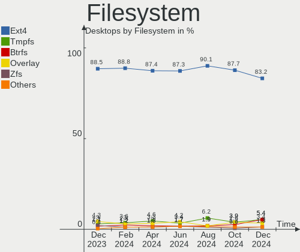
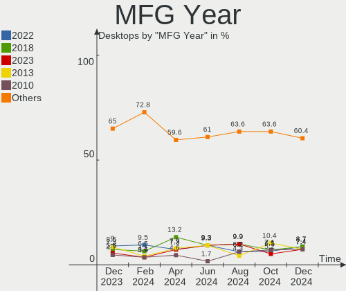
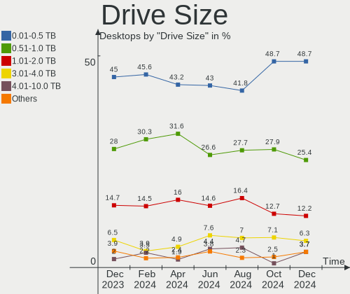
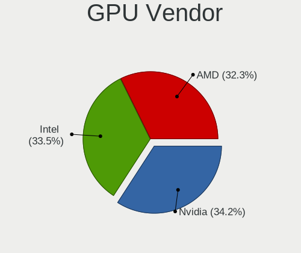
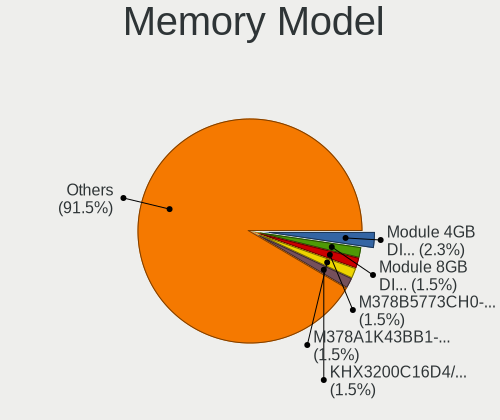

Linux Mint - Hardware Trends (Desktops)
---------------------------------------

A project to identify most popular hardware characteristics and track their change
over time based on data collected by Linux users at https://Linux-Hardware.org.

Anyone can contribute to this report by the [hw-probe](https://github.com/linuxhw/hw-probe) tool:

    sudo -E hw-probe -all -upload

This report is for one last month. Overall report since the beginning of time: [TestDays](https://github.com/linuxhw/TestDays)

Period: Oct, 2023.

Contents
--------

* [ System ](#system)
  - [ OS                       ](#os)
  - [ OS Family                ](#os-family)
  - [ Kernel                   ](#kernel)
  - [ Kernel Family            ](#kernel-family)
  - [ Kernel Major Ver.        ](#kernel-major-ver)
  - [ Arch                     ](#arch)
  - [ DE                       ](#de)
  - [ Display Server           ](#display-server)
  - [ Display Manager          ](#display-manager)
  - [ OS Lang                  ](#os-lang)
  - [ Boot Mode                ](#boot-mode)
  - [ Filesystem               ](#filesystem)
  - [ Part. scheme             ](#part-scheme)
  - [ Dual Boot with Linux/BSD ](#dual-boot-with-linuxbsd)
  - [ Dual Boot (Win)          ](#dual-boot-win)

* [ Board ](#board)
  - [ Vendor                   ](#vendor)
  - [ Model                    ](#model)
  - [ Model Family             ](#model-family)
  - [ MFG Year                 ](#mfg-year)
  - [ Form Factor              ](#form-factor)
  - [ Secure Boot              ](#secure-boot)
  - [ Coreboot                 ](#coreboot)
  - [ RAM Size                 ](#ram-size)
  - [ RAM Used                 ](#ram-used)
  - [ Total Drives             ](#total-drives)
  - [ Has CD-ROM               ](#has-cd-rom)
  - [ Has Ethernet             ](#has-ethernet)
  - [ Has WiFi                 ](#has-wifi)
  - [ Has Bluetooth            ](#has-bluetooth)

* [ Location ](#location)
  - [ Country                  ](#country)
  - [ City                     ](#city)

* [ Drives ](#drives)
  - [ Drive Vendor             ](#drive-vendor)
  - [ Drive Model              ](#drive-model)
  - [ HDD Vendor               ](#hdd-vendor)
  - [ SSD Vendor               ](#ssd-vendor)
  - [ Drive Kind               ](#drive-kind)
  - [ Drive Connector          ](#drive-connector)
  - [ Drive Size               ](#drive-size)
  - [ Space Total              ](#space-total)
  - [ Space Used               ](#space-used)
  - [ Malfunc. Drives          ](#malfunc-drives)
  - [ Malfunc. Drive Vendor    ](#malfunc-drive-vendor)
  - [ Malfunc. HDD Vendor      ](#malfunc-hdd-vendor)
  - [ Malfunc. Drive Kind      ](#malfunc-drive-kind)
  - [ Failed Drives            ](#failed-drives)
  - [ Failed Drive Vendor      ](#failed-drive-vendor)
  - [ Drive Status             ](#drive-status)

* [ Storage controller ](#storage-controller)
  - [ Storage Vendor           ](#storage-vendor)
  - [ Storage Model            ](#storage-model)
  - [ Storage Kind             ](#storage-kind)

* [ Processor ](#processor)
  - [ CPU Vendor               ](#cpu-vendor)
  - [ CPU Model                ](#cpu-model)
  - [ CPU Model Family         ](#cpu-model-family)
  - [ CPU Cores                ](#cpu-cores)
  - [ CPU Sockets              ](#cpu-sockets)
  - [ CPU Threads              ](#cpu-threads)
  - [ CPU Op-Modes             ](#cpu-op-modes)
  - [ CPU Microcode            ](#cpu-microcode)
  - [ CPU Microarch            ](#cpu-microarch)

* [ Graphics ](#graphics)
  - [ GPU Vendor               ](#gpu-vendor)
  - [ GPU Model                ](#gpu-model)
  - [ GPU Combo                ](#gpu-combo)
  - [ GPU Driver               ](#gpu-driver)
  - [ GPU Memory               ](#gpu-memory)

* [ Monitor ](#monitor)
  - [ Monitor Vendor           ](#monitor-vendor)
  - [ Monitor Model            ](#monitor-model)
  - [ Monitor Resolution       ](#monitor-resolution)
  - [ Monitor Diagonal         ](#monitor-diagonal)
  - [ Monitor Width            ](#monitor-width)
  - [ Aspect Ratio             ](#aspect-ratio)
  - [ Monitor Area             ](#monitor-area)
  - [ Pixel Density            ](#pixel-density)
  - [ Multiple Monitors        ](#multiple-monitors)

* [ Network ](#network)
  - [ Net Controller Vendor    ](#net-controller-vendor)
  - [ Net Controller Model     ](#net-controller-model)
  - [ Wireless Vendor          ](#wireless-vendor)
  - [ Wireless Model           ](#wireless-model)
  - [ Ethernet Vendor          ](#ethernet-vendor)
  - [ Ethernet Model           ](#ethernet-model)
  - [ Net Controller Kind      ](#net-controller-kind)
  - [ Used Controller          ](#used-controller)
  - [ NICs                     ](#nics)
  - [ IPv6                     ](#ipv6)

* [ Bluetooth ](#bluetooth)
  - [ Bluetooth Vendor         ](#bluetooth-vendor)
  - [ Bluetooth Model          ](#bluetooth-model)

* [ Sound ](#sound)
  - [ Sound Vendor             ](#sound-vendor)
  - [ Sound Model              ](#sound-model)

* [ Memory ](#memory)
  - [ Memory Vendor            ](#memory-vendor)
  - [ Memory Model             ](#memory-model)
  - [ Memory Kind              ](#memory-kind)
  - [ Memory Form Factor       ](#memory-form-factor)
  - [ Memory Size              ](#memory-size)
  - [ Memory Speed             ](#memory-speed)

* [ Printers & scanners ](#printers--scanners)
  - [ Printer Vendor           ](#printer-vendor)
  - [ Printer Model            ](#printer-model)
  - [ Scanner Vendor           ](#scanner-vendor)
  - [ Scanner Model            ](#scanner-model)

* [ Camera ](#camera)
  - [ Camera Vendor            ](#camera-vendor)
  - [ Camera Model             ](#camera-model)

* [ Security ](#security)
  - [ Fingerprint Vendor       ](#fingerprint-vendor)
  - [ Fingerprint Model        ](#fingerprint-model)
  - [ Chipcard Vendor          ](#chipcard-vendor)
  - [ Chipcard Model           ](#chipcard-model)

* [ Unsupported ](#unsupported)
  - [ Unsupported Devices      ](#unsupported-devices)
  - [ Unsupported Device Types ](#unsupported-device-types)

System
------

OS
--

Installed operating systems

| Name              | Desktops | Percent |
|-------------------|----------|---------|
| Linux Mint 21.2   | 167      | 75.57%  |
| Linux Mint 21.1   | 17       | 7.69%   |
| Linux Mint 20.3   | 15       | 6.79%   |
| Linux Mint 21     | 10       | 4.52%   |
| Linux Mint 20.2   | 4        | 1.81%   |
| Linux Mint 20.1   | 4        | 1.81%   |
| Linux Mint 21.2.1 | 1        | 0.45%   |
| Linux Mint 20     | 1        | 0.45%   |
| Linux Mint 19.3   | 1        | 0.45%   |
| Linux Mint 18.3   | 1        | 0.45%   |

OS Family
---------

OS without a version

| Name       | Desktops | Percent |
|------------|----------|---------|
| Linux Mint | 221      | 100%    |

Kernel
------

Version of the Linux kernel

| Version             | Desktops | Percent |
|---------------------|----------|---------|
| 5.15.0-86-generic   | 66       | 29.86%  |
| 5.15.0-87-generic   | 42       | 19%     |
| 5.15.0-84-generic   | 18       | 8.14%   |
| 5.15.0-76-generic   | 16       | 7.24%   |
| 6.2.0-34-generic    | 13       | 5.88%   |
| 6.2.0-33-generic    | 7        | 3.17%   |
| 6.2.0-35-generic    | 6        | 2.71%   |
| 5.4.0-163-generic   | 6        | 2.71%   |
| 5.15.0-88-generic   | 6        | 2.71%   |
| 5.15.0-79-generic   | 5        | 2.26%   |
| 5.4.0-164-generic   | 4        | 1.81%   |
| 6.5.0-1004-oem      | 3        | 1.36%   |
| 5.4.0-165-generic   | 3        | 1.36%   |
| 5.15.0-78-generic   | 3        | 1.36%   |
| 6.2.0-32-generic    | 2        | 0.9%    |
| 5.4.0-166-generic   | 2        | 0.9%    |
| 5.4.0-156-generic   | 2        | 0.9%    |
| 6.5.7-zabbly+       | 1        | 0.45%   |
| 6.5.3-x64v3-xanmod1 | 1        | 0.45%   |
| 6.2.0-26-generic    | 1        | 0.45%   |
| 6.1.0-1023-oem      | 1        | 0.45%   |
| 5.4.0-91-generic    | 1        | 0.45%   |
| 5.4.0-162-generic   | 1        | 0.45%   |
| 5.4.0-153-generic   | 1        | 0.45%   |
| 5.4.0-150-generic   | 1        | 0.45%   |
| 5.4.0-104-generic   | 1        | 0.45%   |
| 5.19.0-50-generic   | 1        | 0.45%   |
| 5.15.0-83-generic   | 1        | 0.45%   |
| 5.15.0-67-generic   | 1        | 0.45%   |
| 5.15.0-56-generic   | 1        | 0.45%   |
| 5.15.0-48-generic   | 1        | 0.45%   |
| 5.15.0-41-generic   | 1        | 0.45%   |
| 5.0.0-23-generic    | 1        | 0.45%   |
| 4.15.0-142-generic  | 1        | 0.45%   |

Kernel Family
-------------

Linux kernel without a distro release

| Version | Desktops | Percent |
|---------|----------|---------|
| 5.15.0  | 161      | 72.85%  |
| 6.2.0   | 29       | 13.12%  |
| 5.4.0   | 22       | 9.95%   |
| 6.5.0   | 3        | 1.36%   |
| 6.5.7   | 1        | 0.45%   |
| 6.5.3   | 1        | 0.45%   |
| 6.1.0   | 1        | 0.45%   |
| 5.19.0  | 1        | 0.45%   |
| 5.0.0   | 1        | 0.45%   |
| 4.15.0  | 1        | 0.45%   |

Kernel Major Ver.
-----------------

Linux kernel major version

| Version | Desktops | Percent |
|---------|----------|---------|
| 5.15    | 161      | 72.85%  |
| 6.2     | 29       | 13.12%  |
| 5.4     | 22       | 9.95%   |
| 6.5     | 5        | 2.26%   |
| 6.1     | 1        | 0.45%   |
| 5.19    | 1        | 0.45%   |
| 5.0     | 1        | 0.45%   |
| 4.15    | 1        | 0.45%   |

Arch
----

OS architecture (x86_64, i586, etc.)

| Name   | Desktops | Percent |
|--------|----------|---------|
| x86_64 | 221      | 100%    |

DE
--

Desktop Environment

| Name       | Desktops | Percent |
|------------|----------|---------|
| X-Cinnamon | 170      | 76.92%  |
| MATE       | 30       | 13.57%  |
| XFCE       | 15       | 6.79%   |
| Cinnamon   | 6        | 2.71%   |

Display Server
--------------

X11 or Wayland

| Name | Desktops | Percent |
|------|----------|---------|
| X11  | 221      | 100%    |

Display Manager
---------------

SDDM, LightDM, etc.

| Name    | Desktops | Percent |
|---------|----------|---------|
| Unknown | 137      | 61.99%  |
| LightDM | 84       | 38.01%  |

OS Lang
-------

Language

| Lang  | Desktops | Percent |
|-------|----------|---------|
| en_US | 61       | 27.6%   |
| de_DE | 47       | 21.27%  |
| pt_BR | 16       | 7.24%   |
| it_IT | 16       | 7.24%   |
| en_GB | 9        | 4.07%   |
| fr_FR | 8        | 3.62%   |
| en_AU | 8        | 3.62%   |
| ru_RU | 5        | 2.26%   |
| es_ES | 5        | 2.26%   |
| en_CA | 4        | 1.81%   |
| C     | 4        | 1.81%   |
| tr_TR | 3        | 1.36%   |
| sv_SE | 3        | 1.36%   |
| pl_PL | 3        | 1.36%   |
| fi_FI | 3        | 1.36%   |
| nl_BE | 2        | 0.9%    |
| es_VE | 2        | 0.9%    |
| es_AR | 2        | 0.9%    |
| en_ZA | 2        | 0.9%    |
| zh_CN | 1        | 0.45%   |
| ru_UA | 1        | 0.45%   |
| ro_RO | 1        | 0.45%   |
| pt_PT | 1        | 0.45%   |
| lt_LT | 1        | 0.45%   |
| ja_JP | 1        | 0.45%   |
| hu_HU | 1        | 0.45%   |
| fr_BE | 1        | 0.45%   |
| es_PE | 1        | 0.45%   |
| es_MX | 1        | 0.45%   |
| es_GT | 1        | 0.45%   |
| es_CO | 1        | 0.45%   |
| en_SG | 1        | 0.45%   |
| en_PH | 1        | 0.45%   |
| en_IL | 1        | 0.45%   |
| de_CH | 1        | 0.45%   |
| de_AT | 1        | 0.45%   |
| da_DK | 1        | 0.45%   |

Boot Mode
---------

EFI or BIOS

| Mode | Desktops | Percent |
|------|----------|---------|
| EFI  | 135      | 61.09%  |
| BIOS | 86       | 38.91%  |

Filesystem
----------

Type of filesystem

| Type    | Desktops | Percent |
|---------|----------|---------|
| Ext4    | 198      | 89.59%  |
| Btrfs   | 7        | 3.17%   |
| Zfs     | 6        | 2.71%   |
| Tmpfs   | 5        | 2.26%   |
| Overlay | 3        | 1.36%   |
| Ext3    | 2        | 0.9%    |

Part. scheme
------------

Scheme of partitioning

| Type    | Desktops | Percent |
|---------|----------|---------|
| Unknown | 137      | 61.99%  |
| GPT     | 71       | 32.13%  |
| MBR     | 13       | 5.88%   |

Dual Boot with Linux/BSD
------------------------

Hosting more than one Linux/BSD

| Dual boot | Desktops | Percent |
|-----------|----------|---------|
| No        | 194      | 87.78%  |
| Yes       | 27       | 12.22%  |

Dual Boot (Win)
---------------

Hosting Linux and Windows

| Dual boot | Desktops | Percent |
|-----------|----------|---------|
| No        | 173      | 78.28%  |
| Yes       | 48       | 21.72%  |

Board
-----

Vendor
------

Motherboard manufacturer

| Name                | Desktops | Percent |
|---------------------|----------|---------|
| ASUSTek Computer    | 51       | 23.08%  |
| Gigabyte Technology | 42       | 19%     |
| MSI                 | 30       | 13.57%  |
| Dell                | 23       | 10.41%  |
| ASRock              | 17       | 7.69%   |
| Hewlett-Packard     | 14       | 6.33%   |
| Intel               | 7        | 3.17%   |
| Lenovo              | 5        | 2.26%   |
| Unknown             | 5        | 2.26%   |
| Pegatron            | 4        | 1.81%   |
| Fujitsu             | 3        | 1.36%   |
| Foxconn             | 2        | 0.9%    |
| Acer                | 2        | 0.9%    |
| Shuttle             | 1        | 0.45%   |
| Packard Bell        | 1        | 0.45%   |
| ONDA                | 1        | 0.45%   |
| NF-M2S              | 1        | 0.45%   |
| Medion              | 1        | 0.45%   |
| MACHINIST           | 1        | 0.45%   |
| HC Technology.      | 1        | 0.45%   |
| Fujitsu Siemens     | 1        | 0.45%   |
| EPSON DIRECT        | 1        | 0.45%   |
| ECS                 | 1        | 0.45%   |
| Cincoze             | 1        | 0.45%   |
| Biostar             | 1        | 0.45%   |
| BESSTAR Tech        | 1        | 0.45%   |
| AZW                 | 1        | 0.45%   |
| ASRockRack          | 1        | 0.45%   |
| AMD                 | 1        | 0.45%   |

Model
-----

Motherboard model

| Name                             | Desktops | Percent |
|----------------------------------|----------|---------|
| ASUS All Series                  | 9        | 4.07%   |
| Unknown                          | 5        | 2.26%   |
| Dell OptiPlex 9020               | 4        | 1.81%   |
| Gigabyte A320M-S2H               | 3        | 1.36%   |
| Dell OptiPlex 7050               | 3        | 1.36%   |
| ASUS M5A78L-M/USB3               | 3        | 1.36%   |
| MSI MS-7C79                      | 2        | 0.9%    |
| MSI MS-7C02                      | 2        | 0.9%    |
| MSI MS-7821                      | 2        | 0.9%    |
| Intel H61                        | 2        | 0.9%    |
| Gigabyte B550M AORUS ELITE       | 2        | 0.9%    |
| Dell Precision WorkStation T3500 | 2        | 0.9%    |
| Dell OptiPlex 790                | 2        | 0.9%    |
| Dell OptiPlex 3020               | 2        | 0.9%    |
| ASUS ROG Maximus XI HERO         | 2        | 0.9%    |
| ASUS PRIME A320M-K               | 2        | 0.9%    |
| ASRock B450M Pro4                | 2        | 0.9%    |
| Shuttle SD37V10                  | 1        | 0.45%   |
| Pegatron p7-1154                 | 1        | 0.45%   |
| Pegatron p6-2114                 | 1        | 0.45%   |
| Pegatron NF518AA-ABU a6744uk     | 1        | 0.45%   |
| Pegatron Compaq 300B MT          | 1        | 0.45%   |
| Packard Bell IMEDIA S2380        | 1        | 0.45%   |
| ONDA H110CD3                     | 1        | 0.45%   |
| NF-M2S ABIT                      | 1        | 0.45%   |
| MSI ONE GAMING PC High End Elite | 1        | 0.45%   |
| MSI MS-7D91                      | 1        | 0.45%   |
| MSI MS-7D77                      | 1        | 0.45%   |
| MSI MS-7D75                      | 1        | 0.45%   |
| MSI MS-7D59                      | 1        | 0.45%   |
| MSI MS-7D42                      | 1        | 0.45%   |
| MSI MS-7D22                      | 1        | 0.45%   |
| MSI MS-7D18                      | 1        | 0.45%   |
| MSI MS-7D09                      | 1        | 0.45%   |
| MSI MS-7C94                      | 1        | 0.45%   |
| MSI MS-7C91                      | 1        | 0.45%   |
| MSI MS-7C56                      | 1        | 0.45%   |
| MSI MS-7C37                      | 1        | 0.45%   |
| MSI MS-7B89                      | 1        | 0.45%   |
| MSI MS-7B84                      | 1        | 0.45%   |

Model Family
------------

Motherboard model prefix

| Name                   | Desktops | Percent |
|------------------------|----------|---------|
| Dell OptiPlex          | 16       | 7.24%   |
| ASUS PRIME             | 10       | 4.52%   |
| ASUS ROG               | 9        | 4.07%   |
| ASUS All               | 9        | 4.07%   |
| Dell Precision         | 5        | 2.26%   |
| Unknown                | 5        | 2.26%   |
| Gigabyte B550M         | 4        | 1.81%   |
| ASUS M5A78L-M          | 4        | 1.81%   |
| Lenovo IdeaCentre      | 3        | 1.36%   |
| HP OMEN                | 3        | 1.36%   |
| Gigabyte A320M-S2H     | 3        | 1.36%   |
| Fujitsu ESPRIMO        | 3        | 1.36%   |
| ASUS TUF               | 3        | 1.36%   |
| MSI MS-7C79            | 2        | 0.9%    |
| MSI MS-7C02            | 2        | 0.9%    |
| MSI MS-7821            | 2        | 0.9%    |
| Intel H61              | 2        | 0.9%    |
| HP ProDesk             | 2        | 0.9%    |
| HP Pavilion            | 2        | 0.9%    |
| HP EliteDesk           | 2        | 0.9%    |
| Gigabyte GA-78LMT-USB3 | 2        | 0.9%    |
| Gigabyte B560M         | 2        | 0.9%    |
| Gigabyte B450M         | 2        | 0.9%    |
| ASUS P8H67-M           | 2        | 0.9%    |
| ASRock Z97             | 2        | 0.9%    |
| ASRock B450M           | 2        | 0.9%    |
| ASRock A320M-HD        | 2        | 0.9%    |
| Acer Aspire            | 2        | 0.9%    |
| Shuttle SD37V10        | 1        | 0.45%   |
| Pegatron p7-1154       | 1        | 0.45%   |
| Pegatron p6-2114       | 1        | 0.45%   |
| Pegatron NF518AA-ABU   | 1        | 0.45%   |
| Pegatron Compaq        | 1        | 0.45%   |
| Packard Bell IMEDIA    | 1        | 0.45%   |
| ONDA H110CD3           | 1        | 0.45%   |
| NF-M2S ABIT            | 1        | 0.45%   |
| MSI ONE                | 1        | 0.45%   |
| MSI MS-7D91            | 1        | 0.45%   |
| MSI MS-7D77            | 1        | 0.45%   |
| MSI MS-7D75            | 1        | 0.45%   |

MFG Year
--------

Motherboard manufacture year

| Year | Desktops | Percent |
|------|----------|---------|
| 2021 | 23       | 10.41%  |
| 2013 | 22       | 9.95%   |
| 2017 | 21       | 9.5%    |
| 2020 | 18       | 8.14%   |
| 2014 | 18       | 8.14%   |
| 2022 | 16       | 7.24%   |
| 2018 | 16       | 7.24%   |
| 2011 | 15       | 6.79%   |
| 2019 | 13       | 5.88%   |
| 2012 | 13       | 5.88%   |
| 2010 | 10       | 4.52%   |
| 2015 | 9        | 4.07%   |
| 2009 | 8        | 3.62%   |
| 2007 | 6        | 2.71%   |
| 2016 | 5        | 2.26%   |
| 2023 | 3        | 1.36%   |
| 2006 | 3        | 1.36%   |
| 2008 | 2        | 0.9%    |

Form Factor
-----------

Physical design of the computer

| Name    | Desktops | Percent |
|---------|----------|---------|
| Desktop | 221      | 100%    |

Secure Boot
-----------

Enabled or disabled

| State    | Desktops | Percent |
|----------|----------|---------|
| Disabled | 209      | 94.57%  |
| Enabled  | 12       | 5.43%   |

Coreboot
--------

Have coreboot on board

| Used | Desktops | Percent |
|------|----------|---------|
| No   | 221      | 100%    |

RAM Size
--------

Total RAM memory

| Size in GB  | Desktops | Percent |
|-------------|----------|---------|
| 16.01-24.0  | 56       | 25.34%  |
| 4.01-8.0    | 44       | 19.91%  |
| 32.01-64.0  | 40       | 18.1%   |
| 8.01-16.0   | 39       | 17.65%  |
| 64.01-256.0 | 15       | 6.79%   |
| 3.01-4.0    | 13       | 5.88%   |
| 24.01-32.0  | 8        | 3.62%   |
| 2.01-3.0    | 3        | 1.36%   |
| 1.01-2.0    | 3        | 1.36%   |

RAM Used
--------

Used RAM memory

| Used GB    | Desktops | Percent |
|------------|----------|---------|
| 2.01-3.0   | 65       | 29.41%  |
| 1.01-2.0   | 62       | 28.05%  |
| 4.01-8.0   | 44       | 19.91%  |
| 3.01-4.0   | 35       | 15.84%  |
| 8.01-16.0  | 7        | 3.17%   |
| 0.51-1.0   | 4        | 1.81%   |
| 16.01-24.0 | 3        | 1.36%   |
| 0.01-0.5   | 1        | 0.45%   |

Total Drives
------------

Number of drives on board

| Drives | Desktops | Percent |
|--------|----------|---------|
| 1      | 75       | 33.94%  |
| 2      | 59       | 26.7%   |
| 3      | 52       | 23.53%  |
| 4      | 18       | 8.14%   |
| 5      | 10       | 4.52%   |
| 6      | 4        | 1.81%   |
| 7      | 3        | 1.36%   |

Has CD-ROM
----------

Has CD-ROM on board

| Presented | Desktops | Percent |
|-----------|----------|---------|
| No        | 116      | 52.49%  |
| Yes       | 105      | 47.51%  |

Has Ethernet
------------

Has Ethernet on board

| Presented | Desktops | Percent |
|-----------|----------|---------|
| Yes       | 217      | 98.19%  |
| No        | 4        | 1.81%   |

Has WiFi
--------

Has WiFi module

| Presented | Desktops | Percent |
|-----------|----------|---------|
| Yes       | 111      | 50.23%  |
| No        | 110      | 49.77%  |

Has Bluetooth
-------------

Has Bluetooth module

| Presented | Desktops | Percent |
|-----------|----------|---------|
| No        | 135      | 61.09%  |
| Yes       | 86       | 38.91%  |

Location
--------

Country
-------

Geographic location (country)

| Country      | Desktops | Percent |
|--------------|----------|---------|
| USA          | 49       | 22.17%  |
| Germany      | 47       | 21.27%  |
| Brazil       | 20       | 9.05%   |
| Italy        | 16       | 7.24%   |
| UK           | 9        | 4.07%   |
| France       | 8        | 3.62%   |
| Australia    | 8        | 3.62%   |
| Spain        | 5        | 2.26%   |
| Russia       | 5        | 2.26%   |
| Poland       | 4        | 1.81%   |
| Turkey       | 3        | 1.36%   |
| Switzerland  | 3        | 1.36%   |
| Sweden       | 3        | 1.36%   |
| Romania      | 3        | 1.36%   |
| Finland      | 3        | 1.36%   |
| Canada       | 3        | 1.36%   |
| Belgium      | 3        | 1.36%   |
| Argentina    | 3        | 1.36%   |
| Venezuela    | 2        | 0.9%    |
| South Africa | 2        | 0.9%    |
| Ukraine      | 1        | 0.45%   |
| Thailand     | 1        | 0.45%   |
| Taiwan       | 1        | 0.45%   |
| Singapore    | 1        | 0.45%   |
| Portugal     | 1        | 0.45%   |
| Philippines  | 1        | 0.45%   |
| Peru         | 1        | 0.45%   |
| Pakistan     | 1        | 0.45%   |
| Norway       | 1        | 0.45%   |
| Netherlands  | 1        | 0.45%   |
| Mexico       | 1        | 0.45%   |
| Lithuania    | 1        | 0.45%   |
| Japan        | 1        | 0.45%   |
| Israel       | 1        | 0.45%   |
| Hungary      | 1        | 0.45%   |
| Guatemala    | 1        | 0.45%   |
| Greece       | 1        | 0.45%   |
| Denmark      | 1        | 0.45%   |
| Czechia      | 1        | 0.45%   |
| Croatia      | 1        | 0.45%   |

City
----

Geographic location (city)

| City             | Desktops | Percent |
|------------------|----------|---------|
| Sydney           | 3        | 1.36%   |
| Dresden          | 3        | 1.36%   |
| Berlin           | 3        | 1.36%   |
| Warsaw           | 2        | 0.9%    |
| Vienna           | 2        | 0.9%    |
| Serra            | 2        | 0.9%    |
| Sao Paulo        | 2        | 0.9%    |
| Paris            | 2        | 0.9%    |
| Padova           | 2        | 0.9%    |
| Osasco           | 2        | 0.9%    |
| Los Angeles      | 2        | 0.9%    |
| Lezoux           | 2        | 0.9%    |
| Leipzig          | 2        | 0.9%    |
| Greenwich        | 2        | 0.9%    |
| Denver           | 2        | 0.9%    |
| Clinton Township | 2        | 0.9%    |
| Ankara           | 2        | 0.9%    |
| Zulia            | 1        | 0.45%   |
| Zelenodolsk      | 1        | 0.45%   |
| Zagreb           | 1        | 0.45%   |
| Yoshkar-Ola      | 1        | 0.45%   |
| Yekaterinburg    | 1        | 0.45%   |
| Winter Park      | 1        | 0.45%   |
| Wiesbaden        | 1        | 0.45%   |
| Weimar           | 1        | 0.45%   |
| Wangen           | 1        | 0.45%   |
| Wadsworth        | 1        | 0.45%   |
| Volos            | 1        | 0.45%   |
| Verona           | 1        | 0.45%   |
| Vantaa           | 1        | 0.45%   |
| Valmadrera       | 1        | 0.45%   |
| Uxbridge         | 1        | 0.45%   |
| Ugledar          | 1        | 0.45%   |
| Úbeda           | 1        | 0.45%   |
| Tulcea           | 1        | 0.45%   |
| Trondheim        | 1        | 0.45%   |
| Treviglio        | 1        | 0.45%   |
| Toronto          | 1        | 0.45%   |
| Tlalnepantla     | 1        | 0.45%   |
| Tel Aviv         | 1        | 0.45%   |

Drives
------

Drive Vendor
------------

Hard drive vendors

| Vendor                       | Desktops | Drives | Percent |
|------------------------------|----------|--------|---------|
| WDC                          | 73       | 95     | 17.34%  |
| Samsung Electronics          | 73       | 99     | 17.34%  |
| Seagate                      | 69       | 86     | 16.39%  |
| Kingston                     | 26       | 28     | 6.18%   |
| Crucial                      | 24       | 30     | 5.7%    |
| SanDisk                      | 17       | 22     | 4.04%   |
| Toshiba                      | 16       | 17     | 3.8%    |
| Hitachi                      | 12       | 12     | 2.85%   |
| Micron/Crucial Technology    | 11       | 13     | 2.61%   |
| China                        | 11       | 11     | 2.61%   |
| PNY                          | 7        | 9      | 1.66%   |
| Unknown                      | 5        | 8      | 1.19%   |
| Intenso                      | 5        | 6      | 1.19%   |
| A-DATA Technology            | 5        | 6      | 1.19%   |
| Patriot                      | 4        | 4      | 0.95%   |
| MAXIO Technology (Hangzhou)  | 4        | 4      | 0.95%   |
| Intel                        | 4        | 4      | 0.95%   |
| Silicon Motion               | 3        | 3      | 0.71%   |
| Phison Electronics           | 3        | 4      | 0.71%   |
| KingSpec                     | 3        | 3      | 0.71%   |
| HGST                         | 3        | 4      | 0.71%   |
| ADATA Technology             | 3        | 4      | 0.71%   |
| Team                         | 2        | 2      | 0.48%   |
| SPCC                         | 2        | 2      | 0.48%   |
| Micron Technology            | 2        | 2      | 0.48%   |
| Lexar                        | 2        | 3      | 0.48%   |
| GOODRAM                      | 2        | 2      | 0.48%   |
| Apacer                       | 2        | 2      | 0.48%   |
| Unknown                      | 2        | 2      | 0.48%   |
| ZXFZ                         | 1        | 1      | 0.24%   |
| Win Memory                   | 1        | 1      | 0.24%   |
| WDC PC S                     | 1        | 1      | 0.24%   |
| VERICO                       | 1        | 1      | 0.24%   |
| TO Exter                     | 1        | 2      | 0.24%   |
| Timetec                      | 1        | 1      | 0.24%   |
| SK hynix                     | 1        | 1      | 0.24%   |
| Shenzhen Longsys Electronics | 1        | 2      | 0.24%   |
| S300                         | 1        | 1      | 0.24%   |
| Realtek Semiconductor        | 1        | 1      | 0.24%   |
| MSI                          | 1        | 1      | 0.24%   |

Drive Model
-----------

Hard drive models

| Model                                               | Desktops | Percent |
|-----------------------------------------------------|----------|---------|
| Samsung NVMe SSD Controller SM981/PM981/PM983 1TB   | 8        | 1.64%   |
| Samsung SSD 860 EVO 1TB                             | 7        | 1.43%   |
| Seagate ST2000DM008-2FR102 2TB                      | 6        | 1.23%   |
| Samsung SSD 850 EVO 250GB                           | 6        | 1.23%   |
| Kingston SA400S37240G 240GB SSD                     | 6        | 1.23%   |
| WDC WD10EZEX-08WN4A0 1TB                            | 5        | 1.02%   |
| Seagate ST500DM002-1BD142 500GB                     | 5        | 1.02%   |
| Samsung SSD 870 EVO 1TB                             | 5        | 1.02%   |
| Samsung SSD 860 EVO 500GB                           | 5        | 1.02%   |
| Micron/Crucial P2 NVMe PCIe SSD 500GB               | 5        | 1.02%   |
| Unknown SD/MMC/MS PRO 16GB                          | 4        | 0.82%   |
| Seagate ST3500418AS 500GB                           | 4        | 0.82%   |
| Seagate ST1000DM003-1CH162 1TB                      | 4        | 0.82%   |
| Samsung SSD 850 EVO 500GB                           | 4        | 0.82%   |
| Samsung NVMe SSD Controller SM961/PM961/SM963 121GB | 4        | 0.82%   |
| Kingston SA400S37960G 960GB SSD                     | 4        | 0.82%   |
| Crucial CT500MX500SSD1 500GB                        | 4        | 0.82%   |
| Crucial CT480BX500SSD1 480GB                        | 4        | 0.82%   |
| Crucial CT1000MX500SSD1 1TB                         | 4        | 0.82%   |
| WDC WD40EZRZ-00GXCB0 4TB                            | 3        | 0.61%   |
| Toshiba HDWD110 1TB                                 | 3        | 0.61%   |
| Toshiba DT01ACA100 1TB                              | 3        | 0.61%   |
| Seagate ST2000DM008-2UB102 2TB                      | 3        | 0.61%   |
| Samsung SSD 870 QVO 1TB                             | 3        | 0.61%   |
| Samsung SSD 870 EVO 500GB                           | 3        | 0.61%   |
| MAXIO (Hangzhou) NVMe SSD Controller MAP1202 250GB  | 3        | 0.61%   |
| Kingston SV300S37A120G 120GB SSD                    | 3        | 0.61%   |
| Kingston SA400S37120G 120GB SSD                     | 3        | 0.61%   |
| China SATA SSD 240GB                                | 3        | 0.61%   |
| WDC WDS100T2B0A-00SM50 1TB SSD                      | 2        | 0.41%   |
| WDC WD60PURZ-85ZUFY1 6TB                            | 2        | 0.41%   |
| WDC WD5000AAKS-00V1A0 500GB                         | 2        | 0.41%   |
| WDC WD40EFRX-68N32N0 4TB                            | 2        | 0.41%   |
| WDC WD20EZRX-00D8PB0 2TB                            | 2        | 0.41%   |
| WDC WD20EFRX-68EUZN0 2TB                            | 2        | 0.41%   |
| WDC WD20EARX-00PASB0 2TB                            | 2        | 0.41%   |
| WDC WD10EZEX-08M2NA0 1TB                            | 2        | 0.41%   |
| WDC WD10EADS-00L5B1 1TB                             | 2        | 0.41%   |
| WDC WD1003FZEX-00MK2A0 1TB                          | 2        | 0.41%   |
| Toshiba TR200 240GB SSD                             | 2        | 0.41%   |

HDD Vendor
----------

Hard disk drive vendors

| Vendor              | Desktops | Drives | Percent |
|---------------------|----------|--------|---------|
| WDC                 | 66       | 87     | 37.08%  |
| Seagate             | 66       | 83     | 37.08%  |
| Toshiba             | 13       | 14     | 7.3%    |
| Hitachi             | 12       | 12     | 6.74%   |
| Samsung Electronics | 11       | 12     | 6.18%   |
| Unknown             | 4        | 4      | 2.25%   |
| HGST                | 3        | 4      | 1.69%   |
| Intenso             | 1        | 1      | 0.56%   |
| Hewlett-Packard     | 1        | 1      | 0.56%   |
| Fujitsu             | 1        | 1      | 0.56%   |

SSD Vendor
----------

Solid state drive vendors

| Vendor              | Desktops | Drives | Percent |
|---------------------|----------|--------|---------|
| Samsung Electronics | 42       | 55     | 26.25%  |
| Kingston            | 20       | 21     | 12.5%   |
| Crucial             | 20       | 23     | 12.5%   |
| China               | 11       | 11     | 6.88%   |
| SanDisk             | 9        | 11     | 5.63%   |
| WDC                 | 7        | 7      | 4.38%   |
| PNY                 | 6        | 8      | 3.75%   |
| A-DATA Technology   | 5        | 6      | 3.13%   |
| Patriot             | 4        | 4      | 2.5%    |
| Toshiba             | 3        | 3      | 1.88%   |
| KingSpec            | 3        | 3      | 1.88%   |
| Intenso             | 3        | 4      | 1.88%   |
| Team                | 2        | 2      | 1.25%   |
| Micron Technology   | 2        | 2      | 1.25%   |
| Lexar               | 2        | 3      | 1.25%   |
| GOODRAM             | 2        | 2      | 1.25%   |
| Apacer              | 2        | 2      | 1.25%   |
| ZXFZ                | 1        | 1      | 0.63%   |
| Win Memory          | 1        | 1      | 0.63%   |
| VERICO              | 1        | 1      | 0.63%   |
| TO Exter            | 1        | 2      | 0.63%   |
| Timetec             | 1        | 1      | 0.63%   |
| Seagate             | 1        | 1      | 0.63%   |
| MicroFro            | 1        | 1      | 0.63%   |
| Leven               | 1        | 1      | 0.63%   |
| KingFast            | 1        | 1      | 0.63%   |
| KingDian            | 1        | 1      | 0.63%   |
| Intel               | 1        | 1      | 0.63%   |
| Gigastone           | 1        | 1      | 0.63%   |
| Fanxiang            | 1        | 1      | 0.63%   |
| Emtec               | 1        | 1      | 0.63%   |
| DTECHCO             | 1        | 1      | 0.63%   |
| CT1000MX            | 1        | 1      | 0.63%   |
| Corsair             | 1        | 1      | 0.63%   |

Drive Kind
----------

HDD or SSD

| Kind    | Desktops | Drives | Percent |
|---------|----------|--------|---------|
| HDD     | 136      | 219    | 38.31%  |
| SSD     | 135      | 185    | 38.03%  |
| NVMe    | 75       | 99     | 21.13%  |
| Unknown | 8        | 8      | 2.25%   |
| MMC     | 1        | 4      | 0.28%   |

Drive Connector
---------------

SATA, SAS, NVMe, etc.

| Type | Desktops | Drives | Percent |
|------|----------|--------|---------|
| SATA | 201      | 386    | 67.22%  |
| NVMe | 75       | 99     | 25.08%  |
| SAS  | 22       | 26     | 7.36%   |
| MMC  | 1        | 4      | 0.33%   |

Drive Size
----------

Size of hard drive

| Size in TB | Desktops | Drives | Percent |
|------------|----------|--------|---------|
| 0.01-0.5   | 131      | 188    | 43.67%  |
| 0.51-1.0   | 96       | 134    | 32%     |
| 1.01-2.0   | 42       | 45     | 14%     |
| 4.01-10.0  | 13       | 14     | 4.33%   |
| 3.01-4.0   | 11       | 15     | 3.67%   |
| 2.01-3.0   | 7        | 8      | 2.33%   |

Space Total
-----------

Amount of disk space available on the file system

| Size in GB     | Desktops | Percent |
|----------------|----------|---------|
| 251-500        | 46       | 20.81%  |
| 501-1000       | 39       | 17.65%  |
| 101-250        | 38       | 17.19%  |
| 1001-2000      | 33       | 14.93%  |
| More than 3000 | 30       | 13.57%  |
| 2001-3000      | 18       | 8.14%   |
| 51-100         | 6        | 2.71%   |
| 21-50          | 4        | 1.81%   |
| 1-20           | 4        | 1.81%   |
| Unknown        | 3        | 1.36%   |

Space Used
----------

Amount of used disk space

| Used GB        | Desktops | Percent |
|----------------|----------|---------|
| 101-250        | 45       | 20.36%  |
| 21-50          | 40       | 18.1%   |
| 51-100         | 29       | 13.12%  |
| 251-500        | 28       | 12.67%  |
| 1-20           | 21       | 9.5%    |
| 501-1000       | 21       | 9.5%    |
| 1001-2000      | 15       | 6.79%   |
| More than 3000 | 13       | 5.88%   |
| 2001-3000      | 6        | 2.71%   |
| Unknown        | 3        | 1.36%   |

Malfunc. Drives
---------------

Drive models with a malfunction

| Model                                 | Desktops | Drives | Percent |
|---------------------------------------|----------|--------|---------|
| Seagate ST500DM002-1BD142 500GB       | 2        | 2      | 6.67%   |
| Seagate ST3500418AS 500GB             | 2        | 4      | 6.67%   |
| Seagate ST1000DM003-1CH162 1TB        | 2        | 2      | 6.67%   |
| WDC WD5000LPLX-75ZNTT0 500GB          | 1        | 1      | 3.33%   |
| WDC WD40EFRX-68WT0N0 4TB              | 1        | 1      | 3.33%   |
| WDC WD40EFRX-68N32N0 4TB              | 1        | 2      | 3.33%   |
| WDC WD30EFRX-68EUZN0 3TB              | 1        | 1      | 3.33%   |
| WDC WD20EARX-00PASB0 2TB              | 1        | 1      | 3.33%   |
| WDC WD20EARS-60MVWB0 2TB              | 1        | 1      | 3.33%   |
| WDC WD10EADX-22TDHB0 1TB              | 1        | 1      | 3.33%   |
| Seagate ST3500312CS 500GB             | 1        | 1      | 3.33%   |
| Seagate ST3200827AS 200GB             | 1        | 1      | 3.33%   |
| Seagate ST3160815AS 160GB             | 1        | 1      | 3.33%   |
| Seagate ST2000DX001-1CM164 2TB        | 1        | 1      | 3.33%   |
| Seagate ST1000DM010-2EP102 1TB        | 1        | 1      | 3.33%   |
| Samsung Electronics SSD 860 EVO 500GB | 1        | 1      | 3.33%   |
| Samsung Electronics SSD 850 EVO 1TB   | 1        | 1      | 3.33%   |
| Samsung Electronics SSD 840 EVO 120GB | 1        | 1      | 3.33%   |
| Samsung Electronics HD103UI 1TB       | 1        | 1      | 3.33%   |
| Samsung Electronics HD103SI 1TB       | 1        | 2      | 3.33%   |
| PNY CS1311 240GB SSD                  | 1        | 1      | 3.33%   |
| Kingston SUV400S37240G 240GB SSD      | 1        | 1      | 3.33%   |
| Hitachi HTS541010A9E680 1TB           | 1        | 1      | 3.33%   |
| Hitachi HDT721025SLA380 250GB         | 1        | 1      | 3.33%   |
| Hitachi HDP725050GLA360 500GB         | 1        | 1      | 3.33%   |
| Gigastone SSD 1TB                     | 1        | 1      | 3.33%   |
| Crucial CT525MX300SSD1 528GB          | 1        | 1      | 3.33%   |

Malfunc. Drive Vendor
---------------------

Vendors of faulty drives

| Vendor              | Desktops | Drives | Percent |
|---------------------|----------|--------|---------|
| Seagate             | 9        | 13     | 32.14%  |
| WDC                 | 7        | 8      | 25%     |
| Samsung Electronics | 5        | 6      | 17.86%  |
| Hitachi             | 3        | 3      | 10.71%  |
| PNY                 | 1        | 1      | 3.57%   |
| Kingston            | 1        | 1      | 3.57%   |
| Gigastone           | 1        | 1      | 3.57%   |
| Crucial             | 1        | 1      | 3.57%   |

Malfunc. HDD Vendor
-------------------

Vendors of faulty HDD drives

| Vendor              | Desktops | Drives | Percent |
|---------------------|----------|--------|---------|
| Seagate             | 9        | 13     | 42.86%  |
| WDC                 | 7        | 8      | 33.33%  |
| Hitachi             | 3        | 3      | 14.29%  |
| Samsung Electronics | 2        | 3      | 9.52%   |

Malfunc. Drive Kind
-------------------

Kinds of faulty drives

| Kind | Desktops | Drives | Percent |
|------|----------|--------|---------|
| HDD  | 20       | 27     | 74.07%  |
| SSD  | 7        | 7      | 25.93%  |

Failed Drives
-------------

Failed drive models

Zero info for selected period =(

Failed Drive Vendor
-------------------

Failed drive vendors

Zero info for selected period =(

Drive Status
------------

Number of failed and malfunc. drives

| Status   | Desktops | Drives | Percent |
|----------|----------|--------|---------|
| Detected | 146      | 343    | 59.35%  |
| Works    | 74       | 138    | 30.08%  |
| Malfunc  | 26       | 34     | 10.57%  |

Storage controller
------------------

Storage Vendor
--------------

Storage controller vendors

| Vendor                       | Desktops | Percent |
|------------------------------|----------|---------|
| Intel                        | 144      | 43.37%  |
| AMD                          | 77       | 23.19%  |
| Samsung Electronics          | 28       | 8.43%   |
| Micron/Crucial Technology    | 17       | 5.12%   |
| SanDisk                      | 11       | 3.31%   |
| ASMedia Technology           | 11       | 3.31%   |
| Kingston Technology Company  | 7        | 2.11%   |
| Phison Electronics           | 6        | 1.81%   |
| MAXIO Technology (Hangzhou)  | 4        | 1.2%    |
| Marvell Technology Group     | 4        | 1.2%    |
| JMicron Technology           | 4        | 1.2%    |
| Silicon Motion               | 3        | 0.9%    |
| Nvidia                       | 3        | 0.9%    |
| ADATA Technology             | 3        | 0.9%    |
| Silicon Image                | 2        | 0.6%    |
| Realtek Semiconductor        | 2        | 0.6%    |
| VIA Technologies             | 1        | 0.3%    |
| SK hynix                     | 1        | 0.3%    |
| Shenzhen Longsys Electronics | 1        | 0.3%    |
| KIOXIA                       | 1        | 0.3%    |
| Broadcom / LSI               | 1        | 0.3%    |
| Adaptec                      | 1        | 0.3%    |

Storage Model
-------------

Storage controller models

| Model                                                                          | Desktops | Percent |
|--------------------------------------------------------------------------------|----------|---------|
| AMD FCH SATA Controller [AHCI mode]                                            | 36       | 8.91%   |
| Intel 8 Series/C220 Series Chipset Family 6-port SATA Controller 1 [AHCI mode] | 25       | 6.19%   |
| AMD 500 Series Chipset SATA Controller                                         | 18       | 4.46%   |
| AMD 400 Series Chipset SATA Controller                                         | 14       | 3.47%   |
| Intel Q170/Q150/B150/H170/H110/Z170/CM236 Chipset SATA Controller [AHCI Mode]  | 13       | 3.22%   |
| AMD SB7x0/SB8x0/SB9x0 IDE Controller                                           | 13       | 3.22%   |
| Samsung NVMe SSD Controller SM981/PM981/PM983                                  | 12       | 2.97%   |
| Intel SATA Controller [RAID mode]                                              | 11       | 2.72%   |
| ASMedia ASM1062 Serial ATA Controller                                          | 11       | 2.72%   |
| Micron/Crucial P2 [Nick P2] / P3 / P3 Plus NVMe PCIe SSD (DRAM-less)           | 10       | 2.48%   |
| Intel 6 Series/C200 Series Chipset Family 6 port Desktop SATA AHCI Controller  | 10       | 2.48%   |
| AMD SB7x0/SB8x0/SB9x0 SATA Controller [AHCI mode]                              | 9        | 2.23%   |
| Intel Alder Lake-S PCH SATA Controller [AHCI Mode]                             | 8        | 1.98%   |
| Intel 9 Series Chipset Family SATA Controller [AHCI Mode]                      | 8        | 1.98%   |
| Intel 200 Series PCH SATA controller [AHCI mode]                               | 8        | 1.98%   |
| AMD FCH SATA Controller D                                                      | 7        | 1.73%   |
| Samsung NVMe SSD Controller SM961/PM961/SM963                                  | 6        | 1.49%   |
| Intel NM10/ICH7 Family SATA Controller [IDE mode]                              | 6        | 1.49%   |
| Intel Cannon Lake PCH SATA AHCI Controller                                     | 6        | 1.49%   |
| AMD SB7x0/SB8x0/SB9x0 SATA Controller [IDE mode]                               | 6        | 1.49%   |
| Samsung NVMe SSD Controller PM9A1/PM9A3/980PRO                                 | 5        | 1.24%   |
| Micron/Crucial P5 Plus NVMe PCIe SSD                                           | 5        | 1.24%   |
| Intel Volume Management Device NVMe RAID Controller                            | 5        | 1.24%   |
| Intel Comet Lake SATA AHCI Controller                                          | 5        | 1.24%   |
| Intel 500 Series Chipset Family SATA AHCI Controller                           | 5        | 1.24%   |
| Samsung NVMe SSD Controller 980 (DRAM-less)                                    | 4        | 0.99%   |
| JMicron JMB363 SATA/IDE Controller                                             | 4        | 0.99%   |
| Intel 7 Series/C210 Series Chipset Family 6-port SATA Controller [AHCI mode]   | 4        | 0.99%   |
| Intel 7 Series/C210 Series Chipset Family 4-port SATA Controller [IDE mode]    | 4        | 0.99%   |
| Intel 7 Series/C210 Series Chipset Family 2-port SATA Controller [IDE mode]    | 4        | 0.99%   |
| MAXIO (Hangzhou) NVMe SSD Controller MAP1202                                   | 3        | 0.74%   |
| Intel 82801JI (ICH10 Family) SATA AHCI Controller                              | 3        | 0.74%   |
| Intel 82801G (ICH7 Family) IDE Controller                                      | 3        | 0.74%   |
| Intel 700 Series Chipset Family SATA AHCI Controller                           | 3        | 0.74%   |
| AMD FCH IDE Controller                                                         | 3        | 0.74%   |
| Silicon Motion SM2263EN/SM2263XT (DRAM-less) NVMe SSD Controllers              | 2        | 0.5%    |
| Silicon Image SiI 3132 Serial ATA Raid II Controller                           | 2        | 0.5%    |
| Sandisk WD Black SN850X NVMe SSD                                               | 2        | 0.5%    |
| SanDisk Ultra 3D / WD Blue SN570 NVMe SSD (DRAM-less)                          | 2        | 0.5%    |
| SanDisk Ultra 3D / WD Blue SN550 NVMe SSD                                      | 2        | 0.5%    |

Storage Kind
------------

Kind of storage controller (IDE, SATA, NVMe, SAS, ...)

| Kind | Desktops | Percent |
|------|----------|---------|
| SATA | 187      | 57.01%  |
| NVMe | 75       | 22.87%  |
| IDE  | 42       | 12.8%   |
| RAID | 21       | 6.4%    |
| SAS  | 2        | 0.61%   |
| SCSI | 1        | 0.3%    |

Processor
---------

CPU Vendor
----------

Processor vendors

| Vendor | Desktops | Percent |
|--------|----------|---------|
| Intel  | 141      | 63.8%   |
| AMD    | 80       | 36.2%   |

CPU Model
---------

Processor models

| Model                                       | Desktops | Percent |
|---------------------------------------------|----------|---------|
| Intel Core i5-4590 CPU @ 3.30GHz            | 6        | 2.71%   |
| AMD Ryzen 7 5700G with Radeon Graphics      | 6        | 2.71%   |
| Intel Core i7-8700K CPU @ 3.70GHz           | 4        | 1.81%   |
| Intel Core i7-7700 CPU @ 3.60GHz            | 4        | 1.81%   |
| Intel Core i7-4790K CPU @ 4.00GHz           | 4        | 1.81%   |
| AMD Ryzen 5 5600G with Radeon Graphics      | 4        | 1.81%   |
| AMD Ryzen 5 3600 6-Core Processor           | 4        | 1.81%   |
| Intel Core i7-4770 CPU @ 3.40GHz            | 3        | 1.36%   |
| Intel Core i5-6500 CPU @ 3.20GHz            | 3        | 1.36%   |
| Intel Core i5-4670K CPU @ 3.40GHz           | 3        | 1.36%   |
| AMD Ryzen 9 5900X 12-Core Processor         | 3        | 1.36%   |
| AMD FX-8350 Eight-Core Processor            | 3        | 1.36%   |
| Intel Core i9-10900KF CPU @ 3.70GHz         | 2        | 0.9%    |
| Intel Core i7-8700 CPU @ 3.20GHz            | 2        | 0.9%    |
| Intel Core i7-6700 CPU @ 3.40GHz            | 2        | 0.9%    |
| Intel Core i7-3770 CPU @ 3.40GHz            | 2        | 0.9%    |
| Intel Core i7-2600K CPU @ 3.40GHz           | 2        | 0.9%    |
| Intel Core i7-10700K CPU @ 3.80GHz          | 2        | 0.9%    |
| Intel Core i5-4690 CPU @ 3.50GHz            | 2        | 0.9%    |
| Intel Core i5-4590S CPU @ 3.00GHz           | 2        | 0.9%    |
| Intel Core i5-4460 CPU @ 3.20GHz            | 2        | 0.9%    |
| Intel Core i5-3470 CPU @ 3.20GHz            | 2        | 0.9%    |
| Intel Core i5-2500 CPU @ 3.30GHz            | 2        | 0.9%    |
| Intel Core 2 Quad CPU Q6600 @ 2.40GHz       | 2        | 0.9%    |
| Intel Core 2 Duo CPU E8400 @ 3.00GHz        | 2        | 0.9%    |
| Intel Core 2 Duo CPU E4500 @ 2.20GHz        | 2        | 0.9%    |
| Intel Core 2 CPU 6600 @ 2.40GHz             | 2        | 0.9%    |
| Intel 12th Gen Core i9-12900K               | 2        | 0.9%    |
| AMD Ryzen 7 7700X 8-Core Processor          | 2        | 0.9%    |
| AMD Ryzen 7 5800X 8-Core Processor          | 2        | 0.9%    |
| AMD Ryzen 5 5600X 6-Core Processor          | 2        | 0.9%    |
| AMD Ryzen 5 5600 6-Core Processor           | 2        | 0.9%    |
| AMD Ryzen 5 5500                            | 2        | 0.9%    |
| AMD Ryzen 5 3400G with Radeon Vega Graphics | 2        | 0.9%    |
| AMD Ryzen 5 2600 Six-Core Processor         | 2        | 0.9%    |
| AMD Ryzen 5 2400G with Radeon Vega Graphics | 2        | 0.9%    |
| AMD Ryzen 5 1600 Six-Core Processor         | 2        | 0.9%    |
| AMD Ryzen 3 2200G with Radeon Vega Graphics | 2        | 0.9%    |
| AMD FX-6300 Six-Core Processor              | 2        | 0.9%    |
| AMD Athlon II X4 640 Processor              | 2        | 0.9%    |

CPU Model Family
----------------

Processor model prefix

| Model                   | Desktops | Percent |
|-------------------------|----------|---------|
| Intel Core i5           | 45       | 20.36%  |
| Intel Core i7           | 37       | 16.74%  |
| AMD Ryzen 5             | 23       | 10.41%  |
| AMD Ryzen 7             | 16       | 7.24%   |
| Other                   | 15       | 6.79%   |
| AMD FX                  | 9        | 4.07%   |
| Intel Xeon              | 8        | 3.62%   |
| Intel Celeron           | 8        | 3.62%   |
| Intel Core i3           | 7        | 3.17%   |
| Intel Core 2 Duo        | 6        | 2.71%   |
| AMD Ryzen 9             | 5        | 2.26%   |
| Intel Pentium           | 4        | 1.81%   |
| Intel Core i9           | 4        | 1.81%   |
| AMD A6                  | 4        | 1.81%   |
| Intel Core 2 Quad       | 3        | 1.36%   |
| AMD Ryzen 3             | 3        | 1.36%   |
| AMD Phenom II X4        | 3        | 1.36%   |
| AMD A10                 | 3        | 1.36%   |
| Intel Pentium Dual-Core | 2        | 0.9%    |
| Intel Core 2            | 2        | 0.9%    |
| AMD Ryzen 5 PRO         | 2        | 0.9%    |
| AMD Athlon II X4        | 2        | 0.9%    |
| AMD Athlon II X2        | 2        | 0.9%    |
| AMD Athlon 64 X2        | 2        | 0.9%    |
| AMD A4                  | 2        | 0.9%    |
| Intel Pentium 4         | 1        | 0.45%   |
| AMD PRO A8              | 1        | 0.45%   |
| AMD Athlon              | 1        | 0.45%   |
| AMD A8                  | 1        | 0.45%   |

CPU Cores
---------

Number of processor cores

| Number | Desktops | Percent |
|--------|----------|---------|
| 4      | 99       | 44.8%   |
| 6      | 36       | 16.29%  |
| 2      | 36       | 16.29%  |
| 8      | 21       | 9.5%    |
| 12     | 7        | 3.17%   |
| 3      | 5        | 2.26%   |
| 1      | 5        | 2.26%   |
| 10     | 4        | 1.81%   |
| 16     | 3        | 1.36%   |
| 14     | 3        | 1.36%   |
| 24     | 2        | 0.9%    |

CPU Sockets
-----------

Number of sockets

| Number | Desktops | Percent |
|--------|----------|---------|
| 1      | 220      | 99.55%  |
| 2      | 1        | 0.45%   |

CPU Threads
-----------

Threads per core (Hyper-Threading)

| Number | Desktops | Percent |
|--------|----------|---------|
| 2      | 132      | 59.73%  |
| 1      | 89       | 40.27%  |

CPU Op-Modes
------------

CPU Operation Modes (32-bit, 64-bit)

| Op mode        | Desktops | Percent |
|----------------|----------|---------|
| 32-bit, 64-bit | 221      | 100%    |

CPU Microcode
-------------

Microcode number

| Number     | Desktops | Percent |
|------------|----------|---------|
| Unknown    | 33       | 14.93%  |
| 0x306c3    | 30       | 13.57%  |
| 0x506e3    | 11       | 4.98%   |
| 0x306a9    | 9        | 4.07%   |
| 0x206a7    | 9        | 4.07%   |
| 0x906ea    | 8        | 3.62%   |
| 0x906e9    | 6        | 2.71%   |
| 0x1067a    | 6        | 2.71%   |
| 0x0a50000d | 6        | 2.71%   |
| 0x0a50000c | 6        | 2.71%   |
| 0x06000852 | 6        | 2.71%   |
| 0x0a20120a | 5        | 2.26%   |
| 0x08701021 | 5        | 2.26%   |
| 0x0a601203 | 4        | 1.81%   |
| 0x08101016 | 4        | 1.81%   |
| 0x010000c8 | 4        | 1.81%   |
| 0xb0671    | 3        | 1.36%   |
| 0xa0655    | 3        | 1.36%   |
| 0x90672    | 3        | 1.36%   |
| 0x6fb      | 3        | 1.36%   |
| 0x106a5    | 3        | 1.36%   |
| 0x08108109 | 3        | 1.36%   |
| 0x0800820d | 3        | 1.36%   |
| 0x06001119 | 3        | 1.36%   |
| 0x0600063e | 3        | 1.36%   |
| 0xa0671    | 2        | 0.9%    |
| 0x6f6      | 2        | 0.9%    |
| 0x0a201016 | 2        | 0.9%    |
| 0x08701030 | 2        | 0.9%    |
| 0x08001138 | 2        | 0.9%    |
| 0x0600611a | 2        | 0.9%    |
| 0x03000027 | 2        | 0.9%    |
| 0x010000db | 2        | 0.9%    |
| 0xf65      | 1        | 0.45%   |
| 0xa0653    | 1        | 0.45%   |
| 0x906ec    | 1        | 0.45%   |
| 0x906c0    | 1        | 0.45%   |
| 0x706a8    | 1        | 0.45%   |
| 0x706a1    | 1        | 0.45%   |
| 0x506ca    | 1        | 0.45%   |

CPU Microarch
-------------

Microarchitecture

| Name             | Desktops | Percent |
|------------------|----------|---------|
| Haswell          | 38       | 17.19%  |
| Zen 3            | 21       | 9.5%    |
| KabyLake         | 19       | 8.6%    |
| Skylake          | 12       | 5.43%   |
| IvyBridge        | 12       | 5.43%   |
| SandyBridge      | 11       | 4.98%   |
| Unknown          | 11       | 4.98%   |
| Zen 2            | 9        | 4.07%   |
| Piledriver       | 9        | 4.07%   |
| Zen              | 8        | 3.62%   |
| Zen+             | 7        | 3.17%   |
| Penryn           | 7        | 3.17%   |
| K10              | 7        | 3.17%   |
| Core             | 7        | 3.17%   |
| CometLake        | 7        | 3.17%   |
| Alderlake Hybrid | 6        | 2.71%   |
| Excavator        | 5        | 2.26%   |
| Nehalem          | 4        | 1.81%   |
| Bulldozer        | 3        | 1.36%   |
| Westmere         | 2        | 0.9%    |
| Steamroller      | 2        | 0.9%    |
| K8 Hammer        | 2        | 0.9%    |
| K10 Llano        | 2        | 0.9%    |
| Icelake          | 2        | 0.9%    |
| Goldmont plus    | 2        | 0.9%    |
| Goldmont         | 2        | 0.9%    |
| Tremont          | 1        | 0.45%   |
| Silvermont       | 1        | 0.45%   |
| NetBurst         | 1        | 0.45%   |
| Broadwell        | 1        | 0.45%   |

Graphics
--------

GPU Vendor
----------

Vendors of graphics cards

| Vendor           | Desktops | Percent |
|------------------|----------|---------|
| Nvidia           | 95       | 38.46%  |
| AMD              | 79       | 31.98%  |
| Intel            | 72       | 29.15%  |
| ATI Technologies | 1        | 0.4%    |

GPU Model
---------

Graphics card models

| Model                                                                       | Desktops | Percent |
|-----------------------------------------------------------------------------|----------|---------|
| Intel Xeon E3-1200 v3/4th Gen Core Processor Integrated Graphics Controller | 24       | 9.68%   |
| AMD Cezanne [Radeon Vega Series / Radeon Vega Mobile Series]                | 8        | 3.23%   |
| Intel HD Graphics 630                                                       | 6        | 2.42%   |
| Intel 2nd Generation Core Processor Family Integrated Graphics Controller   | 6        | 2.42%   |
| Nvidia GP108 [GeForce GT 1030]                                              | 5        | 2.02%   |
| Intel HD Graphics 530                                                       | 5        | 2.02%   |
| AMD Ellesmere [Radeon RX 470/480/570/570X/580/580X/590]                     | 5        | 2.02%   |
| Nvidia TU117 [GeForce GTX 1650]                                             | 4        | 1.61%   |
| Nvidia GP104 [GeForce GTX 1070]                                             | 4        | 1.61%   |
| Nvidia GK208B [GeForce GT 730]                                              | 4        | 1.61%   |
| Nvidia GK208B [GeForce GT 710]                                              | 4        | 1.61%   |
| Nvidia GF119 [GeForce GT 610]                                               | 4        | 1.61%   |
| Nvidia GA106 [GeForce RTX 3060 Lite Hash Rate]                              | 4        | 1.61%   |
| Nvidia GA104 [GeForce RTX 3070]                                             | 4        | 1.61%   |
| Intel Xeon E3-1200 v2/3rd Gen Core processor Graphics Controller            | 4        | 1.61%   |
| AMD Raven Ridge [Radeon Vega Series / Radeon Vega Mobile Series]            | 4        | 1.61%   |
| AMD Picasso/Raven 2 [Radeon Vega Series / Radeon Vega Mobile Series]        | 4        | 1.61%   |
| AMD Navi 23 [Radeon RX 6600/6600 XT/6600M]                                  | 4        | 1.61%   |
| Nvidia TU106 [GeForce RTX 2060 Rev. A]                                      | 3        | 1.21%   |
| Nvidia GP107 [GeForce GTX 1050 Ti]                                          | 3        | 1.21%   |
| Nvidia GA106 [Geforce RTX 3050]                                             | 3        | 1.21%   |
| Intel IvyBridge GT2 [HD Graphics 4000]                                      | 3        | 1.21%   |
| Intel CometLake-S GT2 [UHD Graphics 630]                                    | 3        | 1.21%   |
| Intel CoffeeLake-S GT2 [UHD Graphics 630]                                   | 3        | 1.21%   |
| AMD Wani [Radeon R5/R6/R7 Graphics]                                         | 3        | 1.21%   |
| AMD RV620 LE [Radeon HD 3450]                                               | 3        | 1.21%   |
| AMD RS780L [Radeon 3000]                                                    | 3        | 1.21%   |
| AMD Raphael                                                                 | 3        | 1.21%   |
| Nvidia TU116 [GeForce GTX 1660 SUPER]                                       | 2        | 0.81%   |
| Nvidia TU116 [GeForce GTX 1650]                                             | 2        | 0.81%   |
| Nvidia TU106 [GeForce RTX 2060 SUPER]                                       | 2        | 0.81%   |
| Nvidia TU104 [GeForce RTX 2060]                                             | 2        | 0.81%   |
| Nvidia GP107 [GeForce GTX 1050]                                             | 2        | 0.81%   |
| Nvidia GP106 [GeForce GTX 1060 6GB]                                         | 2        | 0.81%   |
| Nvidia GM204 [GeForce GTX 970]                                              | 2        | 0.81%   |
| Nvidia GM107 [GeForce GTX 750]                                              | 2        | 0.81%   |
| Nvidia GK106 [GeForce GTX 660]                                              | 2        | 0.81%   |
| Nvidia GF108 [GeForce GT 630]                                               | 2        | 0.81%   |
| Nvidia GF106GL [Quadro 2000]                                                | 2        | 0.81%   |
| Nvidia GA102 [GeForce RTX 3080 Lite Hash Rate]                              | 2        | 0.81%   |

GPU Combo
---------

Combinations of graphics cards

| Name           | Desktops | Percent |
|----------------|----------|---------|
| 1 x Nvidia     | 83       | 37.56%  |
| 1 x AMD        | 70       | 31.67%  |
| 1 x Intel      | 53       | 23.98%  |
| AMD + Nvidia   | 6        | 2.71%   |
| Intel + Nvidia | 5        | 2.26%   |
| Intel + AMD    | 3        | 1.36%   |
| 2 x AMD        | 1        | 0.45%   |

GPU Driver
----------

Free vs proprietary

| Driver      | Desktops | Percent |
|-------------|----------|---------|
| Free        | 141      | 63.8%   |
| Proprietary | 69       | 31.22%  |
| Unknown     | 11       | 4.98%   |

GPU Memory
----------

Total video memory

| Size in GB | Desktops | Percent |
|------------|----------|---------|
| Unknown    | 74       | 33.48%  |
| 0.01-0.5   | 32       | 14.48%  |
| 1.01-2.0   | 29       | 13.12%  |
| 7.01-8.0   | 24       | 10.86%  |
| 3.01-4.0   | 22       | 9.95%   |
| 0.51-1.0   | 18       | 8.14%   |
| 5.01-6.0   | 11       | 4.98%   |
| 8.01-16.0  | 9        | 4.07%   |
| 2.01-3.0   | 1        | 0.45%   |
| 16.01-24.0 | 1        | 0.45%   |

Monitor
-------

Monitor Vendor
--------------

Monitor vendors

| Vendor               | Desktops | Percent |
|----------------------|----------|---------|
| Samsung Electronics  | 38       | 16.96%  |
| Goldstar             | 22       | 9.82%   |
| Dell                 | 21       | 9.38%   |
| Hewlett-Packard      | 19       | 8.48%   |
| Acer                 | 19       | 8.48%   |
| BenQ                 | 13       | 5.8%    |
| Ancor Communications | 12       | 5.36%   |
| AOC                  | 10       | 4.46%   |
| Philips              | 9        | 4.02%   |
| ViewSonic            | 4        | 1.79%   |
| Lenovo               | 4        | 1.79%   |
| Iiyama               | 4        | 1.79%   |
| Eizo                 | 4        | 1.79%   |
| LG Electronics       | 3        | 1.34%   |
| HKC                  | 3        | 1.34%   |
| ASUSTek Computer     | 3        | 1.34%   |
| Sony                 | 2        | 0.89%   |
| MSI                  | 2        | 0.89%   |
| Insignia             | 2        | 0.89%   |
| Gigabyte Technology  | 2        | 0.89%   |
| Fujitsu Siemens      | 2        | 0.89%   |
| VIE                  | 1        | 0.45%   |
| Vestel               | 1        | 0.45%   |
| Unknown (XXX)        | 1        | 0.45%   |
| Unknown              | 1        | 0.45%   |
| STD                  | 1        | 0.45%   |
| Sceptre Tech         | 1        | 0.45%   |
| RTK                  | 1        | 0.45%   |
| Positivo             | 1        | 0.45%   |
| Plain Tree Systems   | 1        | 0.45%   |
| Panasonic            | 1        | 0.45%   |
| MIR                  | 1        | 0.45%   |
| JRY                  | 1        | 0.45%   |
| IOD                  | 1        | 0.45%   |
| Idek Iiyama          | 1        | 0.45%   |
| Hyundai ImageQuest   | 1        | 0.45%   |
| HUAWEI               | 1        | 0.45%   |
| HannStar             | 1        | 0.45%   |
| Grundig              | 1        | 0.45%   |
| Denver               | 1        | 0.45%   |

Monitor Model
-------------

Monitor models

| Model                                                                | Desktops | Percent |
|----------------------------------------------------------------------|----------|---------|
| Samsung Electronics C27F390 SAM0D32 1920x1080 598x336mm 27.0-inch    | 2        | 0.85%   |
| Samsung Electronics C24F390 SAM0D2C 1920x1080 521x293mm 23.5-inch    | 2        | 0.85%   |
| Philips 248CLH PHLC088 1920x1080 521x293mm 23.5-inch                 | 2        | 0.85%   |
| Goldstar L227W GSM566F 1680x1050 474x296mm 22.0-inch                 | 2        | 0.85%   |
| Goldstar HDR 4K GSM7706 3840x2160 600x340mm 27.2-inch                | 2        | 0.85%   |
| Eizo S2402W ENC1996 1920x1200 519x324mm 24.1-inch                    | 2        | 0.85%   |
| Dell U2412M DELA07A 1920x1200 518x324mm 24.1-inch                    | 2        | 0.85%   |
| BenQ ZOWIE XL LCD BNQ7F7F 1920x1080 531x299mm 24.0-inch              | 2        | 0.85%   |
| AOC 32G2WG8 AOC3202 1920x1080 698x393mm 31.5-inch                    | 2        | 0.85%   |
| Acer K272HL ACR0523 1920x1080 600x340mm 27.2-inch                    | 2        | 0.85%   |
| ViewSonic VA902b VSC211C 1280x1024 376x301mm 19.0-inch               | 1        | 0.43%   |
| ViewSonic VA2248 SERIES VSC0E28 1920x1080 477x268mm 21.5-inch        | 1        | 0.43%   |
| ViewSonic VA1912w-4 VSC711C 1440x900 410x260mm 19.1-inch             | 1        | 0.43%   |
| ViewSonic TD2220 VSC052C 1920x1080 480x270mm 21.7-inch               | 1        | 0.43%   |
| VIE HORIZON Z27 VIE2700 1920x1080 527x296mm 23.8-inch                | 1        | 0.43%   |
| Vestel LCD Monitor 32FHD_LCD_TV 1920x1080                            | 1        | 0.43%   |
| Unknown LCD Monitor FFFF 2288x1287 2550x2550mm 142.0-inch            | 1        | 0.43%   |
| Unknown (XXX) Union TV XXX2841 1920x1080 1209x680mm 54.6-inch        | 1        | 0.43%   |
| STD HDMI TV STD00C7 1680x1050 698x392mm 31.5-inch                    | 1        | 0.43%   |
| Sony TV SNY7001 1920x1080                                            | 1        | 0.43%   |
| Sony LCD Monitor TV  *30 1920x1080                                   | 1        | 0.43%   |
| Sceptre Tech Sceptre F27 SPT0AD7 1920x1080 600x330mm 27.0-inch       | 1        | 0.43%   |
| Samsung Electronics U28E590 SAM0C4C 3840x2160 608x345mm 27.5-inch    | 1        | 0.43%   |
| Samsung Electronics U28E510 SAM0D64 3840x2160 610x350mm 27.7-inch    | 1        | 0.43%   |
| Samsung Electronics SyncMaster SAM0650 1920x1080                     | 1        | 0.43%   |
| Samsung Electronics SyncMaster SAM04D4 1920x1080 531x298mm 24.0-inch | 1        | 0.43%   |
| Samsung Electronics SyncMaster SAM02AD 1440x900 410x257mm 19.1-inch  | 1        | 0.43%   |
| Samsung Electronics SyncMaster SAM029A 1920x1200 582x364mm 27.0-inch | 1        | 0.43%   |
| Samsung Electronics SyncMaster SAM027D 1680x1050 430x270mm 20.0-inch | 1        | 0.43%   |
| Samsung Electronics SMS24A850 SAM0825 1920x1200 518x324mm 24.1-inch  | 1        | 0.43%   |
| Samsung Electronics SMBX2231 SAM076D 1920x1080 477x268mm 21.5-inch   | 1        | 0.43%   |
| Samsung Electronics SMB2330 SAM0643 1920x1080 510x287mm 23.0-inch    | 1        | 0.43%   |
| Samsung Electronics SM2443DW SAM073B 1920x1200 520x320mm 24.0-inch   | 1        | 0.43%   |
| Samsung Electronics S34J55x SAM0F71 3440x1440 797x333mm 34.0-inch    | 1        | 0.43%   |
| Samsung Electronics S34J55x SAM0F70 3440x1440 797x333mm 34.0-inch    | 1        | 0.43%   |
| Samsung Electronics S27F350 SAM0D22 1920x1080 598x336mm 27.0-inch    | 1        | 0.43%   |
| Samsung Electronics S24R35xFZ SAM71A8 1920x1080 527x296mm 23.8-inch  | 1        | 0.43%   |
| Samsung Electronics S24D300 SAM0B43 1920x1080 531x299mm 24.0-inch    | 1        | 0.43%   |
| Samsung Electronics S19E310 SAM0C2B 1366x768 410x230mm 18.5-inch     | 1        | 0.43%   |
| Samsung Electronics LU28R55 SAM1017 3840x2160 632x360mm 28.6-inch    | 1        | 0.43%   |

Monitor Resolution
------------------

Monitor screen resolution

| Resolution         | Desktops | Percent |
|--------------------|----------|---------|
| 1920x1080 (FHD)    | 112      | 51.38%  |
| 3840x2160 (4K)     | 20       | 9.17%   |
| 2560x1440 (QHD)    | 15       | 6.88%   |
| 1680x1050 (WSXGA+) | 11       | 5.05%   |
| 1280x1024 (SXGA)   | 11       | 5.05%   |
| 1920x1200 (WUXGA)  | 10       | 4.59%   |
| 1366x768 (WXGA)    | 9        | 4.13%   |
| 1440x900 (WXGA+)   | 6        | 2.75%   |
| 3440x1440          | 4        | 1.83%   |
| 1600x900 (HD+)     | 4        | 1.83%   |
| 2560x1080          | 3        | 1.38%   |
| 1360x768           | 3        | 1.38%   |
| 1280x720 (HD)      | 2        | 0.92%   |
| Unknown            | 2        | 0.92%   |
| 3840x1080          | 1        | 0.46%   |
| 2880x1024          | 1        | 0.46%   |
| 2288x1287          | 1        | 0.46%   |
| 2048x1152          | 1        | 0.46%   |
| 1600x1200          | 1        | 0.46%   |
| 1024x768 (XGA)     | 1        | 0.46%   |

Monitor Diagonal
----------------

Diagonal size in inches

| Inches  | Desktops | Percent |
|---------|----------|---------|
| 24      | 41       | 18.14%  |
| 27      | 38       | 16.81%  |
| 23      | 25       | 11.06%  |
| 21      | 16       | 7.08%   |
| Unknown | 16       | 7.08%   |
| 19      | 13       | 5.75%   |
| 31      | 12       | 5.31%   |
| 17      | 9        | 3.98%   |
| 20      | 8        | 3.54%   |
| 34      | 7        | 3.1%    |
| 18      | 7        | 3.1%    |
| 22      | 6        | 2.65%   |
| 54      | 5        | 2.21%   |
| 40      | 3        | 1.33%   |
| 15      | 3        | 1.33%   |
| 84      | 2        | 0.88%   |
| 43      | 2        | 0.88%   |
| 142     | 1        | 0.44%   |
| 72      | 1        | 0.44%   |
| 65      | 1        | 0.44%   |
| 63      | 1        | 0.44%   |
| 49      | 1        | 0.44%   |
| 48      | 1        | 0.44%   |
| 46      | 1        | 0.44%   |
| 32      | 1        | 0.44%   |
| 29      | 1        | 0.44%   |
| 28      | 1        | 0.44%   |
| 26      | 1        | 0.44%   |
| 25      | 1        | 0.44%   |
| 16      | 1        | 0.44%   |

Monitor Width
-------------

Physical width

| Width in mm    | Desktops | Percent |
|----------------|----------|---------|
| 501-600        | 94       | 43.12%  |
| 401-500        | 45       | 20.64%  |
| 601-700        | 19       | 8.72%   |
| Unknown        | 16       | 7.34%   |
| 301-350        | 11       | 5.05%   |
| 1001-1500      | 10       | 4.59%   |
| 701-800        | 8        | 3.67%   |
| 351-400        | 6        | 2.75%   |
| 801-900        | 3        | 1.38%   |
| 1501-2000      | 3        | 1.38%   |
| 901-1000       | 2        | 0.92%   |
| More than 2000 | 1        | 0.46%   |

Aspect Ratio
------------

Proportional relationship between the width and the height

| Ratio   | Desktops | Percent |
|---------|----------|---------|
| 16/9    | 140      | 67.31%  |
| 16/10   | 27       | 12.98%  |
| 5/4     | 13       | 6.25%   |
| Unknown | 11       | 5.29%   |
| 21/9    | 7        | 3.37%   |
| 4/3     | 4        | 1.92%   |
| 3/2     | 3        | 1.44%   |
| 32/9    | 2        | 0.96%   |
| 1.00    | 1        | 0.48%   |

Monitor Area
------------

Area in inch²

| Area in inch² | Desktops | Percent |
|----------------|----------|---------|
| 201-250        | 63       | 28.51%  |
| 301-350        | 38       | 17.19%  |
| 151-200        | 27       | 12.22%  |
| 351-500        | 22       | 9.95%   |
| 251-300        | 17       | 7.69%   |
| Unknown        | 16       | 7.24%   |
| 141-150        | 15       | 6.79%   |
| More than 1000 | 11       | 4.98%   |
| 501-1000       | 8        | 3.62%   |
| 101-110        | 2        | 0.9%    |
| 131-140        | 1        | 0.45%   |
| 91-100         | 1        | 0.45%   |

Pixel Density
-------------

Pixels per inch

| Density | Desktops | Percent |
|---------|----------|---------|
| 51-100  | 140      | 65.73%  |
| 101-120 | 36       | 16.9%   |
| Unknown | 16       | 7.51%   |
| 1-50    | 9        | 4.23%   |
| 121-160 | 8        | 3.76%   |
| 161-240 | 4        | 1.88%   |

Multiple Monitors
-----------------

Total monitors connected

| Total | Desktops | Percent |
|-------|----------|---------|
| 1     | 177      | 80.09%  |
| 2     | 35       | 15.84%  |
| 0     | 6        | 2.71%   |
| 3     | 3        | 1.36%   |

Network
-------

Net Controller Vendor
---------------------

Controller vendors

| Vendor                          | Desktops | Percent |
|---------------------------------|----------|---------|
| Realtek Semiconductor           | 152      | 50%     |
| Intel                           | 79       | 25.99%  |
| Qualcomm Atheros                | 19       | 6.25%   |
| MediaTek                        | 8        | 2.63%   |
| Broadcom                        | 7        | 2.3%    |
| Ralink                          | 5        | 1.64%   |
| Ralink Technology               | 4        | 1.32%   |
| Nvidia                          | 3        | 0.99%   |
| Edimax Technology               | 3        | 0.99%   |
| AVM                             | 3        | 0.99%   |
| ASIX Electronics                | 3        | 0.99%   |
| Xiaomi                          | 2        | 0.66%   |
| Samsung Electronics             | 2        | 0.66%   |
| Linksys                         | 2        | 0.66%   |
| D-Link System                   | 2        | 0.66%   |
| D-Link                          | 2        | 0.66%   |
| TP-Link                         | 1        | 0.33%   |
| Qualcomm Atheros Communications | 1        | 0.33%   |
| QinHeng Electronics             | 1        | 0.33%   |
| Mercucys                        | 1        | 0.33%   |
| IMC Networks                    | 1        | 0.33%   |
| Broadcom Limited                | 1        | 0.33%   |
| ASUSTek Computer                | 1        | 0.33%   |
| Arduino SA                      | 1        | 0.33%   |

Net Controller Model
--------------------

Controller models

| Model                                                                                         | Desktops | Percent |
|-----------------------------------------------------------------------------------------------|----------|---------|
| Realtek RTL8111/8168/8411 PCI Express Gigabit Ethernet Controller                             | 111      | 31.36%  |
| Realtek RTL8125 2.5GbE Controller                                                             | 20       | 5.65%   |
| Intel Ethernet Connection I217-LM                                                             | 11       | 3.11%   |
| Intel I211 Gigabit Network Connection                                                         | 7        | 1.98%   |
| Intel Ethernet Controller I225-V                                                              | 7        | 1.98%   |
| Realtek RTL810xE PCI Express Fast Ethernet controller                                         | 6        | 1.69%   |
| Intel Wi-Fi 6 AX200                                                                           | 6        | 1.69%   |
| Intel 82579LM Gigabit Network Connection (Lewisville)                                         | 6        | 1.69%   |
| Realtek RTL8821CE 802.11ac PCIe Wireless Network Adapter                                      | 5        | 1.41%   |
| Realtek 802.11ac NIC                                                                          | 5        | 1.41%   |
| Intel Ethernet Connection I217-V                                                              | 5        | 1.41%   |
| Qualcomm Atheros Killer E220x Gigabit Ethernet Controller                                     | 4        | 1.13%   |
| Intel Ethernet Connection (7) I219-V                                                          | 4        | 1.13%   |
| Intel Alder Lake-S PCH CNVi WiFi                                                              | 4        | 1.13%   |
| Realtek RTL88x2bu [AC1200 Techkey]                                                            | 3        | 0.85%   |
| Realtek RTL8822BE 802.11a/b/g/n/ac WiFi adapter                                               | 3        | 0.85%   |
| Ralink RT5390 Wireless 802.11n 1T/1R PCIe                                                     | 3        | 0.85%   |
| Intel Wireless 7260                                                                           | 3        | 0.85%   |
| Intel Wi-Fi 6 AX210/AX211/AX411 160MHz                                                        | 3        | 0.85%   |
| Intel I210 Gigabit Network Connection                                                         | 3        | 0.85%   |
| Intel Ethernet Controller I226-V                                                              | 3        | 0.85%   |
| Intel Ethernet Connection (5) I219-LM                                                         | 3        | 0.85%   |
| Intel Dual Band Wireless-AC 3168NGW [Stone Peak]                                              | 3        | 0.85%   |
| Intel 700 Series Chipset Family Wi-Fi                                                         | 3        | 0.85%   |
| ASIX AX88179 Gigabit Ethernet                                                                 | 3        | 0.85%   |
| Xiaomi Mi/Redmi series (RNDIS)                                                                | 2        | 0.56%   |
| Samsung Galaxy series, misc. (tethering mode)                                                 | 2        | 0.56%   |
| Realtek RTL8822CE 802.11ac PCIe Wireless Network Adapter                                      | 2        | 0.56%   |
| Realtek RTL8812AU 802.11a/b/g/n/ac 2T2R DB WLAN Adapter                                       | 2        | 0.56%   |
| Realtek RTL8192CU 802.11n WLAN Adapter                                                        | 2        | 0.56%   |
| Realtek RTL8188EUS 802.11n Wireless Network Adapter                                           | 2        | 0.56%   |
| Realtek Realtek 8812AU/8821AU 802.11ac WLAN Adapter [USB Wireless Dual-Band Adapter 2.4/5Ghz] | 2        | 0.56%   |
| Ralink RT5370 Wireless Adapter                                                                | 2        | 0.56%   |
| Qualcomm Atheros AR9287 Wireless Network Adapter (PCI-Express)                                | 2        | 0.56%   |
| Qualcomm Atheros AR9227 Wireless Network Adapter                                              | 2        | 0.56%   |
| Qualcomm Atheros AR8161 Gigabit Ethernet                                                      | 2        | 0.56%   |
| Nvidia MCP61 Ethernet                                                                         | 2        | 0.56%   |
| MediaTek WiFi                                                                                 | 2        | 0.56%   |
| MediaTek MT7921K (RZ608) Wi-Fi 6E 80MHz                                                       | 2        | 0.56%   |
| Intel Wireless-AC 9260                                                                        | 2        | 0.56%   |

Wireless Vendor
---------------

Wireless vendors

| Vendor                          | Desktops | Percent |
|---------------------------------|----------|---------|
| Realtek Semiconductor           | 37       | 31.9%   |
| Intel                           | 33       | 28.45%  |
| Qualcomm Atheros                | 9        | 7.76%   |
| MediaTek                        | 8        | 6.9%    |
| Ralink                          | 5        | 4.31%   |
| Ralink Technology               | 4        | 3.45%   |
| Edimax Technology               | 3        | 2.59%   |
| AVM                             | 3        | 2.59%   |
| Linksys                         | 2        | 1.72%   |
| D-Link System                   | 2        | 1.72%   |
| D-Link                          | 2        | 1.72%   |
| Broadcom                        | 2        | 1.72%   |
| TP-Link                         | 1        | 0.86%   |
| Qualcomm Atheros Communications | 1        | 0.86%   |
| Mercucys                        | 1        | 0.86%   |
| IMC Networks                    | 1        | 0.86%   |
| Broadcom Limited                | 1        | 0.86%   |
| ASUSTek Computer                | 1        | 0.86%   |

Wireless Model
--------------

Wireless models

| Model                                                                                         | Desktops | Percent |
|-----------------------------------------------------------------------------------------------|----------|---------|
| Intel Wi-Fi 6 AX200                                                                           | 6        | 5.17%   |
| Realtek RTL8821CE 802.11ac PCIe Wireless Network Adapter                                      | 5        | 4.31%   |
| Realtek 802.11ac NIC                                                                          | 5        | 4.31%   |
| Intel Alder Lake-S PCH CNVi WiFi                                                              | 4        | 3.45%   |
| Realtek RTL88x2bu [AC1200 Techkey]                                                            | 3        | 2.59%   |
| Realtek RTL8822BE 802.11a/b/g/n/ac WiFi adapter                                               | 3        | 2.59%   |
| Ralink RT5390 Wireless 802.11n 1T/1R PCIe                                                     | 3        | 2.59%   |
| Intel Wireless 7260                                                                           | 3        | 2.59%   |
| Intel Wi-Fi 6 AX210/AX211/AX411 160MHz                                                        | 3        | 2.59%   |
| Intel Dual Band Wireless-AC 3168NGW [Stone Peak]                                              | 3        | 2.59%   |
| Intel 700 Series Chipset Family Wi-Fi                                                         | 3        | 2.59%   |
| Realtek RTL8822CE 802.11ac PCIe Wireless Network Adapter                                      | 2        | 1.72%   |
| Realtek RTL8812AU 802.11a/b/g/n/ac 2T2R DB WLAN Adapter                                       | 2        | 1.72%   |
| Realtek RTL8192CU 802.11n WLAN Adapter                                                        | 2        | 1.72%   |
| Realtek RTL8188EUS 802.11n Wireless Network Adapter                                           | 2        | 1.72%   |
| Realtek Realtek 8812AU/8821AU 802.11ac WLAN Adapter [USB Wireless Dual-Band Adapter 2.4/5Ghz] | 2        | 1.72%   |
| Ralink RT5370 Wireless Adapter                                                                | 2        | 1.72%   |
| Qualcomm Atheros AR9287 Wireless Network Adapter (PCI-Express)                                | 2        | 1.72%   |
| Qualcomm Atheros AR9227 Wireless Network Adapter                                              | 2        | 1.72%   |
| MediaTek WiFi                                                                                 | 2        | 1.72%   |
| MediaTek MT7921K (RZ608) Wi-Fi 6E 80MHz                                                       | 2        | 1.72%   |
| Intel Wireless-AC 9260                                                                        | 2        | 1.72%   |
| Intel Wireless 8260                                                                           | 2        | 1.72%   |
| Intel Cannon Lake PCH CNVi WiFi                                                               | 2        | 1.72%   |
| Edimax RTL8192S WLAN Adapter                                                                  | 2        | 1.72%   |
| AVM FRITZ!WLAN AC 860                                                                         | 2        | 1.72%   |
| TP-Link Archer T3U [Realtek RTL8812BU]                                                        | 1        | 0.86%   |
| Realtek RTL8852BE PCIe 802.11ax Wireless Network Controller                                   | 1        | 0.86%   |
| Realtek RTL8821AE 802.11ac PCIe Wireless Network Adapter                                      | 1        | 0.86%   |
| Realtek RTL8811AU 802.11a/b/g/n/ac WLAN Adapter                                               | 1        | 0.86%   |
| Realtek RTL8723BU 802.11b/g/n WLAN Adapter                                                    | 1        | 0.86%   |
| Realtek RTL8192SU 802.11n WLAN Adapter                                                        | 1        | 0.86%   |
| Realtek RTL8192EU 802.11b/g/n WLAN Adapter                                                    | 1        | 0.86%   |
| Realtek RTL8192EE PCIe Wireless Network Adapter                                               | 1        | 0.86%   |
| Realtek RTL8192CE PCIe Wireless Network Adapter                                               | 1        | 0.86%   |
| Realtek RTL8190 802.11n PCI Wireless Network Adapter                                          | 1        | 0.86%   |
| Realtek RTL8188FTV 802.11b/g/n 1T1R 2.4G WLAN Adapter                                         | 1        | 0.86%   |
| Realtek 802.11ac WLAN Adapter                                                                 | 1        | 0.86%   |
| Ralink RT5372 Wireless Adapter                                                                | 1        | 0.86%   |
| Ralink MT7601U Wireless Adapter                                                               | 1        | 0.86%   |

Ethernet Vendor
---------------

Ethernet vendors

| Vendor                | Desktops | Percent |
|-----------------------|----------|---------|
| Realtek Semiconductor | 138      | 60.79%  |
| Intel                 | 62       | 27.31%  |
| Qualcomm Atheros      | 12       | 5.29%   |
| Broadcom              | 5        | 2.2%    |
| Nvidia                | 3        | 1.32%   |
| ASIX Electronics      | 3        | 1.32%   |
| Xiaomi                | 2        | 0.88%   |
| Samsung Electronics   | 2        | 0.88%   |

Ethernet Model
--------------

Ethernet models

| Model                                                             | Desktops | Percent |
|-------------------------------------------------------------------|----------|---------|
| Realtek RTL8111/8168/8411 PCI Express Gigabit Ethernet Controller | 111      | 47.03%  |
| Realtek RTL8125 2.5GbE Controller                                 | 20       | 8.47%   |
| Intel Ethernet Connection I217-LM                                 | 11       | 4.66%   |
| Intel I211 Gigabit Network Connection                             | 7        | 2.97%   |
| Intel Ethernet Controller I225-V                                  | 7        | 2.97%   |
| Realtek RTL810xE PCI Express Fast Ethernet controller             | 6        | 2.54%   |
| Intel 82579LM Gigabit Network Connection (Lewisville)             | 6        | 2.54%   |
| Intel Ethernet Connection I217-V                                  | 5        | 2.12%   |
| Qualcomm Atheros Killer E220x Gigabit Ethernet Controller         | 4        | 1.69%   |
| Intel Ethernet Connection (7) I219-V                              | 4        | 1.69%   |
| Intel I210 Gigabit Network Connection                             | 3        | 1.27%   |
| Intel Ethernet Controller I226-V                                  | 3        | 1.27%   |
| Intel Ethernet Connection (5) I219-LM                             | 3        | 1.27%   |
| ASIX AX88179 Gigabit Ethernet                                     | 3        | 1.27%   |
| Xiaomi Mi/Redmi series (RNDIS)                                    | 2        | 0.85%   |
| Samsung Galaxy series, misc. (tethering mode)                     | 2        | 0.85%   |
| Qualcomm Atheros AR8161 Gigabit Ethernet                          | 2        | 0.85%   |
| Nvidia MCP61 Ethernet                                             | 2        | 0.85%   |
| Intel Ethernet Connection (2) I219-V                              | 2        | 0.85%   |
| Intel Ethernet Connection (2) I219-LM                             | 2        | 0.85%   |
| Intel Ethernet Connection (2) I218-V                              | 2        | 0.85%   |
| Intel 82574L Gigabit Network Connection                           | 2        | 0.85%   |
| Intel 82567LM-3 Gigabit Network Connection                        | 2        | 0.85%   |
| Broadcom NetXtreme BCM5761 Gigabit Ethernet PCIe                  | 2        | 0.85%   |
| Realtek RTL8152 Fast Ethernet Adapter                             | 1        | 0.42%   |
| Realtek Killer E3000 2.5GbE Controller                            | 1        | 0.42%   |
| Realtek Killer E2600 Gigabit Ethernet Controller                  | 1        | 0.42%   |
| Qualcomm Atheros QCA8171 Gigabit Ethernet                         | 1        | 0.42%   |
| Qualcomm Atheros Killer E2500 Gigabit Ethernet Controller         | 1        | 0.42%   |
| Qualcomm Atheros Killer E2400 Gigabit Ethernet Controller         | 1        | 0.42%   |
| Qualcomm Atheros Attansic L1 Gigabit Ethernet                     | 1        | 0.42%   |
| Qualcomm Atheros AR8152 v2.0 Fast Ethernet                        | 1        | 0.42%   |
| Qualcomm Atheros AR8121/AR8113/AR8114 Gigabit or Fast Ethernet    | 1        | 0.42%   |
| Nvidia MCP77 Ethernet                                             | 1        | 0.42%   |
| Intel NM10/ICH7 Family LAN Controller                             | 1        | 0.42%   |
| Intel Ethernet Connection I219-LM                                 | 1        | 0.42%   |
| Intel Ethernet Connection (7) I219-LM                             | 1        | 0.42%   |
| Intel Ethernet Connection (2) I218-LM                             | 1        | 0.42%   |
| Intel Ethernet Connection (17) I219-V                             | 1        | 0.42%   |
| Intel Ethernet Connection (11) I219-V                             | 1        | 0.42%   |

Net Controller Kind
-------------------

Ethernet, WiFi or modem

| Kind     | Desktops | Percent |
|----------|----------|---------|
| Ethernet | 217      | 65.96%  |
| WiFi     | 110      | 33.43%  |
| Modem    | 2        | 0.61%   |

Used Controller
---------------

Currently used network controller

| Kind     | Desktops | Percent |
|----------|----------|---------|
| Ethernet | 156      | 68.42%  |
| WiFi     | 72       | 31.58%  |

NICs
----

Total network controllers on board

| Total | Desktops | Percent |
|-------|----------|---------|
| 1     | 142      | 64.25%  |
| 2     | 70       | 31.67%  |
| 3     | 6        | 2.71%   |
| 0     | 3        | 1.36%   |

IPv6
----

IPv6 vs IPv4

| Used | Desktops | Percent |
|------|----------|---------|
| No   | 137      | 61.99%  |
| Yes  | 84       | 38.01%  |

Bluetooth
---------

Bluetooth Vendor
----------------

Controller vendors

| Vendor                          | Desktops | Percent |
|---------------------------------|----------|---------|
| Intel                           | 32       | 35.56%  |
| Cambridge Silicon Radio         | 23       | 25.56%  |
| Realtek Semiconductor           | 15       | 16.67%  |
| ASUSTek Computer                | 5        | 5.56%   |
| MediaTek                        | 3        | 3.33%   |
| Broadcom                        | 3        | 3.33%   |
| Qualcomm Atheros Communications | 2        | 2.22%   |
| TP-Link                         | 1        | 1.11%   |
| Realtek                         | 1        | 1.11%   |
| Logitech                        | 1        | 1.11%   |
| Kensington                      | 1        | 1.11%   |
| IMC Networks                    | 1        | 1.11%   |
| Belkin Components               | 1        | 1.11%   |
| Apple                           | 1        | 1.11%   |

Bluetooth Model
---------------

Controller models

| Model                                               | Desktops | Percent |
|-----------------------------------------------------|----------|---------|
| Cambridge Silicon Radio Bluetooth Dongle (HCI mode) | 23       | 25.56%  |
| Realtek Bluetooth Radio                             | 11       | 12.22%  |
| Intel Bluetooth wireless interface                  | 6        | 6.67%   |
| Intel AX200 Bluetooth                               | 6        | 6.67%   |
| Intel Bluetooth Device                              | 5        | 5.56%   |
| Intel AX201 Bluetooth                               | 4        | 4.44%   |
| Realtek  Bluetooth 4.2 Adapter                      | 3        | 3.33%   |
| MediaTek Wireless_Device                            | 3        | 3.33%   |
| Intel Wireless-AC 3168 Bluetooth                    | 3        | 3.33%   |
| Intel Bluetooth 9460/9560 Jefferson Peak (JfP)      | 3        | 3.33%   |
| Intel AX210 Bluetooth                               | 3        | 3.33%   |
| Intel Wireless-AC 9260 Bluetooth Adapter            | 2        | 2.22%   |
| ASUS Broadcom BCM20702A0 Bluetooth                  | 2        | 2.22%   |
| TP-Link UB500 Adapter                               | 1        | 1.11%   |
| Realtek RTL8821A Bluetooth                          | 1        | 1.11%   |
| Realtek Bluetooth Radio                             | 1        | 1.11%   |
| Qualcomm Atheros  Bluetooth Device                  | 1        | 1.11%   |
| Qualcomm Atheros QCA61x4 Bluetooth 4.0              | 1        | 1.11%   |
| Logitech BT Mini-Receiver (HCI mode)                | 1        | 1.11%   |
| Kensington Bluetooth EDR Dongle                     | 1        | 1.11%   |
| IMC Networks Wireless_Device                        | 1        | 1.11%   |
| Broadcom Bluetooth Device                           | 1        | 1.11%   |
| Broadcom BCM20702A0 Bluetooth 4.0                   | 1        | 1.11%   |
| Broadcom BCM2045 Bluetooth                          | 1        | 1.11%   |
| Belkin Components F8T003v2 Bluetooth                | 1        | 1.11%   |
| ASUS Bluetooth Radio                                | 1        | 1.11%   |
| ASUS BCM20702A0                                     | 1        | 1.11%   |
| ASUS ASUS USB-BT500                                 | 1        | 1.11%   |
| Apple Bluetooth Host Controller                     | 1        | 1.11%   |

Sound
-----

Sound Vendor
------------

Sound card vendors

| Vendor                                          | Desktops | Percent |
|-------------------------------------------------|----------|---------|
| Intel                                           | 138      | 35.75%  |
| AMD                                             | 96       | 24.87%  |
| Nvidia                                          | 89       | 23.06%  |
| C-Media Electronics                             | 10       | 2.59%   |
| Texas Instruments                               | 7        | 1.81%   |
| Creative Labs                                   | 7        | 1.81%   |
| Generalplus Technology                          | 4        | 1.04%   |
| Micro Star International                        | 3        | 0.78%   |
| Logitech                                        | 3        | 0.78%   |
| GN Netcom                                       | 3        | 0.78%   |
| ASUSTek Computer                                | 3        | 0.78%   |
| VIA Technologies                                | 2        | 0.52%   |
| Sony                                            | 2        | 0.52%   |
| Corsair                                         | 2        | 0.52%   |
| Blue Microphones                                | 2        | 0.52%   |
| Audient                                         | 2        | 0.52%   |
| SteelSeries ApS                                 | 1        | 0.26%   |
| ROCCAT                                          | 1        | 0.26%   |
| Realtek Semiconductor                           | 1        | 0.26%   |
| Native Instruments                              | 1        | 0.26%   |
| Licensed by Sony Computer Entertainment America | 1        | 0.26%   |
| Kingston Technology                             | 1        | 0.26%   |
| JMTek                                           | 1        | 0.26%   |
| Jieli Technology                                | 1        | 0.26%   |
| Fry's Electronics                               | 1        | 0.26%   |
| Elgato Systems                                  | 1        | 0.26%   |
| DigiTech                                        | 1        | 0.26%   |
| BTD 600                                         | 1        | 0.26%   |
| ATI Technologies                                | 1        | 0.26%   |

Sound Model
-----------

Sound card models

| Model                                                                                           | Desktops | Percent |
|-------------------------------------------------------------------------------------------------|----------|---------|
| Intel 8 Series/C220 Series Chipset High Definition Audio Controller                             | 29       | 6.26%   |
| AMD Family 17h/19h HD Audio Controller                                                          | 26       | 5.62%   |
| Intel Xeon E3-1200 v3/4th Gen Core Processor HD Audio Controller                                | 24       | 5.18%   |
| AMD Starship/Matisse HD Audio Controller                                                        | 15       | 3.24%   |
| AMD SBx00 Azalia (Intel HDA)                                                                    | 15       | 3.24%   |
| AMD Renoir Radeon High Definition Audio Controller                                              | 14       | 3.02%   |
| Intel 6 Series/C200 Series Chipset Family High Definition Audio Controller                      | 13       | 2.81%   |
| Intel 100 Series/C230 Series Chipset Family HD Audio Controller                                 | 12       | 2.59%   |
| Intel 200 Series PCH HD Audio                                                                   | 10       | 2.16%   |
| Nvidia GK208 HDMI/DP Audio Controller                                                           | 8        | 1.73%   |
| Intel NM10/ICH7 Family High Definition Audio Controller                                         | 8        | 1.73%   |
| Intel Alder Lake-S HD Audio Controller                                                          | 8        | 1.73%   |
| Intel 9 Series Chipset Family HD Audio Controller                                               | 8        | 1.73%   |
| Intel 7 Series/C216 Chipset Family High Definition Audio Controller                             | 8        | 1.73%   |
| AMD Raven/Raven2/Fenghuang HDMI/DP Audio Controller                                             | 8        | 1.73%   |
| AMD Navi 21/23 HDMI/DP Audio Controller                                                         | 8        | 1.73%   |
| AMD FCH Azalia Controller                                                                       | 8        | 1.73%   |
| Nvidia GA106 High Definition Audio Controller                                                   | 7        | 1.51%   |
| AMD Oland/Hainan/Cape Verde/Pitcairn HDMI Audio [Radeon HD 7000 Series]                         | 7        | 1.51%   |
| Nvidia TU107 GeForce GTX 1650 High Definition Audio Controller                                  | 6        | 1.3%    |
| Intel Cannon Lake PCH cAVS                                                                      | 6        | 1.3%    |
| AMD Family 17h (Models 00h-0fh) HD Audio Controller                                             | 6        | 1.3%    |
| Nvidia TU106 High Definition Audio Controller                                                   | 5        | 1.08%   |
| Nvidia GP108 High Definition Audio Controller                                                   | 5        | 1.08%   |
| Nvidia GP104 High Definition Audio Controller                                                   | 5        | 1.08%   |
| Nvidia GA104 High Definition Audio Controller                                                   | 5        | 1.08%   |
| Intel Comet Lake PCH cAVS                                                                       | 5        | 1.08%   |
| Creative Labs CA0132 Sound Core3D [Sound Blaster Recon3D / Z-Series / Sound BlasterX AE-5 Plus] | 5        | 1.08%   |
| AMD Ellesmere HDMI Audio [Radeon RX 470/480 / 570/580/590]                                      | 5        | 1.08%   |
| Nvidia TU116 High Definition Audio Controller                                                   | 4        | 0.86%   |
| Nvidia High Definition Audio Controller                                                         | 4        | 0.86%   |
| Nvidia GP107GL High Definition Audio Controller                                                 | 4        | 0.86%   |
| Nvidia GM107 High Definition Audio Controller [GeForce 940MX]                                   | 4        | 0.86%   |
| Intel 82801JI (ICH10 Family) HD Audio Controller                                                | 4        | 0.86%   |
| Intel 82801I (ICH9 Family) HD Audio Controller                                                  | 4        | 0.86%   |
| Generalplus Technology USB Audio Device                                                         | 4        | 0.86%   |
| AMD Family 15h (Models 60h-6fh) Audio Controller                                                | 4        | 0.86%   |
| AMD Baffin HDMI/DP Audio [Radeon RX 550 640SP / RX 560/560X]                                    | 4        | 0.86%   |
| Texas Instruments PCM2902 Audio Codec                                                           | 3        | 0.65%   |
| Nvidia TU104 HD Audio Controller                                                                | 3        | 0.65%   |

Memory
------

Memory Vendor
-------------

Memory module vendors

| Vendor              | Desktops | Percent |
|---------------------|----------|---------|
| Kingston            | 20       | 19.8%   |
| Corsair             | 18       | 17.82%  |
| SK hynix            | 13       | 12.87%  |
| Crucial             | 12       | 11.88%  |
| Unknown             | 11       | 10.89%  |
| G.Skill             | 7        | 6.93%   |
| Samsung Electronics | 5        | 4.95%   |
| Unknown (ABCD)      | 3        | 2.97%   |
| Unknown (AB)        | 1        | 0.99%   |
| Unknown (0x9801)    | 1        | 0.99%   |
| Team                | 1        | 0.99%   |
| Silicon Power       | 1        | 0.99%   |
| Ramaxel Technology  | 1        | 0.99%   |
| PUSKILL             | 1        | 0.99%   |
| Neo Forza           | 1        | 0.99%   |
| Nanya Technology    | 1        | 0.99%   |
| Micron Technology   | 1        | 0.99%   |
| Kreton              | 1        | 0.99%   |
| Exceleram           | 1        | 0.99%   |
| Unknown             | 1        | 0.99%   |

Memory Model
------------

Memory module models

| Model                                                          | Desktops | Percent |
|----------------------------------------------------------------|----------|---------|
| Unknown RAM Module 4GB DIMM 1600MT/s                           | 3        | 2.88%   |
| Unknown (ABCD) RAM 123456789012345678 2GB DIMM LPDDR4 2400MT/s | 3        | 2.88%   |
| Unknown RAM Module 8GB DIMM DDR4 2400MT/s                      | 2        | 1.92%   |
| SK hynix RAM HMT351U6CFR8C-H9 4GB DIMM DDR3 1600MT/s           | 2        | 1.92%   |
| G.Skill RAM F4-3200C16-8GVKB 8GB DIMM DDR4 3866MT/s            | 2        | 1.92%   |
| Crucial RAM BLS8G3D1609DS1S00. 8GB DIMM DDR3 1800MT/s          | 2        | 1.92%   |
| Corsair RAM CMW16GX4M1Z3200C16 16GB DIMM DDR4 3200MT/s         | 2        | 1.92%   |
| Corsair RAM CMK16GX4M2B3200C16 8GB DIMM DDR4 3600MT/s          | 2        | 1.92%   |
| Unknown RAM Module 8GB DIMM DDR4 2667MT/s                      | 1        | 0.96%   |
| Unknown RAM Module 8GB DIMM DDR3 1333MT/s                      | 1        | 0.96%   |
| Unknown RAM Module 8GB DIMM 1600MT/s                           | 1        | 0.96%   |
| Unknown RAM Module 4GB DIMM 1333MT/s                           | 1        | 0.96%   |
| Unknown RAM Module 2GB DIMM DDR2 333MT/s                       | 1        | 0.96%   |
| Unknown RAM Module 1GB DIMM DDR2 333MT/s                       | 1        | 0.96%   |
| Unknown RAM 1600 CL10 Series 8192MB DIMM DDR3 1600MT/s         | 1        | 0.96%   |
| Unknown (AB) RAM Module 2GB DIMM LPDDR4 2133MT/s               | 1        | 0.96%   |
| Unknown (0x9801) RAM Module 4GB DIMM DDR3 1600MT/s             | 1        | 0.96%   |
| Team RAM TEAMGROUP-UD4-3200 8192MB DIMM DDR4 3733MT/s          | 1        | 0.96%   |
| SK hynix RAM Module 8GB SODIMM DDR4 2133MT/s                   | 1        | 0.96%   |
| SK hynix RAM HMT451U6BFR8C-PB 4GB DIMM DDR3 1600MT/s           | 1        | 0.96%   |
| SK hynix RAM HMT41GU6DFR8A-PB 8GB DIMM DDR3 1600MT/s           | 1        | 0.96%   |
| SK hynix RAM HMT351U7BFR8A-H9 4GB DIMM DDR3 1333MT/s           | 1        | 0.96%   |
| SK hynix RAM HMT351U6EFR8C-PB 4GB DIMM DDR3 1800MT/s           | 1        | 0.96%   |
| SK hynix RAM HMT351U6EFR8C-PB 4GB DIMM DDR3 1600MT/s           | 1        | 0.96%   |
| SK hynix RAM HMT351U6BFR8C-H9 4096MB DIMM DDR3 1333MT/s        | 1        | 0.96%   |
| SK hynix RAM HMT31GR7BFR4C-H9 8192MB DIMM DDR3 1333MT/s        | 1        | 0.96%   |
| SK hynix RAM HMAA2GU6AJR8N-XN 16GB DIMM DDR4 3200MT/s          | 1        | 0.96%   |
| SK hynix RAM HMA851U6AFR6N-UH 4GB DIMM DDR4 2400MT/s           | 1        | 0.96%   |
| SK hynix RAM HMA82GU7AFR8N-UH 16GB DIMM DDR4 2400MT/s          | 1        | 0.96%   |
| Silicon Power RAM DBLT4GN568S 4GB DIMM DDR3 1333MT/s           | 1        | 0.96%   |
| Samsung RAM M378B5273DH0-CH9 4096MB DIMM DDR3 2133MT/s         | 1        | 0.96%   |
| Samsung RAM M378B1G73QH0-CK0 8GB DIMM DDR3 1600MT/s            | 1        | 0.96%   |
| Samsung RAM M378A5244CB0-CRC 4GB DIMM DDR4 3066MT/s            | 1        | 0.96%   |
| Samsung RAM M378A5143DB0-CPB 4GB DIMM DDR4 2400MT/s            | 1        | 0.96%   |
| Samsung RAM M378A1K43BB1-CPB 8GB DIMM DDR4 2733MT/s            | 1        | 0.96%   |
| Ramaxel RAM RMR5030EF68F9W1600 4GB DIMM DDR3 1600MT/s          | 1        | 0.96%   |
| PUSKILL RAM PJ8TFK512M8 4GB DIMM DDR4 2667MT/s                 | 1        | 0.96%   |
| Neo Forza RAM NMUD380D81-1600C 8GB DIMM DDR3 1600MT/s          | 1        | 0.96%   |
| Nanya RAM NT4GC64B8HB0NF-CG 4096MB DIMM DDR3 1333MT/s          | 1        | 0.96%   |
| Micron RAM Module 8GB SODIMM DDR4 2133MT/s                     | 1        | 0.96%   |

Memory Kind
-----------

Memory module kinds

| Kind    | Desktops | Percent |
|---------|----------|---------|
| DDR4    | 38       | 45.24%  |
| DDR3    | 31       | 36.9%   |
| DDR5    | 5        | 5.95%   |
| Unknown | 5        | 5.95%   |
| LPDDR4  | 3        | 3.57%   |
| DDR2    | 2        | 2.38%   |

Memory Form Factor
------------------

Physical design of the memory module

| Name   | Desktops | Percent |
|--------|----------|---------|
| DIMM   | 82       | 97.62%  |
| SODIMM | 2        | 2.38%   |

Memory Size
-----------

Memory module size

| Size  | Desktops | Percent |
|-------|----------|---------|
| 8192  | 38       | 42.7%   |
| 4096  | 23       | 25.84%  |
| 16384 | 18       | 20.22%  |
| 32768 | 5        | 5.62%   |
| 2048  | 4        | 4.49%   |
| 1024  | 1        | 1.12%   |

Memory Speed
------------

Memory module speed

| Speed | Desktops | Percent |
|-------|----------|---------|
| 1600  | 21       | 22.34%  |
| 3200  | 13       | 13.83%  |
| 2400  | 9        | 9.57%   |
| 1333  | 9        | 9.57%   |
| 3600  | 5        | 5.32%   |
| 2667  | 4        | 4.26%   |
| 2133  | 4        | 4.26%   |
| 1800  | 4        | 4.26%   |
| 3733  | 3        | 3.19%   |
| 3000  | 3        | 3.19%   |
| 3866  | 2        | 2.13%   |
| 1867  | 2        | 2.13%   |
| 6000  | 1        | 1.06%   |
| 5808  | 1        | 1.06%   |
| 5600  | 1        | 1.06%   |
| 5200  | 1        | 1.06%   |
| 4800  | 1        | 1.06%   |
| 3800  | 1        | 1.06%   |
| 3534  | 1        | 1.06%   |
| 3533  | 1        | 1.06%   |
| 3400  | 1        | 1.06%   |
| 3066  | 1        | 1.06%   |
| 2733  | 1        | 1.06%   |
| 1067  | 1        | 1.06%   |
| 800   | 1        | 1.06%   |
| 667   | 1        | 1.06%   |
| 333   | 1        | 1.06%   |

Printers & scanners
-------------------

Printer Vendor
--------------

Printer device vendors

| Vendor             | Desktops | Percent |
|--------------------|----------|---------|
| Brother Industries | 6        | 50%     |
| Hewlett-Packard    | 3        | 25%     |
| Canon              | 3        | 25%     |

Printer Model
-------------

Printer device models

| Model                           | Desktops | Percent |
|---------------------------------|----------|---------|
| HP Officejet 4630 series        | 1        | 7.69%   |
| HP LaserJet P1005               | 1        | 7.69%   |
| HP Laserjet CP1525nw            | 1        | 7.69%   |
| HP Deskjet F4400 series         | 1        | 7.69%   |
| Canon TR4600 series             | 1        | 7.69%   |
| Canon TR4500 series             | 1        | 7.69%   |
| Canon MF230 Series UFRII LT     | 1        | 7.69%   |
| Brother Printer                 | 1        | 7.69%   |
| Brother MFC-L2700DW             | 1        | 7.69%   |
| Brother HL-L2380DW              | 1        | 7.69%   |
| Brother HL-2270DW Laser Printer | 1        | 7.69%   |
| Brother DCP-L2530DW series      | 1        | 7.69%   |
| Brother DCP-J140W               | 1        | 7.69%   |

Scanner Vendor
--------------

Scanner device vendors

| Vendor  | Desktops | Percent |
|---------|----------|---------|
| Canon   | 5        | 83.33%  |
| Plustek | 1        | 16.67%  |

Scanner Model
-------------

Scanner device models

| Model                       | Desktops | Percent |
|-----------------------------|----------|---------|
| Canon CanoScan LiDE 110     | 2        | 33.33%  |
| Plustek 1200dpi USB Scanner | 1        | 16.67%  |
| Canon CanoScan LiDE 500F    | 1        | 16.67%  |
| Canon CanoScan LiDE 220     | 1        | 16.67%  |
| Canon CanoScan LiDE 210     | 1        | 16.67%  |

Camera
------

Camera Vendor
-------------

Camera device vendors

| Vendor                        | Desktops | Percent |
|-------------------------------|----------|---------|
| Logitech                      | 24       | 42.86%  |
| Realtek Semiconductor         | 3        | 5.36%   |
| Microdia                      | 3        | 5.36%   |
| Generalplus Technology        | 3        | 5.36%   |
| Z-Star Microelectronics       | 2        | 3.57%   |
| WaveRider Communications      | 2        | 3.57%   |
| Sunplus Innovation Technology | 2        | 3.57%   |
| Microsoft                     | 2        | 3.57%   |
| Creative Technology           | 2        | 3.57%   |
| Trust                         | 1        | 1.79%   |
| SHENZHEN AONI ELECTRONIC      | 1        | 1.79%   |
| OmniVision Technologies       | 1        | 1.79%   |
| MacroSilicon                  | 1        | 1.79%   |
| KYE Systems (Mouse Systems)   | 1        | 1.79%   |
| HD 2MP WEBCAM                 | 1        | 1.79%   |
| Guillemot                     | 1        | 1.79%   |
| GenesysLogic Technology       | 1        | 1.79%   |
| eMeet                         | 1        | 1.79%   |
| AVerMedia Technologies        | 1        | 1.79%   |
| Arkmicro Technologies         | 1        | 1.79%   |
| Apple                         | 1        | 1.79%   |
| Unknown                       | 1        | 1.79%   |

Camera Model
------------

Camera device models

| Model                                            | Desktops | Percent |
|--------------------------------------------------|----------|---------|
| Logitech Webcam C270                             | 7        | 12.5%   |
| Logitech Webcam C310                             | 3        | 5.36%   |
| Logitech C920 PRO HD Webcam                      | 3        | 5.36%   |
| Z-Star Venus USB2.0 Camera                       | 2        | 3.57%   |
| WaveRider USB Live camera                        | 2        | 3.57%   |
| Sunplus NexiGo N940P 2K Webcam                   | 2        | 3.57%   |
| Logitech HD Pro Webcam C920                      | 2        | 3.57%   |
| Generalplus GENERAL WEBCAM                       | 2        | 3.57%   |
| Trust Webcam                                     | 1        | 1.79%   |
| SHENZHEN AONI ELECTRONIC NexiGo N930E FHD Webcam | 1        | 1.79%   |
| Realtek NexiGo N660P FHD Webcam                  | 1        | 1.79%   |
| Realtek Full HD webcam                           | 1        | 1.79%   |
| Realtek FULL HD 1080P Webcam                     | 1        | 1.79%   |
| OmniVision Monitor Webcam                        | 1        | 1.79%   |
| Microsoft LifeCam VX-800                         | 1        | 1.79%   |
| Microsoft LifeCam Studio                         | 1        | 1.79%   |
| Microdia Webcam Vitade AF                        | 1        | 1.79%   |
| Microdia USB 2.0 Camera                          | 1        | 1.79%   |
| Microdia Sonix USB 2.0 Camera                    | 1        | 1.79%   |
| MacroSilicon USB Video                           | 1        | 1.79%   |
| Logitech Webcam Pro 9000                         | 1        | 1.79%   |
| Logitech Webcam C930e                            | 1        | 1.79%   |
| Logitech Webcam C925e                            | 1        | 1.79%   |
| Logitech Webcam C600                             | 1        | 1.79%   |
| Logitech Webcam C210                             | 1        | 1.79%   |
| Logitech Webcam B500                             | 1        | 1.79%   |
| Logitech QuickCam Pro 9000                       | 1        | 1.79%   |
| Logitech QuickCam Pro 5000                       | 1        | 1.79%   |
| Logitech BRIO Ultra HD Webcam                    | 1        | 1.79%   |
| KYE Systems (Mouse Systems) FaceCam 1320         | 1        | 1.79%   |
| HD 2MP WEBCAM HD 2MP WEBCAM                      | 1        | 1.79%   |
| Guillemot Dualpix HD720p for Notebooks           | 1        | 1.79%   |
| GenesysLogic USB2.0 UVC PC Camera                | 1        | 1.79%   |
| Generalplus 808 Camera #9 (web-cam mode)         | 1        | 1.79%   |
| eMeet HD Webcam C960                             | 1        | 1.79%   |
| Creative Live! Cam Sync 1080p V2                 | 1        | 1.79%   |
| Creative Live! Cam Chat HD [VF0700/VF0790]       | 1        | 1.79%   |
| AVerMedia Live Streamer CAM 315                  | 1        | 1.79%   |
| Arkmicro USB2.0 PC CAMERA                        | 1        | 1.79%   |
| Apple iPhone 5/5C/5S/6/SE/7/8/X                  | 1        | 1.79%   |

Security
--------

Fingerprint Vendor
------------------

Fingerprint sensor vendors

Zero info for selected period =(

Fingerprint Model
-----------------

Fingerprint sensor models

Zero info for selected period =(

Chipcard Vendor
---------------

Chipcard module vendors

| Vendor                | Desktops | Percent |
|-----------------------|----------|---------|
| Alcor Micro           | 1        | 50%     |
| Advanced Card Systems | 1        | 50%     |

Chipcard Model
--------------

Chipcard module models

| Model                                        | Desktops | Percent |
|----------------------------------------------|----------|---------|
| Alcor Micro AU9540 Smartcard Reader          | 1        | 50%     |
| Advanced Card Systems ACR38 SmartCard Reader | 1        | 50%     |

Unsupported
-----------

Unsupported Devices
-------------------

Total unsupported devices on board

| Total | Desktops | Percent |
|-------|----------|---------|
| 0     | 185      | 83.71%  |
| 1     | 30       | 13.57%  |
| 3     | 3        | 1.36%   |
| 2     | 3        | 1.36%   |

Unsupported Device Types
------------------------

Types of unsupported devices

| Type                     | Desktops | Percent |
|--------------------------|----------|---------|
| Graphics card            | 15       | 33.33%  |
| Net/wireless             | 14       | 31.11%  |
| Net/ethernet             | 3        | 6.67%   |
| Multimedia controller    | 3        | 6.67%   |
| Unassigned class         | 2        | 4.44%   |
| Communication controller | 2        | 4.44%   |
| Chipcard                 | 2        | 4.44%   |
| Video                    | 1        | 2.22%   |
| Unclassified device      | 1        | 2.22%   |
| Network                  | 1        | 2.22%   |
| Firewire controller      | 1        | 2.22%   |

