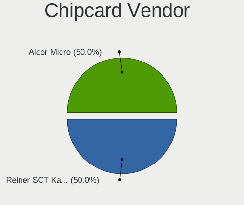

Linux Mint - Hardware Trends (Desktops)
---------------------------------------

A project to identify most popular hardware characteristics and track their change
over time based on data collected by Linux users at https://Linux-Hardware.org.

Anyone can contribute to this report by the [hw-probe](https://github.com/linuxhw/hw-probe) tool:

    sudo -E hw-probe -all -upload

This report is for one last month. Overall report since the beginning of time: [TestCoverage](https://github.com/linuxhw/TestCoverage)

Period: Sep, 2022.

Contents
--------

* [ System ](#system)
  - [ OS                       ](#os)
  - [ OS Family                ](#os-family)
  - [ Kernel                   ](#kernel)
  - [ Kernel Family            ](#kernel-family)
  - [ Kernel Major Ver.        ](#kernel-major-ver)
  - [ Arch                     ](#arch)
  - [ DE                       ](#de)
  - [ Display Server           ](#display-server)
  - [ Display Manager          ](#display-manager)
  - [ OS Lang                  ](#os-lang)
  - [ Boot Mode                ](#boot-mode)
  - [ Filesystem               ](#filesystem)
  - [ Part. scheme             ](#part-scheme)
  - [ Dual Boot with Linux/BSD ](#dual-boot-with-linuxbsd)
  - [ Dual Boot (Win)          ](#dual-boot-win)

* [ Board ](#board)
  - [ Vendor                   ](#vendor)
  - [ Model                    ](#model)
  - [ Model Family             ](#model-family)
  - [ MFG Year                 ](#mfg-year)
  - [ Form Factor              ](#form-factor)
  - [ Secure Boot              ](#secure-boot)
  - [ Coreboot                 ](#coreboot)
  - [ RAM Size                 ](#ram-size)
  - [ RAM Used                 ](#ram-used)
  - [ Total Drives             ](#total-drives)
  - [ Has CD-ROM               ](#has-cd-rom)
  - [ Has Ethernet             ](#has-ethernet)
  - [ Has WiFi                 ](#has-wifi)
  - [ Has Bluetooth            ](#has-bluetooth)

* [ Location ](#location)
  - [ Country                  ](#country)
  - [ City                     ](#city)

* [ Drives ](#drives)
  - [ Drive Vendor             ](#drive-vendor)
  - [ Drive Model              ](#drive-model)
  - [ HDD Vendor               ](#hdd-vendor)
  - [ SSD Vendor               ](#ssd-vendor)
  - [ Drive Kind               ](#drive-kind)
  - [ Drive Connector          ](#drive-connector)
  - [ Drive Size               ](#drive-size)
  - [ Space Total              ](#space-total)
  - [ Space Used               ](#space-used)
  - [ Malfunc. Drives          ](#malfunc-drives)
  - [ Malfunc. Drive Vendor    ](#malfunc-drive-vendor)
  - [ Malfunc. HDD Vendor      ](#malfunc-hdd-vendor)
  - [ Malfunc. Drive Kind      ](#malfunc-drive-kind)
  - [ Failed Drives            ](#failed-drives)
  - [ Failed Drive Vendor      ](#failed-drive-vendor)
  - [ Drive Status             ](#drive-status)

* [ Storage controller ](#storage-controller)
  - [ Storage Vendor           ](#storage-vendor)
  - [ Storage Model            ](#storage-model)
  - [ Storage Kind             ](#storage-kind)

* [ Processor ](#processor)
  - [ CPU Vendor               ](#cpu-vendor)
  - [ CPU Model                ](#cpu-model)
  - [ CPU Model Family         ](#cpu-model-family)
  - [ CPU Cores                ](#cpu-cores)
  - [ CPU Sockets              ](#cpu-sockets)
  - [ CPU Threads              ](#cpu-threads)
  - [ CPU Op-Modes             ](#cpu-op-modes)
  - [ CPU Microcode            ](#cpu-microcode)
  - [ CPU Microarch            ](#cpu-microarch)

* [ Graphics ](#graphics)
  - [ GPU Vendor               ](#gpu-vendor)
  - [ GPU Model                ](#gpu-model)
  - [ GPU Combo                ](#gpu-combo)
  - [ GPU Driver               ](#gpu-driver)
  - [ GPU Memory               ](#gpu-memory)

* [ Monitor ](#monitor)
  - [ Monitor Vendor           ](#monitor-vendor)
  - [ Monitor Model            ](#monitor-model)
  - [ Monitor Resolution       ](#monitor-resolution)
  - [ Monitor Diagonal         ](#monitor-diagonal)
  - [ Monitor Width            ](#monitor-width)
  - [ Aspect Ratio             ](#aspect-ratio)
  - [ Monitor Area             ](#monitor-area)
  - [ Pixel Density            ](#pixel-density)
  - [ Multiple Monitors        ](#multiple-monitors)

* [ Network ](#network)
  - [ Net Controller Vendor    ](#net-controller-vendor)
  - [ Net Controller Model     ](#net-controller-model)
  - [ Wireless Vendor          ](#wireless-vendor)
  - [ Wireless Model           ](#wireless-model)
  - [ Ethernet Vendor          ](#ethernet-vendor)
  - [ Ethernet Model           ](#ethernet-model)
  - [ Net Controller Kind      ](#net-controller-kind)
  - [ Used Controller          ](#used-controller)
  - [ NICs                     ](#nics)
  - [ IPv6                     ](#ipv6)

* [ Bluetooth ](#bluetooth)
  - [ Bluetooth Vendor         ](#bluetooth-vendor)
  - [ Bluetooth Model          ](#bluetooth-model)

* [ Sound ](#sound)
  - [ Sound Vendor             ](#sound-vendor)
  - [ Sound Model              ](#sound-model)

* [ Memory ](#memory)
  - [ Memory Vendor            ](#memory-vendor)
  - [ Memory Model             ](#memory-model)
  - [ Memory Kind              ](#memory-kind)
  - [ Memory Form Factor       ](#memory-form-factor)
  - [ Memory Size              ](#memory-size)
  - [ Memory Speed             ](#memory-speed)

* [ Printers & scanners ](#printers--scanners)
  - [ Printer Vendor           ](#printer-vendor)
  - [ Printer Model            ](#printer-model)
  - [ Scanner Vendor           ](#scanner-vendor)
  - [ Scanner Model            ](#scanner-model)

* [ Camera ](#camera)
  - [ Camera Vendor            ](#camera-vendor)
  - [ Camera Model             ](#camera-model)

* [ Security ](#security)
  - [ Fingerprint Vendor       ](#fingerprint-vendor)
  - [ Fingerprint Model        ](#fingerprint-model)
  - [ Chipcard Vendor          ](#chipcard-vendor)
  - [ Chipcard Model           ](#chipcard-model)

* [ Unsupported ](#unsupported)
  - [ Unsupported Devices      ](#unsupported-devices)
  - [ Unsupported Device Types ](#unsupported-device-types)

System
------

OS
--

Installed operating systems

| Name            | Desktops | Percent |
|-----------------|----------|---------|
| Linux Mint 21   | 99       | 57.23%  |
| Linux Mint 20.3 | 51       | 29.48%  |
| Linux Mint 20.1 | 7        | 4.05%   |
| Linux Mint 19.3 | 7        | 4.05%   |
| Linux Mint 20   | 5        | 2.89%   |
| Linux Mint 20.2 | 2        | 1.16%   |
| Linux Mint 19.1 | 1        | 0.58%   |
| Linux Mint 18.3 | 1        | 0.58%   |

OS Family
---------

OS without a version

| Name       | Desktops | Percent |
|------------|----------|---------|
| Linux Mint | 173      | 100%    |

Kernel
------

Version of the Linux kernel

| Version                   | Desktops | Percent |
|---------------------------|----------|---------|
| 5.15.0-47-generic         | 53       | 30.64%  |
| 5.4.0-125-generic         | 41       | 23.7%   |
| 5.15.0-48-generic         | 33       | 19.08%  |
| 5.4.0-126-generic         | 10       | 5.78%   |
| 5.15.0-46-generic         | 10       | 5.78%   |
| 5.15.0-41-generic         | 9        | 5.2%    |
| 5.4.0-124-generic         | 4        | 2.31%   |
| 4.15.0-192-generic        | 2        | 1.16%   |
| 5.4.0-91-generic          | 1        | 0.58%   |
| 5.4.0-81-generic          | 1        | 0.58%   |
| 5.4.0-58-generic          | 1        | 0.58%   |
| 5.4.0-113-generic         | 1        | 0.58%   |
| 5.4.0-110-generic         | 1        | 0.58%   |
| 5.19.0-7.1-liquorix-amd64 | 1        | 0.58%   |
| 5.17.0-8-generic          | 1        | 0.58%   |
| 5.15.0-46-lowlatency      | 1        | 0.58%   |
| 5.10.0-17-amd64           | 1        | 0.58%   |
| 4.15.0-32-generic         | 1        | 0.58%   |
| 4.15.0-191-generic        | 1        | 0.58%   |

Kernel Family
-------------

Linux kernel without a distro release

| Version | Desktops | Percent |
|---------|----------|---------|
| 5.15.0  | 106      | 61.27%  |
| 5.4.0   | 60       | 34.68%  |
| 4.15.0  | 4        | 2.31%   |
| 5.19.0  | 1        | 0.58%   |
| 5.17.0  | 1        | 0.58%   |
| 5.10.0  | 1        | 0.58%   |

Kernel Major Ver.
-----------------

Linux kernel major version

| Version | Desktops | Percent |
|---------|----------|---------|
| 5.15    | 106      | 61.27%  |
| 5.4     | 60       | 34.68%  |
| 4.15    | 4        | 2.31%   |
| 5.19    | 1        | 0.58%   |
| 5.17    | 1        | 0.58%   |
| 5.10    | 1        | 0.58%   |

Arch
----

OS architecture (x86_64, i586, etc.)

| Name   | Desktops | Percent |
|--------|----------|---------|
| x86_64 | 169      | 97.69%  |
| i686   | 4        | 2.31%   |

DE
--

Desktop Environment

| Name       | Desktops | Percent |
|------------|----------|---------|
| X-Cinnamon | 117      | 67.63%  |
| MATE       | 22       | 12.72%  |
| XFCE       | 17       | 9.83%   |
| Cinnamon   | 12       | 6.94%   |
| GNOME      | 4        | 2.31%   |
| Pantheon   | 1        | 0.58%   |

Display Server
--------------

X11 or Wayland

| Name    | Desktops | Percent |
|---------|----------|---------|
| X11     | 169      | 97.69%  |
| Wayland | 2        | 1.16%   |
| Tty     | 2        | 1.16%   |

Display Manager
---------------

SDDM, LightDM, etc.

| Name    | Desktops | Percent |
|---------|----------|---------|
| Unknown | 103      | 59.54%  |
| LightDM | 68       | 39.31%  |
| GDM3    | 1        | 0.58%   |
| GDM     | 1        | 0.58%   |

OS Lang
-------

Language

| Lang  | Desktops | Percent |
|-------|----------|---------|
| en_US | 49       | 28.32%  |
| de_DE | 31       | 17.92%  |
| it_IT | 14       | 8.09%   |
| ru_RU | 12       | 6.94%   |
| pt_BR | 8        | 4.62%   |
| fr_FR | 8        | 4.62%   |
| en_GB | 8        | 4.62%   |
| es_MX | 4        | 2.31%   |
| en_CA | 4        | 2.31%   |
| pl_PL | 3        | 1.73%   |
| es_AR | 3        | 1.73%   |
| en_IN | 3        | 1.73%   |
| en_AU | 3        | 1.73%   |
| fr_CA | 2        | 1.16%   |
| en_NZ | 2        | 1.16%   |
| de_AT | 2        | 1.16%   |
| C     | 2        | 1.16%   |
| sr_RS | 1        | 0.58%   |
| sk_SK | 1        | 0.58%   |
| nl_NL | 1        | 0.58%   |
| nb_NO | 1        | 0.58%   |
| hu_HU | 1        | 0.58%   |
| fr_BE | 1        | 0.58%   |
| fi_FI | 1        | 0.58%   |
| es_UY | 1        | 0.58%   |
| es_HN | 1        | 0.58%   |
| es_ES | 1        | 0.58%   |
| es_CO | 1        | 0.58%   |
| es_CL | 1        | 0.58%   |
| en_IL | 1        | 0.58%   |
| el_GR | 1        | 0.58%   |
| da_DK | 1        | 0.58%   |

Boot Mode
---------

EFI or BIOS

| Mode | Desktops | Percent |
|------|----------|---------|
| BIOS | 88       | 50.87%  |
| EFI  | 85       | 49.13%  |

Filesystem
----------

Type of filesystem

| Type    | Desktops | Percent |
|---------|----------|---------|
| Ext4    | 165      | 95.38%  |
| Zfs     | 3        | 1.73%   |
| Btrfs   | 3        | 1.73%   |
| Overlay | 1        | 0.58%   |
| Ext3    | 1        | 0.58%   |

Part. scheme
------------

Scheme of partitioning

| Type    | Desktops | Percent |
|---------|----------|---------|
| Unknown | 108      | 62.43%  |
| GPT     | 50       | 28.9%   |
| MBR     | 15       | 8.67%   |

Dual Boot with Linux/BSD
------------------------

Hosting more than one Linux/BSD

| Dual boot | Desktops | Percent |
|-----------|----------|---------|
| No        | 157      | 90.75%  |
| Yes       | 16       | 9.25%   |

Dual Boot (Win)
---------------

Hosting Linux and Windows

| Dual boot | Desktops | Percent |
|-----------|----------|---------|
| No        | 134      | 77.46%  |
| Yes       | 39       | 22.54%  |

Board
-----

Vendor
------

Motherboard manufacturer

| Name                | Desktops | Percent |
|---------------------|----------|---------|
| ASUSTek Computer    | 37       | 21.39%  |
| Gigabyte Technology | 36       | 20.81%  |
| Hewlett-Packard     | 19       | 10.98%  |
| Dell                | 15       | 8.67%   |
| MSI                 | 14       | 8.09%   |
| ASRock              | 9        | 5.2%    |
| Lenovo              | 7        | 4.05%   |
| Intel               | 6        | 3.47%   |
| ECS                 | 4        | 2.31%   |
| PCWare              | 2        | 1.16%   |
| Medion              | 2        | 1.16%   |
| Fujitsu             | 2        | 1.16%   |
| Foxconn             | 2        | 1.16%   |
| BESSTAR Tech        | 2        | 1.16%   |
| AZW                 | 2        | 1.16%   |
| Acer                | 2        | 1.16%   |
| Unknown             | 2        | 1.16%   |
| Wistron             | 1        | 0.58%   |
| System76            | 1        | 0.58%   |
| Pegatron            | 1        | 0.58%   |
| Packard Bell        | 1        | 0.58%   |
| OEM                 | 1        | 0.58%   |
| Gateway             | 1        | 0.58%   |
| Fujitsu Siemens     | 1        | 0.58%   |
| Biostar             | 1        | 0.58%   |
| Apple               | 1        | 0.58%   |
| AMI                 | 1        | 0.58%   |

Model
-----

Motherboard model

| Name                                    | Desktops | Percent |
|-----------------------------------------|----------|---------|
| ASUS All Series                         | 5        | 2.89%   |
| MSI MS-7C56                             | 2        | 1.16%   |
| MSI MS-7641                             | 2        | 1.16%   |
| Intel X79M-S                            | 2        | 1.16%   |
| HP ProLiant MicroServer                 | 2        | 1.16%   |
| HP Compaq 8200 Elite CMT PC             | 2        | 1.16%   |
| Gigabyte X470 AORUS ULTRA GAMING        | 2        | 1.16%   |
| Dell OptiPlex 990                       | 2        | 1.16%   |
| Dell OptiPlex 7010                      | 2        | 1.16%   |
| ASUS P5K                                | 2        | 1.16%   |
| Unknown                                 | 2        | 1.16%   |
| Wistron ProLiant ML110 G6               | 1        | 0.58%   |
| System76 Thelio Mira                    | 1        | 0.58%   |
| Pegatron NQ857AA-ABD a6749de            | 1        | 0.58%   |
| PCWare IPMH61R3                         | 1        | 0.58%   |
| PCWare IPMH61R1                         | 1        | 0.58%   |
| Packard Bell IMEDIA S2883               | 1        | 0.58%   |
| OEM B75                                 | 1        | 0.58%   |
| MSI MS-7D22                             | 1        | 0.58%   |
| MSI MS-7C91                             | 1        | 0.58%   |
| MSI MS-7B86                             | 1        | 0.58%   |
| MSI MS-7A93                             | 1        | 0.58%   |
| MSI MS-7A34                             | 1        | 0.58%   |
| MSI MS-7994                             | 1        | 0.58%   |
| MSI MS-7984                             | 1        | 0.58%   |
| MSI MS-7978                             | 1        | 0.58%   |
| MSI MS-7850                             | 1        | 0.58%   |
| MSI MS-7817                             | 1        | 0.58%   |
| Medion P66089                           | 1        | 0.58%   |
| Medion Akoya P2140 D MD8327/2487        | 1        | 0.58%   |
| Lenovo ThinkStation C30 11368H3         | 1        | 0.58%   |
| Lenovo ThinkCentre M92p 3227A45         | 1        | 0.58%   |
| Lenovo ThinkCentre M81 5049W16          | 1        | 0.58%   |
| Lenovo ThinkCentre M700 10HY002WUK      | 1        | 0.58%   |
| Lenovo ThinkCentre M58 9728AHG          | 1        | 0.58%   |
| Lenovo IdeaCentre 300S-11ISH 90D9003KYD | 1        | 0.58%   |
| Lenovo IdeaCentre 3 07ADA05 90MV00BCIX  | 1        | 0.58%   |
| Intel DQ67SW AAG12527-306               | 1        | 0.58%   |
| Intel DH67BL AAG10189-209               | 1        | 0.58%   |
| Intel DH61BF AAG81311-101               | 1        | 0.58%   |

Model Family
------------

Motherboard model prefix

| Name                 | Desktops | Percent |
|----------------------|----------|---------|
| Dell OptiPlex        | 11       | 6.36%   |
| ASUS PRIME           | 9        | 5.2%    |
| HP Compaq            | 5        | 2.89%   |
| ASUS All             | 5        | 2.89%   |
| Lenovo ThinkCentre   | 4        | 2.31%   |
| ASUS ROG             | 4        | 2.31%   |
| Dell Precision       | 3        | 1.73%   |
| MSI MS-7C56          | 2        | 1.16%   |
| MSI MS-7641          | 2        | 1.16%   |
| Lenovo IdeaCentre    | 2        | 1.16%   |
| Intel X79M-S         | 2        | 1.16%   |
| HP ProLiant          | 2        | 1.16%   |
| HP Pavilion          | 2        | 1.16%   |
| HP EliteDesk         | 2        | 1.16%   |
| Gigabyte Z690        | 2        | 1.16%   |
| Gigabyte X470        | 2        | 1.16%   |
| Gigabyte H61M-DS2    | 2        | 1.16%   |
| Gigabyte A320M-S2H   | 2        | 1.16%   |
| ASUS TUF             | 2        | 1.16%   |
| ASUS P5K             | 2        | 1.16%   |
| ASUS M5A78L-M        | 2        | 1.16%   |
| ASRock X399          | 2        | 1.16%   |
| Unknown              | 2        | 1.16%   |
| Wistron ProLiant     | 1        | 0.58%   |
| System76 Thelio      | 1        | 0.58%   |
| Pegatron NQ857AA-ABD | 1        | 0.58%   |
| PCWare IPMH61R3      | 1        | 0.58%   |
| PCWare IPMH61R1      | 1        | 0.58%   |
| Packard Bell IMEDIA  | 1        | 0.58%   |
| OEM B75              | 1        | 0.58%   |
| MSI MS-7D22          | 1        | 0.58%   |
| MSI MS-7C91          | 1        | 0.58%   |
| MSI MS-7B86          | 1        | 0.58%   |
| MSI MS-7A93          | 1        | 0.58%   |
| MSI MS-7A34          | 1        | 0.58%   |
| MSI MS-7994          | 1        | 0.58%   |
| MSI MS-7984          | 1        | 0.58%   |
| MSI MS-7978          | 1        | 0.58%   |
| MSI MS-7850          | 1        | 0.58%   |
| MSI MS-7817          | 1        | 0.58%   |

MFG Year
--------

Motherboard manufacture year

| Year | Desktops | Percent |
|------|----------|---------|
| 2018 | 19       | 10.98%  |
| 2011 | 19       | 10.98%  |
| 2012 | 18       | 10.4%   |
| 2013 | 15       | 8.67%   |
| 2020 | 14       | 8.09%   |
| 2021 | 10       | 5.78%   |
| 2017 | 10       | 5.78%   |
| 2010 | 10       | 5.78%   |
| 2019 | 8        | 4.62%   |
| 2015 | 8        | 4.62%   |
| 2014 | 8        | 4.62%   |
| 2007 | 8        | 4.62%   |
| 2016 | 7        | 4.05%   |
| 2009 | 7        | 4.05%   |
| 2008 | 5        | 2.89%   |
| 2022 | 4        | 2.31%   |
| 2006 | 2        | 1.16%   |
| 2004 | 1        | 0.58%   |

Form Factor
-----------

Physical design of the computer

| Name    | Desktops | Percent |
|---------|----------|---------|
| Desktop | 173      | 100%    |

Secure Boot
-----------

Enabled or disabled

| State    | Desktops | Percent |
|----------|----------|---------|
| Disabled | 165      | 95.38%  |
| Enabled  | 8        | 4.62%   |

Coreboot
--------

Have coreboot on board

| Used | Desktops | Percent |
|------|----------|---------|
| No   | 173      | 100%    |

RAM Size
--------

Total RAM memory

| Size in GB  | Desktops | Percent |
|-------------|----------|---------|
| 16.01-24.0  | 42       | 24.28%  |
| 8.01-16.0   | 40       | 23.12%  |
| 4.01-8.0    | 32       | 18.5%   |
| 32.01-64.0  | 21       | 12.14%  |
| 3.01-4.0    | 14       | 8.09%   |
| 64.01-256.0 | 8        | 4.62%   |
| 1.01-2.0    | 6        | 3.47%   |
| 24.01-32.0  | 5        | 2.89%   |
| 2.01-3.0    | 5        | 2.89%   |

RAM Used
--------

Used RAM memory

| Used GB    | Desktops | Percent |
|------------|----------|---------|
| 1.01-2.0   | 59       | 34.1%   |
| 2.01-3.0   | 57       | 32.95%  |
| 4.01-8.0   | 22       | 12.72%  |
| 3.01-4.0   | 22       | 12.72%  |
| 0.51-1.0   | 7        | 4.05%   |
| 8.01-16.0  | 5        | 2.89%   |
| 24.01-32.0 | 1        | 0.58%   |

Total Drives
------------

Number of drives on board

| Drives | Desktops | Percent |
|--------|----------|---------|
| 2      | 66       | 38.15%  |
| 1      | 51       | 29.48%  |
| 3      | 26       | 15.03%  |
| 4      | 19       | 10.98%  |
| 5      | 6        | 3.47%   |
| 6      | 3        | 1.73%   |
| 10     | 1        | 0.58%   |
| 7      | 1        | 0.58%   |

Has CD-ROM
----------

Has CD-ROM on board

| Presented | Desktops | Percent |
|-----------|----------|---------|
| Yes       | 104      | 60.12%  |
| No        | 69       | 39.88%  |

Has Ethernet
------------

Has Ethernet on board

| Presented | Desktops | Percent |
|-----------|----------|---------|
| Yes       | 171      | 98.84%  |
| No        | 2        | 1.16%   |

Has WiFi
--------

Has WiFi module

| Presented | Desktops | Percent |
|-----------|----------|---------|
| Yes       | 93       | 53.76%  |
| No        | 80       | 46.24%  |

Has Bluetooth
-------------

Has Bluetooth module

| Presented | Desktops | Percent |
|-----------|----------|---------|
| No        | 112      | 64.74%  |
| Yes       | 61       | 35.26%  |

Location
--------

Country
-------

Geographic location (country)

| Country            | Desktops | Percent |
|--------------------|----------|---------|
| USA                | 35       | 20.23%  |
| Germany            | 31       | 17.92%  |
| Italy              | 15       | 8.67%   |
| Brazil             | 12       | 6.94%   |
| Russia             | 9        | 5.2%    |
| France             | 8        | 4.62%   |
| UK                 | 7        | 4.05%   |
| Canada             | 6        | 3.47%   |
| Mexico             | 4        | 2.31%   |
| India              | 4        | 2.31%   |
| Poland             | 3        | 1.73%   |
| Australia          | 3        | 1.73%   |
| Argentina          | 3        | 1.73%   |
| Serbia             | 2        | 1.16%   |
| New Zealand        | 2        | 1.16%   |
| Hungary            | 2        | 1.16%   |
| Greece             | 2        | 1.16%   |
| Colombia           | 2        | 1.16%   |
| Belgium            | 2        | 1.16%   |
| Belarus            | 2        | 1.16%   |
| Austria            | 2        | 1.16%   |
| Uruguay            | 1        | 0.58%   |
| Ukraine            | 1        | 0.58%   |
| UAE                | 1        | 0.58%   |
| Turkey             | 1        | 0.58%   |
| Switzerland        | 1        | 0.58%   |
| Spain              | 1        | 0.58%   |
| South Africa       | 1        | 0.58%   |
| Slovakia           | 1        | 0.58%   |
| Romania            | 1        | 0.58%   |
| Netherlands        | 1        | 0.58%   |
| Israel             | 1        | 0.58%   |
| Honduras           | 1        | 0.58%   |
| Finland            | 1        | 0.58%   |
| Dominican Republic | 1        | 0.58%   |
| Denmark            | 1        | 0.58%   |
| Czechia            | 1        | 0.58%   |
| Chile              | 1        | 0.58%   |

City
----

Geographic location (city)

| City               | Desktops | Percent |
|--------------------|----------|---------|
| Rome               | 4        | 2.31%   |
| Munich             | 3        | 1.73%   |
| Sydney             | 2        | 1.16%   |
| Shaftesbury        | 2        | 1.16%   |
| Sao Paulo          | 2        | 1.16%   |
| Rosario            | 2        | 1.16%   |
| Rio de Janeiro     | 2        | 1.16%   |
| Porto Alegre       | 2        | 1.16%   |
| Palermo            | 2        | 1.16%   |
| Farmington         | 2        | 1.16%   |
| Chicago            | 2        | 1.16%   |
| Brasília          | 2        | 1.16%   |
| Unknown            | 2        | 1.16%   |
| Zalău             | 1        | 0.58%   |
| Zacatecas City     | 1        | 0.58%   |
| Yaroslavl          | 1        | 0.58%   |
| Winnipeg           | 1        | 0.58%   |
| West Chester       | 1        | 0.58%   |
| Wenden             | 1        | 0.58%   |
| Warsaw             | 1        | 0.58%   |
| Waco               | 1        | 0.58%   |
| Vitinia            | 1        | 0.58%   |
| Villeurbanne       | 1        | 0.58%   |
| Villers-Cotterêts | 1        | 0.58%   |
| Villefontaine      | 1        | 0.58%   |
| Vignola            | 1        | 0.58%   |
| Vienna             | 1        | 0.58%   |
| Valencia           | 1        | 0.58%   |
| Ufa                | 1        | 0.58%   |
| Uetze              | 1        | 0.58%   |
| Udine              | 1        | 0.58%   |
| Trivandrum         | 1        | 0.58%   |
| Thessaloniki       | 1        | 0.58%   |
| Tegucigalpa        | 1        | 0.58%   |
| Tampere            | 1        | 0.58%   |
| Talca              | 1        | 0.58%   |
| Suhl               | 1        | 0.58%   |
| Street             | 1        | 0.58%   |
| Stolzenau          | 1        | 0.58%   |
| Stelle             | 1        | 0.58%   |

Drives
------

Drive Vendor
------------

Hard drive vendors

| Vendor                    | Desktops | Drives | Percent |
|---------------------------|----------|--------|---------|
| WDC                       | 80       | 99     | 23.88%  |
| Seagate                   | 65       | 85     | 19.4%   |
| Samsung Electronics       | 44       | 61     | 13.13%  |
| Crucial                   | 20       | 21     | 5.97%   |
| Kingston                  | 19       | 19     | 5.67%   |
| Toshiba                   | 15       | 16     | 4.48%   |
| SanDisk                   | 12       | 14     | 3.58%   |
| Hitachi                   | 11       | 12     | 3.28%   |
| Unknown                   | 6        | 9      | 1.79%   |
| HGST                      | 4        | 4      | 1.19%   |
| XPG                       | 3        | 3      | 0.9%    |
| Maxtor                    | 3        | 4      | 0.9%    |
| Intenso                   | 3        | 3      | 0.9%    |
| Intel                     | 3        | 3      | 0.9%    |
| China                     | 3        | 3      | 0.9%    |
| A-DATA Technology         | 3        | 3      | 0.9%    |
| Silicon Motion            | 2        | 2      | 0.6%    |
| Realtek Semiconductor     | 2        | 2      | 0.6%    |
| PNY                       | 2        | 2      | 0.6%    |
| Patriot                   | 2        | 2      | 0.6%    |
| NGFF                      | 2        | 2      | 0.6%    |
| Lexar                     | 2        | 2      | 0.6%    |
| Emtec                     | 2        | 2      | 0.6%    |
| Unknown                   | 2        | 2      | 0.6%    |
| WALRAM                    | 1        | 1      | 0.3%    |
| TO Exter                  | 1        | 1      | 0.3%    |
| Team                      | 1        | 1      | 0.3%    |
| T-FORCE                   | 1        | 1      | 0.3%    |
| SPCC                      | 1        | 1      | 0.3%    |
| SP                        | 1        | 1      | 0.3%    |
| SK hynix                  | 1        | 1      | 0.3%    |
| SABRENT                   | 1        | 1      | 0.3%    |
| RSH-319                   | 1        | 1      | 0.3%    |
| Realtek                   | 1        | 1      | 0.3%    |
| Phison Electronics        | 1        | 1      | 0.3%    |
| OCZ                       | 1        | 1      | 0.3%    |
| Netac                     | 1        | 1      | 0.3%    |
| Mushkin                   | 1        | 1      | 0.3%    |
| Micron/Crucial Technology | 1        | 1      | 0.3%    |
| Leven                     | 1        | 1      | 0.3%    |

Drive Model
-----------

Hard drive models

| Model                            | Desktops | Percent |
|----------------------------------|----------|---------|
| Seagate ST2000DM008-2FR102 2TB   | 6        | 1.57%   |
| Crucial CT500MX500SSD1 500GB     | 6        | 1.57%   |
| Seagate ST500DM002-1BD142 500GB  | 4        | 1.04%   |
| Seagate ST2000DM001-1ER164 2TB   | 4        | 1.04%   |
| Seagate ST2000DM001-1CH164 2TB   | 4        | 1.04%   |
| Samsung SSD 860 EVO 250GB        | 4        | 1.04%   |
| Kingston SV300S37A240G 240GB SSD | 4        | 1.04%   |
| Kingston SV300S37A120G 120GB SSD | 4        | 1.04%   |
| WDC WDS500G2B0A 500GB SSD        | 3        | 0.78%   |
| WDC WD20EARS-00MVWB0 2TB         | 3        | 0.78%   |
| Toshiba DT01ACA100 1TB           | 3        | 0.78%   |
| Toshiba DT01ACA050 500GB         | 3        | 0.78%   |
| Seagate ST1000DM003-1CH162 1TB   | 3        | 0.78%   |
| Samsung SSD 860 EVO 500GB        | 3        | 0.78%   |
| Samsung SSD 850 EVO 250GB        | 3        | 0.78%   |
| Crucial CT1000MX500SSD1 1TB      | 3        | 0.78%   |
| XPG GAMMIX S5 512GB              | 2        | 0.52%   |
| WDC WDS100T3X0C-00SJG0 1TB       | 2        | 0.52%   |
| WDC WD40EZRZ-00GXCB0 4TB         | 2        | 0.52%   |
| WDC WD10EZRX-00L4HB0 1TB         | 2        | 0.52%   |
| WDC WD10EZEX-08WN4A0 1TB         | 2        | 0.52%   |
| WDC WD10EARS-22Y5B1 1TB          | 2        | 0.52%   |
| WDC WD1003FZEX-00MK2A0 1TB       | 2        | 0.52%   |
| Unknown SD/MMC 16GB              | 2        | 0.52%   |
| Unknown M.S./M.S.Pro/HG 16GB     | 2        | 0.52%   |
| Toshiba HDWD120 2TB              | 2        | 0.52%   |
| Toshiba DT01ACA200 2TB           | 2        | 0.52%   |
| Seagate ST500LT012-9WS142 500GB  | 2        | 0.52%   |
| Seagate ST4000DM000-1F2168 4TB   | 2        | 0.52%   |
| Seagate ST3500312CS 500GB        | 2        | 0.52%   |
| Seagate ST1000DM010-2EP102 1TB   | 2        | 0.52%   |
| SanDisk SSD PLUS 120 GB          | 2        | 0.52%   |
| Samsung SSD 980 PRO 1TB          | 2        | 0.52%   |
| Samsung SSD 980 1TB              | 2        | 0.52%   |
| Samsung SSD 970 EVO Plus 1TB     | 2        | 0.52%   |
| Samsung SSD 870 EVO 1TB          | 2        | 0.52%   |
| Samsung SSD 850 PRO 512GB        | 2        | 0.52%   |
| Samsung SSD 850 EVO 500GB        | 2        | 0.52%   |
| Samsung NVMe SSD Drive 500GB     | 2        | 0.52%   |
| Samsung NVMe SSD Drive 1TB       | 2        | 0.52%   |

HDD Vendor
----------

Hard disk drive vendors

| Vendor              | Desktops | Drives | Percent |
|---------------------|----------|--------|---------|
| WDC                 | 72       | 85     | 38.92%  |
| Seagate             | 64       | 84     | 34.59%  |
| Toshiba             | 15       | 15     | 8.11%   |
| Hitachi             | 11       | 12     | 5.95%   |
| Samsung Electronics | 8        | 10     | 4.32%   |
| HGST                | 4        | 4      | 2.16%   |
| Maxtor              | 3        | 4      | 1.62%   |
| Unknown             | 2        | 2      | 1.08%   |
| RSH-319             | 1        | 1      | 0.54%   |
| KESU                | 1        | 1      | 0.54%   |
| Hewlett-Packard     | 1        | 2      | 0.54%   |
| Fujitsu             | 1        | 1      | 0.54%   |
| ASMT                | 1        | 1      | 0.54%   |
| ASMedia             | 1        | 1      | 0.54%   |

SSD Vendor
----------

Solid state drive vendors

| Vendor              | Desktops | Drives | Percent |
|---------------------|----------|--------|---------|
| Samsung Electronics | 24       | 31     | 22.64%  |
| Crucial             | 19       | 20     | 17.92%  |
| Kingston            | 14       | 14     | 13.21%  |
| SanDisk             | 9        | 10     | 8.49%   |
| WDC                 | 8        | 9      | 7.55%   |
| China               | 3        | 3      | 2.83%   |
| A-DATA Technology   | 3        | 3      | 2.83%   |
| PNY                 | 2        | 2      | 1.89%   |
| Patriot             | 2        | 2      | 1.89%   |
| NGFF                | 2        | 2      | 1.89%   |
| Lexar               | 2        | 2      | 1.89%   |
| Intenso             | 2        | 2      | 1.89%   |
| Emtec               | 2        | 2      | 1.89%   |
| XPG                 | 1        | 1      | 0.94%   |
| Toshiba             | 1        | 1      | 0.94%   |
| TO Exter            | 1        | 1      | 0.94%   |
| Team                | 1        | 1      | 0.94%   |
| SPCC                | 1        | 1      | 0.94%   |
| SP                  | 1        | 1      | 0.94%   |
| OCZ                 | 1        | 1      | 0.94%   |
| Netac               | 1        | 1      | 0.94%   |
| Mushkin             | 1        | 1      | 0.94%   |
| KingSpec            | 1        | 1      | 0.94%   |
| KingFast            | 1        | 1      | 0.94%   |
| GOODRAM             | 1        | 1      | 0.94%   |
| Corsair             | 1        | 1      | 0.94%   |
| Unknown             | 1        | 1      | 0.94%   |

Drive Kind
----------

HDD or SSD

| Kind    | Desktops | Drives | Percent |
|---------|----------|--------|---------|
| HDD     | 140      | 223    | 49.47%  |
| SSD     | 91       | 116    | 32.16%  |
| NVMe    | 42       | 49     | 14.84%  |
| Unknown | 8        | 10     | 2.83%   |
| MMC     | 2        | 3      | 0.71%   |

Drive Connector
---------------

SATA, SAS, NVMe, etc.

| Type | Desktops | Drives | Percent |
|------|----------|--------|---------|
| SATA | 162      | 332    | 72.97%  |
| NVMe | 42       | 47     | 18.92%  |
| SAS  | 16       | 19     | 7.21%   |
| MMC  | 2        | 3      | 0.9%    |

Drive Size
----------

Size of hard drive

| Size in TB | Desktops | Drives | Percent |
|------------|----------|--------|---------|
| 0.01-0.5   | 116      | 169    | 46.4%   |
| 0.51-1.0   | 65       | 82     | 26%     |
| 1.01-2.0   | 40       | 55     | 16%     |
| 2.01-3.0   | 11       | 13     | 4.4%    |
| 3.01-4.0   | 10       | 11     | 4%      |
| 4.01-10.0  | 7        | 8      | 2.8%    |
| 10.01-20.0 | 1        | 1      | 0.4%    |

Space Total
-----------

Amount of disk space available on the file system

| Size in GB     | Desktops | Percent |
|----------------|----------|---------|
| 101-250        | 41       | 23.7%   |
| 501-1000       | 31       | 17.92%  |
| 251-500        | 29       | 16.76%  |
| 1001-2000      | 25       | 14.45%  |
| More than 3000 | 21       | 12.14%  |
| 2001-3000      | 16       | 9.25%   |
| 21-50          | 3        | 1.73%   |
| 51-100         | 3        | 1.73%   |
| 1-20           | 2        | 1.16%   |
| Unknown        | 2        | 1.16%   |

Space Used
----------

Amount of used disk space

| Used GB        | Desktops | Percent |
|----------------|----------|---------|
| 1-20           | 28       | 16.18%  |
| 501-1000       | 27       | 15.61%  |
| 21-50          | 26       | 15.03%  |
| 101-250        | 22       | 12.72%  |
| 51-100         | 21       | 12.14%  |
| 251-500        | 20       | 11.56%  |
| 1001-2000      | 10       | 5.78%   |
| More than 3000 | 9        | 5.2%    |
| 2001-3000      | 8        | 4.62%   |
| Unknown        | 2        | 1.16%   |

Malfunc. Drives
---------------

Drive models with a malfunction

| Model                             | Desktops | Drives | Percent |
|-----------------------------------|----------|--------|---------|
| WDC WD6400AACS-00G8B0 640GB       | 1        | 1      | 3.45%   |
| WDC WD5000AAKS-60Z1A0 500GB       | 1        | 1      | 3.45%   |
| WDC WD5000AAKS-00A7B0 500GB       | 1        | 1      | 3.45%   |
| WDC WD4005FZBX-00K5WB0 4TB        | 1        | 1      | 3.45%   |
| WDC WD3200BEVT-22ZCT0 320GB       | 1        | 1      | 3.45%   |
| WDC WD3200AAKS-75L9A0 320GB       | 1        | 1      | 3.45%   |
| WDC WD2500JB-00REA0 250GB         | 1        | 1      | 3.45%   |
| WDC WD2500AAJS-60Z0A0 250GB       | 1        | 1      | 3.45%   |
| WDC WD2002FAEX-00MJRA0 2TB        | 1        | 1      | 3.45%   |
| WDC WD10EURX-63FH1Y0 1TB          | 1        | 1      | 3.45%   |
| Toshiba HDWD120 2TB               | 1        | 1      | 3.45%   |
| Seagate ST8000DM004-2CX188 8TB    | 1        | 1      | 3.45%   |
| Seagate ST500LT012-9WS142 500GB   | 1        | 1      | 3.45%   |
| Seagate ST3500620AS 500GB         | 1        | 1      | 3.45%   |
| Seagate ST3500312CS 500GB         | 1        | 1      | 3.45%   |
| Seagate ST31000528AS 1TB          | 1        | 1      | 3.45%   |
| Seagate ST2000DM008-2UB102 2TB    | 1        | 1      | 3.45%   |
| Seagate ST2000DM001-1ER164 2TB    | 1        | 2      | 3.45%   |
| Seagate ST2000DM001-1CH164 2TB    | 1        | 1      | 3.45%   |
| SanDisk SSD PLUS 120 GB           | 1        | 1      | 3.45%   |
| Samsung Electronics SSD 980 1TB   | 1        | 1      | 3.45%   |
| Samsung Electronics HD322HJ 320GB | 1        | 1      | 3.45%   |
| Samsung Electronics HD321KJ 320GB | 1        | 1      | 3.45%   |
| Kingston SV300S37A120G 120GB SSD  | 1        | 1      | 3.45%   |
| Hitachi HTS545050B9A300 500GB     | 1        | 1      | 3.45%   |
| Hitachi HDS725050KLA360 500GB     | 1        | 1      | 3.45%   |
| HGST HTS545050A7E680 500GB        | 1        | 1      | 3.45%   |
| HGST HDN724040ALE640 4TB          | 1        | 1      | 3.45%   |
| China SSD 360GB                   | 1        | 1      | 3.45%   |

Malfunc. Drive Vendor
---------------------

Vendors of faulty drives

| Vendor              | Desktops | Drives | Percent |
|---------------------|----------|--------|---------|
| WDC                 | 9        | 10     | 32.14%  |
| Seagate             | 8        | 9      | 28.57%  |
| Samsung Electronics | 3        | 3      | 10.71%  |
| Hitachi             | 2        | 2      | 7.14%   |
| HGST                | 2        | 2      | 7.14%   |
| Toshiba             | 1        | 1      | 3.57%   |
| SanDisk             | 1        | 1      | 3.57%   |
| Kingston            | 1        | 1      | 3.57%   |
| China               | 1        | 1      | 3.57%   |

Malfunc. HDD Vendor
-------------------

Vendors of faulty HDD drives

| Vendor              | Desktops | Drives | Percent |
|---------------------|----------|--------|---------|
| WDC                 | 9        | 10     | 37.5%   |
| Seagate             | 8        | 9      | 33.33%  |
| Samsung Electronics | 2        | 2      | 8.33%   |
| Hitachi             | 2        | 2      | 8.33%   |
| HGST                | 2        | 2      | 8.33%   |
| Toshiba             | 1        | 1      | 4.17%   |

Malfunc. Drive Kind
-------------------

Kinds of faulty drives

| Kind | Desktops | Drives | Percent |
|------|----------|--------|---------|
| HDD  | 22       | 26     | 84.62%  |
| SSD  | 3        | 3      | 11.54%  |
| NVMe | 1        | 1      | 3.85%   |

Failed Drives
-------------

Failed drive models

Zero info for selected period =(

Failed Drive Vendor
-------------------

Failed drive vendors

Zero info for selected period =(

Drive Status
------------

Number of failed and malfunc. drives

| Status   | Desktops | Drives | Percent |
|----------|----------|--------|---------|
| Detected | 114      | 253    | 58.16%  |
| Works    | 57       | 118    | 29.08%  |
| Malfunc  | 25       | 30     | 12.76%  |

Storage controller
------------------

Storage Vendor
--------------

Storage controller vendors

| Vendor                      | Desktops | Percent |
|-----------------------------|----------|---------|
| Intel                       | 111      | 47.64%  |
| AMD                         | 54       | 23.18%  |
| Samsung Electronics         | 19       | 8.15%   |
| SanDisk                     | 7        | 3%      |
| JMicron Technology          | 7        | 3%      |
| Nvidia                      | 6        | 2.58%   |
| ASMedia Technology          | 6        | 2.58%   |
| Kingston Technology Company | 5        | 2.15%   |
| Marvell Technology Group    | 4        | 1.72%   |
| Realtek Semiconductor       | 3        | 1.29%   |
| Silicon Motion              | 2        | 0.86%   |
| Phison Electronics          | 2        | 0.86%   |
| Micron/Crucial Technology   | 2        | 0.86%   |
| VIA Technologies            | 1        | 0.43%   |
| SK hynix                    | 1        | 0.43%   |
| LSI Logic / Symbios Logic   | 1        | 0.43%   |
| Broadcom / LSI              | 1        | 0.43%   |
| ADATA Technology            | 1        | 0.43%   |

Storage Model
-------------

Storage controller models

| Model                                                                                   | Desktops | Percent |
|-----------------------------------------------------------------------------------------|----------|---------|
| AMD FCH SATA Controller [AHCI mode]                                                     | 28       | 9.06%   |
| Intel 6 Series/C200 Series Chipset Family 6 port Desktop SATA AHCI Controller           | 15       | 4.85%   |
| AMD 400 Series Chipset SATA Controller                                                  | 13       | 4.21%   |
| AMD SB7x0/SB8x0/SB9x0 IDE Controller                                                    | 11       | 3.56%   |
| Intel Q170/Q150/B150/H170/H110/Z170/CM236 Chipset SATA Controller [AHCI Mode]           | 9        | 2.91%   |
| Intel 8 Series/C220 Series Chipset Family 6-port SATA Controller 1 [AHCI mode]          | 9        | 2.91%   |
| Samsung NVMe SSD Controller SM981/PM981/PM983                                           | 8        | 2.59%   |
| Intel 7 Series/C210 Series Chipset Family 6-port SATA Controller [AHCI mode]            | 8        | 2.59%   |
| AMD SB7x0/SB8x0/SB9x0 SATA Controller [AHCI mode]                                       | 8        | 2.59%   |
| AMD SB7x0/SB8x0/SB9x0 SATA Controller [IDE mode]                                        | 7        | 2.27%   |
| AMD 500 Series Chipset SATA Controller                                                  | 7        | 2.27%   |
| Intel NM10/ICH7 Family SATA Controller [IDE mode]                                       | 6        | 1.94%   |
| Intel 9 Series Chipset Family SATA Controller [AHCI Mode]                               | 6        | 1.94%   |
| Intel 6 Series/C200 Series Chipset Family Desktop SATA Controller (IDE mode, ports 4-5) | 6        | 1.94%   |
| Intel 6 Series/C200 Series Chipset Family Desktop SATA Controller (IDE mode, ports 0-3) | 6        | 1.94%   |
| ASMedia ASM1062 Serial ATA Controller                                                   | 6        | 1.94%   |
| AMD 300 Series Chipset SATA Controller                                                  | 6        | 1.94%   |
| Samsung NVMe SSD Controller 980                                                         | 5        | 1.62%   |
| Intel Cannon Lake PCH SATA AHCI Controller                                              | 5        | 1.62%   |
| Intel 200 Series PCH SATA controller [AHCI mode]                                        | 5        | 1.62%   |
| Samsung NVMe SSD Controller PM9A1/PM9A3/980PRO                                          | 4        | 1.29%   |
| Nvidia MCP61 SATA Controller                                                            | 4        | 1.29%   |
| JMicron JMB363 SATA/IDE Controller                                                      | 4        | 1.29%   |
| Intel SATA Controller [RAID mode]                                                       | 4        | 1.29%   |
| Intel 82801G (ICH7 Family) IDE Controller                                               | 4        | 1.29%   |
| Intel 4 Series Chipset PT IDER Controller                                               | 4        | 1.29%   |
| JMicron JMB368 IDE controller                                                           | 3        | 0.97%   |
| Intel C602 chipset 4-Port SATA Storage Control Unit                                     | 3        | 0.97%   |
| Intel C600/X79 series chipset IDE-r Controller                                          | 3        | 0.97%   |
| Intel C600/X79 series chipset 6-Port SATA AHCI Controller                               | 3        | 0.97%   |
| Intel 82801JD/DO (ICH10 Family) SATA AHCI Controller                                    | 3        | 0.97%   |
| Intel 82801IR/IO/IH (ICH9R/DO/DH) 6 port SATA Controller [AHCI mode]                    | 3        | 0.97%   |
| Intel 82801I (ICH9 Family) 2 port SATA Controller [IDE mode]                            | 3        | 0.97%   |
| Intel 500 Series Chipset Family SATA AHCI Controller                                    | 3        | 0.97%   |
| Silicon Motion SM2263EN/SM2263XT SSD Controller                                         | 2        | 0.65%   |
| SanDisk WD Black SN750 / PC SN730 NVMe SSD                                              | 2        | 0.65%   |
| SanDisk WD Black 2018/SN750 / PC SN720 NVMe SSD                                         | 2        | 0.65%   |
| Samsung NVMe SSD Controller SM951/PM951                                                 | 2        | 0.65%   |
| Realtek Realtek Non-Volatile memory controller                                          | 2        | 0.65%   |
| Nvidia MCP61 IDE                                                                        | 2        | 0.65%   |

Storage Kind
------------

Kind of storage controller (IDE, SATA, NVMe, SAS, ...)

| Kind | Desktops | Percent |
|------|----------|---------|
| SATA | 137      | 56.15%  |
| IDE  | 53       | 21.72%  |
| NVMe | 42       | 17.21%  |
| RAID | 8        | 3.28%   |
| SAS  | 4        | 1.64%   |

Processor
---------

CPU Vendor
----------

Processor vendors

| Vendor | Desktops | Percent |
|--------|----------|---------|
| Intel  | 113      | 65.32%  |
| AMD    | 60       | 34.68%  |

CPU Model
---------

Processor models

| Model                                       | Desktops | Percent |
|---------------------------------------------|----------|---------|
| Intel Core i7-2600 CPU @ 3.40GHz            | 3        | 1.73%   |
| Intel Core i5-3470 CPU @ 3.20GHz            | 3        | 1.73%   |
| Intel Core i5-2400 CPU @ 3.10GHz            | 3        | 1.73%   |
| Intel Core 2 Duo CPU E8400 @ 3.00GHz        | 3        | 1.73%   |
| AMD Ryzen 7 5700G with Radeon Graphics      | 3        | 1.73%   |
| AMD Ryzen 5 3600 6-Core Processor           | 3        | 1.73%   |
| AMD Ryzen 5 2400G with Radeon Vega Graphics | 3        | 1.73%   |
| AMD Ryzen 5 1600 Six-Core Processor         | 3        | 1.73%   |
| AMD Phenom II X4 965 Processor              | 3        | 1.73%   |
| AMD FX-8350 Eight-Core Processor            | 3        | 1.73%   |
| Intel Xeon CPU E5-2650 v2 @ 2.60GHz         | 2        | 1.16%   |
| Intel Pentium Dual CPU E2200 @ 2.20GHz      | 2        | 1.16%   |
| Intel Core i7-6700 CPU @ 3.40GHz            | 2        | 1.16%   |
| Intel Core i7-4790S CPU @ 3.20GHz           | 2        | 1.16%   |
| Intel Core i7-4790K CPU @ 4.00GHz           | 2        | 1.16%   |
| Intel Core i5-6500 CPU @ 3.20GHz            | 2        | 1.16%   |
| Intel Core i5-4690K CPU @ 3.50GHz           | 2        | 1.16%   |
| Intel Core i5-4690 CPU @ 3.50GHz            | 2        | 1.16%   |
| Intel Core i5-2500 CPU @ 3.30GHz            | 2        | 1.16%   |
| Intel Core i5-10400 CPU @ 2.90GHz           | 2        | 1.16%   |
| Intel Core i3-6100 CPU @ 3.70GHz            | 2        | 1.16%   |
| Intel Core i3-4160 CPU @ 3.60GHz            | 2        | 1.16%   |
| Intel Core i3-3240 CPU @ 3.40GHz            | 2        | 1.16%   |
| Intel Core i3-2100 CPU @ 3.10GHz            | 2        | 1.16%   |
| Intel Core 2 Duo CPU E8500 @ 3.16GHz        | 2        | 1.16%   |
| Intel Celeron J4125 CPU @ 2.00GHz           | 2        | 1.16%   |
| Intel Celeron CPU J1900 @ 1.99GHz           | 2        | 1.16%   |
| AMD Ryzen 9 3950X 16-Core Processor         | 2        | 1.16%   |
| AMD Ryzen 7 5800X 8-Core Processor          | 2        | 1.16%   |
| AMD Ryzen 5 5600G with Radeon Graphics      | 2        | 1.16%   |
| AMD Ryzen 5 2600X Six-Core Processor        | 2        | 1.16%   |
| AMD FX-6300 Six-Core Processor              | 2        | 1.16%   |
| Intel Xeon CPU X5690 @ 3.47GHz              | 1        | 0.58%   |
| Intel Xeon CPU X3430 @ 2.40GHz              | 1        | 0.58%   |
| Intel Xeon CPU W3505 @ 2.53GHz              | 1        | 0.58%   |
| Intel Xeon CPU E5450 @ 3.00GHz              | 1        | 0.58%   |
| Intel Xeon CPU E5-2690 0 @ 2.90GHz          | 1        | 0.58%   |
| Intel Xeon CPU E5-2670 0 @ 2.60GHz          | 1        | 0.58%   |
| Intel Xeon CPU E5-2660 v3 @ 2.60GHz         | 1        | 0.58%   |
| Intel Xeon CPU E5-2650L v2 @ 1.70GHz        | 1        | 0.58%   |

CPU Model Family
----------------

Processor model prefix

| Model                   | Desktops | Percent |
|-------------------------|----------|---------|
| Intel Core i5           | 28       | 16.18%  |
| Intel Core i7           | 18       | 10.4%   |
| AMD Ryzen 5             | 18       | 10.4%   |
| Intel Core i3           | 15       | 8.67%   |
| Intel Xeon              | 13       | 7.51%   |
| Intel Core 2 Duo        | 9        | 5.2%    |
| AMD FX                  | 8        | 4.62%   |
| AMD Ryzen 7             | 7        | 4.05%   |
| Intel Celeron           | 6        | 3.47%   |
| Other                   | 5        | 2.89%   |
| AMD Ryzen 3             | 5        | 2.89%   |
| Intel Core 2 Quad       | 4        | 2.31%   |
| AMD Ryzen 9             | 4        | 2.31%   |
| AMD Phenom II X4        | 3        | 1.73%   |
| Intel Pentium Gold      | 2        | 1.16%   |
| Intel Pentium Dual-Core | 2        | 1.16%   |
| Intel Pentium Dual      | 2        | 1.16%   |
| Intel Pentium           | 2        | 1.16%   |
| Intel Core i9           | 2        | 1.16%   |
| Intel Core 2            | 2        | 1.16%   |
| AMD Ryzen Threadripper  | 2        | 1.16%   |
| Intel Pentium D         | 1        | 0.58%   |
| Intel Pentium 4         | 1        | 0.58%   |
| Intel Atom              | 1        | 0.58%   |
| AMD Turion II Neo       | 1        | 0.58%   |
| AMD Sempron             | 1        | 0.58%   |
| AMD Ryzen Embedded      | 1        | 0.58%   |
| AMD Ryzen 5 PRO         | 1        | 0.58%   |
| AMD PRO A10             | 1        | 0.58%   |
| AMD Phenom II X2        | 1        | 0.58%   |
| AMD Phenom              | 1        | 0.58%   |
| AMD Athlon II X4        | 1        | 0.58%   |
| AMD Athlon II X3        | 1        | 0.58%   |
| AMD Athlon II X2        | 1        | 0.58%   |
| AMD Athlon II Neo       | 1        | 0.58%   |
| AMD Athlon 64 X2        | 1        | 0.58%   |
| AMD A6                  | 1        | 0.58%   |

CPU Cores
---------

Number of processor cores

| Number | Desktops | Percent |
|--------|----------|---------|
| 4      | 73       | 42.2%   |
| 2      | 45       | 26.01%  |
| 6      | 19       | 10.98%  |
| 8      | 15       | 8.67%   |
| 16     | 7        | 4.05%   |
| 3      | 4        | 2.31%   |
| 1      | 4        | 2.31%   |
| 12     | 3        | 1.73%   |
| 20     | 1        | 0.58%   |
| 18     | 1        | 0.58%   |
| 10     | 1        | 0.58%   |

CPU Sockets
-----------

Number of sockets

| Number | Desktops | Percent |
|--------|----------|---------|
| 1      | 169      | 97.69%  |
| 2      | 4        | 2.31%   |

CPU Threads
-----------

Threads per core (Hyper-Threading)

| Number | Desktops | Percent |
|--------|----------|---------|
| 2      | 92       | 53.18%  |
| 1      | 81       | 46.82%  |

CPU Op-Modes
------------

CPU Operation Modes (32-bit, 64-bit)

| Op mode        | Desktops | Percent |
|----------------|----------|---------|
| 32-bit, 64-bit | 172      | 99.42%  |
| 32-bit         | 1        | 0.58%   |

CPU Microcode
-------------

Microcode number

| Number     | Desktops | Percent |
|------------|----------|---------|
| Unknown    | 18       | 10.4%   |
| 0x306c3    | 15       | 8.67%   |
| 0x306a9    | 14       | 8.09%   |
| 0x206a7    | 13       | 7.51%   |
| 0x1067a    | 11       | 6.36%   |
| 0x506e3    | 10       | 5.78%   |
| 0x010000c8 | 7        | 4.05%   |
| 0x06000852 | 6        | 3.47%   |
| 0x0800820d | 5        | 2.89%   |
| 0x906ea    | 3        | 1.73%   |
| 0x306e4    | 3        | 1.73%   |
| 0x08701021 | 3        | 1.73%   |
| 0x08108109 | 3        | 1.73%   |
| 0xa0671    | 2        | 1.16%   |
| 0xa0653    | 2        | 1.16%   |
| 0x906ec    | 2        | 1.16%   |
| 0x90672    | 2        | 1.16%   |
| 0x706a8    | 2        | 1.16%   |
| 0x6fd      | 2        | 1.16%   |
| 0x6fb      | 2        | 1.16%   |
| 0x206d7    | 2        | 1.16%   |
| 0x0a50000d | 2        | 1.16%   |
| 0x0a50000b | 2        | 1.16%   |
| 0x0a201016 | 2        | 1.16%   |
| 0x08701013 | 2        | 1.16%   |
| 0x08101016 | 2        | 1.16%   |
| 0x0810100b | 2        | 1.16%   |
| 0x08001137 | 2        | 1.16%   |
| 0x010000db | 2        | 1.16%   |
| 0xf47      | 1        | 0.58%   |
| 0xf41      | 1        | 0.58%   |
| 0xa0655    | 1        | 0.58%   |
| 0x906ed    | 1        | 0.58%   |
| 0x906eb    | 1        | 0.58%   |
| 0x906c0    | 1        | 0.58%   |
| 0x806c2    | 1        | 0.58%   |
| 0x6f6      | 1        | 0.58%   |
| 0x6f2      | 1        | 0.58%   |
| 0x50654    | 1        | 0.58%   |
| 0x406c4    | 1        | 0.58%   |

CPU Microarch
-------------

Microarchitecture

| Name             | Desktops | Percent |
|------------------|----------|---------|
| IvyBridge        | 19       | 10.98%  |
| SandyBridge      | 17       | 9.83%   |
| Haswell          | 16       | 9.25%   |
| Penryn           | 14       | 8.09%   |
| Skylake          | 12       | 6.94%   |
| Zen              | 11       | 6.36%   |
| K10              | 11       | 6.36%   |
| Zen 3            | 10       | 5.78%   |
| Zen+             | 9        | 5.2%    |
| KabyLake         | 9        | 5.2%    |
| Zen 2            | 8        | 4.62%   |
| Piledriver       | 8        | 4.62%   |
| Core             | 7        | 4.05%   |
| Silvermont       | 3        | 1.73%   |
| CometLake        | 3        | 1.73%   |
| NetBurst         | 2        | 1.16%   |
| Nehalem          | 2        | 1.16%   |
| Icelake          | 2        | 1.16%   |
| Goldmont plus    | 2        | 1.16%   |
| Alderlake Hybrid | 2        | 1.16%   |
| Westmere         | 1        | 0.58%   |
| Tremont          | 1        | 0.58%   |
| TigerLake        | 1        | 0.58%   |
| K8 Hammer        | 1        | 0.58%   |
| Excavator        | 1        | 0.58%   |
| Bulldozer        | 1        | 0.58%   |

Graphics
--------

GPU Vendor
----------

Vendors of graphics cards

| Vendor                     | Desktops | Percent |
|----------------------------|----------|---------|
| Nvidia                     | 80       | 43.96%  |
| Intel                      | 53       | 29.12%  |
| AMD                        | 48       | 26.37%  |
| Matrox Electronics Systems | 1        | 0.55%   |

GPU Model
---------

Graphics card models

| Model                                                                       | Desktops | Percent |
|-----------------------------------------------------------------------------|----------|---------|
| Intel 2nd Generation Core Processor Family Integrated Graphics Controller   | 8        | 4.35%   |
| Nvidia GP108 [GeForce GT 1030]                                              | 7        | 3.8%    |
| Intel Xeon E3-1200 v2/3rd Gen Core processor Graphics Controller            | 7        | 3.8%    |
| Intel HD Graphics 530                                                       | 6        | 3.26%   |
| AMD Cezanne                                                                 | 6        | 3.26%   |
| Nvidia GP107 [GeForce GTX 1050 Ti]                                          | 5        | 2.72%   |
| Intel 4 Series Chipset Integrated Graphics Controller                       | 5        | 2.72%   |
| AMD Raven Ridge [Radeon Vega Series / Radeon Vega Mobile Series]            | 5        | 2.72%   |
| Nvidia GM204 [GeForce GTX 970]                                              | 4        | 2.17%   |
| Intel Xeon E3-1200 v3/4th Gen Core Processor Integrated Graphics Controller | 4        | 2.17%   |
| Nvidia GT218 [GeForce 210]                                                  | 3        | 1.63%   |
| Nvidia GP106 [GeForce GTX 1060 6GB]                                         | 3        | 1.63%   |
| Nvidia GP104 [GeForce GTX 1080]                                             | 3        | 1.63%   |
| Intel 82G33/G31 Express Integrated Graphics Controller                      | 3        | 1.63%   |
| Intel 4th Generation Core Processor Family Integrated Graphics Controller   | 3        | 1.63%   |
| AMD Caicos [Radeon HD 6450/7450/8450 / R5 230 OEM]                          | 3        | 1.63%   |
| Nvidia TU106 [GeForce RTX 2060 Rev. A]                                      | 2        | 1.09%   |
| Nvidia GP104 [GeForce GTX 1070]                                             | 2        | 1.09%   |
| Nvidia GK208B [GeForce GT 730]                                              | 2        | 1.09%   |
| Nvidia GK208B [GeForce GT 710]                                              | 2        | 1.09%   |
| Nvidia GA104 [GeForce RTX 3060]                                             | 2        | 1.09%   |
| Nvidia G96CGL [Quadro FX 580]                                               | 2        | 1.09%   |
| Nvidia G72 [GeForce 7200 GS / 7300 SE]                                      | 2        | 1.09%   |
| Nvidia C61 [GeForce 7025 / nForce 630a]                                     | 2        | 1.09%   |
| Intel GeminiLake [UHD Graphics 600]                                         | 2        | 1.09%   |
| Intel CoffeeLake-S GT2 [UHD Graphics 630]                                   | 2        | 1.09%   |
| Intel Atom Processor Z36xxx/Z37xxx Series Graphics & Display                | 2        | 1.09%   |
| AMD Turks PRO [Radeon HD 6570/7570/8550 / R5 230]                           | 2        | 1.09%   |
| AMD RS780L [Radeon 3000]                                                    | 2        | 1.09%   |
| AMD Picasso/Raven 2 [Radeon Vega Series / Radeon Vega Mobile Series]        | 2        | 1.09%   |
| AMD Navi 22 [Radeon RX 6700/6700 XT/6750 XT / 6800M]                        | 2        | 1.09%   |
| AMD Ellesmere [Radeon RX 470/480/570/570X/580/580X/590]                     | 2        | 1.09%   |
| AMD Cedar [Radeon HD 5000/6000/7350/8350 Series]                            | 2        | 1.09%   |
| AMD Cape Verde XT [Radeon HD 7770/8760 / R7 250X]                           | 2        | 1.09%   |
| AMD Baffin [Radeon RX 550 640SP / RX 560/560X]                              | 2        | 1.09%   |
| Nvidia TU117 [GeForce GTX 1650]                                             | 1        | 0.54%   |
| Nvidia TU116 [GeForce GTX 1660 Ti]                                          | 1        | 0.54%   |
| Nvidia TU116 [GeForce GTX 1660 SUPER]                                       | 1        | 0.54%   |
| Nvidia TU116 [GeForce GTX 1650 SUPER]                                       | 1        | 0.54%   |
| Nvidia TU104 [GeForce RTX 2080 SUPER]                                       | 1        | 0.54%   |

GPU Combo
---------

Combinations of graphics cards

| Name           | Desktops | Percent |
|----------------|----------|---------|
| 1 x Nvidia     | 77       | 44.51%  |
| 1 x AMD        | 46       | 26.59%  |
| 1 x Intel      | 44       | 25.43%  |
| 2 x Nvidia     | 2        | 1.16%   |
| 2 x AMD        | 1        | 0.58%   |
| 1 x Matrox     | 1        | 0.58%   |
| Intel + Nvidia | 1        | 0.58%   |
| Intel + AMD    | 1        | 0.58%   |

GPU Driver
----------

Free vs proprietary

| Driver      | Desktops | Percent |
|-------------|----------|---------|
| Free        | 107      | 61.85%  |
| Proprietary | 58       | 33.53%  |
| Unknown     | 8        | 4.62%   |

GPU Memory
----------

Total video memory

| Size in GB | Desktops | Percent |
|------------|----------|---------|
| Unknown    | 60       | 34.68%  |
| 1.01-2.0   | 25       | 14.45%  |
| 3.01-4.0   | 21       | 12.14%  |
| 0.51-1.0   | 20       | 11.56%  |
| 0.01-0.5   | 20       | 11.56%  |
| 7.01-8.0   | 9        | 5.2%    |
| 5.01-6.0   | 9        | 5.2%    |
| 8.01-16.0  | 5        | 2.89%   |
| 2.01-3.0   | 3        | 1.73%   |
| 16.01-24.0 | 1        | 0.58%   |

Monitor
-------

Monitor Vendor
--------------

Monitor vendors

| Vendor               | Desktops | Percent |
|----------------------|----------|---------|
| Samsung Electronics  | 30       | 17.54%  |
| Goldstar             | 22       | 12.87%  |
| Dell                 | 20       | 11.7%   |
| Acer                 | 12       | 7.02%   |
| Hewlett-Packard      | 11       | 6.43%   |
| BenQ                 | 7        | 4.09%   |
| LG Electronics       | 5        | 2.92%   |
| AOC                  | 5        | 2.92%   |
| Ancor Communications | 5        | 2.92%   |
| ViewSonic            | 4        | 2.34%   |
| Philips              | 4        | 2.34%   |
| NEC Computers        | 4        | 2.34%   |
| Lenovo               | 3        | 1.75%   |
| Iiyama               | 3        | 1.75%   |
| Vizio                | 2        | 1.17%   |
| Toshiba              | 2        | 1.17%   |
| Mi                   | 2        | 1.17%   |
| HannStar             | 2        | 1.17%   |
| Eizo                 | 2        | 1.17%   |
| Compal               | 2        | 1.17%   |
| ASUSTek Computer     | 2        | 1.17%   |
| Vestel Elektronik    | 1        | 0.58%   |
| Sony                 | 1        | 0.58%   |
| Sceptre Tech         | 1        | 0.58%   |
| RTK                  | 1        | 0.58%   |
| Panasonic            | 1        | 0.58%   |
| Packard Bell         | 1        | 0.58%   |
| ONN                  | 1        | 0.58%   |
| MSI                  | 1        | 0.58%   |
| Mitsubishi           | 1        | 0.58%   |
| Microsoft            | 1        | 0.58%   |
| Medion               | 1        | 0.58%   |
| ITE                  | 1        | 0.58%   |
| INFOTRONIC           | 1        | 0.58%   |
| Hyundai ImageQuest   | 1        | 0.58%   |
| HPN                  | 1        | 0.58%   |
| Hitachi              | 1        | 0.58%   |
| HannStar Display     | 1        | 0.58%   |
| Gateway              | 1        | 0.58%   |
| G-Story              | 1        | 0.58%   |

Monitor Model
-------------

Monitor models

| Model                                                                   | Desktops | Percent |
|-------------------------------------------------------------------------|----------|---------|
| Samsung Electronics SyncMaster SAM02AD 1440x900 410x257mm 19.1-inch     | 2        | 1.09%   |
| Samsung Electronics SMS24A450 SAM083A 1920x1200 518x324mm 24.1-inch     | 2        | 1.09%   |
| NEC Computers LCD2170NX NEC6695 1600x1200 432x324mm 21.3-inch           | 2        | 1.09%   |
| Goldstar IPS FULLHD GSM5AB8 1920x1080 480x270mm 21.7-inch               | 2        | 1.09%   |
| Goldstar FULL HD GSM5B55 1920x1080 480x270mm 21.7-inch                  | 2        | 1.09%   |
| Vizio E28h-C1 VIZ1002 1360x768 610x350mm 27.7-inch                      | 1        | 0.55%   |
| Vizio D50x-G9 VIZ1033 3840x2160 1096x616mm 49.5-inch                    | 1        | 0.55%   |
| ViewSonic VX2255wm-4 VSC9B1F 1680x1050 470x300mm 22.0-inch              | 1        | 0.55%   |
| ViewSonic VA2248 SERIES VSC0E28 1920x1080 477x268mm 21.5-inch           | 1        | 0.55%   |
| ViewSonic VA1903a VSC8A31 1366x768 410x230mm 18.5-inch                  | 1        | 0.55%   |
| ViewSonic LCD Monitor VA2855 SERIES 1920x1080                           | 1        | 0.55%   |
| Vestel Elektronik 24W_LCD_TV VES3700 1920x1080 706x398mm 31.9-inch      | 1        | 0.55%   |
| Toshiba TV TSB0105 1920x540 708x398mm 32.0-inch                         | 1        | 0.55%   |
| Toshiba SP9106 LCD9106 1280x1024 370x300mm 18.8-inch                    | 1        | 0.55%   |
| Sony TV SNY06CE 1360x768                                                | 1        | 0.55%   |
| Sceptre Tech E20 SPT080D 1600x900 410x280mm 19.5-inch                   | 1        | 0.55%   |
| Samsung Electronics U28E510 SAM0D63 3840x2160 607x345mm 27.5-inch       | 1        | 0.55%   |
| Samsung Electronics T24B301 SAM098E 1920x1080 521x293mm 23.5-inch       | 1        | 0.55%   |
| Samsung Electronics SyncMaster SAM060F 1920x1080 530x300mm 24.0-inch    | 1        | 0.55%   |
| Samsung Electronics SyncMaster SAM0526 1920x1080 510x290mm 23.1-inch    | 1        | 0.55%   |
| Samsung Electronics SyncMaster SAM0191 1280x1024 338x270mm 17.0-inch    | 1        | 0.55%   |
| Samsung Electronics SyncMaster SAM0088 1024x768 304x228mm 15.0-inch     | 1        | 0.55%   |
| Samsung Electronics SA300/SA350 SAM0849 1920x1080 477x268mm 21.5-inch   | 1        | 0.55%   |
| Samsung Electronics SA300/SA350 SAM0795 1920x1080 520x290mm 23.4-inch   | 1        | 0.55%   |
| Samsung Electronics SA300/SA350 SAM0788 1366x768 410x230mm 18.5-inch    | 1        | 0.55%   |
| Samsung Electronics S27R35A SAM7126 1920x1080 598x336mm 27.0-inch       | 1        | 0.55%   |
| Samsung Electronics S24E390 SAM0C1A 1920x1080 521x293mm 23.5-inch       | 1        | 0.55%   |
| Samsung Electronics S24D300 SAM0B43 1920x1080 531x299mm 24.0-inch       | 1        | 0.55%   |
| Samsung Electronics S24C450 SAM09CD 1920x1080 521x293mm 23.5-inch       | 1        | 0.55%   |
| Samsung Electronics S22F350 SAM0D1A 1920x1080 477x268mm 21.5-inch       | 1        | 0.55%   |
| Samsung Electronics S22D300 SAM0B3F 1920x1080 477x268mm 21.5-inch       | 1        | 0.55%   |
| Samsung Electronics S22B150 SAM08A3 1920x1080 480x270mm 21.7-inch       | 1        | 0.55%   |
| Samsung Electronics LCD Monitor SME1920W 1440x900                       | 1        | 0.55%   |
| Samsung Electronics LCD Monitor SAM7016 3840x2160 1872x1053mm 84.6-inch | 1        | 0.55%   |
| Samsung Electronics LCD Monitor SAM0F09 3840x2160 1872x1053mm 84.6-inch | 1        | 0.55%   |
| Samsung Electronics LCD Monitor SAM0B7C 1920x1080 886x498mm 40.0-inch   | 1        | 0.55%   |
| Samsung Electronics LCD Monitor SAM0A7A 1920x1080 480x270mm 21.7-inch   | 1        | 0.55%   |
| Samsung Electronics LCD Monitor SAM0619 1920x540                        | 1        | 0.55%   |
| Samsung Electronics LCD Monitor SAM03C3 1920x1080 1106x622mm 50.0-inch  | 1        | 0.55%   |
| Samsung Electronics LC49G95T SAM7053 3840x1080 1193x336mm 48.8-inch     | 1        | 0.55%   |

Monitor Resolution
------------------

Monitor screen resolution

| Resolution         | Desktops | Percent |
|--------------------|----------|---------|
| 1920x1080 (FHD)    | 81       | 46.82%  |
| 3840x2160 (4K)     | 13       | 7.51%   |
| 2560x1440 (QHD)    | 11       | 6.36%   |
| 1440x900 (WXGA+)   | 11       | 6.36%   |
| 1280x1024 (SXGA)   | 10       | 5.78%   |
| 1680x1050 (WSXGA+) | 7        | 4.05%   |
| 1366x768 (WXGA)    | 7        | 4.05%   |
| 1920x1200 (WUXGA)  | 5        | 2.89%   |
| 1600x900 (HD+)     | 5        | 2.89%   |
| 1600x1200          | 4        | 2.31%   |
| 3840x1080          | 3        | 1.73%   |
| 2560x1080          | 3        | 1.73%   |
| Unknown            | 3        | 1.73%   |
| 3440x1440          | 2        | 1.16%   |
| 1360x768           | 2        | 1.16%   |
| 1024x768 (XGA)     | 2        | 1.16%   |
| 2960x1050          | 1        | 0.58%   |
| 2880x1440          | 1        | 0.58%   |
| 2560x1600          | 1        | 0.58%   |
| 1920x540           | 1        | 0.58%   |

Monitor Diagonal
----------------

Diagonal size in inches

| Inches  | Desktops | Percent |
|---------|----------|---------|
| 24      | 27       | 15.34%  |
| 27      | 22       | 12.5%   |
| 21      | 22       | 12.5%   |
| Unknown | 20       | 11.36%  |
| 23      | 19       | 10.8%   |
| 19      | 14       | 7.95%   |
| 22      | 7        | 3.98%   |
| 18      | 7        | 3.98%   |
| 31      | 5        | 2.84%   |
| 20      | 5        | 2.84%   |
| 84      | 4        | 2.27%   |
| 17      | 4        | 2.27%   |
| 34      | 3        | 1.7%    |
| 15      | 3        | 1.7%    |
| 48      | 2        | 1.14%   |
| 32      | 2        | 1.14%   |
| 72      | 1        | 0.57%   |
| 69      | 1        | 0.57%   |
| 64      | 1        | 0.57%   |
| 57      | 1        | 0.57%   |
| 50      | 1        | 0.57%   |
| 40      | 1        | 0.57%   |
| 38      | 1        | 0.57%   |
| 29      | 1        | 0.57%   |
| 28      | 1        | 0.57%   |
| 25      | 1        | 0.57%   |

Monitor Width
-------------

Physical width

| Width in mm | Desktops | Percent |
|-------------|----------|---------|
| 501-600     | 65       | 38.01%  |
| 401-500     | 48       | 28.07%  |
| Unknown     | 20       | 11.7%   |
| 601-700     | 8        | 4.68%   |
| 301-350     | 7        | 4.09%   |
| 1501-2000   | 6        | 3.51%   |
| 701-800     | 5        | 2.92%   |
| 351-400     | 5        | 2.92%   |
| 1001-1500   | 5        | 2.92%   |
| 801-900     | 2        | 1.17%   |

Aspect Ratio
------------

Proportional relationship between the width and the height

| Ratio   | Desktops | Percent |
|---------|----------|---------|
| 16/9    | 101      | 61.21%  |
| 16/10   | 24       | 14.55%  |
| Unknown | 17       | 10.3%   |
| 5/4     | 7        | 4.24%   |
| 4/3     | 6        | 3.64%   |
| 21/9    | 4        | 2.42%   |
| 32/9    | 2        | 1.21%   |
| 3/2     | 2        | 1.21%   |
| 6/5     | 1        | 0.61%   |
| 2.00    | 1        | 0.61%   |

Monitor Area
------------

Area in inch²

| Area in inch² | Desktops | Percent |
|----------------|----------|---------|
| 201-250        | 56       | 32.75%  |
| 151-200        | 26       | 15.2%   |
| 301-350        | 22       | 12.87%  |
| Unknown        | 20       | 11.7%   |
| 251-300        | 12       | 7.02%   |
| 351-500        | 11       | 6.43%   |
| More than 1000 | 10       | 5.85%   |
| 141-150        | 8        | 4.68%   |
| 101-110        | 3        | 1.75%   |
| 501-1000       | 3        | 1.75%   |

Pixel Density
-------------

Pixels per inch

| Density | Desktops | Percent |
|---------|----------|---------|
| 51-100  | 107      | 62.57%  |
| 101-120 | 30       | 17.54%  |
| Unknown | 20       | 11.7%   |
| 1-50    | 7        | 4.09%   |
| 121-160 | 4        | 2.34%   |
| 161-240 | 3        | 1.75%   |

Multiple Monitors
-----------------

Total monitors connected

| Total | Desktops | Percent |
|-------|----------|---------|
| 1     | 135      | 78.03%  |
| 2     | 29       | 16.76%  |
| 0     | 8        | 4.62%   |
| 3     | 1        | 0.58%   |

Network
-------

Net Controller Vendor
---------------------

Controller vendors

| Vendor                                 | Desktops | Percent |
|----------------------------------------|----------|---------|
| Realtek Semiconductor                  | 102      | 39.08%  |
| Intel                                  | 82       | 31.42%  |
| Qualcomm Atheros                       | 18       | 6.9%    |
| TP-Link                                | 9        | 3.45%   |
| Ralink Technology                      | 8        | 3.07%   |
| Broadcom                               | 7        | 2.68%   |
| Nvidia                                 | 6        | 2.3%    |
| Broadcom Limited                       | 4        | 1.53%   |
| Ralink                                 | 3        | 1.15%   |
| MediaTek                               | 3        | 1.15%   |
| D-Link                                 | 2        | 0.77%   |
| Aquantia                               | 2        | 0.77%   |
| Xiaomi                                 | 1        | 0.38%   |
| VIA Technologies                       | 1        | 0.38%   |
| U-Blox                                 | 1        | 0.38%   |
| Tenda                                  | 1        | 0.38%   |
| Sony Ericsson Mobile Communications AB | 1        | 0.38%   |
| Samsung Electronics                    | 1        | 0.38%   |
| Motorola PCS                           | 1        | 0.38%   |
| Microsoft                              | 1        | 0.38%   |
| Microchip Technology                   | 1        | 0.38%   |
| Micro Star International               | 1        | 0.38%   |
| Linksys                                | 1        | 0.38%   |
| InterBiometrics                        | 1        | 0.38%   |
| Huawei Technologies                    | 1        | 0.38%   |
| Edimax Technology                      | 1        | 0.38%   |
| AVM                                    | 1        | 0.38%   |

Net Controller Model
--------------------

Controller models

| Model                                                             | Desktops | Percent |
|-------------------------------------------------------------------|----------|---------|
| Realtek RTL8111/8168/8411 PCI Express Gigabit Ethernet Controller | 78       | 26.53%  |
| Intel 82579LM Gigabit Network Connection (Lewisville)             | 17       | 5.78%   |
| Intel Wi-Fi 6 AX200                                               | 11       | 3.74%   |
| Intel I211 Gigabit Network Connection                             | 11       | 3.74%   |
| Realtek 802.11ac NIC                                              | 9        | 3.06%   |
| Realtek RTL8125 2.5GbE Controller                                 | 7        | 2.38%   |
| Intel Ethernet Connection (2) I219-V                              | 6        | 2.04%   |
| Intel Ethernet Controller I225-V                                  | 5        | 1.7%    |
| Realtek RTL8188EUS 802.11n Wireless Network Adapter               | 4        | 1.36%   |
| Realtek RTL810xE PCI Express Fast Ethernet controller             | 4        | 1.36%   |
| Nvidia MCP61 Ethernet                                             | 4        | 1.36%   |
| Intel Ethernet Connection I217-LM                                 | 4        | 1.36%   |
| TP-Link TL-WN823N v2/v3 [Realtek RTL8192EU]                       | 3        | 1.02%   |
| Ralink RT2870/RT3070 Wireless Adapter                             | 3        | 1.02%   |
| Qualcomm Atheros AR8151 v2.0 Gigabit Ethernet                     | 3        | 1.02%   |
| Intel Ethernet Connection (7) I219-V                              | 3        | 1.02%   |
| Intel Ethernet Connection (2) I219-LM                             | 3        | 1.02%   |
| Intel 82567LM-3 Gigabit Network Connection                        | 3        | 1.02%   |
| Broadcom NetXtreme BCM5723 Gigabit Ethernet PCIe                  | 3        | 1.02%   |
| TP-Link TL-WN722N v2/v3 [Realtek RTL8188EUS]                      | 2        | 0.68%   |
| Realtek RTL8821CE 802.11ac PCIe Wireless Network Adapter          | 2        | 0.68%   |
| Realtek RTL8192CU 802.11n WLAN Adapter                            | 2        | 0.68%   |
| Realtek RTL8188FTV 802.11b/g/n 1T1R 2.4G WLAN Adapter             | 2        | 0.68%   |
| Ralink RT5370 Wireless Adapter                                    | 2        | 0.68%   |
| Ralink MT7601U Wireless Adapter                                   | 2        | 0.68%   |
| Qualcomm Atheros Attansic L1 Gigabit Ethernet                     | 2        | 0.68%   |
| Qualcomm Atheros AR93xx Wireless Network Adapter                  | 2        | 0.68%   |
| MediaTek MT7921K (RZ608) Wi-Fi 6E 80MHz                           | 2        | 0.68%   |
| Intel Wireless-AC 9260                                            | 2        | 0.68%   |
| Intel Wireless 8260                                               | 2        | 0.68%   |
| Intel Wireless 7265                                               | 2        | 0.68%   |
| Intel Wireless 3165                                               | 2        | 0.68%   |
| Intel WiFi Link 5100                                              | 2        | 0.68%   |
| Intel Wi-Fi 6 AX210/AX211/AX411 160MHz                            | 2        | 0.68%   |
| Intel Ethernet Connection (2) I218-V                              | 2        | 0.68%   |
| Intel Dual Band Wireless-AC 3168NGW [Stone Peak]                  | 2        | 0.68%   |
| Intel Cannon Lake PCH CNVi WiFi                                   | 2        | 0.68%   |
| Intel Alder Lake-S PCH CNVi WiFi                                  | 2        | 0.68%   |
| Intel 82579V Gigabit Network Connection                           | 2        | 0.68%   |
| Intel 82574L Gigabit Network Connection                           | 2        | 0.68%   |

Wireless Vendor
---------------

Wireless vendors

| Vendor                   | Desktops | Percent |
|--------------------------|----------|---------|
| Intel                    | 32       | 31.68%  |
| Realtek Semiconductor    | 27       | 26.73%  |
| TP-Link                  | 9        | 8.91%   |
| Ralink Technology        | 8        | 7.92%   |
| Qualcomm Atheros         | 8        | 7.92%   |
| Ralink                   | 3        | 2.97%   |
| MediaTek                 | 3        | 2.97%   |
| D-Link                   | 2        | 1.98%   |
| Broadcom                 | 2        | 1.98%   |
| Tenda                    | 1        | 0.99%   |
| Microsoft                | 1        | 0.99%   |
| Micro Star International | 1        | 0.99%   |
| Linksys                  | 1        | 0.99%   |
| Edimax Technology        | 1        | 0.99%   |
| Broadcom Limited         | 1        | 0.99%   |
| AVM                      | 1        | 0.99%   |

Wireless Model
--------------

Wireless models

| Model                                                     | Desktops | Percent |
|-----------------------------------------------------------|----------|---------|
| Intel Wi-Fi 6 AX200                                       | 11       | 10.58%  |
| Realtek 802.11ac NIC                                      | 9        | 8.65%   |
| Realtek RTL8188EUS 802.11n Wireless Network Adapter       | 4        | 3.85%   |
| TP-Link TL-WN823N v2/v3 [Realtek RTL8192EU]               | 3        | 2.88%   |
| Ralink RT2870/RT3070 Wireless Adapter                     | 3        | 2.88%   |
| TP-Link TL-WN722N v2/v3 [Realtek RTL8188EUS]              | 2        | 1.92%   |
| Realtek RTL8821CE 802.11ac PCIe Wireless Network Adapter  | 2        | 1.92%   |
| Realtek RTL8192CU 802.11n WLAN Adapter                    | 2        | 1.92%   |
| Realtek RTL8188FTV 802.11b/g/n 1T1R 2.4G WLAN Adapter     | 2        | 1.92%   |
| Ralink RT5370 Wireless Adapter                            | 2        | 1.92%   |
| Ralink MT7601U Wireless Adapter                           | 2        | 1.92%   |
| Qualcomm Atheros AR93xx Wireless Network Adapter          | 2        | 1.92%   |
| MediaTek MT7921K (RZ608) Wi-Fi 6E 80MHz                   | 2        | 1.92%   |
| Intel Wireless-AC 9260                                    | 2        | 1.92%   |
| Intel Wireless 8260                                       | 2        | 1.92%   |
| Intel Wireless 7265                                       | 2        | 1.92%   |
| Intel Wireless 3165                                       | 2        | 1.92%   |
| Intel WiFi Link 5100                                      | 2        | 1.92%   |
| Intel Wi-Fi 6 AX210/AX211/AX411 160MHz                    | 2        | 1.92%   |
| Intel Dual Band Wireless-AC 3168NGW [Stone Peak]          | 2        | 1.92%   |
| Intel Cannon Lake PCH CNVi WiFi                           | 2        | 1.92%   |
| Intel Alder Lake-S PCH CNVi WiFi                          | 2        | 1.92%   |
| TP-Link TL-WN822N Version 4 RTL8192EU                     | 1        | 0.96%   |
| TP-Link RTL8812AU Archer T4U 802.11ac                     | 1        | 0.96%   |
| TP-Link Archer T4U ver.3                                  | 1        | 0.96%   |
| TP-Link 802.11ac WLAN Adapter                             | 1        | 0.96%   |
| Tenda U12                                                 | 1        | 0.96%   |
| Realtek RTL8822CE 802.11ac PCIe Wireless Network Adapter  | 1        | 0.96%   |
| Realtek RTL8822BE 802.11a/b/g/n/ac WiFi adapter           | 1        | 0.96%   |
| Realtek RTL8812AE 802.11ac PCIe Wireless Network Adapter  | 1        | 0.96%   |
| Realtek RTL8811AU 802.11a/b/g/n/ac WLAN Adapter           | 1        | 0.96%   |
| Realtek RTL8723BU 802.11b/g/n WLAN Adapter                | 1        | 0.96%   |
| Realtek RTL8192EU 802.11b/g/n WLAN Adapter                | 1        | 0.96%   |
| Realtek RTL8190 802.11n PCI Wireless Network Adapter      | 1        | 0.96%   |
| Realtek RTL8188CUS 802.11n WLAN Adapter                   | 1        | 0.96%   |
| Realtek RTL8187B Wireless 802.11g 54Mbps Network Adapter  | 1        | 0.96%   |
| Realtek RTL-8185 IEEE 802.11a/b/g Wireless LAN Controller | 1        | 0.96%   |
| Realtek B1690189192                                       | 1        | 0.96%   |
| Ralink RT2501/RT2573 Wireless Adapter                     | 1        | 0.96%   |
| Ralink RT5592 PCIe Wireless Network Adapter               | 1        | 0.96%   |

Ethernet Vendor
---------------

Ethernet vendors

| Vendor                | Desktops | Percent |
|-----------------------|----------|---------|
| Realtek Semiconductor | 89       | 49.17%  |
| Intel                 | 62       | 34.25%  |
| Qualcomm Atheros      | 10       | 5.52%   |
| Nvidia                | 6        | 3.31%   |
| Broadcom              | 5        | 2.76%   |
| Broadcom Limited      | 3        | 1.66%   |
| Aquantia              | 2        | 1.1%    |
| Xiaomi                | 1        | 0.55%   |
| VIA Technologies      | 1        | 0.55%   |
| Samsung Electronics   | 1        | 0.55%   |
| Motorola PCS          | 1        | 0.55%   |

Ethernet Model
--------------

Ethernet models

| Model                                                             | Desktops | Percent |
|-------------------------------------------------------------------|----------|---------|
| Realtek RTL8111/8168/8411 PCI Express Gigabit Ethernet Controller | 78       | 42.16%  |
| Intel 82579LM Gigabit Network Connection (Lewisville)             | 17       | 9.19%   |
| Intel I211 Gigabit Network Connection                             | 11       | 5.95%   |
| Realtek RTL8125 2.5GbE Controller                                 | 7        | 3.78%   |
| Intel Ethernet Connection (2) I219-V                              | 6        | 3.24%   |
| Intel Ethernet Controller I225-V                                  | 5        | 2.7%    |
| Realtek RTL810xE PCI Express Fast Ethernet controller             | 4        | 2.16%   |
| Nvidia MCP61 Ethernet                                             | 4        | 2.16%   |
| Intel Ethernet Connection I217-LM                                 | 4        | 2.16%   |
| Qualcomm Atheros AR8151 v2.0 Gigabit Ethernet                     | 3        | 1.62%   |
| Intel Ethernet Connection (7) I219-V                              | 3        | 1.62%   |
| Intel Ethernet Connection (2) I219-LM                             | 3        | 1.62%   |
| Intel 82567LM-3 Gigabit Network Connection                        | 3        | 1.62%   |
| Broadcom NetXtreme BCM5723 Gigabit Ethernet PCIe                  | 3        | 1.62%   |
| Qualcomm Atheros Attansic L1 Gigabit Ethernet                     | 2        | 1.08%   |
| Intel Ethernet Connection (2) I218-V                              | 2        | 1.08%   |
| Intel 82579V Gigabit Network Connection                           | 2        | 1.08%   |
| Intel 82574L Gigabit Network Connection                           | 2        | 1.08%   |
| Xiaomi Mi/Redmi series (RNDIS)                                    | 1        | 0.54%   |
| VIA VT6102/VT6103 [Rhine-II]                                      | 1        | 0.54%   |
| Samsung Galaxy series, misc. (tethering mode)                     | 1        | 0.54%   |
| Realtek RTL8153 Gigabit Ethernet Adapter                          | 1        | 0.54%   |
| Qualcomm Atheros QCA8171 Gigabit Ethernet                         | 1        | 0.54%   |
| Qualcomm Atheros Killer E2500 Gigabit Ethernet Controller         | 1        | 0.54%   |
| Qualcomm Atheros Killer E2400 Gigabit Ethernet Controller         | 1        | 0.54%   |
| Qualcomm Atheros Attansic L2 Fast Ethernet                        | 1        | 0.54%   |
| Qualcomm Atheros AR8152 v2.0 Fast Ethernet                        | 1        | 0.54%   |
| Nvidia MCP79 Ethernet                                             | 1        | 0.54%   |
| Nvidia MCP65 Ethernet                                             | 1        | 0.54%   |
| Motorola PCS Moto G (5) Plus                                      | 1        | 0.54%   |
| Intel NM10/ICH7 Family LAN Controller                             | 1        | 0.54%   |
| Intel Ethernet Connection I217-V                                  | 1        | 0.54%   |
| Intel Ethernet Connection (10) I219-V                             | 1        | 0.54%   |
| Intel 82599ES 10-Gigabit SFI/SFP+ Network Connection              | 1        | 0.54%   |
| Intel 82567LF-3 Gigabit Network Connection                        | 1        | 0.54%   |
| Intel 82566DM-2 Gigabit Network Connection                        | 1        | 0.54%   |
| Intel 82566DC-2 Gigabit Network Connection                        | 1        | 0.54%   |
| Broadcom NetXtreme BCM5762 Gigabit Ethernet PCIe                  | 1        | 0.54%   |
| Broadcom NetXtreme BCM5761 Gigabit Ethernet PCIe                  | 1        | 0.54%   |
| Broadcom Limited NetXtreme BCM5755 Gigabit Ethernet PCI Express   | 1        | 0.54%   |

Net Controller Kind
-------------------

Ethernet, WiFi or modem

| Kind     | Desktops | Percent |
|----------|----------|---------|
| Ethernet | 171      | 63.33%  |
| WiFi     | 94       | 34.81%  |
| Modem    | 4        | 1.48%   |
| Unknown  | 1        | 0.37%   |

Used Controller
---------------

Currently used network controller

| Kind     | Desktops | Percent |
|----------|----------|---------|
| Ethernet | 116      | 64.8%   |
| WiFi     | 62       | 34.64%  |
| Unknown  | 1        | 0.56%   |

NICs
----

Total network controllers on board

| Total | Desktops | Percent |
|-------|----------|---------|
| 1     | 110      | 63.58%  |
| 2     | 56       | 32.37%  |
| 3     | 5        | 2.89%   |
| 4     | 1        | 0.58%   |
| 0     | 1        | 0.58%   |

IPv6
----

IPv6 vs IPv4

| Used | Desktops | Percent |
|------|----------|---------|
| No   | 117      | 67.63%  |
| Yes  | 56       | 32.37%  |

Bluetooth
---------

Bluetooth Vendor
----------------

Controller vendors

| Vendor                          | Desktops | Percent |
|---------------------------------|----------|---------|
| Intel                           | 28       | 45.16%  |
| Cambridge Silicon Radio         | 17       | 27.42%  |
| Broadcom                        | 7        | 11.29%  |
| Realtek Semiconductor           | 4        | 6.45%   |
| MediaTek                        | 2        | 3.23%   |
| Apple                           | 2        | 3.23%   |
| Qualcomm Atheros Communications | 1        | 1.61%   |
| Cypress Semiconductor           | 1        | 1.61%   |

Bluetooth Model
---------------

Controller models

| Model                                               | Desktops | Percent |
|-----------------------------------------------------|----------|---------|
| Cambridge Silicon Radio Bluetooth Dongle (HCI mode) | 17       | 27.42%  |
| Intel AX200 Bluetooth                               | 11       | 17.74%  |
| Intel Bluetooth wireless interface                  | 7        | 11.29%  |
| Broadcom BCM20702A0 Bluetooth 4.0                   | 6        | 9.68%   |
| Intel Bluetooth 9460/9560 Jefferson Peak (JfP)      | 3        | 4.84%   |
| Realtek  Bluetooth 4.2 Adapter                      | 2        | 3.23%   |
| Realtek Bluetooth Radio                             | 2        | 3.23%   |
| MediaTek Wireless_Device                            | 2        | 3.23%   |
| Intel Wireless-AC 9260 Bluetooth Adapter            | 2        | 3.23%   |
| Intel AX210 Bluetooth                               | 2        | 3.23%   |
| Intel AX201 Bluetooth                               | 2        | 3.23%   |
| Qualcomm Atheros AR3011 Bluetooth                   | 1        | 1.61%   |
| Intel Wireless-AC 3168 Bluetooth                    | 1        | 1.61%   |
| Cypress CYW20704A2                                  | 1        | 1.61%   |
| Broadcom Bluetooth 3.0 Dongle                       | 1        | 1.61%   |
| Apple Built-in Bluetooth 2.0+EDR HCI                | 1        | 1.61%   |
| Apple Bluetooth USB Host Controller                 | 1        | 1.61%   |

Sound
-----

Sound Vendor
------------

Sound card vendors

| Vendor                    | Desktops | Percent |
|---------------------------|----------|---------|
| Intel                     | 107      | 36.27%  |
| Nvidia                    | 72       | 24.41%  |
| AMD                       | 68       | 23.05%  |
| C-Media Electronics       | 8        | 2.71%   |
| Texas Instruments         | 6        | 2.03%   |
| Logitech                  | 4        | 1.36%   |
| Creative Labs             | 3        | 1.02%   |
| JMTek                     | 2        | 0.68%   |
| GHW Micro                 | 2        | 0.68%   |
| BR25                      | 2        | 0.68%   |
| XMOS                      | 1        | 0.34%   |
| VIA Technologies          | 1        | 0.34%   |
| Textech International     | 1        | 0.34%   |
| Syntek                    | 1        | 0.34%   |
| SteelSeries ApS           | 1        | 0.34%   |
| Sony                      | 1        | 0.34%   |
| Sennheiser Communications | 1        | 0.34%   |
| SAVITECH                  | 1        | 0.34%   |
| RODE Microphones          | 1        | 0.34%   |
| Realtek Semiconductor     | 1        | 0.34%   |
| QinHeng Electronics       | 1        | 0.34%   |
| Nordic Semiconductor ASA  | 1        | 0.34%   |
| Microchip Technology      | 1        | 0.34%   |
| M-Audio                   | 1        | 0.34%   |
| GN Netcom                 | 1        | 0.34%   |
| Giga-Byte Technology      | 1        | 0.34%   |
| Generalplus Technology    | 1        | 0.34%   |
| DSEA A/S                  | 1        | 0.34%   |
| Dell                      | 1        | 0.34%   |
| Corsair                   | 1        | 0.34%   |
| Blue Microphones          | 1        | 0.34%   |

Sound Model
-----------

Sound card models

| Model                                                                             | Desktops | Percent |
|-----------------------------------------------------------------------------------|----------|---------|
| Intel 6 Series/C200 Series Chipset Family High Definition Audio Controller        | 22       | 6.63%   |
| AMD Family 17h/19h HD Audio Controller                                            | 15       | 4.52%   |
| AMD SBx00 Azalia (Intel HDA)                                                      | 12       | 3.61%   |
| AMD Family 17h (Models 00h-0fh) HD Audio Controller                               | 12       | 3.61%   |
| Intel 100 Series/C230 Series Chipset Family HD Audio Controller                   | 10       | 3.01%   |
| AMD Starship/Matisse HD Audio Controller                                          | 10       | 3.01%   |
| Intel 8 Series/C220 Series Chipset High Definition Audio Controller               | 9        | 2.71%   |
| Intel 7 Series/C216 Chipset Family High Definition Audio Controller               | 9        | 2.71%   |
| AMD Renoir Radeon High Definition Audio Controller                                | 8        | 2.41%   |
| Nvidia GP108 High Definition Audio Controller                                     | 7        | 2.11%   |
| Intel NM10/ICH7 Family High Definition Audio Controller                           | 7        | 2.11%   |
| Intel 82801I (ICH9 Family) HD Audio Controller                                    | 7        | 2.11%   |
| AMD Raven/Raven2/Fenghuang HDMI/DP Audio Controller                               | 7        | 2.11%   |
| Nvidia GP104 High Definition Audio Controller                                     | 6        | 1.81%   |
| AMD Oland/Hainan/Cape Verde/Pitcairn HDMI Audio [Radeon HD 7000 Series]           | 6        | 1.81%   |
| Texas Instruments PCM2902 Audio Codec                                             | 5        | 1.51%   |
| Nvidia High Definition Audio Controller                                           | 5        | 1.51%   |
| Nvidia GP107GL High Definition Audio Controller                                   | 5        | 1.51%   |
| Nvidia GM204 High Definition Audio Controller                                     | 5        | 1.51%   |
| Nvidia GK208 HDMI/DP Audio Controller                                             | 5        | 1.51%   |
| Intel Xeon E3-1200 v3/4th Gen Core Processor HD Audio Controller                  | 5        | 1.51%   |
| Intel C600/X79 series chipset High Definition Audio Controller                    | 5        | 1.51%   |
| Intel 9 Series Chipset Family HD Audio Controller                                 | 5        | 1.51%   |
| Intel 200 Series PCH HD Audio                                                     | 5        | 1.51%   |
| Nvidia MCP61 High Definition Audio                                                | 4        | 1.2%    |
| Nvidia GA104 High Definition Audio Controller                                     | 4        | 1.2%    |
| Intel Cannon Lake PCH cAVS                                                        | 4        | 1.2%    |
| Intel 82801JD/DO (ICH10 Family) HD Audio Controller                               | 4        | 1.2%    |
| AMD Turks HDMI Audio [Radeon HD 6500/6600 / 6700M Series]                         | 4        | 1.2%    |
| AMD Baffin HDMI/DP Audio [Radeon RX 550 640SP / RX 560/560X]                      | 4        | 1.2%    |
| Nvidia TU116 High Definition Audio Controller                                     | 3        | 0.9%    |
| Nvidia TU104 HD Audio Controller                                                  | 3        | 0.9%    |
| Nvidia GP106 High Definition Audio Controller                                     | 3        | 0.9%    |
| Nvidia GF108 High Definition Audio Controller                                     | 3        | 0.9%    |
| Intel 82801JI (ICH10 Family) HD Audio Controller                                  | 3        | 0.9%    |
| Creative Labs Sound Core3D [Sound Blaster Recon3D / Z-Series]                     | 3        | 0.9%    |
| C-Media Electronics Audio Adapter (Unitek Y-247A)                                 | 3        | 0.9%    |
| AMD Cedar HDMI Audio [Radeon HD 5400/6300/7300 Series]                            | 3        | 0.9%    |
| AMD Caicos HDMI Audio [Radeon HD 6450 / 7450/8450/8490 OEM / R5 230/235/235X OEM] | 3        | 0.9%    |
| Nvidia TU106 High Definition Audio Controller                                     | 2        | 0.6%    |

Memory
------

Memory Vendor
-------------

Memory module vendors

| Vendor              | Desktops | Percent |
|---------------------|----------|---------|
| Kingston            | 14       | 17.72%  |
| Corsair             | 12       | 15.19%  |
| Unknown             | 10       | 12.66%  |
| SK hynix            | 10       | 12.66%  |
| G.Skill             | 6        | 7.59%   |
| Crucial             | 6        | 7.59%   |
| Samsung Electronics | 5        | 6.33%   |
| Micron Technology   | 4        | 5.06%   |
| Patriot             | 2        | 2.53%   |
| Kllisre             | 2        | 2.53%   |
| Unknown (2C0B)      | 1        | 1.27%   |
| Team                | 1        | 1.27%   |
| Ramaxel Technology  | 1        | 1.27%   |
| Patriot Memory      | 1        | 1.27%   |
| Nanya Technology    | 1        | 1.27%   |
| Elpida              | 1        | 1.27%   |
| A-DATA Technology   | 1        | 1.27%   |
| Unknown             | 1        | 1.27%   |

Memory Model
------------

Memory module models

| Model                                                     | Desktops | Percent |
|-----------------------------------------------------------|----------|---------|
| SK hynix RAM HMA41GU6AFR8N-TF 8GB DIMM DDR4 2465MT/s      | 2        | 2.25%   |
| Kingston RAM 99U5474-038.A00LF 4GB DIMM DDR3 1333MT/s     | 2        | 2.25%   |
| Unknown RAM Module 8GB DIMM 667MT/s                       | 1        | 1.12%   |
| Unknown RAM Module 8192MB DIMM DDR3 1333MT/s              | 1        | 1.12%   |
| Unknown RAM Module 512MB DIMM SDRAM 533MT/s               | 1        | 1.12%   |
| Unknown RAM Module 4GB DIMM 1333MT/s                      | 1        | 1.12%   |
| Unknown RAM Module 4096MB DIMM 1333MT/s                   | 1        | 1.12%   |
| Unknown RAM Module 2GB DIMM DDR3 1332MT/s                 | 1        | 1.12%   |
| Unknown RAM Module 2GB DIMM DDR2 800MT/s                  | 1        | 1.12%   |
| Unknown RAM Module 1GB DIMM 800MT/s                       | 1        | 1.12%   |
| Unknown RAM DDR4 NB 8G 2400 8192MB SODIMM DDR4 2667MT/s   | 1        | 1.12%   |
| Unknown RAM 3600 C18 Series 16GB DIMM DDR4 2933MT/s       | 1        | 1.12%   |
| Unknown (2C0B) RAM Module 8GB DIMM DDR4 2400MT/s          | 1        | 1.12%   |
| Team RAM TEAMGROUP-UD4-3200 8GB DIMM DDR4 3733MT/s        | 1        | 1.12%   |
| SK hynix RAM Module 4GB DIMM DDR4 2400MT/s                | 1        | 1.12%   |
| SK hynix RAM Module 4GB DIMM DDR3 1333MT/s                | 1        | 1.12%   |
| SK hynix RAM HMT425U6AFR6C-PB 2GB DIMM DDR3 1600MT/s      | 1        | 1.12%   |
| SK hynix RAM HMT351U6CFR8C-PB 4GB DIMM DDR3 1800MT/s      | 1        | 1.12%   |
| SK hynix RAM HMT325U6CFR8C-PB 2GB DIMM DDR3 1600MT/s      | 1        | 1.12%   |
| SK hynix RAM HMT325U6BFR8C-H9 2048MB DIMM DDR3 1333MT/s   | 1        | 1.12%   |
| SK hynix RAM HMT31GR7BFR4A-H9 8192MB DIMM DDR3 1333MT/s   | 1        | 1.12%   |
| SK hynix RAM HMA82GS6DJR8N-VK 16GB SODIMM DDR4 2667MT/s   | 1        | 1.12%   |
| SK hynix RAM HMA81GR7AFR8N-UH 8192MB RIMM DDR4 2400MT/s   | 1        | 1.12%   |
| Samsung RAM M471A5143EB0-CPB 4GB SODIMM DDR4 2133MT/s     | 1        | 1.12%   |
| Samsung RAM M471A1K43DB1-CWE 8192MB SODIMM DDR4 3200MT/s  | 1        | 1.12%   |
| Samsung RAM M378B5773CH0-CH9 2GB DIMM DDR3 1867MT/s       | 1        | 1.12%   |
| Samsung RAM M378B5673FH0-CF8 2048MB DIMM DDR3 1067MT/s    | 1        | 1.12%   |
| Samsung RAM M378B5273DH0-CH9 4GB DIMM DDR3 2133MT/s       | 1        | 1.12%   |
| Samsung RAM M378B5273CH0-CH9 4GB DIMM DDR3 1867MT/s       | 1        | 1.12%   |
| Samsung RAM M378A1G43DB0-CPB 8GB DIMM DDR4 2133MT/s       | 1        | 1.12%   |
| Ramaxel RAM RMUA5110MB78HAF-2400 8GB DIMM DDR4 2400MT/s   | 1        | 1.12%   |
| Patriot RAM 3200 C16 Series 8GB DIMM DDR4 3200MT/s        | 1        | 1.12%   |
| Patriot RAM 186C0 V3 Series 8GB DIMM DDR3 1867MT/s        | 1        | 1.12%   |
| Patriot Memory RAM 3200 C16 Series 8GB DIMM DDR4 3200MT/s | 1        | 1.12%   |
| Nanya RAM NT1GT64U88D0BY-AD 1024MB DIMM DDR2 49926MT/s    | 1        | 1.12%   |
| Micron RAM Module 8192MB DIMM DDR4 3200MT/s               | 1        | 1.12%   |
| Micron RAM Module 4096MB DIMM DDR4 3200MT/s               | 1        | 1.12%   |
| Micron RAM 9ASF51272PZ-2G3B1 4096MB RIMM DDR4 2400MT/s    | 1        | 1.12%   |
| Micron RAM 8KTF51264HZ-1G6N1 4GB SODIMM DDR3 1600MT/s     | 1        | 1.12%   |
| Micron RAM 8JTF51264AZ-1G6E1 4GB DIMM DDR3 1600MT/s       | 1        | 1.12%   |

Memory Kind
-----------

Memory module kinds

| Kind    | Desktops | Percent |
|---------|----------|---------|
| DDR4    | 38       | 55.07%  |
| DDR3    | 22       | 31.88%  |
| Unknown | 4        | 5.8%    |
| SDRAM   | 3        | 4.35%   |
| DDR2    | 2        | 2.9%    |

Memory Form Factor
------------------

Physical design of the memory module

| Name   | Desktops | Percent |
|--------|----------|---------|
| DIMM   | 58       | 86.57%  |
| SODIMM | 8        | 11.94%  |
| RIMM   | 1        | 1.49%   |

Memory Size
-----------

Memory module size

| Size  | Desktops | Percent |
|-------|----------|---------|
| 8192  | 32       | 41.03%  |
| 4096  | 19       | 24.36%  |
| 16384 | 11       | 14.1%   |
| 2048  | 8        | 10.26%  |
| 32768 | 5        | 6.41%   |
| 1024  | 2        | 2.56%   |
| 512   | 1        | 1.28%   |

Memory Speed
------------

Memory module speed

| Speed | Desktops | Percent |
|-------|----------|---------|
| 3200  | 13       | 16.05%  |
| 1600  | 12       | 14.81%  |
| 1333  | 11       | 13.58%  |
| 2667  | 7        | 8.64%   |
| 2400  | 5        | 6.17%   |
| 2133  | 5        | 6.17%   |
| 3600  | 3        | 3.7%    |
| 3466  | 3        | 3.7%    |
| 1867  | 3        | 3.7%    |
| 800   | 3        | 3.7%    |
| 2933  | 2        | 2.47%   |
| 2465  | 2        | 2.47%   |
| 1334  | 2        | 2.47%   |
| 49926 | 1        | 1.23%   |
| 3733  | 1        | 1.23%   |
| 3400  | 1        | 1.23%   |
| 3000  | 1        | 1.23%   |
| 2666  | 1        | 1.23%   |
| 1800  | 1        | 1.23%   |
| 1332  | 1        | 1.23%   |
| 1067  | 1        | 1.23%   |
| 667   | 1        | 1.23%   |
| 533   | 1        | 1.23%   |

Printers & scanners
-------------------

Printer Vendor
--------------

Printer device vendors

| Vendor                 | Desktops | Percent |
|------------------------|----------|---------|
| Seiko Epson            | 3        | 30%     |
| Hewlett-Packard        | 3        | 30%     |
| Brother Industries     | 2        | 20%     |
| QinHeng Electronics    | 1        | 10%     |
| Panasonic (Matsushita) | 1        | 10%     |

Printer Model
-------------

Printer device models

| Model                              | Desktops | Percent |
|------------------------------------|----------|---------|
| HP LaserJet Professional P1102w    | 2        | 20%     |
| Seiko Epson XP-3150 Series         | 1        | 10%     |
| Seiko Epson WF-7310 Series         | 1        | 10%     |
| Seiko Epson ET-2710 Series         | 1        | 10%     |
| QinHeng CH340S                     | 1        | 10%     |
| Panasonic (Matsushita) KX-MB1500RU | 1        | 10%     |
| HP OfficeJet Pro 8020 series       | 1        | 10%     |
| Brother HL-L2315D series           | 1        | 10%     |
| Brother DCP-7055 scanner/printer   | 1        | 10%     |

Scanner Vendor
--------------

Scanner device vendors

| Vendor | Desktops | Percent |
|--------|----------|---------|
| Canon  | 1        | 100%    |

Scanner Model
-------------

Scanner device models

| Model                   | Desktops | Percent |
|-------------------------|----------|---------|
| Canon CanoScan LiDE 100 | 1        | 100%    |

Camera
------

Camera Vendor
-------------

Camera device vendors

| Vendor                        | Desktops | Percent |
|-------------------------------|----------|---------|
| Logitech                      | 16       | 38.1%   |
| Generalplus Technology        | 6        | 14.29%  |
| Sunplus Innovation Technology | 3        | 7.14%   |
| Samsung Electronics           | 3        | 7.14%   |
| Microdia                      | 3        | 7.14%   |
| Sonix Technology              | 2        | 4.76%   |
| Microsoft                     | 2        | 4.76%   |
| IMC Networks                  | 2        | 4.76%   |
| WaveRider Communications      | 1        | 2.38%   |
| Sony                          | 1        | 2.38%   |
| SHENZHEN AONI ELECTRONIC      | 1        | 2.38%   |
| Realtek Semiconductor         | 1        | 2.38%   |
| KYE Systems (Mouse Systems)   | 1        | 2.38%   |

Camera Model
------------

Camera device models

| Model                                          | Desktops | Percent |
|------------------------------------------------|----------|---------|
| Generalplus GENERAL WEBCAM                     | 5        | 11.9%   |
| Samsung Galaxy A5 (MTP)                        | 3        | 7.14%   |
| Microdia CameraA                               | 3        | 7.14%   |
| Logitech Webcam C310                           | 3        | 7.14%   |
| Sunplus HK 1080P K20Pro                        | 2        | 4.76%   |
| Logitech Webcam C270                           | 2        | 4.76%   |
| Logitech HD Pro Webcam C920                    | 2        | 4.76%   |
| Logitech BRIO Ultra HD Webcam                  | 2        | 4.76%   |
| IMC Networks XHC Camera                        | 2        | 4.76%   |
| WaveRider USB Live camera                      | 1        | 2.38%   |
| Sunplus PAPALOOK_229AF                         | 1        | 2.38%   |
| Sony CEVCECM                                   | 1        | 2.38%   |
| Sonix ZZ3                                      | 1        | 2.38%   |
| Sonix USB 2.0 Camera                           | 1        | 2.38%   |
| SHENZHEN AONI ELECTRONIC NexiGo N990 4K Camera | 1        | 2.38%   |
| Realtek HP 2.0MP High Definition Webcam        | 1        | 2.38%   |
| Microsoft Microsoft LifeCam HD-5001          | 1        | 2.38%   |
| Microsoft LifeCam HD-3000                      | 1        | 2.38%   |
| Logitech Webcam C210                           | 1        | 2.38%   |
| Logitech Webcam C120                           | 1        | 2.38%   |
| Logitech Webcam C110                           | 1        | 2.38%   |
| Logitech HD Webcam C910                        | 1        | 2.38%   |
| Logitech HD Webcam C510                        | 1        | 2.38%   |
| Logitech C920 PRO HD Webcam                    | 1        | 2.38%   |
| Logitech C505 HD Webcam                        | 1        | 2.38%   |
| KYE Systems (Mouse Systems) FaceCam 1000X      | 1        | 2.38%   |
| Generalplus 808 Camera #9 (web-cam mode)       | 1        | 2.38%   |

Security
--------

Fingerprint Vendor
------------------

Fingerprint sensor vendors

| Vendor | Desktops | Percent |
|--------|----------|---------|
| Upek   | 1        | 100%    |

Fingerprint Model
-----------------

Fingerprint sensor models

| Model                                                  | Desktops | Percent |
|--------------------------------------------------------|----------|---------|
| Upek Biometric Touchchip/Touchstrip Fingerprint Sensor | 1        | 100%    |

Chipcard Vendor
---------------

Chipcard module vendors

| Vendor             | Desktops | Percent |
|--------------------|----------|---------|
| Precise Biometrics | 1        | 100%    |

Chipcard Model
--------------

Chipcard module models

| Model                                                      | Desktops | Percent |
|------------------------------------------------------------|----------|---------|
| Precise Biometrics 200 MC FingerPrint and SmartCard Reader | 1        | 100%    |

Unsupported
-----------

Unsupported Devices
-------------------

Total unsupported devices on board

| Total | Desktops | Percent |
|-------|----------|---------|
| 0     | 146      | 84.39%  |
| 1     | 24       | 13.87%  |
| 2     | 3        | 1.73%   |

Unsupported Device Types
------------------------

Types of unsupported devices

| Type                     | Desktops | Percent |
|--------------------------|----------|---------|
| Net/wireless             | 10       | 34.48%  |
| Graphics card            | 9        | 31.03%  |
| Communication controller | 2        | 6.9%    |
| Unassigned class         | 1        | 3.45%   |
| Storage/raid             | 1        | 3.45%   |
| Storage/ide              | 1        | 3.45%   |
| Network                  | 1        | 3.45%   |
| Modem                    | 1        | 3.45%   |
| Fingerprint reader       | 1        | 3.45%   |
| Chipcard                 | 1        | 3.45%   |
| Card reader              | 1        | 3.45%   |

