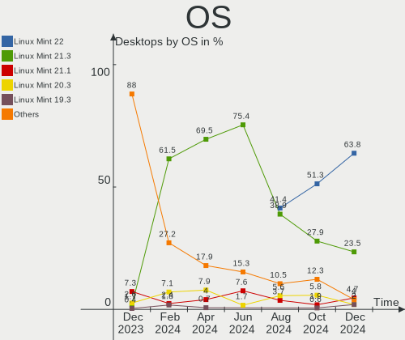
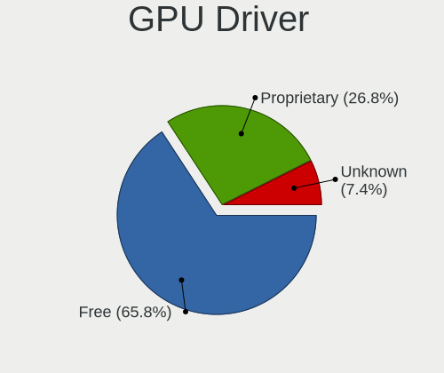

Linux Mint - Hardware Trends (Desktops)
---------------------------------------

A project to identify most popular hardware characteristics and track their change
over time based on data collected by Linux users at https://Linux-Hardware.org.

Anyone can contribute to this report by the [hw-probe](https://github.com/linuxhw/hw-probe) tool:

    sudo -E hw-probe -all -upload

This report is for one last month. Overall report since the beginning of time: [TestCoverage](https://github.com/linuxhw/TestCoverage)

Period: Oct, 2022.

Contents
--------

* [ System ](#system)
  - [ OS                       ](#os)
  - [ OS Family                ](#os-family)
  - [ Kernel                   ](#kernel)
  - [ Kernel Family            ](#kernel-family)
  - [ Kernel Major Ver.        ](#kernel-major-ver)
  - [ Arch                     ](#arch)
  - [ DE                       ](#de)
  - [ Display Server           ](#display-server)
  - [ Display Manager          ](#display-manager)
  - [ OS Lang                  ](#os-lang)
  - [ Boot Mode                ](#boot-mode)
  - [ Filesystem               ](#filesystem)
  - [ Part. scheme             ](#part-scheme)
  - [ Dual Boot with Linux/BSD ](#dual-boot-with-linuxbsd)
  - [ Dual Boot (Win)          ](#dual-boot-win)

* [ Board ](#board)
  - [ Vendor                   ](#vendor)
  - [ Model                    ](#model)
  - [ Model Family             ](#model-family)
  - [ MFG Year                 ](#mfg-year)
  - [ Form Factor              ](#form-factor)
  - [ Secure Boot              ](#secure-boot)
  - [ Coreboot                 ](#coreboot)
  - [ RAM Size                 ](#ram-size)
  - [ RAM Used                 ](#ram-used)
  - [ Total Drives             ](#total-drives)
  - [ Has CD-ROM               ](#has-cd-rom)
  - [ Has Ethernet             ](#has-ethernet)
  - [ Has WiFi                 ](#has-wifi)
  - [ Has Bluetooth            ](#has-bluetooth)

* [ Location ](#location)
  - [ Country                  ](#country)
  - [ City                     ](#city)

* [ Drives ](#drives)
  - [ Drive Vendor             ](#drive-vendor)
  - [ Drive Model              ](#drive-model)
  - [ HDD Vendor               ](#hdd-vendor)
  - [ SSD Vendor               ](#ssd-vendor)
  - [ Drive Kind               ](#drive-kind)
  - [ Drive Connector          ](#drive-connector)
  - [ Drive Size               ](#drive-size)
  - [ Space Total              ](#space-total)
  - [ Space Used               ](#space-used)
  - [ Malfunc. Drives          ](#malfunc-drives)
  - [ Malfunc. Drive Vendor    ](#malfunc-drive-vendor)
  - [ Malfunc. HDD Vendor      ](#malfunc-hdd-vendor)
  - [ Malfunc. Drive Kind      ](#malfunc-drive-kind)
  - [ Failed Drives            ](#failed-drives)
  - [ Failed Drive Vendor      ](#failed-drive-vendor)
  - [ Drive Status             ](#drive-status)

* [ Storage controller ](#storage-controller)
  - [ Storage Vendor           ](#storage-vendor)
  - [ Storage Model            ](#storage-model)
  - [ Storage Kind             ](#storage-kind)

* [ Processor ](#processor)
  - [ CPU Vendor               ](#cpu-vendor)
  - [ CPU Model                ](#cpu-model)
  - [ CPU Model Family         ](#cpu-model-family)
  - [ CPU Cores                ](#cpu-cores)
  - [ CPU Sockets              ](#cpu-sockets)
  - [ CPU Threads              ](#cpu-threads)
  - [ CPU Op-Modes             ](#cpu-op-modes)
  - [ CPU Microcode            ](#cpu-microcode)
  - [ CPU Microarch            ](#cpu-microarch)

* [ Graphics ](#graphics)
  - [ GPU Vendor               ](#gpu-vendor)
  - [ GPU Model                ](#gpu-model)
  - [ GPU Combo                ](#gpu-combo)
  - [ GPU Driver               ](#gpu-driver)
  - [ GPU Memory               ](#gpu-memory)

* [ Monitor ](#monitor)
  - [ Monitor Vendor           ](#monitor-vendor)
  - [ Monitor Model            ](#monitor-model)
  - [ Monitor Resolution       ](#monitor-resolution)
  - [ Monitor Diagonal         ](#monitor-diagonal)
  - [ Monitor Width            ](#monitor-width)
  - [ Aspect Ratio             ](#aspect-ratio)
  - [ Monitor Area             ](#monitor-area)
  - [ Pixel Density            ](#pixel-density)
  - [ Multiple Monitors        ](#multiple-monitors)

* [ Network ](#network)
  - [ Net Controller Vendor    ](#net-controller-vendor)
  - [ Net Controller Model     ](#net-controller-model)
  - [ Wireless Vendor          ](#wireless-vendor)
  - [ Wireless Model           ](#wireless-model)
  - [ Ethernet Vendor          ](#ethernet-vendor)
  - [ Ethernet Model           ](#ethernet-model)
  - [ Net Controller Kind      ](#net-controller-kind)
  - [ Used Controller          ](#used-controller)
  - [ NICs                     ](#nics)
  - [ IPv6                     ](#ipv6)

* [ Bluetooth ](#bluetooth)
  - [ Bluetooth Vendor         ](#bluetooth-vendor)
  - [ Bluetooth Model          ](#bluetooth-model)

* [ Sound ](#sound)
  - [ Sound Vendor             ](#sound-vendor)
  - [ Sound Model              ](#sound-model)

* [ Memory ](#memory)
  - [ Memory Vendor            ](#memory-vendor)
  - [ Memory Model             ](#memory-model)
  - [ Memory Kind              ](#memory-kind)
  - [ Memory Form Factor       ](#memory-form-factor)
  - [ Memory Size              ](#memory-size)
  - [ Memory Speed             ](#memory-speed)

* [ Printers & scanners ](#printers--scanners)
  - [ Printer Vendor           ](#printer-vendor)
  - [ Printer Model            ](#printer-model)
  - [ Scanner Vendor           ](#scanner-vendor)
  - [ Scanner Model            ](#scanner-model)

* [ Camera ](#camera)
  - [ Camera Vendor            ](#camera-vendor)
  - [ Camera Model             ](#camera-model)

* [ Security ](#security)
  - [ Fingerprint Vendor       ](#fingerprint-vendor)
  - [ Fingerprint Model        ](#fingerprint-model)
  - [ Chipcard Vendor          ](#chipcard-vendor)
  - [ Chipcard Model           ](#chipcard-model)

* [ Unsupported ](#unsupported)
  - [ Unsupported Devices      ](#unsupported-devices)
  - [ Unsupported Device Types ](#unsupported-device-types)

System
------

OS
--

Installed operating systems

| Name            | Desktops | Percent |
|-----------------|----------|---------|
| Linux Mint 21   | 101      | 53.72%  |
| Linux Mint 20.3 | 60       | 31.91%  |
| Linux Mint 20.2 | 8        | 4.26%   |
| Linux Mint 19.3 | 8        | 4.26%   |
| Linux Mint 20.1 | 3        | 1.6%    |
| Linux Mint 20   | 3        | 1.6%    |
| Linux Mint 19   | 2        | 1.06%   |
| Linux Mint 18.3 | 2        | 1.06%   |
| Linux Mint 19.1 | 1        | 0.53%   |

OS Family
---------

OS without a version

| Name       | Desktops | Percent |
|------------|----------|---------|
| Linux Mint | 188      | 100%    |

Kernel
------

Version of the Linux kernel

| Version                     | Desktops | Percent |
|-----------------------------|----------|---------|
| 5.15.0-52-generic           | 41       | 21.81%  |
| 5.15.0-48-generic           | 30       | 15.96%  |
| 5.15.0-50-generic           | 29       | 15.43%  |
| 5.4.0-126-generic           | 19       | 10.11%  |
| 5.4.0-131-generic           | 17       | 9.04%   |
| 5.4.0-128-generic           | 14       | 7.45%   |
| 5.15.0-41-generic           | 10       | 5.32%   |
| 5.4.0-91-generic            | 4        | 2.13%   |
| 5.4.0-125-generic           | 2        | 1.06%   |
| 6.0.3-x64v1-xanmod1         | 1        | 0.53%   |
| 5.4.0-94-generic            | 1        | 0.53%   |
| 5.4.0-90-generic            | 1        | 0.53%   |
| 5.4.0-80-generic            | 1        | 0.53%   |
| 5.4.0-74-generic            | 1        | 0.53%   |
| 5.4.0-122-generic           | 1        | 0.53%   |
| 5.4.0-121-generic           | 1        | 0.53%   |
| 5.4.0-1152206031516-generic | 1        | 0.53%   |
| 5.4.0-109-generic           | 1        | 0.53%   |
| 5.4.0-104-generic           | 1        | 0.53%   |
| 5.4.0-100-generic           | 1        | 0.53%   |
| 5.19.0-051900-generic       | 1        | 0.53%   |
| 5.17.9-051709-generic       | 1        | 0.53%   |
| 5.15.0-47-generic           | 1        | 0.53%   |
| 5.14.0-1054-oem             | 1        | 0.53%   |
| 5.11.0-37-generic           | 1        | 0.53%   |
| 5.0.0-32-generic            | 1        | 0.53%   |
| 4.18.0-041800-generic       | 1        | 0.53%   |
| 4.15.0-20-generic           | 1        | 0.53%   |
| 4.15.0-194-lowlatency       | 1        | 0.53%   |
| 4.15.0-194-generic          | 1        | 0.53%   |
| 4.15.0-142-generic          | 1        | 0.53%   |

Kernel Family
-------------

Linux kernel without a distro release

| Version | Desktops | Percent |
|---------|----------|---------|
| 5.15.0  | 111      | 59.04%  |
| 5.4.0   | 66       | 35.11%  |
| 4.15.0  | 4        | 2.13%   |
| 6.0.3   | 1        | 0.53%   |
| 5.19.0  | 1        | 0.53%   |
| 5.17.9  | 1        | 0.53%   |
| 5.14.0  | 1        | 0.53%   |
| 5.11.0  | 1        | 0.53%   |
| 5.0.0   | 1        | 0.53%   |
| 4.18.0  | 1        | 0.53%   |

Kernel Major Ver.
-----------------

Linux kernel major version

| Version | Desktops | Percent |
|---------|----------|---------|
| 5.15    | 111      | 59.04%  |
| 5.4     | 66       | 35.11%  |
| 4.15    | 4        | 2.13%   |
| 6.0     | 1        | 0.53%   |
| 5.19    | 1        | 0.53%   |
| 5.17    | 1        | 0.53%   |
| 5.14    | 1        | 0.53%   |
| 5.11    | 1        | 0.53%   |
| 5.0     | 1        | 0.53%   |
| 4.18    | 1        | 0.53%   |

Arch
----

OS architecture (x86_64, i586, etc.)

| Name   | Desktops | Percent |
|--------|----------|---------|
| x86_64 | 187      | 99.47%  |
| i686   | 1        | 0.53%   |

DE
--

Desktop Environment

| Name       | Desktops | Percent |
|------------|----------|---------|
| X-Cinnamon | 137      | 72.87%  |
| MATE       | 24       | 12.77%  |
| XFCE       | 16       | 8.51%   |
| Cinnamon   | 7        | 3.72%   |
| KDE5       | 2        | 1.06%   |
| GNOME      | 2        | 1.06%   |

Display Server
--------------

X11 or Wayland

| Name    | Desktops | Percent |
|---------|----------|---------|
| X11     | 186      | 98.94%  |
| Wayland | 1        | 0.53%   |
| Tty     | 1        | 0.53%   |

Display Manager
---------------

SDDM, LightDM, etc.

| Name    | Desktops | Percent |
|---------|----------|---------|
| Unknown | 112      | 59.57%  |
| LightDM | 75       | 39.89%  |
| SDDM    | 1        | 0.53%   |

OS Lang
-------

Language

| Lang  | Desktops | Percent |
|-------|----------|---------|
| en_US | 56       | 29.79%  |
| de_DE | 25       | 13.3%   |
| it_IT | 18       | 9.57%   |
| pt_BR | 12       | 6.38%   |
| en_GB | 12       | 6.38%   |
| fr_FR | 10       | 5.32%   |
| C     | 8        | 4.26%   |
| ru_RU | 7        | 3.72%   |
| es_ES | 6        | 3.19%   |
| pl_PL | 4        | 2.13%   |
| en_AU | 4        | 2.13%   |
| nl_NL | 3        | 1.6%    |
| en_CA | 3        | 1.6%    |
| sk_SK | 2        | 1.06%   |
| ja_JP | 2        | 1.06%   |
| hu_HU | 2        | 1.06%   |
| de_AT | 2        | 1.06%   |
| pt_PT | 1        | 0.53%   |
| nl_BE | 1        | 0.53%   |
| ko_KR | 1        | 0.53%   |
| fr_BE | 1        | 0.53%   |
| fi_FI | 1        | 0.53%   |
| es_VE | 1        | 0.53%   |
| es_MX | 1        | 0.53%   |
| en_SG | 1        | 0.53%   |
| en_PH | 1        | 0.53%   |
| en_IN | 1        | 0.53%   |
| cs_CZ | 1        | 0.53%   |
| ca_ES | 1        | 0.53%   |

Boot Mode
---------

EFI or BIOS

| Mode | Desktops | Percent |
|------|----------|---------|
| BIOS | 94       | 50%     |
| EFI  | 94       | 50%     |

Filesystem
----------

Type of filesystem

| Type    | Desktops | Percent |
|---------|----------|---------|
| Ext4    | 172      | 91.49%  |
| Overlay | 7        | 3.72%   |
| Btrfs   | 5        | 2.66%   |
| Zfs     | 2        | 1.06%   |
| Xfs     | 1        | 0.53%   |
| Ext2    | 1        | 0.53%   |

Part. scheme
------------

Scheme of partitioning

| Type    | Desktops | Percent |
|---------|----------|---------|
| Unknown | 113      | 60.11%  |
| GPT     | 54       | 28.72%  |
| MBR     | 21       | 11.17%  |

Dual Boot with Linux/BSD
------------------------

Hosting more than one Linux/BSD

| Dual boot | Desktops | Percent |
|-----------|----------|---------|
| No        | 164      | 87.23%  |
| Yes       | 24       | 12.77%  |

Dual Boot (Win)
---------------

Hosting Linux and Windows

| Dual boot | Desktops | Percent |
|-----------|----------|---------|
| No        | 149      | 79.26%  |
| Yes       | 39       | 20.74%  |

Board
-----

Vendor
------

Motherboard manufacturer

| Name                | Desktops | Percent |
|---------------------|----------|---------|
| ASUSTek Computer    | 41       | 21.81%  |
| Gigabyte Technology | 35       | 18.62%  |
| MSI                 | 22       | 11.7%   |
| ASRock              | 17       | 9.04%   |
| Dell                | 15       | 7.98%   |
| Hewlett-Packard     | 14       | 7.45%   |
| Lenovo              | 13       | 6.91%   |
| Acer                | 4        | 2.13%   |
| Unknown             | 4        | 2.13%   |
| Pegatron            | 3        | 1.6%    |
| Fujitsu             | 3        | 1.6%    |
| ECS                 | 2        | 1.06%   |
| Biostar             | 2        | 1.06%   |
| Techvision          | 1        | 0.53%   |
| Shuttle             | 1        | 0.53%   |
| Semp Toshiba        | 1        | 0.53%   |
| QIYIDA              | 1        | 0.53%   |
| Positivo            | 1        | 0.53%   |
| PCWare              | 1        | 0.53%   |
| MACHINIST           | 1        | 0.53%   |
| Inventec            | 1        | 0.53%   |
| Intel               | 1        | 0.53%   |
| Foxconn             | 1        | 0.53%   |
| BESSTAR Tech        | 1        | 0.53%   |
| AZW                 | 1        | 0.53%   |
| Apple               | 1        | 0.53%   |

Model
-----

Motherboard model

| Name                              | Desktops | Percent |
|-----------------------------------|----------|---------|
| Unknown                           | 4        | 2.13%   |
| MSI MS-7C56                       | 3        | 1.6%    |
| Dell OptiPlex 790                 | 3        | 1.6%    |
| ASUS All Series                   | 3        | 1.6%    |
| MSI MS-7B84                       | 2        | 1.06%   |
| MSI MS-7817                       | 2        | 1.06%   |
| MSI MS-7721                       | 2        | 1.06%   |
| HP Z420 Workstation               | 2        | 1.06%   |
| Gigabyte GA-MA770-UD3             | 2        | 1.06%   |
| Gigabyte B450M DS3H               | 2        | 1.06%   |
| Gigabyte B450 AORUS ELITE         | 2        | 1.06%   |
| Dell Precision WorkStation T5400  | 2        | 1.06%   |
| Dell Inspiron 3847                | 2        | 1.06%   |
| ASUS P8Z68-V LX                   | 2        | 1.06%   |
| ASUS P8H77-M PRO                  | 2        | 1.06%   |
| ASRock H61M-VG4                   | 2        | 1.06%   |
| ASRock 970M Pro3                  | 2        | 1.06%   |
| Techvision TVI7309X               | 1        | 0.53%   |
| Shuttle DS81D                     | 1        | 0.53%   |
| Semp Toshiba STI                  | 1        | 0.53%   |
| QIYIDA X99-H9 V2.0                | 1        | 0.53%   |
| Positivo Positivo Master D380     | 1        | 0.53%   |
| Pegatron IPMIP-GS                 | 1        | 0.53%   |
| Pegatron Compaq dx7500 Microtower | 1        | 0.53%   |
| Pegatron 2AABh                    | 1        | 0.53%   |
| PCWare IPMH61R3                   | 1        | 0.53%   |
| MSI MS-7D42                       | 1        | 0.53%   |
| MSI MS-7C96                       | 1        | 0.53%   |
| MSI MS-7C95                       | 1        | 0.53%   |
| MSI MS-7C51                       | 1        | 0.53%   |
| MSI MS-7C37                       | 1        | 0.53%   |
| MSI MS-7B86                       | 1        | 0.53%   |
| MSI MS-7B38                       | 1        | 0.53%   |
| MSI MS-7A38                       | 1        | 0.53%   |
| MSI MS-7A15                       | 1        | 0.53%   |
| MSI MS-7994                       | 1        | 0.53%   |
| MSI MS-7918                       | 1        | 0.53%   |
| MSI MS-7751                       | 1        | 0.53%   |
| MSI MS-7693                       | 1        | 0.53%   |
| MACHINIST X99-RS9 V2.0            | 1        | 0.53%   |

Model Family
------------

Motherboard model prefix

| Name                  | Desktops | Percent |
|-----------------------|----------|---------|
| Dell OptiPlex         | 9        | 4.79%   |
| ASUS PRIME            | 6        | 3.19%   |
| Lenovo ThinkCentre    | 5        | 2.66%   |
| Lenovo IdeaCentre     | 5        | 2.66%   |
| ASUS ROG              | 5        | 2.66%   |
| HP Compaq             | 4        | 2.13%   |
| Gigabyte B450         | 4        | 2.13%   |
| Dell Precision        | 4        | 2.13%   |
| ASUS TUF              | 4        | 2.13%   |
| Unknown               | 4        | 2.13%   |
| MSI MS-7C56           | 3        | 1.6%    |
| HP EliteDesk          | 3        | 1.6%    |
| Gigabyte X570         | 3        | 1.6%    |
| Gigabyte B450M        | 3        | 1.6%    |
| ASUS P8H77-M          | 3        | 1.6%    |
| ASUS All              | 3        | 1.6%    |
| Acer Aspire           | 3        | 1.6%    |
| MSI MS-7B84           | 2        | 1.06%   |
| MSI MS-7817           | 2        | 1.06%   |
| MSI MS-7721           | 2        | 1.06%   |
| HP Z420               | 2        | 1.06%   |
| Gigabyte X570S        | 2        | 1.06%   |
| Gigabyte GA-MA770-UD3 | 2        | 1.06%   |
| Fujitsu ESPRIMO       | 2        | 1.06%   |
| Dell Inspiron         | 2        | 1.06%   |
| ASUS P8Z68-V          | 2        | 1.06%   |
| ASRock H61M-VG4       | 2        | 1.06%   |
| ASRock 970M           | 2        | 1.06%   |
| Techvision TVI7309X   | 1        | 0.53%   |
| Shuttle DS81D         | 1        | 0.53%   |
| Semp Toshiba STI      | 1        | 0.53%   |
| QIYIDA X99-H9         | 1        | 0.53%   |
| Positivo Positivo     | 1        | 0.53%   |
| Pegatron IPMIP-GS     | 1        | 0.53%   |
| Pegatron Compaq       | 1        | 0.53%   |
| Pegatron 2AABh        | 1        | 0.53%   |
| PCWare IPMH61R3       | 1        | 0.53%   |
| MSI MS-7D42           | 1        | 0.53%   |
| MSI MS-7C96           | 1        | 0.53%   |
| MSI MS-7C95           | 1        | 0.53%   |

MFG Year
--------

Motherboard manufacture year

| Year | Desktops | Percent |
|------|----------|---------|
| 2013 | 23       | 12.23%  |
| 2018 | 21       | 11.17%  |
| 2012 | 17       | 9.04%   |
| 2019 | 15       | 7.98%   |
| 2011 | 15       | 7.98%   |
| 2020 | 14       | 7.45%   |
| 2014 | 14       | 7.45%   |
| 2021 | 11       | 5.85%   |
| 2015 | 11       | 5.85%   |
| 2008 | 10       | 5.32%   |
| 2010 | 8        | 4.26%   |
| 2022 | 7        | 3.72%   |
| 2016 | 7        | 3.72%   |
| 2009 | 6        | 3.19%   |
| 2017 | 4        | 2.13%   |
| 2007 | 4        | 2.13%   |
| 2006 | 1        | 0.53%   |

Form Factor
-----------

Physical design of the computer

| Name    | Desktops | Percent |
|---------|----------|---------|
| Desktop | 188      | 100%    |

Secure Boot
-----------

Enabled or disabled

| State    | Desktops | Percent |
|----------|----------|---------|
| Disabled | 183      | 97.34%  |
| Enabled  | 5        | 2.66%   |

Coreboot
--------

Have coreboot on board

| Used | Desktops | Percent |
|------|----------|---------|
| No   | 188      | 100%    |

RAM Size
--------

Total RAM memory

| Size in GB  | Desktops | Percent |
|-------------|----------|---------|
| 16.01-24.0  | 58       | 30.85%  |
| 8.01-16.0   | 37       | 19.68%  |
| 4.01-8.0    | 35       | 18.62%  |
| 3.01-4.0    | 25       | 13.3%   |
| 32.01-64.0  | 22       | 11.7%   |
| 24.01-32.0  | 4        | 2.13%   |
| 64.01-256.0 | 4        | 2.13%   |
| 2.01-3.0    | 1        | 0.53%   |
| 1.01-2.0    | 1        | 0.53%   |
| 0.51-1.0    | 1        | 0.53%   |

RAM Used
--------

Used RAM memory

| Used GB    | Desktops | Percent |
|------------|----------|---------|
| 1.01-2.0   | 70       | 37.23%  |
| 2.01-3.0   | 54       | 28.72%  |
| 3.01-4.0   | 30       | 15.96%  |
| 4.01-8.0   | 25       | 13.3%   |
| 8.01-16.0  | 4        | 2.13%   |
| 0.51-1.0   | 3        | 1.6%    |
| 16.01-24.0 | 1        | 0.53%   |
| 0.01-0.5   | 1        | 0.53%   |

Total Drives
------------

Number of drives on board

| Drives | Desktops | Percent |
|--------|----------|---------|
| 1      | 67       | 35.64%  |
| 2      | 53       | 28.19%  |
| 3      | 41       | 21.81%  |
| 4      | 12       | 6.38%   |
| 5      | 7        | 3.72%   |
| 7      | 3        | 1.6%    |
| 6      | 3        | 1.6%    |
| 9      | 1        | 0.53%   |
| 8      | 1        | 0.53%   |

Has CD-ROM
----------

Has CD-ROM on board

| Presented | Desktops | Percent |
|-----------|----------|---------|
| Yes       | 107      | 56.91%  |
| No        | 81       | 43.09%  |

Has Ethernet
------------

Has Ethernet on board

| Presented | Desktops | Percent |
|-----------|----------|---------|
| Yes       | 187      | 99.47%  |
| No        | 1        | 0.53%   |

Has WiFi
--------

Has WiFi module

| Presented | Desktops | Percent |
|-----------|----------|---------|
| No        | 106      | 56.38%  |
| Yes       | 82       | 43.62%  |

Has Bluetooth
-------------

Has Bluetooth module

| Presented | Desktops | Percent |
|-----------|----------|---------|
| No        | 130      | 69.15%  |
| Yes       | 58       | 30.85%  |

Location
--------

Country
-------

Geographic location (country)

| Country     | Desktops | Percent |
|-------------|----------|---------|
| USA         | 35       | 18.62%  |
| Germany     | 30       | 15.96%  |
| Italy       | 21       | 11.17%  |
| Brazil      | 15       | 7.98%   |
| France      | 12       | 6.38%   |
| UK          | 8        | 4.26%   |
| Russia      | 8        | 4.26%   |
| Spain       | 7        | 3.72%   |
| Poland      | 6        | 3.19%   |
| Netherlands | 5        | 2.66%   |
| Australia   | 5        | 2.66%   |
| Canada      | 4        | 2.13%   |
| Belgium     | 3        | 1.6%    |
| Slovakia    | 2        | 1.06%   |
| Singapore   | 2        | 1.06%   |
| Mexico      | 2        | 1.06%   |
| Japan       | 2        | 1.06%   |
| Greece      | 2        | 1.06%   |
| Austria     | 2        | 1.06%   |
| Venezuela   | 1        | 0.53%   |
| Turkey      | 1        | 0.53%   |
| Sweden      | 1        | 0.53%   |
| South Korea | 1        | 0.53%   |
| Portugal    | 1        | 0.53%   |
| Philippines | 1        | 0.53%   |
| Morocco     | 1        | 0.53%   |
| Lithuania   | 1        | 0.53%   |
| Latvia      | 1        | 0.53%   |
| Kosovo      | 1        | 0.53%   |
| Kenya       | 1        | 0.53%   |
| India       | 1        | 0.53%   |
| Hungary     | 1        | 0.53%   |
| Finland     | 1        | 0.53%   |
| Estonia     | 1        | 0.53%   |
| Ecuador     | 1        | 0.53%   |
| Czechia     | 1        | 0.53%   |

City
----

Geographic location (city)

| City               | Desktops | Percent |
|--------------------|----------|---------|
| Rome               | 4        | 2.13%   |
| Sao Paulo          | 3        | 1.6%    |
| Moscow             | 3        | 1.6%    |
| Milan              | 3        | 1.6%    |
| Sydney             | 2        | 1.06%   |
| Singapore          | 2        | 1.06%   |
| Padova             | 2        | 1.06%   |
| Naples             | 2        | 1.06%   |
| Madrid             | 2        | 1.06%   |
| Frankfurt am Main  | 2        | 1.06%   |
| Düsseldorf        | 2        | 1.06%   |
| Brasília          | 2        | 1.06%   |
| Berlin             | 2        | 1.06%   |
| Belo Horizonte     | 2        | 1.06%   |
| Austin             | 2        | 1.06%   |
| Athens             | 2        | 1.06%   |
| Amsterdam          | 2        | 1.06%   |
| Yoshkar-Ola        | 1        | 0.53%   |
| Yokohama           | 1        | 0.53%   |
| Yekaterinburg      | 1        | 0.53%   |
| Wuppertal          | 1        | 0.53%   |
| Wroclaw            | 1        | 0.53%   |
| Winssen            | 1        | 0.53%   |
| Weslaco            | 1        | 0.53%   |
| Wermelskirchen     | 1        | 0.53%   |
| Wattrelos          | 1        | 0.53%   |
| Watertown          | 1        | 0.53%   |
| Wallsend           | 1        | 0.53%   |
| Volgograd          | 1        | 0.53%   |
| Vilnius            | 1        | 0.53%   |
| Vila Caiz          | 1        | 0.53%   |
| Vienna             | 1        | 0.53%   |
| Velbert            | 1        | 0.53%   |
| Varese             | 1        | 0.53%   |
| Turvo              | 1        | 0.53%   |
| Trento             | 1        | 0.53%   |
| Trazo              | 1        | 0.53%   |
| Tossa de Mar       | 1        | 0.53%   |
| Torrejón de Ardoz | 1        | 0.53%   |
| Toronto            | 1        | 0.53%   |

Drives
------

Drive Vendor
------------

Hard drive vendors

| Vendor                    | Desktops | Drives | Percent |
|---------------------------|----------|--------|---------|
| Seagate                   | 80       | 96     | 22.47%  |
| WDC                       | 62       | 83     | 17.42%  |
| Samsung Electronics       | 49       | 65     | 13.76%  |
| Kingston                  | 23       | 27     | 6.46%   |
| Crucial                   | 23       | 24     | 6.46%   |
| Toshiba                   | 15       | 18     | 4.21%   |
| SanDisk                   | 14       | 16     | 3.93%   |
| Hitachi                   | 13       | 15     | 3.65%   |
| Silicon Motion            | 6        | 6      | 1.69%   |
| A-DATA Technology         | 6        | 6      | 1.69%   |
| Unknown                   | 5        | 8      | 1.4%    |
| Intenso                   | 5        | 5      | 1.4%    |
| Patriot                   | 4        | 4      | 1.12%   |
| Maxtor                    | 4        | 5      | 1.12%   |
| China                     | 4        | 5      | 1.12%   |
| Micron Technology         | 3        | 3      | 0.84%   |
| Intel                     | 3        | 4      | 0.84%   |
| Micron/Crucial Technology | 2        | 2      | 0.56%   |
| JMicron Technology        | 2        | 2      | 0.56%   |
| HS-SSD-C100               | 2        | 2      | 0.56%   |
| Hoodisk                   | 2        | 2      | 0.56%   |
| Fujitsu                   | 2        | 2      | 0.56%   |
| Corsair                   | 2        | 2      | 0.56%   |
| ADATA Technology          | 2        | 2      | 0.56%   |
| XrayDisk                  | 1        | 1      | 0.28%   |
| XPG                       | 1        | 1      | 0.28%   |
| WD MediaMax               | 1        | 1      | 0.28%   |
| Teclast                   | 1        | 1      | 0.28%   |
| SK hynix                  | 1        | 1      | 0.28%   |
| SAGE                      | 1        | 1      | 0.28%   |
| RSH-319                   | 1        | 1      | 0.28%   |
| Phison                    | 1        | 1      | 0.28%   |
| OCZ                       | 1        | 2      | 0.28%   |
| NGFF                      | 1        | 1      | 0.28%   |
| Netac                     | 1        | 1      | 0.28%   |
| LITEON                    | 1        | 1      | 0.28%   |
| Lite-On Technology        | 1        | 1      | 0.28%   |
| Lexar                     | 1        | 1      | 0.28%   |
| Leven                     | 1        | 1      | 0.28%   |
| KingFast                  | 1        | 1      | 0.28%   |

Drive Model
-----------

Hard drive models

| Model                                                 | Desktops | Percent |
|-------------------------------------------------------|----------|---------|
| Samsung NVMe SSD Controller SM981/PM981/PM983 500GB   | 6        | 1.44%   |
| Kingston SA400S37240G 240GB SSD                       | 6        | 1.44%   |
| Crucial CT240BX500SSD1 240GB                          | 6        | 1.44%   |
| Seagate ST31000528AS 1TB                              | 5        | 1.2%    |
| Seagate ST2000DM008-2FR102 2TB                        | 5        | 1.2%    |
| Seagate ST1000DM010-2EP102 1TB                        | 5        | 1.2%    |
| Samsung SSD 850 EVO 250GB                             | 5        | 1.2%    |
| Toshiba DT01ACA100 1TB                                | 4        | 0.96%   |
| Samsung SSD 860 EVO 500GB                             | 4        | 0.96%   |
| Samsung SSD 850 EVO 500GB                             | 4        | 0.96%   |
| Crucial CT1000MX500SSD1 1TB                           | 4        | 0.96%   |
| WDC WD20EARX-00PASB0 2TB                              | 3        | 0.72%   |
| WDC WD10EZEX-60M2NA0 1TB                              | 3        | 0.72%   |
| WDC WD10EZEX-08WN4A0 1TB                              | 3        | 0.72%   |
| WDC WD10EZEX-00BN5A0 1TB                              | 3        | 0.72%   |
| WDC WD1002FAEX-00Z3A0 1TB                             | 3        | 0.72%   |
| Silicon Motion SM2263EN/SM2263XT SSD Controller 256GB | 3        | 0.72%   |
| Seagate ST500DM002-1BD142 500GB                       | 3        | 0.72%   |
| Seagate ST3500418AS 500GB                             | 3        | 0.72%   |
| Seagate ST3500312CS 500GB                             | 3        | 0.72%   |
| Seagate ST2000DM006-2DM164 2TB                        | 3        | 0.72%   |
| Seagate ST1000DM003-1CH162 1TB                        | 3        | 0.72%   |
| Samsung SSD 870 EVO 1TB                               | 3        | 0.72%   |
| Samsung SSD 860 EVO 1TB                               | 3        | 0.72%   |
| Kingston SUV400S37120G 120GB SSD                      | 3        | 0.72%   |
| Kingston SA400S37480G 480GB SSD                       | 3        | 0.72%   |
| Crucial CT480BX500SSD1 480GB                          | 3        | 0.72%   |
| WDC WD5000AAKX-07U6AA0 500GB                          | 2        | 0.48%   |
| WDC WD30EFRX-68EUZN0 3TB                              | 2        | 0.48%   |
| WDC WD20EZAZ-00L9GB0 2TB                              | 2        | 0.48%   |
| Unknown SD/MMC/MS PRO 1TB                             | 2        | 0.48%   |
| Unknown SD/MMC 2GB                                    | 2        | 0.48%   |
| Unknown M.S./M.S.Pro/HG 16GB                          | 2        | 0.48%   |
| Toshiba MQ01ABF050 500GB                              | 2        | 0.48%   |
| Seagate ST500DM002-1SB10A 500GB                       | 2        | 0.48%   |
| Seagate ST4000DM000-1F2168 4TB                        | 2        | 0.48%   |
| Seagate ST3250310AS 250GB                             | 2        | 0.48%   |
| Seagate ST2000DM001-9YN164 2TB                        | 2        | 0.48%   |
| Seagate ST2000DM001-1ER164 2TB                        | 2        | 0.48%   |
| Seagate ST2000DM001-1CH164 2TB                        | 2        | 0.48%   |

HDD Vendor
----------

Hard disk drive vendors

| Vendor              | Desktops | Drives | Percent |
|---------------------|----------|--------|---------|
| Seagate             | 78       | 94     | 43.09%  |
| WDC                 | 56       | 77     | 30.94%  |
| Toshiba             | 14       | 17     | 7.73%   |
| Hitachi             | 13       | 15     | 7.18%   |
| Samsung Electronics | 10       | 11     | 5.52%   |
| Maxtor              | 4        | 5      | 2.21%   |
| Unknown             | 2        | 2      | 1.1%    |
| SAGE                | 1        | 1      | 0.55%   |
| RSH-319             | 1        | 1      | 0.55%   |
| HGST                | 1        | 1      | 0.55%   |
| Fujitsu             | 1        | 1      | 0.55%   |

SSD Vendor
----------

Solid state drive vendors

| Vendor              | Desktops | Drives | Percent |
|---------------------|----------|--------|---------|
| Samsung Electronics | 29       | 36     | 23.39%  |
| Crucial             | 21       | 22     | 16.94%  |
| Kingston            | 20       | 23     | 16.13%  |
| SanDisk             | 12       | 13     | 9.68%   |
| A-DATA Technology   | 6        | 6      | 4.84%   |
| WDC                 | 4        | 4      | 3.23%   |
| Patriot             | 4        | 4      | 3.23%   |
| Intenso             | 4        | 4      | 3.23%   |
| China               | 4        | 5      | 3.23%   |
| Micron Technology   | 2        | 2      | 1.61%   |
| Hoodisk             | 2        | 2      | 1.61%   |
| Teclast             | 1        | 1      | 0.81%   |
| SK hynix            | 1        | 1      | 0.81%   |
| OCZ                 | 1        | 2      | 0.81%   |
| NGFF                | 1        | 1      | 0.81%   |
| LITEON              | 1        | 1      | 0.81%   |
| Lexar               | 1        | 1      | 0.81%   |
| Leven               | 1        | 1      | 0.81%   |
| KingFast            | 1        | 1      | 0.81%   |
| INNOVATION IT       | 1        | 1      | 0.81%   |
| Innodisk            | 1        | 1      | 0.81%   |
| HS-SSD-C100         | 1        | 1      | 0.81%   |
| Fujitsu             | 1        | 1      | 0.81%   |
| Drevo               | 1        | 1      | 0.81%   |
| CT250MX5            | 1        | 1      | 0.81%   |
| Corsair             | 1        | 1      | 0.81%   |
| Acer                | 1        | 1      | 0.81%   |

Drive Kind
----------

HDD or SSD

| Kind    | Desktops | Drives | Percent |
|---------|----------|--------|---------|
| HDD     | 132      | 225    | 45.05%  |
| SSD     | 107      | 138    | 36.52%  |
| NVMe    | 44       | 52     | 15.02%  |
| Unknown | 9        | 12     | 3.07%   |
| MMC     | 1        | 1      | 0.34%   |

Drive Connector
---------------

SATA, SAS, NVMe, etc.

| Type | Desktops | Drives | Percent |
|------|----------|--------|---------|
| SATA | 174      | 351    | 73.11%  |
| NVMe | 42       | 50     | 17.65%  |
| SAS  | 21       | 26     | 8.82%   |
| MMC  | 1        | 1      | 0.42%   |

Drive Size
----------

Size of hard drive

| Size in TB | Desktops | Drives | Percent |
|------------|----------|--------|---------|
| 0.01-0.5   | 130      | 197    | 48.69%  |
| 0.51-1.0   | 71       | 98     | 26.59%  |
| 1.01-2.0   | 36       | 37     | 13.48%  |
| 3.01-4.0   | 10       | 10     | 3.75%   |
| 2.01-3.0   | 10       | 10     | 3.75%   |
| 4.01-10.0  | 9        | 10     | 3.37%   |
| 10.01-20.0 | 1        | 1      | 0.37%   |

Space Total
-----------

Amount of disk space available on the file system

| Size in GB     | Desktops | Percent |
|----------------|----------|---------|
| 101-250        | 35       | 18.62%  |
| 501-1000       | 35       | 18.62%  |
| 251-500        | 34       | 18.09%  |
| More than 3000 | 28       | 14.89%  |
| 1001-2000      | 20       | 10.64%  |
| 2001-3000      | 17       | 9.04%   |
| 51-100         | 8        | 4.26%   |
| 1-20           | 7        | 3.72%   |
| 21-50          | 3        | 1.6%    |
| Unknown        | 1        | 0.53%   |

Space Used
----------

Amount of used disk space

| Used GB        | Desktops | Percent |
|----------------|----------|---------|
| 101-250        | 34       | 18.09%  |
| 21-50          | 33       | 17.55%  |
| 51-100         | 25       | 13.3%   |
| 1-20           | 22       | 11.7%   |
| 1001-2000      | 21       | 11.17%  |
| 251-500        | 19       | 10.11%  |
| 501-1000       | 15       | 7.98%   |
| More than 3000 | 12       | 6.38%   |
| 2001-3000      | 6        | 3.19%   |
| Unknown        | 1        | 0.53%   |

Malfunc. Drives
---------------

Drive models with a malfunction

| Model                                               | Desktops | Drives | Percent |
|-----------------------------------------------------|----------|--------|---------|
| Seagate ST31000528AS 1TB                            | 3        | 3      | 10%     |
| WDC WDS240G2G0A-00JH30 240GB SSD                    | 1        | 1      | 3.33%   |
| WDC WD5000AAKS-00H2B0 500GB                         | 1        | 1      | 3.33%   |
| WDC WD30EURX-63T0FY0 3TB                            | 1        | 1      | 3.33%   |
| WDC WD2002FYPS-02W3B0 2TB                           | 1        | 1      | 3.33%   |
| WDC WD10EALS-00Z8A0 1TB                             | 1        | 1      | 3.33%   |
| WDC WD1002FBYS-05A6B0 1TB                           | 1        | 1      | 3.33%   |
| WDC WD1002FAEX-00Y9A0 1TB                           | 1        | 1      | 3.33%   |
| Toshiba DT01ACA100 1TB                              | 1        | 1      | 3.33%   |
| Seagate ST3750528AS 752GB                           | 1        | 1      | 3.33%   |
| Seagate ST3500412AS 500GB                           | 1        | 1      | 3.33%   |
| Seagate ST3500320AS 500GB                           | 1        | 1      | 3.33%   |
| Seagate ST3250318AS 250GB                           | 1        | 1      | 3.33%   |
| Seagate ST320LM001 HN-M320MBB 320GB                 | 1        | 2      | 3.33%   |
| Seagate ST2000DM006-2DM164 2TB                      | 1        | 1      | 3.33%   |
| Seagate ST2000DM001-1CH164 2TB                      | 1        | 1      | 3.33%   |
| Seagate ST2000DL003-9VT166 2TB                      | 1        | 1      | 3.33%   |
| Seagate ST1000LM035-1RK172 1TB                      | 1        | 1      | 3.33%   |
| SanDisk SSD PLUS 480GB                              | 1        | 1      | 3.33%   |
| Samsung Electronics SSD 970 EVO 500GB               | 1        | 1      | 3.33%   |
| Samsung Electronics HD322HJ 320GB                   | 1        | 1      | 3.33%   |
| Samsung Electronics HD320KJ 320GB                   | 1        | 1      | 3.33%   |
| Micron Technology MTFDDAK128MAY-1AH1ZABHA 128GB SSD | 1        | 1      | 3.33%   |
| Maxtor STM3500320AS 500GB                           | 1        | 1      | 3.33%   |
| Maxtor 6E040L0 41GB                                 | 1        | 1      | 3.33%   |
| Maxtor 2F040J0 41GB                                 | 1        | 1      | 3.33%   |
| Hitachi HTS543216L9SA00 160GB                       | 1        | 1      | 3.33%   |
| Hitachi HDE721010SLA330 1TB                         | 1        | 1      | 3.33%   |

Malfunc. Drive Vendor
---------------------

Vendors of faulty drives

| Vendor              | Desktops | Drives | Percent |
|---------------------|----------|--------|---------|
| Seagate             | 12       | 13     | 41.38%  |
| WDC                 | 7        | 7      | 24.14%  |
| Samsung Electronics | 3        | 3      | 10.34%  |
| Maxtor              | 2        | 3      | 6.9%    |
| Hitachi             | 2        | 2      | 6.9%    |
| Toshiba             | 1        | 1      | 3.45%   |
| SanDisk             | 1        | 1      | 3.45%   |
| Micron Technology   | 1        | 1      | 3.45%   |

Malfunc. HDD Vendor
-------------------

Vendors of faulty HDD drives

| Vendor              | Desktops | Drives | Percent |
|---------------------|----------|--------|---------|
| Seagate             | 12       | 13     | 48%     |
| WDC                 | 6        | 6      | 24%     |
| Samsung Electronics | 2        | 2      | 8%      |
| Maxtor              | 2        | 3      | 8%      |
| Hitachi             | 2        | 2      | 8%      |
| Toshiba             | 1        | 1      | 4%      |

Malfunc. Drive Kind
-------------------

Kinds of faulty drives

| Kind | Desktops | Drives | Percent |
|------|----------|--------|---------|
| HDD  | 22       | 27     | 84.62%  |
| SSD  | 3        | 3      | 11.54%  |
| NVMe | 1        | 1      | 3.85%   |

Failed Drives
-------------

Failed drive models

| Model                         | Desktops | Drives | Percent |
|-------------------------------|----------|--------|---------|
| Hitachi HDS721050CLA362 500GB | 1        | 1      | 100%    |

Failed Drive Vendor
-------------------

Failed drive vendors

| Vendor  | Desktops | Drives | Percent |
|---------|----------|--------|---------|
| Hitachi | 1        | 1      | 100%    |

Drive Status
------------

Number of failed and malfunc. drives

| Status   | Desktops | Drives | Percent |
|----------|----------|--------|---------|
| Detected | 129      | 267    | 59.17%  |
| Works    | 62       | 129    | 28.44%  |
| Malfunc  | 26       | 31     | 11.93%  |
| Failed   | 1        | 1      | 0.46%   |

Storage controller
------------------

Storage Vendor
--------------

Storage controller vendors

| Vendor                        | Desktops | Percent |
|-------------------------------|----------|---------|
| Intel                         | 117      | 44.83%  |
| AMD                           | 69       | 26.44%  |
| Samsung Electronics           | 15       | 5.75%   |
| ASMedia Technology            | 10       | 3.83%   |
| Silicon Motion                | 7        | 2.68%   |
| Marvell Technology Group      | 7        | 2.68%   |
| SanDisk                       | 5        | 1.92%   |
| Micron/Crucial Technology     | 4        | 1.53%   |
| LSI Logic / Symbios Logic     | 4        | 1.53%   |
| JMicron Technology            | 4        | 1.53%   |
| Nvidia                        | 3        | 1.15%   |
| Kingston Technology Company   | 3        | 1.15%   |
| VIA Technologies              | 2        | 0.77%   |
| Phison Electronics            | 2        | 0.77%   |
| ADATA Technology              | 2        | 0.77%   |
| Unknown                       | 1        | 0.38%   |
| Toshiba America Info Systems  | 1        | 0.38%   |
| Silicon Image                 | 1        | 0.38%   |
| Micron Technology             | 1        | 0.38%   |
| Lite-On Technology            | 1        | 0.38%   |
| Integrated Technology Express | 1        | 0.38%   |
| Adaptec                       | 1        | 0.38%   |

Storage Model
-------------

Storage controller models

| Model                                                                                   | Desktops | Percent |
|-----------------------------------------------------------------------------------------|----------|---------|
| AMD FCH SATA Controller [AHCI mode]                                                     | 32       | 9.85%   |
| Intel 8 Series/C220 Series Chipset Family 6-port SATA Controller 1 [AHCI mode]          | 23       | 7.08%   |
| Intel 6 Series/C200 Series Chipset Family 6 port Desktop SATA AHCI Controller           | 16       | 4.92%   |
| AMD 400 Series Chipset SATA Controller                                                  | 13       | 4%      |
| AMD SB7x0/SB8x0/SB9x0 IDE Controller                                                    | 11       | 3.38%   |
| AMD 500 Series Chipset SATA Controller                                                  | 11       | 3.38%   |
| Samsung NVMe SSD Controller SM981/PM981/PM983                                           | 10       | 3.08%   |
| Intel Q170/Q150/B150/H170/H110/Z170/CM236 Chipset SATA Controller [AHCI Mode]           | 7        | 2.15%   |
| Intel 7 Series/C210 Series Chipset Family 6-port SATA Controller [AHCI mode]            | 7        | 2.15%   |
| ASMedia ASM1062 Serial ATA Controller                                                   | 7        | 2.15%   |
| AMD SB7x0/SB8x0/SB9x0 SATA Controller [IDE mode]                                        | 7        | 2.15%   |
| AMD SB7x0/SB8x0/SB9x0 SATA Controller [AHCI mode]                                       | 7        | 2.15%   |
| Silicon Motion SM2263EN/SM2263XT SSD Controller                                         | 6        | 1.85%   |
| Intel NM10/ICH7 Family SATA Controller [IDE mode]                                       | 6        | 1.85%   |
| Intel 6 Series/C200 Series Chipset Family Desktop SATA Controller (IDE mode, ports 4-5) | 5        | 1.54%   |
| Intel 6 Series/C200 Series Chipset Family Desktop SATA Controller (IDE mode, ports 0-3) | 5        | 1.54%   |
| Intel 200 Series PCH SATA controller [AHCI mode]                                        | 5        | 1.54%   |
| AMD FCH SATA Controller D                                                               | 5        | 1.54%   |
| SanDisk WD Blue SN550 NVMe SSD                                                          | 4        | 1.23%   |
| Samsung NVMe SSD Controller 980                                                         | 4        | 1.23%   |
| Intel SATA Controller [RAID mode]                                                       | 4        | 1.23%   |
| Intel 82801JI (ICH10 Family) SATA AHCI Controller                                       | 4        | 1.23%   |
| Intel 82801G (ICH7 Family) IDE Controller                                               | 4        | 1.23%   |
| Samsung NVMe SSD Controller PM9A1/PM9A3/980PRO                                          | 3        | 0.92%   |
| JMicron JMB363 SATA/IDE Controller                                                      | 3        | 0.92%   |
| Intel Volume Management Device NVMe RAID Controller                                     | 3        | 0.92%   |
| Intel Cannon Lake PCH SATA AHCI Controller                                              | 3        | 0.92%   |
| Intel Alder Lake-S PCH SATA Controller [AHCI Mode]                                      | 3        | 0.92%   |
| Intel 9 Series Chipset Family SATA Controller [AHCI Mode]                               | 3        | 0.92%   |
| Intel 5 Series/3400 Series Chipset 6 port SATA AHCI Controller                          | 3        | 0.92%   |
| Intel 400 Series Chipset Family SATA AHCI Controller                                    | 3        | 0.92%   |
| Phison E16 PCIe4 NVMe Controller                                                        | 2        | 0.62%   |
| Nvidia MCP78S [GeForce 8200] SATA Controller (non-AHCI mode)                            | 2        | 0.62%   |
| Nvidia MCP78S [GeForce 8200] IDE                                                        | 2        | 0.62%   |
| Micron/Crucial P2 NVMe PCIe SSD                                                         | 2        | 0.62%   |
| Micron/Crucial Non-Volatile memory controller                                           | 2        | 0.62%   |
| Marvell Group 88SE9172 SATA III 6Gb/s RAID Controller                                   | 2        | 0.62%   |
| Marvell Group 88SE6111/6121 SATA II / PATA Controller                                   | 2        | 0.62%   |
| LSI Logic / Symbios Logic SAS1068E PCI-Express Fusion-MPT SAS                           | 2        | 0.62%   |
| LSI Logic / Symbios Logic MegaRAID SAS 2108 [Liberator]                                 | 2        | 0.62%   |

Storage Kind
------------

Kind of storage controller (IDE, SATA, NVMe, SAS, ...)

| Kind | Desktops | Percent |
|------|----------|---------|
| SATA | 160      | 60.38%  |
| IDE  | 44       | 16.6%   |
| NVMe | 42       | 15.85%  |
| RAID | 15       | 5.66%   |
| SAS  | 2        | 0.75%   |
| SCSI | 2        | 0.75%   |

Processor
---------

CPU Vendor
----------

Processor vendors

| Vendor | Desktops | Percent |
|--------|----------|---------|
| Intel  | 116      | 61.7%   |
| AMD    | 72       | 38.3%   |

CPU Model
---------

Processor models

| Model                                       | Desktops | Percent |
|---------------------------------------------|----------|---------|
| Intel Core i5-2400 CPU @ 3.10GHz            | 6        | 3.19%   |
| Intel Core i7-6700 CPU @ 3.40GHz            | 4        | 2.13%   |
| AMD Ryzen 5 3600 6-Core Processor           | 4        | 2.13%   |
| Intel Core i5-4670 CPU @ 3.40GHz            | 3        | 1.6%    |
| Intel Core i5-4590 CPU @ 3.30GHz            | 3        | 1.6%    |
| Intel Core i5-4440 CPU @ 3.10GHz            | 3        | 1.6%    |
| Intel Core i5-3550 CPU @ 3.30GHz            | 3        | 1.6%    |
| AMD Ryzen 5 5600X 6-Core Processor          | 3        | 1.6%    |
| AMD Ryzen 5 5600G with Radeon Graphics      | 3        | 1.6%    |
| Intel Pentium CPU G630 @ 2.70GHz            | 2        | 1.06%   |
| Intel Pentium CPU G2020 @ 2.90GHz           | 2        | 1.06%   |
| Intel Core i5-9400 CPU @ 2.90GHz            | 2        | 1.06%   |
| Intel Core i5-6600 CPU @ 3.30GHz            | 2        | 1.06%   |
| Intel Core i5-6500 CPU @ 3.20GHz            | 2        | 1.06%   |
| Intel Core i5-4670K CPU @ 3.40GHz           | 2        | 1.06%   |
| Intel Core i5-4460 CPU @ 3.20GHz            | 2        | 1.06%   |
| Intel Core i5-3470 CPU @ 3.20GHz            | 2        | 1.06%   |
| Intel Core i5-2500K CPU @ 3.30GHz           | 2        | 1.06%   |
| Intel Core i5 CPU 750 @ 2.67GHz             | 2        | 1.06%   |
| Intel Core i5 CPU 650 @ 3.20GHz             | 2        | 1.06%   |
| Intel Core i3-4160 CPU @ 3.60GHz            | 2        | 1.06%   |
| Intel Core i3-4130 CPU @ 3.40GHz            | 2        | 1.06%   |
| Intel Core i3-2100 CPU @ 3.10GHz            | 2        | 1.06%   |
| Intel Core 2 Quad CPU Q8400 @ 2.66GHz       | 2        | 1.06%   |
| Intel 12th Gen Core i5-12400                | 2        | 1.06%   |
| AMD Ryzen 9 3900X 12-Core Processor         | 2        | 1.06%   |
| AMD Ryzen 7 3700X 8-Core Processor          | 2        | 1.06%   |
| AMD Ryzen 7 2700X Eight-Core Processor      | 2        | 1.06%   |
| AMD Ryzen 5 3400G with Radeon Vega Graphics | 2        | 1.06%   |
| AMD Ryzen 3 2200G with Radeon Vega Graphics | 2        | 1.06%   |
| AMD GX-415GA SOC with Radeon HD Graphics    | 2        | 1.06%   |
| AMD FX-8320 Eight-Core Processor            | 2        | 1.06%   |
| AMD Athlon 64 X2 Dual Core Processor 6000+  | 2        | 1.06%   |
| Intel Xeon CPU X5690 @ 3.47GHz              | 1        | 0.53%   |
| Intel Xeon CPU X5550 @ 2.67GHz              | 1        | 0.53%   |
| Intel Xeon CPU X5460 @ 3.16GHz              | 1        | 0.53%   |
| Intel Xeon CPU E5530 @ 2.40GHz              | 1        | 0.53%   |
| Intel Xeon CPU E5450 @ 3.00GHz              | 1        | 0.53%   |
| Intel Xeon CPU E5-2690 0 @ 2.90GHz          | 1        | 0.53%   |
| Intel Xeon CPU E5-2640 v3 @ 2.60GHz         | 1        | 0.53%   |

CPU Model Family
----------------

Processor model prefix

| Model                   | Desktops | Percent |
|-------------------------|----------|---------|
| Intel Core i5           | 48       | 25.53%  |
| AMD Ryzen 5             | 21       | 11.17%  |
| Intel Core i3           | 14       | 7.45%   |
| Intel Xeon              | 13       | 6.91%   |
| Intel Core i7           | 11       | 5.85%   |
| AMD Ryzen 7             | 10       | 5.32%   |
| Intel Celeron           | 9        | 4.79%   |
| AMD FX                  | 9        | 4.79%   |
| Intel Pentium           | 5        | 2.66%   |
| Intel Core 2 Quad       | 5        | 2.66%   |
| Other                   | 4        | 2.13%   |
| AMD Athlon 64 X2        | 4        | 2.13%   |
| AMD A8                  | 4        | 2.13%   |
| AMD Ryzen 9             | 3        | 1.6%    |
| AMD Ryzen 3             | 3        | 1.6%    |
| AMD GX                  | 3        | 1.6%    |
| Intel Pentium Dual      | 2        | 1.06%   |
| AMD Phenom II X4        | 2        | 1.06%   |
| AMD Athlon II X4        | 2        | 1.06%   |
| AMD A6                  | 2        | 1.06%   |
| AMD A10                 | 2        | 1.06%   |
| Intel Pentium Dual-Core | 1        | 0.53%   |
| Intel Core i9           | 1        | 0.53%   |
| Intel Core 2 Duo        | 1        | 0.53%   |
| Intel Core 2            | 1        | 0.53%   |
| Intel Atom              | 1        | 0.53%   |
| AMD Ryzen Threadripper  | 1        | 0.53%   |
| AMD PRO A10             | 1        | 0.53%   |
| AMD Phenom              | 1        | 0.53%   |
| AMD E2                  | 1        | 0.53%   |
| AMD Athlon X4           | 1        | 0.53%   |
| AMD Athlon              | 1        | 0.53%   |
| AMD A12                 | 1        | 0.53%   |

CPU Cores
---------

Number of processor cores

| Number | Desktops | Percent |
|--------|----------|---------|
| 4      | 82       | 43.62%  |
| 2      | 49       | 26.06%  |
| 6      | 28       | 14.89%  |
| 8      | 15       | 7.98%   |
| 12     | 5        | 2.66%   |
| 1      | 4        | 2.13%   |
| 3      | 3        | 1.6%    |
| 18     | 1        | 0.53%   |
| 16     | 1        | 0.53%   |

CPU Sockets
-----------

Number of sockets

| Number | Desktops | Percent |
|--------|----------|---------|
| 1      | 186      | 98.94%  |
| 2      | 2        | 1.06%   |

CPU Threads
-----------

Threads per core (Hyper-Threading)

| Number | Desktops | Percent |
|--------|----------|---------|
| 2      | 94       | 50%     |
| 1      | 94       | 50%     |

CPU Op-Modes
------------

CPU Operation Modes (32-bit, 64-bit)

| Op mode        | Desktops | Percent |
|----------------|----------|---------|
| 32-bit, 64-bit | 188      | 100%    |

CPU Microcode
-------------

Microcode number

| Number     | Desktops | Percent |
|------------|----------|---------|
| Unknown    | 23       | 12.23%  |
| 0x306c3    | 20       | 10.64%  |
| 0x206a7    | 15       | 7.98%   |
| 0x306a9    | 14       | 7.45%   |
| 0x08701021 | 9        | 4.79%   |
| 0x506e3    | 7        | 3.72%   |
| 0x1067a    | 7        | 3.72%   |
| 0x06000852 | 7        | 3.72%   |
| 0x906ea    | 4        | 2.13%   |
| 0x06003106 | 4        | 2.13%   |
| 0x0a50000c | 3        | 1.6%    |
| 0x08108109 | 3        | 1.6%    |
| 0x08101016 | 3        | 1.6%    |
| 0x0800820d | 3        | 1.6%    |
| 0x08001137 | 3        | 1.6%    |
| 0x0600611a | 3        | 1.6%    |
| 0xa0653    | 2        | 1.06%   |
| 0x906e9    | 2        | 1.06%   |
| 0x906c0    | 2        | 1.06%   |
| 0x90672    | 2        | 1.06%   |
| 0x6fd      | 2        | 1.06%   |
| 0x306f2    | 2        | 1.06%   |
| 0x106e5    | 2        | 1.06%   |
| 0x106a5    | 2        | 1.06%   |
| 0x0a20120a | 2        | 1.06%   |
| 0x0a201016 | 2        | 1.06%   |
| 0x08001138 | 2        | 1.06%   |
| 0x0700010f | 2        | 1.06%   |
| 0x06001119 | 2        | 1.06%   |
| 0x0600063e | 2        | 1.06%   |
| 0x00000000 | 2        | 1.06%   |
| 0xa0655    | 1        | 0.53%   |
| 0x906ed    | 1        | 0.53%   |
| 0x906ec    | 1        | 0.53%   |
| 0x90675    | 1        | 0.53%   |
| 0x706a8    | 1        | 0.53%   |
| 0x706a1    | 1        | 0.53%   |
| 0x6fb      | 1        | 0.53%   |
| 0x6f6      | 1        | 0.53%   |
| 0x506c9    | 1        | 0.53%   |

CPU Microarch
-------------

Microarchitecture

| Name             | Desktops | Percent |
|------------------|----------|---------|
| Haswell          | 27       | 14.36%  |
| SandyBridge      | 18       | 9.57%   |
| IvyBridge        | 17       | 9.04%   |
| Zen 2            | 13       | 6.91%   |
| Zen 3            | 12       | 6.38%   |
| Skylake          | 10       | 5.32%   |
| Piledriver       | 9        | 4.79%   |
| Penryn           | 9        | 4.79%   |
| Zen              | 8        | 4.26%   |
| KabyLake         | 8        | 4.26%   |
| Zen+             | 6        | 3.19%   |
| K10              | 5        | 2.66%   |
| Excavator        | 5        | 2.66%   |
| Core             | 5        | 2.66%   |
| Steamroller      | 4        | 2.13%   |
| Nehalem          | 4        | 2.13%   |
| K8 Hammer        | 4        | 2.13%   |
| Westmere         | 3        | 1.6%    |
| Jaguar           | 3        | 1.6%    |
| CometLake        | 3        | 1.6%    |
| Tremont          | 2        | 1.06%   |
| Silvermont       | 2        | 1.06%   |
| Goldmont plus    | 2        | 1.06%   |
| Bulldozer        | 2        | 1.06%   |
| Alderlake Hybrid | 2        | 1.06%   |
| Unknown          | 2        | 1.06%   |
| Goldmont         | 1        | 0.53%   |
| Broadwell        | 1        | 0.53%   |
| Bobcat           | 1        | 0.53%   |

Graphics
--------

GPU Vendor
----------

Vendors of graphics cards

| Vendor                     | Desktops | Percent |
|----------------------------|----------|---------|
| Nvidia                     | 76       | 37.81%  |
| AMD                        | 67       | 33.33%  |
| Intel                      | 57       | 28.36%  |
| Matrox Electronics Systems | 1        | 0.5%    |

GPU Model
---------

Graphics card models

| Model                                                                                    | Desktops | Percent |
|------------------------------------------------------------------------------------------|----------|---------|
| Intel Xeon E3-1200 v3/4th Gen Core Processor Integrated Graphics Controller              | 10       | 4.9%    |
| Intel Xeon E3-1200 v2/3rd Gen Core processor Graphics Controller                         | 9        | 4.41%   |
| Nvidia GP108 [GeForce GT 1030]                                                           | 8        | 3.92%   |
| Intel 2nd Generation Core Processor Family Integrated Graphics Controller                | 7        | 3.43%   |
| AMD Ellesmere [Radeon RX 470/480/570/570X/580/580X/590]                                  | 6        | 2.94%   |
| Nvidia GP107 [GeForce GTX 1050 Ti]                                                       | 5        | 2.45%   |
| Nvidia GK208B [GeForce GT 710]                                                           | 5        | 2.45%   |
| AMD Cedar [Radeon HD 5000/6000/7350/8350 Series]                                         | 5        | 2.45%   |
| Nvidia GT218 [GeForce 210]                                                               | 4        | 1.96%   |
| Nvidia GA106 [GeForce RTX 3060 Lite Hash Rate]                                           | 4        | 1.96%   |
| Intel 4th Generation Core Processor Family Integrated Graphics Controller                | 4        | 1.96%   |
| AMD Wani [Radeon R5/R6/R7 Graphics]                                                      | 4        | 1.96%   |
| Nvidia TU116 [GeForce GTX 1660 SUPER]                                                    | 3        | 1.47%   |
| Nvidia GP106 [GeForce GTX 1060 6GB]                                                      | 3        | 1.47%   |
| Intel HD Graphics 530                                                                    | 3        | 1.47%   |
| Intel CoffeeLake-S GT2 [UHD Graphics 630]                                                | 3        | 1.47%   |
| AMD Tobago PRO [Radeon R7 360 / R9 360 OEM]                                              | 3        | 1.47%   |
| AMD RV730 PRO [Radeon HD 4650]                                                           | 3        | 1.47%   |
| AMD RS880 [Radeon HD 4200]                                                               | 3        | 1.47%   |
| AMD Raven Ridge [Radeon Vega Series / Radeon Vega Mobile Series]                         | 3        | 1.47%   |
| AMD Picasso/Raven 2 [Radeon Vega Series / Radeon Vega Mobile Series]                     | 3        | 1.47%   |
| AMD Oland [Radeon HD 8570 / R5 430 OEM / R7 240/340 / Radeon 520 OEM]                    | 3        | 1.47%   |
| AMD Kaveri [Radeon R7 Graphics]                                                          | 3        | 1.47%   |
| AMD Cezanne                                                                              | 3        | 1.47%   |
| Nvidia TU116 [GeForce GTX 1660 Ti]                                                       | 2        | 0.98%   |
| Nvidia GT218 [GeForce 8400 GS Rev. 3]                                                    | 2        | 0.98%   |
| Nvidia GP107 [GeForce GTX 1050]                                                          | 2        | 0.98%   |
| Nvidia GM107GL [Quadro K2200]                                                            | 2        | 0.98%   |
| Nvidia GK208B [GeForce GT 730]                                                           | 2        | 0.98%   |
| Nvidia GF108 [GeForce GT 730]                                                            | 2        | 0.98%   |
| Nvidia GA104 [GeForce RTX 3070]                                                          | 2        | 0.98%   |
| Nvidia GA104 [GeForce RTX 3070 Lite Hash Rate]                                           | 2        | 0.98%   |
| Nvidia G72 [GeForce 7300 GS]                                                             | 2        | 0.98%   |
| Intel JasperLake [UHD Graphics]                                                          | 2        | 0.98%   |
| Intel HD Graphics 630                                                                    | 2        | 0.98%   |
| Intel GeminiLake [UHD Graphics 600]                                                      | 2        | 0.98%   |
| Intel Core Processor Integrated Graphics Controller                                      | 2        | 0.98%   |
| Intel CometLake-S GT2 [UHD Graphics 630]                                                 | 2        | 0.98%   |
| Intel Atom/Celeron/Pentium Processor x5-E8000/J3xxx/N3xxx Integrated Graphics Controller | 2        | 0.98%   |
| Intel 4 Series Chipset Integrated Graphics Controller                                    | 2        | 0.98%   |

GPU Combo
---------

Combinations of graphics cards

| Name           | Desktops | Percent |
|----------------|----------|---------|
| 1 x Nvidia     | 70       | 37.23%  |
| 1 x AMD        | 62       | 32.98%  |
| 1 x Intel      | 48       | 25.53%  |
| Intel + Nvidia | 3        | 1.6%    |
| 2 x AMD        | 2        | 1.06%   |
| 1 x Matrox     | 1        | 0.53%   |
| Intel + AMD    | 1        | 0.53%   |
| AMD + Nvidia   | 1        | 0.53%   |

GPU Driver
----------

Free vs proprietary

| Driver      | Desktops | Percent |
|-------------|----------|---------|
| Free        | 132      | 70.21%  |
| Proprietary | 52       | 27.66%  |
| Unknown     | 4        | 2.13%   |

GPU Memory
----------

Total video memory

| Size in GB | Desktops | Percent |
|------------|----------|---------|
| Unknown    | 64       | 34.04%  |
| 1.01-2.0   | 41       | 21.81%  |
| 0.51-1.0   | 25       | 13.3%   |
| 0.01-0.5   | 19       | 10.11%  |
| 7.01-8.0   | 12       | 6.38%   |
| 3.01-4.0   | 11       | 5.85%   |
| 5.01-6.0   | 7        | 3.72%   |
| 8.01-16.0  | 6        | 3.19%   |
| 2.01-3.0   | 2        | 1.06%   |
| 16.01-24.0 | 1        | 0.53%   |

Monitor
-------

Monitor Vendor
--------------

Monitor vendors

| Vendor               | Desktops | Percent |
|----------------------|----------|---------|
| Samsung Electronics  | 40       | 20.1%   |
| Goldstar             | 23       | 11.56%  |
| Dell                 | 17       | 8.54%   |
| Acer                 | 16       | 8.04%   |
| Hewlett-Packard      | 13       | 6.53%   |
| Ancor Communications | 9        | 4.52%   |
| Philips              | 8        | 4.02%   |
| AOC                  | 7        | 3.52%   |
| BenQ                 | 6        | 3.02%   |
| ViewSonic            | 4        | 2.01%   |
| NEC Computers        | 4        | 2.01%   |
| Unknown              | 3        | 1.51%   |
| Sony                 | 3        | 1.51%   |
| ASUSTek Computer     | 3        | 1.51%   |
| Vizio                | 2        | 1.01%   |
| STD                  | 2        | 1.01%   |
| LG Electronics       | 2        | 1.01%   |
| Lenovo               | 2        | 1.01%   |
| Iiyama               | 2        | 1.01%   |
| Hitachi              | 2        | 1.01%   |
| HannStar             | 2        | 1.01%   |
| VIE                  | 1        | 0.5%    |
| Vestel Elektronik    | 1        | 0.5%    |
| Unknown (AAA)        | 1        | 0.5%    |
| Toshiba              | 1        | 0.5%    |
| SNC                  | 1        | 0.5%    |
| Sharp                | 1        | 0.5%    |
| SANYO                | 1        | 0.5%    |
| S2-Tek               | 1        | 0.5%    |
| RS                   | 1        | 0.5%    |
| Plain Tree Systems   | 1        | 0.5%    |
| Panasonic            | 1        | 0.5%    |
| MSI                  | 1        | 0.5%    |
| MiTAC                | 1        | 0.5%    |
| Mi                   | 1        | 0.5%    |
| ITE                  | 1        | 0.5%    |
| INS                  | 1        | 0.5%    |
| Impression           | 1        | 0.5%    |
| Idek Iiyama          | 1        | 0.5%    |
| IBM                  | 1        | 0.5%    |

Monitor Model
-------------

Monitor models

| Model                                                                  | Desktops | Percent |
|------------------------------------------------------------------------|----------|---------|
| Samsung Electronics S24F350 SAM0D20 1920x1080 521x293mm 23.5-inch      | 2        | 0.97%   |
| Samsung Electronics C27F390 SAM0D32 1920x1080 598x336mm 27.0-inch      | 2        | 0.97%   |
| Philips PHL 243V7 PHLC155 1920x1080 530x300mm 24.0-inch                | 2        | 0.97%   |
| Goldstar TV SSCR2 GSMC0C8 3840x2160                                    | 2        | 0.97%   |
| Dell LCD Monitor 1907FP                                                | 2        | 0.97%   |
| Acer ET241Y ACR056C 1920x1080 527x296mm 23.8-inch                      | 2        | 0.97%   |
| Vizio E43u-D2 VIZ1018 3840x2160 953x543mm 43.2-inch                    | 1        | 0.49%   |
| Vizio E370VL VIZ0070 1920x1080 820x461mm 37.0-inch                     | 1        | 0.49%   |
| ViewSonic VX2250 SERIES VSCCB25 1920x1080 477x268mm 21.5-inch          | 1        | 0.49%   |
| ViewSonic VX2033WM VSC0323 1600x900 440x250mm 19.9-inch                | 1        | 0.49%   |
| ViewSonic VA2216w-2 VSC2920 1680x1050 495x291mm 22.6-inch              | 1        | 0.49%   |
| ViewSonic LCD Monitor VSC5E32 1920x1080 480x270mm 21.7-inch            | 1        | 0.49%   |
| VIE C240 VIE2380 1920x1080 521x293mm 23.5-inch                         | 1        | 0.49%   |
| Vestel Elektronik 50UHD_LCD_TV VES3700 3840x2160 1872x1053mm 84.6-inch | 1        | 0.49%   |
| Unknown LCD Monitor XXX Beyond TV 3840x2160                            | 1        | 0.49%   |
| Unknown LCD Monitor XXX AAA 1920x1080                                  | 1        | 0.49%   |
| Unknown LCD Monitor FFFF 2288x1287 2550x2550mm 142.0-inch              | 1        | 0.49%   |
| Unknown (AAA) LCDTV AAA3393 1360x768 890x500mm 40.2-inch               | 1        | 0.49%   |
| Toshiba TV TSB0206 1920x1080                                           | 1        | 0.49%   |
| STD LCD TV STD0101 1920x1080                                           | 1        | 0.49%   |
| STD HDMI TV STD00C7 1680x1050 698x392mm 31.5-inch                      | 1        | 0.49%   |
| Sony TV SNY9C01 1920x1080                                              | 1        | 0.49%   |
| Sony TV *01 SNYD902 1920x1080 1107x623mm 50.0-inch                     | 1        | 0.49%   |
| Sony TV *00 SNYF303 1920x1080 1439x809mm 65.0-inch                     | 1        | 0.49%   |
| SNC SKP_E20-32 SNC3200 1920x1080 477x268mm 21.5-inch                   | 1        | 0.49%   |
| Sharp LC-48LE653U SHP4372 1920x1080 1054x593mm 47.6-inch               | 1        | 0.49%   |
| SANYO LCD SAN1207 1360x768                                             | 1        | 0.49%   |
| Samsung Electronics U32J59x SAM0F35 3840x2160 700x390mm 31.5-inch      | 1        | 0.49%   |
| Samsung Electronics U32J59x SAM0F33 3840x2160 697x392mm 31.5-inch      | 1        | 0.49%   |
| Samsung Electronics U28E590 SAM0C4E 3840x2160 608x345mm 27.5-inch      | 1        | 0.49%   |
| Samsung Electronics SyncMaster SAM05C3 1920x1080 510x287mm 23.0-inch   | 1        | 0.49%   |
| Samsung Electronics SyncMaster SAM0598 1360x768 410x230mm 18.5-inch    | 1        | 0.49%   |
| Samsung Electronics SyncMaster SAM049B 1920x1080 477x268mm 21.5-inch   | 1        | 0.49%   |
| Samsung Electronics SyncMaster SAM041F 2048x1152 510x287mm 23.0-inch   | 1        | 0.49%   |
| Samsung Electronics SyncMaster SAM03E5 1680x1050 474x296mm 22.0-inch   | 1        | 0.49%   |
| Samsung Electronics SyncMaster SAM03D0 1440x900 410x257mm 19.1-inch    | 1        | 0.49%   |
| Samsung Electronics SyncMaster SAM02AD 1440x900 410x257mm 19.1-inch    | 1        | 0.49%   |
| Samsung Electronics SyncMaster SAM021D 1680x1050 433x271mm 20.1-inch   | 1        | 0.49%   |
| Samsung Electronics SyncMaster SAM01E1 1280x1024 376x301mm 19.0-inch   | 1        | 0.49%   |
| Samsung Electronics SME1920 SAM06B8 1366x768 410x230mm 18.5-inch       | 1        | 0.49%   |

Monitor Resolution
------------------

Monitor screen resolution

| Resolution         | Desktops | Percent |
|--------------------|----------|---------|
| 1920x1080 (FHD)    | 94       | 47.96%  |
| 3840x2160 (4K)     | 23       | 11.73%  |
| 1280x1024 (SXGA)   | 14       | 7.14%   |
| 1680x1050 (WSXGA+) | 13       | 6.63%   |
| 2560x1440 (QHD)    | 8        | 4.08%   |
| 1366x768 (WXGA)    | 7        | 3.57%   |
| 1920x1200 (WUXGA)  | 5        | 2.55%   |
| 1600x900 (HD+)     | 5        | 2.55%   |
| 1360x768           | 5        | 2.55%   |
| Unknown            | 5        | 2.55%   |
| 3840x1080          | 4        | 2.04%   |
| 2560x1080          | 3        | 1.53%   |
| 1440x900 (WXGA+)   | 3        | 1.53%   |
| 5120x1440          | 1        | 0.51%   |
| 3440x1440          | 1        | 0.51%   |
| 3200x1080          | 1        | 0.51%   |
| 2960x1050          | 1        | 0.51%   |
| 2288x1287          | 1        | 0.51%   |
| 2048x1152          | 1        | 0.51%   |
| 1600x1200          | 1        | 0.51%   |

Monitor Diagonal
----------------

Diagonal size in inches

| Inches  | Desktops | Percent |
|---------|----------|---------|
| 24      | 24       | 12.24%  |
| 27      | 21       | 10.71%  |
| 23      | 21       | 10.71%  |
| 21      | 20       | 10.2%   |
| Unknown | 19       | 9.69%   |
| 22      | 12       | 6.12%   |
| 19      | 12       | 6.12%   |
| 31      | 11       | 5.61%   |
| 18      | 10       | 5.1%    |
| 17      | 7        | 3.57%   |
| 20      | 6        | 3.06%   |
| 84      | 4        | 2.04%   |
| 72      | 4        | 2.04%   |
| 34      | 4        | 2.04%   |
| 74      | 2        | 1.02%   |
| 54      | 2        | 1.02%   |
| 50      | 2        | 1.02%   |
| 42      | 2        | 1.02%   |
| 40      | 2        | 1.02%   |
| 142     | 1        | 0.51%   |
| 75      | 1        | 0.51%   |
| 63      | 1        | 0.51%   |
| 48      | 1        | 0.51%   |
| 47      | 1        | 0.51%   |
| 39      | 1        | 0.51%   |
| 38      | 1        | 0.51%   |
| 36      | 1        | 0.51%   |
| 33      | 1        | 0.51%   |
| 32      | 1        | 0.51%   |
| 15      | 1        | 0.51%   |

Monitor Width
-------------

Physical width

| Width in mm    | Desktops | Percent |
|----------------|----------|---------|
| 501-600        | 62       | 32.46%  |
| 401-500        | 48       | 25.13%  |
| Unknown        | 19       | 9.95%   |
| 601-700        | 14       | 7.33%   |
| 1501-2000      | 11       | 5.76%   |
| 351-400        | 8        | 4.19%   |
| 301-350        | 8        | 4.19%   |
| 701-800        | 7        | 3.66%   |
| 1001-1500      | 7        | 3.66%   |
| 801-900        | 4        | 2.09%   |
| 901-1000       | 2        | 1.05%   |
| More than 2000 | 1        | 0.52%   |

Aspect Ratio
------------

Proportional relationship between the width and the height

| Ratio   | Desktops | Percent |
|---------|----------|---------|
| 16/9    | 123      | 67.58%  |
| 16/10   | 19       | 10.44%  |
| Unknown | 17       | 9.34%   |
| 5/4     | 15       | 8.24%   |
| 21/9    | 4        | 2.2%    |
| 4/3     | 1        | 0.55%   |
| 32/9    | 1        | 0.55%   |
| 3/2     | 1        | 0.55%   |
| 1.00    | 1        | 0.55%   |

Monitor Area
------------

Area in inch²

| Area in inch² | Desktops | Percent |
|----------------|----------|---------|
| 201-250        | 66       | 34.55%  |
| 301-350        | 21       | 10.99%  |
| 151-200        | 20       | 10.47%  |
| Unknown        | 19       | 9.95%   |
| More than 1000 | 17       | 8.9%    |
| 351-500        | 17       | 8.9%    |
| 141-150        | 15       | 7.85%   |
| 501-1000       | 9        | 4.71%   |
| 251-300        | 6        | 3.14%   |
| 101-110        | 1        | 0.52%   |

Pixel Density
-------------

Pixels per inch

| Density | Desktops | Percent |
|---------|----------|---------|
| 51-100  | 116      | 62.7%   |
| 101-120 | 28       | 15.14%  |
| Unknown | 19       | 10.27%  |
| 1-50    | 11       | 5.95%   |
| 121-160 | 9        | 4.86%   |
| 161-240 | 2        | 1.08%   |

Multiple Monitors
-----------------

Total monitors connected

| Total | Desktops | Percent |
|-------|----------|---------|
| 1     | 151      | 80.32%  |
| 2     | 32       | 17.02%  |
| 0     | 4        | 2.13%   |
| 3     | 1        | 0.53%   |

Network
-------

Net Controller Vendor
---------------------

Controller vendors

| Vendor                   | Desktops | Percent |
|--------------------------|----------|---------|
| Realtek Semiconductor    | 130      | 48.87%  |
| Intel                    | 69       | 25.94%  |
| Qualcomm Atheros         | 14       | 5.26%   |
| Ralink Technology        | 10       | 3.76%   |
| Broadcom                 | 8        | 3.01%   |
| TP-Link                  | 4        | 1.5%    |
| Samsung Electronics      | 4        | 1.5%    |
| MediaTek                 | 4        | 1.5%    |
| D-Link System            | 4        | 1.5%    |
| Ralink                   | 3        | 1.13%   |
| Microsoft                | 3        | 1.13%   |
| Marvell Technology Group | 3        | 1.13%   |
| Nvidia                   | 2        | 0.75%   |
| Unknown                  | 1        | 0.38%   |
| Sitecom Europe           | 1        | 0.38%   |
| QinHeng Electronics      | 1        | 0.38%   |
| Micro Star International | 1        | 0.38%   |
| Edimax Technology        | 1        | 0.38%   |
| Broadcom Limited         | 1        | 0.38%   |
| ASUSTek Computer         | 1        | 0.38%   |
| Aquantia                 | 1        | 0.38%   |

Net Controller Model
--------------------

Controller models

| Model                                                                | Desktops | Percent |
|----------------------------------------------------------------------|----------|---------|
| Realtek RTL8111/8168/8411 PCI Express Gigabit Ethernet Controller    | 110      | 37.16%  |
| Intel 82579LM Gigabit Network Connection (Lewisville)                | 12       | 4.05%   |
| Intel I211 Gigabit Network Connection                                | 6        | 2.03%   |
| Intel Ethernet Connection (2) I219-V                                 | 6        | 2.03%   |
| Realtek RTL88x2bu [AC1200 Techkey]                                   | 5        | 1.69%   |
| Realtek RTL8125 2.5GbE Controller                                    | 5        | 1.69%   |
| Intel Wi-Fi 6 AX200                                                  | 5        | 1.69%   |
| Intel Ethernet Connection I217-LM                                    | 5        | 1.69%   |
| Samsung Galaxy series, misc. (tethering mode)                        | 4        | 1.35%   |
| Realtek RTL-8100/8101L/8139 PCI Fast Ethernet Adapter                | 4        | 1.35%   |
| Ralink RT2870/RT3070 Wireless Adapter                                | 4        | 1.35%   |
| Intel Ethernet Controller I225-V                                     | 4        | 1.35%   |
| Realtek RTL8821AE 802.11ac PCIe Wireless Network Adapter             | 3        | 1.01%   |
| Realtek 802.11ac NIC                                                 | 3        | 1.01%   |
| MediaTek TECNO Pouvoir 3 Air                                         | 3        | 1.01%   |
| Intel Ethernet Connection I217-V                                     | 3        | 1.01%   |
| Intel Dual Band Wireless-AC 3168NGW [Stone Peak]                     | 3        | 1.01%   |
| Intel 82579V Gigabit Network Connection                              | 3        | 1.01%   |
| Realtek RTL8812AE 802.11ac PCIe Wireless Network Adapter             | 2        | 0.68%   |
| Realtek RTL8188FTV 802.11b/g/n 1T1R 2.4G WLAN Adapter                | 2        | 0.68%   |
| Realtek RTL8188EUS 802.11n Wireless Network Adapter                  | 2        | 0.68%   |
| Realtek RTL8188CE 802.11b/g/n WiFi Adapter                           | 2        | 0.68%   |
| Realtek RTL-8110SC/8169SC Gigabit Ethernet                           | 2        | 0.68%   |
| Ralink RT5370 Wireless Adapter                                       | 2        | 0.68%   |
| Ralink RT3090 Wireless 802.11n 1T/1R PCIe                            | 2        | 0.68%   |
| Qualcomm Atheros AR9462 Wireless Network Adapter                     | 2        | 0.68%   |
| Qualcomm Atheros AR8151 v2.0 Gigabit Ethernet                        | 2        | 0.68%   |
| Microsoft Xbox 360 Wireless Adapter                                  | 2        | 0.68%   |
| Intel Wireless-AC 9260                                               | 2        | 0.68%   |
| Intel Wireless 7265                                                  | 2        | 0.68%   |
| Intel Ethernet Connection (2) I219-LM                                | 2        | 0.68%   |
| Intel Cannon Lake PCH CNVi WiFi                                      | 2        | 0.68%   |
| Intel 82576 Gigabit Network Connection                               | 2        | 0.68%   |
| Intel 82567LM-3 Gigabit Network Connection                           | 2        | 0.68%   |
| D-Link System DWA-140 RangeBooster N Adapter(rev.B2) [Ralink RT3072] | 2        | 0.68%   |
| Broadcom NetXtreme BCM5761 Gigabit Ethernet PCIe                     | 2        | 0.68%   |
| Broadcom NetXtreme BCM5754 Gigabit Ethernet PCI Express              | 2        | 0.68%   |
| TP-Link TL-WN821N v5/v6 [RTL8192EU]                                  | 1        | 0.34%   |
| TP-Link Archer T4U ver.3                                             | 1        | 0.34%   |
| TP-Link Archer T3U [Realtek RTL8812BU]                               | 1        | 0.34%   |

Wireless Vendor
---------------

Wireless vendors

| Vendor                   | Desktops | Percent |
|--------------------------|----------|---------|
| Realtek Semiconductor    | 25       | 28.74%  |
| Intel                    | 20       | 22.99%  |
| Qualcomm Atheros         | 12       | 13.79%  |
| Ralink Technology        | 10       | 11.49%  |
| TP-Link                  | 4        | 4.6%    |
| Ralink                   | 3        | 3.45%   |
| Microsoft                | 3        | 3.45%   |
| D-Link System            | 3        | 3.45%   |
| Sitecom Europe           | 1        | 1.15%   |
| Micro Star International | 1        | 1.15%   |
| MediaTek                 | 1        | 1.15%   |
| Marvell Technology Group | 1        | 1.15%   |
| Edimax Technology        | 1        | 1.15%   |
| Broadcom                 | 1        | 1.15%   |
| ASUSTek Computer         | 1        | 1.15%   |

Wireless Model
--------------

Wireless models

| Model                                                                | Desktops | Percent |
|----------------------------------------------------------------------|----------|---------|
| Realtek RTL88x2bu [AC1200 Techkey]                                   | 5        | 5.75%   |
| Intel Wi-Fi 6 AX200                                                  | 5        | 5.75%   |
| Ralink RT2870/RT3070 Wireless Adapter                                | 4        | 4.6%    |
| Realtek RTL8821AE 802.11ac PCIe Wireless Network Adapter             | 3        | 3.45%   |
| Realtek 802.11ac NIC                                                 | 3        | 3.45%   |
| Intel Dual Band Wireless-AC 3168NGW [Stone Peak]                     | 3        | 3.45%   |
| Realtek RTL8812AE 802.11ac PCIe Wireless Network Adapter             | 2        | 2.3%    |
| Realtek RTL8188FTV 802.11b/g/n 1T1R 2.4G WLAN Adapter                | 2        | 2.3%    |
| Realtek RTL8188EUS 802.11n Wireless Network Adapter                  | 2        | 2.3%    |
| Realtek RTL8188CE 802.11b/g/n WiFi Adapter                           | 2        | 2.3%    |
| Ralink RT5370 Wireless Adapter                                       | 2        | 2.3%    |
| Ralink RT3090 Wireless 802.11n 1T/1R PCIe                            | 2        | 2.3%    |
| Qualcomm Atheros AR9462 Wireless Network Adapter                     | 2        | 2.3%    |
| Microsoft Xbox 360 Wireless Adapter                                  | 2        | 2.3%    |
| Intel Wireless-AC 9260                                               | 2        | 2.3%    |
| Intel Wireless 7265                                                  | 2        | 2.3%    |
| Intel Cannon Lake PCH CNVi WiFi                                      | 2        | 2.3%    |
| D-Link System DWA-140 RangeBooster N Adapter(rev.B2) [Ralink RT3072] | 2        | 2.3%    |
| TP-Link TL-WN821N v5/v6 [RTL8192EU]                                  | 1        | 1.15%   |
| TP-Link Archer T4U ver.3                                             | 1        | 1.15%   |
| TP-Link Archer T3U [Realtek RTL8812BU]                               | 1        | 1.15%   |
| TP-Link AC600 wireless Realtek RTL8811AU [Archer T2U Nano]           | 1        | 1.15%   |
| Sitecom Europe WL-344 Wireless Adapter 300N X2 [Ralink RT3071]       | 1        | 1.15%   |
| Realtek RTL8822CE 802.11ac PCIe Wireless Network Adapter             | 1        | 1.15%   |
| Realtek RTL8821CE 802.11ac PCIe Wireless Network Adapter             | 1        | 1.15%   |
| Realtek RTL8192CU 802.11n WLAN Adapter                               | 1        | 1.15%   |
| Realtek RTL8192CE PCIe Wireless Network Adapter                      | 1        | 1.15%   |
| Realtek RTL-8185 IEEE 802.11a/b/g Wireless LAN Controller            | 1        | 1.15%   |
| Realtek 802.11n WLAN Adapter                                         | 1        | 1.15%   |
| Ralink RT5572 Wireless Adapter                                       | 1        | 1.15%   |
| Ralink RT5372 Wireless Adapter                                       | 1        | 1.15%   |
| Ralink RT3572 Wireless Adapter                                       | 1        | 1.15%   |
| Ralink MT7601U Wireless Adapter                                      | 1        | 1.15%   |
| Ralink RT2790 Wireless 802.11n 1T/2R PCIe                            | 1        | 1.15%   |
| Qualcomm Atheros QCA9565 / AR9565 Wireless Network Adapter           | 1        | 1.15%   |
| Qualcomm Atheros QCA6174 802.11ac Wireless Network Adapter           | 1        | 1.15%   |
| Qualcomm Atheros AR9485 Wireless Network Adapter                     | 1        | 1.15%   |
| Qualcomm Atheros AR93xx Wireless Network Adapter                     | 1        | 1.15%   |
| Qualcomm Atheros AR9285 Wireless Network Adapter (PCI-Express)       | 1        | 1.15%   |
| Qualcomm Atheros AR9227 Wireless Network Adapter                     | 1        | 1.15%   |

Ethernet Vendor
---------------

Ethernet vendors

| Vendor                   | Desktops | Percent |
|--------------------------|----------|---------|
| Realtek Semiconductor    | 121      | 60.2%   |
| Intel                    | 56       | 27.86%  |
| Broadcom                 | 7        | 3.48%   |
| Samsung Electronics      | 4        | 1.99%   |
| Qualcomm Atheros         | 3        | 1.49%   |
| MediaTek                 | 3        | 1.49%   |
| Nvidia                   | 2        | 1%      |
| Marvell Technology Group | 2        | 1%      |
| D-Link System            | 1        | 0.5%    |
| Broadcom Limited         | 1        | 0.5%    |
| Aquantia                 | 1        | 0.5%    |

Ethernet Model
--------------

Ethernet models

| Model                                                             | Desktops | Percent |
|-------------------------------------------------------------------|----------|---------|
| Realtek RTL8111/8168/8411 PCI Express Gigabit Ethernet Controller | 110      | 53.14%  |
| Intel 82579LM Gigabit Network Connection (Lewisville)             | 12       | 5.8%    |
| Intel I211 Gigabit Network Connection                             | 6        | 2.9%    |
| Intel Ethernet Connection (2) I219-V                              | 6        | 2.9%    |
| Realtek RTL8125 2.5GbE Controller                                 | 5        | 2.42%   |
| Intel Ethernet Connection I217-LM                                 | 5        | 2.42%   |
| Samsung Galaxy series, misc. (tethering mode)                     | 4        | 1.93%   |
| Realtek RTL-8100/8101L/8139 PCI Fast Ethernet Adapter             | 4        | 1.93%   |
| Intel Ethernet Controller I225-V                                  | 4        | 1.93%   |
| MediaTek TECNO Pouvoir 3 Air                                      | 3        | 1.45%   |
| Intel Ethernet Connection I217-V                                  | 3        | 1.45%   |
| Intel 82579V Gigabit Network Connection                           | 3        | 1.45%   |
| Realtek RTL-8110SC/8169SC Gigabit Ethernet                        | 2        | 0.97%   |
| Qualcomm Atheros AR8151 v2.0 Gigabit Ethernet                     | 2        | 0.97%   |
| Intel Ethernet Connection (2) I219-LM                             | 2        | 0.97%   |
| Intel 82576 Gigabit Network Connection                            | 2        | 0.97%   |
| Intel 82567LM-3 Gigabit Network Connection                        | 2        | 0.97%   |
| Broadcom NetXtreme BCM5761 Gigabit Ethernet PCIe                  | 2        | 0.97%   |
| Broadcom NetXtreme BCM5754 Gigabit Ethernet PCI Express           | 2        | 0.97%   |
| Realtek RTL8169 PCI Gigabit Ethernet Controller                   | 1        | 0.48%   |
| Realtek RTL810xE PCI Express Fast Ethernet controller             | 1        | 0.48%   |
| Qualcomm Atheros QCA8171 Gigabit Ethernet                         | 1        | 0.48%   |
| Nvidia MCP77 Ethernet                                             | 1        | 0.48%   |
| Nvidia MCP61 Ethernet                                             | 1        | 0.48%   |
| Marvell Group 88E8056 PCI-E Gigabit Ethernet Controller           | 1        | 0.48%   |
| Marvell Group 88E8053 PCI-E Gigabit Ethernet Controller           | 1        | 0.48%   |
| Intel Ethernet Controller X550                                    | 1        | 0.48%   |
| Intel Ethernet controller                                         | 1        | 0.48%   |
| Intel Ethernet Connection (7) I219-V                              | 1        | 0.48%   |
| Intel Ethernet Connection (5) I219-LM                             | 1        | 0.48%   |
| Intel Ethernet Connection (2) I218-V                              | 1        | 0.48%   |
| Intel Ethernet Connection (17) I219-V                             | 1        | 0.48%   |
| Intel Ethernet Connection (12) I219-V                             | 1        | 0.48%   |
| Intel 82599ES 10-Gigabit SFI/SFP+ Network Connection              | 1        | 0.48%   |
| Intel 82583V Gigabit Network Connection                           | 1        | 0.48%   |
| Intel 82580 Gigabit Network Connection                            | 1        | 0.48%   |
| Intel 82578DM Gigabit Network Connection                          | 1        | 0.48%   |
| Intel 82578DC Gigabit Network Connection                          | 1        | 0.48%   |
| Intel 82574L Gigabit Network Connection                           | 1        | 0.48%   |
| Intel 82567V-2 Gigabit Network Connection                         | 1        | 0.48%   |

Net Controller Kind
-------------------

Ethernet, WiFi or modem

| Kind     | Desktops | Percent |
|----------|----------|---------|
| Ethernet | 187      | 69%     |
| WiFi     | 82       | 30.26%  |
| Modem    | 1        | 0.37%   |
| Unknown  | 1        | 0.37%   |

Used Controller
---------------

Currently used network controller

| Kind     | Desktops | Percent |
|----------|----------|---------|
| Ethernet | 141      | 75%     |
| WiFi     | 47       | 25%     |

NICs
----

Total network controllers on board

| Total | Desktops | Percent |
|-------|----------|---------|
| 1     | 122      | 64.89%  |
| 2     | 58       | 30.85%  |
| 3     | 3        | 1.6%    |
| 4     | 2        | 1.06%   |
| 7     | 1        | 0.53%   |
| 5     | 1        | 0.53%   |
| 0     | 1        | 0.53%   |

IPv6
----

IPv6 vs IPv4

| Used | Desktops | Percent |
|------|----------|---------|
| No   | 126      | 67.02%  |
| Yes  | 62       | 32.98%  |

Bluetooth
---------

Bluetooth Vendor
----------------

Controller vendors

| Vendor                          | Desktops | Percent |
|---------------------------------|----------|---------|
| Intel                           | 19       | 32.76%  |
| Cambridge Silicon Radio         | 19       | 32.76%  |
| Realtek Semiconductor           | 5        | 8.62%   |
| ASUSTek Computer                | 4        | 6.9%    |
| IMC Networks                    | 3        | 5.17%   |
| Broadcom                        | 2        | 3.45%   |
| Belkin Components               | 2        | 3.45%   |
| TP-Link                         | 1        | 1.72%   |
| Qualcomm Atheros Communications | 1        | 1.72%   |
| Lite-On Technology              | 1        | 1.72%   |
| Apple                           | 1        | 1.72%   |

Bluetooth Model
---------------

Controller models

| Model                                                 | Desktops | Percent |
|-------------------------------------------------------|----------|---------|
| Cambridge Silicon Radio Bluetooth Dongle (HCI mode)   | 19       | 32.76%  |
| Intel Bluetooth wireless interface                    | 5        | 8.62%   |
| Intel AX200 Bluetooth                                 | 4        | 6.9%    |
| Realtek Bluetooth Radio                               | 3        | 5.17%   |
| Intel Wireless-AC 3168 Bluetooth                      | 3        | 5.17%   |
| Realtek RTL8821A Bluetooth                            | 2        | 3.45%   |
| Intel Wireless-AC 9260 Bluetooth Adapter              | 2        | 3.45%   |
| Intel Bluetooth 9460/9560 Jefferson Peak (JfP)        | 2        | 3.45%   |
| Intel AX201 Bluetooth                                 | 2        | 3.45%   |
| IMC Networks Bluetooth Device                         | 2        | 3.45%   |
| Broadcom BCM20702A0 Bluetooth 4.0                     | 2        | 3.45%   |
| ASUS Broadcom BCM20702A0 Bluetooth                    | 2        | 3.45%   |
| TP-Link TPuLink UB500 Adapter                         | 1        | 1.72%   |
| Qualcomm Atheros AR9462 Bluetooth                     | 1        | 1.72%   |
| Lite-On Bluetooth Radio                               | 1        | 1.72%   |
| Intel AX210 Bluetooth                                 | 1        | 1.72%   |
| IMC Networks Bluetooth Radio                          | 1        | 1.72%   |
| Belkin Components F8T065BF Mini Bluetooth 4.0 Adapter | 1        | 1.72%   |
| Belkin Components F8T012 Bluetooth Adapter            | 1        | 1.72%   |
| ASUS Qualcomm Bluetooth 4.1                           | 1        | 1.72%   |
| ASUS Bluetooth Device                                 | 1        | 1.72%   |
| Apple Built-in Bluetooth 2.0+EDR HCI                  | 1        | 1.72%   |

Sound
-----

Sound Vendor
------------

Sound card vendors

| Vendor                               | Desktops | Percent |
|--------------------------------------|----------|---------|
| Intel                                | 110      | 35.03%  |
| AMD                                  | 93       | 29.62%  |
| Nvidia                               | 68       | 21.66%  |
| C-Media Electronics                  | 10       | 3.18%   |
| Kingston Technology                  | 3        | 0.96%   |
| Creative Labs                        | 3        | 0.96%   |
| Logitech                             | 2        | 0.64%   |
| JMTek                                | 2        | 0.64%   |
| Creative Technology                  | 2        | 0.64%   |
| AKAI Professional M.I.               | 2        | 0.64%   |
| Yamaha                               | 1        | 0.32%   |
| Trust                                | 1        | 0.32%   |
| TOWA Electronics                     | 1        | 0.32%   |
| Thesycon Systemsoftware & Consulting | 1        | 0.32%   |
| Texas Instruments                    | 1        | 0.32%   |
| TerraTec Electronic                  | 1        | 0.32%   |
| Sennheiser Communications            | 1        | 0.32%   |
| Schiit Audio                         | 1        | 0.32%   |
| Razer USA                            | 1        | 0.32%   |
| Nordic Semiconductor ASA             | 1        | 0.32%   |
| Musical Fidelity                     | 1        | 0.32%   |
| MCS                                  | 1        | 0.32%   |
| Lautsprecher Teufel                  | 1        | 0.32%   |
| KTMicro                              | 1        | 0.32%   |
| Generalplus Technology               | 1        | 0.32%   |
| Ensoniq                              | 1        | 0.32%   |
| Cambridge Silicon Radio              | 1        | 0.32%   |
| ASUSTek Computer                     | 1        | 0.32%   |
| Alesis                               | 1        | 0.32%   |

Sound Model
-----------

Sound card models

| Model                                                                      | Desktops | Percent |
|----------------------------------------------------------------------------|----------|---------|
| Intel 8 Series/C220 Series Chipset High Definition Audio Controller        | 22       | 5.98%   |
| Intel 6 Series/C200 Series Chipset Family High Definition Audio Controller | 20       | 5.43%   |
| AMD Starship/Matisse HD Audio Controller                                   | 19       | 5.16%   |
| Intel Xeon E3-1200 v3/4th Gen Core Processor HD Audio Controller           | 15       | 4.08%   |
| AMD SBx00 Azalia (Intel HDA)                                               | 15       | 4.08%   |
| AMD Family 17h/19h HD Audio Controller                                     | 11       | 2.99%   |
| Intel 7 Series/C216 Chipset Family High Definition Audio Controller        | 10       | 2.72%   |
| AMD FCH Azalia Controller                                                  | 10       | 2.72%   |
| Nvidia GP108 High Definition Audio Controller                              | 8        | 2.17%   |
| Intel 100 Series/C230 Series Chipset Family HD Audio Controller            | 8        | 2.17%   |
| AMD Oland/Hainan/Cape Verde/Pitcairn HDMI Audio [Radeon HD 7000 Series]    | 8        | 2.17%   |
| AMD Family 17h (Models 00h-0fh) HD Audio Controller                        | 8        | 2.17%   |
| Nvidia GP107GL High Definition Audio Controller                            | 7        | 1.9%    |
| Nvidia GK208 HDMI/DP Audio Controller                                      | 7        | 1.9%    |
| Nvidia TU116 High Definition Audio Controller                              | 6        | 1.63%   |
| Nvidia High Definition Audio Controller                                    | 6        | 1.63%   |
| Intel NM10/ICH7 Family High Definition Audio Controller                    | 6        | 1.63%   |
| Intel 200 Series PCH HD Audio                                              | 6        | 1.63%   |
| AMD Raven/Raven2/Fenghuang HDMI/DP Audio Controller                        | 6        | 1.63%   |
| AMD Kabini HDMI/DP Audio                                                   | 6        | 1.63%   |
| AMD Ellesmere HDMI Audio [Radeon RX 470/480 / 570/580/590]                 | 6        | 1.63%   |
| Nvidia GA104 High Definition Audio Controller                              | 5        | 1.36%   |
| Intel 82801JI (ICH10 Family) HD Audio Controller                           | 5        | 1.36%   |
| AMD Renoir Radeon High Definition Audio Controller                         | 5        | 1.36%   |
| Nvidia GM107 High Definition Audio Controller [GeForce 940MX]              | 4        | 1.09%   |
| Nvidia GA106 High Definition Audio Controller                              | 4        | 1.09%   |
| Intel 5 Series/3400 Series Chipset High Definition Audio                   | 4        | 1.09%   |
| AMD Kaveri HDMI/DP Audio Controller                                        | 4        | 1.09%   |
| AMD Family 15h (Models 60h-6fh) Audio Controller                           | 4        | 1.09%   |
| AMD Cedar HDMI Audio [Radeon HD 5400/6300/7300 Series]                     | 4        | 1.09%   |
| Nvidia GP106 High Definition Audio Controller                              | 3        | 0.82%   |
| Nvidia GK107 HDMI Audio Controller                                         | 3        | 0.82%   |
| Nvidia GF108 High Definition Audio Controller                              | 3        | 0.82%   |
| Intel Comet Lake PCH-V cAVS                                                | 3        | 0.82%   |
| Intel Cannon Lake PCH cAVS                                                 | 3        | 0.82%   |
| Intel C600/X79 series chipset High Definition Audio Controller             | 3        | 0.82%   |
| Intel Alder Lake-S HD Audio Controller                                     | 3        | 0.82%   |
| Intel 9 Series Chipset Family HD Audio Controller                          | 3        | 0.82%   |
| C-Media Electronics Audio Adapter (Unitek Y-247A)                          | 3        | 0.82%   |
| AMD Tobago HDMI Audio [Radeon R7 360 / R9 360 OEM]                         | 3        | 0.82%   |

Memory
------

Memory Vendor
-------------

Memory module vendors

| Vendor              | Desktops | Percent |
|---------------------|----------|---------|
| Corsair             | 16       | 17.78%  |
| Kingston            | 13       | 14.44%  |
| Unknown             | 12       | 13.33%  |
| G.Skill             | 10       | 11.11%  |
| Crucial             | 9        | 10%     |
| SK hynix            | 8        | 8.89%   |
| Samsung Electronics | 5        | 5.56%   |
| Micron Technology   | 4        | 4.44%   |
| Ramaxel Technology  | 3        | 3.33%   |
| Nanya Technology    | 2        | 2.22%   |
| Unknown (ABCD)      | 1        | 1.11%   |
| PNY                 | 1        | 1.11%   |
| Patriot             | 1        | 1.11%   |
| Kllisre             | 1        | 1.11%   |
| Hewlett-Packard     | 1        | 1.11%   |
| Elpida              | 1        | 1.11%   |
| Avant               | 1        | 1.11%   |
| A-DATA Technology   | 1        | 1.11%   |

Memory Model
------------

Memory module models

| Model                                                        | Desktops | Percent |
|--------------------------------------------------------------|----------|---------|
| Unknown RAM Module 2048MB DIMM SDRAM                         | 2        | 2.11%   |
| Crucial RAM BLS8G3D1609DS1S00. 8GB DIMM DDR3 1600MT/s        | 2        | 2.11%   |
| Corsair RAM CMZ16GX3M2A1600C10 8GB DIMM DDR3 1600MT/s        | 2        | 2.11%   |
| Corsair RAM CMK16GX4M2B3200C16 8192MB DIMM DDR4 3600MT/s     | 2        | 2.11%   |
| Unknown RAM Module 4GB DIMM DDR3 1333MT/s                    | 1        | 1.05%   |
| Unknown RAM Module 4GB DIMM DDR3 1067MT/s                    | 1        | 1.05%   |
| Unknown RAM Module 4096MB DIMM 667MT/s                       | 1        | 1.05%   |
| Unknown RAM Module 2GB DIMM SDRAM                            | 1        | 1.05%   |
| Unknown RAM Module 2GB DIMM DDR2 800MT/s                     | 1        | 1.05%   |
| Unknown RAM Module 2GB DIMM DDR2 667MT/s                     | 1        | 1.05%   |
| Unknown RAM Module 2GB DIMM 400MT/s                          | 1        | 1.05%   |
| Unknown RAM Module 1GB DIMM 800MT/s                          | 1        | 1.05%   |
| Unknown RAM Module 1GB DIMM 667MT/s                          | 1        | 1.05%   |
| Unknown RAM Module 1024MB DIMM DDR2 800MT/s                  | 1        | 1.05%   |
| Unknown (ABCD) RAM 123456789012345678 8GB DIMM DDR4 2400MT/s | 1        | 1.05%   |
| SK hynix RAM Module 4GB DIMM DDR3 1066MT/s                   | 1        | 1.05%   |
| SK hynix RAM HMT451U6AFR8C-PB 4GB DIMM DDR3 1600MT/s         | 1        | 1.05%   |
| SK hynix RAM HMT451S6BFR8C-PB 4GB SODIMM DDR3 1600MT/s       | 1        | 1.05%   |
| SK hynix RAM HMT351U6CFR8C-PB 4096MB DIMM DDR3 1800MT/s      | 1        | 1.05%   |
| SK hynix RAM HMT351S6EFR8C-PB 4GB SODIMM DDR3 1600MT/s       | 1        | 1.05%   |
| SK hynix RAM HMT351S6CFR8C-PB 4GB SODIMM DDR3 1600MT/s       | 1        | 1.05%   |
| SK hynix RAM HMT112U7AFP8C-H9 1024MB DIMM DDR3 1333MT/s      | 1        | 1.05%   |
| SK hynix RAM HMT112U6TFR8C-H9 1GB DIMM DDR3 1333MT/s         | 1        | 1.05%   |
| Samsung RAM M471B5173BH0-CK0 4GB SODIMM DDR3 1600MT/s        | 1        | 1.05%   |
| Samsung RAM M391B5773DH0-CK0 2GB DIMM DDR3 1600MT/s          | 1        | 1.05%   |
| Samsung RAM M378B5273DH0-CH9 4096MB DIMM DDR3 2133MT/s       | 1        | 1.05%   |
| Samsung RAM M378B5173QH0-CK0 4GB DIMM DDR3 1600MT/s          | 1        | 1.05%   |
| Samsung RAM M378B1G73DB0-CK0 8GB DIMM DDR3 2133MT/s          | 1        | 1.05%   |
| Ramaxel RAM RMUA5110KE68H9F-2400 4096MB DIMM DDR4 2400MT/s   | 1        | 1.05%   |
| Ramaxel RAM RMT3020EC58E9F1333 4GB DIMM DDR3 1333MT/s        | 1        | 1.05%   |
| Ramaxel RAM RMSA3260MD78HAF-2666 8GB SODIMM DDR4 2667MT/s    | 1        | 1.05%   |
| PNY RAM Module 2GB DIMM DDR3 1333MT/s                        | 1        | 1.05%   |
| Patriot RAM 2666 C16 Series 4096MB DIMM DDR4 2667MT/s        | 1        | 1.05%   |
| Nanya RAM NT2GC64B88G0NF-CG 2GB DIMM DDR3 1333MT/s           | 1        | 1.05%   |
| Nanya RAM NT2GC64B88B0NF-CG 2GB DIMM DDR3 1333MT/s           | 1        | 1.05%   |
| Nanya RAM M2S4G64CB8HG5N-DI 4096MB SODIMM DDR3 1600MT/s      | 1        | 1.05%   |
| Micron RAM Module 8GB DIMM DDR4 2133MT/s                     | 1        | 1.05%   |
| Micron RAM 9JSF25672AZ-1G6M1 2GB DIMM DDR3 1600MT/s          | 1        | 1.05%   |
| Micron RAM 8JTF51264AZ-1G6E1 4GB DIMM DDR3 1600MT/s          | 1        | 1.05%   |
| Micron RAM 18JSF25672AZ-1G4F1 2048MB DIMM DDR3 1333MT/s      | 1        | 1.05%   |

Memory Kind
-----------

Memory module kinds

| Kind    | Desktops | Percent |
|---------|----------|---------|
| DDR3    | 36       | 46.15%  |
| DDR4    | 29       | 37.18%  |
| Unknown | 5        | 6.41%   |
| SDRAM   | 4        | 5.13%   |
| DDR2    | 3        | 3.85%   |
| LPDDR4  | 1        | 1.28%   |

Memory Form Factor
------------------

Physical design of the memory module

| Name   | Desktops | Percent |
|--------|----------|---------|
| DIMM   | 72       | 93.51%  |
| SODIMM | 5        | 6.49%   |

Memory Size
-----------

Memory module size

| Size  | Desktops | Percent |
|-------|----------|---------|
| 8192  | 29       | 35.37%  |
| 4096  | 28       | 34.15%  |
| 2048  | 12       | 14.63%  |
| 16384 | 8        | 9.76%   |
| 1024  | 5        | 6.1%    |

Memory Speed
------------

Memory module speed

| Speed   | Desktops | Percent |
|---------|----------|---------|
| 1600    | 20       | 24.1%   |
| 1333    | 9        | 10.84%  |
| 3200    | 5        | 6.02%   |
| 2400    | 5        | 6.02%   |
| 2133    | 5        | 6.02%   |
| 3600    | 4        | 4.82%   |
| 1867    | 4        | 4.82%   |
| 667     | 4        | 4.82%   |
| 3400    | 3        | 3.61%   |
| 2667    | 3        | 3.61%   |
| 800     | 3        | 3.61%   |
| Unknown | 3        | 3.61%   |
| 2666    | 2        | 2.41%   |
| 4000    | 1        | 1.2%    |
| 3800    | 1        | 1.2%    |
| 3666    | 1        | 1.2%    |
| 3466    | 1        | 1.2%    |
| 3020    | 1        | 1.2%    |
| 3000    | 1        | 1.2%    |
| 2800    | 1        | 1.2%    |
| 2747    | 1        | 1.2%    |
| 1866    | 1        | 1.2%    |
| 1800    | 1        | 1.2%    |
| 1067    | 1        | 1.2%    |
| 1066    | 1        | 1.2%    |
| 400     | 1        | 1.2%    |

Printers & scanners
-------------------

Printer Vendor
--------------

Printer device vendors

| Vendor             | Desktops | Percent |
|--------------------|----------|---------|
| Canon              | 4        | 44.44%  |
| Brother Industries | 3        | 33.33%  |
| Hewlett-Packard    | 1        | 11.11%  |
| Dymo-CoStar        | 1        | 11.11%  |

Printer Model
-------------

Printer device models

| Model                         | Desktops | Percent |
|-------------------------------|----------|---------|
| HP OfficeJet Pro 9010 series  | 1        | 11.11%  |
| Dymo-CoStar LabelWriter 330   | 1        | 11.11%  |
| Canon TS3100 series           | 1        | 11.11%  |
| Canon PIXMA MP230             | 1        | 11.11%  |
| Canon MF4800 Series           | 1        | 11.11%  |
| Canon D400-450                | 1        | 11.11%  |
| Brother MFC-L2700DW           | 1        | 11.11%  |
| Brother HL-L2300D series      | 1        | 11.11%  |
| Brother HL-2030 Laser Printer | 1        | 11.11%  |

Scanner Vendor
--------------

Scanner device vendors

| Vendor | Desktops | Percent |
|--------|----------|---------|
| Canon  | 2        | 100%    |

Scanner Model
-------------

Scanner device models

| Model                   | Desktops | Percent |
|-------------------------|----------|---------|
| Canon CanoScan LiDE 120 | 2        | 100%    |

Camera
------

Camera Vendor
-------------

Camera device vendors

| Vendor                        | Desktops | Percent |
|-------------------------------|----------|---------|
| Logitech                      | 13       | 38.24%  |
| Microdia                      | 6        | 17.65%  |
| Microsoft                     | 4        | 11.76%  |
| WCM_USB                       | 1        | 2.94%   |
| Trust                         | 1        | 2.94%   |
| Sunplus Innovation Technology | 1        | 2.94%   |
| Sonix Technology              | 1        | 2.94%   |
| Realtek Semiconductor         | 1        | 2.94%   |
| Razer USA                     | 1        | 2.94%   |
| KYE Systems (Mouse Systems)   | 1        | 2.94%   |
| Genesys Logic                 | 1        | 2.94%   |
| Aveo Technology               | 1        | 2.94%   |
| Arkmicro Technologies         | 1        | 2.94%   |
| Apple                         | 1        | 2.94%   |

Camera Model
------------

Camera device models

| Model                                     | Desktops | Percent |
|-------------------------------------------|----------|---------|
| Microsoft LifeCam HD-3000                 | 3        | 8.82%   |
| Microdia Webcam Vitade AF                 | 3        | 8.82%   |
| Logitech Webcam C270                      | 3        | 8.82%   |
| Logitech Webcam B500                      | 2        | 5.88%   |
| WCM_USB WEB CAM                           | 1        | 2.94%   |
| Trust WB-6250X Webcam                     | 1        | 2.94%   |
| Sunplus FHD Camera Microphone             | 1        | 2.94%   |
| Sonix USB 2.0 Camera                      | 1        | 2.94%   |
| Realtek USB Camera                        | 1        | 2.94%   |
| Razer USA Gaming Webcam [Kiyo]            | 1        | 2.94%   |
| Microsoft Microsoft LifeCam Cinema      | 1        | 2.94%   |
| Microdia USB 2.0 Camera                   | 1        | 2.94%   |
| Microdia Sonix USB 2.0 Camera             | 1        | 2.94%   |
| Microdia Integrated Camera                | 1        | 2.94%   |
| Logitech Webcam Pro 9000                  | 1        | 2.94%   |
| Logitech Webcam C210                      | 1        | 2.94%   |
| Logitech Webcam C170                      | 1        | 2.94%   |
| Logitech Logi 4K Stream Edition           | 1        | 2.94%   |
| Logitech HD Webcam C525                   | 1        | 2.94%   |
| Logitech C505 HD Webcam                   | 1        | 2.94%   |
| Logitech BRIO Ultra HD Webcam             | 1        | 2.94%   |
| Logitech B525 HD Webcam                   | 1        | 2.94%   |
| KYE Systems (Mouse Systems) Genius Webcam | 1        | 2.94%   |
| Genesys Logic Camera                      | 1        | 2.94%   |
| Aveo UVC camera (Bresser microscope)      | 1        | 2.94%   |
| Arkmicro USB2.0 PC CAMERA                 | 1        | 2.94%   |
| Apple iPhone 5/5C/5S/6/SE                 | 1        | 2.94%   |

Security
--------

Fingerprint Vendor
------------------

Fingerprint sensor vendors

Zero info for selected period =(

Fingerprint Model
-----------------

Fingerprint sensor models

Zero info for selected period =(

Chipcard Vendor
---------------

Chipcard module vendors

| Vendor                | Desktops | Percent |
|-----------------------|----------|---------|
| OmniKey               | 1        | 50%     |
| Gemalto (was Gemplus) | 1        | 50%     |

Chipcard Model
--------------

Chipcard module models

| Model                                             | Desktops | Percent |
|---------------------------------------------------|----------|---------|
| OmniKey CardMan 1021                              | 1        | 50%     |
| Gemalto (was Gemplus) GemPC Twin SmartCard Reader | 1        | 50%     |

Unsupported
-----------

Unsupported Devices
-------------------

Total unsupported devices on board

| Total | Desktops | Percent |
|-------|----------|---------|
| 0     | 165      | 87.77%  |
| 1     | 18       | 9.57%   |
| 2     | 4        | 2.13%   |
| 4     | 1        | 0.53%   |

Unsupported Device Types
------------------------

Types of unsupported devices

| Type                     | Desktops | Percent |
|--------------------------|----------|---------|
| Graphics card            | 7        | 24.14%  |
| Net/wireless             | 5        | 17.24%  |
| Storage/raid             | 3        | 10.34%  |
| Communication controller | 3        | 10.34%  |
| Storage/ide              | 2        | 6.9%    |
| Network                  | 2        | 6.9%    |
| Card reader              | 2        | 6.9%    |
| Unassigned class         | 1        | 3.45%   |
| Sound                    | 1        | 3.45%   |
| Multimedia controller    | 1        | 3.45%   |
| Chipcard                 | 1        | 3.45%   |
| Bluetooth                | 1        | 3.45%   |

