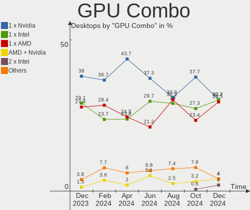
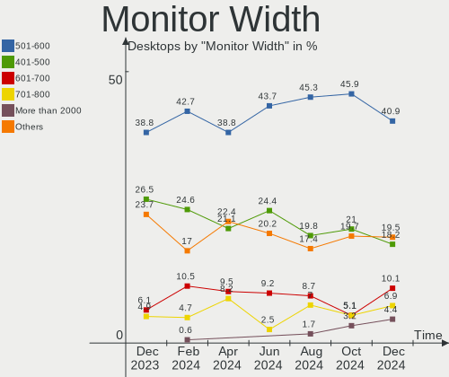
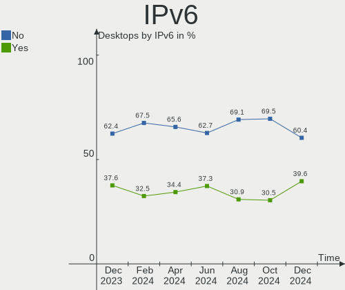
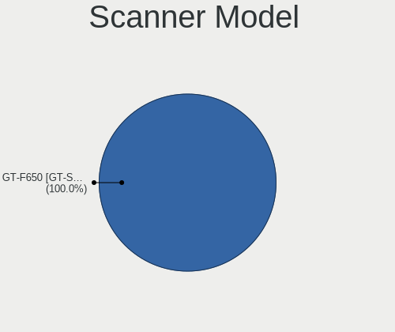

Linux Mint - Hardware Trends (Desktops)
---------------------------------------

A project to identify most popular hardware characteristics and track their change
over time based on data collected by Linux users at https://Linux-Hardware.org.

Anyone can contribute to this report by the [hw-probe](https://github.com/linuxhw/hw-probe) tool:

    sudo -E hw-probe -all -upload

This report is for one last month. Overall report since the beginning of time: [TestDays](https://github.com/linuxhw/TestDays)

Period: Dec, 2024.

Contents
--------

* [ System ](#system)
  - [ OS                       ](#os)
  - [ OS Family                ](#os-family)
  - [ Kernel                   ](#kernel)
  - [ Kernel Family            ](#kernel-family)
  - [ Kernel Major Ver.        ](#kernel-major-ver)
  - [ Arch                     ](#arch)
  - [ DE                       ](#de)
  - [ Display Server           ](#display-server)
  - [ Display Manager          ](#display-manager)
  - [ OS Lang                  ](#os-lang)
  - [ Boot Mode                ](#boot-mode)
  - [ Filesystem               ](#filesystem)
  - [ Part. scheme             ](#part-scheme)
  - [ Dual Boot with Linux/BSD ](#dual-boot-with-linuxbsd)
  - [ Dual Boot (Win)          ](#dual-boot-win)

* [ Board ](#board)
  - [ Vendor                   ](#vendor)
  - [ Model                    ](#model)
  - [ Model Family             ](#model-family)
  - [ MFG Year                 ](#mfg-year)
  - [ Form Factor              ](#form-factor)
  - [ Secure Boot              ](#secure-boot)
  - [ Coreboot                 ](#coreboot)
  - [ RAM Size                 ](#ram-size)
  - [ RAM Used                 ](#ram-used)
  - [ Total Drives             ](#total-drives)
  - [ Has CD-ROM               ](#has-cd-rom)
  - [ Has Ethernet             ](#has-ethernet)
  - [ Has WiFi                 ](#has-wifi)
  - [ Has Bluetooth            ](#has-bluetooth)

* [ Location ](#location)
  - [ Country                  ](#country)
  - [ City                     ](#city)

* [ Drives ](#drives)
  - [ Drive Vendor             ](#drive-vendor)
  - [ Drive Model              ](#drive-model)
  - [ HDD Vendor               ](#hdd-vendor)
  - [ SSD Vendor               ](#ssd-vendor)
  - [ Drive Kind               ](#drive-kind)
  - [ Drive Connector          ](#drive-connector)
  - [ Drive Size               ](#drive-size)
  - [ Space Total              ](#space-total)
  - [ Space Used               ](#space-used)
  - [ Malfunc. Drives          ](#malfunc-drives)
  - [ Malfunc. Drive Vendor    ](#malfunc-drive-vendor)
  - [ Malfunc. HDD Vendor      ](#malfunc-hdd-vendor)
  - [ Malfunc. Drive Kind      ](#malfunc-drive-kind)
  - [ Failed Drives            ](#failed-drives)
  - [ Failed Drive Vendor      ](#failed-drive-vendor)
  - [ Drive Status             ](#drive-status)

* [ Storage controller ](#storage-controller)
  - [ Storage Vendor           ](#storage-vendor)
  - [ Storage Model            ](#storage-model)
  - [ Storage Kind             ](#storage-kind)

* [ Processor ](#processor)
  - [ CPU Vendor               ](#cpu-vendor)
  - [ CPU Model                ](#cpu-model)
  - [ CPU Model Family         ](#cpu-model-family)
  - [ CPU Cores                ](#cpu-cores)
  - [ CPU Sockets              ](#cpu-sockets)
  - [ CPU Threads              ](#cpu-threads)
  - [ CPU Op-Modes             ](#cpu-op-modes)
  - [ CPU Microcode            ](#cpu-microcode)
  - [ CPU Microarch            ](#cpu-microarch)

* [ Graphics ](#graphics)
  - [ GPU Vendor               ](#gpu-vendor)
  - [ GPU Model                ](#gpu-model)
  - [ GPU Combo                ](#gpu-combo)
  - [ GPU Driver               ](#gpu-driver)
  - [ GPU Memory               ](#gpu-memory)

* [ Monitor ](#monitor)
  - [ Monitor Vendor           ](#monitor-vendor)
  - [ Monitor Model            ](#monitor-model)
  - [ Monitor Resolution       ](#monitor-resolution)
  - [ Monitor Diagonal         ](#monitor-diagonal)
  - [ Monitor Width            ](#monitor-width)
  - [ Aspect Ratio             ](#aspect-ratio)
  - [ Monitor Area             ](#monitor-area)
  - [ Pixel Density            ](#pixel-density)
  - [ Multiple Monitors        ](#multiple-monitors)

* [ Network ](#network)
  - [ Net Controller Vendor    ](#net-controller-vendor)
  - [ Net Controller Model     ](#net-controller-model)
  - [ Wireless Vendor          ](#wireless-vendor)
  - [ Wireless Model           ](#wireless-model)
  - [ Ethernet Vendor          ](#ethernet-vendor)
  - [ Ethernet Model           ](#ethernet-model)
  - [ Net Controller Kind      ](#net-controller-kind)
  - [ Used Controller          ](#used-controller)
  - [ NICs                     ](#nics)
  - [ IPv6                     ](#ipv6)

* [ Bluetooth ](#bluetooth)
  - [ Bluetooth Vendor         ](#bluetooth-vendor)
  - [ Bluetooth Model          ](#bluetooth-model)

* [ Sound ](#sound)
  - [ Sound Vendor             ](#sound-vendor)
  - [ Sound Model              ](#sound-model)

* [ Memory ](#memory)
  - [ Memory Vendor            ](#memory-vendor)
  - [ Memory Model             ](#memory-model)
  - [ Memory Kind              ](#memory-kind)
  - [ Memory Form Factor       ](#memory-form-factor)
  - [ Memory Size              ](#memory-size)
  - [ Memory Speed             ](#memory-speed)

* [ Printers & scanners ](#printers--scanners)
  - [ Printer Vendor           ](#printer-vendor)
  - [ Printer Model            ](#printer-model)
  - [ Scanner Vendor           ](#scanner-vendor)
  - [ Scanner Model            ](#scanner-model)

* [ Camera ](#camera)
  - [ Camera Vendor            ](#camera-vendor)
  - [ Camera Model             ](#camera-model)

* [ Security ](#security)
  - [ Fingerprint Vendor       ](#fingerprint-vendor)
  - [ Fingerprint Model        ](#fingerprint-model)
  - [ Chipcard Vendor          ](#chipcard-vendor)
  - [ Chipcard Model           ](#chipcard-model)

* [ Unsupported ](#unsupported)
  - [ Unsupported Devices      ](#unsupported-devices)
  - [ Unsupported Device Types ](#unsupported-device-types)

System
------

OS
--

Installed operating systems

| Name            | Desktops | Percent |
|-----------------|----------|---------|
| Linux Mint 22   | 95       | 63.76%  |
| Linux Mint 21.3 | 35       | 23.49%  |
| Linux Mint 21.1 | 7        | 4.7%    |
| Linux Mint 20.3 | 3        | 2.01%   |
| Linux Mint 19.3 | 3        | 2.01%   |
| Linux Mint 21.2 | 2        | 1.34%   |
| Linux Mint 20.2 | 2        | 1.34%   |
| Linux Mint 22.1 | 1        | 0.67%   |
| Linux Mint 21   | 1        | 0.67%   |

OS Family
---------

OS without a version

| Name       | Desktops | Percent |
|------------|----------|---------|
| Linux Mint | 149      | 100%    |

Kernel
------

Version of the Linux kernel

| Version                  | Desktops | Percent |
|--------------------------|----------|---------|
| 6.8.0-49-generic         | 42       | 28.19%  |
| 6.8.0-51-generic         | 28       | 18.79%  |
| 6.8.0-50-generic         | 25       | 16.78%  |
| 5.15.0-126-generic       | 15       | 10.07%  |
| 6.8.0-38-generic         | 8        | 5.37%   |
| 5.15.0-130-generic       | 6        | 4.03%   |
| 5.15.0-128-generic       | 3        | 2.01%   |
| 5.4.0-200-generic        | 2        | 1.34%   |
| 5.4.0-150-generic        | 2        | 1.34%   |
| 5.15.0-127-generic       | 2        | 1.34%   |
| 6.9.9-x64v3-xanmod1      | 1        | 0.67%   |
| 6.8.12-custombuild-001   | 1        | 0.67%   |
| 6.8.0-48-generic         | 1        | 0.67%   |
| 6.8.0-45-generic         | 1        | 0.67%   |
| 6.2.0-39-generic         | 1        | 0.67%   |
| 6.2.0-26-generic         | 1        | 0.67%   |
| 6.12.3-061203-generic    | 1        | 0.67%   |
| 6.11.10-1-liquorix-amd64 | 1        | 0.67%   |
| 6.11.0-1002-nvidia       | 1        | 0.67%   |
| 5.4.0-204-generic        | 1        | 0.67%   |
| 5.4.0-202-generic        | 1        | 0.67%   |
| 5.15.0-125-generic       | 1        | 0.67%   |
| 5.15.0-124-generic       | 1        | 0.67%   |
| 5.15.0-121-generic       | 1        | 0.67%   |
| 5.15.0-118-generic       | 1        | 0.67%   |
| 4.15.0-54-generic        | 1        | 0.67%   |

Kernel Family
-------------

Linux kernel without a distro release

| Version | Desktops | Percent |
|---------|----------|---------|
| 6.8.0   | 105      | 70.47%  |
| 5.15.0  | 30       | 20.13%  |
| 5.4.0   | 6        | 4.03%   |
| 6.2.0   | 2        | 1.34%   |
| 6.9.9   | 1        | 0.67%   |
| 6.8.12  | 1        | 0.67%   |
| 6.12.3  | 1        | 0.67%   |
| 6.11.10 | 1        | 0.67%   |
| 6.11.0  | 1        | 0.67%   |
| 4.15.0  | 1        | 0.67%   |

Kernel Major Ver.
-----------------

Linux kernel major version

| Version | Desktops | Percent |
|---------|----------|---------|
| 6.8     | 106      | 71.14%  |
| 5.15    | 30       | 20.13%  |
| 5.4     | 6        | 4.03%   |
| 6.2     | 2        | 1.34%   |
| 6.11    | 2        | 1.34%   |
| 6.9     | 1        | 0.67%   |
| 6.12    | 1        | 0.67%   |
| 4.15    | 1        | 0.67%   |

Arch
----

OS architecture (x86_64, i586, etc.)

| Name   | Desktops | Percent |
|--------|----------|---------|
| x86_64 | 149      | 100%    |

DE
--

Desktop Environment

| Name       | Desktops | Percent |
|------------|----------|---------|
| X-Cinnamon | 110      | 73.83%  |
| XFCE       | 15       | 10.07%  |
| MATE       | 14       | 9.4%    |
| KDE5       | 3        | 2.01%   |
| GNOME      | 2        | 1.34%   |
| Cinnamon   | 2        | 1.34%   |
| LXDE       | 1        | 0.67%   |
| ICEWM      | 1        | 0.67%   |
| i3         | 1        | 0.67%   |

Display Server
--------------

X11 or Wayland

| Name    | Desktops | Percent |
|---------|----------|---------|
| X11     | 147      | 98.66%  |
| Wayland | 2        | 1.34%   |

Display Manager
---------------

SDDM, LightDM, etc.

| Name    | Desktops | Percent |
|---------|----------|---------|
| LightDM | 110      | 73.83%  |
| Unknown | 36       | 24.16%  |
| GDM3    | 2        | 1.34%   |
| SDDM    | 1        | 0.67%   |

OS Lang
-------

Language

| Lang  | Desktops | Percent |
|-------|----------|---------|
| en_US | 41       | 27.52%  |
| it_IT | 24       | 16.11%  |
| de_DE | 21       | 14.09%  |
| fr_FR | 10       | 6.71%   |
| ru_RU | 6        | 4.03%   |
| pt_BR | 6        | 4.03%   |
| en_AU | 6        | 4.03%   |
| C     | 6        | 4.03%   |
| en_CA | 5        | 3.36%   |
| pl_PL | 4        | 2.68%   |
| es_ES | 3        | 2.01%   |
| en_GB | 3        | 2.01%   |
| tr_TR | 2        | 1.34%   |
| fi_FI | 2        | 1.34%   |
| de_CH | 2        | 1.34%   |
| es_VE | 1        | 0.67%   |
| es_MX | 1        | 0.67%   |
| es_AR | 1        | 0.67%   |
| en_IN | 1        | 0.67%   |
| en_IE | 1        | 0.67%   |
| en_DK | 1        | 0.67%   |
| de_LI | 1        | 0.67%   |
| de_AT | 1        | 0.67%   |

Boot Mode
---------

EFI or BIOS

| Mode | Desktops | Percent |
|------|----------|---------|
| EFI  | 101      | 67.79%  |
| BIOS | 48       | 32.21%  |

Filesystem
----------

Type of filesystem

| Type    | Desktops | Percent |
|---------|----------|---------|
| Ext4    | 124      | 83.22%  |
| Tmpfs   | 8        | 5.37%   |
| Btrfs   | 8        | 5.37%   |
| Overlay | 5        | 3.36%   |
| Zfs     | 2        | 1.34%   |
| Xfs     | 1        | 0.67%   |
| Ext3    | 1        | 0.67%   |

Part. scheme
------------

Scheme of partitioning

| Type    | Desktops | Percent |
|---------|----------|---------|
| GPT     | 99       | 66.44%  |
| Unknown | 36       | 24.16%  |
| MBR     | 14       | 9.4%    |

Dual Boot with Linux/BSD
------------------------

Hosting more than one Linux/BSD

| Dual boot | Desktops | Percent |
|-----------|----------|---------|
| No        | 133      | 89.26%  |
| Yes       | 16       | 10.74%  |

Dual Boot (Win)
---------------

Hosting Linux and Windows

| Dual boot | Desktops | Percent |
|-----------|----------|---------|
| No        | 102      | 68.46%  |
| Yes       | 47       | 31.54%  |

Board
-----

Vendor
------

Motherboard manufacturer

| Name                | Desktops | Percent |
|---------------------|----------|---------|
| ASUSTek Computer    | 41       | 27.52%  |
| MSI                 | 19       | 12.75%  |
| Gigabyte Technology | 16       | 10.74%  |
| Dell                | 11       | 7.38%   |
| Hewlett-Packard     | 10       | 6.71%   |
| ASRock              | 8        | 5.37%   |
| Lenovo              | 7        | 4.7%    |
| Foxconn             | 5        | 3.36%   |
| Intel               | 4        | 2.68%   |
| Unknown             | 4        | 2.68%   |
| Acer                | 3        | 2.01%   |
| Shuttle             | 2        | 1.34%   |
| Packard Bell        | 2        | 1.34%   |
| GEEKOM              | 2        | 1.34%   |
| Fujitsu             | 2        | 1.34%   |
| Biostar             | 2        | 1.34%   |
| AZW                 | 2        | 1.34%   |
| Win Element         | 1        | 0.67%   |
| QTQD                | 1        | 0.67%   |
| NZXT                | 1        | 0.67%   |
| Medion              | 1        | 0.67%   |
| MACHINIST           | 1        | 0.67%   |
| ECS                 | 1        | 0.67%   |
| Chuwi               | 1        | 0.67%   |
| BESSTAR Tech        | 1        | 0.67%   |
| AMI                 | 1        | 0.67%   |

Model
-----

Motherboard model

| Name                               | Desktops | Percent |
|------------------------------------|----------|---------|
| Unknown                            | 6        | 4.03%   |
| MSI MS-7996                        | 3        | 2.01%   |
| HP ProDesk 600 G1 SFF              | 2        | 1.34%   |
| HP Compaq 8000 Elite SFF PC        | 2        | 1.34%   |
| Foxconn 2AB1                       | 2        | 1.34%   |
| Dell OptiPlex 9020                 | 2        | 1.34%   |
| Dell OptiPlex 780                  | 2        | 1.34%   |
| ASUS PRIME H310M-E R2.0            | 2        | 1.34%   |
| ASUS M5A78L-M LX3                  | 2        | 1.34%   |
| ASUS All Series                    | 2        | 1.34%   |
| Win Element M9S                    | 1        | 0.67%   |
| Shuttle SH310V2                    | 1        | 0.67%   |
| Shuttle DH270                      | 1        | 0.67%   |
| Packard Bell IMEDIA S3210          | 1        | 0.67%   |
| Packard Bell IMEDIA S1300          | 1        | 0.67%   |
| NZXT N7 Z370                       | 1        | 0.67%   |
| MSI MS-7E51                        | 1        | 0.67%   |
| MSI MS-7E26                        | 1        | 0.67%   |
| MSI MS-7E01                        | 1        | 0.67%   |
| MSI MS-7D48                        | 1        | 0.67%   |
| MSI MS-7C95                        | 1        | 0.67%   |
| MSI MS-7C94                        | 1        | 0.67%   |
| MSI MS-7C90                        | 1        | 0.67%   |
| MSI MS-7C31                        | 1        | 0.67%   |
| MSI MS-7C02                        | 1        | 0.67%   |
| MSI MS-7B89                        | 1        | 0.67%   |
| MSI MS-7B86                        | 1        | 0.67%   |
| MSI MS-7B79                        | 1        | 0.67%   |
| MSI MS-7A93                        | 1        | 0.67%   |
| MSI MS-7758                        | 1        | 0.67%   |
| MSI MS-7751                        | 1        | 0.67%   |
| MSI MS-7640                        | 1        | 0.67%   |
| Medion S23005                      | 1        | 0.67%   |
| MACHINIST E5-MR9A V1.0             | 1        | 0.67%   |
| Lenovo ThinkCentre M900 10FMCTO1WW | 1        | 0.67%   |
| Lenovo ThinkCentre M900 10FGS1400W | 1        | 0.67%   |
| Lenovo ThinkCentre M83 10AJ001NUK  | 1        | 0.67%   |
| Lenovo ThinkCentre M83 10AHS35Q00  | 1        | 0.67%   |
| Lenovo ThinkCentre E73 10AU003FMX  | 1        | 0.67%   |
| Lenovo ThinkCentre A70 7099S3A     | 1        | 0.67%   |

Model Family
------------

Motherboard model prefix

| Name                | Desktops | Percent |
|---------------------|----------|---------|
| ASUS TUF            | 9        | 6.04%   |
| ASUS ROG            | 8        | 5.37%   |
| Dell OptiPlex       | 7        | 4.7%    |
| Lenovo ThinkCentre  | 6        | 4.03%   |
| Unknown             | 6        | 4.03%   |
| ASUS PRIME          | 5        | 3.36%   |
| HP Compaq           | 4        | 2.68%   |
| MSI MS-7996         | 3        | 2.01%   |
| Acer Veriton        | 3        | 2.01%   |
| Packard Bell IMEDIA | 2        | 1.34%   |
| HP ProDesk          | 2        | 1.34%   |
| Gigabyte B550M      | 2        | 1.34%   |
| Fujitsu ESPRIMO     | 2        | 1.34%   |
| Foxconn 2AB1        | 2        | 1.34%   |
| Dell Studio         | 2        | 1.34%   |
| Dell Inspiron       | 2        | 1.34%   |
| ASUS M5A78L-M       | 2        | 1.34%   |
| ASUS All            | 2        | 1.34%   |
| Win Element M9S     | 1        | 0.67%   |
| Shuttle SH310V2     | 1        | 0.67%   |
| Shuttle DH270       | 1        | 0.67%   |
| NZXT N7             | 1        | 0.67%   |
| MSI MS-7E51         | 1        | 0.67%   |
| MSI MS-7E26         | 1        | 0.67%   |
| MSI MS-7E01         | 1        | 0.67%   |
| MSI MS-7D48         | 1        | 0.67%   |
| MSI MS-7C95         | 1        | 0.67%   |
| MSI MS-7C94         | 1        | 0.67%   |
| MSI MS-7C90         | 1        | 0.67%   |
| MSI MS-7C31         | 1        | 0.67%   |
| MSI MS-7C02         | 1        | 0.67%   |
| MSI MS-7B89         | 1        | 0.67%   |
| MSI MS-7B86         | 1        | 0.67%   |
| MSI MS-7B79         | 1        | 0.67%   |
| MSI MS-7A93         | 1        | 0.67%   |
| MSI MS-7758         | 1        | 0.67%   |
| MSI MS-7751         | 1        | 0.67%   |
| MSI MS-7640         | 1        | 0.67%   |
| Medion S23005       | 1        | 0.67%   |
| MACHINIST E5-MR9A   | 1        | 0.67%   |

MFG Year
--------

Motherboard manufacture year

| Year | Desktops | Percent |
|------|----------|---------|
| 2022 | 13       | 8.72%   |
| 2018 | 13       | 8.72%   |
| 2023 | 11       | 7.38%   |
| 2013 | 11       | 7.38%   |
| 2010 | 11       | 7.38%   |
| 2016 | 10       | 6.71%   |
| 2021 | 9        | 6.04%   |
| 2020 | 9        | 6.04%   |
| 2019 | 9        | 6.04%   |
| 2017 | 9        | 6.04%   |
| 2012 | 9        | 6.04%   |
| 2014 | 8        | 5.37%   |
| 2024 | 7        | 4.7%    |
| 2009 | 6        | 4.03%   |
| 2015 | 5        | 3.36%   |
| 2011 | 4        | 2.68%   |
| 2007 | 2        | 1.34%   |
| 2006 | 2        | 1.34%   |
| 2008 | 1        | 0.67%   |

Form Factor
-----------

Physical design of the computer

| Name    | Desktops | Percent |
|---------|----------|---------|
| Desktop | 149      | 100%    |

Secure Boot
-----------

Enabled or disabled

| State    | Desktops | Percent |
|----------|----------|---------|
| Disabled | 142      | 95.3%   |
| Enabled  | 7        | 4.7%    |

Coreboot
--------

Have coreboot on board

| Used | Desktops | Percent |
|------|----------|---------|
| No   | 149      | 100%    |

RAM Size
--------

Total RAM memory

| Size in GB  | Desktops | Percent |
|-------------|----------|---------|
| 16.01-24.0  | 43       | 28.86%  |
| 32.01-64.0  | 33       | 22.15%  |
| 4.01-8.0    | 22       | 14.77%  |
| 8.01-16.0   | 21       | 14.09%  |
| 3.01-4.0    | 14       | 9.4%    |
| 24.01-32.0  | 7        | 4.7%    |
| 64.01-256.0 | 7        | 4.7%    |
| 2.01-3.0    | 1        | 0.67%   |
| 1.01-2.0    | 1        | 0.67%   |

RAM Used
--------

Used RAM memory

| Used GB    | Desktops | Percent |
|------------|----------|---------|
| 2.01-3.0   | 44       | 29.53%  |
| 1.01-2.0   | 35       | 23.49%  |
| 4.01-8.0   | 27       | 18.12%  |
| 3.01-4.0   | 25       | 16.78%  |
| 8.01-16.0  | 9        | 6.04%   |
| 16.01-24.0 | 5        | 3.36%   |
| 0.51-1.0   | 2        | 1.34%   |
| 32.01-64.0 | 1        | 0.67%   |
| 24.01-32.0 | 1        | 0.67%   |

Total Drives
------------

Number of drives on board

| Drives | Desktops | Percent |
|--------|----------|---------|
| 1      | 64       | 42.95%  |
| 2      | 45       | 30.2%   |
| 3      | 18       | 12.08%  |
| 4      | 8        | 5.37%   |
| 5      | 7        | 4.7%    |
| 6      | 3        | 2.01%   |
| 7      | 2        | 1.34%   |
| 0      | 2        | 1.34%   |

Has CD-ROM
----------

Has CD-ROM on board

| Presented | Desktops | Percent |
|-----------|----------|---------|
| No        | 85       | 57.05%  |
| Yes       | 64       | 42.95%  |

Has Ethernet
------------

Has Ethernet on board

| Presented | Desktops | Percent |
|-----------|----------|---------|
| Yes       | 149      | 100%    |

Has WiFi
--------

Has WiFi module

| Presented | Desktops | Percent |
|-----------|----------|---------|
| Yes       | 84       | 56.38%  |
| No        | 65       | 43.62%  |

Has Bluetooth
-------------

Has Bluetooth module

| Presented | Desktops | Percent |
|-----------|----------|---------|
| No        | 79       | 53.02%  |
| Yes       | 70       | 46.98%  |

Location
--------

Country
-------

Geographic location (country)

| Country         | Desktops | Percent |
|-----------------|----------|---------|
| Italy           | 26       | 17.45%  |
| Germany         | 25       | 16.78%  |
| USA             | 23       | 15.44%  |
| France          | 10       | 6.71%   |
| Russia          | 7        | 4.7%    |
| Brazil          | 7        | 4.7%    |
| Australia       | 7        | 4.7%    |
| Canada          | 6        | 4.03%   |
| Spain           | 5        | 3.36%   |
| Poland          | 4        | 2.68%   |
| UK              | 3        | 2.01%   |
| Greece          | 3        | 2.01%   |
| Turkey          | 2        | 1.34%   |
| Switzerland     | 2        | 1.34%   |
| Finland         | 2        | 1.34%   |
| Austria         | 2        | 1.34%   |
| Argentina       | 2        | 1.34%   |
| Venezuela       | 1        | 0.67%   |
| The Netherlands | 1        | 0.67%   |
| Slovenia        | 1        | 0.67%   |
| Saudi Arabia    | 1        | 0.67%   |
| Pakistan        | 1        | 0.67%   |
| Norway          | 1        | 0.67%   |
| Netherlands     | 1        | 0.67%   |
| Mexico          | 1        | 0.67%   |
| Latvia          | 1        | 0.67%   |
| Ireland         | 1        | 0.67%   |
| Indonesia       | 1        | 0.67%   |
| India           | 1        | 0.67%   |
| Chile           | 1        | 0.67%   |

City
----

Geographic location (city)

| City                   | Desktops | Percent |
|------------------------|----------|---------|
| Rome                   | 4        | 2.68%   |
| Milano                 | 3        | 2.01%   |
| Milan                  | 3        | 2.01%   |
| Wittenberg             | 2        | 1.34%   |
| Padova                 | 2        | 1.34%   |
| Nuremberg              | 2        | 1.34%   |
| Moscow                 | 2        | 1.34%   |
| Los Angeles            | 2        | 1.34%   |
| Cochrane               | 2        | 1.34%   |
| Brisbane               | 2        | 1.34%   |
| Berlin                 | 2        | 1.34%   |
| Zgorzelec              | 1        | 0.67%   |
| West Malling           | 1        | 0.67%   |
| Weilheim               | 1        | 0.67%   |
| Waterford              | 1        | 0.67%   |
| Warragul               | 1        | 0.67%   |
| Vitoria-Gasteiz        | 1        | 0.67%   |
| Vienna                 | 1        | 0.67%   |
| Verona                 | 1        | 0.67%   |
| Vermillion             | 1        | 0.67%   |
| Verbania               | 1        | 0.67%   |
| Vancouver              | 1        | 0.67%   |
| Trenton                | 1        | 0.67%   |
| Trebaseleghe           | 1        | 0.67%   |
| Toulon                 | 1        | 0.67%   |
| Thessaloniki           | 1        | 0.67%   |
| Tenno                  | 1        | 0.67%   |
| Sydney                 | 1        | 0.67%   |
| Suhr                   | 1        | 0.67%   |
| Stolberg               | 1        | 0.67%   |
| St. Gallen             | 1        | 0.67%   |
| St Petersburg          | 1        | 0.67%   |
| Southampton            | 1        | 0.67%   |
| Seveso                 | 1        | 0.67%   |
| Serra                  | 1        | 0.67%   |
| Sarapul                | 1        | 0.67%   |
| Sao Paulo              | 1        | 0.67%   |
| Sao Jose dos Cordeiros | 1        | 0.67%   |
| Santiago               | 1        | 0.67%   |
| San Martino alla Palma | 1        | 0.67%   |

Drives
------

Drive Vendor
------------

Hard drive vendors

| Vendor                      | Desktops | Drives | Percent |
|-----------------------------|----------|--------|---------|
| WDC                         | 40       | 46     | 15.63%  |
| Samsung Electronics         | 39       | 59     | 15.23%  |
| Seagate                     | 33       | 43     | 12.89%  |
| Sandisk                     | 20       | 21     | 7.81%   |
| Crucial                     | 20       | 22     | 7.81%   |
| Kingston                    | 13       | 13     | 5.08%   |
| Phison Electronics          | 6        | 6      | 2.34%   |
| Hitachi                     | 6        | 6      | 2.34%   |
| Toshiba                     | 5        | 6      | 1.95%   |
| Intenso                     | 5        | 5      | 1.95%   |
| Kingston Technology Company | 4        | 4      | 1.56%   |
| Intel                       | 4        | 4      | 1.56%   |
| China                       | 4        | 4      | 1.56%   |
| Team                        | 3        | 3      | 1.17%   |
| SPCC                        | 3        | 3      | 1.17%   |
| Micron/Crucial Technology   | 3        | 3      | 1.17%   |
| A-DATA Technology           | 3        | 3      | 1.17%   |
| USB                         | 2        | 2      | 0.78%   |
| Unknown                     | 2        | 7      | 0.78%   |
| SABRENT                     | 2        | 3      | 0.78%   |
| Patriot                     | 2        | 2      | 0.78%   |
| Netac                       | 2        | 2      | 0.78%   |
| Lexar                       | 2        | 2      | 0.78%   |
| HS-SSD-C100                 | 2        | 2      | 0.78%   |
| Hewlett-Packard             | 2        | 2      | 0.78%   |
| GOODRAM                     | 2        | 2      | 0.78%   |
| Fanxiang                    | 2        | 2      | 0.78%   |
| Win Memory                  | 1        | 1      | 0.39%   |
| Transcend                   | 1        | 1      | 0.39%   |
| TO Exter                    | 1        | 1      | 0.39%   |
| SK hynix                    | 1        | 1      | 0.39%   |
| SD                          | 1        | 1      | 0.39%   |
| RSH-319                     | 1        | 1      | 0.39%   |
| Realtek                     | 1        | 1      | 0.39%   |
| PNY                         | 1        | 1      | 0.39%   |
| PHD 3.0                     | 1        | 1      | 0.39%   |
| OCZ-AGIL                    | 1        | 1      | 0.39%   |
| OCZ                         | 1        | 2      | 0.39%   |
| NGFF                        | 1        | 1      | 0.39%   |
| Micron Technology           | 1        | 1      | 0.39%   |

Drive Model
-----------

Hard drive models

| Model                                 | Desktops | Percent |
|---------------------------------------|----------|---------|
| Samsung SSD 990 PRO 1TB               | 5        | 1.67%   |
| Seagate ST2000DM008-2FR102 2TB        | 4        | 1.34%   |
| Samsung SSD 860 EVO 1TB               | 4        | 1.34%   |
| Crucial CT480BX500SSD1 480GB          | 4        | 1.34%   |
| Seagate ST500DM002-1BD142 500GB       | 3        | 1%      |
| Seagate ST2000DM001-1ER164 2TB        | 3        | 1%      |
| Seagate Expansion Desk 5TB            | 3        | 1%      |
| SanDisk NVMe SSD Drive 2TB            | 3        | 1%      |
| Samsung SSD 970 EVO Plus 1TB          | 3        | 1%      |
| Samsung SSD 860 EVO 500GB             | 3        | 1%      |
| Kingston Company SNV2S1000G 1TB       | 3        | 1%      |
| Kingston SV300S37A120G 120GB SSD      | 3        | 1%      |
| Kingston SA400S37480G 480GB SSD       | 3        | 1%      |
| Kingston SA400S37240G 240GB SSD       | 3        | 1%      |
| Crucial CT1000MX500SSD1 1TB           | 3        | 1%      |
| WDC WDS500G2B0A 500GB SSD             | 2        | 0.67%   |
| WDC WD30EFRX-68EUZN0 3TB              | 2        | 0.67%   |
| WDC WD20EZRZ-00Z5HB0 2TB              | 2        | 0.67%   |
| Unknown SD/MMC 1073GB                 | 2        | 0.67%   |
| Unknown M.S./M.S.Pro/HG 16GB          | 2        | 0.67%   |
| Unknown Compact Flash 977MB           | 2        | 0.67%   |
| Toshiba HDWD110 1TB                   | 2        | 0.67%   |
| Seagate ST4000DM004-2CV104 4TB        | 2        | 0.67%   |
| Seagate ST1000DM010-2EP102 1TB        | 2        | 0.67%   |
| Seagate ST1000DM003-1CH162 1TB        | 2        | 0.67%   |
| SanDisk SSD PLUS 1000GB               | 2        | 0.67%   |
| SanDisk SDSSDH3 500G                  | 2        | 0.67%   |
| Samsung SSD 970 EVO Plus 500GB        | 2        | 0.67%   |
| Samsung SSD 960 EVO 250GB             | 2        | 0.67%   |
| Samsung SSD 870 QVO 2TB               | 2        | 0.67%   |
| Samsung SSD 870 EVO 500GB             | 2        | 0.67%   |
| Samsung SSD 850 EVO 500GB             | 2        | 0.67%   |
| Samsung SSD 850 EVO 250GB             | 2        | 0.67%   |
| Samsung HD103SJ 1TB                   | 2        | 0.67%   |
| Phison E16 PCIe4 NVMe Controller 1TB  | 2        | 0.67%   |
| Micron/Crucial P2 NVMe PCIe SSD 500GB | 2        | 0.67%   |
| Intenso SSD SATAIII 512GB             | 2        | 0.67%   |
| Crucial CT500MX500SSD1 500GB          | 2        | 0.67%   |
| Crucial CT240BX500SSD1 240GB          | 2        | 0.67%   |
| Crucial CT2000MX500SSD1 2TB           | 2        | 0.67%   |

HDD Vendor
----------

Hard disk drive vendors

| Vendor              | Desktops | Drives | Percent |
|---------------------|----------|--------|---------|
| WDC                 | 33       | 36     | 36.67%  |
| Seagate             | 32       | 42     | 35.56%  |
| Hitachi             | 6        | 6      | 6.67%   |
| Toshiba             | 5        | 6      | 5.56%   |
| Samsung Electronics | 4        | 4      | 4.44%   |
| SABRENT             | 2        | 3      | 2.22%   |
| TO Exter            | 1        | 1      | 1.11%   |
| RSH-319             | 1        | 1      | 1.11%   |
| Maxtor              | 1        | 2      | 1.11%   |
| JMicron Technology  | 1        | 1      | 1.11%   |
| Intenso             | 1        | 1      | 1.11%   |
| HGST                | 1        | 2      | 1.11%   |
| Hewlett-Packard     | 1        | 1      | 1.11%   |
| Fujitsu             | 1        | 1      | 1.11%   |

SSD Vendor
----------

Solid state drive vendors

| Vendor              | Desktops | Drives | Percent |
|---------------------|----------|--------|---------|
| Samsung Electronics | 26       | 32     | 22.61%  |
| Crucial             | 18       | 18     | 15.65%  |
| Kingston            | 12       | 12     | 10.43%  |
| WDC                 | 9        | 9      | 7.83%   |
| SanDisk             | 9        | 9      | 7.83%   |
| Intenso             | 4        | 4      | 3.48%   |
| China               | 4        | 4      | 3.48%   |
| A-DATA Technology   | 3        | 3      | 2.61%   |
| Team                | 2        | 2      | 1.74%   |
| SPCC                | 2        | 2      | 1.74%   |
| Patriot             | 2        | 2      | 1.74%   |
| HS-SSD-C100         | 2        | 2      | 1.74%   |
| GOODRAM             | 2        | 2      | 1.74%   |
| Win Memory          | 1        | 1      | 0.87%   |
| Transcend           | 1        | 1      | 0.87%   |
| SK hynix            | 1        | 1      | 0.87%   |
| SD                  | 1        | 1      | 0.87%   |
| PNY                 | 1        | 1      | 0.87%   |
| PHD 3.0             | 1        | 1      | 0.87%   |
| OCZ-AGIL            | 1        | 1      | 0.87%   |
| OCZ                 | 1        | 2      | 0.87%   |
| NGFF                | 1        | 1      | 0.87%   |
| Netac               | 1        | 1      | 0.87%   |
| LITEONIT            | 1        | 1      | 0.87%   |
| LITEON              | 1        | 1      | 0.87%   |
| Lexar               | 1        | 1      | 0.87%   |
| Intel               | 1        | 1      | 0.87%   |
| Hoodisk             | 1        | 1      | 0.87%   |
| Hewlett-Packard     | 1        | 1      | 0.87%   |
| Fanxiang            | 1        | 1      | 0.87%   |
| Emtec               | 1        | 1      | 0.87%   |
| CONSISTENT          | 1        | 1      | 0.87%   |
| Apacer              | 1        | 1      | 0.87%   |

Drive Kind
----------

HDD or SSD

| Kind    | Desktops | Drives | Percent |
|---------|----------|--------|---------|
| SSD     | 94       | 122    | 40.52%  |
| HDD     | 81       | 107    | 34.91%  |
| NVMe    | 53       | 66     | 22.84%  |
| Unknown | 4        | 11     | 1.72%   |

Drive Connector
---------------

SATA, SAS, NVMe, etc.

| Type | Desktops | Drives | Percent |
|------|----------|--------|---------|
| SATA | 125      | 212    | 63.78%  |
| NVMe | 52       | 64     | 26.53%  |
| SAS  | 19       | 30     | 9.69%   |

Drive Size
----------

Size of hard drive

| Size in TB | Desktops | Drives | Percent |
|------------|----------|--------|---------|
| 0.01-0.5   | 92       | 117    | 48.68%  |
| 0.51-1.0   | 48       | 55     | 25.4%   |
| 1.01-2.0   | 23       | 28     | 12.17%  |
| 3.01-4.0   | 12       | 13     | 6.35%   |
| 4.01-10.0  | 7        | 9      | 3.7%    |
| 2.01-3.0   | 5        | 5      | 2.65%   |
| 10.01-20.0 | 2        | 2      | 1.06%   |

Space Total
-----------

Amount of disk space available on the file system

| Size in GB     | Desktops | Percent |
|----------------|----------|---------|
| 251-500        | 38       | 25.5%   |
| 101-250        | 25       | 16.78%  |
| 501-1000       | 24       | 16.11%  |
| More than 3000 | 22       | 14.77%  |
| 1001-2000      | 16       | 10.74%  |
| 2001-3000      | 11       | 7.38%   |
| 1-20           | 5        | 3.36%   |
| 51-100         | 5        | 3.36%   |
| 21-50          | 3        | 2.01%   |

Space Used
----------

Amount of used disk space

| Used GB        | Desktops | Percent |
|----------------|----------|---------|
| 101-250        | 33       | 22.15%  |
| 1-20           | 27       | 18.12%  |
| 51-100         | 18       | 12.08%  |
| 21-50          | 16       | 10.74%  |
| 501-1000       | 15       | 10.07%  |
| 251-500        | 13       | 8.72%   |
| 1001-2000      | 13       | 8.72%   |
| More than 3000 | 10       | 6.71%   |
| 2001-3000      | 4        | 2.68%   |

Malfunc. Drives
---------------

Drive models with a malfunction

| Model                            | Desktops | Drives | Percent |
|----------------------------------|----------|--------|---------|
| WDC WD30EFRX-68EUZN0 3TB         | 2        | 2      | 10%     |
| WDC WD6400AAKS-22A7B2 640GB      | 1        | 1      | 5%      |
| WDC WD5000LPCX-24C6HT0 500GB     | 1        | 1      | 5%      |
| WDC WD5000BPVT-00KPFT0 500GB     | 1        | 1      | 5%      |
| WDC WD5000AAKX-001CA0 500GB      | 1        | 1      | 5%      |
| WDC WD3200AAJS-08L7A0 320GB      | 1        | 1      | 5%      |
| Toshiba MK3265GSXN 320GB         | 1        | 1      | 5%      |
| Seagate ST500LT012-1DG142 500GB  | 1        | 1      | 5%      |
| Seagate ST500DM002-1BD142 500GB  | 1        | 1      | 5%      |
| Seagate ST31000524AS 1TB         | 1        | 1      | 5%      |
| Seagate ST2000DL003-9VT166 2TB   | 1        | 1      | 5%      |
| Seagate ST1500DL003-9VT16L 1TB   | 1        | 1      | 5%      |
| SanDisk SSD PLUS 240GB           | 1        | 1      | 5%      |
| OCZ VERTEX4 256GB SSD            | 1        | 1      | 5%      |
| Kingston SUV400S37240G 240GB SSD | 1        | 1      | 5%      |
| Hitachi HUA722020ALA330 2TB      | 1        | 1      | 5%      |
| Hitachi HDP725016GLA380 160GB    | 1        | 1      | 5%      |
| Fanxiang S101 128GB SSD          | 1        | 1      | 5%      |
| Crucial CT1050MX300SSD4 1TB      | 1        | 1      | 5%      |

Malfunc. Drive Vendor
---------------------

Vendors of faulty drives

| Vendor   | Desktops | Drives | Percent |
|----------|----------|--------|---------|
| WDC      | 7        | 7      | 36.84%  |
| Seagate  | 4        | 5      | 21.05%  |
| Hitachi  | 2        | 2      | 10.53%  |
| Toshiba  | 1        | 1      | 5.26%   |
| SanDisk  | 1        | 1      | 5.26%   |
| OCZ      | 1        | 1      | 5.26%   |
| Kingston | 1        | 1      | 5.26%   |
| Fanxiang | 1        | 1      | 5.26%   |
| Crucial  | 1        | 1      | 5.26%   |

Malfunc. HDD Vendor
-------------------

Vendors of faulty HDD drives

| Vendor  | Desktops | Drives | Percent |
|---------|----------|--------|---------|
| WDC     | 7        | 7      | 50%     |
| Seagate | 4        | 5      | 28.57%  |
| Hitachi | 2        | 2      | 14.29%  |
| Toshiba | 1        | 1      | 7.14%   |

Malfunc. Drive Kind
-------------------

Kinds of faulty drives

| Kind | Desktops | Drives | Percent |
|------|----------|--------|---------|
| HDD  | 13       | 15     | 72.22%  |
| SSD  | 5        | 5      | 27.78%  |

Failed Drives
-------------

Failed drive models

Zero info for selected period =(

Failed Drive Vendor
-------------------

Failed drive vendors

Zero info for selected period =(

Drive Status
------------

Number of failed and malfunc. drives

| Status   | Desktops | Drives | Percent |
|----------|----------|--------|---------|
| Works    | 90       | 153    | 55.21%  |
| Detected | 55       | 133    | 33.74%  |
| Malfunc  | 18       | 20     | 11.04%  |

Storage controller
------------------

Storage Vendor
--------------

Storage controller vendors

| Vendor                      | Desktops | Percent |
|-----------------------------|----------|---------|
| Intel                       | 91       | 43.33%  |
| AMD                         | 49       | 23.33%  |
| Samsung Electronics         | 18       | 8.57%   |
| Sandisk                     | 12       | 5.71%   |
| Phison Electronics          | 6        | 2.86%   |
| Micron/Crucial Technology   | 6        | 2.86%   |
| Nvidia                      | 5        | 2.38%   |
| ASMedia Technology          | 5        | 2.38%   |
| MAXIO Technology (Hangzhou) | 4        | 1.9%    |
| Kingston Technology Company | 4        | 1.9%    |
| VIA Technologies            | 2        | 0.95%   |
| Realtek Semiconductor       | 2        | 0.95%   |
| Micron Technology           | 2        | 0.95%   |
| Silicon Motion              | 1        | 0.48%   |
| Seagate Technology          | 1        | 0.48%   |
| Marvell Technology Group    | 1        | 0.48%   |
| JMicron Technology          | 1        | 0.48%   |

Storage Model
-------------

Storage controller models

| Model                                                                          | Desktops | Percent |
|--------------------------------------------------------------------------------|----------|---------|
| AMD FCH SATA Controller [AHCI mode]                                            | 15       | 6.05%   |
| Intel 8 Series/C220 Series Chipset Family 6-port SATA Controller 1 [AHCI mode] | 14       | 5.65%   |
| Intel 200 Series PCH SATA controller [AHCI mode]                               | 11       | 4.44%   |
| AMD 500 Series Chipset SATA Controller                                         | 11       | 4.44%   |
| AMD 400 Series Chipset SATA Controller                                         | 11       | 4.44%   |
| Intel Q170/Q150/B150/H170/H110/Z170/CM236 Chipset SATA Controller [AHCI Mode]  | 9        | 3.63%   |
| AMD 600 Series Chipset SATA Controller                                         | 9        | 3.63%   |
| Samsung NVMe SSD Controller SM981/PM981/PM983                                  | 7        | 2.82%   |
| Samsung NVMe SSD Controller S4LV008[Pascal]                                    | 6        | 2.42%   |
| Intel 7 Series/C210 Series Chipset Family 6-port SATA Controller [AHCI mode]   | 6        | 2.42%   |
| AMD SB7x0/SB8x0/SB9x0 SATA Controller [AHCI mode]                              | 6        | 2.42%   |
| Sandisk WD Black SN850X NVMe SSD                                               | 5        | 2.02%   |
| Intel SATA Controller [RAID mode]                                              | 5        | 2.02%   |
| Intel 6 Series/C200 Series Chipset Family 6 port Desktop SATA AHCI Controller  | 5        | 2.02%   |
| AMD SB7x0/SB8x0/SB9x0 SATA Controller [IDE mode]                               | 5        | 2.02%   |
| AMD SB7x0/SB8x0/SB9x0 IDE Controller                                           | 5        | 2.02%   |
| Samsung NVMe SSD Controller PM9A1/PM9A3/980PRO                                 | 4        | 1.61%   |
| Nvidia MCP61 SATA Controller                                                   | 4        | 1.61%   |
| MAXIO (Hangzhou) NVMe SSD Controller MAP1202 (DRAM-less)                       | 4        | 1.61%   |
| Intel Raptor Lake SATA AHCI Controller                                         | 4        | 1.61%   |
| Intel Cannon Lake PCH SATA AHCI Controller                                     | 4        | 1.61%   |
| Intel Alder Lake-S PCH SATA Controller [AHCI Mode]                             | 4        | 1.61%   |
| Intel 82801JD/DO (ICH10 Family) SATA AHCI Controller                           | 4        | 1.61%   |
| Samsung NVMe SSD Controller SM961/PM961/SM963                                  | 3        | 1.21%   |
| Nvidia MCP61 IDE                                                               | 3        | 1.21%   |
| Micron/Crucial P2 [Nick P2] / P3 / P3 Plus NVMe PCIe SSD (DRAM-less)           | 3        | 1.21%   |
| Kingston Company NV2 NVMe SSD [SM2267XT] (DRAM-less)                           | 3        | 1.21%   |
| Intel Volume Management Device NVMe RAID Controller                            | 3        | 1.21%   |
| Intel SSD 660P Series                                                          | 3        | 1.21%   |
| Intel NM10/ICH7 Family SATA Controller [IDE mode]                              | 3        | 1.21%   |
| Intel 5 Series/3400 Series Chipset 4 port SATA IDE Controller                  | 3        | 1.21%   |
| Intel 5 Series/3400 Series Chipset 2 port SATA IDE Controller                  | 3        | 1.21%   |
| ASMedia ASM1061/ASM1062 Serial ATA Controller                                  | 3        | 1.21%   |
| Phison PS5021-E21 PCIe4 NVMe Controller (DRAM-less)                            | 2        | 0.81%   |
| Phison E16 PCIe4 NVMe Controller                                               | 2        | 0.81%   |
| Intel Alder Lake-N SATA AHCI Controller                                        | 2        | 0.81%   |
| Intel 82801G (ICH7 Family) IDE Controller                                      | 2        | 0.81%   |
| Intel 4 Series Chipset PT IDER Controller                                      | 2        | 0.81%   |
| ASMedia ASM1064 Serial ATA Controller                                          | 2        | 0.81%   |
| VIA VT82C586A/B/VT82C686/A/B/VT823x/A/C PIPC Bus Master IDE                    | 1        | 0.4%    |

Storage Kind
------------

Kind of storage controller (IDE, SATA, NVMe, SAS, ...)

| Kind | Desktops | Percent |
|------|----------|---------|
| SATA | 126      | 59.43%  |
| NVMe | 53       | 25%     |
| IDE  | 23       | 10.85%  |
| RAID | 10       | 4.72%   |

Processor
---------

CPU Vendor
----------

Processor vendors

| Vendor | Desktops | Percent |
|--------|----------|---------|
| Intel  | 92       | 61.74%  |
| AMD    | 57       | 38.26%  |

CPU Model
---------

Processor models

| Model                                       | Desktops | Percent |
|---------------------------------------------|----------|---------|
| Intel Core i5-9400F CPU @ 2.90GHz           | 5        | 3.36%   |
| Intel Core i7-6700 CPU @ 3.40GHz            | 4        | 2.68%   |
| Intel Core i5-4570 CPU @ 3.20GHz            | 4        | 2.68%   |
| Intel Core i5-6500 CPU @ 3.20GHz            | 3        | 2.01%   |
| Intel Core 2 Duo CPU E8400 @ 3.00GHz        | 3        | 2.01%   |
| AMD Ryzen 7 2700X Eight-Core Processor      | 3        | 2.01%   |
| AMD Ryzen 5 5600G with Radeon Graphics      | 3        | 2.01%   |
| Intel Core i7-4770 CPU @ 3.40GHz            | 2        | 1.34%   |
| Intel Core i7 CPU 860 @ 2.80GHz             | 2        | 1.34%   |
| Intel Core i5-4590S CPU @ 3.00GHz           | 2        | 1.34%   |
| Intel Core i5-3570 CPU @ 3.40GHz            | 2        | 1.34%   |
| Intel Core i5-3470 CPU @ 3.20GHz            | 2        | 1.34%   |
| Intel Core i3-4170 CPU @ 3.70GHz            | 2        | 1.34%   |
| AMD Ryzen 9 7950X3D 16-Core Processor       | 2        | 1.34%   |
| AMD Ryzen 9 7950X 16-Core Processor         | 2        | 1.34%   |
| AMD Ryzen 5 5600X 6-Core Processor          | 2        | 1.34%   |
| AMD FX-8320 Eight-Core Processor            | 2        | 1.34%   |
| AMD Athlon II X2 220 Processor              | 2        | 1.34%   |
| Intel Xeon CPU E5-2670 v3 @ 2.30GHz         | 1        | 0.67%   |
| Intel Xeon CPU E3-1270 v3 @ 3.50GHz         | 1        | 0.67%   |
| Intel Xeon CPU E3-1240 V2 @ 3.40GHz         | 1        | 0.67%   |
| Intel Pentium Dual-Core CPU E6600 @ 3.06GHz | 1        | 0.67%   |
| Intel Pentium Dual-Core CPU E5800 @ 3.20GHz | 1        | 0.67%   |
| Intel Pentium Dual-Core CPU E5700 @ 3.00GHz | 1        | 0.67%   |
| Intel Pentium Dual-Core CPU E5500 @ 2.80GHz | 1        | 0.67%   |
| Intel Pentium Dual CPU E2220 @ 2.40GHz      | 1        | 0.67%   |
| Intel Pentium CPU N3700 @ 1.60GHz           | 1        | 0.67%   |
| Intel Pentium CPU G870 @ 3.10GHz            | 1        | 0.67%   |
| Intel Pentium CPU G4400T @ 2.90GHz          | 1        | 0.67%   |
| Intel Pentium CPU G4400 @ 3.30GHz           | 1        | 0.67%   |
| Intel N95                                   | 1        | 0.67%   |
| Intel N100                                  | 1        | 0.67%   |
| Intel Genuine CPU 2140 @ 1.60GHz            | 1        | 0.67%   |
| Intel Core i9-10940X CPU @ 3.30GHz          | 1        | 0.67%   |
| Intel Core i7-8700K CPU @ 3.70GHz           | 1        | 0.67%   |
| Intel Core i7-8700 CPU @ 3.20GHz            | 1        | 0.67%   |
| Intel Core i7-7700K CPU @ 4.20GHz           | 1        | 0.67%   |
| Intel Core i7-7700 CPU @ 3.60GHz            | 1        | 0.67%   |
| Intel Core i7-7500U CPU @ 2.70GHz           | 1        | 0.67%   |
| Intel Core i7-6700T CPU @ 2.80GHz           | 1        | 0.67%   |

CPU Model Family
----------------

Processor model prefix

| Model                   | Desktops | Percent |
|-------------------------|----------|---------|
| Intel Core i5           | 31       | 20.81%  |
| Intel Core i7           | 20       | 13.42%  |
| AMD Ryzen 5             | 14       | 9.4%    |
| AMD Ryzen 7             | 13       | 8.72%   |
| Intel Core i3           | 10       | 6.71%   |
| Other                   | 9        | 6.04%   |
| AMD Ryzen 9             | 9        | 6.04%   |
| Intel Pentium Dual-Core | 4        | 2.68%   |
| Intel Pentium           | 4        | 2.68%   |
| Intel Core 2 Duo        | 4        | 2.68%   |
| AMD FX                  | 4        | 2.68%   |
| AMD Athlon II X2        | 4        | 2.68%   |
| Intel Xeon              | 3        | 2.01%   |
| Intel Celeron           | 3        | 2.01%   |
| AMD Phenom II X6        | 2        | 1.34%   |
| AMD Phenom II X4        | 2        | 1.34%   |
| Intel Pentium Dual      | 1        | 0.67%   |
| Intel Genuine           | 1        | 0.67%   |
| Intel Core i9           | 1        | 0.67%   |
| Intel Core 2            | 1        | 0.67%   |
| AMD Ryzen 5 PRO         | 1        | 0.67%   |
| AMD Ryzen 3             | 1        | 0.67%   |
| AMD PRO A8              | 1        | 0.67%   |
| AMD Phenom              | 1        | 0.67%   |
| AMD GX                  | 1        | 0.67%   |
| AMD Athlon X4           | 1        | 0.67%   |
| AMD Athlon II X4        | 1        | 0.67%   |
| AMD Athlon 64 X2        | 1        | 0.67%   |
| AMD A8                  | 1        | 0.67%   |

CPU Cores
---------

Number of processor cores

| Number | Desktops | Percent |
|--------|----------|---------|
| 4      | 55       | 36.91%  |
| 2      | 35       | 23.49%  |
| 6      | 28       | 18.79%  |
| 8      | 16       | 10.74%  |
| 16     | 5        | 3.36%   |
| 12     | 4        | 2.68%   |
| 14     | 3        | 2.01%   |
| 10     | 3        | 2.01%   |

CPU Sockets
-----------

Number of sockets

| Number | Desktops | Percent |
|--------|----------|---------|
| 1      | 149      | 100%    |

CPU Threads
-----------

Threads per core (Hyper-Threading)

| Number | Desktops | Percent |
|--------|----------|---------|
| 2      | 86       | 57.72%  |
| 1      | 63       | 42.28%  |

CPU Op-Modes
------------

CPU Operation Modes (32-bit, 64-bit)

| Op mode        | Desktops | Percent |
|----------------|----------|---------|
| 32-bit, 64-bit | 149      | 100%    |

CPU Microcode
-------------

Microcode number

| Number     | Desktops | Percent |
|------------|----------|---------|
| Unknown    | 114      | 76.51%  |
| 0x306c3    | 6        | 4.03%   |
| 0x506e3    | 3        | 2.01%   |
| 0x1067a    | 3        | 2.01%   |
| 0x90675    | 2        | 1.34%   |
| 0x306a9    | 2        | 1.34%   |
| 0x106e5    | 2        | 1.34%   |
| 0x06000852 | 2        | 1.34%   |
| 0xb0671    | 1        | 0.67%   |
| 0xa0653    | 1        | 0.67%   |
| 0x906ea    | 1        | 0.67%   |
| 0x906c0    | 1        | 0.67%   |
| 0x6f6      | 1        | 0.67%   |
| 0x30678    | 1        | 0.67%   |
| 0x0a601206 | 1        | 0.67%   |
| 0x0a601203 | 1        | 0.67%   |
| 0x0a20120e | 1        | 0.67%   |
| 0x0a20120a | 1        | 0.67%   |
| 0x08701030 | 1        | 0.67%   |
| 0x08701021 | 1        | 0.67%   |
| 0x0600611a | 1        | 0.67%   |
| 0x010000db | 1        | 0.67%   |
| 0x010000c8 | 1        | 0.67%   |

CPU Microarch
-------------

Microarchitecture

| Name             | Desktops | Percent |
|------------------|----------|---------|
| Haswell          | 19       | 12.75%  |
| Skylake          | 14       | 9.4%    |
| KabyLake         | 14       | 9.4%    |
| Zen 3            | 13       | 8.72%   |
| Unknown          | 13       | 8.72%   |
| K10              | 10       | 6.71%   |
| IvyBridge        | 8        | 5.37%   |
| Zen 2            | 7        | 4.7%    |
| Penryn           | 7        | 4.7%    |
| Alderlake Hybrid | 6        | 4.03%   |
| Zen+             | 5        | 3.36%   |
| SandyBridge      | 5        | 3.36%   |
| Piledriver       | 4        | 2.68%   |
| Core             | 4        | 2.68%   |
| Nehalem          | 3        | 2.01%   |
| Gracemont        | 3        | 2.01%   |
| Zen              | 2        | 1.34%   |
| Steamroller      | 2        | 1.34%   |
| Silvermont       | 2        | 1.34%   |
| CometLake        | 2        | 1.34%   |
| Tremont          | 1        | 0.67%   |
| TigerLake        | 1        | 0.67%   |
| K8 Hammer        | 1        | 0.67%   |
| Jaguar           | 1        | 0.67%   |
| Goldmont plus    | 1        | 0.67%   |
| Excavator        | 1        | 0.67%   |

Graphics
--------

GPU Vendor
----------

Vendors of graphics cards

| Vendor | Desktops | Percent |
|--------|----------|---------|
| Nvidia | 55       | 34.16%  |
| Intel  | 54       | 33.54%  |
| AMD    | 52       | 32.3%   |

GPU Model
---------

Graphics card models

| Model                                                                       | Desktops | Percent |
|-----------------------------------------------------------------------------|----------|---------|
| Intel Xeon E3-1200 v3/4th Gen Core Processor Integrated Graphics Controller | 8        | 4.85%   |
| AMD Raphael                                                                 | 8        | 4.85%   |
| Intel HD Graphics 530                                                       | 7        | 4.24%   |
| AMD Ellesmere [Radeon RX 470/480/570/570X/580/580X/590]                     | 6        | 3.64%   |
| Nvidia GT218 [GeForce 210]                                                  | 5        | 3.03%   |
| Nvidia GK208B [GeForce GT 710]                                              | 5        | 3.03%   |
| Intel CoffeeLake-S GT2 [UHD Graphics 630]                                   | 5        | 3.03%   |
| Nvidia GP108 [GeForce GT 1030]                                              | 4        | 2.42%   |
| Nvidia GP104 [GeForce GTX 1070]                                             | 4        | 2.42%   |
| Intel 4 Series Chipset Integrated Graphics Controller                       | 4        | 2.42%   |
| Intel 2nd Generation Core Processor Family Integrated Graphics Controller   | 4        | 2.42%   |
| AMD Navi 22 [Radeon RX 6700/6700 XT/6750 XT / 6800M/6850M XT]               | 4        | 2.42%   |
| AMD Cezanne [Radeon Vega Series / Radeon Vega Mobile Series]                | 4        | 2.42%   |
| Nvidia GP107 [GeForce GTX 1050 Ti]                                          | 3        | 1.82%   |
| Nvidia GA106 [GeForce RTX 3060 Lite Hash Rate]                              | 3        | 1.82%   |
| Intel Alder Lake-N [UHD Graphics]                                           | 3        | 1.82%   |
| AMD Navi 21 [Radeon RX 6800/6800 XT / 6900 XT]                              | 3        | 1.82%   |
| AMD Cedar [Radeon HD 5000/6000/7350/8350 Series]                            | 3        | 1.82%   |
| Nvidia TU117GLM [Quadro T400 Mobile]                                        | 2        | 1.21%   |
| Nvidia TU117 [GeForce GTX 1650]                                             | 2        | 1.21%   |
| Nvidia TU106 [GeForce RTX 2060 Rev. A]                                      | 2        | 1.21%   |
| Nvidia GM206 [GeForce GTX 960]                                              | 2        | 1.21%   |
| Nvidia GA102 [GeForce RTX 3080]                                             | 2        | 1.21%   |
| Nvidia AD107 [GeForce RTX 4060]                                             | 2        | 1.21%   |
| Intel Xeon E3-1200 v2/3rd Gen Core processor Graphics Controller            | 2        | 1.21%   |
| Intel DG2 [Arc A770]                                                        | 2        | 1.21%   |
| Intel Alder Lake-S GT1 [UHD Graphics 730]                                   | 2        | 1.21%   |
| Intel 4th Generation Core Processor Family Integrated Graphics Controller   | 2        | 1.21%   |
| AMD Phoenix1                                                                | 2        | 1.21%   |
| AMD Navi 32 [Radeon RX 7700 XT / 7800 XT]                                   | 2        | 1.21%   |
| AMD Lexa PRO [Radeon 540/540X/550/550X / RX 540X/550/550X]                  | 2        | 1.21%   |
| AMD Kaveri [Radeon R7 Graphics]                                             | 2        | 1.21%   |
| AMD Caicos [Radeon HD 6450/7450/8450 / R5 230 OEM]                          | 2        | 1.21%   |
| Nvidia TU106 [GeForce RTX 2060 SUPER]                                       | 1        | 0.61%   |
| Nvidia GT218 [GeForce 8400 GS Rev. 3]                                       | 1        | 0.61%   |
| Nvidia GP106 [GeForce GTX 1060 6GB]                                         | 1        | 0.61%   |
| Nvidia GP104 [P104-100]                                                     | 1        | 0.61%   |
| Nvidia GP104 [GeForce GTX 1080]                                             | 1        | 0.61%   |
| Nvidia GM107 [GeForce GTX 750 Ti]                                           | 1        | 0.61%   |
| Nvidia GK110B [GeForce GTX 780 Ti]                                          | 1        | 0.61%   |

GPU Combo
---------

Combinations of graphics cards

| Name           | Desktops | Percent |
|----------------|----------|---------|
| 1 x Nvidia     | 45       | 30.2%   |
| 1 x Intel      | 45       | 30.2%   |
| 1 x AMD        | 44       | 29.53%  |
| AMD + Nvidia   | 6        | 4.03%   |
| 2 x Intel      | 3        | 2.01%   |
| Intel + Nvidia | 3        | 2.01%   |
| 2 x AMD        | 2        | 1.34%   |
| 2 x Nvidia     | 1        | 0.67%   |

GPU Driver
----------

Free vs proprietary

| Driver      | Desktops | Percent |
|-------------|----------|---------|
| Free        | 98       | 65.77%  |
| Proprietary | 40       | 26.85%  |
| Unknown     | 11       | 7.38%   |

GPU Memory
----------

Total video memory

| Size in GB | Desktops | Percent |
|------------|----------|---------|
| Unknown    | 57       | 38.26%  |
| 1.01-2.0   | 19       | 12.75%  |
| 7.01-8.0   | 16       | 10.74%  |
| 8.01-16.0  | 15       | 10.07%  |
| 0.51-1.0   | 15       | 10.07%  |
| 0.01-0.5   | 13       | 8.72%   |
| 3.01-4.0   | 10       | 6.71%   |
| 5.01-6.0   | 2        | 1.34%   |
| 16.01-24.0 | 2        | 1.34%   |

Monitor
-------

Monitor Vendor
--------------

Monitor vendors

| Vendor               | Desktops | Percent |
|----------------------|----------|---------|
| Samsung Electronics  | 28       | 16.87%  |
| Dell                 | 17       | 10.24%  |
| Acer                 | 15       | 9.04%   |
| Goldstar             | 14       | 8.43%   |
| Hewlett-Packard      | 12       | 7.23%   |
| Unknown              | 8        | 4.82%   |
| AOC                  | 8        | 4.82%   |
| Philips              | 7        | 4.22%   |
| BenQ                 | 7        | 4.22%   |
| ViewSonic            | 5        | 3.01%   |
| Lenovo               | 4        | 2.41%   |
| Iiyama               | 4        | 2.41%   |
| ASUSTek Computer     | 4        | 2.41%   |
| MSI                  | 3        | 1.81%   |
| Hitachi              | 2        | 1.2%    |
| Gigabyte Technology  | 2        | 1.2%    |
| Ancor Communications | 2        | 1.2%    |
| ___                  | 1        | 0.6%    |
| Vestel Elektronik    | 1        | 0.6%    |
| Unknown (XXX)        | 1        | 0.6%    |
| Sony                 | 1        | 0.6%    |
| SOG                  | 1        | 0.6%    |
| RTK                  | 1        | 0.6%    |
| Panasonic            | 1        | 0.6%    |
| NEC Computers        | 1        | 0.6%    |
| Mi                   | 1        | 0.6%    |
| LaCie                | 1        | 0.6%    |
| HUAWEI               | 1        | 0.6%    |
| HPN                  | 1        | 0.6%    |
| HKC                  | 1        | 0.6%    |
| Fujitsu Siemens      | 1        | 0.6%    |
| Eizo                 | 1        | 0.6%    |
| DZX                  | 1        | 0.6%    |
| CTX                  | 1        | 0.6%    |
| CNC                  | 1        | 0.6%    |
| CHO                  | 1        | 0.6%    |
| CHD                  | 1        | 0.6%    |
| Belinea              | 1        | 0.6%    |
| AUS                  | 1        | 0.6%    |
| AU Optronics         | 1        | 0.6%    |

Monitor Model
-------------

Monitor models

| Model                                                                   | Desktops | Percent |
|-------------------------------------------------------------------------|----------|---------|
| Unknown LCD Monitor FFFF 2288x1287 2550x2550mm 142.0-inch               | 7        | 4.12%   |
| Hewlett-Packard 32 Display HPN351A 1920x1080 698x393mm 31.5-inch        | 2        | 1.18%   |
| Goldstar FULL HD GSM5B55 1920x1080 480x270mm 21.7-inch                  | 2        | 1.18%   |
| Dell S2716DG DELA0D1 2560x1440 598x336mm 27.0-inch                      | 2        | 1.18%   |
| ___ LCDTV16 ___0101 1920x1080                                           | 1        | 0.59%   |
| ViewSonic XG2431 VSC3B3B 1920x1080 527x296mm 23.8-inch                  | 1        | 0.59%   |
| ViewSonic VG2439 SERIES VSCD22B 1920x1080 521x293mm 23.5-inch           | 1        | 0.59%   |
| ViewSonic VA3456-WQHD VSCFC3A 3440x1440 800x335mm 34.1-inch             | 1        | 0.59%   |
| ViewSonic VA2248 SERIES VSC0E28 1920x1080 477x268mm 21.5-inch           | 1        | 0.59%   |
| ViewSonic LCD Monitor VG2719-2K 2560x1440                               | 1        | 0.59%   |
| Vestel Elektronik 49FHD_LCD_TV VES3700 1920x1080 1280x720mm 57.8-inch   | 1        | 0.59%   |
| Unknown LCDTV16 0101 1920x1080 1600x900mm 72.3-inch                     | 1        | 0.59%   |
| Unknown (XXX) Beyond TV XXX9221 1920x1080 1209x680mm 54.6-inch          | 1        | 0.59%   |
| Sony TV *30 SNYB905 3840x2160 1439x809mm 65.0-inch                      | 1        | 0.59%   |
| SOG S-190G SOG1900 1440x900 410x220mm 18.3-inch                         | 1        | 0.59%   |
| Samsung Electronics U28E590 SAM0C4D 3840x2160 607x345mm 27.5-inch       | 1        | 0.59%   |
| Samsung Electronics U28D590 SAM0B80 3840x2160 607x345mm 27.5-inch       | 1        | 0.59%   |
| Samsung Electronics SyncMaster SAM05EC 1920x1080 597x336mm 27.0-inch    | 1        | 0.59%   |
| Samsung Electronics SyncMaster SAM05CD 1920x1080                        | 1        | 0.59%   |
| Samsung Electronics SyncMaster SAM0566 1440x900 408x255mm 18.9-inch     | 1        | 0.59%   |
| Samsung Electronics SyncMaster SAM029A 1920x1200 582x364mm 27.0-inch    | 1        | 0.59%   |
| Samsung Electronics SyncMaster SAM022B 1280x1024 338x270mm 17.0-inch    | 1        | 0.59%   |
| Samsung Electronics SyncMaster SAM01F9 1280x1024 376x301mm 19.0-inch    | 1        | 0.59%   |
| Samsung Electronics SMXL2370HD SAM072C 1920x1080 510x287mm 23.0-inch    | 1        | 0.59%   |
| Samsung Electronics SMT22A350 SAM07A5 1920x1080 477x268mm 21.5-inch     | 1        | 0.59%   |
| Samsung Electronics S34J55x SAM0F71 3440x1440 797x333mm 34.0-inch       | 1        | 0.59%   |
| Samsung Electronics S24F350 SAM0D20 1920x1080 521x293mm 23.5-inch       | 1        | 0.59%   |
| Samsung Electronics S24D330 SAM0D92 1920x1080 531x299mm 24.0-inch       | 1        | 0.59%   |
| Samsung Electronics Odyssey G50A SAM7181 2560x1440 597x336mm 27.0-inch  | 1        | 0.59%   |
| Samsung Electronics Odyssey G5 SAM74A6 2560x1440 597x336mm 27.0-inch    | 1        | 0.59%   |
| Samsung Electronics Odyssey G40B SAM727D 1920x1080 597x336mm 27.0-inch  | 1        | 0.59%   |
| Samsung Electronics LF27T450F SAM7097 1920x1080 597x336mm 27.0-inch     | 1        | 0.59%   |
| Samsung Electronics LF24T35 SAM707D 1920x1080 528x297mm 23.9-inch       | 1        | 0.59%   |
| Samsung Electronics LCD Monitor SAM0D3B 3840x2160 1872x1053mm 84.6-inch | 1        | 0.59%   |
| Samsung Electronics LCD Monitor SAM0D3A 3840x2160 890x500mm 40.2-inch   | 1        | 0.59%   |
| Samsung Electronics LCD Monitor SAM0C3C 1366x768 609x347mm 27.6-inch    | 1        | 0.59%   |
| Samsung Electronics LCD Monitor SAM0C39 1920x1080 885x498mm 40.0-inch   | 1        | 0.59%   |
| Samsung Electronics LCD Monitor SAM0B7C 1920x1080 886x498mm 40.0-inch   | 1        | 0.59%   |
| Samsung Electronics LCD Monitor SAM0A7C 1366x768 698x393mm 31.5-inch    | 1        | 0.59%   |
| Samsung Electronics LCD Monitor SAM0669 1920x1080                       | 1        | 0.59%   |

Monitor Resolution
------------------

Monitor screen resolution

| Resolution         | Desktops | Percent |
|--------------------|----------|---------|
| 1920x1080 (FHD)    | 70       | 44.87%  |
| 3840x2160 (4K)     | 18       | 11.54%  |
| 2560x1440 (QHD)    | 13       | 8.33%   |
| 1366x768 (WXGA)    | 10       | 6.41%   |
| 1280x1024 (SXGA)   | 9        | 5.77%   |
| 3440x1440          | 8        | 5.13%   |
| 2288x1287          | 7        | 4.49%   |
| 1920x1200 (WUXGA)  | 6        | 3.85%   |
| 1440x900 (WXGA+)   | 5        | 3.21%   |
| 1600x900 (HD+)     | 4        | 2.56%   |
| 1680x1050 (WSXGA+) | 2        | 1.28%   |
| 1280x720 (HD)      | 2        | 1.28%   |
| 2560x1080          | 1        | 0.64%   |
| 2160x1440          | 1        | 0.64%   |

Monitor Diagonal
----------------

Diagonal size in inches

| Inches  | Desktops | Percent |
|---------|----------|---------|
| 27      | 29       | 17.58%  |
| 24      | 24       | 14.55%  |
| 23      | 17       | 10.3%   |
| 31      | 13       | 7.88%   |
| 21      | 11       | 6.67%   |
| 34      | 10       | 6.06%   |
| 19      | 10       | 6.06%   |
| 18      | 8        | 4.85%   |
| 142     | 7        | 4.24%   |
| Unknown | 7        | 4.24%   |
| 17      | 5        | 3.03%   |
| 84      | 4        | 2.42%   |
| 25      | 3        | 1.82%   |
| 22      | 3        | 1.82%   |
| 20      | 3        | 1.82%   |
| 54      | 2        | 1.21%   |
| 85      | 1        | 0.61%   |
| 72      | 1        | 0.61%   |
| 65      | 1        | 0.61%   |
| 63      | 1        | 0.61%   |
| 58      | 1        | 0.61%   |
| 40      | 1        | 0.61%   |
| 32      | 1        | 0.61%   |
| 26      | 1        | 0.61%   |
| 15      | 1        | 0.61%   |

Monitor Width
-------------

Physical width

| Width in mm    | Desktops | Percent |
|----------------|----------|---------|
| 501-600        | 65       | 40.88%  |
| 401-500        | 29       | 18.24%  |
| 601-700        | 16       | 10.06%  |
| 701-800        | 11       | 6.92%   |
| More than 2000 | 7        | 4.4%    |
| 351-400        | 7        | 4.4%    |
| Unknown        | 7        | 4.4%    |
| 1501-2000      | 6        | 3.77%   |
| 301-350        | 5        | 3.14%   |
| 1001-1500      | 5        | 3.14%   |
| 801-900        | 1        | 0.63%   |

Aspect Ratio
------------

Proportional relationship between the width and the height

| Ratio   | Desktops | Percent |
|---------|----------|---------|
| 16/9    | 106      | 69.74%  |
| 16/10   | 14       | 9.21%   |
| 5/4     | 10       | 6.58%   |
| 21/9    | 10       | 6.58%   |
| 1.00    | 7        | 4.61%   |
| Unknown | 5        | 3.29%   |

Monitor Area
------------

Area in inch

| Area in inch | Desktops | Percent |
|----------------|----------|---------|
| 201-250        | 45       | 27.78%  |
| 301-350        | 29       | 17.9%   |
| 351-500        | 24       | 14.81%  |
| More than 1000 | 17       | 10.49%  |
| 151-200        | 17       | 10.49%  |
| 141-150        | 10       | 6.17%   |
| 251-300        | 9        | 5.56%   |
| Unknown        | 7        | 4.32%   |
| 131-140        | 2        | 1.23%   |
| 101-110        | 1        | 0.62%   |
| 501-1000       | 1        | 0.62%   |

Pixel Density
-------------

Pixels per inch

| Density | Desktops | Percent |
|---------|----------|---------|
| 51-100  | 95       | 61.29%  |
| 101-120 | 29       | 18.71%  |
| 1-50    | 15       | 9.68%   |
| 121-160 | 9        | 5.81%   |
| Unknown | 7        | 4.52%   |

Multiple Monitors
-----------------

Total monitors connected

| Total | Desktops | Percent |
|-------|----------|---------|
| 1     | 114      | 76.51%  |
| 2     | 27       | 18.12%  |
| 3     | 4        | 2.68%   |
| 0     | 4        | 2.68%   |

Network
-------

Net Controller Vendor
---------------------

Controller vendors

| Vendor                | Desktops | Percent |
|-----------------------|----------|---------|
| Realtek Semiconductor | 104      | 48.83%  |
| Intel                 | 65       | 30.52%  |
| Ralink Technology     | 6        | 2.82%   |
| MediaTek              | 6        | 2.82%   |
| Qualcomm Atheros      | 5        | 2.35%   |
| Nvidia                | 5        | 2.35%   |
| TP-Link               | 3        | 1.41%   |
| Ralink                | 3        | 1.41%   |
| Broadcom              | 3        | 1.41%   |
| ASUSTek Computer      | 2        | 0.94%   |
| ZTopInc               | 1        | 0.47%   |
| Xiaomi                | 1        | 0.47%   |
| T & A Mobile Phones   | 1        | 0.47%   |
| Sitecom Europe        | 1        | 0.47%   |
| Samsung Electronics   | 1        | 0.47%   |
| Realtek               | 1        | 0.47%   |
| Qualcomm Technologies | 1        | 0.47%   |
| Qualcomm              | 1        | 0.47%   |
| Microchip Technology  | 1        | 0.47%   |
| Atmel                 | 1        | 0.47%   |
| Arduino SA            | 1        | 0.47%   |

Net Controller Model
--------------------

Controller models

| Model                                                                  | Desktops | Percent |
|------------------------------------------------------------------------|----------|---------|
| Realtek RTL8111/8168/8211/8411 PCI Express Gigabit Ethernet Controller | 71       | 28.29%  |
| Realtek RTL8125 2.5GbE Controller                                      | 16       | 6.37%   |
| Intel I211 Gigabit Network Connection                                  | 7        | 2.79%   |
| Intel Ethernet Connection I217-LM                                      | 7        | 2.79%   |
| Intel Ethernet Connection (2) I219-V                                   | 7        | 2.79%   |
| Realtek 802.11ac NIC                                                   | 6        | 2.39%   |
| Intel Wi-Fi 6E(802.11ax) AX210/AX1675* 2x2 [Typhoon Peak]              | 6        | 2.39%   |
| Intel Wi-Fi 6 AX200                                                    | 6        | 2.39%   |
| Intel Ethernet Controller I225-V                                       | 6        | 2.39%   |
| Realtek RTL810xE PCI Express Fast Ethernet controller                  | 4        | 1.59%   |
| Nvidia MCP61 Ethernet                                                  | 4        | 1.59%   |
| MediaTek MT7922 802.11ax PCI Express Wireless Network Adapter          | 4        | 1.59%   |
| Intel 82567LM-3 Gigabit Network Connection                             | 4        | 1.59%   |
| Realtek RTL8821CE 802.11ac PCIe Wireless Network Adapter               | 3        | 1.2%    |
| Ralink MT7601U Wireless Adapter                                        | 3        | 1.2%    |
| Intel Wireless 7265                                                    | 3        | 1.2%    |
| Intel Ethernet Connection I217-V                                       | 3        | 1.2%    |
| Intel Ethernet Connection (7) I219-V                                   | 3        | 1.2%    |
| Realtek RTL8852BE PCIe 802.11ax Wireless Network Controller            | 2        | 0.8%    |
| Realtek RTL8821AE 802.11ac PCIe Wireless Network Adapter               | 2        | 0.8%    |
| Realtek RTL8192CE PCIe Wireless Network Adapter                        | 2        | 0.8%    |
| Realtek RTL8188FTV 802.11b/g/n 1T1R 2.4G WLAN Adapter                  | 2        | 0.8%    |
| Realtek RTL8188EUS 802.11n Wireless Network Adapter                    | 2        | 0.8%    |
| Realtek RTL8188CUS 802.11n WLAN Adapter                                | 2        | 0.8%    |
| Ralink RT2870/RT3070 Wireless Adapter                                  | 2        | 0.8%    |
| Qualcomm Atheros QCA8171 Gigabit Ethernet                              | 2        | 0.8%    |
| MediaTek MT7921K (RZ608) Wi-Fi 6E 80MHz                                | 2        | 0.8%    |
| Intel Wireless 8260                                                    | 2        | 0.8%    |
| Intel Wi-Fi 5(802.11ac) Wireless-AC 9x6x [Thunder Peak]                | 2        | 0.8%    |
| Intel Raptor Lake-S PCH CNVi WiFi                                      | 2        | 0.8%    |
| Intel Ethernet Connection (2) I219-LM                                  | 2        | 0.8%    |
| Intel CNVi: Wi-Fi                                                      | 2        | 0.8%    |
| Intel 82579V Gigabit Network Connection                                | 2        | 0.8%    |
| ZTopInc 802.11n NIC                                                    | 1        | 0.4%    |
| Xiaomi Mi/Redmi series (RNDIS)                                         | 1        | 0.4%    |
| TP-Link TL-WN722N v2/v3 [Realtek RTL8188EUS]                           | 1        | 0.4%    |
| TP-Link Archer T9UH v1 [Realtek RTL8814AU]                             | 1        | 0.4%    |
| TP-Link 802.11ac WLAN Adapter                                          | 1        | 0.4%    |
| T & A Mobile Phones TCL 20L                                            | 1        | 0.4%    |
| Sitecom Europe 802.11n NIC                                             | 1        | 0.4%    |

Wireless Vendor
---------------

Wireless vendors

| Vendor                | Desktops | Percent |
|-----------------------|----------|---------|
| Realtek Semiconductor | 31       | 36.9%   |
| Intel                 | 27       | 32.14%  |
| Ralink Technology     | 6        | 7.14%   |
| MediaTek              | 5        | 5.95%   |
| TP-Link               | 3        | 3.57%   |
| Ralink                | 3        | 3.57%   |
| Qualcomm Atheros      | 3        | 3.57%   |
| ASUSTek Computer      | 2        | 2.38%   |
| ZTopInc               | 1        | 1.19%   |
| Sitecom Europe        | 1        | 1.19%   |
| Realtek               | 1        | 1.19%   |
| Qualcomm Technologies | 1        | 1.19%   |

Wireless Model
--------------

Wireless models

| Model                                                                                         | Desktops | Percent |
|-----------------------------------------------------------------------------------------------|----------|---------|
| Realtek 802.11ac NIC                                                                          | 6        | 6.98%   |
| Intel Wi-Fi 6E(802.11ax) AX210/AX1675* 2x2 [Typhoon Peak]                                     | 6        | 6.98%   |
| Intel Wi-Fi 6 AX200                                                                           | 6        | 6.98%   |
| Realtek RTL8821CE 802.11ac PCIe Wireless Network Adapter                                      | 3        | 3.49%   |
| Ralink MT7601U Wireless Adapter                                                               | 3        | 3.49%   |
| MediaTek MT7922 802.11ax PCI Express Wireless Network Adapter                                 | 3        | 3.49%   |
| Intel Wireless 7265                                                                           | 3        | 3.49%   |
| Realtek RTL8852BE PCIe 802.11ax Wireless Network Controller                                   | 2        | 2.33%   |
| Realtek RTL8821AE 802.11ac PCIe Wireless Network Adapter                                      | 2        | 2.33%   |
| Realtek RTL8192CE PCIe Wireless Network Adapter                                               | 2        | 2.33%   |
| Realtek RTL8188FTV 802.11b/g/n 1T1R 2.4G WLAN Adapter                                         | 2        | 2.33%   |
| Realtek RTL8188EUS 802.11n Wireless Network Adapter                                           | 2        | 2.33%   |
| Realtek RTL8188CUS 802.11n WLAN Adapter                                                       | 2        | 2.33%   |
| Ralink RT2870/RT3070 Wireless Adapter                                                         | 2        | 2.33%   |
| MediaTek MT7921K (RZ608) Wi-Fi 6E 80MHz                                                       | 2        | 2.33%   |
| Intel Wireless 8260                                                                           | 2        | 2.33%   |
| Intel Wi-Fi 5(802.11ac) Wireless-AC 9x6x [Thunder Peak]                                       | 2        | 2.33%   |
| Intel Raptor Lake-S PCH CNVi WiFi                                                             | 2        | 2.33%   |
| ZTopInc 802.11n NIC                                                                           | 1        | 1.16%   |
| TP-Link TL-WN722N v2/v3 [Realtek RTL8188EUS]                                                  | 1        | 1.16%   |
| TP-Link Archer T9UH v1 [Realtek RTL8814AU]                                                    | 1        | 1.16%   |
| TP-Link 802.11ac WLAN Adapter                                                                 | 1        | 1.16%   |
| Sitecom Europe 802.11n NIC                                                                    | 1        | 1.16%   |
| Realtek RTL88x2bu [AC1200 Techkey]                                                            | 1        | 1.16%   |
| Realtek RTL8852CE PCIe 802.11ax Wireless Network Controller                                   | 1        | 1.16%   |
| Realtek RTL8822CE 802.11ac PCIe Wireless Network Adapter                                      | 1        | 1.16%   |
| Realtek RTL8812AE 802.11ac PCIe Wireless Network Adapter                                      | 1        | 1.16%   |
| Realtek RTL8723BU 802.11b/g/n WLAN Adapter                                                    | 1        | 1.16%   |
| Realtek RTL8723BE PCIe Wireless Network Adapter                                               | 1        | 1.16%   |
| Realtek RTL8192CU 802.11n WLAN Adapter                                                        | 1        | 1.16%   |
| Realtek RTL8188CE 802.11b/g/n WiFi Adapter                                                    | 1        | 1.16%   |
| Realtek RTL8187 Wireless Adapter                                                              | 1        | 1.16%   |
| Realtek RTL-8185 IEEE 802.11a/b/g Wireless LAN Controller                                     | 1        | 1.16%   |
| Realtek Realtek 8812AU/8821AU 802.11ac WLAN Adapter [USB Wireless Dual-Band Adapter 2.4/5Ghz] | 1        | 1.16%   |
| Realtek 802.11ax WLAN Adapter                                                                 | 1        | 1.16%   |
| Realtek 802.11ac WLAN Adapter                                                                 | 1        | 1.16%   |
| Ralink RT5372 Wireless Adapter                                                                | 1        | 1.16%   |
| Ralink RT5390 Wireless 802.11n 1T/1R PCIe                                                     | 1        | 1.16%   |
| Ralink RT3290 Wireless 802.11n 1T/1R PCIe                                                     | 1        | 1.16%   |
| Ralink RT2500 Wireless 802.11bg                                                               | 1        | 1.16%   |

Ethernet Vendor
---------------

Ethernet vendors

| Vendor                | Desktops | Percent |
|-----------------------|----------|---------|
| Realtek Semiconductor | 91       | 57.96%  |
| Intel                 | 51       | 32.48%  |
| Nvidia                | 5        | 3.18%   |
| Broadcom              | 3        | 1.91%   |
| Qualcomm Atheros      | 2        | 1.27%   |
| Xiaomi                | 1        | 0.64%   |
| T & A Mobile Phones   | 1        | 0.64%   |
| Samsung Electronics   | 1        | 0.64%   |
| Qualcomm              | 1        | 0.64%   |
| MediaTek              | 1        | 0.64%   |

Ethernet Model
--------------

Ethernet models

| Model                                                                  | Desktops | Percent |
|------------------------------------------------------------------------|----------|---------|
| Realtek RTL8111/8168/8211/8411 PCI Express Gigabit Ethernet Controller | 71       | 43.83%  |
| Realtek RTL8125 2.5GbE Controller                                      | 16       | 9.88%   |
| Intel I211 Gigabit Network Connection                                  | 7        | 4.32%   |
| Intel Ethernet Connection I217-LM                                      | 7        | 4.32%   |
| Intel Ethernet Connection (2) I219-V                                   | 7        | 4.32%   |
| Intel Ethernet Controller I225-V                                       | 6        | 3.7%    |
| Realtek RTL810xE PCI Express Fast Ethernet controller                  | 4        | 2.47%   |
| Nvidia MCP61 Ethernet                                                  | 4        | 2.47%   |
| Intel 82567LM-3 Gigabit Network Connection                             | 4        | 2.47%   |
| Intel Ethernet Connection I217-V                                       | 3        | 1.85%   |
| Intel Ethernet Connection (7) I219-V                                   | 3        | 1.85%   |
| Qualcomm Atheros QCA8171 Gigabit Ethernet                              | 2        | 1.23%   |
| Intel Ethernet Connection (2) I219-LM                                  | 2        | 1.23%   |
| Intel 82579V Gigabit Network Connection                                | 2        | 1.23%   |
| Xiaomi Mi/Redmi series (RNDIS)                                         | 1        | 0.62%   |
| T & A Mobile Phones TCL 20L                                            | 1        | 0.62%   |
| Samsung Galaxy series, misc. (tethering mode)                          | 1        | 0.62%   |
| Realtek RTL8152 Fast Ethernet Adapter                                  | 1        | 0.62%   |
| Realtek RTL-8100/8101L/8139 PCI Fast Ethernet Adapter                  | 1        | 0.62%   |
| Realtek RT8126 PCIe Ethernet Controller                                | 1        | 0.62%   |
| Qualcomm POCO F3                                                       | 1        | 0.62%   |
| Nvidia MCP77 Ethernet                                                  | 1        | 0.62%   |
| MediaTek MT7922 802.11ax PCI Express Wireless Network Adapter          | 1        | 0.62%   |
| Intel Ethernet Controller I226-V                                       | 1        | 0.62%   |
| Intel Ethernet Connection I218-V                                       | 1        | 0.62%   |
| Intel Ethernet Connection (2) I218-V                                   | 1        | 0.62%   |
| Intel Ethernet Connection (17) I219-V                                  | 1        | 0.62%   |
| Intel Ethernet Connection (13) I219-V                                  | 1        | 0.62%   |
| Intel Ethernet Connection (12) I219-V                                  | 1        | 0.62%   |
| Intel Ethernet Connection (11) I219-V                                  | 1        | 0.62%   |
| Intel CNVi: Wi-Fi                                                      | 1        | 0.62%   |
| Intel 82579LM Gigabit Network Connection (Lewisville)                  | 1        | 0.62%   |
| Intel 82576 Gigabit Network Connection                                 | 1        | 0.62%   |
| Intel 82574L Gigabit Network Connection                                | 1        | 0.62%   |
| Intel 82566DM-2 Gigabit Network Connection                             | 1        | 0.62%   |
| Broadcom NetXtreme BCM5762 Gigabit Ethernet PCIe                       | 1        | 0.62%   |
| Broadcom NetXtreme BCM5761 Gigabit Ethernet PCIe                       | 1        | 0.62%   |
| Broadcom NetLink BCM57780 Gigabit Ethernet PCIe                        | 1        | 0.62%   |

Net Controller Kind
-------------------

Ethernet, WiFi or modem

| Kind     | Desktops | Percent |
|----------|----------|---------|
| Ethernet | 149      | 63.68%  |
| WiFi     | 82       | 35.04%  |
| Modem    | 3        | 1.28%   |

Used Controller
---------------

Currently used network controller

| Kind     | Desktops | Percent |
|----------|----------|---------|
| Ethernet | 101      | 68.71%  |
| WiFi     | 46       | 31.29%  |

NICs
----

Total network controllers on board

| Total | Desktops | Percent |
|-------|----------|---------|
| 1     | 88       | 59.06%  |
| 2     | 53       | 35.57%  |
| 3     | 7        | 4.7%    |
| 6     | 1        | 0.67%   |

IPv6
----

IPv6 vs IPv4

| Used | Desktops | Percent |
|------|----------|---------|
| No   | 90       | 60.4%   |
| Yes  | 59       | 39.6%   |

Bluetooth
---------

Bluetooth Vendor
----------------

Controller vendors

| Vendor                   | Desktops | Percent |
|--------------------------|----------|---------|
| Intel                    | 27       | 36.99%  |
| Cambridge Silicon Radio  | 16       | 21.92%  |
| Realtek Semiconductor    | 9        | 12.33%  |
| IMC Networks             | 5        | 6.85%   |
| MediaTek                 | 4        | 5.48%   |
| Foxconn / Hon Hai        | 2        | 2.74%   |
| Unknown                  | 2        | 2.74%   |
| TP-Link                  | 1        | 1.37%   |
| Realtek                  | 1        | 1.37%   |
| Ralink                   | 1        | 1.37%   |
| Mercucys                 | 1        | 1.37%   |
| HTC (High Tech Computer) | 1        | 1.37%   |
| Conwise Technology       | 1        | 1.37%   |
| ASUSTek Computer         | 1        | 1.37%   |
| Actions                  | 1        | 1.37%   |

Bluetooth Model
---------------

Controller models

| Model                                                                | Desktops | Percent |
|----------------------------------------------------------------------|----------|---------|
| Cambridge Silicon Radio Bluetooth Dongle (HCI mode)                  | 16       | 21.92%  |
| Realtek Bluetooth Radio                                              | 7        | 9.59%   |
| Intel Bluetooth wireless interface                                   | 7        | 9.59%   |
| Intel AX210 Bluetooth                                                | 6        | 8.22%   |
| Intel AX200 Bluetooth                                                | 6        | 8.22%   |
| MediaTek Wireless_Device                                             | 4        | 5.48%   |
| IMC Networks Bluetooth Radio                                         | 4        | 5.48%   |
| Intel AX201 Bluetooth                                                | 3        | 4.11%   |
| Realtek Bluetooth 5.3 Radio                                          | 2        | 2.74%   |
| Intel Wireless-AC 9260 Bluetooth Adapter                             | 2        | 2.74%   |
| Intel AX211 Bluetooth                                                | 2        | 2.74%   |
| Foxconn / Hon Hai Wireless_Device                                    | 2        | 2.74%   |
| Unknown                                                              | 2        | 2.74%   |
| TP-Link TP-Link Bluetooth USB Adapter                                | 1        | 1.37%   |
| Realtek Bluetooth Radio                                              | 1        | 1.37%   |
| Ralink RT3290 Bluetooth                                              | 1        | 1.37%   |
| Mercucys Mercusys MA530 Adapter                                      | 1        | 1.37%   |
| Intel Wireless-AC 3168 Bluetooth                                     | 1        | 1.37%   |
| IMC Networks Wireless_Device                                         | 1        | 1.37%   |
| HTC (High Tech Computer) Vive Hub Bluetooth 4.1 (Broadcom BCM920703) | 1        | 1.37%   |
| Conwise CW6622                                                       | 1        | 1.37%   |
| ASUS ASUS USB-BT500                                                  | 1        | 1.37%   |
| Actions general adapter                                              | 1        | 1.37%   |

Sound
-----

Sound Vendor
------------

Sound card vendors

| Vendor                                       | Desktops | Percent |
|----------------------------------------------|----------|---------|
| Intel                                        | 90       | 34.35%  |
| AMD                                          | 68       | 25.95%  |
| Nvidia                                       | 54       | 20.61%  |
| C-Media Electronics                          | 10       | 3.82%   |
| JMTek                                        | 5        | 1.91%   |
| Zoran Co. Personal Media Division (Nogatech) | 3        | 1.15%   |
| SteelSeries ApS                              | 3        | 1.15%   |
| Logitech                                     | 3        | 1.15%   |
| Generalplus Technology                       | 3        | 1.15%   |
| Creative Labs                                | 3        | 1.15%   |
| ASUSTek Computer                             | 3        | 1.15%   |
| Tenx Technology                              | 2        | 0.76%   |
| Samson Technologies                          | 2        | 0.76%   |
| DSEA A/S                                     | 2        | 0.76%   |
| XMOS                                         | 1        | 0.38%   |
| VIA Technologies                             | 1        | 0.38%   |
| Schiit Audio                                 | 1        | 0.38%   |
| Razer USA                                    | 1        | 0.38%   |
| Micro Star International                     | 1        | 0.38%   |
| KTMicro                                      | 1        | 0.38%   |
| GN Netcom                                    | 1        | 0.38%   |
| Elan Microelectronics                        | 1        | 0.38%   |
| Dell                                         | 1        | 0.38%   |
| Apple                                        | 1        | 0.38%   |
| Afatech                                      | 1        | 0.38%   |

Sound Model
-----------

Sound card models

| Model                                                                      | Desktops | Percent |
|----------------------------------------------------------------------------|----------|---------|
| AMD Family 17h/19h/1ah HD Audio Controller                                 | 21       | 6.69%   |
| Intel 8 Series/C220 Series Chipset High Definition Audio Controller        | 16       | 5.1%    |
| Intel 200 Series PCH HD Audio                                              | 13       | 4.14%   |
| AMD Starship/Matisse HD Audio Controller                                   | 11       | 3.5%    |
| Intel Xeon E3-1200 v3/4th Gen Core Processor HD Audio Controller           | 10       | 3.18%   |
| AMD SBx00 Azalia (Intel HDA)                                               | 10       | 3.18%   |
| AMD Rembrandt Radeon High Definition Audio Controller                      | 10       | 3.18%   |
| Intel 100 Series/C230 Series Chipset Family HD Audio Controller            | 9        | 2.87%   |
| AMD Renoir Radeon High Definition Audio Controller                         | 9        | 2.87%   |
| Intel 7 Series/C216 Chipset Family High Definition Audio Controller        | 8        | 2.55%   |
| AMD Navi 21/23 HDMI/DP Audio Controller                                    | 8        | 2.55%   |
| AMD Ellesmere HDMI Audio [Radeon RX 470/480 / 570/580/590]                 | 6        | 1.91%   |
| Nvidia High Definition Audio Controller                                    | 5        | 1.59%   |
| Nvidia GP104 High Definition Audio Controller                              | 5        | 1.59%   |
| Nvidia GK208 HDMI/DP Audio Controller                                      | 5        | 1.59%   |
| Intel 6 Series/C200 Series Chipset Family High Definition Audio Controller | 5        | 1.59%   |
| Nvidia TU107 GeForce GTX 1650 High Definition Audio Controller             | 4        | 1.27%   |
| Nvidia MCP61 High Definition Audio                                         | 4        | 1.27%   |
| Nvidia GP108 High Definition Audio Controller                              | 4        | 1.27%   |
| Nvidia GA106 High Definition Audio Controller                              | 4        | 1.27%   |
| Intel Raptor Lake High Definition Audio Controller                         | 4        | 1.27%   |
| Intel Cannon Lake PCH cAVS                                                 | 4        | 1.27%   |
| Intel Alder Lake-S HD Audio Controller                                     | 4        | 1.27%   |
| Intel 82801JD/DO (ICH10 Family) HD Audio Controller                        | 4        | 1.27%   |
| C-Media Electronics USB Audio Device                                       | 4        | 1.27%   |
| AMD Cedar HDMI Audio [Radeon HD 5400/6300/7300 Series]                     | 4        | 1.27%   |
| Zoran Co. Personal Media Division (Nogatech) USB Audio and HID             | 3        | 0.96%   |
| Nvidia TU106 High Definition Audio Controller                              | 3        | 0.96%   |
| Nvidia GP107GL High Definition Audio Controller                            | 3        | 0.96%   |
| JMTek USB PnP Audio Device                                                 | 3        | 0.96%   |
| Intel NM10/ICH7 Family High Definition Audio Controller                    | 3        | 0.96%   |
| Intel Alder Lake-N PCH High Definition Audio Controller                    | 3        | 0.96%   |
| Intel 5 Series/3400 Series Chipset High Definition Audio                   | 3        | 0.96%   |
| Generalplus Technology USB Audio Device                                    | 3        | 0.96%   |
| ASUSTek Computer USB Audio                                                 | 3        | 0.96%   |
| AMD Oland/Hainan/Cape Verde/Pitcairn HDMI Audio [Radeon HD 7000 Series]    | 3        | 0.96%   |
| AMD Navi 31 HDMI/DP Audio                                                  | 3        | 0.96%   |
| AMD FCH Azalia Controller                                                  | 3        | 0.96%   |
| AMD Family 17h (Models 00h-0fh) HD Audio Controller                        | 3        | 0.96%   |
| Tenx Technology USB AUDIO                                                  | 2        | 0.64%   |

Memory
------

Memory Vendor
-------------

Memory module vendors

| Vendor                                  | Desktops | Percent |
|-----------------------------------------|----------|---------|
| Corsair                                 | 22       | 18.18%  |
| Kingston                                | 17       | 14.05%  |
| Unknown                                 | 14       | 11.57%  |
| Samsung Electronics                     | 13       | 10.74%  |
| G.Skill                                 | 12       | 9.92%   |
| Micron Technology                       | 8        | 6.61%   |
| SK hynix                                | 4        | 3.31%   |
| Ramaxel Technology                      | 4        | 3.31%   |
| A-DATA Technology                       | 4        | 3.31%   |
| Crucial                                 | 3        | 2.48%   |
| Unknown                                 | 3        | 2.48%   |
| Elpida                                  | 2        | 1.65%   |
| Apacer                                  | 2        | 1.65%   |
| Unknown (ABCD)                          | 1        | 0.83%   |
| Unknown (0x0E9D)                        | 1        | 0.83%   |
| Unifosa                                 | 1        | 0.83%   |
| Team                                    | 1        | 0.83%   |
| Silicon Power Computer & Communications | 1        | 0.83%   |
| Qimonda                                 | 1        | 0.83%   |
| Patriot                                 | 1        | 0.83%   |
| Netac                                   | 1        | 0.83%   |
| Kimtigo                                 | 1        | 0.83%   |
| Innodisk                                | 1        | 0.83%   |
| GOODRAM                                 | 1        | 0.83%   |
| GeIL                                    | 1        | 0.83%   |
| Exceleram                               | 1        | 0.83%   |

Memory Model
------------

Memory module models

| Model                                                              | Desktops | Percent |
|--------------------------------------------------------------------|----------|---------|
| Unknown                                                            | 3        | 2.31%   |
| Unknown RAM Module 8GB DIMM DDR3 1600MT/s                          | 2        | 1.54%   |
| Samsung RAM M378B5773CH0-CH9 2GB DIMM DDR3 1867MT/s                | 2        | 1.54%   |
| Samsung RAM M378A1K43BB1-CPB 8GB DIMM DDR4 2733MT/s                | 2        | 1.54%   |
| Kingston RAM KHX3200C16D4/8GX 8GB DIMM DDR4 3733MT/s               | 2        | 1.54%   |
| Kingston RAM KF3200C16D4/8GX 8GB DIMM DDR4 3600MT/s                | 2        | 1.54%   |
| G.Skill RAM F5-6000J3038F16G 16GB DIMM DDR5 6000MT/s               | 2        | 1.54%   |
| G.Skill RAM F4-2133C15-4GIS 4GB DIMM DDR4 2133MT/s                 | 2        | 1.54%   |
| Corsair RAM CMK32GX4M2E3200C16 16GB DIMM DDR4 3534MT/s             | 2        | 1.54%   |
| Corsair RAM CMK16GX4M2B3200C16 8GB DIMM DDR4 3600MT/s              | 2        | 1.54%   |
| Corsair RAM CMK16GX4M2B3000C15 8GB DIMM DDR4 3600MT/s              | 2        | 1.54%   |
| Unknown RAM Module 8GB DIMM DDR3 1333MT/s                          | 1        | 0.77%   |
| Unknown RAM Module 4GB DIMM SDRAM                                  | 1        | 0.77%   |
| Unknown RAM Module 4GB DIMM DDR2 533MT/s                           | 1        | 0.77%   |
| Unknown RAM Module 4GB DIMM DDR 1333MT/s                           | 1        | 0.77%   |
| Unknown RAM Module 4GB DIMM 1600MT/s                               | 1        | 0.77%   |
| Unknown RAM Module 4GB DIMM 1333MT/s                               | 1        | 0.77%   |
| Unknown RAM Module 4096MB DIMM DDR 1333MT/s                        | 1        | 0.77%   |
| Unknown RAM Module 2GB DIMM SDRAM 800MT/s                          | 1        | 0.77%   |
| Unknown RAM Module 2GB DIMM DDR2                                   | 1        | 0.77%   |
| Unknown RAM Module 1GB DIMM DDR2                                   | 1        | 0.77%   |
| Unknown RAM Module 1GB DIMM 667MT/s                                | 1        | 0.77%   |
| Unknown RAM CL18-22-22 D4-3600 16384MB DIMM DDR4 3600MT/s          | 1        | 0.77%   |
| Unknown RAM 1600 CL9 Series 8192MB DIMM DDR3 1066MT/s              | 1        | 0.77%   |
| Unknown (ABCD) RAM 123456789012345678 2GB DIMM DDR3 2400MT/s       | 1        | 0.77%   |
| Unknown (0x0E9D) RAM KINSOTIN16GB2666MHZ 16GB SODIMM DDR4 2667MT/s | 1        | 0.77%   |
| Unifosa RAM GU342G0ALEPR692C6 2GB DIMM DDR2 2048MT/s               | 1        | 0.77%   |
| Team RAM TEAMGROUP-SD3-1600 8GB SODIMM DDR3 1600MT/s               | 1        | 0.77%   |
| SK hynix RAM HMT41GS6BFR8A-PB 8GB SODIMM DDR3 1600MT/s             | 1        | 0.77%   |
| SK hynix RAM HMT351U6EFR8C-PB 4GB DIMM DDR3 1600MT/s               | 1        | 0.77%   |
| SK hynix RAM HMT351U6CFR8C-PB 4GB DIMM DDR3 1800MT/s               | 1        | 0.77%   |
| SK hynix RAM HMA81GU6CJR8N-VK 8GB DIMM DDR4 2667MT/s               | 1        | 0.77%   |
| SK hynix RAM HMA42GR7MFR4N-TF 16GB DIMM DDR4 3200MT/s              | 1        | 0.77%   |
| Silicon Power & RAM Module 8GB DIMM DDR4 2667MT/s                  | 1        | 0.77%   |
| Samsung RAM Module 16GB DIMM DDR4 2666MT/s                         | 1        | 0.77%   |
| Samsung RAM M471B5173QH0-YK0 4GB SODIMM DDR3 1600MT/s              | 1        | 0.77%   |
| Samsung RAM M471B1G73QH0-YK0 8GB DIMM DDR3 1600MT/s                | 1        | 0.77%   |
| Samsung RAM M471B1G73BH0-YK0 8192MB DIMM DDR3 1600MT/s             | 1        | 0.77%   |
| Samsung RAM M4 70T5663EH3-CF7 2GB SODIMM DDR2 975MT/s              | 1        | 0.77%   |
| Samsung RAM M4 70T5663EH3-CE7 2GB SODIMM DDR2 800MT/s              | 1        | 0.77%   |

Memory Kind
-----------

Memory module kinds

| Kind    | Desktops | Percent |
|---------|----------|---------|
| DDR4    | 47       | 42.34%  |
| DDR3    | 31       | 27.93%  |
| DDR5    | 14       | 12.61%  |
| SDRAM   | 7        | 6.31%   |
| DDR2    | 5        | 4.5%    |
| Unknown | 3        | 2.7%    |
| LPDDR4  | 2        | 1.8%    |
| DDR     | 2        | 1.8%    |

Memory Form Factor
------------------

Physical design of the memory module

| Name         | Desktops | Percent |
|--------------|----------|---------|
| DIMM         | 92       | 83.64%  |
| SODIMM       | 17       | 15.45%  |
| Row Of Chips | 1        | 0.91%   |

Memory Size
-----------

Memory module size

| Size  | Desktops | Percent |
|-------|----------|---------|
| 8192  | 40       | 34.19%  |
| 16384 | 33       | 28.21%  |
| 4096  | 21       | 17.95%  |
| 2048  | 15       | 12.82%  |
| 32768 | 4        | 3.42%   |
| 1024  | 3        | 2.56%   |
| 49152 | 1        | 0.85%   |

Memory Speed
------------

Memory module speed

| Speed   | Desktops | Percent |
|---------|----------|---------|
| 1600    | 18       | 15.25%  |
| 1333    | 11       | 9.32%   |
| 3600    | 10       | 8.47%   |
| 3200    | 8        | 6.78%   |
| 2400    | 7        | 5.93%   |
| 2667    | 6        | 5.08%   |
| 6000    | 5        | 4.24%   |
| 5600    | 4        | 3.39%   |
| 2133    | 4        | 3.39%   |
| 1867    | 4        | 3.39%   |
| 3733    | 3        | 2.54%   |
| 2933    | 3        | 2.54%   |
| 2733    | 3        | 2.54%   |
| 2666    | 3        | 2.54%   |
| 800     | 3        | 2.54%   |
| Unknown | 3        | 2.54%   |
| 4800    | 2        | 1.69%   |
| 3534    | 2        | 1.69%   |
| 3000    | 2        | 1.69%   |
| 2048    | 2        | 1.69%   |
| 1866    | 2        | 1.69%   |
| 1800    | 2        | 1.69%   |
| 667     | 2        | 1.69%   |
| 6600    | 1        | 0.85%   |
| 5900    | 1        | 0.85%   |
| 5200    | 1        | 0.85%   |
| 3800    | 1        | 0.85%   |
| 3467    | 1        | 0.85%   |
| 3466    | 1        | 0.85%   |
| 3400    | 1        | 0.85%   |
| 1067    | 1        | 0.85%   |
| 533     | 1        | 0.85%   |

Printers & scanners
-------------------

Printer Vendor
--------------

Printer device vendors

| Vendor              | Desktops | Percent |
|---------------------|----------|---------|
| Samsung Electronics | 3        | 37.5%   |
| Hewlett-Packard     | 3        | 37.5%   |
| Oki Data            | 1        | 12.5%   |
| Canon               | 1        | 12.5%   |

Printer Model
-------------

Printer device models

| Model                                                 | Desktops | Percent |
|-------------------------------------------------------|----------|---------|
| HP OfficeJet 3830 series                              | 2        | 25%     |
| Samsung ML-1670 Series                                | 1        | 12.5%   |
| Samsung M2020 Series                                  | 1        | 12.5%   |
| Samsung C48x Series Color Laser Multifunction Printer | 1        | 12.5%   |
| Oki Data MC342 Multifunction Printer                  | 1        | 12.5%   |
| HP OfficeJet 4650 series                              | 1        | 12.5%   |
| Canon CanoScan LiDE 300                               | 1        | 12.5%   |

Scanner Vendor
--------------

Scanner device vendors

| Vendor      | Desktops | Percent |
|-------------|----------|---------|
| Seiko Epson | 1        | 100%    |

Scanner Model
-------------

Scanner device models

| Model                                             | Desktops | Percent |
|---------------------------------------------------|----------|---------|
| Seiko Epson GT-F650 [GT-S600/Perfection V10/V100] | 1        | 100%    |

Camera
------

Camera Vendor
-------------

Camera device vendors

| Vendor                      | Desktops | Percent |
|-----------------------------|----------|---------|
| Logitech                    | 17       | 53.13%  |
| KYE Systems (Mouse Systems) | 3        | 9.38%   |
| Chicony Electronics         | 2        | 6.25%   |
| WaveRider Communications    | 1        | 3.13%   |
| Suyin                       | 1        | 3.13%   |
| Sunplus IT                  | 1        | 3.13%   |
| Sonix Technology            | 1        | 3.13%   |
| Samsung Electronics         | 1        | 3.13%   |
| Microsoft                   | 1        | 3.13%   |
| Microdia                    | 1        | 3.13%   |
| MacroSilicon                | 1        | 3.13%   |
| Jieli Technology            | 1        | 3.13%   |
| Generalplus Technology      | 1        | 3.13%   |

Camera Model
------------

Camera device models

| Model                                         | Desktops | Percent |
|-----------------------------------------------|----------|---------|
| Logitech Webcam C270                          | 5        | 15.63%  |
| Logitech HD Pro Webcam C920                   | 4        | 12.5%   |
| Logitech C922 Pro Stream Webcam               | 2        | 6.25%   |
| KYE Systems (Mouse Systems) PC-LM1E Camera    | 2        | 6.25%   |
| WaveRider USB 2.0 Camera                      | 1        | 3.13%   |
| Suyin HD Camera                               | 1        | 3.13%   |
| Sunplus IT AUKEY PC-LM1 USB Camera            | 1        | 3.13%   |
| Sonix HDF Webcam USB                          | 1        | 3.13%   |
| Samsung Galaxy series, misc. (MTP mode)       | 1        | 3.13%   |
| Microsoft LifeCam VX-5000                     | 1        | 3.13%   |
| Microdia Streaming Camera W8GS                | 1        | 3.13%   |
| MacroSilicon MS210x Video Grabber [EasierCAP] | 1        | 3.13%   |
| Logitech Webcam C310                          | 1        | 3.13%   |
| Logitech QuickCam Pro for Notebooks           | 1        | 3.13%   |
| Logitech QuickCam Communicate MP/S5500        | 1        | 3.13%   |
| Logitech Portable Webcam C905                 | 1        | 3.13%   |
| Logitech C505 HD Webcam                       | 1        | 3.13%   |
| Logitech BRIO 4K Stream Edition               | 1        | 3.13%   |
| KYE Systems (Mouse Systems) FaceCam 1000X     | 1        | 3.13%   |
| Jieli USB PHY 2.0                             | 1        | 3.13%   |
| Generalplus 808 Camera #9 (web-cam mode)      | 1        | 3.13%   |
| Chicony USB2.0 HD UVC WebCam                  | 1        | 3.13%   |
| Chicony HP 1.0MP High Definition Webcam       | 1        | 3.13%   |

Security
--------

Fingerprint Vendor
------------------

Fingerprint sensor vendors

Zero info for selected period =(

Fingerprint Model
-----------------

Fingerprint sensor models

Zero info for selected period =(

Chipcard Vendor
---------------

Chipcard module vendors

Zero info for selected period =(

Chipcard Model
--------------

Chipcard module models

Zero info for selected period =(

Unsupported
-----------

Unsupported Devices
-------------------

Total unsupported devices on board

| Total | Desktops | Percent |
|-------|----------|---------|
| 0     | 127      | 85.23%  |
| 1     | 19       | 12.75%  |
| 2     | 3        | 2.01%   |

Unsupported Device Types
------------------------

Types of unsupported devices

| Type          | Desktops | Percent |
|---------------|----------|---------|
| Graphics card | 12       | 57.14%  |
| Net/wireless  | 4        | 19.05%  |
| Sound         | 1        | 4.76%   |
| Network       | 1        | 4.76%   |
| Dvb card      | 1        | 4.76%   |
| Card reader   | 1        | 4.76%   |
| Bluetooth     | 1        | 4.76%   |

