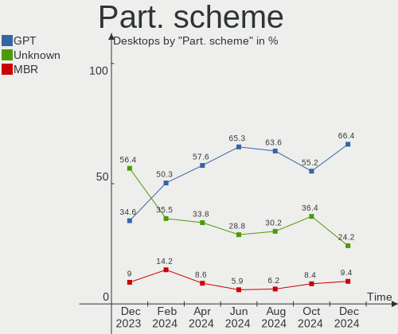
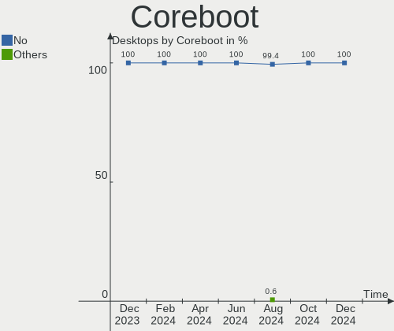
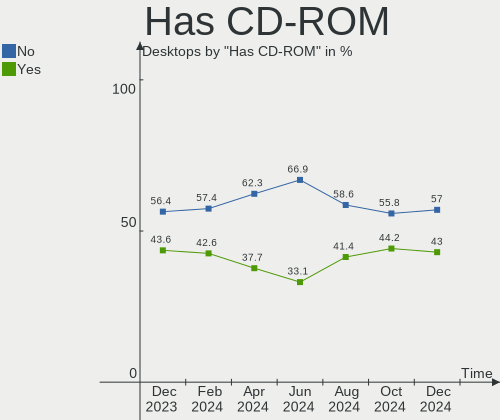
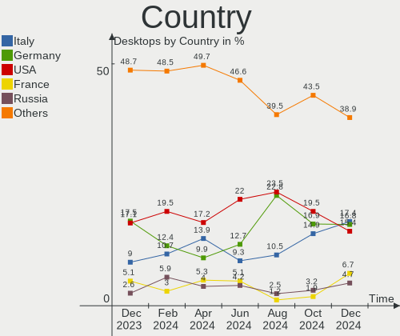
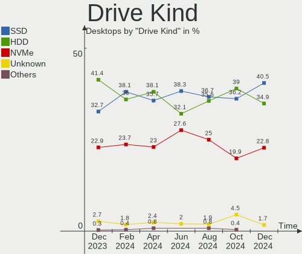
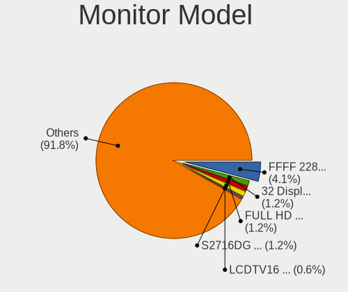
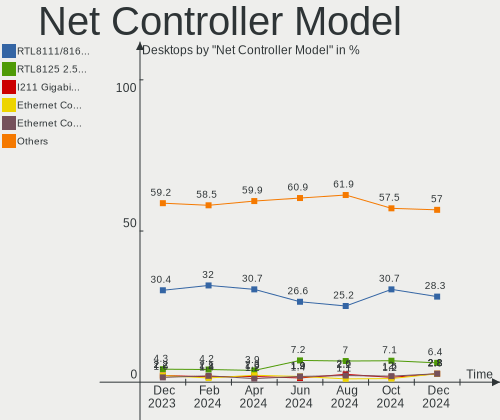
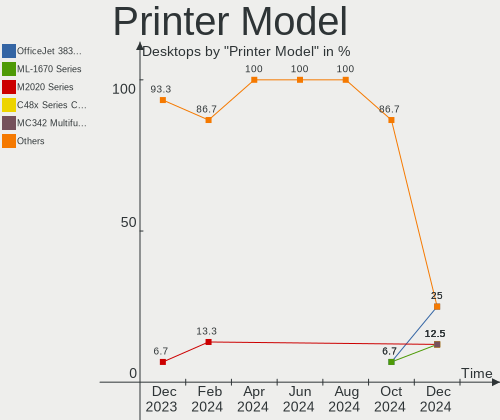

Linux Mint - Hardware Trends (Desktops)
---------------------------------------

A project to identify most popular hardware characteristics and track their change
over time based on data collected by Linux users at https://Linux-Hardware.org.

Anyone can contribute to this report by the [hw-probe](https://github.com/linuxhw/hw-probe) tool:

    sudo -E hw-probe -all -upload

This report is for one last month. Overall report since the beginning of time: [TestCoverage](https://github.com/linuxhw/TestCoverage)

Period: Jun, 2022.

Contents
--------

* [ System ](#system)
  - [ OS                       ](#os)
  - [ OS Family                ](#os-family)
  - [ Kernel                   ](#kernel)
  - [ Kernel Family            ](#kernel-family)
  - [ Kernel Major Ver.        ](#kernel-major-ver)
  - [ Arch                     ](#arch)
  - [ DE                       ](#de)
  - [ Display Server           ](#display-server)
  - [ Display Manager          ](#display-manager)
  - [ OS Lang                  ](#os-lang)
  - [ Boot Mode                ](#boot-mode)
  - [ Filesystem               ](#filesystem)
  - [ Part. scheme             ](#part-scheme)
  - [ Dual Boot with Linux/BSD ](#dual-boot-with-linuxbsd)
  - [ Dual Boot (Win)          ](#dual-boot-win)

* [ Board ](#board)
  - [ Vendor                   ](#vendor)
  - [ Model                    ](#model)
  - [ Model Family             ](#model-family)
  - [ MFG Year                 ](#mfg-year)
  - [ Form Factor              ](#form-factor)
  - [ Secure Boot              ](#secure-boot)
  - [ Coreboot                 ](#coreboot)
  - [ RAM Size                 ](#ram-size)
  - [ RAM Used                 ](#ram-used)
  - [ Total Drives             ](#total-drives)
  - [ Has CD-ROM               ](#has-cd-rom)
  - [ Has Ethernet             ](#has-ethernet)
  - [ Has WiFi                 ](#has-wifi)
  - [ Has Bluetooth            ](#has-bluetooth)

* [ Location ](#location)
  - [ Country                  ](#country)
  - [ City                     ](#city)

* [ Drives ](#drives)
  - [ Drive Vendor             ](#drive-vendor)
  - [ Drive Model              ](#drive-model)
  - [ HDD Vendor               ](#hdd-vendor)
  - [ SSD Vendor               ](#ssd-vendor)
  - [ Drive Kind               ](#drive-kind)
  - [ Drive Connector          ](#drive-connector)
  - [ Drive Size               ](#drive-size)
  - [ Space Total              ](#space-total)
  - [ Space Used               ](#space-used)
  - [ Malfunc. Drives          ](#malfunc-drives)
  - [ Malfunc. Drive Vendor    ](#malfunc-drive-vendor)
  - [ Malfunc. HDD Vendor      ](#malfunc-hdd-vendor)
  - [ Malfunc. Drive Kind      ](#malfunc-drive-kind)
  - [ Failed Drives            ](#failed-drives)
  - [ Failed Drive Vendor      ](#failed-drive-vendor)
  - [ Drive Status             ](#drive-status)

* [ Storage controller ](#storage-controller)
  - [ Storage Vendor           ](#storage-vendor)
  - [ Storage Model            ](#storage-model)
  - [ Storage Kind             ](#storage-kind)

* [ Processor ](#processor)
  - [ CPU Vendor               ](#cpu-vendor)
  - [ CPU Model                ](#cpu-model)
  - [ CPU Model Family         ](#cpu-model-family)
  - [ CPU Cores                ](#cpu-cores)
  - [ CPU Sockets              ](#cpu-sockets)
  - [ CPU Threads              ](#cpu-threads)
  - [ CPU Op-Modes             ](#cpu-op-modes)
  - [ CPU Microcode            ](#cpu-microcode)
  - [ CPU Microarch            ](#cpu-microarch)

* [ Graphics ](#graphics)
  - [ GPU Vendor               ](#gpu-vendor)
  - [ GPU Model                ](#gpu-model)
  - [ GPU Combo                ](#gpu-combo)
  - [ GPU Driver               ](#gpu-driver)
  - [ GPU Memory               ](#gpu-memory)

* [ Monitor ](#monitor)
  - [ Monitor Vendor           ](#monitor-vendor)
  - [ Monitor Model            ](#monitor-model)
  - [ Monitor Resolution       ](#monitor-resolution)
  - [ Monitor Diagonal         ](#monitor-diagonal)
  - [ Monitor Width            ](#monitor-width)
  - [ Aspect Ratio             ](#aspect-ratio)
  - [ Monitor Area             ](#monitor-area)
  - [ Pixel Density            ](#pixel-density)
  - [ Multiple Monitors        ](#multiple-monitors)

* [ Network ](#network)
  - [ Net Controller Vendor    ](#net-controller-vendor)
  - [ Net Controller Model     ](#net-controller-model)
  - [ Wireless Vendor          ](#wireless-vendor)
  - [ Wireless Model           ](#wireless-model)
  - [ Ethernet Vendor          ](#ethernet-vendor)
  - [ Ethernet Model           ](#ethernet-model)
  - [ Net Controller Kind      ](#net-controller-kind)
  - [ Used Controller          ](#used-controller)
  - [ NICs                     ](#nics)
  - [ IPv6                     ](#ipv6)

* [ Bluetooth ](#bluetooth)
  - [ Bluetooth Vendor         ](#bluetooth-vendor)
  - [ Bluetooth Model          ](#bluetooth-model)

* [ Sound ](#sound)
  - [ Sound Vendor             ](#sound-vendor)
  - [ Sound Model              ](#sound-model)

* [ Memory ](#memory)
  - [ Memory Vendor            ](#memory-vendor)
  - [ Memory Model             ](#memory-model)
  - [ Memory Kind              ](#memory-kind)
  - [ Memory Form Factor       ](#memory-form-factor)
  - [ Memory Size              ](#memory-size)
  - [ Memory Speed             ](#memory-speed)

* [ Printers & scanners ](#printers--scanners)
  - [ Printer Vendor           ](#printer-vendor)
  - [ Printer Model            ](#printer-model)
  - [ Scanner Vendor           ](#scanner-vendor)
  - [ Scanner Model            ](#scanner-model)

* [ Camera ](#camera)
  - [ Camera Vendor            ](#camera-vendor)
  - [ Camera Model             ](#camera-model)

* [ Security ](#security)
  - [ Fingerprint Vendor       ](#fingerprint-vendor)
  - [ Fingerprint Model        ](#fingerprint-model)
  - [ Chipcard Vendor          ](#chipcard-vendor)
  - [ Chipcard Model           ](#chipcard-model)

* [ Unsupported ](#unsupported)
  - [ Unsupported Devices      ](#unsupported-devices)
  - [ Unsupported Device Types ](#unsupported-device-types)

System
------

OS
--

Installed operating systems

| Name            | Desktops | Percent |
|-----------------|----------|---------|
| Linux Mint 20.3 | 126      | 79.25%  |
| Linux Mint 19.3 | 9        | 5.66%   |
| Linux Mint 20.2 | 7        | 4.4%    |
| Linux Mint 20.1 | 7        | 4.4%    |
| Linux Mint 20   | 6        | 3.77%   |
| Linux Mint 19.2 | 1        | 0.63%   |
| Linux Mint 19.1 | 1        | 0.63%   |
| Linux Mint 19   | 1        | 0.63%   |
| Linux Mint 18.3 | 1        | 0.63%   |

OS Family
---------

OS without a version

| Name       | Desktops | Percent |
|------------|----------|---------|
| Linux Mint | 159      | 100%    |

Kernel
------

Version of the Linux kernel

| Version              | Desktops | Percent |
|----------------------|----------|---------|
| 5.4.0-121-generic    | 26       | 16.35%  |
| 5.4.0-113-generic    | 26       | 16.35%  |
| 5.4.0-117-generic    | 24       | 15.09%  |
| 5.4.0-120-generic    | 19       | 11.95%  |
| 5.15.0-33-generic    | 15       | 9.43%   |
| 5.4.0-110-generic    | 7        | 4.4%    |
| 5.4.0-91-generic     | 6        | 3.77%   |
| 5.13.0-51-generic    | 3        | 1.89%   |
| 5.13.0-27-generic    | 3        | 1.89%   |
| 5.4.0-74-generic     | 2        | 1.26%   |
| 5.4.0-104-generic    | 2        | 1.26%   |
| 5.14.0-1042-oem      | 2        | 1.26%   |
| 5.13.0-48-generic    | 2        | 1.26%   |
| 5.13.0-25-generic    | 2        | 1.26%   |
| 4.15.0-188-generic   | 2        | 1.26%   |
| 5.7.1-050701-generic | 1        | 0.63%   |
| 5.4.197-tkg-bmq      | 1        | 0.63%   |
| 5.4.0-99-generic     | 1        | 0.63%   |
| 5.4.0-96-generic     | 1        | 0.63%   |
| 5.4.0-94-generic     | 1        | 0.63%   |
| 5.4.0-89-generic     | 1        | 0.63%   |
| 5.4.0-81-generic     | 1        | 0.63%   |
| 5.4.0-80-generic     | 1        | 0.63%   |
| 5.4.0-58-generic     | 1        | 0.63%   |
| 5.4.0-109-generic    | 1        | 0.63%   |
| 5.4.0-107-generic    | 1        | 0.63%   |
| 5.17.9-xanmod1       | 1        | 0.63%   |
| 5.17.14-xanmod1      | 1        | 0.63%   |
| 5.13.0-30-generic    | 1        | 0.63%   |
| 5.11.0-27-generic    | 1        | 0.63%   |
| 5.0.0-23-generic     | 1        | 0.63%   |
| 4.15.0-180-generic   | 1        | 0.63%   |
| 4.10.0-38-generic    | 1        | 0.63%   |

Kernel Family
-------------

Linux kernel without a distro release

| Version | Desktops | Percent |
|---------|----------|---------|
| 5.4.0   | 121      | 76.1%   |
| 5.15.0  | 15       | 9.43%   |
| 5.13.0  | 11       | 6.92%   |
| 4.15.0  | 3        | 1.89%   |
| 5.14.0  | 2        | 1.26%   |
| 5.7.1   | 1        | 0.63%   |
| 5.4.197 | 1        | 0.63%   |
| 5.17.9  | 1        | 0.63%   |
| 5.17.14 | 1        | 0.63%   |
| 5.11.0  | 1        | 0.63%   |
| 5.0.0   | 1        | 0.63%   |
| 4.10.0  | 1        | 0.63%   |

Kernel Major Ver.
-----------------

Linux kernel major version

| Version | Desktops | Percent |
|---------|----------|---------|
| 5.4     | 122      | 76.73%  |
| 5.15    | 15       | 9.43%   |
| 5.13    | 11       | 6.92%   |
| 4.15    | 3        | 1.89%   |
| 5.17    | 2        | 1.26%   |
| 5.14    | 2        | 1.26%   |
| 5.7     | 1        | 0.63%   |
| 5.11    | 1        | 0.63%   |
| 5.0     | 1        | 0.63%   |
| 4.10    | 1        | 0.63%   |

Arch
----

OS architecture (x86_64, i586, etc.)

| Name   | Desktops | Percent |
|--------|----------|---------|
| x86_64 | 157      | 98.74%  |
| i686   | 2        | 1.26%   |

DE
--

Desktop Environment

| Name       | Desktops | Percent |
|------------|----------|---------|
| X-Cinnamon | 104      | 65.41%  |
| MATE       | 20       | 12.58%  |
| Cinnamon   | 16       | 10.06%  |
| XFCE       | 15       | 9.43%   |
| Unknown    | 2        | 1.26%   |
| KDE        | 1        | 0.63%   |
| Budgie     | 1        | 0.63%   |

Display Server
--------------

X11 or Wayland

| Name | Desktops | Percent |
|------|----------|---------|
| X11  | 156      | 98.11%  |
| Tty  | 3        | 1.89%   |

Display Manager
---------------

SDDM, LightDM, etc.

| Name    | Desktops | Percent |
|---------|----------|---------|
| Unknown | 91       | 57.23%  |
| LightDM | 67       | 42.14%  |
| SDDM    | 1        | 0.63%   |

OS Lang
-------

Language

| Lang    | Desktops | Percent |
|---------|----------|---------|
| en_US   | 53       | 33.33%  |
| de_DE   | 25       | 15.72%  |
| ru_RU   | 13       | 8.18%   |
| pt_BR   | 9        | 5.66%   |
| en_GB   | 7        | 4.4%    |
| C       | 7        | 4.4%    |
| es_ES   | 6        | 3.77%   |
| fr_FR   | 5        | 3.14%   |
| en_AU   | 5        | 3.14%   |
| en_CA   | 4        | 2.52%   |
| en_ZA   | 3        | 1.89%   |
| it_IT   | 2        | 1.26%   |
| es_MX   | 2        | 1.26%   |
| es_AR   | 2        | 1.26%   |
| en_NZ   | 2        | 1.26%   |
| en_IE   | 2        | 1.26%   |
| de_AT   | 2        | 1.26%   |
| pl_PL   | 1        | 0.63%   |
| nl_NL   | 1        | 0.63%   |
| fr_BE   | 1        | 0.63%   |
| fi_FI   | 1        | 0.63%   |
| es_VE   | 1        | 0.63%   |
| es_CL   | 1        | 0.63%   |
| da_DK   | 1        | 0.63%   |
| cs_CZ   | 1        | 0.63%   |
| bg_BG   | 1        | 0.63%   |
| Unknown | 1        | 0.63%   |

Boot Mode
---------

EFI or BIOS

| Mode | Desktops | Percent |
|------|----------|---------|
| BIOS | 88       | 55.35%  |
| EFI  | 71       | 44.65%  |

Filesystem
----------

Type of filesystem

| Type    | Desktops | Percent |
|---------|----------|---------|
| Ext4    | 147      | 92.45%  |
| Overlay | 5        | 3.14%   |
| Btrfs   | 5        | 3.14%   |
| Ext3    | 2        | 1.26%   |

Part. scheme
------------

Scheme of partitioning

| Type    | Desktops | Percent |
|---------|----------|---------|
| Unknown | 100      | 62.89%  |
| GPT     | 40       | 25.16%  |
| MBR     | 19       | 11.95%  |

Dual Boot with Linux/BSD
------------------------

Hosting more than one Linux/BSD

| Dual boot | Desktops | Percent |
|-----------|----------|---------|
| No        | 146      | 91.82%  |
| Yes       | 13       | 8.18%   |

Dual Boot (Win)
---------------

Hosting Linux and Windows

| Dual boot | Desktops | Percent |
|-----------|----------|---------|
| No        | 126      | 79.25%  |
| Yes       | 33       | 20.75%  |

Board
-----

Vendor
------

Motherboard manufacturer

| Name                | Desktops | Percent |
|---------------------|----------|---------|
| Gigabyte Technology | 26       | 16.35%  |
| ASUSTek Computer    | 26       | 16.35%  |
| ASRock              | 22       | 13.84%  |
| MSI                 | 20       | 12.58%  |
| Hewlett-Packard     | 18       | 11.32%  |
| Dell                | 18       | 11.32%  |
| Intel               | 6        | 3.77%   |
| Acer                | 5        | 3.14%   |
| Lenovo              | 4        | 2.52%   |
| Pegatron            | 2        | 1.26%   |
| TPV-INVENTA         | 1        | 0.63%   |
| Shuttle             | 1        | 0.63%   |
| PCWare              | 1        | 0.63%   |
| Medion              | 1        | 0.63%   |
| Hardkernel          | 1        | 0.63%   |
| Fujitsu             | 1        | 0.63%   |
| Foxconn             | 1        | 0.63%   |
| ECS                 | 1        | 0.63%   |
| Biostar             | 1        | 0.63%   |
| AZW                 | 1        | 0.63%   |
| Apple               | 1        | 0.63%   |
| AMI                 | 1        | 0.63%   |

Model
-----

Motherboard model

| Name                                | Desktops | Percent |
|-------------------------------------|----------|---------|
| Dell Inspiron 660                   | 3        | 1.89%   |
| MSI MS-7C95                         | 2        | 1.26%   |
| MSI MS-7C94                         | 2        | 1.26%   |
| MSI MS-7C91                         | 2        | 1.26%   |
| HP Z420 Workstation                 | 2        | 1.26%   |
| HP Compaq 8200 Elite USDT PC        | 2        | 1.26%   |
| Gigabyte GA-78LMT-USB3              | 2        | 1.26%   |
| ASUS PRIME X570-P                   | 2        | 1.26%   |
| ASRock X470 Gaming K4               | 2        | 1.26%   |
| TPV-INVENTA CQ1-3108LA              | 1        | 0.63%   |
| Shuttle XH61V                       | 1        | 0.63%   |
| Pegatron FZ084AA-ABF a6645fr        | 1        | 0.63%   |
| Pegatron AY627AA-ABA a4313w         | 1        | 0.63%   |
| PCWare IPMH61R3                     | 1        | 0.63%   |
| MSI MS-7C96                         | 1        | 0.63%   |
| MSI MS-7C52                         | 1        | 0.63%   |
| MSI MS-7C37                         | 1        | 0.63%   |
| MSI MS-7C35                         | 1        | 0.63%   |
| MSI MS-7C02                         | 1        | 0.63%   |
| MSI MS-7B86                         | 1        | 0.63%   |
| MSI MS-7B33                         | 1        | 0.63%   |
| MSI MS-7A38                         | 1        | 0.63%   |
| MSI MS-7A37                         | 1        | 0.63%   |
| MSI MS-7818                         | 1        | 0.63%   |
| MSI MS-7817                         | 1        | 0.63%   |
| MSI MS-7758                         | 1        | 0.63%   |
| MSI MS-7693                         | 1        | 0.63%   |
| MSI MS-7641                         | 1        | 0.63%   |
| Medion P961x                        | 1        | 0.63%   |
| Lenovo ThinkStation P310 30AV000RMZ | 1        | 0.63%   |
| Lenovo ThinkStation C30 11361H1     | 1        | 0.63%   |
| Lenovo ThinkCentre M73z 10BBA0XNCS  | 1        | 0.63%   |
| Lenovo ThinkCentre M57p 9088B2U     | 1        | 0.63%   |
| Intel X99 V1.0                      | 1        | 0.63%   |
| Intel H61                           | 1        | 0.63%   |
| Intel H55                           | 1        | 0.63%   |
| Intel DX58SO AAE29331-703           | 1        | 0.63%   |
| Intel DH55TC AAE70932-206           | 1        | 0.63%   |
| Intel D2550MUD2 AAG73892-600        | 1        | 0.63%   |
| HP Z800 Workstation                 | 1        | 0.63%   |
| HP Z220 CMT Workstation             | 1        | 0.63%   |
| HP ProDesk 600 G2 MT                | 1        | 0.63%   |
| HP ProDesk 600 G1 SFF               | 1        | 0.63%   |
| HP ProDesk 400 G4 SFF               | 1        | 0.63%   |
| HP EliteDesk 800 G1 DM              | 1        | 0.63%   |
| HP EliteDesk 705 G3 SFF             | 1        | 0.63%   |
| HP EliteDesk 705 G1 SFF             | 1        | 0.63%   |
| HP Desktop M01-F0xxx                | 1        | 0.63%   |
| HP Compaq Pro 6300 MT               | 1        | 0.63%   |
| HP Compaq Elite 8300 SFF            | 1        | 0.63%   |
| HP Compaq 8200 Elite SFF PC         | 1        | 0.63%   |
| HP 550-a114                         | 1        | 0.63%   |
| HP 23-f391la                        | 1        | 0.63%   |
| Hardkernel ODROID-H2                | 1        | 0.63%   |
| Gigabyte Z97-HD3P                   | 1        | 0.63%   |
| Gigabyte Z87X-D3H                   | 1        | 0.63%   |
| Gigabyte Z68X-UD3H-B3               | 1        | 0.63%   |
| Gigabyte X570 AORUS MASTER          | 1        | 0.63%   |
| Gigabyte M57SLI-S4                  | 1        | 0.63%   |
| Gigabyte H81M-S1                    | 1        | 0.63%   |

Model Family
------------

Motherboard model prefix

| Name                   | Desktops | Percent |
|------------------------|----------|---------|
| Dell OptiPlex          | 9        | 5.66%   |
| ASUS TUF               | 6        | 3.77%   |
| HP Compaq              | 5        | 3.14%   |
| ASUS PRIME             | 5        | 3.14%   |
| Acer Aspire            | 5        | 3.14%   |
| Dell Precision         | 4        | 2.52%   |
| Dell Inspiron          | 4        | 2.52%   |
| ASUS ROG               | 4        | 2.52%   |
| HP ProDesk             | 3        | 1.89%   |
| HP EliteDesk           | 3        | 1.89%   |
| MSI MS-7C95            | 2        | 1.26%   |
| MSI MS-7C94            | 2        | 1.26%   |
| MSI MS-7C91            | 2        | 1.26%   |
| Lenovo ThinkStation    | 2        | 1.26%   |
| Lenovo ThinkCentre     | 2        | 1.26%   |
| HP Z420                | 2        | 1.26%   |
| Gigabyte GA-78LMT-USB3 | 2        | 1.26%   |
| Gigabyte B550          | 2        | 1.26%   |
| ASUS P5KPL-AM          | 2        | 1.26%   |
| ASRock Z77             | 2        | 1.26%   |
| ASRock X470            | 2        | 1.26%   |
| ASRock B450M           | 2        | 1.26%   |
| TPV-INVENTA CQ1-3108LA | 1        | 0.63%   |
| Shuttle XH61V          | 1        | 0.63%   |
| Pegatron FZ084AA-ABF   | 1        | 0.63%   |
| Pegatron AY627AA-ABA   | 1        | 0.63%   |
| PCWare IPMH61R3        | 1        | 0.63%   |
| MSI MS-7C96            | 1        | 0.63%   |
| MSI MS-7C52            | 1        | 0.63%   |
| MSI MS-7C37            | 1        | 0.63%   |
| MSI MS-7C35            | 1        | 0.63%   |
| MSI MS-7C02            | 1        | 0.63%   |
| MSI MS-7B86            | 1        | 0.63%   |
| MSI MS-7B33            | 1        | 0.63%   |
| MSI MS-7A38            | 1        | 0.63%   |
| MSI MS-7A37            | 1        | 0.63%   |
| MSI MS-7818            | 1        | 0.63%   |
| MSI MS-7817            | 1        | 0.63%   |
| MSI MS-7758            | 1        | 0.63%   |
| MSI MS-7693            | 1        | 0.63%   |
| MSI MS-7641            | 1        | 0.63%   |
| Medion P961x           | 1        | 0.63%   |
| Intel X99              | 1        | 0.63%   |
| Intel H61              | 1        | 0.63%   |
| Intel H55              | 1        | 0.63%   |
| Intel DX58SO           | 1        | 0.63%   |
| Intel DH55TC           | 1        | 0.63%   |
| Intel D2550MUD2        | 1        | 0.63%   |
| HP Z800                | 1        | 0.63%   |
| HP Z220                | 1        | 0.63%   |
| HP Desktop             | 1        | 0.63%   |
| HP 550-a114            | 1        | 0.63%   |
| HP 23-f391la           | 1        | 0.63%   |
| Hardkernel ODROID-H2   | 1        | 0.63%   |
| Gigabyte Z97-HD3P      | 1        | 0.63%   |
| Gigabyte Z87X-D3H      | 1        | 0.63%   |
| Gigabyte Z68X-UD3H-B3  | 1        | 0.63%   |
| Gigabyte X570          | 1        | 0.63%   |
| Gigabyte M57SLI-S4     | 1        | 0.63%   |
| Gigabyte H81M-S1       | 1        | 0.63%   |

MFG Year
--------

Motherboard manufacture year

| Year | Desktops | Percent |
|------|----------|---------|
| 2020 | 21       | 13.21%  |
| 2012 | 18       | 11.32%  |
| 2019 | 16       | 10.06%  |
| 2018 | 16       | 10.06%  |
| 2014 | 11       | 6.92%   |
| 2013 | 11       | 6.92%   |
| 2011 | 10       | 6.29%   |
| 2010 | 9        | 5.66%   |
| 2008 | 9        | 5.66%   |
| 2017 | 8        | 5.03%   |
| 2021 | 7        | 4.4%    |
| 2009 | 6        | 3.77%   |
| 2016 | 5        | 3.14%   |
| 2015 | 5        | 3.14%   |
| 2007 | 3        | 1.89%   |
| 2006 | 3        | 1.89%   |
| 2004 | 1        | 0.63%   |

Form Factor
-----------

Physical design of the computer

| Name    | Desktops | Percent |
|---------|----------|---------|
| Desktop | 159      | 100%    |

Secure Boot
-----------

Enabled or disabled

| State    | Desktops | Percent |
|----------|----------|---------|
| Disabled | 151      | 94.97%  |
| Enabled  | 8        | 5.03%   |

Coreboot
--------

Have coreboot on board

| Used | Desktops | Percent |
|------|----------|---------|
| No   | 159      | 100%    |

RAM Size
--------

Total RAM memory

| Size in GB  | Desktops | Percent |
|-------------|----------|---------|
| 16.01-24.0  | 40       | 25.16%  |
| 8.01-16.0   | 37       | 23.27%  |
| 4.01-8.0    | 29       | 18.24%  |
| 32.01-64.0  | 22       | 13.84%  |
| 3.01-4.0    | 18       | 11.32%  |
| 64.01-256.0 | 7        | 4.4%    |
| 24.01-32.0  | 3        | 1.89%   |
| 2.01-3.0    | 1        | 0.63%   |
| 1.01-2.0    | 1        | 0.63%   |
| 0.51-1.0    | 1        | 0.63%   |

RAM Used
--------

Used RAM memory

| Used GB    | Desktops | Percent |
|------------|----------|---------|
| 1.01-2.0   | 54       | 33.96%  |
| 2.01-3.0   | 50       | 31.45%  |
| 4.01-8.0   | 22       | 13.84%  |
| 3.01-4.0   | 19       | 11.95%  |
| 0.51-1.0   | 7        | 4.4%    |
| 8.01-16.0  | 5        | 3.14%   |
| 16.01-24.0 | 2        | 1.26%   |

Total Drives
------------

Number of drives on board

| Drives | Desktops | Percent |
|--------|----------|---------|
| 1      | 63       | 39.62%  |
| 2      | 46       | 28.93%  |
| 3      | 29       | 18.24%  |
| 5      | 9        | 5.66%   |
| 4      | 8        | 5.03%   |
| 9      | 1        | 0.63%   |
| 7      | 1        | 0.63%   |
| 6      | 1        | 0.63%   |
| 0      | 1        | 0.63%   |

Has CD-ROM
----------

Has CD-ROM on board

| Presented | Desktops | Percent |
|-----------|----------|---------|
| Yes       | 91       | 57.23%  |
| No        | 68       | 42.77%  |

Has Ethernet
------------

Has Ethernet on board

| Presented | Desktops | Percent |
|-----------|----------|---------|
| Yes       | 159      | 100%    |

Has WiFi
--------

Has WiFi module

| Presented | Desktops | Percent |
|-----------|----------|---------|
| No        | 83       | 52.2%   |
| Yes       | 76       | 47.8%   |

Has Bluetooth
-------------

Has Bluetooth module

| Presented | Desktops | Percent |
|-----------|----------|---------|
| No        | 102      | 64.15%  |
| Yes       | 57       | 35.85%  |

Location
--------

Country
-------

Geographic location (country)

| Country      | Desktops | Percent |
|--------------|----------|---------|
| USA          | 35       | 22.01%  |
| Germany      | 26       | 16.35%  |
| Brazil       | 14       | 8.81%   |
| Russia       | 13       | 8.18%   |
| UK           | 8        | 5.03%   |
| France       | 7        | 4.4%    |
| Spain        | 6        | 3.77%   |
| Canada       | 5        | 3.14%   |
| Australia    | 5        | 3.14%   |
| Mexico       | 4        | 2.52%   |
| South Africa | 3        | 1.89%   |
| Poland       | 2        | 1.26%   |
| New Zealand  | 2        | 1.26%   |
| Netherlands  | 2        | 1.26%   |
| Italy        | 2        | 1.26%   |
| Austria      | 2        | 1.26%   |
| Argentina    | 2        | 1.26%   |
| Venezuela    | 1        | 0.63%   |
| Thailand     | 1        | 0.63%   |
| Switzerland  | 1        | 0.63%   |
| Slovakia     | 1        | 0.63%   |
| Serbia       | 1        | 0.63%   |
| Romania      | 1        | 0.63%   |
| Nicaragua    | 1        | 0.63%   |
| Morocco      | 1        | 0.63%   |
| Latvia       | 1        | 0.63%   |
| Japan        | 1        | 0.63%   |
| Ireland      | 1        | 0.63%   |
| Iran         | 1        | 0.63%   |
| Finland      | 1        | 0.63%   |
| Denmark      | 1        | 0.63%   |
| Czechia      | 1        | 0.63%   |
| Colombia     | 1        | 0.63%   |
| China        | 1        | 0.63%   |
| Chile        | 1        | 0.63%   |
| Bulgaria     | 1        | 0.63%   |
| Belarus      | 1        | 0.63%   |
| Bangladesh   | 1        | 0.63%   |

City
----

Geographic location (city)

| City                  | Desktops | Percent |
|-----------------------|----------|---------|
| Moscow                | 3        | 1.89%   |
| Berlin                | 3        | 1.89%   |
| Tolyatti              | 2        | 1.26%   |
| Rio de Janeiro        | 2        | 1.26%   |
| Queretaro             | 2        | 1.26%   |
| Munich                | 2        | 1.26%   |
| Magdeburg             | 2        | 1.26%   |
| Hamburg               | 2        | 1.26%   |
| Duncan                | 2        | 1.26%   |
| Centurion             | 2        | 1.26%   |
| Buenos Aires          | 2        | 1.26%   |
| Yokohama              | 1        | 0.63%   |
| Yekaterinburg         | 1        | 0.63%   |
| Wroclaw               | 1        | 0.63%   |
| Worms                 | 1        | 0.63%   |
| Wichita               | 1        | 0.63%   |
| Wetzlar               | 1        | 0.63%   |
| Weston-super-Mare     | 1        | 0.63%   |
| West Monroe           | 1        | 0.63%   |
| Wellingborough        | 1        | 0.63%   |
| Warsaw                | 1        | 0.63%   |
| Waltenhofen           | 1        | 0.63%   |
| Voronezh              | 1        | 0.63%   |
| Vladivostok           | 1        | 0.63%   |
| Viña del Mar         | 1        | 0.63%   |
| Villavedeo            | 1        | 0.63%   |
| Vienna                | 1        | 0.63%   |
| Viamao                | 1        | 0.63%   |
| Ventspils             | 1        | 0.63%   |
| Valencia              | 1        | 0.63%   |
| Ulyanovsk             | 1        | 0.63%   |
| Twickenham            | 1        | 0.63%   |
| Toronto               | 1        | 0.63%   |
| Toledo                | 1        | 0.63%   |
| Tehran                | 1        | 0.63%   |
| St Petersburg         | 1        | 0.63%   |
| St Louis              | 1        | 0.63%   |
| Slagelse              | 1        | 0.63%   |
| Siniscola             | 1        | 0.63%   |
| Shawnee               | 1        | 0.63%   |
| Sant Boi de Llobregat | 1        | 0.63%   |
| San Bernardino        | 1        | 0.63%   |
| Salo                  | 1        | 0.63%   |
| Riverside             | 1        | 0.63%   |
| Raleigh               | 1        | 0.63%   |
| Quissac               | 1        | 0.63%   |
| Queimados             | 1        | 0.63%   |
| Queanbeyan            | 1        | 0.63%   |
| Powder Springs        | 1        | 0.63%   |
| Plymouth              | 1        | 0.63%   |
| Pittsburgh            | 1        | 0.63%   |
| Philadelphia          | 1        | 0.63%   |
| Penticton             | 1        | 0.63%   |
| Paris                 | 1        | 0.63%   |
| Orlando               | 1        | 0.63%   |
| Orange                | 1        | 0.63%   |
| Novosibirsk           | 1        | 0.63%   |
| Norwalk               | 1        | 0.63%   |
| Nizhny Tagil          | 1        | 0.63%   |
| New York              | 1        | 0.63%   |

Drives
------

Drive Vendor
------------

Hard drive vendors

| Vendor                    | Desktops | Drives | Percent |
|---------------------------|----------|--------|---------|
| WDC                       | 56       | 75     | 20.36%  |
| Seagate                   | 55       | 79     | 20%     |
| Samsung Electronics       | 36       | 43     | 13.09%  |
| Kingston                  | 18       | 20     | 6.55%   |
| Crucial                   | 14       | 14     | 5.09%   |
| SanDisk                   | 12       | 15     | 4.36%   |
| Toshiba                   | 11       | 15     | 4%      |
| A-DATA Technology         | 8        | 9      | 2.91%   |
| Intel                     | 5        | 6      | 1.82%   |
| Hitachi                   | 5        | 6      | 1.82%   |
| HGST                      | 5        | 5      | 1.82%   |
| Unknown                   | 4        | 4      | 1.45%   |
| SK hynix                  | 4        | 4      | 1.45%   |
| PNY                       | 4        | 4      | 1.45%   |
| Patriot                   | 3        | 4      | 1.09%   |
| Transcend                 | 2        | 2      | 0.73%   |
| Team                      | 2        | 2      | 0.73%   |
| Realtek Semiconductor     | 2        | 2      | 0.73%   |
| Phison                    | 2        | 2      | 0.73%   |
| Maxtor                    | 2        | 2      | 0.73%   |
| Intenso                   | 2        | 3      | 0.73%   |
| Goodram                   | 2        | 2      | 0.73%   |
| China                     | 2        | 2      | 0.73%   |
| Apacer                    | 2        | 2      | 0.73%   |
| T-FORCE                   | 1        | 1      | 0.36%   |
| SPCC                      | 1        | 1      | 0.36%   |
| SATA3 51                  | 1        | 1      | 0.36%   |
| SABRENT                   | 1        | 1      | 0.36%   |
| OCZ                       | 1        | 1      | 0.36%   |
| Netac                     | 1        | 1      | 0.36%   |
| Micron/Crucial Technology | 1        | 1      | 0.36%   |
| Maxone                    | 1        | 1      | 0.36%   |
| LITEONIT                  | 1        | 1      | 0.36%   |
| Leven                     | 1        | 1      | 0.36%   |
| KingFast                  | 1        | 1      | 0.36%   |
| HUAWEI                    | 1        | 1      | 0.36%   |
| Hewlett-Packard           | 1        | 1      | 0.36%   |
| Fujitsu                   | 1        | 1      | 0.36%   |
| External                  | 1        | 1      | 0.36%   |
| ASMT                      | 1        | 1      | 0.36%   |
| AMD                       | 1        | 1      | 0.36%   |

Drive Model
-----------

Hard drive models

| Model                                        | Desktops | Percent |
|----------------------------------------------|----------|---------|
| Samsung SSD 860 EVO 500GB                    | 6        | 1.87%   |
| Kingston SA400S37240G 240GB SSD              | 5        | 1.56%   |
| Seagate ST2000DM008-2FR102 2TB               | 4        | 1.25%   |
| WDC WD20EZRZ-00Z5HB0 2TB                     | 3        | 0.93%   |
| WDC WD20EARX-00PASB0 2TB                     | 3        | 0.93%   |
| Seagate ST3500413AS 500GB                    | 3        | 0.93%   |
| Seagate ST1000DM003-1ER162 1TB               | 3        | 0.93%   |
| Seagate ST1000DM003-1CH162 1TB               | 3        | 0.93%   |
| Samsung SSD 870 QVO 1TB                      | 3        | 0.93%   |
| Samsung SSD 850 EVO 250GB                    | 3        | 0.93%   |
| Kingston SV300S37A120G 120GB SSD             | 3        | 0.93%   |
| Crucial CT250MX500SSD1 250GB                 | 3        | 0.93%   |
| Crucial CT1000MX500SSD1 1TB                  | 3        | 0.93%   |
| WDC WD5000LPLX-00ZNTT0 500GB                 | 2        | 0.62%   |
| WDC WD10EZRX-00D8PB0 1TB                     | 2        | 0.62%   |
| WDC WD10EZEX-21WN4A0 1TB                     | 2        | 0.62%   |
| WDC WD10EZEX-08WN4A0 1TB                     | 2        | 0.62%   |
| WDC WD10EZEX-00WN4A0 1TB                     | 2        | 0.62%   |
| WDC WD10EARS-00Y5B1 1TB                      | 2        | 0.62%   |
| Unknown SD/MMC/MS PRO 128GB                  | 2        | 0.62%   |
| Toshiba MQ01ABD100 1TB                       | 2        | 0.62%   |
| Toshiba DT01ACA100 1TB                       | 2        | 0.62%   |
| Toshiba DT01ACA050 500GB                     | 2        | 0.62%   |
| SK hynix SC311 SATA 256GB SSD                | 2        | 0.62%   |
| Seagate ST500LM012 HN-M500MBB 500GB          | 2        | 0.62%   |
| Seagate ST500DM002-1BD142 500GB              | 2        | 0.62%   |
| Seagate ST4000DM000-1F2168 4TB               | 2        | 0.62%   |
| Seagate ST3500418AS 500GB                    | 2        | 0.62%   |
| Seagate ST3000DM001-1ER166 3TB               | 2        | 0.62%   |
| Seagate ST2000DM001-1CH164 2TB               | 2        | 0.62%   |
| Seagate ST1000DM010-2EP102 1TB               | 2        | 0.62%   |
| Seagate ST1000DM003-1SB102 1TB               | 2        | 0.62%   |
| Seagate Expansion 1TB                        | 2        | 0.62%   |
| Seagate BarraCuda 120 SSD ZA500CM10003 500GB | 2        | 0.62%   |
| SanDisk SSD PLUS 240GB                       | 2        | 0.62%   |
| SanDisk SDSSDP064G 64GB                      | 2        | 0.62%   |
| Samsung SSD 850 EVO 500GB                    | 2        | 0.62%   |
| Samsung SM963 2.5" NVMe PCIe SSD 500GB       | 2        | 0.62%   |
| Samsung HD252HJ 250GB                        | 2        | 0.62%   |
| Samsung HD080HJ/ 80GB                        | 2        | 0.62%   |
| PNY CS900 500GB SSD                          | 2        | 0.62%   |
| Kingston SV300S37A240G 240GB SSD             | 2        | 0.62%   |
| Kingston SA400S37480G 480GB SSD              | 2        | 0.62%   |
| Kingston SA400S37120G 120GB SSD              | 2        | 0.62%   |
| HGST HUH728080ALE600 8TB                     | 2        | 0.62%   |
| Crucial M4-CT128M4SSD2 128GB                 | 2        | 0.62%   |
| Crucial CT500MX500SSD1 500GB                 | 2        | 0.62%   |
| Crucial CT480BX500SSD1 480GB                 | 2        | 0.62%   |
| A-DATA SU630 240GB SSD                       | 2        | 0.62%   |
| WDC WUH721414ALE604 14TB                     | 1        | 0.31%   |
| WDC WDS500G2B0A-00SM50 500GB SSD             | 1        | 0.31%   |
| WDC WDS500G2B0A 500GB SSD                    | 1        | 0.31%   |
| WDC WDS500G1B0C-00S6U0 500GB                 | 1        | 0.31%   |
| WDC WDS250G2B0B-00YS70 250GB SSD             | 1        | 0.31%   |
| WDC WDS120G2G0A-00JH30 120GB SSD             | 1        | 0.31%   |
| WDC WDS100T2B0A-00SM50 1TB SSD               | 1        | 0.31%   |
| WDC WDBNCE5000PNC 500GB SSD                  | 1        | 0.31%   |
| WDC WD6400AAVS-00G9B1 640GB                  | 1        | 0.31%   |
| WDC WD5002ABYS-01B1B0 500GB                  | 1        | 0.31%   |
| WDC WD5000AZLX-22JKKA0 500GB                 | 1        | 0.31%   |

HDD Vendor
----------

Hard disk drive vendors

| Vendor              | Desktops | Drives | Percent |
|---------------------|----------|--------|---------|
| Seagate             | 55       | 74     | 38.19%  |
| WDC                 | 50       | 66     | 34.72%  |
| Samsung Electronics | 12       | 12     | 8.33%   |
| Toshiba             | 10       | 14     | 6.94%   |
| Hitachi             | 5        | 6      | 3.47%   |
| HGST                | 5        | 5      | 3.47%   |
| Unknown             | 2        | 2      | 1.39%   |
| Maxtor              | 2        | 2      | 1.39%   |
| Maxone              | 1        | 1      | 0.69%   |
| Hewlett-Packard     | 1        | 1      | 0.69%   |
| Fujitsu             | 1        | 1      | 0.69%   |

SSD Vendor
----------

Solid state drive vendors

| Vendor              | Desktops | Drives | Percent |
|---------------------|----------|--------|---------|
| Samsung Electronics | 19       | 21     | 18.1%   |
| Kingston            | 16       | 18     | 15.24%  |
| Crucial             | 14       | 14     | 13.33%  |
| SanDisk             | 10       | 12     | 9.52%   |
| A-DATA Technology   | 7        | 8      | 6.67%   |
| WDC                 | 6        | 7      | 5.71%   |
| SK hynix            | 4        | 4      | 3.81%   |
| Seagate             | 4        | 5      | 3.81%   |
| PNY                 | 4        | 4      | 3.81%   |
| Patriot             | 3        | 4      | 2.86%   |
| Transcend           | 2        | 2      | 1.9%    |
| Team                | 2        | 2      | 1.9%    |
| Intenso             | 2        | 3      | 1.9%    |
| China               | 2        | 2      | 1.9%    |
| Apacer              | 2        | 2      | 1.9%    |
| SATA3 51            | 1        | 1      | 0.95%   |
| OCZ                 | 1        | 1      | 0.95%   |
| Netac               | 1        | 1      | 0.95%   |
| LITEONIT            | 1        | 1      | 0.95%   |
| Leven               | 1        | 1      | 0.95%   |
| Intel               | 1        | 1      | 0.95%   |
| Goodram             | 1        | 1      | 0.95%   |
| AMD                 | 1        | 1      | 0.95%   |

Drive Kind
----------

HDD or SSD

| Kind    | Desktops | Drives | Percent |
|---------|----------|--------|---------|
| HDD     | 109      | 184    | 46.38%  |
| SSD     | 90       | 116    | 38.3%   |
| NVMe    | 31       | 34     | 13.19%  |
| Unknown | 3        | 3      | 1.28%   |
| MMC     | 2        | 2      | 0.85%   |

Drive Connector
---------------

SATA, SAS, NVMe, etc.

| Type | Desktops | Drives | Percent |
|------|----------|--------|---------|
| SATA | 147      | 290    | 76.17%  |
| NVMe | 29       | 32     | 15.03%  |
| SAS  | 15       | 15     | 7.77%   |
| MMC  | 2        | 2      | 1.04%   |

Drive Size
----------

Size of hard drive

| Size in TB | Desktops | Drives | Percent |
|------------|----------|--------|---------|
| 0.01-0.5   | 116      | 169    | 52.02%  |
| 0.51-1.0   | 54       | 65     | 24.22%  |
| 1.01-2.0   | 32       | 34     | 14.35%  |
| 3.01-4.0   | 8        | 14     | 3.59%   |
| 2.01-3.0   | 7        | 8      | 3.14%   |
| 4.01-10.0  | 4        | 5      | 1.79%   |
| 10.01-20.0 | 2        | 5      | 0.9%    |

Space Total
-----------

Amount of disk space available on the file system

| Size in GB     | Desktops | Percent |
|----------------|----------|---------|
| 101-250        | 37       | 23.27%  |
| 251-500        | 30       | 18.87%  |
| 501-1000       | 30       | 18.87%  |
| 1001-2000      | 23       | 14.47%  |
| More than 3000 | 14       | 8.81%   |
| 2001-3000      | 10       | 6.29%   |
| 51-100         | 7        | 4.4%    |
| 21-50          | 3        | 1.89%   |
| 1-20           | 3        | 1.89%   |
| Unknown        | 2        | 1.26%   |

Space Used
----------

Amount of used disk space

| Used GB        | Desktops | Percent |
|----------------|----------|---------|
| 21-50          | 28       | 17.61%  |
| 1-20           | 28       | 17.61%  |
| 101-250        | 23       | 14.47%  |
| 51-100         | 22       | 13.84%  |
| 251-500        | 18       | 11.32%  |
| 501-1000       | 16       | 10.06%  |
| 1001-2000      | 12       | 7.55%   |
| More than 3000 | 8        | 5.03%   |
| 2001-3000      | 2        | 1.26%   |
| Unknown        | 2        | 1.26%   |

Malfunc. Drives
---------------

Drive models with a malfunction

| Model                                 | Desktops | Drives | Percent |
|---------------------------------------|----------|--------|---------|
| WDC WD5002ABYS-01B1B0 500GB           | 1        | 1      | 7.69%   |
| WDC WD5000AZLX-22JKKA0 500GB          | 1        | 1      | 7.69%   |
| WDC WD40EFRX-68WT0N0 4TB              | 1        | 4      | 7.69%   |
| WDC WD2000JD-00HBB0 200GB             | 1        | 1      | 7.69%   |
| WDC WD10EZEX-21WN4A0 1TB              | 1        | 1      | 7.69%   |
| Seagate ST3400832AS 400GB             | 1        | 1      | 7.69%   |
| Seagate ST1000DM003-1SB102 1TB        | 1        | 1      | 7.69%   |
| Samsung Electronics HD753LJ 752GB     | 1        | 1      | 7.69%   |
| Samsung Electronics HD501LJ 500GB     | 1        | 1      | 7.69%   |
| Samsung Electronics HD322HJ 320GB     | 1        | 1      | 7.69%   |
| LITEONIT LCT-256M3S 2.5 7mm 256GB SSD | 1        | 1      | 7.69%   |
| Hitachi HUA723020ALA641 2TB           | 1        | 1      | 7.69%   |
| Crucial M4-CT128M4SSD2 128GB          | 1        | 1      | 7.69%   |

Malfunc. Drive Vendor
---------------------

Vendors of faulty drives

| Vendor              | Desktops | Drives | Percent |
|---------------------|----------|--------|---------|
| WDC                 | 5        | 8      | 38.46%  |
| Samsung Electronics | 3        | 3      | 23.08%  |
| Seagate             | 2        | 2      | 15.38%  |
| LITEONIT            | 1        | 1      | 7.69%   |
| Hitachi             | 1        | 1      | 7.69%   |
| Crucial             | 1        | 1      | 7.69%   |

Malfunc. HDD Vendor
-------------------

Vendors of faulty HDD drives

| Vendor              | Desktops | Drives | Percent |
|---------------------|----------|--------|---------|
| WDC                 | 5        | 8      | 45.45%  |
| Samsung Electronics | 3        | 3      | 27.27%  |
| Seagate             | 2        | 2      | 18.18%  |
| Hitachi             | 1        | 1      | 9.09%   |

Malfunc. Drive Kind
-------------------

Kinds of faulty drives

| Kind | Desktops | Drives | Percent |
|------|----------|--------|---------|
| HDD  | 9        | 14     | 81.82%  |
| SSD  | 2        | 2      | 18.18%  |

Failed Drives
-------------

Failed drive models

| Model                             | Desktops | Drives | Percent |
|-----------------------------------|----------|--------|---------|
| Samsung Electronics HD252HJ 250GB | 1        | 1      | 100%    |

Failed Drive Vendor
-------------------

Failed drive vendors

| Vendor              | Desktops | Drives | Percent |
|---------------------|----------|--------|---------|
| Samsung Electronics | 1        | 1      | 100%    |

Drive Status
------------

Number of failed and malfunc. drives

| Status   | Desktops | Drives | Percent |
|----------|----------|--------|---------|
| Detected | 104      | 207    | 60.47%  |
| Works    | 56       | 115    | 32.56%  |
| Malfunc  | 11       | 16     | 6.4%    |
| Failed   | 1        | 1      | 0.58%   |

Storage controller
------------------

Storage Vendor
--------------

Storage controller vendors

| Vendor                       | Desktops | Percent |
|------------------------------|----------|---------|
| Intel                        | 98       | 49%     |
| AMD                          | 58       | 29%     |
| Samsung Electronics          | 10       | 5%      |
| SanDisk                      | 4        | 2%      |
| Phison Electronics           | 4        | 2%      |
| Marvell Technology Group     | 4        | 2%      |
| JMicron Technology           | 4        | 2%      |
| ASMedia Technology           | 4        | 2%      |
| Realtek Semiconductor        | 3        | 1.5%    |
| VIA Technologies             | 2        | 1%      |
| Nvidia                       | 2        | 1%      |
| LSI Logic / Symbios Logic    | 2        | 1%      |
| Kingston Technology Company  | 2        | 1%      |
| Toshiba America Info Systems | 1        | 0.5%    |
| Shenzhen Longsys Electronics | 1        | 0.5%    |
| Micron/Crucial Technology    | 1        | 0.5%    |

Storage Model
-------------

Storage controller models

| Model                                                                            | Desktops | Percent |
|----------------------------------------------------------------------------------|----------|---------|
| AMD FCH SATA Controller [AHCI mode]                                              | 25       | 9.92%   |
| AMD 400 Series Chipset SATA Controller                                           | 14       | 5.56%   |
| AMD 500 Series Chipset SATA Controller                                           | 13       | 5.16%   |
| Intel 8 Series/C220 Series Chipset Family 6-port SATA Controller 1 [AHCI mode]   | 11       | 4.37%   |
| AMD SB7x0/SB8x0/SB9x0 IDE Controller                                             | 11       | 4.37%   |
| Intel 7 Series/C210 Series Chipset Family 6-port SATA Controller [AHCI mode]     | 9        | 3.57%   |
| Samsung NVMe SSD Controller SM981/PM981/PM983                                    | 8        | 3.17%   |
| Intel SATA Controller [RAID mode]                                                | 8        | 3.17%   |
| Intel 6 Series/C200 Series Chipset Family 6 port Desktop SATA AHCI Controller    | 8        | 3.17%   |
| AMD SB7x0/SB8x0/SB9x0 SATA Controller [IDE mode]                                 | 8        | 3.17%   |
| Intel NM10/ICH7 Family SATA Controller [IDE mode]                                | 6        | 2.38%   |
| Intel Cannon Lake PCH SATA AHCI Controller                                       | 6        | 2.38%   |
| Intel Q170/Q150/B150/H170/H110/Z170/CM236 Chipset SATA Controller [AHCI Mode]    | 5        | 1.98%   |
| Intel 5 Series/3400 Series Chipset 4 port SATA IDE Controller                    | 4        | 1.59%   |
| Intel 5 Series/3400 Series Chipset 2 port SATA IDE Controller                    | 4        | 1.59%   |
| Intel 200 Series PCH SATA controller [AHCI mode]                                 | 4        | 1.59%   |
| ASMedia ASM1062 Serial ATA Controller                                            | 4        | 1.59%   |
| AMD SB7x0/SB8x0/SB9x0 SATA Controller [AHCI mode]                                | 4        | 1.59%   |
| Phison E12 NVMe Controller                                                       | 3        | 1.19%   |
| JMicron JMB363 SATA/IDE Controller                                               | 3        | 1.19%   |
| Intel C602 chipset 4-Port SATA Storage Control Unit                              | 3        | 1.19%   |
| Intel C600/X79 series chipset SATA RAID Controller                               | 3        | 1.19%   |
| Intel 82801G (ICH7 Family) IDE Controller                                        | 3        | 1.19%   |
| AMD FCH SATA Controller D                                                        | 3        | 1.19%   |
| AMD 300 Series Chipset SATA Controller                                           | 3        | 1.19%   |
| SanDisk WD Blue SN500 / PC SN520 NVMe SSD                                        | 2        | 0.79%   |
| Realtek Realtek Non-Volatile memory controller                                   | 2        | 0.79%   |
| Marvell Group 88SE9172 SATA III 6Gb/s RAID Controller                            | 2        | 0.79%   |
| LSI Logic / Symbios Logic SAS1068E PCI-Express Fusion-MPT SAS                    | 2        | 0.79%   |
| Intel SSD Pro 7600p/760p/E 6100p Series                                          | 2        | 0.79%   |
| Intel Celeron/Pentium Silver Processor SATA Controller                           | 2        | 0.79%   |
| Intel C600/X79 series chipset IDE-r Controller                                   | 2        | 0.79%   |
| Intel 9 Series Chipset Family SATA Controller [AHCI Mode]                        | 2        | 0.79%   |
| Intel 82801JI (ICH10 Family) SATA AHCI Controller                                | 2        | 0.79%   |
| Intel 82801IB (ICH9) 4 port SATA Controller [AHCI mode]                          | 2        | 0.79%   |
| Intel 7 Series/C210 Series Chipset Family 4-port SATA Controller [IDE mode]      | 2        | 0.79%   |
| Intel 7 Series/C210 Series Chipset Family 2-port SATA Controller [IDE mode]      | 2        | 0.79%   |
| Intel 500 Series Chipset Family SATA AHCI Controller                             | 2        | 0.79%   |
| Intel 5 Series/3400 Series Chipset 6 port SATA AHCI Controller                   | 2        | 0.79%   |
| Intel 400 Series Chipset Family SATA AHCI Controller                             | 2        | 0.79%   |
| AMD FCH SATA Controller [IDE mode]                                               | 2        | 0.79%   |
| VIA VT82C586A/B/VT82C686/A/B/VT823x/A/C PIPC Bus Master IDE                      | 1        | 0.4%    |
| VIA VT8237A SATA 2-Port Controller                                               | 1        | 0.4%    |
| VIA VT6415 PATA IDE Host Controller                                              | 1        | 0.4%    |
| Toshiba America Info Systems Toshiba America Info Non-Volatile memory controller | 1        | 0.4%    |
| Shenzhen Longsys SM2263EN/SM2263XT-based OEM SSD                                 | 1        | 0.4%    |
| SanDisk WD PC SN810 / Black SN850 NVMe SSD                                       | 1        | 0.4%    |
| SanDisk WD Blue SN550 NVMe SSD                                                   | 1        | 0.4%    |
| Samsung NVMe SSD Controller PM9A1/PM9A3/980PRO                                   | 1        | 0.4%    |
| Samsung NVMe SSD Controller 980                                                  | 1        | 0.4%    |
| Realtek RTS5763DL NVMe SSD Controller                                            | 1        | 0.4%    |
| Phison E18 PCIe4 NVMe Controller                                                 | 1        | 0.4%    |
| Nvidia MCP61 SATA Controller                                                     | 1        | 0.4%    |
| Nvidia MCP55 SATA Controller                                                     | 1        | 0.4%    |
| Nvidia MCP55 IDE                                                                 | 1        | 0.4%    |
| Micron/Crucial P2 NVMe PCIe SSD                                                  | 1        | 0.4%    |
| Marvell Group 88SE9215 PCIe 2.0 x1 4-port SATA 6 Gb/s Controller                 | 1        | 0.4%    |
| Marvell Group 88SE6111/6121 SATA II / PATA Controller                            | 1        | 0.4%    |
| Kingston Company U-SNS8154P3 NVMe SSD                                            | 1        | 0.4%    |
| Kingston Company Company Non-Volatile memory controller                          | 1        | 0.4%    |

Storage Kind
------------

Kind of storage controller (IDE, SATA, NVMe, SAS, ...)

| Kind | Desktops | Percent |
|------|----------|---------|
| SATA | 123      | 57.75%  |
| IDE  | 41       | 19.25%  |
| NVMe | 29       | 13.62%  |
| RAID | 15       | 7.04%   |
| SAS  | 3        | 1.41%   |
| SCSI | 2        | 0.94%   |

Processor
---------

CPU Vendor
----------

Processor vendors

| Vendor | Desktops | Percent |
|--------|----------|---------|
| Intel  | 99       | 62.26%  |
| AMD    | 60       | 37.74%  |

CPU Model
---------

Processor models

| Model                                       | Desktops | Percent |
|---------------------------------------------|----------|---------|
| AMD Ryzen 7 3700X 8-Core Processor          | 5        | 3.14%   |
| Intel Core i7-3770 CPU @ 3.40GHz            | 4        | 2.52%   |
| Intel Core i5-4570 CPU @ 3.20GHz            | 4        | 2.52%   |
| AMD Ryzen 5 3600 6-Core Processor           | 4        | 2.52%   |
| Intel Core i5-3470 CPU @ 3.20GHz            | 3        | 1.89%   |
| Intel Core i5-3330 CPU @ 3.00GHz            | 3        | 1.89%   |
| AMD Ryzen 7 5700G with Radeon Graphics      | 3        | 1.89%   |
| AMD Ryzen 7 2700X Eight-Core Processor      | 3        | 1.89%   |
| AMD Ryzen 5 5600G with Radeon Graphics      | 3        | 1.89%   |
| AMD Ryzen 5 5600 6-Core Processor           | 3        | 1.89%   |
| AMD FX-6300 Six-Core Processor              | 3        | 1.89%   |
| Intel Pentium 4 CPU 3.00GHz                 | 2        | 1.26%   |
| Intel Core i7-7700 CPU @ 3.60GHz            | 2        | 1.26%   |
| Intel Core i7-6700 CPU @ 3.40GHz            | 2        | 1.26%   |
| Intel Core i7-4790 CPU @ 3.60GHz            | 2        | 1.26%   |
| Intel Core i5-6500 CPU @ 3.20GHz            | 2        | 1.26%   |
| Intel Core i5-2500K CPU @ 3.30GHz           | 2        | 1.26%   |
| Intel Core i5-2400 CPU @ 3.10GHz            | 2        | 1.26%   |
| Intel Core i3 CPU 530 @ 2.93GHz             | 2        | 1.26%   |
| Intel Core 2 Quad CPU Q8200 @ 2.33GHz       | 2        | 1.26%   |
| Intel Core 2 Duo CPU E7500 @ 2.93GHz        | 2        | 1.26%   |
| AMD Ryzen 7 5800X 8-Core Processor          | 2        | 1.26%   |
| AMD Ryzen 5 3400G with Radeon Vega Graphics | 2        | 1.26%   |
| AMD Ryzen 5 2600 Six-Core Processor         | 2        | 1.26%   |
| AMD Ryzen 5 1600 Six-Core Processor         | 2        | 1.26%   |
| AMD Ryzen 3 2200G with Radeon Vega Graphics | 2        | 1.26%   |
| AMD FX-8350 Eight-Core Processor            | 2        | 1.26%   |
| AMD FX-4100 Quad-Core Processor             | 2        | 1.26%   |
| Intel Xeon CPU X5690 @ 3.47GHz              | 1        | 0.63%   |
| Intel Xeon CPU X5570 @ 2.93GHz              | 1        | 0.63%   |
| Intel Xeon CPU X3440 @ 2.53GHz              | 1        | 0.63%   |
| Intel Xeon CPU X3430 @ 2.40GHz              | 1        | 0.63%   |
| Intel Xeon CPU E5405 @ 2.00GHz              | 1        | 0.63%   |
| Intel Xeon CPU E5-2680 v2 @ 2.80GHz         | 1        | 0.63%   |
| Intel Xeon CPU E5-2630 v3 @ 2.40GHz         | 1        | 0.63%   |
| Intel Xeon CPU E5-2630 v2 @ 2.60GHz         | 1        | 0.63%   |
| Intel Xeon CPU E5-2620 v3 @ 2.40GHz         | 1        | 0.63%   |
| Intel Xeon CPU E5-2620 v2 @ 2.10GHz         | 1        | 0.63%   |
| Intel Xeon CPU E5-1620 v2 @ 3.70GHz         | 1        | 0.63%   |
| Intel Xeon CPU E3-1230 V2 @ 3.30GHz         | 1        | 0.63%   |
| Intel Pentium Gold G5400 CPU @ 3.70GHz      | 1        | 0.63%   |
| Intel Pentium Dual-Core CPU T4500 @ 2.30GHz | 1        | 0.63%   |
| Intel Pentium Dual-Core CPU E5300 @ 2.60GHz | 1        | 0.63%   |
| Intel Pentium CPU G6950 @ 2.80GHz           | 1        | 0.63%   |
| Intel Pentium CPU G630 @ 2.70GHz            | 1        | 0.63%   |
| Intel Pentium CPU G4560 @ 3.50GHz           | 1        | 0.63%   |
| Intel Pentium CPU G3420 @ 3.20GHz           | 1        | 0.63%   |
| Intel Core i9-10850K CPU @ 3.60GHz          | 1        | 0.63%   |
| Intel Core i7-9700T CPU @ 2.00GHz           | 1        | 0.63%   |
| Intel Core i7-9700 CPU @ 3.00GHz            | 1        | 0.63%   |
| Intel Core i7-5820K CPU @ 3.30GHz           | 1        | 0.63%   |
| Intel Core i7-2600K CPU @ 3.40GHz           | 1        | 0.63%   |
| Intel Core i7-10700 CPU @ 2.90GHz           | 1        | 0.63%   |
| Intel Core i7 CPU 950 @ 3.07GHz             | 1        | 0.63%   |
| Intel Core i5-9400F CPU @ 2.90GHz           | 1        | 0.63%   |
| Intel Core i5-8500 CPU @ 3.00GHz            | 1        | 0.63%   |
| Intel Core i5-8400 CPU @ 2.80GHz            | 1        | 0.63%   |
| Intel Core i5-7500 CPU @ 3.40GHz            | 1        | 0.63%   |
| Intel Core i5-7400 CPU @ 3.00GHz            | 1        | 0.63%   |
| Intel Core i5-4690K CPU @ 3.50GHz           | 1        | 0.63%   |

CPU Model Family
----------------

Processor model prefix

| Model                   | Desktops | Percent |
|-------------------------|----------|---------|
| Intel Core i5           | 30       | 18.87%  |
| AMD Ryzen 5             | 17       | 10.69%  |
| Intel Core i7           | 16       | 10.06%  |
| AMD Ryzen 7             | 15       | 9.43%   |
| Intel Xeon              | 12       | 7.55%   |
| Intel Core i3           | 9        | 5.66%   |
| Intel Core 2 Quad       | 7        | 4.4%    |
| AMD FX                  | 7        | 4.4%    |
| Intel Pentium           | 4        | 2.52%   |
| Intel Core 2 Duo        | 4        | 2.52%   |
| Intel Celeron           | 4        | 2.52%   |
| AMD Ryzen 3             | 4        | 2.52%   |
| AMD A4                  | 4        | 2.52%   |
| Intel Atom              | 3        | 1.89%   |
| Other                   | 2        | 1.26%   |
| Intel Pentium Dual-Core | 2        | 1.26%   |
| Intel Pentium 4         | 2        | 1.26%   |
| Intel Core 2            | 2        | 1.26%   |
| AMD Phenom II X6        | 2        | 1.26%   |
| AMD Athlon II X4        | 2        | 1.26%   |
| Intel Pentium Gold      | 1        | 0.63%   |
| Intel Core i9           | 1        | 0.63%   |
| AMD Sempron             | 1        | 0.63%   |
| AMD Ryzen 9             | 1        | 0.63%   |
| AMD Ryzen 5 PRO         | 1        | 0.63%   |
| AMD PRO A8              | 1        | 0.63%   |
| AMD Phenom II X2        | 1        | 0.63%   |
| AMD Athlon X4           | 1        | 0.63%   |
| AMD Athlon 64 X2        | 1        | 0.63%   |
| AMD A8                  | 1        | 0.63%   |
| AMD A6                  | 1        | 0.63%   |

CPU Cores
---------

Number of processor cores

| Number | Desktops | Percent |
|--------|----------|---------|
| 4      | 69       | 43.4%   |
| 2      | 27       | 16.98%  |
| 6      | 25       | 15.72%  |
| 8      | 19       | 11.95%  |
| 1      | 8        | 5.03%   |
| 12     | 3        | 1.89%   |
| 10     | 3        | 1.89%   |
| 3      | 3        | 1.89%   |
| 16     | 2        | 1.26%   |

CPU Sockets
-----------

Number of sockets

| Number | Desktops | Percent |
|--------|----------|---------|
| 1      | 154      | 96.86%  |
| 2      | 5        | 3.14%   |

CPU Threads
-----------

Threads per core (Hyper-Threading)

| Number | Desktops | Percent |
|--------|----------|---------|
| 2      | 81       | 50.94%  |
| 1      | 78       | 49.06%  |

CPU Op-Modes
------------

CPU Operation Modes (32-bit, 64-bit)

| Op mode        | Desktops | Percent |
|----------------|----------|---------|
| 32-bit, 64-bit | 158      | 99.37%  |
| 32-bit         | 1        | 0.63%   |

CPU Microcode
-------------

Microcode number

| Number     | Desktops | Percent |
|------------|----------|---------|
| Unknown    | 17       | 10.69%  |
| 0x306c3    | 12       | 7.55%   |
| 0x306a9    | 11       | 6.92%   |
| 0x206a7    | 7        | 4.4%    |
| 0x08701021 | 7        | 4.4%    |
| 0x1067a    | 6        | 3.77%   |
| 0x0a50000c | 5        | 3.14%   |
| 0x06000852 | 5        | 3.14%   |
| 0x906ea    | 4        | 2.52%   |
| 0x506e3    | 4        | 2.52%   |
| 0x306e4    | 4        | 2.52%   |
| 0x0800820d | 4        | 2.52%   |
| 0xa0655    | 3        | 1.89%   |
| 0x906eb    | 3        | 1.89%   |
| 0x906e9    | 3        | 1.89%   |
| 0x306f2    | 3        | 1.89%   |
| 0x10677    | 3        | 1.89%   |
| 0x08108109 | 3        | 1.89%   |
| 0x06001119 | 3        | 1.89%   |
| 0x010000c8 | 3        | 1.89%   |
| 0x906ed    | 2        | 1.26%   |
| 0x6fb      | 2        | 1.26%   |
| 0x30661    | 2        | 1.26%   |
| 0x20652    | 2        | 1.26%   |
| 0x106a5    | 2        | 1.26%   |
| 0x10676    | 2        | 1.26%   |
| 0x0a201016 | 2        | 1.26%   |
| 0x08701013 | 2        | 1.26%   |
| 0x08600106 | 2        | 1.26%   |
| 0x07030105 | 2        | 1.26%   |
| 0x0600063e | 2        | 1.26%   |
| 0xf49      | 1        | 0.63%   |
| 0xf41      | 1        | 0.63%   |
| 0xa0671    | 1        | 0.63%   |
| 0xa0653    | 1        | 0.63%   |
| 0x90672    | 1        | 0.63%   |
| 0x706a1    | 1        | 0.63%   |
| 0x6f6      | 1        | 0.63%   |
| 0x6f2      | 1        | 0.63%   |
| 0x506c9    | 1        | 0.63%   |
| 0x406c4    | 1        | 0.63%   |
| 0x406c3    | 1        | 0.63%   |
| 0x206c2    | 1        | 0.63%   |
| 0x20655    | 1        | 0.63%   |
| 0x106e5    | 1        | 0.63%   |
| 0x0a20120a | 1        | 0.63%   |
| 0x0a201205 | 1        | 0.63%   |
| 0x0a201204 | 1        | 0.63%   |
| 0x0a201009 | 1        | 0.63%   |
| 0x0a201006 | 1        | 0.63%   |
| 0x08101016 | 1        | 0.63%   |
| 0x0800820b | 1        | 0.63%   |
| 0x08001138 | 1        | 0.63%   |
| 0x08001105 | 1        | 0.63%   |
| 0x0600611a | 1        | 0.63%   |
| 0x06003106 | 1        | 0.63%   |
| 0x03000027 | 1        | 0.63%   |
| 0x010000dc | 1        | 0.63%   |

CPU Microarch
-------------

Microarchitecture

| Name          | Desktops | Percent |
|---------------|----------|---------|
| IvyBridge     | 17       | 10.69%  |
| Haswell       | 16       | 10.06%  |
| KabyLake      | 14       | 8.81%   |
| Zen 3         | 13       | 8.18%   |
| Zen 2         | 12       | 7.55%   |
| Penryn        | 12       | 7.55%   |
| Zen+          | 9        | 5.66%   |
| Piledriver    | 8        | 5.03%   |
| SandyBridge   | 7        | 4.4%    |
| Westmere      | 5        | 3.14%   |
| Skylake       | 5        | 3.14%   |
| K10           | 5        | 3.14%   |
| Zen           | 4        | 2.52%   |
| Nehalem       | 4        | 2.52%   |
| Core          | 4        | 2.52%   |
| CometLake     | 4        | 2.52%   |
| Silvermont    | 2        | 1.26%   |
| Puma          | 2        | 1.26%   |
| NetBurst      | 2        | 1.26%   |
| K8 Hammer     | 2        | 1.26%   |
| Goldmont plus | 2        | 1.26%   |
| Bulldozer     | 2        | 1.26%   |
| Bonnell       | 2        | 1.26%   |
| Steamroller   | 1        | 0.63%   |
| K10 Llano     | 1        | 0.63%   |
| Icelake       | 1        | 0.63%   |
| Goldmont      | 1        | 0.63%   |
| Excavator     | 1        | 0.63%   |
| Unknown       | 1        | 0.63%   |

Graphics
--------

GPU Vendor
----------

Vendors of graphics cards

| Vendor                                       | Desktops | Percent |
|----------------------------------------------|----------|---------|
| Nvidia                                       | 64       | 37.65%  |
| Intel                                        | 54       | 31.76%  |
| AMD                                          | 50       | 29.41%  |
| XGI Technology (eXtreme Graphics Innovation) | 1        | 0.59%   |
| Matrox Electronics Systems                   | 1        | 0.59%   |

GPU Model
---------

Graphics card models

| Model                                                                                    | Desktops | Percent |
|------------------------------------------------------------------------------------------|----------|---------|
| Intel Xeon E3-1200 v3/4th Gen Core Processor Integrated Graphics Controller              | 8        | 4.55%   |
| Nvidia GK208B [GeForce GT 710]                                                           | 7        | 3.98%   |
| Intel Xeon E3-1200 v2/3rd Gen Core processor Graphics Controller                         | 6        | 3.41%   |
| AMD Cezanne                                                                              | 6        | 3.41%   |
| Intel HD Graphics 530                                                                    | 5        | 2.84%   |
| Intel CoffeeLake-S GT2 [UHD Graphics 630]                                                | 5        | 2.84%   |
| Intel 2nd Generation Core Processor Family Integrated Graphics Controller                | 5        | 2.84%   |
| Nvidia GP107 [GeForce GTX 1050 Ti]                                                       | 4        | 2.27%   |
| Intel Core Processor Integrated Graphics Controller                                      | 4        | 2.27%   |
| AMD Ellesmere [Radeon RX 470/480/570/570X/580/580X/590]                                  | 4        | 2.27%   |
| Nvidia GP107 [GeForce GTX 1050]                                                          | 3        | 1.7%    |
| Nvidia GP104 [GeForce GTX 1070]                                                          | 3        | 1.7%    |
| Intel IvyBridge GT2 [HD Graphics 4000]                                                   | 3        | 1.7%    |
| Intel HD Graphics 630                                                                    | 3        | 1.7%    |
| AMD Picasso/Raven 2 [Radeon Vega Series / Radeon Vega Mobile Series]                     | 3        | 1.7%    |
| AMD Oland [Radeon HD 8570 / R5 430 OEM / R7 240/340 / Radeon 520 OEM]                    | 3        | 1.7%    |
| Nvidia TU117 [GeForce GTX 1650]                                                          | 2        | 1.14%   |
| Nvidia TU104 [GeForce RTX 2070 SUPER]                                                    | 2        | 1.14%   |
| Nvidia GT218 [GeForce 210]                                                               | 2        | 1.14%   |
| Nvidia GP108 [GeForce GT 1030]                                                           | 2        | 1.14%   |
| Nvidia GP106 [GeForce GTX 1060 6GB]                                                      | 2        | 1.14%   |
| Nvidia GM206 [GeForce GTX 960]                                                           | 2        | 1.14%   |
| Nvidia GM204 [GeForce GTX 970]                                                           | 2        | 1.14%   |
| Nvidia GK106GL [Quadro K4000]                                                            | 2        | 1.14%   |
| Nvidia GF108 [GeForce GT 620]                                                            | 2        | 1.14%   |
| Nvidia GA102 [GeForce RTX 3090]                                                          | 2        | 1.14%   |
| Nvidia G92 [GeForce 8800 GT]                                                             | 2        | 1.14%   |
| Intel GeminiLake [UHD Graphics 600]                                                      | 2        | 1.14%   |
| Intel Atom/Celeron/Pentium Processor x5-E8000/J3xxx/N3xxx Integrated Graphics Controller | 2        | 1.14%   |
| Intel Atom Processor D2xxx/N2xxx Integrated Graphics Controller                          | 2        | 1.14%   |
| Intel 82G33/G31 Express Integrated Graphics Controller                                   | 2        | 1.14%   |
| Intel 4 Series Chipset Integrated Graphics Controller                                    | 2        | 1.14%   |
| AMD RV710 [Radeon HD 4350/4550]                                                          | 2        | 1.14%   |
| AMD Richland [Radeon HD 8470D]                                                           | 2        | 1.14%   |
| AMD Renoir                                                                               | 2        | 1.14%   |
| AMD Raven Ridge [Radeon Vega Series / Radeon Vega Mobile Series]                         | 2        | 1.14%   |
| AMD Cedar [Radeon HD 5000/6000/7350/8350 Series]                                         | 2        | 1.14%   |
| AMD Barts PRO [Radeon HD 6850]                                                           | 2        | 1.14%   |
| XGI Technology (eXtreme Graphics Innovation) Z7/Z9 (XG20 core)                           | 1        | 0.57%   |
| Nvidia TU116 [GeForce GTX 1660]                                                          | 1        | 0.57%   |
| Nvidia TU116 [GeForce GTX 1660 SUPER]                                                    | 1        | 0.57%   |
| Nvidia TU116 [GeForce GTX 1650 SUPER]                                                    | 1        | 0.57%   |
| Nvidia NV41 [GeForce 6800 GS]                                                            | 1        | 0.57%   |
| Nvidia GT216M [GeForce GT 330M]                                                          | 1        | 0.57%   |
| Nvidia GT216 [GeForce GT 220]                                                            | 1        | 0.57%   |
| Nvidia GT215 [GeForce GT 240]                                                            | 1        | 0.57%   |
| Nvidia GP106 [GeForce GTX 1060 3GB]                                                      | 1        | 0.57%   |
| Nvidia GP104 [GeForce GTX 1080]                                                          | 1        | 0.57%   |
| Nvidia GM204GL [Quadro M4000]                                                            | 1        | 0.57%   |
| Nvidia GM107GL [Quadro K2200]                                                            | 1        | 0.57%   |
| Nvidia GM107 [GeForce GTX 750]                                                           | 1        | 0.57%   |
| Nvidia GK208B [GeForce GT 730]                                                           | 1        | 0.57%   |
| Nvidia GF119 [GeForce GT 620 OEM]                                                        | 1        | 0.57%   |
| Nvidia GF119 [GeForce GT 610]                                                            | 1        | 0.57%   |
| Nvidia GF116 [GeForce GTX 550 Ti]                                                        | 1        | 0.57%   |
| Nvidia GF108 [GeForce GT 730]                                                            | 1        | 0.57%   |
| Nvidia GF100GL [Quadro 4000]                                                             | 1        | 0.57%   |
| Nvidia GA106 [GeForce RTX 3060 Lite Hash Rate]                                           | 1        | 0.57%   |
| Nvidia GA104 [GeForce RTX 3070 Ti]                                                       | 1        | 0.57%   |
| Nvidia GA104 [GeForce RTX 3060 Ti]                                                       | 1        | 0.57%   |

GPU Combo
---------

Combinations of graphics cards

| Name         | Desktops | Percent |
|--------------|----------|---------|
| 1 x Nvidia   | 59       | 37.11%  |
| 1 x Intel    | 46       | 28.93%  |
| 1 x AMD      | 44       | 27.67%  |
| 2 x AMD      | 3        | 1.89%   |
| 2 x Nvidia   | 2        | 1.26%   |
| AMD + Nvidia | 2        | 1.26%   |
| Nvidia + XGI | 1        | 0.63%   |
| 1 x Matrox   | 1        | 0.63%   |
| Intel + AMD  | 1        | 0.63%   |

GPU Driver
----------

Free vs proprietary

| Driver      | Desktops | Percent |
|-------------|----------|---------|
| Free        | 102      | 64.15%  |
| Proprietary | 49       | 30.82%  |
| Unknown     | 8        | 5.03%   |

GPU Memory
----------

Total video memory

| Size in GB | Desktops | Percent |
|------------|----------|---------|
| Unknown    | 58       | 36.48%  |
| 1.01-2.0   | 22       | 13.84%  |
| 0.01-0.5   | 21       | 13.21%  |
| 0.51-1.0   | 19       | 11.95%  |
| 7.01-8.0   | 15       | 9.43%   |
| 3.01-4.0   | 15       | 9.43%   |
| 2.01-3.0   | 4        | 2.52%   |
| 5.01-6.0   | 3        | 1.89%   |
| 16.01-24.0 | 1        | 0.63%   |
| 8.01-16.0  | 1        | 0.63%   |

Monitor
-------

Monitor Vendor
--------------

Monitor vendors

| Vendor               | Desktops | Percent |
|----------------------|----------|---------|
| Samsung Electronics  | 22       | 13.17%  |
| Goldstar             | 16       | 9.58%   |
| Dell                 | 16       | 9.58%   |
| Hewlett-Packard      | 12       | 7.19%   |
| Acer                 | 12       | 7.19%   |
| BenQ                 | 9        | 5.39%   |
| Unknown              | 7        | 4.19%   |
| LG Electronics       | 7        | 4.19%   |
| AOC                  | 7        | 4.19%   |
| Philips              | 6        | 3.59%   |
| ViewSonic            | 5        | 2.99%   |
| Ancor Communications | 5        | 2.99%   |
| Sony                 | 4        | 2.4%    |
| ASUSTek Computer     | 4        | 2.4%    |
| Iiyama               | 3        | 1.8%    |
| Vizio                | 2        | 1.2%    |
| Toshiba              | 2        | 1.2%    |
| NEC Computers        | 2        | 1.2%    |
| Compal               | 2        | 1.2%    |
| Unknown              | 2        | 1.2%    |
| ___                  | 1        | 0.6%    |
| YHI                  | 1        | 0.6%    |
| Vestel Elektronik    | 1        | 0.6%    |
| Unknown (XXX)        | 1        | 0.6%    |
| SKY                  | 1        | 0.6%    |
| Sceptre Tech         | 1        | 0.6%    |
| Sceptre              | 1        | 0.6%    |
| Planar               | 1        | 0.6%    |
| Pixio                | 1        | 0.6%    |
| Onkyo                | 1        | 0.6%    |
| OEM                  | 1        | 0.6%    |
| MXX                  | 1        | 0.6%    |
| MLK                  | 1        | 0.6%    |
| Lenovo               | 1        | 0.6%    |
| Insignia             | 1        | 0.6%    |
| INS                  | 1        | 0.6%    |
| IBM                  | 1        | 0.6%    |
| HannStar             | 1        | 0.6%    |
| Gericom              | 1        | 0.6%    |
| ENMAR                | 1        | 0.6%    |
| eMachines            | 1        | 0.6%    |
| AGO                  | 1        | 0.6%    |

Monitor Model
-------------

Monitor models

| Model                                                                  | Desktops | Percent |
|------------------------------------------------------------------------|----------|---------|
| Goldstar FULL HD GSM5B55 1920x1080 480x270mm 21.7-inch                 | 3        | 1.69%   |
| Vizio E320-A1 VIZ0095 1360x768 697x392mm 31.5-inch                     | 2        | 1.13%   |
| Compal TERRA 2450W WOR2450 1920x1080 341x256mm 16.8-inch               | 2        | 1.13%   |
| ASUSTek Computer VG245 AUS24A1 1920x1080 531x299mm 24.0-inch           | 2        | 1.13%   |
| Ancor Communications ASUS VS197 ACI19F2 1366x768 410x230mm 18.5-inch   | 2        | 1.13%   |
| Unknown                                                                | 2        | 1.13%   |
| ___ LCDTV16 ___9000 1360x768                                           | 1        | 0.56%   |
| YHI 37MAH-L6A YHI4C54 1368x769 820x461mm 37.0-inch                     | 1        | 0.56%   |
| ViewSonic VA2719 Series VSCC132 1920x1080 598x336mm 27.0-inch          | 1        | 0.56%   |
| ViewSonic VA2249 Series VSC7B2E 1920x1080 476x268mm 21.5-inch          | 1        | 0.56%   |
| ViewSonic VA2038 SERIES VSC6C26 1600x900 443x249mm 20.0-inch           | 1        | 0.56%   |
| ViewSonic LCD Monitor VX3276-FHD 3840x1080                             | 1        | 0.56%   |
| ViewSonic LCD Monitor VX3276-FHD                                       | 1        | 0.56%   |
| ViewSonic LCD Monitor VA2465 SERIES 3840x1080                          | 1        | 0.56%   |
| Vestel Elektronik 28W_LCD_TV VES3700 1920x540                          | 1        | 0.56%   |
| Unknown LCD TV 9000 1360x768 1600x900mm 72.3-inch                      | 1        | 0.56%   |
| Unknown LCD Monitor WOR TERRA 2310W 3840x1080                          | 1        | 0.56%   |
| Unknown LCD Monitor SAMSUNG                                            | 1        | 0.56%   |
| Unknown LCD Monitor Medion23.6 PC 1920x1080                            | 1        | 0.56%   |
| Unknown LCD Monitor HRX 32H4030 1920x1080                              | 1        | 0.56%   |
| Unknown LCD Monitor GDH CHHWJT                                         | 1        | 0.56%   |
| Unknown LCD Monitor FFFF 2288x1287 2550x2550mm 142.0-inch              | 1        | 0.56%   |
| Unknown (XXX) LED TV XXX3553 1920x1080 530x290mm 23.8-inch             | 1        | 0.56%   |
| Toshiba TV TSB0206 1920x1080                                           | 1        | 0.56%   |
| Toshiba TV TSB0108 1920x540                                            | 1        | 0.56%   |
| Sony TV SNYC901 1920x1080                                              | 1        | 0.56%   |
| Sony TV SNY2A03 1920x1080                                              | 1        | 0.56%   |
| Sony TV *30 SNY7105 3840x2160 952x535mm 43.0-inch                      | 1        | 0.56%   |
| Sony TV *00 SNYF903 3840x2160 1439x809mm 65.0-inch                     | 1        | 0.56%   |
| SKY TV-PHILCO SKY0104 1920x1080 885x498mm 40.0-inch                    | 1        | 0.56%   |
| Sceptre Tech E20 SPT080D 1600x900 434x236mm 19.4-inch                  | 1        | 0.56%   |
| Sceptre LCD Monitor F27 1920x1080                                      | 1        | 0.56%   |
| Samsung Electronics T27B350 SAM0943 1920x1080 598x336mm 27.0-inch      | 1        | 0.56%   |
| Samsung Electronics SyncMaster SAM0611 1920x1080 604x342mm 27.3-inch   | 1        | 0.56%   |
| Samsung Electronics SyncMaster SAM0609 1920x1080 510x290mm 23.1-inch   | 1        | 0.56%   |
| Samsung Electronics SyncMaster SAM03E4 1680x1050 474x296mm 22.0-inch   | 1        | 0.56%   |
| Samsung Electronics SyncMaster SAM036E 1280x1024 376x301mm 19.0-inch   | 1        | 0.56%   |
| Samsung Electronics SyncMaster SAM027E 1680x1050 470x300mm 22.0-inch   | 1        | 0.56%   |
| Samsung Electronics SyncMaster SAM0272 1280x1024 338x270mm 17.0-inch   | 1        | 0.56%   |
| Samsung Electronics SyncMaster SAM011F 1280x1024 380x300mm 19.1-inch   | 1        | 0.56%   |
| Samsung Electronics SMBX2331 SAM076F 1920x1080 509x286mm 23.0-inch     | 1        | 0.56%   |
| Samsung Electronics SM2333T SAM0736 1920x1080 477x268mm 21.5-inch      | 1        | 0.56%   |
| Samsung Electronics S24E650 SAM0CB7 1920x1080 521x293mm 23.5-inch      | 1        | 0.56%   |
| Samsung Electronics S23B550 SAM0919 1920x1080 510x287mm 23.0-inch      | 1        | 0.56%   |
| Samsung Electronics S22D390 SAM0B63 1920x1080 477x268mm 21.5-inch      | 1        | 0.56%   |
| Samsung Electronics S22B300 SAM08AB 1920x1080 477x268mm 21.5-inch      | 1        | 0.56%   |
| Samsung Electronics Odyssey G50A SAM7181 2560x1440 597x336mm 27.0-inch | 1        | 0.56%   |
| Samsung Electronics LCD Monitor SyncMaster                             | 1        | 0.56%   |
| Samsung Electronics LCD Monitor SAM7016 3840x2160 950x540mm 43.0-inch  | 1        | 0.56%   |
| Samsung Electronics LCD Monitor SAM0B30 1920x1080 885x498mm 40.0-inch  | 1        | 0.56%   |
| Samsung Electronics LCD Monitor SAM094E 1920x1080 700x390mm 31.5-inch  | 1        | 0.56%   |
| Samsung Electronics LCD Monitor LF27T35 1920x1080                      | 1        | 0.56%   |
| Samsung Electronics LCD Monitor LC24RG50                               | 1        | 0.56%   |
| Samsung Electronics LCD Monitor C32F391                                | 1        | 0.56%   |
| Samsung Electronics LCD Monitor C27F390 1920x1080                      | 1        | 0.56%   |
| Samsung Electronics EPSON PJ     SECA113 1600x1200                     | 1        | 0.56%   |
| Planar PCT2265 PLN2265 1920x1080 477x268mm 21.5-inch                   | 1        | 0.56%   |
| Pixio PX278 PNS0278 2560x1440 600x330mm 27.0-inch                      | 1        | 0.56%   |
| Philips PHL 273V7 PHLC156 1920x1080 598x336mm 27.0-inch                | 1        | 0.56%   |
| Philips PHL 243V7 PHLC155 1920x1080 527x296mm 23.8-inch                | 1        | 0.56%   |

Monitor Resolution
------------------

Monitor screen resolution

| Resolution         | Desktops | Percent |
|--------------------|----------|---------|
| 1920x1080 (FHD)    | 75       | 44.12%  |
| 3840x2160 (4K)     | 15       | 8.82%   |
| Unknown            | 11       | 6.47%   |
| 1366x768 (WXGA)    | 9        | 5.29%   |
| 2560x1440 (QHD)    | 8        | 4.71%   |
| 1280x1024 (SXGA)   | 7        | 4.12%   |
| 1680x1050 (WSXGA+) | 6        | 3.53%   |
| 1600x900 (HD+)     | 6        | 3.53%   |
| 3840x1080          | 4        | 2.35%   |
| 1440x900 (WXGA+)   | 4        | 2.35%   |
| 1360x768           | 4        | 2.35%   |
| 1920x540           | 3        | 1.76%   |
| 1024x768 (XGA)     | 3        | 1.76%   |
| 1600x1200          | 2        | 1.18%   |
| 5200x1200          | 1        | 0.59%   |
| 5120x1440          | 1        | 0.59%   |
| 4310x1080          | 1        | 0.59%   |
| 3840x1200          | 1        | 0.59%   |
| 3520x1080          | 1        | 0.59%   |
| 2960x1050          | 1        | 0.59%   |
| 2944x1080          | 1        | 0.59%   |
| 2560x1600          | 1        | 0.59%   |
| 2560x1080          | 1        | 0.59%   |
| 2288x1287          | 1        | 0.59%   |
| 1920x1200 (WUXGA)  | 1        | 0.59%   |
| 1400x1050          | 1        | 0.59%   |
| 1368x769           | 1        | 0.59%   |

Monitor Diagonal
----------------

Diagonal size in inches

| Inches  | Desktops | Percent |
|---------|----------|---------|
| Unknown | 36       | 22.5%   |
| 23      | 19       | 11.88%  |
| 27      | 17       | 10.63%  |
| 21      | 17       | 10.63%  |
| 24      | 15       | 9.38%   |
| 19      | 7        | 4.38%   |
| 18      | 7        | 4.38%   |
| 20      | 6        | 3.75%   |
| 72      | 4        | 2.5%    |
| 31      | 4        | 2.5%    |
| 84      | 3        | 1.88%   |
| 22      | 3        | 1.88%   |
| 17      | 3        | 1.88%   |
| 15      | 3        | 1.88%   |
| 65      | 2        | 1.25%   |
| 54      | 2        | 1.25%   |
| 40      | 2        | 1.25%   |
| 37      | 2        | 1.25%   |
| 25      | 2        | 1.25%   |
| 142     | 1        | 0.63%   |
| 74      | 1        | 0.63%   |
| 42      | 1        | 0.63%   |
| 39      | 1        | 0.63%   |
| 36      | 1        | 0.63%   |
| 32      | 1        | 0.63%   |

Monitor Width
-------------

Physical width

| Width in mm    | Desktops | Percent |
|----------------|----------|---------|
| 501-600        | 45       | 29.03%  |
| Unknown        | 36       | 23.23%  |
| 401-500        | 35       | 22.58%  |
| 601-700        | 8        | 5.16%   |
| 1501-2000      | 8        | 5.16%   |
| 301-350        | 6        | 3.87%   |
| 801-900        | 5        | 3.23%   |
| 351-400        | 4        | 2.58%   |
| 1001-1500      | 4        | 2.58%   |
| 701-800        | 2        | 1.29%   |
| More than 2000 | 1        | 0.65%   |
| 901-1000       | 1        | 0.65%   |

Aspect Ratio
------------

Proportional relationship between the width and the height

| Ratio   | Desktops | Percent |
|---------|----------|---------|
| 16/9    | 96       | 62.34%  |
| Unknown | 33       | 21.43%  |
| 16/10   | 12       | 7.79%   |
| 5/4     | 7        | 4.55%   |
| 4/3     | 4        | 2.6%    |
| 3/2     | 1        | 0.65%   |
| 1.00    | 1        | 0.65%   |

Monitor Area
------------

Area in inch²

| Area in inch² | Desktops | Percent |
|----------------|----------|---------|
| 201-250        | 48       | 30.38%  |
| Unknown        | 36       | 22.78%  |
| 301-350        | 17       | 10.76%  |
| 151-200        | 17       | 10.76%  |
| More than 1000 | 13       | 8.23%   |
| 141-150        | 9        | 5.7%    |
| 501-1000       | 7        | 4.43%   |
| 351-500        | 5        | 3.16%   |
| 251-300        | 3        | 1.9%    |
| 101-110        | 3        | 1.9%    |

Pixel Density
-------------

Pixels per inch

| Density | Desktops | Percent |
|---------|----------|---------|
| 51-100  | 76       | 49.35%  |
| Unknown | 36       | 23.38%  |
| 101-120 | 24       | 15.58%  |
| 1-50    | 13       | 8.44%   |
| 121-160 | 4        | 2.6%    |
| 161-240 | 1        | 0.65%   |

Multiple Monitors
-----------------

Total monitors connected

| Total | Desktops | Percent |
|-------|----------|---------|
| 1     | 124      | 77.99%  |
| 2     | 25       | 15.72%  |
| 0     | 8        | 5.03%   |
| 3     | 2        | 1.26%   |

Network
-------

Net Controller Vendor
---------------------

Controller vendors

| Vendor                            | Desktops | Percent |
|-----------------------------------|----------|---------|
| Realtek Semiconductor             | 107      | 46.72%  |
| Intel                             | 61       | 26.64%  |
| Qualcomm Atheros                  | 12       | 5.24%   |
| Broadcom                          | 9        | 3.93%   |
| Ralink Technology                 | 8        | 3.49%   |
| TP-Link                           | 4        | 1.75%   |
| Samsung Electronics               | 4        | 1.75%   |
| D-Link System                     | 4        | 1.75%   |
| Ralink                            | 2        | 0.87%   |
| Nvidia                            | 2        | 0.87%   |
| MediaTek                          | 2        | 0.87%   |
| Marvell Technology Group          | 2        | 0.87%   |
| VIA Technologies                  | 1        | 0.44%   |
| Sundance Technology Inc / IC Plus | 1        | 0.44%   |
| Qualcomm                          | 1        | 0.44%   |
| Pulse-Eight                       | 1        | 0.44%   |
| NetGear                           | 1        | 0.44%   |
| Motorola PCS                      | 1        | 0.44%   |
| Microsoft                         | 1        | 0.44%   |
| Huawei Technologies               | 1        | 0.44%   |
| Broadcom Limited                  | 1        | 0.44%   |
| ASUSTek Computer                  | 1        | 0.44%   |
| ASIX Electronics                  | 1        | 0.44%   |
| Aquantia                          | 1        | 0.44%   |

Net Controller Model
--------------------

Controller models

| Model                                                                      | Desktops | Percent |
|----------------------------------------------------------------------------|----------|---------|
| Realtek RTL8111/8168/8411 PCI Express Gigabit Ethernet Controller          | 82       | 31.66%  |
| Realtek RTL8125 2.5GbE Controller                                          | 12       | 4.63%   |
| Intel 82579LM Gigabit Network Connection (Lewisville)                      | 11       | 4.25%   |
| Intel I211 Gigabit Network Connection                                      | 7        | 2.7%    |
| Intel Dual Band Wireless-AC 3168NGW [Stone Peak]                           | 7        | 2.7%    |
| Realtek RTL810xE PCI Express Fast Ethernet controller                      | 6        | 2.32%   |
| Realtek 802.11ac NIC                                                       | 4        | 1.54%   |
| Ralink MT7601U Wireless Adapter                                            | 4        | 1.54%   |
| Intel Wi-Fi 6 AX200                                                        | 4        | 1.54%   |
| Intel Ethernet Connection I217-LM                                          | 4        | 1.54%   |
| Intel Ethernet Connection (7) I219-V                                       | 4        | 1.54%   |
| Realtek RTL8192CU 802.11n WLAN Adapter                                     | 3        | 1.16%   |
| Qualcomm Atheros AR9485 Wireless Network Adapter                           | 3        | 1.16%   |
| Intel Wi-Fi 6 AX210/AX211/AX411 160MHz                                     | 3        | 1.16%   |
| Intel Ethernet Connection (2) I219-LM                                      | 3        | 1.16%   |
| Intel Cannon Lake PCH CNVi WiFi                                            | 3        | 1.16%   |
| Intel 82574L Gigabit Network Connection                                    | 3        | 1.16%   |
| Samsung GT-I9070 (network tethering, USB debugging enabled)                | 2        | 0.77%   |
| Samsung Galaxy series, misc. (tethering mode)                              | 2        | 0.77%   |
| Realtek RTL8192EU 802.11b/g/n WLAN Adapter                                 | 2        | 0.77%   |
| Realtek RTL8153 Gigabit Ethernet Adapter                                   | 2        | 0.77%   |
| Ralink RT5572 Wireless Adapter                                             | 2        | 0.77%   |
| Qualcomm Atheros AR9287 Wireless Network Adapter (PCI-Express)             | 2        | 0.77%   |
| Intel Wireless 7265                                                        | 2        | 0.77%   |
| Intel Wireless 7260                                                        | 2        | 0.77%   |
| Intel Ethernet Controller I225-V                                           | 2        | 0.77%   |
| Intel Ethernet Connection I217-V                                           | 2        | 0.77%   |
| Intel Ethernet Connection (12) I219-V                                      | 2        | 0.77%   |
| Broadcom NetXtreme BCM5762 Gigabit Ethernet PCIe                           | 2        | 0.77%   |
| Broadcom NetXtreme BCM5754 Gigabit Ethernet PCI Express                    | 2        | 0.77%   |
| Broadcom BCM43228 802.11a/b/g/n                                            | 2        | 0.77%   |
| VIA VT6102/VT6103 [Rhine-II]                                               | 1        | 0.39%   |
| TP-Link TL-WN821N v5/v6 [RTL8192EU]                                        | 1        | 0.39%   |
| TP-Link TL-WN722N v2/v3 [Realtek RTL8188EUS]                               | 1        | 0.39%   |
| TP-Link Archer T2U PLUS [RTL8821AU]                                        | 1        | 0.39%   |
| TP-Link 802.11ac WLAN Adapter                                              | 1        | 0.39%   |
| Sundance Inc / IC Plus IC Plus IP100A Integrated 10/100 Ethernet MAC + PHY | 1        | 0.39%   |
| Realtek RTL88x2bu [AC1200 Techkey]                                         | 1        | 0.39%   |
| Realtek RTL8821CE 802.11ac PCIe Wireless Network Adapter                   | 1        | 0.39%   |
| Realtek RTL8814AU 802.11a/b/g/n/ac Wireless Adapter                        | 1        | 0.39%   |
| Realtek RTL8812AU 802.11a/b/g/n/ac 2T2R DB WLAN Adapter                    | 1        | 0.39%   |
| Realtek RTL8812AE 802.11ac PCIe Wireless Network Adapter                   | 1        | 0.39%   |
| Realtek RTL8811AU 802.11a/b/g/n/ac WLAN Adapter                            | 1        | 0.39%   |
| Realtek RTL8723BU 802.11b/g/n WLAN Adapter                                 | 1        | 0.39%   |
| Realtek RTL8192EE PCIe Wireless Network Adapter                            | 1        | 0.39%   |
| Realtek RTL8191SEvB Wireless LAN Controller                                | 1        | 0.39%   |
| Realtek RTL8188CUS 802.11n WLAN Adapter                                    | 1        | 0.39%   |
| Realtek RTL8188CE 802.11b/g/n WiFi Adapter                                 | 1        | 0.39%   |
| Realtek RTL-8100/8101L/8139 PCI Fast Ethernet Adapter                      | 1        | 0.39%   |
| Ralink RT5370 Wireless Adapter                                             | 1        | 0.39%   |
| Ralink RT2870/RT3070 Wireless Adapter                                      | 1        | 0.39%   |
| Ralink RT5390 Wireless 802.11n 1T/1R PCIe                                  | 1        | 0.39%   |
| Ralink RT2561/RT61 802.11g PCI                                             | 1        | 0.39%   |
| Qualcomm POCO F2 Pro                                                       | 1        | 0.39%   |
| Qualcomm Atheros QCA9377 802.11ac Wireless Network Adapter                 | 1        | 0.39%   |
| Qualcomm Atheros Killer E220x Gigabit Ethernet Controller                  | 1        | 0.39%   |
| Qualcomm Atheros Attansic L1 Gigabit Ethernet                              | 1        | 0.39%   |
| Qualcomm Atheros AR93xx Wireless Network Adapter                           | 1        | 0.39%   |
| Qualcomm Atheros AR9285 Wireless Network Adapter (PCI-Express)             | 1        | 0.39%   |
| Qualcomm Atheros AR8151 v2.0 Gigabit Ethernet                              | 1        | 0.39%   |

Wireless Vendor
---------------

Wireless vendors

| Vendor                   | Desktops | Percent |
|--------------------------|----------|---------|
| Intel                    | 26       | 32.5%   |
| Realtek Semiconductor    | 20       | 25%     |
| Ralink Technology        | 8        | 10%     |
| Qualcomm Atheros         | 8        | 10%     |
| TP-Link                  | 4        | 5%      |
| D-Link System            | 3        | 3.75%   |
| Broadcom                 | 3        | 3.75%   |
| Ralink                   | 2        | 2.5%    |
| MediaTek                 | 2        | 2.5%    |
| NetGear                  | 1        | 1.25%   |
| Microsoft                | 1        | 1.25%   |
| Marvell Technology Group | 1        | 1.25%   |
| ASUSTek Computer         | 1        | 1.25%   |

Wireless Model
--------------

Wireless models

| Model                                                                | Desktops | Percent |
|----------------------------------------------------------------------|----------|---------|
| Intel Dual Band Wireless-AC 3168NGW [Stone Peak]                     | 7        | 8.75%   |
| Realtek 802.11ac NIC                                                 | 4        | 5%      |
| Ralink MT7601U Wireless Adapter                                      | 4        | 5%      |
| Intel Wi-Fi 6 AX200                                                  | 4        | 5%      |
| Realtek RTL8192CU 802.11n WLAN Adapter                               | 3        | 3.75%   |
| Qualcomm Atheros AR9485 Wireless Network Adapter                     | 3        | 3.75%   |
| Intel Wi-Fi 6 AX210/AX211/AX411 160MHz                               | 3        | 3.75%   |
| Intel Cannon Lake PCH CNVi WiFi                                      | 3        | 3.75%   |
| Realtek RTL8192EU 802.11b/g/n WLAN Adapter                           | 2        | 2.5%    |
| Ralink RT5572 Wireless Adapter                                       | 2        | 2.5%    |
| Qualcomm Atheros AR9287 Wireless Network Adapter (PCI-Express)       | 2        | 2.5%    |
| Intel Wireless 7265                                                  | 2        | 2.5%    |
| Intel Wireless 7260                                                  | 2        | 2.5%    |
| Broadcom BCM43228 802.11a/b/g/n                                      | 2        | 2.5%    |
| TP-Link TL-WN821N v5/v6 [RTL8192EU]                                  | 1        | 1.25%   |
| TP-Link TL-WN722N v2/v3 [Realtek RTL8188EUS]                         | 1        | 1.25%   |
| TP-Link Archer T2U PLUS [RTL8821AU]                                  | 1        | 1.25%   |
| TP-Link 802.11ac WLAN Adapter                                        | 1        | 1.25%   |
| Realtek RTL88x2bu [AC1200 Techkey]                                   | 1        | 1.25%   |
| Realtek RTL8821CE 802.11ac PCIe Wireless Network Adapter             | 1        | 1.25%   |
| Realtek RTL8814AU 802.11a/b/g/n/ac Wireless Adapter                  | 1        | 1.25%   |
| Realtek RTL8812AU 802.11a/b/g/n/ac 2T2R DB WLAN Adapter              | 1        | 1.25%   |
| Realtek RTL8812AE 802.11ac PCIe Wireless Network Adapter             | 1        | 1.25%   |
| Realtek RTL8811AU 802.11a/b/g/n/ac WLAN Adapter                      | 1        | 1.25%   |
| Realtek RTL8723BU 802.11b/g/n WLAN Adapter                           | 1        | 1.25%   |
| Realtek RTL8192EE PCIe Wireless Network Adapter                      | 1        | 1.25%   |
| Realtek RTL8191SEvB Wireless LAN Controller                          | 1        | 1.25%   |
| Realtek RTL8188CUS 802.11n WLAN Adapter                              | 1        | 1.25%   |
| Realtek RTL8188CE 802.11b/g/n WiFi Adapter                           | 1        | 1.25%   |
| Ralink RT5370 Wireless Adapter                                       | 1        | 1.25%   |
| Ralink RT2870/RT3070 Wireless Adapter                                | 1        | 1.25%   |
| Ralink RT5390 Wireless 802.11n 1T/1R PCIe                            | 1        | 1.25%   |
| Ralink RT2561/RT61 802.11g PCI                                       | 1        | 1.25%   |
| Qualcomm Atheros QCA9377 802.11ac Wireless Network Adapter           | 1        | 1.25%   |
| Qualcomm Atheros AR93xx Wireless Network Adapter                     | 1        | 1.25%   |
| Qualcomm Atheros AR9285 Wireless Network Adapter (PCI-Express)       | 1        | 1.25%   |
| NetGear A6150                                                        | 1        | 1.25%   |
| Microsoft Xbox 360 Wireless Adapter                                  | 1        | 1.25%   |
| MediaTek WiFi                                                        | 1        | 1.25%   |
| MediaTek MT7921 802.11ax PCI Express Wireless Network Adapter        | 1        | 1.25%   |
| Marvell Group 88W8897 [AVASTAR] 802.11ac Wireless                    | 1        | 1.25%   |
| Intel Wireless 3165                                                  | 1        | 1.25%   |
| Intel Tiger Lake PCH CNVi WiFi                                       | 1        | 1.25%   |
| Intel Centrino Wireless-N 2230                                       | 1        | 1.25%   |
| Intel Centrino Wireless-N 2200                                       | 1        | 1.25%   |
| Intel Alder Lake-S PCH CNVi WiFi                                     | 1        | 1.25%   |
| D-Link System DWA-140 RangeBooster N Adapter(rev.B2) [Ralink RT3072] | 1        | 1.25%   |
| D-Link System DWA-140 RangeBooster N Adapter(rev.B1) [Ralink RT2870] | 1        | 1.25%   |
| D-Link System DWA-125 Wireless N 150 Adapter(rev.A1) [Ralink RT3070] | 1        | 1.25%   |
| Broadcom BCM43142 802.11b/g/n                                        | 1        | 1.25%   |
| ASUS USB-AC56 802.11a/b/g/n/ac Wireless Adapter [Realtek RTL8812AU]  | 1        | 1.25%   |

Ethernet Vendor
---------------

Ethernet vendors

| Vendor                            | Desktops | Percent |
|-----------------------------------|----------|---------|
| Realtek Semiconductor             | 100      | 57.8%   |
| Intel                             | 48       | 27.75%  |
| Broadcom                          | 6        | 3.47%   |
| Samsung Electronics               | 4        | 2.31%   |
| Qualcomm Atheros                  | 4        | 2.31%   |
| Nvidia                            | 2        | 1.16%   |
| VIA Technologies                  | 1        | 0.58%   |
| Sundance Technology Inc / IC Plus | 1        | 0.58%   |
| Qualcomm                          | 1        | 0.58%   |
| Motorola PCS                      | 1        | 0.58%   |
| Marvell Technology Group          | 1        | 0.58%   |
| D-Link System                     | 1        | 0.58%   |
| Broadcom Limited                  | 1        | 0.58%   |
| ASIX Electronics                  | 1        | 0.58%   |
| Aquantia                          | 1        | 0.58%   |

Ethernet Model
--------------

Ethernet models

| Model                                                                         | Desktops | Percent |
|-------------------------------------------------------------------------------|----------|---------|
| Realtek RTL8111/8168/8411 PCI Express Gigabit Ethernet Controller             | 82       | 46.33%  |
| Realtek RTL8125 2.5GbE Controller                                             | 12       | 6.78%   |
| Intel 82579LM Gigabit Network Connection (Lewisville)                         | 11       | 6.21%   |
| Intel I211 Gigabit Network Connection                                         | 7        | 3.95%   |
| Realtek RTL810xE PCI Express Fast Ethernet controller                         | 6        | 3.39%   |
| Intel Ethernet Connection I217-LM                                             | 4        | 2.26%   |
| Intel Ethernet Connection (7) I219-V                                          | 4        | 2.26%   |
| Intel Ethernet Connection (2) I219-LM                                         | 3        | 1.69%   |
| Intel 82574L Gigabit Network Connection                                       | 3        | 1.69%   |
| Samsung GT-I9070 (network tethering, USB debugging enabled)                   | 2        | 1.13%   |
| Samsung Galaxy series, misc. (tethering mode)                                 | 2        | 1.13%   |
| Realtek RTL8153 Gigabit Ethernet Adapter                                      | 2        | 1.13%   |
| Intel Ethernet Controller I225-V                                              | 2        | 1.13%   |
| Intel Ethernet Connection I217-V                                              | 2        | 1.13%   |
| Intel Ethernet Connection (12) I219-V                                         | 2        | 1.13%   |
| Broadcom NetXtreme BCM5762 Gigabit Ethernet PCIe                              | 2        | 1.13%   |
| Broadcom NetXtreme BCM5754 Gigabit Ethernet PCI Express                       | 2        | 1.13%   |
| VIA VT6102/VT6103 [Rhine-II]                                                  | 1        | 0.56%   |
| Sundance Inc / IC Plus IC Plus IP100A Integrated 10/100 Ethernet MAC + PHY    | 1        | 0.56%   |
| Realtek RTL-8100/8101L/8139 PCI Fast Ethernet Adapter                         | 1        | 0.56%   |
| Qualcomm POCO F2 Pro                                                          | 1        | 0.56%   |
| Qualcomm Atheros Killer E220x Gigabit Ethernet Controller                     | 1        | 0.56%   |
| Qualcomm Atheros Attansic L1 Gigabit Ethernet                                 | 1        | 0.56%   |
| Qualcomm Atheros AR8151 v2.0 Gigabit Ethernet                                 | 1        | 0.56%   |
| Qualcomm Atheros AR8131 Gigabit Ethernet                                      | 1        | 0.56%   |
| Nvidia MCP61 Ethernet                                                         | 1        | 0.56%   |
| Nvidia MCP55 Ethernet                                                         | 1        | 0.56%   |
| Motorola PCS moto g stylus                                                    | 1        | 0.56%   |
| Marvell Group 88E8056 PCI-E Gigabit Ethernet Controller                       | 1        | 0.56%   |
| Intel Ethernet Connection (7) I219-LM                                         | 1        | 0.56%   |
| Intel Ethernet Connection (5) I219-LM                                         | 1        | 0.56%   |
| Intel Ethernet Connection (2) I219-V                                          | 1        | 0.56%   |
| Intel Ethernet Connection (2) I218-V                                          | 1        | 0.56%   |
| Intel Ethernet Connection (14) I219-V                                         | 1        | 0.56%   |
| Intel 82578DC Gigabit Network Connection                                      | 1        | 0.56%   |
| Intel 82571EB/82571GB Gigabit Ethernet Controller D0/D1 (copper applications) | 1        | 0.56%   |
| Intel 82567V-2 Gigabit Network Connection                                     | 1        | 0.56%   |
| Intel 82567LM-2 Gigabit Network Connection                                    | 1        | 0.56%   |
| Intel 82566DM-2 Gigabit Network Connection                                    | 1        | 0.56%   |
| Intel 82566DC Gigabit Network Connection                                      | 1        | 0.56%   |
| D-Link System DGE-528T Gigabit Ethernet Adapter                               | 1        | 0.56%   |
| Broadcom NetXtreme BCM5764M Gigabit Ethernet PCIe                             | 1        | 0.56%   |
| Broadcom NetLink BCM57781 Gigabit Ethernet PCIe                               | 1        | 0.56%   |
| Broadcom Limited NetXtreme BCM5751 Gigabit Ethernet PCI Express               | 1        | 0.56%   |
| ASIX AX88179 Gigabit Ethernet                                                 | 1        | 0.56%   |
| Aquantia AQC107 NBase-T/IEEE 802.3bz Ethernet Controller [AQtion]             | 1        | 0.56%   |

Net Controller Kind
-------------------

Ethernet, WiFi or modem

| Kind     | Desktops | Percent |
|----------|----------|---------|
| Ethernet | 159      | 67.09%  |
| WiFi     | 76       | 32.07%  |
| Modem    | 2        | 0.84%   |

Used Controller
---------------

Currently used network controller

| Kind     | Desktops | Percent |
|----------|----------|---------|
| Ethernet | 124      | 75.15%  |
| WiFi     | 41       | 24.85%  |

NICs
----

Total network controllers on board

| Total | Desktops | Percent |
|-------|----------|---------|
| 1     | 100      | 62.89%  |
| 2     | 53       | 33.33%  |
| 3     | 5        | 3.14%   |
| 0     | 1        | 0.63%   |

IPv6
----

IPv6 vs IPv4

| Used | Desktops | Percent |
|------|----------|---------|
| No   | 115      | 72.33%  |
| Yes  | 44       | 27.67%  |

Bluetooth
---------

Bluetooth Vendor
----------------

Controller vendors

| Vendor                     | Desktops | Percent |
|----------------------------|----------|---------|
| Intel                      | 23       | 39.66%  |
| Cambridge Silicon Radio    | 13       | 22.41%  |
| Broadcom                   | 5        | 8.62%   |
| ASUSTek Computer           | 5        | 8.62%   |
| Realtek Semiconductor      | 4        | 6.9%    |
| IMC Networks               | 2        | 3.45%   |
| TP-Link                    | 1        | 1.72%   |
| Motorola PCS               | 1        | 1.72%   |
| Lite-On Technology         | 1        | 1.72%   |
| Integrated System Solution | 1        | 1.72%   |
| Belkin Components          | 1        | 1.72%   |
| Apple                      | 1        | 1.72%   |

Bluetooth Model
---------------

Controller models

| Model                                                 | Desktops | Percent |
|-------------------------------------------------------|----------|---------|
| Cambridge Silicon Radio Bluetooth Dongle (HCI mode)   | 13       | 22.41%  |
| Intel Wireless-AC 3168 Bluetooth                      | 7        | 12.07%  |
| Intel Bluetooth wireless interface                    | 4        | 6.9%    |
| Realtek Bluetooth Radio                               | 3        | 5.17%   |
| Intel Bluetooth 9460/9560 Jefferson Peak (JfP)        | 3        | 5.17%   |
| Intel AX210 Bluetooth                                 | 3        | 5.17%   |
| Intel AX200 Bluetooth                                 | 3        | 5.17%   |
| Broadcom BCM20702A0 Bluetooth 4.0                     | 3        | 5.17%   |
| Intel Bluetooth Device                                | 2        | 3.45%   |
| ASUS Broadcom BCM20702A0 Bluetooth                    | 2        | 3.45%   |
| ASUS ASUS USB-BT500                                   | 2        | 3.45%   |
| TP-Link UB500 Adapter                                 | 1        | 1.72%   |
| Realtek  Bluetooth 4.2 Adapter                        | 1        | 1.72%   |
| Motorola PCS Bluetooth Device                         | 1        | 1.72%   |
| Lite-On Qualcomm Atheros QCA9377 Bluetooth            | 1        | 1.72%   |
| Intel Centrino Bluetooth Wireless Transceiver         | 1        | 1.72%   |
| Integrated System Solution KY-BT100 Bluetooth Adapter | 1        | 1.72%   |
| IMC Networks Wireless_Device                          | 1        | 1.72%   |
| IMC Networks Bluetooth Module                         | 1        | 1.72%   |
| Broadcom HP Portable Bumble Bee                       | 1        | 1.72%   |
| Broadcom BCM43142A0 Bluetooth Device                  | 1        | 1.72%   |
| Belkin Components Bluetooth Mini Dongle               | 1        | 1.72%   |
| ASUS 2045 Bluetooth 2.0 Device with trace filter      | 1        | 1.72%   |
| Apple Built-in Bluetooth 2.0+EDR HCI                  | 1        | 1.72%   |

Sound
-----

Sound Vendor
------------

Sound card vendors

| Vendor                    | Desktops | Percent |
|---------------------------|----------|---------|
| Intel                     | 91       | 37.76%  |
| AMD                       | 69       | 28.63%  |
| Nvidia                    | 57       | 23.65%  |
| C-Media Electronics       | 8        | 3.32%   |
| Creative Labs             | 3        | 1.24%   |
| Kingston Technology       | 2        | 0.83%   |
| VIA Technologies          | 1        | 0.41%   |
| Sony                      | 1        | 0.41%   |
| Shure                     | 1        | 0.41%   |
| Sennheiser Communications | 1        | 0.41%   |
| Razer USA                 | 1        | 0.41%   |
| Plantronics               | 1        | 0.41%   |
| Microsoft                 | 1        | 0.41%   |
| M-Audio                   | 1        | 0.41%   |
| Generalplus Technology    | 1        | 0.41%   |
| Focusrite-Novation        | 1        | 0.41%   |
| Creative Technology       | 1        | 0.41%   |

Sound Model
-----------

Sound card models

| Model                                                                      | Desktops | Percent |
|----------------------------------------------------------------------------|----------|---------|
| AMD Starship/Matisse HD Audio Controller                                   | 17       | 5.9%    |
| AMD Family 17h/19h HD Audio Controller                                     | 13       | 4.51%   |
| Intel 8 Series/C220 Series Chipset High Definition Audio Controller        | 12       | 4.17%   |
| Intel 7 Series/C216 Chipset Family High Definition Audio Controller        | 11       | 3.82%   |
| AMD SBx00 Azalia (Intel HDA)                                               | 10       | 3.47%   |
| AMD Oland/Hainan/Cape Verde/Pitcairn HDMI Audio [Radeon HD 7000 Series]    | 9        | 3.13%   |
| Nvidia GK208 HDMI/DP Audio Controller                                      | 8        | 2.78%   |
| Intel Xeon E3-1200 v3/4th Gen Core Processor HD Audio Controller           | 8        | 2.78%   |
| AMD Renoir Radeon High Definition Audio Controller                         | 8        | 2.78%   |
| AMD Family 17h (Models 00h-0fh) HD Audio Controller                        | 8        | 2.78%   |
| Intel NM10/ICH7 Family High Definition Audio Controller                    | 7        | 2.43%   |
| Intel 6 Series/C200 Series Chipset Family High Definition Audio Controller | 7        | 2.43%   |
| AMD FCH Azalia Controller                                                  | 7        | 2.43%   |
| Nvidia GP107GL High Definition Audio Controller                            | 6        | 2.08%   |
| Intel Cannon Lake PCH cAVS                                                 | 6        | 2.08%   |
| Intel 5 Series/3400 Series Chipset High Definition Audio                   | 6        | 2.08%   |
| Intel 200 Series PCH HD Audio                                              | 6        | 2.08%   |
| Intel 82801JI (ICH10 Family) HD Audio Controller                           | 5        | 1.74%   |
| Intel 82801I (ICH9 Family) HD Audio Controller                             | 5        | 1.74%   |
| Intel 100 Series/C230 Series Chipset Family HD Audio Controller            | 5        | 1.74%   |
| AMD Raven/Raven2/Fenghuang HDMI/DP Audio Controller                        | 5        | 1.74%   |
| Nvidia GP104 High Definition Audio Controller                              | 4        | 1.39%   |
| Intel C600/X79 series chipset High Definition Audio Controller             | 4        | 1.39%   |
| AMD Ellesmere HDMI Audio [Radeon RX 470/480 / 570/580/590]                 | 4        | 1.39%   |
| Nvidia TU116 High Definition Audio Controller                              | 3        | 1.04%   |
| Nvidia High Definition Audio Controller                                    | 3        | 1.04%   |
| Nvidia GP106 High Definition Audio Controller                              | 3        | 1.04%   |
| Nvidia GM204 High Definition Audio Controller                              | 3        | 1.04%   |
| Nvidia GF108 High Definition Audio Controller                              | 3        | 1.04%   |
| C-Media Electronics CMI8738/CMI8768 PCI Audio                              | 3        | 1.04%   |
| AMD Navi 21/23 HDMI/DP Audio Controller                                    | 3        | 1.04%   |
| AMD Kabini HDMI/DP Audio                                                   | 3        | 1.04%   |
| Nvidia TU107 GeForce GTX 1650 High Definition Audio Controller             | 2        | 0.69%   |
| Nvidia TU104 HD Audio Controller                                           | 2        | 0.69%   |
| Nvidia GT216 HDMI Audio Controller                                         | 2        | 0.69%   |
| Nvidia GP108 High Definition Audio Controller                              | 2        | 0.69%   |
| Nvidia GM206 High Definition Audio Controller                              | 2        | 0.69%   |
| Nvidia GM107 High Definition Audio Controller [GeForce 940MX]              | 2        | 0.69%   |
| Nvidia GK106 HDMI Audio Controller                                         | 2        | 0.69%   |
| Nvidia GF119 HDMI Audio Controller                                         | 2        | 0.69%   |
| Nvidia GA104 High Definition Audio Controller                              | 2        | 0.69%   |
| Nvidia GA102 High Definition Audio Controller                              | 2        | 0.69%   |
| Intel Comet Lake PCH-V cAVS                                                | 2        | 0.69%   |
| Intel Celeron/Pentium Silver Processor High Definition Audio               | 2        | 0.69%   |
| Intel C610/X99 series chipset HD Audio Controller                          | 2        | 0.69%   |
| Intel Audio device                                                         | 2        | 0.69%   |
| Intel 9 Series Chipset Family HD Audio Controller                          | 2        | 0.69%   |
| Intel 82801H (ICH8 Family) HD Audio Controller                             | 2        | 0.69%   |
| Creative Labs EMU10k1 [Sound Blaster Live! Series]                         | 2        | 0.69%   |
| C-Media Electronics CMI8788 [Oxygen HD Audio]                              | 2        | 0.69%   |
| C-Media Electronics Audio Adapter (Unitek Y-247A)                          | 2        | 0.69%   |
| AMD Turks HDMI Audio [Radeon HD 6500/6600 / 6700M Series]                  | 2        | 0.69%   |
| AMD RV710/730 HDMI Audio [Radeon HD 4000 series]                           | 2        | 0.69%   |
| AMD Cedar HDMI Audio [Radeon HD 5400/6300/7300 Series]                     | 2        | 0.69%   |
| AMD Barts HDMI Audio [Radeon HD 6790/6850/6870 / 7720 OEM]                 | 2        | 0.69%   |
| AMD Baffin HDMI/DP Audio [Radeon RX 550 640SP / RX 560/560X]               | 2        | 0.69%   |
| VIA Technologies VX900/VT8xxx High Definition Audio Controller             | 1        | 0.35%   |
| Sony DualShock 4 [CUH-ZCT2x]                                               | 1        | 0.35%   |
| Shure MV7                                                                  | 1        | 0.35%   |
| Sennheiser Communications EPOS BTD 800                                     | 1        | 0.35%   |

Memory
------

Memory Vendor
-------------

Memory module vendors

| Vendor              | Desktops | Percent |
|---------------------|----------|---------|
| Samsung Electronics | 11       | 13.41%  |
| Crucial             | 11       | 13.41%  |
| Unknown             | 9        | 10.98%  |
| G.Skill             | 8        | 9.76%   |
| SK hynix            | 7        | 8.54%   |
| A-DATA Technology   | 7        | 8.54%   |
| Kingston            | 5        | 6.1%    |
| Corsair             | 5        | 6.1%    |
| Team                | 3        | 3.66%   |
| Patriot             | 3        | 3.66%   |
| Micron Technology   | 3        | 3.66%   |
| Kllisre             | 2        | 2.44%   |
| Elpida              | 2        | 2.44%   |
| Unknown (ABCD)      | 1        | 1.22%   |
| Timetec             | 1        | 1.22%   |
| OCZ                 | 1        | 1.22%   |
| Nanya Technology    | 1        | 1.22%   |
| Goodram             | 1        | 1.22%   |
| Gigabyte Technology | 1        | 1.22%   |

Memory Model
------------

Memory module models

| Model                                                                 | Desktops | Percent |
|-----------------------------------------------------------------------|----------|---------|
| Unknown RAM Module 4096MB DIMM 1333MT/s                               | 2        | 2.35%   |
| Team RAM TEAMGROUP-UD3-1600 8GB DIMM DDR3 1600MT/s                    | 2        | 2.35%   |
| Crucial RAM BLS8G3D1609DS1S00. 8192MB DIMM DDR3 1600MT/s              | 2        | 2.35%   |
| Unknown RAM Module 8192MB DIMM DDR3 1600MT/s                          | 1        | 1.18%   |
| Unknown RAM Module 512MB DIMM SDRAM 533MT/s                           | 1        | 1.18%   |
| Unknown RAM Module 4096MB DIMM 1600MT/s                               | 1        | 1.18%   |
| Unknown RAM Module 2048MB DIMM SDRAM                                  | 1        | 1.18%   |
| Unknown RAM Module 2048MB DIMM DDR2 800MT/s                           | 1        | 1.18%   |
| Unknown RAM Module 2048MB DIMM DDR2 1067MT/s                          | 1        | 1.18%   |
| Unknown RAM Module 2048MB DIMM 800MT/s                                | 1        | 1.18%   |
| Unknown RAM Module 2048MB DIMM 667MT/s                                | 1        | 1.18%   |
| Unknown (ABCD) RAM 123456789012345678 2GB DIMM LPDDR4 2400MT/s        | 1        | 1.18%   |
| Timetec RAM SD3-1600 8192MB SODIMM DDR3 1600MT/s                      | 1        | 1.18%   |
| Team RAM TEAMGROUP-UD4-3200 32GB DIMM DDR4 3200MT/s                   | 1        | 1.18%   |
| Team RAM Elite-1600 8GB DIMM DDR3 1600MT/s                            | 1        | 1.18%   |
| SK hynix RAM Module 2048MB DIMM DDR3 800MT/s                          | 1        | 1.18%   |
| SK hynix RAM HYMP125U64CP8-S6 2GB DIMM DDR2 49926MT/s                 | 1        | 1.18%   |
| SK hynix RAM HMT84GL7AMR4C-RD 32GB DIMM DDR3 1866MT/s                 | 1        | 1.18%   |
| SK hynix RAM HMT351U6CFR8C-PB 4GB DIMM DDR3 1800MT/s                  | 1        | 1.18%   |
| SK hynix RAM HMT325U6CFR8C-PB 2GB DIMM DDR3 1600MT/s                  | 1        | 1.18%   |
| SK hynix RAM HMA82GS6DJR8N-VK 16384MB SODIMM DDR4 2667MT/s            | 1        | 1.18%   |
| SK hynix RAM HMA81GU6CJR8N-VK 8192MB DIMM DDR4 2667MT/s               | 1        | 1.18%   |
| Samsung RAM Module 4096MB SODIMM DDR3 1333MT/s                        | 1        | 1.18%   |
| Samsung RAM Module 2048MB DIMM DDR3 1333MT/s                          | 1        | 1.18%   |
| Samsung RAM Module 2048MB DIMM 1333MT/s                               | 1        | 1.18%   |
| Samsung RAM M471B1G73QH0-YK0 8GB SODIMM DDR3 1600MT/s                 | 1        | 1.18%   |
| Samsung RAM M393B2G70DB0-YK0 16384MB DIMM DDR3 1600MT/s               | 1        | 1.18%   |
| Samsung RAM M393A4K40BB1-CRC 32GB RIMM DDR4 2400MT/s                  | 1        | 1.18%   |
| Samsung RAM M378B5273CH0-CH9 4GB DIMM DDR3 1867MT/s                   | 1        | 1.18%   |
| Samsung RAM M378B5173DB0-CK0 4GB DIMM DDR3 1600MT/s                   | 1        | 1.18%   |
| Samsung RAM M378B1G73EB0-YK0 8192MB DIMM DDR3 1600MT/s                | 1        | 1.18%   |
| Samsung RAM M378A1K43DB2-CTD 8GB DIMM DDR4 4333MT/s                   | 1        | 1.18%   |
| Samsung RAM M378A1G44AB0-CWE 8GB DIMM DDR4 3200MT/s                   | 1        | 1.18%   |
| Patriot RAM PSD48G266681 8GB DIMM DDR4 2934MT/s                       | 1        | 1.18%   |
| Patriot RAM PSD38G16002 8GB DIMM DDR3 1600MT/s                        | 1        | 1.18%   |
| Patriot RAM PSD34G16002 4096MB DIMM DDR3 1600MT/s                     | 1        | 1.18%   |
| OCZ RAM 4F435A324731303636324720202020202020 2048MB DIMM DDR2 667MT/s | 1        | 1.18%   |
| Nanya RAM Module 4096MB DIMM DDR3 1333MT/s                            | 1        | 1.18%   |
| Micron RAM 8JTF51264AZ-1G6E1 4GB DIMM DDR3 1600MT/s                   | 1        | 1.18%   |
| Micron RAM 8ATF1G64AZ-2G3H1 8192MB DIMM DDR4 2400MT/s                 | 1        | 1.18%   |
| Micron RAM 36JSZF1G72PZ-1G4D 8192MB DIMM DDR3 1333MT/s                | 1        | 1.18%   |
| Kllisre RAM KRE-D3U1333M/4G 4096MB DIMM DDR3 1333MT/s                 | 1        | 1.18%   |
| Kllisre RAM DDR2 2G 2GB DIMM DDR2 800MT/s                             | 1        | 1.18%   |
| Kingston RAM Module 4096MB DIMM DDR4 2400MT/s                         | 1        | 1.18%   |
| Kingston RAM KHX3200C16D4/8GX 8192MB DIMM DDR4 3533MT/s               | 1        | 1.18%   |
| Kingston RAM KHX1600C10D3/8GX 8GB DIMM DDR3 1600MT/s                  | 1        | 1.18%   |
| Kingston RAM KF3200C16D4/8GX 8GB DIMM DDR4 3600MT/s                   | 1        | 1.18%   |
| Kingston RAM 99U5471-066.A00LF 8192MB DIMM DDR3 1600MT/s              | 1        | 1.18%   |
| Kingston RAM 9905403-083.A00LF 2048MB DIMM DDR3 1866MT/s              | 1        | 1.18%   |
| Goodram RAM IRX3200D464L16/16G 16384MB DIMM DDR4 2667MT/s             | 1        | 1.18%   |
| Gigabyte RAM GR26C16S8K2HU416 8192MB DIMM DDR4 2666MT/s               | 1        | 1.18%   |
| G.Skill RAM F4-3800C18-16GTZN 16384MB DIMM DDR4 3800MT/s              | 1        | 1.18%   |
| G.Skill RAM F4-3200C16-8GTZB 8GB DIMM DDR4 3200MT/s                   | 1        | 1.18%   |
| G.Skill RAM F4-3200C16-16GVK 16GB DIMM DDR4 3600MT/s                  | 1        | 1.18%   |
| G.Skill RAM F4-3200C14-16GFX 16384MB DIMM DDR4 3200MT/s               | 1        | 1.18%   |
| G.Skill RAM F4-2400C17-4GNT 4096MB DIMM DDR4 2400MT/s                 | 1        | 1.18%   |
| G.Skill RAM F4-2400C15-4GNT 4096MB DIMM DDR4 2400MT/s                 | 1        | 1.18%   |
| G.Skill RAM F3-14900CL9-4 4096MB DIMM DDR3 1600MT/s                   | 1        | 1.18%   |
| G.Skill RAM F3-12800CL10-8GBXL 8GB DIMM DDR3 1600MT/s                 | 1        | 1.18%   |
| Elpida RAM EBJ20UF8BCF0-DJ-F 2GB DIMM DDR3 1333MT/s                   | 1        | 1.18%   |

Memory Kind
-----------

Memory module kinds

| Kind    | Desktops | Percent |
|---------|----------|---------|
| DDR4    | 30       | 43.48%  |
| DDR3    | 26       | 37.68%  |
| Unknown | 5        | 7.25%   |
| DDR2    | 4        | 5.8%    |
| SDRAM   | 3        | 4.35%   |
| LPDDR4  | 1        | 1.45%   |

Memory Form Factor
------------------

Physical design of the memory module

| Name   | Desktops | Percent |
|--------|----------|---------|
| DIMM   | 62       | 91.18%  |
| SODIMM | 5        | 7.35%   |
| RIMM   | 1        | 1.47%   |

Memory Size
-----------

Memory module size

| Size  | Desktops | Percent |
|-------|----------|---------|
| 8192  | 27       | 36%     |
| 4096  | 17       | 22.67%  |
| 16384 | 13       | 17.33%  |
| 2048  | 12       | 16%     |
| 32768 | 5        | 6.67%   |
| 512   | 1        | 1.33%   |

Memory Speed
------------

Memory module speed

| Speed   | Desktops | Percent |
|---------|----------|---------|
| 1600    | 17       | 22.37%  |
| 1333    | 9        | 11.84%  |
| 3200    | 6        | 7.89%   |
| 2667    | 6        | 7.89%   |
| 2400    | 6        | 7.89%   |
| 800     | 4        | 5.26%   |
| 3800    | 3        | 3.95%   |
| 3600    | 3        | 3.95%   |
| 1800    | 3        | 3.95%   |
| 2666    | 2        | 2.63%   |
| 1867    | 2        | 2.63%   |
| 1866    | 2        | 2.63%   |
| 667     | 2        | 2.63%   |
| 49926   | 1        | 1.32%   |
| 4333    | 1        | 1.32%   |
| 3533    | 1        | 1.32%   |
| 3466    | 1        | 1.32%   |
| 3400    | 1        | 1.32%   |
| 3100    | 1        | 1.32%   |
| 2934    | 1        | 1.32%   |
| 2933    | 1        | 1.32%   |
| 1067    | 1        | 1.32%   |
| 533     | 1        | 1.32%   |
| Unknown | 1        | 1.32%   |

Printers & scanners
-------------------

Printer Vendor
--------------

Printer device vendors

| Vendor              | Desktops | Percent |
|---------------------|----------|---------|
| Brother Industries  | 4        | 44.44%  |
| Hewlett-Packard     | 3        | 33.33%  |
| Seiko Epson         | 1        | 11.11%  |
| Samsung Electronics | 1        | 11.11%  |

Printer Model
-------------

Printer device models

| Model                                                 | Desktops | Percent |
|-------------------------------------------------------|----------|---------|
| Seiko Epson WF-7830 Series                            | 1        | 11.11%  |
| Samsung C48x Series Color Laser Multifunction Printer | 1        | 11.11%  |
| HP LaserJet 1020                                      | 1        | 11.11%  |
| HP ENVY 6400 series                                   | 1        | 11.11%  |
| HP Deskjet F2280 series                               | 1        | 11.11%  |
| Brother Printer                                       | 1        | 11.11%  |
| Brother HL-3140CW series                              | 1        | 11.11%  |
| Brother HL-1210W series                               | 1        | 11.11%  |
| Brother DCP-J140W                                     | 1        | 11.11%  |

Scanner Vendor
--------------

Scanner device vendors

| Vendor | Desktops | Percent |
|--------|----------|---------|
| Canon  | 3        | 100%    |

Scanner Model
-------------

Scanner device models

| Model                              | Desktops | Percent |
|------------------------------------|----------|---------|
| Canon CanoScan N670U/N676U/LiDE 20 | 2        | 66.67%  |
| Canon CanoScan LiDE 210            | 1        | 33.33%  |

Camera
------

Camera Vendor
-------------

Camera device vendors

| Vendor                        | Desktops | Percent |
|-------------------------------|----------|---------|
| Logitech                      | 11       | 39.29%  |
| Z-Star Microelectronics       | 3        | 10.71%  |
| Sunplus Innovation Technology | 2        | 7.14%   |
| Microsoft                     | 2        | 7.14%   |
| Generalplus Technology        | 2        | 7.14%   |
| Chicony Electronics           | 2        | 7.14%   |
| Realtek Semiconductor         | 1        | 3.57%   |
| Microdia                      | 1        | 3.57%   |
| Linux Foundation              | 1        | 3.57%   |
| AVerMedia Technologies        | 1        | 3.57%   |
| Asuscom Network               | 1        | 3.57%   |
| ARC International             | 1        | 3.57%   |

Camera Model
------------

Camera device models

| Model                                 | Desktops | Percent |
|---------------------------------------|----------|---------|
| Logitech Webcam C270                  | 2        | 7.14%   |
| Logitech Webcam C170                  | 2        | 7.14%   |
| Logitech HD Pro Webcam C920           | 2        | 7.14%   |
| Z-Star Integrated Camera              | 1        | 3.57%   |
| Z-Star A4 tech USB2.0 Camera          | 1        | 3.57%   |
| Z-Star A4 TECH HD PC Camera           | 1        | 3.57%   |
| Sunplus USB 2.0 Camera                | 1        | 3.57%   |
| Sunplus Aukey-PC-LM1E Camera          | 1        | 3.57%   |
| Realtek FULL HD 1080P Webcam          | 1        | 3.57%   |
| Microsoft LifeCam HD-5000             | 1        | 3.57%   |
| Microsoft LifeCam HD-3000             | 1        | 3.57%   |
| Microdia USB 2.0 Camera               | 1        | 3.57%   |
| Logitech Webcam C930e                 | 1        | 3.57%   |
| Logitech Webcam C600                  | 1        | 3.57%   |
| Logitech Webcam C310                  | 1        | 3.57%   |
| Logitech QuickCam Pro 9000            | 1        | 3.57%   |
| Logitech C505e HD Webcam              | 1        | 3.57%   |
| Linux Foundation EEM Gadget           | 1        | 3.57%   |
| Generalplus GENERAL WEBCAM            | 1        | 3.57%   |
| Generalplus 808 Camera                | 1        | 3.57%   |
| Chicony HP High Definition 1MP Webcam | 1        | 3.57%   |
| Chicony HP 0.3MP Webcam               | 1        | 3.57%   |
| AVerMedia Live Streamer CAM 313       | 1        | 3.57%   |
| Asuscom Network HD 1080P PC-Camera    | 1        | 3.57%   |
| ARC International Camera              | 1        | 3.57%   |

Security
--------

Fingerprint Vendor
------------------

Fingerprint sensor vendors

Zero info for selected period =(

Fingerprint Model
-----------------

Fingerprint sensor models

Zero info for selected period =(

Chipcard Vendor
---------------

Chipcard module vendors

| Vendor              | Desktops | Percent |
|---------------------|----------|---------|
| Chicony Electronics | 1        | 100%    |

Chipcard Model
--------------

Chipcard module models

| Model                                                | Desktops | Percent |
|------------------------------------------------------|----------|---------|
| Chicony Electronics HP Skylab USB Smartcard Keyboard | 1        | 100%    |

Unsupported
-----------

Unsupported Devices
-------------------

Total unsupported devices on board

| Total | Desktops | Percent |
|-------|----------|---------|
| 0     | 127      | 79.87%  |
| 1     | 20       | 12.58%  |
| 2     | 7        | 4.4%    |
| 3     | 4        | 2.52%   |
| 5     | 1        | 0.63%   |

Unsupported Device Types
------------------------

Types of unsupported devices

| Type                     | Desktops | Percent |
|--------------------------|----------|---------|
| Graphics card            | 13       | 28.26%  |
| Net/wireless             | 12       | 26.09%  |
| Bluetooth                | 5        | 10.87%  |
| Communication controller | 4        | 8.7%    |
| Unassigned class         | 2        | 4.35%   |
| Sound                    | 2        | 4.35%   |
| Network                  | 2        | 4.35%   |
| Net/ethernet             | 2        | 4.35%   |
| Multimedia controller    | 2        | 4.35%   |
| Storage/raid             | 1        | 2.17%   |
| Storage/ide              | 1        | 2.17%   |

