Linux Mint - Hardware Trends (Notebooks)
----------------------------------------

A project to identify most popular hardware characteristics and track their change
over time based on data collected by Linux users at https://Linux-Hardware.org.

Anyone can contribute to this report by the [hw-probe](https://github.com/linuxhw/hw-probe) tool:

    sudo -E hw-probe -all -upload

This report is for one last month. Overall report since the beginning of time: [TestDays](https://github.com/linuxhw/TestDays)

Period: Dec, 2025.

Contents
--------

* [ System ](#system)
  - [ OS                       ](#os)
  - [ OS Family                ](#os-family)
  - [ Kernel                   ](#kernel)
  - [ Kernel Family            ](#kernel-family)
  - [ Kernel Major Ver.        ](#kernel-major-ver)
  - [ Arch                     ](#arch)
  - [ DE                       ](#de)
  - [ Display Server           ](#display-server)
  - [ Display Manager          ](#display-manager)
  - [ OS Lang                  ](#os-lang)
  - [ Boot Mode                ](#boot-mode)
  - [ Filesystem               ](#filesystem)
  - [ Part. scheme             ](#part-scheme)
  - [ Dual Boot with Linux/BSD ](#dual-boot-with-linuxbsd)
  - [ Dual Boot (Win)          ](#dual-boot-win)

* [ Board ](#board)
  - [ Vendor                   ](#vendor)
  - [ Model                    ](#model)
  - [ Model Family             ](#model-family)
  - [ MFG Year                 ](#mfg-year)
  - [ Form Factor              ](#form-factor)
  - [ Secure Boot              ](#secure-boot)
  - [ Coreboot                 ](#coreboot)
  - [ RAM Size                 ](#ram-size)
  - [ RAM Used                 ](#ram-used)
  - [ Total Drives             ](#total-drives)
  - [ Has CD-ROM               ](#has-cd-rom)
  - [ Has Ethernet             ](#has-ethernet)
  - [ Has WiFi                 ](#has-wifi)
  - [ Has Bluetooth            ](#has-bluetooth)

* [ Location ](#location)
  - [ Country                  ](#country)
  - [ City                     ](#city)

* [ Drives ](#drives)
  - [ Drive Vendor             ](#drive-vendor)
  - [ Drive Model              ](#drive-model)
  - [ HDD Vendor               ](#hdd-vendor)
  - [ SSD Vendor               ](#ssd-vendor)
  - [ Drive Kind               ](#drive-kind)
  - [ Drive Connector          ](#drive-connector)
  - [ Drive Size               ](#drive-size)
  - [ Space Total              ](#space-total)
  - [ Space Used               ](#space-used)
  - [ Malfunc. Drives          ](#malfunc-drives)
  - [ Malfunc. Drive Vendor    ](#malfunc-drive-vendor)
  - [ Malfunc. HDD Vendor      ](#malfunc-hdd-vendor)
  - [ Malfunc. Drive Kind      ](#malfunc-drive-kind)
  - [ Failed Drives            ](#failed-drives)
  - [ Failed Drive Vendor      ](#failed-drive-vendor)
  - [ Drive Status             ](#drive-status)

* [ Storage controller ](#storage-controller)
  - [ Storage Vendor           ](#storage-vendor)
  - [ Storage Model            ](#storage-model)
  - [ Storage Kind             ](#storage-kind)

* [ Processor ](#processor)
  - [ CPU Vendor               ](#cpu-vendor)
  - [ CPU Model                ](#cpu-model)
  - [ CPU Model Family         ](#cpu-model-family)
  - [ CPU Cores                ](#cpu-cores)
  - [ CPU Sockets              ](#cpu-sockets)
  - [ CPU Threads              ](#cpu-threads)
  - [ CPU Op-Modes             ](#cpu-op-modes)
  - [ CPU Microcode            ](#cpu-microcode)
  - [ CPU Microarch            ](#cpu-microarch)

* [ Graphics ](#graphics)
  - [ GPU Vendor               ](#gpu-vendor)
  - [ GPU Model                ](#gpu-model)
  - [ GPU Combo                ](#gpu-combo)
  - [ GPU Driver               ](#gpu-driver)
  - [ GPU Memory               ](#gpu-memory)

* [ Monitor ](#monitor)
  - [ Monitor Vendor           ](#monitor-vendor)
  - [ Monitor Model            ](#monitor-model)
  - [ Monitor Resolution       ](#monitor-resolution)
  - [ Monitor Diagonal         ](#monitor-diagonal)
  - [ Monitor Width            ](#monitor-width)
  - [ Aspect Ratio             ](#aspect-ratio)
  - [ Monitor Area             ](#monitor-area)
  - [ Pixel Density            ](#pixel-density)
  - [ Multiple Monitors        ](#multiple-monitors)

* [ Network ](#network)
  - [ Net Controller Vendor    ](#net-controller-vendor)
  - [ Net Controller Model     ](#net-controller-model)
  - [ Wireless Vendor          ](#wireless-vendor)
  - [ Wireless Model           ](#wireless-model)
  - [ Ethernet Vendor          ](#ethernet-vendor)
  - [ Ethernet Model           ](#ethernet-model)
  - [ Net Controller Kind      ](#net-controller-kind)
  - [ Used Controller          ](#used-controller)
  - [ NICs                     ](#nics)
  - [ IPv6                     ](#ipv6)

* [ Bluetooth ](#bluetooth)
  - [ Bluetooth Vendor         ](#bluetooth-vendor)
  - [ Bluetooth Model          ](#bluetooth-model)

* [ Sound ](#sound)
  - [ Sound Vendor             ](#sound-vendor)
  - [ Sound Model              ](#sound-model)

* [ Memory ](#memory)
  - [ Memory Vendor            ](#memory-vendor)
  - [ Memory Model             ](#memory-model)
  - [ Memory Kind              ](#memory-kind)
  - [ Memory Form Factor       ](#memory-form-factor)
  - [ Memory Size              ](#memory-size)
  - [ Memory Speed             ](#memory-speed)

* [ Printers & scanners ](#printers--scanners)
  - [ Printer Vendor           ](#printer-vendor)
  - [ Printer Model            ](#printer-model)
  - [ Scanner Vendor           ](#scanner-vendor)
  - [ Scanner Model            ](#scanner-model)

* [ Camera ](#camera)
  - [ Camera Vendor            ](#camera-vendor)
  - [ Camera Model             ](#camera-model)

* [ Security ](#security)
  - [ Fingerprint Vendor       ](#fingerprint-vendor)
  - [ Fingerprint Model        ](#fingerprint-model)
  - [ Chipcard Vendor          ](#chipcard-vendor)
  - [ Chipcard Model           ](#chipcard-model)

* [ Unsupported ](#unsupported)
  - [ Unsupported Devices      ](#unsupported-devices)
  - [ Unsupported Device Types ](#unsupported-device-types)

System
------

OS
--

Installed operating systems

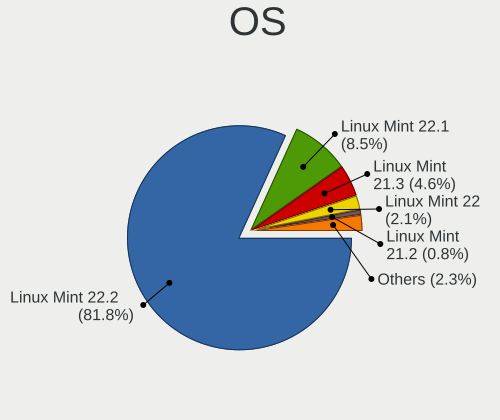

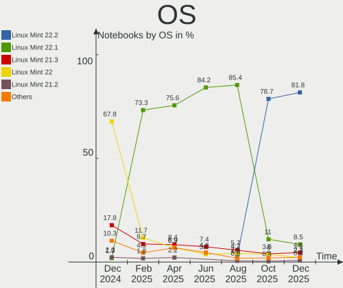

| Name            | Notebooks | Percent |
|-----------------|-----------|---------|
| Linux Mint 22.2 | 319       | 81.79%  |
| Linux Mint 22.1 | 33        | 8.46%   |
| Linux Mint 21.3 | 18        | 4.62%   |
| Linux Mint 22   | 8         | 2.05%   |
| Linux Mint 21.2 | 3         | 0.77%   |
| Linux Mint 22.3 | 2         | 0.51%   |
| Linux Mint 20.3 | 2         | 0.51%   |
| Linux Mint 21.1 | 1         | 0.26%   |
| Linux Mint 21   | 1         | 0.26%   |
| Linux Mint 20.1 | 1         | 0.26%   |
| Linux Mint 19.3 | 1         | 0.26%   |
| Linux Mint 18.1 | 1         | 0.26%   |

OS Family
---------

OS without a version

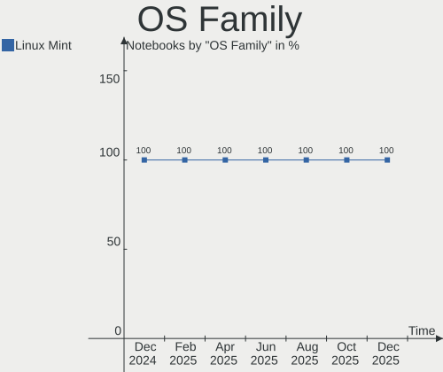

| Name       | Notebooks | Percent |
|------------|-----------|---------|
| Linux Mint | 390       | 100%    |

Kernel
------

Version of the Linux kernel

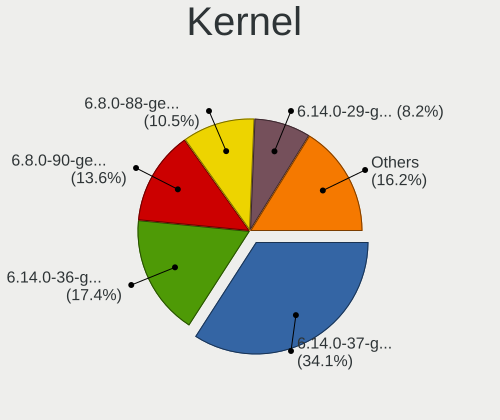

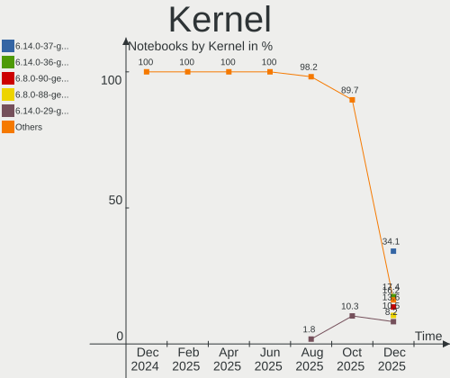

| Version                  | Notebooks | Percent |
|--------------------------|-----------|---------|
| 6.14.0-37-generic        | 133       | 34.1%   |
| 6.14.0-36-generic        | 68        | 17.44%  |
| 6.8.0-90-generic         | 53        | 13.59%  |
| 6.8.0-88-generic         | 41        | 10.51%  |
| 6.14.0-29-generic        | 32        | 8.21%   |
| 6.8.0-87-generic         | 7         | 1.79%   |
| 5.15.0-164-generic       | 7         | 1.79%   |
| 6.14.0-33-generic        | 4         | 1.03%   |
| 5.15.0-161-generic       | 4         | 1.03%   |
| 6.8.0-86-generic         | 3         | 0.77%   |
| 6.14.0-35-generic        | 3         | 0.77%   |
| 6.8.0-71-generic         | 2         | 0.51%   |
| 6.14.0-1016-oem          | 2         | 0.51%   |
| 5.4.0-216-generic        | 2         | 0.51%   |
| 6.8.0-88-lowlatency      | 1         | 0.26%   |
| 6.8.0-84-generic         | 1         | 0.26%   |
| 6.8.0-83-generic         | 1         | 0.26%   |
| 6.8.0-79-generic         | 1         | 0.26%   |
| 6.8.0-64-generic         | 1         | 0.26%   |
| 6.8.0-54-generic         | 1         | 0.26%   |
| 6.8.0-52-generic         | 1         | 0.26%   |
| 6.8.0-38-generic         | 1         | 0.26%   |
| 6.18.2-x64v3-xanmod1     | 1         | 0.26%   |
| 6.18.2-1-t2-noble        | 1         | 0.26%   |
| 6.18.2-1-liquorix-amd64  | 1         | 0.26%   |
| 6.18.0-061800-generic    | 1         | 0.26%   |
| 6.17.11-1-liquorix-amd64 | 1         | 0.26%   |
| 6.16.12-061612-generic   | 1         | 0.26%   |
| 6.14.0-34-generic        | 1         | 0.26%   |
| 6.14.0-1018-oem          | 1         | 0.26%   |
| 6.14.0-1017-oem          | 1         | 0.26%   |
| 6.12.60-1-t2-noble       | 1         | 0.26%   |
| 6.11.0-29-generic        | 1         | 0.26%   |
| 6.11.0-17-generic        | 1         | 0.26%   |
| 5.4.0-150-generic        | 1         | 0.26%   |
| 5.15.0-91-generic        | 1         | 0.26%   |
| 5.15.0-163-generic       | 1         | 0.26%   |
| 5.15.0-160-generic       | 1         | 0.26%   |
| 5.15.0-157-generic       | 1         | 0.26%   |
| 5.15.0-144-generic       | 1         | 0.26%   |

Kernel Family
-------------

Linux kernel without a distro release

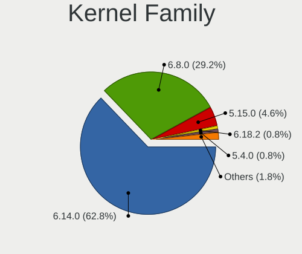

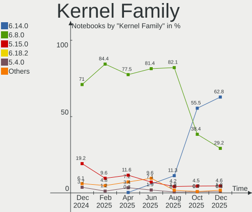

| Version | Notebooks | Percent |
|---------|-----------|---------|
| 6.14.0  | 245       | 62.82%  |
| 6.8.0   | 114       | 29.23%  |
| 5.15.0  | 18        | 4.62%   |
| 6.18.2  | 3         | 0.77%   |
| 5.4.0   | 3         | 0.77%   |
| 6.11.0  | 2         | 0.51%   |
| 6.18.0  | 1         | 0.26%   |
| 6.17.11 | 1         | 0.26%   |
| 6.16.12 | 1         | 0.26%   |
| 6.12.60 | 1         | 0.26%   |
| 4.4.0   | 1         | 0.26%   |

Kernel Major Ver.
-----------------

Linux kernel major version

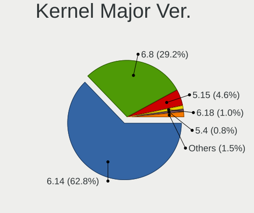

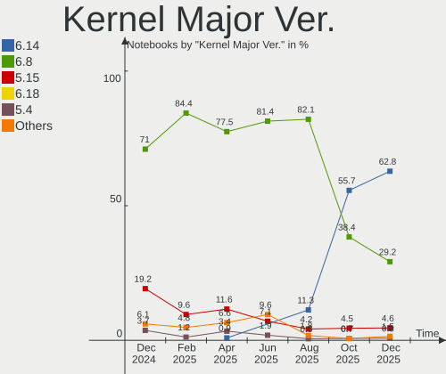

| Version | Notebooks | Percent |
|---------|-----------|---------|
| 6.14    | 245       | 62.82%  |
| 6.8     | 114       | 29.23%  |
| 5.15    | 18        | 4.62%   |
| 6.18    | 4         | 1.03%   |
| 5.4     | 3         | 0.77%   |
| 6.11    | 2         | 0.51%   |
| 6.17    | 1         | 0.26%   |
| 6.16    | 1         | 0.26%   |
| 6.12    | 1         | 0.26%   |
| 4.4     | 1         | 0.26%   |

Arch
----

OS architecture (x86_64, i586, etc.)

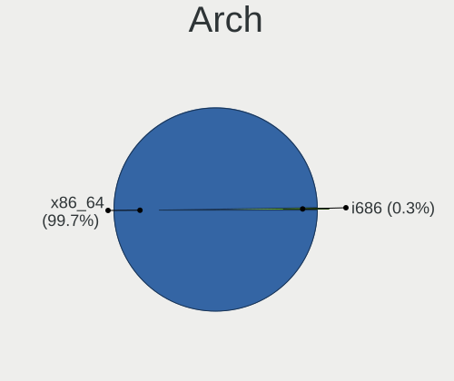

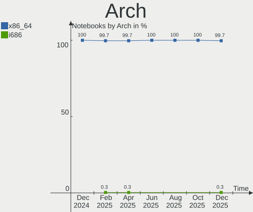

| Name   | Notebooks | Percent |
|--------|-----------|---------|
| x86_64 | 389       | 99.74%  |
| i686   | 1         | 0.26%   |

DE
--

Desktop Environment

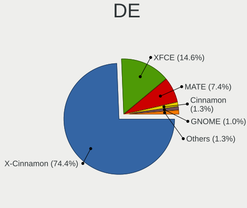

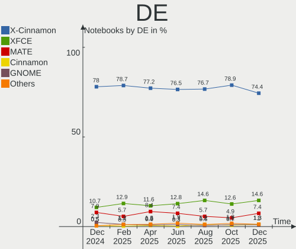

| Name       | Notebooks | Percent |
|------------|-----------|---------|
| X-Cinnamon | 290       | 74.36%  |
| XFCE       | 57        | 14.62%  |
| MATE       | 29        | 7.44%   |
| Cinnamon   | 5         | 1.28%   |
| GNOME      | 4         | 1.03%   |
| KDE5       | 3         | 0.77%   |
| LXQt       | 1         | 0.26%   |
| Unknown    | 1         | 0.26%   |

Display Server
--------------

X11 or Wayland

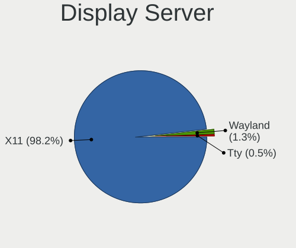

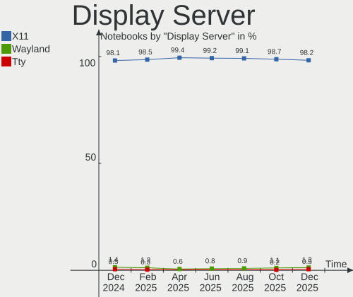

| Name    | Notebooks | Percent |
|---------|-----------|---------|
| X11     | 383       | 98.21%  |
| Wayland | 5         | 1.28%   |
| Tty     | 2         | 0.51%   |

Display Manager
---------------

SDDM, LightDM, etc.

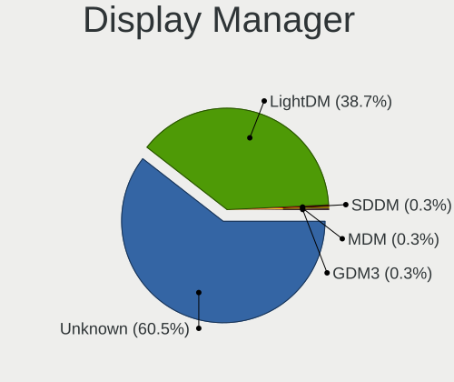

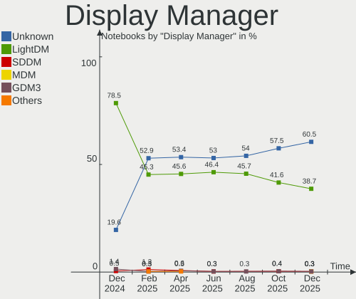

| Name    | Notebooks | Percent |
|---------|-----------|---------|
| Unknown | 236       | 60.51%  |
| LightDM | 151       | 38.72%  |
| SDDM    | 1         | 0.26%   |
| MDM     | 1         | 0.26%   |
| GDM3    | 1         | 0.26%   |

OS Lang
-------

Language

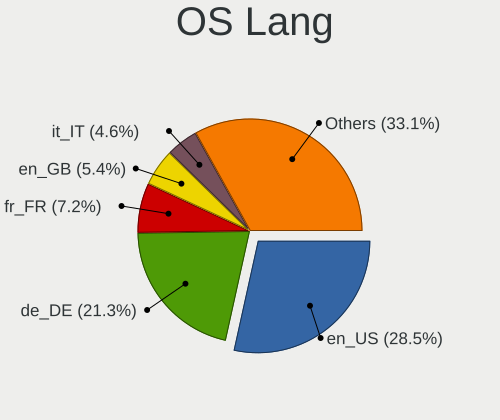

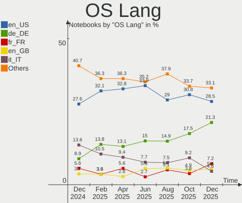

| Lang  | Notebooks | Percent |
|-------|-----------|---------|
| en_US | 111       | 28.46%  |
| de_DE | 83        | 21.28%  |
| fr_FR | 28        | 7.18%   |
| en_GB | 21        | 5.38%   |
| it_IT | 18        | 4.62%   |
| C     | 15        | 3.85%   |
| pt_BR | 13        | 3.33%   |
| pl_PL | 10        | 2.56%   |
| nl_NL | 9         | 2.31%   |
| en_AU | 7         | 1.79%   |
| de_AT | 7         | 1.79%   |
| ru_RU | 6         | 1.54%   |
| es_ES | 6         | 1.54%   |
| es_AR | 4         | 1.03%   |
| fi_FI | 3         | 0.77%   |
| es_MX | 3         | 0.77%   |
| en_IN | 3         | 0.77%   |
| en_CA | 3         | 0.77%   |
| de_CH | 3         | 0.77%   |
| uk_UA | 2         | 0.51%   |
| tr_TR | 2         | 0.51%   |
| sv_SE | 2         | 0.51%   |
| pt_PT | 2         | 0.51%   |
| es_CL | 2         | 0.51%   |
| en_ZA | 2         | 0.51%   |
| en_NZ | 2         | 0.51%   |
| en_IE | 2         | 0.51%   |
| da_DK | 2         | 0.51%   |
| zh_CN | 1         | 0.26%   |
| sl_SI | 1         | 0.26%   |
| ro_RO | 1         | 0.26%   |
| nl_BE | 1         | 0.26%   |
| lt_LT | 1         | 0.26%   |
| ja_JP | 1         | 0.26%   |
| hu_HU | 1         | 0.26%   |
| fr_CH | 1         | 0.26%   |
| fr_CA | 1         | 0.26%   |
| es_VE | 1         | 0.26%   |
| es_US | 1         | 0.26%   |
| es_EC | 1         | 0.26%   |

Boot Mode
---------

EFI or BIOS

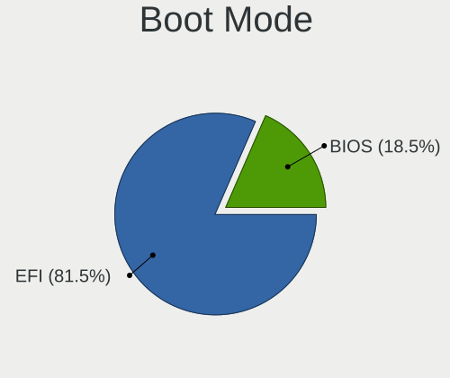

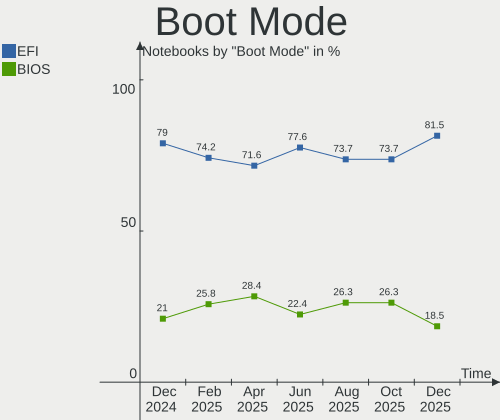

| Mode | Notebooks | Percent |
|------|-----------|---------|
| EFI  | 318       | 81.54%  |
| BIOS | 72        | 18.46%  |

Filesystem
----------

Type of filesystem

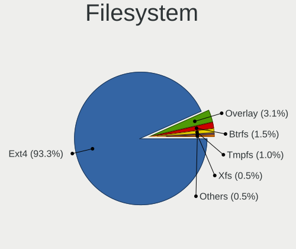

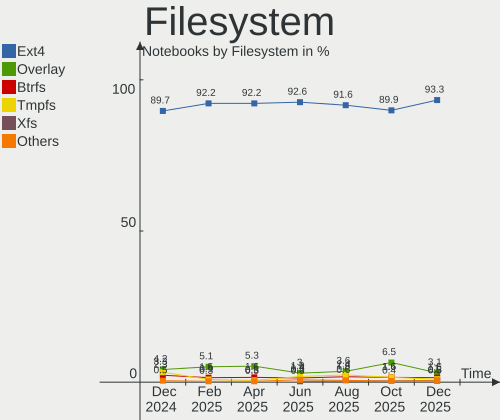

| Type    | Notebooks | Percent |
|---------|-----------|---------|
| Ext4    | 364       | 93.33%  |
| Overlay | 12        | 3.08%   |
| Btrfs   | 6         | 1.54%   |
| Tmpfs   | 4         | 1.03%   |
| Xfs     | 2         | 0.51%   |
| Zfs     | 1         | 0.26%   |
| Ext2    | 1         | 0.26%   |

Part. scheme
------------

Scheme of partitioning

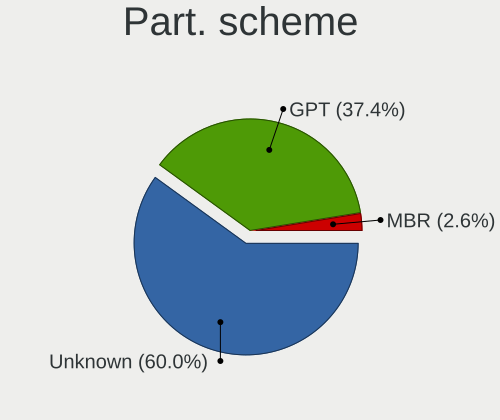

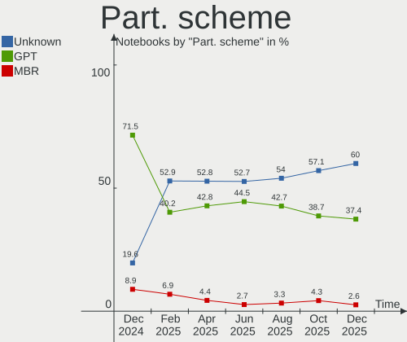

| Type    | Notebooks | Percent |
|---------|-----------|---------|
| Unknown | 234       | 60%     |
| GPT     | 146       | 37.44%  |
| MBR     | 10        | 2.56%   |

Dual Boot with Linux/BSD
------------------------

Hosting more than one Linux/BSD

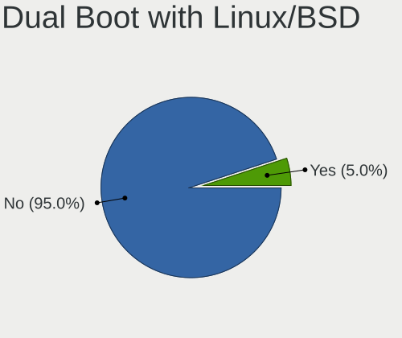

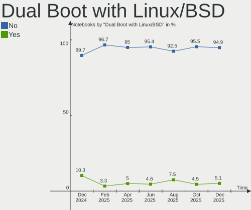

| Dual boot | Notebooks | Percent |
|-----------|-----------|---------|
| No        | 370       | 94.87%  |
| Yes       | 20        | 5.13%   |

Dual Boot (Win)
---------------

Hosting Linux and Windows

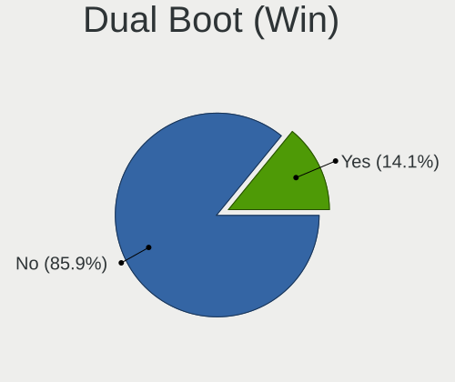

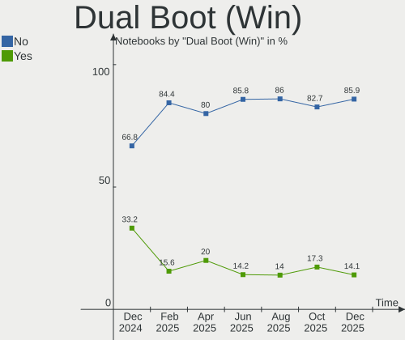

| Dual boot | Notebooks | Percent |
|-----------|-----------|---------|
| No        | 335       | 85.9%   |
| Yes       | 55        | 14.1%   |

Board
-----

Vendor
------

Motherboard manufacturer

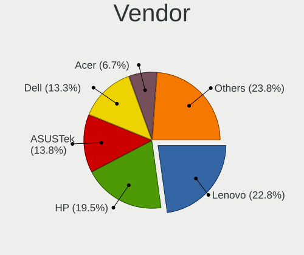

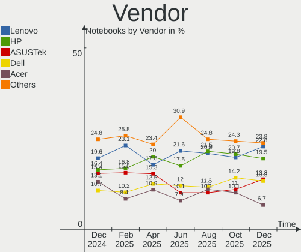

| Name                | Notebooks | Percent |
|---------------------|-----------|---------|
| Lenovo              | 89        | 22.82%  |
| Hewlett-Packard     | 76        | 19.49%  |
| ASUSTek Computer    | 54        | 13.85%  |
| Dell                | 52        | 13.33%  |
| Acer                | 26        | 6.67%   |
| Apple               | 17        | 4.36%   |
| Toshiba             | 12        | 3.08%   |
| MSI                 | 7         | 1.79%   |
| Fujitsu             | 7         | 1.79%   |
| Medion              | 5         | 1.28%   |
| Alienware           | 5         | 1.28%   |
| Unknown             | 5         | 1.28%   |
| Google              | 4         | 1.03%   |
| Sony                | 3         | 0.77%   |
| Wortmann AG         | 2         | 0.51%   |
| Samsung Electronics | 2         | 0.51%   |
| Itautec             | 2         | 0.51%   |
| HUAWEI              | 2         | 0.51%   |
| Gigabyte Technology | 2         | 0.51%   |
| XMG                 | 1         | 0.26%   |
| UNIQCELL            | 1         | 0.26%   |
| TrekStor            | 1         | 0.26%   |
| Timi                | 1         | 0.26%   |
| Thirdwave           | 1         | 0.26%   |
| SKIKK               | 1         | 0.26%   |
| Positivo            | 1         | 0.26%   |
| PC Specialist       | 1         | 0.26%   |
| Panasonic           | 1         | 0.26%   |
| Packard Bell        | 1         | 0.26%   |
| Notebook            | 1         | 0.26%   |
| MECHREVO            | 1         | 0.26%   |
| Infinix             | 1         | 0.26%   |
| Gateway             | 1         | 0.26%   |
| DEXP                | 1         | 0.26%   |
| Conectar Igualdad   | 1         | 0.26%   |
| Clevo               | 1         | 0.26%   |
| ATARI               | 1         | 0.26%   |

Model
-----

Motherboard model

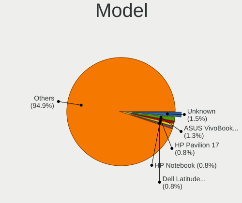

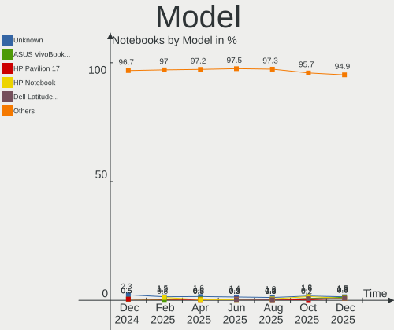

| Name                                       | Notebooks | Percent |
|--------------------------------------------|-----------|---------|
| Unknown                                    | 6         | 1.54%   |
| ASUS VivoBook_ASUSLaptop M1605YA_M1605YA   | 5         | 1.28%   |
| HP Pavilion 17                             | 3         | 0.77%   |
| HP Notebook                                | 3         | 0.77%   |
| Dell Latitude E6430                        | 3         | 0.77%   |
| Dell Latitude D630                         | 3         | 0.77%   |
| Apple MacBookAir7,2                        | 3         | 0.77%   |
| Lenovo V330-15IKB 81AX                     | 2         | 0.51%   |
| Lenovo Legion 7 16IAX10 83KY               | 2         | 0.51%   |
| Lenovo Legion 5 15IRX10 83LY               | 2         | 0.51%   |
| HP Laptop 17-by0xxx                        | 2         | 0.51%   |
| HP Laptop 15-bs0xx                         | 2         | 0.51%   |
| HP ENVY Notebook                           | 2         | 0.51%   |
| HP ENVY 15                                 | 2         | 0.51%   |
| HP EliteBook 845 G8 Notebook PC            | 2         | 0.51%   |
| HP 350 G1                                  | 2         | 0.51%   |
| HP 250 G8 Notebook PC                      | 2         | 0.51%   |
| Fujitsu LIFEBOOK E756                      | 2         | 0.51%   |
| Dell Latitude E6400                        | 2         | 0.51%   |
| ASUS X550LD                                | 2         | 0.51%   |
| ASUS VivoBook_ASUSLaptop X712EA_K712EA     | 2         | 0.51%   |
| ASUS VivoBook_ASUSLaptop X515EA_X515EA     | 2         | 0.51%   |
| ASUS VivoBook_ASUSLaptop X1704ZA_X1704ZA   | 2         | 0.51%   |
| ASUS Vivobook Go E1504FA_E1504FA           | 2         | 0.51%   |
| ASUS VivoBook 15_ASUS Laptop X540MA_X540MA | 2         | 0.51%   |
| Apple MacBookPro11,4                       | 2         | 0.51%   |
| Acer Swift SF16-51T                        | 2         | 0.51%   |
| XMG P65_P67RGRERA                          | 1         | 0.26%   |
| Wortmann AG TERRA_MOBILE_1513              | 1         | 0.26%   |
| Wortmann AG 1220794_1470489                | 1         | 0.26%   |
| UNIQCELL Q15.6                             | 1         | 0.26%   |
| TrekStor Surfbook A13B                     | 1         | 0.26%   |
| Toshiba Satellite Pro L870-14G             | 1         | 0.26%   |
| Toshiba Satellite Pro C70-B                | 1         | 0.26%   |
| Toshiba Satellite P200                     | 1         | 0.26%   |
| Toshiba Satellite L875D                    | 1         | 0.26%   |
| Toshiba Satellite L350                     | 1         | 0.26%   |
| Toshiba Satellite C70-B                    | 1         | 0.26%   |
| Toshiba Satellite C660D                    | 1         | 0.26%   |
| Toshiba Satellite C660                     | 1         | 0.26%   |

Model Family
------------

Motherboard model prefix

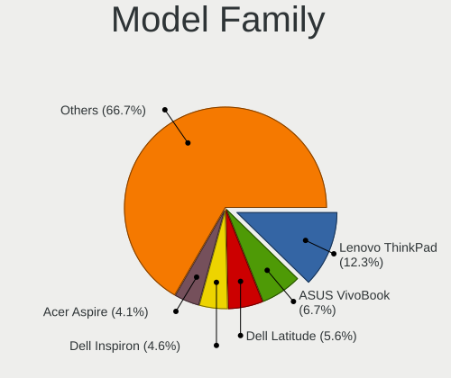

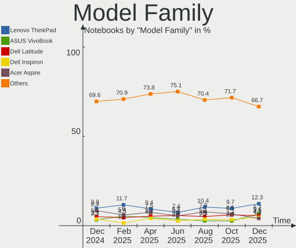

| Name               | Notebooks | Percent |
|--------------------|-----------|---------|
| Lenovo ThinkPad    | 48        | 12.31%  |
| ASUS VivoBook      | 26        | 6.67%   |
| Dell Latitude      | 22        | 5.64%   |
| Dell Inspiron      | 18        | 4.62%   |
| Acer Aspire        | 16        | 4.1%    |
| Lenovo IdeaPad     | 14        | 3.59%   |
| Toshiba Satellite  | 10        | 2.56%   |
| HP Pavilion        | 10        | 2.56%   |
| HP EliteBook       | 10        | 2.56%   |
| HP ProBook         | 9         | 2.31%   |
| HP ENVY            | 9         | 2.31%   |
| HP Laptop          | 8         | 2.05%   |
| Fujitsu LIFEBOOK   | 7         | 1.79%   |
| Unknown            | 6         | 1.54%   |
| Lenovo Legion      | 5         | 1.28%   |
| HP 250             | 5         | 1.28%   |
| Dell XPS           | 5         | 1.28%   |
| Acer Swift         | 5         | 1.28%   |
| Dell Precision     | 4         | 1.03%   |
| ASUS ASUS          | 4         | 1.03%   |
| Apple MacBookPro11 | 4         | 1.03%   |
| Lenovo LOQ         | 3         | 0.77%   |
| HP ZBook           | 3         | 0.77%   |
| HP Victus          | 3         | 0.77%   |
| HP Notebook        | 3         | 0.77%   |
| HP Compaq          | 3         | 0.77%   |
| Apple MacBookPro5  | 3         | 0.77%   |
| Apple MacBookAir7  | 3         | 0.77%   |
| MSI GF63           | 2         | 0.51%   |
| Lenovo V330-15IKB  | 2         | 0.51%   |
| Lenovo ThinkBook   | 2         | 0.51%   |
| HP Stream          | 2         | 0.51%   |
| HP 350             | 2         | 0.51%   |
| HP 255             | 2         | 0.51%   |
| Gigabyte G5        | 2         | 0.51%   |
| Dell Vostro        | 2         | 0.51%   |
| ASUS X550LD        | 2         | 0.51%   |
| ASUS ROG           | 2         | 0.51%   |
| Apple MacBookPro8  | 2         | 0.51%   |
| Alienware 17       | 2         | 0.51%   |

MFG Year
--------

Motherboard manufacture year

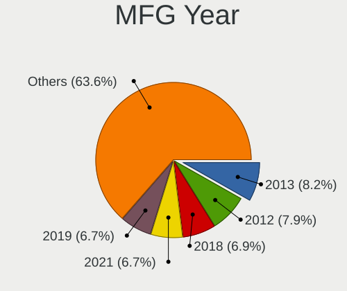

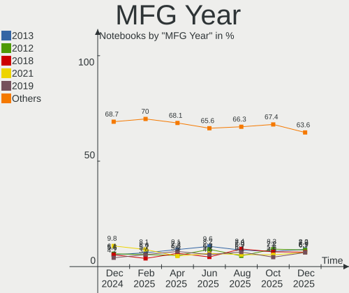

| Year | Notebooks | Percent |
|------|-----------|---------|
| 2013 | 32        | 8.21%   |
| 2012 | 31        | 7.95%   |
| 2018 | 27        | 6.92%   |
| 2021 | 26        | 6.67%   |
| 2019 | 26        | 6.67%   |
| 2023 | 22        | 5.64%   |
| 2020 | 21        | 5.38%   |
| 2017 | 21        | 5.38%   |
| 2016 | 21        | 5.38%   |
| 2015 | 20        | 5.13%   |
| 2014 | 20        | 5.13%   |
| 2011 | 20        | 5.13%   |
| 2024 | 19        | 4.87%   |
| 2022 | 17        | 4.36%   |
| 2010 | 16        | 4.1%    |
| 2025 | 14        | 3.59%   |
| 2009 | 13        | 3.33%   |
| 2008 | 12        | 3.08%   |
| 2007 | 9         | 2.31%   |
| 2006 | 3         | 0.77%   |

Form Factor
-----------

Physical design of the computer

| Name     | Notebooks | Percent |
|----------|-----------|---------|
| Notebook | 390       | 100%    |

Secure Boot
-----------

Enabled or disabled

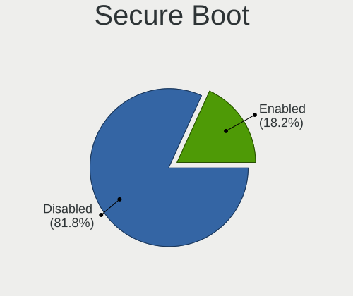

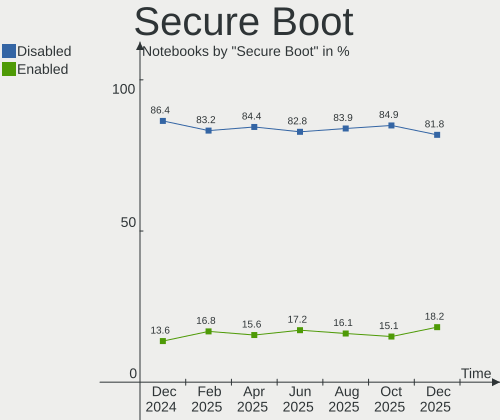

| State    | Notebooks | Percent |
|----------|-----------|---------|
| Disabled | 319       | 81.79%  |
| Enabled  | 71        | 18.21%  |

Coreboot
--------

Have coreboot on board

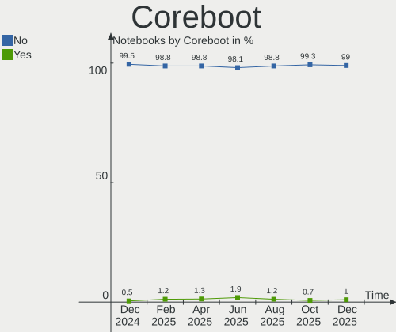

| Used | Notebooks | Percent |
|------|-----------|---------|
| No   | 386       | 98.97%  |
| Yes  | 4         | 1.03%   |

RAM Size
--------

Total RAM memory

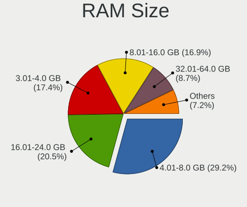

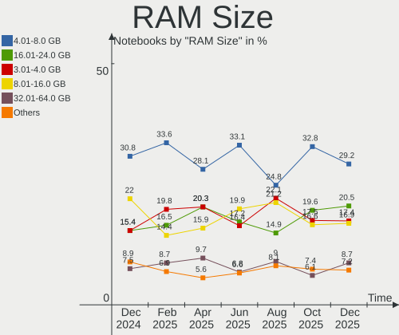

| Size in GB  | Notebooks | Percent |
|-------------|-----------|---------|
| 4.01-8.0    | 114       | 29.23%  |
| 16.01-24.0  | 80        | 20.51%  |
| 3.01-4.0    | 68        | 17.44%  |
| 8.01-16.0   | 66        | 16.92%  |
| 32.01-64.0  | 34        | 8.72%   |
| 24.01-32.0  | 10        | 2.56%   |
| 1.01-2.0    | 7         | 1.79%   |
| 64.01-256.0 | 6         | 1.54%   |
| 2.01-3.0    | 4         | 1.03%   |
| 0.51-1.0    | 1         | 0.26%   |

RAM Used
--------

Used RAM memory

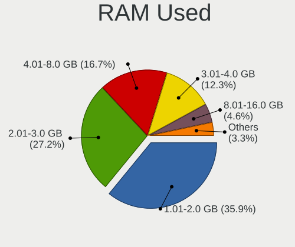

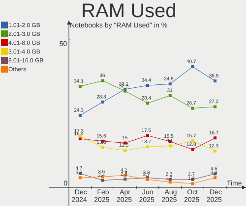

| Used GB    | Notebooks | Percent |
|------------|-----------|---------|
| 1.01-2.0   | 140       | 35.9%   |
| 2.01-3.0   | 106       | 27.18%  |
| 4.01-8.0   | 65        | 16.67%  |
| 3.01-4.0   | 48        | 12.31%  |
| 8.01-16.0  | 18        | 4.62%   |
| 0.51-1.0   | 10        | 2.56%   |
| 16.01-24.0 | 2         | 0.51%   |
| 0.01-0.5   | 1         | 0.26%   |

Total Drives
------------

Number of drives on board

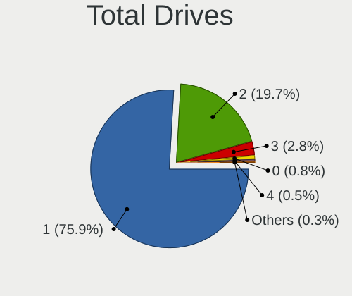

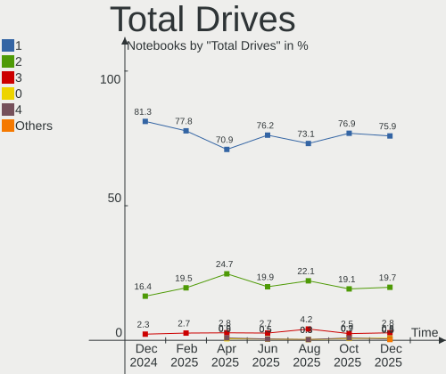

| Drives | Notebooks | Percent |
|--------|-----------|---------|
| 1      | 296       | 75.9%   |
| 2      | 77        | 19.74%  |
| 3      | 11        | 2.82%   |
| 0      | 3         | 0.77%   |
| 4      | 2         | 0.51%   |
| 5      | 1         | 0.26%   |

Has CD-ROM
----------

Has CD-ROM on board

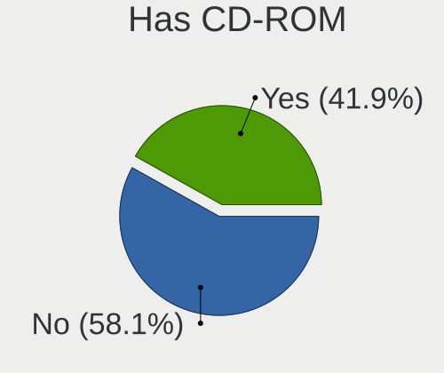

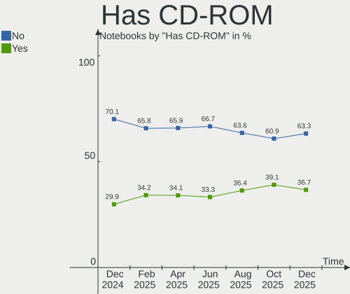

| Presented | Notebooks | Percent |
|-----------|-----------|---------|
| No        | 247       | 63.33%  |
| Yes       | 143       | 36.67%  |

Has Ethernet
------------

Has Ethernet on board

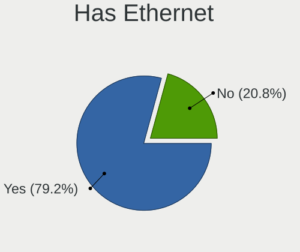

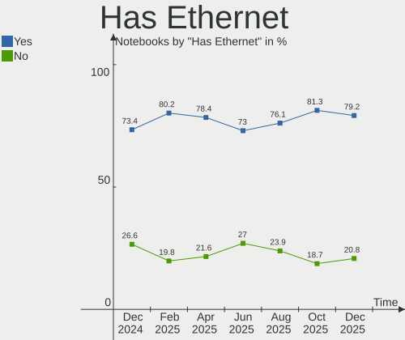

| Presented | Notebooks | Percent |
|-----------|-----------|---------|
| Yes       | 309       | 79.23%  |
| No        | 81        | 20.77%  |

Has WiFi
--------

Has WiFi module

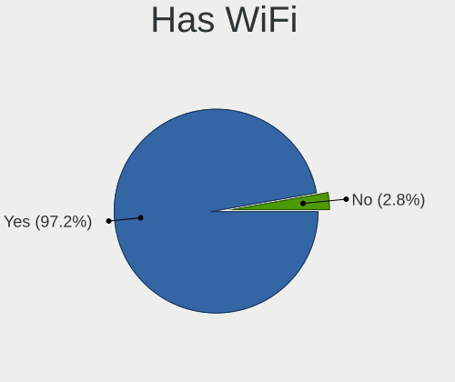

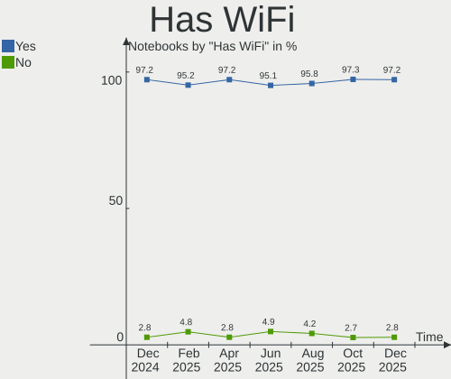

| Presented | Notebooks | Percent |
|-----------|-----------|---------|
| Yes       | 379       | 97.18%  |
| No        | 11        | 2.82%   |

Has Bluetooth
-------------

Has Bluetooth module

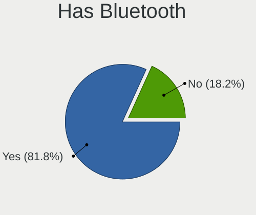

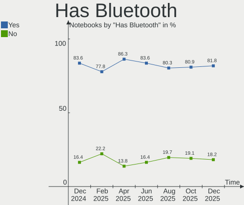

| Presented | Notebooks | Percent |
|-----------|-----------|---------|
| Yes       | 319       | 81.79%  |
| No        | 71        | 18.21%  |

Location
--------

Country
-------

Geographic location (country)

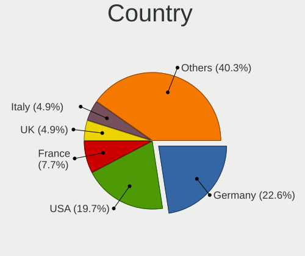

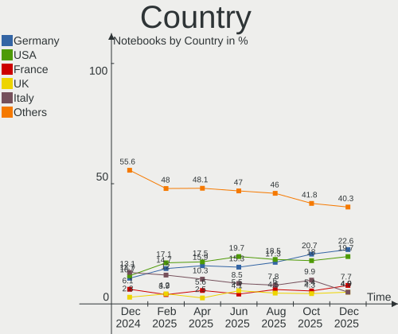

| Country         | Notebooks | Percent |
|-----------------|-----------|---------|
| Germany         | 88        | 22.56%  |
| USA             | 77        | 19.74%  |
| France          | 30        | 7.69%   |
| UK              | 19        | 4.87%   |
| Italy           | 19        | 4.87%   |
| Brazil          | 17        | 4.36%   |
| Poland          | 14        | 3.59%   |
| Netherlands     | 9         | 2.31%   |
| Switzerland     | 8         | 2.05%   |
| Canada          | 8         | 2.05%   |
| Austria         | 8         | 2.05%   |
| Australia       | 7         | 1.79%   |
| Argentina       | 6         | 1.54%   |
| Spain           | 5         | 1.28%   |
| Russia          | 5         | 1.28%   |
| Turkey          | 4         | 1.03%   |
| Portugal        | 4         | 1.03%   |
| Morocco         | 4         | 1.03%   |
| Finland         | 4         | 1.03%   |
| Sweden          | 3         | 0.77%   |
| Pakistan        | 3         | 0.77%   |
| Mexico          | 3         | 0.77%   |
| India           | 3         | 0.77%   |
| Denmark         | 3         | 0.77%   |
| Ukraine         | 2         | 0.51%   |
| The Netherlands | 2         | 0.51%   |
| Thailand        | 2         | 0.51%   |
| South Africa    | 2         | 0.51%   |
| New Zealand     | 2         | 0.51%   |
| Ireland         | 2         | 0.51%   |
| Egypt           | 2         | 0.51%   |
| Chile           | 2         | 0.51%   |
| Bulgaria        | 2         | 0.51%   |
| Yemen           | 1         | 0.26%   |
| Venezuela       | 1         | 0.26%   |
| Slovenia        | 1         | 0.26%   |
| Slovakia        | 1         | 0.26%   |
| Romania         | 1         | 0.26%   |
| Philippines     | 1         | 0.26%   |
| Nepal           | 1         | 0.26%   |

City
----

Geographic location (city)

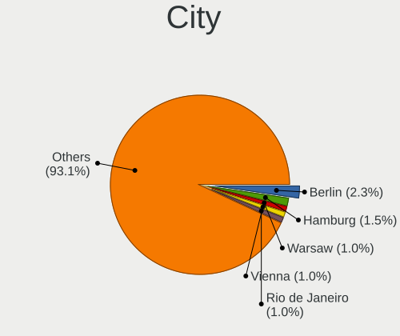

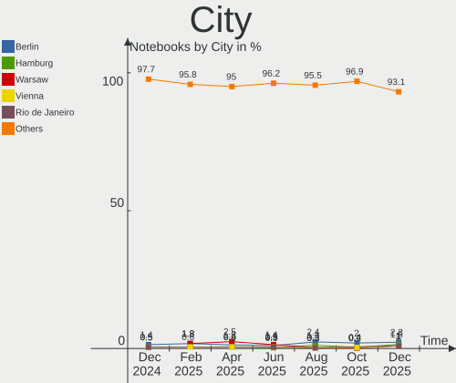

| City               | Notebooks | Percent |
|--------------------|-----------|---------|
| Berlin             | 9         | 2.31%   |
| Hamburg            | 6         | 1.54%   |
| Warsaw             | 4         | 1.03%   |
| Vienna             | 4         | 1.03%   |
| Rio de Janeiro     | 4         | 1.03%   |
| Munich             | 4         | 1.03%   |
| Milan              | 4         | 1.03%   |
| Bordeaux           | 4         | 1.03%   |
| Waukegan           | 3         | 0.77%   |
| Sao Paulo          | 3         | 0.77%   |
| Paris              | 3         | 0.77%   |
| Los Angeles        | 3         | 0.77%   |
| Frankfurt am Main  | 3         | 0.77%   |
| Düsseldorf        | 3         | 0.77%   |
| Zurich             | 2         | 0.51%   |
| Versmold           | 2         | 0.51%   |
| Traunstein         | 2         | 0.51%   |
| Toulon             | 2         | 0.51%   |
| Sydney             | 2         | 0.51%   |
| Stuttgart          | 2         | 0.51%   |
| Sofia              | 2         | 0.51%   |
| Rome               | 2         | 0.51%   |
| Phoenix            | 2         | 0.51%   |
| Perth              | 2         | 0.51%   |
| Pasadena           | 2         | 0.51%   |
| Osnabrück         | 2         | 0.51%   |
| New York           | 2         | 0.51%   |
| Madrid             | 2         | 0.51%   |
| Lisbon             | 2         | 0.51%   |
| Krakow             | 2         | 0.51%   |
| Kingston           | 2         | 0.51%   |
| Johannesburg       | 2         | 0.51%   |
| Jena               | 2         | 0.51%   |
| Istanbul           | 2         | 0.51%   |
| Houston            | 2         | 0.51%   |
| Helsinki           | 2         | 0.51%   |
| Groenlo            | 2         | 0.51%   |
| Gravina di Catania | 2         | 0.51%   |
| Edmonton           | 2         | 0.51%   |
| Dresden            | 2         | 0.51%   |

Drives
------

Drive Vendor
------------

Hard drive vendors

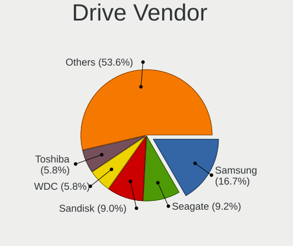

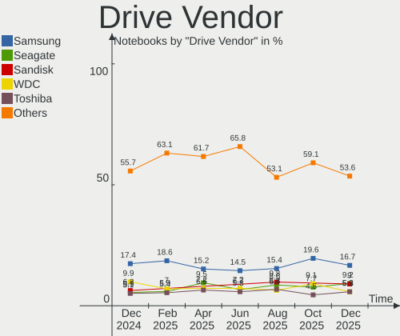

| Vendor                      | Notebooks | Drives | Percent |
|-----------------------------|-----------|--------|---------|
| Samsung Electronics         | 78        | 91     | 16.67%  |
| Seagate                     | 43        | 44     | 9.19%   |
| Sandisk                     | 42        | 43     | 8.97%   |
| WDC                         | 27        | 27     | 5.77%   |
| Toshiba                     | 27        | 27     | 5.77%   |
| Micron Technology           | 27        | 27     | 5.77%   |
| Unknown                     | 23        | 26     | 4.91%   |
| Crucial                     | 22        | 22     | 4.7%    |
| SK hynix                    | 18        | 18     | 3.85%   |
| Intel                       | 13        | 14     | 2.78%   |
| HGST                        | 13        | 13     | 2.78%   |
| Hitachi                     | 12        | 13     | 2.56%   |
| Kingston                    | 11        | 11     | 2.35%   |
| Apple                       | 8         | 9      | 1.71%   |
| Micron/Crucial Technology   | 5         | 5      | 1.07%   |
| KIOXIA                      | 5         | 6      | 1.07%   |
| China                       | 5         | 5      | 1.07%   |
| A-DATA Technology           | 5         | 5      | 1.07%   |
| SPCC                        | 4         | 5      | 0.85%   |
| MAXIO Technology (Hangzhou) | 4         | 4      | 0.85%   |
| Kingston Technology Company | 4         | 4      | 0.85%   |
| Intenso                     | 4         | 4      | 0.85%   |
| Fujitsu                     | 4         | 4      | 0.85%   |
| Transcend                   | 3         | 3      | 0.64%   |
| Timetec                     | 3         | 3      | 0.64%   |
| Phison Electronics          | 3         | 3      | 0.64%   |
| Unknown                     | 3         | 3      | 0.64%   |
| Silicon Motion              | 2         | 2      | 0.43%   |
| Patriot                     | 2         | 2      | 0.43%   |
| Netac                       | 2         | 2      | 0.43%   |
| KIOXIA-EXCERIA              | 2         | 2      | 0.43%   |
| KingSpec                    | 2         | 2      | 0.43%   |
| ASMT                        | 2         | 2      | 0.43%   |
| Vi550                       | 1         | 1      | 0.21%   |
| ValueTech                   | 1         | 2      | 0.21%   |
| USB                         | 1         | 1      | 0.21%   |
| UP                          | 1         | 1      | 0.21%   |
| UMIS                        | 1         | 1      | 0.21%   |
| TOPGIANT                    | 1         | 1      | 0.21%   |
| ThinkPlus                   | 1         | 2      | 0.21%   |

Drive Model
-----------

Hard drive models

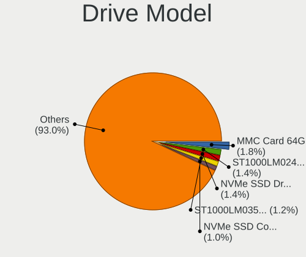

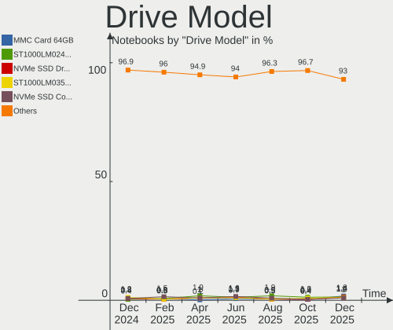

| Model                                             | Notebooks | Percent |
|---------------------------------------------------|-----------|---------|
| Unknown MMC Card  64GB                            | 9         | 1.84%   |
| Seagate ST1000LM024 HN-M101MBB 1TB                | 7         | 1.43%   |
| SanDisk NVMe SSD Drive 1TB                        | 7         | 1.43%   |
| Seagate ST1000LM035-1RK172 1TB                    | 6         | 1.23%   |
| Samsung NVMe SSD Controller SM981/PM981/PM983 1TB | 5         | 1.02%   |
| Micron 2400_MTFDKBA512QFM 512GB                   | 5         | 1.02%   |
| Unknown MMC Card  128GB                           | 4         | 0.82%   |
| Toshiba MQ01ABD100 1TB                            | 4         | 0.82%   |
| Seagate ST500LT012-1DG142 500GB                   | 4         | 0.82%   |
| Seagate ST500LM000-1EJ162 500GB                   | 4         | 0.82%   |
| Samsung SSD 850 EVO 250GB                         | 4         | 0.82%   |
| HGST HTS721010A9E630 1TB                          | 4         | 0.82%   |
| Crucial CT1000MX500SSD1 1TB                       | 4         | 0.82%   |
| Toshiba XG6 NVMe SSD Controller 1024GB            | 3         | 0.61%   |
| Samsung SSD 990 PRO 1TB                           | 3         | 0.61%   |
| Samsung SSD 870 QVO 2TB                           | 3         | 0.61%   |
| Samsung SSD 850 EVO 500GB                         | 3         | 0.61%   |
| Samsung MZAL81T0HFLB-00BL2 1TB                    | 3         | 0.61%   |
| Micron/Crucial P2 NVMe PCIe SSD 2TB               | 3         | 0.61%   |
| Micron MTFDKBA512QGN-1BN1AABGA 512GB              | 3         | 0.61%   |
| Kingston SA400S37480G 480GB SSD                   | 3         | 0.61%   |
| Intel SSDPEKNU512GZ 512GB                         | 3         | 0.61%   |
| HGST HTS545050A7E680 500GB                        | 3         | 0.61%   |
| Crucial CT480BX500SSD1 480GB                      | 3         | 0.61%   |
| Crucial CT2000BX500SSD1 2TB                       | 3         | 0.61%   |
| Unknown                                           | 3         | 0.61%   |
| WDC WDS500G2B0B-00YS70 500GB SSD                  | 2         | 0.41%   |
| WDC WD5000LPVX-80V0TT0 500GB                      | 2         | 0.41%   |
| WDC WD10JPCX-24UE4T0 1TB                          | 2         | 0.41%   |
| WDC WD My Passport 264F 1TB                       | 2         | 0.41%   |
| Unknown MMC Card  32GB                            | 2         | 0.41%   |
| Toshiba MQ04ABF100 1TB                            | 2         | 0.41%   |
| Toshiba MK7559GSXF 752GB                          | 2         | 0.41%   |
| SK hynix SC401 SATA 256GB SSD                     | 2         | 0.41%   |
| SK hynix BC901 HFS512GEJ9X108N 512GB              | 2         | 0.41%   |
| SK hynix BC501 NVMe Solid State Drive 512GB       | 2         | 0.41%   |
| Seagate ST1000LM049-2GH172 1TB                    | 2         | 0.41%   |
| Sandisk WD_BLACK SN850X 2000GB                    | 2         | 0.41%   |
| Sandisk WD Black SN750 / PC SN730 NVMe SSD 500GB  | 2         | 0.41%   |
| SanDisk SDSSDA240G 240GB                          | 2         | 0.41%   |

HDD Vendor
----------

Hard disk drive vendors

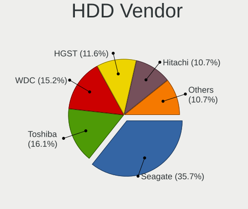

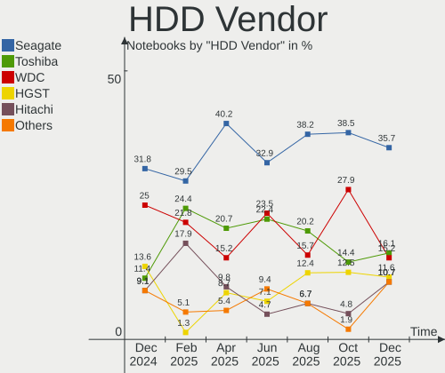

| Vendor              | Notebooks | Drives | Percent |
|---------------------|-----------|--------|---------|
| Seagate             | 40        | 41     | 35.71%  |
| Toshiba             | 18        | 18     | 16.07%  |
| WDC                 | 17        | 17     | 15.18%  |
| HGST                | 13        | 13     | 11.61%  |
| Hitachi             | 12        | 13     | 10.71%  |
| Fujitsu             | 4         | 4      | 3.57%   |
| Samsung Electronics | 3         | 3      | 2.68%   |
| ASMT                | 2         | 2      | 1.79%   |
| Unknown             | 1         | 1      | 0.89%   |
| T-FORCE             | 1         | 1      | 0.89%   |
| JMicron Technology  | 1         | 1      | 0.89%   |

SSD Vendor
----------

Solid state drive vendors

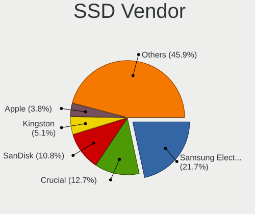

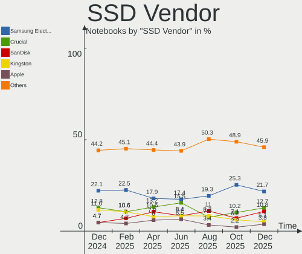

| Vendor              | Notebooks | Drives | Percent |
|---------------------|-----------|--------|---------|
| Samsung Electronics | 34        | 37     | 21.66%  |
| Crucial             | 20        | 20     | 12.74%  |
| SanDisk             | 17        | 17     | 10.83%  |
| Kingston            | 8         | 8      | 5.1%    |
| Apple               | 6         | 6      | 3.82%   |
| WDC                 | 5         | 5      | 3.18%   |
| SK hynix            | 5         | 5      | 3.18%   |
| China               | 5         | 5      | 3.18%   |
| Toshiba             | 4         | 4      | 2.55%   |
| SPCC                | 4         | 5      | 2.55%   |
| Micron Technology   | 4         | 4      | 2.55%   |
| Intenso             | 4         | 4      | 2.55%   |
| A-DATA Technology   | 4         | 4      | 2.55%   |
| Transcend           | 3         | 3      | 1.91%   |
| Timetec             | 3         | 3      | 1.91%   |
| Patriot             | 2         | 2      | 1.27%   |
| Netac               | 2         | 2      | 1.27%   |
| KIOXIA-EXCERIA      | 2         | 2      | 1.27%   |
| KingSpec            | 2         | 2      | 1.27%   |
| Vi550               | 1         | 1      | 0.64%   |
| ValueTech           | 1         | 1      | 0.64%   |
| UP                  | 1         | 1      | 0.64%   |
| ThinkPlus           | 1         | 2      | 0.64%   |
| Team                | 1         | 1      | 0.64%   |
| Seagate             | 1         | 1      | 0.64%   |
| SD                  | 1         | 1      | 0.64%   |
| Radeon              | 1         | 1      | 0.64%   |
| PNY                 | 1         | 1      | 0.64%   |
| Plextor             | 1         | 1      | 0.64%   |
| Neo Forza           | 1         | 1      | 0.64%   |
| Neo                 | 1         | 1      | 0.64%   |
| LITEONIT            | 1         | 1      | 0.64%   |
| LITEON              | 1         | 1      | 0.64%   |
| Lexar               | 1         | 1      | 0.64%   |
| Intel               | 1         | 1      | 0.64%   |
| Hewlett-Packard     | 1         | 1      | 0.64%   |
| HEORIADY            | 1         | 1      | 0.64%   |
| Emtec               | 1         | 1      | 0.64%   |
| EDILOCA             | 1         | 1      | 0.64%   |
| Consistent          | 1         | 1      | 0.64%   |

Drive Kind
----------

HDD or SSD

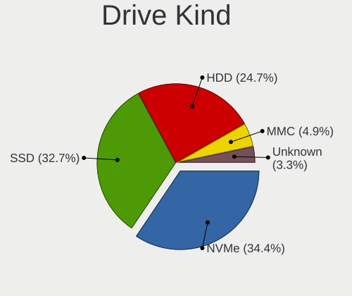

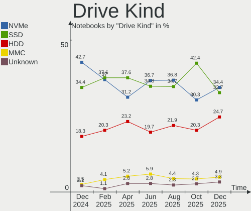

| Kind    | Notebooks | Drives | Percent |
|---------|-----------|--------|---------|
| NVMe    | 155       | 176    | 34.44%  |
| SSD     | 147       | 162    | 32.67%  |
| HDD     | 111       | 114    | 24.67%  |
| MMC     | 22        | 25     | 4.89%   |
| Unknown | 15        | 17     | 3.33%   |

Drive Connector
---------------

SATA, SAS, NVMe, etc.

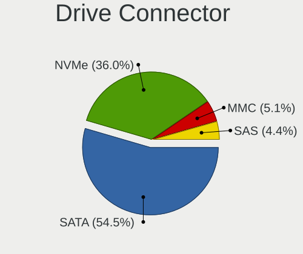

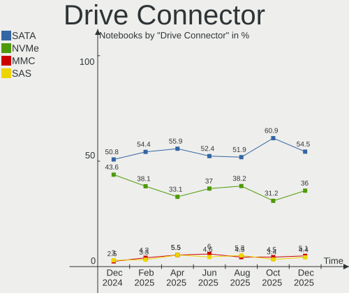

| Type | Notebooks | Drives | Percent |
|------|-----------|--------|---------|
| SATA | 235       | 273    | 54.52%  |
| NVMe | 155       | 174    | 35.96%  |
| MMC  | 22        | 25     | 5.1%    |
| SAS  | 19        | 22     | 4.41%   |

Drive Size
----------

Size of hard drive

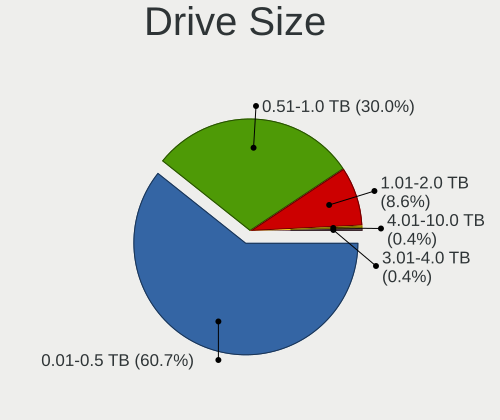

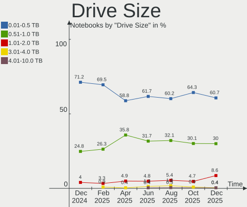

| Size in TB | Notebooks | Drives | Percent |
|------------|-----------|--------|---------|
| 0.01-0.5   | 156       | 170    | 60.7%   |
| 0.51-1.0   | 77        | 80     | 29.96%  |
| 1.01-2.0   | 22        | 24     | 8.56%   |
| 3.01-4.0   | 1         | 1      | 0.39%   |
| 4.01-10.0  | 1         | 1      | 0.39%   |

Space Total
-----------

Amount of disk space available on the file system

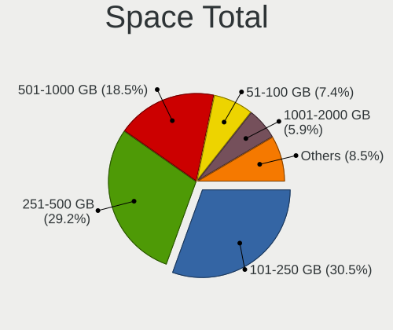

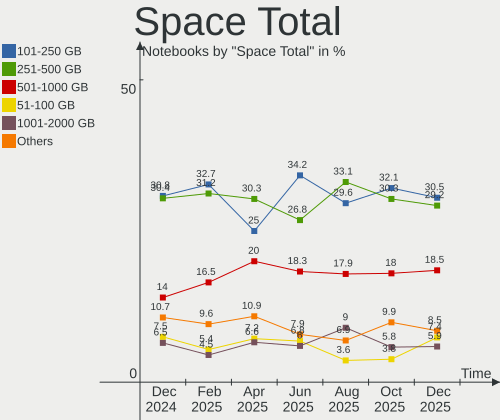

| Size in GB     | Notebooks | Percent |
|----------------|-----------|---------|
| 101-250        | 119       | 30.51%  |
| 251-500        | 114       | 29.23%  |
| 501-1000       | 72        | 18.46%  |
| 51-100         | 29        | 7.44%   |
| 1001-2000      | 23        | 5.9%    |
| 1-20           | 12        | 3.08%   |
| More than 3000 | 10        | 2.56%   |
| 21-50          | 6         | 1.54%   |
| 2001-3000      | 4         | 1.03%   |
| Unknown        | 1         | 0.26%   |

Space Used
----------

Amount of used disk space

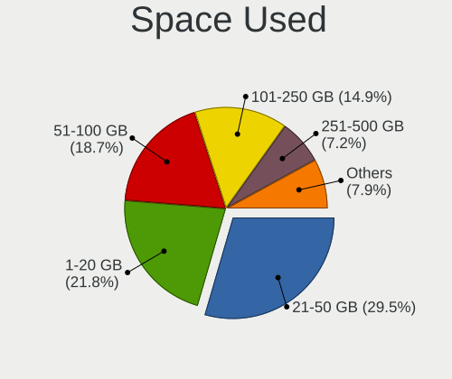

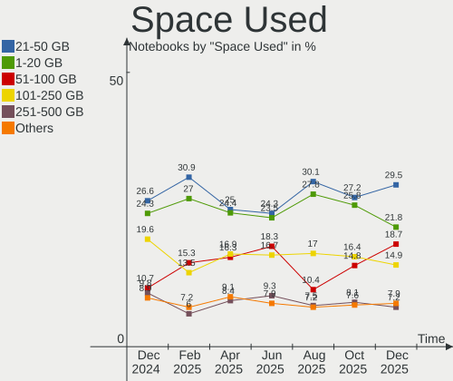

| Used GB        | Notebooks | Percent |
|----------------|-----------|---------|
| 21-50          | 115       | 29.49%  |
| 1-20           | 85        | 21.79%  |
| 51-100         | 73        | 18.72%  |
| 101-250        | 58        | 14.87%  |
| 251-500        | 28        | 7.18%   |
| 501-1000       | 20        | 5.13%   |
| 1001-2000      | 8         | 2.05%   |
| More than 3000 | 1         | 0.26%   |
| 2001-3000      | 1         | 0.26%   |
| Unknown        | 1         | 0.26%   |

Malfunc. Drives
---------------

Drive models with a malfunction

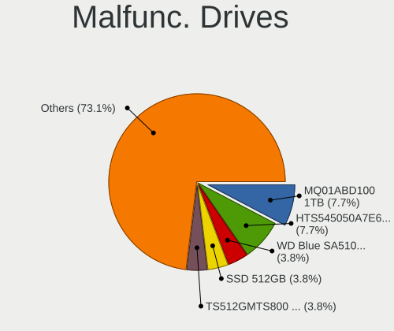

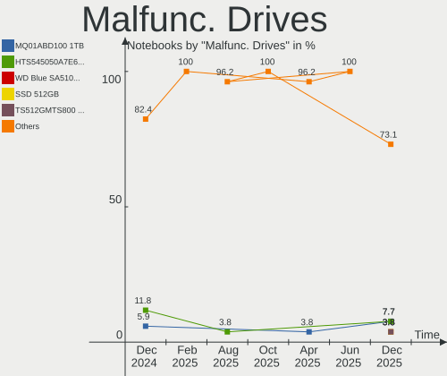

| Model                                         | Notebooks | Drives | Percent |
|-----------------------------------------------|-----------|--------|---------|
| Toshiba MQ01ABD100 1TB                        | 2         | 2      | 7.69%   |
| HGST HTS545050A7E680 500GB                    | 2         | 2      | 7.69%   |
| WDC WD Blue SA510 2.5 250GB                   | 1         | 1      | 3.85%   |
| ValueTech SSD 512GB                           | 1         | 1      | 3.85%   |
| Transcend TS512GMTS800 512GB SSD              | 1         | 1      | 3.85%   |
| Toshiba MK5055GSXF 500GB                      | 1         | 1      | 3.85%   |
| Toshiba MK3255GSXF 250GB                      | 1         | 1      | 3.85%   |
| SK hynix SC401 SATA 256GB SSD                 | 1         | 1      | 3.85%   |
| Seagate ST9500325AS 500GB                     | 1         | 1      | 3.85%   |
| Seagate ST9160821AS 160GB                     | 1         | 1      | 3.85%   |
| Seagate ST500LT012-1DG142 500GB               | 1         | 1      | 3.85%   |
| Seagate ST500LM000-1EJ162 500GB               | 1         | 1      | 3.85%   |
| Seagate ST2000LM003 HN-M201RAD 2TB            | 1         | 2      | 3.85%   |
| Seagate ST1000LM035-1RK172 1TB                | 1         | 1      | 3.85%   |
| Samsung Electronics HM320II 320GB             | 1         | 1      | 3.85%   |
| Neo Forza NFS011SA356-6007200 256GB SSD       | 1         | 1      | 3.85%   |
| Micron Technology MTFDDAK256MAM-1K1 256GB SSD | 1         | 1      | 3.85%   |
| Intel SSDSA2M080G2GC 80GB                     | 1         | 1      | 3.85%   |
| Hitachi HTS722012K9A300 120GB                 | 1         | 1      | 3.85%   |
| Hitachi HTS543232L9A300 320GB                 | 1         | 1      | 3.85%   |
| Hitachi HTS542516K9SA00 160GB                 | 1         | 1      | 3.85%   |
| Hitachi HTS541612J9SA00 3H 120GB              | 1         | 1      | 3.85%   |
| HGST HTS541010A9E680 1TB                      | 1         | 1      | 3.85%   |
| Fujitsu MJA2320BH G2 320GB                    | 1         | 1      | 3.85%   |

Malfunc. Drive Vendor
---------------------

Vendors of faulty drives

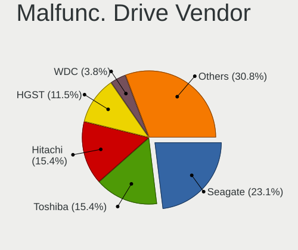

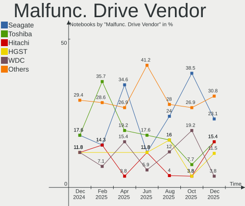

| Vendor              | Notebooks | Drives | Percent |
|---------------------|-----------|--------|---------|
| Seagate             | 6         | 7      | 23.08%  |
| Toshiba             | 4         | 4      | 15.38%  |
| Hitachi             | 4         | 4      | 15.38%  |
| HGST                | 3         | 3      | 11.54%  |
| WDC                 | 1         | 1      | 3.85%   |
| ValueTech           | 1         | 1      | 3.85%   |
| Transcend           | 1         | 1      | 3.85%   |
| SK hynix            | 1         | 1      | 3.85%   |
| Samsung Electronics | 1         | 1      | 3.85%   |
| Neo Forza           | 1         | 1      | 3.85%   |
| Micron Technology   | 1         | 1      | 3.85%   |
| Intel               | 1         | 1      | 3.85%   |
| Fujitsu             | 1         | 1      | 3.85%   |

Malfunc. HDD Vendor
-------------------

Vendors of faulty HDD drives

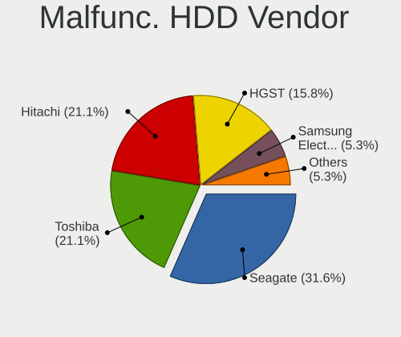

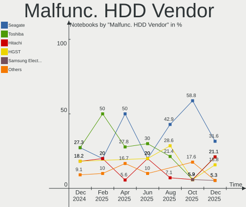

| Vendor              | Notebooks | Drives | Percent |
|---------------------|-----------|--------|---------|
| Seagate             | 6         | 7      | 31.58%  |
| Toshiba             | 4         | 4      | 21.05%  |
| Hitachi             | 4         | 4      | 21.05%  |
| HGST                | 3         | 3      | 15.79%  |
| Samsung Electronics | 1         | 1      | 5.26%   |
| Fujitsu             | 1         | 1      | 5.26%   |

Malfunc. Drive Kind
-------------------

Kinds of faulty drives

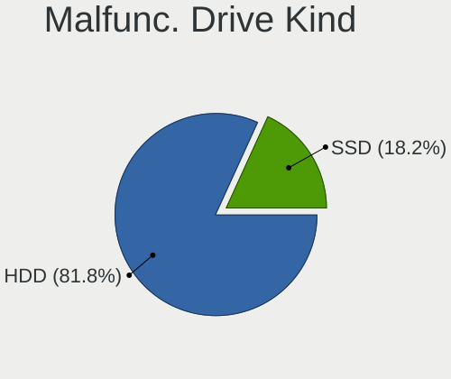

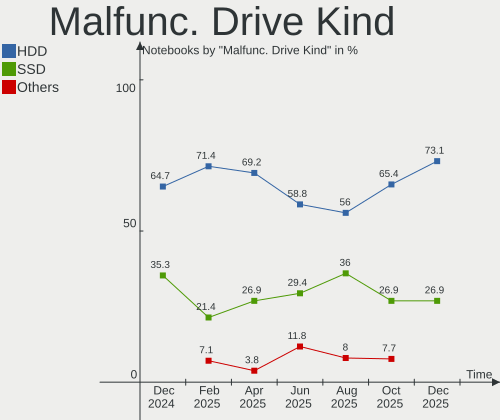

| Kind | Notebooks | Drives | Percent |
|------|-----------|--------|---------|
| HDD  | 19        | 20     | 73.08%  |
| SSD  | 7         | 7      | 26.92%  |

Failed Drives
-------------

Failed drive models

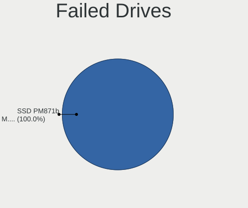

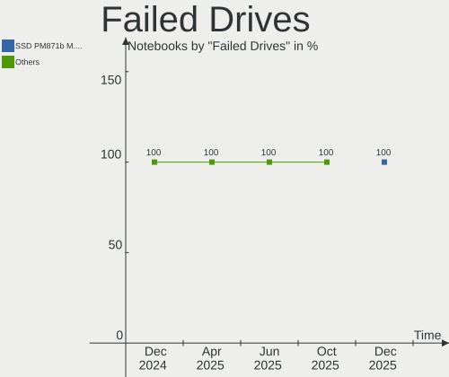

| Model                                         | Notebooks | Drives | Percent |
|-----------------------------------------------|-----------|--------|---------|
| Samsung Electronics SSD PM871b M.2 2280 128GB | 1         | 1      | 100%    |

Failed Drive Vendor
-------------------

Failed drive vendors

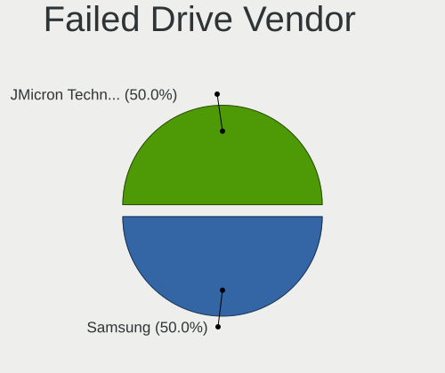

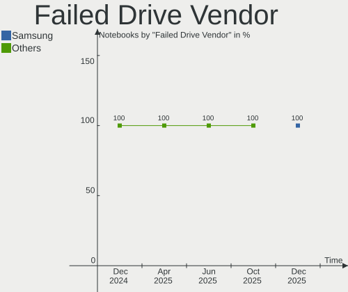

| Vendor              | Notebooks | Drives | Percent |
|---------------------|-----------|--------|---------|
| Samsung Electronics | 1         | 1      | 100%    |

Drive Status
------------

Number of failed and malfunc. drives

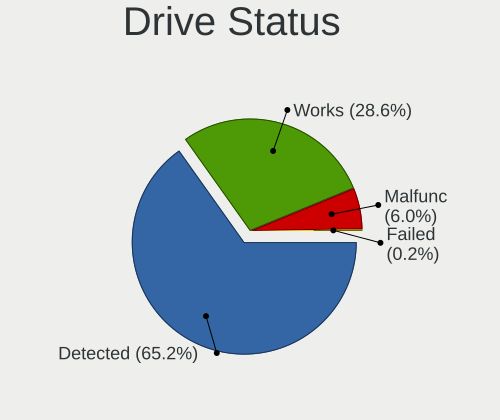

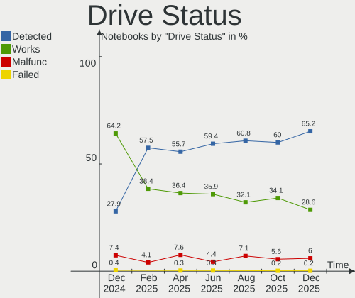

| Status   | Notebooks | Drives | Percent |
|----------|-----------|--------|---------|
| Detected | 262       | 330    | 65.17%  |
| Works    | 115       | 136    | 28.61%  |
| Malfunc  | 24        | 27     | 5.97%   |
| Failed   | 1         | 1      | 0.25%   |

Storage controller
------------------

Storage Vendor
--------------

Storage controller vendors

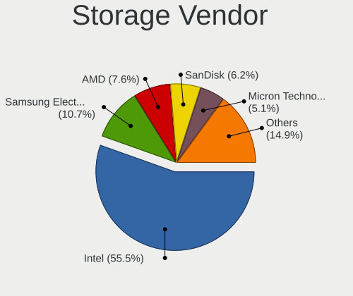

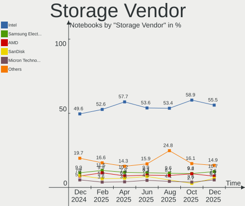

| Vendor                                  | Notebooks | Percent |
|-----------------------------------------|-----------|---------|
| Intel                                   | 249       | 55.46%  |
| Samsung Electronics                     | 48        | 10.69%  |
| AMD                                     | 34        | 7.57%   |
| SanDisk                                 | 28        | 6.24%   |
| Micron Technology                       | 23        | 5.12%   |
| SK hynix                                | 13        | 2.9%    |
| Micron/Crucial Technology               | 7         | 1.56%   |
| Kingston Technology Company             | 7         | 1.56%   |
| Toshiba America Info Systems            | 5         | 1.11%   |
| KIOXIA                                  | 5         | 1.11%   |
| Phison Electronics                      | 4         | 0.89%   |
| Nvidia                                  | 4         | 0.89%   |
| MAXIO Technology (Hangzhou)             | 4         | 0.89%   |
| Silicon Motion                          | 3         | 0.67%   |
| JMicron Technology                      | 3         | 0.67%   |
| Shenzhen Longsys Electronics            | 2         | 0.45%   |
| Apple                                   | 2         | 0.45%   |
| Solidigm                                | 1         | 0.22%   |
| Solid State Storage Technology          | 1         | 0.22%   |
| Silicon Integrated Systems [SiS]        | 1         | 0.22%   |
| Silicon Image                           | 1         | 0.22%   |
| Shenzhen Unionmemory Information System | 1         | 0.22%   |
| Marvell Technology Group                | 1         | 0.22%   |
| INNOGRIT                                | 1         | 0.22%   |
| ADATA Technology                        | 1         | 0.22%   |

Storage Model
-------------

Storage controller models

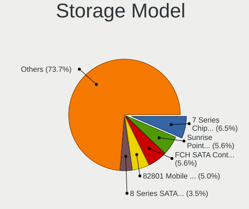

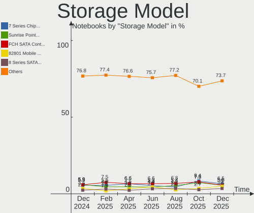

| Model                                                                          | Notebooks | Percent |
|--------------------------------------------------------------------------------|-----------|---------|
| Intel 7 Series Chipset Family 6-port SATA Controller [AHCI mode]               | 31        | 6.47%   |
| Intel Sunrise Point-LP SATA Controller [AHCI mode]                             | 27        | 5.64%   |
| AMD FCH SATA Controller [AHCI mode]                                            | 27        | 5.64%   |
| Intel 82801 Mobile SATA Controller [RAID mode]                                 | 24        | 5.01%   |
| Intel 8 Series SATA Controller 1 [AHCI mode]                                   | 17        | 3.55%   |
| Intel 8 Series/C220 Series Chipset Family 6-port SATA Controller 1 [AHCI mode] | 13        | 2.71%   |
| Intel 6 Series/C200 Series Chipset Family 6 port Mobile SATA AHCI Controller   | 13        | 2.71%   |
| Intel Wildcat Point-LP SATA Controller [AHCI Mode]                             | 11        | 2.3%    |
| Samsung NVMe SSD Controller 980 (DRAM-less)                                    | 10        | 2.09%   |
| Intel Volume Management Device NVMe RAID Controller                            | 10        | 2.09%   |
| Intel 82801IBM/IEM (ICH9M/ICH9M-E) 4 port SATA Controller [AHCI mode]          | 9         | 1.88%   |
| Intel 82801HM/HEM (ICH8M/ICH8M-E) IDE Controller                               | 9         | 1.88%   |
| SanDisk WD SN560/SN740/SN770/SN5000 NVMe SSD                                   | 8         | 1.67%   |
| Intel Comet Lake SATA AHCI Controller                                          | 8         | 1.67%   |
| Samsung NVMe SSD Controller SM981/PM981/PM983                                  | 7         | 1.46%   |
| Intel Tiger Lake-LP SATA Controller                                            | 7         | 1.46%   |
| Intel HM170/QM170 Chipset SATA Controller [AHCI Mode]                          | 7         | 1.46%   |
| Micron 2400 NVMe SSD (DRAM-less)                                               | 6         | 1.25%   |
| Intel Celeron N3350/Pentium N4200/Atom E3900 Series SATA AHCI Controller       | 6         | 1.25%   |
| Intel Cannon Lake Mobile PCH SATA AHCI Controller                              | 6         | 1.25%   |
| Intel 82801HM/HEM (ICH8M/ICH8M-E) SATA Controller [AHCI mode]                  | 6         | 1.25%   |
| Intel 5 Series/3400 Series Chipset 4 port SATA AHCI Controller                 | 6         | 1.25%   |
| Samsung NVMe SSD Controller SM961/PM961/SM963                                  | 5         | 1.04%   |
| Samsung NVMe SSD Controller S4LV008[Pascal]                                    | 5         | 1.04%   |
| Samsung NVMe SSD Controller PM9C1a (DRAM-less)                                 | 5         | 1.04%   |
| Samsung NVMe SSD Controller PM9A1/PM9A3/980PRO                                 | 5         | 1.04%   |
| Micron 2500 NVMe SSD (DRAM-less)                                               | 5         | 1.04%   |
| Intel SSD DC P4101/Pro 7600p/760p/E 6100p Series                               | 5         | 1.04%   |
| Intel SSD 670p Series [Keystone Harbor]                                        | 5         | 1.04%   |
| Intel Celeron/Pentium Silver Processor SATA Controller                         | 5         | 1.04%   |
| Samsung S4LN058A01[SSUBX] AHCI SSD Controller (Apple slot)                     | 4         | 0.84%   |
| Samsung NVMe SSD Controller PM9B1 (DRAM-less)                                  | 4         | 0.84%   |
| Micron 2450 NVMe SSD [HendrixV] (DRAM-less)                                    | 4         | 0.84%   |
| Intel Jasper Lake SATA AHCI Controller                                         | 4         | 0.84%   |
| Intel Atom Processor E3800 Series SATA AHCI Controller                         | 4         | 0.84%   |
| Intel 82801HM/HEM (ICH8M/ICH8M-E) SATA Controller [IDE mode]                   | 4         | 0.84%   |
| AMD SB7x0/SB8x0/SB9x0 SATA Controller [AHCI mode]                              | 4         | 0.84%   |
| Toshiba America Info Systems XG6 NVMe SSD Controller                           | 3         | 0.63%   |
| SK hynix Gold P31/BC711/PC711 NVMe Solid State Drive                           | 3         | 0.63%   |
| Sandisk WD PC SN5000S M.2 2280 NVMe SSD (DRAM-less)                            | 3         | 0.63%   |

Storage Kind
------------

Kind of storage controller (IDE, SATA, NVMe, SAS, ...)

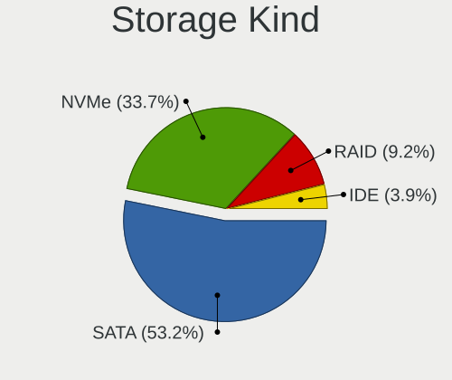

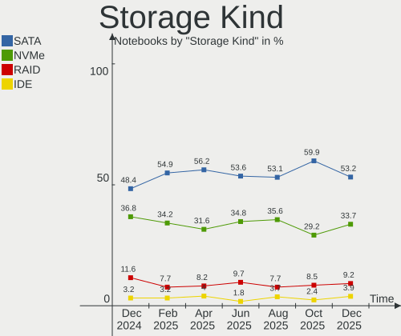

| Kind | Notebooks | Percent |
|------|-----------|---------|
| SATA | 243       | 53.17%  |
| NVMe | 154       | 33.7%   |
| RAID | 42        | 9.19%   |
| IDE  | 18        | 3.94%   |

Processor
---------

CPU Vendor
----------

Processor vendors

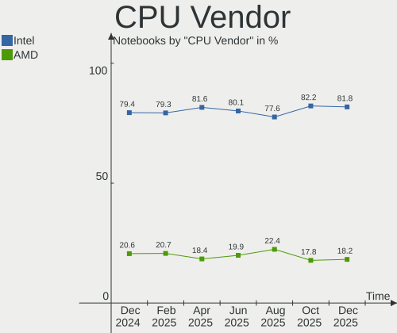

| Vendor | Notebooks | Percent |
|--------|-----------|---------|
| Intel  | 319       | 81.79%  |
| AMD    | 71        | 18.21%  |

CPU Model
---------

Processor models

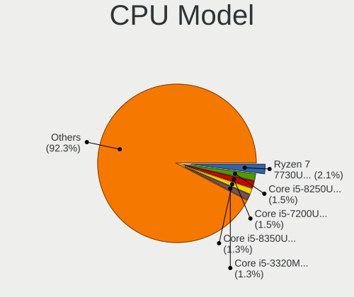

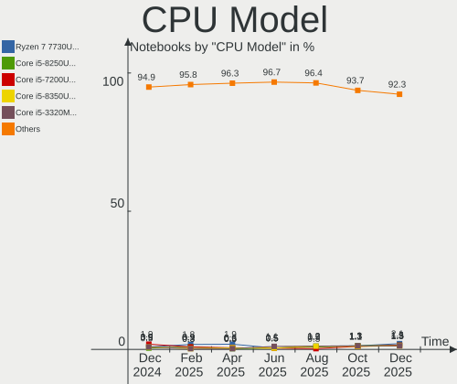

| Model                                         | Notebooks | Percent |
|-----------------------------------------------|-----------|---------|
| AMD Ryzen 7 7730U with Radeon Graphics        | 8         | 2.05%   |
| Intel Core i5-8250U CPU @ 1.60GHz             | 6         | 1.54%   |
| Intel Core i5-7200U CPU @ 2.50GHz             | 6         | 1.54%   |
| Intel Core i5-8350U CPU @ 1.70GHz             | 5         | 1.28%   |
| Intel Core i5-3320M CPU @ 2.60GHz             | 5         | 1.28%   |
| Intel Core i5-2520M CPU @ 2.50GHz             | 5         | 1.28%   |
| Intel Core i3-4030U CPU @ 1.90GHz             | 5         | 1.28%   |
| Intel Core i7-7700HQ CPU @ 2.80GHz            | 4         | 1.03%   |
| Intel Core i7-6700HQ CPU @ 2.60GHz            | 4         | 1.03%   |
| Intel Core i7-6500U CPU @ 2.50GHz             | 4         | 1.03%   |
| Intel Core i7-4700MQ CPU @ 2.40GHz            | 4         | 1.03%   |
| Intel Core i5-8265U CPU @ 1.60GHz             | 4         | 1.03%   |
| Intel Core i5-6200U CPU @ 2.30GHz             | 4         | 1.03%   |
| Intel Core i5-3210M CPU @ 2.50GHz             | 4         | 1.03%   |
| Intel 11th Gen Core i5-1135G7 @ 2.40GHz       | 4         | 1.03%   |
| Intel Core i7-8750H CPU @ 2.20GHz             | 3         | 0.77%   |
| Intel Core i7-7500U CPU @ 2.70GHz             | 3         | 0.77%   |
| Intel Core i7-6600U CPU @ 2.60GHz             | 3         | 0.77%   |
| Intel Core i7-5500U CPU @ 2.40GHz             | 3         | 0.77%   |
| Intel Core i5-8365U CPU @ 1.60GHz             | 3         | 0.77%   |
| Intel Core i5-6300U CPU @ 2.40GHz             | 3         | 0.77%   |
| Intel Core i5-5350U CPU @ 1.80GHz             | 3         | 0.77%   |
| Intel Core i5-5300U CPU @ 2.30GHz             | 3         | 0.77%   |
| Intel Core i5-4210U CPU @ 1.70GHz             | 3         | 0.77%   |
| Intel Core i5-4200U CPU @ 1.60GHz             | 3         | 0.77%   |
| Intel Core i5-10310U CPU @ 1.70GHz            | 3         | 0.77%   |
| Intel Core i5 CPU M 560 @ 2.67GHz             | 3         | 0.77%   |
| Intel Core i3-7020U CPU @ 2.30GHz             | 3         | 0.77%   |
| Intel Core i3-4005U CPU @ 1.70GHz             | 3         | 0.77%   |
| Intel Core i3-2328M CPU @ 2.20GHz             | 3         | 0.77%   |
| Intel Core 2 Duo CPU P8700 @ 2.53GHz          | 3         | 0.77%   |
| Intel Core 2 Duo CPU P8600 @ 2.40GHz          | 3         | 0.77%   |
| Intel Celeron N4500 @ 1.10GHz                 | 3         | 0.77%   |
| Intel Celeron N4120 CPU @ 1.10GHz             | 3         | 0.77%   |
| Intel 13th Gen Core i7-13620H                 | 3         | 0.77%   |
| AMD Ryzen 5 7520U with Radeon Graphics        | 3         | 0.77%   |
| AMD Ryzen 5 3500U with Radeon Vega Mobile Gfx | 3         | 0.77%   |
| Intel Pentium Silver N6000 @ 1.10GHz          | 2         | 0.51%   |
| Intel Pentium Gold 7505 @ 2.00GHz             | 2         | 0.51%   |
| Intel Core Ultra 7 256V                       | 2         | 0.51%   |

CPU Model Family
----------------

Processor model prefix

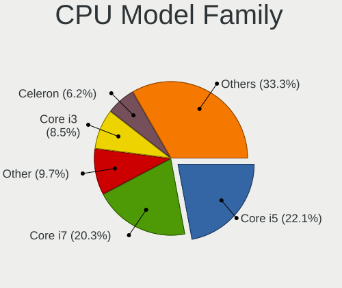

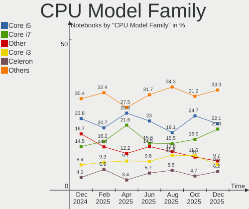

| Model                   | Notebooks | Percent |
|-------------------------|-----------|---------|
| Intel Core i5           | 86        | 22.05%  |
| Intel Core i7           | 79        | 20.26%  |
| Other                   | 38        | 9.74%   |
| Intel Core i3           | 33        | 8.46%   |
| Intel Celeron           | 24        | 6.15%   |
| Intel Core 2 Duo        | 21        | 5.38%   |
| AMD Ryzen 7             | 20        | 5.13%   |
| AMD Ryzen 5             | 16        | 4.1%    |
| Intel Core              | 10        | 2.56%   |
| Intel Pentium           | 7         | 1.79%   |
| Intel Core i9           | 5         | 1.28%   |
| AMD A8                  | 5         | 1.28%   |
| Intel Pentium Dual      | 4         | 1.03%   |
| AMD Ryzen 7 PRO         | 4         | 1.03%   |
| Intel Pentium Silver    | 3         | 0.77%   |
| AMD Ryzen 5 PRO         | 3         | 0.77%   |
| AMD Ryzen 3             | 3         | 0.77%   |
| AMD A10                 | 3         | 0.77%   |
| Intel Pentium Gold      | 2         | 0.51%   |
| Intel Pentium Dual-Core | 2         | 0.51%   |
| Intel Core M            | 2         | 0.51%   |
| AMD Ryzen 9             | 2         | 0.51%   |
| AMD E1                  | 2         | 0.51%   |
| AMD A4                  | 2         | 0.51%   |
| Intel Xeon              | 1         | 0.26%   |
| Intel Genuine           | 1         | 0.26%   |
| Intel Core 2            | 1         | 0.26%   |
| Intel Atom              | 1         | 0.26%   |
| AMD Ryzen Embedded      | 1         | 0.26%   |
| AMD QC                  | 1         | 0.26%   |
| AMD PRO A10             | 1         | 0.26%   |
| AMD Phenom II           | 1         | 0.26%   |
| AMD E2                  | 1         | 0.26%   |
| AMD E                   | 1         | 0.26%   |
| AMD Athlon X2           | 1         | 0.26%   |
| AMD Athlon II           | 1         | 0.26%   |
| AMD Athlon              | 1         | 0.26%   |
| AMD A6                  | 1         | 0.26%   |

CPU Cores
---------

Number of processor cores

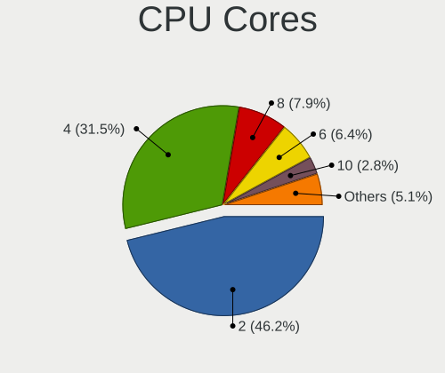

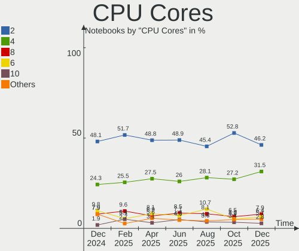

| Number | Notebooks | Percent |
|--------|-----------|---------|
| 2      | 180       | 46.15%  |
| 4      | 123       | 31.54%  |
| 8      | 31        | 7.95%   |
| 6      | 25        | 6.41%   |
| 10     | 11        | 2.82%   |
| 12     | 6         | 1.54%   |
| 14     | 5         | 1.28%   |
| 24     | 3         | 0.77%   |
| 20     | 3         | 0.77%   |
| 16     | 3         | 0.77%   |

CPU Sockets
-----------

Number of sockets

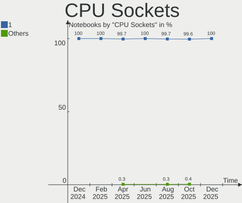

| Number | Notebooks | Percent |
|--------|-----------|---------|
| 1      | 390       | 100%    |

CPU Threads
-----------

Threads per core (Hyper-Threading)

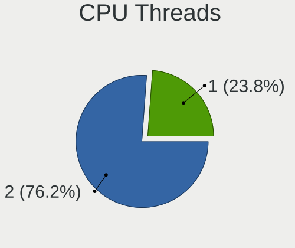

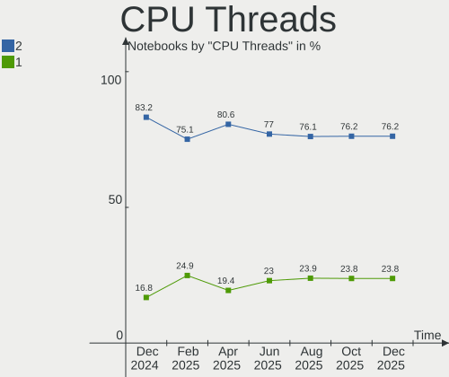

| Number | Notebooks | Percent |
|--------|-----------|---------|
| 2      | 297       | 76.15%  |
| 1      | 93        | 23.85%  |

CPU Op-Modes
------------

CPU Operation Modes (32-bit, 64-bit)

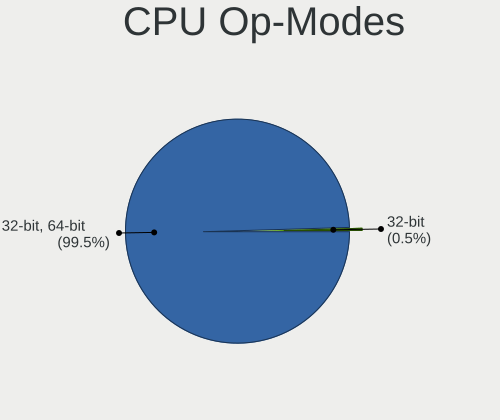

| Op mode        | Notebooks | Percent |
|----------------|-----------|---------|
| 32-bit, 64-bit | 390       | 100%    |

CPU Microcode
-------------

Microcode number

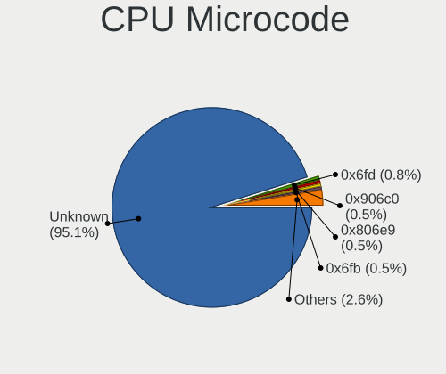

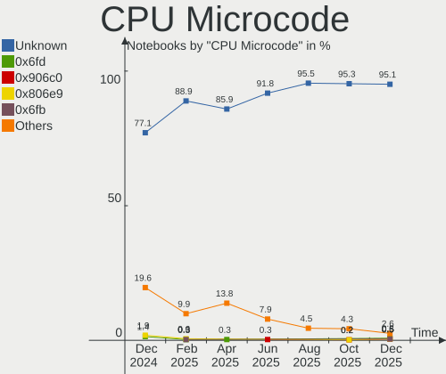

| Number     | Notebooks | Percent |
|------------|-----------|---------|
| Unknown    | 371       | 95.13%  |
| 0x6fd      | 3         | 0.77%   |
| 0x906c0    | 2         | 0.51%   |
| 0x806e9    | 2         | 0.51%   |
| 0x6fb      | 2         | 0.51%   |
| 0x406e3    | 2         | 0.51%   |
| 0x20655    | 2         | 0.51%   |
| 0x806ec    | 1         | 0.26%   |
| 0x806c1    | 1         | 0.26%   |
| 0x6f2      | 1         | 0.26%   |
| 0x306c3    | 1         | 0.26%   |
| 0x306a9    | 1         | 0.26%   |
| 0x08608103 | 1         | 0.26%   |

CPU Microarch
-------------

Microarchitecture

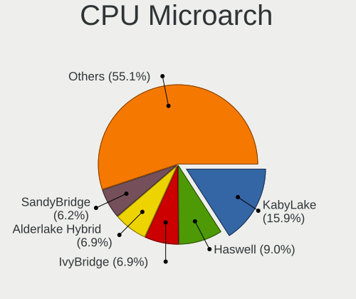

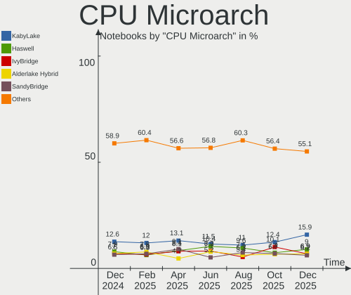

| Name               | Notebooks | Percent |
|--------------------|-----------|---------|
| KabyLake           | 62        | 15.9%   |
| Haswell            | 35        | 8.97%   |
| IvyBridge          | 27        | 6.92%   |
| Alderlake Hybrid   | 27        | 6.92%   |
| SandyBridge        | 24        | 6.15%   |
| Skylake            | 21        | 5.38%   |
| Unknown            | 19        | 4.87%   |
| Zen 3              | 17        | 4.36%   |
| Core               | 16        | 4.1%    |
| Broadwell          | 15        | 3.85%   |
| Penryn             | 13        | 3.33%   |
| Zen+               | 12        | 3.08%   |
| TigerLake          | 11        | 2.82%   |
| Westmere           | 10        | 2.56%   |
| Silvermont         | 10        | 2.56%   |
| Goldmont plus      | 8         | 2.05%   |
| CometLake          | 7         | 1.79%   |
| Tremont            | 6         | 1.54%   |
| Lunarlake Hybrid   | 6         | 1.54%   |
| Icelake            | 6         | 1.54%   |
| Goldmont           | 6         | 1.54%   |
| Jaguar             | 5         | 1.28%   |
| Piledriver         | 4         | 1.03%   |
| Zen                | 3         | 0.77%   |
| Meteorlake Hybrid  | 3         | 0.77%   |
| Zen 2              | 2         | 0.51%   |
| Puma               | 2         | 0.51%   |
| Nehalem            | 2         | 0.51%   |
| K10                | 2         | 0.51%   |
| Excavator          | 2         | 0.51%   |
| Bobcat             | 2         | 0.51%   |
| Steamroller        | 1         | 0.26%   |
| K8 Hammer          | 1         | 0.26%   |
| K10 Llano          | 1         | 0.26%   |
| Gracemont          | 1         | 0.26%   |
| ArrowLake-H Hybrid | 1         | 0.26%   |

Graphics
--------

GPU Vendor
----------

Vendors of graphics cards

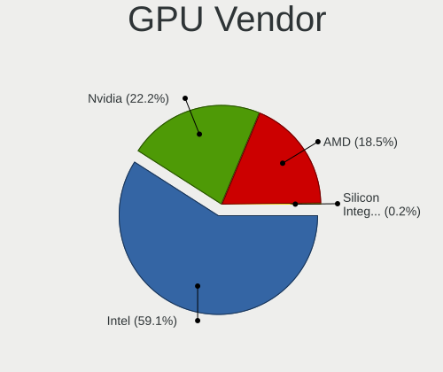

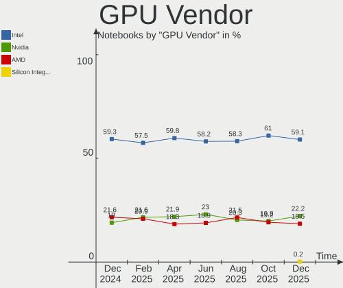

| Vendor                           | Notebooks | Percent |
|----------------------------------|-----------|---------|
| Intel                            | 290       | 59.06%  |
| Nvidia                           | 109       | 22.2%   |
| AMD                              | 91        | 18.53%  |
| Silicon Integrated Systems [SiS] | 1         | 0.2%    |

GPU Model
---------

Graphics card models

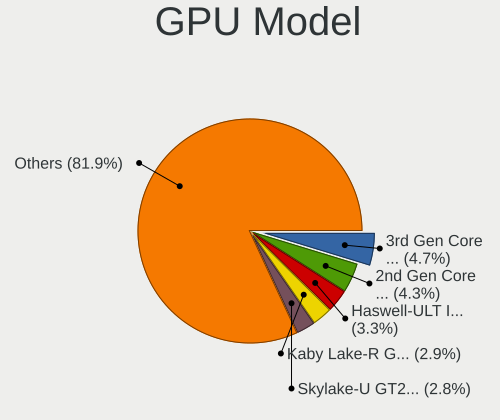

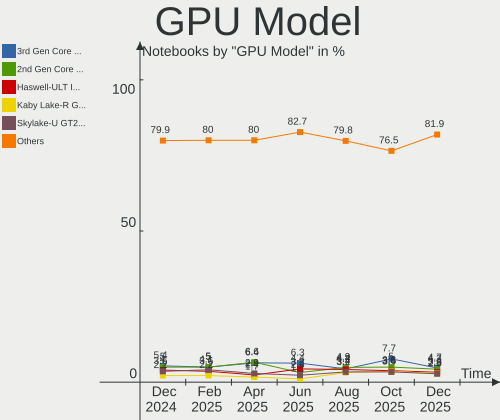

| Model                                                                                    | Notebooks | Percent |
|------------------------------------------------------------------------------------------|-----------|---------|
| Intel 3rd Gen Core processor Graphics Controller                                         | 24        | 4.72%   |
| Intel 2nd Generation Core Processor Family Integrated Graphics Controller                | 22        | 4.32%   |
| Intel Haswell-ULT Integrated Graphics Controller                                         | 17        | 3.34%   |
| Intel Kaby Lake-R GT2 [UHD Graphics 620]                                                 | 15        | 2.95%   |
| Intel Skylake-U GT2 [HD Graphics 520]                                                    | 14        | 2.75%   |
| Intel Kaby Lake-U GT2 [HD Graphics 620]                                                  | 13        | 2.55%   |
| Intel 4th Gen Core Processor Integrated Graphics Controller                              | 13        | 2.55%   |
| AMD Picasso/Raven 2 [Radeon Vega Series / Radeon Vega Mobile Series]                     | 13        | 2.55%   |
| AMD Barcelo                                                                              | 13        | 2.55%   |
| Nvidia GF117M [GeForce 610M/710M/810M/820M / GT 620M/625M/630M/720M]                     | 10        | 1.96%   |
| Intel Mobile 4 Series Chipset Integrated Graphics Controller                             | 9         | 1.77%   |
| Intel CometLake-U GT2 [UHD Graphics]                                                     | 9         | 1.77%   |
| Intel Broadwell-U GT2 [HD Graphics 5500]                                                 | 9         | 1.77%   |
| Intel WhiskeyLake-U GT2 [UHD Graphics 620]                                               | 8         | 1.57%   |
| Intel Raptor Lake-P [Iris Xe Graphics]                                                   | 8         | 1.57%   |
| Intel TigerLake-LP GT2 [Iris Xe Graphics]                                                | 7         | 1.38%   |
| Intel JasperLake [UHD Graphics]                                                          | 7         | 1.38%   |
| Intel GeminiLake [UHD Graphics 600]                                                      | 7         | 1.38%   |
| Intel Core Processor Integrated Graphics Controller                                      | 7         | 1.38%   |
| Intel CometLake-H GT2 [UHD Graphics]                                                     | 7         | 1.38%   |
| Intel CoffeeLake-H GT2 [UHD Graphics 630]                                                | 7         | 1.38%   |
| Intel Skylake-H GT2 [HD Graphics 530]                                                    | 6         | 1.18%   |
| Intel Mobile GM965/GL960 Integrated Graphics Controller (secondary)                      | 6         | 1.18%   |
| Intel Mobile GM965/GL960 Integrated Graphics Controller (primary)                        | 6         | 1.18%   |
| Intel Atom Processor Z36xxx/Z37xxx Series Graphics & Display                             | 6         | 1.18%   |
| Nvidia TU117M [GeForce GTX 1650 Mobile / Max-Q]                                          | 5         | 0.98%   |
| Intel Kaby Lake-H GT2 [HD Graphics 630]                                                  | 5         | 0.98%   |
| Intel Apollo Lake GT1 [HD Graphics 500]                                                  | 5         | 0.98%   |
| Nvidia GB206M [GeForce RTX 5070 Max-Q / Mobile]                                          | 4         | 0.79%   |
| Nvidia AD107M [GeForce RTX 4060 Max-Q / Mobile]                                          | 4         | 0.79%   |
| Intel Tiger Lake-LP GT2 [UHD Graphics G4]                                                | 4         | 0.79%   |
| Intel Raptor Lake-S UHD Graphics                                                         | 4         | 0.79%   |
| Intel Raptor Lake-P [UHD Graphics]                                                       | 4         | 0.79%   |
| Intel Atom/Celeron/Pentium Processor x5-E8000/J3xxx/N3xxx Integrated Graphics Controller | 4         | 0.79%   |
| AMD Topaz XT [Radeon R7 M260/M265 / M340/M360 / M440/M445 / 530/535 / 620/625 Mobile]    | 4         | 0.79%   |
| AMD Thames [Radeon HD 7500M/7600M Series]                                                | 4         | 0.79%   |
| AMD Rembrandt [Radeon 680M]                                                              | 4         | 0.79%   |
| Nvidia C79 [GeForce 9400M]                                                               | 3         | 0.59%   |
| Intel Lunar Lake [Intel Arc Graphics 130V / 140V]                                        | 3         | 0.59%   |
| Intel Iris Plus Graphics G1 (Ice Lake)                                                   | 3         | 0.59%   |

GPU Combo
---------

Combinations of graphics cards

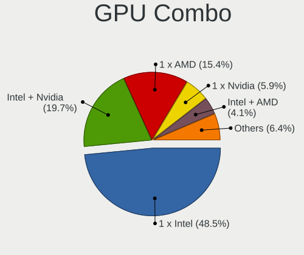

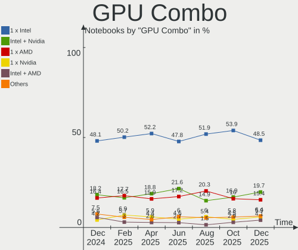

| Name           | Notebooks | Percent |
|----------------|-----------|---------|
| 1 x Intel      | 189       | 48.46%  |
| Intel + Nvidia | 77        | 19.74%  |
| 1 x AMD        | 60        | 15.38%  |
| 1 x Nvidia     | 23        | 5.9%    |
| Intel + AMD    | 16        | 4.1%    |
| 2 x AMD        | 8         | 2.05%   |
| AMD + Nvidia   | 7         | 1.79%   |
| 2 x Intel      | 6         | 1.54%   |
| 2 x Nvidia     | 2         | 0.51%   |
| Other          | 1         | 0.26%   |
| 1 x SiS        | 1         | 0.26%   |

GPU Driver
----------

Free vs proprietary

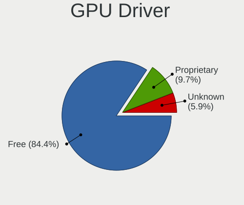

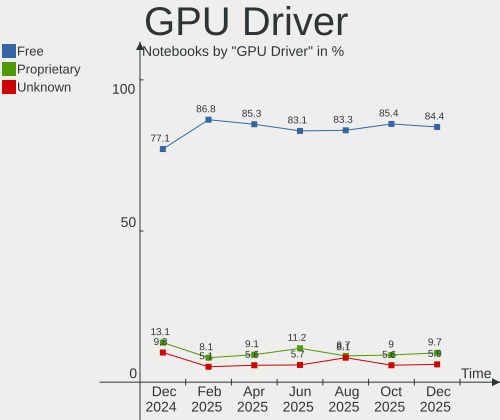

| Driver      | Notebooks | Percent |
|-------------|-----------|---------|
| Free        | 329       | 84.36%  |
| Proprietary | 38        | 9.74%   |
| Unknown     | 23        | 5.9%    |

GPU Memory
----------

Total video memory

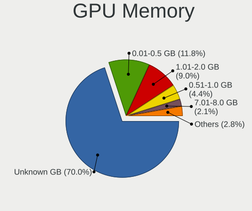

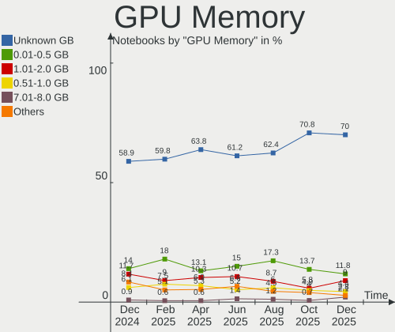

| Size in GB | Notebooks | Percent |
|------------|-----------|---------|
| Unknown    | 273       | 70%     |
| 0.01-0.5   | 46        | 11.79%  |
| 1.01-2.0   | 35        | 8.97%   |
| 0.51-1.0   | 17        | 4.36%   |
| 7.01-8.0   | 8         | 2.05%   |
| 3.01-4.0   | 6         | 1.54%   |
| 5.01-6.0   | 2         | 0.51%   |
| 2.01-3.0   | 2         | 0.51%   |
| 8.01-16.0  | 1         | 0.26%   |

Monitor
-------

Monitor Vendor
--------------

Monitor vendors

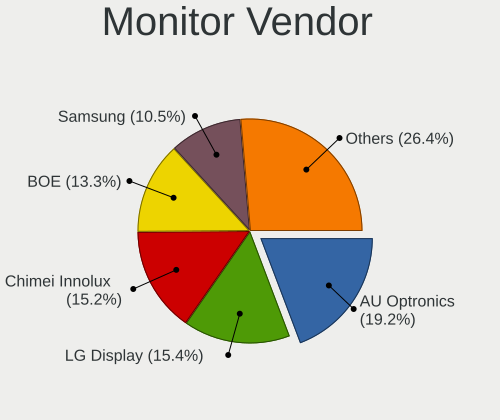

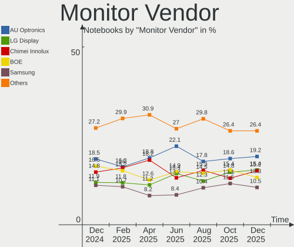

| Vendor                  | Notebooks | Percent |
|-------------------------|-----------|---------|
| AU Optronics            | 81        | 19.24%  |
| LG Display              | 65        | 15.44%  |
| Chimei Innolux          | 64        | 15.2%   |
| BOE                     | 56        | 13.3%   |
| Samsung Electronics     | 44        | 10.45%  |
| Apple                   | 17        | 4.04%   |
| Lenovo                  | 15        | 3.56%   |
| Chi Mei Optoelectronics | 10        | 2.38%   |
| InfoVision              | 6         | 1.43%   |
| Dell                    | 6         | 1.43%   |
| Philips                 | 5         | 1.19%   |
| CSOT                    | 5         | 1.19%   |
| Sharp                   | 4         | 0.95%   |
| PANDA                   | 4         | 0.95%   |
| LG Philips              | 4         | 0.95%   |
| Unknown                 | 3         | 0.71%   |
| Hewlett-Packard         | 3         | 0.71%   |
| HannStar                | 3         | 0.71%   |
| Goldstar                | 3         | 0.71%   |
| Vestel Elektronik       | 2         | 0.48%   |
| Fujitsu Siemens         | 2         | 0.48%   |
| Eizo                    | 2         | 0.48%   |
| EDO                     | 2         | 0.48%   |
| CSW                     | 2         | 0.48%   |
| Acer                    | 2         | 0.48%   |
| ZTR                     | 1         | 0.24%   |
| Vizio                   | 1         | 0.24%   |
| Toshiba                 | 1         | 0.24%   |
| STA                     | 1         | 0.24%   |
| Quanta Display          | 1         | 0.24%   |
| Positivo                | 1         | 0.24%   |
| Pioneer                 | 1         | 0.24%   |
| KDC                     | 1         | 0.24%   |
| Hyundai ImageQuest      | 1         | 0.24%   |
| CPT                     | 1         | 0.24%   |
| AOC                     | 1         | 0.24%   |

Monitor Model
-------------

Monitor models

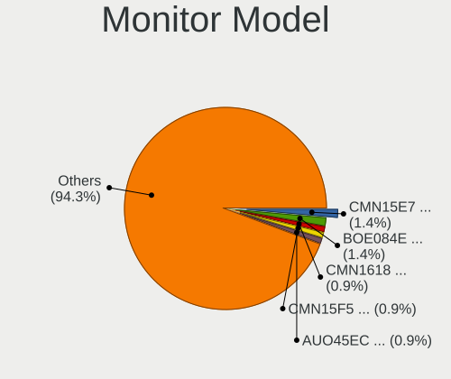

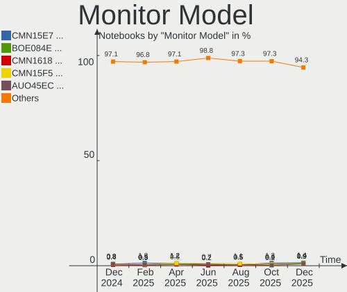

| Model                                                                     | Notebooks | Percent |
|---------------------------------------------------------------------------|-----------|---------|
| Chimei Innolux LCD Monitor CMN15E7 1920x1080 344x193mm 15.5-inch          | 6         | 1.42%   |
| BOE LCD Monitor BOE084E 1920x1080 382x215mm 17.3-inch                     | 6         | 1.42%   |
| Chimei Innolux LCD Monitor CMN1618 1920x1200 344x215mm 16.0-inch          | 4         | 0.94%   |
| Chimei Innolux LCD Monitor CMN15F5 1920x1080 344x193mm 15.5-inch          | 4         | 0.94%   |
| AU Optronics LCD Monitor AUO45EC 1366x768 344x193mm 15.5-inch             | 4         | 0.94%   |
| AU Optronics LCD Monitor AUO10EC 1366x768 344x193mm 15.5-inch             | 4         | 0.94%   |
| LG Display LCD Monitor LGD0521 1920x1080 309x174mm 14.0-inch              | 3         | 0.71%   |
| LG Display LCD Monitor LGD046F 1920x1080 344x194mm 15.5-inch              | 3         | 0.71%   |
| Chimei Innolux LCD Monitor CMN1521 1920x1080 344x193mm 15.5-inch          | 3         | 0.71%   |
| AU Optronics LCD Monitor AUO2E3C 1366x768 309x173mm 13.9-inch             | 3         | 0.71%   |
| Vestel Elektronik 40UHD_LCD_TV VES3700 3840x2160 880x500mm 39.8-inch      | 2         | 0.47%   |
| Unknown LCD Monitor FFFF 2288x1287 2550x2550mm 142.0-inch                 | 2         | 0.47%   |
| Samsung Electronics LCD Monitor SEC5441 1280x800 331x207mm 15.4-inch      | 2         | 0.47%   |
| Samsung Electronics LCD Monitor SDC5441 1366x768 344x193mm 15.5-inch      | 2         | 0.47%   |
| Samsung Electronics LCD Monitor SDC4A51 1366x768 344x194mm 15.5-inch      | 2         | 0.47%   |
| Samsung Electronics LCD Monitor SDC41B6 2880x1800 344x215mm 16.0-inch     | 2         | 0.47%   |
| Samsung Electronics LCD Monitor SDC3654 1600x900 382x215mm 17.3-inch      | 2         | 0.47%   |
| Samsung Electronics LCD Monitor SDC3150 1920x1080 344x194mm 15.5-inch     | 2         | 0.47%   |
| PANDA LCD Monitor NCP004D 1920x1080 344x194mm 15.5-inch                   | 2         | 0.47%   |
| LG Display LCD Monitor LGD04A7 1920x1080 344x194mm 15.5-inch              | 2         | 0.47%   |
| LG Display LCD Monitor LGD049B 1920x1080 344x194mm 15.5-inch              | 2         | 0.47%   |
| LG Display LCD Monitor LGD0468 1366x768 344x194mm 15.5-inch               | 2         | 0.47%   |
| LG Display LCD Monitor LGD03FB 1920x1080 382x215mm 17.3-inch              | 2         | 0.47%   |
| LG Display LCD Monitor LGD02D9 1920x1080 344x194mm 15.5-inch              | 2         | 0.47%   |
| Lenovo LCD Monitor LEN40B2 1920x1080 344x193mm 15.5-inch                  | 2         | 0.47%   |
| Lenovo LCD Monitor LEN40B0 1366x768 344x194mm 15.5-inch                   | 2         | 0.47%   |
| Lenovo LCD Monitor LEN40A9 1920x1080 309x173mm 13.9-inch                  | 2         | 0.47%   |
| Fujitsu Siemens B24W-7 LED FUS0853 1920x1200 518x324mm 24.1-inch          | 2         | 0.47%   |
| EDO EF10QBC64.C EDO4245                                                   | 2         | 0.47%   |
| CSOT SNF601BS1-1 CSO150D 1920x1080 344x193mm 15.5-inch                    | 2         | 0.47%   |
| Chimei Innolux LCD Monitor CMN1738 1920x1080 381x214mm 17.2-inch          | 2         | 0.47%   |
| Chimei Innolux LCD Monitor CMN1734 1600x900 382x214mm 17.2-inch           | 2         | 0.47%   |
| Chimei Innolux LCD Monitor CMN1728 1600x900 382x215mm 17.3-inch           | 2         | 0.47%   |
| Chimei Innolux LCD Monitor CMN15AB 1366x768 344x193mm 15.5-inch           | 2         | 0.47%   |
| Chimei Innolux LCD Monitor CMN1541 1366x768 344x193mm 15.5-inch           | 2         | 0.47%   |
| Chimei Innolux LCD Monitor CMN1495 1366x768 309x173mm 13.9-inch           | 2         | 0.47%   |
| Chimei Innolux LCD Monitor CMN1441 1920x1200 301x188mm 14.0-inch          | 2         | 0.47%   |
| Chi Mei Optoelectronics LCD Monitor CMO1720 1920x1080 382x215mm 17.3-inch | 2         | 0.47%   |
| Chi Mei Optoelectronics LCD Monitor CMO15A7 1366x768 344x193mm 15.5-inch  | 2         | 0.47%   |
| BOE LCD Monitor BOE0CFD 1920x1080 344x194mm 15.5-inch                     | 2         | 0.47%   |

Monitor Resolution
------------------

Monitor screen resolution

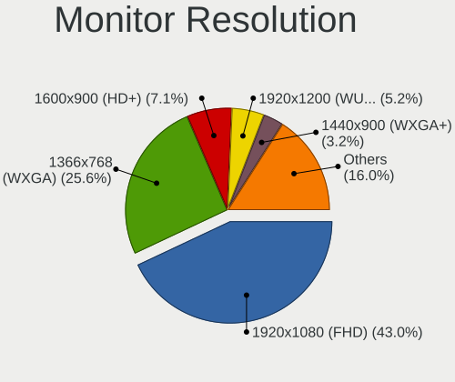

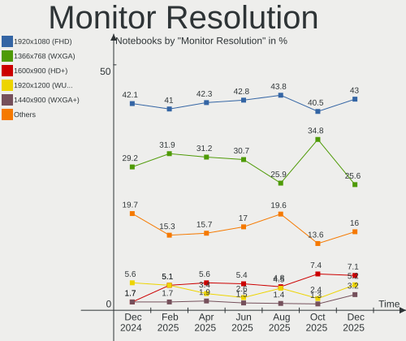

| Resolution         | Notebooks | Percent |
|--------------------|-----------|---------|
| 1920x1080 (FHD)    | 175       | 43%     |
| 1366x768 (WXGA)    | 104       | 25.55%  |
| 1600x900 (HD+)     | 29        | 7.13%   |
| 1920x1200 (WUXGA)  | 21        | 5.16%   |
| 1440x900 (WXGA+)   | 13        | 3.19%   |
| 3840x2160 (4K)     | 11        | 2.7%    |
| 2880x1800          | 10        | 2.46%   |
| 1280x800 (WXGA)    | 10        | 2.46%   |
| 2560x1440 (QHD)    | 8         | 1.97%   |
| 2560x1600          | 6         | 1.47%   |
| 1680x1050 (WSXGA+) | 4         | 0.98%   |
| Unknown            | 4         | 0.98%   |
| 3200x1800 (QHD+)   | 2         | 0.49%   |
| 2288x1287          | 2         | 0.49%   |
| 1280x1024 (SXGA)   | 2         | 0.49%   |
| 3840x2400          | 1         | 0.25%   |
| 3440x1440          | 1         | 0.25%   |
| 2880x1620          | 1         | 0.25%   |
| 2560x1080          | 1         | 0.25%   |
| 1920x1280          | 1         | 0.25%   |
| 1024x768 (XGA)     | 1         | 0.25%   |

Monitor Diagonal
----------------

Diagonal size in inches

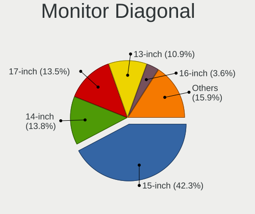

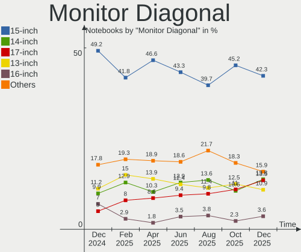

| Inches  | Notebooks | Percent |
|---------|-----------|---------|
| 15      | 178       | 42.28%  |
| 14      | 58        | 13.78%  |
| 17      | 57        | 13.54%  |
| 13      | 46        | 10.93%  |
| 16      | 15        | 3.56%   |
| 27      | 11        | 2.61%   |
| 11      | 9         | 2.14%   |
| 24      | 7         | 1.66%   |
| 23      | 7         | 1.66%   |
| 21      | 5         | 1.19%   |
| Unknown | 5         | 1.19%   |
| 54      | 4         | 0.95%   |
| 12      | 4         | 0.95%   |
| 18      | 3         | 0.71%   |
| 142     | 2         | 0.48%   |
| 84      | 2         | 0.48%   |
| 34      | 2         | 0.48%   |
| 74      | 1         | 0.24%   |
| 31      | 1         | 0.24%   |
| 25      | 1         | 0.24%   |
| 22      | 1         | 0.24%   |
| 20      | 1         | 0.24%   |
| 19      | 1         | 0.24%   |

Monitor Width
-------------

Physical width

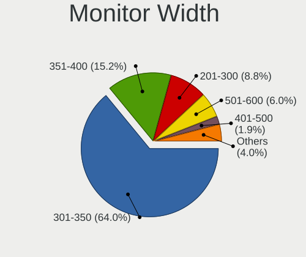

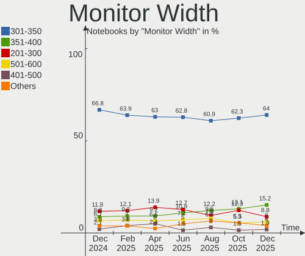

| Width in mm    | Notebooks | Percent |
|----------------|-----------|---------|
| 301-350        | 269       | 64.05%  |
| 351-400        | 64        | 15.24%  |
| 201-300        | 37        | 8.81%   |
| 501-600        | 25        | 5.95%   |
| 401-500        | 8         | 1.9%    |
| Unknown        | 5         | 1.19%   |
| 1001-1500      | 4         | 0.95%   |
| 1501-2000      | 3         | 0.71%   |
| More than 2000 | 2         | 0.48%   |
| 701-800        | 2         | 0.48%   |
| 601-700        | 1         | 0.24%   |

Aspect Ratio
------------

Proportional relationship between the width and the height

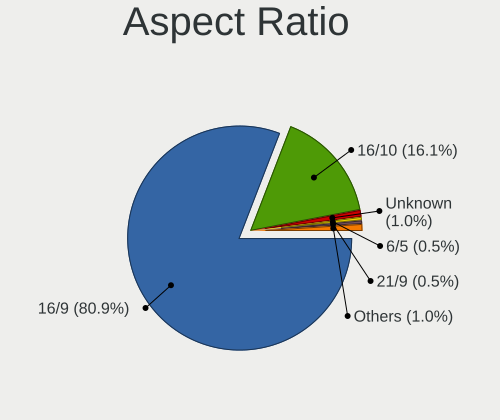

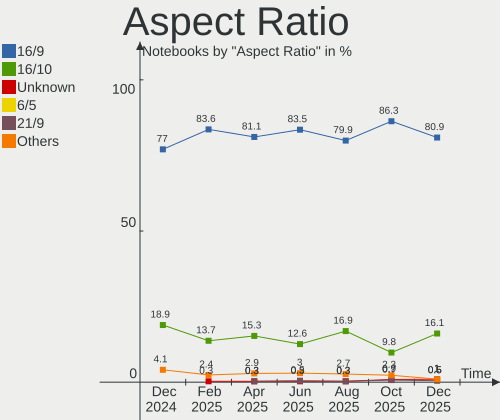

| Ratio   | Notebooks | Percent |
|---------|-----------|---------|
| 16/9    | 321       | 80.86%  |
| 16/10   | 64        | 16.12%  |
| Unknown | 4         | 1.01%   |
| 6/5     | 2         | 0.5%    |
| 21/9    | 2         | 0.5%    |
| 1.00    | 2         | 0.5%    |
| 4/3     | 1         | 0.25%   |
| 3/2     | 1         | 0.25%   |

Monitor Area
------------

Area in inch²

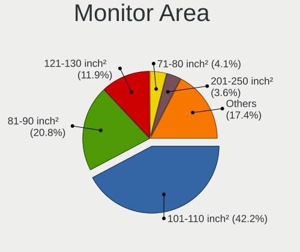

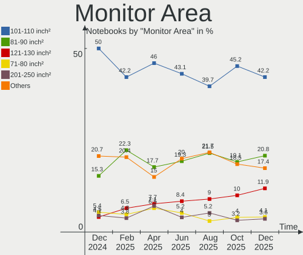

| Area in inch² | Notebooks | Percent |
|----------------|-----------|---------|
| 101-110        | 177       | 42.24%  |
| 81-90          | 87        | 20.76%  |
| 121-130        | 50        | 11.93%  |
| 71-80          | 17        | 4.06%   |
| 201-250        | 15        | 3.58%   |
| 111-120        | 14        | 3.34%   |
| 301-350        | 11        | 2.63%   |
| More than 1000 | 9         | 2.15%   |
| 131-140        | 9         | 2.15%   |
| 51-60          | 8         | 1.91%   |
| 61-70          | 5         | 1.19%   |
| Unknown        | 5         | 1.19%   |
| 151-200        | 4         | 0.95%   |
| 351-500        | 3         | 0.72%   |
| 251-300        | 3         | 0.72%   |
| 141-150        | 2         | 0.48%   |

Pixel Density
-------------

Pixels per inch

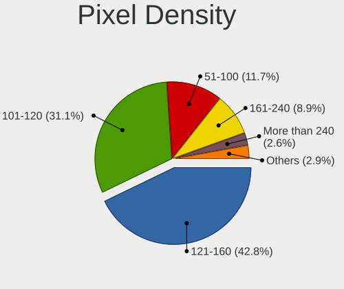

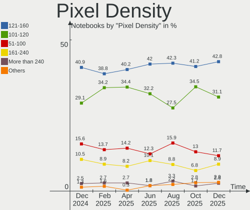

| Density       | Notebooks | Percent |
|---------------|-----------|---------|
| 121-160       | 179       | 42.82%  |
| 101-120       | 130       | 31.1%   |
| 51-100        | 49        | 11.72%  |
| 161-240       | 37        | 8.85%   |
| More than 240 | 11        | 2.63%   |
| 1-50          | 7         | 1.67%   |
| Unknown       | 5         | 1.2%    |

Multiple Monitors
-----------------

Total monitors connected

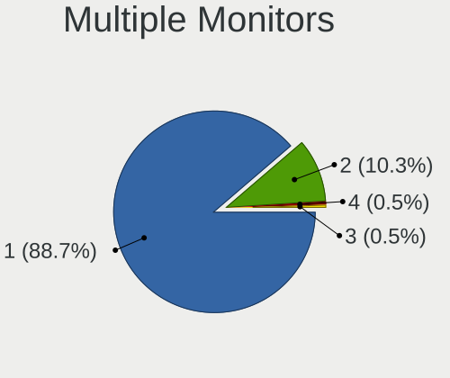

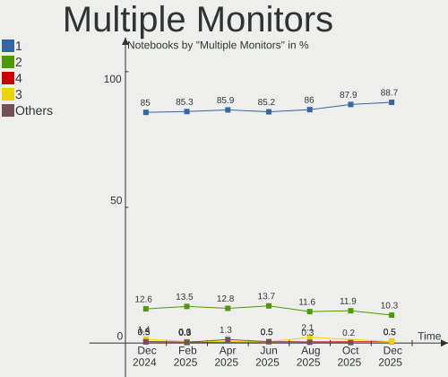

| Total | Notebooks | Percent |
|-------|-----------|---------|
| 1     | 346       | 88.72%  |
| 2     | 40        | 10.26%  |
| 4     | 2         | 0.51%   |
| 3     | 2         | 0.51%   |

Network
-------

Net Controller Vendor
---------------------

Controller vendors

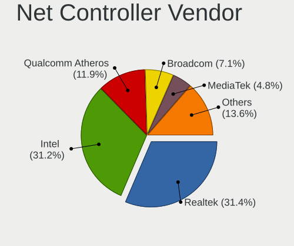

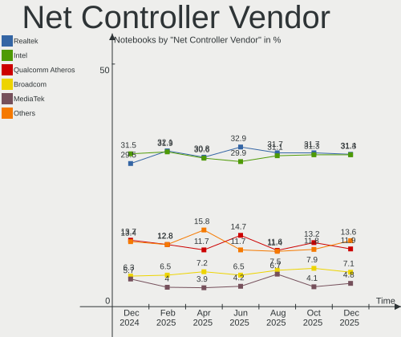

| Vendor                            | Notebooks | Percent |
|-----------------------------------|-----------|---------|
| Realtek Semiconductor             | 196       | 31.41%  |
| Intel                             | 195       | 31.25%  |
| Qualcomm Atheros                  | 74        | 11.86%  |
| Broadcom                          | 44        | 7.05%   |
| MediaTek                          | 30        | 4.81%   |
| Ralink                            | 13        | 2.08%   |
| Broadcom Limited                  | 11        | 1.76%   |
| Sierra Wireless                   | 7         | 1.12%   |
| Marvell Technology Group          | 7         | 1.12%   |
| Ericsson Business Mobile Networks | 5         | 0.8%    |
| TP-Link                           | 4         | 0.64%   |
| D-Link                            | 4         | 0.64%   |
| Samsung Electronics               | 3         | 0.48%   |
| Ralink Technology                 | 3         | 0.48%   |
| Qualcomm                          | 3         | 0.48%   |
| Nvidia                            | 3         | 0.48%   |
| Xiaomi                            | 2         | 0.32%   |
| Shenzhen Goodix Technology        | 2         | 0.32%   |
| NetGear                           | 2         | 0.32%   |
| AVM                               | 2         | 0.32%   |
| Silicon Integrated Systems [SiS]  | 1         | 0.16%   |
| Realtek                           | 1         | 0.16%   |
| Qualcomm Atheros Communications   | 1         | 0.16%   |
| OPPO Electronics                  | 1         | 0.16%   |
| Lenovo                            | 1         | 0.16%   |
| Hewlett-Packard                   | 1         | 0.16%   |
| Flipper Devices                   | 1         | 0.16%   |
| Edimax Technology                 | 1         | 0.16%   |
| DisplayLink                       | 1         | 0.16%   |
| Dell                              | 1         | 0.16%   |
| Cypress Semiconductor             | 1         | 0.16%   |
| Comneon                           | 1         | 0.16%   |
| ASIX Electronics                  | 1         | 0.16%   |
| Apple                             | 1         | 0.16%   |

Net Controller Model
--------------------

Controller models

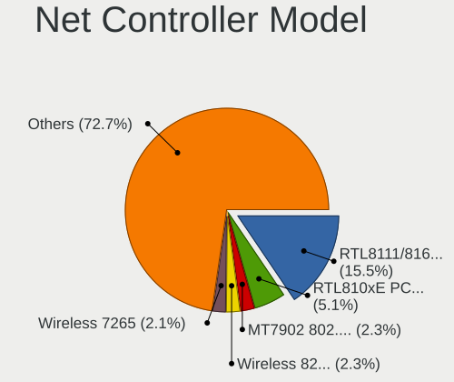

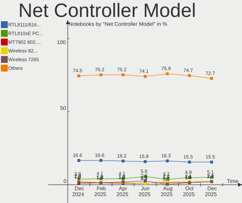

| Model                                                                           | Notebooks | Percent |
|---------------------------------------------------------------------------------|-----------|---------|
| Realtek RTL8111/8168/8211/8411 PCI Express Gigabit Ethernet Controller          | 116       | 15.53%  |
| Realtek RTL810xE PCI Express Fast Ethernet controller                           | 38        | 5.09%   |
| MediaTek MT7902 802.11ax PCIe Wireless Network Adapter [Filogic 310]            | 17        | 2.28%   |
| Intel Wireless 8265 / 8275                                                      | 17        | 2.28%   |
| Intel Wireless 7265                                                             | 16        | 2.14%   |
| Realtek RTL8821CE 802.11ac PCIe Wireless Network Adapter                        | 15        | 2.01%   |
| Qualcomm Atheros QCA9565 / AR9565 Wireless Network Adapter                      | 15        | 2.01%   |
| Intel 82579LM Gigabit Network Connection (Lewisville)                           | 14        | 1.87%   |
| Realtek RTL8153 Gigabit Ethernet Adapter                                        | 13        | 1.74%   |
| Qualcomm Atheros QCA6174 802.11ac Wireless Network Adapter                      | 12        | 1.61%   |
| Qualcomm Atheros AR9485 Wireless Network Adapter                                | 12        | 1.61%   |
| Ralink RT3290 Wireless 802.11n 1T/1R PCIe                                       | 11        | 1.47%   |
| Broadcom BCM43142 802.11b/g/n                                                   | 11        | 1.47%   |
| Qualcomm Atheros QCA9377 802.11ac Wireless Network Adapter                      | 10        | 1.34%   |
| Intel Wireless 8260                                                             | 10        | 1.34%   |
| Intel Wireless 7260                                                             | 10        | 1.34%   |
| Intel Wi-Fi 6 AX200                                                             | 9         | 1.2%    |
| Intel Raptor Lake PCH CNVi WiFi                                                 | 9         | 1.2%    |
| Intel Ethernet Connection (4) I219-LM                                           | 9         | 1.2%    |
| Intel Comet Lake PCH-LP CNVi WiFi                                               | 9         | 1.2%    |
| Intel Centrino Advanced-N 6205 [Taylor Peak]                                    | 9         | 1.2%    |
| Realtek RTL8822CE 802.11ac PCIe Wireless Network Adapter                        | 8         | 1.07%   |
| Intel Wireless 3160                                                             | 7         | 0.94%   |
| Intel Wi-Fi 6 AX201                                                             | 7         | 0.94%   |
| Intel PRO/Wireless 3945ABG [Golan] Network Connection                           | 7         | 0.94%   |
| Intel Comet Lake PCH CNVi WiFi                                                  | 7         | 0.94%   |
| Intel Centrino Ultimate-N 6300                                                  | 7         | 0.94%   |
| Broadcom BCM4313 802.11bgn Wireless Network Adapter                             | 7         | 0.94%   |
| Realtek RTL8852BE PCIe 802.11ax Wireless Network Controller                     | 6         | 0.8%    |
| Qualcomm Atheros AR9285 Wireless Network Adapter (PCI-Express)                  | 6         | 0.8%    |
| Intel Cannon Point-LP CNVi [Wireless-AC]                                        | 6         | 0.8%    |
| Sierra Wireless EM7305 Modem                                                    | 5         | 0.67%   |
| Realtek RTL8188CE 802.11b/g/n WiFi Adapter                                      | 5         | 0.67%   |
| MediaTek MT7925 802.11be 160MHz 2x2 PCIe Wireless Network Adapter [Filogic 360] | 5         | 0.67%   |
| MediaTek MT7921 802.11ax PCIe Wireless Network Adapter [Filogic 330]            | 5         | 0.67%   |
| Intel Wi-Fi 7(802.11be) AX1775*/AX1790*/BE20*/BE401/BE1750* 2x2                 | 5         | 0.67%   |
| Intel Ethernet Connection I219-LM                                               | 5         | 0.67%   |
| Intel Alder Lake-P PCH CNVi WiFi                                                | 5         | 0.67%   |
| Realtek RTL8723BE PCIe Wireless Network Adapter                                 | 4         | 0.54%   |
| Realtek RTL8125 2.5GbE Controller                                               | 4         | 0.54%   |

Wireless Vendor
---------------

Wireless vendors

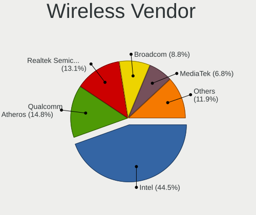

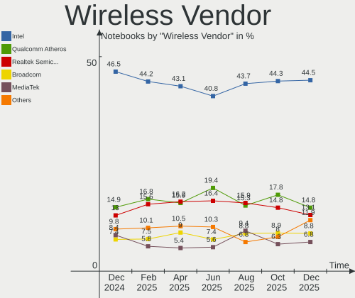

| Vendor                          | Notebooks | Percent |
|---------------------------------|-----------|---------|
| Intel                           | 183       | 44.53%  |
| Qualcomm Atheros                | 61        | 14.84%  |
| Realtek Semiconductor           | 54        | 13.14%  |
| Broadcom                        | 36        | 8.76%   |
| MediaTek                        | 28        | 6.81%   |
| Ralink                          | 13        | 3.16%   |
| Sierra Wireless                 | 7         | 1.7%    |
| Broadcom Limited                | 7         | 1.7%    |
| D-Link                          | 4         | 0.97%   |
| TP-Link                         | 3         | 0.73%   |
| Ralink Technology               | 3         | 0.73%   |
| Qualcomm                        | 3         | 0.73%   |
| NetGear                         | 2         | 0.49%   |
| AVM                             | 2         | 0.49%   |
| Realtek                         | 1         | 0.24%   |
| Qualcomm Atheros Communications | 1         | 0.24%   |
| Edimax Technology               | 1         | 0.24%   |
| Dell                            | 1         | 0.24%   |
| Cypress Semiconductor           | 1         | 0.24%   |

Wireless Model
--------------

Wireless models

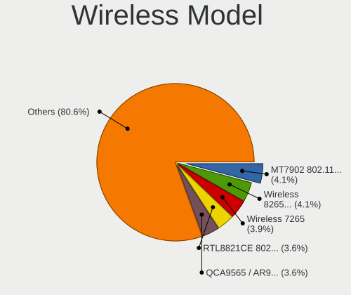

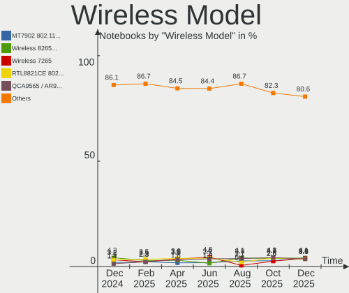

| Model                                                                           | Notebooks | Percent |
|---------------------------------------------------------------------------------|-----------|---------|
| MediaTek MT7902 802.11ax PCIe Wireless Network Adapter [Filogic 310]            | 17        | 4.13%   |
| Intel Wireless 8265 / 8275                                                      | 17        | 4.13%   |
| Intel Wireless 7265                                                             | 16        | 3.88%   |
| Realtek RTL8821CE 802.11ac PCIe Wireless Network Adapter                        | 15        | 3.64%   |
| Qualcomm Atheros QCA9565 / AR9565 Wireless Network Adapter                      | 15        | 3.64%   |
| Qualcomm Atheros QCA6174 802.11ac Wireless Network Adapter                      | 12        | 2.91%   |
| Qualcomm Atheros AR9485 Wireless Network Adapter                                | 12        | 2.91%   |
| Ralink RT3290 Wireless 802.11n 1T/1R PCIe                                       | 11        | 2.67%   |
| Broadcom BCM43142 802.11b/g/n                                                   | 11        | 2.67%   |
| Qualcomm Atheros QCA9377 802.11ac Wireless Network Adapter                      | 10        | 2.43%   |
| Intel Wireless 8260                                                             | 10        | 2.43%   |
| Intel Wireless 7260                                                             | 10        | 2.43%   |
| Intel Wi-Fi 6 AX200                                                             | 9         | 2.18%   |
| Intel Raptor Lake PCH CNVi WiFi                                                 | 9         | 2.18%   |
| Intel Comet Lake PCH-LP CNVi WiFi                                               | 9         | 2.18%   |
| Intel Centrino Advanced-N 6205 [Taylor Peak]                                    | 9         | 2.18%   |
| Realtek RTL8822CE 802.11ac PCIe Wireless Network Adapter                        | 8         | 1.94%   |
| Intel Wireless 3160                                                             | 7         | 1.7%    |
| Intel Wi-Fi 6 AX201                                                             | 7         | 1.7%    |
| Intel PRO/Wireless 3945ABG [Golan] Network Connection                           | 7         | 1.7%    |
| Intel Comet Lake PCH CNVi WiFi                                                  | 7         | 1.7%    |
| Intel Centrino Ultimate-N 6300                                                  | 7         | 1.7%    |
| Broadcom BCM4313 802.11bgn Wireless Network Adapter                             | 7         | 1.7%    |
| Realtek RTL8852BE PCIe 802.11ax Wireless Network Controller                     | 6         | 1.46%   |
| Qualcomm Atheros AR9285 Wireless Network Adapter (PCI-Express)                  | 6         | 1.46%   |
| Intel Cannon Point-LP CNVi [Wireless-AC]                                        | 6         | 1.46%   |
| Sierra Wireless EM7305 Modem                                                    | 5         | 1.21%   |
| Realtek RTL8188CE 802.11b/g/n WiFi Adapter                                      | 5         | 1.21%   |
| MediaTek MT7925 802.11be 160MHz 2x2 PCIe Wireless Network Adapter [Filogic 360] | 5         | 1.21%   |
| MediaTek MT7921 802.11ax PCIe Wireless Network Adapter [Filogic 330]            | 5         | 1.21%   |
| Realtek RTL8723BE PCIe Wireless Network Adapter                                 | 4         | 0.97%   |
| Intel Wireless 3165                                                             | 4         | 0.97%   |
| Intel Wi-Fi 7(802.11be) AX1775*/AX1790*/BE20*/BE401/BE1750* 2x2                 | 4         | 0.97%   |
| Intel Wi-Fi 5(802.11ac) Wireless-AC 9x6x [Thunder Peak]                         | 4         | 0.97%   |
| Intel Jasper Lake PCH CNVi WiFi                                                 | 4         | 0.97%   |
| Intel Centrino Wireless-N 2230                                                  | 4         | 0.97%   |
| Broadcom Limited BCM4360 802.11ac Dual Band Wireless Network Adapter            | 4         | 0.97%   |
| Broadcom BCM43602 802.11ac Wireless LAN SoC                                     | 4         | 0.97%   |
| Broadcom BCM4312 802.11b/g LP-PHY                                               | 4         | 0.97%   |
| Ralink RT5370 Wireless Adapter                                                  | 3         | 0.73%   |

Ethernet Vendor
---------------

Ethernet vendors

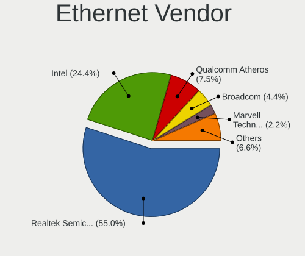

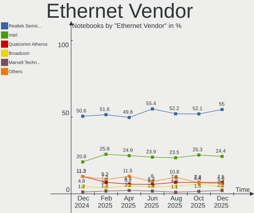

| Vendor                           | Notebooks | Percent |
|----------------------------------|-----------|---------|
| Realtek Semiconductor            | 176       | 55%     |
| Intel                            | 78        | 24.38%  |
| Qualcomm Atheros                 | 24        | 7.5%    |
| Broadcom                         | 14        | 4.38%   |
| Marvell Technology Group         | 7         | 2.19%   |
| Broadcom Limited                 | 4         | 1.25%   |
| Samsung Electronics              | 3         | 0.94%   |
| Nvidia                           | 3         | 0.94%   |
| Xiaomi                           | 2         | 0.63%   |
| TP-Link                          | 1         | 0.31%   |
| Silicon Integrated Systems [SiS] | 1         | 0.31%   |
| OPPO Electronics                 | 1         | 0.31%   |
| MediaTek                         | 1         | 0.31%   |
| Lenovo                           | 1         | 0.31%   |
| Hewlett-Packard                  | 1         | 0.31%   |
| DisplayLink                      | 1         | 0.31%   |
| ASIX Electronics                 | 1         | 0.31%   |
| Apple                            | 1         | 0.31%   |

Ethernet Model
--------------

Ethernet models

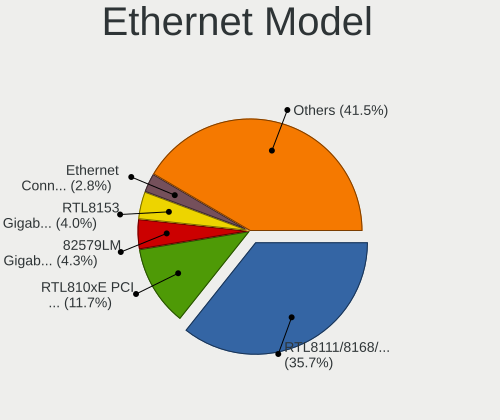

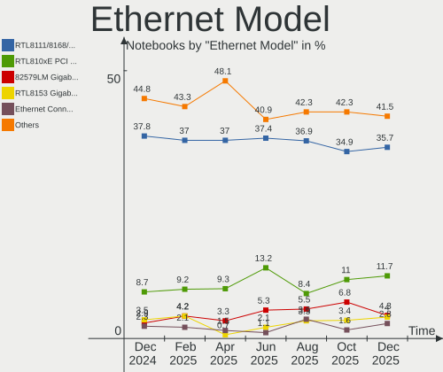

| Model                                                                  | Notebooks | Percent |
|------------------------------------------------------------------------|-----------|---------|
| Realtek RTL8111/8168/8211/8411 PCI Express Gigabit Ethernet Controller | 116       | 35.69%  |
| Realtek RTL810xE PCI Express Fast Ethernet controller                  | 38        | 11.69%  |
| Intel 82579LM Gigabit Network Connection (Lewisville)                  | 14        | 4.31%   |
| Realtek RTL8153 Gigabit Ethernet Adapter                               | 13        | 4%      |
| Intel Ethernet Connection (4) I219-LM                                  | 9         | 2.77%   |
| Intel Ethernet Connection I219-LM                                      | 5         | 1.54%   |
| Realtek RTL8125 2.5GbE Controller                                      | 4         | 1.23%   |
| Qualcomm Atheros AR8131 Gigabit Ethernet                               | 4         | 1.23%   |
| Intel Ethernet Connection (10) I219-LM                                 | 4         | 1.23%   |
| Intel 82577LM Gigabit Network Connection                               | 4         | 1.23%   |
| Samsung Galaxy series, misc. (tethering mode)                          | 3         | 0.92%   |
| Realtek RTL8152 Fast Ethernet Adapter                                  | 3         | 0.92%   |
| Qualcomm Atheros QCA8172 Fast Ethernet                                 | 3         | 0.92%   |
| Qualcomm Atheros QCA8171 Gigabit Ethernet                              | 3         | 0.92%   |
| Qualcomm Atheros Killer E2500 Gigabit Ethernet Controller              | 3         | 0.92%   |
| Qualcomm Atheros Killer E220x Gigabit Ethernet Controller              | 3         | 0.92%   |
| Qualcomm Atheros AR8152 v2.0 Fast Ethernet                             | 3         | 0.92%   |
| Qualcomm Atheros AR8151 v2.0 Gigabit Ethernet                          | 3         | 0.92%   |
| Nvidia MCP79 Ethernet                                                  | 3         | 0.92%   |
| Intel Ethernet Connection I217-LM                                      | 3         | 0.92%   |
| Intel Ethernet Connection (7) I219-LM                                  | 3         | 0.92%   |
| Intel Ethernet Connection (6) I219-V                                   | 3         | 0.92%   |
| Intel Ethernet Connection (6) I219-LM                                  | 3         | 0.92%   |
| Intel Ethernet Connection (3) I218-LM                                  | 3         | 0.92%   |
| Intel 82567LM Gigabit Network Connection                               | 3         | 0.92%   |
| Broadcom NetXtreme BCM57765 Gigabit Ethernet PCIe                      | 3         | 0.92%   |
| Broadcom NetXtreme BCM5755M Gigabit Ethernet PCI Express               | 3         | 0.92%   |
| Broadcom NetLink BCM57785 Gigabit Ethernet PCIe                        | 3         | 0.92%   |
| Xiaomi Mi/Redmi series (RNDIS)                                         | 2         | 0.62%   |
| Realtek RTL-8110SC/8169SC Gigabit Ethernet                             | 2         | 0.62%   |
| Marvell Group 88E8057 PCI-E Gigabit Ethernet Controller                | 2         | 0.62%   |
| Marvell Group 88E8055 PCI-E Gigabit Ethernet Controller                | 2         | 0.62%   |
| Intel Ethernet Connection I219-V                                       | 2         | 0.62%   |
| Intel Ethernet Connection (4) I219-V                                   | 2         | 0.62%   |
| Intel Ethernet Connection (23) I219-LM                                 | 2         | 0.62%   |
| Intel Ethernet Connection (2) I219-LM                                  | 2         | 0.62%   |
| Intel Ethernet Connection (18) I219-LM                                 | 2         | 0.62%   |
| Intel BE201 320MHz                                                     | 2         | 0.62%   |
| Intel Alder Lake-P PCH CNVi WiFi                                       | 2         | 0.62%   |
| Broadcom Limited NetLink BCM5787M Gigabit Ethernet PCI Express         | 2         | 0.62%   |

Net Controller Kind
-------------------

Ethernet, WiFi or modem

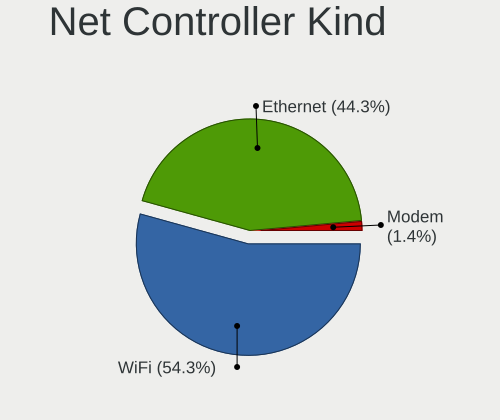

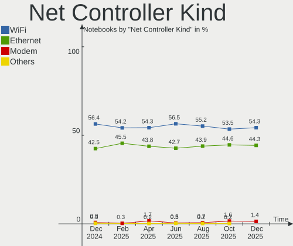

| Kind     | Notebooks | Percent |
|----------|-----------|---------|
| WiFi     | 379       | 54.3%   |
| Ethernet | 309       | 44.27%  |
| Modem    | 10        | 1.43%   |

Used Controller
---------------

Currently used network controller

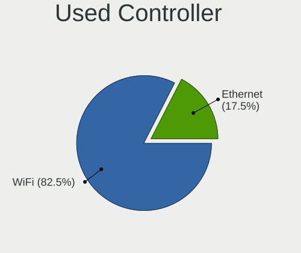

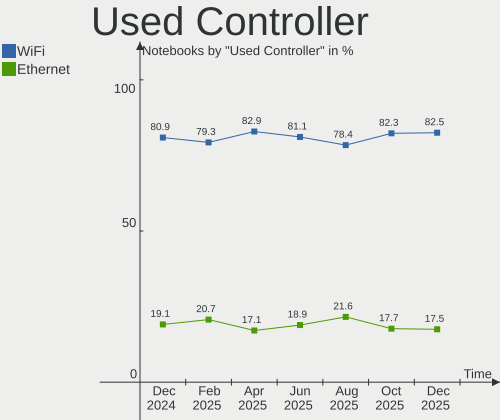

| Kind     | Notebooks | Percent |
|----------|-----------|---------|
| WiFi     | 331       | 82.54%  |
| Ethernet | 70        | 17.46%  |

NICs
----

Total network controllers on board

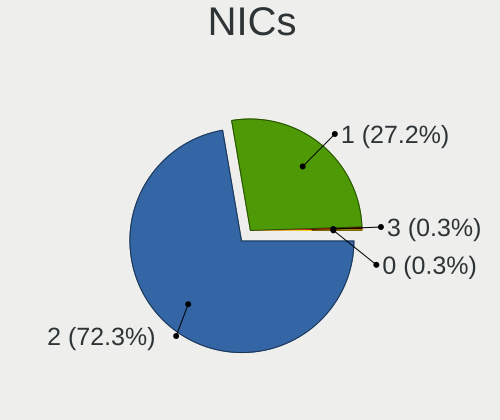

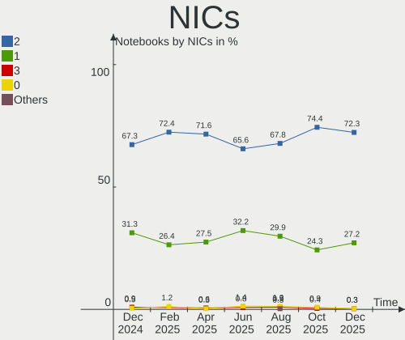

| Total | Notebooks | Percent |
|-------|-----------|---------|
| 2     | 282       | 72.31%  |
| 1     | 106       | 27.18%  |
| 3     | 1         | 0.26%   |
| 0     | 1         | 0.26%   |

IPv6
----

IPv6 vs IPv4

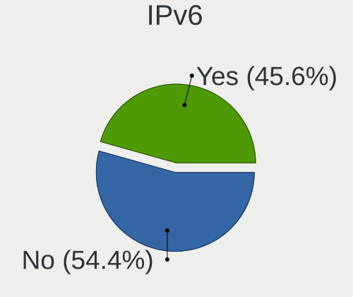

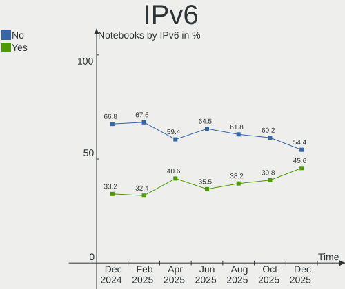

| Used | Notebooks | Percent |
|------|-----------|---------|
| No   | 212       | 54.36%  |
| Yes  | 178       | 45.64%  |

Bluetooth
---------

Bluetooth Vendor
----------------

Controller vendors

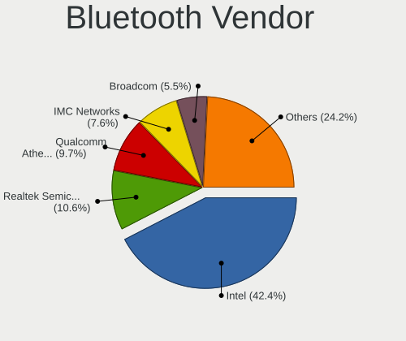

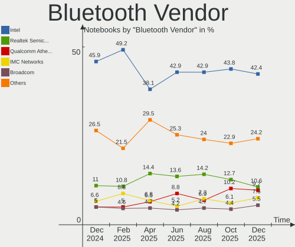

| Vendor                          | Notebooks | Percent |
|---------------------------------|-----------|---------|
| Intel                           | 140       | 42.42%  |
| Realtek Semiconductor           | 35        | 10.61%  |
| Qualcomm Atheros Communications | 32        | 9.7%    |
| IMC Networks                    | 25        | 7.58%   |
| Broadcom                        | 18        | 5.45%   |
| Foxconn / Hon Hai               | 14        | 4.24%   |
| Apple                           | 13        | 3.94%   |
| Ralink                          | 11        | 3.33%   |
| Lite-On Technology              | 8         | 2.42%   |
| Cambridge Silicon Radio         | 7         | 2.12%   |
| Dell                            | 6         | 1.82%   |
| Toshiba                         | 5         | 1.52%   |
| ASUSTek Computer                | 4         | 1.21%   |
| Foxconn International           | 3         | 0.91%   |
| USI                             | 2         | 0.61%   |
| Askey Computer                  | 2         | 0.61%   |
| TP-Link                         | 1         | 0.3%    |
| Opticis                         | 1         | 0.3%    |
| Hewlett-Packard                 | 1         | 0.3%    |
| AICSemi                         | 1         | 0.3%    |
| Actions                         | 1         | 0.3%    |

Bluetooth Model
---------------

Controller models

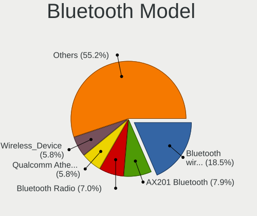

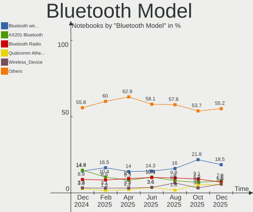

| Model                                               | Notebooks | Percent |
|-----------------------------------------------------|-----------|---------|
| Intel Bluetooth wireless interface                  | 61        | 18.48%  |
| Intel AX201 Bluetooth                               | 26        | 7.88%   |
| Realtek Bluetooth Radio                             | 23        | 6.97%   |
| Qualcomm Atheros  Bluetooth Device                  | 19        | 5.76%   |
| IMC Networks Wireless_Device                        | 19        | 5.76%   |
| Intel Bluetooth Device                              | 17        | 5.15%   |
| Intel Bluetooth 9460/9560 Jefferson Peak (JfP)      | 14        | 4.24%   |
| Ralink RT3290 Bluetooth                             | 11        | 3.33%   |
| Apple Bluetooth Host Controller                     | 10        | 3.03%   |
| Intel AX200 Bluetooth                               | 9         | 2.73%   |
| Realtek  Bluetooth 4.2 Adapter                      | 7         | 2.12%   |
| Foxconn / Hon Hai Wireless_Device                   | 7         | 2.12%   |
| Cambridge Silicon Radio Bluetooth Dongle (HCI mode) | 7         | 2.12%   |
| Lite-On Bluetooth Device                            | 6         | 1.82%   |
| Qualcomm Atheros QCA61x4 Bluetooth 4.0              | 5         | 1.52%   |
| Qualcomm Atheros AR3012 Bluetooth 4.0               | 5         | 1.52%   |
| Intel Wireless-AC 9260 Bluetooth Adapter            | 4         | 1.21%   |
| IMC Networks Bluetooth Radio                        | 4         | 1.21%   |
| Broadcom BCM20702 Bluetooth 4.0 [ThinkPad]          | 4         | 1.21%   |
| Foxconn International BCM43142A0 Bluetooth module   | 3         | 0.91%   |
| Broadcom BCM43142 Bluetooth 4.0                     | 3         | 0.91%   |
| Broadcom BCM2045B (BDC-2.1)                         | 3         | 0.91%   |
| Apple Bluetooth USB Host Controller                 | 3         | 0.91%   |
| USI Bluetooth Device                                | 2         | 0.61%   |
| Toshiba Bluetooth Device                            | 2         | 0.61%   |
| Realtek 802.11ac WLAN Adapter                       | 2         | 0.61%   |
| Intel Centrino Bluetooth Wireless Transceiver       | 2         | 0.61%   |
| Intel Centrino Advanced-N 6230 Bluetooth adapter    | 2         | 0.61%   |
| Intel Bluetooth                                     | 2         | 0.61%   |
| Intel AX210 Bluetooth                               | 2         | 0.61%   |
| Foxconn / Hon Hai Bluetooth Radio                   | 2         | 0.61%   |
| Foxconn / Hon Hai Bluetooth Device                  | 2         | 0.61%   |
| Dell Wireless 370 Bluetooth Mini-card               | 2         | 0.61%   |
| Dell Wireless 360 Bluetooth                         | 2         | 0.61%   |
| Broadcom BCM43142A0 Bluetooth 4.0                   | 2         | 0.61%   |
| Askey Bluetooth Device                              | 2         | 0.61%   |
| TP-Link TP-T@- UB500 Adapter                        | 1         | 0.3%    |
| Toshiba Integrated Bluetooth HCI                    | 1         | 0.3%    |
| Toshiba Bluetooth USB Host Controller               | 1         | 0.3%    |
| Toshiba BCM43142A0                                  | 1         | 0.3%    |

Sound
-----

Sound Vendor
------------

Sound card vendors

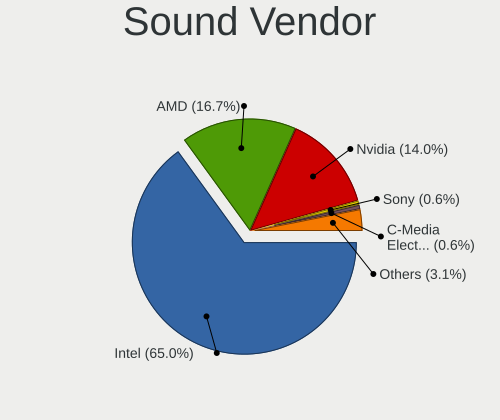

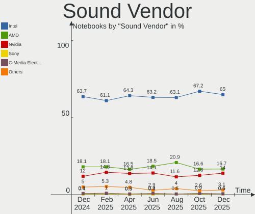

| Vendor                           | Notebooks | Percent |
|----------------------------------|-----------|---------|
| Intel                            | 312       | 65%     |
| AMD                              | 80        | 16.67%  |
| Nvidia                           | 67        | 13.96%  |
| Sony                             | 3         | 0.63%   |
| C-Media Electronics              | 3         | 0.63%   |
| Texas Instruments                | 2         | 0.42%   |
| JMTek                            | 2         | 0.42%   |
| ASUSTek Computer                 | 2         | 0.42%   |
| Silicon Integrated Systems [SiS] | 1         | 0.21%   |
| Razer USA                        | 1         | 0.21%   |
| Native Instruments               | 1         | 0.21%   |
| Maono                            | 1         | 0.21%   |
| Logitech                         | 1         | 0.21%   |
| Huawei Technologies              | 1         | 0.21%   |
| eMPIA Technology                 | 1         | 0.21%   |
| Creative Labs                    | 1         | 0.21%   |
| Apple                            | 1         | 0.21%   |

Sound Model
-----------

Sound card models

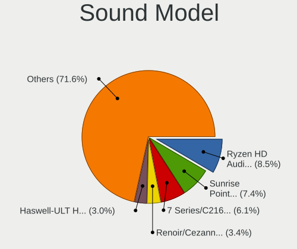

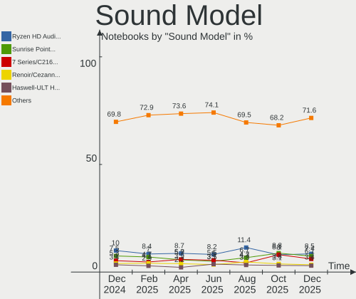

| Model                                                                      | Notebooks | Percent |
|----------------------------------------------------------------------------|-----------|---------|
| AMD Ryzen HD Audio Controller                                              | 50        | 8.46%   |
| Intel Sunrise Point-LP HD Audio                                            | 44        | 7.45%   |
| Intel 7 Series/C216 Chipset Family High Definition Audio Controller        | 36        | 6.09%   |
| AMD Renoir/Cezanne HDMI/DP Audio Controller                                | 20        | 3.38%   |
| Intel Haswell-ULT HD Audio Controller                                      | 18        | 3.05%   |
| Intel 8 Series/C220 Series Chipset High Definition Audio Controller        | 18        | 3.05%   |
| Intel 8 Series HD Audio Controller                                         | 18        | 3.05%   |
| Intel Broadwell-U Audio Controller                                         | 15        | 2.54%   |
| Intel 6 Series/C200 Series Chipset Family High Definition Audio Controller | 15        | 2.54%   |
| Intel Wildcat Point-LP High Definition Audio Controller                    | 14        | 2.37%   |
| AMD Raven/Raven2/Fenghuang HDMI/DP Audio Controller                        | 14        | 2.37%   |
| AMD FCH Azalia Controller                                                  | 14        | 2.37%   |
| Intel 82801I (ICH9 Family) HD Audio Controller                             | 13        | 2.2%    |
| Intel Xeon E3-1200 v3/4th Gen Core Processor HD Audio Controller           | 12        | 2.03%   |
| Intel Raptor Lake-P/U/H cAVS                                               | 12        | 2.03%   |
| Intel 5 Series/3400 Series Chipset High Definition Audio                   | 12        | 2.03%   |
| Intel Tiger Lake-LP Smart Sound Technology Audio Controller                | 11        | 1.86%   |
| AMD Radeon High Definition Audio Controller                                | 11        | 1.86%   |
| Intel Alder Lake PCH-P High Definition Audio Controller                    | 10        | 1.69%   |
| Intel 82801H (ICH8 Family) HD Audio Controller                             | 10        | 1.69%   |
| Intel Comet Lake PCH-LP cAVS                                               | 9         | 1.52%   |
| AMD Kabini HDMI/DP Audio                                                   | 9         | 1.52%   |
| Intel Celeron/Pentium Silver Processor High Definition Audio               | 8         | 1.35%   |
| Intel Cannon Point-LP High Definition Audio Controller                     | 8         | 1.35%   |
| Intel Cannon Lake PCH cAVS                                                 | 8         | 1.35%   |
| Intel Jasper Lake HD Audio                                                 | 7         | 1.18%   |
| Intel Comet Lake PCH cAVS                                                  | 7         | 1.18%   |
| Intel 100 Series/C230 Series Chipset Family HD Audio Controller            | 7         | 1.18%   |
| Nvidia TU107 GeForce GTX 1650 High Definition Audio Controller             | 6         | 1.02%   |
| Nvidia GB206 High Definition Audio Controller                              | 6         | 1.02%   |
| Nvidia AD107 High Definition Audio Controller                              | 6         | 1.02%   |
| Intel Celeron N3350/Pentium N4200/Atom E3900 Series Audio Cluster          | 6         | 1.02%   |
| Intel Atom Processor Z36xxx/Z37xxx Series High Definition Audio Controller | 6         | 1.02%   |
| Intel Raptor Lake High Definition Audio Controller                         | 5         | 0.85%   |
| Intel Ice Lake-LP Smart Sound Technology Audio Controller                  | 5         | 0.85%   |
| Intel CM238 HD Audio Controller                                            | 5         | 0.85%   |
| Nvidia GK107 HDMI Audio Controller                                         | 4         | 0.68%   |
| AMD Trinity HDMI Audio Controller                                          | 4         | 0.68%   |
| AMD SBx00 Azalia (Intel HDA)                                               | 4         | 0.68%   |
| Nvidia MCP79 High Definition Audio                                         | 3         | 0.51%   |

Memory
------

Memory Vendor
-------------

Memory module vendors

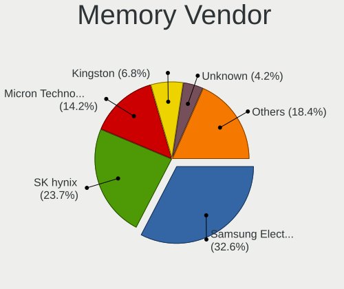

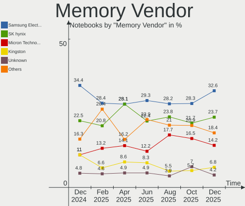

| Vendor              | Notebooks | Percent |
|---------------------|-----------|---------|
| Samsung Electronics | 62        | 32.63%  |
| SK hynix            | 45        | 23.68%  |
| Micron Technology   | 27        | 14.21%  |
| Kingston            | 13        | 6.84%   |
| Unknown             | 8         | 4.21%   |
| Ramaxel Technology  | 7         | 3.68%   |
| Crucial             | 5         | 2.63%   |
| G.Skill             | 3         | 1.58%   |
| Elpida              | 3         | 1.58%   |
| Corsair             | 3         | 1.58%   |
| Unknown             | 3         | 1.58%   |
| Smart               | 2         | 1.05%   |
| Nanya Technology    | 2         | 1.05%   |
| Unknown (ABCD)      | 1         | 0.53%   |
| Transcend           | 1         | 0.53%   |
| Shenzhen SCY        | 1         | 0.53%   |
| Patriot             | 1         | 0.53%   |
| High Bridge         | 1         | 0.53%   |
| GOODRAM             | 1         | 0.53%   |
| A-DATA Technology   | 1         | 0.53%   |

Memory Model
------------

Memory module models

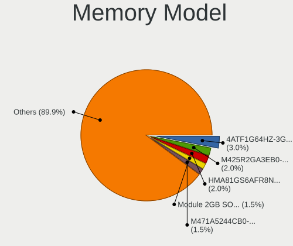

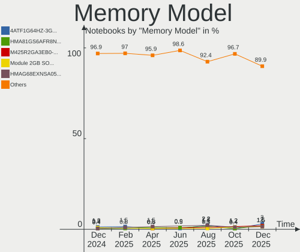

| Model                                                            | Notebooks | Percent |
|------------------------------------------------------------------|-----------|---------|
| Micron RAM 4ATF1G64HZ-3G2F1 8GB SODIMM DDR4 3200MT/s             | 6         | 3.03%   |
| SK hynix RAM HMA81GS6AFR8N-UH 8GB SODIMM DDR4 2667MT/s           | 4         | 2.02%   |
| Samsung RAM M425R2GA3EB0-CWMOL 16GB SODIMM DDR5 5600MT/s         | 4         | 2.02%   |
| Unknown RAM Module 2GB SODIMM DDR2 667MT/s                       | 3         | 1.52%   |
| SK hynix RAM HMAG68EXNSA051N 8GB SODIMM DDR4 3200MT/s            | 3         | 1.52%   |
| SK hynix RAM HMA851S6AFR6N-UH 4GB SODIMM DDR4 2667MT/s           | 3         | 1.52%   |
| Samsung RAM M471A5244CB0-CTD 4GB SODIMM DDR4 3266MT/s            | 3         | 1.52%   |
| Samsung RAM M471A2K43DB1-CTD 16GB SODIMM DDR4 2667MT/s           | 3         | 1.52%   |
| Samsung RAM M471A1K43EB1-CWE 8GB SODIMM DDR4 3200MT/s            | 3         | 1.52%   |
| Samsung RAM M471A1K43DB1-CWE 8GB SODIMM DDR4 3200MT/s            | 3         | 1.52%   |
| Samsung RAM M471A1G44CB0-CWE 8GB SODIMM DDR4 3200MT/s            | 3         | 1.52%   |
| Micron RAM 4ATF51264HZ-2G6E1 4GB SODIMM DDR4 2667MT/s            | 3         | 1.52%   |
| Unknown                                                          | 3         | 1.52%   |
| SK hynix RAM HMT41GS6BFR8A-PB 8GB SODIMM DDR3 2667MT/s           | 2         | 1.01%   |
| SK hynix RAM HMT41GS6BFR8A-PB 8GB SODIMM DDR3 1600MT/s           | 2         | 1.01%   |
| SK hynix RAM HMT41GS6AFR8A-PB 8GiB SODIMM DDR3 2667MT/s          | 2         | 1.01%   |
| SK hynix RAM HMA81GS6MFR8N-UH 8GB SODIMM DDR4 2400MT/s           | 2         | 1.01%   |
| Samsung RAM M471B5273CH0-CH9 4GB SODIMM DDR3 1334MT/s            | 2         | 1.01%   |
| Samsung RAM M471B5173DB0-YK0 4GB SODIMM DDR3 1600MT/s            | 2         | 1.01%   |
| Samsung RAM M471A2K43CB1-CRC 16GB SODIMM DDR4 2667MT/s           | 2         | 1.01%   |
| Samsung RAM M471A1K43DB1-CTD 8GB SODIMM DDR4 2667MT/s            | 2         | 1.01%   |
| Samsung RAM M471A1K43CB1-CRC 8GB SODIMM DDR4 8400MT/s            | 2         | 1.01%   |
| Samsung RAM M471A1K43BB1-CRC 8GB SODIMM DDR4 2667MT/s            | 2         | 1.01%   |
| Samsung RAM M425R2GA3EB0-CWMOD 16GB SODIMM DDR5 5600MT/s         | 2         | 1.01%   |
| Samsung RAM M425R1GB4PB0-CWMOL 8GB SODIMM DDR5 5600MT/s          | 2         | 1.01%   |
| Samsung RAM M425R1GB4PB0-CWMOD 8GiB SODIMM DDR5 5600MT/s         | 2         | 1.01%   |
| Samsung RAM M4 70T5663QZ3-CF7 2GB SODIMM DDR2 2048MT/s           | 2         | 1.01%   |
| Samsung RAM M4 70T2864QZ3-CE6 1GB SODIMM DDR 1639MT/s            | 2         | 1.01%   |
| Ramaxel RAM RMSA3300ME78HBF-2666 16GB SODIMM DDR4 2667MT/s       | 2         | 1.01%   |
| Unknown RAM Module 8GB SODIMM DDR4 2400MT/s                      | 1         | 0.51%   |
| Unknown RAM Module 4GB SODIMM DDR3 1600MT/s                      | 1         | 0.51%   |
| Unknown RAM Module 4GB SODIMM DDR3                               | 1         | 0.51%   |
| Unknown RAM Module 2GB SODIMM DDR2                               | 1         | 0.51%   |
| Unknown RAM Module 1024MB SODIMM DDR2 667MT/s                    | 1         | 0.51%   |
| Unknown (ABCD) RAM 123456789012345678 2GB SODIMM LPDDR4 2400MT/s | 1         | 0.51%   |
| Transcend RAM JM4800ASE-16G 16GB SODIMM DDR5 4800MT/s            | 1         | 0.51%   |
| Smart RAM SH564568FJ8NZRNSDR 2GB SODIMM DDR3 1600MT/s            | 1         | 0.51%   |
| Smart RAM SH564128FH8NZQNSCG 4GB SODIMM DDR3 1600MT/s            | 1         | 0.51%   |
| SK hynix RAM Module 4GB Row Of Chips LPDDR5 6400MT/s             | 1         | 0.51%   |
| SK hynix RAM Module 4GB Row Of Chips LPDDR4 2933MT/s             | 1         | 0.51%   |

Memory Kind
-----------

Memory module kinds

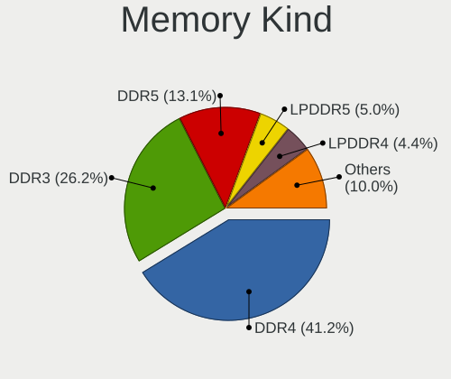

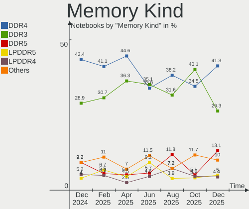

| Kind   | Notebooks | Percent |
|--------|-----------|---------|
| DDR4   | 66        | 41.25%  |
| DDR3   | 42        | 26.25%  |
| DDR5   | 21        | 13.13%  |
| LPDDR5 | 8         | 5%      |
| LPDDR4 | 7         | 4.38%   |
| DDR2   | 7         | 4.38%   |
| SDRAM  | 6         | 3.75%   |
| LPDDR3 | 3         | 1.88%   |

Memory Form Factor
------------------

Physical design of the memory module

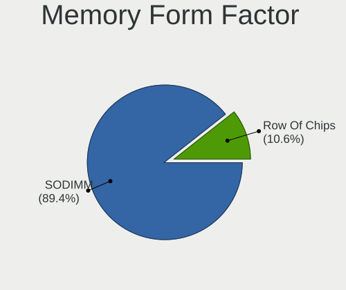

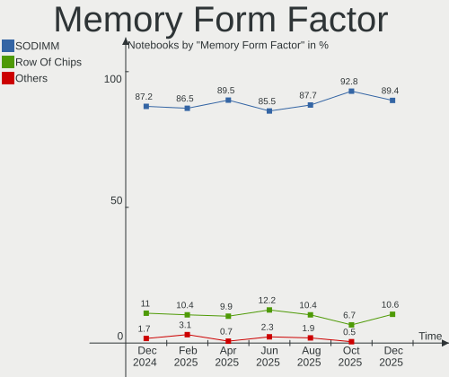

| Name         | Notebooks | Percent |
|--------------|-----------|---------|
| SODIMM       | 143       | 89.38%  |
| Row Of Chips | 17        | 10.63%  |

Memory Size
-----------

Memory module size

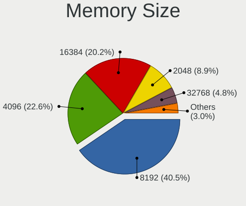

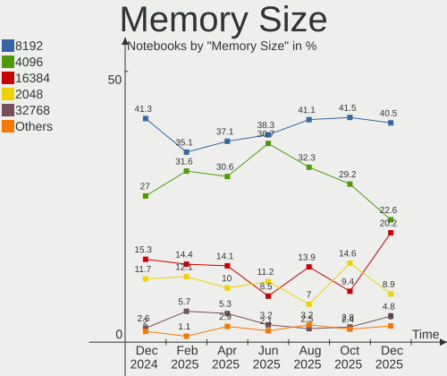

| Size  | Notebooks | Percent |
|-------|-----------|---------|
| 8192  | 68        | 40.48%  |
| 4096  | 38        | 22.62%  |
| 16384 | 34        | 20.24%  |
| 2048  | 15        | 8.93%   |
| 32768 | 8         | 4.76%   |
| 1024  | 4         | 2.38%   |
| 12288 | 1         | 0.6%    |

Memory Speed
------------

Memory module speed

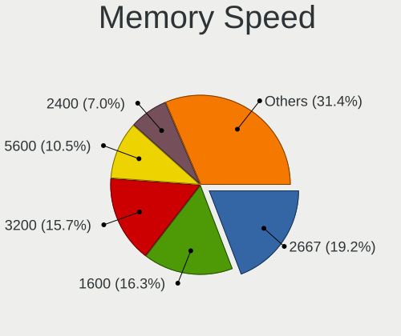

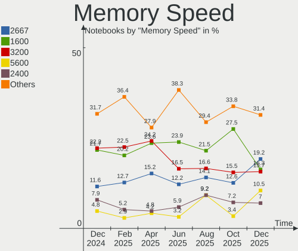

| Speed   | Notebooks | Percent |
|---------|-----------|---------|
| 2667    | 33        | 19.19%  |
| 1600    | 28        | 16.28%  |
| 3200    | 27        | 15.7%   |
| 5600    | 18        | 10.47%  |
| 2400    | 12        | 6.98%   |
| 2133    | 6         | 3.49%   |
| 667     | 6         | 3.49%   |
| 6400    | 4         | 2.33%   |
| 4800    | 4         | 2.33%   |
| 1334    | 4         | 2.33%   |
| 1333    | 4         | 2.33%   |
| 1067    | 4         | 2.33%   |
| 3266    | 3         | 1.74%   |
| 2048    | 3         | 1.74%   |
| 8533    | 2         | 1.16%   |
| 8400    | 2         | 1.16%   |
| 1867    | 2         | 1.16%   |
| 1639    | 2         | 1.16%   |
| Unknown | 2         | 1.16%   |
| 8000    | 1         | 0.58%   |
| 7500    | 1         | 0.58%   |
| 4267    | 1         | 0.58%   |
| 4199    | 1         | 0.58%   |
| 2933    | 1         | 0.58%   |
| 975     | 1         | 0.58%   |

Printers & scanners
-------------------

Printer Vendor
--------------

Printer device vendors

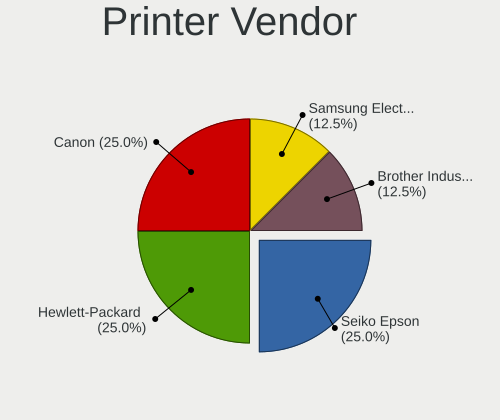

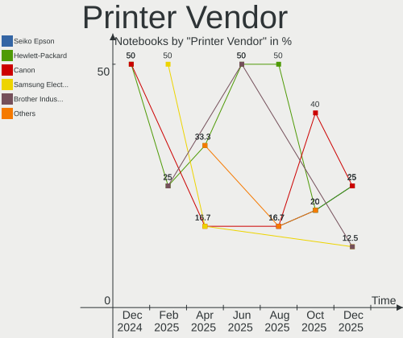

| Vendor              | Notebooks | Percent |
|---------------------|-----------|---------|
| Seiko Epson         | 2         | 25%     |
| Hewlett-Packard     | 2         | 25%     |
| Canon               | 2         | 25%     |
| Samsung Electronics | 1         | 12.5%   |
| Brother Industries  | 1         | 12.5%   |

Printer Model
-------------

Printer device models

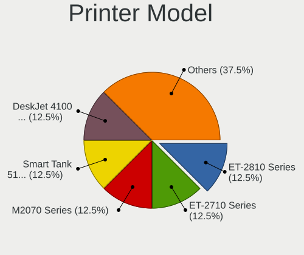

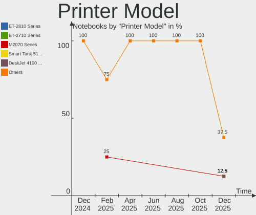

| Model                      | Notebooks | Percent |
|----------------------------|-----------|---------|
| Seiko Epson ET-2810 Series | 1         | 12.5%   |
| Seiko Epson ET-2710 Series | 1         | 12.5%   |
| Samsung M2070 Series       | 1         | 12.5%   |
| HP Smart Tank 5100 series  | 1         | 12.5%   |
| HP DeskJet 4100 series     | 1         | 12.5%   |
| Canon PIXMA iX6850 Printer | 1         | 12.5%   |
| Canon G7000 series         | 1         | 12.5%   |
| Brother MFC-J245           | 1         | 12.5%   |

Scanner Vendor
--------------

Scanner device vendors

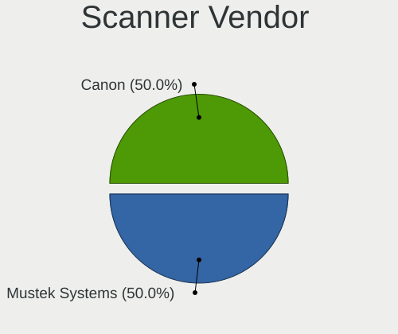

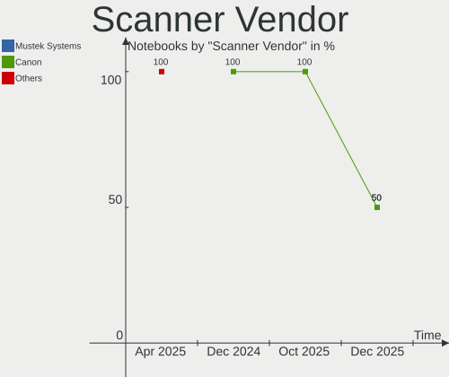

| Vendor         | Notebooks | Percent |
|----------------|-----------|---------|
| Mustek Systems | 1         | 50%     |
| Canon          | 1         | 50%     |

Scanner Model
-------------

Scanner device models

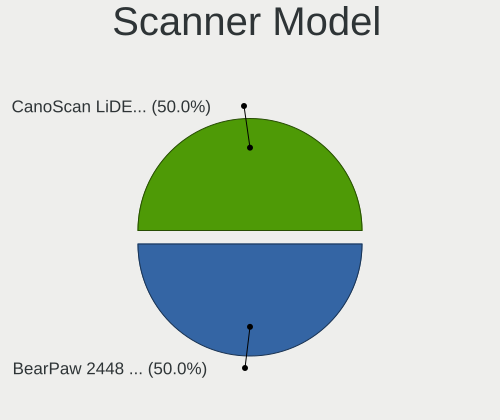

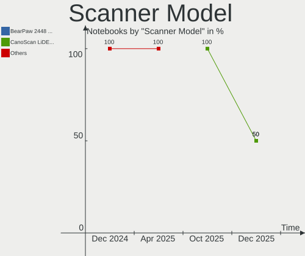

| Model                              | Notebooks | Percent |
|------------------------------------|-----------|---------|
| Mustek Systems BearPaw 2448 CU Pro | 1         | 50%     |
| Canon CanoScan LiDE 110            | 1         | 50%     |

Camera
------

Camera Vendor
-------------

Camera device vendors

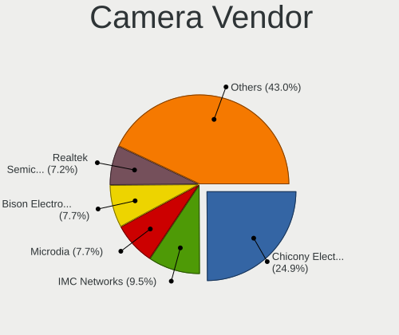

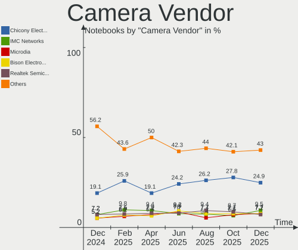

| Vendor                                 | Notebooks | Percent |
|----------------------------------------|-----------|---------|
| Chicony Electronics                    | 87        | 24.93%  |
| IMC Networks                           | 33        | 9.46%   |
| Microdia                               | 27        | 7.74%   |
| Bison Electronics                      | 27        | 7.74%   |
| Realtek Semiconductor                  | 25        | 7.16%   |
| Sunplus Innovation Technology          | 20        | 5.73%   |
| Quanta                                 | 18        | 5.16%   |
| Cheng Uei Precision Industry (Foxlink) | 16        | 4.58%   |
| Suyin                                  | 12        | 3.44%   |
| Luxvisions Innotech Limited            | 12        | 3.44%   |
| Lite-On Technology                     | 11        | 3.15%   |
| Syntek                                 | 9         | 2.58%   |
| Apple                                  | 8         | 2.29%   |
| Sonix Technology                       | 5         | 1.43%   |
| ShineTech                              | 5         | 1.43%   |
| Ricoh                                  | 4         | 1.15%   |
| Logitech                               | 4         | 1.15%   |
| Shine-optics                           | 2         | 0.57%   |
| Lenovo                                 | 2         | 0.57%   |
| Alcor Micro                            | 2         | 0.57%   |
| Acer                                   | 2         | 0.57%   |
| Unknown                                | 2         | 0.57%   |
| vivo                                   | 1         | 0.29%   |
| Tobii Technology AB                    | 1         | 0.29%   |
| SunplusIT                              | 1         | 0.29%   |
| Sunplus Technology                     | 1         | 0.29%   |
| Silicon Motion                         | 1         | 0.29%   |
| Samsung Electronics                    | 1         | 0.29%   |
| Primax Electronics                     | 1         | 0.29%   |
| Pixart Imaging                         | 1         | 0.29%   |
| OYT Tech                               | 1         | 0.29%   |
| kingcome                               | 1         | 0.29%   |
| Intel                                  | 1         | 0.29%   |
| Google                                 | 1         | 0.29%   |
| globaloptics                           | 1         | 0.29%   |
| DigiTech                               | 1         | 0.29%   |
| Asuscom Network                        | 1         | 0.29%   |
| ALi                                    | 1         | 0.29%   |

Camera Model
------------

Camera device models

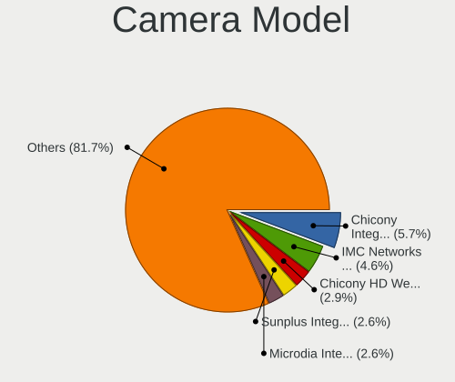

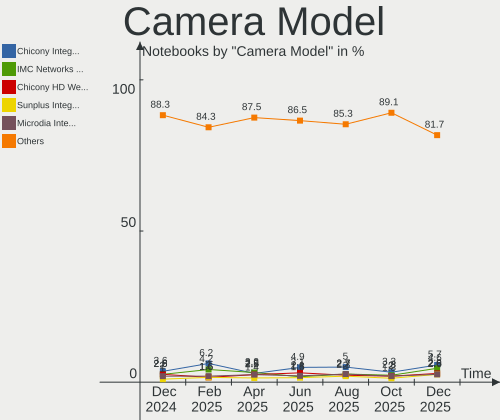

| Model                                                   | Notebooks | Percent |
|---------------------------------------------------------|-----------|---------|
| Chicony Integrated Camera                               | 20        | 5.73%   |
| IMC Networks USB2.0 HD UVC WebCam                       | 16        | 4.58%   |
| Chicony HD WebCam                                       | 10        | 2.87%   |
| Sunplus Integrated_Webcam_HD                            | 9         | 2.58%   |
| Microdia Integrated_Webcam_HD                           | 9         | 2.58%   |
| IMC Networks Integrated Camera                          | 8         | 2.29%   |
| Suyin HP Truevision HD                                  | 6         | 1.72%   |
| Realtek USB Camera                                      | 6         | 1.72%   |
| Bison SunplusIT Integrated Camera                       | 6         | 1.72%   |
| Sonix USB2.0 HD UVC WebCam                              | 5         | 1.43%   |
| ShineTech USB2.0 HD UVC WebCam                          | 5         | 1.43%   |
| Realtek Integrated_Webcam_HD                            | 5         | 1.43%   |
| Cheng Uei Precision Industry (Foxlink) Webcam           | 5         | 1.43%   |
| Cheng Uei Precision Industry (Foxlink) HP Truevision HD | 5         | 1.43%   |
| Bison Integrated Camera                                 | 5         | 1.43%   |
| Syntek Integrated Camera                                | 4         | 1.15%   |
| Quanta HP TrueVision HD Camera                          | 4         | 1.15%   |
| Quanta HP HD Camera                                     | 4         | 1.15%   |
| Microdia Integrated Webcam                              | 4         | 1.15%   |
| Luxvisions Innotech Limited Integrated Camera           | 4         | 1.15%   |
| Chicony TOSHIBA Web Camera - HD                         | 4         | 1.15%   |
| Chicony FJ Camera                                       | 4         | 1.15%   |
| Chicony Chicony USB2.0 Camera                           | 4         | 1.15%   |
| Syntek Lenovo EasyCamera                                | 3         | 0.86%   |
| Realtek Integrated_Webcam_FHD                           | 3         | 0.86%   |
| Realtek Integrated Webcam HD                            | 3         | 0.86%   |
| Quanta HD User Facing                                   | 3         | 0.86%   |
| Microdia Integrated Webcam HD                           | 3         | 0.86%   |
| Luxvisions Innotech Limited HP TrueVision HD Camera     | 3         | 0.86%   |
| Lite-On Integrated Camera                               | 3         | 0.86%   |
| Lite-On HP HD Webcam                                    | 3         | 0.86%   |
| Lite-On HP HD Camera                                    | 3         | 0.86%   |
| IMC Networks USB2.0 VGA UVC WebCam                      | 3         | 0.86%   |
| IMC Networks USB2.0 UVC HD Webcam                       | 3         | 0.86%   |
| Chicony USB 2.0 Camera                                  | 3         | 0.86%   |
| Chicony Integrated Camera [ThinkPad]                    | 3         | 0.86%   |
| Chicony HP TrueVision HD Camera                         | 3         | 0.86%   |
| Chicony HP Truevision HD                                | 3         | 0.86%   |
| Chicony HP HD Camera                                    | 3         | 0.86%   |
| Cheng Uei Precision Industry (Foxlink) HP Webcam        | 3         | 0.86%   |

Security
--------

Fingerprint Vendor
------------------

Fingerprint sensor vendors

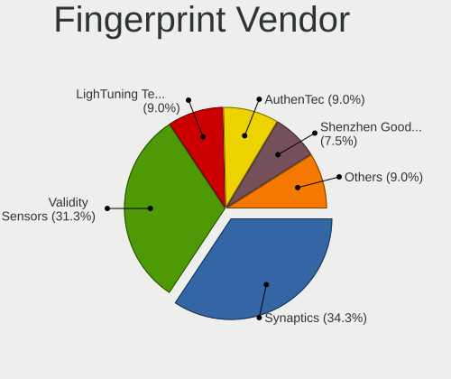

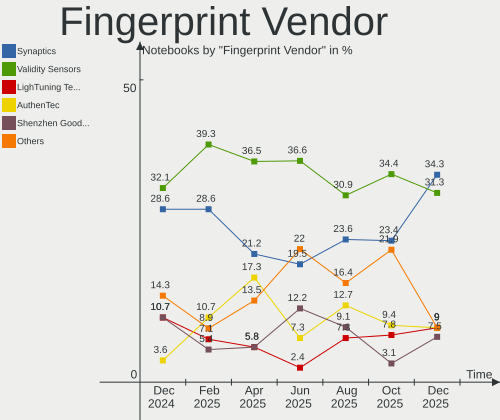

| Vendor                     | Notebooks | Percent |
|----------------------------|-----------|---------|
| Synaptics                  | 23        | 34.33%  |
| Validity Sensors           | 21        | 31.34%  |
| LighTuning Technology      | 6         | 8.96%   |
| AuthenTec                  | 6         | 8.96%   |
| Shenzhen Goodix Technology | 5         | 7.46%   |
| Upek                       | 4         | 5.97%   |
| STMicroelectronics         | 2         | 2.99%   |

Fingerprint Model
-----------------

Fingerprint sensor models

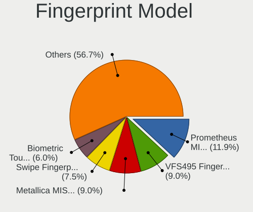

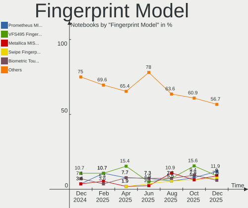

| Model                                                     | Notebooks | Percent |
|-----------------------------------------------------------|-----------|---------|
| Synaptics Prometheus MIS Touch Fingerprint Reader         | 8         | 11.94%  |
| Validity Sensors VFS495 Fingerprint Reader                | 6         | 8.96%   |
| Synaptics Metallica MIS Touch Fingerprint Reader          | 6         | 8.96%   |
| Validity Sensors Swipe Fingerprint Sensor                 | 5         | 7.46%   |
| Upek Biometric Touchchip/Touchstrip Fingerprint Sensor    | 4         | 5.97%   |
| Shenzhen Goodix  FingerPrint Device                       | 4         | 5.97%   |
| LighTuning EgisTec Touch Fingerprint Sensor               | 4         | 5.97%   |
| Validity Sensors VFS 5011 fingerprint sensor              | 3         | 4.48%   |
| Synaptics FS7604 Touch Fingerprint Sensor with PurePrint  | 3         | 4.48%   |
| AuthenTec AES2501 Fingerprint Sensor                      | 3         | 4.48%   |
| Validity Sensors Synaptics WBDI                           | 2         | 2.99%   |
| Synaptics Fingerprint reader [HP G6]                      | 2         | 2.99%   |
| STMicroelectronics Fingerprint Reader                     | 2         | 2.99%   |
| LighTuning ES603 Swipe Fingerprint Sensor                 | 2         | 2.99%   |
| AuthenTec AES1600                                         | 2         | 2.99%   |
| Validity Sensors VFS7552 Touch Fingerprint Sensor         | 1         | 1.49%   |
| Validity Sensors VFS5011 Fingerprint Reader               | 1         | 1.49%   |
| Validity Sensors VFS491                                   | 1         | 1.49%   |
| Validity Sensors VFS Fingerprint sensor                   | 1         | 1.49%   |
| Validity Sensors Fingerprint scanner                      | 1         | 1.49%   |
| Synaptics WBDI Device                                     | 1         | 1.49%   |
| Synaptics WBDI                                            | 1         | 1.49%   |
| Synaptics  WBDI                                           | 1         | 1.49%   |
| Synaptics  FS7604 Touch Fingerprint Sensor with PurePrint | 1         | 1.49%   |
| Shenzhen Goodix Fingerprint Reader                        | 1         | 1.49%   |
| AuthenTec AES2810                                         | 1         | 1.49%   |

Chipcard Vendor
---------------

Chipcard module vendors

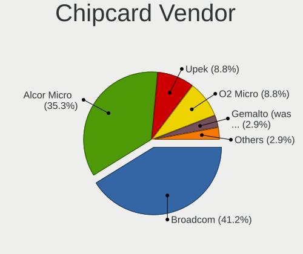

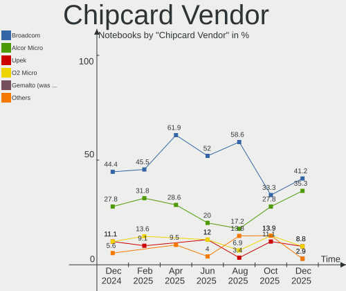

| Vendor                | Notebooks | Percent |
|-----------------------|-----------|---------|
| Broadcom              | 14        | 41.18%  |
| Alcor Micro           | 12        | 35.29%  |
| Upek                  | 3         | 8.82%   |
| O2 Micro              | 3         | 8.82%   |
| Gemalto (was Gemplus) | 1         | 2.94%   |
| Cherry                | 1         | 2.94%   |

Chipcard Model
--------------

Chipcard module models

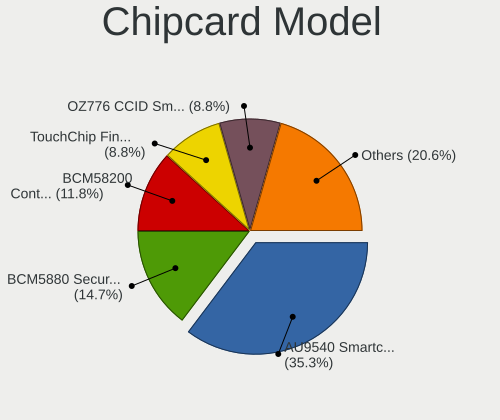

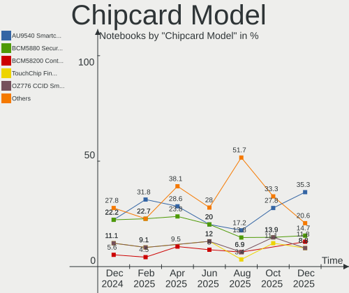

| Model                                                                        | Notebooks | Percent |
|------------------------------------------------------------------------------|-----------|---------|
| Alcor Micro AU9540 Smartcard Reader                                          | 12        | 35.29%  |
| Broadcom BCM5880 Secure Applications Processor                               | 5         | 14.71%  |
| Broadcom BCM58200 ControlVault 3 (FingerPrint sensor + Contacted SmartCard)  | 4         | 11.76%  |
| Upek TouchChip Fingerprint Coprocessor (WBF advanced mode)                   | 3         | 8.82%   |
| O2 Micro OZ776 CCID Smartcard Reader                                         | 3         | 8.82%   |
| Broadcom 5880                                                                | 3         | 8.82%   |
| Broadcom BCM5880 Secure Applications Processor with fingerprint swipe sensor | 2         | 5.88%   |
| Gemalto (was Gemplus) GemPC Twin SmartCard Reader                            | 1         | 2.94%   |
| Cherry SmartTerminal ST-2xxx                                                 | 1         | 2.94%   |

Unsupported
-----------

Unsupported Devices
-------------------

Total unsupported devices on board

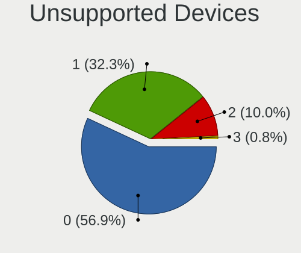

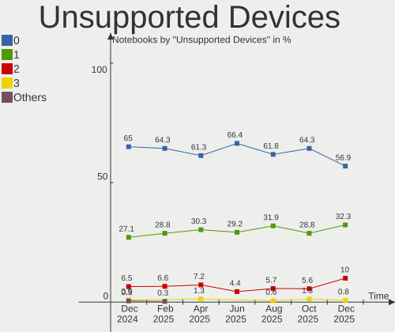

| Total | Notebooks | Percent |
|-------|-----------|---------|
| 0     | 222       | 56.92%  |
| 1     | 126       | 32.31%  |
| 2     | 39        | 10%     |
| 3     | 3         | 0.77%   |

Unsupported Device Types
------------------------

Types of unsupported devices

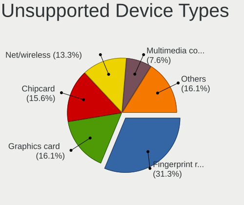

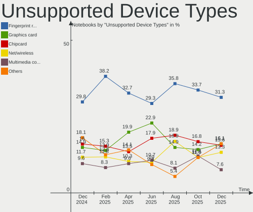

| Type                     | Notebooks | Percent |
|--------------------------|-----------|---------|
| Fingerprint reader       | 66        | 31.28%  |
| Graphics card            | 34        | 16.11%  |
| Chipcard                 | 33        | 15.64%  |
| Net/wireless             | 28        | 13.27%  |
| Multimedia controller    | 16        | 7.58%   |
| Bluetooth                | 13        | 6.16%   |
| Storage                  | 6         | 2.84%   |
| Camera                   | 6         | 2.84%   |
| Communication controller | 3         | 1.42%   |
| Sound                    | 2         | 0.95%   |
| Net/ethernet             | 2         | 0.95%   |
| Unassigned class         | 1         | 0.47%   |
| Card reader              | 1         | 0.47%   |

