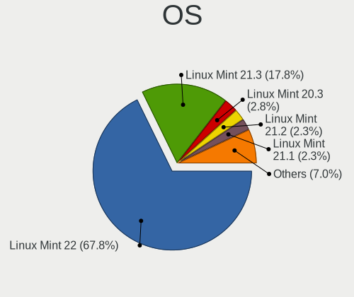
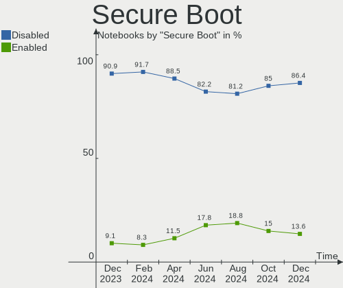
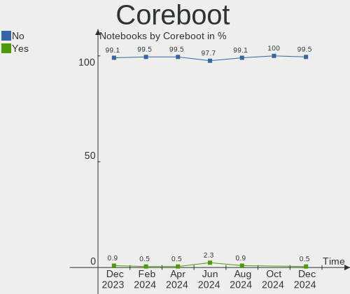
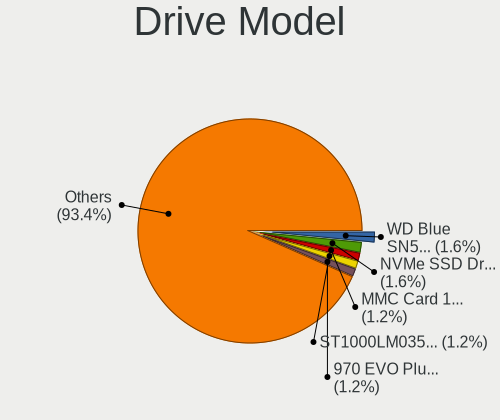
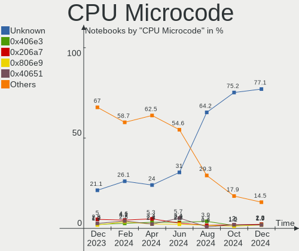
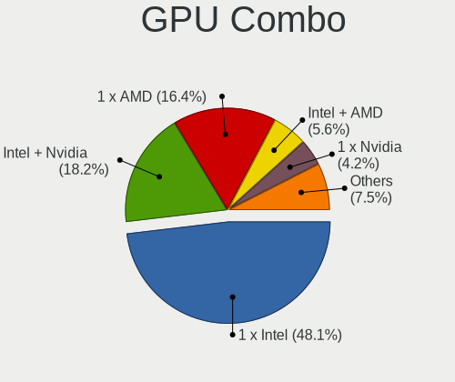
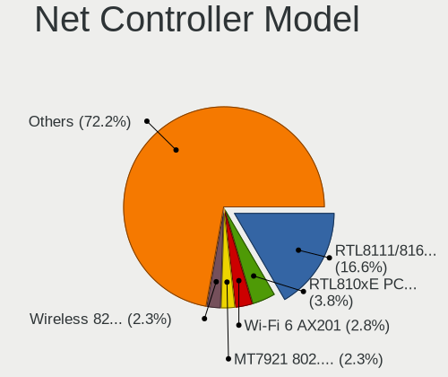
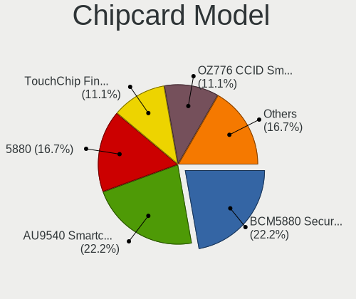

Linux Mint - Hardware Trends (Notebooks)
----------------------------------------

A project to identify most popular hardware characteristics and track their change
over time based on data collected by Linux users at https://Linux-Hardware.org.

Anyone can contribute to this report by the [hw-probe](https://github.com/linuxhw/hw-probe) tool:

    sudo -E hw-probe -all -upload

This report is for one last month. Overall report since the beginning of time: [TestDays](https://github.com/linuxhw/TestDays)

Period: Oct, 2023.

Contents
--------

* [ System ](#system)
  - [ OS                       ](#os)
  - [ OS Family                ](#os-family)
  - [ Kernel                   ](#kernel)
  - [ Kernel Family            ](#kernel-family)
  - [ Kernel Major Ver.        ](#kernel-major-ver)
  - [ Arch                     ](#arch)
  - [ DE                       ](#de)
  - [ Display Server           ](#display-server)
  - [ Display Manager          ](#display-manager)
  - [ OS Lang                  ](#os-lang)
  - [ Boot Mode                ](#boot-mode)
  - [ Filesystem               ](#filesystem)
  - [ Part. scheme             ](#part-scheme)
  - [ Dual Boot with Linux/BSD ](#dual-boot-with-linuxbsd)
  - [ Dual Boot (Win)          ](#dual-boot-win)

* [ Board ](#board)
  - [ Vendor                   ](#vendor)
  - [ Model                    ](#model)
  - [ Model Family             ](#model-family)
  - [ MFG Year                 ](#mfg-year)
  - [ Form Factor              ](#form-factor)
  - [ Secure Boot              ](#secure-boot)
  - [ Coreboot                 ](#coreboot)
  - [ RAM Size                 ](#ram-size)
  - [ RAM Used                 ](#ram-used)
  - [ Total Drives             ](#total-drives)
  - [ Has CD-ROM               ](#has-cd-rom)
  - [ Has Ethernet             ](#has-ethernet)
  - [ Has WiFi                 ](#has-wifi)
  - [ Has Bluetooth            ](#has-bluetooth)

* [ Location ](#location)
  - [ Country                  ](#country)
  - [ City                     ](#city)

* [ Drives ](#drives)
  - [ Drive Vendor             ](#drive-vendor)
  - [ Drive Model              ](#drive-model)
  - [ HDD Vendor               ](#hdd-vendor)
  - [ SSD Vendor               ](#ssd-vendor)
  - [ Drive Kind               ](#drive-kind)
  - [ Drive Connector          ](#drive-connector)
  - [ Drive Size               ](#drive-size)
  - [ Space Total              ](#space-total)
  - [ Space Used               ](#space-used)
  - [ Malfunc. Drives          ](#malfunc-drives)
  - [ Malfunc. Drive Vendor    ](#malfunc-drive-vendor)
  - [ Malfunc. HDD Vendor      ](#malfunc-hdd-vendor)
  - [ Malfunc. Drive Kind      ](#malfunc-drive-kind)
  - [ Failed Drives            ](#failed-drives)
  - [ Failed Drive Vendor      ](#failed-drive-vendor)
  - [ Drive Status             ](#drive-status)

* [ Storage controller ](#storage-controller)
  - [ Storage Vendor           ](#storage-vendor)
  - [ Storage Model            ](#storage-model)
  - [ Storage Kind             ](#storage-kind)

* [ Processor ](#processor)
  - [ CPU Vendor               ](#cpu-vendor)
  - [ CPU Model                ](#cpu-model)
  - [ CPU Model Family         ](#cpu-model-family)
  - [ CPU Cores                ](#cpu-cores)
  - [ CPU Sockets              ](#cpu-sockets)
  - [ CPU Threads              ](#cpu-threads)
  - [ CPU Op-Modes             ](#cpu-op-modes)
  - [ CPU Microcode            ](#cpu-microcode)
  - [ CPU Microarch            ](#cpu-microarch)

* [ Graphics ](#graphics)
  - [ GPU Vendor               ](#gpu-vendor)
  - [ GPU Model                ](#gpu-model)
  - [ GPU Combo                ](#gpu-combo)
  - [ GPU Driver               ](#gpu-driver)
  - [ GPU Memory               ](#gpu-memory)

* [ Monitor ](#monitor)
  - [ Monitor Vendor           ](#monitor-vendor)
  - [ Monitor Model            ](#monitor-model)
  - [ Monitor Resolution       ](#monitor-resolution)
  - [ Monitor Diagonal         ](#monitor-diagonal)
  - [ Monitor Width            ](#monitor-width)
  - [ Aspect Ratio             ](#aspect-ratio)
  - [ Monitor Area             ](#monitor-area)
  - [ Pixel Density            ](#pixel-density)
  - [ Multiple Monitors        ](#multiple-monitors)

* [ Network ](#network)
  - [ Net Controller Vendor    ](#net-controller-vendor)
  - [ Net Controller Model     ](#net-controller-model)
  - [ Wireless Vendor          ](#wireless-vendor)
  - [ Wireless Model           ](#wireless-model)
  - [ Ethernet Vendor          ](#ethernet-vendor)
  - [ Ethernet Model           ](#ethernet-model)
  - [ Net Controller Kind      ](#net-controller-kind)
  - [ Used Controller          ](#used-controller)
  - [ NICs                     ](#nics)
  - [ IPv6                     ](#ipv6)

* [ Bluetooth ](#bluetooth)
  - [ Bluetooth Vendor         ](#bluetooth-vendor)
  - [ Bluetooth Model          ](#bluetooth-model)

* [ Sound ](#sound)
  - [ Sound Vendor             ](#sound-vendor)
  - [ Sound Model              ](#sound-model)

* [ Memory ](#memory)
  - [ Memory Vendor            ](#memory-vendor)
  - [ Memory Model             ](#memory-model)
  - [ Memory Kind              ](#memory-kind)
  - [ Memory Form Factor       ](#memory-form-factor)
  - [ Memory Size              ](#memory-size)
  - [ Memory Speed             ](#memory-speed)

* [ Printers & scanners ](#printers--scanners)
  - [ Printer Vendor           ](#printer-vendor)
  - [ Printer Model            ](#printer-model)
  - [ Scanner Vendor           ](#scanner-vendor)
  - [ Scanner Model            ](#scanner-model)

* [ Camera ](#camera)
  - [ Camera Vendor            ](#camera-vendor)
  - [ Camera Model             ](#camera-model)

* [ Security ](#security)
  - [ Fingerprint Vendor       ](#fingerprint-vendor)
  - [ Fingerprint Model        ](#fingerprint-model)
  - [ Chipcard Vendor          ](#chipcard-vendor)
  - [ Chipcard Model           ](#chipcard-model)

* [ Unsupported ](#unsupported)
  - [ Unsupported Devices      ](#unsupported-devices)
  - [ Unsupported Device Types ](#unsupported-device-types)

System
------

OS
--

Installed operating systems

| Name            | Notebooks | Percent |
|-----------------|-----------|---------|
| Linux Mint 21.2 | 232       | 76.82%  |
| Linux Mint 21.1 | 24        | 7.95%   |
| Linux Mint 20.3 | 20        | 6.62%   |
| Linux Mint 21   | 12        | 3.97%   |
| Linux Mint 20.2 | 5         | 1.66%   |
| Linux Mint 20.1 | 4         | 1.32%   |
| Linux Mint 20   | 2         | 0.66%   |
| Linux Mint 19.3 | 2         | 0.66%   |
| Linux Mint 19.2 | 1         | 0.33%   |

OS Family
---------

OS without a version

| Name       | Notebooks | Percent |
|------------|-----------|---------|
| Linux Mint | 302       | 100%    |

Kernel
------

Version of the Linux kernel

| Version              | Notebooks | Percent |
|----------------------|-----------|---------|
| 5.15.0-86-generic    | 70        | 23.18%  |
| 5.15.0-87-generic    | 68        | 22.52%  |
| 5.15.0-76-generic    | 27        | 8.94%   |
| 5.15.0-84-generic    | 25        | 8.28%   |
| 6.2.0-34-generic     | 18        | 5.96%   |
| 6.2.0-35-generic     | 14        | 4.64%   |
| 5.4.0-164-generic    | 8         | 2.65%   |
| 6.2.0-33-generic     | 7         | 2.32%   |
| 5.15.0-83-generic    | 6         | 1.99%   |
| 6.1.0-1023-oem       | 5         | 1.66%   |
| 5.15.0-88-generic    | 5         | 1.66%   |
| 5.15.0-56-generic    | 5         | 1.66%   |
| 6.2.0-36-generic     | 4         | 1.32%   |
| 5.4.0-165-generic    | 4         | 1.32%   |
| 5.4.0-163-generic    | 3         | 0.99%   |
| 5.15.0-41-generic    | 3         | 0.99%   |
| 6.5.7-060507-generic | 2         | 0.66%   |
| 6.1.0-1022-oem       | 2         | 0.66%   |
| 5.4.0-74-generic     | 2         | 0.66%   |
| 5.4.0-148-generic    | 2         | 0.66%   |
| 5.15.0-67-generic    | 2         | 0.66%   |
| 5.0.0-32-generic     | 2         | 0.66%   |
| 6.5.4-aq             | 1         | 0.33%   |
| 6.5.0-1004-oem       | 1         | 0.33%   |
| 6.5.0-1003-oem       | 1         | 0.33%   |
| 6.3.1-060301-generic | 1         | 0.33%   |
| 6.2.1-060201-generic | 1         | 0.33%   |
| 6.2.0-26-generic     | 1         | 0.33%   |
| 6.1.0-1024-oem       | 1         | 0.33%   |
| 5.4.0-91-generic     | 1         | 0.33%   |
| 5.4.0-26-generic     | 1         | 0.33%   |
| 5.4.0-166-generic    | 1         | 0.33%   |
| 5.4.0-162-generic    | 1         | 0.33%   |
| 5.4.0-132-generic    | 1         | 0.33%   |
| 5.15.0-79-generic    | 1         | 0.33%   |
| 5.15.0-75-generic    | 1         | 0.33%   |
| 5.15.0-69-generic    | 1         | 0.33%   |
| 5.15.0-60-generic    | 1         | 0.33%   |
| 5.14.0-1038-oem      | 1         | 0.33%   |
| 4.15.0-54-generic    | 1         | 0.33%   |

Kernel Family
-------------

Linux kernel without a distro release

| Version | Notebooks | Percent |
|---------|-----------|---------|
| 5.15.0  | 215       | 71.19%  |
| 6.2.0   | 44        | 14.57%  |
| 5.4.0   | 24        | 7.95%   |
| 6.1.0   | 8         | 2.65%   |
| 6.5.7   | 2         | 0.66%   |
| 6.5.0   | 2         | 0.66%   |
| 5.0.0   | 2         | 0.66%   |
| 6.5.4   | 1         | 0.33%   |
| 6.3.1   | 1         | 0.33%   |
| 6.2.1   | 1         | 0.33%   |
| 5.14.0  | 1         | 0.33%   |
| 4.15.0  | 1         | 0.33%   |

Kernel Major Ver.
-----------------

Linux kernel major version

| Version | Notebooks | Percent |
|---------|-----------|---------|
| 5.15    | 215       | 71.19%  |
| 6.2     | 45        | 14.9%   |
| 5.4     | 24        | 7.95%   |
| 6.1     | 8         | 2.65%   |
| 6.5     | 5         | 1.66%   |
| 5.0     | 2         | 0.66%   |
| 6.3     | 1         | 0.33%   |
| 5.14    | 1         | 0.33%   |
| 4.15    | 1         | 0.33%   |

Arch
----

OS architecture (x86_64, i586, etc.)

| Name   | Notebooks | Percent |
|--------|-----------|---------|
| x86_64 | 301       | 99.67%  |
| i686   | 1         | 0.33%   |

DE
--

Desktop Environment

| Name       | Notebooks | Percent |
|------------|-----------|---------|
| X-Cinnamon | 230       | 76.16%  |
| MATE       | 32        | 10.6%   |
| XFCE       | 25        | 8.28%   |
| Cinnamon   | 5         | 1.66%   |
| GNOME      | 4         | 1.32%   |
| Unknown    | 4         | 1.32%   |
| KDE5       | 1         | 0.33%   |
| Jwm        | 1         | 0.33%   |

Display Server
--------------

X11 or Wayland

| Name    | Notebooks | Percent |
|---------|-----------|---------|
| X11     | 299       | 99.01%  |
| Wayland | 2         | 0.66%   |
| Tty     | 1         | 0.33%   |

Display Manager
---------------

SDDM, LightDM, etc.

| Name    | Notebooks | Percent |
|---------|-----------|---------|
| LightDM | 150       | 49.67%  |
| Unknown | 150       | 49.67%  |
| SDDM    | 1         | 0.33%   |
| LXDM    | 1         | 0.33%   |

OS Lang
-------

Language

| Lang    | Notebooks | Percent |
|---------|-----------|---------|
| en_US   | 89        | 29.47%  |
| de_DE   | 44        | 14.57%  |
| it_IT   | 17        | 5.63%   |
| pt_BR   | 16        | 5.3%    |
| C       | 14        | 4.64%   |
| fr_FR   | 13        | 4.3%    |
| en_GB   | 12        | 3.97%   |
| ru_RU   | 11        | 3.64%   |
| en_CA   | 11        | 3.64%   |
| pl_PL   | 7         | 2.32%   |
| es_MX   | 7         | 2.32%   |
| es_ES   | 7         | 2.32%   |
| en_AU   | 7         | 2.32%   |
| en_IN   | 5         | 1.66%   |
| de_CH   | 5         | 1.66%   |
| pt_PT   | 4         | 1.32%   |
| nl_NL   | 4         | 1.32%   |
| Unknown | 4         | 1.32%   |
| de_AT   | 3         | 0.99%   |
| hu_HU   | 2         | 0.66%   |
| fr_BE   | 2         | 0.66%   |
| en_IL   | 2         | 0.66%   |
| el_GR   | 2         | 0.66%   |
| tr_TR   | 1         | 0.33%   |
| sv_SE   | 1         | 0.33%   |
| nl_BE   | 1         | 0.33%   |
| lv_LV   | 1         | 0.33%   |
| ja_JP   | 1         | 0.33%   |
| id_ID   | 1         | 0.33%   |
| fr_CA   | 1         | 0.33%   |
| fi_FI   | 1         | 0.33%   |
| es_HN   | 1         | 0.33%   |
| es_CO   | 1         | 0.33%   |
| es_AR   | 1         | 0.33%   |
| en_ZW   | 1         | 0.33%   |
| en_SG   | 1         | 0.33%   |
| en_NZ   | 1         | 0.33%   |

Boot Mode
---------

EFI or BIOS

| Mode | Notebooks | Percent |
|------|-----------|---------|
| EFI  | 213       | 70.53%  |
| BIOS | 89        | 29.47%  |

Filesystem
----------

Type of filesystem

| Type    | Notebooks | Percent |
|---------|-----------|---------|
| Ext4    | 271       | 89.74%  |
| Overlay | 13        | 4.3%    |
| Tmpfs   | 9         | 2.98%   |
| Zfs     | 3         | 0.99%   |
| Btrfs   | 3         | 0.99%   |
| Xfs     | 2         | 0.66%   |
| Ext3    | 1         | 0.33%   |

Part. scheme
------------

Scheme of partitioning

| Type    | Notebooks | Percent |
|---------|-----------|---------|
| Unknown | 145       | 48.01%  |
| GPT     | 138       | 45.7%   |
| MBR     | 19        | 6.29%   |

Dual Boot with Linux/BSD
------------------------

Hosting more than one Linux/BSD

| Dual boot | Notebooks | Percent |
|-----------|-----------|---------|
| No        | 287       | 95.03%  |
| Yes       | 15        | 4.97%   |

Dual Boot (Win)
---------------

Hosting Linux and Windows

| Dual boot | Notebooks | Percent |
|-----------|-----------|---------|
| No        | 245       | 81.13%  |
| Yes       | 57        | 18.87%  |

Board
-----

Vendor
------

Motherboard manufacturer

| Name                 | Notebooks | Percent |
|----------------------|-----------|---------|
| Lenovo               | 59        | 19.54%  |
| Hewlett-Packard      | 50        | 16.56%  |
| ASUSTek Computer     | 37        | 12.25%  |
| Dell                 | 36        | 11.92%  |
| Acer                 | 25        | 8.28%   |
| Toshiba              | 14        | 4.64%   |
| Apple                | 11        | 3.64%   |
| Sony                 | 8         | 2.65%   |
| Samsung Electronics  | 8         | 2.65%   |
| MSI                  | 7         | 2.32%   |
| HUAWEI               | 5         | 1.66%   |
| Notebook             | 3         | 0.99%   |
| Google               | 3         | 0.99%   |
| Alienware            | 3         | 0.99%   |
| Panasonic            | 2         | 0.66%   |
| Packard Bell         | 2         | 0.66%   |
| Novatech             | 2         | 0.66%   |
| Medion               | 2         | 0.66%   |
| LG Electronics       | 2         | 0.66%   |
| Fujitsu              | 2         | 0.66%   |
| Chuwi                | 2         | 0.66%   |
| XIAOMI               | 1         | 0.33%   |
| Wortmann AG          | 1         | 0.33%   |
| VALE                 | 1         | 0.33%   |
| UNOWHY               | 1         | 0.33%   |
| Thomson              | 1         | 0.33%   |
| Shuttle              | 1         | 0.33%   |
| Razer                | 1         | 0.33%   |
| MicroByte            | 1         | 0.33%   |
| Mediacom             | 1         | 0.33%   |
| ION Computer Systems | 1         | 0.33%   |
| Inter Sales A/S      | 1         | 0.33%   |
| GPU Company          | 1         | 0.33%   |
| Fujitsu Siemens      | 1         | 0.33%   |
| Eii                  | 1         | 0.33%   |
| Dynabook             | 1         | 0.33%   |
| Compaq               | 1         | 0.33%   |
| Clevo                | 1         | 0.33%   |
| AZW                  | 1         | 0.33%   |
| Unknown              | 1         | 0.33%   |

Model
-----

Motherboard model

| Name                            | Notebooks | Percent |
|---------------------------------|-----------|---------|
| HP Notebook                     | 3         | 0.99%   |
| HP Laptop 15-ef2xxx             | 3         | 0.99%   |
| HP Laptop 15-db0xxx             | 3         | 0.99%   |
| Toshiba Satellite C660D         | 2         | 0.66%   |
| Samsung 940XFG                  | 2         | 0.66%   |
| Lenovo ThinkPad T450 20BUS50Q16 | 2         | 0.66%   |
| HUAWEI NBLK-WAX9X               | 2         | 0.66%   |
| HP Pavilion g7                  | 2         | 0.66%   |
| HP EliteBook 8560w              | 2         | 0.66%   |
| HP 250 G6 Notebook PC           | 2         | 0.66%   |
| Dell Latitude E6530             | 2         | 0.66%   |
| Dell Latitude E6440             | 2         | 0.66%   |
| Dell Latitude E6410             | 2         | 0.66%   |
| Dell Latitude E6400             | 2         | 0.66%   |
| Dell Latitude E5530 non-vPro    | 2         | 0.66%   |
| Dell Latitude 5520              | 2         | 0.66%   |
| Dell Inspiron 3437              | 2         | 0.66%   |
| ASUS Zenbook UX7602VI_UX7602VI  | 2         | 0.66%   |
| ASUS X75VC                      | 2         | 0.66%   |
| Apple MacBookPro8,1             | 2         | 0.66%   |
| Apple MacBookPro11,1            | 2         | 0.66%   |
| Unknown                         | 2         | 0.66%   |
| XIAOMI Redmi Book Pro 15 2023   | 1         | 0.33%   |
| Wortmann AG CR700               | 1         | 0.33%   |
| VALE Notebook Classic C140      | 1         | 0.33%   |
| UNOWHY Y13G011S4EI              | 1         | 0.33%   |
| Toshiba TECRA S11               | 1         | 0.33%   |
| Toshiba Satellite U400          | 1         | 0.33%   |
| Toshiba Satellite Pro C50-A-1C8 | 1         | 0.33%   |
| Toshiba Satellite P750          | 1         | 0.33%   |
| Toshiba Satellite NB10t-A-102   | 1         | 0.33%   |
| Toshiba Satellite L875          | 1         | 0.33%   |
| Toshiba Satellite L655          | 1         | 0.33%   |
| Toshiba Satellite L645          | 1         | 0.33%   |
| Toshiba Satellite L50-C         | 1         | 0.33%   |
| Toshiba Satellite C55D-C        | 1         | 0.33%   |
| Toshiba QOSMIO X70-B            | 1         | 0.33%   |
| Toshiba PORTEGE Z10T-A          | 1         | 0.33%   |
| Thomson X15I5-8TU512            | 1         | 0.33%   |
| Sony VPCEA2JFX                  | 1         | 0.33%   |

Model Family
------------

Motherboard model prefix

| Name                  | Notebooks | Percent |
|-----------------------|-----------|---------|
| Lenovo ThinkPad       | 32        | 10.6%   |
| Dell Latitude         | 23        | 7.62%   |
| Acer Aspire           | 18        | 5.96%   |
| Lenovo IdeaPad        | 15        | 4.97%   |
| ASUS VivoBook         | 13        | 4.3%    |
| Toshiba Satellite     | 11        | 3.64%   |
| HP Laptop             | 10        | 3.31%   |
| HP Pavilion           | 9         | 2.98%   |
| HP ProBook            | 8         | 2.65%   |
| HP EliteBook          | 6         | 1.99%   |
| Dell Inspiron         | 5         | 1.66%   |
| Lenovo V15            | 3         | 0.99%   |
| Lenovo Legion         | 3         | 0.99%   |
| HP Notebook           | 3         | 0.99%   |
| Dell XPS              | 3         | 0.99%   |
| ASUS Zenbook          | 3         | 0.99%   |
| ASUS ROG              | 3         | 0.99%   |
| Apple MacBookPro8     | 3         | 0.99%   |
| Acer Nitro            | 3         | 0.99%   |
| Samsung 940XFG        | 2         | 0.66%   |
| Packard Bell EasyNote | 2         | 0.66%   |
| MSI Prestige          | 2         | 0.66%   |
| HUAWEI NBLK-WAX9X     | 2         | 0.66%   |
| HP 255                | 2         | 0.66%   |
| HP 250                | 2         | 0.66%   |
| Fujitsu LIFEBOOK      | 2         | 0.66%   |
| Dell Precision        | 2         | 0.66%   |
| ASUS X75VC            | 2         | 0.66%   |
| Apple MacBookPro11    | 2         | 0.66%   |
| Apple MacBookAir6     | 2         | 0.66%   |
| Alienware m15         | 2         | 0.66%   |
| Acer Swift            | 2         | 0.66%   |
| Unknown               | 2         | 0.66%   |
| XIAOMI Redmi          | 1         | 0.33%   |
| Wortmann AG CR700     | 1         | 0.33%   |
| VALE Notebook         | 1         | 0.33%   |
| UNOWHY Y13G011S4EI    | 1         | 0.33%   |
| Toshiba TECRA         | 1         | 0.33%   |
| Toshiba QOSMIO        | 1         | 0.33%   |
| Toshiba PORTEGE       | 1         | 0.33%   |

MFG Year
--------

Motherboard manufacture year

| Year | Notebooks | Percent |
|------|-----------|---------|
| 2021 | 38        | 12.58%  |
| 2013 | 26        | 8.61%   |
| 2011 | 24        | 7.95%   |
| 2015 | 19        | 6.29%   |
| 2012 | 19        | 6.29%   |
| 2010 | 19        | 6.29%   |
| 2023 | 18        | 5.96%   |
| 2016 | 18        | 5.96%   |
| 2019 | 17        | 5.63%   |
| 2018 | 17        | 5.63%   |
| 2017 | 17        | 5.63%   |
| 2022 | 16        | 5.3%    |
| 2020 | 16        | 5.3%    |
| 2014 | 13        | 4.3%    |
| 2008 | 10        | 3.31%   |
| 2009 | 9         | 2.98%   |
| 2007 | 4         | 1.32%   |
| 2006 | 2         | 0.66%   |

Form Factor
-----------

Physical design of the computer

| Name     | Notebooks | Percent |
|----------|-----------|---------|
| Notebook | 302       | 100%    |

Secure Boot
-----------

Enabled or disabled

| State    | Notebooks | Percent |
|----------|-----------|---------|
| Disabled | 267       | 88.41%  |
| Enabled  | 35        | 11.59%  |

Coreboot
--------

Have coreboot on board

| Used | Notebooks | Percent |
|------|-----------|---------|
| No   | 299       | 99.01%  |
| Yes  | 3         | 0.99%   |

RAM Size
--------

Total RAM memory

| Size in GB  | Notebooks | Percent |
|-------------|-----------|---------|
| 4.01-8.0    | 107       | 35.43%  |
| 3.01-4.0    | 65        | 21.52%  |
| 16.01-24.0  | 51        | 16.89%  |
| 8.01-16.0   | 40        | 13.25%  |
| 32.01-64.0  | 18        | 5.96%   |
| 1.01-2.0    | 11        | 3.64%   |
| 2.01-3.0    | 4         | 1.32%   |
| 64.01-256.0 | 4         | 1.32%   |
| 24.01-32.0  | 2         | 0.66%   |

RAM Used
--------

Used RAM memory

| Used GB    | Notebooks | Percent |
|------------|-----------|---------|
| 1.01-2.0   | 114       | 37.75%  |
| 2.01-3.0   | 96        | 31.79%  |
| 3.01-4.0   | 37        | 12.25%  |
| 4.01-8.0   | 32        | 10.6%   |
| 8.01-16.0  | 13        | 4.3%    |
| 0.51-1.0   | 8         | 2.65%   |
| 32.01-64.0 | 1         | 0.33%   |
| 16.01-24.0 | 1         | 0.33%   |

Total Drives
------------

Number of drives on board

| Drives | Notebooks | Percent |
|--------|-----------|---------|
| 1      | 220       | 72.85%  |
| 2      | 69        | 22.85%  |
| 3      | 10        | 3.31%   |
| 4      | 2         | 0.66%   |
| 0      | 1         | 0.33%   |

Has CD-ROM
----------

Has CD-ROM on board

| Presented | Notebooks | Percent |
|-----------|-----------|---------|
| No        | 196       | 64.9%   |
| Yes       | 106       | 35.1%   |

Has Ethernet
------------

Has Ethernet on board

| Presented | Notebooks | Percent |
|-----------|-----------|---------|
| Yes       | 237       | 78.48%  |
| No        | 65        | 21.52%  |

Has WiFi
--------

Has WiFi module

| Presented | Notebooks | Percent |
|-----------|-----------|---------|
| Yes       | 301       | 99.67%  |
| No        | 1         | 0.33%   |

Has Bluetooth
-------------

Has Bluetooth module

| Presented | Notebooks | Percent |
|-----------|-----------|---------|
| Yes       | 227       | 75.17%  |
| No        | 75        | 24.83%  |

Location
--------

Country
-------

Geographic location (country)

| Country      | Notebooks | Percent |
|--------------|-----------|---------|
| Germany      | 52        | 17.22%  |
| USA          | 44        | 14.57%  |
| Italy        | 21        | 6.95%   |
| Brazil       | 21        | 6.95%   |
| France       | 15        | 4.97%   |
| UK           | 14        | 4.64%   |
| Russia       | 13        | 4.3%    |
| Canada       | 12        | 3.97%   |
| Spain        | 8         | 2.65%   |
| Poland       | 8         | 2.65%   |
| Netherlands  | 7         | 2.32%   |
| Mexico       | 7         | 2.32%   |
| Australia    | 7         | 2.32%   |
| Switzerland  | 6         | 1.99%   |
| Portugal     | 5         | 1.66%   |
| India        | 5         | 1.66%   |
| Austria      | 5         | 1.66%   |
| Indonesia    | 3         | 0.99%   |
| Honduras     | 3         | 0.99%   |
| Finland      | 3         | 0.99%   |
| Belgium      | 3         | 0.99%   |
| Turkey       | 2         | 0.66%   |
| Sweden       | 2         | 0.66%   |
| Slovakia     | 2         | 0.66%   |
| Paraguay     | 2         | 0.66%   |
| Latvia       | 2         | 0.66%   |
| Israel       | 2         | 0.66%   |
| Iran         | 2         | 0.66%   |
| Hungary      | 2         | 0.66%   |
| Greece       | 2         | 0.66%   |
| Czechia      | 2         | 0.66%   |
| Bulgaria     | 2         | 0.66%   |
| Argentina    | 2         | 0.66%   |
| Vietnam      | 1         | 0.33%   |
| South Africa | 1         | 0.33%   |
| Singapore    | 1         | 0.33%   |
| Saudi Arabia | 1         | 0.33%   |
| New Zealand  | 1         | 0.33%   |
| Mozambique   | 1         | 0.33%   |
| Kyrgyzstan   | 1         | 0.33%   |

City
----

Geographic location (city)

| City            | Notebooks | Percent |
|-----------------|-----------|---------|
| Vienna          | 4         | 1.32%   |
| Sydney          | 4         | 1.32%   |
| Paris           | 4         | 1.32%   |
| Milan           | 4         | 1.32%   |
| Berlin          | 4         | 1.32%   |
| Tegucigalpa     | 3         | 0.99%   |
| Skokie          | 3         | 0.99%   |
| New York        | 3         | 0.99%   |
| York            | 2         | 0.66%   |
| Warsaw          | 2         | 0.66%   |
| Toronto         | 2         | 0.66%   |
| Tel Aviv        | 2         | 0.66%   |
| St Petersburg   | 2         | 0.66%   |
| Rostov-on-Don   | 2         | 0.66%   |
| Ratingen        | 2         | 0.66%   |
| Prague          | 2         | 0.66%   |
| Moscow          | 2         | 0.66%   |
| Mannheim        | 2         | 0.66%   |
| Krakow          | 2         | 0.66%   |
| Hamburg         | 2         | 0.66%   |
| Granada         | 2         | 0.66%   |
| Fortaleza       | 2         | 0.66%   |
| Florence        | 2         | 0.66%   |
| Edmonton        | 2         | 0.66%   |
| Düsseldorf     | 2         | 0.66%   |
| Dresden         | 2         | 0.66%   |
| Delhi           | 2         | 0.66%   |
| Coburg          | 2         | 0.66%   |
| Calgary         | 2         | 0.66%   |
| Brasília       | 2         | 0.66%   |
| Asunción       | 2         | 0.66%   |
| Zurich          | 1         | 0.33%   |
| Zlatia          | 1         | 0.33%   |
| Zaocho          | 1         | 0.33%   |
| Yekaterinburg   | 1         | 0.33%   |
| Wroclaw         | 1         | 0.33%   |
| Wrexham         | 1         | 0.33%   |
| Wiesmoor        | 1         | 0.33%   |
| West Bloomfield | 1         | 0.33%   |
| Wendeburg       | 1         | 0.33%   |

Drives
------

Drive Vendor
------------

Hard drive vendors

| Vendor                         | Notebooks | Drives | Percent |
|--------------------------------|-----------|--------|---------|
| Samsung Electronics            | 63        | 68     | 16.71%  |
| WDC                            | 37        | 38     | 9.81%   |
| Seagate                        | 31        | 31     | 8.22%   |
| Unknown                        | 27        | 29     | 7.16%   |
| SanDisk                        | 23        | 25     | 6.1%    |
| Toshiba                        | 21        | 21     | 5.57%   |
| Crucial                        | 21        | 22     | 5.57%   |
| Micron Technology              | 17        | 17     | 4.51%   |
| Kingston                       | 17        | 17     | 4.51%   |
| Intel                          | 12        | 13     | 3.18%   |
| HGST                           | 10        | 10     | 2.65%   |
| Intenso                        | 8         | 8      | 2.12%   |
| SK hynix                       | 7         | 8      | 1.86%   |
| Hitachi                        | 6         | 6      | 1.59%   |
| Apple                          | 5         | 5      | 1.33%   |
| Silicon Motion                 | 4         | 4      | 1.06%   |
| KIOXIA                         | 4         | 4      | 1.06%   |
| A-DATA Technology              | 4         | 4      | 1.06%   |
| SSSTC                          | 3         | 3      | 0.8%    |
| Phison                         | 3         | 3      | 0.8%    |
| Micron/Crucial Technology      | 3         | 3      | 0.8%    |
| China                          | 3         | 3      | 0.8%    |
| Unknown                        | 3         | 3      | 0.8%    |
| Transcend                      | 2         | 2      | 0.53%   |
| Team                           | 2         | 2      | 0.53%   |
| Solid State Storage Technology | 2         | 2      | 0.53%   |
| Phison Electronics             | 2         | 2      | 0.53%   |
| Netac                          | 2         | 2      | 0.53%   |
| LITEON                         | 2         | 2      | 0.53%   |
| HGST HTS                       | 2         | 2      | 0.53%   |
| Fujitsu                        | 2         | 2      | 0.53%   |
| XrayDisk                       | 1         | 1      | 0.27%   |
| X12                            | 1         | 1      | 0.27%   |
| Wodposit                       | 1         | 1      | 0.27%   |
| WDC PC S                       | 1         | 1      | 0.27%   |
| Verbatim                       | 1         | 1      | 0.27%   |
| SPCC                           | 1         | 1      | 0.27%   |
| Shenzhen Longsys Electronics   | 1         | 1      | 0.27%   |
| Qumo                           | 1         | 1      | 0.27%   |
| Patriot                        | 1         | 1      | 0.27%   |

Drive Model
-----------

Hard drive models

| Model                                                 | Notebooks | Percent |
|-------------------------------------------------------|-----------|---------|
| Unknown MMC Card  32GB                                | 6         | 1.54%   |
| Toshiba MQ01ABD100 1TB                                | 6         | 1.54%   |
| Samsung SSD 850 EVO 250GB                             | 6         | 1.54%   |
| Toshiba MQ01ABF050 500GB                              | 5         | 1.29%   |
| Samsung NVMe SSD Controller SM981/PM981/PM983 1TB     | 5         | 1.29%   |
| Micron 2450_MTFDKBA512TFK 512GB                       | 5         | 1.29%   |
| Crucial CT240BX500SSD1 240GB                          | 5         | 1.29%   |
| Unknown MMC Card  64GB                                | 4         | 1.03%   |
| Unknown MMC Card  128GB                               | 4         | 1.03%   |
| Seagate ST1000LM035-1RK172 1TB                        | 4         | 1.03%   |
| Samsung SSD 970 EVO Plus 1TB                          | 4         | 1.03%   |
| WDC WD5000LPCX-24VHAT0 500GB                          | 3         | 0.77%   |
| WDC WD10SPZX-60Z10T0 1TB                              | 3         | 0.77%   |
| Silicon Motion SM2263EN/SM2263XT SSD Controller 256GB | 3         | 0.77%   |
| Seagate ST9500420AS 500GB                             | 3         | 0.77%   |
| Seagate ST9500325AS 500GB                             | 3         | 0.77%   |
| Samsung SSD 860 EVO 250GB                             | 3         | 0.77%   |
| Samsung SSD 850 EVO 500GB                             | 3         | 0.77%   |
| Micron/Crucial P2 NVMe PCIe SSD 500GB                 | 3         | 0.77%   |
| Kingston SV300S37A120G 120GB SSD                      | 3         | 0.77%   |
| Kingston SA400S37240G 240GB SSD                       | 3         | 0.77%   |
| HGST HTS725050A7E630 500GB                            | 3         | 0.77%   |
| Crucial CT1000MX500SSD1 1TB                           | 3         | 0.77%   |
| Unknown                                               | 3         | 0.77%   |
| WDC WD5000LPVX-22V0TT0 500GB                          | 2         | 0.51%   |
| WDC WD10SPCX-24HWST1 1TB                              | 2         | 0.51%   |
| Unknown NVMe SSD Drive 512GB                          | 2         | 0.51%   |
| Unknown MMC64G  64GB                                  | 2         | 0.51%   |
| Unknown MMC Card  256GB                               | 2         | 0.51%   |
| Seagate ST500LT012-1DG142 500GB                       | 2         | 0.51%   |
| Seagate ST500LM000-1EJ162 500GB                       | 2         | 0.51%   |
| Seagate ST320LT007-9ZV142 320GB                       | 2         | 0.51%   |
| Seagate Expansion 1TB                                 | 2         | 0.51%   |
| Sandisk WDSN740-SDDPNQD-512G-1004 512GB               | 2         | 0.51%   |
| Sandisk WD Black SN750 / PC SN730 NVMe SSD 1024GB     | 2         | 0.51%   |
| SanDisk SSD i100 24GB                                 | 2         | 0.51%   |
| SanDisk NVMe SSD Drive 500GB                          | 2         | 0.51%   |
| Samsung SSD 870 EVO 500GB                             | 2         | 0.51%   |
| Samsung SSD 860 EVO 500GB                             | 2         | 0.51%   |
| Samsung SSD 860 EVO 1TB                               | 2         | 0.51%   |

HDD Vendor
----------

Hard disk drive vendors

| Vendor              | Notebooks | Drives | Percent |
|---------------------|-----------|--------|---------|
| Seagate             | 30        | 30     | 31.25%  |
| WDC                 | 27        | 27     | 28.13%  |
| Toshiba             | 16        | 16     | 16.67%  |
| HGST                | 10        | 10     | 10.42%  |
| Hitachi             | 6         | 6      | 6.25%   |
| HGST HTS            | 2         | 2      | 2.08%   |
| Fujitsu             | 2         | 2      | 2.08%   |
| Unknown             | 1         | 1      | 1.04%   |
| Samsung Electronics | 1         | 1      | 1.04%   |
| Apple               | 1         | 1      | 1.04%   |

SSD Vendor
----------

Solid state drive vendors

| Vendor              | Notebooks | Drives | Percent |
|---------------------|-----------|--------|---------|
| Samsung Electronics | 34        | 34     | 25.56%  |
| Crucial             | 19        | 19     | 14.29%  |
| Kingston            | 14        | 14     | 10.53%  |
| SanDisk             | 11        | 11     | 8.27%   |
| Intenso             | 7         | 7      | 5.26%   |
| WDC                 | 6         | 6      | 4.51%   |
| China               | 3         | 3      | 2.26%   |
| Apple               | 3         | 3      | 2.26%   |
| A-DATA Technology   | 3         | 3      | 2.26%   |
| Team                | 2         | 2      | 1.5%    |
| SK hynix            | 2         | 2      | 1.5%    |
| Intel               | 2         | 2      | 1.5%    |
| XrayDisk            | 1         | 1      | 0.75%   |
| X12                 | 1         | 1      | 0.75%   |
| Wodposit            | 1         | 1      | 0.75%   |
| Verbatim            | 1         | 1      | 0.75%   |
| Unknown             | 1         | 1      | 0.75%   |
| Transcend           | 1         | 1      | 0.75%   |
| Toshiba             | 1         | 1      | 0.75%   |
| SPCC                | 1         | 1      | 0.75%   |
| Qumo                | 1         | 1      | 0.75%   |
| Patriot             | 1         | 1      | 0.75%   |
| OCZ                 | 1         | 1      | 0.75%   |
| Netac NV            | 1         | 1      | 0.75%   |
| Netac               | 1         | 1      | 0.75%   |
| Micron Technology   | 1         | 1      | 0.75%   |
| LT                  | 1         | 1      | 0.75%   |
| LITEON              | 1         | 1      | 0.75%   |
| Lexar               | 1         | 1      | 0.75%   |
| KingDian            | 1         | 1      | 0.75%   |
| Kimtigo             | 1         | 1      | 0.75%   |
| GOODRAM             | 1         | 1      | 0.75%   |
| GLOWAY              | 1         | 1      | 0.75%   |
| FORESEE             | 1         | 1      | 0.75%   |
| Dogfish             | 1         | 1      | 0.75%   |
| CT2000BX            | 1         | 1      | 0.75%   |
| Apacer              | 1         | 1      | 0.75%   |
| 2-Power             | 1         | 1      | 0.75%   |
| Unknown             | 1         | 1      | 0.75%   |

Drive Kind
----------

HDD or SSD

| Kind    | Notebooks | Drives | Percent |
|---------|-----------|--------|---------|
| SSD     | 123       | 133    | 34.55%  |
| NVMe    | 110       | 128    | 30.9%   |
| HDD     | 93        | 96     | 26.12%  |
| MMC     | 24        | 26     | 6.74%   |
| Unknown | 6         | 7      | 1.69%   |

Drive Connector
---------------

SATA, SAS, NVMe, etc.

| Type | Notebooks | Drives | Percent |
|------|-----------|--------|---------|
| SATA | 197       | 221    | 56.77%  |
| NVMe | 109       | 126    | 31.41%  |
| MMC  | 24        | 26     | 6.92%   |
| SAS  | 17        | 17     | 4.9%    |

Drive Size
----------

Size of hard drive

| Size in TB | Notebooks | Drives | Percent |
|------------|-----------|--------|---------|
| 0.01-0.5   | 145       | 154    | 66.51%  |
| 0.51-1.0   | 63        | 65     | 28.9%   |
| 1.01-2.0   | 9         | 9      | 4.13%   |
| 4.01-10.0  | 1         | 1      | 0.46%   |

Space Total
-----------

Amount of disk space available on the file system

| Size in GB     | Notebooks | Percent |
|----------------|-----------|---------|
| 101-250        | 95        | 31.46%  |
| 251-500        | 83        | 27.48%  |
| 501-1000       | 49        | 16.23%  |
| 51-100         | 22        | 7.28%   |
| 1001-2000      | 20        | 6.62%   |
| 1-20           | 16        | 5.3%    |
| 21-50          | 5         | 1.66%   |
| Unknown        | 5         | 1.66%   |
| 2001-3000      | 4         | 1.32%   |
| More than 3000 | 3         | 0.99%   |

Space Used
----------

Amount of used disk space

| Used GB        | Notebooks | Percent |
|----------------|-----------|---------|
| 1-20           | 69        | 22.85%  |
| 21-50          | 66        | 21.85%  |
| 101-250        | 66        | 21.85%  |
| 51-100         | 51        | 16.89%  |
| 251-500        | 22        | 7.28%   |
| 501-1000       | 14        | 4.64%   |
| 1001-2000      | 6         | 1.99%   |
| Unknown        | 5         | 1.66%   |
| 2001-3000      | 2         | 0.66%   |
| More than 3000 | 1         | 0.33%   |

Malfunc. Drives
---------------

Drive models with a malfunction

| Model                                 | Notebooks | Drives | Percent |
|---------------------------------------|-----------|--------|---------|
| Hitachi HTS545032B9A300 320GB         | 2         | 2      | 12.5%   |
| WDC WD20 EARS-00J2GB0 2TB             | 1         | 1      | 6.25%   |
| WDC WD10SPZX-35Z10T0 1TB              | 1         | 1      | 6.25%   |
| Toshiba MK5065GSXF 500GB              | 1         | 1      | 6.25%   |
| SK hynix SC300 mSATA 512GB SSD        | 1         | 1      | 6.25%   |
| SK hynix HFS256G32TND-N210A 256GB SSD | 1         | 1      | 6.25%   |
| SK hynix BC711 HFM256GD3JX013N 256GB  | 1         | 1      | 6.25%   |
| Seagate ST9500325AS 500GB             | 1         | 1      | 6.25%   |
| Seagate ST500LT012-9WS142 500GB       | 1         | 1      | 6.25%   |
| LITEON CA5-8D512 512GB                | 1         | 1      | 6.25%   |
| Intel SSDPEKKW256G7 256GB             | 1         | 1      | 6.25%   |
| HGST HTS721010A9E630 1TB              | 1         | 1      | 6.25%   |
| Fujitsu MHV2080AH 80GB                | 1         | 1      | 6.25%   |
| Crucial CT512MX100SSD1 512GB          | 1         | 1      | 6.25%   |
| Crucial CT120M500SSD1 120GB           | 1         | 1      | 6.25%   |

Malfunc. Drive Vendor
---------------------

Vendors of faulty drives

| Vendor   | Notebooks | Drives | Percent |
|----------|-----------|--------|---------|
| SK hynix | 3         | 3      | 18.75%  |
| WDC      | 2         | 2      | 12.5%   |
| Seagate  | 2         | 2      | 12.5%   |
| Hitachi  | 2         | 2      | 12.5%   |
| Crucial  | 2         | 2      | 12.5%   |
| Toshiba  | 1         | 1      | 6.25%   |
| LITEON   | 1         | 1      | 6.25%   |
| Intel    | 1         | 1      | 6.25%   |
| HGST     | 1         | 1      | 6.25%   |
| Fujitsu  | 1         | 1      | 6.25%   |

Malfunc. HDD Vendor
-------------------

Vendors of faulty HDD drives

| Vendor  | Notebooks | Drives | Percent |
|---------|-----------|--------|---------|
| WDC     | 2         | 2      | 22.22%  |
| Seagate | 2         | 2      | 22.22%  |
| Hitachi | 2         | 2      | 22.22%  |
| Toshiba | 1         | 1      | 11.11%  |
| HGST    | 1         | 1      | 11.11%  |
| Fujitsu | 1         | 1      | 11.11%  |

Malfunc. Drive Kind
-------------------

Kinds of faulty drives

| Kind | Notebooks | Drives | Percent |
|------|-----------|--------|---------|
| HDD  | 9         | 9      | 56.25%  |
| SSD  | 4         | 4      | 25%     |
| NVMe | 3         | 3      | 18.75%  |

Failed Drives
-------------

Failed drive models

| Model                             | Notebooks | Drives | Percent |
|-----------------------------------|-----------|--------|---------|
| Samsung Electronics HM160HC 160GB | 1         | 1      | 100%    |

Failed Drive Vendor
-------------------

Failed drive vendors

| Vendor              | Notebooks | Drives | Percent |
|---------------------|-----------|--------|---------|
| Samsung Electronics | 1         | 1      | 100%    |

Drive Status
------------

Number of failed and malfunc. drives

| Status   | Notebooks | Drives | Percent |
|----------|-----------|--------|---------|
| Detected | 169       | 216    | 53.99%  |
| Works    | 127       | 157    | 40.58%  |
| Malfunc  | 16        | 16     | 5.11%   |
| Failed   | 1         | 1      | 0.32%   |

Storage controller
------------------

Storage Vendor
--------------

Storage controller vendors

| Vendor                         | Notebooks | Percent |
|--------------------------------|-----------|---------|
| Intel                          | 202       | 56.58%  |
| AMD                            | 40        | 11.2%   |
| Samsung Electronics            | 32        | 8.96%   |
| SanDisk                        | 16        | 4.48%   |
| Micron Technology              | 16        | 4.48%   |
| Phison Electronics             | 6         | 1.68%   |
| Micron/Crucial Technology      | 6         | 1.68%   |
| SK hynix                       | 5         | 1.4%    |
| Silicon Motion                 | 5         | 1.4%    |
| Toshiba America Info Systems   | 4         | 1.12%   |
| Solid State Storage Technology | 4         | 1.12%   |
| Nvidia                         | 4         | 1.12%   |
| KIOXIA                         | 4         | 1.12%   |
| Kingston Technology Company    | 4         | 1.12%   |
| VIA Technologies               | 1         | 0.28%   |
| Solidigm                       | 1         | 0.28%   |
| Shenzhen Longsys Electronics   | 1         | 0.28%   |
| Netac Technology               | 1         | 0.28%   |
| MAXIO Technology (Hangzhou)    | 1         | 0.28%   |
| Marvell Technology Group       | 1         | 0.28%   |
| Lite-On Technology             | 1         | 0.28%   |
| Biwin Storage Technology       | 1         | 0.28%   |
| ADATA Technology               | 1         | 0.28%   |

Storage Model
-------------

Storage controller models

| Model                                                                            | Notebooks | Percent |
|----------------------------------------------------------------------------------|-----------|---------|
| AMD FCH SATA Controller [AHCI mode]                                              | 33        | 8.62%   |
| Intel 7 Series Chipset Family 6-port SATA Controller [AHCI mode]                 | 25        | 6.53%   |
| Intel Sunrise Point-LP SATA Controller [AHCI mode]                               | 23        | 6.01%   |
| Intel 6 Series/C200 Series Chipset Family 6 port Mobile SATA AHCI Controller     | 19        | 4.96%   |
| Samsung NVMe SSD Controller SM981/PM981/PM983                                    | 16        | 4.18%   |
| Intel 82801 Mobile SATA Controller [RAID mode]                                   | 16        | 4.18%   |
| Intel Volume Management Device NVMe RAID Controller                              | 14        | 3.66%   |
| Intel Wildcat Point-LP SATA Controller [AHCI Mode]                               | 11        | 2.87%   |
| Intel 5 Series/3400 Series Chipset 4 port SATA AHCI Controller                   | 10        | 2.61%   |
| Micron 2450 NVMe SSD [HendrixV] (DRAM-less)                                      | 7         | 1.83%   |
| Intel HM170/QM170 Chipset SATA Controller [AHCI Mode]                            | 7         | 1.83%   |
| Intel 82801IBM/IEM (ICH9M/ICH9M-E) 4 port SATA Controller [AHCI mode]            | 7         | 1.83%   |
| Samsung NVMe SSD Controller 980 (DRAM-less)                                      | 6         | 1.57%   |
| Intel 5 Series/3400 Series Chipset 6 port SATA AHCI Controller                   | 6         | 1.57%   |
| Micron/Crucial P2 [Nick P2] / P3 / P3 Plus NVMe PCIe SSD (DRAM-less)             | 5         | 1.31%   |
| Micron 3400 NVMe SSD [Hendrix]                                                   | 5         | 1.31%   |
| Intel Celeron N3350/Pentium N4200/Atom E3900 Series SATA AHCI Controller         | 5         | 1.31%   |
| Intel Cannon Lake Mobile PCH SATA AHCI Controller                                | 5         | 1.31%   |
| Intel Atom/Celeron/Pentium Processor x5-E8000/J3xxx/N3xxx Series SATA Controller | 5         | 1.31%   |
| Intel Atom Processor E3800 Series SATA AHCI Controller                           | 5         | 1.31%   |
| Intel 8 Series SATA Controller 1 [AHCI mode]                                     | 5         | 1.31%   |
| Silicon Motion SM2263EN/SM2263XT (DRAM-less) NVMe SSD Controllers                | 4         | 1.04%   |
| SanDisk WD Black SN770 / PC SN740 256GB / PC SN560 (DRAM-less) NVMe SSD          | 4         | 1.04%   |
| Samsung NVMe SSD Controller PM9A1/PM9A3/980PRO                                   | 4         | 1.04%   |
| Intel Tiger Lake-LP SATA Controller                                              | 4         | 1.04%   |
| Intel SSD 670p Series [Keystone Harbor]                                          | 4         | 1.04%   |
| Intel Comet Lake SATA AHCI Controller                                            | 4         | 1.04%   |
| Intel Celeron/Pentium Silver Processor SATA Controller                           | 4         | 1.04%   |
| Intel Cannon Point-LP SATA Controller [AHCI Mode]                                | 4         | 1.04%   |
| Intel Alder Lake-P SATA AHCI Controller                                          | 4         | 1.04%   |
| AMD SB7x0/SB8x0/SB9x0 SATA Controller [AHCI mode]                                | 4         | 1.04%   |
| Toshiba America Info Systems XG6 NVMe SSD Controller                             | 3         | 0.78%   |
| SK hynix Gold P31/BC711/PC711 NVMe Solid State Drive                             | 3         | 0.78%   |
| SanDisk Ultra 3D / WD Blue SN550 NVMe SSD                                        | 3         | 0.78%   |
| SanDisk Extreme Pro / WD Black SN750 / PC SN730 / Red SN700 NVMe SSD             | 3         | 0.78%   |
| Phison PS5013-E13 PCIe3 NVMe Controller (DRAM-less)                              | 3         | 0.78%   |
| Micron 2400 NVMe SSD (DRAM-less)                                                 | 3         | 0.78%   |
| KIOXIA NVMe SSD Controller BG4 (DRAM-less)                                       | 3         | 0.78%   |
| Intel 8 Series/C220 Series Chipset Family 6-port SATA Controller 1 [AHCI mode]   | 3         | 0.78%   |
| Intel 7 Series Chipset Family 4-port SATA Controller [IDE mode]                  | 3         | 0.78%   |

Storage Kind
------------

Kind of storage controller (IDE, SATA, NVMe, SAS, ...)

| Kind | Notebooks | Percent |
|------|-----------|---------|
| SATA | 209       | 57.26%  |
| NVMe | 108       | 29.59%  |
| RAID | 32        | 8.77%   |
| IDE  | 16        | 4.38%   |

Processor
---------

CPU Vendor
----------

Processor vendors

| Vendor | Notebooks | Percent |
|--------|-----------|---------|
| Intel  | 237       | 78.48%  |
| AMD    | 65        | 21.52%  |

CPU Model
---------

Processor models

| Model                                         | Notebooks | Percent |
|-----------------------------------------------|-----------|---------|
| Intel Core i5 CPU M 520 @ 2.40GHz             | 6         | 1.99%   |
| Intel Core i5-7200U CPU @ 2.50GHz             | 5         | 1.66%   |
| Intel Core i5-3230M CPU @ 2.60GHz             | 5         | 1.66%   |
| Intel Core i5-10210U CPU @ 1.60GHz            | 5         | 1.66%   |
| Intel 12th Gen Core i5-1235U                  | 5         | 1.66%   |
| Intel 11th Gen Core i5-1135G7 @ 2.40GHz       | 5         | 1.66%   |
| AMD Ryzen 5 5500U with Radeon Graphics        | 5         | 1.66%   |
| Intel Core i7-2670QM CPU @ 2.20GHz            | 4         | 1.32%   |
| Intel Core i5-8265U CPU @ 1.60GHz             | 4         | 1.32%   |
| Intel Core i5-6300U CPU @ 2.40GHz             | 4         | 1.32%   |
| Intel Core i5-6200U CPU @ 2.30GHz             | 4         | 1.32%   |
| Intel Core i5-5300U CPU @ 2.30GHz             | 4         | 1.32%   |
| Intel Core i3-6006U CPU @ 2.00GHz             | 4         | 1.32%   |
| Intel 13th Gen Core i7-1360P                  | 4         | 1.32%   |
| Intel 11th Gen Core i7-1165G7 @ 2.80GHz       | 4         | 1.32%   |
| AMD Ryzen 7 5800H with Radeon Graphics        | 4         | 1.32%   |
| AMD Ryzen 5 3500U with Radeon Vega Mobile Gfx | 4         | 1.32%   |
| Intel Core i7-7700HQ CPU @ 2.80GHz            | 3         | 0.99%   |
| Intel Core i5-3340M CPU @ 2.70GHz             | 3         | 0.99%   |
| Intel Core i5-3210M CPU @ 2.50GHz             | 3         | 0.99%   |
| Intel Core i3-3110M CPU @ 2.40GHz             | 3         | 0.99%   |
| Intel Core 2 Duo CPU P8700 @ 2.53GHz          | 3         | 0.99%   |
| Intel Celeron CPU N3350 @ 1.10GHz             | 3         | 0.99%   |
| Intel Celeron CPU N3060 @ 1.60GHz             | 3         | 0.99%   |
| Intel 13th Gen Core i9-13900H                 | 3         | 0.99%   |
| AMD Ryzen 3 5300U with Radeon Graphics        | 3         | 0.99%   |
| AMD A8-7410 APU with AMD Radeon R5 Graphics   | 3         | 0.99%   |
| AMD A6-9225 RADEON R4, 5 COMPUTE CORES 2C+3G  | 3         | 0.99%   |
| Intel Pentium Silver N5030 CPU @ 1.10GHz      | 2         | 0.66%   |
| Intel Pentium CPU P6100 @ 2.00GHz             | 2         | 0.66%   |
| Intel Pentium CPU 987 @ 1.50GHz               | 2         | 0.66%   |
| Intel Core i7-8750H CPU @ 2.20GHz             | 2         | 0.66%   |
| Intel Core i7-8650U CPU @ 1.90GHz             | 2         | 0.66%   |
| Intel Core i7-8550U CPU @ 1.80GHz             | 2         | 0.66%   |
| Intel Core i7-3632QM CPU @ 2.20GHz            | 2         | 0.66%   |
| Intel Core i7-2620M CPU @ 2.70GHz             | 2         | 0.66%   |
| Intel Core i7-10750H CPU @ 2.60GHz            | 2         | 0.66%   |
| Intel Core i5-8250U CPU @ 1.60GHz             | 2         | 0.66%   |
| Intel Core i5-6300HQ CPU @ 2.30GHz            | 2         | 0.66%   |
| Intel Core i5-5200U CPU @ 2.20GHz             | 2         | 0.66%   |

CPU Model Family
----------------

Processor model prefix

| Model                   | Notebooks | Percent |
|-------------------------|-----------|---------|
| Intel Core i5           | 80        | 26.49%  |
| Intel Core i7           | 44        | 14.57%  |
| Other                   | 41        | 13.58%  |
| Intel Core i3           | 22        | 7.28%   |
| Intel Celeron           | 20        | 6.62%   |
| AMD Ryzen 5             | 15        | 4.97%   |
| AMD Ryzen 7             | 13        | 4.3%    |
| Intel Core 2 Duo        | 10        | 3.31%   |
| Intel Pentium           | 9         | 2.98%   |
| AMD E2                  | 5         | 1.66%   |
| AMD A6                  | 5         | 1.66%   |
| AMD Ryzen 3             | 4         | 1.32%   |
| AMD A8                  | 4         | 1.32%   |
| AMD A4                  | 4         | 1.32%   |
| Intel Pentium Dual      | 3         | 0.99%   |
| Intel Pentium Silver    | 2         | 0.66%   |
| Intel Genuine           | 2         | 0.66%   |
| AMD E                   | 2         | 0.66%   |
| AMD Athlon II           | 2         | 0.66%   |
| Intel Pentium Dual-Core | 1         | 0.33%   |
| Intel Core m5           | 1         | 0.33%   |
| Intel Core m3           | 1         | 0.33%   |
| Intel Core i9           | 1         | 0.33%   |
| Intel Core 2            | 1         | 0.33%   |
| Intel Celeron Dual-Core | 1         | 0.33%   |
| Intel Atom              | 1         | 0.33%   |
| AMD Turion 64 X2 Mobile | 1         | 0.33%   |
| AMD Turion 64 Mobile    | 1         | 0.33%   |
| AMD Ryzen 5 PRO         | 1         | 0.33%   |
| AMD E1                  | 1         | 0.33%   |
| AMD Athlon X2           | 1         | 0.33%   |
| AMD Athlon              | 1         | 0.33%   |
| AMD A12                 | 1         | 0.33%   |
| AMD A10                 | 1         | 0.33%   |

CPU Cores
---------

Number of processor cores

| Number | Notebooks | Percent |
|--------|-----------|---------|
| 2      | 160       | 52.98%  |
| 4      | 86        | 28.48%  |
| 6      | 18        | 5.96%   |
| 8      | 15        | 4.97%   |
| 10     | 9         | 2.98%   |
| 12     | 8         | 2.65%   |
| 14     | 5         | 1.66%   |
| 1      | 1         | 0.33%   |

CPU Sockets
-----------

Number of sockets

| Number | Notebooks | Percent |
|--------|-----------|---------|
| 1      | 302       | 100%    |

CPU Threads
-----------

Threads per core (Hyper-Threading)

| Number | Notebooks | Percent |
|--------|-----------|---------|
| 2      | 217       | 71.85%  |
| 1      | 85        | 28.15%  |

CPU Op-Modes
------------

CPU Operation Modes (32-bit, 64-bit)

| Op mode        | Notebooks | Percent |
|----------------|-----------|---------|
| 32-bit, 64-bit | 301       | 99.67%  |
| 32-bit         | 1         | 0.33%   |

CPU Microcode
-------------

Microcode number

| Number     | Notebooks | Percent |
|------------|-----------|---------|
| Unknown    | 51        | 16.89%  |
| 0x306a9    | 26        | 8.61%   |
| 0x206a7    | 24        | 7.95%   |
| 0x406e3    | 12        | 3.97%   |
| 0x1067a    | 10        | 3.31%   |
| 0x20655    | 9         | 2.98%   |
| 0x40651    | 8         | 2.65%   |
| 0x306d4    | 8         | 2.65%   |
| 0x806ea    | 7         | 2.32%   |
| 0x806c1    | 7         | 2.32%   |
| 0xb06a2    | 6         | 1.99%   |
| 0x806ec    | 6         | 1.99%   |
| 0x306c3    | 6         | 1.99%   |
| 0x20652    | 6         | 1.99%   |
| 0x08108109 | 6         | 1.99%   |
| 0x06006705 | 6         | 1.99%   |
| 0x0a50000d | 5         | 1.66%   |
| 0x08608103 | 5         | 1.66%   |
| 0x906ea    | 4         | 1.32%   |
| 0x906e9    | 4         | 1.32%   |
| 0x906a4    | 4         | 1.32%   |
| 0x806e9    | 4         | 1.32%   |
| 0x6fd      | 4         | 1.32%   |
| 0x07030105 | 4         | 1.32%   |
| 0xb06a3    | 3         | 0.99%   |
| 0x906a3    | 3         | 0.99%   |
| 0x706a8    | 3         | 0.99%   |
| 0x506e3    | 3         | 0.99%   |
| 0x506c9    | 3         | 0.99%   |
| 0x406c4    | 3         | 0.99%   |
| 0x406c3    | 3         | 0.99%   |
| 0x0a404102 | 3         | 0.99%   |
| 0x08608104 | 3         | 0.99%   |
| 0x0700010f | 3         | 0.99%   |
| 0x06006704 | 3         | 0.99%   |
| 0x30678    | 2         | 0.66%   |
| 0x0a50000c | 2         | 0.66%   |
| 0x08600109 | 2         | 0.66%   |
| 0x08600106 | 2         | 0.66%   |
| 0x06001119 | 2         | 0.66%   |

CPU Microarch
-------------

Microarchitecture

| Name             | Notebooks | Percent |
|------------------|-----------|---------|
| KabyLake         | 38        | 12.58%  |
| IvyBridge        | 28        | 9.27%   |
| SandyBridge      | 26        | 8.61%   |
| Unknown          | 22        | 7.28%   |
| Skylake          | 19        | 6.29%   |
| Westmere         | 17        | 5.63%   |
| Alderlake Hybrid | 17        | 5.63%   |
| Haswell          | 15        | 4.97%   |
| TigerLake        | 13        | 4.3%    |
| Silvermont       | 12        | 3.97%   |
| Penryn           | 12        | 3.97%   |
| Excavator        | 11        | 3.64%   |
| Broadwell        | 11        | 3.64%   |
| Zen 3            | 8         | 2.65%   |
| Zen+             | 6         | 1.99%   |
| Puma             | 6         | 1.99%   |
| Zen 2            | 5         | 1.66%   |
| Goldmont plus    | 5         | 1.66%   |
| Goldmont         | 5         | 1.66%   |
| Core             | 5         | 1.66%   |
| Jaguar           | 3         | 0.99%   |
| Icelake          | 3         | 0.99%   |
| Piledriver       | 2         | 0.66%   |
| K8 Hammer        | 2         | 0.66%   |
| K10 Llano        | 2         | 0.66%   |
| K10              | 2         | 0.66%   |
| CometLake        | 2         | 0.66%   |
| Bobcat           | 2         | 0.66%   |
| P6               | 1         | 0.33%   |
| Nehalem          | 1         | 0.33%   |
| K8 & K10 hybrid  | 1         | 0.33%   |

Graphics
--------

GPU Vendor
----------

Vendors of graphics cards

| Vendor           | Notebooks | Percent |
|------------------|-----------|---------|
| Intel            | 218       | 59.89%  |
| AMD              | 79        | 21.7%   |
| Nvidia           | 66        | 18.13%  |
| VIA Technologies | 1         | 0.27%   |

GPU Model
---------

Graphics card models

| Model                                                                                    | Notebooks | Percent |
|------------------------------------------------------------------------------------------|-----------|---------|
| Intel 3rd Gen Core processor Graphics Controller                                         | 27        | 7.24%   |
| Intel 2nd Generation Core Processor Family Integrated Graphics Controller                | 22        | 5.9%    |
| Intel Skylake GT2 [HD Graphics 520]                                                      | 14        | 3.75%   |
| Intel Core Processor Integrated Graphics Controller                                      | 14        | 3.75%   |
| Intel TigerLake-LP GT2 [Iris Xe Graphics]                                                | 12        | 3.22%   |
| Intel Raptor Lake-P [Iris Xe Graphics]                                                   | 11        | 2.95%   |
| Intel HD Graphics 5500                                                                   | 10        | 2.68%   |
| AMD Stoney [Radeon R2/R3/R4/R5 Graphics]                                                 | 10        | 2.68%   |
| Intel Mobile 4 Series Chipset Integrated Graphics Controller                             | 9         | 2.41%   |
| Intel Haswell-ULT Integrated Graphics Controller                                         | 9         | 2.41%   |
| AMD Lucienne                                                                             | 8         | 2.14%   |
| Intel HD Graphics 620                                                                    | 7         | 1.88%   |
| Intel Atom/Celeron/Pentium Processor x5-E8000/J3xxx/N3xxx Integrated Graphics Controller | 7         | 1.88%   |
| Nvidia GF117M [GeForce 610M/710M/810M/820M / GT 620M/625M/630M/720M]                     | 6         | 1.61%   |
| Nvidia GA106M [GeForce RTX 3060 Mobile / Max-Q]                                          | 6         | 1.61%   |
| Intel UHD Graphics 620                                                                   | 6         | 1.61%   |
| Intel CometLake-U GT2 [UHD Graphics]                                                     | 6         | 1.61%   |
| Intel 4th Gen Core Processor Integrated Graphics Controller                              | 6         | 1.61%   |
| AMD Picasso/Raven 2 [Radeon Vega Series / Radeon Vega Mobile Series]                     | 6         | 1.61%   |
| Intel WhiskeyLake-U GT2 [UHD Graphics 620]                                               | 5         | 1.34%   |
| Intel HD Graphics 500                                                                    | 5         | 1.34%   |
| Intel CoffeeLake-H GT2 [UHD Graphics 630]                                                | 5         | 1.34%   |
| Intel Atom Processor Z36xxx/Z37xxx Series Graphics & Display                             | 5         | 1.34%   |
| AMD Renoir [Radeon RX Vega 6 (Ryzen 4000/5000 Mobile Series)]                            | 5         | 1.34%   |
| Nvidia TU117M [GeForce GTX 1650 Mobile / Max-Q]                                          | 4         | 1.07%   |
| Intel HD Graphics 530                                                                    | 4         | 1.07%   |
| Intel Alder Lake-UP3 GT2 [Iris Xe Graphics]                                              | 4         | 1.07%   |
| AMD Rembrandt [Radeon 680M]                                                              | 4         | 1.07%   |
| AMD Mullins [Radeon R4/R5 Graphics]                                                      | 4         | 1.07%   |
| AMD Cezanne [Radeon Vega Series / Radeon Vega Mobile Series]                             | 4         | 1.07%   |
| Nvidia AD106M [GeForce RTX 4070 Max-Q / Mobile]                                          | 3         | 0.8%    |
| Intel HD Graphics 630                                                                    | 3         | 0.8%    |
| Intel GeminiLake [UHD Graphics 600]                                                      | 3         | 0.8%    |
| Intel Alder Lake-P GT2 [Iris Xe Graphics]                                                | 3         | 0.8%    |
| AMD Whistler [Radeon HD 6730M/6770M/7690M XT]                                            | 3         | 0.8%    |
| AMD Barcelo                                                                              | 3         | 0.8%    |
| Nvidia MCP89 [GeForce 320M]                                                              | 2         | 0.54%   |
| Nvidia GP107M [GeForce GTX 1050 Ti Mobile]                                               | 2         | 0.54%   |
| Nvidia GM107M [GeForce GTX 960M]                                                         | 2         | 0.54%   |
| Nvidia GF108M [GeForce GT 540M]                                                          | 2         | 0.54%   |

GPU Combo
---------

Combinations of graphics cards

| Name           | Notebooks | Percent |
|----------------|-----------|---------|
| 1 x Intel      | 165       | 54.64%  |
| 1 x AMD        | 54        | 17.88%  |
| Intel + Nvidia | 43        | 14.24%  |
| 1 x Nvidia     | 14        | 4.64%   |
| Intel + AMD    | 10        | 3.31%   |
| AMD + Nvidia   | 9         | 2.98%   |
| 2 x AMD        | 6         | 1.99%   |
| 1 x VIA        | 1         | 0.33%   |

GPU Driver
----------

Free vs proprietary

| Driver      | Notebooks | Percent |
|-------------|-----------|---------|
| Free        | 254       | 84.11%  |
| Proprietary | 37        | 12.25%  |
| Unknown     | 11        | 3.64%   |

GPU Memory
----------

Total video memory

| Size in GB | Notebooks | Percent |
|------------|-----------|---------|
| Unknown    | 195       | 64.57%  |
| 0.01-0.5   | 46        | 15.23%  |
| 0.51-1.0   | 26        | 8.61%   |
| 1.01-2.0   | 20        | 6.62%   |
| 3.01-4.0   | 7         | 2.32%   |
| 5.01-6.0   | 5         | 1.66%   |
| 7.01-8.0   | 3         | 0.99%   |

Monitor
-------

Monitor Vendor
--------------

Monitor vendors

| Vendor                  | Notebooks | Percent |
|-------------------------|-----------|---------|
| AU Optronics            | 58        | 18.01%  |
| BOE                     | 52        | 16.15%  |
| LG Display              | 51        | 15.84%  |
| Chimei Innolux          | 47        | 14.6%   |
| Samsung Electronics     | 33        | 10.25%  |
| Apple                   | 12        | 3.73%   |
| Goldstar                | 6         | 1.86%   |
| Chi Mei Optoelectronics | 6         | 1.86%   |
| Sharp                   | 4         | 1.24%   |
| Lenovo                  | 4         | 1.24%   |
| InfoVision              | 4         | 1.24%   |
| Dell                    | 4         | 1.24%   |
| BenQ                    | 4         | 1.24%   |
| AOC                     | 4         | 1.24%   |
| PANDA                   | 3         | 0.93%   |
| Ancor Communications    | 3         | 0.93%   |
| Philips                 | 2         | 0.62%   |
| Panasonic               | 2         | 0.62%   |
| LG Philips              | 2         | 0.62%   |
| Iiyama                  | 2         | 0.62%   |
| HKC                     | 2         | 0.62%   |
| Hewlett-Packard         | 2         | 0.62%   |
| CSO                     | 2         | 0.62%   |
| CPT                     | 2         | 0.62%   |
| Acer                    | 2         | 0.62%   |
| Vestel Elektronik       | 1         | 0.31%   |
| Unknown                 | 1         | 0.31%   |
| TMX                     | 1         | 0.31%   |
| Quanta Display          | 1         | 0.31%   |
| Orion                   | 1         | 0.31%   |
| MStar                   | 1         | 0.31%   |
| LTM                     | 1         | 0.31%   |
| LGD                     | 1         | 0.31%   |
| JRY                     | 1         | 0.31%   |

Monitor Model
-------------

Monitor models

| Model                                                                 | Notebooks | Percent |
|-----------------------------------------------------------------------|-----------|---------|
| Chimei Innolux LCD Monitor CMN1521 1920x1080 344x193mm 15.5-inch      | 4         | 1.24%   |
| BOE LCD Monitor BOE0877 1920x1080 309x173mm 13.9-inch                 | 4         | 1.24%   |
| AU Optronics LCD Monitor AUO38ED 1920x1080 344x193mm 15.5-inch        | 4         | 1.24%   |
| LG Display LCD Monitor LGD02DC 1366x768 344x194mm 15.5-inch           | 3         | 0.93%   |
| Chimei Innolux LCD Monitor CMN1728 1600x900 382x215mm 17.3-inch       | 3         | 0.93%   |
| Chimei Innolux LCD Monitor CMN15F5 1920x1080 344x193mm 15.5-inch      | 3         | 0.93%   |
| Sharp LCD Monitor SHP14BA 1920x1080 340x190mm 15.3-inch               | 2         | 0.62%   |
| Samsung Electronics LCD Monitor SEC5441 1366x768 309x174mm 14.0-inch  | 2         | 0.62%   |
| Lenovo LCD Monitor LEN4036 1440x900 304x190mm 14.1-inch               | 2         | 0.62%   |
| Iiyama PL2492H IVM612F 1920x1080 527x296mm 23.8-inch                  | 2         | 0.62%   |
| Goldstar FULL HD GSM5B55 1920x1080 480x270mm 21.7-inch                | 2         | 0.62%   |
| Dell P2719H DEL4185 1920x1080 598x336mm 27.0-inch                     | 2         | 0.62%   |
| Chimei Innolux LCD Monitor CMN15E7 1920x1080 344x193mm 15.5-inch      | 2         | 0.62%   |
| Chimei Innolux LCD Monitor CMN15DC 1366x768 344x193mm 15.5-inch       | 2         | 0.62%   |
| Chimei Innolux LCD Monitor CMN153B 1920x1080 344x193mm 15.5-inch      | 2         | 0.62%   |
| Chimei Innolux LCD Monitor CMN1482 1600x900 309x174mm 14.0-inch       | 2         | 0.62%   |
| Chimei Innolux LCD Monitor CMN1119 1366x768 256x144mm 11.6-inch       | 2         | 0.62%   |
| BOE LCD Monitor BOE07CB 1920x1080 344x193mm 15.5-inch                 | 2         | 0.62%   |
| BOE LCD Monitor BOE06A4 1366x768 344x194mm 15.5-inch                  | 2         | 0.62%   |
| BOE LCD Monitor BOE0675 1366x768 344x194mm 15.5-inch                  | 2         | 0.62%   |
| AU Optronics LCD Monitor AUO5344 1280x800 303x189mm 14.1-inch         | 2         | 0.62%   |
| AU Optronics LCD Monitor AUO4A99 1920x1080 344x194mm 15.5-inch        | 2         | 0.62%   |
| AU Optronics LCD Monitor AUO46EC 1366x768 344x193mm 15.5-inch         | 2         | 0.62%   |
| AU Optronics LCD Monitor AUO369F 1920x1080 344x194mm 15.5-inch        | 2         | 0.62%   |
| AU Optronics LCD Monitor AUO315D 1920x1080 256x144mm 11.6-inch        | 2         | 0.62%   |
| AU Optronics LCD Monitor AUO2E3C 1366x768 309x173mm 13.9-inch         | 2         | 0.62%   |
| AU Optronics LCD Monitor AUO26EC 1366x768 344x193mm 15.5-inch         | 2         | 0.62%   |
| AU Optronics LCD Monitor AUO10EC 1366x768 344x193mm 15.5-inch         | 2         | 0.62%   |
| AU Optronics LCD Monitor AUO109D 1920x1080 381x214mm 17.2-inch        | 2         | 0.62%   |
| AU Optronics LCD Monitor AUO105C 1366x768 256x144mm 11.6-inch         | 2         | 0.62%   |
| Apple Color LCD APPA020 2560x1600 286x179mm 13.3-inch                 | 2         | 0.62%   |
| Vestel Elektronik 42 FHD_LCD-TV VES3700 1920x540                      | 1         | 0.31%   |
| Unknown LCD Monitor FFFF 2288x1287 2550x2550mm 142.0-inch             | 1         | 0.31%   |
| TMX TL156MDMP31-0 TMX2005 3200x2000 336x210mm 15.6-inch               | 1         | 0.31%   |
| Sharp LCD Monitor SHP1453 1920x1080 346x194mm 15.6-inch               | 1         | 0.31%   |
| Sharp LCD Monitor SHP1447 1920x1080 294x165mm 13.3-inch               | 1         | 0.31%   |
| Samsung Electronics SMT24A350 SAM07AD 1920x1080 531x299mm 24.0-inch   | 1         | 0.31%   |
| Samsung Electronics SA300/SA350 SAM078F 1920x1080 477x268mm 21.5-inch | 1         | 0.31%   |
| Samsung Electronics S27H85x SAM0E0F 2560x1440 597x336mm 27.0-inch     | 1         | 0.31%   |
| Samsung Electronics S22D300 SAM0B3F 1920x1080 477x268mm 21.5-inch     | 1         | 0.31%   |

Monitor Resolution
------------------

Monitor screen resolution

| Resolution         | Notebooks | Percent |
|--------------------|-----------|---------|
| 1920x1080 (FHD)    | 123       | 39.94%  |
| 1366x768 (WXGA)    | 103       | 33.44%  |
| 1600x900 (HD+)     | 20        | 6.49%   |
| 3840x2160 (4K)     | 13        | 4.22%   |
| 1280x800 (WXGA)    | 11        | 3.57%   |
| 2560x1440 (QHD)    | 6         | 1.95%   |
| 1920x1200 (WUXGA)  | 6         | 1.95%   |
| 1440x900 (WXGA+)   | 6         | 1.95%   |
| 2560x1600          | 5         | 1.62%   |
| 2880x1800          | 3         | 0.97%   |
| 3200x2000          | 2         | 0.65%   |
| 3840x1080          | 1         | 0.32%   |
| 3456x2160          | 1         | 0.32%   |
| 3200x1800 (QHD+)   | 1         | 0.32%   |
| 2880x1620          | 1         | 0.32%   |
| 2288x1287          | 1         | 0.32%   |
| 1920x1280          | 1         | 0.32%   |
| 1680x1050 (WSXGA+) | 1         | 0.32%   |
| 1280x720 (HD)      | 1         | 0.32%   |
| 1200x1920          | 1         | 0.32%   |
| Unknown            | 1         | 0.32%   |

Monitor Diagonal
----------------

Diagonal size in inches

| Inches  | Notebooks | Percent |
|---------|-----------|---------|
| 15      | 144       | 44.72%  |
| 13      | 40        | 12.42%  |
| 14      | 38        | 11.8%   |
| 17      | 28        | 8.7%    |
| 24      | 12        | 3.73%   |
| 11      | 11        | 3.42%   |
| 27      | 10        | 3.11%   |
| 21      | 9         | 2.8%    |
| 12      | 9         | 2.8%    |
| 16      | 5         | 1.55%   |
| 23      | 4         | 1.24%   |
| 84      | 2         | 0.62%   |
| 31      | 2         | 0.62%   |
| 18      | 2         | 0.62%   |
| Unknown | 2         | 0.62%   |
| 142     | 1         | 0.31%   |
| 52      | 1         | 0.31%   |
| 40      | 1         | 0.31%   |
| 8       | 1         | 0.31%   |

Monitor Width
-------------

Physical width

| Width in mm    | Notebooks | Percent |
|----------------|-----------|---------|
| 301-350        | 208       | 64.6%   |
| 201-300        | 35        | 10.87%  |
| 351-400        | 32        | 9.94%   |
| 501-600        | 26        | 8.07%   |
| 401-500        | 11        | 3.42%   |
| 601-700        | 2         | 0.62%   |
| 1501-2000      | 2         | 0.62%   |
| Unknown        | 2         | 0.62%   |
| More than 2000 | 1         | 0.31%   |
| 801-900        | 1         | 0.31%   |
| 101-200        | 1         | 0.31%   |
| 1001-1500      | 1         | 0.31%   |

Aspect Ratio
------------

Proportional relationship between the width and the height

| Ratio   | Notebooks | Percent |
|---------|-----------|---------|
| 16/9    | 246       | 86.32%  |
| 16/10   | 35        | 12.28%  |
| 3/2     | 1         | 0.35%   |
| 1.00    | 1         | 0.35%   |
| 0.65    | 1         | 0.35%   |
| Unknown | 1         | 0.35%   |

Monitor Area
------------

Area in inch²

| Area in inch² | Notebooks | Percent |
|----------------|-----------|---------|
| 101-110        | 145       | 45.17%  |
| 81-90          | 65        | 20.25%  |
| 201-250        | 20        | 6.23%   |
| 121-130        | 20        | 6.23%   |
| 71-80          | 13        | 4.05%   |
| 51-60          | 11        | 3.43%   |
| 301-350        | 10        | 3.12%   |
| 61-70          | 9         | 2.8%    |
| 131-140        | 8         | 2.49%   |
| More than 1000 | 4         | 1.25%   |
| 111-120        | 4         | 1.25%   |
| 251-300        | 3         | 0.93%   |
| 351-500        | 2         | 0.62%   |
| 141-150        | 2         | 0.62%   |
| Unknown        | 2         | 0.62%   |
| 1-40           | 1         | 0.31%   |
| 151-200        | 1         | 0.31%   |
| 501-1000       | 1         | 0.31%   |

Pixel Density
-------------

Pixels per inch

| Density       | Notebooks | Percent |
|---------------|-----------|---------|
| 121-160       | 131       | 41.19%  |
| 101-120       | 112       | 35.22%  |
| 51-100        | 41        | 12.89%  |
| 161-240       | 22        | 6.92%   |
| More than 240 | 8         | 2.52%   |
| 1-50          | 2         | 0.63%   |
| Unknown       | 2         | 0.63%   |

Multiple Monitors
-----------------

Total monitors connected

| Total | Notebooks | Percent |
|-------|-----------|---------|
| 1     | 248       | 82.12%  |
| 2     | 43        | 14.24%  |
| 0     | 10        | 3.31%   |
| 3     | 1         | 0.33%   |

Network
-------

Net Controller Vendor
---------------------

Controller vendors

| Vendor                          | Notebooks | Percent |
|---------------------------------|-----------|---------|
| Realtek Semiconductor           | 160       | 33.83%  |
| Intel                           | 148       | 31.29%  |
| Qualcomm Atheros                | 56        | 11.84%  |
| Broadcom                        | 31        | 6.55%   |
| MediaTek                        | 19        | 4.02%   |
| Ralink                          | 7         | 1.48%   |
| Broadcom Limited                | 7         | 1.48%   |
| Dell                            | 6         | 1.27%   |
| Sierra Wireless                 | 4         | 0.85%   |
| Marvell Technology Group        | 4         | 0.85%   |
| Xiaomi                          | 3         | 0.63%   |
| TP-Link                         | 3         | 0.63%   |
| Ralink Technology               | 3         | 0.63%   |
| OPPO Electronics                | 3         | 0.63%   |
| Samsung Electronics             | 2         | 0.42%   |
| Qualcomm Atheros Communications | 2         | 0.42%   |
| Nvidia                          | 2         | 0.42%   |
| Hewlett-Packard                 | 2         | 0.42%   |
| Arduino SA                      | 2         | 0.42%   |
| VIA Technologies                | 1         | 0.21%   |
| NetGear                         | 1         | 0.21%   |
| Linksys                         | 1         | 0.21%   |
| Lenovo                          | 1         | 0.21%   |
| Huawei Technologies             | 1         | 0.21%   |
| AVM                             | 1         | 0.21%   |
| ASIX Electronics                | 1         | 0.21%   |
| AMD                             | 1         | 0.21%   |
| Unknown                         | 1         | 0.21%   |

Net Controller Model
--------------------

Controller models

| Model                                                             | Notebooks | Percent |
|-------------------------------------------------------------------|-----------|---------|
| Realtek RTL8111/8168/8411 PCI Express Gigabit Ethernet Controller | 91        | 15.77%  |
| Realtek RTL810xE PCI Express Fast Ethernet controller             | 30        | 5.2%    |
| Realtek RTL8821CE 802.11ac PCIe Wireless Network Adapter          | 13        | 2.25%   |
| Intel Wireless 8260                                               | 13        | 2.25%   |
| Qualcomm Atheros AR9485 Wireless Network Adapter                  | 11        | 1.91%   |
| Intel Wi-Fi 6 AX201                                               | 11        | 1.91%   |
| Intel Wireless 7265                                               | 10        | 1.73%   |
| Intel Wi-Fi 6 AX200                                               | 10        | 1.73%   |
| Intel 82579LM Gigabit Network Connection (Lewisville)             | 10        | 1.73%   |
| Qualcomm Atheros QCA9565 / AR9565 Wireless Network Adapter        | 9         | 1.56%   |
| Intel Raptor Lake PCH CNVi WiFi                                   | 9         | 1.56%   |
| Intel Centrino Advanced-N 6235                                    | 9         | 1.56%   |
| Qualcomm Atheros AR9285 Wireless Network Adapter (PCI-Express)    | 8         | 1.39%   |
| MediaTek Wi-Fi 6E MT7902 Wireless Network Adapter                 | 8         | 1.39%   |
| Intel Wireless 7260                                               | 8         | 1.39%   |
| Realtek RTL8723BE PCIe Wireless Network Adapter                   | 7         | 1.21%   |
| MediaTek MT7921 802.11ax PCI Express Wireless Network Adapter     | 7         | 1.21%   |
| Intel 82577LM Gigabit Network Connection                          | 7         | 1.21%   |
| Realtek RTL8822CE 802.11ac PCIe Wireless Network Adapter          | 6         | 1.04%   |
| Qualcomm Atheros QCA9377 802.11ac Wireless Network Adapter        | 6         | 1.04%   |
| Intel Wireless 3165                                               | 6         | 1.04%   |
| Broadcom BCM4313 802.11bgn Wireless Network Adapter               | 6         | 1.04%   |
| Realtek RTL8188CE 802.11b/g/n WiFi Adapter                        | 5         | 0.87%   |
| Realtek RTL8153 Gigabit Ethernet Adapter                          | 5         | 0.87%   |
| Intel Wireless 3160                                               | 5         | 0.87%   |
| Intel Ethernet Connection I219-LM                                 | 5         | 0.87%   |
| Intel Ethernet Connection I217-LM                                 | 5         | 0.87%   |
| Intel Ethernet Connection (3) I218-LM                             | 5         | 0.87%   |
| Intel Dual Band Wireless-AC 3168NGW [Stone Peak]                  | 5         | 0.87%   |
| Intel Dual Band Wireless-AC 3165 Plus Bluetooth                   | 5         | 0.87%   |
| Intel Centrino Ultimate-N 6300                                    | 5         | 0.87%   |
| Intel Alder Lake-P PCH CNVi WiFi                                  | 5         | 0.87%   |
| Broadcom BCM43142 802.11b/g/n                                     | 5         | 0.87%   |
| Qualcomm Atheros QCA6174 802.11ac Wireless Network Adapter        | 4         | 0.69%   |
| Intel Wireless 8265 / 8275                                        | 4         | 0.69%   |
| Intel WiFi Link 5100                                              | 4         | 0.69%   |
| Intel Comet Lake PCH-LP CNVi WiFi                                 | 4         | 0.69%   |
| Intel Centrino Advanced-N 6205 [Taylor Peak]                      | 4         | 0.69%   |
| Intel Centrino Advanced-N 6200                                    | 4         | 0.69%   |
| Intel 82567LM Gigabit Network Connection                          | 4         | 0.69%   |

Wireless Vendor
---------------

Wireless vendors

| Vendor                          | Notebooks | Percent |
|---------------------------------|-----------|---------|
| Intel                           | 140       | 43.48%  |
| Realtek Semiconductor           | 57        | 17.7%   |
| Qualcomm Atheros                | 46        | 14.29%  |
| Broadcom                        | 26        | 8.07%   |
| MediaTek                        | 19        | 5.9%    |
| Ralink                          | 7         | 2.17%   |
| Broadcom Limited                | 7         | 2.17%   |
| Sierra Wireless                 | 4         | 1.24%   |
| TP-Link                         | 3         | 0.93%   |
| Ralink Technology               | 3         | 0.93%   |
| Dell                            | 3         | 0.93%   |
| Qualcomm Atheros Communications | 2         | 0.62%   |
| NetGear                         | 1         | 0.31%   |
| Linksys                         | 1         | 0.31%   |
| AVM                             | 1         | 0.31%   |
| Arduino SA                      | 1         | 0.31%   |
| Unknown                         | 1         | 0.31%   |

Wireless Model
--------------

Wireless models

| Model                                                                | Notebooks | Percent |
|----------------------------------------------------------------------|-----------|---------|
| Realtek RTL8821CE 802.11ac PCIe Wireless Network Adapter             | 13        | 4.01%   |
| Intel Wireless 8260                                                  | 13        | 4.01%   |
| Qualcomm Atheros AR9485 Wireless Network Adapter                     | 11        | 3.4%    |
| Intel Wi-Fi 6 AX201                                                  | 11        | 3.4%    |
| Intel Wireless 7265                                                  | 10        | 3.09%   |
| Intel Wi-Fi 6 AX200                                                  | 10        | 3.09%   |
| Qualcomm Atheros QCA9565 / AR9565 Wireless Network Adapter           | 9         | 2.78%   |
| Intel Raptor Lake PCH CNVi WiFi                                      | 9         | 2.78%   |
| Intel Centrino Advanced-N 6235                                       | 9         | 2.78%   |
| Qualcomm Atheros AR9285 Wireless Network Adapter (PCI-Express)       | 8         | 2.47%   |
| MediaTek Wi-Fi 6E MT7902 Wireless Network Adapter                    | 8         | 2.47%   |
| Intel Wireless 7260                                                  | 8         | 2.47%   |
| Realtek RTL8723BE PCIe Wireless Network Adapter                      | 7         | 2.16%   |
| MediaTek MT7921 802.11ax PCI Express Wireless Network Adapter        | 7         | 2.16%   |
| Realtek RTL8822CE 802.11ac PCIe Wireless Network Adapter             | 6         | 1.85%   |
| Qualcomm Atheros QCA9377 802.11ac Wireless Network Adapter           | 6         | 1.85%   |
| Intel Wireless 3165                                                  | 6         | 1.85%   |
| Broadcom BCM4313 802.11bgn Wireless Network Adapter                  | 6         | 1.85%   |
| Realtek RTL8188CE 802.11b/g/n WiFi Adapter                           | 5         | 1.54%   |
| Intel Wireless 3160                                                  | 5         | 1.54%   |
| Intel Dual Band Wireless-AC 3168NGW [Stone Peak]                     | 5         | 1.54%   |
| Intel Dual Band Wireless-AC 3165 Plus Bluetooth                      | 5         | 1.54%   |
| Intel Centrino Ultimate-N 6300                                       | 5         | 1.54%   |
| Intel Alder Lake-P PCH CNVi WiFi                                     | 5         | 1.54%   |
| Broadcom BCM43142 802.11b/g/n                                        | 5         | 1.54%   |
| Qualcomm Atheros QCA6174 802.11ac Wireless Network Adapter           | 4         | 1.23%   |
| Intel Wireless 8265 / 8275                                           | 4         | 1.23%   |
| Intel WiFi Link 5100                                                 | 4         | 1.23%   |
| Intel Comet Lake PCH-LP CNVi WiFi                                    | 4         | 1.23%   |
| Intel Centrino Advanced-N 6205 [Taylor Peak]                         | 4         | 1.23%   |
| Intel Centrino Advanced-N 6200                                       | 4         | 1.23%   |
| Broadcom Limited BCM4360 802.11ac Dual Band Wireless Network Adapter | 4         | 1.23%   |
| Broadcom BCM43224 802.11a/b/g/n                                      | 4         | 1.23%   |
| Realtek RTL88x2bu [AC1200 Techkey]                                   | 3         | 0.93%   |
| Realtek RTL8188EUS 802.11n Wireless Network Adapter                  | 3         | 0.93%   |
| Realtek 802.11n WLAN Adapter                                         | 3         | 0.93%   |
| Ralink RT3290 Wireless 802.11n 1T/1R PCIe                            | 3         | 0.93%   |
| Qualcomm Atheros AR9462 Wireless Network Adapter                     | 3         | 0.93%   |
| Qualcomm Atheros AR9287 Wireless Network Adapter (PCI-Express)       | 3         | 0.93%   |
| MediaTek MT7922 802.11ax PCI Express Wireless Network Adapter        | 3         | 0.93%   |

Ethernet Vendor
---------------

Ethernet vendors

| Vendor                   | Notebooks | Percent |
|--------------------------|-----------|---------|
| Realtek Semiconductor    | 135       | 55.56%  |
| Intel                    | 57        | 23.46%  |
| Qualcomm Atheros         | 19        | 7.82%   |
| Broadcom                 | 13        | 5.35%   |
| Marvell Technology Group | 4         | 1.65%   |
| Xiaomi                   | 3         | 1.23%   |
| OPPO Electronics         | 3         | 1.23%   |
| Samsung Electronics      | 2         | 0.82%   |
| Nvidia                   | 2         | 0.82%   |
| Hewlett-Packard          | 2         | 0.82%   |
| VIA Technologies         | 1         | 0.41%   |
| Lenovo                   | 1         | 0.41%   |
| ASIX Electronics         | 1         | 0.41%   |

Ethernet Model
--------------

Ethernet models

| Model                                                                          | Notebooks | Percent |
|--------------------------------------------------------------------------------|-----------|---------|
| Realtek RTL8111/8168/8411 PCI Express Gigabit Ethernet Controller              | 91        | 36.84%  |
| Realtek RTL810xE PCI Express Fast Ethernet controller                          | 30        | 12.15%  |
| Intel 82579LM Gigabit Network Connection (Lewisville)                          | 10        | 4.05%   |
| Intel 82577LM Gigabit Network Connection                                       | 7         | 2.83%   |
| Realtek RTL8153 Gigabit Ethernet Adapter                                       | 5         | 2.02%   |
| Intel Ethernet Connection I219-LM                                              | 5         | 2.02%   |
| Intel Ethernet Connection I217-LM                                              | 5         | 2.02%   |
| Intel Ethernet Connection (3) I218-LM                                          | 5         | 2.02%   |
| Intel 82567LM Gigabit Network Connection                                       | 4         | 1.62%   |
| Realtek RTL8152 Fast Ethernet Adapter                                          | 3         | 1.21%   |
| Realtek RTL8125 2.5GbE Controller                                              | 3         | 1.21%   |
| Realtek Killer E2600 Gigabit Ethernet Controller                               | 3         | 1.21%   |
| Qualcomm Atheros AR8151 v2.0 Gigabit Ethernet                                  | 3         | 1.21%   |
| Intel Ethernet Connection I219-V                                               | 3         | 1.21%   |
| Intel Ethernet Connection (13) I219-LM                                         | 3         | 1.21%   |
| Broadcom NetXtreme BCM57765 Gigabit Ethernet PCIe                              | 3         | 1.21%   |
| Broadcom NetLink BCM57780 Gigabit Ethernet PCIe                                | 3         | 1.21%   |
| Xiaomi Mi/Redmi series (RNDIS)                                                 | 2         | 0.81%   |
| Qualcomm Atheros QCA8172 Fast Ethernet                                         | 2         | 0.81%   |
| Qualcomm Atheros Killer E2500 Gigabit Ethernet Controller                      | 2         | 0.81%   |
| Qualcomm Atheros Killer E2400 Gigabit Ethernet Controller                      | 2         | 0.81%   |
| Qualcomm Atheros AR8161 Gigabit Ethernet                                       | 2         | 0.81%   |
| Qualcomm Atheros AR8152 v1.1 Fast Ethernet                                     | 2         | 0.81%   |
| Qualcomm Atheros AR8131 Gigabit Ethernet                                       | 2         | 0.81%   |
| OPPO WAIPIO-MTP _SN:AC53F926                                                   | 2         | 0.81%   |
| Marvell Group Yukon Optima 88E8059 [PCIe Gigabit Ethernet Controller with AVB] | 2         | 0.81%   |
| Intel Ethernet Connection (4) I219-LM                                          | 2         | 0.81%   |
| Intel 82579V Gigabit Network Connection                                        | 2         | 0.81%   |
| Broadcom NetXtreme BCM5761 Gigabit Ethernet PCIe                               | 2         | 0.81%   |
| Broadcom NetLink BCM57785 Gigabit Ethernet PCIe                                | 2         | 0.81%   |
| Xiaomi Mi/Redmi series (RNDIS + ADB)                                           | 1         | 0.4%    |
| VIA VT6102/VT6103 [Rhine-II]                                                   | 1         | 0.4%    |
| Samsung GT-I9070 (network tethering, USB debugging enabled)                    | 1         | 0.4%    |
| Samsung Galaxy series, misc. (tethering mode)                                  | 1         | 0.4%    |
| Realtek RTL8169 PCI Gigabit Ethernet Controller                                | 1         | 0.4%    |
| Realtek RTL-8100/8101L/8139 PCI Fast Ethernet Adapter                          | 1         | 0.4%    |
| Realtek Killer E3000 2.5GbE Controller                                         | 1         | 0.4%    |
| Qualcomm Atheros AR8162 Fast Ethernet                                          | 1         | 0.4%    |
| Qualcomm Atheros AR8152 v2.0 Fast Ethernet                                     | 1         | 0.4%    |
| Qualcomm Atheros AR8132 Fast Ethernet                                          | 1         | 0.4%    |

Net Controller Kind
-------------------

Ethernet, WiFi or modem

| Kind     | Notebooks | Percent |
|----------|-----------|---------|
| WiFi     | 301       | 55.33%  |
| Ethernet | 237       | 43.57%  |
| Modem    | 6         | 1.1%    |

Used Controller
---------------

Currently used network controller

| Kind     | Notebooks | Percent |
|----------|-----------|---------|
| WiFi     | 243       | 78.64%  |
| Ethernet | 66        | 21.36%  |

NICs
----

Total network controllers on board

| Total | Notebooks | Percent |
|-------|-----------|---------|
| 2     | 218       | 72.19%  |
| 1     | 74        | 24.5%   |
| 0     | 7         | 2.32%   |
| 3     | 3         | 0.99%   |

IPv6
----

IPv6 vs IPv4

| Used | Notebooks | Percent |
|------|-----------|---------|
| No   | 207       | 68.54%  |
| Yes  | 95        | 31.46%  |

Bluetooth
---------

Bluetooth Vendor
----------------

Controller vendors

| Vendor                          | Notebooks | Percent |
|---------------------------------|-----------|---------|
| Intel                           | 113       | 48.92%  |
| Realtek Semiconductor           | 27        | 11.69%  |
| IMC Networks                    | 22        | 9.52%   |
| Qualcomm Atheros Communications | 17        | 7.36%   |
| Apple                           | 10        | 4.33%   |
| Foxconn / Hon Hai               | 8         | 3.46%   |
| Lite-On Technology              | 5         | 2.16%   |
| Broadcom                        | 5         | 2.16%   |
| Toshiba                         | 4         | 1.73%   |
| Realtek                         | 3         | 1.3%    |
| Ralink                          | 3         | 1.3%    |
| Hewlett-Packard                 | 2         | 0.87%   |
| Dell                            | 2         | 0.87%   |
| ASUSTek Computer                | 2         | 0.87%   |
| Ralink Technology               | 1         | 0.43%   |
| Qcom                            | 1         | 0.43%   |
| MediaTek                        | 1         | 0.43%   |
| Fujitsu                         | 1         | 0.43%   |
| Cambridge Silicon Radio         | 1         | 0.43%   |
| Askey Computer                  | 1         | 0.43%   |
| Alps Electric                   | 1         | 0.43%   |
| 8BitDo                          | 1         | 0.43%   |

Bluetooth Model
---------------

Controller models

| Model                                           | Notebooks | Percent |
|-------------------------------------------------|-----------|---------|
| Intel Bluetooth wireless interface              | 44        | 19.05%  |
| Realtek Bluetooth Radio                         | 18        | 7.79%   |
| Intel Bluetooth Device                          | 16        | 6.93%   |
| Intel AX201 Bluetooth                           | 15        | 6.49%   |
| IMC Networks Wireless_Device                    | 12        | 5.19%   |
| Intel Bluetooth 9460/9560 Jefferson Peak (JfP)  | 11        | 4.76%   |
| Intel AX200 Bluetooth                           | 10        | 4.33%   |
| Intel Centrino Bluetooth Wireless Transceiver   | 9         | 3.9%    |
| Apple Bluetooth Host Controller                 | 7         | 3.03%   |
| Realtek  Bluetooth 4.2 Adapter                  | 5         | 2.16%   |
| Qualcomm Atheros  Bluetooth Device              | 5         | 2.16%   |
| Intel Wireless-AC 3168 Bluetooth                | 5         | 2.16%   |
| IMC Networks Bluetooth Radio                    | 5         | 2.16%   |
| Qualcomm Atheros AR3011 Bluetooth               | 4         | 1.73%   |
| IMC Networks Bluetooth Device                   | 4         | 1.73%   |
| Foxconn / Hon Hai Wireless_Device               | 4         | 1.73%   |
| Realtek Bluetooth Radio                         | 3         | 1.3%    |
| Ralink RT3290 Bluetooth                         | 3         | 1.3%    |
| Qualcomm Atheros QCA61x4 Bluetooth 4.0          | 3         | 1.3%    |
| Qualcomm Atheros AR3012 Bluetooth 4.0           | 3         | 1.3%    |
| Toshiba Bluetooth Device                        | 2         | 0.87%   |
| Realtek RTL8821A Bluetooth                      | 2         | 0.87%   |
| Lite-On Wireless_Device                         | 2         | 0.87%   |
| Lite-On Qualcomm Atheros QCA9377 Bluetooth      | 2         | 0.87%   |
| Intel AX210 Bluetooth                           | 2         | 0.87%   |
| HP Broadcom 2070 Bluetooth Combo                | 2         | 0.87%   |
| Foxconn / Hon Hai Bluetooth USB Host Controller | 2         | 0.87%   |
| Dell BCM20702A0 Bluetooth Module                | 2         | 0.87%   |
| Broadcom BCM2045B (BDC-2.1)                     | 2         | 0.87%   |
| Apple Bluetooth USB Host Controller             | 2         | 0.87%   |
| Toshiba Integrated Bluetooth HCI                | 1         | 0.43%   |
| Toshiba Askey Bluetooth Module                  | 1         | 0.43%   |
| Realtek RTL8822BE Bluetooth 4.2 Adapter         | 1         | 0.43%   |
| Realtek RTL8723B Bluetooth                      | 1         | 0.43%   |
| Ralink Motorola BC4 Bluetooth 3.0+HS Adapter    | 1         | 0.43%   |
| Qualcomm Atheros Bluetooth USB Host Controller  | 1         | 0.43%   |
| Qualcomm Atheros AR9462 Bluetooth               | 1         | 0.43%   |
| Qcom Broadcom Bluetooth USB                     | 1         | 0.43%   |
| MediaTek Wireless_Device                        | 1         | 0.43%   |
| Lite-On Bluetooth Device                        | 1         | 0.43%   |

Sound
-----

Sound Vendor
------------

Sound card vendors

| Vendor                    | Notebooks | Percent |
|---------------------------|-----------|---------|
| Intel                     | 232       | 63.91%  |
| AMD                       | 71        | 19.56%  |
| Nvidia                    | 39        | 10.74%  |
| Realtek Semiconductor     | 3         | 0.83%   |
| Texas Instruments         | 2         | 0.55%   |
| GN Netcom                 | 2         | 0.55%   |
| Generalplus Technology    | 2         | 0.55%   |
| C-Media Electronics       | 2         | 0.55%   |
| VIA Technologies          | 1         | 0.28%   |
| Turtle Beach              | 1         | 0.28%   |
| Sennheiser Communications | 1         | 0.28%   |
| RODE Microphones          | 1         | 0.28%   |
| Plantronics               | 1         | 0.28%   |
| Lenovo                    | 1         | 0.28%   |
| JMTek                     | 1         | 0.28%   |
| BEHRINGER International   | 1         | 0.28%   |
| Audio-Technica            | 1         | 0.28%   |
| Asahi Kasei Microsystems  | 1         | 0.28%   |

Sound Model
-----------

Sound card models

| Model                                                                                             | Notebooks | Percent |
|---------------------------------------------------------------------------------------------------|-----------|---------|
| Intel 7 Series/C216 Chipset Family High Definition Audio Controller                               | 33        | 7.43%   |
| AMD Family 17h/19h HD Audio Controller                                                            | 33        | 7.43%   |
| Intel Sunrise Point-LP HD Audio                                                                   | 29        | 6.53%   |
| Intel 6 Series/C200 Series Chipset Family High Definition Audio Controller                        | 21        | 4.73%   |
| Intel 5 Series/3400 Series Chipset High Definition Audio                                          | 18        | 4.05%   |
| AMD Renoir Radeon High Definition Audio Controller                                                | 17        | 3.83%   |
| AMD FCH Azalia Controller                                                                         | 14        | 3.15%   |
| Intel Tiger Lake-LP Smart Sound Technology Audio Controller                                       | 13        | 2.93%   |
| Intel Raptor Lake-P/U/H cAVS                                                                      | 13        | 2.93%   |
| Intel Wildcat Point-LP High Definition Audio Controller                                           | 11        | 2.48%   |
| Intel Broadwell-U Audio Controller                                                                | 11        | 2.48%   |
| Intel Alder Lake PCH-P High Definition Audio Controller                                           | 10        | 2.25%   |
| Intel 82801I (ICH9 Family) HD Audio Controller                                                    | 10        | 2.25%   |
| AMD Kabini HDMI/DP Audio                                                                          | 10        | 2.25%   |
| AMD High Definition Audio Controller                                                              | 10        | 2.25%   |
| AMD Family 15h (Models 60h-6fh) Audio Controller                                                  | 10        | 2.25%   |
| Intel Haswell-ULT HD Audio Controller                                                             | 9         | 2.03%   |
| Intel 8 Series HD Audio Controller                                                                | 9         | 2.03%   |
| Nvidia GA106 High Definition Audio Controller                                                     | 6         | 1.35%   |
| Nvidia Audio device                                                                               | 6         | 1.35%   |
| Intel Xeon E3-1200 v3/4th Gen Core Processor HD Audio Controller                                  | 6         | 1.35%   |
| Intel Comet Lake PCH-LP cAVS                                                                      | 6         | 1.35%   |
| Intel Cannon Point-LP High Definition Audio Controller                                            | 6         | 1.35%   |
| Intel Cannon Lake PCH cAVS                                                                        | 6         | 1.35%   |
| Intel Atom/Celeron/Pentium Processor x5-E8000/J3xxx/N3xxx Series High Definition Audio Controller | 6         | 1.35%   |
| Intel 8 Series/C220 Series Chipset High Definition Audio Controller                               | 6         | 1.35%   |
| AMD Rembrandt Radeon High Definition Audio Controller                                             | 6         | 1.35%   |
| AMD Raven/Raven2/Fenghuang HDMI/DP Audio Controller                                               | 6         | 1.35%   |
| Intel Celeron/Pentium Silver Processor High Definition Audio                                      | 5         | 1.13%   |
| Intel Celeron N3350/Pentium N4200/Atom E3900 Series Audio Cluster                                 | 5         | 1.13%   |
| Intel Atom Processor Z36xxx/Z37xxx Series High Definition Audio Controller                        | 5         | 1.13%   |
| Intel 100 Series/C230 Series Chipset Family HD Audio Controller                                   | 5         | 1.13%   |
| Nvidia GF108 High Definition Audio Controller                                                     | 4         | 0.9%    |
| Intel CM238 HD Audio Controller                                                                   | 4         | 0.9%    |
| AMD SBx00 Azalia (Intel HDA)                                                                      | 4         | 0.9%    |
| Nvidia High Definition Audio Controller                                                           | 3         | 0.68%   |
| AMD Turks HDMI Audio [Radeon HD 6500/6600 / 6700M Series]                                         | 3         | 0.68%   |
| Realtek Semiconductor USB Audio                                                                   | 2         | 0.45%   |
| Nvidia TU107 GeForce GTX 1650 High Definition Audio Controller                                    | 2         | 0.45%   |
| Nvidia TU106 High Definition Audio Controller                                                     | 2         | 0.45%   |

Memory
------

Memory Vendor
-------------

Memory module vendors

| Vendor              | Notebooks | Percent |
|---------------------|-----------|---------|
| Samsung Electronics | 45        | 24.73%  |
| SK hynix            | 43        | 23.63%  |
| Micron Technology   | 28        | 15.38%  |
| Kingston            | 16        | 8.79%   |
| Crucial             | 11        | 6.04%   |
| Unknown             | 9         | 4.95%   |
| Elpida              | 7         | 3.85%   |
| A-DATA Technology   | 4         | 2.2%    |
| Unknown (ABCD)      | 3         | 1.65%   |
| Ramaxel Technology  | 2         | 1.1%    |
| CSX                 | 2         | 1.1%    |
| Corsair             | 2         | 1.1%    |
| Unknown             | 2         | 1.1%    |
| Unknown (0x0B45)    | 1         | 0.55%   |
| Team                | 1         | 0.55%   |
| Smart               | 1         | 0.55%   |
| SHARETRONIC         | 1         | 0.55%   |
| Patriot             | 1         | 0.55%   |
| Netac               | 1         | 0.55%   |
| Nanya Technology    | 1         | 0.55%   |
| AMD                 | 1         | 0.55%   |

Memory Model
------------

Memory module models

| Model                                                            | Notebooks | Percent |
|------------------------------------------------------------------|-----------|---------|
| SK hynix RAM HMAA2GS6CJR8N-XN 16GB SODIMM DDR4 3200MT/s          | 4         | 2.13%   |
| Samsung RAM M471B1G73QH0-YK0 8GB SODIMM DDR3 1867MT/s            | 4         | 2.13%   |
| Samsung RAM M471A1K43DB1-CTD 8GB SODIMM DDR4 2667MT/s            | 4         | 2.13%   |
| Unknown (ABCD) RAM 123456789012345678 2GB SODIMM LPDDR4 2400MT/s | 3         | 1.6%    |
| SK hynix RAM HMT351S6BFR8C-H9 4GB SODIMM DDR3 1333MT/s           | 3         | 1.6%    |
| SK hynix RAM HMA41GS6AFR8N-TF 8GB SODIMM DDR4 2667MT/s           | 3         | 1.6%    |
| Samsung RAM M471A1G44BB0-CWE 8GB SODIMM DDR4 3200MT/s            | 3         | 1.6%    |
| Samsung RAM M471A1G44AB0-CWE 8GB SODIMM DDR4 3200MT/s            | 3         | 1.6%    |
| Micron RAM 4ATF1G64HZ-3G2F1 8GB SODIMM DDR4 3200MT/s             | 3         | 1.6%    |
| SK hynix RAM HMAG68EXNSA051N 8GB SODIMM DDR4 3200MT/s            | 2         | 1.06%   |
| SK hynix RAM HMA851S6CJR6N-VK 4GB SODIMM DDR4 2667MT/s           | 2         | 1.06%   |
| SK hynix RAM HMA81GS6JJR8N-VK 8GB SODIMM DDR4 2667MT/s           | 2         | 1.06%   |
| SK hynix RAM HMA81GS6AFR8N-UH 8GB SODIMM DDR4 2667MT/s           | 2         | 1.06%   |
| SK hynix RAM H58G78BK7BX114 8GB SODIMM LPDDR4 6400MT/s           | 2         | 1.06%   |
| Samsung RAM M471B1G73DB0-YK0 8GB SODIMM DDR3 1600MT/s            | 2         | 1.06%   |
| Samsung RAM M471A5244CB0-CWE 4GB SODIMM DDR4 3200MT/s            | 2         | 1.06%   |
| Samsung RAM M471A5244CB0-CRC 4GB SODIMM DDR4 2667MT/s            | 2         | 1.06%   |
| Samsung RAM M471A2K43DB1-CWE 16GB SODIMM DDR4 3200MT/s           | 2         | 1.06%   |
| Micron RAM Module 4GB SODIMM DDR3 1600MT/s                       | 2         | 1.06%   |
| Micron RAM 8ATF1G64HZ-3G2R1 8GB SODIMM DDR4 3200MT/s             | 2         | 1.06%   |
| Micron RAM 4ATF51264HZ-2G6E1 4GB SODIMM DDR4 2667MT/s            | 2         | 1.06%   |
| Micron RAM 16KTF1G64HZ-1G6E1 8GB SODIMM DDR3 1600MT/s            | 2         | 1.06%   |
| Elpida RAM EBJ41UF8BCS0-DJ-F 4GB SODIMM DDR3 1334MT/s            | 2         | 1.06%   |
| Unknown                                                          | 2         | 1.06%   |
| Unknown RAM Module 8GB SODIMM DDR4 2667MT/s                      | 1         | 0.53%   |
| Unknown RAM Module 8GB SODIMM DDR3                               | 1         | 0.53%   |
| Unknown RAM Module 4GB SODIMM DDR4 2667MT/s                      | 1         | 0.53%   |
| Unknown RAM Module 4GB SODIMM DDR4 2133MT/s                      | 1         | 0.53%   |
| Unknown RAM Module 4GB SODIMM DDR3 1333MT/s                      | 1         | 0.53%   |
| Unknown RAM Module 2GB SODIMM DDR3 1066MT/s                      | 1         | 0.53%   |
| Unknown RAM Module 1GB SODIMM DRAM                               | 1         | 0.53%   |
| Unknown RAM Module 1GB SODIMM DDR2 667MT/s                       | 1         | 0.53%   |
| Unknown RAM Module 1024MB SODIMM DDR2                            | 1         | 0.53%   |
| Unknown (0x0B45) RAM WPBH32D408SWD-8G 8GB SODIMM DDR4 3200MT/s   | 1         | 0.53%   |
| Team RAM TEAMGROUP-SD4-3200 8GB SODIMM DDR4 3200MT/s             | 1         | 0.53%   |
| Smart RAM SF464128CK8IWGKFEG 4GB SODIMM DDR4 2400MT/s            | 1         | 0.53%   |
| SK hynix RAM Module 8GB SODIMM DDR4 3200MT/s                     | 1         | 0.53%   |
| SK hynix RAM Module 8GB SODIMM DDR3 1600MT/s                     | 1         | 0.53%   |
| SK hynix RAM Module 2GB SODIMM DDR3 1600MT/s                     | 1         | 0.53%   |
| SK hynix RAM Module 2GB Row Of Chips DDR3 1600MT/s               | 1         | 0.53%   |

Memory Kind
-----------

Memory module kinds

| Kind   | Notebooks | Percent |
|--------|-----------|---------|
| DDR4   | 73        | 47.71%  |
| DDR3   | 50        | 32.68%  |
| LPDDR4 | 8         | 5.23%   |
| LPDDR5 | 6         | 3.92%   |
| DDR5   | 6         | 3.92%   |
| SDRAM  | 3         | 1.96%   |
| LPDDR3 | 3         | 1.96%   |
| DDR2   | 3         | 1.96%   |
| DRAM   | 1         | 0.65%   |

Memory Form Factor
------------------

Physical design of the memory module

| Name         | Notebooks | Percent |
|--------------|-----------|---------|
| SODIMM       | 138       | 89.61%  |
| Row Of Chips | 16        | 10.39%  |

Memory Size
-----------

Memory module size

| Size  | Notebooks | Percent |
|-------|-----------|---------|
| 8192  | 67        | 40.85%  |
| 4096  | 53        | 32.32%  |
| 16384 | 24        | 14.63%  |
| 2048  | 14        | 8.54%   |
| 32768 | 3         | 1.83%   |
| 1024  | 3         | 1.83%   |

Memory Speed
------------

Memory module speed

| Speed   | Notebooks | Percent |
|---------|-----------|---------|
| 3200    | 40        | 24.84%  |
| 2667    | 32        | 19.88%  |
| 1600    | 29        | 18.01%  |
| 2400    | 9         | 5.59%   |
| 1333    | 8         | 4.97%   |
| 6400    | 6         | 3.73%   |
| 2133    | 6         | 3.73%   |
| 1334    | 5         | 3.11%   |
| 4800    | 4         | 2.48%   |
| 4267    | 3         | 1.86%   |
| 4199    | 3         | 1.86%   |
| Unknown | 3         | 1.86%   |
| 5600    | 2         | 1.24%   |
| 1067    | 2         | 1.24%   |
| 800     | 2         | 1.24%   |
| 8400    | 1         | 0.62%   |
| 7467    | 1         | 0.62%   |
| 5500    | 1         | 0.62%   |
| 3266    | 1         | 0.62%   |
| 1866    | 1         | 0.62%   |
| 1066    | 1         | 0.62%   |
| 667     | 1         | 0.62%   |

Printers & scanners
-------------------

Printer Vendor
--------------

Printer device vendors

| Vendor | Notebooks | Percent |
|--------|-----------|---------|
| Canon  | 1         | 100%    |

Printer Model
-------------

Printer device models

| Model               | Notebooks | Percent |
|---------------------|-----------|---------|
| Canon iP4800 series | 1         | 100%    |

Scanner Vendor
--------------

Scanner device vendors

| Vendor | Notebooks | Percent |
|--------|-----------|---------|
| Canon  | 2         | 100%    |

Scanner Model
-------------

Scanner device models

| Model                   | Notebooks | Percent |
|-------------------------|-----------|---------|
| Canon CanoScan LiDE 120 | 1         | 50%     |
| Canon CanoScan 4400F    | 1         | 50%     |

Camera
------

Camera Vendor
-------------

Camera device vendors

| Vendor                                 | Notebooks | Percent |
|----------------------------------------|-----------|---------|
| Chicony Electronics                    | 68        | 25.86%  |
| IMC Networks                           | 29        | 11.03%  |
| Realtek Semiconductor                  | 26        | 9.89%   |
| Microdia                               | 20        | 7.6%    |
| Bison Electronics                      | 15        | 5.7%    |
| Quanta                                 | 14        | 5.32%   |
| Sunplus Innovation Technology          | 12        | 4.56%   |
| Cheng Uei Precision Industry (Foxlink) | 11        | 4.18%   |
| Silicon Motion                         | 8         | 3.04%   |
| Suyin                                  | 7         | 2.66%   |
| Luxvisions Innotech Limited            | 7         | 2.66%   |
| Apple                                  | 6         | 2.28%   |
| Acer                                   | 6         | 2.28%   |
| Ricoh                                  | 4         | 1.52%   |
| Lite-On Technology                     | 3         | 1.14%   |
| ALi                                    | 3         | 1.14%   |
| Alcor Micro                            | 3         | 1.14%   |
| Syntek                                 | 2         | 0.76%   |
| SunplusIT                              | 2         | 0.76%   |
| ShineTech                              | 2         | 0.76%   |
| Logitech                               | 2         | 0.76%   |
| Lenovo                                 | 2         | 0.76%   |
| Importek                               | 2         | 0.76%   |
| Y Media                                | 1         | 0.38%   |
| Tripath Technology                     | 1         | 0.38%   |
| Sunplus Technology                     | 1         | 0.38%   |
| Sonix Technology                       | 1         | 0.38%   |
| SHENZHEN AONI ELECTRONIC               | 1         | 0.38%   |
| Samsung Electronics                    | 1         | 0.38%   |
| Intel                                  | 1         | 0.38%   |
| icSpring                               | 1         | 0.38%   |
| BKX-210918                             | 1         | 0.38%   |

Camera Model
------------

Camera device models

| Model                                               | Notebooks | Percent |
|-----------------------------------------------------|-----------|---------|
| Chicony Integrated Camera                           | 14        | 5.26%   |
| IMC Networks USB2.0 HD UVC WebCam                   | 9         | 3.38%   |
| Microdia Integrated_Webcam_HD                       | 6         | 2.26%   |
| IMC Networks Integrated Camera                      | 6         | 2.26%   |
| Chicony EasyCamera                                  | 5         | 1.88%   |
| Realtek Integrated_Webcam_HD                        | 4         | 1.5%    |
| Microdia Integrated Webcam                          | 4         | 1.5%    |
| Chicony HP TrueVision HD Camera                     | 4         | 1.5%    |
| Chicony HD WebCam                                   | 4         | 1.5%    |
| Bison Integrated Camera                             | 4         | 1.5%    |
| Sunplus Asus Webcam                                 | 3         | 1.13%   |
| Realtek USB2.0 HD UVC WebCam                        | 3         | 1.13%   |
| Realtek USB Camera                                  | 3         | 1.13%   |
| Quanta VGA WebCam                                   | 3         | 1.13%   |
| Quanta HD User Facing                               | 3         | 1.13%   |
| Microdia Integrated_Webcam_FHD                      | 3         | 1.13%   |
| Luxvisions Innotech Limited HP TrueVision HD Camera | 3         | 1.13%   |
| IMC Networks USB2.0 VGA UVC WebCam                  | 3         | 1.13%   |
| Chicony USB2.0 VGA UVC WebCam                       | 3         | 1.13%   |
| Chicony USB 2.0 Camera                              | 3         | 1.13%   |
| Chicony TOSHIBA Web Camera - HD                     | 3         | 1.13%   |
| Chicony HP Truevision HD                            | 3         | 1.13%   |
| Apple FaceTime HD Camera                            | 3         | 1.13%   |
| Suyin Acer/HP Integrated Webcam [CN0314]            | 2         | 0.75%   |
| Ricoh USB2.0 Camera                                 | 2         | 0.75%   |
| Realtek USB2.0 camera                               | 2         | 0.75%   |
| Realtek Integrated Webcam HD                        | 2         | 0.75%   |
| Realtek HP Webcam                                   | 2         | 0.75%   |
| Realtek HP Truevision HD                            | 2         | 0.75%   |
| Realtek Front Camera                                | 2         | 0.75%   |
| Microdia Webcam                                     | 2         | 0.75%   |
| Lite-On TOSHIBA Web Camera - HD                     | 2         | 0.75%   |
| Lenovo Integrated Webcam [R5U877]                   | 2         | 0.75%   |
| IMC Networks USB2.0 FHD UVC WebCam                  | 2         | 0.75%   |
| IMC Networks ov9734_azurewave_camera                | 2         | 0.75%   |
| IMC Networks HD Camera                              | 2         | 0.75%   |
| IMC Networks EasyCamera                             | 2         | 0.75%   |
| Chicony USB2.0 Camera                               | 2         | 0.75%   |
| Chicony Lenovo EasyCamera                           | 2         | 0.75%   |
| Chicony Integrated HP HD Webcam                     | 2         | 0.75%   |

Security
--------

Fingerprint Vendor
------------------

Fingerprint sensor vendors

| Vendor                             | Notebooks | Percent |
|------------------------------------|-----------|---------|
| Validity Sensors                   | 17        | 36.96%  |
| Synaptics                          | 12        | 26.09%  |
| Shenzhen Goodix Technology         | 7         | 15.22%  |
| Upek                               | 3         | 6.52%   |
| AuthenTec                          | 3         | 6.52%   |
| Elan Microelectronics              | 2         | 4.35%   |
| Realtek USB2.0 Finger Print Bridge | 1         | 2.17%   |
| LighTuning Technology              | 1         | 2.17%   |

Fingerprint Model
-----------------

Fingerprint sensor models

| Model                                                           | Notebooks | Percent |
|-----------------------------------------------------------------|-----------|---------|
| Shenzhen Goodix  Fingerprint Device                             | 5         | 10.87%  |
| Validity Sensors VFS5011 Fingerprint Reader                     | 3         | 6.52%   |
| Validity Sensors VFS495 Fingerprint Reader                      | 3         | 6.52%   |
| Validity Sensors VFS471 Fingerprint Reader                      | 3         | 6.52%   |
| Validity Sensors VFS 5011 fingerprint sensor                    | 3         | 6.52%   |
| Validity Sensors Fingerprint scanner                            | 3         | 6.52%   |
| Upek Biometric Touchchip/Touchstrip Fingerprint Sensor          | 3         | 6.52%   |
| Synaptics Metallica MIS Touch Fingerprint Reader                | 3         | 6.52%   |
| Synaptics  WBDI                                                 | 2         | 4.35%   |
| Synaptics Prometheus MIS Touch Fingerprint Reader               | 2         | 4.35%   |
| Synaptics FS7604 Touch Fingerprint Sensor with PurePrint        | 2         | 4.35%   |
| Shenzhen Goodix Fingerprint Reader                              | 2         | 4.35%   |
| AuthenTec AES2810                                               | 2         | 4.35%   |
| Validity Sensors VFS7500 Touch Fingerprint Sensor               | 1         | 2.17%   |
| Validity Sensors VFS491                                         | 1         | 2.17%   |
| Synaptics WBDI Fingerprint Reader USB 086                       | 1         | 2.17%   |
| Synaptics WBDI Device                                           | 1         | 2.17%   |
| Synaptics WBDI                                                  | 1         | 2.17%   |
| Realtek USB2.0 Finger Print Bridge FocalTech Fingerprint Device | 1         | 2.17%   |
| LighTuning EgisTec Touch Fingerprint Sensor                     | 1         | 2.17%   |
| Elan ELAN:Fingerprint                                           | 1         | 2.17%   |
| Elan ELAN:ARM-M4                                                | 1         | 2.17%   |
| AuthenTec Fingerprint Sensor                                    | 1         | 2.17%   |

Chipcard Vendor
---------------

Chipcard module vendors

| Vendor                | Notebooks | Percent |
|-----------------------|-----------|---------|
| Broadcom              | 17        | 65.38%  |
| Alcor Micro           | 6         | 23.08%  |
| Realtek Semiconductor | 1         | 3.85%   |
| O2 Micro              | 1         | 3.85%   |
| Cherry                | 1         | 3.85%   |

Chipcard Model
--------------

Chipcard module models

| Model                                                                        | Notebooks | Percent |
|------------------------------------------------------------------------------|-----------|---------|
| Broadcom BCM5880 Secure Applications Processor                               | 7         | 26.92%  |
| Alcor Micro AU9540 Smartcard Reader                                          | 6         | 23.08%  |
| Broadcom BCM5880 Secure Applications Processor with fingerprint swipe sensor | 4         | 15.38%  |
| Broadcom 58200                                                               | 4         | 15.38%  |
| Realtek Semiconductor Smart Card Reader Interface                            | 1         | 3.85%   |
| O2 Micro OZ776 CCID Smartcard Reader                                         | 1         | 3.85%   |
| Cherry SmartCard Reader Keyboard KC 1000 SC                                  | 1         | 3.85%   |
| Broadcom BCM5880 Secure Applications Processor with fingerprint touch sensor | 1         | 3.85%   |
| Broadcom 5880                                                                | 1         | 3.85%   |

Unsupported
-----------

Unsupported Devices
-------------------

Total unsupported devices on board

| Total | Notebooks | Percent |
|-------|-----------|---------|
| 0     | 176       | 58.28%  |
| 1     | 104       | 34.44%  |
| 2     | 17        | 5.63%   |
| 3     | 4         | 1.32%   |
| 6     | 1         | 0.33%   |

Unsupported Device Types
------------------------

Types of unsupported devices

| Type                     | Notebooks | Percent |
|--------------------------|-----------|---------|
| Fingerprint reader       | 46        | 29.68%  |
| Net/wireless             | 24        | 15.48%  |
| Graphics card            | 24        | 15.48%  |
| Chipcard                 | 24        | 15.48%  |
| Multimedia controller    | 10        | 6.45%   |
| Bluetooth                | 8         | 5.16%   |
| Camera                   | 7         | 4.52%   |
| Storage                  | 4         | 2.58%   |
| Sound                    | 2         | 1.29%   |
| Communication controller | 2         | 1.29%   |
| Storage/raid             | 1         | 0.65%   |
| Network                  | 1         | 0.65%   |
| Flash memory             | 1         | 0.65%   |
| Card reader              | 1         | 0.65%   |

