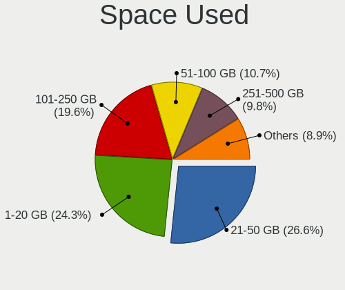
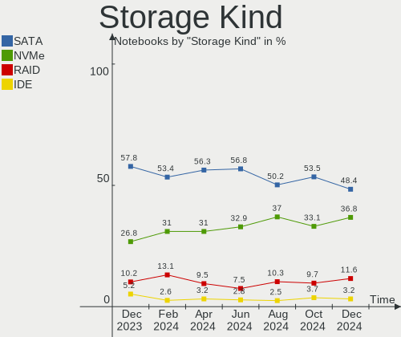
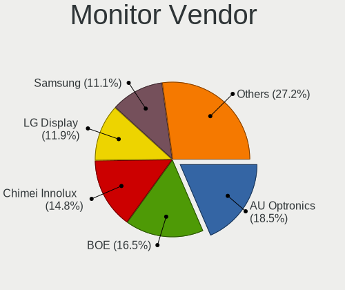

Linux Mint - Hardware Trends (Notebooks)
----------------------------------------

A project to identify most popular hardware characteristics and track their change
over time based on data collected by Linux users at https://Linux-Hardware.org.

Anyone can contribute to this report by the [hw-probe](https://github.com/linuxhw/hw-probe) tool:

    sudo -E hw-probe -all -upload

This report is for one last month. Overall report since the beginning of time: [TestCoverage](https://github.com/linuxhw/TestCoverage)

Period: Sep, 2022.

Contents
--------

* [ System ](#system)
  - [ OS                       ](#os)
  - [ OS Family                ](#os-family)
  - [ Kernel                   ](#kernel)
  - [ Kernel Family            ](#kernel-family)
  - [ Kernel Major Ver.        ](#kernel-major-ver)
  - [ Arch                     ](#arch)
  - [ DE                       ](#de)
  - [ Display Server           ](#display-server)
  - [ Display Manager          ](#display-manager)
  - [ OS Lang                  ](#os-lang)
  - [ Boot Mode                ](#boot-mode)
  - [ Filesystem               ](#filesystem)
  - [ Part. scheme             ](#part-scheme)
  - [ Dual Boot with Linux/BSD ](#dual-boot-with-linuxbsd)
  - [ Dual Boot (Win)          ](#dual-boot-win)

* [ Board ](#board)
  - [ Vendor                   ](#vendor)
  - [ Model                    ](#model)
  - [ Model Family             ](#model-family)
  - [ MFG Year                 ](#mfg-year)
  - [ Form Factor              ](#form-factor)
  - [ Secure Boot              ](#secure-boot)
  - [ Coreboot                 ](#coreboot)
  - [ RAM Size                 ](#ram-size)
  - [ RAM Used                 ](#ram-used)
  - [ Total Drives             ](#total-drives)
  - [ Has CD-ROM               ](#has-cd-rom)
  - [ Has Ethernet             ](#has-ethernet)
  - [ Has WiFi                 ](#has-wifi)
  - [ Has Bluetooth            ](#has-bluetooth)

* [ Location ](#location)
  - [ Country                  ](#country)
  - [ City                     ](#city)

* [ Drives ](#drives)
  - [ Drive Vendor             ](#drive-vendor)
  - [ Drive Model              ](#drive-model)
  - [ HDD Vendor               ](#hdd-vendor)
  - [ SSD Vendor               ](#ssd-vendor)
  - [ Drive Kind               ](#drive-kind)
  - [ Drive Connector          ](#drive-connector)
  - [ Drive Size               ](#drive-size)
  - [ Space Total              ](#space-total)
  - [ Space Used               ](#space-used)
  - [ Malfunc. Drives          ](#malfunc-drives)
  - [ Malfunc. Drive Vendor    ](#malfunc-drive-vendor)
  - [ Malfunc. HDD Vendor      ](#malfunc-hdd-vendor)
  - [ Malfunc. Drive Kind      ](#malfunc-drive-kind)
  - [ Failed Drives            ](#failed-drives)
  - [ Failed Drive Vendor      ](#failed-drive-vendor)
  - [ Drive Status             ](#drive-status)

* [ Storage controller ](#storage-controller)
  - [ Storage Vendor           ](#storage-vendor)
  - [ Storage Model            ](#storage-model)
  - [ Storage Kind             ](#storage-kind)

* [ Processor ](#processor)
  - [ CPU Vendor               ](#cpu-vendor)
  - [ CPU Model                ](#cpu-model)
  - [ CPU Model Family         ](#cpu-model-family)
  - [ CPU Cores                ](#cpu-cores)
  - [ CPU Sockets              ](#cpu-sockets)
  - [ CPU Threads              ](#cpu-threads)
  - [ CPU Op-Modes             ](#cpu-op-modes)
  - [ CPU Microcode            ](#cpu-microcode)
  - [ CPU Microarch            ](#cpu-microarch)

* [ Graphics ](#graphics)
  - [ GPU Vendor               ](#gpu-vendor)
  - [ GPU Model                ](#gpu-model)
  - [ GPU Combo                ](#gpu-combo)
  - [ GPU Driver               ](#gpu-driver)
  - [ GPU Memory               ](#gpu-memory)

* [ Monitor ](#monitor)
  - [ Monitor Vendor           ](#monitor-vendor)
  - [ Monitor Model            ](#monitor-model)
  - [ Monitor Resolution       ](#monitor-resolution)
  - [ Monitor Diagonal         ](#monitor-diagonal)
  - [ Monitor Width            ](#monitor-width)
  - [ Aspect Ratio             ](#aspect-ratio)
  - [ Monitor Area             ](#monitor-area)
  - [ Pixel Density            ](#pixel-density)
  - [ Multiple Monitors        ](#multiple-monitors)

* [ Network ](#network)
  - [ Net Controller Vendor    ](#net-controller-vendor)
  - [ Net Controller Model     ](#net-controller-model)
  - [ Wireless Vendor          ](#wireless-vendor)
  - [ Wireless Model           ](#wireless-model)
  - [ Ethernet Vendor          ](#ethernet-vendor)
  - [ Ethernet Model           ](#ethernet-model)
  - [ Net Controller Kind      ](#net-controller-kind)
  - [ Used Controller          ](#used-controller)
  - [ NICs                     ](#nics)
  - [ IPv6                     ](#ipv6)

* [ Bluetooth ](#bluetooth)
  - [ Bluetooth Vendor         ](#bluetooth-vendor)
  - [ Bluetooth Model          ](#bluetooth-model)

* [ Sound ](#sound)
  - [ Sound Vendor             ](#sound-vendor)
  - [ Sound Model              ](#sound-model)

* [ Memory ](#memory)
  - [ Memory Vendor            ](#memory-vendor)
  - [ Memory Model             ](#memory-model)
  - [ Memory Kind              ](#memory-kind)
  - [ Memory Form Factor       ](#memory-form-factor)
  - [ Memory Size              ](#memory-size)
  - [ Memory Speed             ](#memory-speed)

* [ Printers & scanners ](#printers--scanners)
  - [ Printer Vendor           ](#printer-vendor)
  - [ Printer Model            ](#printer-model)
  - [ Scanner Vendor           ](#scanner-vendor)
  - [ Scanner Model            ](#scanner-model)

* [ Camera ](#camera)
  - [ Camera Vendor            ](#camera-vendor)
  - [ Camera Model             ](#camera-model)

* [ Security ](#security)
  - [ Fingerprint Vendor       ](#fingerprint-vendor)
  - [ Fingerprint Model        ](#fingerprint-model)
  - [ Chipcard Vendor          ](#chipcard-vendor)
  - [ Chipcard Model           ](#chipcard-model)

* [ Unsupported ](#unsupported)
  - [ Unsupported Devices      ](#unsupported-devices)
  - [ Unsupported Device Types ](#unsupported-device-types)

System
------

OS
--

Installed operating systems

| Name            | Notebooks | Percent |
|-----------------|-----------|---------|
| Linux Mint 21   | 153       | 60.71%  |
| Linux Mint 20.3 | 76        | 30.16%  |
| Linux Mint 20.2 | 13        | 5.16%   |
| Linux Mint 20.1 | 4         | 1.59%   |
| Linux Mint 19.3 | 3         | 1.19%   |
| Linux Mint 20   | 2         | 0.79%   |
| Linux Mint 19.2 | 1         | 0.4%    |

OS Family
---------

OS without a version

| Name       | Notebooks | Percent |
|------------|-----------|---------|
| Linux Mint | 252       | 100%    |

Kernel
------

Version of the Linux kernel

| Version               | Notebooks | Percent |
|-----------------------|-----------|---------|
| 5.15.0-47-generic     | 96        | 38.1%   |
| 5.4.0-125-generic     | 39        | 15.48%  |
| 5.15.0-48-generic     | 38        | 15.08%  |
| 5.4.0-126-generic     | 20        | 7.94%   |
| 5.15.0-46-generic     | 17        | 6.75%   |
| 5.15.0-41-generic     | 15        | 5.95%   |
| 5.4.0-124-generic     | 3         | 1.19%   |
| 5.4.0-74-generic      | 2         | 0.79%   |
| 5.4.0-121-generic     | 2         | 0.79%   |
| 5.4.0-113-generic     | 2         | 0.79%   |
| 5.4.0-105-generic     | 2         | 0.79%   |
| 5.15.0-43-generic     | 2         | 0.79%   |
| 5.14.0-1051-oem       | 2         | 0.79%   |
| 5.8.0-63-generic      | 1         | 0.4%    |
| 5.4.0-91-generic      | 1         | 0.4%    |
| 5.4.0-90-generic      | 1         | 0.4%    |
| 5.4.0-80-generic      | 1         | 0.4%    |
| 5.4.0-77-generic      | 1         | 0.4%    |
| 5.4.0-125-lowlatency  | 1         | 0.4%    |
| 5.4.0-122-generic     | 1         | 0.4%    |
| 5.4.0-109-generic     | 1         | 0.4%    |
| 5.19.7-051907-generic | 1         | 0.4%    |
| 5.19.3-051903-generic | 1         | 0.4%    |
| 5.13.0-25-generic     | 1         | 0.4%    |
| 4.15.0-54-generic     | 1         | 0.4%    |

Kernel Family
-------------

Linux kernel without a distro release

| Version | Notebooks | Percent |
|---------|-----------|---------|
| 5.15.0  | 168       | 66.67%  |
| 5.4.0   | 77        | 30.56%  |
| 5.14.0  | 2         | 0.79%   |
| 5.8.0   | 1         | 0.4%    |
| 5.19.7  | 1         | 0.4%    |
| 5.19.3  | 1         | 0.4%    |
| 5.13.0  | 1         | 0.4%    |
| 4.15.0  | 1         | 0.4%    |

Kernel Major Ver.
-----------------

Linux kernel major version

| Version | Notebooks | Percent |
|---------|-----------|---------|
| 5.15    | 168       | 66.67%  |
| 5.4     | 77        | 30.56%  |
| 5.19    | 2         | 0.79%   |
| 5.14    | 2         | 0.79%   |
| 5.8     | 1         | 0.4%    |
| 5.13    | 1         | 0.4%    |
| 4.15    | 1         | 0.4%    |

Arch
----

OS architecture (x86_64, i586, etc.)

| Name   | Notebooks | Percent |
|--------|-----------|---------|
| x86_64 | 251       | 99.6%   |
| i686   | 1         | 0.4%    |

DE
--

Desktop Environment

| Name       | Notebooks | Percent |
|------------|-----------|---------|
| X-Cinnamon | 171       | 67.86%  |
| XFCE       | 28        | 11.11%  |
| MATE       | 24        | 9.52%   |
| Cinnamon   | 16        | 6.35%   |
| GNOME      | 8         | 3.17%   |
| KDE5       | 2         | 0.79%   |
| Unknown    | 2         | 0.79%   |
| i3         | 1         | 0.4%    |

Display Server
--------------

X11 or Wayland

| Name    | Notebooks | Percent |
|---------|-----------|---------|
| X11     | 250       | 99.21%  |
| Wayland | 2         | 0.79%   |

Display Manager
---------------

SDDM, LightDM, etc.

| Name    | Notebooks | Percent |
|---------|-----------|---------|
| Unknown | 136       | 53.97%  |
| LightDM | 114       | 45.24%  |
| SDDM    | 1         | 0.4%    |
| GDM3    | 1         | 0.4%    |

OS Lang
-------

Language

| Lang    | Notebooks | Percent |
|---------|-----------|---------|
| en_US   | 85        | 33.73%  |
| de_DE   | 31        | 12.3%   |
| pt_BR   | 17        | 6.75%   |
| it_IT   | 16        | 6.35%   |
| fr_FR   | 13        | 5.16%   |
| en_CA   | 12        | 4.76%   |
| ru_RU   | 11        | 4.37%   |
| C       | 9         | 3.57%   |
| es_ES   | 7         | 2.78%   |
| en_GB   | 7         | 2.78%   |
| pl_PL   | 5         | 1.98%   |
| en_AU   | 5         | 1.98%   |
| nl_NL   | 4         | 1.59%   |
| es_MX   | 3         | 1.19%   |
| cs_CZ   | 3         | 1.19%   |
| sl_SI   | 2         | 0.79%   |
| es_CL   | 2         | 0.79%   |
| de_AT   | 2         | 0.79%   |
| tr_TR   | 1         | 0.4%    |
| sk_SK   | 1         | 0.4%    |
| ro_RO   | 1         | 0.4%    |
| nl_BE   | 1         | 0.4%    |
| nb_NO   | 1         | 0.4%    |
| fr_CA   | 1         | 0.4%    |
| fr_BE   | 1         | 0.4%    |
| es_VE   | 1         | 0.4%    |
| es_CO   | 1         | 0.4%    |
| es_AR   | 1         | 0.4%    |
| en_SG   | 1         | 0.4%    |
| en_IN   | 1         | 0.4%    |
| en_IE   | 1         | 0.4%    |
| en_DK   | 1         | 0.4%    |
| de_IT   | 1         | 0.4%    |
| de_CH   | 1         | 0.4%    |
| ca_ES   | 1         | 0.4%    |
| Unknown | 1         | 0.4%    |

Boot Mode
---------

EFI or BIOS

| Mode | Notebooks | Percent |
|------|-----------|---------|
| EFI  | 153       | 60.71%  |
| BIOS | 99        | 39.29%  |

Filesystem
----------

Type of filesystem

| Type    | Notebooks | Percent |
|---------|-----------|---------|
| Ext4    | 236       | 93.65%  |
| Overlay | 8         | 3.17%   |
| Btrfs   | 5         | 1.98%   |
| Zfs     | 2         | 0.79%   |
| Xfs     | 1         | 0.4%    |

Part. scheme
------------

Scheme of partitioning

| Type    | Notebooks | Percent |
|---------|-----------|---------|
| Unknown | 139       | 55.16%  |
| GPT     | 99        | 39.29%  |
| MBR     | 14        | 5.56%   |

Dual Boot with Linux/BSD
------------------------

Hosting more than one Linux/BSD

| Dual boot | Notebooks | Percent |
|-----------|-----------|---------|
| No        | 233       | 92.46%  |
| Yes       | 19        | 7.54%   |

Dual Boot (Win)
---------------

Hosting Linux and Windows

| Dual boot | Notebooks | Percent |
|-----------|-----------|---------|
| No        | 204       | 80.95%  |
| Yes       | 48        | 19.05%  |

Board
-----

Vendor
------

Motherboard manufacturer

| Name                | Notebooks | Percent |
|---------------------|-----------|---------|
| Lenovo              | 55        | 21.83%  |
| Dell                | 53        | 21.03%  |
| Hewlett-Packard     | 30        | 11.9%   |
| ASUSTek Computer    | 28        | 11.11%  |
| Acer                | 21        | 8.33%   |
| Toshiba             | 11        | 4.37%   |
| Samsung Electronics | 10        | 3.97%   |
| Apple               | 7         | 2.78%   |
| MSI                 | 3         | 1.19%   |
| HUAWEI              | 3         | 1.19%   |
| Timi                | 2         | 0.79%   |
| Sony                | 2         | 0.79%   |
| Medion              | 2         | 0.79%   |
| LG Electronics      | 2         | 0.79%   |
| Google              | 2         | 0.79%   |
| Daten Tecnologia    | 2         | 0.79%   |
| Chuwi               | 2         | 0.79%   |
| Alienware           | 2         | 0.79%   |
| UMAX                | 1         | 0.4%    |
| Standard            | 1         | 0.4%    |
| Positivo            | 1         | 0.4%    |
| Panasonic           | 1         | 0.4%    |
| Packard Bell        | 1         | 0.4%    |
| Hampoo              | 1         | 0.4%    |
| GPU Company         | 1         | 0.4%    |
| Gigabyte Technology | 1         | 0.4%    |
| GHIA                | 1         | 0.4%    |
| Gateway             | 1         | 0.4%    |
| Fujitsu Siemens     | 1         | 0.4%    |
| Fujitsu             | 1         | 0.4%    |
| Framework           | 1         | 0.4%    |
| Digibras            | 1         | 0.4%    |
| AMI                 | 1         | 0.4%    |

Model
-----

Motherboard model

| Name                                        | Notebooks | Percent |
|---------------------------------------------|-----------|---------|
| Dell Latitude E6540                         | 4         | 1.59%   |
| Dell Inspiron 15-3567                       | 3         | 1.19%   |
| Samsung R530/R730/R540                      | 2         | 0.79%   |
| Lenovo G780                                 | 2         | 0.79%   |
| Lenovo G50-70 20351                         | 2         | 0.79%   |
| HP 2000                                     | 2         | 0.79%   |
| Google Akemi                                | 2         | 0.79%   |
| Dell XPS 17 9700                            | 2         | 0.79%   |
| Dell Latitude E6520                         | 2         | 0.79%   |
| Daten Tecnologia DT02-M4                    | 2         | 0.79%   |
| UMAX VisionBook N15G Plus                   | 1         | 0.4%    |
| Toshiba Satellite S70-A                     | 1         | 0.4%    |
| Toshiba Satellite Pro C660                  | 1         | 0.4%    |
| Toshiba Satellite L875-11M                  | 1         | 0.4%    |
| Toshiba Satellite L670                      | 1         | 0.4%    |
| Toshiba Satellite L50D-B                    | 1         | 0.4%    |
| Toshiba Satellite L50-B                     | 1         | 0.4%    |
| Toshiba Satellite C660                      | 1         | 0.4%    |
| Toshiba Satellite C55-A-1JL                 | 1         | 0.4%    |
| Toshiba Satellite C50-B                     | 1         | 0.4%    |
| Toshiba QOSMIO X70-B                        | 1         | 0.4%    |
| Toshiba ENCORE 2 WT8-B                      | 1         | 0.4%    |
| Timi RedmiBook Pro 15S                      | 1         | 0.4%    |
| Timi RedmiBook 16                           | 1         | 0.4%    |
| Standard AHV                                | 1         | 0.4%    |
| Sony VPCEB1Z1E                              | 1         | 0.4%    |
| Sony SVE15125CBW                            | 1         | 0.4%    |
| Samsung RV415/RV515                         | 1         | 0.4%    |
| Samsung RV411/RV511/E3511/S3511/RV711/E3411 | 1         | 0.4%    |
| Samsung R430/P430                           | 1         | 0.4%    |
| Samsung Lumpy                               | 1         | 0.4%    |
| Samsung 755XDA                              | 1         | 0.4%    |
| Samsung 750XED                              | 1         | 0.4%    |
| Samsung 350V5C/351V5C/3540VC/3440VC         | 1         | 0.4%    |
| Samsung 300E4A/300E5A/300E7A                | 1         | 0.4%    |
| Positivo Mobile                             | 1         | 0.4%    |
| Panasonic CF-53JWX1CFG                      | 1         | 0.4%    |
| Packard Bell EasyNote LE69KB                | 1         | 0.4%    |
| MSI GT70 2OC/2OD                            | 1         | 0.4%    |
| MSI GF75 Thin 10SC                          | 1         | 0.4%    |

Model Family
------------

Motherboard model prefix

| Name                     | Notebooks | Percent |
|--------------------------|-----------|---------|
| Lenovo ThinkPad          | 29        | 11.51%  |
| Dell Latitude            | 25        | 9.92%   |
| Dell Inspiron            | 18        | 7.14%   |
| Acer Aspire              | 17        | 6.75%   |
| ASUS VivoBook            | 11        | 4.37%   |
| Toshiba Satellite        | 9         | 3.57%   |
| Lenovo IdeaPad           | 9         | 3.57%   |
| HP Pavilion              | 6         | 2.38%   |
| HP Laptop                | 5         | 1.98%   |
| Dell XPS                 | 5         | 1.98%   |
| HP EliteBook             | 4         | 1.59%   |
| HP ProBook               | 3         | 1.19%   |
| Dell Precision           | 3         | 1.19%   |
| Timi RedmiBook           | 2         | 0.79%   |
| Samsung R530             | 2         | 0.79%   |
| Lenovo Legion            | 2         | 0.79%   |
| Lenovo G780              | 2         | 0.79%   |
| Lenovo G50-70            | 2         | 0.79%   |
| Lenovo G40-80            | 2         | 0.79%   |
| HP ZBook                 | 2         | 0.79%   |
| HP 2000                  | 2         | 0.79%   |
| Google Akemi             | 2         | 0.79%   |
| Daten Tecnologia DT02-M4 | 2         | 0.79%   |
| ASUS ZenBook             | 2         | 0.79%   |
| ASUS ASUS                | 2         | 0.79%   |
| Apple MacBookPro5        | 2         | 0.79%   |
| Acer TravelMate          | 2         | 0.79%   |
| UMAX VisionBook          | 1         | 0.4%    |
| Toshiba QOSMIO           | 1         | 0.4%    |
| Toshiba ENCORE           | 1         | 0.4%    |
| Standard AHV             | 1         | 0.4%    |
| Sony VPCEB1Z1E           | 1         | 0.4%    |
| Sony SVE15125CBW         | 1         | 0.4%    |
| Samsung RV415            | 1         | 0.4%    |
| Samsung RV411            | 1         | 0.4%    |
| Samsung R430             | 1         | 0.4%    |
| Samsung Lumpy            | 1         | 0.4%    |
| Samsung 755XDA           | 1         | 0.4%    |
| Samsung 750XED           | 1         | 0.4%    |
| Samsung 350V5C           | 1         | 0.4%    |

MFG Year
--------

Motherboard manufacture year

| Year | Notebooks | Percent |
|------|-----------|---------|
| 2021 | 28        | 11.11%  |
| 2011 | 24        | 9.52%   |
| 2022 | 22        | 8.73%   |
| 2020 | 20        | 7.94%   |
| 2013 | 20        | 7.94%   |
| 2014 | 18        | 7.14%   |
| 2012 | 18        | 7.14%   |
| 2010 | 18        | 7.14%   |
| 2015 | 15        | 5.95%   |
| 2018 | 13        | 5.16%   |
| 2019 | 11        | 4.37%   |
| 2016 | 11        | 4.37%   |
| 2009 | 11        | 4.37%   |
| 2008 | 10        | 3.97%   |
| 2017 | 7         | 2.78%   |
| 2007 | 4         | 1.59%   |
| 2006 | 1         | 0.4%    |
| 2005 | 1         | 0.4%    |

Form Factor
-----------

Physical design of the computer

| Name     | Notebooks | Percent |
|----------|-----------|---------|
| Notebook | 252       | 100%    |

Secure Boot
-----------

Enabled or disabled

| State    | Notebooks | Percent |
|----------|-----------|---------|
| Disabled | 223       | 88.49%  |
| Enabled  | 29        | 11.51%  |

Coreboot
--------

Have coreboot on board

| Used | Notebooks | Percent |
|------|-----------|---------|
| No   | 249       | 98.81%  |
| Yes  | 3         | 1.19%   |

RAM Size
--------

Total RAM memory

| Size in GB  | Notebooks | Percent |
|-------------|-----------|---------|
| 4.01-8.0    | 89        | 35.32%  |
| 3.01-4.0    | 59        | 23.41%  |
| 16.01-24.0  | 39        | 15.48%  |
| 8.01-16.0   | 39        | 15.48%  |
| 32.01-64.0  | 10        | 3.97%   |
| 1.01-2.0    | 8         | 3.17%   |
| 24.01-32.0  | 4         | 1.59%   |
| 64.01-256.0 | 2         | 0.79%   |
| 2.01-3.0    | 1         | 0.4%    |
| 0.51-1.0    | 1         | 0.4%    |

RAM Used
--------

Used RAM memory

| Used GB   | Notebooks | Percent |
|-----------|-----------|---------|
| 1.01-2.0  | 95        | 37.7%   |
| 2.01-3.0  | 62        | 24.6%   |
| 4.01-8.0  | 41        | 16.27%  |
| 3.01-4.0  | 36        | 14.29%  |
| 0.51-1.0  | 10        | 3.97%   |
| 8.01-16.0 | 7         | 2.78%   |
| 0.01-0.5  | 1         | 0.4%    |

Total Drives
------------

Number of drives on board

| Drives | Notebooks | Percent |
|--------|-----------|---------|
| 1      | 183       | 72.62%  |
| 2      | 59        | 23.41%  |
| 3      | 7         | 2.78%   |
| 6      | 1         | 0.4%    |
| 4      | 1         | 0.4%    |
| 0      | 1         | 0.4%    |

Has CD-ROM
----------

Has CD-ROM on board

| Presented | Notebooks | Percent |
|-----------|-----------|---------|
| No        | 147       | 58.33%  |
| Yes       | 105       | 41.67%  |

Has Ethernet
------------

Has Ethernet on board

| Presented | Notebooks | Percent |
|-----------|-----------|---------|
| Yes       | 206       | 81.75%  |
| No        | 46        | 18.25%  |

Has WiFi
--------

Has WiFi module

| Presented | Notebooks | Percent |
|-----------|-----------|---------|
| Yes       | 248       | 98.41%  |
| No        | 4         | 1.59%   |

Has Bluetooth
-------------

Has Bluetooth module

| Presented | Notebooks | Percent |
|-----------|-----------|---------|
| Yes       | 178       | 70.63%  |
| No        | 74        | 29.37%  |

Location
--------

Country
-------

Geographic location (country)

| Country            | Notebooks | Percent |
|--------------------|-----------|---------|
| USA                | 48        | 19.05%  |
| Germany            | 34        | 13.49%  |
| Italy              | 19        | 7.54%   |
| Brazil             | 18        | 7.14%   |
| Russia             | 15        | 5.95%   |
| France             | 14        | 5.56%   |
| Canada             | 12        | 4.76%   |
| Spain              | 8         | 3.17%   |
| Netherlands        | 8         | 3.17%   |
| Poland             | 6         | 2.38%   |
| Mexico             | 5         | 1.98%   |
| Czechia            | 5         | 1.98%   |
| Australia          | 5         | 1.98%   |
| UK                 | 4         | 1.59%   |
| Belgium            | 4         | 1.59%   |
| Turkey             | 3         | 1.19%   |
| Slovakia           | 3         | 1.19%   |
| Serbia             | 3         | 1.19%   |
| Norway             | 3         | 1.19%   |
| Egypt              | 3         | 1.19%   |
| Austria            | 3         | 1.19%   |
| Slovenia           | 2         | 0.79%   |
| Romania            | 2         | 0.79%   |
| Portugal           | 2         | 0.79%   |
| Indonesia          | 2         | 0.79%   |
| Colombia           | 2         | 0.79%   |
| Chile              | 2         | 0.79%   |
| Argentina          | 2         | 0.79%   |
| Venezuela          | 1         | 0.4%    |
| Thailand           | 1         | 0.4%    |
| Switzerland        | 1         | 0.4%    |
| Singapore          | 1         | 0.4%    |
| Papua New Guinea   | 1         | 0.4%    |
| Israel             | 1         | 0.4%    |
| Ireland            | 1         | 0.4%    |
| India              | 1         | 0.4%    |
| Hong Kong          | 1         | 0.4%    |
| Greece             | 1         | 0.4%    |
| Finland            | 1         | 0.4%    |
| Dominican Republic | 1         | 0.4%    |

City
----

Geographic location (city)

| City                | Notebooks | Percent |
|---------------------|-----------|---------|
| Moscow              | 5         | 1.98%   |
| Frankfurt am Main   | 5         | 1.98%   |
| Berlin              | 5         | 1.98%   |
| Prague              | 3         | 1.19%   |
| Paris               | 3         | 1.19%   |
| Milan               | 3         | 1.19%   |
| Madrid              | 3         | 1.19%   |
| Istanbul            | 3         | 1.19%   |
| Cairo               | 3         | 1.19%   |
| Bratislava          | 3         | 1.19%   |
| Vienna              | 2         | 0.79%   |
| Toronto             | 2         | 0.79%   |
| Tomsk               | 2         | 0.79%   |
| The Bronx           | 2         | 0.79%   |
| Seattle             | 2         | 0.79%   |
| Sao Paulo           | 2         | 0.79%   |
| Santiago            | 2         | 0.79%   |
| San Diego           | 2         | 0.79%   |
| Rio de Janeiro      | 2         | 0.79%   |
| Melbourne           | 2         | 0.79%   |
| Krasnodar           | 2         | 0.79%   |
| Fortaleza           | 2         | 0.79%   |
| Dallas              | 2         | 0.79%   |
| Chicago             | 2         | 0.79%   |
| Belgrade            | 2         | 0.79%   |
| Amsterdam           | 2         | 0.79%   |
| Zimmern ob Rottweil | 1         | 0.4%    |
| Zeitz               | 1         | 0.4%    |
| Yukki               | 1         | 0.4%    |
| Yorktown Heights    | 1         | 0.4%    |
| Wunstorf            | 1         | 0.4%    |
| Woodbridge          | 1         | 0.4%    |
| Wimbledon           | 1         | 0.4%    |
| Wetteren            | 1         | 0.4%    |
| Wendeburg           | 1         | 0.4%    |
| Warsaw              | 1         | 0.4%    |
| Warendorf           | 1         | 0.4%    |
| Waren               | 1         | 0.4%    |
| Waldkraiburg        | 1         | 0.4%    |
| Vrhnika             | 1         | 0.4%    |

Drives
------

Drive Vendor
------------

Hard drive vendors

| Vendor                  | Notebooks | Drives | Percent |
|-------------------------|-----------|--------|---------|
| Samsung Electronics     | 40        | 43     | 13.16%  |
| WDC                     | 34        | 36     | 11.18%  |
| Sandisk                 | 22        | 23     | 7.24%   |
| Seagate                 | 21        | 23     | 6.91%   |
| Toshiba                 | 20        | 20     | 6.58%   |
| Kingston                | 19        | 21     | 6.25%   |
| Unknown                 | 15        | 16     | 4.93%   |
| Crucial                 | 15        | 16     | 4.93%   |
| SK hynix                | 11        | 11     | 3.62%   |
| Micron Technology       | 11        | 11     | 3.62%   |
| HGST                    | 9         | 9      | 2.96%   |
| Intel                   | 8         | 10     | 2.63%   |
| Hitachi                 | 7         | 8      | 2.3%    |
| China                   | 6         | 6      | 1.97%   |
| PNY                     | 4         | 4      | 1.32%   |
| Phison                  | 4         | 4      | 1.32%   |
| Patriot                 | 4         | 4      | 1.32%   |
| LITEON                  | 4         | 4      | 1.32%   |
| Intenso                 | 4         | 5      | 1.32%   |
| KIOXIA                  | 3         | 3      | 0.99%   |
| Fujitsu                 | 3         | 3      | 0.99%   |
| Apple                   | 3         | 4      | 0.99%   |
| A-DATA Technology       | 3         | 3      | 0.99%   |
| Union Memory (Shenzhen) | 2         | 2      | 0.66%   |
| UMIS                    | 2         | 2      | 0.66%   |
| Phison Electronics      | 2         | 2      | 0.66%   |
| Dogfish                 | 2         | 4      | 0.66%   |
| Unknown                 | 2         | 2      | 0.66%   |
| XPG                     | 1         | 1      | 0.33%   |
| Wellcomm                | 1         | 1      | 0.33%   |
| WALRAM                  | 1         | 1      | 0.33%   |
| W800S                   | 1         | 1      | 0.33%   |
| Transcend               | 1         | 1      | 0.33%   |
| SPCC                    | 1         | 1      | 0.33%   |
| Realtek Semiconductor   | 1         | 1      | 0.33%   |
| Netac                   | 1         | 1      | 0.33%   |
| Mushkin                 | 1         | 1      | 0.33%   |
| MidasForce              | 1         | 1      | 0.33%   |
| MAXSUN                  | 1         | 1      | 0.33%   |
| LITEONIT                | 1         | 1      | 0.33%   |

Drive Model
-----------

Hard drive models

| Model                                        | Notebooks | Percent |
|----------------------------------------------|-----------|---------|
| Toshiba MQ01ABD100 1TB                       | 6         | 1.89%   |
| Kingston SA400S37240G 240GB SSD              | 5         | 1.58%   |
| Kingston SA400S37480G 480GB SSD              | 4         | 1.26%   |
| Toshiba MQ01ABF050 500GB                     | 3         | 0.95%   |
| Seagate ST500LM012 HN-M500MBB 500GB          | 3         | 0.95%   |
| Seagate ST320LT020-9YG142 320GB              | 3         | 0.95%   |
| SanDisk SSD PLUS 240GB                       | 3         | 0.95%   |
| SanDisk NVMe SSD Drive 512GB                 | 3         | 0.95%   |
| Samsung SSD 860 EVO 500GB                    | 3         | 0.95%   |
| Samsung SSD 860 EVO 1TB                      | 3         | 0.95%   |
| Samsung SSD 850 EVO 500GB                    | 3         | 0.95%   |
| Samsung SSD 850 EVO 250GB                    | 3         | 0.95%   |
| Samsung NVMe SSD Drive 512GB                 | 3         | 0.95%   |
| HGST HTS721010A9E630 1TB                     | 3         | 0.95%   |
| WDC WD5000LPCX-24VHAT0 500GB                 | 2         | 0.63%   |
| WDC WD5000BPVT-22HXZT3 500GB                 | 2         | 0.63%   |
| Unknown MMC Card  64GB                       | 2         | 0.63%   |
| Union Memory (Shenzhen) NVMe SSD Drive 256GB | 2         | 0.63%   |
| Seagate ST500LT012-1DG142 500GB              | 2         | 0.63%   |
| Seagate ST500LM000-1EJ162 500GB              | 2         | 0.63%   |
| SanDisk NVMe SSD Drive 256GB                 | 2         | 0.63%   |
| Samsung SSD 970 EVO Plus 1TB                 | 2         | 0.63%   |
| Samsung MZVL21T0HCLR-00B00 1TB               | 2         | 0.63%   |
| PNY CS900 120GB SSD                          | 2         | 0.63%   |
| Phison PS5013 E13 NVMe Controller 512GB      | 2         | 0.63%   |
| Patriot Burst Elite 120GB SSD                | 2         | 0.63%   |
| Micron NVMe SSD Drive 1024GB                 | 2         | 0.63%   |
| Hitachi HTS545050B9A300 500GB                | 2         | 0.63%   |
| Hitachi HTS545050A7E380 500GB                | 2         | 0.63%   |
| HGST HTS545050A7E380 500GB                   | 2         | 0.63%   |
| Crucial CT525MX300SSD1 528GB                 | 2         | 0.63%   |
| Crucial CT480BX500SSD1 480GB                 | 2         | 0.63%   |
| Crucial CT2000MX500SSD1 2TB                  | 2         | 0.63%   |
| Crucial CT1000MX500SSD1 1TB                  | 2         | 0.63%   |
| A-DATA SU630 240GB SSD                       | 2         | 0.63%   |
| Unknown                                      | 2         | 0.63%   |
| XPG NVMe SSD Drive 256GB                     | 1         | 0.32%   |
| Wellcomm Master Elite 128GB SSD              | 1         | 0.32%   |
| WDC WDS250G2B0A-00SM50 250GB SSD             | 1         | 0.32%   |
| WDC WDS120G2G0A-00JH30 120GB SSD             | 1         | 0.32%   |

HDD Vendor
----------

Hard disk drive vendors

| Vendor              | Notebooks | Drives | Percent |
|---------------------|-----------|--------|---------|
| WDC                 | 27        | 27     | 31.4%   |
| Seagate             | 21        | 23     | 24.42%  |
| Toshiba             | 16        | 16     | 18.6%   |
| HGST                | 9         | 9      | 10.47%  |
| Hitachi             | 7         | 8      | 8.14%   |
| Fujitsu             | 3         | 3      | 3.49%   |
| Samsung Electronics | 2         | 2      | 2.33%   |
| Unknown             | 1         | 1      | 1.16%   |

SSD Vendor
----------

Solid state drive vendors

| Vendor              | Notebooks | Drives | Percent |
|---------------------|-----------|--------|---------|
| Samsung Electronics | 21        | 21     | 18.1%   |
| Kingston            | 16        | 18     | 13.79%  |
| Crucial             | 15        | 16     | 12.93%  |
| SanDisk             | 13        | 13     | 11.21%  |
| China               | 6         | 6      | 5.17%   |
| Patriot             | 4         | 4      | 3.45%   |
| LITEON              | 4         | 4      | 3.45%   |
| SK hynix            | 3         | 3      | 2.59%   |
| PNY                 | 3         | 3      | 2.59%   |
| Intenso             | 3         | 3      | 2.59%   |
| Intel               | 3         | 4      | 2.59%   |
| A-DATA Technology   | 3         | 3      | 2.59%   |
| WDC                 | 2         | 2      | 1.72%   |
| Dogfish             | 2         | 4      | 1.72%   |
| Apple               | 2         | 2      | 1.72%   |
| Wellcomm            | 1         | 1      | 0.86%   |
| Toshiba             | 1         | 1      | 0.86%   |
| SPCC                | 1         | 1      | 0.86%   |
| Netac               | 1         | 1      | 0.86%   |
| Mushkin             | 1         | 1      | 0.86%   |
| MidasForce          | 1         | 1      | 0.86%   |
| Micron Technology   | 1         | 1      | 0.86%   |
| LITEONIT            | 1         | 1      | 0.86%   |
| Lexar               | 1         | 1      | 0.86%   |
| KLONER              | 1         | 1      | 0.86%   |
| KIOXIA-EXCERIA      | 1         | 1      | 0.86%   |
| KINGBANK            | 1         | 1      | 0.86%   |
| JD                  | 1         | 1      | 0.86%   |
| GOODRAM             | 1         | 1      | 0.86%   |
| Gigabyte Technology | 1         | 1      | 0.86%   |
| Unknown             | 1         | 1      | 0.86%   |

Drive Kind
----------

HDD or SSD

| Kind    | Notebooks | Drives | Percent |
|---------|-----------|--------|---------|
| SSD     | 110       | 122    | 37.8%   |
| HDD     | 82        | 89     | 28.18%  |
| NVMe    | 73        | 85     | 25.09%  |
| MMC     | 16        | 17     | 5.5%    |
| Unknown | 10        | 10     | 3.44%   |

Drive Connector
---------------

SATA, SAS, NVMe, etc.

| Type | Notebooks | Drives | Percent |
|------|-----------|--------|---------|
| SATA | 181       | 211    | 65.11%  |
| NVMe | 73        | 84     | 26.26%  |
| MMC  | 16        | 17     | 5.76%   |
| SAS  | 8         | 11     | 2.88%   |

Drive Size
----------

Size of hard drive

| Size in TB | Notebooks | Drives | Percent |
|------------|-----------|--------|---------|
| 0.01-0.5   | 139       | 153    | 73.16%  |
| 0.51-1.0   | 42        | 45     | 22.11%  |
| 1.01-2.0   | 8         | 12     | 4.21%   |
| 4.01-10.0  | 1         | 1      | 0.53%   |

Space Total
-----------

Amount of disk space available on the file system

| Size in GB     | Notebooks | Percent |
|----------------|-----------|---------|
| 101-250        | 79        | 31.35%  |
| 251-500        | 74        | 29.37%  |
| 501-1000       | 31        | 12.3%   |
| 1001-2000      | 22        | 8.73%   |
| 51-100         | 21        | 8.33%   |
| 1-20           | 10        | 3.97%   |
| 21-50          | 6         | 2.38%   |
| More than 3000 | 5         | 1.98%   |
| 2001-3000      | 2         | 0.79%   |
| Unknown        | 2         | 0.79%   |

Space Used
----------

Amount of used disk space

| Used GB   | Notebooks | Percent |
|-----------|-----------|---------|
| 1-20      | 66        | 26.19%  |
| 51-100    | 49        | 19.44%  |
| 21-50     | 48        | 19.05%  |
| 101-250   | 42        | 16.67%  |
| 251-500   | 23        | 9.13%   |
| 501-1000  | 18        | 7.14%   |
| 1001-2000 | 3         | 1.19%   |
| Unknown   | 2         | 0.79%   |
| 2001-3000 | 1         | 0.4%    |

Malfunc. Drives
---------------

Drive models with a malfunction

| Model                                 | Notebooks | Drives | Percent |
|---------------------------------------|-----------|--------|---------|
| Toshiba MQ01ABD100 1TB                | 1         | 1      | 11.11%  |
| SK hynix HFS256G39TND-N210A 256GB SSD | 1         | 1      | 11.11%  |
| Seagate ST9320423AS 320GB             | 1         | 1      | 11.11%  |
| Seagate ST320LT007-9ZV142 320GB       | 1         | 1      | 11.11%  |
| Seagate ST1000LM014-1EJ164 1TB        | 1         | 1      | 11.11%  |
| Samsung Electronics HM160HC 160GB     | 1         | 1      | 11.11%  |
| JD SSD 240GB                          | 1         | 1      | 11.11%  |
| Intel SSDSC2BW240A4 240GB             | 1         | 1      | 11.11%  |
| HGST HTS545050A7E680 500GB            | 1         | 1      | 11.11%  |

Malfunc. Drive Vendor
---------------------

Vendors of faulty drives

| Vendor              | Notebooks | Drives | Percent |
|---------------------|-----------|--------|---------|
| Seagate             | 3         | 3      | 33.33%  |
| Toshiba             | 1         | 1      | 11.11%  |
| SK hynix            | 1         | 1      | 11.11%  |
| Samsung Electronics | 1         | 1      | 11.11%  |
| JD                  | 1         | 1      | 11.11%  |
| Intel               | 1         | 1      | 11.11%  |
| HGST                | 1         | 1      | 11.11%  |

Malfunc. HDD Vendor
-------------------

Vendors of faulty HDD drives

| Vendor              | Notebooks | Drives | Percent |
|---------------------|-----------|--------|---------|
| Seagate             | 3         | 3      | 50%     |
| Toshiba             | 1         | 1      | 16.67%  |
| Samsung Electronics | 1         | 1      | 16.67%  |
| HGST                | 1         | 1      | 16.67%  |

Malfunc. Drive Kind
-------------------

Kinds of faulty drives

| Kind | Notebooks | Drives | Percent |
|------|-----------|--------|---------|
| HDD  | 6         | 6      | 66.67%  |
| SSD  | 3         | 3      | 33.33%  |

Failed Drives
-------------

Failed drive models

Zero info for selected period =(

Failed Drive Vendor
-------------------

Failed drive vendors

Zero info for selected period =(

Drive Status
------------

Number of failed and malfunc. drives

| Status   | Notebooks | Drives | Percent |
|----------|-----------|--------|---------|
| Detected | 157       | 194    | 59.02%  |
| Works    | 100       | 120    | 37.59%  |
| Malfunc  | 9         | 9      | 3.38%   |

Storage controller
------------------

Storage Vendor
--------------

Storage controller vendors

| Vendor                           | Notebooks | Percent |
|----------------------------------|-----------|---------|
| Intel                            | 180       | 63.16%  |
| AMD                              | 29        | 10.18%  |
| Samsung Electronics              | 18        | 6.32%   |
| SanDisk                          | 15        | 5.26%   |
| Micron Technology                | 9         | 3.16%   |
| SK hynix                         | 6         | 2.11%   |
| Phison Electronics               | 6         | 2.11%   |
| Union Memory (Shenzhen)          | 4         | 1.4%    |
| Toshiba America Info Systems     | 4         | 1.4%    |
| Nvidia                           | 3         | 1.05%   |
| Kingston Technology Company      | 3         | 1.05%   |
| Silicon Integrated Systems [SiS] | 2         | 0.7%    |
| KIOXIA                           | 2         | 0.7%    |
| Silicon Motion                   | 1         | 0.35%   |
| Realtek Semiconductor            | 1         | 0.35%   |
| Apple                            | 1         | 0.35%   |
| ADATA Technology                 | 1         | 0.35%   |

Storage Model
-------------

Storage controller models

| Model                                                                            | Notebooks | Percent |
|----------------------------------------------------------------------------------|-----------|---------|
| Intel Sunrise Point-LP SATA Controller [AHCI mode]                               | 21        | 6.84%   |
| AMD FCH SATA Controller [AHCI mode]                                              | 21        | 6.84%   |
| Intel 7 Series Chipset Family 6-port SATA Controller [AHCI mode]                 | 20        | 6.51%   |
| Intel 82801 Mobile SATA Controller [RAID mode]                                   | 19        | 6.19%   |
| Intel 6 Series/C200 Series Chipset Family 6 port Mobile SATA AHCI Controller     | 14        | 4.56%   |
| Intel 5 Series/3400 Series Chipset 4 port SATA AHCI Controller                   | 14        | 4.56%   |
| Intel 8 Series/C220 Series Chipset Family 6-port SATA Controller 1 [AHCI mode]   | 12        | 3.91%   |
| Intel 82801IBM/IEM (ICH9M/ICH9M-E) 4 port SATA Controller [AHCI mode]            | 10        | 3.26%   |
| Micron Non-Volatile memory controller                                            | 9         | 2.93%   |
| Intel Volume Management Device NVMe RAID Controller                              | 9         | 2.93%   |
| Samsung NVMe SSD Controller 980                                                  | 8         | 2.61%   |
| Intel 8 Series SATA Controller 1 [AHCI mode]                                     | 8         | 2.61%   |
| Intel Celeron/Pentium Silver Processor SATA Controller                           | 7         | 2.28%   |
| Intel Wildcat Point-LP SATA Controller [AHCI Mode]                               | 6         | 1.95%   |
| AMD SB7x0/SB8x0/SB9x0 SATA Controller [AHCI mode]                                | 6         | 1.95%   |
| SanDisk Non-Volatile memory controller                                           | 5         | 1.63%   |
| Samsung NVMe SSD Controller SM981/PM981/PM983                                    | 5         | 1.63%   |
| Samsung NVMe SSD Controller PM9A1/PM9A3/980PRO                                   | 5         | 1.63%   |
| Intel Comet Lake SATA AHCI Controller                                            | 5         | 1.63%   |
| Intel 5 Series/3400 Series Chipset 6 port SATA AHCI Controller                   | 5         | 1.63%   |
| SanDisk WD Blue SN550 NVMe SSD                                                   | 4         | 1.3%    |
| Intel 82801HM/HEM (ICH8M/ICH8M-E) SATA Controller [AHCI mode]                    | 4         | 1.3%    |
| Intel 82801HM/HEM (ICH8M/ICH8M-E) IDE Controller                                 | 4         | 1.3%    |
| Union Memory (Shenzhen) Non-Volatile memory controller                           | 3         | 0.98%   |
| SK hynix Gold P31 SSD                                                            | 3         | 0.98%   |
| SK hynix BC501 NVMe Solid State Drive                                            | 3         | 0.98%   |
| Phison PS5013 E13 NVMe Controller                                                | 3         | 0.98%   |
| Phison E12 NVMe Controller                                                       | 3         | 0.98%   |
| Nvidia MCP79 AHCI Controller                                                     | 3         | 0.98%   |
| Intel Tiger Lake-LP SATA Controller                                              | 3         | 0.98%   |
| Intel Q170/Q150/B150/H170/H110/Z170/CM236 Chipset SATA Controller [AHCI Mode]    | 3         | 0.98%   |
| Intel Cannon Lake Mobile PCH SATA AHCI Controller                                | 3         | 0.98%   |
| Intel Atom/Celeron/Pentium Processor x5-E8000/J3xxx/N3xxx Series SATA Controller | 3         | 0.98%   |
| Intel Atom Processor E3800 Series SATA AHCI Controller                           | 3         | 0.98%   |
| Toshiba America Info Systems XG6 NVMe SSD Controller                             | 2         | 0.65%   |
| Toshiba America Info Systems Toshiba America Info Non-Volatile memory controller | 2         | 0.65%   |
| Silicon Integrated Systems [SiS] SATA Controller / IDE mode                      | 2         | 0.65%   |
| Silicon Integrated Systems [SiS] 5513 IDE Controller                             | 2         | 0.65%   |
| SanDisk WD Blue SN570 NVMe SSD                                                   | 2         | 0.65%   |
| SanDisk PC SN520 NVMe SSD                                                        | 2         | 0.65%   |

Storage Kind
------------

Kind of storage controller (IDE, SATA, NVMe, SAS, ...)

| Kind | Notebooks | Percent |
|------|-----------|---------|
| SATA | 179       | 60.68%  |
| NVMe | 72        | 24.41%  |
| RAID | 28        | 9.49%   |
| IDE  | 16        | 5.42%   |

Processor
---------

CPU Vendor
----------

Processor vendors

| Vendor | Notebooks | Percent |
|--------|-----------|---------|
| Intel  | 210       | 83.33%  |
| AMD    | 42        | 16.67%  |

CPU Model
---------

Processor models

| Model                                   | Notebooks | Percent |
|-----------------------------------------|-----------|---------|
| AMD Ryzen 5 5500U with Radeon Graphics  | 6         | 2.38%   |
| Intel Core i5-6200U CPU @ 2.30GHz       | 5         | 1.98%   |
| Intel Core i5-3320M CPU @ 2.60GHz       | 5         | 1.98%   |
| Intel Core i5-3210M CPU @ 2.50GHz       | 5         | 1.98%   |
| Intel Core i5 CPU M 460 @ 2.53GHz       | 5         | 1.98%   |
| Intel 11th Gen Core i5-1135G7 @ 2.40GHz | 5         | 1.98%   |
| Intel Core i5-8250U CPU @ 1.60GHz       | 4         | 1.59%   |
| Intel Core i5-1035G1 CPU @ 1.00GHz      | 4         | 1.59%   |
| Intel Celeron N4020 CPU @ 1.10GHz       | 4         | 1.59%   |
| Intel Core i7-4510U CPU @ 2.00GHz       | 3         | 1.19%   |
| Intel Core i5-2540M CPU @ 2.60GHz       | 3         | 1.19%   |
| Intel Core i3-6006U CPU @ 2.00GHz       | 3         | 1.19%   |
| Intel Core i3-3217U CPU @ 1.80GHz       | 3         | 1.19%   |
| Intel Core i3-2310M CPU @ 2.10GHz       | 3         | 1.19%   |
| Intel Core i3-10110U CPU @ 2.10GHz      | 3         | 1.19%   |
| Intel 12th Gen Core i7-12700H           | 3         | 1.19%   |
| AMD Ryzen 7 5800H with Radeon Graphics  | 3         | 1.19%   |
| Intel Pentium CPU P6100 @ 2.00GHz       | 2         | 0.79%   |
| Intel Core i9-10885H CPU @ 2.40GHz      | 2         | 0.79%   |
| Intel Core i7-8750H CPU @ 2.20GHz       | 2         | 0.79%   |
| Intel Core i7-7500U CPU @ 2.70GHz       | 2         | 0.79%   |
| Intel Core i7-6600U CPU @ 2.60GHz       | 2         | 0.79%   |
| Intel Core i7-4720HQ CPU @ 2.60GHz      | 2         | 0.79%   |
| Intel Core i7-3610QM CPU @ 2.30GHz      | 2         | 0.79%   |
| Intel Core i7-10750H CPU @ 2.60GHz      | 2         | 0.79%   |
| Intel Core i5-8265U CPU @ 1.60GHz       | 2         | 0.79%   |
| Intel Core i5-7200U CPU @ 2.50GHz       | 2         | 0.79%   |
| Intel Core i5-5200U CPU @ 2.20GHz       | 2         | 0.79%   |
| Intel Core i5-4300M CPU @ 2.60GHz       | 2         | 0.79%   |
| Intel Core i5-4200M CPU @ 2.50GHz       | 2         | 0.79%   |
| Intel Core i5-2520M CPU @ 2.50GHz       | 2         | 0.79%   |
| Intel Core i5-2410M CPU @ 2.30GHz       | 2         | 0.79%   |
| Intel Core i5-10310U CPU @ 1.70GHz      | 2         | 0.79%   |
| Intel Core i5 CPU M 560 @ 2.67GHz       | 2         | 0.79%   |
| Intel Core i5 CPU M 520 @ 2.40GHz       | 2         | 0.79%   |
| Intel Core i3-7100U CPU @ 2.40GHz       | 2         | 0.79%   |
| Intel Core i3-5005U CPU @ 2.00GHz       | 2         | 0.79%   |
| Intel Core i3-4005U CPU @ 1.70GHz       | 2         | 0.79%   |
| Intel Core i3-3110M CPU @ 2.40GHz       | 2         | 0.79%   |
| Intel Core i3-2350M CPU @ 2.30GHz       | 2         | 0.79%   |

CPU Model Family
----------------

Processor model prefix

| Model                   | Notebooks | Percent |
|-------------------------|-----------|---------|
| Intel Core i5           | 72        | 28.57%  |
| Intel Core i7           | 37        | 14.68%  |
| Intel Core i3           | 33        | 13.1%   |
| Other                   | 19        | 7.54%   |
| Intel Celeron           | 19        | 7.54%   |
| AMD Ryzen 5             | 15        | 5.95%   |
| Intel Core 2 Duo        | 13        | 5.16%   |
| AMD Ryzen 7             | 7         | 2.78%   |
| Intel Pentium           | 6         | 2.38%   |
| AMD E2                  | 4         | 1.59%   |
| Intel Atom              | 3         | 1.19%   |
| AMD Athlon              | 3         | 1.19%   |
| AMD A6                  | 3         | 1.19%   |
| Intel Pentium Dual-Core | 2         | 0.79%   |
| Intel Core i9           | 2         | 0.79%   |
| AMD Ryzen 7 PRO         | 2         | 0.79%   |
| AMD E                   | 2         | 0.79%   |
| Intel Pentium M         | 1         | 0.4%    |
| Intel Pentium Dual      | 1         | 0.4%    |
| Intel Genuine           | 1         | 0.4%    |
| Intel Celeron M         | 1         | 0.4%    |
| AMD Turion II           | 1         | 0.4%    |
| AMD Turion 64 Mobile    | 1         | 0.4%    |
| AMD Ryzen 3             | 1         | 0.4%    |
| AMD Athlon X2           | 1         | 0.4%    |
| AMD Athlon II Dual-Core | 1         | 0.4%    |
| AMD Athlon 64 X2        | 1         | 0.4%    |

CPU Cores
---------

Number of processor cores

| Number | Notebooks | Percent |
|--------|-----------|---------|
| 2      | 145       | 57.54%  |
| 4      | 62        | 24.6%   |
| 6      | 17        | 6.75%   |
| 8      | 12        | 4.76%   |
| 1      | 8         | 3.17%   |
| 14     | 4         | 1.59%   |
| 12     | 2         | 0.79%   |
| 10     | 2         | 0.79%   |

CPU Sockets
-----------

Number of sockets

| Number | Notebooks | Percent |
|--------|-----------|---------|
| 1      | 252       | 100%    |

CPU Threads
-----------

Threads per core (Hyper-Threading)

| Number | Notebooks | Percent |
|--------|-----------|---------|
| 2      | 183       | 72.62%  |
| 1      | 69        | 27.38%  |

CPU Op-Modes
------------

CPU Operation Modes (32-bit, 64-bit)

| Op mode        | Notebooks | Percent |
|----------------|-----------|---------|
| 32-bit, 64-bit | 251       | 99.6%   |
| 32-bit         | 1         | 0.4%    |

CPU Microcode
-------------

Microcode number

| Number     | Notebooks | Percent |
|------------|-----------|---------|
| Unknown    | 23        | 9.13%   |
| 0x306a9    | 21        | 8.33%   |
| 0x206a7    | 20        | 7.94%   |
| 0x306c3    | 15        | 5.95%   |
| 0x406e3    | 14        | 5.56%   |
| 0x20655    | 14        | 5.56%   |
| 0x1067a    | 12        | 4.76%   |
| 0x806ec    | 9         | 3.57%   |
| 0x806c1    | 9         | 3.57%   |
| 0x40651    | 9         | 3.57%   |
| 0x906a3    | 6         | 2.38%   |
| 0x806ea    | 6         | 2.38%   |
| 0x806e9    | 6         | 2.38%   |
| 0x306d4    | 6         | 2.38%   |
| 0x0a50000c | 6         | 2.38%   |
| 0x706e5    | 5         | 1.98%   |
| 0xa0652    | 4         | 1.59%   |
| 0x706a8    | 4         | 1.59%   |
| 0x6fd      | 4         | 1.59%   |
| 0x30678    | 4         | 1.59%   |
| 0x20652    | 4         | 1.59%   |
| 0x08608103 | 4         | 1.59%   |
| 0x08600106 | 4         | 1.59%   |
| 0x08108109 | 4         | 1.59%   |
| 0x05000119 | 4         | 1.59%   |
| 0x906ea    | 3         | 1.19%   |
| 0x706a1    | 3         | 1.19%   |
| 0x406c4    | 3         | 1.19%   |
| 0x406c3    | 2         | 0.79%   |
| 0x08608102 | 2         | 0.79%   |
| 0xa0660    | 1         | 0.4%    |
| 0x906c0    | 1         | 0.4%    |
| 0x906a4    | 1         | 0.4%    |
| 0x806eb    | 1         | 0.4%    |
| 0x6fa      | 1         | 0.4%    |
| 0x6d8      | 1         | 0.4%    |
| 0x506e3    | 1         | 0.4%    |
| 0x30673    | 1         | 0.4%    |
| 0x106e5    | 1         | 0.4%    |
| 0x10676    | 1         | 0.4%    |

CPU Microarch
-------------

Microarchitecture

| Name             | Notebooks | Percent |
|------------------|-----------|---------|
| KabyLake         | 29        | 11.51%  |
| Haswell          | 24        | 9.52%   |
| IvyBridge        | 22        | 8.73%   |
| SandyBridge      | 21        | 8.33%   |
| Westmere         | 19        | 7.54%   |
| Skylake          | 16        | 6.35%   |
| Penryn           | 13        | 5.16%   |
| TigerLake        | 11        | 4.37%   |
| Unknown          | 11        | 4.37%   |
| Silvermont       | 10        | 3.97%   |
| Zen 3            | 8         | 3.17%   |
| Goldmont plus    | 7         | 2.78%   |
| Core             | 7         | 2.78%   |
| CometLake        | 7         | 2.78%   |
| Broadwell        | 7         | 2.78%   |
| IceLake          | 6         | 2.38%   |
| Zen+             | 5         | 1.98%   |
| Alderlake Hybrid | 5         | 1.98%   |
| Zen 2            | 4         | 1.59%   |
| Bobcat           | 4         | 1.59%   |
| K8 Hammer        | 3         | 1.19%   |
| Zen              | 2         | 0.79%   |
| Puma             | 2         | 0.79%   |
| K10              | 2         | 0.79%   |
| Tremont          | 1         | 0.4%    |
| Piledriver       | 1         | 0.4%    |
| P6               | 1         | 0.4%    |
| Nehalem          | 1         | 0.4%    |
| K8 & K10 hybrid  | 1         | 0.4%    |
| Jaguar           | 1         | 0.4%    |
| Excavator        | 1         | 0.4%    |

Graphics
--------

GPU Vendor
----------

Vendors of graphics cards

| Vendor                           | Notebooks | Percent |
|----------------------------------|-----------|---------|
| Intel                            | 189       | 61.36%  |
| AMD                              | 62        | 20.13%  |
| Nvidia                           | 55        | 17.86%  |
| Silicon Integrated Systems [SiS] | 2         | 0.65%   |

GPU Model
---------

Graphics card models

| Model                                                                                    | Notebooks | Percent |
|------------------------------------------------------------------------------------------|-----------|---------|
| Intel 3rd Gen Core processor Graphics Controller                                         | 20        | 6.41%   |
| Intel 2nd Generation Core Processor Family Integrated Graphics Controller                | 19        | 6.09%   |
| Intel 4th Gen Core Processor Integrated Graphics Controller                              | 15        | 4.81%   |
| Intel Skylake GT2 [HD Graphics 520]                                                      | 13        | 4.17%   |
| Intel Core Processor Integrated Graphics Controller                                      | 12        | 3.85%   |
| Intel TigerLake-LP GT2 [Iris Xe Graphics]                                                | 9         | 2.88%   |
| Intel Mobile 4 Series Chipset Integrated Graphics Controller                             | 9         | 2.88%   |
| Intel Haswell-ULT Integrated Graphics Controller                                         | 9         | 2.88%   |
| Intel HD Graphics 620                                                                    | 7         | 2.24%   |
| Intel GeminiLake [UHD Graphics 600]                                                      | 7         | 2.24%   |
| AMD Lucienne                                                                             | 7         | 2.24%   |
| Intel UHD Graphics 620                                                                   | 6         | 1.92%   |
| Intel Iris Plus Graphics G1 (Ice Lake)                                                   | 6         | 1.92%   |
| Intel HD Graphics 5500                                                                   | 6         | 1.92%   |
| Intel CometLake-U GT2 [UHD Graphics]                                                     | 6         | 1.92%   |
| Intel CometLake-H GT2 [UHD Graphics]                                                     | 6         | 1.92%   |
| Intel Alder Lake-P Integrated Graphics Controller                                        | 6         | 1.92%   |
| Intel Atom/Celeron/Pentium Processor x5-E8000/J3xxx/N3xxx Integrated Graphics Controller | 5         | 1.6%    |
| Intel Atom Processor Z36xxx/Z37xxx Series Graphics & Display                             | 5         | 1.6%    |
| AMD Picasso/Raven 2 [Radeon Vega Series / Radeon Vega Mobile Series]                     | 5         | 1.6%    |
| Nvidia TU117M [GeForce GTX 1650 Mobile / Max-Q]                                          | 4         | 1.28%   |
| Nvidia GF117M [GeForce 610M/710M/810M/820M / GT 620M/625M/630M/720M]                     | 4         | 1.28%   |
| Intel WhiskeyLake-U GT2 [UHD Graphics 620]                                               | 4         | 1.28%   |
| AMD Renoir                                                                               | 4         | 1.28%   |
| AMD Cezanne                                                                              | 4         | 1.28%   |
| AMD Barcelo                                                                              | 4         | 1.28%   |
| Nvidia GA106M [GeForce RTX 3060 Mobile / Max-Q]                                          | 3         | 0.96%   |
| Nvidia G96CM [GeForce 9600M GT]                                                          | 3         | 0.96%   |
| Intel CoffeeLake-H GT2 [UHD Graphics 630]                                                | 3         | 0.96%   |
| AMD Thames [Radeon HD 7500M/7600M Series]                                                | 3         | 0.96%   |
| AMD Park [Mobility Radeon HD 5430/5450/5470]                                             | 3         | 0.96%   |
| AMD Mars XTX [Radeon HD 8790M]                                                           | 3         | 0.96%   |
| Silicon Integrated Systems [SiS] 771/671 PCIE VGA Display Adapter                        | 2         | 0.64%   |
| Nvidia TU117M [GeForce GTX 1650 Ti Mobile]                                               | 2         | 0.64%   |
| Nvidia GT218M [GeForce 310M]                                                             | 2         | 0.64%   |
| Nvidia GP108M [GeForce MX230]                                                            | 2         | 0.64%   |
| Nvidia GM108M [GeForce 940MX]                                                            | 2         | 0.64%   |
| Nvidia GM108M [GeForce 840M]                                                             | 2         | 0.64%   |
| Nvidia GK208M [GeForce GT 740M]                                                          | 2         | 0.64%   |
| Nvidia GF108M [GeForce GT 620M/630M/635M/640M LE]                                        | 2         | 0.64%   |

GPU Combo
---------

Combinations of graphics cards

| Name           | Notebooks | Percent |
|----------------|-----------|---------|
| 1 x Intel      | 138       | 54.76%  |
| 1 x AMD        | 44        | 17.46%  |
| Intel + Nvidia | 38        | 15.08%  |
| Intel + AMD    | 12        | 4.76%   |
| 1 x Nvidia     | 11        | 4.37%   |
| AMD + Nvidia   | 4         | 1.59%   |
| 2 x Nvidia     | 2         | 0.79%   |
| 1 x SiS        | 2         | 0.79%   |
| 2 x AMD        | 1         | 0.4%    |

GPU Driver
----------

Free vs proprietary

| Driver      | Notebooks | Percent |
|-------------|-----------|---------|
| Free        | 213       | 84.52%  |
| Proprietary | 35        | 13.89%  |
| Unknown     | 4         | 1.59%   |

GPU Memory
----------

Total video memory

| Size in GB | Notebooks | Percent |
|------------|-----------|---------|
| Unknown    | 160       | 63.49%  |
| 0.01-0.5   | 35        | 13.89%  |
| 1.01-2.0   | 30        | 11.9%   |
| 0.51-1.0   | 15        | 5.95%   |
| 3.01-4.0   | 10        | 3.97%   |
| 7.01-8.0   | 2         | 0.79%   |

Monitor
-------

Monitor Vendor
--------------

Monitor vendors

| Vendor                  | Notebooks | Percent |
|-------------------------|-----------|---------|
| AU Optronics            | 55        | 20.68%  |
| BOE                     | 38        | 14.29%  |
| LG Display              | 36        | 13.53%  |
| Chimei Innolux          | 36        | 13.53%  |
| Samsung Electronics     | 31        | 11.65%  |
| Goldstar                | 7         | 2.63%   |
| Apple                   | 7         | 2.63%   |
| Sharp                   | 6         | 2.26%   |
| LG Philips              | 5         | 1.88%   |
| Lenovo                  | 5         | 1.88%   |
| Dell                    | 5         | 1.88%   |
| Chi Mei Optoelectronics | 5         | 1.88%   |
| Philips                 | 2         | 0.75%   |
| PANDA                   | 2         | 0.75%   |
| MSI                     | 2         | 0.75%   |
| InnoLux Display         | 2         | 0.75%   |
| InfoVision              | 2         | 0.75%   |
| Acer                    | 2         | 0.75%   |
| Vizio                   | 1         | 0.38%   |
| Toshiba                 | 1         | 0.38%   |
| TMX                     | 1         | 0.38%   |
| STA                     | 1         | 0.38%   |
| Sony                    | 1         | 0.38%   |
| Seiko/Epson             | 1         | 0.38%   |
| Quanta Display          | 1         | 0.38%   |
| Panasonic               | 1         | 0.38%   |
| LGD                     | 1         | 0.38%   |
| Lenovo Group Limited    | 1         | 0.38%   |
| Iiyama                  | 1         | 0.38%   |
| Hewlett-Packard         | 1         | 0.38%   |
| HannStar Display        | 1         | 0.38%   |
| CVTE                    | 1         | 0.38%   |
| CVT                     | 1         | 0.38%   |
| CSO                     | 1         | 0.38%   |
| BenQ                    | 1         | 0.38%   |
| Arnos Instruments       | 1         | 0.38%   |

Monitor Model
-------------

Monitor models

| Model                                                                 | Notebooks | Percent |
|-----------------------------------------------------------------------|-----------|---------|
| Samsung Electronics LCD Monitor SEC5441 1366x768 353x198mm 15.9-inch  | 4         | 1.48%   |
| Chimei Innolux LCD Monitor CMN15F5 1920x1080 344x193mm 15.5-inch      | 3         | 1.11%   |
| Chimei Innolux LCD Monitor CMN14D4 1920x1080 309x173mm 13.9-inch      | 3         | 1.11%   |
| Samsung Electronics S32D850 SAM0BCB 2560x1440 708x398mm 32.0-inch     | 2         | 0.74%   |
| Samsung Electronics LCD Monitor SEC3245 1366x768 344x194mm 15.5-inch  | 2         | 0.74%   |
| Samsung Electronics LCD Monitor SDC4171 2880x1800 302x189mm 14.0-inch | 2         | 0.74%   |
| LG Philips LCD Monitor LPLDB00 1280x800 331x207mm 15.4-inch           | 2         | 0.74%   |
| LG Display LCD Monitor LGD045C 1366x768 345x194mm 15.6-inch           | 2         | 0.74%   |
| LG Display LCD Monitor LGD03A3 1366x768 277x156mm 12.5-inch           | 2         | 0.74%   |
| LG Display LCD Monitor LGD02E9 1366x768 309x174mm 14.0-inch           | 2         | 0.74%   |
| LG Display LCD Monitor LGD02DC 1366x768 344x194mm 15.5-inch           | 2         | 0.74%   |
| Chimei Innolux LCD Monitor CMN1728 1600x900 382x215mm 17.3-inch       | 2         | 0.74%   |
| Chimei Innolux LCD Monitor CMN15E7 1920x1080 344x193mm 15.5-inch      | 2         | 0.74%   |
| Chimei Innolux LCD Monitor CMN15C5 1366x768 344x193mm 15.5-inch       | 2         | 0.74%   |
| Chimei Innolux LCD Monitor CMN15B7 1366x768 344x193mm 15.5-inch       | 2         | 0.74%   |
| Chimei Innolux LCD Monitor CMN14D6 1366x768 309x173mm 13.9-inch       | 2         | 0.74%   |
| Chimei Innolux LCD Monitor CMN14D5 1920x1080 309x173mm 13.9-inch      | 2         | 0.74%   |
| BOE LCD Monitor BOE0A23 1366x768 344x194mm 15.5-inch                  | 2         | 0.74%   |
| BOE LCD Monitor BOE0A06 1920x1080 344x194mm 15.5-inch                 | 2         | 0.74%   |
| BOE LCD Monitor BOE0893 2160x1440 296x197mm 14.0-inch                 | 2         | 0.74%   |
| BOE LCD Monitor BOE0872 1920x1080 344x194mm 15.5-inch                 | 2         | 0.74%   |
| BOE LCD Monitor BOE07CB 1920x1080 344x193mm 15.5-inch                 | 2         | 0.74%   |
| BOE LCD Monitor BOE06A5 1366x768 344x194mm 15.5-inch                  | 2         | 0.74%   |
| AU Optronics LCD Monitor AUOE48D 1920x1080 344x194mm 15.5-inch        | 2         | 0.74%   |
| AU Optronics LCD Monitor AUO8294 1920x1080 382x215mm 17.3-inch        | 2         | 0.74%   |
| AU Optronics LCD Monitor AUO46EC 1366x768 344x193mm 15.5-inch         | 2         | 0.74%   |
| AU Optronics LCD Monitor AUO38ED 1920x1080 344x193mm 15.5-inch        | 2         | 0.74%   |
| AU Optronics LCD Monitor AUO26EC 1366x768 344x193mm 15.5-inch         | 2         | 0.74%   |
| AU Optronics LCD Monitor AUO21ED 1920x1080 344x193mm 15.5-inch        | 2         | 0.74%   |
| AU Optronics LCD Monitor AUO109D 1920x1080 381x214mm 17.2-inch        | 2         | 0.74%   |
| Vizio VO32L HDTV10A VIZ0042 1366x768 700x390mm 31.5-inch              | 1         | 0.37%   |
| Toshiba LCD Monitor LCD1309 1600x900 295x166mm 13.3-inch              | 1         | 0.37%   |
| TMX TL156MDMP01-0 TMX1560 3200x2000 336x210mm 15.6-inch               | 1         | 0.37%   |
| STA XR140EA1T STA0450 1366x768 310x174mm 14.0-inch                    | 1         | 0.37%   |
| Sony LCD Monitor MS_0025 1920x1080 340x190mm 15.3-inch                | 1         | 0.37%   |
| Sharp LCD Monitor SHP14D7 1920x1200 366x229mm 17.0-inch               | 1         | 0.37%   |
| Sharp LCD Monitor SHP14D6 3840x2400 366x229mm 17.0-inch               | 1         | 0.37%   |
| Sharp LCD Monitor SHP14D1 1920x1200 336x210mm 15.6-inch               | 1         | 0.37%   |
| Sharp LCD Monitor SHP14A3 1920x1280 259x173mm 12.3-inch               | 1         | 0.37%   |
| Sharp LCD Monitor SHP144A 3200x1800 294x165mm 13.3-inch               | 1         | 0.37%   |

Monitor Resolution
------------------

Monitor screen resolution

| Resolution         | Notebooks | Percent |
|--------------------|-----------|---------|
| 1366x768 (WXGA)    | 94        | 35.88%  |
| 1920x1080 (FHD)    | 92        | 35.11%  |
| 1600x900 (HD+)     | 22        | 8.4%    |
| 1280x800 (WXGA)    | 9         | 3.44%   |
| 2880x1800          | 6         | 2.29%   |
| 1920x1200 (WUXGA)  | 6         | 2.29%   |
| 1440x900 (WXGA+)   | 6         | 2.29%   |
| 3840x2160 (4K)     | 4         | 1.53%   |
| Unknown            | 3         | 1.15%   |
| 2560x1440 (QHD)    | 2         | 0.76%   |
| 2160x1440          | 2         | 0.76%   |
| 1680x1050 (WSXGA+) | 2         | 0.76%   |
| 1360x768           | 2         | 0.76%   |
| 3840x2400          | 1         | 0.38%   |
| 3840x1080          | 1         | 0.38%   |
| 3360x1200          | 1         | 0.38%   |
| 3200x2000          | 1         | 0.38%   |
| 3200x1800 (QHD+)   | 1         | 0.38%   |
| 3072x1920          | 1         | 0.38%   |
| 2732x768           | 1         | 0.38%   |
| 2646x1024          | 1         | 0.38%   |
| 2256x1504          | 1         | 0.38%   |
| 1920x1280          | 1         | 0.38%   |
| 1280x1024 (SXGA)   | 1         | 0.38%   |
| 1024x768 (XGA)     | 1         | 0.38%   |

Monitor Diagonal
----------------

Diagonal size in inches

| Inches  | Notebooks | Percent |
|---------|-----------|---------|
| 15      | 117       | 43.82%  |
| 13      | 37        | 13.86%  |
| 14      | 33        | 12.36%  |
| 17      | 25        | 9.36%   |
| 24      | 7         | 2.62%   |
| 12      | 7         | 2.62%   |
| Unknown | 7         | 2.62%   |
| 23      | 6         | 2.25%   |
| 16      | 5         | 1.87%   |
| 27      | 4         | 1.5%    |
| 11      | 4         | 1.5%    |
| 21      | 3         | 1.12%   |
| 18      | 3         | 1.12%   |
| 32      | 2         | 0.75%   |
| 22      | 2         | 0.75%   |
| 40      | 1         | 0.37%   |
| 31      | 1         | 0.37%   |
| 26      | 1         | 0.37%   |
| 20      | 1         | 0.37%   |
| 19      | 1         | 0.37%   |

Monitor Width
-------------

Physical width

| Width in mm | Notebooks | Percent |
|-------------|-----------|---------|
| 301-350     | 161       | 60.53%  |
| 351-400     | 35        | 13.16%  |
| 201-300     | 32        | 12.03%  |
| 501-600     | 18        | 6.77%   |
| 401-500     | 9         | 3.38%   |
| Unknown     | 7         | 2.63%   |
| 701-800     | 2         | 0.75%   |
| 801-900     | 1         | 0.38%   |
| 601-700     | 1         | 0.38%   |

Aspect Ratio
------------

Proportional relationship between the width and the height

| Ratio   | Notebooks | Percent |
|---------|-----------|---------|
| 16/9    | 202       | 82.45%  |
| 16/10   | 31        | 12.65%  |
| Unknown | 6         | 2.45%   |
| 3/2     | 4         | 1.63%   |
| 5/4     | 1         | 0.41%   |
| 4/3     | 1         | 0.41%   |

Monitor Area
------------

Area in inch

| Area in inch | Notebooks | Percent |
|----------------|-----------|---------|
| 101-110        | 119       | 44.57%  |
| 81-90          | 53        | 19.85%  |
| 121-130        | 22        | 8.24%   |
| 71-80          | 17        | 6.37%   |
| 201-250        | 16        | 5.99%   |
| 61-70          | 7         | 2.62%   |
| Unknown        | 7         | 2.62%   |
| 51-60          | 4         | 1.5%    |
| 301-350        | 4         | 1.5%    |
| 351-500        | 3         | 1.12%   |
| 151-200        | 3         | 1.12%   |
| 141-150        | 3         | 1.12%   |
| 131-140        | 3         | 1.12%   |
| 111-120        | 3         | 1.12%   |
| 251-300        | 2         | 0.75%   |
| 501-1000       | 1         | 0.37%   |

Pixel Density
-------------

Pixels per inch

| Density       | Notebooks | Percent |
|---------------|-----------|---------|
| 101-120       | 95        | 35.71%  |
| 121-160       | 92        | 34.59%  |
| 51-100        | 46        | 17.29%  |
| 161-240       | 14        | 5.26%   |
| More than 240 | 10        | 3.76%   |
| Unknown       | 7         | 2.63%   |
| 1-50          | 2         | 0.75%   |

Multiple Monitors
-----------------

Total monitors connected

| Total | Notebooks | Percent |
|-------|-----------|---------|
| 1     | 215       | 85.32%  |
| 2     | 32        | 12.7%   |
| 0     | 4         | 1.59%   |
| 3     | 1         | 0.4%    |

Network
-------

Net Controller Vendor
---------------------

Controller vendors

| Vendor                            | Notebooks | Percent |
|-----------------------------------|-----------|---------|
| Realtek Semiconductor             | 127       | 30.31%  |
| Intel                             | 119       | 28.4%   |
| Qualcomm Atheros                  | 71        | 16.95%  |
| Broadcom                          | 25        | 5.97%   |
| MediaTek                          | 11        | 2.63%   |
| Broadcom Limited                  | 10        | 2.39%   |
| ASIX Electronics                  | 7         | 1.67%   |
| Marvell Technology Group          | 5         | 1.19%   |
| Ralink Technology                 | 4         | 0.95%   |
| Lenovo                            | 4         | 0.95%   |
| Xiaomi                            | 3         | 0.72%   |
| Samsung Electronics               | 3         | 0.72%   |
| Huawei Technologies               | 3         | 0.72%   |
| TP-Link                           | 2         | 0.48%   |
| Silicon Integrated Systems [SiS]  | 2         | 0.48%   |
| Qualcomm                          | 2         | 0.48%   |
| Nvidia                            | 2         | 0.48%   |
| Ericsson Business Mobile Networks | 2         | 0.48%   |
| Dell                              | 2         | 0.48%   |
| U-Blox                            | 1         | 0.24%   |
| Sierra Wireless                   | 1         | 0.24%   |
| Ralink                            | 1         | 0.24%   |
| Qualcomm Atheros Communications   | 1         | 0.24%   |
| NetGear                           | 1         | 0.24%   |
| Microsoft                         | 1         | 0.24%   |
| Microchip Technology              | 1         | 0.24%   |
| Linksys                           | 1         | 0.24%   |
| JMicron Technology                | 1         | 0.24%   |
| ICS Advent                        | 1         | 0.24%   |
| HMD Global                        | 1         | 0.24%   |
| Edimax Technology                 | 1         | 0.24%   |
| D-Link System                     | 1         | 0.24%   |
| ASUSTek Computer                  | 1         | 0.24%   |
| AMD                               | 1         | 0.24%   |

Net Controller Model
--------------------

Controller models

| Model                                                             | Notebooks | Percent |
|-------------------------------------------------------------------|-----------|---------|
| Realtek RTL8111/8168/8411 PCI Express Gigabit Ethernet Controller | 69        | 13.94%  |
| Realtek RTL810xE PCI Express Fast Ethernet controller             | 26        | 5.25%   |
| Qualcomm Atheros AR9285 Wireless Network Adapter (PCI-Express)    | 16        | 3.23%   |
| Qualcomm Atheros QCA9377 802.11ac Wireless Network Adapter        | 15        | 3.03%   |
| Intel 82579LM Gigabit Network Connection (Lewisville)             | 13        | 2.63%   |
| Qualcomm Atheros QCA9565 / AR9565 Wireless Network Adapter        | 10        | 2.02%   |
| MediaTek MT7921 802.11ax PCI Express Wireless Network Adapter     | 9         | 1.82%   |
| Intel Wireless 8265 / 8275                                        | 9         | 1.82%   |
| Realtek RTL8821CE 802.11ac PCIe Wireless Network Adapter          | 8         | 1.62%   |
| Qualcomm Atheros AR9485 Wireless Network Adapter                  | 8         | 1.62%   |
| Intel Wireless 7260                                               | 8         | 1.62%   |
| Intel Wi-Fi 6 AX201                                               | 8         | 1.62%   |
| Intel Centrino Advanced-N 6205 [Taylor Peak]                      | 8         | 1.62%   |
| Intel Wireless 3160                                               | 7         | 1.41%   |
| Intel Ethernet Connection I217-LM                                 | 7         | 1.41%   |
| Intel Centrino Ultimate-N 6300                                    | 7         | 1.41%   |
| Intel Alder Lake-P PCH CNVi WiFi                                  | 7         | 1.41%   |
| Intel Wi-Fi 6 AX200                                               | 6         | 1.21%   |
| Intel Comet Lake PCH-LP CNVi WiFi                                 | 6         | 1.21%   |
| ASIX AX88179 Gigabit Ethernet                                     | 6         | 1.21%   |
| Realtek 802.11ac NIC                                              | 5         | 1.01%   |
| Intel Wireless 8260                                               | 5         | 1.01%   |
| Intel Wireless 7265                                               | 5         | 1.01%   |
| Realtek RTL8822CE 802.11ac PCIe Wireless Network Adapter          | 4         | 0.81%   |
| Realtek RTL8723BE PCIe Wireless Network Adapter                   | 4         | 0.81%   |
| Realtek RTL8153 Gigabit Ethernet Adapter                          | 4         | 0.81%   |
| Qualcomm Atheros AR928X Wireless Network Adapter (PCI-Express)    | 4         | 0.81%   |
| Marvell Group 88E8040 PCI-E Fast Ethernet Controller              | 4         | 0.81%   |
| Intel Ethernet Connection I219-LM                                 | 4         | 0.81%   |
| Intel Centrino Advanced-N 6235                                    | 4         | 0.81%   |
| Intel 82577LM Gigabit Network Connection                          | 4         | 0.81%   |
| Samsung Galaxy series, misc. (tethering mode)                     | 3         | 0.61%   |
| Realtek RTL8723DE Wireless Network Adapter                        | 3         | 0.61%   |
| Realtek RTL8191SEvB Wireless LAN Controller                       | 3         | 0.61%   |
| Ralink MT7601U Wireless Adapter                                   | 3         | 0.61%   |
| Qualcomm Atheros QCA6174 802.11ac Wireless Network Adapter        | 3         | 0.61%   |
| Qualcomm Atheros AR8161 Gigabit Ethernet                          | 3         | 0.61%   |
| Qualcomm Atheros AR8151 v2.0 Gigabit Ethernet                     | 3         | 0.61%   |
| Intel Wireless 3165                                               | 3         | 0.61%   |
| Intel Ethernet Connection (10) I219-LM                            | 3         | 0.61%   |

Wireless Vendor
---------------

Wireless vendors

| Vendor                          | Notebooks | Percent |
|---------------------------------|-----------|---------|
| Intel                           | 112       | 41.48%  |
| Qualcomm Atheros                | 60        | 22.22%  |
| Realtek Semiconductor           | 41        | 15.19%  |
| Broadcom                        | 19        | 7.04%   |
| MediaTek                        | 11        | 4.07%   |
| Broadcom Limited                | 8         | 2.96%   |
| Ralink Technology               | 4         | 1.48%   |
| TP-Link                         | 2         | 0.74%   |
| Qualcomm                        | 2         | 0.74%   |
| Dell                            | 2         | 0.74%   |
| Sierra Wireless                 | 1         | 0.37%   |
| Ralink                          | 1         | 0.37%   |
| Qualcomm Atheros Communications | 1         | 0.37%   |
| NetGear                         | 1         | 0.37%   |
| Microsoft                       | 1         | 0.37%   |
| Linksys                         | 1         | 0.37%   |
| Edimax Technology               | 1         | 0.37%   |
| D-Link System                   | 1         | 0.37%   |
| ASUSTek Computer                | 1         | 0.37%   |

Wireless Model
--------------

Wireless models

| Model                                                          | Notebooks | Percent |
|----------------------------------------------------------------|-----------|---------|
| Qualcomm Atheros AR9285 Wireless Network Adapter (PCI-Express) | 16        | 5.9%    |
| Qualcomm Atheros QCA9377 802.11ac Wireless Network Adapter     | 15        | 5.54%   |
| Qualcomm Atheros QCA9565 / AR9565 Wireless Network Adapter     | 10        | 3.69%   |
| MediaTek MT7921 802.11ax PCI Express Wireless Network Adapter  | 9         | 3.32%   |
| Intel Wireless 8265 / 8275                                     | 9         | 3.32%   |
| Realtek RTL8821CE 802.11ac PCIe Wireless Network Adapter       | 8         | 2.95%   |
| Qualcomm Atheros AR9485 Wireless Network Adapter               | 8         | 2.95%   |
| Intel Wireless 7260                                            | 8         | 2.95%   |
| Intel Wi-Fi 6 AX201                                            | 8         | 2.95%   |
| Intel Centrino Advanced-N 6205 [Taylor Peak]                   | 8         | 2.95%   |
| Intel Wireless 3160                                            | 7         | 2.58%   |
| Intel Centrino Ultimate-N 6300                                 | 7         | 2.58%   |
| Intel Alder Lake-P PCH CNVi WiFi                               | 7         | 2.58%   |
| Intel Wi-Fi 6 AX200                                            | 6         | 2.21%   |
| Intel Comet Lake PCH-LP CNVi WiFi                              | 6         | 2.21%   |
| Realtek 802.11ac NIC                                           | 5         | 1.85%   |
| Intel Wireless 8260                                            | 5         | 1.85%   |
| Intel Wireless 7265                                            | 5         | 1.85%   |
| Realtek RTL8822CE 802.11ac PCIe Wireless Network Adapter       | 4         | 1.48%   |
| Realtek RTL8723BE PCIe Wireless Network Adapter                | 4         | 1.48%   |
| Qualcomm Atheros AR928X Wireless Network Adapter (PCI-Express) | 4         | 1.48%   |
| Intel Centrino Advanced-N 6235                                 | 4         | 1.48%   |
| Realtek RTL8723DE Wireless Network Adapter                     | 3         | 1.11%   |
| Realtek RTL8191SEvB Wireless LAN Controller                    | 3         | 1.11%   |
| Ralink MT7601U Wireless Adapter                                | 3         | 1.11%   |
| Qualcomm Atheros QCA6174 802.11ac Wireless Network Adapter     | 3         | 1.11%   |
| Intel Wireless 3165                                            | 3         | 1.11%   |
| Intel Comet Lake PCH CNVi WiFi                                 | 3         | 1.11%   |
| Broadcom Limited BCM4312 802.11b/g LP-PHY                      | 3         | 1.11%   |
| Broadcom BCM43224 802.11a/b/g/n                                | 3         | 1.11%   |
| Broadcom BCM43142 802.11b/g/n                                  | 3         | 1.11%   |
| TP-Link AC600 wireless Realtek RTL8811AU [Archer T2U Nano]     | 2         | 0.74%   |
| Realtek RTL8188EE Wireless Network Adapter                     | 2         | 0.74%   |
| Realtek Realtek Network controller                             | 2         | 0.74%   |
| Realtek 802.11n WLAN Adapter                                   | 2         | 0.74%   |
| Qualcomm QCA6390 Wireless Network Adapter                      | 2         | 0.74%   |
| Intel WiFi Link 5100                                           | 2         | 0.74%   |
| Intel Wi-Fi 6 AX210/AX211/AX411 160MHz                         | 2         | 0.74%   |
| Intel Ultimate N WiFi Link 5300                                | 2         | 0.74%   |
| Intel PRO/Wireless 4965 AG or AGN [Kedron] Network Connection  | 2         | 0.74%   |

Ethernet Vendor
---------------

Ethernet vendors

| Vendor                           | Notebooks | Percent |
|----------------------------------|-----------|---------|
| Realtek Semiconductor            | 102       | 46.79%  |
| Intel                            | 51        | 23.39%  |
| Qualcomm Atheros                 | 18        | 8.26%   |
| Broadcom                         | 11        | 5.05%   |
| ASIX Electronics                 | 7         | 3.21%   |
| Marvell Technology Group         | 5         | 2.29%   |
| Lenovo                           | 4         | 1.83%   |
| Xiaomi                           | 3         | 1.38%   |
| Samsung Electronics              | 3         | 1.38%   |
| Huawei Technologies              | 3         | 1.38%   |
| Broadcom Limited                 | 3         | 1.38%   |
| Silicon Integrated Systems [SiS] | 2         | 0.92%   |
| Nvidia                           | 2         | 0.92%   |
| Microchip Technology             | 1         | 0.46%   |
| JMicron Technology               | 1         | 0.46%   |
| ICS Advent                       | 1         | 0.46%   |
| HMD Global                       | 1         | 0.46%   |

Ethernet Model
--------------

Ethernet models

| Model                                                                          | Notebooks | Percent |
|--------------------------------------------------------------------------------|-----------|---------|
| Realtek RTL8111/8168/8411 PCI Express Gigabit Ethernet Controller              | 69        | 31.51%  |
| Realtek RTL810xE PCI Express Fast Ethernet controller                          | 26        | 11.87%  |
| Intel 82579LM Gigabit Network Connection (Lewisville)                          | 13        | 5.94%   |
| Intel Ethernet Connection I217-LM                                              | 7         | 3.2%    |
| ASIX AX88179 Gigabit Ethernet                                                  | 6         | 2.74%   |
| Realtek RTL8153 Gigabit Ethernet Adapter                                       | 4         | 1.83%   |
| Marvell Group 88E8040 PCI-E Fast Ethernet Controller                           | 4         | 1.83%   |
| Intel Ethernet Connection I219-LM                                              | 4         | 1.83%   |
| Intel 82577LM Gigabit Network Connection                                       | 4         | 1.83%   |
| Samsung Galaxy series, misc. (tethering mode)                                  | 3         | 1.37%   |
| Qualcomm Atheros AR8161 Gigabit Ethernet                                       | 3         | 1.37%   |
| Qualcomm Atheros AR8151 v2.0 Gigabit Ethernet                                  | 3         | 1.37%   |
| Intel Ethernet Connection (10) I219-LM                                         | 3         | 1.37%   |
| Broadcom NetLink BCM57780 Gigabit Ethernet PCIe                                | 3         | 1.37%   |
| Xiaomi Mi/Redmi series (RNDIS)                                                 | 2         | 0.91%   |
| Silicon Integrated Systems [SiS] 191 Gigabit Ethernet Adapter                  | 2         | 0.91%   |
| Realtek RTL-8100/8101L/8139 PCI Fast Ethernet Adapter                          | 2         | 0.91%   |
| Qualcomm Atheros QCA8171 Gigabit Ethernet                                      | 2         | 0.91%   |
| Qualcomm Atheros AR8162 Fast Ethernet                                          | 2         | 0.91%   |
| Qualcomm Atheros AR8131 Gigabit Ethernet                                       | 2         | 0.91%   |
| Qualcomm Atheros AR8121/AR8113/AR8114 Gigabit or Fast Ethernet                 | 2         | 0.91%   |
| Nvidia MCP79 Ethernet                                                          | 2         | 0.91%   |
| Lenovo USB-C Dock Ethernet                                                     | 2         | 0.91%   |
| Intel Ethernet Connection (4) I219-LM                                          | 2         | 0.91%   |
| Intel Ethernet Connection (2) I219-LM                                          | 2         | 0.91%   |
| Intel 82567LM Gigabit Network Connection                                       | 2         | 0.91%   |
| Intel 82562GT 10/100 Network Connection                                        | 2         | 0.91%   |
| Broadcom NetXtreme BCM57765 Gigabit Ethernet PCIe                              | 2         | 0.91%   |
| Broadcom Limited NetXtreme BCM5761e Gigabit Ethernet PCIe                      | 2         | 0.91%   |
| Xiaomi Mi/Redmi series (RNDIS + ADB)                                           | 1         | 0.46%   |
| Realtek RTL8125 2.5GbE Controller                                              | 1         | 0.46%   |
| Qualcomm Atheros Killer E2500 Gigabit Ethernet Controller                      | 1         | 0.46%   |
| Qualcomm Atheros Killer E220x Gigabit Ethernet Controller                      | 1         | 0.46%   |
| Qualcomm Atheros AR8152 v2.0 Fast Ethernet                                     | 1         | 0.46%   |
| Qualcomm Atheros AR8132 Fast Ethernet                                          | 1         | 0.46%   |
| Microchip LAN9500/LAN9500i                                                     | 1         | 0.46%   |
| Marvell Group Yukon Optima 88E8059 [PCIe Gigabit Ethernet Controller with AVB] | 1         | 0.46%   |
| Lenovo ThinkPad TBT 3 Dock                                                     | 1         | 0.46%   |
| Lenovo OneLink+ Giga                                                           | 1         | 0.46%   |
| JMicron JMC250 PCI Express Gigabit Ethernet Controller                         | 1         | 0.46%   |

Net Controller Kind
-------------------

Ethernet, WiFi or modem

| Kind     | Notebooks | Percent |
|----------|-----------|---------|
| WiFi     | 248       | 54.03%  |
| Ethernet | 206       | 44.88%  |
| Modem    | 5         | 1.09%   |

Used Controller
---------------

Currently used network controller

| Kind     | Notebooks | Percent |
|----------|-----------|---------|
| WiFi     | 204       | 78.76%  |
| Ethernet | 55        | 21.24%  |

NICs
----

Total network controllers on board

| Total | Notebooks | Percent |
|-------|-----------|---------|
| 2     | 186       | 73.81%  |
| 1     | 59        | 23.41%  |
| 0     | 5         | 1.98%   |
| 3     | 2         | 0.79%   |

IPv6
----

IPv6 vs IPv4

| Used | Notebooks | Percent |
|------|-----------|---------|
| No   | 168       | 66.67%  |
| Yes  | 84        | 33.33%  |

Bluetooth
---------

Bluetooth Vendor
----------------

Controller vendors

| Vendor                          | Notebooks | Percent |
|---------------------------------|-----------|---------|
| Intel                           | 78        | 44.07%  |
| Qualcomm Atheros Communications | 19        | 10.73%  |
| IMC Networks                    | 17        | 9.6%    |
| Realtek Semiconductor           | 16        | 9.04%   |
| Foxconn / Hon Hai               | 12        | 6.78%   |
| Lite-On Technology              | 6         | 3.39%   |
| Broadcom                        | 6         | 3.39%   |
| Apple                           | 6         | 3.39%   |
| Realtek                         | 3         | 1.69%   |
| Dell                            | 3         | 1.69%   |
| Cambridge Silicon Radio         | 3         | 1.69%   |
| Toshiba                         | 2         | 1.13%   |
| Ralink                          | 1         | 0.56%   |
| Opticis                         | 1         | 0.56%   |
| Hewlett-Packard                 | 1         | 0.56%   |
| Foxconn International           | 1         | 0.56%   |
| ASUSTek Computer                | 1         | 0.56%   |
| Alps Electric                   | 1         | 0.56%   |

Bluetooth Model
---------------

Controller models

| Model                                               | Notebooks | Percent |
|-----------------------------------------------------|-----------|---------|
| Intel Bluetooth wireless interface                  | 35        | 19.77%  |
| Intel AX201 Bluetooth                               | 17        | 9.6%    |
| Qualcomm Atheros  Bluetooth Device                  | 9         | 5.08%   |
| Realtek Bluetooth Radio                             | 8         | 4.52%   |
| Intel Bluetooth 9460/9560 Jefferson Peak (JfP)      | 7         | 3.95%   |
| Intel Bluetooth Device                              | 6         | 3.39%   |
| IMC Networks Bluetooth Device                       | 6         | 3.39%   |
| Realtek  Bluetooth 4.2 Adapter                      | 5         | 2.82%   |
| Intel AX200 Bluetooth                               | 5         | 2.82%   |
| IMC Networks Wireless_Device                        | 5         | 2.82%   |
| Qualcomm Atheros AR3011 Bluetooth                   | 4         | 2.26%   |
| Intel Centrino Bluetooth Wireless Transceiver       | 4         | 2.26%   |
| IMC Networks Bluetooth Radio                        | 4         | 2.26%   |
| Foxconn / Hon Hai Wireless_Device                   | 4         | 2.26%   |
| Apple Bluetooth Host Controller                     | 4         | 2.26%   |
| Realtek Bluetooth Radio                             | 3         | 1.69%   |
| Lite-On Qualcomm Atheros QCA9377 Bluetooth          | 3         | 1.69%   |
| Cambridge Silicon Radio Bluetooth Dongle (HCI mode) | 3         | 1.69%   |
| Broadcom BCM20702 Bluetooth 4.0 [ThinkPad]          | 3         | 1.69%   |
| Realtek RTL8723B Bluetooth                          | 2         | 1.13%   |
| Qualcomm Atheros QCA61x4 Bluetooth 4.0              | 2         | 1.13%   |
| Qualcomm Atheros AR9462 Bluetooth                   | 2         | 1.13%   |
| Qualcomm Atheros AR3012 Bluetooth 4.0               | 2         | 1.13%   |
| Intel AX210 Bluetooth                               | 2         | 1.13%   |
| Foxconn / Hon Hai Broadcom Bluetooth 2.1 Device     | 2         | 1.13%   |
| Foxconn / Hon Hai Broadcom BCM20702 Bluetooth       | 2         | 1.13%   |
| Dell DW375 Bluetooth Module                         | 2         | 1.13%   |
| Apple Bluetooth USB Host Controller                 | 2         | 1.13%   |
| Toshiba Bluetooth Device                            | 1         | 0.56%   |
| Toshiba BCM43142A0                                  | 1         | 0.56%   |
| Realtek RTL8822BE Bluetooth 4.2 Adapter             | 1         | 0.56%   |
| Ralink RT3290 Bluetooth                             | 1         | 0.56%   |
| Opticis Bluetooth Radio                             | 1         | 0.56%   |
| Lite-On Wireless_Device                             | 1         | 0.56%   |
| Lite-On Bluetooth Device                            | 1         | 0.56%   |
| Lite-On Atheros AR3012 Bluetooth                    | 1         | 0.56%   |
| Intel Wireless-AC 9260 Bluetooth Adapter            | 1         | 0.56%   |
| Intel Centrino Advanced-N 6230 Bluetooth adapter    | 1         | 0.56%   |
| IMC Networks Bluetooth                              | 1         | 0.56%   |
| IMC Networks BCM20702A0                             | 1         | 0.56%   |

Sound
-----

Sound Vendor
------------

Sound card vendors

| Vendor                           | Notebooks | Percent |
|----------------------------------|-----------|---------|
| Intel                            | 202       | 66.89%  |
| AMD                              | 50        | 16.56%  |
| Nvidia                           | 29        | 9.6%    |
| Lenovo                           | 4         | 1.32%   |
| Silicon Integrated Systems [SiS] | 2         | 0.66%   |
| Logitech                         | 2         | 0.66%   |
| Kingston Technology              | 2         | 0.66%   |
| BEHRINGER International          | 2         | 0.66%   |
| Texas Instruments                | 1         | 0.33%   |
| Sony                             | 1         | 0.33%   |
| RODE Microphones                 | 1         | 0.33%   |
| Plantronics                      | 1         | 0.33%   |
| Hewlett-Packard                  | 1         | 0.33%   |
| Generalplus Technology           | 1         | 0.33%   |
| DCMT Technology                  | 1         | 0.33%   |
| C-Media Electronics              | 1         | 0.33%   |
| Apple                            | 1         | 0.33%   |

Sound Model
-----------

Sound card models

| Model                                                                                             | Notebooks | Percent |
|---------------------------------------------------------------------------------------------------|-----------|---------|
| Intel Sunrise Point-LP HD Audio                                                                   | 28        | 7.61%   |
| AMD Family 17h/19h HD Audio Controller                                                            | 25        | 6.79%   |
| Intel 7 Series/C216 Chipset Family High Definition Audio Controller                               | 24        | 6.52%   |
| Intel 5 Series/3400 Series Chipset High Definition Audio                                          | 20        | 5.43%   |
| Intel 6 Series/C200 Series Chipset Family High Definition Audio Controller                        | 19        | 5.16%   |
| AMD Renoir Radeon High Definition Audio Controller                                                | 18        | 4.89%   |
| Intel Xeon E3-1200 v3/4th Gen Core Processor HD Audio Controller                                  | 15        | 4.08%   |
| Intel 8 Series/C220 Series Chipset High Definition Audio Controller                               | 15        | 4.08%   |
| Intel Tiger Lake-LP Smart Sound Technology Audio Controller                                       | 11        | 2.99%   |
| Intel 82801I (ICH9 Family) HD Audio Controller                                                    | 11        | 2.99%   |
| Intel 8 Series HD Audio Controller                                                                | 9         | 2.45%   |
| Intel Haswell-ULT HD Audio Controller                                                             | 8         | 2.17%   |
| Intel Alder Lake PCH-P High Definition Audio Controller                                           | 8         | 2.17%   |
| Intel Wildcat Point-LP High Definition Audio Controller                                           | 7         | 1.9%    |
| Intel Comet Lake PCH-LP cAVS                                                                      | 7         | 1.9%    |
| Intel Celeron/Pentium Silver Processor High Definition Audio                                      | 7         | 1.9%    |
| Intel Broadwell-U Audio Controller                                                                | 7         | 1.9%    |
| AMD SBx00 Azalia (Intel HDA)                                                                      | 7         | 1.9%    |
| AMD Raven/Raven2/Fenghuang HDMI/DP Audio Controller                                               | 7         | 1.9%    |
| Intel Ice Lake-LP Smart Sound Technology Audio Controller                                         | 6         | 1.63%   |
| Intel Comet Lake PCH cAVS                                                                         | 6         | 1.63%   |
| AMD FCH Azalia Controller                                                                         | 6         | 1.63%   |
| Intel Cannon Point-LP High Definition Audio Controller                                            | 4         | 1.09%   |
| Intel Cannon Lake PCH cAVS                                                                        | 4         | 1.09%   |
| Intel Atom Processor Z36xxx/Z37xxx Series High Definition Audio Controller                        | 4         | 1.09%   |
| Intel 82801H (ICH8 Family) HD Audio Controller                                                    | 4         | 1.09%   |
| Nvidia TU107 GeForce GTX 1650 High Definition Audio Controller                                    | 3         | 0.82%   |
| Nvidia MCP79 High Definition Audio                                                                | 3         | 0.82%   |
| Nvidia High Definition Audio Controller                                                           | 3         | 0.82%   |
| Nvidia GF108 High Definition Audio Controller                                                     | 3         | 0.82%   |
| Nvidia GA106 High Definition Audio Controller                                                     | 3         | 0.82%   |
| Intel Atom/Celeron/Pentium Processor x5-E8000/J3xxx/N3xxx Series High Definition Audio Controller | 3         | 0.82%   |
| AMD Wrestler HDMI Audio                                                                           | 3         | 0.82%   |
| AMD Kabini HDMI/DP Audio                                                                          | 3         | 0.82%   |
| Silicon Integrated Systems [SiS] Azalia Audio Controller                                          | 2         | 0.54%   |
| Nvidia TU106 High Definition Audio Controller                                                     | 2         | 0.54%   |
| Nvidia GP107GL High Definition Audio Controller                                                   | 2         | 0.54%   |
| Lenovo ThinkPad USB-C Dock Gen2 USB Audio                                                         | 2         | 0.54%   |
| Intel CM238 HD Audio Controller                                                                   | 2         | 0.54%   |
| AMD RV710/730 HDMI Audio [Radeon HD 4000 series]                                                  | 2         | 0.54%   |

Memory
------

Memory Vendor
-------------

Memory module vendors

| Vendor              | Notebooks | Percent |
|---------------------|-----------|---------|
| Samsung Electronics | 45        | 31.47%  |
| Micron Technology   | 28        | 19.58%  |
| SK hynix            | 25        | 17.48%  |
| Unknown             | 8         | 5.59%   |
| Kingston            | 8         | 5.59%   |
| Crucial             | 6         | 4.2%    |
| Elpida              | 4         | 2.8%    |
| Ramaxel Technology  | 3         | 2.1%    |
| Unknown (ABCD)      | 2         | 1.4%    |
| Smart               | 2         | 1.4%    |
| Corsair             | 2         | 1.4%    |
| Unknown             | 2         | 1.4%    |
| Transcend           | 1         | 0.7%    |
| Sesame              | 1         | 0.7%    |
| PNY                 | 1         | 0.7%    |
| Patriot             | 1         | 0.7%    |
| Nanya Technology    | 1         | 0.7%    |
| High Bridge         | 1         | 0.7%    |
| Foxline             | 1         | 0.7%    |
| A-DATA Technology   | 1         | 0.7%    |

Memory Model
------------

Memory module models

| Model                                                            | Notebooks | Percent |
|------------------------------------------------------------------|-----------|---------|
| SK hynix RAM HMT451S6BFR8A-PB 4096MB SODIMM DDR3 1600MT/s        | 3         | 1.99%   |
| SK hynix RAM HMA81GS6AFR8N-UH 8192MB SODIMM DDR4 2667MT/s        | 3         | 1.99%   |
| Samsung RAM M471A1G44AB0-CWE 8GB SODIMM DDR4 3200MT/s            | 3         | 1.99%   |
| Unknown RAM Module 2048MB SODIMM DDR3 1333MT/s                   | 2         | 1.32%   |
| Unknown RAM Module 1024MB SODIMM DRAM                            | 2         | 1.32%   |
| Unknown (ABCD) RAM 123456789012345678 1GB SODIMM LPDDR4 2400MT/s | 2         | 1.32%   |
| SK hynix RAM HMT451S6BFR8A-PB 4GB SODIMM DDR3 1600MT/s           | 2         | 1.32%   |
| SK hynix RAM HMA851S6DJR6N-XN 4GB SODIMM DDR4 3200MT/s           | 2         | 1.32%   |
| SK hynix RAM HMA851S6AFR6N-UH 4GB SODIMM DDR4 2667MT/s           | 2         | 1.32%   |
| Samsung RAM M471B5773CHS-CH9 2GB SODIMM DDR3 4199MT/s            | 2         | 1.32%   |
| Samsung RAM M471B5173QH0-YK0 4GB SODIMM DDR3 1600MT/s            | 2         | 1.32%   |
| Samsung RAM M471B5173EB0-YK0 4GB SODIMM DDR3 1600MT/s            | 2         | 1.32%   |
| Samsung RAM M471B1G73QH0-YK0 8192MB SODIMM DDR3 1600MT/s         | 2         | 1.32%   |
| Samsung RAM M471B1G73DB0-YK0 8GB SODIMM DDR3 1600MT/s            | 2         | 1.32%   |
| Samsung RAM M471A5244CB0-CWE 4GB SODIMM DDR4 3200MT/s            | 2         | 1.32%   |
| Samsung RAM M471A5244CB0-CTD 4GB SODIMM DDR4 3266MT/s            | 2         | 1.32%   |
| Samsung RAM M471A1G44BB0-CWE 8GB SODIMM DDR4 3200MT/s            | 2         | 1.32%   |
| Micron RAM 8ATF1G64HZ-3G2J1 8GB SODIMM DDR4 3200MT/s             | 2         | 1.32%   |
| Micron RAM 8ATF1G64HZ-2G3E1 8GB SODIMM DDR4 2400MT/s             | 2         | 1.32%   |
| Micron RAM 4ATF51264HZ-3G2J1 4GB SODIMM DDR4 3200MT/s            | 2         | 1.32%   |
| Micron RAM 4ATF51264HZ-2G3B1 4GB SODIMM DDR4 2400MT/s            | 2         | 1.32%   |
| Micron RAM 16ATF4G64HZ-3G2B4 32GB SODIMM DDR4 3200MT/s           | 2         | 1.32%   |
| Unknown                                                          | 2         | 1.32%   |
| Unknown RAM Module 8GB SODIMM DDR4 2667MT/s                      | 1         | 0.66%   |
| Unknown RAM Module 512MB SODIMM DRAM                             | 1         | 0.66%   |
| Unknown RAM Module 4GB SODIMM DDR4 2667MT/s                      | 1         | 0.66%   |
| Unknown RAM Module 4GB SODIMM DDR3 1333MT/s                      | 1         | 0.66%   |
| Unknown RAM Module 2048MB SODIMM 1066MT/s                        | 1         | 0.66%   |
| Unknown RAM Module 1GB SODIMM DRAM                               | 1         | 0.66%   |
| Transcend RAM TS256MSQ64V6U 2048MB SODIMM DDR2 333MT/s           | 1         | 0.66%   |
| Smart RAM SH564128FJ8NWRNSQR 4GB SODIMM DDR3 1600MT/s            | 1         | 0.66%   |
| Smart RAM SH564128FH8NZQNSCG 4096MB SODIMM DDR3 1600MT/s         | 1         | 0.66%   |
| Smart RAM SH564128FH8NZPHSCG 4096MB SODIMM DDR3 1334MT/s         | 1         | 0.66%   |
| SK hynix RAM Module 4GB DIMM DDR3 1600MT/s                       | 1         | 0.66%   |
| SK hynix RAM Module 2GB SODIMM DDR3 1333MT/s                     | 1         | 0.66%   |
| SK hynix RAM Module 2GB DIMM DDR3 1600MT/s                       | 1         | 0.66%   |
| SK hynix RAM HMT351S6BFR8C-G7 4GB SODIMM DDR3 1067MT/s           | 1         | 0.66%   |
| SK hynix RAM HMP351S6AFR8C-S6 4096MB SODIMM DDR2 975MT/s         | 1         | 0.66%   |
| SK hynix RAM HMAB2GS6CMR6N-XN 16GB SODIMM DDR4 3200MT/s          | 1         | 0.66%   |
| SK hynix RAM HMAA2GS6CJR8N-XN 16GB SODIMM DDR4 3200MT/s          | 1         | 0.66%   |

Memory Kind
-----------

Memory module kinds

| Kind    | Notebooks | Percent |
|---------|-----------|---------|
| DDR4    | 55        | 45.08%  |
| DDR3    | 37        | 30.33%  |
| LPDDR4  | 10        | 8.2%    |
| LPDDR3  | 5         | 4.1%    |
| SDRAM   | 4         | 3.28%   |
| DDR2    | 3         | 2.46%   |
| LPDDR5  | 2         | 1.64%   |
| DRAM    | 2         | 1.64%   |
| DDR5    | 2         | 1.64%   |
| Unknown | 2         | 1.64%   |

Memory Form Factor
------------------

Physical design of the memory module

| Name         | Notebooks | Percent |
|--------------|-----------|---------|
| SODIMM       | 98        | 81.67%  |
| Row Of Chips | 17        | 14.17%  |
| Chip         | 3         | 2.5%    |
| DIMM         | 2         | 1.67%   |

Memory Size
-----------

Memory module size

| Size  | Notebooks | Percent |
|-------|-----------|---------|
| 4096  | 47        | 37.01%  |
| 8192  | 46        | 36.22%  |
| 2048  | 15        | 11.81%  |
| 16384 | 13        | 10.24%  |
| 32768 | 3         | 2.36%   |
| 1024  | 2         | 1.57%   |
| 512   | 1         | 0.79%   |

Memory Speed
------------

Memory module speed

| Speed   | Notebooks | Percent |
|---------|-----------|---------|
| 3200    | 35        | 26.92%  |
| 1600    | 24        | 18.46%  |
| 2667    | 17        | 13.08%  |
| 2400    | 14        | 10.77%  |
| 1334    | 6         | 4.62%   |
| 1333    | 6         | 4.62%   |
| 4267    | 4         | 3.08%   |
| 4199    | 4         | 3.08%   |
| 2133    | 3         | 2.31%   |
| 1867    | 3         | 2.31%   |
| 6400    | 2         | 1.54%   |
| 4800    | 2         | 1.54%   |
| 3266    | 2         | 1.54%   |
| 1067    | 2         | 1.54%   |
| Unknown | 2         | 1.54%   |
| 1066    | 1         | 0.77%   |
| 975     | 1         | 0.77%   |
| 667     | 1         | 0.77%   |
| 333     | 1         | 0.77%   |

Printers & scanners
-------------------

Printer Vendor
--------------

Printer device vendors

| Vendor              | Notebooks | Percent |
|---------------------|-----------|---------|
| Hewlett-Packard     | 2         | 66.67%  |
| Samsung Electronics | 1         | 33.33%  |

Printer Model
-------------

Printer device models

| Model                  | Notebooks | Percent |
|------------------------|-----------|---------|
| Samsung M2020 Series   | 1         | 33.33%  |
| HP Deskjet 3050A       | 1         | 33.33%  |
| HP DeskJet 2700 series | 1         | 33.33%  |

Scanner Vendor
--------------

Scanner device vendors

Zero info for selected period =(

Scanner Model
-------------

Scanner device models

Zero info for selected period =(

Camera
------

Camera Vendor
-------------

Camera device vendors

| Vendor                                 | Notebooks | Percent |
|----------------------------------------|-----------|---------|
| Chicony Electronics                    | 60        | 26.67%  |
| Microdia                               | 25        | 11.11%  |
| IMC Networks                           | 22        | 9.78%   |
| Acer                                   | 21        | 9.33%   |
| Realtek Semiconductor                  | 17        | 7.56%   |
| Sunplus Innovation Technology          | 14        | 6.22%   |
| Suyin                                  | 9         | 4%      |
| Quanta                                 | 8         | 3.56%   |
| Samsung Electronics                    | 5         | 2.22%   |
| Apple                                  | 5         | 2.22%   |
| Silicon Motion                         | 4         | 1.78%   |
| Luxvisions Innotech Limited            | 3         | 1.33%   |
| Lite-On Technology                     | 3         | 1.33%   |
| Cheng Uei Precision Industry (Foxlink) | 3         | 1.33%   |
| Y Media                                | 2         | 0.89%   |
| Syntek                                 | 2         | 0.89%   |
| SunplusIT                              | 2         | 0.89%   |
| Sonix Technology                       | 2         | 0.89%   |
| Logitech                               | 2         | 0.89%   |
| DigiTech                               | 2         | 0.89%   |
| ALi                                    | 2         | 0.89%   |
| Alcor Micro                            | 2         | 0.89%   |
| Z-Star Microelectronics                | 1         | 0.44%   |
| SHENZHEN AONI ELECTRONIC               | 1         | 0.44%   |
| Primax Electronics                     | 1         | 0.44%   |
| OmniVision Technologies                | 1         | 0.44%   |
| Lenovo                                 | 1         | 0.44%   |
| Importek                               | 1         | 0.44%   |
| icSpring                               | 1         | 0.44%   |
| Goodong                                | 1         | 0.44%   |
| 8SSC21D67422V1SR25503GH                | 1         | 0.44%   |
| 2M UVC CAMERA                          | 1         | 0.44%   |

Camera Model
------------

Camera device models

| Model                                         | Notebooks | Percent |
|-----------------------------------------------|-----------|---------|
| Chicony Integrated Camera                     | 10        | 4.39%   |
| Realtek Integrated_Webcam_HD                  | 9         | 3.95%   |
| Acer Integrated Camera                        | 9         | 3.95%   |
| Microdia Integrated_Webcam_HD                 | 7         | 3.07%   |
| Chicony HD WebCam                             | 7         | 3.07%   |
| Acer Lenovo EasyCamera                        | 7         | 3.07%   |
| IMC Networks Integrated Camera                | 6         | 2.63%   |
| Samsung Galaxy A5 (MTP)                       | 5         | 2.19%   |
| Microdia Integrated Webcam                    | 5         | 2.19%   |
| IMC Networks USB2.0 VGA UVC WebCam            | 5         | 2.19%   |
| IMC Networks USB2.0 HD UVC WebCam             | 5         | 2.19%   |
| Chicony TOSHIBA Web Camera - HD               | 5         | 2.19%   |
| Chicony HP HD Camera                          | 5         | 2.19%   |
| Sunplus Laptop_Integrated_Webcam_FHD          | 4         | 1.75%   |
| Sunplus Integrated_Webcam_HD                  | 3         | 1.32%   |
| Silicon Motion WebCam SC-0311139N             | 3         | 1.32%   |
| Realtek USB Camera                            | 3         | 1.32%   |
| Chicony USB2.0 HD UVC WebCam                  | 3         | 1.32%   |
| Chicony Lenovo EasyCamera                     | 3         | 1.32%   |
| Chicony HD User Facing                        | 3         | 1.32%   |
| Chicony CNF9055 Toshiba Webcam                | 3         | 1.32%   |
| Y Media USB Camera                            | 2         | 0.88%   |
| Suyin Acer/HP Integrated Webcam [CN0314]      | 2         | 0.88%   |
| SunplusIT 720p HD Camera                      | 2         | 0.88%   |
| Sunplus HD WebCam                             | 2         | 0.88%   |
| Sonix USB2.0 HD UVC WebCam                    | 2         | 0.88%   |
| Quanta HP TrueVision HD Camera                | 2         | 0.88%   |
| Microdia Integrated_Webcam_FHD                | 2         | 0.88%   |
| Microdia Integrated_Webcam_1.3M               | 2         | 0.88%   |
| Luxvisions Innotech Limited Integrated Camera | 2         | 0.88%   |
| Lite-On Integrated Camera                     | 2         | 0.88%   |
| IMC Networks UVC VGA Webcam                   | 2         | 0.88%   |
| DigiTech USB 2.0 PC Camera                    | 2         | 0.88%   |
| Chicony UVC 1.00 device HD UVC WebCam         | 2         | 0.88%   |
| Chicony USB2.0 VGA UVC WebCam                 | 2         | 0.88%   |
| Chicony USB 2.0 Camera                        | 2         | 0.88%   |
| Chicony Integrated Camera (1280x720@30)       | 2         | 0.88%   |
| Chicony HP Webcam                             | 2         | 0.88%   |
| Chicony HP TrueVision HD Camera               | 2         | 0.88%   |
| Apple FaceTime HD Camera                      | 2         | 0.88%   |

Security
--------

Fingerprint Vendor
------------------

Fingerprint sensor vendors

| Vendor                     | Notebooks | Percent |
|----------------------------|-----------|---------|
| Validity Sensors           | 12        | 34.29%  |
| Shenzhen Goodix Technology | 8         | 22.86%  |
| Synaptics                  | 5         | 14.29%  |
| LighTuning Technology      | 5         | 14.29%  |
| Upek                       | 2         | 5.71%   |
| AuthenTec                  | 2         | 5.71%   |
| HOLTEK                     | 1         | 2.86%   |

Fingerprint Model
-----------------

Fingerprint sensor models

| Model                                                                      | Notebooks | Percent |
|----------------------------------------------------------------------------|-----------|---------|
| Shenzhen Goodix  FingerPrint Device                                        | 5         | 14.29%  |
| Validity Sensors VFS5011 Fingerprint Reader                                | 3         | 8.57%   |
| Shenzhen Goodix FingerPrint                                                | 3         | 8.57%   |
| Validity Sensors VFS 5011 fingerprint sensor                               | 2         | 5.71%   |
| Validity Sensors Synaptics VFS7552 Touch Fingerprint Sensor with PurePrint | 2         | 5.71%   |
| Upek Biometric Touchchip/Touchstrip Fingerprint Sensor                     | 2         | 5.71%   |
| Synaptics Prometheus MIS Touch Fingerprint Reader                          | 2         | 5.71%   |
| LighTuning Fingerprint Reader                                              | 2         | 5.71%   |
| LighTuning EgisTec Touch Fingerprint Sensor                                | 2         | 5.71%   |
| AuthenTec AES2810                                                          | 2         | 5.71%   |
| Validity Sensors VFS7500 Touch Fingerprint Sensor                          | 1         | 2.86%   |
| Validity Sensors VFS495 Fingerprint Reader                                 | 1         | 2.86%   |
| Validity Sensors VFS471 Fingerprint Reader                                 | 1         | 2.86%   |
| Validity Sensors VFS451 Fingerprint Reader                                 | 1         | 2.86%   |
| Validity Sensors Synaptics WBDI                                            | 1         | 2.86%   |
| Synaptics Metallica MOH Touch Fingerprint Reader                           | 1         | 2.86%   |
| Synaptics Metallica MIS Touch Fingerprint Reader                           | 1         | 2.86%   |
| LighTuning ES603 Swipe Fingerprint Sensor                                  | 1         | 2.86%   |
| HOLTEK FocalTech Fingerprint Device                                        | 1         | 2.86%   |
| Unknown                                                                    | 1         | 2.86%   |

Chipcard Vendor
---------------

Chipcard module vendors

| Vendor                | Notebooks | Percent |
|-----------------------|-----------|---------|
| Broadcom              | 12        | 54.55%  |
| Alcor Micro           | 5         | 22.73%  |
| Upek                  | 2         | 9.09%   |
| NXP Semiconductors    | 1         | 4.55%   |
| Lenovo                | 1         | 4.55%   |
| Gemalto (was Gemplus) | 1         | 4.55%   |

Chipcard Model
--------------

Chipcard module models

| Model                                                                        | Notebooks | Percent |
|------------------------------------------------------------------------------|-----------|---------|
| Alcor Micro AU9540 Smartcard Reader                                          | 5         | 22.73%  |
| Broadcom BCM5880 Secure Applications Processor with fingerprint swipe sensor | 4         | 18.18%  |
| Broadcom BCM5880 Secure Applications Processor                               | 4         | 18.18%  |
| Broadcom 5880                                                                | 3         | 13.64%  |
| Upek TouchChip Fingerprint Coprocessor (WBF advanced mode)                   | 2         | 9.09%   |
| NXP Semiconductors PR533                                                     | 1         | 4.55%   |
| Lenovo Integrated Smart Card Reader                                          | 1         | 4.55%   |
| Gemalto (was Gemplus) GemPC Twin SmartCard Reader                            | 1         | 4.55%   |
| Broadcom BCM5880 Secure Applications Processor with fingerprint touch sensor | 1         | 4.55%   |

Unsupported
-----------

Unsupported Devices
-------------------

Total unsupported devices on board

| Total | Notebooks | Percent |
|-------|-----------|---------|
| 0     | 166       | 65.87%  |
| 1     | 64        | 25.4%   |
| 2     | 18        | 7.14%   |
| 3     | 3         | 1.19%   |
| 4     | 1         | 0.4%    |

Unsupported Device Types
------------------------

Types of unsupported devices

| Type                     | Notebooks | Percent |
|--------------------------|-----------|---------|
| Fingerprint reader       | 35        | 31.53%  |
| Chipcard                 | 21        | 18.92%  |
| Net/wireless             | 15        | 13.51%  |
| Graphics card            | 9         | 8.11%   |
| Multimedia controller    | 8         | 7.21%   |
| Storage                  | 5         | 4.5%    |
| Camera                   | 5         | 4.5%    |
| Bluetooth                | 4         | 3.6%    |
| Sound                    | 2         | 1.8%    |
| Net/ethernet             | 2         | 1.8%    |
| Tv card                  | 1         | 0.9%    |
| Modem                    | 1         | 0.9%    |
| Firewire controller      | 1         | 0.9%    |
| Communication controller | 1         | 0.9%    |
| Card reader              | 1         | 0.9%    |

