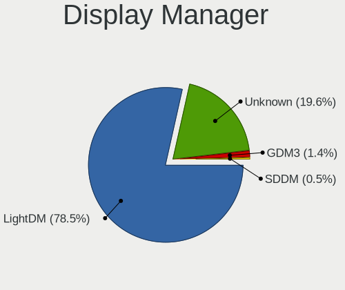
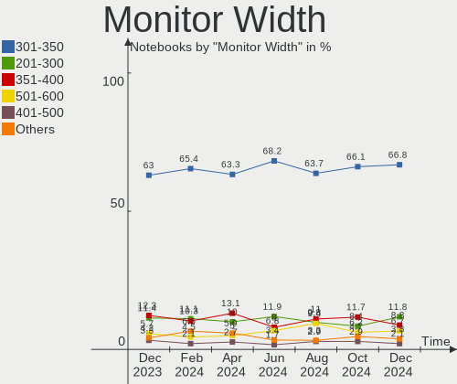
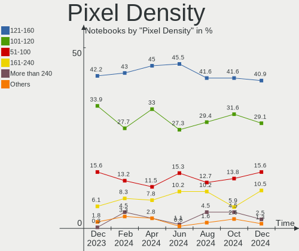

Linux Mint Hardware Trends (Notebooks)
--------------------------------------

A project to identify most popular hardware characteristics and track their change
over time based on data collected by Linux Mint users at https://Linux-Hardware.org.

Anyone can contribute to this report by the [hw-probe](https://github.com/linuxhw/hw-probe) tool:

    sudo -E hw-probe -all -upload

Full-feature report is available here: https://linux-hardware.org/?view=trends&formfactor=notebook

Period: Oct, 2021.

Contents
--------

* [ System ](#system)
  - [ OS                       ](#os)
  - [ OS Family                ](#os-family)
  - [ Kernel                   ](#kernel)
  - [ Kernel Family            ](#kernel-family)
  - [ Kernel Major Ver.        ](#kernel-major-ver)
  - [ Arch                     ](#arch)
  - [ DE                       ](#de)
  - [ Display Server           ](#display-server)
  - [ Display Manager          ](#display-manager)
  - [ OS Lang                  ](#os-lang)
  - [ Boot Mode                ](#boot-mode)
  - [ Filesystem               ](#filesystem)
  - [ Part. scheme             ](#part-scheme)
  - [ Dual Boot with Linux/BSD ](#dual-boot-with-linuxbsd)
  - [ Dual Boot (Win)          ](#dual-boot-win)

* [ Board ](#board)
  - [ Vendor                   ](#vendor)
  - [ Model                    ](#model)
  - [ Model Family             ](#model-family)
  - [ MFG Year                 ](#mfg-year)
  - [ Form Factor              ](#form-factor)
  - [ Secure Boot              ](#secure-boot)
  - [ Coreboot                 ](#coreboot)
  - [ RAM Size                 ](#ram-size)
  - [ RAM Used                 ](#ram-used)
  - [ Total Drives             ](#total-drives)
  - [ Has CD-ROM               ](#has-cd-rom)
  - [ Has Ethernet             ](#has-ethernet)
  - [ Has WiFi                 ](#has-wifi)
  - [ Has Bluetooth            ](#has-bluetooth)

* [ Location ](#location)
  - [ Country                  ](#country)
  - [ City                     ](#city)

* [ Drives ](#drives)
  - [ Drive Vendor             ](#drive-vendor)
  - [ Drive Model              ](#drive-model)
  - [ HDD Vendor               ](#hdd-vendor)
  - [ SSD Vendor               ](#ssd-vendor)
  - [ Drive Kind               ](#drive-kind)
  - [ Drive Connector          ](#drive-connector)
  - [ Drive Size               ](#drive-size)
  - [ Space Total              ](#space-total)
  - [ Space Used               ](#space-used)
  - [ Malfunc. Drives          ](#malfunc-drives)
  - [ Malfunc. Drive Vendor    ](#malfunc-drive-vendor)
  - [ Malfunc. HDD Vendor      ](#malfunc-hdd-vendor)
  - [ Malfunc. Drive Kind      ](#malfunc-drive-kind)
  - [ Failed Drives            ](#failed-drives)
  - [ Failed Drive Vendor      ](#failed-drive-vendor)
  - [ Drive Status             ](#drive-status)

* [ Storage controller ](#storage-controller)
  - [ Storage Vendor           ](#storage-vendor)
  - [ Storage Model            ](#storage-model)
  - [ Storage Kind             ](#storage-kind)

* [ Processor ](#processor)
  - [ CPU Vendor               ](#cpu-vendor)
  - [ CPU Model                ](#cpu-model)
  - [ CPU Model Family         ](#cpu-model-family)
  - [ CPU Cores                ](#cpu-cores)
  - [ CPU Sockets              ](#cpu-sockets)
  - [ CPU Threads              ](#cpu-threads)
  - [ CPU Op-Modes             ](#cpu-op-modes)
  - [ CPU Microcode            ](#cpu-microcode)
  - [ CPU Microarch            ](#cpu-microarch)

* [ Graphics ](#graphics)
  - [ GPU Vendor               ](#gpu-vendor)
  - [ GPU Model                ](#gpu-model)
  - [ GPU Combo                ](#gpu-combo)
  - [ GPU Driver               ](#gpu-driver)
  - [ GPU Memory               ](#gpu-memory)

* [ Monitor ](#monitor)
  - [ Monitor Vendor           ](#monitor-vendor)
  - [ Monitor Model            ](#monitor-model)
  - [ Monitor Resolution       ](#monitor-resolution)
  - [ Monitor Diagonal         ](#monitor-diagonal)
  - [ Monitor Width            ](#monitor-width)
  - [ Aspect Ratio             ](#aspect-ratio)
  - [ Monitor Area             ](#monitor-area)
  - [ Pixel Density            ](#pixel-density)
  - [ Multiple Monitors        ](#multiple-monitors)

* [ Network ](#network)
  - [ Net Controller Vendor    ](#net-controller-vendor)
  - [ Net Controller Model     ](#net-controller-model)
  - [ Wireless Vendor          ](#wireless-vendor)
  - [ Wireless Model           ](#wireless-model)
  - [ Ethernet Vendor          ](#ethernet-vendor)
  - [ Ethernet Model           ](#ethernet-model)
  - [ Net Controller Kind      ](#net-controller-kind)
  - [ Used Controller          ](#used-controller)
  - [ NICs                     ](#nics)
  - [ IPv6                     ](#ipv6)

* [ Bluetooth ](#bluetooth)
  - [ Bluetooth Vendor         ](#bluetooth-vendor)
  - [ Bluetooth Model          ](#bluetooth-model)

* [ Sound ](#sound)
  - [ Sound Vendor             ](#sound-vendor)
  - [ Sound Model              ](#sound-model)

* [ Memory ](#memory)
  - [ Memory Vendor            ](#memory-vendor)
  - [ Memory Model             ](#memory-model)
  - [ Memory Kind              ](#memory-kind)
  - [ Memory Form Factor       ](#memory-form-factor)
  - [ Memory Size              ](#memory-size)
  - [ Memory Speed             ](#memory-speed)

* [ Printers & scanners ](#printers--scanners)
  - [ Printer Vendor           ](#printer-vendor)
  - [ Printer Model            ](#printer-model)
  - [ Scanner Vendor           ](#scanner-vendor)
  - [ Scanner Model            ](#scanner-model)

* [ Camera ](#camera)
  - [ Camera Vendor            ](#camera-vendor)
  - [ Camera Model             ](#camera-model)

* [ Security ](#security)
  - [ Fingerprint Vendor       ](#fingerprint-vendor)
  - [ Fingerprint Model        ](#fingerprint-model)
  - [ Chipcard Vendor          ](#chipcard-vendor)
  - [ Chipcard Model           ](#chipcard-model)

* [ Unsupported ](#unsupported)
  - [ Unsupported Devices      ](#unsupported-devices)
  - [ Unsupported Device Types ](#unsupported-device-types)

System
------

OS
--

Installed operating systems

| Name            | Notebooks | Percent |
|-----------------|-----------|---------|
| Linux Mint 20.2 | 213       | 79.18%  |
| Linux Mint 19.3 | 24        | 8.92%   |
| Linux Mint 20.1 | 19        | 7.06%   |
| Linux Mint 20   | 9         | 3.35%   |
| Linux Mint 19.1 | 2         | 0.74%   |
| Linux Mint 19.2 | 1         | 0.37%   |
| Linux Mint 18.3 | 1         | 0.37%   |

OS Family
---------

OS without a version

| Name       | Notebooks | Percent |
|------------|-----------|---------|
| Linux Mint | 269       | 100%    |

Kernel
------

Version of the Linux kernel

| Version                    | Notebooks | Percent |
|----------------------------|-----------|---------|
| 5.4.0-88-generic           | 102       | 37.92%  |
| 5.4.0-89-generic           | 60        | 22.3%   |
| 5.11.0-37-generic          | 20        | 7.43%   |
| 5.4.0-74-generic           | 16        | 5.95%   |
| 5.11.0-38-generic          | 16        | 5.95%   |
| 5.4.0-87-generic           | 8         | 2.97%   |
| 5.4.0-86-generic           | 5         | 1.86%   |
| 5.0.0-32-generic           | 4         | 1.49%   |
| 5.4.0-84-generic           | 3         | 1.12%   |
| 5.4.0-80-generic           | 3         | 1.12%   |
| 5.4.0-81-generic           | 2         | 0.74%   |
| 5.4.0-58-generic           | 2         | 0.74%   |
| 5.11.0-37-lowlatency       | 2         | 0.74%   |
| 5.11.0-36-generic          | 2         | 0.74%   |
| 4.15.0-159-generic         | 2         | 0.74%   |
| 5.8.0-43-generic           | 1         | 0.37%   |
| 5.4.0-85-generic           | 1         | 0.37%   |
| 5.4.0-72-generic           | 1         | 0.37%   |
| 5.4.0-70-generic           | 1         | 0.37%   |
| 5.4.0-26-generic           | 1         | 0.37%   |
| 5.3.0-46-generic           | 1         | 0.37%   |
| 5.3.0-40-generic           | 1         | 0.37%   |
| 5.15.0-rc5+                | 1         | 0.37%   |
| 5.14.15-xanmod1            | 1         | 0.37%   |
| 5.14.12-xanmod1            | 1         | 0.37%   |
| 5.14.0-12.1-liquorix-amd64 | 1         | 0.37%   |
| 5.14.0-10.1-liquorix-amd64 | 1         | 0.37%   |
| 5.13.0-7620-generic        | 1         | 0.37%   |
| 5.11.0-34-generic          | 1         | 0.37%   |
| 5.11.0-27-generic          | 1         | 0.37%   |
| 5.11.0-22-generic          | 1         | 0.37%   |
| 5.10.0-1050-oem            | 1         | 0.37%   |
| 5.10.0-1049-oem            | 1         | 0.37%   |
| 5.10.0-1045-oem            | 1         | 0.37%   |
| 4.15.0-55-generic          | 1         | 0.37%   |
| 4.15.0-54-generic          | 1         | 0.37%   |
| 4.10.0-38-generic          | 1         | 0.37%   |

Kernel Family
-------------

Linux kernel without a distro release

| Version | Notebooks | Percent |
|---------|-----------|---------|
| 5.4.0   | 205       | 76.21%  |
| 5.11.0  | 43        | 15.99%  |
| 5.0.0   | 4         | 1.49%   |
| 4.15.0  | 4         | 1.49%   |
| 5.10.0  | 3         | 1.12%   |
| 5.3.0   | 2         | 0.74%   |
| 5.14.0  | 2         | 0.74%   |
| 5.8.0   | 1         | 0.37%   |
| 5.15.0  | 1         | 0.37%   |
| 5.14.15 | 1         | 0.37%   |
| 5.14.12 | 1         | 0.37%   |
| 5.13.0  | 1         | 0.37%   |
| 4.10.0  | 1         | 0.37%   |

Kernel Major Ver.
-----------------

Linux kernel major version

| Version | Notebooks | Percent |
|---------|-----------|---------|
| 5.4     | 205       | 76.21%  |
| 5.11    | 43        | 15.99%  |
| 5.14    | 4         | 1.49%   |
| 5.0     | 4         | 1.49%   |
| 4.15    | 4         | 1.49%   |
| 5.10    | 3         | 1.12%   |
| 5.3     | 2         | 0.74%   |
| 5.8     | 1         | 0.37%   |
| 5.15    | 1         | 0.37%   |
| 5.13    | 1         | 0.37%   |
| 4.10    | 1         | 0.37%   |

Arch
----

OS architecture (x86_64, i586, etc.)

| Name   | Notebooks | Percent |
|--------|-----------|---------|
| x86_64 | 258       | 95.91%  |
| i686   | 11        | 4.09%   |

DE
--

Desktop Environment

| Name       | Notebooks | Percent |
|------------|-----------|---------|
| X-Cinnamon | 184       | 68.4%   |
| XFCE       | 31        | 11.52%  |
| MATE       | 25        | 9.29%   |
| Cinnamon   | 15        | 5.58%   |
| Unknown    | 6         | 2.23%   |
| GNOME      | 5         | 1.86%   |
| KDE        | 2         | 0.74%   |
| Deepin     | 1         | 0.37%   |

Display Server
--------------

X11 or Wayland

| Name    | Notebooks | Percent |
|---------|-----------|---------|
| X11     | 267       | 99.26%  |
| Wayland | 1         | 0.37%   |
| Tty     | 1         | 0.37%   |

Display Manager
---------------

SDDM, LightDM, etc.

| Name    | Notebooks | Percent |
|---------|-----------|---------|
| Unknown | 154       | 57.25%  |
| LightDM | 114       | 42.38%  |
| GDM     | 1         | 0.37%   |

OS Lang
-------

Language

| Lang    | Notebooks | Percent |
|---------|-----------|---------|
| en_US   | 68        | 25.28%  |
| de_DE   | 58        | 21.56%  |
| pt_BR   | 21        | 7.81%   |
| fr_FR   | 18        | 6.69%   |
| en_GB   | 15        | 5.58%   |
| ru_RU   | 12        | 4.46%   |
| pl_PL   | 9         | 3.35%   |
| es_ES   | 6         | 2.23%   |
| C       | 6         | 2.23%   |
| cs_CZ   | 5         | 1.86%   |
| en_IN   | 4         | 1.49%   |
| en_CA   | 4         | 1.49%   |
| en_AU   | 4         | 1.49%   |
| de_CH   | 4         | 1.49%   |
| nl_NL   | 3         | 1.12%   |
| it_IT   | 3         | 1.12%   |
| fr_CA   | 3         | 1.12%   |
| es_MX   | 3         | 1.12%   |
| ru_UA   | 2         | 0.74%   |
| pt_PT   | 2         | 0.74%   |
| hr_HR   | 2         | 0.74%   |
| es_CO   | 2         | 0.74%   |
| en_ZA   | 2         | 0.74%   |
| da_DK   | 2         | 0.74%   |
| zh_CN   | 1         | 0.37%   |
| th_TH   | 1         | 0.37%   |
| sk_SK   | 1         | 0.37%   |
| fr_BE   | 1         | 0.37%   |
| fi_FI   | 1         | 0.37%   |
| et_EE   | 1         | 0.37%   |
| es_CL   | 1         | 0.37%   |
| es_AR   | 1         | 0.37%   |
| en_PH   | 1         | 0.37%   |
| en_NZ   | 1         | 0.37%   |
| Unknown | 1         | 0.37%   |

Boot Mode
---------

EFI or BIOS

| Mode | Notebooks | Percent |
|------|-----------|---------|
| EFI  | 149       | 55.39%  |
| BIOS | 120       | 44.61%  |

Filesystem
----------

Type of filesystem

| Type    | Notebooks | Percent |
|---------|-----------|---------|
| Ext4    | 261       | 97.03%  |
| Overlay | 5         | 1.86%   |
| Btrfs   | 3         | 1.12%   |

Part. scheme
------------

Scheme of partitioning

| Type    | Notebooks | Percent |
|---------|-----------|---------|
| Unknown | 168       | 62.45%  |
| GPT     | 72        | 26.77%  |
| MBR     | 29        | 10.78%  |

Dual Boot with Linux/BSD
------------------------

Hosting more than one Linux/BSD

| Dual boot | Notebooks | Percent |
|-----------|-----------|---------|
| No        | 254       | 94.42%  |
| Yes       | 15        | 5.58%   |

Dual Boot (Win)
---------------

Hosting Linux and Windows

| Dual boot | Notebooks | Percent |
|-----------|-----------|---------|
| No        | 224       | 83.27%  |
| Yes       | 45        | 16.73%  |

Board
-----

Vendor
------

Motherboard manufacturer

| Name                           | Notebooks | Percent |
|--------------------------------|-----------|---------|
| Hewlett-Packard                | 74        | 27.51%  |
| Lenovo                         | 47        | 17.47%  |
| Dell                           | 38        | 14.13%  |
| ASUSTek Computer               | 25        | 9.29%   |
| Acer                           | 22        | 8.18%   |
| Samsung Electronics            | 10        | 3.72%   |
| Toshiba                        | 7         | 2.6%    |
| Medion                         | 6         | 2.23%   |
| Apple                          | 4         | 1.49%   |
| Timi                           | 3         | 1.12%   |
| Sony                           | 3         | 1.12%   |
| MSI                            | 3         | 1.12%   |
| Fujitsu                        | 3         | 1.12%   |
| Matsushita Electric Industrial | 2         | 0.74%   |
| Fujitsu Siemens                | 2         | 0.74%   |
| TUXEDO                         | 1         | 0.37%   |
| TQ-Group                       | 1         | 0.37%   |
| Semp Toshiba                   | 1         | 0.37%   |
| Schenker                       | 1         | 0.37%   |
| Quanta                         | 1         | 0.37%   |
| Positivo                       | 1         | 0.37%   |
| Philco                         | 1         | 0.37%   |
| OEM                            | 1         | 0.37%   |
| Notebook                       | 1         | 0.37%   |
| Intel Client Systems           | 1         | 0.37%   |
| HUAWEI                         | 1         | 0.37%   |
| HONOR                          | 1         | 0.37%   |
| GPU Company                    | 1         | 0.37%   |
| Google                         | 1         | 0.37%   |
| Getac                          | 1         | 0.37%   |
| Gateway                        | 1         | 0.37%   |
| eMachines                      | 1         | 0.37%   |
| COM1                           | 1         | 0.37%   |
| Alienware                      | 1         | 0.37%   |
| Unknown                        | 1         | 0.37%   |

Model
-----

Motherboard model

| Name                                        | Notebooks | Percent |
|---------------------------------------------|-----------|---------|
| HP Notebook                                 | 5         | 1.86%   |
| Unknown                                     | 3         | 1.12%   |
| Samsung 550P5C/550P7C                       | 2         | 0.74%   |
| Lenovo ThinkPad T495 20NK000MGE             | 2         | 0.74%   |
| HP ProBook 450 G5                           | 2         | 0.74%   |
| HP Pavilion g6                              | 2         | 0.74%   |
| HP Pavilion 14                              | 2         | 0.74%   |
| HP Laptop 17-cn0xxx                         | 2         | 0.74%   |
| HP Laptop 15-bs0xx                          | 2         | 0.74%   |
| HP EliteBook 850 G3                         | 2         | 0.74%   |
| HP EliteBook 8440p                          | 2         | 0.74%   |
| HP EliteBook 840 G3                         | 2         | 0.74%   |
| HP EliteBook 820 G1                         | 2         | 0.74%   |
| Dell Inspiron MM061                         | 2         | 0.74%   |
| Dell Inspiron 5565                          | 2         | 0.74%   |
| Dell Inspiron 3505                          | 2         | 0.74%   |
| Dell Inspiron 15-3567                       | 2         | 0.74%   |
| TUXEDO N7x0WU                               | 1         | 0.37%   |
| TQ-Group TQMxE39S                           | 1         | 0.37%   |
| Toshiba Satellite Pro C850-1HD              | 1         | 0.37%   |
| Toshiba Satellite P105                      | 1         | 0.37%   |
| Toshiba Satellite L755D                     | 1         | 0.37%   |
| Toshiba Satellite L40                       | 1         | 0.37%   |
| Toshiba Satellite L300                      | 1         | 0.37%   |
| Toshiba Satellite C55t-C                    | 1         | 0.37%   |
| Toshiba Satellite A200                      | 1         | 0.37%   |
| Timi RedmiBook Pro 14                       | 1         | 0.37%   |
| Timi Mi NoteBook Pro                        | 1         | 0.37%   |
| Timi A34R                                   | 1         | 0.37%   |
| Sony VGN-FZ480E                             | 1         | 0.37%   |
| Sony VGN-CS31S_W                            | 1         | 0.37%   |
| Sony SVE14122CAW                            | 1         | 0.37%   |
| Semp Toshiba STI NA 1401                    | 1         | 0.37%   |
| Schenker SCHENKER_SLIM15_SSL15L19           | 1         | 0.37%   |
| Samsung 700G7A                              | 1         | 0.37%   |
| Samsung 550XDA                              | 1         | 0.37%   |
| Samsung 550XBE/350XBE                       | 1         | 0.37%   |
| Samsung 350V5C/351V5C/3540VC/3440VC         | 1         | 0.37%   |
| Samsung 340XAA/350XAA/550XAA                | 1         | 0.37%   |
| Samsung 305V4A/305V5A                       | 1         | 0.37%   |
| Samsung 305E4A/305E5A/305E7A                | 1         | 0.37%   |
| Samsung 300E4C/300E5C/300E7C                | 1         | 0.37%   |
| Quanta UW1                                  | 1         | 0.37%   |
| Positivo S14BW01                            | 1         | 0.37%   |
| Philco 14I                                  | 1         | 0.37%   |
| Notebook P9XXEN_EF_ED                       | 1         | 0.37%   |
| MSI GT72 6QD                                | 1         | 0.37%   |
| MSI GF72 8RD                                | 1         | 0.37%   |
| MSI GF65 Thin 10SDR                         | 1         | 0.37%   |
| Medion S3409 MD60234                        | 1         | 0.37%   |
| Medion S17402 MD63000                       | 1         | 0.37%   |
| Medion S15449                               | 1         | 0.37%   |
| Medion P7653 MD61192                        | 1         | 0.37%   |
| Medion E6234                                | 1         | 0.37%   |
| Medion E6220                                | 1         | 0.37%   |
| Matsushita Electric Industrial CF-30GTSZZAM | 1         | 0.37%   |
| Matsushita Electric Industrial CF-30C3TAZBM | 1         | 0.37%   |
| Lenovo Yoga 300-11IBY 80M0                  | 1         | 0.37%   |
| Lenovo ThinkPad X240 20AMS5FJ00             | 1         | 0.37%   |
| Lenovo ThinkPad X230 232578G                | 1         | 0.37%   |

Model Family
------------

Motherboard model prefix

| Name                                        | Notebooks | Percent |
|---------------------------------------------|-----------|---------|
| Lenovo ThinkPad                             | 24        | 8.92%   |
| Dell Inspiron                               | 23        | 8.55%   |
| Acer Aspire                                 | 15        | 5.58%   |
| Lenovo IdeaPad                              | 14        | 5.2%    |
| HP Pavilion                                 | 14        | 5.2%    |
| HP Laptop                                   | 12        | 4.46%   |
| HP EliteBook                                | 12        | 4.46%   |
| HP ProBook                                  | 11        | 4.09%   |
| Dell Latitude                               | 8         | 2.97%   |
| Toshiba Satellite                           | 7         | 2.6%    |
| ASUS VivoBook                               | 6         | 2.23%   |
| HP Notebook                                 | 5         | 1.86%   |
| Dell Vostro                                 | 4         | 1.49%   |
| HP Compaq                                   | 3         | 1.12%   |
| HP 255                                      | 3         | 1.12%   |
| Fujitsu LIFEBOOK                            | 3         | 1.12%   |
| Unknown                                     | 3         | 1.12%   |
| Samsung 550P5C                              | 2         | 0.74%   |
| Lenovo ThinkBook                            | 2         | 0.74%   |
| HP ZBook                                    | 2         | 0.74%   |
| HP OMEN                                     | 2         | 0.74%   |
| HP 250                                      | 2         | 0.74%   |
| Dell Studio                                 | 2         | 0.74%   |
| Apple MacBookPro8                           | 2         | 0.74%   |
| Acer TravelMate                             | 2         | 0.74%   |
| Acer Swift                                  | 2         | 0.74%   |
| TUXEDO N7x0WU                               | 1         | 0.37%   |
| TQ-Group TQMxE39S                           | 1         | 0.37%   |
| Timi RedmiBook                              | 1         | 0.37%   |
| Timi Mi                                     | 1         | 0.37%   |
| Timi A34R                                   | 1         | 0.37%   |
| Sony VGN-FZ480E                             | 1         | 0.37%   |
| Sony VGN-CS31S                              | 1         | 0.37%   |
| Sony SVE14122CAW                            | 1         | 0.37%   |
| Semp Toshiba STI                            | 1         | 0.37%   |
| Schenker SCHENKER                           | 1         | 0.37%   |
| Samsung 700G7A                              | 1         | 0.37%   |
| Samsung 550XDA                              | 1         | 0.37%   |
| Samsung 550XBE                              | 1         | 0.37%   |
| Samsung 350V5C                              | 1         | 0.37%   |
| Samsung 340XAA                              | 1         | 0.37%   |
| Samsung 305V4A                              | 1         | 0.37%   |
| Samsung 305E4A                              | 1         | 0.37%   |
| Samsung 300E4C                              | 1         | 0.37%   |
| Quanta UW1                                  | 1         | 0.37%   |
| Positivo S14BW01                            | 1         | 0.37%   |
| Philco 14I                                  | 1         | 0.37%   |
| Notebook P9XXEN                             | 1         | 0.37%   |
| MSI GT72                                    | 1         | 0.37%   |
| MSI GF72                                    | 1         | 0.37%   |
| MSI GF65                                    | 1         | 0.37%   |
| Medion S3409                                | 1         | 0.37%   |
| Medion S17402                               | 1         | 0.37%   |
| Medion S15449                               | 1         | 0.37%   |
| Medion P7653                                | 1         | 0.37%   |
| Medion E6234                                | 1         | 0.37%   |
| Medion E6220                                | 1         | 0.37%   |
| Matsushita Electric Industrial CF-30GTSZZAM | 1         | 0.37%   |
| Matsushita Electric Industrial CF-30C3TAZBM | 1         | 0.37%   |
| Lenovo Yoga                                 | 1         | 0.37%   |

MFG Year
--------

Motherboard manufacture year

| Year    | Notebooks | Percent |
|---------|-----------|---------|
| 2021    | 54        | 20.07%  |
| 2019    | 31        | 11.52%  |
| 2020    | 24        | 8.92%   |
| 2012    | 23        | 8.55%   |
| 2018    | 20        | 7.43%   |
| 2011    | 18        | 6.69%   |
| 2013    | 17        | 6.32%   |
| 2016    | 15        | 5.58%   |
| 2015    | 15        | 5.58%   |
| 2009    | 11        | 4.09%   |
| 2007    | 10        | 3.72%   |
| 2017    | 8         | 2.97%   |
| 2014    | 7         | 2.6%    |
| 2008    | 7         | 2.6%    |
| 2010    | 6         | 2.23%   |
| 2005    | 1         | 0.37%   |
| 2004    | 1         | 0.37%   |
| Unknown | 1         | 0.37%   |

Form Factor
-----------

Physical design of the computer

| Name     | Notebooks | Percent |
|----------|-----------|---------|
| Notebook | 269       | 100%    |

Secure Boot
-----------

Enabled or disabled

| State    | Notebooks | Percent |
|----------|-----------|---------|
| Disabled | 228       | 84.76%  |
| Enabled  | 41        | 15.24%  |

Coreboot
--------

Have coreboot on board

| Used | Notebooks | Percent |
|------|-----------|---------|
| No   | 267       | 99.26%  |
| Yes  | 2         | 0.74%   |

RAM Size
--------

Total RAM memory

| Size in GB  | Notebooks | Percent |
|-------------|-----------|---------|
| 4.01-8.0    | 76        | 28.25%  |
| 3.01-4.0    | 76        | 28.25%  |
| 16.01-24.0  | 42        | 15.61%  |
| 8.01-16.0   | 41        | 15.24%  |
| 1.01-2.0    | 15        | 5.58%   |
| 32.01-64.0  | 7         | 2.6%    |
| 0.51-1.0    | 5         | 1.86%   |
| 24.01-32.0  | 3         | 1.12%   |
| 2.01-3.0    | 3         | 1.12%   |
| 64.01-256.0 | 1         | 0.37%   |

RAM Used
--------

Used RAM memory

| Used GB    | Notebooks | Percent |
|------------|-----------|---------|
| 1.01-2.0   | 115       | 42.75%  |
| 2.01-3.0   | 73        | 27.14%  |
| 3.01-4.0   | 33        | 12.27%  |
| 4.01-8.0   | 19        | 7.06%   |
| 0.51-1.0   | 18        | 6.69%   |
| 8.01-16.0  | 6         | 2.23%   |
| 0.01-0.5   | 4         | 1.49%   |
| 16.01-24.0 | 1         | 0.37%   |

Total Drives
------------

Number of drives on board

| Drives | Notebooks | Percent |
|--------|-----------|---------|
| 1      | 189       | 70.26%  |
| 2      | 71        | 26.39%  |
| 3      | 6         | 2.23%   |
| 0      | 2         | 0.74%   |
| 4      | 1         | 0.37%   |

Has CD-ROM
----------

Has CD-ROM on board

| Presented | Notebooks | Percent |
|-----------|-----------|---------|
| No        | 158       | 58.74%  |
| Yes       | 111       | 41.26%  |

Has Ethernet
------------

Has Ethernet on board

| Presented | Notebooks | Percent |
|-----------|-----------|---------|
| Yes       | 222       | 82.53%  |
| No        | 47        | 17.47%  |

Has WiFi
--------

Has WiFi module

| Presented | Notebooks | Percent |
|-----------|-----------|---------|
| Yes       | 262       | 97.4%   |
| No        | 7         | 2.6%    |

Has Bluetooth
-------------

Has Bluetooth module

| Presented | Notebooks | Percent |
|-----------|-----------|---------|
| Yes       | 201       | 74.72%  |
| No        | 68        | 25.28%  |

Location
--------

Country
-------

Geographic location (country)

| Country                | Notebooks | Percent |
|------------------------|-----------|---------|
| Germany                | 57        | 21.19%  |
| USA                    | 36        | 13.38%  |
| Brazil                 | 26        | 9.67%   |
| France                 | 13        | 4.83%   |
| UK                     | 12        | 4.46%   |
| Russia                 | 12        | 4.46%   |
| Spain                  | 9         | 3.35%   |
| Poland                 | 8         | 2.97%   |
| Canada                 | 7         | 2.6%    |
| Switzerland            | 6         | 2.23%   |
| India                  | 6         | 2.23%   |
| Ukraine                | 5         | 1.86%   |
| Mexico                 | 5         | 1.86%   |
| Czechia                | 5         | 1.86%   |
| Netherlands            | 4         | 1.49%   |
| Australia              | 4         | 1.49%   |
| Morocco                | 3         | 1.12%   |
| Italy                  | 3         | 1.12%   |
| Denmark                | 3         | 1.12%   |
| Thailand               | 2         | 0.74%   |
| Sweden                 | 2         | 0.74%   |
| South Africa           | 2         | 0.74%   |
| Slovakia               | 2         | 0.74%   |
| Portugal               | 2         | 0.74%   |
| Finland                | 2         | 0.74%   |
| Estonia                | 2         | 0.74%   |
| Colombia               | 2         | 0.74%   |
| Bulgaria               | 2         | 0.74%   |
| Turkey                 | 1         | 0.37%   |
| Serbia                 | 1         | 0.37%   |
| Saudi Arabia           | 1         | 0.37%   |
| Romania                | 1         | 0.37%   |
| Qatar                  | 1         | 0.37%   |
| Philippines            | 1         | 0.37%   |
| Norway                 | 1         | 0.37%   |
| New Zealand            | 1         | 0.37%   |
| Mozambique             | 1         | 0.37%   |
| Moldova                | 1         | 0.37%   |
| Malaysia               | 1         | 0.37%   |
| Luxembourg             | 1         | 0.37%   |
| Lebanon                | 1         | 0.37%   |
| Jamaica                | 1         | 0.37%   |
| Ireland                | 1         | 0.37%   |
| Iran                   | 1         | 0.37%   |
| Indonesia              | 1         | 0.37%   |
| Hungary                | 1         | 0.37%   |
| China                  | 1         | 0.37%   |
| Chile                  | 1         | 0.37%   |
| Bosnia and Herzegovina | 1         | 0.37%   |
| Belgium                | 1         | 0.37%   |
| Belarus                | 1         | 0.37%   |
| Bangladesh             | 1         | 0.37%   |
| Bahrain                | 1         | 0.37%   |
| Austria                | 1         | 0.37%   |
| Argentina              | 1         | 0.37%   |

City
----

Geographic location (city)

| City                   | Notebooks | Percent |
|------------------------|-----------|---------|
| Sydney                 | 3         | 1.12%   |
| San Antonio            | 3         | 1.12%   |
| Rio de Janeiro         | 3         | 1.12%   |
| Munich                 | 3         | 1.12%   |
| Moscow                 | 3         | 1.12%   |
| Mexico City            | 3         | 1.12%   |
| Kyiv                   | 3         | 1.12%   |
| Berlin                 | 3         | 1.12%   |
| Zurich                 | 2         | 0.74%   |
| Sofia                  | 2         | 0.74%   |
| Rockville              | 2         | 0.74%   |
| Paris                  | 2         | 0.74%   |
| Mississauga            | 2         | 0.74%   |
| Kingston               | 2         | 0.74%   |
| Kiel                   | 2         | 0.74%   |
| Houston                | 2         | 0.74%   |
| Heidelberg             | 2         | 0.74%   |
| Fes                    | 2         | 0.74%   |
| Braak                  | 2         | 0.74%   |
| Wroclaw                | 1         | 0.37%   |
| Worms                  | 1         | 0.37%   |
| Woodway                | 1         | 0.37%   |
| Wiesbaden              | 1         | 0.37%   |
| Wellington             | 1         | 0.37%   |
| Warsaw                 | 1         | 0.37%   |
| Wallisellen            | 1         | 0.37%   |
| Waipahu                | 1         | 0.37%   |
| Vreden                 | 1         | 0.37%   |
| Voronezh               | 1         | 0.37%   |
| Volta Redonda          | 1         | 0.37%   |
| Villemur-sur-Tarn      | 1         | 0.37%   |
| Vijayawada             | 1         | 0.37%   |
| Vienna                 | 1         | 0.37%   |
| Velke Losiny           | 1         | 0.37%   |
| Vancouver              | 1         | 0.37%   |
| Ujazd                  | 1         | 0.37%   |
| Udon Thani             | 1         | 0.37%   |
| Tuusula                | 1         | 0.37%   |
| Turin                  | 1         | 0.37%   |
| Troy                   | 1         | 0.37%   |
| Toulon                 | 1         | 0.37%   |
| Toronto                | 1         | 0.37%   |
| Topo????any            | 1         | 0.37%   |
| Tallinn                | 1         | 0.37%   |
| Swindon                | 1         | 0.37%   |
| Stuttgart              | 1         | 0.37%   |
| Stoby                  | 1         | 0.37%   |
| Steinsto               | 1         | 0.37%   |
| Stare Babice           | 1         | 0.37%   |
| Smederevo              | 1         | 0.37%   |
| Sevierville            | 1         | 0.37%   |
| Sehma                  | 1         | 0.37%   |
| Seattle                | 1         | 0.37%   |
| Schutzbach             | 1         | 0.37%   |
| Scheer                 | 1         | 0.37%   |
| Saugerties             | 1         | 0.37%   |
| Saue                   | 1         | 0.37%   |
| Sarajevo               | 1         | 0.37%   |
| Santiago de Compostela | 1         | 0.37%   |
| Santa Margalida        | 1         | 0.37%   |

Drives
------

Drive Vendor
------------

Hard drive vendors

| Vendor                         | Notebooks | Drives | Percent |
|--------------------------------|-----------|--------|---------|
| Samsung Electronics            | 50        | 53     | 15.15%  |
| Seagate                        | 45        | 46     | 13.64%  |
| WDC                            | 42        | 42     | 12.73%  |
| Toshiba                        | 23        | 23     | 6.97%   |
| Unknown                        | 21        | 23     | 6.36%   |
| Kingston                       | 21        | 21     | 6.36%   |
| SanDisk                        | 18        | 19     | 5.45%   |
| Hitachi                        | 16        | 16     | 4.85%   |
| SK Hynix                       | 11        | 11     | 3.33%   |
| Crucial                        | 11        | 11     | 3.33%   |
| Intel                          | 7         | 8      | 2.12%   |
| KIOXIA                         | 6         | 6      | 1.82%   |
| HGST                           | 6         | 6      | 1.82%   |
| Phison                         | 4         | 4      | 1.21%   |
| LITEON                         | 4         | 4      | 1.21%   |
| A-DATA Technology              | 4         | 4      | 1.21%   |
| Union Memory                   | 3         | 3      | 0.91%   |
| PNY                            | 3         | 3      | 0.91%   |
| Micron Technology              | 3         | 3      | 0.91%   |
| Fujitsu                        | 3         | 3      | 0.91%   |
| China                          | 3         | 3      | 0.91%   |
| Verbatim                       | 2         | 2      | 0.61%   |
| GOODRAM                        | 2         | 2      | 0.61%   |
| Yangtze Memory Technologies    | 1         | 1      | 0.3%    |
| TCSUNBOW                       | 1         | 2      | 0.3%    |
| SPCC                           | 1         | 1      | 0.3%    |
| Solid State Storage Technology | 1         | 1      | 0.3%    |
| Realtek Semiconductor          | 1         | 1      | 0.3%    |
| PHD 3.0                        | 1         | 1      | 0.3%    |
| Patriot                        | 1         | 1      | 0.3%    |
| Oyen                           | 1         | 1      | 0.3%    |
| MyDigitalSSD                   | 1         | 1      | 0.3%    |
| Mushkin                        | 1         | 1      | 0.3%    |
| Micron/Crucial Technology      | 1         | 1      | 0.3%    |
| Lexar                          | 1         | 1      | 0.3%    |
| KingDian                       | 1         | 1      | 0.3%    |
| JMicron                        | 1         | 1      | 0.3%    |
| Intenso                        | 1         | 1      | 0.3%    |
| Inateck                        | 1         | 1      | 0.3%    |
| HUAWEI                         | 1         | 1      | 0.3%    |
| EMTEC                          | 1         | 1      | 0.3%    |
| CIE                            | 1         | 1      | 0.3%    |
| ASMT                           | 1         | 1      | 0.3%    |
| Apple                          | 1         | 1      | 0.3%    |
| Apacer                         | 1         | 1      | 0.3%    |

Drive Model
-----------

Hard drive models

| Model                                  | Notebooks | Percent |
|----------------------------------------|-----------|---------|
| Seagate ST1000LM035-1RK172 1TB         | 8         | 2.38%   |
| Unknown MMC Card  64GB                 | 5         | 1.49%   |
| Toshiba MQ04ABF100 1TB                 | 5         | 1.49%   |
| SK Hynix NVMe SSD Drive 256GB          | 4         | 1.19%   |
| Seagate ST500LM012 HN-M500MBB 500GB    | 4         | 1.19%   |
| Sandisk NVMe SSD Drive 512GB           | 4         | 1.19%   |
| Samsung SSD 860 EVO 250GB              | 4         | 1.19%   |
| Kingston SA400S37480G 480GB SSD        | 4         | 1.19%   |
| Kingston SA400S37240G 240GB SSD        | 4         | 1.19%   |
| WDC WDS240G2G0A-00JH30 240GB SSD       | 3         | 0.89%   |
| WDC WDS120G2G0A-00JH30 120GB SSD       | 3         | 0.89%   |
| WDC PC SN530 SDBPMPZ-512G-1101 512GB   | 3         | 0.89%   |
| Unknown SD/MMC/MS PRO 128GB            | 3         | 0.89%   |
| Toshiba MQ01ABF050 500GB               | 3         | 0.89%   |
| Toshiba MQ01ABD100 1TB                 | 3         | 0.89%   |
| SK Hynix HFS256G39TND-N210A 256GB SSD  | 3         | 0.89%   |
| Seagate ST750LM022 HN-M750MBB 752GB    | 3         | 0.89%   |
| Seagate ST2000LM003 HN-M201RAD 2TB     | 3         | 0.89%   |
| SanDisk SSD PLUS 480GB                 | 3         | 0.89%   |
| Samsung SSD 850 EVO 500GB              | 3         | 0.89%   |
| Samsung PM963 2.5" NVMe PCIe SSD 512GB | 3         | 0.89%   |
| Intel SSDSC2KW256G8 256GB              | 3         | 0.89%   |
| Hitachi HTS545016B9A300 160GB          | 3         | 0.89%   |
| Crucial CT240BX500SSD1 240GB           | 3         | 0.89%   |
| WDC WDS500G2B0A-00SM50 500GB SSD       | 2         | 0.6%    |
| WDC WD3200BEVT-22ZCT0 320GB            | 2         | 0.6%    |
| WDC WD10JPVX-60JC3T0 1TB               | 2         | 0.6%    |
| Unknown MMC Card  32GB                 | 2         | 0.6%    |
| Unknown MMC Card  16GB                 | 2         | 0.6%    |
| Unknown MMC Card  128GB                | 2         | 0.6%    |
| Union Memory RTOTJ128VGD2EYX 128GB SSD | 2         | 0.6%    |
| Toshiba NVMe SSD Drive 512GB           | 2         | 0.6%    |
| Toshiba NVMe SSD Drive 256GB           | 2         | 0.6%    |
| Seagate ST9320325AS 320GB              | 2         | 0.6%    |
| Seagate ST500LT012-1DG142 500GB        | 2         | 0.6%    |
| Seagate ST1000LM049-2GH172 1TB         | 2         | 0.6%    |
| Seagate ST1000LM024 HN-M101MBB 1TB     | 2         | 0.6%    |
| Samsung SSD 860 QVO 1TB                | 2         | 0.6%    |
| Samsung SSD 860 EVO 1TB                | 2         | 0.6%    |
| Samsung SSD 850 EVO 250GB              | 2         | 0.6%    |
| Samsung NVMe SSD Drive 2TB             | 2         | 0.6%    |
| Samsung MZVLQ512HALU-000H1 512GB       | 2         | 0.6%    |
| Samsung HM121HI 120GB                  | 2         | 0.6%    |
| PNY CS900 240GB SSD                    | 2         | 0.6%    |
| KIOXIA KBG40ZNV256G 256GB              | 2         | 0.6%    |
| KIOXIA KBG40ZNS512G NVMe 512GB         | 2         | 0.6%    |
| Kingston SA400S37120G 120GB SSD        | 2         | 0.6%    |
| Hitachi HTS545050B9A300 500GB          | 2         | 0.6%    |
| Hitachi HTS543232A7A384 320GB          | 2         | 0.6%    |
| Hitachi HTS543225L9A300 250GB          | 2         | 0.6%    |
| HGST HTS721010A9E630 1TB               | 2         | 0.6%    |
| HGST HTS545050A7E680 500GB             | 2         | 0.6%    |
| Crucial CT1000BX500SSD1 1TB            | 2         | 0.6%    |
| A-DATA SU650 120GB SSD                 | 2         | 0.6%    |
| Yangtze Memory NVMe SSD Drive 512GB    | 1         | 0.3%    |
| WDC WDS500G2B0C-00PXH0 500GB           | 1         | 0.3%    |
| WDC WDS480G2G0A-00JH30 480GB SSD       | 1         | 0.3%    |
| WDC WDS250G1B0A-00H9H0 250GB SSD       | 1         | 0.3%    |
| WDC WDS240G2G0B-00EPW0 240GB SSD       | 1         | 0.3%    |
| WDC WDS100T2G0A-00JH30 1TB SSD         | 1         | 0.3%    |

HDD Vendor
----------

Hard disk drive vendors

| Vendor              | Notebooks | Drives | Percent |
|---------------------|-----------|--------|---------|
| Seagate             | 45        | 45     | 38.46%  |
| WDC                 | 20        | 20     | 17.09%  |
| Toshiba             | 17        | 17     | 14.53%  |
| Hitachi             | 16        | 16     | 13.68%  |
| HGST                | 6         | 6      | 5.13%   |
| Samsung Electronics | 4         | 4      | 3.42%   |
| Unknown             | 3         | 3      | 2.56%   |
| Fujitsu             | 3         | 3      | 2.56%   |
| PHD 3.0             | 1         | 1      | 0.85%   |
| JMicron             | 1         | 1      | 0.85%   |
| Inateck             | 1         | 1      | 0.85%   |

SSD Vendor
----------

Solid state drive vendors

| Vendor              | Notebooks | Drives | Percent |
|---------------------|-----------|--------|---------|
| Samsung Electronics | 28        | 30     | 22.22%  |
| Kingston            | 16        | 16     | 12.7%   |
| WDC                 | 12        | 12     | 9.52%   |
| SanDisk             | 11        | 11     | 8.73%   |
| Crucial             | 11        | 11     | 8.73%   |
| Intel               | 6         | 6      | 4.76%   |
| SK Hynix            | 4         | 4      | 3.17%   |
| LITEON              | 4         | 4      | 3.17%   |
| A-DATA Technology   | 4         | 4      | 3.17%   |
| PNY                 | 3         | 3      | 2.38%   |
| China               | 3         | 3      | 2.38%   |
| Verbatim            | 2         | 2      | 1.59%   |
| Union Memory        | 2         | 2      | 1.59%   |
| Toshiba             | 2         | 2      | 1.59%   |
| Micron Technology   | 2         | 2      | 1.59%   |
| GOODRAM             | 2         | 2      | 1.59%   |
| TCSUNBOW            | 1         | 2      | 0.79%   |
| Seagate             | 1         | 1      | 0.79%   |
| Phison              | 1         | 1      | 0.79%   |
| Patriot             | 1         | 1      | 0.79%   |
| MyDigitalSSD        | 1         | 1      | 0.79%   |
| Mushkin             | 1         | 1      | 0.79%   |
| Lexar               | 1         | 1      | 0.79%   |
| KingDian            | 1         | 1      | 0.79%   |
| Intenso             | 1         | 1      | 0.79%   |
| EMTEC               | 1         | 1      | 0.79%   |
| CIE                 | 1         | 1      | 0.79%   |
| ASMT                | 1         | 1      | 0.79%   |
| Apple               | 1         | 1      | 0.79%   |
| Apacer              | 1         | 1      | 0.79%   |

Drive Kind
----------

HDD or SSD

| Kind    | Notebooks | Drives | Percent |
|---------|-----------|--------|---------|
| SSD     | 116       | 129    | 36.25%  |
| HDD     | 115       | 117    | 35.94%  |
| NVMe    | 67        | 69     | 20.94%  |
| MMC     | 19        | 21     | 5.94%   |
| Unknown | 3         | 3      | 0.94%   |

Drive Connector
---------------

SATA, SAS, NVMe, etc.

| Type | Notebooks | Drives | Percent |
|------|-----------|--------|---------|
| SATA | 205       | 234    | 67.43%  |
| NVMe | 67        | 69     | 22.04%  |
| MMC  | 19        | 21     | 6.25%   |
| SAS  | 13        | 15     | 4.28%   |

Drive Size
----------

Size of hard drive

| Size in TB | Notebooks | Drives | Percent |
|------------|-----------|--------|---------|
| 0.01-0.5   | 159       | 178    | 70.98%  |
| 0.51-1.0   | 55        | 57     | 24.55%  |
| 1.01-2.0   | 9         | 10     | 4.02%   |
| 3.01-4.0   | 1         | 1      | 0.45%   |

Space Total
-----------

Amount of disk space available on the file system

| Size in GB     | Notebooks | Percent |
|----------------|-----------|---------|
| 101-250        | 100       | 37.17%  |
| 251-500        | 75        | 27.88%  |
| 501-1000       | 37        | 13.75%  |
| 51-100         | 18        | 6.69%   |
| 1001-2000      | 17        | 6.32%   |
| 1-20           | 9         | 3.35%   |
| 21-50          | 6         | 2.23%   |
| More than 3000 | 3         | 1.12%   |
| 2001-3000      | 3         | 1.12%   |
| Unknown        | 1         | 0.37%   |

Space Used
----------

Amount of used disk space

| Used GB        | Notebooks | Percent |
|----------------|-----------|---------|
| 1-20           | 92        | 34.2%   |
| 21-50          | 52        | 19.33%  |
| 51-100         | 46        | 17.1%   |
| 101-250        | 43        | 15.99%  |
| 251-500        | 21        | 7.81%   |
| 501-1000       | 10        | 3.72%   |
| 1001-2000      | 3         | 1.12%   |
| More than 3000 | 1         | 0.37%   |
| Unknown        | 1         | 0.37%   |

Malfunc. Drives
---------------

Drive models with a malfunction

| Model                               | Notebooks | Drives | Percent |
|-------------------------------------|-----------|--------|---------|
| WDC WD5000LPVT-22G33T0 500GB        | 1         | 1      | 6.25%   |
| WDC WD10JPVX-60JC3T0 1TB            | 1         | 1      | 6.25%   |
| Toshiba MK2561GSY 250GB             | 1         | 1      | 6.25%   |
| Toshiba MK1237GSX 120GB             | 1         | 1      | 6.25%   |
| Seagate ST750LM022 HN-M750MBB 752GB | 1         | 1      | 6.25%   |
| Seagate ST500LT012-9WS142 500GB     | 1         | 1      | 6.25%   |
| Seagate ST500LT012-1DG142 500GB     | 1         | 1      | 6.25%   |
| Seagate ST500LM012 HN-M500MBB 500GB | 1         | 1      | 6.25%   |
| Seagate ST2000LM007-1R8174 2TB      | 1         | 1      | 6.25%   |
| SanDisk SD8SBAT-032G-1006 32GB SSD  | 1         | 1      | 6.25%   |
| SanDisk iSSD P4 8GB                 | 1         | 1      | 6.25%   |
| Samsung Electronics HM250HI 250GB   | 1         | 1      | 6.25%   |
| Intel SSDSCKKF180H6H 180GB          | 1         | 1      | 6.25%   |
| Hitachi HTS725016A9A364 160GB       | 1         | 1      | 6.25%   |
| Hitachi HTS545050B9A300 500GB       | 1         | 1      | 6.25%   |
| HGST HTS721010A9E630 1TB            | 1         | 1      | 6.25%   |

Malfunc. Drive Vendor
---------------------

Vendors of faulty drives

| Vendor              | Notebooks | Drives | Percent |
|---------------------|-----------|--------|---------|
| Seagate             | 5         | 5      | 31.25%  |
| WDC                 | 2         | 2      | 12.5%   |
| Toshiba             | 2         | 2      | 12.5%   |
| SanDisk             | 2         | 2      | 12.5%   |
| Hitachi             | 2         | 2      | 12.5%   |
| Samsung Electronics | 1         | 1      | 6.25%   |
| Intel               | 1         | 1      | 6.25%   |
| HGST                | 1         | 1      | 6.25%   |

Malfunc. HDD Vendor
-------------------

Vendors of faulty HDD drives

| Vendor              | Notebooks | Drives | Percent |
|---------------------|-----------|--------|---------|
| Seagate             | 5         | 5      | 38.46%  |
| WDC                 | 2         | 2      | 15.38%  |
| Toshiba             | 2         | 2      | 15.38%  |
| Hitachi             | 2         | 2      | 15.38%  |
| Samsung Electronics | 1         | 1      | 7.69%   |
| HGST                | 1         | 1      | 7.69%   |

Malfunc. Drive Kind
-------------------

Kinds of faulty drives

| Kind | Notebooks | Drives | Percent |
|------|-----------|--------|---------|
| HDD  | 13        | 13     | 81.25%  |
| SSD  | 3         | 3      | 18.75%  |

Failed Drives
-------------

Failed drive models

Zero info for selected period =(

Failed Drive Vendor
-------------------

Failed drive vendors

Zero info for selected period =(

Drive Status
------------

Number of failed and malfunc. drives

| Status   | Notebooks | Drives | Percent |
|----------|-----------|--------|---------|
| Detected | 181       | 225    | 64.64%  |
| Works    | 84        | 98     | 30%     |
| Malfunc  | 15        | 16     | 5.36%   |

Storage controller
------------------

Storage Vendor
--------------

Storage controller vendors

| Vendor                           | Notebooks | Percent |
|----------------------------------|-----------|---------|
| Intel                            | 185       | 61.67%  |
| AMD                              | 43        | 14.33%  |
| Samsung Electronics              | 17        | 5.67%   |
| Sandisk                          | 16        | 5.33%   |
| SK Hynix                         | 7         | 2.33%   |
| KIOXIA                           | 6         | 2%      |
| Kingston Technology Company      | 5         | 1.67%   |
| Toshiba America Info Systems     | 4         | 1.33%   |
| Silicon Integrated Systems [SiS] | 4         | 1.33%   |
| Phison Electronics               | 3         | 1%      |
| Realtek Semiconductor            | 2         | 0.67%   |
| Yangtze Memory Technologies      | 1         | 0.33%   |
| Union Memory (Shenzhen)          | 1         | 0.33%   |
| Solid State Storage Technology   | 1         | 0.33%   |
| Nvidia                           | 1         | 0.33%   |
| Micron/Crucial Technology        | 1         | 0.33%   |
| Micron Technology                | 1         | 0.33%   |
| Marvell Technology Group         | 1         | 0.33%   |
| ASMedia Technology               | 1         | 0.33%   |

Storage Model
-------------

Storage controller models

| Model                                                                            | Notebooks | Percent |
|----------------------------------------------------------------------------------|-----------|---------|
| AMD FCH SATA Controller [AHCI mode]                                              | 31        | 9.6%    |
| Intel Sunrise Point-LP SATA Controller [AHCI mode]                               | 29        | 8.98%   |
| Intel 7 Series Chipset Family 6-port SATA Controller [AHCI mode]                 | 25        | 7.74%   |
| Intel 82801IBM/IEM (ICH9M/ICH9M-E) 4 port SATA Controller [AHCI mode]            | 18        | 5.57%   |
| Intel 8 Series SATA Controller 1 [AHCI mode]                                     | 14        | 4.33%   |
| Intel 6 Series/C200 Series Chipset Family 6 port Mobile SATA AHCI Controller     | 14        | 4.33%   |
| Intel Volume Management Device NVMe RAID Controller                              | 11        | 3.41%   |
| Intel 82801 Mobile SATA Controller [RAID mode]                                   | 11        | 3.41%   |
| AMD SB7x0/SB8x0/SB9x0 SATA Controller [AHCI mode]                                | 9         | 2.79%   |
| Samsung NVMe SSD Controller SM981/PM981/PM983                                    | 8         | 2.48%   |
| Sandisk WD Blue SN550 NVMe SSD                                                   | 7         | 2.17%   |
| Samsung NVMe SSD Controller 980                                                  | 6         | 1.86%   |
| KIOXIA Non-Volatile memory controller                                            | 6         | 1.86%   |
| Intel Wildcat Point-LP SATA Controller [AHCI Mode]                               | 6         | 1.86%   |
| Intel Tiger Lake-LP SATA Controller [AHCI mode]                                  | 6         | 1.86%   |
| SK Hynix BC511                                                                   | 5         | 1.55%   |
| Intel HM170/QM170 Chipset SATA Controller [AHCI Mode]                            | 5         | 1.55%   |
| Intel 82801HM/HEM (ICH8M/ICH8M-E) SATA Controller [AHCI mode]                    | 5         | 1.55%   |
| Intel 82801GBM/GHM (ICH7-M Family) SATA Controller [IDE mode]                    | 5         | 1.55%   |
| Toshiba America Info Systems XG6 NVMe SSD Controller                             | 4         | 1.24%   |
| Silicon Integrated Systems [SiS] 5513 IDE Controller                             | 4         | 1.24%   |
| Sandisk WD Black SN750 / PC SN730 NVMe SSD                                       | 4         | 1.24%   |
| Intel Atom/Celeron/Pentium Processor x5-E8000/J3xxx/N3xxx Series SATA Controller | 4         | 1.24%   |
| Intel 82801HM/HEM (ICH8M/ICH8M-E) IDE Controller                                 | 4         | 1.24%   |
| Silicon Integrated Systems [SiS] SATA Controller / IDE mode                      | 3         | 0.93%   |
| Sandisk Non-Volatile memory controller                                           | 3         | 0.93%   |
| Intel Celeron/Pentium Silver Processor SATA Controller                           | 3         | 0.93%   |
| Intel 82801GBM/GHM (ICH7-M Family) SATA Controller [AHCI mode]                   | 3         | 0.93%   |
| Intel 82801G (ICH7 Family) IDE Controller                                        | 3         | 0.93%   |
| Intel 5 Series/3400 Series Chipset 6 port SATA AHCI Controller                   | 3         | 0.93%   |
| Intel 5 Series/3400 Series Chipset 4 port SATA IDE Controller                    | 3         | 0.93%   |
| Intel 5 Series/3400 Series Chipset 2 port SATA IDE Controller                    | 3         | 0.93%   |
| SK Hynix Gold P31 SSD                                                            | 2         | 0.62%   |
| Samsung NVMe SSD Controller SM961/PM961/SM963                                    | 2         | 0.62%   |
| Realtek Realtek Non-Volatile memory controller                                   | 2         | 0.62%   |
| Phison E12 NVMe Controller                                                       | 2         | 0.62%   |
| Kingston Company U-SNS8154P3 NVMe SSD                                            | 2         | 0.62%   |
| Kingston Company Company Non-Volatile memory controller                          | 2         | 0.62%   |
| Intel Q170/Q150/B150/H170/H110/Z170/CM236 Chipset SATA Controller [AHCI Mode]    | 2         | 0.62%   |
| Intel NM10/ICH7 Family SATA Controller [AHCI mode]                               | 2         | 0.62%   |
| Intel Ice Lake-LP SATA Controller [AHCI mode]                                    | 2         | 0.62%   |
| Intel Cannon Point-LP SATA Controller [AHCI Mode]                                | 2         | 0.62%   |
| Intel Cannon Lake Mobile PCH SATA AHCI Controller                                | 2         | 0.62%   |
| Intel Atom Processor E3800 Series SATA AHCI Controller                           | 2         | 0.62%   |
| Intel 8 Series/C220 Series Chipset Family 6-port SATA Controller 1 [AHCI mode]   | 2         | 0.62%   |
| Intel 5 Series/3400 Series Chipset 4 port SATA AHCI Controller                   | 2         | 0.62%   |
| AMD SB600 Non-Raid-5 SATA                                                        | 2         | 0.62%   |
| AMD SB600 IDE                                                                    | 2         | 0.62%   |
| Yangtze Memory Non-Volatile memory controller                                    | 1         | 0.31%   |
| Union Memory (Shenzhen) Non-Volatile memory controller                           | 1         | 0.31%   |
| Solid State Storage Non-Volatile memory controller                               | 1         | 0.31%   |
| Silicon Integrated Systems [SiS] AHCI IDE Controller (0106)                      | 1         | 0.31%   |
| Sandisk WD Blue SN500 / PC SN520 NVMe SSD                                        | 1         | 0.31%   |
| Sandisk PC SN520 NVMe SSD                                                        | 1         | 0.31%   |
| Samsung NVMe SSD Controller PM9A1/PM9A3/980PRO                                   | 1         | 0.31%   |
| Phison PS5013 E13 NVMe Controller                                                | 1         | 0.31%   |
| Nvidia MCP79 AHCI Controller                                                     | 1         | 0.31%   |
| Micron/Crucial P2 NVMe PCIe SSD                                                  | 1         | 0.31%   |
| Micron Non-Volatile memory controller                                            | 1         | 0.31%   |
| Marvell Group 88SS9183 PCIe SSD Controller                                       | 1         | 0.31%   |

Storage Kind
------------

Kind of storage controller (IDE, SATA, NVMe, SAS, ...)

| Kind | Notebooks | Percent |
|------|-----------|---------|
| SATA | 201       | 63.41%  |
| NVMe | 66        | 20.82%  |
| IDE  | 27        | 8.52%   |
| RAID | 23        | 7.26%   |

Processor
---------

CPU Vendor
----------

Processor vendors

| Vendor | Notebooks | Percent |
|--------|-----------|---------|
| Intel  | 213       | 79.18%  |
| AMD    | 56        | 20.82%  |

CPU Model
---------

Processor models

| Model                                           | Notebooks | Percent |
|-------------------------------------------------|-----------|---------|
| Intel 11th Gen Core i5-1135G7 @ 2.40GHz         | 11        | 4.09%   |
| Intel Core i7-6700HQ CPU @ 2.60GHz              | 5         | 1.86%   |
| Intel Core i5-7200U CPU @ 2.50GHz               | 5         | 1.86%   |
| Intel Core i5-3230M CPU @ 2.60GHz               | 5         | 1.86%   |
| Intel 11th Gen Core i7-1165G7 @ 2.80GHz         | 5         | 1.86%   |
| Intel Core i5-8250U CPU @ 1.60GHz               | 4         | 1.49%   |
| Intel Core i5-3320M CPU @ 2.60GHz               | 4         | 1.49%   |
| AMD Ryzen 5 5500U with Radeon Graphics          | 4         | 1.49%   |
| Intel Core i7-8750H CPU @ 2.20GHz               | 3         | 1.12%   |
| Intel Core i7-8550U CPU @ 1.80GHz               | 3         | 1.12%   |
| Intel Core i7-7500U CPU @ 2.70GHz               | 3         | 1.12%   |
| Intel Core i7-10750H CPU @ 2.60GHz              | 3         | 1.12%   |
| Intel Core i5-6300U CPU @ 2.40GHz               | 3         | 1.12%   |
| Intel Core i5-3210M CPU @ 2.50GHz               | 3         | 1.12%   |
| Intel Core i3-4005U CPU @ 1.70GHz               | 3         | 1.12%   |
| Intel Core i3-2350M CPU @ 2.30GHz               | 3         | 1.12%   |
| Intel Core 2 Duo CPU P8700 @ 2.53GHz            | 3         | 1.12%   |
| Intel Core 2 Duo CPU P8600 @ 2.40GHz            | 3         | 1.12%   |
| AMD A6-3420M APU with Radeon HD Graphics        | 3         | 1.12%   |
| Intel Pentium Silver N6000 @ 1.10GHz            | 2         | 0.74%   |
| Intel Pentium Dual-Core CPU T4200 @ 2.00GHz     | 2         | 0.74%   |
| Intel Pentium CPU N3700 @ 1.60GHz               | 2         | 0.74%   |
| Intel Pentium CPU B960 @ 2.20GHz                | 2         | 0.74%   |
| Intel Genuine CPU T2300 @ 1.66GHz               | 2         | 0.74%   |
| Intel Core i7-9750H CPU @ 2.60GHz               | 2         | 0.74%   |
| Intel Core i7-8565U CPU @ 1.80GHz               | 2         | 0.74%   |
| Intel Core i7-4500U CPU @ 1.80GHz               | 2         | 0.74%   |
| Intel Core i5-8265U CPU @ 1.60GHz               | 2         | 0.74%   |
| Intel Core i5-5300U CPU @ 2.30GHz               | 2         | 0.74%   |
| Intel Core i5-4300U CPU @ 1.90GHz               | 2         | 0.74%   |
| Intel Core i5-4200U CPU @ 1.60GHz               | 2         | 0.74%   |
| Intel Core i5-2540M CPU @ 2.60GHz               | 2         | 0.74%   |
| Intel Core i5-2520M CPU @ 2.50GHz               | 2         | 0.74%   |
| Intel Core i5-2410M CPU @ 2.30GHz               | 2         | 0.74%   |
| Intel Core i5-10210U CPU @ 1.60GHz              | 2         | 0.74%   |
| Intel Core i5 CPU M 540 @ 2.53GHz               | 2         | 0.74%   |
| Intel Core i5 CPU M 520 @ 2.40GHz               | 2         | 0.74%   |
| Intel Core i3-8130U CPU @ 2.20GHz               | 2         | 0.74%   |
| Intel Core i3-7020U CPU @ 2.30GHz               | 2         | 0.74%   |
| Intel Core i3-6100U CPU @ 2.30GHz               | 2         | 0.74%   |
| Intel Core i3-6006U CPU @ 2.00GHz               | 2         | 0.74%   |
| Intel Core i3-4030U CPU @ 1.90GHz               | 2         | 0.74%   |
| Intel Core i3-3110M CPU @ 2.40GHz               | 2         | 0.74%   |
| Intel Core i3-2370M CPU @ 2.40GHz               | 2         | 0.74%   |
| Intel Core 2 Duo CPU T8100 @ 2.10GHz            | 2         | 0.74%   |
| Intel Core 2 Duo CPU T5800 @ 2.00GHz            | 2         | 0.74%   |
| Intel Celeron N4020 CPU @ 1.10GHz               | 2         | 0.74%   |
| Intel Celeron CPU N3060 @ 1.60GHz               | 2         | 0.74%   |
| Intel Celeron CPU N2940 @ 1.83GHz               | 2         | 0.74%   |
| Intel Celeron CPU N2840 @ 2.16GHz               | 2         | 0.74%   |
| Intel Atom CPU N455 @ 1.66GHz                   | 2         | 0.74%   |
| Intel Atom CPU N270 @ 1.60GHz                   | 2         | 0.74%   |
| AMD Ryzen 7 PRO 5850U with Radeon Graphics      | 2         | 0.74%   |
| AMD Ryzen 7 3700U with Radeon Vega Mobile Gfx   | 2         | 0.74%   |
| AMD Ryzen 5 PRO 3500U w/ Radeon Vega Mobile Gfx | 2         | 0.74%   |
| AMD Ryzen 5 4600H with Radeon Graphics          | 2         | 0.74%   |
| AMD Ryzen 5 3500U with Radeon Vega Mobile Gfx   | 2         | 0.74%   |
| AMD Ryzen 5 3450U with Radeon Vega Mobile Gfx   | 2         | 0.74%   |
| AMD C-60 APU with Radeon HD Graphics            | 2         | 0.74%   |
| AMD A8-7410 APU with AMD Radeon R5 Graphics     | 2         | 0.74%   |

CPU Model Family
----------------

Processor model prefix

| Model                   | Notebooks | Percent |
|-------------------------|-----------|---------|
| Intel Core i5           | 55        | 20.45%  |
| Intel Core i7           | 38        | 14.13%  |
| Intel Core i3           | 29        | 10.78%  |
| Other                   | 21        | 7.81%   |
| Intel Core 2 Duo        | 20        | 7.43%   |
| Intel Celeron           | 16        | 5.95%   |
| AMD Ryzen 5             | 13        | 4.83%   |
| Intel Pentium           | 8         | 2.97%   |
| Intel Atom              | 6         | 2.23%   |
| AMD A6                  | 6         | 2.23%   |
| AMD A4                  | 5         | 1.86%   |
| Intel Pentium Dual-Core | 4         | 1.49%   |
| Intel Pentium Silver    | 3         | 1.12%   |
| Intel Pentium Dual      | 3         | 1.12%   |
| Intel Genuine           | 3         | 1.12%   |
| AMD Ryzen 7             | 3         | 1.12%   |
| AMD Athlon              | 3         | 1.12%   |
| Intel Core 2            | 2         | 0.74%   |
| AMD Ryzen 7 PRO         | 2         | 0.74%   |
| AMD Ryzen 5 PRO         | 2         | 0.74%   |
| AMD E2                  | 2         | 0.74%   |
| AMD E                   | 2         | 0.74%   |
| AMD C-60                | 2         | 0.74%   |
| AMD A8                  | 2         | 0.74%   |
| Intel Xeon              | 1         | 0.37%   |
| Intel Pentium M         | 1         | 0.37%   |
| Intel Pentium Gold      | 1         | 0.37%   |
| Intel Pentium 4         | 1         | 0.37%   |
| Intel Core m7           | 1         | 0.37%   |
| Intel Core m5           | 1         | 0.37%   |
| Intel Core Duo          | 1         | 0.37%   |
| AMD Turion Neo X2       | 1         | 0.37%   |
| AMD Turion 64 X2 Mobile | 1         | 0.37%   |
| AMD Turion              | 1         | 0.37%   |
| AMD Ryzen 3             | 1         | 0.37%   |
| AMD Phenom II           | 1         | 0.37%   |
| AMD FX                  | 1         | 0.37%   |
| AMD C-70                | 1         | 0.37%   |
| AMD Athlon II Neo       | 1         | 0.37%   |
| AMD Athlon II Dual-Core | 1         | 0.37%   |
| AMD Athlon II           | 1         | 0.37%   |
| AMD A12                 | 1         | 0.37%   |
| AMD A10                 | 1         | 0.37%   |

CPU Cores
---------

Number of processor cores

| Number | Notebooks | Percent |
|--------|-----------|---------|
| 2      | 162       | 60.22%  |
| 4      | 75        | 27.88%  |
| 6      | 17        | 6.32%   |
| 1      | 11        | 4.09%   |
| 8      | 4         | 1.49%   |

CPU Sockets
-----------

Number of sockets

| Number | Notebooks | Percent |
|--------|-----------|---------|
| 1      | 269       | 100%    |

CPU Threads
-----------

Threads per core (Hyper-Threading)

| Number | Notebooks | Percent |
|--------|-----------|---------|
| 2      | 176       | 65.43%  |
| 1      | 93        | 34.57%  |

CPU Op-Modes
------------

CPU Operation Modes (32-bit, 64-bit)

| Op mode        | Notebooks | Percent |
|----------------|-----------|---------|
| 32-bit, 64-bit | 261       | 97.03%  |
| 32-bit         | 8         | 2.97%   |

CPU Microcode
-------------

Microcode number

| Number     | Notebooks | Percent |
|------------|-----------|---------|
| 0x206a7    | 21        | 7.81%   |
| 0x306a9    | 19        | 7.06%   |
| 0x806c1    | 18        | 6.69%   |
| Unknown    | 17        | 6.32%   |
| 0x1067a    | 16        | 5.95%   |
| 0x40651    | 15        | 5.58%   |
| 0x806ea    | 10        | 3.72%   |
| 0x406e3    | 10        | 3.72%   |
| 0x806e9    | 8         | 2.97%   |
| 0x6fd      | 7         | 2.6%    |
| 0x306d4    | 6         | 2.23%   |
| 0x20655    | 6         | 2.23%   |
| 0x03000027 | 6         | 2.23%   |
| 0x806ec    | 5         | 1.86%   |
| 0x506e3    | 5         | 1.86%   |
| 0x05000119 | 5         | 1.86%   |
| 0x906ea    | 4         | 1.49%   |
| 0x806eb    | 4         | 1.49%   |
| 0x30678    | 4         | 1.49%   |
| 0x08608103 | 4         | 1.49%   |
| 0x08108109 | 4         | 1.49%   |
| 0x08108102 | 4         | 1.49%   |
| 0x06006705 | 4         | 1.49%   |
| 0xa0652    | 3         | 1.12%   |
| 0x706a8    | 3         | 1.12%   |
| 0x6e8      | 3         | 1.12%   |
| 0x406c4    | 3         | 1.12%   |
| 0x406c3    | 3         | 1.12%   |
| 0x10676    | 3         | 1.12%   |
| 0x0a50000c | 3         | 1.12%   |
| 0x010000c8 | 3         | 1.12%   |
| 0x906c0    | 2         | 0.74%   |
| 0x706e5    | 2         | 0.74%   |
| 0x6f2      | 2         | 0.74%   |
| 0x306c3    | 2         | 0.74%   |
| 0x20652    | 2         | 0.74%   |
| 0x106ca    | 2         | 0.74%   |
| 0x106c2    | 2         | 0.74%   |
| 0x07030105 | 2         | 0.74%   |
| 0x0700010f | 2         | 0.74%   |
| 0x0600611a | 2         | 0.74%   |
| 0xf29      | 1         | 0.37%   |
| 0xa0660    | 1         | 0.37%   |
| 0x906e9    | 1         | 0.37%   |
| 0x806d1    | 1         | 0.37%   |
| 0x806c2    | 1         | 0.37%   |
| 0x706a1    | 1         | 0.37%   |
| 0x6fb      | 1         | 0.37%   |
| 0x6fa      | 1         | 0.37%   |
| 0x6ec      | 1         | 0.37%   |
| 0x6d8      | 1         | 0.37%   |
| 0x506ca    | 1         | 0.37%   |
| 0x10661    | 1         | 0.37%   |
| 0x08608102 | 1         | 0.37%   |
| 0x08600106 | 1         | 0.37%   |
| 0x08600104 | 1         | 0.37%   |
| 0x08600103 | 1         | 0.37%   |
| 0x08200103 | 1         | 0.37%   |
| 0x0810100b | 1         | 0.37%   |
| 0x07030106 | 1         | 0.37%   |

CPU Microarch
-------------

Microarchitecture

| Name            | Notebooks | Percent |
|-----------------|-----------|---------|
| KabyLake        | 36        | 13.38%  |
| SandyBridge     | 22        | 8.18%   |
| Penryn          | 20        | 7.43%   |
| IvyBridge       | 20        | 7.43%   |
| TigerLake       | 19        | 7.06%   |
| Skylake         | 17        | 6.32%   |
| Haswell         | 17        | 6.32%   |
| Core            | 12        | 4.46%   |
| Zen+            | 11        | 4.09%   |
| Silvermont      | 11        | 4.09%   |
| Westmere        | 8         | 2.97%   |
| Excavator       | 8         | 2.97%   |
| Unknown         | 7         | 2.6%    |
| K10 Llano       | 6         | 2.23%   |
| Broadwell       | 6         | 2.23%   |
| P6              | 5         | 1.86%   |
| Bobcat          | 5         | 1.86%   |
| K10             | 4         | 1.49%   |
| IceLake         | 4         | 1.49%   |
| Goldmont plus   | 4         | 1.49%   |
| CometLake       | 4         | 1.49%   |
| Bonnell         | 4         | 1.49%   |
| Zen 3           | 3         | 1.12%   |
| Zen 2           | 3         | 1.12%   |
| Puma            | 3         | 1.12%   |
| Zen             | 2         | 0.74%   |
| K8 Hammer       | 2         | 0.74%   |
| Jaguar          | 2         | 0.74%   |
| Piledriver      | 1         | 0.37%   |
| NetBurst        | 1         | 0.37%   |
| K8 & K10 hybrid | 1         | 0.37%   |
| Goldmont        | 1         | 0.37%   |

Graphics
--------

GPU Vendor
----------

Vendors of graphics cards

| Vendor                           | Notebooks | Percent |
|----------------------------------|-----------|---------|
| Intel                            | 186       | 59.62%  |
| AMD                              | 75        | 24.04%  |
| Nvidia                           | 49        | 15.71%  |
| Silicon Integrated Systems [SiS] | 2         | 0.64%   |

GPU Model
---------

Graphics card models

| Model                                                                                    | Notebooks | Percent |
|------------------------------------------------------------------------------------------|-----------|---------|
| Intel 2nd Generation Core Processor Family Integrated Graphics Controller                | 20        | 6.12%   |
| Intel 3rd Gen Core processor Graphics Controller                                         | 19        | 5.81%   |
| Intel TigerLake-LP GT2 [Iris Xe Graphics]                                                | 18        | 5.5%    |
| Intel Haswell-ULT Integrated Graphics Controller                                         | 15        | 4.59%   |
| Intel Mobile 4 Series Chipset Integrated Graphics Controller                             | 14        | 4.28%   |
| Intel HD Graphics 620                                                                    | 12        | 3.67%   |
| AMD Picasso                                                                              | 12        | 3.67%   |
| Intel UHD Graphics 620                                                                   | 9         | 2.75%   |
| Intel Skylake GT2 [HD Graphics 520]                                                      | 9         | 2.75%   |
| Intel Atom/Celeron/Pentium Processor x5-E8000/J3xxx/N3xxx Integrated Graphics Controller | 7         | 2.14%   |
| Intel Mobile 945GM/GMS/GME, 943/940GML Express Integrated Graphics Controller            | 6         | 1.83%   |
| Intel HD Graphics 5500                                                                   | 6         | 1.83%   |
| AMD Sun XT [Radeon HD 8670A/8670M/8690M / R5 M330 / M430 / Radeon 520 Mobile]            | 5         | 1.53%   |
| AMD Sumo [Radeon HD 6520G]                                                               | 5         | 1.53%   |
| AMD Stoney [Radeon R2/R3/R4/R5 Graphics]                                                 | 5         | 1.53%   |
| AMD Lucienne                                                                             | 5         | 1.53%   |
| Intel WhiskeyLake-U GT2 [UHD Graphics 620]                                               | 4         | 1.22%   |
| Intel Mobile 945GM/GMS, 943/940GML Express Integrated Graphics Controller                | 4         | 1.22%   |
| Intel Core Processor Integrated Graphics Controller                                      | 4         | 1.22%   |
| Intel CoffeeLake-H GT2 [UHD Graphics 630]                                                | 4         | 1.22%   |
| Intel Atom Processor Z36xxx/Z37xxx Series Graphics & Display                             | 4         | 1.22%   |
| Nvidia GM107M [GeForce GTX 950M]                                                         | 3         | 0.92%   |
| Nvidia GF117M [GeForce 610M/710M/810M/820M / GT 620M/625M/630M/720M]                     | 3         | 0.92%   |
| Intel Mobile GM965/GL960 Integrated Graphics Controller (secondary)                      | 3         | 0.92%   |
| Intel Mobile GM965/GL960 Integrated Graphics Controller (primary)                        | 3         | 0.92%   |
| Intel HD Graphics 530                                                                    | 3         | 0.92%   |
| Intel GeminiLake [UHD Graphics 600]                                                      | 3         | 0.92%   |
| Intel CometLake-U GT2 [UHD Graphics]                                                     | 3         | 0.92%   |
| Intel CometLake-H GT2 [UHD Graphics]                                                     | 3         | 0.92%   |
| AMD Wani [Radeon R5/R6/R7 Graphics]                                                      | 3         | 0.92%   |
| AMD Seymour [Radeon HD 6400M/7400M Series]                                               | 3         | 0.92%   |
| AMD RS880M [Mobility Radeon HD 4225/4250]                                                | 3         | 0.92%   |
| AMD Renoir                                                                               | 3         | 0.92%   |
| AMD Cezanne                                                                              | 3         | 0.92%   |
| Silicon Integrated Systems [SiS] 771/671 PCIE VGA Display Adapter                        | 2         | 0.61%   |
| Nvidia TU117M [GeForce GTX 1650 Mobile / Max-Q]                                          | 2         | 0.61%   |
| Nvidia TU116M [GeForce GTX 1660 Ti Mobile]                                               | 2         | 0.61%   |
| Nvidia GT218M [NVS 3100M]                                                                | 2         | 0.61%   |
| Nvidia GP108M [GeForce MX230]                                                            | 2         | 0.61%   |
| Nvidia GP108GLM [Quadro P520]                                                            | 2         | 0.61%   |
| Nvidia GP107M [GeForce GTX 1050 Mobile]                                                  | 2         | 0.61%   |
| Nvidia GM108M [GeForce MX130]                                                            | 2         | 0.61%   |
| Nvidia GM108M [GeForce 930MX]                                                            | 2         | 0.61%   |
| Nvidia G98M [GeForce 9300M GS]                                                           | 2         | 0.61%   |
| Intel Mobile 945GSE Express Integrated Graphics Controller                               | 2         | 0.61%   |
| Intel JasperLake [UHD Graphics]                                                          | 2         | 0.61%   |
| Intel Iris Plus Graphics G1 (Ice Lake)                                                   | 2         | 0.61%   |
| Intel HD Graphics 515                                                                    | 2         | 0.61%   |
| Intel Coffee Lake UHD 610 Graphics Controller                                            | 2         | 0.61%   |
| Intel Atom Processor D4xx/D5xx/N4xx/N5xx Integrated Graphics Controller                  | 2         | 0.61%   |
| AMD Wrestler [Radeon HD 6290]                                                            | 2         | 0.61%   |
| AMD Topaz XT [Radeon R7 M260/M265 / M340/M360 / M440/M445 / 530/535 / 620/625 Mobile]    | 2         | 0.61%   |
| AMD Thames [Radeon HD 7550M/7570M/7650M]                                                 | 2         | 0.61%   |
| AMD RS780M [Mobility Radeon HD 3200]                                                     | 2         | 0.61%   |
| AMD Park [Mobility Radeon HD 5430/5450/5470]                                             | 2         | 0.61%   |
| AMD Mullins [Radeon R4/R5 Graphics]                                                      | 2         | 0.61%   |
| Nvidia TU117M [GeForce MX450]                                                            | 1         | 0.31%   |
| Nvidia TU117M [GeForce GTX 1650 Ti Mobile]                                               | 1         | 0.31%   |
| Nvidia TU117M                                                                            | 1         | 0.31%   |
| Nvidia TU106M [GeForce RTX 2070 Mobile]                                                  | 1         | 0.31%   |

GPU Combo
---------

Combinations of graphics cards

| Name           | Notebooks | Percent |
|----------------|-----------|---------|
| 1 x Intel      | 145       | 53.9%   |
| 1 x AMD        | 60        | 22.3%   |
| Intel + Nvidia | 33        | 12.27%  |
| 1 x Nvidia     | 13        | 4.83%   |
| Intel + AMD    | 8         | 2.97%   |
| 2 x AMD        | 5         | 1.86%   |
| 1 x SiS        | 2         | 0.74%   |
| AMD + Nvidia   | 2         | 0.74%   |
| 2 x Nvidia     | 1         | 0.37%   |

GPU Driver
----------

Free vs proprietary

| Driver      | Notebooks | Percent |
|-------------|-----------|---------|
| Free        | 220       | 81.78%  |
| Proprietary | 28        | 10.41%  |
| Unknown     | 21        | 7.81%   |

GPU Memory
----------

Total video memory

| Size in GB | Notebooks | Percent |
|------------|-----------|---------|
| Unknown    | 167       | 62.08%  |
| 0.01-0.5   | 45        | 16.73%  |
| 1.01-2.0   | 30        | 11.15%  |
| 0.51-1.0   | 14        | 5.2%    |
| 3.01-4.0   | 8         | 2.97%   |
| 5.01-6.0   | 3         | 1.12%   |
| 7.01-8.0   | 2         | 0.74%   |

Monitor
-------

Monitor Vendor
--------------

Monitor vendors

| Vendor                  | Notebooks | Percent |
|-------------------------|-----------|---------|
| AU Optronics            | 68        | 24.82%  |
| LG Display              | 44        | 16.06%  |
| Samsung Electronics     | 35        | 12.77%  |
| BOE                     | 33        | 12.04%  |
| Chimei Innolux          | 25        | 9.12%   |
| Chi Mei Optoelectronics | 8         | 2.92%   |
| PANDA                   | 5         | 1.82%   |
| InfoVision              | 5         | 1.82%   |
| Apple                   | 5         | 1.82%   |
| AOC                     | 5         | 1.82%   |
| LG Philips              | 4         | 1.46%   |
| Lenovo                  | 4         | 1.46%   |
| Hewlett-Packard         | 4         | 1.46%   |
| Goldstar                | 4         | 1.46%   |
| Acer                    | 4         | 1.46%   |
| Quanta Display          | 2         | 0.73%   |
| Nvidia                  | 2         | 0.73%   |
| BenQ                    | 2         | 0.73%   |
| ViewSonic               | 1         | 0.36%   |
| Sharp                   | 1         | 0.36%   |
| Seiko/Epson             | 1         | 0.36%   |
| Philips                 | 1         | 0.36%   |
| MSI                     | 1         | 0.36%   |
| LPL                     | 1         | 0.36%   |
| InnoLux Display         | 1         | 0.36%   |
| HSJ                     | 1         | 0.36%   |
| HB@                     | 1         | 0.36%   |
| Eizo                    | 1         | 0.36%   |
| Dell                    | 1         | 0.36%   |
| CSO                     | 1         | 0.36%   |
| CPT                     | 1         | 0.36%   |
| BOE Technology Group    | 1         | 0.36%   |
| Ancor Communications    | 1         | 0.36%   |

Monitor Model
-------------

Monitor models

| Model                                                                    | Notebooks | Percent |
|--------------------------------------------------------------------------|-----------|---------|
| AU Optronics LCD Monitor AUO71EC 1366x768 340x190mm 15.3-inch            | 5         | 1.82%   |
| AU Optronics LCD Monitor AUO38ED 1920x1080 340x190mm 15.3-inch           | 4         | 1.46%   |
| Samsung Electronics LCD Monitor SEC5441 1366x768 344x194mm 15.5-inch     | 3         | 1.09%   |
| LG Display LCD Monitor LGD02AC 1366x768 344x194mm 15.5-inch              | 3         | 1.09%   |
| BOE LCD Monitor BOE06A4 1366x768 344x194mm 15.5-inch                     | 3         | 1.09%   |
| BOE LCD Monitor BOE0696 1366x768 309x173mm 13.9-inch                     | 3         | 1.09%   |
| BOE LCD Monitor BOE0687 1920x1080 344x193mm 15.5-inch                    | 3         | 1.09%   |
| AU Optronics LCD Monitor AUO81EC 1366x768 344x193mm 15.5-inch            | 3         | 1.09%   |
| AU Optronics LCD Monitor AUO23EC 1366x768 344x193mm 15.5-inch            | 3         | 1.09%   |
| AU Optronics LCD Monitor AUO22EC 1366x768 344x193mm 15.5-inch            | 3         | 1.09%   |
| PANDA LCD Monitor NCP006A 2560x1600 302x189mm 14.0-inch                  | 2         | 0.73%   |
| Nvidia LCD Monitor Default Flat Panel 1280x800                           | 2         | 0.73%   |
| LG Display LCD Monitor LGD05FA 1920x1080 309x174mm 14.0-inch             | 2         | 0.73%   |
| LG Display LCD Monitor LGD05E5 1920x1080 344x194mm 15.5-inch             | 2         | 0.73%   |
| LG Display LCD Monitor LGD0573 1920x1080 344x194mm 15.5-inch             | 2         | 0.73%   |
| LG Display LCD Monitor LGD038E 1366x768 340x190mm 15.3-inch              | 2         | 0.73%   |
| LG Display LCD Monitor LGD033B 1366x768 344x194mm 15.5-inch              | 2         | 0.73%   |
| LG Display LCD Monitor LGD02D8 1366x768 277x156mm 12.5-inch              | 2         | 0.73%   |
| Lenovo LCD Monitor LEN4010 1280x800 261x163mm 12.1-inch                  | 2         | 0.73%   |
| InfoVision LCD Monitor IVO03F4 1920x1200 263x164mm 12.2-inch             | 2         | 0.73%   |
| Chimei Innolux LCD Monitor CMN15DB 1366x768 344x193mm 15.5-inch          | 2         | 0.73%   |
| Chimei Innolux LCD Monitor CMN140A 1920x1080 309x173mm 13.9-inch         | 2         | 0.73%   |
| Chi Mei Optoelectronics LCD Monitor CMO15A2 1366x768 344x193mm 15.5-inch | 2         | 0.73%   |
| BOE LCD Monitor BOE08F2 1920x1080 310x174mm 14.0-inch                    | 2         | 0.73%   |
| BOE LCD Monitor BOE0757 1366x768 344x194mm 15.5-inch                     | 2         | 0.73%   |
| BOE LCD Monitor BOE05B5 1366x768 309x173mm 13.9-inch                     | 2         | 0.73%   |
| AU Optronics LCD Monitor AUO8174 1280x800 331x207mm 15.4-inch            | 2         | 0.73%   |
| AU Optronics LCD Monitor AUO61ED 1920x1080 340x190mm 15.3-inch           | 2         | 0.73%   |
| AU Optronics LCD Monitor AUO35ED 1920x1080 344x193mm 15.5-inch           | 2         | 0.73%   |
| AU Optronics LCD Monitor AUO325C 1366x768 256x144mm 11.6-inch            | 2         | 0.73%   |
| AU Optronics LCD Monitor AUO23ED 1920x1080 344x193mm 15.5-inch           | 2         | 0.73%   |
| AU Optronics LCD Monitor AUO159E 1600x900 380x210mm 17.1-inch            | 2         | 0.73%   |
| AU Optronics LCD Monitor AUO149E 1600x900 382x214mm 17.2-inch            | 2         | 0.73%   |
| AU Optronics LCD Monitor AUO123D 1920x1080 309x173mm 13.9-inch           | 2         | 0.73%   |
| ViewSonic LCD Monitor VP2458                                             | 1         | 0.36%   |
| Sharp LCD Monitor SHP1461 3200x1800 294x165mm 13.3-inch                  | 1         | 0.36%   |
| Seiko/Epson LCD Monitor 1600x900                                         | 1         | 0.36%   |
| Samsung Electronics T24B350 SAM093E 1920x1080 531x299mm 24.0-inch        | 1         | 0.36%   |
| Samsung Electronics SyncMaster SAM0471 1360x768 344x194mm 15.5-inch      | 1         | 0.36%   |
| Samsung Electronics SMT23A350 SAM07A8 1920x1080 510x287mm 23.0-inch      | 1         | 0.36%   |
| Samsung Electronics SMT22A550 SAM07AF 1920x1080 477x268mm 21.5-inch      | 1         | 0.36%   |
| Samsung Electronics SMB1930N SAM0632 1366x768 410x230mm 18.5-inch        | 1         | 0.36%   |
| Samsung Electronics S34J55x SAM0F71 3440x1440 797x333mm 34.0-inch        | 1         | 0.36%   |
| Samsung Electronics S24R35x SAM100E 1920x1080 530x300mm 24.0-inch        | 1         | 0.36%   |
| Samsung Electronics S19C300 SAM0A12 1366x768 410x230mm 18.5-inch         | 1         | 0.36%   |
| Samsung Electronics LU28R55 SAM1015 3840x2160 632x360mm 28.6-inch        | 1         | 0.36%   |
| Samsung Electronics LCD Monitor SECD033 1920x1080 380x220mm 17.3-inch    | 1         | 0.36%   |
| Samsung Electronics LCD Monitor SEC5541 1366x768 344x193mm 15.5-inch     | 1         | 0.36%   |
| Samsung Electronics LCD Monitor SEC5042 1440x900 303x190mm 14.1-inch     | 1         | 0.36%   |
| Samsung Electronics LCD Monitor SEC4842 1280x800 303x190mm 14.1-inch     | 1         | 0.36%   |
| Samsung Electronics LCD Monitor SEC4251 1366x768 344x194mm 15.5-inch     | 1         | 0.36%   |
| Samsung Electronics LCD Monitor SEC4249 1366x768 309x174mm 14.0-inch     | 1         | 0.36%   |
| Samsung Electronics LCD Monitor SEC3859 1366x768 293x165mm 13.2-inch     | 1         | 0.36%   |
| Samsung Electronics LCD Monitor SEC384A 1366x768 344x194mm 15.5-inch     | 1         | 0.36%   |
| Samsung Electronics LCD Monitor SEC3554 1600x900 382x215mm 17.3-inch     | 1         | 0.36%   |
| Samsung Electronics LCD Monitor SEC354C 1366x768 353x198mm 15.9-inch     | 1         | 0.36%   |
| Samsung Electronics LCD Monitor SEC324C 1366x768 353x198mm 15.9-inch     | 1         | 0.36%   |
| Samsung Electronics LCD Monitor SEC324A 1366x768 344x194mm 15.5-inch     | 1         | 0.36%   |
| Samsung Electronics LCD Monitor SEC3151 1366x768 344x194mm 15.5-inch     | 1         | 0.36%   |
| Samsung Electronics LCD Monitor SEC3052 1366x768 256x144mm 11.6-inch     | 1         | 0.36%   |

Monitor Resolution
------------------

Monitor screen resolution

| Resolution         | Notebooks | Percent |
|--------------------|-----------|---------|
| 1366x768 (WXGA)    | 107       | 40.84%  |
| 1920x1080 (FHD)    | 84        | 32.06%  |
| 1280x800 (WXGA)    | 19        | 7.25%   |
| 1600x900 (HD+)     | 15        | 5.73%   |
| 1440x900 (WXGA+)   | 6         | 2.29%   |
| 3840x2160 (4K)     | 5         | 1.91%   |
| 2560x1600          | 4         | 1.53%   |
| 1920x1200 (WUXGA)  | 3         | 1.15%   |
| 1680x1050 (WSXGA+) | 3         | 1.15%   |
| 3440x1440          | 2         | 0.76%   |
| 3200x1800 (QHD+)   | 2         | 0.76%   |
| 2560x1440 (QHD)    | 2         | 0.76%   |
| 2560x1080          | 2         | 0.76%   |
| Unknown            | 2         | 0.76%   |
| 3840x1080          | 1         | 0.38%   |
| 3072x1920          | 1         | 0.38%   |
| 2160x1440          | 1         | 0.38%   |
| 1920x1280          | 1         | 0.38%   |
| 1360x768           | 1         | 0.38%   |
| 1024x600           | 1         | 0.38%   |

Monitor Diagonal
----------------

Diagonal size in inches

| Inches  | Notebooks | Percent |
|---------|-----------|---------|
| 15      | 130       | 47.79%  |
| 14      | 28        | 10.29%  |
| 13      | 27        | 9.93%   |
| 17      | 18        | 6.62%   |
| 12      | 11        | 4.04%   |
| Unknown | 11        | 4.04%   |
| 24      | 8         | 2.94%   |
| 11      | 8         | 2.94%   |
| 23      | 6         | 2.21%   |
| 21      | 6         | 2.21%   |
| 27      | 5         | 1.84%   |
| 34      | 3         | 1.1%    |
| 18      | 3         | 1.1%    |
| 40      | 2         | 0.74%   |
| 16      | 2         | 0.74%   |
| 28      | 1         | 0.37%   |
| 25      | 1         | 0.37%   |
| 22      | 1         | 0.37%   |
| 10      | 1         | 0.37%   |

Monitor Width
-------------

Physical width

| Width in mm | Notebooks | Percent |
|-------------|-----------|---------|
| 301-350     | 171       | 63.1%   |
| 201-300     | 29        | 10.7%   |
| 351-400     | 24        | 8.86%   |
| 501-600     | 20        | 7.38%   |
| Unknown     | 11        | 4.06%   |
| 401-500     | 10        | 3.69%   |
| 701-800     | 3         | 1.11%   |
| 801-900     | 2         | 0.74%   |
| 601-700     | 1         | 0.37%   |

Aspect Ratio
------------

Proportional relationship between the width and the height

| Ratio   | Notebooks | Percent |
|---------|-----------|---------|
| 16/9    | 198       | 81.48%  |
| 16/10   | 31        | 12.76%  |
| Unknown | 9         | 3.7%    |
| 21/9    | 3         | 1.23%   |
| 3/2     | 2         | 0.82%   |

Monitor Area
------------

Area in inch

| Area in inch | Notebooks | Percent |
|----------------|-----------|---------|
| 101-110        | 131       | 48.16%  |
| 81-90          | 46        | 16.91%  |
| 201-250        | 19        | 6.99%   |
| 121-130        | 17        | 6.25%   |
| 61-70          | 11        | 4.04%   |
| Unknown        | 11        | 4.04%   |
| 71-80          | 9         | 3.31%   |
| 51-60          | 8         | 2.94%   |
| 301-350        | 5         | 1.84%   |
| 351-500        | 4         | 1.47%   |
| 141-150        | 3         | 1.1%    |
| 251-300        | 2         | 0.74%   |
| 501-1000       | 2         | 0.74%   |
| 41-50          | 1         | 0.37%   |
| 151-200        | 1         | 0.37%   |
| 131-140        | 1         | 0.37%   |
| 111-120        | 1         | 0.37%   |

Pixel Density
-------------

Pixels per inch

| Density       | Notebooks | Percent |
|---------------|-----------|---------|
| 101-120       | 102       | 38.49%  |
| 121-160       | 90        | 33.96%  |
| 51-100        | 49        | 18.49%  |
| Unknown       | 11        | 4.15%   |
| 161-240       | 9         | 3.4%    |
| More than 240 | 4         | 1.51%   |

Multiple Monitors
-----------------

Total monitors connected

| Total | Notebooks | Percent |
|-------|-----------|---------|
| 1     | 208       | 77.32%  |
| 2     | 38        | 14.13%  |
| 0     | 22        | 8.18%   |
| 3     | 1         | 0.37%   |

Network
-------

Net Controller Vendor
---------------------

Controller vendors

| Vendor                                 | Notebooks | Percent |
|----------------------------------------|-----------|---------|
| Realtek Semiconductor                  | 158       | 35.91%  |
| Intel                                  | 116       | 26.36%  |
| Qualcomm Atheros                       | 78        | 17.73%  |
| Broadcom                               | 30        | 6.82%   |
| Marvell Technology Group               | 7         | 1.59%   |
| Broadcom Limited                       | 5         | 1.14%   |
| Samsung Electronics                    | 4         | 0.91%   |
| Ralink Technology                      | 4         | 0.91%   |
| Ralink                                 | 4         | 0.91%   |
| JMicron Technology                     | 3         | 0.68%   |
| Xiaomi                                 | 2         | 0.45%   |
| TP-Link                                | 2         | 0.45%   |
| Silicon Integrated Systems [SiS]       | 2         | 0.45%   |
| Sierra Wireless                        | 2         | 0.45%   |
| Realtek                                | 2         | 0.45%   |
| ICS Advent                             | 2         | 0.45%   |
| Hewlett-Packard                        | 2         | 0.45%   |
| Edimax Technology                      | 2         | 0.45%   |
| DisplayLink                            | 2         | 0.45%   |
| Attansic Technology                    | 2         | 0.45%   |
| Sony Ericsson Mobile Communications AB | 1         | 0.23%   |
| Qualcomm Atheros Communications        | 1         | 0.23%   |
| Qualcomm                               | 1         | 0.23%   |
| Nvidia                                 | 1         | 0.23%   |
| Microsoft                              | 1         | 0.23%   |
| Huawei Technologies                    | 1         | 0.23%   |
| Ericsson Business Mobile Networks      | 1         | 0.23%   |
| Dell                                   | 1         | 0.23%   |
| D-Link System                          | 1         | 0.23%   |
| ASUSTek Computer                       | 1         | 0.23%   |
| ASIX Electronics                       | 1         | 0.23%   |

Net Controller Model
--------------------

Controller models

| Model                                                                   | Notebooks | Percent |
|-------------------------------------------------------------------------|-----------|---------|
| Realtek RTL8111/8168/8411 PCI Express Gigabit Ethernet Controller       | 83        | 15.9%   |
| Realtek RTL810xE PCI Express Fast Ethernet controller                   | 44        | 8.43%   |
| Qualcomm Atheros QCA9377 802.11ac Wireless Network Adapter              | 20        | 3.83%   |
| Qualcomm Atheros AR9285 Wireless Network Adapter (PCI-Express)          | 13        | 2.49%   |
| Realtek RTL8821CE 802.11ac PCIe Wireless Network Adapter                | 12        | 2.3%    |
| Qualcomm Atheros AR9485 Wireless Network Adapter                        | 11        | 2.11%   |
| Intel Wireless 7260                                                     | 11        | 2.11%   |
| Intel Wi-Fi 6 AX201                                                     | 11        | 2.11%   |
| Intel Wi-Fi 6 AX200                                                     | 10        | 1.92%   |
| Intel 82579LM Gigabit Network Connection (Lewisville)                   | 9         | 1.72%   |
| Broadcom BCM4313 802.11bgn Wireless Network Adapter                     | 9         | 1.72%   |
| Realtek RTL8723BE PCIe Wireless Network Adapter                         | 8         | 1.53%   |
| Realtek RTL8188CE 802.11b/g/n WiFi Adapter                              | 8         | 1.53%   |
| Qualcomm Atheros QCA9565 / AR9565 Wireless Network Adapter              | 8         | 1.53%   |
| Intel Wireless 8265 / 8275                                              | 7         | 1.34%   |
| Intel Centrino Advanced-N 6205 [Taylor Peak]                            | 7         | 1.34%   |
| Realtek RTL8852AE 802.11ax PCIe Wireless Network Adapter                | 6         | 1.15%   |
| Realtek RTL8822CE 802.11ac PCIe Wireless Network Adapter                | 6         | 1.15%   |
| Qualcomm Atheros QCA6174 802.11ac Wireless Network Adapter              | 6         | 1.15%   |
| Intel Wireless 8260                                                     | 6         | 1.15%   |
| Intel PRO/Wireless 3945ABG [Golan] Network Connection                   | 6         | 1.15%   |
| Realtek 802.11ac NIC                                                    | 5         | 0.96%   |
| Qualcomm Atheros AR242x / AR542x Wireless Network Adapter (PCI-Express) | 5         | 0.96%   |
| Intel Wireless 7265                                                     | 5         | 0.96%   |
| Realtek RTL8153 Gigabit Ethernet Adapter                                | 4         | 0.77%   |
| Ralink RT3290 Wireless 802.11n 1T/1R PCIe                               | 4         | 0.77%   |
| Intel Ethernet Connection I218-LM                                       | 4         | 0.77%   |
| Intel Comet Lake PCH-LP CNVi WiFi                                       | 4         | 0.77%   |
| Broadcom BCM43142 802.11b/g/n                                           | 4         | 0.77%   |
| Realtek RTL8191SEvB Wireless LAN Controller                             | 3         | 0.57%   |
| Realtek RTL8187B Wireless 802.11g 54Mbps Network Adapter                | 3         | 0.57%   |
| Realtek RTL-8100/8101L/8139 PCI Fast Ethernet Adapter                   | 3         | 0.57%   |
| Ralink MT7601U Wireless Adapter                                         | 3         | 0.57%   |
| Qualcomm Atheros AR9462 Wireless Network Adapter                        | 3         | 0.57%   |
| Qualcomm Atheros AR8152 v2.0 Fast Ethernet                              | 3         | 0.57%   |
| Qualcomm Atheros AR8151 v2.0 Gigabit Ethernet                           | 3         | 0.57%   |
| Qualcomm Atheros AR8132 Fast Ethernet                                   | 3         | 0.57%   |
| Marvell Group 88E8055 PCI-E Gigabit Ethernet Controller                 | 3         | 0.57%   |
| JMicron JMC250 PCI Express Gigabit Ethernet Controller                  | 3         | 0.57%   |
| Intel Wireless 3165                                                     | 3         | 0.57%   |
| Intel WiFi Link 5100                                                    | 3         | 0.57%   |
| Intel Comet Lake PCH CNVi WiFi                                          | 3         | 0.57%   |
| Intel Centrino Ultimate-N 6300                                          | 3         | 0.57%   |
| Intel Cannon Point-LP CNVi [Wireless-AC]                                | 3         | 0.57%   |
| Intel 82577LM Gigabit Network Connection                                | 3         | 0.57%   |
| Xiaomi Mi/Redmi series (RNDIS)                                          | 2         | 0.38%   |
| Silicon Integrated Systems [SiS] 191 Gigabit Ethernet Adapter           | 2         | 0.38%   |
| Sierra Wireless EM7345 4G LTE                                           | 2         | 0.38%   |
| Samsung GT-I9070 (network tethering, USB debugging enabled)             | 2         | 0.38%   |
| Samsung Galaxy series, misc. (tethering mode)                           | 2         | 0.38%   |
| Realtek RTL8723DE Wireless Network Adapter                              | 2         | 0.38%   |
| Realtek 802.11n NIC                                                     | 2         | 0.38%   |
| Qualcomm Atheros Killer E2400 Gigabit Ethernet Controller               | 2         | 0.38%   |
| Qualcomm Atheros AR8131 Gigabit Ethernet                                | 2         | 0.38%   |
| Qualcomm Atheros AR8121/AR8113/AR8114 Gigabit or Fast Ethernet          | 2         | 0.38%   |
| Marvell Group 88E8040 PCI-E Fast Ethernet Controller                    | 2         | 0.38%   |
| Intel Wireless-AC 9260                                                  | 2         | 0.38%   |
| Intel Wireless 3160                                                     | 2         | 0.38%   |
| Intel Wi-Fi 6 AX201 160MHz                                              | 2         | 0.38%   |
| Intel Ultimate N WiFi Link 5300                                         | 2         | 0.38%   |

Wireless Vendor
---------------

Wireless vendors

| Vendor                          | Notebooks | Percent |
|---------------------------------|-----------|---------|
| Intel                           | 109       | 38.52%  |
| Qualcomm Atheros                | 68        | 24.03%  |
| Realtek Semiconductor           | 58        | 20.49%  |
| Broadcom                        | 23        | 8.13%   |
| Ralink Technology               | 4         | 1.41%   |
| Ralink                          | 4         | 1.41%   |
| Broadcom Limited                | 4         | 1.41%   |
| TP-Link                         | 2         | 0.71%   |
| Sierra Wireless                 | 2         | 0.71%   |
| Realtek                         | 2         | 0.71%   |
| Edimax Technology               | 2         | 0.71%   |
| Qualcomm Atheros Communications | 1         | 0.35%   |
| Microsoft                       | 1         | 0.35%   |
| Hewlett-Packard                 | 1         | 0.35%   |
| D-Link System                   | 1         | 0.35%   |
| ASUSTek Computer                | 1         | 0.35%   |

Wireless Model
--------------

Wireless models

| Model                                                                   | Notebooks | Percent |
|-------------------------------------------------------------------------|-----------|---------|
| Qualcomm Atheros QCA9377 802.11ac Wireless Network Adapter              | 20        | 7.04%   |
| Qualcomm Atheros AR9285 Wireless Network Adapter (PCI-Express)          | 13        | 4.58%   |
| Realtek RTL8821CE 802.11ac PCIe Wireless Network Adapter                | 12        | 4.23%   |
| Qualcomm Atheros AR9485 Wireless Network Adapter                        | 11        | 3.87%   |
| Intel Wireless 7260                                                     | 11        | 3.87%   |
| Intel Wi-Fi 6 AX201                                                     | 11        | 3.87%   |
| Intel Wi-Fi 6 AX200                                                     | 10        | 3.52%   |
| Broadcom BCM4313 802.11bgn Wireless Network Adapter                     | 9         | 3.17%   |
| Realtek RTL8723BE PCIe Wireless Network Adapter                         | 8         | 2.82%   |
| Realtek RTL8188CE 802.11b/g/n WiFi Adapter                              | 8         | 2.82%   |
| Qualcomm Atheros QCA9565 / AR9565 Wireless Network Adapter              | 8         | 2.82%   |
| Intel Wireless 8265 / 8275                                              | 7         | 2.46%   |
| Intel Centrino Advanced-N 6205 [Taylor Peak]                            | 7         | 2.46%   |
| Realtek RTL8852AE 802.11ax PCIe Wireless Network Adapter                | 6         | 2.11%   |
| Realtek RTL8822CE 802.11ac PCIe Wireless Network Adapter                | 6         | 2.11%   |
| Qualcomm Atheros QCA6174 802.11ac Wireless Network Adapter              | 6         | 2.11%   |
| Intel Wireless 8260                                                     | 6         | 2.11%   |
| Intel PRO/Wireless 3945ABG [Golan] Network Connection                   | 6         | 2.11%   |
| Realtek 802.11ac NIC                                                    | 5         | 1.76%   |
| Qualcomm Atheros AR242x / AR542x Wireless Network Adapter (PCI-Express) | 5         | 1.76%   |
| Intel Wireless 7265                                                     | 5         | 1.76%   |
| Ralink RT3290 Wireless 802.11n 1T/1R PCIe                               | 4         | 1.41%   |
| Intel Comet Lake PCH-LP CNVi WiFi                                       | 4         | 1.41%   |
| Broadcom BCM43142 802.11b/g/n                                           | 4         | 1.41%   |
| Realtek RTL8191SEvB Wireless LAN Controller                             | 3         | 1.06%   |
| Realtek RTL8187B Wireless 802.11g 54Mbps Network Adapter                | 3         | 1.06%   |
| Ralink MT7601U Wireless Adapter                                         | 3         | 1.06%   |
| Qualcomm Atheros AR9462 Wireless Network Adapter                        | 3         | 1.06%   |
| Intel Wireless 3165                                                     | 3         | 1.06%   |
| Intel WiFi Link 5100                                                    | 3         | 1.06%   |
| Intel Comet Lake PCH CNVi WiFi                                          | 3         | 1.06%   |
| Intel Centrino Ultimate-N 6300                                          | 3         | 1.06%   |
| Intel Cannon Point-LP CNVi [Wireless-AC]                                | 3         | 1.06%   |
| Sierra Wireless EM7345 4G LTE                                           | 2         | 0.7%    |
| Realtek RTL8723DE Wireless Network Adapter                              | 2         | 0.7%    |
| Realtek 802.11n NIC                                                     | 2         | 0.7%    |
| Intel Wireless-AC 9260                                                  | 2         | 0.7%    |
| Intel Wireless 3160                                                     | 2         | 0.7%    |
| Intel Wi-Fi 6 AX201 160MHz                                              | 2         | 0.7%    |
| Intel Ultimate N WiFi Link 5300                                         | 2         | 0.7%    |
| Intel PRO/Wireless 4965 AG or AGN [Kedron] Network Connection           | 2         | 0.7%    |
| Intel PRO/Wireless 2200BG [Calexico2] Network Connection                | 2         | 0.7%    |
| Intel Dual Band Wireless-AC 3168NGW [Stone Peak]                        | 2         | 0.7%    |
| Intel Centrino Wireless-N 2230                                          | 2         | 0.7%    |
| Intel Centrino Advanced-N 6235                                          | 2         | 0.7%    |
| Intel Cannon Lake PCH CNVi WiFi                                         | 2         | 0.7%    |
| Broadcom BCM4331 802.11a/b/g/n                                          | 2         | 0.7%    |
| Broadcom BCM43228 802.11a/b/g/n                                         | 2         | 0.7%    |
| Broadcom BCM43224 802.11a/b/g/n                                         | 2         | 0.7%    |
| Broadcom BCM4312 802.11b/g LP-PHY                                       | 2         | 0.7%    |
| TP-Link TL-WN821N v5/v6 [RTL8192EU]                                     | 1         | 0.35%   |
| TP-Link Archer T3U [Realtek RTL8812BU]                                  | 1         | 0.35%   |
| Realtek RTL88x2bu [AC1200 Techkey]                                      | 1         | 0.35%   |
| Realtek RTL8192EU 802.11b/g/n WLAN Adapter                              | 1         | 0.35%   |
| Realtek RTL8188FTV 802.11b/g/n 1T1R 2.4G WLAN Adapter                   | 1         | 0.35%   |
| Realtek RTL8188EE Wireless Network Adapter                              | 1         | 0.35%   |
| Realtek RTL8187B Wireless Adapter                                       | 1         | 0.35%   |
| Realtek 802.11n WLAN Adapter                                            | 1         | 0.35%   |
| Ralink RT5370 Wireless Adapter                                          | 1         | 0.35%   |
| Qualcomm Atheros AR9271 802.11n                                         | 1         | 0.35%   |

Ethernet Vendor
---------------

Ethernet vendors

| Vendor                                 | Notebooks | Percent |
|----------------------------------------|-----------|---------|
| Realtek Semiconductor                  | 134       | 58.01%  |
| Intel                                  | 40        | 17.32%  |
| Qualcomm Atheros                       | 18        | 7.79%   |
| Broadcom                               | 10        | 4.33%   |
| Marvell Technology Group               | 7         | 3.03%   |
| Samsung Electronics                    | 4         | 1.73%   |
| JMicron Technology                     | 3         | 1.3%    |
| Xiaomi                                 | 2         | 0.87%   |
| Silicon Integrated Systems [SiS]       | 2         | 0.87%   |
| ICS Advent                             | 2         | 0.87%   |
| DisplayLink                            | 2         | 0.87%   |
| Attansic Technology                    | 2         | 0.87%   |
| Sony Ericsson Mobile Communications AB | 1         | 0.43%   |
| Nvidia                                 | 1         | 0.43%   |
| Hewlett-Packard                        | 1         | 0.43%   |
| Broadcom Limited                       | 1         | 0.43%   |
| ASIX Electronics                       | 1         | 0.43%   |

Ethernet Model
--------------

Ethernet models

| Model                                                             | Notebooks | Percent |
|-------------------------------------------------------------------|-----------|---------|
| Realtek RTL8111/8168/8411 PCI Express Gigabit Ethernet Controller | 83        | 35.93%  |
| Realtek RTL810xE PCI Express Fast Ethernet controller             | 44        | 19.05%  |
| Intel 82579LM Gigabit Network Connection (Lewisville)             | 9         | 3.9%    |
| Realtek RTL8153 Gigabit Ethernet Adapter                          | 4         | 1.73%   |
| Intel Ethernet Connection I218-LM                                 | 4         | 1.73%   |
| Realtek RTL-8100/8101L/8139 PCI Fast Ethernet Adapter             | 3         | 1.3%    |
| Qualcomm Atheros AR8152 v2.0 Fast Ethernet                        | 3         | 1.3%    |
| Qualcomm Atheros AR8151 v2.0 Gigabit Ethernet                     | 3         | 1.3%    |
| Qualcomm Atheros AR8132 Fast Ethernet                             | 3         | 1.3%    |
| Marvell Group 88E8055 PCI-E Gigabit Ethernet Controller           | 3         | 1.3%    |
| JMicron JMC250 PCI Express Gigabit Ethernet Controller            | 3         | 1.3%    |
| Intel 82577LM Gigabit Network Connection                          | 3         | 1.3%    |
| Xiaomi Mi/Redmi series (RNDIS)                                    | 2         | 0.87%   |
| Silicon Integrated Systems [SiS] 191 Gigabit Ethernet Adapter     | 2         | 0.87%   |
| Samsung GT-I9070 (network tethering, USB debugging enabled)       | 2         | 0.87%   |
| Samsung Galaxy series, misc. (tethering mode)                     | 2         | 0.87%   |
| Qualcomm Atheros Killer E2400 Gigabit Ethernet Controller         | 2         | 0.87%   |
| Qualcomm Atheros AR8131 Gigabit Ethernet                          | 2         | 0.87%   |
| Qualcomm Atheros AR8121/AR8113/AR8114 Gigabit or Fast Ethernet    | 2         | 0.87%   |
| Marvell Group 88E8040 PCI-E Fast Ethernet Controller              | 2         | 0.87%   |
| Intel Ethernet Connection I219-V                                  | 2         | 0.87%   |
| Intel Ethernet Connection I219-LM                                 | 2         | 0.87%   |
| Intel Ethernet Connection (3) I218-LM                             | 2         | 0.87%   |
| Intel Ethernet Connection (13) I219-V                             | 2         | 0.87%   |
| Intel Ethernet Connection (10) I219-V                             | 2         | 0.87%   |
| Intel 82579V Gigabit Network Connection                           | 2         | 0.87%   |
| Intel 82567LM Gigabit Network Connection                          | 2         | 0.87%   |
| Intel 82567LF Gigabit Network Connection                          | 2         | 0.87%   |
| ICS Advent DM9601 Fast Ethernet Adapter                           | 2         | 0.87%   |
| Broadcom NetXtreme BCM57765 Gigabit Ethernet PCIe                 | 2         | 0.87%   |
| Broadcom NetXtreme BCM5761 Gigabit Ethernet PCIe                  | 2         | 0.87%   |
| Broadcom NetLink BCM57785 Gigabit Ethernet PCIe                   | 2         | 0.87%   |
| Broadcom BCM4401-B0 100Base-TX                                    | 2         | 0.87%   |
| Attansic AR8152 v2.0 Fast Ethernet                                | 2         | 0.87%   |
| Sony Ericsson Mobile AB H9436                                     | 1         | 0.43%   |
| Qualcomm Atheros Killer E2500 Gigabit Ethernet Controller         | 1         | 0.43%   |
| Qualcomm Atheros Attansic L2 Fast Ethernet                        | 1         | 0.43%   |
| Qualcomm Atheros AR8152 v1.1 Fast Ethernet                        | 1         | 0.43%   |
| Nvidia MCP79 Ethernet                                             | 1         | 0.43%   |
| Marvell Group 88E8042 PCI-E Fast Ethernet Controller              | 1         | 0.43%   |
| Marvell Group 88E8036 PCI-E Fast Ethernet Controller              | 1         | 0.43%   |
| Intel I210 Gigabit Network Connection                             | 1         | 0.43%   |
| Intel Ethernet Connection I217-V                                  | 1         | 0.43%   |
| Intel Ethernet Connection I217-LM                                 | 1         | 0.43%   |
| Intel Ethernet Connection (6) I219-V                              | 1         | 0.43%   |
| Intel Ethernet Connection (4) I219-LM                             | 1         | 0.43%   |
| Intel Ethernet Connection (2) I219-V                              | 1         | 0.43%   |
| Intel Ethernet Connection (2) I219-LM                             | 1         | 0.43%   |
| Intel 82566MM Gigabit Network Connection                          | 1         | 0.43%   |
| HP lt4120 Snapdragon X5 LTE                                       | 1         | 0.43%   |
| DisplayLink USB-C Hybrid UHD Video Dock                           | 1         | 0.43%   |
| DisplayLink ThinkPad USB 3.0 Ultra Dock                           | 1         | 0.43%   |
| Broadcom NetLink BCM5784M Gigabit Ethernet PCIe                   | 1         | 0.43%   |
| Broadcom Limited NetLink BCM5787M Gigabit Ethernet PCI Express    | 1         | 0.43%   |
| Broadcom BCM4401 100Base-T                                        | 1         | 0.43%   |
| ASIX AX88179 Gigabit Ethernet                                     | 1         | 0.43%   |

Net Controller Kind
-------------------

Ethernet, WiFi or modem

| Kind     | Notebooks | Percent |
|----------|-----------|---------|
| WiFi     | 262       | 53.47%  |
| Ethernet | 221       | 45.1%   |
| Modem    | 5         | 1.02%   |
| Unknown  | 2         | 0.41%   |

Used Controller
---------------

Currently used network controller

| Kind     | Notebooks | Percent |
|----------|-----------|---------|
| WiFi     | 235       | 59.19%  |
| Ethernet | 159       | 40.05%  |
| Unknown  | 2         | 0.5%    |
| Modem    | 1         | 0.25%   |

NICs
----

Total network controllers on board

| Total | Notebooks | Percent |
|-------|-----------|---------|
| 2     | 201       | 74.72%  |
| 1     | 61        | 22.68%  |
| 0     | 4         | 1.49%   |
| 3     | 3         | 1.12%   |

IPv6
----

IPv6 vs IPv4

| Used | Notebooks | Percent |
|------|-----------|---------|
| No   | 189       | 70.26%  |
| Yes  | 80        | 29.74%  |

Bluetooth
---------

Bluetooth Vendor
----------------

Controller vendors

| Vendor                          | Notebooks | Percent |
|---------------------------------|-----------|---------|
| Intel                           | 78        | 39%     |
| Realtek Semiconductor           | 32        | 16%     |
| Qualcomm Atheros Communications | 30        | 15%     |
| Broadcom                        | 14        | 7%      |
| Lite-On Technology              | 9         | 4.5%    |
| Foxconn / Hon Hai               | 6         | 3%      |
| IMC Networks                    | 5         | 2.5%    |
| Dell                            | 5         | 2.5%    |
| Ralink                          | 4         | 2%      |
| Hewlett-Packard                 | 4         | 2%      |
| Apple                           | 4         | 2%      |
| Cambridge Silicon Radio         | 3         | 1.5%    |
| Taiyo Yuden                     | 2         | 1%      |
| Toshiba                         | 1         | 0.5%    |
| Realtek                         | 1         | 0.5%    |
| ASUSTek Computer                | 1         | 0.5%    |
| Alps Electric                   | 1         | 0.5%    |

Bluetooth Model
---------------

Controller models

| Model                                               | Notebooks | Percent |
|-----------------------------------------------------|-----------|---------|
| Realtek Bluetooth Radio                             | 25        | 12.5%   |
| Intel Bluetooth wireless interface                  | 21        | 10.5%   |
| Qualcomm Atheros  Bluetooth Device                  | 20        | 10%     |
| Intel AX201 Bluetooth                               | 18        | 9%      |
| Intel Bluetooth Device                              | 16        | 8%      |
| Intel AX200 Bluetooth                               | 10        | 5%      |
| Intel Bluetooth 9460/9560 Jefferson Peak (JfP)      | 8         | 4%      |
| Realtek  Bluetooth 4.2 Adapter                      | 6         | 3%      |
| Lite-On Bluetooth Device                            | 6         | 3%      |
| Ralink RT3290 Bluetooth                             | 4         | 2%      |
| Qualcomm Atheros AR3012 Bluetooth 4.0               | 4         | 2%      |
| Apple Bluetooth Host Controller                     | 4         | 2%      |
| IMC Networks Bluetooth Device                       | 3         | 1.5%    |
| HP Broadcom 2070 Bluetooth Combo                    | 3         | 1.5%    |
| Cambridge Silicon Radio Bluetooth Dongle (HCI mode) | 3         | 1.5%    |
| Broadcom BCM2045B (BDC-2.1)                         | 3         | 1.5%    |
| Qualcomm Atheros QCA61x4 Bluetooth 4.0              | 2         | 1%      |
| Qualcomm Atheros AR9462 Bluetooth                   | 2         | 1%      |
| Qualcomm Atheros AR3011 Bluetooth                   | 2         | 1%      |
| Intel Wireless-AC 9260 Bluetooth Adapter            | 2         | 1%      |
| Intel Wireless-AC 3168 Bluetooth                    | 2         | 1%      |
| IMC Networks Bluetooth Radio                        | 2         | 1%      |
| Foxconn / Hon Hai Broadcom Bluetooth 2.1 Device     | 2         | 1%      |
| Foxconn / Hon Hai Bluetooth Device                  | 2         | 1%      |
| Dell DW375 Bluetooth Module                         | 2         | 1%      |
| Broadcom BCM43142A0 Bluetooth 4.0                   | 2         | 1%      |
| Broadcom BCM20702A0                                 | 2         | 1%      |
| Broadcom BCM20702 Bluetooth 4.0 [ThinkPad]          | 2         | 1%      |
| Broadcom BCM2070 Bluetooth 2.1 + EDR                | 2         | 1%      |
| Toshiba BCM43142A0                                  | 1         | 0.5%    |
| Taiyo Yuden Bluetooth Device(BC04-External)         | 1         | 0.5%    |
| Taiyo Yuden Bluetooth Device (V2.0+EDR)             | 1         | 0.5%    |
| Realtek RTL8723B Bluetooth                          | 1         | 0.5%    |
| Realtek Bluetooth Radio                             | 1         | 0.5%    |
| Lite-On Qualcomm Atheros Bluetooth                  | 1         | 0.5%    |
| Lite-On Atheros Bluetooth                           | 1         | 0.5%    |
| Lite-On Atheros AR3012 Bluetooth                    | 1         | 0.5%    |
| Intel AX210 Bluetooth                               | 1         | 0.5%    |
| HP Bluetooth 2.0 Interface [Broadcom BCM2045]       | 1         | 0.5%    |
| Foxconn / Hon Hai Bluetooth USB Host Controller     | 1         | 0.5%    |
| Foxconn / Hon Hai BCM20702A0                        | 1         | 0.5%    |
| Dell Wireless 370 Bluetooth Mini-card               | 1         | 0.5%    |
| Dell Wireless 365 Bluetooth                         | 1         | 0.5%    |
| Dell Wireless 355 Bluetooth                         | 1         | 0.5%    |
| Broadcom HP Portable Valentine                      | 1         | 0.5%    |
| Broadcom Bluetooth                                  | 1         | 0.5%    |
| Broadcom BCM2045 Bluetooth                          | 1         | 0.5%    |
| ASUS BT-183 Bluetooth 2.0+EDR adapter               | 1         | 0.5%    |
| Alps Electric Bluetooth Adapter                     | 1         | 0.5%    |

Sound
-----

Sound Vendor
------------

Sound card vendors

| Vendor                           | Notebooks | Percent |
|----------------------------------|-----------|---------|
| Intel                            | 205       | 67.21%  |
| AMD                              | 62        | 20.33%  |
| Nvidia                           | 18        | 5.9%    |
| Silicon Integrated Systems [SiS] | 4         | 1.31%   |
| C-Media Electronics              | 3         | 0.98%   |
| Logitech                         | 2         | 0.66%   |
| GN Netcom                        | 2         | 0.66%   |
| Generalplus Technology           | 2         | 0.66%   |
| Corsair                          | 2         | 0.66%   |
| SteelSeries ApS                  | 1         | 0.33%   |
| Sennheiser Communications        | 1         | 0.33%   |
| Mark of the Unicorn              | 1         | 0.33%   |
| Hewlett-Packard                  | 1         | 0.33%   |
| Griffin Technology               | 1         | 0.33%   |

Sound Model
-----------

Sound card models

| Model                                                                                             | Notebooks | Percent |
|---------------------------------------------------------------------------------------------------|-----------|---------|
| Intel Sunrise Point-LP HD Audio                                                                   | 32        | 8.49%   |
| Intel 7 Series/C216 Chipset Family High Definition Audio Controller                               | 26        | 6.9%    |
| AMD Family 17h (Models 10h-1fh) HD Audio Controller                                               | 24        | 6.37%   |
| Intel Tiger Lake-LP Smart Sound Technology Audio Controller                                       | 19        | 5.04%   |
| Intel 82801I (ICH9 Family) HD Audio Controller                                                    | 18        | 4.77%   |
| Intel 6 Series/C200 Series Chipset Family High Definition Audio Controller                        | 16        | 4.24%   |
| Intel Haswell-ULT HD Audio Controller                                                             | 15        | 3.98%   |
| Intel 8 Series HD Audio Controller                                                                | 15        | 3.98%   |
| AMD Raven/Raven2/Fenghuang HDMI/DP Audio Controller                                               | 13        | 3.45%   |
| AMD FCH Azalia Controller                                                                         | 13        | 3.45%   |
| AMD SBx00 Azalia (Intel HDA)                                                                      | 12        | 3.18%   |
| Intel NM10/ICH7 Family High Definition Audio Controller                                           | 10        | 2.65%   |
| AMD Renoir Radeon High Definition Audio Controller                                                | 10        | 2.65%   |
| Intel 5 Series/3400 Series Chipset High Definition Audio                                          | 8         | 2.12%   |
| AMD Kabini HDMI/DP Audio                                                                          | 8         | 2.12%   |
| AMD Family 15h (Models 60h-6fh) Audio Controller                                                  | 8         | 2.12%   |
| Intel Wildcat Point-LP High Definition Audio Controller                                           | 6         | 1.59%   |
| Intel Cannon Point-LP High Definition Audio Controller                                            | 6         | 1.59%   |
| Intel Broadwell-U Audio Controller                                                                | 6         | 1.59%   |
| Intel Atom/Celeron/Pentium Processor x5-E8000/J3xxx/N3xxx Series High Definition Audio Controller | 6         | 1.59%   |
| Intel 100 Series/C230 Series Chipset Family HD Audio Controller                                   | 6         | 1.59%   |
| AMD BeaverCreek HDMI Audio [Radeon HD 6500D and 6400G-6600G series]                               | 6         | 1.59%   |
| Intel Cannon Lake PCH cAVS                                                                        | 5         | 1.33%   |
| Intel 82801H (ICH8 Family) HD Audio Controller                                                    | 5         | 1.33%   |
| AMD High Definition Audio Controller                                                              | 5         | 1.33%   |
| Silicon Integrated Systems [SiS] Azalia Audio Controller                                          | 4         | 1.06%   |
| Intel Comet Lake PCH-LP cAVS                                                                      | 4         | 1.06%   |
| Intel Celeron/Pentium Silver Processor High Definition Audio                                      | 4         | 1.06%   |
| Intel Atom Processor Z36xxx/Z37xxx Series High Definition Audio Controller                        | 4         | 1.06%   |
| AMD Wrestler HDMI Audio                                                                           | 4         | 1.06%   |
| Nvidia TU107 GeForce GTX 1650 High Definition Audio Controller                                    | 3         | 0.8%    |
| Intel Ice Lake-LP Smart Sound Technology Audio Controller                                         | 3         | 0.8%    |
| Intel Comet Lake PCH cAVS                                                                         | 3         | 0.8%    |
| Nvidia TU116 High Definition Audio Controller                                                     | 2         | 0.53%   |
| Nvidia TU106 High Definition Audio Controller                                                     | 2         | 0.53%   |
| Nvidia High Definition Audio Controller                                                           | 2         | 0.53%   |
| Nvidia GM107 High Definition Audio Controller [GeForce 940MX]                                     | 2         | 0.53%   |
| Intel Jasper Lake HD Graphics SGPC                                                                | 2         | 0.53%   |
| Intel 8 Series/C220 Series Chipset High Definition Audio Controller                               | 2         | 0.53%   |
| Generalplus Technology Usb Audio Device                                                           | 2         | 0.53%   |
| AMD Turks HDMI Audio [Radeon HD 6500/6600 / 6700M Series]                                         | 2         | 0.53%   |
| AMD Cedar HDMI Audio [Radeon HD 5400/6300/7300 Series]                                            | 2         | 0.53%   |
| SteelSeries ApS SteelSeries Arctis 7                                                              | 1         | 0.27%   |
| Sennheiser Communications Headset [PC 8]                                                          | 1         | 0.27%   |
| Nvidia TU104 HD Audio Controller                                                                  | 1         | 0.27%   |
| Nvidia MCP79 High Definition Audio                                                                | 1         | 0.27%   |
| Nvidia GT216 HDMI Audio Controller                                                                | 1         | 0.27%   |
| Nvidia GP104 High Definition Audio Controller                                                     | 1         | 0.27%   |
| Nvidia GK107 HDMI Audio Controller                                                                | 1         | 0.27%   |
| Nvidia GF119 HDMI Audio Controller                                                                | 1         | 0.27%   |
| Nvidia GF108 High Definition Audio Controller                                                     | 1         | 0.27%   |
| Mark of the Unicorn M4                                                                            | 1         | 0.27%   |
| Logitech Speaker Lapdesk N550                                                                     | 1         | 0.27%   |
| Logitech G560 Gaming Speaker                                                                      | 1         | 0.27%   |
| Intel Xeon E3-1200 v3/4th Gen Core Processor HD Audio Controller                                  | 1         | 0.27%   |
| Intel Tiger Lake-H HD Audio Controller                                                            | 1         | 0.27%   |
| Intel CM238 HD Audio Controller                                                                   | 1         | 0.27%   |
| Intel Celeron N3350/Pentium N4200/Atom E3900 Series Audio Cluster                                 | 1         | 0.27%   |
| Intel 82801FB/FBM/FR/FW/FRW (ICH6 Family) AC'97 Audio Controller                                  | 1         | 0.27%   |
| Intel 82801DB/DBL/DBM (ICH4/ICH4-L/ICH4-M) AC'97 Audio Controller                                 | 1         | 0.27%   |

Memory
------

Memory Vendor
-------------

Memory module vendors

| Vendor              | Notebooks | Percent |
|---------------------|-----------|---------|
| SK Hynix            | 40        | 28.78%  |
| Samsung Electronics | 40        | 28.78%  |
| Micron Technology   | 18        | 12.95%  |
| Unknown             | 9         | 6.47%   |
| Kingston            | 9         | 6.47%   |
| Crucial             | 4         | 2.88%   |
| Corsair             | 4         | 2.88%   |
| A-DATA Technology   | 4         | 2.88%   |
| Smart               | 3         | 2.16%   |
| Ramaxel Technology  | 2         | 1.44%   |
| SMART Brazil        | 1         | 0.72%   |
| Qimonda             | 1         | 0.72%   |
| PNY                 | 1         | 0.72%   |
| Nanya Technology    | 1         | 0.72%   |
| MCI Computer        | 1         | 0.72%   |
| Goldkey             | 1         | 0.72%   |

Memory Model
------------

Memory module models

| Model                                                           | Notebooks | Percent |
|-----------------------------------------------------------------|-----------|---------|
| Samsung RAM M471A5244CB0-CTD 4GB SODIMM DDR4 3266MT/s           | 4         | 2.7%    |
| Samsung RAM M471A1G44AB0-CWE 8GB SODIMM DDR4 3200MT/s           | 3         | 2.03%   |
| Micron RAM 4ATF1G64HZ-3G2E1 8192MB Row Of Chips DDR4 3200MT/s   | 3         | 2.03%   |
| SK Hynix RAM HYMP125S64CP8-S6 2GB SODIMM DDR2 975MT/s           | 2         | 1.35%   |
| SK Hynix RAM HMAA2GS6CJR8N-XN 16GB SODIMM DDR4 3200MT/s         | 2         | 1.35%   |
| SK Hynix RAM HMAA1GS6CJR6N-XN 8GB SODIMM DDR4 3200MT/s          | 2         | 1.35%   |
| SK Hynix RAM HMA851S6CJR6N-VK 4GB SODIMM DDR4 2667MT/s          | 2         | 1.35%   |
| SK Hynix RAM HMA81GS6AFR8N-UH 8GB SODIMM DDR4 2667MT/s          | 2         | 1.35%   |
| Samsung RAM Module 8192MB SODIMM DDR4 2133MT/s                  | 2         | 1.35%   |
| Samsung RAM M471B5773CHS-CH9 2048MB SODIMM DDR3 4199MT/s        | 2         | 1.35%   |
| Samsung RAM M471B5674QH0-YK0 2GB SODIMM DDR3 1600MT/s           | 2         | 1.35%   |
| Samsung RAM M471A5244CB0-CWE 4GB SODIMM DDR4 3200MT/s           | 2         | 1.35%   |
| Samsung RAM M471A1K43CB1-CRC 8GB SODIMM DDR4 2667MT/s           | 2         | 1.35%   |
| Micron RAM 8ATF1G64HZ-2G3B1 8GB SODIMM DDR4 2400MT/s            | 2         | 1.35%   |
| Micron RAM 4ATF51264HZ-2G3B1 4096MB SODIMM DDR4 2400MT/s        | 2         | 1.35%   |
| Kingston RAM KHX1600C9S3L/8G 8GB SODIMM DDR3 1600MT/s           | 2         | 1.35%   |
| Crucial RAM CT102464BF160B.M16 8GB SODIMM DDR3 1600MT/s         | 2         | 1.35%   |
| Unknown RAM Module 8192MB SODIMM DDR4 1866MT/s                  | 1         | 0.68%   |
| Unknown RAM Module 8192MB SODIMM DDR3 1600MT/s                  | 1         | 0.68%   |
| Unknown RAM Module 512MB SODIMM LPDDR4 2133MT/s                 | 1         | 0.68%   |
| Unknown RAM Module 4096MB SODIMM LPDDR3 1600MT/s                | 1         | 0.68%   |
| Unknown RAM Module 4096MB SODIMM DDR4 2667MT/s                  | 1         | 0.68%   |
| Unknown RAM Module 4096MB SODIMM DDR3 1600MT/s                  | 1         | 0.68%   |
| Unknown RAM Module 2048MB SODIMM SDRAM                          | 1         | 0.68%   |
| Unknown RAM Module 2048MB SODIMM DDR2 667MT/s                   | 1         | 0.68%   |
| Unknown RAM Module 1024MB SODIMM SDRAM                          | 1         | 0.68%   |
| Unknown RAM Module 1024MB SODIMM DDR2                           | 1         | 0.68%   |
| Smart RAM SMS4TDC3C0K0446SCG 4GB SODIMM DDR4 2667MT/s           | 1         | 0.68%   |
| Smart RAM SH564568FH8NZPHSCR 2GB SODIMM DDR3 1333MT/s           | 1         | 0.68%   |
| Smart RAM SH564128FJ8NZRNSDR 4096MB SODIMM DDR3 1600MT/s        | 1         | 0.68%   |
| Smart RAM SH564128FJ8NWRNSQG 4GB SODIMM DDR3 1600MT/s           | 1         | 0.68%   |
| SMART Brazil RAM SMS4TDC3C0K0446SCG 4GB SODIMM DDR4 2667MT/s    | 1         | 0.68%   |
| SK Hynix RAM MPPS4GB13338Chip 4096MB SODIMM DDR3 1333MT/s       | 1         | 0.68%   |
| SK Hynix RAM Module 4096MB SODIMM DDR4 2133MT/s                 | 1         | 0.68%   |
| SK Hynix RAM Module 4096MB SODIMM DDR3 1333MT/s                 | 1         | 0.68%   |
| SK Hynix RAM Module 16384MB SODIMM DDR4 2667MT/s                | 1         | 0.68%   |
| SK Hynix RAM Module 16384MB SODIMM DDR4 2133MT/s                | 1         | 0.68%   |
| SK Hynix RAM HYMP125S64CP8-S6 2048MB SODIMM DDR2 800MT/s        | 1         | 0.68%   |
| SK Hynix RAM HMT451S6BFR8A-PB 4GB SODIMM DDR3 1600MT/s          | 1         | 0.68%   |
| SK Hynix RAM HMT451S6AFR8A-PB 4GB SODIMM DDR3 1600MT/s          | 1         | 0.68%   |
| SK Hynix RAM HMT425S6CFR6A-PB 2GB SODIMM DDR3 1600MT/s          | 1         | 0.68%   |
| SK Hynix RAM HMT351S6EFR8A-PB 4096MB SODIMM DDR3 1600MT/s       | 1         | 0.68%   |
| SK Hynix RAM HMT325S6EFR8A-PB 2GB SODIMM DDR3 1600MT/s          | 1         | 0.68%   |
| SK Hynix RAM HMT325S6CFR8A-PB 2048MB SODIMM DDR3 1600MT/s       | 1         | 0.68%   |
| SK Hynix RAM HMT325S6BFR8C-H9 2GB SODIMM DDR3 1334MT/s          | 1         | 0.68%   |
| SK Hynix RAM HMT325S6BFR8C-H9 2048MB SODIMM DDR3 1333MT/s       | 1         | 0.68%   |
| SK Hynix RAM HMT125S6TFR8C-H9 2GB SODIMM DDR3 1333MT/s          | 1         | 0.68%   |
| SK Hynix RAM HMAA1GS6CMR6N-XN 8GB Row Of Chips DDR4 3200MT/s    | 1         | 0.68%   |
| SK Hynix RAM HMA851S6DJR6N-XN 4GB SODIMM DDR4 3200MT/s          | 1         | 0.68%   |
| SK Hynix RAM HMA851S6CJR6N-XN 4096MB Row Of Chips DDR4 3200MT/s | 1         | 0.68%   |
| SK Hynix RAM HMA851S6AFR6N-UH 4GB SODIMM DDR4 2667MT/s          | 1         | 0.68%   |
| SK Hynix RAM HMA851S6AFR6N-UH 4GB SODIMM DDR4 2400MT/s          | 1         | 0.68%   |
| SK Hynix RAM HMA82GS6MFR8N-TF 16GB SODIMM DDR4 2133MT/s         | 1         | 0.68%   |
| SK Hynix RAM HMA82GS6DJR8N-XN 16GB SODIMM DDR4 3200MT/s         | 1         | 0.68%   |
| SK Hynix RAM HMA82GS6CJR8N-VK 16384MB SODIMM DDR4 2667MT/s      | 1         | 0.68%   |
| SK Hynix RAM HMA81GS6JJR8N-VK 8GB SODIMM DDR4 2667MT/s          | 1         | 0.68%   |
| SK Hynix RAM HMA81GS6JJR8N-VK 8192MB SODIMM DDR4 2667MT/s       | 1         | 0.68%   |
| SK Hynix RAM HMA81GS6DJR8N-XN 8GB SODIMM DDR4 3200MT/s          | 1         | 0.68%   |
| SK Hynix RAM HMA81GS6DJR8N-VK 8GB SODIMM DDR4 2667MT/s          | 1         | 0.68%   |
| SK Hynix RAM HMA81GS6CJR8N-XN 8192MB SODIMM DDR4 3200MT/s       | 1         | 0.68%   |

Memory Kind
-----------

Memory module kinds

| Kind    | Notebooks | Percent |
|---------|-----------|---------|
| DDR4    | 60        | 50%     |
| DDR3    | 37        | 30.83%  |
| SDRAM   | 7         | 5.83%   |
| DDR2    | 7         | 5.83%   |
| LPDDR4  | 4         | 3.33%   |
| LPDDR3  | 2         | 1.67%   |
| DDR     | 2         | 1.67%   |
| Unknown | 1         | 0.83%   |

Memory Form Factor
------------------

Physical design of the memory module

| Name         | Notebooks | Percent |
|--------------|-----------|---------|
| SODIMM       | 109       | 90.83%  |
| Row Of Chips | 11        | 9.17%   |

Memory Size
-----------

Memory module size

| Size  | Notebooks | Percent |
|-------|-----------|---------|
| 4096  | 47        | 37.01%  |
| 8192  | 41        | 32.28%  |
| 2048  | 20        | 15.75%  |
| 16384 | 12        | 9.45%   |
| 1024  | 5         | 3.94%   |
| 512   | 2         | 1.57%   |

Memory Speed
------------

Memory module speed

| Speed   | Notebooks | Percent |
|---------|-----------|---------|
| 1600    | 26        | 20.63%  |
| 3200    | 23        | 18.25%  |
| 2667    | 17        | 13.49%  |
| 2400    | 12        | 9.52%   |
| 2133    | 7         | 5.56%   |
| 1334    | 7         | 5.56%   |
| 1333    | 7         | 5.56%   |
| 4199    | 4         | 3.17%   |
| 3266    | 4         | 3.17%   |
| 667     | 4         | 3.17%   |
| 800     | 3         | 2.38%   |
| 4267    | 2         | 1.59%   |
| 1866    | 2         | 1.59%   |
| 975     | 2         | 1.59%   |
| Unknown | 2         | 1.59%   |
| 3000    | 1         | 0.79%   |
| 2048    | 1         | 0.79%   |
| 1639    | 1         | 0.79%   |
| 1067    | 1         | 0.79%   |

Printers & scanners
-------------------

Printer Vendor
--------------

Printer device vendors

| Vendor             | Notebooks | Percent |
|--------------------|-----------|---------|
| Hewlett-Packard    | 2         | 33.33%  |
| Brother Industries | 2         | 33.33%  |
| Kyocera            | 1         | 16.67%  |
| Canon              | 1         | 16.67%  |

Printer Model
-------------

Printer device models

| Model                     | Notebooks | Percent |
|---------------------------|-----------|---------|
| Kyocera ECOSYS M5526cdw   | 1         | 16.67%  |
| HP Deskjet F2280 series   | 1         | 16.67%  |
| HP Deskjet 2540 series    | 1         | 16.67%  |
| Canon PIXMA MG3600 Series | 1         | 16.67%  |
| Brother MFC-L3750CDW      | 1         | 16.67%  |
| Brother HL-3040CN series  | 1         | 16.67%  |

Scanner Vendor
--------------

Scanner device vendors

Zero info for selected period =(

Scanner Model
-------------

Scanner device models

Zero info for selected period =(

Camera
------

Camera Vendor
-------------

Camera device vendors

| Vendor                                 | Notebooks | Percent |
|----------------------------------------|-----------|---------|
| Chicony Electronics                    | 74        | 30.96%  |
| IMC Networks                           | 27        | 11.3%   |
| Realtek Semiconductor                  | 19        | 7.95%   |
| Cheng Uei Precision Industry (Foxlink) | 17        | 7.11%   |
| Sunplus Innovation Technology          | 15        | 6.28%   |
| Microdia                               | 15        | 6.28%   |
| Acer                                   | 11        | 4.6%    |
| Quanta                                 | 9         | 3.77%   |
| Silicon Motion                         | 8         | 3.35%   |
| Lite-On Technology                     | 8         | 3.35%   |
| Syntek                                 | 7         | 2.93%   |
| Suyin                                  | 4         | 1.67%   |
| Ricoh                                  | 4         | 1.67%   |
| Apple                                  | 4         | 1.67%   |
| Alcor Micro                            | 4         | 1.67%   |
| Primax Electronics                     | 2         | 0.84%   |
| Xiaomi                                 | 1         | 0.42%   |
| Trust                                  | 1         | 0.42%   |
| SunplusIT                              | 1         | 0.42%   |
| Samsung Electronics                    | 1         | 0.42%   |
| Pixart Imaging                         | 1         | 0.42%   |
| NHJ                                    | 1         | 0.42%   |
| Luxvisions Innotech Limited            | 1         | 0.42%   |
| Lenovo                                 | 1         | 0.42%   |
| JMicron Technology                     | 1         | 0.42%   |
| Intel                                  | 1         | 0.42%   |
| DigiTech                               | 1         | 0.42%   |

Camera Model
------------

Camera device models

| Model                                                          | Notebooks | Percent |
|----------------------------------------------------------------|-----------|---------|
| Chicony Integrated Camera                                      | 11        | 4.58%   |
| Sunplus Integrated_Webcam_HD                                   | 7         | 2.92%   |
| IMC Networks Integrated Camera                                 | 6         | 2.5%    |
| Syntek Integrated Camera                                       | 5         | 2.08%   |
| Realtek Integrated_Webcam_HD                                   | 5         | 2.08%   |
| Chicony HD Webcam                                              | 5         | 2.08%   |
| IMC Networks USB2.0 HD UVC WebCam                              | 4         | 1.67%   |
| Chicony VGA WebCam                                             | 4         | 1.67%   |
| Chicony HP Webcam                                              | 4         | 1.67%   |
| Chicony HP TrueVision HD Camera                                | 4         | 1.67%   |
| Cheng Uei Precision Industry (Foxlink) HP HD Webcam            | 4         | 1.67%   |
| Silicon Motion WebCam SC-13HDL11939N                           | 3         | 1.25%   |
| Realtek USB Camera                                             | 3         | 1.25%   |
| Realtek Integrated Webcam                                      | 3         | 1.25%   |
| Quanta VGA WebCam                                              | 3         | 1.25%   |
| IMC Networks USB2.0 VGA UVC WebCam                             | 3         | 1.25%   |
| IMC Networks HP TrueVision HD Camera                           | 3         | 1.25%   |
| Chicony USB2.0 Camera                                          | 3         | 1.25%   |
| Chicony HP Truevision HD                                       | 3         | 1.25%   |
| Chicony HD User Facing                                         | 3         | 1.25%   |
| Chicony EasyCamera                                             | 3         | 1.25%   |
| Cheng Uei Precision Industry (Foxlink) HP HD Camera            | 3         | 1.25%   |
| Sunplus HD WebCam                                              | 2         | 0.83%   |
| Silicon Motion WebCam SCB-1100N                                | 2         | 0.83%   |
| Silicon Motion Web Camera                                      | 2         | 0.83%   |
| Ricoh Integrated Webcam                                        | 2         | 0.83%   |
| Realtek USB2.0 HD UVC WebCam                                   | 2         | 0.83%   |
| Realtek HP Truevision HD                                       | 2         | 0.83%   |
| Quanta HP HD Camera                                            | 2         | 0.83%   |
| Microdia HP Webcam                                             | 2         | 0.83%   |
| Lite-On Integrated Camera                                      | 2         | 0.83%   |
| Lite-On HP HD Webcam                                           | 2         | 0.83%   |
| Lite-On HP HD Camera                                           | 2         | 0.83%   |
| IMC Networks VGA UVC WebCam                                    | 2         | 0.83%   |
| IMC Networks UVC VGA Webcam                                    | 2         | 0.83%   |
| IMC Networks USB2.0 UVC VGA WebCam                             | 2         | 0.83%   |
| IMC Networks HD Camera                                         | 2         | 0.83%   |
| Chicony USB2.0 HD UVC WebCam                                   | 2         | 0.83%   |
| Chicony USB 2.0 Camera                                         | 2         | 0.83%   |
| Chicony Lenovo Integrated Camera (0.3MP)                       | 2         | 0.83%   |
| Chicony Integrated Camera [ThinkPad]                           | 2         | 0.83%   |
| Chicony HP Wide Vision HD Camera                               | 2         | 0.83%   |
| Chicony HP Webcam-101                                          | 2         | 0.83%   |
| Chicony HP Webcam [2 MP Macro]                                 | 2         | 0.83%   |
| Chicony FJ Camera                                              | 2         | 0.83%   |
| Cheng Uei Precision Industry (Foxlink) XiaoMi USB 2.0 Webcam   | 2         | 0.83%   |
| Cheng Uei Precision Industry (Foxlink) HP Webcam-101           | 2         | 0.83%   |
| Cheng Uei Precision Industry (Foxlink) HP TrueVision HD Camera | 2         | 0.83%   |
| Apple FaceTime HD Camera                                       | 2         | 0.83%   |
| Alcor Micro Asus Integrated Webcam                             | 2         | 0.83%   |
| Acer Lenovo EasyCamera                                         | 2         | 0.83%   |
| Acer HP Webcam                                                 | 2         | 0.83%   |
| Acer HD Webcam                                                 | 2         | 0.83%   |
| Xiaomi Mi 10                                                   | 1         | 0.42%   |
| Trust WB-6250X Webcam                                          | 1         | 0.42%   |
| Syntek Web Cam - Asus A8J, F3S, F5R, VX2S, V1S                 | 1         | 0.42%   |
| Syntek Lenovo EasyCamera                                       | 1         | 0.42%   |
| Suyin Integrated Webcam                                        | 1         | 0.42%   |
| Suyin HP Truevision HD                                         | 1         | 0.42%   |
| Suyin HP Integrated Webcam                                     | 1         | 0.42%   |

Security
--------

Fingerprint Vendor
------------------

Fingerprint sensor vendors

| Vendor                     | Notebooks | Percent |
|----------------------------|-----------|---------|
| Validity Sensors           | 12        | 33.33%  |
| Synaptics                  | 11        | 30.56%  |
| AuthenTec                  | 4         | 11.11%  |
| Upek                       | 3         | 8.33%   |
| LighTuning Technology      | 3         | 8.33%   |
| STMicroelectronics         | 1         | 2.78%   |
| Shenzhen Goodix Technology | 1         | 2.78%   |
| Elan Microelectronics      | 1         | 2.78%   |

Fingerprint Model
-----------------

Fingerprint sensor models

| Model                                                     | Notebooks | Percent |
|-----------------------------------------------------------|-----------|---------|
| Synaptics Prometheus MIS Touch Fingerprint Reader         | 7         | 19.44%  |
| Validity Sensors VFS495 Fingerprint Reader                | 6         | 16.67%  |
| Validity Sensors VFS451 Fingerprint Reader                | 3         | 8.33%   |
| Upek Biometric Touchchip/Touchstrip Fingerprint Sensor    | 3         | 8.33%   |
| LighTuning EgisTec Touch Fingerprint Sensor               | 2         | 5.56%   |
| AuthenTec AES2810                                         | 2         | 5.56%   |
| Unknown                                                   | 2         | 5.56%   |
| Validity Sensors VFS7500 Touch Fingerprint Sensor         | 1         | 2.78%   |
| Validity Sensors VFS491                                   | 1         | 2.78%   |
| Validity Sensors VFS300 Fingerprint Reader                | 1         | 2.78%   |
| Synaptics  FS7604 Touch Fingerprint Sensor with PurePrint | 1         | 2.78%   |
| Synaptics Metallica MOH Touch Fingerprint Reader          | 1         | 2.78%   |
| STMicroelectronics Fingerprint Reader                     | 1         | 2.78%   |
| Shenzhen Goodix  FingerPrint Device                       | 1         | 2.78%   |
| LighTuning ES603 Swipe Fingerprint Sensor                 | 1         | 2.78%   |
| Elan ELAN:Fingerprint                                     | 1         | 2.78%   |
| AuthenTec AES2550 Fingerprint Sensor                      | 1         | 2.78%   |
| AuthenTec AES2501 Fingerprint Sensor                      | 1         | 2.78%   |

Chipcard Vendor
---------------

Chipcard module vendors

| Vendor              | Notebooks | Percent |
|---------------------|-----------|---------|
| Alcor Micro         | 8         | 42.11%  |
| Broadcom            | 6         | 31.58%  |
| O2 Micro            | 2         | 10.53%  |
| Upek                | 1         | 5.26%   |
| OmniKey             | 1         | 5.26%   |
| Giesecke & Devrient | 1         | 5.26%   |

Chipcard Model
--------------

Chipcard module models

| Model                                                                        | Notebooks | Percent |
|------------------------------------------------------------------------------|-----------|---------|
| Alcor Micro AU9540 Smartcard Reader                                          | 8         | 42.11%  |
| Broadcom BCM5880 Secure Applications Processor                               | 3         | 15.79%  |
| O2 Micro OZ776 CCID Smartcard Reader                                         | 2         | 10.53%  |
| Broadcom 5880                                                                | 2         | 10.53%  |
| Upek TouchChip Fingerprint Coprocessor (WBF advanced mode)                   | 1         | 5.26%   |
| OmniKey CardMan 4321                                                         | 1         | 5.26%   |
| Giesecke & Devrient StarSign CUT                                             | 1         | 5.26%   |
| Broadcom BCM5880 Secure Applications Processor with fingerprint swipe sensor | 1         | 5.26%   |

Unsupported
-----------

Unsupported Devices
-------------------

Total unsupported devices on board

| Total | Notebooks | Percent |
|-------|-----------|---------|
| 0     | 162       | 60.22%  |
| 1     | 81        | 30.11%  |
| 2     | 20        | 7.43%   |
| 3     | 4         | 1.49%   |
| 4     | 2         | 0.74%   |

Unsupported Device Types
------------------------

Types of unsupported devices

| Type                     | Notebooks | Percent |
|--------------------------|-----------|---------|
| Fingerprint reader       | 36        | 25.71%  |
| Graphics card            | 35        | 25%     |
| Net/wireless             | 20        | 14.29%  |
| Chipcard                 | 19        | 13.57%  |
| Multimedia controller    | 7         | 5%      |
| Bluetooth                | 7         | 5%      |
| Storage                  | 4         | 2.86%   |
| Communication controller | 3         | 2.14%   |
| Unassigned class         | 2         | 1.43%   |
| Modem                    | 2         | 1.43%   |
| Camera                   | 2         | 1.43%   |
| Storage/ide              | 1         | 0.71%   |
| Sound                    | 1         | 0.71%   |
| Card reader              | 1         | 0.71%   |

