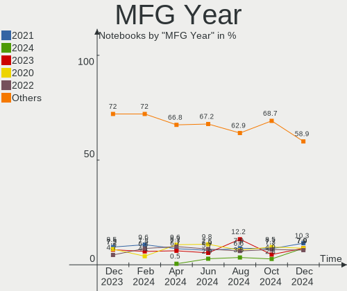
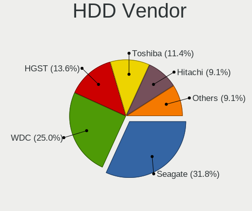
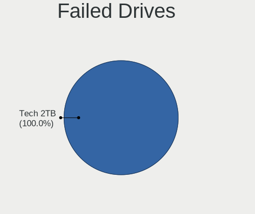
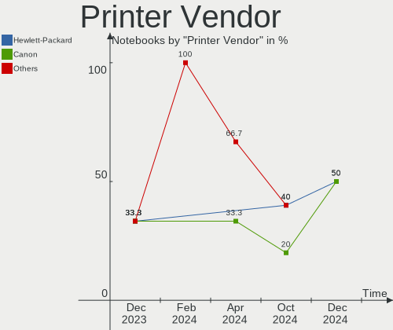

Linux Mint - Hardware Trends (Notebooks)
----------------------------------------

A project to identify most popular hardware characteristics and track their change
over time based on data collected by Linux users at https://Linux-Hardware.org.

Anyone can contribute to this report by the [hw-probe](https://github.com/linuxhw/hw-probe) tool:

    sudo -E hw-probe -all -upload

This report is for one last month. Overall report since the beginning of time: [TestDays](https://github.com/linuxhw/TestDays)

Period: Feb, 2023.

Contents
--------

* [ System ](#system)
  - [ OS                       ](#os)
  - [ OS Family                ](#os-family)
  - [ Kernel                   ](#kernel)
  - [ Kernel Family            ](#kernel-family)
  - [ Kernel Major Ver.        ](#kernel-major-ver)
  - [ Arch                     ](#arch)
  - [ DE                       ](#de)
  - [ Display Server           ](#display-server)
  - [ Display Manager          ](#display-manager)
  - [ OS Lang                  ](#os-lang)
  - [ Boot Mode                ](#boot-mode)
  - [ Filesystem               ](#filesystem)
  - [ Part. scheme             ](#part-scheme)
  - [ Dual Boot with Linux/BSD ](#dual-boot-with-linuxbsd)
  - [ Dual Boot (Win)          ](#dual-boot-win)

* [ Board ](#board)
  - [ Vendor                   ](#vendor)
  - [ Model                    ](#model)
  - [ Model Family             ](#model-family)
  - [ MFG Year                 ](#mfg-year)
  - [ Form Factor              ](#form-factor)
  - [ Secure Boot              ](#secure-boot)
  - [ Coreboot                 ](#coreboot)
  - [ RAM Size                 ](#ram-size)
  - [ RAM Used                 ](#ram-used)
  - [ Total Drives             ](#total-drives)
  - [ Has CD-ROM               ](#has-cd-rom)
  - [ Has Ethernet             ](#has-ethernet)
  - [ Has WiFi                 ](#has-wifi)
  - [ Has Bluetooth            ](#has-bluetooth)

* [ Location ](#location)
  - [ Country                  ](#country)
  - [ City                     ](#city)

* [ Drives ](#drives)
  - [ Drive Vendor             ](#drive-vendor)
  - [ Drive Model              ](#drive-model)
  - [ HDD Vendor               ](#hdd-vendor)
  - [ SSD Vendor               ](#ssd-vendor)
  - [ Drive Kind               ](#drive-kind)
  - [ Drive Connector          ](#drive-connector)
  - [ Drive Size               ](#drive-size)
  - [ Space Total              ](#space-total)
  - [ Space Used               ](#space-used)
  - [ Malfunc. Drives          ](#malfunc-drives)
  - [ Malfunc. Drive Vendor    ](#malfunc-drive-vendor)
  - [ Malfunc. HDD Vendor      ](#malfunc-hdd-vendor)
  - [ Malfunc. Drive Kind      ](#malfunc-drive-kind)
  - [ Failed Drives            ](#failed-drives)
  - [ Failed Drive Vendor      ](#failed-drive-vendor)
  - [ Drive Status             ](#drive-status)

* [ Storage controller ](#storage-controller)
  - [ Storage Vendor           ](#storage-vendor)
  - [ Storage Model            ](#storage-model)
  - [ Storage Kind             ](#storage-kind)

* [ Processor ](#processor)
  - [ CPU Vendor               ](#cpu-vendor)
  - [ CPU Model                ](#cpu-model)
  - [ CPU Model Family         ](#cpu-model-family)
  - [ CPU Cores                ](#cpu-cores)
  - [ CPU Sockets              ](#cpu-sockets)
  - [ CPU Threads              ](#cpu-threads)
  - [ CPU Op-Modes             ](#cpu-op-modes)
  - [ CPU Microcode            ](#cpu-microcode)
  - [ CPU Microarch            ](#cpu-microarch)

* [ Graphics ](#graphics)
  - [ GPU Vendor               ](#gpu-vendor)
  - [ GPU Model                ](#gpu-model)
  - [ GPU Combo                ](#gpu-combo)
  - [ GPU Driver               ](#gpu-driver)
  - [ GPU Memory               ](#gpu-memory)

* [ Monitor ](#monitor)
  - [ Monitor Vendor           ](#monitor-vendor)
  - [ Monitor Model            ](#monitor-model)
  - [ Monitor Resolution       ](#monitor-resolution)
  - [ Monitor Diagonal         ](#monitor-diagonal)
  - [ Monitor Width            ](#monitor-width)
  - [ Aspect Ratio             ](#aspect-ratio)
  - [ Monitor Area             ](#monitor-area)
  - [ Pixel Density            ](#pixel-density)
  - [ Multiple Monitors        ](#multiple-monitors)

* [ Network ](#network)
  - [ Net Controller Vendor    ](#net-controller-vendor)
  - [ Net Controller Model     ](#net-controller-model)
  - [ Wireless Vendor          ](#wireless-vendor)
  - [ Wireless Model           ](#wireless-model)
  - [ Ethernet Vendor          ](#ethernet-vendor)
  - [ Ethernet Model           ](#ethernet-model)
  - [ Net Controller Kind      ](#net-controller-kind)
  - [ Used Controller          ](#used-controller)
  - [ NICs                     ](#nics)
  - [ IPv6                     ](#ipv6)

* [ Bluetooth ](#bluetooth)
  - [ Bluetooth Vendor         ](#bluetooth-vendor)
  - [ Bluetooth Model          ](#bluetooth-model)

* [ Sound ](#sound)
  - [ Sound Vendor             ](#sound-vendor)
  - [ Sound Model              ](#sound-model)

* [ Memory ](#memory)
  - [ Memory Vendor            ](#memory-vendor)
  - [ Memory Model             ](#memory-model)
  - [ Memory Kind              ](#memory-kind)
  - [ Memory Form Factor       ](#memory-form-factor)
  - [ Memory Size              ](#memory-size)
  - [ Memory Speed             ](#memory-speed)

* [ Printers & scanners ](#printers--scanners)
  - [ Printer Vendor           ](#printer-vendor)
  - [ Printer Model            ](#printer-model)
  - [ Scanner Vendor           ](#scanner-vendor)
  - [ Scanner Model            ](#scanner-model)

* [ Camera ](#camera)
  - [ Camera Vendor            ](#camera-vendor)
  - [ Camera Model             ](#camera-model)

* [ Security ](#security)
  - [ Fingerprint Vendor       ](#fingerprint-vendor)
  - [ Fingerprint Model        ](#fingerprint-model)
  - [ Chipcard Vendor          ](#chipcard-vendor)
  - [ Chipcard Model           ](#chipcard-model)

* [ Unsupported ](#unsupported)
  - [ Unsupported Devices      ](#unsupported-devices)
  - [ Unsupported Device Types ](#unsupported-device-types)

System
------

OS
--

Installed operating systems

| Name            | Notebooks | Percent |
|-----------------|-----------|---------|
| Linux Mint 21.1 | 237       | 73.83%  |
| Linux Mint 20.3 | 45        | 14.02%  |
| Linux Mint 21   | 22        | 6.85%   |
| Linux Mint 20.2 | 8         | 2.49%   |
| Linux Mint 19.3 | 6         | 1.87%   |
| Linux Mint 20   | 1         | 0.31%   |
| Linux Mint 19.2 | 1         | 0.31%   |
| Linux Mint 19.1 | 1         | 0.31%   |

OS Family
---------

OS without a version

| Name       | Notebooks | Percent |
|------------|-----------|---------|
| Linux Mint | 321       | 100%    |

Kernel
------

Version of the Linux kernel

| Version               | Notebooks | Percent |
|-----------------------|-----------|---------|
| 5.15.0-60-generic     | 130       | 40.5%   |
| 5.15.0-58-generic     | 81        | 25.23%  |
| 5.15.0-56-generic     | 27        | 8.41%   |
| 5.4.0-137-generic     | 21        | 6.54%   |
| 5.4.0-139-generic     | 16        | 4.98%   |
| 5.19.0-28-generic     | 9         | 2.8%    |
| 5.19.0-32-generic     | 8         | 2.49%   |
| 5.15.0-41-generic     | 4         | 1.25%   |
| 5.4.0-91-generic      | 3         | 0.93%   |
| 6.2.0-060200-generic  | 2         | 0.62%   |
| 5.4.0-100-generic     | 2         | 0.62%   |
| 4.15.0-204-generic    | 2         | 0.62%   |
| 6.1.9-060109-generic  | 1         | 0.31%   |
| 6.1.7-060107-generic  | 1         | 0.31%   |
| 6.1.13-060113-generic | 1         | 0.31%   |
| 6.1.12-tkg-bmq        | 1         | 0.31%   |
| 6.1.11-x64v3-xanmod1  | 1         | 0.31%   |
| 6.1.0-1004-oem        | 1         | 0.31%   |
| 6.0.9-060009-generic  | 1         | 0.31%   |
| 5.4.0-74-generic      | 1         | 0.31%   |
| 5.4.0-139-lowlatency  | 1         | 0.31%   |
| 5.4.0-136-generic     | 1         | 0.31%   |
| 5.4.0-131-generic     | 1         | 0.31%   |
| 5.4.0-126-generic     | 1         | 0.31%   |
| 5.4.0-109-generic     | 1         | 0.31%   |
| 5.17.0-1027-oem       | 1         | 0.31%   |
| 5.15.0-48-generic     | 1         | 0.31%   |
| 5.0.0-32-generic      | 1         | 0.31%   |

Kernel Family
-------------

Linux kernel without a distro release

| Version | Notebooks | Percent |
|---------|-----------|---------|
| 5.15.0  | 243       | 75.7%   |
| 5.4.0   | 48        | 14.95%  |
| 5.19.0  | 17        | 5.3%    |
| 6.2.0   | 2         | 0.62%   |
| 4.15.0  | 2         | 0.62%   |
| 6.1.9   | 1         | 0.31%   |
| 6.1.7   | 1         | 0.31%   |
| 6.1.13  | 1         | 0.31%   |
| 6.1.12  | 1         | 0.31%   |
| 6.1.11  | 1         | 0.31%   |
| 6.1.0   | 1         | 0.31%   |
| 6.0.9   | 1         | 0.31%   |
| 5.17.0  | 1         | 0.31%   |
| 5.0.0   | 1         | 0.31%   |

Kernel Major Ver.
-----------------

Linux kernel major version

| Version | Notebooks | Percent |
|---------|-----------|---------|
| 5.15    | 243       | 75.7%   |
| 5.4     | 48        | 14.95%  |
| 5.19    | 17        | 5.3%    |
| 6.1     | 6         | 1.87%   |
| 6.2     | 2         | 0.62%   |
| 4.15    | 2         | 0.62%   |
| 6.0     | 1         | 0.31%   |
| 5.17    | 1         | 0.31%   |
| 5.0     | 1         | 0.31%   |

Arch
----

OS architecture (x86_64, i586, etc.)

| Name   | Notebooks | Percent |
|--------|-----------|---------|
| x86_64 | 319       | 99.38%  |
| i686   | 2         | 0.62%   |

DE
--

Desktop Environment

| Name           | Notebooks | Percent |
|----------------|-----------|---------|
| X-Cinnamon     | 226       | 70.4%   |
| XFCE           | 46        | 14.33%  |
| MATE           | 32        | 9.97%   |
| GNOME          | 7         | 2.18%   |
| Cinnamon       | 5         | 1.56%   |
| KDE5           | 3         | 0.93%   |
| LXDE           | 1         | 0.31%   |
| i3-with-shmlog | 1         | 0.31%   |

Display Server
--------------

X11 or Wayland

| Name    | Notebooks | Percent |
|---------|-----------|---------|
| X11     | 318       | 99.07%  |
| Tty     | 2         | 0.62%   |
| Wayland | 1         | 0.31%   |

Display Manager
---------------

SDDM, LightDM, etc.

| Name    | Notebooks | Percent |
|---------|-----------|---------|
| Unknown | 168       | 52.34%  |
| LightDM | 150       | 46.73%  |
| SDDM    | 1         | 0.31%   |
| LXDM    | 1         | 0.31%   |
| GDM3    | 1         | 0.31%   |

OS Lang
-------

Language

| Lang    | Notebooks | Percent |
|---------|-----------|---------|
| en_US   | 87        | 27.1%   |
| de_DE   | 63        | 19.63%  |
| it_IT   | 21        | 6.54%   |
| pt_BR   | 17        | 5.3%    |
| ru_RU   | 15        | 4.67%   |
| fr_FR   | 12        | 3.74%   |
| C       | 11        | 3.43%   |
| pl_PL   | 9         | 2.8%    |
| en_GB   | 9         | 2.8%    |
| es_ES   | 7         | 2.18%   |
| en_IN   | 6         | 1.87%   |
| en_CA   | 6         | 1.87%   |
| nl_NL   | 5         | 1.56%   |
| en_AU   | 5         | 1.56%   |
| cs_CZ   | 4         | 1.25%   |
| zh_TW   | 3         | 0.93%   |
| sv_SE   | 3         | 0.93%   |
| en_NZ   | 3         | 0.93%   |
| de_CH   | 3         | 0.93%   |
| sk_SK   | 2         | 0.62%   |
| pt_PT   | 2         | 0.62%   |
| ja_JP   | 2         | 0.62%   |
| hu_HU   | 2         | 0.62%   |
| es_MX   | 2         | 0.62%   |
| es_CO   | 2         | 0.62%   |
| es_CL   | 2         | 0.62%   |
| es_AR   | 2         | 0.62%   |
| en_ZA   | 2         | 0.62%   |
| en_IL   | 2         | 0.62%   |
| de_AT   | 2         | 0.62%   |
| sl_SI   | 1         | 0.31%   |
| ru_UA   | 1         | 0.31%   |
| fr_CH   | 1         | 0.31%   |
| fi_FI   | 1         | 0.31%   |
| es_UY   | 1         | 0.31%   |
| es_SV   | 1         | 0.31%   |
| es_NI   | 1         | 0.31%   |
| en_PH   | 1         | 0.31%   |
| Default | 1         | 0.31%   |
| Unknown | 1         | 0.31%   |

Boot Mode
---------

EFI or BIOS

| Mode | Notebooks | Percent |
|------|-----------|---------|
| EFI  | 217       | 67.6%   |
| BIOS | 104       | 32.4%   |

Filesystem
----------

Type of filesystem

| Type    | Notebooks | Percent |
|---------|-----------|---------|
| Ext4    | 307       | 95.64%  |
| Overlay | 9         | 2.8%    |
| Btrfs   | 3         | 0.93%   |
| Zfs     | 1         | 0.31%   |
| Ext3    | 1         | 0.31%   |

Part. scheme
------------

Scheme of partitioning

| Type    | Notebooks | Percent |
|---------|-----------|---------|
| Unknown | 168       | 52.34%  |
| GPT     | 119       | 37.07%  |
| MBR     | 34        | 10.59%  |

Dual Boot with Linux/BSD
------------------------

Hosting more than one Linux/BSD

| Dual boot | Notebooks | Percent |
|-----------|-----------|---------|
| No        | 289       | 90.03%  |
| Yes       | 32        | 9.97%   |

Dual Boot (Win)
---------------

Hosting Linux and Windows

| Dual boot | Notebooks | Percent |
|-----------|-----------|---------|
| No        | 265       | 82.55%  |
| Yes       | 56        | 17.45%  |

Board
-----

Vendor
------

Motherboard manufacturer

| Name                   | Notebooks | Percent |
|------------------------|-----------|---------|
| Hewlett-Packard        | 67        | 20.87%  |
| Lenovo                 | 56        | 17.45%  |
| Acer                   | 43        | 13.4%   |
| Dell                   | 40        | 12.46%  |
| ASUSTek Computer       | 28        | 8.72%   |
| MSI                    | 10        | 3.12%   |
| Apple                  | 9         | 2.8%    |
| Toshiba                | 6         | 1.87%   |
| Samsung Electronics    | 6         | 1.87%   |
| Medion                 | 6         | 1.87%   |
| Unknown                | 5         | 1.56%   |
| Sony                   | 4         | 1.25%   |
| Google                 | 4         | 1.25%   |
| Positivo               | 3         | 0.93%   |
| HUAWEI                 | 3         | 0.93%   |
| Fujitsu Siemens        | 3         | 0.93%   |
| TUXEDO                 | 2         | 0.62%   |
| GPU Company            | 2         | 0.62%   |
| GEO                    | 2         | 0.62%   |
| Fujitsu                | 2         | 0.62%   |
| Teclast                | 1         | 0.31%   |
| Tactus                 | 1         | 0.31%   |
| Schenker               | 1         | 0.31%   |
| Panasonic              | 1         | 0.31%   |
| Packard Bell           | 1         | 0.31%   |
| Notebook               | 1         | 0.31%   |
| Jumper                 | 1         | 0.31%   |
| Intel                  | 1         | 0.31%   |
| Insyde                 | 1         | 0.31%   |
| Heptagon Systems       | 1         | 0.31%   |
| Gigabyte Technology    | 1         | 0.31%   |
| Gateway                | 1         | 0.31%   |
| Evolute                | 1         | 0.31%   |
| EPSON DIRECT           | 1         | 0.31%   |
| Direkt-Tek             | 1         | 0.31%   |
| CSL-Computer           | 1         | 0.31%   |
| Chuwi                  | 1         | 0.31%   |
| AVITA                  | 1         | 0.31%   |
| Avell High Performance | 1         | 0.31%   |
| Alienware              | 1         | 0.31%   |

Model
-----

Motherboard model

| Name                                 | Notebooks | Percent |
|--------------------------------------|-----------|---------|
| Unknown                              | 6         | 1.87%   |
| HP Notebook                          | 4         | 1.25%   |
| HP Pavilion 15                       | 3         | 0.93%   |
| Dell Inspiron N5110                  | 3         | 0.93%   |
| Lenovo ThinkPad E15 Gen 4 21EES00100 | 2         | 0.62%   |
| Lenovo G50-80 80E5                   | 2         | 0.62%   |
| Lenovo G470 20078                    | 2         | 0.62%   |
| Lenovo G40-80 80JE                   | 2         | 0.62%   |
| HP Stream Laptop 14-ax0XX            | 2         | 0.62%   |
| HP Pavilion Gaming Laptop 15-cx0xxx  | 2         | 0.62%   |
| HP Pavilion dv7                      | 2         | 0.62%   |
| HP ENVY Laptop 17-cr0xxx             | 2         | 0.62%   |
| HP 250 G6 Notebook PC                | 2         | 0.62%   |
| HP 250 G3                            | 2         | 0.62%   |
| Dell Latitude E6440                  | 2         | 0.62%   |
| Dell Latitude E5450                  | 2         | 0.62%   |
| Dell Inspiron N5010                  | 2         | 0.62%   |
| Apple MacBookPro5,5                  | 2         | 0.62%   |
| Acer Aspire A515-44                  | 2         | 0.62%   |
| Acer Aspire A317-33                  | 2         | 0.62%   |
| Acer Aspire 5750G                    | 2         | 0.62%   |
| TUXEDO Pulse 15 Gen1                 | 1         | 0.31%   |
| Toshiba Satellite S70-A              | 1         | 0.31%   |
| Toshiba Satellite P750               | 1         | 0.31%   |
| Toshiba Satellite P75-A              | 1         | 0.31%   |
| Toshiba Satellite C850D-B615         | 1         | 0.31%   |
| Toshiba Satellite C70D-B             | 1         | 0.31%   |
| Toshiba Satellite A300               | 1         | 0.31%   |
| Teclast F7S                          | 1         | 0.31%   |
| Tactus GeoBook 140                   | 1         | 0.31%   |
| Sony VPCEH1J8E                       | 1         | 0.31%   |
| Sony VGN-NW21MF_W                    | 1         | 0.31%   |
| Sony VGN-NW11S_T                     | 1         | 0.31%   |
| Sony SVE1713A6EW                     | 1         | 0.31%   |
| Schenker XMG CORE (REN/E21)          | 1         | 0.31%   |
| Samsung RV415/RV515                  | 1         | 0.31%   |
| Samsung R530/R730/P530               | 1         | 0.31%   |
| Samsung N150P                        | 1         | 0.31%   |
| Samsung 700Z3A/700Z4A/700Z5A/700Z5B  | 1         | 0.31%   |
| Samsung 350V5C/351V5C/3540VC/3440VC  | 1         | 0.31%   |

Model Family
------------

Motherboard model prefix

| Name                  | Notebooks | Percent |
|-----------------------|-----------|---------|
| Acer Aspire           | 36        | 11.21%  |
| Lenovo ThinkPad       | 31        | 9.66%   |
| HP Pavilion           | 18        | 5.61%   |
| Dell Latitude         | 18        | 5.61%   |
| Dell Inspiron         | 10        | 3.12%   |
| HP Laptop             | 9         | 2.8%    |
| HP EliteBook          | 9         | 2.8%    |
| Lenovo IdeaPad        | 8         | 2.49%   |
| Toshiba Satellite     | 6         | 1.87%   |
| HP ENVY               | 6         | 1.87%   |
| Unknown               | 6         | 1.87%   |
| Dell XPS              | 5         | 1.56%   |
| Lenovo ThinkBook      | 4         | 1.25%   |
| HP Notebook           | 4         | 1.25%   |
| HP 250                | 4         | 1.25%   |
| ASUS VivoBook         | 4         | 1.25%   |
| Medion Akoya          | 3         | 0.93%   |
| HP ZBook              | 3         | 0.93%   |
| HP ProBook            | 3         | 0.93%   |
| HP Compaq             | 3         | 0.93%   |
| Dell Precision        | 3         | 0.93%   |
| MSI Modern            | 2         | 0.62%   |
| Lenovo Yoga           | 2         | 0.62%   |
| Lenovo G50-80         | 2         | 0.62%   |
| Lenovo G470           | 2         | 0.62%   |
| Lenovo G40-80         | 2         | 0.62%   |
| HP Stream             | 2         | 0.62%   |
| HP Presario           | 2         | 0.62%   |
| GEO GeoBook           | 2         | 0.62%   |
| Fujitsu Siemens AMILO | 2         | 0.62%   |
| Fujitsu LIFEBOOK      | 2         | 0.62%   |
| Dell Vostro           | 2         | 0.62%   |
| ASUS ZenBook          | 2         | 0.62%   |
| Apple MacBookPro5     | 2         | 0.62%   |
| Apple MacBookAir6     | 2         | 0.62%   |
| Acer TravelMate       | 2         | 0.62%   |
| Acer Nitro            | 2         | 0.62%   |
| TUXEDO Pulse          | 1         | 0.31%   |
| Teclast F7S           | 1         | 0.31%   |
| Tactus GeoBook        | 1         | 0.31%   |

MFG Year
--------

Motherboard manufacture year

| Year | Notebooks | Percent |
|------|-----------|---------|
| 2021 | 34        | 10.59%  |
| 2013 | 31        | 9.66%   |
| 2020 | 28        | 8.72%   |
| 2011 | 26        | 8.1%    |
| 2015 | 24        | 7.48%   |
| 2014 | 22        | 6.85%   |
| 2016 | 21        | 6.54%   |
| 2010 | 19        | 5.92%   |
| 2022 | 18        | 5.61%   |
| 2019 | 16        | 4.98%   |
| 2018 | 16        | 4.98%   |
| 2017 | 16        | 4.98%   |
| 2009 | 14        | 4.36%   |
| 2012 | 11        | 3.43%   |
| 2008 | 10        | 3.12%   |
| 2007 | 7         | 2.18%   |
| 2023 | 5         | 1.56%   |
| 2006 | 3         | 0.93%   |

Form Factor
-----------

Physical design of the computer

| Name     | Notebooks | Percent |
|----------|-----------|---------|
| Notebook | 321       | 100%    |

Secure Boot
-----------

Enabled or disabled

| State    | Notebooks | Percent |
|----------|-----------|---------|
| Disabled | 275       | 85.67%  |
| Enabled  | 46        | 14.33%  |

Coreboot
--------

Have coreboot on board

| Used | Notebooks | Percent |
|------|-----------|---------|
| No   | 317       | 98.75%  |
| Yes  | 4         | 1.25%   |

RAM Size
--------

Total RAM memory

| Size in GB  | Notebooks | Percent |
|-------------|-----------|---------|
| 4.01-8.0    | 89        | 27.73%  |
| 3.01-4.0    | 84        | 26.17%  |
| 8.01-16.0   | 62        | 19.31%  |
| 16.01-24.0  | 50        | 15.58%  |
| 1.01-2.0    | 15        | 4.67%   |
| 32.01-64.0  | 14        | 4.36%   |
| 64.01-256.0 | 3         | 0.93%   |
| 24.01-32.0  | 2         | 0.62%   |
| 0.51-1.0    | 2         | 0.62%   |

RAM Used
--------

Used RAM memory

| Used GB   | Notebooks | Percent |
|-----------|-----------|---------|
| 1.01-2.0  | 119       | 37.07%  |
| 2.01-3.0  | 87        | 27.1%   |
| 3.01-4.0  | 46        | 14.33%  |
| 4.01-8.0  | 41        | 12.77%  |
| 0.51-1.0  | 18        | 5.61%   |
| 8.01-16.0 | 8         | 2.49%   |
| 0.01-0.5  | 2         | 0.62%   |

Total Drives
------------

Number of drives on board

| Drives | Notebooks | Percent |
|--------|-----------|---------|
| 1      | 236       | 73.52%  |
| 2      | 74        | 23.05%  |
| 3      | 7         | 2.18%   |
| 4      | 2         | 0.62%   |
| 0      | 2         | 0.62%   |

Has CD-ROM
----------

Has CD-ROM on board

| Presented | Notebooks | Percent |
|-----------|-----------|---------|
| No        | 192       | 59.81%  |
| Yes       | 129       | 40.19%  |

Has Ethernet
------------

Has Ethernet on board

| Presented | Notebooks | Percent |
|-----------|-----------|---------|
| Yes       | 256       | 79.75%  |
| No        | 65        | 20.25%  |

Has WiFi
--------

Has WiFi module

| Presented | Notebooks | Percent |
|-----------|-----------|---------|
| Yes       | 313       | 97.51%  |
| No        | 8         | 2.49%   |

Has Bluetooth
-------------

Has Bluetooth module

| Presented | Notebooks | Percent |
|-----------|-----------|---------|
| Yes       | 245       | 76.32%  |
| No        | 76        | 23.68%  |

Location
--------

Country
-------

Geographic location (country)

| Country      | Notebooks | Percent |
|--------------|-----------|---------|
| Germany      | 67        | 20.87%  |
| USA          | 39        | 12.15%  |
| Italy        | 28        | 8.72%   |
| Brazil       | 21        | 6.54%   |
| France       | 13        | 4.05%   |
| Russia       | 11        | 3.43%   |
| Netherlands  | 11        | 3.43%   |
| Spain        | 9         | 2.8%    |
| UK           | 8         | 2.49%   |
| Canada       | 8         | 2.49%   |
| Poland       | 7         | 2.18%   |
| India        | 6         | 1.87%   |
| Australia    | 6         | 1.87%   |
| Sweden       | 5         | 1.56%   |
| Slovakia     | 5         | 1.56%   |
| Czechia      | 5         | 1.56%   |
| Switzerland  | 4         | 1.25%   |
| Portugal     | 4         | 1.25%   |
| Austria      | 4         | 1.25%   |
| Taiwan       | 3         | 0.93%   |
| New Zealand  | 3         | 0.93%   |
| Mexico       | 3         | 0.93%   |
| Israel       | 3         | 0.93%   |
| Indonesia    | 3         | 0.93%   |
| Argentina    | 3         | 0.93%   |
| Ukraine      | 2         | 0.62%   |
| South Africa | 2         | 0.62%   |
| Paraguay     | 2         | 0.62%   |
| Japan        | 2         | 0.62%   |
| Hungary      | 2         | 0.62%   |
| Finland      | 2         | 0.62%   |
| Colombia     | 2         | 0.62%   |
| Chile        | 2         | 0.62%   |
| Belarus      | 2         | 0.62%   |
| Vietnam      | 1         | 0.31%   |
| Venezuela    | 1         | 0.31%   |
| Uruguay      | 1         | 0.31%   |
| Turkey       | 1         | 0.31%   |
| Tunisia      | 1         | 0.31%   |
| South Korea  | 1         | 0.31%   |

City
----

Geographic location (city)

| City             | Notebooks | Percent |
|------------------|-----------|---------|
| Stuhr            | 6         | 1.87%   |
| Milan            | 6         | 1.87%   |
| Munich           | 4         | 1.25%   |
| Berlin           | 4         | 1.25%   |
| Sydney           | 3         | 0.93%   |
| Rome             | 3         | 0.93%   |
| Barcelona        | 3         | 0.93%   |
| Weimar           | 2         | 0.62%   |
| Warsaw           | 2         | 0.62%   |
| Viña del Mar    | 2         | 0.62%   |
| Vechelde         | 2         | 0.62%   |
| Uttoxeter        | 2         | 0.62%   |
| Utrecht          | 2         | 0.62%   |
| Tel Aviv         | 2         | 0.62%   |
| Rio de Janeiro   | 2         | 0.62%   |
| Prague           | 2         | 0.62%   |
| Osasco           | 2         | 0.62%   |
| New York         | 2         | 0.62%   |
| Moscow           | 2         | 0.62%   |
| Mérida          | 2         | 0.62%   |
| Mannheim         | 2         | 0.62%   |
| Madrid           | 2         | 0.62%   |
| Kursk            | 2         | 0.62%   |
| Kochi            | 2         | 0.62%   |
| Joao Pessoa      | 2         | 0.62%   |
| Izhevsk          | 2         | 0.62%   |
| Houston          | 2         | 0.62%   |
| Florence         | 2         | 0.62%   |
| Curitiba         | 2         | 0.62%   |
| Catania          | 2         | 0.62%   |
| Bratislava       | 2         | 0.62%   |
| Bengaluru        | 2         | 0.62%   |
| Auckland         | 2         | 0.62%   |
| Asunción        | 2         | 0.62%   |
| Zhongli District | 1         | 0.31%   |
| Yongsan-dong     | 1         | 0.31%   |
| Yogyakarta       | 1         | 0.31%   |
| Yaqum            | 1         | 0.31%   |
| Wytheville       | 1         | 0.31%   |
| Woodstock        | 1         | 0.31%   |

Drives
------

Drive Vendor
------------

Hard drive vendors

| Vendor                      | Notebooks | Drives | Percent |
|-----------------------------|-----------|--------|---------|
| Samsung Electronics         | 48        | 50     | 12.18%  |
| WDC                         | 38        | 39     | 9.64%   |
| SanDisk                     | 34        | 35     | 8.63%   |
| Seagate                     | 31        | 34     | 7.87%   |
| Unknown                     | 30        | 33     | 7.61%   |
| Toshiba                     | 28        | 28     | 7.11%   |
| Crucial                     | 24        | 26     | 6.09%   |
| Kingston                    | 21        | 22     | 5.33%   |
| HGST                        | 16        | 16     | 4.06%   |
| Intel                       | 14        | 16     | 3.55%   |
| SK hynix                    | 12        | 12     | 3.05%   |
| Micron Technology           | 8         | 8      | 2.03%   |
| Hitachi                     | 8         | 8      | 2.03%   |
| Intenso                     | 6         | 6      | 1.52%   |
| China                       | 6         | 6      | 1.52%   |
| A-DATA Technology           | 6         | 6      | 1.52%   |
| Apple                       | 5         | 6      | 1.27%   |
| Netac                       | 4         | 4      | 1.02%   |
| UMIS                        | 3         | 3      | 0.76%   |
| Transcend                   | 3         | 3      | 0.76%   |
| SPCC                        | 3         | 3      | 0.76%   |
| Patriot                     | 3         | 3      | 0.76%   |
| ShiJi                       | 2         | 2      | 0.51%   |
| Phison Electronics          | 2         | 2      | 0.51%   |
| Phison                      | 2         | 2      | 0.51%   |
| Lite-On Technology          | 2         | 2      | 0.51%   |
| Lenovo                      | 2         | 2      | 0.51%   |
| KIOXIA                      | 2         | 2      | 0.51%   |
| Kingston Technology Company | 2         | 2      | 0.51%   |
| GOODRAM                     | 2         | 2      | 0.51%   |
| Fujitsu                     | 2         | 2      | 0.51%   |
| ASMT                        | 2         | 2      | 0.51%   |
| Unknown                     | 2         | 2      | 0.51%   |
| Zheino                      | 1         | 1      | 0.25%   |
| Teclast                     | 1         | 1      | 0.25%   |
| TCSUNBOW                    | 1         | 1      | 0.25%   |
| SSSTC                       | 1         | 1      | 0.25%   |
| RX7                         | 1         | 1      | 0.25%   |
| POLION                      | 1         | 1      | 0.25%   |
| PNY                         | 1         | 1      | 0.25%   |

Drive Model
-----------

Hard drive models

| Model                                  | Notebooks | Percent |
|----------------------------------------|-----------|---------|
| Unknown MMC Card  64GB                 | 9         | 2.22%   |
| Unknown MMC Card  32GB                 | 7         | 1.72%   |
| Toshiba MQ01ABF050 500GB               | 6         | 1.48%   |
| Kingston SA400S37480G 480GB SSD        | 5         | 1.23%   |
| Kingston SA400S37240G 240GB SSD        | 5         | 1.23%   |
| Crucial CT500MX500SSD1 500GB           | 5         | 1.23%   |
| Crucial CT240BX500SSD1 240GB           | 5         | 1.23%   |
| Seagate ST9500325AS 500GB              | 4         | 0.99%   |
| Seagate ST1000LM035-1RK172 1TB         | 4         | 0.99%   |
| Seagate ST1000LM024 HN-M101MBB 1TB     | 4         | 0.99%   |
| Crucial CT1000MX500SSD1 1TB            | 4         | 0.99%   |
| WDC WD1600BEVT-22ZCT0 160GB            | 3         | 0.74%   |
| WDC WD10SPZX-21Z10T0 1TB               | 3         | 0.74%   |
| Unknown MMC Card  16GB                 | 3         | 0.74%   |
| SK hynix SKHynix_HFM512GD3HX015N 512GB | 3         | 0.74%   |
| Seagate ST500LT012-1DG142 500GB        | 3         | 0.74%   |
| Sandisk WD Blue SN550 NVMe SSD 1TB     | 3         | 0.74%   |
| SanDisk SSD PLUS 1000GB                | 3         | 0.74%   |
| SanDisk SD8SN8U-256G-1006 256GB SSD    | 3         | 0.74%   |
| Samsung SSD 860 EVO 1TB                | 3         | 0.74%   |
| HGST HTS545050A7E680 500GB             | 3         | 0.74%   |
| HGST HTS541075A9E680 752GB             | 3         | 0.74%   |
| WDC WDS500G2B0A-00SM50 500GB SSD       | 2         | 0.49%   |
| WDC PC SN530 SDBPNPZ-256G-1114 256GB   | 2         | 0.49%   |
| Unknown MMC Card  1GB                  | 2         | 0.49%   |
| Unknown MMC Card  128GB                | 2         | 0.49%   |
| UMIS RPJTJ512MGE1QDQ 512GB             | 2         | 0.49%   |
| Toshiba XG6 NVMe SSD Controller 512GB  | 2         | 0.49%   |
| Toshiba THNSFJ256GCSU 256GB SSD        | 2         | 0.49%   |
| Toshiba MQ01ABD050 500GB               | 2         | 0.49%   |
| Seagate ST500LM021-1KJ152 500GB        | 2         | 0.49%   |
| Seagate ST1000LM048-2E7172 1TB         | 2         | 0.49%   |
| SanDisk SSD PLUS 240GB                 | 2         | 0.49%   |
| SanDisk SDSSDH3 500G                   | 2         | 0.49%   |
| SanDisk NVMe SSD Drive 1TB             | 2         | 0.49%   |
| Samsung SSD 870 EVO 500GB              | 2         | 0.49%   |
| Samsung SSD 860 EVO M.2 250GB          | 2         | 0.49%   |
| Samsung SSD 850 EVO 250GB              | 2         | 0.49%   |
| Samsung SSD 840 EVO 250GB              | 2         | 0.49%   |
| Samsung PM991a NVMe 256GB              | 2         | 0.49%   |

HDD Vendor
----------

Hard disk drive vendors

| Vendor              | Notebooks | Drives | Percent |
|---------------------|-----------|--------|---------|
| Seagate             | 31        | 34     | 29.25%  |
| WDC                 | 25        | 25     | 23.58%  |
| Toshiba             | 18        | 18     | 16.98%  |
| HGST                | 16        | 16     | 15.09%  |
| Hitachi             | 8         | 8      | 7.55%   |
| Samsung Electronics | 3         | 3      | 2.83%   |
| Fujitsu             | 2         | 2      | 1.89%   |
| Unknown             | 1         | 1      | 0.94%   |
| JMicron Technology  | 1         | 1      | 0.94%   |
| ASMT                | 1         | 1      | 0.94%   |

SSD Vendor
----------

Solid state drive vendors

| Vendor              | Notebooks | Drives | Percent |
|---------------------|-----------|--------|---------|
| Samsung Electronics | 25        | 25     | 15.92%  |
| SanDisk             | 24        | 25     | 15.29%  |
| Crucial             | 21        | 23     | 13.38%  |
| Kingston            | 19        | 20     | 12.1%   |
| WDC                 | 6         | 6      | 3.82%   |
| China               | 6         | 6      | 3.82%   |
| Toshiba             | 5         | 5      | 3.18%   |
| Intenso             | 5         | 5      | 3.18%   |
| Intel               | 5         | 5      | 3.18%   |
| Netac               | 4         | 4      | 2.55%   |
| Apple               | 4         | 4      | 2.55%   |
| Transcend           | 3         | 3      | 1.91%   |
| Patriot             | 3         | 3      | 1.91%   |
| A-DATA Technology   | 3         | 3      | 1.91%   |
| SPCC                | 2         | 2      | 1.27%   |
| SK hynix            | 2         | 2      | 1.27%   |
| GOODRAM             | 2         | 2      | 1.27%   |
| Zheino              | 1         | 1      | 0.64%   |
| Teclast             | 1         | 1      | 0.64%   |
| TCSUNBOW            | 1         | 1      | 0.64%   |
| ShiJi               | 1         | 1      | 0.64%   |
| RX7                 | 1         | 1      | 0.64%   |
| POLION              | 1         | 1      | 0.64%   |
| PNY                 | 1         | 1      | 0.64%   |
| Mushkin             | 1         | 1      | 0.64%   |
| Micron Technology   | 1         | 1      | 0.64%   |
| LITEONIT            | 1         | 1      | 0.64%   |
| Lexar               | 1         | 1      | 0.64%   |
| KingSpec            | 1         | 1      | 0.64%   |
| KingFast            | 1         | 1      | 0.64%   |
| Kimtigo             | 1         | 1      | 0.64%   |
| FORESEE             | 1         | 1      | 0.64%   |
| Dogfish             | 1         | 1      | 0.64%   |
| ASMT                | 1         | 1      | 0.64%   |
| AMD                 | 1         | 1      | 0.64%   |

Drive Kind
----------

HDD or SSD

| Kind    | Notebooks | Drives | Percent |
|---------|-----------|--------|---------|
| SSD     | 145       | 161    | 38.67%  |
| HDD     | 103       | 109    | 27.47%  |
| NVMe    | 89        | 99     | 23.73%  |
| MMC     | 32        | 35     | 8.53%   |
| Unknown | 6         | 6      | 1.6%    |

Drive Connector
---------------

SATA, SAS, NVMe, etc.

| Type | Notebooks | Drives | Percent |
|------|-----------|--------|---------|
| SATA | 231       | 266    | 63.99%  |
| NVMe | 89        | 99     | 24.65%  |
| MMC  | 32        | 35     | 8.86%   |
| SAS  | 9         | 10     | 2.49%   |

Drive Size
----------

Size of hard drive

| Size in TB | Notebooks | Drives | Percent |
|------------|-----------|--------|---------|
| 0.01-0.5   | 175       | 191    | 69.17%  |
| 0.51-1.0   | 70        | 70     | 27.67%  |
| 1.01-2.0   | 7         | 8      | 2.77%   |
| 2.01-3.0   | 1         | 1      | 0.4%    |

Space Total
-----------

Amount of disk space available on the file system

| Size in GB     | Notebooks | Percent |
|----------------|-----------|---------|
| 101-250        | 101       | 31.46%  |
| 251-500        | 100       | 31.15%  |
| 501-1000       | 45        | 14.02%  |
| 51-100         | 29        | 9.03%   |
| 1001-2000      | 16        | 4.98%   |
| 21-50          | 12        | 3.74%   |
| 1-20           | 11        | 3.43%   |
| More than 3000 | 3         | 0.93%   |
| 2001-3000      | 3         | 0.93%   |
| Unknown        | 1         | 0.31%   |

Space Used
----------

Amount of used disk space

| Used GB        | Notebooks | Percent |
|----------------|-----------|---------|
| 21-50          | 92        | 28.66%  |
| 1-20           | 72        | 22.43%  |
| 101-250        | 64        | 19.94%  |
| 51-100         | 52        | 16.2%   |
| 251-500        | 22        | 6.85%   |
| 501-1000       | 12        | 3.74%   |
| 1001-2000      | 5         | 1.56%   |
| More than 3000 | 1         | 0.31%   |
| Unknown        | 1         | 0.31%   |

Malfunc. Drives
---------------

Drive models with a malfunction

| Model                                       | Notebooks | Drives | Percent |
|---------------------------------------------|-----------|--------|---------|
| Seagate ST1000LM024 HN-M101MBB 1TB          | 2         | 2      | 8.7%    |
| HGST HTS541075A9E680 752GB                  | 2         | 2      | 8.7%    |
| Toshiba MQ04ABF100 1TB                      | 1         | 1      | 4.35%   |
| Toshiba MQ01ABF050 500GB                    | 1         | 1      | 4.35%   |
| SK hynix HFS256G39TND-N210A 256GB SSD       | 1         | 1      | 4.35%   |
| Seagate ST98823AS 80GB                      | 1         | 1      | 4.35%   |
| Seagate ST9160412AS 160GB                   | 1         | 1      | 4.35%   |
| Seagate ST9120822AS 120GB                   | 1         | 2      | 4.35%   |
| SanDisk SSD U100 24GB                       | 1         | 1      | 4.35%   |
| SanDisk SSD PLUS 240GB                      | 1         | 1      | 4.35%   |
| SanDisk SSD PLUS 240 GB                     | 1         | 1      | 4.35%   |
| SanDisk SSD PLUS 1000GB                     | 1         | 1      | 4.35%   |
| Samsung Electronics SSD SM871 2.5 7mm 256GB | 1         | 1      | 4.35%   |
| Samsung Electronics HM160HC 160GB           | 1         | 1      | 4.35%   |
| Lenovo LENSE30256GMSP34MEAT3TA 256GB        | 1         | 1      | 4.35%   |
| KingFast SSD 32GB                           | 1         | 1      | 4.35%   |
| HGST HTS725050A7E630 500GB                  | 1         | 1      | 4.35%   |
| Fujitsu MHV2080AH 80GB                      | 1         | 1      | 4.35%   |
| Crucial CT1050MX300SSD1 1050GB              | 1         | 1      | 4.35%   |
| Crucial CT1000P1SSD8 1TB                    | 1         | 1      | 4.35%   |
| China Solid 512GB SSD                       | 1         | 1      | 4.35%   |

Malfunc. Drive Vendor
---------------------

Vendors of faulty drives

| Vendor              | Notebooks | Drives | Percent |
|---------------------|-----------|--------|---------|
| Seagate             | 5         | 6      | 21.74%  |
| SanDisk             | 4         | 4      | 17.39%  |
| HGST                | 3         | 3      | 13.04%  |
| Toshiba             | 2         | 2      | 8.7%    |
| Samsung Electronics | 2         | 2      | 8.7%    |
| Crucial             | 2         | 2      | 8.7%    |
| SK hynix            | 1         | 1      | 4.35%   |
| Lenovo              | 1         | 1      | 4.35%   |
| KingFast            | 1         | 1      | 4.35%   |
| Fujitsu             | 1         | 1      | 4.35%   |
| China               | 1         | 1      | 4.35%   |

Malfunc. HDD Vendor
-------------------

Vendors of faulty HDD drives

| Vendor              | Notebooks | Drives | Percent |
|---------------------|-----------|--------|---------|
| Seagate             | 5         | 6      | 41.67%  |
| HGST                | 3         | 3      | 25%     |
| Toshiba             | 2         | 2      | 16.67%  |
| Samsung Electronics | 1         | 1      | 8.33%   |
| Fujitsu             | 1         | 1      | 8.33%   |

Malfunc. Drive Kind
-------------------

Kinds of faulty drives

| Kind | Notebooks | Drives | Percent |
|------|-----------|--------|---------|
| HDD  | 11        | 13     | 50%     |
| SSD  | 9         | 9      | 40.91%  |
| NVMe | 2         | 2      | 9.09%   |

Failed Drives
-------------

Failed drive models

| Model                    | Notebooks | Drives | Percent |
|--------------------------|-----------|--------|---------|
| HGST HTS541010B7E610 1TB | 1         | 1      | 100%    |

Failed Drive Vendor
-------------------

Failed drive vendors

| Vendor | Notebooks | Drives | Percent |
|--------|-----------|--------|---------|
| HGST   | 1         | 1      | 100%    |

Drive Status
------------

Number of failed and malfunc. drives

| Status   | Notebooks | Drives | Percent |
|----------|-----------|--------|---------|
| Detected | 193       | 241    | 57.1%   |
| Works    | 122       | 144    | 36.09%  |
| Malfunc  | 22        | 24     | 6.51%   |
| Failed   | 1         | 1      | 0.3%    |

Storage controller
------------------

Storage Vendor
--------------

Storage controller vendors

| Vendor                           | Notebooks | Percent |
|----------------------------------|-----------|---------|
| Intel                            | 222       | 62.36%  |
| AMD                              | 39        | 10.96%  |
| Samsung Electronics              | 24        | 6.74%   |
| SanDisk                          | 15        | 4.21%   |
| SK hynix                         | 10        | 2.81%   |
| Nvidia                           | 7         | 1.97%   |
| Micron Technology                | 7         | 1.97%   |
| Toshiba America Info Systems     | 4         | 1.12%   |
| Phison Electronics               | 4         | 1.12%   |
| Micron/Crucial Technology        | 4         | 1.12%   |
| Union Memory (Shenzhen)          | 3         | 0.84%   |
| Lite-On Technology               | 3         | 0.84%   |
| Kingston Technology Company      | 3         | 0.84%   |
| Lenovo                           | 2         | 0.56%   |
| KIOXIA                           | 2         | 0.56%   |
| ADATA Technology                 | 2         | 0.56%   |
| Solid State Storage Technology   | 1         | 0.28%   |
| Silicon Integrated Systems [SiS] | 1         | 0.28%   |
| Realtek Semiconductor            | 1         | 0.28%   |
| Marvell Technology Group         | 1         | 0.28%   |
| Apple                            | 1         | 0.28%   |

Storage Model
-------------

Storage controller models

| Model                                                                            | Notebooks | Percent |
|----------------------------------------------------------------------------------|-----------|---------|
| AMD FCH SATA Controller [AHCI mode]                                              | 31        | 8.07%   |
| Intel Sunrise Point-LP SATA Controller [AHCI mode]                               | 25        | 6.51%   |
| Intel 6 Series/C200 Series Chipset Family 6 port Mobile SATA AHCI Controller     | 22        | 5.73%   |
| Intel 82801 Mobile SATA Controller [RAID mode]                                   | 20        | 5.21%   |
| Intel 8 Series SATA Controller 1 [AHCI mode]                                     | 16        | 4.17%   |
| Intel 8 Series/C220 Series Chipset Family 6-port SATA Controller 1 [AHCI mode]   | 14        | 3.65%   |
| Intel Celeron/Pentium Silver Processor SATA Controller                           | 12        | 3.13%   |
| Intel 7 Series Chipset Family 6-port SATA Controller [AHCI mode]                 | 12        | 3.13%   |
| Intel Wildcat Point-LP SATA Controller [AHCI Mode]                               | 11        | 2.86%   |
| Intel 82801IBM/IEM (ICH9M/ICH9M-E) 4 port SATA Controller [AHCI mode]            | 10        | 2.6%    |
| Samsung NVMe SSD Controller 980                                                  | 9         | 2.34%   |
| Intel Volume Management Device NVMe RAID Controller                              | 9         | 2.34%   |
| Intel 5 Series/3400 Series Chipset 4 port SATA AHCI Controller                   | 9         | 2.34%   |
| SK hynix Gold P31/PC711 NVMe Solid State Drive                                   | 7         | 1.82%   |
| SanDisk WD Blue SN550 NVMe SSD                                                   | 7         | 1.82%   |
| Micron Non-Volatile memory controller                                            | 7         | 1.82%   |
| Intel Cannon Lake Mobile PCH SATA AHCI Controller                                | 6         | 1.56%   |
| Intel 82801HM/HEM (ICH8M/ICH8M-E) SATA Controller [AHCI mode]                    | 6         | 1.56%   |
| Intel 82801HM/HEM (ICH8M/ICH8M-E) IDE Controller                                 | 6         | 1.56%   |
| Intel 5 Series/3400 Series Chipset 6 port SATA AHCI Controller                   | 6         | 1.56%   |
| Samsung NVMe SSD Controller SM981/PM981/PM983                                    | 5         | 1.3%    |
| Samsung NVMe SSD Controller PM9A1/PM9A3/980PRO                                   | 5         | 1.3%    |
| Intel Tiger Lake-LP SATA Controller                                              | 5         | 1.3%    |
| Intel Celeron N3350/Pentium N4200/Atom E3900 Series SATA AHCI Controller         | 5         | 1.3%    |
| AMD SB7x0/SB8x0/SB9x0 SATA Controller [AHCI mode]                                | 5         | 1.3%    |
| Nvidia MCP79 AHCI Controller                                                     | 4         | 1.04%   |
| Intel Non-Volatile memory controller                                             | 4         | 1.04%   |
| Intel Comet Lake SATA AHCI Controller                                            | 4         | 1.04%   |
| Intel Atom/Celeron/Pentium Processor x5-E8000/J3xxx/N3xxx Series SATA Controller | 4         | 1.04%   |
| Intel Atom Processor E3800 Series SATA AHCI Controller                           | 4         | 1.04%   |
| Toshiba America Info Systems XG6 NVMe SSD Controller                             | 3         | 0.78%   |
| SanDisk WD Blue SN500 / PC SN520 NVMe SSD                                        | 3         | 0.78%   |
| SanDisk Non-Volatile memory controller                                           | 3         | 0.78%   |
| Micron/Crucial P2 NVMe PCIe SSD                                                  | 3         | 0.78%   |
| Intel SSD 660P Series                                                            | 3         | 0.78%   |
| Intel Alder Lake-P SATA AHCI Controller                                          | 3         | 0.78%   |
| Intel 82801IBM/IEM (ICH9M/ICH9M-E) 2 port SATA Controller [IDE mode]             | 3         | 0.78%   |
| Union Memory (Shenzhen) AM630 PCIe 4.0 x4 NVMe SSD Controller                    | 2         | 0.52%   |
| Toshiba America Info Systems XG4 NVMe SSD Controller                             | 2         | 0.52%   |
| SanDisk WD PC SN810 / Black SN850 NVMe SSD                                       | 2         | 0.52%   |

Storage Kind
------------

Kind of storage controller (IDE, SATA, NVMe, SAS, ...)

| Kind | Notebooks | Percent |
|------|-----------|---------|
| SATA | 236       | 63.1%   |
| NVMe | 89        | 23.8%   |
| RAID | 29        | 7.75%   |
| IDE  | 20        | 5.35%   |

Processor
---------

CPU Vendor
----------

Processor vendors

| Vendor | Notebooks | Percent |
|--------|-----------|---------|
| Intel  | 263       | 81.93%  |
| AMD    | 58        | 18.07%  |

CPU Model
---------

Processor models

| Model                                       | Notebooks | Percent |
|---------------------------------------------|-----------|---------|
| Intel Core i5-6300U CPU @ 2.40GHz           | 9         | 2.8%    |
| Intel 11th Gen Core i7-1165G7 @ 2.80GHz     | 8         | 2.49%   |
| Intel Celeron N4020 CPU @ 1.10GHz           | 6         | 1.87%   |
| Intel Core i3-10110U CPU @ 2.10GHz          | 5         | 1.56%   |
| Intel Core i3 CPU M 330 @ 2.13GHz           | 5         | 1.56%   |
| Intel Atom x5-Z8350 CPU @ 1.44GHz           | 5         | 1.56%   |
| AMD Ryzen 7 5700U with Radeon Graphics      | 5         | 1.56%   |
| Intel Core i7-4510U CPU @ 2.00GHz           | 4         | 1.25%   |
| Intel Core i7-2630QM CPU @ 2.00GHz          | 4         | 1.25%   |
| Intel Core i7-10750H CPU @ 2.60GHz          | 4         | 1.25%   |
| Intel Core i5-7200U CPU @ 2.50GHz           | 4         | 1.25%   |
| Intel Core i5-4200U CPU @ 1.60GHz           | 4         | 1.25%   |
| Intel Core i3 CPU M 370 @ 2.40GHz           | 4         | 1.25%   |
| Intel Core 2 Duo CPU P8700 @ 2.53GHz        | 4         | 1.25%   |
| AMD Ryzen 5 5500U with Radeon Graphics      | 4         | 1.25%   |
| Intel Pentium Dual-Core CPU T4500 @ 2.30GHz | 3         | 0.93%   |
| Intel Core i7-8750H CPU @ 2.20GHz           | 3         | 0.93%   |
| Intel Core i7-7600U CPU @ 2.80GHz           | 3         | 0.93%   |
| Intel Core i7-5500U CPU @ 2.40GHz           | 3         | 0.93%   |
| Intel Core i5-8300H CPU @ 2.30GHz           | 3         | 0.93%   |
| Intel Core i5-8265U CPU @ 1.60GHz           | 3         | 0.93%   |
| Intel Core i5-6200U CPU @ 2.30GHz           | 3         | 0.93%   |
| Intel Core i5-5300U CPU @ 2.30GHz           | 3         | 0.93%   |
| Intel Core i5-5200U CPU @ 2.20GHz           | 3         | 0.93%   |
| Intel Core i5-4210U CPU @ 1.70GHz           | 3         | 0.93%   |
| Intel Core i5-4200M CPU @ 2.50GHz           | 3         | 0.93%   |
| Intel Core i5-3210M CPU @ 2.50GHz           | 3         | 0.93%   |
| Intel Core i5-2520M CPU @ 2.50GHz           | 3         | 0.93%   |
| Intel Core i5-2430M CPU @ 2.40GHz           | 3         | 0.93%   |
| Intel Core i5-1035G1 CPU @ 1.00GHz          | 3         | 0.93%   |
| Intel Core i3-5005U CPU @ 2.00GHz           | 3         | 0.93%   |
| Intel Core i3-2310M CPU @ 2.10GHz           | 3         | 0.93%   |
| Intel Celeron CPU N3350 @ 1.10GHz           | 3         | 0.93%   |
| Intel Celeron CPU N3060 @ 1.60GHz           | 3         | 0.93%   |
| AMD Ryzen 7 5825U with Radeon Graphics      | 3         | 0.93%   |
| AMD Ryzen 7 5800H with Radeon Graphics      | 3         | 0.93%   |
| AMD E-450 APU with Radeon HD Graphics       | 3         | 0.93%   |
| Intel Pentium Dual-Core CPU T4400 @ 2.20GHz | 2         | 0.62%   |
| Intel Pentium Dual-Core CPU T4300 @ 2.10GHz | 2         | 0.62%   |
| Intel Pentium CPU N4200 @ 1.10GHz           | 2         | 0.62%   |

CPU Model Family
----------------

Processor model prefix

| Model                   | Notebooks | Percent |
|-------------------------|-----------|---------|
| Intel Core i5           | 75        | 23.36%  |
| Intel Core i7           | 55        | 17.13%  |
| Intel Core i3           | 32        | 9.97%   |
| Intel Celeron           | 27        | 8.41%   |
| Other                   | 26        | 8.1%    |
| Intel Core 2 Duo        | 18        | 5.61%   |
| AMD Ryzen 7             | 16        | 4.98%   |
| Intel Pentium           | 13        | 4.05%   |
| AMD Ryzen 5             | 9         | 2.8%    |
| Intel Atom              | 8         | 2.49%   |
| Intel Pentium Dual-Core | 7         | 2.18%   |
| AMD E                   | 5         | 1.56%   |
| AMD A8                  | 5         | 1.56%   |
| AMD Ryzen 3             | 4         | 1.25%   |
| AMD Turion 64 X2 Mobile | 3         | 0.93%   |
| AMD E2                  | 3         | 0.93%   |
| AMD A6                  | 2         | 0.62%   |
| AMD A10                 | 2         | 0.62%   |
| Intel Xeon              | 1         | 0.31%   |
| Intel Pentium Silver    | 1         | 0.31%   |
| Intel Genuine           | 1         | 0.31%   |
| AMD Turion 64 Mobile    | 1         | 0.31%   |
| AMD Ryzen 5 PRO         | 1         | 0.31%   |
| AMD E1                  | 1         | 0.31%   |
| AMD Athlon II           | 1         | 0.31%   |
| AMD Athlon 64 X2        | 1         | 0.31%   |
| AMD Athlon              | 1         | 0.31%   |
| AMD A4                  | 1         | 0.31%   |
| AMD A12                 | 1         | 0.31%   |

CPU Cores
---------

Number of processor cores

| Number | Notebooks | Percent |
|--------|-----------|---------|
| 2      | 196       | 61.06%  |
| 4      | 80        | 24.92%  |
| 8      | 17        | 5.3%    |
| 6      | 15        | 4.67%   |
| 12     | 4         | 1.25%   |
| 14     | 3         | 0.93%   |
| 10     | 3         | 0.93%   |
| 1      | 3         | 0.93%   |

CPU Sockets
-----------

Number of sockets

| Number | Notebooks | Percent |
|--------|-----------|---------|
| 1      | 321       | 100%    |

CPU Threads
-----------

Threads per core (Hyper-Threading)

| Number | Notebooks | Percent |
|--------|-----------|---------|
| 2      | 222       | 69.16%  |
| 1      | 99        | 30.84%  |

CPU Op-Modes
------------

CPU Operation Modes (32-bit, 64-bit)

| Op mode        | Notebooks | Percent |
|----------------|-----------|---------|
| 32-bit, 64-bit | 320       | 99.69%  |
| 32-bit         | 1         | 0.31%   |

CPU Microcode
-------------

Microcode number

| Number     | Notebooks | Percent |
|------------|-----------|---------|
| Unknown    | 24        | 7.48%   |
| 0x206a7    | 21        | 6.54%   |
| 0x40651    | 20        | 6.23%   |
| 0x406e3    | 16        | 4.98%   |
| 0x1067a    | 16        | 4.98%   |
| 0x306a9    | 15        | 4.67%   |
| 0x306d4    | 14        | 4.36%   |
| 0x306c3    | 13        | 4.05%   |
| 0x806e9    | 11        | 3.43%   |
| 0x806c1    | 10        | 3.12%   |
| 0x706a8    | 9         | 2.8%    |
| 0x806ec    | 8         | 2.49%   |
| 0x406c4    | 8         | 2.49%   |
| 0x20652    | 8         | 2.49%   |
| 0x08608103 | 8         | 2.49%   |
| 0x906ea    | 7         | 2.18%   |
| 0x506c9    | 7         | 2.18%   |
| 0x08108109 | 7         | 2.18%   |
| 0x906a3    | 6         | 1.87%   |
| 0x20655    | 6         | 1.87%   |
| 0x806ea    | 5         | 1.56%   |
| 0x706e5    | 5         | 1.56%   |
| 0x6fd      | 5         | 1.56%   |
| 0x05000119 | 5         | 1.56%   |
| 0xa0652    | 4         | 1.25%   |
| 0x406c3    | 4         | 1.25%   |
| 0x30678    | 4         | 1.25%   |
| 0x0a50000c | 4         | 1.25%   |
| 0x906a4    | 3         | 0.93%   |
| 0x806eb    | 3         | 0.93%   |
| 0x806d1    | 3         | 0.93%   |
| 0x706a1    | 3         | 0.93%   |
| 0x0a50000d | 3         | 0.93%   |
| 0x07030105 | 3         | 0.93%   |
| 0x06006704 | 3         | 0.93%   |
| 0x506e3    | 2         | 0.62%   |
| 0x106ca    | 2         | 0.62%   |
| 0x08600103 | 2         | 0.62%   |
| 0x06006705 | 2         | 0.62%   |
| 0x06001119 | 2         | 0.62%   |

CPU Microarch
-------------

Microarchitecture

| Name             | Notebooks | Percent |
|------------------|-----------|---------|
| KabyLake         | 38        | 11.84%  |
| Haswell          | 37        | 11.53%  |
| SandyBridge      | 24        | 7.48%   |
| Skylake          | 18        | 5.61%   |
| Penryn           | 18        | 5.61%   |
| Silvermont       | 16        | 4.98%   |
| Westmere         | 15        | 4.67%   |
| IvyBridge        | 15        | 4.67%   |
| Broadwell        | 14        | 4.36%   |
| Unknown          | 14        | 4.36%   |
| TigerLake        | 13        | 4.05%   |
| Goldmont plus    | 12        | 3.74%   |
| Alderlake Hybrid | 9         | 2.8%    |
| Zen+             | 8         | 2.49%   |
| Icelake          | 8         | 2.49%   |
| Zen 3            | 7         | 2.18%   |
| Goldmont         | 7         | 2.18%   |
| Excavator        | 7         | 2.18%   |
| Core             | 7         | 2.18%   |
| Bobcat           | 6         | 1.87%   |
| Zen 2            | 5         | 1.56%   |
| K8 Hammer        | 5         | 1.56%   |
| CometLake        | 4         | 1.25%   |
| Puma             | 3         | 0.93%   |
| Piledriver       | 2         | 0.62%   |
| Jaguar           | 2         | 0.62%   |
| Bonnell          | 2         | 0.62%   |
| Tremont          | 1         | 0.31%   |
| Steamroller      | 1         | 0.31%   |
| P6               | 1         | 0.31%   |
| Nehalem          | 1         | 0.31%   |
| K10              | 1         | 0.31%   |

Graphics
--------

GPU Vendor
----------

Vendors of graphics cards

| Vendor            | Notebooks | Percent |
|-------------------|-----------|---------|
| Intel             | 238       | 60.25%  |
| Nvidia            | 79        | 20%     |
| AMD               | 77        | 19.49%  |
| ASPEED Technology | 1         | 0.25%   |

GPU Model
---------

Graphics card models

| Model                                                                                    | Notebooks | Percent |
|------------------------------------------------------------------------------------------|-----------|---------|
| Intel 2nd Generation Core Processor Family Integrated Graphics Controller                | 24        | 5.93%   |
| Intel Haswell-ULT Integrated Graphics Controller                                         | 21        | 5.19%   |
| Intel Skylake GT2 [HD Graphics 520]                                                      | 15        | 3.7%    |
| Intel 4th Gen Core Processor Integrated Graphics Controller                              | 14        | 3.46%   |
| Intel 3rd Gen Core processor Graphics Controller                                         | 14        | 3.46%   |
| Intel HD Graphics 5500                                                                   | 12        | 2.96%   |
| Intel Atom/Celeron/Pentium Processor x5-E8000/J3xxx/N3xxx Integrated Graphics Controller | 12        | 2.96%   |
| Intel TigerLake-LP GT2 [Iris Xe Graphics]                                                | 11        | 2.72%   |
| Intel GeminiLake [UHD Graphics 600]                                                      | 11        | 2.72%   |
| Intel HD Graphics 620                                                                    | 10        | 2.47%   |
| Intel Core Processor Integrated Graphics Controller                                      | 9         | 2.22%   |
| AMD Lucienne                                                                             | 9         | 2.22%   |
| AMD Picasso/Raven 2 [Radeon Vega Series / Radeon Vega Mobile Series]                     | 8         | 1.98%   |
| Intel Mobile 4 Series Chipset Integrated Graphics Controller                             | 7         | 1.73%   |
| Intel CometLake-U GT2 [UHD Graphics]                                                     | 7         | 1.73%   |
| Intel CoffeeLake-H GT2 [UHD Graphics 630]                                                | 7         | 1.73%   |
| Intel Alder Lake-P Integrated Graphics Controller                                        | 7         | 1.73%   |
| Intel UHD Graphics 620                                                                   | 5         | 1.23%   |
| Intel HD Graphics 500                                                                    | 5         | 1.23%   |
| AMD Stoney [Radeon R2/R3/R4/R5 Graphics]                                                 | 5         | 1.23%   |
| AMD Renoir                                                                               | 5         | 1.23%   |
| Nvidia GF117M [GeForce 610M/710M/810M/820M / GT 620M/625M/630M/720M]                     | 4         | 0.99%   |
| Intel WhiskeyLake-U GT2 [UHD Graphics 620]                                               | 4         | 0.99%   |
| Intel Iris Plus Graphics G1 (Ice Lake)                                                   | 4         | 0.99%   |
| Intel CometLake-H GT2 [UHD Graphics]                                                     | 4         | 0.99%   |
| Intel Atom Processor Z36xxx/Z37xxx Series Graphics & Display                             | 4         | 0.99%   |
| AMD Cezanne [Radeon Vega Series / Radeon Vega Mobile Series]                             | 4         | 0.99%   |
| Nvidia GP107M [GeForce GTX 1050 Mobile]                                                  | 3         | 0.74%   |
| Nvidia GM108M [GeForce 840M]                                                             | 3         | 0.74%   |
| Nvidia GA107M [GeForce RTX 3050 Ti Mobile]                                               | 3         | 0.74%   |
| Nvidia GA106M [GeForce RTX 3060 Mobile / Max-Q]                                          | 3         | 0.74%   |
| Intel TigerLake-H GT1 [UHD Graphics]                                                     | 3         | 0.74%   |
| Intel Alder Lake-UP3 GT2 [Iris Xe Graphics]                                              | 3         | 0.74%   |
| AMD Wrestler [Radeon HD 6320]                                                            | 3         | 0.74%   |
| AMD Sun LE [Radeon HD 8550M / R5 M230]                                                   | 3         | 0.74%   |
| AMD RV710/M92 [Mobility Radeon HD 4530/4570/5145/530v/540v/545v]                         | 3         | 0.74%   |
| AMD Mullins [Radeon R4/R5 Graphics]                                                      | 3         | 0.74%   |
| AMD Madison [Mobility Radeon HD 5650/5750 / 6530M/6550M]                                 | 3         | 0.74%   |
| AMD Barcelo                                                                              | 3         | 0.74%   |
| Nvidia GT216M [GeForce GT 330M]                                                          | 2         | 0.49%   |

GPU Combo
---------

Combinations of graphics cards

| Name             | Notebooks | Percent |
|------------------|-----------|---------|
| 1 x Intel        | 168       | 52.34%  |
| Intel + Nvidia   | 57        | 17.76%  |
| 1 x AMD          | 54        | 16.82%  |
| 1 x Nvidia       | 17        | 5.3%    |
| Intel + AMD      | 12        | 3.74%   |
| 2 x AMD          | 6         | 1.87%   |
| AMD + Nvidia     | 4         | 1.25%   |
| Other            | 1         | 0.31%   |
| 1 x ASPEED       | 1         | 0.31%   |
| AMD + 2 x Nvidia | 1         | 0.31%   |

GPU Driver
----------

Free vs proprietary

| Driver      | Notebooks | Percent |
|-------------|-----------|---------|
| Free        | 274       | 85.36%  |
| Proprietary | 42        | 13.08%  |
| Unknown     | 5         | 1.56%   |

GPU Memory
----------

Total video memory

| Size in GB | Notebooks | Percent |
|------------|-----------|---------|
| Unknown    | 205       | 63.86%  |
| 0.01-0.5   | 49        | 15.26%  |
| 1.01-2.0   | 31        | 9.66%   |
| 0.51-1.0   | 23        | 7.17%   |
| 3.01-4.0   | 7         | 2.18%   |
| 5.01-6.0   | 3         | 0.93%   |
| 7.01-8.0   | 2         | 0.62%   |
| 8.01-16.0  | 1         | 0.31%   |

Monitor
-------

Monitor Vendor
--------------

Monitor vendors

| Vendor                  | Notebooks | Percent |
|-------------------------|-----------|---------|
| AU Optronics            | 85        | 24.29%  |
| Chimei Innolux          | 56        | 16%     |
| BOE                     | 55        | 15.71%  |
| LG Display              | 43        | 12.29%  |
| Samsung Electronics     | 23        | 6.57%   |
| Apple                   | 10        | 2.86%   |
| PANDA                   | 6         | 1.71%   |
| Dell                    | 6         | 1.71%   |
| Chi Mei Optoelectronics | 6         | 1.71%   |
| LG Philips              | 4         | 1.14%   |
| Lenovo                  | 4         | 1.14%   |
| Hewlett-Packard         | 4         | 1.14%   |
| Goldstar                | 4         | 1.14%   |
| BenQ                    | 4         | 1.14%   |
| AOC                     | 4         | 1.14%   |
| Acer                    | 4         | 1.14%   |
| Sharp                   | 3         | 0.86%   |
| Philips                 | 3         | 0.86%   |
| CSO                     | 3         | 0.86%   |
| LGD                     | 2         | 0.57%   |
| InfoVision              | 2         | 0.57%   |
| HUAWEI                  | 2         | 0.57%   |
| CPT                     | 2         | 0.57%   |
| Ancor Communications    | 2         | 0.57%   |
| Vizio                   | 1         | 0.29%   |
| ViewSonic               | 1         | 0.29%   |
| SANYO                   | 1         | 0.29%   |
| Quanta Display          | 1         | 0.29%   |
| Packard Bell            | 1         | 0.29%   |
| MSI                     | 1         | 0.29%   |
| KDC                     | 1         | 0.29%   |
| InnoLux Display         | 1         | 0.29%   |
| IBM                     | 1         | 0.29%   |
| HannStar                | 1         | 0.29%   |
| Eizo                    | 1         | 0.29%   |
| Compal                  | 1         | 0.29%   |
| ASUSTek Computer        | 1         | 0.29%   |

Monitor Model
-------------

Monitor models

| Model                                                                     | Notebooks | Percent |
|---------------------------------------------------------------------------|-----------|---------|
| LG Display LCD Monitor LGD02DC 1366x768 344x194mm 15.5-inch               | 5         | 1.42%   |
| AU Optronics LCD Monitor AUO183C 1366x768 309x173mm 13.9-inch             | 4         | 1.14%   |
| Chimei Innolux LCD Monitor CMN1735 1920x1080 382x215mm 17.3-inch          | 3         | 0.85%   |
| Chimei Innolux LCD Monitor CMN15E7 1920x1080 344x193mm 15.5-inch          | 3         | 0.85%   |
| Chimei Innolux LCD Monitor CMN15CA 1366x768 344x193mm 15.5-inch           | 3         | 0.85%   |
| BOE LCD Monitor BOE06A5 1366x768 344x194mm 15.5-inch                      | 3         | 0.85%   |
| AU Optronics LCD Monitor AUO47EC 1366x768 344x193mm 15.5-inch             | 3         | 0.85%   |
| AU Optronics LCD Monitor AUO38ED 1920x1080 344x193mm 15.5-inch            | 3         | 0.85%   |
| Samsung Electronics LCD Monitor SEC544B 1600x900 382x214mm 17.2-inch      | 2         | 0.57%   |
| PANDA LCD Monitor NCP004A 1920x1080 309x174mm 14.0-inch                   | 2         | 0.57%   |
| PANDA LCD Monitor NCP003D 1920x1080 344x194mm 15.5-inch                   | 2         | 0.57%   |
| LG Display LCD Monitor LGD02E9 1366x768 309x174mm 14.0-inch               | 2         | 0.57%   |
| Chimei Innolux LCD Monitor CMN1728 1600x900 382x215mm 17.3-inch           | 2         | 0.57%   |
| Chimei Innolux LCD Monitor CMN15F5 1920x1080 344x193mm 15.5-inch          | 2         | 0.57%   |
| Chimei Innolux LCD Monitor CMN15E6 1366x768 344x193mm 15.5-inch           | 2         | 0.57%   |
| Chimei Innolux LCD Monitor CMN15DC 1366x768 344x193mm 15.5-inch           | 2         | 0.57%   |
| Chimei Innolux LCD Monitor CMN15DB 1366x768 344x193mm 15.5-inch           | 2         | 0.57%   |
| Chimei Innolux LCD Monitor CMN151E 1920x1080 344x193mm 15.5-inch          | 2         | 0.57%   |
| Chimei Innolux LCD Monitor CMN1493 1366x768 309x173mm 13.9-inch           | 2         | 0.57%   |
| Chi Mei Optoelectronics LCD Monitor CMO1720 1920x1080 382x215mm 17.3-inch | 2         | 0.57%   |
| BOE LCD Monitor BOE0991 1920x1080 344x194mm 15.5-inch                     | 2         | 0.57%   |
| BOE LCD Monitor BOE084E 1920x1080 382x215mm 17.3-inch                     | 2         | 0.57%   |
| BOE LCD Monitor BOE07A1 1920x1080 344x193mm 15.5-inch                     | 2         | 0.57%   |
| BOE LCD Monitor BOE070D 1366x768 309x173mm 13.9-inch                      | 2         | 0.57%   |
| BOE LCD Monitor BOE0696 1366x768 309x173mm 13.9-inch                      | 2         | 0.57%   |
| AU Optronics LCD Monitor AUO71EC 1366x768 344x193mm 15.5-inch             | 2         | 0.57%   |
| AU Optronics LCD Monitor AUO4999 1920x1080 344x193mm 15.5-inch            | 2         | 0.57%   |
| AU Optronics LCD Monitor AUO45EC 1366x768 344x193mm 15.5-inch             | 2         | 0.57%   |
| AU Optronics LCD Monitor AUO408D 1920x1080 309x174mm 14.0-inch            | 2         | 0.57%   |
| AU Optronics LCD Monitor AUO403D 1920x1080 309x173mm 13.9-inch            | 2         | 0.57%   |
| AU Optronics LCD Monitor AUO32EC 1366x768 344x193mm 15.5-inch             | 2         | 0.57%   |
| AU Optronics LCD Monitor AUO31EC 1366x768 344x193mm 15.5-inch             | 2         | 0.57%   |
| AU Optronics LCD Monitor AUO2E3C 1366x768 309x173mm 13.9-inch             | 2         | 0.57%   |
| AU Optronics LCD Monitor AUO20EC 1366x768 344x193mm 15.5-inch             | 2         | 0.57%   |
| AU Optronics LCD Monitor AUO12EC 1366x768 344x193mm 15.5-inch             | 2         | 0.57%   |
| AU Optronics LCD Monitor AUO123D 1920x1080 309x173mm 13.9-inch            | 2         | 0.57%   |
| AU Optronics LCD Monitor AUO109E 1600x900 382x214mm 17.2-inch             | 2         | 0.57%   |
| Apple LCD Monitor APP9CC2 1280x800 286x179mm 13.3-inch                    | 2         | 0.57%   |
| Vizio E241-A1 VIZ0098 1920x1080 521x293mm 23.5-inch                       | 1         | 0.28%   |
| ViewSonic VX2260WM VSCFC21 1920x1080 477x268mm 21.5-inch                  | 1         | 0.28%   |

Monitor Resolution
------------------

Monitor screen resolution

| Resolution         | Notebooks | Percent |
|--------------------|-----------|---------|
| 1920x1080 (FHD)    | 137       | 40.77%  |
| 1366x768 (WXGA)    | 120       | 35.71%  |
| 1600x900 (HD+)     | 25        | 7.44%   |
| 1280x800 (WXGA)    | 14        | 4.17%   |
| 1440x900 (WXGA+)   | 7         | 2.08%   |
| 3840x2160 (4K)     | 6         | 1.79%   |
| 2560x1440 (QHD)    | 6         | 1.79%   |
| 1920x1200 (WUXGA)  | 6         | 1.79%   |
| 2560x1600          | 3         | 0.89%   |
| 1680x1050 (WSXGA+) | 3         | 0.89%   |
| 1024x600           | 2         | 0.6%    |
| 3440x1440          | 1         | 0.3%    |
| 2560x1080          | 1         | 0.3%    |
| 2520x1680          | 1         | 0.3%    |
| 2304x1440          | 1         | 0.3%    |
| 2160x1440          | 1         | 0.3%    |
| 1920x540           | 1         | 0.3%    |
| 1680x945           | 1         | 0.3%    |

Monitor Diagonal
----------------

Diagonal size in inches

| Inches  | Notebooks | Percent |
|---------|-----------|---------|
| 15      | 127       | 36.29%  |
| 13      | 61        | 17.43%  |
| 14      | 42        | 12%     |
| 17      | 41        | 11.71%  |
| 24      | 14        | 4%      |
| 27      | 9         | 2.57%   |
| 11      | 9         | 2.57%   |
| 12      | 8         | 2.29%   |
| 16      | 6         | 1.71%   |
| 23      | 5         | 1.43%   |
| 21      | 5         | 1.43%   |
| 18      | 5         | 1.43%   |
| Unknown | 4         | 1.14%   |
| 34      | 2         | 0.57%   |
| 31      | 2         | 0.57%   |
| 22      | 2         | 0.57%   |
| 10      | 2         | 0.57%   |
| 84      | 1         | 0.29%   |
| 48      | 1         | 0.29%   |
| 42      | 1         | 0.29%   |
| 40      | 1         | 0.29%   |
| 33      | 1         | 0.29%   |
| 32      | 1         | 0.29%   |

Monitor Width
-------------

Physical width

| Width in mm | Notebooks | Percent |
|-------------|-----------|---------|
| 301-350     | 216       | 61.71%  |
| 351-400     | 42        | 12%     |
| 201-300     | 38        | 10.86%  |
| 501-600     | 26        | 7.43%   |
| 401-500     | 12        | 3.43%   |
| 701-800     | 4         | 1.14%   |
| 601-700     | 4         | 1.14%   |
| Unknown     | 4         | 1.14%   |
| 801-900     | 1         | 0.29%   |
| 1501-2000   | 1         | 0.29%   |
| 1001-1500   | 1         | 0.29%   |
| 901-1000    | 1         | 0.29%   |

Aspect Ratio
------------

Proportional relationship between the width and the height

| Ratio   | Notebooks | Percent |
|---------|-----------|---------|
| 16/9    | 272       | 86.9%   |
| 16/10   | 33        | 10.54%  |
| Unknown | 3         | 0.96%   |
| 3/2     | 2         | 0.64%   |
| 21/9    | 2         | 0.64%   |
| 32/9    | 1         | 0.32%   |

Monitor Area
------------

Area in inch²

| Area in inch² | Notebooks | Percent |
|----------------|-----------|---------|
| 101-110        | 127       | 36.18%  |
| 81-90          | 91        | 25.93%  |
| 121-130        | 34        | 9.69%   |
| 201-250        | 23        | 6.55%   |
| 71-80          | 12        | 3.42%   |
| 51-60          | 9         | 2.56%   |
| 301-350        | 9         | 2.56%   |
| 61-70          | 8         | 2.28%   |
| 131-140        | 7         | 1.99%   |
| 351-500        | 6         | 1.71%   |
| 111-120        | 6         | 1.71%   |
| 141-150        | 5         | 1.42%   |
| Unknown        | 4         | 1.14%   |
| 251-300        | 3         | 0.85%   |
| More than 1000 | 2         | 0.57%   |
| 41-50          | 2         | 0.57%   |
| 501-1000       | 2         | 0.57%   |
| 151-200        | 1         | 0.28%   |

Pixel Density
-------------

Pixels per inch

| Density       | Notebooks | Percent |
|---------------|-----------|---------|
| 101-120       | 140       | 40.82%  |
| 121-160       | 131       | 38.19%  |
| 51-100        | 47        | 13.7%   |
| 161-240       | 18        | 5.25%   |
| Unknown       | 4         | 1.17%   |
| 1-50          | 2         | 0.58%   |
| More than 240 | 1         | 0.29%   |

Multiple Monitors
-----------------

Total monitors connected

| Total | Notebooks | Percent |
|-------|-----------|---------|
| 1     | 270       | 84.11%  |
| 2     | 43        | 13.4%   |
| 0     | 5         | 1.56%   |
| 3     | 3         | 0.93%   |

Network
-------

Net Controller Vendor
---------------------

Controller vendors

| Vendor                            | Notebooks | Percent |
|-----------------------------------|-----------|---------|
| Realtek Semiconductor             | 169       | 33.4%   |
| Intel                             | 143       | 28.26%  |
| Qualcomm Atheros                  | 79        | 15.61%  |
| Broadcom                          | 42        | 8.3%    |
| Broadcom Limited                  | 12        | 2.37%   |
| Ralink                            | 8         | 1.58%   |
| TP-Link                           | 6         | 1.19%   |
| Nvidia                            | 6         | 1.19%   |
| MediaTek                          | 6         | 1.19%   |
| Marvell Technology Group          | 6         | 1.19%   |
| Xiaomi                            | 3         | 0.59%   |
| Ralink Technology                 | 3         | 0.59%   |
| Ericsson Business Mobile Networks | 3         | 0.59%   |
| Dell                              | 3         | 0.59%   |
| Sierra Wireless                   | 2         | 0.4%    |
| Huawei Technologies               | 2         | 0.4%    |
| Hewlett-Packard                   | 2         | 0.4%    |
| ASIX Electronics                  | 2         | 0.4%    |
| Silicon Integrated Systems [SiS]  | 1         | 0.2%    |
| Samsung Electronics               | 1         | 0.2%    |
| Qualcomm Atheros Communications   | 1         | 0.2%    |
| Philips (or NXP)                  | 1         | 0.2%    |
| LG Electronics                    | 1         | 0.2%    |
| JMicron Technology                | 1         | 0.2%    |
| DisplayLink                       | 1         | 0.2%    |
| D-Link                            | 1         | 0.2%    |
| AMD                               | 1         | 0.2%    |

Net Controller Model
--------------------

Controller models

| Model                                                             | Notebooks | Percent |
|-------------------------------------------------------------------|-----------|---------|
| Realtek RTL8111/8168/8411 PCI Express Gigabit Ethernet Controller | 96        | 15.84%  |
| Realtek RTL810xE PCI Express Fast Ethernet controller             | 34        | 5.61%   |
| Realtek RTL8821CE 802.11ac PCIe Wireless Network Adapter          | 15        | 2.48%   |
| Intel Wireless 8260                                               | 14        | 2.31%   |
| Qualcomm Atheros AR9285 Wireless Network Adapter (PCI-Express)    | 13        | 2.15%   |
| Intel Wi-Fi 6 AX201                                               | 12        | 1.98%   |
| Qualcomm Atheros QCA9565 / AR9565 Wireless Network Adapter        | 11        | 1.82%   |
| Qualcomm Atheros QCA9377 802.11ac Wireless Network Adapter        | 11        | 1.82%   |
| Intel Wireless 7265                                               | 10        | 1.65%   |
| Intel Wireless 7260                                               | 10        | 1.65%   |
| Intel Ethernet Connection I219-LM                                 | 10        | 1.65%   |
| Realtek RTL8153 Gigabit Ethernet Adapter                          | 9         | 1.49%   |
| Qualcomm Atheros QCA6174 802.11ac Wireless Network Adapter        | 9         | 1.49%   |
| Intel Wireless 8265 / 8275                                        | 9         | 1.49%   |
| Intel 82579LM Gigabit Network Connection (Lewisville)             | 9         | 1.49%   |
| Qualcomm Atheros AR9485 Wireless Network Adapter                  | 8         | 1.32%   |
| Intel Wi-Fi 6 AX200                                               | 8         | 1.32%   |
| Broadcom BCM43142 802.11b/g/n                                     | 8         | 1.32%   |
| Intel Alder Lake-P PCH CNVi WiFi                                  | 7         | 1.16%   |
| Ralink RT3290 Wireless 802.11n 1T/1R PCIe                         | 6         | 0.99%   |
| Intel Ethernet Connection (4) I219-LM                             | 6         | 0.99%   |
| Intel Centrino Advanced-N 6205 [Taylor Peak]                      | 6         | 0.99%   |
| Qualcomm Atheros AR928X Wireless Network Adapter (PCI-Express)    | 5         | 0.83%   |
| MediaTek MT7921 802.11ax PCI Express Wireless Network Adapter     | 5         | 0.83%   |
| Intel Ethernet Connection (3) I218-LM                             | 5         | 0.83%   |
| Intel Comet Lake PCH-LP CNVi WiFi                                 | 5         | 0.83%   |
| Broadcom BCM4313 802.11bgn Wireless Network Adapter               | 5         | 0.83%   |
| Realtek RTL8852AE 802.11ax PCIe Wireless Network Adapter          | 4         | 0.66%   |
| Realtek RTL8723BE PCIe Wireless Network Adapter                   | 4         | 0.66%   |
| Realtek RTL8188EE Wireless Network Adapter                        | 4         | 0.66%   |
| Realtek Realtek Network controller                                | 4         | 0.66%   |
| Qualcomm Atheros AR8152 v2.0 Fast Ethernet                        | 4         | 0.66%   |
| Qualcomm Atheros AR8151 v2.0 Gigabit Ethernet                     | 4         | 0.66%   |
| Intel Wireless 3160                                               | 4         | 0.66%   |
| Intel WiFi Link 5100                                              | 4         | 0.66%   |
| Intel PRO/Wireless 4965 AG or AGN [Kedron] Network Connection     | 4         | 0.66%   |
| Intel Ethernet Connection I218-LM                                 | 4         | 0.66%   |
| Intel Ethernet Connection I217-LM                                 | 4         | 0.66%   |
| Intel Dual Band Wireless-AC 3168NGW [Stone Peak]                  | 4         | 0.66%   |
| Intel Comet Lake PCH CNVi WiFi                                    | 4         | 0.66%   |

Wireless Vendor
---------------

Wireless vendors

| Vendor                          | Notebooks | Percent |
|---------------------------------|-----------|---------|
| Intel                           | 139       | 41.74%  |
| Qualcomm Atheros                | 66        | 19.82%  |
| Realtek Semiconductor           | 56        | 16.82%  |
| Broadcom                        | 33        | 9.91%   |
| Ralink                          | 8         | 2.4%    |
| Broadcom Limited                | 8         | 2.4%    |
| TP-Link                         | 6         | 1.8%    |
| MediaTek                        | 6         | 1.8%    |
| Ralink Technology               | 3         | 0.9%    |
| Sierra Wireless                 | 2         | 0.6%    |
| Dell                            | 2         | 0.6%    |
| Qualcomm Atheros Communications | 1         | 0.3%    |
| Philips (or NXP)                | 1         | 0.3%    |
| Hewlett-Packard                 | 1         | 0.3%    |
| D-Link                          | 1         | 0.3%    |

Wireless Model
--------------

Wireless models

| Model                                                          | Notebooks | Percent |
|----------------------------------------------------------------|-----------|---------|
| Realtek RTL8821CE 802.11ac PCIe Wireless Network Adapter       | 15        | 4.48%   |
| Intel Wireless 8260                                            | 14        | 4.18%   |
| Qualcomm Atheros AR9285 Wireless Network Adapter (PCI-Express) | 13        | 3.88%   |
| Intel Wi-Fi 6 AX201                                            | 12        | 3.58%   |
| Qualcomm Atheros QCA9565 / AR9565 Wireless Network Adapter     | 11        | 3.28%   |
| Qualcomm Atheros QCA9377 802.11ac Wireless Network Adapter     | 11        | 3.28%   |
| Intel Wireless 7265                                            | 10        | 2.99%   |
| Intel Wireless 7260                                            | 10        | 2.99%   |
| Qualcomm Atheros QCA6174 802.11ac Wireless Network Adapter     | 9         | 2.69%   |
| Intel Wireless 8265 / 8275                                     | 9         | 2.69%   |
| Qualcomm Atheros AR9485 Wireless Network Adapter               | 8         | 2.39%   |
| Intel Wi-Fi 6 AX200                                            | 8         | 2.39%   |
| Broadcom BCM43142 802.11b/g/n                                  | 8         | 2.39%   |
| Intel Alder Lake-P PCH CNVi WiFi                               | 7         | 2.09%   |
| Ralink RT3290 Wireless 802.11n 1T/1R PCIe                      | 6         | 1.79%   |
| Intel Centrino Advanced-N 6205 [Taylor Peak]                   | 6         | 1.79%   |
| Qualcomm Atheros AR928X Wireless Network Adapter (PCI-Express) | 5         | 1.49%   |
| MediaTek MT7921 802.11ax PCI Express Wireless Network Adapter  | 5         | 1.49%   |
| Intel Comet Lake PCH-LP CNVi WiFi                              | 5         | 1.49%   |
| Broadcom BCM4313 802.11bgn Wireless Network Adapter            | 5         | 1.49%   |
| Realtek RTL8852AE 802.11ax PCIe Wireless Network Adapter       | 4         | 1.19%   |
| Realtek RTL8723BE PCIe Wireless Network Adapter                | 4         | 1.19%   |
| Realtek RTL8188EE Wireless Network Adapter                     | 4         | 1.19%   |
| Realtek Realtek Network controller                             | 4         | 1.19%   |
| Intel Wireless 3160                                            | 4         | 1.19%   |
| Intel WiFi Link 5100                                           | 4         | 1.19%   |
| Intel PRO/Wireless 4965 AG or AGN [Kedron] Network Connection  | 4         | 1.19%   |
| Intel Dual Band Wireless-AC 3168NGW [Stone Peak]               | 4         | 1.19%   |
| Intel Comet Lake PCH CNVi WiFi                                 | 4         | 1.19%   |
| Intel Centrino Advanced-N 6235                                 | 4         | 1.19%   |
| Intel Cannon Lake PCH CNVi WiFi                                | 4         | 1.19%   |
| Broadcom BCM43225 802.11b/g/n                                  | 4         | 1.19%   |
| Realtek RTL8822CE 802.11ac PCIe Wireless Network Adapter       | 3         | 0.9%    |
| Realtek RTL8723BU 802.11b/g/n WLAN Adapter                     | 3         | 0.9%    |
| Realtek RTL8188FTV 802.11b/g/n 1T1R 2.4G WLAN Adapter          | 3         | 0.9%    |
| Realtek RTL8188CE 802.11b/g/n WiFi Adapter                     | 3         | 0.9%    |
| Qualcomm Atheros AR9462 Wireless Network Adapter               | 3         | 0.9%    |
| Intel Wi-Fi 6 AX210/AX211/AX411 160MHz                         | 3         | 0.9%    |
| Intel Ice Lake-LP PCH CNVi WiFi                                | 3         | 0.9%    |
| Intel Dual Band Wireless-AC 3165 Plus Bluetooth                | 3         | 0.9%    |

Ethernet Vendor
---------------

Ethernet vendors

| Vendor                           | Notebooks | Percent |
|----------------------------------|-----------|---------|
| Realtek Semiconductor            | 145       | 55.56%  |
| Intel                            | 54        | 20.69%  |
| Qualcomm Atheros                 | 23        | 8.81%   |
| Broadcom                         | 11        | 4.21%   |
| Nvidia                           | 6         | 2.3%    |
| Marvell Technology Group         | 6         | 2.3%    |
| Broadcom Limited                 | 4         | 1.53%   |
| Xiaomi                           | 3         | 1.15%   |
| ASIX Electronics                 | 2         | 0.77%   |
| Silicon Integrated Systems [SiS] | 1         | 0.38%   |
| Samsung Electronics              | 1         | 0.38%   |
| LG Electronics                   | 1         | 0.38%   |
| JMicron Technology               | 1         | 0.38%   |
| Huawei Technologies              | 1         | 0.38%   |
| Hewlett-Packard                  | 1         | 0.38%   |
| DisplayLink                      | 1         | 0.38%   |

Ethernet Model
--------------

Ethernet models

| Model                                                             | Notebooks | Percent |
|-------------------------------------------------------------------|-----------|---------|
| Realtek RTL8111/8168/8411 PCI Express Gigabit Ethernet Controller | 96        | 36.23%  |
| Realtek RTL810xE PCI Express Fast Ethernet controller             | 34        | 12.83%  |
| Intel Ethernet Connection I219-LM                                 | 10        | 3.77%   |
| Realtek RTL8153 Gigabit Ethernet Adapter                          | 9         | 3.4%    |
| Intel 82579LM Gigabit Network Connection (Lewisville)             | 9         | 3.4%    |
| Intel Ethernet Connection (4) I219-LM                             | 6         | 2.26%   |
| Intel Ethernet Connection (3) I218-LM                             | 5         | 1.89%   |
| Qualcomm Atheros AR8152 v2.0 Fast Ethernet                        | 4         | 1.51%   |
| Qualcomm Atheros AR8151 v2.0 Gigabit Ethernet                     | 4         | 1.51%   |
| Intel Ethernet Connection I218-LM                                 | 4         | 1.51%   |
| Intel Ethernet Connection I217-LM                                 | 4         | 1.51%   |
| Qualcomm Atheros QCA8171 Gigabit Ethernet                         | 3         | 1.13%   |
| Qualcomm Atheros AR8161 Gigabit Ethernet                          | 3         | 1.13%   |
| Nvidia MCP79 Ethernet                                             | 3         | 1.13%   |
| Broadcom NetLink BCM57780 Gigabit Ethernet PCIe                   | 3         | 1.13%   |
| Xiaomi Mi/Redmi series (RNDIS)                                    | 2         | 0.75%   |
| Realtek RTL8152 Fast Ethernet Adapter                             | 2         | 0.75%   |
| Realtek RTL8125 2.5GbE Controller                                 | 2         | 0.75%   |
| Qualcomm Atheros Killer E2500 Gigabit Ethernet Controller         | 2         | 0.75%   |
| Qualcomm Atheros AR8132 Fast Ethernet                             | 2         | 0.75%   |
| Qualcomm Atheros AR8131 Gigabit Ethernet                          | 2         | 0.75%   |
| Nvidia MCP51 Ethernet Controller                                  | 2         | 0.75%   |
| Marvell Group 88E8057 PCI-E Gigabit Ethernet Controller           | 2         | 0.75%   |
| Marvell Group 88E8055 PCI-E Gigabit Ethernet Controller           | 2         | 0.75%   |
| Intel Ethernet Connection (2) I219-LM                             | 2         | 0.75%   |
| Intel 82577LM Gigabit Network Connection                          | 2         | 0.75%   |
| Broadcom NetXtreme BCM57786 Gigabit Ethernet PCIe                 | 2         | 0.75%   |
| Broadcom NetLink BCM5787M Gigabit Ethernet PCI Express            | 2         | 0.75%   |
| Broadcom NetLink BCM57785 Gigabit Ethernet PCIe                   | 2         | 0.75%   |
| Broadcom Limited NetLink BCM57780 Gigabit Ethernet PCIe           | 2         | 0.75%   |
| Xiaomi Mi/Redmi series (RNDIS + ADB)                              | 1         | 0.38%   |
| Silicon Integrated Systems [SiS] 191 Gigabit Ethernet Adapter     | 1         | 0.38%   |
| Samsung GT-I9070 (network tethering, USB debugging enabled)       | 1         | 0.38%   |
| Realtek RTL-8100/8101L/8139 PCI Fast Ethernet Adapter             | 1         | 0.38%   |
| Realtek Realtek Ethernet controller                               | 1         | 0.38%   |
| Realtek Killer E2600 Gigabit Ethernet Controller                  | 1         | 0.38%   |
| Qualcomm Atheros QCA8172 Fast Ethernet                            | 1         | 0.38%   |
| Qualcomm Atheros Killer E2400 Gigabit Ethernet Controller         | 1         | 0.38%   |
| Qualcomm Atheros AR8162 Fast Ethernet                             | 1         | 0.38%   |
| Nvidia MCP67 Ethernet                                             | 1         | 0.38%   |

Net Controller Kind
-------------------

Ethernet, WiFi or modem

| Kind     | Notebooks | Percent |
|----------|-----------|---------|
| WiFi     | 313       | 54.53%  |
| Ethernet | 255       | 44.43%  |
| Modem    | 6         | 1.05%   |

Used Controller
---------------

Currently used network controller

| Kind     | Notebooks | Percent |
|----------|-----------|---------|
| WiFi     | 259       | 79.2%   |
| Ethernet | 68        | 20.8%   |

NICs
----

Total network controllers on board

| Total | Notebooks | Percent |
|-------|-----------|---------|
| 2     | 238       | 74.14%  |
| 1     | 71        | 22.12%  |
| 0     | 11        | 3.43%   |
| 7     | 1         | 0.31%   |

IPv6
----

IPv6 vs IPv4

| Used | Notebooks | Percent |
|------|-----------|---------|
| No   | 210       | 65.42%  |
| Yes  | 111       | 34.58%  |

Bluetooth
---------

Bluetooth Vendor
----------------

Controller vendors

| Vendor                          | Notebooks | Percent |
|---------------------------------|-----------|---------|
| Intel                           | 110       | 44.35%  |
| Realtek Semiconductor           | 34        | 13.71%  |
| Lite-On Technology              | 20        | 8.06%   |
| Qualcomm Atheros Communications | 18        | 7.26%   |
| Broadcom                        | 15        | 6.05%   |
| IMC Networks                    | 10        | 4.03%   |
| Foxconn / Hon Hai               | 8         | 3.23%   |
| Apple                           | 8         | 3.23%   |
| Ralink                          | 6         | 2.42%   |
| Dell                            | 5         | 2.02%   |
| Cambridge Silicon Radio         | 4         | 1.61%   |
| Toshiba                         | 2         | 0.81%   |
| Alps Electric                   | 2         | 0.81%   |
| Taiyo Yuden                     | 1         | 0.4%    |
| Realtek                         | 1         | 0.4%    |
| Qcom                            | 1         | 0.4%    |
| Hewlett-Packard                 | 1         | 0.4%    |
| Foxconn International           | 1         | 0.4%    |
| ASUSTek Computer                | 1         | 0.4%    |

Bluetooth Model
---------------

Controller models

| Model                                               | Notebooks | Percent |
|-----------------------------------------------------|-----------|---------|
| Intel Bluetooth wireless interface                  | 48        | 19.35%  |
| Realtek Bluetooth Radio                             | 24        | 9.68%   |
| Intel AX201 Bluetooth                               | 21        | 8.47%   |
| Intel Bluetooth 9460/9560 Jefferson Peak (JfP)      | 13        | 5.24%   |
| Realtek  Bluetooth 4.2 Adapter                      | 8         | 3.23%   |
| Lite-On Bluetooth Device                            | 7         | 2.82%   |
| Intel AX200 Bluetooth                               | 7         | 2.82%   |
| Ralink RT3290 Bluetooth                             | 6         | 2.42%   |
| Qualcomm Atheros  Bluetooth Device                  | 6         | 2.42%   |
| Qualcomm Atheros AR3011 Bluetooth                   | 6         | 2.42%   |
| Intel Centrino Bluetooth Wireless Transceiver       | 6         | 2.42%   |
| IMC Networks Bluetooth Device                       | 6         | 2.42%   |
| Intel Bluetooth Device                              | 5         | 2.02%   |
| Qualcomm Atheros AR3012 Bluetooth 4.0               | 4         | 1.61%   |
| Lite-On Wireless_Device                             | 4         | 1.61%   |
| Intel Wireless-AC 3168 Bluetooth                    | 4         | 1.61%   |
| Cambridge Silicon Radio Bluetooth Dongle (HCI mode) | 4         | 1.61%   |
| Apple Bluetooth Host Controller                     | 4         | 1.61%   |
| Lite-On Qualcomm Atheros QCA9377 Bluetooth          | 3         | 1.21%   |
| Lite-On Atheros AR3012 Bluetooth                    | 3         | 1.21%   |
| Intel Centrino Advanced-N 6230 Bluetooth adapter    | 3         | 1.21%   |
| Foxconn / Hon Hai Bluetooth Device                  | 3         | 1.21%   |
| Dell DW375 Bluetooth Module                         | 3         | 1.21%   |
| Apple Bluetooth USB Host Controller                 | 3         | 1.21%   |
| Realtek RTL8821A Bluetooth                          | 2         | 0.81%   |
| Intel AX210 Bluetooth                               | 2         | 0.81%   |
| Foxconn / Hon Hai Broadcom Bluetooth 2.1 Device     | 2         | 0.81%   |
| Broadcom BCM43142A0 Bluetooth Device                | 2         | 0.81%   |
| Broadcom BCM43142A0 Bluetooth 4.0                   | 2         | 0.81%   |
| Broadcom BCM20702A0 Bluetooth 4.0                   | 2         | 0.81%   |
| Broadcom BCM2045B (BDC-2.1)                         | 2         | 0.81%   |
| Toshiba RT Bluetooth Radio                          | 1         | 0.4%    |
| Toshiba BCM43142A0                                  | 1         | 0.4%    |
| Taiyo Yuden Bluetooth Device (V2.0+EDR)             | 1         | 0.4%    |
| Realtek 802.11ac WLAN Adapter                       | 1         | 0.4%    |
| Qualcomm Atheros QCA61x4 Bluetooth 4.0              | 1         | 0.4%    |
| Qualcomm Atheros AR3012 Bluetooth                   | 1         | 0.4%    |
| Qcom Bluetooth USB                                  | 1         | 0.4%    |
| Lite-On Broadcom BCM43142A0 Bluetooth Device        | 1         | 0.4%    |
| Lite-On BCM43142A0                                  | 1         | 0.4%    |

Sound
-----

Sound Vendor
------------

Sound card vendors

| Vendor                           | Notebooks | Percent |
|----------------------------------|-----------|---------|
| Intel                            | 251       | 67.29%  |
| AMD                              | 63        | 16.89%  |
| Nvidia                           | 42        | 11.26%  |
| GN Netcom                        | 3         | 0.8%    |
| Logitech                         | 2         | 0.54%   |
| C-Media Electronics              | 2         | 0.54%   |
| Texas Instruments                | 1         | 0.27%   |
| SteelSeries ApS                  | 1         | 0.27%   |
| Silicon Motion                   | 1         | 0.27%   |
| Silicon Integrated Systems [SiS] | 1         | 0.27%   |
| Plantronics                      | 1         | 0.27%   |
| Jieli Technology                 | 1         | 0.27%   |
| Generalplus Technology           | 1         | 0.27%   |
| Focusrite-Novation               | 1         | 0.27%   |
| DCMT Technology                  | 1         | 0.27%   |
| Corsair                          | 1         | 0.27%   |

Sound Model
-----------

Sound card models

| Model                                                                                             | Notebooks | Percent |
|---------------------------------------------------------------------------------------------------|-----------|---------|
| Intel Sunrise Point-LP HD Audio                                                                   | 34        | 7.22%   |
| AMD Family 17h/19h HD Audio Controller                                                            | 30        | 6.37%   |
| Intel 6 Series/C200 Series Chipset Family High Definition Audio Controller                        | 22        | 4.67%   |
| Intel Haswell-ULT HD Audio Controller                                                             | 21        | 4.46%   |
| Intel 8 Series HD Audio Controller                                                                | 21        | 4.46%   |
| AMD Renoir Radeon High Definition Audio Controller                                                | 18        | 3.82%   |
| Intel 7 Series/C216 Chipset Family High Definition Audio Controller                               | 17        | 3.61%   |
| Intel 8 Series/C220 Series Chipset High Definition Audio Controller                               | 16        | 3.4%    |
| Intel 5 Series/3400 Series Chipset High Definition Audio                                          | 16        | 3.4%    |
| Intel Xeon E3-1200 v3/4th Gen Core Processor HD Audio Controller                                  | 14        | 2.97%   |
| Intel Wildcat Point-LP High Definition Audio Controller                                           | 14        | 2.97%   |
| Intel Broadwell-U Audio Controller                                                                | 14        | 2.97%   |
| Intel 82801I (ICH9 Family) HD Audio Controller                                                    | 14        | 2.97%   |
| Intel Tiger Lake-LP Smart Sound Technology Audio Controller                                       | 13        | 2.76%   |
| Intel Celeron/Pentium Silver Processor High Definition Audio                                      | 12        | 2.55%   |
| Intel Alder Lake PCH-P High Definition Audio Controller                                           | 10        | 2.12%   |
| AMD FCH Azalia Controller                                                                         | 9         | 1.91%   |
| Intel Comet Lake PCH-LP cAVS                                                                      | 7         | 1.49%   |
| Intel Celeron N3350/Pentium N4200/Atom E3900 Series Audio Cluster                                 | 7         | 1.49%   |
| Intel Cannon Lake PCH cAVS                                                                        | 7         | 1.49%   |
| AMD SBx00 Azalia (Intel HDA)                                                                      | 7         | 1.49%   |
| AMD Raven/Raven2/Fenghuang HDMI/DP Audio Controller                                               | 7         | 1.49%   |
| AMD Kabini HDMI/DP Audio                                                                          | 7         | 1.49%   |
| AMD Family 15h (Models 60h-6fh) Audio Controller                                                  | 7         | 1.49%   |
| Nvidia GF108 High Definition Audio Controller                                                     | 6         | 1.27%   |
| Intel Atom/Celeron/Pentium Processor x5-E8000/J3xxx/N3xxx Series High Definition Audio Controller | 6         | 1.27%   |
| Intel 82801H (ICH8 Family) HD Audio Controller                                                    | 6         | 1.27%   |
| Intel Ice Lake-LP Smart Sound Technology Audio Controller                                         | 5         | 1.06%   |
| AMD High Definition Audio Controller                                                              | 5         | 1.06%   |
| Nvidia MCP79 High Definition Audio                                                                | 4         | 0.85%   |
| Nvidia GP107GL High Definition Audio Controller                                                   | 4         | 0.85%   |
| Nvidia GK107 HDMI Audio Controller                                                                | 4         | 0.85%   |
| Intel Comet Lake PCH cAVS                                                                         | 4         | 0.85%   |
| Intel Cannon Point-LP High Definition Audio Controller                                            | 4         | 0.85%   |
| Intel Atom Processor Z36xxx/Z37xxx Series High Definition Audio Controller                        | 4         | 0.85%   |
| AMD Wrestler HDMI Audio                                                                           | 4         | 0.85%   |
| AMD RV710/730 HDMI Audio [Radeon HD 4000 series]                                                  | 4         | 0.85%   |
| Nvidia GT216 HDMI Audio Controller                                                                | 3         | 0.64%   |
| Nvidia GA106 High Definition Audio Controller                                                     | 3         | 0.64%   |
| Nvidia Audio device                                                                               | 3         | 0.64%   |

Memory
------

Memory Vendor
-------------

Memory module vendors

| Vendor              | Notebooks | Percent |
|---------------------|-----------|---------|
| Samsung Electronics | 57        | 32.57%  |
| SK hynix            | 34        | 19.43%  |
| Micron Technology   | 19        | 10.86%  |
| Unknown             | 12        | 6.86%   |
| Kingston            | 11        | 6.29%   |
| Crucial             | 10        | 5.71%   |
| Ramaxel Technology  | 5         | 2.86%   |
| Elpida              | 4         | 2.29%   |
| Unknown (ABCD)      | 3         | 1.71%   |
| A-DATA Technology   | 3         | 1.71%   |
| Unknown             | 3         | 1.71%   |
| G.Skill             | 2         | 1.14%   |
| Transcend           | 1         | 0.57%   |
| Team                | 1         | 0.57%   |
| Smart Brazil        | 1         | 0.57%   |
| Smart               | 1         | 0.57%   |
| Sesame              | 1         | 0.57%   |
| Qimonda             | 1         | 0.57%   |
| Nanya Technology    | 1         | 0.57%   |
| Gold Key            | 1         | 0.57%   |
| fef5                | 1         | 0.57%   |
| Corsair             | 1         | 0.57%   |
| ASint Technology    | 1         | 0.57%   |
| 48spaces            | 1         | 0.57%   |

Memory Model
------------

Memory module models

| Model                                                            | Notebooks | Percent |
|------------------------------------------------------------------|-----------|---------|
| Samsung RAM M471A1G44BB0-CWE 8GB SODIMM DDR4 3200MT/s            | 5         | 2.67%   |
| Samsung RAM M471B5173EB0-YK0 4GB SODIMM DDR3 1600MT/s            | 4         | 2.14%   |
| Samsung RAM M471B1G73DB0-YK0 8192MB SODIMM DDR3 1600MT/s         | 4         | 2.14%   |
| Samsung RAM M471A1K43EB1-CWE 8GB SODIMM DDR4 3200MT/s            | 4         | 2.14%   |
| Unknown (ABCD) RAM 123456789012345678 2GB SODIMM LPDDR4 2400MT/s | 3         | 1.6%    |
| SK hynix RAM HMT451S6BFR8A-PB 4GB SODIMM DDR3 1600MT/s           | 3         | 1.6%    |
| SK hynix RAM HMAA1GS6CJR6N-XN 8GB SODIMM DDR4 3200MT/s           | 3         | 1.6%    |
| SK hynix RAM HMA851S6CJR6N-VK 4GB SODIMM DDR4 2667MT/s           | 3         | 1.6%    |
| Samsung RAM M471B1G73EB0-YK0 8192MB SODIMM DDR3 1600MT/s         | 3         | 1.6%    |
| Samsung RAM M471A1K43DB1-CWE 8GB SODIMM DDR4 3200MT/s            | 3         | 1.6%    |
| Samsung RAM M471A1G44AB0-CWE 8GB SODIMM DDR4 3200MT/s            | 3         | 1.6%    |
| Micron RAM 4ATF51264HZ-2G6E1 4GB SODIMM DDR4 2667MT/s            | 3         | 1.6%    |
| Unknown                                                          | 3         | 1.6%    |
| SK hynix RAM Module 4GB SODIMM DDR3 1600MT/s                     | 2         | 1.07%   |
| SK hynix RAM HMT425S6AFR6A-PB 2GB SODIMM DDR3 1600MT/s           | 2         | 1.07%   |
| SK hynix RAM HMT41GS6BFR8A-PB 8GB SODIMM DDR3 1600MT/s           | 2         | 1.07%   |
| SK hynix RAM HMA81GS6AFR8N-UH 8GB SODIMM DDR4 2667MT/s           | 2         | 1.07%   |
| Samsung RAM M471B5673EH1-CF8 2048MB SODIMM DDR3 4199MT/s         | 2         | 1.07%   |
| Samsung RAM M471B5273DH0-CH9 4GB SODIMM DDR3 1334MT/s            | 2         | 1.07%   |
| Samsung RAM M471B5273CH0-CH9 4GB SODIMM DDR3 1334MT/s            | 2         | 1.07%   |
| Samsung RAM M471B5173QH0-YK0 4GB SODIMM DDR3 1600MT/s            | 2         | 1.07%   |
| Samsung RAM M471B5173DB0-YK0 4GB SODIMM DDR3 1600MT/s            | 2         | 1.07%   |
| Samsung RAM M471A4G43AB1-CWE 32GB SODIMM DDR4 3200MT/s           | 2         | 1.07%   |
| Samsung RAM M471A1K43CB1-CRC 8GB SODIMM DDR4 2667MT/s            | 2         | 1.07%   |
| Micron RAM 8KTF51264HZ-1G6E1 4GB SODIMM DDR3 1600MT/s            | 2         | 1.07%   |
| Micron RAM 4ATF51264HZ-3G2J1 4GB Row Of Chips DDR4 3200MT/s      | 2         | 1.07%   |
| Micron RAM 4ATF1G64HZ-3G2E1 8GB Row Of Chips DDR4 3200MT/s       | 2         | 1.07%   |
| Kingston RAM ACR32D4S2S1ME-8 8GB SODIMM DDR4 3200MT/s            | 2         | 1.07%   |
| Unknown RAM Module 8GB SODIMM DDR3 1600MT/s                      | 1         | 0.53%   |
| Unknown RAM Module 512MB SODIMM DDR2                             | 1         | 0.53%   |
| Unknown RAM Module 4GB SODIMM DDR4 2667MT/s                      | 1         | 0.53%   |
| Unknown RAM Module 4GB SODIMM DDR3 1333MT/s                      | 1         | 0.53%   |
| Unknown RAM Module 4GB SODIMM DDR3                               | 1         | 0.53%   |
| Unknown RAM Module 2GB SODIMM DDR3 1600MT/s                      | 1         | 0.53%   |
| Unknown RAM Module 2GB SODIMM DDR3 1333MT/s                      | 1         | 0.53%   |
| Unknown RAM Module 2GB SODIMM DDR2 667MT/s                       | 1         | 0.53%   |
| Unknown RAM Module 2GB SODIMM 667MT/s                            | 1         | 0.53%   |
| Unknown RAM Module 2048MB SODIMM DDR3 1600MT/s                   | 1         | 0.53%   |
| Unknown RAM Module 1GB SODIMM DRAM                               | 1         | 0.53%   |
| Unknown RAM Module 1GB SODIMM DDR3 1600MT/s                      | 1         | 0.53%   |

Memory Kind
-----------

Memory module kinds

| Kind    | Notebooks | Percent |
|---------|-----------|---------|
| DDR4    | 65        | 43.05%  |
| DDR3    | 61        | 40.4%   |
| LPDDR4  | 6         | 3.97%   |
| SDRAM   | 5         | 3.31%   |
| LPDDR3  | 4         | 2.65%   |
| DDR2    | 4         | 2.65%   |
| Unknown | 2         | 1.32%   |
| LPDDR5  | 1         | 0.66%   |
| DRAM    | 1         | 0.66%   |
| DDR5    | 1         | 0.66%   |
| DDR     | 1         | 0.66%   |

Memory Form Factor
------------------

Physical design of the memory module

| Name         | Notebooks | Percent |
|--------------|-----------|---------|
| SODIMM       | 139       | 90.26%  |
| Row Of Chips | 11        | 7.14%   |
| Chip         | 2         | 1.3%    |
| Unknown      | 2         | 1.3%    |

Memory Size
-----------

Memory module size

| Size  | Notebooks | Percent |
|-------|-----------|---------|
| 4096  | 54        | 34.39%  |
| 8192  | 52        | 33.12%  |
| 2048  | 23        | 14.65%  |
| 16384 | 16        | 10.19%  |
| 32768 | 7         | 4.46%   |
| 1024  | 4         | 2.55%   |
| 512   | 1         | 0.64%   |

Memory Speed
------------

Memory module speed

| Speed   | Notebooks | Percent |
|---------|-----------|---------|
| 1600    | 45        | 28.66%  |
| 3200    | 39        | 24.84%  |
| 2667    | 24        | 15.29%  |
| 2400    | 8         | 5.1%    |
| 1333    | 7         | 4.46%   |
| 667     | 6         | 3.82%   |
| 1334    | 5         | 3.18%   |
| 1867    | 4         | 2.55%   |
| 4199    | 3         | 1.91%   |
| 2133    | 3         | 1.91%   |
| Unknown | 3         | 1.91%   |
| 4267    | 2         | 1.27%   |
| 2048    | 2         | 1.27%   |
| 1067    | 2         | 1.27%   |
| 8400    | 1         | 0.64%   |
| 6400    | 1         | 0.64%   |
| 4800    | 1         | 0.64%   |
| 1866    | 1         | 0.64%   |

Printers & scanners
-------------------

Printer Vendor
--------------

Printer device vendors

| Vendor          | Notebooks | Percent |
|-----------------|-----------|---------|
| Seiko Epson     | 2         | 50%     |
| Hewlett-Packard | 1         | 25%     |
| BIXOLON         | 1         | 25%     |

Printer Model
-------------

Printer device models

| Model                                        | Notebooks | Percent |
|----------------------------------------------|-----------|---------|
| Seiko Epson WF-3520 Series                   | 1         | 25%     |
| Seiko Epson Thermal Receipt Printer [TM-T20] | 1         | 25%     |
| HP Officejet J4500 series                    | 1         | 25%     |
| BIXOLON BIXOLON_SLP-T400                     | 1         | 25%     |

Scanner Vendor
--------------

Scanner device vendors

Zero info for selected period =(

Scanner Model
-------------

Scanner device models

Zero info for selected period =(

Camera
------

Camera Vendor
-------------

Camera device vendors

| Vendor                                 | Notebooks | Percent |
|----------------------------------------|-----------|---------|
| Chicony Electronics                    | 71        | 24.83%  |
| Acer                                   | 31        | 10.84%  |
| Microdia                               | 25        | 8.74%   |
| Realtek Semiconductor                  | 24        | 8.39%   |
| Quanta                                 | 20        | 6.99%   |
| IMC Networks                           | 20        | 6.99%   |
| Sunplus Innovation Technology          | 17        | 5.94%   |
| Cheng Uei Precision Industry (Foxlink) | 15        | 5.24%   |
| Suyin                                  | 14        | 4.9%    |
| Lite-On Technology                     | 7         | 2.45%   |
| Alcor Micro                            | 7         | 2.45%   |
| icSpring                               | 6         | 2.1%    |
| Silicon Motion                         | 4         | 1.4%    |
| Apple                                  | 4         | 1.4%    |
| Luxvisions Innotech Limited            | 3         | 1.05%   |
| Lenovo                                 | 3         | 1.05%   |
| Samsung Electronics                    | 2         | 0.7%    |
| ALi                                    | 2         | 0.7%    |
| Z-Star Microelectronics                | 1         | 0.35%   |
| Unknown                                | 1         | 0.35%   |
| SunplusIT                              | 1         | 0.35%   |
| Sunplus Technology                     | 1         | 0.35%   |
| Sonix Technology                       | 1         | 0.35%   |
| Ricoh                                  | 1         | 0.35%   |
| Pixart Imaging                         | 1         | 0.35%   |
| Logitech                               | 1         | 0.35%   |
| Jieli Technology                       | 1         | 0.35%   |
| Generalplus Technology                 | 1         | 0.35%   |
| DigiTech                               | 1         | 0.35%   |

Camera Model
------------

Camera device models

| Model                                            | Notebooks | Percent |
|--------------------------------------------------|-----------|---------|
| Chicony Integrated Camera                        | 13        | 4.51%   |
| Microdia Integrated_Webcam_HD                    | 9         | 3.13%   |
| Acer Integrated Camera                           | 9         | 3.13%   |
| Chicony HD WebCam                                | 8         | 2.78%   |
| Realtek Integrated_Webcam_HD                     | 6         | 2.08%   |
| IMC Networks USB2.0 HD UVC WebCam                | 6         | 2.08%   |
| icSpring camera                                  | 6         | 2.08%   |
| Acer HD Webcam                                   | 6         | 2.08%   |
| Acer Lenovo EasyCamera                           | 5         | 1.74%   |
| Quanta HD User Facing                            | 4         | 1.39%   |
| Quanta ACER HD User Facing                       | 4         | 1.39%   |
| Microdia Integrated Webcam                       | 4         | 1.39%   |
| Chicony USB2.0 VGA UVC WebCam                    | 4         | 1.39%   |
| Alcor Micro USB Camera                           | 4         | 1.39%   |
| Sunplus HD WebCam                                | 3         | 1.04%   |
| Realtek USB Camera                               | 3         | 1.04%   |
| Lite-On HP HD Camera                             | 3         | 1.04%   |
| IMC Networks USB2.0 VGA UVC WebCam               | 3         | 1.04%   |
| IMC Networks Integrated Camera                   | 3         | 1.04%   |
| Chicony VGA WebCam                               | 3         | 1.04%   |
| Chicony USB2.0 HD UVC WebCam                     | 3         | 1.04%   |
| Chicony TOSHIBA Web Camera - HD                  | 3         | 1.04%   |
| Chicony HP Wide Vision HD Camera                 | 3         | 1.04%   |
| Chicony HP TrueVision HD Camera                  | 3         | 1.04%   |
| Chicony HD User Facing                           | 3         | 1.04%   |
| Cheng Uei Precision Industry (Foxlink) HP Webcam | 3         | 1.04%   |
| Apple Built-in iSight                            | 3         | 1.04%   |
| Acer Integrated RGB Camera                       | 3         | 1.04%   |
| Suyin HP Webcam                                  | 2         | 0.69%   |
| Suyin HP Truevision HD                           | 2         | 0.69%   |
| Sunplus Laptop_Integrated_Webcam_HD              | 2         | 0.69%   |
| Sunplus Integrated_Webcam_HD                     | 2         | 0.69%   |
| Sunplus HP Truevision HD                         | 2         | 0.69%   |
| Sunplus Dell HD Webcam                           | 2         | 0.69%   |
| Samsung Galaxy A5 (MTP)                          | 2         | 0.69%   |
| Realtek USB2.0 VGA UVC WebCam                    | 2         | 0.69%   |
| Realtek MTD camera                               | 2         | 0.69%   |
| Realtek HP Webcam                                | 2         | 0.69%   |
| Realtek HD WebCam                                | 2         | 0.69%   |
| Quanta HP True Vision 5MP Camera                 | 2         | 0.69%   |

Security
--------

Fingerprint Vendor
------------------

Fingerprint sensor vendors

| Vendor                     | Notebooks | Percent |
|----------------------------|-----------|---------|
| Validity Sensors           | 25        | 58.14%  |
| Shenzhen Goodix Technology | 5         | 11.63%  |
| Synaptics                  | 4         | 9.3%    |
| AuthenTec                  | 3         | 6.98%   |
| Upek                       | 2         | 4.65%   |
| LighTuning Technology      | 2         | 4.65%   |
| Elan Microelectronics      | 2         | 4.65%   |

Fingerprint Model
-----------------

Fingerprint sensor models

| Model                                                  | Notebooks | Percent |
|--------------------------------------------------------|-----------|---------|
| Validity Sensors VFS495 Fingerprint Reader             | 7         | 16.28%  |
| Validity Sensors VFS 5011 fingerprint sensor           | 5         | 11.63%  |
| Shenzhen Goodix  FingerPrint Device                    | 4         | 9.3%    |
| Validity Sensors Synaptics WBDI                        | 3         | 6.98%   |
| Validity Sensors VFS5011 Fingerprint Reader            | 2         | 4.65%   |
| Validity Sensors Swipe Fingerprint Sensor              | 2         | 4.65%   |
| Upek Biometric Touchchip/Touchstrip Fingerprint Sensor | 2         | 4.65%   |
| LighTuning Fingerprint Reader                          | 2         | 4.65%   |
| Unknown                                                | 2         | 4.65%   |
| Validity Sensors VFS7500 Touch Fingerprint Sensor      | 1         | 2.33%   |
| Validity Sensors VFS491                                | 1         | 2.33%   |
| Validity Sensors VFS451 Fingerprint Reader             | 1         | 2.33%   |
| Validity Sensors VFS101 Fingerprint Reader             | 1         | 2.33%   |
| Validity Sensors VFS Fingerprint sensor                | 1         | 2.33%   |
| Validity Sensors Fingerprint scanner                   | 1         | 2.33%   |
| Synaptics Prometheus MIS Touch Fingerprint Reader      | 1         | 2.33%   |
| Synaptics Metallica MIS Touch Fingerprint Reader       | 1         | 2.33%   |
| Shenzhen Goodix FingerPrint                            | 1         | 2.33%   |
| Elan fingerprint sensor [FeinTech FPS00200]            | 1         | 2.33%   |
| Elan ELAN:Fingerprint                                  | 1         | 2.33%   |
| AuthenTec AES2810                                      | 1         | 2.33%   |
| AuthenTec AES2501 Fingerprint Sensor                   | 1         | 2.33%   |
| AuthenTec AES1600                                      | 1         | 2.33%   |

Chipcard Vendor
---------------

Chipcard module vendors

| Vendor      | Notebooks | Percent |
|-------------|-----------|---------|
| Broadcom    | 12        | 60%     |
| Alcor Micro | 5         | 25%     |
| Upek        | 1         | 5%      |
| O2 Micro    | 1         | 5%      |
| Lenovo      | 1         | 5%      |

Chipcard Model
--------------

Chipcard module models

| Model                                                                        | Notebooks | Percent |
|------------------------------------------------------------------------------|-----------|---------|
| Broadcom BCM5880 Secure Applications Processor                               | 8         | 40%     |
| Alcor Micro AU9540 Smartcard Reader                                          | 5         | 25%     |
| Broadcom 58200                                                               | 2         | 10%     |
| Upek TouchChip Fingerprint Coprocessor (WBF advanced mode)                   | 1         | 5%      |
| O2 Micro OZ776 CCID Smartcard Reader                                         | 1         | 5%      |
| Lenovo Integrated Smart Card Reader                                          | 1         | 5%      |
| Broadcom BCM5880 Secure Applications Processor with fingerprint swipe sensor | 1         | 5%      |
| Broadcom 5880                                                                | 1         | 5%      |

Unsupported
-----------

Unsupported Devices
-------------------

Total unsupported devices on board

| Total | Notebooks | Percent |
|-------|-----------|---------|
| 0     | 201       | 62.62%  |
| 1     | 101       | 31.46%  |
| 2     | 18        | 5.61%   |
| 3     | 1         | 0.31%   |

Unsupported Device Types
------------------------

Types of unsupported devices

| Type                     | Notebooks | Percent |
|--------------------------|-----------|---------|
| Fingerprint reader       | 43        | 31.39%  |
| Chipcard                 | 20        | 14.6%   |
| Graphics card            | 19        | 13.87%  |
| Net/wireless             | 18        | 13.14%  |
| Multimedia controller    | 15        | 10.95%  |
| Camera                   | 7         | 5.11%   |
| Bluetooth                | 7         | 5.11%   |
| Storage                  | 3         | 2.19%   |
| Network                  | 2         | 1.46%   |
| Unassigned class         | 1         | 0.73%   |
| Flash memory             | 1         | 0.73%   |
| Communication controller | 1         | 0.73%   |

