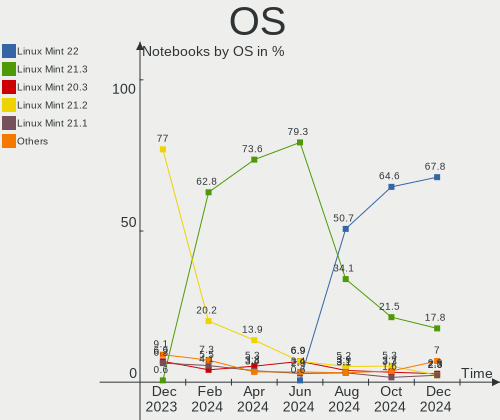
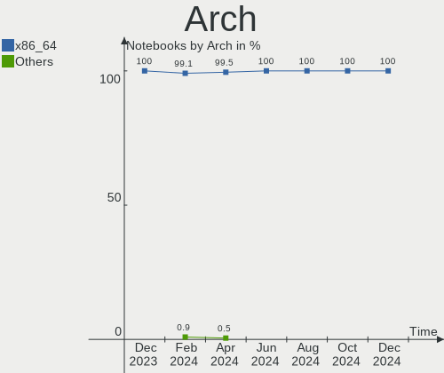
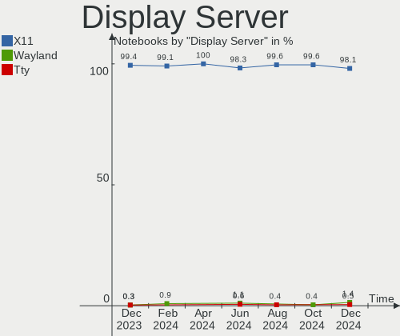
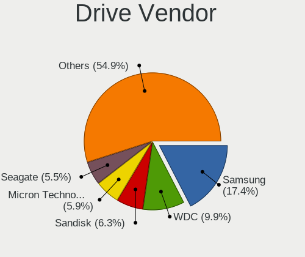
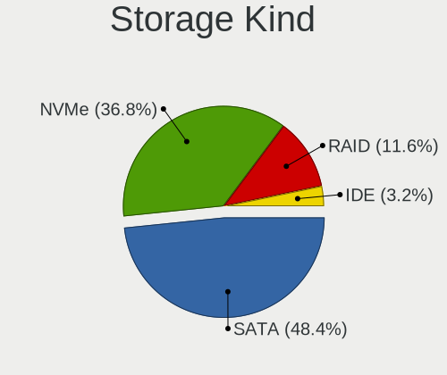
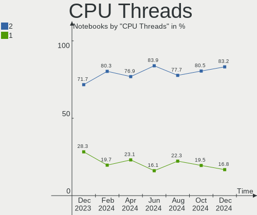

Linux Mint Hardware Trends (Notebooks)
--------------------------------------

A project to identify most popular hardware characteristics and track their change
over time based on data collected by Linux Mint users at https://Linux-Hardware.org.

Anyone can contribute to this report by the [hw-probe](https://github.com/linuxhw/hw-probe) tool:

    sudo -E hw-probe -all -upload

Full-feature report is available here: https://linux-hardware.org/?view=trends&formfactor=notebook

Period: Aug, 2021.

Contents
--------

* [ System ](#system)
  - [ OS                       ](#os)
  - [ OS Family                ](#os-family)
  - [ Kernel                   ](#kernel)
  - [ Kernel Family            ](#kernel-family)
  - [ Kernel Major Ver.        ](#kernel-major-ver)
  - [ Arch                     ](#arch)
  - [ DE                       ](#de)
  - [ Display Server           ](#display-server)
  - [ Display Manager          ](#display-manager)
  - [ OS Lang                  ](#os-lang)
  - [ Boot Mode                ](#boot-mode)
  - [ Filesystem               ](#filesystem)
  - [ Part. scheme             ](#part-scheme)
  - [ Dual Boot with Linux/BSD ](#dual-boot-with-linuxbsd)
  - [ Dual Boot (Win)          ](#dual-boot-win)

* [ Board ](#board)
  - [ Vendor                   ](#vendor)
  - [ Model                    ](#model)
  - [ Model Family             ](#model-family)
  - [ MFG Year                 ](#mfg-year)
  - [ Form Factor              ](#form-factor)
  - [ Secure Boot              ](#secure-boot)
  - [ Coreboot                 ](#coreboot)
  - [ RAM Size                 ](#ram-size)
  - [ RAM Used                 ](#ram-used)
  - [ Total Drives             ](#total-drives)
  - [ Has CD-ROM               ](#has-cd-rom)
  - [ Has Ethernet             ](#has-ethernet)
  - [ Has WiFi                 ](#has-wifi)
  - [ Has Bluetooth            ](#has-bluetooth)

* [ Location ](#location)
  - [ Country                  ](#country)
  - [ City                     ](#city)

* [ Drives ](#drives)
  - [ Drive Vendor             ](#drive-vendor)
  - [ Drive Model              ](#drive-model)
  - [ HDD Vendor               ](#hdd-vendor)
  - [ SSD Vendor               ](#ssd-vendor)
  - [ Drive Kind               ](#drive-kind)
  - [ Drive Connector          ](#drive-connector)
  - [ Drive Size               ](#drive-size)
  - [ Space Total              ](#space-total)
  - [ Space Used               ](#space-used)
  - [ Malfunc. Drives          ](#malfunc-drives)
  - [ Malfunc. Drive Vendor    ](#malfunc-drive-vendor)
  - [ Malfunc. HDD Vendor      ](#malfunc-hdd-vendor)
  - [ Malfunc. Drive Kind      ](#malfunc-drive-kind)
  - [ Failed Drives            ](#failed-drives)
  - [ Failed Drive Vendor      ](#failed-drive-vendor)
  - [ Drive Status             ](#drive-status)

* [ Storage controller ](#storage-controller)
  - [ Storage Vendor           ](#storage-vendor)
  - [ Storage Model            ](#storage-model)
  - [ Storage Kind             ](#storage-kind)

* [ Processor ](#processor)
  - [ CPU Vendor               ](#cpu-vendor)
  - [ CPU Model                ](#cpu-model)
  - [ CPU Model Family         ](#cpu-model-family)
  - [ CPU Cores                ](#cpu-cores)
  - [ CPU Sockets              ](#cpu-sockets)
  - [ CPU Threads              ](#cpu-threads)
  - [ CPU Op-Modes             ](#cpu-op-modes)
  - [ CPU Microcode            ](#cpu-microcode)
  - [ CPU Microarch            ](#cpu-microarch)

* [ Graphics ](#graphics)
  - [ GPU Vendor               ](#gpu-vendor)
  - [ GPU Model                ](#gpu-model)
  - [ GPU Combo                ](#gpu-combo)
  - [ GPU Driver               ](#gpu-driver)
  - [ GPU Memory               ](#gpu-memory)

* [ Monitor ](#monitor)
  - [ Monitor Vendor           ](#monitor-vendor)
  - [ Monitor Model            ](#monitor-model)
  - [ Monitor Resolution       ](#monitor-resolution)
  - [ Monitor Diagonal         ](#monitor-diagonal)
  - [ Monitor Width            ](#monitor-width)
  - [ Aspect Ratio             ](#aspect-ratio)
  - [ Monitor Area             ](#monitor-area)
  - [ Pixel Density            ](#pixel-density)
  - [ Multiple Monitors        ](#multiple-monitors)

* [ Network ](#network)
  - [ Net Controller Vendor    ](#net-controller-vendor)
  - [ Net Controller Model     ](#net-controller-model)
  - [ Wireless Vendor          ](#wireless-vendor)
  - [ Wireless Model           ](#wireless-model)
  - [ Ethernet Vendor          ](#ethernet-vendor)
  - [ Ethernet Model           ](#ethernet-model)
  - [ Net Controller Kind      ](#net-controller-kind)
  - [ Used Controller          ](#used-controller)
  - [ NICs                     ](#nics)
  - [ IPv6                     ](#ipv6)

* [ Bluetooth ](#bluetooth)
  - [ Bluetooth Vendor         ](#bluetooth-vendor)
  - [ Bluetooth Model          ](#bluetooth-model)

* [ Sound ](#sound)
  - [ Sound Vendor             ](#sound-vendor)
  - [ Sound Model              ](#sound-model)

* [ Memory ](#memory)
  - [ Memory Vendor            ](#memory-vendor)
  - [ Memory Model             ](#memory-model)
  - [ Memory Kind              ](#memory-kind)
  - [ Memory Form Factor       ](#memory-form-factor)
  - [ Memory Size              ](#memory-size)
  - [ Memory Speed             ](#memory-speed)

* [ Printers & scanners ](#printers--scanners)
  - [ Printer Vendor           ](#printer-vendor)
  - [ Printer Model            ](#printer-model)
  - [ Scanner Vendor           ](#scanner-vendor)
  - [ Scanner Model            ](#scanner-model)

* [ Camera ](#camera)
  - [ Camera Vendor            ](#camera-vendor)
  - [ Camera Model             ](#camera-model)

* [ Security ](#security)
  - [ Fingerprint Vendor       ](#fingerprint-vendor)
  - [ Fingerprint Model        ](#fingerprint-model)
  - [ Chipcard Vendor          ](#chipcard-vendor)
  - [ Chipcard Model           ](#chipcard-model)

* [ Unsupported ](#unsupported)
  - [ Unsupported Devices      ](#unsupported-devices)
  - [ Unsupported Device Types ](#unsupported-device-types)

System
------

OS
--

Installed operating systems

| Name            | Notebooks | Percent |
|-----------------|-----------|---------|
| Linux Mint 20.2 | 194       | 70.55%  |
| Linux Mint 20.1 | 30        | 10.91%  |
| Linux Mint 19.3 | 22        | 8%      |
| Linux Mint 20   | 19        | 6.91%   |
| Linux Mint 19   | 3         | 1.09%   |
| Linux Mint 18.3 | 3         | 1.09%   |
| Linux Mint 19.2 | 2         | 0.73%   |
| Linux Mint 19.1 | 2         | 0.73%   |

OS Family
---------

OS without a version

| Name       | Notebooks | Percent |
|------------|-----------|---------|
| Linux Mint | 275       | 100%    |

Kernel
------

Version of the Linux kernel

| Version                | Notebooks | Percent |
|------------------------|-----------|---------|
| 5.4.0-81-generic       | 105       | 38.18%  |
| 5.4.0-80-generic       | 87        | 31.64%  |
| 5.4.0-74-generic       | 20        | 7.27%   |
| 5.11.0-27-generic      | 12        | 4.36%   |
| 5.11.0-25-generic      | 12        | 4.36%   |
| 5.4.0-77-generic       | 6         | 2.18%   |
| 5.4.0-73-generic       | 5         | 1.82%   |
| 5.4.0-58-generic       | 3         | 1.09%   |
| 4.15.0-151-generic     | 3         | 1.09%   |
| 5.13.11-051311-generic | 2         | 0.73%   |
| 5.0.0-32-generic       | 2         | 0.73%   |
| 4.15.0-54-generic      | 2         | 0.73%   |
| 4.15.0-154-generic     | 2         | 0.73%   |
| 5.8.0-59-generic       | 1         | 0.36%   |
| 5.8.0-43-generic       | 1         | 0.36%   |
| 5.4.0-66-generic       | 1         | 0.36%   |
| 5.4.0-26-generic       | 1         | 0.36%   |
| 5.13.9-custom          | 1         | 0.36%   |
| 5.12.5-051205-generic  | 1         | 0.36%   |
| 5.12.19-051219-generic | 1         | 0.36%   |
| 5.11.0-22-generic      | 1         | 0.36%   |
| 4.4.0-210-generic      | 1         | 0.36%   |
| 4.15.0-20-generic      | 1         | 0.36%   |
| 4.15.0-153-generic     | 1         | 0.36%   |
| 4.15.0-144-generic     | 1         | 0.36%   |
| 4.15.0-142-generic     | 1         | 0.36%   |
| 4.10.0-38-generic      | 1         | 0.36%   |

Kernel Family
-------------

Linux kernel without a distro release

| Version | Notebooks | Percent |
|---------|-----------|---------|
| 5.4.0   | 228       | 82.91%  |
| 5.11.0  | 25        | 9.09%   |
| 4.15.0  | 11        | 4%      |
| 5.8.0   | 2         | 0.73%   |
| 5.13.11 | 2         | 0.73%   |
| 5.0.0   | 2         | 0.73%   |
| 5.13.9  | 1         | 0.36%   |
| 5.12.5  | 1         | 0.36%   |
| 5.12.19 | 1         | 0.36%   |
| 4.4.0   | 1         | 0.36%   |
| 4.10.0  | 1         | 0.36%   |

Kernel Major Ver.
-----------------

Linux kernel major version

| Version | Notebooks | Percent |
|---------|-----------|---------|
| 5.4     | 228       | 82.91%  |
| 5.11    | 25        | 9.09%   |
| 4.15    | 11        | 4%      |
| 5.13    | 3         | 1.09%   |
| 5.8     | 2         | 0.73%   |
| 5.12    | 2         | 0.73%   |
| 5.0     | 2         | 0.73%   |
| 4.4     | 1         | 0.36%   |
| 4.10    | 1         | 0.36%   |

Arch
----

OS architecture (x86_64, i586, etc.)

| Name   | Notebooks | Percent |
|--------|-----------|---------|
| x86_64 | 266       | 96.73%  |
| i686   | 9         | 3.27%   |

DE
--

Desktop Environment

| Name       | Notebooks | Percent |
|------------|-----------|---------|
| X-Cinnamon | 170       | 61.82%  |
| MATE       | 47        | 17.09%  |
| XFCE       | 37        | 13.45%  |
| Cinnamon   | 10        | 3.64%   |
| GNOME      | 8         | 2.91%   |
| Unknown    | 2         | 0.73%   |
| LXDE       | 1         | 0.36%   |

Display Server
--------------

X11 or Wayland

| Name | Notebooks | Percent |
|------|-----------|---------|
| X11  | 275       | 100%    |

Display Manager
---------------

SDDM, LightDM, etc.

| Name    | Notebooks | Percent |
|---------|-----------|---------|
| Unknown | 169       | 61.45%  |
| TDM     | 67        | 24.36%  |
| LightDM | 36        | 13.09%  |
| GDM     | 3         | 1.09%   |

OS Lang
-------

Language

| Lang    | Notebooks | Percent |
|---------|-----------|---------|
| en_US   | 86        | 31.27%  |
| de_DE   | 59        | 21.45%  |
| pt_BR   | 24        | 8.73%   |
| en_GB   | 15        | 5.45%   |
| C       | 14        | 5.09%   |
| fr_FR   | 13        | 4.73%   |
| ru_RU   | 11        | 4%      |
| pl_PL   | 6         | 2.18%   |
| en_AU   | 5         | 1.82%   |
| de_CH   | 4         | 1.45%   |
| es_AR   | 3         | 1.09%   |
| en_IN   | 3         | 1.09%   |
| th_TH   | 2         | 0.73%   |
| ru_UA   | 2         | 0.73%   |
| nl_NL   | 2         | 0.73%   |
| it_IT   | 2         | 0.73%   |
| en_ZA   | 2         | 0.73%   |
| en_PH   | 2         | 0.73%   |
| en_NZ   | 2         | 0.73%   |
| en_CA   | 2         | 0.73%   |
| da_DK   | 2         | 0.73%   |
| pt_PT   | 1         | 0.36%   |
| nl_BE   | 1         | 0.36%   |
| hu_HU   | 1         | 0.36%   |
| fr_CH   | 1         | 0.36%   |
| fr_CA   | 1         | 0.36%   |
| fr_BE   | 1         | 0.36%   |
| es_UY   | 1         | 0.36%   |
| es_PE   | 1         | 0.36%   |
| es_CU   | 1         | 0.36%   |
| es_CL   | 1         | 0.36%   |
| el_GR   | 1         | 0.36%   |
| de_AT   | 1         | 0.36%   |
| cs_CZ   | 1         | 0.36%   |
| Unknown | 1         | 0.36%   |

Boot Mode
---------

EFI or BIOS

| Mode | Notebooks | Percent |
|------|-----------|---------|
| BIOS | 138       | 50.18%  |
| EFI  | 137       | 49.82%  |

Filesystem
----------

Type of filesystem

| Type    | Notebooks | Percent |
|---------|-----------|---------|
| Ext4    | 254       | 92.36%  |
| Overlay | 13        | 4.73%   |
| Btrfs   | 7         | 2.55%   |
| Ext3    | 1         | 0.36%   |

Part. scheme
------------

Scheme of partitioning

| Type    | Notebooks | Percent |
|---------|-----------|---------|
| Unknown | 167       | 60.73%  |
| GPT     | 76        | 27.64%  |
| MBR     | 32        | 11.64%  |

Dual Boot with Linux/BSD
------------------------

Hosting more than one Linux/BSD

| Dual boot | Notebooks | Percent |
|-----------|-----------|---------|
| No        | 255       | 92.73%  |
| Yes       | 20        | 7.27%   |

Dual Boot (Win)
---------------

Hosting Linux and Windows

| Dual boot | Notebooks | Percent |
|-----------|-----------|---------|
| No        | 223       | 81.09%  |
| Yes       | 52        | 18.91%  |

Board
-----

Vendor
------

Motherboard manufacturer

| Name                | Notebooks | Percent |
|---------------------|-----------|---------|
| Lenovo              | 51        | 18.55%  |
| Hewlett-Packard     | 46        | 16.73%  |
| Acer                | 41        | 14.91%  |
| Dell                | 39        | 14.18%  |
| ASUSTek Computer    | 28        | 10.18%  |
| Toshiba             | 13        | 4.73%   |
| Sony                | 6         | 2.18%   |
| Samsung Electronics | 5         | 1.82%   |
| Fujitsu             | 5         | 1.82%   |
| MSI                 | 4         | 1.45%   |
| Apple               | 4         | 1.45%   |
| Notebook            | 3         | 1.09%   |
| Unknown             | 3         | 1.09%   |
| Medion              | 2         | 0.73%   |
| Gigabyte Technology | 2         | 0.73%   |
| Fujitsu Siemens     | 2         | 0.73%   |
| eMachines           | 2         | 0.73%   |
| Wortmann AG         | 1         | 0.36%   |
| Ultra               | 1         | 0.36%   |
| TWG                 | 1         | 0.36%   |
| TaNix               | 1         | 0.36%   |
| Razer               | 1         | 0.36%   |
| QUANMAX             | 1         | 0.36%   |
| Positivo            | 1         | 0.36%   |
| Philco              | 1         | 0.36%   |
| OEM                 | 1         | 0.36%   |
| LG Electronics      | 1         | 0.36%   |
| IGEL Technology     | 1         | 0.36%   |
| HUAWEI              | 1         | 0.36%   |
| Google              | 1         | 0.36%   |
| Gateway             | 1         | 0.36%   |
| Dynabook            | 1         | 0.36%   |
| Digibras            | 1         | 0.36%   |
| Cubix               | 1         | 0.36%   |
| Compaq              | 1         | 0.36%   |
| AVITA               | 1         | 0.36%   |

Model
-----

Motherboard model

| Name                                     | Notebooks | Percent |
|------------------------------------------|-----------|---------|
| Unknown                                  | 5         | 1.82%   |
| ASUS P50IJ                               | 3         | 1.09%   |
| Toshiba Satellite L40                    | 2         | 0.73%   |
| Toshiba Satellite C660                   | 2         | 0.73%   |
| Lenovo IdeaPad 3 15ALC6 82KU             | 2         | 0.73%   |
| HP Pavilion Gaming Laptop 17-cd1xxx      | 2         | 0.73%   |
| HP Laptop 15-bw0xx                       | 2         | 0.73%   |
| HP 620                                   | 2         | 0.73%   |
| Dell Latitude E7270                      | 2         | 0.73%   |
| Dell Latitude E5570                      | 2         | 0.73%   |
| ASUS VivoBook_ASUSLaptop X515DA_M515DA   | 2         | 0.73%   |
| ASUS ASUS TUF Gaming F15 FX506LH_FX506LH | 2         | 0.73%   |
| Acer Nitro AN515-52                      | 2         | 0.73%   |
| Acer Nitro AN515-51                      | 2         | 0.73%   |
| Acer Aspire ES1-521                      | 2         | 0.73%   |
| Wortmann AG TERRA_MOBILE_1512/1712       | 1         | 0.36%   |
| Ultra UB422                              | 1         | 0.36%   |
| TWG E2017                                | 1         | 0.36%   |
| Toshiba TECRA A10                        | 1         | 0.36%   |
| Toshiba Satellite R630                   | 1         | 0.36%   |
| Toshiba Satellite L855                   | 1         | 0.36%   |
| Toshiba Satellite C660D                  | 1         | 0.36%   |
| Toshiba Satellite C655                   | 1         | 0.36%   |
| Toshiba Satellite C55t-C                 | 1         | 0.36%   |
| Toshiba Satellite C50D-C                 | 1         | 0.36%   |
| Toshiba Satellite C50-A-19U              | 1         | 0.36%   |
| Toshiba QOSMIO X875                      | 1         | 0.36%   |
| TaNix Tx85                               | 1         | 0.36%   |
| Sony VPCF13WFX                           | 1         | 0.36%   |
| Sony VPCEB1E9R                           | 1         | 0.36%   |
| Sony VGN-NW21MF_W                        | 1         | 0.36%   |
| Sony VGN-AR71J                           | 1         | 0.36%   |
| Sony SVT1122B2EW                         | 1         | 0.36%   |
| Sony SVE14A27CLS                         | 1         | 0.36%   |
| Samsung R780                             | 1         | 0.36%   |
| Samsung R520/R522/R620                   | 1         | 0.36%   |
| Samsung R519/R719                        | 1         | 0.36%   |
| Samsung 700Z3C/700Z5C                    | 1         | 0.36%   |
| Samsung 350V5C/351V5C/3540VC/3440VC      | 1         | 0.36%   |
| Razer Blade                              | 1         | 0.36%   |
| QUANMAX Netbook Neo                      | 1         | 0.36%   |
| Positivo EC10IS1                         | 1         | 0.36%   |
| Philco 14I                               | 1         | 0.36%   |
| OEM I41SI                                | 1         | 0.36%   |
| Notebook W65_67SJ                        | 1         | 0.36%   |
| Notebook W54_55SU1,SUW                   | 1         | 0.36%   |
| Notebook NS50MU                          | 1         | 0.36%   |
| MSI GV62 8RE                             | 1         | 0.36%   |
| MSI GF65 Thin 10UE                       | 1         | 0.36%   |
| MSI CX61 2QF                             | 1         | 0.36%   |
| MSI Alpha 15 A3DDK                       | 1         | 0.36%   |
| Medion P6613                             | 1         | 0.36%   |
| Medion E7222                             | 1         | 0.36%   |
| LG 14Z90N-VA76K                          | 1         | 0.36%   |
| Lenovo Z51-70 80K6                       | 1         | 0.36%   |
| Lenovo Z50-70 20354                      | 1         | 0.36%   |
| Lenovo Y50-70 20378                      | 1         | 0.36%   |
| Lenovo V330-15IKB 81AX                   | 1         | 0.36%   |
| Lenovo ThinkPad X260 20F600A2UK          | 1         | 0.36%   |
| Lenovo ThinkPad X240 20AMS5FJ00          | 1         | 0.36%   |

Model Family
------------

Motherboard model prefix

| Name                    | Notebooks | Percent |
|-------------------------|-----------|---------|
| Acer Aspire             | 29        | 10.55%  |
| Lenovo ThinkPad         | 28        | 10.18%  |
| Dell Latitude           | 20        | 7.27%   |
| HP Pavilion             | 12        | 4.36%   |
| Toshiba Satellite       | 11        | 4%      |
| Lenovo IdeaPad          | 8         | 2.91%   |
| Dell Inspiron           | 8         | 2.91%   |
| HP ProBook              | 6         | 2.18%   |
| HP EliteBook            | 6         | 2.18%   |
| Acer Nitro              | 6         | 2.18%   |
| Dell Vostro             | 5         | 1.82%   |
| Unknown                 | 5         | 1.82%   |
| HP ZBook                | 4         | 1.45%   |
| HP Laptop               | 4         | 1.45%   |
| Fujitsu LIFEBOOK        | 4         | 1.45%   |
| ASUS VivoBook           | 4         | 1.45%   |
| Dell Precision          | 3         | 1.09%   |
| ASUS P50IJ              | 3         | 1.09%   |
| ASUS ASUS               | 3         | 1.09%   |
| Lenovo ThinkBook        | 2         | 0.73%   |
| Lenovo G560             | 2         | 0.73%   |
| HP ENVY                 | 2         | 0.73%   |
| HP Compaq               | 2         | 0.73%   |
| HP 620                  | 2         | 0.73%   |
| Fujitsu Siemens ESPRIMO | 2         | 0.73%   |
| Dell XPS                | 2         | 0.73%   |
| ASUS ZenBook            | 2         | 0.73%   |
| Acer Extensa            | 2         | 0.73%   |
| Wortmann AG TERRA       | 1         | 0.36%   |
| Ultra UB422             | 1         | 0.36%   |
| TWG E2017               | 1         | 0.36%   |
| Toshiba TECRA           | 1         | 0.36%   |
| Toshiba QOSMIO          | 1         | 0.36%   |
| TaNix Tx85              | 1         | 0.36%   |
| Sony VPCF13WFX          | 1         | 0.36%   |
| Sony VPCEB1E9R          | 1         | 0.36%   |
| Sony VGN-NW21MF         | 1         | 0.36%   |
| Sony VGN-AR71J          | 1         | 0.36%   |
| Sony SVT1122B2EW        | 1         | 0.36%   |
| Sony SVE14A27CLS        | 1         | 0.36%   |
| Samsung R780            | 1         | 0.36%   |
| Samsung R520            | 1         | 0.36%   |
| Samsung R519            | 1         | 0.36%   |
| Samsung 700Z3C          | 1         | 0.36%   |
| Samsung 350V5C          | 1         | 0.36%   |
| Razer Blade             | 1         | 0.36%   |
| QUANMAX Netbook         | 1         | 0.36%   |
| Positivo EC10IS1        | 1         | 0.36%   |
| Philco 14I              | 1         | 0.36%   |
| OEM I41SI               | 1         | 0.36%   |
| Notebook W65            | 1         | 0.36%   |
| Notebook W54            | 1         | 0.36%   |
| Notebook NS50MU         | 1         | 0.36%   |
| MSI GV62                | 1         | 0.36%   |
| MSI GF65                | 1         | 0.36%   |
| MSI CX61                | 1         | 0.36%   |
| MSI Alpha               | 1         | 0.36%   |
| Medion P6613            | 1         | 0.36%   |
| Medion E7222            | 1         | 0.36%   |
| LG 14Z90N-VA76K         | 1         | 0.36%   |

MFG Year
--------

Motherboard manufacture year

| Year | Notebooks | Percent |
|------|-----------|---------|
| 2021 | 36        | 13.09%  |
| 2020 | 28        | 10.18%  |
| 2019 | 28        | 10.18%  |
| 2015 | 23        | 8.36%   |
| 2010 | 23        | 8.36%   |
| 2013 | 21        | 7.64%   |
| 2018 | 19        | 6.91%   |
| 2009 | 18        | 6.55%   |
| 2012 | 16        | 5.82%   |
| 2014 | 15        | 5.45%   |
| 2011 | 14        | 5.09%   |
| 2017 | 10        | 3.64%   |
| 2008 | 9         | 3.27%   |
| 2016 | 8         | 2.91%   |
| 2007 | 6         | 2.18%   |
| 2006 | 1         | 0.36%   |

Form Factor
-----------

Physical design of the computer

| Name     | Notebooks | Percent |
|----------|-----------|---------|
| Notebook | 275       | 100%    |

Secure Boot
-----------

Enabled or disabled

| State    | Notebooks | Percent |
|----------|-----------|---------|
| Disabled | 251       | 91.27%  |
| Enabled  | 24        | 8.73%   |

Coreboot
--------

Have coreboot on board

| Used | Notebooks | Percent |
|------|-----------|---------|
| No   | 273       | 99.27%  |
| Yes  | 2         | 0.73%   |

RAM Size
--------

Total RAM memory

| Size in GB  | Notebooks | Percent |
|-------------|-----------|---------|
| 3.01-4.0    | 86        | 31.27%  |
| 4.01-8.0    | 78        | 28.36%  |
| 8.01-16.0   | 47        | 17.09%  |
| 16.01-24.0  | 29        | 10.55%  |
| 1.01-2.0    | 16        | 5.82%   |
| 32.01-64.0  | 9         | 3.27%   |
| 2.01-3.0    | 4         | 1.45%   |
| 0.51-1.0    | 3         | 1.09%   |
| 24.01-32.0  | 2         | 0.73%   |
| 64.01-256.0 | 1         | 0.36%   |

RAM Used
--------

Used RAM memory

| Used GB    | Notebooks | Percent |
|------------|-----------|---------|
| 1.01-2.0   | 121       | 44%     |
| 2.01-3.0   | 72        | 26.18%  |
| 3.01-4.0   | 35        | 12.73%  |
| 0.51-1.0   | 23        | 8.36%   |
| 4.01-8.0   | 20        | 7.27%   |
| 0.01-0.5   | 2         | 0.73%   |
| 16.01-24.0 | 1         | 0.36%   |
| 8.01-16.0  | 1         | 0.36%   |

Total Drives
------------

Number of drives on board

| Drives | Notebooks | Percent |
|--------|-----------|---------|
| 1      | 184       | 66.91%  |
| 2      | 74        | 26.91%  |
| 3      | 16        | 5.82%   |
| 0      | 1         | 0.36%   |

Has CD-ROM
----------

Has CD-ROM on board

| Presented | Notebooks | Percent |
|-----------|-----------|---------|
| No        | 150       | 54.55%  |
| Yes       | 125       | 45.45%  |

Has Ethernet
------------

Has Ethernet on board

| Presented | Notebooks | Percent |
|-----------|-----------|---------|
| Yes       | 241       | 87.64%  |
| No        | 34        | 12.36%  |

Has WiFi
--------

Has WiFi module

| Presented | Notebooks | Percent |
|-----------|-----------|---------|
| Yes       | 272       | 98.91%  |
| No        | 3         | 1.09%   |

Has Bluetooth
-------------

Has Bluetooth module

| Presented | Notebooks | Percent |
|-----------|-----------|---------|
| Yes       | 184       | 66.91%  |
| No        | 91        | 33.09%  |

Location
--------

Country
-------

Geographic location (country)

| Country      | Notebooks | Percent |
|--------------|-----------|---------|
| Germany      | 65        | 23.64%  |
| USA          | 39        | 14.18%  |
| Brazil       | 27        | 9.82%   |
| Russia       | 18        | 6.55%   |
| France       | 15        | 5.45%   |
| UK           | 12        | 4.36%   |
| Switzerland  | 8         | 2.91%   |
| Poland       | 7         | 2.55%   |
| Italy        | 6         | 2.18%   |
| Canada       | 6         | 2.18%   |
| Netherlands  | 5         | 1.82%   |
| Australia    | 5         | 1.82%   |
| India        | 4         | 1.45%   |
| Ukraine      | 3         | 1.09%   |
| Finland      | 3         | 1.09%   |
| Denmark      | 3         | 1.09%   |
| Argentina    | 3         | 1.09%   |
| Turkey       | 2         | 0.73%   |
| Thailand     | 2         | 0.73%   |
| Spain        | 2         | 0.73%   |
| South Korea  | 2         | 0.73%   |
| South Africa | 2         | 0.73%   |
| Philippines  | 2         | 0.73%   |
| New Zealand  | 2         | 0.73%   |
| Mexico       | 2         | 0.73%   |
| Indonesia    | 2         | 0.73%   |
| Greece       | 2         | 0.73%   |
| Belgium      | 2         | 0.73%   |
| Austria      | 2         | 0.73%   |
| Uruguay      | 1         | 0.36%   |
| Uganda       | 1         | 0.36%   |
| Sweden       | 1         | 0.36%   |
| Sri Lanka    | 1         | 0.36%   |
| Slovakia     | 1         | 0.36%   |
| Portugal     | 1         | 0.36%   |
| Peru         | 1         | 0.36%   |
| Norway       | 1         | 0.36%   |
| Morocco      | 1         | 0.36%   |
| Latvia       | 1         | 0.36%   |
| Kenya        | 1         | 0.36%   |
| Jersey       | 1         | 0.36%   |
| Japan        | 1         | 0.36%   |
| Hungary      | 1         | 0.36%   |
| Czechia      | 1         | 0.36%   |
| Cyprus       | 1         | 0.36%   |
| Cuba         | 1         | 0.36%   |
| Colombia     | 1         | 0.36%   |
| Chile        | 1         | 0.36%   |
| Bulgaria     | 1         | 0.36%   |
| Armenia      | 1         | 0.36%   |
| Algeria      | 1         | 0.36%   |

City
----

Geographic location (city)

| City                   | Notebooks | Percent |
|------------------------|-----------|---------|
| Berlin                 | 12        | 4.36%   |
| Moscow                 | 6         | 2.18%   |
| Wiesbaden              | 3         | 1.09%   |
| Maurecourt             | 3         | 1.09%   |
| Krasnodar              | 3         | 1.09%   |
| Helsinki               | 3         | 1.09%   |
| Zurich                 | 2         | 0.73%   |
| Warsaw                 | 2         | 0.73%   |
| Vienna                 | 2         | 0.73%   |
| Stuttgart              | 2         | 0.73%   |
| S??o Paulo             | 2         | 0.73%   |
| S??o Jos?© dos Campos  | 2         | 0.73%   |
| Rome                   | 2         | 0.73%   |
| Rio de Janeiro         | 2         | 0.73%   |
| Paris                  | 2         | 0.73%   |
| Melbourne              | 2         | 0.73%   |
| Hamburg                | 2         | 0.73%   |
| Frankfurt am Main      | 2         | 0.73%   |
| Erfurt                 | 2         | 0.73%   |
| Effretikon             | 2         | 0.73%   |
| Dortmund               | 2         | 0.73%   |
| Copenhagen             | 2         | 0.73%   |
| Betim                  | 2         | 0.73%   |
| Belo Horizonte         | 2         | 0.73%   |
| Zhytomyr               | 1         | 0.36%   |
| Yuma                   | 1         | 0.36%   |
| Witten                 | 1         | 0.36%   |
| Whangarei              | 1         | 0.36%   |
| Waimea                 | 1         | 0.36%   |
| Volgograd              | 1         | 0.36%   |
| Vladivostok            | 1         | 0.36%   |
| Traunreut              | 1         | 0.36%   |
| Tranbjerg              | 1         | 0.36%   |
| Tobyhanna              | 1         | 0.36%   |
| Telgte                 | 1         | 0.36%   |
| Sydney                 | 1         | 0.36%   |
| Sunderland             | 1         | 0.36%   |
| Staten Island          | 1         | 0.36%   |
| Starnberg              | 1         | 0.36%   |
| Stadthagen             | 1         | 0.36%   |
| Springfield            | 1         | 0.36%   |
| Southfield             | 1         | 0.36%   |
| Sokal'                 | 1         | 0.36%   |
| Sofia                  | 1         | 0.36%   |
| Smiltene               | 1         | 0.36%   |
| Seville                | 1         | 0.36%   |
| Seoul                  | 1         | 0.36%   |
| Sens                   | 1         | 0.36%   |
| Seka                   | 1         | 0.36%   |
| Seguin                 | 1         | 0.36%   |
| Seevetal               | 1         | 0.36%   |
| Schoten                | 1         | 0.36%   |
| Schoenberg             | 1         | 0.36%   |
| S??o Jos?© dos Pinhais | 1         | 0.36%   |
| Santo Andr?©           | 1         | 0.36%   |
| Santa Rosa             | 1         | 0.36%   |
| Santa Marta            | 1         | 0.36%   |
| Santa Luzia            | 1         | 0.36%   |
| Sankt Ingbert          | 1         | 0.36%   |
| Sanary-sur-Mer         | 1         | 0.36%   |

Drives
------

Drive Vendor
------------

Hard drive vendors

| Vendor                    | Notebooks | Drives | Percent |
|---------------------------|-----------|--------|---------|
| Samsung Electronics       | 44        | 48     | 12.5%   |
| WDC                       | 43        | 44     | 12.22%  |
| Toshiba                   | 37        | 37     | 10.51%  |
| Seagate                   | 37        | 37     | 10.51%  |
| Unknown                   | 28        | 30     | 7.95%   |
| Kingston                  | 22        | 22     | 6.25%   |
| SK Hynix                  | 20        | 20     | 5.68%   |
| Sandisk                   | 15        | 15     | 4.26%   |
| Hitachi                   | 14        | 14     | 3.98%   |
| Intel                     | 11        | 13     | 3.13%   |
| Crucial                   | 11        | 11     | 3.13%   |
| HGST                      | 7         | 7      | 1.99%   |
| A-DATA Technology         | 7         | 7      | 1.99%   |
| Micron Technology         | 5         | 5      | 1.42%   |
| China                     | 5         | 5      | 1.42%   |
| Intenso                   | 4         | 4      | 1.14%   |
| Fujitsu                   | 3         | 3      | 0.85%   |
| Apple                     | 3         | 3      | 0.85%   |
| Union Memory              | 2         | 2      | 0.57%   |
| SPCC                      | 2         | 2      | 0.57%   |
| LITEON                    | 2         | 2      | 0.57%   |
| Apacer                    | 2         | 2      | 0.57%   |
| Yeyian                    | 1         | 1      | 0.28%   |
| Vaseky                    | 1         | 1      | 0.28%   |
| USB3.0                    | 1         | 1      | 0.28%   |
| TEYADI                    | 1         | 1      | 0.28%   |
| sobetter                  | 1         | 1      | 0.28%   |
| SABRENT                   | 1         | 1      | 0.28%   |
| Realtek Semiconductor     | 1         | 1      | 0.28%   |
| PNY                       | 1         | 1      | 0.28%   |
| Phison Electronics        | 1         | 1      | 0.28%   |
| Phison                    | 1         | 1      | 0.28%   |
| Patriot                   | 1         | 1      | 0.28%   |
| Palit                     | 1         | 1      | 0.28%   |
| OCZ                       | 1         | 1      | 0.28%   |
| Netac                     | 1         | 1      | 0.28%   |
| Micron/Crucial Technology | 1         | 1      | 0.28%   |
| LITEONIT                  | 1         | 2      | 0.28%   |
| Leven                     | 1         | 1      | 0.28%   |
| KingFast                  | 1         | 1      | 0.28%   |
| KingDian                  | 1         | 1      | 0.28%   |
| JMicron                   | 1         | 1      | 0.28%   |
| JDa                       | 1         | 1      | 0.28%   |
| Hoodisk                   | 1         | 1      | 0.28%   |
| Gigabyte Technology       | 1         | 1      | 0.28%   |
| CT500P2S                  | 1         | 1      | 0.28%   |
| Corsair                   | 1         | 1      | 0.28%   |
| AS25                      | 1         | 1      | 0.28%   |
| Apricorn                  | 1         | 1      | 0.28%   |
| AMD                       | 1         | 1      | 0.28%   |

Drive Model
-----------

Hard drive models

| Model                                   | Notebooks | Percent |
|-----------------------------------------|-----------|---------|
| Kingston SA400S37240G 240GB SSD         | 10        | 2.79%   |
| Unknown MMC Card  32GB                  | 7         | 1.96%   |
| Toshiba MQ01ABF050 500GB                | 7         | 1.96%   |
| Toshiba MQ01ABD100 1TB                  | 6         | 1.68%   |
| WDC WDS500G2B0A-00SM50 500GB SSD        | 5         | 1.4%    |
| Seagate ST1000LM035-1RK172 1TB          | 5         | 1.4%    |
| Samsung SSD 840 EVO 500GB               | 5         | 1.4%    |
| Unknown SD/MMC/MS PRO 128GB             | 4         | 1.12%   |
| Unknown MMC Card  64GB                  | 4         | 1.12%   |
| Unknown MMC Card  128GB                 | 4         | 1.12%   |
| Toshiba MQ04ABF100 1TB                  | 4         | 1.12%   |
| SK Hynix NVMe SSD Drive 512GB           | 4         | 1.12%   |
| Seagate ST9500325AS 500GB               | 4         | 1.12%   |
| Samsung SSD 850 EVO 500GB               | 4         | 1.12%   |
| Kingston SA400S37480G 480GB SSD         | 3         | 0.84%   |
| Crucial CT500MX500SSD1 500GB            | 3         | 0.84%   |
| WDC WDS100T2B0A-00SM50 1TB SSD          | 2         | 0.56%   |
| WDC WD5000LPCX-00VHAT0 500GB            | 2         | 0.56%   |
| WDC WD3200BEVT-22ZCT0 320GB             | 2         | 0.56%   |
| WDC PC SN530 SDBPNPZ-256G-1002 256GB    | 2         | 0.56%   |
| Unknown MMC Card  16GB                  | 2         | 0.56%   |
| Toshiba NVMe SSD Drive 512GB            | 2         | 0.56%   |
| SK Hynix SC311 SATA 256GB SSD           | 2         | 0.56%   |
| SK Hynix BC511 HFM512GDJTNI-82A0A 512GB | 2         | 0.56%   |
| Seagate ST500LT012-1DG142 500GB         | 2         | 0.56%   |
| Seagate ST500LM030-2E717D 500GB         | 2         | 0.56%   |
| Seagate ST500LM012 HN-M500MBB 500GB     | 2         | 0.56%   |
| Seagate ST500LM000-1EJ162 500GB         | 2         | 0.56%   |
| Seagate ST320LT020-9YG142 320GB         | 2         | 0.56%   |
| Seagate ST1000LM048-2E7172 1TB          | 2         | 0.56%   |
| SanDisk SD8SN8U-256G-1006 256GB SSD     | 2         | 0.56%   |
| Sandisk NVMe SSD Drive 512GB            | 2         | 0.56%   |
| Samsung SSD 860 QVO 1TB                 | 2         | 0.56%   |
| Samsung SSD 860 EVO 500GB               | 2         | 0.56%   |
| Samsung SSD 840 EVO 250GB               | 2         | 0.56%   |
| Samsung HM500JI 500GB                   | 2         | 0.56%   |
| Micron 1100_MTFDDAV256TBN 256GB SSD     | 2         | 0.56%   |
| Kingston SA400S37120G 120GB SSD         | 2         | 0.56%   |
| Intenso SSD 128GB                       | 2         | 0.56%   |
| Hitachi HTS723232A7A364 320GB           | 2         | 0.56%   |
| Hitachi HTS545050B9A300 500GB           | 2         | 0.56%   |
| HGST HTS725032A7E630 320GB              | 2         | 0.56%   |
| Crucial CT1000MX500SSD1 1TB             | 2         | 0.56%   |
| China SSD 256GB                         | 2         | 0.56%   |
| Apacer AS350 120GB SSD                  | 2         | 0.56%   |
| Yeyian VALK 1000 120GB SSD              | 1         | 0.28%   |
| WDC WDS250G2B0A-00SM50 250GB SSD        | 1         | 0.28%   |
| WDC WDS120G2G0B-00EPW0 120GB SSD        | 1         | 0.28%   |
| WDC WDBRPG0020BNC-WRSN 2TB              | 1         | 0.28%   |
| WDC WD7500BPKX-00HPJT0 752GB            | 1         | 0.28%   |
| WDC WD5000LPVX-75V0TT0 500GB            | 1         | 0.28%   |
| WDC WD5000LPVX-22V0TT0 500GB            | 1         | 0.28%   |
| WDC WD5000BEVT-60A0RT0 500GB            | 1         | 0.28%   |
| WDC WD5000BEVT-22A0RT0 500GB            | 1         | 0.28%   |
| WDC WD5000BEKT-00KA9T0 500GB            | 1         | 0.28%   |
| WDC WD3200LPVX-08V0TT2 320GB            | 1         | 0.28%   |
| WDC WD3200BPVT-22JJ5T0 320GB            | 1         | 0.28%   |
| WDC WD3200BEVT-60ZCT0 320GB             | 1         | 0.28%   |
| WDC WD3200BEVT-60A23T0 320GB            | 1         | 0.28%   |
| WDC WD3200BEVT-24A23T0 320GB            | 1         | 0.28%   |

HDD Vendor
----------

Hard disk drive vendors

| Vendor              | Notebooks | Drives | Percent |
|---------------------|-----------|--------|---------|
| Seagate             | 33        | 33     | 28.7%   |
| Toshiba             | 28        | 28     | 24.35%  |
| WDC                 | 26        | 27     | 22.61%  |
| Hitachi             | 14        | 14     | 12.17%  |
| HGST                | 7         | 7      | 6.09%   |
| Samsung Electronics | 3         | 3      | 2.61%   |
| Fujitsu             | 3         | 3      | 2.61%   |
| USB3.0              | 1         | 1      | 0.87%   |

SSD Vendor
----------

Solid state drive vendors

| Vendor              | Notebooks | Drives | Percent |
|---------------------|-----------|--------|---------|
| Samsung Electronics | 32        | 34     | 23.53%  |
| Kingston            | 20        | 20     | 14.71%  |
| Crucial             | 11        | 11     | 8.09%   |
| SanDisk             | 10        | 10     | 7.35%   |
| WDC                 | 9         | 9      | 6.62%   |
| SK Hynix            | 6         | 6      | 4.41%   |
| Toshiba             | 5         | 5      | 3.68%   |
| China               | 5         | 5      | 3.68%   |
| A-DATA Technology   | 5         | 5      | 3.68%   |
| Intenso             | 4         | 4      | 2.94%   |
| Intel               | 4         | 4      | 2.94%   |
| Micron Technology   | 3         | 3      | 2.21%   |
| SPCC                | 2         | 2      | 1.47%   |
| LITEON              | 2         | 2      | 1.47%   |
| Apple               | 2         | 2      | 1.47%   |
| Apacer              | 2         | 2      | 1.47%   |
| Yeyian              | 1         | 1      | 0.74%   |
| Vaseky              | 1         | 1      | 0.74%   |
| Seagate             | 1         | 1      | 0.74%   |
| SABRENT             | 1         | 1      | 0.74%   |
| PNY                 | 1         | 1      | 0.74%   |
| Patriot             | 1         | 1      | 0.74%   |
| Palit               | 1         | 1      | 0.74%   |
| OCZ                 | 1         | 1      | 0.74%   |
| LITEONIT            | 1         | 2      | 0.74%   |
| KingDian            | 1         | 1      | 0.74%   |
| JDa                 | 1         | 1      | 0.74%   |
| Hoodisk             | 1         | 1      | 0.74%   |
| Corsair             | 1         | 1      | 0.74%   |
| AMD                 | 1         | 1      | 0.74%   |

Drive Kind
----------

HDD or SSD

| Kind    | Notebooks | Drives | Percent |
|---------|-----------|--------|---------|
| SSD     | 126       | 139    | 37.61%  |
| HDD     | 112       | 116    | 33.43%  |
| NVMe    | 56        | 64     | 16.72%  |
| MMC     | 26        | 28     | 7.76%   |
| Unknown | 15        | 15     | 4.48%   |

Drive Connector
---------------

SATA, SAS, NVMe, etc.

| Type | Notebooks | Drives | Percent |
|------|-----------|--------|---------|
| SATA | 214       | 250    | 67.94%  |
| NVMe | 56        | 64     | 17.78%  |
| MMC  | 26        | 28     | 8.25%   |
| SAS  | 19        | 20     | 6.03%   |

Drive Size
----------

Size of hard drive

| Size in TB | Notebooks | Drives | Percent |
|------------|-----------|--------|---------|
| 0.01-0.5   | 172       | 191    | 73.82%  |
| 0.51-1.0   | 55        | 58     | 23.61%  |
| 1.01-2.0   | 5         | 5      | 2.15%   |
| 4.01-10.0  | 1         | 1      | 0.43%   |

Space Total
-----------

Amount of disk space available on the file system

| Size in GB     | Notebooks | Percent |
|----------------|-----------|---------|
| 251-500        | 86        | 31.27%  |
| 101-250        | 85        | 30.91%  |
| 501-1000       | 37        | 13.45%  |
| 51-100         | 22        | 8%      |
| 21-50          | 14        | 5.09%   |
| 1001-2000      | 12        | 4.36%   |
| 1-20           | 10        | 3.64%   |
| More than 3000 | 4         | 1.45%   |
| 2001-3000      | 4         | 1.45%   |
| Unknown        | 1         | 0.36%   |

Space Used
----------

Amount of used disk space

| Used GB        | Notebooks | Percent |
|----------------|-----------|---------|
| 1-20           | 82        | 29.82%  |
| 21-50          | 63        | 22.91%  |
| 101-250        | 48        | 17.45%  |
| 51-100         | 40        | 14.55%  |
| 251-500        | 23        | 8.36%   |
| 501-1000       | 11        | 4%      |
| 1001-2000      | 4         | 1.45%   |
| More than 3000 | 2         | 0.73%   |
| 2001-3000      | 1         | 0.36%   |
| Unknown        | 1         | 0.36%   |

Malfunc. Drives
---------------

Drive models with a malfunction

| Model                           | Notebooks | Drives | Percent |
|---------------------------------|-----------|--------|---------|
| Toshiba MQ01ABD100 1TB          | 3         | 3      | 16.67%  |
| Seagate ST500LT012-1DG142 500GB | 2         | 2      | 11.11%  |
| WDC WD10JPVX-60JC3T0 1TB        | 1         | 1      | 5.56%   |
| Toshiba MQ01ACF050 500GB        | 1         | 1      | 5.56%   |
| Toshiba MK5059GSXP 500GB        | 1         | 1      | 5.56%   |
| Toshiba MK1237GSX 120GB         | 1         | 1      | 5.56%   |
| Seagate ST9500423AS 500GB       | 1         | 1      | 5.56%   |
| Seagate ST9500325AS 500GB       | 1         | 1      | 5.56%   |
| Seagate ST9320325AS 320GB       | 1         | 1      | 5.56%   |
| Seagate ST500LM000-1EJ162 500GB | 1         | 1      | 5.56%   |
| Seagate ST1000LM035-1RK172 1TB  | 1         | 1      | 5.56%   |
| JDa He SATA DISK 64GB SSD       | 1         | 1      | 5.56%   |
| Hitachi HTS723216L9SA60 160GB   | 1         | 1      | 5.56%   |
| Hitachi HTS541010A9E680 1TB     | 1         | 1      | 5.56%   |
| Crucial CT1000MX500SSD1 1TB     | 1         | 1      | 5.56%   |

Malfunc. Drive Vendor
---------------------

Vendors of faulty drives

| Vendor  | Notebooks | Drives | Percent |
|---------|-----------|--------|---------|
| Seagate | 7         | 7      | 38.89%  |
| Toshiba | 6         | 6      | 33.33%  |
| Hitachi | 2         | 2      | 11.11%  |
| WDC     | 1         | 1      | 5.56%   |
| JDa     | 1         | 1      | 5.56%   |
| Crucial | 1         | 1      | 5.56%   |

Malfunc. HDD Vendor
-------------------

Vendors of faulty HDD drives

| Vendor  | Notebooks | Drives | Percent |
|---------|-----------|--------|---------|
| Seagate | 7         | 7      | 43.75%  |
| Toshiba | 6         | 6      | 37.5%   |
| Hitachi | 2         | 2      | 12.5%   |
| WDC     | 1         | 1      | 6.25%   |

Malfunc. Drive Kind
-------------------

Kinds of faulty drives

| Kind | Notebooks | Drives | Percent |
|------|-----------|--------|---------|
| HDD  | 16        | 16     | 88.89%  |
| SSD  | 2         | 2      | 11.11%  |

Failed Drives
-------------

Failed drive models

Zero info for selected period =(

Failed Drive Vendor
-------------------

Failed drive vendors

Zero info for selected period =(

Drive Status
------------

Number of failed and malfunc. drives

| Status   | Notebooks | Drives | Percent |
|----------|-----------|--------|---------|
| Detected | 184       | 229    | 62.37%  |
| Works    | 93        | 115    | 31.53%  |
| Malfunc  | 18        | 18     | 6.1%    |

Storage controller
------------------

Storage Vendor
--------------

Storage controller vendors

| Vendor                           | Notebooks | Percent |
|----------------------------------|-----------|---------|
| Intel                            | 202       | 68.94%  |
| AMD                              | 29        | 9.9%    |
| SK Hynix                         | 14        | 4.78%   |
| Sandisk                          | 11        | 3.75%   |
| Samsung Electronics              | 10        | 3.41%   |
| Toshiba America Info Systems     | 4         | 1.37%   |
| Silicon Integrated Systems [SiS] | 4         | 1.37%   |
| Realtek Semiconductor            | 3         | 1.02%   |
| Phison Electronics               | 3         | 1.02%   |
| Union Memory (Shenzhen)          | 2         | 0.68%   |
| Nvidia                           | 2         | 0.68%   |
| Micron Technology                | 2         | 0.68%   |
| Kingston Technology Company      | 2         | 0.68%   |
| Seagate Technology               | 1         | 0.34%   |
| Micron/Crucial Technology        | 1         | 0.34%   |
| Marvell Technology Group         | 1         | 0.34%   |
| JMicron Technology               | 1         | 0.34%   |
| Apple                            | 1         | 0.34%   |

Storage Model
-------------

Storage controller models

| Model                                                                            | Notebooks | Percent |
|----------------------------------------------------------------------------------|-----------|---------|
| Intel 82801IBM/IEM (ICH9M/ICH9M-E) 4 port SATA Controller [AHCI mode]            | 26        | 8.05%   |
| Intel 7 Series Chipset Family 6-port SATA Controller [AHCI mode]                 | 24        | 7.43%   |
| AMD FCH SATA Controller [AHCI mode]                                              | 22        | 6.81%   |
| Intel Sunrise Point-LP SATA Controller [AHCI mode]                               | 21        | 6.5%    |
| Intel 82801 Mobile SATA Controller [RAID mode]                                   | 19        | 5.88%   |
| Intel 6 Series/C200 Series Chipset Family 6 port Mobile SATA AHCI Controller     | 13        | 4.02%   |
| Intel 5 Series/3400 Series Chipset 4 port SATA AHCI Controller                   | 13        | 4.02%   |
| Intel 8 Series SATA Controller 1 [AHCI mode]                                     | 10        | 3.1%    |
| Samsung NVMe SSD Controller SM981/PM981/PM983                                    | 9         | 2.79%   |
| Intel Wildcat Point-LP SATA Controller [AHCI Mode]                               | 9         | 2.79%   |
| Intel 8 Series/C220 Series Chipset Family 6-port SATA Controller 1 [AHCI mode]   | 8         | 2.48%   |
| Intel 82801HM/HEM (ICH8M/ICH8M-E) SATA Controller [AHCI mode]                    | 6         | 1.86%   |
| Intel 82801HM/HEM (ICH8M/ICH8M-E) IDE Controller                                 | 6         | 1.86%   |
| Intel 5 Series/3400 Series Chipset 6 port SATA AHCI Controller                   | 6         | 1.86%   |
| AMD SB7x0/SB8x0/SB9x0 SATA Controller [AHCI mode]                                | 6         | 1.86%   |
| SK Hynix BC511                                                                   | 5         | 1.55%   |
| Sandisk WD Blue SN550 NVMe SSD                                                   | 5         | 1.55%   |
| Intel Celeron N3350/Pentium N4200/Atom E3900 Series SATA AHCI Controller         | 5         | 1.55%   |
| Toshiba America Info Systems XG6 NVMe SSD Controller                             | 4         | 1.24%   |
| Silicon Integrated Systems [SiS] SATA Controller / IDE mode                      | 4         | 1.24%   |
| Silicon Integrated Systems [SiS] 5513 IDE Controller                             | 4         | 1.24%   |
| Sandisk WD Black SN750 / PC SN730 NVMe SSD                                       | 4         | 1.24%   |
| Intel Volume Management Device NVMe RAID Controller                              | 4         | 1.24%   |
| Intel SSD 660P Series                                                            | 4         | 1.24%   |
| Intel HM170/QM170 Chipset SATA Controller [AHCI Mode]                            | 4         | 1.24%   |
| Intel Cannon Lake Mobile PCH SATA AHCI Controller                                | 4         | 1.24%   |
| Intel Atom Processor E3800 Series SATA AHCI Controller                           | 4         | 1.24%   |
| Intel 82801GBM/GHM (ICH7-M Family) SATA Controller [IDE mode]                    | 4         | 1.24%   |
| SK Hynix NVMe SSD Controller                                                     | 3         | 0.93%   |
| SK Hynix Non-Volatile memory controller                                          | 3         | 0.93%   |
| SK Hynix BC501 NVMe Solid State Drive                                            | 3         | 0.93%   |
| Realtek RTS5763DL NVMe SSD Controller                                            | 3         | 0.93%   |
| Intel 82801GBM/GHM (ICH7-M Family) SATA Controller [AHCI mode]                   | 3         | 0.93%   |
| Union Memory (Shenzhen) Non-Volatile memory controller                           | 2         | 0.62%   |
| Nvidia MCP65 SATA Controller                                                     | 2         | 0.62%   |
| Nvidia MCP65 IDE                                                                 | 2         | 0.62%   |
| Micron Non-Volatile memory controller                                            | 2         | 0.62%   |
| Intel Tiger Lake-LP SATA Controller [AHCI mode]                                  | 2         | 0.62%   |
| Intel Non-Volatile memory controller                                             | 2         | 0.62%   |
| Intel NM10/ICH7 Family SATA Controller [AHCI mode]                               | 2         | 0.62%   |
| Intel Atom/Celeron/Pentium Processor x5-E8000/J3xxx/N3xxx Series SATA Controller | 2         | 0.62%   |
| Intel 82801G (ICH7 Family) IDE Controller                                        | 2         | 0.62%   |
| Intel 7 Series Chipset Family 4-port SATA Controller [IDE mode]                  | 2         | 0.62%   |
| Intel 7 Series Chipset Family 2-port SATA Controller [IDE mode]                  | 2         | 0.62%   |
| Intel 5 Series/3400 Series Chipset 4 port SATA IDE Controller                    | 2         | 0.62%   |
| Intel 5 Series/3400 Series Chipset 2 port SATA IDE Controller                    | 2         | 0.62%   |
| Intel 400 Series Chipset Family SATA AHCI Controller                             | 2         | 0.62%   |
| Seagate FireCuda 510 SSD                                                         | 1         | 0.31%   |
| Sandisk WD Black 2018/SN750 / PC SN720 NVMe SSD                                  | 1         | 0.31%   |
| Sandisk Non-Volatile memory controller                                           | 1         | 0.31%   |
| Samsung NVMe Controller                                                          | 1         | 0.31%   |
| Phison PS5013 E13 NVMe Controller                                                | 1         | 0.31%   |
| Phison E16 PCIe4 NVMe Controller                                                 | 1         | 0.31%   |
| Phison E12 NVMe Controller                                                       | 1         | 0.31%   |
| Micron/Crucial P1 NVMe PCIe SSD                                                  | 1         | 0.31%   |
| Marvell Group 88SS9183 PCIe SSD Controller                                       | 1         | 0.31%   |
| Kingston Company U-SNS8154P3 NVMe SSD                                            | 1         | 0.31%   |
| Kingston Company KC2000 NVMe SSD                                                 | 1         | 0.31%   |
| JMicron JMB360 AHCI Controller                                                   | 1         | 0.31%   |
| Intel US15W/US15X/US15L/UL11L SCH [Poulsbo] IDE Controller                       | 1         | 0.31%   |

Storage Kind
------------

Kind of storage controller (IDE, SATA, NVMe, SAS, ...)

| Kind | Notebooks | Percent |
|------|-----------|---------|
| SATA | 198       | 65.13%  |
| NVMe | 56        | 18.42%  |
| IDE  | 26        | 8.55%   |
| RAID | 24        | 7.89%   |

Processor
---------

CPU Vendor
----------

Processor vendors

| Vendor | Notebooks | Percent |
|--------|-----------|---------|
| Intel  | 232       | 84.36%  |
| AMD    | 43        | 15.64%  |

CPU Model
---------

Processor models

| Model                                         | Notebooks | Percent |
|-----------------------------------------------|-----------|---------|
| AMD Ryzen 5 3500U with Radeon Vega Mobile Gfx | 6         | 2.18%   |
| Intel Core i7-10750H CPU @ 2.60GHz            | 5         | 1.82%   |
| Intel Core i5 CPU M 520 @ 2.40GHz             | 5         | 1.82%   |
| Intel Core 2 Duo CPU T6670 @ 2.20GHz          | 5         | 1.82%   |
| Intel Core i5-7200U CPU @ 2.50GHz             | 4         | 1.45%   |
| Intel Core i5-3210M CPU @ 2.50GHz             | 4         | 1.45%   |
| Intel Core i5-10300H CPU @ 2.50GHz            | 4         | 1.45%   |
| Intel Atom x5-Z8350 CPU @ 1.44GHz             | 4         | 1.45%   |
| Intel Pentium Dual-Core CPU T4200 @ 2.00GHz   | 3         | 1.09%   |
| Intel Pentium CPU N4200 @ 1.10GHz             | 3         | 1.09%   |
| Intel Core i7-8750H CPU @ 2.20GHz             | 3         | 1.09%   |
| Intel Core i7-8565U CPU @ 1.80GHz             | 3         | 1.09%   |
| Intel Core i7-6600U CPU @ 2.60GHz             | 3         | 1.09%   |
| Intel Core i7-6500U CPU @ 2.50GHz             | 3         | 1.09%   |
| Intel Core i7-5500U CPU @ 2.40GHz             | 3         | 1.09%   |
| Intel Core i5-7300HQ CPU @ 2.50GHz            | 3         | 1.09%   |
| Intel Core i5-4210M CPU @ 2.60GHz             | 3         | 1.09%   |
| Intel Core i5 CPU M 430 @ 2.27GHz             | 3         | 1.09%   |
| Intel Core i3-5005U CPU @ 2.00GHz             | 3         | 1.09%   |
| Intel Core 2 Duo CPU T9400 @ 2.53GHz          | 3         | 1.09%   |
| Intel 11th Gen Core i5-1135G7 @ 2.40GHz       | 3         | 1.09%   |
| AMD Ryzen 7 PRO 4750U with Radeon Graphics    | 3         | 1.09%   |
| Intel Pentium Dual CPU T2310 @ 1.46GHz        | 2         | 0.73%   |
| Intel Pentium CPU P6200 @ 2.13GHz             | 2         | 0.73%   |
| Intel Pentium CPU N3700 @ 1.60GHz             | 2         | 0.73%   |
| Intel Pentium CPU B950 @ 2.10GHz              | 2         | 0.73%   |
| Intel Core i7-9750H CPU @ 2.60GHz             | 2         | 0.73%   |
| Intel Core i7-8650U CPU @ 1.90GHz             | 2         | 0.73%   |
| Intel Core i7 CPU Q 720 @ 1.60GHz             | 2         | 0.73%   |
| Intel Core i5-9300H CPU @ 2.40GHz             | 2         | 0.73%   |
| Intel Core i5-8300H CPU @ 2.30GHz             | 2         | 0.73%   |
| Intel Core i5-8265U CPU @ 1.60GHz             | 2         | 0.73%   |
| Intel Core i5-8250U CPU @ 1.60GHz             | 2         | 0.73%   |
| Intel Core i5-6300U CPU @ 2.40GHz             | 2         | 0.73%   |
| Intel Core i5-6200U CPU @ 2.30GHz             | 2         | 0.73%   |
| Intel Core i5-5200U CPU @ 2.20GHz             | 2         | 0.73%   |
| Intel Core i5-4300U CPU @ 1.90GHz             | 2         | 0.73%   |
| Intel Core i5-4200M CPU @ 2.50GHz             | 2         | 0.73%   |
| Intel Core i5-3380M CPU @ 2.90GHz             | 2         | 0.73%   |
| Intel Core i5-3340M CPU @ 2.70GHz             | 2         | 0.73%   |
| Intel Core i5-3320M CPU @ 2.60GHz             | 2         | 0.73%   |
| Intel Core i5-2520M CPU @ 2.50GHz             | 2         | 0.73%   |
| Intel Core i5 CPU M 450 @ 2.40GHz             | 2         | 0.73%   |
| Intel Core i3-7020U CPU @ 2.30GHz             | 2         | 0.73%   |
| Intel Core i3-3110M CPU @ 2.40GHz             | 2         | 0.73%   |
| Intel Core i3 CPU M 380 @ 2.53GHz             | 2         | 0.73%   |
| Intel Core 2 Duo CPU T9900 @ 3.06GHz          | 2         | 0.73%   |
| Intel Core 2 Duo CPU P8700 @ 2.53GHz          | 2         | 0.73%   |
| Intel Core 2 Duo CPU P8600 @ 2.40GHz          | 2         | 0.73%   |
| Intel Core 2 CPU T5600 @ 1.83GHz              | 2         | 0.73%   |
| Intel Celeron CPU N3350 @ 1.10GHz             | 2         | 0.73%   |
| Intel Celeron CPU N2940 @ 1.83GHz             | 2         | 0.73%   |
| Intel Celeron CPU N2840 @ 2.16GHz             | 2         | 0.73%   |
| Intel Celeron CPU B830 @ 1.80GHz              | 2         | 0.73%   |
| Intel Celeron CPU 900 @ 2.20GHz               | 2         | 0.73%   |
| Intel Atom CPU N270 @ 1.60GHz                 | 2         | 0.73%   |
| Intel 11th Gen Core i3-1115G4 @ 3.00GHz       | 2         | 0.73%   |
| AMD Ryzen 7 5700U with Radeon Graphics        | 2         | 0.73%   |
| AMD Ryzen 7 3700U with Radeon Vega Mobile Gfx | 2         | 0.73%   |
| Intel Xeon W-10885M CPU @ 2.40GHz             | 1         | 0.36%   |

CPU Model Family
----------------

Processor model prefix

| Model                   | Notebooks | Percent |
|-------------------------|-----------|---------|
| Intel Core i5           | 67        | 24.36%  |
| Intel Core i7           | 51        | 18.55%  |
| Intel Core i3           | 24        | 8.73%   |
| Intel Core 2 Duo        | 22        | 8%      |
| Intel Celeron           | 17        | 6.18%   |
| Intel Pentium           | 13        | 4.73%   |
| Intel Atom              | 11        | 4%      |
| Other                   | 8         | 2.91%   |
| AMD Ryzen 5             | 8         | 2.91%   |
| AMD Ryzen 7             | 7         | 2.55%   |
| Intel Pentium Dual      | 5         | 1.82%   |
| Intel Pentium Dual-Core | 4         | 1.45%   |
| Intel Core 2            | 3         | 1.09%   |
| AMD Turion 64 X2 Mobile | 3         | 1.09%   |
| AMD Ryzen 7 PRO         | 3         | 1.09%   |
| Intel Celeron M         | 2         | 0.73%   |
| AMD E2                  | 2         | 0.73%   |
| AMD E1                  | 2         | 0.73%   |
| AMD E                   | 2         | 0.73%   |
| AMD Athlon II           | 2         | 0.73%   |
| AMD A8                  | 2         | 0.73%   |
| AMD A6                  | 2         | 0.73%   |
| AMD A4                  | 2         | 0.73%   |
| AMD A10                 | 2         | 0.73%   |
| Intel Xeon              | 1         | 0.36%   |
| Intel Genuine           | 1         | 0.36%   |
| Intel Core m3           | 1         | 0.36%   |
| Intel Core i9           | 1         | 0.36%   |
| Intel Core Duo          | 1         | 0.36%   |
| Intel Celeron Dual-Core | 1         | 0.36%   |
| AMD Turion II           | 1         | 0.36%   |
| AMD Ryzen 5 PRO         | 1         | 0.36%   |
| AMD Ryzen 3             | 1         | 0.36%   |
| AMD GX                  | 1         | 0.36%   |
| AMD C-70                | 1         | 0.36%   |

CPU Cores
---------

Number of processor cores

| Number | Notebooks | Percent |
|--------|-----------|---------|
| 2      | 167       | 60.73%  |
| 4      | 79        | 28.73%  |
| 6      | 12        | 4.36%   |
| 1      | 9         | 3.27%   |
| 8      | 8         | 2.91%   |

CPU Sockets
-----------

Number of sockets

| Number | Notebooks | Percent |
|--------|-----------|---------|
| 1      | 275       | 100%    |

CPU Threads
-----------

Threads per core (Hyper-Threading)

| Number | Notebooks | Percent |
|--------|-----------|---------|
| 2      | 175       | 63.64%  |
| 1      | 100       | 36.36%  |

CPU Op-Modes
------------

CPU Operation Modes (32-bit, 64-bit)

| Op mode        | Notebooks | Percent |
|----------------|-----------|---------|
| 32-bit, 64-bit | 270       | 98.18%  |
| 32-bit         | 5         | 1.82%   |

CPU Microcode
-------------

Microcode number

| Number     | Notebooks | Percent |
|------------|-----------|---------|
| Unknown    | 25        | 9.09%   |
| 0x206a7    | 20        | 7.27%   |
| 0x1067a    | 20        | 7.27%   |
| 0x306a9    | 19        | 6.91%   |
| 0x406e3    | 12        | 4.36%   |
| 0x40651    | 12        | 4.36%   |
| 0x20655    | 11        | 4%      |
| 0x306d4    | 10        | 3.64%   |
| 0xa0652    | 9         | 3.27%   |
| 0x306c3    | 8         | 2.91%   |
| 0x906ea    | 7         | 2.55%   |
| 0x806e9    | 7         | 2.55%   |
| 0x806c1    | 7         | 2.55%   |
| 0x6fd      | 7         | 2.55%   |
| 0x806ec    | 6         | 2.18%   |
| 0x30678    | 6         | 2.18%   |
| 0x20652    | 6         | 2.18%   |
| 0x07030105 | 6         | 2.18%   |
| 0x806ea    | 5         | 1.82%   |
| 0x506c9    | 5         | 1.82%   |
| 0x10676    | 5         | 1.82%   |
| 0x08108109 | 5         | 1.82%   |
| 0x406c4    | 4         | 1.45%   |
| 0x08600106 | 4         | 1.45%   |
| 0x08108102 | 4         | 1.45%   |
| 0x906e9    | 3         | 1.09%   |
| 0x406c3    | 3         | 1.09%   |
| 0x106e5    | 3         | 1.09%   |
| 0x806eb    | 2         | 0.73%   |
| 0x706e5    | 2         | 0.73%   |
| 0x6f6      | 2         | 0.73%   |
| 0x506e3    | 2         | 0.73%   |
| 0x30661    | 2         | 0.73%   |
| 0x106c2    | 2         | 0.73%   |
| 0x08608103 | 2         | 0.73%   |
| 0x06006705 | 2         | 0.73%   |
| 0x06006118 | 2         | 0.73%   |
| 0x06001119 | 2         | 0.73%   |
| 0x05000119 | 2         | 0.73%   |
| 0x010000c8 | 2         | 0.73%   |
| 0x706a8    | 1         | 0.36%   |
| 0x706a1    | 1         | 0.36%   |
| 0x6fb      | 1         | 0.36%   |
| 0x6fa      | 1         | 0.36%   |
| 0x6f2      | 1         | 0.36%   |
| 0x6ec      | 1         | 0.36%   |
| 0x6e8      | 1         | 0.36%   |
| 0x10661    | 1         | 0.36%   |
| 0x0a50000c | 1         | 0.36%   |
| 0x08608102 | 1         | 0.36%   |
| 0x08600103 | 1         | 0.36%   |
| 0x05000029 | 1         | 0.36%   |

CPU Microarch
-------------

Microarchitecture

| Name          | Notebooks | Percent |
|---------------|-----------|---------|
| KabyLake      | 35        | 12.73%  |
| Penryn        | 26        | 9.45%   |
| SandyBridge   | 22        | 8%      |
| IvyBridge     | 22        | 8%      |
| Haswell       | 21        | 7.64%   |
| Westmere      | 19        | 6.91%   |
| Skylake       | 15        | 5.45%   |
| Silvermont    | 13        | 4.73%   |
| Core          | 13        | 4.73%   |
| Zen+          | 11        | 4%      |
| CometLake     | 10        | 3.64%   |
| Broadwell     | 10        | 3.64%   |
| Puma          | 8         | 2.91%   |
| TigerLake     | 7         | 2.55%   |
| Zen 2         | 5         | 1.82%   |
| Goldmont      | 5         | 1.82%   |
| Bonnell       | 5         | 1.82%   |
| Excavator     | 4         | 1.45%   |
| Nehalem       | 3         | 1.09%   |
| K8 Hammer     | 3         | 1.09%   |
| K10           | 3         | 1.09%   |
| Bobcat        | 3         | 1.09%   |
| Unknown       | 3         | 1.09%   |
| Piledriver    | 2         | 0.73%   |
| P6            | 2         | 0.73%   |
| IceLake       | 2         | 0.73%   |
| Goldmont plus | 2         | 0.73%   |
| Zen 3         | 1         | 0.36%   |

Graphics
--------

GPU Vendor
----------

Vendors of graphics cards

| Vendor                           | Notebooks | Percent |
|----------------------------------|-----------|---------|
| Intel                            | 201       | 59.29%  |
| Nvidia                           | 76        | 22.42%  |
| AMD                              | 60        | 17.7%   |
| Silicon Integrated Systems [SiS] | 2         | 0.59%   |

GPU Model
---------

Graphics card models

| Model                                                                                    | Notebooks | Percent |
|------------------------------------------------------------------------------------------|-----------|---------|
| Intel 3rd Gen Core processor Graphics Controller                                         | 22        | 6.29%   |
| Intel 2nd Generation Core Processor Family Integrated Graphics Controller                | 21        | 6%      |
| Intel Mobile 4 Series Chipset Integrated Graphics Controller                             | 16        | 4.57%   |
| Intel Core Processor Integrated Graphics Controller                                      | 16        | 4.57%   |
| Intel Skylake GT2 [HD Graphics 520]                                                      | 12        | 3.43%   |
| Intel Haswell-ULT Integrated Graphics Controller                                         | 11        | 3.14%   |
| AMD Picasso                                                                              | 11        | 3.14%   |
| Intel HD Graphics 5500                                                                   | 9         | 2.57%   |
| Intel CometLake-H GT2 [UHD Graphics]                                                     | 9         | 2.57%   |
| Intel CoffeeLake-H GT2 [UHD Graphics 630]                                                | 8         | 2.29%   |
| Intel 4th Gen Core Processor Integrated Graphics Controller                              | 8         | 2.29%   |
| Intel Atom/Celeron/Pentium Processor x5-E8000/J3xxx/N3xxx Integrated Graphics Controller | 7         | 2%      |
| Intel WhiskeyLake-U GT2 [UHD Graphics 620]                                               | 6         | 1.71%   |
| Intel UHD Graphics 620                                                                   | 6         | 1.71%   |
| Intel HD Graphics 620                                                                    | 6         | 1.71%   |
| Intel Atom Processor Z36xxx/Z37xxx Series Graphics & Display                             | 6         | 1.71%   |
| Intel TigerLake-LP GT2 [Iris Xe Graphics]                                                | 5         | 1.43%   |
| AMD Renoir                                                                               | 5         | 1.43%   |
| Nvidia TU116M [GeForce GTX 1660 Ti Mobile]                                               | 4         | 1.14%   |
| Nvidia GP107M [GeForce GTX 1050 Mobile]                                                  | 4         | 1.14%   |
| Nvidia GF117M [GeForce 610M/710M/810M/820M / GT 620M/625M/630M/720M]                     | 4         | 1.14%   |
| Intel Mobile 945GM/GMS/GME, 943/940GML Express Integrated Graphics Controller            | 4         | 1.14%   |
| AMD Topaz XT [Radeon R7 M260/M265 / M340/M360 / M440/M445 / 530/535 / 620/625 Mobile]    | 4         | 1.14%   |
| Nvidia TU117M [GeForce GTX 1650 Ti Mobile]                                               | 3         | 0.86%   |
| Nvidia G98M [GeForce G 105M]                                                             | 3         | 0.86%   |
| Nvidia G96CM [GeForce 9600M GT]                                                          | 3         | 0.86%   |
| Intel Mobile GM965/GL960 Integrated Graphics Controller (secondary)                      | 3         | 0.86%   |
| Intel Mobile GM965/GL960 Integrated Graphics Controller (primary)                        | 3         | 0.86%   |
| Intel HD Graphics 630                                                                    | 3         | 0.86%   |
| Intel Celeron N3350/Pentium N4200/Atom E3900 Series Integrated Graphics Controller       | 3         | 0.86%   |
| AMD RS880M [Mobility Radeon HD 4225/4250]                                                | 3         | 0.86%   |
| AMD Mullins [Radeon R4/R5 Graphics]                                                      | 3         | 0.86%   |
| AMD Lucienne                                                                             | 3         | 0.86%   |
| Silicon Integrated Systems [SiS] 771/671 PCIE VGA Display Adapter                        | 2         | 0.57%   |
| Nvidia TU117M [GeForce GTX 1650 Mobile / Max-Q]                                          | 2         | 0.57%   |
| Nvidia TU117M                                                                            | 2         | 0.57%   |
| Nvidia TU106M [GeForce RTX 2060 Mobile]                                                  | 2         | 0.57%   |
| Nvidia GT216M [GeForce GT 330M]                                                          | 2         | 0.57%   |
| Nvidia GP107M [GeForce GTX 1050 Ti Mobile]                                               | 2         | 0.57%   |
| Nvidia GP106M [GeForce GTX 1060 Mobile]                                                  | 2         | 0.57%   |
| Nvidia GM108M [GeForce 940M]                                                             | 2         | 0.57%   |
| Nvidia GM108M [GeForce 940MX]                                                            | 2         | 0.57%   |
| Nvidia GM108M [GeForce 840M]                                                             | 2         | 0.57%   |
| Nvidia GM108M [GeForce 830M]                                                             | 2         | 0.57%   |
| Nvidia GK208BM [GeForce 920M]                                                            | 2         | 0.57%   |
| Nvidia GF108M [GeForce GT 425M]                                                          | 2         | 0.57%   |
| Nvidia G86M [GeForce 8400M GS]                                                           | 2         | 0.57%   |
| Nvidia G73M [GeForce Go 7600]                                                            | 2         | 0.57%   |
| Intel Tiger Lake UHD Graphics                                                            | 2         | 0.57%   |
| Intel Mobile 945GSE Express Integrated Graphics Controller                               | 2         | 0.57%   |
| Intel Mobile 945GM/GMS, 943/940GML Express Integrated Graphics Controller                | 2         | 0.57%   |
| Intel Kaby Lake-U GT2f HD 620 Graphics Controller                                        | 2         | 0.57%   |
| Intel HD Graphics 500                                                                    | 2         | 0.57%   |
| Intel GeminiLake [UHD Graphics 600]                                                      | 2         | 0.57%   |
| Intel CometLake-U GT2 [UHD Graphics]                                                     | 2         | 0.57%   |
| Intel Atom Processor D2xxx/N2xxx Integrated Graphics Controller                          | 2         | 0.57%   |
| AMD Wrestler [Radeon HD 6310]                                                            | 2         | 0.57%   |
| AMD Wani [Radeon R5/R6/R7 Graphics]                                                      | 2         | 0.57%   |
| AMD Thames [Radeon HD 7500M/7600M Series]                                                | 2         | 0.57%   |
| AMD Sun XT [Radeon HD 8670A/8670M/8690M / R5 M330 / M430 / Radeon 520 Mobile]            | 2         | 0.57%   |

GPU Combo
---------

Combinations of graphics cards

| Name           | Notebooks | Percent |
|----------------|-----------|---------|
| 1 x Intel      | 140       | 50.91%  |
| Intel + Nvidia | 49        | 17.82%  |
| 1 x AMD        | 41        | 14.91%  |
| 1 x Nvidia     | 24        | 8.73%   |
| Intel + AMD    | 12        | 4.36%   |
| 2 x AMD        | 4         | 1.45%   |
| AMD + Nvidia   | 3         | 1.09%   |
| 1 x SiS        | 2         | 0.73%   |

GPU Driver
----------

Free vs proprietary

| Driver      | Notebooks | Percent |
|-------------|-----------|---------|
| Free        | 213       | 77.45%  |
| Proprietary | 42        | 15.27%  |
| Unknown     | 20        | 7.27%   |

GPU Memory
----------

Total video memory

| Size in GB | Notebooks | Percent |
|------------|-----------|---------|
| Unknown    | 166       | 60.36%  |
| 0.01-0.5   | 32        | 11.64%  |
| 1.01-2.0   | 31        | 11.27%  |
| 0.51-1.0   | 18        | 6.55%   |
| 3.01-4.0   | 17        | 6.18%   |
| 5.01-6.0   | 7         | 2.55%   |
| 7.01-8.0   | 2         | 0.73%   |
| 2.01-3.0   | 2         | 0.73%   |

Monitor
-------

Monitor Vendor
--------------

Monitor vendors

| Vendor                  | Notebooks | Percent |
|-------------------------|-----------|---------|
| AU Optronics            | 62        | 22.14%  |
| LG Display              | 51        | 18.21%  |
| Chimei Innolux          | 36        | 12.86%  |
| Samsung Electronics     | 25        | 8.93%   |
| BOE                     | 25        | 8.93%   |
| Lenovo                  | 9         | 3.21%   |
| PANDA                   | 8         | 2.86%   |
| LG Philips              | 7         | 2.5%    |
| Chi Mei Optoelectronics | 7         | 2.5%    |
| Goldstar                | 6         | 2.14%   |
| Dell                    | 4         | 1.43%   |
| CPT                     | 4         | 1.43%   |
| Apple                   | 4         | 1.43%   |
| Seiko/Epson             | 3         | 1.07%   |
| BenQ                    | 3         | 1.07%   |
| AOC                     | 3         | 1.07%   |
| Acer                    | 3         | 1.07%   |
| Sharp                   | 2         | 0.71%   |
| Philips                 | 2         | 0.71%   |
| InfoVision              | 2         | 0.71%   |
| Hewlett-Packard         | 2         | 0.71%   |
| Unknown                 | 1         | 0.36%   |
| Sony                    | 1         | 0.36%   |
| Positivo                | 1         | 0.36%   |
| Panasonic               | 1         | 0.36%   |
| Nvidia                  | 1         | 0.36%   |
| LPL                     | 1         | 0.36%   |
| JDI                     | 1         | 0.36%   |
| InnoLux Display         | 1         | 0.36%   |
| Iiyama                  | 1         | 0.36%   |
| Fujitsu Siemens         | 1         | 0.36%   |
| cPATH                   | 1         | 0.36%   |
| Ancor Communications    | 1         | 0.36%   |

Monitor Model
-------------

Monitor models

| Model                                                                    | Notebooks | Percent |
|--------------------------------------------------------------------------|-----------|---------|
| AU Optronics LCD Monitor AUO23EC 1366x768 344x193mm 15.5-inch            | 5         | 1.77%   |
| PANDA LCD Monitor NCP004D 1920x1080 344x194mm 15.5-inch                  | 4         | 1.42%   |
| AU Optronics LCD Monitor AUO61ED 1920x1080 340x190mm 15.3-inch           | 3         | 1.06%   |
| AU Optronics LCD Monitor AUO22EC 1366x768 344x193mm 15.5-inch            | 3         | 1.06%   |
| AU Optronics LCD Monitor AUO159E 1600x900 380x210mm 17.1-inch            | 3         | 1.06%   |
| AU Optronics LCD Monitor 1920x1080                                       | 3         | 1.06%   |
| Seiko/Epson LCD Monitor 1366x768                                         | 2         | 0.71%   |
| Samsung Electronics LCD Monitor SEC5541 1366x768 344x193mm 15.5-inch     | 2         | 0.71%   |
| Samsung Electronics LCD Monitor SAM0C39 1920x1080 1050x590mm 47.4-inch   | 2         | 0.71%   |
| LG Display LCD Monitor LGD05EC 1920x1080 309x174mm 14.0-inch             | 2         | 0.71%   |
| LG Display LCD Monitor LGD02DC 1366x768 344x194mm 15.5-inch              | 2         | 0.71%   |
| InfoVision LCD Monitor IVO03F4 1920x1200 263x164mm 12.2-inch             | 2         | 0.71%   |
| Chimei Innolux LCD Monitor CMN15E7 1920x1080 344x193mm 15.5-inch         | 2         | 0.71%   |
| Chimei Innolux LCD Monitor CMN15DB 1366x768 344x193mm 15.5-inch          | 2         | 0.71%   |
| Chimei Innolux LCD Monitor CMN15C9 1366x768 344x193mm 15.5-inch          | 2         | 0.71%   |
| Chimei Innolux LCD Monitor CMN15C3 1920x1080 340x190mm 15.3-inch         | 2         | 0.71%   |
| Chimei Innolux LCD Monitor CMN151E 1920x1080 344x193mm 15.5-inch         | 2         | 0.71%   |
| Chimei Innolux LCD Monitor CMN1490 1366x768 309x173mm 13.9-inch          | 2         | 0.71%   |
| Chi Mei Optoelectronics LCD Monitor CMO1711 1600x900 382x215mm 17.3-inch | 2         | 0.71%   |
| BOE LCD Monitor BOE0729 1920x1080 344x193mm 15.5-inch                    | 2         | 0.71%   |
| BOE LCD Monitor BOE06A4 1366x768 344x194mm 15.5-inch                     | 2         | 0.71%   |
| AU Optronics LCD Monitor AUO80ED 1920x1080 344x193mm 15.5-inch           | 2         | 0.71%   |
| AU Optronics LCD Monitor AUO45EC 1366x768 340x190mm 15.3-inch            | 2         | 0.71%   |
| AU Optronics LCD Monitor AUO38ED 1920x1080 340x190mm 15.3-inch           | 2         | 0.71%   |
| AU Optronics LCD Monitor AUO31EC 1366x768 340x190mm 15.3-inch            | 2         | 0.71%   |
| AU Optronics LCD Monitor AUO26EC 1366x768 344x193mm 15.5-inch            | 2         | 0.71%   |
| AU Optronics LCD Monitor AUO21EC 1366x768 340x190mm 15.3-inch            | 2         | 0.71%   |
| AU Optronics LCD Monitor AUO139E 1600x900 382x214mm 17.2-inch            | 2         | 0.71%   |
| AU Optronics LCD Monitor AUO106C 1366x768 277x156mm 12.5-inch            | 2         | 0.71%   |
| Unknown LCD Monitor Sony Nvidia Default Flat Panel 1600x900              | 1         | 0.35%   |
| Sony TV SNYF500 1360x768 1600x900mm 72.3-inch                            | 1         | 0.35%   |
| Sharp LQ123P1JX31 SHP1471 2400x1600 259x173mm 12.3-inch                  | 1         | 0.35%   |
| Sharp LCD Monitor SHP14D0 3840x2400 336x210mm 15.6-inch                  | 1         | 0.35%   |
| Seiko/Epson LCD Monitor 1280x800                                         | 1         | 0.35%   |
| Samsung Electronics SyncMaster SAM05CC 1920x1080 530x300mm 24.0-inch     | 1         | 0.35%   |
| Samsung Electronics SyncMaster SAM03E4 1680x1050 474x296mm 22.0-inch     | 1         | 0.35%   |
| Samsung Electronics SMT22A550 SAM07AF 1920x1080 477x268mm 21.5-inch      | 1         | 0.35%   |
| Samsung Electronics S22F350 SAM0D1B 1920x1080 477x268mm 21.5-inch        | 1         | 0.35%   |
| Samsung Electronics S22D300 SAM0B3E 1920x1080 477x268mm 21.5-inch        | 1         | 0.35%   |
| Samsung Electronics LCD Monitor SEC5441 1366x768 344x194mm 15.5-inch     | 1         | 0.35%   |
| Samsung Electronics LCD Monitor SEC4D42 1280x800 303x190mm 14.1-inch     | 1         | 0.35%   |
| Samsung Electronics LCD Monitor SEC4758 1024x768 304x228mm 15.0-inch     | 1         | 0.35%   |
| Samsung Electronics LCD Monitor SEC4151 1366x768 344x194mm 15.5-inch     | 1         | 0.35%   |
| Samsung Electronics LCD Monitor SEC3742 1366x768 309x174mm 14.0-inch     | 1         | 0.35%   |
| Samsung Electronics LCD Monitor SEC324C 1366x768 353x198mm 15.9-inch     | 1         | 0.35%   |
| Samsung Electronics LCD Monitor SEC3245 1366x768 344x194mm 15.5-inch     | 1         | 0.35%   |
| Samsung Electronics LCD Monitor SEC3150 1366x768 344x193mm 15.5-inch     | 1         | 0.35%   |
| Samsung Electronics LCD Monitor SEC3051 1600x900 398x232mm 18.1-inch     | 1         | 0.35%   |
| Samsung Electronics LCD Monitor SEC3046 1366x768 340x190mm 15.3-inch     | 1         | 0.35%   |
| Samsung Electronics LCD Monitor SDC5344 1920x1080 344x194mm 15.5-inch    | 1         | 0.35%   |
| Samsung Electronics LCD Monitor SDC4C46 3840x2160 344x194mm 15.5-inch    | 1         | 0.35%   |
| Samsung Electronics LCD Monitor SDC414D 1366x768 309x174mm 14.0-inch     | 1         | 0.35%   |
| Samsung Electronics LCD Monitor SDC4141 1366x768 340x190mm 15.3-inch     | 1         | 0.35%   |
| Samsung Electronics LCD Monitor SAM0BB4 3840x2160 1872x1053mm 84.6-inch  | 1         | 0.35%   |
| Samsung Electronics LCD Monitor SAM04FA 1920x1080 886x498mm 40.0-inch    | 1         | 0.35%   |
| Samsung Electronics C27F390 SAM0D32 1920x1080 600x340mm 27.2-inch        | 1         | 0.35%   |
| Positivo SMILE563 NON1503 1360x768 344x194mm 15.5-inch                   | 1         | 0.35%   |
| Philips PHL 273V5 PHLC0D2 1920x1080 600x340mm 27.2-inch                  | 1         | 0.35%   |
| Philips FTV PHL4200 1920x1080 927x521mm 41.9-inch                        | 1         | 0.35%   |
| PANDA LM133LF5L01 NCP0020 1920x1080 294x165mm 13.3-inch                  | 1         | 0.35%   |

Monitor Resolution
------------------

Monitor screen resolution

| Resolution         | Notebooks | Percent |
|--------------------|-----------|---------|
| 1366x768 (WXGA)    | 103       | 38.29%  |
| 1920x1080 (FHD)    | 92        | 34.2%   |
| 1600x900 (HD+)     | 19        | 7.06%   |
| 1280x800 (WXGA)    | 14        | 5.2%    |
| 3840x2160 (4K)     | 9         | 3.35%   |
| 1440x900 (WXGA+)   | 9         | 3.35%   |
| 2560x1440 (QHD)    | 4         | 1.49%   |
| 1920x1200 (WUXGA)  | 4         | 1.49%   |
| 1360x768           | 3         | 1.12%   |
| 2560x1080          | 2         | 0.74%   |
| 1680x1050 (WSXGA+) | 2         | 0.74%   |
| 3840x2400          | 1         | 0.37%   |
| 3456x2160          | 1         | 0.37%   |
| 2560x1600          | 1         | 0.37%   |
| 2400x1600          | 1         | 0.37%   |
| 1400x1050          | 1         | 0.37%   |
| 1280x1024 (SXGA)   | 1         | 0.37%   |
| 1024x768 (XGA)     | 1         | 0.37%   |
| 1024x600           | 1         | 0.37%   |

Monitor Diagonal
----------------

Diagonal size in inches

| Inches  | Notebooks | Percent |
|---------|-----------|---------|
| 15      | 127       | 45.52%  |
| 14      | 34        | 12.19%  |
| 17      | 28        | 10.04%  |
| 13      | 23        | 8.24%   |
| 12      | 11        | 3.94%   |
| Unknown | 10        | 3.58%   |
| 11      | 8         | 2.87%   |
| 27      | 7         | 2.51%   |
| 21      | 7         | 2.51%   |
| 24      | 5         | 1.79%   |
| 47      | 2         | 0.72%   |
| 34      | 2         | 0.72%   |
| 23      | 2         | 0.72%   |
| 22      | 2         | 0.72%   |
| 10      | 2         | 0.72%   |
| 84      | 1         | 0.36%   |
| 72      | 1         | 0.36%   |
| 41      | 1         | 0.36%   |
| 40      | 1         | 0.36%   |
| 31      | 1         | 0.36%   |
| 25      | 1         | 0.36%   |
| 20      | 1         | 0.36%   |
| 19      | 1         | 0.36%   |
| 18      | 1         | 0.36%   |

Monitor Width
-------------

Physical width

| Width in mm | Notebooks | Percent |
|-------------|-----------|---------|
| 301-350     | 171       | 61.73%  |
| 201-300     | 31        | 11.19%  |
| 351-400     | 30        | 10.83%  |
| 501-600     | 15        | 5.42%   |
| 401-500     | 11        | 3.97%   |
| Unknown     | 10        | 3.61%   |
| 701-800     | 2         | 0.72%   |
| 1501-2000   | 2         | 0.72%   |
| 1001-1500   | 2         | 0.72%   |
| 801-900     | 1         | 0.36%   |
| 601-700     | 1         | 0.36%   |
| 901-1000    | 1         | 0.36%   |

Aspect Ratio
------------

Proportional relationship between the width and the height

| Ratio   | Notebooks | Percent |
|---------|-----------|---------|
| 16/9    | 210       | 83%     |
| 16/10   | 27        | 10.67%  |
| Unknown | 10        | 3.95%   |
| 4/3     | 2         | 0.79%   |
| 21/9    | 2         | 0.79%   |
| 5/4     | 1         | 0.4%    |
| 3/2     | 1         | 0.4%    |

Monitor Area
------------

Area in inch²

| Area in inch² | Notebooks | Percent |
|----------------|-----------|---------|
| 101-110        | 127       | 45.52%  |
| 81-90          | 48        | 17.2%   |
| 121-130        | 19        | 6.81%   |
| 201-250        | 14        | 5.02%   |
| 61-70          | 11        | 3.94%   |
| Unknown        | 10        | 3.58%   |
| 71-80          | 9         | 3.23%   |
| 51-60          | 8         | 2.87%   |
| 131-140        | 8         | 2.87%   |
| 301-350        | 7         | 2.51%   |
| 151-200        | 4         | 1.43%   |
| 501-1000       | 4         | 1.43%   |
| 351-500        | 3         | 1.08%   |
| More than 1000 | 2         | 0.72%   |
| 41-50          | 2         | 0.72%   |
| 141-150        | 2         | 0.72%   |
| 251-300        | 1         | 0.36%   |

Pixel Density
-------------

Pixels per inch

| Density       | Notebooks | Percent |
|---------------|-----------|---------|
| 101-120       | 108       | 39.27%  |
| 121-160       | 95        | 34.55%  |
| 51-100        | 42        | 15.27%  |
| Unknown       | 10        | 3.64%   |
| More than 240 | 9         | 3.27%   |
| 161-240       | 7         | 2.55%   |
| 1-50          | 4         | 1.45%   |

Multiple Monitors
-----------------

Total monitors connected

| Total | Notebooks | Percent |
|-------|-----------|---------|
| 1     | 224       | 81.45%  |
| 2     | 28        | 10.18%  |
| 0     | 19        | 6.91%   |
| 3     | 4         | 1.45%   |

Network
-------

Net Controller Vendor
---------------------

Controller vendors

| Vendor                            | Notebooks | Percent |
|-----------------------------------|-----------|---------|
| Realtek Semiconductor             | 151       | 33.41%  |
| Intel                             | 126       | 27.88%  |
| Qualcomm Atheros                  | 84        | 18.58%  |
| Broadcom                          | 34        | 7.52%   |
| Broadcom Limited                  | 10        | 2.21%   |
| Marvell Technology Group          | 7         | 1.55%   |
| Ralink Technology                 | 4         | 0.88%   |
| Ralink                            | 4         | 0.88%   |
| MEDIATEK                          | 4         | 0.88%   |
| TP-Link                           | 3         | 0.66%   |
| Silicon Integrated Systems [SiS]  | 3         | 0.66%   |
| Ericsson Business Mobile Networks | 3         | 0.66%   |
| Dell                              | 3         | 0.66%   |
| Nvidia                            | 2         | 0.44%   |
| JMicron Technology                | 2         | 0.44%   |
| ZyDAS                             | 1         | 0.22%   |
| T & A Mobile Phones               | 1         | 0.22%   |
| Sierra Wireless                   | 1         | 0.22%   |
| Samsung Electronics               | 1         | 0.22%   |
| Pegatron                          | 1         | 0.22%   |
| NetGear                           | 1         | 0.22%   |
| Motorola PCS                      | 1         | 0.22%   |
| Fibocom                           | 1         | 0.22%   |
| Encore Electronics                | 1         | 0.22%   |
| DisplayLink                       | 1         | 0.22%   |
| Davicom Semiconductor             | 1         | 0.22%   |
| D-Link                            | 1         | 0.22%   |

Net Controller Model
--------------------

Controller models

| Model                                                                   | Notebooks | Percent |
|-------------------------------------------------------------------------|-----------|---------|
| Realtek RTL8111/8168/8411 PCI Express Gigabit Ethernet Controller       | 92        | 16.94%  |
| Realtek RTL810xE PCI Express Fast Ethernet controller                   | 34        | 6.26%   |
| Qualcomm Atheros AR9285 Wireless Network Adapter (PCI-Express)          | 18        | 3.31%   |
| Intel 82579LM Gigabit Network Connection (Lewisville)                   | 14        | 2.58%   |
| Qualcomm Atheros QCA9377 802.11ac Wireless Network Adapter              | 11        | 2.03%   |
| Intel Wireless 7260                                                     | 11        | 2.03%   |
| Qualcomm Atheros AR242x / AR542x Wireless Network Adapter (PCI-Express) | 9         | 1.66%   |
| Intel Wi-Fi 6 AX200                                                     | 9         | 1.66%   |
| Qualcomm Atheros QCA9565 / AR9565 Wireless Network Adapter              | 8         | 1.47%   |
| Qualcomm Atheros AR9485 Wireless Network Adapter                        | 8         | 1.47%   |
| Intel Wireless 8260                                                     | 8         | 1.47%   |
| Intel Wireless 7265                                                     | 8         | 1.47%   |
| Intel Comet Lake PCH CNVi WiFi                                          | 8         | 1.47%   |
| Intel Cannon Lake PCH CNVi WiFi                                         | 8         | 1.47%   |
| Broadcom BCM4313 802.11bgn Wireless Network Adapter                     | 8         | 1.47%   |
| Broadcom BCM43142 802.11b/g/n                                           | 7         | 1.29%   |
| Qualcomm Atheros AR9462 Wireless Network Adapter                        | 6         | 1.1%    |
| Intel Ethernet Connection I219-LM                                       | 6         | 1.1%    |
| Realtek RTL8821CE 802.11ac PCIe Wireless Network Adapter                | 5         | 0.92%   |
| Realtek RTL8153 Gigabit Ethernet Adapter                                | 5         | 0.92%   |
| Qualcomm Atheros AR9287 Wireless Network Adapter (PCI-Express)          | 5         | 0.92%   |
| Intel Wireless 8265 / 8275                                              | 5         | 0.92%   |
| Intel PRO/Wireless 3945ABG [Golan] Network Connection                   | 5         | 0.92%   |
| Intel Centrino Wireless-N 2230                                          | 5         | 0.92%   |
| Intel Centrino Advanced-N 6205 [Taylor Peak]                            | 5         | 0.92%   |
| Intel Cannon Point-LP CNVi [Wireless-AC]                                | 5         | 0.92%   |
| Intel 82577LM Gigabit Network Connection                                | 5         | 0.92%   |
| Realtek RTL8822CE 802.11ac PCIe Wireless Network Adapter                | 4         | 0.74%   |
| Realtek RTL8822BE 802.11a/b/g/n/ac WiFi adapter                         | 4         | 0.74%   |
| Realtek RTL8723BE PCIe Wireless Network Adapter                         | 4         | 0.74%   |
| Realtek RTL8188CE 802.11b/g/n WiFi Adapter                              | 4         | 0.74%   |
| Realtek RTL-8100/8101L/8139 PCI Fast Ethernet Adapter                   | 4         | 0.74%   |
| Qualcomm Atheros QCA6174 802.11ac Wireless Network Adapter              | 4         | 0.74%   |
| Qualcomm Atheros AR8151 v2.0 Gigabit Ethernet                           | 4         | 0.74%   |
| Qualcomm Atheros AR8151 v1.0 Gigabit Ethernet                           | 4         | 0.74%   |
| MEDIATEK Network controller                                             | 4         | 0.74%   |
| Intel Wireless 3160                                                     | 4         | 0.74%   |
| Intel PRO/Wireless 5100 AGN [Shiloh] Network Connection                 | 4         | 0.74%   |
| Broadcom BCM43228 802.11a/b/g/n                                         | 4         | 0.74%   |
| Silicon Integrated Systems [SiS] 191 Gigabit Ethernet Adapter           | 3         | 0.55%   |
| Realtek RTL88x2bu [AC1200 Techkey]                                      | 3         | 0.55%   |
| Realtek RTL8188EE Wireless Network Adapter                              | 3         | 0.55%   |
| Realtek RTL8187B Wireless Adapter                                       | 3         | 0.55%   |
| Realtek 802.11ac NIC                                                    | 3         | 0.55%   |
| Ralink RT5370 Wireless Adapter                                          | 3         | 0.55%   |
| Qualcomm Atheros AR928X Wireless Network Adapter (PCI-Express)          | 3         | 0.55%   |
| Qualcomm Atheros AR8131 Gigabit Ethernet                                | 3         | 0.55%   |
| Qualcomm Atheros AR8121/AR8113/AR8114 Gigabit or Fast Ethernet          | 3         | 0.55%   |
| Marvell Group 88E8057 PCI-E Gigabit Ethernet Controller                 | 3         | 0.55%   |
| Intel Wireless 3165                                                     | 3         | 0.55%   |
| Intel WiFi Link 5100                                                    | 3         | 0.55%   |
| Intel Wi-Fi 6 AX201                                                     | 3         | 0.55%   |
| Intel Ethernet Connection I219-V                                        | 3         | 0.55%   |
| Intel Ethernet Connection I218-LM                                       | 3         | 0.55%   |
| Intel Ethernet Connection I217-LM                                       | 3         | 0.55%   |
| Intel Ethernet Connection (4) I219-LM                                   | 3         | 0.55%   |
| Intel Centrino Ultimate-N 6300                                          | 3         | 0.55%   |
| Intel Centrino Advanced-N 6200                                          | 3         | 0.55%   |
| Broadcom NetLink BCM57785 Gigabit Ethernet PCIe                         | 3         | 0.55%   |
| Broadcom Limited BCM4312 802.11b/g LP-PHY                               | 3         | 0.55%   |

Wireless Vendor
---------------

Wireless vendors

| Vendor                | Notebooks | Percent |
|-----------------------|-----------|---------|
| Intel                 | 114       | 39.31%  |
| Qualcomm Atheros      | 73        | 25.17%  |
| Realtek Semiconductor | 46        | 15.86%  |
| Broadcom              | 27        | 9.31%   |
| Broadcom Limited      | 7         | 2.41%   |
| Ralink Technology     | 4         | 1.38%   |
| Ralink                | 4         | 1.38%   |
| MEDIATEK              | 4         | 1.38%   |
| Dell                  | 3         | 1.03%   |
| TP-Link               | 2         | 0.69%   |
| ZyDAS                 | 1         | 0.34%   |
| Pegatron              | 1         | 0.34%   |
| NetGear               | 1         | 0.34%   |
| Fibocom               | 1         | 0.34%   |
| Encore Electronics    | 1         | 0.34%   |
| D-Link                | 1         | 0.34%   |

Wireless Model
--------------

Wireless models

| Model                                                                   | Notebooks | Percent |
|-------------------------------------------------------------------------|-----------|---------|
| Qualcomm Atheros AR9285 Wireless Network Adapter (PCI-Express)          | 18        | 6.21%   |
| Qualcomm Atheros QCA9377 802.11ac Wireless Network Adapter              | 11        | 3.79%   |
| Intel Wireless 7260                                                     | 11        | 3.79%   |
| Qualcomm Atheros AR242x / AR542x Wireless Network Adapter (PCI-Express) | 9         | 3.1%    |
| Intel Wi-Fi 6 AX200                                                     | 9         | 3.1%    |
| Qualcomm Atheros QCA9565 / AR9565 Wireless Network Adapter              | 8         | 2.76%   |
| Qualcomm Atheros AR9485 Wireless Network Adapter                        | 8         | 2.76%   |
| Intel Wireless 8260                                                     | 8         | 2.76%   |
| Intel Wireless 7265                                                     | 8         | 2.76%   |
| Intel Comet Lake PCH CNVi WiFi                                          | 8         | 2.76%   |
| Intel Cannon Lake PCH CNVi WiFi                                         | 8         | 2.76%   |
| Broadcom BCM4313 802.11bgn Wireless Network Adapter                     | 8         | 2.76%   |
| Broadcom BCM43142 802.11b/g/n                                           | 7         | 2.41%   |
| Qualcomm Atheros AR9462 Wireless Network Adapter                        | 6         | 2.07%   |
| Realtek RTL8821CE 802.11ac PCIe Wireless Network Adapter                | 5         | 1.72%   |
| Qualcomm Atheros AR9287 Wireless Network Adapter (PCI-Express)          | 5         | 1.72%   |
| Intel Wireless 8265 / 8275                                              | 5         | 1.72%   |
| Intel PRO/Wireless 3945ABG [Golan] Network Connection                   | 5         | 1.72%   |
| Intel Centrino Wireless-N 2230                                          | 5         | 1.72%   |
| Intel Centrino Advanced-N 6205 [Taylor Peak]                            | 5         | 1.72%   |
| Intel Cannon Point-LP CNVi [Wireless-AC]                                | 5         | 1.72%   |
| Realtek RTL8822CE 802.11ac PCIe Wireless Network Adapter                | 4         | 1.38%   |
| Realtek RTL8822BE 802.11a/b/g/n/ac WiFi adapter                         | 4         | 1.38%   |
| Realtek RTL8723BE PCIe Wireless Network Adapter                         | 4         | 1.38%   |
| Realtek RTL8188CE 802.11b/g/n WiFi Adapter                              | 4         | 1.38%   |
| Qualcomm Atheros QCA6174 802.11ac Wireless Network Adapter              | 4         | 1.38%   |
| MEDIATEK Network controller                                             | 4         | 1.38%   |
| Intel Wireless 3160                                                     | 4         | 1.38%   |
| Intel PRO/Wireless 5100 AGN [Shiloh] Network Connection                 | 4         | 1.38%   |
| Broadcom BCM43228 802.11a/b/g/n                                         | 4         | 1.38%   |
| Realtek RTL88x2bu [AC1200 Techkey]                                      | 3         | 1.03%   |
| Realtek RTL8188EE Wireless Network Adapter                              | 3         | 1.03%   |
| Realtek RTL8187B Wireless Adapter                                       | 3         | 1.03%   |
| Realtek 802.11ac NIC                                                    | 3         | 1.03%   |
| Ralink RT5370 Wireless Adapter                                          | 3         | 1.03%   |
| Qualcomm Atheros AR928X Wireless Network Adapter (PCI-Express)          | 3         | 1.03%   |
| Intel Wireless 3165                                                     | 3         | 1.03%   |
| Intel WiFi Link 5100                                                    | 3         | 1.03%   |
| Intel Wi-Fi 6 AX201                                                     | 3         | 1.03%   |
| Intel Centrino Ultimate-N 6300                                          | 3         | 1.03%   |
| Intel Centrino Advanced-N 6200                                          | 3         | 1.03%   |
| Broadcom Limited BCM4312 802.11b/g LP-PHY                               | 3         | 1.03%   |
| Broadcom BCM43224 802.11a/b/g/n                                         | 3         | 1.03%   |
| Realtek RTL8821AE 802.11ac PCIe Wireless Network Adapter                | 2         | 0.69%   |
| Realtek RTL8723DE Wireless Network Adapter                              | 2         | 0.69%   |
| Realtek RTL8723AE PCIe Wireless Network Adapter                         | 2         | 0.69%   |
| Realtek RTL8188EUS 802.11n Wireless Network Adapter                     | 2         | 0.69%   |
| Realtek RTL8187SE Wireless LAN Controller                               | 2         | 0.69%   |
| Ralink RT3090 Wireless 802.11n 1T/1R PCIe                               | 2         | 0.69%   |
| Intel Dual Band Wireless-AC 3165 Plus Bluetooth                         | 2         | 0.69%   |
| Intel Comet Lake PCH-LP CNVi WiFi                                       | 2         | 0.69%   |
| Intel Centrino Wireless-N 1000 [Condor Peak]                            | 2         | 0.69%   |
| Dell DW5811e Snapdragon???„?? X7 LTE                                    | 2         | 0.69%   |
| Broadcom Limited BCM4360 802.11ac Wireless Network Adapter              | 2         | 0.69%   |
| Broadcom BCM43225 802.11b/g/n                                           | 2         | 0.69%   |
| ZyDAS ZD1211 802.11g                                                    | 1         | 0.34%   |
| TP-Link TL-WN823N v2/v3 [Realtek RTL8192EU]                             | 1         | 0.34%   |
| TP-Link AC600 wireless Realtek RTL8811AU [Archer T2U Nano]              | 1         | 0.34%   |
| Realtek RTL8852AE 802.11ax PCIe Wireless Network Adapter                | 1         | 0.34%   |
| Realtek RTL8191SEvB Wireless LAN Controller                             | 1         | 0.34%   |

Ethernet Vendor
---------------

Ethernet vendors

| Vendor                           | Notebooks | Percent |
|----------------------------------|-----------|---------|
| Realtek Semiconductor            | 137       | 55.47%  |
| Intel                            | 52        | 21.05%  |
| Qualcomm Atheros                 | 26        | 10.53%  |
| Broadcom                         | 9         | 3.64%   |
| Marvell Technology Group         | 7         | 2.83%   |
| Silicon Integrated Systems [SiS] | 3         | 1.21%   |
| Broadcom Limited                 | 3         | 1.21%   |
| Nvidia                           | 2         | 0.81%   |
| JMicron Technology               | 2         | 0.81%   |
| TP-Link                          | 1         | 0.4%    |
| T & A Mobile Phones              | 1         | 0.4%    |
| Sierra Wireless                  | 1         | 0.4%    |
| Samsung Electronics              | 1         | 0.4%    |
| DisplayLink                      | 1         | 0.4%    |
| Davicom Semiconductor            | 1         | 0.4%    |

Ethernet Model
--------------

Ethernet models

| Model                                                                          | Notebooks | Percent |
|--------------------------------------------------------------------------------|-----------|---------|
| Realtek RTL8111/8168/8411 PCI Express Gigabit Ethernet Controller              | 92        | 36.95%  |
| Realtek RTL810xE PCI Express Fast Ethernet controller                          | 34        | 13.65%  |
| Intel 82579LM Gigabit Network Connection (Lewisville)                          | 14        | 5.62%   |
| Intel Ethernet Connection I219-LM                                              | 6         | 2.41%   |
| Realtek RTL8153 Gigabit Ethernet Adapter                                       | 5         | 2.01%   |
| Intel 82577LM Gigabit Network Connection                                       | 5         | 2.01%   |
| Realtek RTL-8100/8101L/8139 PCI Fast Ethernet Adapter                          | 4         | 1.61%   |
| Qualcomm Atheros AR8151 v2.0 Gigabit Ethernet                                  | 4         | 1.61%   |
| Qualcomm Atheros AR8151 v1.0 Gigabit Ethernet                                  | 4         | 1.61%   |
| Silicon Integrated Systems [SiS] 191 Gigabit Ethernet Adapter                  | 3         | 1.2%    |
| Qualcomm Atheros AR8131 Gigabit Ethernet                                       | 3         | 1.2%    |
| Qualcomm Atheros AR8121/AR8113/AR8114 Gigabit or Fast Ethernet                 | 3         | 1.2%    |
| Marvell Group 88E8057 PCI-E Gigabit Ethernet Controller                        | 3         | 1.2%    |
| Intel Ethernet Connection I219-V                                               | 3         | 1.2%    |
| Intel Ethernet Connection I218-LM                                              | 3         | 1.2%    |
| Intel Ethernet Connection I217-LM                                              | 3         | 1.2%    |
| Intel Ethernet Connection (4) I219-LM                                          | 3         | 1.2%    |
| Broadcom NetLink BCM57785 Gigabit Ethernet PCIe                                | 3         | 1.2%    |
| Realtek Killer E2600 Gigabit Ethernet Controller                               | 2         | 0.8%    |
| Qualcomm Atheros QCA8172 Fast Ethernet                                         | 2         | 0.8%    |
| Qualcomm Atheros AR8161 Gigabit Ethernet                                       | 2         | 0.8%    |
| Qualcomm Atheros AR8152 v2.0 Fast Ethernet                                     | 2         | 0.8%    |
| Qualcomm Atheros AR8132 Fast Ethernet                                          | 2         | 0.8%    |
| Nvidia MCP65 Ethernet                                                          | 2         | 0.8%    |
| Marvell Group Yukon Optima 88E8059 [PCIe Gigabit Ethernet Controller with AVB] | 2         | 0.8%    |
| Intel Ethernet Connection (6) I219-V                                           | 2         | 0.8%    |
| Intel Ethernet Connection (10) I219-V                                          | 2         | 0.8%    |
| Intel 82567LM Gigabit Network Connection                                       | 2         | 0.8%    |
| Broadcom NetLink BCM5784M Gigabit Ethernet PCIe                                | 2         | 0.8%    |
| TP-Link USB 10/100/1000 LAN                                                    | 1         | 0.4%    |
| T & A Mobile Phones QM215-QRD _SN:6B7D8716                                     | 1         | 0.4%    |
| Sierra Wireless EM7345 4G LTE                                                  | 1         | 0.4%    |
| Samsung GT-I9070 (network tethering, USB debugging enabled)                    | 1         | 0.4%    |
| Realtek Killer E3000 2.5GbE Controller                                         | 1         | 0.4%    |
| Realtek Killer E2500 Gigabit Ethernet Controller                               | 1         | 0.4%    |
| Qualcomm Atheros QCA8171 Gigabit Ethernet                                      | 1         | 0.4%    |
| Qualcomm Atheros Attansic L1 Gigabit Ethernet                                  | 1         | 0.4%    |
| Qualcomm Atheros AR8162 Fast Ethernet                                          | 1         | 0.4%    |
| Qualcomm Atheros AR8152 v1.1 Fast Ethernet                                     | 1         | 0.4%    |
| Marvell Group 88E8058 PCI-E Gigabit Ethernet Controller                        | 1         | 0.4%    |
| Marvell Group 88E8055 PCI-E Gigabit Ethernet Controller                        | 1         | 0.4%    |
| JMicron JMC260 PCI Express Fast Ethernet Controller                            | 1         | 0.4%    |
| JMicron JMC250 PCI Express Gigabit Ethernet Controller                         | 1         | 0.4%    |
| Intel Ethernet Connection (3) I218-LM                                          | 1         | 0.4%    |
| Intel Ethernet Connection (2) I219-LM                                          | 1         | 0.4%    |
| Intel Ethernet Connection (13) I219-V                                          | 1         | 0.4%    |
| Intel Ethernet Connection (11) I219-LM                                         | 1         | 0.4%    |
| Intel 82577LC Gigabit Network Connection                                       | 1         | 0.4%    |
| Intel 82573L Gigabit Ethernet Controller                                       | 1         | 0.4%    |
| Intel 82567V Gigabit Network Connection                                        | 1         | 0.4%    |
| Intel 82567LF Gigabit Network Connection                                       | 1         | 0.4%    |
| Intel 82566MM Gigabit Network Connection                                       | 1         | 0.4%    |
| DisplayLink USB3.0 5K Graphic Docking                                          | 1         | 0.4%    |
| Davicom DM9621A USB To FastEther                                               | 1         | 0.4%    |
| Broadcom NetXtreme BCM5764M Gigabit Ethernet PCIe                              | 1         | 0.4%    |
| Broadcom NetXtreme BCM5761e Gigabit Ethernet PCIe                              | 1         | 0.4%    |
| Broadcom NetXtreme BCM5761 Gigabit Ethernet PCIe                               | 1         | 0.4%    |
| Broadcom Limited NetXtreme BCM5761e Gigabit Ethernet PCIe                      | 1         | 0.4%    |
| Broadcom Limited NetXtreme BCM5751M Gigabit Ethernet PCI Express               | 1         | 0.4%    |
| Broadcom Limited NetLink BCM5787M Gigabit Ethernet PCI Express                 | 1         | 0.4%    |

Net Controller Kind
-------------------

Ethernet, WiFi or modem

| Kind     | Notebooks | Percent |
|----------|-----------|---------|
| WiFi     | 272       | 52.61%  |
| Ethernet | 241       | 46.62%  |
| Modem    | 3         | 0.58%   |
| Unknown  | 1         | 0.19%   |

Used Controller
---------------

Currently used network controller

| Kind     | Notebooks | Percent |
|----------|-----------|---------|
| WiFi     | 258       | 62.47%  |
| Ethernet | 153       | 37.05%  |
| Modem    | 2         | 0.48%   |

NICs
----

Total network controllers on board

| Total | Notebooks | Percent |
|-------|-----------|---------|
| 2     | 225       | 81.82%  |
| 1     | 46        | 16.73%  |
| 3     | 2         | 0.73%   |
| 0     | 2         | 0.73%   |

IPv6
----

IPv6 vs IPv4

| Used | Notebooks | Percent |
|------|-----------|---------|
| No   | 191       | 69.45%  |
| Yes  | 84        | 30.55%  |

Bluetooth
---------

Bluetooth Vendor
----------------

Controller vendors

| Vendor                          | Notebooks | Percent |
|---------------------------------|-----------|---------|
| Intel                           | 78        | 41.71%  |
| Qualcomm Atheros Communications | 19        | 10.16%  |
| Realtek Semiconductor           | 18        | 9.63%   |
| Broadcom                        | 13        | 6.95%   |
| IMC Networks                    | 11        | 5.88%   |
| Lite-On Technology              | 8         | 4.28%   |
| Foxconn / Hon Hai               | 8         | 4.28%   |
| Cambridge Silicon Radio         | 7         | 3.74%   |
| Toshiba                         | 5         | 2.67%   |
| Dell                            | 4         | 2.14%   |
| Apple                           | 4         | 2.14%   |
| Ralink Technology               | 2         | 1.07%   |
| Hewlett-Packard                 | 2         | 1.07%   |
| Foxconn International           | 2         | 1.07%   |
| ASUSTek Computer                | 2         | 1.07%   |
| Askey Computer                  | 2         | 1.07%   |
| Realtek                         | 1         | 0.53%   |
| Ralink                          | 1         | 0.53%   |

Bluetooth Model
---------------

Controller models

| Model                                                                               | Notebooks | Percent |
|-------------------------------------------------------------------------------------|-----------|---------|
| Intel Bluetooth wireless interface                                                  | 33        | 17.65%  |
| Intel Bluetooth 9460/9560 Jefferson Peak (JfP)                                      | 15        | 8.02%   |
| Realtek Bluetooth Radio                                                             | 12        | 6.42%   |
| Intel Bluetooth Device                                                              | 12        | 6.42%   |
| Qualcomm Atheros  Bluetooth Device                                                  | 9         | 4.81%   |
| Intel AX200 Bluetooth                                                               | 9         | 4.81%   |
| Intel Centrino Bluetooth Wireless Transceiver                                       | 7         | 3.74%   |
| Cambridge Silicon Radio Bluetooth Dongle (HCI mode)                                 | 7         | 3.74%   |
| Qualcomm Atheros AR3012 Bluetooth 4.0                                               | 5         | 2.67%   |
| IMC Networks Bluetooth Radio                                                        | 5         | 2.67%   |
| Qualcomm Atheros AR3011 Bluetooth                                                   | 4         | 2.14%   |
| IMC Networks Wireless_Device                                                        | 3         | 1.6%    |
| Foxconn / Hon Hai Bluetooth Device                                                  | 3         | 1.6%    |
| Broadcom BCM20702 Bluetooth 4.0 [ThinkPad]                                          | 3         | 1.6%    |
| Toshiba Askey Bluetooth Module                                                      | 2         | 1.07%   |
| Realtek RTL8822BE Bluetooth 4.2 Adapter                                             | 2         | 1.07%   |
| Realtek  Bluetooth 4.2 Adapter                                                      | 2         | 1.07%   |
| Realtek 802.11n WLAN Adapter                                                        | 2         | 1.07%   |
| Ralink Motorola BC4 Bluetooth 3.0+HS Adapter                                        | 2         | 1.07%   |
| Lite-On Qualcomm Atheros QCA9377 Bluetooth                                          | 2         | 1.07%   |
| Lite-On Bluetooth Device                                                            | 2         | 1.07%   |
| Lite-On Atheros AR3012 Bluetooth                                                    | 2         | 1.07%   |
| IMC Networks Bluetooth Device                                                       | 2         | 1.07%   |
| HP Broadcom 2070 Bluetooth Combo                                                    | 2         | 1.07%   |
| Foxconn International BCM43142A0 Bluetooth module                                   | 2         | 1.07%   |
| Foxconn / Hon Hai Foxconn T77H114 BCM2070 [Single-Chip Bluetooth 2.1 + EDR Adapter] | 2         | 1.07%   |
| Broadcom BCM43142A0 Bluetooth Device                                                | 2         | 1.07%   |
| Broadcom BCM2045B (BDC-2.1) [Bluetooth Controller]                                  | 2         | 1.07%   |
| Broadcom BCM2045 Bluetooth                                                          | 2         | 1.07%   |
| Askey Bluetooth Device                                                              | 2         | 1.07%   |
| Toshiba Integrated Bluetooth HCI                                                    | 1         | 0.53%   |
| Toshiba Bluetooth Radio                                                             | 1         | 0.53%   |
| Toshiba BCM43142A0                                                                  | 1         | 0.53%   |
| Realtek Bluetooth Radio                                                             | 1         | 0.53%   |
| Ralink RT3290 Bluetooth                                                             | 1         | 0.53%   |
| Qualcomm Atheros QCA61x4 Bluetooth 4.0                                              | 1         | 0.53%   |
| Lite-On Wireless_Device                                                             | 1         | 0.53%   |
| Lite-On BCM43142A0                                                                  | 1         | 0.53%   |
| Intel Wireless-AC 3168 Bluetooth                                                    | 1         | 0.53%   |
| Intel Centrino Advanced-N 6230 Bluetooth adapter                                    | 1         | 0.53%   |
| IMC Networks Bluetooth                                                              | 1         | 0.53%   |
| Foxconn / Hon Hai Bluetooth USB Host Controller                                     | 1         | 0.53%   |
| Foxconn / Hon Hai BCM43142A0 broadcom bluetooth                                     | 1         | 0.53%   |
| Foxconn / Hon Hai BCM20702A0                                                        | 1         | 0.53%   |
| Dell Wireless 360 Bluetooth                                                         | 1         | 0.53%   |
| Dell DW375 Bluetooth Module                                                         | 1         | 0.53%   |
| Dell Broadcom BCM20702A0 Bluetooth                                                  | 1         | 0.53%   |
| Dell BCM20702A0 Bluetooth Module                                                    | 1         | 0.53%   |
| Broadcom Bluetooth 2.1 Device                                                       | 1         | 0.53%   |
| Broadcom BCM2070 Bluetooth 2.1 + EDR                                                | 1         | 0.53%   |
| Broadcom BCM2045B (BDC-2.1)                                                         | 1         | 0.53%   |
| Broadcom BCM2045B (BDC-2) [Bluetooth Controller]                                    | 1         | 0.53%   |
| ASUS BT-253 Bluetooth Adapter                                                       | 1         | 0.53%   |
| ASUS BT-183 Bluetooth 2.0+EDR adapter                                               | 1         | 0.53%   |
| Apple Built-in Bluetooth 2.0+EDR HCI                                                | 1         | 0.53%   |
| Apple Bluetooth USB Host Controller                                                 | 1         | 0.53%   |
| Apple Bluetooth Host Controller                                                     | 1         | 0.53%   |
| Apple Bluetooth HCI                                                                 | 1         | 0.53%   |

Sound
-----

Sound Vendor
------------

Sound card vendors

| Vendor                           | Notebooks | Percent |
|----------------------------------|-----------|---------|
| Intel                            | 221       | 67.58%  |
| AMD                              | 47        | 14.37%  |
| Nvidia                           | 43        | 13.15%  |
| Silicon Integrated Systems [SiS] | 4         | 1.22%   |
| Kingston Technology              | 2         | 0.61%   |
| Generalplus Technology           | 2         | 0.61%   |
| C-Media Electronics              | 2         | 0.61%   |
| Trust                            | 1         | 0.31%   |
| Tenx Technology                  | 1         | 0.31%   |
| Realtek Semiconductor            | 1         | 0.31%   |
| Logitech                         | 1         | 0.31%   |
| JMTek                            | 1         | 0.31%   |
| GN Netcom                        | 1         | 0.31%   |

Sound Model
-----------

Sound card models

| Model                                                                                             | Notebooks | Percent |
|---------------------------------------------------------------------------------------------------|-----------|---------|
| Intel 7 Series/C216 Chipset Family High Definition Audio Controller                               | 30        | 7.63%   |
| Intel Sunrise Point-LP HD Audio                                                                   | 27        | 6.87%   |
| Intel 82801I (ICH9 Family) HD Audio Controller                                                    | 26        | 6.62%   |
| Intel 5 Series/3400 Series Chipset High Definition Audio                                          | 22        | 5.6%    |
| AMD Family 17h (Models 10h-1fh) HD Audio Controller                                               | 20        | 5.09%   |
| Intel 6 Series/C200 Series Chipset Family High Definition Audio Controller                        | 14        | 3.56%   |
| Intel Haswell-ULT HD Audio Controller                                                             | 12        | 3.05%   |
| Intel 8 Series HD Audio Controller                                                                | 12        | 3.05%   |
| Intel Wildcat Point-LP High Definition Audio Controller                                           | 10        | 2.54%   |
| Intel Cannon Lake PCH cAVS                                                                        | 10        | 2.54%   |
| Intel Broadwell-U Audio Controller                                                                | 10        | 2.54%   |
| AMD Kabini HDMI/DP Audio                                                                          | 10        | 2.54%   |
| AMD FCH Azalia Controller                                                                         | 10        | 2.54%   |
| Intel NM10/ICH7 Family High Definition Audio Controller                                           | 9         | 2.29%   |
| Intel Comet Lake PCH cAVS                                                                         | 9         | 2.29%   |
| Intel 8 Series/C220 Series Chipset High Definition Audio Controller                               | 9         | 2.29%   |
| AMD Raven/Raven2/Fenghuang HDMI/DP Audio Controller                                               | 9         | 2.29%   |
| Intel Xeon E3-1200 v3/4th Gen Core Processor HD Audio Controller                                  | 8         | 2.04%   |
| AMD Renoir Radeon High Definition Audio Controller                                                | 8         | 2.04%   |
| Nvidia TU107 GeForce GTX 1650 High Definition Audio Controller                                    | 7         | 1.78%   |
| Intel Tiger Lake-LP Smart Sound Technology Audio Controller                                       | 7         | 1.78%   |
| Intel Cannon Point-LP High Definition Audio Controller                                            | 6         | 1.53%   |
| Intel 82801H (ICH8 Family) HD Audio Controller                                                    | 6         | 1.53%   |
| AMD SBx00 Azalia (Intel HDA)                                                                      | 6         | 1.53%   |
| Intel Celeron N3350/Pentium N4200/Atom E3900 Series Audio Cluster                                 | 5         | 1.27%   |
| Intel Atom Processor Z36xxx/Z37xxx Series High Definition Audio Controller                        | 5         | 1.27%   |
| Silicon Integrated Systems [SiS] Azalia Audio Controller                                          | 4         | 1.02%   |
| Nvidia TU116 High Definition Audio Controller                                                     | 4         | 1.02%   |
| Nvidia GP107GL High Definition Audio Controller                                                   | 4         | 1.02%   |
| Nvidia GF108 High Definition Audio Controller                                                     | 4         | 1.02%   |
| AMD Family 15h (Models 60h-6fh) Audio Controller                                                  | 4         | 1.02%   |
| Nvidia TU106 High Definition Audio Controller                                                     | 3         | 0.76%   |
| Nvidia High Definition Audio Controller                                                           | 3         | 0.76%   |
| Nvidia GT216 HDMI Audio Controller                                                                | 3         | 0.76%   |
| Intel CM238 HD Audio Controller                                                                   | 3         | 0.76%   |
| Nvidia MCP65 High Definition Audio                                                                | 2         | 0.51%   |
| Nvidia GP106 High Definition Audio Controller                                                     | 2         | 0.51%   |
| Nvidia GK208 HDMI/DP Audio Controller                                                             | 2         | 0.51%   |
| Nvidia Audio device                                                                               | 2         | 0.51%   |
| Intel Ice Lake-LP Smart Sound Technology Audio Controller                                         | 2         | 0.51%   |
| Intel Comet Lake PCH-LP cAVS                                                                      | 2         | 0.51%   |
| Intel Celeron/Pentium Silver Processor High Definition Audio                                      | 2         | 0.51%   |
| Intel Atom/Celeron/Pentium Processor x5-E8000/J3xxx/N3xxx Series High Definition Audio Controller | 2         | 0.51%   |
| Intel 100 Series/C230 Series Chipset Family HD Audio Controller                                   | 2         | 0.51%   |
| Generalplus Technology USB Audio Device                                                           | 2         | 0.51%   |
| C-Media Electronics Audio Adapter (Unitek Y-247A)                                                 | 2         | 0.51%   |
| AMD Wrestler HDMI Audio                                                                           | 2         | 0.51%   |
| AMD Trinity HDMI Audio Controller                                                                 | 2         | 0.51%   |
| AMD RV710/730 HDMI Audio [Radeon HD 4000 series]                                                  | 2         | 0.51%   |
| AMD Juniper HDMI Audio [Radeon HD 5700 Series]                                                    | 2         | 0.51%   |
| AMD High Definition Audio Controller                                                              | 2         | 0.51%   |
| Trust USB Sound Device                                                                            | 1         | 0.25%   |
| Tenx Technology USB AUDIO                                                                         | 1         | 0.25%   |
| Realtek Semiconductor USB Audio                                                                   | 1         | 0.25%   |
| Nvidia stereo controller                                                                          | 1         | 0.25%   |
| Nvidia GP104 High Definition Audio Controller                                                     | 1         | 0.25%   |
| Nvidia GM204 High Definition Audio Controller                                                     | 1         | 0.25%   |
| Nvidia GM107 High Definition Audio Controller [GeForce 940MX]                                     | 1         | 0.25%   |
| Nvidia GK107 HDMI Audio Controller                                                                | 1         | 0.25%   |
| Nvidia GF119 HDMI Audio Controller                                                                | 1         | 0.25%   |

Memory
------

Memory Vendor
-------------

Memory module vendors

| Vendor              | Notebooks | Percent |
|---------------------|-----------|---------|
| Samsung Electronics | 38        | 28.15%  |
| SK Hynix            | 32        | 23.7%   |
| Micron Technology   | 17        | 12.59%  |
| Unknown             | 12        | 8.89%   |
| Kingston            | 8         | 5.93%   |
| Crucial             | 8         | 5.93%   |
| Elpida              | 5         | 3.7%    |
| A-DATA Technology   | 4         | 2.96%   |
| Smart               | 2         | 1.48%   |
| Ramaxel Technology  | 2         | 1.48%   |
| Wilk                | 1         | 0.74%   |
| Unknown (ABCD)      | 1         | 0.74%   |
| Unknown (8AA2)      | 1         | 0.74%   |
| Unknown (897A)      | 1         | 0.74%   |
| Team                | 1         | 0.74%   |
| Nanya Technology    | 1         | 0.74%   |
| G.Skill             | 1         | 0.74%   |

Memory Model
------------

Memory module models

| Model                                                             | Notebooks | Percent |
|-------------------------------------------------------------------|-----------|---------|
| Unknown RAM Module 2048MB SODIMM DDR2 667MT/s                     | 3         | 2.05%   |
| SK Hynix RAM HMT451S6BFR8A-PB 4096MB SODIMM DDR3 1600MT/s         | 3         | 2.05%   |
| SK Hynix RAM HMA81GS6AFR8N-UH 8GB SODIMM DDR4 2667MT/s            | 3         | 2.05%   |
| Samsung RAM M471B5173QH0-YK0 4GB SODIMM DDR3 1600MT/s             | 3         | 2.05%   |
| Samsung RAM M471B5173DB0-YK0 4GB SODIMM DDR3 1600MT/s             | 3         | 2.05%   |
| Unknown RAM Module 2048MB SODIMM DDR2                             | 2         | 1.37%   |
| SK Hynix RAM Module 2048MB SODIMM DDR3 1600MT/s                   | 2         | 1.37%   |
| SK Hynix RAM HMT41GS6BFR8A-PB 8GB SODIMM DDR3 1600MT/s            | 2         | 1.37%   |
| SK Hynix RAM HMA851S6AFR6N-UH 4096MB SODIMM DDR4 2667MT/s         | 2         | 1.37%   |
| Samsung RAM M471B5173EB0-YK0 4096MB SODIMM DDR3 1600MT/s          | 2         | 1.37%   |
| Samsung RAM M471B1G73QH0-YK0 8192MB SODIMM DDR3 2667MT/s          | 2         | 1.37%   |
| Samsung RAM M471A5244CB0-CWE 4GB SODIMM DDR4 3200MT/s             | 2         | 1.37%   |
| Samsung RAM M471A2K43DB1-CWE 16GB SODIMM DDR4 3200MT/s            | 2         | 1.37%   |
| Samsung RAM M471A1G44AB0-CWE 8GB SODIMM DDR4 3200MT/s             | 2         | 1.37%   |
| Micron RAM 8ATF1G64HZ-3G2J1 8192MB SODIMM DDR4 3200MT/s           | 2         | 1.37%   |
| Micron RAM 4ATF51264HZ-3G2J1 4096MB SODIMM DDR4 3200MT/s          | 2         | 1.37%   |
| Micron RAM 4ATF1G64HZ-3G2E2 8GB SODIMM DDR4 3200MT/s              | 2         | 1.37%   |
| Micron RAM 16ATF1G64HZ-2G1B1 8192MB SODIMM DDR4 2133MT/s          | 2         | 1.37%   |
| Crucial RAM CT4G4SFS824A.C8FF 4096MB SODIMM DDR4 2400MT/s         | 2         | 1.37%   |
| Wilk RAM GR3200S464L22S/8G 8192MB SODIMM DDR4 3200MT/s            | 1         | 0.68%   |
| Unknown RAM Module 8192MB DIMM DDR3 1066MT/s                      | 1         | 0.68%   |
| Unknown RAM Module 4096MB SODIMM DDR3 1067MT/s                    | 1         | 0.68%   |
| Unknown RAM Module 4096MB SODIMM DDR3                             | 1         | 0.68%   |
| Unknown RAM Module 4096MB SODIMM DDR2 800MT/s                     | 1         | 0.68%   |
| Unknown RAM Module 2GB SODIMM DDR3                                | 1         | 0.68%   |
| Unknown RAM Module 2048MB SODIMM SDRAM                            | 1         | 0.68%   |
| Unknown RAM Module 1024MB SODIMM SDRAM                            | 1         | 0.68%   |
| Unknown RAM Module 1024MB SODIMM DDR2                             | 1         | 0.68%   |
| Unknown (ABCD) RAM 123456789012345678 2GB SODIMM LPDDR4 2400MT/s  | 1         | 0.68%   |
| Unknown (8AA2) RAM DERLAR 8GB 2666MHz 8192MB SODIMM DDR4 2667MT/s | 1         | 0.68%   |
| Unknown (897A) RAM KF1600NDBD3 4096MB SODIMM DDR3 1333MT/s        | 1         | 0.68%   |
| Team RAM TEAMGROUP-SD4-2133 8192MB SODIMM DDR4 2133MT/s           | 1         | 0.68%   |
| Smart RAM SMS4WEC8C1K0446FCG 8192MB SODIMM DDR4 3200MT/s          | 1         | 0.68%   |
| Smart RAM SH564128FJ8NZRNSDG 4096MB SODIMM DDR3 1600MT/s          | 1         | 0.68%   |
| Smart RAM SH564128FJ8NWRNSQG 4096MB SODIMM DDR3 1600MT/s          | 1         | 0.68%   |
| Smart RAM SF4641G8CKHIWDFSEG 8192MB SODIMM DDR4 2133MT/s          | 1         | 0.68%   |
| SK Hynix RAM Module 8192MB SODIMM DDR4 2667MT/s                   | 1         | 0.68%   |
| SK Hynix RAM Module 8192MB SODIMM DDR4 2400MT/s                   | 1         | 0.68%   |
| SK Hynix RAM Module 8192MB SODIMM DDR4 2133MT/s                   | 1         | 0.68%   |
| SK Hynix RAM Module 8192MB Row Of Chips LPDDR3 2133MT/s           | 1         | 0.68%   |
| SK Hynix RAM Module 16384MB SODIMM DDR4 2133MT/s                  | 1         | 0.68%   |
| SK Hynix RAM HMT451S6MFR8C-H9 4GB SODIMM DDR3 1333MT/s            | 1         | 0.68%   |
| SK Hynix RAM HMT451S6MFR8A-PB 4GB SODIMM DDR3 1600MT/s            | 1         | 0.68%   |
| SK Hynix RAM HMT451S6CFR6A-PB 4GB SODIMM DDR3 1600MT/s            | 1         | 0.68%   |
| SK Hynix RAM HMT325S6EFR8A-PB 2GB SODIMM DDR3 1600MT/s            | 1         | 0.68%   |
| SK Hynix RAM HMT325S6EFR8A-PB 2048MB SODIMM DDR3 1600MT/s         | 1         | 0.68%   |
| SK Hynix RAM HMT325S6CFR8C-H9 2GB SODIMM DDR3 1333MT/s            | 1         | 0.68%   |
| SK Hynix RAM HMT325S6BFR8C-H9 2048MB SODIMM DDR3 1334MT/s         | 1         | 0.68%   |
| SK Hynix RAM HMAA1GS6CMR6N-VK 8GB SODIMM DDR4 2667MT/s            | 1         | 0.68%   |
| SK Hynix RAM HMA851S6CJR6N-VK 4GB SODIMM DDR4 2667MT/s            | 1         | 0.68%   |
| SK Hynix RAM HMA851S6CJR6N-VK 4GB Row Of Chips DDR4 2667MT/s      | 1         | 0.68%   |
| SK Hynix RAM HMA851S6CJR6N-VK 4096MB Row Of Chips DDR4 1866MT/s   | 1         | 0.68%   |
| SK Hynix RAM HMA82GS6DJR8N-XN 16GB SODIMM DDR4 3200MT/s           | 1         | 0.68%   |
| SK Hynix RAM HMA81GS6JJR8N-VK 8GB SODIMM DDR4 2667MT/s            | 1         | 0.68%   |
| SK Hynix RAM HMA81GS6AFR8N-UH 8GB SODIMM DDR4 2400MT/s            | 1         | 0.68%   |
| SK Hynix RAM HMA41GS6AFR8N-TF 8GB SODIMM DDR4 2667MT/s            | 1         | 0.68%   |
| Samsung RAM Module 8192MB SODIMM DDR4 3200MT/s                    | 1         | 0.68%   |
| Samsung RAM Module 2048MB SODIMM DDR3 1333MT/s                    | 1         | 0.68%   |
| Samsung RAM Module 16384MB SODIMM DDR4 2667MT/s                   | 1         | 0.68%   |
| Samsung RAM M471B5773EB0-CK0 2048MB SODIMM DDR3 1600MT/s          | 1         | 0.68%   |

Memory Kind
-----------

Memory module kinds

| Kind   | Notebooks | Percent |
|--------|-----------|---------|
| DDR4   | 52        | 44.44%  |
| DDR3   | 44        | 37.61%  |
| DDR2   | 11        | 9.4%    |
| SDRAM  | 5         | 4.27%   |
| LPDDR4 | 3         | 2.56%   |
| LPDDR3 | 2         | 1.71%   |

Memory Form Factor
------------------

Physical design of the memory module

| Name         | Notebooks | Percent |
|--------------|-----------|---------|
| SODIMM       | 109       | 93.97%  |
| Row Of Chips | 6         | 5.17%   |
| DIMM         | 1         | 0.86%   |

Memory Size
-----------

Memory module size

| Size  | Notebooks | Percent |
|-------|-----------|---------|
| 4096  | 44        | 34.92%  |
| 8192  | 40        | 31.75%  |
| 2048  | 24        | 19.05%  |
| 16384 | 15        | 11.9%   |
| 1024  | 3         | 2.38%   |

Memory Speed
------------

Memory module speed

| Speed   | Notebooks | Percent |
|---------|-----------|---------|
| 1600    | 30        | 23.44%  |
| 2667    | 26        | 20.31%  |
| 3200    | 19        | 14.84%  |
| 2400    | 10        | 7.81%   |
| 2133    | 10        | 7.81%   |
| 1334    | 6         | 4.69%   |
| Unknown | 6         | 4.69%   |
| 667     | 5         | 3.91%   |
| 1333    | 4         | 3.13%   |
| 1067    | 3         | 2.34%   |
| 4199    | 2         | 1.56%   |
| 2048    | 2         | 1.56%   |
| 1866    | 1         | 0.78%   |
| 1066    | 1         | 0.78%   |
| 975     | 1         | 0.78%   |
| 800     | 1         | 0.78%   |
| 533     | 1         | 0.78%   |

Printers & scanners
-------------------

Printer Vendor
--------------

Printer device vendors

| Vendor             | Notebooks | Percent |
|--------------------|-----------|---------|
| Hewlett-Packard    | 2         | 66.67%  |
| Brother Industries | 1         | 33.33%  |

Printer Model
-------------

Printer device models

| Model                   | Notebooks | Percent |
|-------------------------|-----------|---------|
| HP ENVY 4520 series     | 1         | 33.33%  |
| HP Deskjet F2280 series | 1         | 33.33%  |
| Brother DCP-1600        | 1         | 33.33%  |

Scanner Vendor
--------------

Scanner device vendors

Zero info for selected period =(

Scanner Model
-------------

Scanner device models

Zero info for selected period =(

Camera
------

Camera Vendor
-------------

Camera device vendors

| Vendor                                 | Notebooks | Percent |
|----------------------------------------|-----------|---------|
| Chicony Electronics                    | 63        | 27.04%  |
| IMC Networks                           | 24        | 10.3%   |
| Realtek Semiconductor                  | 23        | 9.87%   |
| Microdia                               | 17        | 7.3%    |
| Quanta                                 | 15        | 6.44%   |
| Acer                                   | 15        | 6.44%   |
| Suyin                                  | 14        | 6.01%   |
| Sunplus Innovation Technology          | 12        | 5.15%   |
| Cheng Uei Precision Industry (Foxlink) | 10        | 4.29%   |
| Lite-On Technology                     | 6         | 2.58%   |
| Alcor Micro                            | 6         | 2.58%   |
| Logitech                               | 4         | 1.72%   |
| Z-Star Microelectronics                | 3         | 1.29%   |
| Syntek                                 | 2         | 0.86%   |
| Silicon Motion                         | 2         | 0.86%   |
| Samsung Electronics                    | 2         | 0.86%   |
| Ricoh                                  | 2         | 0.86%   |
| Lenovo                                 | 2         | 0.86%   |
| Importek                               | 2         | 0.86%   |
| Apple                                  | 2         | 0.86%   |
| Xiaomi                                 | 1         | 0.43%   |
| Sonix Technology                       | 1         | 0.43%   |
| Primax Electronics                     | 1         | 0.43%   |
| Google                                 | 1         | 0.43%   |
| Goodong Industry                       | 1         | 0.43%   |
| Foxconn / Hon Hai                      | 1         | 0.43%   |
| ALi                                    | 1         | 0.43%   |

Camera Model
------------

Camera device models

| Model                                                       | Notebooks | Percent |
|-------------------------------------------------------------|-----------|---------|
| Chicony Integrated Camera                                   | 9         | 3.86%   |
| Chicony HD WebCam                                           | 8         | 3.43%   |
| IMC Networks USB2.0 HD UVC WebCam                           | 7         | 3%      |
| IMC Networks Integrated Camera                              | 6         | 2.58%   |
| Sunplus Integrated_Webcam_HD                                | 5         | 2.15%   |
| Realtek Integrated_Webcam_HD                                | 5         | 2.15%   |
| Microdia Sonix USB 2.0 Camera                               | 4         | 1.72%   |
| Chicony USB 2.0 Camera                                      | 4         | 1.72%   |
| Chicony HP HD Camera                                        | 4         | 1.72%   |
| Chicony HD User Facing                                      | 4         | 1.72%   |
| Acer Lenovo EasyCamera                                      | 4         | 1.72%   |
| Suyin Acer/HP Integrated Webcam [CN0314]                    | 3         | 1.29%   |
| Sunplus HD WebCam                                           | 3         | 1.29%   |
| Quanta HD Webcam                                            | 3         | 1.29%   |
| Microdia Integrated_Webcam_HD                               | 3         | 1.29%   |
| Microdia Integrated Webcam                                  | 3         | 1.29%   |
| IMC Networks USB2.0 UVC VGA WebCam                          | 3         | 1.29%   |
| Chicony Integrated Camera (1280x720@30)                     | 3         | 1.29%   |
| Chicony FJ Camera                                           | 3         | 1.29%   |
| Samsung Galaxy series, misc. (MTP mode)                     | 2         | 0.86%   |
| Realtek USB2.0 VGA UVC WebCam                               | 2         | 0.86%   |
| Realtek Lenovo EasyCamera                                   | 2         | 0.86%   |
| Realtek HP Truevision HD                                    | 2         | 0.86%   |
| Realtek Acer 640 x 480 laptop camera                        | 2         | 0.86%   |
| Quanta USB2.0 VGA UVC WebCam                                | 2         | 0.86%   |
| Quanta HP Webcam                                            | 2         | 0.86%   |
| Quanta HP TrueVision HD Camera                              | 2         | 0.86%   |
| Quanta HP HD Camera                                         | 2         | 0.86%   |
| Lite-On HP Wide Vision HD Camera                            | 2         | 0.86%   |
| Lite-On HP HD Camera                                        | 2         | 0.86%   |
| IMC Networks USB2.0 VGA UVC WebCam                          | 2         | 0.86%   |
| IMC Networks EasyCamera                                     | 2         | 0.86%   |
| Chicony USB2.0 VGA UVC WebCam                               | 2         | 0.86%   |
| Chicony USB2.0 HD UVC WebCam                                | 2         | 0.86%   |
| Chicony USB2.0 Camera                                       | 2         | 0.86%   |
| Chicony Lenovo EasyCamera                                   | 2         | 0.86%   |
| Chicony Integrated Camera [ThinkPad]                        | 2         | 0.86%   |
| Chicony HP Truevision HD camera                             | 2         | 0.86%   |
| Chicony HP Truevision HD                                    | 2         | 0.86%   |
| Cheng Uei Precision Industry (Foxlink) Webcam               | 2         | 0.86%   |
| Alcor Micro USB 2.0 PC cam                                  | 2         | 0.86%   |
| Alcor Micro Acer Integrated Webcam                          | 2         | 0.86%   |
| Acer Integrated Camera                                      | 2         | 0.86%   |
| Z-Star WebCam SCB-1900N                                     | 1         | 0.43%   |
| Z-Star WebCam SCB-0320N                                     | 1         | 0.43%   |
| Z-Star Namuga 1.3M Webcam                                   | 1         | 0.43%   |
| Xiaomi Mi/Redmi series (PTP)                                | 1         | 0.43%   |
| Syntek Lenovo EasyCamera                                    | 1         | 0.43%   |
| Syntek Integrated Camera                                    | 1         | 0.43%   |
| Suyin Sony Visual Communication Camera                      | 1         | 0.43%   |
| Suyin Laptop_Integrated_Webcam_HD                           | 1         | 0.43%   |
| Suyin Integrated_Webcam_2M                                  | 1         | 0.43%   |
| Suyin Integrated Webcam                                     | 1         | 0.43%   |
| Suyin HP Webcam-101                                         | 1         | 0.43%   |
| Suyin HP Webcam 101                                         | 1         | 0.43%   |
| Suyin HP Webcam                                             | 1         | 0.43%   |
| Suyin HD WebCam                                             | 1         | 0.43%   |
| Suyin Acer/Lenovo Webcam [CN0316]                           | 1         | 0.43%   |
| Suyin 1.3M WebCam (notebook emachines E730, Acer sub-brand) | 1         | 0.43%   |
| Suyin 1.3M HD WebCam                                        | 1         | 0.43%   |

Security
--------

Fingerprint Vendor
------------------

Fingerprint sensor vendors

| Vendor                     | Notebooks | Percent |
|----------------------------|-----------|---------|
| Validity Sensors           | 13        | 39.39%  |
| Synaptics                  | 7         | 21.21%  |
| Shenzhen Goodix Technology | 6         | 18.18%  |
| LighTuning Technology      | 2         | 6.06%   |
| AuthenTec                  | 2         | 6.06%   |
| Upek                       | 1         | 3.03%   |
| STMicroelectronics         | 1         | 3.03%   |
| Elan Microelectronics      | 1         | 3.03%   |

Fingerprint Model
-----------------

Fingerprint sensor models

| Model                                                      | Notebooks | Percent |
|------------------------------------------------------------|-----------|---------|
| Synaptics Prometheus MIS Touch Fingerprint Reader          | 4         | 12.12%  |
| Validity Sensors VFS495 Fingerprint Reader                 | 3         | 9.09%   |
| Shenzhen Goodix Fingerprint Reader                         | 3         | 9.09%   |
| Validity Sensors VFS471 Fingerprint Reader                 | 2         | 6.06%   |
| Validity Sensors VFS 5011 fingerprint sensor               | 2         | 6.06%   |
| Shenzhen Goodix  Fingerprint Device                        | 2         | 6.06%   |
| LighTuning EgisTec Touch Fingerprint Sensor                | 2         | 6.06%   |
| Validity Sensors VFS5011 Fingerprint Reader                | 1         | 3.03%   |
| Validity Sensors VFS300 Fingerprint Reader                 | 1         | 3.03%   |
| Validity Sensors VFS101 Fingerprint Reader                 | 1         | 3.03%   |
| Validity Sensors VFS Fingerprint sensor                    | 1         | 3.03%   |
| Validity Sensors Swipe Fingerprint Sensor                  | 1         | 3.03%   |
| Validity Sensors Fingerprint scanner                       | 1         | 3.03%   |
| Upek Biometric Touchchip/Touchstrip Fingerprint Sensor     | 1         | 3.03%   |
| Synaptics  WBDI                                            | 1         | 3.03%   |
| Synaptics  VFS7552 Touch Fingerprint Sensor with PurePrint | 1         | 3.03%   |
| Synaptics  FS7604 Touch Fingerprint Sensor with PurePrint  | 1         | 3.03%   |
| STMicroelectronics Fingerprint Reader                      | 1         | 3.03%   |
| Shenzhen Goodix FingerPrint                                | 1         | 3.03%   |
| Elan ELAN:Fingerprint                                      | 1         | 3.03%   |
| AuthenTec Fingerprint Sensor                               | 1         | 3.03%   |
| AuthenTec AES1600                                          | 1         | 3.03%   |

Chipcard Vendor
---------------

Chipcard module vendors

| Vendor                | Notebooks | Percent |
|-----------------------|-----------|---------|
| Broadcom              | 14        | 51.85%  |
| Alcor Micro           | 8         | 29.63%  |
| Upek                  | 2         | 7.41%   |
| O2 Micro              | 1         | 3.7%    |
| Lenovo                | 1         | 3.7%    |
| Gemalto (was Gemplus) | 1         | 3.7%    |

Chipcard Model
--------------

Chipcard module models

| Model                                                                        | Notebooks | Percent |
|------------------------------------------------------------------------------|-----------|---------|
| Alcor Micro AU9540 Smartcard Reader                                          | 8         | 29.63%  |
| Broadcom BCM5880 Secure Applications Processor                               | 6         | 22.22%  |
| Broadcom 5880                                                                | 4         | 14.81%  |
| Upek TouchChip Fingerprint Coprocessor (WBF advanced mode)                   | 2         | 7.41%   |
| Broadcom BCM5880 Secure Applications Processor with fingerprint swipe sensor | 2         | 7.41%   |
| Broadcom 58200                                                               | 2         | 7.41%   |
| O2 Micro OZ776 CCID Smartcard Reader                                         | 1         | 3.7%    |
| Lenovo Integrated Smart Card Reader                                          | 1         | 3.7%    |
| Gemalto (was Gemplus) Compact Smart Card Reader Writer                       | 1         | 3.7%    |

Unsupported
-----------

Unsupported Devices
-------------------

Total unsupported devices on board

| Total | Notebooks | Percent |
|-------|-----------|---------|
| 0     | 175       | 63.64%  |
| 1     | 77        | 28%     |
| 2     | 16        | 5.82%   |
| 3     | 5         | 1.82%   |
| 6     | 1         | 0.36%   |
| 4     | 1         | 0.36%   |

Unsupported Device Types
------------------------

Types of unsupported devices

| Type                     | Notebooks | Percent |
|--------------------------|-----------|---------|
| Graphics card            | 32        | 25.81%  |
| Fingerprint reader       | 32        | 25.81%  |
| Chipcard                 | 25        | 20.16%  |
| Net/wireless             | 8         | 6.45%   |
| Multimedia controller    | 8         | 6.45%   |
| Bluetooth                | 4         | 3.23%   |
| Storage                  | 3         | 2.42%   |
| Sound                    | 3         | 2.42%   |
| Flash memory             | 3         | 2.42%   |
| Camera                   | 3         | 2.42%   |
| Communication controller | 2         | 1.61%   |
| Net/ethernet             | 1         | 0.81%   |

