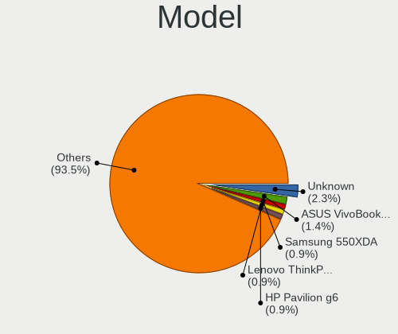
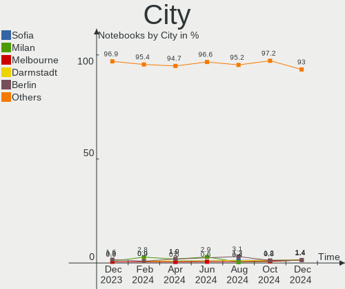
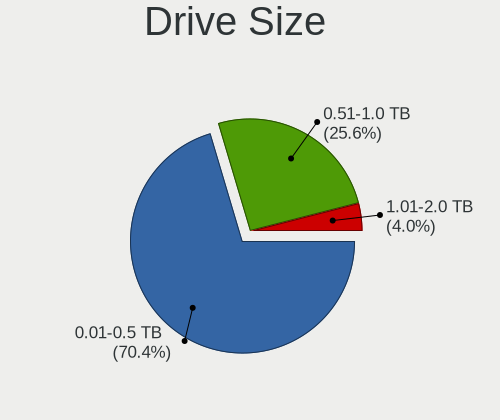
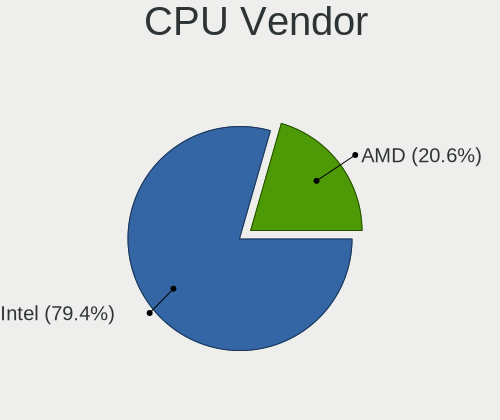
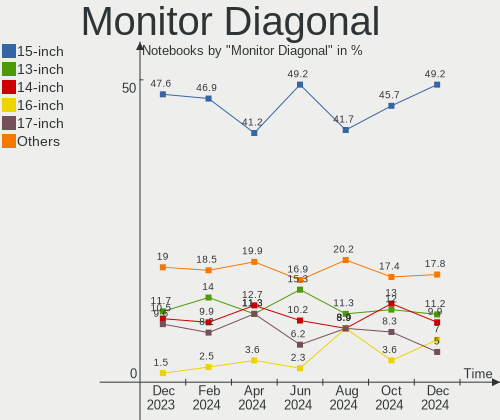
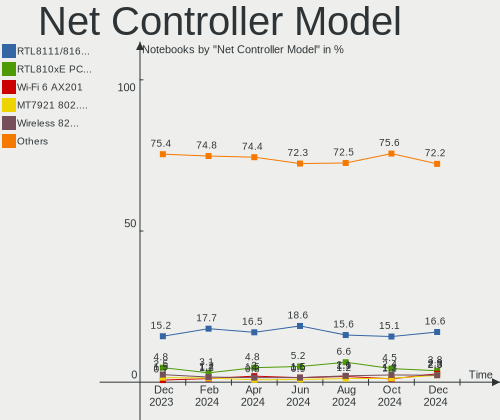
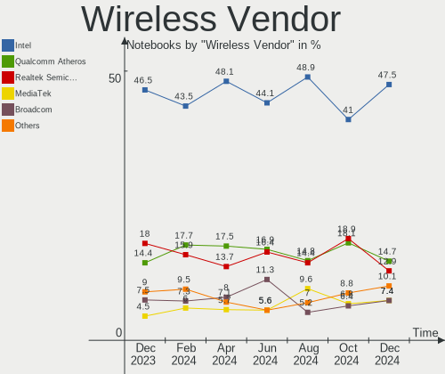
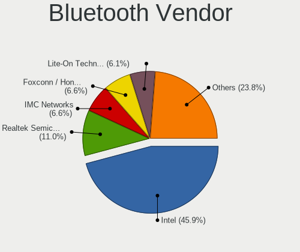

Linux Mint - Hardware Trends (Notebooks)
----------------------------------------

A project to identify most popular hardware characteristics and track their change
over time based on data collected by Linux users at https://Linux-Hardware.org.

Anyone can contribute to this report by the [hw-probe](https://github.com/linuxhw/hw-probe) tool:

    sudo -E hw-probe -all -upload

This report is for one last month. Overall report since the beginning of time: [TestDays](https://github.com/linuxhw/TestDays)

Period: Jul, 2023.

Contents
--------

* [ System ](#system)
  - [ OS                       ](#os)
  - [ OS Family                ](#os-family)
  - [ Kernel                   ](#kernel)
  - [ Kernel Family            ](#kernel-family)
  - [ Kernel Major Ver.        ](#kernel-major-ver)
  - [ Arch                     ](#arch)
  - [ DE                       ](#de)
  - [ Display Server           ](#display-server)
  - [ Display Manager          ](#display-manager)
  - [ OS Lang                  ](#os-lang)
  - [ Boot Mode                ](#boot-mode)
  - [ Filesystem               ](#filesystem)
  - [ Part. scheme             ](#part-scheme)
  - [ Dual Boot with Linux/BSD ](#dual-boot-with-linuxbsd)
  - [ Dual Boot (Win)          ](#dual-boot-win)

* [ Board ](#board)
  - [ Vendor                   ](#vendor)
  - [ Model                    ](#model)
  - [ Model Family             ](#model-family)
  - [ MFG Year                 ](#mfg-year)
  - [ Form Factor              ](#form-factor)
  - [ Secure Boot              ](#secure-boot)
  - [ Coreboot                 ](#coreboot)
  - [ RAM Size                 ](#ram-size)
  - [ RAM Used                 ](#ram-used)
  - [ Total Drives             ](#total-drives)
  - [ Has CD-ROM               ](#has-cd-rom)
  - [ Has Ethernet             ](#has-ethernet)
  - [ Has WiFi                 ](#has-wifi)
  - [ Has Bluetooth            ](#has-bluetooth)

* [ Location ](#location)
  - [ Country                  ](#country)
  - [ City                     ](#city)

* [ Drives ](#drives)
  - [ Drive Vendor             ](#drive-vendor)
  - [ Drive Model              ](#drive-model)
  - [ HDD Vendor               ](#hdd-vendor)
  - [ SSD Vendor               ](#ssd-vendor)
  - [ Drive Kind               ](#drive-kind)
  - [ Drive Connector          ](#drive-connector)
  - [ Drive Size               ](#drive-size)
  - [ Space Total              ](#space-total)
  - [ Space Used               ](#space-used)
  - [ Malfunc. Drives          ](#malfunc-drives)
  - [ Malfunc. Drive Vendor    ](#malfunc-drive-vendor)
  - [ Malfunc. HDD Vendor      ](#malfunc-hdd-vendor)
  - [ Malfunc. Drive Kind      ](#malfunc-drive-kind)
  - [ Failed Drives            ](#failed-drives)
  - [ Failed Drive Vendor      ](#failed-drive-vendor)
  - [ Drive Status             ](#drive-status)

* [ Storage controller ](#storage-controller)
  - [ Storage Vendor           ](#storage-vendor)
  - [ Storage Model            ](#storage-model)
  - [ Storage Kind             ](#storage-kind)

* [ Processor ](#processor)
  - [ CPU Vendor               ](#cpu-vendor)
  - [ CPU Model                ](#cpu-model)
  - [ CPU Model Family         ](#cpu-model-family)
  - [ CPU Cores                ](#cpu-cores)
  - [ CPU Sockets              ](#cpu-sockets)
  - [ CPU Threads              ](#cpu-threads)
  - [ CPU Op-Modes             ](#cpu-op-modes)
  - [ CPU Microcode            ](#cpu-microcode)
  - [ CPU Microarch            ](#cpu-microarch)

* [ Graphics ](#graphics)
  - [ GPU Vendor               ](#gpu-vendor)
  - [ GPU Model                ](#gpu-model)
  - [ GPU Combo                ](#gpu-combo)
  - [ GPU Driver               ](#gpu-driver)
  - [ GPU Memory               ](#gpu-memory)

* [ Monitor ](#monitor)
  - [ Monitor Vendor           ](#monitor-vendor)
  - [ Monitor Model            ](#monitor-model)
  - [ Monitor Resolution       ](#monitor-resolution)
  - [ Monitor Diagonal         ](#monitor-diagonal)
  - [ Monitor Width            ](#monitor-width)
  - [ Aspect Ratio             ](#aspect-ratio)
  - [ Monitor Area             ](#monitor-area)
  - [ Pixel Density            ](#pixel-density)
  - [ Multiple Monitors        ](#multiple-monitors)

* [ Network ](#network)
  - [ Net Controller Vendor    ](#net-controller-vendor)
  - [ Net Controller Model     ](#net-controller-model)
  - [ Wireless Vendor          ](#wireless-vendor)
  - [ Wireless Model           ](#wireless-model)
  - [ Ethernet Vendor          ](#ethernet-vendor)
  - [ Ethernet Model           ](#ethernet-model)
  - [ Net Controller Kind      ](#net-controller-kind)
  - [ Used Controller          ](#used-controller)
  - [ NICs                     ](#nics)
  - [ IPv6                     ](#ipv6)

* [ Bluetooth ](#bluetooth)
  - [ Bluetooth Vendor         ](#bluetooth-vendor)
  - [ Bluetooth Model          ](#bluetooth-model)

* [ Sound ](#sound)
  - [ Sound Vendor             ](#sound-vendor)
  - [ Sound Model              ](#sound-model)

* [ Memory ](#memory)
  - [ Memory Vendor            ](#memory-vendor)
  - [ Memory Model             ](#memory-model)
  - [ Memory Kind              ](#memory-kind)
  - [ Memory Form Factor       ](#memory-form-factor)
  - [ Memory Size              ](#memory-size)
  - [ Memory Speed             ](#memory-speed)

* [ Printers & scanners ](#printers--scanners)
  - [ Printer Vendor           ](#printer-vendor)
  - [ Printer Model            ](#printer-model)
  - [ Scanner Vendor           ](#scanner-vendor)
  - [ Scanner Model            ](#scanner-model)

* [ Camera ](#camera)
  - [ Camera Vendor            ](#camera-vendor)
  - [ Camera Model             ](#camera-model)

* [ Security ](#security)
  - [ Fingerprint Vendor       ](#fingerprint-vendor)
  - [ Fingerprint Model        ](#fingerprint-model)
  - [ Chipcard Vendor          ](#chipcard-vendor)
  - [ Chipcard Model           ](#chipcard-model)

* [ Unsupported ](#unsupported)
  - [ Unsupported Devices      ](#unsupported-devices)
  - [ Unsupported Device Types ](#unsupported-device-types)

System
------

OS
--

Installed operating systems

| Name              | Notebooks | Percent |
|-------------------|-----------|---------|
| Linux Mint 21.1   | 138       | 51.49%  |
| Linux Mint 21.2   | 86        | 32.09%  |
| Linux Mint 20.3   | 16        | 5.97%   |
| Linux Mint 21     | 11        | 4.1%    |
| Linux Mint 20.2   | 7         | 2.61%   |
| Linux Mint 20     | 4         | 1.49%   |
| Linux Mint 21.2.0 | 2         | 0.75%   |
| Linux Mint 19.3   | 2         | 0.75%   |
| Linux Mint 20.1   | 1         | 0.37%   |
| Linux Mint 18.3   | 1         | 0.37%   |

OS Family
---------

OS without a version

| Name       | Notebooks | Percent |
|------------|-----------|---------|
| Linux Mint | 268       | 100%    |

Kernel
------

Version of the Linux kernel

| Version                       | Notebooks | Percent |
|-------------------------------|-----------|---------|
| 5.15.0-76-generic             | 147       | 54.85%  |
| 5.15.0-78-generic             | 37        | 13.81%  |
| 5.4.0-153-generic             | 13        | 4.85%   |
| 5.19.0-46-generic             | 8         | 2.99%   |
| 5.15.0-56-generic             | 7         | 2.61%   |
| 6.2.0-26-generic              | 6         | 2.24%   |
| 6.4.3-060403-generic          | 5         | 1.87%   |
| 5.15.0-75-generic             | 5         | 1.87%   |
| 6.4.6-060406-generic          | 3         | 1.12%   |
| 6.2.0-25-generic              | 3         | 1.12%   |
| 5.4.0-74-generic              | 3         | 1.12%   |
| 5.15.0-73-generic             | 3         | 1.12%   |
| 6.1.0-1016-oem                | 2         | 0.75%   |
| 5.4.0-155-generic             | 2         | 0.75%   |
| 5.4.0-150-generic             | 2         | 0.75%   |
| 5.15.0-69-generic             | 2         | 0.75%   |
| 5.15.0-67-generic             | 2         | 0.75%   |
| 6.4.5-x64v1-xanmod1           | 1         | 0.37%   |
| 6.4.2-060402-generic          | 1         | 0.37%   |
| 6.1.0-1017-oem                | 1         | 0.37%   |
| 6.1.0-1015-oem                | 1         | 0.37%   |
| 6.1.0-1013-oem                | 1         | 0.37%   |
| 5.4.0-91-generic              | 1         | 0.37%   |
| 5.4.0-73-generic              | 1         | 0.37%   |
| 5.4.0-144-generic             | 1         | 0.37%   |
| 5.4.0-117-generic             | 1         | 0.37%   |
| 5.19.0-43-generic             | 1         | 0.37%   |
| 5.15.6-051506-generic         | 1         | 0.37%   |
| 5.15.0-76-lowlatency          | 1         | 0.37%   |
| 5.15.0-72-generic             | 1         | 0.37%   |
| 5.15.0-71-generic             | 1         | 0.37%   |
| 5.15.0-60-generic             | 1         | 0.37%   |
| 5.15.0-1007-nvidia-lowlatency | 1         | 0.37%   |
| 5.14.0-1058-oem               | 1         | 0.37%   |
| 4.15.0-142-generic            | 1         | 0.37%   |

Kernel Family
-------------

Linux kernel without a distro release

| Version | Notebooks | Percent |
|---------|-----------|---------|
| 5.15.0  | 208       | 77.61%  |
| 5.4.0   | 24        | 8.96%   |
| 6.2.0   | 9         | 3.36%   |
| 5.19.0  | 9         | 3.36%   |
| 6.4.3   | 5         | 1.87%   |
| 6.1.0   | 5         | 1.87%   |
| 6.4.6   | 3         | 1.12%   |
| 6.4.5   | 1         | 0.37%   |
| 6.4.2   | 1         | 0.37%   |
| 5.15.6  | 1         | 0.37%   |
| 5.14.0  | 1         | 0.37%   |
| 4.15.0  | 1         | 0.37%   |

Kernel Major Ver.
-----------------

Linux kernel major version

| Version | Notebooks | Percent |
|---------|-----------|---------|
| 5.15    | 209       | 77.99%  |
| 5.4     | 24        | 8.96%   |
| 6.4     | 10        | 3.73%   |
| 6.2     | 9         | 3.36%   |
| 5.19    | 9         | 3.36%   |
| 6.1     | 5         | 1.87%   |
| 5.14    | 1         | 0.37%   |
| 4.15    | 1         | 0.37%   |

Arch
----

OS architecture (x86_64, i586, etc.)

| Name   | Notebooks | Percent |
|--------|-----------|---------|
| x86_64 | 268       | 100%    |

DE
--

Desktop Environment

| Name       | Notebooks | Percent |
|------------|-----------|---------|
| X-Cinnamon | 196       | 73.13%  |
| XFCE       | 39        | 14.55%  |
| MATE       | 21        | 7.84%   |
| Cinnamon   | 5         | 1.87%   |
| GNOME      | 3         | 1.12%   |
| KDE5       | 2         | 0.75%   |
| LXDE       | 1         | 0.37%   |
| Jwm        | 1         | 0.37%   |

Display Server
--------------

X11 or Wayland

| Name    | Notebooks | Percent |
|---------|-----------|---------|
| X11     | 266       | 99.25%  |
| Wayland | 1         | 0.37%   |
| Tty     | 1         | 0.37%   |

Display Manager
---------------

SDDM, LightDM, etc.

| Name    | Notebooks | Percent |
|---------|-----------|---------|
| Unknown | 140       | 52.24%  |
| LightDM | 125       | 46.64%  |
| SDDM    | 1         | 0.37%   |
| LXDM    | 1         | 0.37%   |
| GDM3    | 1         | 0.37%   |

OS Lang
-------

Language

| Lang  | Notebooks | Percent |
|-------|-----------|---------|
| en_US | 72        | 26.87%  |
| de_DE | 49        | 18.28%  |
| pt_BR | 19        | 7.09%   |
| fr_FR | 14        | 5.22%   |
| ru_RU | 13        | 4.85%   |
| en_GB | 13        | 4.85%   |
| en_CA | 12        | 4.48%   |
| it_IT | 8         | 2.99%   |
| C     | 8         | 2.99%   |
| en_IN | 7         | 2.61%   |
| pl_PL | 6         | 2.24%   |
| es_ES | 4         | 1.49%   |
| nl_NL | 3         | 1.12%   |
| hu_HU | 3         | 1.12%   |
| es_CO | 3         | 1.12%   |
| de_AT | 3         | 1.12%   |
| tr_TR | 2         | 0.75%   |
| fr_CA | 2         | 0.75%   |
| es_PE | 2         | 0.75%   |
| es_MX | 2         | 0.75%   |
| es_AR | 2         | 0.75%   |
| de_CH | 2         | 0.75%   |
| da_DK | 2         | 0.75%   |
| cs_CZ | 2         | 0.75%   |
| sv_SE | 1         | 0.37%   |
| sk_SK | 1         | 0.37%   |
| ru_UA | 1         | 0.37%   |
| pt_PT | 1         | 0.37%   |
| nb_NO | 1         | 0.37%   |
| lv_LV | 1         | 0.37%   |
| lt_LT | 1         | 0.37%   |
| fi_FI | 1         | 0.37%   |
| es_VE | 1         | 0.37%   |
| es_GT | 1         | 0.37%   |
| es_CL | 1         | 0.37%   |
| en_ZA | 1         | 0.37%   |
| en_SG | 1         | 0.37%   |
| en_IL | 1         | 0.37%   |
| en_AU | 1         | 0.37%   |

Boot Mode
---------

EFI or BIOS

| Mode | Notebooks | Percent |
|------|-----------|---------|
| EFI  | 176       | 65.67%  |
| BIOS | 92        | 34.33%  |

Filesystem
----------

Type of filesystem

| Type    | Notebooks | Percent |
|---------|-----------|---------|
| Ext4    | 240       | 89.55%  |
| Btrfs   | 9         | 3.36%   |
| Overlay | 8         | 2.99%   |
| Zfs     | 5         | 1.87%   |
| Tmpfs   | 5         | 1.87%   |
| Ext2    | 1         | 0.37%   |

Part. scheme
------------

Scheme of partitioning

| Type    | Notebooks | Percent |
|---------|-----------|---------|
| Unknown | 140       | 52.24%  |
| GPT     | 115       | 42.91%  |
| MBR     | 13        | 4.85%   |

Dual Boot with Linux/BSD
------------------------

Hosting more than one Linux/BSD

| Dual boot | Notebooks | Percent |
|-----------|-----------|---------|
| No        | 252       | 94.03%  |
| Yes       | 16        | 5.97%   |

Dual Boot (Win)
---------------

Hosting Linux and Windows

| Dual boot | Notebooks | Percent |
|-----------|-----------|---------|
| No        | 232       | 86.57%  |
| Yes       | 36        | 13.43%  |

Board
-----

Vendor
------

Motherboard manufacturer

| Name                        | Notebooks | Percent |
|-----------------------------|-----------|---------|
| Hewlett-Packard             | 55        | 20.52%  |
| Lenovo                      | 50        | 18.66%  |
| Dell                        | 34        | 12.69%  |
| Acer                        | 31        | 11.57%  |
| ASUSTek Computer            | 26        | 9.7%    |
| Toshiba                     | 8         | 2.99%   |
| Apple                       | 7         | 2.61%   |
| HUAWEI                      | 6         | 2.24%   |
| Thomson                     | 4         | 1.49%   |
| MSI                         | 4         | 1.49%   |
| Samsung Electronics         | 3         | 1.12%   |
| Positivo                    | 3         | 1.12%   |
| Unknown                     | 3         | 1.12%   |
| Sony                        | 2         | 0.75%   |
| Panasonic                   | 2         | 0.75%   |
| Multilaser                  | 2         | 0.75%   |
| Google                      | 2         | 0.75%   |
| Gateway                     | 2         | 0.75%   |
| Fujitsu                     | 2         | 0.75%   |
| Wortmann AG                 | 1         | 0.37%   |
| VANT                        | 1         | 0.37%   |
| TUXEDO                      | 1         | 0.37%   |
| Timi                        | 1         | 0.37%   |
| Teclast                     | 1         | 0.37%   |
| PC Specialist               | 1         | 0.37%   |
| Packard Bell                | 1         | 0.37%   |
| Medion                      | 1         | 0.37%   |
| LG Electronics              | 1         | 0.37%   |
| Intel                       | 1         | 0.37%   |
| Infinix                     | 1         | 0.37%   |
| I-Life Digital Technologies | 1         | 0.37%   |
| ECT                         | 1         | 0.37%   |
| Digma                       | 1         | 0.37%   |
| Digibras                    | 1         | 0.37%   |
| Compumax Computer           | 1         | 0.37%   |
| Compaq                      | 1         | 0.37%   |
| Chuwi                       | 1         | 0.37%   |
| AZW                         | 1         | 0.37%   |
| AVITA                       | 1         | 0.37%   |
| Alienware                   | 1         | 0.37%   |

Model
-----

Motherboard model

| Name                                | Notebooks | Percent |
|-------------------------------------|-----------|---------|
| Unknown                             | 6         | 2.24%   |
| HUAWEI BOM-WXX9                     | 3         | 1.12%   |
| Thomson N15C4SL128                  | 2         | 0.75%   |
| Lenovo V15 G2 ALC 82KD              | 2         | 0.75%   |
| Lenovo G550 2958                    | 2         | 0.75%   |
| HP Pavilion 15                      | 2         | 0.75%   |
| HP Laptop 17-cp0xxx                 | 2         | 0.75%   |
| HP EliteBook 840 G5                 | 2         | 0.75%   |
| Dell Latitude E6540                 | 2         | 0.75%   |
| Dell Latitude 5480                  | 2         | 0.75%   |
| Dell Inspiron 5570                  | 2         | 0.75%   |
| ASUS X555LAB                        | 2         | 0.75%   |
| Acer Swift SF515-51T                | 2         | 0.75%   |
| Acer Aspire A515-52G                | 2         | 0.75%   |
| Wortmann AG CR700                   | 1         | 0.37%   |
| VANT MOOVE15_2023                   | 1         | 0.37%   |
| Toshiba Satellite S855              | 1         | 0.37%   |
| Toshiba Satellite S55-A             | 1         | 0.37%   |
| Toshiba Satellite P500              | 1         | 0.37%   |
| Toshiba Satellite L755              | 1         | 0.37%   |
| Toshiba Satellite C850-1MN          | 1         | 0.37%   |
| Toshiba Satellite C660              | 1         | 0.37%   |
| Toshiba PORTEGE R30-C               | 1         | 0.37%   |
| Toshiba PORTEGE M700                | 1         | 0.37%   |
| Timi RedmiBook 16                   | 1         | 0.37%   |
| Thomson X15I5-8TU512                | 1         | 0.37%   |
| Thomson GEN15C8SL256                | 1         | 0.37%   |
| Teclast F15Plus 2                   | 1         | 0.37%   |
| Sony VPCEA2JFX                      | 1         | 0.37%   |
| Sony SVF1521B4E                     | 1         | 0.37%   |
| Samsung R780                        | 1         | 0.37%   |
| Samsung 350V5C/351V5C/3540VC/3440VC | 1         | 0.37%   |
| Samsung 340XAA/350XAA/550XAA        | 1         | 0.37%   |
| Positivo W942SW_SW1                 | 1         | 0.37%   |
| Positivo S14SL01                    | 1         | 0.37%   |
| Positivo Donatello                  | 1         | 0.37%   |
| PC Specialist Ionico 16             | 1         | 0.37%   |
| Panasonic CF-S10CDHEDM              | 1         | 0.37%   |
| Panasonic CF-C1BD06EFG              | 1         | 0.37%   |
| Packard Bell EasyNote TE11HC        | 1         | 0.37%   |

Model Family
------------

Motherboard model prefix

| Name                 | Notebooks | Percent |
|----------------------|-----------|---------|
| Lenovo ThinkPad      | 22        | 8.21%   |
| Acer Aspire          | 22        | 8.21%   |
| Dell Latitude        | 17        | 6.34%   |
| Lenovo IdeaPad       | 14        | 5.22%   |
| HP Pavilion          | 11        | 4.1%    |
| HP Laptop            | 11        | 4.1%    |
| Dell Inspiron        | 9         | 3.36%   |
| HP ProBook           | 8         | 2.99%   |
| HP EliteBook         | 8         | 2.99%   |
| ASUS VivoBook        | 8         | 2.99%   |
| Toshiba Satellite    | 6         | 2.24%   |
| Unknown              | 6         | 2.24%   |
| Acer Swift           | 5         | 1.87%   |
| Lenovo V15           | 4         | 1.49%   |
| Dell Vostro          | 4         | 1.49%   |
| ASUS Zenbook         | 4         | 1.49%   |
| HUAWEI BOM-WXX9      | 3         | 1.12%   |
| Apple MacBookPro11   | 3         | 1.12%   |
| Toshiba PORTEGE      | 2         | 0.75%   |
| Thomson N15C4SL128   | 2         | 0.75%   |
| Lenovo Yoga          | 2         | 0.75%   |
| Lenovo G550          | 2         | 0.75%   |
| HP ZBook             | 2         | 0.75%   |
| HP Stream            | 2         | 0.75%   |
| HP ENVY              | 2         | 0.75%   |
| HP Compaq            | 2         | 0.75%   |
| Fujitsu LIFEBOOK     | 2         | 0.75%   |
| Dell XPS             | 2         | 0.75%   |
| ASUS X555LAB         | 2         | 0.75%   |
| Acer Extensa         | 2         | 0.75%   |
| Wortmann AG CR700    | 1         | 0.37%   |
| VANT MOOVE15         | 1         | 0.37%   |
| Timi RedmiBook       | 1         | 0.37%   |
| Thomson X15I5-8TU512 | 1         | 0.37%   |
| Thomson GEN15C8SL256 | 1         | 0.37%   |
| Teclast F15Plus      | 1         | 0.37%   |
| Sony VPCEA2JFX       | 1         | 0.37%   |
| Sony SVF1521B4E      | 1         | 0.37%   |
| Samsung R780         | 1         | 0.37%   |
| Samsung 350V5C       | 1         | 0.37%   |

MFG Year
--------

Motherboard manufacture year

| Year | Notebooks | Percent |
|------|-----------|---------|
| 2021 | 34        | 12.69%  |
| 2013 | 25        | 9.33%   |
| 2011 | 21        | 7.84%   |
| 2019 | 20        | 7.46%   |
| 2017 | 19        | 7.09%   |
| 2010 | 18        | 6.72%   |
| 2018 | 17        | 6.34%   |
| 2016 | 17        | 6.34%   |
| 2012 | 17        | 6.34%   |
| 2020 | 16        | 5.97%   |
| 2022 | 13        | 4.85%   |
| 2009 | 12        | 4.48%   |
| 2014 | 11        | 4.1%    |
| 2015 | 9         | 3.36%   |
| 2023 | 8         | 2.99%   |
| 2008 | 5         | 1.87%   |
| 2007 | 5         | 1.87%   |
| 2006 | 1         | 0.37%   |

Form Factor
-----------

Physical design of the computer

| Name     | Notebooks | Percent |
|----------|-----------|---------|
| Notebook | 268       | 100%    |

Secure Boot
-----------

Enabled or disabled

| State    | Notebooks | Percent |
|----------|-----------|---------|
| Disabled | 250       | 93.28%  |
| Enabled  | 18        | 6.72%   |

Coreboot
--------

Have coreboot on board

| Used | Notebooks | Percent |
|------|-----------|---------|
| No   | 266       | 99.25%  |
| Yes  | 2         | 0.75%   |

RAM Size
--------

Total RAM memory

| Size in GB  | Notebooks | Percent |
|-------------|-----------|---------|
| 4.01-8.0    | 107       | 39.93%  |
| 3.01-4.0    | 59        | 22.01%  |
| 8.01-16.0   | 44        | 16.42%  |
| 16.01-24.0  | 29        | 10.82%  |
| 32.01-64.0  | 9         | 3.36%   |
| 1.01-2.0    | 9         | 3.36%   |
| 64.01-256.0 | 5         | 1.87%   |
| 24.01-32.0  | 3         | 1.12%   |
| 2.01-3.0    | 2         | 0.75%   |
| 0.51-1.0    | 1         | 0.37%   |

RAM Used
--------

Used RAM memory

| Used GB    | Notebooks | Percent |
|------------|-----------|---------|
| 1.01-2.0   | 107       | 39.93%  |
| 2.01-3.0   | 82        | 30.6%   |
| 3.01-4.0   | 30        | 11.19%  |
| 4.01-8.0   | 28        | 10.45%  |
| 8.01-16.0  | 8         | 2.99%   |
| 0.51-1.0   | 8         | 2.99%   |
| 32.01-64.0 | 2         | 0.75%   |
| 16.01-24.0 | 2         | 0.75%   |
| 0.01-0.5   | 1         | 0.37%   |

Total Drives
------------

Number of drives on board

| Drives | Notebooks | Percent |
|--------|-----------|---------|
| 1      | 190       | 70.9%   |
| 2      | 63        | 23.51%  |
| 3      | 10        | 3.73%   |
| 0      | 3         | 1.12%   |
| 4      | 2         | 0.75%   |

Has CD-ROM
----------

Has CD-ROM on board

| Presented | Notebooks | Percent |
|-----------|-----------|---------|
| No        | 166       | 61.94%  |
| Yes       | 102       | 38.06%  |

Has Ethernet
------------

Has Ethernet on board

| Presented | Notebooks | Percent |
|-----------|-----------|---------|
| Yes       | 208       | 77.61%  |
| No        | 60        | 22.39%  |

Has WiFi
--------

Has WiFi module

| Presented | Notebooks | Percent |
|-----------|-----------|---------|
| Yes       | 264       | 98.51%  |
| No        | 4         | 1.49%   |

Has Bluetooth
-------------

Has Bluetooth module

| Presented | Notebooks | Percent |
|-----------|-----------|---------|
| Yes       | 197       | 73.51%  |
| No        | 71        | 26.49%  |

Location
--------

Country
-------

Geographic location (country)

| Country      | Notebooks | Percent |
|--------------|-----------|---------|
| Germany      | 54        | 20.15%  |
| USA          | 38        | 14.18%  |
| Brazil       | 24        | 8.96%   |
| France       | 14        | 5.22%   |
| UK           | 13        | 4.85%   |
| Russia       | 11        | 4.1%    |
| Canada       | 11        | 4.1%    |
| Poland       | 8         | 2.99%   |
| Italy        | 8         | 2.99%   |
| India        | 7         | 2.61%   |
| Spain        | 5         | 1.87%   |
| Netherlands  | 5         | 1.87%   |
| Turkey       | 4         | 1.49%   |
| Mexico       | 4         | 1.49%   |
| Hungary      | 4         | 1.49%   |
| Switzerland  | 3         | 1.12%   |
| Romania      | 3         | 1.12%   |
| Denmark      | 3         | 1.12%   |
| Colombia     | 3         | 1.12%   |
| Austria      | 3         | 1.12%   |
| Sweden       | 2         | 0.75%   |
| Slovakia     | 2         | 0.75%   |
| Peru         | 2         | 0.75%   |
| Norway       | 2         | 0.75%   |
| Lithuania    | 2         | 0.75%   |
| Latvia       | 2         | 0.75%   |
| Indonesia    | 2         | 0.75%   |
| Greece       | 2         | 0.75%   |
| Finland      | 2         | 0.75%   |
| Egypt        | 2         | 0.75%   |
| Czechia      | 2         | 0.75%   |
| Bulgaria     | 2         | 0.75%   |
| Argentina    | 2         | 0.75%   |
| Venezuela    | 1         | 0.37%   |
| Thailand     | 1         | 0.37%   |
| South Africa | 1         | 0.37%   |
| Singapore    | 1         | 0.37%   |
| Serbia       | 1         | 0.37%   |
| Saudi Arabia | 1         | 0.37%   |
| Portugal     | 1         | 0.37%   |

City
----

Geographic location (city)

| City              | Notebooks | Percent |
|-------------------|-----------|---------|
| Berlin            | 5         | 1.87%   |
| Paris             | 4         | 1.49%   |
| Vienna            | 3         | 1.12%   |
| Montreal          | 3         | 1.12%   |
| Los Angeles       | 3         | 1.12%   |
| Karlsruhe         | 3         | 1.12%   |
| Cologne           | 3         | 1.12%   |
| Zurich            | 2         | 0.75%   |
| Winnipeg          | 2         | 0.75%   |
| Warsaw            | 2         | 0.75%   |
| Vilnius           | 2         | 0.75%   |
| Vancouver         | 2         | 0.75%   |
| Telford           | 2         | 0.75%   |
| Swindon           | 2         | 0.75%   |
| Rio de Janeiro    | 2         | 0.75%   |
| Richardson        | 2         | 0.75%   |
| Moscow            | 2         | 0.75%   |
| Milan             | 2         | 0.75%   |
| Mexico City       | 2         | 0.75%   |
| Kazan’          | 2         | 0.75%   |
| Hyderabad         | 2         | 0.75%   |
| Helsinki          | 2         | 0.75%   |
| Hamburg           | 2         | 0.75%   |
| Frankfurt am Main | 2         | 0.75%   |
| Dresden           | 2         | 0.75%   |
| Dortmund          | 2         | 0.75%   |
| Curitiba          | 2         | 0.75%   |
| Campo Grande      | 2         | 0.75%   |
| Calvert Heights   | 2         | 0.75%   |
| Budapest          | 2         | 0.75%   |
| Bratislava        | 2         | 0.75%   |
| Bornheim          | 2         | 0.75%   |
| Bogotá           | 2         | 0.75%   |
| Zoppola           | 1         | 0.37%   |
| Wroclaw           | 1         | 0.37%   |
| Worthing          | 1         | 0.37%   |
| Winter Park       | 1         | 0.37%   |
| Windberg          | 1         | 0.37%   |
| Wetzlar           | 1         | 0.37%   |
| Wauwatosa         | 1         | 0.37%   |

Drives
------

Drive Vendor
------------

Hard drive vendors

| Vendor                      | Notebooks | Drives | Percent |
|-----------------------------|-----------|--------|---------|
| Samsung Electronics         | 45        | 46     | 13.31%  |
| WDC                         | 39        | 39     | 11.54%  |
| Seagate                     | 27        | 27     | 7.99%   |
| Kingston                    | 25        | 25     | 7.4%    |
| Toshiba                     | 24        | 26     | 7.1%    |
| Unknown                     | 21        | 21     | 6.21%   |
| SanDisk                     | 21        | 22     | 6.21%   |
| Crucial                     | 14        | 14     | 4.14%   |
| China                       | 14        | 14     | 4.14%   |
| SK hynix                    | 10        | 10     | 2.96%   |
| Intel                       | 9         | 10     | 2.66%   |
| Hitachi                     | 9         | 9      | 2.66%   |
| Micron Technology           | 7         | 7      | 2.07%   |
| Silicon Motion              | 6         | 6      | 1.78%   |
| HGST                        | 6         | 6      | 1.78%   |
| A-DATA Technology           | 6         | 6      | 1.78%   |
| KIOXIA                      | 4         | 4      | 1.18%   |
| SPCC                        | 3         | 3      | 0.89%   |
| Kingston Technology Company | 3         | 4      | 0.89%   |
| JMicron Technology          | 3         | 3      | 0.89%   |
| Apple                       | 3         | 3      | 0.89%   |
| Unknown                     | 3         | 3      | 0.89%   |
| Transcend                   | 2         | 2      | 0.59%   |
| Phison Electronics          | 2         | 2      | 0.59%   |
| Micron/Crucial Technology   | 2         | 2      | 0.59%   |
| Fujitsu                     | 2         | 2      | 0.59%   |
| FORESEE                     | 2         | 2      | 0.59%   |
| YMTC                        | 1         | 1      | 0.3%    |
| XrayDisk                    | 1         | 1      | 0.3%    |
| WODPOSIT                    | 1         | 2      | 0.3%    |
| Teclast                     | 1         | 1      | 0.3%    |
| Team                        | 1         | 1      | 0.3%    |
| Tanbassh                    | 1         | 1      | 0.3%    |
| T-FORCE                     | 1         | 1      | 0.3%    |
| Supersonic                  | 1         | 1      | 0.3%    |
| Super Talent                | 1         | 1      | 0.3%    |
| SSSTC                       | 1         | 1      | 0.3%    |
| SABRENT                     | 1         | 1      | 0.3%    |
| Realtek Semiconductor       | 1         | 1      | 0.3%    |
| Pioneer                     | 1         | 1      | 0.3%    |

Drive Model
-----------

Hard drive models

| Model                                                 | Notebooks | Percent |
|-------------------------------------------------------|-----------|---------|
| Seagate ST1000LM035-1RK172 1TB                        | 5         | 1.47%   |
| Toshiba MQ01ABD100 1TB                                | 4         | 1.17%   |
| Kingston SA400S37480G 480GB SSD                       | 4         | 1.17%   |
| Kingston SA400S37240G 240GB SSD                       | 4         | 1.17%   |
| Unknown SD/MMC/MS PRO 128GB                           | 3         | 0.88%   |
| Unknown MMC Card  32GB                                | 3         | 0.88%   |
| Unknown MMC Card  128GB                               | 3         | 0.88%   |
| Toshiba MQ04ABF100 1TB                                | 3         | 0.88%   |
| Kingston SV300S37A120G 120GB SSD                      | 3         | 0.88%   |
| Kingston SA400S37120G 120GB SSD                       | 3         | 0.88%   |
| JMicron Generic 512GB                                 | 3         | 0.88%   |
| Unknown                                               | 3         | 0.88%   |
| WDC WD2500BEVT-22ZCT0 250GB                           | 2         | 0.59%   |
| WDC PC SN530 SDBPNPZ-256G-1002 256GB                  | 2         | 0.59%   |
| WDC PC SN520 SDAPNUW-512G-1002 512GB                  | 2         | 0.59%   |
| Unknown MMC Card  64GB                                | 2         | 0.59%   |
| Unknown MMC Card  16GB                                | 2         | 0.59%   |
| Transcend TS240GMTS420S 240GB SSD                     | 2         | 0.59%   |
| Toshiba MQ01ACF050 500GB                              | 2         | 0.59%   |
| Toshiba MQ01ABF050 500GB                              | 2         | 0.59%   |
| SPCC Solid State Disk 512GB                           | 2         | 0.59%   |
| Silicon Motion SM2263EN/SM2263XT SSD Controller 500GB | 2         | 0.59%   |
| Silicon Motion PCIe-8 SSD 512GB                       | 2         | 0.59%   |
| Seagate ST9500420AS 500GB                             | 2         | 0.59%   |
| Seagate ST500LT012-9WS142 500GB                       | 2         | 0.59%   |
| Seagate ST500LM012 HN-M500MBB 500GB                   | 2         | 0.59%   |
| Seagate ST500LM000-SSHD-8GB                           | 2         | 0.59%   |
| Seagate ST1000LM024 HN-M101MBB 1TB                    | 2         | 0.59%   |
| SanDisk SSD PLUS 480GB                                | 2         | 0.59%   |
| SanDisk SSD PLUS 240GB                                | 2         | 0.59%   |
| Samsung SSD 860 EVO 250GB                             | 2         | 0.59%   |
| Samsung SSD 850 EVO 250GB                             | 2         | 0.59%   |
| Samsung PSSD T7 1TB                                   | 2         | 0.59%   |
| Samsung MZALQ256HBJD-00BL2 256GB                      | 2         | 0.59%   |
| Samsung MZAL4512HBLU-00BL2 512GB                      | 2         | 0.59%   |
| Phison PS5013 E13 NVMe Controller 256GB               | 2         | 0.59%   |
| Micron/Crucial P2 NVMe PCIe SSD 1TB                   | 2         | 0.59%   |
| Micron MTFDHBA512QFD 512GB                            | 2         | 0.59%   |
| KIOXIA KBG40ZNS256G NVMe 256GB                        | 2         | 0.59%   |
| Kingston SA400S37960G 960GB SSD                       | 2         | 0.59%   |

HDD Vendor
----------

Hard disk drive vendors

| Vendor              | Notebooks | Drives | Percent |
|---------------------|-----------|--------|---------|
| Seagate             | 27        | 27     | 28.13%  |
| WDC                 | 26        | 26     | 27.08%  |
| Toshiba             | 16        | 17     | 16.67%  |
| Hitachi             | 9         | 9      | 9.38%   |
| HGST                | 6         | 6      | 6.25%   |
| Samsung Electronics | 4         | 4      | 4.17%   |
| Unknown             | 3         | 3      | 3.13%   |
| JMicron Technology  | 3         | 3      | 3.13%   |
| Fujitsu             | 2         | 2      | 2.08%   |

SSD Vendor
----------

Solid state drive vendors

| Vendor              | Notebooks | Drives | Percent |
|---------------------|-----------|--------|---------|
| Kingston            | 24        | 24     | 18.32%  |
| Samsung Electronics | 23        | 23     | 17.56%  |
| SanDisk             | 15        | 15     | 11.45%  |
| China               | 13        | 13     | 9.92%   |
| Crucial             | 11        | 11     | 8.4%    |
| A-DATA Technology   | 6         | 6      | 4.58%   |
| WDC                 | 3         | 3      | 2.29%   |
| Toshiba             | 3         | 3      | 2.29%   |
| SPCC                | 3         | 3      | 2.29%   |
| Micron Technology   | 3         | 3      | 2.29%   |
| Intel               | 3         | 3      | 2.29%   |
| Apple               | 3         | 3      | 2.29%   |
| Transcend           | 2         | 2      | 1.53%   |
| Unknown             | 2         | 2      | 1.53%   |
| WODPOSIT            | 1         | 2      | 0.76%   |
| Teclast             | 1         | 1      | 0.76%   |
| Team                | 1         | 1      | 0.76%   |
| Tanbassh            | 1         | 1      | 0.76%   |
| T-FORCE             | 1         | 1      | 0.76%   |
| Supersonic          | 1         | 1      | 0.76%   |
| Super Talent        | 1         | 1      | 0.76%   |
| SSSTC               | 1         | 1      | 0.76%   |
| Pioneer             | 1         | 1      | 0.76%   |
| Patriot             | 1         | 1      | 0.76%   |
| MII                 | 1         | 1      | 0.76%   |
| LITEON              | 1         | 1      | 0.76%   |
| KingSpec            | 1         | 1      | 0.76%   |
| GOODRAM             | 1         | 1      | 0.76%   |
| GeIL                | 1         | 1      | 0.76%   |
| FORESEE             | 1         | 1      | 0.76%   |
| Dahua               | 1         | 1      | 0.76%   |

Drive Kind
----------

HDD or SSD

| Kind    | Notebooks | Drives | Percent |
|---------|-----------|--------|---------|
| SSD     | 120       | 132    | 37.27%  |
| HDD     | 93        | 97     | 28.88%  |
| NVMe    | 85        | 91     | 26.4%   |
| MMC     | 20        | 20     | 6.21%   |
| Unknown | 4         | 5      | 1.24%   |

Drive Connector
---------------

SATA, SAS, NVMe, etc.

| Type | Notebooks | Drives | Percent |
|------|-----------|--------|---------|
| SATA | 187       | 218    | 60.91%  |
| NVMe | 84        | 90     | 27.36%  |
| MMC  | 20        | 20     | 6.51%   |
| SAS  | 16        | 17     | 5.21%   |

Drive Size
----------

Size of hard drive

| Size in TB | Notebooks | Drives | Percent |
|------------|-----------|--------|---------|
| 0.01-0.5   | 138       | 154    | 65.71%  |
| 0.51-1.0   | 65        | 68     | 30.95%  |
| 1.01-2.0   | 6         | 6      | 2.86%   |
| 3.01-4.0   | 1         | 1      | 0.48%   |

Space Total
-----------

Amount of disk space available on the file system

| Size in GB     | Notebooks | Percent |
|----------------|-----------|---------|
| 101-250        | 93        | 34.7%   |
| 251-500        | 78        | 29.1%   |
| 501-1000       | 34        | 12.69%  |
| 1001-2000      | 20        | 7.46%   |
| 51-100         | 15        | 5.6%    |
| 21-50          | 10        | 3.73%   |
| 1-20           | 6         | 2.24%   |
| More than 3000 | 5         | 1.87%   |
| 2001-3000      | 4         | 1.49%   |
| Unknown        | 3         | 1.12%   |

Space Used
----------

Amount of used disk space

| Used GB   | Notebooks | Percent |
|-----------|-----------|---------|
| 1-20      | 66        | 24.63%  |
| 21-50     | 63        | 23.51%  |
| 101-250   | 53        | 19.78%  |
| 51-100    | 42        | 15.67%  |
| 251-500   | 24        | 8.96%   |
| 501-1000  | 11        | 4.1%    |
| 2001-3000 | 4         | 1.49%   |
| Unknown   | 3         | 1.12%   |
| 1001-2000 | 2         | 0.75%   |

Malfunc. Drives
---------------

Drive models with a malfunction

| Model                                            | Notebooks | Drives | Percent |
|--------------------------------------------------|-----------|--------|---------|
| Toshiba MQ01ABD100 1TB                           | 2         | 2      | 8.7%    |
| WDC WD5000BEKT-60KA9T0 500GB                     | 1         | 1      | 4.35%   |
| WDC WD10SPZX-60Z10T0 1TB                         | 1         | 1      | 4.35%   |
| Supersonic SSD 256 256GB                         | 1         | 1      | 4.35%   |
| SSSTC CV8-8E128-HP 128GB SSD                     | 1         | 1      | 4.35%   |
| Seagate ST9250410ASG 250GB                       | 1         | 1      | 4.35%   |
| Seagate ST1000LM035-1RK172 1TB                   | 1         | 1      | 4.35%   |
| Samsung Electronics PM9A1 NVMe 2048GB            | 1         | 2      | 4.35%   |
| Samsung Electronics MZNLH128HBHQ-000H1 128GB SSD | 1         | 1      | 4.35%   |
| Samsung Electronics HM160HC 160GB                | 1         | 1      | 4.35%   |
| KingSpec Q-360 360GB SSD                         | 1         | 1      | 4.35%   |
| Intel SSDSC2KF128G8L 128GB                       | 1         | 1      | 4.35%   |
| Hitachi HTS723216L9SA60 160GB                    | 1         | 1      | 4.35%   |
| Hitachi HTS547550A9E384 500GB                    | 1         | 1      | 4.35%   |
| Hitachi HTS543232A7A384 320GB                    | 1         | 1      | 4.35%   |
| Hitachi HTS542516K9SA00 160GB                    | 1         | 1      | 4.35%   |
| HGST HTS725050A7E630 500GB                       | 1         | 1      | 4.35%   |
| HGST HTS545050A7E680 500GB                       | 1         | 1      | 4.35%   |
| Fujitsu MHV2080AH 80GB                           | 1         | 1      | 4.35%   |
| Crucial M4-CT128M4SSD2 128GB                     | 1         | 1      | 4.35%   |
| China SATA3 512GB SSD                            | 1         | 1      | 4.35%   |
| China SATA SSD 240GB                             | 1         | 1      | 4.35%   |

Malfunc. Drive Vendor
---------------------

Vendors of faulty drives

| Vendor              | Notebooks | Drives | Percent |
|---------------------|-----------|--------|---------|
| Hitachi             | 4         | 4      | 17.39%  |
| Samsung Electronics | 3         | 4      | 13.04%  |
| WDC                 | 2         | 2      | 8.7%    |
| Toshiba             | 2         | 2      | 8.7%    |
| Seagate             | 2         | 2      | 8.7%    |
| HGST                | 2         | 2      | 8.7%    |
| China               | 2         | 2      | 8.7%    |
| Supersonic          | 1         | 1      | 4.35%   |
| SSSTC               | 1         | 1      | 4.35%   |
| KingSpec            | 1         | 1      | 4.35%   |
| Intel               | 1         | 1      | 4.35%   |
| Fujitsu             | 1         | 1      | 4.35%   |
| Crucial             | 1         | 1      | 4.35%   |

Malfunc. HDD Vendor
-------------------

Vendors of faulty HDD drives

| Vendor              | Notebooks | Drives | Percent |
|---------------------|-----------|--------|---------|
| Hitachi             | 4         | 4      | 28.57%  |
| WDC                 | 2         | 2      | 14.29%  |
| Toshiba             | 2         | 2      | 14.29%  |
| Seagate             | 2         | 2      | 14.29%  |
| HGST                | 2         | 2      | 14.29%  |
| Samsung Electronics | 1         | 1      | 7.14%   |
| Fujitsu             | 1         | 1      | 7.14%   |

Malfunc. Drive Kind
-------------------

Kinds of faulty drives

| Kind | Notebooks | Drives | Percent |
|------|-----------|--------|---------|
| HDD  | 13        | 14     | 59.09%  |
| SSD  | 8         | 8      | 36.36%  |
| NVMe | 1         | 2      | 4.55%   |

Failed Drives
-------------

Failed drive models

Zero info for selected period =(

Failed Drive Vendor
-------------------

Failed drive vendors

Zero info for selected period =(

Drive Status
------------

Number of failed and malfunc. drives

| Status   | Notebooks | Drives | Percent |
|----------|-----------|--------|---------|
| Detected | 158       | 196    | 56.03%  |
| Works    | 102       | 125    | 36.17%  |
| Malfunc  | 22        | 24     | 7.8%    |

Storage controller
------------------

Storage Vendor
--------------

Storage controller vendors

| Vendor                       | Notebooks | Percent |
|------------------------------|-----------|---------|
| Intel                        | 194       | 62.78%  |
| AMD                          | 27        | 8.74%   |
| Samsung Electronics          | 20        | 6.47%   |
| SanDisk                      | 15        | 4.85%   |
| SK hynix                     | 10        | 3.24%   |
| Silicon Motion               | 6         | 1.94%   |
| Toshiba America Info Systems | 5         | 1.62%   |
| Micron/Crucial Technology    | 5         | 1.62%   |
| KIOXIA                       | 5         | 1.62%   |
| Micron Technology            | 4         | 1.29%   |
| Kingston Technology Company  | 4         | 1.29%   |
| Nvidia                       | 3         | 0.97%   |
| Phison Electronics           | 2         | 0.65%   |
| Yangtze Memory Technologies  | 1         | 0.32%   |
| Silicon Image                | 1         | 0.32%   |
| Shenzhen Longsys Electronics | 1         | 0.32%   |
| Realtek Semiconductor        | 1         | 0.32%   |
| Netac Technology             | 1         | 0.32%   |
| MAXIO Technology (Hangzhou)  | 1         | 0.32%   |
| Marvell Technology Group     | 1         | 0.32%   |
| Lenovo                       | 1         | 0.32%   |
| ASMedia Technology           | 1         | 0.32%   |

Storage Model
-------------

Storage controller models

| Model                                                                          | Notebooks | Percent |
|--------------------------------------------------------------------------------|-----------|---------|
| Intel Sunrise Point-LP SATA Controller [AHCI mode]                             | 31        | 9.51%   |
| Intel 7 Series Chipset Family 6-port SATA Controller [AHCI mode]               | 28        | 8.59%   |
| AMD FCH SATA Controller [AHCI mode]                                            | 25        | 7.67%   |
| Intel 6 Series/C200 Series Chipset Family 6 port Mobile SATA AHCI Controller   | 16        | 4.91%   |
| Intel 82801 Mobile SATA Controller [RAID mode]                                 | 13        | 3.99%   |
| Intel 8 Series SATA Controller 1 [AHCI mode]                                   | 10        | 3.07%   |
| Intel Celeron/Pentium Silver Processor SATA Controller                         | 9         | 2.76%   |
| Intel 8 Series/C220 Series Chipset Family 6-port SATA Controller 1 [AHCI mode] | 9         | 2.76%   |
| Intel 5 Series/3400 Series Chipset 4 port SATA AHCI Controller                 | 9         | 2.76%   |
| Intel 82801HM/HEM (ICH8M/ICH8M-E) SATA Controller [AHCI mode]                  | 8         | 2.45%   |
| Intel 82801HM/HEM (ICH8M/ICH8M-E) IDE Controller                               | 8         | 2.45%   |
| Samsung NVMe SSD Controller SM981/PM981/PM983                                  | 7         | 2.15%   |
| Samsung NVMe SSD Controller 980                                                | 7         | 2.15%   |
| Intel Wildcat Point-LP SATA Controller [AHCI Mode]                             | 7         | 2.15%   |
| Intel 82801IBM/IEM (ICH9M/ICH9M-E) 4 port SATA Controller [AHCI mode]          | 7         | 2.15%   |
| SK hynix Gold P31/BC711/PC711 NVMe Solid State Drive                           | 5         | 1.53%   |
| Micron/Crucial P2 [Nick P2] / P3 / P3 Plus NVMe PCIe SSD (DRAM-less)           | 5         | 1.53%   |
| Intel Cannon Point-LP SATA Controller [AHCI Mode]                              | 5         | 1.53%   |
| Intel 5 Series/3400 Series Chipset 6 port SATA AHCI Controller                 | 5         | 1.53%   |
| SanDisk WD Blue SN550 NVMe SSD                                                 | 4         | 1.23%   |
| SanDisk WD Blue SN500 / PC SN520 NVMe SSD                                      | 4         | 1.23%   |
| KIOXIA NVMe SSD Controller BG4 (DRAM-less)                                     | 4         | 1.23%   |
| Intel Volume Management Device NVMe RAID Controller                            | 4         | 1.23%   |
| Intel Tiger Lake-LP SATA Controller                                            | 4         | 1.23%   |
| Intel Comet Lake SATA AHCI Controller                                          | 4         | 1.23%   |
| Toshiba America Info Systems XG6 NVMe SSD Controller                           | 3         | 0.92%   |
| SK hynix BC501 NVMe Solid State Drive                                          | 3         | 0.92%   |
| Silicon Motion SM2263EN/SM2263XT (DRAM-less) NVMe SSD Controllers              | 3         | 0.92%   |
| Samsung NVMe SSD Controller PM9B1                                              | 3         | 0.92%   |
| Nvidia MCP79 AHCI Controller                                                   | 3         | 0.92%   |
| Intel Ice Lake-LP SATA Controller [AHCI mode]                                  | 3         | 0.92%   |
| Intel Cannon Lake Mobile PCH SATA AHCI Controller                              | 3         | 0.92%   |
| Toshiba America Info Systems BG3 NVMe SSD Controller                           | 2         | 0.61%   |
| Silicon Motion Non-Volatile memory controller                                  | 2         | 0.61%   |
| SanDisk PC SN530 NVMe SSD (DRAM-less)                                          | 2         | 0.61%   |
| Phison PS5013 E13 NVMe Controller                                              | 2         | 0.61%   |
| Micron 2450 NVMe SSD [HendrixV] (DRAM-less)                                    | 2         | 0.61%   |
| Micron 2210 NVMe SSD [Cobain]                                                  | 2         | 0.61%   |
| Intel SSD 670p Series [Keystone Harbor]                                        | 2         | 0.61%   |
| Intel SSD 660P Series                                                          | 2         | 0.61%   |

Storage Kind
------------

Kind of storage controller (IDE, SATA, NVMe, SAS, ...)

| Kind | Notebooks | Percent |
|------|-----------|---------|
| SATA | 200       | 62.7%   |
| NVMe | 84        | 26.33%  |
| RAID | 18        | 5.64%   |
| IDE  | 17        | 5.33%   |

Processor
---------

CPU Vendor
----------

Processor vendors

| Vendor | Notebooks | Percent |
|--------|-----------|---------|
| Intel  | 222       | 82.84%  |
| AMD    | 46        | 17.16%  |

CPU Model
---------

Processor models

| Model                                       | Notebooks | Percent |
|---------------------------------------------|-----------|---------|
| Intel Core i5-8265U CPU @ 1.60GHz           | 6         | 2.24%   |
| Intel Core i5-6300U CPU @ 2.40GHz           | 6         | 2.24%   |
| Intel Core i5-2520M CPU @ 2.50GHz           | 6         | 2.24%   |
| Intel Core i7-8565U CPU @ 1.80GHz           | 5         | 1.87%   |
| Intel Core i5-6200U CPU @ 2.30GHz           | 5         | 1.87%   |
| Intel Core i5-3230M CPU @ 2.60GHz           | 5         | 1.87%   |
| AMD Ryzen 5 5500U with Radeon Graphics      | 5         | 1.87%   |
| Intel Core i7-8550U CPU @ 1.80GHz           | 4         | 1.49%   |
| Intel Core i7-4810MQ CPU @ 2.80GHz          | 4         | 1.49%   |
| Intel Core i3-3110M CPU @ 2.40GHz           | 4         | 1.49%   |
| Intel Celeron N4020 CPU @ 1.10GHz           | 4         | 1.49%   |
| Intel 11th Gen Core i5-1135G7 @ 2.40GHz     | 4         | 1.49%   |
| Intel 11th Gen Core i3-1115G4 @ 3.00GHz     | 4         | 1.49%   |
| AMD Ryzen 7 5700U with Radeon Graphics      | 4         | 1.49%   |
| Intel Core i7-9750H CPU @ 2.60GHz           | 3         | 1.12%   |
| Intel Core i7-7500U CPU @ 2.70GHz           | 3         | 1.12%   |
| Intel Core i7-2670QM CPU @ 2.20GHz          | 3         | 1.12%   |
| Intel Core i5-8250U CPU @ 1.60GHz           | 3         | 1.12%   |
| Intel Core i5-4200U CPU @ 1.60GHz           | 3         | 1.12%   |
| Intel Core i5-4200M CPU @ 2.50GHz           | 3         | 1.12%   |
| Intel Core i5-2450M CPU @ 2.50GHz           | 3         | 1.12%   |
| Intel Core i3-6006U CPU @ 2.00GHz           | 3         | 1.12%   |
| Intel Core i3-4005U CPU @ 1.70GHz           | 3         | 1.12%   |
| Intel Core i3-2330M CPU @ 2.20GHz           | 3         | 1.12%   |
| Intel Core i3-1005G1 CPU @ 1.20GHz          | 3         | 1.12%   |
| Intel Core i3 CPU M 370 @ 2.40GHz           | 3         | 1.12%   |
| Intel Celeron N4000 CPU @ 1.10GHz           | 3         | 1.12%   |
| Intel Celeron CPU N3060 @ 1.60GHz           | 3         | 1.12%   |
| Intel Pentium Dual-Core CPU T4300 @ 2.10GHz | 2         | 0.75%   |
| Intel Core i7-6500U CPU @ 2.50GHz           | 2         | 0.75%   |
| Intel Core i7-3630QM CPU @ 2.40GHz          | 2         | 0.75%   |
| Intel Core i5-7200U CPU @ 2.50GHz           | 2         | 0.75%   |
| Intel Core i5-5257U CPU @ 2.70GHz           | 2         | 0.75%   |
| Intel Core i5-3337U CPU @ 1.80GHz           | 2         | 0.75%   |
| Intel Core i5-3320M CPU @ 2.60GHz           | 2         | 0.75%   |
| Intel Core i5-3210M CPU @ 2.50GHz           | 2         | 0.75%   |
| Intel Core i5-1035G1 CPU @ 1.00GHz          | 2         | 0.75%   |
| Intel Core i5 CPU M 520 @ 2.40GHz           | 2         | 0.75%   |
| Intel Core i3-8130U CPU @ 2.20GHz           | 2         | 0.75%   |
| Intel Core i3-6100U CPU @ 2.30GHz           | 2         | 0.75%   |

CPU Model Family
----------------

Processor model prefix

| Model                   | Notebooks | Percent |
|-------------------------|-----------|---------|
| Intel Core i5           | 66        | 24.63%  |
| Intel Core i7           | 48        | 17.91%  |
| Intel Core i3           | 40        | 14.93%  |
| Intel Celeron           | 21        | 7.84%   |
| Other                   | 20        | 7.46%   |
| AMD Ryzen 7             | 15        | 5.6%    |
| Intel Core 2 Duo        | 13        | 4.85%   |
| AMD Ryzen 5             | 13        | 4.85%   |
| Intel Pentium Dual-Core | 3         | 1.12%   |
| Intel Pentium           | 3         | 1.12%   |
| Intel Atom              | 3         | 1.12%   |
| AMD Ryzen 3             | 3         | 1.12%   |
| AMD Athlon              | 2         | 0.75%   |
| AMD A8                  | 2         | 0.75%   |
| AMD A6                  | 2         | 0.75%   |
| Intel Pentium Silver    | 1         | 0.37%   |
| Intel Pentium Dual      | 1         | 0.37%   |
| Intel Genuine           | 1         | 0.37%   |
| Intel Core m5           | 1         | 0.37%   |
| Intel Core i9           | 1         | 0.37%   |
| Intel Celeron M         | 1         | 0.37%   |
| Intel Celeron Dual-Core | 1         | 0.37%   |
| AMD Turion 64 Mobile    | 1         | 0.37%   |
| AMD Ryzen 9             | 1         | 0.37%   |
| AMD Ryzen 5 PRO         | 1         | 0.37%   |
| AMD E2                  | 1         | 0.37%   |
| AMD E1                  | 1         | 0.37%   |
| AMD Athlon II           | 1         | 0.37%   |
| AMD A10                 | 1         | 0.37%   |

CPU Cores
---------

Number of processor cores

| Number | Notebooks | Percent |
|--------|-----------|---------|
| 2      | 158       | 58.96%  |
| 4      | 64        | 23.88%  |
| 6      | 18        | 6.72%   |
| 8      | 15        | 5.6%    |
| 1      | 6         | 2.24%   |
| 14     | 2         | 0.75%   |
| 10     | 2         | 0.75%   |
| 24     | 1         | 0.37%   |
| 16     | 1         | 0.37%   |
| 12     | 1         | 0.37%   |

CPU Sockets
-----------

Number of sockets

| Number | Notebooks | Percent |
|--------|-----------|---------|
| 1      | 268       | 100%    |

CPU Threads
-----------

Threads per core (Hyper-Threading)

| Number | Notebooks | Percent |
|--------|-----------|---------|
| 2      | 208       | 77.61%  |
| 1      | 60        | 22.39%  |

CPU Op-Modes
------------

CPU Operation Modes (32-bit, 64-bit)

| Op mode        | Notebooks | Percent |
|----------------|-----------|---------|
| 32-bit, 64-bit | 268       | 100%    |

CPU Microcode
-------------

Microcode number

| Number     | Notebooks | Percent |
|------------|-----------|---------|
| Unknown    | 32        | 11.94%  |
| 0x306a9    | 22        | 8.21%   |
| 0x206a7    | 21        | 7.84%   |
| 0x406e3    | 15        | 5.6%    |
| 0x20655    | 10        | 3.73%   |
| 0x806ea    | 9         | 3.36%   |
| 0x306c3    | 9         | 3.36%   |
| 0x1067a    | 9         | 3.36%   |
| 0x08608103 | 9         | 3.36%   |
| 0x40651    | 8         | 2.99%   |
| 0x306d4    | 8         | 2.99%   |
| 0x806e9    | 7         | 2.61%   |
| 0x706e5    | 7         | 2.61%   |
| 0x806eb    | 6         | 2.24%   |
| 0x706a8    | 6         | 2.24%   |
| 0x806ec    | 5         | 1.87%   |
| 0x806c1    | 5         | 1.87%   |
| 0x6fd      | 5         | 1.87%   |
| 0x406c4    | 5         | 1.87%   |
| 0x0a50000d | 5         | 1.87%   |
| 0x20652    | 4         | 1.49%   |
| 0x0a50000c | 4         | 1.49%   |
| 0x706a1    | 3         | 1.12%   |
| 0x40661    | 3         | 1.12%   |
| 0x30678    | 3         | 1.12%   |
| 0x10676    | 3         | 1.12%   |
| 0x08108109 | 3         | 1.12%   |
| 0x06006705 | 3         | 1.12%   |
| 0xb06a2    | 2         | 0.75%   |
| 0x906ea    | 2         | 0.75%   |
| 0x906a4    | 2         | 0.75%   |
| 0x806c2    | 2         | 0.75%   |
| 0x106e5    | 2         | 0.75%   |
| 0x10661    | 2         | 0.75%   |
| 0x08600106 | 2         | 0.75%   |
| 0xb06a3    | 1         | 0.37%   |
| 0xb0671    | 1         | 0.37%   |
| 0xa0652    | 1         | 0.37%   |
| 0x906a3    | 1         | 0.37%   |
| 0x6fb      | 1         | 0.37%   |

CPU Microarch
-------------

Microarchitecture

| Name             | Notebooks | Percent |
|------------------|-----------|---------|
| KabyLake         | 37        | 13.81%  |
| SandyBridge      | 24        | 8.96%   |
| IvyBridge        | 24        | 8.96%   |
| Haswell          | 23        | 8.58%   |
| Skylake          | 20        | 7.46%   |
| Unknown          | 19        | 7.09%   |
| Westmere         | 14        | 5.22%   |
| Penryn           | 12        | 4.48%   |
| Goldmont plus    | 10        | 3.73%   |
| Zen 3            | 9         | 3.36%   |
| TigerLake        | 9         | 3.36%   |
| Core             | 9         | 3.36%   |
| Silvermont       | 8         | 2.99%   |
| Broadwell        | 8         | 2.99%   |
| IceLake          | 7         | 2.61%   |
| Zen+             | 5         | 1.87%   |
| Excavator        | 5         | 1.87%   |
| Alderlake Hybrid | 5         | 1.87%   |
| Zen 2            | 4         | 1.49%   |
| Nehalem          | 3         | 1.12%   |
| Zen              | 2         | 0.75%   |
| Goldmont         | 2         | 0.75%   |
| CometLake        | 2         | 0.75%   |
| Steamroller      | 1         | 0.37%   |
| Puma             | 1         | 0.37%   |
| K8 Hammer        | 1         | 0.37%   |
| K10 Llano        | 1         | 0.37%   |
| K10              | 1         | 0.37%   |
| Jaguar           | 1         | 0.37%   |
| Bonnell          | 1         | 0.37%   |

Graphics
--------

GPU Vendor
----------

Vendors of graphics cards

| Vendor | Notebooks | Percent |
|--------|-----------|---------|
| Intel  | 202       | 62.35%  |
| AMD    | 62        | 19.14%  |
| Nvidia | 60        | 18.52%  |

GPU Model
---------

Graphics card models

| Model                                                                                    | Notebooks | Percent |
|------------------------------------------------------------------------------------------|-----------|---------|
| Intel 3rd Gen Core processor Graphics Controller                                         | 23        | 6.82%   |
| Intel 2nd Generation Core Processor Family Integrated Graphics Controller                | 21        | 6.23%   |
| Intel Skylake GT2 [HD Graphics 520]                                                      | 18        | 5.34%   |
| Intel WhiskeyLake-U GT2 [UHD Graphics 620]                                               | 11        | 3.26%   |
| Intel UHD Graphics 620                                                                   | 11        | 3.26%   |
| AMD Lucienne                                                                             | 11        | 3.26%   |
| Intel Haswell-ULT Integrated Graphics Controller                                         | 10        | 2.97%   |
| Intel 4th Gen Core Processor Integrated Graphics Controller                              | 10        | 2.97%   |
| Intel GeminiLake [UHD Graphics 600]                                                      | 9         | 2.67%   |
| Intel Core Processor Integrated Graphics Controller                                      | 9         | 2.67%   |
| Intel Mobile GM965/GL960 Integrated Graphics Controller (secondary)                      | 7         | 2.08%   |
| Intel Mobile GM965/GL960 Integrated Graphics Controller (primary)                        | 7         | 2.08%   |
| Intel HD Graphics 620                                                                    | 7         | 2.08%   |
| Nvidia GP108M [GeForce MX150]                                                            | 6         | 1.78%   |
| Intel HD Graphics 5500                                                                   | 6         | 1.78%   |
| AMD Sun XT [Radeon HD 8670A/8670M/8690M / R5 M330 / M430 / Radeon 520 Mobile]            | 6         | 1.78%   |
| Intel TigerLake-LP GT2 [Iris Xe Graphics]                                                | 5         | 1.48%   |
| Intel Mobile 4 Series Chipset Integrated Graphics Controller                             | 5         | 1.48%   |
| Intel Iris Plus Graphics G1 (Ice Lake)                                                   | 5         | 1.48%   |
| Intel Atom/Celeron/Pentium Processor x5-E8000/J3xxx/N3xxx Integrated Graphics Controller | 5         | 1.48%   |
| AMD Picasso/Raven 2 [Radeon Vega Series / Radeon Vega Mobile Series]                     | 5         | 1.48%   |
| AMD Cezanne [Radeon Vega Series / Radeon Vega Mobile Series]                             | 5         | 1.48%   |
| Intel Tiger Lake-LP GT2 [UHD Graphics G4]                                                | 4         | 1.19%   |
| Intel CoffeeLake-H GT2 [UHD Graphics 630]                                                | 4         | 1.19%   |
| AMD Stoney [Radeon R2/R3/R4/R5 Graphics]                                                 | 4         | 1.19%   |
| AMD Renoir                                                                               | 4         | 1.19%   |
| AMD Barcelo                                                                              | 4         | 1.19%   |
| Nvidia GT216M [GeForce GT 330M]                                                          | 3         | 0.89%   |
| Nvidia GF117M [GeForce 610M/710M/810M/820M / GT 620M/625M/630M/720M]                     | 3         | 0.89%   |
| Nvidia GA107M [GeForce RTX 3050 Ti Mobile]                                               | 3         | 0.89%   |
| Intel Raptor Lake-P [Iris Xe Graphics]                                                   | 3         | 0.89%   |
| Intel CometLake-U GT2 [UHD Graphics]                                                     | 3         | 0.89%   |
| Intel Atom Processor Z36xxx/Z37xxx Series Graphics & Display                             | 3         | 0.89%   |
| AMD Topaz XT [Radeon R7 M260/M265 / M340/M360 / M440/M445 / 530/535 / 620/625 Mobile]    | 3         | 0.89%   |
| AMD Rembrandt [Radeon 680M]                                                              | 3         | 0.89%   |
| Nvidia TU117M [GeForce GTX 1650 Mobile / Max-Q]                                          | 2         | 0.59%   |
| Nvidia GT216GLM [Quadro FX 880M]                                                         | 2         | 0.59%   |
| Nvidia GM108M [GeForce MX130]                                                            | 2         | 0.59%   |
| Nvidia GM108M [GeForce MX110]                                                            | 2         | 0.59%   |
| Nvidia GM107M [GeForce GTX 950M]                                                         | 2         | 0.59%   |

GPU Combo
---------

Combinations of graphics cards

| Name           | Notebooks | Percent |
|----------------|-----------|---------|
| 1 x Intel      | 151       | 56.34%  |
| 1 x AMD        | 42        | 15.67%  |
| Intel + Nvidia | 38        | 14.18%  |
| 1 x Nvidia     | 16        | 5.97%   |
| Intel + AMD    | 12        | 4.48%   |
| AMD + Nvidia   | 5         | 1.87%   |
| 2 x AMD        | 3         | 1.12%   |
| 2 x Nvidia     | 1         | 0.37%   |

GPU Driver
----------

Free vs proprietary

| Driver      | Notebooks | Percent |
|-------------|-----------|---------|
| Free        | 230       | 85.82%  |
| Proprietary | 32        | 11.94%  |
| Unknown     | 6         | 2.24%   |

GPU Memory
----------

Total video memory

| Size in GB | Notebooks | Percent |
|------------|-----------|---------|
| Unknown    | 176       | 65.67%  |
| 0.01-0.5   | 38        | 14.18%  |
| 1.01-2.0   | 29        | 10.82%  |
| 0.51-1.0   | 17        | 6.34%   |
| 3.01-4.0   | 6         | 2.24%   |
| 7.01-8.0   | 1         | 0.37%   |
| 8.01-16.0  | 1         | 0.37%   |

Monitor
-------

Monitor Vendor
--------------

Monitor vendors

| Vendor                  | Notebooks | Percent |
|-------------------------|-----------|---------|
| AU Optronics            | 53        | 18.66%  |
| BOE                     | 49        | 17.25%  |
| LG Display              | 45        | 15.85%  |
| Chimei Innolux          | 45        | 15.85%  |
| Samsung Electronics     | 25        | 8.8%    |
| Chi Mei Optoelectronics | 8         | 2.82%   |
| Goldstar                | 6         | 2.11%   |
| Apple                   | 6         | 2.11%   |
| LG Philips              | 5         | 1.76%   |
| Hewlett-Packard         | 5         | 1.76%   |
| InfoVision              | 4         | 1.41%   |
| ViewSonic               | 3         | 1.06%   |
| PANDA                   | 3         | 1.06%   |
| Lenovo                  | 3         | 1.06%   |
| Dell                    | 2         | 0.7%    |
| CSO                     | 2         | 0.7%    |
| BenQ                    | 2         | 0.7%    |
| AOC                     | 2         | 0.7%    |
| Vizio                   | 1         | 0.35%   |
| Toshiba                 | 1         | 0.35%   |
| Toppoly                 | 1         | 0.35%   |
| STA                     | 1         | 0.35%   |
| Sony                    | 1         | 0.35%   |
| SLD                     | 1         | 0.35%   |
| Sharp                   | 1         | 0.35%   |
| Planar                  | 1         | 0.35%   |
| Panasonic               | 1         | 0.35%   |
| LGD                     | 1         | 0.35%   |
| Lenovo Group Limited    | 1         | 0.35%   |
| KGS                     | 1         | 0.35%   |
| HannStar Display        | 1         | 0.35%   |
| Fujitsu Siemens         | 1         | 0.35%   |
| ASUSTek Computer        | 1         | 0.35%   |
| Acer                    | 1         | 0.35%   |

Monitor Model
-------------

Monitor models

| Model                                                                     | Notebooks | Percent |
|---------------------------------------------------------------------------|-----------|---------|
| LG Display LCD Monitor LGD02DC 1366x768 344x194mm 15.5-inch               | 6         | 2.11%   |
| BOE LCD Monitor BOE0872 1920x1080 344x194mm 15.5-inch                     | 5         | 1.75%   |
| Samsung Electronics LCD Monitor SEC5441 1366x768 344x194mm 15.5-inch      | 4         | 1.4%    |
| AU Optronics LCD Monitor AUO61ED 1920x1080 344x193mm 15.5-inch            | 4         | 1.4%    |
| Chimei Innolux LCD Monitor CMN15E6 1366x768 344x193mm 15.5-inch           | 3         | 1.05%   |
| Chimei Innolux LCD Monitor CMN14D4 1920x1080 309x173mm 13.9-inch          | 3         | 1.05%   |
| Chimei Innolux LCD Monitor CMN14C3 1366x768 309x173mm 13.9-inch           | 3         | 1.05%   |
| AU Optronics LCD Monitor AUO21ED 1920x1080 344x194mm 15.5-inch            | 3         | 1.05%   |
| LG Display LCD Monitor LGD05F7 1920x1080 344x194mm 15.5-inch              | 2         | 0.7%    |
| LG Display LCD Monitor LGD04E1 1366x768 344x194mm 15.5-inch               | 2         | 0.7%    |
| LG Display LCD Monitor LGD02E3 1366x768 344x194mm 15.5-inch               | 2         | 0.7%    |
| Lenovo LCD Monitor LEN40B1 1600x900 345x194mm 15.6-inch                   | 2         | 0.7%    |
| Chimei Innolux LCD Monitor CMN15C3 1920x1080 344x193mm 15.5-inch          | 2         | 0.7%    |
| Chimei Innolux LCD Monitor CMN14C9 1920x1080 309x173mm 13.9-inch          | 2         | 0.7%    |
| Chimei Innolux LCD Monitor CMN1487 1366x768 309x173mm 13.9-inch           | 2         | 0.7%    |
| Chi Mei Optoelectronics LCD Monitor CMO1720 1920x1080 382x215mm 17.3-inch | 2         | 0.7%    |
| BOE LCD Monitor BOE08D5 1920x1080 344x194mm 15.5-inch                     | 2         | 0.7%    |
| BOE LCD Monitor BOE0812 1920x1080 344x194mm 15.5-inch                     | 2         | 0.7%    |
| BOE LCD Monitor BOE0700 1920x1080 344x194mm 15.5-inch                     | 2         | 0.7%    |
| BOE LCD Monitor BOE06A9 1920x1080 344x193mm 15.5-inch                     | 2         | 0.7%    |
| BOE LCD Monitor BOE06A4 1366x768 344x194mm 15.5-inch                      | 2         | 0.7%    |
| BOE LCD Monitor BOE0696 1366x768 309x173mm 13.9-inch                      | 2         | 0.7%    |
| AU Optronics LCD Monitor AUOF992 1920x1080 382x215mm 17.3-inch            | 2         | 0.7%    |
| AU Optronics LCD Monitor AUO38ED 1920x1080 344x193mm 15.5-inch            | 2         | 0.7%    |
| AU Optronics LCD Monitor AUO106C 1366x768 277x156mm 12.5-inch             | 2         | 0.7%    |
| Vizio VA26LHDTV10T VIZ0035 1920x1080 640x360mm 28.9-inch                  | 1         | 0.35%   |
| ViewSonic VX2453 Series VSC0C28 1920x1080 520x290mm 23.4-inch             | 1         | 0.35%   |
| ViewSonic VX2252 Series VSCDC2E 1920x1080 477x268mm 21.5-inch             | 1         | 0.35%   |
| ViewSonic VG2748 VSC7936 1920x1080 598x336mm 27.0-inch                    | 1         | 0.35%   |
| Toshiba LCD Monitor LCD3706 1280x800 261x163mm 12.1-inch                  | 1         | 0.35%   |
| Toppoly LCD Monitor TNJ0260 1280x800 303x190mm 14.1-inch                  | 1         | 0.35%   |
| STA LCD Monitor STA05EC 1366x768 309x173mm 13.9-inch                      | 1         | 0.35%   |
| Sony TV SNY4502 1920x1080                                                 | 1         | 0.35%   |
| SLD LCD Monitor SLD003C 1366x768 309x173mm 13.9-inch                      | 1         | 0.35%   |
| Sharp LCD SHP3700 1920x540                                                | 1         | 0.35%   |
| Samsung Electronics LCD Monitor SyncMaster                                | 1         | 0.35%   |
| Samsung Electronics LCD Monitor SEC5541 1366x768 344x193mm 15.5-inch      | 1         | 0.35%   |
| Samsung Electronics LCD Monitor SEC544B 1600x900 382x214mm 17.2-inch      | 1         | 0.35%   |
| Samsung Electronics LCD Monitor SEC5142 1280x800 303x190mm 14.1-inch      | 1         | 0.35%   |
| Samsung Electronics LCD Monitor SEC4D45 1280x800 331x207mm 15.4-inch      | 1         | 0.35%   |

Monitor Resolution
------------------

Monitor screen resolution

| Resolution         | Notebooks | Percent |
|--------------------|-----------|---------|
| 1920x1080 (FHD)    | 110       | 40.29%  |
| 1366x768 (WXGA)    | 101       | 37%     |
| 1600x900 (HD+)     | 21        | 7.69%   |
| 1280x800 (WXGA)    | 8         | 2.93%   |
| 1920x1200 (WUXGA)  | 5         | 1.83%   |
| 2880x1800          | 4         | 1.47%   |
| 2560x1600          | 4         | 1.47%   |
| 1440x900 (WXGA+)   | 3         | 1.1%    |
| 2560x1440 (QHD)    | 2         | 0.73%   |
| 2560x1080          | 2         | 0.73%   |
| 1920x540           | 2         | 0.73%   |
| 3840x2400          | 1         | 0.37%   |
| 3840x2160 (4K)     | 1         | 0.37%   |
| 3840x1200          | 1         | 0.37%   |
| 3456x2160          | 1         | 0.37%   |
| 3440x1440          | 1         | 0.37%   |
| 1920x1280          | 1         | 0.37%   |
| 1680x945           | 1         | 0.37%   |
| 1680x1050 (WSXGA+) | 1         | 0.37%   |
| 1024x768 (XGA)     | 1         | 0.37%   |
| 1024x600           | 1         | 0.37%   |
| Unknown            | 1         | 0.37%   |

Monitor Diagonal
----------------

Diagonal size in inches

| Inches  | Notebooks | Percent |
|---------|-----------|---------|
| 15      | 130       | 45.94%  |
| 14      | 33        | 11.66%  |
| 13      | 32        | 11.31%  |
| 17      | 31        | 10.95%  |
| 16      | 9         | 3.18%   |
| 23      | 7         | 2.47%   |
| 12      | 7         | 2.47%   |
| 21      | 5         | 1.77%   |
| Unknown | 5         | 1.77%   |
| 27      | 4         | 1.41%   |
| 24      | 4         | 1.41%   |
| 11      | 4         | 1.41%   |
| 34      | 2         | 0.71%   |
| 31      | 2         | 0.71%   |
| 72      | 1         | 0.35%   |
| 54      | 1         | 0.35%   |
| 36      | 1         | 0.35%   |
| 35      | 1         | 0.35%   |
| 33      | 1         | 0.35%   |
| 20      | 1         | 0.35%   |
| 18      | 1         | 0.35%   |
| 10      | 1         | 0.35%   |

Monitor Width
-------------

Physical width

| Width in mm | Notebooks | Percent |
|-------------|-----------|---------|
| 301-350     | 189       | 67.02%  |
| 351-400     | 38        | 13.48%  |
| 201-300     | 20        | 7.09%   |
| 501-600     | 14        | 4.96%   |
| 401-500     | 7         | 2.48%   |
| Unknown     | 5         | 1.77%   |
| 701-800     | 4         | 1.42%   |
| 601-700     | 2         | 0.71%   |
| 801-900     | 1         | 0.35%   |
| 1501-2000   | 1         | 0.35%   |
| 1001-1500   | 1         | 0.35%   |

Aspect Ratio
------------

Proportional relationship between the width and the height

| Ratio   | Notebooks | Percent |
|---------|-----------|---------|
| 16/9    | 222       | 85.71%  |
| 16/10   | 26        | 10.04%  |
| Unknown | 4         | 1.54%   |
| 21/9    | 3         | 1.16%   |
| 3/2     | 2         | 0.77%   |
| 4/3     | 1         | 0.39%   |
| 32/9    | 1         | 0.39%   |

Monitor Area
------------

Area in inch²

| Area in inch² | Notebooks | Percent |
|----------------|-----------|---------|
| 101-110        | 131       | 46.45%  |
| 81-90          | 59        | 20.92%  |
| 121-130        | 26        | 9.22%   |
| 201-250        | 13        | 4.61%   |
| 111-120        | 8         | 2.84%   |
| 61-70          | 7         | 2.48%   |
| 71-80          | 6         | 2.13%   |
| 351-500        | 6         | 2.13%   |
| 131-140        | 5         | 1.77%   |
| Unknown        | 5         | 1.77%   |
| 51-60          | 4         | 1.42%   |
| 301-350        | 4         | 1.42%   |
| 151-200        | 3         | 1.06%   |
| More than 1000 | 2         | 0.71%   |
| 41-50          | 1         | 0.35%   |
| 141-150        | 1         | 0.35%   |
| 501-1000       | 1         | 0.35%   |

Pixel Density
-------------

Pixels per inch

| Density       | Notebooks | Percent |
|---------------|-----------|---------|
| 101-120       | 113       | 40.5%   |
| 121-160       | 107       | 38.35%  |
| 51-100        | 34        | 12.19%  |
| 161-240       | 13        | 4.66%   |
| Unknown       | 5         | 1.79%   |
| 1-50          | 4         | 1.43%   |
| More than 240 | 3         | 1.08%   |

Multiple Monitors
-----------------

Total monitors connected

| Total | Notebooks | Percent |
|-------|-----------|---------|
| 1     | 227       | 84.7%   |
| 2     | 30        | 11.19%  |
| 0     | 8         | 2.99%   |
| 3     | 3         | 1.12%   |

Network
-------

Net Controller Vendor
---------------------

Controller vendors

| Vendor                            | Notebooks | Percent |
|-----------------------------------|-----------|---------|
| Realtek Semiconductor             | 142       | 32.95%  |
| Intel                             | 129       | 29.93%  |
| Qualcomm Atheros                  | 54        | 12.53%  |
| Broadcom                          | 39        | 9.05%   |
| Broadcom Limited                  | 10        | 2.32%   |
| MediaTek                          | 9         | 2.09%   |
| Samsung Electronics               | 5         | 1.16%   |
| Ralink                            | 5         | 1.16%   |
| Ericsson Business Mobile Networks | 5         | 1.16%   |
| Ralink Technology                 | 4         | 0.93%   |
| Nvidia                            | 3         | 0.7%    |
| Marvell Technology Group          | 3         | 0.7%    |
| Hewlett-Packard                   | 3         | 0.7%    |
| ASIX Electronics                  | 3         | 0.7%    |
| ZTE WCDMA Technologies MSM        | 2         | 0.46%   |
| Qualcomm                          | 2         | 0.46%   |
| Dell                              | 2         | 0.46%   |
| Xiaomi                            | 1         | 0.23%   |
| TP-Link                           | 1         | 0.23%   |
| Panasonic (Matsushita)            | 1         | 0.23%   |
| NetGear                           | 1         | 0.23%   |
| MCS                               | 1         | 0.23%   |
| Huawei Technologies               | 1         | 0.23%   |
| Google                            | 1         | 0.23%   |
| Fibocom                           | 1         | 0.23%   |
| Edimax Technology                 | 1         | 0.23%   |
| AMD                               | 1         | 0.23%   |
| Accton Technology                 | 1         | 0.23%   |

Net Controller Model
--------------------

Controller models

| Model                                                             | Notebooks | Percent |
|-------------------------------------------------------------------|-----------|---------|
| Realtek RTL8111/8168/8411 PCI Express Gigabit Ethernet Controller | 77        | 14.95%  |
| Realtek RTL810xE PCI Express Fast Ethernet controller             | 19        | 3.69%   |
| Realtek RTL8821CE 802.11ac PCIe Wireless Network Adapter          | 14        | 2.72%   |
| Realtek RTL8822CE 802.11ac PCIe Wireless Network Adapter          | 10        | 1.94%   |
| Qualcomm Atheros AR9485 Wireless Network Adapter                  | 10        | 1.94%   |
| Intel Wireless 8265 / 8275                                        | 10        | 1.94%   |
| Intel 82579LM Gigabit Network Connection (Lewisville)             | 10        | 1.94%   |
| Qualcomm Atheros QCA9377 802.11ac Wireless Network Adapter        | 9         | 1.75%   |
| Intel Cannon Point-LP CNVi [Wireless-AC]                          | 9         | 1.75%   |
| Intel Wireless 7260                                               | 8         | 1.55%   |
| Intel Centrino Advanced-N 6205 [Taylor Peak]                      | 8         | 1.55%   |
| Intel Wireless 8260                                               | 7         | 1.36%   |
| Qualcomm Atheros AR9462 Wireless Network Adapter                  | 6         | 1.17%   |
| Qualcomm Atheros AR9285 Wireless Network Adapter (PCI-Express)    | 6         | 1.17%   |
| Intel Wi-Fi 6 AX200                                               | 6         | 1.17%   |
| Intel Ethernet Connection I219-LM                                 | 6         | 1.17%   |
| Intel Centrino Advanced-N 6200                                    | 6         | 1.17%   |
| Broadcom BCM43142 802.11b/g/n                                     | 6         | 1.17%   |
| Realtek RTL8153 Gigabit Ethernet Adapter                          | 5         | 0.97%   |
| Realtek 802.11ac NIC                                              | 5         | 0.97%   |
| Qualcomm Atheros QCA9565 / AR9565 Wireless Network Adapter        | 5         | 0.97%   |
| Qualcomm Atheros QCA6174 802.11ac Wireless Network Adapter        | 5         | 0.97%   |
| Qualcomm Atheros AR8131 Gigabit Ethernet                          | 5         | 0.97%   |
| Intel Wireless 7265                                               | 5         | 0.97%   |
| Intel Wi-Fi 6 AX201                                               | 5         | 0.97%   |
| Intel Ethernet Connection I217-LM                                 | 5         | 0.97%   |
| Intel Ethernet Connection (4) I219-LM                             | 5         | 0.97%   |
| Broadcom BCM4313 802.11bgn Wireless Network Adapter               | 5         | 0.97%   |
| Realtek RTL8723DE Wireless Network Adapter                        | 4         | 0.78%   |
| Realtek RTL8723BE PCIe Wireless Network Adapter                   | 4         | 0.78%   |
| Realtek RTL8188EE Wireless Network Adapter                        | 4         | 0.78%   |
| MediaTek MT7921 802.11ax PCI Express Wireless Network Adapter     | 4         | 0.78%   |
| Intel Wireless 3165                                               | 4         | 0.78%   |
| Intel Wireless 3160                                               | 4         | 0.78%   |
| Intel Centrino Wireless-N 2230                                    | 4         | 0.78%   |
| Intel Centrino Ultimate-N 6300                                    | 4         | 0.78%   |
| Intel 82577LM Gigabit Network Connection                          | 4         | 0.78%   |
| Broadcom NetLink BCM57785 Gigabit Ethernet PCIe                   | 4         | 0.78%   |
| Samsung GT-I9070 (network tethering, USB debugging enabled)       | 3         | 0.58%   |
| Realtek RTL88x2bu [AC1200 Techkey]                                | 3         | 0.58%   |

Wireless Vendor
---------------

Wireless vendors

| Vendor                            | Notebooks | Percent |
|-----------------------------------|-----------|---------|
| Intel                             | 117       | 41.2%   |
| Realtek Semiconductor             | 63        | 22.18%  |
| Qualcomm Atheros                  | 45        | 15.85%  |
| Broadcom                          | 29        | 10.21%  |
| MediaTek                          | 8         | 2.82%   |
| Ralink                            | 5         | 1.76%   |
| Broadcom Limited                  | 5         | 1.76%   |
| Ralink Technology                 | 4         | 1.41%   |
| Ericsson Business Mobile Networks | 2         | 0.7%    |
| Qualcomm                          | 1         | 0.35%   |
| Panasonic (Matsushita)            | 1         | 0.35%   |
| NetGear                           | 1         | 0.35%   |
| Fibocom                           | 1         | 0.35%   |
| Edimax Technology                 | 1         | 0.35%   |
| Accton Technology                 | 1         | 0.35%   |

Wireless Model
--------------

Wireless models

| Model                                                          | Notebooks | Percent |
|----------------------------------------------------------------|-----------|---------|
| Realtek RTL8821CE 802.11ac PCIe Wireless Network Adapter       | 14        | 4.9%    |
| Realtek RTL8822CE 802.11ac PCIe Wireless Network Adapter       | 10        | 3.5%    |
| Qualcomm Atheros AR9485 Wireless Network Adapter               | 10        | 3.5%    |
| Intel Wireless 8265 / 8275                                     | 10        | 3.5%    |
| Qualcomm Atheros QCA9377 802.11ac Wireless Network Adapter     | 9         | 3.15%   |
| Intel Cannon Point-LP CNVi [Wireless-AC]                       | 9         | 3.15%   |
| Intel Wireless 7260                                            | 8         | 2.8%    |
| Intel Centrino Advanced-N 6205 [Taylor Peak]                   | 8         | 2.8%    |
| Intel Wireless 8260                                            | 7         | 2.45%   |
| Qualcomm Atheros AR9462 Wireless Network Adapter               | 6         | 2.1%    |
| Qualcomm Atheros AR9285 Wireless Network Adapter (PCI-Express) | 6         | 2.1%    |
| Intel Wi-Fi 6 AX200                                            | 6         | 2.1%    |
| Intel Centrino Advanced-N 6200                                 | 6         | 2.1%    |
| Broadcom BCM43142 802.11b/g/n                                  | 6         | 2.1%    |
| Realtek 802.11ac NIC                                           | 5         | 1.75%   |
| Qualcomm Atheros QCA9565 / AR9565 Wireless Network Adapter     | 5         | 1.75%   |
| Qualcomm Atheros QCA6174 802.11ac Wireless Network Adapter     | 5         | 1.75%   |
| Intel Wireless 7265                                            | 5         | 1.75%   |
| Intel Wi-Fi 6 AX201                                            | 5         | 1.75%   |
| Broadcom BCM4313 802.11bgn Wireless Network Adapter            | 5         | 1.75%   |
| Realtek RTL8723DE Wireless Network Adapter                     | 4         | 1.4%    |
| Realtek RTL8723BE PCIe Wireless Network Adapter                | 4         | 1.4%    |
| Realtek RTL8188EE Wireless Network Adapter                     | 4         | 1.4%    |
| MediaTek MT7921 802.11ax PCI Express Wireless Network Adapter  | 4         | 1.4%    |
| Intel Wireless 3165                                            | 4         | 1.4%    |
| Intel Wireless 3160                                            | 4         | 1.4%    |
| Intel Centrino Wireless-N 2230                                 | 4         | 1.4%    |
| Intel Centrino Ultimate-N 6300                                 | 4         | 1.4%    |
| Realtek RTL88x2bu [AC1200 Techkey]                             | 3         | 1.05%   |
| Ralink RT5370 Wireless Adapter                                 | 3         | 1.05%   |
| Ralink RT3290 Wireless 802.11n 1T/1R PCIe                      | 3         | 1.05%   |
| Intel Raptor Lake PCH CNVi WiFi                                | 3         | 1.05%   |
| Intel Ice Lake-LP PCH CNVi WiFi                                | 3         | 1.05%   |
| Intel Comet Lake PCH-LP CNVi WiFi                              | 3         | 1.05%   |
| Intel Centrino Advanced-N 6235                                 | 3         | 1.05%   |
| Broadcom BCM43228 802.11a/b/g/n                                | 3         | 1.05%   |
| Broadcom BCM4322 802.11a/b/g/n Wireless LAN Controller         | 3         | 1.05%   |
| Broadcom BCM4312 802.11b/g LP-PHY                              | 3         | 1.05%   |
| Realtek RTL8852BE PCIe 802.11ax Wireless Network Controller    | 2         | 0.7%    |
| Realtek RTL8852AE 802.11ax PCIe Wireless Network Adapter       | 2         | 0.7%    |

Ethernet Vendor
---------------

Ethernet vendors

| Vendor                     | Notebooks | Percent |
|----------------------------|-----------|---------|
| Realtek Semiconductor      | 109       | 50%     |
| Intel                      | 50        | 22.94%  |
| Qualcomm Atheros           | 17        | 7.8%    |
| Broadcom                   | 16        | 7.34%   |
| Broadcom Limited           | 5         | 2.29%   |
| Nvidia                     | 3         | 1.38%   |
| Marvell Technology Group   | 3         | 1.38%   |
| Hewlett-Packard            | 3         | 1.38%   |
| ASIX Electronics           | 3         | 1.38%   |
| ZTE WCDMA Technologies MSM | 2         | 0.92%   |
| Samsung Electronics        | 2         | 0.92%   |
| Xiaomi                     | 1         | 0.46%   |
| TP-Link                    | 1         | 0.46%   |
| Qualcomm                   | 1         | 0.46%   |
| MediaTek                   | 1         | 0.46%   |
| Google                     | 1         | 0.46%   |

Ethernet Model
--------------

Ethernet models

| Model                                                                          | Notebooks | Percent |
|--------------------------------------------------------------------------------|-----------|---------|
| Realtek RTL8111/8168/8411 PCI Express Gigabit Ethernet Controller              | 77        | 35.32%  |
| Realtek RTL810xE PCI Express Fast Ethernet controller                          | 19        | 8.72%   |
| Intel 82579LM Gigabit Network Connection (Lewisville)                          | 10        | 4.59%   |
| Intel Ethernet Connection I219-LM                                              | 6         | 2.75%   |
| Realtek RTL8153 Gigabit Ethernet Adapter                                       | 5         | 2.29%   |
| Qualcomm Atheros AR8131 Gigabit Ethernet                                       | 5         | 2.29%   |
| Intel Ethernet Connection I217-LM                                              | 5         | 2.29%   |
| Intel Ethernet Connection (4) I219-LM                                          | 5         | 2.29%   |
| Intel 82577LM Gigabit Network Connection                                       | 4         | 1.83%   |
| Broadcom NetLink BCM57785 Gigabit Ethernet PCIe                                | 4         | 1.83%   |
| Qualcomm Atheros AR8161 Gigabit Ethernet                                       | 3         | 1.38%   |
| Qualcomm Atheros AR8151 v2.0 Gigabit Ethernet                                  | 3         | 1.38%   |
| Nvidia MCP79 Ethernet                                                          | 3         | 1.38%   |
| Intel Ethernet Connection (4) I219-V                                           | 3         | 1.38%   |
| Intel 82579V Gigabit Network Connection                                        | 3         | 1.38%   |
| HP lt4120 Snapdragon X5 LTE                                                    | 3         | 1.38%   |
| Broadcom NetXtreme BCM5764M Gigabit Ethernet PCIe                              | 3         | 1.38%   |
| Broadcom NetLink BCM5906M Fast Ethernet PCI Express                            | 3         | 1.38%   |
| ASIX AX88179 Gigabit Ethernet                                                  | 3         | 1.38%   |
| Samsung Galaxy series, misc. (tethering mode)                                  | 2         | 0.92%   |
| Realtek RTL8152 Fast Ethernet Adapter                                          | 2         | 0.92%   |
| Realtek RTL8125 2.5GbE Controller                                              | 2         | 0.92%   |
| Realtek RTL-8100/8101L/8139 PCI Fast Ethernet Adapter                          | 2         | 0.92%   |
| Qualcomm Atheros Killer E220x Gigabit Ethernet Controller                      | 2         | 0.92%   |
| Qualcomm Atheros AR8152 v2.0 Fast Ethernet                                     | 2         | 0.92%   |
| Marvell Group Yukon Optima 88E8059 [PCIe Gigabit Ethernet Controller with AVB] | 2         | 0.92%   |
| Intel Ethernet Connection I219-V                                               | 2         | 0.92%   |
| Intel Ethernet Connection I218-LM                                              | 2         | 0.92%   |
| Intel Ethernet Connection I217-V                                               | 2         | 0.92%   |
| Intel Ethernet Connection (13) I219-V                                          | 2         | 0.92%   |
| Broadcom NetXtreme BCM5761 Gigabit Ethernet PCIe                               | 2         | 0.92%   |
| Broadcom Limited NetLink BCM57780 Gigabit Ethernet PCIe                        | 2         | 0.92%   |
| ZTE WCDMA MSM USB SCSI CD-ROM                                                  | 1         | 0.46%   |
| ZTE WCDMA MSM DEMO Mobile Boardband                                            | 1         | 0.46%   |
| Xiaomi Mi/Redmi series (RNDIS)                                                 | 1         | 0.46%   |
| TP-Link USB 10/100 LAN                                                         | 1         | 0.46%   |
| Realtek Killer E2600 Gigabit Ethernet Controller                               | 1         | 0.46%   |
| Realtek Killer E2500 Gigabit Ethernet Controller                               | 1         | 0.46%   |
| Qualcomm Redmi Note 8                                                          | 1         | 0.46%   |
| Qualcomm Atheros QCA8172 Fast Ethernet                                         | 1         | 0.46%   |

Net Controller Kind
-------------------

Ethernet, WiFi or modem

| Kind     | Notebooks | Percent |
|----------|-----------|---------|
| WiFi     | 264       | 54.66%  |
| Ethernet | 208       | 43.06%  |
| Modem    | 11        | 2.28%   |

Used Controller
---------------

Currently used network controller

| Kind     | Notebooks | Percent |
|----------|-----------|---------|
| WiFi     | 215       | 80.52%  |
| Ethernet | 52        | 19.48%  |

NICs
----

Total network controllers on board

| Total | Notebooks | Percent |
|-------|-----------|---------|
| 2     | 189       | 70.52%  |
| 1     | 69        | 25.75%  |
| 0     | 7         | 2.61%   |
| 3     | 3         | 1.12%   |

IPv6
----

IPv6 vs IPv4

| Used | Notebooks | Percent |
|------|-----------|---------|
| No   | 168       | 62.69%  |
| Yes  | 100       | 37.31%  |

Bluetooth
---------

Bluetooth Vendor
----------------

Controller vendors

| Vendor                          | Notebooks | Percent |
|---------------------------------|-----------|---------|
| Intel                           | 84        | 42.42%  |
| Realtek Semiconductor           | 29        | 14.65%  |
| Qualcomm Atheros Communications | 17        | 8.59%   |
| IMC Networks                    | 11        | 5.56%   |
| Lite-On Technology              | 9         | 4.55%   |
| Broadcom                        | 9         | 4.55%   |
| Foxconn / Hon Hai               | 8         | 4.04%   |
| Apple                           | 6         | 3.03%   |
| Realtek                         | 5         | 2.53%   |
| Ralink                          | 3         | 1.52%   |
| Hewlett-Packard                 | 3         | 1.52%   |
| Dell                            | 3         | 1.52%   |
| Foxconn International           | 2         | 1.01%   |
| Cambridge Silicon Radio         | 2         | 1.01%   |
| Alps Electric                   | 2         | 1.01%   |
| Toshiba                         | 1         | 0.51%   |
| Qcom                            | 1         | 0.51%   |
| ASUSTek Computer                | 1         | 0.51%   |
| Askey Computer                  | 1         | 0.51%   |
| Unknown                         | 1         | 0.51%   |

Bluetooth Model
---------------

Controller models

| Model                                               | Notebooks | Percent |
|-----------------------------------------------------|-----------|---------|
| Intel Bluetooth wireless interface                  | 34        | 17.17%  |
| Realtek Bluetooth Radio                             | 19        | 9.6%    |
| Intel Bluetooth 9460/9560 Jefferson Peak (JfP)      | 17        | 8.59%   |
| Qualcomm Atheros  Bluetooth Device                  | 11        | 5.56%   |
| Intel AX201 Bluetooth                               | 9         | 4.55%   |
| Intel Centrino Bluetooth Wireless Transceiver       | 8         | 4.04%   |
| Realtek  Bluetooth 4.2 Adapter                      | 7         | 3.54%   |
| Intel AX200 Bluetooth                               | 6         | 3.03%   |
| Intel Bluetooth Device                              | 5         | 2.53%   |
| IMC Networks Bluetooth Radio                        | 5         | 2.53%   |
| Apple Bluetooth Host Controller                     | 5         | 2.53%   |
| Realtek 802.11ac WLAN Adapter                       | 4         | 2.02%   |
| Lite-On Bluetooth Device                            | 4         | 2.02%   |
| Ralink RT3290 Bluetooth                             | 3         | 1.52%   |
| Qualcomm Atheros AR3011 Bluetooth                   | 3         | 1.52%   |
| IMC Networks Wireless_Device                        | 3         | 1.52%   |
| IMC Networks Bluetooth Device                       | 3         | 1.52%   |
| Foxconn / Hon Hai Bluetooth Device                  | 3         | 1.52%   |
| Realtek RTL8821A Bluetooth                          | 2         | 1.01%   |
| Qualcomm Atheros AR3012 Bluetooth 4.0               | 2         | 1.01%   |
| Lite-On Wireless_Device                             | 2         | 1.01%   |
| Lite-On Qualcomm Atheros QCA9377 Bluetooth          | 2         | 1.01%   |
| Intel Wireless-AC 9260 Bluetooth Adapter            | 2         | 1.01%   |
| HP Broadcom 2070 Bluetooth Combo                    | 2         | 1.01%   |
| Foxconn International BCM43142A0 Bluetooth module   | 2         | 1.01%   |
| Foxconn / Hon Hai MediaTek Bluetooth Adapter        | 2         | 1.01%   |
| Dell DW375 Bluetooth Module                         | 2         | 1.01%   |
| Cambridge Silicon Radio Bluetooth Dongle (HCI mode) | 2         | 1.01%   |
| Broadcom BCM43142A0 Bluetooth Device                | 2         | 1.01%   |
| Broadcom BCM2045B (BDC-2.1)                         | 2         | 1.01%   |
| Alps Electric UGTZ4 Bluetooth                       | 2         | 1.01%   |
| Toshiba RT Bluetooth Radio                          | 1         | 0.51%   |
| Realtek RTL8723B Bluetooth                          | 1         | 0.51%   |
| Realtek Bluetooth Radio                             | 1         | 0.51%   |
| Qualcomm Atheros QCA61x4 Bluetooth 4.0              | 1         | 0.51%   |
| Qcom Broadcom Bluetooth USB                         | 1         | 0.51%   |
| Lite-On Atheros AR3012 Bluetooth                    | 1         | 0.51%   |
| Intel Wireless-AC 3168 Bluetooth                    | 1         | 0.51%   |
| Intel Centrino Advanced-N 6230 Bluetooth adapter    | 1         | 0.51%   |
| Intel AX210 Bluetooth                               | 1         | 0.51%   |

Sound
-----

Sound Vendor
------------

Sound card vendors

| Vendor                  | Notebooks | Percent |
|-------------------------|-----------|---------|
| Intel                   | 217       | 68.45%  |
| AMD                     | 49        | 15.46%  |
| Nvidia                  | 36        | 11.36%  |
| C-Media Electronics     | 4         | 1.26%   |
| GN Netcom               | 3         | 0.95%   |
| Hewlett-Packard         | 2         | 0.63%   |
| RODE Microphones        | 1         | 0.32%   |
| Razer USA               | 1         | 0.32%   |
| JMTek                   | 1         | 0.32%   |
| BigBen Interactive      | 1         | 0.32%   |
| BEHRINGER International | 1         | 0.32%   |
| ASUSTek Computer        | 1         | 0.32%   |

Sound Model
-----------

Sound card models

| Model                                                                                             | Notebooks | Percent |
|---------------------------------------------------------------------------------------------------|-----------|---------|
| Intel Sunrise Point-LP HD Audio                                                                   | 38        | 9.92%   |
| AMD Family 17h/19h HD Audio Controller                                                            | 31        | 8.09%   |
| Intel 7 Series/C216 Chipset Family High Definition Audio Controller                               | 29        | 7.57%   |
| AMD Renoir Radeon High Definition Audio Controller                                                | 21        | 5.48%   |
| Intel 6 Series/C200 Series Chipset Family High Definition Audio Controller                        | 19        | 4.96%   |
| Intel 5 Series/3400 Series Chipset High Definition Audio                                          | 17        | 4.44%   |
| Intel 8 Series/C220 Series Chipset High Definition Audio Controller                               | 13        | 3.39%   |
| Intel Cannon Point-LP High Definition Audio Controller                                            | 11        | 2.87%   |
| Intel Haswell-ULT HD Audio Controller                                                             | 10        | 2.61%   |
| Intel Celeron/Pentium Silver Processor High Definition Audio                                      | 10        | 2.61%   |
| Intel 8 Series HD Audio Controller                                                                | 10        | 2.61%   |
| Intel Tiger Lake-LP Smart Sound Technology Audio Controller                                       | 9         | 2.35%   |
| Intel Xeon E3-1200 v3/4th Gen Core Processor HD Audio Controller                                  | 8         | 2.09%   |
| Intel Wildcat Point-LP High Definition Audio Controller                                           | 8         | 2.09%   |
| Intel Broadwell-U Audio Controller                                                                | 8         | 2.09%   |
| Intel 82801I (ICH9 Family) HD Audio Controller                                                    | 8         | 2.09%   |
| Intel 82801H (ICH8 Family) HD Audio Controller                                                    | 8         | 2.09%   |
| Intel Ice Lake-LP Smart Sound Technology Audio Controller                                         | 7         | 1.83%   |
| AMD Raven/Raven2/Fenghuang HDMI/DP Audio Controller                                               | 7         | 1.83%   |
| Nvidia TU107 GeForce GTX 1650 High Definition Audio Controller                                    | 5         | 1.31%   |
| Nvidia GT216 HDMI Audio Controller                                                                | 5         | 1.31%   |
| Nvidia Audio device                                                                               | 5         | 1.31%   |
| AMD Family 15h (Models 60h-6fh) Audio Controller                                                  | 5         | 1.31%   |
| Intel Comet Lake PCH-LP cAVS                                                                      | 4         | 1.04%   |
| Intel Cannon Lake PCH cAVS                                                                        | 4         | 1.04%   |
| AMD High Definition Audio Controller                                                              | 4         | 1.04%   |
| AMD FCH Azalia Controller                                                                         | 4         | 1.04%   |
| Nvidia MCP79 High Definition Audio                                                                | 3         | 0.78%   |
| Nvidia High Definition Audio Controller                                                           | 3         | 0.78%   |
| Intel Raptor Lake-P/U/H cAVS                                                                      | 3         | 0.78%   |
| Intel NM10/ICH7 Family High Definition Audio Controller                                           | 3         | 0.78%   |
| Intel Atom/Celeron/Pentium Processor x5-E8000/J3xxx/N3xxx Series High Definition Audio Controller | 3         | 0.78%   |
| Intel Atom Processor Z36xxx/Z37xxx Series High Definition Audio Controller                        | 3         | 0.78%   |
| Intel Alder Lake PCH-P High Definition Audio Controller                                           | 3         | 0.78%   |
| AMD Rembrandt Radeon High Definition Audio Controller                                             | 3         | 0.78%   |
| AMD Kabini HDMI/DP Audio                                                                          | 3         | 0.78%   |
| Nvidia TU106 High Definition Audio Controller                                                     | 2         | 0.52%   |
| Nvidia GK208 HDMI/DP Audio Controller                                                             | 2         | 0.52%   |
| Nvidia GK107 HDMI Audio Controller                                                                | 2         | 0.52%   |
| Nvidia GF108 High Definition Audio Controller                                                     | 2         | 0.52%   |

Memory
------

Memory Vendor
-------------

Memory module vendors

| Vendor              | Notebooks | Percent |
|---------------------|-----------|---------|
| SK hynix            | 41        | 27.52%  |
| Samsung Electronics | 33        | 22.15%  |
| Micron Technology   | 24        | 16.11%  |
| Kingston            | 14        | 9.4%    |
| Crucial             | 9         | 6.04%   |
| Unknown (ABCD)      | 5         | 3.36%   |
| Unknown             | 5         | 3.36%   |
| A-DATA Technology   | 3         | 2.01%   |
| Unknown             | 3         | 2.01%   |
| Elpida              | 2         | 1.34%   |
| Unknown (8AF1)      | 1         | 0.67%   |
| Unknown (0B45)      | 1         | 0.67%   |
| Smart Brazil        | 1         | 0.67%   |
| Smart               | 1         | 0.67%   |
| Sesame              | 1         | 0.67%   |
| Ramaxel Technology  | 1         | 0.67%   |
| G.Skill             | 1         | 0.67%   |
| Corsair             | 1         | 0.67%   |
| Avant               | 1         | 0.67%   |
| 8ECE000000000000    | 1         | 0.67%   |

Memory Model
------------

Memory module models

| Model                                                            | Notebooks | Percent |
|------------------------------------------------------------------|-----------|---------|
| Unknown (ABCD) RAM 123456789012345678 2GB SODIMM LPDDR4 2400MT/s | 5         | 3.25%   |
| SK hynix RAM HMA81GS6JJR8N-VK 8GB SODIMM DDR4 2667MT/s           | 4         | 2.6%    |
| SK hynix RAM Module 8GB SODIMM DDR3 1600MT/s                     | 3         | 1.95%   |
| SK hynix RAM HMT451S6BFR8A-PB 4GB SODIMM DDR3 1600MT/s           | 3         | 1.95%   |
| SK hynix RAM HMA81GS6AFR8N-UH 8GB SODIMM DDR4 2667MT/s           | 3         | 1.95%   |
| Micron RAM 4ATF51264HZ-2G6E1 4GB SODIMM DDR4 2667MT/s            | 3         | 1.95%   |
| Unknown                                                          | 3         | 1.95%   |
| SK hynix RAM HMT41GS6BFR8A-PB 8GB SODIMM DDR3 1600MT/s           | 2         | 1.3%    |
| SK hynix RAM HMT351S6CFR8C-PB 4GB SODIMM DDR3 1600MT/s           | 2         | 1.3%    |
| SK hynix RAM HMA851S6CJR6N-VK 4GB SODIMM DDR4 2667MT/s           | 2         | 1.3%    |
| Samsung RAM M471B5773DH0-CH9 2GB SODIMM 1600MT/s                 | 2         | 1.3%    |
| Samsung RAM M471B5273DH0-CH9 4GB SODIMM DDR3 1334MT/s            | 2         | 1.3%    |
| Samsung RAM M471B1G73DB0-YK0 8GB SODIMM DDR3 1600MT/s            | 2         | 1.3%    |
| Samsung RAM M471A5244CB0-CRC 4GB SODIMM DDR4 2667MT/s            | 2         | 1.3%    |
| Samsung RAM M471A1K43EB1-CWE 8GB SODIMM DDR4 3200MT/s            | 2         | 1.3%    |
| Samsung RAM M471A1G44AB0-CWE 8GB SODIMM DDR4 3200MT/s            | 2         | 1.3%    |
| Micron RAM 4ATF1G64HZ-3G2F1 8GB SODIMM DDR4 3200MT/s             | 2         | 1.3%    |
| Micron RAM 4ATF1G64HZ-3G2E1 8GB Row Of Chips DDR4 3200MT/s       | 2         | 1.3%    |
| Unknown RAM Module 8GB SODIMM DDR3 1600MT/s                      | 1         | 0.65%   |
| Unknown RAM Module 4096MB SODIMM DDR3                            | 1         | 0.65%   |
| Unknown RAM Module 2GB SODIMM DDR2 667MT/s                       | 1         | 0.65%   |
| Unknown RAM Module 1GB SODIMM DRAM                               | 1         | 0.65%   |
| Unknown RAM Module 1GB SODIMM DDR2 667MT/s                       | 1         | 0.65%   |
| Unknown (8AF1) RAM TSD3/8GB 8GB SODIMM DDR3 1600MT/s             | 1         | 0.65%   |
| Unknown (0B45) RAM Module 8GB SODIMM DDR4 2667MT/s               | 1         | 0.65%   |
| Smart RAM SF4641G8CK8IEGKSBG 8GB SODIMM DDR4 2400MT/s            | 1         | 0.65%   |
| Smart Brazil RAM SMS4TDC3C0K0446SCG 4096MB SODIMM DDR4 2667MT/s  | 1         | 0.65%   |
| SK hynix RAM Module 8GB SODIMM DDR4 3200MT/s                     | 1         | 0.65%   |
| SK hynix RAM Module 4GB SODIMM DDR3 1067MT/s                     | 1         | 0.65%   |
| SK hynix RAM Module 4GB SODIMM DDR3 1066MT/s                     | 1         | 0.65%   |
| SK hynix RAM Module 4096MB SODIMM DDR4 2133MT/s                  | 1         | 0.65%   |
| SK hynix RAM HYMP125S64CP8-S6 2GB SODIMM DDR 975MT/s             | 1         | 0.65%   |
| SK hynix RAM HYMP112S64CP6-S6 1GB SODIMM DDR2 975MT/s            | 1         | 0.65%   |
| SK hynix RAM HMT451S6MFR8A-PB 4GB SODIMM DDR3 1600MT/s           | 1         | 0.65%   |
| SK hynix RAM HMT451S6MFR6A-PB 4GB SODIMM DDR3 1600MT/s           | 1         | 0.65%   |
| SK hynix RAM HMT451S6DFR8A-PB 4GB SODIMM DDR3 1600MT/s           | 1         | 0.65%   |
| SK hynix RAM HMT425S6AFR6A-PB 2048MB SODIMM DDR3 1600MT/s        | 1         | 0.65%   |
| SK hynix RAM HMT41GS6AFR8A-PB 8GB SODIMM DDR3 1333MT/s           | 1         | 0.65%   |
| SK hynix RAM HMT351S6EFR8A-PB 4GB SODIMM DDR3 1600MT/s           | 1         | 0.65%   |
| SK hynix RAM HMT351S6CFR8C-H9 4GB SODIMM DDR3 1333MT/s           | 1         | 0.65%   |

Memory Kind
-----------

Memory module kinds

| Kind   | Notebooks | Percent |
|--------|-----------|---------|
| DDR4   | 60        | 46.88%  |
| DDR3   | 43        | 33.59%  |
| LPDDR4 | 9         | 7.03%   |
| DDR2   | 5         | 3.91%   |
| LPDDR3 | 3         | 2.34%   |
| DDR5   | 3         | 2.34%   |
| SDRAM  | 2         | 1.56%   |
| LPDDR5 | 2         | 1.56%   |
| DRAM   | 1         | 0.78%   |

Memory Form Factor
------------------

Physical design of the memory module

| Name         | Notebooks | Percent |
|--------------|-----------|---------|
| SODIMM       | 116       | 89.23%  |
| Row Of Chips | 13        | 10%     |
| Chip         | 1         | 0.77%   |

Memory Size
-----------

Memory module size

| Size  | Notebooks | Percent |
|-------|-----------|---------|
| 8192  | 61        | 44.2%   |
| 4096  | 51        | 36.96%  |
| 2048  | 11        | 7.97%   |
| 16384 | 9         | 6.52%   |
| 32768 | 3         | 2.17%   |
| 1024  | 3         | 2.17%   |

Memory Speed
------------

Memory module speed

| Speed   | Notebooks | Percent |
|---------|-----------|---------|
| 1600    | 32        | 23.53%  |
| 2667    | 26        | 19.12%  |
| 3200    | 23        | 16.91%  |
| 2400    | 19        | 13.97%  |
| 2133    | 6         | 4.41%   |
| 1334    | 5         | 3.68%   |
| 667     | 4         | 2.94%   |
| 4800    | 3         | 2.21%   |
| 1333    | 3         | 2.21%   |
| 6400    | 2         | 1.47%   |
| 4199    | 2         | 1.47%   |
| 1067    | 2         | 1.47%   |
| 1066    | 2         | 1.47%   |
| Unknown | 2         | 1.47%   |
| 4266    | 1         | 0.74%   |
| 3733    | 1         | 0.74%   |
| 3266    | 1         | 0.74%   |
| 1866    | 1         | 0.74%   |
| 975     | 1         | 0.74%   |

Printers & scanners
-------------------

Printer Vendor
--------------

Printer device vendors

| Vendor              | Notebooks | Percent |
|---------------------|-----------|---------|
| Samsung Electronics | 1         | 33.33%  |
| Hewlett-Packard     | 1         | 33.33%  |
| Canon               | 1         | 33.33%  |

Printer Model
-------------

Printer device models

| Model                | Notebooks | Percent |
|----------------------|-----------|---------|
| Samsung M2070 Series | 1         | 33.33%  |
| HP LaserJet 1018     | 1         | 33.33%  |
| Canon G3060 series   | 1         | 33.33%  |

Scanner Vendor
--------------

Scanner device vendors

Zero info for selected period =(

Scanner Model
-------------

Scanner device models

Zero info for selected period =(

Camera
------

Camera Vendor
-------------

Camera device vendors

| Vendor                                 | Notebooks | Percent |
|----------------------------------------|-----------|---------|
| Chicony Electronics                    | 67        | 28.15%  |
| IMC Networks                           | 24        | 10.08%  |
| Microdia                               | 22        | 9.24%   |
| Quanta                                 | 20        | 8.4%    |
| Sunplus Innovation Technology          | 11        | 4.62%   |
| Realtek Semiconductor                  | 11        | 4.62%   |
| Cheng Uei Precision Industry (Foxlink) | 10        | 4.2%    |
| Bison Electronics                      | 10        | 4.2%    |
| Suyin                                  | 8         | 3.36%   |
| Luxvisions Innotech Limited            | 7         | 2.94%   |
| Acer                                   | 6         | 2.52%   |
| Y Media                                | 4         | 1.68%   |
| Syntek                                 | 4         | 1.68%   |
| Lite-On Technology                     | 3         | 1.26%   |
| icSpring                               | 3         | 1.26%   |
| Apple                                  | 3         | 1.26%   |
| Sonix Technology                       | 2         | 0.84%   |
| Silicon Motion                         | 2         | 0.84%   |
| Ricoh                                  | 2         | 0.84%   |
| Primax Electronics                     | 2         | 0.84%   |
| Importek                               | 2         | 0.84%   |
| Alcor Micro                            | 2         | 0.84%   |
| Z-Star Microelectronics                | 1         | 0.42%   |
| Xiaomi                                 | 1         | 0.42%   |
| USB Camera CS                          | 1         | 0.42%   |
| Sunplus Technology                     | 1         | 0.42%   |
| SHENZHEN AONI ELECTRONIC               | 1         | 0.42%   |
| Razer USA                              | 1         | 0.42%   |
| Nihon KOHDEN                           | 1         | 0.42%   |
| Google                                 | 1         | 0.42%   |
| GEMBIRD                                | 1         | 0.42%   |
| Camera                                 | 1         | 0.42%   |
| Arkmicro Technologies                  | 1         | 0.42%   |
| ARC International                      | 1         | 0.42%   |
| ALi                                    | 1         | 0.42%   |

Camera Model
------------

Camera device models

| Model                                               | Notebooks | Percent |
|-----------------------------------------------------|-----------|---------|
| Chicony HD WebCam                                   | 9         | 3.77%   |
| IMC Networks Integrated Camera                      | 8         | 3.35%   |
| Chicony Integrated Camera                           | 8         | 3.35%   |
| Chicony HP TrueVision HD Camera                     | 7         | 2.93%   |
| Quanta HD User Facing                               | 6         | 2.51%   |
| IMC Networks USB2.0 HD UVC WebCam                   | 5         | 2.09%   |
| Y Media USB Camera                                  | 4         | 1.67%   |
| Sunplus Integrated_Webcam_HD                        | 4         | 1.67%   |
| IMC Networks USB2.0 VGA UVC WebCam                  | 4         | 1.67%   |
| Chicony USB2.0 VGA UVC WebCam                       | 4         | 1.67%   |
| Chicony HP HD Camera                                | 4         | 1.67%   |
| Sunplus HD WebCam                                   | 3         | 1.26%   |
| Microdia Integrated_Webcam_HD                       | 3         | 1.26%   |
| Luxvisions Innotech Limited HP TrueVision HD Camera | 3         | 1.26%   |
| icSpring camera                                     | 3         | 1.26%   |
| Chicony TOSHIBA Web Camera - HD                     | 3         | 1.26%   |
| Chicony HP Webcam [2 MP Macro]                      | 3         | 1.26%   |
| Apple Built-in iSight                               | 3         | 1.26%   |
| Syntek Integrated Camera                            | 2         | 0.84%   |
| Suyin Acer/HP Integrated Webcam [CN0314]            | 2         | 0.84%   |
| Suyin Acer CrystalEye Webcam                        | 2         | 0.84%   |
| Sonix USB2.0 HD UVC WebCam                          | 2         | 0.84%   |
| Realtek Integrated_Webcam_HD                        | 2         | 0.84%   |
| Realtek Integrated Webcam                           | 2         | 0.84%   |
| Quanta ov9734_techfront_camera                      | 2         | 0.84%   |
| Quanta HP Webcam                                    | 2         | 0.84%   |
| Quanta HP TrueVision HD Camera                      | 2         | 0.84%   |
| Quanta HD Camera                                    | 2         | 0.84%   |
| Microdia Sonix Integrated Webcam                    | 2         | 0.84%   |
| Microdia Laptop_Integrated_Webcam_HD                | 2         | 0.84%   |
| Microdia Laptop_Integrated_Webcam_1.3M              | 2         | 0.84%   |
| Microdia Integrated Webcam                          | 2         | 0.84%   |
| Luxvisions Innotech Limited Integrated RGB Camera   | 2         | 0.84%   |
| Lite-On Integrated Camera                           | 2         | 0.84%   |
| Chicony VGA WebCam                                  | 2         | 0.84%   |
| Chicony USB2.0 Camera                               | 2         | 0.84%   |
| Chicony Lenovo Integrated Camera (0.3MP)            | 2         | 0.84%   |
| Chicony HP Truevision HD                            | 2         | 0.84%   |
| Chicony HP HD Webcam                                | 2         | 0.84%   |
| Chicony HD User Facing                              | 2         | 0.84%   |

Security
--------

Fingerprint Vendor
------------------

Fingerprint sensor vendors

| Vendor                     | Notebooks | Percent |
|----------------------------|-----------|---------|
| Validity Sensors           | 14        | 34.15%  |
| Synaptics                  | 6         | 14.63%  |
| Shenzhen Goodix Technology | 6         | 14.63%  |
| LighTuning Technology      | 5         | 12.2%   |
| AuthenTec                  | 4         | 9.76%   |
| Upek                       | 3         | 7.32%   |
| STMicroelectronics         | 1         | 2.44%   |
| Focal-systems.Corp         | 1         | 2.44%   |
| Elan Microelectronics      | 1         | 2.44%   |

Fingerprint Model
-----------------

Fingerprint sensor models

| Model                                                                      | Notebooks | Percent |
|----------------------------------------------------------------------------|-----------|---------|
| Shenzhen Goodix  Fingerprint Device                                        | 5         | 12.2%   |
| LighTuning EgisTec Touch Fingerprint Sensor                                | 5         | 12.2%   |
| Validity Sensors VFS495 Fingerprint Reader                                 | 3         | 7.32%   |
| Upek Biometric Touchchip/Touchstrip Fingerprint Sensor                     | 3         | 7.32%   |
| Validity Sensors VFS451 Fingerprint Reader                                 | 2         | 4.88%   |
| Validity Sensors VFS 5011 fingerprint sensor                               | 2         | 4.88%   |
| Synaptics Prometheus MIS Touch Fingerprint Reader                          | 2         | 4.88%   |
| Synaptics FS7604 Touch Fingerprint Sensor with PurePrint                   | 2         | 4.88%   |
| AuthenTec AES2501 Fingerprint Sensor                                       | 2         | 4.88%   |
| AuthenTec AES1600                                                          | 2         | 4.88%   |
| Validity Sensors VFS5011 Fingerprint Reader                                | 1         | 2.44%   |
| Validity Sensors VFS491                                                    | 1         | 2.44%   |
| Validity Sensors VFS471 Fingerprint Reader                                 | 1         | 2.44%   |
| Validity Sensors VFS Fingerprint sensor                                    | 1         | 2.44%   |
| Validity Sensors Synaptics WBDI                                            | 1         | 2.44%   |
| Validity Sensors Synaptics VFS7552 Touch Fingerprint Sensor with PurePrint | 1         | 2.44%   |
| Validity Sensors Fingerprint scanner                                       | 1         | 2.44%   |
| Synaptics UWP WBDI Device                                                  | 1         | 2.44%   |
| Synaptics  FS7604 Touch Fingerprint Sensor with PurePrint                  | 1         | 2.44%   |
| STMicroelectronics Fingerprint Reader                                      | 1         | 2.44%   |
| Shenzhen Goodix Fingerprint Reader                                         | 1         | 2.44%   |
| Focal-systems.Corp FT9201Fingerprint.                                      | 1         | 2.44%   |
| Elan ELAN:ARM-M4                                                           | 1         | 2.44%   |

Chipcard Vendor
---------------

Chipcard module vendors

| Vendor      | Notebooks | Percent |
|-------------|-----------|---------|
| Broadcom    | 8         | 44.44%  |
| Alcor Micro | 6         | 33.33%  |
| Upek        | 2         | 11.11%  |
| O2 Micro    | 1         | 5.56%   |
| Cherry      | 1         | 5.56%   |

Chipcard Model
--------------

Chipcard module models

| Model                                                                        | Notebooks | Percent |
|------------------------------------------------------------------------------|-----------|---------|
| Alcor Micro AU9540 Smartcard Reader                                          | 6         | 33.33%  |
| Broadcom BCM5880 Secure Applications Processor                               | 4         | 22.22%  |
| Upek TouchChip Fingerprint Coprocessor (WBF advanced mode)                   | 2         | 11.11%  |
| Broadcom 5880                                                                | 2         | 11.11%  |
| O2 Micro Oz776 SmartCard Reader                                              | 1         | 5.56%   |
| Cherry SmartCard Reader Keyboard KC 1000 SC                                  | 1         | 5.56%   |
| Broadcom BCM5880 Secure Applications Processor with fingerprint swipe sensor | 1         | 5.56%   |
| Broadcom 58200                                                               | 1         | 5.56%   |

Unsupported
-----------

Unsupported Devices
-------------------

Total unsupported devices on board

| Total | Notebooks | Percent |
|-------|-----------|---------|
| 0     | 159       | 59.33%  |
| 1     | 91        | 33.96%  |
| 2     | 16        | 5.97%   |
| 8     | 1         | 0.37%   |
| 3     | 1         | 0.37%   |

Unsupported Device Types
------------------------

Types of unsupported devices

| Type                  | Notebooks | Percent |
|-----------------------|-----------|---------|
| Fingerprint reader    | 41        | 32.03%  |
| Graphics card         | 19        | 14.84%  |
| Chipcard              | 17        | 13.28%  |
| Net/wireless          | 16        | 12.5%   |
| Multimedia controller | 12        | 9.38%   |
| Camera                | 8         | 6.25%   |
| Storage               | 6         | 4.69%   |
| Bluetooth             | 4         | 3.13%   |
| Sound                 | 3         | 2.34%   |
| Net/ethernet          | 1         | 0.78%   |
| Firewire controller   | 1         | 0.78%   |

