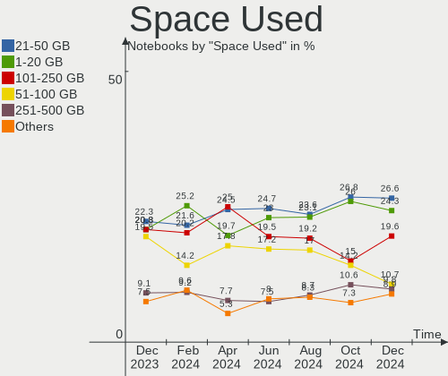
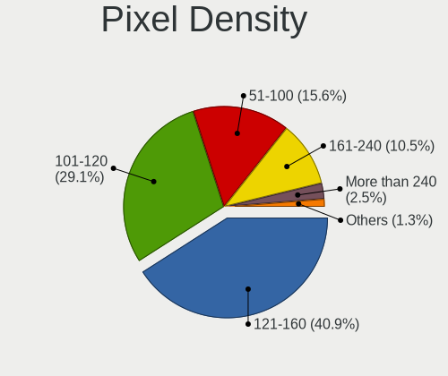

Linux Mint - Hardware Trends (Notebooks)
----------------------------------------

A project to identify most popular hardware characteristics and track their change
over time based on data collected by Linux users at https://Linux-Hardware.org.

Anyone can contribute to this report by the [hw-probe](https://github.com/linuxhw/hw-probe) tool:

    sudo -E hw-probe -all -upload

This report is for one last month. Overall report since the beginning of time: [TestCoverage](https://github.com/linuxhw/TestCoverage)

Period: Aug, 2022.

Contents
--------

* [ System ](#system)
  - [ OS                       ](#os)
  - [ OS Family                ](#os-family)
  - [ Kernel                   ](#kernel)
  - [ Kernel Family            ](#kernel-family)
  - [ Kernel Major Ver.        ](#kernel-major-ver)
  - [ Arch                     ](#arch)
  - [ DE                       ](#de)
  - [ Display Server           ](#display-server)
  - [ Display Manager          ](#display-manager)
  - [ OS Lang                  ](#os-lang)
  - [ Boot Mode                ](#boot-mode)
  - [ Filesystem               ](#filesystem)
  - [ Part. scheme             ](#part-scheme)
  - [ Dual Boot with Linux/BSD ](#dual-boot-with-linuxbsd)
  - [ Dual Boot (Win)          ](#dual-boot-win)

* [ Board ](#board)
  - [ Vendor                   ](#vendor)
  - [ Model                    ](#model)
  - [ Model Family             ](#model-family)
  - [ MFG Year                 ](#mfg-year)
  - [ Form Factor              ](#form-factor)
  - [ Secure Boot              ](#secure-boot)
  - [ Coreboot                 ](#coreboot)
  - [ RAM Size                 ](#ram-size)
  - [ RAM Used                 ](#ram-used)
  - [ Total Drives             ](#total-drives)
  - [ Has CD-ROM               ](#has-cd-rom)
  - [ Has Ethernet             ](#has-ethernet)
  - [ Has WiFi                 ](#has-wifi)
  - [ Has Bluetooth            ](#has-bluetooth)

* [ Location ](#location)
  - [ Country                  ](#country)
  - [ City                     ](#city)

* [ Drives ](#drives)
  - [ Drive Vendor             ](#drive-vendor)
  - [ Drive Model              ](#drive-model)
  - [ HDD Vendor               ](#hdd-vendor)
  - [ SSD Vendor               ](#ssd-vendor)
  - [ Drive Kind               ](#drive-kind)
  - [ Drive Connector          ](#drive-connector)
  - [ Drive Size               ](#drive-size)
  - [ Space Total              ](#space-total)
  - [ Space Used               ](#space-used)
  - [ Malfunc. Drives          ](#malfunc-drives)
  - [ Malfunc. Drive Vendor    ](#malfunc-drive-vendor)
  - [ Malfunc. HDD Vendor      ](#malfunc-hdd-vendor)
  - [ Malfunc. Drive Kind      ](#malfunc-drive-kind)
  - [ Failed Drives            ](#failed-drives)
  - [ Failed Drive Vendor      ](#failed-drive-vendor)
  - [ Drive Status             ](#drive-status)

* [ Storage controller ](#storage-controller)
  - [ Storage Vendor           ](#storage-vendor)
  - [ Storage Model            ](#storage-model)
  - [ Storage Kind             ](#storage-kind)

* [ Processor ](#processor)
  - [ CPU Vendor               ](#cpu-vendor)
  - [ CPU Model                ](#cpu-model)
  - [ CPU Model Family         ](#cpu-model-family)
  - [ CPU Cores                ](#cpu-cores)
  - [ CPU Sockets              ](#cpu-sockets)
  - [ CPU Threads              ](#cpu-threads)
  - [ CPU Op-Modes             ](#cpu-op-modes)
  - [ CPU Microcode            ](#cpu-microcode)
  - [ CPU Microarch            ](#cpu-microarch)

* [ Graphics ](#graphics)
  - [ GPU Vendor               ](#gpu-vendor)
  - [ GPU Model                ](#gpu-model)
  - [ GPU Combo                ](#gpu-combo)
  - [ GPU Driver               ](#gpu-driver)
  - [ GPU Memory               ](#gpu-memory)

* [ Monitor ](#monitor)
  - [ Monitor Vendor           ](#monitor-vendor)
  - [ Monitor Model            ](#monitor-model)
  - [ Monitor Resolution       ](#monitor-resolution)
  - [ Monitor Diagonal         ](#monitor-diagonal)
  - [ Monitor Width            ](#monitor-width)
  - [ Aspect Ratio             ](#aspect-ratio)
  - [ Monitor Area             ](#monitor-area)
  - [ Pixel Density            ](#pixel-density)
  - [ Multiple Monitors        ](#multiple-monitors)

* [ Network ](#network)
  - [ Net Controller Vendor    ](#net-controller-vendor)
  - [ Net Controller Model     ](#net-controller-model)
  - [ Wireless Vendor          ](#wireless-vendor)
  - [ Wireless Model           ](#wireless-model)
  - [ Ethernet Vendor          ](#ethernet-vendor)
  - [ Ethernet Model           ](#ethernet-model)
  - [ Net Controller Kind      ](#net-controller-kind)
  - [ Used Controller          ](#used-controller)
  - [ NICs                     ](#nics)
  - [ IPv6                     ](#ipv6)

* [ Bluetooth ](#bluetooth)
  - [ Bluetooth Vendor         ](#bluetooth-vendor)
  - [ Bluetooth Model          ](#bluetooth-model)

* [ Sound ](#sound)
  - [ Sound Vendor             ](#sound-vendor)
  - [ Sound Model              ](#sound-model)

* [ Memory ](#memory)
  - [ Memory Vendor            ](#memory-vendor)
  - [ Memory Model             ](#memory-model)
  - [ Memory Kind              ](#memory-kind)
  - [ Memory Form Factor       ](#memory-form-factor)
  - [ Memory Size              ](#memory-size)
  - [ Memory Speed             ](#memory-speed)

* [ Printers & scanners ](#printers--scanners)
  - [ Printer Vendor           ](#printer-vendor)
  - [ Printer Model            ](#printer-model)
  - [ Scanner Vendor           ](#scanner-vendor)
  - [ Scanner Model            ](#scanner-model)

* [ Camera ](#camera)
  - [ Camera Vendor            ](#camera-vendor)
  - [ Camera Model             ](#camera-model)

* [ Security ](#security)
  - [ Fingerprint Vendor       ](#fingerprint-vendor)
  - [ Fingerprint Model        ](#fingerprint-model)
  - [ Chipcard Vendor          ](#chipcard-vendor)
  - [ Chipcard Model           ](#chipcard-model)

* [ Unsupported ](#unsupported)
  - [ Unsupported Devices      ](#unsupported-devices)
  - [ Unsupported Device Types ](#unsupported-device-types)

System
------

OS
--

Installed operating systems

| Name            | Notebooks | Percent |
|-----------------|-----------|---------|
| Linux Mint 21   | 110       | 47.01%  |
| Linux Mint 20.3 | 94        | 40.17%  |
| Linux Mint 19.3 | 9         | 3.85%   |
| Linux Mint 20.2 | 7         | 2.99%   |
| Linux Mint 20   | 6         | 2.56%   |
| Linux Mint 20.1 | 5         | 2.14%   |
| Linux Mint 19   | 2         | 0.85%   |
| Linux Mint 19.1 | 1         | 0.43%   |

OS Family
---------

OS without a version

| Name       | Notebooks | Percent |
|------------|-----------|---------|
| Linux Mint | 234       | 100%    |

Kernel
------

Version of the Linux kernel

| Version                  | Notebooks | Percent |
|--------------------------|-----------|---------|
| 5.15.0-46-generic        | 80        | 34.19%  |
| 5.4.0-122-generic        | 35        | 14.96%  |
| 5.15.0-43-generic        | 30        | 12.82%  |
| 5.4.0-124-generic        | 23        | 9.83%   |
| 5.4.0-125-generic        | 19        | 8.12%   |
| 5.15.0-41-generic        | 9         | 3.85%   |
| 5.4.0-91-generic         | 6         | 2.56%   |
| 5.4.0-26-generic         | 4         | 1.71%   |
| 5.4.0-58-generic         | 3         | 1.28%   |
| 5.4.0-113-generic        | 2         | 0.85%   |
| 5.19.0-051900-generic    | 2         | 0.85%   |
| 5.18.10-76051810-generic | 2         | 0.85%   |
| 4.15.0-191-generic       | 2         | 0.85%   |
| 5.4.0-92-generic         | 1         | 0.43%   |
| 5.4.0-65-generic         | 1         | 0.43%   |
| 5.4.0-124-lowlatency     | 1         | 0.43%   |
| 5.4.0-121-generic        | 1         | 0.43%   |
| 5.4.0-120-generic        | 1         | 0.43%   |
| 5.4.0-109-generic        | 1         | 0.43%   |
| 5.4.0-105-generic        | 1         | 0.43%   |
| 5.15.0-47-generic        | 1         | 0.43%   |
| 5.15.0-43-lowlatency     | 1         | 0.43%   |
| 5.14.0-1048-oem          | 1         | 0.43%   |
| 5.14.0-1047-oem          | 1         | 0.43%   |
| 5.14.0-1044-oem          | 1         | 0.43%   |
| 5.13.0-52-generic        | 1         | 0.43%   |
| 5.13.0-41-generic        | 1         | 0.43%   |
| 5.11.0-16-generic        | 1         | 0.43%   |
| 5.0.0-32-generic         | 1         | 0.43%   |
| 4.15.0-20-generic        | 1         | 0.43%   |

Kernel Family
-------------

Linux kernel without a distro release

| Version | Notebooks | Percent |
|---------|-----------|---------|
| 5.15.0  | 121       | 51.71%  |
| 5.4.0   | 99        | 42.31%  |
| 5.14.0  | 3         | 1.28%   |
| 4.15.0  | 3         | 1.28%   |
| 5.19.0  | 2         | 0.85%   |
| 5.18.10 | 2         | 0.85%   |
| 5.13.0  | 2         | 0.85%   |
| 5.11.0  | 1         | 0.43%   |
| 5.0.0   | 1         | 0.43%   |

Kernel Major Ver.
-----------------

Linux kernel major version

| Version | Notebooks | Percent |
|---------|-----------|---------|
| 5.15    | 121       | 51.71%  |
| 5.4     | 99        | 42.31%  |
| 5.14    | 3         | 1.28%   |
| 4.15    | 3         | 1.28%   |
| 5.19    | 2         | 0.85%   |
| 5.18    | 2         | 0.85%   |
| 5.13    | 2         | 0.85%   |
| 5.11    | 1         | 0.43%   |
| 5.0     | 1         | 0.43%   |

Arch
----

OS architecture (x86_64, i586, etc.)

| Name   | Notebooks | Percent |
|--------|-----------|---------|
| x86_64 | 233       | 99.57%  |
| i686   | 1         | 0.43%   |

DE
--

Desktop Environment

| Name       | Notebooks | Percent |
|------------|-----------|---------|
| X-Cinnamon | 168       | 71.79%  |
| XFCE       | 30        | 12.82%  |
| MATE       | 23        | 9.83%   |
| Cinnamon   | 7         | 2.99%   |
| KDE5       | 3         | 1.28%   |
| GNOME      | 3         | 1.28%   |

Display Server
--------------

X11 or Wayland

| Name | Notebooks | Percent |
|------|-----------|---------|
| X11  | 233       | 99.57%  |
| Tty  | 1         | 0.43%   |

Display Manager
---------------

SDDM, LightDM, etc.

| Name    | Notebooks | Percent |
|---------|-----------|---------|
| Unknown | 135       | 57.69%  |
| LightDM | 97        | 41.45%  |
| SDDM    | 2         | 0.85%   |

OS Lang
-------

Language

| Lang  | Notebooks | Percent |
|-------|-----------|---------|
| en_US | 77        | 32.91%  |
| de_DE | 35        | 14.96%  |
| pt_BR | 20        | 8.55%   |
| fr_FR | 16        | 6.84%   |
| ru_RU | 12        | 5.13%   |
| en_GB | 11        | 4.7%    |
| en_IN | 7         | 2.99%   |
| en_CA | 6         | 2.56%   |
| es_ES | 5         | 2.14%   |
| pl_PL | 4         | 1.71%   |
| it_IT | 4         | 1.71%   |
| C     | 4         | 1.71%   |
| pt_PT | 3         | 1.28%   |
| en_NZ | 3         | 1.28%   |
| en_AU | 3         | 1.28%   |
| cs_CZ | 3         | 1.28%   |
| nb_NO | 2         | 0.85%   |
| fi_FI | 2         | 0.85%   |
| es_AR | 2         | 0.85%   |
| de_CH | 2         | 0.85%   |
| uk_UA | 1         | 0.43%   |
| tr_TR | 1         | 0.43%   |
| sv_SE | 1         | 0.43%   |
| sk_SK | 1         | 0.43%   |
| nl_NL | 1         | 0.43%   |
| ja_JP | 1         | 0.43%   |
| fr_CA | 1         | 0.43%   |
| es_NI | 1         | 0.43%   |
| es_CO | 1         | 0.43%   |
| es_CL | 1         | 0.43%   |
| en_ZA | 1         | 0.43%   |
| en_PH | 1         | 0.43%   |
| bg_BG | 1         | 0.43%   |

Boot Mode
---------

EFI or BIOS

| Mode | Notebooks | Percent |
|------|-----------|---------|
| EFI  | 150       | 64.1%   |
| BIOS | 84        | 35.9%   |

Filesystem
----------

Type of filesystem

| Type    | Notebooks | Percent |
|---------|-----------|---------|
| Ext4    | 219       | 93.59%  |
| Btrfs   | 9         | 3.85%   |
| Overlay | 3         | 1.28%   |
| Zfs     | 2         | 0.85%   |
| Xfs     | 1         | 0.43%   |

Part. scheme
------------

Scheme of partitioning

| Type    | Notebooks | Percent |
|---------|-----------|---------|
| Unknown | 142       | 60.68%  |
| GPT     | 75        | 32.05%  |
| MBR     | 17        | 7.26%   |

Dual Boot with Linux/BSD
------------------------

Hosting more than one Linux/BSD

| Dual boot | Notebooks | Percent |
|-----------|-----------|---------|
| No        | 221       | 94.44%  |
| Yes       | 13        | 5.56%   |

Dual Boot (Win)
---------------

Hosting Linux and Windows

| Dual boot | Notebooks | Percent |
|-----------|-----------|---------|
| No        | 198       | 84.62%  |
| Yes       | 36        | 15.38%  |

Board
-----

Vendor
------

Motherboard manufacturer

| Name                           | Notebooks | Percent |
|--------------------------------|-----------|---------|
| Lenovo                         | 44        | 18.8%   |
| Hewlett-Packard                | 40        | 17.09%  |
| Dell                           | 32        | 13.68%  |
| ASUSTek Computer               | 29        | 12.39%  |
| Acer                           | 22        | 9.4%    |
| Apple                          | 12        | 5.13%   |
| Toshiba                        | 7         | 2.99%   |
| Samsung Electronics            | 7         | 2.99%   |
| HUAWEI                         | 4         | 1.71%   |
| Sony                           | 3         | 1.28%   |
| Google                         | 3         | 1.28%   |
| Packard Bell                   | 2         | 0.85%   |
| OnLogic                        | 2         | 0.85%   |
| Notebook                       | 2         | 0.85%   |
| Medion                         | 2         | 0.85%   |
| Daten Tecnologia               | 2         | 0.85%   |
| AMI                            | 2         | 0.85%   |
| Alienware                      | 2         | 0.85%   |
| TrekStor                       | 1         | 0.43%   |
| The Warehouse Group            | 1         | 0.43%   |
| System76                       | 1         | 0.43%   |
| Schenker                       | 1         | 0.43%   |
| Razer                          | 1         | 0.43%   |
| Positivo                       | 1         | 0.43%   |
| Plaisio                        | 1         | 0.43%   |
| Panasonic                      | 1         | 0.43%   |
| MSI                            | 1         | 0.43%   |
| Matsushita Electric Industrial | 1         | 0.43%   |
| LG Electronics                 | 1         | 0.43%   |
| Intel                          | 1         | 0.43%   |
| GPU Company                    | 1         | 0.43%   |
| Fujitsu                        | 1         | 0.43%   |
| Foxconn                        | 1         | 0.43%   |
| Chuwi                          | 1         | 0.43%   |
| Unknown                        | 1         | 0.43%   |

Model
-----

Motherboard model

| Name                                        | Notebooks | Percent |
|---------------------------------------------|-----------|---------|
| Apple MacBookPro9,2                         | 4         | 1.71%   |
| Unknown                                     | 3         | 1.28%   |
| OnLogic Helix3X0                            | 2         | 0.85%   |
| HP ProBook 4540s                            | 2         | 0.85%   |
| HP Mini 110-3100                            | 2         | 0.85%   |
| HP Laptop 17-cp0xxx                         | 2         | 0.85%   |
| HP 2000                                     | 2         | 0.85%   |
| Dell Latitude 5521                          | 2         | 0.85%   |
| Daten Tecnologia DT02-M4                    | 2         | 0.85%   |
| Apple MacBookPro8,1                         | 2         | 0.85%   |
| Apple MacBookPro12,1                        | 2         | 0.85%   |
| TrekStor Primebook P14                      | 1         | 0.43%   |
| Toshiba Satellite L855                      | 1         | 0.43%   |
| Toshiba Satellite L300                      | 1         | 0.43%   |
| Toshiba Satellite C660                      | 1         | 0.43%   |
| Toshiba QOSMIO X70-B                        | 1         | 0.43%   |
| Toshiba PORTEGE M800                        | 1         | 0.43%   |
| Toshiba dynabook T75/RW                     | 1         | 0.43%   |
| Toshiba dynabook R732/G                     | 1         | 0.43%   |
| The Warehouse Group E2037                   | 1         | 0.43%   |
| System76 Oryx Pro                           | 1         | 0.43%   |
| Sony VPCSB35FB                              | 1         | 0.43%   |
| Sony VGN-NR210FH                            | 1         | 0.43%   |
| Sony SVF1521L1RW                            | 1         | 0.43%   |
| Schenker VISION 15 (SVS15E21)               | 1         | 0.43%   |
| Samsung RV411/RV511/E3511/S3511/RV711       | 1         | 0.43%   |
| Samsung R430/R480/R440                      | 1         | 0.43%   |
| Samsung 700Z3A/700Z4A/700Z5A/700Z5B         | 1         | 0.43%   |
| Samsung 550XDA                              | 1         | 0.43%   |
| Samsung 550XCJ/550XCR                       | 1         | 0.43%   |
| Samsung 340XAA/350XAA/550XAA                | 1         | 0.43%   |
| Samsung 300E4C/300E5C/300E7C                | 1         | 0.43%   |
| Razer Blade                                 | 1         | 0.43%   |
| Positivo Q4128C-S                           | 1         | 0.43%   |
| Plaisio Turbo X                             | 1         | 0.43%   |
| Panasonic CF-53AAGZXDX                      | 1         | 0.43%   |
| Packard Bell EasyNote LS11HR                | 1         | 0.43%   |
| Packard Bell EasyNote LE69KB                | 1         | 0.43%   |
| Notebook NJ50_70CU                          | 1         | 0.43%   |
| Notebook N9x0TC                             | 1         | 0.43%   |
| MSI GL72 6QF                                | 1         | 0.43%   |
| Medion P7816                                | 1         | 0.43%   |
| Medion P6612                                | 1         | 0.43%   |
| Matsushita Electric Industrial CF-52DCABZBM | 1         | 0.43%   |
| LG R480-L.B211P1                            | 1         | 0.43%   |
| Lenovo Yoga SLIM 7-14ARE05 82A2             | 1         | 0.43%   |
| Lenovo Yoga 300-11IBY 80M0                  | 1         | 0.43%   |
| Lenovo V3000 80KV                           | 1         | 0.43%   |
| Lenovo V145-15AST 81MT                      | 1         | 0.43%   |
| Lenovo ThinkPad X230 2324BB5                | 1         | 0.43%   |
| Lenovo ThinkPad X230 23245NJ                | 1         | 0.43%   |
| Lenovo ThinkPad X200 7458VL3                | 1         | 0.43%   |
| Lenovo ThinkPad X1 Carbon Gen 8 20U9CTO1WW  | 1         | 0.43%   |
| Lenovo ThinkPad X1 Carbon 6th 20KHCTO1WW    | 1         | 0.43%   |
| Lenovo ThinkPad W540 20BHS0F206             | 1         | 0.43%   |
| Lenovo ThinkPad W530 2447D87                | 1         | 0.43%   |
| Lenovo ThinkPad T540p 20BFA0MN01            | 1         | 0.43%   |
| Lenovo ThinkPad T520 423946U                | 1         | 0.43%   |
| Lenovo ThinkPad T480 20L6SBD000             | 1         | 0.43%   |
| Lenovo ThinkPad T440p 20AWS17N00            | 1         | 0.43%   |

Model Family
------------

Motherboard model prefix

| Name                                        | Notebooks | Percent |
|---------------------------------------------|-----------|---------|
| Lenovo ThinkPad                             | 21        | 8.97%   |
| Dell Latitude                               | 16        | 6.84%   |
| Acer Aspire                                 | 16        | 6.84%   |
| Dell Inspiron                               | 10        | 4.27%   |
| Lenovo IdeaPad                              | 9         | 3.85%   |
| HP EliteBook                                | 8         | 3.42%   |
| ASUS VivoBook                               | 7         | 2.99%   |
| HP ProBook                                  | 6         | 2.56%   |
| HP Laptop                                   | 5         | 2.14%   |
| HP Pavilion                                 | 4         | 1.71%   |
| Apple MacBookPro9                           | 4         | 1.71%   |
| Toshiba Satellite                           | 3         | 1.28%   |
| HP OMEN                                     | 3         | 1.28%   |
| ASUS ASUS                                   | 3         | 1.28%   |
| Unknown                                     | 3         | 1.28%   |
| Toshiba dynabook                            | 2         | 0.85%   |
| Packard Bell EasyNote                       | 2         | 0.85%   |
| OnLogic Helix3X0                            | 2         | 0.85%   |
| Lenovo Yoga                                 | 2         | 0.85%   |
| HP Mini                                     | 2         | 0.85%   |
| HP Compaq                                   | 2         | 0.85%   |
| HP 2000                                     | 2         | 0.85%   |
| Dell XPS                                    | 2         | 0.85%   |
| Dell Precision                              | 2         | 0.85%   |
| Daten Tecnologia DT02-M4                    | 2         | 0.85%   |
| Apple MacBookPro8                           | 2         | 0.85%   |
| Apple MacBookPro12                          | 2         | 0.85%   |
| TrekStor Primebook                          | 1         | 0.43%   |
| Toshiba QOSMIO                              | 1         | 0.43%   |
| Toshiba PORTEGE                             | 1         | 0.43%   |
| The Warehouse Group E2037                   | 1         | 0.43%   |
| System76 Oryx                               | 1         | 0.43%   |
| Sony VPCSB35FB                              | 1         | 0.43%   |
| Sony VGN-NR210FH                            | 1         | 0.43%   |
| Sony SVF1521L1RW                            | 1         | 0.43%   |
| Schenker VISION                             | 1         | 0.43%   |
| Samsung RV411                               | 1         | 0.43%   |
| Samsung R430                                | 1         | 0.43%   |
| Samsung 700Z3A                              | 1         | 0.43%   |
| Samsung 550XDA                              | 1         | 0.43%   |
| Samsung 550XCJ                              | 1         | 0.43%   |
| Samsung 340XAA                              | 1         | 0.43%   |
| Samsung 300E4C                              | 1         | 0.43%   |
| Razer Blade                                 | 1         | 0.43%   |
| Positivo Q4128C-S                           | 1         | 0.43%   |
| Plaisio Turbo                               | 1         | 0.43%   |
| Panasonic CF-53AAGZXDX                      | 1         | 0.43%   |
| Notebook NJ50                               | 1         | 0.43%   |
| Notebook N9x0TC                             | 1         | 0.43%   |
| MSI GL72                                    | 1         | 0.43%   |
| Medion P7816                                | 1         | 0.43%   |
| Medion P6612                                | 1         | 0.43%   |
| Matsushita Electric Industrial CF-52DCABZBM | 1         | 0.43%   |
| LG R480-L.B211P1                            | 1         | 0.43%   |
| Lenovo V3000                                | 1         | 0.43%   |
| Lenovo V145-15AST                           | 1         | 0.43%   |
| Lenovo ThinkBook                            | 1         | 0.43%   |
| Lenovo Legion                               | 1         | 0.43%   |
| Lenovo G700                                 | 1         | 0.43%   |
| Lenovo G70-80                               | 1         | 0.43%   |

MFG Year
--------

Motherboard manufacture year

| Year | Notebooks | Percent |
|------|-----------|---------|
| 2012 | 30        | 12.82%  |
| 2021 | 29        | 12.39%  |
| 2011 | 25        | 10.68%  |
| 2020 | 19        | 8.12%   |
| 2018 | 17        | 7.26%   |
| 2019 | 14        | 5.98%   |
| 2013 | 14        | 5.98%   |
| 2010 | 13        | 5.56%   |
| 2015 | 12        | 5.13%   |
| 2008 | 11        | 4.7%    |
| 2022 | 10        | 4.27%   |
| 2017 | 10        | 4.27%   |
| 2016 | 10        | 4.27%   |
| 2014 | 9         | 3.85%   |
| 2006 | 5         | 2.14%   |
| 2009 | 3         | 1.28%   |
| 2007 | 3         | 1.28%   |

Form Factor
-----------

Physical design of the computer

| Name     | Notebooks | Percent |
|----------|-----------|---------|
| Notebook | 234       | 100%    |

Secure Boot
-----------

Enabled or disabled

| State    | Notebooks | Percent |
|----------|-----------|---------|
| Disabled | 202       | 86.32%  |
| Enabled  | 32        | 13.68%  |

Coreboot
--------

Have coreboot on board

| Used | Notebooks | Percent |
|------|-----------|---------|
| No   | 231       | 98.72%  |
| Yes  | 3         | 1.28%   |

RAM Size
--------

Total RAM memory

| Size in GB | Notebooks | Percent |
|------------|-----------|---------|
| 4.01-8.0   | 73        | 31.2%   |
| 3.01-4.0   | 52        | 22.22%  |
| 8.01-16.0  | 39        | 16.67%  |
| 16.01-24.0 | 38        | 16.24%  |
| 1.01-2.0   | 12        | 5.13%   |
| 32.01-64.0 | 10        | 4.27%   |
| 2.01-3.0   | 5         | 2.14%   |
| 24.01-32.0 | 4         | 1.71%   |
| 0.51-1.0   | 1         | 0.43%   |

RAM Used
--------

Used RAM memory

| Used GB    | Notebooks | Percent |
|------------|-----------|---------|
| 1.01-2.0   | 103       | 44.02%  |
| 2.01-3.0   | 52        | 22.22%  |
| 3.01-4.0   | 32        | 13.68%  |
| 4.01-8.0   | 26        | 11.11%  |
| 0.51-1.0   | 13        | 5.56%   |
| 8.01-16.0  | 6         | 2.56%   |
| 16.01-24.0 | 2         | 0.85%   |

Total Drives
------------

Number of drives on board

| Drives | Notebooks | Percent |
|--------|-----------|---------|
| 1      | 175       | 74.79%  |
| 2      | 47        | 20.09%  |
| 3      | 7         | 2.99%   |
| 5      | 3         | 1.28%   |
| 4      | 2         | 0.85%   |

Has CD-ROM
----------

Has CD-ROM on board

| Presented | Notebooks | Percent |
|-----------|-----------|---------|
| No        | 142       | 60.68%  |
| Yes       | 92        | 39.32%  |

Has Ethernet
------------

Has Ethernet on board

| Presented | Notebooks | Percent |
|-----------|-----------|---------|
| Yes       | 190       | 81.2%   |
| No        | 44        | 18.8%   |

Has WiFi
--------

Has WiFi module

| Presented | Notebooks | Percent |
|-----------|-----------|---------|
| Yes       | 228       | 97.44%  |
| No        | 6         | 2.56%   |

Has Bluetooth
-------------

Has Bluetooth module

| Presented | Notebooks | Percent |
|-----------|-----------|---------|
| Yes       | 177       | 75.64%  |
| No        | 57        | 24.36%  |

Location
--------

Country
-------

Geographic location (country)

| Country      | Notebooks | Percent |
|--------------|-----------|---------|
| USA          | 40        | 17.09%  |
| Germany      | 35        | 14.96%  |
| Brazil       | 22        | 9.4%    |
| France       | 16        | 6.84%   |
| UK           | 9         | 3.85%   |
| Russia       | 8         | 3.42%   |
| Netherlands  | 7         | 2.99%   |
| India        | 7         | 2.99%   |
| Poland       | 6         | 2.56%   |
| Canada       | 6         | 2.56%   |
| Italy        | 5         | 2.14%   |
| Turkey       | 4         | 1.71%   |
| Thailand     | 4         | 1.71%   |
| Spain        | 4         | 1.71%   |
| Finland      | 4         | 1.71%   |
| Czechia      | 4         | 1.71%   |
| Austria      | 4         | 1.71%   |
| Australia    | 4         | 1.71%   |
| Portugal     | 3         | 1.28%   |
| New Zealand  | 3         | 1.28%   |
| Belarus      | 3         | 1.28%   |
| Argentina    | 3         | 1.28%   |
| Switzerland  | 2         | 0.85%   |
| Norway       | 2         | 0.85%   |
| Mexico       | 2         | 0.85%   |
| Japan        | 2         | 0.85%   |
| Indonesia    | 2         | 0.85%   |
| Greece       | 2         | 0.85%   |
| Bulgaria     | 2         | 0.85%   |
| Sweden       | 1         | 0.43%   |
| South Africa | 1         | 0.43%   |
| Slovakia     | 1         | 0.43%   |
| Singapore    | 1         | 0.43%   |
| Serbia       | 1         | 0.43%   |
| Romania      | 1         | 0.43%   |
| Philippines  | 1         | 0.43%   |
| Nicaragua    | 1         | 0.43%   |
| Morocco      | 1         | 0.43%   |
| Latvia       | 1         | 0.43%   |
| Israel       | 1         | 0.43%   |
| Hungary      | 1         | 0.43%   |
| Honduras     | 1         | 0.43%   |
| Georgia      | 1         | 0.43%   |
| Egypt        | 1         | 0.43%   |
| Denmark      | 1         | 0.43%   |
| Croatia      | 1         | 0.43%   |
| Colombia     | 1         | 0.43%   |
| Chile        | 1         | 0.43%   |

City
----

Geographic location (city)

| City                  | Notebooks | Percent |
|-----------------------|-----------|---------|
| Berlin                | 5         | 2.14%   |
| Vienna                | 4         | 1.71%   |
| Moscow                | 4         | 1.71%   |
| Milan                 | 3         | 1.28%   |
| Sydney                | 2         | 0.85%   |
| Sao Paulo             | 2         | 0.85%   |
| Reading               | 2         | 0.85%   |
| Portland              | 2         | 0.85%   |
| Pismo Beach           | 2         | 0.85%   |
| Paris                 | 2         | 0.85%   |
| Mumbai                | 2         | 0.85%   |
| Minsk                 | 2         | 0.85%   |
| Koblenz               | 2         | 0.85%   |
| Helsinki              | 2         | 0.85%   |
| Hamburg               | 2         | 0.85%   |
| Fortaleza             | 2         | 0.85%   |
| Dallas                | 2         | 0.85%   |
| Chandler              | 2         | 0.85%   |
| Bursa                 | 2         | 0.85%   |
| Bangkok               | 2         | 0.85%   |
| Auckland              | 2         | 0.85%   |
| Albstadt              | 2         | 0.85%   |
| Wroclaw               | 1         | 0.43%   |
| Winter Springs        | 1         | 0.43%   |
| Wimbledon             | 1         | 0.43%   |
| Wegberg               | 1         | 0.43%   |
| Washington            | 1         | 0.43%   |
| Warren                | 1         | 0.43%   |
| Virginia Beach        | 1         | 0.43%   |
| Veenendaal            | 1         | 0.43%   |
| Vaux-sur-Mer          | 1         | 0.43%   |
| Vancouver             | 1         | 0.43%   |
| Unna                  | 1         | 0.43%   |
| Tver                  | 1         | 0.43%   |
| Triel-sur-Seine       | 1         | 0.43%   |
| Três Lagoas          | 1         | 0.43%   |
| Traunreut             | 1         | 0.43%   |
| Toronto               | 1         | 0.43%   |
| Tornesch              | 1         | 0.43%   |
| Timbauba              | 1         | 0.43%   |
| Tilburg               | 1         | 0.43%   |
| Tijuana               | 1         | 0.43%   |
| Tel Aviv              | 1         | 0.43%   |
| Taubate               | 1         | 0.43%   |
| Tarnów               | 1         | 0.43%   |
| Talant                | 1         | 0.43%   |
| Sunshine Coast        | 1         | 0.43%   |
| Stord                 | 1         | 0.43%   |
| Stary Oskol           | 1         | 0.43%   |
| Springboro            | 1         | 0.43%   |
| Southampton           | 1         | 0.43%   |
| Sofia                 | 1         | 0.43%   |
| Singapore             | 1         | 0.43%   |
| Seminole              | 1         | 0.43%   |
| Seattle               | 1         | 0.43%   |
| Schwabach             | 1         | 0.43%   |
| Sao Goncalo           | 1         | 0.43%   |
| Sao Bernardo do Campo | 1         | 0.43%   |
| Sanda Shi             | 1         | 0.43%   |
| San Diego             | 1         | 0.43%   |

Drives
------

Drive Vendor
------------

Hard drive vendors

| Vendor                    | Notebooks | Drives | Percent |
|---------------------------|-----------|--------|---------|
| Samsung Electronics       | 38        | 40     | 12.67%  |
| Seagate                   | 30        | 31     | 10%     |
| WDC                       | 26        | 26     | 8.67%   |
| Kingston                  | 23        | 23     | 7.67%   |
| SanDisk                   | 22        | 23     | 7.33%   |
| Toshiba                   | 21        | 22     | 7%      |
| Unknown                   | 20        | 20     | 6.67%   |
| SK hynix                  | 12        | 12     | 4%      |
| Crucial                   | 10        | 10     | 3.33%   |
| HGST                      | 9         | 9      | 3%      |
| Intel                     | 7         | 7      | 2.33%   |
| Apple                     | 7         | 8      | 2.33%   |
| Micron Technology         | 6         | 6      | 2%      |
| KIOXIA                    | 5         | 5      | 1.67%   |
| JMicron Technology        | 5         | 5      | 1.67%   |
| Transcend                 | 4         | 4      | 1.33%   |
| PNY                       | 4         | 4      | 1.33%   |
| Patriot                   | 4         | 4      | 1.33%   |
| Hitachi                   | 4         | 5      | 1.33%   |
| SPCC                      | 2         | 2      | 0.67%   |
| Phison                    | 2         | 2      | 0.67%   |
| Netac                     | 2         | 2      | 0.67%   |
| Intenso                   | 2         | 2      | 0.67%   |
| Fujitsu                   | 2         | 2      | 0.67%   |
| China                     | 2         | 2      | 0.67%   |
| Apacer                    | 2         | 2      | 0.67%   |
| A-DATA Technology         | 2         | 2      | 0.67%   |
| Unknown                   | 2         | 2      | 0.67%   |
| YMTC                      | 1         | 1      | 0.33%   |
| W800S                     | 1         | 1      | 0.33%   |
| Vaseky                    | 1         | 1      | 0.33%   |
| Union Memory (Shenzhen)   | 1         | 1      | 0.33%   |
| UMIS                      | 1         | 1      | 0.33%   |
| TrekStor                  | 1         | 1      | 0.33%   |
| Team                      | 1         | 1      | 0.33%   |
| TCSUNBOW                  | 1         | 2      | 0.33%   |
| ShiJi                     | 1         | 1      | 0.33%   |
| SABRENT                   | 1         | 1      | 0.33%   |
| Realtek Semiconductor     | 1         | 1      | 0.33%   |
| PHD 3.0                   | 1         | 1      | 0.33%   |
| OCZ                       | 1         | 1      | 0.33%   |
| Micron/Crucial Technology | 1         | 1      | 0.33%   |
| Lite-On                   | 1         | 1      | 0.33%   |
| Lexar                     | 1         | 1      | 0.33%   |
| Leven                     | 1         | 1      | 0.33%   |
| KingSpec                  | 1         | 1      | 0.33%   |
| KingFast                  | 1         | 1      | 0.33%   |
| KingDian                  | 1         | 1      | 0.33%   |
| GOODRAM                   | 1         | 1      | 0.33%   |
| Gigabyte Technology       | 1         | 1      | 0.33%   |
| General                   | 1         | 1      | 0.33%   |
| Dogfish                   | 1         | 1      | 0.33%   |
| ASMedia                   | 1         | 1      | 0.33%   |

Drive Model
-----------

Hard drive models

| Model                              | Notebooks | Percent |
|------------------------------------|-----------|---------|
| Seagate ST1000LM024 HN-M101MBB 1TB | 6         | 1.96%   |
| Unknown MMC Card  128GB            | 5         | 1.63%   |
| Seagate Expansion 500GB            | 5         | 1.63%   |
| Samsung SSD 870 EVO 500GB          | 5         | 1.63%   |
| Unknown MMC Card  64GB             | 4         | 1.31%   |
| Toshiba MQ04ABF100 1TB             | 4         | 1.31%   |
| Toshiba MQ01ABD100 1TB             | 4         | 1.31%   |
| Kingston SA400S37480G 480GB SSD    | 4         | 1.31%   |
| Unknown MMC Card  32GB             | 3         | 0.98%   |
| SanDisk SSD PLUS 480GB             | 3         | 0.98%   |
| SanDisk SSD PLUS 240GB             | 3         | 0.98%   |
| Kingston SA400S37240G 240GB SSD    | 3         | 0.98%   |
| Intel NVMe SSD Drive 512GB         | 3         | 0.98%   |
| WDC WDS120G2G0A-00JH30 120GB SSD   | 2         | 0.65%   |
| Transcend TS128GMTS952T2 128GB SSD | 2         | 0.65%   |
| Toshiba MQ01ABF050 500GB           | 2         | 0.65%   |
| SPCC Solid State Disk 256GB        | 2         | 0.65%   |
| SK hynix NVMe SSD Drive 256GB      | 2         | 0.65%   |
| Seagate ST500LT012-1DG142 500GB    | 2         | 0.65%   |
| Seagate ST2000LM015-2E8174 2TB     | 2         | 0.65%   |
| Seagate ST1000LM035-1RK172 1TB     | 2         | 0.65%   |
| SanDisk SDSSDH3 500G               | 2         | 0.65%   |
| SanDisk NVMe SSD Drive 512GB       | 2         | 0.65%   |
| SanDisk NVMe SSD Drive 256GB       | 2         | 0.65%   |
| SanDisk DF4032  32GB               | 2         | 0.65%   |
| Samsung SSD 860 EVO 250GB          | 2         | 0.65%   |
| Samsung NVMe SSD Drive 500GB       | 2         | 0.65%   |
| PNY CS900 240GB SSD                | 2         | 0.65%   |
| Patriot Burst Elite 120GB SSD      | 2         | 0.65%   |
| KIOXIA NVMe SSD Drive 512GB        | 2         | 0.65%   |
| KIOXIA KBG40ZNS512G NVMe 512GB     | 2         | 0.65%   |
| Kingston SV300S37A240G 240GB SSD   | 2         | 0.65%   |
| Kingston SV300S37A120G 120GB SSD   | 2         | 0.65%   |
| Kingston SUV400S37240G 240GB SSD   | 2         | 0.65%   |
| JMicron Tech 250GB                 | 2         | 0.65%   |
| JMicron Generic 160GB              | 2         | 0.65%   |
| HGST HTS725032A7E630 320GB         | 2         | 0.65%   |
| HGST HTS721010A9E630 1TB           | 2         | 0.65%   |
| Crucial CT500P2SSD8 500GB          | 2         | 0.65%   |
| Crucial CT240BX500SSD1 240GB       | 2         | 0.65%   |
| Apple SSD SM0128G 121GB            | 2         | 0.65%   |
| Unknown                            | 2         | 0.65%   |
| YMTC PC005 512GB                   | 1         | 0.33%   |
| WDC WDS240G2G0A-00JH30 240GB SSD   | 1         | 0.33%   |
| WDC WDS100T2B0A-00SM50 1TB SSD     | 1         | 0.33%   |
| WDC WD800BEVS-22RST0 80GB          | 1         | 0.33%   |
| WDC WD7500BPVT-22HXZT3 752GB       | 1         | 0.33%   |
| WDC WD5000LPVT-22G33T0 500GB       | 1         | 0.33%   |
| WDC WD5000LPCX-24VHAT0 500GB       | 1         | 0.33%   |
| WDC WD5000LPCX-24C6HT0 500GB       | 1         | 0.33%   |
| WDC WD5000BPKX-00HPJT0 500GB       | 1         | 0.33%   |
| WDC WD5000BEVT-22A0RT0 500GB       | 1         | 0.33%   |
| WDC WD3200BUDT-63DPZY0 320GB       | 1         | 0.33%   |
| WDC WD3200BPVT-24JJ5T0 320GB       | 1         | 0.33%   |
| WDC WD3200BPVT-22JJ5T0 320GB       | 1         | 0.33%   |
| WDC WD3200BPVT-00ZEST0 320GB       | 1         | 0.33%   |
| WDC WD3200BEKT-60PVMT0 320GB       | 1         | 0.33%   |
| WDC WD2500BEVT-80A23T0 250GB       | 1         | 0.33%   |
| WDC WD1600BPVT-00JJ5T0 160GB       | 1         | 0.33%   |
| WDC WD16 00BEVS-00VAT0 160GB       | 1         | 0.33%   |

HDD Vendor
----------

Hard disk drive vendors

| Vendor              | Notebooks | Drives | Percent |
|---------------------|-----------|--------|---------|
| Seagate             | 29        | 30     | 32.95%  |
| WDC                 | 19        | 19     | 21.59%  |
| Toshiba             | 16        | 17     | 18.18%  |
| HGST                | 9         | 9      | 10.23%  |
| Hitachi             | 4         | 5      | 4.55%   |
| Apple               | 3         | 4      | 3.41%   |
| Fujitsu             | 2         | 2      | 2.27%   |
| Unknown             | 1         | 1      | 1.14%   |
| Samsung Electronics | 1         | 1      | 1.14%   |
| SABRENT             | 1         | 1      | 1.14%   |
| PHD 3.0             | 1         | 1      | 1.14%   |
| JMicron Technology  | 1         | 1      | 1.14%   |
| ASMedia             | 1         | 1      | 1.14%   |

SSD Vendor
----------

Solid state drive vendors

| Vendor              | Notebooks | Drives | Percent |
|---------------------|-----------|--------|---------|
| Samsung Electronics | 22        | 22     | 18.33%  |
| Kingston            | 21        | 21     | 17.5%   |
| SanDisk             | 14        | 15     | 11.67%  |
| Crucial             | 8         | 8      | 6.67%   |
| WDC                 | 4         | 4      | 3.33%   |
| Transcend           | 4         | 4      | 3.33%   |
| PNY                 | 4         | 4      | 3.33%   |
| Patriot             | 4         | 4      | 3.33%   |
| Micron Technology   | 4         | 4      | 3.33%   |
| Apple               | 4         | 4      | 3.33%   |
| Toshiba             | 3         | 3      | 2.5%    |
| Intel               | 3         | 3      | 2.5%    |
| SPCC                | 2         | 2      | 1.67%   |
| Netac               | 2         | 2      | 1.67%   |
| JMicron Technology  | 2         | 2      | 1.67%   |
| China               | 2         | 2      | 1.67%   |
| Apacer              | 2         | 2      | 1.67%   |
| A-DATA Technology   | 2         | 2      | 1.67%   |
| Vaseky              | 1         | 1      | 0.83%   |
| Unknown             | 1         | 1      | 0.83%   |
| TrekStor            | 1         | 1      | 0.83%   |
| Team                | 1         | 1      | 0.83%   |
| TCSUNBOW            | 1         | 2      | 0.83%   |
| SK hynix            | 1         | 1      | 0.83%   |
| OCZ                 | 1         | 1      | 0.83%   |
| Lexar               | 1         | 1      | 0.83%   |
| KingSpec            | 1         | 1      | 0.83%   |
| KingDian            | 1         | 1      | 0.83%   |
| GOODRAM             | 1         | 1      | 0.83%   |
| Gigabyte Technology | 1         | 1      | 0.83%   |
| Dogfish             | 1         | 1      | 0.83%   |

Drive Kind
----------

HDD or SSD

| Kind    | Notebooks | Drives | Percent |
|---------|-----------|--------|---------|
| SSD     | 108       | 122    | 38.16%  |
| HDD     | 84        | 92     | 29.68%  |
| NVMe    | 58        | 61     | 20.49%  |
| MMC     | 21        | 21     | 7.42%   |
| Unknown | 12        | 12     | 4.24%   |

Drive Connector
---------------

SATA, SAS, NVMe, etc.

| Type | Notebooks | Drives | Percent |
|------|-----------|--------|---------|
| SATA | 172       | 203    | 64.18%  |
| NVMe | 58        | 61     | 21.64%  |
| MMC  | 21        | 21     | 7.84%   |
| SAS  | 17        | 23     | 6.34%   |

Drive Size
----------

Size of hard drive

| Size in TB | Notebooks | Drives | Percent |
|------------|-----------|--------|---------|
| 0.01-0.5   | 140       | 166    | 75.27%  |
| 0.51-1.0   | 36        | 38     | 19.35%  |
| 1.01-2.0   | 9         | 9      | 4.84%   |
| 3.01-4.0   | 1         | 1      | 0.54%   |

Space Total
-----------

Amount of disk space available on the file system

| Size in GB     | Notebooks | Percent |
|----------------|-----------|---------|
| 101-250        | 87        | 37.18%  |
| 251-500        | 69        | 29.49%  |
| 501-1000       | 33        | 14.1%   |
| 1001-2000      | 14        | 5.98%   |
| 51-100         | 11        | 4.7%    |
| More than 3000 | 7         | 2.99%   |
| 21-50          | 6         | 2.56%   |
| 1-20           | 5         | 2.14%   |
| 2001-3000      | 2         | 0.85%   |

Space Used
----------

Amount of used disk space

| Used GB        | Notebooks | Percent |
|----------------|-----------|---------|
| 21-50          | 53        | 22.65%  |
| 1-20           | 52        | 22.22%  |
| 51-100         | 50        | 21.37%  |
| 101-250        | 36        | 15.38%  |
| 251-500        | 18        | 7.69%   |
| 501-1000       | 12        | 5.13%   |
| 1001-2000      | 11        | 4.7%    |
| More than 3000 | 2         | 0.85%   |

Malfunc. Drives
---------------

Drive models with a malfunction

| Model                                               | Notebooks | Drives | Percent |
|-----------------------------------------------------|-----------|--------|---------|
| WDC WD3200BUDT-63DPZY0 320GB                        | 1         | 1      | 6.25%   |
| WDC WD3200BPVT-00ZEST0 320GB                        | 1         | 1      | 6.25%   |
| Toshiba MQ01ABF050 500GB                            | 1         | 1      | 6.25%   |
| Toshiba MQ01ABD100 1TB                              | 1         | 1      | 6.25%   |
| Toshiba MK2555GSX H 250GB                           | 1         | 1      | 6.25%   |
| SK hynix PC711 HFS512GDE9X073N 512GB                | 1         | 1      | 6.25%   |
| Seagate ST500LM000-1EJ162 500GB                     | 1         | 1      | 6.25%   |
| Seagate ST2000LM007-1R8174 2TB                      | 1         | 1      | 6.25%   |
| Seagate ST1000LM014-1EJ164 1TB                      | 1         | 1      | 6.25%   |
| SanDisk SSD PLUS 120GB                              | 1         | 1      | 6.25%   |
| Micron Technology MTFDDAK256TBN-1AR1ZABHA 256GB SSD | 1         | 1      | 6.25%   |
| JMicron Technology Disk 250GB                       | 1         | 1      | 6.25%   |
| HGST HTS541010A9E680 1TB                            | 1         | 1      | 6.25%   |
| HGST HCC545050A7E380 500GB                          | 1         | 1      | 6.25%   |
| China SSD 128GB                                     | 1         | 1      | 6.25%   |
| A-DATA Technology SP900 256GB SSD                   | 1         | 1      | 6.25%   |

Malfunc. Drive Vendor
---------------------

Vendors of faulty drives

| Vendor             | Notebooks | Drives | Percent |
|--------------------|-----------|--------|---------|
| Toshiba            | 3         | 3      | 18.75%  |
| Seagate            | 3         | 3      | 18.75%  |
| WDC                | 2         | 2      | 12.5%   |
| HGST               | 2         | 2      | 12.5%   |
| SK hynix           | 1         | 1      | 6.25%   |
| SanDisk            | 1         | 1      | 6.25%   |
| Micron Technology  | 1         | 1      | 6.25%   |
| JMicron Technology | 1         | 1      | 6.25%   |
| China              | 1         | 1      | 6.25%   |
| A-DATA Technology  | 1         | 1      | 6.25%   |

Malfunc. HDD Vendor
-------------------

Vendors of faulty HDD drives

| Vendor             | Notebooks | Drives | Percent |
|--------------------|-----------|--------|---------|
| Toshiba            | 3         | 3      | 27.27%  |
| Seagate            | 3         | 3      | 27.27%  |
| WDC                | 2         | 2      | 18.18%  |
| HGST               | 2         | 2      | 18.18%  |
| JMicron Technology | 1         | 1      | 9.09%   |

Malfunc. Drive Kind
-------------------

Kinds of faulty drives

| Kind | Notebooks | Drives | Percent |
|------|-----------|--------|---------|
| HDD  | 11        | 11     | 68.75%  |
| SSD  | 4         | 4      | 25%     |
| NVMe | 1         | 1      | 6.25%   |

Failed Drives
-------------

Failed drive models

Zero info for selected period =(

Failed Drive Vendor
-------------------

Failed drive vendors

Zero info for selected period =(

Drive Status
------------

Number of failed and malfunc. drives

| Status   | Notebooks | Drives | Percent |
|----------|-----------|--------|---------|
| Detected | 162       | 198    | 63.78%  |
| Works    | 77        | 94     | 30.31%  |
| Malfunc  | 15        | 16     | 5.91%   |

Storage controller
------------------

Storage Vendor
--------------

Storage controller vendors

| Vendor                       | Notebooks | Percent |
|------------------------------|-----------|---------|
| Intel                        | 174       | 68.24%  |
| Samsung Electronics          | 20        | 7.84%   |
| AMD                          | 20        | 7.84%   |
| SK hynix                     | 11        | 4.31%   |
| SanDisk                      | 9         | 3.53%   |
| KIOXIA                       | 5         | 1.96%   |
| Micron/Crucial Technology    | 3         | 1.18%   |
| Union Memory (Shenzhen)      | 2         | 0.78%   |
| Toshiba America Info Systems | 2         | 0.78%   |
| Micron Technology            | 2         | 0.78%   |
| Kingston Technology Company  | 2         | 0.78%   |
| Yangtze Memory Technologies  | 1         | 0.39%   |
| Realtek Semiconductor        | 1         | 0.39%   |
| Phison Electronics           | 1         | 0.39%   |
| Nvidia                       | 1         | 0.39%   |
| Lite-On Technology           | 1         | 0.39%   |

Storage Model
-------------

Storage controller models

| Model                                                                          | Notebooks | Percent |
|--------------------------------------------------------------------------------|-----------|---------|
| Intel 7 Series Chipset Family 6-port SATA Controller [AHCI mode]               | 28        | 10.26%  |
| Intel 6 Series/C200 Series Chipset Family 6 port Mobile SATA AHCI Controller   | 19        | 6.96%   |
| Intel Sunrise Point-LP SATA Controller [AHCI mode]                             | 16        | 5.86%   |
| AMD FCH SATA Controller [AHCI mode]                                            | 14        | 5.13%   |
| Intel 82801 Mobile SATA Controller [RAID mode]                                 | 12        | 4.4%    |
| Intel 5 Series/3400 Series Chipset 4 port SATA AHCI Controller                 | 10        | 3.66%   |
| Samsung NVMe SSD Controller SM981/PM981/PM983                                  | 9         | 3.3%    |
| Intel 82801IBM/IEM (ICH9M/ICH9M-E) 4 port SATA Controller [AHCI mode]          | 9         | 3.3%    |
| Intel 8 Series/C220 Series Chipset Family 6-port SATA Controller 1 [AHCI mode] | 8         | 2.93%   |
| Intel Volume Management Device NVMe RAID Controller                            | 7         | 2.56%   |
| Intel Celeron/Pentium Silver Processor SATA Controller                         | 7         | 2.56%   |
| Intel Tiger Lake-LP SATA Controller                                            | 6         | 2.2%    |
| KIOXIA NVMe SSD Controller BG4                                                 | 5         | 1.83%   |
| Intel Wildcat Point-LP SATA Controller [AHCI Mode]                             | 5         | 1.83%   |
| Intel 82801HM/HEM (ICH8M/ICH8M-E) IDE Controller                               | 5         | 1.83%   |
| SK hynix Gold P31 SSD                                                          | 4         | 1.47%   |
| Intel 82801HM/HEM (ICH8M/ICH8M-E) SATA Controller [AHCI mode]                  | 4         | 1.47%   |
| Intel 82801GBM/GHM (ICH7-M Family) SATA Controller [IDE mode]                  | 4         | 1.47%   |
| Intel 400 Series Chipset Family SATA AHCI Controller                           | 4         | 1.47%   |
| SK hynix Non-Volatile memory controller                                        | 3         | 1.1%    |
| SK hynix BC511                                                                 | 3         | 1.1%    |
| SanDisk WD Blue SN550 NVMe SSD                                                 | 3         | 1.1%    |
| SanDisk WD Black SN750 / PC SN730 NVMe SSD                                     | 3         | 1.1%    |
| Samsung NVMe SSD Controller PM9A1/PM9A3/980PRO                                 | 3         | 1.1%    |
| Samsung Electronics SATA controller                                            | 3         | 1.1%    |
| Intel SSD 660P Series                                                          | 3         | 1.1%    |
| Intel HM170/QM170 Chipset SATA Controller [AHCI Mode]                          | 3         | 1.1%    |
| Intel Celeron N3350/Pentium N4200/Atom E3900 Series SATA AHCI Controller       | 3         | 1.1%    |
| Intel Cannon Point-LP SATA Controller [AHCI Mode]                              | 3         | 1.1%    |
| Intel Atom Processor E3800 Series SATA AHCI Controller                         | 3         | 1.1%    |
| Intel 8 Series SATA Controller 1 [AHCI mode]                                   | 3         | 1.1%    |
| Intel 500 Series Chipset Family SATA AHCI Controller                           | 3         | 1.1%    |
| Intel 5 Series/3400 Series Chipset 6 port SATA AHCI Controller                 | 3         | 1.1%    |
| AMD SB7x0/SB8x0/SB9x0 SATA Controller [AHCI mode]                              | 3         | 1.1%    |
| Union Memory (Shenzhen) Non-Volatile memory controller                         | 2         | 0.73%   |
| Toshiba America Info Systems XG6 NVMe SSD Controller                           | 2         | 0.73%   |
| SanDisk Non-Volatile memory controller                                         | 2         | 0.73%   |
| Samsung NVMe SSD Controller SM951/PM951                                        | 2         | 0.73%   |
| Micron/Crucial P2 NVMe PCIe SSD                                                | 2         | 0.73%   |
| Micron Non-Volatile memory controller                                          | 2         | 0.73%   |
| Intel SATA controller                                                          | 2         | 0.73%   |
| Intel NM10/ICH7 Family SATA Controller [AHCI mode]                             | 2         | 0.73%   |
| Intel Ice Lake-LP SATA Controller [AHCI mode]                                  | 2         | 0.73%   |
| Intel Comet Lake SATA AHCI Controller                                          | 2         | 0.73%   |
| Intel Cannon Lake Mobile PCH SATA AHCI Controller                              | 2         | 0.73%   |
| Yangtze Memory Non-Volatile memory controller                                  | 1         | 0.37%   |
| SK hynix BC501 NVMe Solid State Drive                                          | 1         | 0.37%   |
| SanDisk WD PC SN810 / Black SN850 NVMe SSD                                     | 1         | 0.37%   |
| Samsung NVMe SSD Controller SM961/PM961/SM963                                  | 1         | 0.37%   |
| Samsung NVMe SSD Controller 980                                                | 1         | 0.37%   |
| Samsung Apple PCIe SSD                                                         | 1         | 0.37%   |
| Realtek RTS5763DL NVMe SSD Controller                                          | 1         | 0.37%   |
| Phison PS5013 E13 NVMe Controller                                              | 1         | 0.37%   |
| Nvidia MCP79 AHCI Controller                                                   | 1         | 0.37%   |
| Micron/Crucial NVMe Controller                                                 | 1         | 0.37%   |
| Lite-On Non-Volatile memory controller                                         | 1         | 0.37%   |
| Kingston Company Company Non-Volatile memory controller                        | 1         | 0.37%   |
| Kingston Company A2000 NVMe SSD                                                | 1         | 0.37%   |
| Intel SSD Pro 7600p/760p/E 6100p Series                                        | 1         | 0.37%   |
| Intel Q170/Q150/B150/H170/H110/Z170/CM236 Chipset SATA Controller [AHCI Mode]  | 1         | 0.37%   |

Storage Kind
------------

Kind of storage controller (IDE, SATA, NVMe, SAS, ...)

| Kind | Notebooks | Percent |
|------|-----------|---------|
| SATA | 175       | 65.79%  |
| NVMe | 58        | 21.8%   |
| RAID | 19        | 7.14%   |
| IDE  | 14        | 5.26%   |

Processor
---------

CPU Vendor
----------

Processor vendors

| Vendor | Notebooks | Percent |
|--------|-----------|---------|
| Intel  | 199       | 85.04%  |
| AMD    | 35        | 14.96%  |

CPU Model
---------

Processor models

| Model                                         | Notebooks | Percent |
|-----------------------------------------------|-----------|---------|
| Intel Core i5-3320M CPU @ 2.60GHz             | 6         | 2.56%   |
| Intel Core i5-3210M CPU @ 2.50GHz             | 6         | 2.56%   |
| Intel Core i7-8565U CPU @ 1.80GHz             | 5         | 2.14%   |
| Intel Core i7-6700HQ CPU @ 2.60GHz            | 5         | 2.14%   |
| Intel Core i5-2430M CPU @ 2.40GHz             | 4         | 1.71%   |
| Intel Core i5 CPU M 460 @ 2.53GHz             | 4         | 1.71%   |
| Intel Core i7-5500U CPU @ 2.40GHz             | 3         | 1.28%   |
| Intel Core i7-4800MQ CPU @ 2.70GHz            | 3         | 1.28%   |
| Intel Core i7-10750H CPU @ 2.60GHz            | 3         | 1.28%   |
| Intel Core i5-7200U CPU @ 2.50GHz             | 3         | 1.28%   |
| Intel Core i5-6300U CPU @ 2.40GHz             | 3         | 1.28%   |
| Intel Core i5-6200U CPU @ 2.30GHz             | 3         | 1.28%   |
| Intel Core i5-3230M CPU @ 2.60GHz             | 3         | 1.28%   |
| Intel Core i5-2520M CPU @ 2.50GHz             | 3         | 1.28%   |
| Intel Core i5-1035G1 CPU @ 1.00GHz            | 3         | 1.28%   |
| Intel Celeron N4000 CPU @ 1.10GHz             | 3         | 1.28%   |
| Intel 11th Gen Core i7-1165G7 @ 2.80GHz       | 3         | 1.28%   |
| AMD Ryzen 5 5600H with Radeon Graphics        | 3         | 1.28%   |
| AMD Ryzen 5 5500U with Radeon Graphics        | 3         | 1.28%   |
| AMD Ryzen 5 3500U with Radeon Vega Mobile Gfx | 3         | 1.28%   |
| Intel Pentium J6426 @ 2.00GHz                 | 2         | 0.85%   |
| Intel Core i7-8550U CPU @ 1.80GHz             | 2         | 0.85%   |
| Intel Core i7-6500U CPU @ 2.50GHz             | 2         | 0.85%   |
| Intel Core i7-3520M CPU @ 2.90GHz             | 2         | 0.85%   |
| Intel Core i5-8350U CPU @ 1.70GHz             | 2         | 0.85%   |
| Intel Core i5-8250U CPU @ 1.60GHz             | 2         | 0.85%   |
| Intel Core i5-4300M CPU @ 2.60GHz             | 2         | 0.85%   |
| Intel Core i5-4200U CPU @ 1.60GHz             | 2         | 0.85%   |
| Intel Core i5-2540M CPU @ 2.60GHz             | 2         | 0.85%   |
| Intel Core i5-2450M CPU @ 2.50GHz             | 2         | 0.85%   |
| Intel Core i5-2415M CPU @ 2.30GHz             | 2         | 0.85%   |
| Intel Core i5 CPU M 520 @ 2.40GHz             | 2         | 0.85%   |
| Intel Core i5 CPU M 430 @ 2.27GHz             | 2         | 0.85%   |
| Intel Core i3-8145U CPU @ 2.10GHz             | 2         | 0.85%   |
| Intel Core i3-7020U CPU @ 2.30GHz             | 2         | 0.85%   |
| Intel Core i3-3217U CPU @ 1.80GHz             | 2         | 0.85%   |
| Intel Core i3-2370M CPU @ 2.40GHz             | 2         | 0.85%   |
| Intel Core i3-2350M CPU @ 2.30GHz             | 2         | 0.85%   |
| Intel Core i3-2328M CPU @ 2.20GHz             | 2         | 0.85%   |
| Intel Celeron N4020 CPU @ 1.10GHz             | 2         | 0.85%   |
| Intel Celeron CPU N3350 @ 1.10GHz             | 2         | 0.85%   |
| Intel Celeron CPU N2840 @ 2.16GHz             | 2         | 0.85%   |
| Intel Atom x5-Z8350 CPU @ 1.44GHz             | 2         | 0.85%   |
| Intel Atom CPU N455 @ 1.66GHz                 | 2         | 0.85%   |
| Intel 11th Gen Core i7-11850H @ 2.50GHz       | 2         | 0.85%   |
| Intel 11th Gen Core i5-1135G7 @ 2.40GHz       | 2         | 0.85%   |
| Intel 11th Gen Core i3-1115G4 @ 3.00GHz       | 2         | 0.85%   |
| AMD E-300 APU with Radeon HD Graphics         | 2         | 0.85%   |
| AMD Athlon Silver 3050U with Radeon Graphics  | 2         | 0.85%   |
| Intel Pentium Silver N6000 @ 1.10GHz          | 1         | 0.43%   |
| Intel Pentium Silver N5000 CPU @ 1.10GHz      | 1         | 0.43%   |
| Intel Pentium Dual-Core CPU T4200 @ 2.00GHz   | 1         | 0.43%   |
| Intel Pentium CPU N4200 @ 1.10GHz             | 1         | 0.43%   |
| Intel Pentium CPU N3710 @ 1.60GHz             | 1         | 0.43%   |
| Intel Pentium CPU N3540 @ 2.16GHz             | 1         | 0.43%   |
| Intel Pentium CPU 4405U @ 2.10GHz             | 1         | 0.43%   |
| Intel Pentium CPU 3825U @ 1.90GHz             | 1         | 0.43%   |
| Intel Pentium CPU 2020M @ 2.40GHz             | 1         | 0.43%   |
| Intel Genuine CPU T2060 @ 1.60GHz             | 1         | 0.43%   |
| Intel Core i9-10885H CPU @ 2.40GHz            | 1         | 0.43%   |

CPU Model Family
----------------

Processor model prefix

| Model                   | Notebooks | Percent |
|-------------------------|-----------|---------|
| Intel Core i5           | 68        | 29.06%  |
| Intel Core i7           | 42        | 17.95%  |
| Intel Celeron           | 21        | 8.97%   |
| Intel Core i3           | 19        | 8.12%   |
| Other                   | 14        | 5.98%   |
| Intel Core 2 Duo        | 12        | 5.13%   |
| AMD Ryzen 5             | 11        | 4.7%    |
| Intel Pentium           | 8         | 3.42%   |
| Intel Atom              | 7         | 2.99%   |
| Intel Core 2            | 3         | 1.28%   |
| AMD Ryzen 7             | 3         | 1.28%   |
| AMD E                   | 3         | 1.28%   |
| AMD A4                  | 3         | 1.28%   |
| Intel Pentium Silver    | 2         | 0.85%   |
| AMD E2                  | 2         | 0.85%   |
| AMD Athlon              | 2         | 0.85%   |
| Intel Pentium Dual-Core | 1         | 0.43%   |
| Intel Genuine           | 1         | 0.43%   |
| Intel Core i9           | 1         | 0.43%   |
| AMD Turion 64 X2 Mobile | 1         | 0.43%   |
| AMD Turion              | 1         | 0.43%   |
| AMD Ryzen 9             | 1         | 0.43%   |
| AMD Ryzen 7 PRO         | 1         | 0.43%   |
| AMD Ryzen 5 PRO         | 1         | 0.43%   |
| AMD Ryzen 3             | 1         | 0.43%   |
| AMD Mobile Sempron      | 1         | 0.43%   |
| AMD E1                  | 1         | 0.43%   |
| AMD C-70                | 1         | 0.43%   |
| AMD A8                  | 1         | 0.43%   |
| AMD A6                  | 1         | 0.43%   |

CPU Cores
---------

Number of processor cores

| Number | Notebooks | Percent |
|--------|-----------|---------|
| 2      | 139       | 59.4%   |
| 4      | 66        | 28.21%  |
| 6      | 13        | 5.56%   |
| 8      | 9         | 3.85%   |
| 1      | 5         | 2.14%   |
| 14     | 1         | 0.43%   |
| 12     | 1         | 0.43%   |

CPU Sockets
-----------

Number of sockets

| Number | Notebooks | Percent |
|--------|-----------|---------|
| 1      | 234       | 100%    |

CPU Threads
-----------

Threads per core (Hyper-Threading)

| Number | Notebooks | Percent |
|--------|-----------|---------|
| 2      | 163       | 69.66%  |
| 1      | 71        | 30.34%  |

CPU Op-Modes
------------

CPU Operation Modes (32-bit, 64-bit)

| Op mode        | Notebooks | Percent |
|----------------|-----------|---------|
| 32-bit, 64-bit | 233       | 99.57%  |
| 32-bit         | 1         | 0.43%   |

CPU Microcode
-------------

Microcode number

| Number     | Notebooks | Percent |
|------------|-----------|---------|
| 0x306a9    | 24        | 10.26%  |
| 0x206a7    | 23        | 9.83%   |
| Unknown    | 16        | 6.84%   |
| 0x20655    | 10        | 4.27%   |
| 0x406e3    | 9         | 3.85%   |
| 0x306d4    | 9         | 3.85%   |
| 0x806ea    | 8         | 3.42%   |
| 0x806c1    | 8         | 3.42%   |
| 0x306c3    | 7         | 2.99%   |
| 0x1067a    | 7         | 2.99%   |
| 0x08108109 | 7         | 2.99%   |
| 0x806ec    | 6         | 2.56%   |
| 0xa0652    | 5         | 2.14%   |
| 0x506e3    | 5         | 2.14%   |
| 0x406c4    | 5         | 2.14%   |
| 0x0a50000c | 5         | 2.14%   |
| 0x806eb    | 4         | 1.71%   |
| 0x706a1    | 4         | 1.71%   |
| 0x506c9    | 4         | 1.71%   |
| 0x30678    | 4         | 1.71%   |
| 0x20652    | 4         | 1.71%   |
| 0x08600106 | 4         | 1.71%   |
| 0x05000119 | 4         | 1.71%   |
| 0x806e9    | 3         | 1.28%   |
| 0x806d1    | 3         | 1.28%   |
| 0x706e5    | 3         | 1.28%   |
| 0x706a8    | 3         | 1.28%   |
| 0x40651    | 3         | 1.28%   |
| 0x08608103 | 3         | 1.28%   |
| 0x06006705 | 3         | 1.28%   |
| 0x906ea    | 2         | 0.85%   |
| 0x906c0    | 2         | 0.85%   |
| 0x906a3    | 2         | 0.85%   |
| 0x6fd      | 2         | 0.85%   |
| 0x6f6      | 2         | 0.85%   |
| 0x406c3    | 2         | 0.85%   |
| 0x10676    | 2         | 0.85%   |
| 0x10661    | 2         | 0.85%   |
| 0xa0660    | 1         | 0.43%   |
| 0x906ed    | 1         | 0.43%   |
| 0x90661    | 1         | 0.43%   |
| 0x6fb      | 1         | 0.43%   |
| 0x6f2      | 1         | 0.43%   |
| 0x6ec      | 1         | 0.43%   |
| 0x40661    | 1         | 0.43%   |
| 0x106ca    | 1         | 0.43%   |
| 0x0a50000b | 1         | 0.43%   |
| 0x0700010f | 1         | 0.43%   |
| 0x06006704 | 1         | 0.43%   |
| 0x06001119 | 1         | 0.43%   |
| 0x05000029 | 1         | 0.43%   |
| 0x03000027 | 1         | 0.43%   |
| 0x02000032 | 1         | 0.43%   |

CPU Microarch
-------------

Microarchitecture

| Name             | Notebooks | Percent |
|------------------|-----------|---------|
| IvyBridge        | 26        | 11.11%  |
| SandyBridge      | 25        | 10.68%  |
| KabyLake         | 25        | 10.68%  |
| Skylake          | 15        | 6.41%   |
| Westmere         | 14        | 5.98%   |
| Haswell          | 12        | 5.13%   |
| Silvermont       | 11        | 4.7%    |
| TigerLake        | 10        | 4.27%   |
| Penryn           | 9         | 3.85%   |
| Core             | 9         | 3.85%   |
| Broadwell        | 9         | 3.85%   |
| Goldmont plus    | 8         | 3.42%   |
| Zen+             | 7         | 2.99%   |
| Icelake          | 7         | 2.99%   |
| Zen 3            | 6         | 2.56%   |
| CometLake        | 6         | 2.56%   |
| Unknown          | 6         | 2.56%   |
| Bobcat           | 5         | 2.14%   |
| Zen 2            | 4         | 1.71%   |
| Goldmont         | 4         | 1.71%   |
| Excavator        | 4         | 1.71%   |
| K8 Hammer        | 2         | 0.85%   |
| Bonnell          | 2         | 0.85%   |
| Alderlake Hybrid | 2         | 0.85%   |
| Tremont          | 1         | 0.43%   |
| Piledriver       | 1         | 0.43%   |
| P6               | 1         | 0.43%   |
| K8 & K10 hybrid  | 1         | 0.43%   |
| K10 Llano        | 1         | 0.43%   |
| Jaguar           | 1         | 0.43%   |

Graphics
--------

GPU Vendor
----------

Vendors of graphics cards

| Vendor | Notebooks | Percent |
|--------|-----------|---------|
| Intel  | 178       | 62.02%  |
| AMD    | 55        | 19.16%  |
| Nvidia | 54        | 18.82%  |

GPU Model
---------

Graphics card models

| Model                                                                                    | Notebooks | Percent |
|------------------------------------------------------------------------------------------|-----------|---------|
| Intel 3rd Gen Core processor Graphics Controller                                         | 25        | 8.45%   |
| Intel 2nd Generation Core Processor Family Integrated Graphics Controller                | 23        | 7.77%   |
| Intel WhiskeyLake-U GT2 [UHD Graphics 620]                                               | 9         | 3.04%   |
| Intel Skylake GT2 [HD Graphics 520]                                                      | 9         | 3.04%   |
| Intel Core Processor Integrated Graphics Controller                                      | 8         | 2.7%    |
| Intel TigerLake-LP GT2 [Iris Xe Graphics]                                                | 7         | 2.36%   |
| Intel GeminiLake [UHD Graphics 600]                                                      | 7         | 2.36%   |
| Intel Atom/Celeron/Pentium Processor x5-E8000/J3xxx/N3xxx Integrated Graphics Controller | 7         | 2.36%   |
| Intel 4th Gen Core Processor Integrated Graphics Controller                              | 7         | 2.36%   |
| AMD Picasso/Raven 2 [Radeon Vega Series / Radeon Vega Mobile Series]                     | 7         | 2.36%   |
| Intel UHD Graphics 620                                                                   | 6         | 2.03%   |
| AMD Cezanne                                                                              | 6         | 2.03%   |
| Intel Mobile 4 Series Chipset Integrated Graphics Controller                             | 5         | 1.69%   |
| Intel HD Graphics 620                                                                    | 5         | 1.69%   |
| Nvidia GF117M [GeForce 610M/710M/810M/820M / GT 620M/625M/630M/720M]                     | 4         | 1.35%   |
| Intel Mobile GM965/GL960 Integrated Graphics Controller (secondary)                      | 4         | 1.35%   |
| Intel Mobile GM965/GL960 Integrated Graphics Controller (primary)                        | 4         | 1.35%   |
| Intel HD Graphics 5500                                                                   | 4         | 1.35%   |
| Intel HD Graphics 530                                                                    | 4         | 1.35%   |
| Intel CometLake-H GT2 [UHD Graphics]                                                     | 4         | 1.35%   |
| Intel Atom Processor Z36xxx/Z37xxx Series Graphics & Display                             | 4         | 1.35%   |
| AMD Stoney [Radeon R2/R3/R4/R5 Graphics]                                                 | 4         | 1.35%   |
| AMD Renoir                                                                               | 4         | 1.35%   |
| Nvidia GM107M [GeForce GTX 960M]                                                         | 3         | 1.01%   |
| Intel TigerLake-H GT1 [UHD Graphics]                                                     | 3         | 1.01%   |
| Intel Tiger Lake UHD Graphics                                                            | 3         | 1.01%   |
| Intel Iris Plus Graphics G1 (Ice Lake)                                                   | 3         | 1.01%   |
| Intel Haswell-ULT Integrated Graphics Controller                                         | 3         | 1.01%   |
| AMD Wrestler [Radeon HD 6310]                                                            | 3         | 1.01%   |
| AMD Sun XT [Radeon HD 8670A/8670M/8690M / R5 M330 / M430 / Radeon 520 Mobile]            | 3         | 1.01%   |
| AMD Lucienne                                                                             | 3         | 1.01%   |
| Nvidia TU116M [GeForce GTX 1660 Ti Mobile]                                               | 2         | 0.68%   |
| Nvidia GP108M [GeForce MX230]                                                            | 2         | 0.68%   |
| Nvidia GM108M [GeForce MX110]                                                            | 2         | 0.68%   |
| Nvidia GM107M [GeForce GTX 950M]                                                         | 2         | 0.68%   |
| Nvidia GA106M [GeForce RTX 3060 Mobile / Max-Q]                                          | 2         | 0.68%   |
| Nvidia G96CM [GeForce 9600M GS]                                                          | 2         | 0.68%   |
| Intel VGA compatible controller                                                          | 2         | 0.68%   |
| Intel Mobile 945GM/GMS/GME, 943/940GML Express Integrated Graphics Controller            | 2         | 0.68%   |
| Intel Mobile 945GM/GMS, 943/940GML Express Integrated Graphics Controller                | 2         | 0.68%   |
| Intel JasperLake [UHD Graphics]                                                          | 2         | 0.68%   |
| Intel Iris Graphics 6100                                                                 | 2         | 0.68%   |
| Intel HD Graphics 500                                                                    | 2         | 0.68%   |
| Intel HD Graphics                                                                        | 2         | 0.68%   |
| Intel CometLake-U GT2 [UHD Graphics]                                                     | 2         | 0.68%   |
| Intel CoffeeLake-H GT2 [UHD Graphics 630]                                                | 2         | 0.68%   |
| Intel Celeron N3350/Pentium N4200/Atom E3900 Series Integrated Graphics Controller       | 2         | 0.68%   |
| Intel Atom Processor D4xx/D5xx/N4xx/N5xx Integrated Graphics Controller                  | 2         | 0.68%   |
| Intel Alder Lake-P Integrated Graphics Controller                                        | 2         | 0.68%   |
| AMD Whistler [Radeon HD 6630M/6650M/6750M/7670M/7690M]                                   | 2         | 0.68%   |
| AMD RS482M [Mobility Radeon Xpress 200]                                                  | 2         | 0.68%   |
| AMD Madison [Mobility Radeon HD 5650/5750 / 6530M/6550M]                                 | 2         | 0.68%   |
| Nvidia TU117M [GeForce MX450]                                                            | 1         | 0.34%   |
| Nvidia TU117M [GeForce GTX 1650 Mobile / Max-Q]                                          | 1         | 0.34%   |
| Nvidia TU117M                                                                            | 1         | 0.34%   |
| Nvidia TU106M [GeForce RTX 2060 Mobile]                                                  | 1         | 0.34%   |
| Nvidia TU106GLM [Quadro RTX 3000 Mobile / Max-Q]                                         | 1         | 0.34%   |
| Nvidia GT218M [GeForce G 105M]                                                           | 1         | 0.34%   |
| Nvidia GT218M [GeForce 310M]                                                             | 1         | 0.34%   |
| Nvidia GT216M [GeForce GT 325M]                                                          | 1         | 0.34%   |

GPU Combo
---------

Combinations of graphics cards

| Name           | Notebooks | Percent |
|----------------|-----------|---------|
| 1 x Intel      | 129       | 55.13%  |
| 1 x AMD        | 36        | 15.38%  |
| Intel + Nvidia | 35        | 14.96%  |
| 1 x Nvidia     | 13        | 5.56%   |
| Intel + AMD    | 13        | 5.56%   |
| AMD + Nvidia   | 4         | 1.71%   |
| 2 x AMD        | 2         | 0.85%   |
| Other          | 1         | 0.43%   |
| 2 x Nvidia     | 1         | 0.43%   |

GPU Driver
----------

Free vs proprietary

| Driver      | Notebooks | Percent |
|-------------|-----------|---------|
| Free        | 200       | 85.47%  |
| Proprietary | 30        | 12.82%  |
| Unknown     | 4         | 1.71%   |

GPU Memory
----------

Total video memory

| Size in GB | Notebooks | Percent |
|------------|-----------|---------|
| Unknown    | 152       | 64.96%  |
| 0.01-0.5   | 33        | 14.1%   |
| 1.01-2.0   | 25        | 10.68%  |
| 0.51-1.0   | 15        | 6.41%   |
| 3.01-4.0   | 4         | 1.71%   |
| 5.01-6.0   | 3         | 1.28%   |
| 7.01-8.0   | 2         | 0.85%   |

Monitor
-------

Monitor Vendor
--------------

Monitor vendors

| Vendor                  | Notebooks | Percent |
|-------------------------|-----------|---------|
| AU Optronics            | 55        | 21.48%  |
| BOE                     | 36        | 14.06%  |
| Chimei Innolux          | 35        | 13.67%  |
| LG Display              | 33        | 12.89%  |
| Samsung Electronics     | 25        | 9.77%   |
| Apple                   | 13        | 5.08%   |
| Chi Mei Optoelectronics | 6         | 2.34%   |
| Dell                    | 5         | 1.95%   |
| Sharp                   | 4         | 1.56%   |
| Seiko/Epson             | 4         | 1.56%   |
| Lenovo                  | 4         | 1.56%   |
| Philips                 | 3         | 1.17%   |
| PANDA                   | 3         | 1.17%   |
| InfoVision              | 3         | 1.17%   |
| Sceptre Tech            | 2         | 0.78%   |
| Hewlett-Packard         | 2         | 0.78%   |
| Goldstar                | 2         | 0.78%   |
| CSO                     | 2         | 0.78%   |
| BenQ                    | 2         | 0.78%   |
| Ancor Communications    | 2         | 0.78%   |
| Sony                    | 1         | 0.39%   |
| SLD                     | 1         | 0.39%   |
| SANYO                   | 1         | 0.39%   |
| Quanta Display          | 1         | 0.39%   |
| LGD                     | 1         | 0.39%   |
| LG Electronics          | 1         | 0.39%   |
| Iiyama                  | 1         | 0.39%   |
| HJW                     | 1         | 0.39%   |
| Higer                   | 1         | 0.39%   |
| Eizo                    | 1         | 0.39%   |
| CVTE                    | 1         | 0.39%   |
| Compal                  | 1         | 0.39%   |
| AOC                     | 1         | 0.39%   |
| AGO                     | 1         | 0.39%   |
| Acer                    | 1         | 0.39%   |

Monitor Model
-------------

Monitor models

| Model                                                                    | Notebooks | Percent |
|--------------------------------------------------------------------------|-----------|---------|
| LG Display LCD Monitor LGD02DC 1366x768 344x194mm 15.5-inch              | 5         | 1.93%   |
| Chimei Innolux LCD Monitor CMN15DB 1366x768 344x193mm 15.5-inch          | 4         | 1.54%   |
| Chimei Innolux LCD Monitor CMN1735 1920x1080 382x215mm 17.3-inch         | 3         | 1.16%   |
| AU Optronics LCD Monitor AUO8174 1280x800 331x207mm 15.4-inch            | 3         | 1.16%   |
| AU Optronics LCD Monitor AUO34ED 1920x1080 344x193mm 15.5-inch           | 3         | 1.16%   |
| AU Optronics LCD Monitor AUO159E 1600x900 382x214mm 17.2-inch            | 3         | 1.16%   |
| Apple LCD Monitor APP9CC3 1280x800 286x179mm 13.3-inch                   | 3         | 1.16%   |
| Sceptre Tech Sceptre C27 SPT0AD7 1920x1080 598x336mm 27.0-inch           | 2         | 0.77%   |
| LG Display LCD Monitor LGD02DF 1600x900 310x174mm 14.0-inch              | 2         | 0.77%   |
| InfoVision LCD Monitor IVO03F4 1024x600 223x125mm 10.1-inch              | 2         | 0.77%   |
| Chimei Innolux LCD Monitor CMN1745 1600x900 382x214mm 17.2-inch          | 2         | 0.77%   |
| Chimei Innolux LCD Monitor CMN1728 1600x900 382x215mm 17.3-inch          | 2         | 0.77%   |
| Chimei Innolux LCD Monitor CMN15E6 1366x768 344x193mm 15.5-inch          | 2         | 0.77%   |
| Chi Mei Optoelectronics LCD Monitor CMO15A7 1366x768 344x193mm 15.5-inch | 2         | 0.77%   |
| BOE LCD Monitor BOE0A86 1920x1080 344x194mm 15.5-inch                    | 2         | 0.77%   |
| BOE LCD Monitor BOE0A23 1366x768 344x194mm 15.5-inch                     | 2         | 0.77%   |
| BOE LCD Monitor BOE07F1 1920x1080 344x193mm 15.5-inch                    | 2         | 0.77%   |
| BOE LCD Monitor BOE06B3 1366x768 309x173mm 13.9-inch                     | 2         | 0.77%   |
| BOE LCD Monitor BOE0697 1366x768 309x173mm 13.9-inch                     | 2         | 0.77%   |
| AU Optronics LCD Monitor AUO82ED 1920x1080 344x193mm 15.5-inch           | 2         | 0.77%   |
| AU Optronics LCD Monitor AUO71EC 1366x768 344x193mm 15.5-inch            | 2         | 0.77%   |
| AU Optronics LCD Monitor AUO573D 1920x1080 309x174mm 14.0-inch           | 2         | 0.77%   |
| AU Optronics LCD Monitor AUO235C 1366x768 256x144mm 11.6-inch            | 2         | 0.77%   |
| AU Optronics LCD Monitor AUO2174 1280x800 331x207mm 15.4-inch            | 2         | 0.77%   |
| AU Optronics LCD Monitor AUO106C 1366x768 277x156mm 12.5-inch            | 2         | 0.77%   |
| Apple Color LCD APPA02A 2560x1600 286x179mm 13.3-inch                    | 2         | 0.77%   |
| Apple Color LCD APP9CC7 1280x800 286x179mm 13.3-inch                     | 2         | 0.77%   |
| Sony TV XV SNY5C01 1920x1080                                             | 1         | 0.39%   |
| SLD LCD Monitor SLD003C 1366x768 309x173mm 13.9-inch                     | 1         | 0.39%   |
| Sharp LQ140Z1JW01 SHP1401 3200x1800 310x174mm 14.0-inch                  | 1         | 0.39%   |
| Sharp LCD Monitor SHP1542 1920x1080 309x174mm 14.0-inch                  | 1         | 0.39%   |
| Sharp LCD Monitor SHP143E 3840x2160 346x194mm 15.6-inch                  | 1         | 0.39%   |
| Sharp LCD Monitor SHP13F9 3200x1800 350x190mm 15.7-inch                  | 1         | 0.39%   |
| Seiko/Epson LCD Monitor 2726x768                                         | 1         | 0.39%   |
| Seiko/Epson LCD Monitor 2646x1024                                        | 1         | 0.39%   |
| Seiko/Epson LCD Monitor 1920x1080                                        | 1         | 0.39%   |
| Seiko/Epson LCD Monitor 1366x768                                         | 1         | 0.39%   |
| SANYO LCD SAN0B94 1920x540                                               | 1         | 0.39%   |
| Samsung Electronics T22B300 SAM092D 1920x1080 477x268mm 21.5-inch        | 1         | 0.39%   |
| Samsung Electronics SyncMaster SAM03F2 1680x1050                         | 1         | 0.39%   |
| Samsung Electronics SyncMaster SAM03E4 1680x1050 474x296mm 22.0-inch     | 1         | 0.39%   |
| Samsung Electronics SE790C SAM0BFE 3440x1440 797x333mm 34.0-inch         | 1         | 0.39%   |
| Samsung Electronics LCD Monitor SEC5741 1280x800 261x163mm 12.1-inch     | 1         | 0.39%   |
| Samsung Electronics LCD Monitor SEC5441 1366x768 344x194mm 15.5-inch     | 1         | 0.39%   |
| Samsung Electronics LCD Monitor SEC5044 1920x1080 382x215mm 17.3-inch    | 1         | 0.39%   |
| Samsung Electronics LCD Monitor SEC4542 1366x768 309x174mm 14.0-inch     | 1         | 0.39%   |
| Samsung Electronics LCD Monitor SEC4251 1366x768 344x194mm 15.5-inch     | 1         | 0.39%   |
| Samsung Electronics LCD Monitor SEC3845 1280x800 331x207mm 15.4-inch     | 1         | 0.39%   |
| Samsung Electronics LCD Monitor SEC324C 1600x900 310x174mm 14.0-inch     | 1         | 0.39%   |
| Samsung Electronics LCD Monitor SEC315A 1366x768 344x194mm 15.5-inch     | 1         | 0.39%   |
| Samsung Electronics LCD Monitor SEC314B 1600x900 344x194mm 15.5-inch     | 1         | 0.39%   |
| Samsung Electronics LCD Monitor SEC304F 1680x945 409x230mm 18.5-inch     | 1         | 0.39%   |
| Samsung Electronics LCD Monitor SEC3046 1366x768 344x193mm 15.5-inch     | 1         | 0.39%   |
| Samsung Electronics LCD Monitor SEC3030 1024x600 223x125mm 10.1-inch     | 1         | 0.39%   |
| Samsung Electronics LCD Monitor SDC4C48 1920x1080 344x194mm 15.5-inch    | 1         | 0.39%   |
| Samsung Electronics LCD Monitor SDC4163 3456x2160 288x180mm 13.4-inch    | 1         | 0.39%   |
| Samsung Electronics LCD Monitor SDC4154 2880x1800 302x189mm 14.0-inch    | 1         | 0.39%   |
| Samsung Electronics LCD Monitor SAM0D4F 1920x1080 1210x680mm 54.6-inch   | 1         | 0.39%   |
| Samsung Electronics LCD Monitor SAM050F 1920x1080                        | 1         | 0.39%   |
| Samsung Electronics LCD Monitor SAM039B 1280x720                         | 1         | 0.39%   |

Monitor Resolution
------------------

Monitor screen resolution

| Resolution         | Notebooks | Percent |
|--------------------|-----------|---------|
| 1920x1080 (FHD)    | 85        | 34.14%  |
| 1366x768 (WXGA)    | 77        | 30.92%  |
| 1600x900 (HD+)     | 25        | 10.04%  |
| 1280x800 (WXGA)    | 20        | 8.03%   |
| 1680x1050 (WSXGA+) | 5         | 2.01%   |
| 3840x2160 (4K)     | 4         | 1.61%   |
| 1920x1200 (WUXGA)  | 4         | 1.61%   |
| 1440x900 (WXGA+)   | 4         | 1.61%   |
| 2880x1800          | 3         | 1.2%    |
| 2560x1440 (QHD)    | 3         | 1.2%    |
| Unknown            | 3         | 1.2%    |
| 3440x1440          | 2         | 0.8%    |
| 3200x1800 (QHD+)   | 2         | 0.8%    |
| 2560x1600          | 2         | 0.8%    |
| 1680x945           | 2         | 0.8%    |
| 3456x2160          | 1         | 0.4%    |
| 3360x1200          | 1         | 0.4%    |
| 2726x768           | 1         | 0.4%    |
| 2646x1024          | 1         | 0.4%    |
| 1920x540           | 1         | 0.4%    |
| 1280x960           | 1         | 0.4%    |
| 1280x720 (HD)      | 1         | 0.4%    |
| 1280x1024 (SXGA)   | 1         | 0.4%    |

Monitor Diagonal
----------------

Diagonal size in inches

| Inches  | Notebooks | Percent |
|---------|-----------|---------|
| 15      | 97        | 38.19%  |
| 13      | 39        | 15.35%  |
| 14      | 27        | 10.63%  |
| 17      | 25        | 9.84%   |
| Unknown | 11        | 4.33%   |
| 12      | 9         | 3.54%   |
| 11      | 8         | 3.15%   |
| 23      | 7         | 2.76%   |
| 27      | 5         | 1.97%   |
| 21      | 5         | 1.97%   |
| 18      | 5         | 1.97%   |
| 22      | 4         | 1.57%   |
| 24      | 3         | 1.18%   |
| 19      | 2         | 0.79%   |
| 16      | 2         | 0.79%   |
| 72      | 1         | 0.39%   |
| 54      | 1         | 0.39%   |
| 35      | 1         | 0.39%   |
| 34      | 1         | 0.39%   |
| 25      | 1         | 0.39%   |

Monitor Width
-------------

Physical width

| Width in mm | Notebooks | Percent |
|-------------|-----------|---------|
| 301-350     | 145       | 57.09%  |
| 201-300     | 33        | 12.99%  |
| 351-400     | 30        | 11.81%  |
| 501-600     | 16        | 6.3%    |
| 401-500     | 15        | 5.91%   |
| Unknown     | 11        | 4.33%   |
| 801-900     | 1         | 0.39%   |
| 701-800     | 1         | 0.39%   |
| 1501-2000   | 1         | 0.39%   |
| 1001-1500   | 1         | 0.39%   |

Aspect Ratio
------------

Proportional relationship between the width and the height

| Ratio   | Notebooks | Percent |
|---------|-----------|---------|
| 16/9    | 185       | 79.4%   |
| 16/10   | 36        | 15.45%  |
| Unknown | 7         | 3%      |
| 21/9    | 2         | 0.86%   |
| 5/4     | 1         | 0.43%   |
| 4/3     | 1         | 0.43%   |
| 32/9    | 1         | 0.43%   |

Monitor Area
------------

Area in inch²

| Area in inch² | Notebooks | Percent |
|----------------|-----------|---------|
| 101-110        | 99        | 39.13%  |
| 81-90          | 60        | 23.72%  |
| 121-130        | 22        | 8.7%    |
| 201-250        | 16        | 6.32%   |
| Unknown        | 11        | 4.35%   |
| 61-70          | 8         | 3.16%   |
| 51-60          | 8         | 3.16%   |
| 71-80          | 7         | 2.77%   |
| 301-350        | 5         | 1.98%   |
| 141-150        | 5         | 1.98%   |
| 151-200        | 3         | 1.19%   |
| 131-140        | 3         | 1.19%   |
| More than 1000 | 2         | 0.79%   |
| 351-500        | 2         | 0.79%   |
| 251-300        | 2         | 0.79%   |

Pixel Density
-------------

Pixels per inch

| Density       | Notebooks | Percent |
|---------------|-----------|---------|
| 101-120       | 97        | 38.49%  |
| 121-160       | 85        | 33.73%  |
| 51-100        | 36        | 14.29%  |
| 161-240       | 12        | 4.76%   |
| Unknown       | 11        | 4.37%   |
| More than 240 | 8         | 3.17%   |
| 1-50          | 3         | 1.19%   |

Multiple Monitors
-----------------

Total monitors connected

| Total | Notebooks | Percent |
|-------|-----------|---------|
| 1     | 193       | 82.48%  |
| 2     | 33        | 14.1%   |
| 0     | 5         | 2.14%   |
| 3     | 3         | 1.28%   |

Network
-------

Net Controller Vendor
---------------------

Controller vendors

| Vendor                            | Notebooks | Percent |
|-----------------------------------|-----------|---------|
| Realtek Semiconductor             | 116       | 29.97%  |
| Intel                             | 111       | 28.68%  |
| Qualcomm Atheros                  | 57        | 14.73%  |
| Broadcom                          | 41        | 10.59%  |
| TP-Link                           | 6         | 1.55%   |
| Ralink Technology                 | 5         | 1.29%   |
| MediaTek                          | 5         | 1.29%   |
| Marvell Technology Group          | 5         | 1.29%   |
| Broadcom Limited                  | 5         | 1.29%   |
| Ralink                            | 4         | 1.03%   |
| Hewlett-Packard                   | 3         | 0.78%   |
| Dell                              | 3         | 0.78%   |
| ASIX Electronics                  | 3         | 0.78%   |
| Sierra Wireless                   | 2         | 0.52%   |
| Samsung Electronics               | 2         | 0.52%   |
| NetGear                           | 2         | 0.52%   |
| ASUSTek Computer                  | 2         | 0.52%   |
| SEGGER                            | 1         | 0.26%   |
| Qualcomm Atheros Communications   | 1         | 0.26%   |
| Qualcomm                          | 1         | 0.26%   |
| Promise Technology                | 1         | 0.26%   |
| Nvidia                            | 1         | 0.26%   |
| Microsoft                         | 1         | 0.26%   |
| MicroPython                       | 1         | 0.26%   |
| Linksys                           | 1         | 0.26%   |
| Lenovo                            | 1         | 0.26%   |
| LeafLabs                          | 1         | 0.26%   |
| JMicron Technology                | 1         | 0.26%   |
| ICS Advent                        | 1         | 0.26%   |
| Huawei Technologies               | 1         | 0.26%   |
| Ericsson Business Mobile Networks | 1         | 0.26%   |
| DisplayLink                       | 1         | 0.26%   |

Net Controller Model
--------------------

Controller models

| Model                                                                   | Notebooks | Percent |
|-------------------------------------------------------------------------|-----------|---------|
| Realtek RTL8111/8168/8411 PCI Express Gigabit Ethernet Controller       | 65        | 14.19%  |
| Realtek RTL810xE PCI Express Fast Ethernet controller                   | 23        | 5.02%   |
| Intel 82579LM Gigabit Network Connection (Lewisville)                   | 14        | 3.06%   |
| Realtek RTL8821CE 802.11ac PCIe Wireless Network Adapter                | 10        | 2.18%   |
| Qualcomm Atheros QCA9377 802.11ac Wireless Network Adapter              | 10        | 2.18%   |
| Broadcom BCM4313 802.11bgn Wireless Network Adapter                     | 10        | 2.18%   |
| Qualcomm Atheros QCA9565 / AR9565 Wireless Network Adapter              | 9         | 1.97%   |
| Intel Wi-Fi 6 AX201                                                     | 9         | 1.97%   |
| Intel Centrino Advanced-N 6205 [Taylor Peak]                            | 9         | 1.97%   |
| Qualcomm Atheros AR9285 Wireless Network Adapter (PCI-Express)          | 8         | 1.75%   |
| Intel Wireless 7265                                                     | 8         | 1.75%   |
| Intel Wi-Fi 6 AX200                                                     | 8         | 1.75%   |
| Realtek RTL8153 Gigabit Ethernet Adapter                                | 7         | 1.53%   |
| Qualcomm Atheros QCA6174 802.11ac Wireless Network Adapter              | 6         | 1.31%   |
| Intel Wireless 8265 / 8275                                              | 6         | 1.31%   |
| Intel Ethernet Connection I217-LM                                       | 6         | 1.31%   |
| Broadcom NetXtreme BCM57765 Gigabit Ethernet PCIe                       | 6         | 1.31%   |
| Broadcom BCM4331 802.11a/b/g/n                                          | 6         | 1.31%   |
| MediaTek MT7921 802.11ax PCI Express Wireless Network Adapter           | 5         | 1.09%   |
| Intel Wireless 3160                                                     | 5         | 1.09%   |
| Intel Centrino Ultimate-N 6300                                          | 5         | 1.09%   |
| Realtek RTL8822CE 802.11ac PCIe Wireless Network Adapter                | 4         | 0.87%   |
| Realtek 802.11ac NIC                                                    | 4         | 0.87%   |
| Qualcomm Atheros AR9485 Wireless Network Adapter                        | 4         | 0.87%   |
| Qualcomm Atheros AR9462 Wireless Network Adapter                        | 4         | 0.87%   |
| Qualcomm Atheros AR8151 v2.0 Gigabit Ethernet                           | 4         | 0.87%   |
| Broadcom NetLink BCM57780 Gigabit Ethernet PCIe                         | 4         | 0.87%   |
| Broadcom BCM43225 802.11b/g/n                                           | 4         | 0.87%   |
| Realtek RTL88x2bu [AC1200 Techkey]                                      | 3         | 0.66%   |
| Realtek RTL8723DE Wireless Network Adapter                              | 3         | 0.66%   |
| Qualcomm Atheros AR8131 Gigabit Ethernet                                | 3         | 0.66%   |
| Intel Wireless-AC 9260                                                  | 3         | 0.66%   |
| Intel Wireless 8260                                                     | 3         | 0.66%   |
| Intel Tiger Lake PCH CNVi WiFi                                          | 3         | 0.66%   |
| Intel Ethernet Connection I219-LM                                       | 3         | 0.66%   |
| Intel Dual Band Wireless-AC 3165 Plus Bluetooth                         | 3         | 0.66%   |
| Intel Comet Lake PCH CNVi WiFi                                          | 3         | 0.66%   |
| Intel Cannon Point-LP CNVi [Wireless-AC]                                | 3         | 0.66%   |
| Broadcom BCM43142 802.11b/g/n                                           | 3         | 0.66%   |
| ASIX AX88179 Gigabit Ethernet                                           | 3         | 0.66%   |
| TP-Link TL-WN722N v2                                                    | 2         | 0.44%   |
| TP-Link Archer T3U [Realtek RTL8812BU]                                  | 2         | 0.44%   |
| TP-Link AC600 wireless Realtek RTL8811AU [Archer T2U Nano]              | 2         | 0.44%   |
| Samsung GT-I9070 (network tethering, USB debugging enabled)             | 2         | 0.44%   |
| Realtek RTL8852AE 802.11ax PCIe Wireless Network Adapter                | 2         | 0.44%   |
| Realtek RTL8723BE PCIe Wireless Network Adapter                         | 2         | 0.44%   |
| Realtek RTL8188CE 802.11b/g/n WiFi Adapter                              | 2         | 0.44%   |
| Realtek RTL-8100/8101L/8139 PCI Fast Ethernet Adapter                   | 2         | 0.44%   |
| Realtek 802.11n WLAN Adapter                                            | 2         | 0.44%   |
| Ralink RT5370 Wireless Adapter                                          | 2         | 0.44%   |
| Ralink RT2870/RT3070 Wireless Adapter                                   | 2         | 0.44%   |
| Ralink RT3290 Wireless 802.11n 1T/1R PCIe                               | 2         | 0.44%   |
| Qualcomm Atheros QCA8172 Fast Ethernet                                  | 2         | 0.44%   |
| Qualcomm Atheros AR8162 Fast Ethernet                                   | 2         | 0.44%   |
| Qualcomm Atheros AR8152 v2.0 Fast Ethernet                              | 2         | 0.44%   |
| Qualcomm Atheros AR8121/AR8113/AR8114 Gigabit or Fast Ethernet          | 2         | 0.44%   |
| Qualcomm Atheros AR242x / AR542x Wireless Network Adapter (PCI-Express) | 2         | 0.44%   |
| Intel Wireless 7260                                                     | 2         | 0.44%   |
| Intel Wireless 3165                                                     | 2         | 0.44%   |
| Intel WiFi Link 5100                                                    | 2         | 0.44%   |

Wireless Vendor
---------------

Wireless vendors

| Vendor                          | Notebooks | Percent |
|---------------------------------|-----------|---------|
| Intel                           | 100       | 40%     |
| Qualcomm Atheros                | 47        | 18.8%   |
| Realtek Semiconductor           | 36        | 14.4%   |
| Broadcom                        | 34        | 13.6%   |
| TP-Link                         | 6         | 2.4%    |
| Ralink Technology               | 5         | 2%      |
| MediaTek                        | 5         | 2%      |
| Ralink                          | 4         | 1.6%    |
| Broadcom Limited                | 4         | 1.6%    |
| Sierra Wireless                 | 2         | 0.8%    |
| NetGear                         | 2         | 0.8%    |
| ASUSTek Computer                | 2         | 0.8%    |
| Qualcomm Atheros Communications | 1         | 0.4%    |
| Microsoft                       | 1         | 0.4%    |
| Linksys                         | 1         | 0.4%    |

Wireless Model
--------------

Wireless models

| Model                                                                   | Notebooks | Percent |
|-------------------------------------------------------------------------|-----------|---------|
| Realtek RTL8821CE 802.11ac PCIe Wireless Network Adapter                | 10        | 3.98%   |
| Qualcomm Atheros QCA9377 802.11ac Wireless Network Adapter              | 10        | 3.98%   |
| Broadcom BCM4313 802.11bgn Wireless Network Adapter                     | 10        | 3.98%   |
| Qualcomm Atheros QCA9565 / AR9565 Wireless Network Adapter              | 9         | 3.59%   |
| Intel Wi-Fi 6 AX201                                                     | 9         | 3.59%   |
| Intel Centrino Advanced-N 6205 [Taylor Peak]                            | 9         | 3.59%   |
| Qualcomm Atheros AR9285 Wireless Network Adapter (PCI-Express)          | 8         | 3.19%   |
| Intel Wireless 7265                                                     | 8         | 3.19%   |
| Intel Wi-Fi 6 AX200                                                     | 8         | 3.19%   |
| Qualcomm Atheros QCA6174 802.11ac Wireless Network Adapter              | 6         | 2.39%   |
| Intel Wireless 8265 / 8275                                              | 6         | 2.39%   |
| Broadcom BCM4331 802.11a/b/g/n                                          | 6         | 2.39%   |
| MediaTek MT7921 802.11ax PCI Express Wireless Network Adapter           | 5         | 1.99%   |
| Intel Wireless 3160                                                     | 5         | 1.99%   |
| Intel Centrino Ultimate-N 6300                                          | 5         | 1.99%   |
| Realtek RTL8822CE 802.11ac PCIe Wireless Network Adapter                | 4         | 1.59%   |
| Realtek 802.11ac NIC                                                    | 4         | 1.59%   |
| Qualcomm Atheros AR9485 Wireless Network Adapter                        | 4         | 1.59%   |
| Qualcomm Atheros AR9462 Wireless Network Adapter                        | 4         | 1.59%   |
| Broadcom BCM43225 802.11b/g/n                                           | 4         | 1.59%   |
| Realtek RTL88x2bu [AC1200 Techkey]                                      | 3         | 1.2%    |
| Realtek RTL8723DE Wireless Network Adapter                              | 3         | 1.2%    |
| Intel Wireless-AC 9260                                                  | 3         | 1.2%    |
| Intel Wireless 8260                                                     | 3         | 1.2%    |
| Intel Tiger Lake PCH CNVi WiFi                                          | 3         | 1.2%    |
| Intel Dual Band Wireless-AC 3165 Plus Bluetooth                         | 3         | 1.2%    |
| Intel Comet Lake PCH CNVi WiFi                                          | 3         | 1.2%    |
| Intel Cannon Point-LP CNVi [Wireless-AC]                                | 3         | 1.2%    |
| Broadcom BCM43142 802.11b/g/n                                           | 3         | 1.2%    |
| TP-Link TL-WN722N v2                                                    | 2         | 0.8%    |
| TP-Link Archer T3U [Realtek RTL8812BU]                                  | 2         | 0.8%    |
| TP-Link AC600 wireless Realtek RTL8811AU [Archer T2U Nano]              | 2         | 0.8%    |
| Realtek RTL8852AE 802.11ax PCIe Wireless Network Adapter                | 2         | 0.8%    |
| Realtek RTL8723BE PCIe Wireless Network Adapter                         | 2         | 0.8%    |
| Realtek RTL8188CE 802.11b/g/n WiFi Adapter                              | 2         | 0.8%    |
| Realtek 802.11n WLAN Adapter                                            | 2         | 0.8%    |
| Ralink RT5370 Wireless Adapter                                          | 2         | 0.8%    |
| Ralink RT2870/RT3070 Wireless Adapter                                   | 2         | 0.8%    |
| Ralink RT3290 Wireless 802.11n 1T/1R PCIe                               | 2         | 0.8%    |
| Qualcomm Atheros AR242x / AR542x Wireless Network Adapter (PCI-Express) | 2         | 0.8%    |
| Intel Wireless 7260                                                     | 2         | 0.8%    |
| Intel Wireless 3165                                                     | 2         | 0.8%    |
| Intel WiFi Link 5100                                                    | 2         | 0.8%    |
| Intel PRO/Wireless 5100 AGN [Shiloh] Network Connection                 | 2         | 0.8%    |
| Intel PRO/Wireless 4965 AG or AGN [Kedron] Network Connection           | 2         | 0.8%    |
| Intel Ice Lake-LP PCH CNVi WiFi                                         | 2         | 0.8%    |
| Intel Dual Band Wireless-AC 3168NGW [Stone Peak]                        | 2         | 0.8%    |
| Intel Comet Lake PCH-LP CNVi WiFi                                       | 2         | 0.8%    |
| Intel Centrino Wireless-N 2230                                          | 2         | 0.8%    |
| Intel Centrino Advanced-N 6235                                          | 2         | 0.8%    |
| Intel Centrino Advanced-N 6200                                          | 2         | 0.8%    |
| Intel Alder Lake-P PCH CNVi WiFi                                        | 2         | 0.8%    |
| Broadcom BCM43602 802.11ac Wireless LAN SoC                             | 2         | 0.8%    |
| Broadcom BCM43228 802.11a/b/g/n                                         | 2         | 0.8%    |
| ASUS 802.11ac NIC                                                       | 2         | 0.8%    |
| Sierra Wireless MC8305                                                  | 1         | 0.4%    |
| Sierra Wireless EM7355 Qualcomm Gobi 4G LTE/HSPA+/EVDO                  | 1         | 0.4%    |
| Realtek RTL8822BE 802.11a/b/g/n/ac WiFi adapter                         | 1         | 0.4%    |
| Realtek RTL8191SEvB Wireless LAN Controller                             | 1         | 0.4%    |
| Realtek RTL8188FTV 802.11b/g/n 1T1R 2.4G WLAN Adapter                   | 1         | 0.4%    |

Ethernet Vendor
---------------

Ethernet vendors

| Vendor                   | Notebooks | Percent |
|--------------------------|-----------|---------|
| Realtek Semiconductor    | 98        | 49.25%  |
| Intel                    | 46        | 23.12%  |
| Qualcomm Atheros         | 17        | 8.54%   |
| Broadcom                 | 17        | 8.54%   |
| Marvell Technology Group | 5         | 2.51%   |
| ASIX Electronics         | 3         | 1.51%   |
| Samsung Electronics      | 2         | 1.01%   |
| Hewlett-Packard          | 2         | 1.01%   |
| Qualcomm                 | 1         | 0.5%    |
| Promise Technology       | 1         | 0.5%    |
| Nvidia                   | 1         | 0.5%    |
| Lenovo                   | 1         | 0.5%    |
| JMicron Technology       | 1         | 0.5%    |
| ICS Advent               | 1         | 0.5%    |
| Huawei Technologies      | 1         | 0.5%    |
| DisplayLink              | 1         | 0.5%    |
| Broadcom Limited         | 1         | 0.5%    |

Ethernet Model
--------------

Ethernet models

| Model                                                             | Notebooks | Percent |
|-------------------------------------------------------------------|-----------|---------|
| Realtek RTL8111/8168/8411 PCI Express Gigabit Ethernet Controller | 65        | 32.66%  |
| Realtek RTL810xE PCI Express Fast Ethernet controller             | 23        | 11.56%  |
| Intel 82579LM Gigabit Network Connection (Lewisville)             | 14        | 7.04%   |
| Realtek RTL8153 Gigabit Ethernet Adapter                          | 7         | 3.52%   |
| Intel Ethernet Connection I217-LM                                 | 6         | 3.02%   |
| Broadcom NetXtreme BCM57765 Gigabit Ethernet PCIe                 | 6         | 3.02%   |
| Qualcomm Atheros AR8151 v2.0 Gigabit Ethernet                     | 4         | 2.01%   |
| Broadcom NetLink BCM57780 Gigabit Ethernet PCIe                   | 4         | 2.01%   |
| Qualcomm Atheros AR8131 Gigabit Ethernet                          | 3         | 1.51%   |
| Intel Ethernet Connection I219-LM                                 | 3         | 1.51%   |
| ASIX AX88179 Gigabit Ethernet                                     | 3         | 1.51%   |
| Samsung GT-I9070 (network tethering, USB debugging enabled)       | 2         | 1.01%   |
| Realtek RTL-8100/8101L/8139 PCI Fast Ethernet Adapter             | 2         | 1.01%   |
| Qualcomm Atheros QCA8172 Fast Ethernet                            | 2         | 1.01%   |
| Qualcomm Atheros AR8162 Fast Ethernet                             | 2         | 1.01%   |
| Qualcomm Atheros AR8152 v2.0 Fast Ethernet                        | 2         | 1.01%   |
| Qualcomm Atheros AR8121/AR8113/AR8114 Gigabit or Fast Ethernet    | 2         | 1.01%   |
| Intel Ethernet controller                                         | 2         | 1.01%   |
| Intel Ethernet Connection I219-V                                  | 2         | 1.01%   |
| Intel Ethernet Connection (4) I219-V                              | 2         | 1.01%   |
| Intel Ethernet Connection (4) I219-LM                             | 2         | 1.01%   |
| Intel Ethernet Connection (14) I219-LM                            | 2         | 1.01%   |
| Intel 82577LM Gigabit Network Connection                          | 2         | 1.01%   |
| Intel 82567LM Gigabit Network Connection                          | 2         | 1.01%   |
| HP lt4120 Snapdragon X5 LTE                                       | 2         | 1.01%   |
| Broadcom NetLink BCM57785 Gigabit Ethernet PCIe                   | 2         | 1.01%   |
| Broadcom BCM4401-B0 100Base-TX                                    | 2         | 1.01%   |
| Realtek Killer E2600 Gigabit Ethernet Controller                  | 1         | 0.5%    |
| Qualcomm Redmi 5 Plus                                             | 1         | 0.5%    |
| Qualcomm Atheros QCA8171 Gigabit Ethernet                         | 1         | 0.5%    |
| Qualcomm Atheros AR8151 v1.0 Gigabit Ethernet                     | 1         | 0.5%    |
| Promise Ethernet controller                                       | 1         | 0.5%    |
| Nvidia MCP79 Ethernet                                             | 1         | 0.5%    |
| Marvell Group 88E8053 PCI-E Gigabit Ethernet Controller           | 1         | 0.5%    |
| Marvell Group 88E8042 PCI-E Fast Ethernet Controller              | 1         | 0.5%    |
| Marvell Group 88E8040T PCI-E Fast Ethernet Controller             | 1         | 0.5%    |
| Marvell Group 88E8040 PCI-E Fast Ethernet Controller              | 1         | 0.5%    |
| Marvell Group 88E8039 PCI-E Fast Ethernet Controller              | 1         | 0.5%    |
| Lenovo Thinkpad LAN                                               | 1         | 0.5%    |
| JMicron JMC250 PCI Express Gigabit Ethernet Controller            | 1         | 0.5%    |
| Intel Ethernet Connection I217-V                                  | 1         | 0.5%    |
| Intel Ethernet Connection (6) I219-LM                             | 1         | 0.5%    |
| Intel Ethernet Connection (2) I219-V                              | 1         | 0.5%    |
| Intel Ethernet Connection (11) I219-LM                            | 1         | 0.5%    |
| Intel Ethernet Connection (10) I219-LM                            | 1         | 0.5%    |
| Intel 82579V Gigabit Network Connection                           | 1         | 0.5%    |
| Intel 82577LC Gigabit Network Connection                          | 1         | 0.5%    |
| Intel 82567LF Gigabit Network Connection                          | 1         | 0.5%    |
| Intel 82566MM Gigabit Network Connection                          | 1         | 0.5%    |
| ICS Advent DM9601 Fast Ethernet Adapter                           | 1         | 0.5%    |
| Huawei JNY-LX1                                                    | 1         | 0.5%    |
| DisplayLink Dell D3100 Docking Station                            | 1         | 0.5%    |
| Broadcom NetXtreme BCM5761 Gigabit Ethernet PCIe                  | 1         | 0.5%    |
| Broadcom NetLink BCM5906M Fast Ethernet PCI Express               | 1         | 0.5%    |
| Broadcom NetLink BCM5789 Gigabit Ethernet PCI Express             | 1         | 0.5%    |
| Broadcom Limited NetXtreme BCM5761e Gigabit Ethernet PCIe         | 1         | 0.5%    |

Net Controller Kind
-------------------

Ethernet, WiFi or modem

| Kind     | Notebooks | Percent |
|----------|-----------|---------|
| WiFi     | 228       | 53.77%  |
| Ethernet | 189       | 44.58%  |
| Modem    | 7         | 1.65%   |

Used Controller
---------------

Currently used network controller

| Kind     | Notebooks | Percent |
|----------|-----------|---------|
| WiFi     | 191       | 77.33%  |
| Ethernet | 56        | 22.67%  |

NICs
----

Total network controllers on board

| Total | Notebooks | Percent |
|-------|-----------|---------|
| 2     | 169       | 72.22%  |
| 1     | 59        | 25.21%  |
| 0     | 4         | 1.71%   |
| 3     | 2         | 0.85%   |

IPv6
----

IPv6 vs IPv4

| Used | Notebooks | Percent |
|------|-----------|---------|
| No   | 143       | 61.11%  |
| Yes  | 91        | 38.89%  |

Bluetooth
---------

Bluetooth Vendor
----------------

Controller vendors

| Vendor                          | Notebooks | Percent |
|---------------------------------|-----------|---------|
| Intel                           | 68        | 38.2%   |
| Qualcomm Atheros Communications | 19        | 10.67%  |
| Realtek Semiconductor           | 16        | 8.99%   |
| IMC Networks                    | 14        | 7.87%   |
| Broadcom                        | 13        | 7.3%    |
| Apple                           | 12        | 6.74%   |
| Lite-On Technology              | 7         | 3.93%   |
| Dell                            | 6         | 3.37%   |
| Foxconn / Hon Hai               | 5         | 2.81%   |
| Hewlett-Packard                 | 4         | 2.25%   |
| Realtek                         | 3         | 1.69%   |
| Cambridge Silicon Radio         | 3         | 1.69%   |
| Ralink                          | 2         | 1.12%   |
| Dynex                           | 2         | 1.12%   |
| Toshiba                         | 1         | 0.56%   |
| Qcom                            | 1         | 0.56%   |
| Foxconn International           | 1         | 0.56%   |
| Alps Electric                   | 1         | 0.56%   |

Bluetooth Model
---------------

Controller models

| Model                                                    | Notebooks | Percent |
|----------------------------------------------------------|-----------|---------|
| Intel Bluetooth wireless interface                       | 27        | 15.17%  |
| Intel AX201 Bluetooth                                    | 14        | 7.87%   |
| Realtek Bluetooth Radio                                  | 10        | 5.62%   |
| Intel Bluetooth 9460/9560 Jefferson Peak (JfP)           | 10        | 5.62%   |
| Qualcomm Atheros  Bluetooth Device                       | 9         | 5.06%   |
| Intel AX200 Bluetooth                                    | 7         | 3.93%   |
| IMC Networks Bluetooth Device                            | 7         | 3.93%   |
| Apple Bluetooth Host Controller                          | 6         | 3.37%   |
| Realtek  Bluetooth 4.2 Adapter                           | 5         | 2.81%   |
| Apple Bluetooth USB Host Controller                      | 5         | 2.81%   |
| Qualcomm Atheros QCA61x4 Bluetooth 4.0                   | 4         | 2.25%   |
| IMC Networks Bluetooth Radio                             | 4         | 2.25%   |
| HP Broadcom 2070 Bluetooth Combo                         | 4         | 2.25%   |
| Realtek Bluetooth Radio                                  | 3         | 1.69%   |
| Qualcomm Atheros AR3011 Bluetooth                        | 3         | 1.69%   |
| Lite-On Bluetooth Device                                 | 3         | 1.69%   |
| Intel Wireless-AC 9260 Bluetooth Adapter                 | 3         | 1.69%   |
| Intel Centrino Bluetooth Wireless Transceiver            | 3         | 1.69%   |
| IMC Networks Wireless_Device                             | 3         | 1.69%   |
| Dell DW375 Bluetooth Module                              | 3         | 1.69%   |
| Cambridge Silicon Radio Bluetooth Dongle (HCI mode)      | 3         | 1.69%   |
| Broadcom BCM2045 Bluetooth                               | 3         | 1.69%   |
| Ralink RT3290 Bluetooth                                  | 2         | 1.12%   |
| Intel Bluetooth Device                                   | 2         | 1.12%   |
| Foxconn / Hon Hai Broadcom Bluetooth 2.1 Device          | 2         | 1.12%   |
| Dynex Bluetooth 4.0 Adapter [Broadcom, 1.12, BCM20702A0] | 2         | 1.12%   |
| Dell BCM20702A0 Bluetooth Module                         | 2         | 1.12%   |
| Broadcom BCM2070 Bluetooth Device                        | 2         | 1.12%   |
| Broadcom BCM2070 Bluetooth 2.1 + EDR                     | 2         | 1.12%   |
| Toshiba Integrated Bluetooth HCI                         | 1         | 0.56%   |
| Realtek RTL8723B Bluetooth                               | 1         | 0.56%   |
| Qualcomm Atheros Bluetooth USB Host Controller           | 1         | 0.56%   |
| Qualcomm Atheros AR9462 Bluetooth                        | 1         | 0.56%   |
| Qualcomm Atheros AR3012 Bluetooth 4.0                    | 1         | 0.56%   |
| Qcom Broadcom Bluetooth USB                              | 1         | 0.56%   |
| Lite-On Wireless_Device                                  | 1         | 0.56%   |
| Lite-On Qualcomm Atheros QCA9377 Bluetooth               | 1         | 0.56%   |
| Lite-On Qualcomm Atheros Bluetooth                       | 1         | 0.56%   |
| Lite-On Atheros AR3012 Bluetooth                         | 1         | 0.56%   |
| Intel Wireless-AC 3168 Bluetooth                         | 1         | 0.56%   |
| Intel Centrino Advanced-N 6230 Bluetooth adapter         | 1         | 0.56%   |
| Foxconn International BCM43142A0 Bluetooth module        | 1         | 0.56%   |
| Foxconn / Hon Hai Wireless_Device                        | 1         | 0.56%   |
| Foxconn / Hon Hai BCM43142A0                             | 1         | 0.56%   |
| Foxconn / Hon Hai Acer Bluetooth module                  | 1         | 0.56%   |
| Dell Wireless 370 Bluetooth Mini-card                    | 1         | 0.56%   |
| Broadcom HP Portable Bumble Bee                          | 1         | 0.56%   |
| Broadcom Bluetooth Device                                | 1         | 0.56%   |
| Broadcom BCM20703A1 Bluetooth 4.1 + LE                   | 1         | 0.56%   |
| Broadcom BCM20702 Bluetooth 4.0 [ThinkPad]               | 1         | 0.56%   |
| Broadcom BCM2045B (BDC-2.1) [Bluetooth Controller]       | 1         | 0.56%   |
| Broadcom BCM2045B (BDC-2.1)                              | 1         | 0.56%   |
| Apple Bluetooth HCI                                      | 1         | 0.56%   |
| Alps Electric UGTZ4 Bluetooth                            | 1         | 0.56%   |

Sound
-----

Sound Vendor
------------

Sound card vendors

| Vendor                 | Notebooks | Percent |
|------------------------|-----------|---------|
| Intel                  | 194       | 71.06%  |
| AMD                    | 42        | 15.38%  |
| Nvidia                 | 27        | 9.89%   |
| Logitech               | 2         | 0.73%   |
| Texas Instruments      | 1         | 0.37%   |
| Panasonic (Matsushita) | 1         | 0.37%   |
| OPPO Electronics       | 1         | 0.37%   |
| Micronas               | 1         | 0.37%   |
| Lenovo                 | 1         | 0.37%   |
| JMTek                  | 1         | 0.37%   |
| GN Netcom              | 1         | 0.37%   |
| Generalplus Technology | 1         | 0.37%   |

Sound Model
-----------

Sound card models

| Model                                                                                             | Notebooks | Percent |
|---------------------------------------------------------------------------------------------------|-----------|---------|
| Intel 7 Series/C216 Chipset Family High Definition Audio Controller                               | 31        | 9.69%   |
| Intel Sunrise Point-LP HD Audio                                                                   | 21        | 6.56%   |
| Intel 6 Series/C200 Series Chipset Family High Definition Audio Controller                        | 20        | 6.25%   |
| AMD Family 17h/19h HD Audio Controller                                                            | 18        | 5.63%   |
| Intel 5 Series/3400 Series Chipset High Definition Audio                                          | 14        | 4.38%   |
| AMD Renoir Radeon High Definition Audio Controller                                                | 12        | 3.75%   |
| Intel Tiger Lake-LP Smart Sound Technology Audio Controller                                       | 10        | 3.13%   |
| Intel Wildcat Point-LP High Definition Audio Controller                                           | 9         | 2.81%   |
| Intel Cannon Point-LP High Definition Audio Controller                                            | 9         | 2.81%   |
| Intel Broadwell-U Audio Controller                                                                | 9         | 2.81%   |
| Intel 82801I (ICH9 Family) HD Audio Controller                                                    | 9         | 2.81%   |
| Intel 8 Series/C220 Series Chipset High Definition Audio Controller                               | 9         | 2.81%   |
| Intel Celeron/Pentium Silver Processor High Definition Audio                                      | 8         | 2.5%    |
| Intel Xeon E3-1200 v3/4th Gen Core Processor HD Audio Controller                                  | 7         | 2.19%   |
| AMD Raven/Raven2/Fenghuang HDMI/DP Audio Controller                                               | 7         | 2.19%   |
| Nvidia GK107 HDMI Audio Controller                                                                | 6         | 1.88%   |
| Intel NM10/ICH7 Family High Definition Audio Controller                                           | 6         | 1.88%   |
| AMD FCH Azalia Controller                                                                         | 6         | 1.88%   |
| Intel Comet Lake PCH cAVS                                                                         | 5         | 1.56%   |
| Intel 82801H (ICH8 Family) HD Audio Controller                                                    | 5         | 1.56%   |
| Intel 100 Series/C230 Series Chipset Family HD Audio Controller                                   | 5         | 1.56%   |
| Intel Ice Lake-LP Smart Sound Technology Audio Controller                                         | 4         | 1.25%   |
| Intel Celeron N3350/Pentium N4200/Atom E3900 Series Audio Cluster                                 | 4         | 1.25%   |
| Intel Atom Processor Z36xxx/Z37xxx Series High Definition Audio Controller                        | 4         | 1.25%   |
| AMD Wrestler HDMI Audio                                                                           | 4         | 1.25%   |
| AMD SBx00 Azalia (Intel HDA)                                                                      | 4         | 1.25%   |
| AMD High Definition Audio Controller                                                              | 4         | 1.25%   |
| Intel Tiger Lake-H HD Audio Controller                                                            | 3         | 0.94%   |
| Intel Comet Lake PCH-LP cAVS                                                                      | 3         | 0.94%   |
| Intel Cannon Lake PCH cAVS                                                                        | 3         | 0.94%   |
| Intel Atom/Celeron/Pentium Processor x5-E8000/J3xxx/N3xxx Series High Definition Audio Controller | 3         | 0.94%   |
| Intel 8 Series HD Audio Controller                                                                | 3         | 0.94%   |
| AMD Family 15h (Models 60h-6fh) Audio Controller                                                  | 3         | 0.94%   |
| Nvidia TU116 High Definition Audio Controller                                                     | 2         | 0.63%   |
| Nvidia TU107 GeForce GTX 1650 High Definition Audio Controller                                    | 2         | 0.63%   |
| Nvidia TU106 High Definition Audio Controller                                                     | 2         | 0.63%   |
| Nvidia High Definition Audio Controller                                                           | 2         | 0.63%   |
| Nvidia GA106 High Definition Audio Controller                                                     | 2         | 0.63%   |
| Nvidia Audio device                                                                               | 2         | 0.63%   |
| Intel Jasper Lake HD Audio                                                                        | 2         | 0.63%   |
| Intel Haswell-ULT HD Audio Controller                                                             | 2         | 0.63%   |
| Intel Audio device                                                                                | 2         | 0.63%   |
| Intel Alder Lake PCH-P High Definition Audio Controller                                           | 2         | 0.63%   |
| AMD RV710/730 HDMI Audio [Radeon HD 4000 series]                                                  | 2         | 0.63%   |
| AMD Redwood HDMI Audio [Radeon HD 5000 Series]                                                    | 2         | 0.63%   |
| Texas Instruments PCM2902 Audio Codec                                                             | 1         | 0.31%   |
| Panasonic (Matsushita) TY-CC10                                                                    | 1         | 0.31%   |
| OPPO Electronics HA-2 USB AUDIO 2.0 DAC                                                           | 1         | 0.31%   |
| Nvidia stereo controller                                                                          | 1         | 0.31%   |
| Nvidia MCP79 High Definition Audio                                                                | 1         | 0.31%   |
| Nvidia GT216 HDMI Audio Controller                                                                | 1         | 0.31%   |
| Nvidia GP104 High Definition Audio Controller                                                     | 1         | 0.31%   |
| Nvidia GM107 High Definition Audio Controller [GeForce 940MX]                                     | 1         | 0.31%   |
| Nvidia GK106 HDMI Audio Controller                                                                | 1         | 0.31%   |
| Nvidia GF119 HDMI Audio Controller                                                                | 1         | 0.31%   |
| Nvidia GF108 High Definition Audio Controller                                                     | 1         | 0.31%   |
| Nvidia GF106 High Definition Audio Controller                                                     | 1         | 0.31%   |
| Nvidia GA104 High Definition Audio Controller                                                     | 1         | 0.31%   |
| Micronas Composite USB-Device                                                                     | 1         | 0.31%   |
| Logitech PRO                                                                                      | 1         | 0.31%   |

Memory
------

Memory Vendor
-------------

Memory module vendors

| Vendor              | Notebooks | Percent |
|---------------------|-----------|---------|
| Samsung Electronics | 37        | 29.37%  |
| SK hynix            | 27        | 21.43%  |
| Micron Technology   | 14        | 11.11%  |
| Kingston            | 13        | 10.32%  |
| Unknown             | 9         | 7.14%   |
| Crucial             | 4         | 3.17%   |
| Elpida              | 3         | 2.38%   |
| Nanya Technology    | 2         | 1.59%   |
| GOODRAM             | 2         | 1.59%   |
| A-DATA Technology   | 2         | 1.59%   |
| Unknown (ABCD)      | 1         | 0.79%   |
| Timetec             | 1         | 0.79%   |
| Teikon              | 1         | 0.79%   |
| Team                | 1         | 0.79%   |
| Sesame              | 1         | 0.79%   |
| Ramaxel Technology  | 1         | 0.79%   |
| Qumo                | 1         | 0.79%   |
| PNY                 | 1         | 0.79%   |
| Kllisre             | 1         | 0.79%   |
| Goldkey             | 1         | 0.79%   |
| fef5                | 1         | 0.79%   |
| Corsair             | 1         | 0.79%   |
| Avant               | 1         | 0.79%   |

Memory Model
------------

Memory module models

| Model                                                               | Notebooks | Percent |
|---------------------------------------------------------------------|-----------|---------|
| Samsung RAM M471B5173EB0-YK0 4GB SODIMM DDR3 1600MT/s               | 3         | 2.26%   |
| Samsung RAM M471A1K43EB1-CWE 8GB SODIMM DDR4 3200MT/s               | 3         | 2.26%   |
| Unknown RAM Module 2048MB SODIMM DDR2 667MT/s                       | 2         | 1.5%    |
| SK hynix RAM HMT41GS6BFR8A-PB 8GB SODIMM DDR3 1600MT/s              | 2         | 1.5%    |
| SK hynix RAM HMA81GS6DJR8N-XN 8GB SODIMM DDR4 3200MT/s              | 2         | 1.5%    |
| SK hynix RAM HMA81GS6AFR8N-UH 8GB SODIMM DDR4 2667MT/s              | 2         | 1.5%    |
| Samsung RAM M471B5273DH0-CH9 4096MB SODIMM DDR3 1334MT/s            | 2         | 1.5%    |
| Samsung RAM M471B5273CH0-CK0 4GB SODIMM DDR3 1600MT/s               | 2         | 1.5%    |
| Samsung RAM M471B1G73QH0-YK0 8GB SODIMM DDR3 1600MT/s               | 2         | 1.5%    |
| Samsung RAM M471A5244CB0-CTD 4096MB SODIMM DDR4 3266MT/s            | 2         | 1.5%    |
| Samsung RAM M471A5244CB0-CRC 4GB SODIMM DDR4 2667MT/s               | 2         | 1.5%    |
| Samsung RAM M471A2G44AM0-CWE 16GB SODIMM DDR4 3200MT/s              | 2         | 1.5%    |
| Samsung RAM M471A1K43CB1-CRC 8GB SODIMM DDR4 2667MT/s               | 2         | 1.5%    |
| GOODRAM RAM GR3200S464L22/16G 16384MB SODIMM DDR4 3200MT/s          | 2         | 1.5%    |
| Unknown RAM Module 8GB SODIMM DDR4 2667MT/s                         | 1         | 0.75%   |
| Unknown RAM Module 8192MB SODIMM DDR3 1600MT/s                      | 1         | 0.75%   |
| Unknown RAM Module 4GB SODIMM DDR3 1600MT/s                         | 1         | 0.75%   |
| Unknown RAM Module 2GB SODIMM DDR3 1600MT/s                         | 1         | 0.75%   |
| Unknown RAM Module 1GB SODIMM DRAM                                  | 1         | 0.75%   |
| Unknown RAM Module 16384MB SODIMM DDR4 2400MT/s                     | 1         | 0.75%   |
| Unknown RAM Module 1024MB SODIMM LPDDR4 2400MT/s                    | 1         | 0.75%   |
| Unknown RAM Module 1024MB SODIMM DDR2 667MT/s                       | 1         | 0.75%   |
| Unknown (ABCD) RAM 123456789012345678 2048MB SODIMM LPDDR4 2400MT/s | 1         | 0.75%   |
| Timetec RAM SD3-1600 8192MB SODIMM DDR3 1600MT/s                    | 1         | 0.75%   |
| Teikon RAM TMT451S6BFR8A-PBHJ 4096MB SODIMM DDR3 1600MT/s           | 1         | 0.75%   |
| Team RAM TEAMGROUP-SD3-1600 8192MB SODIMM DDR3 1600MT/s             | 1         | 0.75%   |
| SK hynix RAM Module 8GB SODIMM DDR4 3200MT/s                        | 1         | 0.75%   |
| SK hynix RAM Module 8192MB SODIMM DDR4 2133MT/s                     | 1         | 0.75%   |
| SK hynix RAM Module 4GB SODIMM DDR3 1867MT/s                        | 1         | 0.75%   |
| SK hynix RAM Module 2GB SODIMM DDR3 1333MT/s                        | 1         | 0.75%   |
| SK hynix RAM Module 2GB DIMM DDR3 1600MT/s                          | 1         | 0.75%   |
| SK hynix RAM Module 1024MB SODIMM DDR2 533MT/s                      | 1         | 0.75%   |
| SK hynix RAM HYMP125S64CP8-S6 2GB SODIMM DDR2 800MT/s               | 1         | 0.75%   |
| SK hynix RAM HMT451S6AFR8A-PB 4096MB SODIMM DDR3 1600MT/s           | 1         | 0.75%   |
| SK hynix RAM HMT41GS6AFR8A-PB 8GB SODIMM DDR3 1600MT/s              | 1         | 0.75%   |
| SK hynix RAM HMT41GS6AFR8A-PB 8192MB SODIMM DDR3 1600MT/s           | 1         | 0.75%   |
| SK hynix RAM HMT351S6CFR8C-PB 4GB SODIMM DDR3 1600MT/s              | 1         | 0.75%   |
| SK hynix RAM HMT351S6BFR8C-H9 4096MB SODIMM DDR3 1333MT/s           | 1         | 0.75%   |
| SK hynix RAM HMAA2GS6CJR8N-XN 16GB SODIMM DDR4 3200MT/s             | 1         | 0.75%   |
| SK hynix RAM HMAA1GS6CJR6N-XN 8GB Row Of Chips DDR4 3200MT/s        | 1         | 0.75%   |
| SK hynix RAM HMA851S6JJR6N-VK 4096MB SODIMM DDR4 2667MT/s           | 1         | 0.75%   |
| SK hynix RAM HMA82GS6CJR8N-VK 16GB SODIMM DDR4 2667MT/s             | 1         | 0.75%   |
| SK hynix RAM HMA81GS6JJR8N-VK 8GB SODIMM DDR4 2667MT/s              | 1         | 0.75%   |
| SK hynix RAM HMA81GS6DJR8N-VK 8GB SODIMM DDR4 2667MT/s              | 1         | 0.75%   |
| SK hynix RAM HMA81GS6CJR8N-VK 8GB SODIMM DDR4 2667MT/s              | 1         | 0.75%   |
| SK hynix RAM HMA41GS6AFR8N-TF 8GB SODIMM DDR4 2667MT/s              | 1         | 0.75%   |
| SK hynix RAM H9JCNNNFA5MLYR-N6E 16GB Row Of Chips 6400MT/s          | 1         | 0.75%   |
| SK hynix RAM H9HCNNN8KUMLHR 1024MB SODIMM LPDDR4 2133MT/s           | 1         | 0.75%   |
| SK hynix RAM H9HCNNN8KUMLHR 1024MB 2400MT/s                         | 1         | 0.75%   |
| Sesame RAM S939A2SGS-ITR 8GB SODIMM DDR3 1600MT/s                   | 1         | 0.75%   |
| Samsung RAM UBE3D4AA-MGCR 2GB Row Of Chips LPDDR4 4267MT/s          | 1         | 0.75%   |
| Samsung RAM Module 8GB Row Of Chips LPDDR3 2133MT/s                 | 1         | 0.75%   |
| Samsung RAM Module 2GB SODIMM DDR3 1067MT/s                         | 1         | 0.75%   |
| Samsung RAM M471B5773DH0-CH9 2048MB SODIMM DDR3 1600MT/s            | 1         | 0.75%   |
| Samsung RAM M471B5673EH1-CF8 2048MB SODIMM DDR3 4199MT/s            | 1         | 0.75%   |
| Samsung RAM M471B5273EB0-CK0 4GB SODIMM DDR3 4199MT/s               | 1         | 0.75%   |
| Samsung RAM M471B5273DH0-YK0 4096MB SODIMM DDR3 1600MT/s            | 1         | 0.75%   |
| Samsung RAM M471B5273CH0-YK0 4096MB SODIMM DDR3 1600MT/s            | 1         | 0.75%   |
| Samsung RAM M471B5273CH0-CH9 4096MB SODIMM DDR3 1334MT/s            | 1         | 0.75%   |
| Samsung RAM M471A5244CB0-CWE 4GB Row Of Chips DDR4 3200MT/s         | 1         | 0.75%   |

Memory Kind
-----------

Memory module kinds

| Kind    | Notebooks | Percent |
|---------|-----------|---------|
| DDR4    | 42        | 40.38%  |
| DDR3    | 39        | 37.5%   |
| LPDDR4  | 8         | 7.69%   |
| DDR2    | 6         | 5.77%   |
| SDRAM   | 3         | 2.88%   |
| LPDDR3  | 2         | 1.92%   |
| Unknown | 2         | 1.92%   |
| DRAM    | 1         | 0.96%   |
| DDR     | 1         | 0.96%   |

Memory Form Factor
------------------

Physical design of the memory module

| Name         | Notebooks | Percent |
|--------------|-----------|---------|
| SODIMM       | 87        | 86.14%  |
| Row Of Chips | 12        | 11.88%  |
| DIMM         | 1         | 0.99%   |
| Unknown      | 1         | 0.99%   |

Memory Size
-----------

Memory module size

| Size  | Notebooks | Percent |
|-------|-----------|---------|
| 8192  | 46        | 40.71%  |
| 4096  | 35        | 30.97%  |
| 16384 | 14        | 12.39%  |
| 2048  | 11        | 9.73%   |
| 1024  | 7         | 6.19%   |

Memory Speed
------------

Memory module speed

| Speed   | Notebooks | Percent |
|---------|-----------|---------|
| 1600    | 28        | 24.35%  |
| 2667    | 21        | 18.26%  |
| 3200    | 18        | 15.65%  |
| 2400    | 11        | 9.57%   |
| 2133    | 6         | 5.22%   |
| 1334    | 6         | 5.22%   |
| 1333    | 4         | 3.48%   |
| 4267    | 3         | 2.61%   |
| 4199    | 3         | 2.61%   |
| 1867    | 3         | 2.61%   |
| 667     | 3         | 2.61%   |
| 3266    | 2         | 1.74%   |
| 975     | 2         | 1.74%   |
| 6400    | 1         | 0.87%   |
| 4266    | 1         | 0.87%   |
| 1067    | 1         | 0.87%   |
| 533     | 1         | 0.87%   |
| Unknown | 1         | 0.87%   |

Printers & scanners
-------------------

Printer Vendor
--------------

Printer device vendors

| Vendor             | Notebooks | Percent |
|--------------------|-----------|---------|
| Hewlett-Packard    | 1         | 33.33%  |
| Dell               | 1         | 33.33%  |
| Brother Industries | 1         | 33.33%  |

Printer Model
-------------

Printer device models

| Model                           | Notebooks | Percent |
|---------------------------------|-----------|---------|
| HP Ink Tank Wireless 410 series | 1         | 33.33%  |
| Dell Laser Printer 1720dn       | 1         | 33.33%  |
| Brother DCP-9022CDW             | 1         | 33.33%  |

Scanner Vendor
--------------

Scanner device vendors

Zero info for selected period =(

Scanner Model
-------------

Scanner device models

Zero info for selected period =(

Camera
------

Camera Vendor
-------------

Camera device vendors

| Vendor                                 | Notebooks | Percent |
|----------------------------------------|-----------|---------|
| Chicony Electronics                    | 38        | 18.81%  |
| IMC Networks                           | 32        | 15.84%  |
| Sunplus Innovation Technology          | 19        | 9.41%   |
| Quanta                                 | 15        | 7.43%   |
| Realtek Semiconductor                  | 14        | 6.93%   |
| Microdia                               | 11        | 5.45%   |
| Apple                                  | 11        | 5.45%   |
| Acer                                   | 10        | 4.95%   |
| Suyin                                  | 9         | 4.46%   |
| Silicon Motion                         | 7         | 3.47%   |
| Cheng Uei Precision Industry (Foxlink) | 7         | 3.47%   |
| Syntek                                 | 4         | 1.98%   |
| Alcor Micro                            | 4         | 1.98%   |
| Y Media                                | 2         | 0.99%   |
| Sonix Technology                       | 2         | 0.99%   |
| Ricoh                                  | 2         | 0.99%   |
| Luxvisions Innotech Limited            | 2         | 0.99%   |
| Lite-On Technology                     | 2         | 0.99%   |
| icSpring                               | 2         | 0.99%   |
| Z-Star Microelectronics                | 1         | 0.5%    |
| Unknown                                | 1         | 0.5%    |
| Samsung Electronics                    | 1         | 0.5%    |
| Logitech                               | 1         | 0.5%    |
| Lenovo                                 | 1         | 0.5%    |
| Jieli Technology                       | 1         | 0.5%    |
| Importek                               | 1         | 0.5%    |
| ANYKA                                  | 1         | 0.5%    |
| ALi                                    | 1         | 0.5%    |

Camera Model
------------

Camera device models

| Model                                                           | Notebooks | Percent |
|-----------------------------------------------------------------|-----------|---------|
| Chicony Integrated Camera                                       | 7         | 3.43%   |
| IMC Networks Integrated Camera                                  | 6         | 2.94%   |
| Apple FaceTime HD Camera                                        | 6         | 2.94%   |
| Sunplus Integrated_Webcam_HD                                    | 5         | 2.45%   |
| IMC Networks USB2.0 VGA UVC WebCam                              | 5         | 2.45%   |
| IMC Networks USB2.0 HD UVC WebCam                               | 5         | 2.45%   |
| Quanta HD User Facing                                           | 4         | 1.96%   |
| Realtek Integrated_Webcam_HD                                    | 3         | 1.47%   |
| Quanta HP TrueVision HD Camera                                  | 3         | 1.47%   |
| Microdia Integrated_Webcam_HD                                   | 3         | 1.47%   |
| Chicony USB 2.0 Camera                                          | 3         | 1.47%   |
| Chicony HP HD Camera                                            | 3         | 1.47%   |
| Chicony HD WebCam                                               | 3         | 1.47%   |
| Apple iPhone 5/5C/5S/6/SE                                       | 3         | 1.47%   |
| Y Media USB Camera                                              | 2         | 0.98%   |
| Syntek Integrated Camera                                        | 2         | 0.98%   |
| Suyin 1.3M WebCam (notebook emachines E730, Acer sub-brand)     | 2         | 0.98%   |
| Sunplus HP TrueVision HD Camera                                 | 2         | 0.98%   |
| Sunplus HP HD Webcam [Fixed]                                    | 2         | 0.98%   |
| Sunplus HD WebCam                                               | 2         | 0.98%   |
| Sunplus Depstech webcam MIC                                     | 2         | 0.98%   |
| Sonix USB2.0 HD UVC WebCam                                      | 2         | 0.98%   |
| Silicon Motion Web Camera                                       | 2         | 0.98%   |
| Realtek Integrated Webcam HD                                    | 2         | 0.98%   |
| Realtek HP Truevision HD                                        | 2         | 0.98%   |
| Quanta HP Wide Vision HD Camera                                 | 2         | 0.98%   |
| Quanta HP HD Camera                                             | 2         | 0.98%   |
| Quanta HD Webcam                                                | 2         | 0.98%   |
| Microdia Webcam Vitade AF                                       | 2         | 0.98%   |
| Microdia Integrated Webcam                                      | 2         | 0.98%   |
| Lite-On Integrated Camera                                       | 2         | 0.98%   |
| IMC Networks USB2.0 UVC 2M WebCam                               | 2         | 0.98%   |
| IMC Networks ov9734_azurewave_camera                            | 2         | 0.98%   |
| IMC Networks Lenovo EasyCamera                                  | 2         | 0.98%   |
| IMC Networks Integrated Webcam                                  | 2         | 0.98%   |
| IMC Networks HD Camera                                          | 2         | 0.98%   |
| icSpring camera                                                 | 2         | 0.98%   |
| Chicony USB2.0 VGA UVC WebCam                                   | 2         | 0.98%   |
| Chicony TOSHIBA Web Camera - HD                                 | 2         | 0.98%   |
| Cheng Uei Precision Industry (Foxlink) HP Wide Vision HD Camera | 2         | 0.98%   |
| Acer ThinkPad Integrated Camera                                 | 2         | 0.98%   |
| Acer Lenovo Integrated Webcam                                   | 2         | 0.98%   |
| Acer Integrated Camera                                          | 2         | 0.98%   |
| Z-Star Webcam                                                   | 1         | 0.49%   |
| Syntek Lenovo EasyCamera                                        | 1         | 0.49%   |
| Syntek EasyCamera                                               | 1         | 0.49%   |
| Suyin VGA Webcam                                                | 1         | 0.49%   |
| Suyin Laptop_Integrated_Webcam_HD                               | 1         | 0.49%   |
| Suyin HP webcam [dv6-1190en]                                    | 1         | 0.49%   |
| Suyin HP TrueVision HD Integrated Webcam                        | 1         | 0.49%   |
| Suyin HD Video WebCam                                           | 1         | 0.49%   |
| Suyin Asus Integrated Webcam                                    | 1         | 0.49%   |
| Suyin Acer/HP Integrated Webcam [CN0314]                        | 1         | 0.49%   |
| Sunplus PC Camera                                               | 1         | 0.49%   |
| Sunplus Laptop_Integrated_Webcam_FHD                            | 1         | 0.49%   |
| Sunplus Laptop Integrated Webcam HD                             | 1         | 0.49%   |
| Sunplus HP Universal Camera                                     | 1         | 0.49%   |
| Sunplus Dell HD Webcam                                          | 1         | 0.49%   |
| Sunplus 1.3M HD WebCam                                          | 1         | 0.49%   |
| Silicon Motion WebCam SCB-0385N                                 | 1         | 0.49%   |

Security
--------

Fingerprint Vendor
------------------

Fingerprint sensor vendors

| Vendor                     | Notebooks | Percent |
|----------------------------|-----------|---------|
| Validity Sensors           | 15        | 39.47%  |
| Synaptics                  | 8         | 21.05%  |
| Shenzhen Goodix Technology | 5         | 13.16%  |
| AuthenTec                  | 4         | 10.53%  |
| Upek                       | 2         | 5.26%   |
| LighTuning Technology      | 2         | 5.26%   |
| Elan Microelectronics      | 2         | 5.26%   |

Fingerprint Model
-----------------

Fingerprint sensor models

| Model                                                                      | Notebooks | Percent |
|----------------------------------------------------------------------------|-----------|---------|
| Shenzhen Goodix  Fingerprint Device                                        | 4         | 10.53%  |
| Validity Sensors VFS451 Fingerprint Reader                                 | 3         | 7.89%   |
| Synaptics Prometheus MIS Touch Fingerprint Reader                          | 3         | 7.89%   |
| Validity Sensors VFS495 Fingerprint Reader                                 | 2         | 5.26%   |
| Validity Sensors VFS471 Fingerprint Reader                                 | 2         | 5.26%   |
| Validity Sensors VFS101 Fingerprint Reader                                 | 2         | 5.26%   |
| Upek Biometric Touchchip/Touchstrip Fingerprint Sensor                     | 2         | 5.26%   |
| Synaptics Metallica MIS Touch Fingerprint Reader                           | 2         | 5.26%   |
| LighTuning Fingerprint Reader                                              | 2         | 5.26%   |
| AuthenTec AES2810                                                          | 2         | 5.26%   |
| Validity Sensors VFS7500 Touch Fingerprint Sensor                          | 1         | 2.63%   |
| Validity Sensors VFS5011 Fingerprint Reader                                | 1         | 2.63%   |
| Validity Sensors VFS491                                                    | 1         | 2.63%   |
| Validity Sensors VFS300 Fingerprint Reader                                 | 1         | 2.63%   |
| Validity Sensors VFS 5011 fingerprint sensor                               | 1         | 2.63%   |
| Validity Sensors Synaptics VFS7552 Touch Fingerprint Sensor with PurePrint | 1         | 2.63%   |
| Synaptics WBDI Device                                                      | 1         | 2.63%   |
| Synaptics  FS7604 Touch Fingerprint Sensor with PurePrint                  | 1         | 2.63%   |
| Synaptics Metallica MOH Touch Fingerprint Reader                           | 1         | 2.63%   |
| Shenzhen Goodix Fingerprint Reader                                         | 1         | 2.63%   |
| Elan ELAN:Fingerprint                                                      | 1         | 2.63%   |
| Elan ELAN:ARM-M4                                                           | 1         | 2.63%   |
| AuthenTec Fingerprint Sensor                                               | 1         | 2.63%   |
| AuthenTec AES1660 Fingerprint Sensor                                       | 1         | 2.63%   |

Chipcard Vendor
---------------

Chipcard module vendors

| Vendor                | Notebooks | Percent |
|-----------------------|-----------|---------|
| Broadcom              | 12        | 48%     |
| Alcor Micro           | 6         | 24%     |
| Lenovo                | 3         | 12%     |
| Upek                  | 1         | 4%      |
| SCM Microsystems      | 1         | 4%      |
| O2 Micro              | 1         | 4%      |
| Gemalto (was Gemplus) | 1         | 4%      |

Chipcard Model
--------------

Chipcard module models

| Model                                                                        | Notebooks | Percent |
|------------------------------------------------------------------------------|-----------|---------|
| Alcor Micro AU9540 Smartcard Reader                                          | 6         | 24%     |
| Broadcom 58200                                                               | 4         | 16%     |
| Lenovo Integrated Smart Card Reader                                          | 3         | 12%     |
| Broadcom BCM5880 Secure Applications Processor with fingerprint swipe sensor | 3         | 12%     |
| Broadcom BCM5880 Secure Applications Processor                               | 3         | 12%     |
| Broadcom 5880                                                                | 2         | 8%      |
| Upek TouchChip Fingerprint Coprocessor (WBF advanced mode)                   | 1         | 4%      |
| SCM Microsystems SCR331-LC1 / SCR3310 SmartCard Reader                       | 1         | 4%      |
| O2 Micro OZ776 CCID Smartcard Reader                                         | 1         | 4%      |
| Gemalto (was Gemplus) Compact Smart Card Reader Writer                       | 1         | 4%      |

Unsupported
-----------

Unsupported Devices
-------------------

Total unsupported devices on board

| Total | Notebooks | Percent |
|-------|-----------|---------|
| 0     | 129       | 55.13%  |
| 1     | 86        | 36.75%  |
| 2     | 14        | 5.98%   |
| 4     | 3         | 1.28%   |
| 5     | 1         | 0.43%   |
| 3     | 1         | 0.43%   |

Unsupported Device Types
------------------------

Types of unsupported devices

| Type                     | Notebooks | Percent |
|--------------------------|-----------|---------|
| Fingerprint reader       | 38        | 30.4%   |
| Chipcard                 | 23        | 18.4%   |
| Net/wireless             | 17        | 13.6%   |
| Graphics card            | 16        | 12.8%   |
| Multimedia controller    | 8         | 6.4%    |
| Bluetooth                | 6         | 4.8%    |
| Storage                  | 3         | 2.4%    |
| Sound                    | 3         | 2.4%    |
| Camera                   | 3         | 2.4%    |
| Flash memory             | 2         | 1.6%    |
| Communication controller | 2         | 1.6%    |
| Network                  | 1         | 0.8%    |
| Net/ethernet             | 1         | 0.8%    |
| Modem                    | 1         | 0.8%    |
| Card reader              | 1         | 0.8%    |

