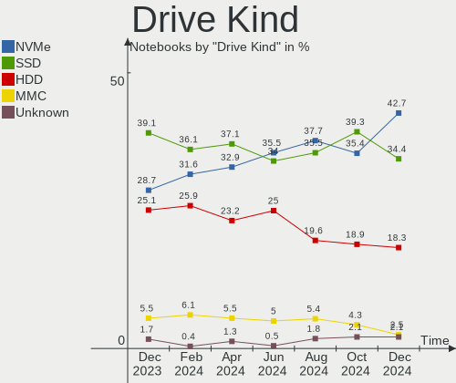
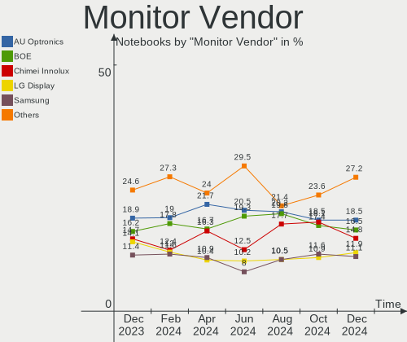
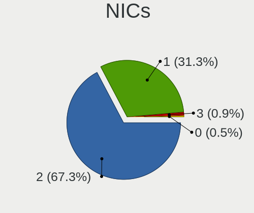
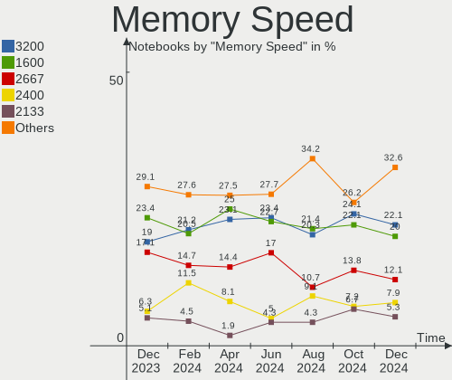

Linux Mint Hardware Trends (Notebooks)
--------------------------------------

A project to identify most popular hardware characteristics and track their change
over time based on data collected by Linux Mint users at https://Linux-Hardware.org.

Anyone can contribute to this report by the [hw-probe](https://github.com/linuxhw/hw-probe) tool:

    sudo -E hw-probe -all -upload

Full-feature report is available here: https://linux-hardware.org/?view=trends

Period: Dec, 2021.

Contents
--------

* [ System ](#system)
  - [ OS                       ](#os)
  - [ OS Family                ](#os-family)
  - [ Kernel                   ](#kernel)
  - [ Kernel Family            ](#kernel-family)
  - [ Kernel Major Ver.        ](#kernel-major-ver)
  - [ Arch                     ](#arch)
  - [ DE                       ](#de)
  - [ Display Server           ](#display-server)
  - [ Display Manager          ](#display-manager)
  - [ OS Lang                  ](#os-lang)
  - [ Boot Mode                ](#boot-mode)
  - [ Filesystem               ](#filesystem)
  - [ Part. scheme             ](#part-scheme)
  - [ Dual Boot with Linux/BSD ](#dual-boot-with-linuxbsd)
  - [ Dual Boot (Win)          ](#dual-boot-win)

* [ Board ](#board)
  - [ Vendor                   ](#vendor)
  - [ Model                    ](#model)
  - [ Model Family             ](#model-family)
  - [ MFG Year                 ](#mfg-year)
  - [ Form Factor              ](#form-factor)
  - [ Secure Boot              ](#secure-boot)
  - [ Coreboot                 ](#coreboot)
  - [ RAM Size                 ](#ram-size)
  - [ RAM Used                 ](#ram-used)
  - [ Total Drives             ](#total-drives)
  - [ Has CD-ROM               ](#has-cd-rom)
  - [ Has Ethernet             ](#has-ethernet)
  - [ Has WiFi                 ](#has-wifi)
  - [ Has Bluetooth            ](#has-bluetooth)

* [ Location ](#location)
  - [ Country                  ](#country)
  - [ City                     ](#city)

* [ Drives ](#drives)
  - [ Drive Vendor             ](#drive-vendor)
  - [ Drive Model              ](#drive-model)
  - [ HDD Vendor               ](#hdd-vendor)
  - [ SSD Vendor               ](#ssd-vendor)
  - [ Drive Kind               ](#drive-kind)
  - [ Drive Connector          ](#drive-connector)
  - [ Drive Size               ](#drive-size)
  - [ Space Total              ](#space-total)
  - [ Space Used               ](#space-used)
  - [ Malfunc. Drives          ](#malfunc-drives)
  - [ Malfunc. Drive Vendor    ](#malfunc-drive-vendor)
  - [ Malfunc. HDD Vendor      ](#malfunc-hdd-vendor)
  - [ Malfunc. Drive Kind      ](#malfunc-drive-kind)
  - [ Failed Drives            ](#failed-drives)
  - [ Failed Drive Vendor      ](#failed-drive-vendor)
  - [ Drive Status             ](#drive-status)

* [ Storage controller ](#storage-controller)
  - [ Storage Vendor           ](#storage-vendor)
  - [ Storage Model            ](#storage-model)
  - [ Storage Kind             ](#storage-kind)

* [ Processor ](#processor)
  - [ CPU Vendor               ](#cpu-vendor)
  - [ CPU Model                ](#cpu-model)
  - [ CPU Model Family         ](#cpu-model-family)
  - [ CPU Cores                ](#cpu-cores)
  - [ CPU Sockets              ](#cpu-sockets)
  - [ CPU Threads              ](#cpu-threads)
  - [ CPU Op-Modes             ](#cpu-op-modes)
  - [ CPU Microcode            ](#cpu-microcode)
  - [ CPU Microarch            ](#cpu-microarch)

* [ Graphics ](#graphics)
  - [ GPU Vendor               ](#gpu-vendor)
  - [ GPU Model                ](#gpu-model)
  - [ GPU Combo                ](#gpu-combo)
  - [ GPU Driver               ](#gpu-driver)
  - [ GPU Memory               ](#gpu-memory)

* [ Monitor ](#monitor)
  - [ Monitor Vendor           ](#monitor-vendor)
  - [ Monitor Model            ](#monitor-model)
  - [ Monitor Resolution       ](#monitor-resolution)
  - [ Monitor Diagonal         ](#monitor-diagonal)
  - [ Monitor Width            ](#monitor-width)
  - [ Aspect Ratio             ](#aspect-ratio)
  - [ Monitor Area             ](#monitor-area)
  - [ Pixel Density            ](#pixel-density)
  - [ Multiple Monitors        ](#multiple-monitors)

* [ Network ](#network)
  - [ Net Controller Vendor    ](#net-controller-vendor)
  - [ Net Controller Model     ](#net-controller-model)
  - [ Wireless Vendor          ](#wireless-vendor)
  - [ Wireless Model           ](#wireless-model)
  - [ Ethernet Vendor          ](#ethernet-vendor)
  - [ Ethernet Model           ](#ethernet-model)
  - [ Net Controller Kind      ](#net-controller-kind)
  - [ Used Controller          ](#used-controller)
  - [ NICs                     ](#nics)
  - [ IPv6                     ](#ipv6)

* [ Bluetooth ](#bluetooth)
  - [ Bluetooth Vendor         ](#bluetooth-vendor)
  - [ Bluetooth Model          ](#bluetooth-model)

* [ Sound ](#sound)
  - [ Sound Vendor             ](#sound-vendor)
  - [ Sound Model              ](#sound-model)

* [ Memory ](#memory)
  - [ Memory Vendor            ](#memory-vendor)
  - [ Memory Model             ](#memory-model)
  - [ Memory Kind              ](#memory-kind)
  - [ Memory Form Factor       ](#memory-form-factor)
  - [ Memory Size              ](#memory-size)
  - [ Memory Speed             ](#memory-speed)

* [ Printers & scanners ](#printers--scanners)
  - [ Printer Vendor           ](#printer-vendor)
  - [ Printer Model            ](#printer-model)
  - [ Scanner Vendor           ](#scanner-vendor)
  - [ Scanner Model            ](#scanner-model)

* [ Camera ](#camera)
  - [ Camera Vendor            ](#camera-vendor)
  - [ Camera Model             ](#camera-model)

* [ Security ](#security)
  - [ Fingerprint Vendor       ](#fingerprint-vendor)
  - [ Fingerprint Model        ](#fingerprint-model)
  - [ Chipcard Vendor          ](#chipcard-vendor)
  - [ Chipcard Model           ](#chipcard-model)

* [ Unsupported ](#unsupported)
  - [ Unsupported Devices      ](#unsupported-devices)
  - [ Unsupported Device Types ](#unsupported-device-types)

System
------

OS
--

Installed operating systems

| Name            | Notebooks | Percent |
|-----------------|-----------|---------|
| Linux Mint 20.2 | 262       | 84.79%  |
| Linux Mint 19.3 | 15        | 4.85%   |
| Linux Mint 20.1 | 12        | 3.88%   |
| Linux Mint 20.3 | 6         | 1.94%   |
| Linux Mint 20   | 6         | 1.94%   |
| Linux Mint 19.1 | 5         | 1.62%   |
| Linux Mint 19   | 2         | 0.65%   |
| Linux Mint 19.2 | 1         | 0.32%   |

OS Family
---------

OS without a version

| Name       | Notebooks | Percent |
|------------|-----------|---------|
| Linux Mint | 309       | 100%    |

Kernel
------

Version of the Linux kernel

| Version                | Notebooks | Percent |
|------------------------|-----------|---------|
| 5.4.0-91-generic       | 200       | 64.72%  |
| 5.4.0-74-generic       | 28        | 9.06%   |
| 5.13.0-22-generic      | 19        | 6.15%   |
| 5.4.0-90-generic       | 13        | 4.21%   |
| 5.11.0-43-generic      | 5         | 1.62%   |
| 5.11.0-41-generic      | 4         | 1.29%   |
| 4.15.0-163-generic     | 4         | 1.29%   |
| 5.4.0-89-generic       | 3         | 0.97%   |
| 5.13.0-21-generic      | 3         | 0.97%   |
| 5.4.0-88-generic       | 2         | 0.65%   |
| 5.4.0-77-generic       | 2         | 0.65%   |
| 5.15.11-xanmod1        | 2         | 0.65%   |
| 5.10.0-1052-oem        | 2         | 0.65%   |
| 5.0.0-32-generic       | 2         | 0.65%   |
| 5.8.0-63-lowlatency    | 1         | 0.32%   |
| 5.8.0-55-generic       | 1         | 0.32%   |
| 5.4.0-91-lowlatency    | 1         | 0.32%   |
| 5.4.0-81-generic       | 1         | 0.32%   |
| 5.4.0-73-generic       | 1         | 0.32%   |
| 5.4.0-67-generic       | 1         | 0.32%   |
| 5.4.0-65-generic       | 1         | 0.32%   |
| 5.4.0-56-generic       | 1         | 0.32%   |
| 5.4.0-54-generic       | 1         | 0.32%   |
| 5.15.9-051509-generic  | 1         | 0.32%   |
| 5.15.6-051506-generic  | 1         | 0.32%   |
| 5.15.5-051505-generic  | 1         | 0.32%   |
| 5.14.11-dickynh        | 1         | 0.32%   |
| 5.14.10-051410-generic | 1         | 0.32%   |
| 5.11.0-40-generic      | 1         | 0.32%   |
| 5.11.0-27-generic      | 1         | 0.32%   |
| 5.11.0-22-generic      | 1         | 0.32%   |
| 4.15.0-54-generic      | 1         | 0.32%   |
| 4.15.0-20-generic      | 1         | 0.32%   |
| 4.15.0-159-generic     | 1         | 0.32%   |

Kernel Family
-------------

Linux kernel without a distro release

| Version | Notebooks | Percent |
|---------|-----------|---------|
| 5.4.0   | 255       | 82.52%  |
| 5.13.0  | 22        | 7.12%   |
| 5.11.0  | 12        | 3.88%   |
| 4.15.0  | 7         | 2.27%   |
| 5.8.0   | 2         | 0.65%   |
| 5.15.11 | 2         | 0.65%   |
| 5.10.0  | 2         | 0.65%   |
| 5.0.0   | 2         | 0.65%   |
| 5.15.9  | 1         | 0.32%   |
| 5.15.6  | 1         | 0.32%   |
| 5.15.5  | 1         | 0.32%   |
| 5.14.11 | 1         | 0.32%   |
| 5.14.10 | 1         | 0.32%   |

Kernel Major Ver.
-----------------

Linux kernel major version

| Version | Notebooks | Percent |
|---------|-----------|---------|
| 5.4     | 255       | 82.52%  |
| 5.13    | 22        | 7.12%   |
| 5.11    | 12        | 3.88%   |
| 4.15    | 7         | 2.27%   |
| 5.15    | 5         | 1.62%   |
| 5.8     | 2         | 0.65%   |
| 5.14    | 2         | 0.65%   |
| 5.10    | 2         | 0.65%   |
| 5.0     | 2         | 0.65%   |

Arch
----

OS architecture (x86_64, i586, etc.)

| Name   | Notebooks | Percent |
|--------|-----------|---------|
| x86_64 | 301       | 97.41%  |
| i686   | 8         | 2.59%   |

DE
--

Desktop Environment

| Name       | Notebooks | Percent |
|------------|-----------|---------|
| X-Cinnamon | 213       | 68.93%  |
| XFCE       | 35        | 11.33%  |
| MATE       | 35        | 11.33%  |
| Cinnamon   | 18        | 5.83%   |
| GNOME      | 4         | 1.29%   |
| i3         | 2         | 0.65%   |
| KDE5       | 1         | 0.32%   |
| Unknown    | 1         | 0.32%   |

Display Server
--------------

X11 or Wayland

| Name | Notebooks | Percent |
|------|-----------|---------|
| X11  | 308       | 99.68%  |
| Tty  | 1         | 0.32%   |

Display Manager
---------------

SDDM, LightDM, etc.

| Name    | Notebooks | Percent |
|---------|-----------|---------|
| Unknown | 157       | 50.81%  |
| LightDM | 149       | 48.22%  |
| GDM     | 3         | 0.97%   |

OS Lang
-------

Language

| Lang    | Notebooks | Percent |
|---------|-----------|---------|
| en_US   | 81        | 26.21%  |
| de_DE   | 75        | 24.27%  |
| en_GB   | 20        | 6.47%   |
| pt_BR   | 14        | 4.53%   |
| fr_FR   | 14        | 4.53%   |
| C       | 13        | 4.21%   |
| ru_RU   | 10        | 3.24%   |
| pl_PL   | 9         | 2.91%   |
| it_IT   | 7         | 2.27%   |
| en_CA   | 6         | 1.94%   |
| de_AT   | 6         | 1.94%   |
| hu_HU   | 5         | 1.62%   |
| es_AR   | 5         | 1.62%   |
| de_CH   | 4         | 1.29%   |
| en_AU   | 3         | 0.97%   |
| cs_CZ   | 3         | 0.97%   |
| sv_SE   | 2         | 0.65%   |
| ru_UA   | 2         | 0.65%   |
| nl_NL   | 2         | 0.65%   |
| hr_HR   | 2         | 0.65%   |
| fr_CA   | 2         | 0.65%   |
| en_IE   | 2         | 0.65%   |
| el_GR   | 2         | 0.65%   |
| Unknown | 2         | 0.65%   |
| uk_UA   | 1         | 0.32%   |
| sl_SI   | 1         | 0.32%   |
| sk_SK   | 1         | 0.32%   |
| ro_RO   | 1         | 0.32%   |
| pt_PT   | 1         | 0.32%   |
| nl_BE   | 1         | 0.32%   |
| id_ID   | 1         | 0.32%   |
| fr_CH   | 1         | 0.32%   |
| fr_BE   | 1         | 0.32%   |
| es_MX   | 1         | 0.32%   |
| es_ES   | 1         | 0.32%   |
| es_CO   | 1         | 0.32%   |
| es_CL   | 1         | 0.32%   |
| en_ZA   | 1         | 0.32%   |
| en_NZ   | 1         | 0.32%   |
| en_IN   | 1         | 0.32%   |
| en_IL   | 1         | 0.32%   |
| bg_BG   | 1         | 0.32%   |

Boot Mode
---------

EFI or BIOS

| Mode | Notebooks | Percent |
|------|-----------|---------|
| EFI  | 165       | 53.4%   |
| BIOS | 144       | 46.6%   |

Filesystem
----------

Type of filesystem

| Type    | Notebooks | Percent |
|---------|-----------|---------|
| Ext4    | 288       | 93.2%   |
| Overlay | 11        | 3.56%   |
| Btrfs   | 8         | 2.59%   |
| Ext3    | 1         | 0.32%   |
| Unknown | 1         | 0.32%   |

Part. scheme
------------

Scheme of partitioning

| Type    | Notebooks | Percent |
|---------|-----------|---------|
| Unknown | 174       | 56.31%  |
| GPT     | 94        | 30.42%  |
| MBR     | 41        | 13.27%  |

Dual Boot with Linux/BSD
------------------------

Hosting more than one Linux/BSD

| Dual boot | Notebooks | Percent |
|-----------|-----------|---------|
| No        | 293       | 94.82%  |
| Yes       | 16        | 5.18%   |

Dual Boot (Win)
---------------

Hosting Linux and Windows

| Dual boot | Notebooks | Percent |
|-----------|-----------|---------|
| No        | 253       | 81.88%  |
| Yes       | 56        | 18.12%  |

Board
-----

Vendor
------

Motherboard manufacturer

| Name                | Notebooks | Percent |
|---------------------|-----------|---------|
| Hewlett-Packard     | 69        | 22.33%  |
| Dell                | 47        | 15.21%  |
| Lenovo              | 43        | 13.92%  |
| Acer                | 42        | 13.59%  |
| ASUSTek Computer    | 32        | 10.36%  |
| Samsung Electronics | 10        | 3.24%   |
| Toshiba             | 8         | 2.59%   |
| Sony                | 7         | 2.27%   |
| Apple               | 6         | 1.94%   |
| Google              | 4         | 1.29%   |
| Fujitsu Siemens     | 4         | 1.29%   |
| Medion              | 3         | 0.97%   |
| HUAWEI              | 3         | 0.97%   |
| Packard Bell        | 2         | 0.65%   |
| MSI                 | 2         | 0.65%   |
| Fujitsu             | 2         | 0.65%   |
| Chuwi               | 2         | 0.65%   |
| BANGHO              | 2         | 0.65%   |
| ZEPTO               | 1         | 0.32%   |
| Wortmann AG         | 1         | 0.32%   |
| Winnovo             | 1         | 0.32%   |
| TrekStor            | 1         | 0.32%   |
| Timi                | 1         | 0.32%   |
| System76            | 1         | 0.32%   |
| Semp Toshiba        | 1         | 0.32%   |
| Schenker            | 1         | 0.32%   |
| PC Specialist       | 1         | 0.32%   |
| Panasonic           | 1         | 0.32%   |
| Notebook            | 1         | 0.32%   |
| NEC Computers       | 1         | 0.32%   |
| Microtech           | 1         | 0.32%   |
| GEO                 | 1         | 0.32%   |
| Exo                 | 1         | 0.32%   |
| eMachine            | 1         | 0.32%   |
| Clevo               | 1         | 0.32%   |
| Casper              | 1         | 0.32%   |
| AVITA               | 1         | 0.32%   |
| Alienware           | 1         | 0.32%   |
| Unknown             | 1         | 0.32%   |

Model
-----

Motherboard model

| Name                                       | Notebooks | Percent |
|--------------------------------------------|-----------|---------|
| HP EliteBook 8460p                         | 3         | 0.97%   |
| Apple MacBookPro8,1                        | 3         | 0.97%   |
| Acer Aspire A515-56                        | 3         | 0.97%   |
| Toshiba Satellite L40                      | 2         | 0.65%   |
| Packard Bell EasyNote LS11HR               | 2         | 0.65%   |
| Lenovo IdeaPad S145-15IGM 81WT             | 2         | 0.65%   |
| HUAWEI KLVL-WXX9                           | 2         | 0.65%   |
| HP ProBook 6460b                           | 2         | 0.65%   |
| HP Pavilion Laptop 15-eh1xxx               | 2         | 0.65%   |
| HP Pavilion dv7                            | 2         | 0.65%   |
| HP Pavilion dv6                            | 2         | 0.65%   |
| HP OMEN by Laptop 16-c0xxx                 | 2         | 0.65%   |
| HP Laptop 17-ca0xxx                        | 2         | 0.65%   |
| HP Laptop 15z-ef2xxx                       | 2         | 0.65%   |
| HP EliteBook 2540p                         | 2         | 0.65%   |
| HP 250 G7 Notebook PC                      | 2         | 0.65%   |
| Dell Latitude E6510                        | 2         | 0.65%   |
| Dell Inspiron 3505                         | 2         | 0.65%   |
| Chuwi HeroBook Air                         | 2         | 0.65%   |
| ASUS VivoBook 15_ASUS Laptop X540MA_X540MA | 2         | 0.65%   |
| ASUS K53E                                  | 2         | 0.65%   |
| Acer Swift SF114-34                        | 2         | 0.65%   |
| Acer Aspire ES1-523                        | 2         | 0.65%   |
| Unknown                                    | 2         | 0.65%   |
| ZEPTO ZNOTE                                | 1         | 0.32%   |
| Wortmann AG TERRA_MOBILE_1512/1712         | 1         | 0.32%   |
| Winnovo V146                               | 1         | 0.32%   |
| TrekStor Surfbook E11B                     | 1         | 0.32%   |
| Toshiba Satellite Pro A200                 | 1         | 0.32%   |
| Toshiba Satellite L500                     | 1         | 0.32%   |
| Toshiba Satellite L50-B                    | 1         | 0.32%   |
| Toshiba Satellite L350D                    | 1         | 0.32%   |
| Toshiba Satellite C660                     | 1         | 0.32%   |
| Toshiba Satellite C55D-B                   | 1         | 0.32%   |
| Timi RedmiBook Pro 14                      | 1         | 0.32%   |
| System76 Oryx Pro                          | 1         | 0.32%   |
| Sony VPCSE1C5E                             | 1         | 0.32%   |
| Sony VPCEA3S1E                             | 1         | 0.32%   |
| Sony VGN-CR41SR_P                          | 1         | 0.32%   |
| Sony VGN-AW41JF_H                          | 1         | 0.32%   |
| Sony SVF1521A1EW                           | 1         | 0.32%   |
| Sony SVE1711Q1EB                           | 1         | 0.32%   |
| Sony SVE14A15FBP                           | 1         | 0.32%   |
| Semp Toshiba IS-1253                       | 1         | 0.32%   |
| Schenker SLIM15_SSL15L19                   | 1         | 0.32%   |
| Samsung R780/R778                          | 1         | 0.32%   |
| Samsung R519/R719                          | 1         | 0.32%   |
| Samsung R510/P510                          | 1         | 0.32%   |
| Samsung NC10                               | 1         | 0.32%   |
| Samsung 950XDB/951XDB/950XDY               | 1         | 0.32%   |
| Samsung 905S3G/906S3G/915S3G               | 1         | 0.32%   |
| Samsung 700Z3A/700Z4A/700Z5A/700Z5B        | 1         | 0.32%   |
| Samsung 550XDA                             | 1         | 0.32%   |
| Samsung 350V5C/351V5C/3540VC/3440VC        | 1         | 0.32%   |
| Samsung 300E4A/300E5A/300E7A               | 1         | 0.32%   |
| PC Specialist TN1-156M                     | 1         | 0.32%   |
| Panasonic CF-31ACB7FPM                     | 1         | 0.32%   |
| Notebook W35xSTQ_370ST                     | 1         | 0.32%   |
| NEC Computers Packard Bell EasyNote        | 1         | 0.32%   |
| MSI GV72 8RE                               | 1         | 0.32%   |

Model Family
------------

Motherboard model prefix

| Name                   | Notebooks | Percent |
|------------------------|-----------|---------|
| Acer Aspire            | 31        | 10.03%  |
| Lenovo ThinkPad        | 22        | 7.12%   |
| Dell Latitude          | 18        | 5.83%   |
| Dell Inspiron          | 18        | 5.83%   |
| HP Pavilion            | 15        | 4.85%   |
| Lenovo IdeaPad         | 11        | 3.56%   |
| HP EliteBook           | 11        | 3.56%   |
| HP ProBook             | 10        | 3.24%   |
| HP Laptop              | 10        | 3.24%   |
| Toshiba Satellite      | 8         | 2.59%   |
| ASUS VivoBook          | 6         | 1.94%   |
| Acer Swift             | 6         | 1.94%   |
| ASUS ZenBook           | 5         | 1.62%   |
| HP 250                 | 4         | 1.29%   |
| Dell Precision         | 4         | 1.29%   |
| Dell Vostro            | 3         | 0.97%   |
| Apple MacBookPro8      | 3         | 0.97%   |
| Packard Bell EasyNote  | 2         | 0.65%   |
| HUAWEI KLVL-WXX9       | 2         | 0.65%   |
| HP ZBook               | 2         | 0.65%   |
| HP Presario            | 2         | 0.65%   |
| HP OMEN                | 2         | 0.65%   |
| HP ENVY                | 2         | 0.65%   |
| HP Compaq              | 2         | 0.65%   |
| Fujitsu Siemens AMILO  | 2         | 0.65%   |
| Fujitsu LIFEBOOK       | 2         | 0.65%   |
| Dell XPS               | 2         | 0.65%   |
| Dell Studio            | 2         | 0.65%   |
| Chuwi HeroBook         | 2         | 0.65%   |
| ASUS ROG               | 2         | 0.65%   |
| ASUS K53E              | 2         | 0.65%   |
| Unknown                | 2         | 0.65%   |
| ZEPTO ZNOTE            | 1         | 0.32%   |
| Wortmann AG TERRA      | 1         | 0.32%   |
| Winnovo V146           | 1         | 0.32%   |
| TrekStor Surfbook      | 1         | 0.32%   |
| Timi RedmiBook         | 1         | 0.32%   |
| System76 Oryx          | 1         | 0.32%   |
| Sony VPCSE1C5E         | 1         | 0.32%   |
| Sony VPCEA3S1E         | 1         | 0.32%   |
| Sony VGN-CR41SR        | 1         | 0.32%   |
| Sony VGN-AW41JF        | 1         | 0.32%   |
| Sony SVF1521A1EW       | 1         | 0.32%   |
| Sony SVE1711Q1EB       | 1         | 0.32%   |
| Sony SVE14A15FBP       | 1         | 0.32%   |
| Semp Toshiba IS-1253   | 1         | 0.32%   |
| Schenker SLIM15        | 1         | 0.32%   |
| Samsung R780           | 1         | 0.32%   |
| Samsung R519           | 1         | 0.32%   |
| Samsung R510           | 1         | 0.32%   |
| Samsung NC10           | 1         | 0.32%   |
| Samsung 950XDB         | 1         | 0.32%   |
| Samsung 905S3G         | 1         | 0.32%   |
| Samsung 700Z3A         | 1         | 0.32%   |
| Samsung 550XDA         | 1         | 0.32%   |
| Samsung 350V5C         | 1         | 0.32%   |
| Samsung 300E4A         | 1         | 0.32%   |
| PC Specialist TN1-156M | 1         | 0.32%   |
| Panasonic CF-31ACB7FPM | 1         | 0.32%   |
| Notebook W35xSTQ       | 1         | 0.32%   |

MFG Year
--------

Motherboard manufacture year

| Year | Notebooks | Percent |
|------|-----------|---------|
| 2021 | 66        | 21.36%  |
| 2019 | 32        | 10.36%  |
| 2020 | 26        | 8.41%   |
| 2010 | 22        | 7.12%   |
| 2011 | 20        | 6.47%   |
| 2018 | 19        | 6.15%   |
| 2014 | 19        | 6.15%   |
| 2013 | 18        | 5.83%   |
| 2015 | 15        | 4.85%   |
| 2012 | 14        | 4.53%   |
| 2009 | 14        | 4.53%   |
| 2017 | 12        | 3.88%   |
| 2016 | 10        | 3.24%   |
| 2007 | 10        | 3.24%   |
| 2008 | 9         | 2.91%   |
| 2006 | 1         | 0.32%   |
| 2005 | 1         | 0.32%   |
| 2004 | 1         | 0.32%   |

Form Factor
-----------

Physical design of the computer

| Name     | Notebooks | Percent |
|----------|-----------|---------|
| Notebook | 309       | 100%    |

Secure Boot
-----------

Enabled or disabled

| State    | Notebooks | Percent |
|----------|-----------|---------|
| Disabled | 262       | 84.79%  |
| Enabled  | 47        | 15.21%  |

Coreboot
--------

Have coreboot on board

| Used | Notebooks | Percent |
|------|-----------|---------|
| No   | 305       | 98.71%  |
| Yes  | 4         | 1.29%   |

RAM Size
--------

Total RAM memory

| Size in GB | Notebooks | Percent |
|------------|-----------|---------|
| 3.01-4.0   | 98        | 31.72%  |
| 4.01-8.0   | 93        | 30.1%   |
| 8.01-16.0  | 51        | 16.5%   |
| 16.01-24.0 | 33        | 10.68%  |
| 1.01-2.0   | 17        | 5.5%    |
| 32.01-64.0 | 7         | 2.27%   |
| 2.01-3.0   | 6         | 1.94%   |
| 24.01-32.0 | 2         | 0.65%   |
| 0.51-1.0   | 2         | 0.65%   |

RAM Used
--------

Used RAM memory

| Used GB   | Notebooks | Percent |
|-----------|-----------|---------|
| 1.01-2.0  | 150       | 48.54%  |
| 2.01-3.0  | 80        | 25.89%  |
| 3.01-4.0  | 30        | 9.71%   |
| 4.01-8.0  | 25        | 8.09%   |
| 0.51-1.0  | 21        | 6.8%    |
| 8.01-16.0 | 3         | 0.97%   |

Total Drives
------------

Number of drives on board

| Drives | Notebooks | Percent |
|--------|-----------|---------|
| 1      | 239       | 77.35%  |
| 2      | 65        | 21.04%  |
| 0      | 3         | 0.97%   |
| 3      | 2         | 0.65%   |

Has CD-ROM
----------

Has CD-ROM on board

| Presented | Notebooks | Percent |
|-----------|-----------|---------|
| No        | 165       | 53.4%   |
| Yes       | 144       | 46.6%   |

Has Ethernet
------------

Has Ethernet on board

| Presented | Notebooks | Percent |
|-----------|-----------|---------|
| Yes       | 246       | 79.61%  |
| No        | 63        | 20.39%  |

Has WiFi
--------

Has WiFi module

| Presented | Notebooks | Percent |
|-----------|-----------|---------|
| Yes       | 306       | 99.03%  |
| No        | 3         | 0.97%   |

Has Bluetooth
-------------

Has Bluetooth module

| Presented | Notebooks | Percent |
|-----------|-----------|---------|
| Yes       | 223       | 72.17%  |
| No        | 86        | 27.83%  |

Location
--------

Country
-------

Geographic location (country)

| Country                | Notebooks | Percent |
|------------------------|-----------|---------|
| Germany                | 79        | 25.57%  |
| USA                    | 46        | 14.89%  |
| Brazil                 | 18        | 5.83%   |
| UK                     | 17        | 5.5%    |
| France                 | 15        | 4.85%   |
| Poland                 | 12        | 3.88%   |
| Russia                 | 11        | 3.56%   |
| Austria                | 9         | 2.91%   |
| Italy                  | 8         | 2.59%   |
| Canada                 | 8         | 2.59%   |
| Argentina              | 8         | 2.59%   |
| Ukraine                | 7         | 2.27%   |
| Netherlands            | 7         | 2.27%   |
| Switzerland            | 6         | 1.94%   |
| Hungary                | 5         | 1.62%   |
| Sweden                 | 4         | 1.29%   |
| Norway                 | 4         | 1.29%   |
| Australia              | 4         | 1.29%   |
| Czechia                | 3         | 0.97%   |
| Belgium                | 3         | 0.97%   |
| Tunisia                | 2         | 0.65%   |
| Slovakia               | 2         | 0.65%   |
| Israel                 | 2         | 0.65%   |
| Ireland                | 2         | 0.65%   |
| Indonesia              | 2         | 0.65%   |
| Greece                 | 2         | 0.65%   |
| Croatia                | 2         | 0.65%   |
| Bulgaria               | 2         | 0.65%   |
| Bosnia and Herzegovina | 2         | 0.65%   |
| Uzbekistan             | 1         | 0.32%   |
| Turkey                 | 1         | 0.32%   |
| South Africa           | 1         | 0.32%   |
| Slovenia               | 1         | 0.32%   |
| Romania                | 1         | 0.32%   |
| Portugal               | 1         | 0.32%   |
| Pakistan               | 1         | 0.32%   |
| New Zealand            | 1         | 0.32%   |
| Mexico                 | 1         | 0.32%   |
| Malta                  | 1         | 0.32%   |
| Malaysia               | 1         | 0.32%   |
| Jordan                 | 1         | 0.32%   |
| Japan                  | 1         | 0.32%   |
| India                  | 1         | 0.32%   |
| Estonia                | 1         | 0.32%   |
| Colombia               | 1         | 0.32%   |
| Chile                  | 1         | 0.32%   |

City
----

Geographic location (city)

| City                      | Notebooks | Percent |
|---------------------------|-----------|---------|
| Berlin                    | 13        | 4.21%   |
| Moscow                    | 6         | 1.94%   |
| Montgomery Village        | 6         | 1.94%   |
| Cologne                   | 6         | 1.94%   |
| Kaiserslautern            | 5         | 1.62%   |
| Vienna                    | 4         | 1.29%   |
| Paris                     | 3         | 0.97%   |
| Nuremberg                 | 3         | 0.97%   |
| Kyiv                      | 3         | 0.97%   |
| Zagreb                    | 2         | 0.65%   |
| Tunis                     | 2         | 0.65%   |
| Sydney                    | 2         | 0.65%   |
| Stuttgart                 | 2         | 0.65%   |
| St Petersburg             | 2         | 0.65%   |
| Sofia                     | 2         | 0.65%   |
| Salvador                  | 2         | 0.65%   |
| Rosario                   | 2         | 0.65%   |
| Opelousas                 | 2         | 0.65%   |
| Mjoelby                   | 2         | 0.65%   |
| Los Angeles               | 2         | 0.65%   |
| Krakow                    | 2         | 0.65%   |
| Hamburg                   | 2         | 0.65%   |
| Edinburgh                 | 2         | 0.65%   |
| East Longmeadow           | 2         | 0.65%   |
| Duna??jv??ros             | 2         | 0.65%   |
| Calgary                   | 2         | 0.65%   |
| Buenos Aires              | 2         | 0.65%   |
| Bratislava                | 2         | 0.65%   |
| Zurich                    | 1         | 0.32%   |
| Zoetermeer                | 1         | 0.32%   |
| Zenica                    | 1         | 0.32%   |
| Wroclaw                   | 1         | 0.32%   |
| Wolnzach                  | 1         | 0.32%   |
| Wolfsberg im Schwarzautal | 1         | 0.32%   |
| Wirral                    | 1         | 0.32%   |
| Wilde                     | 1         | 0.32%   |
| Wiesbaden                 | 1         | 0.32%   |
| Weimar                    | 1         | 0.32%   |
| Wateringen                | 1         | 0.32%   |
| Warsaw                    | 1         | 0.32%   |
| Walton on Thames          | 1         | 0.32%   |
| Walsall                   | 1         | 0.32%   |
| Voronezh                  | 1         | 0.32%   |
| Vladimir                  | 1         | 0.32%   |
| Vlaardingen               | 1         | 0.32%   |
| Vinhedo                   | 1         | 0.32%   |
| Vi?±a del Mar             | 1         | 0.32%   |
| Velyki Mosty              | 1         | 0.32%   |
| Uxbridge                  | 1         | 0.32%   |
| Unlingen                  | 1         | 0.32%   |
| Ujfeherto                 | 1         | 0.32%   |
| Uhingen                   | 1         | 0.32%   |
| Uberl??ndia               | 1         | 0.32%   |
| Truro                     | 1         | 0.32%   |
| Trois-Rivi??res           | 1         | 0.32%   |
| Torun                     | 1         | 0.32%   |
| Tokyo                     | 1         | 0.32%   |
| T??bingen                 | 1         | 0.32%   |
| Tashkent                  | 1         | 0.32%   |
| Taranto                   | 1         | 0.32%   |

Drives
------

Drive Vendor
------------

Hard drive vendors

| Vendor                         | Notebooks | Drives | Percent |
|--------------------------------|-----------|--------|---------|
| WDC                            | 51        | 52     | 14.33%  |
| Samsung Electronics            | 47        | 50     | 13.2%   |
| Seagate                        | 35        | 35     | 9.83%   |
| Toshiba                        | 34        | 34     | 9.55%   |
| Kingston                       | 25        | 26     | 7.02%   |
| Unknown                        | 19        | 25     | 5.34%   |
| SanDisk                        | 16        | 16     | 4.49%   |
| Hitachi                        | 16        | 16     | 4.49%   |
| Crucial                        | 12        | 12     | 3.37%   |
| Intel                          | 11        | 11     | 3.09%   |
| Micron Technology              | 8         | 8      | 2.25%   |
| SK Hynix                       | 7         | 7      | 1.97%   |
| HGST                           | 7         | 7      | 1.97%   |
| A-DATA Technology              | 6         | 6      | 1.69%   |
| SSSTC                          | 5         | 5      | 1.4%    |
| Phison                         | 4         | 4      | 1.12%   |
| Netac                          | 4         | 4      | 1.12%   |
| KIOXIA                         | 4         | 4      | 1.12%   |
| China                          | 4         | 4      | 1.12%   |
| Transcend                      | 3         | 3      | 0.84%   |
| Fujitsu                        | 3         | 3      | 0.84%   |
| OCZ                            | 2         | 2      | 0.56%   |
| KingSpec                       | 2         | 2      | 0.56%   |
| Intenso                        | 2         | 2      | 0.56%   |
| Apple                          | 2         | 2      | 0.56%   |
| Apacer                         | 2         | 2      | 0.56%   |
| ADATA Technology               | 2         | 2      | 0.56%   |
| Unknown                        | 2         | 2      | 0.56%   |
| XrayDisk                       | 1         | 1      | 0.28%   |
| Team                           | 1         | 1      | 0.28%   |
| TCSUNBOW                       | 1         | 1      | 0.28%   |
| Solid State Storage Technology | 1         | 1      | 0.28%   |
| PNY                            | 1         | 1      | 0.28%   |
| oyunkey                        | 1         | 1      | 0.28%   |
| Microtech                      | 1         | 1      | 0.28%   |
| LITEON                         | 1         | 1      | 0.28%   |
| Lexar                          | 1         | 1      | 0.28%   |
| Kingrich                       | 1         | 1      | 0.28%   |
| KINGPAN                        | 1         | 1      | 0.28%   |
| KingFast                       | 1         | 1      | 0.28%   |
| Kingchuxing                    | 1         | 1      | 0.28%   |
| JMicron                        | 1         | 1      | 0.28%   |
| JetFlash                       | 1         | 1      | 0.28%   |
| GOODRAM                        | 1         | 1      | 0.28%   |
| Gigabyte Technology            | 1         | 1      | 0.28%   |
| FORESEE                        | 1         | 1      | 0.28%   |
| Corsair                        | 1         | 1      | 0.28%   |
| AMD                            | 1         | 1      | 0.28%   |
| AFOX                           | 1         | 1      | 0.28%   |

Drive Model
-----------

Hard drive models

| Model                              | Notebooks | Percent |
|------------------------------------|-----------|---------|
| Kingston SA400S37240G 240GB SSD    | 11        | 3%      |
| Unknown MMC Card  32GB             | 5         | 1.36%   |
| Toshiba MQ01ABF050 500GB           | 5         | 1.36%   |
| Seagate ST500LT012-1DG142 500GB    | 4         | 1.09%   |
| Seagate ST1000LM035-1RK172 1TB     | 4         | 1.09%   |
| Seagate ST1000LM024 HN-M101MBB 1TB | 4         | 1.09%   |
| WDC WD10SPZX-21Z10T0 1TB           | 3         | 0.82%   |
| Unknown MMC Card  64GB             | 3         | 0.82%   |
| Toshiba MQ01ABD100 1TB             | 3         | 0.82%   |
| Seagate ST9250410AS 250GB          | 3         | 0.82%   |
| Samsung SSD 860 EVO 500GB          | 3         | 0.82%   |
| Samsung SSD 850 EVO 500GB          | 3         | 0.82%   |
| Samsung NVMe SSD Drive 512GB       | 3         | 0.82%   |
| Kingston SA400S37480G 480GB SSD    | 3         | 0.82%   |
| Intel NVMe SSD Drive 512GB         | 3         | 0.82%   |
| Hitachi HTS543225L9A300 250GB      | 3         | 0.82%   |
| Crucial CT480BX500SSD1 480GB       | 3         | 0.82%   |
| Crucial CT1000MX500SSD1 1TB        | 3         | 0.82%   |
| WDC WDS500G2B0A-00SM50 500GB SSD   | 2         | 0.54%   |
| WDC WD10SPZX-60Z10T0 1TB           | 2         | 0.54%   |
| Unknown DA4128  128GB              | 2         | 0.54%   |
| Toshiba NVMe SSD Drive 512GB       | 2         | 0.54%   |
| Toshiba MQ04ABF100 1TB             | 2         | 0.54%   |
| Toshiba MK3265GSX 320GB            | 2         | 0.54%   |
| Toshiba MK1646GSX 160GB            | 2         | 0.54%   |
| SSSTC CL1-8D128-HP 128GB           | 2         | 0.54%   |
| SK Hynix HFM512GDJTNI-82A0A 512GB  | 2         | 0.54%   |
| Seagate ST9500325AS 500GB          | 2         | 0.54%   |
| Seagate ST500LT012-9WS142 500GB    | 2         | 0.54%   |
| Seagate ST500LM000-SSHD-8GB        | 2         | 0.54%   |
| Seagate ST320LT007-9ZV142 320GB    | 2         | 0.54%   |
| SanDisk SDSSDA480G 480GB           | 2         | 0.54%   |
| Samsung SSD 870 EVO 1TB            | 2         | 0.54%   |
| Samsung SSD 850 EVO 250GB          | 2         | 0.54%   |
| Samsung SSD 840 EVO 250GB          | 2         | 0.54%   |
| Samsung PM9A1 NVMe 512GB           | 2         | 0.54%   |
| Samsung NVMe SSD Drive 1024GB      | 2         | 0.54%   |
| Phison 311CD0512GB                 | 2         | 0.54%   |
| Netac S535N8/128 128GB             | 2         | 0.54%   |
| Micron 2210_MTFDHBA1T0QFD 1TB      | 2         | 0.54%   |
| Micron 1100 SATA 256GB SSD         | 2         | 0.54%   |
| Kingston SA400S37960G 960GB SSD    | 2         | 0.54%   |
| Kingston SA400S37120G 120GB SSD    | 2         | 0.54%   |
| Kingston NVMe SSD Drive 512GB      | 2         | 0.54%   |
| Intel SSDPEKNW512G8H 512GB         | 2         | 0.54%   |
| Intel SSDPEKNW010T8 1TB            | 2         | 0.54%   |
| Hitachi HTS545032B9A300 320GB      | 2         | 0.54%   |
| Hitachi HTS542525K9SA00 250GB      | 2         | 0.54%   |
| HGST HTS541010A7E630 1TB           | 2         | 0.54%   |
| Crucial CT240BX500SSD1 240GB       | 2         | 0.54%   |
| China SSD 256GB                    | 2         | 0.54%   |
| A-DATA SU630 240GB SSD             | 2         | 0.54%   |
| Unknown                            | 2         | 0.54%   |
| XrayDisk 512GB                     | 1         | 0.27%   |
| WDC WDS480G2G0B-00EPW0 480GB SSD   | 1         | 0.27%   |
| WDC WDS250G1B0A-00H9H0 250GB SSD   | 1         | 0.27%   |
| WDC WDS240G2G0A-00JH30 240GB SSD   | 1         | 0.27%   |
| WDC WDS240G1G0B-00RC30 240GB SSD   | 1         | 0.27%   |
| WDC WDS100T2B0B-00YS70 1TB SSD     | 1         | 0.27%   |
| WDC WDBA3V0010BNC-WRSN 1TB         | 1         | 0.27%   |

HDD Vendor
----------

Hard disk drive vendors

| Vendor              | Notebooks | Drives | Percent |
|---------------------|-----------|--------|---------|
| Seagate             | 35        | 35     | 27.78%  |
| WDC                 | 34        | 34     | 26.98%  |
| Toshiba             | 29        | 29     | 23.02%  |
| Hitachi             | 16        | 16     | 12.7%   |
| HGST                | 7         | 7      | 5.56%   |
| Fujitsu             | 3         | 3      | 2.38%   |
| Samsung Electronics | 2         | 2      | 1.59%   |

SSD Vendor
----------

Solid state drive vendors

| Vendor              | Notebooks | Drives | Percent |
|---------------------|-----------|--------|---------|
| Samsung Electronics | 24        | 25     | 19.35%  |
| Kingston            | 23        | 24     | 18.55%  |
| Crucial             | 12        | 12     | 9.68%   |
| SanDisk             | 11        | 11     | 8.87%   |
| WDC                 | 7         | 7      | 5.65%   |
| Netac               | 4         | 4      | 3.23%   |
| China               | 4         | 4      | 3.23%   |
| A-DATA Technology   | 4         | 4      | 3.23%   |
| Micron Technology   | 3         | 3      | 2.42%   |
| Transcend           | 2         | 2      | 1.61%   |
| Toshiba             | 2         | 2      | 1.61%   |
| OCZ                 | 2         | 2      | 1.61%   |
| KingSpec            | 2         | 2      | 1.61%   |
| Intel               | 2         | 2      | 1.61%   |
| Apple               | 2         | 2      | 1.61%   |
| Apacer              | 2         | 2      | 1.61%   |
| Team                | 1         | 1      | 0.81%   |
| TCSUNBOW            | 1         | 1      | 0.81%   |
| SK Hynix            | 1         | 1      | 0.81%   |
| PNY                 | 1         | 1      | 0.81%   |
| PHISON              | 1         | 1      | 0.81%   |
| Microtech           | 1         | 1      | 0.81%   |
| LITEON              | 1         | 1      | 0.81%   |
| Lexar               | 1         | 1      | 0.81%   |
| Kingrich            | 1         | 1      | 0.81%   |
| KINGPAN             | 1         | 1      | 0.81%   |
| KingFast            | 1         | 1      | 0.81%   |
| Kingchuxing         | 1         | 1      | 0.81%   |
| Intenso             | 1         | 1      | 0.81%   |
| GOODRAM             | 1         | 1      | 0.81%   |
| FORESEE             | 1         | 1      | 0.81%   |
| Corsair             | 1         | 1      | 0.81%   |
| AFOX                | 1         | 1      | 0.81%   |
| Unknown             | 1         | 1      | 0.81%   |

Drive Kind
----------

HDD or SSD

| Kind    | Notebooks | Drives | Percent |
|---------|-----------|--------|---------|
| HDD     | 125       | 126    | 35.82%  |
| SSD     | 118       | 126    | 33.81%  |
| NVMe    | 81        | 84     | 23.21%  |
| MMC     | 20        | 26     | 5.73%   |
| Unknown | 5         | 5      | 1.43%   |

Drive Connector
---------------

SATA, SAS, NVMe, etc.

| Type | Notebooks | Drives | Percent |
|------|-----------|--------|---------|
| SATA | 226       | 251    | 67.87%  |
| NVMe | 81        | 84     | 24.32%  |
| MMC  | 20        | 26     | 6.01%   |
| SAS  | 6         | 6      | 1.8%    |

Drive Size
----------

Size of hard drive

| Size in TB | Notebooks | Drives | Percent |
|------------|-----------|--------|---------|
| 0.01-0.5   | 177       | 189    | 74.06%  |
| 0.51-1.0   | 56        | 57     | 23.43%  |
| 1.01-2.0   | 4         | 4      | 1.67%   |
| 3.01-4.0   | 1         | 1      | 0.42%   |
| 4.01-10.0  | 1         | 1      | 0.42%   |

Space Total
-----------

Amount of disk space available on the file system

| Size in GB     | Notebooks | Percent |
|----------------|-----------|---------|
| 101-250        | 112       | 36.25%  |
| 251-500        | 89        | 28.8%   |
| 501-1000       | 43        | 13.92%  |
| 1001-2000      | 17        | 5.5%    |
| 51-100         | 17        | 5.5%    |
| 21-50          | 14        | 4.53%   |
| 1-20           | 8         | 2.59%   |
| 2001-3000      | 6         | 1.94%   |
| More than 3000 | 2         | 0.65%   |
| Unknown        | 1         | 0.32%   |

Space Used
----------

Amount of used disk space

| Used GB   | Notebooks | Percent |
|-----------|-----------|---------|
| 1-20      | 104       | 33.66%  |
| 21-50     | 84        | 27.18%  |
| 101-250   | 45        | 14.56%  |
| 51-100    | 43        | 13.92%  |
| 251-500   | 19        | 6.15%   |
| 501-1000  | 9         | 2.91%   |
| 1001-2000 | 3         | 0.97%   |
| 2001-3000 | 1         | 0.32%   |
| Unknown   | 1         | 0.32%   |

Malfunc. Drives
---------------

Drive models with a malfunction

| Model                                         | Notebooks | Drives | Percent |
|-----------------------------------------------|-----------|--------|---------|
| Seagate ST1000LM035-1RK172 1TB                | 2         | 2      | 10.53%  |
| WDC WD7500BPVX-22JC3T0 752GB                  | 1         | 1      | 5.26%   |
| WDC WD1600BEVT-00ZCT0 160GB                   | 1         | 1      | 5.26%   |
| WDC WD10SPZX-60Z10T0 1TB                      | 1         | 1      | 5.26%   |
| Toshiba MK7575GSX 752GB                       | 1         | 1      | 5.26%   |
| Toshiba MK1237GSX 120GB                       | 1         | 1      | 5.26%   |
| Seagate ST9500325AS 500GB                     | 1         | 1      | 5.26%   |
| Seagate ST9320325AS 320GB                     | 1         | 1      | 5.26%   |
| Seagate ST500LT012-1DG142 500GB               | 1         | 1      | 5.26%   |
| Seagate ST500LM000-SSHD-8GB                   | 1         | 1      | 5.26%   |
| Seagate ST1000LM 024 HN-M101MBB 1TB           | 1         | 1      | 5.26%   |
| Samsung Electronics SSD 750 EVO 250GB         | 1         | 1      | 5.26%   |
| Micron Technology C300-MTFDDAC064MAG 64GB SSD | 1         | 1      | 5.26%   |
| Hitachi HTS547575A9E384 752GB                 | 1         | 1      | 5.26%   |
| Hitachi HTS543232A7A384 320GB                 | 1         | 1      | 5.26%   |
| Hitachi HTS542525K9SA00 250GB                 | 1         | 1      | 5.26%   |
| HGST HTS545050A7E380 500GB                    | 1         | 1      | 5.26%   |
| HGST HTS541010A7E630 1TB                      | 1         | 1      | 5.26%   |

Malfunc. Drive Vendor
---------------------

Vendors of faulty drives

| Vendor              | Notebooks | Drives | Percent |
|---------------------|-----------|--------|---------|
| Seagate             | 7         | 7      | 36.84%  |
| WDC                 | 3         | 3      | 15.79%  |
| Hitachi             | 3         | 3      | 15.79%  |
| Toshiba             | 2         | 2      | 10.53%  |
| HGST                | 2         | 2      | 10.53%  |
| Samsung Electronics | 1         | 1      | 5.26%   |
| Micron Technology   | 1         | 1      | 5.26%   |

Malfunc. HDD Vendor
-------------------

Vendors of faulty HDD drives

| Vendor  | Notebooks | Drives | Percent |
|---------|-----------|--------|---------|
| Seagate | 7         | 7      | 41.18%  |
| WDC     | 3         | 3      | 17.65%  |
| Hitachi | 3         | 3      | 17.65%  |
| Toshiba | 2         | 2      | 11.76%  |
| HGST    | 2         | 2      | 11.76%  |

Malfunc. Drive Kind
-------------------

Kinds of faulty drives

| Kind | Notebooks | Drives | Percent |
|------|-----------|--------|---------|
| HDD  | 17        | 17     | 89.47%  |
| SSD  | 2         | 2      | 10.53%  |

Failed Drives
-------------

Failed drive models

Zero info for selected period =(

Failed Drive Vendor
-------------------

Failed drive vendors

Zero info for selected period =(

Drive Status
------------

Number of failed and malfunc. drives

| Status   | Notebooks | Drives | Percent |
|----------|-----------|--------|---------|
| Detected | 188       | 214    | 58.57%  |
| Works    | 114       | 134    | 35.51%  |
| Malfunc  | 19        | 19     | 5.92%   |

Storage controller
------------------

Storage Vendor
--------------

Storage controller vendors

| Vendor                           | Notebooks | Percent |
|----------------------------------|-----------|---------|
| Intel                            | 228       | 65.14%  |
| AMD                              | 41        | 11.71%  |
| Samsung Electronics              | 24        | 6.86%   |
| Sandisk                          | 15        | 4.29%   |
| Solid State Storage Technology   | 6         | 1.71%   |
| SK Hynix                         | 6         | 1.71%   |
| Micron Technology                | 5         | 1.43%   |
| Phison Electronics               | 4         | 1.14%   |
| KIOXIA                           | 4         | 1.14%   |
| Toshiba America Info Systems     | 3         | 0.86%   |
| VIA Technologies                 | 2         | 0.57%   |
| Silicon Integrated Systems [SiS] | 2         | 0.57%   |
| Realtek Semiconductor            | 2         | 0.57%   |
| Kingston Technology Company      | 2         | 0.57%   |
| ADATA Technology                 | 2         | 0.57%   |
| Silicon Motion                   | 1         | 0.29%   |
| Nvidia                           | 1         | 0.29%   |
| JMicron Technology               | 1         | 0.29%   |
| ASMedia Technology               | 1         | 0.29%   |

Storage Model
-------------

Storage controller models

| Model                                                                                  | Notebooks | Percent |
|----------------------------------------------------------------------------------------|-----------|---------|
| AMD FCH SATA Controller [AHCI mode]                                                    | 30        | 7.73%   |
| Intel 7 Series Chipset Family 6-port SATA Controller [AHCI mode]                       | 23        | 5.93%   |
| Intel 6 Series/C200 Series Chipset Family 6 port Mobile SATA AHCI Controller           | 21        | 5.41%   |
| Intel Sunrise Point-LP SATA Controller [AHCI mode]                                     | 18        | 4.64%   |
| Intel 82801IBM/IEM (ICH9M/ICH9M-E) 4 port SATA Controller [AHCI mode]                  | 16        | 4.12%   |
| Intel 82801 Mobile SATA Controller [RAID mode]                                         | 15        | 3.87%   |
| Intel Volume Management Device NVMe RAID Controller                                    | 14        | 3.61%   |
| Intel Celeron/Pentium Silver Processor SATA Controller                                 | 13        | 3.35%   |
| Samsung NVMe SSD Controller SM981/PM981/PM983                                          | 12        | 3.09%   |
| Intel 8 Series SATA Controller 1 [AHCI mode]                                           | 12        | 3.09%   |
| Intel Tiger Lake-LP SATA Controller [AHCI mode]                                        | 11        | 2.84%   |
| Intel 82801HM/HEM (ICH8M/ICH8M-E) SATA Controller [AHCI mode]                          | 11        | 2.84%   |
| Intel 8 Series/C220 Series Chipset Family 6-port SATA Controller 1 [AHCI mode]         | 11        | 2.84%   |
| Intel 82801HM/HEM (ICH8M/ICH8M-E) IDE Controller                                       | 10        | 2.58%   |
| Intel 5 Series/3400 Series Chipset 6 port SATA AHCI Controller                         | 10        | 2.58%   |
| Intel 5 Series/3400 Series Chipset 4 port SATA AHCI Controller                         | 9         | 2.32%   |
| Sandisk WD Blue SN550 NVMe SSD                                                         | 7         | 1.8%    |
| Samsung NVMe SSD Controller 980                                                        | 7         | 1.8%    |
| Intel SSD 660P Series                                                                  | 7         | 1.8%    |
| Solid State Storage Non-Volatile memory controller                                     | 6         | 1.55%   |
| Micron Non-Volatile memory controller                                                  | 5         | 1.29%   |
| Intel Wildcat Point-LP SATA Controller [AHCI Mode]                                     | 5         | 1.29%   |
| Intel Atom Processor E3800 Series SATA AHCI Controller                                 | 5         | 1.29%   |
| Intel 82801GBM/GHM (ICH7-M Family) SATA Controller [IDE mode]                          | 5         | 1.29%   |
| AMD SB7x0/SB8x0/SB9x0 SATA Controller [AHCI mode]                                      | 5         | 1.29%   |
| KIOXIA Non-Volatile memory controller                                                  | 4         | 1.03%   |
| Intel Ice Lake-LP SATA Controller [AHCI mode]                                          | 4         | 1.03%   |
| Intel Comet Lake SATA AHCI Controller                                                  | 4         | 1.03%   |
| SK Hynix BC511                                                                         | 3         | 0.77%   |
| Sandisk WD Blue SN500 / PC SN520 NVMe SSD                                              | 3         | 0.77%   |
| Phison PS5013 E13 NVMe Controller                                                      | 3         | 0.77%   |
| Intel Cannon Point-LP SATA Controller [AHCI Mode]                                      | 3         | 0.77%   |
| Intel Cannon Lake Mobile PCH SATA AHCI Controller                                      | 3         | 0.77%   |
| Intel Atom/Celeron/Pentium Processor x5-E8000/J3xxx/N3xxx Series SATA Controller       | 3         | 0.77%   |
| AMD SB7x0/SB8x0/SB9x0 IDE Controller                                                   | 3         | 0.77%   |
| VIA VT82C586A/B/VT82C686/A/B/VT823x/A/C PIPC Bus Master IDE                            | 2         | 0.52%   |
| Toshiba America Info Systems XG6 NVMe SSD Controller                                   | 2         | 0.52%   |
| SK Hynix BC501 NVMe Solid State Drive                                                  | 2         | 0.52%   |
| Silicon Integrated Systems [SiS] SATA Controller / IDE mode                            | 2         | 0.52%   |
| Silicon Integrated Systems [SiS] 5513 IDE Controller                                   | 2         | 0.52%   |
| Sandisk Non-Volatile memory controller                                                 | 2         | 0.52%   |
| Samsung NVMe SSD Controller PM9A1/PM9A3/980PRO                                         | 2         | 0.52%   |
| Realtek Realtek Non-Volatile memory controller                                         | 2         | 0.52%   |
| Intel Q170/Q150/B150/H170/H110/Z170/CM236 Chipset SATA Controller [AHCI Mode]          | 2         | 0.52%   |
| Intel Non-Volatile memory controller                                                   | 2         | 0.52%   |
| Intel NM10/ICH7 Family SATA Controller [AHCI mode]                                     | 2         | 0.52%   |
| Intel 6 Series/C200 Series Chipset Family Mobile SATA Controller (IDE mode, ports 4-5) | 2         | 0.52%   |
| Intel 6 Series/C200 Series Chipset Family Mobile SATA Controller (IDE mode, ports 0-3) | 2         | 0.52%   |
| Intel 5 Series/3400 Series Chipset 4 port SATA IDE Controller                          | 2         | 0.52%   |
| Intel 5 Series/3400 Series Chipset 2 port SATA IDE Controller                          | 2         | 0.52%   |
| AMD SB600 Non-Raid-5 SATA                                                              | 2         | 0.52%   |
| AMD SB600 IDE                                                                          | 2         | 0.52%   |
| AMD FCH SATA Controller [IDE mode]                                                     | 2         | 0.52%   |
| AMD FCH IDE Controller                                                                 | 2         | 0.52%   |
| ADATA Non-Volatile memory controller                                                   | 2         | 0.52%   |
| Toshiba America Info Systems BG3 NVMe SSD Controller                                   | 1         | 0.26%   |
| SK Hynix PC401 NVMe Solid State Drive 256GB                                            | 1         | 0.26%   |
| Silicon Motion SM2262/SM2262EN SSD Controller                                          | 1         | 0.26%   |
| Sandisk WD Black SN750 / PC SN730 NVMe SSD                                             | 1         | 0.26%   |
| Sandisk WD Black 2018/SN750 / PC SN720 NVMe SSD                                        | 1         | 0.26%   |

Storage Kind
------------

Kind of storage controller (IDE, SATA, NVMe, SAS, ...)

| Kind | Notebooks | Percent |
|------|-----------|---------|
| SATA | 232       | 61.54%  |
| NVMe | 81        | 21.49%  |
| IDE  | 35        | 9.28%   |
| RAID | 29        | 7.69%   |

Processor
---------

CPU Vendor
----------

Processor vendors

| Vendor | Notebooks | Percent |
|--------|-----------|---------|
| Intel  | 247       | 79.94%  |
| AMD    | 62        | 20.06%  |

CPU Model
---------

Processor models

| Model                                         | Notebooks | Percent |
|-----------------------------------------------|-----------|---------|
| Intel 11th Gen Core i7-1165G7 @ 2.80GHz       | 9         | 2.91%   |
| Intel Core i5 CPU M 520 @ 2.40GHz             | 7         | 2.27%   |
| Intel 11th Gen Core i5-1135G7 @ 2.40GHz       | 7         | 2.27%   |
| Intel Core i5-7200U CPU @ 2.50GHz             | 6         | 1.94%   |
| Intel Celeron N4000 CPU @ 1.10GHz             | 6         | 1.94%   |
| AMD Ryzen 5 5500U with Radeon Graphics        | 6         | 1.94%   |
| Intel Core i5-2520M CPU @ 2.50GHz             | 5         | 1.62%   |
| Intel Core i5-2450M CPU @ 2.50GHz             | 5         | 1.62%   |
| Intel Celeron N4020 CPU @ 1.10GHz             | 5         | 1.62%   |
| AMD Ryzen 5 3500U with Radeon Vega Mobile Gfx | 5         | 1.62%   |
| Intel Core i5-3230M CPU @ 2.60GHz             | 4         | 1.29%   |
| Intel Core i5-3210M CPU @ 2.50GHz             | 4         | 1.29%   |
| Intel Core i3-6006U CPU @ 2.00GHz             | 4         | 1.29%   |
| Intel Pentium Dual CPU T2330 @ 1.60GHz        | 3         | 0.97%   |
| Intel Core i7-8565U CPU @ 1.80GHz             | 3         | 0.97%   |
| Intel Core i7-4500U CPU @ 1.80GHz             | 3         | 0.97%   |
| Intel Core i7-1065G7 CPU @ 1.30GHz            | 3         | 0.97%   |
| Intel Core i5-5200U CPU @ 2.20GHz             | 3         | 0.97%   |
| Intel Core i5 CPU M 540 @ 2.53GHz             | 3         | 0.97%   |
| Intel Core i3 CPU M 370 @ 2.40GHz             | 3         | 0.97%   |
| Intel Core i3 CPU M 350 @ 2.27GHz             | 3         | 0.97%   |
| Intel Celeron CPU N2840 @ 2.16GHz             | 3         | 0.97%   |
| Intel 11th Gen Core i3-1115G4 @ 3.00GHz       | 3         | 0.97%   |
| AMD Ryzen 7 5800H with Radeon Graphics        | 3         | 0.97%   |
| AMD Ryzen 7 5700U with Radeon Graphics        | 3         | 0.97%   |
| AMD Ryzen 7 4800H with Radeon Graphics        | 3         | 0.97%   |
| Intel Pentium Silver N6000 @ 1.10GHz          | 2         | 0.65%   |
| Intel Pentium Silver N5030 CPU @ 1.10GHz      | 2         | 0.65%   |
| Intel Pentium Dual-Core CPU T4300 @ 2.10GHz   | 2         | 0.65%   |
| Intel Pentium Dual-Core CPU T4200 @ 2.00GHz   | 2         | 0.65%   |
| Intel Pentium CPU N3540 @ 2.16GHz             | 2         | 0.65%   |
| Intel Core i7-8750H CPU @ 2.20GHz             | 2         | 0.65%   |
| Intel Core i7-8550U CPU @ 1.80GHz             | 2         | 0.65%   |
| Intel Core i7-6820HQ CPU @ 2.70GHz            | 2         | 0.65%   |
| Intel Core i7-4510U CPU @ 2.00GHz             | 2         | 0.65%   |
| Intel Core i7-3520M CPU @ 2.90GHz             | 2         | 0.65%   |
| Intel Core i7-2620M CPU @ 2.70GHz             | 2         | 0.65%   |
| Intel Core i7 CPU L 640 @ 2.13GHz             | 2         | 0.65%   |
| Intel Core i5-8265U CPU @ 1.60GHz             | 2         | 0.65%   |
| Intel Core i5-8250U CPU @ 1.60GHz             | 2         | 0.65%   |
| Intel Core i5-6300U CPU @ 2.40GHz             | 2         | 0.65%   |
| Intel Core i5-6200U CPU @ 2.30GHz             | 2         | 0.65%   |
| Intel Core i5-4210U CPU @ 1.70GHz             | 2         | 0.65%   |
| Intel Core i5-4210M CPU @ 2.60GHz             | 2         | 0.65%   |
| Intel Core i5-4200M CPU @ 2.50GHz             | 2         | 0.65%   |
| Intel Core i5-3320M CPU @ 2.60GHz             | 2         | 0.65%   |
| Intel Core i5-2435M CPU @ 2.40GHz             | 2         | 0.65%   |
| Intel Core i5-2410M CPU @ 2.30GHz             | 2         | 0.65%   |
| Intel Core i5-10210U CPU @ 1.60GHz            | 2         | 0.65%   |
| Intel Core i5 CPU M 560 @ 2.67GHz             | 2         | 0.65%   |
| Intel Core i5 CPU M 460 @ 2.53GHz             | 2         | 0.65%   |
| Intel Core i3-7020U CPU @ 2.30GHz             | 2         | 0.65%   |
| Intel Core i3-3110M CPU @ 2.40GHz             | 2         | 0.65%   |
| Intel Core i3-2310M CPU @ 2.10GHz             | 2         | 0.65%   |
| Intel Core i3-1005G1 CPU @ 1.20GHz            | 2         | 0.65%   |
| Intel Core 2 Duo CPU T8300 @ 2.40GHz          | 2         | 0.65%   |
| Intel Core 2 Duo CPU T7300 @ 2.00GHz          | 2         | 0.65%   |
| Intel Core 2 Duo CPU T5800 @ 2.00GHz          | 2         | 0.65%   |
| Intel Core 2 Duo CPU P8800 @ 2.66GHz          | 2         | 0.65%   |
| Intel Core 2 Duo CPU P7550 @ 2.26GHz          | 2         | 0.65%   |

CPU Model Family
----------------

Processor model prefix

| Model                   | Notebooks | Percent |
|-------------------------|-----------|---------|
| Intel Core i5           | 74        | 23.95%  |
| Intel Core i7           | 39        | 12.62%  |
| Intel Core i3           | 31        | 10.03%  |
| Other                   | 24        | 7.77%   |
| Intel Celeron           | 22        | 7.12%   |
| Intel Core 2 Duo        | 20        | 6.47%   |
| AMD Ryzen 5             | 16        | 5.18%   |
| AMD Ryzen 7             | 12        | 3.88%   |
| Intel Pentium           | 10        | 3.24%   |
| Intel Atom              | 7         | 2.27%   |
| Intel Pentium Dual-Core | 6         | 1.94%   |
| Intel Pentium Dual      | 5         | 1.62%   |
| Intel Core 2            | 5         | 1.62%   |
| Intel Pentium Silver    | 4         | 1.29%   |
| AMD Ryzen 3             | 4         | 1.29%   |
| AMD A8                  | 4         | 1.29%   |
| AMD E2                  | 3         | 0.97%   |
| AMD A6                  | 3         | 0.97%   |
| AMD Turion 64 X2 Mobile | 2         | 0.65%   |
| AMD Ryzen 9             | 2         | 0.65%   |
| AMD Athlon II           | 2         | 0.65%   |
| Intel Pentium Gold      | 1         | 0.32%   |
| Intel Genuine           | 1         | 0.32%   |
| Intel Celeron M         | 1         | 0.32%   |
| AMD V120                | 1         | 0.32%   |
| AMD Ryzen 7 PRO         | 1         | 0.32%   |
| AMD Quad-Core           | 1         | 0.32%   |
| AMD Mobile Sempron      | 1         | 0.32%   |
| AMD Mobile Athlon 64    | 1         | 0.32%   |
| AMD E1                  | 1         | 0.32%   |
| AMD E                   | 1         | 0.32%   |
| AMD C-60                | 1         | 0.32%   |
| AMD Athlon X2           | 1         | 0.32%   |
| AMD Athlon II Dual-Core | 1         | 0.32%   |
| AMD A4                  | 1         | 0.32%   |

CPU Cores
---------

Number of processor cores

| Number | Notebooks | Percent |
|--------|-----------|---------|
| 2      | 202       | 65.37%  |
| 4      | 73        | 23.62%  |
| 8      | 15        | 4.85%   |
| 6      | 11        | 3.56%   |
| 1      | 8         | 2.59%   |

CPU Sockets
-----------

Number of sockets

| Number | Notebooks | Percent |
|--------|-----------|---------|
| 1      | 309       | 100%    |

CPU Threads
-----------

Threads per core (Hyper-Threading)

| Number | Notebooks | Percent |
|--------|-----------|---------|
| 2      | 203       | 65.7%   |
| 1      | 106       | 34.3%   |

CPU Op-Modes
------------

CPU Operation Modes (32-bit, 64-bit)

| Op mode        | Notebooks | Percent |
|----------------|-----------|---------|
| 32-bit, 64-bit | 307       | 99.35%  |
| 32-bit         | 2         | 0.65%   |

CPU Microcode
-------------

Microcode number

| Number     | Notebooks | Percent |
|------------|-----------|---------|
| 0x206a7    | 31        | 10.03%  |
| 0x806c1    | 22        | 7.12%   |
| Unknown    | 20        | 6.47%   |
| 0x306a9    | 17        | 5.5%    |
| 0x1067a    | 16        | 5.18%   |
| 0x20655    | 15        | 4.85%   |
| 0x40651    | 12        | 3.88%   |
| 0x306c3    | 12        | 3.88%   |
| 0x6fd      | 11        | 3.56%   |
| 0x406e3    | 11        | 3.56%   |
| 0x08108109 | 9         | 2.91%   |
| 0x806e9    | 7         | 2.27%   |
| 0x706a8    | 7         | 2.27%   |
| 0x08608103 | 7         | 2.27%   |
| 0x806ec    | 6         | 1.94%   |
| 0x806ea    | 6         | 1.94%   |
| 0x706e5    | 6         | 1.94%   |
| 0x706a1    | 6         | 1.94%   |
| 0x306d4    | 6         | 1.94%   |
| 0x20652    | 6         | 1.94%   |
| 0x0a50000c | 6         | 1.94%   |
| 0x806eb    | 5         | 1.62%   |
| 0x30678    | 5         | 1.62%   |
| 0x406c4    | 4         | 1.29%   |
| 0x05000119 | 4         | 1.29%   |
| 0x906ea    | 3         | 0.97%   |
| 0x6fa      | 3         | 0.97%   |
| 0x6f6      | 3         | 0.97%   |
| 0x406c3    | 3         | 0.97%   |
| 0x08600104 | 3         | 0.97%   |
| 0x08108102 | 3         | 0.97%   |
| 0x07030105 | 3         | 0.97%   |
| 0x06006705 | 3         | 0.97%   |
| 0x03000027 | 3         | 0.97%   |
| 0x906c0    | 2         | 0.65%   |
| 0x106ca    | 2         | 0.65%   |
| 0x10676    | 2         | 0.65%   |
| 0x08600106 | 2         | 0.65%   |
| 0x010000c8 | 2         | 0.65%   |
| 0xa0652    | 1         | 0.32%   |
| 0x806d1    | 1         | 0.32%   |
| 0x6f2      | 1         | 0.32%   |
| 0x506e3    | 1         | 0.32%   |
| 0x506c9    | 1         | 0.32%   |
| 0x40661    | 1         | 0.32%   |
| 0x106c2    | 1         | 0.32%   |
| 0x0a50000b | 1         | 0.32%   |
| 0x08608102 | 1         | 0.32%   |
| 0x08001137 | 1         | 0.32%   |
| 0x0700010f | 1         | 0.32%   |
| 0x06006704 | 1         | 0.32%   |
| 0x05000029 | 1         | 0.32%   |
| 0x02000032 | 1         | 0.32%   |
| 0x010000b6 | 1         | 0.32%   |

CPU Microarch
-------------

Microarchitecture

| Name            | Notebooks | Percent |
|-----------------|-----------|---------|
| SandyBridge     | 31        | 10.03%  |
| KabyLake        | 28        | 9.06%   |
| Haswell         | 26        | 8.41%   |
| Westmere        | 23        | 7.44%   |
| TigerLake       | 22        | 7.12%   |
| Core            | 20        | 6.47%   |
| Penryn          | 18        | 5.83%   |
| IvyBridge       | 18        | 5.83%   |
| Skylake         | 14        | 4.53%   |
| Silvermont      | 14        | 4.53%   |
| Goldmont plus   | 13        | 4.21%   |
| Zen+            | 12        | 3.88%   |
| Unknown         | 9         | 2.91%   |
| Zen 3           | 7         | 2.27%   |
| IceLake         | 7         | 2.27%   |
| Zen 2           | 6         | 1.94%   |
| Excavator       | 6         | 1.94%   |
| Broadwell       | 6         | 1.94%   |
| Bobcat          | 5         | 1.62%   |
| K8 Hammer       | 4         | 1.29%   |
| K10             | 4         | 1.29%   |
| Puma            | 3         | 0.97%   |
| K10 Llano       | 3         | 0.97%   |
| Bonnell         | 3         | 0.97%   |
| Tremont         | 2         | 0.65%   |
| Zen             | 1         | 0.32%   |
| K8 & K10 hybrid | 1         | 0.32%   |
| Jaguar          | 1         | 0.32%   |
| Goldmont        | 1         | 0.32%   |
| CometLake       | 1         | 0.32%   |

Graphics
--------

GPU Vendor
----------

Vendors of graphics cards

| Vendor                           | Notebooks | Percent |
|----------------------------------|-----------|---------|
| Intel                            | 220       | 60.77%  |
| AMD                              | 90        | 24.86%  |
| Nvidia                           | 50        | 13.81%  |
| VIA Technologies                 | 1         | 0.28%   |
| Silicon Integrated Systems [SiS] | 1         | 0.28%   |

GPU Model
---------

Graphics card models

| Model                                                                                    | Notebooks | Percent |
|------------------------------------------------------------------------------------------|-----------|---------|
| Intel 2nd Generation Core Processor Family Integrated Graphics Controller                | 28        | 7.35%   |
| Intel Core Processor Integrated Graphics Controller                                      | 19        | 4.99%   |
| Intel TigerLake-LP GT2 [Iris Xe Graphics]                                                | 17        | 4.46%   |
| Intel 3rd Gen Core processor Graphics Controller                                         | 17        | 4.46%   |
| Intel Haswell-ULT Integrated Graphics Controller                                         | 13        | 3.41%   |
| AMD Picasso/Raven 2 [Radeon Vega Series / Radeon Vega Mobile Series]                     | 12        | 3.15%   |
| Intel GeminiLake [UHD Graphics 600]                                                      | 11        | 2.89%   |
| Intel Mobile 4 Series Chipset Integrated Graphics Controller                             | 10        | 2.62%   |
| Intel 4th Gen Core Processor Integrated Graphics Controller                              | 10        | 2.62%   |
| Intel HD Graphics 620                                                                    | 9         | 2.36%   |
| AMD Lucienne                                                                             | 9         | 2.36%   |
| Intel Skylake GT2 [HD Graphics 520]                                                      | 8         | 2.1%    |
| Intel Atom/Celeron/Pentium Processor x5-E8000/J3xxx/N3xxx Integrated Graphics Controller | 7         | 1.84%   |
| Intel Atom Processor Z36xxx/Z37xxx Series Graphics & Display                             | 7         | 1.84%   |
| Intel WhiskeyLake-U GT2 [UHD Graphics 620]                                               | 6         | 1.57%   |
| Intel Mobile GM965/GL960 Integrated Graphics Controller (secondary)                      | 6         | 1.57%   |
| Intel Mobile GM965/GL960 Integrated Graphics Controller (primary)                        | 6         | 1.57%   |
| AMD Stoney [Radeon R2/R3/R4/R5 Graphics]                                                 | 6         | 1.57%   |
| AMD Renoir                                                                               | 6         | 1.57%   |
| AMD Cezanne                                                                              | 6         | 1.57%   |
| Intel UHD Graphics 620                                                                   | 5         | 1.31%   |
| Intel Tiger Lake UHD Graphics                                                            | 5         | 1.31%   |
| Intel HD Graphics 5500                                                                   | 5         | 1.31%   |
| AMD Whistler [Radeon HD 6630M/6650M/6750M/7670M/7690M]                                   | 5         | 1.31%   |
| Intel Mobile 945GM/GMS/GME, 943/940GML Express Integrated Graphics Controller            | 4         | 1.05%   |
| Intel CometLake-U GT2 [UHD Graphics]                                                     | 4         | 1.05%   |
| AMD Thames [Radeon HD 7550M/7570M/7650M]                                                 | 4         | 1.05%   |
| AMD Sun XT [Radeon HD 8670A/8670M/8690M / R5 M330 / M430 / Radeon 520 Mobile]            | 4         | 1.05%   |
| AMD RS880M [Mobility Radeon HD 4225/4250]                                                | 4         | 1.05%   |
| Nvidia GM108M [GeForce 940MX]                                                            | 3         | 0.79%   |
| Intel Mobile 945GM/GMS, 943/940GML Express Integrated Graphics Controller                | 3         | 0.79%   |
| Intel Iris Plus Graphics G7                                                              | 3         | 0.79%   |
| Intel Iris Plus Graphics G1 (Ice Lake)                                                   | 3         | 0.79%   |
| Intel HD Graphics 530                                                                    | 3         | 0.79%   |
| Intel CoffeeLake-H GT2 [UHD Graphics 630]                                                | 3         | 0.79%   |
| AMD Park [Mobility Radeon HD 5430/5450/5470]                                             | 3         | 0.79%   |
| AMD Mullins [Radeon R4/R5 Graphics]                                                      | 3         | 0.79%   |
| Nvidia TU117M [GeForce GTX 1650 Mobile / Max-Q]                                          | 2         | 0.52%   |
| Nvidia GP108M [GeForce MX150]                                                            | 2         | 0.52%   |
| Nvidia GK106M [GeForce GTX 765M]                                                         | 2         | 0.52%   |
| Nvidia GF117M [GeForce 610M/710M/810M/820M / GT 620M/625M/630M/720M]                     | 2         | 0.52%   |
| Nvidia GF108M [GeForce GT 620M/630M/635M/640M LE]                                        | 2         | 0.52%   |
| Nvidia GA107M [GeForce RTX 3050 Mobile]                                                  | 2         | 0.52%   |
| Nvidia GA106M [GeForce RTX 3060 Mobile / Max-Q]                                          | 2         | 0.52%   |
| Nvidia G96CM [GeForce 9600M GT]                                                          | 2         | 0.52%   |
| Intel JasperLake [UHD Graphics]                                                          | 2         | 0.52%   |
| Intel HD Graphics 520                                                                    | 2         | 0.52%   |
| Intel GeminiLake [UHD Graphics 605]                                                      | 2         | 0.52%   |
| Intel Atom Processor D4xx/D5xx/N4xx/N5xx Integrated Graphics Controller                  | 2         | 0.52%   |
| AMD Wrestler [Radeon HD 7340]                                                            | 2         | 0.52%   |
| AMD Thames [Radeon HD 7500M/7600M Series]                                                | 2         | 0.52%   |
| AMD Sumo [Radeon HD 6520G]                                                               | 2         | 0.52%   |
| AMD Seymour [Radeon HD 6400M/7400M Series]                                               | 2         | 0.52%   |
| AMD RV730/M96 [Mobility Radeon HD 4650/5165]                                             | 2         | 0.52%   |
| AMD RV516/M64 [Mobility Radeon X2300]                                                    | 2         | 0.52%   |
| AMD Opal XT [Radeon R7 M265/M365X/M465]                                                  | 2         | 0.52%   |
| AMD Navi 23 [Radeon RX 6600/6600 XT/6600M]                                               | 2         | 0.52%   |
| VIA Technologies K8M800/K8N800/K8N800A [S3 UniChrome Pro]                                | 1         | 0.26%   |
| Silicon Integrated Systems [SiS] 771/671 PCIE VGA Display Adapter                        | 1         | 0.26%   |
| Nvidia TU117M [GeForce MX450]                                                            | 1         | 0.26%   |

GPU Combo
---------

Combinations of graphics cards

| Name           | Notebooks | Percent |
|----------------|-----------|---------|
| 1 x Intel      | 172       | 55.66%  |
| 1 x AMD        | 58        | 18.77%  |
| Intel + Nvidia | 30        | 9.71%   |
| Intel + AMD    | 18        | 5.83%   |
| 1 x Nvidia     | 15        | 4.85%   |
| 2 x AMD        | 9         | 2.91%   |
| AMD + Nvidia   | 5         | 1.62%   |
| 1 x VIA        | 1         | 0.32%   |
| 1 x SiS        | 1         | 0.32%   |

GPU Driver
----------

Free vs proprietary

| Driver      | Notebooks | Percent |
|-------------|-----------|---------|
| Free        | 253       | 81.88%  |
| Proprietary | 33        | 10.68%  |
| Unknown     | 23        | 7.44%   |

GPU Memory
----------

Total video memory

| Size in GB | Notebooks | Percent |
|------------|-----------|---------|
| Unknown    | 195       | 63.11%  |
| 0.01-0.5   | 50        | 16.18%  |
| 1.01-2.0   | 32        | 10.36%  |
| 0.51-1.0   | 16        | 5.18%   |
| 3.01-4.0   | 12        | 3.88%   |
| 7.01-8.0   | 2         | 0.65%   |
| 5.01-6.0   | 2         | 0.65%   |

Monitor
-------

Monitor Vendor
--------------

Monitor vendors

| Vendor                  | Notebooks | Percent |
|-------------------------|-----------|---------|
| AU Optronics            | 70        | 22.65%  |
| LG Display              | 46        | 14.89%  |
| Samsung Electronics     | 40        | 12.94%  |
| Chimei Innolux          | 38        | 12.3%   |
| BOE                     | 38        | 12.3%   |
| Dell                    | 9         | 2.91%   |
| Chi Mei Optoelectronics | 9         | 2.91%   |
| LG Philips              | 6         | 1.94%   |
| Apple                   | 6         | 1.94%   |
| PANDA                   | 4         | 1.29%   |
| InfoVision              | 4         | 1.29%   |
| Lenovo                  | 3         | 0.97%   |
| InnoLux Display         | 3         | 0.97%   |
| Hewlett-Packard         | 3         | 0.97%   |
| Goldstar                | 3         | 0.97%   |
| CPT                     | 3         | 0.97%   |
| Sony                    | 2         | 0.65%   |
| Philips                 | 2         | 0.65%   |
| Nvidia                  | 2         | 0.65%   |
| LPL                     | 2         | 0.65%   |
| LGD                     | 2         | 0.65%   |
| ViewSonic               | 1         | 0.32%   |
| UPD                     | 1         | 0.32%   |
| Toshiba                 | 1         | 0.32%   |
| Sharp                   | 1         | 0.32%   |
| Quanta Display          | 1         | 0.32%   |
| MTD                     | 1         | 0.32%   |
| Iiyama                  | 1         | 0.32%   |
| Hyundai ImageQuest      | 1         | 0.32%   |
| BenQ                    | 1         | 0.32%   |
| ASUSTek Computer        | 1         | 0.32%   |
| AOC                     | 1         | 0.32%   |
| Ancor Communications    | 1         | 0.32%   |
| AGO                     | 1         | 0.32%   |
| Acer                    | 1         | 0.32%   |

Monitor Model
-------------

Monitor models

| Model                                                                    | Notebooks | Percent |
|--------------------------------------------------------------------------|-----------|---------|
| Chimei Innolux LCD Monitor CMN15DB 1366x768 344x193mm 15.5-inch          | 5         | 1.59%   |
| Chimei Innolux LCD Monitor CMN15E7 1920x1080 344x193mm 15.5-inch         | 4         | 1.27%   |
| Chimei Innolux LCD Monitor CMN14D4 1920x1080 309x173mm 13.9-inch         | 4         | 1.27%   |
| AU Optronics LCD Monitor AUO81EC 1366x768 344x193mm 15.5-inch            | 3         | 0.96%   |
| AU Optronics LCD Monitor AUO22EC 1366x768 344x193mm 15.5-inch            | 3         | 0.96%   |
| AU Optronics LCD Monitor AUO21EC 1366x768 340x190mm 15.3-inch            | 3         | 0.96%   |
| Samsung Electronics LCD Monitor SEC5442 1440x900 367x230mm 17.1-inch     | 2         | 0.64%   |
| Samsung Electronics LCD Monitor SEC5441 1366x768 344x194mm 15.5-inch     | 2         | 0.64%   |
| Samsung Electronics LCD Monitor SEC3645 1280x800 331x207mm 15.4-inch     | 2         | 0.64%   |
| Samsung Electronics LCD Monitor SEC304C 1920x1080 353x198mm 15.9-inch    | 2         | 0.64%   |
| Samsung Electronics LCD Monitor SAM0658 1920x1080 886x498mm 40.0-inch    | 2         | 0.64%   |
| LG Display LCD Monitor LGD0340 1600x900 380x220mm 17.3-inch              | 2         | 0.64%   |
| LG Display LCD Monitor LGD033B 1366x768 344x194mm 15.5-inch              | 2         | 0.64%   |
| LG Display LCD Monitor LGD0306 1600x900 310x174mm 14.0-inch              | 2         | 0.64%   |
| LG Display LCD Monitor LGD02DC 1366x768 344x194mm 15.5-inch              | 2         | 0.64%   |
| Goldstar 22EN43 GSM59D8 1920x1080 477x268mm 21.5-inch                    | 2         | 0.64%   |
| Dell U3415W DELA0AA 3440x1440 798x335mm 34.1-inch                        | 2         | 0.64%   |
| Chimei Innolux LCD Monitor CMN142B 1920x1080 309x173mm 13.9-inch         | 2         | 0.64%   |
| Chi Mei Optoelectronics LCD Monitor CMO15A7 1366x768 350x190mm 15.7-inch | 2         | 0.64%   |
| Chi Mei Optoelectronics LCD Monitor CMO15A2 1366x768 344x193mm 15.5-inch | 2         | 0.64%   |
| BOE LCD Monitor BOE097B 1366x768 256x144mm 11.6-inch                     | 2         | 0.64%   |
| BOE LCD Monitor BOE0893 2160x1440 296x197mm 14.0-inch                    | 2         | 0.64%   |
| BOE LCD Monitor BOE0819 1920x1080 344x194mm 15.5-inch                    | 2         | 0.64%   |
| BOE LCD Monitor BOE0757 1366x768 344x194mm 15.5-inch                     | 2         | 0.64%   |
| BOE LCD Monitor BOE0747 1920x1080 344x194mm 15.5-inch                    | 2         | 0.64%   |
| BOE LCD Monitor BOE06A5 1366x768 344x194mm 15.5-inch                     | 2         | 0.64%   |
| AU Optronics LCD Monitor AUO5B2D 1920x1080 293x162mm 13.2-inch           | 2         | 0.64%   |
| AU Optronics LCD Monitor AUO499F 1920x1080 344x194mm 15.5-inch           | 2         | 0.64%   |
| AU Optronics LCD Monitor AUO38ED 1920x1080 340x190mm 15.3-inch           | 2         | 0.64%   |
| AU Optronics LCD Monitor AUO21ED 1920x1080 344x194mm 15.5-inch           | 2         | 0.64%   |
| AU Optronics LCD Monitor AUO219E 1600x900 382x214mm 17.2-inch            | 2         | 0.64%   |
| AU Optronics LCD Monitor AUO20EC 1366x768 344x193mm 15.5-inch            | 2         | 0.64%   |
| Apple LCD Monitor APP9CC5 1280x800 286x179mm 13.3-inch                   | 2         | 0.64%   |
| ViewSonic LCD Monitor VSCF433 1920x1080 530x300mm 24.0-inch              | 1         | 0.32%   |
| UPD LCD801 UPD4843 1920x1080 708x398mm 32.0-inch                         | 1         | 0.32%   |
| Toshiba ScreenXpert TSB8888 1080x2160                                    | 1         | 0.32%   |
| Sony TV SNY9B01 1360x768 1600x900mm 72.3-inch                            | 1         | 0.32%   |
| Sony Nvidia Defaul SNY05FA 1366x768 290x170mm 13.2-inch                  | 1         | 0.32%   |
| Sharp LCD SHP2625 1360x768 640x360mm 28.9-inch                           | 1         | 0.32%   |
| Samsung Electronics SyncMaster SAM00AA 1280x1024 376x301mm 19.0-inch     | 1         | 0.32%   |
| Samsung Electronics SMT23A750 SAM0806 1920x1080 510x287mm 23.0-inch      | 1         | 0.32%   |
| Samsung Electronics S22D300 SAM0B3F 1920x1080 477x268mm 21.5-inch        | 1         | 0.32%   |
| Samsung Electronics LCD Monitor SEC5A42 1366x768 309x174mm 14.0-inch     | 1         | 0.32%   |
| Samsung Electronics LCD Monitor SEC5857 1440x900 367x230mm 17.1-inch     | 1         | 0.32%   |
| Samsung Electronics LCD Monitor SEC544B 1600x900 382x214mm 17.2-inch     | 1         | 0.32%   |
| Samsung Electronics LCD Monitor SEC4E45 1280x800 331x207mm 15.4-inch     | 1         | 0.32%   |
| Samsung Electronics LCD Monitor SEC4A4B 1680x945 409x230mm 18.5-inch     | 1         | 0.32%   |
| Samsung Electronics LCD Monitor SEC444E 1600x900 310x174mm 14.0-inch     | 1         | 0.32%   |
| Samsung Electronics LCD Monitor SEC4251 1366x768 344x194mm 15.5-inch     | 1         | 0.32%   |
| Samsung Electronics LCD Monitor SEC4141 1366x768 344x193mm 15.5-inch     | 1         | 0.32%   |
| Samsung Electronics LCD Monitor SEC384A 1366x768 344x194mm 15.5-inch     | 1         | 0.32%   |
| Samsung Electronics LCD Monitor SEC3551 1366x768 344x194mm 15.5-inch     | 1         | 0.32%   |
| Samsung Electronics LCD Monitor SEC325A 1366x768 344x194mm 15.5-inch     | 1         | 0.32%   |
| Samsung Electronics LCD Monitor SEC324C 1366x768 353x198mm 15.9-inch     | 1         | 0.32%   |
| Samsung Electronics LCD Monitor SEC3245 1366x768 344x194mm 15.5-inch     | 1         | 0.32%   |
| Samsung Electronics LCD Monitor SEC3154 1366x768 293x165mm 13.2-inch     | 1         | 0.32%   |
| Samsung Electronics LCD Monitor SEC3152 1366x768 344x194mm 15.5-inch     | 1         | 0.32%   |
| Samsung Electronics LCD Monitor SEC314B 1680x945 409x230mm 18.5-inch     | 1         | 0.32%   |
| Samsung Electronics LCD Monitor SEC3143 1366x768 256x144mm 11.6-inch     | 1         | 0.32%   |
| Samsung Electronics LCD Monitor SEC3046 1366x768 340x190mm 15.3-inch     | 1         | 0.32%   |

Monitor Resolution
------------------

Monitor screen resolution

| Resolution         | Notebooks | Percent |
|--------------------|-----------|---------|
| 1366x768 (WXGA)    | 114       | 37.62%  |
| 1920x1080 (FHD)    | 95        | 31.35%  |
| 1600x900 (HD+)     | 27        | 8.91%   |
| 1280x800 (WXGA)    | 22        | 7.26%   |
| 1440x900 (WXGA+)   | 10        | 3.3%    |
| 3840x2160 (4K)     | 5         | 1.65%   |
| 1280x1024 (SXGA)   | 5         | 1.65%   |
| 2560x1440 (QHD)    | 4         | 1.32%   |
| 1920x1200 (WUXGA)  | 4         | 1.32%   |
| 2560x1600          | 3         | 0.99%   |
| 2160x1440          | 3         | 0.99%   |
| 1680x945           | 3         | 0.99%   |
| 3440x1440          | 2         | 0.66%   |
| 1360x768           | 2         | 0.66%   |
| 1024x600           | 2         | 0.66%   |
| 2560x1080          | 1         | 0.33%   |
| 1680x1050 (WSXGA+) | 1         | 0.33%   |

Monitor Diagonal
----------------

Diagonal size in inches

| Inches  | Notebooks | Percent |
|---------|-----------|---------|
| 15      | 136       | 43.45%  |
| 13      | 40        | 12.78%  |
| 17      | 38        | 12.14%  |
| 14      | 32        | 10.22%  |
| 12      | 10        | 3.19%   |
| Unknown | 8         | 2.56%   |
| 24      | 6         | 1.92%   |
| 11      | 6         | 1.92%   |
| 21      | 5         | 1.6%    |
| 27      | 4         | 1.28%   |
| 18      | 4         | 1.28%   |
| 34      | 3         | 0.96%   |
| 23      | 3         | 0.96%   |
| 16      | 3         | 0.96%   |
| 10      | 3         | 0.96%   |
| 84      | 2         | 0.64%   |
| 40      | 2         | 0.64%   |
| 28      | 2         | 0.64%   |
| 19      | 2         | 0.64%   |
| 72      | 1         | 0.32%   |
| 32      | 1         | 0.32%   |
| 26      | 1         | 0.32%   |
| 22      | 1         | 0.32%   |

Monitor Width
-------------

Physical width

| Width in mm | Notebooks | Percent |
|-------------|-----------|---------|
| 301-350     | 180       | 58.25%  |
| 351-400     | 44        | 14.24%  |
| 201-300     | 42        | 13.59%  |
| 501-600     | 14        | 4.53%   |
| 401-500     | 10        | 3.24%   |
| Unknown     | 8         | 2.59%   |
| 701-800     | 4         | 1.29%   |
| 1501-2000   | 3         | 0.97%   |
| 801-900     | 2         | 0.65%   |
| 601-700     | 2         | 0.65%   |

Aspect Ratio
------------

Proportional relationship between the width and the height

| Ratio   | Notebooks | Percent |
|---------|-----------|---------|
| 16/9    | 236       | 80.82%  |
| 16/10   | 36        | 12.33%  |
| Unknown | 7         | 2.4%    |
| 5/4     | 4         | 1.37%   |
| 3/2     | 4         | 1.37%   |
| 21/9    | 3         | 1.03%   |
| 4/3     | 2         | 0.68%   |

Monitor Area
------------

Area in inch²

| Area in inch² | Notebooks | Percent |
|----------------|-----------|---------|
| 101-110        | 138       | 44.09%  |
| 81-90          | 55        | 17.57%  |
| 121-130        | 26        | 8.31%   |
| 71-80          | 18        | 5.75%   |
| 201-250        | 11        | 3.51%   |
| 61-70          | 9         | 2.88%   |
| 131-140        | 9         | 2.88%   |
| Unknown        | 8         | 2.56%   |
| 141-150        | 7         | 2.24%   |
| 51-60          | 6         | 1.92%   |
| 351-500        | 5         | 1.6%    |
| 301-350        | 5         | 1.6%    |
| 151-200        | 4         | 1.28%   |
| More than 1000 | 3         | 0.96%   |
| 41-50          | 3         | 0.96%   |
| 251-300        | 3         | 0.96%   |
| 501-1000       | 2         | 0.64%   |
| 91-100         | 1         | 0.32%   |

Pixel Density
-------------

Pixels per inch

| Density       | Notebooks | Percent |
|---------------|-----------|---------|
| 101-120       | 125       | 40.32%  |
| 121-160       | 96        | 30.97%  |
| 51-100        | 58        | 18.71%  |
| 161-240       | 19        | 6.13%   |
| Unknown       | 8         | 2.58%   |
| More than 240 | 3         | 0.97%   |
| 1-50          | 1         | 0.32%   |

Multiple Monitors
-----------------

Total monitors connected

| Total | Notebooks | Percent |
|-------|-----------|---------|
| 1     | 247       | 79.94%  |
| 2     | 36        | 11.65%  |
| 0     | 23        | 7.44%   |
| 3     | 2         | 0.65%   |
| 4     | 1         | 0.32%   |

Network
-------

Net Controller Vendor
---------------------

Controller vendors

| Vendor                                 | Notebooks | Percent |
|----------------------------------------|-----------|---------|
| Realtek Semiconductor                  | 167       | 34.08%  |
| Intel                                  | 144       | 29.39%  |
| Qualcomm Atheros                       | 66        | 13.47%  |
| Broadcom                               | 39        | 7.96%   |
| Broadcom Limited                       | 10        | 2.04%   |
| Ralink                                 | 9         | 1.84%   |
| MEDIATEK                               | 9         | 1.84%   |
| Marvell Technology Group               | 7         | 1.43%   |
| Ralink Technology                      | 6         | 1.22%   |
| Xiaomi                                 | 3         | 0.61%   |
| TP-Link                                | 3         | 0.61%   |
| Samsung Electronics                    | 3         | 0.61%   |
| Hewlett-Packard                        | 3         | 0.61%   |
| VIA Technologies                       | 2         | 0.41%   |
| Sierra Wireless                        | 2         | 0.41%   |
| Ericsson Business Mobile Networks      | 2         | 0.41%   |
| DisplayLink                            | 2         | 0.41%   |
| Belkin Components                      | 2         | 0.41%   |
| ASIX Electronics                       | 2         | 0.41%   |
| Texas Instruments                      | 1         | 0.2%    |
| Sony Ericsson Mobile Communications AB | 1         | 0.2%    |
| Silicon Integrated Systems [SiS]       | 1         | 0.2%    |
| Nvidia                                 | 1         | 0.2%    |
| JMicron Technology                     | 1         | 0.2%    |
| Huawei Technologies                    | 1         | 0.2%    |
| Fujitsu Siemens Computers              | 1         | 0.2%    |
| Dell                                   | 1         | 0.2%    |
| D-Link System                          | 1         | 0.2%    |

Net Controller Model
--------------------

Controller models

| Model                                                                   | Notebooks | Percent |
|-------------------------------------------------------------------------|-----------|---------|
| Realtek RTL8111/8168/8411 PCI Express Gigabit Ethernet Controller       | 94        | 15.8%   |
| Realtek RTL810xE PCI Express Fast Ethernet controller                   | 38        | 6.39%   |
| Realtek RTL8821CE 802.11ac PCIe Wireless Network Adapter                | 15        | 2.52%   |
| Intel Wi-Fi 6 AX201                                                     | 14        | 2.35%   |
| Intel Centrino Advanced-N 6200                                          | 13        | 2.18%   |
| Intel 82579LM Gigabit Network Connection (Lewisville)                   | 12        | 2.02%   |
| Qualcomm Atheros QCA9377 802.11ac Wireless Network Adapter              | 11        | 1.85%   |
| Intel Wireless 7260                                                     | 11        | 1.85%   |
| Intel Wi-Fi 6 AX200                                                     | 11        | 1.85%   |
| Intel 82577LM Gigabit Network Connection                                | 11        | 1.85%   |
| Qualcomm Atheros AR9285 Wireless Network Adapter (PCI-Express)          | 10        | 1.68%   |
| Intel Centrino Advanced-N 6205 [Taylor Peak]                            | 10        | 1.68%   |
| Qualcomm Atheros AR9485 Wireless Network Adapter                        | 9         | 1.51%   |
| Qualcomm Atheros QCA9565 / AR9565 Wireless Network Adapter              | 8         | 1.34%   |
| Qualcomm Atheros AR242x / AR542x Wireless Network Adapter (PCI-Express) | 8         | 1.34%   |
| Intel Wireless 8265 / 8275                                              | 8         | 1.34%   |
| Intel Wireless 3165                                                     | 8         | 1.34%   |
| Realtek RTL8822CE 802.11ac PCIe Wireless Network Adapter                | 7         | 1.18%   |
| MEDIATEK Network controller                                             | 7         | 1.18%   |
| Broadcom BCM43142 802.11b/g/n                                           | 7         | 1.18%   |
| Realtek RTL8852AE 802.11ax PCIe Wireless Network Adapter                | 5         | 0.84%   |
| Realtek RTL8822BE 802.11a/b/g/n/ac WiFi adapter                         | 5         | 0.84%   |
| Realtek RTL8723BE PCIe Wireless Network Adapter                         | 5         | 0.84%   |
| Qualcomm Atheros AR8151 v2.0 Gigabit Ethernet                           | 5         | 0.84%   |
| Intel Wireless 8260                                                     | 5         | 0.84%   |
| Intel PRO/Wireless 3945ABG [Golan] Network Connection                   | 5         | 0.84%   |
| Intel Comet Lake PCH-LP CNVi WiFi                                       | 5         | 0.84%   |
| Broadcom BCM4313 802.11bgn Wireless Network Adapter                     | 5         | 0.84%   |
| Realtek RTL8187B Wireless Adapter                                       | 4         | 0.67%   |
| Realtek RTL-8100/8101L/8139 PCI Fast Ethernet Adapter                   | 4         | 0.67%   |
| Realtek 802.11ac NIC                                                    | 4         | 0.67%   |
| Qualcomm Atheros AR928X Wireless Network Adapter (PCI-Express)          | 4         | 0.67%   |
| Qualcomm Atheros AR9287 Wireless Network Adapter (PCI-Express)          | 4         | 0.67%   |
| Intel Wireless 7265                                                     | 4         | 0.67%   |
| Intel WiFi Link 5100                                                    | 4         | 0.67%   |
| Intel Ethernet Connection I217-LM                                       | 4         | 0.67%   |
| Intel Dual Band Wireless-AC 3168NGW [Stone Peak]                        | 4         | 0.67%   |
| Realtek RTL88x2bu [AC1200 Techkey]                                      | 3         | 0.5%    |
| Realtek RTL8153 Gigabit Ethernet Adapter                                | 3         | 0.5%    |
| Ralink RT3290 Wireless 802.11n 1T/1R PCIe                               | 3         | 0.5%    |
| Qualcomm Atheros QCA6174 802.11ac Wireless Network Adapter              | 3         | 0.5%    |
| Intel Wireless 3160                                                     | 3         | 0.5%    |
| Intel Ice Lake-LP PCH CNVi WiFi                                         | 3         | 0.5%    |
| Intel Ethernet Connection I218-LM                                       | 3         | 0.5%    |
| Intel Dual Band Wireless-AC 3165 Plus Bluetooth                         | 3         | 0.5%    |
| Intel Centrino Wireless-N 1000 [Condor Peak]                            | 3         | 0.5%    |
| Intel Centrino Ultimate-N 6300                                          | 3         | 0.5%    |
| Intel Cannon Point-LP CNVi [Wireless-AC]                                | 3         | 0.5%    |
| Intel 82579V Gigabit Network Connection                                 | 3         | 0.5%    |
| Broadcom BCM4331 802.11a/b/g/n                                          | 3         | 0.5%    |
| Broadcom BCM43228 802.11a/b/g/n                                         | 3         | 0.5%    |
| Broadcom BCM43224 802.11a/b/g/n                                         | 3         | 0.5%    |
| Xiaomi Mi/Redmi series (RNDIS)                                          | 2         | 0.34%   |
| VIA VT6102/VT6103 [Rhine-II]                                            | 2         | 0.34%   |
| Samsung Galaxy series, misc. (tethering mode)                           | 2         | 0.34%   |
| Realtek RTL8723AE PCIe Wireless Network Adapter                         | 2         | 0.34%   |
| Realtek RTL8192EE PCIe Wireless Network Adapter                         | 2         | 0.34%   |
| Realtek RTL8191SEvA Wireless LAN Controller                             | 2         | 0.34%   |
| Realtek RTL8188EE Wireless Network Adapter                              | 2         | 0.34%   |
| Realtek 802.11n WLAN Adapter                                            | 2         | 0.34%   |

Wireless Vendor
---------------

Wireless vendors

| Vendor                    | Notebooks | Percent |
|---------------------------|-----------|---------|
| Intel                     | 138       | 42.2%   |
| Realtek Semiconductor     | 65        | 19.88%  |
| Qualcomm Atheros          | 58        | 17.74%  |
| Broadcom                  | 27        | 8.26%   |
| Ralink                    | 9         | 2.75%   |
| MEDIATEK                  | 8         | 2.45%   |
| Ralink Technology         | 6         | 1.83%   |
| Broadcom Limited          | 6         | 1.83%   |
| TP-Link                   | 3         | 0.92%   |
| Sierra Wireless           | 2         | 0.61%   |
| Belkin Components         | 2         | 0.61%   |
| Texas Instruments         | 1         | 0.31%   |
| Fujitsu Siemens Computers | 1         | 0.31%   |
| D-Link System             | 1         | 0.31%   |

Wireless Model
--------------

Wireless models

| Model                                                                   | Notebooks | Percent |
|-------------------------------------------------------------------------|-----------|---------|
| Realtek RTL8821CE 802.11ac PCIe Wireless Network Adapter                | 15        | 4.56%   |
| Intel Wi-Fi 6 AX201                                                     | 14        | 4.26%   |
| Intel Centrino Advanced-N 6200                                          | 13        | 3.95%   |
| Qualcomm Atheros QCA9377 802.11ac Wireless Network Adapter              | 11        | 3.34%   |
| Intel Wireless 7260                                                     | 11        | 3.34%   |
| Intel Wi-Fi 6 AX200                                                     | 11        | 3.34%   |
| Qualcomm Atheros AR9285 Wireless Network Adapter (PCI-Express)          | 10        | 3.04%   |
| Intel Centrino Advanced-N 6205 [Taylor Peak]                            | 10        | 3.04%   |
| Qualcomm Atheros AR9485 Wireless Network Adapter                        | 9         | 2.74%   |
| Qualcomm Atheros QCA9565 / AR9565 Wireless Network Adapter              | 8         | 2.43%   |
| Qualcomm Atheros AR242x / AR542x Wireless Network Adapter (PCI-Express) | 8         | 2.43%   |
| Intel Wireless 8265 / 8275                                              | 8         | 2.43%   |
| Intel Wireless 3165                                                     | 8         | 2.43%   |
| Realtek RTL8822CE 802.11ac PCIe Wireless Network Adapter                | 7         | 2.13%   |
| MEDIATEK Network controller                                             | 7         | 2.13%   |
| Broadcom BCM43142 802.11b/g/n                                           | 7         | 2.13%   |
| Realtek RTL8852AE 802.11ax PCIe Wireless Network Adapter                | 5         | 1.52%   |
| Realtek RTL8822BE 802.11a/b/g/n/ac WiFi adapter                         | 5         | 1.52%   |
| Realtek RTL8723BE PCIe Wireless Network Adapter                         | 5         | 1.52%   |
| Intel Wireless 8260                                                     | 5         | 1.52%   |
| Intel PRO/Wireless 3945ABG [Golan] Network Connection                   | 5         | 1.52%   |
| Intel Comet Lake PCH-LP CNVi WiFi                                       | 5         | 1.52%   |
| Broadcom BCM4313 802.11bgn Wireless Network Adapter                     | 5         | 1.52%   |
| Realtek RTL8187B Wireless Adapter                                       | 4         | 1.22%   |
| Realtek 802.11ac NIC                                                    | 4         | 1.22%   |
| Qualcomm Atheros AR928X Wireless Network Adapter (PCI-Express)          | 4         | 1.22%   |
| Qualcomm Atheros AR9287 Wireless Network Adapter (PCI-Express)          | 4         | 1.22%   |
| Intel Wireless 7265                                                     | 4         | 1.22%   |
| Intel WiFi Link 5100                                                    | 4         | 1.22%   |
| Intel Dual Band Wireless-AC 3168NGW [Stone Peak]                        | 4         | 1.22%   |
| Realtek RTL88x2bu [AC1200 Techkey]                                      | 3         | 0.91%   |
| Ralink RT3290 Wireless 802.11n 1T/1R PCIe                               | 3         | 0.91%   |
| Qualcomm Atheros QCA6174 802.11ac Wireless Network Adapter              | 3         | 0.91%   |
| Intel Wireless 3160                                                     | 3         | 0.91%   |
| Intel Ice Lake-LP PCH CNVi WiFi                                         | 3         | 0.91%   |
| Intel Dual Band Wireless-AC 3165 Plus Bluetooth                         | 3         | 0.91%   |
| Intel Centrino Wireless-N 1000 [Condor Peak]                            | 3         | 0.91%   |
| Intel Centrino Ultimate-N 6300                                          | 3         | 0.91%   |
| Intel Cannon Point-LP CNVi [Wireless-AC]                                | 3         | 0.91%   |
| Broadcom BCM4331 802.11a/b/g/n                                          | 3         | 0.91%   |
| Broadcom BCM43228 802.11a/b/g/n                                         | 3         | 0.91%   |
| Broadcom BCM43224 802.11a/b/g/n                                         | 3         | 0.91%   |
| Realtek RTL8723AE PCIe Wireless Network Adapter                         | 2         | 0.61%   |
| Realtek RTL8192EE PCIe Wireless Network Adapter                         | 2         | 0.61%   |
| Realtek RTL8191SEvA Wireless LAN Controller                             | 2         | 0.61%   |
| Realtek RTL8188EE Wireless Network Adapter                              | 2         | 0.61%   |
| Realtek 802.11n WLAN Adapter                                            | 2         | 0.61%   |
| Ralink RT5370 Wireless Adapter                                          | 2         | 0.61%   |
| Ralink RT5390R 802.11bgn PCIe Wireless Network Adapter                  | 2         | 0.61%   |
| Ralink RT5390 Wireless 802.11n 1T/1R PCIe                               | 2         | 0.61%   |
| Ralink RT3090 Wireless 802.11n 1T/1R PCIe                               | 2         | 0.61%   |
| Intel Wi-Fi 6 AX210/AX211/AX411 160MHz                                  | 2         | 0.61%   |
| Intel Wi-Fi 6 AX201 160MHz                                              | 2         | 0.61%   |
| Intel PRO/Wireless 4965 AG or AGN [Kedron] Network Connection           | 2         | 0.61%   |
| Intel Centrino Advanced-N 6235                                          | 2         | 0.61%   |
| Broadcom BCM4322 802.11a/b/g/n Wireless LAN Controller                  | 2         | 0.61%   |
| Broadcom BCM4312 802.11b/g LP-PHY                                       | 2         | 0.61%   |
| TP-Link TL-WN722N v2/v3 [Realtek RTL8188EUS]                            | 1         | 0.3%    |
| TP-Link Archer T3U [Realtek RTL8812BU]                                  | 1         | 0.3%    |
| TP-Link 802.11ac WLAN Adapter                                           | 1         | 0.3%    |

Ethernet Vendor
---------------

Ethernet vendors

| Vendor                                 | Notebooks | Percent |
|----------------------------------------|-----------|---------|
| Realtek Semiconductor                  | 141       | 54.44%  |
| Intel                                  | 53        | 20.46%  |
| Broadcom                               | 19        | 7.34%   |
| Qualcomm Atheros                       | 16        | 6.18%   |
| Marvell Technology Group               | 7         | 2.7%    |
| Broadcom Limited                       | 5         | 1.93%   |
| Xiaomi                                 | 3         | 1.16%   |
| Samsung Electronics                    | 3         | 1.16%   |
| VIA Technologies                       | 2         | 0.77%   |
| DisplayLink                            | 2         | 0.77%   |
| ASIX Electronics                       | 2         | 0.77%   |
| Sony Ericsson Mobile Communications AB | 1         | 0.39%   |
| Silicon Integrated Systems [SiS]       | 1         | 0.39%   |
| Nvidia                                 | 1         | 0.39%   |
| MediaTek                               | 1         | 0.39%   |
| JMicron Technology                     | 1         | 0.39%   |
| Huawei Technologies                    | 1         | 0.39%   |

Ethernet Model
--------------

Ethernet models

| Model                                                                          | Notebooks | Percent |
|--------------------------------------------------------------------------------|-----------|---------|
| Realtek RTL8111/8168/8411 PCI Express Gigabit Ethernet Controller              | 94        | 36.29%  |
| Realtek RTL810xE PCI Express Fast Ethernet controller                          | 38        | 14.67%  |
| Intel 82579LM Gigabit Network Connection (Lewisville)                          | 12        | 4.63%   |
| Intel 82577LM Gigabit Network Connection                                       | 11        | 4.25%   |
| Qualcomm Atheros AR8151 v2.0 Gigabit Ethernet                                  | 5         | 1.93%   |
| Realtek RTL-8100/8101L/8139 PCI Fast Ethernet Adapter                          | 4         | 1.54%   |
| Intel Ethernet Connection I217-LM                                              | 4         | 1.54%   |
| Realtek RTL8153 Gigabit Ethernet Adapter                                       | 3         | 1.16%   |
| Intel Ethernet Connection I218-LM                                              | 3         | 1.16%   |
| Intel 82579V Gigabit Network Connection                                        | 3         | 1.16%   |
| Xiaomi Mi/Redmi series (RNDIS)                                                 | 2         | 0.77%   |
| VIA VT6102/VT6103 [Rhine-II]                                                   | 2         | 0.77%   |
| Samsung Galaxy series, misc. (tethering mode)                                  | 2         | 0.77%   |
| Qualcomm Atheros AR8161 Gigabit Ethernet                                       | 2         | 0.77%   |
| Qualcomm Atheros AR8131 Gigabit Ethernet                                       | 2         | 0.77%   |
| Qualcomm Atheros AR8121/AR8113/AR8114 Gigabit or Fast Ethernet                 | 2         | 0.77%   |
| Marvell Group Yukon Optima 88E8059 [PCIe Gigabit Ethernet Controller with AVB] | 2         | 0.77%   |
| Marvell Group 88E8055 PCI-E Gigabit Ethernet Controller                        | 2         | 0.77%   |
| Marvell Group 88E8040 PCI-E Fast Ethernet Controller                           | 2         | 0.77%   |
| Intel Ethernet Connection I219-V                                               | 2         | 0.77%   |
| Intel Ethernet Connection (4) I219-V                                           | 2         | 0.77%   |
| Intel Ethernet Connection (4) I219-LM                                          | 2         | 0.77%   |
| Intel Ethernet Connection (2) I219-LM                                          | 2         | 0.77%   |
| Intel Ethernet Connection (13) I219-V                                          | 2         | 0.77%   |
| Intel 82577LC Gigabit Network Connection                                       | 2         | 0.77%   |
| Broadcom NetXtreme BCM57786 Gigabit Ethernet PCIe                              | 2         | 0.77%   |
| Broadcom NetXtreme BCM57765 Gigabit Ethernet PCIe                              | 2         | 0.77%   |
| Broadcom NetLink BCM5906M Fast Ethernet PCI Express                            | 2         | 0.77%   |
| Broadcom NetLink BCM5787M Gigabit Ethernet PCI Express                         | 2         | 0.77%   |
| Broadcom NetLink BCM5784M Gigabit Ethernet PCIe                                | 2         | 0.77%   |
| Xiaomi Mi/Redmi series (RNDIS + ADB)                                           | 1         | 0.39%   |
| Sony Ericsson Mobile AB H9436                                                  | 1         | 0.39%   |
| Silicon Integrated Systems [SiS] 191 Gigabit Ethernet Adapter                  | 1         | 0.39%   |
| Samsung GT-I9070 (network tethering, USB debugging enabled)                    | 1         | 0.39%   |
| Realtek USB 10/100/1G/2.5G LAN                                                 | 1         | 0.39%   |
| Realtek RTL-8110SC/8169SC Gigabit Ethernet                                     | 1         | 0.39%   |
| Qualcomm Atheros QCA8171 Gigabit Ethernet                                      | 1         | 0.39%   |
| Qualcomm Atheros Killer E2400 Gigabit Ethernet Controller                      | 1         | 0.39%   |
| Qualcomm Atheros Killer E220x Gigabit Ethernet Controller                      | 1         | 0.39%   |
| Qualcomm Atheros AR8152 v1.1 Fast Ethernet                                     | 1         | 0.39%   |
| Qualcomm Atheros AR8132 Fast Ethernet                                          | 1         | 0.39%   |
| Nvidia MCP79 Ethernet                                                          | 1         | 0.39%   |
| MediaTek Elite H5                                                              | 1         | 0.39%   |
| Marvell Group 88E8057 PCI-E Gigabit Ethernet Controller                        | 1         | 0.39%   |
| JMicron JMC250 PCI Express Gigabit Ethernet Controller                         | 1         | 0.39%   |
| Intel WiMAX Connection 2400m                                                   | 1         | 0.39%   |
| Intel PRO/100 VE Network Connection                                            | 1         | 0.39%   |
| Intel Ethernet Connection I219-LM                                              | 1         | 0.39%   |
| Intel Ethernet Connection I217-V                                               | 1         | 0.39%   |
| Intel Ethernet Connection (3) I218-LM                                          | 1         | 0.39%   |
| Intel Ethernet Connection (14) I219-LM                                         | 1         | 0.39%   |
| Intel 82567LM Gigabit Network Connection                                       | 1         | 0.39%   |
| Intel 82562GT 10/100 Network Connection                                        | 1         | 0.39%   |
| Huawei E353/E3131                                                              | 1         | 0.39%   |
| DisplayLink Dell Universal Dock D6000                                          | 1         | 0.39%   |
| DisplayLink Dell D3100 USB3.0 Dock                                             | 1         | 0.39%   |
| Broadcom NetXtreme BCM57762 Gigabit Ethernet PCIe                              | 1         | 0.39%   |
| Broadcom NetXtreme BCM5764M Gigabit Ethernet PCIe                              | 1         | 0.39%   |
| Broadcom NetXtreme BCM5761e Gigabit Ethernet PCIe                              | 1         | 0.39%   |
| Broadcom NetXtreme BCM5761 Gigabit Ethernet PCIe                               | 1         | 0.39%   |

Net Controller Kind
-------------------

Ethernet, WiFi or modem

| Kind     | Notebooks | Percent |
|----------|-----------|---------|
| WiFi     | 306       | 54.74%  |
| Ethernet | 246       | 44.01%  |
| Modem    | 7         | 1.25%   |

Used Controller
---------------

Currently used network controller

| Kind     | Notebooks | Percent |
|----------|-----------|---------|
| WiFi     | 271       | 60.9%   |
| Ethernet | 174       | 39.1%   |

NICs
----

Total network controllers on board

| Total | Notebooks | Percent |
|-------|-----------|---------|
| 2     | 232       | 75.08%  |
| 1     | 68        | 22.01%  |
| 0     | 7         | 2.27%   |
| 3     | 2         | 0.65%   |

IPv6
----

IPv6 vs IPv4

| Used | Notebooks | Percent |
|------|-----------|---------|
| No   | 209       | 67.64%  |
| Yes  | 100       | 32.36%  |

Bluetooth
---------

Bluetooth Vendor
----------------

Controller vendors

| Vendor                          | Notebooks | Percent |
|---------------------------------|-----------|---------|
| Intel                           | 87        | 38.84%  |
| Realtek Semiconductor           | 33        | 14.73%  |
| Broadcom                        | 19        | 8.48%   |
| Qualcomm Atheros Communications | 18        | 8.04%   |
| Lite-On Technology              | 12        | 5.36%   |
| Hewlett-Packard                 | 10        | 4.46%   |
| IMC Networks                    | 7         | 3.13%   |
| Foxconn / Hon Hai               | 6         | 2.68%   |
| Dell                            | 5         | 2.23%   |
| Cambridge Silicon Radio         | 5         | 2.23%   |
| Apple                           | 5         | 2.23%   |
| Realtek                         | 3         | 1.34%   |
| Ralink                          | 3         | 1.34%   |
| Alps Electric                   | 3         | 1.34%   |
| Ralink Technology               | 2         | 0.89%   |
| Unknown                         | 1         | 0.45%   |
| Toshiba                         | 1         | 0.45%   |
| MediaTek                        | 1         | 0.45%   |
| Dynex                           | 1         | 0.45%   |
| ASUSTek Computer                | 1         | 0.45%   |
| Askey Computer                  | 1         | 0.45%   |

Bluetooth Model
---------------

Controller models

| Model                                                                               | Notebooks | Percent |
|-------------------------------------------------------------------------------------|-----------|---------|
| Intel Bluetooth Device                                                              | 42        | 18.75%  |
| Intel Bluetooth wireless interface                                                  | 27        | 12.05%  |
| Realtek Bluetooth Radio                                                             | 21        | 9.38%   |
| Intel AX200 Bluetooth                                                               | 11        | 4.91%   |
| HP Broadcom 2070 Bluetooth Combo                                                    | 9         | 4.02%   |
| Qualcomm Atheros  Bluetooth Device                                                  | 8         | 3.57%   |
| Realtek  Bluetooth 4.2 Adapter                                                      | 7         | 3.13%   |
| Lite-On Wireless_Device                                                             | 5         | 2.23%   |
| Cambridge Silicon Radio Bluetooth Dongle (HCI mode)                                 | 5         | 2.23%   |
| Apple Bluetooth Host Controller                                                     | 5         | 2.23%   |
| Qualcomm Atheros AR3012 Bluetooth 4.0                                               | 4         | 1.79%   |
| Lite-On Qualcomm Atheros QCA9377 Bluetooth                                          | 4         | 1.79%   |
| Realtek RTL8723B Bluetooth                                                          | 3         | 1.34%   |
| Realtek Bluetooth Radio                                                             | 3         | 1.34%   |
| Ralink RT3290 Bluetooth                                                             | 3         | 1.34%   |
| Qualcomm Atheros AR3011 Bluetooth                                                   | 3         | 1.34%   |
| Intel Wireless-AC 3168 Bluetooth                                                    | 3         | 1.34%   |
| Intel Centrino Bluetooth Wireless Transceiver                                       | 3         | 1.34%   |
| IMC Networks Bluetooth Radio                                                        | 3         | 1.34%   |
| Dell DW375 Bluetooth Module                                                         | 3         | 1.34%   |
| Broadcom BCM2045 Bluetooth                                                          | 3         | 1.34%   |
| Realtek RTL8822BE Bluetooth 4.2 Adapter                                             | 2         | 0.89%   |
| Ralink Motorola BC4 Bluetooth 3.0+HS Adapter                                        | 2         | 0.89%   |
| Qualcomm Atheros Bluetooth                                                          | 2         | 0.89%   |
| IMC Networks Bluetooth Device                                                       | 2         | 0.89%   |
| Foxconn / Hon Hai Bluetooth USB Host Controller                                     | 2         | 0.89%   |
| Dell Wireless 370 Bluetooth Mini-card                                               | 2         | 0.89%   |
| Broadcom HP Portable Valentine                                                      | 2         | 0.89%   |
| Broadcom HP Portable SoftSailing                                                    | 2         | 0.89%   |
| Broadcom BCM43142A0 Bluetooth 4.0                                                   | 2         | 0.89%   |
| Broadcom BCM20702A0                                                                 | 2         | 0.89%   |
| Broadcom BCM2045B (BDC-2.1)                                                         | 2         | 0.89%   |
| Unknown Bluetooth Device                                                            | 1         | 0.45%   |
| Toshiba Bluetooth Device                                                            | 1         | 0.45%   |
| Qualcomm Atheros AR9462 Bluetooth                                                   | 1         | 0.45%   |
| MediaTek MT7630e Bluetooth Adapter                                                  | 1         | 0.45%   |
| Lite-On Bluetooth Radio                                                             | 1         | 0.45%   |
| Lite-On Bluetooth Device                                                            | 1         | 0.45%   |
| Lite-On Atheros AR3012 Bluetooth                                                    | 1         | 0.45%   |
| Intel Centrino Advanced-N 6230 Bluetooth adapter                                    | 1         | 0.45%   |
| IMC Networks Wireless_Device                                                        | 1         | 0.45%   |
| IMC Networks Bluetooth                                                              | 1         | 0.45%   |
| HP Bluetooth 2.0 Interface [Broadcom BCM2045]                                       | 1         | 0.45%   |
| Foxconn / Hon Hai Wireless_Device                                                   | 1         | 0.45%   |
| Foxconn / Hon Hai Foxconn T77H114 BCM2070 [Single-Chip Bluetooth 2.1 + EDR Adapter] | 1         | 0.45%   |
| Foxconn / Hon Hai Bluetooth Device                                                  | 1         | 0.45%   |
| Foxconn / Hon Hai BCM43142A0                                                        | 1         | 0.45%   |
| Dynex Bluetooth 4.0 Adapter [Broadcom, 1.12, BCM20702A0]                            | 1         | 0.45%   |
| Broadcom HP Portable Bumble Bee                                                     | 1         | 0.45%   |
| Broadcom Bluetooth Device                                                           | 1         | 0.45%   |
| Broadcom Bluetooth 2.1 Device                                                       | 1         | 0.45%   |
| Broadcom BCM43142A0 Bluetooth Device                                                | 1         | 0.45%   |
| Broadcom BCM43142 Bluetooth 4.0                                                     | 1         | 0.45%   |
| Broadcom BCM20702 Bluetooth 4.0 [ThinkPad]                                          | 1         | 0.45%   |
| ASUS BT-183 Bluetooth 2.0+EDR adapter                                               | 1         | 0.45%   |
| Askey Bluetooth Device                                                              | 1         | 0.45%   |
| Alps Electric UGTZ4 Bluetooth                                                       | 1         | 0.45%   |
| Alps Electric Bluetooth Adapter                                                     | 1         | 0.45%   |
| Alps Electric BCM2046 Bluetooth Device                                              | 1         | 0.45%   |

Sound
-----

Sound Vendor
------------

Sound card vendors

| Vendor                           | Notebooks | Percent |
|----------------------------------|-----------|---------|
| Intel                            | 240       | 68.77%  |
| AMD                              | 70        | 20.06%  |
| Nvidia                           | 23        | 6.59%   |
| VIA Technologies                 | 2         | 0.57%   |
| Silicon Integrated Systems [SiS] | 2         | 0.57%   |
| C-Media Electronics              | 2         | 0.57%   |
| Tt eSPORTS                       | 1         | 0.29%   |
| SteelSeries ApS                  | 1         | 0.29%   |
| Sony                             | 1         | 0.29%   |
| RODE Microphones                 | 1         | 0.29%   |
| Realtek Semiconductor            | 1         | 0.29%   |
| Lenovo                           | 1         | 0.29%   |
| Kingston Technology              | 1         | 0.29%   |
| GN Netcom                        | 1         | 0.29%   |
| Generalplus Technology           | 1         | 0.29%   |
| Focusrite-Novation               | 1         | 0.29%   |

Sound Model
-----------

Sound card models

| Model                                                                                             | Notebooks | Percent |
|---------------------------------------------------------------------------------------------------|-----------|---------|
| AMD Family 17h (Models 10h-1fh) HD Audio Controller                                               | 32        | 7.34%   |
| Intel Sunrise Point-LP HD Audio                                                                   | 25        | 5.73%   |
| Intel 7 Series/C216 Chipset Family High Definition Audio Controller                               | 25        | 5.73%   |
| Intel 6 Series/C200 Series Chipset Family High Definition Audio Controller                        | 24        | 5.5%    |
| Intel 5 Series/3400 Series Chipset High Definition Audio                                          | 23        | 5.28%   |
| Intel Tiger Lake-LP Smart Sound Technology Audio Controller                                       | 22        | 5.05%   |
| AMD Renoir Radeon High Definition Audio Controller                                                | 21        | 4.82%   |
| Intel 82801I (ICH9 Family) HD Audio Controller                                                    | 18        | 4.13%   |
| Intel Haswell-ULT HD Audio Controller                                                             | 13        | 2.98%   |
| Intel Celeron/Pentium Silver Processor High Definition Audio                                      | 13        | 2.98%   |
| Intel 8 Series/C220 Series Chipset High Definition Audio Controller                               | 13        | 2.98%   |
| Intel 8 Series HD Audio Controller                                                                | 13        | 2.98%   |
| Intel 82801H (ICH8 Family) HD Audio Controller                                                    | 12        | 2.75%   |
| AMD Raven/Raven2/Fenghuang HDMI/DP Audio Controller                                               | 12        | 2.75%   |
| Intel Xeon E3-1200 v3/4th Gen Core Processor HD Audio Controller                                  | 11        | 2.52%   |
| AMD FCH Azalia Controller                                                                         | 11        | 2.52%   |
| Intel NM10/ICH7 Family High Definition Audio Controller                                           | 8         | 1.83%   |
| AMD SBx00 Azalia (Intel HDA)                                                                      | 8         | 1.83%   |
| Intel Atom Processor Z36xxx/Z37xxx Series High Definition Audio Controller                        | 7         | 1.61%   |
| Intel Wildcat Point-LP High Definition Audio Controller                                           | 6         | 1.38%   |
| Intel Ice Lake-LP Smart Sound Technology Audio Controller                                         | 6         | 1.38%   |
| Intel Cannon Point-LP High Definition Audio Controller                                            | 6         | 1.38%   |
| Intel Broadwell-U Audio Controller                                                                | 6         | 1.38%   |
| AMD High Definition Audio Controller                                                              | 6         | 1.38%   |
| Intel Comet Lake PCH-LP cAVS                                                                      | 5         | 1.15%   |
| AMD Wrestler HDMI Audio                                                                           | 5         | 1.15%   |
| AMD Family 15h (Models 60h-6fh) Audio Controller                                                  | 5         | 1.15%   |
| AMD Kabini HDMI/DP Audio                                                                          | 4         | 0.92%   |
| Nvidia High Definition Audio Controller                                                           | 3         | 0.69%   |
| Nvidia Audio device                                                                               | 3         | 0.69%   |
| Intel Cannon Lake PCH cAVS                                                                        | 3         | 0.69%   |
| Intel Atom/Celeron/Pentium Processor x5-E8000/J3xxx/N3xxx Series High Definition Audio Controller | 3         | 0.69%   |
| Intel 100 Series/C230 Series Chipset Family HD Audio Controller                                   | 3         | 0.69%   |
| AMD RV710/730 HDMI Audio [Radeon HD 4000 series]                                                  | 3         | 0.69%   |
| AMD RS880 HDMI Audio [Radeon HD 4200 Series]                                                      | 3         | 0.69%   |
| AMD BeaverCreek HDMI Audio [Radeon HD 6500D and 6400G-6600G series]                               | 3         | 0.69%   |
| VIA Technologies VT8233/A/8235/8237 AC97 Audio Controller                                         | 2         | 0.46%   |
| Silicon Integrated Systems [SiS] Azalia Audio Controller                                          | 2         | 0.46%   |
| Nvidia TU107 GeForce GTX 1650 High Definition Audio Controller                                    | 2         | 0.46%   |
| Nvidia GM107 High Definition Audio Controller [GeForce 940MX]                                     | 2         | 0.46%   |
| Nvidia GK106 HDMI Audio Controller                                                                | 2         | 0.46%   |
| Nvidia GF108 High Definition Audio Controller                                                     | 2         | 0.46%   |
| Intel Jasper Lake HD Graphics SGPC                                                                | 2         | 0.46%   |
| AMD Turks HDMI Audio [Radeon HD 6500/6600 / 6700M Series]                                         | 2         | 0.46%   |
| AMD Navi 21 HDMI Audio [Radeon RX 6800/6800 XT / 6900 XT]                                         | 2         | 0.46%   |
| AMD Cedar HDMI Audio [Radeon HD 5400/6300/7300 Series]                                            | 2         | 0.46%   |
| Tt eSPORTS CRONOS Riing RGB 7.1                                                                   | 1         | 0.23%   |
| SteelSeries ApS SteelSeries Arctis 7                                                              | 1         | 0.23%   |
| Sony Wireless Headset                                                                             | 1         | 0.23%   |
| RODE Microphones Podcaster                                                                        | 1         | 0.23%   |
| Realtek Semiconductor USB Audio                                                                   | 1         | 0.23%   |
| Nvidia TU116 High Definition Audio Controller                                                     | 1         | 0.23%   |
| Nvidia TU106 High Definition Audio Controller                                                     | 1         | 0.23%   |
| Nvidia MCP79 High Definition Audio                                                                | 1         | 0.23%   |
| Nvidia GT216 HDMI Audio Controller                                                                | 1         | 0.23%   |
| Nvidia GP106 High Definition Audio Controller                                                     | 1         | 0.23%   |
| Nvidia GP104 High Definition Audio Controller                                                     | 1         | 0.23%   |
| Nvidia GM204 High Definition Audio Controller                                                     | 1         | 0.23%   |
| Nvidia GK107 HDMI Audio Controller                                                                | 1         | 0.23%   |
| Nvidia GA104 High Definition Audio Controller                                                     | 1         | 0.23%   |

Memory
------

Memory Vendor
-------------

Memory module vendors

| Vendor              | Notebooks | Percent |
|---------------------|-----------|---------|
| Samsung Electronics | 53        | 33.54%  |
| SK Hynix            | 38        | 24.05%  |
| Micron Technology   | 17        | 10.76%  |
| Unknown             | 12        | 7.59%   |
| Kingston            | 8         | 5.06%   |
| Crucial             | 7         | 4.43%   |
| Unknown (ABCD)      | 5         | 3.16%   |
| Smart               | 2         | 1.27%   |
| Ramaxel Technology  | 2         | 1.27%   |
| Nanya Technology    | 2         | 1.27%   |
| Elpida              | 2         | 1.27%   |
| A-DATA Technology   | 2         | 1.27%   |
| Teikon              | 1         | 0.63%   |
| Smart Brazil        | 1         | 0.63%   |
| Sesame              | 1         | 0.63%   |
| Qimonda             | 1         | 0.63%   |
| GOODRAM             | 1         | 0.63%   |
| Goldkey             | 1         | 0.63%   |
| Corsair             | 1         | 0.63%   |
| ASint Technology    | 1         | 0.63%   |

Memory Model
------------

Memory module models

| Model                                                            | Notebooks | Percent |
|------------------------------------------------------------------|-----------|---------|
| Unknown (ABCD) RAM 123456789012345678 2GB SODIMM LPDDR4 2400MT/s | 4         | 2.34%   |
| SK Hynix RAM HMT451S6AFR8A-PB 4GB SODIMM DDR3 1600MT/s           | 4         | 2.34%   |
| Samsung RAM M471A1G44AB0-CWE 8GB SODIMM DDR4 3200MT/s            | 4         | 2.34%   |
| Unknown RAM Module 2048MB SODIMM DDR2 667MT/s                    | 3         | 1.75%   |
| SK Hynix RAM HMAA1GS6CJR6N-XN 8192MB SODIMM DDR4 3200MT/s        | 3         | 1.75%   |
| SK Hynix RAM HMA851S6CJR6N-VK 4096MB SODIMM DDR4 2667MT/s        | 3         | 1.75%   |
| SK Hynix RAM HMA81GS6DJR8N-XN 8192MB SODIMM DDR4 3200MT/s        | 3         | 1.75%   |
| Samsung RAM M471B5273DH0-CH9 4096MB SODIMM DDR3 1334MT/s         | 3         | 1.75%   |
| Samsung RAM M471B5173EB0-YK0 4GB SODIMM DDR3 1600MT/s            | 3         | 1.75%   |
| Samsung RAM M471B1G73DB0-YK0 8192MB SODIMM DDR3 1600MT/s         | 3         | 1.75%   |
| Samsung RAM M471A1K43EB1-CWE 8GB SODIMM DDR4 3200MT/s            | 3         | 1.75%   |
| SK Hynix RAM HYMP125S64CP8-S6 2048MB SODIMM DDR2 975MT/s         | 2         | 1.17%   |
| SK Hynix RAM HMT451S6BFR8A-PB 4GB SODIMM DDR3 1600MT/s           | 2         | 1.17%   |
| SK Hynix RAM HMA851S6CJR6N-VK 4GB SODIMM DDR4 2667MT/s           | 2         | 1.17%   |
| SK Hynix RAM HMA81GS6DJR8N-VK 8GB SODIMM DDR4 2667MT/s           | 2         | 1.17%   |
| Samsung RAM U6E3S4AA-MGCR 4GB Row Of Chips LPDDR4 4267MT/s       | 2         | 1.17%   |
| Samsung RAM M471B5773DH0-CK0 2048MB SODIMM DDR3 1600MT/s         | 2         | 1.17%   |
| Samsung RAM M471B5173QH0-YK0 4GB SODIMM DDR3 1600MT/s            | 2         | 1.17%   |
| Samsung RAM M471B5173CB0-YK0 4096MB SODIMM DDR3 1600MT/s         | 2         | 1.17%   |
| Samsung RAM M471A5244CB0-CWE 4GB SODIMM DDR4 3200MT/s            | 2         | 1.17%   |
| Samsung RAM M471A5244CB0-CTD 4GB SODIMM DDR4 3266MT/s            | 2         | 1.17%   |
| Samsung RAM M471A1K43DB1-CTD 8GB SODIMM DDR4 2667MT/s            | 2         | 1.17%   |
| Samsung RAM M471A1G44AB0-CWE 8GB Row Of Chips DDR4 3200MT/s      | 2         | 1.17%   |
| Micron RAM 4ATF51264HZ-2G6E1 4GB SODIMM DDR4 2667MT/s            | 2         | 1.17%   |
| Micron RAM 4ATF1G64HZ-3G2E1 8GB SODIMM DDR4 3200MT/s             | 2         | 1.17%   |
| A-DATA RAM AO1L16BC4R1-BQSS 4096MB SODIMM DDR3 1600MT/s          | 2         | 1.17%   |
| Unknown RAM Module 8192MB SODIMM DDR3 1333MT/s                   | 1         | 0.58%   |
| Unknown RAM Module 4096MB SODIMM DDR3 1333MT/s                   | 1         | 0.58%   |
| Unknown RAM Module 4096MB SODIMM DDR3                            | 1         | 0.58%   |
| Unknown RAM Module 2048MB SODIMM SDRAM                           | 1         | 0.58%   |
| Unknown RAM Module 2048MB SODIMM DDR3 1600MT/s                   | 1         | 0.58%   |
| Unknown RAM Module 2048MB SODIMM DDR2 533MT/s                    | 1         | 0.58%   |
| Unknown RAM Module 2048MB SODIMM DDR2 400MT/s                    | 1         | 0.58%   |
| Unknown RAM Module 2048MB Row Of Chips LPDDR4 4267MT/s           | 1         | 0.58%   |
| Unknown RAM Module 1024MB SODIMM SDRAM                           | 1         | 0.58%   |
| Unknown RAM Module 1024MB SODIMM DDR2 667MT/s                    | 1         | 0.58%   |
| Unknown RAM Module 1024MB SODIMM DDR2                            | 1         | 0.58%   |
| Unknown (ABCD) RAM 123456789012345678 4GB DIMM DDR4 2400MT/s     | 1         | 0.58%   |
| Teikon RAM TMA81GS6CJR8N-VKSC 8192MB SODIMM DDR4 2667MT/s        | 1         | 0.58%   |
| Smart RAM SH564128FJ8NWRNSQG 4096MB SODIMM DDR3 1600MT/s         | 1         | 0.58%   |
| Smart RAM SF5641G8CJ8NWMNSEG 8192MB SODIMM DDR3 1600MT/s         | 1         | 0.58%   |
| Smart Brazil RAM SMS4WEC8C1K0446FCG 8192MB SODIMM DDR4 2933MT/s  | 1         | 0.58%   |
| SK Hynix RAM MPPS4GB13338Chip 4096MB SODIMM DDR3 1333MT/s        | 1         | 0.58%   |
| SK Hynix RAM Module 8192MB SODIMM DDR4 2133MT/s                  | 1         | 0.58%   |
| SK Hynix RAM Module 8192MB SODIMM DDR3 1600MT/s                  | 1         | 0.58%   |
| SK Hynix RAM Module 4096MB SODIMM DDR3 1333MT/s                  | 1         | 0.58%   |
| SK Hynix RAM Module 4096MB SODIMM DDR3 1066MT/s                  | 1         | 0.58%   |
| SK Hynix RAM HMT451S6AFR6A-PB 4096MB SODIMM DDR3 1600MT/s        | 1         | 0.58%   |
| SK Hynix RAM HMT41GS6BFR8A-PB 8192MB SODIMM DDR3 1600MT/s        | 1         | 0.58%   |
| SK Hynix RAM HMT351S6EFR8A-PB 4GB SODIMM DDR3 1600MT/s           | 1         | 0.58%   |
| SK Hynix RAM HMT351S6CFR8C-PB 4GB SODIMM DDR3 1600MT/s           | 1         | 0.58%   |
| SK Hynix RAM HMT351S6CFR8C-PB 4096MB SODIMM DDR3 1600MT/s        | 1         | 0.58%   |
| SK Hynix RAM HMT351S6BFR8C-H9 4096MB SODIMM DDR3 1333MT/s        | 1         | 0.58%   |
| SK Hynix RAM HMT325S6CFR8A-PB 2048MB SODIMM DDR3 1600MT/s        | 1         | 0.58%   |
| SK Hynix RAM HMT125S6TFR8C-H9 2048MB SODIMM DDR3 1333MT/s        | 1         | 0.58%   |
| SK Hynix RAM HMAA2GS6CJR8N-XN 16GB SODIMM DDR4 3200MT/s          | 1         | 0.58%   |
| SK Hynix RAM HMAA2GS6CJR8N-XN 16384MB SODIMM DDR4 3200MT/s       | 1         | 0.58%   |
| SK Hynix RAM HMAA1GS6CMR6N-XN 8192MB SODIMM DDR4 3200MT/s        | 1         | 0.58%   |
| SK Hynix RAM HMA851S6DJR6N-XN 4096MB SODIMM DDR4 3200MT/s        | 1         | 0.58%   |
| SK Hynix RAM HMA82GS6CJR8N-VK 16384MB SODIMM DDR4 2667MT/s       | 1         | 0.58%   |

Memory Kind
-----------

Memory module kinds

| Kind   | Notebooks | Percent |
|--------|-----------|---------|
| DDR4   | 60        | 42.86%  |
| DDR3   | 52        | 37.14%  |
| LPDDR4 | 12        | 8.57%   |
| DDR2   | 8         | 5.71%   |
| SDRAM  | 5         | 3.57%   |
| LPDDR3 | 3         | 2.14%   |

Memory Form Factor
------------------

Physical design of the memory module

| Name         | Notebooks | Percent |
|--------------|-----------|---------|
| SODIMM       | 125       | 89.93%  |
| Row Of Chips | 12        | 8.63%   |
| DIMM         | 2         | 1.44%   |

Memory Size
-----------

Memory module size

| Size  | Notebooks | Percent |
|-------|-----------|---------|
| 4096  | 56        | 38.1%   |
| 8192  | 52        | 35.37%  |
| 2048  | 22        | 14.97%  |
| 16384 | 13        | 8.84%   |
| 1024  | 4         | 2.72%   |

Memory Speed
------------

Memory module speed

| Speed   | Notebooks | Percent |
|---------|-----------|---------|
| 1600    | 36        | 24.32%  |
| 3200    | 28        | 18.92%  |
| 2667    | 24        | 16.22%  |
| 2400    | 11        | 7.43%   |
| 2133    | 7         | 4.73%   |
| 4267    | 6         | 4.05%   |
| 1334    | 6         | 4.05%   |
| 1333    | 6         | 4.05%   |
| 1067    | 4         | 2.7%    |
| 2048    | 3         | 2.03%   |
| 667     | 3         | 2.03%   |
| Unknown | 3         | 2.03%   |
| 3266    | 2         | 1.35%   |
| 1867    | 2         | 1.35%   |
| 533     | 2         | 1.35%   |
| 4199    | 1         | 0.68%   |
| 2933    | 1         | 0.68%   |
| 1066    | 1         | 0.68%   |
| 975     | 1         | 0.68%   |
| 400     | 1         | 0.68%   |

Printers & scanners
-------------------

Printer Vendor
--------------

Printer device vendors

| Vendor             | Notebooks | Percent |
|--------------------|-----------|---------|
| Kyocera            | 1         | 33.33%  |
| Canon              | 1         | 33.33%  |
| Brother Industries | 1         | 33.33%  |

Printer Model
-------------

Printer device models

| Model                    | Notebooks | Percent |
|--------------------------|-----------|---------|
| Kyocera Mita FS-820      | 1         | 33.33%  |
| Canon MB5100 series      | 1         | 33.33%  |
| Brother HL-L2340D series | 1         | 33.33%  |

Scanner Vendor
--------------

Scanner device vendors

| Vendor | Notebooks | Percent |
|--------|-----------|---------|
| Canon  | 1         | 100%    |

Scanner Model
-------------

Scanner device models

| Model                    | Notebooks | Percent |
|--------------------------|-----------|---------|
| Canon CanoScan LiDE 500F | 1         | 100%    |

Camera
------

Camera Vendor
-------------

Camera device vendors

| Vendor                                 | Notebooks | Percent |
|----------------------------------------|-----------|---------|
| Chicony Electronics                    | 67        | 25.28%  |
| Microdia                               | 21        | 7.92%   |
| IMC Networks                           | 20        | 7.55%   |
| Sunplus Innovation Technology          | 19        | 7.17%   |
| Quanta                                 | 18        | 6.79%   |
| Acer                                   | 18        | 6.79%   |
| Realtek Semiconductor                  | 17        | 6.42%   |
| Suyin                                  | 16        | 6.04%   |
| Cheng Uei Precision Industry (Foxlink) | 15        | 5.66%   |
| Syntek                                 | 6         | 2.26%   |
| Ricoh                                  | 6         | 2.26%   |
| Lite-On Technology                     | 5         | 1.89%   |
| Silicon Motion                         | 4         | 1.51%   |
| Logitech                               | 4         | 1.51%   |
| Alcor Micro                            | 4         | 1.51%   |
| Z-Star Microelectronics                | 3         | 1.13%   |
| GEMBIRD                                | 3         | 1.13%   |
| Apple                                  | 3         | 1.13%   |
| USB Camera                             | 2         | 0.75%   |
| Microsoft                              | 2         | 0.75%   |
| Luxvisions Innotech Limited            | 2         | 0.75%   |
| DLEQNA1G4FA2WJ                         | 2         | 0.75%   |
| Unknown                                | 1         | 0.38%   |
| SunplusIT                              | 1         | 0.38%   |
| Sonix Technology                       | 1         | 0.38%   |
| Samsung Electronics                    | 1         | 0.38%   |
| Primax Electronics                     | 1         | 0.38%   |
| OmniVision Technologies                | 1         | 0.38%   |
| Lenovo                                 | 1         | 0.38%   |
| ALi                                    | 1         | 0.38%   |

Camera Model
------------

Camera device models

| Model                                                           | Notebooks | Percent |
|-----------------------------------------------------------------|-----------|---------|
| Microdia Integrated_Webcam_HD                                   | 9         | 3.4%    |
| Chicony HD User Facing                                          | 9         | 3.4%    |
| Chicony Integrated Camera                                       | 7         | 2.64%   |
| Quanta HD User Facing                                           | 6         | 2.26%   |
| Microdia Integrated Webcam                                      | 6         | 2.26%   |
| IMC Networks USB2.0 HD UVC WebCam                               | 6         | 2.26%   |
| Chicony HD WebCam                                               | 6         | 2.26%   |
| IMC Networks USB2.0 VGA UVC WebCam                              | 5         | 1.89%   |
| Acer Integrated Camera                                          | 5         | 1.89%   |
| Syntek Integrated Camera                                        | 4         | 1.51%   |
| Suyin Acer/HP Integrated Webcam [CN0314]                        | 4         | 1.51%   |
| Sunplus HP HD Webcam [Fixed]                                    | 4         | 1.51%   |
| Quanta VGA WebCam                                               | 4         | 1.51%   |
| Chicony HP Wide Vision HD Camera                                | 4         | 1.51%   |
| Sunplus Laptop_Integrated_Webcam_FHD                            | 3         | 1.13%   |
| Realtek USB Camera                                              | 3         | 1.13%   |
| Quanta HP Webcam                                                | 3         | 1.13%   |
| Chicony USB2.0 HD UVC WebCam                                    | 3         | 1.13%   |
| Chicony HP Webcam [2 MP Macro]                                  | 3         | 1.13%   |
| Chicony HP Webcam                                               | 3         | 1.13%   |
| Chicony HP TrueVision HD Camera                                 | 3         | 1.13%   |
| Cheng Uei Precision Industry (Foxlink) HP Webcam                | 3         | 1.13%   |
| Apple FaceTime HD Camera                                        | 3         | 1.13%   |
| Acer SunplusIT Integrated Camera                                | 3         | 1.13%   |
| Acer Lenovo EasyCamera                                          | 3         | 1.13%   |
| USB Camera USB Camera                                           | 2         | 0.75%   |
| Suyin Integrated_Webcam_HD                                      | 2         | 0.75%   |
| Sunplus HD WebCam                                               | 2         | 0.75%   |
| Ricoh USB2.0 Camera                                             | 2         | 0.75%   |
| Realtek Integrated_Webcam_HD                                    | 2         | 0.75%   |
| Realtek Integrated Webcam_HD                                    | 2         | 0.75%   |
| Realtek Integrated Webcam HD                                    | 2         | 0.75%   |
| Quanta HP Wide Vision HD Camera                                 | 2         | 0.75%   |
| Microsoft LifeCam HD-3000                                       | 2         | 0.75%   |
| Luxvisions Innotech Limited HP TrueVision HD Camera             | 2         | 0.75%   |
| Lite-On Integrated Camera                                       | 2         | 0.75%   |
| Lite-On HP HD Camera                                            | 2         | 0.75%   |
| IMC Networks UVC VGA Webcam                                     | 2         | 0.75%   |
| GEMBIRD Generic UVC 1.00 camera [AppoTech AX2311]               | 2         | 0.75%   |
| DLEQNA1G4FA2WJ HP TrueVision HD Camera                          | 2         | 0.75%   |
| Chicony USB2.0 VGA UVC WebCam                                   | 2         | 0.75%   |
| Chicony Integrated HP HD Webcam                                 | 2         | 0.75%   |
| Chicony HP TrueVision HD                                        | 2         | 0.75%   |
| Chicony HP HD Webcam [Fixed]                                    | 2         | 0.75%   |
| Chicony HP HD Camera                                            | 2         | 0.75%   |
| Chicony EasyCamera                                              | 2         | 0.75%   |
| Cheng Uei Precision Industry (Foxlink) HP Wide Vision HD Camera | 2         | 0.75%   |
| Cheng Uei Precision Industry (Foxlink) HP Webcam-101            | 2         | 0.75%   |
| Cheng Uei Precision Industry (Foxlink) HP HD Webcam             | 2         | 0.75%   |
| Cheng Uei Precision Industry (Foxlink) HD Camera                | 2         | 0.75%   |
| Alcor Micro USB Camera                                          | 2         | 0.75%   |
| Acer BisonCam, NB Pro                                           | 2         | 0.75%   |
| Z-Star WebCam SCB-1900N                                         | 1         | 0.38%   |
| Z-Star Vega USB 2.0 Camera                                      | 1         | 0.38%   |
| Z-Star Namuga 1.3M Webcam                                       | 1         | 0.38%   |
| Unknown 720p HD Camera                                          | 1         | 0.38%   |
| Syntek USB Camera Device                                        | 1         | 0.38%   |
| Syntek EasyCamera                                               | 1         | 0.38%   |
| Suyin USB 2.0 Camera                                            | 1         | 0.38%   |
| Suyin Laptop_Integrated_Webcam_HD                               | 1         | 0.38%   |

Security
--------

Fingerprint Vendor
------------------

Fingerprint sensor vendors

| Vendor                     | Notebooks | Percent |
|----------------------------|-----------|---------|
| Validity Sensors           | 23        | 51.11%  |
| Upek                       | 5         | 11.11%  |
| Synaptics                  | 4         | 8.89%   |
| Shenzhen Goodix Technology | 4         | 8.89%   |
| LighTuning Technology      | 3         | 6.67%   |
| AuthenTec                  | 3         | 6.67%   |
| Focal-systems.Corp         | 2         | 4.44%   |
| Elan Microelectronics      | 1         | 2.22%   |

Fingerprint Model
-----------------

Fingerprint sensor models

| Model                                                                      | Notebooks | Percent |
|----------------------------------------------------------------------------|-----------|---------|
| Upek Biometric Touchchip/Touchstrip Fingerprint Sensor                     | 5         | 11.11%  |
| Validity Sensors VFS471 Fingerprint Reader                                 | 4         | 8.89%   |
| Validity Sensors VFS5011 Fingerprint Reader                                | 3         | 6.67%   |
| Validity Sensors VFS451 Fingerprint Reader                                 | 3         | 6.67%   |
| Shenzhen Goodix  Fingerprint Device                                        | 3         | 6.67%   |
| LighTuning EgisTec Touch Fingerprint Sensor                                | 3         | 6.67%   |
| Validity Sensors VFS495 Fingerprint Reader                                 | 2         | 4.44%   |
| Validity Sensors VFS491                                                    | 2         | 4.44%   |
| Validity Sensors VFS101 Fingerprint Reader                                 | 2         | 4.44%   |
| Validity Sensors VFS 5011 fingerprint sensor                               | 2         | 4.44%   |
| Validity Sensors Fingerprint scanner                                       | 2         | 4.44%   |
| Synaptics Prometheus MIS Touch Fingerprint Reader                          | 2         | 4.44%   |
| Focal-systems.Corp FT9201Fingerprint.                                      | 2         | 4.44%   |
| AuthenTec AES2810                                                          | 2         | 4.44%   |
| Validity Sensors VFS301 Fingerprint Reader                                 | 1         | 2.22%   |
| Validity Sensors Synaptics WBDI                                            | 1         | 2.22%   |
| Validity Sensors Synaptics VFS7552 Touch Fingerprint Sensor with PurePrint | 1         | 2.22%   |
| Synaptics WBDI Device                                                      | 1         | 2.22%   |
| Shenzhen Goodix Fingerprint Reader                                         | 1         | 2.22%   |
| Elan ELAN:Fingerprint                                                      | 1         | 2.22%   |
| AuthenTec AES1660 Fingerprint Sensor                                       | 1         | 2.22%   |
| Unknown                                                                    | 1         | 2.22%   |

Chipcard Vendor
---------------

Chipcard module vendors

| Vendor           | Notebooks | Percent |
|------------------|-----------|---------|
| Broadcom         | 9         | 42.86%  |
| Alcor Micro      | 4         | 19.05%  |
| Upek             | 3         | 14.29%  |
| Lenovo           | 3         | 14.29%  |
| SCM Microsystems | 1         | 4.76%   |
| O2 Micro         | 1         | 4.76%   |

Chipcard Model
--------------

Chipcard module models

| Model                                                                        | Notebooks | Percent |
|------------------------------------------------------------------------------|-----------|---------|
| Broadcom BCM5880 Secure Applications Processor                               | 6         | 28.57%  |
| Alcor Micro AU9540 Smartcard Reader                                          | 4         | 19.05%  |
| Upek TouchChip Fingerprint Coprocessor (WBF advanced mode)                   | 3         | 14.29%  |
| Lenovo Integrated Smart Card Reader                                          | 3         | 14.29%  |
| Broadcom 58200                                                               | 2         | 9.52%   |
| SCM Microsystems SCR3340 - ExpressCard54 Smart Card Reader                   | 1         | 4.76%   |
| O2 Micro Oz776 SmartCard Reader                                              | 1         | 4.76%   |
| Broadcom BCM5880 Secure Applications Processor with fingerprint swipe sensor | 1         | 4.76%   |

Unsupported
-----------

Unsupported Devices
-------------------

Total unsupported devices on board

| Total | Notebooks | Percent |
|-------|-----------|---------|
| 0     | 187       | 60.52%  |
| 1     | 91        | 29.45%  |
| 2     | 24        | 7.77%   |
| 4     | 2         | 0.65%   |
| 3     | 2         | 0.65%   |
| 7     | 1         | 0.32%   |
| 6     | 1         | 0.32%   |
| 5     | 1         | 0.32%   |

Unsupported Device Types
------------------------

Types of unsupported devices

| Type                     | Notebooks | Percent |
|--------------------------|-----------|---------|
| Fingerprint reader       | 44        | 26.67%  |
| Graphics card            | 32        | 19.39%  |
| Net/wireless             | 29        | 17.58%  |
| Chipcard                 | 20        | 12.12%  |
| Multimedia controller    | 9         | 5.45%   |
| Storage                  | 7         | 4.24%   |
| Bluetooth                | 7         | 4.24%   |
| Sound                    | 4         | 2.42%   |
| Net/ethernet             | 4         | 2.42%   |
| Communication controller | 3         | 1.82%   |
| Camera                   | 3         | 1.82%   |
| Unassigned class         | 1         | 0.61%   |
| Flash memory             | 1         | 0.61%   |
| Card reader              | 1         | 0.61%   |

