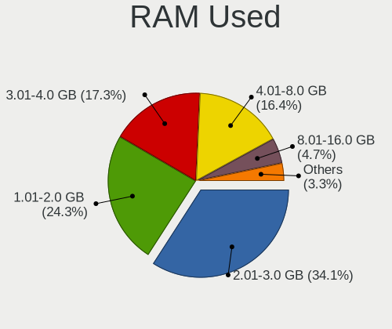
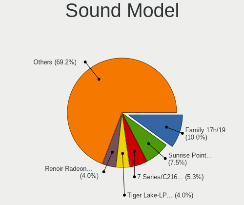
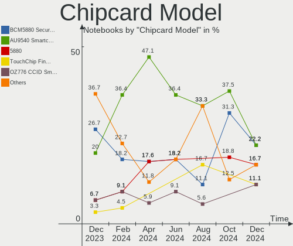

Linux Mint Hardware Trends (Notebooks)
--------------------------------------

A project to identify most popular hardware characteristics and track their change
over time based on data collected by Linux Mint users at https://Linux-Hardware.org.

Anyone can contribute to this report by the [hw-probe](https://github.com/linuxhw/hw-probe) tool:

    sudo -E hw-probe -all -upload

Full-feature report is available here: https://linux-hardware.org/?view=trends

Period: Jan, 2022.

Contents
--------

* [ System ](#system)
  - [ OS                       ](#os)
  - [ OS Family                ](#os-family)
  - [ Kernel                   ](#kernel)
  - [ Kernel Family            ](#kernel-family)
  - [ Kernel Major Ver.        ](#kernel-major-ver)
  - [ Arch                     ](#arch)
  - [ DE                       ](#de)
  - [ Display Server           ](#display-server)
  - [ Display Manager          ](#display-manager)
  - [ OS Lang                  ](#os-lang)
  - [ Boot Mode                ](#boot-mode)
  - [ Filesystem               ](#filesystem)
  - [ Part. scheme             ](#part-scheme)
  - [ Dual Boot with Linux/BSD ](#dual-boot-with-linuxbsd)
  - [ Dual Boot (Win)          ](#dual-boot-win)

* [ Board ](#board)
  - [ Vendor                   ](#vendor)
  - [ Model                    ](#model)
  - [ Model Family             ](#model-family)
  - [ MFG Year                 ](#mfg-year)
  - [ Form Factor              ](#form-factor)
  - [ Secure Boot              ](#secure-boot)
  - [ Coreboot                 ](#coreboot)
  - [ RAM Size                 ](#ram-size)
  - [ RAM Used                 ](#ram-used)
  - [ Total Drives             ](#total-drives)
  - [ Has CD-ROM               ](#has-cd-rom)
  - [ Has Ethernet             ](#has-ethernet)
  - [ Has WiFi                 ](#has-wifi)
  - [ Has Bluetooth            ](#has-bluetooth)

* [ Location ](#location)
  - [ Country                  ](#country)
  - [ City                     ](#city)

* [ Drives ](#drives)
  - [ Drive Vendor             ](#drive-vendor)
  - [ Drive Model              ](#drive-model)
  - [ HDD Vendor               ](#hdd-vendor)
  - [ SSD Vendor               ](#ssd-vendor)
  - [ Drive Kind               ](#drive-kind)
  - [ Drive Connector          ](#drive-connector)
  - [ Drive Size               ](#drive-size)
  - [ Space Total              ](#space-total)
  - [ Space Used               ](#space-used)
  - [ Malfunc. Drives          ](#malfunc-drives)
  - [ Malfunc. Drive Vendor    ](#malfunc-drive-vendor)
  - [ Malfunc. HDD Vendor      ](#malfunc-hdd-vendor)
  - [ Malfunc. Drive Kind      ](#malfunc-drive-kind)
  - [ Failed Drives            ](#failed-drives)
  - [ Failed Drive Vendor      ](#failed-drive-vendor)
  - [ Drive Status             ](#drive-status)

* [ Storage controller ](#storage-controller)
  - [ Storage Vendor           ](#storage-vendor)
  - [ Storage Model            ](#storage-model)
  - [ Storage Kind             ](#storage-kind)

* [ Processor ](#processor)
  - [ CPU Vendor               ](#cpu-vendor)
  - [ CPU Model                ](#cpu-model)
  - [ CPU Model Family         ](#cpu-model-family)
  - [ CPU Cores                ](#cpu-cores)
  - [ CPU Sockets              ](#cpu-sockets)
  - [ CPU Threads              ](#cpu-threads)
  - [ CPU Op-Modes             ](#cpu-op-modes)
  - [ CPU Microcode            ](#cpu-microcode)
  - [ CPU Microarch            ](#cpu-microarch)

* [ Graphics ](#graphics)
  - [ GPU Vendor               ](#gpu-vendor)
  - [ GPU Model                ](#gpu-model)
  - [ GPU Combo                ](#gpu-combo)
  - [ GPU Driver               ](#gpu-driver)
  - [ GPU Memory               ](#gpu-memory)

* [ Monitor ](#monitor)
  - [ Monitor Vendor           ](#monitor-vendor)
  - [ Monitor Model            ](#monitor-model)
  - [ Monitor Resolution       ](#monitor-resolution)
  - [ Monitor Diagonal         ](#monitor-diagonal)
  - [ Monitor Width            ](#monitor-width)
  - [ Aspect Ratio             ](#aspect-ratio)
  - [ Monitor Area             ](#monitor-area)
  - [ Pixel Density            ](#pixel-density)
  - [ Multiple Monitors        ](#multiple-monitors)

* [ Network ](#network)
  - [ Net Controller Vendor    ](#net-controller-vendor)
  - [ Net Controller Model     ](#net-controller-model)
  - [ Wireless Vendor          ](#wireless-vendor)
  - [ Wireless Model           ](#wireless-model)
  - [ Ethernet Vendor          ](#ethernet-vendor)
  - [ Ethernet Model           ](#ethernet-model)
  - [ Net Controller Kind      ](#net-controller-kind)
  - [ Used Controller          ](#used-controller)
  - [ NICs                     ](#nics)
  - [ IPv6                     ](#ipv6)

* [ Bluetooth ](#bluetooth)
  - [ Bluetooth Vendor         ](#bluetooth-vendor)
  - [ Bluetooth Model          ](#bluetooth-model)

* [ Sound ](#sound)
  - [ Sound Vendor             ](#sound-vendor)
  - [ Sound Model              ](#sound-model)

* [ Memory ](#memory)
  - [ Memory Vendor            ](#memory-vendor)
  - [ Memory Model             ](#memory-model)
  - [ Memory Kind              ](#memory-kind)
  - [ Memory Form Factor       ](#memory-form-factor)
  - [ Memory Size              ](#memory-size)
  - [ Memory Speed             ](#memory-speed)

* [ Printers & scanners ](#printers--scanners)
  - [ Printer Vendor           ](#printer-vendor)
  - [ Printer Model            ](#printer-model)
  - [ Scanner Vendor           ](#scanner-vendor)
  - [ Scanner Model            ](#scanner-model)

* [ Camera ](#camera)
  - [ Camera Vendor            ](#camera-vendor)
  - [ Camera Model             ](#camera-model)

* [ Security ](#security)
  - [ Fingerprint Vendor       ](#fingerprint-vendor)
  - [ Fingerprint Model        ](#fingerprint-model)
  - [ Chipcard Vendor          ](#chipcard-vendor)
  - [ Chipcard Model           ](#chipcard-model)

* [ Unsupported ](#unsupported)
  - [ Unsupported Devices      ](#unsupported-devices)
  - [ Unsupported Device Types ](#unsupported-device-types)

System
------

OS
--

Installed operating systems

| Name            | Notebooks | Percent |
|-----------------|-----------|---------|
| Linux Mint 20.3 | 190       | 57.23%  |
| Linux Mint 20.2 | 98        | 29.52%  |
| Linux Mint 19.3 | 18        | 5.42%   |
| Linux Mint 20.1 | 14        | 4.22%   |
| Linux Mint 20   | 4         | 1.2%    |
| Linux Mint 19.1 | 4         | 1.2%    |
| Linux Mint 19.2 | 3         | 0.9%    |
| Linux Mint 19   | 1         | 0.3%    |

OS Family
---------

OS without a version

| Name       | Notebooks | Percent |
|------------|-----------|---------|
| Linux Mint | 332       | 100%    |

Kernel
------

Version of the Linux kernel

| Version                | Notebooks | Percent |
|------------------------|-----------|---------|
| 5.4.0-96-generic       | 86        | 25.9%   |
| 5.4.0-91-generic       | 73        | 21.99%  |
| 5.4.0-92-generic       | 51        | 15.36%  |
| 5.4.0-94-generic       | 42        | 12.65%  |
| 5.13.0-27-generic      | 15        | 4.52%   |
| 5.4.0-74-generic       | 14        | 4.22%   |
| 5.13.0-25-generic      | 6         | 1.81%   |
| 5.13.0-23-generic      | 5         | 1.51%   |
| 5.13.0-22-generic      | 4         | 1.2%    |
| 5.11.0-46-generic      | 4         | 1.2%    |
| 5.4.0-89-generic       | 3         | 0.9%    |
| 4.15.0-166-generic     | 3         | 0.9%    |
| 5.11.0-44-generic      | 2         | 0.6%    |
| 5.11.0-43-generic      | 2         | 0.6%    |
| 4.15.0-161-generic     | 2         | 0.6%    |
| 5.4.0-97-generic       | 1         | 0.3%    |
| 5.4.0-87-generic       | 1         | 0.3%    |
| 5.4.0-81-generic       | 1         | 0.3%    |
| 5.4.0-67-generic       | 1         | 0.3%    |
| 5.4.0-58-generic       | 1         | 0.3%    |
| 5.4.0-26-generic       | 1         | 0.3%    |
| 5.16.0-rc8             | 1         | 0.3%    |
| 5.15.16-xanmod1        | 1         | 0.3%    |
| 5.15.14-051514-generic | 1         | 0.3%    |
| 5.15.13-xanmod1        | 1         | 0.3%    |
| 5.15.13-051513-generic | 1         | 0.3%    |
| 5.15.12-051512-generic | 1         | 0.3%    |
| 5.14.8-051408-generic  | 1         | 0.3%    |
| 5.13.19-051319-generic | 1         | 0.3%    |
| 5.13.0-1022-oem        | 1         | 0.3%    |
| 5.0.0-32-generic       | 1         | 0.3%    |
| 5.0.0-31-generic       | 1         | 0.3%    |
| 4.15.0-20-generic      | 1         | 0.3%    |
| 4.15.0-163-generic     | 1         | 0.3%    |
| 4.15.0-142-generic     | 1         | 0.3%    |

Kernel Family
-------------

Linux kernel without a distro release

| Version | Notebooks | Percent |
|---------|-----------|---------|
| 5.4.0   | 275       | 82.83%  |
| 5.13.0  | 31        | 9.34%   |
| 5.11.0  | 8         | 2.41%   |
| 4.15.0  | 8         | 2.41%   |
| 5.15.13 | 2         | 0.6%    |
| 5.0.0   | 2         | 0.6%    |
| 5.16.0  | 1         | 0.3%    |
| 5.15.16 | 1         | 0.3%    |
| 5.15.14 | 1         | 0.3%    |
| 5.15.12 | 1         | 0.3%    |
| 5.14.8  | 1         | 0.3%    |
| 5.13.19 | 1         | 0.3%    |

Kernel Major Ver.
-----------------

Linux kernel major version

| Version | Notebooks | Percent |
|---------|-----------|---------|
| 5.4     | 275       | 82.83%  |
| 5.13    | 32        | 9.64%   |
| 5.11    | 8         | 2.41%   |
| 4.15    | 8         | 2.41%   |
| 5.15    | 5         | 1.51%   |
| 5.0     | 2         | 0.6%    |
| 5.16    | 1         | 0.3%    |
| 5.14    | 1         | 0.3%    |

Arch
----

OS architecture (x86_64, i586, etc.)

| Name   | Notebooks | Percent |
|--------|-----------|---------|
| x86_64 | 322       | 96.99%  |
| i686   | 10        | 3.01%   |

DE
--

Desktop Environment

| Name       | Notebooks | Percent |
|------------|-----------|---------|
| X-Cinnamon | 226       | 68.07%  |
| MATE       | 38        | 11.45%  |
| XFCE       | 29        | 8.73%   |
| Cinnamon   | 24        | 7.23%   |
| GNOME      | 10        | 3.01%   |
| Unknown    | 2         | 0.6%    |
| KDE5       | 1         | 0.3%    |
| KDE        | 1         | 0.3%    |
| i3         | 1         | 0.3%    |

Display Server
--------------

X11 or Wayland

| Name | Notebooks | Percent |
|------|-----------|---------|
| X11  | 332       | 100%    |

Display Manager
---------------

SDDM, LightDM, etc.

| Name    | Notebooks | Percent |
|---------|-----------|---------|
| Unknown | 181       | 54.52%  |
| LightDM | 149       | 44.88%  |
| GDM     | 2         | 0.6%    |

OS Lang
-------

Language

| Lang  | Notebooks | Percent |
|-------|-----------|---------|
| en_US | 93        | 28.01%  |
| de_DE | 61        | 18.37%  |
| pt_BR | 30        | 9.04%   |
| en_GB | 21        | 6.33%   |
| fr_FR | 15        | 4.52%   |
| C     | 15        | 4.52%   |
| ru_RU | 9         | 2.71%   |
| it_IT | 9         | 2.71%   |
| en_CA | 9         | 2.71%   |
| nl_NL | 6         | 1.81%   |
| es_ES | 6         | 1.81%   |
| hu_HU | 5         | 1.51%   |
| de_AT | 5         | 1.51%   |
| ru_UA | 4         | 1.2%    |
| fi_FI | 4         | 1.2%    |
| sk_SK | 3         | 0.9%    |
| pl_PL | 3         | 0.9%    |
| en_IN | 3         | 0.9%    |
| en_AU | 3         | 0.9%    |
| de_CH | 3         | 0.9%    |
| cs_CZ | 3         | 0.9%    |
| uk_UA | 2         | 0.6%    |
| pt_PT | 2         | 0.6%    |
| ja_JP | 2         | 0.6%    |
| da_DK | 2         | 0.6%    |
| tr_TR | 1         | 0.3%    |
| sv_SE | 1         | 0.3%    |
| sr_RS | 1         | 0.3%    |
| ro_RO | 1         | 0.3%    |
| nl_BE | 1         | 0.3%    |
| nb_NO | 1         | 0.3%    |
| id_ID | 1         | 0.3%    |
| es_VE | 1         | 0.3%    |
| es_SV | 1         | 0.3%    |
| es_EC | 1         | 0.3%    |
| es_CL | 1         | 0.3%    |
| es_AR | 1         | 0.3%    |
| en_ZA | 1         | 0.3%    |
| en_IL | 1         | 0.3%    |

Boot Mode
---------

EFI or BIOS

| Mode | Notebooks | Percent |
|------|-----------|---------|
| EFI  | 179       | 53.92%  |
| BIOS | 153       | 46.08%  |

Filesystem
----------

Type of filesystem

| Type     | Notebooks | Percent |
|----------|-----------|---------|
| Ext4     | 308       | 92.77%  |
| Overlay  | 16        | 4.82%   |
| Btrfs    | 3         | 0.9%    |
| Ext3     | 2         | 0.6%    |
| Zfs      | 1         | 0.3%    |
| Xfs      | 1         | 0.3%    |
| Reiserfs | 1         | 0.3%    |

Part. scheme
------------

Scheme of partitioning

| Type    | Notebooks | Percent |
|---------|-----------|---------|
| Unknown | 196       | 59.04%  |
| GPT     | 99        | 29.82%  |
| MBR     | 37        | 11.14%  |

Dual Boot with Linux/BSD
------------------------

Hosting more than one Linux/BSD

| Dual boot | Notebooks | Percent |
|-----------|-----------|---------|
| No        | 315       | 94.88%  |
| Yes       | 17        | 5.12%   |

Dual Boot (Win)
---------------

Hosting Linux and Windows

| Dual boot | Notebooks | Percent |
|-----------|-----------|---------|
| No        | 271       | 81.63%  |
| Yes       | 61        | 18.37%  |

Board
-----

Vendor
------

Motherboard manufacturer

| Name                | Notebooks | Percent |
|---------------------|-----------|---------|
| Lenovo              | 57        | 17.17%  |
| Dell                | 57        | 17.17%  |
| Hewlett-Packard     | 55        | 16.57%  |
| ASUSTek Computer    | 39        | 11.75%  |
| Acer                | 37        | 11.14%  |
| Toshiba             | 11        | 3.31%   |
| Samsung Electronics | 10        | 3.01%   |
| Sony                | 8         | 2.41%   |
| Apple               | 7         | 2.11%   |
| Medion              | 4         | 1.2%    |
| LG Electronics      | 4         | 1.2%    |
| Fujitsu             | 4         | 1.2%    |
| Timi                | 3         | 0.9%    |
| Positivo            | 3         | 0.9%    |
| Packard Bell        | 2         | 0.6%    |
| MSI                 | 2         | 0.6%    |
| HUAWEI              | 2         | 0.6%    |
| Google              | 2         | 0.6%    |
| Unknown             | 2         | 0.6%    |
| Wortmann AG         | 1         | 0.3%    |
| win element         | 1         | 0.3%    |
| VIT                 | 1         | 0.3%    |
| TUXEDO              | 1         | 0.3%    |
| Schenker            | 1         | 0.3%    |
| Primux Tech         | 1         | 0.3%    |
| Phoenix/SiS         | 1         | 0.3%    |
| Panasonic           | 1         | 0.3%    |
| ONDA                | 1         | 0.3%    |
| Notebook            | 1         | 0.3%    |
| Microtech           | 1         | 0.3%    |
| Jumper              | 1         | 0.3%    |
| Itautec             | 1         | 0.3%    |
| IBM                 | 1         | 0.3%    |
| HONOR               | 1         | 0.3%    |
| GPD                 | 1         | 0.3%    |
| Gateway             | 1         | 0.3%    |
| Fujitsu Siemens     | 1         | 0.3%    |
| Digibras            | 1         | 0.3%    |
| Compal              | 1         | 0.3%    |
| Clevo               | 1         | 0.3%    |
| AMI                 | 1         | 0.3%    |
| Alienware           | 1         | 0.3%    |

Model
-----

Motherboard model

| Name                                        | Notebooks | Percent |
|---------------------------------------------|-----------|---------|
| Unknown                                     | 4         | 1.2%    |
| HP Notebook                                 | 3         | 0.9%    |
| Dell Latitude E6410                         | 3         | 0.9%    |
| Dell Latitude 5480                          | 3         | 0.9%    |
| ASUS P50IJ                                  | 3         | 0.9%    |
| Timi TM1701                                 | 2         | 0.6%    |
| Samsung 550XDA                              | 2         | 0.6%    |
| Lenovo Flex 2-15 20405                      | 2         | 0.6%    |
| HP ProBook 450 G5                           | 2         | 0.6%    |
| HP Pavilion Laptop 14-dv0xxx                | 2         | 0.6%    |
| HP EliteBook 8570p                          | 2         | 0.6%    |
| HP EliteBook 840 G5                         | 2         | 0.6%    |
| HP EliteBook 820 G1                         | 2         | 0.6%    |
| HP 250 G6 Notebook PC                       | 2         | 0.6%    |
| Dell XPS 15 9510                            | 2         | 0.6%    |
| Dell Vostro 3560                            | 2         | 0.6%    |
| Dell Latitude E6540                         | 2         | 0.6%    |
| Dell Latitude E6400                         | 2         | 0.6%    |
| Dell Inspiron 7560                          | 2         | 0.6%    |
| Dell Inspiron 15-3567                       | 2         | 0.6%    |
| ASUS VivoBook_ASUSLaptop X515DA_M515DA      | 2         | 0.6%    |
| Apple MacBookAir6,2                         | 2         | 0.6%    |
| Acer Swift SF114-34                         | 2         | 0.6%    |
| Acer Aspire E5-521                          | 2         | 0.6%    |
| Acer Aspire A515-45                         | 2         | 0.6%    |
| Wortmann AG TERRA_MOBILE_1512/1712          | 1         | 0.3%    |
| win element MoreFine S500+                  | 1         | 0.3%    |
| VIT M2421                                   | 1         | 0.3%    |
| TUXEDO P65_67HSHP                           | 1         | 0.3%    |
| Toshiba Satellite S55-C                     | 1         | 0.3%    |
| Toshiba Satellite Pro L770-15L              | 1         | 0.3%    |
| Toshiba Satellite P870                      | 1         | 0.3%    |
| Toshiba Satellite L750                      | 1         | 0.3%    |
| Toshiba Satellite L655                      | 1         | 0.3%    |
| Toshiba Satellite L355                      | 1         | 0.3%    |
| Toshiba Satellite E55-A                     | 1         | 0.3%    |
| Toshiba Satellite E45-B                     | 1         | 0.3%    |
| Toshiba Satellite C660D                     | 1         | 0.3%    |
| Toshiba Satellite C55D-B                    | 1         | 0.3%    |
| Toshiba Satellite C55-C                     | 1         | 0.3%    |
| Timi RedmiBook Pro 14                       | 1         | 0.3%    |
| Sony VPCF11M1E                              | 1         | 0.3%    |
| Sony VPCEH2Q1E                              | 1         | 0.3%    |
| Sony VGN-SZ3XRP_C                           | 1         | 0.3%    |
| Sony VGN-FZ21Z                              | 1         | 0.3%    |
| Sony SVS13125PBB                            | 1         | 0.3%    |
| Sony SVE1712W1EB                            | 1         | 0.3%    |
| Sony SVE14A15FGB                            | 1         | 0.3%    |
| Sony SVE14A15FBP                            | 1         | 0.3%    |
| Schenker VISION 15 (SVS15E21)               | 1         | 0.3%    |
| Samsung RV411/RV511/E3511/S3511/RV711/E3411 | 1         | 0.3%    |
| Samsung RV411/RV511/E3511/S3511/RV711       | 1         | 0.3%    |
| Samsung R580/R590                           | 1         | 0.3%    |
| Samsung N150P/N210P/N220P                   | 1         | 0.3%    |
| Samsung 750XDA                              | 1         | 0.3%    |
| Samsung 550XCJ/550XCR                       | 1         | 0.3%    |
| Samsung 350V5C/351V5C/3540VC/3440VC         | 1         | 0.3%    |
| Samsung 270E5K/270E5Q/271E5K/2570EK         | 1         | 0.3%    |
| Primux Tech Ioxbook1402MC                   | 1         | 0.3%    |
| Positivo Q464C                              | 1         | 0.3%    |

Model Family
------------

Motherboard model prefix

| Name                      | Notebooks | Percent |
|---------------------------|-----------|---------|
| Acer Aspire               | 28        | 8.43%   |
| Lenovo ThinkPad           | 25        | 7.53%   |
| Dell Latitude             | 25        | 7.53%   |
| Dell Inspiron             | 19        | 5.72%   |
| Lenovo IdeaPad            | 16        | 4.82%   |
| HP Pavilion               | 12        | 3.61%   |
| Toshiba Satellite         | 11        | 3.31%   |
| HP EliteBook              | 11        | 3.31%   |
| Dell Vostro               | 9         | 2.71%   |
| HP ProBook                | 8         | 2.41%   |
| HP Laptop                 | 8         | 2.41%   |
| ASUS VivoBook             | 5         | 1.51%   |
| Lenovo Yoga               | 4         | 1.2%    |
| HP 250                    | 4         | 1.2%    |
| ASUS ZenBook              | 4         | 1.2%    |
| Unknown                   | 4         | 1.2%    |
| HP Notebook               | 3         | 0.9%    |
| HP ENVY                   | 3         | 0.9%    |
| Dell XPS                  | 3         | 0.9%    |
| ASUS P50IJ                | 3         | 0.9%    |
| Acer Extensa              | 3         | 0.9%    |
| Timi TM1701               | 2         | 0.6%    |
| Samsung RV411             | 2         | 0.6%    |
| Samsung 550XDA            | 2         | 0.6%    |
| Packard Bell EasyNote     | 2         | 0.6%    |
| Lenovo ThinkBook          | 2         | 0.6%    |
| Lenovo Flex               | 2         | 0.6%    |
| Fujitsu LIFEBOOK          | 2         | 0.6%    |
| ASUS ROG                  | 2         | 0.6%    |
| Apple MacBookAir6         | 2         | 0.6%    |
| Acer Swift                | 2         | 0.6%    |
| Acer Predator             | 2         | 0.6%    |
| Wortmann AG TERRA         | 1         | 0.3%    |
| win element MoreFine      | 1         | 0.3%    |
| VIT M2421                 | 1         | 0.3%    |
| TUXEDO P65                | 1         | 0.3%    |
| Timi RedmiBook            | 1         | 0.3%    |
| Sony VPCF11M1E            | 1         | 0.3%    |
| Sony VPCEH2Q1E            | 1         | 0.3%    |
| Sony VGN-SZ3XRP           | 1         | 0.3%    |
| Sony VGN-FZ21Z            | 1         | 0.3%    |
| Sony SVS13125PBB          | 1         | 0.3%    |
| Sony SVE1712W1EB          | 1         | 0.3%    |
| Sony SVE14A15FGB          | 1         | 0.3%    |
| Sony SVE14A15FBP          | 1         | 0.3%    |
| Schenker VISION           | 1         | 0.3%    |
| Samsung R580              | 1         | 0.3%    |
| Samsung N150P             | 1         | 0.3%    |
| Samsung 750XDA            | 1         | 0.3%    |
| Samsung 550XCJ            | 1         | 0.3%    |
| Samsung 350V5C            | 1         | 0.3%    |
| Samsung 270E5K            | 1         | 0.3%    |
| Primux Tech Ioxbook1402MC | 1         | 0.3%    |
| Positivo Q464C            | 1         | 0.3%    |
| Positivo Mobile           | 1         | 0.3%    |
| Positivo ES10IS2          | 1         | 0.3%    |
| Phoenix/SiS M7x0S         | 1         | 0.3%    |
| Panasonic CF-31AAP192M    | 1         | 0.3%    |
| ONDA OBOOK                | 1         | 0.3%    |
| Notebook W35xSTQ          | 1         | 0.3%    |

MFG Year
--------

Motherboard manufacture year

| Year    | Notebooks | Percent |
|---------|-----------|---------|
| 2021    | 35        | 10.54%  |
| 2013    | 30        | 9.04%   |
| 2012    | 30        | 9.04%   |
| 2020    | 29        | 8.73%   |
| 2017    | 24        | 7.23%   |
| 2014    | 24        | 7.23%   |
| 2016    | 21        | 6.33%   |
| 2011    | 20        | 6.02%   |
| 2010    | 20        | 6.02%   |
| 2019    | 19        | 5.72%   |
| 2018    | 19        | 5.72%   |
| 2015    | 17        | 5.12%   |
| 2009    | 17        | 5.12%   |
| 2008    | 15        | 4.52%   |
| 2007    | 8         | 2.41%   |
| 2005    | 2         | 0.6%    |
| 2006    | 1         | 0.3%    |
| Unknown | 1         | 0.3%    |

Form Factor
-----------

Physical design of the computer

| Name     | Notebooks | Percent |
|----------|-----------|---------|
| Notebook | 332       | 100%    |

Secure Boot
-----------

Enabled or disabled

| State    | Notebooks | Percent |
|----------|-----------|---------|
| Disabled | 289       | 87.05%  |
| Enabled  | 43        | 12.95%  |

Coreboot
--------

Have coreboot on board

| Used | Notebooks | Percent |
|------|-----------|---------|
| No   | 330       | 99.4%   |
| Yes  | 2         | 0.6%    |

RAM Size
--------

Total RAM memory

| Size in GB  | Notebooks | Percent |
|-------------|-----------|---------|
| 4.01-8.0    | 103       | 31.02%  |
| 3.01-4.0    | 101       | 30.42%  |
| 8.01-16.0   | 57        | 17.17%  |
| 16.01-24.0  | 35        | 10.54%  |
| 1.01-2.0    | 15        | 4.52%   |
| 32.01-64.0  | 9         | 2.71%   |
| 2.01-3.0    | 7         | 2.11%   |
| 24.01-32.0  | 3         | 0.9%    |
| 64.01-256.0 | 1         | 0.3%    |
| 0.51-1.0    | 1         | 0.3%    |

RAM Used
--------

Used RAM memory

| Used GB   | Notebooks | Percent |
|-----------|-----------|---------|
| 1.01-2.0  | 154       | 46.39%  |
| 2.01-3.0  | 79        | 23.8%   |
| 3.01-4.0  | 38        | 11.45%  |
| 4.01-8.0  | 28        | 8.43%   |
| 0.51-1.0  | 25        | 7.53%   |
| 8.01-16.0 | 8         | 2.41%   |

Total Drives
------------

Number of drives on board

| Drives | Notebooks | Percent |
|--------|-----------|---------|
| 1      | 240       | 72.29%  |
| 2      | 74        | 22.29%  |
| 3      | 16        | 4.82%   |
| 4      | 1         | 0.3%    |
| 0      | 1         | 0.3%    |

Has CD-ROM
----------

Has CD-ROM on board

| Presented | Notebooks | Percent |
|-----------|-----------|---------|
| No        | 184       | 55.42%  |
| Yes       | 148       | 44.58%  |

Has Ethernet
------------

Has Ethernet on board

| Presented | Notebooks | Percent |
|-----------|-----------|---------|
| Yes       | 287       | 86.45%  |
| No        | 45        | 13.55%  |

Has WiFi
--------

Has WiFi module

| Presented | Notebooks | Percent |
|-----------|-----------|---------|
| Yes       | 325       | 97.89%  |
| No        | 7         | 2.11%   |

Has Bluetooth
-------------

Has Bluetooth module

| Presented | Notebooks | Percent |
|-----------|-----------|---------|
| Yes       | 262       | 78.92%  |
| No        | 70        | 21.08%  |

Location
--------

Country
-------

Geographic location (country)

| Country      | Notebooks | Percent |
|--------------|-----------|---------|
| Germany      | 58        | 17.47%  |
| USA          | 50        | 15.06%  |
| Brazil       | 33        | 9.94%   |
| UK           | 16        | 4.82%   |
| France       | 15        | 4.52%   |
| Ukraine      | 12        | 3.61%   |
| Italy        | 9         | 2.71%   |
| Russia       | 8         | 2.41%   |
| Canada       | 8         | 2.41%   |
| Switzerland  | 7         | 2.11%   |
| Spain        | 7         | 2.11%   |
| Netherlands  | 7         | 2.11%   |
| Slovakia     | 6         | 1.81%   |
| Poland       | 6         | 1.81%   |
| Hungary      | 6         | 1.81%   |
| Austria      | 6         | 1.81%   |
| India        | 5         | 1.51%   |
| Serbia       | 4         | 1.2%    |
| Romania      | 4         | 1.2%    |
| Norway       | 4         | 1.2%    |
| Mexico       | 4         | 1.2%    |
| Finland      | 4         | 1.2%    |
| Czechia      | 4         | 1.2%    |
| Australia    | 4         | 1.2%    |
| Turkey       | 3         | 0.9%    |
| Indonesia    | 3         | 0.9%    |
| Belgium      | 3         | 0.9%    |
| South Africa | 2         | 0.6%    |
| Portugal     | 2         | 0.6%    |
| Morocco      | 2         | 0.6%    |
| Japan        | 2         | 0.6%    |
| Denmark      | 2         | 0.6%    |
| Bulgaria     | 2         | 0.6%    |
| Belarus      | 2         | 0.6%    |
| Vietnam      | 1         | 0.3%    |
| Venezuela    | 1         | 0.3%    |
| Uzbekistan   | 1         | 0.3%    |
| Sweden       | 1         | 0.3%    |
| South Korea  | 1         | 0.3%    |
| R?©union     | 1         | 0.3%    |
| Qatar        | 1         | 0.3%    |
| Peru         | 1         | 0.3%    |
| Nepal        | 1         | 0.3%    |
| Moldova      | 1         | 0.3%    |
| Luxembourg   | 1         | 0.3%    |
| Lebanon      | 1         | 0.3%    |
| Kyrgyzstan   | 1         | 0.3%    |
| Kenya        | 1         | 0.3%    |
| Israel       | 1         | 0.3%    |
| Iran         | 1         | 0.3%    |
| Greece       | 1         | 0.3%    |
| El Salvador  | 1         | 0.3%    |
| Ecuador      | 1         | 0.3%    |
| Chile        | 1         | 0.3%    |
| Argentina    | 1         | 0.3%    |
| Albania      | 1         | 0.3%    |

City
----

Geographic location (city)

| City                 | Notebooks | Percent |
|----------------------|-----------|---------|
| Vienna               | 6         | 1.81%   |
| Chicago              | 5         | 1.51%   |
| Milan                | 4         | 1.2%    |
| Kyiv                 | 4         | 1.2%    |
| Berlin               | 4         | 1.2%    |
| Belgrade             | 4         | 1.2%    |
| Zurich               | 3         | 0.9%    |
| Sydney               | 3         | 0.9%    |
| S??o Paulo           | 3         | 0.9%    |
| Rockfish             | 3         | 0.9%    |
| Paris                | 3         | 0.9%    |
| Munich               | 3         | 0.9%    |
| Moscow               | 3         | 0.9%    |
| Leipzig              | 3         | 0.9%    |
| Bratislava           | 3         | 0.9%    |
| The Hague            | 2         | 0.6%    |
| Staufen              | 2         | 0.6%    |
| Rostov-on-Don        | 2         | 0.6%    |
| Rome                 | 2         | 0.6%    |
| Rio de Janeiro       | 2         | 0.6%    |
| Remscheid            | 2         | 0.6%    |
| Osnabr??ck           | 2         | 0.6%    |
| Oslo                 | 2         | 0.6%    |
| Minsk                | 2         | 0.6%    |
| Londrina             | 2         | 0.6%    |
| London               | 2         | 0.6%    |
| Hamburg              | 2         | 0.6%    |
| Guadalajara          | 2         | 0.6%    |
| Cambridge            | 2         | 0.6%    |
| Burgas               | 2         | 0.6%    |
| Budapest             | 2         | 0.6%    |
| Belo Horizonte       | 2         | 0.6%    |
| Antwerp              | 2         | 0.6%    |
| Zielona G??ra        | 1         | 0.3%    |
| Zaporizhzhya         | 1         | 0.3%    |
| Wuppertal            | 1         | 0.3%    |
| Wolverhampton        | 1         | 0.3%    |
| Wolfsburg            | 1         | 0.3%    |
| Winston-Salem        | 1         | 0.3%    |
| Winnipeg             | 1         | 0.3%    |
| Wilhelmshaven        | 1         | 0.3%    |
| Wiesbaden            | 1         | 0.3%    |
| Wenonah              | 1         | 0.3%    |
| Wattrelos            | 1         | 0.3%    |
| Waldorf              | 1         | 0.3%    |
| Vitteaux             | 1         | 0.3%    |
| Villecresnes         | 1         | 0.3%    |
| Vilagarcia de Arousa | 1         | 0.3%    |
| Vertheuil            | 1         | 0.3%    |
| Versailles           | 1         | 0.3%    |
| Varginha             | 1         | 0.3%    |
| Vantaa               | 1         | 0.3%    |
| Uzhhorod             | 1         | 0.3%    |
| Urasoe               | 1         | 0.3%    |
| Unseburg             | 1         | 0.3%    |
| Unna                 | 1         | 0.3%    |
| Union Point          | 1         | 0.3%    |
| Uniao                | 1         | 0.3%    |
| Umuarama             | 1         | 0.3%    |
| Tyniste nad Orlici   | 1         | 0.3%    |

Drives
------

Drive Vendor
------------

Hard drive vendors

| Vendor              | Notebooks | Drives | Percent |
|---------------------|-----------|--------|---------|
| Samsung Electronics | 62        | 65     | 15.23%  |
| WDC                 | 54        | 58     | 13.27%  |
| Seagate             | 54        | 57     | 13.27%  |
| Unknown             | 29        | 34     | 7.13%   |
| Toshiba             | 29        | 29     | 7.13%   |
| Sandisk             | 25        | 26     | 6.14%   |
| Kingston            | 19        | 21     | 4.67%   |
| SK Hynix            | 17        | 17     | 4.18%   |
| Hitachi             | 16        | 16     | 3.93%   |
| Crucial             | 16        | 16     | 3.93%   |
| Intel               | 12        | 13     | 2.95%   |
| A-DATA Technology   | 10        | 10     | 2.46%   |
| HGST                | 8         | 8      | 1.97%   |
| KIOXIA              | 7         | 7      | 1.72%   |
| JMicron             | 4         | 4      | 0.98%   |
| Apple               | 4         | 4      | 0.98%   |
| LITEON              | 3         | 3      | 0.74%   |
| Fujitsu             | 3         | 3      | 0.74%   |
| PNY                 | 2         | 2      | 0.49%   |
| Phison              | 2         | 2      | 0.49%   |
| Micron Technology   | 2         | 2      | 0.49%   |
| GOODRAM             | 2         | 2      | 0.49%   |
| China               | 2         | 2      | 0.49%   |
| Unknown             | 2         | 2      | 0.49%   |
| WDC WDS2            | 1         | 1      | 0.25%   |
| USB                 | 1         | 1      | 0.25%   |
| Transcend           | 1         | 1      | 0.25%   |
| TCSUNBOW            | 1         | 2      | 0.25%   |
| SSSTC               | 1         | 1      | 0.25%   |
| SPCC                | 1         | 1      | 0.25%   |
| PLEXTOR             | 1         | 1      | 0.25%   |
| oyunkey             | 1         | 1      | 0.25%   |
| Microtech           | 1         | 1      | 0.25%   |
| LITEONIT            | 1         | 1      | 0.25%   |
| Lexar               | 1         | 1      | 0.25%   |
| Kolink              | 1         | 1      | 0.25%   |
| Intenso             | 1         | 1      | 0.25%   |
| INNOVATION IT       | 1         | 1      | 0.25%   |
| Initio              | 1         | 1      | 0.25%   |
| Indilinx            | 1         | 1      | 0.25%   |
| GN256               | 1         | 1      | 0.25%   |
| Dogfish             | 1         | 1      | 0.25%   |
| Corsair             | 1         | 1      | 0.25%   |
| BIWIN               | 1         | 1      | 0.25%   |
| ASMT                | 1         | 1      | 0.25%   |
| AFOX                | 1         | 1      | 0.25%   |
| ADATA Technology    | 1         | 1      | 0.25%   |

Drive Model
-----------

Hard drive models

| Model                                    | Notebooks | Percent |
|------------------------------------------|-----------|---------|
| Seagate ST1000LM035-1RK172 1TB           | 9         | 2.12%   |
| Unknown MMC Card  32GB                   | 8         | 1.89%   |
| Seagate ST1000LM024 HN-M101MBB 1TB       | 8         | 1.89%   |
| Unknown MMC Card  64GB                   | 6         | 1.42%   |
| Seagate ST9500325AS 500GB                | 6         | 1.42%   |
| Kingston SA400S37480G 480GB SSD          | 6         | 1.42%   |
| Toshiba MQ04ABF100 1TB                   | 5         | 1.18%   |
| Seagate Expansion 1TB                    | 5         | 1.18%   |
| Sandisk NVMe SSD Drive 512GB             | 5         | 1.18%   |
| Samsung SSD 860 EVO 500GB                | 5         | 1.18%   |
| Kingston SA400S37240G 240GB SSD          | 5         | 1.18%   |
| SK Hynix NVMe SSD Drive 512GB            | 4         | 0.94%   |
| Samsung SSD 860 EVO 250GB                | 4         | 0.94%   |
| WDC WDS500G2B0A-00SM50 500GB SSD         | 3         | 0.71%   |
| Unknown MMC Card  128GB                  | 3         | 0.71%   |
| Toshiba MQ01ABD075 752GB                 | 3         | 0.71%   |
| SK Hynix NVMe SSD Drive 256GB            | 3         | 0.71%   |
| Seagate ST2000LM003 HN-M201RAD 2TB       | 3         | 0.71%   |
| Samsung SSD 860 EVO 1TB                  | 3         | 0.71%   |
| Samsung SSD 850 EVO 500GB                | 3         | 0.71%   |
| Samsung SSD 840 EVO 500GB                | 3         | 0.71%   |
| JMicron Generic 128GB                    | 3         | 0.71%   |
| HGST HTS545050A7E680 500GB               | 3         | 0.71%   |
| Crucial CT500MX500SSD1 500GB             | 3         | 0.71%   |
| WDC WD5000LPVX-22V0TT0 500GB             | 2         | 0.47%   |
| WDC WD10SPZX-24Z10 1TB                   | 2         | 0.47%   |
| WDC WD10JPVX-22JC3T0 1TB                 | 2         | 0.47%   |
| WDC PC SN730 SDBQNTY-512G-1001 512GB     | 2         | 0.47%   |
| Unknown MMC Card  4GB                    | 2         | 0.47%   |
| Unknown MMC Card  16GB                   | 2         | 0.47%   |
| Toshiba THNSNK256GVN8 M.2 2280 256GB SSD | 2         | 0.47%   |
| Toshiba MQ01ACF050 500GB                 | 2         | 0.47%   |
| Toshiba MQ01ABD100 1TB                   | 2         | 0.47%   |
| Toshiba KBG30ZMS128G 128GB NVMe SSD      | 2         | 0.47%   |
| SK Hynix HFM001TD3JX013N 1TB             | 2         | 0.47%   |
| Seagate ST9320325AS 320GB                | 2         | 0.47%   |
| Seagate ST9250315AS 250GB                | 2         | 0.47%   |
| Seagate ST500LT012-1DG142 500GB          | 2         | 0.47%   |
| Seagate ST1000LM014-1EJ164 1TB           | 2         | 0.47%   |
| SanDisk SSD PLUS 480GB                   | 2         | 0.47%   |
| SanDisk SSD PLUS 240GB                   | 2         | 0.47%   |
| SanDisk SSD PLUS 1000GB                  | 2         | 0.47%   |
| Samsung SSD 860 QVO 1TB                  | 2         | 0.47%   |
| Samsung SSD 860 EVO M.2 1TB              | 2         | 0.47%   |
| Samsung SSD 850 EVO 250GB                | 2         | 0.47%   |
| Samsung NVMe SSD Drive 500GB             | 2         | 0.47%   |
| Samsung NVMe SSD Drive 2TB               | 2         | 0.47%   |
| Samsung NVMe SSD Drive 256GB             | 2         | 0.47%   |
| Samsung MZ7TE128HMGR-000H1 128GB SSD     | 2         | 0.47%   |
| KIOXIA NVMe SSD Drive 256GB              | 2         | 0.47%   |
| KIOXIA KBG40ZNS256G NVMe 256GB           | 2         | 0.47%   |
| Kingston SA400S37120G 120GB SSD          | 2         | 0.47%   |
| Hitachi HTS545032B9A300 320GB            | 2         | 0.47%   |
| Hitachi HTS543225L9A300 250GB            | 2         | 0.47%   |
| Hitachi HTS543216L9A300 160GB            | 2         | 0.47%   |
| Hitachi HTS541616J9SA00 160GB            | 2         | 0.47%   |
| HGST HTS725050A7E630 500GB               | 2         | 0.47%   |
| Crucial CT1000MX500SSD1 1TB              | 2         | 0.47%   |
| Crucial CT1000BX500SSD1 1TB              | 2         | 0.47%   |
| Unknown                                  | 2         | 0.47%   |

HDD Vendor
----------

Hard disk drive vendors

| Vendor              | Notebooks | Drives | Percent |
|---------------------|-----------|--------|---------|
| Seagate             | 53        | 56     | 37.59%  |
| WDC                 | 32        | 32     | 22.7%   |
| Toshiba             | 24        | 24     | 17.02%  |
| Hitachi             | 16        | 16     | 11.35%  |
| HGST                | 8         | 8      | 5.67%   |
| Samsung Electronics | 3         | 3      | 2.13%   |
| Fujitsu             | 3         | 3      | 2.13%   |
| USB                 | 1         | 1      | 0.71%   |
| Apple               | 1         | 1      | 0.71%   |

SSD Vendor
----------

Solid state drive vendors

| Vendor              | Notebooks | Drives | Percent |
|---------------------|-----------|--------|---------|
| Samsung Electronics | 43        | 45     | 28.86%  |
| SanDisk             | 17        | 17     | 11.41%  |
| Kingston            | 16        | 18     | 10.74%  |
| Crucial             | 16        | 16     | 10.74%  |
| WDC                 | 11        | 12     | 7.38%   |
| A-DATA Technology   | 10        | 10     | 6.71%   |
| LITEON              | 3         | 3      | 2.01%   |
| Intel               | 3         | 3      | 2.01%   |
| Apple               | 3         | 3      | 2.01%   |
| Toshiba             | 2         | 2      | 1.34%   |
| PNY                 | 2         | 2      | 1.34%   |
| GOODRAM             | 2         | 2      | 1.34%   |
| China               | 2         | 2      | 1.34%   |
| WDC WDS2            | 1         | 1      | 0.67%   |
| Transcend           | 1         | 1      | 0.67%   |
| TCSUNBOW            | 1         | 2      | 0.67%   |
| SPCC                | 1         | 1      | 0.67%   |
| SK Hynix            | 1         | 1      | 0.67%   |
| PLEXTOR             | 1         | 1      | 0.67%   |
| Microtech           | 1         | 1      | 0.67%   |
| Micron Technology   | 1         | 1      | 0.67%   |
| LITEONIT            | 1         | 1      | 0.67%   |
| Lexar               | 1         | 1      | 0.67%   |
| Kolink              | 1         | 1      | 0.67%   |
| Intenso             | 1         | 1      | 0.67%   |
| INNOVATION IT       | 1         | 1      | 0.67%   |
| Indilinx            | 1         | 1      | 0.67%   |
| GN256               | 1         | 1      | 0.67%   |
| Dogfish             | 1         | 1      | 0.67%   |
| Corsair             | 1         | 1      | 0.67%   |
| AFOX                | 1         | 1      | 0.67%   |
| Unknown             | 1         | 1      | 0.67%   |

Drive Kind
----------

HDD or SSD

| Kind    | Notebooks | Drives | Percent |
|---------|-----------|--------|---------|
| SSD     | 139       | 155    | 35.46%  |
| HDD     | 136       | 144    | 34.69%  |
| NVMe    | 81        | 87     | 20.66%  |
| MMC     | 31        | 36     | 7.91%   |
| Unknown | 5         | 5      | 1.28%   |

Drive Connector
---------------

SATA, SAS, NVMe, etc.

| Type | Notebooks | Drives | Percent |
|------|-----------|--------|---------|
| SATA | 248       | 284    | 65.26%  |
| NVMe | 79        | 84     | 20.79%  |
| MMC  | 31        | 36     | 8.16%   |
| SAS  | 22        | 23     | 5.79%   |

Drive Size
----------

Size of hard drive

| Size in TB | Notebooks | Drives | Percent |
|------------|-----------|--------|---------|
| 0.01-0.5   | 180       | 201    | 66.18%  |
| 0.51-1.0   | 79        | 85     | 29.04%  |
| 1.01-2.0   | 10        | 10     | 3.68%   |
| 4.01-10.0  | 2         | 2      | 0.74%   |
| 3.01-4.0   | 1         | 1      | 0.37%   |

Space Total
-----------

Amount of disk space available on the file system

| Size in GB     | Notebooks | Percent |
|----------------|-----------|---------|
| 101-250        | 102       | 30.72%  |
| 251-500        | 88        | 26.51%  |
| 501-1000       | 51        | 15.36%  |
| 51-100         | 25        | 7.53%   |
| 1001-2000      | 24        | 7.23%   |
| 21-50          | 17        | 5.12%   |
| 1-20           | 14        | 4.22%   |
| 2001-3000      | 6         | 1.81%   |
| More than 3000 | 5         | 1.51%   |

Space Used
----------

Amount of used disk space

| Used GB        | Notebooks | Percent |
|----------------|-----------|---------|
| 1-20           | 107       | 32.23%  |
| 21-50          | 70        | 21.08%  |
| 51-100         | 49        | 14.76%  |
| 101-250        | 47        | 14.16%  |
| 251-500        | 30        | 9.04%   |
| 501-1000       | 18        | 5.42%   |
| 1001-2000      | 7         | 2.11%   |
| More than 3000 | 2         | 0.6%    |
| 2001-3000      | 2         | 0.6%    |

Malfunc. Drives
---------------

Drive models with a malfunction

| Model                                    | Notebooks | Drives | Percent |
|------------------------------------------|-----------|--------|---------|
| Seagate ST9500325AS 500GB                | 3         | 3      | 14.29%  |
| Seagate ST1000LM035-1RK172 1TB           | 3         | 3      | 14.29%  |
| HGST HTS725050A7E630 500GB               | 2         | 2      | 9.52%   |
| HGST HTS545050A7E680 500GB               | 2         | 2      | 9.52%   |
| WDC WDS2 40G2G0A-00JH30 240GB SSD        | 1         | 1      | 4.76%   |
| Toshiba THNSNK256GVN8 M.2 2280 256GB SSD | 1         | 1      | 4.76%   |
| Toshiba MK7575GSX 752GB                  | 1         | 1      | 4.76%   |
| Toshiba MK3265GSX 320GB                  | 1         | 1      | 4.76%   |
| SK Hynix PC711 HFS001TDE9X073N 1TB       | 1         | 1      | 4.76%   |
| Seagate ST9250410AS 250GB                | 1         | 1      | 4.76%   |
| Seagate ST320LT020-9YG142 320GB          | 1         | 1      | 4.76%   |
| Samsung Electronics HM321HI 320GB        | 1         | 1      | 4.76%   |
| HGST HTS721010A9E630 1TB                 | 1         | 1      | 4.76%   |
| HGST HTS541010A9E680 1TB                 | 1         | 1      | 4.76%   |
| Crucial CT512M550SSD3 512GB              | 1         | 1      | 4.76%   |

Malfunc. Drive Vendor
---------------------

Vendors of faulty drives

| Vendor              | Notebooks | Drives | Percent |
|---------------------|-----------|--------|---------|
| Seagate             | 8         | 8      | 38.1%   |
| HGST                | 6         | 6      | 28.57%  |
| Toshiba             | 3         | 3      | 14.29%  |
| WDC WDS2            | 1         | 1      | 4.76%   |
| SK Hynix            | 1         | 1      | 4.76%   |
| Samsung Electronics | 1         | 1      | 4.76%   |
| Crucial             | 1         | 1      | 4.76%   |

Malfunc. HDD Vendor
-------------------

Vendors of faulty HDD drives

| Vendor              | Notebooks | Drives | Percent |
|---------------------|-----------|--------|---------|
| Seagate             | 8         | 8      | 47.06%  |
| HGST                | 6         | 6      | 35.29%  |
| Toshiba             | 2         | 2      | 11.76%  |
| Samsung Electronics | 1         | 1      | 5.88%   |

Malfunc. Drive Kind
-------------------

Kinds of faulty drives

| Kind | Notebooks | Drives | Percent |
|------|-----------|--------|---------|
| HDD  | 17        | 17     | 80.95%  |
| SSD  | 3         | 3      | 14.29%  |
| NVMe | 1         | 1      | 4.76%   |

Failed Drives
-------------

Failed drive models

Zero info for selected period =(

Failed Drive Vendor
-------------------

Failed drive vendors

Zero info for selected period =(

Drive Status
------------

Number of failed and malfunc. drives

| Status   | Notebooks | Drives | Percent |
|----------|-----------|--------|---------|
| Detected | 215       | 280    | 61.43%  |
| Works    | 114       | 126    | 32.57%  |
| Malfunc  | 21        | 21     | 6%      |

Storage controller
------------------

Storage Vendor
--------------

Storage controller vendors

| Vendor                           | Notebooks | Percent |
|----------------------------------|-----------|---------|
| Intel                            | 232       | 64.99%  |
| AMD                              | 39        | 10.92%  |
| Sandisk                          | 21        | 5.88%   |
| Samsung Electronics              | 19        | 5.32%   |
| SK Hynix                         | 16        | 4.48%   |
| KIOXIA                           | 7         | 1.96%   |
| Silicon Integrated Systems [SiS] | 5         | 1.4%    |
| Nvidia                           | 4         | 1.12%   |
| Toshiba America Info Systems     | 3         | 0.84%   |
| Kingston Technology Company      | 3         | 0.84%   |
| Phison Electronics               | 2         | 0.56%   |
| Solid State Storage Technology   | 1         | 0.28%   |
| Silicon Motion                   | 1         | 0.28%   |
| Micron Technology                | 1         | 0.28%   |
| Marvell Technology Group         | 1         | 0.28%   |
| JMicron Technology               | 1         | 0.28%   |
| ADATA Technology                 | 1         | 0.28%   |

Storage Model
-------------

Storage controller models

| Model                                                                            | Notebooks | Percent |
|----------------------------------------------------------------------------------|-----------|---------|
| Intel 7 Series Chipset Family 6-port SATA Controller [AHCI mode]                 | 34        | 8.81%   |
| Intel Sunrise Point-LP SATA Controller [AHCI mode]                               | 31        | 8.03%   |
| AMD FCH SATA Controller [AHCI mode]                                              | 30        | 7.77%   |
| Intel 82801 Mobile SATA Controller [RAID mode]                                   | 19        | 4.92%   |
| Intel 8 Series SATA Controller 1 [AHCI mode]                                     | 19        | 4.92%   |
| Intel 6 Series/C200 Series Chipset Family 6 port Mobile SATA AHCI Controller     | 17        | 4.4%    |
| Intel 82801IBM/IEM (ICH9M/ICH9M-E) 4 port SATA Controller [AHCI mode]            | 16        | 4.15%   |
| Intel 8 Series/C220 Series Chipset Family 6-port SATA Controller 1 [AHCI mode]   | 9         | 2.33%   |
| Intel 5 Series/3400 Series Chipset 4 port SATA AHCI Controller                   | 9         | 2.33%   |
| SK Hynix Gold P31 SSD                                                            | 8         | 2.07%   |
| Intel Wildcat Point-LP SATA Controller [AHCI Mode]                               | 8         | 2.07%   |
| Intel Volume Management Device NVMe RAID Controller                              | 8         | 2.07%   |
| Sandisk Non-Volatile memory controller                                           | 7         | 1.81%   |
| Samsung NVMe SSD Controller SM981/PM981/PM983                                    | 7         | 1.81%   |
| KIOXIA Non-Volatile memory controller                                            | 7         | 1.81%   |
| Intel Tiger Lake-LP SATA Controller [AHCI mode]                                  | 7         | 1.81%   |
| Intel 82801HM/HEM (ICH8M/ICH8M-E) IDE Controller                                 | 7         | 1.81%   |
| AMD SB7x0/SB8x0/SB9x0 SATA Controller [AHCI mode]                                | 6         | 1.55%   |
| SK Hynix BC501 NVMe Solid State Drive                                            | 5         | 1.3%    |
| Silicon Integrated Systems [SiS] 5513 IDE Controller                             | 5         | 1.3%    |
| Sandisk WD Black SN750 / PC SN730 NVMe SSD                                       | 5         | 1.3%    |
| Samsung NVMe SSD Controller 980                                                  | 5         | 1.3%    |
| Intel 82801HM/HEM (ICH8M/ICH8M-E) SATA Controller [AHCI mode]                    | 5         | 1.3%    |
| Intel 5 Series/3400 Series Chipset 6 port SATA AHCI Controller                   | 5         | 1.3%    |
| Silicon Integrated Systems [SiS] SATA Controller / IDE mode                      | 4         | 1.04%   |
| Sandisk WD Blue SN550 NVMe SSD                                                   | 4         | 1.04%   |
| Intel NM10/ICH7 Family SATA Controller [AHCI mode]                               | 4         | 1.04%   |
| Intel HM170/QM170 Chipset SATA Controller [AHCI Mode]                            | 4         | 1.04%   |
| Intel Comet Lake SATA AHCI Controller                                            | 4         | 1.04%   |
| Intel Cannon Lake Mobile PCH SATA AHCI Controller                                | 4         | 1.04%   |
| Intel Atom Processor E3800 Series SATA AHCI Controller                           | 4         | 1.04%   |
| Samsung NVMe SSD Controller SM961/PM961/SM963                                    | 3         | 0.78%   |
| Intel Celeron/Pentium Silver Processor SATA Controller                           | 3         | 0.78%   |
| Intel Atom/Celeron/Pentium Processor x5-E8000/J3xxx/N3xxx Series SATA Controller | 3         | 0.78%   |
| Intel 82801HM/HEM (ICH8M/ICH8M-E) SATA Controller [IDE mode]                     | 3         | 0.78%   |
| Toshiba America Info Systems XG6 NVMe SSD Controller                             | 2         | 0.52%   |
| SK Hynix BC511                                                                   | 2         | 0.52%   |
| Sandisk WD Blue SN500 / PC SN520 NVMe SSD                                        | 2         | 0.52%   |
| Sandisk PC SN520 NVMe SSD                                                        | 2         | 0.52%   |
| Samsung NVMe SSD Controller PM9A1/PM9A3/980PRO                                   | 2         | 0.52%   |
| Phison E12 NVMe Controller                                                       | 2         | 0.52%   |
| Nvidia MCP79 AHCI Controller                                                     | 2         | 0.52%   |
| Kingston Company U-SNS8154P3 NVMe SSD                                            | 2         | 0.52%   |
| Intel SSD Pro 7600p/760p/E 6100p Series                                          | 2         | 0.52%   |
| Intel SSD 660P Series                                                            | 2         | 0.52%   |
| Intel SSD 600P Series                                                            | 2         | 0.52%   |
| Intel Q170/Q150/B150/H170/H110/Z170/CM236 Chipset SATA Controller [AHCI Mode]    | 2         | 0.52%   |
| Intel Non-Volatile memory controller                                             | 2         | 0.52%   |
| Intel Ice Lake-LP SATA Controller [AHCI mode]                                    | 2         | 0.52%   |
| Intel Celeron N3350/Pentium N4200/Atom E3900 Series SATA AHCI Controller         | 2         | 0.52%   |
| Intel 82801G (ICH7 Family) IDE Controller                                        | 2         | 0.52%   |
| AMD SB7x0/SB8x0/SB9x0 IDE Controller                                             | 2         | 0.52%   |
| AMD SB600 Non-Raid-5 SATA                                                        | 2         | 0.52%   |
| AMD SB600 IDE                                                                    | 2         | 0.52%   |
| Toshiba America Info Systems BG3 NVMe SSD Controller                             | 1         | 0.26%   |
| Solid State Storage Non-Volatile memory controller                               | 1         | 0.26%   |
| SK Hynix Non-Volatile memory controller                                          | 1         | 0.26%   |
| Silicon Motion SM2263EN/SM2263XT SSD Controller                                  | 1         | 0.26%   |
| Sandisk WD PC SN810 / Black SN850 NVMe SSD                                       | 1         | 0.26%   |
| Samsung Electronics SATA controller                                              | 1         | 0.26%   |

Storage Kind
------------

Kind of storage controller (IDE, SATA, NVMe, SAS, ...)

| Kind | Notebooks | Percent |
|------|-----------|---------|
| SATA | 239       | 64.59%  |
| NVMe | 79        | 21.35%  |
| RAID | 27        | 7.3%    |
| IDE  | 25        | 6.76%   |

Processor
---------

CPU Vendor
----------

Processor vendors

| Vendor | Notebooks | Percent |
|--------|-----------|---------|
| Intel  | 274       | 82.53%  |
| AMD    | 58        | 17.47%  |

CPU Model
---------

Processor models

| Model                                         | Notebooks | Percent |
|-----------------------------------------------|-----------|---------|
| Intel Core i3-6006U CPU @ 2.00GHz             | 10        | 3.01%   |
| AMD Ryzen 5 5500U with Radeon Graphics        | 9         | 2.71%   |
| Intel Core i5-3210M CPU @ 2.50GHz             | 8         | 2.41%   |
| Intel 11th Gen Core i5-1135G7 @ 2.40GHz       | 8         | 2.41%   |
| Intel Core i5-8250U CPU @ 1.60GHz             | 6         | 1.81%   |
| AMD Ryzen 5 3500U with Radeon Vega Mobile Gfx | 6         | 1.81%   |
| Intel Core i5-7200U CPU @ 2.50GHz             | 5         | 1.51%   |
| Intel Core i5-4200U CPU @ 1.60GHz             | 5         | 1.51%   |
| Intel Core 2 Duo CPU T6670 @ 2.20GHz          | 5         | 1.51%   |
| Intel 11th Gen Core i3-1115G4 @ 3.00GHz       | 5         | 1.51%   |
| Intel Core i7-8550U CPU @ 1.80GHz             | 4         | 1.2%    |
| Intel Core i7-7500U CPU @ 2.70GHz             | 4         | 1.2%    |
| Intel Core i7-6700HQ CPU @ 2.60GHz            | 4         | 1.2%    |
| Intel Core i5-3337U CPU @ 1.80GHz             | 4         | 1.2%    |
| Intel Core i5-2450M CPU @ 2.50GHz             | 4         | 1.2%    |
| Intel Celeron N4000 CPU @ 1.10GHz             | 4         | 1.2%    |
| Intel Atom x5-Z8300 CPU @ 1.44GHz             | 4         | 1.2%    |
| Intel 11th Gen Core i7-1165G7 @ 2.80GHz       | 4         | 1.2%    |
| Intel Core i7-6600U CPU @ 2.60GHz             | 3         | 0.9%    |
| Intel Core i7-4510U CPU @ 2.00GHz             | 3         | 0.9%    |
| Intel Core i7-4500U CPU @ 1.80GHz             | 3         | 0.9%    |
| Intel Core i5-6200U CPU @ 2.30GHz             | 3         | 0.9%    |
| Intel Core i5-5200U CPU @ 2.20GHz             | 3         | 0.9%    |
| Intel Core i5-4200M CPU @ 2.50GHz             | 3         | 0.9%    |
| Intel Core i5-3230M CPU @ 2.60GHz             | 3         | 0.9%    |
| Intel Core i5-2520M CPU @ 2.50GHz             | 3         | 0.9%    |
| Intel Core i5-10210U CPU @ 1.60GHz            | 3         | 0.9%    |
| Intel Core i5 CPU M 520 @ 2.40GHz             | 3         | 0.9%    |
| Intel Core i3-4005U CPU @ 1.70GHz             | 3         | 0.9%    |
| Intel Core i3-3217U CPU @ 1.80GHz             | 3         | 0.9%    |
| Intel Core 2 Duo CPU T7500 @ 2.20GHz          | 3         | 0.9%    |
| Intel Celeron CPU N3060 @ 1.60GHz             | 3         | 0.9%    |
| AMD Ryzen 5 4500U with Radeon Graphics        | 3         | 0.9%    |
| Intel Pentium Silver N6000 @ 1.10GHz          | 2         | 0.6%    |
| Intel Pentium Dual CPU T3200 @ 2.00GHz        | 2         | 0.6%    |
| Intel Pentium Dual CPU T2390 @ 1.86GHz        | 2         | 0.6%    |
| Intel Core i7-8750H CPU @ 2.20GHz             | 2         | 0.6%    |
| Intel Core i7-8665U CPU @ 1.90GHz             | 2         | 0.6%    |
| Intel Core i7-8565U CPU @ 1.80GHz             | 2         | 0.6%    |
| Intel Core i7-6500U CPU @ 2.50GHz             | 2         | 0.6%    |
| Intel Core i7-5500U CPU @ 2.40GHz             | 2         | 0.6%    |
| Intel Core i7-3740QM CPU @ 2.70GHz            | 2         | 0.6%    |
| Intel Core i7-3630QM CPU @ 2.40GHz            | 2         | 0.6%    |
| Intel Core i7-3610QM CPU @ 2.30GHz            | 2         | 0.6%    |
| Intel Core i7-10510U CPU @ 1.80GHz            | 2         | 0.6%    |
| Intel Core i5-6300U CPU @ 2.40GHz             | 2         | 0.6%    |
| Intel Core i5-4300U CPU @ 1.90GHz             | 2         | 0.6%    |
| Intel Core i5-4210U CPU @ 1.70GHz             | 2         | 0.6%    |
| Intel Core i5-2430M CPU @ 2.40GHz             | 2         | 0.6%    |
| Intel Core i5 CPU M 560 @ 2.67GHz             | 2         | 0.6%    |
| Intel Core i5 CPU M 540 @ 2.53GHz             | 2         | 0.6%    |
| Intel Core i5 CPU M 480 @ 2.67GHz             | 2         | 0.6%    |
| Intel Core i5 CPU M 450 @ 2.40GHz             | 2         | 0.6%    |
| Intel Core i3-5005U CPU @ 2.00GHz             | 2         | 0.6%    |
| Intel Core i3-3110M CPU @ 2.40GHz             | 2         | 0.6%    |
| Intel Core i3-2350M CPU @ 2.30GHz             | 2         | 0.6%    |
| Intel Core i3-1005G1 CPU @ 1.20GHz            | 2         | 0.6%    |
| Intel Core 2 Duo CPU T6500 @ 2.10GHz          | 2         | 0.6%    |
| Intel Core 2 Duo CPU T5550 @ 1.83GHz          | 2         | 0.6%    |
| Intel Core 2 Duo CPU P8700 @ 2.53GHz          | 2         | 0.6%    |

CPU Model Family
----------------

Processor model prefix

| Model                   | Notebooks | Percent |
|-------------------------|-----------|---------|
| Intel Core i5           | 81        | 24.4%   |
| Intel Core i7           | 61        | 18.37%  |
| Intel Core i3           | 32        | 9.64%   |
| Intel Core 2 Duo        | 23        | 6.93%   |
| Other                   | 22        | 6.63%   |
| Intel Celeron           | 21        | 6.33%   |
| AMD Ryzen 5             | 21        | 6.33%   |
| Intel Atom              | 11        | 3.31%   |
| Intel Pentium           | 6         | 1.81%   |
| AMD Ryzen 7             | 6         | 1.81%   |
| Intel Pentium Dual      | 5         | 1.51%   |
| AMD A8                  | 5         | 1.51%   |
| Intel Pentium Silver    | 3         | 0.9%    |
| AMD Turion 64 X2 Mobile | 3         | 0.9%    |
| AMD E2                  | 3         | 0.9%    |
| Intel Genuine           | 2         | 0.6%    |
| AMD Ryzen 9             | 2         | 0.6%    |
| AMD Ryzen 3             | 2         | 0.6%    |
| AMD Athlon II           | 2         | 0.6%    |
| AMD A6                  | 2         | 0.6%    |
| AMD A10                 | 2         | 0.6%    |
| Intel Pentium M         | 1         | 0.3%    |
| Intel Pentium Dual-Core | 1         | 0.3%    |
| Intel Core m7           | 1         | 0.3%    |
| Intel Core m5           | 1         | 0.3%    |
| Intel Core m3           | 1         | 0.3%    |
| Intel Core 2 Extreme    | 1         | 0.3%    |
| Intel Core 2            | 1         | 0.3%    |
| Intel Celeron Dual-Core | 1         | 0.3%    |
| AMD Ryzen 7 PRO         | 1         | 0.3%    |
| AMD Ryzen 5 PRO         | 1         | 0.3%    |
| AMD Mobile Sempron      | 1         | 0.3%    |
| AMD E                   | 1         | 0.3%    |
| AMD C-60                | 1         | 0.3%    |
| AMD Athlon X2           | 1         | 0.3%    |
| AMD Athlon II Dual-Core | 1         | 0.3%    |
| AMD Athlon              | 1         | 0.3%    |
| AMD A4                  | 1         | 0.3%    |

CPU Cores
---------

Number of processor cores

| Number | Notebooks | Percent |
|--------|-----------|---------|
| 2      | 206       | 62.05%  |
| 4      | 89        | 26.81%  |
| 6      | 18        | 5.42%   |
| 8      | 9         | 2.71%   |
| 1      | 9         | 2.71%   |
| 3      | 1         | 0.3%    |

CPU Sockets
-----------

Number of sockets

| Number | Notebooks | Percent |
|--------|-----------|---------|
| 1      | 332       | 100%    |

CPU Threads
-----------

Threads per core (Hyper-Threading)

| Number | Notebooks | Percent |
|--------|-----------|---------|
| 2      | 236       | 71.08%  |
| 1      | 96        | 28.92%  |

CPU Op-Modes
------------

CPU Operation Modes (32-bit, 64-bit)

| Op mode        | Notebooks | Percent |
|----------------|-----------|---------|
| 32-bit, 64-bit | 329       | 99.1%   |
| 32-bit         | 3         | 0.9%    |

CPU Microcode
-------------

Microcode number

| Number     | Notebooks | Percent |
|------------|-----------|---------|
| Unknown    | 31        | 9.34%   |
| 0x306a9    | 28        | 8.43%   |
| 0x406e3    | 22        | 6.63%   |
| 0x40651    | 22        | 6.63%   |
| 0x206a7    | 19        | 5.72%   |
| 0x806c1    | 18        | 5.42%   |
| 0x1067a    | 16        | 4.82%   |
| 0x20655    | 13        | 3.92%   |
| 0x6fd      | 10        | 3.01%   |
| 0x806ea    | 9         | 2.71%   |
| 0x806e9    | 9         | 2.71%   |
| 0x306d4    | 9         | 2.71%   |
| 0x08608103 | 9         | 2.71%   |
| 0x30678    | 7         | 2.11%   |
| 0x906ea    | 6         | 1.81%   |
| 0x406c3    | 6         | 1.81%   |
| 0x306c3    | 6         | 1.81%   |
| 0x08108102 | 6         | 1.81%   |
| 0x806ec    | 5         | 1.51%   |
| 0x706a1    | 4         | 1.2%    |
| 0x506e3    | 4         | 1.2%    |
| 0x406c4    | 4         | 1.2%    |
| 0x08600106 | 4         | 1.2%    |
| 0x08108109 | 4         | 1.2%    |
| 0x706e5    | 3         | 0.9%    |
| 0x106ca    | 3         | 0.9%    |
| 0x10676    | 3         | 0.9%    |
| 0x0a50000c | 3         | 0.9%    |
| 0x07030105 | 3         | 0.9%    |
| 0x05000119 | 3         | 0.9%    |
| 0xa0660    | 2         | 0.6%    |
| 0x906c0    | 2         | 0.6%    |
| 0x806eb    | 2         | 0.6%    |
| 0x706a8    | 2         | 0.6%    |
| 0x6fa      | 2         | 0.6%    |
| 0x506c9    | 2         | 0.6%    |
| 0x20652    | 2         | 0.6%    |
| 0x08608102 | 2         | 0.6%    |
| 0x08600104 | 2         | 0.6%    |
| 0x07030104 | 2         | 0.6%    |
| 0x0700010f | 2         | 0.6%    |
| 0x06006118 | 2         | 0.6%    |
| 0x010000c8 | 2         | 0.6%    |
| 0x906e9    | 1         | 0.3%    |
| 0x806d1    | 1         | 0.3%    |
| 0x6fb      | 1         | 0.3%    |
| 0x6f6      | 1         | 0.3%    |
| 0x6e8      | 1         | 0.3%    |
| 0x6d8      | 1         | 0.3%    |
| 0x30661    | 1         | 0.3%    |
| 0x106e5    | 1         | 0.3%    |
| 0x10661    | 1         | 0.3%    |
| 0x0a50000b | 1         | 0.3%    |
| 0x0810100b | 1         | 0.3%    |
| 0x08101007 | 1         | 0.3%    |
| 0x06006705 | 1         | 0.3%    |
| 0x06006704 | 1         | 0.3%    |
| 0x06003109 | 1         | 0.3%    |
| 0x06001119 | 1         | 0.3%    |
| 0x02000032 | 1         | 0.3%    |

CPU Microarch
-------------

Microarchitecture

| Name            | Notebooks | Percent |
|-----------------|-----------|---------|
| KabyLake        | 37        | 11.14%  |
| IvyBridge       | 33        | 9.94%   |
| Haswell         | 32        | 9.64%   |
| Skylake         | 27        | 8.13%   |
| SandyBridge     | 23        | 6.93%   |
| TigerLake       | 20        | 6.02%   |
| Penryn          | 20        | 6.02%   |
| Silvermont      | 17        | 5.12%   |
| Westmere        | 16        | 4.82%   |
| Core            | 15        | 4.52%   |
| Unknown         | 14        | 4.22%   |
| Zen+            | 11        | 3.31%   |
| Broadwell       | 9         | 2.71%   |
| Zen 2           | 6         | 1.81%   |
| Goldmont plus   | 6         | 1.81%   |
| Puma            | 5         | 1.51%   |
| Zen 3           | 4         | 1.2%    |
| K8 Hammer       | 4         | 1.2%    |
| IceLake         | 4         | 1.2%    |
| Excavator       | 4         | 1.2%    |
| Bonnell         | 4         | 1.2%    |
| K10             | 3         | 0.9%    |
| CometLake       | 3         | 0.9%    |
| Bobcat          | 3         | 0.9%    |
| Zen             | 2         | 0.6%    |
| P6              | 2         | 0.6%    |
| Jaguar          | 2         | 0.6%    |
| Goldmont        | 2         | 0.6%    |
| Steamroller     | 1         | 0.3%    |
| Piledriver      | 1         | 0.3%    |
| Nehalem         | 1         | 0.3%    |
| K8 & K10 hybrid | 1         | 0.3%    |

Graphics
--------

GPU Vendor
----------

Vendors of graphics cards

| Vendor                           | Notebooks | Percent |
|----------------------------------|-----------|---------|
| Intel                            | 245       | 60.2%   |
| Nvidia                           | 79        | 19.41%  |
| AMD                              | 78        | 19.16%  |
| Silicon Integrated Systems [SiS] | 5         | 1.23%   |

GPU Model
---------

Graphics card models

| Model                                                                                    | Notebooks | Percent |
|------------------------------------------------------------------------------------------|-----------|---------|
| Intel 3rd Gen Core processor Graphics Controller                                         | 30        | 7.23%   |
| Intel Haswell-ULT Integrated Graphics Controller                                         | 23        | 5.54%   |
| Intel 2nd Generation Core Processor Family Integrated Graphics Controller                | 19        | 4.58%   |
| Intel Skylake GT2 [HD Graphics 520]                                                      | 18        | 4.34%   |
| Intel Mobile 4 Series Chipset Integrated Graphics Controller                             | 16        | 3.86%   |
| Intel TigerLake-LP GT2 [Iris Xe Graphics]                                                | 13        | 3.13%   |
| Intel Core Processor Integrated Graphics Controller                                      | 11        | 2.65%   |
| AMD Picasso/Raven 2 [Radeon Vega Series / Radeon Vega Mobile Series]                     | 11        | 2.65%   |
| AMD Lucienne                                                                             | 11        | 2.65%   |
| Intel UHD Graphics 620                                                                   | 10        | 2.41%   |
| Intel Atom/Celeron/Pentium Processor x5-E8000/J3xxx/N3xxx Integrated Graphics Controller | 10        | 2.41%   |
| Intel HD Graphics 620                                                                    | 9         | 2.17%   |
| Intel HD Graphics 5500                                                                   | 8         | 1.93%   |
| Intel 4th Gen Core Processor Integrated Graphics Controller                              | 8         | 1.93%   |
| Nvidia GF117M [GeForce 610M/710M/810M/820M / GT 620M/625M/630M/720M]                     | 7         | 1.69%   |
| Intel Tiger Lake UHD Graphics                                                            | 7         | 1.69%   |
| Intel Atom Processor Z36xxx/Z37xxx Series Graphics & Display                             | 7         | 1.69%   |
| Intel CoffeeLake-H GT2 [UHD Graphics 630]                                                | 6         | 1.45%   |
| AMD Thames [Radeon HD 7500M/7600M Series]                                                | 6         | 1.45%   |
| AMD Renoir                                                                               | 6         | 1.45%   |
| Intel WhiskeyLake-U GT2 [UHD Graphics 620]                                               | 5         | 1.2%    |
| Intel GeminiLake [UHD Graphics 600]                                                      | 5         | 1.2%    |
| Silicon Integrated Systems [SiS] 771/671 PCIE VGA Display Adapter                        | 4         | 0.96%   |
| Intel HD Graphics 530                                                                    | 4         | 0.96%   |
| Intel CometLake-U GT2 [UHD Graphics]                                                     | 4         | 0.96%   |
| AMD Mullins [Radeon R4/R5 Graphics]                                                      | 4         | 0.96%   |
| AMD Cezanne                                                                              | 4         | 0.96%   |
| Nvidia GP108M [GeForce MX150]                                                            | 3         | 0.72%   |
| Intel Mobile GM965/GL960 Integrated Graphics Controller (secondary)                      | 3         | 0.72%   |
| Intel Mobile GM965/GL960 Integrated Graphics Controller (primary)                        | 3         | 0.72%   |
| Intel HD Graphics 520                                                                    | 3         | 0.72%   |
| Intel Atom Processor D4xx/D5xx/N4xx/N5xx Integrated Graphics Controller                  | 3         | 0.72%   |
| AMD Topaz XT [Radeon R7 M260/M265 / M340/M360 / M440/M445 / 530/535 / 620/625 Mobile]    | 3         | 0.72%   |
| Nvidia TU117M [GeForce GTX 1650 Mobile / Max-Q]                                          | 2         | 0.48%   |
| Nvidia TU106M [GeForce RTX 2060 Mobile]                                                  | 2         | 0.48%   |
| Nvidia GT218M [GeForce 310M]                                                             | 2         | 0.48%   |
| Nvidia GT216M [GeForce GT 330M]                                                          | 2         | 0.48%   |
| Nvidia GP108M [GeForce MX250]                                                            | 2         | 0.48%   |
| Nvidia GP107M [GeForce GTX 1050 Ti Mobile]                                               | 2         | 0.48%   |
| Nvidia GM108M [GeForce 940MX]                                                            | 2         | 0.48%   |
| Nvidia GM108M [GeForce 930MX]                                                            | 2         | 0.48%   |
| Nvidia GM107M [GeForce GTX 950M]                                                         | 2         | 0.48%   |
| Nvidia GK107M [GeForce GT 750M]                                                          | 2         | 0.48%   |
| Nvidia GF108M [GeForce GT 620M/630M/635M/640M LE]                                        | 2         | 0.48%   |
| Nvidia GA107M [GeForce RTX 3050 Ti Mobile]                                               | 2         | 0.48%   |
| Nvidia G96CM [GeForce 9600M GT]                                                          | 2         | 0.48%   |
| Nvidia G86M [GeForce 8600M GS]                                                           | 2         | 0.48%   |
| Intel TigerLake-H GT1 [UHD Graphics]                                                     | 2         | 0.48%   |
| Intel Mobile 945GM/GMS/GME, 943/940GML Express Integrated Graphics Controller            | 2         | 0.48%   |
| Intel Mobile 945GM/GMS, 943/940GML Express Integrated Graphics Controller                | 2         | 0.48%   |
| Intel JasperLake [UHD Graphics]                                                          | 2         | 0.48%   |
| Intel Iris Plus Graphics G1 (Ice Lake)                                                   | 2         | 0.48%   |
| Intel HD Graphics 630                                                                    | 2         | 0.48%   |
| Intel HD Graphics 515                                                                    | 2         | 0.48%   |
| Intel HD Graphics 500                                                                    | 2         | 0.48%   |
| Intel Comet Lake UHD Graphics                                                            | 2         | 0.48%   |
| AMD Wani [Radeon R5/R6/R7 Graphics]                                                      | 2         | 0.48%   |
| AMD Thames [Radeon HD 7550M/7570M/7650M]                                                 | 2         | 0.48%   |
| AMD Sun XT [Radeon HD 8670A/8670M/8690M / R5 M330 / M430 / Radeon 520 Mobile]            | 2         | 0.48%   |
| AMD Stoney [Radeon R2/R3/R4/R5 Graphics]                                                 | 2         | 0.48%   |

GPU Combo
---------

Combinations of graphics cards

| Name           | Notebooks | Percent |
|----------------|-----------|---------|
| 1 x Intel      | 173       | 52.11%  |
| 1 x AMD        | 56        | 16.87%  |
| Intel + Nvidia | 55        | 16.57%  |
| 1 x Nvidia     | 20        | 6.02%   |
| Intel + AMD    | 17        | 5.12%   |
| 1 x SiS        | 5         | 1.51%   |
| AMD + Nvidia   | 3         | 0.9%    |
| 2 x AMD        | 2         | 0.6%    |
| 2 x Nvidia     | 1         | 0.3%    |

GPU Driver
----------

Free vs proprietary

| Driver      | Notebooks | Percent |
|-------------|-----------|---------|
| Free        | 260       | 78.31%  |
| Proprietary | 39        | 11.75%  |
| Unknown     | 33        | 9.94%   |

GPU Memory
----------

Total video memory

| Size in GB | Notebooks | Percent |
|------------|-----------|---------|
| Unknown    | 216       | 65.06%  |
| 0.01-0.5   | 44        | 13.25%  |
| 1.01-2.0   | 34        | 10.24%  |
| 0.51-1.0   | 25        | 7.53%   |
| 3.01-4.0   | 10        | 3.01%   |
| 5.01-6.0   | 2         | 0.6%    |
| 2.01-3.0   | 1         | 0.3%    |

Monitor
-------

Monitor Vendor
--------------

Monitor vendors

| Vendor                  | Notebooks | Percent |
|-------------------------|-----------|---------|
| AU Optronics            | 71        | 21.26%  |
| LG Display              | 53        | 15.87%  |
| BOE                     | 45        | 13.47%  |
| Chimei Innolux          | 38        | 11.38%  |
| Samsung Electronics     | 30        | 8.98%   |
| Chi Mei Optoelectronics | 11        | 3.29%   |
| Goldstar                | 10        | 2.99%   |
| Apple                   | 7         | 2.1%    |
| InfoVision              | 6         | 1.8%    |
| Hewlett-Packard         | 6         | 1.8%    |
| Dell                    | 6         | 1.8%    |
| Philips                 | 5         | 1.5%    |
| PANDA                   | 5         | 1.5%    |
| LG Philips              | 5         | 1.5%    |
| Lenovo                  | 5         | 1.5%    |
| Sharp                   | 4         | 1.2%    |
| Sony                    | 3         | 0.9%    |
| Seiko/Epson             | 3         | 0.9%    |
| AOC                     | 3         | 0.9%    |
| NEC Computers           | 2         | 0.6%    |
| LGD                     | 2         | 0.6%    |
| Iiyama                  | 2         | 0.6%    |
| Acer                    | 2         | 0.6%    |
| ViewSonic               | 1         | 0.3%    |
| Toshiba                 | 1         | 0.3%    |
| Quanta Display          | 1         | 0.3%    |
| Packard Bell            | 1         | 0.3%    |
| IBM                     | 1         | 0.3%    |
| HannStar                | 1         | 0.3%    |
| Fujitsu Siemens         | 1         | 0.3%    |
| Eizo                    | 1         | 0.3%    |
| Belinea                 | 1         | 0.3%    |
| Ancor Communications    | 1         | 0.3%    |

Monitor Model
-------------

Monitor models

| Model                                                                     | Notebooks | Percent |
|---------------------------------------------------------------------------|-----------|---------|
| Samsung Electronics LCD Monitor SEC5441 1366x768 344x194mm 15.5-inch      | 4         | 1.2%    |
| AU Optronics LCD Monitor AUO21EC 1366x768 344x193mm 15.5-inch             | 4         | 1.2%    |
| LG Display LCD Monitor LGD046F 1920x1080 340x190mm 15.3-inch              | 3         | 0.9%    |
| Chimei Innolux LCD Monitor CMN15E6 1366x768 344x193mm 15.5-inch           | 3         | 0.9%    |
| AU Optronics LCD Monitor AUO71EC 1366x768 344x193mm 15.5-inch             | 3         | 0.9%    |
| AU Optronics LCD Monitor AUO40EC 1366x768 344x193mm 15.5-inch             | 3         | 0.9%    |
| AU Optronics LCD Monitor AUO38ED 1920x1080 344x193mm 15.5-inch            | 3         | 0.9%    |
| AU Optronics LCD Monitor AUO23EC 1366x768 344x193mm 15.5-inch             | 3         | 0.9%    |
| LG Display LP156WH2-TLAA LGD0230 1366x768 344x194mm 15.5-inch             | 2         | 0.6%    |
| LG Display LCD Monitor LGD40A0 1366x768 310x174mm 14.0-inch               | 2         | 0.6%    |
| LG Display LCD Monitor LGD02DC 1366x768 344x194mm 15.5-inch               | 2         | 0.6%    |
| Lenovo LCD Monitor LEN40BA 1920x1080 344x194mm 15.5-inch                  | 2         | 0.6%    |
| InfoVision LCD Monitor IVO0489 1366x768 256x144mm 11.6-inch               | 2         | 0.6%    |
| InfoVision LCD Monitor IVO03F4 1024x600 223x125mm 10.1-inch               | 2         | 0.6%    |
| Goldstar 2D FHD TV GSM59C6 1920x1080 509x286mm 23.0-inch                  | 2         | 0.6%    |
| Chimei Innolux LCD Monitor CMN1735 1920x1080 382x215mm 17.3-inch          | 2         | 0.6%    |
| Chimei Innolux LCD Monitor CMN15F5 1920x1080 344x193mm 15.5-inch          | 2         | 0.6%    |
| Chimei Innolux LCD Monitor CMN15BE 1366x768 344x193mm 15.5-inch           | 2         | 0.6%    |
| Chimei Innolux LCD Monitor CMN15B9 1920x1080 344x194mm 15.5-inch          | 2         | 0.6%    |
| Chimei Innolux LCD Monitor CMN1471 1366x768 309x174mm 14.0-inch           | 2         | 0.6%    |
| Chimei Innolux LCD Monitor CMN1469 1366x768 309x174mm 14.0-inch           | 2         | 0.6%    |
| Chi Mei Optoelectronics LCD Monitor CMO1720 1920x1080 382x215mm 17.3-inch | 2         | 0.6%    |
| Chi Mei Optoelectronics LCD Monitor CMO15A7 1366x768 344x193mm 15.5-inch  | 2         | 0.6%    |
| Chi Mei Optoelectronics LCD Monitor 1366x768                              | 2         | 0.6%    |
| BOE LCD Monitor BOE0812 1920x1080 344x194mm 15.5-inch                     | 2         | 0.6%    |
| BOE LCD Monitor BOE07B4 1366x768 344x194mm 15.5-inch                      | 2         | 0.6%    |
| BOE LCD Monitor BOE0747 1920x1080 344x194mm 15.5-inch                     | 2         | 0.6%    |
| BOE LCD Monitor BOE06DF 1920x1080 309x173mm 13.9-inch                     | 2         | 0.6%    |
| BOE LCD Monitor BOE06A5 1366x768 344x194mm 15.5-inch                      | 2         | 0.6%    |
| BOE LCD Monitor BOE0687 1920x1080 344x193mm 15.5-inch                     | 2         | 0.6%    |
| BOE LCD Monitor BOE0672 1366x768 344x194mm 15.5-inch                      | 2         | 0.6%    |
| AU Optronics LCD Monitor AUO683D 1920x1080 309x174mm 14.0-inch            | 2         | 0.6%    |
| AU Optronics LCD Monitor AUO48EC 1366x768 344x193mm 15.5-inch             | 2         | 0.6%    |
| AU Optronics LCD Monitor AUO41EC 1366x768 344x193mm 15.5-inch             | 2         | 0.6%    |
| AU Optronics LCD Monitor AUO2E3C 1366x768 309x173mm 13.9-inch             | 2         | 0.6%    |
| AU Optronics LCD Monitor AUO26EC 1366x768 344x193mm 15.5-inch             | 2         | 0.6%    |
| AU Optronics LCD Monitor AUO235C 1366x768 256x144mm 11.6-inch             | 2         | 0.6%    |
| AU Optronics LCD Monitor AUO20EC 1366x768 344x193mm 15.5-inch             | 2         | 0.6%    |
| AU Optronics LCD Monitor 1366x768                                         | 2         | 0.6%    |
| ViewSonic VA2459 Series VSCF433 1920x1080 527x296mm 23.8-inch             | 1         | 0.3%    |
| Toshiba LCD Monitor LCD2109 1280x800 261x163mm 12.1-inch                  | 1         | 0.3%    |
| Sony TV SNY3402 1360x768 708x398mm 32.0-inch                              | 1         | 0.3%    |
| Sony LCD Monitor MS_0025 1920x1080 360x200mm 16.2-inch                    | 1         | 0.3%    |
| Sony LCD Monitor MS_0003 1024x768 270x200mm 13.2-inch                     | 1         | 0.3%    |
| Sharp LQ173M1JW04 SHP14E1 1920x1080 382x215mm 17.3-inch                   | 1         | 0.3%    |
| Sharp LCD Monitor SHP14D0 3840x2400 336x210mm 15.6-inch                   | 1         | 0.3%    |
| Sharp LCD Monitor SHP1464 1920x1080 294x165mm 13.3-inch                   | 1         | 0.3%    |
| Sharp LCD Monitor SHP1461 3200x1800 294x165mm 13.3-inch                   | 1         | 0.3%    |
| Seiko/Epson LCD Monitor 1440x900                                          | 1         | 0.3%    |
| Seiko/Epson LCD Monitor 1366x768                                          | 1         | 0.3%    |
| Seiko/Epson LCD Monitor 1280x800                                          | 1         | 0.3%    |
| Samsung Electronics U32J59x SAM0F33 1920x2160 700x390mm 31.5-inch         | 1         | 0.3%    |
| Samsung Electronics U28E590 SAM0C4D 3840x2160 607x345mm 27.5-inch         | 1         | 0.3%    |
| Samsung Electronics S34J55x SAM0F71 3440x1440 797x333mm 34.0-inch         | 1         | 0.3%    |
| Samsung Electronics LCD Monitor SEC5541 1366x768 344x193mm 15.5-inch      | 1         | 0.3%    |
| Samsung Electronics LCD Monitor SEC544B 1600x900 344x194mm 15.5-inch      | 1         | 0.3%    |
| Samsung Electronics LCD Monitor SEC5448 1920x1080 344x194mm 15.5-inch     | 1         | 0.3%    |
| Samsung Electronics LCD Monitor SEC4345 1280x800 331x207mm 15.4-inch      | 1         | 0.3%    |
| Samsung Electronics LCD Monitor SEC4256 1600x900 382x215mm 17.3-inch      | 1         | 0.3%    |
| Samsung Electronics LCD Monitor SEC4252 1366x768 344x194mm 15.5-inch      | 1         | 0.3%    |

Monitor Resolution
------------------

Monitor screen resolution

| Resolution         | Notebooks | Percent |
|--------------------|-----------|---------|
| 1366x768 (WXGA)    | 127       | 39.44%  |
| 1920x1080 (FHD)    | 113       | 35.09%  |
| 1600x900 (HD+)     | 21        | 6.52%   |
| 1280x800 (WXGA)    | 14        | 4.35%   |
| 1440x900 (WXGA+)   | 12        | 3.73%   |
| 3840x2160 (4K)     | 6         | 1.86%   |
| 1920x1200 (WUXGA)  | 5         | 1.55%   |
| 1680x1050 (WSXGA+) | 5         | 1.55%   |
| 2560x1440 (QHD)    | 4         | 1.24%   |
| 2560x1600          | 3         | 0.93%   |
| 1280x1024 (SXGA)   | 2         | 0.62%   |
| 1024x600           | 2         | 0.62%   |
| 3840x2400          | 1         | 0.31%   |
| 3440x1440          | 1         | 0.31%   |
| 3200x1800 (QHD+)   | 1         | 0.31%   |
| 2560x1080          | 1         | 0.31%   |
| 1680x945           | 1         | 0.31%   |
| 1600x2560          | 1         | 0.31%   |
| 1360x768           | 1         | 0.31%   |
| 1280x720 (HD)      | 1         | 0.31%   |

Monitor Diagonal
----------------

Diagonal size in inches

| Inches  | Notebooks | Percent |
|---------|-----------|---------|
| 15      | 150       | 45.05%  |
| 14      | 41        | 12.31%  |
| 13      | 31        | 9.31%   |
| 17      | 30        | 9.01%   |
| 24      | 10        | 3%      |
| Unknown | 10        | 3%      |
| 23      | 9         | 2.7%    |
| 12      | 9         | 2.7%    |
| 11      | 8         | 2.4%    |
| 27      | 7         | 2.1%    |
| 31      | 4         | 1.2%    |
| 21      | 4         | 1.2%    |
| 18      | 4         | 1.2%    |
| 22      | 3         | 0.9%    |
| 10      | 3         | 0.9%    |
| 34      | 2         | 0.6%    |
| 19      | 2         | 0.6%    |
| 16      | 2         | 0.6%    |
| 33      | 1         | 0.3%    |
| 32      | 1         | 0.3%    |
| 25      | 1         | 0.3%    |
| 20      | 1         | 0.3%    |

Monitor Width
-------------

Physical width

| Width in mm | Notebooks | Percent |
|-------------|-----------|---------|
| 301-350     | 204       | 61.45%  |
| 351-400     | 35        | 10.54%  |
| 201-300     | 35        | 10.54%  |
| 501-600     | 26        | 7.83%   |
| 401-500     | 13        | 3.92%   |
| Unknown     | 10        | 3.01%   |
| 601-700     | 5         | 1.51%   |
| 701-800     | 4         | 1.2%    |

Aspect Ratio
------------

Proportional relationship between the width and the height

| Ratio   | Notebooks | Percent |
|---------|-----------|---------|
| 16/9    | 250       | 82.51%  |
| 16/10   | 37        | 12.21%  |
| Unknown | 10        | 3.3%    |
| 5/4     | 3         | 0.99%   |
| 21/9    | 2         | 0.66%   |
| 4/3     | 1         | 0.33%   |

Monitor Area
------------

Area in inch²

| Area in inch² | Notebooks | Percent |
|----------------|-----------|---------|
| 101-110        | 151       | 45.48%  |
| 81-90          | 61        | 18.37%  |
| 121-130        | 24        | 7.23%   |
| 201-250        | 23        | 6.93%   |
| 71-80          | 12        | 3.61%   |
| Unknown        | 10        | 3.01%   |
| 61-70          | 8         | 2.41%   |
| 51-60          | 8         | 2.41%   |
| 351-500        | 8         | 2.41%   |
| 301-350        | 7         | 2.11%   |
| 151-200        | 5         | 1.51%   |
| 141-150        | 4         | 1.2%    |
| 131-140        | 4         | 1.2%    |
| 41-50          | 3         | 0.9%    |
| 251-300        | 3         | 0.9%    |
| 111-120        | 1         | 0.3%    |

Pixel Density
-------------

Pixels per inch

| Density       | Notebooks | Percent |
|---------------|-----------|---------|
| 101-120       | 132       | 40.24%  |
| 121-160       | 113       | 34.45%  |
| 51-100        | 56        | 17.07%  |
| 161-240       | 11        | 3.35%   |
| Unknown       | 10        | 3.05%   |
| More than 240 | 5         | 1.52%   |
| 1-50          | 1         | 0.3%    |

Multiple Monitors
-----------------

Total monitors connected

| Total | Notebooks | Percent |
|-------|-----------|---------|
| 1     | 251       | 75.6%   |
| 2     | 47        | 14.16%  |
| 0     | 33        | 9.94%   |
| 3     | 1         | 0.3%    |

Network
-------

Net Controller Vendor
---------------------

Controller vendors

| Vendor                            | Notebooks | Percent |
|-----------------------------------|-----------|---------|
| Realtek Semiconductor             | 196       | 34.81%  |
| Intel                             | 157       | 27.89%  |
| Qualcomm Atheros                  | 91        | 16.16%  |
| Broadcom                          | 37        | 6.57%   |
| Marvell Technology Group          | 11        | 1.95%   |
| Broadcom Limited                  | 11        | 1.95%   |
| Ralink                            | 9         | 1.6%    |
| MEDIATEK                          | 7         | 1.24%   |
| Silicon Integrated Systems [SiS]  | 4         | 0.71%   |
| Ralink Technology                 | 4         | 0.71%   |
| Dell                              | 4         | 0.71%   |
| Sierra Wireless                   | 3         | 0.53%   |
| Nvidia                            | 3         | 0.53%   |
| Ericsson Business Mobile Networks | 3         | 0.53%   |
| ASIX Electronics                  | 3         | 0.53%   |
| Xiaomi                            | 2         | 0.36%   |
| TP-Link                           | 2         | 0.36%   |
| JMicron Technology                | 2         | 0.36%   |
| ICS Advent                        | 2         | 0.36%   |
| ZTE WCDMA Technologies MSM        | 1         | 0.18%   |
| Toshiba                           | 1         | 0.18%   |
| Sitecom Europe                    | 1         | 0.18%   |
| Qualcomm Atheros Communications   | 1         | 0.18%   |
| OPPO Electronics                  | 1         | 0.18%   |
| NetGear                           | 1         | 0.18%   |
| HMD Global                        | 1         | 0.18%   |
| Hewlett-Packard                   | 1         | 0.18%   |
| DisplayLink                       | 1         | 0.18%   |
| D-Link                            | 1         | 0.18%   |
| Belkin Components                 | 1         | 0.18%   |
| Attansic Technology               | 1         | 0.18%   |

Net Controller Model
--------------------

Controller models

| Model                                                                   | Notebooks | Percent |
|-------------------------------------------------------------------------|-----------|---------|
| Realtek RTL8111/8168/8411 PCI Express Gigabit Ethernet Controller       | 123       | 18.87%  |
| Realtek RTL810xE PCI Express Fast Ethernet controller                   | 39        | 5.98%   |
| Qualcomm Atheros AR9285 Wireless Network Adapter (PCI-Express)          | 19        | 2.91%   |
| Qualcomm Atheros QCA9565 / AR9565 Wireless Network Adapter              | 18        | 2.76%   |
| Qualcomm Atheros QCA9377 802.11ac Wireless Network Adapter              | 18        | 2.76%   |
| Intel Wi-Fi 6 AX201                                                     | 16        | 2.45%   |
| Intel Wireless 7260                                                     | 13        | 1.99%   |
| Realtek RTL8822CE 802.11ac PCIe Wireless Network Adapter                | 12        | 1.84%   |
| Qualcomm Atheros AR9485 Wireless Network Adapter                        | 12        | 1.84%   |
| Intel Wireless 8265 / 8275                                              | 12        | 1.84%   |
| Realtek RTL8821CE 802.11ac PCIe Wireless Network Adapter                | 10        | 1.53%   |
| Realtek RTL8153 Gigabit Ethernet Adapter                                | 10        | 1.53%   |
| Intel 82579LM Gigabit Network Connection (Lewisville)                   | 10        | 1.53%   |
| Intel Wireless 3160                                                     | 9         | 1.38%   |
| Broadcom BCM43142 802.11b/g/n                                           | 9         | 1.38%   |
| Broadcom BCM4313 802.11bgn Wireless Network Adapter                     | 7         | 1.07%   |
| Realtek RTL8188CE 802.11b/g/n WiFi Adapter                              | 6         | 0.92%   |
| Ralink RT3290 Wireless 802.11n 1T/1R PCIe                               | 6         | 0.92%   |
| Qualcomm Atheros QCA6174 802.11ac Wireless Network Adapter              | 6         | 0.92%   |
| Qualcomm Atheros AR8121/AR8113/AR8114 Gigabit or Fast Ethernet          | 6         | 0.92%   |
| MEDIATEK MT7921 802.11ax PCI Express Wireless Network Adapter           | 6         | 0.92%   |
| Intel Wireless 8260                                                     | 6         | 0.92%   |
| Intel Wireless 7265                                                     | 6         | 0.92%   |
| Intel Wireless 3165                                                     | 6         | 0.92%   |
| Intel Wi-Fi 6 AX200                                                     | 6         | 0.92%   |
| Intel Centrino Advanced-N 6205 [Taylor Peak]                            | 6         | 0.92%   |
| Intel 82577LM Gigabit Network Connection                                | 6         | 0.92%   |
| Intel Ethernet Connection I219-LM                                       | 5         | 0.77%   |
| Intel Centrino Wireless-N 2230                                          | 5         | 0.77%   |
| Intel Cannon Lake PCH CNVi WiFi                                         | 5         | 0.77%   |
| Realtek RTL8723BE PCIe Wireless Network Adapter                         | 4         | 0.61%   |
| Qualcomm Atheros AR242x / AR542x Wireless Network Adapter (PCI-Express) | 4         | 0.61%   |
| Intel WiFi Link 5100                                                    | 4         | 0.61%   |
| Intel PRO/Wireless 4965 AG or AGN [Kedron] Network Connection           | 4         | 0.61%   |
| Intel PRO/Wireless 3945ABG [Golan] Network Connection                   | 4         | 0.61%   |
| Intel Ethernet Connection I218-LM                                       | 4         | 0.61%   |
| Intel Comet Lake PCH-LP CNVi WiFi                                       | 4         | 0.61%   |
| Intel Centrino Ultimate-N 6300                                          | 4         | 0.61%   |
| Intel Cannon Point-LP CNVi [Wireless-AC]                                | 4         | 0.61%   |
| Intel 82567LM Gigabit Network Connection                                | 4         | 0.61%   |
| Broadcom Limited NetLink BCM57780 Gigabit Ethernet PCIe                 | 4         | 0.61%   |
| Broadcom BCM43228 802.11a/b/g/n                                         | 4         | 0.61%   |
| Silicon Integrated Systems [SiS] 191 Gigabit Ethernet Adapter           | 3         | 0.46%   |
| Realtek RTL8822BE 802.11a/b/g/n/ac WiFi adapter                         | 3         | 0.46%   |
| Realtek RTL8188EUS 802.11n Wireless Network Adapter                     | 3         | 0.46%   |
| Realtek RTL8152 Fast Ethernet Adapter                                   | 3         | 0.46%   |
| Qualcomm Atheros AR9462 Wireless Network Adapter                        | 3         | 0.46%   |
| Qualcomm Atheros AR8151 v2.0 Gigabit Ethernet                           | 3         | 0.46%   |
| Marvell Group 88E8040 PCI-E Fast Ethernet Controller                    | 3         | 0.46%   |
| Intel Ethernet Connection I217-LM                                       | 3         | 0.46%   |
| Intel Ethernet Connection (4) I219-V                                    | 3         | 0.46%   |
| Intel Ethernet Connection (4) I219-LM                                   | 3         | 0.46%   |
| Intel Dual Band Wireless-AC 3168NGW [Stone Peak]                        | 3         | 0.46%   |
| Intel Dual Band Wireless-AC 3165 Plus Bluetooth                         | 3         | 0.46%   |
| Intel Centrino Wireless-N 1030 [Rainbow Peak]                           | 3         | 0.46%   |
| Broadcom NetLink BCM5787M Gigabit Ethernet PCI Express                  | 3         | 0.46%   |
| ASIX AX88179 Gigabit Ethernet                                           | 3         | 0.46%   |
| Xiaomi Mi/Redmi series (RNDIS)                                          | 2         | 0.31%   |
| TP-Link TL-WN823N v2/v3 [Realtek RTL8192EU]                             | 2         | 0.31%   |
| Realtek RTL8852AE 802.11ax PCIe Wireless Network Adapter                | 2         | 0.31%   |

Wireless Vendor
---------------

Wireless vendors

| Vendor                          | Notebooks | Percent |
|---------------------------------|-----------|---------|
| Intel                           | 145       | 41.79%  |
| Qualcomm Atheros                | 83        | 23.92%  |
| Realtek Semiconductor           | 51        | 14.7%   |
| Broadcom                        | 31        | 8.93%   |
| Ralink                          | 9         | 2.59%   |
| MEDIATEK                        | 7         | 2.02%   |
| Broadcom Limited                | 5         | 1.44%   |
| Ralink Technology               | 4         | 1.15%   |
| Sierra Wireless                 | 3         | 0.86%   |
| TP-Link                         | 2         | 0.58%   |
| Sitecom Europe                  | 1         | 0.29%   |
| Qualcomm Atheros Communications | 1         | 0.29%   |
| NetGear                         | 1         | 0.29%   |
| Hewlett-Packard                 | 1         | 0.29%   |
| Dell                            | 1         | 0.29%   |
| D-Link                          | 1         | 0.29%   |
| Belkin Components               | 1         | 0.29%   |

Wireless Model
--------------

Wireless models

| Model                                                                   | Notebooks | Percent |
|-------------------------------------------------------------------------|-----------|---------|
| Qualcomm Atheros AR9285 Wireless Network Adapter (PCI-Express)          | 19        | 5.46%   |
| Qualcomm Atheros QCA9565 / AR9565 Wireless Network Adapter              | 18        | 5.17%   |
| Qualcomm Atheros QCA9377 802.11ac Wireless Network Adapter              | 18        | 5.17%   |
| Intel Wi-Fi 6 AX201                                                     | 16        | 4.6%    |
| Intel Wireless 7260                                                     | 13        | 3.74%   |
| Realtek RTL8822CE 802.11ac PCIe Wireless Network Adapter                | 12        | 3.45%   |
| Qualcomm Atheros AR9485 Wireless Network Adapter                        | 12        | 3.45%   |
| Intel Wireless 8265 / 8275                                              | 12        | 3.45%   |
| Realtek RTL8821CE 802.11ac PCIe Wireless Network Adapter                | 10        | 2.87%   |
| Intel Wireless 3160                                                     | 9         | 2.59%   |
| Broadcom BCM43142 802.11b/g/n                                           | 9         | 2.59%   |
| Broadcom BCM4313 802.11bgn Wireless Network Adapter                     | 7         | 2.01%   |
| Realtek RTL8188CE 802.11b/g/n WiFi Adapter                              | 6         | 1.72%   |
| Ralink RT3290 Wireless 802.11n 1T/1R PCIe                               | 6         | 1.72%   |
| Qualcomm Atheros QCA6174 802.11ac Wireless Network Adapter              | 6         | 1.72%   |
| MEDIATEK MT7921 802.11ax PCI Express Wireless Network Adapter           | 6         | 1.72%   |
| Intel Wireless 8260                                                     | 6         | 1.72%   |
| Intel Wireless 7265                                                     | 6         | 1.72%   |
| Intel Wireless 3165                                                     | 6         | 1.72%   |
| Intel Wi-Fi 6 AX200                                                     | 6         | 1.72%   |
| Intel Centrino Advanced-N 6205 [Taylor Peak]                            | 6         | 1.72%   |
| Intel Centrino Wireless-N 2230                                          | 5         | 1.44%   |
| Intel Cannon Lake PCH CNVi WiFi                                         | 5         | 1.44%   |
| Realtek RTL8723BE PCIe Wireless Network Adapter                         | 4         | 1.15%   |
| Qualcomm Atheros AR242x / AR542x Wireless Network Adapter (PCI-Express) | 4         | 1.15%   |
| Intel WiFi Link 5100                                                    | 4         | 1.15%   |
| Intel PRO/Wireless 4965 AG or AGN [Kedron] Network Connection           | 4         | 1.15%   |
| Intel PRO/Wireless 3945ABG [Golan] Network Connection                   | 4         | 1.15%   |
| Intel Comet Lake PCH-LP CNVi WiFi                                       | 4         | 1.15%   |
| Intel Centrino Ultimate-N 6300                                          | 4         | 1.15%   |
| Intel Cannon Point-LP CNVi [Wireless-AC]                                | 4         | 1.15%   |
| Broadcom BCM43228 802.11a/b/g/n                                         | 4         | 1.15%   |
| Realtek RTL8822BE 802.11a/b/g/n/ac WiFi adapter                         | 3         | 0.86%   |
| Realtek RTL8188EUS 802.11n Wireless Network Adapter                     | 3         | 0.86%   |
| Qualcomm Atheros AR9462 Wireless Network Adapter                        | 3         | 0.86%   |
| Intel Dual Band Wireless-AC 3168NGW [Stone Peak]                        | 3         | 0.86%   |
| Intel Dual Band Wireless-AC 3165 Plus Bluetooth                         | 3         | 0.86%   |
| Intel Centrino Wireless-N 1030 [Rainbow Peak]                           | 3         | 0.86%   |
| TP-Link TL-WN823N v2/v3 [Realtek RTL8192EU]                             | 2         | 0.57%   |
| Realtek RTL8852AE 802.11ax PCIe Wireless Network Adapter                | 2         | 0.57%   |
| Realtek RTL8723DE Wireless Network Adapter                              | 2         | 0.57%   |
| Realtek 802.11ac NIC                                                    | 2         | 0.57%   |
| Ralink RT5370 Wireless Adapter                                          | 2         | 0.57%   |
| Qualcomm Atheros AR928X Wireless Network Adapter (PCI-Express)          | 2         | 0.57%   |
| Intel Wireless-AC 9260                                                  | 2         | 0.57%   |
| Intel Wi-Fi 6 AX201 160MHz                                              | 2         | 0.57%   |
| Intel Ultimate N WiFi Link 5300                                         | 2         | 0.57%   |
| Intel Tiger Lake PCH CNVi WiFi                                          | 2         | 0.57%   |
| Intel PRO/Wireless 5100 AGN [Shiloh] Network Connection                 | 2         | 0.57%   |
| Intel Ice Lake-LP PCH CNVi WiFi                                         | 2         | 0.57%   |
| Intel Centrino Advanced-N 6235                                          | 2         | 0.57%   |
| Intel Centrino Advanced-N 6200                                          | 2         | 0.57%   |
| Broadcom Limited BCM4360 802.11ac Wireless Network Adapter              | 2         | 0.57%   |
| Broadcom BCM43224 802.11a/b/g/n                                         | 2         | 0.57%   |
| Broadcom BCM4321 802.11a/b/g/n                                          | 2         | 0.57%   |
| Broadcom BCM4311 802.11b/g WLAN                                         | 2         | 0.57%   |
| Sitecom Europe RTL8188S WLAN Adapter                                    | 1         | 0.29%   |
| Sierra Wireless MC7750                                                  | 1         | 0.29%   |
| Sierra Wireless EM7455                                                  | 1         | 0.29%   |
| Sierra Wireless EM7345 4G LTE                                           | 1         | 0.29%   |

Ethernet Vendor
---------------

Ethernet vendors

| Vendor                           | Notebooks | Percent |
|----------------------------------|-----------|---------|
| Realtek Semiconductor            | 175       | 60.14%  |
| Intel                            | 49        | 16.84%  |
| Qualcomm Atheros                 | 20        | 6.87%   |
| Marvell Technology Group         | 11        | 3.78%   |
| Broadcom                         | 10        | 3.44%   |
| Broadcom Limited                 | 6         | 2.06%   |
| Silicon Integrated Systems [SiS] | 4         | 1.37%   |
| Nvidia                           | 3         | 1.03%   |
| ASIX Electronics                 | 3         | 1.03%   |
| Xiaomi                           | 2         | 0.69%   |
| JMicron Technology               | 2         | 0.69%   |
| ICS Advent                       | 2         | 0.69%   |
| OPPO Electronics                 | 1         | 0.34%   |
| HMD Global                       | 1         | 0.34%   |
| DisplayLink                      | 1         | 0.34%   |
| Attansic Technology              | 1         | 0.34%   |

Ethernet Model
--------------

Ethernet models

| Model                                                                          | Notebooks | Percent |
|--------------------------------------------------------------------------------|-----------|---------|
| Realtek RTL8111/8168/8411 PCI Express Gigabit Ethernet Controller              | 123       | 41.84%  |
| Realtek RTL810xE PCI Express Fast Ethernet controller                          | 39        | 13.27%  |
| Realtek RTL8153 Gigabit Ethernet Adapter                                       | 10        | 3.4%    |
| Intel 82579LM Gigabit Network Connection (Lewisville)                          | 10        | 3.4%    |
| Qualcomm Atheros AR8121/AR8113/AR8114 Gigabit or Fast Ethernet                 | 6         | 2.04%   |
| Intel 82577LM Gigabit Network Connection                                       | 6         | 2.04%   |
| Intel Ethernet Connection I219-LM                                              | 5         | 1.7%    |
| Intel Ethernet Connection I218-LM                                              | 4         | 1.36%   |
| Intel 82567LM Gigabit Network Connection                                       | 4         | 1.36%   |
| Broadcom Limited NetLink BCM57780 Gigabit Ethernet PCIe                        | 4         | 1.36%   |
| Silicon Integrated Systems [SiS] 191 Gigabit Ethernet Adapter                  | 3         | 1.02%   |
| Realtek RTL8152 Fast Ethernet Adapter                                          | 3         | 1.02%   |
| Qualcomm Atheros AR8151 v2.0 Gigabit Ethernet                                  | 3         | 1.02%   |
| Marvell Group 88E8040 PCI-E Fast Ethernet Controller                           | 3         | 1.02%   |
| Intel Ethernet Connection I217-LM                                              | 3         | 1.02%   |
| Intel Ethernet Connection (4) I219-V                                           | 3         | 1.02%   |
| Intel Ethernet Connection (4) I219-LM                                          | 3         | 1.02%   |
| Broadcom NetLink BCM5787M Gigabit Ethernet PCI Express                         | 3         | 1.02%   |
| ASIX AX88179 Gigabit Ethernet                                                  | 3         | 1.02%   |
| Xiaomi Mi/Redmi series (RNDIS)                                                 | 2         | 0.68%   |
| Qualcomm Atheros QCA8172 Fast Ethernet                                         | 2         | 0.68%   |
| Qualcomm Atheros AR8161 Gigabit Ethernet                                       | 2         | 0.68%   |
| Marvell Group 88E8057 PCI-E Gigabit Ethernet Controller                        | 2         | 0.68%   |
| Marvell Group 88E8036 PCI-E Fast Ethernet Controller                           | 2         | 0.68%   |
| Intel 82579V Gigabit Network Connection                                        | 2         | 0.68%   |
| ICS Advent DM9601 Fast Ethernet Adapter                                        | 2         | 0.68%   |
| Broadcom NetLink BCM5906M Fast Ethernet PCI Express                            | 2         | 0.68%   |
| Silicon Integrated Systems [SiS] SiS900 PCI Fast Ethernet                      | 1         | 0.34%   |
| Realtek USB 10/100/1G/2.5G LAN                                                 | 1         | 0.34%   |
| Realtek RTL8125 2.5GbE Controller                                              | 1         | 0.34%   |
| Realtek Killer E2600 Gigabit Ethernet Controller                               | 1         | 0.34%   |
| Qualcomm Atheros QCA8171 Gigabit Ethernet                                      | 1         | 0.34%   |
| Qualcomm Atheros Killer E2500 Gigabit Ethernet Controller                      | 1         | 0.34%   |
| Qualcomm Atheros Killer E2400 Gigabit Ethernet Controller                      | 1         | 0.34%   |
| Qualcomm Atheros Attansic L2 Fast Ethernet                                     | 1         | 0.34%   |
| Qualcomm Atheros AR8152 v2.0 Fast Ethernet                                     | 1         | 0.34%   |
| Qualcomm Atheros AR8152 v1.1 Fast Ethernet                                     | 1         | 0.34%   |
| Qualcomm Atheros AR8132 Fast Ethernet                                          | 1         | 0.34%   |
| OPPO RMX3381                                                                   | 1         | 0.34%   |
| Nvidia MCP79 Ethernet                                                          | 1         | 0.34%   |
| Nvidia MCP65 Ethernet                                                          | 1         | 0.34%   |
| Nvidia MCP51 Ethernet Controller                                               | 1         | 0.34%   |
| Marvell Group Yukon Optima 88E8059 [PCIe Gigabit Ethernet Controller with AVB] | 1         | 0.34%   |
| Marvell Group 88E8072 PCI-E Gigabit Ethernet Controller                        | 1         | 0.34%   |
| Marvell Group 88E8058 PCI-E Gigabit Ethernet Controller                        | 1         | 0.34%   |
| Marvell Group 88E8055 PCI-E Gigabit Ethernet Controller                        | 1         | 0.34%   |
| JMicron JMC260 PCI Express Fast Ethernet Controller                            | 1         | 0.34%   |
| JMicron JMC250 PCI Express Gigabit Ethernet Controller                         | 1         | 0.34%   |
| Intel Ethernet Connection I219-V                                               | 1         | 0.34%   |
| Intel Ethernet Connection I217-V                                               | 1         | 0.34%   |
| Intel Ethernet Connection (7) I219-LM                                          | 1         | 0.34%   |
| Intel Ethernet Connection (6) I219-LM                                          | 1         | 0.34%   |
| Intel Ethernet Connection (5) I219-LM                                          | 1         | 0.34%   |
| Intel Ethernet Connection (3) I218-LM                                          | 1         | 0.34%   |
| Intel Ethernet Connection (2) I219-V                                           | 1         | 0.34%   |
| Intel Ethernet Connection (13) I219-V                                          | 1         | 0.34%   |
| Intel Ethernet Connection (10) I219-V                                          | 1         | 0.34%   |
| HMD Global Nokia 2.4                                                           | 1         | 0.34%   |
| DisplayLink USB3.0 5K Graphic Docking                                          | 1         | 0.34%   |
| Broadcom NetXtreme BCM57786 Gigabit Ethernet PCIe                              | 1         | 0.34%   |

Net Controller Kind
-------------------

Ethernet, WiFi or modem

| Kind     | Notebooks | Percent |
|----------|-----------|---------|
| WiFi     | 325       | 52.25%  |
| Ethernet | 287       | 46.14%  |
| Modem    | 10        | 1.61%   |

Used Controller
---------------

Currently used network controller

| Kind     | Notebooks | Percent |
|----------|-----------|---------|
| WiFi     | 289       | 57.57%  |
| Ethernet | 209       | 41.63%  |
| Modem    | 4         | 0.8%    |

NICs
----

Total network controllers on board

| Total | Notebooks | Percent |
|-------|-----------|---------|
| 2     | 259       | 78.01%  |
| 1     | 65        | 19.58%  |
| 0     | 6         | 1.81%   |
| 3     | 2         | 0.6%    |

IPv6
----

IPv6 vs IPv4

| Used | Notebooks | Percent |
|------|-----------|---------|
| No   | 240       | 72.29%  |
| Yes  | 92        | 27.71%  |

Bluetooth
---------

Bluetooth Vendor
----------------

Controller vendors

| Vendor                          | Notebooks | Percent |
|---------------------------------|-----------|---------|
| Intel                           | 101       | 38.11%  |
| Realtek Semiconductor           | 32        | 12.08%  |
| Qualcomm Atheros Communications | 30        | 11.32%  |
| Broadcom                        | 22        | 8.3%    |
| Lite-On Technology              | 17        | 6.42%   |
| IMC Networks                    | 12        | 4.53%   |
| Foxconn / Hon Hai               | 11        | 4.15%   |
| Cambridge Silicon Radio         | 9         | 3.4%    |
| Apple                           | 7         | 2.64%   |
| Ralink                          | 6         | 2.26%   |
| Dell                            | 4         | 1.51%   |
| Hewlett-Packard                 | 3         | 1.13%   |
| Foxconn International           | 3         | 1.13%   |
| Realtek                         | 2         | 0.75%   |
| Alps Electric                   | 2         | 0.75%   |
| Toshiba                         | 1         | 0.38%   |
| Ralink Technology               | 1         | 0.38%   |
| Qcom                            | 1         | 0.38%   |
| ASUSTek Computer                | 1         | 0.38%   |

Bluetooth Model
---------------

Controller models

| Model                                               | Notebooks | Percent |
|-----------------------------------------------------|-----------|---------|
| Intel Bluetooth Device                              | 59        | 22.26%  |
| Realtek Bluetooth Radio                             | 21        | 7.92%   |
| Qualcomm Atheros  Bluetooth Device                  | 19        | 7.17%   |
| Intel Bluetooth 9460/9560 Jefferson Peak (JfP)      | 16        | 6.04%   |
| Intel Bluetooth wireless interface                  | 13        | 4.91%   |
| Cambridge Silicon Radio Bluetooth Dongle (HCI mode) | 9         | 3.4%    |
| Realtek  Bluetooth 4.2 Adapter                      | 7         | 2.64%   |
| Ralink RT3290 Bluetooth                             | 6         | 2.26%   |
| Qualcomm Atheros AR3011 Bluetooth                   | 5         | 1.89%   |
| Lite-On Qualcomm Atheros QCA9377 Bluetooth          | 5         | 1.89%   |
| Lite-On Atheros AR3012 Bluetooth                    | 5         | 1.89%   |
| Intel Centrino Bluetooth Wireless Transceiver       | 5         | 1.89%   |
| Qualcomm Atheros AR3012 Bluetooth 4.0               | 4         | 1.51%   |
| IMC Networks Wireless_Device                        | 4         | 1.51%   |
| Foxconn / Hon Hai Bluetooth Device                  | 4         | 1.51%   |
| Apple Bluetooth Host Controller                     | 4         | 1.51%   |
| Lite-On Bluetooth Device                            | 3         | 1.13%   |
| Intel Wireless-AC 3168 Bluetooth                    | 3         | 1.13%   |
| HP Broadcom 2070 Bluetooth Combo                    | 3         | 1.13%   |
| Foxconn International BCM43142A0 Bluetooth module   | 3         | 1.13%   |
| Foxconn / Hon Hai Bluetooth USB Host Controller     | 3         | 1.13%   |
| Broadcom HP Portable SoftSailing                    | 3         | 1.13%   |
| Broadcom BCM2045 Bluetooth                          | 3         | 1.13%   |
| Realtek RTL8723B Bluetooth                          | 2         | 0.75%   |
| Realtek Bluetooth Radio                             | 2         | 0.75%   |
| Lite-On Qualcomm Atheros Bluetooth                  | 2         | 0.75%   |
| Intel Wireless-AC 9260 Bluetooth Adapter            | 2         | 0.75%   |
| Intel Centrino Advanced-N 6230 Bluetooth adapter    | 2         | 0.75%   |
| IMC Networks Bluetooth Radio                        | 2         | 0.75%   |
| IMC Networks Bluetooth Device                       | 2         | 0.75%   |
| Foxconn / Hon Hai Wireless_Device                   | 2         | 0.75%   |
| Foxconn / Hon Hai BCM20702A0                        | 2         | 0.75%   |
| Dell Wireless 360 Bluetooth                         | 2         | 0.75%   |
| Broadcom HP Portable Bumble Bee                     | 2         | 0.75%   |
| Broadcom BCM43142A0 Bluetooth 4.0                   | 2         | 0.75%   |
| Broadcom BCM43142 Bluetooth 4.0                     | 2         | 0.75%   |
| Broadcom BCM20702A0                                 | 2         | 0.75%   |
| Broadcom BCM2070 Bluetooth Device                   | 2         | 0.75%   |
| Apple Bluetooth USB Host Controller                 | 2         | 0.75%   |
| Toshiba Bluetooth Device                            | 1         | 0.38%   |
| Realtek RTL8822BE Bluetooth 4.2 Adapter             | 1         | 0.38%   |
| Realtek CSR BS8510                                  | 1         | 0.38%   |
| Ralink Motorola BC4 Bluetooth 3.0+HS Adapter        | 1         | 0.38%   |
| Qualcomm Atheros QCA61x4 Bluetooth 4.0              | 1         | 0.38%   |
| Qualcomm Atheros AR9462 Bluetooth                   | 1         | 0.38%   |
| Qcom Broadcom Bluetooth USB                         | 1         | 0.38%   |
| Lite-On Bluetooth Radio                             | 1         | 0.38%   |
| Lite-On BCM43142A0                                  | 1         | 0.38%   |
| Intel AX210 Bluetooth                               | 1         | 0.38%   |
| IMC Networks Broadcom Bluetooth 2.1                 | 1         | 0.38%   |
| IMC Networks Bluetooth USB Host Controller          | 1         | 0.38%   |
| IMC Networks Bluetooth                              | 1         | 0.38%   |
| IMC Networks Atheros AR3012 Bluetooth 4.0 Adapter   | 1         | 0.38%   |
| Dell Wireless 365 Bluetooth                         | 1         | 0.38%   |
| Dell DW375 Bluetooth Module                         | 1         | 0.38%   |
| Broadcom BCM43142A0 Bluetooth Device                | 1         | 0.38%   |
| Broadcom BCM20702A0 Bluetooth 4.0                   | 1         | 0.38%   |
| Broadcom BCM20702 Bluetooth 4.0 [ThinkPad]          | 1         | 0.38%   |
| Broadcom BCM2070 Bluetooth 2.1 + EDR                | 1         | 0.38%   |
| Broadcom BCM2045B (BDC-2.1) [Bluetooth Controller]  | 1         | 0.38%   |

Sound
-----

Sound Vendor
------------

Sound card vendors

| Vendor                           | Notebooks | Percent |
|----------------------------------|-----------|---------|
| Intel                            | 261       | 69.05%  |
| AMD                              | 62        | 16.4%   |
| Nvidia                           | 36        | 9.52%   |
| Silicon Integrated Systems [SiS] | 5         | 1.32%   |
| C-Media Electronics              | 4         | 1.06%   |
| Realtek Semiconductor            | 2         | 0.53%   |
| Sennheiser Communications        | 1         | 0.26%   |
| Plantronics                      | 1         | 0.26%   |
| Lenovo                           | 1         | 0.26%   |
| JMTek                            | 1         | 0.26%   |
| Hewlett-Packard                  | 1         | 0.26%   |
| Focusrite-Novation               | 1         | 0.26%   |
| Digidesign                       | 1         | 0.26%   |
| BR25                             | 1         | 0.26%   |

Sound Model
-----------

Sound card models

| Model                                                                                             | Notebooks | Percent |
|---------------------------------------------------------------------------------------------------|-----------|---------|
| Intel Sunrise Point-LP HD Audio                                                                   | 43        | 9.19%   |
| Intel 7 Series/C216 Chipset Family High Definition Audio Controller                               | 38        | 8.12%   |
| AMD Family 17h (Models 10h-1fh) HD Audio Controller                                               | 33        | 7.05%   |
| Intel Haswell-ULT HD Audio Controller                                                             | 23        | 4.91%   |
| Intel 8 Series HD Audio Controller                                                                | 23        | 4.91%   |
| Intel Tiger Lake-LP Smart Sound Technology Audio Controller                                       | 20        | 4.27%   |
| AMD Renoir Radeon High Definition Audio Controller                                                | 20        | 4.27%   |
| Intel 82801I (ICH9 Family) HD Audio Controller                                                    | 19        | 4.06%   |
| Intel 6 Series/C200 Series Chipset Family High Definition Audio Controller                        | 18        | 3.85%   |
| Intel 5 Series/3400 Series Chipset High Definition Audio                                          | 17        | 3.63%   |
| AMD Raven/Raven2/Fenghuang HDMI/DP Audio Controller                                               | 13        | 2.78%   |
| Intel Wildcat Point-LP High Definition Audio Controller                                           | 9         | 1.92%   |
| Intel Broadwell-U Audio Controller                                                                | 9         | 1.92%   |
| Intel 8 Series/C220 Series Chipset High Definition Audio Controller                               | 9         | 1.92%   |
| AMD SBx00 Azalia (Intel HDA)                                                                      | 9         | 1.92%   |
| AMD Kabini HDMI/DP Audio                                                                          | 9         | 1.92%   |
| AMD FCH Azalia Controller                                                                         | 9         | 1.92%   |
| Intel Xeon E3-1200 v3/4th Gen Core Processor HD Audio Controller                                  | 8         | 1.71%   |
| Intel 82801H (ICH8 Family) HD Audio Controller                                                    | 8         | 1.71%   |
| Intel NM10/ICH7 Family High Definition Audio Controller                                           | 6         | 1.28%   |
| Intel Comet Lake PCH-LP cAVS                                                                      | 6         | 1.28%   |
| Intel Celeron/Pentium Silver Processor High Definition Audio                                      | 6         | 1.28%   |
| Intel Cannon Lake PCH cAVS                                                                        | 6         | 1.28%   |
| Nvidia High Definition Audio Controller                                                           | 5         | 1.07%   |
| Intel Cannon Point-LP High Definition Audio Controller                                            | 5         | 1.07%   |
| Intel Atom/Celeron/Pentium Processor x5-E8000/J3xxx/N3xxx Series High Definition Audio Controller | 5         | 1.07%   |
| Intel Atom Processor Z36xxx/Z37xxx Series High Definition Audio Controller                        | 5         | 1.07%   |
| Silicon Integrated Systems [SiS] Azalia Audio Controller                                          | 4         | 0.85%   |
| Nvidia GF108 High Definition Audio Controller                                                     | 4         | 0.85%   |
| Intel 100 Series/C230 Series Chipset Family HD Audio Controller                                   | 4         | 0.85%   |
| AMD Family 15h (Models 60h-6fh) Audio Controller                                                  | 4         | 0.85%   |
| Nvidia GT216 HDMI Audio Controller                                                                | 3         | 0.64%   |
| Nvidia GP107GL High Definition Audio Controller                                                   | 3         | 0.64%   |
| Intel Ice Lake-LP Smart Sound Technology Audio Controller                                         | 3         | 0.64%   |
| Realtek Semiconductor USB Audio                                                                   | 2         | 0.43%   |
| Nvidia TU106 High Definition Audio Controller                                                     | 2         | 0.43%   |
| Nvidia MCP79 High Definition Audio                                                                | 2         | 0.43%   |
| Nvidia GM107 High Definition Audio Controller [GeForce 940MX]                                     | 2         | 0.43%   |
| Nvidia GF119 HDMI Audio Controller                                                                | 2         | 0.43%   |
| Nvidia GF116 High Definition Audio Controller                                                     | 2         | 0.43%   |
| Intel Tiger Lake-H HD Audio Controller                                                            | 2         | 0.43%   |
| Intel Jasper Lake HD Audio                                                                        | 2         | 0.43%   |
| Intel CM238 HD Audio Controller                                                                   | 2         | 0.43%   |
| Intel Celeron N3350/Pentium N4200/Atom E3900 Series Audio Cluster                                 | 2         | 0.43%   |
| C-Media Electronics Audio Adapter (Unitek Y-247A)                                                 | 2         | 0.43%   |
| AMD Wrestler HDMI Audio                                                                           | 2         | 0.43%   |
| AMD Turks HDMI Audio [Radeon HD 6500/6600 / 6700M Series]                                         | 2         | 0.43%   |
| AMD High Definition Audio Controller                                                              | 2         | 0.43%   |
| Silicon Integrated Systems [SiS] SiS7012 AC'97 Sound Controller                                   | 1         | 0.21%   |
| Sennheiser Communications Headset [PC 8]                                                          | 1         | 0.21%   |
| Plantronics BT600                                                                                 | 1         | 0.21%   |
| Nvidia TU116 High Definition Audio Controller                                                     | 1         | 0.21%   |
| Nvidia TU107 GeForce GTX 1650 High Definition Audio Controller                                    | 1         | 0.21%   |
| Nvidia MCP65 High Definition Audio                                                                | 1         | 0.21%   |
| Nvidia MCP51 High Definition Audio                                                                | 1         | 0.21%   |
| Nvidia GP104 High Definition Audio Controller                                                     | 1         | 0.21%   |
| Nvidia GM204 High Definition Audio Controller                                                     | 1         | 0.21%   |
| Nvidia GK208 HDMI/DP Audio Controller                                                             | 1         | 0.21%   |
| Nvidia GK107 HDMI Audio Controller                                                                | 1         | 0.21%   |
| Nvidia GK106 HDMI Audio Controller                                                                | 1         | 0.21%   |

Memory
------

Memory Vendor
-------------

Memory module vendors

| Vendor              | Notebooks | Percent |
|---------------------|-----------|---------|
| Samsung Electronics | 50        | 29.59%  |
| SK Hynix            | 37        | 21.89%  |
| Micron Technology   | 28        | 16.57%  |
| Kingston            | 16        | 9.47%   |
| Unknown             | 6         | 3.55%   |
| Ramaxel Technology  | 6         | 3.55%   |
| A-DATA Technology   | 5         | 2.96%   |
| Nanya Technology    | 3         | 1.78%   |
| Crucial             | 3         | 1.78%   |
| Corsair             | 3         | 1.78%   |
| Unknown (ABCD)      | 2         | 1.18%   |
| Transcend           | 2         | 1.18%   |
| Smart               | 2         | 1.18%   |
| ELPIDA              | 2         | 1.18%   |
| ASint Technology    | 2         | 1.18%   |
| SMART Brazil        | 1         | 0.59%   |
| G.Skill             | 1         | 0.59%   |

Memory Model
------------

Memory module models

| Model                                                                     | Notebooks | Percent |
|---------------------------------------------------------------------------|-----------|---------|
| SK Hynix RAM HMA81GS6AFR8N-UH 8192MB SODIMM DDR4 2667MT/s                 | 3         | 1.67%   |
| Samsung RAM U6E3S4AA-MGCR 1024MB Row Of Chips LPDDR4 4267MT/s             | 3         | 1.67%   |
| Samsung RAM M471B5273DH0-CK0 4096MB SODIMM DDR3 1600MT/s                  | 3         | 1.67%   |
| Samsung RAM M471B5173QH0-YK0 4GB SODIMM DDR3 1600MT/s                     | 3         | 1.67%   |
| Samsung RAM M471B1G73DB0-YK0 8GB SODIMM DDR3 1600MT/s                     | 3         | 1.67%   |
| Samsung RAM M471A1G44AB0-CWE 8192MB SODIMM DDR4 3200MT/s                  | 3         | 1.67%   |
| Micron RAM Module 4096MB SODIMM DDR3 1600MT/s                             | 3         | 1.67%   |
| Micron RAM 4ATF51264HZ-3G2J1 4GB SODIMM DDR4 3200MT/s                     | 3         | 1.67%   |
| Unknown (ABCD) RAM 123456789012345678 4GB SODIMM LPDDR3 2400MT/s          | 2         | 1.11%   |
| SK Hynix RAM HMT451S6AFR8A-PB 4GB SODIMM DDR3 1600MT/s                    | 2         | 1.11%   |
| SK Hynix RAM HMAA1GS6CJR6N-XN 8192MB SODIMM DDR4 3200MT/s                 | 2         | 1.11%   |
| SK Hynix RAM HMA851S6AFR6N-UH 4096MB SODIMM DDR4 2667MT/s                 | 2         | 1.11%   |
| SK Hynix RAM HMA81GS6DJR8N-XN 8GB SODIMM DDR4 3200MT/s                    | 2         | 1.11%   |
| Samsung RAM M471B5273DH0-CH9 4GB SODIMM DDR3 1334MT/s                     | 2         | 1.11%   |
| Samsung RAM M471B5273CH0-CH9 4GB SODIMM DDR3 1334MT/s                     | 2         | 1.11%   |
| Samsung RAM M471B5173DB0-YK0 4GB SODIMM DDR3 1600MT/s                     | 2         | 1.11%   |
| Samsung RAM M471B1G73QH0-YK0 8192MB SODIMM DDR3 2667MT/s                  | 2         | 1.11%   |
| Samsung RAM M471A2K43CB1-CTD 16384MB SODIMM DDR4 2667MT/s                 | 2         | 1.11%   |
| Samsung RAM M471A1K43DB1-CWE 8GB SODIMM DDR4 3200MT/s                     | 2         | 1.11%   |
| Samsung RAM M471A1K43CB1-CTD 8GB SODIMM DDR4 2667MT/s                     | 2         | 1.11%   |
| Samsung RAM M471A1G44AB0-CWE 8GB Row Of Chips DDR4 3200MT/s               | 2         | 1.11%   |
| Ramaxel RAM RMT3170EB68F9W1600 4096MB SODIMM DDR3 1600MT/s                | 2         | 1.11%   |
| Nanya RAM NT2GC64B88B0NS-CG 2048MB SODIMM DDR3 1334MT/s                   | 2         | 1.11%   |
| Micron RAM CT51264BF160B.16FM 4096MB SODIMM DDR3 1600MT/s                 | 2         | 1.11%   |
| Micron RAM 8KTF51264HZ-1G6E1 4096MB SODIMM DDR3 1600MT/s                  | 2         | 1.11%   |
| Micron RAM 4ATF1G64HZ-3G2E1 8192MB Row Of Chips DDR4 3200MT/s             | 2         | 1.11%   |
| Kingston RAM HP16D3LS1KFG/4G 4096MB SODIMM DDR3 1600MT/s                  | 2         | 1.11%   |
| Corsair RAM CMSO4GX3M1A1333C9 4096MB SODIMM DDR3 1334MT/s                 | 2         | 1.11%   |
| Unknown RAM Module 4GB SODIMM DDR3                                        | 1         | 0.56%   |
| Unknown RAM Module 4096MB SODIMM LPDDR3 1600MT/s                          | 1         | 0.56%   |
| Unknown RAM Module 4096MB SODIMM DDR4 2667MT/s                            | 1         | 0.56%   |
| Unknown RAM Module 4096MB SODIMM DDR3 1066MT/s                            | 1         | 0.56%   |
| Unknown RAM Module 4096MB SODIMM DDR3                                     | 1         | 0.56%   |
| Unknown RAM Module 2048MB SODIMM DDR2 667MT/s                             | 1         | 0.56%   |
| Transcend RAM JM667QSU-2G 2048MB SODIMM DDR2 667MT/s                      | 1         | 0.56%   |
| Transcend RAM JM2666HSE-16G 16384MB SODIMM DDR4 2667MT/s                  | 1         | 0.56%   |
| Smart RAM SH564128FJ8NWRNSQR 4GB SODIMM DDR3 1600MT/s                     | 1         | 0.56%   |
| Smart RAM Module 2048MB SODIMM DDR2 800MT/s                               | 1         | 0.56%   |
| Smart RAM FFFFFFFFFFFFFFFFFFFFFFFFFFFFFFFFFFFF 2048MB SODIMM DDR2 800MT/s | 1         | 0.56%   |
| SMART Brazil RAM SMS4TDC3C0K0446SCG 4096MB SODIMM DDR4 2667MT/s           | 1         | 0.56%   |
| SK Hynix RAM Module 8192MB SODIMM DDR4 3200MT/s                           | 1         | 0.56%   |
| SK Hynix RAM Module 8192MB SODIMM DDR4 2400MT/s                           | 1         | 0.56%   |
| SK Hynix RAM Module 8192MB SODIMM DDR4 2133MT/s                           | 1         | 0.56%   |
| SK Hynix RAM Module 4096MB SODIMM DDR3 1066MT/s                           | 1         | 0.56%   |
| SK Hynix RAM Module 2048MB SODIMM DDR3 1600MT/s                           | 1         | 0.56%   |
| SK Hynix RAM HYMP112S64CP6-S6 1GB SODIMM DDR 975MT/s                      | 1         | 0.56%   |
| SK Hynix RAM HMT451S6MFR8C-PB 4GB SODIMM DDR3 1600MT/s                    | 1         | 0.56%   |
| SK Hynix RAM HMT451S6BFR8A-PB 4GB SODIMM DDR3 1600MT/s                    | 1         | 0.56%   |
| SK Hynix RAM HMT41GS6BFR8A-PB 8192MB SODIMM DDR3 1600MT/s                 | 1         | 0.56%   |
| SK Hynix RAM HMT41GS6AFR8A-PB 8GB SODIMM DDR3 1600MT/s                    | 1         | 0.56%   |
| SK Hynix RAM HMT351S6EFR8A-PB 4096MB SODIMM DDR3 1600MT/s                 | 1         | 0.56%   |
| SK Hynix RAM HMT351S6EFR8A 4096MB SODIMM DDR3 1600MT/s                    | 1         | 0.56%   |
| SK Hynix RAM HMT351S6CFR8C-PB 4GB SODIMM DDR3 1600MT/s                    | 1         | 0.56%   |
| SK Hynix RAM HMT351S6BFR8C-H9 4GB SODIMM DDR3 1334MT/s                    | 1         | 0.56%   |
| SK Hynix RAM HMT325S6CFR8C-H9 2048MB SODIMM DDR3 1333MT/s                 | 1         | 0.56%   |
| SK Hynix RAM HMT325S6BFR8C-H9 2048MB SODIMM DDR3 1334MT/s                 | 1         | 0.56%   |
| SK Hynix RAM HMAA2GS6CJR8N-XN 16GB SODIMM DDR4 3200MT/s                   | 1         | 0.56%   |
| SK Hynix RAM HMAA1GS6CMR8N-VK 8192MB SODIMM DDR4 2667MT/s                 | 1         | 0.56%   |
| SK Hynix RAM HMAA1GS6CJR6N-XN 8GB SODIMM DDR4 3200MT/s                    | 1         | 0.56%   |
| SK Hynix RAM HMA851S6CJR6N-VK 4GB SODIMM DDR4 2667MT/s                    | 1         | 0.56%   |

Memory Kind
-----------

Memory module kinds

| Kind   | Notebooks | Percent |
|--------|-----------|---------|
| DDR3   | 60        | 42.55%  |
| DDR4   | 58        | 41.13%  |
| LPDDR4 | 12        | 8.51%   |
| LPDDR3 | 6         | 4.26%   |
| DDR2   | 3         | 2.13%   |
| SDRAM  | 2         | 1.42%   |

Memory Form Factor
------------------

Physical design of the memory module

| Name         | Notebooks | Percent |
|--------------|-----------|---------|
| SODIMM       | 123       | 87.86%  |
| Row Of Chips | 16        | 11.43%  |
| Unknown      | 1         | 0.71%   |

Memory Size
-----------

Memory module size

| Size  | Notebooks | Percent |
|-------|-----------|---------|
| 4096  | 72        | 46.75%  |
| 8192  | 53        | 34.42%  |
| 2048  | 18        | 11.69%  |
| 16384 | 9         | 5.84%   |
| 32768 | 1         | 0.65%   |
| 1024  | 1         | 0.65%   |

Memory Speed
------------

Memory module speed

| Speed   | Notebooks | Percent |
|---------|-----------|---------|
| 1600    | 45        | 29.61%  |
| 3200    | 25        | 16.45%  |
| 2667    | 25        | 16.45%  |
| 2400    | 12        | 7.89%   |
| 1334    | 12        | 7.89%   |
| 2133    | 7         | 4.61%   |
| 4267    | 5         | 3.29%   |
| 4266    | 3         | 1.97%   |
| 1867    | 3         | 1.97%   |
| 1333    | 3         | 1.97%   |
| 4199    | 2         | 1.32%   |
| 1066    | 2         | 1.32%   |
| 667     | 2         | 1.32%   |
| Unknown | 2         | 1.32%   |
| 1866    | 1         | 0.66%   |
| 1067    | 1         | 0.66%   |
| 975     | 1         | 0.66%   |
| 800     | 1         | 0.66%   |

Printers & scanners
-------------------

Printer Vendor
--------------

Printer device vendors

| Vendor                | Notebooks | Percent |
|-----------------------|-----------|---------|
| Canon                 | 3         | 37.5%   |
| Hewlett-Packard       | 2         | 25%     |
| Brother Industries    | 2         | 25%     |
| Lexmark International | 1         | 12.5%   |

Printer Model
-------------

Printer device models

| Model                                      | Notebooks | Percent |
|--------------------------------------------|-----------|---------|
| HP DeskJet 2700 series                     | 2         | 25%     |
| Lexmark International InkJet Color Printer | 1         | 12.5%   |
| Canon TS700 series                         | 1         | 12.5%   |
| Canon LBP6030/6030B/6018L                  | 1         | 12.5%   |
| Canon iP1300                               | 1         | 12.5%   |
| Brother MFC-L2730DW series                 | 1         | 12.5%   |
| Brother HL-5450DN series                   | 1         | 12.5%   |

Scanner Vendor
--------------

Scanner device vendors

| Vendor            | Notebooks | Percent |
|-------------------|-----------|---------|
| Canon             | 2         | 66.67%  |
| Canon Electronics | 1         | 33.33%  |

Scanner Model
-------------

Scanner device models

| Model                    | Notebooks | Percent |
|--------------------------|-----------|---------|
| Canon P-150 Scanner      | 1         | 33.33%  |
| Canon CanoScan LiDE 600F | 1         | 33.33%  |
| Canon CanoScan 3200F     | 1         | 33.33%  |

Camera
------

Camera Vendor
-------------

Camera device vendors

| Vendor                                 | Notebooks | Percent |
|----------------------------------------|-----------|---------|
| Chicony Electronics                    | 76        | 26.57%  |
| IMC Networks                           | 29        | 10.14%  |
| Sunplus Innovation Technology          | 26        | 9.09%   |
| Microdia                               | 23        | 8.04%   |
| Acer                                   | 22        | 7.69%   |
| Realtek Semiconductor                  | 19        | 6.64%   |
| Quanta                                 | 16        | 5.59%   |
| Suyin                                  | 13        | 4.55%   |
| Cheng Uei Precision Industry (Foxlink) | 11        | 3.85%   |
| Syntek                                 | 10        | 3.5%    |
| Silicon Motion                         | 5         | 1.75%   |
| Lite-On Technology                     | 5         | 1.75%   |
| Alcor Micro                            | 4         | 1.4%    |
| Samsung Electronics                    | 3         | 1.05%   |
| Ricoh                                  | 3         | 1.05%   |
| Apple                                  | 3         | 1.05%   |
| Z-Star Microelectronics                | 2         | 0.7%    |
| Primax Electronics                     | 2         | 0.7%    |
| Unknown                                | 1         | 0.35%   |
| SunplusIT                              | 1         | 0.35%   |
| PC-LM1E                                | 1         | 0.35%   |
| OmniVision Technologies                | 1         | 0.35%   |
| Microsoft                              | 1         | 0.35%   |
| Luxvisions Innotech Limited            | 1         | 0.35%   |
| Logitech                               | 1         | 0.35%   |
| Jieli Technology                       | 1         | 0.35%   |
| Intel                                  | 1         | 0.35%   |
| Importek                               | 1         | 0.35%   |
| EC2U200                                | 1         | 0.35%   |
| Creative Technology                    | 1         | 0.35%   |
| ALi                                    | 1         | 0.35%   |
| 8SSC20X55495V1SR0BH49GK                | 1         | 0.35%   |

Camera Model
------------

Camera device models

| Model                                                        | Notebooks | Percent |
|--------------------------------------------------------------|-----------|---------|
| Microdia Integrated_Webcam_HD                                | 11        | 3.83%   |
| Chicony Integrated Camera                                    | 11        | 3.83%   |
| Chicony HD WebCam                                            | 10        | 3.48%   |
| Sunplus Integrated_Webcam_HD                                 | 8         | 2.79%   |
| IMC Networks Integrated Camera                               | 8         | 2.79%   |
| IMC Networks USB2.0 HD UVC WebCam                            | 6         | 2.09%   |
| Chicony USB2.0 HD UVC WebCam                                 | 6         | 2.09%   |
| Acer Lenovo EasyCamera                                       | 6         | 2.09%   |
| Acer Integrated Camera                                       | 6         | 2.09%   |
| Realtek Integrated_Webcam_HD                                 | 5         | 1.74%   |
| Acer BisonCam, NB Pro                                        | 5         | 1.74%   |
| Quanta HD User Facing                                        | 4         | 1.39%   |
| Microdia Integrated Webcam                                   | 4         | 1.39%   |
| Chicony HP TrueVision HD Camera                              | 4         | 1.39%   |
| Chicony HP HD Camera                                         | 4         | 1.39%   |
| Syntek Integrated Camera                                     | 3         | 1.05%   |
| Realtek Integrated Webcam                                    | 3         | 1.05%   |
| IMC Networks USB2.0 UVC VGA WebCam                           | 3         | 1.05%   |
| IMC Networks Integrated Webcam                               | 3         | 1.05%   |
| Chicony HP Webcam                                            | 3         | 1.05%   |
| Chicony HP HD Webcam                                         | 3         | 1.05%   |
| Chicony HD User Facing                                       | 3         | 1.05%   |
| Chicony EasyCamera                                           | 3         | 1.05%   |
| Alcor Micro USB 2.0 Web Camera                               | 3         | 1.05%   |
| Syntek USB2.0 Camera                                         | 2         | 0.7%    |
| Syntek Lenovo EasyCamera                                     | 2         | 0.7%    |
| Syntek EasyCamera                                            | 2         | 0.7%    |
| Suyin HP TrueVision HD Integrated Webcam                     | 2         | 0.7%    |
| Suyin Acer/HP Integrated Webcam [CN0314]                     | 2         | 0.7%    |
| Sunplus USB2.0 Camera                                        | 2         | 0.7%    |
| Sunplus HP HD Webcam [Fixed]                                 | 2         | 0.7%    |
| Sunplus HD WebCam                                            | 2         | 0.7%    |
| Sunplus Asus Webcam                                          | 2         | 0.7%    |
| Silicon Motion WebCam SCB-0385N                              | 2         | 0.7%    |
| Samsung Galaxy A5 (MTP)                                      | 2         | 0.7%    |
| Realtek Integrated Webcam_HD                                 | 2         | 0.7%    |
| Realtek HD Webcam - Realtek                                  | 2         | 0.7%    |
| Quanta VGA WebCam                                            | 2         | 0.7%    |
| Quanta HP TrueVision HD Camera                               | 2         | 0.7%    |
| Quanta HD Webcam                                             | 2         | 0.7%    |
| Lite-On TOSHIBA Web Camera - HD                              | 2         | 0.7%    |
| IMC Networks VGA camera                                      | 2         | 0.7%    |
| Chicony VGA Webcam                                           | 2         | 0.7%    |
| Chicony USB2.0 VGA UVC WebCam                                | 2         | 0.7%    |
| Chicony USB 2.0 Camera                                       | 2         | 0.7%    |
| Chicony TOSHIBA Web Camera - HD                              | 2         | 0.7%    |
| Chicony Lenovo EasyCamera                                    | 2         | 0.7%    |
| Chicony HP Wide Vision HD Camera                             | 2         | 0.7%    |
| Chicony HP TrueVision HD                                     | 2         | 0.7%    |
| Chicony FJ Camera                                            | 2         | 0.7%    |
| Cheng Uei Precision Industry (Foxlink) XiaoMi USB 2.0 Webcam | 2         | 0.7%    |
| Cheng Uei Precision Industry (Foxlink) HP Webcam             | 2         | 0.7%    |
| Apple Built-in iSight                                        | 2         | 0.7%    |
| Acer Lenovo Integrated Webcam                                | 2         | 0.7%    |
| Acer EasyCamera                                              | 2         | 0.7%    |
| Z-Star WebCam SCB-1900N                                      | 1         | 0.35%   |
| Z-Star Webcam                                                | 1         | 0.35%   |
| Unknown ATIV VGA CAMERA                                      | 1         | 0.35%   |
| Syntek Sonix USB 2.0 Camera                                  | 1         | 0.35%   |
| Suyin UVC 1.3MPixel WebCam                                   | 1         | 0.35%   |

Security
--------

Fingerprint Vendor
------------------

Fingerprint sensor vendors

| Vendor                     | Notebooks | Percent |
|----------------------------|-----------|---------|
| Validity Sensors           | 22        | 47.83%  |
| Synaptics                  | 5         | 10.87%  |
| Shenzhen Goodix Technology | 5         | 10.87%  |
| AuthenTec                  | 4         | 8.7%    |
| Elan Microelectronics      | 3         | 6.52%   |
| Upek                       | 2         | 4.35%   |
| LighTuning Technology      | 2         | 4.35%   |
| STMicroelectronics         | 1         | 2.17%   |
| HOLTEK                     | 1         | 2.17%   |
| Focal-systems.Corp         | 1         | 2.17%   |

Fingerprint Model
-----------------

Fingerprint sensor models

| Model                                                                      | Notebooks | Percent |
|----------------------------------------------------------------------------|-----------|---------|
| Validity Sensors VFS495 Fingerprint Reader                                 | 5         | 10.87%  |
| Synaptics Prometheus MIS Touch Fingerprint Reader                          | 4         | 8.7%    |
| Shenzhen Goodix  FingerPrint Device                                        | 4         | 8.7%    |
| Validity Sensors VFS5011 Fingerprint Reader                                | 3         | 6.52%   |
| Elan ELAN:Fingerprint                                                      | 3         | 6.52%   |
| Validity Sensors VFS101 Fingerprint Reader                                 | 2         | 4.35%   |
| Validity Sensors VFS 5011 fingerprint sensor                               | 2         | 4.35%   |
| Validity Sensors Swipe Fingerprint Sensor                                  | 2         | 4.35%   |
| Upek Biometric Touchchip/Touchstrip Fingerprint Sensor                     | 2         | 4.35%   |
| AuthenTec AES2810                                                          | 2         | 4.35%   |
| Validity Sensors VFS7500 Touch Fingerprint Sensor                          | 1         | 2.17%   |
| Validity Sensors VFS491                                                    | 1         | 2.17%   |
| Validity Sensors VFS451 Fingerprint Reader                                 | 1         | 2.17%   |
| Validity Sensors VFS300 Fingerprint Reader                                 | 1         | 2.17%   |
| Validity Sensors Synaptics WBDI                                            | 1         | 2.17%   |
| Validity Sensors Synaptics VFS7552 Touch Fingerprint Sensor with PurePrint | 1         | 2.17%   |
| Validity Sensors Synaptics VFS7552 Touch Fingerprint Sensor                | 1         | 2.17%   |
| Validity Sensors Fingerprint scanner                                       | 1         | 2.17%   |
| STMicroelectronics Fingerprint Reader                                      | 1         | 2.17%   |
| Shenzhen Goodix Fingerprint Reader                                         | 1         | 2.17%   |
| LighTuning Fingerprint Reader                                              | 1         | 2.17%   |
| LighTuning ES603 Swipe Fingerprint Sensor                                  | 1         | 2.17%   |
| HOLTEK FocalTech Fingerprint Device                                        | 1         | 2.17%   |
| Focal-systems.Corp FT9201Fingerprint.                                      | 1         | 2.17%   |
| AuthenTec Fingerprint Sensor                                               | 1         | 2.17%   |
| AuthenTec AES1660 Fingerprint Sensor                                       | 1         | 2.17%   |
| Unknown                                                                    | 1         | 2.17%   |

Chipcard Vendor
---------------

Chipcard module vendors

| Vendor      | Notebooks | Percent |
|-------------|-----------|---------|
| Broadcom    | 13        | 54.17%  |
| Alcor Micro | 5         | 20.83%  |
| Lenovo      | 3         | 12.5%   |
| O2 Micro    | 2         | 8.33%   |
| Upek        | 1         | 4.17%   |

Chipcard Model
--------------

Chipcard module models

| Model                                                                        | Notebooks | Percent |
|------------------------------------------------------------------------------|-----------|---------|
| Broadcom BCM5880 Secure Applications Processor                               | 7         | 29.17%  |
| Alcor Micro AU9540 Smartcard Reader                                          | 5         | 20.83%  |
| Lenovo Integrated Smart Card Reader                                          | 3         | 12.5%   |
| Broadcom 5880                                                                | 3         | 12.5%   |
| O2 Micro OZ776 CCID Smartcard Reader                                         | 2         | 8.33%   |
| Broadcom BCM5880 Secure Applications Processor with fingerprint swipe sensor | 2         | 8.33%   |
| Upek TouchChip Fingerprint Coprocessor (WBF advanced mode)                   | 1         | 4.17%   |
| Broadcom 58200                                                               | 1         | 4.17%   |

Unsupported
-----------

Unsupported Devices
-------------------

Total unsupported devices on board

| Total | Notebooks | Percent |
|-------|-----------|---------|
| 0     | 202       | 60.84%  |
| 1     | 92        | 27.71%  |
| 2     | 26        | 7.83%   |
| 3     | 9         | 2.71%   |
| 4     | 3         | 0.9%    |

Unsupported Device Types
------------------------

Types of unsupported devices

| Type                     | Notebooks | Percent |
|--------------------------|-----------|---------|
| Graphics card            | 50        | 28.74%  |
| Fingerprint reader       | 46        | 26.44%  |
| Chipcard                 | 24        | 13.79%  |
| Multimedia controller    | 16        | 9.2%    |
| Net/wireless             | 14        | 8.05%   |
| Bluetooth                | 8         | 4.6%    |
| Communication controller | 3         | 1.72%   |
| Storage                  | 2         | 1.15%   |
| Net/ethernet             | 2         | 1.15%   |
| Modem                    | 2         | 1.15%   |
| Card reader              | 2         | 1.15%   |
| Camera                   | 2         | 1.15%   |
| Sound                    | 1         | 0.57%   |
| Network                  | 1         | 0.57%   |
| Flash memory             | 1         | 0.57%   |

