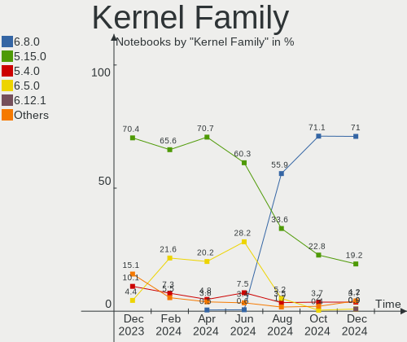
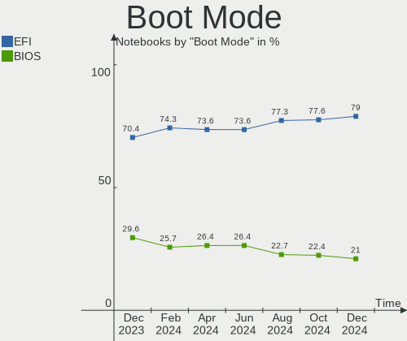

Linux Mint Hardware Trends (Notebooks)
--------------------------------------

A project to identify most popular hardware characteristics and track their change
over time based on data collected by Linux Mint users at https://Linux-Hardware.org.

Anyone can contribute to this report by the [hw-probe](https://github.com/linuxhw/hw-probe) tool:

    sudo -E hw-probe -all -upload

Full-feature report is available here: https://linux-hardware.org/?view=trends

Period: Nov, 2021.

Contents
--------

* [ System ](#system)
  - [ OS                       ](#os)
  - [ OS Family                ](#os-family)
  - [ Kernel                   ](#kernel)
  - [ Kernel Family            ](#kernel-family)
  - [ Kernel Major Ver.        ](#kernel-major-ver)
  - [ Arch                     ](#arch)
  - [ DE                       ](#de)
  - [ Display Server           ](#display-server)
  - [ Display Manager          ](#display-manager)
  - [ OS Lang                  ](#os-lang)
  - [ Boot Mode                ](#boot-mode)
  - [ Filesystem               ](#filesystem)
  - [ Part. scheme             ](#part-scheme)
  - [ Dual Boot with Linux/BSD ](#dual-boot-with-linuxbsd)
  - [ Dual Boot (Win)          ](#dual-boot-win)

* [ Board ](#board)
  - [ Vendor                   ](#vendor)
  - [ Model                    ](#model)
  - [ Model Family             ](#model-family)
  - [ MFG Year                 ](#mfg-year)
  - [ Form Factor              ](#form-factor)
  - [ Secure Boot              ](#secure-boot)
  - [ Coreboot                 ](#coreboot)
  - [ RAM Size                 ](#ram-size)
  - [ RAM Used                 ](#ram-used)
  - [ Total Drives             ](#total-drives)
  - [ Has CD-ROM               ](#has-cd-rom)
  - [ Has Ethernet             ](#has-ethernet)
  - [ Has WiFi                 ](#has-wifi)
  - [ Has Bluetooth            ](#has-bluetooth)

* [ Location ](#location)
  - [ Country                  ](#country)
  - [ City                     ](#city)

* [ Drives ](#drives)
  - [ Drive Vendor             ](#drive-vendor)
  - [ Drive Model              ](#drive-model)
  - [ HDD Vendor               ](#hdd-vendor)
  - [ SSD Vendor               ](#ssd-vendor)
  - [ Drive Kind               ](#drive-kind)
  - [ Drive Connector          ](#drive-connector)
  - [ Drive Size               ](#drive-size)
  - [ Space Total              ](#space-total)
  - [ Space Used               ](#space-used)
  - [ Malfunc. Drives          ](#malfunc-drives)
  - [ Malfunc. Drive Vendor    ](#malfunc-drive-vendor)
  - [ Malfunc. HDD Vendor      ](#malfunc-hdd-vendor)
  - [ Malfunc. Drive Kind      ](#malfunc-drive-kind)
  - [ Failed Drives            ](#failed-drives)
  - [ Failed Drive Vendor      ](#failed-drive-vendor)
  - [ Drive Status             ](#drive-status)

* [ Storage controller ](#storage-controller)
  - [ Storage Vendor           ](#storage-vendor)
  - [ Storage Model            ](#storage-model)
  - [ Storage Kind             ](#storage-kind)

* [ Processor ](#processor)
  - [ CPU Vendor               ](#cpu-vendor)
  - [ CPU Model                ](#cpu-model)
  - [ CPU Model Family         ](#cpu-model-family)
  - [ CPU Cores                ](#cpu-cores)
  - [ CPU Sockets              ](#cpu-sockets)
  - [ CPU Threads              ](#cpu-threads)
  - [ CPU Op-Modes             ](#cpu-op-modes)
  - [ CPU Microcode            ](#cpu-microcode)
  - [ CPU Microarch            ](#cpu-microarch)

* [ Graphics ](#graphics)
  - [ GPU Vendor               ](#gpu-vendor)
  - [ GPU Model                ](#gpu-model)
  - [ GPU Combo                ](#gpu-combo)
  - [ GPU Driver               ](#gpu-driver)
  - [ GPU Memory               ](#gpu-memory)

* [ Monitor ](#monitor)
  - [ Monitor Vendor           ](#monitor-vendor)
  - [ Monitor Model            ](#monitor-model)
  - [ Monitor Resolution       ](#monitor-resolution)
  - [ Monitor Diagonal         ](#monitor-diagonal)
  - [ Monitor Width            ](#monitor-width)
  - [ Aspect Ratio             ](#aspect-ratio)
  - [ Monitor Area             ](#monitor-area)
  - [ Pixel Density            ](#pixel-density)
  - [ Multiple Monitors        ](#multiple-monitors)

* [ Network ](#network)
  - [ Net Controller Vendor    ](#net-controller-vendor)
  - [ Net Controller Model     ](#net-controller-model)
  - [ Wireless Vendor          ](#wireless-vendor)
  - [ Wireless Model           ](#wireless-model)
  - [ Ethernet Vendor          ](#ethernet-vendor)
  - [ Ethernet Model           ](#ethernet-model)
  - [ Net Controller Kind      ](#net-controller-kind)
  - [ Used Controller          ](#used-controller)
  - [ NICs                     ](#nics)
  - [ IPv6                     ](#ipv6)

* [ Bluetooth ](#bluetooth)
  - [ Bluetooth Vendor         ](#bluetooth-vendor)
  - [ Bluetooth Model          ](#bluetooth-model)

* [ Sound ](#sound)
  - [ Sound Vendor             ](#sound-vendor)
  - [ Sound Model              ](#sound-model)

* [ Memory ](#memory)
  - [ Memory Vendor            ](#memory-vendor)
  - [ Memory Model             ](#memory-model)
  - [ Memory Kind              ](#memory-kind)
  - [ Memory Form Factor       ](#memory-form-factor)
  - [ Memory Size              ](#memory-size)
  - [ Memory Speed             ](#memory-speed)

* [ Printers & scanners ](#printers--scanners)
  - [ Printer Vendor           ](#printer-vendor)
  - [ Printer Model            ](#printer-model)
  - [ Scanner Vendor           ](#scanner-vendor)
  - [ Scanner Model            ](#scanner-model)

* [ Camera ](#camera)
  - [ Camera Vendor            ](#camera-vendor)
  - [ Camera Model             ](#camera-model)

* [ Security ](#security)
  - [ Fingerprint Vendor       ](#fingerprint-vendor)
  - [ Fingerprint Model        ](#fingerprint-model)
  - [ Chipcard Vendor          ](#chipcard-vendor)
  - [ Chipcard Model           ](#chipcard-model)

* [ Unsupported ](#unsupported)
  - [ Unsupported Devices      ](#unsupported-devices)
  - [ Unsupported Device Types ](#unsupported-device-types)

System
------

OS
--

Installed operating systems

| Name            | Notebooks | Percent |
|-----------------|-----------|---------|
| Linux Mint 20.2 | 234       | 81.53%  |
| Linux Mint 19.3 | 18        | 6.27%   |
| Linux Mint 20.1 | 15        | 5.23%   |
| Linux Mint 20   | 15        | 5.23%   |
| Linux Mint 19.2 | 2         | 0.7%    |
| Linux Mint 19   | 1         | 0.35%   |
| Linux Mint 18.3 | 1         | 0.35%   |
| Linux Mint 18   | 1         | 0.35%   |

OS Family
---------

OS without a version

| Name       | Notebooks | Percent |
|------------|-----------|---------|
| Linux Mint | 287       | 100%    |

Kernel
------

Version of the Linux kernel

| Version                  | Notebooks | Percent |
|--------------------------|-----------|---------|
| 5.4.0-90-generic         | 116       | 40.42%  |
| 5.4.0-89-generic         | 61        | 21.25%  |
| 5.4.0-74-generic         | 23        | 8.01%   |
| 5.13.0-21-generic        | 12        | 4.18%   |
| 5.4.0-91-generic         | 10        | 3.48%   |
| 5.11.0-40-generic        | 10        | 3.48%   |
| 5.11.0-38-generic        | 10        | 3.48%   |
| 5.0.0-32-generic         | 6         | 2.09%   |
| 5.4.0-88-generic         | 4         | 1.39%   |
| 5.4.0-86-generic         | 2         | 0.7%    |
| 5.4.0-58-generic         | 2         | 0.7%    |
| 5.4.0-40-generic         | 2         | 0.7%    |
| 5.10.0-1051-oem          | 2         | 0.7%    |
| 5.10.0-1050-oem          | 2         | 0.7%    |
| 5.8.0-43-generic         | 1         | 0.35%   |
| 5.6.10-050610-generic    | 1         | 0.35%   |
| 5.4.0-87-generic         | 1         | 0.35%   |
| 5.4.0-84-generic         | 1         | 0.35%   |
| 5.4.0-81-generic         | 1         | 0.35%   |
| 5.4.0-77-generic         | 1         | 0.35%   |
| 5.4.0-66-generic         | 1         | 0.35%   |
| 5.4.0-62-generic         | 1         | 0.35%   |
| 5.4.0-48-generic         | 1         | 0.35%   |
| 5.4.0-26-generic         | 1         | 0.35%   |
| 5.3.0-46-generic         | 1         | 0.35%   |
| 5.3.0-26-generic         | 1         | 0.35%   |
| 5.15.4-051504-generic    | 1         | 0.35%   |
| 5.15.1-xanmod1-tt        | 1         | 0.35%   |
| 5.15.0-ericb             | 1         | 0.35%   |
| 5.15-051500-generic      | 1         | 0.35%   |
| 5.13.0-22-generic        | 1         | 0.35%   |
| 5.11.0-27-generic        | 1         | 0.35%   |
| 4.4.0-57-generic         | 1         | 0.35%   |
| 4.19.163-0419163-generic | 1         | 0.35%   |
| 4.15.0-54-generic        | 1         | 0.35%   |
| 4.15.0-20-generic        | 1         | 0.35%   |
| 4.15.0-162-generic       | 1         | 0.35%   |
| 4.15.0-161-generic       | 1         | 0.35%   |
| 4.15.0-136-generic       | 1         | 0.35%   |

Kernel Family
-------------

Linux kernel without a distro release

| Version  | Notebooks | Percent |
|----------|-----------|---------|
| 5.4.0    | 228       | 79.44%  |
| 5.11.0   | 21        | 7.32%   |
| 5.13.0   | 13        | 4.53%   |
| 5.0.0    | 6         | 2.09%   |
| 4.15.0   | 5         | 1.74%   |
| 5.10.0   | 4         | 1.39%   |
| 5.3.0    | 2         | 0.7%    |
| 5.8.0    | 1         | 0.35%   |
| 5.6.10   | 1         | 0.35%   |
| 5.15.4   | 1         | 0.35%   |
| 5.15.1   | 1         | 0.35%   |
| 5.15.0   | 1         | 0.35%   |
| 5.15     | 1         | 0.35%   |
| 4.4.0    | 1         | 0.35%   |
| 4.19.163 | 1         | 0.35%   |

Kernel Major Ver.
-----------------

Linux kernel major version

| Version | Notebooks | Percent |
|---------|-----------|---------|
| 5.4     | 228       | 79.44%  |
| 5.11    | 21        | 7.32%   |
| 5.13    | 13        | 4.53%   |
| 5.0     | 6         | 2.09%   |
| 4.15    | 5         | 1.74%   |
| 5.10    | 4         | 1.39%   |
| 5.15    | 3         | 1.05%   |
| 5.3     | 2         | 0.7%    |
| 5.8     | 1         | 0.35%   |
| 5.6     | 1         | 0.35%   |
| 5       | 1         | 0.35%   |
| 4.4     | 1         | 0.35%   |
| 4.19    | 1         | 0.35%   |

Arch
----

OS architecture (x86_64, i586, etc.)

| Name   | Notebooks | Percent |
|--------|-----------|---------|
| x86_64 | 276       | 96.17%  |
| i686   | 11        | 3.83%   |

DE
--

Desktop Environment

| Name       | Notebooks | Percent |
|------------|-----------|---------|
| X-Cinnamon | 191       | 66.55%  |
| MATE       | 42        | 14.63%  |
| XFCE       | 26        | 9.06%   |
| Cinnamon   | 20        | 6.97%   |
| GNOME      | 5         | 1.74%   |
| Unknown    | 2         | 0.7%    |
| LXDE       | 1         | 0.35%   |

Display Server
--------------

X11 or Wayland

| Name | Notebooks | Percent |
|------|-----------|---------|
| X11  | 287       | 100%    |

Display Manager
---------------

SDDM, LightDM, etc.

| Name    | Notebooks | Percent |
|---------|-----------|---------|
| Unknown | 168       | 58.54%  |
| LightDM | 117       | 40.77%  |
| MDM     | 1         | 0.35%   |
| GDM     | 1         | 0.35%   |

OS Lang
-------

Language

| Lang    | Notebooks | Percent |
|---------|-----------|---------|
| de_DE   | 72        | 25.09%  |
| en_US   | 66        | 23%     |
| pt_BR   | 22        | 7.67%   |
| en_GB   | 15        | 5.23%   |
| C       | 11        | 3.83%   |
| ru_RU   | 10        | 3.48%   |
| pl_PL   | 9         | 3.14%   |
| fr_FR   | 9         | 3.14%   |
| en_AU   | 9         | 3.14%   |
| es_ES   | 8         | 2.79%   |
| en_IN   | 6         | 2.09%   |
| sv_SE   | 4         | 1.39%   |
| nl_NL   | 4         | 1.39%   |
| de_AT   | 4         | 1.39%   |
| it_IT   | 3         | 1.05%   |
| hu_HU   | 3         | 1.05%   |
| fi_FI   | 3         | 1.05%   |
| cs_CZ   | 3         | 1.05%   |
| ca_ES   | 3         | 1.05%   |
| es_MX   | 2         | 0.7%    |
| es_CL   | 2         | 0.7%    |
| en_ZA   | 2         | 0.7%    |
| en_CA   | 2         | 0.7%    |
| el_GR   | 2         | 0.7%    |
| de_CH   | 2         | 0.7%    |
| ru_UA   | 1         | 0.35%   |
| pt_PT   | 1         | 0.35%   |
| hr_HR   | 1         | 0.35%   |
| fr_CA   | 1         | 0.35%   |
| fr_BE   | 1         | 0.35%   |
| es_PE   | 1         | 0.35%   |
| es_EC   | 1         | 0.35%   |
| es_AR   | 1         | 0.35%   |
| en_PH   | 1         | 0.35%   |
| en_IE   | 1         | 0.35%   |
| Unknown | 1         | 0.35%   |

Boot Mode
---------

EFI or BIOS

| Mode | Notebooks | Percent |
|------|-----------|---------|
| EFI  | 161       | 56.1%   |
| BIOS | 126       | 43.9%   |

Filesystem
----------

Type of filesystem

| Type    | Notebooks | Percent |
|---------|-----------|---------|
| Ext4    | 273       | 95.12%  |
| Overlay | 10        | 3.48%   |
| Btrfs   | 3         | 1.05%   |
| Ext3    | 1         | 0.35%   |

Part. scheme
------------

Scheme of partitioning

| Type    | Notebooks | Percent |
|---------|-----------|---------|
| Unknown | 180       | 62.72%  |
| GPT     | 70        | 24.39%  |
| MBR     | 37        | 12.89%  |

Dual Boot with Linux/BSD
------------------------

Hosting more than one Linux/BSD

| Dual boot | Notebooks | Percent |
|-----------|-----------|---------|
| No        | 273       | 95.12%  |
| Yes       | 14        | 4.88%   |

Dual Boot (Win)
---------------

Hosting Linux and Windows

| Dual boot | Notebooks | Percent |
|-----------|-----------|---------|
| No        | 244       | 85.02%  |
| Yes       | 43        | 14.98%  |

Board
-----

Vendor
------

Motherboard manufacturer

| Name                | Notebooks | Percent |
|---------------------|-----------|---------|
| Dell                | 56        | 19.51%  |
| Lenovo              | 49        | 17.07%  |
| Hewlett-Packard     | 46        | 16.03%  |
| ASUSTek Computer    | 28        | 9.76%   |
| Acer                | 23        | 8.01%   |
| Samsung Electronics | 11        | 3.83%   |
| Sony                | 10        | 3.48%   |
| Toshiba             | 8         | 2.79%   |
| Apple               | 6         | 2.09%   |
| Medion              | 5         | 1.74%   |
| Fujitsu             | 5         | 1.74%   |
| Notebook            | 4         | 1.39%   |
| Google              | 4         | 1.39%   |
| Unknown             | 4         | 1.39%   |
| Positivo            | 3         | 1.05%   |
| HUAWEI              | 3         | 1.05%   |
| GPU Company         | 3         | 1.05%   |
| TUXEDO              | 2         | 0.7%    |
| Semp Toshiba        | 2         | 0.7%    |
| Panasonic           | 2         | 0.7%    |
| Packard Bell        | 2         | 0.7%    |
| Fujitsu Siemens     | 2         | 0.7%    |
| Timi                | 1         | 0.35%   |
| System76            | 1         | 0.35%   |
| On by NetOnNet      | 1         | 0.35%   |
| Multilaser          | 1         | 0.35%   |
| MSI                 | 1         | 0.35%   |
| COM1                | 1         | 0.35%   |
| Casper              | 1         | 0.35%   |
| BANGHO              | 1         | 0.35%   |
| Alienware           | 1         | 0.35%   |

Model
-----

Motherboard model

| Name                                       | Notebooks | Percent |
|--------------------------------------------|-----------|---------|
| Unknown                                    | 4         | 1.39%   |
| HP Pavilion 15                             | 3         | 1.05%   |
| Samsung 550XCJ/550XCR                      | 2         | 0.7%    |
| Positivo Mobile                            | 2         | 0.7%    |
| Lenovo IdeaPad 5 Pro 16ACH6 82L5           | 2         | 0.7%    |
| Lenovo G470 20078                          | 2         | 0.7%    |
| HP Pavilion g7                             | 2         | 0.7%    |
| GPU Company GWTN156-11                     | 2         | 0.7%    |
| Dell XPS 13 7390                           | 2         | 0.7%    |
| Dell Latitude E6540                        | 2         | 0.7%    |
| Dell Latitude E6420                        | 2         | 0.7%    |
| Dell Latitude E6400                        | 2         | 0.7%    |
| Dell Inspiron MP061                        | 2         | 0.7%    |
| Dell Inspiron 5402                         | 2         | 0.7%    |
| Dell Inspiron 3501                         | 2         | 0.7%    |
| Acer Aspire E5-575G                        | 2         | 0.7%    |
| TUXEDO P7xxTM1                             | 1         | 0.35%   |
| TUXEDO InfinityBook Pro 14 Gen6            | 1         | 0.35%   |
| Toshiba Satellite S55-C                    | 1         | 0.35%   |
| Toshiba Satellite Pro S300L                | 1         | 0.35%   |
| Toshiba Satellite P750                     | 1         | 0.35%   |
| Toshiba Satellite L655D                    | 1         | 0.35%   |
| Toshiba Satellite L640                     | 1         | 0.35%   |
| Toshiba Satellite L40                      | 1         | 0.35%   |
| Toshiba Satellite C850-1KN                 | 1         | 0.35%   |
| Toshiba Satellite A300                     | 1         | 0.35%   |
| Timi Mi NoteBook Pro                       | 1         | 0.35%   |
| System76 Gazelle                           | 1         | 0.35%   |
| Sony VPCZ21V9E                             | 1         | 0.35%   |
| Sony VPCS12L9E                             | 1         | 0.35%   |
| Sony VPCEB3E4E                             | 1         | 0.35%   |
| Sony VGN-Z31WN_B                           | 1         | 0.35%   |
| Sony VGN-Z11MN_B                           | 1         | 0.35%   |
| Sony VGN-FZ480E                            | 1         | 0.35%   |
| Sony SVF1521A1EW                           | 1         | 0.35%   |
| Sony SVE1713Y1EB                           | 1         | 0.35%   |
| Sony SVE1513Y1ESI                          | 1         | 0.35%   |
| Sony SVE14117GNB                           | 1         | 0.35%   |
| Semp Toshiba STI NA 1401                   | 1         | 0.35%   |
| Semp Toshiba NA 1402                       | 1         | 0.35%   |
| Samsung RV419                              | 1         | 0.35%   |
| Samsung R519/R719                          | 1         | 0.35%   |
| Samsung 730U3E/740U3E                      | 1         | 0.35%   |
| Samsung 550P5C/550P7C                      | 1         | 0.35%   |
| Samsung 350V5C/351V5C/3540VC/3440VC        | 1         | 0.35%   |
| Samsung 305V4A/305V5A                      | 1         | 0.35%   |
| Samsung 305E4A/305E5A/305E7A               | 1         | 0.35%   |
| Samsung 300E4C/300E5C/300E7C               | 1         | 0.35%   |
| Samsung 300E4A/300E5A/300E7A/3430EA/3530EA | 1         | 0.35%   |
| Positivo H14SU08                           | 1         | 0.35%   |
| Panasonic CF-52PFN820G                     | 1         | 0.35%   |
| Panasonic CF-192VYFX1M                     | 1         | 0.35%   |
| Packard Bell EasyNote TK85                 | 1         | 0.35%   |
| Packard Bell EasyNote LS11HR               | 1         | 0.35%   |
| On by NetOnNet LT1.1 BRZ                   | 1         | 0.35%   |
| Notebook SAM2010                           | 1         | 0.35%   |
| Notebook NL5xRU                            | 1         | 0.35%   |
| Notebook NJ50_70CU                         | 1         | 0.35%   |
| Notebook N24_25JU                          | 1         | 0.35%   |
| Multilaser PC024                           | 1         | 0.35%   |

Model Family
------------

Motherboard model prefix

| Name                   | Notebooks | Percent |
|------------------------|-----------|---------|
| Lenovo ThinkPad        | 27        | 9.41%   |
| Dell Inspiron          | 20        | 6.97%   |
| Acer Aspire            | 18        | 6.27%   |
| Dell Latitude          | 15        | 5.23%   |
| HP Pavilion            | 12        | 4.18%   |
| Lenovo IdeaPad         | 10        | 3.48%   |
| Toshiba Satellite      | 8         | 2.79%   |
| HP Laptop              | 8         | 2.79%   |
| Dell Vostro            | 7         | 2.44%   |
| Dell Precision         | 6         | 2.09%   |
| HP EliteBook           | 5         | 1.74%   |
| Fujitsu LIFEBOOK       | 5         | 1.74%   |
| HP ProBook             | 4         | 1.39%   |
| ASUS VivoBook          | 4         | 1.39%   |
| Unknown                | 4         | 1.39%   |
| HP ZBook               | 3         | 1.05%   |
| Dell XPS               | 3         | 1.05%   |
| ASUS ASUS              | 3         | 1.05%   |
| Samsung 550XCJ         | 2         | 0.7%    |
| Positivo Mobile        | 2         | 0.7%    |
| Packard Bell EasyNote  | 2         | 0.7%    |
| Lenovo G470            | 2         | 0.7%    |
| HP ENVY                | 2         | 0.7%    |
| HP Compaq              | 2         | 0.7%    |
| GPU Company GWTN156-11 | 2         | 0.7%    |
| Fujitsu Siemens AMILO  | 2         | 0.7%    |
| Dell Studio            | 2         | 0.7%    |
| Dell G3                | 2         | 0.7%    |
| Apple MacBookPro8      | 2         | 0.7%    |
| Acer Swift             | 2         | 0.7%    |
| TUXEDO P7xxTM1         | 1         | 0.35%   |
| TUXEDO InfinityBook    | 1         | 0.35%   |
| Timi Mi                | 1         | 0.35%   |
| System76 Gazelle       | 1         | 0.35%   |
| Sony VPCZ21V9E         | 1         | 0.35%   |
| Sony VPCS12L9E         | 1         | 0.35%   |
| Sony VPCEB3E4E         | 1         | 0.35%   |
| Sony VGN-Z31WN         | 1         | 0.35%   |
| Sony VGN-Z11MN         | 1         | 0.35%   |
| Sony VGN-FZ480E        | 1         | 0.35%   |
| Sony SVF1521A1EW       | 1         | 0.35%   |
| Sony SVE1713Y1EB       | 1         | 0.35%   |
| Sony SVE1513Y1ESI      | 1         | 0.35%   |
| Sony SVE14117GNB       | 1         | 0.35%   |
| Semp Toshiba STI       | 1         | 0.35%   |
| Semp Toshiba NA        | 1         | 0.35%   |
| Samsung RV419          | 1         | 0.35%   |
| Samsung R519           | 1         | 0.35%   |
| Samsung 730U3E         | 1         | 0.35%   |
| Samsung 550P5C         | 1         | 0.35%   |
| Samsung 350V5C         | 1         | 0.35%   |
| Samsung 305V4A         | 1         | 0.35%   |
| Samsung 305E4A         | 1         | 0.35%   |
| Samsung 300E4C         | 1         | 0.35%   |
| Samsung 300E4A         | 1         | 0.35%   |
| Positivo H14SU08       | 1         | 0.35%   |
| Panasonic CF-52PFN820G | 1         | 0.35%   |
| Panasonic CF-192VYFX1M | 1         | 0.35%   |
| On by NetOnNet LT1.1   | 1         | 0.35%   |
| Notebook SAM2010       | 1         | 0.35%   |

MFG Year
--------

Motherboard manufacture year

| Year | Notebooks | Percent |
|------|-----------|---------|
| 2021 | 64        | 22.3%   |
| 2013 | 26        | 9.06%   |
| 2012 | 24        | 8.36%   |
| 2011 | 23        | 8.01%   |
| 2020 | 21        | 7.32%   |
| 2019 | 20        | 6.97%   |
| 2018 | 19        | 6.62%   |
| 2015 | 14        | 4.88%   |
| 2009 | 14        | 4.88%   |
| 2016 | 13        | 4.53%   |
| 2008 | 12        | 4.18%   |
| 2017 | 10        | 3.48%   |
| 2014 | 9         | 3.14%   |
| 2010 | 9         | 3.14%   |
| 2007 | 8         | 2.79%   |
| 2006 | 1         | 0.35%   |

Form Factor
-----------

Physical design of the computer

| Name     | Notebooks | Percent |
|----------|-----------|---------|
| Notebook | 287       | 100%    |

Secure Boot
-----------

Enabled or disabled

| State    | Notebooks | Percent |
|----------|-----------|---------|
| Disabled | 253       | 88.15%  |
| Enabled  | 34        | 11.85%  |

Coreboot
--------

Have coreboot on board

| Used | Notebooks | Percent |
|------|-----------|---------|
| No   | 283       | 98.61%  |
| Yes  | 4         | 1.39%   |

RAM Size
--------

Total RAM memory

| Size in GB  | Notebooks | Percent |
|-------------|-----------|---------|
| 4.01-8.0    | 77        | 26.83%  |
| 3.01-4.0    | 75        | 26.13%  |
| 8.01-16.0   | 49        | 17.07%  |
| 16.01-24.0  | 46        | 16.03%  |
| 1.01-2.0    | 20        | 6.97%   |
| 32.01-64.0  | 10        | 3.48%   |
| 2.01-3.0    | 7         | 2.44%   |
| 24.01-32.0  | 2         | 0.7%    |
| 64.01-256.0 | 1         | 0.35%   |

RAM Used
--------

Used RAM memory

| Used GB   | Notebooks | Percent |
|-----------|-----------|---------|
| 1.01-2.0  | 127       | 44.25%  |
| 2.01-3.0  | 68        | 23.69%  |
| 4.01-8.0  | 30        | 10.45%  |
| 3.01-4.0  | 30        | 10.45%  |
| 0.51-1.0  | 24        | 8.36%   |
| 8.01-16.0 | 7         | 2.44%   |
| 0.01-0.5  | 1         | 0.35%   |

Total Drives
------------

Number of drives on board

| Drives | Notebooks | Percent |
|--------|-----------|---------|
| 1      | 209       | 72.82%  |
| 2      | 67        | 23.34%  |
| 3      | 7         | 2.44%   |
| 4      | 2         | 0.7%    |
| 0      | 2         | 0.7%    |

Has CD-ROM
----------

Has CD-ROM on board

| Presented | Notebooks | Percent |
|-----------|-----------|---------|
| No        | 150       | 52.26%  |
| Yes       | 137       | 47.74%  |

Has Ethernet
------------

Has Ethernet on board

| Presented | Notebooks | Percent |
|-----------|-----------|---------|
| Yes       | 246       | 85.71%  |
| No        | 41        | 14.29%  |

Has WiFi
--------

Has WiFi module

| Presented | Notebooks | Percent |
|-----------|-----------|---------|
| Yes       | 279       | 97.21%  |
| No        | 8         | 2.79%   |

Has Bluetooth
-------------

Has Bluetooth module

| Presented | Notebooks | Percent |
|-----------|-----------|---------|
| Yes       | 190       | 66.2%   |
| No        | 97        | 33.8%   |

Location
--------

Country
-------

Geographic location (country)

| Country                | Notebooks | Percent |
|------------------------|-----------|---------|
| Germany                | 75        | 26.13%  |
| USA                    | 38        | 13.24%  |
| Brazil                 | 26        | 9.06%   |
| UK                     | 12        | 4.18%   |
| Spain                  | 12        | 4.18%   |
| France                 | 10        | 3.48%   |
| Russia                 | 9         | 3.14%   |
| Netherlands            | 9         | 3.14%   |
| Australia              | 9         | 3.14%   |
| Poland                 | 8         | 2.79%   |
| India                  | 7         | 2.44%   |
| Sweden                 | 6         | 2.09%   |
| Italy                  | 5         | 1.74%   |
| Switzerland            | 4         | 1.39%   |
| Hungary                | 4         | 1.39%   |
| Greece                 | 4         | 1.39%   |
| Finland                | 4         | 1.39%   |
| Austria                | 4         | 1.39%   |
| Morocco                | 3         | 1.05%   |
| Mexico                 | 3         | 1.05%   |
| Ecuador                | 3         | 1.05%   |
| Ukraine                | 2         | 0.7%    |
| South Africa           | 2         | 0.7%    |
| Portugal               | 2         | 0.7%    |
| Pakistan               | 2         | 0.7%    |
| Czechia                | 2         | 0.7%    |
| Chile                  | 2         | 0.7%    |
| Canada                 | 2         | 0.7%    |
| Bosnia and Herzegovina | 2         | 0.7%    |
| Belgium                | 2         | 0.7%    |
| Vietnam                | 1         | 0.35%   |
| Turkey                 | 1         | 0.35%   |
| Slovakia               | 1         | 0.35%   |
| Philippines            | 1         | 0.35%   |
| Montenegro             | 1         | 0.35%   |
| Malaysia               | 1         | 0.35%   |
| Lebanon                | 1         | 0.35%   |
| Kyrgyzstan             | 1         | 0.35%   |
| Ireland                | 1         | 0.35%   |
| Ethiopia               | 1         | 0.35%   |
| Egypt                  | 1         | 0.35%   |
| China                  | 1         | 0.35%   |
| Bahrain                | 1         | 0.35%   |
| Argentina              | 1         | 0.35%   |

City
----

Geographic location (city)

| City              | Notebooks | Percent |
|-------------------|-----------|---------|
| Berlin            | 11        | 3.83%   |
| Sydney            | 5         | 1.74%   |
| Frankfurt am Main | 5         | 1.74%   |
| Albuquerque       | 4         | 1.39%   |
| Moscow            | 3         | 1.05%   |
| Hamburg           | 3         | 1.05%   |
| Zurich            | 2         | 0.7%    |
| Zapel             | 2         | 0.7%    |
| Warsaw            | 2         | 0.7%    |
| Vienna            | 2         | 0.7%    |
| Tangier           | 2         | 0.7%    |
| Stelle            | 2         | 0.7%    |
| Rio de Janeiro    | 2         | 0.7%    |
| Patos de Minas    | 2         | 0.7%    |
| Paris             | 2         | 0.7%    |
| New York          | 2         | 0.7%    |
| New Delhi         | 2         | 0.7%    |
| Madrid            | 2         | 0.7%    |
| London            | 2         | 0.7%    |
| Khabarovsk        | 2         | 0.7%    |
| Helsinki          | 2         | 0.7%    |
| Florence          | 2         | 0.7%    |
| Budapest          | 2         | 0.7%    |
| Bottrop           | 2         | 0.7%    |
| Bilbao            | 2         | 0.7%    |
| Bialystok         | 2         | 0.7%    |
| Barcelona         | 2         | 0.7%    |
| Adelaide CBD      | 2         | 0.7%    |
| Zoetermeer        | 1         | 0.35%   |
| Zenica            | 1         | 0.35%   |
| Zacatecas City    | 1         | 0.35%   |
| Winston-Salem     | 1         | 0.35%   |
| Wiesbaden         | 1         | 0.35%   |
| Volta Redonda     | 1         | 0.35%   |
| Visalia           | 1         | 0.35%   |
| Vigo              | 1         | 0.35%   |
| Vi?±a del Mar     | 1         | 0.35%   |
| Vianen            | 1         | 0.35%   |
| Vetroz            | 1         | 0.35%   |
| Vertheuil         | 1         | 0.35%   |
| Verl              | 1         | 0.35%   |
| Vechelde          | 1         | 0.35%   |
| V?¤ster??s        | 1         | 0.35%   |
| Vaernamo          | 1         | 0.35%   |
| Vaasa             | 1         | 0.35%   |
| Ufa               | 1         | 0.35%   |
| Tremembe          | 1         | 0.35%   |
| Toulouse          | 1         | 0.35%   |
| Tirupur           | 1         | 0.35%   |
| Thessaloniki      | 1         | 0.35%   |
| Terneuzen         | 1         | 0.35%   |
| Szeged            | 1         | 0.35%   |
| Surgut            | 1         | 0.35%   |
| Sterling Heights  | 1         | 0.35%   |
| Sigtuna           | 1         | 0.35%   |
| Sherbrooke        | 1         | 0.35%   |
| Sebeta            | 1         | 0.35%   |
| Schmalkalden      | 1         | 0.35%   |
| S??o Paulo        | 1         | 0.35%   |
| Savannah          | 1         | 0.35%   |

Drives
------

Drive Vendor
------------

Hard drive vendors

| Vendor                      | Notebooks | Drives | Percent |
|-----------------------------|-----------|--------|---------|
| WDC                         | 49        | 54     | 14.29%  |
| Samsung Electronics         | 47        | 50     | 13.7%   |
| Seagate                     | 41        | 43     | 11.95%  |
| Toshiba                     | 28        | 28     | 8.16%   |
| SanDisk                     | 23        | 26     | 6.71%   |
| Kingston                    | 21        | 21     | 6.12%   |
| Unknown                     | 18        | 18     | 5.25%   |
| Crucial                     | 16        | 17     | 4.66%   |
| Intel                       | 11        | 12     | 3.21%   |
| Hitachi                     | 11        | 11     | 3.21%   |
| SK Hynix                    | 9         | 9      | 2.62%   |
| KIOXIA                      | 6         | 6      | 1.75%   |
| Micron Technology           | 5         | 5      | 1.46%   |
| HGST                        | 5         | 5      | 1.46%   |
| Fujitsu                     | 4         | 4      | 1.17%   |
| LITEONIT                    | 3         | 4      | 0.87%   |
| China                       | 3         | 3      | 0.87%   |
| UMIS                        | 2         | 2      | 0.58%   |
| Silicon Motion              | 2         | 2      | 0.58%   |
| LITEON                      | 2         | 2      | 0.58%   |
| Lexar                       | 2         | 2      | 0.58%   |
| JMicron                     | 2         | 2      | 0.58%   |
| asmedia                     | 2         | 2      | 0.58%   |
| Apple                       | 2         | 2      | 0.58%   |
| ADATA Technology            | 2         | 2      | 0.58%   |
| A-DATA Technology           | 2         | 2      | 0.58%   |
| Unknown                     | 2         | 2      | 0.58%   |
| Yangtze Memory Technologies | 1         | 1      | 0.29%   |
| XrayDisk                    | 1         | 1      | 0.29%   |
| Transcend                   | 1         | 1      | 0.29%   |
| Teclast                     | 1         | 1      | 0.29%   |
| Team                        | 1         | 1      | 0.29%   |
| SPCC                        | 1         | 1      | 0.29%   |
| Secureye                    | 1         | 1      | 0.29%   |
| SABRENT                     | 1         | 1      | 0.29%   |
| Realtek Semiconductor       | 1         | 1      | 0.29%   |
| PNY                         | 1         | 1      | 0.29%   |
| Pioneer                     | 1         | 1      | 0.29%   |
| Phison                      | 1         | 1      | 0.29%   |
| Patriot                     | 1         | 1      | 0.29%   |
| OCZ                         | 1         | 1      | 0.29%   |
| Novation                    | 1         | 1      | 0.29%   |
| LDLC                        | 1         | 1      | 0.29%   |
| KingSpec                    | 1         | 1      | 0.29%   |
| KingDian                    | 1         | 1      | 0.29%   |
| Intenso                     | 1         | 1      | 0.29%   |
| Emtec                       | 1         | 1      | 0.29%   |
| CSD                         | 1         | 1      | 0.29%   |
| BHT                         | 1         | 1      | 0.29%   |
| ASMT                        | 1         | 1      | 0.29%   |

Drive Model
-----------

Hard drive models

| Model                                 | Notebooks | Percent |
|---------------------------------------|-----------|---------|
| Unknown MMC Card  64GB                | 5         | 1.41%   |
| Unknown MMC Card  32GB                | 5         | 1.41%   |
| Seagate ST9500325AS 500GB             | 4         | 1.13%   |
| Seagate ST500LM012 HN-M500MBB 500GB   | 4         | 1.13%   |
| Seagate ST1000LM035-1RK172 1TB        | 4         | 1.13%   |
| Kingston SA400S37240G 240GB SSD       | 4         | 1.13%   |
| Kingston NVMe SSD Drive 512GB         | 4         | 1.13%   |
| Crucial CT500MX500SSD1 500GB          | 4         | 1.13%   |
| WDC WDS240G2G0A-00JH30 240GB SSD      | 3         | 0.85%   |
| Unknown MMC Card  128GB               | 3         | 0.85%   |
| Toshiba MQ04ABF100 1TB                | 3         | 0.85%   |
| SK Hynix NVMe SSD Drive 512GB         | 3         | 0.85%   |
| Seagate ST750LM022 HN-M750MBB 752GB   | 3         | 0.85%   |
| Samsung SSD 860 EVO 500GB             | 3         | 0.85%   |
| Samsung SSD 850 EVO 500GB             | 3         | 0.85%   |
| KIOXIA KBG40ZNS512G NVMe 512GB        | 3         | 0.85%   |
| Kingston SA400S37120G 120GB SSD       | 3         | 0.85%   |
| Crucial CT240BX500SSD1 240GB          | 3         | 0.85%   |
| WDC WD10JPVX-75JC3T0 1TB              | 2         | 0.56%   |
| WDC WD10JPVX-22JC3T0 1TB              | 2         | 0.56%   |
| Unknown MMC Card  16GB                | 2         | 0.56%   |
| UMIS RPFTJ128PDD2EWX 128GB            | 2         | 0.56%   |
| Toshiba NVMe SSD Drive 512GB          | 2         | 0.56%   |
| Toshiba MQ01ABF050 500GB              | 2         | 0.56%   |
| Toshiba HDWL110 1TB                   | 2         | 0.56%   |
| SK Hynix HFS256G39TND-N210A 256GB SSD | 2         | 0.56%   |
| Seagate ST500LT012-9WS142 500GB       | 2         | 0.56%   |
| Seagate ST500LT012-1DG142 500GB       | 2         | 0.56%   |
| Seagate ST2000LM015-2E8174 2TB        | 2         | 0.56%   |
| Seagate ST1000LM024 HN-M101MBB 1TB    | 2         | 0.56%   |
| Seagate Expansion 1TB                 | 2         | 0.56%   |
| SanDisk Ultra II 480GB SSD            | 2         | 0.56%   |
| SanDisk SSD PLUS 480GB                | 2         | 0.56%   |
| SanDisk SSD PLUS 240GB                | 2         | 0.56%   |
| SanDisk SDSSDH3 500G                  | 2         | 0.56%   |
| SanDisk SDSSDA480G 480GB              | 2         | 0.56%   |
| Samsung SSD 840 Series 120GB          | 2         | 0.56%   |
| Samsung SSD 840 EVO 500GB             | 2         | 0.56%   |
| Samsung NVMe SSD Drive 512GB          | 2         | 0.56%   |
| Samsung NVMe SSD Drive 2TB            | 2         | 0.56%   |
| Micron 2300 NVMe 1024GB               | 2         | 0.56%   |
| Kingston SV300S37A240G 240GB SSD      | 2         | 0.56%   |
| Kingston SA400S37480G 480GB SSD       | 2         | 0.56%   |
| Intel NVMe SSD Drive 1024GB           | 2         | 0.56%   |
| Hitachi HTS545032B9A300 320GB         | 2         | 0.56%   |
| Hitachi HTS543232A7A384 320GB         | 2         | 0.56%   |
| HGST HTS721010A9E630 1TB              | 2         | 0.56%   |
| Crucial CT1000BX500SSD1 1TB           | 2         | 0.56%   |
| ADATA NVMe SSD Drive 256GB            | 2         | 0.56%   |
| Unknown                               | 2         | 0.56%   |
| Yangtze Memory NVMe SSD Drive 512GB   | 1         | 0.28%   |
| XrayDisk 128GB                        | 1         | 0.28%   |
| WDC WDS500G2B0A-00SM50 500GB SSD      | 1         | 0.28%   |
| WDC WDS480G2G0A-00JH30 480GB SSD      | 1         | 0.28%   |
| WDC WDS120G2G0A-00JH30 120GB SSD      | 1         | 0.28%   |
| WDC WDS100T2B0C-00PXH0 1TB            | 1         | 0.28%   |
| WDC WDS100T2B0A-00SM50 1TB SSD        | 1         | 0.28%   |
| WDC WDBNCE5000PNC 500GB SSD           | 1         | 0.28%   |
| WDC WD800BEVS-08RST2 80GB             | 1         | 0.28%   |
| WDC WD7500LPCX-24HWST1 752GB          | 1         | 0.28%   |

HDD Vendor
----------

Hard disk drive vendors

| Vendor              | Notebooks | Drives | Percent |
|---------------------|-----------|--------|---------|
| Seagate             | 41        | 43     | 34.17%  |
| WDC                 | 33        | 35     | 27.5%   |
| Toshiba             | 19        | 19     | 15.83%  |
| Hitachi             | 11        | 11     | 9.17%   |
| HGST                | 5         | 5      | 4.17%   |
| Samsung Electronics | 4         | 4      | 3.33%   |
| Fujitsu             | 4         | 4      | 3.33%   |
| asmedia             | 2         | 2      | 1.67%   |
| Unknown             | 1         | 1      | 0.83%   |

SSD Vendor
----------

Solid state drive vendors

| Vendor              | Notebooks | Drives | Percent |
|---------------------|-----------|--------|---------|
| Samsung Electronics | 26        | 27     | 20.31%  |
| SanDisk             | 19        | 20     | 14.84%  |
| Crucial             | 16        | 17     | 12.5%   |
| Kingston            | 15        | 15     | 11.72%  |
| WDC                 | 8         | 8      | 6.25%   |
| Intel               | 7         | 7      | 5.47%   |
| SK Hynix            | 4         | 4      | 3.13%   |
| LITEONIT            | 3         | 4      | 2.34%   |
| China               | 3         | 3      | 2.34%   |
| Toshiba             | 2         | 2      | 1.56%   |
| LITEON              | 2         | 2      | 1.56%   |
| Lexar               | 2         | 2      | 1.56%   |
| Apple               | 2         | 2      | 1.56%   |
| A-DATA Technology   | 2         | 2      | 1.56%   |
| Transcend           | 1         | 1      | 0.78%   |
| Teclast             | 1         | 1      | 0.78%   |
| Team                | 1         | 1      | 0.78%   |
| SPCC                | 1         | 1      | 0.78%   |
| Secureye            | 1         | 1      | 0.78%   |
| PNY                 | 1         | 1      | 0.78%   |
| Pioneer             | 1         | 1      | 0.78%   |
| Patriot             | 1         | 1      | 0.78%   |
| OCZ                 | 1         | 1      | 0.78%   |
| Micron Technology   | 1         | 1      | 0.78%   |
| KingSpec            | 1         | 1      | 0.78%   |
| KingDian            | 1         | 1      | 0.78%   |
| JMicron             | 1         | 1      | 0.78%   |
| Intenso             | 1         | 1      | 0.78%   |
| Emtec               | 1         | 1      | 0.78%   |
| BHT                 | 1         | 1      | 0.78%   |
| Unknown             | 1         | 1      | 0.78%   |

Drive Kind
----------

HDD or SSD

| Kind    | Notebooks | Drives | Percent |
|---------|-----------|--------|---------|
| SSD     | 122       | 132    | 36.64%  |
| HDD     | 116       | 124    | 34.83%  |
| NVMe    | 70        | 78     | 21.02%  |
| MMC     | 18        | 18     | 5.41%   |
| Unknown | 7         | 7      | 2.1%    |

Drive Connector
---------------

SATA, SAS, NVMe, etc.

| Type | Notebooks | Drives | Percent |
|------|-----------|--------|---------|
| SATA | 220       | 251    | 68.97%  |
| NVMe | 69        | 77     | 21.63%  |
| MMC  | 18        | 18     | 5.64%   |
| SAS  | 12        | 13     | 3.76%   |

Drive Size
----------

Size of hard drive

| Size in TB | Notebooks | Drives | Percent |
|------------|-----------|--------|---------|
| 0.01-0.5   | 171       | 188    | 73.39%  |
| 0.51-1.0   | 57        | 63     | 24.46%  |
| 1.01-2.0   | 5         | 5      | 2.15%   |

Space Total
-----------

Amount of disk space available on the file system

| Size in GB     | Notebooks | Percent |
|----------------|-----------|---------|
| 251-500        | 96        | 33.45%  |
| 101-250        | 92        | 32.06%  |
| 501-1000       | 38        | 13.24%  |
| 51-100         | 22        | 7.67%   |
| 1001-2000      | 16        | 5.57%   |
| 21-50          | 12        | 4.18%   |
| 1-20           | 6         | 2.09%   |
| More than 3000 | 2         | 0.7%    |
| 2001-3000      | 2         | 0.7%    |
| Unknown        | 1         | 0.35%   |

Space Used
----------

Amount of used disk space

| Used GB   | Notebooks | Percent |
|-----------|-----------|---------|
| 1-20      | 92        | 32.06%  |
| 21-50     | 73        | 25.44%  |
| 101-250   | 52        | 18.12%  |
| 51-100    | 36        | 12.54%  |
| 251-500   | 17        | 5.92%   |
| 501-1000  | 11        | 3.83%   |
| 1001-2000 | 5         | 1.74%   |
| Unknown   | 1         | 0.35%   |

Malfunc. Drives
---------------

Drive models with a malfunction

| Model                                    | Notebooks | Drives | Percent |
|------------------------------------------|-----------|--------|---------|
| WDC WD6400BEVT-60A0RT0 640GB             | 1         | 1      | 5.56%   |
| WDC WD5000BPVT-22HXZT3 500GB             | 1         | 1      | 5.56%   |
| WDC WD10JPVX-60JC3T0 1TB                 | 1         | 1      | 5.56%   |
| Toshiba THNSNK256GVN8 M.2 2280 256GB SSD | 1         | 1      | 5.56%   |
| Toshiba MQ01ABD100 1TB                   | 1         | 1      | 5.56%   |
| Toshiba MK5065GSX 500GB                  | 1         | 1      | 5.56%   |
| Toshiba MK2546GSX 200 200GB              | 1         | 1      | 5.56%   |
| Toshiba MK1237GSX 120GB                  | 1         | 1      | 5.56%   |
| Seagate ST9500325AS 500GB                | 1         | 1      | 5.56%   |
| Seagate ST9120823ASG 120GB               | 1         | 1      | 5.56%   |
| Seagate ST500LM021-1KJ152 500GB          | 1         | 1      | 5.56%   |
| Seagate ST500LM012 HN-M500MBB 500GB      | 1         | 1      | 5.56%   |
| Seagate ST1000LM035-1RK172 1TB           | 1         | 1      | 5.56%   |
| SanDisk SSD U100 128GB                   | 1         | 1      | 5.56%   |
| LITEONIT LCS-128L9S-11 2.5 7mm 128GB SSD | 1         | 1      | 5.56%   |
| LITEON CV8-8E128-HP 128GB SSD            | 1         | 1      | 5.56%   |
| Hitachi HTS725050A9A364 500GB            | 1         | 1      | 5.56%   |
| Crucial M4-CT256M4SSD2 256GB             | 1         | 1      | 5.56%   |

Malfunc. Drive Vendor
---------------------

Vendors of faulty drives

| Vendor   | Notebooks | Drives | Percent |
|----------|-----------|--------|---------|
| Toshiba  | 5         | 5      | 27.78%  |
| Seagate  | 5         | 5      | 27.78%  |
| WDC      | 3         | 3      | 16.67%  |
| SanDisk  | 1         | 1      | 5.56%   |
| LITEONIT | 1         | 1      | 5.56%   |
| LITEON   | 1         | 1      | 5.56%   |
| Hitachi  | 1         | 1      | 5.56%   |
| Crucial  | 1         | 1      | 5.56%   |

Malfunc. HDD Vendor
-------------------

Vendors of faulty HDD drives

| Vendor  | Notebooks | Drives | Percent |
|---------|-----------|--------|---------|
| Seagate | 5         | 5      | 38.46%  |
| Toshiba | 4         | 4      | 30.77%  |
| WDC     | 3         | 3      | 23.08%  |
| Hitachi | 1         | 1      | 7.69%   |

Malfunc. Drive Kind
-------------------

Kinds of faulty drives

| Kind | Notebooks | Drives | Percent |
|------|-----------|--------|---------|
| HDD  | 13        | 13     | 72.22%  |
| SSD  | 5         | 5      | 27.78%  |

Failed Drives
-------------

Failed drive models

Zero info for selected period =(

Failed Drive Vendor
-------------------

Failed drive vendors

Zero info for selected period =(

Drive Status
------------

Number of failed and malfunc. drives

| Status   | Notebooks | Drives | Percent |
|----------|-----------|--------|---------|
| Detected | 184       | 231    | 62.59%  |
| Works    | 92        | 110    | 31.29%  |
| Malfunc  | 18        | 18     | 6.12%   |

Storage controller
------------------

Storage Vendor
--------------

Storage controller vendors

| Vendor                           | Notebooks | Percent |
|----------------------------------|-----------|---------|
| Intel                            | 212       | 65.84%  |
| AMD                              | 33        | 10.25%  |
| Samsung Electronics              | 19        | 5.9%    |
| Sandisk                          | 13        | 4.04%   |
| Toshiba America Info Systems     | 7         | 2.17%   |
| KIOXIA                           | 6         | 1.86%   |
| Kingston Technology Company      | 6         | 1.86%   |
| SK Hynix                         | 5         | 1.55%   |
| Nvidia                           | 4         | 1.24%   |
| Micron Technology                | 4         | 1.24%   |
| VIA Technologies                 | 2         | 0.62%   |
| Silicon Motion                   | 2         | 0.62%   |
| Silicon Integrated Systems [SiS] | 2         | 0.62%   |
| ADATA Technology                 | 2         | 0.62%   |
| Yangtze Memory Technologies      | 1         | 0.31%   |
| Union Memory (Shenzhen)          | 1         | 0.31%   |
| Realtek Semiconductor            | 1         | 0.31%   |
| Phison Electronics               | 1         | 0.31%   |
| JMicron Technology               | 1         | 0.31%   |

Storage Model
-------------

Storage controller models

| Model                                                                                  | Notebooks | Percent |
|----------------------------------------------------------------------------------------|-----------|---------|
| Intel 7 Series Chipset Family 6-port SATA Controller [AHCI mode]                       | 34        | 9.58%   |
| AMD FCH SATA Controller [AHCI mode]                                                    | 27        | 7.61%   |
| Intel 6 Series/C200 Series Chipset Family 6 port Mobile SATA AHCI Controller           | 17        | 4.79%   |
| Intel 82801IBM/IEM (ICH9M/ICH9M-E) 4 port SATA Controller [AHCI mode]                  | 15        | 4.23%   |
| Intel Sunrise Point-LP SATA Controller [AHCI mode]                                     | 14        | 3.94%   |
| Intel 82801 Mobile SATA Controller [RAID mode]                                         | 13        | 3.66%   |
| Intel 5 Series/3400 Series Chipset 4 port SATA AHCI Controller                         | 12        | 3.38%   |
| Intel 82801HM/HEM (ICH8M/ICH8M-E) IDE Controller                                       | 11        | 3.1%    |
| Intel 8 Series/C220 Series Chipset Family 6-port SATA Controller 1 [AHCI mode]         | 11        | 3.1%    |
| Intel 8 Series SATA Controller 1 [AHCI mode]                                           | 11        | 3.1%    |
| Intel Volume Management Device NVMe RAID Controller                                    | 9         | 2.54%   |
| Intel 82801HM/HEM (ICH8M/ICH8M-E) SATA Controller [AHCI mode]                          | 9         | 2.54%   |
| Samsung NVMe SSD Controller SM981/PM981/PM983                                          | 8         | 2.25%   |
| Intel Tiger Lake-LP SATA Controller [AHCI mode]                                        | 7         | 1.97%   |
| Intel Comet Lake SATA AHCI Controller                                                  | 7         | 1.97%   |
| KIOXIA Non-Volatile memory controller                                                  | 6         | 1.69%   |
| Intel Wildcat Point-LP SATA Controller [AHCI Mode]                                     | 6         | 1.69%   |
| Toshiba America Info Systems XG6 NVMe SSD Controller                                   | 5         | 1.41%   |
| Sandisk WD Blue SN550 NVMe SSD                                                         | 5         | 1.41%   |
| Samsung NVMe SSD Controller 980                                                        | 5         | 1.41%   |
| Intel Cannon Point-LP SATA Controller [AHCI Mode]                                      | 5         | 1.41%   |
| AMD SB7x0/SB8x0/SB9x0 SATA Controller [AHCI mode]                                      | 5         | 1.41%   |
| Micron Non-Volatile memory controller                                                  | 4         | 1.13%   |
| Intel Celeron/Pentium Silver Processor SATA Controller                                 | 4         | 1.13%   |
| Intel Cannon Lake Mobile PCH SATA AHCI Controller                                      | 4         | 1.13%   |
| Intel 82801GBM/GHM (ICH7-M Family) SATA Controller [IDE mode]                          | 4         | 1.13%   |
| Intel 5 Series/3400 Series Chipset 6 port SATA AHCI Controller                         | 4         | 1.13%   |
| SK Hynix Gold P31 SSD                                                                  | 3         | 0.85%   |
| Sandisk WD Black SN750 / PC SN730 NVMe SSD                                             | 3         | 0.85%   |
| Samsung NVMe SSD Controller PM9A1/PM9A3/980PRO                                         | 3         | 0.85%   |
| Intel Atom Processor E3800 Series SATA AHCI Controller                                 | 3         | 0.85%   |
| Intel 82801HM/HEM (ICH8M/ICH8M-E) SATA Controller [IDE mode]                           | 3         | 0.85%   |
| Intel 6 Series/C200 Series Chipset Family Mobile SATA Controller (IDE mode, ports 4-5) | 3         | 0.85%   |
| Intel 6 Series/C200 Series Chipset Family Mobile SATA Controller (IDE mode, ports 0-3) | 3         | 0.85%   |
| Intel 400 Series Chipset Family SATA AHCI Controller                                   | 3         | 0.85%   |
| VIA VT82C586A/B/VT82C686/A/B/VT823x/A/C PIPC Bus Master IDE                            | 2         | 0.56%   |
| Silicon Motion SM2263EN/SM2263XT SSD Controller                                        | 2         | 0.56%   |
| Silicon Integrated Systems [SiS] SATA Controller / IDE mode                            | 2         | 0.56%   |
| Silicon Integrated Systems [SiS] 5513 IDE Controller                                   | 2         | 0.56%   |
| Sandisk WD Black 2018/SN750 / PC SN720 NVMe SSD                                        | 2         | 0.56%   |
| Sandisk PC SN520 NVMe SSD                                                              | 2         | 0.56%   |
| Sandisk Non-Volatile memory controller                                                 | 2         | 0.56%   |
| Samsung NVMe SSD Controller SM961/PM961/SM963                                          | 2         | 0.56%   |
| Samsung Apple PCIe SSD                                                                 | 2         | 0.56%   |
| Nvidia MCP67 IDE Controller                                                            | 2         | 0.56%   |
| Nvidia MCP67 AHCI Controller                                                           | 2         | 0.56%   |
| Kingston Company Company Non-Volatile memory controller                                | 2         | 0.56%   |
| Intel SSD 660P Series                                                                  | 2         | 0.56%   |
| Intel HM170/QM170 Chipset SATA Controller [AHCI Mode]                                  | 2         | 0.56%   |
| Intel Celeron N3350/Pentium N4200/Atom E3900 Series SATA AHCI Controller               | 2         | 0.56%   |
| Intel Atom/Celeron/Pentium Processor x5-E8000/J3xxx/N3xxx Series SATA Controller       | 2         | 0.56%   |
| ADATA Non-Volatile memory controller                                                   | 2         | 0.56%   |
| Yangtze Memory Non-Volatile memory controller                                          | 1         | 0.28%   |
| VIA VT8237A SATA 2-Port Controller                                                     | 1         | 0.28%   |
| VIA VIA VT6420 SATA RAID Controller                                                    | 1         | 0.28%   |
| Union Memory (Shenzhen) Non-Volatile memory controller                                 | 1         | 0.28%   |
| Toshiba America Info Systems NVMe Controller                                           | 1         | 0.28%   |
| Toshiba America Info Systems BG3 NVMe SSD Controller                                   | 1         | 0.28%   |
| SK Hynix Non-Volatile memory controller                                                | 1         | 0.28%   |
| SK Hynix BC501 NVMe Solid State Drive                                                  | 1         | 0.28%   |

Storage Kind
------------

Kind of storage controller (IDE, SATA, NVMe, SAS, ...)

| Kind | Notebooks | Percent |
|------|-----------|---------|
| SATA | 212       | 63.1%   |
| NVMe | 68        | 20.24%  |
| IDE  | 33        | 9.82%   |
| RAID | 23        | 6.85%   |

Processor
---------

CPU Vendor
----------

Processor vendors

| Vendor | Notebooks | Percent |
|--------|-----------|---------|
| Intel  | 242       | 84.32%  |
| AMD    | 45        | 15.68%  |

CPU Model
---------

Processor models

| Model                                         | Notebooks | Percent |
|-----------------------------------------------|-----------|---------|
| Intel 11th Gen Core i5-1135G7 @ 2.40GHz       | 8         | 2.79%   |
| Intel Core i7-10510U CPU @ 1.80GHz            | 6         | 2.09%   |
| Intel Core i5-2520M CPU @ 2.50GHz             | 6         | 2.09%   |
| Intel 11th Gen Core i7-1165G7 @ 2.80GHz       | 6         | 2.09%   |
| Intel Core i5-10210U CPU @ 1.60GHz            | 5         | 1.74%   |
| Intel Core i5-3320M CPU @ 2.60GHz             | 4         | 1.39%   |
| Intel Core i5-3230M CPU @ 2.60GHz             | 4         | 1.39%   |
| Intel Core i5-2410M CPU @ 2.30GHz             | 4         | 1.39%   |
| Intel Core 2 Duo CPU T8100 @ 2.10GHz          | 4         | 1.39%   |
| Intel Pentium Silver N5030 CPU @ 1.10GHz      | 3         | 1.05%   |
| Intel Pentium CPU P6200 @ 2.13GHz             | 3         | 1.05%   |
| Intel Core i7-7500U CPU @ 2.70GHz             | 3         | 1.05%   |
| Intel Core i7-4710HQ CPU @ 2.50GHz            | 3         | 1.05%   |
| Intel Core i7-3632QM CPU @ 2.20GHz            | 3         | 1.05%   |
| Intel Core i7-3520M CPU @ 2.90GHz             | 3         | 1.05%   |
| Intel Core i5-7200U CPU @ 2.50GHz             | 3         | 1.05%   |
| Intel Core i5-3210M CPU @ 2.50GHz             | 3         | 1.05%   |
| Intel Core i3-4005U CPU @ 1.70GHz             | 3         | 1.05%   |
| Intel Core i3-2350M CPU @ 2.30GHz             | 3         | 1.05%   |
| Intel Core 2 Duo CPU T6670 @ 2.20GHz          | 3         | 1.05%   |
| Intel Core 2 Duo CPU P8700 @ 2.53GHz          | 3         | 1.05%   |
| AMD Ryzen 5 3500U with Radeon Vega Mobile Gfx | 3         | 1.05%   |
| Intel Pentium Dual-Core CPU T4300 @ 2.10GHz   | 2         | 0.7%    |
| Intel Pentium Dual CPU T2330 @ 1.60GHz        | 2         | 0.7%    |
| Intel Core i7-8565U CPU @ 1.80GHz             | 2         | 0.7%    |
| Intel Core i7-5600U CPU @ 2.60GHz             | 2         | 0.7%    |
| Intel Core i7-5500U CPU @ 2.40GHz             | 2         | 0.7%    |
| Intel Core i7-4600U CPU @ 2.10GHz             | 2         | 0.7%    |
| Intel Core i7-4500U CPU @ 1.80GHz             | 2         | 0.7%    |
| Intel Core i7-3630QM CPU @ 2.40GHz            | 2         | 0.7%    |
| Intel Core i7-3537U CPU @ 2.00GHz             | 2         | 0.7%    |
| Intel Core i7-2670QM CPU @ 2.20GHz            | 2         | 0.7%    |
| Intel Core i7-10750H CPU @ 2.60GHz            | 2         | 0.7%    |
| Intel Core i7 CPU Q 720 @ 1.60GHz             | 2         | 0.7%    |
| Intel Core i5-8300H CPU @ 2.30GHz             | 2         | 0.7%    |
| Intel Core i5-8265U CPU @ 1.60GHz             | 2         | 0.7%    |
| Intel Core i5-7300HQ CPU @ 2.50GHz            | 2         | 0.7%    |
| Intel Core i5-6300U CPU @ 2.40GHz             | 2         | 0.7%    |
| Intel Core i5-5200U CPU @ 2.20GHz             | 2         | 0.7%    |
| Intel Core i5-4210U CPU @ 1.70GHz             | 2         | 0.7%    |
| Intel Core i5-3337U CPU @ 1.80GHz             | 2         | 0.7%    |
| Intel Core i5-2540M CPU @ 2.60GHz             | 2         | 0.7%    |
| Intel Core i3-4000M CPU @ 2.40GHz             | 2         | 0.7%    |
| Intel Core i3-2370M CPU @ 2.40GHz             | 2         | 0.7%    |
| Intel Core i3 CPU M 380 @ 2.53GHz             | 2         | 0.7%    |
| Intel Core i3 CPU M 350 @ 2.27GHz             | 2         | 0.7%    |
| Intel Core i3 CPU M 330 @ 2.13GHz             | 2         | 0.7%    |
| Intel Core 2 Duo CPU T9600 @ 2.80GHz          | 2         | 0.7%    |
| Intel Core 2 Duo CPU P8600 @ 2.40GHz          | 2         | 0.7%    |
| Intel Core 2 Duo CPU P8400 @ 2.26GHz          | 2         | 0.7%    |
| Intel Celeron CPU N3060 @ 1.60GHz             | 2         | 0.7%    |
| Intel Celeron CPU 847 @ 1.10GHz               | 2         | 0.7%    |
| Intel 11th Gen Core i7-11800H @ 2.30GHz       | 2         | 0.7%    |
| Intel 11th Gen Core i5-11300H @ 3.10GHz       | 2         | 0.7%    |
| AMD Turion 64 X2 Mobile Technology TL-56      | 2         | 0.7%    |
| AMD Ryzen 7 PRO 5850U with Radeon Graphics    | 2         | 0.7%    |
| AMD Ryzen 7 4700U with Radeon Graphics        | 2         | 0.7%    |
| AMD Ryzen 5 4600H with Radeon Graphics        | 2         | 0.7%    |
| AMD Athlon Silver 3050U with Radeon Graphics  | 2         | 0.7%    |
| AMD A6-3420M APU with Radeon HD Graphics      | 2         | 0.7%    |

CPU Model Family
----------------

Processor model prefix

| Model                   | Notebooks | Percent |
|-------------------------|-----------|---------|
| Intel Core i7           | 62        | 21.6%   |
| Intel Core i5           | 60        | 20.91%  |
| Intel Core 2 Duo        | 25        | 8.71%   |
| Intel Core i3           | 24        | 8.36%   |
| Other                   | 23        | 8.01%   |
| Intel Celeron           | 12        | 4.18%   |
| Intel Pentium           | 11        | 3.83%   |
| AMD Ryzen 5             | 8         | 2.79%   |
| Intel Atom              | 7         | 2.44%   |
| AMD Ryzen 7             | 6         | 2.09%   |
| Intel Pentium Silver    | 4         | 1.39%   |
| Intel Pentium Dual-Core | 4         | 1.39%   |
| Intel Pentium Dual      | 4         | 1.39%   |
| AMD A4                  | 4         | 1.39%   |
| AMD E2                  | 3         | 1.05%   |
| AMD A6                  | 3         | 1.05%   |
| Intel Core 2            | 2         | 0.7%    |
| Intel Celeron M         | 2         | 0.7%    |
| AMD Turion 64 X2 Mobile | 2         | 0.7%    |
| AMD Ryzen 7 PRO         | 2         | 0.7%    |
| AMD Ryzen 3             | 2         | 0.7%    |
| AMD Athlon              | 2         | 0.7%    |
| AMD A8                  | 2         | 0.7%    |
| Intel Pentium Gold      | 1         | 0.35%   |
| Intel Genuine           | 1         | 0.35%   |
| Intel Core i9           | 1         | 0.35%   |
| Intel Core Duo          | 1         | 0.35%   |
| AMD Turion II           | 1         | 0.35%   |
| AMD Ryzen 9             | 1         | 0.35%   |
| AMD Phenom II           | 1         | 0.35%   |
| AMD E1                  | 1         | 0.35%   |
| AMD C-70                | 1         | 0.35%   |
| AMD C-60                | 1         | 0.35%   |
| AMD Athlon II           | 1         | 0.35%   |
| AMD Athlon 64 X2        | 1         | 0.35%   |
| AMD A10                 | 1         | 0.35%   |

CPU Cores
---------

Number of processor cores

| Number | Notebooks | Percent |
|--------|-----------|---------|
| 2      | 169       | 58.89%  |
| 4      | 88        | 30.66%  |
| 8      | 12        | 4.18%   |
| 6      | 11        | 3.83%   |
| 1      | 7         | 2.44%   |

CPU Sockets
-----------

Number of sockets

| Number | Notebooks | Percent |
|--------|-----------|---------|
| 1      | 287       | 100%    |

CPU Threads
-----------

Threads per core (Hyper-Threading)

| Number | Notebooks | Percent |
|--------|-----------|---------|
| 2      | 190       | 66.2%   |
| 1      | 97        | 33.8%   |

CPU Op-Modes
------------

CPU Operation Modes (32-bit, 64-bit)

| Op mode        | Notebooks | Percent |
|----------------|-----------|---------|
| 32-bit, 64-bit | 281       | 97.91%  |
| 32-bit         | 6         | 2.09%   |

CPU Microcode
-------------

Microcode number

| Number     | Notebooks | Percent |
|------------|-----------|---------|
| 0x206a7    | 30        | 10.45%  |
| 0x306a9    | 27        | 9.41%   |
| Unknown    | 21        | 7.32%   |
| 0x806c1    | 18        | 6.27%   |
| 0x1067a    | 16        | 5.57%   |
| 0x40651    | 13        | 4.53%   |
| 0x806ec    | 12        | 4.18%   |
| 0x306c3    | 10        | 3.48%   |
| 0x20655    | 10        | 3.48%   |
| 0x6fd      | 9         | 3.14%   |
| 0x406e3    | 6         | 2.09%   |
| 0x306d4    | 6         | 2.09%   |
| 0x806ea    | 5         | 1.74%   |
| 0x30678    | 5         | 1.74%   |
| 0x20652    | 5         | 1.74%   |
| 0x10676    | 5         | 1.74%   |
| 0x0a50000c | 5         | 1.74%   |
| 0x906ea    | 4         | 1.39%   |
| 0x806e9    | 4         | 1.39%   |
| 0x706a8    | 4         | 1.39%   |
| 0x406c4    | 4         | 1.39%   |
| 0x08600106 | 4         | 1.39%   |
| 0x06006705 | 4         | 1.39%   |
| 0xa0660    | 3         | 1.05%   |
| 0x806d1    | 3         | 1.05%   |
| 0x08108109 | 3         | 1.05%   |
| 0x07030105 | 3         | 1.05%   |
| 0x06001119 | 3         | 1.05%   |
| 0x05000119 | 3         | 1.05%   |
| 0x010000c8 | 3         | 1.05%   |
| 0xa0652    | 2         | 0.7%    |
| 0x906e9    | 2         | 0.7%    |
| 0x806eb    | 2         | 0.7%    |
| 0x706e5    | 2         | 0.7%    |
| 0x6ec      | 2         | 0.7%    |
| 0x506e3    | 2         | 0.7%    |
| 0x506c9    | 2         | 0.7%    |
| 0x106e5    | 2         | 0.7%    |
| 0x106c2    | 2         | 0.7%    |
| 0x08608103 | 2         | 0.7%    |
| 0x08108102 | 2         | 0.7%    |
| 0x03000027 | 2         | 0.7%    |
| 0x906ed    | 1         | 0.35%   |
| 0x906c0    | 1         | 0.35%   |
| 0x6f6      | 1         | 0.35%   |
| 0x6f2      | 1         | 0.35%   |
| 0x6e8      | 1         | 0.35%   |
| 0x6d8      | 1         | 0.35%   |
| 0x40661    | 1         | 0.35%   |
| 0x30673    | 1         | 0.35%   |
| 0x106ca    | 1         | 0.35%   |
| 0x08600104 | 1         | 0.35%   |
| 0x08600103 | 1         | 0.35%   |
| 0x0810100b | 1         | 0.35%   |
| 0x08101007 | 1         | 0.35%   |
| 0x0700010f | 1         | 0.35%   |
| 0x06006704 | 1         | 0.35%   |

CPU Microarch
-------------

Microarchitecture

| Name          | Notebooks | Percent |
|---------------|-----------|---------|
| KabyLake      | 36        | 12.54%  |
| SandyBridge   | 30        | 10.45%  |
| IvyBridge     | 29        | 10.1%   |
| Haswell       | 26        | 9.06%   |
| Penryn        | 25        | 8.71%   |
| TigerLake     | 19        | 6.62%   |
| Westmere      | 15        | 5.23%   |
| Core          | 11        | 3.83%   |
| Silvermont    | 10        | 3.48%   |
| Skylake       | 8         | 2.79%   |
| Zen+          | 6         | 2.09%   |
| Zen 2         | 6         | 2.09%   |
| CometLake     | 6         | 2.09%   |
| Broadwell     | 6         | 2.09%   |
| Zen 3         | 5         | 1.74%   |
| Icelake       | 5         | 1.74%   |
| Excavator     | 5         | 1.74%   |
| P6            | 4         | 1.39%   |
| Goldmont plus | 4         | 1.39%   |
| Puma          | 3         | 1.05%   |
| Piledriver    | 3         | 1.05%   |
| K8 Hammer     | 3         | 1.05%   |
| K10 Llano     | 3         | 1.05%   |
| K10           | 3         | 1.05%   |
| Bonnell       | 3         | 1.05%   |
| Bobcat        | 3         | 1.05%   |
| Zen           | 2         | 0.7%    |
| Nehalem       | 2         | 0.7%    |
| Goldmont      | 2         | 0.7%    |
| Unknown       | 2         | 0.7%    |
| Tremont       | 1         | 0.35%   |
| Jaguar        | 1         | 0.35%   |

Graphics
--------

GPU Vendor
----------

Vendors of graphics cards

| Vendor                           | Notebooks | Percent |
|----------------------------------|-----------|---------|
| Intel                            | 208       | 60.12%  |
| AMD                              | 72        | 20.81%  |
| Nvidia                           | 63        | 18.21%  |
| VIA Technologies                 | 2         | 0.58%   |
| Silicon Integrated Systems [SiS] | 1         | 0.29%   |

GPU Model
---------

Graphics card models

| Model                                                                                    | Notebooks | Percent |
|------------------------------------------------------------------------------------------|-----------|---------|
| Intel 3rd Gen Core processor Graphics Controller                                         | 26        | 7.16%   |
| Intel 2nd Generation Core Processor Family Integrated Graphics Controller                | 26        | 7.16%   |
| Intel TigerLake-LP GT2 [Iris Xe Graphics]                                                | 17        | 4.68%   |
| Intel Haswell-ULT Integrated Graphics Controller                                         | 14        | 3.86%   |
| Intel Mobile 4 Series Chipset Integrated Graphics Controller                             | 12        | 3.31%   |
| Intel 4th Gen Core Processor Integrated Graphics Controller                              | 11        | 3.03%   |
| Intel Core Processor Integrated Graphics Controller                                      | 10        | 2.75%   |
| Intel CometLake-U GT2 [UHD Graphics]                                                     | 10        | 2.75%   |
| Intel Mobile GM965/GL960 Integrated Graphics Controller (secondary)                      | 8         | 2.2%    |
| Intel Mobile GM965/GL960 Integrated Graphics Controller (primary)                        | 8         | 2.2%    |
| Intel HD Graphics 620                                                                    | 8         | 2.2%    |
| Intel HD Graphics 5500                                                                   | 6         | 1.65%   |
| Intel Atom Processor Z36xxx/Z37xxx Series Graphics & Display                             | 6         | 1.65%   |
| AMD Renoir                                                                               | 6         | 1.65%   |
| AMD Picasso/Raven 2 [Radeon Vega Series / Radeon Vega Mobile Series]                     | 6         | 1.65%   |
| Intel WhiskeyLake-U GT2 [UHD Graphics 620]                                               | 5         | 1.38%   |
| Intel Skylake GT2 [HD Graphics 520]                                                      | 5         | 1.38%   |
| Intel CoffeeLake-H GT2 [UHD Graphics 630]                                                | 5         | 1.38%   |
| AMD Thames [Radeon HD 7500M/7600M Series]                                                | 5         | 1.38%   |
| AMD Stoney [Radeon R2/R3/R4/R5 Graphics]                                                 | 5         | 1.38%   |
| AMD Cezanne                                                                              | 5         | 1.38%   |
| Intel Atom/Celeron/Pentium Processor x5-E8000/J3xxx/N3xxx Integrated Graphics Controller | 4         | 1.1%    |
| AMD Seymour [Radeon HD 6400M/7400M Series]                                               | 4         | 1.1%    |
| AMD Park [Mobility Radeon HD 5430/5450/5470]                                             | 4         | 1.1%    |
| Nvidia TU117M [GeForce GTX 1650 Ti Mobile]                                               | 3         | 0.83%   |
| Nvidia GP107M [GeForce GTX 1050 Mobile]                                                  | 3         | 0.83%   |
| Intel UHD Graphics 620                                                                   | 3         | 0.83%   |
| Intel TigerLake-H GT1 [UHD Graphics]                                                     | 3         | 0.83%   |
| Intel Mobile 945GM/GMS/GME, 943/940GML Express Integrated Graphics Controller            | 3         | 0.83%   |
| Intel HD Graphics 630                                                                    | 3         | 0.83%   |
| Intel GeminiLake [UHD Graphics 605]                                                      | 3         | 0.83%   |
| Intel CometLake-H GT2 [UHD Graphics]                                                     | 3         | 0.83%   |
| Intel Comet Lake UHD Graphics                                                            | 3         | 0.83%   |
| AMD Sumo [Radeon HD 6520G]                                                               | 3         | 0.83%   |
| AMD RS880M [Mobility Radeon HD 4225/4250]                                                | 3         | 0.83%   |
| Nvidia TU117M                                                                            | 2         | 0.55%   |
| Nvidia GP108M [GeForce MX150]                                                            | 2         | 0.55%   |
| Nvidia GM108M [GeForce MX130]                                                            | 2         | 0.55%   |
| Nvidia GM107M [GeForce GTX 850M]                                                         | 2         | 0.55%   |
| Nvidia GM107 [GeForce 940MX]                                                             | 2         | 0.55%   |
| Nvidia GA107M [GeForce RTX 3050 Mobile]                                                  | 2         | 0.55%   |
| Nvidia GA106M [GeForce RTX 3060 Mobile / Max-Q]                                          | 2         | 0.55%   |
| Nvidia G98M [Quadro NVS 160M]                                                            | 2         | 0.55%   |
| Nvidia G98M [GeForce 9300M GS]                                                           | 2         | 0.55%   |
| Intel Tiger Lake UHD Graphics                                                            | 2         | 0.55%   |
| Intel Mobile 945GM/GMS, 943/940GML Express Integrated Graphics Controller                | 2         | 0.55%   |
| AMD Whistler [Radeon HD 6630M/6650M/6750M/7670M/7690M]                                   | 2         | 0.55%   |
| AMD Sun XT [Radeon HD 8670A/8670M/8690M / R5 M330 / M430 / Radeon 520 Mobile]            | 2         | 0.55%   |
| AMD Raven Ridge [Radeon Vega Series / Radeon Vega Mobile Series]                         | 2         | 0.55%   |
| AMD Mullins [Radeon R3 Graphics]                                                         | 2         | 0.55%   |
| AMD Mars [Radeon HD 8670A/8670M/8750M / R7 M370]                                         | 2         | 0.55%   |
| AMD Lucienne                                                                             | 2         | 0.55%   |
| VIA Technologies CN896/VN896/P4M900 [Chrome 9 HC]                                        | 1         | 0.28%   |
| VIA Technologies CN700/P4M800 Pro/P4M800 CE/VN800 Graphics [S3 UniChrome Pro]            | 1         | 0.28%   |
| Silicon Integrated Systems [SiS] 771/671 PCIE VGA Display Adapter                        | 1         | 0.28%   |
| Nvidia VGA compatible controller                                                         | 1         | 0.28%   |
| Nvidia TU104GLM [Quadro RTX 4000 Mobile / Max-Q]                                         | 1         | 0.28%   |
| Nvidia MCP89 [GeForce 320M]                                                              | 1         | 0.28%   |
| Nvidia GT218M [GeForce 310M]                                                             | 1         | 0.28%   |
| Nvidia GT216GLM [Quadro FX 880M]                                                         | 1         | 0.28%   |

GPU Combo
---------

Combinations of graphics cards

| Name           | Notebooks | Percent |
|----------------|-----------|---------|
| 1 x Intel      | 154       | 53.66%  |
| 1 x AMD        | 50        | 17.42%  |
| Intel + Nvidia | 43        | 14.98%  |
| 1 x Nvidia     | 16        | 5.57%   |
| Intel + AMD    | 11        | 3.83%   |
| 2 x AMD        | 6         | 2.09%   |
| AMD + Nvidia   | 4         | 1.39%   |
| 1 x VIA        | 2         | 0.7%    |
| 1 x SiS        | 1         | 0.35%   |

GPU Driver
----------

Free vs proprietary

| Driver      | Notebooks | Percent |
|-------------|-----------|---------|
| Free        | 235       | 81.88%  |
| Proprietary | 35        | 12.2%   |
| Unknown     | 17        | 5.92%   |

GPU Memory
----------

Total video memory

| Size in GB | Notebooks | Percent |
|------------|-----------|---------|
| Unknown    | 187       | 65.16%  |
| 0.01-0.5   | 44        | 15.33%  |
| 1.01-2.0   | 24        | 8.36%   |
| 0.51-1.0   | 22        | 7.67%   |
| 3.01-4.0   | 5         | 1.74%   |
| 5.01-6.0   | 3         | 1.05%   |
| 7.01-8.0   | 2         | 0.7%    |

Monitor
-------

Monitor Vendor
--------------

Monitor vendors

| Vendor                  | Notebooks | Percent |
|-------------------------|-----------|---------|
| LG Display              | 54        | 18.82%  |
| AU Optronics            | 49        | 17.07%  |
| Samsung Electronics     | 33        | 11.5%   |
| BOE                     | 32        | 11.15%  |
| Chimei Innolux          | 31        | 10.8%   |
| Chi Mei Optoelectronics | 8         | 2.79%   |
| Lenovo                  | 7         | 2.44%   |
| Hewlett-Packard         | 7         | 2.44%   |
| Dell                    | 7         | 2.44%   |
| Apple                   | 6         | 2.09%   |
| InfoVision              | 5         | 1.74%   |
| Sony                    | 4         | 1.39%   |
| PANDA                   | 4         | 1.39%   |
| LG Philips              | 4         | 1.39%   |
| Acer                    | 4         | 1.39%   |
| Sharp                   | 3         | 1.05%   |
| LGD                     | 3         | 1.05%   |
| Goldstar                | 3         | 1.05%   |
| CPT                     | 3         | 1.05%   |
| Toshiba                 | 2         | 0.7%    |
| InnoLux Display         | 2         | 0.7%    |
| CSO                     | 2         | 0.7%    |
| PZG                     | 1         | 0.35%   |
| Philips                 | 1         | 0.35%   |
| Nvidia                  | 1         | 0.35%   |
| MSI                     | 1         | 0.35%   |
| LPL                     | 1         | 0.35%   |
| JDI                     | 1         | 0.35%   |
| Iiyama                  | 1         | 0.35%   |
| HKC                     | 1         | 0.35%   |
| HBTV-29D07HD            | 1         | 0.35%   |
| HB@                     | 1         | 0.35%   |
| HannStar                | 1         | 0.35%   |
| BenQ                    | 1         | 0.35%   |
| ASUSTek Computer        | 1         | 0.35%   |
| AOC                     | 1         | 0.35%   |

Monitor Model
-------------

Monitor models

| Model                                                                    | Notebooks | Percent |
|--------------------------------------------------------------------------|-----------|---------|
| Chimei Innolux LCD Monitor CMN15DB 1366x768 344x193mm 15.5-inch          | 3         | 1.04%   |
| Chimei Innolux LCD Monitor CMN14D4 1920x1080 309x173mm 13.9-inch         | 3         | 1.04%   |
| Samsung Electronics LCD Monitor SEC5557 1920x1200 367x230mm 17.1-inch    | 2         | 0.69%   |
| Samsung Electronics LCD Monitor SEC5541 1366x768 344x193mm 15.5-inch     | 2         | 0.69%   |
| Samsung Electronics LCD Monitor SEC5448 1920x1080 344x194mm 15.5-inch    | 2         | 0.69%   |
| Samsung Electronics LCD Monitor SEC5442 1440x900 367x230mm 17.1-inch     | 2         | 0.69%   |
| Samsung Electronics LCD Monitor SEC5441 1366x768 344x194mm 15.5-inch     | 2         | 0.69%   |
| Samsung Electronics LCD Monitor SEC384A 1366x768 344x194mm 15.5-inch     | 2         | 0.69%   |
| Samsung Electronics LCD Monitor SEC3741 1280x800 331x207mm 15.4-inch     | 2         | 0.69%   |
| LG Display LCD Monitor LGD039F 1366x768 345x194mm 15.6-inch              | 2         | 0.69%   |
| LG Display LCD Monitor LGD0385 1366x768 309x174mm 14.0-inch              | 2         | 0.69%   |
| LG Display LCD Monitor LGD0362 1600x900 309x174mm 14.0-inch              | 2         | 0.69%   |
| LG Display LCD Monitor LGD0340 1600x900 380x220mm 17.3-inch              | 2         | 0.69%   |
| LG Display LCD Monitor LGD02DC 1366x768 344x194mm 15.5-inch              | 2         | 0.69%   |
| LG Display LCD Monitor LGD02AC 1366x768 344x194mm 15.5-inch              | 2         | 0.69%   |
| Lenovo LEN LT2452pwC LEN1144 1920x1200 518x324mm 24.1-inch               | 2         | 0.69%   |
| Lenovo LCD Monitor LEN4050 1280x800 331x207mm 15.4-inch                  | 2         | 0.69%   |
| Chimei Innolux LCD Monitor CMN15E7 1920x1080 344x193mm 15.5-inch         | 2         | 0.69%   |
| Chimei Innolux LCD Monitor CMN15AB 1366x768 350x190mm 15.7-inch          | 2         | 0.69%   |
| Chimei Innolux LCD Monitor CMN1490 1366x768 309x173mm 13.9-inch          | 2         | 0.69%   |
| Chi Mei Optoelectronics LCD Monitor CMO1592 1366x768 344x193mm 15.5-inch | 2         | 0.69%   |
| BOE LCD Monitor BOE08EF 1366x768 344x194mm 15.5-inch                     | 2         | 0.69%   |
| BOE LCD Monitor BOE078B 1366x768 344x194mm 15.5-inch                     | 2         | 0.69%   |
| BOE LCD Monitor BOE06A5 1366x768 344x194mm 15.5-inch                     | 2         | 0.69%   |
| BOE LCD Monitor BOE0660 1600x900 382x215mm 17.3-inch                     | 2         | 0.69%   |
| AU Optronics LCD Monitor AUO61ED 1920x1080 340x190mm 15.3-inch           | 2         | 0.69%   |
| AU Optronics LCD Monitor AUO21ED 1920x1080 344x194mm 15.5-inch           | 2         | 0.69%   |
| AU Optronics LCD Monitor AUO21EC 1366x768 340x190mm 15.3-inch            | 2         | 0.69%   |
| AU Optronics LCD Monitor AUO159E 1600x900 380x210mm 17.1-inch            | 2         | 0.69%   |
| Toshiba TV TSB2017 3840x2160                                             | 1         | 0.35%   |
| Toshiba TV TSB0108 1920x1080 890x500mm 40.2-inch                         | 1         | 0.35%   |
| Sony TV SNYA401 1920x1080 1600x900mm 72.3-inch                           | 1         | 0.35%   |
| Sony TV SNY7001 1920x1080 1600x900mm 72.3-inch                           | 1         | 0.35%   |
| Sony Nvidia Defaul t Flat Panel SNY06FA 1600x900 360x200mm 16.2-inch     | 1         | 0.35%   |
| Sony Nvidia Defaul SNY05FA 1366x768 290x170mm 13.2-inch                  | 1         | 0.35%   |
| Sharp LCD Monitor SHP14AD 3840x2160 294x165mm 13.3-inch                  | 1         | 0.35%   |
| Sharp LCD Monitor SHP148D 3840x2160 344x194mm 15.5-inch                  | 1         | 0.35%   |
| Sharp LCD Monitor SHP1453 1920x1080 346x194mm 15.6-inch                  | 1         | 0.35%   |
| Samsung Electronics SyncMaster SAM0613 1920x1080                         | 1         | 0.35%   |
| Samsung Electronics SyncMaster SAM060A 1920x1080                         | 1         | 0.35%   |
| Samsung Electronics SMT22A550 SAM07AF 1920x1080 477x268mm 21.5-inch      | 1         | 0.35%   |
| Samsung Electronics LCD Monitor SEC5857 1440x900 367x230mm 17.1-inch     | 1         | 0.35%   |
| Samsung Electronics LCD Monitor SEC544B 1600x900 382x214mm 17.2-inch     | 1         | 0.35%   |
| Samsung Electronics LCD Monitor SEC5042 1440x900 303x190mm 14.1-inch     | 1         | 0.35%   |
| Samsung Electronics LCD Monitor SEC4141 1366x768 344x193mm 15.5-inch     | 1         | 0.35%   |
| Samsung Electronics LCD Monitor SEC364D 1600x900 382x214mm 17.2-inch     | 1         | 0.35%   |
| Samsung Electronics LCD Monitor SEC3554 1600x900 382x215mm 17.3-inch     | 1         | 0.35%   |
| Samsung Electronics LCD Monitor SEC3454 1600x900 382x215mm 17.3-inch     | 1         | 0.35%   |
| Samsung Electronics LCD Monitor SEC344B 1440x900 367x230mm 17.1-inch     | 1         | 0.35%   |
| Samsung Electronics LCD Monitor SEC334A 1366x768 340x190mm 15.3-inch     | 1         | 0.35%   |
| Samsung Electronics LCD Monitor SEC324C 1366x768 353x198mm 15.9-inch     | 1         | 0.35%   |
| Samsung Electronics LCD Monitor SEC324A 1366x768 344x194mm 15.5-inch     | 1         | 0.35%   |
| Samsung Electronics LCD Monitor SEC3157 1280x800 300x190mm 14.0-inch     | 1         | 0.35%   |
| Samsung Electronics LCD Monitor SEC3150 1366x768 344x193mm 15.5-inch     | 1         | 0.35%   |
| Samsung Electronics LCD Monitor SDC4C48 1920x1080 409x230mm 18.5-inch    | 1         | 0.35%   |
| Samsung Electronics LCD Monitor SDC424B 3840x2160 344x194mm 15.5-inch    | 1         | 0.35%   |
| Samsung Electronics LCD Monitor SDC3654 1600x900 382x215mm 17.3-inch     | 1         | 0.35%   |
| Samsung Electronics LCD Monitor SAM0B32 1920x1080 890x500mm 40.2-inch    | 1         | 0.35%   |
| PZG HDMI PZG0190 1440x900 408x255mm 18.9-inch                            | 1         | 0.35%   |
| Philips PHL 273S7Q PHL092E 1920x1080 598x336mm 27.0-inch                 | 1         | 0.35%   |

Monitor Resolution
------------------

Monitor screen resolution

| Resolution         | Notebooks | Percent |
|--------------------|-----------|---------|
| 1366x768 (WXGA)    | 106       | 37.99%  |
| 1920x1080 (FHD)    | 85        | 30.47%  |
| 1600x900 (HD+)     | 27        | 9.68%   |
| 1280x800 (WXGA)    | 16        | 5.73%   |
| 1440x900 (WXGA+)   | 12        | 4.3%    |
| 3840x2160 (4K)     | 8         | 2.87%   |
| 1920x1200 (WUXGA)  | 6         | 2.15%   |
| 2560x1600          | 2         | 0.72%   |
| 2560x1440 (QHD)    | 2         | 0.72%   |
| 1280x1024 (SXGA)   | 2         | 0.72%   |
| 3840x1080          | 1         | 0.36%   |
| 3440x1440          | 1         | 0.36%   |
| 3200x1200          | 1         | 0.36%   |
| 3072x1920          | 1         | 0.36%   |
| 3000x2000          | 1         | 0.36%   |
| 2880x1800          | 1         | 0.36%   |
| 2560x1080          | 1         | 0.36%   |
| 2256x1504          | 1         | 0.36%   |
| 1920x540           | 1         | 0.36%   |
| 1680x1050 (WSXGA+) | 1         | 0.36%   |
| 1360x768           | 1         | 0.36%   |
| 1024x600           | 1         | 0.36%   |
| Unknown            | 1         | 0.36%   |

Monitor Diagonal
----------------

Diagonal size in inches

| Inches  | Notebooks | Percent |
|---------|-----------|---------|
| 15      | 121       | 42.31%  |
| 14      | 43        | 15.03%  |
| 17      | 30        | 10.49%  |
| 13      | 26        | 9.09%   |
| Unknown | 9         | 3.15%   |
| 11      | 7         | 2.45%   |
| 24      | 6         | 2.1%    |
| 23      | 6         | 2.1%    |
| 18      | 6         | 2.1%    |
| 72      | 5         | 1.75%   |
| 27      | 5         | 1.75%   |
| 19      | 5         | 1.75%   |
| 16      | 4         | 1.4%    |
| 12      | 4         | 1.4%    |
| 40      | 2         | 0.7%    |
| 34      | 2         | 0.7%    |
| 21      | 2         | 0.7%    |
| 10      | 2         | 0.7%    |
| 8       | 1         | 0.35%   |

Monitor Width
-------------

Physical width

| Width in mm | Notebooks | Percent |
|-------------|-----------|---------|
| 301-350     | 174       | 61.05%  |
| 351-400     | 35        | 12.28%  |
| 201-300     | 28        | 9.82%   |
| 501-600     | 15        | 5.26%   |
| 401-500     | 13        | 4.56%   |
| Unknown     | 9         | 3.16%   |
| 1501-2000   | 5         | 1.75%   |
| 801-900     | 2         | 0.7%    |
| 701-800     | 2         | 0.7%    |
| 601-700     | 1         | 0.35%   |
| 101-200     | 1         | 0.35%   |

Aspect Ratio
------------

Proportional relationship between the width and the height

| Ratio   | Notebooks | Percent |
|---------|-----------|---------|
| 16/9    | 210       | 80.15%  |
| 16/10   | 38        | 14.5%   |
| Unknown | 7         | 2.67%   |
| 3/2     | 3         | 1.15%   |
| 5/4     | 2         | 0.76%   |
| 21/9    | 2         | 0.76%   |

Monitor Area
------------

Area in inch²

| Area in inch² | Notebooks | Percent |
|----------------|-----------|---------|
| 101-110        | 122       | 42.66%  |
| 81-90          | 57        | 19.93%  |
| 121-130        | 23        | 8.04%   |
| 71-80          | 13        | 4.55%   |
| 201-250        | 12        | 4.2%    |
| Unknown        | 9         | 3.15%   |
| 51-60          | 7         | 2.45%   |
| 151-200        | 6         | 2.1%    |
| 141-150        | 6         | 2.1%    |
| 131-140        | 6         | 2.1%    |
| More than 1000 | 5         | 1.75%   |
| 301-350        | 5         | 1.75%   |
| 61-70          | 3         | 1.05%   |
| 351-500        | 2         | 0.7%    |
| 41-50          | 2         | 0.7%    |
| 251-300        | 2         | 0.7%    |
| 111-120        | 2         | 0.7%    |
| 501-1000       | 2         | 0.7%    |
| 1-40           | 1         | 0.35%   |
| 91-100         | 1         | 0.35%   |

Pixel Density
-------------

Pixels per inch

| Density       | Notebooks | Percent |
|---------------|-----------|---------|
| 101-120       | 109       | 38.38%  |
| 121-160       | 84        | 29.58%  |
| 51-100        | 57        | 20.07%  |
| 161-240       | 15        | 5.28%   |
| Unknown       | 9         | 3.17%   |
| More than 240 | 5         | 1.76%   |
| 1-50          | 5         | 1.76%   |

Multiple Monitors
-----------------

Total monitors connected

| Total | Notebooks | Percent |
|-------|-----------|---------|
| 1     | 233       | 81.18%  |
| 2     | 34        | 11.85%  |
| 0     | 19        | 6.62%   |
| 3     | 1         | 0.35%   |

Network
-------

Net Controller Vendor
---------------------

Controller vendors

| Vendor                            | Notebooks | Percent |
|-----------------------------------|-----------|---------|
| Realtek Semiconductor             | 151       | 32.26%  |
| Intel                             | 133       | 28.42%  |
| Qualcomm Atheros                  | 83        | 17.74%  |
| Broadcom                          | 38        | 8.12%   |
| Broadcom Limited                  | 12        | 2.56%   |
| Ralink                            | 7         | 1.5%    |
| Ralink Technology                 | 6         | 1.28%   |
| Marvell Technology Group          | 4         | 0.85%   |
| ASIX Electronics                  | 4         | 0.85%   |
| Xiaomi                            | 2         | 0.43%   |
| VIA Technologies                  | 2         | 0.43%   |
| TP-Link                           | 2         | 0.43%   |
| Nvidia                            | 2         | 0.43%   |
| Lenovo                            | 2         | 0.43%   |
| JMicron Technology                | 2         | 0.43%   |
| Ericsson Business Mobile Networks | 2         | 0.43%   |
| Edimax Technology                 | 2         | 0.43%   |
| Dell                              | 2         | 0.43%   |
| Silicon Integrated Systems [SiS]  | 1         | 0.21%   |
| Sierra Wireless                   | 1         | 0.21%   |
| Qualcomm                          | 1         | 0.21%   |
| Novatel Wireless                  | 1         | 0.21%   |
| NetGear                           | 1         | 0.21%   |
| MEDIATEK                          | 1         | 0.21%   |
| Linksys                           | 1         | 0.21%   |
| Huawei Technologies               | 1         | 0.21%   |
| Hewlett-Packard                   | 1         | 0.21%   |
| Google                            | 1         | 0.21%   |
| ASUSTek Computer                  | 1         | 0.21%   |
| ADMtek                            | 1         | 0.21%   |

Net Controller Model
--------------------

Controller models

| Model                                                                   | Notebooks | Percent |
|-------------------------------------------------------------------------|-----------|---------|
| Realtek RTL8111/8168/8411 PCI Express Gigabit Ethernet Controller       | 95        | 17.09%  |
| Realtek RTL810xE PCI Express Fast Ethernet controller                   | 31        | 5.58%   |
| Qualcomm Atheros AR9285 Wireless Network Adapter (PCI-Express)          | 16        | 2.88%   |
| Intel Wi-Fi 6 AX201                                                     | 16        | 2.88%   |
| Intel 82579LM Gigabit Network Connection (Lewisville)                   | 15        | 2.7%    |
| Qualcomm Atheros AR9485 Wireless Network Adapter                        | 14        | 2.52%   |
| Qualcomm Atheros QCA9377 802.11ac Wireless Network Adapter              | 12        | 2.16%   |
| Intel Centrino Advanced-N 6205 [Taylor Peak]                            | 10        | 1.8%    |
| Intel Wireless 7260                                                     | 9         | 1.62%   |
| Intel PRO/Wireless 3945ABG [Golan] Network Connection                   | 9         | 1.62%   |
| Intel Comet Lake PCH-LP CNVi WiFi                                       | 9         | 1.62%   |
| Intel WiFi Link 5100                                                    | 8         | 1.44%   |
| Intel Wi-Fi 6 AX200                                                     | 8         | 1.44%   |
| Realtek RTL8821CE 802.11ac PCIe Wireless Network Adapter                | 7         | 1.26%   |
| Qualcomm Atheros QCA9565 / AR9565 Wireless Network Adapter              | 7         | 1.26%   |
| Qualcomm Atheros QCA6174 802.11ac Wireless Network Adapter              | 7         | 1.26%   |
| Broadcom BCM4313 802.11bgn Wireless Network Adapter                     | 7         | 1.26%   |
| Qualcomm Atheros AR8151 v2.0 Gigabit Ethernet                           | 6         | 1.08%   |
| Qualcomm Atheros AR242x / AR542x Wireless Network Adapter (PCI-Express) | 6         | 1.08%   |
| Intel Wireless 8265 / 8275                                              | 6         | 1.08%   |
| Broadcom BCM43142 802.11b/g/n                                           | 6         | 1.08%   |
| Realtek RTL8852AE 802.11ax PCIe Wireless Network Adapter                | 5         | 0.9%    |
| Realtek RTL8822CE 802.11ac PCIe Wireless Network Adapter                | 5         | 0.9%    |
| Realtek RTL8153 Gigabit Ethernet Adapter                                | 5         | 0.9%    |
| Intel Wireless 7265                                                     | 5         | 0.9%    |
| Intel 82567LM Gigabit Network Connection                                | 5         | 0.9%    |
| Realtek RTL8188EE Wireless Network Adapter                              | 4         | 0.72%   |
| Realtek RTL8188CE 802.11b/g/n WiFi Adapter                              | 4         | 0.72%   |
| Qualcomm Atheros AR9287 Wireless Network Adapter (PCI-Express)          | 4         | 0.72%   |
| Qualcomm Atheros AR8131 Gigabit Ethernet                                | 4         | 0.72%   |
| Intel Wireless 8260                                                     | 4         | 0.72%   |
| Intel Wireless 3165                                                     | 4         | 0.72%   |
| Intel Centrino Advanced-N 6235                                          | 4         | 0.72%   |
| Intel Centrino Advanced-N 6200                                          | 4         | 0.72%   |
| Broadcom NetLink BCM57780 Gigabit Ethernet PCIe                         | 4         | 0.72%   |
| Broadcom BCM4331 802.11a/b/g/n                                          | 4         | 0.72%   |
| ASIX AX88179 Gigabit Ethernet                                           | 4         | 0.72%   |
| Realtek RTL8723BE PCIe Wireless Network Adapter                         | 3         | 0.54%   |
| Realtek 802.11n WLAN Adapter                                            | 3         | 0.54%   |
| Ralink RT5390 Wireless 802.11n 1T/1R PCIe                               | 3         | 0.54%   |
| Intel PRO/Wireless 4965 AG or AGN [Kedron] Network Connection           | 3         | 0.54%   |
| Intel Ethernet Connection I219-LM                                       | 3         | 0.54%   |
| Intel Ethernet Connection I217-LM                                       | 3         | 0.54%   |
| Intel Dual Band Wireless-AC 3168NGW [Stone Peak]                        | 3         | 0.54%   |
| Intel Comet Lake PCH CNVi WiFi                                          | 3         | 0.54%   |
| Intel Centrino Ultimate-N 6300                                          | 3         | 0.54%   |
| Intel Cannon Point-LP CNVi [Wireless-AC]                                | 3         | 0.54%   |
| Intel 82577LM Gigabit Network Connection                                | 3         | 0.54%   |
| Broadcom NetXtreme BCM57765 Gigabit Ethernet PCIe                       | 3         | 0.54%   |
| Broadcom NetLink BCM5787M Gigabit Ethernet PCI Express                  | 3         | 0.54%   |
| Broadcom Limited BCM4401-B0 100Base-TX                                  | 3         | 0.54%   |
| VIA VT6102/VT6103 [Rhine-II]                                            | 2         | 0.36%   |
| Realtek RTL8191SEvB Wireless LAN Controller                             | 2         | 0.36%   |
| Realtek RTL8188EUS 802.11n Wireless Network Adapter                     | 2         | 0.36%   |
| Realtek RTL-8100/8101L/8139 PCI Fast Ethernet Adapter                   | 2         | 0.36%   |
| Ralink MT7601U Wireless Adapter                                         | 2         | 0.36%   |
| Ralink RT3290 Wireless 802.11n 1T/1R PCIe                               | 2         | 0.36%   |
| Qualcomm Atheros AR9462 Wireless Network Adapter                        | 2         | 0.36%   |
| Qualcomm Atheros AR928X Wireless Network Adapter (PCI-Express)          | 2         | 0.36%   |
| Qualcomm Atheros AR8162 Fast Ethernet                                   | 2         | 0.36%   |

Wireless Vendor
---------------

Wireless vendors

| Vendor                | Notebooks | Percent |
|-----------------------|-----------|---------|
| Intel                 | 129       | 43.73%  |
| Qualcomm Atheros      | 70        | 23.73%  |
| Realtek Semiconductor | 41        | 13.9%   |
| Broadcom              | 27        | 9.15%   |
| Ralink                | 7         | 2.37%   |
| Ralink Technology     | 6         | 2.03%   |
| Broadcom Limited      | 5         | 1.69%   |
| TP-Link               | 2         | 0.68%   |
| Edimax Technology     | 2         | 0.68%   |
| Sierra Wireless       | 1         | 0.34%   |
| NetGear               | 1         | 0.34%   |
| MEDIATEK              | 1         | 0.34%   |
| Linksys               | 1         | 0.34%   |
| Hewlett-Packard       | 1         | 0.34%   |
| ASUSTek Computer      | 1         | 0.34%   |

Wireless Model
--------------

Wireless models

| Model                                                                   | Notebooks | Percent |
|-------------------------------------------------------------------------|-----------|---------|
| Qualcomm Atheros AR9285 Wireless Network Adapter (PCI-Express)          | 16        | 5.41%   |
| Intel Wi-Fi 6 AX201                                                     | 16        | 5.41%   |
| Qualcomm Atheros AR9485 Wireless Network Adapter                        | 14        | 4.73%   |
| Qualcomm Atheros QCA9377 802.11ac Wireless Network Adapter              | 12        | 4.05%   |
| Intel Centrino Advanced-N 6205 [Taylor Peak]                            | 10        | 3.38%   |
| Intel Wireless 7260                                                     | 9         | 3.04%   |
| Intel PRO/Wireless 3945ABG [Golan] Network Connection                   | 9         | 3.04%   |
| Intel Comet Lake PCH-LP CNVi WiFi                                       | 9         | 3.04%   |
| Intel WiFi Link 5100                                                    | 8         | 2.7%    |
| Intel Wi-Fi 6 AX200                                                     | 8         | 2.7%    |
| Realtek RTL8821CE 802.11ac PCIe Wireless Network Adapter                | 7         | 2.36%   |
| Qualcomm Atheros QCA9565 / AR9565 Wireless Network Adapter              | 7         | 2.36%   |
| Qualcomm Atheros QCA6174 802.11ac Wireless Network Adapter              | 7         | 2.36%   |
| Broadcom BCM4313 802.11bgn Wireless Network Adapter                     | 7         | 2.36%   |
| Qualcomm Atheros AR242x / AR542x Wireless Network Adapter (PCI-Express) | 6         | 2.03%   |
| Intel Wireless 8265 / 8275                                              | 6         | 2.03%   |
| Broadcom BCM43142 802.11b/g/n                                           | 6         | 2.03%   |
| Realtek RTL8852AE 802.11ax PCIe Wireless Network Adapter                | 5         | 1.69%   |
| Realtek RTL8822CE 802.11ac PCIe Wireless Network Adapter                | 5         | 1.69%   |
| Intel Wireless 7265                                                     | 5         | 1.69%   |
| Realtek RTL8188EE Wireless Network Adapter                              | 4         | 1.35%   |
| Realtek RTL8188CE 802.11b/g/n WiFi Adapter                              | 4         | 1.35%   |
| Qualcomm Atheros AR9287 Wireless Network Adapter (PCI-Express)          | 4         | 1.35%   |
| Intel Wireless 8260                                                     | 4         | 1.35%   |
| Intel Wireless 3165                                                     | 4         | 1.35%   |
| Intel Centrino Advanced-N 6235                                          | 4         | 1.35%   |
| Intel Centrino Advanced-N 6200                                          | 4         | 1.35%   |
| Broadcom BCM4331 802.11a/b/g/n                                          | 4         | 1.35%   |
| Realtek RTL8723BE PCIe Wireless Network Adapter                         | 3         | 1.01%   |
| Realtek 802.11n WLAN Adapter                                            | 3         | 1.01%   |
| Ralink RT5390 Wireless 802.11n 1T/1R PCIe                               | 3         | 1.01%   |
| Intel PRO/Wireless 4965 AG or AGN [Kedron] Network Connection           | 3         | 1.01%   |
| Intel Dual Band Wireless-AC 3168NGW [Stone Peak]                        | 3         | 1.01%   |
| Intel Comet Lake PCH CNVi WiFi                                          | 3         | 1.01%   |
| Intel Centrino Ultimate-N 6300                                          | 3         | 1.01%   |
| Intel Cannon Point-LP CNVi [Wireless-AC]                                | 3         | 1.01%   |
| Realtek RTL8191SEvB Wireless LAN Controller                             | 2         | 0.68%   |
| Realtek RTL8188EUS 802.11n Wireless Network Adapter                     | 2         | 0.68%   |
| Ralink MT7601U Wireless Adapter                                         | 2         | 0.68%   |
| Ralink RT3290 Wireless 802.11n 1T/1R PCIe                               | 2         | 0.68%   |
| Qualcomm Atheros AR9462 Wireless Network Adapter                        | 2         | 0.68%   |
| Qualcomm Atheros AR928X Wireless Network Adapter (PCI-Express)          | 2         | 0.68%   |
| Intel Ultimate N WiFi Link 5300                                         | 2         | 0.68%   |
| Intel Centrino Wireless-N 2230                                          | 2         | 0.68%   |
| Intel Centrino Advanced-N 6230 [Rainbow Peak]                           | 2         | 0.68%   |
| Intel Cannon Lake PCH CNVi WiFi                                         | 2         | 0.68%   |
| Broadcom Limited BCM4312 802.11b/g LP-PHY                               | 2         | 0.68%   |
| Broadcom BCM43227 802.11b/g/n                                           | 2         | 0.68%   |
| Broadcom BCM4322 802.11a/b/g/n Wireless LAN Controller                  | 2         | 0.68%   |
| TP-Link Archer T3U [Realtek RTL8812BU]                                  | 1         | 0.34%   |
| TP-Link AC600 wireless Realtek RTL8811AU [Archer T2U Nano]              | 1         | 0.34%   |
| Sierra Wireless MC8305 Modem                                            | 1         | 0.34%   |
| Realtek RTL88x2bu [AC1200 Techkey]                                      | 1         | 0.34%   |
| Realtek RTL8822BE 802.11a/b/g/n/ac WiFi adapter                         | 1         | 0.34%   |
| Realtek RTL8723DE Wireless Network Adapter                              | 1         | 0.34%   |
| Realtek RTL8723AE PCIe Wireless Network Adapter                         | 1         | 0.34%   |
| Realtek RTL8187B Wireless Adapter                                       | 1         | 0.34%   |
| Realtek RTL8187B Wireless 802.11g 54Mbps Network Adapter                | 1         | 0.34%   |
| Realtek RTL8187 Wireless Adapter                                        | 1         | 0.34%   |
| Ralink WLAN controller                                                  | 1         | 0.34%   |

Ethernet Vendor
---------------

Ethernet vendors

| Vendor                           | Notebooks | Percent |
|----------------------------------|-----------|---------|
| Realtek Semiconductor            | 135       | 52.94%  |
| Intel                            | 49        | 19.22%  |
| Qualcomm Atheros                 | 23        | 9.02%   |
| Broadcom                         | 16        | 6.27%   |
| Broadcom Limited                 | 8         | 3.14%   |
| Marvell Technology Group         | 4         | 1.57%   |
| ASIX Electronics                 | 4         | 1.57%   |
| Xiaomi                           | 2         | 0.78%   |
| VIA Technologies                 | 2         | 0.78%   |
| Nvidia                           | 2         | 0.78%   |
| Lenovo                           | 2         | 0.78%   |
| JMicron Technology               | 2         | 0.78%   |
| Silicon Integrated Systems [SiS] | 1         | 0.39%   |
| Qualcomm                         | 1         | 0.39%   |
| Novatel Wireless                 | 1         | 0.39%   |
| Huawei Technologies              | 1         | 0.39%   |
| Google                           | 1         | 0.39%   |
| ADMtek                           | 1         | 0.39%   |

Ethernet Model
--------------

Ethernet models

| Model                                                                          | Notebooks | Percent |
|--------------------------------------------------------------------------------|-----------|---------|
| Realtek RTL8111/8168/8411 PCI Express Gigabit Ethernet Controller              | 95        | 37.25%  |
| Realtek RTL810xE PCI Express Fast Ethernet controller                          | 31        | 12.16%  |
| Intel 82579LM Gigabit Network Connection (Lewisville)                          | 15        | 5.88%   |
| Qualcomm Atheros AR8151 v2.0 Gigabit Ethernet                                  | 6         | 2.35%   |
| Realtek RTL8153 Gigabit Ethernet Adapter                                       | 5         | 1.96%   |
| Intel 82567LM Gigabit Network Connection                                       | 5         | 1.96%   |
| Qualcomm Atheros AR8131 Gigabit Ethernet                                       | 4         | 1.57%   |
| Broadcom NetLink BCM57780 Gigabit Ethernet PCIe                                | 4         | 1.57%   |
| ASIX AX88179 Gigabit Ethernet                                                  | 4         | 1.57%   |
| Intel Ethernet Connection I219-LM                                              | 3         | 1.18%   |
| Intel Ethernet Connection I217-LM                                              | 3         | 1.18%   |
| Intel 82577LM Gigabit Network Connection                                       | 3         | 1.18%   |
| Broadcom NetXtreme BCM57765 Gigabit Ethernet PCIe                              | 3         | 1.18%   |
| Broadcom NetLink BCM5787M Gigabit Ethernet PCI Express                         | 3         | 1.18%   |
| Broadcom Limited BCM4401-B0 100Base-TX                                         | 3         | 1.18%   |
| VIA VT6102/VT6103 [Rhine-II]                                                   | 2         | 0.78%   |
| Realtek RTL-8100/8101L/8139 PCI Fast Ethernet Adapter                          | 2         | 0.78%   |
| Qualcomm Atheros AR8162 Fast Ethernet                                          | 2         | 0.78%   |
| Qualcomm Atheros AR8161 Gigabit Ethernet                                       | 2         | 0.78%   |
| Qualcomm Atheros AR8152 v2.0 Fast Ethernet                                     | 2         | 0.78%   |
| Qualcomm Atheros AR8152 v1.1 Fast Ethernet                                     | 2         | 0.78%   |
| Nvidia MCP67 Ethernet                                                          | 2         | 0.78%   |
| Lenovo ThinkPad TBT 3 Dock                                                     | 2         | 0.78%   |
| JMicron JMC250 PCI Express Gigabit Ethernet Controller                         | 2         | 0.78%   |
| Intel Ethernet Connection I218-LM                                              | 2         | 0.78%   |
| Intel Ethernet Connection (7) I219-LM                                          | 2         | 0.78%   |
| Intel Ethernet Connection (4) I219-LM                                          | 2         | 0.78%   |
| Intel Ethernet Connection (3) I218-LM                                          | 2         | 0.78%   |
| Intel Ethernet Connection (13) I219-V                                          | 2         | 0.78%   |
| Intel Ethernet Connection (10) I219-V                                          | 2         | 0.78%   |
| Broadcom Limited NetXtreme BCM5761e Gigabit Ethernet PCIe                      | 2         | 0.78%   |
| Xiaomi Mi/Redmi series (RNDIS)                                                 | 1         | 0.39%   |
| Xiaomi Mi/Redmi series (RNDIS + ADB)                                           | 1         | 0.39%   |
| Silicon Integrated Systems [SiS] 191 Gigabit Ethernet Adapter                  | 1         | 0.39%   |
| Realtek RTL8152 Fast Ethernet Adapter                                          | 1         | 0.39%   |
| Realtek Realtek Ethernet controller                                            | 1         | 0.39%   |
| Qualcomm BOLT!-JUNO                                                            | 1         | 0.39%   |
| Qualcomm Atheros QCA8172 Fast Ethernet                                         | 1         | 0.39%   |
| Qualcomm Atheros Killer E2500 Gigabit Ethernet Controller                      | 1         | 0.39%   |
| Qualcomm Atheros Killer E2400 Gigabit Ethernet Controller                      | 1         | 0.39%   |
| Qualcomm Atheros AR8132 Fast Ethernet                                          | 1         | 0.39%   |
| Qualcomm Atheros AR8121/AR8113/AR8114 Gigabit or Fast Ethernet                 | 1         | 0.39%   |
| Novatel Wireless MiFi 7730L                                                    | 1         | 0.39%   |
| Marvell Group Yukon Optima 88E8059 [PCIe Gigabit Ethernet Controller with AVB] | 1         | 0.39%   |
| Marvell Group 88E8055 PCI-E Gigabit Ethernet Controller                        | 1         | 0.39%   |
| Marvell Group 88E8040 PCI-E Fast Ethernet Controller                           | 1         | 0.39%   |
| Marvell Group 88E8036 PCI-E Fast Ethernet Controller                           | 1         | 0.39%   |
| Intel Ethernet Connection I219-V                                               | 1         | 0.39%   |
| Intel Ethernet Connection I217-V                                               | 1         | 0.39%   |
| Intel Ethernet Connection (4) I219-V                                           | 1         | 0.39%   |
| Intel Ethernet Connection (2) I219-LM                                          | 1         | 0.39%   |
| Intel Ethernet Connection (14) I219-LM                                         | 1         | 0.39%   |
| Intel Ethernet Connection (10) I219-LM                                         | 1         | 0.39%   |
| Intel 82579V Gigabit Network Connection                                        | 1         | 0.39%   |
| Intel 82566MM Gigabit Network Connection                                       | 1         | 0.39%   |
| Huawei MOBILE                                                                  | 1         | 0.39%   |
| Google Nexus 4/5/7/10 (tether)                                                 | 1         | 0.39%   |
| Broadcom NetXtreme BCM5788 Gigabit Ethernet                                    | 1         | 0.39%   |
| Broadcom NetXtreme BCM57762 Gigabit Ethernet PCIe                              | 1         | 0.39%   |
| Broadcom NetXtreme BCM5764M Gigabit Ethernet PCIe                              | 1         | 0.39%   |

Net Controller Kind
-------------------

Ethernet, WiFi or modem

| Kind     | Notebooks | Percent |
|----------|-----------|---------|
| WiFi     | 280       | 52.73%  |
| Ethernet | 246       | 46.33%  |
| Modem    | 5         | 0.94%   |

Used Controller
---------------

Currently used network controller

| Kind     | Notebooks | Percent |
|----------|-----------|---------|
| WiFi     | 255       | 59.86%  |
| Ethernet | 171       | 40.14%  |

NICs
----

Total network controllers on board

| Total | Notebooks | Percent |
|-------|-----------|---------|
| 2     | 226       | 78.75%  |
| 1     | 53        | 18.47%  |
| 0     | 7         | 2.44%   |
| 3     | 1         | 0.35%   |

IPv6
----

IPv6 vs IPv4

| Used | Notebooks | Percent |
|------|-----------|---------|
| No   | 195       | 67.94%  |
| Yes  | 92        | 32.06%  |

Bluetooth
---------

Bluetooth Vendor
----------------

Controller vendors

| Vendor                          | Notebooks | Percent |
|---------------------------------|-----------|---------|
| Intel                           | 85        | 44.5%   |
| Qualcomm Atheros Communications | 20        | 10.47%  |
| Realtek Semiconductor           | 18        | 9.42%   |
| Broadcom                        | 12        | 6.28%   |
| Lite-On Technology              | 10        | 5.24%   |
| IMC Networks                    | 9         | 4.71%   |
| Foxconn / Hon Hai               | 7         | 3.66%   |
| Dell                            | 6         | 3.14%   |
| Apple                           | 6         | 3.14%   |
| Cambridge Silicon Radio         | 3         | 1.57%   |
| Alps Electric                   | 3         | 1.57%   |
| Realtek                         | 2         | 1.05%   |
| Ralink                          | 2         | 1.05%   |
| Hewlett-Packard                 | 2         | 1.05%   |
| TP-Link                         | 1         | 0.52%   |
| Toshiba                         | 1         | 0.52%   |
| Foxconn International           | 1         | 0.52%   |
| Dynex                           | 1         | 0.52%   |
| Chicony Electronics             | 1         | 0.52%   |
| ASUSTek Computer                | 1         | 0.52%   |

Bluetooth Model
---------------

Controller models

| Model                                                                               | Notebooks | Percent |
|-------------------------------------------------------------------------------------|-----------|---------|
| Intel Bluetooth wireless interface                                                  | 31        | 16.23%  |
| Intel Bluetooth Device                                                              | 24        | 12.57%  |
| Intel Bluetooth 9460/9560 Jefferson Peak (JfP)                                      | 15        | 7.85%   |
| Realtek Bluetooth Radio                                                             | 12        | 6.28%   |
| Qualcomm Atheros  Bluetooth Device                                                  | 8         | 4.19%   |
| Lite-On Qualcomm Atheros QCA9377 Bluetooth                                          | 8         | 4.19%   |
| Intel AX200 Bluetooth                                                               | 7         | 3.66%   |
| Qualcomm Atheros QCA61x4 Bluetooth 4.0                                              | 4         | 2.09%   |
| Foxconn / Hon Hai Bluetooth USB Host Controller                                     | 4         | 2.09%   |
| Dell DW375 Bluetooth Module                                                         | 4         | 2.09%   |
| Apple Bluetooth Host Controller                                                     | 4         | 2.09%   |
| Realtek  Bluetooth 4.2 Adapter                                                      | 3         | 1.57%   |
| Intel Wireless-AC 3168 Bluetooth                                                    | 3         | 1.57%   |
| Intel Centrino Advanced-N 6230 Bluetooth adapter                                    | 3         | 1.57%   |
| Cambridge Silicon Radio Bluetooth Dongle (HCI mode)                                 | 3         | 1.57%   |
| Broadcom BCM43142 Bluetooth 4.0                                                     | 3         | 1.57%   |
| Realtek Bluetooth Radio                                                             | 2         | 1.05%   |
| Ralink RT3290 Bluetooth                                                             | 2         | 1.05%   |
| Qualcomm Atheros AR9462 Bluetooth                                                   | 2         | 1.05%   |
| Qualcomm Atheros AR3012 Bluetooth 4.0                                               | 2         | 1.05%   |
| Qualcomm Atheros AR3011 Bluetooth                                                   | 2         | 1.05%   |
| IMC Networks Bluetooth Radio                                                        | 2         | 1.05%   |
| IMC Networks Bluetooth Device                                                       | 2         | 1.05%   |
| HP Bluetooth 2.0 Interface [Broadcom BCM2045]                                       | 2         | 1.05%   |
| Dell Wireless 370 Bluetooth Mini-card                                               | 2         | 1.05%   |
| Broadcom BCM2070 Bluetooth 2.1 + EDR                                                | 2         | 1.05%   |
| Broadcom BCM2045B (BDC-2.1)                                                         | 2         | 1.05%   |
| Apple Bluetooth USB Host Controller                                                 | 2         | 1.05%   |
| TP-Link UB500 Adapter                                                               | 1         | 0.52%   |
| Toshiba Askey Bluetooth Module                                                      | 1         | 0.52%   |
| Realtek RTL8723B Bluetooth                                                          | 1         | 0.52%   |
| Realtek RTL8723A Bluetooth                                                          | 1         | 0.52%   |
| Realtek 802.11n WLAN Adapter                                                        | 1         | 0.52%   |
| Qualcomm Atheros Bluetooth USB Host Controller                                      | 1         | 0.52%   |
| Qualcomm Atheros AR3012 Bluetooth                                                   | 1         | 0.52%   |
| Lite-On Bluetooth Device                                                            | 1         | 0.52%   |
| Lite-On Atheros AR3012 Bluetooth                                                    | 1         | 0.52%   |
| Intel Wireless-AC 9260 Bluetooth Adapter                                            | 1         | 0.52%   |
| Intel AX210 Bluetooth                                                               | 1         | 0.52%   |
| IMC Networks Wireless_Device                                                        | 1         | 0.52%   |
| IMC Networks Internal Bluetooth                                                     | 1         | 0.52%   |
| IMC Networks Bluetooth USB Host Controller                                          | 1         | 0.52%   |
| IMC Networks Atheros AR3012 Bluetooth 4.0 Adapter                                   | 1         | 0.52%   |
| IMC Networks Asus Integrated Bluetooth module [AR3011]                              | 1         | 0.52%   |
| Foxconn International BCM43142A0 Bluetooth module                                   | 1         | 0.52%   |
| Foxconn / Hon Hai Foxconn T77H114 BCM2070 [Single-Chip Bluetooth 2.1 + EDR Adapter] | 1         | 0.52%   |
| Foxconn / Hon Hai BCM43142A0                                                        | 1         | 0.52%   |
| Foxconn / Hon Hai BCM20702A0                                                        | 1         | 0.52%   |
| Dynex Bluetooth 4.0 Adapter [Broadcom, 1.12, BCM20702A0]                            | 1         | 0.52%   |
| Chicony Bluetooth (RTL8723BE)                                                       | 1         | 0.52%   |
| Broadcom HP Portable Bumble Bee                                                     | 1         | 0.52%   |
| Broadcom BCM43142A0 Bluetooth Device                                                | 1         | 0.52%   |
| Broadcom BCM20702 Bluetooth 4.0 [ThinkPad]                                          | 1         | 0.52%   |
| Broadcom BCM2045B (BDC-2) [Bluetooth Controller]                                    | 1         | 0.52%   |
| Broadcom BCM2045A0                                                                  | 1         | 0.52%   |
| ASUS BT-183 Bluetooth 2.0+EDR adapter                                               | 1         | 0.52%   |
| Alps Electric UGTZ4 Bluetooth                                                       | 1         | 0.52%   |
| Alps Electric Bluetooth Adapter                                                     | 1         | 0.52%   |
| Alps Electric BCM2046 Bluetooth Device                                              | 1         | 0.52%   |

Sound
-----

Sound Vendor
------------

Sound card vendors

| Vendor                           | Notebooks | Percent |
|----------------------------------|-----------|---------|
| Intel                            | 231       | 67.94%  |
| AMD                              | 59        | 17.35%  |
| Nvidia                           | 31        | 9.12%   |
| C-Media Electronics              | 4         | 1.18%   |
| VIA Technologies                 | 2         | 0.59%   |
| Silicon Integrated Systems [SiS] | 2         | 0.59%   |
| Lenovo                           | 2         | 0.59%   |
| Trust                            | 1         | 0.29%   |
| Realtek Semiconductor            | 1         | 0.29%   |
| Plantronics                      | 1         | 0.29%   |
| OPPO Electronics                 | 1         | 0.29%   |
| Microsoft                        | 1         | 0.29%   |
| Hewlett-Packard                  | 1         | 0.29%   |
| Generalplus Technology           | 1         | 0.29%   |
| Focusrite-Novation               | 1         | 0.29%   |
| Cambridge Silicon Radio          | 1         | 0.29%   |

Sound Model
-----------

Sound card models

| Model                                                                                             | Notebooks | Percent |
|---------------------------------------------------------------------------------------------------|-----------|---------|
| Intel 7 Series/C216 Chipset Family High Definition Audio Controller                               | 36        | 8.74%   |
| Intel 6 Series/C200 Series Chipset Family High Definition Audio Controller                        | 23        | 5.58%   |
| AMD Family 17h (Models 10h-1fh) HD Audio Controller                                               | 21        | 5.1%    |
| Intel Tiger Lake-LP Smart Sound Technology Audio Controller                                       | 18        | 4.37%   |
| Intel 82801I (ICH9 Family) HD Audio Controller                                                    | 18        | 4.37%   |
| Intel Sunrise Point-LP HD Audio                                                                   | 17        | 4.13%   |
| Intel 5 Series/3400 Series Chipset High Definition Audio                                          | 17        | 4.13%   |
| Intel Haswell-ULT HD Audio Controller                                                             | 14        | 3.4%    |
| Intel 8 Series HD Audio Controller                                                                | 14        | 3.4%    |
| Intel Comet Lake PCH-LP cAVS                                                                      | 13        | 3.16%   |
| Intel 82801H (ICH8 Family) HD Audio Controller                                                    | 12        | 2.91%   |
| Intel 8 Series/C220 Series Chipset High Definition Audio Controller                               | 12        | 2.91%   |
| Intel Xeon E3-1200 v3/4th Gen Core Processor HD Audio Controller                                  | 11        | 2.67%   |
| AMD Renoir Radeon High Definition Audio Controller                                                | 11        | 2.67%   |
| AMD FCH Azalia Controller                                                                         | 11        | 2.67%   |
| AMD Raven/Raven2/Fenghuang HDMI/DP Audio Controller                                               | 8         | 1.94%   |
| Nvidia TU107 GeForce GTX 1650 High Definition Audio Controller                                    | 6         | 1.46%   |
| Intel Wildcat Point-LP High Definition Audio Controller                                           | 6         | 1.46%   |
| Intel NM10/ICH7 Family High Definition Audio Controller                                           | 6         | 1.46%   |
| Intel Cannon Point-LP High Definition Audio Controller                                            | 6         | 1.46%   |
| Intel Broadwell-U Audio Controller                                                                | 6         | 1.46%   |
| AMD Cedar HDMI Audio [Radeon HD 5400/6300/7300 Series]                                            | 6         | 1.46%   |
| Intel Cannon Lake PCH cAVS                                                                        | 5         | 1.21%   |
| AMD Turks HDMI Audio [Radeon HD 6500/6600 / 6700M Series]                                         | 5         | 1.21%   |
| AMD SBx00 Azalia (Intel HDA)                                                                      | 5         | 1.21%   |
| AMD High Definition Audio Controller                                                              | 5         | 1.21%   |
| Nvidia GF108 High Definition Audio Controller                                                     | 4         | 0.97%   |
| Intel Celeron/Pentium Silver Processor High Definition Audio                                      | 4         | 0.97%   |
| AMD Kabini HDMI/DP Audio                                                                          | 4         | 0.97%   |
| AMD Family 15h (Models 60h-6fh) Audio Controller                                                  | 4         | 0.97%   |
| Nvidia GK107 HDMI Audio Controller                                                                | 3         | 0.73%   |
| Nvidia Audio device                                                                               | 3         | 0.73%   |
| Intel Tiger Lake-H HD Audio Controller                                                            | 3         | 0.73%   |
| Intel Comet Lake PCH cAVS                                                                         | 3         | 0.73%   |
| Intel CM238 HD Audio Controller                                                                   | 3         | 0.73%   |
| Intel Atom/Celeron/Pentium Processor x5-E8000/J3xxx/N3xxx Series High Definition Audio Controller | 3         | 0.73%   |
| Intel Atom Processor Z36xxx/Z37xxx Series High Definition Audio Controller                        | 3         | 0.73%   |
| AMD Wrestler HDMI Audio                                                                           | 3         | 0.73%   |
| AMD Trinity HDMI Audio Controller                                                                 | 3         | 0.73%   |
| AMD BeaverCreek HDMI Audio [Radeon HD 6500D and 6400G-6600G series]                               | 3         | 0.73%   |
| Silicon Integrated Systems [SiS] Azalia Audio Controller                                          | 2         | 0.49%   |
| Nvidia MCP67 High Definition Audio                                                                | 2         | 0.49%   |
| Nvidia GP107GL High Definition Audio Controller                                                   | 2         | 0.49%   |
| Nvidia GP106 High Definition Audio Controller                                                     | 2         | 0.49%   |
| Nvidia GM107 High Definition Audio Controller [GeForce 940MX]                                     | 2         | 0.49%   |
| Lenovo ThinkPad Thunderbolt 3 Dock USB Audio                                                      | 2         | 0.49%   |
| Intel Ice Lake-LP Smart Sound Technology Audio Controller                                         | 2         | 0.49%   |
| Intel Celeron N3350/Pentium N4200/Atom E3900 Series Audio Cluster                                 | 2         | 0.49%   |
| Intel 100 Series/C230 Series Chipset Family HD Audio Controller                                   | 2         | 0.49%   |
| AMD RV635 HDMI Audio [Radeon HD 3650/3730/3750]                                                   | 2         | 0.49%   |
| VIA Technologies VX900/VT8xxx High Definition Audio Controller                                    | 1         | 0.24%   |
| VIA Technologies VT8233/A/8235/8237 AC97 Audio Controller                                         | 1         | 0.24%   |
| Trust GXT 450 Gaming Headset                                                                      | 1         | 0.24%   |
| Realtek Semiconductor USB Audio                                                                   | 1         | 0.24%   |
| Plantronics C520-M                                                                                | 1         | 0.24%   |
| OPPO Electronics CPH1979                                                                          | 1         | 0.24%   |
| Nvidia TU104 HD Audio Controller                                                                  | 1         | 0.24%   |
| Nvidia MCP89 High Definition Audio                                                                | 1         | 0.24%   |
| Nvidia MCP79 High Definition Audio                                                                | 1         | 0.24%   |
| Nvidia High Definition Audio Controller                                                           | 1         | 0.24%   |

Memory
------

Memory Vendor
-------------

Memory module vendors

| Vendor              | Notebooks | Percent |
|---------------------|-----------|---------|
| Samsung Electronics | 38        | 27.34%  |
| SK Hynix            | 29        | 20.86%  |
| Micron Technology   | 19        | 13.67%  |
| Kingston            | 15        | 10.79%  |
| Unknown             | 8         | 5.76%   |
| ELPIDA              | 6         | 4.32%   |
| Crucial             | 4         | 2.88%   |
| Nanya Technology    | 3         | 2.16%   |
| Smart               | 2         | 1.44%   |
| Ramaxel Technology  | 2         | 1.44%   |
| Patriot             | 2         | 1.44%   |
| A-DATA Technology   | 2         | 1.44%   |
| Unknown (ABCD)      | 1         | 0.72%   |
| Unigen              | 1         | 0.72%   |
| Team                | 1         | 0.72%   |
| Smart Modular       | 1         | 0.72%   |
| SHARETRONIC         | 1         | 0.72%   |
| PNY                 | 1         | 0.72%   |
| Magnum Tech         | 1         | 0.72%   |
| GOODRAM             | 1         | 0.72%   |
| G.Skill             | 1         | 0.72%   |

Memory Model
------------

Memory module models

| Model                                                             | Notebooks | Percent |
|-------------------------------------------------------------------|-----------|---------|
| Samsung RAM M471B5773CHS-CH9 2048MB SODIMM DDR3 4199MT/s          | 4         | 2.74%   |
| SK Hynix RAM HMAA1GS6CJR6N-XN 8GB SODIMM DDR4 3200MT/s            | 3         | 2.05%   |
| Samsung RAM M471B5173DB0-YK0 4GB SODIMM DDR3 1600MT/s             | 3         | 2.05%   |
| Samsung RAM M471A5244CB0-CWE 4GB SODIMM DDR4 3200MT/s             | 3         | 2.05%   |
| Unknown RAM Module 2048MB SODIMM 1067MT/s                         | 2         | 1.37%   |
| SK Hynix RAM HMAA2GS6CJR8N-XN 16384MB SODIMM DDR4 3200MT/s        | 2         | 1.37%   |
| Samsung RAM M471B5273EB0-CK0 4096MB SODIMM DDR3 4199MT/s          | 2         | 1.37%   |
| Samsung RAM M471B1G73EB0-YK0 8GB SODIMM DDR3 1600MT/s             | 2         | 1.37%   |
| Samsung RAM M471B1G73DB0-YK0 8GB SODIMM DDR3 1600MT/s             | 2         | 1.37%   |
| Samsung RAM M471A1K43EB1-CWE 8192MB SODIMM DDR4 3200MT/s          | 2         | 1.37%   |
| Samsung RAM M471A1G44AB0-CWE 8192MB SODIMM DDR4 3200MT/s          | 2         | 1.37%   |
| Micron RAM 4ATF51264HZ-3G2J1 4GB SODIMM DDR4 3200MT/s             | 2         | 1.37%   |
| Elpida RAM EBJ41UF8BCS0-DJ-F 4096MB SODIMM DDR3 1334MT/s          | 2         | 1.37%   |
| Unknown RAM Module 8192MB SODIMM DDR3 1600MT/s                    | 1         | 0.68%   |
| Unknown RAM Module 2048MB SODIMM SDRAM                            | 1         | 0.68%   |
| Unknown RAM Module 2048MB SODIMM DDR3 1067MT/s                    | 1         | 0.68%   |
| Unknown RAM Module 2048MB SODIMM DDR3                             | 1         | 0.68%   |
| Unknown RAM Module 2048MB SODIMM DDR2 667MT/s                     | 1         | 0.68%   |
| Unknown RAM Module 1024MB SODIMM SDRAM                            | 1         | 0.68%   |
| Unknown RAM Module 1024MB SODIMM DDR2                             | 1         | 0.68%   |
| Unknown (ABCD) RAM 123456789012345678 2GB SODIMM DDR4 2400MT/s    | 1         | 0.68%   |
| Unigen RAM UG25T640xM8SU-8C 2048MB SODIMM DDR 667MT/s             | 1         | 0.68%   |
| Team RAM TEAMGROUP-SD4-2666 16384MB SODIMM DDR4 2667MT/s          | 1         | 0.68%   |
| Smart RAM SH564128FJ8NWRNSQG 4GB SODIMM DDR3 1600MT/s             | 1         | 0.68%   |
| Smart RAM SF4641G8CK8IEHLSBG 8192MB DDR4 2667MT/s                 | 1         | 0.68%   |
| Smart Modular RAM SMS4WEC3C0K0446SCG 4096MB SODIMM DDR4 3200MT/s  | 1         | 0.68%   |
| SK Hynix RAM Module 4GB SODIMM DDR3 1600MT/s                      | 1         | 0.68%   |
| SK Hynix RAM Module 16384MB SODIMM DDR4 2133MT/s                  | 1         | 0.68%   |
| SK Hynix RAM HMT451S6BFR8A-PB 4GB SODIMM DDR3 1600MT/s            | 1         | 0.68%   |
| SK Hynix RAM HMT451S6AFR8A-PB 4096MB SODIMM DDR3 1600MT/s         | 1         | 0.68%   |
| SK Hynix RAM HMT425S6AFR6A-PB 2GB SODIMM DDR3 1600MT/s            | 1         | 0.68%   |
| SK Hynix RAM HMT351S6EFR8A-PB 4096MB SODIMM DDR3 1600MT/s         | 1         | 0.68%   |
| SK Hynix RAM HMT351S6CFR8C-PB 4GB SODIMM DDR3 1600MT/s            | 1         | 0.68%   |
| SK Hynix RAM HMT351S6CFR8C-PB 4096MB SODIMM DDR3 1600MT/s         | 1         | 0.68%   |
| SK Hynix RAM HMT351S6CFR8C-H9 4096MB SODIMM DDR3 1333MT/s         | 1         | 0.68%   |
| SK Hynix RAM HMT351S6CFR8A-H9 4096MB SODIMM DDR3 1333MT/s         | 1         | 0.68%   |
| SK Hynix RAM HMT351S6BFR8C-H9 4096MB SODIMM DDR3 1333MT/s         | 1         | 0.68%   |
| SK Hynix RAM HMT351S6AFR8C-G7 4096MB SODIMM 1067MT/s              | 1         | 0.68%   |
| SK Hynix RAM HMT325S6EFR8A-PB 2048MB SODIMM DDR3 1600MT/s         | 1         | 0.68%   |
| SK Hynix RAM HMT125S6TFR8C-G7 2048MB SODIMM DDR3 1067MT/s         | 1         | 0.68%   |
| SK Hynix RAM HMT112S6TFR8C-G7 1024MB SODIMM DDR3 1066MT/s         | 1         | 0.68%   |
| SK Hynix RAM HMAB2GS6AMR6N-XN 16384MB SODIMM DDR4 3200MT/s        | 1         | 0.68%   |
| SK Hynix RAM HMA851S6CJR6N-VK 4GB Row Of Chips DDR4 2667MT/s      | 1         | 0.68%   |
| SK Hynix RAM HMA851S6CJR6N-VK 4096MB Row Of Chips DDR4 1866MT/s   | 1         | 0.68%   |
| SK Hynix RAM HMA851S6AFR6N-UH 4096MB SODIMM DDR4 2667MT/s         | 1         | 0.68%   |
| SK Hynix RAM HMA81GS6JJR8N-VK 8GB SODIMM DDR4 2667MT/s            | 1         | 0.68%   |
| SK Hynix RAM HMA81GS6DJR8N-XN 8GB SODIMM DDR4 3200MT/s            | 1         | 0.68%   |
| SK Hynix RAM HMA81GS6CJR8N-XN 8192MB SODIMM DDR4 3200MT/s         | 1         | 0.68%   |
| SK Hynix RAM HMA81GS6CJR8N-VK 8192MB SODIMM DDR4 2667MT/s         | 1         | 0.68%   |
| SK Hynix RAM HMA81GS6AFR8N-UH 8192MB SODIMM DDR4 2667MT/s         | 1         | 0.68%   |
| SK Hynix RAM HCNNNCPMBLHR-NEE 2048MB Row Of Chips LPDDR4 4267MT/s | 1         | 0.68%   |
| SHARETRONIC RAM Module 8192MB SODIMM DDR3 1600MT/s                | 1         | 0.68%   |
| Samsung RAM Module 8192MB SODIMM DDR4 2133MT/s                    | 1         | 0.68%   |
| Samsung RAM Module 32GB SODIMM DDR4 2667MT/s                      | 1         | 0.68%   |
| Samsung RAM M471B5773EB0-CK0 2048MB SODIMM DDR3 1600MT/s          | 1         | 0.68%   |
| Samsung RAM M471B5273DH0-YK0 4GB SODIMM DDR3 1600MT/s             | 1         | 0.68%   |
| Samsung RAM M471B5273DH0-CK0 4GB SODIMM DDR3 1600MT/s             | 1         | 0.68%   |
| Samsung RAM M471B5273DH0-CH9 4096MB SODIMM DDR3 1334MT/s          | 1         | 0.68%   |
| Samsung RAM M471B5273CM0-CH9 4096MB SODIMM DDR3 1334MT/s          | 1         | 0.68%   |
| Samsung RAM M471B5273CH0-YK0 4GB SODIMM DDR3 1600MT/s             | 1         | 0.68%   |

Memory Kind
-----------

Memory module kinds

| Kind    | Notebooks | Percent |
|---------|-----------|---------|
| DDR4    | 50        | 41.67%  |
| DDR3    | 50        | 41.67%  |
| SDRAM   | 8         | 6.67%   |
| LPDDR4  | 4         | 3.33%   |
| DDR2    | 3         | 2.5%    |
| LPDDR3  | 2         | 1.67%   |
| Unknown | 2         | 1.67%   |
| DDR     | 1         | 0.83%   |

Memory Form Factor
------------------

Physical design of the memory module

| Name         | Notebooks | Percent |
|--------------|-----------|---------|
| SODIMM       | 105       | 90.52%  |
| Row Of Chips | 10        | 8.62%   |
| Unknown      | 1         | 0.86%   |

Memory Size
-----------

Memory module size

| Size  | Notebooks | Percent |
|-------|-----------|---------|
| 4096  | 51        | 38.93%  |
| 8192  | 38        | 29.01%  |
| 2048  | 22        | 16.79%  |
| 16384 | 14        | 10.69%  |
| 1024  | 4         | 3.05%   |
| 32768 | 2         | 1.53%   |

Memory Speed
------------

Memory module speed

| Speed   | Notebooks | Percent |
|---------|-----------|---------|
| 1600    | 31        | 24.41%  |
| 3200    | 27        | 21.26%  |
| 2667    | 14        | 11.02%  |
| 2400    | 9         | 7.09%   |
| 1334    | 9         | 7.09%   |
| 1333    | 8         | 6.3%    |
| 4199    | 6         | 4.72%   |
| 1067    | 6         | 4.72%   |
| 2133    | 5         | 3.94%   |
| Unknown | 3         | 2.36%   |
| 4267    | 2         | 1.57%   |
| 667     | 2         | 1.57%   |
| 2800    | 1         | 0.79%   |
| 2048    | 1         | 0.79%   |
| 1866    | 1         | 0.79%   |
| 1066    | 1         | 0.79%   |
| 800     | 1         | 0.79%   |

Printers & scanners
-------------------

Printer Vendor
--------------

Printer device vendors

| Vendor          | Notebooks | Percent |
|-----------------|-----------|---------|
| Hewlett-Packard | 3         | 42.86%  |
| Seiko Epson     | 2         | 28.57%  |
| Kyocera         | 1         | 14.29%  |
| Canon           | 1         | 14.29%  |

Printer Model
-------------

Printer device models

| Model                       | Notebooks | Percent |
|-----------------------------|-----------|---------|
| Seiko Epson WF-3520 Series  | 1         | 14.29%  |
| Seiko Epson L805 Series     | 1         | 14.29%  |
| Kyocera ECOSYS M5526cdw     | 1         | 14.29%  |
| HP LaserJet P2035           | 1         | 14.29%  |
| HP Deskjet F2280 series     | 1         | 14.29%  |
| HP Deskjet 1000 J110 series | 1         | 14.29%  |
| Canon Pixma iP4500 Printer  | 1         | 14.29%  |

Scanner Vendor
--------------

Scanner device vendors

| Vendor          | Notebooks | Percent |
|-----------------|-----------|---------|
| Hewlett-Packard | 1         | 100%    |

Scanner Model
-------------

Scanner device models

| Model            | Notebooks | Percent |
|------------------|-----------|---------|
| HP ScanJet 2200c | 1         | 100%    |

Camera
------

Camera Vendor
-------------

Camera device vendors

| Vendor                                 | Notebooks | Percent |
|----------------------------------------|-----------|---------|
| Chicony Electronics                    | 52        | 22.71%  |
| Realtek Semiconductor                  | 22        | 9.61%   |
| Microdia                               | 22        | 9.61%   |
| IMC Networks                           | 22        | 9.61%   |
| Cheng Uei Precision Industry (Foxlink) | 14        | 6.11%   |
| Acer                                   | 14        | 6.11%   |
| Suyin                                  | 12        | 5.24%   |
| Ricoh                                  | 9         | 3.93%   |
| Quanta                                 | 9         | 3.93%   |
| Sunplus Innovation Technology          | 8         | 3.49%   |
| Silicon Motion                         | 7         | 3.06%   |
| Alcor Micro                            | 6         | 2.62%   |
| Syntek                                 | 5         | 2.18%   |
| Apple                                  | 4         | 1.75%   |
| Lite-On Technology                     | 3         | 1.31%   |
| Z-Star Microelectronics                | 2         | 0.87%   |
| Primax Electronics                     | 2         | 0.87%   |
| Logitech                               | 2         | 0.87%   |
| SunplusIT                              | 1         | 0.44%   |
| Sonix Technology                       | 1         | 0.44%   |
| Samsung Electronics                    | 1         | 0.44%   |
| Microsoft                              | 1         | 0.44%   |
| Lenovo                                 | 1         | 0.44%   |
| Leap Motion                            | 1         | 0.44%   |
| kingcome                               | 1         | 0.44%   |
| Jieli Technology                       | 1         | 0.44%   |
| Importek                               | 1         | 0.44%   |
| icSpring                               | 1         | 0.44%   |
| DLUPCA1UIFLF5U                         | 1         | 0.44%   |
| Camera                                 | 1         | 0.44%   |
| BKX-Usb2.0 2MP Camera                  | 1         | 0.44%   |
| Alpha Imaging Technology               | 1         | 0.44%   |

Camera Model
------------

Camera device models

| Model                                                       | Notebooks | Percent |
|-------------------------------------------------------------|-----------|---------|
| Microdia Integrated_Webcam_HD                               | 12        | 5.22%   |
| Chicony integrated camera                                   | 8         | 3.48%   |
| IMC Networks Integrated Camera                              | 7         | 3.04%   |
| Chicony HD WebCam                                           | 6         | 2.61%   |
| Realtek Integrated_Webcam_HD                                | 5         | 2.17%   |
| Syntek Integrated Camera                                    | 4         | 1.74%   |
| Sunplus Integrated_Webcam_HD                                | 4         | 1.74%   |
| Chicony USB 2.0 Camera                                      | 4         | 1.74%   |
| Acer Lenovo EasyCamera                                      | 4         | 1.74%   |
| Quanta HD User Facing                                       | 3         | 1.3%    |
| IMC Networks USB2.0 HD UVC WebCam                           | 3         | 1.3%    |
| Chicony thinkpad t430s camera                               | 3         | 1.3%    |
| Chicony HP TrueVision HD Camera                             | 3         | 1.3%    |
| Chicony FJ Camera                                           | 3         | 1.3%    |
| Cheng Uei Precision Industry (Foxlink) HP Webcam            | 3         | 1.3%    |
| Apple FaceTime HD Camera                                    | 3         | 1.3%    |
| Acer Integrated Camera                                      | 3         | 1.3%    |
| Suyin Integrated Webcam                                     | 2         | 0.87%   |
| Suyin HP Webcam                                             | 2         | 0.87%   |
| Suyin 1.3M WebCam (notebook emachines E730, Acer sub-brand) | 2         | 0.87%   |
| Silicon Motion WebCam SC-0311139N                           | 2         | 0.87%   |
| Silicon Motion Web Camera                                   | 2         | 0.87%   |
| Ricoh Sony Vaio Integrated Webcam                           | 2         | 0.87%   |
| Ricoh Laptop_Integrated_Webcam_FHD                          | 2         | 0.87%   |
| Realtek USB Camera                                          | 2         | 0.87%   |
| Realtek Lenovo EasyCamera                                   | 2         | 0.87%   |
| Realtek HP Truevision HD integrated webcam                  | 2         | 0.87%   |
| Realtek HP "Truevision HD" laptop camera                    | 2         | 0.87%   |
| Realtek HD WebCam                                           | 2         | 0.87%   |
| Quanta VGA WebCam                                           | 2         | 0.87%   |
| Microdia Dell Laptop Integrated Webcam HD                   | 2         | 0.87%   |
| Lite-On Integrated Camera                                   | 2         | 0.87%   |
| IMC Networks USB2.0 VGA UVC WebCam                          | 2         | 0.87%   |
| IMC Networks USB2.0 UVC VGA WebCam                          | 2         | 0.87%   |
| IMC Networks USB2.0 UVC HD Webcam                           | 2         | 0.87%   |
| Chicony USB2.0 Camera                                       | 2         | 0.87%   |
| Chicony HP HD Camera                                        | 2         | 0.87%   |
| Chicony EasyCamera                                          | 2         | 0.87%   |
| Chicony CNF9055 Toshiba Webcam                              | 2         | 0.87%   |
| Cheng Uei Precision Industry (Foxlink) HP HD Webcam         | 2         | 0.87%   |
| Cheng Uei Precision Industry (Foxlink) HP HD Camera         | 2         | 0.87%   |
| Alcor Micro USB 2.0 Camera                                  | 2         | 0.87%   |
| Alcor Micro Acer Integrated Webcam                          | 2         | 0.87%   |
| Acer USB2.0 Camera                                          | 2         | 0.87%   |
| Acer EasyCamera                                             | 2         | 0.87%   |
| Z-Star WebCam SC-03FFL11739P                                | 1         | 0.43%   |
| Z-Star Vimicro USB Camera (Phosphor)                        | 1         | 0.43%   |
| Syntek Lenovo EasyCamera                                    | 1         | 0.43%   |
| Suyin Laptop_Integrated_Webcam_HD                           | 1         | 0.43%   |
| Suyin Laptop_Integrated_Webcam_FHD                          | 1         | 0.43%   |
| Suyin HP Truevision HD                                      | 1         | 0.43%   |
| Suyin Acer/HP Integrated Webcam [CN0314]                    | 1         | 0.43%   |
| Suyin Acer CrystalEye Webcam                                | 1         | 0.43%   |
| Suyin 1.3M HD WebCam                                        | 1         | 0.43%   |
| SunplusIT MTD camera                                        | 1         | 0.43%   |
| Sunplus Laptop_Integrated_Webcam_HD                         | 1         | 0.43%   |
| Sunplus Dell E5570 integrated webcam                        | 1         | 0.43%   |
| Sunplus Asus Webcam                                         | 1         | 0.43%   |
| Sunplus 1.3M HD WebCam                                      | 1         | 0.43%   |
| Sonix USB2.0 HD UVC WebCam                                  | 1         | 0.43%   |

Security
--------

Fingerprint Vendor
------------------

Fingerprint sensor vendors

| Vendor                     | Notebooks | Percent |
|----------------------------|-----------|---------|
| Synaptics                  | 11        | 32.35%  |
| Validity Sensors           | 10        | 29.41%  |
| AuthenTec                  | 5         | 14.71%  |
| Upek                       | 4         | 11.76%  |
| Shenzhen Goodix Technology | 2         | 5.88%   |
| LighTuning Technology      | 1         | 2.94%   |
| Elan Microelectronics      | 1         | 2.94%   |

Fingerprint Model
-----------------

Fingerprint sensor models

| Model                                                                      | Notebooks | Percent |
|----------------------------------------------------------------------------|-----------|---------|
| Synaptics Prometheus MIS Touch Fingerprint Reader                          | 6         | 17.65%  |
| Upek Biometric Touchchip/Touchstrip Fingerprint Sensor                     | 4         | 11.76%  |
| Validity Sensors VFS495 Fingerprint Reader                                 | 3         | 8.82%   |
| Validity Sensors VFS 5011 fingerprint sensor                               | 2         | 5.88%   |
| Validity Sensors Swipe Fingerprint Sensor                                  | 2         | 5.88%   |
| Shenzhen Goodix  Fingerprint Device                                        | 2         | 5.88%   |
| AuthenTec AES2501 Fingerprint Sensor                                       | 2         | 5.88%   |
| Validity Sensors VFS471 Fingerprint Reader                                 | 1         | 2.94%   |
| Validity Sensors VFS301 Fingerprint Reader                                 | 1         | 2.94%   |
| Validity Sensors Synaptics VFS7552 Touch Fingerprint Sensor with PurePrint | 1         | 2.94%   |
| Synaptics WBDI Device                                                      | 1         | 2.94%   |
| Synaptics  VFS7552 Touch Fingerprint Sensor with PurePrint                 | 1         | 2.94%   |
| Synaptics  FS7604 Touch Fingerprint Sensor with PurePrint                  | 1         | 2.94%   |
| Synaptics Metallica MOH Touch Fingerprint Reader                           | 1         | 2.94%   |
| Synaptics Metallica MIS Touch Fingerprint Reader                           | 1         | 2.94%   |
| LighTuning Fingerprint Reader                                              | 1         | 2.94%   |
| Elan ELAN:Fingerprint                                                      | 1         | 2.94%   |
| AuthenTec AES2810                                                          | 1         | 2.94%   |
| AuthenTec AES1660 Fingerprint Sensor                                       | 1         | 2.94%   |
| AuthenTec AES1600                                                          | 1         | 2.94%   |

Chipcard Vendor
---------------

Chipcard module vendors

| Vendor           | Notebooks | Percent |
|------------------|-----------|---------|
| Broadcom         | 13        | 44.83%  |
| Alcor Micro      | 6         | 20.69%  |
| O2 Micro         | 5         | 17.24%  |
| Lenovo           | 3         | 10.34%  |
| Upek             | 1         | 3.45%   |
| SCM Microsystems | 1         | 3.45%   |

Chipcard Model
--------------

Chipcard module models

| Model                                                                        | Notebooks | Percent |
|------------------------------------------------------------------------------|-----------|---------|
| Broadcom BCM5880 Secure Applications Processor                               | 7         | 24.14%  |
| Alcor Micro AU9540 Smartcard Reader                                          | 6         | 20.69%  |
| O2 Micro OZ776 CCID Smartcard Reader                                         | 4         | 13.79%  |
| Lenovo Integrated Smart Card Reader                                          | 3         | 10.34%  |
| Broadcom BCM5880 Secure Applications Processor with fingerprint swipe sensor | 3         | 10.34%  |
| Broadcom 5880                                                                | 2         | 6.9%    |
| Upek TouchChip Fingerprint Coprocessor (WBF advanced mode)                   | 1         | 3.45%   |
| SCM Microsystems SCR35xx Smart Card Reader                                   | 1         | 3.45%   |
| O2 Micro Oz776 SmartCard Reader                                              | 1         | 3.45%   |
| Broadcom BCM5880 Secure Applications Processor with fingerprint touch sensor | 1         | 3.45%   |

Unsupported
-----------

Unsupported Devices
-------------------

Total unsupported devices on board

| Total | Notebooks | Percent |
|-------|-----------|---------|
| 0     | 175       | 60.98%  |
| 1     | 90        | 31.36%  |
| 2     | 15        | 5.23%   |
| 3     | 7         | 2.44%   |

Unsupported Device Types
------------------------

Types of unsupported devices

| Type                     | Notebooks | Percent |
|--------------------------|-----------|---------|
| Graphics card            | 34        | 24.82%  |
| Fingerprint reader       | 33        | 24.09%  |
| Chipcard                 | 29        | 21.17%  |
| Net/wireless             | 15        | 10.95%  |
| Storage                  | 5         | 3.65%   |
| Multimedia controller    | 5         | 3.65%   |
| Communication controller | 4         | 2.92%   |
| Bluetooth                | 4         | 2.92%   |
| Net/ethernet             | 3         | 2.19%   |
| Camera                   | 2         | 1.46%   |
| Unassigned class         | 1         | 0.73%   |
| Sound                    | 1         | 0.73%   |
| Flash memory             | 1         | 0.73%   |

