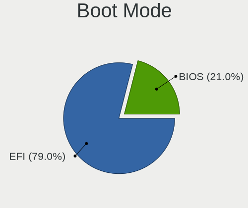
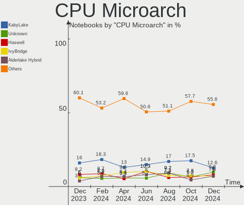
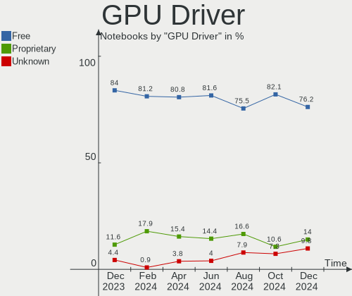
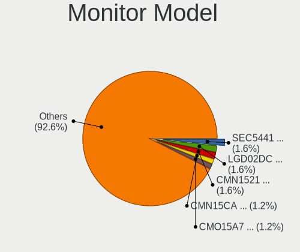
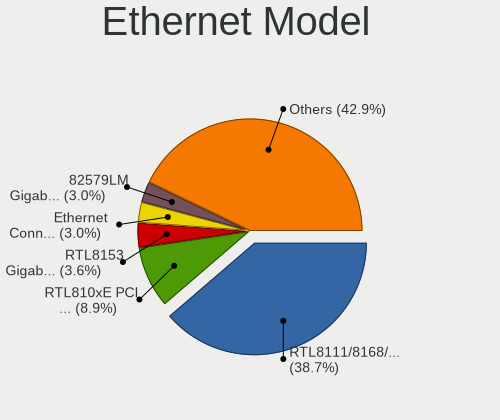
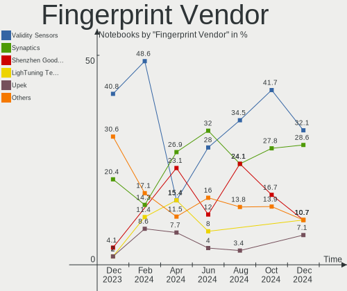

Linux Mint - Hardware Trends (Notebooks)
----------------------------------------

A project to identify most popular hardware characteristics and track their change
over time based on data collected by Linux users at https://Linux-Hardware.org.

Anyone can contribute to this report by the [hw-probe](https://github.com/linuxhw/hw-probe) tool:

    sudo -E hw-probe -all -upload

This report is for one last month. Overall report since the beginning of time: [TestDays](https://github.com/linuxhw/TestDays)

Period: Jan, 2024.

Contents
--------

* [ System ](#system)
  - [ OS                       ](#os)
  - [ OS Family                ](#os-family)
  - [ Kernel                   ](#kernel)
  - [ Kernel Family            ](#kernel-family)
  - [ Kernel Major Ver.        ](#kernel-major-ver)
  - [ Arch                     ](#arch)
  - [ DE                       ](#de)
  - [ Display Server           ](#display-server)
  - [ Display Manager          ](#display-manager)
  - [ OS Lang                  ](#os-lang)
  - [ Boot Mode                ](#boot-mode)
  - [ Filesystem               ](#filesystem)
  - [ Part. scheme             ](#part-scheme)
  - [ Dual Boot with Linux/BSD ](#dual-boot-with-linuxbsd)
  - [ Dual Boot (Win)          ](#dual-boot-win)

* [ Board ](#board)
  - [ Vendor                   ](#vendor)
  - [ Model                    ](#model)
  - [ Model Family             ](#model-family)
  - [ MFG Year                 ](#mfg-year)
  - [ Form Factor              ](#form-factor)
  - [ Secure Boot              ](#secure-boot)
  - [ Coreboot                 ](#coreboot)
  - [ RAM Size                 ](#ram-size)
  - [ RAM Used                 ](#ram-used)
  - [ Total Drives             ](#total-drives)
  - [ Has CD-ROM               ](#has-cd-rom)
  - [ Has Ethernet             ](#has-ethernet)
  - [ Has WiFi                 ](#has-wifi)
  - [ Has Bluetooth            ](#has-bluetooth)

* [ Location ](#location)
  - [ Country                  ](#country)
  - [ City                     ](#city)

* [ Drives ](#drives)
  - [ Drive Vendor             ](#drive-vendor)
  - [ Drive Model              ](#drive-model)
  - [ HDD Vendor               ](#hdd-vendor)
  - [ SSD Vendor               ](#ssd-vendor)
  - [ Drive Kind               ](#drive-kind)
  - [ Drive Connector          ](#drive-connector)
  - [ Drive Size               ](#drive-size)
  - [ Space Total              ](#space-total)
  - [ Space Used               ](#space-used)
  - [ Malfunc. Drives          ](#malfunc-drives)
  - [ Malfunc. Drive Vendor    ](#malfunc-drive-vendor)
  - [ Malfunc. HDD Vendor      ](#malfunc-hdd-vendor)
  - [ Malfunc. Drive Kind      ](#malfunc-drive-kind)
  - [ Failed Drives            ](#failed-drives)
  - [ Failed Drive Vendor      ](#failed-drive-vendor)
  - [ Drive Status             ](#drive-status)

* [ Storage controller ](#storage-controller)
  - [ Storage Vendor           ](#storage-vendor)
  - [ Storage Model            ](#storage-model)
  - [ Storage Kind             ](#storage-kind)

* [ Processor ](#processor)
  - [ CPU Vendor               ](#cpu-vendor)
  - [ CPU Model                ](#cpu-model)
  - [ CPU Model Family         ](#cpu-model-family)
  - [ CPU Cores                ](#cpu-cores)
  - [ CPU Sockets              ](#cpu-sockets)
  - [ CPU Threads              ](#cpu-threads)
  - [ CPU Op-Modes             ](#cpu-op-modes)
  - [ CPU Microcode            ](#cpu-microcode)
  - [ CPU Microarch            ](#cpu-microarch)

* [ Graphics ](#graphics)
  - [ GPU Vendor               ](#gpu-vendor)
  - [ GPU Model                ](#gpu-model)
  - [ GPU Combo                ](#gpu-combo)
  - [ GPU Driver               ](#gpu-driver)
  - [ GPU Memory               ](#gpu-memory)

* [ Monitor ](#monitor)
  - [ Monitor Vendor           ](#monitor-vendor)
  - [ Monitor Model            ](#monitor-model)
  - [ Monitor Resolution       ](#monitor-resolution)
  - [ Monitor Diagonal         ](#monitor-diagonal)
  - [ Monitor Width            ](#monitor-width)
  - [ Aspect Ratio             ](#aspect-ratio)
  - [ Monitor Area             ](#monitor-area)
  - [ Pixel Density            ](#pixel-density)
  - [ Multiple Monitors        ](#multiple-monitors)

* [ Network ](#network)
  - [ Net Controller Vendor    ](#net-controller-vendor)
  - [ Net Controller Model     ](#net-controller-model)
  - [ Wireless Vendor          ](#wireless-vendor)
  - [ Wireless Model           ](#wireless-model)
  - [ Ethernet Vendor          ](#ethernet-vendor)
  - [ Ethernet Model           ](#ethernet-model)
  - [ Net Controller Kind      ](#net-controller-kind)
  - [ Used Controller          ](#used-controller)
  - [ NICs                     ](#nics)
  - [ IPv6                     ](#ipv6)

* [ Bluetooth ](#bluetooth)
  - [ Bluetooth Vendor         ](#bluetooth-vendor)
  - [ Bluetooth Model          ](#bluetooth-model)

* [ Sound ](#sound)
  - [ Sound Vendor             ](#sound-vendor)
  - [ Sound Model              ](#sound-model)

* [ Memory ](#memory)
  - [ Memory Vendor            ](#memory-vendor)
  - [ Memory Model             ](#memory-model)
  - [ Memory Kind              ](#memory-kind)
  - [ Memory Form Factor       ](#memory-form-factor)
  - [ Memory Size              ](#memory-size)
  - [ Memory Speed             ](#memory-speed)

* [ Printers & scanners ](#printers--scanners)
  - [ Printer Vendor           ](#printer-vendor)
  - [ Printer Model            ](#printer-model)
  - [ Scanner Vendor           ](#scanner-vendor)
  - [ Scanner Model            ](#scanner-model)

* [ Camera ](#camera)
  - [ Camera Vendor            ](#camera-vendor)
  - [ Camera Model             ](#camera-model)

* [ Security ](#security)
  - [ Fingerprint Vendor       ](#fingerprint-vendor)
  - [ Fingerprint Model        ](#fingerprint-model)
  - [ Chipcard Vendor          ](#chipcard-vendor)
  - [ Chipcard Model           ](#chipcard-model)

* [ Unsupported ](#unsupported)
  - [ Unsupported Devices      ](#unsupported-devices)
  - [ Unsupported Device Types ](#unsupported-device-types)

System
------

OS
--

Installed operating systems

| Name            | Notebooks | Percent |
|-----------------|-----------|---------|
| Linux Mint 21.2 | 155       | 50.65%  |
| Linux Mint 21.3 | 93        | 30.39%  |
| Linux Mint 20.3 | 25        | 8.17%   |
| Linux Mint 21.1 | 16        | 5.23%   |
| Linux Mint 21   | 5         | 1.63%   |
| Linux Mint 20.2 | 5         | 1.63%   |
| Linux Mint 20.1 | 2         | 0.65%   |
| Linux Mint 20   | 2         | 0.65%   |
| Linux Mint 19.3 | 1         | 0.33%   |
| Linux Mint 19.2 | 1         | 0.33%   |
| Linux Mint 19   | 1         | 0.33%   |

OS Family
---------

OS without a version

| Name       | Notebooks | Percent |
|------------|-----------|---------|
| Linux Mint | 306       | 100%    |

Kernel
------

Version of the Linux kernel

| Version               | Notebooks | Percent |
|-----------------------|-----------|---------|
| 5.15.0-91-generic     | 159       | 51.96%  |
| 6.5.0-14-generic      | 32        | 10.46%  |
| 5.15.0-92-generic     | 23        | 7.52%   |
| 5.4.0-169-generic     | 19        | 6.21%   |
| 5.15.0-76-generic     | 17        | 5.56%   |
| 6.5.0-15-generic      | 11        | 3.59%   |
| 6.2.0-39-generic      | 6         | 1.96%   |
| 5.4.0-170-generic     | 4         | 1.31%   |
| 5.15.0-89-generic     | 4         | 1.31%   |
| 5.15.0-88-generic     | 3         | 0.98%   |
| 6.7.2-060702-generic  | 2         | 0.65%   |
| 5.4.0-74-generic      | 2         | 0.65%   |
| 5.15.0-87-generic     | 2         | 0.65%   |
| 5.15.0-83-generic     | 2         | 0.65%   |
| 5.15.0-56-generic     | 2         | 0.65%   |
| 5.15.0-41-generic     | 2         | 0.65%   |
| 4.15.0-213-generic    | 2         | 0.65%   |
| 6.5.0-1013-oem        | 1         | 0.33%   |
| 6.5.0-060500-generic  | 1         | 0.33%   |
| 6.2.0-35-generic      | 1         | 0.33%   |
| 6.2.0-33-generic      | 1         | 0.33%   |
| 6.2.0-1018-lowlatency | 1         | 0.33%   |
| 6.1.0-1029-oem        | 1         | 0.33%   |
| 6.1.0-1027-oem        | 1         | 0.33%   |
| 5.4.0-73-generic      | 1         | 0.33%   |
| 5.4.0-167-generic     | 1         | 0.33%   |
| 5.15.0-86-generic     | 1         | 0.33%   |
| 5.15.0-84-generic     | 1         | 0.33%   |
| 5.15.0-78-generic     | 1         | 0.33%   |
| 5.15.0-69-generic     | 1         | 0.33%   |
| 5.0.0-32-generic      | 1         | 0.33%   |

Kernel Family
-------------

Linux kernel without a distro release

| Version | Notebooks | Percent |
|---------|-----------|---------|
| 5.15.0  | 218       | 71.24%  |
| 6.5.0   | 45        | 14.71%  |
| 5.4.0   | 27        | 8.82%   |
| 6.2.0   | 9         | 2.94%   |
| 6.7.2   | 2         | 0.65%   |
| 6.1.0   | 2         | 0.65%   |
| 4.15.0  | 2         | 0.65%   |
| 5.0.0   | 1         | 0.33%   |

Kernel Major Ver.
-----------------

Linux kernel major version

| Version | Notebooks | Percent |
|---------|-----------|---------|
| 5.15    | 218       | 71.24%  |
| 6.5     | 45        | 14.71%  |
| 5.4     | 27        | 8.82%   |
| 6.2     | 9         | 2.94%   |
| 6.7     | 2         | 0.65%   |
| 6.1     | 2         | 0.65%   |
| 4.15    | 2         | 0.65%   |
| 5.0     | 1         | 0.33%   |

Arch
----

OS architecture (x86_64, i586, etc.)

| Name   | Notebooks | Percent |
|--------|-----------|---------|
| x86_64 | 303       | 99.02%  |
| i686   | 3         | 0.98%   |

DE
--

Desktop Environment

| Name       | Notebooks | Percent |
|------------|-----------|---------|
| X-Cinnamon | 233       | 76.14%  |
| MATE       | 33        | 10.78%  |
| XFCE       | 30        | 9.8%    |
| Unknown    | 4         | 1.31%   |
| Cinnamon   | 2         | 0.65%   |
| KDE5       | 1         | 0.33%   |
| KDE        | 1         | 0.33%   |
| i3         | 1         | 0.33%   |
| GNOME      | 1         | 0.33%   |

Display Server
--------------

X11 or Wayland

| Name    | Notebooks | Percent |
|---------|-----------|---------|
| X11     | 304       | 99.35%  |
| Wayland | 1         | 0.33%   |
| Tty     | 1         | 0.33%   |

Display Manager
---------------

SDDM, LightDM, etc.

| Name    | Notebooks | Percent |
|---------|-----------|---------|
| LightDM | 176       | 57.52%  |
| Unknown | 129       | 42.16%  |
| GDM3    | 1         | 0.33%   |

OS Lang
-------

Language

| Lang    | Notebooks | Percent |
|---------|-----------|---------|
| en_US   | 94        | 30.72%  |
| de_DE   | 45        | 14.71%  |
| en_GB   | 20        | 6.54%   |
| it_IT   | 19        | 6.21%   |
| ru_RU   | 17        | 5.56%   |
| fr_FR   | 17        | 5.56%   |
| C       | 15        | 4.9%    |
| nl_NL   | 11        | 3.59%   |
| en_CA   | 8         | 2.61%   |
| pt_BR   | 7         | 2.29%   |
| es_ES   | 7         | 2.29%   |
| pl_PL   | 6         | 1.96%   |
| en_IN   | 4         | 1.31%   |
| Unknown | 4         | 1.31%   |
| es_MX   | 3         | 0.98%   |
| en_AU   | 3         | 0.98%   |
| da_DK   | 3         | 0.98%   |
| pt_PT   | 2         | 0.65%   |
| hu_HU   | 2         | 0.65%   |
| fr_BE   | 2         | 0.65%   |
| es_AR   | 2         | 0.65%   |
| el_GR   | 2         | 0.65%   |
| zh_CN   | 1         | 0.33%   |
| sk_SK   | 1         | 0.33%   |
| fr_CH   | 1         | 0.33%   |
| fr_CA   | 1         | 0.33%   |
| fi_FI   | 1         | 0.33%   |
| es_CO   | 1         | 0.33%   |
| es_CL   | 1         | 0.33%   |
| en_ZA   | 1         | 0.33%   |
| en_NZ   | 1         | 0.33%   |
| en_IL   | 1         | 0.33%   |
| en_IE   | 1         | 0.33%   |
| de_AT   | 1         | 0.33%   |
| ca_ES   | 1         | 0.33%   |

Boot Mode
---------

EFI or BIOS

| Mode | Notebooks | Percent |
|------|-----------|---------|
| EFI  | 216       | 70.59%  |
| BIOS | 90        | 29.41%  |

Filesystem
----------

Type of filesystem

| Type    | Notebooks | Percent |
|---------|-----------|---------|
| Ext4    | 274       | 89.54%  |
| Tmpfs   | 9         | 2.94%   |
| Btrfs   | 7         | 2.29%   |
| Overlay | 6         | 1.96%   |
| Ext3    | 6         | 1.96%   |
| Zfs     | 3         | 0.98%   |
| Xfs     | 1         | 0.33%   |

Part. scheme
------------

Scheme of partitioning

| Type    | Notebooks | Percent |
|---------|-----------|---------|
| GPT     | 165       | 53.92%  |
| Unknown | 125       | 40.85%  |
| MBR     | 16        | 5.23%   |

Dual Boot with Linux/BSD
------------------------

Hosting more than one Linux/BSD

| Dual boot | Notebooks | Percent |
|-----------|-----------|---------|
| No        | 286       | 93.46%  |
| Yes       | 20        | 6.54%   |

Dual Boot (Win)
---------------

Hosting Linux and Windows

| Dual boot | Notebooks | Percent |
|-----------|-----------|---------|
| No        | 258       | 84.31%  |
| Yes       | 48        | 15.69%  |

Board
-----

Vendor
------

Motherboard manufacturer

| Name                 | Notebooks | Percent |
|----------------------|-----------|---------|
| Lenovo               | 69        | 22.55%  |
| Hewlett-Packard      | 57        | 18.63%  |
| Dell                 | 41        | 13.4%   |
| Acer                 | 36        | 11.76%  |
| ASUSTek Computer     | 33        | 10.78%  |
| Apple                | 11        | 3.59%   |
| Toshiba              | 5         | 1.63%   |
| MSI                  | 5         | 1.63%   |
| Fujitsu              | 4         | 1.31%   |
| Sony                 | 3         | 0.98%   |
| Samsung Electronics  | 3         | 0.98%   |
| Packard Bell         | 3         | 0.98%   |
| Medion               | 3         | 0.98%   |
| VALE                 | 2         | 0.65%   |
| Positivo             | 2         | 0.65%   |
| HONOR                | 2         | 0.65%   |
| Clevo                | 2         | 0.65%   |
| Alienware            | 2         | 0.65%   |
| Wortmann AG          | 1         | 0.33%   |
| Schenker             | 1         | 0.33%   |
| Primux Tech          | 1         | 0.33%   |
| PCBOX                | 1         | 0.33%   |
| Onda TLC             | 1         | 0.33%   |
| Notebook             | 1         | 0.33%   |
| NEC Computers        | 1         | 0.33%   |
| Mediacom             | 1         | 0.33%   |
| Maibenben            | 1         | 0.33%   |
| LDLC                 | 1         | 0.33%   |
| Jumper               | 1         | 0.33%   |
| Intel Client Systems | 1         | 0.33%   |
| INSYS                | 1         | 0.33%   |
| Infinix              | 1         | 0.33%   |
| HUAWEI               | 1         | 0.33%   |
| Google               | 1         | 0.33%   |
| Gigabyte Technology  | 1         | 0.33%   |
| Fujitsu Siemens      | 1         | 0.33%   |
| CyberPowerPC         | 1         | 0.33%   |
| CONNEX               | 1         | 0.33%   |
| Chuwi                | 1         | 0.33%   |
| AZW                  | 1         | 0.33%   |

Model
-----

Motherboard model

| Name                                | Notebooks | Percent |
|-------------------------------------|-----------|---------|
| ASUS Vivobook Go E1504FA_E1504FA    | 5         | 1.63%   |
| HP Pavilion 15                      | 3         | 0.98%   |
| Apple MacBookAir6,2                 | 3         | 0.98%   |
| VALE Notebook Classic C140          | 2         | 0.65%   |
| Lenovo Z50-70 20354                 | 2         | 0.65%   |
| HP Pavilion dv6                     | 2         | 0.65%   |
| HP Pavilion 17                      | 2         | 0.65%   |
| HP Notebook                         | 2         | 0.65%   |
| HP EliteBook 8560p                  | 2         | 0.65%   |
| Dell XPS 15 9560                    | 2         | 0.65%   |
| Dell Precision 7520                 | 2         | 0.65%   |
| Dell Latitude E6440                 | 2         | 0.65%   |
| Dell Latitude E6410                 | 2         | 0.65%   |
| Dell Latitude E6400                 | 2         | 0.65%   |
| Dell Latitude 7490                  | 2         | 0.65%   |
| ASUS K52F                           | 2         | 0.65%   |
| Apple MacBookPro8,1                 | 2         | 0.65%   |
| Acer Aspire ES1-572                 | 2         | 0.65%   |
| Acer Aspire A715-74G                | 2         | 0.65%   |
| Acer Aspire A515-54                 | 2         | 0.65%   |
| Acer Aspire A317-53                 | 2         | 0.65%   |
| Wortmann AG TERRA_MOBILE_1513A      | 1         | 0.33%   |
| Toshiba Satellite L635              | 1         | 0.33%   |
| Toshiba Satellite L50t-A            | 1         | 0.33%   |
| Toshiba Satellite L305              | 1         | 0.33%   |
| Toshiba Satellite A215              | 1         | 0.33%   |
| Toshiba NB250                       | 1         | 0.33%   |
| Sony VPCSB1V9E                      | 1         | 0.33%   |
| Sony VPCF120FL                      | 1         | 0.33%   |
| Sony SVF1521G6EW                    | 1         | 0.33%   |
| Schenker XMG APEX 15 MAX (E22)      | 1         | 0.33%   |
| Samsung 520U4C/520U4X               | 1         | 0.33%   |
| Samsung 350V5C/351V5C/3540VC/3440VC | 1         | 0.33%   |
| Samsung 305V4A/305V5A               | 1         | 0.33%   |
| Primux Tech Primux_1406F_W10        | 1         | 0.33%   |
| Positivo S14SL01                    | 1         | 0.33%   |
| Positivo Harrison                   | 1         | 0.33%   |
| PCBOX PCB-GLW2                      | 1         | 0.33%   |
| Packard Bell EasyNote TE69BM        | 1         | 0.33%   |
| Packard Bell EasyNote MH45          | 1         | 0.33%   |

Model Family
------------

Motherboard model prefix

| Name                  | Notebooks | Percent |
|-----------------------|-----------|---------|
| Acer Aspire           | 29        | 9.48%   |
| Lenovo ThinkPad       | 28        | 9.15%   |
| Dell Latitude         | 22        | 7.19%   |
| Lenovo IdeaPad        | 18        | 5.88%   |
| HP Pavilion           | 16        | 5.23%   |
| HP EliteBook          | 11        | 3.59%   |
| HP ProBook            | 9         | 2.94%   |
| Dell Inspiron         | 9         | 2.94%   |
| ASUS VivoBook         | 9         | 2.94%   |
| HP Laptop             | 8         | 2.61%   |
| Dell Precision        | 6         | 1.96%   |
| ASUS ROG              | 5         | 1.63%   |
| Toshiba Satellite     | 4         | 1.31%   |
| Fujitsu LIFEBOOK      | 4         | 1.31%   |
| Acer Swift            | 4         | 1.31%   |
| Packard Bell EasyNote | 3         | 0.98%   |
| Lenovo Legion         | 3         | 0.98%   |
| HP ZBook              | 3         | 0.98%   |
| Dell XPS              | 3         | 0.98%   |
| Apple MacBookPro8     | 3         | 0.98%   |
| Apple MacBookAir6     | 3         | 0.98%   |
| VALE Notebook         | 2         | 0.65%   |
| Lenovo Z50-70         | 2         | 0.65%   |
| Lenovo ThinkBook      | 2         | 0.65%   |
| Lenovo B590           | 2         | 0.65%   |
| HP Victus             | 2         | 0.65%   |
| HP Notebook           | 2         | 0.65%   |
| ASUS ZenBook          | 2         | 0.65%   |
| ASUS K52F             | 2         | 0.65%   |
| Apple MacBookPro11    | 2         | 0.65%   |
| Wortmann AG TERRA     | 1         | 0.33%   |
| Toshiba NB250         | 1         | 0.33%   |
| Sony VPCSB1V9E        | 1         | 0.33%   |
| Sony VPCF120FL        | 1         | 0.33%   |
| Sony SVF1521G6EW      | 1         | 0.33%   |
| Schenker XMG          | 1         | 0.33%   |
| Samsung 520U4C        | 1         | 0.33%   |
| Samsung 350V5C        | 1         | 0.33%   |
| Samsung 305V4A        | 1         | 0.33%   |
| Primux Tech Primux    | 1         | 0.33%   |

MFG Year
--------

Motherboard manufacture year

| Year | Notebooks | Percent |
|------|-----------|---------|
| 2021 | 30        | 9.8%    |
| 2013 | 30        | 9.8%    |
| 2023 | 24        | 7.84%   |
| 2017 | 24        | 7.84%   |
| 2012 | 24        | 7.84%   |
| 2019 | 23        | 7.52%   |
| 2018 | 23        | 7.52%   |
| 2010 | 21        | 6.86%   |
| 2022 | 19        | 6.21%   |
| 2014 | 15        | 4.9%    |
| 2020 | 14        | 4.58%   |
| 2016 | 14        | 4.58%   |
| 2015 | 13        | 4.25%   |
| 2011 | 11        | 3.59%   |
| 2008 | 11        | 3.59%   |
| 2009 | 6         | 1.96%   |
| 2007 | 3         | 0.98%   |
| 2006 | 1         | 0.33%   |

Form Factor
-----------

Physical design of the computer

| Name     | Notebooks | Percent |
|----------|-----------|---------|
| Notebook | 306       | 100%    |

Secure Boot
-----------

Enabled or disabled

| State    | Notebooks | Percent |
|----------|-----------|---------|
| Disabled | 262       | 85.62%  |
| Enabled  | 44        | 14.38%  |

Coreboot
--------

Have coreboot on board

| Used | Notebooks | Percent |
|------|-----------|---------|
| No   | 305       | 99.67%  |
| Yes  | 1         | 0.33%   |

RAM Size
--------

Total RAM memory

| Size in GB  | Notebooks | Percent |
|-------------|-----------|---------|
| 4.01-8.0    | 112       | 36.6%   |
| 3.01-4.0    | 60        | 19.61%  |
| 8.01-16.0   | 51        | 16.67%  |
| 16.01-24.0  | 49        | 16.01%  |
| 32.01-64.0  | 17        | 5.56%   |
| 1.01-2.0    | 7         | 2.29%   |
| 64.01-256.0 | 4         | 1.31%   |
| 2.01-3.0    | 3         | 0.98%   |
| 24.01-32.0  | 2         | 0.65%   |
| 0.51-1.0    | 1         | 0.33%   |

RAM Used
--------

Used RAM memory

| Used GB    | Notebooks | Percent |
|------------|-----------|---------|
| 1.01-2.0   | 101       | 33.01%  |
| 2.01-3.0   | 96        | 31.37%  |
| 4.01-8.0   | 44        | 14.38%  |
| 3.01-4.0   | 41        | 13.4%   |
| 8.01-16.0  | 13        | 4.25%   |
| 0.51-1.0   | 9         | 2.94%   |
| 16.01-24.0 | 1         | 0.33%   |
| 0.01-0.5   | 1         | 0.33%   |

Total Drives
------------

Number of drives on board

| Drives | Notebooks | Percent |
|--------|-----------|---------|
| 1      | 231       | 75.49%  |
| 2      | 65        | 21.24%  |
| 3      | 5         | 1.63%   |
| 4      | 3         | 0.98%   |
| 0      | 2         | 0.65%   |

Has CD-ROM
----------

Has CD-ROM on board

| Presented | Notebooks | Percent |
|-----------|-----------|---------|
| No        | 199       | 65.03%  |
| Yes       | 107       | 34.97%  |

Has Ethernet
------------

Has Ethernet on board

| Presented | Notebooks | Percent |
|-----------|-----------|---------|
| Yes       | 241       | 78.76%  |
| No        | 65        | 21.24%  |

Has WiFi
--------

Has WiFi module

| Presented | Notebooks | Percent |
|-----------|-----------|---------|
| Yes       | 301       | 98.37%  |
| No        | 5         | 1.63%   |

Has Bluetooth
-------------

Has Bluetooth module

| Presented | Notebooks | Percent |
|-----------|-----------|---------|
| Yes       | 244       | 79.74%  |
| No        | 62        | 20.26%  |

Location
--------

Country
-------

Geographic location (country)

| Country         | Notebooks | Percent |
|-----------------|-----------|---------|
| USA             | 56        | 18.3%   |
| Germany         | 49        | 16.01%  |
| Italy           | 19        | 6.21%   |
| UK              | 18        | 5.88%   |
| France          | 17        | 5.56%   |
| Russia          | 16        | 5.23%   |
| Netherlands     | 16        | 5.23%   |
| Brazil          | 10        | 3.27%   |
| Spain           | 9         | 2.94%   |
| Canada          | 9         | 2.94%   |
| Poland          | 6         | 1.96%   |
| Switzerland     | 5         | 1.63%   |
| India           | 5         | 1.63%   |
| Hungary         | 5         | 1.63%   |
| Finland         | 5         | 1.63%   |
| Sweden          | 4         | 1.31%   |
| Romania         | 4         | 1.31%   |
| Mexico          | 4         | 1.31%   |
| Austria         | 4         | 1.31%   |
| Portugal        | 3         | 0.98%   |
| Denmark         | 3         | 0.98%   |
| Czechia         | 3         | 0.98%   |
| Australia       | 3         | 0.98%   |
| Vietnam         | 2         | 0.65%   |
| New Zealand     | 2         | 0.65%   |
| Israel          | 2         | 0.65%   |
| Ireland         | 2         | 0.65%   |
| Greece          | 2         | 0.65%   |
| Costa Rica      | 2         | 0.65%   |
| Chile           | 2         | 0.65%   |
| Bulgaria        | 2         | 0.65%   |
| Belgium         | 2         | 0.65%   |
| Argentina       | 2         | 0.65%   |
| Turkey          | 1         | 0.33%   |
| The Netherlands | 1         | 0.33%   |
| South Africa    | 1         | 0.33%   |
| Slovakia        | 1         | 0.33%   |
| Serbia          | 1         | 0.33%   |
| Morocco         | 1         | 0.33%   |
| Malaysia        | 1         | 0.33%   |

City
----

Geographic location (city)

| City              | Notebooks | Percent |
|-------------------|-----------|---------|
| Phoenix           | 6         | 1.96%   |
| Budapest          | 5         | 1.63%   |
| Amsterdam         | 4         | 1.31%   |
| St Petersburg     | 3         | 0.98%   |
| Mannheim          | 3         | 0.98%   |
| Jacksonville      | 3         | 0.98%   |
| Helsinki          | 3         | 0.98%   |
| Haarlem           | 3         | 0.98%   |
| Warsaw            | 2         | 0.65%   |
| Venice            | 2         | 0.65%   |
| Toronto           | 2         | 0.65%   |
| Thessaloniki      | 2         | 0.65%   |
| Suhr              | 2         | 0.65%   |
| Stockholm         | 2         | 0.65%   |
| Sleaford          | 2         | 0.65%   |
| Siegsdorf         | 2         | 0.65%   |
| San Diego         | 2         | 0.65%   |
| Prague            | 2         | 0.65%   |
| New York          | 2         | 0.65%   |
| Munich            | 2         | 0.65%   |
| Montreal          | 2         | 0.65%   |
| Milan             | 2         | 0.65%   |
| Lincoln           | 2         | 0.65%   |
| Innsbruck         | 2         | 0.65%   |
| Düsseldorf       | 2         | 0.65%   |
| Dublin            | 2         | 0.65%   |
| Dresden           | 2         | 0.65%   |
| Berlin            | 2         | 0.65%   |
| Zehdenick         | 1         | 0.33%   |
| Yuzhno-Sakhalinsk | 1         | 0.33%   |
| Yeles             | 1         | 0.33%   |
| Yekaterinburg     | 1         | 0.33%   |
| Worms             | 1         | 0.33%   |
| Worcester Park    | 1         | 0.33%   |
| Winnenden         | 1         | 0.33%   |
| Wellington        | 1         | 0.33%   |
| Weiterstadt       | 1         | 0.33%   |
| Weimar            | 1         | 0.33%   |
| Weiden            | 1         | 0.33%   |
| Walsall           | 1         | 0.33%   |

Drives
------

Drive Vendor
------------

Hard drive vendors

| Vendor                      | Notebooks | Drives | Percent |
|-----------------------------|-----------|--------|---------|
| Samsung Electronics         | 75        | 80     | 20.27%  |
| WDC                         | 41        | 42     | 11.08%  |
| SanDisk                     | 31        | 31     | 8.38%   |
| Seagate                     | 27        | 30     | 7.3%    |
| Kingston                    | 21        | 22     | 5.68%   |
| Unknown                     | 20        | 20     | 5.41%   |
| Toshiba                     | 15        | 15     | 4.05%   |
| Intel                       | 13        | 16     | 3.51%   |
| SK hynix                    | 12        | 15     | 3.24%   |
| Crucial                     | 12        | 13     | 3.24%   |
| Micron Technology           | 10        | 10     | 2.7%    |
| Hitachi                     | 7         | 7      | 1.89%   |
| Apple                       | 7         | 8      | 1.89%   |
| KIOXIA                      | 6         | 7      | 1.62%   |
| Intenso                     | 5         | 5      | 1.35%   |
| A-DATA Technology           | 5         | 5      | 1.35%   |
| Unknown                     | 5         | 5      | 1.35%   |
| HGST                        | 4         | 4      | 1.08%   |
| Kingston Technology Company | 3         | 3      | 0.81%   |
| China                       | 3         | 3      | 0.81%   |
| Team                        | 2         | 2      | 0.54%   |
| SPCC                        | 2         | 2      | 0.54%   |
| SD                          | 2         | 2      | 0.54%   |
| Phison Electronics          | 2         | 2      | 0.54%   |
| Netac                       | 2         | 2      | 0.54%   |
| Micron/Crucial Technology   | 2         | 2      | 0.54%   |
| Lexar                       | 2         | 2      | 0.54%   |
| FORESEE                     | 2         | 2      | 0.54%   |
| BIWIN                       | 2         | 2      | 0.54%   |
| Yangtze Memory Technologies | 1         | 1      | 0.27%   |
| Verbatim                    | 1         | 1      | 0.27%   |
| V7                          | 1         | 1      | 0.27%   |
| USB                         | 1         | 1      | 0.27%   |
| tecmiyo                     | 1         | 1      | 0.27%   |
| Teclast                     | 1         | 1      | 0.27%   |
| Super Talent                | 1         | 1      | 0.27%   |
| SUNEAST                     | 1         | 1      | 0.27%   |
| Silicon Motion              | 1         | 1      | 0.27%   |
| ShiJi                       | 1         | 1      | 0.27%   |
| Qumo                        | 1         | 1      | 0.27%   |

Drive Model
-----------

Hard drive models

| Model                                             | Notebooks | Percent |
|---------------------------------------------------|-----------|---------|
| Seagate ST1000LM035-1RK172 1TB                    | 10        | 2.62%   |
| Kingston SA400S37240G 240GB SSD                   | 7         | 1.83%   |
| Unknown                                           | 5         | 1.31%   |
| Samsung SSD 860 EVO 1TB                           | 4         | 1.05%   |
| Samsung SSD 850 EVO 500GB                         | 4         | 1.05%   |
| Unknown MMC Card  32GB                            | 3         | 0.79%   |
| Unknown MMC Card  16GB                            | 3         | 0.79%   |
| Unknown MMC Card  128GB                           | 3         | 0.79%   |
| Seagate ST9500325AS 500GB                         | 3         | 0.79%   |
| Sandisk WD Blue SN550 NVMe SSD 512GB              | 3         | 0.79%   |
| SanDisk NVMe SSD Drive 512GB                      | 3         | 0.79%   |
| Samsung SSD 850 EVO 250GB                         | 3         | 0.79%   |
| Samsung NVMe SSD Controller SM981/PM981/PM983 1TB | 3         | 0.79%   |
| Samsung MZALQ512HBLU-00BL2 512GB                  | 3         | 0.79%   |
| KIOXIA KBG40ZNS256G NVMe 256GB                    | 3         | 0.79%   |
| Kingston SA400S37480G 480GB SSD                   | 3         | 0.79%   |
| Intel SSDPEKNU512GZ 512GB                         | 3         | 0.79%   |
| Apple SSD SD0128F 121GB                           | 3         | 0.79%   |
| WDC WDS500G2B0A-00SM50 500GB SSD                  | 2         | 0.52%   |
| WDC WD5000LPVT-22G33T0 500GB                      | 2         | 0.52%   |
| WDC WD10JPVX-22JC3T0 1TB                          | 2         | 0.52%   |
| WDC WD10JPCX-24UE4T0 1TB                          | 2         | 0.52%   |
| WDC PC SN730 SDBQNTY-512G-1001 512GB              | 2         | 0.52%   |
| Toshiba MQ01ABD100 1TB                            | 2         | 0.52%   |
| Toshiba KXG50ZNV512G NVMe 512GB                   | 2         | 0.52%   |
| SK hynix BC511 HFM512GDJTNI-82A0A 512GB           | 2         | 0.52%   |
| Seagate ST2000LM015-2E8174 2TB                    | 2         | 0.52%   |
| Seagate ST1000LM048-2E7172 1TB                    | 2         | 0.52%   |
| Sandisk WD Blue SN500 / PC SN520 NVMe SSD 512GB   | 2         | 0.52%   |
| Samsung SSD 870 QVO 1TB                           | 2         | 0.52%   |
| Samsung SSD 860 QVO 1TB                           | 2         | 0.52%   |
| Samsung SSD 860 EVO 500GB                         | 2         | 0.52%   |
| Samsung MZYTE256HMHP-000L2 256GB SSD              | 2         | 0.52%   |
| Micron 2400_MTFDKBA512QFM 512GB                   | 2         | 0.52%   |
| Kingston SA400S37960G 960GB SSD                   | 2         | 0.52%   |
| Intel SSDPEKNW512G8 512GB                         | 2         | 0.52%   |
| Hitachi HTS545050A7E380 500GB                     | 2         | 0.52%   |
| HGST HTS545050A7E680 500GB                        | 2         | 0.52%   |
| Crucial CT500MX500SSD1 500GB                      | 2         | 0.52%   |
| Crucial CT1000BX500SSD1 1TB                       | 2         | 0.52%   |

HDD Vendor
----------

Hard disk drive vendors

| Vendor              | Notebooks | Drives | Percent |
|---------------------|-----------|--------|---------|
| Seagate             | 27        | 29     | 36%     |
| WDC                 | 23        | 23     | 30.67%  |
| Toshiba             | 10        | 10     | 13.33%  |
| Hitachi             | 7         | 7      | 9.33%   |
| HGST                | 4         | 4      | 5.33%   |
| Unknown             | 1         | 1      | 1.33%   |
| Samsung Electronics | 1         | 1      | 1.33%   |
| JMicron Technology  | 1         | 1      | 1.33%   |
| Intenso             | 1         | 1      | 1.33%   |

SSD Vendor
----------

Solid state drive vendors

| Vendor              | Notebooks | Drives | Percent |
|---------------------|-----------|--------|---------|
| Samsung Electronics | 39        | 40     | 26.17%  |
| Kingston            | 16        | 16     | 10.74%  |
| SanDisk             | 15        | 15     | 10.07%  |
| Crucial             | 12        | 12     | 8.05%   |
| WDC                 | 7         | 7      | 4.7%    |
| Apple               | 6         | 6      | 4.03%   |
| SK hynix            | 4         | 4      | 2.68%   |
| Intenso             | 3         | 3      | 2.01%   |
| China               | 3         | 3      | 2.01%   |
| A-DATA Technology   | 3         | 3      | 2.01%   |
| Toshiba             | 2         | 2      | 1.34%   |
| Team                | 2         | 2      | 1.34%   |
| SD                  | 2         | 2      | 1.34%   |
| Netac               | 2         | 2      | 1.34%   |
| Lexar               | 2         | 2      | 1.34%   |
| Intel               | 2         | 2      | 1.34%   |
| Unknown             | 2         | 2      | 1.34%   |
| Verbatim            | 1         | 1      | 0.67%   |
| V7                  | 1         | 1      | 0.67%   |
| Unknown             | 1         | 1      | 0.67%   |
| tecmiyo             | 1         | 1      | 0.67%   |
| Teclast             | 1         | 1      | 0.67%   |
| Super Talent        | 1         | 1      | 0.67%   |
| SUNEAST             | 1         | 1      | 0.67%   |
| SPCC                | 1         | 1      | 0.67%   |
| Qumo                | 1         | 1      | 0.67%   |
| PNY                 | 1         | 1      | 0.67%   |
| Patriot             | 1         | 1      | 0.67%   |
| Micron Technology   | 1         | 1      | 0.67%   |
| LITEON              | 1         | 1      | 0.67%   |
| Lenovo              | 1         | 1      | 0.67%   |
| KingSpec            | 1         | 1      | 0.67%   |
| INDMEM              | 1         | 1      | 0.67%   |
| HJDK                | 1         | 1      | 0.67%   |
| GLOWAY              | 1         | 1      | 0.67%   |
| Gigabyte Technology | 1         | 1      | 0.67%   |
| Fanxiang            | 1         | 1      | 0.67%   |
| Emtec               | 1         | 1      | 0.67%   |
| Dogfish             | 1         | 1      | 0.67%   |
| BIWIN               | 1         | 1      | 0.67%   |

Drive Kind
----------

HDD or SSD

| Kind    | Notebooks | Drives | Percent |
|---------|-----------|--------|---------|
| SSD     | 140       | 150    | 38.78%  |
| NVMe    | 122       | 137    | 33.8%   |
| HDD     | 74        | 77     | 20.5%   |
| MMC     | 20        | 20     | 5.54%   |
| Unknown | 5         | 5      | 1.39%   |

Drive Connector
---------------

SATA, SAS, NVMe, etc.

| Type | Notebooks | Drives | Percent |
|------|-----------|--------|---------|
| SATA | 195       | 218    | 55.71%  |
| NVMe | 122       | 136    | 34.86%  |
| MMC  | 20        | 20     | 5.71%   |
| SAS  | 13        | 15     | 3.71%   |

Drive Size
----------

Size of hard drive

| Size in TB | Notebooks | Drives | Percent |
|------------|-----------|--------|---------|
| 0.01-0.5   | 142       | 151    | 65.74%  |
| 0.51-1.0   | 64        | 65     | 29.63%  |
| 1.01-2.0   | 4         | 4      | 1.85%   |
| 3.01-4.0   | 3         | 3      | 1.39%   |
| 4.01-10.0  | 2         | 3      | 0.93%   |
| 2.01-3.0   | 1         | 1      | 0.46%   |

Space Total
-----------

Amount of disk space available on the file system

| Size in GB     | Notebooks | Percent |
|----------------|-----------|---------|
| 101-250        | 103       | 33.66%  |
| 251-500        | 89        | 29.08%  |
| 501-1000       | 42        | 13.73%  |
| 1001-2000      | 19        | 6.21%   |
| 51-100         | 19        | 6.21%   |
| 21-50          | 10        | 3.27%   |
| 1-20           | 10        | 3.27%   |
| More than 3000 | 7         | 2.29%   |
| Unknown        | 4         | 1.31%   |
| 2001-3000      | 3         | 0.98%   |

Space Used
----------

Amount of used disk space

| Used GB        | Notebooks | Percent |
|----------------|-----------|---------|
| 21-50          | 71        | 23.2%   |
| 101-250        | 65        | 21.24%  |
| 1-20           | 63        | 20.59%  |
| 51-100         | 45        | 14.71%  |
| 251-500        | 31        | 10.13%  |
| 501-1000       | 18        | 5.88%   |
| 1001-2000      | 6         | 1.96%   |
| Unknown        | 4         | 1.31%   |
| More than 3000 | 2         | 0.65%   |
| 2001-3000      | 1         | 0.33%   |

Malfunc. Drives
---------------

Drive models with a malfunction

| Model                                 | Notebooks | Drives | Percent |
|---------------------------------------|-----------|--------|---------|
| Seagate ST9500325AS 500GB             | 3         | 3      | 15%     |
| WDC WDS240G2G0A-00JH30 240GB SSD      | 1         | 1      | 5%      |
| WDC WD5000LPVX-75V0TT0 500GB          | 1         | 1      | 5%      |
| Toshiba MQ01ABD100 1TB                | 1         | 1      | 5%      |
| SK hynix HFS128G3BTND-N210A 128GB SSD | 1         | 1      | 5%      |
| SK hynix HFS128G32TND-N210A 128GB SSD | 1         | 1      | 5%      |
| SK hynix HFS060G32MNB-2000A 64GB SSD  | 1         | 1      | 5%      |
| SK hynix BC711 HFM256GD3JX013N 256GB  | 1         | 1      | 5%      |
| Seagate ST9160314AS 160GB             | 1         | 1      | 5%      |
| Seagate ST1000LM035-1RK172 1TB        | 1         | 1      | 5%      |
| SanDisk SD9SN8W-128G-1006 128GB SSD   | 1         | 1      | 5%      |
| Samsung Electronics HM250HI 250GB     | 1         | 1      | 5%      |
| Kingston SKC600512G 512GB SSD         | 1         | 1      | 5%      |
| Hitachi HTS727550A9E364 500GB         | 1         | 1      | 5%      |
| HGST HTS545050A7E680 500GB            | 1         | 1      | 5%      |
| HGST HTS545050A7E380 500GB            | 1         | 1      | 5%      |
| China SATA3 512GB SSD                 | 1         | 1      | 5%      |
| Unknown                               | 1         | 1      | 5%      |

Malfunc. Drive Vendor
---------------------

Vendors of faulty drives

| Vendor              | Notebooks | Drives | Percent |
|---------------------|-----------|--------|---------|
| Seagate             | 5         | 5      | 25%     |
| SK hynix            | 4         | 4      | 20%     |
| WDC                 | 2         | 2      | 10%     |
| HGST                | 2         | 2      | 10%     |
| Toshiba             | 1         | 1      | 5%      |
| SanDisk             | 1         | 1      | 5%      |
| Samsung Electronics | 1         | 1      | 5%      |
| Kingston            | 1         | 1      | 5%      |
| Hitachi             | 1         | 1      | 5%      |
| China               | 1         | 1      | 5%      |
| Unknown             | 1         | 1      | 5%      |

Malfunc. HDD Vendor
-------------------

Vendors of faulty HDD drives

| Vendor              | Notebooks | Drives | Percent |
|---------------------|-----------|--------|---------|
| Seagate             | 5         | 5      | 45.45%  |
| HGST                | 2         | 2      | 18.18%  |
| WDC                 | 1         | 1      | 9.09%   |
| Toshiba             | 1         | 1      | 9.09%   |
| Samsung Electronics | 1         | 1      | 9.09%   |
| Hitachi             | 1         | 1      | 9.09%   |

Malfunc. Drive Kind
-------------------

Kinds of faulty drives

| Kind | Notebooks | Drives | Percent |
|------|-----------|--------|---------|
| HDD  | 11        | 11     | 55%     |
| SSD  | 8         | 8      | 40%     |
| NVMe | 1         | 1      | 5%      |

Failed Drives
-------------

Failed drive models

Zero info for selected period =(

Failed Drive Vendor
-------------------

Failed drive vendors

Zero info for selected period =(

Drive Status
------------

Number of failed and malfunc. drives

| Status   | Notebooks | Drives | Percent |
|----------|-----------|--------|---------|
| Detected | 151       | 196    | 47.48%  |
| Works    | 147       | 173    | 46.23%  |
| Malfunc  | 20        | 20     | 6.29%   |

Storage controller
------------------

Storage Vendor
--------------

Storage controller vendors

| Vendor                           | Notebooks | Percent |
|----------------------------------|-----------|---------|
| Intel                            | 212       | 58.56%  |
| Samsung Electronics              | 37        | 10.22%  |
| AMD                              | 29        | 8.01%   |
| SanDisk                          | 28        | 7.73%   |
| Micron Technology                | 9         | 2.49%   |
| Kingston Technology Company      | 8         | 2.21%   |
| SK hynix                         | 7         | 1.93%   |
| KIOXIA                           | 6         | 1.66%   |
| Phison Electronics               | 4         | 1.1%    |
| Toshiba America Info Systems     | 3         | 0.83%   |
| Micron/Crucial Technology        | 3         | 0.83%   |
| Marvell Technology Group         | 3         | 0.83%   |
| Silicon Motion                   | 2         | 0.55%   |
| Shenzhen Longsys Electronics     | 2         | 0.55%   |
| ASMedia Technology               | 2         | 0.55%   |
| ADATA Technology                 | 2         | 0.55%   |
| Yangtze Memory Technologies      | 1         | 0.28%   |
| Solidigm                         | 1         | 0.28%   |
| Silicon Integrated Systems [SiS] | 1         | 0.28%   |
| Lite-On Technology               | 1         | 0.28%   |
| Apple                            | 1         | 0.28%   |

Storage Model
-------------

Storage controller models

| Model                                                                                                              | Notebooks | Percent |
|--------------------------------------------------------------------------------------------------------------------|-----------|---------|
| AMD FCH SATA Controller [AHCI mode]                                                                                | 25        | 6.49%   |
| Intel 7 Series Chipset Family 6-port SATA Controller [AHCI mode]                                                   | 23        | 5.97%   |
| Intel Sunrise Point-LP SATA Controller [AHCI mode]                                                                 | 20        | 5.19%   |
| Intel 82801 Mobile SATA Controller [RAID mode]                                                                     | 18        | 4.68%   |
| Samsung NVMe SSD Controller SM981/PM981/PM983                                                                      | 14        | 3.64%   |
| Intel 8 Series SATA Controller 1 [AHCI mode]                                                                       | 13        | 3.38%   |
| Intel Volume Management Device NVMe RAID Controller                                                                | 12        | 3.12%   |
| Samsung NVMe SSD Controller 980 (DRAM-less)                                                                        | 11        | 2.86%   |
| Intel 6 Series/C200 Series Chipset Family 6 port Mobile SATA AHCI Controller                                       | 11        | 2.86%   |
| Intel 5 Series/3400 Series Chipset 4 port SATA AHCI Controller                                                     | 11        | 2.86%   |
| Intel Wildcat Point-LP SATA Controller [AHCI Mode]                                                                 | 9         | 2.34%   |
| Intel 8 Series/C220 Series Chipset Family 6-port SATA Controller 1 [AHCI mode]                                     | 9         | 2.34%   |
| Intel Tiger Lake-LP SATA Controller                                                                                | 8         | 2.08%   |
| SanDisk Ultra 3D / WD Blue SN550 NVMe SSD                                                                          | 7         | 1.82%   |
| Intel Comet Lake SATA AHCI Controller                                                                              | 7         | 1.82%   |
| Intel Celeron/Pentium Silver Processor SATA Controller                                                             | 7         | 1.82%   |
| Intel Celeron N3350/Pentium N4200/Atom E3900 Series SATA AHCI Controller                                           | 7         | 1.82%   |
| Intel 5 Series/3400 Series Chipset 6 port SATA AHCI Controller                                                     | 7         | 1.82%   |
| Intel HM170/QM170 Chipset SATA Controller [AHCI Mode]                                                              | 6         | 1.56%   |
| Intel Cannon Point-LP SATA Controller [AHCI Mode]                                                                  | 6         | 1.56%   |
| Intel 82801IBM/IEM (ICH9M/ICH9M-E) 4 port SATA Controller [AHCI mode]                                              | 6         | 1.56%   |
| SanDisk WD Black SN770 / PC SN740 256GB / PC SN560 (DRAM-less) NVMe SSD                                            | 5         | 1.3%    |
| Samsung NVMe SSD Controller PM9A1/PM9A3/980PRO                                                                     | 5         | 1.3%    |
| Intel SSD 670p Series [Keystone Harbor]                                                                            | 5         | 1.3%    |
| SanDisk Extreme Pro / WD Black SN750 / PC SN730 / Red SN700 NVMe SSD                                               | 4         | 1.04%   |
| KIOXIA NVMe SSD Controller BG4 (DRAM-less)                                                                         | 4         | 1.04%   |
| Intel SSD 660P Series                                                                                              | 4         | 1.04%   |
| Intel Atom Processor E3800 Series SATA AHCI Controller                                                             | 4         | 1.04%   |
| SK hynix Gold P31/BC711/PC711 NVMe Solid State Drive                                                               | 3         | 0.78%   |
| SK hynix BC511 NVMe SSD                                                                                            | 3         | 0.78%   |
| Micron 3400 NVMe SSD [Hendrix]                                                                                     | 3         | 0.78%   |
| Micron 2400 NVMe SSD (DRAM-less)                                                                                   | 3         | 0.78%   |
| Marvell Group 88SS9183 PCIe SSD Controller                                                                         | 3         | 0.78%   |
| Intel Cannon Lake Mobile PCH SATA AHCI Controller                                                                  | 3         | 0.78%   |
| Intel Atom/Celeron/Pentium Processor x5-E8000/J3xxx/N3xxx Series SATA Controller                                   | 3         | 0.78%   |
| Intel 7 Series Chipset Family 4-port SATA Controller [IDE mode]                                                    | 3         | 0.78%   |
| Intel 7 Series Chipset Family 2-port SATA Controller [IDE mode]                                                    | 3         | 0.78%   |
| Toshiba America Info Systems XG5 NVMe SSD Controller                                                               | 2         | 0.52%   |
| Silicon Motion SM2263EN/SM2263XT (DRAM-less) NVMe SSD Controllers                                                  | 2         | 0.52%   |
| Shenzhen Longsys FORESEE XP1000 / Lexar Professional CFexpress Type B Gold series, NM620 PCIe NVME SSD (DRAM-less) | 2         | 0.52%   |

Storage Kind
------------

Kind of storage controller (IDE, SATA, NVMe, SAS, ...)

| Kind | Notebooks | Percent |
|------|-----------|---------|
| SATA | 208       | 55.17%  |
| NVMe | 121       | 32.1%   |
| RAID | 32        | 8.49%   |
| IDE  | 16        | 4.24%   |

Processor
---------

CPU Vendor
----------

Processor vendors

| Vendor | Notebooks | Percent |
|--------|-----------|---------|
| Intel  | 254       | 83.01%  |
| AMD    | 52        | 16.99%  |

CPU Model
---------

Processor models

| Model                                   | Notebooks | Percent |
|-----------------------------------------|-----------|---------|
| Intel Core i7-7700HQ CPU @ 2.80GHz      | 8         | 2.61%   |
| Intel Core i5-3210M CPU @ 2.50GHz       | 8         | 2.61%   |
| Intel Core i5-5300U CPU @ 2.30GHz       | 6         | 1.96%   |
| Intel Core i7-8550U CPU @ 1.80GHz       | 5         | 1.63%   |
| Intel Core i5-8350U CPU @ 1.70GHz       | 5         | 1.63%   |
| Intel Core i5-8250U CPU @ 1.60GHz       | 5         | 1.63%   |
| Intel Core i5-4210U CPU @ 1.70GHz       | 5         | 1.63%   |
| Intel 11th Gen Core i5-1135G7 @ 2.40GHz | 5         | 1.63%   |
| Intel 11th Gen Core i3-1115G4 @ 3.00GHz | 5         | 1.63%   |
| AMD Ryzen 5 7520U with Radeon Graphics  | 5         | 1.63%   |
| Intel Core i7-9750H CPU @ 2.60GHz       | 4         | 1.31%   |
| Intel Core i7-8565U CPU @ 1.80GHz       | 4         | 1.31%   |
| Intel Core i5 CPU M 540 @ 2.53GHz       | 4         | 1.31%   |
| Intel 12th Gen Core i5-1235U            | 4         | 1.31%   |
| Intel Pentium CPU N4200 @ 1.10GHz       | 3         | 0.98%   |
| Intel Core i7-8650U CPU @ 1.90GHz       | 3         | 0.98%   |
| Intel Core i7-10510U CPU @ 1.80GHz      | 3         | 0.98%   |
| Intel Core i5-8265U CPU @ 1.60GHz       | 3         | 0.98%   |
| Intel Core i5-6300U CPU @ 2.40GHz       | 3         | 0.98%   |
| Intel Core i5-6200U CPU @ 2.30GHz       | 3         | 0.98%   |
| Intel Core i5-4200U CPU @ 1.60GHz       | 3         | 0.98%   |
| Intel Core i5-4200M CPU @ 2.50GHz       | 3         | 0.98%   |
| Intel Core i5-3230M CPU @ 2.60GHz       | 3         | 0.98%   |
| Intel Core i5-2410M CPU @ 2.30GHz       | 3         | 0.98%   |
| Intel Core i3-10110U CPU @ 2.10GHz      | 3         | 0.98%   |
| Intel Core i3 CPU M 370 @ 2.40GHz       | 3         | 0.98%   |
| Intel Core i3 CPU M 350 @ 2.27GHz       | 3         | 0.98%   |
| Intel Core 2 Duo CPU P8700 @ 2.53GHz    | 3         | 0.98%   |
| Intel 11th Gen Core i7-1165G7 @ 2.80GHz | 3         | 0.98%   |
| AMD Ryzen 5 5625U with Radeon Graphics  | 3         | 0.98%   |
| AMD Ryzen 3 5300U with Radeon Graphics  | 3         | 0.98%   |
| Intel Pentium CPU N3710 @ 1.60GHz       | 2         | 0.65%   |
| Intel Pentium CPU 5405U @ 2.30GHz       | 2         | 0.65%   |
| Intel Core i7-4770HQ CPU @ 2.20GHz      | 2         | 0.65%   |
| Intel Core i7-4720HQ CPU @ 2.60GHz      | 2         | 0.65%   |
| Intel Core i7-4510U CPU @ 2.00GHz       | 2         | 0.65%   |
| Intel Core i7-3667U CPU @ 2.00GHz       | 2         | 0.65%   |
| Intel Core i7-3610QM CPU @ 2.30GHz      | 2         | 0.65%   |
| Intel Core i7-3520M CPU @ 2.90GHz       | 2         | 0.65%   |
| Intel Core i5-7200U CPU @ 2.50GHz       | 2         | 0.65%   |

CPU Model Family
----------------

Processor model prefix

| Model                   | Notebooks | Percent |
|-------------------------|-----------|---------|
| Intel Core i5           | 83        | 27.12%  |
| Intel Core i7           | 62        | 20.26%  |
| Other                   | 33        | 10.78%  |
| Intel Core i3           | 28        | 9.15%   |
| Intel Celeron           | 17        | 5.56%   |
| AMD Ryzen 5             | 16        | 5.23%   |
| Intel Pentium           | 9         | 2.94%   |
| Intel Core 2 Duo        | 9         | 2.94%   |
| AMD Ryzen 7             | 9         | 2.94%   |
| AMD A6                  | 5         | 1.63%   |
| Intel Atom              | 4         | 1.31%   |
| AMD Ryzen 9             | 4         | 1.31%   |
| AMD Ryzen 3             | 4         | 1.31%   |
| Intel Pentium Silver    | 3         | 0.98%   |
| AMD A8                  | 3         | 0.98%   |
| AMD A10                 | 3         | 0.98%   |
| AMD Ryzen 5 PRO         | 2         | 0.65%   |
| Intel Xeon              | 1         | 0.33%   |
| Intel Pentium Dual-Core | 1         | 0.33%   |
| Intel Genuine           | 1         | 0.33%   |
| Intel Core m3           | 1         | 0.33%   |
| Intel Core i9           | 1         | 0.33%   |
| Intel Core 2            | 1         | 0.33%   |
| AMD Phenom II           | 1         | 0.33%   |
| AMD E2                  | 1         | 0.33%   |
| AMD E1                  | 1         | 0.33%   |
| AMD Athlon II           | 1         | 0.33%   |
| AMD Athlon 64 X2        | 1         | 0.33%   |
| AMD Athlon              | 1         | 0.33%   |

CPU Cores
---------

Number of processor cores

| Number | Notebooks | Percent |
|--------|-----------|---------|
| 2      | 150       | 49.02%  |
| 4      | 103       | 33.66%  |
| 6      | 22        | 7.19%   |
| 8      | 13        | 4.25%   |
| 10     | 10        | 3.27%   |
| 14     | 4         | 1.31%   |
| 1      | 2         | 0.65%   |
| 12     | 1         | 0.33%   |
| 3      | 1         | 0.33%   |

CPU Sockets
-----------

Number of sockets

| Number | Notebooks | Percent |
|--------|-----------|---------|
| 1      | 306       | 100%    |

CPU Threads
-----------

Threads per core (Hyper-Threading)

| Number | Notebooks | Percent |
|--------|-----------|---------|
| 2      | 243       | 79.41%  |
| 1      | 63        | 20.59%  |

CPU Op-Modes
------------

CPU Operation Modes (32-bit, 64-bit)

| Op mode        | Notebooks | Percent |
|----------------|-----------|---------|
| 32-bit, 64-bit | 305       | 99.67%  |
| 32-bit         | 1         | 0.33%   |

CPU Microcode
-------------

Microcode number

| Number     | Notebooks | Percent |
|------------|-----------|---------|
| Unknown    | 53        | 17.32%  |
| 0x306a9    | 20        | 6.54%   |
| 0x806ea    | 18        | 5.88%   |
| 0x806ec    | 16        | 5.23%   |
| 0x40651    | 14        | 4.58%   |
| 0x20655    | 13        | 4.25%   |
| 0x206a7    | 12        | 3.92%   |
| 0x406e3    | 10        | 3.27%   |
| 0x806c1    | 9         | 2.94%   |
| 0x306d4    | 9         | 2.94%   |
| 0x306c3    | 8         | 2.61%   |
| 0x20652    | 7         | 2.29%   |
| 0x906e9    | 6         | 1.96%   |
| 0x506c9    | 6         | 1.96%   |
| 0x1067a    | 5         | 1.63%   |
| 0x0a50000d | 5         | 1.63%   |
| 0x806e9    | 4         | 1.31%   |
| 0x706a8    | 4         | 1.31%   |
| 0x0a404102 | 4         | 1.31%   |
| 0x08a00008 | 4         | 1.31%   |
| 0x08600104 | 4         | 1.31%   |
| 0xb06a3    | 3         | 0.98%   |
| 0x906ea    | 3         | 0.98%   |
| 0x706e5    | 3         | 0.98%   |
| 0x6fd      | 3         | 0.98%   |
| 0x30678    | 3         | 0.98%   |
| 0x08608103 | 3         | 0.98%   |
| 0x08108109 | 3         | 0.98%   |
| 0x03000027 | 3         | 0.98%   |
| 0x906c0    | 2         | 0.65%   |
| 0x906a4    | 2         | 0.65%   |
| 0x906a3    | 2         | 0.65%   |
| 0x406c4    | 2         | 0.65%   |
| 0x10676    | 2         | 0.65%   |
| 0x0a704104 | 2         | 0.65%   |
| 0x0a50000c | 2         | 0.65%   |
| 0x08608104 | 2         | 0.65%   |
| 0x07030105 | 2         | 0.65%   |
| 0x0700010f | 2         | 0.65%   |
| 0x06006705 | 2         | 0.65%   |

CPU Microarch
-------------

Microarchitecture

| Name             | Notebooks | Percent |
|------------------|-----------|---------|
| KabyLake         | 58        | 18.95%  |
| Haswell          | 29        | 9.48%   |
| IvyBridge        | 25        | 8.17%   |
| Unknown          | 24        | 7.84%   |
| Westmere         | 21        | 6.86%   |
| SandyBridge      | 15        | 4.9%    |
| TigerLake        | 14        | 4.58%   |
| Skylake          | 13        | 4.25%   |
| Alderlake Hybrid | 11        | 3.59%   |
| Silvermont       | 10        | 3.27%   |
| Broadwell        | 10        | 3.27%   |
| Zen 3            | 8         | 2.61%   |
| Penryn           | 7         | 2.29%   |
| Goldmont plus    | 7         | 2.29%   |
| Goldmont         | 7         | 2.29%   |
| Zen 2            | 6         | 1.96%   |
| Excavator        | 5         | 1.63%   |
| Core             | 5         | 1.63%   |
| Zen+             | 4         | 1.31%   |
| Icelake          | 4         | 1.31%   |
| CometLake        | 4         | 1.31%   |
| Tremont          | 3         | 0.98%   |
| K10 Llano        | 3         | 0.98%   |
| Puma             | 2         | 0.65%   |
| K10              | 2         | 0.65%   |
| Jaguar           | 2         | 0.65%   |
| Bonnell          | 2         | 0.65%   |
| Zen              | 1         | 0.33%   |
| Piledriver       | 1         | 0.33%   |
| Nehalem          | 1         | 0.33%   |
| K8 Hammer        | 1         | 0.33%   |
| Gracemont        | 1         | 0.33%   |

Graphics
--------

GPU Vendor
----------

Vendors of graphics cards

| Vendor                           | Notebooks | Percent |
|----------------------------------|-----------|---------|
| Intel                            | 242       | 63.35%  |
| Nvidia                           | 76        | 19.9%   |
| AMD                              | 63        | 16.49%  |
| Silicon Integrated Systems [SiS] | 1         | 0.26%   |

GPU Model
---------

Graphics card models

| Model                                                                                    | Notebooks | Percent |
|------------------------------------------------------------------------------------------|-----------|---------|
| Intel 3rd Gen Core processor Graphics Controller                                         | 25        | 6.39%   |
| Intel UHD Graphics 620                                                                   | 18        | 4.6%    |
| Intel Haswell-ULT Integrated Graphics Controller                                         | 17        | 4.35%   |
| Intel Core Processor Integrated Graphics Controller                                      | 16        | 4.09%   |
| Intel 2nd Generation Core Processor Family Integrated Graphics Controller                | 14        | 3.58%   |
| Intel Skylake GT2 [HD Graphics 520]                                                      | 11        | 2.81%   |
| Intel 4th Gen Core Processor Integrated Graphics Controller                              | 10        | 2.56%   |
| Intel TigerLake-LP GT2 [Iris Xe Graphics]                                                | 9         | 2.3%    |
| Intel HD Graphics 630                                                                    | 9         | 2.3%    |
| Intel HD Graphics 5500                                                                   | 9         | 2.3%    |
| Intel WhiskeyLake-U GT2 [UHD Graphics 620]                                               | 8         | 2.05%   |
| Intel CometLake-U GT2 [UHD Graphics]                                                     | 8         | 2.05%   |
| Intel Mobile 4 Series Chipset Integrated Graphics Controller                             | 7         | 1.79%   |
| Intel CoffeeLake-H GT2 [UHD Graphics 630]                                                | 6         | 1.53%   |
| AMD Sun XT [Radeon HD 8670A/8670M/8690M / R5 M330 / M430 / Radeon 520 Mobile]            | 6         | 1.53%   |
| AMD Renoir [Radeon RX Vega 6 (Ryzen 4000/5000 Mobile Series)]                            | 6         | 1.53%   |
| Intel Tiger Lake-LP GT2 [UHD Graphics G4]                                                | 5         | 1.28%   |
| Intel GeminiLake [UHD Graphics 600]                                                      | 5         | 1.28%   |
| Intel Atom/Celeron/Pentium Processor x5-E8000/J3xxx/N3xxx Integrated Graphics Controller | 5         | 1.28%   |
| Intel Atom Processor Z36xxx/Z37xxx Series Graphics & Display                             | 5         | 1.28%   |
| AMD Mendocino                                                                            | 5         | 1.28%   |
| AMD Lucienne                                                                             | 5         | 1.28%   |
| Nvidia TU117M [GeForce GTX 1650 Mobile / Max-Q]                                          | 4         | 1.02%   |
| Nvidia GM108M [GeForce 840M]                                                             | 4         | 1.02%   |
| Nvidia GF117M [GeForce 610M/710M/810M/820M / GT 620M/625M/630M/720M]                     | 4         | 1.02%   |
| Intel Raptor Lake-P [UHD Graphics]                                                       | 4         | 1.02%   |
| Intel HD Graphics 620                                                                    | 4         | 1.02%   |
| Intel HD Graphics 500                                                                    | 4         | 1.02%   |
| AMD Rembrandt [Radeon 680M]                                                              | 4         | 1.02%   |
| AMD Picasso/Raven 2 [Radeon Vega Series / Radeon Vega Mobile Series]                     | 4         | 1.02%   |
| AMD Barcelo                                                                              | 4         | 1.02%   |
| Nvidia GT218M [GeForce 310M]                                                             | 3         | 0.77%   |
| Nvidia GT216M [GeForce GT 330M]                                                          | 3         | 0.77%   |
| Nvidia GP107M [GeForce GTX 1050 Mobile]                                                  | 3         | 0.77%   |
| Nvidia GF108M [GeForce GT 620M/630M/635M/640M LE]                                        | 3         | 0.77%   |
| Intel Raptor Lake-P [Iris Xe Graphics]                                                   | 3         | 0.77%   |
| Intel JasperLake [UHD Graphics]                                                          | 3         | 0.77%   |
| Intel CometLake-H GT2 [UHD Graphics]                                                     | 3         | 0.77%   |
| Intel Apollo Lake [HD Graphics 505]                                                      | 3         | 0.77%   |
| Intel Alder Lake-UP3 GT2 [Iris Xe Graphics]                                              | 3         | 0.77%   |

GPU Combo
---------

Combinations of graphics cards

| Name           | Notebooks | Percent |
|----------------|-----------|---------|
| 1 x Intel      | 172       | 56.21%  |
| Intel + Nvidia | 56        | 18.3%   |
| 1 x AMD        | 38        | 12.42%  |
| 1 x Nvidia     | 14        | 4.58%   |
| Intel + AMD    | 11        | 3.59%   |
| 2 x AMD        | 8         | 2.61%   |
| AMD + Nvidia   | 6         | 1.96%   |
| 1 x SiS        | 1         | 0.33%   |

GPU Driver
----------

Free vs proprietary

| Driver      | Notebooks | Percent |
|-------------|-----------|---------|
| Free        | 253       | 82.68%  |
| Proprietary | 42        | 13.73%  |
| Unknown     | 11        | 3.59%   |

GPU Memory
----------

Total video memory

| Size in GB | Notebooks | Percent |
|------------|-----------|---------|
| Unknown    | 204       | 66.67%  |
| 0.01-0.5   | 38        | 12.42%  |
| 1.01-2.0   | 24        | 7.84%   |
| 0.51-1.0   | 18        | 5.88%   |
| 7.01-8.0   | 8         | 2.61%   |
| 3.01-4.0   | 8         | 2.61%   |
| 5.01-6.0   | 5         | 1.63%   |
| 8.01-16.0  | 1         | 0.33%   |

Monitor
-------

Monitor Vendor
--------------

Monitor vendors

| Vendor                  | Notebooks | Percent |
|-------------------------|-----------|---------|
| AU Optronics            | 61        | 18.37%  |
| BOE                     | 58        | 17.47%  |
| Chimei Innolux          | 46        | 13.86%  |
| LG Display              | 40        | 12.05%  |
| Samsung Electronics     | 33        | 9.94%   |
| Apple                   | 11        | 3.31%   |
| PANDA                   | 9         | 2.71%   |
| Sharp                   | 7         | 2.11%   |
| Chi Mei Optoelectronics | 7         | 2.11%   |
| Lenovo                  | 5         | 1.51%   |
| InfoVision              | 5         | 1.51%   |
| BenQ                    | 5         | 1.51%   |
| Acer                    | 5         | 1.51%   |
| Sony                    | 4         | 1.2%    |
| Philips                 | 4         | 1.2%    |
| LG Philips              | 3         | 0.9%    |
| Goldstar                | 3         | 0.9%    |
| Dell                    | 3         | 0.9%    |
| AOC                     | 3         | 0.9%    |
| SLD                     | 2         | 0.6%    |
| Hewlett-Packard         | 2         | 0.6%    |
| Ancor Communications    | 2         | 0.6%    |
| ZTR                     | 1         | 0.3%    |
| STA                     | 1         | 0.3%    |
| SBI                     | 1         | 0.3%    |
| Nvidia                  | 1         | 0.3%    |
| MiTAC                   | 1         | 0.3%    |
| Mi                      | 1         | 0.3%    |
| LPL                     | 1         | 0.3%    |
| KDC                     | 1         | 0.3%    |
| Iiyama                  | 1         | 0.3%    |
| HKC                     | 1         | 0.3%    |
| GKK                     | 1         | 0.3%    |
| Eizo                    | 1         | 0.3%    |
| Denver                  | 1         | 0.3%    |
| ASUSTek Computer        | 1         | 0.3%    |

Monitor Model
-------------

Monitor models

| Model                                                                     | Notebooks | Percent |
|---------------------------------------------------------------------------|-----------|---------|
| Chimei Innolux LCD Monitor CMN15F5 1920x1080 344x193mm 15.5-inch          | 4         | 1.2%    |
| Chimei Innolux LCD Monitor CMN15E7 1920x1080 344x193mm 15.5-inch          | 4         | 1.2%    |
| Samsung Electronics LCD Monitor SEC5441 1366x768 344x194mm 15.5-inch      | 3         | 0.9%    |
| LG Display LCD Monitor LGD038E 1366x768 344x194mm 15.5-inch               | 3         | 0.9%    |
| Chimei Innolux LCD Monitor CMN15DC 1366x768 344x193mm 15.5-inch           | 3         | 0.9%    |
| BOE LCD Monitor BOE084E 1920x1080 382x215mm 17.3-inch                     | 3         | 0.9%    |
| Apple Color LCD APP9CDF 1440x900 286x179mm 13.3-inch                      | 3         | 0.9%    |
| SLD LCD Monitor SLD003C 1366x768 309x173mm 13.9-inch                      | 2         | 0.6%    |
| Sharp LCD Monitor SHP1476 3840x2160 346x194mm 15.6-inch                   | 2         | 0.6%    |
| Samsung Electronics LCD Monitor SEC544B 1600x900 382x214mm 17.2-inch      | 2         | 0.6%    |
| Samsung Electronics LCD Monitor SDC4161 1920x1080 344x194mm 15.5-inch     | 2         | 0.6%    |
| PANDA LCD Monitor NCP0050 1920x1080 309x174mm 14.0-inch                   | 2         | 0.6%    |
| PANDA LCD Monitor NCP004A 1920x1080 309x174mm 14.0-inch                   | 2         | 0.6%    |
| LG Display LCD Monitor LGD0521 1920x1080 309x174mm 14.0-inch              | 2         | 0.6%    |
| LG Display LCD Monitor LGD02DC 1366x768 344x194mm 15.5-inch               | 2         | 0.6%    |
| LG Display LCD Monitor LGD0250 1366x768 345x194mm 15.6-inch               | 2         | 0.6%    |
| Lenovo LCD Monitor LEN40B1 1600x900 344x193mm 15.5-inch                   | 2         | 0.6%    |
| Lenovo LCD Monitor LEN4011 1280x800 261x163mm 12.1-inch                   | 2         | 0.6%    |
| InfoVision LCD Monitor IVO04E3 1366x768 277x156mm 12.5-inch               | 2         | 0.6%    |
| Chimei Innolux LCD Monitor CMN1735 1920x1080 382x215mm 17.3-inch          | 2         | 0.6%    |
| Chimei Innolux LCD Monitor CMN15E6 1366x768 344x193mm 15.5-inch           | 2         | 0.6%    |
| Chimei Innolux LCD Monitor CMN15DB 1366x768 344x193mm 15.5-inch           | 2         | 0.6%    |
| Chimei Innolux LCD Monitor CMN15D5 1920x1080 344x193mm 15.5-inch          | 2         | 0.6%    |
| Chimei Innolux LCD Monitor CMN1521 1920x1080 344x193mm 15.5-inch          | 2         | 0.6%    |
| Chi Mei Optoelectronics LCD Monitor CMO1720 1920x1080 382x215mm 17.3-inch | 2         | 0.6%    |
| BOE LCD Monitor BOE0A9B 2560x1600 344x215mm 16.0-inch                     | 2         | 0.6%    |
| BOE LCD Monitor BOE0872 1920x1080 344x194mm 15.5-inch                     | 2         | 0.6%    |
| BOE LCD Monitor BOE0812 1920x1080 344x194mm 15.5-inch                     | 2         | 0.6%    |
| BOE LCD Monitor BOE0700 1920x1080 344x194mm 15.5-inch                     | 2         | 0.6%    |
| BOE LCD Monitor BOE0672 1366x768 344x194mm 15.5-inch                      | 2         | 0.6%    |
| AU Optronics LCD Monitor AUO45EC 1366x768 340x190mm 15.3-inch             | 2         | 0.6%    |
| AU Optronics LCD Monitor AUO38ED 1920x1080 344x193mm 15.5-inch            | 2         | 0.6%    |
| AU Optronics LCD Monitor AUO33ED 1920x1080 344x193mm 15.5-inch            | 2         | 0.6%    |
| AU Optronics LCD Monitor AUO303E 1600x900 309x174mm 14.0-inch             | 2         | 0.6%    |
| AU Optronics LCD Monitor AUO21ED 1920x1080 344x193mm 15.5-inch            | 2         | 0.6%    |
| AU Optronics LCD Monitor AUO159E 1600x900 382x214mm 17.2-inch             | 2         | 0.6%    |
| AU Optronics LCD Monitor AUO139E 1600x900 382x214mm 17.2-inch             | 2         | 0.6%    |
| AU Optronics LCD Monitor AUO10EC 1366x768 344x193mm 15.5-inch             | 2         | 0.6%    |
| AU Optronics LCD Monitor AUO103D 1920x1080 309x173mm 13.9-inch            | 2         | 0.6%    |
| ZTR LCD Monitor ZTR0001 1366x768 309x173mm 13.9-inch                      | 1         | 0.3%    |

Monitor Resolution
------------------

Monitor screen resolution

| Resolution         | Notebooks | Percent |
|--------------------|-----------|---------|
| 1920x1080 (FHD)    | 141       | 44.62%  |
| 1366x768 (WXGA)    | 84        | 26.58%  |
| 1600x900 (HD+)     | 31        | 9.81%   |
| 1280x800 (WXGA)    | 14        | 4.43%   |
| 3840x2160 (4K)     | 11        | 3.48%   |
| 1440x900 (WXGA+)   | 8         | 2.53%   |
| 2560x1440 (QHD)    | 7         | 2.22%   |
| 1920x1200 (WUXGA)  | 6         | 1.9%    |
| 2560x1600          | 4         | 1.27%   |
| 2880x1800          | 2         | 0.63%   |
| 3840x2400          | 1         | 0.32%   |
| 3440x1440          | 1         | 0.32%   |
| 3200x2000          | 1         | 0.32%   |
| 2304x1440          | 1         | 0.32%   |
| 1920x1280          | 1         | 0.32%   |
| 1680x1050 (WSXGA+) | 1         | 0.32%   |
| 1280x1024 (SXGA)   | 1         | 0.32%   |
| 1024x600           | 1         | 0.32%   |

Monitor Diagonal
----------------

Diagonal size in inches

| Inches  | Notebooks | Percent |
|---------|-----------|---------|
| 15      | 138       | 41.57%  |
| 14      | 49        | 14.76%  |
| 13      | 39        | 11.75%  |
| 17      | 32        | 9.64%   |
| 24      | 14        | 4.22%   |
| 16      | 11        | 3.31%   |
| 12      | 10        | 3.01%   |
| 27      | 6         | 1.81%   |
| 21      | 5         | 1.51%   |
| 23      | 4         | 1.2%    |
| Unknown | 3         | 0.9%    |
| 72      | 2         | 0.6%    |
| 40      | 2         | 0.6%    |
| 22      | 2         | 0.6%    |
| 18      | 2         | 0.6%    |
| 84      | 1         | 0.3%    |
| 75      | 1         | 0.3%    |
| 58      | 1         | 0.3%    |
| 52      | 1         | 0.3%    |
| 49      | 1         | 0.3%    |
| 34      | 1         | 0.3%    |
| 32      | 1         | 0.3%    |
| 31      | 1         | 0.3%    |
| 26      | 1         | 0.3%    |
| 20      | 1         | 0.3%    |
| 19      | 1         | 0.3%    |
| 11      | 1         | 0.3%    |
| 10      | 1         | 0.3%    |

Monitor Width
-------------

Physical width

| Width in mm | Notebooks | Percent |
|-------------|-----------|---------|
| 301-350     | 216       | 65.06%  |
| 351-400     | 40        | 12.05%  |
| 201-300     | 26        | 7.83%   |
| 501-600     | 25        | 7.53%   |
| 401-500     | 10        | 3.01%   |
| 1501-2000   | 4         | 1.2%    |
| 1001-1500   | 3         | 0.9%    |
| Unknown     | 3         | 0.9%    |
| 801-900     | 2         | 0.6%    |
| 701-800     | 2         | 0.6%    |
| 601-700     | 1         | 0.3%    |

Aspect Ratio
------------

Proportional relationship between the width and the height

| Ratio   | Notebooks | Percent |
|---------|-----------|---------|
| 16/9    | 254       | 84.95%  |
| 16/10   | 37        | 12.37%  |
| 3/2     | 3         | 1%      |
| Unknown | 2         | 0.67%   |
| 5/4     | 1         | 0.33%   |
| 32/9    | 1         | 0.33%   |
| 21/9    | 1         | 0.33%   |

Monitor Area
------------

Area in inch²

| Area in inch² | Notebooks | Percent |
|----------------|-----------|---------|
| 101-110        | 140       | 42.17%  |
| 81-90          | 77        | 23.19%  |
| 121-130        | 32        | 9.64%   |
| 201-250        | 19        | 5.72%   |
| 71-80          | 12        | 3.61%   |
| 61-70          | 9         | 2.71%   |
| 111-120        | 8         | 2.41%   |
| 301-350        | 7         | 2.11%   |
| More than 1000 | 6         | 1.81%   |
| 251-300        | 6         | 1.81%   |
| 351-500        | 3         | 0.9%    |
| 501-1000       | 3         | 0.9%    |
| Unknown        | 3         | 0.9%    |
| 151-200        | 2         | 0.6%    |
| 141-150        | 2         | 0.6%    |
| 51-60          | 1         | 0.3%    |
| 41-50          | 1         | 0.3%    |
| 131-140        | 1         | 0.3%    |

Pixel Density
-------------

Pixels per inch

| Density       | Notebooks | Percent |
|---------------|-----------|---------|
| 121-160       | 144       | 44.17%  |
| 101-120       | 102       | 31.29%  |
| 51-100        | 49        | 15.03%  |
| 161-240       | 19        | 5.83%   |
| More than 240 | 5         | 1.53%   |
| 1-50          | 4         | 1.23%   |
| Unknown       | 3         | 0.92%   |

Multiple Monitors
-----------------

Total monitors connected

| Total | Notebooks | Percent |
|-------|-----------|---------|
| 1     | 252       | 82.35%  |
| 2     | 41        | 13.4%   |
| 0     | 10        | 3.27%   |
| 3     | 3         | 0.98%   |

Network
-------

Net Controller Vendor
---------------------

Controller vendors

| Vendor                            | Notebooks | Percent |
|-----------------------------------|-----------|---------|
| Intel                             | 158       | 32.71%  |
| Realtek Semiconductor             | 145       | 30.02%  |
| Qualcomm Atheros                  | 71        | 14.7%   |
| Broadcom                          | 31        | 6.42%   |
| MediaTek                          | 18        | 3.73%   |
| Broadcom Limited                  | 9         | 1.86%   |
| Dell                              | 6         | 1.24%   |
| ASIX Electronics                  | 4         | 0.83%   |
| Xiaomi                            | 3         | 0.62%   |
| Sierra Wireless                   | 3         | 0.62%   |
| Samsung Electronics               | 3         | 0.62%   |
| Ralink Technology                 | 3         | 0.62%   |
| Ralink                            | 3         | 0.62%   |
| JMicron Technology                | 3         | 0.62%   |
| Hewlett-Packard                   | 3         | 0.62%   |
| TP-Link                           | 2         | 0.41%   |
| Marvell Technology Group          | 2         | 0.41%   |
| Lenovo                            | 2         | 0.41%   |
| Huawei Technologies               | 2         | 0.41%   |
| Fibocom                           | 2         | 0.41%   |
| Ericsson Business Mobile Networks | 2         | 0.41%   |
| Silicon Integrated Systems [SiS]  | 1         | 0.21%   |
| Google                            | 1         | 0.21%   |
| GlobeSpan                         | 1         | 0.21%   |
| Edimax Technology                 | 1         | 0.21%   |
| DisplayLink                       | 1         | 0.21%   |
| D-Link                            | 1         | 0.21%   |
| Attansic Technology               | 1         | 0.21%   |
| ASR Microelectronics              | 1         | 0.21%   |

Net Controller Model
--------------------

Controller models

| Model                                                                  | Notebooks | Percent |
|------------------------------------------------------------------------|-----------|---------|
| Realtek RTL8111/8168/8211/8411 PCI Express Gigabit Ethernet Controller | 88        | 15.07%  |
| Realtek RTL810xE PCI Express Fast Ethernet controller                  | 22        | 3.77%   |
| Intel Wireless 8265 / 8275                                             | 15        | 2.57%   |
| Qualcomm Atheros QCA9377 802.11ac Wireless Network Adapter             | 13        | 2.23%   |
| Intel Wi-Fi 6 AX200                                                    | 12        | 2.05%   |
| Realtek RTL8821CE 802.11ac PCIe Wireless Network Adapter               | 11        | 1.88%   |
| Qualcomm Atheros AR9285 Wireless Network Adapter (PCI-Express)         | 10        | 1.71%   |
| Intel Wi-Fi 6 AX201                                                    | 10        | 1.71%   |
| Intel Ethernet Connection (4) I219-LM                                  | 9         | 1.54%   |
| Qualcomm Atheros QCA9565 / AR9565 Wireless Network Adapter             | 8         | 1.37%   |
| Qualcomm Atheros QCA6174 802.11ac Wireless Network Adapter             | 8         | 1.37%   |
| Intel Wireless 8260                                                    | 8         | 1.37%   |
| Intel Wireless 7265                                                    | 8         | 1.37%   |
| Intel Comet Lake PCH-LP CNVi WiFi                                      | 8         | 1.37%   |
| Intel 82577LM Gigabit Network Connection                               | 8         | 1.37%   |
| Realtek RTL8852BE PCIe 802.11ax Wireless Network Controller            | 7         | 1.2%    |
| Qualcomm Atheros AR9485 Wireless Network Adapter                       | 7         | 1.2%    |
| Intel Wireless 7260                                                    | 7         | 1.2%    |
| Intel Centrino Advanced-N 6200                                         | 7         | 1.2%    |
| Intel 82579LM Gigabit Network Connection (Lewisville)                  | 7         | 1.2%    |
| Realtek RTL8153 Gigabit Ethernet Adapter                               | 6         | 1.03%   |
| MediaTek MT7921 802.11ax PCI Express Wireless Network Adapter          | 6         | 1.03%   |
| Intel Ethernet Connection (3) I218-LM                                  | 6         | 1.03%   |
| Intel Centrino Advanced-N 6235                                         | 6         | 1.03%   |
| Intel Centrino Advanced-N 6205 [Taylor Peak]                           | 6         | 1.03%   |
| Broadcom BCM43142 802.11b/g/n                                          | 6         | 1.03%   |
| Broadcom BCM4313 802.11bgn Wireless Network Adapter                    | 6         | 1.03%   |
| Realtek RTL8822CE 802.11ac PCIe Wireless Network Adapter               | 5         | 0.86%   |
| Realtek RTL8188EE Wireless Network Adapter                             | 5         | 0.86%   |
| Qualcomm Atheros AR8131 Gigabit Ethernet                               | 5         | 0.86%   |
| MediaTek Wi-Fi 6E MT7902 Wireless Network Adapter                      | 5         | 0.86%   |
| Intel Wireless 3165                                                    | 5         | 0.86%   |
| Intel Raptor Lake PCH CNVi WiFi                                        | 5         | 0.86%   |
| Intel Alder Lake-P PCH CNVi WiFi                                       | 5         | 0.86%   |
| Qualcomm Atheros AR9462 Wireless Network Adapter                       | 4         | 0.68%   |
| Qualcomm Atheros AR8151 v2.0 Gigabit Ethernet                          | 4         | 0.68%   |
| MediaTek MT7922 802.11ax PCI Express Wireless Network Adapter          | 4         | 0.68%   |
| Intel Ethernet Connection I219-LM                                      | 4         | 0.68%   |
| Intel Dual Band Wireless-AC 3168NGW [Stone Peak]                       | 4         | 0.68%   |
| Intel Comet Lake PCH CNVi WiFi                                         | 4         | 0.68%   |

Wireless Vendor
---------------

Wireless vendors

| Vendor                | Notebooks | Percent |
|-----------------------|-----------|---------|
| Intel                 | 152       | 47.35%  |
| Qualcomm Atheros      | 54        | 16.82%  |
| Realtek Semiconductor | 47        | 14.64%  |
| Broadcom              | 24        | 7.48%   |
| MediaTek              | 18        | 5.61%   |
| Broadcom Limited      | 6         | 1.87%   |
| Sierra Wireless       | 3         | 0.93%   |
| Ralink Technology     | 3         | 0.93%   |
| Ralink                | 3         | 0.93%   |
| Dell                  | 3         | 0.93%   |
| TP-Link               | 2         | 0.62%   |
| Fibocom               | 2         | 0.62%   |
| Hewlett-Packard       | 1         | 0.31%   |
| GlobeSpan             | 1         | 0.31%   |
| Edimax Technology     | 1         | 0.31%   |
| D-Link                | 1         | 0.31%   |

Wireless Model
--------------

Wireless models

| Model                                                                | Notebooks | Percent |
|----------------------------------------------------------------------|-----------|---------|
| Intel Wireless 8265 / 8275                                           | 15        | 4.63%   |
| Qualcomm Atheros QCA9377 802.11ac Wireless Network Adapter           | 13        | 4.01%   |
| Intel Wi-Fi 6 AX200                                                  | 12        | 3.7%    |
| Realtek RTL8821CE 802.11ac PCIe Wireless Network Adapter             | 11        | 3.4%    |
| Qualcomm Atheros AR9285 Wireless Network Adapter (PCI-Express)       | 10        | 3.09%   |
| Intel Wi-Fi 6 AX201                                                  | 10        | 3.09%   |
| Qualcomm Atheros QCA9565 / AR9565 Wireless Network Adapter           | 8         | 2.47%   |
| Qualcomm Atheros QCA6174 802.11ac Wireless Network Adapter           | 8         | 2.47%   |
| Intel Wireless 8260                                                  | 8         | 2.47%   |
| Intel Wireless 7265                                                  | 8         | 2.47%   |
| Intel Comet Lake PCH-LP CNVi WiFi                                    | 8         | 2.47%   |
| Realtek RTL8852BE PCIe 802.11ax Wireless Network Controller          | 7         | 2.16%   |
| Qualcomm Atheros AR9485 Wireless Network Adapter                     | 7         | 2.16%   |
| Intel Wireless 7260                                                  | 7         | 2.16%   |
| Intel Centrino Advanced-N 6200                                       | 7         | 2.16%   |
| MediaTek MT7921 802.11ax PCI Express Wireless Network Adapter        | 6         | 1.85%   |
| Intel Centrino Advanced-N 6235                                       | 6         | 1.85%   |
| Intel Centrino Advanced-N 6205 [Taylor Peak]                         | 6         | 1.85%   |
| Broadcom BCM43142 802.11b/g/n                                        | 6         | 1.85%   |
| Broadcom BCM4313 802.11bgn Wireless Network Adapter                  | 6         | 1.85%   |
| Realtek RTL8822CE 802.11ac PCIe Wireless Network Adapter             | 5         | 1.54%   |
| Realtek RTL8188EE Wireless Network Adapter                           | 5         | 1.54%   |
| MediaTek Wi-Fi 6E MT7902 Wireless Network Adapter                    | 5         | 1.54%   |
| Intel Wireless 3165                                                  | 5         | 1.54%   |
| Intel Raptor Lake PCH CNVi WiFi                                      | 5         | 1.54%   |
| Intel Alder Lake-P PCH CNVi WiFi                                     | 5         | 1.54%   |
| Qualcomm Atheros AR9462 Wireless Network Adapter                     | 4         | 1.23%   |
| MediaTek MT7922 802.11ax PCI Express Wireless Network Adapter        | 4         | 1.23%   |
| Intel Dual Band Wireless-AC 3168NGW [Stone Peak]                     | 4         | 1.23%   |
| Intel Comet Lake PCH CNVi WiFi                                       | 4         | 1.23%   |
| Intel Centrino Ultimate-N 6300                                       | 4         | 1.23%   |
| Intel Cannon Point-LP CNVi [Wireless-AC]                             | 4         | 1.23%   |
| Broadcom Limited BCM4360 802.11ac Dual Band Wireless Network Adapter | 4         | 1.23%   |
| Realtek RTL8723BE PCIe Wireless Network Adapter                      | 3         | 0.93%   |
| Realtek 802.11ac NIC                                                 | 3         | 0.93%   |
| Intel Wireless 3160                                                  | 3         | 0.93%   |
| Intel WiFi Link 5100                                                 | 3         | 0.93%   |
| Intel Wi-Fi 6E(802.11ax) AX210/AX1675* 2x2 [Typhoon Peak]            | 3         | 0.93%   |
| Intel Ice Lake-LP PCH CNVi WiFi                                      | 3         | 0.93%   |
| Intel Gemini Lake PCH CNVi WiFi                                      | 3         | 0.93%   |

Ethernet Vendor
---------------

Ethernet vendors

| Vendor                           | Notebooks | Percent |
|----------------------------------|-----------|---------|
| Realtek Semiconductor            | 121       | 48.4%   |
| Intel                            | 69        | 27.6%   |
| Qualcomm Atheros                 | 23        | 9.2%    |
| Broadcom                         | 12        | 4.8%    |
| ASIX Electronics                 | 4         | 1.6%    |
| Xiaomi                           | 3         | 1.2%    |
| Samsung Electronics              | 3         | 1.2%    |
| JMicron Technology               | 3         | 1.2%    |
| Broadcom Limited                 | 3         | 1.2%    |
| Marvell Technology Group         | 2         | 0.8%    |
| Silicon Integrated Systems [SiS] | 1         | 0.4%    |
| Lenovo                           | 1         | 0.4%    |
| Huawei Technologies              | 1         | 0.4%    |
| Hewlett-Packard                  | 1         | 0.4%    |
| Google                           | 1         | 0.4%    |
| DisplayLink                      | 1         | 0.4%    |
| Attansic Technology              | 1         | 0.4%    |

Ethernet Model
--------------

Ethernet models

| Model                                                                          | Notebooks | Percent |
|--------------------------------------------------------------------------------|-----------|---------|
| Realtek RTL8111/8168/8211/8411 PCI Express Gigabit Ethernet Controller         | 88        | 35.06%  |
| Realtek RTL810xE PCI Express Fast Ethernet controller                          | 22        | 8.76%   |
| Intel Ethernet Connection (4) I219-LM                                          | 9         | 3.59%   |
| Intel 82577LM Gigabit Network Connection                                       | 8         | 3.19%   |
| Intel 82579LM Gigabit Network Connection (Lewisville)                          | 7         | 2.79%   |
| Realtek RTL8153 Gigabit Ethernet Adapter                                       | 6         | 2.39%   |
| Intel Ethernet Connection (3) I218-LM                                          | 6         | 2.39%   |
| Qualcomm Atheros AR8131 Gigabit Ethernet                                       | 5         | 1.99%   |
| Qualcomm Atheros AR8151 v2.0 Gigabit Ethernet                                  | 4         | 1.59%   |
| Intel Ethernet Connection I219-LM                                              | 4         | 1.59%   |
| Xiaomi Mi/Redmi series (RNDIS)                                                 | 3         | 1.2%    |
| Samsung Galaxy series, misc. (tethering mode)                                  | 3         | 1.2%    |
| Qualcomm Atheros Killer E2400 Gigabit Ethernet Controller                      | 3         | 1.2%    |
| Qualcomm Atheros AR8162 Fast Ethernet                                          | 3         | 1.2%    |
| Qualcomm Atheros AR8161 Gigabit Ethernet                                       | 3         | 1.2%    |
| JMicron JMC250 PCI Express Gigabit Ethernet Controller                         | 3         | 1.2%    |
| Intel Ethernet Connection I219-V                                               | 3         | 1.2%    |
| Intel Ethernet Connection I218-LM                                              | 3         | 1.2%    |
| Intel Ethernet Connection I217-LM                                              | 3         | 1.2%    |
| Intel Ethernet Connection (4) I219-V                                           | 3         | 1.2%    |
| Intel Ethernet Connection (23) I219-LM                                         | 3         | 1.2%    |
| Intel Ethernet Connection (13) I219-V                                          | 3         | 1.2%    |
| Intel 82567LM Gigabit Network Connection                                       | 3         | 1.2%    |
| Broadcom NetXtreme BCM57765 Gigabit Ethernet PCIe                              | 3         | 1.2%    |
| ASIX AX88179 Gigabit Ethernet                                                  | 3         | 1.2%    |
| Realtek RTL8152 Fast Ethernet Adapter                                          | 2         | 0.8%    |
| Realtek RTL8125 2.5GbE Controller                                              | 2         | 0.8%    |
| Qualcomm Atheros Killer E2500 Gigabit Ethernet Controller                      | 2         | 0.8%    |
| Intel Ethernet Controller I225-V                                               | 2         | 0.8%    |
| Intel Ethernet Connection (6) I219-V                                           | 2         | 0.8%    |
| Intel Ethernet Connection (5) I219-LM                                          | 2         | 0.8%    |
| Broadcom NetLink BCM57785 Gigabit Ethernet PCIe                                | 2         | 0.8%    |
| Broadcom NetLink BCM57780 Gigabit Ethernet PCIe                                | 2         | 0.8%    |
| Silicon Integrated Systems [SiS] 191 Gigabit Ethernet Adapter                  | 1         | 0.4%    |
| Realtek Killer E3000 2.5GbE Controller                                         | 1         | 0.4%    |
| Realtek Killer E2600 GbE Controller                                            | 1         | 0.4%    |
| Qualcomm Atheros QCA8172 Fast Ethernet                                         | 1         | 0.4%    |
| Qualcomm Atheros AR8152 v1.1 Fast Ethernet                                     | 1         | 0.4%    |
| Qualcomm Atheros AR8151 v1.0 Gigabit Ethernet                                  | 1         | 0.4%    |
| Marvell Group Yukon Optima 88E8059 [PCIe Gigabit Ethernet Controller with AVB] | 1         | 0.4%    |

Net Controller Kind
-------------------

Ethernet, WiFi or modem

| Kind     | Notebooks | Percent |
|----------|-----------|---------|
| WiFi     | 301       | 54.63%  |
| Ethernet | 241       | 43.74%  |
| Modem    | 8         | 1.45%   |
| Unknown  | 1         | 0.18%   |

Used Controller
---------------

Currently used network controller

| Kind     | Notebooks | Percent |
|----------|-----------|---------|
| WiFi     | 255       | 80.7%   |
| Ethernet | 61        | 19.3%   |

NICs
----

Total network controllers on board

| Total | Notebooks | Percent |
|-------|-----------|---------|
| 2     | 220       | 71.9%   |
| 1     | 80        | 26.14%  |
| 0     | 5         | 1.63%   |
| 3     | 1         | 0.33%   |

IPv6
----

IPv6 vs IPv4

| Used | Notebooks | Percent |
|------|-----------|---------|
| No   | 210       | 68.63%  |
| Yes  | 96        | 31.37%  |

Bluetooth
---------

Bluetooth Vendor
----------------

Controller vendors

| Vendor                          | Notebooks | Percent |
|---------------------------------|-----------|---------|
| Intel                           | 118       | 47.77%  |
| Realtek Semiconductor           | 30        | 12.15%  |
| Qualcomm Atheros Communications | 19        | 7.69%   |
| Foxconn / Hon Hai               | 15        | 6.07%   |
| Lite-On Technology              | 14        | 5.67%   |
| IMC Networks                    | 11        | 4.45%   |
| Broadcom                        | 11        | 4.45%   |
| Apple                           | 9         | 3.64%   |
| Hewlett-Packard                 | 4         | 1.62%   |
| MediaTek                        | 3         | 1.21%   |
| Dell                            | 3         | 1.21%   |
| Ralink                          | 2         | 0.81%   |
| Foxconn International           | 2         | 0.81%   |
| USI                             | 1         | 0.4%    |
| Toshiba                         | 1         | 0.4%    |
| Taiyo Yuden                     | 1         | 0.4%    |
| Realtek                         | 1         | 0.4%    |
| Cambridge Silicon Radio         | 1         | 0.4%    |
| Askey Computer                  | 1         | 0.4%    |

Bluetooth Model
---------------

Controller models

| Model                                                                               | Notebooks | Percent |
|-------------------------------------------------------------------------------------|-----------|---------|
| Intel Bluetooth wireless interface                                                  | 43        | 17.41%  |
| Realtek Bluetooth Radio                                                             | 26        | 10.53%  |
| Intel AX201 Bluetooth                                                               | 22        | 8.91%   |
| Intel Bluetooth 9460/9560 Jefferson Peak (JfP)                                      | 20        | 8.1%    |
| Qualcomm Atheros  Bluetooth Device                                                  | 13        | 5.26%   |
| Intel AX200 Bluetooth                                                               | 12        | 4.86%   |
| Intel Bluetooth Device                                                              | 8         | 3.24%   |
| IMC Networks Wireless_Device                                                        | 8         | 3.24%   |
| Lite-On Qualcomm Atheros QCA9377 Bluetooth                                          | 6         | 2.43%   |
| Foxconn / Hon Hai Wireless_Device                                                   | 6         | 2.43%   |
| Qualcomm Atheros AR3012 Bluetooth 4.0                                               | 5         | 2.02%   |
| Intel Centrino Bluetooth Wireless Transceiver                                       | 5         | 2.02%   |
| Apple Bluetooth Host Controller                                                     | 5         | 2.02%   |
| Realtek  Bluetooth 4.2 Adapter                                                      | 4         | 1.62%   |
| Intel Wireless-AC 3168 Bluetooth                                                    | 4         | 1.62%   |
| Broadcom BCM20702 Bluetooth 4.0 [ThinkPad]                                          | 4         | 1.62%   |
| Apple Bluetooth USB Host Controller                                                 | 4         | 1.62%   |
| MediaTek Wireless_Device                                                            | 3         | 1.21%   |
| Lite-On Bluetooth Device                                                            | 3         | 1.21%   |
| Intel AX210 Bluetooth                                                               | 3         | 1.21%   |
| HP Broadcom 2070 Bluetooth Combo                                                    | 3         | 1.21%   |
| Foxconn / Hon Hai Bluetooth Device                                                  | 3         | 1.21%   |
| Broadcom BCM2045B (BDC-2.1)                                                         | 3         | 1.21%   |
| Ralink RT3290 Bluetooth                                                             | 2         | 0.81%   |
| Foxconn International BCM43142A0 Bluetooth module                                   | 2         | 0.81%   |
| Foxconn / Hon Hai Foxconn T77H114 BCM2070 [Single-Chip Bluetooth 2.1 + EDR Adapter] | 2         | 0.81%   |
| Foxconn / Hon Hai Broadcom Bluetooth 2.1 Device                                     | 2         | 0.81%   |
| Dell DW375 Bluetooth Module                                                         | 2         | 0.81%   |
| Broadcom BCM43142A0 Bluetooth Device                                                | 2         | 0.81%   |
| USI Bluetooth Module BCM92070                                                       | 1         | 0.4%    |
| Toshiba Bluetooth Device                                                            | 1         | 0.4%    |
| Taiyo Yuden Bluetooth Device                                                        | 1         | 0.4%    |
| Realtek Bluetooth Radio                                                             | 1         | 0.4%    |
| Qualcomm Atheros AR9462 Bluetooth                                                   | 1         | 0.4%    |
| Lite-On Qualcomm Atheros Bluetooth                                                  | 1         | 0.4%    |
| Lite-On Bluetooth Radio                                                             | 1         | 0.4%    |
| Lite-On BCM20702A0                                                                  | 1         | 0.4%    |
| Lite-On Atheros Bluetooth                                                           | 1         | 0.4%    |
| Lite-On Atheros AR3012 Bluetooth                                                    | 1         | 0.4%    |
| Intel Wireless-AC 9260 Bluetooth Adapter                                            | 1         | 0.4%    |

Sound
-----

Sound Vendor
------------

Sound card vendors

| Vendor                           | Notebooks | Percent |
|----------------------------------|-----------|---------|
| Intel                            | 250       | 68.12%  |
| AMD                              | 55        | 14.99%  |
| Nvidia                           | 44        | 11.99%  |
| Logitech                         | 3         | 0.82%   |
| GN Netcom                        | 3         | 0.82%   |
| JOUNIVO                          | 2         | 0.54%   |
| JMTek                            | 2         | 0.54%   |
| Texas Instruments                | 1         | 0.27%   |
| Silicon Integrated Systems [SiS] | 1         | 0.27%   |
| Lenovo                           | 1         | 0.27%   |
| Hewlett-Packard                  | 1         | 0.27%   |
| Generalplus Technology           | 1         | 0.27%   |
| Corsair                          | 1         | 0.27%   |
| C-Media Electronics              | 1         | 0.27%   |
| Anlya.cn                         | 1         | 0.27%   |

Sound Model
-----------

Sound card models

| Model                                                                                             | Notebooks | Percent |
|---------------------------------------------------------------------------------------------------|-----------|---------|
| AMD Family 17h/19h HD Audio Controller                                                            | 35        | 7.66%   |
| Intel Sunrise Point-LP HD Audio                                                                   | 34        | 7.44%   |
| Intel 7 Series/C216 Chipset Family High Definition Audio Controller                               | 28        | 6.13%   |
| Intel 5 Series/3400 Series Chipset High Definition Audio                                          | 21        | 4.6%    |
| AMD Renoir Radeon High Definition Audio Controller                                                | 18        | 3.94%   |
| Intel Haswell-ULT HD Audio Controller                                                             | 17        | 3.72%   |
| Intel 8 Series HD Audio Controller                                                                | 17        | 3.72%   |
| Intel Tiger Lake-LP Smart Sound Technology Audio Controller                                       | 14        | 3.06%   |
| Intel 8 Series/C220 Series Chipset High Definition Audio Controller                               | 12        | 2.63%   |
| Intel 6 Series/C200 Series Chipset Family High Definition Audio Controller                        | 12        | 2.63%   |
| Intel Cannon Point-LP High Definition Audio Controller                                            | 11        | 2.41%   |
| AMD Rembrandt Radeon High Definition Audio Controller                                             | 11        | 2.41%   |
| Intel Xeon E3-1200 v3/4th Gen Core Processor HD Audio Controller                                  | 10        | 2.19%   |
| Intel Wildcat Point-LP High Definition Audio Controller                                           | 10        | 2.19%   |
| Intel CM238 HD Audio Controller                                                                   | 10        | 2.19%   |
| Intel Broadwell-U Audio Controller                                                                | 10        | 2.19%   |
| Intel Alder Lake PCH-P High Definition Audio Controller                                           | 9         | 1.97%   |
| Intel Raptor Lake-P/U/H cAVS                                                                      | 8         | 1.75%   |
| Intel Comet Lake PCH-LP cAVS                                                                      | 8         | 1.75%   |
| Intel 82801I (ICH9 Family) HD Audio Controller                                                    | 8         | 1.75%   |
| AMD FCH Azalia Controller                                                                         | 8         | 1.75%   |
| Intel Celeron/Pentium Silver Processor High Definition Audio                                      | 7         | 1.53%   |
| Intel Celeron N3350/Pentium N4200/Atom E3900 Series Audio Cluster                                 | 7         | 1.53%   |
| Nvidia GF108 High Definition Audio Controller                                                     | 6         | 1.31%   |
| Nvidia Audio device                                                                               | 6         | 1.31%   |
| Intel Cannon Lake PCH cAVS                                                                        | 6         | 1.31%   |
| AMD Kabini HDMI/DP Audio                                                                          | 6         | 1.31%   |
| Nvidia TU107 GeForce GTX 1650 High Definition Audio Controller                                    | 5         | 1.09%   |
| Nvidia High Definition Audio Controller                                                           | 5         | 1.09%   |
| Intel Atom Processor Z36xxx/Z37xxx Series High Definition Audio Controller                        | 5         | 1.09%   |
| AMD Raven/Raven2/Fenghuang HDMI/DP Audio Controller                                               | 5         | 1.09%   |
| AMD Family 15h (Models 60h-6fh) Audio Controller                                                  | 5         | 1.09%   |
| Nvidia GT216 HDMI Audio Controller                                                                | 4         | 0.88%   |
| Intel Comet Lake PCH cAVS                                                                         | 4         | 0.88%   |
| Intel NM10/ICH7 Family High Definition Audio Controller                                           | 3         | 0.66%   |
| Intel Jasper Lake HD Audio                                                                        | 3         | 0.66%   |
| Intel Ice Lake-LP Smart Sound Technology Audio Controller                                         | 3         | 0.66%   |
| Intel Atom/Celeron/Pentium Processor x5-E8000/J3xxx/N3xxx Series High Definition Audio Controller | 3         | 0.66%   |
| AMD SBx00 Azalia (Intel HDA)                                                                      | 3         | 0.66%   |
| AMD High Definition Audio Controller                                                              | 3         | 0.66%   |

Memory
------

Memory Vendor
-------------

Memory module vendors

| Vendor              | Notebooks | Percent |
|---------------------|-----------|---------|
| Samsung Electronics | 55        | 27.78%  |
| SK hynix            | 52        | 26.26%  |
| Micron Technology   | 25        | 12.63%  |
| Kingston            | 13        | 6.57%   |
| Unknown             | 11        | 5.56%   |
| Crucial             | 8         | 4.04%   |
| Ramaxel Technology  | 7         | 3.54%   |
| Elpida              | 5         | 2.53%   |
| Unknown (ABCD)      | 4         | 2.02%   |
| A-DATA Technology   | 3         | 1.52%   |
| Team                | 2         | 1.01%   |
| Patriot             | 2         | 1.01%   |
| Corsair             | 2         | 1.01%   |
| Unknown (F785)      | 1         | 0.51%   |
| Unknown (0BF7)      | 1         | 0.51%   |
| Timetec             | 1         | 0.51%   |
| PUSKILL             | 1         | 0.51%   |
| Nanya Technology    | 1         | 0.51%   |
| GOODRAM             | 1         | 0.51%   |
| ASint Technology    | 1         | 0.51%   |
| Apacer              | 1         | 0.51%   |
| Unknown             | 1         | 0.51%   |

Memory Model
------------

Memory module models

| Model                                                               | Notebooks | Percent |
|---------------------------------------------------------------------|-----------|---------|
| Unknown (ABCD) RAM 123456789012345678 2048MB SODIMM LPDDR4 2400MT/s | 4         | 1.96%   |
| SK hynix RAM HMA81GS6AFR8N-UH 8GB SODIMM DDR4 2667MT/s              | 4         | 1.96%   |
| SK hynix RAM HMT451S6BFR8A-PB 4GB SODIMM DDR3 1600MT/s              | 3         | 1.47%   |
| SK hynix RAM HMT351S6CFR8C-PB 4GB SODIMM DDR3 1600MT/s              | 3         | 1.47%   |
| SK hynix RAM HMCG78MEBSA095N 16GB SODIMM DDR5 4800MT/s              | 3         | 1.47%   |
| Samsung RAM M471B5173QH0-YK0 4096MB SODIMM DDR3 1600MT/s            | 3         | 1.47%   |
| Samsung RAM M471B5173EB0-YK0 4GB SODIMM DDR3 1600MT/s               | 3         | 1.47%   |
| Samsung RAM M471A5244CB0-CWE 4GB SODIMM DDR4 3200MT/s               | 3         | 1.47%   |
| Samsung RAM M471A5244CB0-CTD 4096MB SODIMM DDR4 3266MT/s            | 3         | 1.47%   |
| Samsung RAM K3LKCKC0BM-MGCP 8GB SODIMM LPDDR5 6400MT/s              | 3         | 1.47%   |
| Unknown RAM Module 4GB SODIMM DDR3                                  | 2         | 0.98%   |
| Unknown RAM Module 2GB SODIMM DDR3                                  | 2         | 0.98%   |
| SK hynix RAM Module 8GB SODIMM DDR3 1600MT/s                        | 2         | 0.98%   |
| SK hynix RAM Module 2GB SODIMM DDR3 1333MT/s                        | 2         | 0.98%   |
| SK hynix RAM HMT325S6CFR8C-PB 2GB SODIMM DDR3 1600MT/s              | 2         | 0.98%   |
| SK hynix RAM HMT325S6BFR8C-H9 2GB SODIMM DDR3 1600MT/s              | 2         | 0.98%   |
| SK hynix RAM HMAA1GS6CJR6N-XN 8GB SODIMM DDR4 3200MT/s              | 2         | 0.98%   |
| SK hynix RAM HMAA1GS6CJR6N-XN 8GB Row Of Chips DDR4 3200MT/s        | 2         | 0.98%   |
| SK hynix RAM HMA851S6CJR6N-VK 4GB SODIMM DDR4 2667MT/s              | 2         | 0.98%   |
| Samsung RAM M471B5273EB0-CK0 4096MB SODIMM DDR3 4199MT/s            | 2         | 0.98%   |
| Samsung RAM M471A5244CB0-CRC 4GB SODIMM DDR4 2667MT/s               | 2         | 0.98%   |
| Samsung RAM M471A1K43EB1-CWE 8GB SODIMM DDR4 3200MT/s               | 2         | 0.98%   |
| Samsung RAM M471A1K43DB1-CWE 8GB SODIMM DDR4 3200MT/s               | 2         | 0.98%   |
| Samsung RAM M471A1K43CB1-CRC 8GB SODIMM DDR4 2667MT/s               | 2         | 0.98%   |
| Samsung RAM M471A1G44BB0-CWE 8GB SODIMM DDR4 3200MT/s               | 2         | 0.98%   |
| Micron RAM MT62F1G32D4DR-031 4GB SODIMM LPDDR5 5500MT/s             | 2         | 0.98%   |
| Micron RAM 8KTF51264HZ-1G9P1 4GB SODIMM DDR3 1867MT/s               | 2         | 0.98%   |
| Micron RAM 8KTF51264HZ-1G6E1 4096MB SODIMM DDR3 1600MT/s            | 2         | 0.98%   |
| Micron RAM 8ATF1G64HZ-3G2J1 8GB SODIMM DDR4 3200MT/s                | 2         | 0.98%   |
| Micron RAM 4ATF51264HZ-3G2J1 4GB SODIMM DDR4 3200MT/s               | 2         | 0.98%   |
| Micron RAM 4ATF1G64HZ-3G2F1 8GB SODIMM DDR4 3200MT/s                | 2         | 0.98%   |
| Kingston RAM 9905744-108.A00G 16GB SODIMM DDR4 3200MT/s             | 2         | 0.98%   |
| Elpida RAM Module 2GB SODIMM DDR3 1600MT/s                          | 2         | 0.98%   |
| Crucial RAM CT51264BF160B.C16F 4GB SODIMM DDR3 1600MT/s             | 2         | 0.98%   |
| Crucial RAM CT102464BF160B.C16 8GB SODIMM DDR3 1600MT/s             | 2         | 0.98%   |
| Unknown RAM Module 8GB SODIMM DDR4 2667MT/s                         | 1         | 0.49%   |
| Unknown RAM Module 4GB SODIMM DDR3 1333MT/s                         | 1         | 0.49%   |
| Unknown RAM Module 4096MB Row Of Chips DDR4 2400MT/s                | 1         | 0.49%   |
| Unknown RAM Module 2GB SODIMM DDR2 667MT/s                          | 1         | 0.49%   |
| Unknown RAM Module 2GB DIMM DDR2 667MT/s                            | 1         | 0.49%   |

Memory Kind
-----------

Memory module kinds

| Kind   | Notebooks | Percent |
|--------|-----------|---------|
| DDR3   | 72        | 40.68%  |
| DDR4   | 68        | 38.42%  |
| LPDDR4 | 11        | 6.21%   |
| DDR5   | 9         | 5.08%   |
| LPDDR5 | 8         | 4.52%   |
| SDRAM  | 3         | 1.69%   |
| DDR2   | 3         | 1.69%   |
| LPDDR3 | 2         | 1.13%   |
| DRAM   | 1         | 0.56%   |

Memory Form Factor
------------------

Physical design of the memory module

| Name         | Notebooks | Percent |
|--------------|-----------|---------|
| SODIMM       | 160       | 89.39%  |
| Row Of Chips | 16        | 8.94%   |
| Chip         | 2         | 1.12%   |
| DIMM         | 1         | 0.56%   |

Memory Size
-----------

Memory module size

| Size  | Notebooks | Percent |
|-------|-----------|---------|
| 8192  | 70        | 36.65%  |
| 4096  | 61        | 31.94%  |
| 16384 | 27        | 14.14%  |
| 2048  | 25        | 13.09%  |
| 32768 | 5         | 2.62%   |
| 1024  | 3         | 1.57%   |

Memory Speed
------------

Memory module speed

| Speed   | Notebooks | Percent |
|---------|-----------|---------|
| 1600    | 54        | 29.35%  |
| 3200    | 37        | 20.11%  |
| 2667    | 24        | 13.04%  |
| 2400    | 9         | 4.89%   |
| 1333    | 7         | 3.8%    |
| 6400    | 6         | 3.26%   |
| 1334    | 6         | 3.26%   |
| 4800    | 5         | 2.72%   |
| 5600    | 4         | 2.17%   |
| 4267    | 4         | 2.17%   |
| 2133    | 4         | 2.17%   |
| 1867    | 4         | 2.17%   |
| Unknown | 4         | 2.17%   |
| 3266    | 3         | 1.63%   |
| 5500    | 2         | 1.09%   |
| 4199    | 2         | 1.09%   |
| 800     | 2         | 1.09%   |
| 667     | 2         | 1.09%   |
| 8400    | 1         | 0.54%   |
| 3733    | 1         | 0.54%   |
| 2048    | 1         | 0.54%   |
| 1067    | 1         | 0.54%   |
| 1066    | 1         | 0.54%   |

Printers & scanners
-------------------

Printer Vendor
--------------

Printer device vendors

| Vendor             | Notebooks | Percent |
|--------------------|-----------|---------|
| Seiko Epson        | 1         | 33.33%  |
| Hewlett-Packard    | 1         | 33.33%  |
| Brother Industries | 1         | 33.33%  |

Printer Model
-------------

Printer device models

| Model                      | Notebooks | Percent |
|----------------------------|-----------|---------|
| Seiko Epson XP-4100 Series | 1         | 25%     |
| HP OfficeJet 4650 series   | 1         | 25%     |
| Brother Printer            | 1         | 25%     |
| Brother HL-1210W series    | 1         | 25%     |

Scanner Vendor
--------------

Scanner device vendors

| Vendor | Notebooks | Percent |
|--------|-----------|---------|
| Canon  | 1         | 100%    |

Scanner Model
-------------

Scanner device models

| Model                   | Notebooks | Percent |
|-------------------------|-----------|---------|
| Canon CanoScan LiDE 120 | 1         | 100%    |

Camera
------

Camera Vendor
-------------

Camera device vendors

| Vendor                                 | Notebooks | Percent |
|----------------------------------------|-----------|---------|
| Chicony Electronics                    | 77        | 29.5%   |
| Microdia                               | 23        | 8.81%   |
| IMC Networks                           | 18        | 6.9%    |
| Realtek Semiconductor                  | 17        | 6.51%   |
| Quanta                                 | 17        | 6.51%   |
| Bison Electronics                      | 16        | 6.13%   |
| Sunplus Innovation Technology          | 14        | 5.36%   |
| Cheng Uei Precision Industry (Foxlink) | 10        | 3.83%   |
| Syntek                                 | 6         | 2.3%    |
| Luxvisions Innotech Limited            | 6         | 2.3%    |
| Lite-On Technology                     | 6         | 2.3%    |
| Acer                                   | 6         | 2.3%    |
| Suyin                                  | 5         | 1.92%   |
| ShineTech                              | 5         | 1.92%   |
| Importek                               | 4         | 1.53%   |
| Apple                                  | 4         | 1.53%   |
| Logitech                               | 3         | 1.15%   |
| Lenovo                                 | 3         | 1.15%   |
| USB Camera                             | 2         | 0.77%   |
| Tobii Technology AB                    | 2         | 0.77%   |
| SunplusIT                              | 2         | 0.77%   |
| Sonix Technology                       | 2         | 0.77%   |
| Silicon Motion                         | 2         | 0.77%   |
| Ricoh                                  | 2         | 0.77%   |
| BKX-210918                             | 2         | 0.77%   |
| Alcor Micro                            | 2         | 0.77%   |
| Z-Star Microelectronics                | 1         | 0.38%   |
| webcamvendor                           | 1         | 0.38%   |
| OmniVision Technologies                | 1         | 0.38%   |
| Microsoft                              | 1         | 0.38%   |
| ALi                                    | 1         | 0.38%   |

Camera Model
------------

Camera device models

| Model                                    | Notebooks | Percent |
|------------------------------------------|-----------|---------|
| Chicony Integrated Camera                | 14        | 5.36%   |
| Microdia Integrated_Webcam_HD            | 8         | 3.07%   |
| IMC Networks Integrated Camera           | 7         | 2.68%   |
| Chicony HD WebCam                        | 7         | 2.68%   |
| Realtek Integrated_Webcam_HD             | 6         | 2.3%    |
| Chicony HD User Facing                   | 6         | 2.3%    |
| ShineTech USB2.0 HD UVC WebCam           | 5         | 1.92%   |
| Microdia Integrated Webcam               | 5         | 1.92%   |
| Sunplus HD WebCam                        | 4         | 1.53%   |
| Realtek USB Camera                       | 4         | 1.53%   |
| Quanta HD User Facing                    | 4         | 1.53%   |
| Chicony Lenovo EasyCamera                | 4         | 1.53%   |
| Chicony Integrated Camera (1280x720@30)  | 4         | 1.53%   |
| Chicony HP TrueVision HD Camera          | 4         | 1.53%   |
| Bison Lenovo Integrated Webcam           | 4         | 1.53%   |
| Bison Integrated Camera                  | 4         | 1.53%   |
| Syntek Integrated Camera                 | 3         | 1.15%   |
| Suyin HP Truevision HD                   | 3         | 1.15%   |
| Quanta HD Camera                         | 3         | 1.15%   |
| Microdia Integrated_Webcam_FHD           | 3         | 1.15%   |
| Logitech Webcam C270                     | 3         | 1.15%   |
| IMC Networks USB2.0 HD UVC WebCam        | 3         | 1.15%   |
| Chicony UVC 1.00 device HD UVC WebCam    | 3         | 1.15%   |
| Chicony USB2.0 HD UVC WebCam             | 3         | 1.15%   |
| Chicony USB2.0 0.3M UVC WebCam           | 3         | 1.15%   |
| Chicony FJ Camera                        | 3         | 1.15%   |
| Bison Lenovo EasyCamera                  | 3         | 1.15%   |
| USB Camera USB Camera                    | 2         | 0.77%   |
| Tobii AB EyeChip                         | 2         | 0.77%   |
| Syntek EasyCamera                        | 2         | 0.77%   |
| Suyin 1.3M HD WebCam                     | 2         | 0.77%   |
| Sunplus Integrated_Webcam_HD             | 2         | 0.77%   |
| Realtek Lenovo EasyCamera                | 2         | 0.77%   |
| Realtek Integrated Webcam                | 2         | 0.77%   |
| Quanta HP Wide Vision HD Camera          | 2         | 0.77%   |
| Quanta HP TrueVision HD Camera           | 2         | 0.77%   |
| Quanta HP HD Camera                      | 2         | 0.77%   |
| Luxvisions Innotech Limited HP HD Camera | 2         | 0.77%   |
| Lite-On HP HD Webcam                     | 2         | 0.77%   |
| Lite-On HP HD Camera                     | 2         | 0.77%   |

Security
--------

Fingerprint Vendor
------------------

Fingerprint sensor vendors

| Vendor                     | Notebooks | Percent |
|----------------------------|-----------|---------|
| Validity Sensors           | 23        | 45.1%   |
| Synaptics                  | 14        | 27.45%  |
| LighTuning Technology      | 5         | 9.8%    |
| Upek                       | 3         | 5.88%   |
| AuthenTec                  | 3         | 5.88%   |
| Elan Microelectronics      | 2         | 3.92%   |
| Shenzhen Goodix Technology | 1         | 1.96%   |

Fingerprint Model
-----------------

Fingerprint sensor models

| Model                                                                      | Notebooks | Percent |
|----------------------------------------------------------------------------|-----------|---------|
| Validity Sensors VFS495 Fingerprint Reader                                 | 7         | 13.73%  |
| Synaptics Metallica MIS Touch Fingerprint Reader                           | 5         | 9.8%    |
| Validity Sensors Fingerprint scanner                                       | 4         | 7.84%   |
| Synaptics Prometheus MIS Touch Fingerprint Reader                          | 4         | 7.84%   |
| Upek Biometric Touchchip/Touchstrip Fingerprint Sensor                     | 3         | 5.88%   |
| LighTuning EgisTec Touch Fingerprint Sensor                                | 3         | 5.88%   |
| Validity Sensors VFS5011 Fingerprint Reader                                | 2         | 3.92%   |
| Validity Sensors VFS451 Fingerprint Reader                                 | 2         | 3.92%   |
| Validity Sensors VFS 5011 fingerprint sensor                               | 2         | 3.92%   |
| Synaptics FS7604 Touch Fingerprint Sensor with PurePrint                   | 2         | 3.92%   |
| Elan ELAN:Fingerprint                                                      | 2         | 3.92%   |
| AuthenTec AES2550 Fingerprint Sensor                                       | 2         | 3.92%   |
| Validity Sensors VFS7552 Touch Fingerprint Sensor                          | 1         | 1.96%   |
| Validity Sensors VFS491                                                    | 1         | 1.96%   |
| Validity Sensors VFS101 Fingerprint Reader                                 | 1         | 1.96%   |
| Validity Sensors Synaptics WBDI                                            | 1         | 1.96%   |
| Validity Sensors Synaptics VFS7552 Touch Fingerprint Sensor with PurePrint | 1         | 1.96%   |
| Validity Sensors Swipe Fingerprint Sensor                                  | 1         | 1.96%   |
| Synaptics  FS7604 Touch Fingerprint Sensor with PurePrint                  | 1         | 1.96%   |
| Synaptics Fingerprint reader [HP G6]                                       | 1         | 1.96%   |
| Shenzhen Goodix Fingerprint Reader                                         | 1         | 1.96%   |
| LighTuning Fingerprint Reader                                              | 1         | 1.96%   |
| LighTuning ES603 Swipe Fingerprint Sensor                                  | 1         | 1.96%   |
| AuthenTec AES1660 Fingerprint Sensor                                       | 1         | 1.96%   |
| Unknown                                                                    | 1         | 1.96%   |

Chipcard Vendor
---------------

Chipcard module vendors

| Vendor           | Notebooks | Percent |
|------------------|-----------|---------|
| Broadcom         | 17        | 53.13%  |
| Alcor Micro      | 11        | 34.38%  |
| Upek             | 3         | 9.38%   |
| SCM Microsystems | 1         | 3.13%   |

Chipcard Model
--------------

Chipcard module models

| Model                                                                        | Notebooks | Percent |
|------------------------------------------------------------------------------|-----------|---------|
| Alcor Micro AU9540 Smartcard Reader                                          | 10        | 31.25%  |
| Broadcom BCM5880 Secure Applications Processor                               | 7         | 21.88%  |
| Broadcom 5880                                                                | 6         | 18.75%  |
| Upek TouchChip Fingerprint Coprocessor (WBF advanced mode)                   | 3         | 9.38%   |
| Broadcom 58200                                                               | 3         | 9.38%   |
| SCM Microsystems SCR3340 - ExpressCard54 Smart Card Reader                   | 1         | 3.13%   |
| Broadcom BCM5880 Secure Applications Processor with fingerprint swipe sensor | 1         | 3.13%   |
| Alcor Micro Watchdata W 1981                                                 | 1         | 3.13%   |

Unsupported
-----------

Unsupported Devices
-------------------

Total unsupported devices on board

| Total | Notebooks | Percent |
|-------|-----------|---------|
| 0     | 184       | 60.13%  |
| 1     | 94        | 30.72%  |
| 2     | 22        | 7.19%   |
| 3     | 5         | 1.63%   |
| 5     | 1         | 0.33%   |

Unsupported Device Types
------------------------

Types of unsupported devices

| Type                     | Notebooks | Percent |
|--------------------------|-----------|---------|
| Fingerprint reader       | 50        | 32.68%  |
| Chipcard                 | 31        | 20.26%  |
| Graphics card            | 25        | 16.34%  |
| Net/wireless             | 16        | 10.46%  |
| Multimedia controller    | 8         | 5.23%   |
| Camera                   | 7         | 4.58%   |
| Bluetooth                | 4         | 2.61%   |
| Storage                  | 2         | 1.31%   |
| Flash memory             | 2         | 1.31%   |
| Communication controller | 2         | 1.31%   |
| Card reader              | 2         | 1.31%   |
| Sound                    | 1         | 0.65%   |
| Network                  | 1         | 0.65%   |
| Net/ethernet             | 1         | 0.65%   |
| Modem                    | 1         | 0.65%   |

