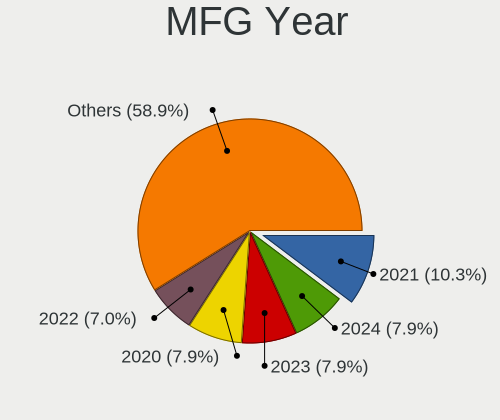
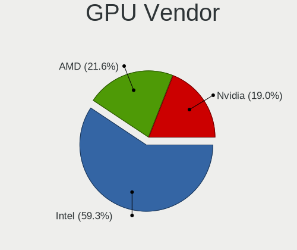
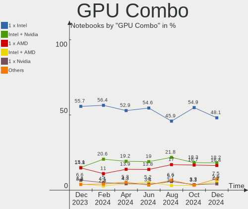
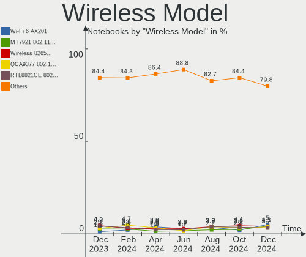
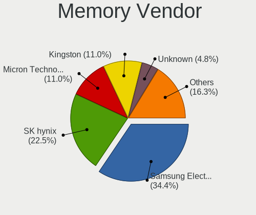

Linux Mint - Hardware Trends (Notebooks)
----------------------------------------

A project to identify most popular hardware characteristics and track their change
over time based on data collected by Linux users at https://Linux-Hardware.org.

Anyone can contribute to this report by the [hw-probe](https://github.com/linuxhw/hw-probe) tool:

    sudo -E hw-probe -all -upload

This report is for one last month. Overall report since the beginning of time: [TestDays](https://github.com/linuxhw/TestDays)

Period: Apr, 2023.

Contents
--------

* [ System ](#system)
  - [ OS                       ](#os)
  - [ OS Family                ](#os-family)
  - [ Kernel                   ](#kernel)
  - [ Kernel Family            ](#kernel-family)
  - [ Kernel Major Ver.        ](#kernel-major-ver)
  - [ Arch                     ](#arch)
  - [ DE                       ](#de)
  - [ Display Server           ](#display-server)
  - [ Display Manager          ](#display-manager)
  - [ OS Lang                  ](#os-lang)
  - [ Boot Mode                ](#boot-mode)
  - [ Filesystem               ](#filesystem)
  - [ Part. scheme             ](#part-scheme)
  - [ Dual Boot with Linux/BSD ](#dual-boot-with-linuxbsd)
  - [ Dual Boot (Win)          ](#dual-boot-win)

* [ Board ](#board)
  - [ Vendor                   ](#vendor)
  - [ Model                    ](#model)
  - [ Model Family             ](#model-family)
  - [ MFG Year                 ](#mfg-year)
  - [ Form Factor              ](#form-factor)
  - [ Secure Boot              ](#secure-boot)
  - [ Coreboot                 ](#coreboot)
  - [ RAM Size                 ](#ram-size)
  - [ RAM Used                 ](#ram-used)
  - [ Total Drives             ](#total-drives)
  - [ Has CD-ROM               ](#has-cd-rom)
  - [ Has Ethernet             ](#has-ethernet)
  - [ Has WiFi                 ](#has-wifi)
  - [ Has Bluetooth            ](#has-bluetooth)

* [ Location ](#location)
  - [ Country                  ](#country)
  - [ City                     ](#city)

* [ Drives ](#drives)
  - [ Drive Vendor             ](#drive-vendor)
  - [ Drive Model              ](#drive-model)
  - [ HDD Vendor               ](#hdd-vendor)
  - [ SSD Vendor               ](#ssd-vendor)
  - [ Drive Kind               ](#drive-kind)
  - [ Drive Connector          ](#drive-connector)
  - [ Drive Size               ](#drive-size)
  - [ Space Total              ](#space-total)
  - [ Space Used               ](#space-used)
  - [ Malfunc. Drives          ](#malfunc-drives)
  - [ Malfunc. Drive Vendor    ](#malfunc-drive-vendor)
  - [ Malfunc. HDD Vendor      ](#malfunc-hdd-vendor)
  - [ Malfunc. Drive Kind      ](#malfunc-drive-kind)
  - [ Failed Drives            ](#failed-drives)
  - [ Failed Drive Vendor      ](#failed-drive-vendor)
  - [ Drive Status             ](#drive-status)

* [ Storage controller ](#storage-controller)
  - [ Storage Vendor           ](#storage-vendor)
  - [ Storage Model            ](#storage-model)
  - [ Storage Kind             ](#storage-kind)

* [ Processor ](#processor)
  - [ CPU Vendor               ](#cpu-vendor)
  - [ CPU Model                ](#cpu-model)
  - [ CPU Model Family         ](#cpu-model-family)
  - [ CPU Cores                ](#cpu-cores)
  - [ CPU Sockets              ](#cpu-sockets)
  - [ CPU Threads              ](#cpu-threads)
  - [ CPU Op-Modes             ](#cpu-op-modes)
  - [ CPU Microcode            ](#cpu-microcode)
  - [ CPU Microarch            ](#cpu-microarch)

* [ Graphics ](#graphics)
  - [ GPU Vendor               ](#gpu-vendor)
  - [ GPU Model                ](#gpu-model)
  - [ GPU Combo                ](#gpu-combo)
  - [ GPU Driver               ](#gpu-driver)
  - [ GPU Memory               ](#gpu-memory)

* [ Monitor ](#monitor)
  - [ Monitor Vendor           ](#monitor-vendor)
  - [ Monitor Model            ](#monitor-model)
  - [ Monitor Resolution       ](#monitor-resolution)
  - [ Monitor Diagonal         ](#monitor-diagonal)
  - [ Monitor Width            ](#monitor-width)
  - [ Aspect Ratio             ](#aspect-ratio)
  - [ Monitor Area             ](#monitor-area)
  - [ Pixel Density            ](#pixel-density)
  - [ Multiple Monitors        ](#multiple-monitors)

* [ Network ](#network)
  - [ Net Controller Vendor    ](#net-controller-vendor)
  - [ Net Controller Model     ](#net-controller-model)
  - [ Wireless Vendor          ](#wireless-vendor)
  - [ Wireless Model           ](#wireless-model)
  - [ Ethernet Vendor          ](#ethernet-vendor)
  - [ Ethernet Model           ](#ethernet-model)
  - [ Net Controller Kind      ](#net-controller-kind)
  - [ Used Controller          ](#used-controller)
  - [ NICs                     ](#nics)
  - [ IPv6                     ](#ipv6)

* [ Bluetooth ](#bluetooth)
  - [ Bluetooth Vendor         ](#bluetooth-vendor)
  - [ Bluetooth Model          ](#bluetooth-model)

* [ Sound ](#sound)
  - [ Sound Vendor             ](#sound-vendor)
  - [ Sound Model              ](#sound-model)

* [ Memory ](#memory)
  - [ Memory Vendor            ](#memory-vendor)
  - [ Memory Model             ](#memory-model)
  - [ Memory Kind              ](#memory-kind)
  - [ Memory Form Factor       ](#memory-form-factor)
  - [ Memory Size              ](#memory-size)
  - [ Memory Speed             ](#memory-speed)

* [ Printers & scanners ](#printers--scanners)
  - [ Printer Vendor           ](#printer-vendor)
  - [ Printer Model            ](#printer-model)
  - [ Scanner Vendor           ](#scanner-vendor)
  - [ Scanner Model            ](#scanner-model)

* [ Camera ](#camera)
  - [ Camera Vendor            ](#camera-vendor)
  - [ Camera Model             ](#camera-model)

* [ Security ](#security)
  - [ Fingerprint Vendor       ](#fingerprint-vendor)
  - [ Fingerprint Model        ](#fingerprint-model)
  - [ Chipcard Vendor          ](#chipcard-vendor)
  - [ Chipcard Model           ](#chipcard-model)

* [ Unsupported ](#unsupported)
  - [ Unsupported Devices      ](#unsupported-devices)
  - [ Unsupported Device Types ](#unsupported-device-types)

System
------

OS
--

Installed operating systems

| Name            | Notebooks | Percent |
|-----------------|-----------|---------|
| Linux Mint 21.1 | 211       | 75.63%  |
| Linux Mint 20.3 | 26        | 9.32%   |
| Linux Mint 21   | 25        | 8.96%   |
| Linux Mint 20.1 | 5         | 1.79%   |
| Linux Mint 20.2 | 3         | 1.08%   |
| Linux Mint 18.3 | 3         | 1.08%   |
| Linux Mint 20   | 2         | 0.72%   |
| Linux Mint 19.2 | 2         | 0.72%   |
| Linux Mint 19.1 | 1         | 0.36%   |
| Linux Mint 19   | 1         | 0.36%   |

OS Family
---------

OS without a version

| Name       | Notebooks | Percent |
|------------|-----------|---------|
| Linux Mint | 279       | 100%    |

Kernel
------

Version of the Linux kernel

| Version               | Notebooks | Percent |
|-----------------------|-----------|---------|
| 5.15.0-69-generic     | 106       | 37.99%  |
| 5.15.0-70-generic     | 37        | 13.26%  |
| 5.15.0-56-generic     | 26        | 9.32%   |
| 5.15.0-71-generic     | 20        | 7.17%   |
| 5.19.0-38-generic     | 13        | 4.66%   |
| 5.4.0-147-generic     | 10        | 3.58%   |
| 5.4.0-146-generic     | 9         | 3.23%   |
| 5.19.0-40-generic     | 9         | 3.23%   |
| 5.15.0-67-generic     | 5         | 1.79%   |
| 5.4.0-148-generic     | 4         | 1.43%   |
| 5.15.0-58-generic     | 4         | 1.43%   |
| 6.2.11-060211-generic | 2         | 0.72%   |
| 5.4.0-58-generic      | 2         | 0.72%   |
| 5.4.0-144-generic     | 2         | 0.72%   |
| 5.19.0-41-generic     | 2         | 0.72%   |
| 5.15.0-60-generic     | 2         | 0.72%   |
| 5.15.0-52-generic     | 2         | 0.72%   |
| 5.15.0-41-generic     | 2         | 0.72%   |
| 4.15.0-54-generic     | 2         | 0.72%   |
| 4.15.0-142-generic    | 2         | 0.72%   |
| 6.2.9-060209-generic  | 1         | 0.36%   |
| 6.2.8-060208-generic  | 1         | 0.36%   |
| 6.2.8                 | 1         | 0.36%   |
| 6.2.7-060207-generic  | 1         | 0.36%   |
| 6.2.10-060210-generic | 1         | 0.36%   |
| 6.2.0-060200-generic  | 1         | 0.36%   |
| 6.1.20-060120-generic | 1         | 0.36%   |
| 6.1.0-1009-oem        | 1         | 0.36%   |
| 6.0.9-060009-generic  | 1         | 0.36%   |
| 6.0.3-060003-generic  | 1         | 0.36%   |
| 5.4.0-80-generic      | 1         | 0.36%   |
| 5.4.0-26-generic      | 1         | 0.36%   |
| 5.4.0-126-generic     | 1         | 0.36%   |
| 5.4.0-122-generic     | 1         | 0.36%   |
| 5.4.0-113-generic     | 1         | 0.36%   |
| 5.15.0-57-generic     | 1         | 0.36%   |
| 4.15.0-36-generic     | 1         | 0.36%   |
| 4.15.0-208-generic    | 1         | 0.36%   |

Kernel Family
-------------

Linux kernel without a distro release

| Version | Notebooks | Percent |
|---------|-----------|---------|
| 5.15.0  | 205       | 73.48%  |
| 5.4.0   | 32        | 11.47%  |
| 5.19.0  | 24        | 8.6%    |
| 4.15.0  | 6         | 2.15%   |
| 6.2.8   | 2         | 0.72%   |
| 6.2.11  | 2         | 0.72%   |
| 6.2.9   | 1         | 0.36%   |
| 6.2.7   | 1         | 0.36%   |
| 6.2.10  | 1         | 0.36%   |
| 6.2.0   | 1         | 0.36%   |
| 6.1.20  | 1         | 0.36%   |
| 6.1.0   | 1         | 0.36%   |
| 6.0.9   | 1         | 0.36%   |
| 6.0.3   | 1         | 0.36%   |

Kernel Major Ver.
-----------------

Linux kernel major version

| Version | Notebooks | Percent |
|---------|-----------|---------|
| 5.15    | 205       | 73.48%  |
| 5.4     | 32        | 11.47%  |
| 5.19    | 24        | 8.6%    |
| 6.2     | 8         | 2.87%   |
| 4.15    | 6         | 2.15%   |
| 6.1     | 2         | 0.72%   |
| 6.0     | 2         | 0.72%   |

Arch
----

OS architecture (x86_64, i586, etc.)

| Name   | Notebooks | Percent |
|--------|-----------|---------|
| x86_64 | 279       | 100%    |

DE
--

Desktop Environment

| Name       | Notebooks | Percent |
|------------|-----------|---------|
| X-Cinnamon | 183       | 65.59%  |
| XFCE       | 45        | 16.13%  |
| MATE       | 38        | 13.62%  |
| Cinnamon   | 6         | 2.15%   |
| KDE5       | 3         | 1.08%   |
| GNOME      | 2         | 0.72%   |
| Jwm        | 1         | 0.36%   |
| i3         | 1         | 0.36%   |

Display Server
--------------

X11 or Wayland

| Name | Notebooks | Percent |
|------|-----------|---------|
| X11  | 279       | 100%    |

Display Manager
---------------

SDDM, LightDM, etc.

| Name    | Notebooks | Percent |
|---------|-----------|---------|
| LightDM | 158       | 56.63%  |
| Unknown | 118       | 42.29%  |
| SDDM    | 1         | 0.36%   |
| LXDM    | 1         | 0.36%   |
| GDM3    | 1         | 0.36%   |

OS Lang
-------

Language

| Lang  | Notebooks | Percent |
|-------|-----------|---------|
| en_US | 86        | 30.82%  |
| de_DE | 42        | 15.05%  |
| fr_FR | 26        | 9.32%   |
| ru_RU | 18        | 6.45%   |
| C     | 14        | 5.02%   |
| en_GB | 13        | 4.66%   |
| pt_BR | 8         | 2.87%   |
| it_IT | 8         | 2.87%   |
| en_CA | 8         | 2.87%   |
| nl_NL | 5         | 1.79%   |
| es_ES | 5         | 1.79%   |
| pl_PL | 4         | 1.43%   |
| en_IN | 4         | 1.43%   |
| de_AT | 4         | 1.43%   |
| hu_HU | 3         | 1.08%   |
| en_AU | 3         | 1.08%   |
| pt_PT | 2         | 0.72%   |
| fr_CA | 2         | 0.72%   |
| fi_FI | 2         | 0.72%   |
| es_CL | 2         | 0.72%   |
| en_IE | 2         | 0.72%   |
| uk_UA | 1         | 0.36%   |
| tr_TR | 1         | 0.36%   |
| sv_SE | 1         | 0.36%   |
| sk_SK | 1         | 0.36%   |
| ro_RO | 1         | 0.36%   |
| fr_BE | 1         | 0.36%   |
| es_MX | 1         | 0.36%   |
| es_EC | 1         | 0.36%   |
| es_DO | 1         | 0.36%   |
| es_CU | 1         | 0.36%   |
| es_CO | 1         | 0.36%   |
| en_ZA | 1         | 0.36%   |
| en_SG | 1         | 0.36%   |
| en_NZ | 1         | 0.36%   |
| el_GR | 1         | 0.36%   |
| de_CH | 1         | 0.36%   |
| cs_CZ | 1         | 0.36%   |
| bg_BG | 1         | 0.36%   |

Boot Mode
---------

EFI or BIOS

| Mode | Notebooks | Percent |
|------|-----------|---------|
| EFI  | 187       | 67.03%  |
| BIOS | 92        | 32.97%  |

Filesystem
----------

Type of filesystem

| Type    | Notebooks | Percent |
|---------|-----------|---------|
| Ext4    | 249       | 89.25%  |
| Overlay | 15        | 5.38%   |
| Zfs     | 6         | 2.15%   |
| Btrfs   | 5         | 1.79%   |
| Tmpfs   | 4         | 1.43%   |

Part. scheme
------------

Scheme of partitioning

| Type    | Notebooks | Percent |
|---------|-----------|---------|
| GPT     | 141       | 50.54%  |
| Unknown | 118       | 42.29%  |
| MBR     | 20        | 7.17%   |

Dual Boot with Linux/BSD
------------------------

Hosting more than one Linux/BSD

| Dual boot | Notebooks | Percent |
|-----------|-----------|---------|
| No        | 264       | 94.62%  |
| Yes       | 15        | 5.38%   |

Dual Boot (Win)
---------------

Hosting Linux and Windows

| Dual boot | Notebooks | Percent |
|-----------|-----------|---------|
| No        | 215       | 77.06%  |
| Yes       | 64        | 22.94%  |

Board
-----

Vendor
------

Motherboard manufacturer

| Name                | Notebooks | Percent |
|---------------------|-----------|---------|
| Hewlett-Packard     | 58        | 20.79%  |
| Lenovo              | 48        | 17.2%   |
| Dell                | 37        | 13.26%  |
| Acer                | 33        | 11.83%  |
| ASUSTek Computer    | 31        | 11.11%  |
| Apple               | 10        | 3.58%   |
| Samsung Electronics | 9         | 3.23%   |
| Toshiba             | 7         | 2.51%   |
| HUAWEI              | 7         | 2.51%   |
| Sony                | 4         | 1.43%   |
| MSI                 | 4         | 1.43%   |
| Medion              | 4         | 1.43%   |
| GPU Company         | 3         | 1.08%   |
| Google              | 3         | 1.08%   |
| Wortmann AG         | 2         | 0.72%   |
| AMI                 | 2         | 0.72%   |
| Valve               | 1         | 0.36%   |
| Timi                | 1         | 0.36%   |
| Thomson             | 1         | 0.36%   |
| Positivo            | 1         | 0.36%   |
| Notebook            | 1         | 0.36%   |
| MACHENIKE           | 1         | 0.36%   |
| Gigabyte Technology | 1         | 0.36%   |
| Gateway             | 1         | 0.36%   |
| Fujitsu             | 1         | 0.36%   |
| Eii                 | 1         | 0.36%   |
| Dynabook            | 1         | 0.36%   |
| DEXP                | 1         | 0.36%   |
| DERE                | 1         | 0.36%   |
| Compal              | 1         | 0.36%   |
| Chuwi               | 1         | 0.36%   |
| Alcor Digital       | 1         | 0.36%   |
| Unknown             | 1         | 0.36%   |

Model
-----

Motherboard model

| Name                                        | Notebooks | Percent |
|---------------------------------------------|-----------|---------|
| HP Pavilion 15                              | 4         | 1.43%   |
| HP Pavilion g6                              | 3         | 1.08%   |
| Samsung 300E4A/300E5A/300E7A                | 2         | 0.72%   |
| Lenovo ThinkPad X1 Carbon Gen 10 21CBCTO1WW | 2         | 0.72%   |
| Lenovo IdeaPad 330-15IKB 81DE               | 2         | 0.72%   |
| HUAWEI NBLK-WAX9X                           | 2         | 0.72%   |
| HP Pavilion dv7                             | 2         | 0.72%   |
| HP Pavilion 17                              | 2         | 0.72%   |
| HP Laptop 17-cp0xxx                         | 2         | 0.72%   |
| HP EliteBook 8460p                          | 2         | 0.72%   |
| HP EliteBook 840 G1                         | 2         | 0.72%   |
| HP 255 15.6 inch G9 Notebook PC             | 2         | 0.72%   |
| HP 2000                                     | 2         | 0.72%   |
| Dell Latitude E5520                         | 2         | 0.72%   |
| Dell Latitude 5430                          | 2         | 0.72%   |
| Dell Latitude 5420                          | 2         | 0.72%   |
| AMI Intel                                   | 2         | 0.72%   |
| Acer Aspire 5336                            | 2         | 0.72%   |
| Wortmann AG TERRA_MOBILE_1749               | 1         | 0.36%   |
| Wortmann AG TERRA_MOBILE_1160               | 1         | 0.36%   |
| Valve Jupiter                               | 1         | 0.36%   |
| Toshiba Satellite Pro R50-C                 | 1         | 0.36%   |
| Toshiba Satellite L50-C                     | 1         | 0.36%   |
| Toshiba Satellite L45-B                     | 1         | 0.36%   |
| Toshiba Satellite L15W-B                    | 1         | 0.36%   |
| Toshiba Satellite C855-12N                  | 1         | 0.36%   |
| Toshiba Satellite C55t-C                    | 1         | 0.36%   |
| Toshiba QOSMIO F750                         | 1         | 0.36%   |
| Timi RedmiBook Pro 15S                      | 1         | 0.36%   |
| Thomson NEO14A-4WH128                       | 1         | 0.36%   |
| Sony VPCSB1V9E                              | 1         | 0.36%   |
| Sony VPCEH3U1E                              | 1         | 0.36%   |
| Sony VPCEB3J1E                              | 1         | 0.36%   |
| Sony SVF1521A6EW                            | 1         | 0.36%   |
| Samsung RV411/RV511/E3511/S3511/RV711       | 1         | 0.36%   |
| Samsung NC210/NC110                         | 1         | 0.36%   |
| Samsung 90X3A                               | 1         | 0.36%   |
| Samsung 750XDA                              | 1         | 0.36%   |
| Samsung 730U3E/740U3E                       | 1         | 0.36%   |
| Samsung 700Z3A/700Z4A/700Z5A/700Z5B         | 1         | 0.36%   |

Model Family
------------

Motherboard model prefix

| Name                  | Notebooks | Percent |
|-----------------------|-----------|---------|
| Lenovo ThinkPad       | 25        | 8.96%   |
| Dell Latitude         | 23        | 8.24%   |
| Acer Aspire           | 23        | 8.24%   |
| HP Pavilion           | 18        | 6.45%   |
| Lenovo IdeaPad        | 12        | 4.3%    |
| HP EliteBook          | 11        | 3.94%   |
| Dell Inspiron         | 8         | 2.87%   |
| Toshiba Satellite     | 6         | 2.15%   |
| HP Laptop             | 6         | 2.15%   |
| ASUS VivoBook         | 6         | 2.15%   |
| HP ProBook            | 5         | 1.79%   |
| Acer TravelMate       | 5         | 1.79%   |
| Lenovo Legion         | 3         | 1.08%   |
| HP ZBook              | 3         | 1.08%   |
| HP 255                | 3         | 1.08%   |
| ASUS Zenbook          | 3         | 1.08%   |
| ASUS ASUS             | 3         | 1.08%   |
| Wortmann AG TERRA     | 2         | 0.72%   |
| Samsung 300E4A        | 2         | 0.72%   |
| Lenovo ThinkBook      | 2         | 0.72%   |
| HUAWEI NBLK-WAX9X     | 2         | 0.72%   |
| HP Stream             | 2         | 0.72%   |
| HP 250                | 2         | 0.72%   |
| HP 2000               | 2         | 0.72%   |
| Dell XPS              | 2         | 0.72%   |
| Dell Precision        | 2         | 0.72%   |
| ASUS ROG              | 2         | 0.72%   |
| AMI Intel             | 2         | 0.72%   |
| Acer Extensa          | 2         | 0.72%   |
| Valve Jupiter         | 1         | 0.36%   |
| Toshiba QOSMIO        | 1         | 0.36%   |
| Timi RedmiBook        | 1         | 0.36%   |
| Thomson NEO14A-4WH128 | 1         | 0.36%   |
| Sony VPCSB1V9E        | 1         | 0.36%   |
| Sony VPCEH3U1E        | 1         | 0.36%   |
| Sony VPCEB3J1E        | 1         | 0.36%   |
| Sony SVF1521A6EW      | 1         | 0.36%   |
| Samsung RV411         | 1         | 0.36%   |
| Samsung NC210         | 1         | 0.36%   |
| Samsung 90X3A         | 1         | 0.36%   |

MFG Year
--------

Motherboard manufacture year

| Year | Notebooks | Percent |
|------|-----------|---------|
| 2021 | 38        | 13.62%  |
| 2011 | 35        | 12.54%  |
| 2013 | 25        | 8.96%   |
| 2022 | 24        | 8.6%    |
| 2015 | 22        | 7.89%   |
| 2012 | 19        | 6.81%   |
| 2020 | 18        | 6.45%   |
| 2019 | 17        | 6.09%   |
| 2018 | 16        | 5.73%   |
| 2010 | 14        | 5.02%   |
| 2014 | 12        | 4.3%    |
| 2017 | 10        | 3.58%   |
| 2016 | 8         | 2.87%   |
| 2009 | 8         | 2.87%   |
| 2008 | 6         | 2.15%   |
| 2007 | 4         | 1.43%   |
| 2023 | 2         | 0.72%   |
| 2006 | 1         | 0.36%   |

Form Factor
-----------

Physical design of the computer

| Name     | Notebooks | Percent |
|----------|-----------|---------|
| Notebook | 279       | 100%    |

Secure Boot
-----------

Enabled or disabled

| State    | Notebooks | Percent |
|----------|-----------|---------|
| Disabled | 253       | 90.68%  |
| Enabled  | 26        | 9.32%   |

Coreboot
--------

Have coreboot on board

| Used | Notebooks | Percent |
|------|-----------|---------|
| No   | 276       | 98.92%  |
| Yes  | 3         | 1.08%   |

RAM Size
--------

Total RAM memory

| Size in GB  | Notebooks | Percent |
|-------------|-----------|---------|
| 4.01-8.0    | 89        | 31.9%   |
| 3.01-4.0    | 61        | 21.86%  |
| 8.01-16.0   | 51        | 18.28%  |
| 16.01-24.0  | 45        | 16.13%  |
| 32.01-64.0  | 16        | 5.73%   |
| 1.01-2.0    | 9         | 3.23%   |
| 24.01-32.0  | 3         | 1.08%   |
| 2.01-3.0    | 3         | 1.08%   |
| 64.01-256.0 | 2         | 0.72%   |

RAM Used
--------

Used RAM memory

| Used GB    | Notebooks | Percent |
|------------|-----------|---------|
| 1.01-2.0   | 97        | 34.77%  |
| 2.01-3.0   | 82        | 29.39%  |
| 3.01-4.0   | 38        | 13.62%  |
| 4.01-8.0   | 36        | 12.9%   |
| 0.51-1.0   | 14        | 5.02%   |
| 8.01-16.0  | 8         | 2.87%   |
| 16.01-24.0 | 2         | 0.72%   |
| 24.01-32.0 | 1         | 0.36%   |
| 0.01-0.5   | 1         | 0.36%   |

Total Drives
------------

Number of drives on board

| Drives | Notebooks | Percent |
|--------|-----------|---------|
| 1      | 212       | 75.99%  |
| 2      | 60        | 21.51%  |
| 3      | 7         | 2.51%   |

Has CD-ROM
----------

Has CD-ROM on board

| Presented | Notebooks | Percent |
|-----------|-----------|---------|
| No        | 166       | 59.5%   |
| Yes       | 113       | 40.5%   |

Has Ethernet
------------

Has Ethernet on board

| Presented | Notebooks | Percent |
|-----------|-----------|---------|
| Yes       | 222       | 79.57%  |
| No        | 57        | 20.43%  |

Has WiFi
--------

Has WiFi module

| Presented | Notebooks | Percent |
|-----------|-----------|---------|
| Yes       | 276       | 98.92%  |
| No        | 3         | 1.08%   |

Has Bluetooth
-------------

Has Bluetooth module

| Presented | Notebooks | Percent |
|-----------|-----------|---------|
| Yes       | 211       | 75.63%  |
| No        | 68        | 24.37%  |

Location
--------

Country
-------

Geographic location (country)

| Country      | Notebooks | Percent |
|--------------|-----------|---------|
| Germany      | 49        | 17.56%  |
| USA          | 34        | 12.19%  |
| France       | 28        | 10.04%  |
| UK           | 14        | 5.02%   |
| Russia       | 14        | 5.02%   |
| Poland       | 12        | 4.3%    |
| Italy        | 11        | 3.94%   |
| Brazil       | 11        | 3.94%   |
| Canada       | 9         | 3.23%   |
| Spain        | 7         | 2.51%   |
| Netherlands  | 7         | 2.51%   |
| Austria      | 6         | 2.15%   |
| Turkey       | 5         | 1.79%   |
| Sweden       | 5         | 1.79%   |
| Indonesia    | 4         | 1.43%   |
| India        | 4         | 1.43%   |
| Chile        | 4         | 1.43%   |
| Ukraine      | 3         | 1.08%   |
| Hungary      | 3         | 1.08%   |
| Greece       | 3         | 1.08%   |
| Finland      | 3         | 1.08%   |
| Belarus      | 3         | 1.08%   |
| Australia    | 3         | 1.08%   |
| Slovakia     | 2         | 0.72%   |
| Romania      | 2         | 0.72%   |
| Pakistan     | 2         | 0.72%   |
| Mexico       | 2         | 0.72%   |
| Ireland      | 2         | 0.72%   |
| Czechia      | 2         | 0.72%   |
| Colombia     | 2         | 0.72%   |
| Vietnam      | 1         | 0.36%   |
| Uzbekistan   | 1         | 0.36%   |
| UAE          | 1         | 0.36%   |
| Switzerland  | 1         | 0.36%   |
| South Africa | 1         | 0.36%   |
| Singapore    | 1         | 0.36%   |
| Serbia       | 1         | 0.36%   |
| Portugal     | 1         | 0.36%   |
| Peru         | 1         | 0.36%   |
| Nigeria      | 1         | 0.36%   |

City
----

Geographic location (city)

| City              | Notebooks | Percent |
|-------------------|-----------|---------|
| Poznan            | 5         | 1.79%   |
| London            | 5         | 1.79%   |
| Warsaw            | 4         | 1.43%   |
| Vienna            | 4         | 1.43%   |
| Mannheim          | 4         | 1.43%   |
| Stockholm         | 3         | 1.08%   |
| St Petersburg     | 3         | 1.08%   |
| Santiago          | 3         | 1.08%   |
| Moscow            | 3         | 1.08%   |
| Montreal          | 3         | 1.08%   |
| Lodz              | 3         | 1.08%   |
| Toulouse          | 2         | 0.72%   |
| Torricella Sicura | 2         | 0.72%   |
| Rio de Janeiro    | 2         | 0.72%   |
| Podolsk           | 2         | 0.72%   |
| Paris             | 2         | 0.72%   |
| Nizhniy Novgorod  | 2         | 0.72%   |
| New Westminster   | 2         | 0.72%   |
| Milan             | 2         | 0.72%   |
| Maxhutte-Haidhof  | 2         | 0.72%   |
| Madrid            | 2         | 0.72%   |
| Lahore            | 2         | 0.72%   |
| Istanbul          | 2         | 0.72%   |
| Frankfurt am Main | 2         | 0.72%   |
| Dresden           | 2         | 0.72%   |
| Dortmund          | 2         | 0.72%   |
| Chennai           | 2         | 0.72%   |
| Caen              | 2         | 0.72%   |
| Budapest          | 2         | 0.72%   |
| Brunswick         | 2         | 0.72%   |
| Bratislava        | 2         | 0.72%   |
| Bogotá           | 2         | 0.72%   |
| Ankara            | 2         | 0.72%   |
| Amsterdam         | 2         | 0.72%   |
| Zagreb            | 1         | 0.36%   |
| Yoshkar-Ola       | 1         | 0.36%   |
| York              | 1         | 0.36%   |
| Yogyakarta        | 1         | 0.36%   |
| Yekaterinburg     | 1         | 0.36%   |
| Wuppertal         | 1         | 0.36%   |

Drives
------

Drive Vendor
------------

Hard drive vendors

| Vendor                      | Notebooks | Drives | Percent |
|-----------------------------|-----------|--------|---------|
| Samsung Electronics         | 54        | 59     | 16.02%  |
| WDC                         | 33        | 33     | 9.79%   |
| Sandisk                     | 27        | 28     | 8.01%   |
| Seagate                     | 23        | 23     | 6.82%   |
| Unknown                     | 19        | 22     | 5.64%   |
| Toshiba                     | 19        | 19     | 5.64%   |
| Hitachi                     | 18        | 18     | 5.34%   |
| Kingston                    | 17        | 17     | 5.04%   |
| Crucial                     | 15        | 15     | 4.45%   |
| SK hynix                    | 14        | 14     | 4.15%   |
| Intel                       | 10        | 10     | 2.97%   |
| China                       | 8         | 8      | 2.37%   |
| KIOXIA                      | 5         | 5      | 1.48%   |
| Intenso                     | 5         | 5      | 1.48%   |
| Apple                       | 5         | 8      | 1.48%   |
| Unknown                     | 5         | 5      | 1.48%   |
| Micron Technology           | 4         | 4      | 1.19%   |
| HGST                        | 4         | 4      | 1.19%   |
| Transcend                   | 3         | 3      | 0.89%   |
| Phison                      | 3         | 3      | 0.89%   |
| GOODRAM                     | 3         | 3      | 0.89%   |
| UMIS                        | 2         | 2      | 0.59%   |
| SABRENT                     | 2         | 2      | 0.59%   |
| LITEON                      | 2         | 2      | 0.59%   |
| Kingston Technology Company | 2         | 2      | 0.59%   |
| KingSpec                    | 2         | 2      | 0.59%   |
| FORESEE                     | 2         | 2      | 0.59%   |
| Fanxiang                    | 2         | 2      | 0.59%   |
| A-DATA Technology           | 2         | 2      | 0.59%   |
| XrayDisk                    | 1         | 1      | 0.3%    |
| Verbatim                    | 1         | 1      | 0.3%    |
| V-GeN                       | 1         | 1      | 0.3%    |
| Team                        | 1         | 1      | 0.3%    |
| SPCC                        | 1         | 1      | 0.3%    |
| Solid State Storage         | 1         | 1      | 0.3%    |
| Silicon Motion              | 1         | 1      | 0.3%    |
| ShiJi                       | 1         | 1      | 0.3%    |
| Realtek Semiconductor       | 1         | 1      | 0.3%    |
| Realtek                     | 1         | 1      | 0.3%    |
| POLION                      | 1         | 1      | 0.3%    |

Drive Model
-----------

Hard drive models

| Model                                             | Notebooks | Percent |
|---------------------------------------------------|-----------|---------|
| Unknown                                           | 5         | 1.45%   |
| Seagate ST1000LM035-1RK172 970GB                  | 4         | 1.16%   |
| Samsung SSD 860 EVO 500GB                         | 4         | 1.16%   |
| Kingston SA400S37240G 240GB SSD                   | 4         | 1.16%   |
| Hitachi HTS545032B9A300 320GB                     | 4         | 1.16%   |
| Crucial CT480BX500SSD1 480GB                      | 4         | 1.16%   |
| Unknown MMC Card  32GB                            | 3         | 0.87%   |
| Unknown MMC Card  16GB                            | 3         | 0.87%   |
| Unknown MMC Card  128GB                           | 3         | 0.87%   |
| Seagate ST9500325AS 500GB                         | 3         | 0.87%   |
| SanDisk SDSSDH3 1T00 1TB                          | 3         | 0.87%   |
| Samsung SSD 850 EVO 250GB                         | 3         | 0.87%   |
| Samsung SSD 840 EVO 250GB                         | 3         | 0.87%   |
| Samsung NVMe SSD Controller SM981/PM981/PM983 1TB | 3         | 0.87%   |
| Samsung MZVLQ512HBLU-00BH1 512GB                  | 3         | 0.87%   |
| Kingston SA400S37480G 480GB SSD                   | 3         | 0.87%   |
| Intel SSDPEKNU512GZ 512GB                         | 3         | 0.87%   |
| Crucial CT500MX500SSD1 500GB                      | 3         | 0.87%   |
| WDC WDS500G2B0A-00SM50 500GB SSD                  | 2         | 0.58%   |
| WDC WD10SPZX-60Z10T0 1TB                          | 2         | 0.58%   |
| WDC WD10JPVX-22JC3T0 1TB                          | 2         | 0.58%   |
| Unknown MMC Card  7GB                             | 2         | 0.58%   |
| Unknown MMC Card  64GB                            | 2         | 0.58%   |
| Toshiba XG6 NVMe SSD Controller 1024GB            | 2         | 0.58%   |
| Toshiba MQ01ABD100 1TB                            | 2         | 0.58%   |
| Seagate ST500LT012-9WS142 500GB                   | 2         | 0.58%   |
| Seagate ST2000LM003 HN-M201RAD 2TB                | 2         | 0.58%   |
| Seagate ST1000LM024 HN-M101MBB 1TB                | 2         | 0.58%   |
| Sandisk WD Blue SN550 NVMe SSD 1024GB             | 2         | 0.58%   |
| SanDisk SSD PLUS 480GB                            | 2         | 0.58%   |
| Samsung SSD 970 EVO Plus 2TB                      | 2         | 0.58%   |
| Samsung SSD 870 EVO 500GB                         | 2         | 0.58%   |
| Samsung SSD 860 EVO 1TB                           | 2         | 0.58%   |
| Samsung SSD 840 PRO Series 256GB                  | 2         | 0.58%   |
| Samsung MZVLQ256HAJD-00000 256GB                  | 2         | 0.58%   |
| Samsung MZALQ512HBLU-00BL2 512GB                  | 2         | 0.58%   |
| SABRENT Disk 1TB                                  | 2         | 0.58%   |
| Micron 2450_MTFDKBA512TFK 512GB                   | 2         | 0.58%   |
| KIOXIA KBG40ZNV512G 512GB                         | 2         | 0.58%   |
| KIOXIA KBG40ZNS512G NVMe 512GB                    | 2         | 0.58%   |

HDD Vendor
----------

Hard disk drive vendors

| Vendor              | Notebooks | Drives | Percent |
|---------------------|-----------|--------|---------|
| Seagate             | 22        | 22     | 28.21%  |
| WDC                 | 18        | 18     | 23.08%  |
| Hitachi             | 18        | 18     | 23.08%  |
| Toshiba             | 10        | 10     | 12.82%  |
| HGST                | 4         | 4      | 5.13%   |
| Samsung Electronics | 2         | 2      | 2.56%   |
| Unknown             | 1         | 1      | 1.28%   |
| JMicron Technology  | 1         | 1      | 1.28%   |
| Intenso             | 1         | 1      | 1.28%   |
| Fujitsu             | 1         | 1      | 1.28%   |

SSD Vendor
----------

Solid state drive vendors

| Vendor              | Notebooks | Drives | Percent |
|---------------------|-----------|--------|---------|
| Samsung Electronics | 28        | 29     | 21.05%  |
| SanDisk             | 16        | 16     | 12.03%  |
| Kingston            | 15        | 15     | 11.28%  |
| Crucial             | 13        | 13     | 9.77%   |
| China               | 8         | 8      | 6.02%   |
| Intel               | 5         | 5      | 3.76%   |
| Toshiba             | 4         | 4      | 3.01%   |
| Intenso             | 4         | 4      | 3.01%   |
| WDC                 | 3         | 3      | 2.26%   |
| Transcend           | 3         | 3      | 2.26%   |
| SK hynix            | 3         | 3      | 2.26%   |
| GOODRAM             | 3         | 3      | 2.26%   |
| Apple               | 3         | 3      | 2.26%   |
| KingSpec            | 2         | 2      | 1.5%    |
| FORESEE             | 2         | 2      | 1.5%    |
| Fanxiang            | 2         | 2      | 1.5%    |
| A-DATA Technology   | 2         | 2      | 1.5%    |
| XrayDisk            | 1         | 1      | 0.75%   |
| Verbatim            | 1         | 1      | 0.75%   |
| V-GeN               | 1         | 1      | 0.75%   |
| Team                | 1         | 1      | 0.75%   |
| SPCC                | 1         | 1      | 0.75%   |
| POLION              | 1         | 1      | 0.75%   |
| Patriot             | 1         | 1      | 0.75%   |
| Ovation             | 1         | 1      | 0.75%   |
| Netac               | 1         | 1      | 0.75%   |
| LITEONIT            | 1         | 1      | 0.75%   |
| LITEON              | 1         | 1      | 0.75%   |
| KingFast            | 1         | 1      | 0.75%   |
| INNOVATION IT       | 1         | 1      | 0.75%   |
| Hewlett-Packard     | 1         | 1      | 0.75%   |
| Gigabyte Technology | 1         | 1      | 0.75%   |
| BR                  | 1         | 1      | 0.75%   |
| Unknown             | 1         | 1      | 0.75%   |

Drive Kind
----------

HDD or SSD

| Kind    | Notebooks | Drives | Percent |
|---------|-----------|--------|---------|
| SSD     | 122       | 134    | 37.77%  |
| NVMe    | 98        | 107    | 30.34%  |
| HDD     | 76        | 78     | 23.53%  |
| MMC     | 24        | 27     | 7.43%   |
| Unknown | 3         | 2      | 0.93%   |

Drive Connector
---------------

SATA, SAS, NVMe, etc.

| Type | Notebooks | Drives | Percent |
|------|-----------|--------|---------|
| SATA | 185       | 206    | 58.36%  |
| NVMe | 96        | 104    | 30.28%  |
| MMC  | 24        | 27     | 7.57%   |
| SAS  | 12        | 11     | 3.79%   |

Drive Size
----------

Size of hard drive

| Size in TB | Notebooks | Drives | Percent |
|------------|-----------|--------|---------|
| 0.01-0.5   | 142       | 149    | 70.3%   |
| 0.51-1.0   | 49        | 52     | 24.26%  |
| 1.01-2.0   | 9         | 9      | 4.46%   |
| 3.01-4.0   | 1         | 1      | 0.5%    |
| 4.01-10.0  | 1         | 1      | 0.5%    |

Space Total
-----------

Amount of disk space available on the file system

| Size in GB     | Notebooks | Percent |
|----------------|-----------|---------|
| 101-250        | 94        | 33.69%  |
| 251-500        | 81        | 29.03%  |
| 501-1000       | 40        | 14.34%  |
| 1001-2000      | 16        | 5.73%   |
| 1-20           | 15        | 5.38%   |
| 51-100         | 12        | 4.3%    |
| 21-50          | 9         | 3.23%   |
| More than 3000 | 7         | 2.51%   |
| 2001-3000      | 4         | 1.43%   |
| Unknown        | 1         | 0.36%   |

Space Used
----------

Amount of used disk space

| Used GB        | Notebooks | Percent |
|----------------|-----------|---------|
| 21-50          | 73        | 26.16%  |
| 1-20           | 65        | 23.3%   |
| 51-100         | 49        | 17.56%  |
| 101-250        | 47        | 16.85%  |
| 251-500        | 19        | 6.81%   |
| 501-1000       | 14        | 5.02%   |
| 2001-3000      | 5         | 1.79%   |
| 1001-2000      | 5         | 1.79%   |
| More than 3000 | 1         | 0.36%   |
| Unknown        | 1         | 0.36%   |

Malfunc. Drives
---------------

Drive models with a malfunction

| Model                                   | Notebooks | Drives | Percent |
|-----------------------------------------|-----------|--------|---------|
| WDC WD2500BEKT-60A25T1 250GB            | 1         | 1      | 5%      |
| Transcend TS256GSSD230S 256GB           | 1         | 1      | 5%      |
| Toshiba MQ01ABD100 1TB                  | 1         | 1      | 5%      |
| Toshiba MK5075GSX 500GB                 | 1         | 1      | 5%      |
| Toshiba MK2546GSX 250GB                 | 1         | 1      | 5%      |
| Toshiba KSG60ZMV256G M.2 2280 256GB SSD | 1         | 1      | 5%      |
| SK hynix SC401 SATA 256GB SSD           | 1         | 1      | 5%      |
| SK hynix HFS128G39MNC-2300A 128GB SSD   | 1         | 1      | 5%      |
| Seagate ST9500325AS 500GB               | 1         | 1      | 5%      |
| Seagate ST500LT012-9WS142 500GB         | 1         | 1      | 5%      |
| Seagate ST500LM012 HN-M500MBB 500GB     | 1         | 1      | 5%      |
| Samsung Electronics HM160HC 160GB       | 1         | 1      | 5%      |
| Kingston SV300S37A120G 120GB SSD        | 1         | 1      | 5%      |
| Hitachi HTS725050A9A364 500GB           | 1         | 1      | 5%      |
| Hitachi HTS723232A7A364 320GB           | 1         | 1      | 5%      |
| Hitachi HTS545032B9A300 320GB           | 1         | 1      | 5%      |
| Hitachi HTS545032A7E380 320GB           | 1         | 1      | 5%      |
| Hitachi HTS542512K9SA00 120GB           | 1         | 1      | 5%      |
| HGST HTS721010A9E630 1TB                | 1         | 1      | 5%      |
| Fujitsu MHV2080AH 80GB                  | 1         | 1      | 5%      |

Malfunc. Drive Vendor
---------------------

Vendors of faulty drives

| Vendor              | Notebooks | Drives | Percent |
|---------------------|-----------|--------|---------|
| Hitachi             | 5         | 5      | 25%     |
| Toshiba             | 4         | 4      | 20%     |
| Seagate             | 3         | 3      | 15%     |
| SK hynix            | 2         | 2      | 10%     |
| WDC                 | 1         | 1      | 5%      |
| Transcend           | 1         | 1      | 5%      |
| Samsung Electronics | 1         | 1      | 5%      |
| Kingston            | 1         | 1      | 5%      |
| HGST                | 1         | 1      | 5%      |
| Fujitsu             | 1         | 1      | 5%      |

Malfunc. HDD Vendor
-------------------

Vendors of faulty HDD drives

| Vendor              | Notebooks | Drives | Percent |
|---------------------|-----------|--------|---------|
| Hitachi             | 5         | 5      | 33.33%  |
| Toshiba             | 3         | 3      | 20%     |
| Seagate             | 3         | 3      | 20%     |
| WDC                 | 1         | 1      | 6.67%   |
| Samsung Electronics | 1         | 1      | 6.67%   |
| HGST                | 1         | 1      | 6.67%   |
| Fujitsu             | 1         | 1      | 6.67%   |

Malfunc. Drive Kind
-------------------

Kinds of faulty drives

| Kind | Notebooks | Drives | Percent |
|------|-----------|--------|---------|
| HDD  | 14        | 15     | 73.68%  |
| SSD  | 5         | 5      | 26.32%  |

Failed Drives
-------------

Failed drive models

Zero info for selected period =(

Failed Drive Vendor
-------------------

Failed drive vendors

Zero info for selected period =(

Drive Status
------------

Number of failed and malfunc. drives

| Status   | Notebooks | Drives | Percent |
|----------|-----------|--------|---------|
| Detected | 143       | 177    | 48.64%  |
| Works    | 132       | 151    | 44.9%   |
| Malfunc  | 19        | 20     | 6.46%   |

Storage controller
------------------

Storage Vendor
--------------

Storage controller vendors

| Vendor                         | Notebooks | Percent |
|--------------------------------|-----------|---------|
| Intel                          | 179       | 57.19%  |
| AMD                            | 34        | 10.86%  |
| Samsung Electronics            | 28        | 8.95%   |
| SanDisk                        | 22        | 7.03%   |
| SK hynix                       | 10        | 3.19%   |
| Toshiba America Info Systems   | 5         | 1.6%    |
| KIOXIA                         | 5         | 1.6%    |
| Phison Electronics             | 4         | 1.28%   |
| Nvidia                         | 4         | 1.28%   |
| Micron Technology              | 4         | 1.28%   |
| Kingston Technology Company    | 4         | 1.28%   |
| Lite-On Technology             | 3         | 0.96%   |
| Union Memory (Shenzhen)        | 2         | 0.64%   |
| Silicon Motion                 | 2         | 0.64%   |
| Micron/Crucial Technology      | 2         | 0.64%   |
| Solid State Storage Technology | 1         | 0.32%   |
| Realtek Semiconductor          | 1         | 0.32%   |
| MAXIO Technology (Hangzhou)    | 1         | 0.32%   |
| ASMedia Technology             | 1         | 0.32%   |
| Apple                          | 1         | 0.32%   |

Storage Model
-------------

Storage controller models

| Model                                                                          | Notebooks | Percent |
|--------------------------------------------------------------------------------|-----------|---------|
| Intel 7 Series Chipset Family 6-port SATA Controller [AHCI mode]               | 26        | 7.81%   |
| AMD FCH SATA Controller [AHCI mode]                                            | 26        | 7.81%   |
| Intel 6 Series/C200 Series Chipset Family 6 port Mobile SATA AHCI Controller   | 24        | 7.21%   |
| Intel 82801 Mobile SATA Controller [RAID mode]                                 | 14        | 4.2%    |
| Samsung NVMe SSD Controller 980                                                | 13        | 3.9%    |
| Intel Sunrise Point-LP SATA Controller [AHCI mode]                             | 12        | 3.6%    |
| Intel 5 Series/3400 Series Chipset 4 port SATA AHCI Controller                 | 12        | 3.6%    |
| Intel Volume Management Device NVMe RAID Controller                            | 11        | 3.3%    |
| Intel Wildcat Point-LP SATA Controller [AHCI Mode]                             | 9         | 2.7%    |
| Intel Celeron/Pentium Silver Processor SATA Controller                         | 9         | 2.7%    |
| Intel 8 Series SATA Controller 1 [AHCI mode]                                   | 9         | 2.7%    |
| Intel 8 Series/C220 Series Chipset Family 6-port SATA Controller 1 [AHCI mode] | 8         | 2.4%    |
| SanDisk WD Blue SN550 NVMe SSD                                                 | 7         | 2.1%    |
| Samsung NVMe SSD Controller SM981/PM981/PM983                                  | 7         | 2.1%    |
| AMD SB7x0/SB8x0/SB9x0 SATA Controller [AHCI mode]                              | 7         | 2.1%    |
| Intel 82801IBM/IEM (ICH9M/ICH9M-E) 4 port SATA Controller [AHCI mode]          | 6         | 1.8%    |
| KIOXIA NVMe SSD Controller BG4                                                 | 5         | 1.5%    |
| Intel 82801HM/HEM (ICH8M/ICH8M-E) IDE Controller                               | 5         | 1.5%    |
| Toshiba America Info Systems XG6 NVMe SSD Controller                           | 4         | 1.2%    |
| SK hynix Gold P31/PC711 NVMe Solid State Drive                                 | 4         | 1.2%    |
| SanDisk WD Black SN750 / PC SN730 NVMe SSD                                     | 4         | 1.2%    |
| Samsung NVMe SSD Controller PM9A1/PM9A3/980PRO                                 | 4         | 1.2%    |
| Micron NVMe Storage Controller                                                 | 4         | 1.2%    |
| Intel Tiger Lake-LP SATA Controller                                            | 4         | 1.2%    |
| Intel 82801HM/HEM (ICH8M/ICH8M-E) SATA Controller [AHCI mode]                  | 4         | 1.2%    |
| SK hynix Platinum P41 NVMe Solid State Drive 2TB                               | 3         | 0.9%    |
| Sandisk Non-Volatile memory controller                                         | 3         | 0.9%    |
| Intel Non-Volatile memory controller                                           | 3         | 0.9%    |
| Intel Comet Lake SATA AHCI Controller                                          | 3         | 0.9%    |
| Intel Cannon Lake Mobile PCH SATA AHCI Controller                              | 3         | 0.9%    |
| Intel 82801IBM/IEM (ICH9M/ICH9M-E) 2 port SATA Controller [IDE mode]           | 3         | 0.9%    |
| Intel 5 Series/3400 Series Chipset 6 port SATA AHCI Controller                 | 3         | 0.9%    |
| SK hynix BC501 NVMe Solid State Drive                                          | 2         | 0.6%    |
| Silicon Motion SM2263EN/SM2263XT SSD Controller                                | 2         | 0.6%    |
| SanDisk NVMe Controller                                                        | 2         | 0.6%    |
| Samsung NVMe SSD Controller SM961/PM961/SM963                                  | 2         | 0.6%    |
| Samsung Electronics SATA controller                                            | 2         | 0.6%    |
| Phison Electronics Non-Volatile memory controller                              | 2         | 0.6%    |
| Phison E12 NVMe Controller                                                     | 2         | 0.6%    |
| Nvidia MCP79 AHCI Controller                                                   | 2         | 0.6%    |

Storage Kind
------------

Kind of storage controller (IDE, SATA, NVMe, SAS, ...)

| Kind | Notebooks | Percent |
|------|-----------|---------|
| SATA | 190       | 58.28%  |
| NVMe | 96        | 29.45%  |
| RAID | 26        | 7.98%   |
| IDE  | 14        | 4.29%   |

Processor
---------

CPU Vendor
----------

Processor vendors

| Vendor | Notebooks | Percent |
|--------|-----------|---------|
| Intel  | 222       | 79.57%  |
| AMD    | 57        | 20.43%  |

CPU Model
---------

Processor models

| Model                                         | Notebooks | Percent |
|-----------------------------------------------|-----------|---------|
| AMD Ryzen 5 5500U with Radeon Graphics        | 6         | 2.15%   |
| Intel Core i7-2670QM CPU @ 2.20GHz            | 5         | 1.79%   |
| Intel Celeron N4000 CPU @ 1.10GHz             | 5         | 1.79%   |
| Intel Core i5-5300U CPU @ 2.30GHz             | 4         | 1.43%   |
| Intel Core i5 CPU M 520 @ 2.40GHz             | 4         | 1.43%   |
| Intel Core i3-4005U CPU @ 1.70GHz             | 4         | 1.43%   |
| Intel Core i3-2330M CPU @ 2.20GHz             | 4         | 1.43%   |
| Intel 12th Gen Core i7-12700H                 | 4         | 1.43%   |
| AMD Ryzen 5 5625U with Radeon Graphics        | 4         | 1.43%   |
| AMD Ryzen 5 3500U with Radeon Vega Mobile Gfx | 4         | 1.43%   |
| AMD E-450 APU with Radeon HD Graphics         | 4         | 1.43%   |
| Intel Core i7-3632QM CPU @ 2.20GHz            | 3         | 1.08%   |
| Intel Core i7-10510U CPU @ 1.80GHz            | 3         | 1.08%   |
| Intel Core i5-6300U CPU @ 2.40GHz             | 3         | 1.08%   |
| Intel Core i5-5200U CPU @ 2.20GHz             | 3         | 1.08%   |
| Intel Core i5-4200U CPU @ 1.60GHz             | 3         | 1.08%   |
| Intel Core i5-4200M CPU @ 2.50GHz             | 3         | 1.08%   |
| Intel Core i5-3320M CPU @ 2.60GHz             | 3         | 1.08%   |
| Intel Core i5-2520M CPU @ 2.50GHz             | 3         | 1.08%   |
| Intel Core i5-2450M CPU @ 2.50GHz             | 3         | 1.08%   |
| Intel Core i3-3120M CPU @ 2.50GHz             | 3         | 1.08%   |
| Intel 12th Gen Core i5-1235U                  | 3         | 1.08%   |
| Intel 11th Gen Core i5-1135G7 @ 2.40GHz       | 3         | 1.08%   |
| AMD Ryzen 5 5600H with Radeon Graphics        | 3         | 1.08%   |
| AMD Ryzen 3 5300U with Radeon Graphics        | 3         | 1.08%   |
| Intel Pentium Dual-Core CPU T4400 @ 2.20GHz   | 2         | 0.72%   |
| Intel Pentium CPU P6100 @ 2.00GHz             | 2         | 0.72%   |
| Intel Pentium CPU N3540 @ 2.16GHz             | 2         | 0.72%   |
| Intel Core i7-9750H CPU @ 2.60GHz             | 2         | 0.72%   |
| Intel Core i7-8650U CPU @ 1.90GHz             | 2         | 0.72%   |
| Intel Core i7-8550U CPU @ 1.80GHz             | 2         | 0.72%   |
| Intel Core i7-6820HQ CPU @ 2.70GHz            | 2         | 0.72%   |
| Intel Core i7-6500U CPU @ 2.50GHz             | 2         | 0.72%   |
| Intel Core i7-4810MQ CPU @ 2.80GHz            | 2         | 0.72%   |
| Intel Core i7-4720HQ CPU @ 2.60GHz            | 2         | 0.72%   |
| Intel Core i7-10610U CPU @ 1.80GHz            | 2         | 0.72%   |
| Intel Core i5-8265U CPU @ 1.60GHz             | 2         | 0.72%   |
| Intel Core i5-7200U CPU @ 2.50GHz             | 2         | 0.72%   |
| Intel Core i5-4300U CPU @ 1.90GHz             | 2         | 0.72%   |
| Intel Core i5-3337U CPU @ 1.80GHz             | 2         | 0.72%   |

CPU Model Family
----------------

Processor model prefix

| Model                   | Notebooks | Percent |
|-------------------------|-----------|---------|
| Intel Core i5           | 71        | 25.45%  |
| Intel Core i7           | 42        | 15.05%  |
| Intel Core i3           | 34        | 12.19%  |
| Other                   | 28        | 10.04%  |
| Intel Celeron           | 22        | 7.89%   |
| AMD Ryzen 5             | 21        | 7.53%   |
| Intel Pentium           | 9         | 3.23%   |
| Intel Core 2 Duo        | 9         | 3.23%   |
| AMD Ryzen 7             | 8         | 2.87%   |
| AMD E                   | 6         | 2.15%   |
| Intel Pentium Dual-Core | 4         | 1.43%   |
| Intel Atom              | 3         | 1.08%   |
| AMD Ryzen 3             | 3         | 1.08%   |
| AMD A6                  | 3         | 1.08%   |
| AMD Ryzen 9             | 2         | 0.72%   |
| AMD Ryzen 5 PRO         | 2         | 0.72%   |
| AMD A8                  | 2         | 0.72%   |
| Intel Pentium Silver    | 1         | 0.36%   |
| Intel Pentium Dual      | 1         | 0.36%   |
| Intel Core m5           | 1         | 0.36%   |
| AMD Turion 64 X2 Mobile | 1         | 0.36%   |
| AMD Turion 64 Mobile    | 1         | 0.36%   |
| AMD E2                  | 1         | 0.36%   |
| AMD E1                  | 1         | 0.36%   |
| AMD C-60                | 1         | 0.36%   |
| AMD A4                  | 1         | 0.36%   |
| AMD A10                 | 1         | 0.36%   |

CPU Cores
---------

Number of processor cores

| Number | Notebooks | Percent |
|--------|-----------|---------|
| 2      | 149       | 53.41%  |
| 4      | 81        | 29.03%  |
| 6      | 19        | 6.81%   |
| 8      | 10        | 3.58%   |
| 10     | 6         | 2.15%   |
| 1      | 6         | 2.15%   |
| 14     | 5         | 1.79%   |
| 12     | 2         | 0.72%   |
| 16     | 1         | 0.36%   |

CPU Sockets
-----------

Number of sockets

| Number | Notebooks | Percent |
|--------|-----------|---------|
| 1      | 279       | 100%    |

CPU Threads
-----------

Threads per core (Hyper-Threading)

| Number | Notebooks | Percent |
|--------|-----------|---------|
| 2      | 214       | 76.7%   |
| 1      | 65        | 23.3%   |

CPU Op-Modes
------------

CPU Operation Modes (32-bit, 64-bit)

| Op mode        | Notebooks | Percent |
|----------------|-----------|---------|
| 32-bit, 64-bit | 279       | 100%    |

CPU Microcode
-------------

Microcode number

| Number     | Notebooks | Percent |
|------------|-----------|---------|
| 0x206a7    | 28        | 10.04%  |
| 0x306a9    | 27        | 9.68%   |
| Unknown    | 25        | 8.96%   |
| 0x806ec    | 11        | 3.94%   |
| 0x306d4    | 11        | 3.94%   |
| 0x806ea    | 10        | 3.58%   |
| 0x20655    | 10        | 3.58%   |
| 0x806c1    | 9         | 3.23%   |
| 0x406e3    | 9         | 3.23%   |
| 0x40651    | 9         | 3.23%   |
| 0x08608103 | 9         | 3.23%   |
| 0x1067a    | 8         | 2.87%   |
| 0x08108109 | 7         | 2.51%   |
| 0x906a3    | 6         | 2.15%   |
| 0x306c3    | 6         | 2.15%   |
| 0x0a50000c | 6         | 2.15%   |
| 0x906a4    | 5         | 1.79%   |
| 0x706a1    | 5         | 1.79%   |
| 0x906ea    | 4         | 1.43%   |
| 0x706e5    | 4         | 1.43%   |
| 0x706a8    | 4         | 1.43%   |
| 0x05000119 | 4         | 1.43%   |
| 0x906c0    | 3         | 1.08%   |
| 0x806e9    | 3         | 1.08%   |
| 0x506e3    | 3         | 1.08%   |
| 0x406c4    | 3         | 1.08%   |
| 0x30678    | 3         | 1.08%   |
| 0x10676    | 3         | 1.08%   |
| 0x0a50000d | 3         | 1.08%   |
| 0x08600106 | 3         | 1.08%   |
| 0x07030105 | 3         | 1.08%   |
| 0xa0652    | 2         | 0.72%   |
| 0x906e9    | 2         | 0.72%   |
| 0x806d1    | 2         | 0.72%   |
| 0x6fd      | 2         | 0.72%   |
| 0x6fb      | 2         | 0.72%   |
| 0x506c9    | 2         | 0.72%   |
| 0x20652    | 2         | 0.72%   |
| 0x0700010f | 2         | 0.72%   |
| 0x06006705 | 2         | 0.72%   |

CPU Microarch
-------------

Microarchitecture

| Name             | Notebooks | Percent |
|------------------|-----------|---------|
| KabyLake         | 33        | 11.83%  |
| SandyBridge      | 29        | 10.39%  |
| IvyBridge        | 27        | 9.68%   |
| Haswell          | 19        | 6.81%   |
| Westmere         | 15        | 5.38%   |
| Skylake          | 15        | 5.38%   |
| Unknown          | 14        | 5.02%   |
| Alderlake Hybrid | 13        | 4.66%   |
| Penryn           | 12        | 4.3%    |
| Broadwell        | 12        | 4.3%    |
| Goldmont plus    | 11        | 3.94%   |
| Zen 3            | 10        | 3.58%   |
| TigerLake        | 10        | 3.58%   |
| Zen+             | 7         | 2.51%   |
| Bobcat           | 7         | 2.51%   |
| Silvermont       | 6         | 2.15%   |
| Icelake          | 6         | 2.15%   |
| Core             | 5         | 1.79%   |
| Zen 2            | 4         | 1.43%   |
| Zen              | 3         | 1.08%   |
| Tremont          | 3         | 1.08%   |
| Puma             | 3         | 1.08%   |
| Excavator        | 3         | 1.08%   |
| Piledriver       | 2         | 0.72%   |
| K8 Hammer        | 2         | 0.72%   |
| Jaguar           | 2         | 0.72%   |
| Goldmont         | 2         | 0.72%   |
| CometLake        | 2         | 0.72%   |
| Nehalem          | 1         | 0.36%   |
| Bonnell          | 1         | 0.36%   |

Graphics
--------

GPU Vendor
----------

Vendors of graphics cards

| Vendor | Notebooks | Percent |
|--------|-----------|---------|
| Intel  | 204       | 58.79%  |
| AMD    | 74        | 21.33%  |
| Nvidia | 69        | 19.88%  |

GPU Model
---------

Graphics card models

| Model                                                                                    | Notebooks | Percent |
|------------------------------------------------------------------------------------------|-----------|---------|
| Intel 3rd Gen Core processor Graphics Controller                                         | 27        | 7.61%   |
| Intel 2nd Generation Core Processor Family Integrated Graphics Controller                | 25        | 7.04%   |
| Intel Core Processor Integrated Graphics Controller                                      | 13        | 3.66%   |
| AMD Lucienne                                                                             | 11        | 3.1%    |
| Intel HD Graphics 5500                                                                   | 10        | 2.82%   |
| Intel Haswell-ULT Integrated Graphics Controller                                         | 10        | 2.82%   |
| Intel GeminiLake [UHD Graphics 600]                                                      | 10        | 2.82%   |
| Intel TigerLake-LP GT2 [Iris Xe Graphics]                                                | 9         | 2.54%   |
| Intel Skylake GT2 [HD Graphics 520]                                                      | 9         | 2.54%   |
| Nvidia GF117M [GeForce 610M/710M/810M/820M / GT 620M/625M/630M/720M]                     | 8         | 2.25%   |
| Intel CometLake-U GT2 [UHD Graphics]                                                     | 8         | 2.25%   |
| Intel 4th Gen Core Processor Integrated Graphics Controller                              | 8         | 2.25%   |
| AMD Picasso/Raven 2 [Radeon Vega Series / Radeon Vega Mobile Series]                     | 8         | 2.25%   |
| Intel UHD Graphics 620                                                                   | 7         | 1.97%   |
| Intel Alder Lake-P Integrated Graphics Controller                                        | 7         | 1.97%   |
| AMD Cezanne [Radeon Vega Series / Radeon Vega Mobile Series]                             | 6         | 1.69%   |
| Intel Mobile GM965/GL960 Integrated Graphics Controller (secondary)                      | 5         | 1.41%   |
| Intel Mobile GM965/GL960 Integrated Graphics Controller (primary)                        | 5         | 1.41%   |
| AMD Sun XT [Radeon HD 8670A/8670M/8690M / R5 M330 / M430 / Radeon 520 Mobile]            | 5         | 1.41%   |
| Nvidia GA106M [GeForce RTX 3060 Mobile / Max-Q]                                          | 4         | 1.13%   |
| Intel WhiskeyLake-U GT2 [UHD Graphics 620]                                               | 4         | 1.13%   |
| Intel Mobile 4 Series Chipset Integrated Graphics Controller                             | 4         | 1.13%   |
| Intel HD Graphics 620                                                                    | 4         | 1.13%   |
| Intel CoffeeLake-H GT2 [UHD Graphics 630]                                                | 4         | 1.13%   |
| Intel Alder Lake-UP3 GT2 [Iris Xe Graphics]                                              | 4         | 1.13%   |
| AMD Seymour [Radeon HD 6400M/7400M Series]                                               | 4         | 1.13%   |
| AMD Renoir                                                                               | 4         | 1.13%   |
| AMD Barcelo                                                                              | 4         | 1.13%   |
| Nvidia TU117M [GeForce GTX 1650 Mobile / Max-Q]                                          | 3         | 0.85%   |
| Nvidia GK208BM [GeForce 920M]                                                            | 3         | 0.85%   |
| Nvidia GF108M [GeForce GT 540M]                                                          | 3         | 0.85%   |
| Nvidia G96CM [GeForce 9600M GT]                                                          | 3         | 0.85%   |
| Intel JasperLake [UHD Graphics]                                                          | 3         | 0.85%   |
| Intel Iris Plus Graphics G1 (Ice Lake)                                                   | 3         | 0.85%   |
| Intel HD Graphics 530                                                                    | 3         | 0.85%   |
| Intel Atom/Celeron/Pentium Processor x5-E8000/J3xxx/N3xxx Integrated Graphics Controller | 3         | 0.85%   |
| Intel Atom Processor Z36xxx/Z37xxx Series Graphics & Display                             | 3         | 0.85%   |
| AMD Wrestler [Radeon HD 6320]                                                            | 3         | 0.85%   |
| AMD Mullins [Radeon R4/R5 Graphics]                                                      | 3         | 0.85%   |
| Nvidia GP108M [GeForce MX330]                                                            | 2         | 0.56%   |

GPU Combo
---------

Combinations of graphics cards

| Name           | Notebooks | Percent |
|----------------|-----------|---------|
| 1 x Intel      | 145       | 51.97%  |
| 1 x AMD        | 49        | 17.56%  |
| Intel + Nvidia | 46        | 16.49%  |
| 1 x Nvidia     | 14        | 5.02%   |
| Intel + AMD    | 13        | 4.66%   |
| AMD + Nvidia   | 9         | 3.23%   |
| 2 x AMD        | 3         | 1.08%   |

GPU Driver
----------

Free vs proprietary

| Driver      | Notebooks | Percent |
|-------------|-----------|---------|
| Free        | 233       | 83.51%  |
| Proprietary | 41        | 14.7%   |
| Unknown     | 5         | 1.79%   |

GPU Memory
----------

Total video memory

| Size in GB | Notebooks | Percent |
|------------|-----------|---------|
| Unknown    | 172       | 61.65%  |
| 0.01-0.5   | 42        | 15.05%  |
| 1.01-2.0   | 31        | 11.11%  |
| 0.51-1.0   | 25        | 8.96%   |
| 3.01-4.0   | 6         | 2.15%   |
| 7.01-8.0   | 1         | 0.36%   |
| 5.01-6.0   | 1         | 0.36%   |
| 2.01-3.0   | 1         | 0.36%   |

Monitor
-------

Monitor Vendor
--------------

Monitor vendors

| Vendor                  | Notebooks | Percent |
|-------------------------|-----------|---------|
| AU Optronics            | 57        | 18.51%  |
| LG Display              | 46        | 14.94%  |
| Chimei Innolux          | 42        | 13.64%  |
| BOE                     | 38        | 12.34%  |
| Samsung Electronics     | 37        | 12.01%  |
| Apple                   | 11        | 3.57%   |
| Chi Mei Optoelectronics | 9         | 2.92%   |
| PANDA                   | 7         | 2.27%   |
| Dell                    | 7         | 2.27%   |
| Hewlett-Packard         | 6         | 1.95%   |
| Lenovo                  | 5         | 1.62%   |
| InfoVision              | 4         | 1.3%    |
| Goldstar                | 4         | 1.3%    |
| CSO                     | 3         | 0.97%   |
| BenQ                    | 3         | 0.97%   |
| Acer                    | 3         | 0.97%   |
| Toshiba                 | 2         | 0.65%   |
| LGD                     | 2         | 0.65%   |
| LG Philips              | 2         | 0.65%   |
| Iiyama                  | 2         | 0.65%   |
| CPT                     | 2         | 0.65%   |
| Vizio                   | 1         | 0.32%   |
| ViewSonic               | 1         | 0.32%   |
| Valve                   | 1         | 0.32%   |
| Unknown                 | 1         | 0.32%   |
| TR_                     | 1         | 0.32%   |
| TMX                     | 1         | 0.32%   |
| Sharp                   | 1         | 0.32%   |
| Quanta Display          | 1         | 0.32%   |
| Philips                 | 1         | 0.32%   |
| Lenovo Group Limited    | 1         | 0.32%   |
| KDC                     | 1         | 0.32%   |
| HUAWEI                  | 1         | 0.32%   |
| HannStar Display        | 1         | 0.32%   |
| HannStar                | 1         | 0.32%   |
| Fujitsu Siemens         | 1         | 0.32%   |
| Ancor Communications    | 1         | 0.32%   |

Monitor Model
-------------

Monitor models

| Model                                                                 | Notebooks | Percent |
|-----------------------------------------------------------------------|-----------|---------|
| Chimei Innolux LCD Monitor CMN15F5 1920x1080 344x193mm 15.5-inch      | 4         | 1.28%   |
| Samsung Electronics LCD Monitor SDC4171 2880x1800 302x189mm 14.0-inch | 3         | 0.96%   |
| LG Display LCD Monitor LGD068D 1920x1080 309x174mm 14.0-inch          | 3         | 0.96%   |
| LG Display LCD Monitor LGD02DC 1366x768 344x194mm 15.5-inch           | 3         | 0.96%   |
| Chimei Innolux LCD Monitor CMN15DB 1366x768 344x193mm 15.5-inch       | 3         | 0.96%   |
| Samsung Electronics LCD Monitor SEC5441 1366x768 344x194mm 15.5-inch  | 2         | 0.64%   |
| Samsung Electronics LCD Monitor SDC3654 1600x900 382x215mm 17.3-inch  | 2         | 0.64%   |
| PANDA LCD Monitor NCP004D 1920x1080 344x194mm 15.5-inch               | 2         | 0.64%   |
| LG Display LCD Monitor LGD02F2 1366x768 344x194mm 15.5-inch           | 2         | 0.64%   |
| LG Display LCD Monitor LGD02F1 1366x768 344x194mm 15.5-inch           | 2         | 0.64%   |
| CSO LCD Monitor CSO1404 1920x1200 302x189mm 14.0-inch                 | 2         | 0.64%   |
| Chimei Innolux LCD Monitor CMN15E8 1920x1080 344x193mm 15.5-inch      | 2         | 0.64%   |
| Chimei Innolux LCD Monitor CMN15E7 1920x1080 344x193mm 15.5-inch      | 2         | 0.64%   |
| Chimei Innolux LCD Monitor CMN15B7 1366x768 344x194mm 15.5-inch       | 2         | 0.64%   |
| Chimei Innolux LCD Monitor CMN1538 1920x1080 344x193mm 15.5-inch      | 2         | 0.64%   |
| Chimei Innolux LCD Monitor CMN14D6 1366x768 309x173mm 13.9-inch       | 2         | 0.64%   |
| Chimei Innolux LCD Monitor CMN1404 1920x1080 309x173mm 13.9-inch      | 2         | 0.64%   |
| BOE LCD Monitor BOE0A56 1920x1080 344x194mm 15.5-inch                 | 2         | 0.64%   |
| BOE LCD Monitor BOE0872 1920x1080 344x194mm 15.5-inch                 | 2         | 0.64%   |
| BOE LCD Monitor BOE06A5 1366x768 344x194mm 15.5-inch                  | 2         | 0.64%   |
| AU Optronics LCD Monitor AUODF87 1920x1080 344x193mm 15.5-inch        | 2         | 0.64%   |
| AU Optronics LCD Monitor AUO45EC 1366x768 344x193mm 15.5-inch         | 2         | 0.64%   |
| AU Optronics LCD Monitor AUO325C 1366x768 256x144mm 11.6-inch         | 2         | 0.64%   |
| AU Optronics LCD Monitor AUO31EC 1366x768 344x193mm 15.5-inch         | 2         | 0.64%   |
| AU Optronics LCD Monitor AUO233E 1600x900 309x174mm 14.0-inch         | 2         | 0.64%   |
| AU Optronics LCD Monitor AUO20EC 1366x768 344x193mm 15.5-inch         | 2         | 0.64%   |
| AU Optronics LCD Monitor AUO129E 1600x900 382x214mm 17.2-inch         | 2         | 0.64%   |
| AU Optronics LCD Monitor AUO106C 1366x768 277x156mm 12.5-inch         | 2         | 0.64%   |
| Apple Color LCD APP9CC7 1280x800 286x179mm 13.3-inch                  | 2         | 0.64%   |
| Vizio E260MV VIZ0062 1920x1080 509x286mm 23.0-inch                    | 1         | 0.32%   |
| ViewSonic VA2407 Series VSC8C31 1920x1080 521x293mm 23.5-inch         | 1         | 0.32%   |
| Valve ANX7530 U VLV3001 800x1280 100x150mm 7.1-inch                   | 1         | 0.32%   |
| Unknown LCDTV16 9000 1360x768 1600x900mm 72.3-inch                    | 1         | 0.32%   |
| TR_ LCD Monitor TR_5511 1366x768 518x333mm 24.2-inch                  | 1         | 0.32%   |
| Toshiba TV TSB010F 1920x1080 706x398mm 31.9-inch                      | 1         | 0.32%   |
| Toshiba TV TSB0108 1360x768 576x324mm 26.0-inch                       | 1         | 0.32%   |
| TMX TL156MDMP11-0 TMX1560 3200x2000 336x210mm 15.6-inch               | 1         | 0.32%   |
| Sharp LCD Monitor SHP1548 1920x1200 288x180mm 13.4-inch               | 1         | 0.32%   |
| Samsung Electronics SyncMaster SAM0428 1680x1050 459x296mm 21.5-inch  | 1         | 0.32%   |
| Samsung Electronics S24F350 SAM0D20 1920x1080 521x293mm 23.5-inch     | 1         | 0.32%   |

Monitor Resolution
------------------

Monitor screen resolution

| Resolution         | Notebooks | Percent |
|--------------------|-----------|---------|
| 1920x1080 (FHD)    | 111       | 38.41%  |
| 1366x768 (WXGA)    | 95        | 32.87%  |
| 1600x900 (HD+)     | 24        | 8.3%    |
| 1280x800 (WXGA)    | 13        | 4.5%    |
| 2880x1800          | 6         | 2.08%   |
| 1920x1200 (WUXGA)  | 6         | 2.08%   |
| 1440x900 (WXGA+)   | 5         | 1.73%   |
| 2560x1440 (QHD)    | 4         | 1.38%   |
| 1680x1050 (WSXGA+) | 4         | 1.38%   |
| 3840x2160 (4K)     | 3         | 1.04%   |
| 2560x1600          | 3         | 1.04%   |
| 2560x1080          | 2         | 0.69%   |
| 1360x768           | 2         | 0.69%   |
| 800x1280           | 1         | 0.35%   |
| 3840x2400          | 1         | 0.35%   |
| 3840x1100          | 1         | 0.35%   |
| 3840x1080          | 1         | 0.35%   |
| 3440x1440          | 1         | 0.35%   |
| 3200x2000          | 1         | 0.35%   |
| 2160x1440          | 1         | 0.35%   |
| 1920x540           | 1         | 0.35%   |
| 1920x1280          | 1         | 0.35%   |
| 1280x1024 (SXGA)   | 1         | 0.35%   |
| Unknown            | 1         | 0.35%   |

Monitor Diagonal
----------------

Diagonal size in inches

| Inches  | Notebooks | Percent |
|---------|-----------|---------|
| 15      | 120       | 38.71%  |
| 14      | 47        | 15.16%  |
| 13      | 35        | 11.29%  |
| 17      | 28        | 9.03%   |
| 24      | 11        | 3.55%   |
| 11      | 11        | 3.55%   |
| 23      | 8         | 2.58%   |
| 27      | 7         | 2.26%   |
| 12      | 6         | 1.94%   |
| Unknown | 6         | 1.94%   |
| 21      | 5         | 1.61%   |
| 16      | 4         | 1.29%   |
| 34      | 3         | 0.97%   |
| 31      | 3         | 0.97%   |
| 72      | 2         | 0.65%   |
| 54      | 2         | 0.65%   |
| 40      | 2         | 0.65%   |
| 22      | 2         | 0.65%   |
| 18      | 2         | 0.65%   |
| 49      | 1         | 0.32%   |
| 48      | 1         | 0.32%   |
| 26      | 1         | 0.32%   |
| 20      | 1         | 0.32%   |
| 19      | 1         | 0.32%   |
| 7       | 1         | 0.32%   |

Monitor Width
-------------

Physical width

| Width in mm | Notebooks | Percent |
|-------------|-----------|---------|
| 301-350     | 184       | 59.93%  |
| 201-300     | 34        | 11.07%  |
| 351-400     | 33        | 10.75%  |
| 501-600     | 25        | 8.14%   |
| 401-500     | 10        | 3.26%   |
| Unknown     | 6         | 1.95%   |
| 1001-1500   | 4         | 1.3%    |
| 701-800     | 3         | 0.98%   |
| 601-700     | 3         | 0.98%   |
| 801-900     | 2         | 0.65%   |
| 1501-2000   | 2         | 0.65%   |
| 1-100       | 1         | 0.33%   |

Aspect Ratio
------------

Proportional relationship between the width and the height

| Ratio   | Notebooks | Percent |
|---------|-----------|---------|
| 16/9    | 219       | 80.22%  |
| 16/10   | 39        | 14.29%  |
| Unknown | 5         | 1.83%   |
| 3/2     | 3         | 1.1%    |
| 21/9    | 3         | 1.1%    |
| 5/4     | 1         | 0.37%   |
| 32/9    | 1         | 0.37%   |
| 3.40    | 1         | 0.37%   |
| 0.67    | 1         | 0.37%   |

Monitor Area
------------

Area in inch²

| Area in inch² | Notebooks | Percent |
|----------------|-----------|---------|
| 101-110        | 120       | 39.09%  |
| 81-90          | 70        | 22.8%   |
| 121-130        | 24        | 7.82%   |
| 201-250        | 17        | 5.54%   |
| 51-60          | 12        | 3.91%   |
| 71-80          | 9         | 2.93%   |
| 301-350        | 7         | 2.28%   |
| 61-70          | 6         | 1.95%   |
| 351-500        | 6         | 1.95%   |
| Unknown        | 6         | 1.95%   |
| More than 1000 | 5         | 1.63%   |
| 251-300        | 5         | 1.63%   |
| 151-200        | 4         | 1.3%    |
| 131-140        | 4         | 1.3%    |
| 111-120        | 3         | 0.98%   |
| 501-1000       | 3         | 0.98%   |
| 91-100         | 3         | 0.98%   |
| 141-150        | 2         | 0.65%   |
| 1-40           | 1         | 0.33%   |

Pixel Density
-------------

Pixels per inch

| Density       | Notebooks | Percent |
|---------------|-----------|---------|
| 121-160       | 112       | 37.09%  |
| 101-120       | 104       | 34.44%  |
| 51-100        | 47        | 15.56%  |
| 161-240       | 19        | 6.29%   |
| More than 240 | 9         | 2.98%   |
| Unknown       | 6         | 1.99%   |
| 1-50          | 5         | 1.66%   |

Multiple Monitors
-----------------

Total monitors connected

| Total | Notebooks | Percent |
|-------|-----------|---------|
| 1     | 229       | 82.08%  |
| 2     | 36        | 12.9%   |
| 3     | 7         | 2.51%   |
| 0     | 7         | 2.51%   |

Network
-------

Net Controller Vendor
---------------------

Controller vendors

| Vendor                            | Notebooks | Percent |
|-----------------------------------|-----------|---------|
| Realtek Semiconductor             | 145       | 32.51%  |
| Intel                             | 132       | 29.6%   |
| Qualcomm Atheros                  | 60        | 13.45%  |
| Broadcom                          | 38        | 8.52%   |
| MediaTek                          | 14        | 3.14%   |
| Broadcom Limited                  | 8         | 1.79%   |
| TP-Link                           | 5         | 1.12%   |
| Ralink                            | 5         | 1.12%   |
| JMicron Technology                | 4         | 0.9%    |
| Marvell Technology Group          | 3         | 0.67%   |
| Lenovo                            | 3         | 0.67%   |
| Xiaomi                            | 2         | 0.45%   |
| Sierra Wireless                   | 2         | 0.45%   |
| Ralink Technology                 | 2         | 0.45%   |
| Nvidia                            | 2         | 0.45%   |
| Hewlett-Packard                   | 2         | 0.45%   |
| Ericsson Business Mobile Networks | 2         | 0.45%   |
| DisplayLink                       | 2         | 0.45%   |
| ASUSTek Computer                  | 2         | 0.45%   |
| SIEMENS                           | 1         | 0.22%   |
| Samsung Electronics               | 1         | 0.22%   |
| OPPO Electronics                  | 1         | 0.22%   |
| NetGear                           | 1         | 0.22%   |
| Motorola PCS                      | 1         | 0.22%   |
| ICS Advent                        | 1         | 0.22%   |
| Huawei Technologies               | 1         | 0.22%   |
| Fibocom                           | 1         | 0.22%   |
| D-Link                            | 1         | 0.22%   |
| Belkin Components                 | 1         | 0.22%   |
| AVM                               | 1         | 0.22%   |
| ASIX Electronics                  | 1         | 0.22%   |
| AMD                               | 1         | 0.22%   |

Net Controller Model
--------------------

Controller models

| Model                                                             | Notebooks | Percent |
|-------------------------------------------------------------------|-----------|---------|
| Realtek RTL8111/8168/8411 PCI Express Gigabit Ethernet Controller | 81        | 15.17%  |
| Realtek RTL810xE PCI Express Fast Ethernet controller             | 31        | 5.81%   |
| Qualcomm Atheros AR9285 Wireless Network Adapter (PCI-Express)    | 13        | 2.43%   |
| Realtek RTL8822CE 802.11ac PCIe Wireless Network Adapter          | 12        | 2.25%   |
| Intel Wireless 7265                                               | 11        | 2.06%   |
| Intel Alder Lake-P PCH CNVi WiFi                                  | 11        | 2.06%   |
| Intel 82579LM Gigabit Network Connection (Lewisville)             | 11        | 2.06%   |
| Qualcomm Atheros QCA9565 / AR9565 Wireless Network Adapter        | 10        | 1.87%   |
| MediaTek MT7921 802.11ax PCI Express Wireless Network Adapter     | 10        | 1.87%   |
| Realtek RTL8821CE 802.11ac PCIe Wireless Network Adapter          | 9         | 1.69%   |
| Qualcomm Atheros QCA9377 802.11ac Wireless Network Adapter        | 9         | 1.69%   |
| Intel Wireless 8265 / 8275                                        | 9         | 1.69%   |
| Intel Comet Lake PCH-LP CNVi WiFi                                 | 8         | 1.5%    |
| Intel Centrino Advanced-N 6205 [Taylor Peak]                      | 8         | 1.5%    |
| Intel Wireless 7260                                               | 7         | 1.31%   |
| Intel Wi-Fi 6 AX201                                               | 7         | 1.31%   |
| Intel Wireless 8260                                               | 6         | 1.12%   |
| Realtek RTL8852BE PCIe 802.11ax Wireless Network Controller       | 5         | 0.94%   |
| Qualcomm Atheros QCA6174 802.11ac Wireless Network Adapter        | 5         | 0.94%   |
| Intel Ethernet Connection I219-LM                                 | 5         | 0.94%   |
| Intel Ethernet Connection (3) I218-LM                             | 5         | 0.94%   |
| Intel Centrino Wireless-N 1000 [Condor Peak]                      | 5         | 0.94%   |
| Intel Centrino Ultimate-N 6300                                    | 5         | 0.94%   |
| Intel Centrino Advanced-N 6235                                    | 5         | 0.94%   |
| Realtek RTL8188EE Wireless Network Adapter                        | 4         | 0.75%   |
| Ralink RT3290 Wireless 802.11n 1T/1R PCIe                         | 4         | 0.75%   |
| Qualcomm Atheros AR9485 Wireless Network Adapter                  | 4         | 0.75%   |
| JMicron JMC250 PCI Express Gigabit Ethernet Controller            | 4         | 0.75%   |
| Intel Wi-Fi 6 AX200                                               | 4         | 0.75%   |
| Intel Ethernet Connection I217-LM                                 | 4         | 0.75%   |
| Intel Ethernet Connection (4) I219-LM                             | 4         | 0.75%   |
| Intel 82577LM Gigabit Network Connection                          | 4         | 0.75%   |
| Broadcom Limited NetLink BCM57780 Gigabit Ethernet PCIe           | 4         | 0.75%   |
| Broadcom BCM43225 802.11b/g/n                                     | 4         | 0.75%   |
| Broadcom BCM43142 802.11b/g/n                                     | 4         | 0.75%   |
| Broadcom BCM4313 802.11bgn Wireless Network Adapter               | 4         | 0.75%   |
| Realtek RTL8723BE PCIe Wireless Network Adapter                   | 3         | 0.56%   |
| Realtek RTL8188CE 802.11b/g/n WiFi Adapter                        | 3         | 0.56%   |
| Realtek RTL8153 Gigabit Ethernet Adapter                          | 3         | 0.56%   |
| Realtek RTL8152 Fast Ethernet Adapter                             | 3         | 0.56%   |

Wireless Vendor
---------------

Wireless vendors

| Vendor                | Notebooks | Percent |
|-----------------------|-----------|---------|
| Intel                 | 124       | 42.03%  |
| Realtek Semiconductor | 53        | 17.97%  |
| Qualcomm Atheros      | 51        | 17.29%  |
| Broadcom              | 29        | 9.83%   |
| MediaTek              | 14        | 4.75%   |
| Ralink                | 5         | 1.69%   |
| TP-Link               | 4         | 1.36%   |
| Broadcom Limited      | 4         | 1.36%   |
| Sierra Wireless       | 2         | 0.68%   |
| Ralink Technology     | 2         | 0.68%   |
| ASUSTek Computer      | 2         | 0.68%   |
| NetGear               | 1         | 0.34%   |
| Fibocom               | 1         | 0.34%   |
| D-Link                | 1         | 0.34%   |
| Belkin Components     | 1         | 0.34%   |
| AVM                   | 1         | 0.34%   |

Wireless Model
--------------

Wireless models

| Model                                                          | Notebooks | Percent |
|----------------------------------------------------------------|-----------|---------|
| Qualcomm Atheros AR9285 Wireless Network Adapter (PCI-Express) | 13        | 4.41%   |
| Realtek RTL8822CE 802.11ac PCIe Wireless Network Adapter       | 12        | 4.07%   |
| Intel Wireless 7265                                            | 11        | 3.73%   |
| Intel Alder Lake-P PCH CNVi WiFi                               | 11        | 3.73%   |
| Qualcomm Atheros QCA9565 / AR9565 Wireless Network Adapter     | 10        | 3.39%   |
| MediaTek MT7921 802.11ax PCI Express Wireless Network Adapter  | 10        | 3.39%   |
| Realtek RTL8821CE 802.11ac PCIe Wireless Network Adapter       | 9         | 3.05%   |
| Qualcomm Atheros QCA9377 802.11ac Wireless Network Adapter     | 9         | 3.05%   |
| Intel Wireless 8265 / 8275                                     | 9         | 3.05%   |
| Intel Comet Lake PCH-LP CNVi WiFi                              | 8         | 2.71%   |
| Intel Centrino Advanced-N 6205 [Taylor Peak]                   | 8         | 2.71%   |
| Intel Wireless 7260                                            | 7         | 2.37%   |
| Intel Wi-Fi 6 AX201                                            | 7         | 2.37%   |
| Intel Wireless 8260                                            | 6         | 2.03%   |
| Realtek RTL8852BE PCIe 802.11ax Wireless Network Controller    | 5         | 1.69%   |
| Qualcomm Atheros QCA6174 802.11ac Wireless Network Adapter     | 5         | 1.69%   |
| Intel Centrino Wireless-N 1000 [Condor Peak]                   | 5         | 1.69%   |
| Intel Centrino Ultimate-N 6300                                 | 5         | 1.69%   |
| Intel Centrino Advanced-N 6235                                 | 5         | 1.69%   |
| Realtek RTL8188EE Wireless Network Adapter                     | 4         | 1.36%   |
| Ralink RT3290 Wireless 802.11n 1T/1R PCIe                      | 4         | 1.36%   |
| Qualcomm Atheros AR9485 Wireless Network Adapter               | 4         | 1.36%   |
| Intel Wi-Fi 6 AX200                                            | 4         | 1.36%   |
| Broadcom BCM43225 802.11b/g/n                                  | 4         | 1.36%   |
| Broadcom BCM43142 802.11b/g/n                                  | 4         | 1.36%   |
| Broadcom BCM4313 802.11bgn Wireless Network Adapter            | 4         | 1.36%   |
| Realtek RTL8723BE PCIe Wireless Network Adapter                | 3         | 1.02%   |
| Realtek RTL8188CE 802.11b/g/n WiFi Adapter                     | 3         | 1.02%   |
| Qualcomm Atheros AR9462 Wireless Network Adapter               | 3         | 1.02%   |
| Qualcomm Atheros AR928X Wireless Network Adapter (PCI-Express) | 3         | 1.02%   |
| Qualcomm Atheros AR9287 Wireless Network Adapter (PCI-Express) | 3         | 1.02%   |
| Intel Wireless 3160                                            | 3         | 1.02%   |
| Intel Ice Lake-LP PCH CNVi WiFi                                | 3         | 1.02%   |
| Intel Dual Band Wireless-AC 3168NGW [Stone Peak]               | 3         | 1.02%   |
| Intel Centrino Wireless-N 130                                  | 3         | 1.02%   |
| Intel Cannon Point-LP CNVi [Wireless-AC]                       | 3         | 1.02%   |
| Broadcom BCM43224 802.11a/b/g/n                                | 3         | 1.02%   |
| TP-Link Archer T2U PLUS [RTL8821AU]                            | 2         | 0.68%   |
| Realtek RTL8852AE 802.11ax PCIe Wireless Network Adapter       | 2         | 0.68%   |
| Realtek RTL8723BU 802.11b/g/n WLAN Adapter                     | 2         | 0.68%   |

Ethernet Vendor
---------------

Ethernet vendors

| Vendor                   | Notebooks | Percent |
|--------------------------|-----------|---------|
| Realtek Semiconductor    | 120       | 51.95%  |
| Intel                    | 56        | 24.24%  |
| Qualcomm Atheros         | 14        | 6.06%   |
| Broadcom                 | 14        | 6.06%   |
| JMicron Technology       | 4         | 1.73%   |
| Broadcom Limited         | 4         | 1.73%   |
| Marvell Technology Group | 3         | 1.3%    |
| Lenovo                   | 3         | 1.3%    |
| Xiaomi                   | 2         | 0.87%   |
| Nvidia                   | 2         | 0.87%   |
| Hewlett-Packard          | 2         | 0.87%   |
| DisplayLink              | 2         | 0.87%   |
| TP-Link                  | 1         | 0.43%   |
| OPPO Electronics         | 1         | 0.43%   |
| Motorola PCS             | 1         | 0.43%   |
| ICS Advent               | 1         | 0.43%   |
| ASIX Electronics         | 1         | 0.43%   |

Ethernet Model
--------------

Ethernet models

| Model                                                             | Notebooks | Percent |
|-------------------------------------------------------------------|-----------|---------|
| Realtek RTL8111/8168/8411 PCI Express Gigabit Ethernet Controller | 81        | 34.76%  |
| Realtek RTL810xE PCI Express Fast Ethernet controller             | 31        | 13.3%   |
| Intel 82579LM Gigabit Network Connection (Lewisville)             | 11        | 4.72%   |
| Intel Ethernet Connection I219-LM                                 | 5         | 2.15%   |
| Intel Ethernet Connection (3) I218-LM                             | 5         | 2.15%   |
| JMicron JMC250 PCI Express Gigabit Ethernet Controller            | 4         | 1.72%   |
| Intel Ethernet Connection I217-LM                                 | 4         | 1.72%   |
| Intel Ethernet Connection (4) I219-LM                             | 4         | 1.72%   |
| Intel 82577LM Gigabit Network Connection                          | 4         | 1.72%   |
| Broadcom Limited NetLink BCM57780 Gigabit Ethernet PCIe           | 4         | 1.72%   |
| Realtek RTL8153 Gigabit Ethernet Adapter                          | 3         | 1.29%   |
| Realtek RTL8152 Fast Ethernet Adapter                             | 3         | 1.29%   |
| Qualcomm Atheros AR8152 v2.0 Fast Ethernet                        | 3         | 1.29%   |
| Qualcomm Atheros AR8151 v2.0 Gigabit Ethernet                     | 3         | 1.29%   |
| Intel Ethernet Connection I218-LM                                 | 3         | 1.29%   |
| Intel Ethernet Connection (4) I219-V                              | 3         | 1.29%   |
| Intel Ethernet Connection (16) I219-LM                            | 3         | 1.29%   |
| Intel Ethernet Connection (13) I219-LM                            | 3         | 1.29%   |
| Broadcom NetXtreme BCM5761 Gigabit Ethernet PCIe                  | 3         | 1.29%   |
| Qualcomm Atheros QCA8171 Gigabit Ethernet                         | 2         | 0.86%   |
| Qualcomm Atheros AR8161 Gigabit Ethernet                          | 2         | 0.86%   |
| Intel Ethernet Connection (2) I219-LM                             | 2         | 0.86%   |
| Intel Ethernet Connection (10) I219-LM                            | 2         | 0.86%   |
| Intel 82579V Gigabit Network Connection                           | 2         | 0.86%   |
| HP lt4120 Snapdragon X5 LTE                                       | 2         | 0.86%   |
| Broadcom NetXtreme BCM57765 Gigabit Ethernet PCIe                 | 2         | 0.86%   |
| Broadcom NetLink BCM5787M Gigabit Ethernet PCI Express            | 2         | 0.86%   |
| Broadcom NetLink BCM5784M Gigabit Ethernet PCIe                   | 2         | 0.86%   |
| Xiaomi Mi/Redmi series (RNDIS)                                    | 1         | 0.43%   |
| Xiaomi Mi/Redmi series (RNDIS + ADB)                              | 1         | 0.43%   |
| TP-Link UE300 10/100/1000 LAN (ethernet mode) [Realtek RTL8153]   | 1         | 0.43%   |
| Realtek RTL8125 2.5GbE Controller                                 | 1         | 0.43%   |
| Realtek RTL-8100/8101L/8139 PCI Fast Ethernet Adapter             | 1         | 0.43%   |
| Realtek PCIe GbE Family Controller                                | 1         | 0.43%   |
| Realtek Killer E2600 Gigabit Ethernet Controller                  | 1         | 0.43%   |
| Qualcomm Atheros QCA8172 Fast Ethernet                            | 1         | 0.43%   |
| Qualcomm Atheros Killer E2500 Gigabit Ethernet Controller         | 1         | 0.43%   |
| Qualcomm Atheros AR8132 Fast Ethernet                             | 1         | 0.43%   |
| Qualcomm Atheros AR8131 Gigabit Ethernet                          | 1         | 0.43%   |
| OPPO KALAMA-MTP_CID:0437_SN:AEEEF597                              | 1         | 0.43%   |

Net Controller Kind
-------------------

Ethernet, WiFi or modem

| Kind     | Notebooks | Percent |
|----------|-----------|---------|
| WiFi     | 276       | 54.76%  |
| Ethernet | 222       | 44.05%  |
| Modem    | 5         | 0.99%   |
| Unknown  | 1         | 0.2%    |

Used Controller
---------------

Currently used network controller

| Kind     | Notebooks | Percent |
|----------|-----------|---------|
| WiFi     | 239       | 82.13%  |
| Ethernet | 52        | 17.87%  |

NICs
----

Total network controllers on board

| Total | Notebooks | Percent |
|-------|-----------|---------|
| 2     | 208       | 74.55%  |
| 1     | 63        | 22.58%  |
| 0     | 6         | 2.15%   |
| 3     | 2         | 0.72%   |

IPv6
----

IPv6 vs IPv4

| Used | Notebooks | Percent |
|------|-----------|---------|
| No   | 189       | 67.74%  |
| Yes  | 90        | 32.26%  |

Bluetooth
---------

Bluetooth Vendor
----------------

Controller vendors

| Vendor                          | Notebooks | Percent |
|---------------------------------|-----------|---------|
| Intel                           | 93        | 43.66%  |
| Realtek Semiconductor           | 22        | 10.33%  |
| Qualcomm Atheros Communications | 21        | 9.86%   |
| Broadcom                        | 14        | 6.57%   |
| Lite-On Technology              | 12        | 5.63%   |
| Foxconn / Hon Hai               | 11        | 5.16%   |
| IMC Networks                    | 8         | 3.76%   |
| Apple                           | 8         | 3.76%   |
| Realtek                         | 5         | 2.35%   |
| Toshiba                         | 4         | 1.88%   |
| Ralink                          | 4         | 1.88%   |
| Dell                            | 4         | 1.88%   |
| Cambridge Silicon Radio         | 2         | 0.94%   |
| Opticis                         | 1         | 0.47%   |
| MediaTek                        | 1         | 0.47%   |
| Logitech                        | 1         | 0.47%   |
| Hewlett-Packard                 | 1         | 0.47%   |
| Foxconn International           | 1         | 0.47%   |

Bluetooth Model
---------------

Controller models

| Model                                               | Notebooks | Percent |
|-----------------------------------------------------|-----------|---------|
| Intel Bluetooth wireless interface                  | 36        | 16.9%   |
| Realtek Bluetooth Radio                             | 19        | 8.92%   |
| Intel AX201 Bluetooth                               | 19        | 8.92%   |
| Qualcomm Atheros  Bluetooth Device                  | 13        | 6.1%    |
| Intel Bluetooth 9460/9560 Jefferson Peak (JfP)      | 10        | 4.69%   |
| Intel Bluetooth Device                              | 9         | 4.23%   |
| Qualcomm Atheros AR3011 Bluetooth                   | 6         | 2.82%   |
| Intel Centrino Bluetooth Wireless Transceiver       | 6         | 2.82%   |
| Foxconn / Hon Hai Wireless_Device                   | 6         | 2.82%   |
| Realtek 802.11ac WLAN Adapter                       | 5         | 2.35%   |
| Ralink RT3290 Bluetooth                             | 4         | 1.88%   |
| Lite-On Wireless_Device                             | 4         | 1.88%   |
| Intel Centrino Advanced-N 6230 Bluetooth adapter    | 4         | 1.88%   |
| Intel AX200 Bluetooth                               | 4         | 1.88%   |
| Apple Bluetooth Host Controller                     | 4         | 1.88%   |
| Lite-On Qualcomm Atheros QCA9377 Bluetooth          | 3         | 1.41%   |
| Intel Wireless-AC 3168 Bluetooth                    | 3         | 1.41%   |
| IMC Networks Bluetooth Radio                        | 3         | 1.41%   |
| Lite-On Atheros AR3012 Bluetooth                    | 2         | 0.94%   |
| Intel AX210 Bluetooth                               | 2         | 0.94%   |
| IMC Networks Wireless_Device                        | 2         | 0.94%   |
| IMC Networks Bluetooth Device                       | 2         | 0.94%   |
| Foxconn / Hon Hai Bluetooth Device                  | 2         | 0.94%   |
| Dell DW375 Bluetooth Module                         | 2         | 0.94%   |
| Cambridge Silicon Radio Bluetooth Dongle (HCI mode) | 2         | 0.94%   |
| Broadcom HP Portable SoftSailing                    | 2         | 0.94%   |
| Broadcom BCM20702 Bluetooth 4.0 [ThinkPad]          | 2         | 0.94%   |
| Broadcom BCM2045B (BDC-2.1)                         | 2         | 0.94%   |
| Apple Bluetooth USB Host Controller                 | 2         | 0.94%   |
| Toshiba RT Bluetooth Radio                          | 1         | 0.47%   |
| Toshiba Bluetooth Radio                             | 1         | 0.47%   |
| Toshiba Bluetooth Device                            | 1         | 0.47%   |
| Toshiba BCM43142A0                                  | 1         | 0.47%   |
| Realtek RTL8821A Bluetooth                          | 1         | 0.47%   |
| Realtek RTL8723B Bluetooth                          | 1         | 0.47%   |
| Realtek  Bluetooth 4.2 Adapter                      | 1         | 0.47%   |
| Qualcomm Atheros AR9462 Bluetooth                   | 1         | 0.47%   |
| Qualcomm Atheros AR3012 Bluetooth                   | 1         | 0.47%   |
| Opticis Bluetooth Radio                             | 1         | 0.47%   |
| MediaTek MT7630e Bluetooth Adapter                  | 1         | 0.47%   |

Sound
-----

Sound Vendor
------------

Sound card vendors

| Vendor                                       | Notebooks | Percent |
|----------------------------------------------|-----------|---------|
| Intel                                        | 217       | 65.76%  |
| AMD                                          | 61        | 18.48%  |
| Nvidia                                       | 35        | 10.61%  |
| Logitech                                     | 3         | 0.91%   |
| Lenovo                                       | 2         | 0.61%   |
| Dell                                         | 2         | 0.61%   |
| C-Media Electronics                          | 2         | 0.61%   |
| BR25                                         | 2         | 0.61%   |
| Zoran Co. Personal Media Division (Nogatech) | 1         | 0.3%    |
| Polycom                                      | 1         | 0.3%    |
| Plantronics                                  | 1         | 0.3%    |
| No brand                                     | 1         | 0.3%    |
| Kingston Technology                          | 1         | 0.3%    |
| Creative Technology                          | 1         | 0.3%    |

Sound Model
-----------

Sound card models

| Model                                                                      | Notebooks | Percent |
|----------------------------------------------------------------------------|-----------|---------|
| AMD Family 17h/19h HD Audio Controller                                     | 33        | 8.11%   |
| Intel 7 Series/C216 Chipset Family High Definition Audio Controller        | 30        | 7.37%   |
| Intel 6 Series/C200 Series Chipset Family High Definition Audio Controller | 26        | 6.39%   |
| Intel Sunrise Point-LP HD Audio                                            | 24        | 5.9%    |
| AMD Renoir Radeon High Definition Audio Controller                         | 22        | 5.41%   |
| Intel 5 Series/3400 Series Chipset High Definition Audio                   | 16        | 3.93%   |
| Intel Wildcat Point-LP High Definition Audio Controller                    | 12        | 2.95%   |
| Intel Broadwell-U Audio Controller                                         | 12        | 2.95%   |
| Intel Alder Lake PCH-P High Definition Audio Controller                    | 12        | 2.95%   |
| Intel Celeron/Pentium Silver Processor High Definition Audio               | 11        | 2.7%    |
| Intel Tiger Lake-LP Smart Sound Technology Audio Controller                | 10        | 2.46%   |
| Intel Haswell-ULT HD Audio Controller                                      | 10        | 2.46%   |
| Intel 8 Series HD Audio Controller                                         | 10        | 2.46%   |
| AMD Raven/Raven2/Fenghuang HDMI/DP Audio Controller                        | 10        | 2.46%   |
| Intel 82801I (ICH9 Family) HD Audio Controller                             | 9         | 2.21%   |
| Intel 8 Series/C220 Series Chipset High Definition Audio Controller        | 9         | 2.21%   |
| Intel Comet Lake PCH-LP cAVS                                               | 8         | 1.97%   |
| Intel Xeon E3-1200 v3/4th Gen Core Processor HD Audio Controller           | 7         | 1.72%   |
| AMD SBx00 Azalia (Intel HDA)                                               | 7         | 1.72%   |
| AMD FCH Azalia Controller                                                  | 7         | 1.72%   |
| AMD Kabini HDMI/DP Audio                                                   | 6         | 1.47%   |
| Intel Cannon Point-LP High Definition Audio Controller                     | 5         | 1.23%   |
| Intel 82801H (ICH8 Family) HD Audio Controller                             | 5         | 1.23%   |
| Nvidia GA106 High Definition Audio Controller                              | 4         | 0.98%   |
| Nvidia Audio device                                                        | 4         | 0.98%   |
| Intel Ice Lake-LP Smart Sound Technology Audio Controller                  | 4         | 0.98%   |
| Intel Cannon Lake PCH cAVS                                                 | 4         | 0.98%   |
| Intel 100 Series/C230 Series Chipset Family HD Audio Controller            | 4         | 0.98%   |
| AMD Wrestler HDMI Audio                                                    | 4         | 0.98%   |
| Nvidia High Definition Audio Controller                                    | 3         | 0.74%   |
| Nvidia GK208 HDMI/DP Audio Controller                                      | 3         | 0.74%   |
| Nvidia GF108 High Definition Audio Controller                              | 3         | 0.74%   |
| Intel Jasper Lake HD Audio                                                 | 3         | 0.74%   |
| Intel CM238 HD Audio Controller                                            | 3         | 0.74%   |
| AMD Rembrandt Radeon High Definition Audio Controller                      | 3         | 0.74%   |
| AMD Family 15h (Models 60h-6fh) Audio Controller                           | 3         | 0.74%   |
| Nvidia TU107 GeForce GTX 1650 High Definition Audio Controller             | 2         | 0.49%   |
| Nvidia TU106 High Definition Audio Controller                              | 2         | 0.49%   |
| Nvidia MCP79 High Definition Audio                                         | 2         | 0.49%   |
| Nvidia GM204 High Definition Audio Controller                              | 2         | 0.49%   |

Memory
------

Memory Vendor
-------------

Memory module vendors

| Vendor                             | Notebooks | Percent |
|------------------------------------|-----------|---------|
| Samsung Electronics                | 52        | 27.66%  |
| SK hynix                           | 44        | 23.4%   |
| Micron Technology                  | 25        | 13.3%   |
| Kingston                           | 15        | 7.98%   |
| Crucial                            | 9         | 4.79%   |
| Unknown                            | 8         | 4.26%   |
| Elpida                             | 8         | 4.26%   |
| Unknown (ABCD)                     | 4         | 2.13%   |
| Corsair                            | 4         | 2.13%   |
| Smart                              | 3         | 1.6%    |
| Ramaxel Technology                 | 3         | 1.6%    |
| Nanya Technology                   | 3         | 1.6%    |
| Unknown (0x5846)                   | 1         | 0.53%   |
| Timetec                            | 1         | 0.53%   |
| tigo                               | 1         | 0.53%   |
| Team                               | 1         | 0.53%   |
| PUSKILL                            | 1         | 0.53%   |
| Kimtigo Semiconductor (HK) Limited | 1         | 0.53%   |
| Avant                              | 1         | 0.53%   |
| A-DATA Technology                  | 1         | 0.53%   |
| 48spaces                           | 1         | 0.53%   |
| Unknown                            | 1         | 0.53%   |

Memory Model
------------

Memory module models

| Model                                                            | Notebooks | Percent |
|------------------------------------------------------------------|-----------|---------|
| SK hynix RAM HMAA1GS6CJR6N-XN 8GB SODIMM DDR4 3200MT/s           | 5         | 2.46%   |
| Unknown (ABCD) RAM 123456789012345678 3GB SODIMM LPDDR4 2400MT/s | 4         | 1.97%   |
| SK hynix RAM HMT451S6AFR8A-PB 4GB SODIMM DDR3 1600MT/s           | 4         | 1.97%   |
| Samsung RAM M471B5173QH0-YK0 4GB SODIMM DDR3 1600MT/s            | 4         | 1.97%   |
| SK hynix RAM HMT41GS6BFR8A-PB 8GB SODIMM DDR3 1600MT/s           | 3         | 1.48%   |
| SK hynix RAM HMA81GS6DJR8N-XN 8GB SODIMM DDR4 3200MT/s           | 3         | 1.48%   |
| Samsung RAM M471B1G73BH0-YK0 8GB SODIMM DDR3 1600MT/s            | 3         | 1.48%   |
| Micron RAM 8KTF51264HZ-1G6E1 4GB SODIMM DDR3 1600MT/s            | 3         | 1.48%   |
| SK hynix RAM HMT451S6BFR8A-PB 4GB SODIMM DDR3 1600MT/s           | 2         | 0.99%   |
| SK hynix RAM HMAA2GS6CJR8N-XN 16GB SODIMM DDR4 3200MT/s          | 2         | 0.99%   |
| SK hynix RAM HMA81GS6JJR8N-VK 8GB SODIMM DDR4 2667MT/s           | 2         | 0.99%   |
| SK hynix RAM HMA81GS6AFR8N-UH 8GB SODIMM DDR4 2667MT/s           | 2         | 0.99%   |
| SK hynix RAM H9JCNNNFA5MLYR-N6E 4096MB Row Of Chips 6400MT/s     | 2         | 0.99%   |
| Samsung RAM M471B1G73QH0-YK0 8GB SODIMM DDR3 1867MT/s            | 2         | 0.99%   |
| Samsung RAM M471B1G73DB0-YK0 8GB SODIMM DDR3 1600MT/s            | 2         | 0.99%   |
| Samsung RAM M471A5244BB0-CRC 4GB SODIMM DDR4 2667MT/s            | 2         | 0.99%   |
| Samsung RAM M471A2K43DB1-CWE 16GB SODIMM DDR4 3200MT/s           | 2         | 0.99%   |
| Samsung RAM M471A2G44AM0-CWE 16GB SODIMM DDR4 3200MT/s           | 2         | 0.99%   |
| Samsung RAM M471A1K43EB1-CWE 8GB SODIMM DDR4 3200MT/s            | 2         | 0.99%   |
| Samsung RAM M471A1K43BB1-CRC 8GB SODIMM DDR4 2667MT/s            | 2         | 0.99%   |
| Samsung RAM M471A1K43BB0-CPB 8192MB SODIMM DDR4 2133MT/s         | 2         | 0.99%   |
| Samsung RAM M471A1G44AB0-CWE 8GB SODIMM DDR4 3200MT/s            | 2         | 0.99%   |
| Samsung RAM M471A1G44AB0-CWE 8GB Row Of Chips DDR4 3200MT/s      | 2         | 0.99%   |
| Nanya RAM NT4GC64B8HB0NS-CG 4GB SODIMM DDR3 1334MT/s             | 2         | 0.99%   |
| Micron RAM 8ATF1G64HZ-3G2R1 8GB SODIMM DDR4 3200MT/s             | 2         | 0.99%   |
| Micron RAM 4ATF51264HZ-3G2J1 4GB Row Of Chips DDR4 3200MT/s      | 2         | 0.99%   |
| Micron RAM 4ATF1G64HZ-3G2E1 8GB SODIMM DDR4 3200MT/s             | 2         | 0.99%   |
| Micron RAM 4ATF1G64HZ-3G2E1 8GB Row Of Chips DDR4 3200MT/s       | 2         | 0.99%   |
| Elpida RAM Module 4GB SODIMM DDR3 1600MT/s                       | 2         | 0.99%   |
| Elpida RAM EBJ41UF8BCS0-DJ-F 4GB SODIMM DDR3 1334MT/s            | 2         | 0.99%   |
| Elpida RAM EBJ40UG8BBU0-GN-F 4GB SODIMM DDR3 1600MT/s            | 2         | 0.99%   |
| Unknown RAM Module 4GB SODIMM DDR3 1333MT/s                      | 1         | 0.49%   |
| Unknown RAM Module 4GB SODIMM DDR3                               | 1         | 0.49%   |
| Unknown RAM Module 4GB SODIMM DDR2 800MT/s                       | 1         | 0.49%   |
| Unknown RAM Module 4GB SODIMM 800MT/s                            | 1         | 0.49%   |
| Unknown RAM Module 2GB SODIMM DDR3 1333MT/s                      | 1         | 0.49%   |
| Unknown RAM Module 2GB SODIMM DDR2 533MT/s                       | 1         | 0.49%   |
| Unknown RAM Module 1GB SODIMM DRAM                               | 1         | 0.49%   |
| Unknown RAM Module 1GB SODIMM DDR3 1600MT/s                      | 1         | 0.49%   |
| Unknown (0x5846) RAM DDR4 NB 8G 2666 8GB SODIMM DDR4 2667MT/s    | 1         | 0.49%   |

Memory Kind
-----------

Memory module kinds

| Kind    | Notebooks | Percent |
|---------|-----------|---------|
| DDR4    | 71        | 43.29%  |
| DDR3    | 68        | 41.46%  |
| LPDDR4  | 9         | 5.49%   |
| LPDDR5  | 5         | 3.05%   |
| DDR2    | 4         | 2.44%   |
| LPDDR3  | 3         | 1.83%   |
| DDR5    | 2         | 1.22%   |
| DRAM    | 1         | 0.61%   |
| Unknown | 1         | 0.61%   |

Memory Form Factor
------------------

Physical design of the memory module

| Name         | Notebooks | Percent |
|--------------|-----------|---------|
| SODIMM       | 144       | 87.8%   |
| Row Of Chips | 19        | 11.59%  |
| Unknown      | 1         | 0.61%   |

Memory Size
-----------

Memory module size

| Size  | Notebooks | Percent |
|-------|-----------|---------|
| 8192  | 67        | 37.85%  |
| 4096  | 66        | 37.29%  |
| 16384 | 22        | 12.43%  |
| 2048  | 14        | 7.91%   |
| 32768 | 4         | 2.26%   |
| 1024  | 4         | 2.26%   |

Memory Speed
------------

Memory module speed

| Speed   | Notebooks | Percent |
|---------|-----------|---------|
| 1600    | 45        | 25.71%  |
| 3200    | 39        | 22.29%  |
| 2667    | 25        | 14.29%  |
| 2400    | 12        | 6.86%   |
| 1334    | 12        | 6.86%   |
| 2133    | 7         | 4%      |
| 1333    | 7         | 4%      |
| 6400    | 5         | 2.86%   |
| 1067    | 4         | 2.29%   |
| 800     | 3         | 1.71%   |
| Unknown | 3         | 1.71%   |
| 4800    | 2         | 1.14%   |
| 4267    | 2         | 1.14%   |
| 1867    | 2         | 1.14%   |
| 667     | 2         | 1.14%   |
| 4266    | 1         | 0.57%   |
| 3733    | 1         | 0.57%   |
| 3266    | 1         | 0.57%   |
| 2933    | 1         | 0.57%   |
| 533     | 1         | 0.57%   |

Printers & scanners
-------------------

Printer Vendor
--------------

Printer device vendors

| Vendor          | Notebooks | Percent |
|-----------------|-----------|---------|
| Hewlett-Packard | 1         | 50%     |
| Canon           | 1         | 50%     |

Printer Model
-------------

Printer device models

| Model                         | Notebooks | Percent |
|-------------------------------|-----------|---------|
| HP ENVY 4500 series           | 1         | 50%     |
| Canon LBP3010/LBP3018/LBP3050 | 1         | 50%     |

Scanner Vendor
--------------

Scanner device vendors

Zero info for selected period =(

Scanner Model
-------------

Scanner device models

Zero info for selected period =(

Camera
------

Camera Vendor
-------------

Camera device vendors

| Vendor                                 | Notebooks | Percent |
|----------------------------------------|-----------|---------|
| Chicony Electronics                    | 58        | 23.11%  |
| IMC Networks                           | 25        | 9.96%   |
| Sunplus Innovation Technology          | 19        | 7.57%   |
| Quanta                                 | 18        | 7.17%   |
| Cheng Uei Precision Industry (Foxlink) | 17        | 6.77%   |
| Realtek Semiconductor                  | 16        | 6.37%   |
| Microdia                               | 13        | 5.18%   |
| Suyin                                  | 10        | 3.98%   |
| Syntek                                 | 9         | 3.59%   |
| Silicon Motion                         | 9         | 3.59%   |
| Bison Electronics                      | 8         | 3.19%   |
| Apple                                  | 6         | 2.39%   |
| Acer                                   | 6         | 2.39%   |
| Luxvisions Innotech Limited            | 5         | 1.99%   |
| Alcor Micro                            | 5         | 1.99%   |
| Logitech                               | 4         | 1.59%   |
| Sonix Technology                       | 3         | 1.2%    |
| Lite-On Technology                     | 3         | 1.2%    |
| Ricoh                                  | 2         | 0.8%    |
| Lenovo                                 | 2         | 0.8%    |
| icSpring                               | 2         | 0.8%    |
| ALi                                    | 2         | 0.8%    |
| Z-Star Microelectronics                | 1         | 0.4%    |
| Y Media                                | 1         | 0.4%    |
| SunplusIT                              | 1         | 0.4%    |
| Primax Electronics                     | 1         | 0.4%    |
| OmniVision Technologies                | 1         | 0.4%    |
| Microsoft                              | 1         | 0.4%    |
| Intel                                  | 1         | 0.4%    |
| HYGD-220628-A                          | 1         | 0.4%    |
| BRS 2Mp Camera                         | 1         | 0.4%    |

Camera Model
------------

Camera device models

| Model                                                       | Notebooks | Percent |
|-------------------------------------------------------------|-----------|---------|
| IMC Networks USB2.0 HD UVC WebCam                           | 8         | 3.19%   |
| Chicony Integrated Camera                                   | 8         | 3.19%   |
| Sunplus Integrated_Webcam_HD                                | 7         | 2.79%   |
| Realtek Integrated_Webcam_HD                                | 6         | 2.39%   |
| Quanta HP TrueVision HD Camera                              | 6         | 2.39%   |
| Syntek Integrated Camera                                    | 5         | 1.99%   |
| IMC Networks Integrated Camera                              | 5         | 1.99%   |
| Microdia Integrated_Webcam_HD                               | 4         | 1.59%   |
| Chicony TOSHIBA Web Camera - HD                             | 4         | 1.59%   |
| Chicony HP HD Camera                                        | 4         | 1.59%   |
| Chicony HD WebCam                                           | 4         | 1.59%   |
| Acer Integrated Camera                                      | 4         | 1.59%   |
| Syntek EasyCamera                                           | 3         | 1.2%    |
| Suyin HP Truevision HD                                      | 3         | 1.2%    |
| Silicon Motion WebCam SC-0311139N                           | 3         | 1.2%    |
| IMC Networks Integrated Webcam                              | 3         | 1.2%    |
| Chicony HD User Facing                                      | 3         | 1.2%    |
| Cheng Uei Precision Industry (Foxlink) HP Truevision HD     | 3         | 1.2%    |
| Cheng Uei Precision Industry (Foxlink) HP HD Webcam         | 3         | 1.2%    |
| Suyin 1.3M WebCam (notebook emachines E730, Acer sub-brand) | 2         | 0.8%    |
| Sunplus Asus Webcam                                         | 2         | 0.8%    |
| Sunplus 1.3M HD WebCam                                      | 2         | 0.8%    |
| Sonix USB2.0 HD UVC WebCam                                  | 2         | 0.8%    |
| Realtek USB2.0 HD UVC WebCam                                | 2         | 0.8%    |
| Realtek USB Camera                                          | 2         | 0.8%    |
| Realtek HP Webcam                                           | 2         | 0.8%    |
| Quanta ov9734_techfront_camera                              | 2         | 0.8%    |
| Quanta HD User Facing                                       | 2         | 0.8%    |
| Quanta ACER HD User Facing                                  | 2         | 0.8%    |
| Microdia Laptop_Integrated_Webcam_HD                        | 2         | 0.8%    |
| Microdia Integrated_Webcam_FHD                              | 2         | 0.8%    |
| Microdia Integrated Webcam                                  | 2         | 0.8%    |
| Luxvisions Innotech Limited Integrated RGB Camera           | 2         | 0.8%    |
| Luxvisions Innotech Limited HP TrueVision HD Camera         | 2         | 0.8%    |
| Lite-On HP HD Webcam                                        | 2         | 0.8%    |
| Lenovo Integrated Webcam [R5U877]                           | 2         | 0.8%    |
| IMC Networks TOSHIBA Web Camera - HD                        | 2         | 0.8%    |
| IMC Networks ov9734_azurewave_camera                        | 2         | 0.8%    |
| icSpring camera                                             | 2         | 0.8%    |
| Chicony USB2.0 VGA UVC WebCam                               | 2         | 0.8%    |

Security
--------

Fingerprint Vendor
------------------

Fingerprint sensor vendors

| Vendor                             | Notebooks | Percent |
|------------------------------------|-----------|---------|
| Validity Sensors                   | 13        | 28.26%  |
| Synaptics                          | 11        | 23.91%  |
| Shenzhen Goodix Technology         | 9         | 19.57%  |
| Elan Microelectronics              | 4         | 8.7%    |
| Upek                               | 3         | 6.52%   |
| AuthenTec                          | 2         | 4.35%   |
| Realtek USB2.0 Finger Print Bridge | 1         | 2.17%   |
| LighTuning Technology              | 1         | 2.17%   |
| HOLTEK                             | 1         | 2.17%   |
| Focal-systems.Corp                 | 1         | 2.17%   |

Fingerprint Model
-----------------

Fingerprint sensor models

| Model                                                                      | Notebooks | Percent |
|----------------------------------------------------------------------------|-----------|---------|
| Shenzhen Goodix  FingerPrint Device                                        | 9         | 19.57%  |
| Validity Sensors VFS495 Fingerprint Reader                                 | 4         | 8.7%    |
| Synaptics  FS7604 Touch Fingerprint Sensor with PurePrint                  | 4         | 8.7%    |
| Elan ELAN:ARM-M4                                                           | 4         | 8.7%    |
| Upek Biometric Touchchip/Touchstrip Fingerprint Sensor                     | 3         | 6.52%   |
| Synaptics Prometheus MIS Touch Fingerprint Reader                          | 3         | 6.52%   |
| Validity Sensors VFS471 Fingerprint Reader                                 | 2         | 4.35%   |
| Validity Sensors Synaptics VFS7552 Touch Fingerprint Sensor with PurePrint | 2         | 4.35%   |
| Synaptics WBDI Fingerprint Reader USB 086                                  | 2         | 4.35%   |
| Validity Sensors VFS7500 Touch Fingerprint Sensor                          | 1         | 2.17%   |
| Validity Sensors VFS491                                                    | 1         | 2.17%   |
| Validity Sensors VFS301 Fingerprint Reader                                 | 1         | 2.17%   |
| Validity Sensors VFS 5011 fingerprint sensor                               | 1         | 2.17%   |
| Validity Sensors Synaptics WBDI                                            | 1         | 2.17%   |
| Synaptics UWP WBDI Device                                                  | 1         | 2.17%   |
| Synaptics Metallica MIS Touch Fingerprint Reader                           | 1         | 2.17%   |
| Realtek USB2.0 Finger Print Bridge FocalTech Fingerprint Device            | 1         | 2.17%   |
| LighTuning Fingerprint Reader                                              | 1         | 2.17%   |
| HOLTEK FocalTech Fingerprint Device                                        | 1         | 2.17%   |
| Focal-systems.Corp FT9201Fingerprint.                                      | 1         | 2.17%   |
| AuthenTec Fingerprint Sensor                                               | 1         | 2.17%   |
| AuthenTec AES1660 Fingerprint Sensor                                       | 1         | 2.17%   |

Chipcard Vendor
---------------

Chipcard module vendors

| Vendor                | Notebooks | Percent |
|-----------------------|-----------|---------|
| Broadcom              | 10        | 45.45%  |
| Alcor Micro           | 5         | 22.73%  |
| O2 Micro              | 2         | 9.09%   |
| Lenovo                | 2         | 9.09%   |
| Upek                  | 1         | 4.55%   |
| OmniKey               | 1         | 4.55%   |
| Gemalto (was Gemplus) | 1         | 4.55%   |

Chipcard Model
--------------

Chipcard module models

| Model                                                      | Notebooks | Percent |
|------------------------------------------------------------|-----------|---------|
| Alcor Micro AU9540 Smartcard Reader                        | 5         | 22.73%  |
| Broadcom BCM5880 Secure Applications Processor             | 4         | 18.18%  |
| Broadcom 58200                                             | 4         | 18.18%  |
| O2 Micro OZ776 CCID Smartcard Reader                       | 2         | 9.09%   |
| Lenovo Integrated Smart Card Reader                        | 2         | 9.09%   |
| Broadcom 5880                                              | 2         | 9.09%   |
| Upek TouchChip Fingerprint Coprocessor (WBF advanced mode) | 1         | 4.55%   |
| OmniKey CardMan 3021 / 3121                                | 1         | 4.55%   |
| Gemalto (was Gemplus) GemPC Twin SmartCard Reader          | 1         | 4.55%   |

Unsupported
-----------

Unsupported Devices
-------------------

Total unsupported devices on board

| Total | Notebooks | Percent |
|-------|-----------|---------|
| 0     | 168       | 60.22%  |
| 1     | 91        | 32.62%  |
| 2     | 19        | 6.81%   |
| 4     | 1         | 0.36%   |

Unsupported Device Types
------------------------

Types of unsupported devices

| Type                  | Notebooks | Percent |
|-----------------------|-----------|---------|
| Fingerprint reader    | 47        | 35.34%  |
| Chipcard              | 21        | 15.79%  |
| Net/wireless          | 16        | 12.03%  |
| Graphics card         | 16        | 12.03%  |
| Camera                | 11        | 8.27%   |
| Multimedia controller | 8         | 6.02%   |
| Bluetooth             | 7         | 5.26%   |
| Storage               | 3         | 2.26%   |
| Card reader           | 2         | 1.5%    |
| Storage/ide           | 1         | 0.75%   |
| Network               | 1         | 0.75%   |

