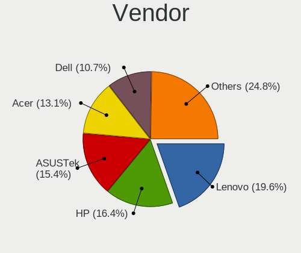
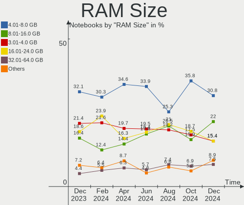
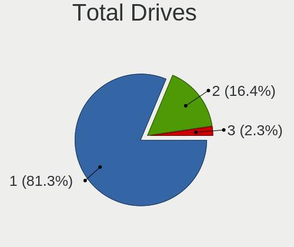
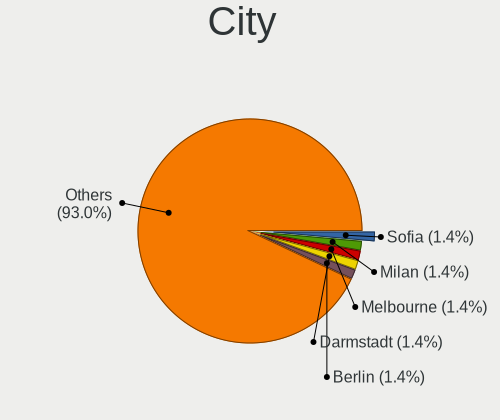
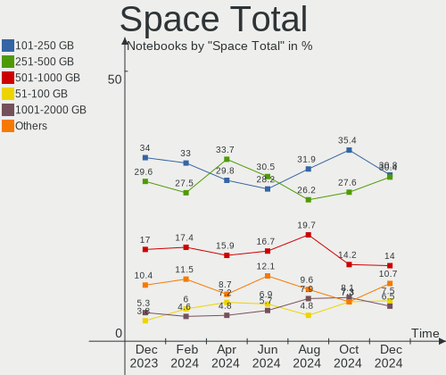
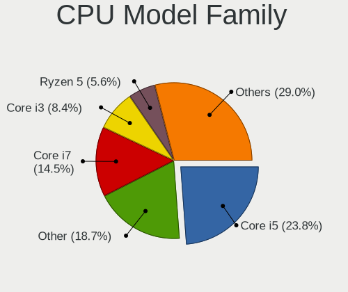
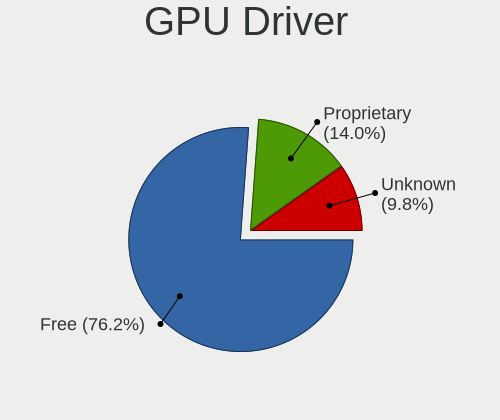
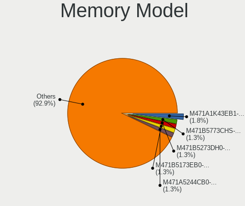

Linux Mint - Hardware Trends (Notebooks)
----------------------------------------

A project to identify most popular hardware characteristics and track their change
over time based on data collected by Linux users at https://Linux-Hardware.org.

Anyone can contribute to this report by the [hw-probe](https://github.com/linuxhw/hw-probe) tool:

    sudo -E hw-probe -all -upload

This report is for one last month. Overall report since the beginning of time: [TestDays](https://github.com/linuxhw/TestDays)

Period: Dec, 2023.

Contents
--------

* [ System ](#system)
  - [ OS                       ](#os)
  - [ OS Family                ](#os-family)
  - [ Kernel                   ](#kernel)
  - [ Kernel Family            ](#kernel-family)
  - [ Kernel Major Ver.        ](#kernel-major-ver)
  - [ Arch                     ](#arch)
  - [ DE                       ](#de)
  - [ Display Server           ](#display-server)
  - [ Display Manager          ](#display-manager)
  - [ OS Lang                  ](#os-lang)
  - [ Boot Mode                ](#boot-mode)
  - [ Filesystem               ](#filesystem)
  - [ Part. scheme             ](#part-scheme)
  - [ Dual Boot with Linux/BSD ](#dual-boot-with-linuxbsd)
  - [ Dual Boot (Win)          ](#dual-boot-win)

* [ Board ](#board)
  - [ Vendor                   ](#vendor)
  - [ Model                    ](#model)
  - [ Model Family             ](#model-family)
  - [ MFG Year                 ](#mfg-year)
  - [ Form Factor              ](#form-factor)
  - [ Secure Boot              ](#secure-boot)
  - [ Coreboot                 ](#coreboot)
  - [ RAM Size                 ](#ram-size)
  - [ RAM Used                 ](#ram-used)
  - [ Total Drives             ](#total-drives)
  - [ Has CD-ROM               ](#has-cd-rom)
  - [ Has Ethernet             ](#has-ethernet)
  - [ Has WiFi                 ](#has-wifi)
  - [ Has Bluetooth            ](#has-bluetooth)

* [ Location ](#location)
  - [ Country                  ](#country)
  - [ City                     ](#city)

* [ Drives ](#drives)
  - [ Drive Vendor             ](#drive-vendor)
  - [ Drive Model              ](#drive-model)
  - [ HDD Vendor               ](#hdd-vendor)
  - [ SSD Vendor               ](#ssd-vendor)
  - [ Drive Kind               ](#drive-kind)
  - [ Drive Connector          ](#drive-connector)
  - [ Drive Size               ](#drive-size)
  - [ Space Total              ](#space-total)
  - [ Space Used               ](#space-used)
  - [ Malfunc. Drives          ](#malfunc-drives)
  - [ Malfunc. Drive Vendor    ](#malfunc-drive-vendor)
  - [ Malfunc. HDD Vendor      ](#malfunc-hdd-vendor)
  - [ Malfunc. Drive Kind      ](#malfunc-drive-kind)
  - [ Failed Drives            ](#failed-drives)
  - [ Failed Drive Vendor      ](#failed-drive-vendor)
  - [ Drive Status             ](#drive-status)

* [ Storage controller ](#storage-controller)
  - [ Storage Vendor           ](#storage-vendor)
  - [ Storage Model            ](#storage-model)
  - [ Storage Kind             ](#storage-kind)

* [ Processor ](#processor)
  - [ CPU Vendor               ](#cpu-vendor)
  - [ CPU Model                ](#cpu-model)
  - [ CPU Model Family         ](#cpu-model-family)
  - [ CPU Cores                ](#cpu-cores)
  - [ CPU Sockets              ](#cpu-sockets)
  - [ CPU Threads              ](#cpu-threads)
  - [ CPU Op-Modes             ](#cpu-op-modes)
  - [ CPU Microcode            ](#cpu-microcode)
  - [ CPU Microarch            ](#cpu-microarch)

* [ Graphics ](#graphics)
  - [ GPU Vendor               ](#gpu-vendor)
  - [ GPU Model                ](#gpu-model)
  - [ GPU Combo                ](#gpu-combo)
  - [ GPU Driver               ](#gpu-driver)
  - [ GPU Memory               ](#gpu-memory)

* [ Monitor ](#monitor)
  - [ Monitor Vendor           ](#monitor-vendor)
  - [ Monitor Model            ](#monitor-model)
  - [ Monitor Resolution       ](#monitor-resolution)
  - [ Monitor Diagonal         ](#monitor-diagonal)
  - [ Monitor Width            ](#monitor-width)
  - [ Aspect Ratio             ](#aspect-ratio)
  - [ Monitor Area             ](#monitor-area)
  - [ Pixel Density            ](#pixel-density)
  - [ Multiple Monitors        ](#multiple-monitors)

* [ Network ](#network)
  - [ Net Controller Vendor    ](#net-controller-vendor)
  - [ Net Controller Model     ](#net-controller-model)
  - [ Wireless Vendor          ](#wireless-vendor)
  - [ Wireless Model           ](#wireless-model)
  - [ Ethernet Vendor          ](#ethernet-vendor)
  - [ Ethernet Model           ](#ethernet-model)
  - [ Net Controller Kind      ](#net-controller-kind)
  - [ Used Controller          ](#used-controller)
  - [ NICs                     ](#nics)
  - [ IPv6                     ](#ipv6)

* [ Bluetooth ](#bluetooth)
  - [ Bluetooth Vendor         ](#bluetooth-vendor)
  - [ Bluetooth Model          ](#bluetooth-model)

* [ Sound ](#sound)
  - [ Sound Vendor             ](#sound-vendor)
  - [ Sound Model              ](#sound-model)

* [ Memory ](#memory)
  - [ Memory Vendor            ](#memory-vendor)
  - [ Memory Model             ](#memory-model)
  - [ Memory Kind              ](#memory-kind)
  - [ Memory Form Factor       ](#memory-form-factor)
  - [ Memory Size              ](#memory-size)
  - [ Memory Speed             ](#memory-speed)

* [ Printers & scanners ](#printers--scanners)
  - [ Printer Vendor           ](#printer-vendor)
  - [ Printer Model            ](#printer-model)
  - [ Scanner Vendor           ](#scanner-vendor)
  - [ Scanner Model            ](#scanner-model)

* [ Camera ](#camera)
  - [ Camera Vendor            ](#camera-vendor)
  - [ Camera Model             ](#camera-model)

* [ Security ](#security)
  - [ Fingerprint Vendor       ](#fingerprint-vendor)
  - [ Fingerprint Model        ](#fingerprint-model)
  - [ Chipcard Vendor          ](#chipcard-vendor)
  - [ Chipcard Model           ](#chipcard-model)

* [ Unsupported ](#unsupported)
  - [ Unsupported Devices      ](#unsupported-devices)
  - [ Unsupported Device Types ](#unsupported-device-types)

System
------

OS
--

Installed operating systems

| Name            | Notebooks | Percent |
|-----------------|-----------|---------|
| Linux Mint 21.2 | 244       | 76.97%  |
| Linux Mint 20.3 | 22        | 6.94%   |
| Linux Mint 21.1 | 20        | 6.31%   |
| Linux Mint 21   | 12        | 3.79%   |
| Linux Mint 20.2 | 4         | 1.26%   |
| Linux Mint 19.3 | 4         | 1.26%   |
| Linux Mint 20.1 | 3         | 0.95%   |
| Linux Mint 21.3 | 2         | 0.63%   |
| Linux Mint 20   | 2         | 0.63%   |
| Linux Mint 19.1 | 2         | 0.63%   |
| Linux Mint 18.3 | 1         | 0.32%   |
| Linux Mint 18.2 | 1         | 0.32%   |

OS Family
---------

OS without a version

| Name       | Notebooks | Percent |
|------------|-----------|---------|
| Linux Mint | 317       | 100%    |

Kernel
------

Version of the Linux kernel

| Version                 | Notebooks | Percent |
|-------------------------|-----------|---------|
| 5.15.0-91-generic       | 122       | 38.49%  |
| 5.15.0-89-generic       | 56        | 17.67%  |
| 5.15.0-76-generic       | 25        | 7.89%   |
| 6.2.0-37-generic        | 16        | 5.05%   |
| 5.4.0-169-generic       | 16        | 5.05%   |
| 6.2.0-39-generic        | 14        | 4.42%   |
| 6.5.0-14-generic        | 8         | 2.52%   |
| 5.4.0-167-generic       | 6         | 1.89%   |
| 6.5.0-1009-oem          | 5         | 1.58%   |
| 5.15.0-88-generic       | 4         | 1.26%   |
| 5.4.0-150-generic       | 3         | 0.95%   |
| 6.2.0-36-generic        | 2         | 0.63%   |
| 6.1.0-1027-oem          | 2         | 0.63%   |
| 5.4.0-144-generic       | 2         | 0.63%   |
| 5.15.0-87-generic       | 2         | 0.63%   |
| 5.15.0-86-generic       | 2         | 0.63%   |
| 5.15.0-84-generic       | 2         | 0.63%   |
| 5.15.0-56-generic       | 2         | 0.63%   |
| 6.7.0-060700rc5-generic | 1         | 0.32%   |
| 6.7.0-060700rc4-generic | 1         | 0.32%   |
| 6.6.4-060604-generic    | 1         | 0.32%   |
| 6.6.0-chrultrabook      | 1         | 0.32%   |
| 6.5.0-1004-nvidia       | 1         | 0.32%   |
| 6.3.0-060300-generic    | 1         | 0.32%   |
| 6.2.9-060209-generic    | 1         | 0.32%   |
| 6.2.0-33-generic        | 1         | 0.32%   |
| 6.1.67-060167-generic   | 1         | 0.32%   |
| 6.1.0-1026-oem          | 1         | 0.32%   |
| 5.4.0-91-generic        | 1         | 0.32%   |
| 5.4.0-74-generic        | 1         | 0.32%   |
| 5.4.0-58-generic        | 1         | 0.32%   |
| 5.4.0-166-generic       | 1         | 0.32%   |
| 5.4.0-113-generic       | 1         | 0.32%   |
| 5.15.0-89-lowlatency    | 1         | 0.32%   |
| 5.15.0-83-generic       | 1         | 0.32%   |
| 5.15.0-72-generic       | 1         | 0.32%   |
| 5.15.0-70-generic       | 1         | 0.32%   |
| 5.15.0-69-generic       | 1         | 0.32%   |
| 5.15.0-60-generic       | 1         | 0.32%   |
| 5.15.0-41-generic       | 1         | 0.32%   |

Kernel Family
-------------

Linux kernel without a distro release

| Version | Notebooks | Percent |
|---------|-----------|---------|
| 5.15.0  | 224       | 70.66%  |
| 6.2.0   | 33        | 10.41%  |
| 5.4.0   | 32        | 10.09%  |
| 6.5.0   | 14        | 4.42%   |
| 6.1.0   | 3         | 0.95%   |
| 4.15.0  | 3         | 0.95%   |
| 6.7.0   | 2         | 0.63%   |
| 6.6.4   | 1         | 0.32%   |
| 6.6.0   | 1         | 0.32%   |
| 6.3.0   | 1         | 0.32%   |
| 6.2.9   | 1         | 0.32%   |
| 6.1.67  | 1         | 0.32%   |
| 4.8.0   | 1         | 0.32%   |

Kernel Major Ver.
-----------------

Linux kernel major version

| Version | Notebooks | Percent |
|---------|-----------|---------|
| 5.15    | 224       | 70.66%  |
| 6.2     | 34        | 10.73%  |
| 5.4     | 32        | 10.09%  |
| 6.5     | 14        | 4.42%   |
| 6.1     | 4         | 1.26%   |
| 4.15    | 3         | 0.95%   |
| 6.7     | 2         | 0.63%   |
| 6.6     | 2         | 0.63%   |
| 6.3     | 1         | 0.32%   |
| 4.8     | 1         | 0.32%   |

Arch
----

OS architecture (x86_64, i586, etc.)

| Name   | Notebooks | Percent |
|--------|-----------|---------|
| x86_64 | 317       | 100%    |

DE
--

Desktop Environment

| Name       | Notebooks | Percent |
|------------|-----------|---------|
| X-Cinnamon | 239       | 75.39%  |
| XFCE       | 39        | 12.3%   |
| MATE       | 26        | 8.2%    |
| Cinnamon   | 6         | 1.89%   |
| GNOME      | 4         | 1.26%   |
| Unknown    | 2         | 0.63%   |
| Jwm        | 1         | 0.32%   |

Display Server
--------------

X11 or Wayland

| Name    | Notebooks | Percent |
|---------|-----------|---------|
| X11     | 315       | 99.37%  |
| Wayland | 1         | 0.32%   |
| Tty     | 1         | 0.32%   |

Display Manager
---------------

SDDM, LightDM, etc.

| Name    | Notebooks | Percent |
|---------|-----------|---------|
| Unknown | 173       | 54.57%  |
| LightDM | 141       | 44.48%  |
| SDDM    | 1         | 0.32%   |
| LXDM    | 1         | 0.32%   |
| GDM3    | 1         | 0.32%   |

OS Lang
-------

Language

| Lang    | Notebooks | Percent |
|---------|-----------|---------|
| en_US   | 100       | 31.55%  |
| de_DE   | 54        | 17.03%  |
| pt_BR   | 13        | 4.1%    |
| it_IT   | 13        | 4.1%    |
| fr_FR   | 13        | 4.1%    |
| pl_PL   | 11        | 3.47%   |
| ru_RU   | 10        | 3.15%   |
| en_GB   | 9         | 2.84%   |
| en_CA   | 9         | 2.84%   |
| es_ES   | 8         | 2.52%   |
| C       | 8         | 2.52%   |
| es_MX   | 6         | 1.89%   |
| pt_PT   | 5         | 1.58%   |
| en_AU   | 5         | 1.58%   |
| de_AT   | 5         | 1.58%   |
| tr_TR   | 4         | 1.26%   |
| ja_JP   | 4         | 1.26%   |
| fr_CA   | 4         | 1.26%   |
| nl_NL   | 3         | 0.95%   |
| es_UY   | 3         | 0.95%   |
| en_IN   | 3         | 0.95%   |
| de_CH   | 3         | 0.95%   |
| sk_SK   | 2         | 0.63%   |
| fr_BE   | 2         | 0.63%   |
| en_NZ   | 2         | 0.63%   |
| en_IE   | 2         | 0.63%   |
| Unknown | 2         | 0.63%   |
| sv_SE   | 1         | 0.32%   |
| ru_UA   | 1         | 0.32%   |
| it_CH   | 1         | 0.32%   |
| hu_HU   | 1         | 0.32%   |
| es_CO   | 1         | 0.32%   |
| es_CL   | 1         | 0.32%   |
| es_AR   | 1         | 0.32%   |
| en_ZA   | 1         | 0.32%   |
| en_PH   | 1         | 0.32%   |
| en_IL   | 1         | 0.32%   |
| en_DK   | 1         | 0.32%   |
| de_LU   | 1         | 0.32%   |
| de_IT   | 1         | 0.32%   |

Boot Mode
---------

EFI or BIOS

| Mode | Notebooks | Percent |
|------|-----------|---------|
| EFI  | 222       | 70.03%  |
| BIOS | 95        | 29.97%  |

Filesystem
----------

Type of filesystem

| Type    | Notebooks | Percent |
|---------|-----------|---------|
| Ext4    | 287       | 90.54%  |
| Tmpfs   | 10        | 3.15%   |
| Overlay | 9         | 2.84%   |
| Zfs     | 5         | 1.58%   |
| Btrfs   | 5         | 1.58%   |
| Ext2    | 1         | 0.32%   |

Part. scheme
------------

Scheme of partitioning

| Type    | Notebooks | Percent |
|---------|-----------|---------|
| Unknown | 171       | 53.94%  |
| GPT     | 131       | 41.32%  |
| MBR     | 15        | 4.73%   |

Dual Boot with Linux/BSD
------------------------

Hosting more than one Linux/BSD

| Dual boot | Notebooks | Percent |
|-----------|-----------|---------|
| No        | 296       | 93.38%  |
| Yes       | 21        | 6.62%   |

Dual Boot (Win)
---------------

Hosting Linux and Windows

| Dual boot | Notebooks | Percent |
|-----------|-----------|---------|
| No        | 257       | 81.07%  |
| Yes       | 60        | 18.93%  |

Board
-----

Vendor
------

Motherboard manufacturer

| Name                 | Notebooks | Percent |
|----------------------|-----------|---------|
| Lenovo               | 57        | 17.98%  |
| Hewlett-Packard      | 57        | 17.98%  |
| Dell                 | 44        | 13.88%  |
| Acer                 | 32        | 10.09%  |
| ASUSTek Computer     | 31        | 9.78%   |
| Toshiba              | 16        | 5.05%   |
| Apple                | 12        | 3.79%   |
| MSI                  | 9         | 2.84%   |
| Samsung Electronics  | 7         | 2.21%   |
| Medion               | 6         | 1.89%   |
| Unknown              | 6         | 1.89%   |
| Fujitsu              | 4         | 1.26%   |
| HUAWEI               | 3         | 0.95%   |
| Google               | 3         | 0.95%   |
| Sony                 | 2         | 0.63%   |
| Positivo             | 2         | 0.63%   |
| Packard Bell         | 2         | 0.63%   |
| LG Electronics       | 2         | 0.63%   |
| Fujitsu Siemens      | 2         | 0.63%   |
| Wortmann AG          | 1         | 0.32%   |
| TUXEDO               | 1         | 0.32%   |
| Timi                 | 1         | 0.32%   |
| TECNO Mobile Limited | 1         | 0.32%   |
| Tactus               | 1         | 0.32%   |
| Standard             | 1         | 0.32%   |
| Schenker             | 1         | 0.32%   |
| Polaroid             | 1         | 0.32%   |
| PC Specialist        | 1         | 0.32%   |
| Panasonic            | 1         | 0.32%   |
| NEC Computers        | 1         | 0.32%   |
| Microtech            | 1         | 0.32%   |
| Inter Sales A/S      | 1         | 0.32%   |
| GPU Company          | 1         | 0.32%   |
| GIADA                | 1         | 0.32%   |
| Framework            | 1         | 0.32%   |
| Chuwi                | 1         | 0.32%   |
| Casper               | 1         | 0.32%   |
| BOSGAME              | 1         | 0.32%   |
| Alienware            | 1         | 0.32%   |

Model
-----

Motherboard model

| Name                                     | Notebooks | Percent |
|------------------------------------------|-----------|---------|
| Unknown                                  | 9         | 2.84%   |
| Dell Latitude E6440                      | 5         | 1.58%   |
| Dell Latitude E6410                      | 3         | 0.95%   |
| Lenovo IdeaPad 3 15IIL05 81WE            | 2         | 0.63%   |
| Lenovo G50-80 80E5                       | 2         | 0.63%   |
| HUAWEI NBLB-WAX9N                        | 2         | 0.63%   |
| HP Pavilion dv6                          | 2         | 0.63%   |
| HP Pavilion 17                           | 2         | 0.63%   |
| HP Notebook                              | 2         | 0.63%   |
| HP Laptop 15-bs0xx                       | 2         | 0.63%   |
| HP EliteBook 840 G3                      | 2         | 0.63%   |
| HP 255 G7 Notebook PC                    | 2         | 0.63%   |
| Dell Vostro 3525                         | 2         | 0.63%   |
| Dell Latitude E6540                      | 2         | 0.63%   |
| Dell Latitude E6530                      | 2         | 0.63%   |
| Dell Latitude E6400                      | 2         | 0.63%   |
| Dell Latitude 7490                       | 2         | 0.63%   |
| ASUS VivoBook_ASUSLaptop M1603QA_M1603QA | 2         | 0.63%   |
| Apple MacBookAir7,2                      | 2         | 0.63%   |
| Apple MacBookAir6,2                      | 2         | 0.63%   |
| Wortmann AG 1220657_1470295              | 1         | 0.32%   |
| TUXEDO U931                              | 1         | 0.32%   |
| Toshiba Satellite S50D-A                 | 1         | 0.32%   |
| Toshiba Satellite Pro L850-1L2           | 1         | 0.32%   |
| Toshiba Satellite Pro C50-A-1C8          | 1         | 0.32%   |
| Toshiba Satellite P55-B                  | 1         | 0.32%   |
| Toshiba Satellite L70-A                  | 1         | 0.32%   |
| Toshiba Satellite L650D                  | 1         | 0.32%   |
| Toshiba Satellite L305                   | 1         | 0.32%   |
| Toshiba Satellite L15-B                  | 1         | 0.32%   |
| Toshiba Satellite C870D-116              | 1         | 0.32%   |
| Toshiba Satellite C660D                  | 1         | 0.32%   |
| Toshiba Satellite C55D-C                 | 1         | 0.32%   |
| Toshiba Satellite C50D-C                 | 1         | 0.32%   |
| Toshiba Satellite A660                   | 1         | 0.32%   |
| Toshiba Satellite A215                   | 1         | 0.32%   |
| Toshiba PORTEGE Z930                     | 1         | 0.32%   |
| Toshiba PORTEGE Z20t-C                   | 1         | 0.32%   |
| Timi TM1701                              | 1         | 0.32%   |
| TECNO Mobile Limited MEGABOOK T15DA      | 1         | 0.32%   |

Model Family
------------

Motherboard model prefix

| Name                          | Notebooks | Percent |
|-------------------------------|-----------|---------|
| Lenovo ThinkPad               | 29        | 9.15%   |
| Dell Latitude                 | 26        | 8.2%    |
| Acer Aspire                   | 24        | 7.57%   |
| Toshiba Satellite             | 14        | 4.42%   |
| Lenovo IdeaPad                | 14        | 4.42%   |
| HP Laptop                     | 10        | 3.15%   |
| ASUS VivoBook                 | 10        | 3.15%   |
| HP EliteBook                  | 9         | 2.84%   |
| Unknown                       | 9         | 2.84%   |
| HP Pavilion                   | 8         | 2.52%   |
| Dell Inspiron                 | 7         | 2.21%   |
| Dell Precision                | 5         | 1.58%   |
| HP Victus                     | 4         | 1.26%   |
| Fujitsu LIFEBOOK              | 4         | 1.26%   |
| HP ProBook                    | 3         | 0.95%   |
| HP Compaq                     | 3         | 0.95%   |
| Dell Vostro                   | 3         | 0.95%   |
| ASUS ZenBook                  | 3         | 0.95%   |
| Acer Nitro                    | 3         | 0.95%   |
| Toshiba PORTEGE               | 2         | 0.63%   |
| Packard Bell EasyNote         | 2         | 0.63%   |
| Lenovo V15                    | 2         | 0.63%   |
| Lenovo G50-80                 | 2         | 0.63%   |
| Lenovo B590                   | 2         | 0.63%   |
| HUAWEI NBLB-WAX9N             | 2         | 0.63%   |
| HP ZBook                      | 2         | 0.63%   |
| HP Presario                   | 2         | 0.63%   |
| HP Notebook                   | 2         | 0.63%   |
| HP ENVY                       | 2         | 0.63%   |
| HP 255                        | 2         | 0.63%   |
| Fujitsu Siemens LIFEBOOK      | 2         | 0.63%   |
| ASUS ASUS                     | 2         | 0.63%   |
| Apple MacBookAir7             | 2         | 0.63%   |
| Apple MacBookAir6             | 2         | 0.63%   |
| Acer Predator                 | 2         | 0.63%   |
| Acer Extensa                  | 2         | 0.63%   |
| Wortmann AG 1220657           | 1         | 0.32%   |
| TUXEDO U931                   | 1         | 0.32%   |
| Timi TM1701                   | 1         | 0.32%   |
| TECNO Mobile Limited MEGABOOK | 1         | 0.32%   |

MFG Year
--------

Motherboard manufacture year

| Year | Notebooks | Percent |
|------|-----------|---------|
| 2013 | 31        | 9.78%   |
| 2020 | 27        | 8.52%   |
| 2021 | 26        | 8.2%    |
| 2011 | 26        | 8.2%    |
| 2023 | 23        | 7.26%   |
| 2018 | 22        | 6.94%   |
| 2012 | 20        | 6.31%   |
| 2017 | 19        | 5.99%   |
| 2015 | 18        | 5.68%   |
| 2010 | 18        | 5.68%   |
| 2022 | 15        | 4.73%   |
| 2019 | 15        | 4.73%   |
| 2016 | 15        | 4.73%   |
| 2014 | 14        | 4.42%   |
| 2008 | 13        | 4.1%    |
| 2009 | 8         | 2.52%   |
| 2007 | 6         | 1.89%   |
| 2006 | 1         | 0.32%   |

Form Factor
-----------

Physical design of the computer

| Name     | Notebooks | Percent |
|----------|-----------|---------|
| Notebook | 317       | 100%    |

Secure Boot
-----------

Enabled or disabled

| State    | Notebooks | Percent |
|----------|-----------|---------|
| Disabled | 289       | 91.17%  |
| Enabled  | 28        | 8.83%   |

Coreboot
--------

Have coreboot on board

| Used | Notebooks | Percent |
|------|-----------|---------|
| No   | 314       | 99.05%  |
| Yes  | 3         | 0.95%   |

RAM Size
--------

Total RAM memory

| Size in GB  | Notebooks | Percent |
|-------------|-----------|---------|
| 4.01-8.0    | 102       | 32.18%  |
| 3.01-4.0    | 68        | 21.45%  |
| 16.01-24.0  | 58        | 18.3%   |
| 8.01-16.0   | 52        | 16.4%   |
| 32.01-64.0  | 14        | 4.42%   |
| 1.01-2.0    | 10        | 3.15%   |
| 24.01-32.0  | 5         | 1.58%   |
| 2.01-3.0    | 4         | 1.26%   |
| 64.01-256.0 | 4         | 1.26%   |

RAM Used
--------

Used RAM memory

| Used GB   | Notebooks | Percent |
|-----------|-----------|---------|
| 1.01-2.0  | 122       | 38.49%  |
| 2.01-3.0  | 99        | 31.23%  |
| 4.01-8.0  | 43        | 13.56%  |
| 3.01-4.0  | 31        | 9.78%   |
| 0.51-1.0  | 11        | 3.47%   |
| 8.01-16.0 | 10        | 3.15%   |
| 0.01-0.5  | 1         | 0.32%   |

Total Drives
------------

Number of drives on board

| Drives | Notebooks | Percent |
|--------|-----------|---------|
| 1      | 247       | 77.92%  |
| 2      | 62        | 19.56%  |
| 3      | 7         | 2.21%   |
| 0      | 1         | 0.32%   |

Has CD-ROM
----------

Has CD-ROM on board

| Presented | Notebooks | Percent |
|-----------|-----------|---------|
| No        | 182       | 57.41%  |
| Yes       | 135       | 42.59%  |

Has Ethernet
------------

Has Ethernet on board

| Presented | Notebooks | Percent |
|-----------|-----------|---------|
| Yes       | 254       | 80.13%  |
| No        | 63        | 19.87%  |

Has WiFi
--------

Has WiFi module

| Presented | Notebooks | Percent |
|-----------|-----------|---------|
| Yes       | 313       | 98.74%  |
| No        | 4         | 1.26%   |

Has Bluetooth
-------------

Has Bluetooth module

| Presented | Notebooks | Percent |
|-----------|-----------|---------|
| Yes       | 245       | 77.29%  |
| No        | 72        | 22.71%  |

Location
--------

Country
-------

Geographic location (country)

| Country      | Notebooks | Percent |
|--------------|-----------|---------|
| Germany      | 63        | 19.87%  |
| USA          | 53        | 16.72%  |
| Italy        | 17        | 5.36%   |
| Brazil       | 16        | 5.05%   |
| France       | 15        | 4.73%   |
| Poland       | 14        | 4.42%   |
| Canada       | 13        | 4.1%    |
| Russia       | 9         | 2.84%   |
| Austria      | 9         | 2.84%   |
| UK           | 8         | 2.52%   |
| Switzerland  | 8         | 2.52%   |
| Spain        | 8         | 2.52%   |
| Mexico       | 7         | 2.21%   |
| Portugal     | 5         | 1.58%   |
| Netherlands  | 5         | 1.58%   |
| Australia    | 5         | 1.58%   |
| Turkey       | 4         | 1.26%   |
| Romania      | 4         | 1.26%   |
| Japan        | 4         | 1.26%   |
| Sweden       | 3         | 0.95%   |
| Slovakia     | 3         | 0.95%   |
| Indonesia    | 3         | 0.95%   |
| India        | 3         | 0.95%   |
| Uruguay      | 2         | 0.63%   |
| New Zealand  | 2         | 0.63%   |
| Malaysia     | 2         | 0.63%   |
| Ireland      | 2         | 0.63%   |
| Hungary      | 2         | 0.63%   |
| Egypt        | 2         | 0.63%   |
| Chile        | 2         | 0.63%   |
| Belgium      | 2         | 0.63%   |
| Ukraine      | 1         | 0.32%   |
| Türkiye     | 1         | 0.32%   |
| Tunisia      | 1         | 0.32%   |
| Taiwan       | 1         | 0.32%   |
| South Africa | 1         | 0.32%   |
| Serbia       | 1         | 0.32%   |
| Saudi Arabia | 1         | 0.32%   |
| Puerto Rico  | 1         | 0.32%   |
| Philippines  | 1         | 0.32%   |

City
----

Geographic location (city)

| City             | Notebooks | Percent |
|------------------|-----------|---------|
| Vienna           | 5         | 1.58%   |
| Berlin           | 5         | 1.58%   |
| Warsaw           | 4         | 1.26%   |
| Sao Paulo        | 4         | 1.26%   |
| Dresden          | 4         | 1.26%   |
| Zurich           | 3         | 0.95%   |
| Toronto          | 3         | 0.95%   |
| Milan            | 3         | 0.95%   |
| Mexico City      | 3         | 0.95%   |
| Istanbul         | 3         | 0.95%   |
| Cologne          | 3         | 0.95%   |
| Zaragoza         | 2         | 0.63%   |
| Venice           | 2         | 0.63%   |
| Sydney           | 2         | 0.63%   |
| San Francisco    | 2         | 0.63%   |
| Rho              | 2         | 0.63%   |
| Poznan           | 2         | 0.63%   |
| Peterborough     | 2         | 0.63%   |
| Paris            | 2         | 0.63%   |
| Ocala            | 2         | 0.63%   |
| Nuremberg        | 2         | 0.63%   |
| Moscow           | 2         | 0.63%   |
| Montreal         | 2         | 0.63%   |
| Montevideo       | 2         | 0.63%   |
| Mönchengladbach | 2         | 0.63%   |
| Melbourne        | 2         | 0.63%   |
| Madrid           | 2         | 0.63%   |
| Linz             | 2         | 0.63%   |
| Košice          | 2         | 0.63%   |
| Houston          | 2         | 0.63%   |
| Hanover          | 2         | 0.63%   |
| Erfurt           | 2         | 0.63%   |
| Dublin           | 2         | 0.63%   |
| Budapest         | 2         | 0.63%   |
| Bucharest        | 2         | 0.63%   |
| Bern             | 2         | 0.63%   |
| Augsburg         | 2         | 0.63%   |
| Almada           | 2         | 0.63%   |
| Zapopan          | 1         | 0.32%   |
| Zabrze           | 1         | 0.32%   |

Drives
------

Drive Vendor
------------

Hard drive vendors

| Vendor                      | Notebooks | Drives | Percent |
|-----------------------------|-----------|--------|---------|
| Samsung Electronics         | 60        | 60     | 16.22%  |
| SanDisk                     | 35        | 39     | 9.46%   |
| WDC                         | 31        | 31     | 8.38%   |
| Toshiba                     | 30        | 33     | 8.11%   |
| Seagate                     | 28        | 29     | 7.57%   |
| Crucial                     | 22        | 23     | 5.95%   |
| Unknown                     | 19        | 25     | 5.14%   |
| Kingston                    | 18        | 18     | 4.86%   |
| Micron Technology           | 13        | 13     | 3.51%   |
| Apple                       | 9         | 9      | 2.43%   |
| Intel                       | 8         | 8      | 2.16%   |
| China                       | 8         | 8      | 2.16%   |
| Hitachi                     | 7         | 7      | 1.89%   |
| KIOXIA                      | 6         | 6      | 1.62%   |
| SK hynix                    | 5         | 5      | 1.35%   |
| Intenso                     | 5         | 5      | 1.35%   |
| HGST                        | 5         | 5      | 1.35%   |
| SPCC                        | 4         | 4      | 1.08%   |
| A-DATA Technology           | 4         | 4      | 1.08%   |
| Micron/Crucial Technology   | 3         | 4      | 0.81%   |
| Kingston Technology Company | 3         | 3      | 0.81%   |
| Fujitsu                     | 3         | 3      | 0.81%   |
| UMIS                        | 2         | 2      | 0.54%   |
| Transcend                   | 2         | 2      | 0.54%   |
| SABRENT                     | 2         | 2      | 0.54%   |
| Phison                      | 2         | 2      | 0.54%   |
| LITEON                      | 2         | 2      | 0.54%   |
| JetFlash                    | 2         | 2      | 0.54%   |
| Unknown                     | 2         | 2      | 0.54%   |
| Vaseky                      | 1         | 1      | 0.27%   |
| USB3.0                      | 1         | 1      | 0.27%   |
| tecmiyo                     | 1         | 1      | 0.27%   |
| Team                        | 1         | 1      | 0.27%   |
| Silicon Motion              | 1         | 1      | 0.27%   |
| ShiJi                       | 1         | 1      | 0.27%   |
| RX7                         | 1         | 1      | 0.27%   |
| Realtek Semiconductor       | 1         | 1      | 0.27%   |
| PNY                         | 1         | 1      | 0.27%   |
| Patriot                     | 1         | 1      | 0.27%   |
| Netac                       | 1         | 1      | 0.27%   |

Drive Model
-----------

Hard drive models

| Model                                               | Notebooks | Percent |
|-----------------------------------------------------|-----------|---------|
| Unknown MMC Card  64GB                              | 5         | 1.31%   |
| Toshiba MQ01ABF050 500GB                            | 5         | 1.31%   |
| Toshiba MQ01ABD100 1TB                              | 5         | 1.31%   |
| Seagate ST500LT012-1DG142 500GB                     | 5         | 1.31%   |
| Samsung NVMe SSD Controller SM981/PM981/PM983 512GB | 5         | 1.31%   |
| Unknown MMC Card  32GB                              | 4         | 1.04%   |
| Seagate ST1000LM024 HN-M101MBB 1TB                  | 4         | 1.04%   |
| Sandisk WD Blue SN550 NVMe SSD 1TB                  | 4         | 1.04%   |
| SanDisk SSD PLUS 480GB                              | 4         | 1.04%   |
| Samsung SSD 850 EVO 500GB                           | 4         | 1.04%   |
| Kingston SA400S37240G 240GB SSD                     | 4         | 1.04%   |
| Intel SSDPEKNU512GZ 512GB                           | 4         | 1.04%   |
| Crucial CT1000MX500SSD1 1TB                         | 4         | 1.04%   |
| Toshiba MQ01ACF050 500GB                            | 3         | 0.78%   |
| Seagate ST2000LM003 HN-M201RAD 2TB                  | 3         | 0.78%   |
| Hitachi HTS545025B9A300 250GB                       | 3         | 0.78%   |
| HGST HTS721010A9E630 1TB                            | 3         | 0.78%   |
| Crucial CT500MX500SSD1 500GB                        | 3         | 0.78%   |
| WDC WDS500G2B0A-00SM50 500GB SSD                    | 2         | 0.52%   |
| WDC WD10JPVX-22JC3T0 1TB                            | 2         | 0.52%   |
| Unknown SLD64G  64GB                                | 2         | 0.52%   |
| Toshiba XG4 NVMe SSD Controller 256GB               | 2         | 0.52%   |
| Toshiba MQ04ABF100 1TB                              | 2         | 0.52%   |
| Seagate ST9750420AS 752GB                           | 2         | 0.52%   |
| Seagate ST9500325AS 500GB                           | 2         | 0.52%   |
| Seagate ST1000LM035-1RK172 1TB                      | 2         | 0.52%   |
| Sandisk WD_BLACK SN770 500GB                        | 2         | 0.52%   |
| Sandisk WD Blue SN570 1TB                           | 2         | 0.52%   |
| Sandisk WD Black 2018/SN750 / PC SN720 NVMe SSD 1TB | 2         | 0.52%   |
| SanDisk NVMe SSD Drive 512GB                        | 2         | 0.52%   |
| SanDisk Extreme 55AE 1TB SSD                        | 2         | 0.52%   |
| Samsung SSD 980 1TB                                 | 2         | 0.52%   |
| Samsung SSD 860 QVO 1TB                             | 2         | 0.52%   |
| Samsung SSD 860 EVO 250GB                           | 2         | 0.52%   |
| Samsung SSD 850 EVO 250GB                           | 2         | 0.52%   |
| Samsung SSD 840 EVO 250GB                           | 2         | 0.52%   |
| Samsung MZVLB512HAJQ-000L7 512GB                    | 2         | 0.52%   |
| Samsung MZNTY256HDHP-00000 256GB SSD                | 2         | 0.52%   |
| Samsung HM321HI 320GB                               | 2         | 0.52%   |
| Micron/Crucial P2 NVMe PCIe SSD 4TB                 | 2         | 0.52%   |

HDD Vendor
----------

Hard disk drive vendors

| Vendor              | Notebooks | Drives | Percent |
|---------------------|-----------|--------|---------|
| Seagate             | 27        | 28     | 28.42%  |
| WDC                 | 21        | 21     | 22.11%  |
| Toshiba             | 21        | 21     | 22.11%  |
| Hitachi             | 7         | 7      | 7.37%   |
| Samsung Electronics | 5         | 5      | 5.26%   |
| HGST                | 5         | 5      | 5.26%   |
| Fujitsu             | 3         | 3      | 3.16%   |
| SABRENT             | 2         | 2      | 2.11%   |
| USB3.0              | 1         | 1      | 1.05%   |
| LaCie               | 1         | 1      | 1.05%   |
| Apricorn            | 1         | 1      | 1.05%   |
| Apple               | 1         | 1      | 1.05%   |

SSD Vendor
----------

Solid state drive vendors

| Vendor              | Notebooks | Drives | Percent |
|---------------------|-----------|--------|---------|
| Samsung Electronics | 27        | 27     | 18.24%  |
| Crucial             | 22        | 22     | 14.86%  |
| SanDisk             | 17        | 19     | 11.49%  |
| Kingston            | 16        | 16     | 10.81%  |
| China               | 8         | 8      | 5.41%   |
| Toshiba             | 6         | 6      | 4.05%   |
| Apple               | 6         | 6      | 4.05%   |
| WDC                 | 5         | 5      | 3.38%   |
| SPCC                | 4         | 4      | 2.7%    |
| Micron Technology   | 4         | 4      | 2.7%    |
| Intenso             | 4         | 4      | 2.7%    |
| A-DATA Technology   | 3         | 3      | 2.03%   |
| Transcend           | 2         | 2      | 1.35%   |
| SK hynix            | 2         | 2      | 1.35%   |
| LITEON              | 2         | 2      | 1.35%   |
| Vaseky              | 1         | 1      | 0.68%   |
| tecmiyo             | 1         | 1      | 0.68%   |
| Team                | 1         | 1      | 0.68%   |
| Seagate             | 1         | 1      | 0.68%   |
| RX7                 | 1         | 1      | 0.68%   |
| PNY                 | 1         | 1      | 0.68%   |
| Phison              | 1         | 1      | 0.68%   |
| Netac               | 1         | 1      | 0.68%   |
| Lexar               | 1         | 1      | 0.68%   |
| Intel               | 1         | 1      | 0.68%   |
| GOODRAM             | 1         | 1      | 0.68%   |
| GOFATOO             | 1         | 1      | 0.68%   |
| Fanxiang            | 1         | 1      | 0.68%   |
| DST                 | 1         | 1      | 0.68%   |
| Dogfish             | 1         | 1      | 0.68%   |
| BIWIN               | 1         | 1      | 0.68%   |
| Aura                | 1         | 1      | 0.68%   |
| ASMedia             | 1         | 1      | 0.68%   |
| Apacer              | 1         | 1      | 0.68%   |
| Unknown             | 1         | 1      | 0.68%   |

Drive Kind
----------

HDD or SSD

| Kind    | Notebooks | Drives | Percent |
|---------|-----------|--------|---------|
| SSD     | 141       | 150    | 38.95%  |
| NVMe    | 103       | 108    | 28.45%  |
| HDD     | 91        | 96     | 25.14%  |
| MMC     | 20        | 26     | 5.52%   |
| Unknown | 7         | 7      | 1.93%   |

Drive Connector
---------------

SATA, SAS, NVMe, etc.

| Type | Notebooks | Drives | Percent |
|------|-----------|--------|---------|
| SATA | 217       | 238    | 61.47%  |
| NVMe | 103       | 108    | 29.18%  |
| MMC  | 20        | 26     | 5.67%   |
| SAS  | 13        | 15     | 3.68%   |

Drive Size
----------

Size of hard drive

| Size in TB | Notebooks | Drives | Percent |
|------------|-----------|--------|---------|
| 0.01-0.5   | 152       | 159    | 64.68%  |
| 0.51-1.0   | 66        | 69     | 28.09%  |
| 1.01-2.0   | 15        | 16     | 6.38%   |
| 3.01-4.0   | 1         | 1      | 0.43%   |
| 4.01-10.0  | 1         | 1      | 0.43%   |

Space Total
-----------

Amount of disk space available on the file system

| Size in GB     | Notebooks | Percent |
|----------------|-----------|---------|
| 101-250        | 108       | 34.07%  |
| 251-500        | 93        | 29.34%  |
| 501-1000       | 53        | 16.72%  |
| 1001-2000      | 17        | 5.36%   |
| 51-100         | 12        | 3.79%   |
| 1-20           | 10        | 3.15%   |
| 2001-3000      | 8         | 2.52%   |
| 21-50          | 7         | 2.21%   |
| More than 3000 | 6         | 1.89%   |
| Unknown        | 3         | 0.95%   |

Space Used
----------

Amount of used disk space

| Used GB   | Notebooks | Percent |
|-----------|-----------|---------|
| 21-50     | 70        | 22.08%  |
| 101-250   | 67        | 21.14%  |
| 1-20      | 66        | 20.82%  |
| 51-100    | 62        | 19.56%  |
| 251-500   | 28        | 8.83%   |
| 501-1000  | 14        | 4.42%   |
| 1001-2000 | 5         | 1.58%   |
| Unknown   | 3         | 0.95%   |
| 2001-3000 | 2         | 0.63%   |

Malfunc. Drives
---------------

Drive models with a malfunction

| Model                                        | Notebooks | Drives | Percent |
|----------------------------------------------|-----------|--------|---------|
| Toshiba MQ01ABF050 500GB                     | 1         | 1      | 6.67%   |
| Seagate ST940210AS 40GB                      | 1         | 1      | 6.67%   |
| Seagate ST500LT012-1DG142 500GB              | 1         | 1      | 6.67%   |
| Seagate ST500LM021-1KJ152 500GB              | 1         | 1      | 6.67%   |
| Seagate ST2000LM003 HN-M201RAD 2TB           | 1         | 1      | 6.67%   |
| Seagate ST1000LM024 HN-M101MBB 1TB           | 1         | 1      | 6.67%   |
| SanDisk SSD P4 64GB                          | 1         | 1      | 6.67%   |
| Samsung Electronics MZVPV256HDGL-00000 256GB | 1         | 1      | 6.67%   |
| Samsung Electronics HM321HI 320GB            | 1         | 1      | 6.67%   |
| Kingston SA400S37240G 240GB SSD              | 1         | 1      | 6.67%   |
| Intel SSDSC2BF180A5H REF 180GB               | 1         | 1      | 6.67%   |
| Fujitsu MHV2080AH 80GB                       | 1         | 1      | 6.67%   |
| China SSD 128GB                              | 1         | 1      | 6.67%   |
| Aura Pro S MC258 1TB SSD                     | 1         | 1      | 6.67%   |
| A-DATA Technology LEGEND 710 1TB             | 1         | 1      | 6.67%   |

Malfunc. Drive Vendor
---------------------

Vendors of faulty drives

| Vendor              | Notebooks | Drives | Percent |
|---------------------|-----------|--------|---------|
| Seagate             | 5         | 5      | 33.33%  |
| Samsung Electronics | 2         | 2      | 13.33%  |
| Toshiba             | 1         | 1      | 6.67%   |
| SanDisk             | 1         | 1      | 6.67%   |
| Kingston            | 1         | 1      | 6.67%   |
| Intel               | 1         | 1      | 6.67%   |
| Fujitsu             | 1         | 1      | 6.67%   |
| China               | 1         | 1      | 6.67%   |
| Aura                | 1         | 1      | 6.67%   |
| A-DATA Technology   | 1         | 1      | 6.67%   |

Malfunc. HDD Vendor
-------------------

Vendors of faulty HDD drives

| Vendor              | Notebooks | Drives | Percent |
|---------------------|-----------|--------|---------|
| Seagate             | 5         | 5      | 62.5%   |
| Toshiba             | 1         | 1      | 12.5%   |
| Samsung Electronics | 1         | 1      | 12.5%   |
| Fujitsu             | 1         | 1      | 12.5%   |

Malfunc. Drive Kind
-------------------

Kinds of faulty drives

| Kind | Notebooks | Drives | Percent |
|------|-----------|--------|---------|
| HDD  | 8         | 8      | 53.33%  |
| SSD  | 5         | 5      | 33.33%  |
| NVMe | 2         | 2      | 13.33%  |

Failed Drives
-------------

Failed drive models

| Model                             | Notebooks | Drives | Percent |
|-----------------------------------|-----------|--------|---------|
| Samsung Electronics HM160HC 160GB | 1         | 1      | 50%     |
| JMicron Technology Tech 250GB     | 1         | 1      | 50%     |

Failed Drive Vendor
-------------------

Failed drive vendors

| Vendor              | Notebooks | Drives | Percent |
|---------------------|-----------|--------|---------|
| Samsung Electronics | 1         | 1      | 50%     |
| JMicron Technology  | 1         | 1      | 50%     |

Drive Status
------------

Number of failed and malfunc. drives

| Status   | Notebooks | Drives | Percent |
|----------|-----------|--------|---------|
| Detected | 194       | 239    | 59.69%  |
| Works    | 114       | 131    | 35.08%  |
| Malfunc  | 15        | 15     | 4.62%   |
| Failed   | 2         | 2      | 0.62%   |

Storage controller
------------------

Storage Vendor
--------------

Storage controller vendors

| Vendor                       | Notebooks | Percent |
|------------------------------|-----------|---------|
| Intel                        | 221       | 60.55%  |
| AMD                          | 37        | 10.14%  |
| Samsung Electronics          | 30        | 8.22%   |
| SanDisk                      | 23        | 6.3%    |
| Micron Technology            | 9         | 2.47%   |
| KIOXIA                       | 7         | 1.92%   |
| Toshiba America Info Systems | 5         | 1.37%   |
| Kingston Technology Company  | 5         | 1.37%   |
| Nvidia                       | 4         | 1.1%    |
| Micron/Crucial Technology    | 4         | 1.1%    |
| SK hynix                     | 3         | 0.82%   |
| Marvell Technology Group     | 3         | 0.82%   |
| Union Memory (Shenzhen)      | 2         | 0.55%   |
| Silicon Motion               | 2         | 0.55%   |
| Phison Electronics           | 2         | 0.55%   |
| Apple                        | 2         | 0.55%   |
| ADATA Technology             | 2         | 0.55%   |
| Shenzhen Longsys Electronics | 1         | 0.27%   |
| Realtek Semiconductor        | 1         | 0.27%   |
| MAXIO Technology (Hangzhou)  | 1         | 0.27%   |
| ASMedia Technology           | 1         | 0.27%   |

Storage Model
-------------

Storage controller models

| Model                                                                            | Notebooks | Percent |
|----------------------------------------------------------------------------------|-----------|---------|
| AMD FCH SATA Controller [AHCI mode]                                              | 30        | 7.67%   |
| Intel 82801 Mobile SATA Controller [RAID mode]                                   | 23        | 5.88%   |
| Intel Sunrise Point-LP SATA Controller [AHCI mode]                               | 22        | 5.63%   |
| Intel 6 Series/C200 Series Chipset Family 6 port Mobile SATA AHCI Controller     | 21        | 5.37%   |
| Intel 7 Series Chipset Family 6-port SATA Controller [AHCI mode]                 | 17        | 4.35%   |
| Intel Volume Management Device NVMe RAID Controller                              | 14        | 3.58%   |
| Intel 82801IBM/IEM (ICH9M/ICH9M-E) 4 port SATA Controller [AHCI mode]            | 11        | 2.81%   |
| Samsung NVMe SSD Controller SM981/PM981/PM983                                    | 10        | 2.56%   |
| Intel Wildcat Point-LP SATA Controller [AHCI Mode]                               | 10        | 2.56%   |
| Intel 8 Series/C220 Series Chipset Family 6-port SATA Controller 1 [AHCI mode]   | 10        | 2.56%   |
| Intel Tiger Lake-LP SATA Controller                                              | 8         | 2.05%   |
| Intel 5 Series/3400 Series Chipset 4 port SATA AHCI Controller                   | 8         | 2.05%   |
| SanDisk Ultra 3D / WD Blue SN550 NVMe SSD                                        | 7         | 1.79%   |
| Intel Celeron/Pentium Silver Processor SATA Controller                           | 7         | 1.79%   |
| Intel 8 Series SATA Controller 1 [AHCI mode]                                     | 7         | 1.79%   |
| SanDisk WD Black SN770 / PC SN740 256GB / PC SN560 (DRAM-less) NVMe SSD          | 6         | 1.53%   |
| Samsung NVMe SSD Controller 980 (DRAM-less)                                      | 6         | 1.53%   |
| Intel SSD 670p Series [Keystone Harbor]                                          | 6         | 1.53%   |
| Intel Comet Lake SATA AHCI Controller                                            | 6         | 1.53%   |
| Intel Celeron N3350/Pentium N4200/Atom E3900 Series SATA AHCI Controller         | 6         | 1.53%   |
| Intel Cannon Lake Mobile PCH SATA AHCI Controller                                | 6         | 1.53%   |
| Intel Atom Processor E3800 Series SATA AHCI Controller                           | 6         | 1.53%   |
| Samsung NVMe SSD Controller PM9A1/PM9A3/980PRO                                   | 5         | 1.28%   |
| Intel 82801HM/HEM (ICH8M/ICH8M-E) SATA Controller [AHCI mode]                    | 5         | 1.28%   |
| Intel 82801HM/HEM (ICH8M/ICH8M-E) IDE Controller                                 | 5         | 1.28%   |
| Samsung NVMe SSD Controller PM9B1 (DRAM-less)                                    | 4         | 1.02%   |
| KIOXIA NVMe SSD Controller BG4 (DRAM-less)                                       | 4         | 1.02%   |
| Intel HM170/QM170 Chipset SATA Controller [AHCI Mode]                            | 4         | 1.02%   |
| Intel 5 Series/3400 Series Chipset 6 port SATA AHCI Controller                   | 4         | 1.02%   |
| AMD SB7x0/SB8x0/SB9x0 SATA Controller [AHCI mode]                                | 4         | 1.02%   |
| Micron 2210 NVMe SSD [Cobain]                                                    | 3         | 0.77%   |
| Marvell Group 88SS9183 PCIe SSD Controller                                       | 3         | 0.77%   |
| Intel SATA controller                                                            | 3         | 0.77%   |
| Intel Q170/Q150/B150/H170/H110/Z170/CM236 Chipset SATA Controller [AHCI Mode]    | 3         | 0.77%   |
| Intel Atom/Celeron/Pentium Processor x5-E8000/J3xxx/N3xxx Series SATA Controller | 3         | 0.77%   |
| Intel 7 Series Chipset Family 4-port SATA Controller [IDE mode]                  | 3         | 0.77%   |
| Intel 7 Series Chipset Family 2-port SATA Controller [IDE mode]                  | 3         | 0.77%   |
| Toshiba America Info Systems XG4 NVMe SSD Controller                             | 2         | 0.51%   |
| SK hynix BC901 NVMe Solid State Drive (DRAM-less)                                | 2         | 0.51%   |
| Silicon Motion SM2263EN/SM2263XT (DRAM-less) NVMe SSD Controllers                | 2         | 0.51%   |

Storage Kind
------------

Kind of storage controller (IDE, SATA, NVMe, SAS, ...)

| Kind | Notebooks | Percent |
|------|-----------|---------|
| SATA | 221       | 57.85%  |
| NVMe | 102       | 26.7%   |
| RAID | 39        | 10.21%  |
| IDE  | 20        | 5.24%   |

Processor
---------

CPU Vendor
----------

Processor vendors

| Vendor | Notebooks | Percent |
|--------|-----------|---------|
| Intel  | 263       | 82.97%  |
| AMD    | 54        | 17.03%  |

CPU Model
---------

Processor models

| Model                                       | Notebooks | Percent |
|---------------------------------------------|-----------|---------|
| Intel Core i7-8550U CPU @ 1.80GHz           | 6         | 1.89%   |
| Intel Core i5-8350U CPU @ 1.70GHz           | 5         | 1.58%   |
| Intel Core i5-4300M CPU @ 2.60GHz           | 5         | 1.58%   |
| Intel Core i3-2310M CPU @ 2.10GHz           | 5         | 1.58%   |
| Intel Celeron N4020 CPU @ 1.10GHz           | 5         | 1.58%   |
| Intel Celeron CPU N3350 @ 1.10GHz           | 5         | 1.58%   |
| Intel Core i7-8650U CPU @ 1.90GHz           | 4         | 1.26%   |
| Intel Core i7-7700HQ CPU @ 2.80GHz          | 4         | 1.26%   |
| Intel Core i5-8265U CPU @ 1.60GHz           | 4         | 1.26%   |
| Intel Core i5-7200U CPU @ 2.50GHz           | 4         | 1.26%   |
| Intel Core i5-6300U CPU @ 2.40GHz           | 4         | 1.26%   |
| Intel Core i5-4210U CPU @ 1.70GHz           | 4         | 1.26%   |
| Intel Core i5-3210M CPU @ 2.50GHz           | 4         | 1.26%   |
| Intel Core i5-2410M CPU @ 2.30GHz           | 4         | 1.26%   |
| Intel 11th Gen Core i5-1135G7 @ 2.40GHz     | 4         | 1.26%   |
| Intel 11th Gen Core i3-1115G4 @ 3.00GHz     | 4         | 1.26%   |
| Intel Core i7-9750H CPU @ 2.60GHz           | 3         | 0.95%   |
| Intel Core i7-6600U CPU @ 2.60GHz           | 3         | 0.95%   |
| Intel Core i7-10750H CPU @ 2.60GHz          | 3         | 0.95%   |
| Intel Core i5-5200U CPU @ 2.20GHz           | 3         | 0.95%   |
| Intel Core i5-2520M CPU @ 2.50GHz           | 3         | 0.95%   |
| Intel Core i5-10210U CPU @ 1.60GHz          | 3         | 0.95%   |
| Intel Core i3-1005G1 CPU @ 1.20GHz          | 3         | 0.95%   |
| Intel Core i3 CPU M 380 @ 2.53GHz           | 3         | 0.95%   |
| Intel 12th Gen Core i7-1255U                | 3         | 0.95%   |
| AMD Ryzen 5 5600H with Radeon Graphics      | 3         | 0.95%   |
| AMD A8-7410 APU with AMD Radeon R5 Graphics | 3         | 0.95%   |
| Intel Pentium CPU 2020M @ 2.40GHz           | 2         | 0.63%   |
| Intel N100                                  | 2         | 0.63%   |
| Intel Core i7-9850H CPU @ 2.60GHz           | 2         | 0.63%   |
| Intel Core i7-7500U CPU @ 2.70GHz           | 2         | 0.63%   |
| Intel Core i7-6820HQ CPU @ 2.70GHz          | 2         | 0.63%   |
| Intel Core i7-5500U CPU @ 2.40GHz           | 2         | 0.63%   |
| Intel Core i7-4700MQ CPU @ 2.40GHz          | 2         | 0.63%   |
| Intel Core i7-4610M CPU @ 3.00GHz           | 2         | 0.63%   |
| Intel Core i7-4510U CPU @ 2.00GHz           | 2         | 0.63%   |
| Intel Core i7-3520M CPU @ 2.90GHz           | 2         | 0.63%   |
| Intel Core i7-2670QM CPU @ 2.20GHz          | 2         | 0.63%   |
| Intel Core i7-10510U CPU @ 1.80GHz          | 2         | 0.63%   |
| Intel Core i5-8365U CPU @ 1.60GHz           | 2         | 0.63%   |

CPU Model Family
----------------

Processor model prefix

| Model                   | Notebooks | Percent |
|-------------------------|-----------|---------|
| Intel Core i5           | 78        | 24.61%  |
| Intel Core i7           | 60        | 18.93%  |
| Other                   | 37        | 11.67%  |
| Intel Celeron           | 28        | 8.83%   |
| Intel Core i3           | 27        | 8.52%   |
| Intel Core 2 Duo        | 19        | 5.99%   |
| AMD Ryzen 7             | 10        | 3.15%   |
| AMD Ryzen 5             | 10        | 3.15%   |
| Intel Pentium           | 6         | 1.89%   |
| AMD A8                  | 4         | 1.26%   |
| Intel Atom              | 3         | 0.95%   |
| AMD Ryzen 3             | 3         | 0.95%   |
| AMD E1                  | 3         | 0.95%   |
| AMD E                   | 3         | 0.95%   |
| AMD A10                 | 3         | 0.95%   |
| Intel Pentium Dual-Core | 2         | 0.63%   |
| AMD Ryzen 7 PRO         | 2         | 0.63%   |
| AMD Ryzen 5 PRO         | 2         | 0.63%   |
| AMD A6                  | 2         | 0.63%   |
| AMD A4                  | 2         | 0.63%   |
| Intel Xeon              | 1         | 0.32%   |
| Intel Pentium Silver    | 1         | 0.32%   |
| Intel Pentium Dual      | 1         | 0.32%   |
| Intel Core m7           | 1         | 0.32%   |
| Intel Core i9           | 1         | 0.32%   |
| Intel Celeron Dual-Core | 1         | 0.32%   |
| AMD V160                | 1         | 0.32%   |
| AMD Turion II           | 1         | 0.32%   |
| AMD Turion 64 Mobile    | 1         | 0.32%   |
| AMD E2                  | 1         | 0.32%   |
| AMD Athlon II Dual-Core | 1         | 0.32%   |
| AMD Athlon 64 X2        | 1         | 0.32%   |
| AMD Athlon              | 1         | 0.32%   |

CPU Cores
---------

Number of processor cores

| Number | Notebooks | Percent |
|--------|-----------|---------|
| 2      | 175       | 55.21%  |
| 4      | 87        | 27.44%  |
| 6      | 23        | 7.26%   |
| 8      | 13        | 4.1%    |
| 10     | 8         | 2.52%   |
| 12     | 4         | 1.26%   |
| 1      | 4         | 1.26%   |
| 24     | 2         | 0.63%   |
| 14     | 1         | 0.32%   |

CPU Sockets
-----------

Number of sockets

| Number | Notebooks | Percent |
|--------|-----------|---------|
| 1      | 317       | 100%    |

CPU Threads
-----------

Threads per core (Hyper-Threading)

| Number | Notebooks | Percent |
|--------|-----------|---------|
| 2      | 227       | 71.61%  |
| 1      | 90        | 28.39%  |

CPU Op-Modes
------------

CPU Operation Modes (32-bit, 64-bit)

| Op mode        | Notebooks | Percent |
|----------------|-----------|---------|
| 32-bit, 64-bit | 317       | 100%    |

CPU Microcode
-------------

Microcode number

| Number     | Notebooks | Percent |
|------------|-----------|---------|
| Unknown    | 66        | 20.82%  |
| 0x306a9    | 17        | 5.36%   |
| 0x206a7    | 16        | 5.05%   |
| 0x306c3    | 14        | 4.42%   |
| 0x806ea    | 12        | 3.79%   |
| 0x306d4    | 11        | 3.47%   |
| 0x806ec    | 10        | 3.15%   |
| 0x40651    | 9         | 2.84%   |
| 0x1067a    | 9         | 2.84%   |
| 0x406e3    | 7         | 2.21%   |
| 0x20655    | 7         | 2.21%   |
| 0x0a50000d | 7         | 2.21%   |
| 0x806e9    | 6         | 1.89%   |
| 0x806c1    | 6         | 1.89%   |
| 0x20652    | 6         | 1.89%   |
| 0x10676    | 6         | 1.89%   |
| 0x706e5    | 5         | 1.58%   |
| 0x706a8    | 5         | 1.58%   |
| 0x6fd      | 5         | 1.58%   |
| 0x506c9    | 5         | 1.58%   |
| 0x08608103 | 4         | 1.26%   |
| 0x07030105 | 4         | 1.26%   |
| 0xb06e0    | 3         | 0.95%   |
| 0xb06a2    | 3         | 0.95%   |
| 0x906ea    | 3         | 0.95%   |
| 0x906e9    | 3         | 0.95%   |
| 0x906a4    | 3         | 0.95%   |
| 0x706a1    | 3         | 0.95%   |
| 0x406c4    | 3         | 0.95%   |
| 0x406c3    | 3         | 0.95%   |
| 0x30678    | 3         | 0.95%   |
| 0x0a704103 | 3         | 0.95%   |
| 0x06006705 | 3         | 0.95%   |
| 0x05000119 | 3         | 0.95%   |
| 0xb06a3    | 2         | 0.63%   |
| 0xa0652    | 2         | 0.63%   |
| 0x906ed    | 2         | 0.63%   |
| 0x906a3    | 2         | 0.63%   |
| 0x806eb    | 2         | 0.63%   |
| 0x806d1    | 2         | 0.63%   |

CPU Microarch
-------------

Microarchitecture

| Name             | Notebooks | Percent |
|------------------|-----------|---------|
| KabyLake         | 51        | 16.09%  |
| Haswell          | 26        | 8.2%    |
| SandyBridge      | 25        | 7.89%   |
| Penryn           | 19        | 5.99%   |
| IvyBridge        | 19        | 5.99%   |
| Unknown          | 19        | 5.99%   |
| Skylake          | 16        | 5.05%   |
| Westmere         | 15        | 4.73%   |
| Silvermont       | 13        | 4.1%    |
| Broadwell        | 12        | 3.79%   |
| Alderlake Hybrid | 12        | 3.79%   |
| Zen 3            | 11        | 3.47%   |
| TigerLake        | 11        | 3.47%   |
| Icelake          | 8         | 2.52%   |
| Goldmont plus    | 8         | 2.52%   |
| Goldmont         | 7         | 2.21%   |
| Puma             | 6         | 1.89%   |
| Excavator        | 5         | 1.58%   |
| Core             | 5         | 1.58%   |
| CometLake        | 5         | 1.58%   |
| Bobcat           | 4         | 1.26%   |
| Zen 2            | 3         | 0.95%   |
| Zen              | 3         | 0.95%   |
| K10              | 3         | 0.95%   |
| Tremont          | 2         | 0.63%   |
| Piledriver       | 2         | 0.63%   |
| K8 Hammer        | 2         | 0.63%   |
| Zen+             | 1         | 0.32%   |
| Steamroller      | 1         | 0.32%   |
| K8 & K10 hybrid  | 1         | 0.32%   |
| K10 Llano        | 1         | 0.32%   |
| Jaguar           | 1         | 0.32%   |

Graphics
--------

GPU Vendor
----------

Vendors of graphics cards

| Vendor | Notebooks | Percent |
|--------|-----------|---------|
| Intel  | 239       | 62.08%  |
| Nvidia | 74        | 19.22%  |
| AMD    | 72        | 18.7%   |

GPU Model
---------

Graphics card models

| Model                                                                                    | Notebooks | Percent |
|------------------------------------------------------------------------------------------|-----------|---------|
| Intel 2nd Generation Core Processor Family Integrated Graphics Controller                | 21        | 5.32%   |
| Intel 3rd Gen Core processor Graphics Controller                                         | 17        | 4.3%    |
| Intel UHD Graphics 620                                                                   | 15        | 3.8%    |
| Intel 4th Gen Core Processor Integrated Graphics Controller                              | 13        | 3.29%   |
| Intel Core Processor Integrated Graphics Controller                                      | 12        | 3.04%   |
| Intel Haswell-ULT Integrated Graphics Controller                                         | 11        | 2.78%   |
| Intel Skylake GT2 [HD Graphics 520]                                                      | 10        | 2.53%   |
| Intel Mobile 4 Series Chipset Integrated Graphics Controller                             | 10        | 2.53%   |
| Intel HD Graphics 620                                                                    | 10        | 2.53%   |
| Intel HD Graphics 5500                                                                   | 10        | 2.53%   |
| Intel GeminiLake [UHD Graphics 600]                                                      | 8         | 2.03%   |
| Intel WhiskeyLake-U GT2 [UHD Graphics 620]                                               | 7         | 1.77%   |
| Intel TigerLake-LP GT2 [Iris Xe Graphics]                                                | 7         | 1.77%   |
| Intel Atom/Celeron/Pentium Processor x5-E8000/J3xxx/N3xxx Integrated Graphics Controller | 7         | 1.77%   |
| AMD Cezanne [Radeon Vega Series / Radeon Vega Mobile Series]                             | 7         | 1.77%   |
| Nvidia TU117M [GeForce GTX 1650 Mobile / Max-Q]                                          | 6         | 1.52%   |
| Intel HD Graphics 500                                                                    | 6         | 1.52%   |
| Intel CometLake-U GT2 [UHD Graphics]                                                     | 6         | 1.52%   |
| Intel CoffeeLake-H GT2 [UHD Graphics 630]                                                | 6         | 1.52%   |
| Intel Atom Processor Z36xxx/Z37xxx Series Graphics & Display                             | 6         | 1.52%   |
| AMD Sun XT [Radeon HD 8670A/8670M/8690M / R5 M330 / M430 / Radeon 520 Mobile]            | 6         | 1.52%   |
| Intel Raptor Lake-P [Iris Xe Graphics]                                                   | 5         | 1.27%   |
| Intel Iris Plus Graphics G1 (Ice Lake)                                                   | 5         | 1.27%   |
| Nvidia TU116M [GeForce GTX 1660 Ti Mobile]                                               | 4         | 1.01%   |
| Nvidia GF117M [GeForce 610M/710M/810M/820M / GT 620M/625M/630M/720M]                     | 4         | 1.01%   |
| Intel Tiger Lake-LP GT2 [UHD Graphics G4]                                                | 4         | 1.01%   |
| Intel Mobile GM965/GL960 Integrated Graphics Controller (secondary)                      | 4         | 1.01%   |
| Intel Mobile GM965/GL960 Integrated Graphics Controller (primary)                        | 4         | 1.01%   |
| Intel CometLake-H GT2 [UHD Graphics]                                                     | 4         | 1.01%   |
| Intel Alder Lake-UP3 GT2 [Iris Xe Graphics]                                              | 4         | 1.01%   |
| AMD Topaz XT [Radeon R7 M260/M265 / M340/M360 / M440/M445 / 530/535 / 620/625 Mobile]    | 4         | 1.01%   |
| AMD Stoney [Radeon R2/R3/R4/R5 Graphics]                                                 | 4         | 1.01%   |
| AMD Phoenix1                                                                             | 4         | 1.01%   |
| AMD Mullins [Radeon R4/R5 Graphics]                                                      | 4         | 1.01%   |
| AMD Lucienne                                                                             | 4         | 1.01%   |
| AMD Barcelo                                                                              | 4         | 1.01%   |
| Nvidia GP108M [GeForce MX150]                                                            | 3         | 0.76%   |
| Nvidia GP107M [GeForce GTX 1050 Mobile]                                                  | 3         | 0.76%   |
| Nvidia GM108M [GeForce MX130]                                                            | 3         | 0.76%   |
| Nvidia GF108M [GeForce GT 540M]                                                          | 3         | 0.76%   |

GPU Combo
---------

Combinations of graphics cards

| Name           | Notebooks | Percent |
|----------------|-----------|---------|
| 1 x Intel      | 177       | 55.84%  |
| Intel + Nvidia | 48        | 15.14%  |
| 1 x AMD        | 47        | 14.83%  |
| 1 x Nvidia     | 20        | 6.31%   |
| Intel + AMD    | 13        | 4.1%    |
| 2 x AMD        | 6         | 1.89%   |
| AMD + Nvidia   | 6         | 1.89%   |

GPU Driver
----------

Free vs proprietary

| Driver      | Notebooks | Percent |
|-------------|-----------|---------|
| Free        | 266       | 83.91%  |
| Proprietary | 37        | 11.67%  |
| Unknown     | 14        | 4.42%   |

GPU Memory
----------

Total video memory

| Size in GB | Notebooks | Percent |
|------------|-----------|---------|
| Unknown    | 207       | 65.3%   |
| 0.01-0.5   | 43        | 13.56%  |
| 1.01-2.0   | 29        | 9.15%   |
| 0.51-1.0   | 17        | 5.36%   |
| 3.01-4.0   | 13        | 4.1%    |
| 7.01-8.0   | 3         | 0.95%   |
| 5.01-6.0   | 3         | 0.95%   |
| 2.01-3.0   | 2         | 0.63%   |

Monitor
-------

Monitor Vendor
--------------

Monitor vendors

| Vendor                  | Notebooks | Percent |
|-------------------------|-----------|---------|
| AU Optronics            | 63        | 18.98%  |
| BOE                     | 54        | 16.27%  |
| Chimei Innolux          | 49        | 14.76%  |
| LG Display              | 47        | 14.16%  |
| Samsung Electronics     | 38        | 11.45%  |
| Apple                   | 12        | 3.61%   |
| Chi Mei Optoelectronics | 10        | 3.01%   |
| Lenovo                  | 7         | 2.11%   |
| Goldstar                | 4         | 1.2%    |
| Dell                    | 4         | 1.2%    |
| Acer                    | 4         | 1.2%    |
| Sharp                   | 3         | 0.9%    |
| LG Philips              | 3         | 0.9%    |
| ViewSonic               | 2         | 0.6%    |
| Seiko/Epson             | 2         | 0.6%    |
| Philips                 | 2         | 0.6%    |
| PANDA                   | 2         | 0.6%    |
| InfoVision              | 2         | 0.6%    |
| Hewlett-Packard         | 2         | 0.6%    |
| ASUSTek Computer        | 2         | 0.6%    |
| ZTR                     | 1         | 0.3%    |
| Vizio                   | 1         | 0.3%    |
| Toshiba                 | 1         | 0.3%    |
| STA                     | 1         | 0.3%    |
| Sony                    | 1         | 0.3%    |
| SLD                     | 1         | 0.3%    |
| SGT                     | 1         | 0.3%    |
| Seiki                   | 1         | 0.3%    |
| Panasonic               | 1         | 0.3%    |
| KDC                     | 1         | 0.3%    |
| KDB                     | 1         | 0.3%    |
| Hitachi                 | 1         | 0.3%    |
| HannStar Display        | 1         | 0.3%    |
| GKK                     | 1         | 0.3%    |
| Fujitsu Siemens         | 1         | 0.3%    |
| CSO                     | 1         | 0.3%    |
| CPT                     | 1         | 0.3%    |
| AOC                     | 1         | 0.3%    |
| Ancor Communications    | 1         | 0.3%    |
| AGO                     | 1         | 0.3%    |

Monitor Model
-------------

Monitor models

| Model                                                                     | Notebooks | Percent |
|---------------------------------------------------------------------------|-----------|---------|
| Samsung Electronics LCD Monitor SEC5441 1366x768 344x194mm 15.5-inch      | 4         | 1.2%    |
| Chimei Innolux LCD Monitor CMN15E7 1920x1080 344x193mm 15.5-inch          | 4         | 1.2%    |
| BOE LCD Monitor BOE084E 1920x1080 382x215mm 17.3-inch                     | 4         | 1.2%    |
| AU Optronics LCD Monitor AUO61ED 1920x1080 344x194mm 15.5-inch            | 4         | 1.2%    |
| Chimei Innolux LCD Monitor CMN15DC 1366x768 344x193mm 15.5-inch           | 3         | 0.9%    |
| Chimei Innolux LCD Monitor CMN1521 1920x1080 344x193mm 15.5-inch          | 3         | 0.9%    |
| AU Optronics LCD Monitor AUO26EC 1366x768 344x193mm 15.5-inch             | 3         | 0.9%    |
| AU Optronics LCD Monitor AUO21ED 1920x1080 344x193mm 15.5-inch            | 3         | 0.9%    |
| Samsung Electronics LF24T35 SAM707D 1920x1080 528x297mm 23.9-inch         | 2         | 0.6%    |
| Samsung Electronics LCD Monitor SEC544B 1600x900 382x215mm 17.3-inch      | 2         | 0.6%    |
| Samsung Electronics LCD Monitor SEC3945 1280x800 331x207mm 15.4-inch      | 2         | 0.6%    |
| Samsung Electronics LCD Monitor SEC304C 1366x768 353x198mm 15.9-inch      | 2         | 0.6%    |
| Samsung Electronics LCD Monitor SDC4C48 1920x1080 344x194mm 15.5-inch     | 2         | 0.6%    |
| Samsung Electronics LCD Monitor SDC4161 1920x1080 344x194mm 15.5-inch     | 2         | 0.6%    |
| LG Display LCD Monitor LGD0563 1920x1080 344x194mm 15.5-inch              | 2         | 0.6%    |
| LG Display LCD Monitor LGD0456 1366x768 344x194mm 15.5-inch               | 2         | 0.6%    |
| LG Display LCD Monitor LGD044F 1920x1080 345x194mm 15.6-inch              | 2         | 0.6%    |
| LG Display LCD Monitor LGD02F8 1366x768 309x174mm 14.0-inch               | 2         | 0.6%    |
| LG Display LCD Monitor LGD02DC 1366x768 344x194mm 15.5-inch               | 2         | 0.6%    |
| Lenovo LCD Monitor LEN40B1 1600x900 344x193mm 15.5-inch                   | 2         | 0.6%    |
| Chimei Innolux LCD Monitor CMN15B7 1366x768 344x193mm 15.5-inch           | 2         | 0.6%    |
| Chimei Innolux LCD Monitor CMN15AB 1366x768 344x193mm 15.5-inch           | 2         | 0.6%    |
| Chimei Innolux LCD Monitor CMN14C0 1920x1080 308x173mm 13.9-inch          | 2         | 0.6%    |
| Chimei Innolux LCD Monitor CMN1131 1366x768 256x144mm 11.6-inch           | 2         | 0.6%    |
| Chi Mei Optoelectronics LCD Monitor CMO1720 1920x1080 380x210mm 17.1-inch | 2         | 0.6%    |
| BOE LCD Monitor BOE0877 1920x1080 309x173mm 13.9-inch                     | 2         | 0.6%    |
| BOE LCD Monitor BOE0757 1366x768 344x194mm 15.5-inch                      | 2         | 0.6%    |
| BOE LCD Monitor BOE06BA 1920x1080 344x193mm 15.5-inch                     | 2         | 0.6%    |
| BOE LCD Monitor BOE06A4 1366x768 344x194mm 15.5-inch                      | 2         | 0.6%    |
| AU Optronics LCD Monitor AUO80ED 1920x1080 344x193mm 15.5-inch            | 2         | 0.6%    |
| AU Optronics LCD Monitor AUO45EC 1366x768 344x193mm 15.5-inch             | 2         | 0.6%    |
| AU Optronics LCD Monitor AUO459D 1920x1200 344x215mm 16.0-inch            | 2         | 0.6%    |
| AU Optronics LCD Monitor AUO38ED 1920x1080 344x193mm 15.5-inch            | 2         | 0.6%    |
| AU Optronics LCD Monitor AUO313D 1920x1080 309x174mm 14.0-inch            | 2         | 0.6%    |
| AU Optronics LCD Monitor AUO223D 1920x1080 309x174mm 14.0-inch            | 2         | 0.6%    |
| AU Optronics LCD Monitor AUO21EC 1366x768 344x193mm 15.5-inch             | 2         | 0.6%    |
| Apple Color LCD APPA01B 1440x900 286x179mm 13.3-inch                      | 2         | 0.6%    |
| Apple Color LCD APP9CF0 1440x900 290x180mm 13.4-inch                      | 2         | 0.6%    |
| ZTR LCD Monitor ZTR0001 1366x768 309x173mm 13.9-inch                      | 1         | 0.3%    |
| Vizio D24f-F1 VIZ1027 1920x1080 530x300mm 24.0-inch                       | 1         | 0.3%    |

Monitor Resolution
------------------

Monitor screen resolution

| Resolution         | Notebooks | Percent |
|--------------------|-----------|---------|
| 1920x1080 (FHD)    | 133       | 41.96%  |
| 1366x768 (WXGA)    | 108       | 34.07%  |
| 1600x900 (HD+)     | 21        | 6.62%   |
| 1280x800 (WXGA)    | 13        | 4.1%    |
| 1440x900 (WXGA+)   | 11        | 3.47%   |
| 2560x1440 (QHD)    | 7         | 2.21%   |
| 1920x1200 (WUXGA)  | 6         | 1.89%   |
| 3840x2160 (4K)     | 4         | 1.26%   |
| 2880x1800          | 3         | 0.95%   |
| 2560x1600          | 3         | 0.95%   |
| 2160x1440          | 2         | 0.63%   |
| 1680x1050 (WSXGA+) | 2         | 0.63%   |
| 2960x1050          | 1         | 0.32%   |
| 2560x1080          | 1         | 0.32%   |
| 1360x768           | 1         | 0.32%   |
| Unknown            | 1         | 0.32%   |

Monitor Diagonal
----------------

Diagonal size in inches

| Inches  | Notebooks | Percent |
|---------|-----------|---------|
| 15      | 157       | 47.29%  |
| 13      | 40        | 12.05%  |
| 14      | 35        | 10.54%  |
| 17      | 32        | 9.64%   |
| 11      | 10        | 3.01%   |
| 12      | 9         | 2.71%   |
| 27      | 7         | 2.11%   |
| 23      | 7         | 2.11%   |
| 24      | 5         | 1.51%   |
| 18      | 5         | 1.51%   |
| 16      | 5         | 1.51%   |
| 21      | 3         | 0.9%    |
| Unknown | 3         | 0.9%    |
| 84      | 2         | 0.6%    |
| 72      | 2         | 0.6%    |
| 20      | 2         | 0.6%    |
| 49      | 1         | 0.3%    |
| 40      | 1         | 0.3%    |
| 37      | 1         | 0.3%    |
| 34      | 1         | 0.3%    |
| 32      | 1         | 0.3%    |
| 29      | 1         | 0.3%    |
| 28      | 1         | 0.3%    |
| 19      | 1         | 0.3%    |

Monitor Width
-------------

Physical width

| Width in mm | Notebooks | Percent |
|-------------|-----------|---------|
| 301-350     | 209       | 63.14%  |
| 351-400     | 41        | 12.39%  |
| 201-300     | 38        | 11.48%  |
| 501-600     | 18        | 5.44%   |
| 401-500     | 11        | 3.32%   |
| 1501-2000   | 4         | 1.21%   |
| Unknown     | 3         | 0.91%   |
| 801-900     | 2         | 0.6%    |
| 701-800     | 2         | 0.6%    |
| 601-700     | 2         | 0.6%    |
| 1001-1500   | 1         | 0.3%    |

Aspect Ratio
------------

Proportional relationship between the width and the height

| Ratio   | Notebooks | Percent |
|---------|-----------|---------|
| 16/9    | 254       | 84.39%  |
| 16/10   | 39        | 12.96%  |
| Unknown | 3         | 1%      |
| 4/3     | 2         | 0.66%   |
| 3/2     | 2         | 0.66%   |
| 21/9    | 1         | 0.33%   |

Monitor Area
------------

Area in inch²

| Area in inch² | Notebooks | Percent |
|----------------|-----------|---------|
| 101-110        | 160       | 48.34%  |
| 81-90          | 64        | 19.34%  |
| 121-130        | 27        | 8.16%   |
| 71-80          | 12        | 3.63%   |
| 201-250        | 12        | 3.63%   |
| 51-60          | 10        | 3.02%   |
| 61-70          | 7         | 2.11%   |
| 301-350        | 7         | 2.11%   |
| 151-200        | 6         | 1.81%   |
| More than 1000 | 5         | 1.51%   |
| 131-140        | 5         | 1.51%   |
| 351-500        | 4         | 1.21%   |
| 141-150        | 4         | 1.21%   |
| 111-120        | 3         | 0.91%   |
| Unknown        | 3         | 0.91%   |
| 501-1000       | 2         | 0.6%    |

Pixel Density
-------------

Pixels per inch

| Density       | Notebooks | Percent |
|---------------|-----------|---------|
| 121-160       | 137       | 42.02%  |
| 101-120       | 112       | 34.36%  |
| 51-100        | 50        | 15.34%  |
| 161-240       | 20        | 6.13%   |
| 1-50          | 3         | 0.92%   |
| Unknown       | 3         | 0.92%   |
| More than 240 | 1         | 0.31%   |

Multiple Monitors
-----------------

Total monitors connected

| Total | Notebooks | Percent |
|-------|-----------|---------|
| 1     | 263       | 82.97%  |
| 2     | 36        | 11.36%  |
| 0     | 15        | 4.73%   |
| 3     | 3         | 0.95%   |

Network
-------

Net Controller Vendor
---------------------

Controller vendors

| Vendor                            | Notebooks | Percent |
|-----------------------------------|-----------|---------|
| Intel                             | 157       | 32.37%  |
| Realtek Semiconductor             | 156       | 32.16%  |
| Qualcomm Atheros                  | 65        | 13.4%   |
| Broadcom                          | 30        | 6.19%   |
| MediaTek                          | 16        | 3.3%    |
| TP-Link                           | 7         | 1.44%   |
| DisplayLink                       | 6         | 1.24%   |
| Broadcom Limited                  | 6         | 1.24%   |
| Xiaomi                            | 5         | 1.03%   |
| Marvell Technology Group          | 5         | 1.03%   |
| Sierra Wireless                   | 4         | 0.82%   |
| Ralink                            | 4         | 0.82%   |
| Dell                              | 3         | 0.62%   |
| Samsung Electronics               | 2         | 0.41%   |
| Qualcomm                          | 2         | 0.41%   |
| Nvidia                            | 2         | 0.41%   |
| Hewlett-Packard                   | 2         | 0.41%   |
| Toshiba                           | 1         | 0.21%   |
| Sitecom Europe                    | 1         | 0.21%   |
| Ralink Technology                 | 1         | 0.21%   |
| OpenMoko                          | 1         | 0.21%   |
| Novatel Wireless                  | 1         | 0.21%   |
| NetGear                           | 1         | 0.21%   |
| Motorola PCS                      | 1         | 0.21%   |
| Fibocom                           | 1         | 0.21%   |
| Espressif                         | 1         | 0.21%   |
| Ericsson Business Mobile Networks | 1         | 0.21%   |
| ASUSTek Computer                  | 1         | 0.21%   |
| ASIX Electronics                  | 1         | 0.21%   |
| AMD                               | 1         | 0.21%   |

Net Controller Model
--------------------

Controller models

| Model                                                             | Notebooks | Percent |
|-------------------------------------------------------------------|-----------|---------|
| Realtek RTL8111/8168/8411 PCI Express Gigabit Ethernet Controller | 93        | 15.3%   |
| Realtek RTL810xE PCI Express Fast Ethernet controller             | 29        | 4.77%   |
| Intel Wireless 8265 / 8275                                        | 15        | 2.47%   |
| Realtek RTL8821CE 802.11ac PCIe Wireless Network Adapter          | 14        | 2.3%    |
| Realtek RTL8723BE PCIe Wireless Network Adapter                   | 12        | 1.97%   |
| Intel Wireless 8260                                               | 12        | 1.97%   |
| Intel 82579LM Gigabit Network Connection (Lewisville)             | 11        | 1.81%   |
| Qualcomm Atheros QCA9377 802.11ac Wireless Network Adapter        | 10        | 1.64%   |
| Intel Ethernet Connection (4) I219-LM                             | 10        | 1.64%   |
| MediaTek MT7921 802.11ax PCI Express Wireless Network Adapter     | 9         | 1.48%   |
| Intel Wireless 7265                                               | 9         | 1.48%   |
| Intel Ethernet Connection I217-LM                                 | 9         | 1.48%   |
| Qualcomm Atheros QCA9565 / AR9565 Wireless Network Adapter        | 8         | 1.32%   |
| Qualcomm Atheros AR9485 Wireless Network Adapter                  | 8         | 1.32%   |
| Intel Wi-Fi 6 AX200                                               | 8         | 1.32%   |
| Intel Ethernet Connection I219-LM                                 | 8         | 1.32%   |
| Intel Centrino Advanced-N 6235                                    | 8         | 1.32%   |
| Qualcomm Atheros AR8151 v2.0 Gigabit Ethernet                     | 7         | 1.15%   |
| Intel Comet Lake PCH-LP CNVi WiFi                                 | 7         | 1.15%   |
| Intel Centrino Advanced-N 6205 [Taylor Peak]                      | 7         | 1.15%   |
| Realtek RTL8153 Gigabit Ethernet Adapter                          | 6         | 0.99%   |
| Qualcomm Atheros AR9287 Wireless Network Adapter (PCI-Express)    | 6         | 0.99%   |
| Qualcomm Atheros AR9285 Wireless Network Adapter (PCI-Express)    | 6         | 0.99%   |
| Intel Wireless 7260                                               | 6         | 0.99%   |
| Intel Dual Band Wireless-AC 3165 Plus Bluetooth                   | 6         | 0.99%   |
| Intel Alder Lake-P PCH CNVi WiFi                                  | 6         | 0.99%   |
| Broadcom BCM4313 802.11bgn Wireless Network Adapter               | 6         | 0.99%   |
| Realtek RTL8822CE 802.11ac PCIe Wireless Network Adapter          | 5         | 0.82%   |
| Intel Ultimate N WiFi Link 5300                                   | 5         | 0.82%   |
| Intel Raptor Lake PCH CNVi WiFi                                   | 5         | 0.82%   |
| Intel Centrino Ultimate-N 6300                                    | 5         | 0.82%   |
| Intel Cannon Point-LP CNVi [Wireless-AC]                          | 5         | 0.82%   |
| Intel 82577LM Gigabit Network Connection                          | 5         | 0.82%   |
| Intel 82567LM Gigabit Network Connection                          | 5         | 0.82%   |
| Xiaomi Mi/Redmi series (RNDIS)                                    | 4         | 0.66%   |
| Realtek RTL8188EE Wireless Network Adapter                        | 4         | 0.66%   |
| Realtek RTL8188CE 802.11b/g/n WiFi Adapter                        | 4         | 0.66%   |
| Realtek 802.11n WLAN Adapter                                      | 4         | 0.66%   |
| Qualcomm Atheros QCA6174 802.11ac Wireless Network Adapter        | 4         | 0.66%   |
| Intel Wi-Fi 6 AX201                                               | 4         | 0.66%   |

Wireless Vendor
---------------

Wireless vendors

| Vendor                | Notebooks | Percent |
|-----------------------|-----------|---------|
| Intel                 | 154       | 45.97%  |
| Realtek Semiconductor | 62        | 18.51%  |
| Qualcomm Atheros      | 48        | 14.33%  |
| Broadcom              | 25        | 7.46%   |
| MediaTek              | 16        | 4.78%   |
| TP-Link               | 7         | 2.09%   |
| Broadcom Limited      | 6         | 1.79%   |
| Sierra Wireless       | 4         | 1.19%   |
| Ralink                | 4         | 1.19%   |
| Qualcomm              | 2         | 0.6%    |
| Sitecom Europe        | 1         | 0.3%    |
| Ralink Technology     | 1         | 0.3%    |
| NetGear               | 1         | 0.3%    |
| Hewlett-Packard       | 1         | 0.3%    |
| Fibocom               | 1         | 0.3%    |
| Dell                  | 1         | 0.3%    |
| ASUSTek Computer      | 1         | 0.3%    |

Wireless Model
--------------

Wireless models

| Model                                                                   | Notebooks | Percent |
|-------------------------------------------------------------------------|-----------|---------|
| Intel Wireless 8265 / 8275                                              | 15        | 4.46%   |
| Realtek RTL8821CE 802.11ac PCIe Wireless Network Adapter                | 14        | 4.17%   |
| Realtek RTL8723BE PCIe Wireless Network Adapter                         | 12        | 3.57%   |
| Intel Wireless 8260                                                     | 12        | 3.57%   |
| Qualcomm Atheros QCA9377 802.11ac Wireless Network Adapter              | 10        | 2.98%   |
| MediaTek MT7921 802.11ax PCI Express Wireless Network Adapter           | 9         | 2.68%   |
| Intel Wireless 7265                                                     | 9         | 2.68%   |
| Qualcomm Atheros QCA9565 / AR9565 Wireless Network Adapter              | 8         | 2.38%   |
| Qualcomm Atheros AR9485 Wireless Network Adapter                        | 8         | 2.38%   |
| Intel Wi-Fi 6 AX200                                                     | 8         | 2.38%   |
| Intel Centrino Advanced-N 6235                                          | 8         | 2.38%   |
| Intel Comet Lake PCH-LP CNVi WiFi                                       | 7         | 2.08%   |
| Intel Centrino Advanced-N 6205 [Taylor Peak]                            | 7         | 2.08%   |
| Qualcomm Atheros AR9287 Wireless Network Adapter (PCI-Express)          | 6         | 1.79%   |
| Qualcomm Atheros AR9285 Wireless Network Adapter (PCI-Express)          | 6         | 1.79%   |
| Intel Wireless 7260                                                     | 6         | 1.79%   |
| Intel Dual Band Wireless-AC 3165 Plus Bluetooth                         | 6         | 1.79%   |
| Intel Alder Lake-P PCH CNVi WiFi                                        | 6         | 1.79%   |
| Broadcom BCM4313 802.11bgn Wireless Network Adapter                     | 6         | 1.79%   |
| Realtek RTL8822CE 802.11ac PCIe Wireless Network Adapter                | 5         | 1.49%   |
| Intel Ultimate N WiFi Link 5300                                         | 5         | 1.49%   |
| Intel Raptor Lake PCH CNVi WiFi                                         | 5         | 1.49%   |
| Intel Centrino Ultimate-N 6300                                          | 5         | 1.49%   |
| Intel Cannon Point-LP CNVi [Wireless-AC]                                | 5         | 1.49%   |
| Realtek RTL8188EE Wireless Network Adapter                              | 4         | 1.19%   |
| Realtek RTL8188CE 802.11b/g/n WiFi Adapter                              | 4         | 1.19%   |
| Realtek 802.11n WLAN Adapter                                            | 4         | 1.19%   |
| Qualcomm Atheros QCA6174 802.11ac Wireless Network Adapter              | 4         | 1.19%   |
| Intel Wi-Fi 6 AX201                                                     | 4         | 1.19%   |
| Intel Ice Lake-LP PCH CNVi WiFi                                         | 4         | 1.19%   |
| Intel Comet Lake PCH CNVi WiFi                                          | 4         | 1.19%   |
| Broadcom Limited BCM4360 802.11ac Dual Band Wireless Network Adapter    | 4         | 1.19%   |
| Broadcom BCM43142 802.11b/g/n                                           | 4         | 1.19%   |
| TP-Link TL-WN821N Version 5 RTL8192EU                                   | 3         | 0.89%   |
| Realtek RTL8822BE 802.11a/b/g/n/ac WiFi adapter                         | 3         | 0.89%   |
| Realtek RTL8723DE Wireless Network Adapter                              | 3         | 0.89%   |
| Realtek RTL8723AE PCIe Wireless Network Adapter                         | 3         | 0.89%   |
| Qualcomm Atheros AR242x / AR542x Wireless Network Adapter (PCI-Express) | 3         | 0.89%   |
| MediaTek Wi-Fi 6E MT7902 Wireless Network Adapter                       | 3         | 0.89%   |
| Intel Wireless 3160                                                     | 3         | 0.89%   |

Ethernet Vendor
---------------

Ethernet vendors

| Vendor                   | Notebooks | Percent |
|--------------------------|-----------|---------|
| Realtek Semiconductor    | 134       | 51.34%  |
| Intel                    | 71        | 27.2%   |
| Qualcomm Atheros         | 26        | 9.96%   |
| Broadcom                 | 8         | 3.07%   |
| DisplayLink              | 6         | 2.3%    |
| Xiaomi                   | 5         | 1.92%   |
| Marvell Technology Group | 5         | 1.92%   |
| Nvidia                   | 2         | 0.77%   |
| Samsung Electronics      | 1         | 0.38%   |
| Novatel Wireless         | 1         | 0.38%   |
| Motorola PCS             | 1         | 0.38%   |
| ASIX Electronics         | 1         | 0.38%   |

Ethernet Model
--------------

Ethernet models

| Model                                                             | Notebooks | Percent |
|-------------------------------------------------------------------|-----------|---------|
| Realtek RTL8111/8168/8411 PCI Express Gigabit Ethernet Controller | 93        | 35.36%  |
| Realtek RTL810xE PCI Express Fast Ethernet controller             | 29        | 11.03%  |
| Intel 82579LM Gigabit Network Connection (Lewisville)             | 11        | 4.18%   |
| Intel Ethernet Connection (4) I219-LM                             | 10        | 3.8%    |
| Intel Ethernet Connection I217-LM                                 | 9         | 3.42%   |
| Intel Ethernet Connection I219-LM                                 | 8         | 3.04%   |
| Qualcomm Atheros AR8151 v2.0 Gigabit Ethernet                     | 7         | 2.66%   |
| Realtek RTL8153 Gigabit Ethernet Adapter                          | 6         | 2.28%   |
| Intel 82577LM Gigabit Network Connection                          | 5         | 1.9%    |
| Intel 82567LM Gigabit Network Connection                          | 5         | 1.9%    |
| Xiaomi Mi/Redmi series (RNDIS)                                    | 4         | 1.52%   |
| Realtek RTL8125 2.5GbE Controller                                 | 3         | 1.14%   |
| Qualcomm Atheros QCA8172 Fast Ethernet                            | 3         | 1.14%   |
| Intel Ethernet Connection (3) I218-LM                             | 3         | 1.14%   |
| DisplayLink USB 3.0 Dual Video Dock                               | 3         | 1.14%   |
| Broadcom NetLink BCM57785 Gigabit Ethernet PCIe                   | 3         | 1.14%   |
| Realtek RTL-8100/8101L/8139 PCI Fast Ethernet Adapter             | 2         | 0.76%   |
| Qualcomm Atheros QCA8171 Gigabit Ethernet                         | 2         | 0.76%   |
| Qualcomm Atheros Killer E2500 Gigabit Ethernet Controller         | 2         | 0.76%   |
| Qualcomm Atheros Killer E220x Gigabit Ethernet Controller         | 2         | 0.76%   |
| Qualcomm Atheros AR8162 Fast Ethernet                             | 2         | 0.76%   |
| Qualcomm Atheros AR8161 Gigabit Ethernet                          | 2         | 0.76%   |
| Qualcomm Atheros AR8152 v2.0 Fast Ethernet                        | 2         | 0.76%   |
| Marvell Group 88E8055 PCI-E Gigabit Ethernet Controller           | 2         | 0.76%   |
| Marvell Group 88E8040 PCI-E Fast Ethernet Controller              | 2         | 0.76%   |
| Intel Ethernet Controller I225-V                                  | 2         | 0.76%   |
| Intel Ethernet Connection I218-LM                                 | 2         | 0.76%   |
| Intel Ethernet Connection (6) I219-V                              | 2         | 0.76%   |
| Intel Ethernet Connection (23) I219-LM                            | 2         | 0.76%   |
| Intel 82567LF Gigabit Network Connection                          | 2         | 0.76%   |
| Broadcom NetXtreme BCM5764M Gigabit Ethernet PCIe                 | 2         | 0.76%   |
| Xiaomi Mi/Redmi series (RNDIS + ADB)                              | 1         | 0.38%   |
| Samsung Galaxy series, misc. (tethering mode)                     | 1         | 0.38%   |
| Realtek RTL8152 Fast Ethernet Adapter                             | 1         | 0.38%   |
| Realtek Killer E2600 Gigabit Ethernet Controller                  | 1         | 0.38%   |
| Qualcomm Atheros Killer E2400 Gigabit Ethernet Controller         | 1         | 0.38%   |
| Qualcomm Atheros AR8152 v1.1 Fast Ethernet                        | 1         | 0.38%   |
| Qualcomm Atheros AR8131 Gigabit Ethernet                          | 1         | 0.38%   |
| Qualcomm Atheros AR8121/AR8113/AR8114 Gigabit or Fast Ethernet    | 1         | 0.38%   |
| Nvidia MCP79 Ethernet                                             | 1         | 0.38%   |

Net Controller Kind
-------------------

Ethernet, WiFi or modem

| Kind     | Notebooks | Percent |
|----------|-----------|---------|
| WiFi     | 313       | 54.62%  |
| Ethernet | 252       | 43.98%  |
| Modem    | 8         | 1.4%    |

Used Controller
---------------

Currently used network controller

| Kind     | Notebooks | Percent |
|----------|-----------|---------|
| WiFi     | 263       | 82.7%   |
| Ethernet | 55        | 17.3%   |

NICs
----

Total network controllers on board

| Total | Notebooks | Percent |
|-------|-----------|---------|
| 2     | 236       | 74.45%  |
| 1     | 72        | 22.71%  |
| 0     | 8         | 2.52%   |
| 3     | 1         | 0.32%   |

IPv6
----

IPv6 vs IPv4

| Used | Notebooks | Percent |
|------|-----------|---------|
| No   | 213       | 67.19%  |
| Yes  | 104       | 32.81%  |

Bluetooth
---------

Bluetooth Vendor
----------------

Controller vendors

| Vendor                          | Notebooks | Percent |
|---------------------------------|-----------|---------|
| Intel                           | 114       | 45.6%   |
| Realtek Semiconductor           | 27        | 10.8%   |
| IMC Networks                    | 19        | 7.6%    |
| Qualcomm Atheros Communications | 14        | 5.6%    |
| Broadcom                        | 13        | 5.2%    |
| Lite-On Technology              | 11        | 4.4%    |
| Foxconn / Hon Hai               | 11        | 4.4%    |
| Apple                           | 10        | 4%      |
| Hewlett-Packard                 | 6         | 2.4%    |
| Cambridge Silicon Radio         | 6         | 2.4%    |
| Toshiba                         | 5         | 2%      |
| Taiyo Yuden                     | 2         | 0.8%    |
| Foxconn International           | 2         | 0.8%    |
| Dell                            | 2         | 0.8%    |
| USI                             | 1         | 0.4%    |
| Realtek                         | 1         | 0.4%    |
| Ralink                          | 1         | 0.4%    |
| MediaTek                        | 1         | 0.4%    |
| Fujitsu                         | 1         | 0.4%    |
| Askey Computer                  | 1         | 0.4%    |
| Alps Electric                   | 1         | 0.4%    |
| 8BitDo                          | 1         | 0.4%    |

Bluetooth Model
---------------

Controller models

| Model                                               | Notebooks | Percent |
|-----------------------------------------------------|-----------|---------|
| Intel Bluetooth wireless interface                  | 48        | 19.2%   |
| Intel Bluetooth Device                              | 29        | 11.6%   |
| Realtek Bluetooth Radio                             | 18        | 7.2%    |
| Intel Bluetooth 9460/9560 Jefferson Peak (JfP)      | 12        | 4.8%    |
| Qualcomm Atheros  Bluetooth Device                  | 8         | 3.2%    |
| Intel Centrino Bluetooth Wireless Transceiver       | 8         | 3.2%    |
| Intel AX200 Bluetooth                               | 8         | 3.2%    |
| IMC Networks Bluetooth Radio                        | 8         | 3.2%    |
| Realtek  Bluetooth 4.2 Adapter                      | 6         | 2.4%    |
| IMC Networks Wireless_Device                        | 6         | 2.4%    |
| Cambridge Silicon Radio Bluetooth Dongle (HCI mode) | 6         | 2.4%    |
| Lite-On Wireless_Device                             | 5         | 2%      |
| HP Broadcom 2070 Bluetooth Combo                    | 5         | 2%      |
| Apple Bluetooth USB Host Controller                 | 5         | 2%      |
| Lite-On Qualcomm Atheros QCA9377 Bluetooth          | 4         | 1.6%    |
| Intel Wireless-AC 3168 Bluetooth                    | 3         | 1.2%    |
| Intel Centrino Advanced-N 6230 Bluetooth adapter    | 3         | 1.2%    |
| Intel AX210 Bluetooth                               | 3         | 1.2%    |
| Apple Bluetooth Host Controller                     | 3         | 1.2%    |
| Toshiba Bluetooth Radio                             | 2         | 0.8%    |
| Realtek RTL8723B Bluetooth                          | 2         | 0.8%    |
| Qualcomm Atheros QCA61x4 Bluetooth 4.0              | 2         | 0.8%    |
| Qualcomm Atheros AR3012 Bluetooth 4.0               | 2         | 0.8%    |
| Qualcomm Atheros AR3011 Bluetooth                   | 2         | 0.8%    |
| IMC Networks Bluetooth Device                       | 2         | 0.8%    |
| IMC Networks Bluetooth                              | 2         | 0.8%    |
| Foxconn International BCM43142A0 Bluetooth module   | 2         | 0.8%    |
| Foxconn / Hon Hai Wireless_Device                   | 2         | 0.8%    |
| Foxconn / Hon Hai Bluetooth Device                  | 2         | 0.8%    |
| Foxconn / Hon Hai BCM20702A0                        | 2         | 0.8%    |
| Broadcom BCM20702A0 Bluetooth 4.0                   | 2         | 0.8%    |
| Broadcom BCM2045B (BDC-2.1)                         | 2         | 0.8%    |
| USI Bluetooth Device                                | 1         | 0.4%    |
| Toshiba RT Bluetooth Radio                          | 1         | 0.4%    |
| Toshiba Bluetooth USB Host Controller               | 1         | 0.4%    |
| Toshiba Bluetooth Device                            | 1         | 0.4%    |
| Taiyo Yuden Bluetooth Device (V2.0+EDR)             | 1         | 0.4%    |
| Taiyo Yuden Bluetooth Device                        | 1         | 0.4%    |
| Realtek RTL8822BE Bluetooth 4.2 Adapter             | 1         | 0.4%    |
| Realtek Bluetooth Radio                             | 1         | 0.4%    |

Sound
-----

Sound Vendor
------------

Sound card vendors

| Vendor                 | Notebooks | Percent |
|------------------------|-----------|---------|
| Intel                  | 256       | 69%     |
| AMD                    | 59        | 15.9%   |
| Nvidia                 | 43        | 11.59%  |
| Generalplus Technology | 2         | 0.54%   |
| C-Media Electronics    | 2         | 0.54%   |
| Apple                  | 2         | 0.54%   |
| Tenx Technology        | 1         | 0.27%   |
| Realtek Semiconductor  | 1         | 0.27%   |
| Razer USA              | 1         | 0.27%   |
| Logitech               | 1         | 0.27%   |
| Hewlett-Packard        | 1         | 0.27%   |
| Creative Technology    | 1         | 0.27%   |
| ASUSTek Computer       | 1         | 0.27%   |

Sound Model
-----------

Sound card models

| Model                                                                                             | Notebooks | Percent |
|---------------------------------------------------------------------------------------------------|-----------|---------|
| Intel Sunrise Point-LP HD Audio                                                                   | 36        | 7.91%   |
| AMD Family 17h/19h HD Audio Controller                                                            | 27        | 5.93%   |
| Intel 7 Series/C216 Chipset Family High Definition Audio Controller                               | 22        | 4.84%   |
| Intel 6 Series/C200 Series Chipset Family High Definition Audio Controller                        | 22        | 4.84%   |
| AMD Renoir Radeon High Definition Audio Controller                                                | 17        | 3.74%   |
| Intel 82801I (ICH9 Family) HD Audio Controller                                                    | 15        | 3.3%    |
| Intel 8 Series/C220 Series Chipset High Definition Audio Controller                               | 15        | 3.3%    |
| Intel 5 Series/3400 Series Chipset High Definition Audio                                          | 15        | 3.3%    |
| Intel Xeon E3-1200 v3/4th Gen Core Processor HD Audio Controller                                  | 13        | 2.86%   |
| AMD FCH Azalia Controller                                                                         | 13        | 2.86%   |
| Intel Wildcat Point-LP High Definition Audio Controller                                           | 12        | 2.64%   |
| Intel Broadwell-U Audio Controller                                                                | 12        | 2.64%   |
| Intel Tiger Lake-LP Smart Sound Technology Audio Controller                                       | 11        | 2.42%   |
| Intel Haswell-ULT HD Audio Controller                                                             | 11        | 2.42%   |
| Intel 8 Series HD Audio Controller                                                                | 11        | 2.42%   |
| Intel Alder Lake PCH-P High Definition Audio Controller                                           | 9         | 1.98%   |
| Intel Comet Lake PCH-LP cAVS                                                                      | 8         | 1.76%   |
| Intel Celeron/Pentium Silver Processor High Definition Audio                                      | 8         | 1.76%   |
| AMD Kabini HDMI/DP Audio                                                                          | 8         | 1.76%   |
| Nvidia Audio device                                                                               | 7         | 1.54%   |
| Intel Raptor Lake-P/U/H cAVS                                                                      | 7         | 1.54%   |
| Intel Celeron N3350/Pentium N4200/Atom E3900 Series Audio Cluster                                 | 7         | 1.54%   |
| Intel Cannon Point-LP High Definition Audio Controller                                            | 7         | 1.54%   |
| Intel Cannon Lake PCH cAVS                                                                        | 7         | 1.54%   |
| Nvidia TU107 GeForce GTX 1650 High Definition Audio Controller                                    | 6         | 1.32%   |
| Intel Atom Processor Z36xxx/Z37xxx Series High Definition Audio Controller                        | 6         | 1.32%   |
| Intel 82801H (ICH8 Family) HD Audio Controller                                                    | 6         | 1.32%   |
| AMD SBx00 Azalia (Intel HDA)                                                                      | 6         | 1.32%   |
| AMD Rembrandt Radeon High Definition Audio Controller                                             | 6         | 1.32%   |
| Intel Ice Lake-LP Smart Sound Technology Audio Controller                                         | 5         | 1.1%    |
| Intel CM238 HD Audio Controller                                                                   | 5         | 1.1%    |
| AMD Family 15h (Models 60h-6fh) Audio Controller                                                  | 5         | 1.1%    |
| Nvidia TU116 High Definition Audio Controller                                                     | 4         | 0.88%   |
| Nvidia GF108 High Definition Audio Controller                                                     | 4         | 0.88%   |
| Intel Comet Lake PCH cAVS                                                                         | 4         | 0.88%   |
| Intel Atom/Celeron/Pentium Processor x5-E8000/J3xxx/N3xxx Series High Definition Audio Controller | 4         | 0.88%   |
| Intel 100 Series/C230 Series Chipset Family HD Audio Controller                                   | 4         | 0.88%   |
| AMD Raven/Raven2/Fenghuang HDMI/DP Audio Controller                                               | 4         | 0.88%   |
| AMD High Definition Audio Controller                                                              | 4         | 0.88%   |
| Intel Alder Lake-N HD Graphics SGPC                                                               | 3         | 0.66%   |

Memory
------

Memory Vendor
-------------

Memory module vendors

| Vendor              | Notebooks | Percent |
|---------------------|-----------|---------|
| Samsung Electronics | 57        | 33.14%  |
| SK hynix            | 38        | 22.09%  |
| Micron Technology   | 24        | 13.95%  |
| Kingston            | 10        | 5.81%   |
| Elpida              | 8         | 4.65%   |
| Unknown             | 6         | 3.49%   |
| Crucial             | 6         | 3.49%   |
| Corsair             | 5         | 2.91%   |
| Unknown (ABCD)      | 4         | 2.33%   |
| Timetec             | 2         | 1.16%   |
| A-DATA Technology   | 2         | 1.16%   |
| Unknown             | 2         | 1.16%   |
| Unknown (7A89)      | 1         | 0.58%   |
| Silicon Power       | 1         | 0.58%   |
| Ramaxel Technology  | 1         | 0.58%   |
| Patriot             | 1         | 0.58%   |
| Nanya Technology    | 1         | 0.58%   |
| High Bridge         | 1         | 0.58%   |
| Goldkey             | 1         | 0.58%   |
| G.Skill             | 1         | 0.58%   |

Memory Model
------------

Memory module models

| Model                                                            | Notebooks | Percent |
|------------------------------------------------------------------|-----------|---------|
| SK hynix RAM HMT451S6BFR8A-PB 4GB SODIMM DDR3 1600MT/s           | 5         | 2.78%   |
| Samsung RAM M471A1K43EB1-CWE 8GB SODIMM DDR4 3200MT/s            | 4         | 2.22%   |
| Unknown (ABCD) RAM 123456789012345678 2GB SODIMM LPDDR4 2400MT/s | 3         | 1.67%   |
| SK hynix RAM HMA851S6CJR6N-VK 4GB SODIMM DDR4 2667MT/s           | 3         | 1.67%   |
| SK hynix RAM HMA81GS6AFR8N-UH 8GB SODIMM DDR4 2667MT/s           | 3         | 1.67%   |
| Samsung RAM M471B5273DH0-CH9 4096MB SODIMM DDR3 1334MT/s         | 3         | 1.67%   |
| Samsung RAM M471B5173DB0-YK0 4GB SODIMM DDR3 1600MT/s            | 3         | 1.67%   |
| Samsung RAM M471B1G73QH0-YK0 8GB SODIMM DDR3 1867MT/s            | 3         | 1.67%   |
| Samsung RAM M471A5143DB0-CPB 4GB SODIMM DDR4 2133MT/s            | 3         | 1.67%   |
| Micron RAM 4ATF1G64HZ-3G2E1 8GB SODIMM DDR4 3200MT/s             | 3         | 1.67%   |
| Elpida RAM EBJ21UE8BAU0-AE-E 2GB SODIMM DDR3 1067MT/s            | 3         | 1.67%   |
| Timetec RAM S8G-1600 8GB SODIMM DDR3 1600MT/s                    | 2         | 1.11%   |
| SK hynix RAM HMT41GS6BFR8A-PB 8GB SODIMM DDR3 1600MT/s           | 2         | 1.11%   |
| SK hynix RAM HMA81GS6JJR8N-VK 8GB SODIMM DDR4 2667MT/s           | 2         | 1.11%   |
| Samsung RAM M471B5173QH0-YK0 4GB SODIMM DDR3 1600MT/s            | 2         | 1.11%   |
| Samsung RAM M471A1K43BB1-CRC 8GB SODIMM DDR4 2667MT/s            | 2         | 1.11%   |
| Samsung RAM M471A1G44BB0-CWE 8GB SODIMM DDR4 3200MT/s            | 2         | 1.11%   |
| Micron RAM 8ATF1G64HZ-3G2R1 8GB SODIMM DDR4 3200MT/s             | 2         | 1.11%   |
| Micron RAM 4ATF1G64HZ-3G2F1 8GB SODIMM DDR4 3200MT/s             | 2         | 1.11%   |
| Micron RAM 16KTF51264HZ-1G6M1 4GB SODIMM DDR3 1600MT/s           | 2         | 1.11%   |
| Crucial RAM CT51264BF160B.C16F 4GB SODIMM DDR3 1600MT/s          | 2         | 1.11%   |
| Unknown                                                          | 2         | 1.11%   |
| Unknown RAM Module 4GB SODIMM DDR3 1333MT/s                      | 1         | 0.56%   |
| Unknown RAM Module 4GB SODIMM DDR3 1067MT/s                      | 1         | 0.56%   |
| Unknown RAM Module 2GB SODIMM DDR3 1600MT/s                      | 1         | 0.56%   |
| Unknown RAM Module 2GB SODIMM DDR2 333MT/s                       | 1         | 0.56%   |
| Unknown RAM Module 1GB SODIMM DRAM                               | 1         | 0.56%   |
| Unknown RAM Module 16GB SODIMM DDR4 2400MT/s                     | 1         | 0.56%   |
| Unknown (ABCD) RAM 123456789012345678 2GB DIMM LPDDR4 2400MT/s   | 1         | 0.56%   |
| Unknown (7A89) RAM Module 8GB SODIMM DDR4 2133MT/s               | 1         | 0.56%   |
| SK hynix RAM Module 8GB SODIMM DDR4 2133MT/s                     | 1         | 0.56%   |
| SK hynix RAM Module 32GB SODIMM DDR5 4800MT/s                    | 1         | 0.56%   |
| SK hynix RAM Module 2GB SODIMM DDR3 1600MT/s                     | 1         | 0.56%   |
| SK hynix RAM Module 2GB SODIMM DDR3 1333MT/s                     | 1         | 0.56%   |
| SK hynix RAM Module 2GB SODIMM DDR3 1066MT/s                     | 1         | 0.56%   |
| SK hynix RAM Module 2048MB SODIMM DDR3 1600MT/s                  | 1         | 0.56%   |
| SK hynix RAM HYMP125S64CP8-Y5 2GB SODIMM DDR2 667MT/s            | 1         | 0.56%   |
| SK hynix RAM HYMP112S64CP6-Y5 1GB SODIMM DDR2 667MT/s            | 1         | 0.56%   |
| SK hynix RAM HMT351S6BFR8C-H9 4GB SODIMM DDR3 1334MT/s           | 1         | 0.56%   |
| SK hynix RAM HMT325S6BFR8C-H9 2GB SODIMM DDR3 1333MT/s           | 1         | 0.56%   |

Memory Kind
-----------

Memory module kinds

| Kind   | Notebooks | Percent |
|--------|-----------|---------|
| DDR4   | 58        | 40%     |
| DDR3   | 56        | 38.62%  |
| LPDDR4 | 9         | 6.21%   |
| LPDDR5 | 6         | 4.14%   |
| DDR5   | 5         | 3.45%   |
| LPDDR3 | 4         | 2.76%   |
| SDRAM  | 3         | 2.07%   |
| DDR2   | 3         | 2.07%   |
| DRAM   | 1         | 0.69%   |

Memory Form Factor
------------------

Physical design of the memory module

| Name         | Notebooks | Percent |
|--------------|-----------|---------|
| SODIMM       | 131       | 89.12%  |
| Row Of Chips | 13        | 8.84%   |
| Unknown      | 2         | 1.36%   |
| DIMM         | 1         | 0.68%   |

Memory Size
-----------

Memory module size

| Size  | Notebooks | Percent |
|-------|-----------|---------|
| 8192  | 68        | 42.5%   |
| 4096  | 41        | 25.63%  |
| 2048  | 24        | 15%     |
| 16384 | 16        | 10%     |
| 32768 | 7         | 4.38%   |
| 1024  | 3         | 1.88%   |
| 1536  | 1         | 0.63%   |

Memory Speed
------------

Memory module speed

| Speed   | Notebooks | Percent |
|---------|-----------|---------|
| 1600    | 37        | 23.42%  |
| 3200    | 30        | 18.99%  |
| 2667    | 27        | 17.09%  |
| 1334    | 11        | 6.96%   |
| 2400    | 10        | 6.33%   |
| 2133    | 8         | 5.06%   |
| 1067    | 8         | 5.06%   |
| 6400    | 5         | 3.16%   |
| 1333    | 4         | 2.53%   |
| 4800    | 3         | 1.9%    |
| 5600    | 2         | 1.27%   |
| 4266    | 2         | 1.27%   |
| 4199    | 2         | 1.27%   |
| 667     | 2         | 1.27%   |
| 7500    | 1         | 0.63%   |
| 3733    | 1         | 0.63%   |
| 3266    | 1         | 0.63%   |
| 2048    | 1         | 0.63%   |
| 1066    | 1         | 0.63%   |
| 333     | 1         | 0.63%   |
| Unknown | 1         | 0.63%   |

Printers & scanners
-------------------

Printer Vendor
--------------

Printer device vendors

| Vendor             | Notebooks | Percent |
|--------------------|-----------|---------|
| Hewlett-Packard    | 1         | 33.33%  |
| Canon              | 1         | 33.33%  |
| Brother Industries | 1         | 33.33%  |

Printer Model
-------------

Printer device models

| Model                   | Notebooks | Percent |
|-------------------------|-----------|---------|
| HP LaserJet 1020        | 1         | 33.33%  |
| Canon LBP6020           | 1         | 33.33%  |
| Brother HL-1210W series | 1         | 33.33%  |

Scanner Vendor
--------------

Scanner device vendors

| Vendor | Notebooks | Percent |
|--------|-----------|---------|
| Canon  | 2         | 100%    |

Scanner Model
-------------

Scanner device models

| Model                              | Notebooks | Percent |
|------------------------------------|-----------|---------|
| Canon CanoScan N670U/N676U/LiDE 20 | 1         | 50%     |
| Canon CanoScan LiDE 120            | 1         | 50%     |

Camera
------

Camera Vendor
-------------

Camera device vendors

| Vendor                                 | Notebooks | Percent |
|----------------------------------------|-----------|---------|
| Chicony Electronics                    | 74        | 25.78%  |
| IMC Networks                           | 28        | 9.76%   |
| Microdia                               | 25        | 8.71%   |
| Sunplus Innovation Technology          | 18        | 6.27%   |
| Quanta                                 | 18        | 6.27%   |
| Realtek Semiconductor                  | 15        | 5.23%   |
| Bison Electronics                      | 14        | 4.88%   |
| Suyin                                  | 13        | 4.53%   |
| Cheng Uei Precision Industry (Foxlink) | 11        | 3.83%   |
| Syntek                                 | 6         | 2.09%   |
| SunplusIT                              | 6         | 2.09%   |
| Ricoh                                  | 6         | 2.09%   |
| Apple                                  | 6         | 2.09%   |
| Luxvisions Innotech Limited            | 5         | 1.74%   |
| Alcor Micro                            | 5         | 1.74%   |
| icSpring                               | 4         | 1.39%   |
| Acer                                   | 4         | 1.39%   |
| Z-Star Microelectronics                | 3         | 1.05%   |
| Sonix Technology                       | 3         | 1.05%   |
| Silicon Motion                         | 3         | 1.05%   |
| ShineTech                              | 2         | 0.7%    |
| Samsung Electronics                    | 2         | 0.7%    |
| Primax Electronics                     | 2         | 0.7%    |
| Lite-On Technology                     | 2         | 0.7%    |
| Importek                               | 2         | 0.7%    |
| OYT Tech                               | 1         | 0.35%   |
| Logitech                               | 1         | 0.35%   |
| LG Innotek                             | 1         | 0.35%   |
| Lenovo                                 | 1         | 0.35%   |
| Intel                                  | 1         | 0.35%   |
| Genesys Logic                          | 1         | 0.35%   |
| GEMBIRD                                | 1         | 0.35%   |
| DigiTech                               | 1         | 0.35%   |
| Anchor Chips                           | 1         | 0.35%   |
| ALi                                    | 1         | 0.35%   |

Camera Model
------------

Camera device models

| Model                                               | Notebooks | Percent |
|-----------------------------------------------------|-----------|---------|
| Chicony Integrated Camera                           | 9         | 3.1%    |
| Microdia Integrated Webcam                          | 6         | 2.07%   |
| IMC Networks USB2.0 HD UVC WebCam                   | 6         | 2.07%   |
| Chicony TOSHIBA Web Camera - HD                     | 6         | 2.07%   |
| Chicony HD User Facing                              | 6         | 2.07%   |
| Realtek USB camera                                  | 5         | 1.72%   |
| Microdia Integrated_Webcam_HD                       | 5         | 1.72%   |
| IMC Networks Integrated Camera                      | 5         | 1.72%   |
| Syntek Integrated Camera                            | 4         | 1.38%   |
| Sunplus Integrated_Webcam_HD                        | 4         | 1.38%   |
| icSpring camera                                     | 4         | 1.38%   |
| Chicony USB2.0 HD UVC WebCam                        | 4         | 1.38%   |
| Chicony Integrated Camera (1280x720@30)             | 4         | 1.38%   |
| Chicony HD WebCam                                   | 4         | 1.38%   |
| Chicony FJ Camera                                   | 4         | 1.38%   |
| Bison Integrated Camera                             | 4         | 1.38%   |
| Suyin HP Truevision HD                              | 3         | 1.03%   |
| Suyin Acer/HP Integrated Webcam [CN0314]            | 3         | 1.03%   |
| SunplusIT MTD camera                                | 3         | 1.03%   |
| Ricoh HD Webcam                                     | 3         | 1.03%   |
| Quanta HP Webcam                                    | 3         | 1.03%   |
| Quanta HD User Facing                               | 3         | 1.03%   |
| Quanta ACER HD User Facing                          | 3         | 1.03%   |
| Microdia Webcam Vitade AF                           | 3         | 1.03%   |
| Luxvisions Innotech Limited HP TrueVision HD Camera | 3         | 1.03%   |
| IMC Networks EasyCamera                             | 3         | 1.03%   |
| Chicony HP Truevision HD                            | 3         | 1.03%   |
| Cheng Uei Precision Industry (Foxlink) HP HD Camera | 3         | 1.03%   |
| Apple iPhone 5/5C/5S/6/SE                           | 3         | 1.03%   |
| Syntek Lenovo EasyCamera                            | 2         | 0.69%   |
| Suyin 1.3M HD WebCam                                | 2         | 0.69%   |
| Sunplus Laptop_Integrated_Webcam_HD                 | 2         | 0.69%   |
| Sonix USB2.0 HD UVC WebCam                          | 2         | 0.69%   |
| ShineTech USB2.0 HD UVC WebCam                      | 2         | 0.69%   |
| Samsung Galaxy series, misc. (MTP mode)             | 2         | 0.69%   |
| Realtek Integrated_Webcam_HD                        | 2         | 0.69%   |
| Realtek Integrated Webcam_HD                        | 2         | 0.69%   |
| Realtek Acer 640 x 480 laptop camera                | 2         | 0.69%   |
| Quanta HD Webcam                                    | 2         | 0.69%   |
| Microdia Sonix Integrated Webcam                    | 2         | 0.69%   |

Security
--------

Fingerprint Vendor
------------------

Fingerprint sensor vendors

| Vendor                     | Notebooks | Percent |
|----------------------------|-----------|---------|
| Validity Sensors           | 20        | 41.67%  |
| Synaptics                  | 9         | 18.75%  |
| Elan Microelectronics      | 7         | 14.58%  |
| AuthenTec                  | 6         | 12.5%   |
| Shenzhen Goodix Technology | 2         | 4.17%   |
| Upek                       | 1         | 2.08%   |
| LighTuning Technology      | 1         | 2.08%   |
| HOLTEK                     | 1         | 2.08%   |
| Focal-systems.Corp         | 1         | 2.08%   |

Fingerprint Model
-----------------

Fingerprint sensor models

| Model                                                    | Notebooks | Percent |
|----------------------------------------------------------|-----------|---------|
| Elan ELAN:Fingerprint                                    | 6         | 12.5%   |
| Validity Sensors VFS495 Fingerprint Reader               | 4         | 8.33%   |
| Synaptics Metallica MIS Touch Fingerprint Reader         | 4         | 8.33%   |
| Validity Sensors VFS471 Fingerprint Reader               | 3         | 6.25%   |
| Validity Sensors VFS 5011 fingerprint sensor             | 3         | 6.25%   |
| Synaptics Prometheus MIS Touch Fingerprint Reader        | 3         | 6.25%   |
| Validity Sensors VFS7500 Touch Fingerprint Sensor        | 2         | 4.17%   |
| Validity Sensors Synaptics WBDI                          | 2         | 4.17%   |
| Shenzhen Goodix  Fingerprint Device                      | 2         | 4.17%   |
| AuthenTec Fingerprint Sensor                             | 2         | 4.17%   |
| Validity Sensors VFS5011 Fingerprint Reader              | 1         | 2.08%   |
| Validity Sensors VFS451 Fingerprint Reader               | 1         | 2.08%   |
| Validity Sensors VFS301 Fingerprint Reader               | 1         | 2.08%   |
| Validity Sensors VFS101 Fingerprint Reader               | 1         | 2.08%   |
| Validity Sensors Swipe Fingerprint Sensor                | 1         | 2.08%   |
| Validity Sensors Fingerprint scanner                     | 1         | 2.08%   |
| Upek Biometric Touchchip/Touchstrip Fingerprint Sensor   | 1         | 2.08%   |
| Synaptics Metallica MOH Touch Fingerprint Reader         | 1         | 2.08%   |
| Synaptics FS7604 Touch Fingerprint Sensor with PurePrint | 1         | 2.08%   |
| LighTuning EgisTec Touch Fingerprint Sensor              | 1         | 2.08%   |
| HOLTEK FocalTech Fingerprint Device                      | 1         | 2.08%   |
| Focal-systems.Corp FT9201Fingerprint.                    | 1         | 2.08%   |
| Elan ELAN:ARM-M4                                         | 1         | 2.08%   |
| AuthenTec AES2810                                        | 1         | 2.08%   |
| AuthenTec AES2550 Fingerprint Sensor                     | 1         | 2.08%   |
| AuthenTec AES2501 Fingerprint Sensor                     | 1         | 2.08%   |
| AuthenTec AES1600                                        | 1         | 2.08%   |

Chipcard Vendor
---------------

Chipcard module vendors

| Vendor                | Notebooks | Percent |
|-----------------------|-----------|---------|
| Broadcom              | 20        | 66.67%  |
| Alcor Micro           | 6         | 20%     |
| O2 Micro              | 2         | 6.67%   |
| Upek                  | 1         | 3.33%   |
| Advanced Card Systems | 1         | 3.33%   |

Chipcard Model
--------------

Chipcard module models

| Model                                                                        | Notebooks | Percent |
|------------------------------------------------------------------------------|-----------|---------|
| Broadcom BCM5880 Secure Applications Processor                               | 8         | 26.67%  |
| Broadcom BCM5880 Secure Applications Processor with fingerprint swipe sensor | 6         | 20%     |
| Alcor Micro AU9540 Smartcard Reader                                          | 6         | 20%     |
| Broadcom 58200                                                               | 4         | 13.33%  |
| O2 Micro OZ776 CCID Smartcard Reader                                         | 2         | 6.67%   |
| Broadcom 5880                                                                | 2         | 6.67%   |
| Upek TouchChip Fingerprint Coprocessor (WBF advanced mode)                   | 1         | 3.33%   |
| Advanced Card Systems ACR38 SmartCard Reader                                 | 1         | 3.33%   |

Unsupported
-----------

Unsupported Devices
-------------------

Total unsupported devices on board

| Total | Notebooks | Percent |
|-------|-----------|---------|
| 0     | 188       | 59.31%  |
| 1     | 108       | 34.07%  |
| 2     | 17        | 5.36%   |
| 3     | 4         | 1.26%   |

Unsupported Device Types
------------------------

Types of unsupported devices

| Type                     | Notebooks | Percent |
|--------------------------|-----------|---------|
| Fingerprint reader       | 48        | 30.97%  |
| Graphics card            | 29        | 18.71%  |
| Chipcard                 | 29        | 18.71%  |
| Net/wireless             | 15        | 9.68%   |
| Multimedia controller    | 10        | 6.45%   |
| Camera                   | 8         | 5.16%   |
| Storage                  | 5         | 3.23%   |
| Bluetooth                | 3         | 1.94%   |
| Sound                    | 2         | 1.29%   |
| Unassigned class         | 1         | 0.65%   |
| Storage/ide              | 1         | 0.65%   |
| Network                  | 1         | 0.65%   |
| Modem                    | 1         | 0.65%   |
| Communication controller | 1         | 0.65%   |
| Card reader              | 1         | 0.65%   |

