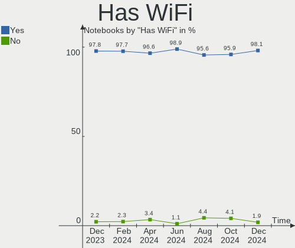
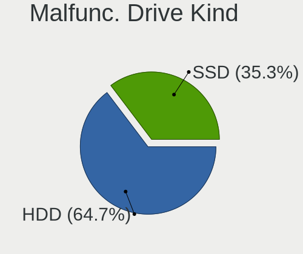
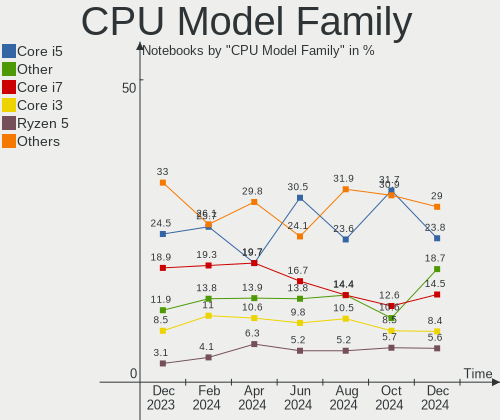
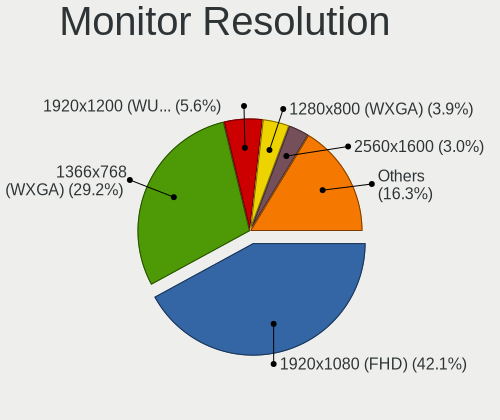
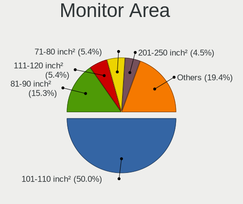
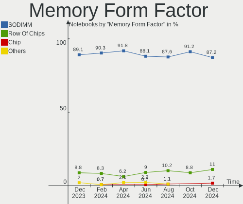
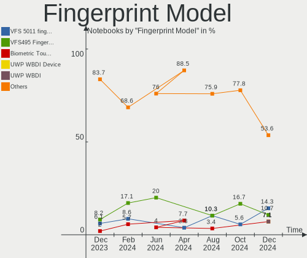
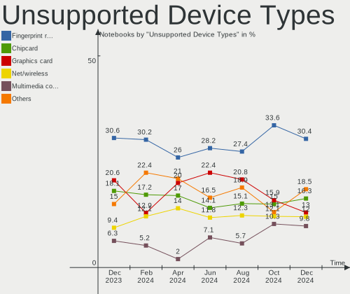

Linux Mint - Hardware Trends (Notebooks)
----------------------------------------

A project to identify most popular hardware characteristics and track their change
over time based on data collected by Linux users at https://Linux-Hardware.org.

Anyone can contribute to this report by the [hw-probe](https://github.com/linuxhw/hw-probe) tool:

    sudo -E hw-probe -all -upload

This report is for one last month. Overall report since the beginning of time: [TestDays](https://github.com/linuxhw/TestDays)

Period: Aug, 2023.

Contents
--------

* [ System ](#system)
  - [ OS                       ](#os)
  - [ OS Family                ](#os-family)
  - [ Kernel                   ](#kernel)
  - [ Kernel Family            ](#kernel-family)
  - [ Kernel Major Ver.        ](#kernel-major-ver)
  - [ Arch                     ](#arch)
  - [ DE                       ](#de)
  - [ Display Server           ](#display-server)
  - [ Display Manager          ](#display-manager)
  - [ OS Lang                  ](#os-lang)
  - [ Boot Mode                ](#boot-mode)
  - [ Filesystem               ](#filesystem)
  - [ Part. scheme             ](#part-scheme)
  - [ Dual Boot with Linux/BSD ](#dual-boot-with-linuxbsd)
  - [ Dual Boot (Win)          ](#dual-boot-win)

* [ Board ](#board)
  - [ Vendor                   ](#vendor)
  - [ Model                    ](#model)
  - [ Model Family             ](#model-family)
  - [ MFG Year                 ](#mfg-year)
  - [ Form Factor              ](#form-factor)
  - [ Secure Boot              ](#secure-boot)
  - [ Coreboot                 ](#coreboot)
  - [ RAM Size                 ](#ram-size)
  - [ RAM Used                 ](#ram-used)
  - [ Total Drives             ](#total-drives)
  - [ Has CD-ROM               ](#has-cd-rom)
  - [ Has Ethernet             ](#has-ethernet)
  - [ Has WiFi                 ](#has-wifi)
  - [ Has Bluetooth            ](#has-bluetooth)

* [ Location ](#location)
  - [ Country                  ](#country)
  - [ City                     ](#city)

* [ Drives ](#drives)
  - [ Drive Vendor             ](#drive-vendor)
  - [ Drive Model              ](#drive-model)
  - [ HDD Vendor               ](#hdd-vendor)
  - [ SSD Vendor               ](#ssd-vendor)
  - [ Drive Kind               ](#drive-kind)
  - [ Drive Connector          ](#drive-connector)
  - [ Drive Size               ](#drive-size)
  - [ Space Total              ](#space-total)
  - [ Space Used               ](#space-used)
  - [ Malfunc. Drives          ](#malfunc-drives)
  - [ Malfunc. Drive Vendor    ](#malfunc-drive-vendor)
  - [ Malfunc. HDD Vendor      ](#malfunc-hdd-vendor)
  - [ Malfunc. Drive Kind      ](#malfunc-drive-kind)
  - [ Failed Drives            ](#failed-drives)
  - [ Failed Drive Vendor      ](#failed-drive-vendor)
  - [ Drive Status             ](#drive-status)

* [ Storage controller ](#storage-controller)
  - [ Storage Vendor           ](#storage-vendor)
  - [ Storage Model            ](#storage-model)
  - [ Storage Kind             ](#storage-kind)

* [ Processor ](#processor)
  - [ CPU Vendor               ](#cpu-vendor)
  - [ CPU Model                ](#cpu-model)
  - [ CPU Model Family         ](#cpu-model-family)
  - [ CPU Cores                ](#cpu-cores)
  - [ CPU Sockets              ](#cpu-sockets)
  - [ CPU Threads              ](#cpu-threads)
  - [ CPU Op-Modes             ](#cpu-op-modes)
  - [ CPU Microcode            ](#cpu-microcode)
  - [ CPU Microarch            ](#cpu-microarch)

* [ Graphics ](#graphics)
  - [ GPU Vendor               ](#gpu-vendor)
  - [ GPU Model                ](#gpu-model)
  - [ GPU Combo                ](#gpu-combo)
  - [ GPU Driver               ](#gpu-driver)
  - [ GPU Memory               ](#gpu-memory)

* [ Monitor ](#monitor)
  - [ Monitor Vendor           ](#monitor-vendor)
  - [ Monitor Model            ](#monitor-model)
  - [ Monitor Resolution       ](#monitor-resolution)
  - [ Monitor Diagonal         ](#monitor-diagonal)
  - [ Monitor Width            ](#monitor-width)
  - [ Aspect Ratio             ](#aspect-ratio)
  - [ Monitor Area             ](#monitor-area)
  - [ Pixel Density            ](#pixel-density)
  - [ Multiple Monitors        ](#multiple-monitors)

* [ Network ](#network)
  - [ Net Controller Vendor    ](#net-controller-vendor)
  - [ Net Controller Model     ](#net-controller-model)
  - [ Wireless Vendor          ](#wireless-vendor)
  - [ Wireless Model           ](#wireless-model)
  - [ Ethernet Vendor          ](#ethernet-vendor)
  - [ Ethernet Model           ](#ethernet-model)
  - [ Net Controller Kind      ](#net-controller-kind)
  - [ Used Controller          ](#used-controller)
  - [ NICs                     ](#nics)
  - [ IPv6                     ](#ipv6)

* [ Bluetooth ](#bluetooth)
  - [ Bluetooth Vendor         ](#bluetooth-vendor)
  - [ Bluetooth Model          ](#bluetooth-model)

* [ Sound ](#sound)
  - [ Sound Vendor             ](#sound-vendor)
  - [ Sound Model              ](#sound-model)

* [ Memory ](#memory)
  - [ Memory Vendor            ](#memory-vendor)
  - [ Memory Model             ](#memory-model)
  - [ Memory Kind              ](#memory-kind)
  - [ Memory Form Factor       ](#memory-form-factor)
  - [ Memory Size              ](#memory-size)
  - [ Memory Speed             ](#memory-speed)

* [ Printers & scanners ](#printers--scanners)
  - [ Printer Vendor           ](#printer-vendor)
  - [ Printer Model            ](#printer-model)
  - [ Scanner Vendor           ](#scanner-vendor)
  - [ Scanner Model            ](#scanner-model)

* [ Camera ](#camera)
  - [ Camera Vendor            ](#camera-vendor)
  - [ Camera Model             ](#camera-model)

* [ Security ](#security)
  - [ Fingerprint Vendor       ](#fingerprint-vendor)
  - [ Fingerprint Model        ](#fingerprint-model)
  - [ Chipcard Vendor          ](#chipcard-vendor)
  - [ Chipcard Model           ](#chipcard-model)

* [ Unsupported ](#unsupported)
  - [ Unsupported Devices      ](#unsupported-devices)
  - [ Unsupported Device Types ](#unsupported-device-types)

System
------

OS
--

Installed operating systems

| Name            | Notebooks | Percent |
|-----------------|-----------|---------|
| Linux Mint 21.2 | 188       | 69.89%  |
| Linux Mint 21.1 | 42        | 15.61%  |
| Linux Mint 21   | 15        | 5.58%   |
| Linux Mint 20.3 | 13        | 4.83%   |
| Linux Mint 19.3 | 4         | 1.49%   |
| Linux Mint 20   | 3         | 1.12%   |
| Linux Mint 20.2 | 2         | 0.74%   |
| Linux Mint 19.1 | 1         | 0.37%   |
| Linux Mint 18.3 | 1         | 0.37%   |

OS Family
---------

OS without a version

| Name       | Notebooks | Percent |
|------------|-----------|---------|
| Linux Mint | 269       | 100%    |

Kernel
------

Version of the Linux kernel

| Version                 | Notebooks | Percent |
|-------------------------|-----------|---------|
| 5.15.0-78-generic       | 88        | 32.71%  |
| 5.15.0-79-generic       | 77        | 28.62%  |
| 5.15.0-76-generic       | 25        | 9.29%   |
| 6.2.0-26-generic        | 24        | 8.92%   |
| 5.15.0-82-generic       | 9         | 3.35%   |
| 5.4.0-156-generic       | 4         | 1.49%   |
| 5.4.0-155-generic       | 4         | 1.49%   |
| 5.4.0-153-generic       | 3         | 1.12%   |
| 6.2.0-31-generic        | 2         | 0.74%   |
| 5.4.0-150-generic       | 2         | 0.74%   |
| 5.4.0-144-generic       | 2         | 0.74%   |
| 5.19.0-46-generic       | 2         | 0.74%   |
| 5.15.0-73-generic       | 2         | 0.74%   |
| 5.15.0-56-generic       | 2         | 0.74%   |
| 5.15.0-41-generic       | 2         | 0.74%   |
| 4.15.0-213-generic      | 2         | 0.74%   |
| 6.5.0-060500-generic    | 1         | 0.37%   |
| 6.4.9-t2-jammy          | 1         | 0.37%   |
| 6.4.9-060409-generic    | 1         | 0.37%   |
| 6.4.8-x64v3-xanmod1     | 1         | 0.37%   |
| 6.4.2-060402-generic    | 1         | 0.37%   |
| 6.4.12-2-liquorix-amd64 | 1         | 0.37%   |
| 6.3.13-060313-generic   | 1         | 0.37%   |
| 6.2.0-1009-aws          | 1         | 0.37%   |
| 5.4.0-91-generic        | 1         | 0.37%   |
| 5.4.0-26-generic        | 1         | 0.37%   |
| 5.4.0-149-generic       | 1         | 0.37%   |
| 5.4.0-135-generic       | 1         | 0.37%   |
| 5.19.0-50-generic       | 1         | 0.37%   |
| 5.17.0-1035-oem         | 1         | 0.37%   |
| 5.15.0-75-generic       | 1         | 0.37%   |
| 5.15.0-71-generic       | 1         | 0.37%   |
| 5.15.0-60-generic       | 1         | 0.37%   |
| 5.15.0-47-generic       | 1         | 0.37%   |
| 4.15.0-142-generic      | 1         | 0.37%   |

Kernel Family
-------------

Linux kernel without a distro release

| Version | Notebooks | Percent |
|---------|-----------|---------|
| 5.15.0  | 209       | 77.7%   |
| 6.2.0   | 27        | 10.04%  |
| 5.4.0   | 19        | 7.06%   |
| 5.19.0  | 3         | 1.12%   |
| 4.15.0  | 3         | 1.12%   |
| 6.4.9   | 2         | 0.74%   |
| 6.5.0   | 1         | 0.37%   |
| 6.4.8   | 1         | 0.37%   |
| 6.4.2   | 1         | 0.37%   |
| 6.4.12  | 1         | 0.37%   |
| 6.3.13  | 1         | 0.37%   |
| 5.17.0  | 1         | 0.37%   |

Kernel Major Ver.
-----------------

Linux kernel major version

| Version | Notebooks | Percent |
|---------|-----------|---------|
| 5.15    | 209       | 77.7%   |
| 6.2     | 27        | 10.04%  |
| 5.4     | 19        | 7.06%   |
| 6.4     | 5         | 1.86%   |
| 5.19    | 3         | 1.12%   |
| 4.15    | 3         | 1.12%   |
| 6.5     | 1         | 0.37%   |
| 6.3     | 1         | 0.37%   |
| 5.17    | 1         | 0.37%   |

Arch
----

OS architecture (x86_64, i586, etc.)

| Name   | Notebooks | Percent |
|--------|-----------|---------|
| x86_64 | 269       | 100%    |

DE
--

Desktop Environment

| Name       | Notebooks | Percent |
|------------|-----------|---------|
| X-Cinnamon | 211       | 78.44%  |
| XFCE       | 31        | 11.52%  |
| MATE       | 20        | 7.43%   |
| Cinnamon   | 3         | 1.12%   |
| Jwm        | 1         | 0.37%   |
| i3         | 1         | 0.37%   |
| GNOME      | 1         | 0.37%   |
| awesome    | 1         | 0.37%   |

Display Server
--------------

X11 or Wayland

| Name    | Notebooks | Percent |
|---------|-----------|---------|
| X11     | 268       | 99.63%  |
| Wayland | 1         | 0.37%   |

Display Manager
---------------

SDDM, LightDM, etc.

| Name    | Notebooks | Percent |
|---------|-----------|---------|
| LightDM | 138       | 51.3%   |
| Unknown | 128       | 47.58%  |
| SDDM    | 1         | 0.37%   |
| LXDM    | 1         | 0.37%   |
| GDM3    | 1         | 0.37%   |

OS Lang
-------

Language

| Lang  | Notebooks | Percent |
|-------|-----------|---------|
| en_US | 96        | 35.69%  |
| de_DE | 46        | 17.1%   |
| pt_BR | 19        | 7.06%   |
| C     | 14        | 5.2%    |
| en_GB | 10        | 3.72%   |
| it_IT | 9         | 3.35%   |
| fr_FR | 9         | 3.35%   |
| ru_RU | 6         | 2.23%   |
| es_ES | 6         | 2.23%   |
| en_AU | 6         | 2.23%   |
| es_MX | 4         | 1.49%   |
| en_CA | 4         | 1.49%   |
| tr_TR | 3         | 1.12%   |
| pl_PL | 3         | 1.12%   |
| nl_NL | 3         | 1.12%   |
| hu_HU | 3         | 1.12%   |
| fr_CA | 3         | 1.12%   |
| de_CH | 3         | 1.12%   |
| cs_CZ | 3         | 1.12%   |
| pt_PT | 2         | 0.74%   |
| es_CO | 2         | 0.74%   |
| es_AR | 2         | 0.74%   |
| en_IN | 2         | 0.74%   |
| sk_SK | 1         | 0.37%   |
| nb_NO | 1         | 0.37%   |
| ja_JP | 1         | 0.37%   |
| es_UY | 1         | 0.37%   |
| es_EC | 1         | 0.37%   |
| es_CU | 1         | 0.37%   |
| es_CL | 1         | 0.37%   |
| en_ZA | 1         | 0.37%   |
| en_IE | 1         | 0.37%   |
| el_GR | 1         | 0.37%   |
| de_AT | 1         | 0.37%   |

Boot Mode
---------

EFI or BIOS

| Mode | Notebooks | Percent |
|------|-----------|---------|
| EFI  | 188       | 69.89%  |
| BIOS | 81        | 30.11%  |

Filesystem
----------

Type of filesystem

| Type    | Notebooks | Percent |
|---------|-----------|---------|
| Ext4    | 242       | 89.96%  |
| Overlay | 12        | 4.46%   |
| Tmpfs   | 6         | 2.23%   |
| Zfs     | 4         | 1.49%   |
| Btrfs   | 3         | 1.12%   |
| Ext3    | 1         | 0.37%   |
| Ext2    | 1         | 0.37%   |

Part. scheme
------------

Scheme of partitioning

| Type    | Notebooks | Percent |
|---------|-----------|---------|
| Unknown | 128       | 47.58%  |
| GPT     | 121       | 44.98%  |
| MBR     | 20        | 7.43%   |

Dual Boot with Linux/BSD
------------------------

Hosting more than one Linux/BSD

| Dual boot | Notebooks | Percent |
|-----------|-----------|---------|
| No        | 250       | 92.94%  |
| Yes       | 19        | 7.06%   |

Dual Boot (Win)
---------------

Hosting Linux and Windows

| Dual boot | Notebooks | Percent |
|-----------|-----------|---------|
| No        | 214       | 79.55%  |
| Yes       | 55        | 20.45%  |

Board
-----

Vendor
------

Motherboard manufacturer

| Name                | Notebooks | Percent |
|---------------------|-----------|---------|
| Lenovo              | 55        | 20.45%  |
| Hewlett-Packard     | 50        | 18.59%  |
| Dell                | 38        | 14.13%  |
| ASUSTek Computer    | 27        | 10.04%  |
| Acer                | 27        | 10.04%  |
| Apple               | 11        | 4.09%   |
| Toshiba             | 6         | 2.23%   |
| HUAWEI              | 6         | 2.23%   |
| Samsung Electronics | 4         | 1.49%   |
| Medion              | 4         | 1.49%   |
| Sony                | 3         | 1.12%   |
| Positivo            | 3         | 1.12%   |
| Notebook            | 3         | 1.12%   |
| Google              | 3         | 1.12%   |
| Teclast             | 2         | 0.74%   |
| Gigabyte Technology | 2         | 0.74%   |
| Fujitsu             | 2         | 0.74%   |
| Chuwi               | 2         | 0.74%   |
| Unknown             | 2         | 0.74%   |
| Wortmann AG         | 1         | 0.37%   |
| TUXEDO              | 1         | 0.37%   |
| Timi                | 1         | 0.37%   |
| Thomson             | 1         | 0.37%   |
| PC Specialist       | 1         | 0.37%   |
| Panasonic           | 1         | 0.37%   |
| NSX                 | 1         | 0.37%   |
| Multilaser          | 1         | 0.37%   |
| MSI                 | 1         | 0.37%   |
| Mediacom            | 1         | 0.37%   |
| Leader              | 1         | 0.37%   |
| Kogan               | 1         | 0.37%   |
| Itautec             | 1         | 0.37%   |
| GPU Company         | 1         | 0.37%   |
| Fujitsu Siemens     | 1         | 0.37%   |
| Exo                 | 1         | 0.37%   |
| Dynabook            | 1         | 0.37%   |
| Daten Tecnologia    | 1         | 0.37%   |
| BANGHO              | 1         | 0.37%   |

Model
-----

Motherboard model

| Name                             | Notebooks | Percent |
|----------------------------------|-----------|---------|
| Unknown                          | 4         | 1.49%   |
| Toshiba Satellite C660           | 2         | 0.74%   |
| Toshiba Satellite C55-A          | 2         | 0.74%   |
| Lenovo IdeaPad 320-15AST 80XV    | 2         | 0.74%   |
| Lenovo G50-80 80E5               | 2         | 0.74%   |
| HUAWEI NBLK-WAX9X                | 2         | 0.74%   |
| HUAWEI HVY-WXX9                  | 2         | 0.74%   |
| HP Pavilion 15                   | 2         | 0.74%   |
| HP Notebook                      | 2         | 0.74%   |
| HP Laptop 15-bs0xx               | 2         | 0.74%   |
| HP 255 G5                        | 2         | 0.74%   |
| Dell Precision M4500             | 2         | 0.74%   |
| Dell Latitude E6410              | 2         | 0.74%   |
| Dell Inspiron 15-3567            | 2         | 0.74%   |
| Acer Aspire V3-771               | 2         | 0.74%   |
| Wortmann AG TERRA_MOBILE_1749    | 1         | 0.37%   |
| Toshiba Satellite Pro NB10-A-110 | 1         | 0.37%   |
| Toshiba Satellite P500           | 1         | 0.37%   |
| Timi A35                         | 1         | 0.37%   |
| Thomson X6-4.32GR                | 1         | 0.37%   |
| Teclast Tbolt 10 DG              | 1         | 0.37%   |
| Teclast F7S                      | 1         | 0.37%   |
| Sony VPCEH14FM                   | 1         | 0.37%   |
| Sony VJF151                      | 1         | 0.37%   |
| Sony SVF1521G1EW                 | 1         | 0.37%   |
| Samsung RV419/RV420              | 1         | 0.37%   |
| Samsung 370E4K                   | 1         | 0.37%   |
| Samsung 300E4M/300E4S/300E4L     | 1         | 0.37%   |
| Samsung 300E4A/300E5A/300E7A     | 1         | 0.37%   |
| Positivo S14CT01                 | 1         | 0.37%   |
| Positivo Q232B                   | 1         | 0.37%   |
| Positivo Mobile                  | 1         | 0.37%   |
| PC Specialist Ionico 16          | 1         | 0.37%   |
| Panasonic CF-31WBLAXLM           | 1         | 0.37%   |
| NSX SB142G                       | 1         | 0.37%   |
| Notebook W230SS                  | 1         | 0.37%   |
| Notebook NP5x_NP6x_NP7xRNJ_RNH   | 1         | 0.37%   |
| Notebook N9x0TC                  | 1         | 0.37%   |
| Multilaser PC024                 | 1         | 0.37%   |
| MSI GS70 2OD                     | 1         | 0.37%   |

Model Family
------------

Motherboard model prefix

| Name               | Notebooks | Percent |
|--------------------|-----------|---------|
| Acer Aspire        | 20        | 7.43%   |
| Lenovo ThinkPad    | 19        | 7.06%   |
| Lenovo IdeaPad     | 18        | 6.69%   |
| Dell Latitude      | 13        | 4.83%   |
| Dell Inspiron      | 13        | 4.83%   |
| HP Pavilion        | 12        | 4.46%   |
| HP Laptop          | 10        | 3.72%   |
| ASUS VivoBook      | 8         | 2.97%   |
| Toshiba Satellite  | 6         | 2.23%   |
| HP EliteBook       | 6         | 2.23%   |
| Lenovo Legion      | 5         | 1.86%   |
| Dell Precision     | 4         | 1.49%   |
| Unknown            | 4         | 1.49%   |
| HP Victus          | 3         | 1.12%   |
| Dell XPS           | 3         | 1.12%   |
| Dell Vostro        | 3         | 1.12%   |
| ASUS Zenbook       | 3         | 1.12%   |
| ASUS ROG           | 3         | 1.12%   |
| Acer Predator      | 3         | 1.12%   |
| Lenovo ThinkBook   | 2         | 0.74%   |
| Lenovo G580        | 2         | 0.74%   |
| Lenovo G50-80      | 2         | 0.74%   |
| HUAWEI NBLK-WAX9X  | 2         | 0.74%   |
| HUAWEI HVY-WXX9    | 2         | 0.74%   |
| HP ZBook           | 2         | 0.74%   |
| HP ProBook         | 2         | 0.74%   |
| HP Notebook        | 2         | 0.74%   |
| HP Compaq          | 2         | 0.74%   |
| HP 255             | 2         | 0.74%   |
| Apple MacBookPro9  | 2         | 0.74%   |
| Apple MacBookPro8  | 2         | 0.74%   |
| Apple MacBookPro14 | 2         | 0.74%   |
| Wortmann AG TERRA  | 1         | 0.37%   |
| Timi A35           | 1         | 0.37%   |
| Thomson X6-4.32GR  | 1         | 0.37%   |
| Teclast Tbolt      | 1         | 0.37%   |
| Teclast F7S        | 1         | 0.37%   |
| Sony VPCEH14FM     | 1         | 0.37%   |
| Sony VJF151        | 1         | 0.37%   |
| Sony SVF1521G1EW   | 1         | 0.37%   |

MFG Year
--------

Motherboard manufacture year

| Year | Notebooks | Percent |
|------|-----------|---------|
| 2021 | 28        | 10.41%  |
| 2019 | 25        | 9.29%   |
| 2013 | 25        | 9.29%   |
| 2022 | 20        | 7.43%   |
| 2012 | 20        | 7.43%   |
| 2018 | 19        | 7.06%   |
| 2015 | 16        | 5.95%   |
| 2014 | 16        | 5.95%   |
| 2011 | 16        | 5.95%   |
| 2017 | 15        | 5.58%   |
| 2010 | 14        | 5.2%    |
| 2020 | 13        | 4.83%   |
| 2016 | 13        | 4.83%   |
| 2023 | 10        | 3.72%   |
| 2008 | 10        | 3.72%   |
| 2009 | 4         | 1.49%   |
| 2007 | 3         | 1.12%   |
| 2006 | 2         | 0.74%   |

Form Factor
-----------

Physical design of the computer

| Name     | Notebooks | Percent |
|----------|-----------|---------|
| Notebook | 269       | 100%    |

Secure Boot
-----------

Enabled or disabled

| State    | Notebooks | Percent |
|----------|-----------|---------|
| Disabled | 233       | 86.62%  |
| Enabled  | 36        | 13.38%  |

Coreboot
--------

Have coreboot on board

| Used | Notebooks | Percent |
|------|-----------|---------|
| No   | 266       | 98.88%  |
| Yes  | 3         | 1.12%   |

RAM Size
--------

Total RAM memory

| Size in GB  | Notebooks | Percent |
|-------------|-----------|---------|
| 4.01-8.0    | 98        | 36.43%  |
| 3.01-4.0    | 49        | 18.22%  |
| 16.01-24.0  | 47        | 17.47%  |
| 8.01-16.0   | 46        | 17.1%   |
| 32.01-64.0  | 13        | 4.83%   |
| 1.01-2.0    | 6         | 2.23%   |
| 24.01-32.0  | 4         | 1.49%   |
| 2.01-3.0    | 3         | 1.12%   |
| 64.01-256.0 | 2         | 0.74%   |
| 0.51-1.0    | 1         | 0.37%   |

RAM Used
--------

Used RAM memory

| Used GB   | Notebooks | Percent |
|-----------|-----------|---------|
| 2.01-3.0  | 105       | 39.03%  |
| 1.01-2.0  | 89        | 33.09%  |
| 3.01-4.0  | 32        | 11.9%   |
| 4.01-8.0  | 28        | 10.41%  |
| 8.01-16.0 | 8         | 2.97%   |
| 0.51-1.0  | 7         | 2.6%    |

Total Drives
------------

Number of drives on board

| Drives | Notebooks | Percent |
|--------|-----------|---------|
| 1      | 185       | 68.77%  |
| 2      | 72        | 26.77%  |
| 3      | 9         | 3.35%   |
| 5      | 1         | 0.37%   |
| 4      | 1         | 0.37%   |
| 0      | 1         | 0.37%   |

Has CD-ROM
----------

Has CD-ROM on board

| Presented | Notebooks | Percent |
|-----------|-----------|---------|
| No        | 175       | 65.06%  |
| Yes       | 94        | 34.94%  |

Has Ethernet
------------

Has Ethernet on board

| Presented | Notebooks | Percent |
|-----------|-----------|---------|
| Yes       | 201       | 74.72%  |
| No        | 68        | 25.28%  |

Has WiFi
--------

Has WiFi module

| Presented | Notebooks | Percent |
|-----------|-----------|---------|
| Yes       | 263       | 97.77%  |
| No        | 6         | 2.23%   |

Has Bluetooth
-------------

Has Bluetooth module

| Presented | Notebooks | Percent |
|-----------|-----------|---------|
| Yes       | 205       | 76.21%  |
| No        | 64        | 23.79%  |

Location
--------

Country
-------

Geographic location (country)

| Country      | Notebooks | Percent |
|--------------|-----------|---------|
| USA          | 48        | 17.84%  |
| Germany      | 43        | 15.99%  |
| Brazil       | 21        | 7.81%   |
| Italy        | 14        | 5.2%    |
| Russia       | 13        | 4.83%   |
| Czechia      | 8         | 2.97%   |
| France       | 7         | 2.6%    |
| Canada       | 7         | 2.6%    |
| UK           | 6         | 2.23%   |
| Switzerland  | 6         | 2.23%   |
| Spain        | 6         | 2.23%   |
| Poland       | 6         | 2.23%   |
| Netherlands  | 6         | 2.23%   |
| Mexico       | 6         | 2.23%   |
| Australia    | 6         | 2.23%   |
| Argentina    | 6         | 2.23%   |
| Austria      | 5         | 1.86%   |
| Turkey       | 3         | 1.12%   |
| Sweden       | 3         | 1.12%   |
| Slovakia     | 3         | 1.12%   |
| Romania      | 3         | 1.12%   |
| Portugal     | 3         | 1.12%   |
| India        | 3         | 1.12%   |
| Hungary      | 3         | 1.12%   |
| Denmark      | 3         | 1.12%   |
| Uruguay      | 2         | 0.74%   |
| Japan        | 2         | 0.74%   |
| Ireland      | 2         | 0.74%   |
| Indonesia    | 2         | 0.74%   |
| Cuba         | 2         | 0.74%   |
| Colombia     | 2         | 0.74%   |
| Venezuela    | 1         | 0.37%   |
| Tunisia      | 1         | 0.37%   |
| Thailand     | 1         | 0.37%   |
| Taiwan       | 1         | 0.37%   |
| South Africa | 1         | 0.37%   |
| Serbia       | 1         | 0.37%   |
| Réunion     | 1         | 0.37%   |
| Pakistan     | 1         | 0.37%   |
| Norway       | 1         | 0.37%   |

City
----

Geographic location (city)

| City             | Notebooks | Percent |
|------------------|-----------|---------|
| Vienna           | 4         | 1.49%   |
| Zurich           | 3         | 1.12%   |
| Moscow           | 3         | 1.12%   |
| Montreal         | 3         | 1.12%   |
| Florence         | 3         | 1.12%   |
| Copenhagen       | 3         | 1.12%   |
| Chicago          | 3         | 1.12%   |
| Brisbane         | 3         | 1.12%   |
| Sydney           | 2         | 0.74%   |
| Sao Paulo        | 2         | 0.74%   |
| Rome             | 2         | 0.74%   |
| Ratingen         | 2         | 0.74%   |
| Prague           | 2         | 0.74%   |
| Nuremberg        | 2         | 0.74%   |
| Novosibirsk      | 2         | 0.74%   |
| Natal            | 2         | 0.74%   |
| Montevideo       | 2         | 0.74%   |
| Mönchengladbach | 2         | 0.74%   |
| Milan            | 2         | 0.74%   |
| Miami            | 2         | 0.74%   |
| Madrid           | 2         | 0.74%   |
| Jhansi           | 2         | 0.74%   |
| Istanbul         | 2         | 0.74%   |
| Houston          | 2         | 0.74%   |
| Dublin           | 2         | 0.74%   |
| Cologne          | 2         | 0.74%   |
| Calvert Heights  | 2         | 0.74%   |
| Brdo             | 2         | 0.74%   |
| Bratislava       | 2         | 0.74%   |
| Amsterdam        | 2         | 0.74%   |
| Zrenjanin        | 1         | 0.37%   |
| Yakutsk          | 1         | 0.37%   |
| Wroclaw          | 1         | 0.37%   |
| Woodstock        | 1         | 0.37%   |
| Wilmer           | 1         | 0.37%   |
| Westfield        | 1         | 0.37%   |
| Warsaw           | 1         | 0.37%   |
| Wanchai          | 1         | 0.37%   |
| Vulcan           | 1         | 0.37%   |
| Vignola          | 1         | 0.37%   |

Drives
------

Drive Vendor
------------

Hard drive vendors

| Vendor                         | Notebooks | Drives | Percent |
|--------------------------------|-----------|--------|---------|
| Samsung Electronics            | 55        | 57     | 16.03%  |
| WDC                            | 36        | 39     | 10.5%   |
| Seagate                        | 35        | 36     | 10.2%   |
| Toshiba                        | 27        | 27     | 7.87%   |
| Unknown                        | 26        | 28     | 7.58%   |
| Intel                          | 20        | 21     | 5.83%   |
| SanDisk                        | 19        | 20     | 5.54%   |
| Crucial                        | 19        | 20     | 5.54%   |
| SK hynix                       | 10        | 11     | 2.92%   |
| Micron Technology              | 9         | 9      | 2.62%   |
| Kingston                       | 9         | 10     | 2.62%   |
| Apple                          | 8         | 11     | 2.33%   |
| Hitachi                        | 7         | 7      | 2.04%   |
| Unknown                        | 5         | 5      | 1.46%   |
| LITEON                         | 4         | 4      | 1.17%   |
| KIOXIA                         | 4         | 4      | 1.17%   |
| China                          | 4         | 4      | 1.17%   |
| A-DATA Technology              | 3         | 3      | 0.87%   |
| XrayDisk                       | 2         | 2      | 0.58%   |
| USB                            | 2         | 2      | 0.58%   |
| UMIS                           | 2         | 2      | 0.58%   |
| Team                           | 2         | 2      | 0.58%   |
| Silicon Motion                 | 2         | 2      | 0.58%   |
| Realtek                        | 2         | 2      | 0.58%   |
| Netac                          | 2         | 2      | 0.58%   |
| Micron/Crucial Technology      | 2         | 2      | 0.58%   |
| JMicron Technology             | 2         | 2      | 0.58%   |
| HGST                           | 2         | 2      | 0.58%   |
| Fujitsu                        | 2         | 2      | 0.58%   |
| FORESEE                        | 2         | 2      | 0.58%   |
| WD_BLACK                       | 1         | 1      | 0.29%   |
| Verbatim                       | 1         | 1      | 0.29%   |
| Union Memory (Shenzhen)        | 1         | 1      | 0.29%   |
| Transcend                      | 1         | 1      | 0.29%   |
| SSK                            | 1         | 1      | 0.29%   |
| SPCC                           | 1         | 1      | 0.29%   |
| Solid State Storage Technology | 1         | 1      | 0.29%   |
| PNY                            | 1         | 1      | 0.29%   |
| Phison                         | 1         | 1      | 0.29%   |
| Kingston Technology Company    | 1         | 1      | 0.29%   |

Drive Model
-----------

Hard drive models

| Model                                                 | Notebooks | Percent |
|-------------------------------------------------------|-----------|---------|
| Seagate ST1000LM024 HN-M101MBB 1TB                    | 8         | 2.28%   |
| Unknown MMC Card  32GB                                | 5         | 1.42%   |
| Toshiba MQ01ABF050 500GB                              | 5         | 1.42%   |
| Crucial CT500MX500SSD1 500GB                          | 5         | 1.42%   |
| Unknown                                               | 5         | 1.42%   |
| WDC WD10JPVX-22JC3T0 1TB                              | 4         | 1.14%   |
| Toshiba MQ04ABF100 1TB                                | 4         | 1.14%   |
| Unknown SD/MMC/MS PRO 1GB                             | 3         | 0.85%   |
| Unknown MMC Card  16GB                                | 3         | 0.85%   |
| Unknown Biwin  32GB                                   | 3         | 0.85%   |
| Seagate ST500LT012-9WS142 500GB                       | 3         | 0.85%   |
| Seagate ST500LT012-1DG142 500GB                       | 3         | 0.85%   |
| Seagate ST2000LM007-1R8174 2TB                        | 3         | 0.85%   |
| Seagate ST1000LM035-1RK172 1TB                        | 3         | 0.85%   |
| Samsung SSD 860 EVO 500GB                             | 3         | 0.85%   |
| Samsung SSD 860 EVO 1TB                               | 3         | 0.85%   |
| Intel SSDPEKNU512GZ 512GB                             | 3         | 0.85%   |
| WDC WDS240G2G0A-00JH30 240GB SSD                      | 2         | 0.57%   |
| WDC WD10SPZX-24Z10T0 1TB                              | 2         | 0.57%   |
| WDC WD10JPVX-60JC3T1 1TB                              | 2         | 0.57%   |
| Unknown MMC128  128GB                                 | 2         | 0.57%   |
| Unknown MMC Card  64GB                                | 2         | 0.57%   |
| Toshiba MQ01ABD100 1TB                                | 2         | 0.57%   |
| Toshiba HDWL110 1TB                                   | 2         | 0.57%   |
| Seagate ST500LM012 HN-M500MBB 500GB                   | 2         | 0.57%   |
| Seagate ST1000LM048-2E7172 1TB                        | 2         | 0.57%   |
| Seagate Expansion 2TB                                 | 2         | 0.57%   |
| SanDisk NVMe SSD Drive 2TB                            | 2         | 0.57%   |
| SanDisk NVMe SSD Drive 1TB                            | 2         | 0.57%   |
| SanDisk Extreme 55AE 1TB SSD                          | 2         | 0.57%   |
| Samsung SSD 980 PRO 2TB                               | 2         | 0.57%   |
| Samsung SSD 980 500GB                                 | 2         | 0.57%   |
| Samsung SSD 970 EVO Plus 2TB                          | 2         | 0.57%   |
| Samsung SSD 870 QVO 1TB                               | 2         | 0.57%   |
| Samsung SSD 850 EVO 500GB                             | 2         | 0.57%   |
| Samsung NVMe SSD Controller PM9A1/PM9A3/980PRO 1024GB | 2         | 0.57%   |
| Samsung MZ7LN256HCHP-000L7 256GB SSD                  | 2         | 0.57%   |
| Realtek RTL9210 NVME 2TB                              | 2         | 0.57%   |
| Micron/Crucial P2 NVMe PCIe SSD 1TB                   | 2         | 0.57%   |
| Micron MTFDKBA512TFH-1BC1AABHA 512GB                  | 2         | 0.57%   |

HDD Vendor
----------

Hard disk drive vendors

| Vendor              | Notebooks | Drives | Percent |
|---------------------|-----------|--------|---------|
| Seagate             | 35        | 36     | 35.35%  |
| WDC                 | 24        | 24     | 24.24%  |
| Toshiba             | 17        | 17     | 17.17%  |
| Hitachi             | 7         | 7      | 7.07%   |
| Samsung Electronics | 4         | 4      | 4.04%   |
| Unknown             | 3         | 3      | 3.03%   |
| USB                 | 2         | 2      | 2.02%   |
| HGST                | 2         | 2      | 2.02%   |
| Fujitsu             | 2         | 2      | 2.02%   |
| WD_BLACK            | 1         | 1      | 1.01%   |
| SSK                 | 1         | 1      | 1.01%   |
| Apple               | 1         | 1      | 1.01%   |

SSD Vendor
----------

Solid state drive vendors

| Vendor              | Notebooks | Drives | Percent |
|---------------------|-----------|--------|---------|
| Samsung Electronics | 32        | 32     | 27.12%  |
| Crucial             | 17        | 17     | 14.41%  |
| Kingston            | 9         | 10     | 7.63%   |
| WDC                 | 7         | 7      | 5.93%   |
| SanDisk             | 6         | 7      | 5.08%   |
| Intel               | 6         | 6      | 5.08%   |
| Toshiba             | 5         | 5      | 4.24%   |
| China               | 4         | 4      | 3.39%   |
| Micron Technology   | 3         | 3      | 2.54%   |
| LITEON              | 3         | 3      | 2.54%   |
| Apple               | 3         | 3      | 2.54%   |
| A-DATA Technology   | 3         | 3      | 2.54%   |
| Team                | 2         | 2      | 1.69%   |
| SK hynix            | 2         | 2      | 1.69%   |
| Netac               | 2         | 2      | 1.69%   |
| FORESEE             | 2         | 2      | 1.69%   |
| Verbatim            | 1         | 1      | 0.85%   |
| Transcend           | 1         | 1      | 0.85%   |
| SPCC                | 1         | 1      | 0.85%   |
| PNY                 | 1         | 1      | 0.85%   |
| KingFast            | 1         | 1      | 0.85%   |
| JMicron Technology  | 1         | 1      | 0.85%   |
| Intenso             | 1         | 1      | 0.85%   |
| HS-SSD-C100         | 1         | 1      | 0.85%   |
| Hewlett-Packard     | 1         | 1      | 0.85%   |
| CT2000MX            | 1         | 1      | 0.85%   |
| Apacer              | 1         | 1      | 0.85%   |
| AFOX                | 1         | 1      | 0.85%   |

Drive Kind
----------

HDD or SSD

| Kind    | Notebooks | Drives | Percent |
|---------|-----------|--------|---------|
| SSD     | 113       | 120    | 34.66%  |
| HDD     | 94        | 100    | 28.83%  |
| NVMe    | 88        | 105    | 26.99%  |
| MMC     | 24        | 27     | 7.36%   |
| Unknown | 7         | 7      | 2.15%   |

Drive Connector
---------------

SATA, SAS, NVMe, etc.

| Type | Notebooks | Drives | Percent |
|------|-----------|--------|---------|
| SATA | 179       | 207    | 57.37%  |
| NVMe | 87        | 103    | 27.88%  |
| MMC  | 24        | 27     | 7.69%   |
| SAS  | 22        | 22     | 7.05%   |

Drive Size
----------

Size of hard drive

| Size in TB | Notebooks | Drives | Percent |
|------------|-----------|--------|---------|
| 0.01-0.5   | 125       | 134    | 59.81%  |
| 0.51-1.0   | 70        | 71     | 33.49%  |
| 1.01-2.0   | 13        | 14     | 6.22%   |
| 4.01-10.0  | 1         | 1      | 0.48%   |

Space Total
-----------

Amount of disk space available on the file system

| Size in GB     | Notebooks | Percent |
|----------------|-----------|---------|
| 101-250        | 77        | 28.62%  |
| 251-500        | 75        | 27.88%  |
| 501-1000       | 49        | 18.22%  |
| 51-100         | 18        | 6.69%   |
| 1001-2000      | 17        | 6.32%   |
| 1-20           | 14        | 5.2%    |
| 21-50          | 7         | 2.6%    |
| More than 3000 | 5         | 1.86%   |
| 2001-3000      | 5         | 1.86%   |
| Unknown        | 2         | 0.74%   |

Space Used
----------

Amount of used disk space

| Used GB        | Notebooks | Percent |
|----------------|-----------|---------|
| 21-50          | 72        | 26.77%  |
| 1-20           | 63        | 23.42%  |
| 51-100         | 45        | 16.73%  |
| 101-250        | 43        | 15.99%  |
| 251-500        | 25        | 9.29%   |
| 501-1000       | 11        | 4.09%   |
| 1001-2000      | 5         | 1.86%   |
| More than 3000 | 2         | 0.74%   |
| Unknown        | 2         | 0.74%   |
| 2001-3000      | 1         | 0.37%   |

Malfunc. Drives
---------------

Drive models with a malfunction

| Model                                 | Notebooks | Drives | Percent |
|---------------------------------------|-----------|--------|---------|
| Seagate ST500LT012-9WS142 500GB       | 2         | 2      | 9.09%   |
| LITEON CV8-8E128-HP 128GB SSD         | 2         | 2      | 9.09%   |
| WDC WD5000LPVX-22V0TT0 500GB          | 1         | 1      | 4.55%   |
| WDC WD5000BEVT-00A0RT0 500GB          | 1         | 1      | 4.55%   |
| WDC WD2500BEVT-80A23T0 250GB          | 1         | 1      | 4.55%   |
| WDC WD10JPVX-22JC3T0 1TB              | 1         | 1      | 4.55%   |
| Toshiba MQ01ABF050 500GB              | 1         | 1      | 4.55%   |
| Seagate ST9750423AS 752GB             | 1         | 1      | 4.55%   |
| Seagate ST500LT012-1DG142 500GB       | 1         | 1      | 4.55%   |
| Seagate ST500LM012 HN-M500MBB 500GB   | 1         | 1      | 4.55%   |
| Seagate ST2000LM007-1R8174 2TB        | 1         | 1      | 4.55%   |
| Seagate ST1000LM024 HN-M101MBB 1TB    | 1         | 1      | 4.55%   |
| SanDisk SSD PLUS 240 GB               | 1         | 1      | 4.55%   |
| Samsung Electronics SSD 870 EVO 500GB | 1         | 1      | 4.55%   |
| Samsung Electronics SSD 750 EVO 250GB | 1         | 1      | 4.55%   |
| Kingston SEDC450R7680G 8TB SSD        | 1         | 1      | 4.55%   |
| Hitachi HTS725050A7E630 500GB         | 1         | 1      | 4.55%   |
| Hitachi HTS542512K9SA00 120GB         | 1         | 1      | 4.55%   |
| Fujitsu MHY2080BH 80GB                | 1         | 1      | 4.55%   |
| Fujitsu MHV2080AH 80GB                | 1         | 1      | 4.55%   |

Malfunc. Drive Vendor
---------------------

Vendors of faulty drives

| Vendor              | Notebooks | Drives | Percent |
|---------------------|-----------|--------|---------|
| Seagate             | 7         | 7      | 31.82%  |
| WDC                 | 4         | 4      | 18.18%  |
| Samsung Electronics | 2         | 2      | 9.09%   |
| LITEON              | 2         | 2      | 9.09%   |
| Hitachi             | 2         | 2      | 9.09%   |
| Fujitsu             | 2         | 2      | 9.09%   |
| Toshiba             | 1         | 1      | 4.55%   |
| SanDisk             | 1         | 1      | 4.55%   |
| Kingston            | 1         | 1      | 4.55%   |

Malfunc. HDD Vendor
-------------------

Vendors of faulty HDD drives

| Vendor  | Notebooks | Drives | Percent |
|---------|-----------|--------|---------|
| Seagate | 7         | 7      | 43.75%  |
| WDC     | 4         | 4      | 25%     |
| Hitachi | 2         | 2      | 12.5%   |
| Fujitsu | 2         | 2      | 12.5%   |
| Toshiba | 1         | 1      | 6.25%   |

Malfunc. Drive Kind
-------------------

Kinds of faulty drives

| Kind | Notebooks | Drives | Percent |
|------|-----------|--------|---------|
| HDD  | 16        | 16     | 72.73%  |
| SSD  | 6         | 6      | 27.27%  |

Failed Drives
-------------

Failed drive models

| Model                                           | Notebooks | Drives | Percent |
|-------------------------------------------------|-----------|--------|---------|
| Samsung Electronics MZMPC032HBCD-000H1 32GB SSD | 1         | 1      | 50%     |
| Samsung Electronics HM160HC 160GB               | 1         | 1      | 50%     |

Failed Drive Vendor
-------------------

Failed drive vendors

| Vendor              | Notebooks | Drives | Percent |
|---------------------|-----------|--------|---------|
| Samsung Electronics | 2         | 2      | 100%    |

Drive Status
------------

Number of failed and malfunc. drives

| Status   | Notebooks | Drives | Percent |
|----------|-----------|--------|---------|
| Detected | 157       | 203    | 54.14%  |
| Works    | 109       | 132    | 37.59%  |
| Malfunc  | 22        | 22     | 7.59%   |
| Failed   | 2         | 2      | 0.69%   |

Storage controller
------------------

Storage Vendor
--------------

Storage controller vendors

| Vendor                                  | Notebooks | Percent |
|-----------------------------------------|-----------|---------|
| Intel                                   | 187       | 61.92%  |
| AMD                                     | 30        | 9.93%   |
| Samsung Electronics                     | 21        | 6.95%   |
| SanDisk                                 | 19        | 6.29%   |
| SK hynix                                | 8         | 2.65%   |
| Micron Technology                       | 6         | 1.99%   |
| Toshiba America Info Systems            | 5         | 1.66%   |
| Micron/Crucial Technology               | 4         | 1.32%   |
| KIOXIA                                  | 4         | 1.32%   |
| Apple                                   | 4         | 1.32%   |
| Phison Electronics                      | 3         | 0.99%   |
| Union Memory (Shenzhen)                 | 2         | 0.66%   |
| Silicon Motion                          | 2         | 0.66%   |
| Solid State Storage Technology          | 1         | 0.33%   |
| Shenzhen Unionmemory Information System | 1         | 0.33%   |
| Nvidia                                  | 1         | 0.33%   |
| Marvell Technology Group                | 1         | 0.33%   |
| Lite-On Technology                      | 1         | 0.33%   |
| Kingston Technology Company             | 1         | 0.33%   |
| INNOGRIT                                | 1         | 0.33%   |

Storage Model
-------------

Storage controller models

| Model                                                                          | Notebooks | Percent |
|--------------------------------------------------------------------------------|-----------|---------|
| Intel 7 Series Chipset Family 6-port SATA Controller [AHCI mode]               | 28        | 8.7%    |
| AMD FCH SATA Controller [AHCI mode]                                            | 24        | 7.45%   |
| Intel Sunrise Point-LP SATA Controller [AHCI mode]                             | 18        | 5.59%   |
| Intel 82801 Mobile SATA Controller [RAID mode]                                 | 14        | 4.35%   |
| Intel 8 Series SATA Controller 1 [AHCI mode]                                   | 14        | 4.35%   |
| Intel 6 Series/C200 Series Chipset Family 6 port Mobile SATA AHCI Controller   | 14        | 4.35%   |
| Intel Wildcat Point-LP SATA Controller [AHCI Mode]                             | 11        | 3.42%   |
| Intel Volume Management Device NVMe RAID Controller                            | 9         | 2.8%    |
| Intel SSD 670p Series [Keystone Harbor]                                        | 9         | 2.8%    |
| Intel Celeron/Pentium Silver Processor SATA Controller                         | 9         | 2.8%    |
| Intel Cannon Lake Mobile PCH SATA AHCI Controller                              | 8         | 2.48%   |
| Intel 8 Series/C220 Series Chipset Family 6-port SATA Controller 1 [AHCI mode] | 8         | 2.48%   |
| Samsung NVMe SSD Controller SM981/PM981/PM983                                  | 7         | 2.17%   |
| Intel 82801IBM/IEM (ICH9M/ICH9M-E) 4 port SATA Controller [AHCI mode]          | 7         | 2.17%   |
| Samsung NVMe SSD Controller PM9A1/PM9A3/980PRO                                 | 6         | 1.86%   |
| Intel Atom Processor E3800 Series SATA AHCI Controller                         | 6         | 1.86%   |
| Intel 5 Series/3400 Series Chipset 4 port SATA AHCI Controller                 | 5         | 1.55%   |
| SK hynix Gold P31/BC711/PC711 NVMe Solid State Drive                           | 4         | 1.24%   |
| Samsung NVMe SSD Controller 980                                                | 4         | 1.24%   |
| KIOXIA NVMe SSD Controller BG4 (DRAM-less)                                     | 4         | 1.24%   |
| Intel 82801HM/HEM (ICH8M/ICH8M-E) IDE Controller                               | 4         | 1.24%   |
| Toshiba America Info Systems XG6 NVMe SSD Controller                           | 3         | 0.93%   |
| SanDisk PC SN520 NVMe SSD                                                      | 3         | 0.93%   |
| Micron/Crucial P2 [Nick P2] / P3 / P3 Plus NVMe PCIe SSD (DRAM-less)           | 3         | 0.93%   |
| Micron 3400 NVMe SSD [Hendrix]                                                 | 3         | 0.93%   |
| Intel Celeron N3350/Pentium N4200/Atom E3900 Series SATA AHCI Controller       | 3         | 0.93%   |
| Intel 82801HM/HEM (ICH8M/ICH8M-E) SATA Controller [AHCI mode]                  | 3         | 0.93%   |
| Intel 5 Series/3400 Series Chipset 6 port SATA AHCI Controller                 | 3         | 0.93%   |
| Apple S3X NVMe Controller                                                      | 3         | 0.93%   |
| AMD SB7x0/SB8x0/SB9x0 SATA Controller [AHCI mode]                              | 3         | 0.93%   |
| SK hynix BC511 NVMe SSD                                                        | 2         | 0.62%   |
| SanDisk WD PC SN810 / Black SN850 NVMe SSD                                     | 2         | 0.62%   |
| Sandisk WD PC SN740 NVMe SSD 512GB (DRAM-less)                                 | 2         | 0.62%   |
| SanDisk WD Green SN350 NVMe SSD 1 TB (DRAM-less)                               | 2         | 0.62%   |
| SanDisk WD Blue SN550 NVMe SSD                                                 | 2         | 0.62%   |
| SanDisk WD Black 2018/SN750 / PC SN720 NVMe SSD                                | 2         | 0.62%   |
| Samsung NVMe SSD Controller PM9B1                                              | 2         | 0.62%   |
| Phison E16 PCIe4 NVMe Controller                                               | 2         | 0.62%   |
| Intel SSD DC P4101/Pro 7600p/760p/E 6100p Series                               | 2         | 0.62%   |
| Intel SSD 660P Series                                                          | 2         | 0.62%   |

Storage Kind
------------

Kind of storage controller (IDE, SATA, NVMe, SAS, ...)

| Kind | Notebooks | Percent |
|------|-----------|---------|
| SATA | 182       | 59.09%  |
| NVMe | 88        | 28.57%  |
| RAID | 23        | 7.47%   |
| IDE  | 15        | 4.87%   |

Processor
---------

CPU Vendor
----------

Processor vendors

| Vendor | Notebooks | Percent |
|--------|-----------|---------|
| Intel  | 212       | 78.81%  |
| AMD    | 57        | 21.19%  |

CPU Model
---------

Processor models

| Model                                         | Notebooks | Percent |
|-----------------------------------------------|-----------|---------|
| Intel Celeron N4020 CPU @ 1.10GHz             | 5         | 1.86%   |
| Intel 11th Gen Core i7-1165G7 @ 2.80GHz       | 5         | 1.86%   |
| Intel Core i7-7500U CPU @ 2.70GHz             | 4         | 1.49%   |
| Intel Core i5-8265U CPU @ 1.60GHz             | 4         | 1.49%   |
| Intel Core i5-4210U CPU @ 1.70GHz             | 4         | 1.49%   |
| Intel Core i5-3210M CPU @ 2.50GHz             | 4         | 1.49%   |
| Intel Core i3-3110M CPU @ 2.40GHz             | 4         | 1.49%   |
| AMD Ryzen 5 5600H with Radeon Graphics        | 4         | 1.49%   |
| AMD Ryzen 5 5500U with Radeon Graphics        | 4         | 1.49%   |
| Intel Pentium CPU 2020M @ 2.40GHz             | 3         | 1.12%   |
| Intel Core i7-5500U CPU @ 2.40GHz             | 3         | 1.12%   |
| Intel Core i7 CPU M 620 @ 2.67GHz             | 3         | 1.12%   |
| Intel Core i5-9300H CPU @ 2.40GHz             | 3         | 1.12%   |
| Intel Core i5-7200U CPU @ 2.50GHz             | 3         | 1.12%   |
| Intel Core i5-4210M CPU @ 2.60GHz             | 3         | 1.12%   |
| Intel Core i3-5005U CPU @ 2.00GHz             | 3         | 1.12%   |
| Intel Core i3-2328M CPU @ 2.20GHz             | 3         | 1.12%   |
| Intel Core i3-2310M CPU @ 2.10GHz             | 3         | 1.12%   |
| Intel Celeron CPU N3350 @ 1.10GHz             | 3         | 1.12%   |
| AMD Ryzen 5 3500U with Radeon Vega Mobile Gfx | 3         | 1.12%   |
| AMD A9-9420 RADEON R5, 5 COMPUTE CORES 2C+3G  | 3         | 1.12%   |
| Intel Pentium CPU N3540 @ 2.16GHz             | 2         | 0.74%   |
| Intel Core i7-9750H CPU @ 2.60GHz             | 2         | 0.74%   |
| Intel Core i7-8650U CPU @ 1.90GHz             | 2         | 0.74%   |
| Intel Core i7-8550U CPU @ 1.80GHz             | 2         | 0.74%   |
| Intel Core i7-4810MQ CPU @ 2.80GHz            | 2         | 0.74%   |
| Intel Core i7-4510U CPU @ 2.00GHz             | 2         | 0.74%   |
| Intel Core i7-3630QM CPU @ 2.40GHz            | 2         | 0.74%   |
| Intel Core i7-10510U CPU @ 1.80GHz            | 2         | 0.74%   |
| Intel Core i5-8250U CPU @ 1.60GHz             | 2         | 0.74%   |
| Intel Core i5-6300U CPU @ 2.40GHz             | 2         | 0.74%   |
| Intel Core i5-5300U CPU @ 2.30GHz             | 2         | 0.74%   |
| Intel Core i5-4200U CPU @ 1.60GHz             | 2         | 0.74%   |
| Intel Core i5-3320M CPU @ 2.60GHz             | 2         | 0.74%   |
| Intel Core i5-2450M CPU @ 2.50GHz             | 2         | 0.74%   |
| Intel Core i5-2430M CPU @ 2.40GHz             | 2         | 0.74%   |
| Intel Core i5-1035G1 CPU @ 1.00GHz            | 2         | 0.74%   |
| Intel Core i3-7020U CPU @ 2.30GHz             | 2         | 0.74%   |
| Intel Core i3-6006U CPU @ 2.00GHz             | 2         | 0.74%   |
| Intel Core i3 CPU M 330 @ 2.13GHz             | 2         | 0.74%   |

CPU Model Family
----------------

Processor model prefix

| Model                   | Notebooks | Percent |
|-------------------------|-----------|---------|
| Intel Core i5           | 58        | 21.56%  |
| Intel Core i7           | 51        | 18.96%  |
| Intel Core i3           | 30        | 11.15%  |
| Other                   | 29        | 10.78%  |
| Intel Celeron           | 21        | 7.81%   |
| AMD Ryzen 5             | 19        | 7.06%   |
| Intel Core 2 Duo        | 9         | 3.35%   |
| AMD Ryzen 7             | 8         | 2.97%   |
| Intel Pentium           | 7         | 2.6%    |
| Intel Atom              | 6         | 2.23%   |
| AMD Ryzen 9             | 4         | 1.49%   |
| AMD Ryzen 3             | 4         | 1.49%   |
| Intel Pentium Dual-Core | 3         | 1.12%   |
| AMD Turion 64 Mobile    | 2         | 0.74%   |
| AMD E2                  | 2         | 0.74%   |
| AMD Athlon              | 2         | 0.74%   |
| AMD A6                  | 2         | 0.74%   |
| AMD A4                  | 2         | 0.74%   |
| Intel Pentium Dual      | 1         | 0.37%   |
| Intel Core m5           | 1         | 0.37%   |
| Intel Core i9           | 1         | 0.37%   |
| AMD Turion 64 X2 Mobile | 1         | 0.37%   |
| AMD E                   | 1         | 0.37%   |
| AMD C-60                | 1         | 0.37%   |
| AMD Athlon X2           | 1         | 0.37%   |
| AMD Athlon II           | 1         | 0.37%   |
| AMD A12                 | 1         | 0.37%   |
| AMD A10                 | 1         | 0.37%   |

CPU Cores
---------

Number of processor cores

| Number | Notebooks | Percent |
|--------|-----------|---------|
| 2      | 151       | 56.13%  |
| 4      | 68        | 25.28%  |
| 6      | 23        | 8.55%   |
| 8      | 11        | 4.09%   |
| 14     | 5         | 1.86%   |
| 12     | 4         | 1.49%   |
| 10     | 3         | 1.12%   |
| 1      | 3         | 1.12%   |
| 16     | 1         | 0.37%   |

CPU Sockets
-----------

Number of sockets

| Number | Notebooks | Percent |
|--------|-----------|---------|
| 1      | 269       | 100%    |

CPU Threads
-----------

Threads per core (Hyper-Threading)

| Number | Notebooks | Percent |
|--------|-----------|---------|
| 2      | 203       | 75.46%  |
| 1      | 66        | 24.54%  |

CPU Op-Modes
------------

CPU Operation Modes (32-bit, 64-bit)

| Op mode        | Notebooks | Percent |
|----------------|-----------|---------|
| 32-bit, 64-bit | 269       | 100%    |

CPU Microcode
-------------

Microcode number

| Number     | Notebooks | Percent |
|------------|-----------|---------|
| Unknown    | 40        | 14.87%  |
| 0x306a9    | 22        | 8.18%   |
| 0x206a7    | 22        | 8.18%   |
| 0x40651    | 15        | 5.58%   |
| 0x306d4    | 12        | 4.46%   |
| 0x806e9    | 9         | 3.35%   |
| 0x806c1    | 8         | 2.97%   |
| 0x306c3    | 8         | 2.97%   |
| 0x906ea    | 6         | 2.23%   |
| 0x1067a    | 6         | 2.23%   |
| 0x0a50000d | 6         | 2.23%   |
| 0x06006705 | 6         | 2.23%   |
| 0x806ea    | 5         | 1.86%   |
| 0x406e3    | 5         | 1.86%   |
| 0x30678    | 5         | 1.86%   |
| 0x0a50000c | 5         | 1.86%   |
| 0x08108109 | 5         | 1.86%   |
| 0x806ec    | 4         | 1.49%   |
| 0x706e5    | 4         | 1.49%   |
| 0x706a8    | 4         | 1.49%   |
| 0x706a1    | 4         | 1.49%   |
| 0x506c9    | 4         | 1.49%   |
| 0x20655    | 4         | 1.49%   |
| 0x08608103 | 4         | 1.49%   |
| 0xb06a2    | 3         | 1.12%   |
| 0x6fd      | 3         | 1.12%   |
| 0x406c4    | 3         | 1.12%   |
| 0x20652    | 3         | 1.12%   |
| 0x106e5    | 3         | 1.12%   |
| 0x10676    | 3         | 1.12%   |
| 0x0a404102 | 3         | 1.12%   |
| 0x08108102 | 3         | 1.12%   |
| 0x07030105 | 3         | 1.12%   |
| 0x906a3    | 2         | 0.74%   |
| 0x806eb    | 2         | 0.74%   |
| 0x806d1    | 2         | 0.74%   |
| 0x406c3    | 2         | 0.74%   |
| 0x106ca    | 2         | 0.74%   |
| 0x08600106 | 2         | 0.74%   |
| 0x0600611a | 2         | 0.74%   |

CPU Microarch
-------------

Microarchitecture

| Name             | Notebooks | Percent |
|------------------|-----------|---------|
| KabyLake         | 37        | 13.75%  |
| Haswell          | 26        | 9.67%   |
| SandyBridge      | 24        | 8.92%   |
| IvyBridge        | 23        | 8.55%   |
| Zen 3            | 13        | 4.83%   |
| Broadwell        | 13        | 4.83%   |
| Unknown          | 13        | 4.83%   |
| Silvermont       | 11        | 4.09%   |
| Zen+             | 10        | 3.72%   |
| Skylake          | 10        | 3.72%   |
| Penryn           | 10        | 3.72%   |
| TigerLake        | 9         | 3.35%   |
| Goldmont plus    | 9         | 3.35%   |
| Excavator        | 9         | 3.35%   |
| Alderlake Hybrid | 9         | 3.35%   |
| Westmere         | 8         | 2.97%   |
| IceLake          | 6         | 2.23%   |
| Zen 2            | 4         | 1.49%   |
| K8 Hammer        | 4         | 1.49%   |
| Goldmont         | 4         | 1.49%   |
| Puma             | 3         | 1.12%   |
| Nehalem          | 3         | 1.12%   |
| Core             | 3         | 1.12%   |
| Zen              | 2         | 0.74%   |
| Bonnell          | 2         | 0.74%   |
| Bobcat           | 2         | 0.74%   |
| K10              | 1         | 0.37%   |
| CometLake        | 1         | 0.37%   |

Graphics
--------

GPU Vendor
----------

Vendors of graphics cards

| Vendor | Notebooks | Percent |
|--------|-----------|---------|
| Intel  | 194       | 57.91%  |
| AMD    | 72        | 21.49%  |
| Nvidia | 69        | 20.6%   |

GPU Model
---------

Graphics card models

| Model                                                                                    | Notebooks | Percent |
|------------------------------------------------------------------------------------------|-----------|---------|
| Intel 2nd Generation Core Processor Family Integrated Graphics Controller                | 23        | 6.76%   |
| Intel 3rd Gen Core processor Graphics Controller                                         | 21        | 6.18%   |
| Intel Haswell-ULT Integrated Graphics Controller                                         | 15        | 4.41%   |
| Intel HD Graphics 5500                                                                   | 11        | 3.24%   |
| AMD Picasso/Raven 2 [Radeon Vega Series / Radeon Vega Mobile Series]                     | 11        | 3.24%   |
| Intel HD Graphics 620                                                                    | 10        | 2.94%   |
| Intel TigerLake-LP GT2 [Iris Xe Graphics]                                                | 9         | 2.65%   |
| Intel GeminiLake [UHD Graphics 600]                                                      | 9         | 2.65%   |
| Intel 4th Gen Core Processor Integrated Graphics Controller                              | 9         | 2.65%   |
| Intel Skylake GT2 [HD Graphics 520]                                                      | 7         | 2.06%   |
| Intel CoffeeLake-H GT2 [UHD Graphics 630]                                                | 7         | 2.06%   |
| AMD Stoney [Radeon R2/R3/R4/R5 Graphics]                                                 | 7         | 2.06%   |
| AMD Cezanne [Radeon Vega Series / Radeon Vega Mobile Series]                             | 7         | 2.06%   |
| Intel UHD Graphics 620                                                                   | 6         | 1.76%   |
| Intel Mobile 4 Series Chipset Integrated Graphics Controller                             | 6         | 1.76%   |
| Intel Atom Processor Z36xxx/Z37xxx Series Graphics & Display                             | 6         | 1.76%   |
| AMD Barcelo                                                                              | 6         | 1.76%   |
| Nvidia GA107M [GeForce RTX 3050 Mobile]                                                  | 5         | 1.47%   |
| Intel WhiskeyLake-U GT2 [UHD Graphics 620]                                               | 5         | 1.47%   |
| Intel Raptor Lake-P [Iris Xe Graphics]                                                   | 5         | 1.47%   |
| Intel Core Processor Integrated Graphics Controller                                      | 5         | 1.47%   |
| Intel Atom/Celeron/Pentium Processor x5-E8000/J3xxx/N3xxx Integrated Graphics Controller | 5         | 1.47%   |
| AMD Sun XT [Radeon HD 8670A/8670M/8690M / R5 M330 / M430 / Radeon 520 Mobile]            | 5         | 1.47%   |
| AMD Lucienne                                                                             | 5         | 1.47%   |
| Nvidia TU116M [GeForce GTX 1660 Ti Mobile]                                               | 4         | 1.18%   |
| AMD Topaz XT [Radeon R7 M260/M265 / M340/M360 / M440/M445 / 530/535 / 620/625 Mobile]    | 4         | 1.18%   |
| AMD Renoir                                                                               | 4         | 1.18%   |
| AMD Rembrandt [Radeon 680M]                                                              | 4         | 1.18%   |
| Nvidia GF117M [GeForce 610M/710M/810M/820M / GT 620M/625M/630M/720M]                     | 3         | 0.88%   |
| Nvidia GA106M [GeForce RTX 3060 Mobile / Max-Q]                                          | 3         | 0.88%   |
| Intel Iris Plus Graphics G1 (Ice Lake)                                                   | 3         | 0.88%   |
| Intel HD Graphics 500                                                                    | 3         | 0.88%   |
| Intel Alder Lake-P Integrated Graphics Controller                                        | 3         | 0.88%   |
| Nvidia TU117M [GeForce GTX 1650 Mobile / Max-Q]                                          | 2         | 0.59%   |
| Nvidia GP108BM [GeForce MX250]                                                           | 2         | 0.59%   |
| Nvidia GP107M [GeForce GTX 1050 Mobile]                                                  | 2         | 0.59%   |
| Nvidia GM108M [GeForce 940MX]                                                            | 2         | 0.59%   |
| Nvidia GF119M [GeForce 610M]                                                             | 2         | 0.59%   |
| Nvidia GA107M [GeForce RTX 3050 Ti Mobile]                                               | 2         | 0.59%   |
| Nvidia GA107GLM [RTX A1000 Laptop GPU]                                                   | 2         | 0.59%   |

GPU Combo
---------

Combinations of graphics cards

| Name           | Notebooks | Percent |
|----------------|-----------|---------|
| 1 x Intel      | 137       | 50.93%  |
| 1 x AMD        | 48        | 17.84%  |
| Intel + Nvidia | 42        | 15.61%  |
| 1 x Nvidia     | 17        | 6.32%   |
| Intel + AMD    | 13        | 4.83%   |
| AMD + Nvidia   | 9         | 3.35%   |
| 2 x AMD        | 2         | 0.74%   |
| 2 x Intel      | 1         | 0.37%   |

GPU Driver
----------

Free vs proprietary

| Driver      | Notebooks | Percent |
|-------------|-----------|---------|
| Free        | 226       | 84.01%  |
| Proprietary | 39        | 14.5%   |
| Unknown     | 4         | 1.49%   |

GPU Memory
----------

Total video memory

| Size in GB | Notebooks | Percent |
|------------|-----------|---------|
| Unknown    | 164       | 60.97%  |
| 0.01-0.5   | 37        | 13.75%  |
| 1.01-2.0   | 32        | 11.9%   |
| 0.51-1.0   | 17        | 6.32%   |
| 3.01-4.0   | 10        | 3.72%   |
| 5.01-6.0   | 5         | 1.86%   |
| 7.01-8.0   | 2         | 0.74%   |
| 2.01-3.0   | 1         | 0.37%   |
| 8.01-16.0  | 1         | 0.37%   |

Monitor
-------

Monitor Vendor
--------------

Monitor vendors

| Vendor                  | Notebooks | Percent |
|-------------------------|-----------|---------|
| BOE                     | 50        | 16.13%  |
| AU Optronics            | 50        | 16.13%  |
| LG Display              | 48        | 15.48%  |
| Chimei Innolux          | 45        | 14.52%  |
| Samsung Electronics     | 24        | 7.74%   |
| Chi Mei Optoelectronics | 10        | 3.23%   |
| Apple                   | 10        | 3.23%   |
| Goldstar                | 7         | 2.26%   |
| Dell                    | 7         | 2.26%   |
| Sharp                   | 6         | 1.94%   |
| PANDA                   | 6         | 1.94%   |
| Lenovo                  | 6         | 1.94%   |
| Hewlett-Packard         | 6         | 1.94%   |
| InfoVision              | 4         | 1.29%   |
| Philips                 | 3         | 0.97%   |
| BenQ                    | 3         | 0.97%   |
| AOC                     | 3         | 0.97%   |
| ViewSonic               | 2         | 0.65%   |
| Sony                    | 2         | 0.65%   |
| LG Philips              | 2         | 0.65%   |
| HannStar                | 2         | 0.65%   |
| ZTR                     | 1         | 0.32%   |
| Vestel Elektronik       | 1         | 0.32%   |
| Toshiba                 | 1         | 0.32%   |
| STA                     | 1         | 0.32%   |
| SLD                     | 1         | 0.32%   |
| SANYO                   | 1         | 0.32%   |
| NEX                     | 1         | 0.32%   |
| Mi                      | 1         | 0.32%   |
| LGD                     | 1         | 0.32%   |
| JDI                     | 1         | 0.32%   |
| GreenWood               | 1         | 0.32%   |
| Fujitsu Siemens         | 1         | 0.32%   |
| DENON                   | 1         | 0.32%   |
| ASUSTek Computer        | 1         | 0.32%   |

Monitor Model
-------------

Monitor models

| Model                                                                     | Notebooks | Percent |
|---------------------------------------------------------------------------|-----------|---------|
| Chimei Innolux LCD Monitor CMN15E6 1366x768 344x193mm 15.5-inch           | 4         | 1.28%   |
| Chimei Innolux LCD Monitor CMN15DB 1366x768 344x193mm 15.5-inch           | 4         | 1.28%   |
| AU Optronics LCD Monitor AUO22EC 1366x768 344x193mm 15.5-inch             | 4         | 1.28%   |
| LG Display LCD Monitor LGD033A 1366x768 344x194mm 15.5-inch               | 3         | 0.96%   |
| Chimei Innolux LCD Monitor CMN1521 1920x1080 344x193mm 15.5-inch          | 3         | 0.96%   |
| Chi Mei Optoelectronics LCD Monitor CMO1720 1920x1080 382x215mm 17.3-inch | 3         | 0.96%   |
| AU Optronics LCD Monitor AUO31EC 1366x768 344x193mm 15.5-inch             | 3         | 0.96%   |
| AU Optronics LCD Monitor AUO10EC 1366x768 344x193mm 15.5-inch             | 3         | 0.96%   |
| Apple Color LCD APPA034 2880x1800 286x179mm 13.3-inch                     | 3         | 0.96%   |
| LG Display LCD Monitor LGD039F 1366x768 345x194mm 15.6-inch               | 2         | 0.64%   |
| LG Display LCD Monitor LGD033B 1366x768 344x194mm 15.5-inch               | 2         | 0.64%   |
| LG Display LCD Monitor LGD02E3 1366x768 344x194mm 15.5-inch               | 2         | 0.64%   |
| LG Display LCD Monitor LGD02DC 1366x768 344x194mm 15.5-inch               | 2         | 0.64%   |
| Lenovo LCD Monitor LEN4010 1280x800 261x163mm 12.1-inch                   | 2         | 0.64%   |
| Chimei Innolux LCD Monitor CMN15F5 1920x1080 344x193mm 15.5-inch          | 2         | 0.64%   |
| Chimei Innolux LCD Monitor CMN15B8 1366x768 344x193mm 15.5-inch           | 2         | 0.64%   |
| BOE LCD Monitor BOE08D5 1920x1080 344x194mm 15.5-inch                     | 2         | 0.64%   |
| BOE LCD Monitor BOE0878 1920x1080 355x200mm 16.0-inch                     | 2         | 0.64%   |
| BOE LCD Monitor BOE0877 1920x1080 309x173mm 13.9-inch                     | 2         | 0.64%   |
| BOE LCD Monitor BOE0700 1920x1080 344x194mm 15.5-inch                     | 2         | 0.64%   |
| BOE LCD Monitor BOE06A4 1366x768 344x194mm 15.5-inch                      | 2         | 0.64%   |
| BOE LCD Monitor BOE0696 1366x768 309x173mm 13.9-inch                      | 2         | 0.64%   |
| AU Optronics LCD Monitor AUO208D 1920x1080 309x174mm 14.0-inch            | 2         | 0.64%   |
| AU Optronics LCD Monitor AUO159E 1600x900 382x214mm 17.2-inch             | 2         | 0.64%   |
| AU Optronics LCD Monitor AUO133D 1920x1080 309x173mm 13.9-inch            | 2         | 0.64%   |
| ZTR LCD Monitor ZTR0001 1366x768 309x173mm 13.9-inch                      | 1         | 0.32%   |
| ViewSonic VX2703 SERIES VSCF62B 1920x1080 597x336mm 27.0-inch             | 1         | 0.32%   |
| ViewSonic VG2748 VSC7936 1920x1080 598x336mm 27.0-inch                    | 1         | 0.32%   |
| Vestel Elektronik 40W_LCD_TV VES3700 1920x540                             | 1         | 0.32%   |
| Toshiba PI-KVM Video TSB8888 1920x1080                                    | 1         | 0.32%   |
| STA XR140EA1T STA0450 1366x768 310x174mm 14.0-inch                        | 1         | 0.32%   |
| Sony TV SNYC901 1920x1080                                                 | 1         | 0.32%   |
| Sony BW8 MS_9001 2560x1600                                                | 1         | 0.32%   |
| SLD LCD Monitor SLD003C 1366x768 309x173mm 13.9-inch                      | 1         | 0.32%   |
| Sharp LQ134N1JW52 SHP151E 1920x1200 288x180mm 13.4-inch                   | 1         | 0.32%   |
| Sharp LQ133T1JW19 SHP1412 2560x1440 294x165mm 13.3-inch                   | 1         | 0.32%   |
| Sharp LQ133M1JW08 SHP1425 1920x1080 294x165mm 13.3-inch                   | 1         | 0.32%   |
| Sharp LCD Monitor SHP14BA 1920x1080 340x190mm 15.3-inch                   | 1         | 0.32%   |
| Sharp LCD Monitor SHP1484 1920x1080 294x165mm 13.3-inch                   | 1         | 0.32%   |
| Sharp LCD Monitor SHP1453 1920x1080 346x194mm 15.6-inch                   | 1         | 0.32%   |

Monitor Resolution
------------------

Monitor screen resolution

| Resolution         | Notebooks | Percent |
|--------------------|-----------|---------|
| 1920x1080 (FHD)    | 115       | 39.52%  |
| 1366x768 (WXGA)    | 104       | 35.74%  |
| 1600x900 (HD+)     | 13        | 4.47%   |
| 1920x1200 (WUXGA)  | 12        | 4.12%   |
| 1280x800 (WXGA)    | 9         | 3.09%   |
| 2560x1600          | 8         | 2.75%   |
| 2560x1440 (QHD)    | 5         | 1.72%   |
| 1440x900 (WXGA+)   | 5         | 1.72%   |
| 3840x2160 (4K)     | 4         | 1.37%   |
| 2880x1800          | 4         | 1.37%   |
| 1680x1050 (WSXGA+) | 2         | 0.69%   |
| 3456x2160          | 1         | 0.34%   |
| 3440x1440          | 1         | 0.34%   |
| 3200x1800 (QHD+)   | 1         | 0.34%   |
| 3072x1920          | 1         | 0.34%   |
| 3000x2000          | 1         | 0.34%   |
| 1920x540           | 1         | 0.34%   |
| 1920x1280          | 1         | 0.34%   |
| 1680x945           | 1         | 0.34%   |
| 1280x1024 (SXGA)   | 1         | 0.34%   |
| 1024x600           | 1         | 0.34%   |

Monitor Diagonal
----------------

Diagonal size in inches

| Inches  | Notebooks | Percent |
|---------|-----------|---------|
| 15      | 119       | 38.26%  |
| 13      | 45        | 14.47%  |
| 14      | 36        | 11.58%  |
| 17      | 25        | 8.04%   |
| 27      | 13        | 4.18%   |
| 16      | 13        | 4.18%   |
| 23      | 10        | 3.22%   |
| 12      | 8         | 2.57%   |
| 24      | 7         | 2.25%   |
| 21      | 6         | 1.93%   |
| 11      | 6         | 1.93%   |
| 18      | 4         | 1.29%   |
| Unknown | 4         | 1.29%   |
| 54      | 2         | 0.64%   |
| 31      | 2         | 0.64%   |
| 84      | 1         | 0.32%   |
| 72      | 1         | 0.32%   |
| 49      | 1         | 0.32%   |
| 39      | 1         | 0.32%   |
| 34      | 1         | 0.32%   |
| 26      | 1         | 0.32%   |
| 22      | 1         | 0.32%   |
| 20      | 1         | 0.32%   |
| 19      | 1         | 0.32%   |
| 10      | 1         | 0.32%   |
| 8       | 1         | 0.32%   |

Monitor Width
-------------

Physical width

| Width in mm | Notebooks | Percent |
|-------------|-----------|---------|
| 301-350     | 185       | 59.49%  |
| 201-300     | 38        | 12.22%  |
| 501-600     | 31        | 9.97%   |
| 351-400     | 31        | 9.97%   |
| 401-500     | 12        | 3.86%   |
| Unknown     | 4         | 1.29%   |
| 1001-1500   | 3         | 0.96%   |
| 601-700     | 2         | 0.64%   |
| 1501-2000   | 2         | 0.64%   |
| 801-900     | 1         | 0.32%   |
| 701-800     | 1         | 0.32%   |
| 101-200     | 1         | 0.32%   |

Aspect Ratio
------------

Proportional relationship between the width and the height

| Ratio   | Notebooks | Percent |
|---------|-----------|---------|
| 16/9    | 217       | 80.37%  |
| 16/10   | 43        | 15.93%  |
| Unknown | 3         | 1.11%   |
| 3/2     | 2         | 0.74%   |
| 5/4     | 1         | 0.37%   |
| 4/3     | 1         | 0.37%   |
| 32/9    | 1         | 0.37%   |
| 21/9    | 1         | 0.37%   |
| 0.62    | 1         | 0.37%   |

Monitor Area
------------

Area in inch²

| Area in inch² | Notebooks | Percent |
|----------------|-----------|---------|
| 101-110        | 123       | 39.68%  |
| 81-90          | 63        | 20.32%  |
| 121-130        | 20        | 6.45%   |
| 201-250        | 18        | 5.81%   |
| 71-80          | 16        | 5.16%   |
| 301-350        | 14        | 4.52%   |
| 111-120        | 9         | 2.9%    |
| 61-70          | 8         | 2.58%   |
| 51-60          | 6         | 1.94%   |
| More than 1000 | 5         | 1.61%   |
| 131-140        | 5         | 1.61%   |
| 151-200        | 4         | 1.29%   |
| 141-150        | 4         | 1.29%   |
| Unknown        | 4         | 1.29%   |
| 351-500        | 3         | 0.97%   |
| 251-300        | 3         | 0.97%   |
| 91-100         | 2         | 0.65%   |
| 41-50          | 1         | 0.32%   |
| 1-40           | 1         | 0.32%   |
| 501-1000       | 1         | 0.32%   |

Pixel Density
-------------

Pixels per inch

| Density       | Notebooks | Percent |
|---------------|-----------|---------|
| 101-120       | 111       | 36.27%  |
| 121-160       | 109       | 35.62%  |
| 51-100        | 45        | 14.71%  |
| 161-240       | 22        | 7.19%   |
| More than 240 | 10        | 3.27%   |
| 1-50          | 5         | 1.63%   |
| Unknown       | 4         | 1.31%   |

Multiple Monitors
-----------------

Total monitors connected

| Total | Notebooks | Percent |
|-------|-----------|---------|
| 1     | 217       | 80.67%  |
| 2     | 44        | 16.36%  |
| 3     | 5         | 1.86%   |
| 0     | 3         | 1.12%   |

Network
-------

Net Controller Vendor
---------------------

Controller vendors

| Vendor                            | Notebooks | Percent |
|-----------------------------------|-----------|---------|
| Realtek Semiconductor             | 149       | 35.73%  |
| Intel                             | 116       | 27.82%  |
| Qualcomm Atheros                  | 62        | 14.87%  |
| Broadcom                          | 30        | 7.19%   |
| MediaTek                          | 13        | 3.12%   |
| Broadcom Limited                  | 7         | 1.68%   |
| Ralink                            | 6         | 1.44%   |
| Ralink Technology                 | 4         | 0.96%   |
| Lenovo                            | 4         | 0.96%   |
| ASIX Electronics                  | 4         | 0.96%   |
| TP-Link                           | 3         | 0.72%   |
| Samsung Electronics               | 3         | 0.72%   |
| Qualcomm Atheros Communications   | 2         | 0.48%   |
| JMicron Technology                | 2         | 0.48%   |
| Huawei Technologies               | 2         | 0.48%   |
| Hewlett-Packard                   | 2         | 0.48%   |
| Xiaomi                            | 1         | 0.24%   |
| U-Blox                            | 1         | 0.24%   |
| Nvidia                            | 1         | 0.24%   |
| Google                            | 1         | 0.24%   |
| Fujitsu Siemens Computers         | 1         | 0.24%   |
| Ericsson Business Mobile Networks | 1         | 0.24%   |
| Apple                             | 1         | 0.24%   |
| AMD                               | 1         | 0.24%   |

Net Controller Model
--------------------

Controller models

| Model                                                             | Notebooks | Percent |
|-------------------------------------------------------------------|-----------|---------|
| Realtek RTL8111/8168/8411 PCI Express Gigabit Ethernet Controller | 73        | 14.75%  |
| Realtek RTL810xE PCI Express Fast Ethernet controller             | 34        | 6.87%   |
| Qualcomm Atheros QCA9377 802.11ac Wireless Network Adapter        | 12        | 2.42%   |
| Qualcomm Atheros QCA9565 / AR9565 Wireless Network Adapter        | 11        | 2.22%   |
| Realtek RTL8822CE 802.11ac PCIe Wireless Network Adapter          | 10        | 2.02%   |
| Intel Wi-Fi 6 AX200                                               | 10        | 2.02%   |
| Realtek RTL8821CE 802.11ac PCIe Wireless Network Adapter          | 9         | 1.82%   |
| Realtek RTL8153 Gigabit Ethernet Adapter                          | 9         | 1.82%   |
| Qualcomm Atheros AR9462 Wireless Network Adapter                  | 9         | 1.82%   |
| Intel Wireless 3160                                               | 8         | 1.62%   |
| Intel Wireless 7265                                               | 7         | 1.41%   |
| Intel Wireless 7260                                               | 7         | 1.41%   |
| Intel Centrino Advanced-N 6205 [Taylor Peak]                      | 7         | 1.41%   |
| Intel 82579LM Gigabit Network Connection (Lewisville)             | 7         | 1.41%   |
| Realtek RTL8723DE Wireless Network Adapter                        | 6         | 1.21%   |
| Realtek RTL8188EE Wireless Network Adapter                        | 6         | 1.21%   |
| Qualcomm Atheros AR9485 Wireless Network Adapter                  | 6         | 1.21%   |
| MediaTek MT7921 802.11ax PCI Express Wireless Network Adapter     | 6         | 1.21%   |
| Intel Wireless 3165                                               | 6         | 1.21%   |
| Intel Wi-Fi 6 AX201                                               | 6         | 1.21%   |
| Realtek RTL8188CE 802.11b/g/n WiFi Adapter                        | 5         | 1.01%   |
| Ralink RT3290 Wireless 802.11n 1T/1R PCIe                         | 5         | 1.01%   |
| Qualcomm Atheros QCA6174 802.11ac Wireless Network Adapter        | 5         | 1.01%   |
| Qualcomm Atheros AR8151 v2.0 Gigabit Ethernet                     | 5         | 1.01%   |
| Intel Cannon Lake PCH CNVi WiFi                                   | 5         | 1.01%   |
| Intel 82577LM Gigabit Network Connection                          | 5         | 1.01%   |
| Broadcom BCM43142 802.11b/g/n                                     | 5         | 1.01%   |
| Realtek RTL8852BE PCIe 802.11ax Wireless Network Controller       | 4         | 0.81%   |
| Qualcomm Atheros AR8162 Fast Ethernet                             | 4         | 0.81%   |
| Intel Wireless 8265 / 8275                                        | 4         | 0.81%   |
| Intel Wi-Fi 6 AX210/AX211/AX411 160MHz                            | 4         | 0.81%   |
| Intel Raptor Lake PCH CNVi WiFi                                   | 4         | 0.81%   |
| Intel Ethernet Connection (3) I218-LM                             | 4         | 0.81%   |
| Intel Centrino Advanced-N 6200                                    | 4         | 0.81%   |
| Intel 82567LM Gigabit Network Connection                          | 4         | 0.81%   |
| Broadcom NetXtreme BCM57765 Gigabit Ethernet PCIe                 | 4         | 0.81%   |
| Broadcom BCM4331 802.11a/b/g/n                                    | 4         | 0.81%   |
| ASIX AX88179 Gigabit Ethernet                                     | 4         | 0.81%   |
| Realtek RTL8723BE PCIe Wireless Network Adapter                   | 3         | 0.61%   |
| Realtek RTL8152 Fast Ethernet Adapter                             | 3         | 0.61%   |

Wireless Vendor
---------------

Wireless vendors

| Vendor                          | Notebooks | Percent |
|---------------------------------|-----------|---------|
| Intel                           | 110       | 40.29%  |
| Realtek Semiconductor           | 54        | 19.78%  |
| Qualcomm Atheros                | 51        | 18.68%  |
| Broadcom                        | 25        | 9.16%   |
| MediaTek                        | 13        | 4.76%   |
| Ralink                          | 6         | 2.2%    |
| Ralink Technology               | 4         | 1.47%   |
| Broadcom Limited                | 4         | 1.47%   |
| TP-Link                         | 3         | 1.1%    |
| Qualcomm Atheros Communications | 2         | 0.73%   |
| Fujitsu Siemens Computers       | 1         | 0.37%   |

Wireless Model
--------------

Wireless models

| Model                                                          | Notebooks | Percent |
|----------------------------------------------------------------|-----------|---------|
| Qualcomm Atheros QCA9377 802.11ac Wireless Network Adapter     | 12        | 4.38%   |
| Qualcomm Atheros QCA9565 / AR9565 Wireless Network Adapter     | 11        | 4.01%   |
| Realtek RTL8822CE 802.11ac PCIe Wireless Network Adapter       | 10        | 3.65%   |
| Intel Wi-Fi 6 AX200                                            | 10        | 3.65%   |
| Realtek RTL8821CE 802.11ac PCIe Wireless Network Adapter       | 9         | 3.28%   |
| Qualcomm Atheros AR9462 Wireless Network Adapter               | 9         | 3.28%   |
| Intel Wireless 3160                                            | 8         | 2.92%   |
| Intel Wireless 7265                                            | 7         | 2.55%   |
| Intel Wireless 7260                                            | 7         | 2.55%   |
| Intel Centrino Advanced-N 6205 [Taylor Peak]                   | 7         | 2.55%   |
| Realtek RTL8723DE Wireless Network Adapter                     | 6         | 2.19%   |
| Realtek RTL8188EE Wireless Network Adapter                     | 6         | 2.19%   |
| Qualcomm Atheros AR9485 Wireless Network Adapter               | 6         | 2.19%   |
| MediaTek MT7921 802.11ax PCI Express Wireless Network Adapter  | 6         | 2.19%   |
| Intel Wireless 3165                                            | 6         | 2.19%   |
| Intel Wi-Fi 6 AX201                                            | 6         | 2.19%   |
| Realtek RTL8188CE 802.11b/g/n WiFi Adapter                     | 5         | 1.82%   |
| Ralink RT3290 Wireless 802.11n 1T/1R PCIe                      | 5         | 1.82%   |
| Qualcomm Atheros QCA6174 802.11ac Wireless Network Adapter     | 5         | 1.82%   |
| Intel Cannon Lake PCH CNVi WiFi                                | 5         | 1.82%   |
| Broadcom BCM43142 802.11b/g/n                                  | 5         | 1.82%   |
| Realtek RTL8852BE PCIe 802.11ax Wireless Network Controller    | 4         | 1.46%   |
| Intel Wireless 8265 / 8275                                     | 4         | 1.46%   |
| Intel Wi-Fi 6 AX210/AX211/AX411 160MHz                         | 4         | 1.46%   |
| Intel Raptor Lake PCH CNVi WiFi                                | 4         | 1.46%   |
| Intel Centrino Advanced-N 6200                                 | 4         | 1.46%   |
| Broadcom BCM4331 802.11a/b/g/n                                 | 4         | 1.46%   |
| Realtek RTL8723BE PCIe Wireless Network Adapter                | 3         | 1.09%   |
| Qualcomm Atheros AR9287 Wireless Network Adapter (PCI-Express) | 3         | 1.09%   |
| Qualcomm Atheros AR9285 Wireless Network Adapter (PCI-Express) | 3         | 1.09%   |
| MediaTek MT7922 802.11ax PCI Express Wireless Network Adapter  | 3         | 1.09%   |
| Intel Wireless-AC 9260                                         | 3         | 1.09%   |
| Intel Wireless 8260                                            | 3         | 1.09%   |
| Intel Alder Lake-P PCH CNVi WiFi                               | 3         | 1.09%   |
| Broadcom BCM43224 802.11a/b/g/n                                | 3         | 1.09%   |
| TP-Link 802.11ac WLAN Adapter                                  | 2         | 0.73%   |
| Realtek RTL8821AE 802.11ac PCIe Wireless Network Adapter       | 2         | 0.73%   |
| Realtek 802.11n WLAN Adapter                                   | 2         | 0.73%   |
| Realtek 802.11ac NIC                                           | 2         | 0.73%   |
| Ralink RT5370 Wireless Adapter                                 | 2         | 0.73%   |

Ethernet Vendor
---------------

Ethernet vendors

| Vendor                | Notebooks | Percent |
|-----------------------|-----------|---------|
| Realtek Semiconductor | 122       | 57.28%  |
| Intel                 | 39        | 18.31%  |
| Qualcomm Atheros      | 19        | 8.92%   |
| Broadcom              | 11        | 5.16%   |
| ASIX Electronics      | 4         | 1.88%   |
| Samsung Electronics   | 3         | 1.41%   |
| Lenovo                | 3         | 1.41%   |
| Broadcom Limited      | 3         | 1.41%   |
| JMicron Technology    | 2         | 0.94%   |
| Huawei Technologies   | 2         | 0.94%   |
| Xiaomi                | 1         | 0.47%   |
| Nvidia                | 1         | 0.47%   |
| Hewlett-Packard       | 1         | 0.47%   |
| Google                | 1         | 0.47%   |
| Apple                 | 1         | 0.47%   |

Ethernet Model
--------------

Ethernet models

| Model                                                             | Notebooks | Percent |
|-------------------------------------------------------------------|-----------|---------|
| Realtek RTL8111/8168/8411 PCI Express Gigabit Ethernet Controller | 73        | 33.95%  |
| Realtek RTL810xE PCI Express Fast Ethernet controller             | 34        | 15.81%  |
| Realtek RTL8153 Gigabit Ethernet Adapter                          | 9         | 4.19%   |
| Intel 82579LM Gigabit Network Connection (Lewisville)             | 7         | 3.26%   |
| Qualcomm Atheros AR8151 v2.0 Gigabit Ethernet                     | 5         | 2.33%   |
| Intel 82577LM Gigabit Network Connection                          | 5         | 2.33%   |
| Qualcomm Atheros AR8162 Fast Ethernet                             | 4         | 1.86%   |
| Intel Ethernet Connection (3) I218-LM                             | 4         | 1.86%   |
| Intel 82567LM Gigabit Network Connection                          | 4         | 1.86%   |
| Broadcom NetXtreme BCM57765 Gigabit Ethernet PCIe                 | 4         | 1.86%   |
| ASIX AX88179 Gigabit Ethernet                                     | 4         | 1.86%   |
| Realtek RTL8152 Fast Ethernet Adapter                             | 3         | 1.4%    |
| Realtek RTL8125 2.5GbE Controller                                 | 3         | 1.4%    |
| Intel Ethernet Connection I217-LM                                 | 3         | 1.4%    |
| Intel Ethernet Connection (4) I219-LM                             | 3         | 1.4%    |
| Broadcom NetLink BCM57785 Gigabit Ethernet PCIe                   | 3         | 1.4%    |
| Samsung Galaxy series, misc. (tethering mode)                     | 2         | 0.93%   |
| Qualcomm Atheros AR8161 Gigabit Ethernet                          | 2         | 0.93%   |
| Qualcomm Atheros AR8132 Fast Ethernet                             | 2         | 0.93%   |
| Qualcomm Atheros AR8131 Gigabit Ethernet                          | 2         | 0.93%   |
| Lenovo ThinkPad TBT 3 Dock                                        | 2         | 0.93%   |
| JMicron JMC260 PCI Express Fast Ethernet Controller               | 2         | 0.93%   |
| Intel Ethernet Connection I219-LM                                 | 2         | 0.93%   |
| Intel Ethernet Connection I218-LM                                 | 2         | 0.93%   |
| Intel Ethernet Connection (4) I219-V                              | 2         | 0.93%   |
| Xiaomi Mi/Redmi series (RNDIS + ADB)                              | 1         | 0.47%   |
| Samsung GT-I9070 (network tethering, USB debugging enabled)       | 1         | 0.47%   |
| Realtek RTL-8100/8101L/8139 PCI Fast Ethernet Adapter             | 1         | 0.47%   |
| Realtek Killer E3000 2.5GbE Controller                            | 1         | 0.47%   |
| Qualcomm Atheros Killer E2500 Gigabit Ethernet Controller         | 1         | 0.47%   |
| Qualcomm Atheros Killer E220x Gigabit Ethernet Controller         | 1         | 0.47%   |
| Qualcomm Atheros AR8152 v2.0 Fast Ethernet                        | 1         | 0.47%   |
| Qualcomm Atheros AR8121/AR8113/AR8114 Gigabit or Fast Ethernet    | 1         | 0.47%   |
| Nvidia MCP51 Ethernet Controller                                  | 1         | 0.47%   |
| Lenovo USB-C to LAN                                               | 1         | 0.47%   |
| Intel Ethernet Controller I219-LM                                 | 1         | 0.47%   |
| Intel Ethernet Controller (2) I225-LMvP                           | 1         | 0.47%   |
| Intel Ethernet Connection I218-V                                  | 1         | 0.47%   |
| Intel Ethernet Connection (6) I219-V                              | 1         | 0.47%   |
| Intel Ethernet Connection (13) I219-V                             | 1         | 0.47%   |

Net Controller Kind
-------------------

Ethernet, WiFi or modem

| Kind     | Notebooks | Percent |
|----------|-----------|---------|
| WiFi     | 263       | 55.96%  |
| Ethernet | 201       | 42.77%  |
| Modem    | 5         | 1.06%   |
| Unknown  | 1         | 0.21%   |

Used Controller
---------------

Currently used network controller

| Kind     | Notebooks | Percent |
|----------|-----------|---------|
| WiFi     | 226       | 77.93%  |
| Ethernet | 64        | 22.07%  |

NICs
----

Total network controllers on board

| Total | Notebooks | Percent |
|-------|-----------|---------|
| 2     | 184       | 68.4%   |
| 1     | 77        | 28.62%  |
| 0     | 8         | 2.97%   |

IPv6
----

IPv6 vs IPv4

| Used | Notebooks | Percent |
|------|-----------|---------|
| No   | 185       | 68.77%  |
| Yes  | 84        | 31.23%  |

Bluetooth
---------

Bluetooth Vendor
----------------

Controller vendors

| Vendor                          | Notebooks | Percent |
|---------------------------------|-----------|---------|
| Intel                           | 79        | 38.16%  |
| Realtek Semiconductor           | 28        | 13.53%  |
| Qualcomm Atheros Communications | 24        | 11.59%  |
| Foxconn / Hon Hai               | 13        | 6.28%   |
| IMC Networks                    | 12        | 5.8%    |
| Broadcom                        | 10        | 4.83%   |
| Lite-On Technology              | 8         | 3.86%   |
| Apple                           | 7         | 3.38%   |
| Dell                            | 6         | 2.9%    |
| Realtek                         | 5         | 2.42%   |
| Ralink                          | 5         | 2.42%   |
| Hewlett-Packard                 | 3         | 1.45%   |
| Cambridge Silicon Radio         | 2         | 0.97%   |
| Toshiba                         | 1         | 0.48%   |
| Fujitsu                         | 1         | 0.48%   |
| Chicony Electronics             | 1         | 0.48%   |
| Askey Computer                  | 1         | 0.48%   |
| Unknown                         | 1         | 0.48%   |

Bluetooth Model
---------------

Controller models

| Model                                               | Notebooks | Percent |
|-----------------------------------------------------|-----------|---------|
| Intel Bluetooth wireless interface                  | 32        | 15.46%  |
| Realtek Bluetooth Radio                             | 19        | 9.18%   |
| Qualcomm Atheros  Bluetooth Device                  | 12        | 5.8%    |
| Intel AX201 Bluetooth                               | 12        | 5.8%    |
| Intel AX200 Bluetooth                               | 10        | 4.83%   |
| Intel Bluetooth Device                              | 8         | 3.86%   |
| Intel Bluetooth 9460/9560 Jefferson Peak (JfP)      | 8         | 3.86%   |
| Realtek  Bluetooth 4.2 Adapter                      | 6         | 2.9%    |
| IMC Networks Wireless_Device                        | 6         | 2.9%    |
| Realtek 802.11ac WLAN Adapter                       | 5         | 2.42%   |
| Ralink RT3290 Bluetooth                             | 5         | 2.42%   |
| Qualcomm Atheros QCA61x4 Bluetooth 4.0              | 5         | 2.42%   |
| Apple Bluetooth Host Controller                     | 4         | 1.93%   |
| Qualcomm Atheros AR3012 Bluetooth 4.0               | 3         | 1.45%   |
| Intel Wireless-AC 9260 Bluetooth Adapter            | 3         | 1.45%   |
| Intel AX210 Bluetooth                               | 3         | 1.45%   |
| IMC Networks Bluetooth Radio                        | 3         | 1.45%   |
| Foxconn / Hon Hai MediaTek Bluetooth Adapter        | 3         | 1.45%   |
| Foxconn / Hon Hai Bluetooth Device                  | 3         | 1.45%   |
| Dell DW375 Bluetooth Module                         | 3         | 1.45%   |
| Apple Bluetooth USB Host Controller                 | 3         | 1.45%   |
| Realtek RTL8821A Bluetooth                          | 2         | 0.97%   |
| Qualcomm Atheros AR3011 Bluetooth                   | 2         | 0.97%   |
| Lite-On Qualcomm Atheros QCA9377 Bluetooth          | 2         | 0.97%   |
| Lite-On Bluetooth Device                            | 2         | 0.97%   |
| Intel Centrino Bluetooth Wireless Transceiver       | 2         | 0.97%   |
| IMC Networks Bluetooth Device                       | 2         | 0.97%   |
| HP Bluetooth 2.0 Interface [Broadcom BCM2045]       | 2         | 0.97%   |
| Foxconn / Hon Hai Wireless_Device                   | 2         | 0.97%   |
| Foxconn / Hon Hai BT                                | 2         | 0.97%   |
| Cambridge Silicon Radio Bluetooth Dongle (HCI mode) | 2         | 0.97%   |
| Broadcom HP Portable SoftSailing                    | 2         | 0.97%   |
| Broadcom BCM20702A0 Bluetooth 4.0                   | 2         | 0.97%   |
| Broadcom BCM20702 Bluetooth 4.0 [ThinkPad]          | 2         | 0.97%   |
| Broadcom BCM2045B (BDC-2.1) [Bluetooth Controller]  | 2         | 0.97%   |
| Toshiba Bluetooth Device                            | 1         | 0.48%   |
| Realtek RTL8822BE Bluetooth 4.2 Adapter             | 1         | 0.48%   |
| Qualcomm Atheros Bluetooth USB Host Controller      | 1         | 0.48%   |
| Qualcomm Atheros AR9462 Bluetooth                   | 1         | 0.48%   |
| Lite-On Broadcom BCM43142A0 Bluetooth Device        | 1         | 0.48%   |

Sound
-----

Sound Vendor
------------

Sound card vendors

| Vendor                      | Notebooks | Percent |
|-----------------------------|-----------|---------|
| Intel                       | 208       | 63.61%  |
| AMD                         | 60        | 18.35%  |
| Nvidia                      | 38        | 11.62%  |
| C-Media Electronics         | 3         | 0.92%   |
| Realtek Semiconductor       | 2         | 0.61%   |
| Logitech                    | 2         | 0.61%   |
| Lenovo                      | 2         | 0.61%   |
| ROCCAT                      | 1         | 0.31%   |
| MediaTek                    | 1         | 0.31%   |
| Kingston Technology         | 1         | 0.31%   |
| JMTek                       | 1         | 0.31%   |
| Jieli Technology            | 1         | 0.31%   |
| GN Netcom                   | 1         | 0.31%   |
| Focusrite-Novation          | 1         | 0.31%   |
| FiiO Electronics Technology | 1         | 0.31%   |
| Elite Silicon               | 1         | 0.31%   |
| ASUSTek Computer            | 1         | 0.31%   |
| Apple                       | 1         | 0.31%   |
| Anlya.cn                    | 1         | 0.31%   |

Sound Model
-----------

Sound card models

| Model                                                                      | Notebooks | Percent |
|----------------------------------------------------------------------------|-----------|---------|
| AMD Family 17h/19h HD Audio Controller                                     | 34        | 8.35%   |
| Intel 7 Series/C216 Chipset Family High Definition Audio Controller        | 31        | 7.62%   |
| Intel Sunrise Point-LP HD Audio                                            | 27        | 6.63%   |
| AMD Renoir Radeon High Definition Audio Controller                         | 18        | 4.42%   |
| Intel Haswell-ULT HD Audio Controller                                      | 16        | 3.93%   |
| Intel 8 Series HD Audio Controller                                         | 16        | 3.93%   |
| Intel 6 Series/C200 Series Chipset Family High Definition Audio Controller | 16        | 3.93%   |
| Intel Wildcat Point-LP High Definition Audio Controller                    | 13        | 3.19%   |
| Intel Broadwell-U Audio Controller                                         | 13        | 3.19%   |
| AMD Raven/Raven2/Fenghuang HDMI/DP Audio Controller                        | 12        | 2.95%   |
| Intel 5 Series/3400 Series Chipset High Definition Audio                   | 11        | 2.7%    |
| Intel Cannon Lake PCH cAVS                                                 | 10        | 2.46%   |
| Intel 8 Series/C220 Series Chipset High Definition Audio Controller        | 10        | 2.46%   |
| Intel Tiger Lake-LP Smart Sound Technology Audio Controller                | 9         | 2.21%   |
| Intel Celeron/Pentium Silver Processor High Definition Audio               | 9         | 2.21%   |
| Intel 82801I (ICH9 Family) HD Audio Controller                             | 9         | 2.21%   |
| Nvidia Audio device                                                        | 7         | 1.72%   |
| Intel Xeon E3-1200 v3/4th Gen Core Processor HD Audio Controller           | 7         | 1.72%   |
| Intel Raptor Lake-P/U/H cAVS                                               | 7         | 1.72%   |
| AMD High Definition Audio Controller                                       | 7         | 1.72%   |
| AMD Family 15h (Models 60h-6fh) Audio Controller                           | 7         | 1.72%   |
| Intel Cannon Point-LP High Definition Audio Controller                     | 6         | 1.47%   |
| Intel Atom Processor Z36xxx/Z37xxx Series High Definition Audio Controller | 6         | 1.47%   |
| Nvidia TU116 High Definition Audio Controller                              | 5         | 1.23%   |
| AMD SBx00 Azalia (Intel HDA)                                               | 5         | 1.23%   |
| AMD Kabini HDMI/DP Audio                                                   | 5         | 1.23%   |
| Nvidia GK107 HDMI Audio Controller                                         | 4         | 0.98%   |
| Intel Ice Lake-LP Smart Sound Technology Audio Controller                  | 4         | 0.98%   |
| Intel Celeron N3350/Pentium N4200/Atom E3900 Series Audio Cluster          | 4         | 0.98%   |
| Intel Alder Lake PCH-P High Definition Audio Controller                    | 4         | 0.98%   |
| Intel 82801H (ICH8 Family) HD Audio Controller                             | 4         | 0.98%   |
| AMD Rembrandt Radeon High Definition Audio Controller                      | 4         | 0.98%   |
| Nvidia High Definition Audio Controller                                    | 3         | 0.74%   |
| Nvidia GA106 High Definition Audio Controller                              | 3         | 0.74%   |
| AMD FCH Azalia Controller                                                  | 3         | 0.74%   |
| Realtek Semiconductor USB Audio                                            | 2         | 0.49%   |
| Nvidia GP107GL High Definition Audio Controller                            | 2         | 0.49%   |
| Nvidia GM107 High Definition Audio Controller [GeForce 940MX]              | 2         | 0.49%   |
| Nvidia GF108 High Definition Audio Controller                              | 2         | 0.49%   |
| Intel Tiger Lake-H HD Audio Controller                                     | 2         | 0.49%   |

Memory
------

Memory Vendor
-------------

Memory module vendors

| Vendor              | Notebooks | Percent |
|---------------------|-----------|---------|
| Samsung Electronics | 44        | 25.73%  |
| SK hynix            | 36        | 21.05%  |
| Micron Technology   | 24        | 14.04%  |
| Kingston            | 14        | 8.19%   |
| Crucial             | 12        | 7.02%   |
| Unknown             | 7         | 4.09%   |
| Unknown (ABCD)      | 6         | 3.51%   |
| Elpida              | 4         | 2.34%   |
| Ramaxel Technology  | 3         | 1.75%   |
| G.Skill             | 3         | 1.75%   |
| Super Talent        | 2         | 1.17%   |
| Smart               | 2         | 1.17%   |
| Nanya Technology    | 2         | 1.17%   |
| Corsair             | 2         | 1.17%   |
| A-DATA Technology   | 2         | 1.17%   |
| Unknown             | 2         | 1.17%   |
| Team                | 1         | 0.58%   |
| Silicon Power       | 1         | 0.58%   |
| Qumo                | 1         | 0.58%   |
| Patriot             | 1         | 0.58%   |
| Multilaser          | 1         | 0.58%   |
| GOODRAM             | 1         | 0.58%   |

Memory Model
------------

Memory module models

| Model                                                            | Notebooks | Percent |
|------------------------------------------------------------------|-----------|---------|
| Unknown (ABCD) RAM 123456789012345678 4GB SODIMM LPDDR4 2400MT/s | 6         | 3.37%   |
| SK hynix RAM HMAG68EXNSA051N 8GB SODIMM DDR4 3200MT/s            | 4         | 2.25%   |
| SK hynix RAM HMT451S6BFR8A-PB 4GB SODIMM DDR3 1600MT/s           | 3         | 1.69%   |
| SK hynix RAM HMT41GS6BFR8A-PB 8192MB SODIMM DDR3 1600MT/s        | 3         | 1.69%   |
| SK hynix RAM HMA81GS6AFR8N-UH 8GB SODIMM DDR4 2667MT/s           | 3         | 1.69%   |
| SK hynix RAM HMA81GS6AFR8N-UH 8GB SODIMM DDR4 2400MT/s           | 3         | 1.69%   |
| Samsung RAM M471B5173QH0-YK0 4GB SODIMM DDR3 1600MT/s            | 3         | 1.69%   |
| Samsung RAM M471B5173DB0-YK0 4GB SODIMM DDR3 1600MT/s            | 3         | 1.69%   |
| Samsung RAM M471B1G73DB0-YK0 8GB SODIMM DDR3 1600MT/s            | 3         | 1.69%   |
| Samsung RAM M471A1K43EB1-CWE 8GB SODIMM DDR4 3200MT/s            | 3         | 1.69%   |
| Micron RAM 4ATF1G64HZ-3G2F1 8GB SODIMM DDR4 3200MT/s             | 3         | 1.69%   |
| Crucial RAM CT32G4SFD832A.M16FF 32GB SODIMM DDR4 3200MT/s        | 3         | 1.69%   |
| Unknown RAM Module 1GB SODIMM DRAM                               | 2         | 1.12%   |
| Super Talent RAM SUPERTALENT02 8GB SODIMM DDR3 1600MT/s          | 2         | 1.12%   |
| SK hynix RAM HMT351S6CFR8C-PB 4GB SODIMM DDR3 1600MT/s           | 2         | 1.12%   |
| Samsung RAM M471B5773DH0-CH9 2GB SODIMM DDR3 1600MT/s            | 2         | 1.12%   |
| Samsung RAM M471B5273DH0-CK0 4GB SODIMM DDR3 1600MT/s            | 2         | 1.12%   |
| Samsung RAM M471A2K43DB1-CTD 16GB SODIMM DDR4 2667MT/s           | 2         | 1.12%   |
| Samsung RAM M471A1G44BB0-CWE 8GB SODIMM DDR4 3200MT/s            | 2         | 1.12%   |
| Samsung RAM M471A1G44BB0-CWE 8GB Row Of Chips DDR4 3200MT/s      | 2         | 1.12%   |
| Samsung RAM M425R2GA3BB0-CQKOL 16GB SODIMM DDR5 4800MT/s         | 2         | 1.12%   |
| Samsung RAM K4EBE304EB-EGCG 8GB Row Of Chips LPDDR3 2133MT/s     | 2         | 1.12%   |
| Micron RAM 4ATF51264HZ-2G6E! 4GB SODIMM DDR4 2400MT/s            | 2         | 1.12%   |
| Micron RAM 4ATF1G64HZ-3G2E1 8GB Row Of Chips DDR4 3200MT/s       | 2         | 1.12%   |
| Kingston RAM Module 2GB SODIMM DDR2 667MT/s                      | 2         | 1.12%   |
| Unknown                                                          | 2         | 1.12%   |
| Unknown RAM Module 8GB SODIMM DDR4 2133MT/s                      | 1         | 0.56%   |
| Unknown RAM Module 8192MB SODIMM DDR4 2133MT/s                   | 1         | 0.56%   |
| Unknown RAM Module 8192MB SODIMM DDR3 1600MT/s                   | 1         | 0.56%   |
| Unknown RAM Module 4096MB SODIMM DDR3 1600MT/s                   | 1         | 0.56%   |
| Unknown RAM Module 2GB SODIMM DRAM                               | 1         | 0.56%   |
| Unknown RAM Module 1GB SODIMM DDR2 667MT/s                       | 1         | 0.56%   |
| Team RAM TEAMGROUP-SD4-2400 8GB SODIMM DDR4 8400MT/s             | 1         | 0.56%   |
| Smart RAM SH564568FH8NZPHSCR 2048MB SODIMM DDR3 1333MT/s         | 1         | 0.56%   |
| Smart RAM SH564128FJ8NZRNSDG 4GB SODIMM DDR3 1600MT/s            | 1         | 0.56%   |
| SK hynix RAM Module 4GB SODIMM LPDDR3 1867MT/s                   | 1         | 0.56%   |
| SK hynix RAM Module 4GB SODIMM DDR3 1867MT/s                     | 1         | 0.56%   |
| SK hynix RAM Module 4GB SODIMM DDR3 1600MT/s                     | 1         | 0.56%   |
| SK hynix RAM Module 2GB SODIMM DDR3 1600MT/s                     | 1         | 0.56%   |
| SK hynix RAM Module 2GB SODIMM DDR3 1066MT/s                     | 1         | 0.56%   |

Memory Kind
-----------

Memory module kinds

| Kind   | Notebooks | Percent |
|--------|-----------|---------|
| DDR4   | 57        | 40.71%  |
| DDR3   | 53        | 37.86%  |
| LPDDR4 | 10        | 7.14%   |
| LPDDR3 | 7         | 5%      |
| DDR5   | 4         | 2.86%   |
| DRAM   | 3         | 2.14%   |
| DDR2   | 3         | 2.14%   |
| SDRAM  | 2         | 1.43%   |
| LPDDR5 | 1         | 0.71%   |

Memory Form Factor
------------------

Physical design of the memory module

| Name         | Notebooks | Percent |
|--------------|-----------|---------|
| SODIMM       | 124       | 87.94%  |
| Row Of Chips | 17        | 12.06%  |

Memory Size
-----------

Memory module size

| Size  | Notebooks | Percent |
|-------|-----------|---------|
| 8192  | 73        | 45.34%  |
| 4096  | 50        | 31.06%  |
| 16384 | 17        | 10.56%  |
| 2048  | 12        | 7.45%   |
| 32768 | 5         | 3.11%   |
| 1024  | 4         | 2.48%   |

Memory Speed
------------

Memory module speed

| Speed   | Notebooks | Percent |
|---------|-----------|---------|
| 1600    | 43        | 28.29%  |
| 3200    | 31        | 20.39%  |
| 2667    | 18        | 11.84%  |
| 2400    | 14        | 9.21%   |
| 2133    | 9         | 5.92%   |
| 1333    | 5         | 3.29%   |
| 4800    | 4         | 2.63%   |
| 1334    | 4         | 2.63%   |
| 1867    | 3         | 1.97%   |
| 667     | 3         | 1.97%   |
| Unknown | 3         | 1.97%   |
| 8400    | 2         | 1.32%   |
| 4267    | 2         | 1.32%   |
| 1067    | 2         | 1.32%   |
| 6400    | 1         | 0.66%   |
| 5600    | 1         | 0.66%   |
| 4266    | 1         | 0.66%   |
| 4199    | 1         | 0.66%   |
| 3266    | 1         | 0.66%   |
| 3000    | 1         | 0.66%   |
| 2048    | 1         | 0.66%   |
| 1066    | 1         | 0.66%   |
| 975     | 1         | 0.66%   |

Printers & scanners
-------------------

Printer Vendor
--------------

Printer device vendors

| Vendor          | Notebooks | Percent |
|-----------------|-----------|---------|
| Hewlett-Packard | 1         | 100%    |

Printer Model
-------------

Printer device models

| Model                  | Notebooks | Percent |
|------------------------|-----------|---------|
| HP DeskJet 2700 series | 1         | 100%    |

Scanner Vendor
--------------

Scanner device vendors

| Vendor | Notebooks | Percent |
|--------|-----------|---------|
| Canon  | 1         | 100%    |

Scanner Model
-------------

Scanner device models

| Model                   | Notebooks | Percent |
|-------------------------|-----------|---------|
| Canon CanoScan LiDE 120 | 1         | 100%    |

Camera
------

Camera Vendor
-------------

Camera device vendors

| Vendor                                 | Notebooks | Percent |
|----------------------------------------|-----------|---------|
| Chicony Electronics                    | 54        | 23.28%  |
| IMC Networks                           | 27        | 11.64%  |
| Microdia                               | 20        | 8.62%   |
| Bison Electronics                      | 17        | 7.33%   |
| Sunplus Innovation Technology          | 15        | 6.47%   |
| Suyin                                  | 13        | 5.6%    |
| Quanta                                 | 12        | 5.17%   |
| Realtek Semiconductor                  | 11        | 4.74%   |
| Luxvisions Innotech Limited            | 10        | 4.31%   |
| Cheng Uei Precision Industry (Foxlink) | 8         | 3.45%   |
| Lite-On Technology                     | 6         | 2.59%   |
| Alcor Micro                            | 6         | 2.59%   |
| Apple                                  | 5         | 2.16%   |
| Silicon Motion                         | 4         | 1.72%   |
| Sonix Technology                       | 3         | 1.29%   |
| Ricoh                                  | 3         | 1.29%   |
| Syntek                                 | 2         | 0.86%   |
| Lenovo                                 | 2         | 0.86%   |
| icSpring                               | 2         | 0.86%   |
| ALi                                    | 2         | 0.86%   |
| SunplusIT                              | 1         | 0.43%   |
| Sunplus Technology                     | 1         | 0.43%   |
| ShineTech                              | 1         | 0.43%   |
| OmniVision Technologies                | 1         | 0.43%   |
| MacroSilicon                           | 1         | 0.43%   |
| Logitech                               | 1         | 0.43%   |
| Importek                               | 1         | 0.43%   |
| HoverCam                               | 1         | 0.43%   |
| Camera                                 | 1         | 0.43%   |
| Acer                                   | 1         | 0.43%   |

Camera Model
------------

Camera device models

| Model                                             | Notebooks | Percent |
|---------------------------------------------------|-----------|---------|
| Chicony HD WebCam                                 | 10        | 4.31%   |
| Chicony Integrated Camera                         | 9         | 3.88%   |
| IMC Networks USB2.0 HD UVC WebCam                 | 8         | 3.45%   |
| IMC Networks Integrated Camera                    | 7         | 3.02%   |
| Bison Integrated Camera                           | 7         | 3.02%   |
| Microdia Integrated_Webcam_HD                     | 6         | 2.59%   |
| Chicony USB2.0 Camera                             | 5         | 2.16%   |
| Chicony HP Truevision HD                          | 5         | 2.16%   |
| Sunplus Integrated_Webcam_HD                      | 4         | 1.72%   |
| Sunplus HD WebCam                                 | 4         | 1.72%   |
| Lite-On Integrated Camera                         | 4         | 1.72%   |
| Chicony HP Webcam                                 | 4         | 1.72%   |
| Chicony HP TrueVision HD Camera                   | 4         | 1.72%   |
| Apple FaceTime HD Camera                          | 4         | 1.72%   |
| Ricoh HD Webcam                                   | 3         | 1.29%   |
| Realtek Integrated_Webcam_HD                      | 3         | 1.29%   |
| Quanta HD Webcam                                  | 3         | 1.29%   |
| Microdia USB 2.0 Camera                           | 3         | 1.29%   |
| Luxvisions Innotech Limited Integrated RGB Camera | 3         | 1.29%   |
| IMC Networks EasyCamera                           | 3         | 1.29%   |
| Alcor Micro USB 2.0 PC cam                        | 3         | 1.29%   |
| Suyin USB 2.0 Webcam Device                       | 2         | 0.86%   |
| Suyin Integrated_Webcam_HD                        | 2         | 0.86%   |
| Suyin HP Truevision HD                            | 2         | 0.86%   |
| Suyin Acer/HP Integrated Webcam [CN0314]          | 2         | 0.86%   |
| Sunplus FHD Camera Microphone                     | 2         | 0.86%   |
| Sunplus ASUS Webcam                               | 2         | 0.86%   |
| Sonix USB2.0 FHD UVC WebCam                       | 2         | 0.86%   |
| Silicon Motion WebCam SC-0311139N                 | 2         | 0.86%   |
| Realtek USB Camera                                | 2         | 0.86%   |
| Quanta HP Wide Vision HD Camera                   | 2         | 0.86%   |
| Microdia Integrated Webcam                        | 2         | 0.86%   |
| Microdia Dell Laptop Integrated Webcam HD         | 2         | 0.86%   |
| Luxvisions Innotech Limited Integrated Camera     | 2         | 0.86%   |
| Luxvisions Innotech Limited HP HD Camera          | 2         | 0.86%   |
| Lenovo Integrated Webcam                          | 2         | 0.86%   |
| IMC Networks USB2.0 VGA UVC WebCam                | 2         | 0.86%   |
| IMC Networks ov9734_azurewave_camera              | 2         | 0.86%   |
| icSpring camera                                   | 2         | 0.86%   |
| Chicony HP Wide Vision HD Camera                  | 2         | 0.86%   |

Security
--------

Fingerprint Vendor
------------------

Fingerprint sensor vendors

| Vendor                             | Notebooks | Percent |
|------------------------------------|-----------|---------|
| Validity Sensors                   | 7         | 23.33%  |
| Shenzhen Goodix Technology         | 7         | 23.33%  |
| Synaptics                          | 4         | 13.33%  |
| Elan Microelectronics              | 4         | 13.33%  |
| AuthenTec                          | 4         | 13.33%  |
| Upek                               | 1         | 3.33%   |
| Realtek USB2.0 Finger Print Bridge | 1         | 3.33%   |
| LighTuning Technology              | 1         | 3.33%   |
| Focal-systems.Corp                 | 1         | 3.33%   |

Fingerprint Model
-----------------

Fingerprint sensor models

| Model                                                           | Notebooks | Percent |
|-----------------------------------------------------------------|-----------|---------|
| Shenzhen Goodix  Fingerprint Device                             | 6         | 20%     |
| AuthenTec AES2810                                               | 3         | 10%     |
| Validity Sensors VFS 5011 fingerprint sensor                    | 2         | 6.67%   |
| Synaptics Metallica MIS Touch Fingerprint Reader                | 2         | 6.67%   |
| Elan ELAN:ARM-M4                                                | 2         | 6.67%   |
| Validity Sensors VFS495 Fingerprint Reader                      | 1         | 3.33%   |
| Validity Sensors VFS491                                         | 1         | 3.33%   |
| Validity Sensors VFS451 Fingerprint Reader                      | 1         | 3.33%   |
| Validity Sensors VFS101 Fingerprint Reader                      | 1         | 3.33%   |
| Validity Sensors Fingerprint scanner                            | 1         | 3.33%   |
| Upek Biometric Touchchip/Touchstrip Fingerprint Sensor          | 1         | 3.33%   |
| Synaptics Prometheus MIS Touch Fingerprint Reader               | 1         | 3.33%   |
| Synaptics FS7604 Touch Fingerprint Sensor with PurePrint        | 1         | 3.33%   |
| Shenzhen Goodix Fingerprint Reader                              | 1         | 3.33%   |
| Realtek USB2.0 Finger Print Bridge FocalTech Fingerprint Device | 1         | 3.33%   |
| LighTuning EgisTec Touch Fingerprint Sensor                     | 1         | 3.33%   |
| Focal-systems.Corp FT9201Fingerprint.                           | 1         | 3.33%   |
| Elan WBF Fingerprint Sensor                                     | 1         | 3.33%   |
| Elan ELAN:Fingerprint                                           | 1         | 3.33%   |
| AuthenTec AES2501 Fingerprint Sensor                            | 1         | 3.33%   |

Chipcard Vendor
---------------

Chipcard module vendors

| Vendor                | Notebooks | Percent |
|-----------------------|-----------|---------|
| Broadcom              | 11        | 61.11%  |
| Upek                  | 2         | 11.11%  |
| Alcor Micro           | 2         | 11.11%  |
| SCM Microsystems      | 1         | 5.56%   |
| O2 Micro              | 1         | 5.56%   |
| Gemalto (was Gemplus) | 1         | 5.56%   |

Chipcard Model
--------------

Chipcard module models

| Model                                                                        | Notebooks | Percent |
|------------------------------------------------------------------------------|-----------|---------|
| Broadcom BCM5880 Secure Applications Processor                               | 6         | 33.33%  |
| Upek TouchChip Fingerprint Coprocessor (WBF advanced mode)                   | 2         | 11.11%  |
| Broadcom BCM5880 Secure Applications Processor with fingerprint swipe sensor | 2         | 11.11%  |
| Broadcom 5880                                                                | 2         | 11.11%  |
| Alcor Micro AU9540 Smartcard Reader                                          | 2         | 11.11%  |
| SCM Microsystems SCR331-LC1 / SCR3310 SmartCard Reader                       | 1         | 5.56%   |
| O2 Micro OZ776 CCID Smartcard Reader                                         | 1         | 5.56%   |
| Gemalto (was Gemplus) Compact Smart Card Reader Writer                       | 1         | 5.56%   |
| Broadcom 58200                                                               | 1         | 5.56%   |

Unsupported
-----------

Unsupported Devices
-------------------

Total unsupported devices on board

| Total | Notebooks | Percent |
|-------|-----------|---------|
| 0     | 169       | 62.83%  |
| 1     | 83        | 30.86%  |
| 2     | 13        | 4.83%   |
| 3     | 3         | 1.12%   |
| 4     | 1         | 0.37%   |

Unsupported Device Types
------------------------

Types of unsupported devices

| Type                     | Notebooks | Percent |
|--------------------------|-----------|---------|
| Fingerprint reader       | 30        | 25.21%  |
| Graphics card            | 21        | 17.65%  |
| Multimedia controller    | 18        | 15.13%  |
| Chipcard                 | 17        | 14.29%  |
| Bluetooth                | 10        | 8.4%    |
| Net/wireless             | 9         | 7.56%   |
| Camera                   | 5         | 4.2%    |
| Storage                  | 3         | 2.52%   |
| Net/ethernet             | 2         | 1.68%   |
| Wireless                 | 1         | 0.84%   |
| Sound                    | 1         | 0.84%   |
| Communication controller | 1         | 0.84%   |
| Card reader              | 1         | 0.84%   |

