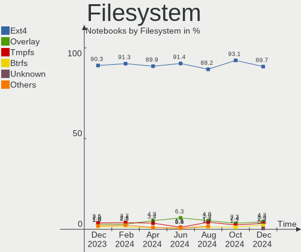
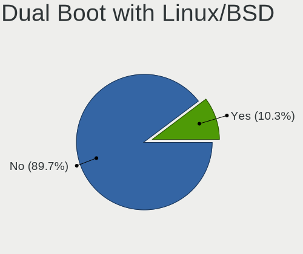
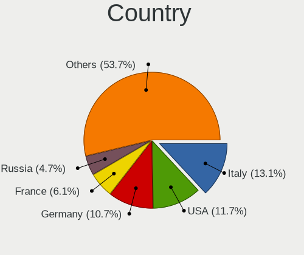
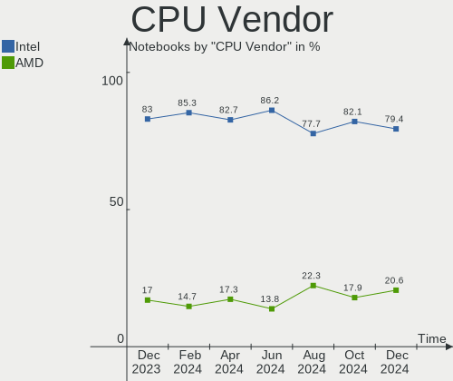
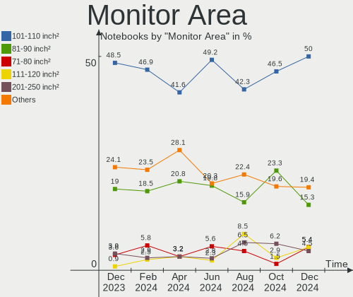
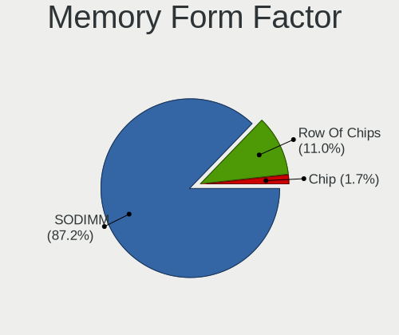

Linux Mint - Hardware Trends (Notebooks)
----------------------------------------

A project to identify most popular hardware characteristics and track their change
over time based on data collected by Linux users at https://Linux-Hardware.org.

Anyone can contribute to this report by the [hw-probe](https://github.com/linuxhw/hw-probe) tool:

    sudo -E hw-probe -all -upload

This report is for one last month. Overall report since the beginning of time: [TestDays](https://github.com/linuxhw/TestDays)

Period: Mar, 2023.

Contents
--------

* [ System ](#system)
  - [ OS                       ](#os)
  - [ OS Family                ](#os-family)
  - [ Kernel                   ](#kernel)
  - [ Kernel Family            ](#kernel-family)
  - [ Kernel Major Ver.        ](#kernel-major-ver)
  - [ Arch                     ](#arch)
  - [ DE                       ](#de)
  - [ Display Server           ](#display-server)
  - [ Display Manager          ](#display-manager)
  - [ OS Lang                  ](#os-lang)
  - [ Boot Mode                ](#boot-mode)
  - [ Filesystem               ](#filesystem)
  - [ Part. scheme             ](#part-scheme)
  - [ Dual Boot with Linux/BSD ](#dual-boot-with-linuxbsd)
  - [ Dual Boot (Win)          ](#dual-boot-win)

* [ Board ](#board)
  - [ Vendor                   ](#vendor)
  - [ Model                    ](#model)
  - [ Model Family             ](#model-family)
  - [ MFG Year                 ](#mfg-year)
  - [ Form Factor              ](#form-factor)
  - [ Secure Boot              ](#secure-boot)
  - [ Coreboot                 ](#coreboot)
  - [ RAM Size                 ](#ram-size)
  - [ RAM Used                 ](#ram-used)
  - [ Total Drives             ](#total-drives)
  - [ Has CD-ROM               ](#has-cd-rom)
  - [ Has Ethernet             ](#has-ethernet)
  - [ Has WiFi                 ](#has-wifi)
  - [ Has Bluetooth            ](#has-bluetooth)

* [ Location ](#location)
  - [ Country                  ](#country)
  - [ City                     ](#city)

* [ Drives ](#drives)
  - [ Drive Vendor             ](#drive-vendor)
  - [ Drive Model              ](#drive-model)
  - [ HDD Vendor               ](#hdd-vendor)
  - [ SSD Vendor               ](#ssd-vendor)
  - [ Drive Kind               ](#drive-kind)
  - [ Drive Connector          ](#drive-connector)
  - [ Drive Size               ](#drive-size)
  - [ Space Total              ](#space-total)
  - [ Space Used               ](#space-used)
  - [ Malfunc. Drives          ](#malfunc-drives)
  - [ Malfunc. Drive Vendor    ](#malfunc-drive-vendor)
  - [ Malfunc. HDD Vendor      ](#malfunc-hdd-vendor)
  - [ Malfunc. Drive Kind      ](#malfunc-drive-kind)
  - [ Failed Drives            ](#failed-drives)
  - [ Failed Drive Vendor      ](#failed-drive-vendor)
  - [ Drive Status             ](#drive-status)

* [ Storage controller ](#storage-controller)
  - [ Storage Vendor           ](#storage-vendor)
  - [ Storage Model            ](#storage-model)
  - [ Storage Kind             ](#storage-kind)

* [ Processor ](#processor)
  - [ CPU Vendor               ](#cpu-vendor)
  - [ CPU Model                ](#cpu-model)
  - [ CPU Model Family         ](#cpu-model-family)
  - [ CPU Cores                ](#cpu-cores)
  - [ CPU Sockets              ](#cpu-sockets)
  - [ CPU Threads              ](#cpu-threads)
  - [ CPU Op-Modes             ](#cpu-op-modes)
  - [ CPU Microcode            ](#cpu-microcode)
  - [ CPU Microarch            ](#cpu-microarch)

* [ Graphics ](#graphics)
  - [ GPU Vendor               ](#gpu-vendor)
  - [ GPU Model                ](#gpu-model)
  - [ GPU Combo                ](#gpu-combo)
  - [ GPU Driver               ](#gpu-driver)
  - [ GPU Memory               ](#gpu-memory)

* [ Monitor ](#monitor)
  - [ Monitor Vendor           ](#monitor-vendor)
  - [ Monitor Model            ](#monitor-model)
  - [ Monitor Resolution       ](#monitor-resolution)
  - [ Monitor Diagonal         ](#monitor-diagonal)
  - [ Monitor Width            ](#monitor-width)
  - [ Aspect Ratio             ](#aspect-ratio)
  - [ Monitor Area             ](#monitor-area)
  - [ Pixel Density            ](#pixel-density)
  - [ Multiple Monitors        ](#multiple-monitors)

* [ Network ](#network)
  - [ Net Controller Vendor    ](#net-controller-vendor)
  - [ Net Controller Model     ](#net-controller-model)
  - [ Wireless Vendor          ](#wireless-vendor)
  - [ Wireless Model           ](#wireless-model)
  - [ Ethernet Vendor          ](#ethernet-vendor)
  - [ Ethernet Model           ](#ethernet-model)
  - [ Net Controller Kind      ](#net-controller-kind)
  - [ Used Controller          ](#used-controller)
  - [ NICs                     ](#nics)
  - [ IPv6                     ](#ipv6)

* [ Bluetooth ](#bluetooth)
  - [ Bluetooth Vendor         ](#bluetooth-vendor)
  - [ Bluetooth Model          ](#bluetooth-model)

* [ Sound ](#sound)
  - [ Sound Vendor             ](#sound-vendor)
  - [ Sound Model              ](#sound-model)

* [ Memory ](#memory)
  - [ Memory Vendor            ](#memory-vendor)
  - [ Memory Model             ](#memory-model)
  - [ Memory Kind              ](#memory-kind)
  - [ Memory Form Factor       ](#memory-form-factor)
  - [ Memory Size              ](#memory-size)
  - [ Memory Speed             ](#memory-speed)

* [ Printers & scanners ](#printers--scanners)
  - [ Printer Vendor           ](#printer-vendor)
  - [ Printer Model            ](#printer-model)
  - [ Scanner Vendor           ](#scanner-vendor)
  - [ Scanner Model            ](#scanner-model)

* [ Camera ](#camera)
  - [ Camera Vendor            ](#camera-vendor)
  - [ Camera Model             ](#camera-model)

* [ Security ](#security)
  - [ Fingerprint Vendor       ](#fingerprint-vendor)
  - [ Fingerprint Model        ](#fingerprint-model)
  - [ Chipcard Vendor          ](#chipcard-vendor)
  - [ Chipcard Model           ](#chipcard-model)

* [ Unsupported ](#unsupported)
  - [ Unsupported Devices      ](#unsupported-devices)
  - [ Unsupported Device Types ](#unsupported-device-types)

System
------

OS
--

Installed operating systems

| Name            | Notebooks | Percent |
|-----------------|-----------|---------|
| Linux Mint 21.1 | 230       | 71.21%  |
| Linux Mint 20.3 | 44        | 13.62%  |
| Linux Mint 21   | 34        | 10.53%  |
| Linux Mint 20.2 | 4         | 1.24%   |
| Linux Mint 19.3 | 4         | 1.24%   |
| Linux Mint 20.1 | 3         | 0.93%   |
| Linux Mint 20   | 3         | 0.93%   |
| Linux Mint 19.1 | 1         | 0.31%   |

OS Family
---------

OS without a version

| Name       | Notebooks | Percent |
|------------|-----------|---------|
| Linux Mint | 323       | 100%    |

Kernel
------

Version of the Linux kernel

| Version                 | Notebooks | Percent |
|-------------------------|-----------|---------|
| 5.15.0-67-generic       | 154       | 47.68%  |
| 5.4.0-144-generic       | 37        | 11.46%  |
| 5.15.0-56-generic       | 25        | 7.74%   |
| 5.15.0-60-generic       | 23        | 7.12%   |
| 5.15.0-69-generic       | 21        | 6.5%    |
| 5.19.0-35-generic       | 20        | 6.19%   |
| 5.4.0-139-generic       | 5         | 1.55%   |
| 5.15.0-41-generic       | 5         | 1.55%   |
| 6.1.0-1007-oem          | 4         | 1.24%   |
| 5.19.0-38-generic       | 4         | 1.24%   |
| 5.19.0-32-generic       | 2         | 0.62%   |
| 4.15.0-206-generic      | 2         | 0.62%   |
| 6.2.7-060207-generic    | 1         | 0.31%   |
| 6.2.5-060205-generic    | 1         | 0.31%   |
| 6.2.2-x64v3-xanmod1     | 1         | 0.31%   |
| 6.2.2-060202-generic    | 1         | 0.31%   |
| 6.2.1-x64v3-xanmod1     | 1         | 0.31%   |
| 6.2.0-060200-generic    | 1         | 0.31%   |
| 6.1.9-060109-generic    | 1         | 0.31%   |
| 6.1.15-1-liquorix-amd64 | 1         | 0.31%   |
| 6.1.0-1006-oem          | 1         | 0.31%   |
| 5.4.0-94-generic        | 1         | 0.31%   |
| 5.4.0-91-generic        | 1         | 0.31%   |
| 5.4.0-74-generic        | 1         | 0.31%   |
| 5.4.0-58-generic        | 1         | 0.31%   |
| 5.4.0-146-generic       | 1         | 0.31%   |
| 5.4.0-137-generic       | 1         | 0.31%   |
| 5.4.0-135-generic       | 1         | 0.31%   |
| 5.4.0-121-generic       | 1         | 0.31%   |
| 5.17.0-1019-oem         | 1         | 0.31%   |
| 5.15.0-58-generic       | 1         | 0.31%   |
| 5.15.0-52-generic       | 1         | 0.31%   |
| 5.14.0-1058-oem         | 1         | 0.31%   |

Kernel Family
-------------

Linux kernel without a distro release

| Version | Notebooks | Percent |
|---------|-----------|---------|
| 5.15.0  | 230       | 71.21%  |
| 5.4.0   | 50        | 15.48%  |
| 5.19.0  | 26        | 8.05%   |
| 6.1.0   | 5         | 1.55%   |
| 6.2.2   | 2         | 0.62%   |
| 4.15.0  | 2         | 0.62%   |
| 6.2.7   | 1         | 0.31%   |
| 6.2.5   | 1         | 0.31%   |
| 6.2.1   | 1         | 0.31%   |
| 6.2.0   | 1         | 0.31%   |
| 6.1.9   | 1         | 0.31%   |
| 6.1.15  | 1         | 0.31%   |
| 5.17.0  | 1         | 0.31%   |
| 5.14.0  | 1         | 0.31%   |

Kernel Major Ver.
-----------------

Linux kernel major version

| Version | Notebooks | Percent |
|---------|-----------|---------|
| 5.15    | 230       | 71.21%  |
| 5.4     | 50        | 15.48%  |
| 5.19    | 26        | 8.05%   |
| 6.1     | 7         | 2.17%   |
| 6.2     | 6         | 1.86%   |
| 4.15    | 2         | 0.62%   |
| 5.17    | 1         | 0.31%   |
| 5.14    | 1         | 0.31%   |

Arch
----

OS architecture (x86_64, i586, etc.)

| Name   | Notebooks | Percent |
|--------|-----------|---------|
| x86_64 | 323       | 100%    |

DE
--

Desktop Environment

| Name       | Notebooks | Percent |
|------------|-----------|---------|
| X-Cinnamon | 246       | 76.16%  |
| XFCE       | 31        | 9.6%    |
| MATE       | 30        | 9.29%   |
| Cinnamon   | 9         | 2.79%   |
| GNOME      | 4         | 1.24%   |
| LXDE       | 1         | 0.31%   |
| KDE5       | 1         | 0.31%   |
| GNUstep    | 1         | 0.31%   |

Display Server
--------------

X11 or Wayland

| Name    | Notebooks | Percent |
|---------|-----------|---------|
| X11     | 319       | 98.76%  |
| Wayland | 2         | 0.62%   |
| Tty     | 2         | 0.62%   |

Display Manager
---------------

SDDM, LightDM, etc.

| Name    | Notebooks | Percent |
|---------|-----------|---------|
| LightDM | 165       | 51.08%  |
| Unknown | 154       | 47.68%  |
| GDM3    | 3         | 0.93%   |
| LXDM    | 1         | 0.31%   |

OS Lang
-------

Language

| Lang  | Notebooks | Percent |
|-------|-----------|---------|
| en_US | 86        | 26.63%  |
| de_DE | 57        | 17.65%  |
| fr_FR | 18        | 5.57%   |
| pl_PL | 15        | 4.64%   |
| C     | 15        | 4.64%   |
| it_IT | 14        | 4.33%   |
| es_ES | 13        | 4.02%   |
| en_GB | 12        | 3.72%   |
| ru_RU | 10        | 3.1%    |
| pt_BR | 9         | 2.79%   |
| en_IN | 9         | 2.79%   |
| es_MX | 5         | 1.55%   |
| en_ZA | 4         | 1.24%   |
| de_CH | 4         | 1.24%   |
| lt_LT | 3         | 0.93%   |
| es_AR | 3         | 0.93%   |
| en_IE | 3         | 0.93%   |
| en_CA | 3         | 0.93%   |
| en_AU | 3         | 0.93%   |
| de_AT | 3         | 0.93%   |
| cs_CZ | 3         | 0.93%   |
| sk_SK | 2         | 0.62%   |
| nl_NL | 2         | 0.62%   |
| nl_BE | 2         | 0.62%   |
| hu_HU | 2         | 0.62%   |
| fi_FI | 2         | 0.62%   |
| es_VE | 2         | 0.62%   |
| es_CL | 2         | 0.62%   |
| en_NZ | 2         | 0.62%   |
| bg_BG | 2         | 0.62%   |
| uk_UA | 1         | 0.31%   |
| sv_SE | 1         | 0.31%   |
| pt_PT | 1         | 0.31%   |
| nb_NO | 1         | 0.31%   |
| lv_LV | 1         | 0.31%   |
| hr_HR | 1         | 0.31%   |
| fr_BE | 1         | 0.31%   |
| et_EE | 1         | 0.31%   |
| es_UY | 1         | 0.31%   |
| es_CO | 1         | 0.31%   |

Boot Mode
---------

EFI or BIOS

| Mode | Notebooks | Percent |
|------|-----------|---------|
| EFI  | 217       | 67.18%  |
| BIOS | 106       | 32.82%  |

Filesystem
----------

Type of filesystem

| Type    | Notebooks | Percent |
|---------|-----------|---------|
| Ext4    | 302       | 93.5%   |
| Overlay | 13        | 4.02%   |
| Zfs     | 5         | 1.55%   |
| Btrfs   | 3         | 0.93%   |

Part. scheme
------------

Scheme of partitioning

| Type    | Notebooks | Percent |
|---------|-----------|---------|
| Unknown | 153       | 47.37%  |
| GPT     | 150       | 46.44%  |
| MBR     | 20        | 6.19%   |

Dual Boot with Linux/BSD
------------------------

Hosting more than one Linux/BSD

| Dual boot | Notebooks | Percent |
|-----------|-----------|---------|
| No        | 291       | 90.09%  |
| Yes       | 32        | 9.91%   |

Dual Boot (Win)
---------------

Hosting Linux and Windows

| Dual boot | Notebooks | Percent |
|-----------|-----------|---------|
| No        | 259       | 80.19%  |
| Yes       | 64        | 19.81%  |

Board
-----

Vendor
------

Motherboard manufacturer

| Name                 | Notebooks | Percent |
|----------------------|-----------|---------|
| Lenovo               | 72        | 22.29%  |
| Hewlett-Packard      | 59        | 18.27%  |
| Dell                 | 49        | 15.17%  |
| Acer                 | 33        | 10.22%  |
| ASUSTek Computer     | 31        | 9.6%    |
| Toshiba              | 10        | 3.1%    |
| Samsung Electronics  | 9         | 2.79%   |
| Apple                | 9         | 2.79%   |
| Google               | 6         | 1.86%   |
| MSI                  | 4         | 1.24%   |
| HUAWEI               | 4         | 1.24%   |
| Fujitsu Siemens      | 3         | 0.93%   |
| Sony                 | 2         | 0.62%   |
| Notebook             | 2         | 0.62%   |
| Medion               | 2         | 0.62%   |
| Unknown              | 2         | 0.62%   |
| Wortmann AG          | 1         | 0.31%   |
| VIT                  | 1         | 0.31%   |
| TUXEDO               | 1         | 0.31%   |
| Standard             | 1         | 0.31%   |
| Schenker             | 1         | 0.31%   |
| RDP                  | 1         | 0.31%   |
| Positivo             | 1         | 0.31%   |
| Pegatron             | 1         | 0.31%   |
| LG Electronics       | 1         | 0.31%   |
| Juana Manso          | 1         | 0.31%   |
| Intel Client Systems | 1         | 0.31%   |
| Insyde               | 1         | 0.31%   |
| Haier                | 1         | 0.31%   |
| GMK                  | 1         | 0.31%   |
| Gigabyte Technology  | 1         | 0.31%   |
| Getac                | 1         | 0.31%   |
| Gear                 | 1         | 0.31%   |
| Fujitsu              | 1         | 0.31%   |
| Exo                  | 1         | 0.31%   |
| Dynabook             | 1         | 0.31%   |
| Digibras             | 1         | 0.31%   |
| Compal               | 1         | 0.31%   |
| Clevo                | 1         | 0.31%   |
| AXIOO                | 1         | 0.31%   |

Model
-----

Motherboard model

| Name                                | Notebooks | Percent |
|-------------------------------------|-----------|---------|
| HP Pavilion dv7                     | 3         | 0.93%   |
| HP Pavilion 15                      | 3         | 0.93%   |
| Dell Inspiron N5110                 | 3         | 0.93%   |
| Unknown                             | 3         | 0.93%   |
| Lenovo Legion 5 15ACH6H 82JU        | 2         | 0.62%   |
| Lenovo G50-80 80E5                  | 2         | 0.62%   |
| HP Notebook                         | 2         | 0.62%   |
| HP Laptop 17-by0xxx                 | 2         | 0.62%   |
| HP EliteBook 840 G5                 | 2         | 0.62%   |
| HP 250 G8 Notebook PC               | 2         | 0.62%   |
| ASUS N61Jq                          | 2         | 0.62%   |
| Apple MacBookPro5,1                 | 2         | 0.62%   |
| Wortmann AG CR700                   | 1         | 0.31%   |
| VIT P1400                           | 1         | 0.31%   |
| TUXEDO Aura 15 Gen1                 | 1         | 0.31%   |
| Toshiba Satellite S70-A             | 1         | 0.31%   |
| Toshiba Satellite Pro L300          | 1         | 0.31%   |
| Toshiba Satellite L50D-B            | 1         | 0.31%   |
| Toshiba Satellite C855-12N          | 1         | 0.31%   |
| Toshiba Satellite C660              | 1         | 0.31%   |
| Toshiba Satellite C55t-C            | 1         | 0.31%   |
| Toshiba Satellite C50-A             | 1         | 0.31%   |
| Toshiba Satellite A665              | 1         | 0.31%   |
| Toshiba PORTEGE Z30t-C              | 1         | 0.31%   |
| Toshiba KIRA                        | 1         | 0.31%   |
| Standard SF20BA                     | 1         | 0.31%   |
| Sony SVF1521C2EW                    | 1         | 0.31%   |
| Sony SVE1713A6EW                    | 1         | 0.31%   |
| Schenker VISION 15 (SVS15E21)       | 1         | 0.31%   |
| Samsung R519/R719                   | 1         | 0.31%   |
| Samsung N150P/N210P/N220P           | 1         | 0.31%   |
| Samsung 940XFG                      | 1         | 0.31%   |
| Samsung 550XDA                      | 1         | 0.31%   |
| Samsung 550P5C/550P7C               | 1         | 0.31%   |
| Samsung 530U3C/530U4C/532U3C        | 1         | 0.31%   |
| Samsung 370E4K                      | 1         | 0.31%   |
| Samsung 350V5C/351V5C/3540VC/3440VC | 1         | 0.31%   |
| Samsung 300E4A/300E5A/300E7A        | 1         | 0.31%   |
| RDP ThinBook 1010                   | 1         | 0.31%   |
| Positivo S14CT01                    | 1         | 0.31%   |

Model Family
------------

Motherboard model prefix

| Name               | Notebooks | Percent |
|--------------------|-----------|---------|
| Lenovo ThinkPad    | 34        | 10.53%  |
| Acer Aspire        | 26        | 8.05%   |
| Lenovo IdeaPad     | 19        | 5.88%   |
| Dell Latitude      | 17        | 5.26%   |
| HP Pavilion        | 16        | 4.95%   |
| HP Laptop          | 15        | 4.64%   |
| Dell Inspiron      | 15        | 4.64%   |
| HP EliteBook       | 10        | 3.1%    |
| Toshiba Satellite  | 8         | 2.48%   |
| Dell XPS           | 8         | 2.48%   |
| HP ProBook         | 6         | 1.86%   |
| ASUS VivoBook      | 6         | 1.86%   |
| Acer TravelMate    | 4         | 1.24%   |
| Lenovo ThinkBook   | 3         | 0.93%   |
| HP 250             | 3         | 0.93%   |
| Dell Precision     | 3         | 0.93%   |
| Unknown            | 3         | 0.93%   |
| Lenovo Yoga        | 2         | 0.62%   |
| Lenovo Legion      | 2         | 0.62%   |
| Lenovo G50-80      | 2         | 0.62%   |
| HP Notebook        | 2         | 0.62%   |
| HP ENVY            | 2         | 0.62%   |
| HP 255             | 2         | 0.62%   |
| Dell Vostro        | 2         | 0.62%   |
| ASUS Zenbook       | 2         | 0.62%   |
| ASUS ROG           | 2         | 0.62%   |
| ASUS N61Jq         | 2         | 0.62%   |
| Apple MacBookPro5  | 2         | 0.62%   |
| Apple MacBookPro11 | 2         | 0.62%   |
| Acer Swift         | 2         | 0.62%   |
| Wortmann AG CR700  | 1         | 0.31%   |
| VIT P1400          | 1         | 0.31%   |
| TUXEDO Aura        | 1         | 0.31%   |
| Toshiba PORTEGE    | 1         | 0.31%   |
| Toshiba KIRA       | 1         | 0.31%   |
| Standard SF20BA    | 1         | 0.31%   |
| Sony SVF1521C2EW   | 1         | 0.31%   |
| Sony SVE1713A6EW   | 1         | 0.31%   |
| Schenker VISION    | 1         | 0.31%   |
| Samsung R519       | 1         | 0.31%   |

MFG Year
--------

Motherboard manufacture year

| Year    | Notebooks | Percent |
|---------|-----------|---------|
| 2021    | 38        | 11.76%  |
| 2012    | 25        | 7.74%   |
| 2022    | 24        | 7.43%   |
| 2011    | 24        | 7.43%   |
| 2010    | 23        | 7.12%   |
| 2020    | 22        | 6.81%   |
| 2018    | 22        | 6.81%   |
| 2016    | 21        | 6.5%    |
| 2013    | 21        | 6.5%    |
| 2019    | 20        | 6.19%   |
| 2014    | 18        | 5.57%   |
| 2017    | 17        | 5.26%   |
| 2008    | 14        | 4.33%   |
| 2015    | 12        | 3.72%   |
| 2009    | 11        | 3.41%   |
| 2023    | 4         | 1.24%   |
| 2007    | 3         | 0.93%   |
| 2006    | 2         | 0.62%   |
| 2005    | 1         | 0.31%   |
| Unknown | 1         | 0.31%   |

Form Factor
-----------

Physical design of the computer

| Name     | Notebooks | Percent |
|----------|-----------|---------|
| Notebook | 323       | 100%    |

Secure Boot
-----------

Enabled or disabled

| State    | Notebooks | Percent |
|----------|-----------|---------|
| Disabled | 280       | 86.69%  |
| Enabled  | 43        | 13.31%  |

Coreboot
--------

Have coreboot on board

| Used | Notebooks | Percent |
|------|-----------|---------|
| No   | 317       | 98.14%  |
| Yes  | 6         | 1.86%   |

RAM Size
--------

Total RAM memory

| Size in GB  | Notebooks | Percent |
|-------------|-----------|---------|
| 4.01-8.0    | 111       | 34.37%  |
| 3.01-4.0    | 68        | 21.05%  |
| 16.01-24.0  | 56        | 17.34%  |
| 8.01-16.0   | 53        | 16.41%  |
| 1.01-2.0    | 18        | 5.57%   |
| 32.01-64.0  | 6         | 1.86%   |
| 2.01-3.0    | 6         | 1.86%   |
| 24.01-32.0  | 3         | 0.93%   |
| 64.01-256.0 | 2         | 0.62%   |

RAM Used
--------

Used RAM memory

| Used GB    | Notebooks | Percent |
|------------|-----------|---------|
| 1.01-2.0   | 107       | 33.13%  |
| 2.01-3.0   | 96        | 29.72%  |
| 4.01-8.0   | 53        | 16.41%  |
| 3.01-4.0   | 37        | 11.46%  |
| 0.51-1.0   | 18        | 5.57%   |
| 8.01-16.0  | 9         | 2.79%   |
| 16.01-24.0 | 2         | 0.62%   |
| 0.01-0.5   | 1         | 0.31%   |

Total Drives
------------

Number of drives on board

| Drives | Notebooks | Percent |
|--------|-----------|---------|
| 1      | 222       | 68.73%  |
| 2      | 89        | 27.55%  |
| 3      | 9         | 2.79%   |
| 0      | 2         | 0.62%   |
| 4      | 1         | 0.31%   |

Has CD-ROM
----------

Has CD-ROM on board

| Presented | Notebooks | Percent |
|-----------|-----------|---------|
| No        | 201       | 62.23%  |
| Yes       | 122       | 37.77%  |

Has Ethernet
------------

Has Ethernet on board

| Presented | Notebooks | Percent |
|-----------|-----------|---------|
| Yes       | 248       | 76.78%  |
| No        | 75        | 23.22%  |

Has WiFi
--------

Has WiFi module

| Presented | Notebooks | Percent |
|-----------|-----------|---------|
| Yes       | 318       | 98.45%  |
| No        | 5         | 1.55%   |

Has Bluetooth
-------------

Has Bluetooth module

| Presented | Notebooks | Percent |
|-----------|-----------|---------|
| Yes       | 263       | 81.42%  |
| No        | 60        | 18.58%  |

Location
--------

Country
-------

Geographic location (country)

| Country      | Notebooks | Percent |
|--------------|-----------|---------|
| Germany      | 60        | 18.58%  |
| USA          | 46        | 14.24%  |
| Poland       | 23        | 7.12%   |
| France       | 18        | 5.57%   |
| Italy        | 15        | 4.64%   |
| Spain        | 14        | 4.33%   |
| Brazil       | 12        | 3.72%   |
| UK           | 11        | 3.41%   |
| India        | 10        | 3.1%    |
| Russia       | 9         | 2.79%   |
| Switzerland  | 7         | 2.17%   |
| Mexico       | 6         | 1.86%   |
| South Africa | 5         | 1.55%   |
| Netherlands  | 5         | 1.55%   |
| Ireland      | 5         | 1.55%   |
| Canada       | 5         | 1.55%   |
| Hungary      | 4         | 1.24%   |
| Bulgaria     | 4         | 1.24%   |
| Australia    | 4         | 1.24%   |
| Venezuela    | 3         | 0.93%   |
| Sweden       | 3         | 0.93%   |
| Slovakia     | 3         | 0.93%   |
| Lithuania    | 3         | 0.93%   |
| Indonesia    | 3         | 0.93%   |
| Finland      | 3         | 0.93%   |
| Czechia      | 3         | 0.93%   |
| Belgium      | 3         | 0.93%   |
| Argentina    | 3         | 0.93%   |
| Vietnam      | 2         | 0.62%   |
| Tunisia      | 2         | 0.62%   |
| Romania      | 2         | 0.62%   |
| New Zealand  | 2         | 0.62%   |
| Greece       | 2         | 0.62%   |
| Ecuador      | 2         | 0.62%   |
| Chile        | 2         | 0.62%   |
| Austria      | 2         | 0.62%   |
| Yemen        | 1         | 0.31%   |
| Uzbekistan   | 1         | 0.31%   |
| Uruguay      | 1         | 0.31%   |
| Singapore    | 1         | 0.31%   |

City
----

Geographic location (city)

| City              | Notebooks | Percent |
|-------------------|-----------|---------|
| Berlin            | 6         | 1.86%   |
| Warsaw            | 4         | 1.24%   |
| Moscow            | 4         | 1.24%   |
| Stuttgart         | 3         | 0.93%   |
| Sao Paulo         | 3         | 0.93%   |
| Helsinki          | 3         | 0.93%   |
| Hamburg           | 3         | 0.93%   |
| Zurich            | 2         | 0.62%   |
| Wilmington        | 2         | 0.62%   |
| Villachiara       | 2         | 0.62%   |
| Vienna            | 2         | 0.62%   |
| Ueckermuende      | 2         | 0.62%   |
| Toronto           | 2         | 0.62%   |
| Terrassa          | 2         | 0.62%   |
| Santiago          | 2         | 0.62%   |
| Quito             | 2         | 0.62%   |
| Poznan            | 2         | 0.62%   |
| Portland          | 2         | 0.62%   |
| Poitiers          | 2         | 0.62%   |
| Plovdiv           | 2         | 0.62%   |
| Philadelphia      | 2         | 0.62%   |
| Perth             | 2         | 0.62%   |
| Nottingham        | 2         | 0.62%   |
| New York          | 2         | 0.62%   |
| Martin            | 2         | 0.62%   |
| Maracaibo         | 2         | 0.62%   |
| Málaga           | 2         | 0.62%   |
| Madrid            | 2         | 0.62%   |
| Lucan             | 2         | 0.62%   |
| Lodz              | 2         | 0.62%   |
| Krakow            | 2         | 0.62%   |
| Jena              | 2         | 0.62%   |
| Ho Chi Minh City  | 2         | 0.62%   |
| Guadalajara       | 2         | 0.62%   |
| Frankfurt am Main | 2         | 0.62%   |
| Elderslie         | 2         | 0.62%   |
| Dublin            | 2         | 0.62%   |
| Cordovado         | 2         | 0.62%   |
| Cologne           | 2         | 0.62%   |
| City of London    | 2         | 0.62%   |

Drives
------

Drive Vendor
------------

Hard drive vendors

| Vendor                         | Notebooks | Drives | Percent |
|--------------------------------|-----------|--------|---------|
| Samsung Electronics            | 58        | 60     | 14.32%  |
| Seagate                        | 51        | 53     | 12.59%  |
| WDC                            | 40        | 41     | 9.88%   |
| SanDisk                        | 25        | 25     | 6.17%   |
| Unknown                        | 24        | 26     | 5.93%   |
| Toshiba                        | 24        | 24     | 5.93%   |
| Kingston                       | 17        | 17     | 4.2%    |
| Crucial                        | 15        | 15     | 3.7%    |
| SK hynix                       | 13        | 13     | 3.21%   |
| Hitachi                        | 13        | 13     | 3.21%   |
| Intel                          | 12        | 12     | 2.96%   |
| HGST                           | 10        | 10     | 2.47%   |
| Micron Technology              | 9         | 9      | 2.22%   |
| Unknown                        | 7         | 7      | 1.73%   |
| Silicon Motion                 | 6         | 6      | 1.48%   |
| Intenso                        | 6         | 6      | 1.48%   |
| China                          | 6         | 6      | 1.48%   |
| A-DATA Technology              | 5         | 5      | 1.23%   |
| KIOXIA                         | 4         | 4      | 0.99%   |
| Phison Electronics             | 3         | 3      | 0.74%   |
| Lexar                          | 3         | 3      | 0.74%   |
| GOODRAM                        | 3         | 3      | 0.74%   |
| Fujitsu                        | 3         | 3      | 0.74%   |
| Apple                          | 3         | 3      | 0.74%   |
| Union Memory (Shenzhen)        | 2         | 2      | 0.49%   |
| SPCC                           | 2         | 2      | 0.49%   |
| Solid State Storage Technology | 2         | 2      | 0.49%   |
| Plextor                        | 2         | 2      | 0.49%   |
| Netac                          | 2         | 2      | 0.49%   |
| Fanxiang                       | 2         | 2      | 0.49%   |
| Apacer                         | 2         | 2      | 0.49%   |
| Zebronics                      | 1         | 1      | 0.25%   |
| XrayDisk                       | 1         | 1      | 0.25%   |
| XPG                            | 1         | 1      | 0.25%   |
| VISIPRO                        | 1         | 1      | 0.25%   |
| Verbatim                       | 1         | 1      | 0.25%   |
| V-GeN                          | 1         | 1      | 0.25%   |
| USB3.0                         | 1         | 1      | 0.25%   |
| Union Memory                   | 1         | 1      | 0.25%   |
| UMIS                           | 1         | 1      | 0.25%   |

Drive Model
-----------

Hard drive models

| Model                                                  | Notebooks | Percent |
|--------------------------------------------------------|-----------|---------|
| Seagate ST1000LM035-1RK172 1TB                         | 9         | 2.2%    |
| Unknown MMC Card  32GB                                 | 8         | 1.95%   |
| Seagate ST1000LM024 HN-M101MBB 1TB                     | 8         | 1.95%   |
| Unknown                                                | 7         | 1.71%   |
| Unknown MMC Card  64GB                                 | 5         | 1.22%   |
| Seagate ST9500325AS 500GB                              | 5         | 1.22%   |
| Samsung SSD 860 EVO 500GB                              | 5         | 1.22%   |
| Samsung SSD 850 EVO 250GB                              | 5         | 1.22%   |
| WDC WD10JPVX-22JC3T0 1TB                               | 4         | 0.98%   |
| Samsung NVMe SSD Controller SM981/PM981/PM983 250GB    | 4         | 0.98%   |
| Samsung MZALQ512HBLU-00BL2 512GB                       | 4         | 0.98%   |
| Kingston SA400S37240G 240GB SSD                        | 4         | 0.98%   |
| WDC WDS240G2G0A-00JH30 240GB SSD                       | 3         | 0.73%   |
| Silicon Motion SM2263EN/SM2263XT SSD Controller 1024GB | 3         | 0.73%   |
| Samsung SSD 870 EVO 1TB                                | 3         | 0.73%   |
| Hitachi HTS545050B9A300 500GB                          | 3         | 0.73%   |
| Hitachi HTS545050A7E380 500GB                          | 3         | 0.73%   |
| Hitachi HTS545032B9A300 320GB                          | 3         | 0.73%   |
| WDC WD10JPCX-24UE4T0 1TB                               | 2         | 0.49%   |
| WDC PC SN530 SDBPNPZ-512G-1006 512GB                   | 2         | 0.49%   |
| WDC PC SN530 SDBPMPZ-512G-1101 512GB                   | 2         | 0.49%   |
| Toshiba THNSFJ256GCSU 256GB SSD                        | 2         | 0.49%   |
| Toshiba MQ04ABF100 1TB                                 | 2         | 0.49%   |
| Toshiba KXG50ZNV512G 512GB                             | 2         | 0.49%   |
| SK hynix SKHynix_HFS512GDE9X084N 512GB                 | 2         | 0.49%   |
| SK hynix SKHynix_HFM512GDHTNI-87A0B 512GB              | 2         | 0.49%   |
| SK hynix PC801 NVMe 2TB                                | 2         | 0.49%   |
| Seagate ST500LT012-9WS142 500GB                        | 2         | 0.49%   |
| Seagate ST500LT012-1DG142 500GB                        | 2         | 0.49%   |
| Seagate ST320LM001 HN-M320MBB 320GB                    | 2         | 0.49%   |
| Seagate ST2000LM007-1R8174 2TB                         | 2         | 0.49%   |
| Seagate ST1000LM048-2E7172 1TB                         | 2         | 0.49%   |
| Seagate Expansion+ 2TB                                 | 2         | 0.49%   |
| Seagate Backup+ Desk 5TB                               | 2         | 0.49%   |
| SanDisk SSD i100 24GB                                  | 2         | 0.49%   |
| SanDisk SDSSDA120G 120GB                               | 2         | 0.49%   |
| SanDisk NVMe SSD Drive 512GB                           | 2         | 0.49%   |
| SanDisk NVMe SSD Drive 1TB                             | 2         | 0.49%   |
| Samsung SSD 870 EVO 500GB                              | 2         | 0.49%   |
| Samsung MZVLQ512HBLU-00BH1 512GB                       | 2         | 0.49%   |

HDD Vendor
----------

Hard disk drive vendors

| Vendor              | Notebooks | Drives | Percent |
|---------------------|-----------|--------|---------|
| Seagate             | 49        | 50     | 41.18%  |
| WDC                 | 24        | 24     | 20.17%  |
| Toshiba             | 14        | 14     | 11.76%  |
| Hitachi             | 13        | 13     | 10.92%  |
| HGST                | 10        | 10     | 8.4%    |
| Samsung Electronics | 3         | 3      | 2.52%   |
| Fujitsu             | 3         | 3      | 2.52%   |
| USB3.0              | 1         | 1      | 0.84%   |
| Unknown             | 1         | 1      | 0.84%   |
| ASMT                | 1         | 1      | 0.84%   |

SSD Vendor
----------

Solid state drive vendors

| Vendor              | Notebooks | Drives | Percent |
|---------------------|-----------|--------|---------|
| Samsung Electronics | 29        | 30     | 22.66%  |
| SanDisk             | 17        | 17     | 13.28%  |
| Crucial             | 14        | 14     | 10.94%  |
| Kingston            | 10        | 10     | 7.81%   |
| WDC                 | 6         | 6      | 4.69%   |
| Intenso             | 6         | 6      | 4.69%   |
| China               | 6         | 6      | 4.69%   |
| Toshiba             | 4         | 4      | 3.13%   |
| A-DATA Technology   | 4         | 4      | 3.13%   |
| Lexar               | 3         | 3      | 2.34%   |
| Intel               | 3         | 3      | 2.34%   |
| GOODRAM             | 3         | 3      | 2.34%   |
| Plextor             | 2         | 2      | 1.56%   |
| Apple               | 2         | 2      | 1.56%   |
| Apacer              | 2         | 2      | 1.56%   |
| Zebronics           | 1         | 1      | 0.78%   |
| XrayDisk            | 1         | 1      | 0.78%   |
| VISIPRO             | 1         | 1      | 0.78%   |
| Transcend           | 1         | 1      | 0.78%   |
| Timetec             | 1         | 1      | 0.78%   |
| SPCC                | 1         | 1      | 0.78%   |
| SK hynix            | 1         | 1      | 0.78%   |
| ShiJi               | 1         | 1      | 0.78%   |
| Phison              | 1         | 1      | 0.78%   |
| Netac               | 1         | 1      | 0.78%   |
| LITEONIT            | 1         | 1      | 0.78%   |
| LITEON E            | 1         | 1      | 0.78%   |
| LITEON              | 1         | 1      | 0.78%   |
| Gigabyte Technology | 1         | 1      | 0.78%   |
| FORESEE             | 1         | 1      | 0.78%   |
| Fanxiang            | 1         | 1      | 0.78%   |
| Unknown             | 1         | 1      | 0.78%   |

Drive Kind
----------

HDD or SSD

| Kind    | Notebooks | Drives | Percent |
|---------|-----------|--------|---------|
| SSD     | 119       | 129    | 31.07%  |
| HDD     | 113       | 120    | 29.5%   |
| NVMe    | 111       | 119    | 28.98%  |
| MMC     | 28        | 31     | 7.31%   |
| Unknown | 12        | 13     | 3.13%   |

Drive Connector
---------------

SATA, SAS, NVMe, etc.

| Type | Notebooks | Drives | Percent |
|------|-----------|--------|---------|
| SATA | 215       | 246    | 58.11%  |
| NVMe | 111       | 119    | 30%     |
| MMC  | 28        | 31     | 7.57%   |
| SAS  | 16        | 16     | 4.32%   |

Drive Size
----------

Size of hard drive

| Size in TB | Notebooks | Drives | Percent |
|------------|-----------|--------|---------|
| 0.01-0.5   | 156       | 171    | 67.24%  |
| 0.51-1.0   | 63        | 65     | 27.16%  |
| 1.01-2.0   | 11        | 11     | 4.74%   |
| 3.01-4.0   | 2         | 2      | 0.86%   |

Space Total
-----------

Amount of disk space available on the file system

| Size in GB     | Notebooks | Percent |
|----------------|-----------|---------|
| 101-250        | 112       | 34.67%  |
| 251-500        | 82        | 25.39%  |
| 501-1000       | 49        | 15.17%  |
| 1001-2000      | 22        | 6.81%   |
| 51-100         | 20        | 6.19%   |
| 21-50          | 13        | 4.02%   |
| 1-20           | 13        | 4.02%   |
| 2001-3000      | 6         | 1.86%   |
| More than 3000 | 4         | 1.24%   |
| Unknown        | 2         | 0.62%   |

Space Used
----------

Amount of used disk space

| Used GB   | Notebooks | Percent |
|-----------|-----------|---------|
| 21-50     | 83        | 25.7%   |
| 1-20      | 76        | 23.53%  |
| 101-250   | 54        | 16.72%  |
| 51-100    | 54        | 16.72%  |
| 251-500   | 25        | 7.74%   |
| 501-1000  | 18        | 5.57%   |
| 1001-2000 | 9         | 2.79%   |
| 2001-3000 | 2         | 0.62%   |
| Unknown   | 2         | 0.62%   |

Malfunc. Drives
---------------

Drive models with a malfunction

| Model                               | Notebooks | Drives | Percent |
|-------------------------------------|-----------|--------|---------|
| Seagate ST9500325AS 500GB           | 3         | 3      | 10.34%  |
| Seagate ST1000LM024 HN-M101MBB 1TB  | 3         | 3      | 10.34%  |
| Seagate ST320LM001 HN-M320MBB 320GB | 2         | 2      | 6.9%    |
| WDC WD7500BPKT-22PK4T0 752GB        | 1         | 1      | 3.45%   |
| WDC WD5000LPVX-22V0TT0 500GB        | 1         | 1      | 3.45%   |
| WDC WD2500BEVS-60UST0 250GB         | 1         | 1      | 3.45%   |
| Toshiba MQ01ACF050 500GB            | 1         | 1      | 3.45%   |
| Toshiba MK3265GSXN 320GB            | 1         | 1      | 3.45%   |
| Toshiba MK1233GSG 120GB             | 1         | 1      | 3.45%   |
| SK hynix PC401 NVMe 256GB           | 1         | 1      | 3.45%   |
| Seagate ST9750423AS 752GB           | 1         | 1      | 3.45%   |
| Seagate ST500LT012-9WS142 500GB     | 1         | 1      | 3.45%   |
| Seagate ST500LM012 HN-M500MBB 500GB | 1         | 1      | 3.45%   |
| Seagate ST1000LM048-2E7172 1TB      | 1         | 1      | 3.45%   |
| Samsung Electronics HM160HC 160GB   | 1         | 1      | 3.45%   |
| Intel SSDSC2BW240A4 240GB           | 1         | 1      | 3.45%   |
| Hitachi HTS725050A9A364 500GB       | 1         | 1      | 3.45%   |
| Hitachi HTS545050B9A300 500GB       | 1         | 1      | 3.45%   |
| HGST HTS541075A9E680 752GB          | 1         | 1      | 3.45%   |
| Fujitsu MJA2250BH G2 250GB          | 1         | 1      | 3.45%   |
| Fujitsu MHV2080AH 80GB              | 1         | 1      | 3.45%   |
| Crucial CT275MX300SSD4 275GB        | 1         | 1      | 3.45%   |
| China SATA3 512GB SSD               | 1         | 1      | 3.45%   |
| A-DATA Technology SP900 64GB SSD    | 1         | 1      | 3.45%   |

Malfunc. Drive Vendor
---------------------

Vendors of faulty drives

| Vendor              | Notebooks | Drives | Percent |
|---------------------|-----------|--------|---------|
| Seagate             | 12        | 12     | 41.38%  |
| WDC                 | 3         | 3      | 10.34%  |
| Toshiba             | 3         | 3      | 10.34%  |
| Hitachi             | 2         | 2      | 6.9%    |
| Fujitsu             | 2         | 2      | 6.9%    |
| SK hynix            | 1         | 1      | 3.45%   |
| Samsung Electronics | 1         | 1      | 3.45%   |
| Intel               | 1         | 1      | 3.45%   |
| HGST                | 1         | 1      | 3.45%   |
| Crucial             | 1         | 1      | 3.45%   |
| China               | 1         | 1      | 3.45%   |
| A-DATA Technology   | 1         | 1      | 3.45%   |

Malfunc. HDD Vendor
-------------------

Vendors of faulty HDD drives

| Vendor              | Notebooks | Drives | Percent |
|---------------------|-----------|--------|---------|
| Seagate             | 12        | 12     | 50%     |
| WDC                 | 3         | 3      | 12.5%   |
| Toshiba             | 3         | 3      | 12.5%   |
| Hitachi             | 2         | 2      | 8.33%   |
| Fujitsu             | 2         | 2      | 8.33%   |
| Samsung Electronics | 1         | 1      | 4.17%   |
| HGST                | 1         | 1      | 4.17%   |

Malfunc. Drive Kind
-------------------

Kinds of faulty drives

| Kind | Notebooks | Drives | Percent |
|------|-----------|--------|---------|
| HDD  | 23        | 24     | 82.14%  |
| SSD  | 4         | 4      | 14.29%  |
| NVMe | 1         | 1      | 3.57%   |

Failed Drives
-------------

Failed drive models

Zero info for selected period =(

Failed Drive Vendor
-------------------

Failed drive vendors

Zero info for selected period =(

Drive Status
------------

Number of failed and malfunc. drives

| Status   | Notebooks | Drives | Percent |
|----------|-----------|--------|---------|
| Detected | 179       | 224    | 52.34%  |
| Works    | 135       | 159    | 39.47%  |
| Malfunc  | 28        | 29     | 8.19%   |

Storage controller
------------------

Storage Vendor
--------------

Storage controller vendors

| Vendor                           | Notebooks | Percent |
|----------------------------------|-----------|---------|
| Intel                            | 228       | 60.96%  |
| AMD                              | 32        | 8.56%   |
| Samsung Electronics              | 28        | 7.49%   |
| SanDisk                          | 17        | 4.55%   |
| SK hynix                         | 12        | 3.21%   |
| Micron Technology                | 9         | 2.41%   |
| Kingston Technology Company      | 8         | 2.14%   |
| Silicon Motion                   | 7         | 1.87%   |
| Toshiba America Info Systems     | 5         | 1.34%   |
| KIOXIA                           | 5         | 1.34%   |
| Union Memory (Shenzhen)          | 4         | 1.07%   |
| Phison Electronics               | 4         | 1.07%   |
| Solid State Storage Technology   | 3         | 0.8%    |
| Nvidia                           | 3         | 0.8%    |
| Silicon Integrated Systems [SiS] | 2         | 0.53%   |
| Micron/Crucial Technology        | 2         | 0.53%   |
| MAXIO Technology (Hangzhou)      | 2         | 0.53%   |
| Realtek Semiconductor            | 1         | 0.27%   |
| Apple                            | 1         | 0.27%   |
| ADATA Technology                 | 1         | 0.27%   |

Storage Model
-------------

Storage controller models

| Model                                                                                  | Notebooks | Percent |
|----------------------------------------------------------------------------------------|-----------|---------|
| Intel Sunrise Point-LP SATA Controller [AHCI mode]                                     | 26        | 6.53%   |
| AMD FCH SATA Controller [AHCI mode]                                                    | 25        | 6.28%   |
| Intel 7 Series Chipset Family 6-port SATA Controller [AHCI mode]                       | 23        | 5.78%   |
| Intel 6 Series/C200 Series Chipset Family 6 port Mobile SATA AHCI Controller           | 20        | 5.03%   |
| Intel 82801 Mobile SATA Controller [RAID mode]                                         | 19        | 4.77%   |
| Intel 82801IBM/IEM (ICH9M/ICH9M-E) 4 port SATA Controller [AHCI mode]                  | 15        | 3.77%   |
| Intel 5 Series/3400 Series Chipset 4 port SATA AHCI Controller                         | 13        | 3.27%   |
| Samsung NVMe SSD Controller 980                                                        | 12        | 3.02%   |
| Intel Volume Management Device NVMe RAID Controller                                    | 12        | 3.02%   |
| Intel 8 Series SATA Controller 1 [AHCI mode]                                           | 12        | 3.02%   |
| Intel Tiger Lake-LP SATA Controller                                                    | 11        | 2.76%   |
| Samsung NVMe SSD Controller SM981/PM981/PM983                                          | 10        | 2.51%   |
| Intel Wildcat Point-LP SATA Controller [AHCI Mode]                                     | 10        | 2.51%   |
| Intel Celeron/Pentium Silver Processor SATA Controller                                 | 9         | 2.26%   |
| Intel 5 Series/3400 Series Chipset 6 port SATA AHCI Controller                         | 9         | 2.26%   |
| Micron NVMe Storage Controller                                                         | 8         | 2.01%   |
| Intel 8 Series/C220 Series Chipset Family 6-port SATA Controller 1 [AHCI mode]         | 8         | 2.01%   |
| SK hynix Gold P31/PC711 NVMe Solid State Drive                                         | 6         | 1.51%   |
| Intel Cannon Lake Mobile PCH SATA AHCI Controller                                      | 6         | 1.51%   |
| Silicon Motion SM2263EN/SM2263XT SSD Controller                                        | 5         | 1.26%   |
| SanDisk WD Blue SN550 NVMe SSD                                                         | 5         | 1.26%   |
| KIOXIA NVMe SSD Controller BG4                                                         | 5         | 1.26%   |
| Intel Non-Volatile memory controller                                                   | 5         | 1.26%   |
| Intel HM170/QM170 Chipset SATA Controller [AHCI Mode]                                  | 5         | 1.26%   |
| AMD SB7x0/SB8x0/SB9x0 SATA Controller [AHCI mode]                                      | 5         | 1.26%   |
| Intel Celeron N3350/Pentium N4200/Atom E3900 Series SATA AHCI Controller               | 4         | 1.01%   |
| Intel Cannon Point-LP SATA Controller [AHCI Mode]                                      | 4         | 1.01%   |
| Intel Atom Processor E3800 Series SATA AHCI Controller                                 | 4         | 1.01%   |
| Union Memory (Shenzhen) Non-Volatile memory controller                                 | 3         | 0.75%   |
| Toshiba America Info Systems XG5 NVMe SSD Controller                                   | 3         | 0.75%   |
| Solid State Storage Non-Volatile memory controller                                     | 3         | 0.75%   |
| SK hynix BC511                                                                         | 3         | 0.75%   |
| SanDisk WD Black SN750 / PC SN730 NVMe SSD                                             | 3         | 0.75%   |
| SanDisk NVMe Controller                                                                | 3         | 0.75%   |
| Samsung NVMe SSD Controller PM9A1/PM9A3/980PRO                                         | 3         | 0.75%   |
| Nvidia MCP79 AHCI Controller                                                           | 3         | 0.75%   |
| Kingston Company Company Non-Volatile memory controller                                | 3         | 0.75%   |
| Intel 82801HM/HEM (ICH8M/ICH8M-E) IDE Controller                                       | 3         | 0.75%   |
| Intel 6 Series/C200 Series Chipset Family Mobile SATA Controller (IDE mode, ports 4-5) | 3         | 0.75%   |
| Intel 6 Series/C200 Series Chipset Family Mobile SATA Controller (IDE mode, ports 0-3) | 3         | 0.75%   |

Storage Kind
------------

Kind of storage controller (IDE, SATA, NVMe, SAS, ...)

| Kind | Notebooks | Percent |
|------|-----------|---------|
| SATA | 228       | 58.91%  |
| NVMe | 111       | 28.68%  |
| RAID | 31        | 8.01%   |
| IDE  | 17        | 4.39%   |

Processor
---------

CPU Vendor
----------

Processor vendors

| Vendor | Notebooks | Percent |
|--------|-----------|---------|
| Intel  | 271       | 83.9%   |
| AMD    | 52        | 16.1%   |

CPU Model
---------

Processor models

| Model                                       | Notebooks | Percent |
|---------------------------------------------|-----------|---------|
| Intel 11th Gen Core i5-1135G7 @ 2.40GHz     | 9         | 2.79%   |
| Intel Core i5-7200U CPU @ 2.50GHz           | 8         | 2.48%   |
| Intel 11th Gen Core i7-1165G7 @ 2.80GHz     | 7         | 2.17%   |
| Intel Core i5-8265U CPU @ 1.60GHz           | 6         | 1.86%   |
| Intel Core i3-2330M CPU @ 2.20GHz           | 6         | 1.86%   |
| AMD Ryzen 5 5500U with Radeon Graphics      | 6         | 1.86%   |
| Intel Core i5-4210U CPU @ 1.70GHz           | 5         | 1.55%   |
| Intel Core i5-3320M CPU @ 2.60GHz           | 5         | 1.55%   |
| Intel Core i5 CPU M 520 @ 2.40GHz           | 5         | 1.55%   |
| Intel Celeron N4020 CPU @ 1.10GHz           | 5         | 1.55%   |
| Intel Core i7-8550U CPU @ 1.80GHz           | 4         | 1.24%   |
| Intel Core i7-5500U CPU @ 2.40GHz           | 4         | 1.24%   |
| Intel Core i5-8350U CPU @ 1.70GHz           | 4         | 1.24%   |
| Intel Core i5-6200U CPU @ 2.30GHz           | 4         | 1.24%   |
| Intel Core i3-5005U CPU @ 2.00GHz           | 4         | 1.24%   |
| Intel Celeron CPU N3350 @ 1.10GHz           | 4         | 1.24%   |
| Intel Core i7-8750H CPU @ 2.20GHz           | 3         | 0.93%   |
| Intel Core i7 CPU Q 720 @ 1.60GHz           | 3         | 0.93%   |
| Intel Core i5-8250U CPU @ 1.60GHz           | 3         | 0.93%   |
| Intel Core i5-6300U CPU @ 2.40GHz           | 3         | 0.93%   |
| Intel Core i5-4200U CPU @ 1.60GHz           | 3         | 0.93%   |
| Intel Core i5-3317U CPU @ 1.70GHz           | 3         | 0.93%   |
| Intel Core i5-2520M CPU @ 2.50GHz           | 3         | 0.93%   |
| Intel Core i5-1035G1 CPU @ 1.00GHz          | 3         | 0.93%   |
| Intel Core i3-3217U CPU @ 1.80GHz           | 3         | 0.93%   |
| Intel Core 2 Duo CPU P8600 @ 2.40GHz        | 3         | 0.93%   |
| Intel 11th Gen Core i3-1115G4 @ 3.00GHz     | 3         | 0.93%   |
| AMD Ryzen 5 5625U with Radeon Graphics      | 3         | 0.93%   |
| AMD Ryzen 5 5600H with Radeon Graphics      | 3         | 0.93%   |
| AMD Ryzen 3 5300U with Radeon Graphics      | 3         | 0.93%   |
| Intel Pentium Dual-Core CPU T4400 @ 2.20GHz | 2         | 0.62%   |
| Intel Pentium CPU N4200 @ 1.10GHz           | 2         | 0.62%   |
| Intel Pentium CPU N3540 @ 2.16GHz           | 2         | 0.62%   |
| Intel Core i7-9750H CPU @ 2.60GHz           | 2         | 0.62%   |
| Intel Core i7-8665U CPU @ 1.90GHz           | 2         | 0.62%   |
| Intel Core i7-8650U CPU @ 1.90GHz           | 2         | 0.62%   |
| Intel Core i7-7500U CPU @ 2.70GHz           | 2         | 0.62%   |
| Intel Core i7-6700HQ CPU @ 2.60GHz          | 2         | 0.62%   |
| Intel Core i7-4710HQ CPU @ 2.50GHz          | 2         | 0.62%   |
| Intel Core i7-4700MQ CPU @ 2.40GHz          | 2         | 0.62%   |

CPU Model Family
----------------

Processor model prefix

| Model                          | Notebooks | Percent |
|--------------------------------|-----------|---------|
| Intel Core i5                  | 84        | 26.01%  |
| Intel Core i7                  | 53        | 16.41%  |
| Intel Core i3                  | 37        | 11.46%  |
| Other                          | 31        | 9.6%    |
| Intel Celeron                  | 23        | 7.12%   |
| AMD Ryzen 5                    | 17        | 5.26%   |
| Intel Core 2 Duo               | 16        | 4.95%   |
| AMD Ryzen 7                    | 10        | 3.1%    |
| Intel Pentium                  | 7         | 2.17%   |
| AMD Ryzen 3                    | 7         | 2.17%   |
| Intel Atom                     | 6         | 1.86%   |
| Intel Pentium Dual-Core        | 4         | 1.24%   |
| Intel Pentium Silver           | 3         | 0.93%   |
| Intel Core 2                   | 3         | 0.93%   |
| AMD Turion X2 Dual-Core Mobile | 2         | 0.62%   |
| AMD A10                        | 2         | 0.62%   |
| Intel Xeon                     | 1         | 0.31%   |
| Intel Pentium Gold             | 1         | 0.31%   |
| Intel Pentium Dual             | 1         | 0.31%   |
| Intel Core M                   | 1         | 0.31%   |
| AMD Turion 64 Mobile           | 1         | 0.31%   |
| AMD Ryzen 9                    | 1         | 0.31%   |
| AMD Ryzen 7 PRO                | 1         | 0.31%   |
| AMD E1                         | 1         | 0.31%   |
| AMD E                          | 1         | 0.31%   |
| AMD C-60                       | 1         | 0.31%   |
| AMD C-50                       | 1         | 0.31%   |
| AMD Athlon II Neo              | 1         | 0.31%   |
| AMD Athlon II Dual-Core        | 1         | 0.31%   |
| AMD Athlon 64                  | 1         | 0.31%   |
| AMD Athlon                     | 1         | 0.31%   |
| AMD A6                         | 1         | 0.31%   |
| AMD A4                         | 1         | 0.31%   |
| AMD A12                        | 1         | 0.31%   |

CPU Cores
---------

Number of processor cores

| Number | Notebooks | Percent |
|--------|-----------|---------|
| 2      | 177       | 54.8%   |
| 4      | 100       | 30.96%  |
| 6      | 19        | 5.88%   |
| 8      | 12        | 3.72%   |
| 1      | 5         | 1.55%   |
| 14     | 4         | 1.24%   |
| 12     | 3         | 0.93%   |
| 10     | 2         | 0.62%   |
| 5      | 1         | 0.31%   |

CPU Sockets
-----------

Number of sockets

| Number | Notebooks | Percent |
|--------|-----------|---------|
| 1      | 323       | 100%    |

CPU Threads
-----------

Threads per core (Hyper-Threading)

| Number | Notebooks | Percent |
|--------|-----------|---------|
| 2      | 241       | 74.61%  |
| 1      | 82        | 25.39%  |

CPU Op-Modes
------------

CPU Operation Modes (32-bit, 64-bit)

| Op mode        | Notebooks | Percent |
|----------------|-----------|---------|
| 32-bit, 64-bit | 323       | 100%    |

CPU Microcode
-------------

Microcode number

| Number     | Notebooks | Percent |
|------------|-----------|---------|
| Unknown    | 33        | 10.22%  |
| 0x206a7    | 26        | 8.05%   |
| 0x306a9    | 21        | 6.5%    |
| 0x806ea    | 16        | 4.95%   |
| 0x806c1    | 16        | 4.95%   |
| 0x1067a    | 15        | 4.64%   |
| 0x40651    | 13        | 4.02%   |
| 0x306d4    | 12        | 3.72%   |
| 0x406e3    | 11        | 3.41%   |
| 0x20655    | 10        | 3.1%    |
| 0x806e9    | 9         | 2.79%   |
| 0x306c3    | 9         | 2.79%   |
| 0x806ec    | 8         | 2.48%   |
| 0x706a8    | 8         | 2.48%   |
| 0x20652    | 8         | 2.48%   |
| 0x0a50000c | 8         | 2.48%   |
| 0x08608103 | 8         | 2.48%   |
| 0x906ea    | 5         | 1.55%   |
| 0x706e5    | 5         | 1.55%   |
| 0x506c9    | 5         | 1.55%   |
| 0x806eb    | 4         | 1.24%   |
| 0x406c4    | 4         | 1.24%   |
| 0x08108109 | 4         | 1.24%   |
| 0x906e9    | 3         | 0.93%   |
| 0x906a4    | 3         | 0.93%   |
| 0x706a1    | 3         | 0.93%   |
| 0x506e3    | 3         | 0.93%   |
| 0x30678    | 3         | 0.93%   |
| 0x106e5    | 3         | 0.93%   |
| 0x10676    | 3         | 0.93%   |
| 0x08600106 | 3         | 0.93%   |
| 0xb06a2    | 2         | 0.62%   |
| 0x906a3    | 2         | 0.62%   |
| 0x806c2    | 2         | 0.62%   |
| 0x6fd      | 2         | 0.62%   |
| 0x406c3    | 2         | 0.62%   |
| 0x106ca    | 2         | 0.62%   |
| 0x08a00006 | 2         | 0.62%   |
| 0x08608102 | 2         | 0.62%   |
| 0x0600611a | 2         | 0.62%   |

CPU Microarch
-------------

Microarchitecture

| Name             | Notebooks | Percent |
|------------------|-----------|---------|
| KabyLake         | 50        | 15.48%  |
| SandyBridge      | 29        | 8.98%   |
| Haswell          | 24        | 7.43%   |
| IvyBridge        | 23        | 7.12%   |
| TigerLake        | 21        | 6.5%    |
| Penryn           | 20        | 6.19%   |
| Westmere         | 18        | 5.57%   |
| Unknown          | 18        | 5.57%   |
| Skylake          | 15        | 4.64%   |
| Broadwell        | 13        | 4.02%   |
| Zen 3            | 12        | 3.72%   |
| Goldmont plus    | 11        | 3.41%   |
| Silvermont       | 10        | 3.1%    |
| Icelake          | 7         | 2.17%   |
| Goldmont         | 7         | 2.17%   |
| Zen+             | 6         | 1.86%   |
| Alderlake Hybrid | 6         | 1.86%   |
| Zen 2            | 5         | 1.55%   |
| Core             | 5         | 1.55%   |
| Nehalem          | 4         | 1.24%   |
| Bobcat           | 3         | 0.93%   |
| Puma             | 2         | 0.62%   |
| K8 Hammer        | 2         | 0.62%   |
| K8 & K10 hybrid  | 2         | 0.62%   |
| K10              | 2         | 0.62%   |
| Excavator        | 2         | 0.62%   |
| Bonnell          | 2         | 0.62%   |
| Tremont          | 1         | 0.31%   |
| Piledriver       | 1         | 0.31%   |
| Jaguar           | 1         | 0.31%   |
| CometLake        | 1         | 0.31%   |

Graphics
--------

GPU Vendor
----------

Vendors of graphics cards

| Vendor | Notebooks | Percent |
|--------|-----------|---------|
| Intel  | 246       | 62.12%  |
| AMD    | 77        | 19.44%  |
| Nvidia | 73        | 18.43%  |

GPU Model
---------

Graphics card models

| Model                                                                                    | Notebooks | Percent |
|------------------------------------------------------------------------------------------|-----------|---------|
| Intel 2nd Generation Core Processor Family Integrated Graphics Controller                | 26        | 6.45%   |
| Intel 3rd Gen Core processor Graphics Controller                                         | 23        | 5.71%   |
| Intel TigerLake-LP GT2 [Iris Xe Graphics]                                                | 18        | 4.47%   |
| Intel UHD Graphics 620                                                                   | 14        | 3.47%   |
| Intel HD Graphics 620                                                                    | 14        | 3.47%   |
| Intel Haswell-ULT Integrated Graphics Controller                                         | 14        | 3.47%   |
| Intel Core Processor Integrated Graphics Controller                                      | 12        | 2.98%   |
| Intel Skylake GT2 [HD Graphics 520]                                                      | 11        | 2.73%   |
| Intel HD Graphics 5500                                                                   | 11        | 2.73%   |
| Intel Mobile 4 Series Chipset Integrated Graphics Controller                             | 10        | 2.48%   |
| AMD Lucienne                                                                             | 10        | 2.48%   |
| Intel GeminiLake [UHD Graphics 600]                                                      | 9         | 2.23%   |
| Intel 4th Gen Core Processor Integrated Graphics Controller                              | 9         | 2.23%   |
| Intel WhiskeyLake-U GT2 [UHD Graphics 620]                                               | 8         | 1.99%   |
| Nvidia GF117M [GeForce 610M/710M/810M/820M / GT 620M/625M/630M/720M]                     | 7         | 1.74%   |
| AMD Sun XT [Radeon HD 8670A/8670M/8690M / R5 M330 / M430 / Radeon 520 Mobile]            | 7         | 1.74%   |
| AMD Cezanne [Radeon Vega Series / Radeon Vega Mobile Series]                             | 7         | 1.74%   |
| Nvidia G96CM [GeForce 9600M GT]                                                          | 6         | 1.49%   |
| Intel CoffeeLake-H GT2 [UHD Graphics 630]                                                | 6         | 1.49%   |
| Intel Atom/Celeron/Pentium Processor x5-E8000/J3xxx/N3xxx Integrated Graphics Controller | 6         | 1.49%   |
| AMD Picasso/Raven 2 [Radeon Vega Series / Radeon Vega Mobile Series]                     | 6         | 1.49%   |
| Intel HD Graphics 500                                                                    | 5         | 1.24%   |
| Intel Alder Lake-P Integrated Graphics Controller                                        | 5         | 1.24%   |
| AMD Topaz XT [Radeon R7 M260/M265 / M340/M360 / M440/M445 / 530/535 / 620/625 Mobile]    | 5         | 1.24%   |
| AMD Renoir                                                                               | 5         | 1.24%   |
| AMD Barcelo                                                                              | 5         | 1.24%   |
| Nvidia GA106M [GeForce RTX 3060 Mobile / Max-Q]                                          | 4         | 0.99%   |
| Intel Iris Plus Graphics G1 (Ice Lake)                                                   | 4         | 0.99%   |
| Intel CometLake-U GT2 [UHD Graphics]                                                     | 4         | 0.99%   |
| Intel Atom Processor Z36xxx/Z37xxx Series Graphics & Display                             | 4         | 0.99%   |
| Nvidia TU117M [GeForce GTX 1650 Mobile / Max-Q]                                          | 3         | 0.74%   |
| Nvidia GT218M [NVS 3100M]                                                                | 3         | 0.74%   |
| Nvidia GP107M [GeForce GTX 1050 Ti Mobile]                                               | 3         | 0.74%   |
| Intel Tiger Lake-LP GT2 [UHD Graphics G4]                                                | 3         | 0.74%   |
| Intel HD Graphics 630                                                                    | 3         | 0.74%   |
| Intel HD Graphics 530                                                                    | 3         | 0.74%   |
| AMD Seymour [Radeon HD 6400M/7400M Series]                                               | 3         | 0.74%   |
| Nvidia GP108M [GeForce MX150]                                                            | 2         | 0.5%    |
| Nvidia GP107M [GeForce GTX 1050 Mobile]                                                  | 2         | 0.5%    |
| Nvidia GM108M [GeForce 940MX]                                                            | 2         | 0.5%    |

GPU Combo
---------

Combinations of graphics cards

| Name           | Notebooks | Percent |
|----------------|-----------|---------|
| 1 x Intel      | 176       | 54.49%  |
| 1 x AMD        | 55        | 17.03%  |
| Intel + Nvidia | 52        | 16.1%   |
| Intel + AMD    | 15        | 4.64%   |
| 1 x Nvidia     | 13        | 4.02%   |
| AMD + Nvidia   | 6         | 1.86%   |
| Other          | 3         | 0.93%   |
| 2 x Nvidia     | 2         | 0.62%   |
| 2 x AMD        | 1         | 0.31%   |

GPU Driver
----------

Free vs proprietary

| Driver      | Notebooks | Percent |
|-------------|-----------|---------|
| Free        | 279       | 86.38%  |
| Proprietary | 35        | 10.84%  |
| Unknown     | 9         | 2.79%   |

GPU Memory
----------

Total video memory

| Size in GB | Notebooks | Percent |
|------------|-----------|---------|
| Unknown    | 206       | 63.78%  |
| 1.01-2.0   | 40        | 12.38%  |
| 0.01-0.5   | 38        | 11.76%  |
| 0.51-1.0   | 27        | 8.36%   |
| 3.01-4.0   | 8         | 2.48%   |
| 2.01-3.0   | 2         | 0.62%   |
| 5.01-6.0   | 1         | 0.31%   |
| 8.01-16.0  | 1         | 0.31%   |

Monitor
-------

Monitor Vendor
--------------

Monitor vendors

| Vendor                  | Notebooks | Percent |
|-------------------------|-----------|---------|
| AU Optronics            | 76        | 22.16%  |
| Chimei Innolux          | 53        | 15.45%  |
| LG Display              | 43        | 12.54%  |
| BOE                     | 41        | 11.95%  |
| Samsung Electronics     | 32        | 9.33%   |
| Sharp                   | 9         | 2.62%   |
| Lenovo                  | 9         | 2.62%   |
| Apple                   | 9         | 2.62%   |
| Hewlett-Packard         | 8         | 2.33%   |
| Dell                    | 6         | 1.75%   |
| Chi Mei Optoelectronics | 5         | 1.46%   |
| Philips                 | 4         | 1.17%   |
| InfoVision              | 4         | 1.17%   |
| Goldstar                | 4         | 1.17%   |
| PANDA                   | 3         | 0.87%   |
| LG Philips              | 3         | 0.87%   |
| Iiyama                  | 3         | 0.87%   |
| CSO                     | 3         | 0.87%   |
| BenQ                    | 3         | 0.87%   |
| AOC                     | 3         | 0.87%   |
| WST                     | 1         | 0.29%   |
| Toshiba                 | 1         | 0.29%   |
| STA                     | 1         | 0.29%   |
| Sony                    | 1         | 0.29%   |
| Seiko/Epson             | 1         | 0.29%   |
| Sceptre Tech            | 1         | 0.29%   |
| SANYO                   | 1         | 0.29%   |
| Panasonic               | 1         | 0.29%   |
| OEM                     | 1         | 0.29%   |
| NECCI                   | 1         | 0.29%   |
| MSI                     | 1         | 0.29%   |
| MiTAC                   | 1         | 0.29%   |
| LGD                     | 1         | 0.29%   |
| Lenovo Group Limited    | 1         | 0.29%   |
| KDC                     | 1         | 0.29%   |
| InnoLux Display         | 1         | 0.29%   |
| IBM                     | 1         | 0.29%   |
| HannStar Display        | 1         | 0.29%   |
| HannStar                | 1         | 0.29%   |
| CPT                     | 1         | 0.29%   |

Monitor Model
-------------

Monitor models

| Model                                                                 | Notebooks | Percent |
|-----------------------------------------------------------------------|-----------|---------|
| AU Optronics LCD Monitor AUO20EC 1366x768 344x193mm 15.5-inch         | 4         | 1.15%   |
| LG Display LCD Monitor LGD02DC 1366x768 344x194mm 15.5-inch           | 3         | 0.86%   |
| Chimei Innolux LCD Monitor CMN151E 1920x1080 344x193mm 15.5-inch      | 3         | 0.86%   |
| BOE LCD Monitor BOE08F5 1920x1080 344x194mm 15.5-inch                 | 3         | 0.86%   |
| AU Optronics LCD Monitor AUO38ED 1920x1080 344x193mm 15.5-inch        | 3         | 0.86%   |
| AU Optronics LCD Monitor AUO26EC 1366x768 344x193mm 15.5-inch         | 3         | 0.86%   |
| AU Optronics LCD Monitor AUO219E 1600x900 382x214mm 17.2-inch         | 3         | 0.86%   |
| Sharp LQ133M1JW02 SHP141A 1920x1080 294x165mm 13.3-inch               | 2         | 0.58%   |
| Samsung Electronics LCD Monitor SEC5448 1920x1080 344x194mm 15.5-inch | 2         | 0.58%   |
| Samsung Electronics LCD Monitor SEC5441 1366x768 344x194mm 15.5-inch  | 2         | 0.58%   |
| Samsung Electronics LCD Monitor SEC325A 1366x768 344x194mm 15.5-inch  | 2         | 0.58%   |
| Samsung Electronics LCD Monitor SEC324A 1366x768 344x194mm 15.5-inch  | 2         | 0.58%   |
| LG Display LCD Monitor LGD045C 1366x768 345x194mm 15.6-inch           | 2         | 0.58%   |
| LG Display LCD Monitor LGD033A 1366x768 344x194mm 15.5-inch           | 2         | 0.58%   |
| Lenovo LCD Monitor LEN40B1 1600x900 344x194mm 15.5-inch               | 2         | 0.58%   |
| InfoVision LCD Monitor IVO0533 1366x768 293x165mm 13.2-inch           | 2         | 0.58%   |
| Iiyama PL2875UH IVM7111 3840x2160 621x341mm 27.9-inch                 | 2         | 0.58%   |
| Goldstar IPS FULLHD GSM5AB8 1920x1080 480x270mm 21.7-inch             | 2         | 0.58%   |
| Chimei Innolux LCD Monitor CMN1735 1920x1080 382x215mm 17.3-inch      | 2         | 0.58%   |
| Chimei Innolux LCD Monitor CMN15FD 1366x768 344x193mm 15.5-inch       | 2         | 0.58%   |
| Chimei Innolux LCD Monitor CMN15F5 1920x1080 344x193mm 15.5-inch      | 2         | 0.58%   |
| Chimei Innolux LCD Monitor CMN15E6 1366x768 344x193mm 15.5-inch       | 2         | 0.58%   |
| Chimei Innolux LCD Monitor CMN15DB 1366x768 344x193mm 15.5-inch       | 2         | 0.58%   |
| Chimei Innolux LCD Monitor CMN15B7 1366x768 344x193mm 15.5-inch       | 2         | 0.58%   |
| Chimei Innolux LCD Monitor CMN1540 2560x1440 344x193mm 15.5-inch      | 2         | 0.58%   |
| Chimei Innolux LCD Monitor CMN1515 1920x1080 344x193mm 15.5-inch      | 2         | 0.58%   |
| Chimei Innolux LCD Monitor CMN14E5 1920x1080 309x173mm 13.9-inch      | 2         | 0.58%   |
| Chimei Innolux LCD Monitor CMN14C9 1920x1080 309x173mm 13.9-inch      | 2         | 0.58%   |
| Chimei Innolux LCD Monitor CMN140A 1920x1080 309x173mm 13.9-inch      | 2         | 0.58%   |
| Chimei Innolux LCD Monitor CMN1130 1366x768 256x144mm 11.6-inch       | 2         | 0.58%   |
| BOE LCD Monitor BOE08E8 1920x1080 344x194mm 15.5-inch                 | 2         | 0.58%   |
| BOE LCD Monitor BOE084E 1920x1080 382x215mm 17.3-inch                 | 2         | 0.58%   |
| BOE LCD Monitor BOE0700 1920x1080 344x194mm 15.5-inch                 | 2         | 0.58%   |
| BOE LCD Monitor BOE0687 1920x1080 344x193mm 15.5-inch                 | 2         | 0.58%   |
| AU Optronics LCD Monitor AUO4999 1920x1080 344x193mm 15.5-inch        | 2         | 0.58%   |
| AU Optronics LCD Monitor AUO46EC 1366x768 344x193mm 15.5-inch         | 2         | 0.58%   |
| AU Optronics LCD Monitor AUO45EC 1366x768 344x193mm 15.5-inch         | 2         | 0.58%   |
| AU Optronics LCD Monitor AUO313C 1366x768 309x173mm 13.9-inch         | 2         | 0.58%   |
| AU Optronics LCD Monitor AUO28ED 1920x1080 344x193mm 15.5-inch        | 2         | 0.58%   |
| AU Optronics LCD Monitor AUO23EC 1366x768 344x193mm 15.5-inch         | 2         | 0.58%   |

Monitor Resolution
------------------

Monitor screen resolution

| Resolution         | Notebooks | Percent |
|--------------------|-----------|---------|
| 1920x1080 (FHD)    | 137       | 41.9%   |
| 1366x768 (WXGA)    | 105       | 32.11%  |
| 1600x900 (HD+)     | 26        | 7.95%   |
| 1280x800 (WXGA)    | 10        | 3.06%   |
| 1440x900 (WXGA+)   | 9         | 2.75%   |
| 3840x2160 (4K)     | 7         | 2.14%   |
| 2560x1440 (QHD)    | 7         | 2.14%   |
| 1920x1200 (WUXGA)  | 6         | 1.83%   |
| 2880x1800          | 5         | 1.53%   |
| 2560x1600          | 5         | 1.53%   |
| 1920x540           | 2         | 0.61%   |
| 1280x1024 (SXGA)   | 2         | 0.61%   |
| 1024x600           | 2         | 0.61%   |
| 3456x2160          | 1         | 0.31%   |
| 2304x1440          | 1         | 0.31%   |
| 1680x1050 (WSXGA+) | 1         | 0.31%   |
| Unknown            | 1         | 0.31%   |

Monitor Diagonal
----------------

Diagonal size in inches

| Inches  | Notebooks | Percent |
|---------|-----------|---------|
| 15      | 149       | 43.19%  |
| 17      | 41        | 11.88%  |
| 13      | 40        | 11.59%  |
| 14      | 34        | 9.86%   |
| 24      | 12        | 3.48%   |
| 12      | 10        | 2.9%    |
| 11      | 9         | 2.61%   |
| 27      | 8         | 2.32%   |
| 23      | 7         | 2.03%   |
| 21      | 7         | 2.03%   |
| Unknown | 7         | 2.03%   |
| 18      | 6         | 1.74%   |
| 16      | 3         | 0.87%   |
| 20      | 2         | 0.58%   |
| 10      | 2         | 0.58%   |
| 52      | 1         | 0.29%   |
| 50      | 1         | 0.29%   |
| 46      | 1         | 0.29%   |
| 40      | 1         | 0.29%   |
| 32      | 1         | 0.29%   |
| 29      | 1         | 0.29%   |
| 25      | 1         | 0.29%   |
| 22      | 1         | 0.29%   |

Monitor Width
-------------

Physical width

| Width in mm | Notebooks | Percent |
|-------------|-----------|---------|
| 301-350     | 206       | 60.41%  |
| 351-400     | 46        | 13.49%  |
| 201-300     | 36        | 10.56%  |
| 501-600     | 24        | 7.04%   |
| 401-500     | 13        | 3.81%   |
| Unknown     | 7         | 2.05%   |
| 601-700     | 4         | 1.17%   |
| 1001-1500   | 3         | 0.88%   |
| 801-900     | 1         | 0.29%   |
| 701-800     | 1         | 0.29%   |

Aspect Ratio
------------

Proportional relationship between the width and the height

| Ratio   | Notebooks | Percent |
|---------|-----------|---------|
| 16/9    | 267       | 85.85%  |
| 16/10   | 35        | 11.25%  |
| Unknown | 5         | 1.61%   |
| 5/4     | 2         | 0.64%   |
| 32/9    | 1         | 0.32%   |
| 3/2     | 1         | 0.32%   |

Monitor Area
------------

Area in inch²

| Area in inch² | Notebooks | Percent |
|----------------|-----------|---------|
| 101-110        | 151       | 43.9%   |
| 81-90          | 62        | 18.02%  |
| 121-130        | 33        | 9.59%   |
| 201-250        | 22        | 6.4%    |
| 71-80          | 12        | 3.49%   |
| 61-70          | 10        | 2.91%   |
| 51-60          | 9         | 2.62%   |
| 301-350        | 8         | 2.33%   |
| 141-150        | 7         | 2.03%   |
| Unknown        | 7         | 2.03%   |
| 131-140        | 6         | 1.74%   |
| 251-300        | 5         | 1.45%   |
| 151-200        | 3         | 0.87%   |
| More than 1000 | 2         | 0.58%   |
| 351-500        | 2         | 0.58%   |
| 41-50          | 2         | 0.58%   |
| 501-1000       | 2         | 0.58%   |
| 111-120        | 1         | 0.29%   |

Pixel Density
-------------

Pixels per inch

| Density       | Notebooks | Percent |
|---------------|-----------|---------|
| 121-160       | 138       | 40.95%  |
| 101-120       | 117       | 34.72%  |
| 51-100        | 46        | 13.65%  |
| 161-240       | 19        | 5.64%   |
| More than 240 | 7         | 2.08%   |
| Unknown       | 7         | 2.08%   |
| 1-50          | 3         | 0.89%   |

Multiple Monitors
-----------------

Total monitors connected

| Total | Notebooks | Percent |
|-------|-----------|---------|
| 1     | 268       | 82.97%  |
| 2     | 40        | 12.38%  |
| 0     | 9         | 2.79%   |
| 3     | 5         | 1.55%   |
| 4     | 1         | 0.31%   |

Network
-------

Net Controller Vendor
---------------------

Controller vendors

| Vendor                            | Notebooks | Percent |
|-----------------------------------|-----------|---------|
| Realtek Semiconductor             | 167       | 33.53%  |
| Intel                             | 163       | 32.73%  |
| Qualcomm Atheros                  | 63        | 12.65%  |
| Broadcom                          | 38        | 7.63%   |
| TP-Link                           | 8         | 1.61%   |
| MediaTek                          | 8         | 1.61%   |
| Broadcom Limited                  | 8         | 1.61%   |
| Ralink                            | 7         | 1.41%   |
| ASIX Electronics                  | 5         | 1%      |
| Qualcomm                          | 3         | 0.6%    |
| Marvell Technology Group          | 3         | 0.6%    |
| Ericsson Business Mobile Networks | 3         | 0.6%    |
| Xiaomi                            | 2         | 0.4%    |
| Silicon Integrated Systems [SiS]  | 2         | 0.4%    |
| Sierra Wireless                   | 2         | 0.4%    |
| Ralink Technology                 | 2         | 0.4%    |
| Nvidia                            | 2         | 0.4%    |
| Motorola PCS                      | 2         | 0.4%    |
| JMicron Technology                | 2         | 0.4%    |
| Huawei Technologies               | 2         | 0.4%    |
| T & A Mobile Phones               | 1         | 0.2%    |
| STMicroelectronics                | 1         | 0.2%    |
| ONDA COMMUNICATION                | 1         | 0.2%    |
| NetGear                           | 1         | 0.2%    |
| Dell                              | 1         | 0.2%    |
| AMD                               | 1         | 0.2%    |

Net Controller Model
--------------------

Controller models

| Model                                                             | Notebooks | Percent |
|-------------------------------------------------------------------|-----------|---------|
| Realtek RTL8111/8168/8411 PCI Express Gigabit Ethernet Controller | 95        | 15.6%   |
| Realtek RTL810xE PCI Express Fast Ethernet controller             | 32        | 5.25%   |
| Intel 82579LM Gigabit Network Connection (Lewisville)             | 16        | 2.63%   |
| Realtek RTL8821CE 802.11ac PCIe Wireless Network Adapter          | 15        | 2.46%   |
| Realtek RTL8153 Gigabit Ethernet Adapter                          | 13        | 2.13%   |
| Intel Wi-Fi 6 AX201                                               | 13        | 2.13%   |
| Realtek RTL8822CE 802.11ac PCIe Wireless Network Adapter          | 12        | 1.97%   |
| Intel Wireless 8265 / 8275                                        | 12        | 1.97%   |
| Intel Wireless 7265                                               | 11        | 1.81%   |
| Intel Wi-Fi 6 AX200                                               | 11        | 1.81%   |
| Intel Centrino Advanced-N 6205 [Taylor Peak]                      | 11        | 1.81%   |
| Qualcomm Atheros AR9285 Wireless Network Adapter (PCI-Express)    | 10        | 1.64%   |
| Qualcomm Atheros QCA9565 / AR9565 Wireless Network Adapter        | 9         | 1.48%   |
| Qualcomm Atheros QCA6174 802.11ac Wireless Network Adapter        | 8         | 1.31%   |
| Intel Wireless 3165                                               | 8         | 1.31%   |
| Qualcomm Atheros AR9485 Wireless Network Adapter                  | 7         | 1.15%   |
| Intel Wireless 7260                                               | 7         | 1.15%   |
| Intel Ethernet Connection (4) I219-LM                             | 7         | 1.15%   |
| Intel 82577LM Gigabit Network Connection                          | 7         | 1.15%   |
| Broadcom BCM43142 802.11b/g/n                                     | 7         | 1.15%   |
| Realtek RTL8723BE PCIe Wireless Network Adapter                   | 6         | 0.99%   |
| Qualcomm Atheros QCA9377 802.11ac Wireless Network Adapter        | 6         | 0.99%   |
| MediaTek MT7921 802.11ax PCI Express Wireless Network Adapter     | 6         | 0.99%   |
| Intel Centrino Advanced-N 6200                                    | 6         | 0.99%   |
| Intel Cannon Point-LP CNVi [Wireless-AC]                          | 6         | 0.99%   |
| Intel Alder Lake-P PCH CNVi WiFi                                  | 6         | 0.99%   |
| Intel Wireless 8260                                               | 5         | 0.82%   |
| Intel Wireless 3160                                               | 5         | 0.82%   |
| Intel Dual Band Wireless-AC 3165 Plus Bluetooth                   | 5         | 0.82%   |
| Intel Centrino Wireless-N 1030 [Rainbow Peak]                     | 5         | 0.82%   |
| Intel Centrino Advanced-N 6235                                    | 5         | 0.82%   |
| Broadcom NetLink BCM57780 Gigabit Ethernet PCIe                   | 5         | 0.82%   |
| TP-Link AC600 wireless Realtek RTL8811AU [Archer T2U Nano]        | 4         | 0.66%   |
| Realtek RTL8852BE PCIe 802.11ax Wireless Network Controller       | 4         | 0.66%   |
| Realtek RTL8852AE 802.11ax PCIe Wireless Network Adapter          | 4         | 0.66%   |
| Ralink RT3290 Wireless 802.11n 1T/1R PCIe                         | 4         | 0.66%   |
| Qualcomm Atheros AR928X Wireless Network Adapter (PCI-Express)    | 4         | 0.66%   |
| Qualcomm Atheros AR8151 v2.0 Gigabit Ethernet                     | 4         | 0.66%   |
| Qualcomm Atheros AR8131 Gigabit Ethernet                          | 4         | 0.66%   |
| Intel Ultimate N WiFi Link 5300                                   | 4         | 0.66%   |

Wireless Vendor
---------------

Wireless vendors

| Vendor                | Notebooks | Percent |
|-----------------------|-----------|---------|
| Intel                 | 159       | 47.46%  |
| Realtek Semiconductor | 63        | 18.81%  |
| Qualcomm Atheros      | 51        | 15.22%  |
| Broadcom              | 26        | 7.76%   |
| TP-Link               | 8         | 2.39%   |
| MediaTek              | 8         | 2.39%   |
| Ralink                | 7         | 2.09%   |
| Broadcom Limited      | 6         | 1.79%   |
| Sierra Wireless       | 2         | 0.6%    |
| Ralink Technology     | 2         | 0.6%    |
| Qualcomm              | 1         | 0.3%    |
| NetGear               | 1         | 0.3%    |
| Dell                  | 1         | 0.3%    |

Wireless Model
--------------

Wireless models

| Model                                                          | Notebooks | Percent |
|----------------------------------------------------------------|-----------|---------|
| Realtek RTL8821CE 802.11ac PCIe Wireless Network Adapter       | 15        | 4.46%   |
| Intel Wi-Fi 6 AX201                                            | 13        | 3.87%   |
| Realtek RTL8822CE 802.11ac PCIe Wireless Network Adapter       | 12        | 3.57%   |
| Intel Wireless 8265 / 8275                                     | 12        | 3.57%   |
| Intel Wireless 7265                                            | 11        | 3.27%   |
| Intel Wi-Fi 6 AX200                                            | 11        | 3.27%   |
| Intel Centrino Advanced-N 6205 [Taylor Peak]                   | 11        | 3.27%   |
| Qualcomm Atheros AR9285 Wireless Network Adapter (PCI-Express) | 10        | 2.98%   |
| Qualcomm Atheros QCA9565 / AR9565 Wireless Network Adapter     | 9         | 2.68%   |
| Qualcomm Atheros QCA6174 802.11ac Wireless Network Adapter     | 8         | 2.38%   |
| Intel Wireless 3165                                            | 8         | 2.38%   |
| Qualcomm Atheros AR9485 Wireless Network Adapter               | 7         | 2.08%   |
| Intel Wireless 7260                                            | 7         | 2.08%   |
| Broadcom BCM43142 802.11b/g/n                                  | 7         | 2.08%   |
| Realtek RTL8723BE PCIe Wireless Network Adapter                | 6         | 1.79%   |
| Qualcomm Atheros QCA9377 802.11ac Wireless Network Adapter     | 6         | 1.79%   |
| MediaTek MT7921 802.11ax PCI Express Wireless Network Adapter  | 6         | 1.79%   |
| Intel Centrino Advanced-N 6200                                 | 6         | 1.79%   |
| Intel Cannon Point-LP CNVi [Wireless-AC]                       | 6         | 1.79%   |
| Intel Alder Lake-P PCH CNVi WiFi                               | 6         | 1.79%   |
| Intel Wireless 8260                                            | 5         | 1.49%   |
| Intel Wireless 3160                                            | 5         | 1.49%   |
| Intel Dual Band Wireless-AC 3165 Plus Bluetooth                | 5         | 1.49%   |
| Intel Centrino Wireless-N 1030 [Rainbow Peak]                  | 5         | 1.49%   |
| Intel Centrino Advanced-N 6235                                 | 5         | 1.49%   |
| TP-Link AC600 wireless Realtek RTL8811AU [Archer T2U Nano]     | 4         | 1.19%   |
| Realtek RTL8852BE PCIe 802.11ax Wireless Network Controller    | 4         | 1.19%   |
| Realtek RTL8852AE 802.11ax PCIe Wireless Network Adapter       | 4         | 1.19%   |
| Ralink RT3290 Wireless 802.11n 1T/1R PCIe                      | 4         | 1.19%   |
| Qualcomm Atheros AR928X Wireless Network Adapter (PCI-Express) | 4         | 1.19%   |
| Intel Ultimate N WiFi Link 5300                                | 4         | 1.19%   |
| Intel Centrino Wireless-N 1000 [Condor Peak]                   | 4         | 1.19%   |
| Intel Centrino Ultimate-N 6300                                 | 4         | 1.19%   |
| Realtek RTL8821AE 802.11ac PCIe Wireless Network Adapter       | 3         | 0.89%   |
| Realtek RTL8188EE Wireless Network Adapter                     | 3         | 0.89%   |
| Realtek 802.11n WLAN Adapter                                   | 3         | 0.89%   |
| Qualcomm Atheros AR9287 Wireless Network Adapter (PCI-Express) | 3         | 0.89%   |
| Intel WiFi Link 5100                                           | 3         | 0.89%   |
| Intel PRO/Wireless 3945ABG [Golan] Network Connection          | 3         | 0.89%   |
| Intel Ice Lake-LP PCH CNVi WiFi                                | 3         | 0.89%   |

Ethernet Vendor
---------------

Ethernet vendors

| Vendor                           | Notebooks | Percent |
|----------------------------------|-----------|---------|
| Realtek Semiconductor            | 138       | 53.49%  |
| Intel                            | 59        | 22.87%  |
| Qualcomm Atheros                 | 23        | 8.91%   |
| Broadcom                         | 15        | 5.81%   |
| ASIX Electronics                 | 5         | 1.94%   |
| Marvell Technology Group         | 3         | 1.16%   |
| Xiaomi                           | 2         | 0.78%   |
| Silicon Integrated Systems [SiS] | 2         | 0.78%   |
| Qualcomm                         | 2         | 0.78%   |
| Nvidia                           | 2         | 0.78%   |
| Motorola PCS                     | 2         | 0.78%   |
| JMicron Technology               | 2         | 0.78%   |
| Broadcom Limited                 | 2         | 0.78%   |
| Huawei Technologies              | 1         | 0.39%   |

Ethernet Model
--------------

Ethernet models

| Model                                                             | Notebooks | Percent |
|-------------------------------------------------------------------|-----------|---------|
| Realtek RTL8111/8168/8411 PCI Express Gigabit Ethernet Controller | 95        | 35.98%  |
| Realtek RTL810xE PCI Express Fast Ethernet controller             | 32        | 12.12%  |
| Intel 82579LM Gigabit Network Connection (Lewisville)             | 16        | 6.06%   |
| Realtek RTL8153 Gigabit Ethernet Adapter                          | 13        | 4.92%   |
| Intel Ethernet Connection (4) I219-LM                             | 7         | 2.65%   |
| Intel 82577LM Gigabit Network Connection                          | 7         | 2.65%   |
| Broadcom NetLink BCM57780 Gigabit Ethernet PCIe                   | 5         | 1.89%   |
| Qualcomm Atheros AR8151 v2.0 Gigabit Ethernet                     | 4         | 1.52%   |
| Qualcomm Atheros AR8131 Gigabit Ethernet                          | 4         | 1.52%   |
| Intel Ethernet Connection I219-LM                                 | 4         | 1.52%   |
| Qualcomm Atheros AR8161 Gigabit Ethernet                          | 3         | 1.14%   |
| Intel 82567LM Gigabit Network Connection                          | 3         | 1.14%   |
| ASIX AX88179 Gigabit Ethernet                                     | 3         | 1.14%   |
| Xiaomi Mi/Redmi series (RNDIS)                                    | 2         | 0.76%   |
| Realtek RTL8125 2.5GbE Controller                                 | 2         | 0.76%   |
| Qualcomm Fairphone 4 5G                                           | 2         | 0.76%   |
| Qualcomm Atheros AR8152 v2.0 Fast Ethernet                        | 2         | 0.76%   |
| Qualcomm Atheros AR8121/AR8113/AR8114 Gigabit or Fast Ethernet    | 2         | 0.76%   |
| Nvidia MCP79 Ethernet                                             | 2         | 0.76%   |
| Motorola PCS moto g pure                                          | 2         | 0.76%   |
| Marvell Group 88E8040 PCI-E Fast Ethernet Controller              | 2         | 0.76%   |
| JMicron JMC250 PCI Express Gigabit Ethernet Controller            | 2         | 0.76%   |
| Intel Ethernet Connection (6) I219-V                              | 2         | 0.76%   |
| Intel Ethernet Connection (6) I219-LM                             | 2         | 0.76%   |
| Intel Ethernet Connection (4) I219-V                              | 2         | 0.76%   |
| Intel Ethernet Connection (3) I218-LM                             | 2         | 0.76%   |
| Intel Ethernet Connection (13) I219-V                             | 2         | 0.76%   |
| Broadcom NetXtreme BCM57765 Gigabit Ethernet PCIe                 | 2         | 0.76%   |
| Broadcom NetLink BCM5784M Gigabit Ethernet PCIe                   | 2         | 0.76%   |
| Silicon Integrated Systems [SiS] SiS900 PCI Fast Ethernet         | 1         | 0.38%   |
| Silicon Integrated Systems [SiS] 191 Gigabit Ethernet Adapter     | 1         | 0.38%   |
| Realtek RTL8152 Fast Ethernet Adapter                             | 1         | 0.38%   |
| Realtek RTL-8100/8101L/8139 PCI Fast Ethernet Adapter             | 1         | 0.38%   |
| Qualcomm Atheros QCA8172 Fast Ethernet                            | 1         | 0.38%   |
| Qualcomm Atheros QCA8171 Gigabit Ethernet                         | 1         | 0.38%   |
| Qualcomm Atheros Killer E2500 Gigabit Ethernet Controller         | 1         | 0.38%   |
| Qualcomm Atheros Killer E2400 Gigabit Ethernet Controller         | 1         | 0.38%   |
| Qualcomm Atheros Killer E220x Gigabit Ethernet Controller         | 1         | 0.38%   |
| Qualcomm Atheros AR8162 Fast Ethernet                             | 1         | 0.38%   |
| Qualcomm Atheros AR8151 v1.0 Gigabit Ethernet                     | 1         | 0.38%   |

Net Controller Kind
-------------------

Ethernet, WiFi or modem

| Kind     | Notebooks | Percent |
|----------|-----------|---------|
| WiFi     | 318       | 55.4%   |
| Ethernet | 247       | 43.03%  |
| Modem    | 8         | 1.39%   |
| Unknown  | 1         | 0.17%   |

Used Controller
---------------

Currently used network controller

| Kind     | Notebooks | Percent |
|----------|-----------|---------|
| WiFi     | 265       | 80.79%  |
| Ethernet | 63        | 19.21%  |

NICs
----

Total network controllers on board

| Total | Notebooks | Percent |
|-------|-----------|---------|
| 2     | 235       | 72.76%  |
| 1     | 78        | 24.15%  |
| 0     | 9         | 2.79%   |
| 3     | 1         | 0.31%   |

IPv6
----

IPv6 vs IPv4

| Used | Notebooks | Percent |
|------|-----------|---------|
| No   | 222       | 68.73%  |
| Yes  | 101       | 31.27%  |

Bluetooth
---------

Bluetooth Vendor
----------------

Controller vendors

| Vendor                          | Notebooks | Percent |
|---------------------------------|-----------|---------|
| Intel                           | 116       | 43.77%  |
| Realtek Semiconductor           | 39        | 14.72%  |
| Broadcom                        | 22        | 8.3%    |
| Qualcomm Atheros Communications | 17        | 6.42%   |
| Lite-On Technology              | 12        | 4.53%   |
| Foxconn / Hon Hai               | 9         | 3.4%    |
| IMC Networks                    | 8         | 3.02%   |
| Apple                           | 8         | 3.02%   |
| Hewlett-Packard                 | 7         | 2.64%   |
| Cambridge Silicon Radio         | 6         | 2.26%   |
| Ralink                          | 4         | 1.51%   |
| ASUSTek Computer                | 4         | 1.51%   |
| Toshiba                         | 3         | 1.13%   |
| Dell                            | 3         | 1.13%   |
| Taiyo Yuden                     | 2         | 0.75%   |
| Realtek                         | 2         | 0.75%   |
| Ralink Technology               | 2         | 0.75%   |
| USI                             | 1         | 0.38%   |

Bluetooth Model
---------------

Controller models

| Model                                               | Notebooks | Percent |
|-----------------------------------------------------|-----------|---------|
| Intel Bluetooth wireless interface                  | 51        | 19.25%  |
| Realtek Bluetooth Radio                             | 27        | 10.19%  |
| Intel AX201 Bluetooth                               | 16        | 6.04%   |
| Intel Bluetooth 9460/9560 Jefferson Peak (JfP)      | 15        | 5.66%   |
| Intel AX200 Bluetooth                               | 11        | 4.15%   |
| Qualcomm Atheros  Bluetooth Device                  | 9         | 3.4%    |
| Intel Bluetooth Device                              | 7         | 2.64%   |
| Realtek  Bluetooth 4.2 Adapter                      | 6         | 2.26%   |
| Intel Centrino Bluetooth Wireless Transceiver       | 6         | 2.26%   |
| Cambridge Silicon Radio Bluetooth Dongle (HCI mode) | 6         | 2.26%   |
| Apple Bluetooth Host Controller                     | 6         | 2.26%   |
| Intel Centrino Advanced-N 6230 Bluetooth adapter    | 5         | 1.89%   |
| Broadcom BCM2045B (BDC-2.1)                         | 5         | 1.89%   |
| Ralink RT3290 Bluetooth                             | 4         | 1.51%   |
| Lite-On Bluetooth Device                            | 4         | 1.51%   |
| IMC Networks Bluetooth Radio                        | 4         | 1.51%   |
| HP Broadcom 2070 Bluetooth Combo                    | 4         | 1.51%   |
| Realtek RTL8821A Bluetooth                          | 3         | 1.13%   |
| Realtek RTL8723B Bluetooth                          | 3         | 1.13%   |
| Qualcomm Atheros AR3012 Bluetooth 4.0               | 3         | 1.13%   |
| Qualcomm Atheros AR3011 Bluetooth                   | 3         | 1.13%   |
| HP Bluetooth 2.0 Interface [Broadcom BCM2045]       | 3         | 1.13%   |
| Foxconn / Hon Hai Wireless_Device                   | 3         | 1.13%   |
| Broadcom BCM20702 Bluetooth 4.0 [ThinkPad]          | 3         | 1.13%   |
| Realtek Bluetooth Radio                             | 2         | 0.75%   |
| Ralink Motorola BC4 Bluetooth 3.0+HS Adapter        | 2         | 0.75%   |
| Qualcomm Atheros QCA61x4 Bluetooth 4.0              | 2         | 0.75%   |
| Lite-On Wireless_Device                             | 2         | 0.75%   |
| Lite-On Atheros AR3012 Bluetooth                    | 2         | 0.75%   |
| Intel Wireless-AC 3168 Bluetooth                    | 2         | 0.75%   |
| Intel AX210 Bluetooth                               | 2         | 0.75%   |
| IMC Networks Wireless_Device                        | 2         | 0.75%   |
| IMC Networks Bluetooth Device                       | 2         | 0.75%   |
| Foxconn / Hon Hai Bluetooth Device                  | 2         | 0.75%   |
| Broadcom HP Portable Valentine                      | 2         | 0.75%   |
| Broadcom Bluetooth                                  | 2         | 0.75%   |
| Broadcom BCM43142A0 Bluetooth Device                | 2         | 0.75%   |
| Broadcom BCM2045 Bluetooth                          | 2         | 0.75%   |
| ASUS BT-253 Bluetooth Adapter                       | 2         | 0.75%   |
| Apple Bluetooth USB Host Controller                 | 2         | 0.75%   |

Sound
-----

Sound Vendor
------------

Sound card vendors

| Vendor                           | Notebooks | Percent |
|----------------------------------|-----------|---------|
| Intel                            | 263       | 70.32%  |
| AMD                              | 62        | 16.58%  |
| Nvidia                           | 31        | 8.29%   |
| Generalplus Technology           | 4         | 1.07%   |
| Silicon Integrated Systems [SiS] | 2         | 0.53%   |
| Logitech                         | 2         | 0.53%   |
| GN Netcom                        | 2         | 0.53%   |
| Yamaha                           | 1         | 0.27%   |
| Realtek Semiconductor            | 1         | 0.27%   |
| Kingston Technology              | 1         | 0.27%   |
| JMTek                            | 1         | 0.27%   |
| Hewlett-Packard                  | 1         | 0.27%   |
| Harman                           | 1         | 0.27%   |
| C-Media Electronics              | 1         | 0.27%   |
| BEHRINGER International          | 1         | 0.27%   |

Sound Model
-----------

Sound card models

| Model                                                                      | Notebooks | Percent |
|----------------------------------------------------------------------------|-----------|---------|
| Intel Sunrise Point-LP HD Audio                                            | 39        | 8.59%   |
| AMD Family 17h/19h HD Audio Controller                                     | 36        | 7.93%   |
| Intel 7 Series/C216 Chipset Family High Definition Audio Controller        | 28        | 6.17%   |
| AMD Renoir Radeon High Definition Audio Controller                         | 25        | 5.51%   |
| Intel 6 Series/C200 Series Chipset Family High Definition Audio Controller | 24        | 5.29%   |
| Intel 5 Series/3400 Series Chipset High Definition Audio                   | 22        | 4.85%   |
| Intel Tiger Lake-LP Smart Sound Technology Audio Controller                | 21        | 4.63%   |
| Intel 82801I (ICH9 Family) HD Audio Controller                             | 16        | 3.52%   |
| Intel Haswell-ULT HD Audio Controller                                      | 14        | 3.08%   |
| Intel Wildcat Point-LP High Definition Audio Controller                    | 13        | 2.86%   |
| Intel Broadwell-U Audio Controller                                         | 13        | 2.86%   |
| Intel 8 Series HD Audio Controller                                         | 13        | 2.86%   |
| Intel Celeron/Pentium Silver Processor High Definition Audio               | 11        | 2.42%   |
| Intel 8 Series/C220 Series Chipset High Definition Audio Controller        | 10        | 2.2%    |
| Intel Cannon Point-LP High Definition Audio Controller                     | 9         | 1.98%   |
| Intel Xeon E3-1200 v3/4th Gen Core Processor HD Audio Controller           | 8         | 1.76%   |
| Intel Alder Lake PCH-P High Definition Audio Controller                    | 8         | 1.76%   |
| Intel Celeron N3350/Pentium N4200/Atom E3900 Series Audio Cluster          | 7         | 1.54%   |
| Intel Ice Lake-LP Smart Sound Technology Audio Controller                  | 6         | 1.32%   |
| Intel Cannon Lake PCH cAVS                                                 | 6         | 1.32%   |
| AMD SBx00 Azalia (Intel HDA)                                               | 6         | 1.32%   |
| AMD Raven/Raven2/Fenghuang HDMI/DP Audio Controller                        | 6         | 1.32%   |
| Nvidia High Definition Audio Controller                                    | 5         | 1.1%    |
| AMD Kabini HDMI/DP Audio                                                   | 5         | 1.1%    |
| AMD FCH Azalia Controller                                                  | 5         | 1.1%    |
| Nvidia GA106 High Definition Audio Controller                              | 4         | 0.88%   |
| Intel NM10/ICH7 Family High Definition Audio Controller                    | 4         | 0.88%   |
| Intel Comet Lake PCH-LP cAVS                                               | 4         | 0.88%   |
| Intel CM238 HD Audio Controller                                            | 4         | 0.88%   |
| Intel Atom Processor Z36xxx/Z37xxx Series High Definition Audio Controller | 4         | 0.88%   |
| Generalplus Technology USB Audio Device                                    | 4         | 0.88%   |
| Nvidia TU107 GeForce GTX 1650 High Definition Audio Controller             | 3         | 0.66%   |
| Nvidia MCP79 High Definition Audio                                         | 3         | 0.66%   |
| Nvidia Audio device                                                        | 3         | 0.66%   |
| Intel 82801H (ICH8 Family) HD Audio Controller                             | 3         | 0.66%   |
| Intel 100 Series/C230 Series Chipset Family HD Audio Controller            | 3         | 0.66%   |
| AMD Wrestler HDMI Audio                                                    | 3         | 0.66%   |
| AMD Rembrandt Radeon High Definition Audio Controller                      | 3         | 0.66%   |
| AMD Redwood HDMI Audio [Radeon HD 5000 Series]                             | 3         | 0.66%   |
| Nvidia GT216 HDMI Audio Controller                                         | 2         | 0.44%   |

Memory
------

Memory Vendor
-------------

Memory module vendors

| Vendor              | Notebooks | Percent |
|---------------------|-----------|---------|
| Samsung Electronics | 57        | 27.8%   |
| SK hynix            | 43        | 20.98%  |
| Micron Technology   | 28        | 13.66%  |
| Kingston            | 15        | 7.32%   |
| Unknown             | 10        | 4.88%   |
| Elpida              | 9         | 4.39%   |
| Crucial             | 9         | 4.39%   |
| Ramaxel Technology  | 6         | 2.93%   |
| Unknown (ABCD)      | 3         | 1.46%   |
| Qimonda             | 3         | 1.46%   |
| Corsair             | 3         | 1.46%   |
| Patriot             | 2         | 0.98%   |
| fef5                | 2         | 0.98%   |
| Unknown (8A5D)      | 1         | 0.49%   |
| Teikon              | 1         | 0.49%   |
| Team                | 1         | 0.49%   |
| Smart               | 1         | 0.49%   |
| Nanya Technology    | 1         | 0.49%   |
| Lexar               | 1         | 0.49%   |
| High Bridge         | 1         | 0.49%   |
| GOODRAM             | 1         | 0.49%   |
| Gold Key            | 1         | 0.49%   |
| ff                  | 1         | 0.49%   |
| ASint Technology    | 1         | 0.49%   |
| AMD                 | 1         | 0.49%   |
| A-DATA Technology   | 1         | 0.49%   |
| 8945000080AD        | 1         | 0.49%   |
| 4ea5                | 1         | 0.49%   |

Memory Model
------------

Memory module models

| Model                                                            | Notebooks | Percent |
|------------------------------------------------------------------|-----------|---------|
| SK hynix RAM HMAA1GS6CJR6N-XN 8GB SODIMM DDR4 3200MT/s           | 6         | 2.74%   |
| Samsung RAM M471B5273CH0-CH9 4GB SODIMM DDR3 1334MT/s            | 5         | 2.28%   |
| Samsung RAM M471A1G44AB0-CWE 8GB Row Of Chips DDR4 3200MT/s      | 4         | 1.83%   |
| Unknown (ABCD) RAM 123456789012345678 2GB SODIMM LPDDR4 2400MT/s | 3         | 1.37%   |
| SK hynix RAM HMT41GS6BFR8A-PB 8GB SODIMM DDR3 1600MT/s           | 3         | 1.37%   |
| SK hynix RAM HMT351S6BFR8C-H9 4GB SODIMM DDR3 1334MT/s           | 3         | 1.37%   |
| SK hynix RAM HMA81GS6DJR8N-XN 8GB SODIMM DDR4 3200MT/s           | 3         | 1.37%   |
| SK hynix RAM HMA81GS6AFR8N-UH 8GB SODIMM DDR4 2667MT/s           | 3         | 1.37%   |
| Samsung RAM M471B5673FH0-CH9 2GB SODIMM DDR3 1334MT/s            | 3         | 1.37%   |
| Samsung RAM M471B5173EB0-YK0 4GB SODIMM DDR3 1600MT/s            | 3         | 1.37%   |
| Samsung RAM M471B1G73QH0-YK0 8GB SODIMM DDR3 1867MT/s            | 3         | 1.37%   |
| Samsung RAM M471A5244CB0-CRC 4GB SODIMM DDR4 2667MT/s            | 3         | 1.37%   |
| Micron RAM 8KTF51264HZ-1G6E1 4GB SODIMM DDR3 1600MT/s            | 3         | 1.37%   |
| Micron RAM 4ATF1G64HZ-3G2E1 8GB SODIMM DDR4 3200MT/s             | 3         | 1.37%   |
| SK hynix RAM HMT451S6BFR8A-PB 4GB SODIMM DDR3 1600MT/s           | 2         | 0.91%   |
| SK hynix RAM HMT351S6BFR8C-H9 4GB SODIMM DDR3 1333MT/s           | 2         | 0.91%   |
| Samsung RAM M471B5273DH0-CK0 4GB SODIMM DDR3 1600MT/s            | 2         | 0.91%   |
| Samsung RAM M471B5273DH0-CH9 4GB SODIMM DDR3 1334MT/s            | 2         | 0.91%   |
| Samsung RAM M471B5273BH1-CH9 4GB SODIMM DDR3 1333MT/s            | 2         | 0.91%   |
| Samsung RAM M471B5173QH0-YK0 4GB SODIMM DDR3 1600MT/s            | 2         | 0.91%   |
| Samsung RAM M471B1G73DB0-YK0 8GB SODIMM DDR3 1600MT/s            | 2         | 0.91%   |
| Samsung RAM M471A1K43EB1-CWE 8GB SODIMM DDR4 3200MT/s            | 2         | 0.91%   |
| Samsung RAM M471A1K43BB1-CRC 8GB SODIMM DDR4 2667MT/s            | 2         | 0.91%   |
| Samsung RAM M471A1G44BB0-CWE 8GB SODIMM DDR4 3200MT/s            | 2         | 0.91%   |
| Samsung RAM M4 70T5663QZ3-CF7 2GB SODIMM DDR2 2048MT/s           | 2         | 0.91%   |
| Qimonda RAM 64T128021EDL2.5B2 1024MB SODIMM DDR2 800MT/s         | 2         | 0.91%   |
| Patriot RAM PSD38G1600L2S 8GB SODIMM DDR3 1600MT/s               | 2         | 0.91%   |
| Micron RAM 8ATF2G64HZ-3G2F1 16GB SODIMM DDR4 3200MT/s            | 2         | 0.91%   |
| Micron RAM 53E1G32D4NQ-046 2GB Row Of Chips LPDDR4 4267MT/s      | 2         | 0.91%   |
| Micron RAM 16JSF51264HZ-1G4D1 4GB SODIMM DDR3 1334MT/s           | 2         | 0.91%   |
| Elpida RAM EBJ21UE8BDS0-DJ-F 2GB SODIMM DDR3 1334MT/s            | 2         | 0.91%   |
| Unknown RAM Module 8GB SODIMM DDR3 1333MT/s                      | 1         | 0.46%   |
| Unknown RAM Module 4GB SODIMM DDR4 2667MT/s                      | 1         | 0.46%   |
| Unknown RAM Module 4GB SODIMM 1067MT/s                           | 1         | 0.46%   |
| Unknown RAM Module 4096MB SODIMM DDR3 1600MT/s                   | 1         | 0.46%   |
| Unknown RAM Module 2GB SODIMM DDR3 1333MT/s                      | 1         | 0.46%   |
| Unknown RAM Module 2GB SODIMM DDR2 800MT/s                       | 1         | 0.46%   |
| Unknown RAM Module 2GB SODIMM DDR2 667MT/s                       | 1         | 0.46%   |
| Unknown RAM Module 2GB SODIMM 1067MT/s                           | 1         | 0.46%   |
| Unknown RAM Module 2048MB SODIMM DDR3 1600MT/s                   | 1         | 0.46%   |

Memory Kind
-----------

Memory module kinds

| Kind    | Notebooks | Percent |
|---------|-----------|---------|
| DDR4    | 66        | 38.15%  |
| DDR3    | 64        | 36.99%  |
| LPDDR4  | 15        | 8.67%   |
| DDR2    | 8         | 4.62%   |
| SDRAM   | 4         | 2.31%   |
| LPDDR5  | 4         | 2.31%   |
| LPDDR3  | 4         | 2.31%   |
| DDR5    | 4         | 2.31%   |
| Unknown | 3         | 1.73%   |
| DRAM    | 1         | 0.58%   |

Memory Form Factor
------------------

Physical design of the memory module

| Name         | Notebooks | Percent |
|--------------|-----------|---------|
| SODIMM       | 149       | 86.13%  |
| Row Of Chips | 18        | 10.4%   |
| Unknown      | 4         | 2.31%   |
| Chip         | 2         | 1.16%   |

Memory Size
-----------

Memory module size

| Size  | Notebooks | Percent |
|-------|-----------|---------|
| 8192  | 77        | 40.53%  |
| 4096  | 61        | 32.11%  |
| 2048  | 25        | 13.16%  |
| 16384 | 16        | 8.42%   |
| 1024  | 10        | 5.26%   |
| 32768 | 1         | 0.53%   |

Memory Speed
------------

Memory module speed

| Speed   | Notebooks | Percent |
|---------|-----------|---------|
| 1600    | 39        | 20.97%  |
| 3200    | 31        | 16.67%  |
| 2667    | 26        | 13.98%  |
| 2400    | 20        | 10.75%  |
| 1334    | 20        | 10.75%  |
| 1333    | 7         | 3.76%   |
| 4267    | 5         | 2.69%   |
| 2133    | 5         | 2.69%   |
| 800     | 5         | 2.69%   |
| 6400    | 4         | 2.15%   |
| 4800    | 4         | 2.15%   |
| 2048    | 3         | 1.61%   |
| 1067    | 3         | 1.61%   |
| 667     | 3         | 1.61%   |
| 8400    | 2         | 1.08%   |
| 4266    | 1         | 0.54%   |
| 4199    | 1         | 0.54%   |
| 3733    | 1         | 0.54%   |
| 3266    | 1         | 0.54%   |
| 2933    | 1         | 0.54%   |
| 1867    | 1         | 0.54%   |
| 975     | 1         | 0.54%   |
| 333     | 1         | 0.54%   |
| Unknown | 1         | 0.54%   |

Printers & scanners
-------------------

Printer Vendor
--------------

Printer device vendors

| Vendor             | Notebooks | Percent |
|--------------------|-----------|---------|
| Hewlett-Packard    | 1         | 33.33%  |
| Canon              | 1         | 33.33%  |
| Brother Industries | 1         | 33.33%  |

Printer Model
-------------

Printer device models

| Model                    | Notebooks | Percent |
|--------------------------|-----------|---------|
| HP OfficeJet 4650 series | 1         | 33.33%  |
| Canon MF3200 series      | 1         | 33.33%  |
| Brother MFC-L2717DW      | 1         | 33.33%  |

Scanner Vendor
--------------

Scanner device vendors

Zero info for selected period =(

Scanner Model
-------------

Scanner device models

Zero info for selected period =(

Camera
------

Camera Vendor
-------------

Camera device vendors

| Vendor                                 | Notebooks | Percent |
|----------------------------------------|-----------|---------|
| Chicony Electronics                    | 83        | 29.43%  |
| IMC Networks                           | 23        | 8.16%   |
| Microdia                               | 21        | 7.45%   |
| Realtek Semiconductor                  | 19        | 6.74%   |
| Quanta                                 | 16        | 5.67%   |
| Sunplus Innovation Technology          | 14        | 4.96%   |
| Suyin                                  | 13        | 4.61%   |
| Acer                                   | 13        | 4.61%   |
| Syntek                                 | 12        | 4.26%   |
| Cheng Uei Precision Industry (Foxlink) | 12        | 4.26%   |
| Logitech                               | 7         | 2.48%   |
| Luxvisions Innotech Limited            | 6         | 2.13%   |
| Lite-On Technology                     | 5         | 1.77%   |
| Lenovo                                 | 5         | 1.77%   |
| Apple                                  | 5         | 1.77%   |
| Silicon Motion                         | 4         | 1.42%   |
| ALi                                    | 4         | 1.42%   |
| Alcor Micro                            | 4         | 1.42%   |
| Ricoh                                  | 3         | 1.06%   |
| Z-Star Microelectronics                | 2         | 0.71%   |
| USB Camera                             | 2         | 0.71%   |
| Sonix Technology                       | 2         | 0.71%   |
| Samsung Electronics                    | 2         | 0.71%   |
| Bison Electronics                      | 2         | 0.71%   |
| Y Media                                | 1         | 0.35%   |
| SunplusIT                              | 1         | 0.35%   |
| BRS 2Mp Camera                         | 1         | 0.35%   |

Camera Model
------------

Camera device models

| Model                                               | Notebooks | Percent |
|-----------------------------------------------------|-----------|---------|
| Chicony Integrated Camera                           | 18        | 6.36%   |
| Microdia Integrated_Webcam_HD                       | 9         | 3.18%   |
| IMC Networks USB2.0 HD UVC WebCam                   | 7         | 2.47%   |
| Chicony HD WebCam                                   | 7         | 2.47%   |
| Syntek Integrated Camera                            | 6         | 2.12%   |
| Sunplus Integrated_Webcam_HD                        | 5         | 1.77%   |
| Realtek Integrated Webcam                           | 5         | 1.77%   |
| Quanta HP TrueVision HD Camera                      | 5         | 1.77%   |
| Chicony TOSHIBA Web Camera - HD                     | 5         | 1.77%   |
| Chicony HP TrueVision HD Camera                     | 5         | 1.77%   |
| Realtek Integrated_Webcam_HD                        | 4         | 1.41%   |
| Luxvisions Innotech Limited HP TrueVision HD Camera | 4         | 1.41%   |
| IMC Networks Integrated Camera                      | 4         | 1.41%   |
| Chicony HP HD Camera                                | 4         | 1.41%   |
| Acer Lenovo EasyCamera                              | 4         | 1.41%   |
| Quanta HD User Facing                               | 3         | 1.06%   |
| Chicony USB2.0 HD UVC WebCam                        | 3         | 1.06%   |
| Chicony USB2.0 Camera                               | 3         | 1.06%   |
| Chicony Lenovo Integrated Camera (0.3MP)            | 3         | 1.06%   |
| Chicony HP Truevision HD                            | 3         | 1.06%   |
| Acer Integrated Camera                              | 3         | 1.06%   |
| USB Camera USB Camera                               | 2         | 0.71%   |
| Syntek Lenovo EasyCamera                            | 2         | 0.71%   |
| Syntek EasyCamera                                   | 2         | 0.71%   |
| Suyin HP Truevision HD                              | 2         | 0.71%   |
| Suyin Acer HD Crystal Eye webcam                    | 2         | 0.71%   |
| Suyin 1.3M HD WebCam                                | 2         | 0.71%   |
| Sunplus Laptop_Integrated_Webcam_FHD                | 2         | 0.71%   |
| Sunplus Dell HD Webcam                              | 2         | 0.71%   |
| Sonix USB2.0 HD UVC WebCam                          | 2         | 0.71%   |
| Samsung Galaxy A5 (MTP)                             | 2         | 0.71%   |
| Ricoh Laptop_Integrated_Webcam_FHD                  | 2         | 0.71%   |
| Realtek Lenovo EasyCamera                           | 2         | 0.71%   |
| Quanta HD Webcam                                    | 2         | 0.71%   |
| Quanta HD Camera                                    | 2         | 0.71%   |
| Microdia Integrated Webcam HD                       | 2         | 0.71%   |
| Logitech HP Webcam                                  | 2         | 0.71%   |
| Lenovo UVC Camera                                   | 2         | 0.71%   |
| Lenovo Integrated Webcam [R5U877]                   | 2         | 0.71%   |
| IMC Networks USB2.0 VGA UVC WebCam                  | 2         | 0.71%   |

Security
--------

Fingerprint Vendor
------------------

Fingerprint sensor vendors

| Vendor                     | Notebooks | Percent |
|----------------------------|-----------|---------|
| Validity Sensors           | 18        | 36%     |
| Synaptics                  | 8         | 16%     |
| Upek                       | 7         | 14%     |
| AuthenTec                  | 7         | 14%     |
| Shenzhen Goodix Technology | 6         | 12%     |
| Elan Microelectronics      | 2         | 4%      |
| STMicroelectronics         | 1         | 2%      |
| LighTuning Technology      | 1         | 2%      |

Fingerprint Model
-----------------

Fingerprint sensor models

| Model                                                                      | Notebooks | Percent |
|----------------------------------------------------------------------------|-----------|---------|
| Upek Biometric Touchchip/Touchstrip Fingerprint Sensor                     | 7         | 14%     |
| Shenzhen Goodix  Fingerprint Device                                        | 6         | 12%     |
| Validity Sensors VFS495 Fingerprint Reader                                 | 3         | 6%      |
| Validity Sensors VFS451 Fingerprint Reader                                 | 3         | 6%      |
| Synaptics Prometheus MIS Touch Fingerprint Reader                          | 3         | 6%      |
| AuthenTec AES2810                                                          | 3         | 6%      |
| Validity Sensors VFS101 Fingerprint Reader                                 | 2         | 4%      |
| Validity Sensors Synaptics VFS7552 Touch Fingerprint Sensor with PurePrint | 2         | 4%      |
| Validity Sensors Swipe Fingerprint Sensor                                  | 2         | 4%      |
| Synaptics UWP WBDI Device                                                  | 2         | 4%      |
| Elan ELAN:ARM-M4                                                           | 2         | 4%      |
| AuthenTec Fingerprint Sensor                                               | 2         | 4%      |
| AuthenTec AES2550 Fingerprint Sensor                                       | 2         | 4%      |
| Validity Sensors VFS7500 Touch Fingerprint Sensor                          | 1         | 2%      |
| Validity Sensors VFS5011 Fingerprint Reader                                | 1         | 2%      |
| Validity Sensors VFS301 Fingerprint Reader                                 | 1         | 2%      |
| Validity Sensors VFS 5011 fingerprint sensor                               | 1         | 2%      |
| Validity Sensors Synaptics WBDI                                            | 1         | 2%      |
| Validity Sensors Fingerprint scanner                                       | 1         | 2%      |
| Synaptics  WBDI                                                            | 1         | 2%      |
| Synaptics  VFS7552 Touch Fingerprint Sensor with PurePrint                 | 1         | 2%      |
| Synaptics FS7604 Touch Fingerprint Sensor with PurePrint                   | 1         | 2%      |
| STMicroelectronics Fingerprint Reader                                      | 1         | 2%      |
| LighTuning Fingerprint Reader                                              | 1         | 2%      |

Chipcard Vendor
---------------

Chipcard module vendors

| Vendor                   | Notebooks | Percent |
|--------------------------|-----------|---------|
| Broadcom                 | 7         | 33.33%  |
| Alcor Micro              | 6         | 28.57%  |
| Upek                     | 3         | 14.29%  |
| Lenovo                   | 2         | 9.52%   |
| Reiner SCT Kartensysteme | 1         | 4.76%   |
| O2 Micro                 | 1         | 4.76%   |
| Gemalto (was Gemplus)    | 1         | 4.76%   |

Chipcard Model
--------------

Chipcard module models

| Model                                                                        | Notebooks | Percent |
|------------------------------------------------------------------------------|-----------|---------|
| Alcor Micro AU9540 Smartcard Reader                                          | 5         | 23.81%  |
| Upek TouchChip Fingerprint Coprocessor (WBF advanced mode)                   | 3         | 14.29%  |
| Lenovo Integrated Smart Card Reader                                          | 2         | 9.52%   |
| Broadcom BCM5880 Secure Applications Processor with fingerprint swipe sensor | 2         | 9.52%   |
| Broadcom BCM5880 Secure Applications Processor                               | 2         | 9.52%   |
| Broadcom 5880                                                                | 2         | 9.52%   |
| Reiner SCT Kartensysteme cyberJack RFID basis contactless smartcard reader   | 1         | 4.76%   |
| O2 Micro OZ776 CCID Smartcard Reader                                         | 1         | 4.76%   |
| Gemalto (was Gemplus) GemPC Twin SmartCard Reader                            | 1         | 4.76%   |
| Broadcom 58200                                                               | 1         | 4.76%   |
| Alcor Micro EMV Smartcard Reader                                             | 1         | 4.76%   |

Unsupported
-----------

Unsupported Devices
-------------------

Total unsupported devices on board

| Total | Notebooks | Percent |
|-------|-----------|---------|
| 0     | 200       | 61.92%  |
| 1     | 98        | 30.34%  |
| 2     | 21        | 6.5%    |
| 3     | 4         | 1.24%   |

Unsupported Device Types
------------------------

Types of unsupported devices

| Type                     | Notebooks | Percent |
|--------------------------|-----------|---------|
| Fingerprint reader       | 50        | 33.33%  |
| Graphics card            | 25        | 16.67%  |
| Chipcard                 | 20        | 13.33%  |
| Net/wireless             | 18        | 12%     |
| Multimedia controller    | 13        | 8.67%   |
| Bluetooth                | 7         | 4.67%   |
| Camera                   | 6         | 4%      |
| Storage                  | 4         | 2.67%   |
| Modem                    | 2         | 1.33%   |
| Communication controller | 2         | 1.33%   |
| Unclassified device      | 1         | 0.67%   |
| Sound                    | 1         | 0.67%   |
| Net/ethernet             | 1         | 0.67%   |

