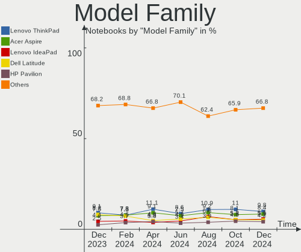
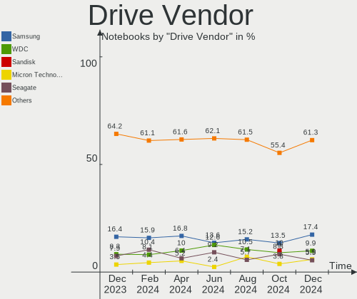
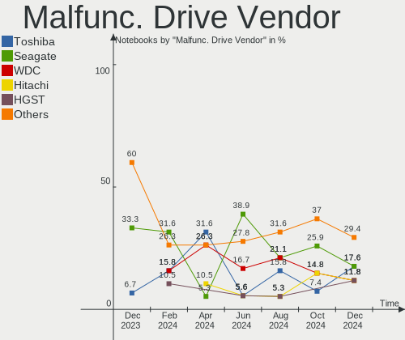
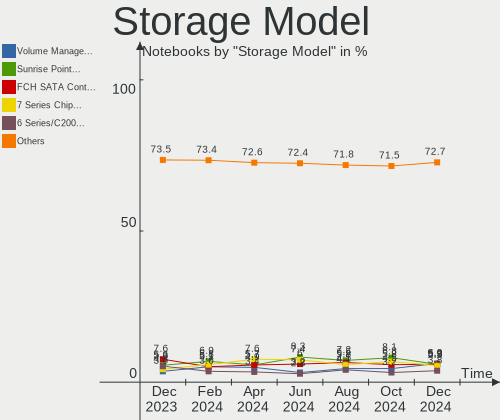
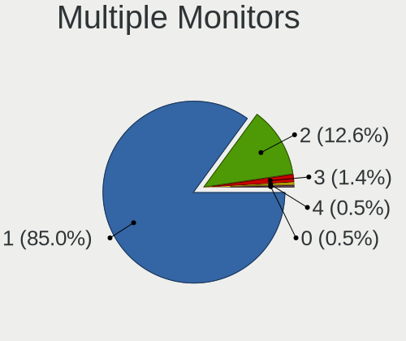
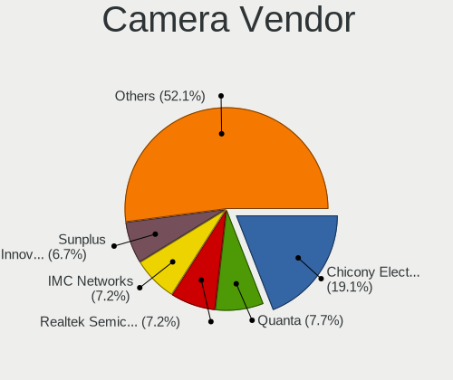
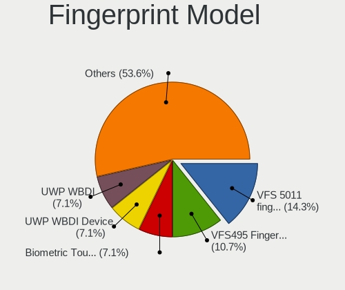

Linux Mint - Hardware Trends (Notebooks)
----------------------------------------

A project to identify most popular hardware characteristics and track their change
over time based on data collected by Linux users at https://Linux-Hardware.org.

Anyone can contribute to this report by the [hw-probe](https://github.com/linuxhw/hw-probe) tool:

    sudo -E hw-probe -all -upload

This report is for one last month. Overall report since the beginning of time: [TestDays](https://github.com/linuxhw/TestDays)

Period: Jun, 2023.

Contents
--------

* [ System ](#system)
  - [ OS                       ](#os)
  - [ OS Family                ](#os-family)
  - [ Kernel                   ](#kernel)
  - [ Kernel Family            ](#kernel-family)
  - [ Kernel Major Ver.        ](#kernel-major-ver)
  - [ Arch                     ](#arch)
  - [ DE                       ](#de)
  - [ Display Server           ](#display-server)
  - [ Display Manager          ](#display-manager)
  - [ OS Lang                  ](#os-lang)
  - [ Boot Mode                ](#boot-mode)
  - [ Filesystem               ](#filesystem)
  - [ Part. scheme             ](#part-scheme)
  - [ Dual Boot with Linux/BSD ](#dual-boot-with-linuxbsd)
  - [ Dual Boot (Win)          ](#dual-boot-win)

* [ Board ](#board)
  - [ Vendor                   ](#vendor)
  - [ Model                    ](#model)
  - [ Model Family             ](#model-family)
  - [ MFG Year                 ](#mfg-year)
  - [ Form Factor              ](#form-factor)
  - [ Secure Boot              ](#secure-boot)
  - [ Coreboot                 ](#coreboot)
  - [ RAM Size                 ](#ram-size)
  - [ RAM Used                 ](#ram-used)
  - [ Total Drives             ](#total-drives)
  - [ Has CD-ROM               ](#has-cd-rom)
  - [ Has Ethernet             ](#has-ethernet)
  - [ Has WiFi                 ](#has-wifi)
  - [ Has Bluetooth            ](#has-bluetooth)

* [ Location ](#location)
  - [ Country                  ](#country)
  - [ City                     ](#city)

* [ Drives ](#drives)
  - [ Drive Vendor             ](#drive-vendor)
  - [ Drive Model              ](#drive-model)
  - [ HDD Vendor               ](#hdd-vendor)
  - [ SSD Vendor               ](#ssd-vendor)
  - [ Drive Kind               ](#drive-kind)
  - [ Drive Connector          ](#drive-connector)
  - [ Drive Size               ](#drive-size)
  - [ Space Total              ](#space-total)
  - [ Space Used               ](#space-used)
  - [ Malfunc. Drives          ](#malfunc-drives)
  - [ Malfunc. Drive Vendor    ](#malfunc-drive-vendor)
  - [ Malfunc. HDD Vendor      ](#malfunc-hdd-vendor)
  - [ Malfunc. Drive Kind      ](#malfunc-drive-kind)
  - [ Failed Drives            ](#failed-drives)
  - [ Failed Drive Vendor      ](#failed-drive-vendor)
  - [ Drive Status             ](#drive-status)

* [ Storage controller ](#storage-controller)
  - [ Storage Vendor           ](#storage-vendor)
  - [ Storage Model            ](#storage-model)
  - [ Storage Kind             ](#storage-kind)

* [ Processor ](#processor)
  - [ CPU Vendor               ](#cpu-vendor)
  - [ CPU Model                ](#cpu-model)
  - [ CPU Model Family         ](#cpu-model-family)
  - [ CPU Cores                ](#cpu-cores)
  - [ CPU Sockets              ](#cpu-sockets)
  - [ CPU Threads              ](#cpu-threads)
  - [ CPU Op-Modes             ](#cpu-op-modes)
  - [ CPU Microcode            ](#cpu-microcode)
  - [ CPU Microarch            ](#cpu-microarch)

* [ Graphics ](#graphics)
  - [ GPU Vendor               ](#gpu-vendor)
  - [ GPU Model                ](#gpu-model)
  - [ GPU Combo                ](#gpu-combo)
  - [ GPU Driver               ](#gpu-driver)
  - [ GPU Memory               ](#gpu-memory)

* [ Monitor ](#monitor)
  - [ Monitor Vendor           ](#monitor-vendor)
  - [ Monitor Model            ](#monitor-model)
  - [ Monitor Resolution       ](#monitor-resolution)
  - [ Monitor Diagonal         ](#monitor-diagonal)
  - [ Monitor Width            ](#monitor-width)
  - [ Aspect Ratio             ](#aspect-ratio)
  - [ Monitor Area             ](#monitor-area)
  - [ Pixel Density            ](#pixel-density)
  - [ Multiple Monitors        ](#multiple-monitors)

* [ Network ](#network)
  - [ Net Controller Vendor    ](#net-controller-vendor)
  - [ Net Controller Model     ](#net-controller-model)
  - [ Wireless Vendor          ](#wireless-vendor)
  - [ Wireless Model           ](#wireless-model)
  - [ Ethernet Vendor          ](#ethernet-vendor)
  - [ Ethernet Model           ](#ethernet-model)
  - [ Net Controller Kind      ](#net-controller-kind)
  - [ Used Controller          ](#used-controller)
  - [ NICs                     ](#nics)
  - [ IPv6                     ](#ipv6)

* [ Bluetooth ](#bluetooth)
  - [ Bluetooth Vendor         ](#bluetooth-vendor)
  - [ Bluetooth Model          ](#bluetooth-model)

* [ Sound ](#sound)
  - [ Sound Vendor             ](#sound-vendor)
  - [ Sound Model              ](#sound-model)

* [ Memory ](#memory)
  - [ Memory Vendor            ](#memory-vendor)
  - [ Memory Model             ](#memory-model)
  - [ Memory Kind              ](#memory-kind)
  - [ Memory Form Factor       ](#memory-form-factor)
  - [ Memory Size              ](#memory-size)
  - [ Memory Speed             ](#memory-speed)

* [ Printers & scanners ](#printers--scanners)
  - [ Printer Vendor           ](#printer-vendor)
  - [ Printer Model            ](#printer-model)
  - [ Scanner Vendor           ](#scanner-vendor)
  - [ Scanner Model            ](#scanner-model)

* [ Camera ](#camera)
  - [ Camera Vendor            ](#camera-vendor)
  - [ Camera Model             ](#camera-model)

* [ Security ](#security)
  - [ Fingerprint Vendor       ](#fingerprint-vendor)
  - [ Fingerprint Model        ](#fingerprint-model)
  - [ Chipcard Vendor          ](#chipcard-vendor)
  - [ Chipcard Model           ](#chipcard-model)

* [ Unsupported ](#unsupported)
  - [ Unsupported Devices      ](#unsupported-devices)
  - [ Unsupported Device Types ](#unsupported-device-types)

System
------

OS
--

Installed operating systems

| Name            | Notebooks | Percent |
|-----------------|-----------|---------|
| Linux Mint 21.1 | 211       | 79.32%  |
| Linux Mint 20.3 | 24        | 9.02%   |
| Linux Mint 21   | 17        | 6.39%   |
| Linux Mint 20.2 | 5         | 1.88%   |
| Linux Mint 19.3 | 4         | 1.5%    |
| Linux Mint 21.2 | 1         | 0.38%   |
| Linux Mint 20.1 | 1         | 0.38%   |
| Linux Mint 20   | 1         | 0.38%   |
| Linux Mint 19.2 | 1         | 0.38%   |
| Linux Mint 18.3 | 1         | 0.38%   |

OS Family
---------

OS without a version

| Name       | Notebooks | Percent |
|------------|-----------|---------|
| Linux Mint | 266       | 100%    |

Kernel
------

Version of the Linux kernel

| Version                | Notebooks | Percent |
|------------------------|-----------|---------|
| 5.15.0-73-generic      | 91        | 34.21%  |
| 5.15.0-75-generic      | 68        | 25.56%  |
| 5.15.0-56-generic      | 17        | 6.39%   |
| 5.15.0-76-generic      | 13        | 4.89%   |
| 5.19.0-43-generic      | 10        | 3.76%   |
| 5.4.0-150-generic      | 9         | 3.38%   |
| 5.15.0-72-generic      | 8         | 3.01%   |
| 5.4.0-152-generic      | 7         | 2.63%   |
| 5.4.0-148-generic      | 5         | 1.88%   |
| 5.19.0-45-generic      | 5         | 1.88%   |
| 5.4.0-149-generic      | 3         | 1.13%   |
| 5.15.0-41-generic      | 3         | 1.13%   |
| 6.3.7-060307-generic   | 2         | 0.75%   |
| 5.15.0-69-generic      | 2         | 0.75%   |
| 6.3.8-1-liquorix-amd64 | 1         | 0.38%   |
| 6.3.7-surface          | 1         | 0.38%   |
| 6.3.5-x64v3-xanmod1    | 1         | 0.38%   |
| 6.3.4-060304-generic   | 1         | 0.38%   |
| 6.3.3-1-liquorix-amd64 | 1         | 0.38%   |
| 6.1.0-1013-oem         | 1         | 0.38%   |
| 6.1.0-1012-oem         | 1         | 0.38%   |
| 6.1.0-1010-oem         | 1         | 0.38%   |
| 6.0.0-1018-oem         | 1         | 0.38%   |
| 5.4.0-99-generic       | 1         | 0.38%   |
| 5.4.0-91-generic       | 1         | 0.38%   |
| 5.4.0-58-generic       | 1         | 0.38%   |
| 5.4.0-153-generic      | 1         | 0.38%   |
| 5.4.0-139-generic      | 1         | 0.38%   |
| 5.4.0-126-generic      | 1         | 0.38%   |
| 5.19.0-46-generic      | 1         | 0.38%   |
| 5.17.0-1032-oem        | 1         | 0.38%   |
| 5.15.0-67-generic      | 1         | 0.38%   |
| 5.15.0-52-generic      | 1         | 0.38%   |
| 5.15.0-25-generic      | 1         | 0.38%   |
| 5.14.0-1059-oem        | 1         | 0.38%   |
| 4.15.0-212-generic     | 1         | 0.38%   |
| 4.15.0-142-generic     | 1         | 0.38%   |

Kernel Family
-------------

Linux kernel without a distro release

| Version | Notebooks | Percent |
|---------|-----------|---------|
| 5.15.0  | 205       | 77.07%  |
| 5.4.0   | 30        | 11.28%  |
| 5.19.0  | 16        | 6.02%   |
| 6.3.7   | 3         | 1.13%   |
| 6.1.0   | 3         | 1.13%   |
| 4.15.0  | 2         | 0.75%   |
| 6.3.8   | 1         | 0.38%   |
| 6.3.5   | 1         | 0.38%   |
| 6.3.4   | 1         | 0.38%   |
| 6.3.3   | 1         | 0.38%   |
| 6.0.0   | 1         | 0.38%   |
| 5.17.0  | 1         | 0.38%   |
| 5.14.0  | 1         | 0.38%   |

Kernel Major Ver.
-----------------

Linux kernel major version

| Version | Notebooks | Percent |
|---------|-----------|---------|
| 5.15    | 205       | 77.07%  |
| 5.4     | 30        | 11.28%  |
| 5.19    | 16        | 6.02%   |
| 6.3     | 7         | 2.63%   |
| 6.1     | 3         | 1.13%   |
| 4.15    | 2         | 0.75%   |
| 6.0     | 1         | 0.38%   |
| 5.17    | 1         | 0.38%   |
| 5.14    | 1         | 0.38%   |

Arch
----

OS architecture (x86_64, i586, etc.)

| Name   | Notebooks | Percent |
|--------|-----------|---------|
| x86_64 | 266       | 100%    |

DE
--

Desktop Environment

| Name       | Notebooks | Percent |
|------------|-----------|---------|
| X-Cinnamon | 182       | 68.42%  |
| MATE       | 38        | 14.29%  |
| XFCE       | 37        | 13.91%  |
| GNOME      | 3         | 1.13%   |
| KDE5       | 2         | 0.75%   |
| Cinnamon   | 2         | 0.75%   |
| Budgie     | 1         | 0.38%   |
| Unknown    | 1         | 0.38%   |

Display Server
--------------

X11 or Wayland

| Name    | Notebooks | Percent |
|---------|-----------|---------|
| X11     | 262       | 98.5%   |
| Wayland | 2         | 0.75%   |
| Tty     | 2         | 0.75%   |

Display Manager
---------------

SDDM, LightDM, etc.

| Name    | Notebooks | Percent |
|---------|-----------|---------|
| Unknown | 136       | 51.13%  |
| LightDM | 130       | 48.87%  |

OS Lang
-------

Language

| Lang    | Notebooks | Percent |
|---------|-----------|---------|
| en_US   | 80        | 30.08%  |
| de_DE   | 46        | 17.29%  |
| pt_BR   | 18        | 6.77%   |
| fr_FR   | 14        | 5.26%   |
| en_GB   | 14        | 5.26%   |
| C       | 10        | 3.76%   |
| ru_RU   | 8         | 3.01%   |
| en_CA   | 8         | 3.01%   |
| es_AR   | 7         | 2.63%   |
| es_ES   | 6         | 2.26%   |
| en_IN   | 6         | 2.26%   |
| en_AU   | 6         | 2.26%   |
| tr_TR   | 4         | 1.5%    |
| es_MX   | 4         | 1.5%    |
| hu_HU   | 3         | 1.13%   |
| de_AT   | 3         | 1.13%   |
| pl_PL   | 2         | 0.75%   |
| it_IT   | 2         | 0.75%   |
| fi_FI   | 2         | 0.75%   |
| en_ZA   | 2         | 0.75%   |
| en_NZ   | 2         | 0.75%   |
| de_CH   | 2         | 0.75%   |
| cs_CZ   | 2         | 0.75%   |
| zh_TW   | 1         | 0.38%   |
| uk_UA   | 1         | 0.38%   |
| sv_SE   | 1         | 0.38%   |
| ru_UA   | 1         | 0.38%   |
| ro_RO   | 1         | 0.38%   |
| pt_PT   | 1         | 0.38%   |
| lv_LV   | 1         | 0.38%   |
| ko_KR   | 1         | 0.38%   |
| fr_BE   | 1         | 0.38%   |
| es_PE   | 1         | 0.38%   |
| es_CO   | 1         | 0.38%   |
| en_PH   | 1         | 0.38%   |
| en_IE   | 1         | 0.38%   |
| el_GR   | 1         | 0.38%   |
| Unknown | 1         | 0.38%   |

Boot Mode
---------

EFI or BIOS

| Mode | Notebooks | Percent |
|------|-----------|---------|
| EFI  | 178       | 66.92%  |
| BIOS | 88        | 33.08%  |

Filesystem
----------

Type of filesystem

| Type    | Notebooks | Percent |
|---------|-----------|---------|
| Ext4    | 248       | 93.23%  |
| Overlay | 7         | 2.63%   |
| Tmpfs   | 6         | 2.26%   |
| Zfs     | 3         | 1.13%   |
| Btrfs   | 2         | 0.75%   |

Part. scheme
------------

Scheme of partitioning

| Type    | Notebooks | Percent |
|---------|-----------|---------|
| Unknown | 133       | 50%     |
| GPT     | 118       | 44.36%  |
| MBR     | 15        | 5.64%   |

Dual Boot with Linux/BSD
------------------------

Hosting more than one Linux/BSD

| Dual boot | Notebooks | Percent |
|-----------|-----------|---------|
| No        | 243       | 91.35%  |
| Yes       | 23        | 8.65%   |

Dual Boot (Win)
---------------

Hosting Linux and Windows

| Dual boot | Notebooks | Percent |
|-----------|-----------|---------|
| No        | 199       | 74.81%  |
| Yes       | 67        | 25.19%  |

Board
-----

Vendor
------

Motherboard manufacturer

| Name                             | Notebooks | Percent |
|----------------------------------|-----------|---------|
| Hewlett-Packard                  | 52        | 19.55%  |
| Lenovo                           | 45        | 16.92%  |
| Dell                             | 38        | 14.29%  |
| Acer                             | 35        | 13.16%  |
| ASUSTek Computer                 | 32        | 12.03%  |
| Apple                            | 10        | 3.76%   |
| Toshiba                          | 8         | 3.01%   |
| Samsung Electronics              | 6         | 2.26%   |
| Sony                             | 4         | 1.5%    |
| MSI                              | 4         | 1.5%    |
| Gigabyte Technology              | 4         | 1.5%    |
| HUAWEI                           | 3         | 1.13%   |
| VALE                             | 2         | 0.75%   |
| TUXEDO                           | 2         | 0.75%   |
| Timi                             | 2         | 0.75%   |
| Fujitsu                          | 2         | 0.75%   |
| Alienware                        | 2         | 0.75%   |
| Wortmann AG                      | 1         | 0.38%   |
| win element                      | 1         | 0.38%   |
| UMAX                             | 1         | 0.38%   |
| TaNix                            | 1         | 0.38%   |
| SDZ                              | 1         | 0.38%   |
| Positivo                         | 1         | 0.38%   |
| Panasonic                        | 1         | 0.38%   |
| Packard Bell                     | 1         | 0.38%   |
| Micro Computer (HK) Tech Limited | 1         | 0.38%   |
| Jumper                           | 1         | 0.38%   |
| Intel Client Systems             | 1         | 0.38%   |
| Google                           | 1         | 0.38%   |
| eMachines                        | 1         | 0.38%   |
| Compumax Computer                | 1         | 0.38%   |
| Compaq                           | 1         | 0.38%   |

Model
-----

Motherboard model

| Name                            | Notebooks | Percent |
|---------------------------------|-----------|---------|
| Lenovo V15 G2 ALC 82KD          | 2         | 0.75%   |
| Lenovo IdeaPad 330-15IKB 81DE   | 2         | 0.75%   |
| HP Pavilion Notebook            | 2         | 0.75%   |
| HP Pavilion dv6                 | 2         | 0.75%   |
| HP Notebook                     | 2         | 0.75%   |
| HP ENVY Notebook                | 2         | 0.75%   |
| HP EliteBook 840 G3             | 2         | 0.75%   |
| HP Compaq Presario CQ60         | 2         | 0.75%   |
| HP 255 15.6 inch G9 Notebook PC | 2         | 0.75%   |
| Dell Precision M4800            | 2         | 0.75%   |
| Dell Latitude E6540             | 2         | 0.75%   |
| Dell Latitude E6410             | 2         | 0.75%   |
| Dell Inspiron 15-3567           | 2         | 0.75%   |
| ASUS X75VC                      | 2         | 0.75%   |
| ASUS X556UQK                    | 2         | 0.75%   |
| ASUS X553MA                     | 2         | 0.75%   |
| Acer Aspire V3-772              | 2         | 0.75%   |
| Acer Aspire E5-573G             | 2         | 0.75%   |
| Acer Aspire A515-45             | 2         | 0.75%   |
| Unknown                         | 2         | 0.75%   |
| Wortmann AG CR700               | 1         | 0.38%   |
| win element MoreFine S500+      | 1         | 0.38%   |
| VALE Notebook Slim S132         | 1         | 0.38%   |
| VALE Notebook Classic C140      | 1         | 0.38%   |
| UMAX VisionBook-N12R            | 1         | 0.38%   |
| TUXEDO P95xER                   | 1         | 0.38%   |
| Toshiba Satellite R630          | 1         | 0.38%   |
| Toshiba Satellite Pro L300      | 1         | 0.38%   |
| Toshiba Satellite L775D-107     | 1         | 0.38%   |
| Toshiba Satellite L50-C         | 1         | 0.38%   |
| Toshiba Satellite L45-B         | 1         | 0.38%   |
| Toshiba Satellite C850-1DV      | 1         | 0.38%   |
| Toshiba Satellite C55t-C        | 1         | 0.38%   |
| Toshiba Satellite C50D-C        | 1         | 0.38%   |
| Timi RedmiBook Pro 14S          | 1         | 0.38%   |
| Timi RedmiBook 15               | 1         | 0.38%   |
| TaNix Tx85                      | 1         | 0.38%   |
| Sony VPCEB2AFD                  | 1         | 0.38%   |
| Sony VGN-FE41M                  | 1         | 0.38%   |
| Sony SVF14N13CXB                | 1         | 0.38%   |

Model Family
------------

Motherboard model prefix

| Name                 | Notebooks | Percent |
|----------------------|-----------|---------|
| Acer Aspire          | 26        | 9.77%   |
| Lenovo ThinkPad      | 17        | 6.39%   |
| Dell Latitude        | 17        | 6.39%   |
| Lenovo IdeaPad       | 15        | 5.64%   |
| HP EliteBook         | 12        | 4.51%   |
| HP Laptop            | 11        | 4.14%   |
| Dell Inspiron        | 11        | 4.14%   |
| Toshiba Satellite    | 8         | 3.01%   |
| HP Pavilion          | 8         | 3.01%   |
| ASUS VivoBook        | 6         | 2.26%   |
| Dell Precision       | 5         | 1.88%   |
| Acer Swift           | 5         | 1.88%   |
| Lenovo V15           | 4         | 1.5%    |
| HP ProBook           | 3         | 1.13%   |
| HP 255               | 3         | 1.13%   |
| Dell XPS             | 3         | 1.13%   |
| Apple MacBookPro11   | 3         | 1.13%   |
| VALE Notebook        | 2         | 0.75%   |
| Timi RedmiBook       | 2         | 0.75%   |
| HP Notebook          | 2         | 0.75%   |
| HP ENVY              | 2         | 0.75%   |
| HP Compaq            | 2         | 0.75%   |
| HP 250               | 2         | 0.75%   |
| Fujitsu LIFEBOOK     | 2         | 0.75%   |
| Dell Vostro          | 2         | 0.75%   |
| ASUS X75VC           | 2         | 0.75%   |
| ASUS X556UQK         | 2         | 0.75%   |
| ASUS X553MA          | 2         | 0.75%   |
| ASUS ASUS            | 2         | 0.75%   |
| Acer Predator        | 2         | 0.75%   |
| Unknown              | 2         | 0.75%   |
| Wortmann AG CR700    | 1         | 0.38%   |
| win element MoreFine | 1         | 0.38%   |
| UMAX VisionBook-N12R | 1         | 0.38%   |
| TUXEDO P95xER        | 1         | 0.38%   |
| TaNix Tx85           | 1         | 0.38%   |
| Sony VPCEB2AFD       | 1         | 0.38%   |
| Sony VGN-FE41M       | 1         | 0.38%   |
| Sony SVF14N13CXB     | 1         | 0.38%   |
| Sony SVF1421L1EW     | 1         | 0.38%   |

MFG Year
--------

Motherboard manufacture year

| Year | Notebooks | Percent |
|------|-----------|---------|
| 2021 | 27        | 10.15%  |
| 2016 | 27        | 10.15%  |
| 2013 | 27        | 10.15%  |
| 2014 | 20        | 7.52%   |
| 2020 | 17        | 6.39%   |
| 2015 | 17        | 6.39%   |
| 2012 | 17        | 6.39%   |
| 2010 | 17        | 6.39%   |
| 2022 | 16        | 6.02%   |
| 2018 | 16        | 6.02%   |
| 2011 | 16        | 6.02%   |
| 2017 | 13        | 4.89%   |
| 2019 | 12        | 4.51%   |
| 2008 | 8         | 3.01%   |
| 2009 | 7         | 2.63%   |
| 2023 | 4         | 1.5%    |
| 2007 | 4         | 1.5%    |
| 2006 | 1         | 0.38%   |

Form Factor
-----------

Physical design of the computer

| Name     | Notebooks | Percent |
|----------|-----------|---------|
| Notebook | 266       | 100%    |

Secure Boot
-----------

Enabled or disabled

| State    | Notebooks | Percent |
|----------|-----------|---------|
| Disabled | 248       | 93.23%  |
| Enabled  | 18        | 6.77%   |

Coreboot
--------

Have coreboot on board

| Used | Notebooks | Percent |
|------|-----------|---------|
| No   | 265       | 99.62%  |
| Yes  | 1         | 0.38%   |

RAM Size
--------

Total RAM memory

| Size in GB  | Notebooks | Percent |
|-------------|-----------|---------|
| 4.01-8.0    | 87        | 32.71%  |
| 3.01-4.0    | 55        | 20.68%  |
| 8.01-16.0   | 48        | 18.05%  |
| 16.01-24.0  | 46        | 17.29%  |
| 32.01-64.0  | 12        | 4.51%   |
| 1.01-2.0    | 9         | 3.38%   |
| 2.01-3.0    | 4         | 1.5%    |
| 64.01-256.0 | 4         | 1.5%    |
| 24.01-32.0  | 1         | 0.38%   |

RAM Used
--------

Used RAM memory

| Used GB   | Notebooks | Percent |
|-----------|-----------|---------|
| 1.01-2.0  | 101       | 37.97%  |
| 2.01-3.0  | 79        | 29.7%   |
| 3.01-4.0  | 39        | 14.66%  |
| 4.01-8.0  | 30        | 11.28%  |
| 0.51-1.0  | 11        | 4.14%   |
| 8.01-16.0 | 6         | 2.26%   |

Total Drives
------------

Number of drives on board

| Drives | Notebooks | Percent |
|--------|-----------|---------|
| 1      | 184       | 69.17%  |
| 2      | 70        | 26.32%  |
| 3      | 9         | 3.38%   |
| 4      | 3         | 1.13%   |

Has CD-ROM
----------

Has CD-ROM on board

| Presented | Notebooks | Percent |
|-----------|-----------|---------|
| No        | 157       | 59.02%  |
| Yes       | 109       | 40.98%  |

Has Ethernet
------------

Has Ethernet on board

| Presented | Notebooks | Percent |
|-----------|-----------|---------|
| Yes       | 224       | 84.21%  |
| No        | 42        | 15.79%  |

Has WiFi
--------

Has WiFi module

| Presented | Notebooks | Percent |
|-----------|-----------|---------|
| Yes       | 259       | 97.37%  |
| No        | 7         | 2.63%   |

Has Bluetooth
-------------

Has Bluetooth module

| Presented | Notebooks | Percent |
|-----------|-----------|---------|
| Yes       | 199       | 74.81%  |
| No        | 67        | 25.19%  |

Location
--------

Country
-------

Geographic location (country)

| Country         | Notebooks | Percent |
|-----------------|-----------|---------|
| Germany         | 54        | 20.3%   |
| USA             | 42        | 15.79%  |
| Brazil          | 22        | 8.27%   |
| France          | 15        | 5.64%   |
| UK              | 10        | 3.76%   |
| Spain           | 8         | 3.01%   |
| Canada          | 8         | 3.01%   |
| Russia          | 7         | 2.63%   |
| Mexico          | 7         | 2.63%   |
| India           | 7         | 2.63%   |
| Argentina       | 7         | 2.63%   |
| Italy           | 6         | 2.26%   |
| Australia       | 6         | 2.26%   |
| Ukraine         | 4         | 1.5%    |
| Turkey          | 4         | 1.5%    |
| Netherlands     | 4         | 1.5%    |
| Hungary         | 4         | 1.5%    |
| Czechia         | 4         | 1.5%    |
| South Africa    | 3         | 1.13%   |
| Finland         | 3         | 1.13%   |
| Colombia        | 3         | 1.13%   |
| Austria         | 3         | 1.13%   |
| Switzerland     | 2         | 0.75%   |
| Sweden          | 2         | 0.75%   |
| Poland          | 2         | 0.75%   |
| Norway          | 2         | 0.75%   |
| New Zealand     | 2         | 0.75%   |
| Madagascar      | 2         | 0.75%   |
| Greece          | 2         | 0.75%   |
| Bulgaria        | 2         | 0.75%   |
| Belgium         | 2         | 0.75%   |
| Uganda          | 1         | 0.38%   |
| Thailand        | 1         | 0.38%   |
| Taiwan          | 1         | 0.38%   |
| South Korea     | 1         | 0.38%   |
| Slovakia        | 1         | 0.38%   |
| Romania         | 1         | 0.38%   |
| Portugal        | 1         | 0.38%   |
| Philippines     | 1         | 0.38%   |
| North Macedonia | 1         | 0.38%   |

City
----

Geographic location (city)

| City                   | Notebooks | Percent |
|------------------------|-----------|---------|
| Paris                  | 4         | 1.5%    |
| Helsinki               | 3         | 1.13%   |
| Hamburg                | 3         | 1.13%   |
| Ulm                    | 2         | 0.75%   |
| Toronto                | 2         | 0.75%   |
| Sydney                 | 2         | 0.75%   |
| Stockholm              | 2         | 0.75%   |
| Sofia                  | 2         | 0.75%   |
| Quilmes                | 2         | 0.75%   |
| Prague                 | 2         | 0.75%   |
| New Hartford           | 2         | 0.75%   |
| Münster               | 2         | 0.75%   |
| Munich                 | 2         | 0.75%   |
| Moscow                 | 2         | 0.75%   |
| Maule                  | 2         | 0.75%   |
| Macon                  | 2         | 0.75%   |
| Kyiv                   | 2         | 0.75%   |
| Krefeld                | 2         | 0.75%   |
| Kingston               | 2         | 0.75%   |
| Karlsruhe              | 2         | 0.75%   |
| Fortaleza              | 2         | 0.75%   |
| Eggesin                | 2         | 0.75%   |
| Dortmund               | 2         | 0.75%   |
| Cleveland              | 2         | 0.75%   |
| Chennai                | 2         | 0.75%   |
| Cape Town              | 2         | 0.75%   |
| Budapest               | 2         | 0.75%   |
| Belo Horizonte         | 2         | 0.75%   |
| Antananarivo           | 2         | 0.75%   |
| Zapopan                | 1         | 0.38%   |
| Yangsan                | 1         | 0.38%   |
| Wylie                  | 1         | 0.38%   |
| Wuppertal              | 1         | 0.38%   |
| Wittenburg             | 1         | 0.38%   |
| Westland               | 1         | 0.38%   |
| Wedemark               | 1         | 0.38%   |
| Villingen-Schwenningen | 1         | 0.38%   |
| Vienna                 | 1         | 0.38%   |
| Venice                 | 1         | 0.38%   |
| Vellore                | 1         | 0.38%   |

Drives
------

Drive Vendor
------------

Hard drive vendors

| Vendor                         | Notebooks | Drives | Percent |
|--------------------------------|-----------|--------|---------|
| Samsung Electronics            | 52        | 56     | 15.34%  |
| WDC                            | 38        | 40     | 11.21%  |
| Seagate                        | 32        | 34     | 9.44%   |
| Toshiba                        | 24        | 24     | 7.08%   |
| SanDisk                        | 20        | 20     | 5.9%    |
| Kingston                       | 17        | 17     | 5.01%   |
| Crucial                        | 16        | 18     | 4.72%   |
| Intel                          | 13        | 14     | 3.83%   |
| Unknown                        | 12        | 14     | 3.54%   |
| Micron Technology              | 11        | 11     | 3.24%   |
| SK hynix                       | 8         | 8      | 2.36%   |
| China                          | 8         | 8      | 2.36%   |
| HGST                           | 6         | 6      | 1.77%   |
| Apple                          | 6         | 6      | 1.77%   |
| PNY                            | 4         | 4      | 1.18%   |
| LITEON                         | 4         | 4      | 1.18%   |
| Unknown                        | 4         | 4      | 1.18%   |
| SPCC                           | 3         | 3      | 0.88%   |
| Silicon Motion                 | 3         | 3      | 0.88%   |
| Phison Electronics             | 3         | 3      | 0.88%   |
| Micron/Crucial Technology      | 3         | 5      | 0.88%   |
| Kingston Technology Company    | 3         | 3      | 0.88%   |
| Fujitsu                        | 3         | 3      | 0.88%   |
| A-DATA Technology              | 3         | 3      | 0.88%   |
| Union Memory                   | 2         | 2      | 0.59%   |
| Transcend                      | 2         | 2      | 0.59%   |
| SABRENT                        | 2         | 2      | 0.59%   |
| KIOXIA                         | 2         | 2      | 0.59%   |
| Hitachi                        | 2         | 2      | 0.59%   |
| FORESEE                        | 2         | 2      | 0.59%   |
| ASMT                           | 2         | 2      | 0.59%   |
| Apacer                         | 2         | 2      | 0.59%   |
| XrayDisk                       | 1         | 2      | 0.29%   |
| Win Memory                     | 1         | 1      | 0.29%   |
| Verbatim                       | 1         | 1      | 0.29%   |
| Super Talent                   | 1         | 1      | 0.29%   |
| SSSTC                          | 1         | 1      | 0.29%   |
| Solid State Storage Technology | 1         | 1      | 0.29%   |
| Solid State Storage            | 1         | 1      | 0.29%   |
| Realtek Semiconductor          | 1         | 1      | 0.29%   |

Drive Model
-----------

Hard drive models

| Model                                               | Notebooks | Percent |
|-----------------------------------------------------|-----------|---------|
| Seagate ST1000LM024 HN-M101MBB 1TB                  | 9         | 2.56%   |
| Toshiba MQ01ABD100 1TB                              | 8         | 2.27%   |
| Unknown MMC Card  32GB                              | 4         | 1.14%   |
| Toshiba MQ04ABF100 1TB                              | 4         | 1.14%   |
| Seagate ST1000LM035-1RK172 1TB                      | 4         | 1.14%   |
| Samsung SSD 850 EVO 250GB                           | 4         | 1.14%   |
| Samsung NVMe SSD Controller SM981/PM981/PM983 250GB | 4         | 1.14%   |
| Kingston SA400S37240G 240GB SSD                     | 4         | 1.14%   |
| Crucial CT1000MX500SSD1 1TB                         | 4         | 1.14%   |
| Crucial CT1000BX500SSD1 1TB                         | 4         | 1.14%   |
| Unknown                                             | 4         | 1.14%   |
| Unknown MMC Card  64GB                              | 3         | 0.85%   |
| Samsung SSD 860 EVO 1TB                             | 3         | 0.85%   |
| Samsung MZVLQ512HBLU-00BH1 512GB                    | 3         | 0.85%   |
| Micron/Crucial P2 NVMe PCIe SSD 4TB                 | 3         | 0.85%   |
| Intel SSD 660P Series 512GB                         | 3         | 0.85%   |
| Crucial CT500MX500SSD1 500GB                        | 3         | 0.85%   |
| WDC WDS240G2G0A-00JH30 240GB SSD                    | 2         | 0.57%   |
| WDC WD10SPZX-21Z10T0 1TB                            | 2         | 0.57%   |
| WDC WD10SPCX-24HWST1 1TB                            | 2         | 0.57%   |
| WDC WD10JPVX-22JC3T0 1TB                            | 2         | 0.57%   |
| Unknown MMC Card  128GB                             | 2         | 0.57%   |
| Toshiba MQ01ABF050 500GB                            | 2         | 0.57%   |
| SPCC Solid State Disk 1024GB                        | 2         | 0.57%   |
| SK hynix PC711 NVMe 1TB                             | 2         | 0.57%   |
| Seagate ST500LT012-9WS142 500GB                     | 2         | 0.57%   |
| Seagate ST500LM000-1EJ162 500GB                     | 2         | 0.57%   |
| SanDisk Ultra II 480GB SSD                          | 2         | 0.57%   |
| SanDisk SSD PLUS 480GB                              | 2         | 0.57%   |
| SanDisk NVMe SSD Drive 512GB                        | 2         | 0.57%   |
| Samsung SSD 970 EVO Plus 1TB                        | 2         | 0.57%   |
| Samsung SSD 870 QVO 1TB                             | 2         | 0.57%   |
| Samsung SSD 860 PRO 512GB                           | 2         | 0.57%   |
| Samsung HM321HI 320GB                               | 2         | 0.57%   |
| SABRENT Disk 1TB                                    | 2         | 0.57%   |
| PNY CS900 240GB SSD                                 | 2         | 0.57%   |
| Micron MTFDHBA512QFD 512GB                          | 2         | 0.57%   |
| Kingston SKC600512G 512GB SSD                       | 2         | 0.57%   |
| HGST HTS721010A9E630 1TB                            | 2         | 0.57%   |
| Crucial CT480BX500SSD1 480GB                        | 2         | 0.57%   |

HDD Vendor
----------

Hard disk drive vendors

| Vendor              | Notebooks | Drives | Percent |
|---------------------|-----------|--------|---------|
| Seagate             | 31        | 33     | 31.63%  |
| WDC                 | 29        | 30     | 29.59%  |
| Toshiba             | 21        | 21     | 21.43%  |
| HGST                | 6         | 6      | 6.12%   |
| Samsung Electronics | 4         | 4      | 4.08%   |
| Fujitsu             | 3         | 3      | 3.06%   |
| Hitachi             | 2         | 2      | 2.04%   |
| Unknown             | 1         | 1      | 1.02%   |
| ASMT                | 1         | 1      | 1.02%   |

SSD Vendor
----------

Solid state drive vendors

| Vendor              | Notebooks | Drives | Percent |
|---------------------|-----------|--------|---------|
| Samsung Electronics | 27        | 28     | 19.71%  |
| Crucial             | 16        | 17     | 11.68%  |
| SanDisk             | 13        | 13     | 9.49%   |
| Kingston            | 13        | 13     | 9.49%   |
| China               | 8         | 8      | 5.84%   |
| WDC                 | 7         | 7      | 5.11%   |
| Apple               | 6         | 6      | 4.38%   |
| Micron Technology   | 5         | 5      | 3.65%   |
| PNY                 | 4         | 4      | 2.92%   |
| Intel               | 4         | 4      | 2.92%   |
| SPCC                | 3         | 3      | 2.19%   |
| LITEON              | 3         | 3      | 2.19%   |
| Toshiba             | 2         | 2      | 1.46%   |
| Apacer              | 2         | 2      | 1.46%   |
| A-DATA Technology   | 2         | 2      | 1.46%   |
| XrayDisk            | 1         | 1      | 0.73%   |
| Win Memory          | 1         | 1      | 0.73%   |
| Verbatim            | 1         | 1      | 0.73%   |
| Transcend           | 1         | 1      | 0.73%   |
| Super Talent        | 1         | 1      | 0.73%   |
| SK hynix            | 1         | 1      | 0.73%   |
| Pioneer             | 1         | 1      | 0.73%   |
| Patriot             | 1         | 1      | 0.73%   |
| OCZ                 | 1         | 1      | 0.73%   |
| Mushkin             | 1         | 1      | 0.73%   |
| LITEONIT            | 1         | 1      | 0.73%   |
| KingSpec            | 1         | 1      | 0.73%   |
| KingFast            | 1         | 1      | 0.73%   |
| HS-SSD-C100         | 1         | 1      | 0.73%   |
| GOODRAM             | 1         | 1      | 0.73%   |
| GLOWAY              | 1         | 1      | 0.73%   |
| FORESEE             | 1         | 1      | 0.73%   |
| External            | 1         | 1      | 0.73%   |
| CT2000MX            | 1         | 2      | 0.73%   |
| ASMT                | 1         | 1      | 0.73%   |
| 2.5"                | 1         | 1      | 0.73%   |
| Unknown             | 1         | 1      | 0.73%   |

Drive Kind
----------

HDD or SSD

| Kind    | Notebooks | Drives | Percent |
|---------|-----------|--------|---------|
| SSD     | 125       | 140    | 38.82%  |
| HDD     | 96        | 101    | 29.81%  |
| NVMe    | 81        | 92     | 25.16%  |
| MMC     | 15        | 17     | 4.66%   |
| Unknown | 5         | 6      | 1.55%   |

Drive Connector
---------------

SATA, SAS, NVMe, etc.

| Type | Notebooks | Drives | Percent |
|------|-----------|--------|---------|
| SATA | 195       | 236    | 64.78%  |
| NVMe | 79        | 90     | 26.25%  |
| MMC  | 15        | 17     | 4.98%   |
| SAS  | 12        | 13     | 3.99%   |

Drive Size
----------

Size of hard drive

| Size in TB | Notebooks | Drives | Percent |
|------------|-----------|--------|---------|
| 0.01-0.5   | 127       | 145    | 58.8%   |
| 0.51-1.0   | 78        | 82     | 36.11%  |
| 1.01-2.0   | 10        | 13     | 4.63%   |
| 3.01-4.0   | 1         | 1      | 0.46%   |

Space Total
-----------

Amount of disk space available on the file system

| Size in GB     | Notebooks | Percent |
|----------------|-----------|---------|
| 251-500        | 78        | 29.32%  |
| 101-250        | 74        | 27.82%  |
| 501-1000       | 55        | 20.68%  |
| 1001-2000      | 17        | 6.39%   |
| 51-100         | 16        | 6.02%   |
| 21-50          | 8         | 3.01%   |
| 2001-3000      | 6         | 2.26%   |
| 1-20           | 6         | 2.26%   |
| More than 3000 | 5         | 1.88%   |
| Unknown        | 1         | 0.38%   |

Space Used
----------

Amount of used disk space

| Used GB        | Notebooks | Percent |
|----------------|-----------|---------|
| 21-50          | 65        | 24.44%  |
| 1-20           | 52        | 19.55%  |
| 101-250        | 46        | 17.29%  |
| 51-100         | 38        | 14.29%  |
| 251-500        | 35        | 13.16%  |
| 501-1000       | 17        | 6.39%   |
| 1001-2000      | 8         | 3.01%   |
| More than 3000 | 2         | 0.75%   |
| 2001-3000      | 2         | 0.75%   |
| Unknown        | 1         | 0.38%   |

Malfunc. Drives
---------------

Drive models with a malfunction

| Model                               | Notebooks | Drives | Percent |
|-------------------------------------|-----------|--------|---------|
| WDC WDS200T2B0B 2TB SSD             | 1         | 1      | 3.85%   |
| WDC WDS120G2G0A-00JH30 128GB SSD    | 1         | 1      | 3.85%   |
| WDC WD7500BPVT-60HXZT3 752GB        | 1         | 1      | 3.85%   |
| WDC WD5000LPVX-80V0TT0 500GB        | 1         | 1      | 3.85%   |
| WDC WD10SPZX-60Z10T1 1TB            | 1         | 1      | 3.85%   |
| Toshiba MQ01ABD100 1TB              | 1         | 1      | 3.85%   |
| Toshiba MK8037GSX 80GB              | 1         | 1      | 3.85%   |
| Toshiba MK2556GSY 250GB             | 1         | 1      | 3.85%   |
| Silicon Motion NE-256 256GB         | 1         | 1      | 3.85%   |
| Seagate ST9500325AS 500GB           | 1         | 1      | 3.85%   |
| Seagate ST9320325AS 320GB           | 1         | 1      | 3.85%   |
| Seagate ST9160310AS 160GB           | 1         | 1      | 3.85%   |
| Seagate ST500LT012-9WS142 500GB     | 1         | 1      | 3.85%   |
| Seagate ST1000LM024 HN-M101MBB 1TB  | 1         | 1      | 3.85%   |
| SanDisk SSD PLUS 480GB              | 1         | 1      | 3.85%   |
| Samsung Electronics SSD 970 EVO 2TB | 1         | 1      | 3.85%   |
| LITEON CA3-8D256 256GB              | 1         | 1      | 3.85%   |
| Kingston SMSM150S324G 24GB SSD      | 1         | 1      | 3.85%   |
| Kingston SH103S3240G 240GB SSD      | 1         | 1      | 3.85%   |
| Hitachi HTS725050A7E630 500GB       | 1         | 1      | 3.85%   |
| HGST HTS545050A7E660 500GB          | 1         | 1      | 3.85%   |
| HGST HTS541010B7E610 1TB            | 1         | 1      | 3.85%   |
| Crucial CT1050MX300SSD1 1050GB      | 1         | 1      | 3.85%   |
| China SSD 240GB                     | 1         | 1      | 3.85%   |
| China SH00R120GB SSD                | 1         | 1      | 3.85%   |
| ASMT 2235 128GB                     | 1         | 1      | 3.85%   |

Malfunc. Drive Vendor
---------------------

Vendors of faulty drives

| Vendor              | Notebooks | Drives | Percent |
|---------------------|-----------|--------|---------|
| WDC                 | 5         | 5      | 19.23%  |
| Seagate             | 5         | 5      | 19.23%  |
| Toshiba             | 3         | 3      | 11.54%  |
| Kingston            | 2         | 2      | 7.69%   |
| HGST                | 2         | 2      | 7.69%   |
| China               | 2         | 2      | 7.69%   |
| Silicon Motion      | 1         | 1      | 3.85%   |
| SanDisk             | 1         | 1      | 3.85%   |
| Samsung Electronics | 1         | 1      | 3.85%   |
| LITEON              | 1         | 1      | 3.85%   |
| Hitachi             | 1         | 1      | 3.85%   |
| Crucial             | 1         | 1      | 3.85%   |
| ASMT                | 1         | 1      | 3.85%   |

Malfunc. HDD Vendor
-------------------

Vendors of faulty HDD drives

| Vendor  | Notebooks | Drives | Percent |
|---------|-----------|--------|---------|
| Seagate | 5         | 5      | 33.33%  |
| WDC     | 3         | 3      | 20%     |
| Toshiba | 3         | 3      | 20%     |
| HGST    | 2         | 2      | 13.33%  |
| Hitachi | 1         | 1      | 6.67%   |
| ASMT    | 1         | 1      | 6.67%   |

Malfunc. Drive Kind
-------------------

Kinds of faulty drives

| Kind | Notebooks | Drives | Percent |
|------|-----------|--------|---------|
| HDD  | 14        | 15     | 56%     |
| SSD  | 8         | 8      | 32%     |
| NVMe | 3         | 3      | 12%     |

Failed Drives
-------------

Failed drive models

Zero info for selected period =(

Failed Drive Vendor
-------------------

Failed drive vendors

Zero info for selected period =(

Drive Status
------------

Number of failed and malfunc. drives

| Status   | Notebooks | Drives | Percent |
|----------|-----------|--------|---------|
| Detected | 149       | 196    | 53.21%  |
| Works    | 108       | 134    | 38.57%  |
| Malfunc  | 23        | 26     | 8.21%   |

Storage controller
------------------

Storage Vendor
--------------

Storage controller vendors

| Vendor                         | Notebooks | Percent |
|--------------------------------|-----------|---------|
| Intel                          | 195       | 62.7%   |
| AMD                            | 31        | 9.97%   |
| Samsung Electronics            | 27        | 8.68%   |
| SanDisk                        | 10        | 3.22%   |
| Kingston Technology Company    | 7         | 2.25%   |
| SK hynix                       | 6         | 1.93%   |
| Micron Technology              | 6         | 1.93%   |
| Silicon Motion                 | 4         | 1.29%   |
| Micron/Crucial Technology      | 4         | 1.29%   |
| Solid State Storage Technology | 3         | 0.96%   |
| Phison Electronics             | 3         | 0.96%   |
| Nvidia                         | 3         | 0.96%   |
| KIOXIA                         | 3         | 0.96%   |
| Union Memory (Shenzhen)        | 2         | 0.64%   |
| ADATA Technology               | 2         | 0.64%   |
| Shenzhen Longsys Electronics   | 1         | 0.32%   |
| Realtek Semiconductor          | 1         | 0.32%   |
| MAXIO Technology (Hangzhou)    | 1         | 0.32%   |
| Marvell Technology Group       | 1         | 0.32%   |
| Lite-On Technology             | 1         | 0.32%   |

Storage Model
-------------

Storage controller models

| Model                                                                            | Notebooks | Percent |
|----------------------------------------------------------------------------------|-----------|---------|
| Intel Sunrise Point-LP SATA Controller [AHCI mode]                               | 27        | 8.06%   |
| AMD FCH SATA Controller [AHCI mode]                                              | 27        | 8.06%   |
| Intel 8 Series SATA Controller 1 [AHCI mode]                                     | 19        | 5.67%   |
| Intel 7 Series Chipset Family 6-port SATA Controller [AHCI mode]                 | 16        | 4.78%   |
| Intel 82801 Mobile SATA Controller [RAID mode]                                   | 14        | 4.18%   |
| Samsung NVMe SSD Controller SM981/PM981/PM983                                    | 12        | 3.58%   |
| Intel 8 Series/C220 Series Chipset Family 6-port SATA Controller 1 [AHCI mode]   | 12        | 3.58%   |
| Intel 6 Series/C200 Series Chipset Family 6 port Mobile SATA AHCI Controller     | 11        | 3.28%   |
| Intel 5 Series/3400 Series Chipset 6 port SATA AHCI Controller                   | 10        | 2.99%   |
| Intel Volume Management Device NVMe RAID Controller                              | 9         | 2.69%   |
| Intel Wildcat Point-LP SATA Controller [AHCI Mode]                               | 8         | 2.39%   |
| Intel 82801IBM/IEM (ICH9M/ICH9M-E) 4 port SATA Controller [AHCI mode]            | 8         | 2.39%   |
| Intel SSD 660P Series                                                            | 7         | 2.09%   |
| Samsung NVMe SSD Controller 980                                                  | 6         | 1.79%   |
| Intel Celeron/Pentium Silver Processor SATA Controller                           | 6         | 1.79%   |
| Intel Tiger Lake-LP SATA Controller                                              | 5         | 1.49%   |
| Intel HM170/QM170 Chipset SATA Controller [AHCI Mode]                            | 5         | 1.49%   |
| Intel Cannon Lake Mobile PCH SATA AHCI Controller                                | 5         | 1.49%   |
| Intel Atom Processor E3800 Series SATA AHCI Controller                           | 5         | 1.49%   |
| Intel 5 Series/3400 Series Chipset 4 port SATA AHCI Controller                   | 5         | 1.49%   |
| Micron/Crucial P2 NVMe PCIe SSD                                                  | 4         | 1.19%   |
| Micron NVMe Storage Controller                                                   | 4         | 1.19%   |
| SK hynix Gold P31/BC711/PC711 NVMe Solid State Drive                             | 3         | 0.9%    |
| Samsung NVMe SSD Controller PM9A1/PM9A3/980PRO                                   | 3         | 0.9%    |
| Kingston Company A2000 NVMe SSD                                                  | 3         | 0.9%    |
| Intel Ice Lake-LP SATA Controller [AHCI mode]                                    | 3         | 0.9%    |
| Intel Atom/Celeron/Pentium Processor x5-E8000/J3xxx/N3xxx Series SATA Controller | 3         | 0.9%    |
| Intel 82801HM/HEM (ICH8M/ICH8M-E) SATA Controller [AHCI mode]                    | 3         | 0.9%    |
| Intel 82801HM/HEM (ICH8M/ICH8M-E) IDE Controller                                 | 3         | 0.9%    |
| AMD SB7x0/SB8x0/SB9x0 SATA Controller [AHCI mode]                                | 3         | 0.9%    |
| Union Memory (Shenzhen) Non-Volatile memory controller                           | 2         | 0.6%    |
| Solid State Storage CL1-3D256-Q11 NVMe SSD M.2                                   | 2         | 0.6%    |
| Silicon Motion SM2263EN/SM2263XT SSD Controller                                  | 2         | 0.6%    |
| SanDisk WD Black SN770 NVMe SSD                                                  | 2         | 0.6%    |
| SanDisk WD Black 2018/SN750 / PC SN720 NVMe SSD                                  | 2         | 0.6%    |
| Samsung Electronics SATA controller                                              | 2         | 0.6%    |
| Samsung Apple PCIe SSD                                                           | 2         | 0.6%    |
| KIOXIA NVMe SSD Controller BG4                                                   | 2         | 0.6%    |
| Kingston Company Company Non-Volatile memory controller                          | 2         | 0.6%    |
| Intel Cannon Point-LP SATA Controller [AHCI Mode]                                | 2         | 0.6%    |

Storage Kind
------------

Kind of storage controller (IDE, SATA, NVMe, SAS, ...)

| Kind | Notebooks | Percent |
|------|-----------|---------|
| SATA | 198       | 62.46%  |
| NVMe | 79        | 24.92%  |
| RAID | 25        | 7.89%   |
| IDE  | 15        | 4.73%   |

Processor
---------

CPU Vendor
----------

Processor vendors

| Vendor | Notebooks | Percent |
|--------|-----------|---------|
| Intel  | 220       | 82.71%  |
| AMD    | 46        | 17.29%  |

CPU Model
---------

Processor models

| Model                                   | Notebooks | Percent |
|-----------------------------------------|-----------|---------|
| Intel Core i5-7200U CPU @ 2.50GHz       | 6         | 2.26%   |
| Intel Core i5-6200U CPU @ 2.30GHz       | 6         | 2.26%   |
| Intel Core i5-4200U CPU @ 1.60GHz       | 6         | 2.26%   |
| AMD Ryzen 5 5500U with Radeon Graphics  | 6         | 2.26%   |
| Intel Core i5-8250U CPU @ 1.60GHz       | 5         | 1.88%   |
| Intel Core i7-6700HQ CPU @ 2.60GHz      | 4         | 1.5%    |
| Intel Core i5-6300U CPU @ 2.40GHz       | 4         | 1.5%    |
| Intel Core i5-5200U CPU @ 2.20GHz       | 4         | 1.5%    |
| Intel Core i5-3230M CPU @ 2.60GHz       | 4         | 1.5%    |
| Intel Core i5 CPU M 520 @ 2.40GHz       | 4         | 1.5%    |
| Intel Core i3-6006U CPU @ 2.00GHz       | 4         | 1.5%    |
| Intel 11th Gen Core i7-11800H @ 2.30GHz | 4         | 1.5%    |
| Intel 11th Gen Core i5-1135G7 @ 2.40GHz | 4         | 1.5%    |
| Intel Core i7-4702MQ CPU @ 2.20GHz      | 3         | 1.13%   |
| Intel Core i7-4500U CPU @ 1.80GHz       | 3         | 1.13%   |
| Intel Core i5-4210U CPU @ 1.70GHz       | 3         | 1.13%   |
| Intel Core i5-1035G1 CPU @ 1.00GHz      | 3         | 1.13%   |
| Intel Core i3-4005U CPU @ 1.70GHz       | 3         | 1.13%   |
| Intel Celeron N4020 CPU @ 1.10GHz       | 3         | 1.13%   |
| Intel Celeron CPU N2840 @ 2.16GHz       | 3         | 1.13%   |
| Intel 11th Gen Core i7-1165G7 @ 2.80GHz | 3         | 1.13%   |
| Intel 11th Gen Core i3-1115G4 @ 3.00GHz | 3         | 1.13%   |
| AMD Ryzen 7 5700U with Radeon Graphics  | 3         | 1.13%   |
| AMD Ryzen 5 5625U with Radeon Graphics  | 3         | 1.13%   |
| Intel Genuine CPU T1600 @ 1.66GHz       | 2         | 0.75%   |
| Intel Core i7-7700HQ CPU @ 2.80GHz      | 2         | 0.75%   |
| Intel Core i7-7500U CPU @ 2.70GHz       | 2         | 0.75%   |
| Intel Core i7-5500U CPU @ 2.40GHz       | 2         | 0.75%   |
| Intel Core i7-4800MQ CPU @ 2.70GHz      | 2         | 0.75%   |
| Intel Core i7-4710HQ CPU @ 2.50GHz      | 2         | 0.75%   |
| Intel Core i7-10750H CPU @ 2.60GHz      | 2         | 0.75%   |
| Intel Core i5-4300U CPU @ 1.90GHz       | 2         | 0.75%   |
| Intel Core i5-4300M CPU @ 2.60GHz       | 2         | 0.75%   |
| Intel Core i5-3320M CPU @ 2.60GHz       | 2         | 0.75%   |
| Intel Core i5-2520M CPU @ 2.50GHz       | 2         | 0.75%   |
| Intel Core i5 CPU M 460 @ 2.53GHz       | 2         | 0.75%   |
| Intel Core i3-3110M CPU @ 2.40GHz       | 2         | 0.75%   |
| Intel Core i3 CPU M 350 @ 2.27GHz       | 2         | 0.75%   |
| Intel Core i3 CPU M 330 @ 2.13GHz       | 2         | 0.75%   |
| Intel 12th Gen Core i7-1255U            | 2         | 0.75%   |

CPU Model Family
----------------

Processor model prefix

| Model                   | Notebooks | Percent |
|-------------------------|-----------|---------|
| Intel Core i5           | 74        | 27.82%  |
| Intel Core i7           | 52        | 19.55%  |
| Other                   | 27        | 10.15%  |
| Intel Core i3           | 24        | 9.02%   |
| AMD Ryzen 5             | 15        | 5.64%   |
| Intel Celeron           | 14        | 5.26%   |
| Intel Pentium           | 9         | 3.38%   |
| AMD Ryzen 7             | 7         | 2.63%   |
| Intel Core 2 Duo        | 6         | 2.26%   |
| AMD Ryzen 3             | 4         | 1.5%    |
| AMD A6                  | 4         | 1.5%    |
| Intel Pentium Dual-Core | 3         | 1.13%   |
| Intel Atom              | 3         | 1.13%   |
| Intel Genuine           | 2         | 0.75%   |
| Intel Core i9           | 2         | 0.75%   |
| Intel Celeron Dual-Core | 2         | 0.75%   |
| AMD Ryzen 7 PRO         | 2         | 0.75%   |
| AMD E                   | 2         | 0.75%   |
| AMD A10                 | 2         | 0.75%   |
| Intel Pentium Silver    | 1         | 0.38%   |
| Intel Pentium Dual      | 1         | 0.38%   |
| Intel Core m7           | 1         | 0.38%   |
| Intel Core 2 Quad       | 1         | 0.38%   |
| Intel Core 2            | 1         | 0.38%   |
| AMD Ryzen 9             | 1         | 0.38%   |
| AMD E1                  | 1         | 0.38%   |
| AMD Athlon II Dual-Core | 1         | 0.38%   |
| AMD Athlon 64 X2        | 1         | 0.38%   |
| AMD Athlon              | 1         | 0.38%   |
| AMD A8                  | 1         | 0.38%   |
| AMD A4                  | 1         | 0.38%   |

CPU Cores
---------

Number of processor cores

| Number | Notebooks | Percent |
|--------|-----------|---------|
| 2      | 145       | 54.51%  |
| 4      | 82        | 30.83%  |
| 6      | 18        | 6.77%   |
| 8      | 15        | 5.64%   |
| 10     | 3         | 1.13%   |
| 12     | 2         | 0.75%   |
| 1      | 1         | 0.38%   |

CPU Sockets
-----------

Number of sockets

| Number | Notebooks | Percent |
|--------|-----------|---------|
| 1      | 266       | 100%    |

CPU Threads
-----------

Threads per core (Hyper-Threading)

| Number | Notebooks | Percent |
|--------|-----------|---------|
| 2      | 207       | 77.82%  |
| 1      | 59        | 22.18%  |

CPU Op-Modes
------------

CPU Operation Modes (32-bit, 64-bit)

| Op mode        | Notebooks | Percent |
|----------------|-----------|---------|
| 32-bit, 64-bit | 266       | 100%    |

CPU Microcode
-------------

Microcode number

| Number     | Notebooks | Percent |
|------------|-----------|---------|
| Unknown    | 24        | 9.02%   |
| 0x40651    | 21        | 7.89%   |
| 0x406e3    | 16        | 6.02%   |
| 0x206a7    | 16        | 6.02%   |
| 0x306a9    | 14        | 5.26%   |
| 0x306c3    | 12        | 4.51%   |
| 0x806c1    | 11        | 4.14%   |
| 0x806e9    | 9         | 3.38%   |
| 0x306d4    | 9         | 3.38%   |
| 0x08608103 | 9         | 3.38%   |
| 0x20655    | 8         | 3.01%   |
| 0x20652    | 7         | 2.63%   |
| 0x806ea    | 6         | 2.26%   |
| 0x1067a    | 6         | 2.26%   |
| 0x906ea    | 5         | 1.88%   |
| 0x706a8    | 5         | 1.88%   |
| 0x6fd      | 5         | 1.88%   |
| 0x506e3    | 5         | 1.88%   |
| 0x30678    | 5         | 1.88%   |
| 0x806d1    | 4         | 1.5%    |
| 0x706e5    | 4         | 1.5%    |
| 0x0a50000d | 4         | 1.5%    |
| 0xa0652    | 3         | 1.13%   |
| 0x906a4    | 3         | 1.13%   |
| 0x406c4    | 3         | 1.13%   |
| 0x106e5    | 3         | 1.13%   |
| 0x0a50000c | 3         | 1.13%   |
| 0x07030105 | 3         | 1.13%   |
| 0x06006705 | 3         | 1.13%   |
| 0x906e9    | 2         | 0.75%   |
| 0x806eb    | 2         | 0.75%   |
| 0x406c3    | 2         | 0.75%   |
| 0x10676    | 2         | 0.75%   |
| 0x0a404102 | 2         | 0.75%   |
| 0x08a00006 | 2         | 0.75%   |
| 0x08608102 | 2         | 0.75%   |
| 0x08600106 | 2         | 0.75%   |
| 0x08108109 | 2         | 0.75%   |
| 0x06001119 | 2         | 0.75%   |
| 0x05000119 | 2         | 0.75%   |

CPU Microarch
-------------

Microarchitecture

| Name             | Notebooks | Percent |
|------------------|-----------|---------|
| Haswell          | 38        | 14.29%  |
| KabyLake         | 32        | 12.03%  |
| Skylake          | 22        | 8.27%   |
| SandyBridge      | 17        | 6.39%   |
| Unknown          | 16        | 6.02%   |
| Westmere         | 15        | 5.64%   |
| IvyBridge        | 15        | 5.64%   |
| TigerLake        | 14        | 5.26%   |
| Silvermont       | 11        | 4.14%   |
| Broadwell        | 10        | 3.76%   |
| Penryn           | 9         | 3.38%   |
| IceLake          | 8         | 3.01%   |
| Zen 3            | 7         | 2.63%   |
| Goldmont plus    | 7         | 2.63%   |
| Core             | 7         | 2.63%   |
| Excavator        | 5         | 1.88%   |
| Alderlake Hybrid | 5         | 1.88%   |
| CometLake        | 4         | 1.5%    |
| Zen 2            | 3         | 1.13%   |
| Puma             | 3         | 1.13%   |
| Nehalem          | 3         | 1.13%   |
| Zen+             | 2         | 0.75%   |
| Piledriver       | 2         | 0.75%   |
| Bobcat           | 2         | 0.75%   |
| Zen              | 1         | 0.38%   |
| K8 Hammer        | 1         | 0.38%   |
| K8 & K10 hybrid  | 1         | 0.38%   |
| K10 Llano        | 1         | 0.38%   |
| K10              | 1         | 0.38%   |
| Jaguar           | 1         | 0.38%   |
| Gracemont        | 1         | 0.38%   |
| Goldmont         | 1         | 0.38%   |
| Bonnell          | 1         | 0.38%   |

Graphics
--------

GPU Vendor
----------

Vendors of graphics cards

| Vendor | Notebooks | Percent |
|--------|-----------|---------|
| Intel  | 201       | 60.36%  |
| Nvidia | 72        | 21.62%  |
| AMD    | 60        | 18.02%  |

GPU Model
---------

Graphics card models

| Model                                                                                    | Notebooks | Percent |
|------------------------------------------------------------------------------------------|-----------|---------|
| Intel Haswell-ULT Integrated Graphics Controller                                         | 21        | 6.18%   |
| Intel Skylake GT2 [HD Graphics 520]                                                      | 15        | 4.41%   |
| Intel 3rd Gen Core processor Graphics Controller                                         | 15        | 4.41%   |
| Intel 4th Gen Core Processor Integrated Graphics Controller                              | 14        | 4.12%   |
| Intel 2nd Generation Core Processor Family Integrated Graphics Controller                | 14        | 4.12%   |
| Intel TigerLake-LP GT2 [Iris Xe Graphics]                                                | 11        | 3.24%   |
| AMD Lucienne                                                                             | 11        | 3.24%   |
| Intel HD Graphics 620                                                                    | 10        | 2.94%   |
| Intel UHD Graphics 620                                                                   | 9         | 2.65%   |
| Intel Core Processor Integrated Graphics Controller                                      | 9         | 2.65%   |
| Intel Mobile 4 Series Chipset Integrated Graphics Controller                             | 8         | 2.35%   |
| Intel HD Graphics 5500                                                                   | 8         | 2.35%   |
| Nvidia GF117M [GeForce 610M/710M/810M/820M / GT 620M/625M/630M/720M]                     | 7         | 2.06%   |
| Intel GeminiLake [UHD Graphics 600]                                                      | 6         | 1.76%   |
| Intel Atom Processor Z36xxx/Z37xxx Series Graphics & Display                             | 6         | 1.76%   |
| Intel HD Graphics 530                                                                    | 5         | 1.47%   |
| Intel CoffeeLake-H GT2 [UHD Graphics 630]                                                | 5         | 1.47%   |
| Intel Atom/Celeron/Pentium Processor x5-E8000/J3xxx/N3xxx Integrated Graphics Controller | 5         | 1.47%   |
| Intel CometLake-H GT2 [UHD Graphics]                                                     | 4         | 1.18%   |
| AMD Topaz XT [Radeon R7 M260/M265 / M340/M360 / M440/M445 / 530/535 / 620/625 Mobile]    | 4         | 1.18%   |
| AMD Stoney [Radeon R2/R3/R4/R5 Graphics]                                                 | 4         | 1.18%   |
| AMD Cezanne [Radeon Vega Series / Radeon Vega Mobile Series]                             | 4         | 1.18%   |
| Nvidia TU117M [GeForce GTX 1650 Mobile / Max-Q]                                          | 3         | 0.88%   |
| Nvidia GT218M [NVS 3100M]                                                                | 3         | 0.88%   |
| Nvidia GM108M [GeForce 940MX]                                                            | 3         | 0.88%   |
| Intel TigerLake-H GT1 [UHD Graphics]                                                     | 3         | 0.88%   |
| Intel Tiger Lake-LP GT2 [UHD Graphics G4]                                                | 3         | 0.88%   |
| Intel Mobile GM965/GL960 Integrated Graphics Controller (secondary)                      | 3         | 0.88%   |
| Intel Mobile GM965/GL960 Integrated Graphics Controller (primary)                        | 3         | 0.88%   |
| Intel Iris Plus Graphics G1 (Ice Lake)                                                   | 3         | 0.88%   |
| AMD Renoir                                                                               | 3         | 0.88%   |
| AMD Barcelo                                                                              | 3         | 0.88%   |
| Nvidia TU117M [GeForce GTX 1650 Ti Mobile]                                               | 2         | 0.59%   |
| Nvidia TU106M [GeForce RTX 2070 Mobile / Max-Q Refresh]                                  | 2         | 0.59%   |
| Nvidia GP108M [GeForce MX150]                                                            | 2         | 0.59%   |
| Nvidia GM108M [GeForce 840M]                                                             | 2         | 0.59%   |
| Nvidia GK208BM [GeForce 920M]                                                            | 2         | 0.59%   |
| Nvidia GK107M [GeForce GT 750M]                                                          | 2         | 0.59%   |
| Nvidia GA104M [GeForce RTX 3070 Mobile / Max-Q]                                          | 2         | 0.59%   |
| Intel WhiskeyLake-U GT2 [UHD Graphics 620]                                               | 2         | 0.59%   |

GPU Combo
---------

Combinations of graphics cards

| Name           | Notebooks | Percent |
|----------------|-----------|---------|
| 1 x Intel      | 140       | 52.63%  |
| Intel + Nvidia | 48        | 18.05%  |
| 1 x AMD        | 39        | 14.66%  |
| 1 x Nvidia     | 18        | 6.77%   |
| Intel + AMD    | 13        | 4.89%   |
| AMD + Nvidia   | 6         | 2.26%   |
| 2 x AMD        | 2         | 0.75%   |

GPU Driver
----------

Free vs proprietary

| Driver      | Notebooks | Percent |
|-------------|-----------|---------|
| Free        | 226       | 84.96%  |
| Proprietary | 37        | 13.91%  |
| Unknown     | 3         | 1.13%   |

GPU Memory
----------

Total video memory

| Size in GB | Notebooks | Percent |
|------------|-----------|---------|
| Unknown    | 170       | 63.91%  |
| 0.01-0.5   | 36        | 13.53%  |
| 1.01-2.0   | 33        | 12.41%  |
| 0.51-1.0   | 14        | 5.26%   |
| 3.01-4.0   | 6         | 2.26%   |
| 7.01-8.0   | 5         | 1.88%   |
| 5.01-6.0   | 1         | 0.38%   |
| 2.01-3.0   | 1         | 0.38%   |

Monitor
-------

Monitor Vendor
--------------

Monitor vendors

| Vendor                  | Notebooks | Percent |
|-------------------------|-----------|---------|
| AU Optronics            | 62        | 21.45%  |
| LG Display              | 50        | 17.3%   |
| Chimei Innolux          | 43        | 14.88%  |
| BOE                     | 41        | 14.19%  |
| Samsung Electronics     | 34        | 11.76%  |
| Apple                   | 10        | 3.46%   |
| Goldstar                | 6         | 2.08%   |
| Chi Mei Optoelectronics | 6         | 2.08%   |
| Sharp                   | 5         | 1.73%   |
| Dell                    | 4         | 1.38%   |
| Ancor Communications    | 3         | 1.04%   |
| ViewSonic               | 2         | 0.69%   |
| SLD                     | 2         | 0.69%   |
| Philips                 | 2         | 0.69%   |
| MSI                     | 2         | 0.69%   |
| Lenovo                  | 2         | 0.69%   |
| AOC                     | 2         | 0.69%   |
| Yamaha                  | 1         | 0.35%   |
| Toshiba                 | 1         | 0.35%   |
| Sony                    | 1         | 0.35%   |
| Planar                  | 1         | 0.35%   |
| PANDA                   | 1         | 0.35%   |
| Olevia                  | 1         | 0.35%   |
| Mi                      | 1         | 0.35%   |
| Lenovo Group Limited    | 1         | 0.35%   |
| JDI                     | 1         | 0.35%   |
| Hewlett-Packard         | 1         | 0.35%   |
| EXP                     | 1         | 0.35%   |
| CSO                     | 1         | 0.35%   |
| Acer                    | 1         | 0.35%   |

Monitor Model
-------------

Monitor models

| Model                                                                     | Notebooks | Percent |
|---------------------------------------------------------------------------|-----------|---------|
| Samsung Electronics LCD Monitor SEC5441 1366x768 293x165mm 13.2-inch      | 5         | 1.72%   |
| AU Optronics LCD Monitor AUO38ED 1920x1080 344x193mm 15.5-inch            | 5         | 1.72%   |
| Chimei Innolux LCD Monitor CMN15E7 1920x1080 344x193mm 15.5-inch          | 4         | 1.38%   |
| AU Optronics LCD Monitor AUO21ED 1920x1080 344x194mm 15.5-inch            | 4         | 1.38%   |
| Chimei Innolux LCD Monitor CMN1728 1600x900 382x215mm 17.3-inch           | 3         | 1.03%   |
| Chimei Innolux LCD Monitor CMN15DB 1366x768 344x193mm 15.5-inch           | 3         | 1.03%   |
| Chimei Innolux LCD Monitor CMN1538 1920x1080 344x193mm 15.5-inch          | 3         | 1.03%   |
| SLD LCD Monitor SLD003C 1366x768 309x173mm 13.9-inch                      | 2         | 0.69%   |
| LG Display LP156WH1-TLA1 LGD6301 1366x768 344x194mm 15.5-inch             | 2         | 0.69%   |
| LG Display LCD Monitor LGD0456 1366x768 344x194mm 15.5-inch               | 2         | 0.69%   |
| LG Display LCD Monitor LGD0390 1600x900 382x215mm 17.3-inch               | 2         | 0.69%   |
| Goldstar FULL HD GSM5B55 1920x1080 480x270mm 21.7-inch                    | 2         | 0.69%   |
| Dell SE2416H DELD082 1920x1080 527x296mm 23.8-inch                        | 2         | 0.69%   |
| Chimei Innolux LCD Monitor CMN1735 1920x1080 382x215mm 17.3-inch          | 2         | 0.69%   |
| Chimei Innolux LCD Monitor CMN15F5 1920x1080 344x193mm 15.5-inch          | 2         | 0.69%   |
| Chimei Innolux LCD Monitor CMN15CA 1366x768 344x193mm 15.5-inch           | 2         | 0.69%   |
| Chimei Innolux LCD Monitor CMN15C9 1366x768 344x193mm 15.5-inch           | 2         | 0.69%   |
| Chimei Innolux LCD Monitor CMN14D4 1920x1080 309x173mm 13.9-inch          | 2         | 0.69%   |
| Chi Mei Optoelectronics LCD Monitor CMO1720 1920x1080 382x215mm 17.3-inch | 2         | 0.69%   |
| BOE LCD Monitor BOE06A4 1366x768 344x194mm 15.5-inch                      | 2         | 0.69%   |
| BOE LCD Monitor BOE069B 1600x900 382x215mm 17.3-inch                      | 2         | 0.69%   |
| AU Optronics LCD Monitor AUO61ED 1920x1080 344x194mm 15.5-inch            | 2         | 0.69%   |
| AU Optronics LCD Monitor AUO46EC 1366x768 344x193mm 15.5-inch             | 2         | 0.69%   |
| AU Optronics LCD Monitor AUO45EC 1366x768 344x193mm 15.5-inch             | 2         | 0.69%   |
| AU Optronics LCD Monitor AUO159E 1600x900 382x214mm 17.2-inch             | 2         | 0.69%   |
| AU Optronics LCD Monitor AUO139E 1600x900 382x214mm 17.2-inch             | 2         | 0.69%   |
| AU Optronics LCD Monitor AUO103C 1366x768 309x173mm 13.9-inch             | 2         | 0.69%   |
| Apple Color LCD APPA022 2880x1800 331x207mm 15.4-inch                     | 2         | 0.69%   |
| Yamaha RX-V385 YMH31EC 1920x540                                           | 1         | 0.34%   |
| ViewSonic VX2858Sml VSCD02F 1920x1080 621x341mm 27.9-inch                 | 1         | 0.34%   |
| ViewSonic VG2748 VSC7936 1920x1080 598x336mm 27.0-inch                    | 1         | 0.34%   |
| Toshiba LCD Monitor LCD3706 1280x800 261x163mm 12.1-inch                  | 1         | 0.34%   |
| Sony TV SNYC901 1920x1080                                                 | 1         | 0.34%   |
| Sharp LQ156M1JW03 SHP155D 1920x1080 344x194mm 15.5-inch                   | 1         | 0.34%   |
| Sharp LCD Monitor SHP1518 1920x1200 366x229mm 17.0-inch                   | 1         | 0.34%   |
| Sharp LCD Monitor SHP14D1 1920x1200 336x210mm 15.6-inch                   | 1         | 0.34%   |
| Sharp LCD Monitor SHP14BA 1920x1080 344x194mm 15.5-inch                   | 1         | 0.34%   |
| Sharp LCD Monitor SHP1449 1920x1080 294x165mm 13.3-inch                   | 1         | 0.34%   |
| Samsung Electronics SyncMaster SAM0524 1920x1080 480x270mm 21.7-inch      | 1         | 0.34%   |
| Samsung Electronics SyncMaster SAM02E3 1440x900 367x229mm 17.0-inch       | 1         | 0.34%   |

Monitor Resolution
------------------

Monitor screen resolution

| Resolution         | Notebooks | Percent |
|--------------------|-----------|---------|
| 1920x1080 (FHD)    | 117       | 41.79%  |
| 1366x768 (WXGA)    | 91        | 32.5%   |
| 1600x900 (HD+)     | 26        | 9.29%   |
| 1280x800 (WXGA)    | 8         | 2.86%   |
| 3840x2160 (4K)     | 7         | 2.5%    |
| 1920x1200 (WUXGA)  | 7         | 2.5%    |
| 2560x1600          | 4         | 1.43%   |
| 1440x900 (WXGA+)   | 4         | 1.43%   |
| 2880x1800          | 3         | 1.07%   |
| 2560x1440 (QHD)    | 3         | 1.07%   |
| 1680x1050 (WSXGA+) | 2         | 0.71%   |
| 3840x2400          | 1         | 0.36%   |
| 3000x2000          | 1         | 0.36%   |
| 2560x1080          | 1         | 0.36%   |
| 2256x1504          | 1         | 0.36%   |
| 2160x1440          | 1         | 0.36%   |
| 1920x540           | 1         | 0.36%   |
| 1360x768           | 1         | 0.36%   |
| 1280x720 (HD)      | 1         | 0.36%   |

Monitor Diagonal
----------------

Diagonal size in inches

| Inches  | Notebooks | Percent |
|---------|-----------|---------|
| 15      | 130       | 44.98%  |
| 17      | 36        | 12.46%  |
| 13      | 34        | 11.76%  |
| 14      | 31        | 10.73%  |
| 21      | 9         | 3.11%   |
| 12      | 7         | 2.42%   |
| 24      | 6         | 2.08%   |
| 23      | 5         | 1.73%   |
| 31      | 4         | 1.38%   |
| 27      | 4         | 1.38%   |
| 16      | 4         | 1.38%   |
| 18      | 3         | 1.04%   |
| 11      | 3         | 1.04%   |
| Unknown | 3         | 1.04%   |
| 43      | 2         | 0.69%   |
| 22      | 2         | 0.69%   |
| 72      | 1         | 0.35%   |
| 54      | 1         | 0.35%   |
| 52      | 1         | 0.35%   |
| 34      | 1         | 0.35%   |
| 20      | 1         | 0.35%   |
| 19      | 1         | 0.35%   |

Monitor Width
-------------

Physical width

| Width in mm | Notebooks | Percent |
|-------------|-----------|---------|
| 301-350     | 177       | 61.46%  |
| 351-400     | 44        | 15.28%  |
| 201-300     | 24        | 8.33%   |
| 401-500     | 16        | 5.56%   |
| 501-600     | 13        | 4.51%   |
| 601-700     | 5         | 1.74%   |
| Unknown     | 3         | 1.04%   |
| 1001-1500   | 2         | 0.69%   |
| 901-1000    | 2         | 0.69%   |
| 701-800     | 1         | 0.35%   |
| 1501-2000   | 1         | 0.35%   |

Aspect Ratio
------------

Proportional relationship between the width and the height

| Ratio   | Notebooks | Percent |
|---------|-----------|---------|
| 16/9    | 229       | 86.42%  |
| 16/10   | 28        | 10.57%  |
| 3/2     | 3         | 1.13%   |
| Unknown | 2         | 0.75%   |
| 4/3     | 1         | 0.38%   |
| 32/9    | 1         | 0.38%   |
| 21/9    | 1         | 0.38%   |

Monitor Area
------------

Area in inch²

| Area in inch² | Notebooks | Percent |
|----------------|-----------|---------|
| 101-110        | 131       | 45.64%  |
| 81-90          | 57        | 19.86%  |
| 121-130        | 30        | 10.45%  |
| 201-250        | 16        | 5.57%   |
| 71-80          | 8         | 2.79%   |
| 61-70          | 7         | 2.44%   |
| 131-140        | 6         | 2.09%   |
| 351-500        | 5         | 1.74%   |
| 301-350        | 4         | 1.39%   |
| 151-200        | 4         | 1.39%   |
| More than 1000 | 3         | 1.05%   |
| 51-60          | 3         | 1.05%   |
| 141-150        | 3         | 1.05%   |
| 111-120        | 3         | 1.05%   |
| Unknown        | 3         | 1.05%   |
| 251-300        | 2         | 0.7%    |
| 501-1000       | 2         | 0.7%    |

Pixel Density
-------------

Pixels per inch

| Density       | Notebooks | Percent |
|---------------|-----------|---------|
| 121-160       | 110       | 38.87%  |
| 101-120       | 107       | 37.81%  |
| 51-100        | 38        | 13.43%  |
| 161-240       | 15        | 5.3%    |
| More than 240 | 5         | 1.77%   |
| 1-50          | 5         | 1.77%   |
| Unknown       | 3         | 1.06%   |

Multiple Monitors
-----------------

Total monitors connected

| Total | Notebooks | Percent |
|-------|-----------|---------|
| 1     | 231       | 86.84%  |
| 2     | 28        | 10.53%  |
| 3     | 3         | 1.13%   |
| 0     | 3         | 1.13%   |
| 4     | 1         | 0.38%   |

Network
-------

Net Controller Vendor
---------------------

Controller vendors

| Vendor                            | Notebooks | Percent |
|-----------------------------------|-----------|---------|
| Realtek Semiconductor             | 159       | 36.64%  |
| Intel                             | 112       | 25.81%  |
| Qualcomm Atheros                  | 67        | 15.44%  |
| Broadcom                          | 33        | 7.6%    |
| MediaTek                          | 10        | 2.3%    |
| Broadcom Limited                  | 9         | 2.07%   |
| Ralink                            | 4         | 0.92%   |
| Marvell Technology Group          | 4         | 0.92%   |
| Dell                              | 4         | 0.92%   |
| TP-Link                           | 3         | 0.69%   |
| Ralink Technology                 | 3         | 0.69%   |
| Nvidia                            | 3         | 0.69%   |
| Samsung Electronics               | 2         | 0.46%   |
| Qualcomm Atheros Communications   | 2         | 0.46%   |
| Qualcomm                          | 2         | 0.46%   |
| Huawei Technologies               | 2         | 0.46%   |
| ASIX Electronics                  | 2         | 0.46%   |
| vivo                              | 1         | 0.23%   |
| TRENDnet                          | 1         | 0.23%   |
| Sierra Wireless                   | 1         | 0.23%   |
| NetGear                           | 1         | 0.23%   |
| ICS Advent                        | 1         | 0.23%   |
| Hewlett-Packard                   | 1         | 0.23%   |
| Google                            | 1         | 0.23%   |
| Ericsson Business Mobile Networks | 1         | 0.23%   |
| Edimax Technology                 | 1         | 0.23%   |
| DisplayLink                       | 1         | 0.23%   |
| ASUSTek Computer                  | 1         | 0.23%   |
| Aquantia                          | 1         | 0.23%   |
| Alcor Micro                       | 1         | 0.23%   |

Net Controller Model
--------------------

Controller models

| Model                                                                   | Notebooks | Percent |
|-------------------------------------------------------------------------|-----------|---------|
| Realtek RTL8111/8168/8411 PCI Express Gigabit Ethernet Controller       | 97        | 18.62%  |
| Realtek RTL810xE PCI Express Fast Ethernet controller                   | 32        | 6.14%   |
| Qualcomm Atheros QCA9377 802.11ac Wireless Network Adapter              | 17        | 3.26%   |
| Qualcomm Atheros AR9485 Wireless Network Adapter                        | 15        | 2.88%   |
| Realtek RTL8821CE 802.11ac PCIe Wireless Network Adapter                | 14        | 2.69%   |
| Intel Wi-Fi 6 AX201                                                     | 11        | 2.11%   |
| Intel 82579LM Gigabit Network Connection (Lewisville)                   | 10        | 1.92%   |
| Qualcomm Atheros QCA9565 / AR9565 Wireless Network Adapter              | 9         | 1.73%   |
| Intel Wireless 7260                                                     | 9         | 1.73%   |
| Intel Centrino Advanced-N 6205 [Taylor Peak]                            | 9         | 1.73%   |
| MediaTek MT7921 802.11ax PCI Express Wireless Network Adapter           | 8         | 1.54%   |
| Intel Ethernet Connection I217-LM                                       | 8         | 1.54%   |
| Intel 82577LM Gigabit Network Connection                                | 8         | 1.54%   |
| Intel Wireless 8260                                                     | 7         | 1.34%   |
| Intel Wireless 3160                                                     | 7         | 1.34%   |
| Broadcom BCM43142 802.11b/g/n                                           | 7         | 1.34%   |
| Broadcom BCM4313 802.11bgn Wireless Network Adapter                     | 7         | 1.34%   |
| Realtek RTL8723BE PCIe Wireless Network Adapter                         | 6         | 1.15%   |
| Intel Wireless 8265 / 8275                                              | 6         | 1.15%   |
| Intel Wireless 7265                                                     | 6         | 1.15%   |
| Realtek RTL8852BE PCIe 802.11ax Wireless Network Controller             | 5         | 0.96%   |
| Realtek RTL8822CE 802.11ac PCIe Wireless Network Adapter                | 5         | 0.96%   |
| Realtek RTL8153 Gigabit Ethernet Adapter                                | 5         | 0.96%   |
| Qualcomm Atheros AR9285 Wireless Network Adapter (PCI-Express)          | 5         | 0.96%   |
| Intel Ethernet Connection I219-LM                                       | 5         | 0.96%   |
| Intel Ethernet Connection (4) I219-LM                                   | 5         | 0.96%   |
| Qualcomm Atheros AR9462 Wireless Network Adapter                        | 4         | 0.77%   |
| Qualcomm Atheros AR8161 Gigabit Ethernet                                | 4         | 0.77%   |
| Intel Wireless-AC 9260                                                  | 4         | 0.77%   |
| Intel Centrino Wireless-N 2230                                          | 4         | 0.77%   |
| Intel Centrino Ultimate-N 6300                                          | 4         | 0.77%   |
| Realtek RTL88x2bu [AC1200 Techkey]                                      | 3         | 0.58%   |
| Realtek RTL8723DE Wireless Network Adapter                              | 3         | 0.58%   |
| Realtek 802.11ac NIC                                                    | 3         | 0.58%   |
| Qualcomm Atheros QCA6174 802.11ac Wireless Network Adapter              | 3         | 0.58%   |
| Qualcomm Atheros Killer E220x Gigabit Ethernet Controller               | 3         | 0.58%   |
| Qualcomm Atheros AR242x / AR542x Wireless Network Adapter (PCI-Express) | 3         | 0.58%   |
| Intel PRO/Wireless 3945ABG [Golan] Network Connection                   | 3         | 0.58%   |
| Intel Ethernet Controller I225-V                                        | 3         | 0.58%   |
| Intel Dual Band Wireless-AC 3165 Plus Bluetooth                         | 3         | 0.58%   |

Wireless Vendor
---------------

Wireless vendors

| Vendor                          | Notebooks | Percent |
|---------------------------------|-----------|---------|
| Intel                           | 101       | 35.44%  |
| Qualcomm Atheros                | 59        | 20.7%   |
| Realtek Semiconductor           | 57        | 20%     |
| Broadcom                        | 27        | 9.47%   |
| MediaTek                        | 10        | 3.51%   |
| Broadcom Limited                | 7         | 2.46%   |
| Ralink                          | 4         | 1.4%    |
| Dell                            | 4         | 1.4%    |
| TP-Link                         | 3         | 1.05%   |
| Ralink Technology               | 3         | 1.05%   |
| Qualcomm Atheros Communications | 2         | 0.7%    |
| Qualcomm                        | 2         | 0.7%    |
| TRENDnet                        | 1         | 0.35%   |
| Sierra Wireless                 | 1         | 0.35%   |
| NetGear                         | 1         | 0.35%   |
| Hewlett-Packard                 | 1         | 0.35%   |
| Edimax Technology               | 1         | 0.35%   |
| ASUSTek Computer                | 1         | 0.35%   |

Wireless Model
--------------

Wireless models

| Model                                                                   | Notebooks | Percent |
|-------------------------------------------------------------------------|-----------|---------|
| Qualcomm Atheros QCA9377 802.11ac Wireless Network Adapter              | 17        | 5.96%   |
| Qualcomm Atheros AR9485 Wireless Network Adapter                        | 15        | 5.26%   |
| Realtek RTL8821CE 802.11ac PCIe Wireless Network Adapter                | 14        | 4.91%   |
| Intel Wi-Fi 6 AX201                                                     | 11        | 3.86%   |
| Qualcomm Atheros QCA9565 / AR9565 Wireless Network Adapter              | 9         | 3.16%   |
| Intel Wireless 7260                                                     | 9         | 3.16%   |
| Intel Centrino Advanced-N 6205 [Taylor Peak]                            | 9         | 3.16%   |
| MediaTek MT7921 802.11ax PCI Express Wireless Network Adapter           | 8         | 2.81%   |
| Intel Wireless 8260                                                     | 7         | 2.46%   |
| Intel Wireless 3160                                                     | 7         | 2.46%   |
| Broadcom BCM43142 802.11b/g/n                                           | 7         | 2.46%   |
| Broadcom BCM4313 802.11bgn Wireless Network Adapter                     | 7         | 2.46%   |
| Realtek RTL8723BE PCIe Wireless Network Adapter                         | 6         | 2.11%   |
| Intel Wireless 8265 / 8275                                              | 6         | 2.11%   |
| Intel Wireless 7265                                                     | 6         | 2.11%   |
| Realtek RTL8852BE PCIe 802.11ax Wireless Network Controller             | 5         | 1.75%   |
| Realtek RTL8822CE 802.11ac PCIe Wireless Network Adapter                | 5         | 1.75%   |
| Qualcomm Atheros AR9285 Wireless Network Adapter (PCI-Express)          | 5         | 1.75%   |
| Qualcomm Atheros AR9462 Wireless Network Adapter                        | 4         | 1.4%    |
| Intel Wireless-AC 9260                                                  | 4         | 1.4%    |
| Intel Centrino Wireless-N 2230                                          | 4         | 1.4%    |
| Intel Centrino Ultimate-N 6300                                          | 4         | 1.4%    |
| Realtek RTL88x2bu [AC1200 Techkey]                                      | 3         | 1.05%   |
| Realtek RTL8723DE Wireless Network Adapter                              | 3         | 1.05%   |
| Realtek 802.11ac NIC                                                    | 3         | 1.05%   |
| Qualcomm Atheros QCA6174 802.11ac Wireless Network Adapter              | 3         | 1.05%   |
| Qualcomm Atheros AR242x / AR542x Wireless Network Adapter (PCI-Express) | 3         | 1.05%   |
| Intel PRO/Wireless 3945ABG [Golan] Network Connection                   | 3         | 1.05%   |
| Intel Dual Band Wireless-AC 3165 Plus Bluetooth                         | 3         | 1.05%   |
| Intel Comet Lake PCH CNVi WiFi                                          | 3         | 1.05%   |
| Broadcom BCM43224 802.11a/b/g/n                                         | 3         | 1.05%   |
| TP-Link TL-WN823N v2/v3 [Realtek RTL8192EU]                             | 2         | 0.7%    |
| Realtek RTL8852AE 802.11ax PCIe Wireless Network Adapter                | 2         | 0.7%    |
| Realtek RTL8723AE PCIe Wireless Network Adapter                         | 2         | 0.7%    |
| Realtek RTL8188EE Wireless Network Adapter                              | 2         | 0.7%    |
| Realtek RTL8188CUS 802.11n WLAN Adapter                                 | 2         | 0.7%    |
| Ralink RT3290 Wireless 802.11n 1T/1R PCIe                               | 2         | 0.7%    |
| Qualcomm Atheros AR9271 802.11n                                         | 2         | 0.7%    |
| Qualcomm Atheros AR9287 Wireless Network Adapter (PCI-Express)          | 2         | 0.7%    |
| Intel Wireless 3165                                                     | 2         | 0.7%    |

Ethernet Vendor
---------------

Ethernet vendors

| Vendor                   | Notebooks | Percent |
|--------------------------|-----------|---------|
| Realtek Semiconductor    | 137       | 59.31%  |
| Intel                    | 53        | 22.94%  |
| Qualcomm Atheros         | 14        | 6.06%   |
| Broadcom                 | 9         | 3.9%    |
| Marvell Technology Group | 4         | 1.73%   |
| Nvidia                   | 3         | 1.3%    |
| Broadcom Limited         | 2         | 0.87%   |
| ASIX Electronics         | 2         | 0.87%   |
| vivo                     | 1         | 0.43%   |
| Samsung Electronics      | 1         | 0.43%   |
| ICS Advent               | 1         | 0.43%   |
| Huawei Technologies      | 1         | 0.43%   |
| Google                   | 1         | 0.43%   |
| DisplayLink              | 1         | 0.43%   |
| Aquantia                 | 1         | 0.43%   |

Ethernet Model
--------------

Ethernet models

| Model                                                                          | Notebooks | Percent |
|--------------------------------------------------------------------------------|-----------|---------|
| Realtek RTL8111/8168/8411 PCI Express Gigabit Ethernet Controller              | 97        | 41.81%  |
| Realtek RTL810xE PCI Express Fast Ethernet controller                          | 32        | 13.79%  |
| Intel 82579LM Gigabit Network Connection (Lewisville)                          | 10        | 4.31%   |
| Intel Ethernet Connection I217-LM                                              | 8         | 3.45%   |
| Intel 82577LM Gigabit Network Connection                                       | 8         | 3.45%   |
| Realtek RTL8153 Gigabit Ethernet Adapter                                       | 5         | 2.16%   |
| Intel Ethernet Connection I219-LM                                              | 5         | 2.16%   |
| Intel Ethernet Connection (4) I219-LM                                          | 5         | 2.16%   |
| Qualcomm Atheros AR8161 Gigabit Ethernet                                       | 4         | 1.72%   |
| Qualcomm Atheros Killer E220x Gigabit Ethernet Controller                      | 3         | 1.29%   |
| Intel Ethernet Controller I225-V                                               | 3         | 1.29%   |
| Realtek RTL8125 2.5GbE Controller                                              | 2         | 0.86%   |
| Qualcomm Atheros AR8152 v2.0 Fast Ethernet                                     | 2         | 0.86%   |
| Qualcomm Atheros AR8132 Fast Ethernet                                          | 2         | 0.86%   |
| Marvell Group 88E8040 PCI-E Fast Ethernet Controller                           | 2         | 0.86%   |
| Intel Ethernet Connection I219-V                                               | 2         | 0.86%   |
| Intel Ethernet Connection I218-LM                                              | 2         | 0.86%   |
| Intel Ethernet Connection (3) I218-LM                                          | 2         | 0.86%   |
| Intel Ethernet Connection (13) I219-LM                                         | 2         | 0.86%   |
| Intel 82577LC Gigabit Network Connection                                       | 2         | 0.86%   |
| Broadcom NetXtreme BCM57765 Gigabit Ethernet PCIe                              | 2         | 0.86%   |
| Broadcom NetXtreme BCM5761 Gigabit Ethernet PCIe                               | 2         | 0.86%   |
| Broadcom Limited NetLink BCM57780 Gigabit Ethernet PCIe                        | 2         | 0.86%   |
| ASIX AX88179 Gigabit Ethernet                                                  | 2         | 0.86%   |
| vivo 1820                                                                      | 1         | 0.43%   |
| Samsung Galaxy series, misc. (tethering mode)                                  | 1         | 0.43%   |
| Realtek RTL8150 Fast Ethernet Adapter                                          | 1         | 0.43%   |
| Realtek Killer E3000 2.5GbE Controller                                         | 1         | 0.43%   |
| Qualcomm Atheros Killer E2500 Gigabit Ethernet Controller                      | 1         | 0.43%   |
| Qualcomm Atheros Killer E2400 Gigabit Ethernet Controller                      | 1         | 0.43%   |
| Qualcomm Atheros AR8151 v2.0 Gigabit Ethernet                                  | 1         | 0.43%   |
| Nvidia MCP79 Ethernet                                                          | 1         | 0.43%   |
| Nvidia MCP77 Ethernet                                                          | 1         | 0.43%   |
| Nvidia MCP67 Ethernet                                                          | 1         | 0.43%   |
| Marvell Group Yukon Optima 88E8059 [PCIe Gigabit Ethernet Controller with AVB] | 1         | 0.43%   |
| Marvell Group 88E8058 PCI-E Gigabit Ethernet Controller                        | 1         | 0.43%   |
| Intel PRO/100 VE Network Connection                                            | 1         | 0.43%   |
| Intel Ethernet Connection (2) I219-LM                                          | 1         | 0.43%   |
| Intel Ethernet Connection (16) I219-LM                                         | 1         | 0.43%   |
| Intel 82566MM Gigabit Network Connection                                       | 1         | 0.43%   |

Net Controller Kind
-------------------

Ethernet, WiFi or modem

| Kind     | Notebooks | Percent |
|----------|-----------|---------|
| WiFi     | 259       | 53.18%  |
| Ethernet | 224       | 46%     |
| Modem    | 4         | 0.82%   |

Used Controller
---------------

Currently used network controller

| Kind     | Notebooks | Percent |
|----------|-----------|---------|
| WiFi     | 220       | 79.42%  |
| Ethernet | 57        | 20.58%  |

NICs
----

Total network controllers on board

| Total | Notebooks | Percent |
|-------|-----------|---------|
| 2     | 206       | 77.44%  |
| 1     | 56        | 21.05%  |
| 0     | 3         | 1.13%   |
| 3     | 1         | 0.38%   |

IPv6
----

IPv6 vs IPv4

| Used | Notebooks | Percent |
|------|-----------|---------|
| No   | 161       | 60.53%  |
| Yes  | 105       | 39.47%  |

Bluetooth
---------

Bluetooth Vendor
----------------

Controller vendors

| Vendor                          | Notebooks | Percent |
|---------------------------------|-----------|---------|
| Intel                           | 73        | 36.5%   |
| Realtek Semiconductor           | 31        | 15.5%   |
| Qualcomm Atheros Communications | 15        | 7.5%    |
| Lite-On Technology              | 14        | 7%      |
| IMC Networks                    | 14        | 7%      |
| Foxconn / Hon Hai               | 13        | 6.5%    |
| Apple                           | 10        | 5%      |
| Broadcom                        | 8         | 4%      |
| Dell                            | 6         | 3%      |
| Toshiba                         | 5         | 2.5%    |
| Cambridge Silicon Radio         | 3         | 1.5%    |
| Ralink                          | 2         | 1%      |
| Alps Electric                   | 2         | 1%      |
| Ralink Technology               | 1         | 0.5%    |
| Opticis                         | 1         | 0.5%    |
| MediaTek                        | 1         | 0.5%    |
| Hewlett-Packard                 | 1         | 0.5%    |

Bluetooth Model
---------------

Controller models

| Model                                               | Notebooks | Percent |
|-----------------------------------------------------|-----------|---------|
| Intel Bluetooth wireless interface                  | 34        | 17%     |
| Realtek Bluetooth Radio                             | 24        | 12%     |
| Intel AX201 Bluetooth                               | 13        | 6.5%    |
| Qualcomm Atheros  Bluetooth Device                  | 11        | 5.5%    |
| Intel Bluetooth 9460/9560 Jefferson Peak (JfP)      | 9         | 4.5%    |
| Foxconn / Hon Hai Bluetooth Device                  | 7         | 3.5%    |
| Apple Bluetooth Host Controller                     | 6         | 3%      |
| Realtek  Bluetooth 4.2 Adapter                      | 5         | 2.5%    |
| Lite-On Wireless_Device                             | 4         | 2%      |
| Lite-On Qualcomm Atheros QCA9377 Bluetooth          | 4         | 2%      |
| Intel Wireless-AC 9260 Bluetooth Adapter            | 4         | 2%      |
| Intel Centrino Bluetooth Wireless Transceiver       | 4         | 2%      |
| IMC Networks Wireless_Device                        | 4         | 2%      |
| Lite-On Bluetooth Device                            | 3         | 1.5%    |
| Intel Bluetooth Device                              | 3         | 1.5%    |
| IMC Networks Bluetooth Radio                        | 3         | 1.5%    |
| IMC Networks Bluetooth Device                       | 3         | 1.5%    |
| Dell DW375 Bluetooth Module                         | 3         | 1.5%    |
| Cambridge Silicon Radio Bluetooth Dongle (HCI mode) | 3         | 1.5%    |
| Ralink RT3290 Bluetooth                             | 2         | 1%      |
| Qualcomm Atheros QCA61x4 Bluetooth 4.0              | 2         | 1%      |
| Lite-On Atheros AR3012 Bluetooth                    | 2         | 1%      |
| Intel Centrino Advanced-N 6230 Bluetooth adapter    | 2         | 1%      |
| Intel AX200 Bluetooth                               | 2         | 1%      |
| IMC Networks Atheros AR3012 Bluetooth 4.0 Adapter   | 2         | 1%      |
| Foxconn / Hon Hai BCM43142A0                        | 2         | 1%      |
| Broadcom BCM43142A0 Bluetooth 4.0                   | 2         | 1%      |
| Apple Bluetooth USB Host Controller                 | 2         | 1%      |
| Toshiba RT Bluetooth Radio                          | 1         | 0.5%    |
| Toshiba Bluetooth USB Host Controller               | 1         | 0.5%    |
| Toshiba Bluetooth Device                            | 1         | 0.5%    |
| Toshiba BCM43142A0                                  | 1         | 0.5%    |
| Toshiba Askey Bluetooth Module                      | 1         | 0.5%    |
| Realtek RTL8821A Bluetooth                          | 1         | 0.5%    |
| Realtek RTL8723B Bluetooth                          | 1         | 0.5%    |
| Ralink Motorola BC4 Bluetooth 3.0+HS Adapter        | 1         | 0.5%    |
| Qualcomm Atheros Bluetooth (AR3011)                 | 1         | 0.5%    |
| Qualcomm Atheros AR3012 Bluetooth 4.0               | 1         | 0.5%    |
| Opticis Bluetooth Radio                             | 1         | 0.5%    |
| MediaTek Wireless_Device                            | 1         | 0.5%    |

Sound
-----

Sound Vendor
------------

Sound card vendors

| Vendor                 | Notebooks | Percent |
|------------------------|-----------|---------|
| Intel                  | 216       | 68.14%  |
| AMD                    | 48        | 15.14%  |
| Nvidia                 | 39        | 12.3%   |
| Corsair                | 2         | 0.63%   |
| SAVITECH               | 1         | 0.32%   |
| RODE Microphones       | 1         | 0.32%   |
| Plantronics            | 1         | 0.32%   |
| Logitech               | 1         | 0.32%   |
| Lenovo                 | 1         | 0.32%   |
| Kingston Technology    | 1         | 0.32%   |
| GN Netcom              | 1         | 0.32%   |
| Generalplus Technology | 1         | 0.32%   |
| C-Media Electronics    | 1         | 0.32%   |
| BY EDIFIER             | 1         | 0.32%   |
| Blue Microphones       | 1         | 0.32%   |
| ASUSTek Computer       | 1         | 0.32%   |

Sound Model
-----------

Sound card models

| Model                                                                                             | Notebooks | Percent |
|---------------------------------------------------------------------------------------------------|-----------|---------|
| Intel Sunrise Point-LP HD Audio                                                                   | 37        | 9.09%   |
| AMD Family 17h/19h HD Audio Controller                                                            | 29        | 7.13%   |
| Intel Haswell-ULT HD Audio Controller                                                             | 22        | 5.41%   |
| Intel 8 Series HD Audio Controller                                                                | 22        | 5.41%   |
| AMD Renoir Radeon High Definition Audio Controller                                                | 20        | 4.91%   |
| Intel 7 Series/C216 Chipset Family High Definition Audio Controller                               | 18        | 4.42%   |
| Intel 5 Series/3400 Series Chipset High Definition Audio                                          | 18        | 4.42%   |
| Intel 8 Series/C220 Series Chipset High Definition Audio Controller                               | 16        | 3.93%   |
| Intel Xeon E3-1200 v3/4th Gen Core Processor HD Audio Controller                                  | 14        | 3.44%   |
| Intel Tiger Lake-LP Smart Sound Technology Audio Controller                                       | 14        | 3.44%   |
| Intel 6 Series/C200 Series Chipset Family High Definition Audio Controller                        | 14        | 3.44%   |
| Intel Wildcat Point-LP High Definition Audio Controller                                           | 10        | 2.46%   |
| Intel Broadwell-U Audio Controller                                                                | 10        | 2.46%   |
| Intel 82801I (ICH9 Family) HD Audio Controller                                                    | 9         | 2.21%   |
| Intel Celeron/Pentium Silver Processor High Definition Audio                                      | 7         | 1.72%   |
| AMD FCH Azalia Controller                                                                         | 7         | 1.72%   |
| Intel Cannon Lake PCH cAVS                                                                        | 6         | 1.47%   |
| Intel Atom Processor Z36xxx/Z37xxx Series High Definition Audio Controller                        | 6         | 1.47%   |
| Nvidia High Definition Audio Controller                                                           | 5         | 1.23%   |
| Intel 100 Series/C230 Series Chipset Family HD Audio Controller                                   | 5         | 1.23%   |
| AMD Rembrandt Radeon High Definition Audio Controller                                             | 5         | 1.23%   |
| AMD Kabini HDMI/DP Audio                                                                          | 5         | 1.23%   |
| AMD Family 15h (Models 60h-6fh) Audio Controller                                                  | 5         | 1.23%   |
| Nvidia TU107 GeForce GTX 1650 High Definition Audio Controller                                    | 4         | 0.98%   |
| Intel Ice Lake-LP Smart Sound Technology Audio Controller                                         | 4         | 0.98%   |
| Intel Comet Lake PCH cAVS                                                                         | 4         | 0.98%   |
| Intel Alder Lake PCH-P High Definition Audio Controller                                           | 4         | 0.98%   |
| AMD High Definition Audio Controller                                                              | 4         | 0.98%   |
| Nvidia TU106 High Definition Audio Controller                                                     | 3         | 0.74%   |
| Nvidia GK107 HDMI Audio Controller                                                                | 3         | 0.74%   |
| Nvidia GF108 High Definition Audio Controller                                                     | 3         | 0.74%   |
| Nvidia GA104 High Definition Audio Controller                                                     | 3         | 0.74%   |
| Intel Tiger Lake-H HD Audio Controller                                                            | 3         | 0.74%   |
| Intel NM10/ICH7 Family High Definition Audio Controller                                           | 3         | 0.74%   |
| Intel Atom/Celeron/Pentium Processor x5-E8000/J3xxx/N3xxx Series High Definition Audio Controller | 3         | 0.74%   |
| Intel 82801H (ICH8 Family) HD Audio Controller                                                    | 3         | 0.74%   |
| AMD SBx00 Azalia (Intel HDA)                                                                      | 3         | 0.74%   |
| AMD Raven/Raven2/Fenghuang HDMI/DP Audio Controller                                               | 3         | 0.74%   |
| Nvidia GT216 HDMI Audio Controller                                                                | 2         | 0.49%   |
| Nvidia GP104 High Definition Audio Controller                                                     | 2         | 0.49%   |

Memory
------

Memory Vendor
-------------

Memory module vendors

| Vendor              | Notebooks | Percent |
|---------------------|-----------|---------|
| Samsung Electronics | 43        | 27.39%  |
| SK hynix            | 37        | 23.57%  |
| Micron Technology   | 17        | 10.83%  |
| Crucial             | 16        | 10.19%  |
| Kingston            | 8         | 5.1%    |
| Unknown             | 7         | 4.46%   |
| Ramaxel Technology  | 4         | 2.55%   |
| Unknown (ABCD)      | 3         | 1.91%   |
| Corsair             | 3         | 1.91%   |
| A-DATA Technology   | 3         | 1.91%   |
| Elpida              | 2         | 1.27%   |
| Unknown (88F1)      | 1         | 0.64%   |
| Unknown (3D7F)      | 1         | 0.64%   |
| Team                | 1         | 0.64%   |
| TakeMS              | 1         | 0.64%   |
| Super Talent        | 1         | 0.64%   |
| Smart               | 1         | 0.64%   |
| Patriot             | 1         | 0.64%   |
| Multilaser          | 1         | 0.64%   |
| MTase               | 1         | 0.64%   |
| High Bridge         | 1         | 0.64%   |
| GOODRAM             | 1         | 0.64%   |
| G.Skill             | 1         | 0.64%   |
| Essencore           | 1         | 0.64%   |
| ChangXin Memory     | 1         | 0.64%   |

Memory Model
------------

Memory module models

| Model                                                            | Notebooks | Percent |
|------------------------------------------------------------------|-----------|---------|
| Samsung RAM M471A5244CB0-CRC 4GB SODIMM DDR4 2667MT/s            | 5         | 2.98%   |
| Unknown (ABCD) RAM 123456789012345678 3GB SODIMM LPDDR4 2400MT/s | 3         | 1.79%   |
| SK hynix RAM HMT41GS6AFR8A-PB 8192MB SODIMM DDR3 1600MT/s        | 3         | 1.79%   |
| Samsung RAM M471B1G73EB0-YK0 8GB SODIMM DDR3 1600MT/s            | 3         | 1.79%   |
| Samsung RAM M471A1K43EB1-CWE 8GB SODIMM DDR4 3200MT/s            | 3         | 1.79%   |
| Unknown RAM Module 2GB SODIMM DDR2 667MT/s                       | 2         | 1.19%   |
| SK hynix RAM HMT451S6BFR8A-PB 4GB SODIMM DDR3 1600MT/s           | 2         | 1.19%   |
| SK hynix RAM HMT41GS6BFR8A-PB 8GB SODIMM DDR3 1600MT/s           | 2         | 1.19%   |
| SK hynix RAM HMT351S6BFR8C-H9 4GB SODIMM DDR3 1333MT/s           | 2         | 1.19%   |
| SK hynix RAM HMAA1GS6CJR6N-XN 8GB SODIMM DDR4 3200MT/s           | 2         | 1.19%   |
| SK hynix RAM HMA851S6DJR6N-XN 4GB SODIMM DDR4 3200MT/s           | 2         | 1.19%   |
| SK hynix RAM H9JCNNNCP3MLYR-N6E 2GB Row Of Chips LPDDR5 6400MT/s | 2         | 1.19%   |
| Samsung RAM M471A5244CB0-CWE 4GB SODIMM DDR4 3200MT/s            | 2         | 1.19%   |
| Samsung RAM M471A5244BB0-CRC 4GB SODIMM DDR4 2667MT/s            | 2         | 1.19%   |
| Samsung RAM M471A1G44BB0-CWE 8GB SODIMM DDR4 3200MT/s            | 2         | 1.19%   |
| Samsung RAM M471A1G44AB0-CWE 8GB SODIMM DDR4 3200MT/s            | 2         | 1.19%   |
| Micron RAM 4ATF51264HZ-2G3B1 4GB SODIMM DDR4 2400MT/s            | 2         | 1.19%   |
| Micron RAM 4ATF1G64HZ-3G2F1 8GB SODIMM DDR4 3200MT/s             | 2         | 1.19%   |
| Crucial RAM CT16G4SFRA32A.C8FE 16GB SODIMM DDR4 3200MT/s         | 2         | 1.19%   |
| Unknown RAM Module 8GB SODIMM DDR3 1333MT/s                      | 1         | 0.6%    |
| Unknown RAM Module 4GB SODIMM DDR4 2133MT/s                      | 1         | 0.6%    |
| Unknown RAM Module 4GB SODIMM DDR3                               | 1         | 0.6%    |
| Unknown RAM Module 2GB SODIMM DDR2 800MT/s                       | 1         | 0.6%    |
| Unknown RAM Module 2048MB SODIMM DDR3                            | 1         | 0.6%    |
| Unknown RAM Module 1GB SODIMM DDR2 667MT/s                       | 1         | 0.6%    |
| Unknown (88F1) RAM VMA42SG-MIC1U22-A 8GB SODIMM DDR4 2667MT/s    | 1         | 0.6%    |
| Unknown (3D7F) RAM A3L-1GS64F3-12E2 8192MB SODIMM DDR3 1333MT/s  | 1         | 0.6%    |
| Team RAM TEAMGROUP-SD4-2666 16GB SODIMM DDR4 2667MT/s            | 1         | 0.6%    |
| TakeMS RAM Module 2GB SODIMM DDR2 667MT/s                        | 1         | 0.6%    |
| Super Talent RAM SUPERTALENT02 4GB SODIMM DDR3 1600MT/s          | 1         | 0.6%    |
| Smart RAM SF4641G8CK8IEHLSBG 8GB SODIMM DDR4 2667MT/s            | 1         | 0.6%    |
| SK hynix RAM Module 8GB SODIMM DDR3 1600MT/s                     | 1         | 0.6%    |
| SK hynix RAM Module 512MB SODIMM DDR2 533MT/s                    | 1         | 0.6%    |
| SK hynix RAM Module 4GB SODIMM DDR3 1600MT/s                     | 1         | 0.6%    |
| SK hynix RAM Module 4096MB DIMM DDR3 1066MT/s                    | 1         | 0.6%    |
| SK hynix RAM Module 2GB SODIMM DDR3 1600MT/s                     | 1         | 0.6%    |
| SK hynix RAM Module 1GB SODIMM DDR3 1333MT/s                     | 1         | 0.6%    |
| SK hynix RAM Module 1GB SODIMM DDR2 533MT/s                      | 1         | 0.6%    |
| SK hynix RAM HMT451S6MFR6A-PB 4GB SODIMM DDR3 1600MT/s           | 1         | 0.6%    |
| SK hynix RAM HMT451S6CFR6A-PB 4GB SODIMM DDR3 1600MT/s           | 1         | 0.6%    |

Memory Kind
-----------

Memory module kinds

| Kind   | Notebooks | Percent |
|--------|-----------|---------|
| DDR4   | 61        | 45.52%  |
| DDR3   | 47        | 35.07%  |
| LPDDR4 | 7         | 5.22%   |
| DDR2   | 7         | 5.22%   |
| LPDDR3 | 4         | 2.99%   |
| SDRAM  | 3         | 2.24%   |
| LPDDR5 | 3         | 2.24%   |
| DDR5   | 2         | 1.49%   |

Memory Form Factor
------------------

Physical design of the memory module

| Name         | Notebooks | Percent |
|--------------|-----------|---------|
| SODIMM       | 121       | 89.63%  |
| Row Of Chips | 13        | 9.63%   |
| DIMM         | 1         | 0.74%   |

Memory Size
-----------

Memory module size

| Size  | Notebooks | Percent |
|-------|-----------|---------|
| 8192  | 59        | 40.69%  |
| 4096  | 42        | 28.97%  |
| 16384 | 18        | 12.41%  |
| 2048  | 15        | 10.34%  |
| 32768 | 5         | 3.45%   |
| 1024  | 5         | 3.45%   |
| 512   | 1         | 0.69%   |

Memory Speed
------------

Memory module speed

| Speed   | Notebooks | Percent |
|---------|-----------|---------|
| 1600    | 37        | 25.87%  |
| 3200    | 29        | 20.28%  |
| 2667    | 23        | 16.08%  |
| 2400    | 10        | 6.99%   |
| 2133    | 9         | 6.29%   |
| 1333    | 7         | 4.9%    |
| 667     | 5         | 3.5%    |
| 6400    | 3         | 2.1%    |
| 4267    | 3         | 2.1%    |
| 800     | 3         | 2.1%    |
| 4800    | 2         | 1.4%    |
| 2048    | 2         | 1.4%    |
| Unknown | 2         | 1.4%    |
| 8400    | 1         | 0.7%    |
| 4199    | 1         | 0.7%    |
| 3733    | 1         | 0.7%    |
| 1867    | 1         | 0.7%    |
| 1777    | 1         | 0.7%    |
| 1334    | 1         | 0.7%    |
| 1066    | 1         | 0.7%    |
| 533     | 1         | 0.7%    |

Printers & scanners
-------------------

Printer Vendor
--------------

Printer device vendors

| Vendor                | Notebooks | Percent |
|-----------------------|-----------|---------|
| Hewlett-Packard       | 3         | 33.33%  |
| Samsung Electronics   | 2         | 22.22%  |
| Canon                 | 2         | 22.22%  |
| Lexmark International | 1         | 11.11%  |
| Brother Industries    | 1         | 11.11%  |

Printer Model
-------------

Printer device models

| Model                       | Notebooks | Percent |
|-----------------------------|-----------|---------|
| Samsung M267x 287x Series   | 1         | 11.11%  |
| Samsung M2020 Series        | 1         | 11.11%  |
| Lexmark International E350d | 1         | 11.11%  |
| HP LaserJet M14-M17         | 1         | 11.11%  |
| HP LaserJet 1020            | 1         | 11.11%  |
| HP DeskJet 2130 series      | 1         | 11.11%  |
| Canon LBP6020               | 1         | 11.11%  |
| Canon G3060 series          | 1         | 11.11%  |
| Brother MFC-J497DW          | 1         | 11.11%  |

Scanner Vendor
--------------

Scanner device vendors

| Vendor | Notebooks | Percent |
|--------|-----------|---------|
| Canon  | 2         | 100%    |

Scanner Model
-------------

Scanner device models

| Model                   | Notebooks | Percent |
|-------------------------|-----------|---------|
| Canon CanoScan LiDE 220 | 1         | 50%     |
| Canon CanoScan LiDE 120 | 1         | 50%     |

Camera
------

Camera Vendor
-------------

Camera device vendors

| Vendor                                 | Notebooks | Percent |
|----------------------------------------|-----------|---------|
| Chicony Electronics                    | 64        | 27.47%  |
| IMC Networks                           | 22        | 9.44%   |
| Microdia                               | 18        | 7.73%   |
| Quanta                                 | 17        | 7.3%    |
| Sunplus Innovation Technology          | 14        | 6.01%   |
| Syntek                                 | 11        | 4.72%   |
| Cheng Uei Precision Industry (Foxlink) | 11        | 4.72%   |
| Bison Electronics                      | 9         | 3.86%   |
| Realtek Semiconductor                  | 8         | 3.43%   |
| Suyin                                  | 7         | 3%      |
| Ricoh                                  | 5         | 2.15%   |
| Acer                                   | 5         | 2.15%   |
| Lite-On Technology                     | 4         | 1.72%   |
| Apple                                  | 4         | 1.72%   |
| Sonix Technology                       | 3         | 1.29%   |
| Silicon Motion                         | 3         | 1.29%   |
| Luxvisions Innotech Limited            | 3         | 1.29%   |
| USB Camera                             | 2         | 0.86%   |
| Logitech                               | 2         | 0.86%   |
| Lenovo                                 | 2         | 0.86%   |
| Alcor Micro                            | 2         | 0.86%   |
| Y Media                                | 1         | 0.43%   |
| Xiaomi                                 | 1         | 0.43%   |
| Unknown                                | 1         | 0.43%   |
| Sunplus Technology                     | 1         | 0.43%   |
| Samsung Electronics                    | 1         | 0.43%   |
| Ruision                                | 1         | 0.43%   |
| Razer USA                              | 1         | 0.43%   |
| Primax Electronics                     | 1         | 0.43%   |
| OPPO Electronics                       | 1         | 0.43%   |
| OmniVision Technologies                | 1         | 0.43%   |
| Nebraska Furniture Mart                | 1         | 0.43%   |
| Microsoft                              | 1         | 0.43%   |
| kingcome                               | 1         | 0.43%   |
| Jieli Technology                       | 1         | 0.43%   |
| Genesys Logic                          | 1         | 0.43%   |
| DigiTech                               | 1         | 0.43%   |
| BKX-210918                             | 1         | 0.43%   |

Camera Model
------------

Camera device models

| Model                                                          | Notebooks | Percent |
|----------------------------------------------------------------|-----------|---------|
| Chicony HD WebCam                                              | 10        | 4.29%   |
| Chicony Integrated Camera                                      | 9         | 3.86%   |
| Chicony USB2.0 HD UVC WebCam                                   | 6         | 2.58%   |
| Quanta HD User Facing                                          | 5         | 2.15%   |
| Microdia Integrated_Webcam_HD                                  | 5         | 2.15%   |
| IMC Networks USB2.0 VGA UVC WebCam                             | 5         | 2.15%   |
| Syntek Lenovo EasyCamera                                       | 4         | 1.72%   |
| Syntek Integrated Camera                                       | 4         | 1.72%   |
| Sunplus Integrated_Webcam_HD                                   | 4         | 1.72%   |
| Quanta HP TrueVision HD Camera                                 | 4         | 1.72%   |
| Microdia Integrated Webcam                                     | 4         | 1.72%   |
| IMC Networks USB2.0 HD UVC WebCam                              | 4         | 1.72%   |
| IMC Networks Integrated Camera                                 | 4         | 1.72%   |
| Chicony USB2.0 VGA UVC WebCam                                  | 4         | 1.72%   |
| Chicony HP TrueVision HD Camera                                | 4         | 1.72%   |
| Chicony HP HD Camera                                           | 4         | 1.72%   |
| Syntek EasyCamera                                              | 3         | 1.29%   |
| Quanta HP Webcam                                               | 3         | 1.29%   |
| Chicony VGA WebCam                                             | 3         | 1.29%   |
| Chicony HD User Facing                                         | 3         | 1.29%   |
| Cheng Uei Precision Industry (Foxlink) HP Truevision HD        | 3         | 1.29%   |
| USB Camera USB Camera                                          | 2         | 0.86%   |
| Sunplus HD WebCam                                              | 2         | 0.86%   |
| Sunplus Asus Webcam                                            | 2         | 0.86%   |
| Sonix USB2.0 HD UVC WebCam                                     | 2         | 0.86%   |
| Silicon Motion WebCam SC-0311139N                              | 2         | 0.86%   |
| Ricoh HD Webcam                                                | 2         | 0.86%   |
| Realtek Acer 640 x 480 laptop camera                           | 2         | 0.86%   |
| Realtek 2SF022                                                 | 2         | 0.86%   |
| Quanta ACER HD User Facing                                     | 2         | 0.86%   |
| Luxvisions Innotech Limited HP TrueVision HD Camera            | 2         | 0.86%   |
| Lite-On Integrated Camera                                      | 2         | 0.86%   |
| Lenovo Integrated Webcam [R5U877]                              | 2         | 0.86%   |
| IMC Networks USB2.0 UVC HD Webcam                              | 2         | 0.86%   |
| IMC Networks TOSHIBA Web Camera - HD                           | 2         | 0.86%   |
| IMC Networks EasyCamera                                        | 2         | 0.86%   |
| Chicony HP Webcam [2 MP Macro]                                 | 2         | 0.86%   |
| Cheng Uei Precision Industry (Foxlink) HP TrueVision HD Camera | 2         | 0.86%   |
| Bison Integrated Camera                                        | 2         | 0.86%   |
| Apple FaceTime HD Camera                                       | 2         | 0.86%   |

Security
--------

Fingerprint Vendor
------------------

Fingerprint sensor vendors

| Vendor                             | Notebooks | Percent |
|------------------------------------|-----------|---------|
| Validity Sensors                   | 18        | 52.94%  |
| Synaptics                          | 6         | 17.65%  |
| Shenzhen Goodix Technology         | 3         | 8.82%   |
| STMicroelectronics                 | 2         | 5.88%   |
| Elan Microelectronics              | 2         | 5.88%   |
| Upek                               | 1         | 2.94%   |
| Realtek USB2.0 Finger Print Bridge | 1         | 2.94%   |
| LighTuning Technology              | 1         | 2.94%   |

Fingerprint Model
-----------------

Fingerprint sensor models

| Model                                                                      | Notebooks | Percent |
|----------------------------------------------------------------------------|-----------|---------|
| Validity Sensors VFS495 Fingerprint Reader                                 | 7         | 20.59%  |
| Validity Sensors VFS 5011 fingerprint sensor                               | 2         | 5.88%   |
| Validity Sensors Swipe Fingerprint Sensor                                  | 2         | 5.88%   |
| Synaptics Metallica MIS Touch Fingerprint Reader                           | 2         | 5.88%   |
| STMicroelectronics Fingerprint Reader                                      | 2         | 5.88%   |
| Shenzhen Goodix  Fingerprint Device                                        | 2         | 5.88%   |
| Elan ELAN:ARM-M4                                                           | 2         | 5.88%   |
| Validity Sensors VFS5011 Fingerprint Reader                                | 1         | 2.94%   |
| Validity Sensors VFS471 Fingerprint Reader                                 | 1         | 2.94%   |
| Validity Sensors VFS451 Fingerprint Reader                                 | 1         | 2.94%   |
| Validity Sensors VFS301 Fingerprint Reader                                 | 1         | 2.94%   |
| Validity Sensors VFS101 Fingerprint Reader                                 | 1         | 2.94%   |
| Validity Sensors Synaptics VFS7552 Touch Fingerprint Sensor with PurePrint | 1         | 2.94%   |
| Validity Sensors Fingerprint scanner                                       | 1         | 2.94%   |
| Upek Biometric Touchchip/Touchstrip Fingerprint Sensor                     | 1         | 2.94%   |
| Synaptics WBDI Device                                                      | 1         | 2.94%   |
| Synaptics  WBDI                                                            | 1         | 2.94%   |
| Synaptics Prometheus MIS Touch Fingerprint Reader                          | 1         | 2.94%   |
| Synaptics FS7604 Touch Fingerprint Sensor with PurePrint                   | 1         | 2.94%   |
| Shenzhen Goodix FingerPrint                                                | 1         | 2.94%   |
| Realtek USB2.0 Finger Print Bridge FocalTech Fingerprint Device            | 1         | 2.94%   |
| LighTuning EgisTec Touch Fingerprint Sensor                                | 1         | 2.94%   |

Chipcard Vendor
---------------

Chipcard module vendors

| Vendor      | Notebooks | Percent |
|-------------|-----------|---------|
| Broadcom    | 15        | 65.22%  |
| Upek        | 3         | 13.04%  |
| Alcor Micro | 3         | 13.04%  |
| O2 Micro    | 2         | 8.7%    |

Chipcard Model
--------------

Chipcard module models

| Model                                                                        | Notebooks | Percent |
|------------------------------------------------------------------------------|-----------|---------|
| Broadcom BCM5880 Secure Applications Processor                               | 9         | 39.13%  |
| Upek TouchChip Fingerprint Coprocessor (WBF advanced mode)                   | 3         | 13.04%  |
| Alcor Micro AU9540 Smartcard Reader                                          | 3         | 13.04%  |
| Broadcom BCM5880 Secure Applications Processor with fingerprint swipe sensor | 2         | 8.7%    |
| Broadcom 5880                                                                | 2         | 8.7%    |
| Broadcom 58200                                                               | 2         | 8.7%    |
| O2 Micro Oz776 SmartCard Reader                                              | 1         | 4.35%   |
| O2 Micro OZ776 CCID Smartcard Reader                                         | 1         | 4.35%   |

Unsupported
-----------

Unsupported Devices
-------------------

Total unsupported devices on board

| Total | Notebooks | Percent |
|-------|-----------|---------|
| 0     | 173       | 65.04%  |
| 1     | 76        | 28.57%  |
| 2     | 16        | 6.02%   |
| 3     | 1         | 0.38%   |

Unsupported Device Types
------------------------

Types of unsupported devices

| Type                     | Notebooks | Percent |
|--------------------------|-----------|---------|
| Fingerprint reader       | 34        | 31.19%  |
| Chipcard                 | 23        | 21.1%   |
| Graphics card            | 16        | 14.68%  |
| Net/wireless             | 13        | 11.93%  |
| Multimedia controller    | 11        | 10.09%  |
| Camera                   | 5         | 4.59%   |
| Storage                  | 3         | 2.75%   |
| Bluetooth                | 2         | 1.83%   |
| Communication controller | 1         | 0.92%   |
| Card reader              | 1         | 0.92%   |

