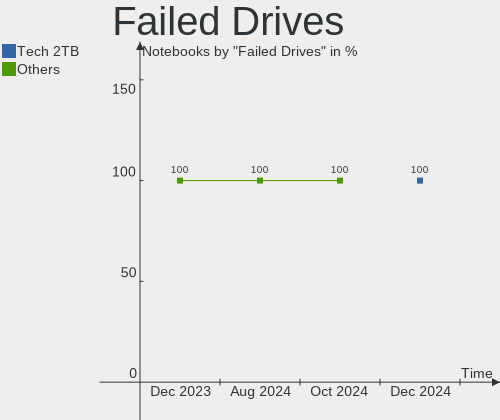
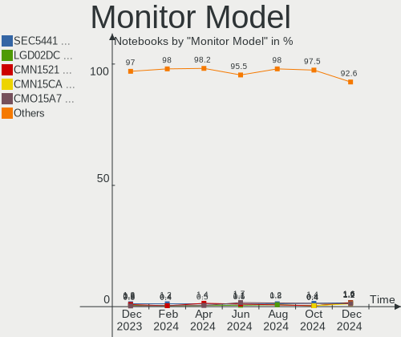
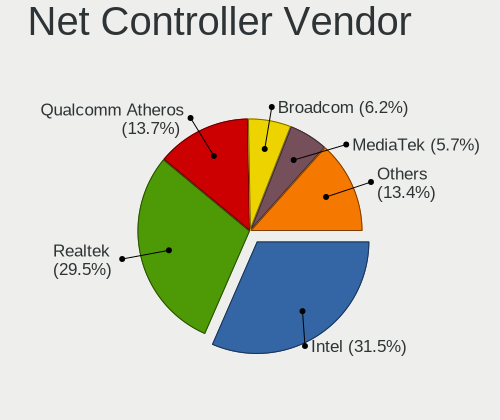
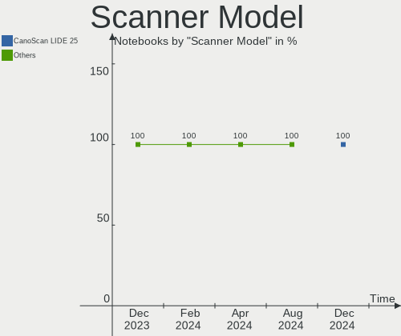

Linux Mint Hardware Trends (Notebooks)
--------------------------------------

A project to identify most popular hardware characteristics and track their change
over time based on data collected by Linux Mint users at https://Linux-Hardware.org.

Anyone can contribute to this report by the [hw-probe](https://github.com/linuxhw/hw-probe) tool:

    sudo -E hw-probe -all -upload

This report is for one last month. Overall report since the beginning of time: [TestCoverage](https://github.com/linuxhw/TestCoverage)

Period: Apr, 2022.

Contents
--------

* [ System ](#system)
  - [ OS                       ](#os)
  - [ OS Family                ](#os-family)
  - [ Kernel                   ](#kernel)
  - [ Kernel Family            ](#kernel-family)
  - [ Kernel Major Ver.        ](#kernel-major-ver)
  - [ Arch                     ](#arch)
  - [ DE                       ](#de)
  - [ Display Server           ](#display-server)
  - [ Display Manager          ](#display-manager)
  - [ OS Lang                  ](#os-lang)
  - [ Boot Mode                ](#boot-mode)
  - [ Filesystem               ](#filesystem)
  - [ Part. scheme             ](#part-scheme)
  - [ Dual Boot with Linux/BSD ](#dual-boot-with-linuxbsd)
  - [ Dual Boot (Win)          ](#dual-boot-win)

* [ Board ](#board)
  - [ Vendor                   ](#vendor)
  - [ Model                    ](#model)
  - [ Model Family             ](#model-family)
  - [ MFG Year                 ](#mfg-year)
  - [ Form Factor              ](#form-factor)
  - [ Secure Boot              ](#secure-boot)
  - [ Coreboot                 ](#coreboot)
  - [ RAM Size                 ](#ram-size)
  - [ RAM Used                 ](#ram-used)
  - [ Total Drives             ](#total-drives)
  - [ Has CD-ROM               ](#has-cd-rom)
  - [ Has Ethernet             ](#has-ethernet)
  - [ Has WiFi                 ](#has-wifi)
  - [ Has Bluetooth            ](#has-bluetooth)

* [ Location ](#location)
  - [ Country                  ](#country)
  - [ City                     ](#city)

* [ Drives ](#drives)
  - [ Drive Vendor             ](#drive-vendor)
  - [ Drive Model              ](#drive-model)
  - [ HDD Vendor               ](#hdd-vendor)
  - [ SSD Vendor               ](#ssd-vendor)
  - [ Drive Kind               ](#drive-kind)
  - [ Drive Connector          ](#drive-connector)
  - [ Drive Size               ](#drive-size)
  - [ Space Total              ](#space-total)
  - [ Space Used               ](#space-used)
  - [ Malfunc. Drives          ](#malfunc-drives)
  - [ Malfunc. Drive Vendor    ](#malfunc-drive-vendor)
  - [ Malfunc. HDD Vendor      ](#malfunc-hdd-vendor)
  - [ Malfunc. Drive Kind      ](#malfunc-drive-kind)
  - [ Failed Drives            ](#failed-drives)
  - [ Failed Drive Vendor      ](#failed-drive-vendor)
  - [ Drive Status             ](#drive-status)

* [ Storage controller ](#storage-controller)
  - [ Storage Vendor           ](#storage-vendor)
  - [ Storage Model            ](#storage-model)
  - [ Storage Kind             ](#storage-kind)

* [ Processor ](#processor)
  - [ CPU Vendor               ](#cpu-vendor)
  - [ CPU Model                ](#cpu-model)
  - [ CPU Model Family         ](#cpu-model-family)
  - [ CPU Cores                ](#cpu-cores)
  - [ CPU Sockets              ](#cpu-sockets)
  - [ CPU Threads              ](#cpu-threads)
  - [ CPU Op-Modes             ](#cpu-op-modes)
  - [ CPU Microcode            ](#cpu-microcode)
  - [ CPU Microarch            ](#cpu-microarch)

* [ Graphics ](#graphics)
  - [ GPU Vendor               ](#gpu-vendor)
  - [ GPU Model                ](#gpu-model)
  - [ GPU Combo                ](#gpu-combo)
  - [ GPU Driver               ](#gpu-driver)
  - [ GPU Memory               ](#gpu-memory)

* [ Monitor ](#monitor)
  - [ Monitor Vendor           ](#monitor-vendor)
  - [ Monitor Model            ](#monitor-model)
  - [ Monitor Resolution       ](#monitor-resolution)
  - [ Monitor Diagonal         ](#monitor-diagonal)
  - [ Monitor Width            ](#monitor-width)
  - [ Aspect Ratio             ](#aspect-ratio)
  - [ Monitor Area             ](#monitor-area)
  - [ Pixel Density            ](#pixel-density)
  - [ Multiple Monitors        ](#multiple-monitors)

* [ Network ](#network)
  - [ Net Controller Vendor    ](#net-controller-vendor)
  - [ Net Controller Model     ](#net-controller-model)
  - [ Wireless Vendor          ](#wireless-vendor)
  - [ Wireless Model           ](#wireless-model)
  - [ Ethernet Vendor          ](#ethernet-vendor)
  - [ Ethernet Model           ](#ethernet-model)
  - [ Net Controller Kind      ](#net-controller-kind)
  - [ Used Controller          ](#used-controller)
  - [ NICs                     ](#nics)
  - [ IPv6                     ](#ipv6)

* [ Bluetooth ](#bluetooth)
  - [ Bluetooth Vendor         ](#bluetooth-vendor)
  - [ Bluetooth Model          ](#bluetooth-model)

* [ Sound ](#sound)
  - [ Sound Vendor             ](#sound-vendor)
  - [ Sound Model              ](#sound-model)

* [ Memory ](#memory)
  - [ Memory Vendor            ](#memory-vendor)
  - [ Memory Model             ](#memory-model)
  - [ Memory Kind              ](#memory-kind)
  - [ Memory Form Factor       ](#memory-form-factor)
  - [ Memory Size              ](#memory-size)
  - [ Memory Speed             ](#memory-speed)

* [ Printers & scanners ](#printers--scanners)
  - [ Printer Vendor           ](#printer-vendor)
  - [ Printer Model            ](#printer-model)
  - [ Scanner Vendor           ](#scanner-vendor)
  - [ Scanner Model            ](#scanner-model)

* [ Camera ](#camera)
  - [ Camera Vendor            ](#camera-vendor)
  - [ Camera Model             ](#camera-model)

* [ Security ](#security)
  - [ Fingerprint Vendor       ](#fingerprint-vendor)
  - [ Fingerprint Model        ](#fingerprint-model)
  - [ Chipcard Vendor          ](#chipcard-vendor)
  - [ Chipcard Model           ](#chipcard-model)

* [ Unsupported ](#unsupported)
  - [ Unsupported Devices      ](#unsupported-devices)
  - [ Unsupported Device Types ](#unsupported-device-types)

System
------

OS
--

Installed operating systems

| Name            | Notebooks | Percent |
|-----------------|-----------|---------|
| Linux Mint 20.3 | 212       | 82.49%  |
| Linux Mint 20.2 | 16        | 6.23%   |
| Linux Mint 19.3 | 13        | 5.06%   |
| Linux Mint 20   | 6         | 2.33%   |
| Linux Mint 19.2 | 5         | 1.95%   |
| Linux Mint 20.1 | 4         | 1.56%   |
| Linux Mint 18.3 | 1         | 0.39%   |

OS Family
---------

OS without a version

| Name       | Notebooks | Percent |
|------------|-----------|---------|
| Linux Mint | 257       | 100%    |

Kernel
------

Version of the Linux kernel

| Version               | Notebooks | Percent |
|-----------------------|-----------|---------|
| 5.4.0-107-generic     | 101       | 39.3%   |
| 5.4.0-109-generic     | 61        | 23.74%  |
| 5.4.0-91-generic      | 22        | 8.56%   |
| 5.13.0-39-generic     | 15        | 5.84%   |
| 5.13.0-27-generic     | 10        | 3.89%   |
| 5.13.0-40-generic     | 8         | 3.11%   |
| 5.4.0-105-generic     | 6         | 2.33%   |
| 5.4.0-100-generic     | 6         | 2.33%   |
| 5.4.0-104-generic     | 3         | 1.17%   |
| 5.14.0-1032-oem       | 3         | 1.17%   |
| 4.15.0-54-generic     | 3         | 1.17%   |
| 5.4.0-74-generic      | 2         | 0.78%   |
| 5.4.0-26-generic      | 2         | 0.78%   |
| 5.4.0-45-generic      | 1         | 0.39%   |
| 5.17.4-051704-generic | 1         | 0.39%   |
| 5.17.1-051701-generic | 1         | 0.39%   |
| 5.17.0-051700-generic | 1         | 0.39%   |
| 5.15.0-25-generic     | 1         | 0.39%   |
| 5.14.0-1034-oem       | 1         | 0.39%   |
| 5.14.0-1033-oem       | 1         | 0.39%   |
| 5.13.0-1021-oracle    | 1         | 0.39%   |
| 5.13.0-1010-intel     | 1         | 0.39%   |
| 5.11.0-46-generic     | 1         | 0.39%   |
| 5.11.0-41-generic     | 1         | 0.39%   |
| 4.7.10-040710-generic | 1         | 0.39%   |
| 4.4.0-154-lowlatency  | 1         | 0.39%   |
| 4.15.0-175-generic    | 1         | 0.39%   |
| 4.15.0-171-generic    | 1         | 0.39%   |

Kernel Family
-------------

Linux kernel without a distro release

| Version | Notebooks | Percent |
|---------|-----------|---------|
| 5.4.0   | 204       | 79.38%  |
| 5.13.0  | 35        | 13.62%  |
| 5.14.0  | 5         | 1.95%   |
| 4.15.0  | 5         | 1.95%   |
| 5.11.0  | 2         | 0.78%   |
| 5.17.4  | 1         | 0.39%   |
| 5.17.1  | 1         | 0.39%   |
| 5.17.0  | 1         | 0.39%   |
| 5.15.0  | 1         | 0.39%   |
| 4.7.10  | 1         | 0.39%   |
| 4.4.0   | 1         | 0.39%   |

Kernel Major Ver.
-----------------

Linux kernel major version

| Version | Notebooks | Percent |
|---------|-----------|---------|
| 5.4     | 204       | 79.38%  |
| 5.13    | 35        | 13.62%  |
| 5.14    | 5         | 1.95%   |
| 4.15    | 5         | 1.95%   |
| 5.17    | 3         | 1.17%   |
| 5.11    | 2         | 0.78%   |
| 5.15    | 1         | 0.39%   |
| 4.7     | 1         | 0.39%   |
| 4.4     | 1         | 0.39%   |

Arch
----

OS architecture (x86_64, i586, etc.)

| Name   | Notebooks | Percent |
|--------|-----------|---------|
| x86_64 | 249       | 96.89%  |
| i686   | 8         | 3.11%   |

DE
--

Desktop Environment

| Name       | Notebooks | Percent |
|------------|-----------|---------|
| X-Cinnamon | 178       | 69.26%  |
| MATE       | 29        | 11.28%  |
| XFCE       | 24        | 9.34%   |
| Cinnamon   | 17        | 6.61%   |
| GNOME      | 6         | 2.33%   |
| LXQt       | 1         | 0.39%   |
| KDE5       | 1         | 0.39%   |
| Unknown    | 1         | 0.39%   |

Display Server
--------------

X11 or Wayland

| Name | Notebooks | Percent |
|------|-----------|---------|
| X11  | 255       | 99.22%  |
| Tty  | 2         | 0.78%   |

Display Manager
---------------

SDDM, LightDM, etc.

| Name    | Notebooks | Percent |
|---------|-----------|---------|
| Unknown | 142       | 55.25%  |
| LightDM | 113       | 43.97%  |
| SDDM    | 1         | 0.39%   |
| GDM     | 1         | 0.39%   |

OS Lang
-------

Language

| Lang    | Notebooks | Percent |
|---------|-----------|---------|
| en_US   | 75        | 29.18%  |
| de_DE   | 48        | 18.68%  |
| fr_FR   | 19        | 7.39%   |
| ru_RU   | 12        | 4.67%   |
| pt_BR   | 12        | 4.67%   |
| pl_PL   | 11        | 4.28%   |
| en_GB   | 9         | 3.5%    |
| en_IN   | 8         | 3.11%   |
| C       | 8         | 3.11%   |
| en_CA   | 7         | 2.72%   |
| nl_NL   | 6         | 2.33%   |
| es_ES   | 6         | 2.33%   |
| en_ZA   | 4         | 1.56%   |
| it_IT   | 3         | 1.17%   |
| es_CO   | 3         | 1.17%   |
| zh_CN   | 2         | 0.78%   |
| tr_TR   | 2         | 0.78%   |
| sk_SK   | 2         | 0.78%   |
| pt_PT   | 2         | 0.78%   |
| sv_SE   | 1         | 0.39%   |
| nl_BE   | 1         | 0.39%   |
| ko_KR   | 1         | 0.39%   |
| it_CH   | 1         | 0.39%   |
| hu_HU   | 1         | 0.39%   |
| eu_ES   | 1         | 0.39%   |
| es_PE   | 1         | 0.39%   |
| es_MX   | 1         | 0.39%   |
| es_EC   | 1         | 0.39%   |
| en_NZ   | 1         | 0.39%   |
| en_IE   | 1         | 0.39%   |
| en_HK   | 1         | 0.39%   |
| en_AU   | 1         | 0.39%   |
| el_GR   | 1         | 0.39%   |
| de_AT   | 1         | 0.39%   |
| cs_CZ   | 1         | 0.39%   |
| bg_BG   | 1         | 0.39%   |
| Unknown | 1         | 0.39%   |

Boot Mode
---------

EFI or BIOS

| Mode | Notebooks | Percent |
|------|-----------|---------|
| EFI  | 145       | 56.42%  |
| BIOS | 112       | 43.58%  |

Filesystem
----------

Type of filesystem

| Type    | Notebooks | Percent |
|---------|-----------|---------|
| Ext4    | 247       | 96.11%  |
| Overlay | 7         | 2.72%   |
| Btrfs   | 2         | 0.78%   |
| Zfs     | 1         | 0.39%   |

Part. scheme
------------

Scheme of partitioning

| Type    | Notebooks | Percent |
|---------|-----------|---------|
| Unknown | 152       | 59.14%  |
| GPT     | 78        | 30.35%  |
| MBR     | 27        | 10.51%  |

Dual Boot with Linux/BSD
------------------------

Hosting more than one Linux/BSD

| Dual boot | Notebooks | Percent |
|-----------|-----------|---------|
| No        | 245       | 95.33%  |
| Yes       | 12        | 4.67%   |

Dual Boot (Win)
---------------

Hosting Linux and Windows

| Dual boot | Notebooks | Percent |
|-----------|-----------|---------|
| No        | 216       | 84.05%  |
| Yes       | 41        | 15.95%  |

Board
-----

Vendor
------

Motherboard manufacturer

| Name                | Notebooks | Percent |
|---------------------|-----------|---------|
| Lenovo              | 57        | 22.18%  |
| Hewlett-Packard     | 48        | 18.68%  |
| Dell                | 41        | 15.95%  |
| Acer                | 23        | 8.95%   |
| ASUSTek Computer    | 17        | 6.61%   |
| Toshiba             | 14        | 5.45%   |
| Apple               | 8         | 3.11%   |
| Samsung Electronics | 5         | 1.95%   |
| Positivo            | 4         | 1.56%   |
| Notebook            | 4         | 1.56%   |
| MSI                 | 4         | 1.56%   |
| Sony                | 3         | 1.17%   |
| Packard Bell        | 3         | 1.17%   |
| Medion              | 3         | 1.17%   |
| Google              | 3         | 1.17%   |
| TUXEDO              | 2         | 0.78%   |
| Fujitsu             | 2         | 0.78%   |
| eMachines           | 2         | 0.78%   |
| Alienware           | 2         | 0.78%   |
| Unknown             | 2         | 0.78%   |
| Timi                | 1         | 0.39%   |
| QUANMAX             | 1         | 0.39%   |
| Microtech           | 1         | 0.39%   |
| MECHREVO            | 1         | 0.39%   |
| LincPlus            | 1         | 0.39%   |
| LG Electronics      | 1         | 0.39%   |
| Fujitsu Siemens     | 1         | 0.39%   |
| Foxconn             | 1         | 0.39%   |
| CSL-Computer        | 1         | 0.39%   |
| BLAUPUNKT           | 1         | 0.39%   |

Model
-----

Motherboard model

| Name                                | Notebooks | Percent |
|-------------------------------------|-----------|---------|
| Dell Inspiron 3542                  | 3         | 1.17%   |
| Positivo S14CT01                    | 2         | 0.78%   |
| Positivo Mobile                     | 2         | 0.78%   |
| Lenovo IdeaPad 3 15ALC6 82KU        | 2         | 0.78%   |
| HP Pavilion dv6                     | 2         | 0.78%   |
| HP Pavilion 17                      | 2         | 0.78%   |
| HP Notebook                         | 2         | 0.78%   |
| HP EliteBook 840 G2                 | 2         | 0.78%   |
| HP 625                              | 2         | 0.78%   |
| Dell XPS 15 9560                    | 2         | 0.78%   |
| Dell Latitude E6520                 | 2         | 0.78%   |
| Dell Latitude 5490                  | 2         | 0.78%   |
| Dell Inspiron 5570                  | 2         | 0.78%   |
| Dell Inspiron 3583                  | 2         | 0.78%   |
| Dell Inspiron 3543                  | 2         | 0.78%   |
| Apple MacBookPro8,2                 | 2         | 0.78%   |
| Apple MacBookPro7,1                 | 2         | 0.78%   |
| Unknown                             | 2         | 0.78%   |
| TUXEDO N15_17RD                     | 1         | 0.39%   |
| TUXEDO InfinityBook S 15 Gen6       | 1         | 0.39%   |
| Toshiba TECRA M11                   | 1         | 0.39%   |
| Toshiba Satellite S55-C             | 1         | 0.39%   |
| Toshiba Satellite Pro L850-B339     | 1         | 0.39%   |
| Toshiba Satellite P755              | 1         | 0.39%   |
| Toshiba Satellite P75-A             | 1         | 0.39%   |
| Toshiba Satellite L735D             | 1         | 0.39%   |
| Toshiba Satellite L300              | 1         | 0.39%   |
| Toshiba Satellite C850-F31Q         | 1         | 0.39%   |
| Toshiba Satellite C655D             | 1         | 0.39%   |
| Toshiba Satellite C650              | 1         | 0.39%   |
| Toshiba Satellite C55-C             | 1         | 0.39%   |
| Toshiba Satellite C50D-A0386        | 1         | 0.39%   |
| Toshiba PORTEGE M800                | 1         | 0.39%   |
| Toshiba NB520                       | 1         | 0.39%   |
| Timi TM1701                         | 1         | 0.39%   |
| Sony VPCEH3F1R                      | 1         | 0.39%   |
| Sony VGN-SZ120P                     | 1         | 0.39%   |
| Sony VGN-CS31S_W                    | 1         | 0.39%   |
| Samsung SX10P                       | 1         | 0.39%   |
| Samsung 755XDA                      | 1         | 0.39%   |
| Samsung 370E4K                      | 1         | 0.39%   |
| Samsung 350V5C/351V5C/3540VC/3440VC | 1         | 0.39%   |
| Samsung 305U1A                      | 1         | 0.39%   |
| QUANMAX Platin SE                   | 1         | 0.39%   |
| Packard Bell EasyNote MH45          | 1         | 0.39%   |
| Packard Bell EasyNote LE69KB        | 1         | 0.39%   |
| Packard Bell DOT S                  | 1         | 0.39%   |
| Notebook W65_67SZ                   | 1         | 0.39%   |
| Notebook W35xSTQ_370ST              | 1         | 0.39%   |
| Notebook NLx0MU                     | 1         | 0.39%   |
| Notebook NL5xNU                     | 1         | 0.39%   |
| MSI Pulse GL76 11UEK                | 1         | 0.39%   |
| MSI PS63 Modern 8M                  | 1         | 0.39%   |
| MSI GP72 6QF                        | 1         | 0.39%   |
| MSI CR70 2M/CX70 2OC/CX70 2OD       | 1         | 0.39%   |
| Microtech ebookPro                  | 1         | 0.39%   |
| Medion WIM2140                      | 1         | 0.39%   |
| Medion P6612                        | 1         | 0.39%   |
| Medion E6228                        | 1         | 0.39%   |
| MECHREVO Taitan Series GM7TG0M      | 1         | 0.39%   |

Model Family
------------

Motherboard model prefix

| Name                  | Notebooks | Percent |
|-----------------------|-----------|---------|
| Lenovo ThinkPad       | 32        | 12.45%  |
| Dell Latitude         | 17        | 6.61%   |
| Dell Inspiron         | 16        | 6.23%   |
| HP Pavilion           | 13        | 5.06%   |
| Acer Aspire           | 13        | 5.06%   |
| Lenovo IdeaPad        | 12        | 4.67%   |
| Toshiba Satellite     | 11        | 4.28%   |
| HP Laptop             | 7         | 2.72%   |
| HP EliteBook          | 6         | 2.33%   |
| HP ProBook            | 4         | 1.56%   |
| Dell XPS              | 4         | 1.56%   |
| Lenovo Legion         | 3         | 1.17%   |
| ASUS VivoBook         | 3         | 1.17%   |
| Acer TravelMate       | 3         | 1.17%   |
| Acer Swift            | 3         | 1.17%   |
| Positivo S14CT01      | 2         | 0.78%   |
| Positivo Mobile       | 2         | 0.78%   |
| Packard Bell EasyNote | 2         | 0.78%   |
| HP ZBook              | 2         | 0.78%   |
| HP Stream             | 2         | 0.78%   |
| HP Notebook           | 2         | 0.78%   |
| HP ENVY               | 2         | 0.78%   |
| HP Compaq             | 2         | 0.78%   |
| HP 625                | 2         | 0.78%   |
| Fujitsu LIFEBOOK      | 2         | 0.78%   |
| Dell Precision        | 2         | 0.78%   |
| Apple MacBookPro8     | 2         | 0.78%   |
| Apple MacBookPro7     | 2         | 0.78%   |
| Unknown               | 2         | 0.78%   |
| TUXEDO N15            | 1         | 0.39%   |
| TUXEDO InfinityBook   | 1         | 0.39%   |
| Toshiba TECRA         | 1         | 0.39%   |
| Toshiba PORTEGE       | 1         | 0.39%   |
| Toshiba NB520         | 1         | 0.39%   |
| Timi TM1701           | 1         | 0.39%   |
| Sony VPCEH3F1R        | 1         | 0.39%   |
| Sony VGN-SZ120P       | 1         | 0.39%   |
| Sony VGN-CS31S        | 1         | 0.39%   |
| Samsung SX10P         | 1         | 0.39%   |
| Samsung 755XDA        | 1         | 0.39%   |
| Samsung 370E4K        | 1         | 0.39%   |
| Samsung 350V5C        | 1         | 0.39%   |
| Samsung 305U1A        | 1         | 0.39%   |
| QUANMAX Platin        | 1         | 0.39%   |
| Packard Bell DOT      | 1         | 0.39%   |
| Notebook W65          | 1         | 0.39%   |
| Notebook W35xSTQ      | 1         | 0.39%   |
| Notebook NLx0MU       | 1         | 0.39%   |
| Notebook NL5xNU       | 1         | 0.39%   |
| MSI Pulse             | 1         | 0.39%   |
| MSI PS63              | 1         | 0.39%   |
| MSI GP72              | 1         | 0.39%   |
| MSI CR70              | 1         | 0.39%   |
| Microtech ebookPro    | 1         | 0.39%   |
| Medion WIM2140        | 1         | 0.39%   |
| Medion P6612          | 1         | 0.39%   |
| Medion E6228          | 1         | 0.39%   |
| MECHREVO Taitan       | 1         | 0.39%   |
| LincPlus LINNCPLUS    | 1         | 0.39%   |
| LG 16Z90P-K.AA78A1    | 1         | 0.39%   |

MFG Year
--------

Motherboard manufacture year

| Year    | Notebooks | Percent |
|---------|-----------|---------|
| 2021    | 29        | 11.28%  |
| 2020    | 25        | 9.73%   |
| 2013    | 23        | 8.95%   |
| 2011    | 23        | 8.95%   |
| 2015    | 19        | 7.39%   |
| 2014    | 19        | 7.39%   |
| 2019    | 16        | 6.23%   |
| 2017    | 16        | 6.23%   |
| 2012    | 16        | 6.23%   |
| 2008    | 15        | 5.84%   |
| 2016    | 14        | 5.45%   |
| 2010    | 13        | 5.06%   |
| 2018    | 12        | 4.67%   |
| 2009    | 6         | 2.33%   |
| 2007    | 5         | 1.95%   |
| 2006    | 4         | 1.56%   |
| 2004    | 1         | 0.39%   |
| Unknown | 1         | 0.39%   |

Form Factor
-----------

Physical design of the computer

| Name     | Notebooks | Percent |
|----------|-----------|---------|
| Notebook | 257       | 100%    |

Secure Boot
-----------

Enabled or disabled

| State    | Notebooks | Percent |
|----------|-----------|---------|
| Disabled | 228       | 88.72%  |
| Enabled  | 29        | 11.28%  |

Coreboot
--------

Have coreboot on board

| Used | Notebooks | Percent |
|------|-----------|---------|
| No   | 254       | 98.83%  |
| Yes  | 3         | 1.17%   |

RAM Size
--------

Total RAM memory

| Size in GB  | Notebooks | Percent |
|-------------|-----------|---------|
| 4.01-8.0    | 76        | 29.57%  |
| 3.01-4.0    | 67        | 26.07%  |
| 8.01-16.0   | 42        | 16.34%  |
| 16.01-24.0  | 37        | 14.4%   |
| 1.01-2.0    | 16        | 6.23%   |
| 32.01-64.0  | 9         | 3.5%    |
| 2.01-3.0    | 4         | 1.56%   |
| 64.01-256.0 | 3         | 1.17%   |
| 0.51-1.0    | 2         | 0.78%   |
| 24.01-32.0  | 1         | 0.39%   |

RAM Used
--------

Used RAM memory

| Used GB   | Notebooks | Percent |
|-----------|-----------|---------|
| 1.01-2.0  | 114       | 44.36%  |
| 2.01-3.0  | 77        | 29.96%  |
| 4.01-8.0  | 24        | 9.34%   |
| 3.01-4.0  | 23        | 8.95%   |
| 0.51-1.0  | 13        | 5.06%   |
| 8.01-16.0 | 6         | 2.33%   |

Total Drives
------------

Number of drives on board

| Drives | Notebooks | Percent |
|--------|-----------|---------|
| 1      | 187       | 72.76%  |
| 2      | 60        | 23.35%  |
| 3      | 8         | 3.11%   |
| 0      | 2         | 0.78%   |

Has CD-ROM
----------

Has CD-ROM on board

| Presented | Notebooks | Percent |
|-----------|-----------|---------|
| No        | 153       | 59.53%  |
| Yes       | 104       | 40.47%  |

Has Ethernet
------------

Has Ethernet on board

| Presented | Notebooks | Percent |
|-----------|-----------|---------|
| Yes       | 219       | 85.21%  |
| No        | 38        | 14.79%  |

Has WiFi
--------

Has WiFi module

| Presented | Notebooks | Percent |
|-----------|-----------|---------|
| Yes       | 253       | 98.44%  |
| No        | 4         | 1.56%   |

Has Bluetooth
-------------

Has Bluetooth module

| Presented | Notebooks | Percent |
|-----------|-----------|---------|
| Yes       | 186       | 72.37%  |
| No        | 71        | 27.63%  |

Location
--------

Country
-------

Geographic location (country)

| Country            | Notebooks | Percent |
|--------------------|-----------|---------|
| Germany            | 53        | 20.62%  |
| USA                | 36        | 14.01%  |
| Brazil             | 17        | 6.61%   |
| France             | 15        | 5.84%   |
| Russia             | 12        | 4.67%   |
| Poland             | 12        | 4.67%   |
| Netherlands        | 8         | 3.11%   |
| India              | 8         | 3.11%   |
| UK                 | 7         | 2.72%   |
| Spain              | 7         | 2.72%   |
| Canada             | 6         | 2.33%   |
| Italy              | 5         | 1.95%   |
| Belgium            | 5         | 1.95%   |
| South Africa       | 4         | 1.56%   |
| Portugal           | 4         | 1.56%   |
| Romania            | 3         | 1.17%   |
| Greece             | 3         | 1.17%   |
| Colombia           | 3         | 1.17%   |
| Australia          | 3         | 1.17%   |
| Turkey             | 2         | 0.78%   |
| Tunisia            | 2         | 0.78%   |
| South Korea        | 2         | 0.78%   |
| Slovakia           | 2         | 0.78%   |
| Norway             | 2         | 0.78%   |
| Mexico             | 2         | 0.78%   |
| Cyprus             | 2         | 0.78%   |
| Croatia            | 2         | 0.78%   |
| China              | 2         | 0.78%   |
| Uzbekistan         | 1         | 0.39%   |
| Ukraine            | 1         | 0.39%   |
| Thailand           | 1         | 0.39%   |
| Taiwan             | 1         | 0.39%   |
| Switzerland        | 1         | 0.39%   |
| Sweden             | 1         | 0.39%   |
| Singapore          | 1         | 0.39%   |
| Réunion           | 1         | 0.39%   |
| Peru               | 1         | 0.39%   |
| Pakistan           | 1         | 0.39%   |
| North Macedonia    | 1         | 0.39%   |
| New Zealand        | 1         | 0.39%   |
| Lithuania          | 1         | 0.39%   |
| Latvia             | 1         | 0.39%   |
| Israel             | 1         | 0.39%   |
| Ireland            | 1         | 0.39%   |
| Iran               | 1         | 0.39%   |
| Hungary            | 1         | 0.39%   |
| Hong Kong          | 1         | 0.39%   |
| Egypt              | 1         | 0.39%   |
| Ecuador            | 1         | 0.39%   |
| Dominican Republic | 1         | 0.39%   |
| Czechia            | 1         | 0.39%   |
| Costa Rica         | 1         | 0.39%   |
| Bulgaria           | 1         | 0.39%   |
| Belize             | 1         | 0.39%   |
| Azerbaijan         | 1         | 0.39%   |
| Austria            | 1         | 0.39%   |

City
----

Geographic location (city)

| City                   | Notebooks | Percent |
|------------------------|-----------|---------|
| Warsaw                 | 5         | 1.95%   |
| Berlin                 | 4         | 1.56%   |
| Târgu Mureş          | 3         | 1.17%   |
| Sao Paulo              | 3         | 1.17%   |
| Moscow                 | 3         | 1.17%   |
| Stuttgart              | 2         | 0.78%   |
| Porto                  | 2         | 0.78%   |
| Munich                 | 2         | 0.78%   |
| Lyon                   | 2         | 0.78%   |
| London                 | 2         | 0.78%   |
| Limassol               | 2         | 0.78%   |
| Kolkata                | 2         | 0.78%   |
| Koblenz                | 2         | 0.78%   |
| Johnson City           | 2         | 0.78%   |
| Delhi                  | 2         | 0.78%   |
| Cologne                | 2         | 0.78%   |
| Chemnitz               | 2         | 0.78%   |
| Cape Town              | 2         | 0.78%   |
| Bratislava             | 2         | 0.78%   |
| Athens                 | 2         | 0.78%   |
| Zumpango               | 1         | 0.39%   |
| Zoetermeer             | 1         | 0.39%   |
| Zagreb                 | 1         | 0.39%   |
| Yerington              | 1         | 0.39%   |
| Wuppertal              | 1         | 0.39%   |
| Winkler                | 1         | 0.39%   |
| Wellington             | 1         | 0.39%   |
| Vleuten                | 1         | 0.39%   |
| Vitoria-Gasteiz        | 1         | 0.39%   |
| Villingen-Schwenningen | 1         | 0.39%   |
| Vienna                 | 1         | 0.39%   |
| Veles                  | 1         | 0.39%   |
| Varzea Paulista        | 1         | 0.39%   |
| Valencia               | 1         | 0.39%   |
| Ústí nad Labem       | 1         | 0.39%   |
| Uiwang                 | 1         | 0.39%   |
| Troisdorf              | 1         | 0.39%   |
| Tours                  | 1         | 0.39%   |
| Toronto                | 1         | 0.39%   |
| Todmorden              | 1         | 0.39%   |
| Teutschenthal          | 1         | 0.39%   |
| Tehran                 | 1         | 0.39%   |
| Taipei                 | 1         | 0.39%   |
| Tacna                  | 1         | 0.39%   |
| Szczecin               | 1         | 0.39%   |
| Suyicun                | 1         | 0.39%   |
| Stockholm              | 1         | 0.39%   |
| Stavropol              | 1         | 0.39%   |
| St Louis               | 1         | 0.39%   |
| Split                  | 1         | 0.39%   |
| Southampton            | 1         | 0.39%   |
| Sofia                  | 1         | 0.39%   |
| Singapore              | 1         | 0.39%   |
| Siliguri               | 1         | 0.39%   |
| Shenzhen               | 1         | 0.39%   |
| Setúbal               | 1         | 0.39%   |
| Seoul                  | 1         | 0.39%   |
| Santo Domingo Este     | 1         | 0.39%   |
| Santander              | 1         | 0.39%   |
| Santa Clara            | 1         | 0.39%   |

Drives
------

Drive Vendor
------------

Hard drive vendors

| Vendor                      | Notebooks | Drives | Percent |
|-----------------------------|-----------|--------|---------|
| Samsung Electronics         | 52        | 54     | 16.77%  |
| Seagate                     | 39        | 39     | 12.58%  |
| WDC                         | 37        | 37     | 11.94%  |
| Unknown                     | 27        | 31     | 8.71%   |
| Toshiba                     | 27        | 27     | 8.71%   |
| Crucial                     | 18        | 19     | 5.81%   |
| SK Hynix                    | 15        | 15     | 4.84%   |
| Kingston                    | 14        | 14     | 4.52%   |
| SanDisk                     | 9         | 9      | 2.9%    |
| HGST                        | 6         | 6      | 1.94%   |
| GOODRAM                     | 6         | 6      | 1.94%   |
| Hitachi                     | 5         | 5      | 1.61%   |
| Micron Technology           | 4         | 4      | 1.29%   |
| KIOXIA                      | 4         | 4      | 1.29%   |
| Intel                       | 3         | 3      | 0.97%   |
| Apple                       | 3         | 3      | 0.97%   |
| A-DATA Technology           | 3         | 3      | 0.97%   |
| Unknown                     | 3         | 3      | 0.97%   |
| UMIS                        | 2         | 2      | 0.65%   |
| LITEON                      | 2         | 2      | 0.65%   |
| Fujitsu                     | 2         | 2      | 0.65%   |
| XPG                         | 1         | 1      | 0.32%   |
| Transcend                   | 1         | 1      | 0.32%   |
| Teclast                     | 1         | 1      | 0.32%   |
| Team                        | 1         | 1      | 0.32%   |
| SSSTC                       | 1         | 1      | 0.32%   |
| SPCC                        | 1         | 1      | 0.32%   |
| Silicon Motion              | 1         | 1      | 0.32%   |
| PNY                         | 1         | 1      | 0.32%   |
| Patriot                     | 1         | 1      | 0.32%   |
| OCZ                         | 1         | 1      | 0.32%   |
| Mushkin                     | 1         | 1      | 0.32%   |
| Microtech                   | 1         | 1      | 0.32%   |
| Micron/Crucial Technology   | 1         | 1      | 0.32%   |
| MAXIO Technology (Hangzhou) | 1         | 1      | 0.32%   |
| LuminouTek                  | 1         | 1      | 0.32%   |
| Lite-On                     | 1         | 1      | 0.32%   |
| Intenso                     | 1         | 1      | 0.32%   |
| INTEL SS                    | 1         | 1      | 0.32%   |
| ICY BOX                     | 1         | 1      | 0.32%   |
| HS-SSD-C100                 | 1         | 1      | 0.32%   |
| GALAX                       | 1         | 1      | 0.32%   |
| EMTEC                       | 1         | 1      | 0.32%   |
| DragonDiamond               | 1         | 1      | 0.32%   |
| China                       | 1         | 1      | 0.32%   |
| Biwin                       | 1         | 1      | 0.32%   |
| BHT                         | 1         | 1      | 0.32%   |
| APPLE HD                    | 1         | 1      | 0.32%   |
| Apacer                      | 1         | 1      | 0.32%   |
| ADATA Technology            | 1         | 1      | 0.32%   |

Drive Model
-----------

Hard drive models

| Model                                   | Notebooks | Percent |
|-----------------------------------------|-----------|---------|
| Seagate ST1000LM024 HN-M101MBB 1TB      | 7         | 2.21%   |
| Unknown MMC Card  64GB                  | 5         | 1.58%   |
| Unknown MMC Card  32GB                  | 5         | 1.58%   |
| Unknown MMC Card  128GB                 | 4         | 1.26%   |
| Toshiba MQ01ABD100 1TB                  | 4         | 1.26%   |
| SK Hynix NVMe SSD Drive 512GB           | 4         | 1.26%   |
| Seagate ST1000LM035-1RK172 1TB          | 4         | 1.26%   |
| Samsung NVMe SSD Drive 512GB            | 4         | 1.26%   |
| Toshiba MQ04ABF100 1TB                  | 3         | 0.95%   |
| Toshiba MQ01ABF050 500GB                | 3         | 0.95%   |
| Seagate ST9500325AS 500GB               | 3         | 0.95%   |
| Seagate Expansion+ 2TB                  | 3         | 0.95%   |
| Kingston SA400S37480G 480GB SSD         | 3         | 0.95%   |
| HGST HTS545050A7E680 500GB              | 3         | 0.95%   |
| Crucial CT500MX500SSD1 500GB            | 3         | 0.95%   |
| Unknown                                 | 3         | 0.95%   |
| WDC WDS240G2G0B-00EPW0 240GB SSD        | 2         | 0.63%   |
| WDC WDS100T2B0B-00YS70 1TB SSD          | 2         | 0.63%   |
| WDC PC SN730 SDBQNTY-512G-1001 512GB    | 2         | 0.63%   |
| Unknown MMC Card  16GB                  | 2         | 0.63%   |
| Toshiba MK7575GSX 752GB                 | 2         | 0.63%   |
| Toshiba MK3275GSX 320GB                 | 2         | 0.63%   |
| SK Hynix NVMe SSD Drive 256GB           | 2         | 0.63%   |
| SK Hynix NVMe SSD Drive 1024GB          | 2         | 0.63%   |
| SK Hynix BC511 HFM512GDJTNI-82A0A 512GB | 2         | 0.63%   |
| Seagate ST500LM000-1EJ162 500GB         | 2         | 0.63%   |
| Sandisk NVMe SSD Drive 1TB              | 2         | 0.63%   |
| Samsung SSD 980 1TB                     | 2         | 0.63%   |
| Samsung SSD 850 EVO 500GB               | 2         | 0.63%   |
| Samsung SSD 850 EVO 250GB               | 2         | 0.63%   |
| Samsung SSD 840 EVO 500GB               | 2         | 0.63%   |
| Samsung NVMe SSD Drive 1TB              | 2         | 0.63%   |
| Samsung MZVLB512HAJQ-000L7 512GB        | 2         | 0.63%   |
| GOODRAM SSDPR-CL100-480-G3 480GB        | 2         | 0.63%   |
| Crucial CT525MX300SSD1 528GB            | 2         | 0.63%   |
| Crucial CT250MX500SSD1 250GB            | 2         | 0.63%   |
| XPG GAMMIX S11 Pro 512GB                | 1         | 0.32%   |
| WDC WDS960G2G0C-00AJM0 960GB            | 1         | 0.32%   |
| WDC WDS500G2B0B-00YS70 500GB SSD        | 1         | 0.32%   |
| WDC WD800BEVS-08RST3 80GB               | 1         | 0.32%   |
| WDC WD5000LPVX-75V0TT0 500GB            | 1         | 0.32%   |
| WDC WD5000LPVX-60V0TT0 500GB            | 1         | 0.32%   |
| WDC WD5000LPVX-22V0TT0 500GB            | 1         | 0.32%   |
| WDC WD5000LPLX-75ZNTT0 500GB            | 1         | 0.32%   |
| WDC WD5000LPCX-21VHAT0 500GB            | 1         | 0.32%   |
| WDC WD5000L12X-21UJGT0 516GB            | 1         | 0.32%   |
| WDC WD5000BPVT-22HXZT3 500GB            | 1         | 0.32%   |
| WDC WD5000BEVT-22A0RT0 500GB            | 1         | 0.32%   |
| WDC WD3200BPVT-75JJ5T0 320GB            | 1         | 0.32%   |
| WDC WD3200BPVT-22JJ5T0 320GB            | 1         | 0.32%   |
| WDC WD3200BEVT-24A23T0 320GB            | 1         | 0.32%   |
| WDC WD3200BEVT-22ZCT0 320GB             | 1         | 0.32%   |
| WDC WD2500LPCX-24C6HT0 250GB            | 1         | 0.32%   |
| WDC WD2500BEVT-22ZCT0 250GB             | 1         | 0.32%   |
| WDC WD2500BEVT-22A23T0 250GB            | 1         | 0.32%   |
| WDC WD1600BEVT-75ZCT2 160GB             | 1         | 0.32%   |
| WDC WD1600BEVT-22ZCT0 160GB             | 1         | 0.32%   |
| WDC WD1600BEVS-22UST0 160GB             | 1         | 0.32%   |
| WDC WD1600BEVS-22RST0 160GB             | 1         | 0.32%   |
| WDC WD10SPZX-60Z10T0 1TB                | 1         | 0.32%   |

HDD Vendor
----------

Hard disk drive vendors

| Vendor              | Notebooks | Drives | Percent |
|---------------------|-----------|--------|---------|
| Seagate             | 38        | 38     | 37.62%  |
| WDC                 | 26        | 26     | 25.74%  |
| Toshiba             | 20        | 20     | 19.8%   |
| HGST                | 6         | 6      | 5.94%   |
| Hitachi             | 5         | 5      | 4.95%   |
| Samsung Electronics | 2         | 2      | 1.98%   |
| Fujitsu             | 2         | 2      | 1.98%   |
| Unknown             | 1         | 1      | 0.99%   |
| APPLE HD            | 1         | 1      | 0.99%   |

SSD Vendor
----------

Solid state drive vendors

| Vendor              | Notebooks | Drives | Percent |
|---------------------|-----------|--------|---------|
| Samsung Electronics | 27        | 27     | 26.47%  |
| Crucial             | 14        | 15     | 13.73%  |
| Kingston            | 10        | 10     | 9.8%    |
| GOODRAM             | 6         | 6      | 5.88%   |
| WDC                 | 5         | 5      | 4.9%    |
| SanDisk             | 5         | 5      | 4.9%    |
| Toshiba             | 3         | 3      | 2.94%   |
| Apple               | 3         | 3      | 2.94%   |
| A-DATA Technology   | 3         | 3      | 2.94%   |
| SK Hynix            | 2         | 2      | 1.96%   |
| Micron Technology   | 2         | 2      | 1.96%   |
| LITEON              | 2         | 2      | 1.96%   |
| Intel               | 2         | 2      | 1.96%   |
| Unknown             | 2         | 2      | 1.96%   |
| Transcend           | 1         | 1      | 0.98%   |
| Teclast             | 1         | 1      | 0.98%   |
| SPCC                | 1         | 1      | 0.98%   |
| Seagate             | 1         | 1      | 0.98%   |
| PNY                 | 1         | 1      | 0.98%   |
| Patriot             | 1         | 1      | 0.98%   |
| OCZ                 | 1         | 1      | 0.98%   |
| Mushkin             | 1         | 1      | 0.98%   |
| Microtech           | 1         | 1      | 0.98%   |
| Intenso             | 1         | 1      | 0.98%   |
| INTEL SS            | 1         | 1      | 0.98%   |
| GALAX               | 1         | 1      | 0.98%   |
| EMTEC               | 1         | 1      | 0.98%   |
| China               | 1         | 1      | 0.98%   |
| BHT                 | 1         | 1      | 0.98%   |
| Apacer              | 1         | 1      | 0.98%   |

Drive Kind
----------

HDD or SSD

| Kind    | Notebooks | Drives | Percent |
|---------|-----------|--------|---------|
| SSD     | 100       | 103    | 33.44%  |
| HDD     | 97        | 101    | 32.44%  |
| NVMe    | 71        | 78     | 23.75%  |
| MMC     | 27        | 31     | 9.03%   |
| Unknown | 4         | 4      | 1.34%   |

Drive Connector
---------------

SATA, SAS, NVMe, etc.

| Type | Notebooks | Drives | Percent |
|------|-----------|--------|---------|
| SATA | 178       | 198    | 62.46%  |
| NVMe | 71        | 78     | 24.91%  |
| MMC  | 27        | 31     | 9.47%   |
| SAS  | 9         | 10     | 3.16%   |

Drive Size
----------

Size of hard drive

| Size in TB | Notebooks | Drives | Percent |
|------------|-----------|--------|---------|
| 0.01-0.5   | 133       | 139    | 68.91%  |
| 0.51-1.0   | 53        | 58     | 27.46%  |
| 1.01-2.0   | 7         | 7      | 3.63%   |

Space Total
-----------

Amount of disk space available on the file system

| Size in GB     | Notebooks | Percent |
|----------------|-----------|---------|
| 101-250        | 89        | 34.63%  |
| 251-500        | 73        | 28.4%   |
| 501-1000       | 40        | 15.56%  |
| 1001-2000      | 17        | 6.61%   |
| 51-100         | 14        | 5.45%   |
| 21-50          | 10        | 3.89%   |
| 1-20           | 7         | 2.72%   |
| More than 3000 | 5         | 1.95%   |
| 2001-3000      | 2         | 0.78%   |

Space Used
----------

Amount of used disk space

| Used GB   | Notebooks | Percent |
|-----------|-----------|---------|
| 1-20      | 82        | 31.91%  |
| 21-50     | 52        | 20.23%  |
| 51-100    | 43        | 16.73%  |
| 101-250   | 42        | 16.34%  |
| 251-500   | 20        | 7.78%   |
| 501-1000  | 10        | 3.89%   |
| 1001-2000 | 6         | 2.33%   |
| 2001-3000 | 2         | 0.78%   |

Malfunc. Drives
---------------

Drive models with a malfunction

| Model                            | Notebooks | Drives | Percent |
|----------------------------------|-----------|--------|---------|
| WDC WDS240G2G0B-00EPW0 240GB SSD | 2         | 2      | 12.5%   |
| XPG GAMMIX S11 Pro 512GB         | 1         | 1      | 6.25%   |
| WDC WD5000LPVX-75V0TT0 500GB     | 1         | 1      | 6.25%   |
| Toshiba MQ04ABF100 1TB           | 1         | 1      | 6.25%   |
| Toshiba MK7575GSX 752GB          | 1         | 1      | 6.25%   |
| SK Hynix SC308 SATA 128GB SSD    | 1         | 1      | 6.25%   |
| Seagate ST9500420AS 500GB        | 1         | 1      | 6.25%   |
| Seagate ST9500325AS 500GB        | 1         | 1      | 6.25%   |
| Seagate ST9160314AS 160GB        | 1         | 1      | 6.25%   |
| Seagate ST500LT012-9WS142 500GB  | 1         | 1      | 6.25%   |
| Hitachi HTS547575A9E384 752GB    | 1         | 1      | 6.25%   |
| HGST HTS545050A7E680 500GB       | 1         | 1      | 6.25%   |
| HGST HTS541010A9E680 1TB         | 1         | 1      | 6.25%   |
| Crucial CT1050MX300SSD1 1TB      | 1         | 1      | 6.25%   |
| Apple SSD TS0128F 121GB          | 1         | 1      | 6.25%   |

Malfunc. Drive Vendor
---------------------

Vendors of faulty drives

| Vendor   | Notebooks | Drives | Percent |
|----------|-----------|--------|---------|
| Seagate  | 4         | 4      | 25%     |
| WDC      | 3         | 3      | 18.75%  |
| Toshiba  | 2         | 2      | 12.5%   |
| HGST     | 2         | 2      | 12.5%   |
| XPG      | 1         | 1      | 6.25%   |
| SK Hynix | 1         | 1      | 6.25%   |
| Hitachi  | 1         | 1      | 6.25%   |
| Crucial  | 1         | 1      | 6.25%   |
| Apple    | 1         | 1      | 6.25%   |

Malfunc. HDD Vendor
-------------------

Vendors of faulty HDD drives

| Vendor  | Notebooks | Drives | Percent |
|---------|-----------|--------|---------|
| Seagate | 4         | 4      | 40%     |
| Toshiba | 2         | 2      | 20%     |
| HGST    | 2         | 2      | 20%     |
| WDC     | 1         | 1      | 10%     |
| Hitachi | 1         | 1      | 10%     |

Malfunc. Drive Kind
-------------------

Kinds of faulty drives

| Kind | Notebooks | Drives | Percent |
|------|-----------|--------|---------|
| HDD  | 10        | 10     | 62.5%   |
| SSD  | 5         | 5      | 31.25%  |
| NVMe | 1         | 1      | 6.25%   |

Failed Drives
-------------

Failed drive models

| Model                       | Notebooks | Drives | Percent |
|-----------------------------|-----------|--------|---------|
| Toshiba THNSN5512GPU7 512GB | 1         | 1      | 100%    |

Failed Drive Vendor
-------------------

Failed drive vendors

| Vendor  | Notebooks | Drives | Percent |
|---------|-----------|--------|---------|
| Toshiba | 1         | 1      | 100%    |

Drive Status
------------

Number of failed and malfunc. drives

| Status   | Notebooks | Drives | Percent |
|----------|-----------|--------|---------|
| Detected | 167       | 199    | 61.85%  |
| Works    | 87        | 101    | 32.22%  |
| Malfunc  | 15        | 16     | 5.56%   |
| Failed   | 1         | 1      | 0.37%   |

Storage controller
------------------

Storage Vendor
--------------

Storage controller vendors

| Vendor                           | Notebooks | Percent |
|----------------------------------|-----------|---------|
| Intel                            | 183       | 62.89%  |
| AMD                              | 27        | 9.28%   |
| Samsung Electronics              | 23        | 7.9%    |
| SK Hynix                         | 13        | 4.47%   |
| Sandisk                          | 10        | 3.44%   |
| Toshiba America Info Systems     | 6         | 2.06%   |
| Micron/Crucial Technology        | 4         | 1.37%   |
| Kingston Technology Company      | 4         | 1.37%   |
| Micron Technology                | 3         | 1.03%   |
| Union Memory (Shenzhen)          | 2         | 0.69%   |
| Silicon Motion                   | 2         | 0.69%   |
| Nvidia                           | 2         | 0.69%   |
| KIOXIA                           | 2         | 0.69%   |
| ADATA Technology                 | 2         | 0.69%   |
| Solid State Storage Technology   | 1         | 0.34%   |
| Silicon Integrated Systems [SiS] | 1         | 0.34%   |
| Silicon Image                    | 1         | 0.34%   |
| OCZ Technology Group             | 1         | 0.34%   |
| MAXIO Technology (Hangzhou)      | 1         | 0.34%   |
| Marvell Technology Group         | 1         | 0.34%   |
| Lite-On Technology               | 1         | 0.34%   |
| Biwin Storage Technology         | 1         | 0.34%   |

Storage Model
-------------

Storage controller models

| Model                                                                            | Notebooks | Percent |
|----------------------------------------------------------------------------------|-----------|---------|
| Intel 82801 Mobile SATA Controller [RAID mode]                                   | 20        | 6.49%   |
| AMD FCH SATA Controller [AHCI mode]                                              | 20        | 6.49%   |
| Intel 7 Series Chipset Family 6-port SATA Controller [AHCI mode]                 | 17        | 5.52%   |
| Intel 6 Series/C200 Series Chipset Family 6 port Mobile SATA AHCI Controller     | 15        | 4.87%   |
| Intel 8 Series/C220 Series Chipset Family 6-port SATA Controller 1 [AHCI mode]   | 14        | 4.55%   |
| Intel Wildcat Point-LP SATA Controller [AHCI Mode]                               | 13        | 4.22%   |
| Intel 82801IBM/IEM (ICH9M/ICH9M-E) 4 port SATA Controller [AHCI mode]            | 13        | 4.22%   |
| Intel 8 Series SATA Controller 1 [AHCI mode]                                     | 13        | 4.22%   |
| Intel Sunrise Point-LP SATA Controller [AHCI mode]                               | 12        | 3.9%    |
| Samsung NVMe SSD Controller 980                                                  | 10        | 3.25%   |
| Samsung NVMe SSD Controller SM981/PM981/PM983                                    | 9         | 2.92%   |
| Intel Volume Management Device NVMe RAID Controller                              | 8         | 2.6%    |
| Intel Tiger Lake-LP SATA Controller [AHCI mode]                                  | 6         | 1.95%   |
| Intel Celeron/Pentium Silver Processor SATA Controller                           | 6         | 1.95%   |
| Intel 82801HM/HEM (ICH8M/ICH8M-E) SATA Controller [AHCI mode]                    | 6         | 1.95%   |
| Intel 82801HM/HEM (ICH8M/ICH8M-E) IDE Controller                                 | 6         | 1.95%   |
| Intel 5 Series/3400 Series Chipset 4 port SATA AHCI Controller                   | 6         | 1.95%   |
| AMD SB7x0/SB8x0/SB9x0 SATA Controller [AHCI mode]                                | 6         | 1.95%   |
| SK Hynix BC511                                                                   | 4         | 1.3%    |
| Samsung NVMe SSD Controller PM9A1/PM9A3/980PRO                                   | 4         | 1.3%    |
| Intel 5 Series/3400 Series Chipset 6 port SATA AHCI Controller                   | 4         | 1.3%    |
| Toshiba America Info Systems XG6 NVMe SSD Controller                             | 3         | 0.97%   |
| SK Hynix Gold P31 SSD                                                            | 3         | 0.97%   |
| SK Hynix BC501 NVMe Solid State Drive                                            | 3         | 0.97%   |
| Sandisk WD Black SN750 / PC SN730 NVMe SSD                                       | 3         | 0.97%   |
| Micron Non-Volatile memory controller                                            | 3         | 0.97%   |
| Kingston Company Company Non-Volatile memory controller                          | 3         | 0.97%   |
| Intel NM10/ICH7 Family SATA Controller [AHCI mode]                               | 3         | 0.97%   |
| Intel HM170/QM170 Chipset SATA Controller [AHCI Mode]                            | 3         | 0.97%   |
| Intel Comet Lake SATA AHCI Controller                                            | 3         | 0.97%   |
| Intel Cannon Point-LP SATA Controller [AHCI Mode]                                | 3         | 0.97%   |
| Intel Atom/Celeron/Pentium Processor x5-E8000/J3xxx/N3xxx Series SATA Controller | 3         | 0.97%   |
| Intel 82801IBM/IEM (ICH9M/ICH9M-E) 2 port SATA Controller [IDE mode]             | 3         | 0.97%   |
| Union Memory (Shenzhen) Non-Volatile memory controller                           | 2         | 0.65%   |
| SK Hynix Non-Volatile memory controller                                          | 2         | 0.65%   |
| Silicon Motion SM2263EN/SM2263XT SSD Controller                                  | 2         | 0.65%   |
| Sandisk WD Blue SN550 NVMe SSD                                                   | 2         | 0.65%   |
| Samsung NVMe SSD Controller SM961/PM961/SM963                                    | 2         | 0.65%   |
| Nvidia MCP89 SATA Controller (AHCI mode)                                         | 2         | 0.65%   |
| Micron/Crucial P2 NVMe PCIe SSD                                                  | 2         | 0.65%   |
| Micron/Crucial P1 NVMe PCIe SSD                                                  | 2         | 0.65%   |
| KIOXIA Non-Volatile memory controller                                            | 2         | 0.65%   |
| Intel Q170/Q150/B150/H170/H110/Z170/CM236 Chipset SATA Controller [AHCI Mode]    | 2         | 0.65%   |
| Intel 82801GBM/GHM (ICH7-M Family) SATA Controller [IDE mode]                    | 2         | 0.65%   |
| Intel 82801G (ICH7 Family) IDE Controller                                        | 2         | 0.65%   |
| Intel 500 Series Chipset Family SATA AHCI Controller                             | 2         | 0.65%   |
| Toshiba America Info Systems Toshiba America Info SATA controller                | 1         | 0.32%   |
| Toshiba America Info Systems NVMe Controller                                     | 1         | 0.32%   |
| Toshiba America Info Systems BG3 NVMe SSD Controller                             | 1         | 0.32%   |
| Solid State Storage Non-Volatile memory controller                               | 1         | 0.32%   |
| SK Hynix PC401 NVMe Solid State Drive 256GB                                      | 1         | 0.32%   |
| Silicon Integrated Systems [SiS] SATA Controller / IDE mode                      | 1         | 0.32%   |
| Silicon Integrated Systems [SiS] 5513 IDE Controller                             | 1         | 0.32%   |
| Silicon Image SiI 3531 [SATALink/SATARaid] Serial ATA Controller                 | 1         | 0.32%   |
| Sandisk WD Blue SN570 NVMe SSD                                                   | 1         | 0.32%   |
| Sandisk WD Blue SN500 / PC SN520 NVMe SSD                                        | 1         | 0.32%   |
| Sandisk WD Black NVMe SSD                                                        | 1         | 0.32%   |
| Sandisk PC SN520 NVMe SSD                                                        | 1         | 0.32%   |
| Sandisk Non-Volatile memory controller                                           | 1         | 0.32%   |
| OCZ Group RD400/400A SSD                                                         | 1         | 0.32%   |

Storage Kind
------------

Kind of storage controller (IDE, SATA, NVMe, SAS, ...)

| Kind | Notebooks | Percent |
|------|-----------|---------|
| SATA | 179       | 59.87%  |
| NVMe | 71        | 23.75%  |
| RAID | 30        | 10.03%  |
| IDE  | 19        | 6.35%   |

Processor
---------

CPU Vendor
----------

Processor vendors

| Vendor | Notebooks | Percent |
|--------|-----------|---------|
| Intel  | 218       | 84.82%  |
| AMD    | 39        | 15.18%  |

CPU Model
---------

Processor models

| Model                                         | Notebooks | Percent |
|-----------------------------------------------|-----------|---------|
| Intel 11th Gen Core i7-1165G7 @ 2.80GHz       | 9         | 3.5%    |
| Intel Core i5-8250U CPU @ 1.60GHz             | 5         | 1.95%   |
| Intel Core i5-3210M CPU @ 2.50GHz             | 5         | 1.95%   |
| Intel Core i5-2520M CPU @ 2.50GHz             | 5         | 1.95%   |
| Intel Core i5-2430M CPU @ 2.40GHz             | 4         | 1.56%   |
| Intel Core i3-3110M CPU @ 2.40GHz             | 4         | 1.56%   |
| Intel Pentium CPU P6200 @ 2.13GHz             | 3         | 1.17%   |
| Intel Core i7-8565U CPU @ 1.80GHz             | 3         | 1.17%   |
| Intel Core i7-7700HQ CPU @ 2.80GHz            | 3         | 1.17%   |
| Intel Core i7-6700HQ CPU @ 2.60GHz            | 3         | 1.17%   |
| Intel Core i7-5500U CPU @ 2.40GHz             | 3         | 1.17%   |
| Intel Core i7-4500U CPU @ 1.80GHz             | 3         | 1.17%   |
| Intel Core i7-10750H CPU @ 2.60GHz            | 3         | 1.17%   |
| Intel Core i5-8265U CPU @ 1.60GHz             | 3         | 1.17%   |
| Intel Core i5-7200U CPU @ 2.50GHz             | 3         | 1.17%   |
| Intel Core i5-5300U CPU @ 2.30GHz             | 3         | 1.17%   |
| Intel Core i5-4200M CPU @ 2.50GHz             | 3         | 1.17%   |
| Intel Core i5-2450M CPU @ 2.50GHz             | 3         | 1.17%   |
| Intel Core i5-10210U CPU @ 1.60GHz            | 3         | 1.17%   |
| Intel Core i5 CPU M 460 @ 2.53GHz             | 3         | 1.17%   |
| Intel Core i3-5005U CPU @ 2.00GHz             | 3         | 1.17%   |
| Intel Core 2 Duo CPU P8600 @ 2.40GHz          | 3         | 1.17%   |
| Intel Core 2 Duo CPU P8400 @ 2.26GHz          | 3         | 1.17%   |
| Intel 11th Gen Core i5-1135G7 @ 2.40GHz       | 3         | 1.17%   |
| AMD Ryzen 7 5700U with Radeon Graphics        | 3         | 1.17%   |
| AMD Ryzen 5 5500U with Radeon Graphics        | 3         | 1.17%   |
| Intel Pentium Silver N5000 CPU @ 1.10GHz      | 2         | 0.78%   |
| Intel Pentium Dual CPU T3200 @ 2.00GHz        | 2         | 0.78%   |
| Intel Core i7-8650U CPU @ 1.90GHz             | 2         | 0.78%   |
| Intel Core i7-8550U CPU @ 1.80GHz             | 2         | 0.78%   |
| Intel Core i7-6600U CPU @ 2.60GHz             | 2         | 0.78%   |
| Intel Core i7-5600U CPU @ 2.60GHz             | 2         | 0.78%   |
| Intel Core i7-4702MQ CPU @ 2.20GHz            | 2         | 0.78%   |
| Intel Core i7-4510U CPU @ 2.00GHz             | 2         | 0.78%   |
| Intel Core i7-3820QM CPU @ 2.70GHz            | 2         | 0.78%   |
| Intel Core i5-6200U CPU @ 2.30GHz             | 2         | 0.78%   |
| Intel Core i5-5200U CPU @ 2.20GHz             | 2         | 0.78%   |
| Intel Core i5-4210U CPU @ 1.70GHz             | 2         | 0.78%   |
| Intel Core i5-4200U CPU @ 1.60GHz             | 2         | 0.78%   |
| Intel Core i3-6006U CPU @ 2.00GHz             | 2         | 0.78%   |
| Intel Core 2 Duo CPU T5250 @ 1.50GHz          | 2         | 0.78%   |
| Intel Celeron N4120 CPU @ 1.10GHz             | 2         | 0.78%   |
| Intel Celeron N4020 CPU @ 1.10GHz             | 2         | 0.78%   |
| Intel Celeron CPU N3060 @ 1.60GHz             | 2         | 0.78%   |
| Intel Celeron CPU N3050 @ 1.60GHz             | 2         | 0.78%   |
| Intel Atom x5-Z8500 CPU @ 1.44GHz             | 2         | 0.78%   |
| Intel 11th Gen Core i7-11850H @ 2.50GHz       | 2         | 0.78%   |
| Intel 11th Gen Core i7-11800H @ 2.30GHz       | 2         | 0.78%   |
| Intel 11th Gen Core i3-1115G4 @ 3.00GHz       | 2         | 0.78%   |
| AMD V140 Processor                            | 2         | 0.78%   |
| AMD Ryzen 7 PRO 4750U with Radeon Graphics    | 2         | 0.78%   |
| AMD Ryzen 7 5800H with Radeon Graphics        | 2         | 0.78%   |
| AMD Ryzen 7 4700U with Radeon Graphics        | 2         | 0.78%   |
| AMD Ryzen 5 4500U with Radeon Graphics        | 2         | 0.78%   |
| AMD Ryzen 5 3500U with Radeon Vega Mobile Gfx | 2         | 0.78%   |
| AMD E1-2100 APU with Radeon HD Graphics       | 2         | 0.78%   |
| Intel Pentium Silver N6000 @ 1.10GHz          | 1         | 0.39%   |
| Intel Pentium M processor 1.60GHz             | 1         | 0.39%   |
| Intel Pentium Gold 7505 @ 2.00GHz             | 1         | 0.39%   |
| Intel Pentium Dual-Core CPU T4500 @ 2.30GHz   | 1         | 0.39%   |

CPU Model Family
----------------

Processor model prefix

| Model                   | Notebooks | Percent |
|-------------------------|-----------|---------|
| Intel Core i5           | 60        | 23.35%  |
| Intel Core i7           | 55        | 21.4%   |
| Other                   | 20        | 7.78%   |
| Intel Core 2 Duo        | 19        | 7.39%   |
| Intel Core i3           | 17        | 6.61%   |
| Intel Celeron           | 16        | 6.23%   |
| Intel Atom              | 9         | 3.5%    |
| Intel Pentium           | 8         | 3.11%   |
| AMD Ryzen 7             | 7         | 2.72%   |
| AMD Ryzen 5             | 7         | 2.72%   |
| Intel Pentium Dual      | 4         | 1.56%   |
| Intel Pentium Silver    | 3         | 1.17%   |
| AMD Ryzen 7 PRO         | 3         | 1.17%   |
| AMD E2                  | 3         | 1.17%   |
| AMD A6                  | 3         | 1.17%   |
| Intel Pentium Dual-Core | 2         | 0.78%   |
| Intel Genuine           | 2         | 0.78%   |
| AMD V140                | 2         | 0.78%   |
| AMD Ryzen 3             | 2         | 0.78%   |
| AMD E1                  | 2         | 0.78%   |
| AMD E                   | 2         | 0.78%   |
| AMD Athlon              | 2         | 0.78%   |
| Intel Pentium M         | 1         | 0.39%   |
| Intel Pentium Gold      | 1         | 0.39%   |
| Intel Celeron M         | 1         | 0.39%   |
| AMD Turion 64 Mobile    | 1         | 0.39%   |
| AMD Ryzen 9             | 1         | 0.39%   |
| AMD Ryzen 5 PRO         | 1         | 0.39%   |
| AMD C-60                | 1         | 0.39%   |
| AMD C-50                | 1         | 0.39%   |
| AMD A10                 | 1         | 0.39%   |

CPU Cores
---------

Number of processor cores

| Number | Notebooks | Percent |
|--------|-----------|---------|
| 2      | 144       | 56.03%  |
| 4      | 79        | 30.74%  |
| 8      | 14        | 5.45%   |
| 6      | 11        | 4.28%   |
| 1      | 9         | 3.5%    |

CPU Sockets
-----------

Number of sockets

| Number | Notebooks | Percent |
|--------|-----------|---------|
| 1      | 257       | 100%    |

CPU Threads
-----------

Threads per core (Hyper-Threading)

| Number | Notebooks | Percent |
|--------|-----------|---------|
| 2      | 174       | 67.7%   |
| 1      | 83        | 32.3%   |

CPU Op-Modes
------------

CPU Operation Modes (32-bit, 64-bit)

| Op mode        | Notebooks | Percent |
|----------------|-----------|---------|
| 32-bit, 64-bit | 252       | 98.05%  |
| 32-bit         | 5         | 1.95%   |

CPU Microcode
-------------

Microcode number

| Number     | Notebooks | Percent |
|------------|-----------|---------|
| Unknown    | 20        | 7.78%   |
| 0x206a7    | 19        | 7.39%   |
| 0x806c1    | 16        | 6.23%   |
| 0x306a9    | 15        | 5.84%   |
| 0x40651    | 14        | 5.45%   |
| 0x306d4    | 14        | 5.45%   |
| 0x306c3    | 13        | 5.06%   |
| 0x1067a    | 12        | 4.67%   |
| 0x6fd      | 9         | 3.5%    |
| 0x806ec    | 8         | 3.11%   |
| 0x20655    | 8         | 3.11%   |
| 0x806ea    | 7         | 2.72%   |
| 0x406e3    | 6         | 2.33%   |
| 0x406c3    | 6         | 2.33%   |
| 0x806e9    | 5         | 1.95%   |
| 0x806d1    | 5         | 1.95%   |
| 0x30678    | 5         | 1.95%   |
| 0x10676    | 5         | 1.95%   |
| 0xa0652    | 4         | 1.56%   |
| 0x0700010f | 4         | 1.56%   |
| 0x05000119 | 4         | 1.56%   |
| 0x906e9    | 3         | 1.17%   |
| 0x706e5    | 3         | 1.17%   |
| 0x706a8    | 3         | 1.17%   |
| 0x6e8      | 3         | 1.17%   |
| 0x08608102 | 3         | 1.17%   |
| 0x08600106 | 3         | 1.17%   |
| 0x08108109 | 3         | 1.17%   |
| 0x806eb    | 2         | 0.78%   |
| 0x706a1    | 2         | 0.78%   |
| 0x506e3    | 2         | 0.78%   |
| 0x406c4    | 2         | 0.78%   |
| 0x106ca    | 2         | 0.78%   |
| 0x0a50000c | 2         | 0.78%   |
| 0x08608103 | 2         | 0.78%   |
| 0x08600103 | 2         | 0.78%   |
| 0x08108102 | 2         | 0.78%   |
| 0x010000c8 | 2         | 0.78%   |
| 0x906ed    | 1         | 0.39%   |
| 0x906ea    | 1         | 0.39%   |
| 0x906c0    | 1         | 0.39%   |
| 0x6fb      | 1         | 0.39%   |
| 0x6d6      | 1         | 0.39%   |
| 0x40661    | 1         | 0.39%   |
| 0x30661    | 1         | 0.39%   |
| 0x20652    | 1         | 0.39%   |
| 0x106e5    | 1         | 0.39%   |
| 0x0a50000b | 1         | 0.39%   |
| 0x08600104 | 1         | 0.39%   |
| 0x08101016 | 1         | 0.39%   |
| 0x07030106 | 1         | 0.39%   |
| 0x07030105 | 1         | 0.39%   |
| 0x06006705 | 1         | 0.39%   |
| 0x06003106 | 1         | 0.39%   |
| 0x05000029 | 1         | 0.39%   |

CPU Microarch
-------------

Microarchitecture

| Name          | Notebooks | Percent |
|---------------|-----------|---------|
| KabyLake      | 33        | 12.84%  |
| Haswell       | 31        | 12.06%  |
| SandyBridge   | 20        | 7.78%   |
| Penryn        | 17        | 6.61%   |
| TigerLake     | 16        | 6.23%   |
| IvyBridge     | 16        | 6.23%   |
| Silvermont    | 14        | 5.45%   |
| Broadwell     | 14        | 5.45%   |
| Skylake       | 10        | 3.89%   |
| Core          | 10        | 3.89%   |
| Westmere      | 9         | 3.5%    |
| IceLake       | 8         | 3.11%   |
| Goldmont plus | 7         | 2.72%   |
| Zen+          | 6         | 2.33%   |
| Zen 2         | 6         | 2.33%   |
| Unknown       | 6         | 2.33%   |
| Bobcat        | 5         | 1.95%   |
| Zen 3         | 4         | 1.56%   |
| P6            | 4         | 1.56%   |
| Jaguar        | 4         | 1.56%   |
| CometLake     | 4         | 1.56%   |
| Bonnell       | 3         | 1.17%   |
| Puma          | 2         | 0.78%   |
| K10           | 2         | 0.78%   |
| Zen           | 1         | 0.39%   |
| Tremont       | 1         | 0.39%   |
| Steamroller   | 1         | 0.39%   |
| Nehalem       | 1         | 0.39%   |
| K8 Hammer     | 1         | 0.39%   |
| Excavator     | 1         | 0.39%   |

Graphics
--------

GPU Vendor
----------

Vendors of graphics cards

| Vendor                           | Notebooks | Percent |
|----------------------------------|-----------|---------|
| Intel                            | 199       | 61.61%  |
| Nvidia                           | 63        | 19.5%   |
| AMD                              | 60        | 18.58%  |
| Silicon Integrated Systems [SiS] | 1         | 0.31%   |

GPU Model
---------

Graphics card models

| Model                                                                                    | Notebooks | Percent |
|------------------------------------------------------------------------------------------|-----------|---------|
| Intel 2nd Generation Core Processor Family Integrated Graphics Controller                | 18        | 5.42%   |
| Intel Haswell-ULT Integrated Graphics Controller                                         | 15        | 4.52%   |
| Intel 3rd Gen Core processor Graphics Controller                                         | 15        | 4.52%   |
| Intel 4th Gen Core Processor Integrated Graphics Controller                              | 14        | 4.22%   |
| Intel TigerLake-LP GT2 [Iris Xe Graphics]                                                | 13        | 3.92%   |
| Intel HD Graphics 5500                                                                   | 13        | 3.92%   |
| Intel Mobile 4 Series Chipset Integrated Graphics Controller                             | 12        | 3.61%   |
| Intel UHD Graphics 620                                                                   | 10        | 3.01%   |
| Intel Atom/Celeron/Pentium Processor x5-E8000/J3xxx/N3xxx Integrated Graphics Controller | 9         | 2.71%   |
| Intel WhiskeyLake-U GT2 [UHD Graphics 620]                                               | 7         | 2.11%   |
| Intel Core Processor Integrated Graphics Controller                                      | 7         | 2.11%   |
| Intel Mobile GM965/GL960 Integrated Graphics Controller (secondary)                      | 6         | 1.81%   |
| Intel Mobile GM965/GL960 Integrated Graphics Controller (primary)                        | 6         | 1.81%   |
| Intel HD Graphics 620                                                                    | 6         | 1.81%   |
| AMD Renoir                                                                               | 6         | 1.81%   |
| AMD Picasso/Raven 2 [Radeon Vega Series / Radeon Vega Mobile Series]                     | 6         | 1.81%   |
| AMD Lucienne                                                                             | 6         | 1.81%   |
| Nvidia GF117M [GeForce 610M/710M/810M/820M / GT 620M/625M/630M/720M]                     | 5         | 1.51%   |
| Intel Skylake GT2 [HD Graphics 520]                                                      | 5         | 1.51%   |
| Intel GeminiLake [UHD Graphics 600]                                                      | 5         | 1.51%   |
| Intel Atom Processor Z36xxx/Z37xxx Series Graphics & Display                             | 5         | 1.51%   |
| Nvidia GM108M [GeForce 840M]                                                             | 4         | 1.2%    |
| Intel TigerLake-H GT1 [UHD Graphics]                                                     | 4         | 1.2%    |
| Intel HD Graphics 630                                                                    | 4         | 1.2%    |
| Intel CometLake-H GT2 [UHD Graphics]                                                     | 4         | 1.2%    |
| AMD Cezanne                                                                              | 4         | 1.2%    |
| Nvidia GA106M [GeForce RTX 3060 Mobile / Max-Q]                                          | 3         | 0.9%    |
| Intel Tiger Lake UHD Graphics                                                            | 3         | 0.9%    |
| Intel HD Graphics 530                                                                    | 3         | 0.9%    |
| Intel CometLake-U GT2 [UHD Graphics]                                                     | 3         | 0.9%    |
| AMD Sun XT [Radeon HD 8670A/8670M/8690M / R5 M330 / M430 / Radeon 520 Mobile]            | 3         | 0.9%    |
| Nvidia MCP89 [GeForce 320M]                                                              | 2         | 0.6%    |
| Nvidia GP107M [GeForce GTX 1050 Mobile]                                                  | 2         | 0.6%    |
| Nvidia GM108M [GeForce MX110]                                                            | 2         | 0.6%    |
| Nvidia GM107M [GeForce GTX 960M]                                                         | 2         | 0.6%    |
| Nvidia GK107M [GeForce GT 750M]                                                          | 2         | 0.6%    |
| Nvidia GF119M [Quadro NVS 4200M]                                                         | 2         | 0.6%    |
| Nvidia GF108M [GeForce GT 620M/630M/635M/640M LE]                                        | 2         | 0.6%    |
| Nvidia G96CM [GeForce 9600M GT]                                                          | 2         | 0.6%    |
| Nvidia G96CM [GeForce 9600M GS]                                                          | 2         | 0.6%    |
| Intel Mobile 945GM/GMS/GME, 943/940GML Express Integrated Graphics Controller            | 2         | 0.6%    |
| Intel Mobile 945GM/GMS, 943/940GML Express Integrated Graphics Controller                | 2         | 0.6%    |
| Intel Iris Plus Graphics G1 (Ice Lake)                                                   | 2         | 0.6%    |
| Intel GeminiLake [UHD Graphics 605]                                                      | 2         | 0.6%    |
| Intel Atom Processor D4xx/D5xx/N4xx/N5xx Integrated Graphics Controller                  | 2         | 0.6%    |
| AMD Topaz XT [Radeon R7 M260/M265 / M340/M360 / M440/M445 / 530/535 / 620/625 Mobile]    | 2         | 0.6%    |
| AMD Seymour [Radeon HD 6400M/7400M Series]                                               | 2         | 0.6%    |
| AMD RV620/M82 [Mobility Radeon HD 3450/3470]                                             | 2         | 0.6%    |
| AMD RS880M [Mobility Radeon HD 4225/4250]                                                | 2         | 0.6%    |
| AMD Park [Mobility Radeon HD 5430/5450/5470]                                             | 2         | 0.6%    |
| AMD Mars XTX [Radeon HD 8790M]                                                           | 2         | 0.6%    |
| AMD Kabini [Radeon HD 8210]                                                              | 2         | 0.6%    |
| Silicon Integrated Systems [SiS] 771/671 PCIE VGA Display Adapter                        | 1         | 0.3%    |
| Nvidia TU117M [GeForce MX450]                                                            | 1         | 0.3%    |
| Nvidia TU117M [GeForce GTX 1650 Ti Mobile]                                               | 1         | 0.3%    |
| Nvidia TU117M                                                                            | 1         | 0.3%    |
| Nvidia TU104BM [GeForce RTX 2080 SUPER Mobile / Max-Q]                                   | 1         | 0.3%    |
| Nvidia NV34M [GeForce FX Go5200 32M/64M]                                                 | 1         | 0.3%    |
| Nvidia GT218M [NVS 2100M]                                                                | 1         | 0.3%    |
| Nvidia GP108M [GeForce MX330]                                                            | 1         | 0.3%    |

GPU Combo
---------

Combinations of graphics cards

| Name           | Notebooks | Percent |
|----------------|-----------|---------|
| 1 x Intel      | 136       | 52.92%  |
| Intel + Nvidia | 47        | 18.29%  |
| 1 x AMD        | 40        | 15.56%  |
| Intel + AMD    | 16        | 6.23%   |
| 1 x Nvidia     | 13        | 5.06%   |
| AMD + Nvidia   | 3         | 1.17%   |
| 2 x AMD        | 1         | 0.39%   |
| 1 x SiS        | 1         | 0.39%   |

GPU Driver
----------

Free vs proprietary

| Driver      | Notebooks | Percent |
|-------------|-----------|---------|
| Free        | 209       | 81.32%  |
| Proprietary | 32        | 12.45%  |
| Unknown     | 16        | 6.23%   |

GPU Memory
----------

Total video memory

| Size in GB | Notebooks | Percent |
|------------|-----------|---------|
| Unknown    | 163       | 63.42%  |
| 0.01-0.5   | 41        | 15.95%  |
| 1.01-2.0   | 30        | 11.67%  |
| 0.51-1.0   | 12        | 4.67%   |
| 3.01-4.0   | 7         | 2.72%   |
| 7.01-8.0   | 2         | 0.78%   |
| 5.01-6.0   | 2         | 0.78%   |

Monitor
-------

Monitor Vendor
--------------

Monitor vendors

| Vendor                  | Notebooks | Percent |
|-------------------------|-----------|---------|
| AU Optronics            | 55        | 20.68%  |
| LG Display              | 45        | 16.92%  |
| Chimei Innolux          | 34        | 12.78%  |
| BOE                     | 33        | 12.41%  |
| Samsung Electronics     | 22        | 8.27%   |
| Apple                   | 9         | 3.38%   |
| Dell                    | 7         | 2.63%   |
| Chi Mei Optoelectronics | 7         | 2.63%   |
| Sharp                   | 6         | 2.26%   |
| LG Philips              | 6         | 2.26%   |
| Lenovo                  | 5         | 1.88%   |
| Goldstar                | 4         | 1.5%    |
| Acer                    | 4         | 1.5%    |
| PANDA                   | 3         | 1.13%   |
| InfoVision              | 3         | 1.13%   |
| Iiyama                  | 3         | 1.13%   |
| Toshiba                 | 2         | 0.75%   |
| Seiko/Epson             | 2         | 0.75%   |
| Hewlett-Packard         | 2         | 0.75%   |
| BenQ                    | 2         | 0.75%   |
| WST                     | 1         | 0.38%   |
| ViewSonic               | 1         | 0.38%   |
| Unknown (DAE)           | 1         | 0.38%   |
| TMX                     | 1         | 0.38%   |
| Panasonic               | 1         | 0.38%   |
| Nvidia                  | 1         | 0.38%   |
| LPL                     | 1         | 0.38%   |
| CSO                     | 1         | 0.38%   |
| CPT                     | 1         | 0.38%   |
| AOC                     | 1         | 0.38%   |
| Ancor Communications    | 1         | 0.38%   |
| AGT                     | 1         | 0.38%   |

Monitor Model
-------------

Monitor models

| Model                                                                     | Notebooks | Percent |
|---------------------------------------------------------------------------|-----------|---------|
| Samsung Electronics LCD Monitor SEC4251 1366x768 344x194mm 15.5-inch      | 3         | 1.11%   |
| LG Display LCD Monitor LGD02DC 1366x768 344x194mm 15.5-inch               | 3         | 1.11%   |
| Lenovo LCD Monitor LEN4031 1280x800 304x190mm 14.1-inch                   | 3         | 1.11%   |
| AU Optronics LCD Monitor AUO38ED 1920x1080 344x193mm 15.5-inch            | 3         | 1.11%   |
| AU Optronics LCD Monitor AUO21ED 1920x1080 344x194mm 15.5-inch            | 3         | 1.11%   |
| Apple LCD Monitor APP9CCB 1280x800 286x179mm 13.3-inch                    | 3         | 1.11%   |
| LG Display LP156WH2-TLAA LGD0230 1366x768 344x194mm 15.5-inch             | 2         | 0.74%   |
| LG Display LCD Monitor LGD0468 1366x768 344x194mm 15.5-inch               | 2         | 0.74%   |
| LG Display LCD Monitor LGD0456 1366x768 344x194mm 15.5-inch               | 2         | 0.74%   |
| LG Display LCD Monitor LGD02E3 1366x768 344x194mm 15.5-inch               | 2         | 0.74%   |
| LG Display LCD Monitor LGD02D8 1366x768 277x156mm 12.5-inch               | 2         | 0.74%   |
| LG Display LCD Monitor LGD02AD 1366x768 344x194mm 15.5-inch               | 2         | 0.74%   |
| Dell U2415 DELA0BA 1920x1200 518x324mm 24.1-inch                          | 2         | 0.74%   |
| Chimei Innolux LCD Monitor CMN1735 1920x1080 382x215mm 17.3-inch          | 2         | 0.74%   |
| Chimei Innolux LCD Monitor CMN15DB 1366x768 344x193mm 15.5-inch           | 2         | 0.74%   |
| Chimei Innolux LCD Monitor CMN15C6 1366x768 344x193mm 15.5-inch           | 2         | 0.74%   |
| Chimei Innolux LCD Monitor CMN1482 1600x900 309x174mm 14.0-inch           | 2         | 0.74%   |
| Chi Mei Optoelectronics LCD Monitor CMO1720 1920x1080 382x215mm 17.3-inch | 2         | 0.74%   |
| BOE LCD Monitor BOE07A8 1366x768 256x144mm 11.6-inch                      | 2         | 0.74%   |
| BOE LCD Monitor BOE0747 1920x1080 344x194mm 15.5-inch                     | 2         | 0.74%   |
| BOE LCD Monitor BOE0696 1366x768 309x173mm 13.9-inch                      | 2         | 0.74%   |
| BOE LCD Monitor BOE05F4 1366x768 277x156mm 12.5-inch                      | 2         | 0.74%   |
| AU Optronics LCD Monitor AUO61ED 1920x1080 344x194mm 15.5-inch            | 2         | 0.74%   |
| AU Optronics LCD Monitor AUO573D 1920x1080 309x174mm 14.0-inch            | 2         | 0.74%   |
| AU Optronics LCD Monitor AUO423D 1920x1080 309x173mm 13.9-inch            | 2         | 0.74%   |
| AU Optronics LCD Monitor AUO312C 1366x768 293x164mm 13.2-inch             | 2         | 0.74%   |
| AU Optronics LCD Monitor AUO2E3C 1366x768 309x173mm 13.9-inch             | 2         | 0.74%   |
| AU Optronics LCD Monitor AUO133D 1920x1080 309x173mm 13.9-inch            | 2         | 0.74%   |
| WST KL.1350W.005 WST2C34 2256x1504 285x190mm 13.5-inch                    | 1         | 0.37%   |
| ViewSonic VX3218-PC-mhd VSCEB3A 1920x1080 609x348mm 27.6-inch             | 1         | 0.37%   |
| Unknown (DAE) L32S6550BN DAE0010 1366x768 698x392mm 31.5-inch             | 1         | 0.37%   |
| Toshiba TV TSB0108 1360x768 885x498mm 40.0-inch                           | 1         | 0.37%   |
| Toshiba LCD Monitor LCD081A 1366x768 291x164mm 13.2-inch                  | 1         | 0.37%   |
| TMX TL156MDMP01-0 TMX1560 3200x2000 336x210mm 15.6-inch                   | 1         | 0.37%   |
| Sharp LCD Monitor SHP1542 1920x1080 309x174mm 14.0-inch                   | 1         | 0.37%   |
| Sharp LCD Monitor SHP1518 1920x1200 366x229mm 17.0-inch                   | 1         | 0.37%   |
| Sharp LCD Monitor SHP1476 3840x2160 346x194mm 15.6-inch                   | 1         | 0.37%   |
| Sharp LCD Monitor SHP1453 1920x1080 346x194mm 15.6-inch                   | 1         | 0.37%   |
| Sharp LCD Monitor SHP1449 1920x1080 294x165mm 13.3-inch                   | 1         | 0.37%   |
| Sharp LCD Monitor SHP1420 1920x1080 294x165mm 13.3-inch                   | 1         | 0.37%   |
| Seiko/Epson LCD Monitor 1680x945                                          | 1         | 0.37%   |
| Seiko/Epson LCD Monitor 1366x768                                          | 1         | 0.37%   |
| Samsung Electronics T22B300 SAM092D 1920x1080 477x268mm 21.5-inch         | 1         | 0.37%   |
| Samsung Electronics SyncMaster SAM0285 1440x900 410x257mm 19.1-inch       | 1         | 0.37%   |
| Samsung Electronics LU28R55 SAM1017 3840x2160 632x360mm 28.6-inch         | 1         | 0.37%   |
| Samsung Electronics LCD Monitor SEC5448 1920x1080 410x230mm 18.5-inch     | 1         | 0.37%   |
| Samsung Electronics LCD Monitor SEC5441 1366x768 309x174mm 14.0-inch      | 1         | 0.37%   |
| Samsung Electronics LCD Monitor SEC4D45 1280x800 331x207mm 15.4-inch      | 1         | 0.37%   |
| Samsung Electronics LCD Monitor SEC454C 1366x768 309x174mm 14.0-inch      | 1         | 0.37%   |
| Samsung Electronics LCD Monitor SEC4351 1366x768 344x194mm 15.5-inch      | 1         | 0.37%   |
| Samsung Electronics LCD Monitor SEC3745 1600x900 344x194mm 15.5-inch      | 1         | 0.37%   |
| Samsung Electronics LCD Monitor SEC3741 1280x800 331x207mm 15.4-inch      | 1         | 0.37%   |
| Samsung Electronics LCD Monitor SEC364E 1024x600 223x125mm 10.1-inch      | 1         | 0.37%   |
| Samsung Electronics LCD Monitor SEC3345 1280x800 331x207mm 15.4-inch      | 1         | 0.37%   |
| Samsung Electronics LCD Monitor SEC3150 1366x768 344x193mm 15.5-inch      | 1         | 0.37%   |
| Samsung Electronics LCD Monitor SEC304F 1680x945 409x230mm 18.5-inch      | 1         | 0.37%   |
| Samsung Electronics LCD Monitor SEC304C 1366x768 353x198mm 15.9-inch      | 1         | 0.37%   |
| Samsung Electronics LCD Monitor SDC4E51 1366x768 344x194mm 15.5-inch      | 1         | 0.37%   |
| Samsung Electronics LCD Monitor SDC4C48 1920x1080 239x134mm 10.8-inch     | 1         | 0.37%   |
| Samsung Electronics LCD Monitor SDC4752 1366x768 344x194mm 15.5-inch      | 1         | 0.37%   |

Monitor Resolution
------------------

Monitor screen resolution

| Resolution         | Notebooks | Percent |
|--------------------|-----------|---------|
| 1366x768 (WXGA)    | 97        | 37.16%  |
| 1920x1080 (FHD)    | 93        | 35.63%  |
| 1600x900 (HD+)     | 20        | 7.66%   |
| 1280x800 (WXGA)    | 15        | 5.75%   |
| 1920x1200 (WUXGA)  | 5         | 1.92%   |
| 1440x900 (WXGA+)   | 5         | 1.92%   |
| 3840x2160 (4K)     | 3         | 1.15%   |
| 2560x1600          | 3         | 1.15%   |
| 2560x1440 (QHD)    | 3         | 1.15%   |
| 1680x1050 (WSXGA+) | 3         | 1.15%   |
| 1024x600           | 3         | 1.15%   |
| 1680x945           | 2         | 0.77%   |
| 3440x1440          | 1         | 0.38%   |
| 3200x2000          | 1         | 0.38%   |
| 2880x1800          | 1         | 0.38%   |
| 2560x1080          | 1         | 0.38%   |
| 2256x1504          | 1         | 0.38%   |
| 1920x540           | 1         | 0.38%   |
| 1400x1050          | 1         | 0.38%   |
| 1360x768           | 1         | 0.38%   |
| 1280x1024 (SXGA)   | 1         | 0.38%   |

Monitor Diagonal
----------------

Diagonal size in inches

| Inches  | Notebooks | Percent |
|---------|-----------|---------|
| 15      | 106       | 39.85%  |
| 13      | 44        | 16.54%  |
| 14      | 32        | 12.03%  |
| 17      | 25        | 9.4%    |
| 11      | 10        | 3.76%   |
| 24      | 8         | 3.01%   |
| 12      | 6         | 2.26%   |
| 27      | 4         | 1.5%    |
| 18      | 4         | 1.5%    |
| 23      | 3         | 1.13%   |
| 19      | 3         | 1.13%   |
| 10      | 3         | 1.13%   |
| Unknown | 3         | 1.13%   |
| 34      | 2         | 0.75%   |
| 22      | 2         | 0.75%   |
| 16      | 2         | 0.75%   |
| 84      | 1         | 0.38%   |
| 72      | 1         | 0.38%   |
| 55      | 1         | 0.38%   |
| 39      | 1         | 0.38%   |
| 31      | 1         | 0.38%   |
| 28      | 1         | 0.38%   |
| 25      | 1         | 0.38%   |
| 21      | 1         | 0.38%   |
| 20      | 1         | 0.38%   |

Monitor Width
-------------

Physical width

| Width in mm | Notebooks | Percent |
|-------------|-----------|---------|
| 301-350     | 162       | 60.9%   |
| 201-300     | 39        | 14.66%  |
| 351-400     | 28        | 10.53%  |
| 501-600     | 15        | 5.64%   |
| 401-500     | 10        | 3.76%   |
| 601-700     | 3         | 1.13%   |
| Unknown     | 3         | 1.13%   |
| 701-800     | 2         | 0.75%   |
| 1501-2000   | 2         | 0.75%   |
| 801-900     | 1         | 0.38%   |
| 1001-1500   | 1         | 0.38%   |

Aspect Ratio
------------

Proportional relationship between the width and the height

| Ratio   | Notebooks | Percent |
|---------|-----------|---------|
| 16/9    | 204       | 82.59%  |
| 16/10   | 35        | 14.17%  |
| Unknown | 3         | 1.21%   |
| 21/9    | 2         | 0.81%   |
| 5/4     | 1         | 0.4%    |
| 4/3     | 1         | 0.4%    |
| 3/2     | 1         | 0.4%    |

Monitor Area
------------

Area in inch²

| Area in inch² | Notebooks | Percent |
|----------------|-----------|---------|
| 101-110        | 106       | 39.85%  |
| 81-90          | 57        | 21.43%  |
| 121-130        | 24        | 9.02%   |
| 71-80          | 18        | 6.77%   |
| 51-60          | 10        | 3.76%   |
| 201-250        | 9         | 3.38%   |
| 61-70          | 6         | 2.26%   |
| 251-300        | 5         | 1.88%   |
| 151-200        | 5         | 1.88%   |
| 351-500        | 4         | 1.5%    |
| 301-350        | 4         | 1.5%    |
| 141-150        | 4         | 1.5%    |
| More than 1000 | 3         | 1.13%   |
| 41-50          | 3         | 1.13%   |
| Unknown        | 3         | 1.13%   |
| 111-120        | 2         | 0.75%   |
| 131-140        | 1         | 0.38%   |
| 501-1000       | 1         | 0.38%   |
| 91-100         | 1         | 0.38%   |

Pixel Density
-------------

Pixels per inch

| Density       | Notebooks | Percent |
|---------------|-----------|---------|
| 101-120       | 110       | 41.98%  |
| 121-160       | 97        | 37.02%  |
| 51-100        | 34        | 12.98%  |
| 161-240       | 13        | 4.96%   |
| 1-50          | 3         | 1.15%   |
| Unknown       | 3         | 1.15%   |
| More than 240 | 2         | 0.76%   |

Multiple Monitors
-----------------

Total monitors connected

| Total | Notebooks | Percent |
|-------|-----------|---------|
| 1     | 209       | 81.32%  |
| 2     | 27        | 10.51%  |
| 0     | 15        | 5.84%   |
| 3     | 6         | 2.33%   |

Network
-------

Net Controller Vendor
---------------------

Controller vendors

| Vendor                            | Notebooks | Percent |
|-----------------------------------|-----------|---------|
| Realtek Semiconductor             | 139       | 33.66%  |
| Intel                             | 132       | 31.96%  |
| Qualcomm Atheros                  | 56        | 13.56%  |
| Broadcom                          | 36        | 8.72%   |
| Broadcom Limited                  | 7         | 1.69%   |
| Ralink                            | 5         | 1.21%   |
| MediaTek                          | 5         | 1.21%   |
| TP-Link                           | 4         | 0.97%   |
| Marvell Technology Group          | 4         | 0.97%   |
| Ericsson Business Mobile Networks | 4         | 0.97%   |
| ASIX Electronics                  | 4         | 0.97%   |
| Xiaomi                            | 3         | 0.73%   |
| Ralink Technology                 | 3         | 0.73%   |
| Dell                              | 2         | 0.48%   |
| Silicon Integrated Systems [SiS]  | 1         | 0.24%   |
| Sierra Wireless                   | 1         | 0.24%   |
| Qualcomm                          | 1         | 0.24%   |
| NetGear                           | 1         | 0.24%   |
| Linksys                           | 1         | 0.24%   |
| Lenovo                            | 1         | 0.24%   |
| JMicron Technology                | 1         | 0.24%   |
| Hewlett-Packard                   | 1         | 0.24%   |
| AVM                               | 1         | 0.24%   |

Net Controller Model
--------------------

Controller models

| Model                                                                   | Notebooks | Percent |
|-------------------------------------------------------------------------|-----------|---------|
| Realtek RTL8111/8168/8411 PCI Express Gigabit Ethernet Controller       | 76        | 15.2%   |
| Realtek RTL810xE PCI Express Fast Ethernet controller                   | 39        | 7.8%    |
| Intel Wireless 7265                                                     | 13        | 2.6%    |
| Intel Wireless 8265 / 8275                                              | 11        | 2.2%    |
| Intel 82579LM Gigabit Network Connection (Lewisville)                   | 11        | 2.2%    |
| Qualcomm Atheros AR9285 Wireless Network Adapter (PCI-Express)          | 10        | 2%      |
| Intel Wireless 7260                                                     | 10        | 2%      |
| Intel Wi-Fi 6 AX200                                                     | 10        | 2%      |
| Intel Centrino Advanced-N 6205 [Taylor Peak]                            | 10        | 2%      |
| Qualcomm Atheros QCA9565 / AR9565 Wireless Network Adapter              | 9         | 1.8%    |
| Intel Wi-Fi 6 AX201                                                     | 9         | 1.8%    |
| Realtek RTL8822CE 802.11ac PCIe Wireless Network Adapter                | 8         | 1.6%    |
| Realtek RTL8821CE 802.11ac PCIe Wireless Network Adapter                | 8         | 1.6%    |
| Qualcomm Atheros QCA9377 802.11ac Wireless Network Adapter              | 8         | 1.6%    |
| Broadcom BCM43142 802.11b/g/n                                           | 8         | 1.6%    |
| Qualcomm Atheros AR9485 Wireless Network Adapter                        | 7         | 1.4%    |
| Intel Centrino Advanced-N 6235                                          | 7         | 1.4%    |
| Realtek RTL8153 Gigabit Ethernet Adapter                                | 6         | 1.2%    |
| Qualcomm Atheros QCA6174 802.11ac Wireless Network Adapter              | 6         | 1.2%    |
| Intel Wireless 3165                                                     | 6         | 1.2%    |
| Intel PRO/Wireless 3945ABG [Golan] Network Connection                   | 6         | 1.2%    |
| Broadcom BCM4313 802.11bgn Wireless Network Adapter                     | 6         | 1.2%    |
| Intel WiFi Link 5100                                                    | 5         | 1%      |
| Intel Ethernet Connection I217-LM                                       | 5         | 1%      |
| Intel Ethernet Connection (3) I218-LM                                   | 5         | 1%      |
| Realtek RTL8723BE PCIe Wireless Network Adapter                         | 4         | 0.8%    |
| Intel Tiger Lake PCH CNVi WiFi                                          | 4         | 0.8%    |
| Intel Ethernet Connection (4) I219-LM                                   | 4         | 0.8%    |
| Intel Comet Lake PCH CNVi WiFi                                          | 4         | 0.8%    |
| Intel Cannon Point-LP CNVi [Wireless-AC]                                | 4         | 0.8%    |
| ASIX AX88179 Gigabit Ethernet                                           | 4         | 0.8%    |
| Ralink RT3290 Wireless 802.11n 1T/1R PCIe                               | 3         | 0.6%    |
| Qualcomm Atheros QCA8172 Fast Ethernet                                  | 3         | 0.6%    |
| Qualcomm Atheros AR8151 v2.0 Gigabit Ethernet                           | 3         | 0.6%    |
| MEDIATEK MT7921 802.11ax PCI Express Wireless Network Adapter           | 3         | 0.6%    |
| Intel Wireless 8260                                                     | 3         | 0.6%    |
| Intel PRO/Wireless 5100 AGN [Shiloh] Network Connection                 | 3         | 0.6%    |
| Intel Ethernet Connection (13) I219-V                                   | 3         | 0.6%    |
| Intel Centrino Ultimate-N 6300                                          | 3         | 0.6%    |
| Broadcom NetXtreme BCM57765 Gigabit Ethernet PCIe                       | 3         | 0.6%    |
| Broadcom NetXtreme BCM5764M Gigabit Ethernet PCIe                       | 3         | 0.6%    |
| Broadcom NetLink BCM57780 Gigabit Ethernet PCIe                         | 3         | 0.6%    |
| Broadcom BCM4331 802.11a/b/g/n                                          | 3         | 0.6%    |
| Xiaomi Mi/Redmi series (RNDIS)                                          | 2         | 0.4%    |
| Realtek RTL88x2bu [AC1200 Techkey]                                      | 2         | 0.4%    |
| Realtek RTL8852AE 802.11ax PCIe Wireless Network Adapter                | 2         | 0.4%    |
| Realtek RTL8822BE 802.11a/b/g/n/ac WiFi adapter                         | 2         | 0.4%    |
| Realtek RTL8723AE PCIe Wireless Network Adapter                         | 2         | 0.4%    |
| Realtek RTL8191SEvB Wireless LAN Controller                             | 2         | 0.4%    |
| Realtek RTL8191SEvA Wireless LAN Controller                             | 2         | 0.4%    |
| Realtek RTL8188CE 802.11b/g/n WiFi Adapter                              | 2         | 0.4%    |
| Realtek RTL8187B Wireless 802.11g 54Mbps Network Adapter                | 2         | 0.4%    |
| Qualcomm Atheros AR9462 Wireless Network Adapter                        | 2         | 0.4%    |
| Qualcomm Atheros AR928X Wireless Network Adapter (PCI-Express)          | 2         | 0.4%    |
| Qualcomm Atheros AR8161 Gigabit Ethernet                                | 2         | 0.4%    |
| Qualcomm Atheros AR8152 v1.1 Fast Ethernet                              | 2         | 0.4%    |
| Qualcomm Atheros AR8121/AR8113/AR8114 Gigabit or Fast Ethernet          | 2         | 0.4%    |
| Qualcomm Atheros AR242x / AR542x Wireless Network Adapter (PCI-Express) | 2         | 0.4%    |
| Intel Wireless 3160                                                     | 2         | 0.4%    |
| Intel PRO/Wireless 4965 AG or AGN [Kedron] Network Connection           | 2         | 0.4%    |

Wireless Vendor
---------------

Wireless vendors

| Vendor                | Notebooks | Percent |
|-----------------------|-----------|---------|
| Intel                 | 129       | 48.5%   |
| Qualcomm Atheros      | 48        | 18.05%  |
| Realtek Semiconductor | 43        | 16.17%  |
| Broadcom              | 23        | 8.65%   |
| Broadcom Limited      | 6         | 2.26%   |
| Ralink                | 5         | 1.88%   |
| TP-Link               | 3         | 1.13%   |
| Ralink Technology     | 3         | 1.13%   |
| MEDIATEK              | 3         | 1.13%   |
| Sierra Wireless       | 1         | 0.38%   |
| Dell                  | 1         | 0.38%   |
| AVM                   | 1         | 0.38%   |

Wireless Model
--------------

Wireless models

| Model                                                                                         | Notebooks | Percent |
|-----------------------------------------------------------------------------------------------|-----------|---------|
| Intel Wireless 7265                                                                           | 13        | 4.89%   |
| Intel Wireless 8265 / 8275                                                                    | 11        | 4.14%   |
| Qualcomm Atheros AR9285 Wireless Network Adapter (PCI-Express)                                | 10        | 3.76%   |
| Intel Wireless 7260                                                                           | 10        | 3.76%   |
| Intel Wi-Fi 6 AX200                                                                           | 10        | 3.76%   |
| Intel Centrino Advanced-N 6205 [Taylor Peak]                                                  | 10        | 3.76%   |
| Qualcomm Atheros QCA9565 / AR9565 Wireless Network Adapter                                    | 9         | 3.38%   |
| Intel Wi-Fi 6 AX201                                                                           | 9         | 3.38%   |
| Realtek RTL8822CE 802.11ac PCIe Wireless Network Adapter                                      | 8         | 3.01%   |
| Realtek RTL8821CE 802.11ac PCIe Wireless Network Adapter                                      | 8         | 3.01%   |
| Qualcomm Atheros QCA9377 802.11ac Wireless Network Adapter                                    | 8         | 3.01%   |
| Broadcom BCM43142 802.11b/g/n                                                                 | 8         | 3.01%   |
| Qualcomm Atheros AR9485 Wireless Network Adapter                                              | 7         | 2.63%   |
| Intel Centrino Advanced-N 6235                                                                | 7         | 2.63%   |
| Qualcomm Atheros QCA6174 802.11ac Wireless Network Adapter                                    | 6         | 2.26%   |
| Intel Wireless 3165                                                                           | 6         | 2.26%   |
| Intel PRO/Wireless 3945ABG [Golan] Network Connection                                         | 6         | 2.26%   |
| Broadcom BCM4313 802.11bgn Wireless Network Adapter                                           | 6         | 2.26%   |
| Intel WiFi Link 5100                                                                          | 5         | 1.88%   |
| Realtek RTL8723BE PCIe Wireless Network Adapter                                               | 4         | 1.5%    |
| Intel Tiger Lake PCH CNVi WiFi                                                                | 4         | 1.5%    |
| Intel Comet Lake PCH CNVi WiFi                                                                | 4         | 1.5%    |
| Intel Cannon Point-LP CNVi [Wireless-AC]                                                      | 4         | 1.5%    |
| Ralink RT3290 Wireless 802.11n 1T/1R PCIe                                                     | 3         | 1.13%   |
| MEDIATEK MT7921 802.11ax PCI Express Wireless Network Adapter                                 | 3         | 1.13%   |
| Intel Wireless 8260                                                                           | 3         | 1.13%   |
| Intel PRO/Wireless 5100 AGN [Shiloh] Network Connection                                       | 3         | 1.13%   |
| Intel Centrino Ultimate-N 6300                                                                | 3         | 1.13%   |
| Broadcom BCM4331 802.11a/b/g/n                                                                | 3         | 1.13%   |
| Realtek RTL88x2bu [AC1200 Techkey]                                                            | 2         | 0.75%   |
| Realtek RTL8852AE 802.11ax PCIe Wireless Network Adapter                                      | 2         | 0.75%   |
| Realtek RTL8822BE 802.11a/b/g/n/ac WiFi adapter                                               | 2         | 0.75%   |
| Realtek RTL8723AE PCIe Wireless Network Adapter                                               | 2         | 0.75%   |
| Realtek RTL8191SEvB Wireless LAN Controller                                                   | 2         | 0.75%   |
| Realtek RTL8191SEvA Wireless LAN Controller                                                   | 2         | 0.75%   |
| Realtek RTL8188CE 802.11b/g/n WiFi Adapter                                                    | 2         | 0.75%   |
| Realtek RTL8187B Wireless 802.11g 54Mbps Network Adapter                                      | 2         | 0.75%   |
| Qualcomm Atheros AR9462 Wireless Network Adapter                                              | 2         | 0.75%   |
| Qualcomm Atheros AR928X Wireless Network Adapter (PCI-Express)                                | 2         | 0.75%   |
| Qualcomm Atheros AR242x / AR542x Wireless Network Adapter (PCI-Express)                       | 2         | 0.75%   |
| Intel Wireless 3160                                                                           | 2         | 0.75%   |
| Intel PRO/Wireless 4965 AG or AGN [Kedron] Network Connection                                 | 2         | 0.75%   |
| Intel Ice Lake-LP PCH CNVi WiFi                                                               | 2         | 0.75%   |
| Intel Comet Lake PCH-LP CNVi WiFi                                                             | 2         | 0.75%   |
| Intel Centrino Wireless-N 1030 [Rainbow Peak]                                                 | 2         | 0.75%   |
| Broadcom Limited BCM4360 802.11ac Wireless Network Adapter                                    | 2         | 0.75%   |
| Broadcom BCM4311 802.11b/g WLAN                                                               | 2         | 0.75%   |
| TP-Link TL-WN823N v2/v3 [Realtek RTL8192EU]                                                   | 1         | 0.38%   |
| TP-Link TL-WN722N v2/v3 [Realtek RTL8188EUS]                                                  | 1         | 0.38%   |
| TP-Link Archer T2U PLUS [RTL8821AU]                                                           | 1         | 0.38%   |
| Sierra Wireless EM7455 Qualcomm Snapdragon X7 LTE-A                                           | 1         | 0.38%   |
| Realtek RTL8821AE 802.11ac PCIe Wireless Network Adapter                                      | 1         | 0.38%   |
| Realtek RTL8814AU 802.11a/b/g/n/ac Wireless Adapter                                           | 1         | 0.38%   |
| Realtek RTL8723DE Wireless Network Adapter                                                    | 1         | 0.38%   |
| Realtek RTL8188EE Wireless Network Adapter                                                    | 1         | 0.38%   |
| Realtek Realtek Network controller                                                            | 1         | 0.38%   |
| Realtek Realtek 8812AU/8821AU 802.11ac WLAN Adapter [USB Wireless Dual-Band Adapter 2.4/5Ghz] | 1         | 0.38%   |
| Realtek 802.11n WLAN Adapter                                                                  | 1         | 0.38%   |
| Ralink RT5370 Wireless Adapter                                                                | 1         | 0.38%   |
| Ralink RT2870/RT3070 Wireless Adapter                                                         | 1         | 0.38%   |

Ethernet Vendor
---------------

Ethernet vendors

| Vendor                           | Notebooks | Percent |
|----------------------------------|-----------|---------|
| Realtek Semiconductor            | 123       | 54.91%  |
| Intel                            | 46        | 20.54%  |
| Broadcom                         | 19        | 8.48%   |
| Qualcomm Atheros                 | 16        | 7.14%   |
| Marvell Technology Group         | 4         | 1.79%   |
| ASIX Electronics                 | 4         | 1.79%   |
| Xiaomi                           | 3         | 1.34%   |
| TP-Link                          | 1         | 0.45%   |
| Silicon Integrated Systems [SiS] | 1         | 0.45%   |
| Qualcomm                         | 1         | 0.45%   |
| NetGear                          | 1         | 0.45%   |
| MediaTek                         | 1         | 0.45%   |
| Linksys                          | 1         | 0.45%   |
| Lenovo                           | 1         | 0.45%   |
| JMicron Technology               | 1         | 0.45%   |
| Broadcom Limited                 | 1         | 0.45%   |

Ethernet Model
--------------

Ethernet models

| Model                                                             | Notebooks | Percent |
|-------------------------------------------------------------------|-----------|---------|
| Realtek RTL8111/8168/8411 PCI Express Gigabit Ethernet Controller | 76        | 33.63%  |
| Realtek RTL810xE PCI Express Fast Ethernet controller             | 39        | 17.26%  |
| Intel 82579LM Gigabit Network Connection (Lewisville)             | 11        | 4.87%   |
| Realtek RTL8153 Gigabit Ethernet Adapter                          | 6         | 2.65%   |
| Intel Ethernet Connection I217-LM                                 | 5         | 2.21%   |
| Intel Ethernet Connection (3) I218-LM                             | 5         | 2.21%   |
| Intel Ethernet Connection (4) I219-LM                             | 4         | 1.77%   |
| ASIX AX88179 Gigabit Ethernet                                     | 4         | 1.77%   |
| Qualcomm Atheros QCA8172 Fast Ethernet                            | 3         | 1.33%   |
| Qualcomm Atheros AR8151 v2.0 Gigabit Ethernet                     | 3         | 1.33%   |
| Intel Ethernet Connection (13) I219-V                             | 3         | 1.33%   |
| Broadcom NetXtreme BCM57765 Gigabit Ethernet PCIe                 | 3         | 1.33%   |
| Broadcom NetXtreme BCM5764M Gigabit Ethernet PCIe                 | 3         | 1.33%   |
| Broadcom NetLink BCM57780 Gigabit Ethernet PCIe                   | 3         | 1.33%   |
| Xiaomi Mi/Redmi series (RNDIS)                                    | 2         | 0.88%   |
| Qualcomm Atheros AR8161 Gigabit Ethernet                          | 2         | 0.88%   |
| Qualcomm Atheros AR8152 v1.1 Fast Ethernet                        | 2         | 0.88%   |
| Qualcomm Atheros AR8121/AR8113/AR8114 Gigabit or Fast Ethernet    | 2         | 0.88%   |
| Intel Ethernet Connection I219-LM                                 | 2         | 0.88%   |
| Intel Ethernet Connection (6) I219-V                              | 2         | 0.88%   |
| Intel 82577LM Gigabit Network Connection                          | 2         | 0.88%   |
| Intel 82567LM Gigabit Network Connection                          | 2         | 0.88%   |
| Broadcom BCM4401-B0 100Base-TX                                    | 2         | 0.88%   |
| Xiaomi Mi/Redmi series (RNDIS + ADB)                              | 1         | 0.44%   |
| TP-Link USB 10/100/1000 LAN                                       | 1         | 0.44%   |
| Silicon Integrated Systems [SiS] 191 Gigabit Ethernet Adapter     | 1         | 0.44%   |
| Realtek RTL8152 Fast Ethernet Adapter                             | 1         | 0.44%   |
| Realtek RTL8125 2.5GbE Controller                                 | 1         | 0.44%   |
| Realtek RTL-8100/8101L/8139 PCI Fast Ethernet Adapter             | 1         | 0.44%   |
| Realtek Killer E2600 Gigabit Ethernet Controller                  | 1         | 0.44%   |
| Qualcomm Mi A1                                                    | 1         | 0.44%   |
| Qualcomm Atheros QCA8171 Gigabit Ethernet                         | 1         | 0.44%   |
| Qualcomm Atheros Killer E2400 Gigabit Ethernet Controller         | 1         | 0.44%   |
| Qualcomm Atheros Killer E220x Gigabit Ethernet Controller         | 1         | 0.44%   |
| Qualcomm Atheros AR8132 Fast Ethernet                             | 1         | 0.44%   |
| NetGear AirCard 790S                                              | 1         | 0.44%   |
| MediaTek NOA N2                                                   | 1         | 0.44%   |
| Marvell Group 88E8071 PCI-E Gigabit Ethernet Controller           | 1         | 0.44%   |
| Marvell Group 88E8040T PCI-E Fast Ethernet Controller             | 1         | 0.44%   |
| Marvell Group 88E8040 PCI-E Fast Ethernet Controller              | 1         | 0.44%   |
| Marvell Group 88E8036 PCI-E Fast Ethernet Controller              | 1         | 0.44%   |
| Linksys Gigabit Ethernet Adapter                                  | 1         | 0.44%   |
| Lenovo USB-C to LAN                                               | 1         | 0.44%   |
| JMicron JMC260 PCI Express Fast Ethernet Controller               | 1         | 0.44%   |
| Intel Ethernet Connection I219-V                                  | 1         | 0.44%   |
| Intel Ethernet Connection I218-LM                                 | 1         | 0.44%   |
| Intel Ethernet Connection (7) I219-LM                             | 1         | 0.44%   |
| Intel Ethernet Connection (5) I219-LM                             | 1         | 0.44%   |
| Intel Ethernet Connection (4) I219-V                              | 1         | 0.44%   |
| Intel Ethernet Connection (2) I219-LM                             | 1         | 0.44%   |
| Intel Ethernet Connection (10) I219-V                             | 1         | 0.44%   |
| Intel Ethernet Connection (10) I219-LM                            | 1         | 0.44%   |
| Intel 82567LF Gigabit Network Connection                          | 1         | 0.44%   |
| Intel 82566MM Gigabit Network Connection                          | 1         | 0.44%   |
| Broadcom NetXtreme BCM57786 Gigabit Ethernet PCIe                 | 1         | 0.44%   |
| Broadcom NetXtreme BCM57762 Gigabit Ethernet PCIe                 | 1         | 0.44%   |
| Broadcom NetXtreme BCM57761 Gigabit Ethernet PCIe                 | 1         | 0.44%   |
| Broadcom NetXtreme BCM5761 Gigabit Ethernet PCIe                  | 1         | 0.44%   |
| Broadcom NetXtreme BCM5755M Gigabit Ethernet PCI Express          | 1         | 0.44%   |
| Broadcom NetXtreme BCM5705_2 Gigabit Ethernet                     | 1         | 0.44%   |

Net Controller Kind
-------------------

Ethernet, WiFi or modem

| Kind     | Notebooks | Percent |
|----------|-----------|---------|
| WiFi     | 253       | 52.71%  |
| Ethernet | 219       | 45.63%  |
| Modem    | 8         | 1.67%   |

Used Controller
---------------

Currently used network controller

| Kind     | Notebooks | Percent |
|----------|-----------|---------|
| WiFi     | 215       | 79.04%  |
| Ethernet | 57        | 20.96%  |

NICs
----

Total network controllers on board

| Total | Notebooks | Percent |
|-------|-----------|---------|
| 2     | 200       | 77.82%  |
| 1     | 50        | 19.46%  |
| 0     | 4         | 1.56%   |
| 3     | 3         | 1.17%   |

IPv6
----

IPv6 vs IPv4

| Used | Notebooks | Percent |
|------|-----------|---------|
| No   | 174       | 67.7%   |
| Yes  | 83        | 32.3%   |

Bluetooth
---------

Bluetooth Vendor
----------------

Controller vendors

| Vendor                          | Notebooks | Percent |
|---------------------------------|-----------|---------|
| Intel                           | 85        | 45.7%   |
| Realtek Semiconductor           | 23        | 12.37%  |
| Qualcomm Atheros Communications | 19        | 10.22%  |
| Broadcom                        | 14        | 7.53%   |
| Apple                           | 8         | 4.3%    |
| Lite-On Technology              | 7         | 3.76%   |
| IMC Networks                    | 7         | 3.76%   |
| Toshiba                         | 5         | 2.69%   |
| Foxconn / Hon Hai               | 5         | 2.69%   |
| Ralink                          | 3         | 1.61%   |
| Hewlett-Packard                 | 2         | 1.08%   |
| Foxconn International           | 2         | 1.08%   |
| Ralink Technology               | 1         | 0.54%   |
| Micro Star International        | 1         | 0.54%   |
| Dell                            | 1         | 0.54%   |
| Chicony Electronics             | 1         | 0.54%   |
| Cambridge Silicon Radio         | 1         | 0.54%   |
| Alps Electric                   | 1         | 0.54%   |

Bluetooth Model
---------------

Controller models

| Model                                               | Notebooks | Percent |
|-----------------------------------------------------|-----------|---------|
| Intel Bluetooth wireless interface                  | 39        | 20.97%  |
| Intel Bluetooth Device                              | 19        | 10.22%  |
| Realtek Bluetooth Radio                             | 17        | 9.14%   |
| Intel AX200 Bluetooth                               | 9         | 4.84%   |
| Qualcomm Atheros  Bluetooth Device                  | 8         | 4.3%    |
| Intel Bluetooth 9460/9560 Jefferson Peak (JfP)      | 8         | 4.3%    |
| Intel Centrino Bluetooth Wireless Transceiver       | 6         | 3.23%   |
| Realtek  Bluetooth 4.2 Adapter                      | 5         | 2.69%   |
| Apple Bluetooth Host Controller                     | 5         | 2.69%   |
| Qualcomm Atheros AR3011 Bluetooth                   | 4         | 2.15%   |
| Ralink RT3290 Bluetooth                             | 3         | 1.61%   |
| Qualcomm Atheros AR3012 Bluetooth 4.0               | 3         | 1.61%   |
| Lite-On Bluetooth Device                            | 3         | 1.61%   |
| Broadcom BCM43142 Bluetooth 4.0                     | 3         | 1.61%   |
| Broadcom BCM2045 Bluetooth                          | 3         | 1.61%   |
| Apple Bluetooth USB Host Controller                 | 3         | 1.61%   |
| Qualcomm Atheros AR9462 Bluetooth                   | 2         | 1.08%   |
| Lite-On Atheros AR3012 Bluetooth                    | 2         | 1.08%   |
| Intel Centrino Advanced-N 6230 Bluetooth adapter    | 2         | 1.08%   |
| IMC Networks Bluetooth Device                       | 2         | 1.08%   |
| HP Bluetooth 2.0 Interface [Broadcom BCM2045]       | 2         | 1.08%   |
| Foxconn International BCM43142A0 Bluetooth module   | 2         | 1.08%   |
| Foxconn / Hon Hai Bluetooth Device                  | 2         | 1.08%   |
| Broadcom BCM2070 Bluetooth 2.1 + EDR                | 2         | 1.08%   |
| Broadcom BCM2045B (BDC-2.1)                         | 2         | 1.08%   |
| Toshiba RT Bluetooth Radio                          | 1         | 0.54%   |
| Toshiba Integrated Bluetooth HCI                    | 1         | 0.54%   |
| Toshiba Integrated Bluetooth (Taiyo Yuden)          | 1         | 0.54%   |
| Toshiba Bluetooth USB Host Controller               | 1         | 0.54%   |
| Toshiba BCM43142A0                                  | 1         | 0.54%   |
| Realtek RTL8821A Bluetooth                          | 1         | 0.54%   |
| Ralink Motorola BC4 Bluetooth 3.0+HS Adapter        | 1         | 0.54%   |
| Qualcomm Atheros QCA61x4 Bluetooth 4.0              | 1         | 0.54%   |
| Qualcomm Atheros AR3012 Bluetooth                   | 1         | 0.54%   |
| Micro Star International Bluetooth EDR Device       | 1         | 0.54%   |
| Lite-On Wireless_Device                             | 1         | 0.54%   |
| Lite-On Broadcom BCM43142A0 Bluetooth Device        | 1         | 0.54%   |
| Intel Wireless-AC 9260 Bluetooth Adapter            | 1         | 0.54%   |
| Intel AX210 Bluetooth                               | 1         | 0.54%   |
| IMC Networks Wireless_Device                        | 1         | 0.54%   |
| IMC Networks Bluetooth USB Host Controller          | 1         | 0.54%   |
| IMC Networks Bluetooth Radio                        | 1         | 0.54%   |
| IMC Networks Bluetooth                              | 1         | 0.54%   |
| IMC Networks Atheros AR3012 Bluetooth 4.0 Adapter   | 1         | 0.54%   |
| Foxconn / Hon Hai Wireless_Device                   | 1         | 0.54%   |
| Foxconn / Hon Hai BCM20702A0                        | 1         | 0.54%   |
| Foxconn / Hon Hai BCM2045A0                         | 1         | 0.54%   |
| Dell BCM20702A0 Bluetooth Module                    | 1         | 0.54%   |
| Chicony Bluetooth (RTL8723BE)                       | 1         | 0.54%   |
| Cambridge Silicon Radio Bluetooth Dongle (HCI mode) | 1         | 0.54%   |
| Broadcom BCM43142A0 Bluetooth Device                | 1         | 0.54%   |
| Broadcom BCM2070 Bluetooth Device                   | 1         | 0.54%   |
| Broadcom BCM2045B (BDC-2.1) [Bluetooth Controller]  | 1         | 0.54%   |
| Broadcom BCM2045A0                                  | 1         | 0.54%   |
| Alps Electric Bluetooth Controller (ALPS/UGPZ6)     | 1         | 0.54%   |

Sound
-----

Sound Vendor
------------

Sound card vendors

| Vendor                           | Notebooks | Percent |
|----------------------------------|-----------|---------|
| Intel                            | 209       | 70.61%  |
| AMD                              | 47        | 15.88%  |
| Nvidia                           | 26        | 8.78%   |
| Realtek Semiconductor            | 3         | 1.01%   |
| C-Media Electronics              | 3         | 1.01%   |
| Texas Instruments                | 2         | 0.68%   |
| Logitech                         | 2         | 0.68%   |
| Silicon Integrated Systems [SiS] | 1         | 0.34%   |
| PreSonus Audio Electronics       | 1         | 0.34%   |
| Hewlett-Packard                  | 1         | 0.34%   |
| Google                           | 1         | 0.34%   |

Sound Model
-----------

Sound card models

| Model                                                                                             | Notebooks | Percent |
|---------------------------------------------------------------------------------------------------|-----------|---------|
| Intel Sunrise Point-LP HD Audio                                                                   | 23        | 6.13%   |
| AMD Family 17h/19h HD Audio Controller                                                            | 23        | 6.13%   |
| Intel 7 Series/C216 Chipset Family High Definition Audio Controller                               | 19        | 5.07%   |
| Intel 82801I (ICH9 Family) HD Audio Controller                                                    | 17        | 4.53%   |
| Intel 6 Series/C200 Series Chipset Family High Definition Audio Controller                        | 17        | 4.53%   |
| Intel Tiger Lake-LP Smart Sound Technology Audio Controller                                       | 16        | 4.27%   |
| Intel 8 Series/C220 Series Chipset High Definition Audio Controller                               | 16        | 4.27%   |
| Intel Xeon E3-1200 v3/4th Gen Core Processor HD Audio Controller                                  | 15        | 4%      |
| Intel Haswell-ULT HD Audio Controller                                                             | 15        | 4%      |
| Intel 8 Series HD Audio Controller                                                                | 15        | 4%      |
| Intel Wildcat Point-LP High Definition Audio Controller                                           | 14        | 3.73%   |
| Intel Broadwell-U Audio Controller                                                                | 14        | 3.73%   |
| AMD Renoir Radeon High Definition Audio Controller                                                | 14        | 3.73%   |
| Intel 5 Series/3400 Series Chipset High Definition Audio                                          | 10        | 2.67%   |
| AMD FCH Azalia Controller                                                                         | 8         | 2.13%   |
| Intel Celeron/Pentium Silver Processor High Definition Audio                                      | 7         | 1.87%   |
| Intel Cannon Point-LP High Definition Audio Controller                                            | 7         | 1.87%   |
| Intel 82801H (ICH8 Family) HD Audio Controller                                                    | 7         | 1.87%   |
| AMD SBx00 Azalia (Intel HDA)                                                                      | 7         | 1.87%   |
| AMD Raven/Raven2/Fenghuang HDMI/DP Audio Controller                                               | 7         | 1.87%   |
| Intel NM10/ICH7 Family High Definition Audio Controller                                           | 6         | 1.6%    |
| AMD Kabini HDMI/DP Audio                                                                          | 6         | 1.6%    |
| Nvidia Audio device                                                                               | 5         | 1.33%   |
| Intel Tiger Lake-H HD Audio Controller                                                            | 5         | 1.33%   |
| Intel Atom/Celeron/Pentium Processor x5-E8000/J3xxx/N3xxx Series High Definition Audio Controller | 5         | 1.33%   |
| Intel Comet Lake PCH-LP cAVS                                                                      | 4         | 1.07%   |
| Intel Comet Lake PCH cAVS                                                                         | 4         | 1.07%   |
| Intel CM238 HD Audio Controller                                                                   | 4         | 1.07%   |
| Realtek Semiconductor USB Audio                                                                   | 3         | 0.8%    |
| Nvidia GF108 High Definition Audio Controller                                                     | 3         | 0.8%    |
| Intel Ice Lake-LP Smart Sound Technology Audio Controller                                         | 3         | 0.8%    |
| Intel Atom Processor Z36xxx/Z37xxx Series High Definition Audio Controller                        | 3         | 0.8%    |
| Intel 100 Series/C230 Series Chipset Family HD Audio Controller                                   | 3         | 0.8%    |
| AMD Wrestler HDMI Audio                                                                           | 3         | 0.8%    |
| Nvidia TU107 GeForce GTX 1650 High Definition Audio Controller                                    | 2         | 0.53%   |
| Nvidia MCP89 High Definition Audio                                                                | 2         | 0.53%   |
| Nvidia GM107 High Definition Audio Controller [GeForce 940MX]                                     | 2         | 0.53%   |
| Nvidia GK107 HDMI Audio Controller                                                                | 2         | 0.53%   |
| Nvidia GF119 HDMI Audio Controller                                                                | 2         | 0.53%   |
| Intel Cannon Lake PCH cAVS                                                                        | 2         | 0.53%   |
| AMD RV710/730 HDMI Audio [Radeon HD 4000 series]                                                  | 2         | 0.53%   |
| AMD RS880 HDMI Audio [Radeon HD 4200 Series]                                                      | 2         | 0.53%   |
| AMD Cedar HDMI Audio [Radeon HD 5400/6300/7300 Series]                                            | 2         | 0.53%   |
| Texas Instruments PCM2902C Audio CODEC                                                            | 1         | 0.27%   |
| Texas Instruments PCM2902 Audio Codec                                                             | 1         | 0.27%   |
| Silicon Integrated Systems [SiS] Azalia Audio Controller                                          | 1         | 0.27%   |
| PreSonus Audio Electronics Studio 26c                                                             | 1         | 0.27%   |
| Nvidia TU104 HD Audio Controller                                                                  | 1         | 0.27%   |
| Nvidia High Definition Audio Controller                                                           | 1         | 0.27%   |
| Nvidia GP107GL High Definition Audio Controller                                                   | 1         | 0.27%   |
| Nvidia GP104 High Definition Audio Controller                                                     | 1         | 0.27%   |
| Nvidia GM206 High Definition Audio Controller                                                     | 1         | 0.27%   |
| Nvidia GM204 High Definition Audio Controller                                                     | 1         | 0.27%   |
| Nvidia GF114 HDMI Audio Controller                                                                | 1         | 0.27%   |
| Nvidia GA104 High Definition Audio Controller                                                     | 1         | 0.27%   |
| Logitech USB Headset                                                                              | 1         | 0.27%   |
| Logitech Speakerphone P710e                                                                       | 1         | 0.27%   |
| Intel Jasper Lake HD Audio                                                                        | 1         | 0.27%   |
| Intel Crystal Well HD Audio Controller                                                            | 1         | 0.27%   |
| Intel 82801DB/DBL/DBM (ICH4/ICH4-L/ICH4-M) AC'97 Audio Controller                                 | 1         | 0.27%   |

Memory
------

Memory Vendor
-------------

Memory module vendors

| Vendor              | Notebooks | Percent |
|---------------------|-----------|---------|
| SK Hynix            | 36        | 27.48%  |
| Samsung Electronics | 29        | 22.14%  |
| Micron Technology   | 19        | 14.5%   |
| Kingston            | 11        | 8.4%    |
| Unknown             | 9         | 6.87%   |
| Ramaxel Technology  | 5         | 3.82%   |
| Unknown (ABCD)      | 4         | 3.05%   |
| Nanya Technology    | 3         | 2.29%   |
| ELPIDA              | 3         | 2.29%   |
| Crucial             | 3         | 2.29%   |
| A-DATA Technology   | 3         | 2.29%   |
| Teikon              | 1         | 0.76%   |
| Team                | 1         | 0.76%   |
| SMART               | 1         | 0.76%   |
| SHARETRONIC         | 1         | 0.76%   |
| GOODRAM             | 1         | 0.76%   |
| Corsair             | 1         | 0.76%   |

Memory Model
------------

Memory module models

| Model                                                            | Notebooks | Percent |
|------------------------------------------------------------------|-----------|---------|
| Unknown (ABCD) RAM 123456789012345678 3GB SODIMM LPDDR4 2400MT/s | 4         | 2.88%   |
| Samsung RAM M471A5244CB0-CWE 4GB Row Of Chips DDR4 3200MT/s      | 4         | 2.88%   |
| Samsung RAM M471A1G44AB0-CWE 8192MB SODIMM DDR4 3200MT/s         | 4         | 2.88%   |
| SK Hynix RAM Module 2048MB SODIMM DDR3 1600MT/s                  | 3         | 2.16%   |
| Samsung RAM M471B5273DH0-CH9 4096MB SODIMM DDR3 1334MT/s         | 3         | 2.16%   |
| Samsung RAM M471B5173QH0-YK0 4GB SODIMM DDR3 1600MT/s            | 3         | 2.16%   |
| Samsung RAM M471A5244CB0-CWE 4GB SODIMM DDR4 3200MT/s            | 3         | 2.16%   |
| Unknown RAM Module 4096MB SODIMM DDR4 2400MT/s                   | 2         | 1.44%   |
| Unknown RAM Module 2048MB SODIMM DDR2                            | 2         | 1.44%   |
| SK Hynix RAM HMT451S6BFR8A-PB 4096MB SODIMM DDR3 1600MT/s        | 2         | 1.44%   |
| SK Hynix RAM HMT451S6AFR8A-PB 4096MB SODIMM DDR3 1600MT/s        | 2         | 1.44%   |
| SK Hynix RAM HMT41GS6BFR8A-PB 8192MB SODIMM DDR3 1600MT/s        | 2         | 1.44%   |
| SK Hynix RAM HMT325S6CFR8C-PB 2048MB SODIMM DDR3 1600MT/s        | 2         | 1.44%   |
| SK Hynix RAM HMA851S6CJR6N-XN 4096MB SODIMM DDR4 3200MT/s        | 2         | 1.44%   |
| SK Hynix RAM HMA82GS6DJR8N-XN 16384MB SODIMM DDR4 3200MT/s       | 2         | 1.44%   |
| SK Hynix RAM HMA81GS6DJR8N-XN 8GB SODIMM DDR4 3200MT/s           | 2         | 1.44%   |
| SK Hynix RAM HMA81GS6CJR8N-VK 8192MB SODIMM DDR4 2667MT/s        | 2         | 1.44%   |
| Samsung RAM M471B1G73EB0-YK0 8192MB SODIMM DDR3 1600MT/s         | 2         | 1.44%   |
| Samsung RAM M471A4G43AB1-CWE 32GB SODIMM DDR4 3200MT/s           | 2         | 1.44%   |
| Samsung RAM M471A1K43EB1-CWE 8GB SODIMM DDR4 3200MT/s            | 2         | 1.44%   |
| Micron RAM 8KTF51264HZ-1G6N1 4GB SODIMM DDR3 1600MT/s            | 2         | 1.44%   |
| Micron RAM 16KTF51264HZ-1G6M1 4096MB SODIMM DDR3 1600MT/s        | 2         | 1.44%   |
| Kingston RAM 9905744-064.A00G 32GB SODIMM DDR4 3200MT/s          | 2         | 1.44%   |
| Unknown RAM Module 4096MB SODIMM DDR3                            | 1         | 0.72%   |
| Unknown RAM Module 2048MB SODIMM DDR3 1600MT/s                   | 1         | 0.72%   |
| Unknown RAM Module 2048MB SODIMM DDR3                            | 1         | 0.72%   |
| Unknown RAM Module 2048MB SODIMM 800MT/s                         | 1         | 0.72%   |
| Unknown RAM Module 2048MB SODIMM 667MT/s                         | 1         | 0.72%   |
| Unknown RAM Module 1024MB SODIMM DDR                             | 1         | 0.72%   |
| Teikon RAM TMA81GS6AFR8N-UHSC 8192MB SODIMM DDR4 2400MT/s        | 1         | 0.72%   |
| Team RAM TEAMGROUP-SD4-2666 16384MB SODIMM DDR4 2667MT/s         | 1         | 0.72%   |
| SMART RAM Module 8192MB SODIMM DDR4 3200MT/s                     | 1         | 0.72%   |
| SK Hynix RAM Module 8192MB SODIMM DDR3 1600MT/s                  | 1         | 0.72%   |
| SK Hynix RAM Module 16384MB SODIMM DDR4 2667MT/s                 | 1         | 0.72%   |
| SK Hynix RAM Module 16384MB SODIMM DDR4 2133MT/s                 | 1         | 0.72%   |
| SK Hynix RAM HYMP325S64AMP8-Y5 2048MB SODIMM DDR 667MT/s         | 1         | 0.72%   |
| SK Hynix RAM HMT851S6AMR6R-PB 4096MB Chip DDR3 1600MT/s          | 1         | 0.72%   |
| SK Hynix RAM HMT451S6MFR8C-PB 4GB SODIMM DDR3 1600MT/s           | 1         | 0.72%   |
| SK Hynix RAM HMT451S6MFR6A-PB 4096MB SODIMM DDR3 1600MT/s        | 1         | 0.72%   |
| SK Hynix RAM HMT351S6CFR8C-PB 4GB SODIMM DDR3 1600MT/s           | 1         | 0.72%   |
| SK Hynix RAM HMT351S6BFR8C-H9 4096MB SODIMM DDR3 1333MT/s        | 1         | 0.72%   |
| SK Hynix RAM HMAA1GS6CJR6N-XN 8GB SODIMM DDR4 3200MT/s           | 1         | 0.72%   |
| SK Hynix RAM HMA851S6DJR6N-XN 4GB SODIMM DDR4 3200MT/s           | 1         | 0.72%   |
| SK Hynix RAM HMA851S6DJR6N-XN 4096MB SODIMM DDR4 3200MT/s        | 1         | 0.72%   |
| SK Hynix RAM HMA82GS6JJR8N-VK 16GB SODIMM DDR4 2667MT/s          | 1         | 0.72%   |
| SK Hynix RAM HMA82GS6DJR8N-VK 16384MB SODIMM DDR4 2667MT/s       | 1         | 0.72%   |
| SK Hynix RAM HMA82GS6AFR8N-UH 16384MB SODIMM DDR4 2667MT/s       | 1         | 0.72%   |
| SK Hynix RAM HMA81GS6DJR8N-VK 8GB SODIMM DDR4 2667MT/s           | 1         | 0.72%   |
| SK Hynix RAM HMA81GS6AFR8N-UH 8GB SODIMM DDR4 2667MT/s           | 1         | 0.72%   |
| SK Hynix RAM 0000000000-00000 8GB SODIMM DDR4 2400MT/s           | 1         | 0.72%   |
| SHARETRONIC RAM Module 2048MB SODIMM DDR3 1600MT/s               | 1         | 0.72%   |
| Samsung RAM UBE3D4AA-MGCR 8GB Row Of Chips LPDDR4 4267MT/s       | 1         | 0.72%   |
| Samsung RAM Module 16384MB SODIMM DDR4 2667MT/s                  | 1         | 0.72%   |
| Samsung RAM M471B5773EB0-CK0 2048MB SODIMM DDR3 1600MT/s         | 1         | 0.72%   |
| Samsung RAM M471B5273EB0-CK0 4GB SODIMM DDR3 4199MT/s            | 1         | 0.72%   |
| Samsung RAM M471B5273CH0-YK0 4096MB SODIMM DDR3 1600MT/s         | 1         | 0.72%   |
| Samsung RAM M471B5173EB0-YK0 4GB SODIMM DDR3 1600MT/s            | 1         | 0.72%   |
| Samsung RAM M471B1G73BH0-YK0 8192MB SODIMM DDR3 1600MT/s         | 1         | 0.72%   |
| Samsung RAM M471A5244CB0-CTD 4096MB SODIMM DDR4 3266MT/s         | 1         | 0.72%   |
| Samsung RAM M471A5244BB0-CRC 4GB SODIMM DDR4 2667MT/s            | 1         | 0.72%   |

Memory Kind
-----------

Memory module kinds

| Kind    | Notebooks | Percent |
|---------|-----------|---------|
| DDR4    | 50        | 45.05%  |
| DDR3    | 49        | 44.14%  |
| LPDDR4  | 5         | 4.5%    |
| DDR2    | 3         | 2.7%    |
| Unknown | 2         | 1.8%    |
| SDRAM   | 1         | 0.9%    |
| DDR     | 1         | 0.9%    |

Memory Form Factor
------------------

Physical design of the memory module

| Name         | Notebooks | Percent |
|--------------|-----------|---------|
| SODIMM       | 105       | 92.11%  |
| Row Of Chips | 8         | 7.02%   |
| Chip         | 1         | 0.88%   |

Memory Size
-----------

Memory module size

| Size  | Notebooks | Percent |
|-------|-----------|---------|
| 4096  | 46        | 37.7%   |
| 8192  | 37        | 30.33%  |
| 2048  | 20        | 16.39%  |
| 16384 | 14        | 11.48%  |
| 32768 | 4         | 3.28%   |
| 1024  | 1         | 0.82%   |

Memory Speed
------------

Memory module speed

| Speed   | Notebooks | Percent |
|---------|-----------|---------|
| 1600    | 39        | 34.51%  |
| 3200    | 29        | 25.66%  |
| 2667    | 13        | 11.5%   |
| 2400    | 10        | 8.85%   |
| 1334    | 5         | 4.42%   |
| 1333    | 4         | 3.54%   |
| Unknown | 4         | 3.54%   |
| 2133    | 3         | 2.65%   |
| 667     | 2         | 1.77%   |
| 4267    | 1         | 0.88%   |
| 4199    | 1         | 0.88%   |
| 3266    | 1         | 0.88%   |
| 800     | 1         | 0.88%   |

Printers & scanners
-------------------

Printer Vendor
--------------

Printer device vendors

| Vendor              | Notebooks | Percent |
|---------------------|-----------|---------|
| Samsung Electronics | 1         | 33.33%  |
| Hewlett-Packard     | 1         | 33.33%  |
| Brother Industries  | 1         | 33.33%  |

Printer Model
-------------

Printer device models

| Model                     | Notebooks | Percent |
|---------------------------|-----------|---------|
| Samsung M267x 287x Series | 1         | 33.33%  |
| HP LaserJet 1018          | 1         | 33.33%  |
| Brother HL-L2300D series  | 1         | 33.33%  |

Scanner Vendor
--------------

Scanner device vendors

| Vendor | Notebooks | Percent |
|--------|-----------|---------|
| Canon  | 1         | 100%    |

Scanner Model
-------------

Scanner device models

| Model                   | Notebooks | Percent |
|-------------------------|-----------|---------|
| Canon CanoScan LiDE 110 | 1         | 100%    |

Camera
------

Camera Vendor
-------------

Camera device vendors

| Vendor                                 | Notebooks | Percent |
|----------------------------------------|-----------|---------|
| Chicony Electronics                    | 65        | 29.82%  |
| Acer                                   | 20        | 9.17%   |
| Microdia                               | 19        | 8.72%   |
| IMC Networks                           | 18        | 8.26%   |
| Sunplus Innovation Technology          | 15        | 6.88%   |
| Realtek Semiconductor                  | 14        | 6.42%   |
| Quanta                                 | 10        | 4.59%   |
| Cheng Uei Precision Industry (Foxlink) | 10        | 4.59%   |
| Suyin                                  | 9         | 4.13%   |
| Syntek                                 | 8         | 3.67%   |
| Lite-On Technology                     | 6         | 2.75%   |
| Apple                                  | 5         | 2.29%   |
| Luxvisions Innotech Limited            | 4         | 1.83%   |
| Ricoh                                  | 3         | 1.38%   |
| ALi                                    | 3         | 1.38%   |
| Silicon Motion                         | 2         | 0.92%   |
| Logitech                               | 2         | 0.92%   |
| Alcor Micro                            | 2         | 0.92%   |
| Samsung Electronics                    | 1         | 0.46%   |
| Importek                               | 1         | 0.46%   |
| EMEET                                  | 1         | 0.46%   |

Camera Model
------------

Camera device models

| Model                                                          | Notebooks | Percent |
|----------------------------------------------------------------|-----------|---------|
| Chicony Integrated Camera                                      | 15        | 6.88%   |
| Microdia Integrated_Webcam_HD                                  | 8         | 3.67%   |
| Chicony HD WebCam                                              | 8         | 3.67%   |
| Sunplus Integrated_Webcam_HD                                   | 7         | 3.21%   |
| Acer Integrated Camera                                         | 6         | 2.75%   |
| Sunplus HD WebCam                                              | 5         | 2.29%   |
| Syntek Integrated Camera                                       | 3         | 1.38%   |
| Realtek Integrated_Webcam_HD                                   | 3         | 1.38%   |
| Luxvisions Innotech Limited HP Wide Vision HD Camera           | 3         | 1.38%   |
| IMC Networks USB2.0 VGA UVC WebCam                             | 3         | 1.38%   |
| IMC Networks USB2.0 UVC HD Webcam                              | 3         | 1.38%   |
| IMC Networks Integrated Camera                                 | 3         | 1.38%   |
| Chicony USB2.0 HD UVC WebCam                                   | 3         | 1.38%   |
| Apple FaceTime HD Camera                                       | 3         | 1.38%   |
| Acer BisonCam, NB Pro                                          | 3         | 1.38%   |
| Syntek Lenovo EasyCamera                                       | 2         | 0.92%   |
| Realtek Integrated Webcam                                      | 2         | 0.92%   |
| Realtek HP Truevision HD                                       | 2         | 0.92%   |
| Quanta HP Wide Vision HD Camera                                | 2         | 0.92%   |
| Quanta HP TrueVision HD Camera                                 | 2         | 0.92%   |
| Quanta HD User Facing                                          | 2         | 0.92%   |
| Microdia Sonix USB 2.0 Camera                                  | 2         | 0.92%   |
| Microdia Integrated Webcam HD                                  | 2         | 0.92%   |
| Lite-On TOSHIBA Web Camera - HD                                | 2         | 0.92%   |
| Lite-On HP HD Webcam                                           | 2         | 0.92%   |
| IMC Networks Lenovo EasyCamera                                 | 2         | 0.92%   |
| Chicony VGA WebCam                                             | 2         | 0.92%   |
| Chicony USB 2.0 Camera                                         | 2         | 0.92%   |
| Chicony Lenovo Integrated Camera (0.3MP)                       | 2         | 0.92%   |
| Chicony Integrated Camera (1280x720@30)                        | 2         | 0.92%   |
| Chicony HP Laptop Integrated Webcam [2 MP Fixed]               | 2         | 0.92%   |
| Chicony HP HD Camera                                           | 2         | 0.92%   |
| Chicony HD User Facing                                         | 2         | 0.92%   |
| Cheng Uei Precision Industry (Foxlink) HP TrueVision HD Camera | 2         | 0.92%   |
| Cheng Uei Precision Industry (Foxlink) HP TrueVision HD        | 2         | 0.92%   |
| Acer Lenovo EasyCamera                                         | 2         | 0.92%   |
| Acer BisonCam,NB Pro                                           | 2         | 0.92%   |
| Syntek Sonix USB 2.0 Camera                                    | 1         | 0.46%   |
| Syntek HD WebCam                                               | 1         | 0.46%   |
| Syntek EasyCamera                                              | 1         | 0.46%   |
| Suyin USB2.0 UVC 1.3M WebCam                                   | 1         | 0.46%   |
| Suyin Laptop_Integrated_Webcam_FHD                             | 1         | 0.46%   |
| Suyin Integrated Webcam                                        | 1         | 0.46%   |
| Suyin HP Webcam                                                | 1         | 0.46%   |
| Suyin HP Truevision HD                                         | 1         | 0.46%   |
| Suyin Asus Integrated Webcam                                   | 1         | 0.46%   |
| Suyin Acer/HP Integrated Webcam [CN0314]                       | 1         | 0.46%   |
| Suyin Acer HD Crystal Eye webcam                               | 1         | 0.46%   |
| Suyin 1.3M HD WebCam                                           | 1         | 0.46%   |
| Sunplus Laptop_Integrated_Webcam_HD                            | 1         | 0.46%   |
| Sunplus Laptop Integrated Webcam HD                            | 1         | 0.46%   |
| Sunplus Integrated Camera                                      | 1         | 0.46%   |
| Silicon Motion WebCam SCB-1100N                                | 1         | 0.46%   |
| Silicon Motion ATIV VGA Camera                                 | 1         | 0.46%   |
| Samsung Galaxy A5 (MTP)                                        | 1         | 0.46%   |
| Ricoh Visual Communication Camera VGP-VCC2 [R5U870]            | 1         | 0.46%   |
| Ricoh Sony Visual Communication Camera Integrated Webcam       | 1         | 0.46%   |
| Ricoh Integrated Camera                                        | 1         | 0.46%   |
| Realtek Lenovo EasyCamera                                      | 1         | 0.46%   |
| Realtek Integrated Webcam HD                                   | 1         | 0.46%   |

Security
--------

Fingerprint Vendor
------------------

Fingerprint sensor vendors

| Vendor                     | Notebooks | Percent |
|----------------------------|-----------|---------|
| Validity Sensors           | 17        | 35.42%  |
| Synaptics                  | 9         | 18.75%  |
| LighTuning Technology      | 5         | 10.42%  |
| Upek                       | 4         | 8.33%   |
| Shenzhen Goodix Technology | 4         | 8.33%   |
| AuthenTec                  | 4         | 8.33%   |
| Elan Microelectronics      | 2         | 4.17%   |
| STMicroelectronics         | 1         | 2.08%   |
| HOLTEK                     | 1         | 2.08%   |
| Focal-systems.Corp         | 1         | 2.08%   |

Fingerprint Model
-----------------

Fingerprint sensor models

| Model                                                  | Notebooks | Percent |
|--------------------------------------------------------|-----------|---------|
| Upek Biometric Touchchip/Touchstrip Fingerprint Sensor | 4         | 8.33%   |
| Synaptics Prometheus MIS Touch Fingerprint Reader      | 4         | 8.33%   |
| Validity Sensors VFS495 Fingerprint Reader             | 3         | 6.25%   |
| Validity Sensors VFS 5011 fingerprint sensor           | 3         | 6.25%   |
| Shenzhen Goodix  FingerPrint Device                    | 3         | 6.25%   |
| Unknown                                                | 3         | 6.25%   |
| Validity Sensors Synaptics WBDI                        | 2         | 4.17%   |
| Validity Sensors Fingerprint scanner                   | 2         | 4.17%   |
| Synaptics Metallica MOH Touch Fingerprint Reader       | 2         | 4.17%   |
| LighTuning ES603 Swipe Fingerprint Sensor              | 2         | 4.17%   |
| LighTuning EgisTec Touch Fingerprint Sensor            | 2         | 4.17%   |
| Elan ELAN:Fingerprint                                  | 2         | 4.17%   |
| Validity Sensors VFS7552 Touch Fingerprint Sensor      | 1         | 2.08%   |
| Validity Sensors VFS5011 Fingerprint Reader            | 1         | 2.08%   |
| Validity Sensors VFS491                                | 1         | 2.08%   |
| Validity Sensors VFS451 Fingerprint Reader             | 1         | 2.08%   |
| Validity Sensors VFS101 Fingerprint Reader             | 1         | 2.08%   |
| Validity Sensors VFS Fingerprint sensor                | 1         | 2.08%   |
| Validity Sensors Swipe Fingerprint Sensor              | 1         | 2.08%   |
| STMicroelectronics Fingerprint Reader                  | 1         | 2.08%   |
| Shenzhen Goodix Fingerprint Reader                     | 1         | 2.08%   |
| LighTuning Fingerprint Reader                          | 1         | 2.08%   |
| HOLTEK FocalTech Fingerprint Device                    | 1         | 2.08%   |
| Focal-systems.Corp FT9201Fingerprint.                  | 1         | 2.08%   |
| AuthenTec Fingerprint Sensor                           | 1         | 2.08%   |
| AuthenTec AES3500 TruePrint Sensor                     | 1         | 2.08%   |
| AuthenTec AES2501 Fingerprint Sensor                   | 1         | 2.08%   |
| AuthenTec AES1600                                      | 1         | 2.08%   |

Chipcard Vendor
---------------

Chipcard module vendors

| Vendor                | Notebooks | Percent |
|-----------------------|-----------|---------|
| Broadcom              | 11        | 47.83%  |
| Alcor Micro           | 5         | 21.74%  |
| O2 Micro              | 2         | 8.7%    |
| Lenovo                | 2         | 8.7%    |
| Gemalto (was Gemplus) | 2         | 8.7%    |
| Realtek Semiconductor | 1         | 4.35%   |

Chipcard Model
--------------

Chipcard module models

| Model                                                                        | Notebooks | Percent |
|------------------------------------------------------------------------------|-----------|---------|
| Broadcom BCM5880 Secure Applications Processor                               | 5         | 21.74%  |
| Alcor Micro AU9540 Smartcard Reader                                          | 5         | 21.74%  |
| Broadcom 5880                                                                | 3         | 13.04%  |
| O2 Micro OZ776 CCID Smartcard Reader                                         | 2         | 8.7%    |
| Lenovo Integrated Smart Card Reader                                          | 2         | 8.7%    |
| Broadcom 58200                                                               | 2         | 8.7%    |
| Realtek Semiconductor Smart Card Reader Interface                            | 1         | 4.35%   |
| Gemalto (was Gemplus) GemPC Twin SmartCard Reader                            | 1         | 4.35%   |
| Gemalto (was Gemplus) Compact Smart Card Reader Writer                       | 1         | 4.35%   |
| Broadcom BCM5880 Secure Applications Processor with fingerprint swipe sensor | 1         | 4.35%   |

Unsupported
-----------

Unsupported Devices
-------------------

Total unsupported devices on board

| Total | Notebooks | Percent |
|-------|-----------|---------|
| 0     | 144       | 56.03%  |
| 1     | 85        | 33.07%  |
| 2     | 24        | 9.34%   |
| 3     | 3         | 1.17%   |
| 4     | 1         | 0.39%   |

Unsupported Device Types
------------------------

Types of unsupported devices

| Type                     | Notebooks | Percent |
|--------------------------|-----------|---------|
| Fingerprint reader       | 48        | 33.57%  |
| Graphics card            | 34        | 23.78%  |
| Chipcard                 | 23        | 16.08%  |
| Net/wireless             | 12        | 8.39%   |
| Multimedia controller    | 9         | 6.29%   |
| Storage                  | 4         | 2.8%    |
| Communication controller | 4         | 2.8%    |
| Bluetooth                | 4         | 2.8%    |
| Card reader              | 2         | 1.4%    |
| Net/ethernet             | 1         | 0.7%    |
| Modem                    | 1         | 0.7%    |
| Camera                   | 1         | 0.7%    |

