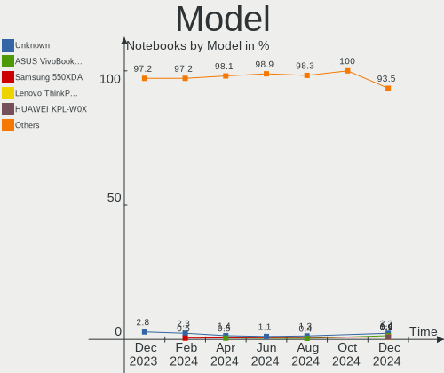
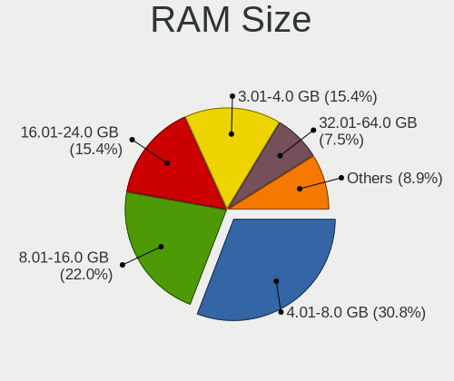
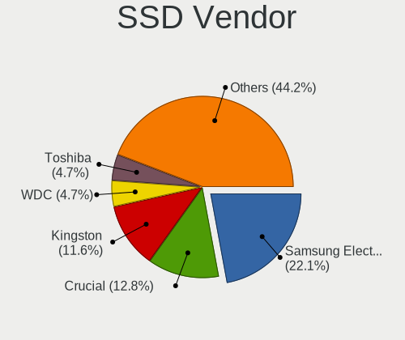
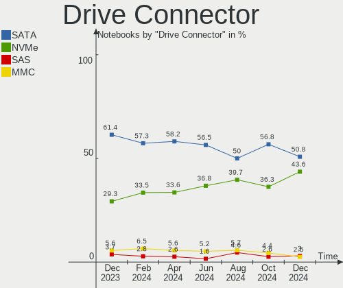
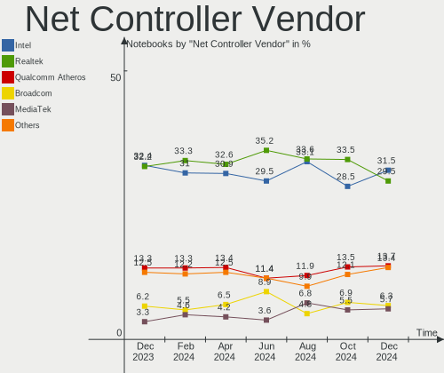
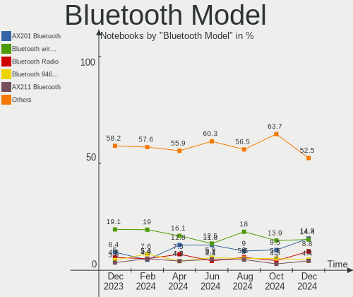

Linux Mint Hardware Trends (Notebooks)
--------------------------------------

A project to identify most popular hardware characteristics and track their change
over time based on data collected by Linux Mint users at https://Linux-Hardware.org.

Anyone can contribute to this report by the [hw-probe](https://github.com/linuxhw/hw-probe) tool:

    sudo -E hw-probe -all -upload

Full-feature report is available here: https://linux-hardware.org/?view=trends&formfactor=notebook

Period: Sep, 2021.

Contents
--------

* [ System ](#system)
  - [ OS                       ](#os)
  - [ OS Family                ](#os-family)
  - [ Kernel                   ](#kernel)
  - [ Kernel Family            ](#kernel-family)
  - [ Kernel Major Ver.        ](#kernel-major-ver)
  - [ Arch                     ](#arch)
  - [ DE                       ](#de)
  - [ Display Server           ](#display-server)
  - [ Display Manager          ](#display-manager)
  - [ OS Lang                  ](#os-lang)
  - [ Boot Mode                ](#boot-mode)
  - [ Filesystem               ](#filesystem)
  - [ Part. scheme             ](#part-scheme)
  - [ Dual Boot with Linux/BSD ](#dual-boot-with-linuxbsd)
  - [ Dual Boot (Win)          ](#dual-boot-win)

* [ Board ](#board)
  - [ Vendor                   ](#vendor)
  - [ Model                    ](#model)
  - [ Model Family             ](#model-family)
  - [ MFG Year                 ](#mfg-year)
  - [ Form Factor              ](#form-factor)
  - [ Secure Boot              ](#secure-boot)
  - [ Coreboot                 ](#coreboot)
  - [ RAM Size                 ](#ram-size)
  - [ RAM Used                 ](#ram-used)
  - [ Total Drives             ](#total-drives)
  - [ Has CD-ROM               ](#has-cd-rom)
  - [ Has Ethernet             ](#has-ethernet)
  - [ Has WiFi                 ](#has-wifi)
  - [ Has Bluetooth            ](#has-bluetooth)

* [ Location ](#location)
  - [ Country                  ](#country)
  - [ City                     ](#city)

* [ Drives ](#drives)
  - [ Drive Vendor             ](#drive-vendor)
  - [ Drive Model              ](#drive-model)
  - [ HDD Vendor               ](#hdd-vendor)
  - [ SSD Vendor               ](#ssd-vendor)
  - [ Drive Kind               ](#drive-kind)
  - [ Drive Connector          ](#drive-connector)
  - [ Drive Size               ](#drive-size)
  - [ Space Total              ](#space-total)
  - [ Space Used               ](#space-used)
  - [ Malfunc. Drives          ](#malfunc-drives)
  - [ Malfunc. Drive Vendor    ](#malfunc-drive-vendor)
  - [ Malfunc. HDD Vendor      ](#malfunc-hdd-vendor)
  - [ Malfunc. Drive Kind      ](#malfunc-drive-kind)
  - [ Failed Drives            ](#failed-drives)
  - [ Failed Drive Vendor      ](#failed-drive-vendor)
  - [ Drive Status             ](#drive-status)

* [ Storage controller ](#storage-controller)
  - [ Storage Vendor           ](#storage-vendor)
  - [ Storage Model            ](#storage-model)
  - [ Storage Kind             ](#storage-kind)

* [ Processor ](#processor)
  - [ CPU Vendor               ](#cpu-vendor)
  - [ CPU Model                ](#cpu-model)
  - [ CPU Model Family         ](#cpu-model-family)
  - [ CPU Cores                ](#cpu-cores)
  - [ CPU Sockets              ](#cpu-sockets)
  - [ CPU Threads              ](#cpu-threads)
  - [ CPU Op-Modes             ](#cpu-op-modes)
  - [ CPU Microcode            ](#cpu-microcode)
  - [ CPU Microarch            ](#cpu-microarch)

* [ Graphics ](#graphics)
  - [ GPU Vendor               ](#gpu-vendor)
  - [ GPU Model                ](#gpu-model)
  - [ GPU Combo                ](#gpu-combo)
  - [ GPU Driver               ](#gpu-driver)
  - [ GPU Memory               ](#gpu-memory)

* [ Monitor ](#monitor)
  - [ Monitor Vendor           ](#monitor-vendor)
  - [ Monitor Model            ](#monitor-model)
  - [ Monitor Resolution       ](#monitor-resolution)
  - [ Monitor Diagonal         ](#monitor-diagonal)
  - [ Monitor Width            ](#monitor-width)
  - [ Aspect Ratio             ](#aspect-ratio)
  - [ Monitor Area             ](#monitor-area)
  - [ Pixel Density            ](#pixel-density)
  - [ Multiple Monitors        ](#multiple-monitors)

* [ Network ](#network)
  - [ Net Controller Vendor    ](#net-controller-vendor)
  - [ Net Controller Model     ](#net-controller-model)
  - [ Wireless Vendor          ](#wireless-vendor)
  - [ Wireless Model           ](#wireless-model)
  - [ Ethernet Vendor          ](#ethernet-vendor)
  - [ Ethernet Model           ](#ethernet-model)
  - [ Net Controller Kind      ](#net-controller-kind)
  - [ Used Controller          ](#used-controller)
  - [ NICs                     ](#nics)
  - [ IPv6                     ](#ipv6)

* [ Bluetooth ](#bluetooth)
  - [ Bluetooth Vendor         ](#bluetooth-vendor)
  - [ Bluetooth Model          ](#bluetooth-model)

* [ Sound ](#sound)
  - [ Sound Vendor             ](#sound-vendor)
  - [ Sound Model              ](#sound-model)

* [ Memory ](#memory)
  - [ Memory Vendor            ](#memory-vendor)
  - [ Memory Model             ](#memory-model)
  - [ Memory Kind              ](#memory-kind)
  - [ Memory Form Factor       ](#memory-form-factor)
  - [ Memory Size              ](#memory-size)
  - [ Memory Speed             ](#memory-speed)

* [ Printers & scanners ](#printers--scanners)
  - [ Printer Vendor           ](#printer-vendor)
  - [ Printer Model            ](#printer-model)
  - [ Scanner Vendor           ](#scanner-vendor)
  - [ Scanner Model            ](#scanner-model)

* [ Camera ](#camera)
  - [ Camera Vendor            ](#camera-vendor)
  - [ Camera Model             ](#camera-model)

* [ Security ](#security)
  - [ Fingerprint Vendor       ](#fingerprint-vendor)
  - [ Fingerprint Model        ](#fingerprint-model)
  - [ Chipcard Vendor          ](#chipcard-vendor)
  - [ Chipcard Model           ](#chipcard-model)

* [ Unsupported ](#unsupported)
  - [ Unsupported Devices      ](#unsupported-devices)
  - [ Unsupported Device Types ](#unsupported-device-types)

System
------

OS
--

Installed operating systems

| Name            | Notebooks | Percent |
|-----------------|-----------|---------|
| Linux Mint 20.2 | 208       | 74.82%  |
| Linux Mint 19.3 | 29        | 10.43%  |
| Linux Mint 20.1 | 20        | 7.19%   |
| Linux Mint 20   | 16        | 5.76%   |
| Linux Mint 19   | 2         | 0.72%   |
| Linux Mint 19.2 | 1         | 0.36%   |
| Linux Mint 18.3 | 1         | 0.36%   |
| Linux Mint 18   | 1         | 0.36%   |

OS Family
---------

OS without a version

| Name       | Notebooks | Percent |
|------------|-----------|---------|
| Linux Mint | 278       | 100%    |

Kernel
------

Version of the Linux kernel

| Version               | Notebooks | Percent |
|-----------------------|-----------|---------|
| 5.4.0-84-generic      | 89        | 32.01%  |
| 5.4.0-81-generic      | 54        | 19.42%  |
| 5.4.0-86-generic      | 24        | 8.63%   |
| 5.4.0-74-generic      | 21        | 7.55%   |
| 5.4.0-88-generic      | 13        | 4.68%   |
| 5.11.0-34-generic     | 13        | 4.68%   |
| 5.11.0-36-generic     | 9         | 3.24%   |
| 5.11.0-27-generic     | 7         | 2.52%   |
| 5.4.0-80-generic      | 5         | 1.8%    |
| 5.0.0-32-generic      | 5         | 1.8%    |
| 5.11.0-37-generic     | 4         | 1.44%   |
| 5.4.0-77-generic      | 3         | 1.08%   |
| 5.4.0-72-generic      | 3         | 1.08%   |
| 5.4.0-58-generic      | 3         | 1.08%   |
| 5.4.0-73-generic      | 2         | 0.72%   |
| 4.15.0-156-generic    | 2         | 0.72%   |
| 5.8.10-050810-generic | 1         | 0.36%   |
| 5.8.0-63-generic      | 1         | 0.36%   |
| 5.8.0-43-generic      | 1         | 0.36%   |
| 5.6.11-050611-generic | 1         | 0.36%   |
| 5.4.0-65-generic      | 1         | 0.36%   |
| 5.4.0-52-generic      | 1         | 0.36%   |
| 5.4.0-26-generic      | 1         | 0.36%   |
| 5.14.6-051406-generic | 1         | 0.36%   |
| 5.14.0-NekoMimi       | 1         | 0.36%   |
| 5.14.0-051400-generic | 1         | 0.36%   |
| 5.13.0-16-generic     | 1         | 0.36%   |
| 5.12.5-051205-generic | 1         | 0.36%   |
| 5.11.0-051100-generic | 1         | 0.36%   |
| 5.10.0-1045-oem       | 1         | 0.36%   |
| 5.10.0-1044-oem       | 1         | 0.36%   |
| 5.10.0-1008-oem       | 1         | 0.36%   |
| 4.4.0-210-generic     | 1         | 0.36%   |
| 4.4.0-21-generic      | 1         | 0.36%   |
| 4.15.0-54-generic     | 1         | 0.36%   |
| 4.15.0-159-generic    | 1         | 0.36%   |
| 4.15.0-154-generic    | 1         | 0.36%   |

Kernel Family
-------------

Linux kernel without a distro release

| Version | Notebooks | Percent |
|---------|-----------|---------|
| 5.4.0   | 220       | 79.14%  |
| 5.11.0  | 34        | 12.23%  |
| 5.0.0   | 5         | 1.8%    |
| 4.15.0  | 5         | 1.8%    |
| 5.10.0  | 3         | 1.08%   |
| 5.8.0   | 2         | 0.72%   |
| 5.14.0  | 2         | 0.72%   |
| 4.4.0   | 2         | 0.72%   |
| 5.8.10  | 1         | 0.36%   |
| 5.6.11  | 1         | 0.36%   |
| 5.14.6  | 1         | 0.36%   |
| 5.13.0  | 1         | 0.36%   |
| 5.12.5  | 1         | 0.36%   |

Kernel Major Ver.
-----------------

Linux kernel major version

| Version | Notebooks | Percent |
|---------|-----------|---------|
| 5.4     | 220       | 79.14%  |
| 5.11    | 34        | 12.23%  |
| 5.0     | 5         | 1.8%    |
| 4.15    | 5         | 1.8%    |
| 5.8     | 3         | 1.08%   |
| 5.14    | 3         | 1.08%   |
| 5.10    | 3         | 1.08%   |
| 4.4     | 2         | 0.72%   |
| 5.6     | 1         | 0.36%   |
| 5.13    | 1         | 0.36%   |
| 5.12    | 1         | 0.36%   |

Arch
----

OS architecture (x86_64, i586, etc.)

| Name   | Notebooks | Percent |
|--------|-----------|---------|
| x86_64 | 269       | 96.76%  |
| i686   | 9         | 3.24%   |

DE
--

Desktop Environment

| Name       | Notebooks | Percent |
|------------|-----------|---------|
| X-Cinnamon | 160       | 57.55%  |
| XFCE       | 50        | 17.99%  |
| MATE       | 34        | 12.23%  |
| Cinnamon   | 19        | 6.83%   |
| GNOME      | 7         | 2.52%   |
| Unknown    | 6         | 2.16%   |
| KDE        | 2         | 0.72%   |

Display Server
--------------

X11 or Wayland

| Name    | Notebooks | Percent |
|---------|-----------|---------|
| X11     | 277       | 99.64%  |
| Unknown | 1         | 0.36%   |

Display Manager
---------------

SDDM, LightDM, etc.

| Name    | Notebooks | Percent |
|---------|-----------|---------|
| Unknown | 162       | 58.27%  |
| LightDM | 111       | 39.93%  |
| GDM     | 4         | 1.44%   |
| MDM     | 1         | 0.36%   |

OS Lang
-------

Language

| Lang    | Notebooks | Percent |
|---------|-----------|---------|
| en_US   | 80        | 28.78%  |
| de_DE   | 56        | 20.14%  |
| pt_BR   | 23        | 8.27%   |
| ru_RU   | 13        | 4.68%   |
| C       | 13        | 4.68%   |
| fr_FR   | 12        | 4.32%   |
| pl_PL   | 10        | 3.6%    |
| en_GB   | 9         | 3.24%   |
| en_IN   | 6         | 2.16%   |
| en_CA   | 6         | 2.16%   |
| it_IT   | 5         | 1.8%    |
| fr_CA   | 4         | 1.44%   |
| tr_TR   | 3         | 1.08%   |
| nl_NL   | 3         | 1.08%   |
| nl_BE   | 3         | 1.08%   |
| hu_HU   | 3         | 1.08%   |
| es_MX   | 3         | 1.08%   |
| en_ZA   | 3         | 1.08%   |
| en_AU   | 3         | 1.08%   |
| de_AT   | 3         | 1.08%   |
| uk_UA   | 2         | 0.72%   |
| es_ES   | 2         | 0.72%   |
| es_CO   | 2         | 0.72%   |
| en_NZ   | 2         | 0.72%   |
| de_CH   | 2         | 0.72%   |
| Unknown | 2         | 0.72%   |
| zh_CN   | 1         | 0.36%   |
| es_US   | 1         | 0.36%   |
| es_CL   | 1         | 0.36%   |
| en_PH   | 1         | 0.36%   |
| en_IE   | 1         | 0.36%   |

Boot Mode
---------

EFI or BIOS

| Mode | Notebooks | Percent |
|------|-----------|---------|
| EFI  | 152       | 54.68%  |
| BIOS | 126       | 45.32%  |

Filesystem
----------

Type of filesystem

| Type    | Notebooks | Percent |
|---------|-----------|---------|
| Ext4    | 259       | 93.17%  |
| Overlay | 11        | 3.96%   |
| Btrfs   | 6         | 2.16%   |
| Ext2    | 2         | 0.72%   |

Part. scheme
------------

Scheme of partitioning

| Type    | Notebooks | Percent |
|---------|-----------|---------|
| Unknown | 163       | 58.63%  |
| GPT     | 80        | 28.78%  |
| MBR     | 35        | 12.59%  |

Dual Boot with Linux/BSD
------------------------

Hosting more than one Linux/BSD

| Dual boot | Notebooks | Percent |
|-----------|-----------|---------|
| No        | 264       | 94.96%  |
| Yes       | 14        | 5.04%   |

Dual Boot (Win)
---------------

Hosting Linux and Windows

| Dual boot | Notebooks | Percent |
|-----------|-----------|---------|
| No        | 225       | 80.94%  |
| Yes       | 53        | 19.06%  |

Board
-----

Vendor
------

Motherboard manufacturer

| Name                   | Notebooks | Percent |
|------------------------|-----------|---------|
| Dell                   | 52        | 18.71%  |
| Hewlett-Packard        | 48        | 17.27%  |
| Lenovo                 | 47        | 16.91%  |
| Acer                   | 36        | 12.95%  |
| ASUSTek Computer       | 30        | 10.79%  |
| Toshiba                | 11        | 3.96%   |
| Apple                  | 8         | 2.88%   |
| Medion                 | 5         | 1.8%    |
| Sony                   | 4         | 1.44%   |
| Fujitsu                | 4         | 1.44%   |
| Positivo               | 3         | 1.08%   |
| Packard Bell           | 3         | 1.08%   |
| Gateway                | 3         | 1.08%   |
| Samsung Electronics    | 2         | 0.72%   |
| Razer                  | 2         | 0.72%   |
| Notebook               | 2         | 0.72%   |
| MSI                    | 2         | 0.72%   |
| GPU Company            | 2         | 0.72%   |
| Fujitsu Siemens        | 2         | 0.72%   |
| Unknown                | 2         | 0.72%   |
| Wortmann AG            | 1         | 0.36%   |
| TUXEDO                 | 1         | 0.36%   |
| Timi                   | 1         | 0.36%   |
| Schenker               | 1         | 0.36%   |
| NEC Computers          | 1         | 0.36%   |
| Intel Client Systems   | 1         | 0.36%   |
| HONOR                  | 1         | 0.36%   |
| eMachines              | 1         | 0.36%   |
| Casper                 | 1         | 0.36%   |
| Avell High Performance | 1         | 0.36%   |

Model
-----

Motherboard model

| Name                                   | Notebooks | Percent |
|----------------------------------------|-----------|---------|
| HP Notebook                            | 3         | 1.08%   |
| Dell Latitude E6430                    | 3         | 1.08%   |
| Dell Latitude E6410                    | 3         | 1.08%   |
| Unknown                                | 3         | 1.08%   |
| Razer Blade                            | 2         | 0.72%   |
| Lenovo IdeaPad S206 2638               | 2         | 0.72%   |
| HP Pavilion g6                         | 2         | 0.72%   |
| HP Pavilion dv6                        | 2         | 0.72%   |
| HP Laptop 15s-fq2xxx                   | 2         | 0.72%   |
| HP Laptop 15-bs0xx                     | 2         | 0.72%   |
| Dell XPS L702X                         | 2         | 0.72%   |
| Dell Latitude E7450                    | 2         | 0.72%   |
| Dell Latitude 5480                     | 2         | 0.72%   |
| Dell Inspiron 7559                     | 2         | 0.72%   |
| Apple MacBookPro9,1                    | 2         | 0.72%   |
| Apple MacBookPro8,1                    | 2         | 0.72%   |
| Acer Aspire A515-54G                   | 2         | 0.72%   |
| Acer Aspire 4752                       | 2         | 0.72%   |
| Wortmann AG 1220711_1470337            | 1         | 0.36%   |
| TUXEDO InfinityBook Pro 14 Gen6        | 1         | 0.36%   |
| Toshiba Satellite PRO C850-1HD         | 1         | 0.36%   |
| Toshiba Satellite P775D                | 1         | 0.36%   |
| Toshiba Satellite L40                  | 1         | 0.36%   |
| Toshiba Satellite L15W-B               | 1         | 0.36%   |
| Toshiba Satellite C850-1KN             | 1         | 0.36%   |
| Toshiba Satellite C660D                | 1         | 0.36%   |
| Toshiba Satellite C55t-A               | 1         | 0.36%   |
| Toshiba Satellite C55-B                | 1         | 0.36%   |
| Toshiba Satellite C50D-C               | 1         | 0.36%   |
| Toshiba QOSMIO X70-B                   | 1         | 0.36%   |
| Toshiba PORTEGE R500                   | 1         | 0.36%   |
| Timi Mi NoteBook Pro                   | 1         | 0.36%   |
| Sony VPCF13WFX                         | 1         | 0.36%   |
| Sony VPCF11S1R                         | 1         | 0.36%   |
| Sony VGN-BZ11MN                        | 1         | 0.36%   |
| Sony VGN-AR71J                         | 1         | 0.36%   |
| Schenker SCHENKER VISION 15 (SVS15E21) | 1         | 0.36%   |
| Samsung RV411/RV511/E3511/S3511/RV711  | 1         | 0.36%   |
| Samsung 350V5C/351V5C/3540VC/3440VC    | 1         | 0.36%   |
| Positivo S14CT01                       | 1         | 0.36%   |
| Positivo MOBILE                        | 1         | 0.36%   |
| Positivo EC10IS1                       | 1         | 0.36%   |
| Packard Bell SJV50MV                   | 1         | 0.36%   |
| Packard Bell EasyNote MH35             | 1         | 0.36%   |
| Packard Bell EasyNote LS11HR           | 1         | 0.36%   |
| Notebook W35xSS_370SS                  | 1         | 0.36%   |
| Notebook NJ5x_NJ7xLU                   | 1         | 0.36%   |
| NEC Computers PC-GN15B79AA             | 1         | 0.36%   |
| MSI Modern 14 B4MW                     | 1         | 0.36%   |
| MSI GS63 Stealth 8RE                   | 1         | 0.36%   |
| Medion WIM2140                         | 1         | 0.36%   |
| Medion WIM 2070                        | 1         | 0.36%   |
| Medion S3409 MD60234                   | 1         | 0.36%   |
| Medion P8614                           | 1         | 0.36%   |
| Medion Akoya E7420 MD99890             | 1         | 0.36%   |
| Lenovo Z575 Sabine                     | 1         | 0.36%   |
| Lenovo Z50-75 80EC                     | 1         | 0.36%   |
| Lenovo Yoga 2 Pro 20266                | 1         | 0.36%   |
| Lenovo V130-15IKB 81HN                 | 1         | 0.36%   |
| Lenovo ThinkPad X61 Tablet 776258U     | 1         | 0.36%   |

Model Family
------------

Motherboard model prefix

| Name                       | Notebooks | Percent |
|----------------------------|-----------|---------|
| Acer Aspire                | 24        | 8.63%   |
| Dell Inspiron              | 21        | 7.55%   |
| Lenovo ThinkPad            | 20        | 7.19%   |
| Dell Latitude              | 19        | 6.83%   |
| Lenovo IdeaPad             | 16        | 5.76%   |
| HP Pavilion                | 13        | 4.68%   |
| HP EliteBook               | 10        | 3.6%    |
| Toshiba Satellite          | 9         | 3.24%   |
| HP Laptop                  | 7         | 2.52%   |
| ASUS VivoBook              | 7         | 2.52%   |
| Dell XPS                   | 6         | 2.16%   |
| Fujitsu LIFEBOOK           | 4         | 1.44%   |
| HP Notebook                | 3         | 1.08%   |
| Dell Precision             | 3         | 1.08%   |
| Apple MacBookPro9          | 3         | 1.08%   |
| Acer TravelMate            | 3         | 1.08%   |
| Unknown                    | 3         | 1.08%   |
| Razer Blade                | 2         | 0.72%   |
| Packard Bell EasyNote      | 2         | 0.72%   |
| Lenovo Legion              | 2         | 0.72%   |
| HP ProBook                 | 2         | 0.72%   |
| HP Presario                | 2         | 0.72%   |
| HP 250                     | 2         | 0.72%   |
| Fujitsu Siemens ESPRIMO    | 2         | 0.72%   |
| Dell Vostro                | 2         | 0.72%   |
| ASUS ZenBook               | 2         | 0.72%   |
| ASUS ROG                   | 2         | 0.72%   |
| ASUS ASUS                  | 2         | 0.72%   |
| Apple MacBookPro8          | 2         | 0.72%   |
| Acer Swift                 | 2         | 0.72%   |
| Acer Nitro                 | 2         | 0.72%   |
| Acer Extensa               | 2         | 0.72%   |
| Wortmann AG 1220711        | 1         | 0.36%   |
| TUXEDO InfinityBook        | 1         | 0.36%   |
| Toshiba QOSMIO             | 1         | 0.36%   |
| Toshiba PORTEGE            | 1         | 0.36%   |
| Timi Mi                    | 1         | 0.36%   |
| Sony VPCF13WFX             | 1         | 0.36%   |
| Sony VPCF11S1R             | 1         | 0.36%   |
| Sony VGN-BZ11MN            | 1         | 0.36%   |
| Sony VGN-AR71J             | 1         | 0.36%   |
| Schenker SCHENKER          | 1         | 0.36%   |
| Samsung RV411              | 1         | 0.36%   |
| Samsung 350V5C             | 1         | 0.36%   |
| Positivo S14CT01           | 1         | 0.36%   |
| Positivo MOBILE            | 1         | 0.36%   |
| Positivo EC10IS1           | 1         | 0.36%   |
| Packard Bell SJV50MV       | 1         | 0.36%   |
| Notebook W35xSS            | 1         | 0.36%   |
| Notebook NJ5x              | 1         | 0.36%   |
| NEC Computers PC-GN15B79AA | 1         | 0.36%   |
| MSI Modern                 | 1         | 0.36%   |
| MSI GS63                   | 1         | 0.36%   |
| Medion WIM2140             | 1         | 0.36%   |
| Medion WIM                 | 1         | 0.36%   |
| Medion S3409               | 1         | 0.36%   |
| Medion P8614               | 1         | 0.36%   |
| Medion Akoya               | 1         | 0.36%   |
| Lenovo Z575                | 1         | 0.36%   |
| Lenovo Z50-75              | 1         | 0.36%   |

MFG Year
--------

Motherboard manufacture year

| Year | Notebooks | Percent |
|------|-----------|---------|
| 2021 | 51        | 18.35%  |
| 2020 | 37        | 13.31%  |
| 2019 | 25        | 8.99%   |
| 2018 | 23        | 8.27%   |
| 2011 | 21        | 7.55%   |
| 2013 | 16        | 5.76%   |
| 2012 | 16        | 5.76%   |
| 2009 | 14        | 5.04%   |
| 2017 | 13        | 4.68%   |
| 2014 | 13        | 4.68%   |
| 2010 | 13        | 4.68%   |
| 2008 | 13        | 4.68%   |
| 2015 | 10        | 3.6%    |
| 2016 | 8         | 2.88%   |
| 2007 | 4         | 1.44%   |
| 2005 | 1         | 0.36%   |

Form Factor
-----------

Physical design of the computer

| Name     | Notebooks | Percent |
|----------|-----------|---------|
| Notebook | 278       | 100%    |

Secure Boot
-----------

Enabled or disabled

| State    | Notebooks | Percent |
|----------|-----------|---------|
| Disabled | 257       | 92.45%  |
| Enabled  | 21        | 7.55%   |

Coreboot
--------

Have coreboot on board

| Used | Notebooks | Percent |
|------|-----------|---------|
| No   | 278       | 100%    |

RAM Size
--------

Total RAM memory

| Size in GB | Notebooks | Percent |
|------------|-----------|---------|
| 4.01-8.0   | 76        | 27.34%  |
| 3.01-4.0   | 64        | 23.02%  |
| 16.01-24.0 | 45        | 16.19%  |
| 8.01-16.0  | 45        | 16.19%  |
| 1.01-2.0   | 21        | 7.55%   |
| 32.01-64.0 | 12        | 4.32%   |
| 2.01-3.0   | 8         | 2.88%   |
| 0.51-1.0   | 4         | 1.44%   |
| 24.01-32.0 | 3         | 1.08%   |

RAM Used
--------

Used RAM memory

| Used GB   | Notebooks | Percent |
|-----------|-----------|---------|
| 1.01-2.0  | 127       | 45.68%  |
| 2.01-3.0  | 61        | 21.94%  |
| 4.01-8.0  | 30        | 10.79%  |
| 3.01-4.0  | 30        | 10.79%  |
| 0.51-1.0  | 23        | 8.27%   |
| 8.01-16.0 | 4         | 1.44%   |
| 0.01-0.5  | 3         | 1.08%   |

Total Drives
------------

Number of drives on board

| Drives | Notebooks | Percent |
|--------|-----------|---------|
| 1      | 202       | 72.66%  |
| 2      | 65        | 23.38%  |
| 3      | 7         | 2.52%   |
| 4      | 3         | 1.08%   |
| 0      | 1         | 0.36%   |

Has CD-ROM
----------

Has CD-ROM on board

| Presented | Notebooks | Percent |
|-----------|-----------|---------|
| No        | 161       | 57.91%  |
| Yes       | 117       | 42.09%  |

Has Ethernet
------------

Has Ethernet on board

| Presented | Notebooks | Percent |
|-----------|-----------|---------|
| Yes       | 230       | 82.73%  |
| No        | 48        | 17.27%  |

Has WiFi
--------

Has WiFi module

| Presented | Notebooks | Percent |
|-----------|-----------|---------|
| Yes       | 272       | 97.84%  |
| No        | 6         | 2.16%   |

Has Bluetooth
-------------

Has Bluetooth module

| Presented | Notebooks | Percent |
|-----------|-----------|---------|
| Yes       | 199       | 71.58%  |
| No        | 79        | 28.42%  |

Location
--------

Country
-------

Geographic location (country)

| Country      | Notebooks | Percent |
|--------------|-----------|---------|
| Germany      | 58        | 20.86%  |
| USA          | 37        | 13.31%  |
| Brazil       | 29        | 10.43%  |
| France       | 13        | 4.68%   |
| Russia       | 12        | 4.32%   |
| UK           | 9         | 3.24%   |
| Poland       | 9         | 3.24%   |
| Italy        | 9         | 3.24%   |
| Canada       | 9         | 3.24%   |
| India        | 7         | 2.52%   |
| Hungary      | 5         | 1.8%    |
| Ukraine      | 4         | 1.44%   |
| Netherlands  | 4         | 1.44%   |
| Austria      | 4         | 1.44%   |
| Turkey       | 3         | 1.08%   |
| Switzerland  | 3         | 1.08%   |
| Spain        | 3         | 1.08%   |
| South Africa | 3         | 1.08%   |
| Norway       | 3         | 1.08%   |
| Mexico       | 3         | 1.08%   |
| Bulgaria     | 3         | 1.08%   |
| Belgium      | 3         | 1.08%   |
| Australia    | 3         | 1.08%   |
| Argentina    | 3         | 1.08%   |
| Sweden       | 2         | 0.72%   |
| Serbia       | 2         | 0.72%   |
| Philippines  | 2         | 0.72%   |
| New Zealand  | 2         | 0.72%   |
| Ireland      | 2         | 0.72%   |
| Indonesia    | 2         | 0.72%   |
| Denmark      | 2         | 0.72%   |
| Czechia      | 2         | 0.72%   |
| Colombia     | 2         | 0.72%   |
| Belarus      | 2         | 0.72%   |
| Slovakia     | 1         | 0.36%   |
| Puerto Rico  | 1         | 0.36%   |
| Portugal     | 1         | 0.36%   |
| Pakistan     | 1         | 0.36%   |
| Nepal        | 1         | 0.36%   |
| Morocco      | 1         | 0.36%   |
| Moldova      | 1         | 0.36%   |
| Malaysia     | 1         | 0.36%   |
| Japan        | 1         | 0.36%   |
| Iran         | 1         | 0.36%   |
| Greece       | 1         | 0.36%   |
| Finland      | 1         | 0.36%   |
| Cuba         | 1         | 0.36%   |
| Croatia      | 1         | 0.36%   |
| China        | 1         | 0.36%   |
| Chile        | 1         | 0.36%   |
| Armenia      | 1         | 0.36%   |
| Algeria      | 1         | 0.36%   |
| Afghanistan  | 1         | 0.36%   |

City
----

Geographic location (city)

| City               | Notebooks | Percent |
|--------------------|-----------|---------|
| Nuremberg          | 4         | 1.44%   |
| Vienna             | 3         | 1.08%   |
| Moscow             | 3         | 1.08%   |
| Cherkasy           | 3         | 1.08%   |
| Swindon            | 2         | 0.72%   |
| St Petersburg      | 2         | 0.72%   |
| S??o Paulo         | 2         | 0.72%   |
| Rome               | 2         | 0.72%   |
| Rockville          | 2         | 0.72%   |
| Rio de Janeiro     | 2         | 0.72%   |
| Porto Alegre       | 2         | 0.72%   |
| Oslo               | 2         | 0.72%   |
| Minsk              | 2         | 0.72%   |
| Melbourne          | 2         | 0.72%   |
| Lyon               | 2         | 0.72%   |
| Ludwigsburg        | 2         | 0.72%   |
| Louisville         | 2         | 0.72%   |
| London             | 2         | 0.72%   |
| Leipzig            | 2         | 0.72%   |
| Kolkata            | 2         | 0.72%   |
| Istanbul           | 2         | 0.72%   |
| Hamburg            | 2         | 0.72%   |
| Goi??nia           | 2         | 0.72%   |
| Frankfurt am Main  | 2         | 0.72%   |
| Essen              | 2         | 0.72%   |
| Curitiba           | 2         | 0.72%   |
| Bogot??            | 2         | 0.72%   |
| Berlin             | 2         | 0.72%   |
| Belgrade           | 2         | 0.72%   |
| Zurich             | 1         | 0.36%   |
| Ziegendorf         | 1         | 0.36%   |
| Z?…bki             | 1         | 0.36%   |
| Zaporizhzhya       | 1         | 0.36%   |
| Yerevan            | 1         | 0.36%   |
| Wiesmoor           | 1         | 0.36%   |
| Wiesbaden          | 1         | 0.36%   |
| Welland            | 1         | 0.36%   |
| Warsaw             | 1         | 0.36%   |
| Waite Park         | 1         | 0.36%   |
| Volokolamsk        | 1         | 0.36%   |
| Vladimir           | 1         | 0.36%   |
| Vinningen          | 1         | 0.36%   |
| Vaudreuil-Dorion   | 1         | 0.36%   |
| Vacenovice         | 1         | 0.36%   |
| Turin              | 1         | 0.36%   |
| Trowbridge         | 1         | 0.36%   |
| Toronto            | 1         | 0.36%   |
| Tomsk              | 1         | 0.36%   |
| Tlemcen            | 1         | 0.36%   |
| Tiefenbach         | 1         | 0.36%   |
| Thessaloniki       | 1         | 0.36%   |
| Templin            | 1         | 0.36%   |
| Tehran             | 1         | 0.36%   |
| Szeged             | 1         | 0.36%   |
| Sydney             | 1         | 0.36%   |
| Surabaya           | 1         | 0.36%   |
| Straengnaes        | 1         | 0.36%   |
| Steenvoorde        | 1         | 0.36%   |
| Starogard Gda?„ski | 1         | 0.36%   |
| Sofia              | 1         | 0.36%   |

Drives
------

Drive Vendor
------------

Hard drive vendors

| Vendor                       | Notebooks | Drives | Percent |
|------------------------------|-----------|--------|---------|
| WDC                          | 53        | 55     | 15.68%  |
| Samsung Electronics          | 46        | 50     | 13.61%  |
| Seagate                      | 40        | 40     | 11.83%  |
| Toshiba                      | 27        | 27     | 7.99%   |
| SanDisk                      | 20        | 20     | 5.92%   |
| Unknown                      | 19        | 24     | 5.62%   |
| Kingston                     | 18        | 18     | 5.33%   |
| SK Hynix                     | 12        | 12     | 3.55%   |
| Crucial                      | 10        | 11     | 2.96%   |
| Intel                        | 9         | 10     | 2.66%   |
| Micron Technology            | 7         | 8      | 2.07%   |
| Hitachi                      | 7         | 7      | 2.07%   |
| HGST                         | 6         | 6      | 1.78%   |
| Fujitsu                      | 5         | 5      | 1.48%   |
| LITEONIT                     | 4         | 5      | 1.18%   |
| China                        | 4         | 4      | 1.18%   |
| PHISON                       | 3         | 3      | 0.89%   |
| Apple                        | 3         | 3      | 0.89%   |
| A-DATA Technology            | 3         | 3      | 0.89%   |
| Transcend                    | 2         | 2      | 0.59%   |
| Silicon Motion               | 2         | 2      | 0.59%   |
| PNY                          | 2         | 2      | 0.59%   |
| Patriot                      | 2         | 2      | 0.59%   |
| LITEON                       | 2         | 2      | 0.59%   |
| Corsair                      | 2         | 2      | 0.59%   |
| Yangtze Memory Technologies  | 1         | 1      | 0.3%    |
| Yangtze Memory               | 1         | 1      | 0.3%    |
| W800SH                       | 1         | 1      | 0.3%    |
| Verbatim                     | 1         | 1      | 0.3%    |
| SSSTC                        | 1         | 1      | 0.3%    |
| Solid State Storage          | 1         | 1      | 0.3%    |
| SILICONMOTION                | 1         | 1      | 0.3%    |
| Shenzhen Longsys Electronics | 1         | 1      | 0.3%    |
| ORICO                        | 1         | 1      | 0.3%    |
| OCZ                          | 1         | 1      | 0.3%    |
| Netac                        | 1         | 1      | 0.3%    |
| Mushkin                      | 1         | 1      | 0.3%    |
| Micron/Crucial Technology    | 1         | 1      | 0.3%    |
| Lexar                        | 1         | 1      | 0.3%    |
| Leven                        | 1         | 1      | 0.3%    |
| KIOXIA-EXCERIA               | 1         | 1      | 0.3%    |
| KIOXIA                       | 1         | 1      | 0.3%    |
| KingFast                     | 1         | 2      | 0.3%    |
| JMicron                      | 1         | 1      | 0.3%    |
| JASTER                       | 1         | 1      | 0.3%    |
| Intenso                      | 1         | 1      | 0.3%    |
| HS-SSD-E100N                 | 1         | 1      | 0.3%    |
| HS-SSD-C100                  | 1         | 2      | 0.3%    |
| HGST HTS                     | 1         | 1      | 0.3%    |
| Hewlett-Packard              | 1         | 1      | 0.3%    |
| GOODRAM                      | 1         | 1      | 0.3%    |
| GeIL                         | 1         | 1      | 0.3%    |
| EMTEC                        | 1         | 1      | 0.3%    |
| ASMT                         | 1         | 1      | 0.3%    |
| Asmedia                      | 1         | 1      | 0.3%    |

Drive Model
-----------

Hard drive models

| Model                                | Notebooks | Percent |
|--------------------------------------|-----------|---------|
| Seagate ST1000LM035-1RK172 1TB       | 10        | 2.83%   |
| WDC WDS500G2B0A-00SM50 500GB SSD     | 6         | 1.7%    |
| Samsung NVMe SSD Drive 512GB         | 6         | 1.7%    |
| Toshiba MQ01ABD100 1TB               | 5         | 1.42%   |
| Toshiba MQ01ABF050 500GB             | 4         | 1.13%   |
| SK Hynix SC311 SATA 512GB SSD        | 4         | 1.13%   |
| Samsung SSD 860 EVO 500GB            | 4         | 1.13%   |
| SanDisk SSD PLUS 240GB               | 3         | 0.85%   |
| Sandisk NVMe SSD Drive 512GB         | 3         | 0.85%   |
| Samsung SSD 850 EVO 250GB            | 3         | 0.85%   |
| Kingston SA400S37240G 240GB SSD      | 3         | 0.85%   |
| WDC WDS480G2G0A-00JH30 480GB SSD     | 2         | 0.57%   |
| WDC WD1600BEVT-75ZCT2 160GB          | 2         | 0.57%   |
| WDC WD10SPZX-24Z10 1TB               | 2         | 0.57%   |
| WDC WD10JPVX-60JC3T0 1TB             | 2         | 0.57%   |
| WDC WD10JPVX-22JC3T0 1TB             | 2         | 0.57%   |
| WDC PC SN730 SDBPNTY-512G-1101 512GB | 2         | 0.57%   |
| Unknown NCard  32GB                  | 2         | 0.57%   |
| Unknown MMC Card  64GB               | 2         | 0.57%   |
| Unknown MMC Card  32GB               | 2         | 0.57%   |
| Unknown MMC Card  256GB              | 2         | 0.57%   |
| Toshiba MK7575GSX 752GB              | 2         | 0.57%   |
| Seagate ST9500325AS 500GB            | 2         | 0.57%   |
| Seagate ST9160412AS 160GB            | 2         | 0.57%   |
| Seagate ST9160310AS 160GB            | 2         | 0.57%   |
| Seagate ST500LM021-1KJ152 500GB      | 2         | 0.57%   |
| Seagate ST1000LM024 HN-M101MBB 1TB   | 2         | 0.57%   |
| SanDisk SDSSDP128G 128GB             | 2         | 0.57%   |
| SanDisk SDSSDA240G 240GB             | 2         | 0.57%   |
| Samsung SSD 850 EVO 500GB            | 2         | 0.57%   |
| Samsung SSD 840 EVO 250GB            | 2         | 0.57%   |
| Samsung Portable SSD T5 500GB        | 2         | 0.57%   |
| Samsung NVMe SSD Drive 256GB         | 2         | 0.57%   |
| Samsung NVMe SSD Drive 1024GB        | 2         | 0.57%   |
| Patriot Burst 240GB SSD              | 2         | 0.57%   |
| LITEONIT LMT-256M6M mSATA 256GB SSD  | 2         | 0.57%   |
| Kingston SA400S37480G 480GB SSD      | 2         | 0.57%   |
| Intel SSDSC2KW256G8 256GB            | 2         | 0.57%   |
| Intel SSDPEKNW512G8 512GB            | 2         | 0.57%   |
| Hitachi HTS543216L9SA00 160GB        | 2         | 0.57%   |
| HGST HTS545050A7E680 500GB           | 2         | 0.57%   |
| Fujitsu MHY2200BH 200GB              | 2         | 0.57%   |
| Crucial CT240BX500SSD1 240GB         | 2         | 0.57%   |
| Crucial CT1000MX500SSD1 1TB          | 2         | 0.57%   |
| China SSD 128GB                      | 2         | 0.57%   |
| Yangtze Memory YMTC PC005 512GB      | 1         | 0.28%   |
| Yangtze Memory NVMe SSD Drive 512GB  | 1         | 0.28%   |
| WDC WDS500G2B0B-00YS70 500GB SSD     | 1         | 0.28%   |
| WDC WDS480G2G0C-00AJM0 480GB         | 1         | 0.28%   |
| WDC WDS120G2G0A-00JH30 120GB SSD     | 1         | 0.28%   |
| WDC WDS120G1G0A-00SS50 120GB SSD     | 1         | 0.28%   |
| WDC WDBNCE0010PNC 1TB SSD            | 1         | 0.28%   |
| WDC WD7500BPVT-22HXZT3 752GB         | 1         | 0.28%   |
| WDC WD7500BPKX-00HPJT0 752GB         | 1         | 0.28%   |
| WDC WD5000LPVX-80V0TT0 500GB         | 1         | 0.28%   |
| WDC WD5000LPVX-22V0TT0 500GB         | 1         | 0.28%   |
| WDC WD5000LPLX-75ZNTT0 500GB         | 1         | 0.28%   |
| WDC WD5000BPVT-22HXZT1 500GB         | 1         | 0.28%   |
| WDC WD5000BPVT-08HXZT3 500GB         | 1         | 0.28%   |
| WDC WD5000BPKT-75PK4T0 500GB         | 1         | 0.28%   |

HDD Vendor
----------

Hard disk drive vendors

| Vendor        | Notebooks | Drives | Percent |
|---------------|-----------|--------|---------|
| Seagate       | 38        | 38     | 32.2%   |
| WDC           | 35        | 35     | 29.66%  |
| Toshiba       | 21        | 21     | 17.8%   |
| Hitachi       | 7         | 7      | 5.93%   |
| HGST          | 6         | 6      | 5.08%   |
| Fujitsu       | 5         | 5      | 4.24%   |
| Apple         | 2         | 2      | 1.69%   |
| Unknown       | 1         | 1      | 0.85%   |
| SILICONMOTION | 1         | 1      | 0.85%   |
| HGST HTS      | 1         | 1      | 0.85%   |
| Asmedia       | 1         | 1      | 0.85%   |

SSD Vendor
----------

Solid state drive vendors

| Vendor              | Notebooks | Drives | Percent |
|---------------------|-----------|--------|---------|
| Samsung Electronics | 27        | 29     | 22.13%  |
| SanDisk             | 14        | 14     | 11.48%  |
| WDC                 | 12        | 12     | 9.84%   |
| Kingston            | 12        | 12     | 9.84%   |
| Crucial             | 9         | 10     | 7.38%   |
| SK Hynix            | 5         | 5      | 4.1%    |
| LITEONIT            | 4         | 5      | 3.28%   |
| China               | 4         | 4      | 3.28%   |
| Micron Technology   | 3         | 3      | 2.46%   |
| Transcend           | 2         | 2      | 1.64%   |
| PNY                 | 2         | 2      | 1.64%   |
| Patriot             | 2         | 2      | 1.64%   |
| Intel               | 2         | 2      | 1.64%   |
| Corsair             | 2         | 2      | 1.64%   |
| A-DATA Technology   | 2         | 2      | 1.64%   |
| W800SH              | 1         | 1      | 0.82%   |
| Verbatim            | 1         | 1      | 0.82%   |
| Unknown             | 1         | 1      | 0.82%   |
| Toshiba             | 1         | 1      | 0.82%   |
| SSSTC               | 1         | 1      | 0.82%   |
| PHISON              | 1         | 1      | 0.82%   |
| ORICO               | 1         | 1      | 0.82%   |
| OCZ                 | 1         | 1      | 0.82%   |
| Mushkin             | 1         | 1      | 0.82%   |
| LITEON              | 1         | 1      | 0.82%   |
| Lexar               | 1         | 1      | 0.82%   |
| Leven               | 1         | 1      | 0.82%   |
| KIOXIA-EXCERIA      | 1         | 1      | 0.82%   |
| KingFast            | 1         | 1      | 0.82%   |
| JASTER              | 1         | 1      | 0.82%   |
| HS-SSD-E100N        | 1         | 1      | 0.82%   |
| HS-SSD-C100         | 1         | 1      | 0.82%   |
| Hewlett-Packard     | 1         | 1      | 0.82%   |
| GOODRAM             | 1         | 1      | 0.82%   |
| ASMT                | 1         | 1      | 0.82%   |

Drive Kind
----------

HDD or SSD

| Kind    | Notebooks | Drives | Percent |
|---------|-----------|--------|---------|
| HDD     | 114       | 118    | 35.08%  |
| SSD     | 112       | 126    | 34.46%  |
| NVMe    | 74        | 82     | 22.77%  |
| MMC     | 18        | 22     | 5.54%   |
| Unknown | 7         | 7      | 2.15%   |

Drive Connector
---------------

SATA, SAS, NVMe, etc.

| Type | Notebooks | Drives | Percent |
|------|-----------|--------|---------|
| SATA | 207       | 237    | 66.77%  |
| NVMe | 73        | 81     | 23.55%  |
| MMC  | 18        | 22     | 5.81%   |
| SAS  | 12        | 15     | 3.87%   |

Drive Size
----------

Size of hard drive

| Size in TB | Notebooks | Drives | Percent |
|------------|-----------|--------|---------|
| 0.01-0.5   | 156       | 171    | 69.03%  |
| 0.51-1.0   | 62        | 65     | 27.43%  |
| 1.01-2.0   | 8         | 8      | 3.54%   |

Space Total
-----------

Amount of disk space available on the file system

| Size in GB     | Notebooks | Percent |
|----------------|-----------|---------|
| 101-250        | 103       | 37.05%  |
| 251-500        | 88        | 31.65%  |
| 501-1000       | 32        | 11.51%  |
| 51-100         | 19        | 6.83%   |
| 1001-2000      | 15        | 5.4%    |
| 2001-3000      | 7         | 2.52%   |
| 1-20           | 7         | 2.52%   |
| 21-50          | 3         | 1.08%   |
| More than 3000 | 2         | 0.72%   |
| Unknown        | 2         | 0.72%   |

Space Used
----------

Amount of used disk space

| Used GB   | Notebooks | Percent |
|-----------|-----------|---------|
| 1-20      | 86        | 30.94%  |
| 21-50     | 69        | 24.82%  |
| 101-250   | 48        | 17.27%  |
| 51-100    | 34        | 12.23%  |
| 251-500   | 18        | 6.47%   |
| 501-1000  | 13        | 4.68%   |
| 1001-2000 | 7         | 2.52%   |
| Unknown   | 2         | 0.72%   |
| 2001-3000 | 1         | 0.36%   |

Malfunc. Drives
---------------

Drive models with a malfunction

| Model                                 | Notebooks | Drives | Percent |
|---------------------------------------|-----------|--------|---------|
| Toshiba MK7575GSX 752GB               | 2         | 2      | 7.69%   |
| HGST HTS545050A7E680 500GB            | 2         | 2      | 7.69%   |
| WDC WD5000LPLX-75ZNTT0 500GB          | 1         | 1      | 3.85%   |
| WDC WD10JPVX-60JC3T0 1TB              | 1         | 1      | 3.85%   |
| Toshiba THNSNH128GCST 128GB SSD       | 1         | 1      | 3.85%   |
| Toshiba MQ01ABD100 1TB                | 1         | 1      | 3.85%   |
| Toshiba MK5065GSXF 500GB              | 1         | 1      | 3.85%   |
| Toshiba MK1237GSX 120GB               | 1         | 1      | 3.85%   |
| SSSTC CVB-8D128-HP 128GB SSD          | 1         | 1      | 3.85%   |
| Seagate ST9750420AS 752GB             | 1         | 1      | 3.85%   |
| Seagate ST9500325ASG 500GB            | 1         | 1      | 3.85%   |
| Seagate ST500LM000-1EJ162-SSHD-8GB    | 1         | 1      | 3.85%   |
| Seagate ST320LT020-9YG142 320GB       | 1         | 1      | 3.85%   |
| Seagate ST320LM001 HN-M320MBB 320GB   | 1         | 1      | 3.85%   |
| Seagate ST1000LM035-1RK172 1TB        | 1         | 1      | 3.85%   |
| Seagate ST1000LM024 HN-M101MBB 1TB    | 1         | 1      | 3.85%   |
| SanDisk SSD U100 24GB                 | 1         | 1      | 3.85%   |
| SanDisk SSD PLUS 240GB                | 1         | 1      | 3.85%   |
| Kingston RBUSNS8180DS3128GJ 128GB SSD | 1         | 1      | 3.85%   |
| Hitachi HTS545032B9A300 320GB         | 1         | 1      | 3.85%   |
| HGST HTS541010A9E680 1TB              | 1         | 1      | 3.85%   |
| Fujitsu MHZ2250BH G2 250GB            | 1         | 1      | 3.85%   |
| Crucial CT1050MX300SSD1 1TB           | 1         | 1      | 3.85%   |
| Apple HDD HTS545050A7E362 500GB       | 1         | 1      | 3.85%   |

Malfunc. Drive Vendor
---------------------

Vendors of faulty drives

| Vendor   | Notebooks | Drives | Percent |
|----------|-----------|--------|---------|
| Seagate  | 7         | 7      | 26.92%  |
| Toshiba  | 6         | 6      | 23.08%  |
| HGST     | 3         | 3      | 11.54%  |
| WDC      | 2         | 2      | 7.69%   |
| SanDisk  | 2         | 2      | 7.69%   |
| SSSTC    | 1         | 1      | 3.85%   |
| Kingston | 1         | 1      | 3.85%   |
| Hitachi  | 1         | 1      | 3.85%   |
| Fujitsu  | 1         | 1      | 3.85%   |
| Crucial  | 1         | 1      | 3.85%   |
| Apple    | 1         | 1      | 3.85%   |

Malfunc. HDD Vendor
-------------------

Vendors of faulty HDD drives

| Vendor  | Notebooks | Drives | Percent |
|---------|-----------|--------|---------|
| Seagate | 7         | 7      | 35%     |
| Toshiba | 5         | 5      | 25%     |
| HGST    | 3         | 3      | 15%     |
| WDC     | 2         | 2      | 10%     |
| Hitachi | 1         | 1      | 5%      |
| Fujitsu | 1         | 1      | 5%      |
| Apple   | 1         | 1      | 5%      |

Malfunc. Drive Kind
-------------------

Kinds of faulty drives

| Kind | Notebooks | Drives | Percent |
|------|-----------|--------|---------|
| HDD  | 20        | 20     | 76.92%  |
| SSD  | 6         | 6      | 23.08%  |

Failed Drives
-------------

Failed drive models

| Model                        | Notebooks | Drives | Percent |
|------------------------------|-----------|--------|---------|
| WDC WD5000LPVX-80V0TT0 500GB | 1         | 1      | 100%    |

Failed Drive Vendor
-------------------

Failed drive vendors

| Vendor | Notebooks | Drives | Percent |
|--------|-----------|--------|---------|
| WDC    | 1         | 1      | 100%    |

Drive Status
------------

Number of failed and malfunc. drives

| Status   | Notebooks | Drives | Percent |
|----------|-----------|--------|---------|
| Detected | 178       | 216    | 60.14%  |
| Works    | 93        | 112    | 31.42%  |
| Malfunc  | 24        | 26     | 8.11%   |
| Failed   | 1         | 1      | 0.34%   |

Storage controller
------------------

Storage Vendor
--------------

Storage controller vendors

| Vendor                           | Notebooks | Percent |
|----------------------------------|-----------|---------|
| Intel                            | 207       | 66.13%  |
| AMD                              | 28        | 8.95%   |
| Samsung Electronics              | 20        | 6.39%   |
| Sandisk                          | 12        | 3.83%   |
| SK Hynix                         | 7         | 2.24%   |
| Silicon Integrated Systems [SiS] | 6         | 1.92%   |
| Kingston Technology Company      | 6         | 1.92%   |
| Toshiba America Info Systems     | 4         | 1.28%   |
| Micron Technology                | 4         | 1.28%   |
| Solid State Storage Technology   | 2         | 0.64%   |
| Silicon Motion                   | 2         | 0.64%   |
| Phison Electronics               | 2         | 0.64%   |
| Nvidia                           | 2         | 0.64%   |
| Micron/Crucial Technology        | 2         | 0.64%   |
| KIOXIA                           | 2         | 0.64%   |
| Yangtze Memory Technologies      | 1         | 0.32%   |
| Silicon Image                    | 1         | 0.32%   |
| Shenzhen Longsys Electronics     | 1         | 0.32%   |
| Seagate Technology               | 1         | 0.32%   |
| Lite-On Technology               | 1         | 0.32%   |
| Apple                            | 1         | 0.32%   |
| ADATA Technology                 | 1         | 0.32%   |

Storage Model
-------------

Storage controller models

| Model                                                                          | Notebooks | Percent |
|--------------------------------------------------------------------------------|-----------|---------|
| Intel Sunrise Point-LP SATA Controller [AHCI mode]                             | 23        | 6.76%   |
| AMD FCH SATA Controller [AHCI mode]                                            | 21        | 6.18%   |
| Intel 7 Series Chipset Family 6-port SATA Controller [AHCI mode]               | 20        | 5.88%   |
| Intel 82801 Mobile SATA Controller [RAID mode]                                 | 19        | 5.59%   |
| Intel 6 Series/C200 Series Chipset Family 6 port Mobile SATA AHCI Controller   | 16        | 4.71%   |
| Intel 82801IBM/IEM (ICH9M/ICH9M-E) 4 port SATA Controller [AHCI mode]          | 14        | 4.12%   |
| Samsung NVMe SSD Controller SM981/PM981/PM983                                  | 12        | 3.53%   |
| Intel Volume Management Device NVMe RAID Controller                            | 9         | 2.65%   |
| Intel 8 Series/C220 Series Chipset Family 6-port SATA Controller 1 [AHCI mode] | 9         | 2.65%   |
| Intel 8 Series SATA Controller 1 [AHCI mode]                                   | 9         | 2.65%   |
| Intel 82801HM/HEM (ICH8M/ICH8M-E) IDE Controller                               | 8         | 2.35%   |
| Intel 5 Series/3400 Series Chipset 4 port SATA AHCI Controller                 | 8         | 2.35%   |
| Intel Atom Processor E3800 Series SATA AHCI Controller                         | 7         | 2.06%   |
| Intel 82801HM/HEM (ICH8M/ICH8M-E) SATA Controller [AHCI mode]                  | 7         | 2.06%   |
| Silicon Integrated Systems [SiS] SATA Controller / IDE mode                    | 6         | 1.76%   |
| Silicon Integrated Systems [SiS] 5513 IDE Controller                           | 6         | 1.76%   |
| Intel Ice Lake-LP SATA Controller [AHCI mode]                                  | 6         | 1.76%   |
| Intel Cannon Lake Mobile PCH SATA AHCI Controller                              | 5         | 1.47%   |
| Intel 5 Series/3400 Series Chipset 6 port SATA AHCI Controller                 | 5         | 1.47%   |
| AMD SB7x0/SB8x0/SB9x0 SATA Controller [AHCI mode]                              | 5         | 1.47%   |
| Sandisk WD Black SN750 / PC SN730 NVMe SSD                                     | 4         | 1.18%   |
| Samsung NVMe SSD Controller 980                                                | 4         | 1.18%   |
| Micron Non-Volatile memory controller                                          | 4         | 1.18%   |
| Intel SSD 660P Series                                                          | 4         | 1.18%   |
| Intel Q170/Q150/B150/H170/H110/Z170/CM236 Chipset SATA Controller [AHCI Mode]  | 4         | 1.18%   |
| Intel NM10/ICH7 Family SATA Controller [AHCI mode]                             | 4         | 1.18%   |
| Intel Celeron/Pentium Silver Processor SATA Controller                         | 4         | 1.18%   |
| Intel Cannon Point-LP SATA Controller [AHCI Mode]                              | 4         | 1.18%   |
| Intel 400 Series Chipset Family SATA AHCI Controller                           | 4         | 1.18%   |
| SK Hynix Gold P31 SSD                                                          | 3         | 0.88%   |
| Sandisk WD Blue SN550 NVMe SSD                                                 | 3         | 0.88%   |
| Sandisk Non-Volatile memory controller                                         | 3         | 0.88%   |
| Samsung NVMe SSD Controller PM9A1/PM9A3/980PRO                                 | 3         | 0.88%   |
| Kingston Company Company Non-Volatile memory controller                        | 3         | 0.88%   |
| Intel Wildcat Point-LP SATA Controller [AHCI Mode]                             | 3         | 0.88%   |
| Intel Tiger Lake-LP SATA Controller [AHCI mode]                                | 3         | 0.88%   |
| Intel HM170/QM170 Chipset SATA Controller [AHCI Mode]                          | 3         | 0.88%   |
| Intel Comet Lake SATA AHCI Controller                                          | 3         | 0.88%   |
| Intel 5 Series/3400 Series Chipset 4 port SATA IDE Controller                  | 3         | 0.88%   |
| Intel 5 Series/3400 Series Chipset 2 port SATA IDE Controller                  | 3         | 0.88%   |
| Toshiba America Info Systems XG6 NVMe SSD Controller                           | 2         | 0.59%   |
| Solid State Storage Non-Volatile memory controller                             | 2         | 0.59%   |
| SK Hynix BC511                                                                 | 2         | 0.59%   |
| SK Hynix BC501 NVMe Solid State Drive                                          | 2         | 0.59%   |
| Silicon Motion SM2263EN/SM2263XT SSD Controller                                | 2         | 0.59%   |
| Sandisk WD Blue SN500 / PC SN520 NVMe SSD                                      | 2         | 0.59%   |
| Samsung NVMe SSD Controller SM961/PM961/SM963                                  | 2         | 0.59%   |
| KIOXIA Non-Volatile memory controller                                          | 2         | 0.59%   |
| Kingston Company U-SNS8154P3 NVMe SSD                                          | 2         | 0.59%   |
| Intel Mobile 4 Series Chipset PT IDER Controller                               | 2         | 0.59%   |
| Intel Celeron N3350/Pentium N4200/Atom E3900 Series SATA AHCI Controller       | 2         | 0.59%   |
| Intel 82801IBM/IEM (ICH9M/ICH9M-E) 2 port SATA Controller [IDE mode]           | 2         | 0.59%   |
| Intel 82801FBM (ICH6M) SATA Controller                                         | 2         | 0.59%   |
| AMD FCH SATA Controller [IDE mode]                                             | 2         | 0.59%   |
| Yangtze Memory Non-Volatile memory controller                                  | 1         | 0.29%   |
| Toshiba America Info Systems XG4 NVMe SSD Controller                           | 1         | 0.29%   |
| Toshiba America Info Systems BG3 NVMe SSD Controller                           | 1         | 0.29%   |
| Silicon Image SiI 3531 [SATALink/SATARaid] Serial ATA Controller               | 1         | 0.29%   |
| Shenzhen Longsys Non-Volatile memory controller                                | 1         | 0.29%   |
| Seagate FireCuda 510 SSD                                                       | 1         | 0.29%   |

Storage Kind
------------

Kind of storage controller (IDE, SATA, NVMe, SAS, ...)

| Kind | Notebooks | Percent |
|------|-----------|---------|
| SATA | 193       | 59.75%  |
| NVMe | 73        | 22.6%   |
| RAID | 29        | 8.98%   |
| IDE  | 28        | 8.67%   |

Processor
---------

CPU Vendor
----------

Processor vendors

| Vendor | Notebooks | Percent |
|--------|-----------|---------|
| Intel  | 237       | 85.25%  |
| AMD    | 41        | 14.75%  |

CPU Model
---------

Processor models

| Model                                         | Notebooks | Percent |
|-----------------------------------------------|-----------|---------|
| Intel 11th Gen Core i7-1165G7 @ 2.80GHz       | 8         | 2.88%   |
| Intel Core i7-8565U CPU @ 1.80GHz             | 5         | 1.8%    |
| Intel Core i5-7200U CPU @ 2.50GHz             | 5         | 1.8%    |
| Intel 11th Gen Core i5-1135G7 @ 2.40GHz       | 5         | 1.8%    |
| Intel Core i7-9750H CPU @ 2.60GHz             | 4         | 1.44%   |
| Intel Core i7-7500U CPU @ 2.70GHz             | 4         | 1.44%   |
| Intel Core i5-3230M CPU @ 2.60GHz             | 4         | 1.44%   |
| Intel Core i5-3210M CPU @ 2.50GHz             | 4         | 1.44%   |
| AMD Ryzen 5 3500U with Radeon Vega Mobile Gfx | 4         | 1.44%   |
| Intel Core i7-8750H CPU @ 2.20GHz             | 3         | 1.08%   |
| Intel Core i7-8550U CPU @ 1.80GHz             | 3         | 1.08%   |
| Intel Core i7-7820HQ CPU @ 2.90GHz            | 3         | 1.08%   |
| Intel Core i7-2670QM CPU @ 2.20GHz            | 3         | 1.08%   |
| Intel Core i7-10750H CPU @ 2.60GHz            | 3         | 1.08%   |
| Intel Core i5-2520M CPU @ 2.50GHz             | 3         | 1.08%   |
| Intel Core i5-1035G1 CPU @ 1.00GHz            | 3         | 1.08%   |
| Intel Core i5 CPU M 520 @ 2.40GHz             | 3         | 1.08%   |
| Intel Core i3-1005G1 CPU @ 1.20GHz            | 3         | 1.08%   |
| Intel Core i3 CPU M 350 @ 2.27GHz             | 3         | 1.08%   |
| Intel Celeron CPU N2840 @ 2.16GHz             | 3         | 1.08%   |
| AMD Ryzen 7 5800H with Radeon Graphics        | 3         | 1.08%   |
| AMD Ryzen 7 4700U with Radeon Graphics        | 3         | 1.08%   |
| Intel Pentium Dual CPU T2390 @ 1.86GHz        | 2         | 0.72%   |
| Intel Pentium CPU N4200 @ 1.10GHz             | 2         | 0.72%   |
| Intel Core i7-7700HQ CPU @ 2.80GHz            | 2         | 0.72%   |
| Intel Core i7-6820HQ CPU @ 2.70GHz            | 2         | 0.72%   |
| Intel Core i7-6700HQ CPU @ 2.60GHz            | 2         | 0.72%   |
| Intel Core i7-6600U CPU @ 2.60GHz             | 2         | 0.72%   |
| Intel Core i7-4710HQ CPU @ 2.50GHz            | 2         | 0.72%   |
| Intel Core i7-4700MQ CPU @ 2.40GHz            | 2         | 0.72%   |
| Intel Core i7-3615QM CPU @ 2.30GHz            | 2         | 0.72%   |
| Intel Core i7-10510U CPU @ 1.80GHz            | 2         | 0.72%   |
| Intel Core i5-8300H CPU @ 2.30GHz             | 2         | 0.72%   |
| Intel Core i5-8265U CPU @ 1.60GHz             | 2         | 0.72%   |
| Intel Core i5-8250U CPU @ 1.60GHz             | 2         | 0.72%   |
| Intel Core i5-6300U CPU @ 2.40GHz             | 2         | 0.72%   |
| Intel Core i5-4200U CPU @ 1.60GHz             | 2         | 0.72%   |
| Intel Core i5-4200M CPU @ 2.50GHz             | 2         | 0.72%   |
| Intel Core i5-3320M CPU @ 2.60GHz             | 2         | 0.72%   |
| Intel Core i5-2450M CPU @ 2.50GHz             | 2         | 0.72%   |
| Intel Core i5 CPU M 560 @ 2.67GHz             | 2         | 0.72%   |
| Intel Core i5 CPU M 480 @ 2.67GHz             | 2         | 0.72%   |
| Intel Core i5 CPU M 430 @ 2.27GHz             | 2         | 0.72%   |
| Intel Core i3-7100U CPU @ 2.40GHz             | 2         | 0.72%   |
| Intel Core i3-4005U CPU @ 1.70GHz             | 2         | 0.72%   |
| Intel Core i3-2328M CPU @ 2.20GHz             | 2         | 0.72%   |
| Intel Core 2 Duo CPU P8400 @ 2.26GHz          | 2         | 0.72%   |
| Intel Celeron CPU N3060 @ 1.60GHz             | 2         | 0.72%   |
| Intel Celeron CPU 743 @ 1.30GHz               | 2         | 0.72%   |
| Intel Atom x5-Z8350 CPU @ 1.44GHz             | 2         | 0.72%   |
| Intel 11th Gen Core i3-1115G4 @ 3.00GHz       | 2         | 0.72%   |
| AMD Ryzen 3 3200U with Radeon Vega Mobile Gfx | 2         | 0.72%   |
| AMD E2-1800 APU with Radeon HD Graphics       | 2         | 0.72%   |
| AMD A6-3400M APU with Radeon HD Graphics      | 2         | 0.72%   |
| Intel Pentium Silver N6000 @ 1.10GHz          | 1         | 0.36%   |
| Intel Pentium Silver N5030 CPU @ 1.10GHz      | 1         | 0.36%   |
| Intel Pentium Silver N5000 CPU @ 1.10GHz      | 1         | 0.36%   |
| Intel Pentium M processor 1.60GHz             | 1         | 0.36%   |
| Intel Pentium Dual-Core CPU T4500 @ 2.30GHz   | 1         | 0.36%   |
| Intel Pentium Dual-Core CPU T4300 @ 2.10GHz   | 1         | 0.36%   |

CPU Model Family
----------------

Processor model prefix

| Model                   | Notebooks | Percent |
|-------------------------|-----------|---------|
| Intel Core i7           | 62        | 22.3%   |
| Intel Core i5           | 61        | 21.94%  |
| Intel Core i3           | 27        | 9.71%   |
| Intel Celeron           | 20        | 7.19%   |
| Other                   | 19        | 6.83%   |
| Intel Core 2 Duo        | 15        | 5.4%    |
| Intel Atom              | 9         | 3.24%   |
| AMD Ryzen 7             | 8         | 2.88%   |
| Intel Pentium Dual      | 6         | 2.16%   |
| AMD Ryzen 5             | 6         | 2.16%   |
| Intel Pentium           | 5         | 1.8%    |
| AMD A8                  | 4         | 1.44%   |
| Intel Pentium Silver    | 3         | 1.08%   |
| AMD E1                  | 3         | 1.08%   |
| AMD A6                  | 3         | 1.08%   |
| Intel Pentium Dual-Core | 2         | 0.72%   |
| Intel Core 2            | 2         | 0.72%   |
| AMD Ryzen 7 PRO         | 2         | 0.72%   |
| AMD Ryzen 3             | 2         | 0.72%   |
| AMD E2                  | 2         | 0.72%   |
| Intel Pentium M         | 1         | 0.36%   |
| Intel Genuine           | 1         | 0.36%   |
| Intel Core m5           | 1         | 0.36%   |
| Intel Core i9           | 1         | 0.36%   |
| Intel Celeron M         | 1         | 0.36%   |
| Intel Celeron Dual-Core | 1         | 0.36%   |
| AMD Turion II           | 1         | 0.36%   |
| AMD Turion 64 X2 Mobile | 1         | 0.36%   |
| AMD Ryzen 9             | 1         | 0.36%   |
| AMD Ryzen 5 PRO         | 1         | 0.36%   |
| AMD FX                  | 1         | 0.36%   |
| AMD E                   | 1         | 0.36%   |
| AMD Athlon II Dual-Core | 1         | 0.36%   |
| AMD Athlon              | 1         | 0.36%   |
| AMD A4                  | 1         | 0.36%   |
| AMD A12                 | 1         | 0.36%   |
| AMD A10                 | 1         | 0.36%   |

CPU Cores
---------

Number of processor cores

| Number | Notebooks | Percent |
|--------|-----------|---------|
| 2      | 154       | 55.4%   |
| 4      | 86        | 30.94%  |
| 8      | 14        | 5.04%   |
| 6      | 13        | 4.68%   |
| 1      | 11        | 3.96%   |

CPU Sockets
-----------

Number of sockets

| Number | Notebooks | Percent |
|--------|-----------|---------|
| 1      | 278       | 100%    |

CPU Threads
-----------

Threads per core (Hyper-Threading)

| Number | Notebooks | Percent |
|--------|-----------|---------|
| 2      | 195       | 70.14%  |
| 1      | 83        | 29.86%  |

CPU Op-Modes
------------

CPU Operation Modes (32-bit, 64-bit)

| Op mode        | Notebooks | Percent |
|----------------|-----------|---------|
| 32-bit, 64-bit | 275       | 98.92%  |
| 32-bit         | 3         | 1.08%   |

CPU Microcode
-------------

Microcode number

| Number     | Notebooks | Percent |
|------------|-----------|---------|
| 0x206a7    | 23        | 8.27%   |
| Unknown    | 23        | 8.27%   |
| 0x306a9    | 19        | 6.83%   |
| 0x806c1    | 17        | 6.12%   |
| 0x806e9    | 11        | 3.96%   |
| 0x40651    | 10        | 3.6%    |
| 0x6fd      | 9         | 3.24%   |
| 0x1067a    | 9         | 3.24%   |
| 0x806ec    | 8         | 2.88%   |
| 0x406e3    | 8         | 2.88%   |
| 0x306c3    | 8         | 2.88%   |
| 0x20655    | 8         | 2.88%   |
| 0x20652    | 8         | 2.88%   |
| 0xa0652    | 7         | 2.52%   |
| 0x906ea    | 6         | 2.16%   |
| 0x706e5    | 6         | 2.16%   |
| 0x906e9    | 5         | 1.8%    |
| 0x806ea    | 5         | 1.8%    |
| 0x30678    | 5         | 1.8%    |
| 0x0a50000c | 5         | 1.8%    |
| 0x406c4    | 4         | 1.44%   |
| 0x306d4    | 4         | 1.44%   |
| 0x10676    | 4         | 1.44%   |
| 0x08108109 | 4         | 1.44%   |
| 0x08108102 | 4         | 1.44%   |
| 0x05000119 | 4         | 1.44%   |
| 0x806eb    | 3         | 1.08%   |
| 0x6fb      | 3         | 1.08%   |
| 0x506e3    | 3         | 1.08%   |
| 0x506c9    | 3         | 1.08%   |
| 0x106ca    | 3         | 1.08%   |
| 0x07030105 | 3         | 1.08%   |
| 0x03000027 | 3         | 1.08%   |
| 0x806d1    | 2         | 0.72%   |
| 0x706a8    | 2         | 0.72%   |
| 0x706a1    | 2         | 0.72%   |
| 0x30673    | 2         | 0.72%   |
| 0x10661    | 2         | 0.72%   |
| 0x08600106 | 2         | 0.72%   |
| 0x08600103 | 2         | 0.72%   |
| 0x906ed    | 1         | 0.36%   |
| 0x906c0    | 1         | 0.36%   |
| 0x6fa      | 1         | 0.36%   |
| 0x6f2      | 1         | 0.36%   |
| 0x6d8      | 1         | 0.36%   |
| 0x406c3    | 1         | 0.36%   |
| 0x30661    | 1         | 0.36%   |
| 0x106c2    | 1         | 0.36%   |
| 0x08608103 | 1         | 0.36%   |
| 0x08600104 | 1         | 0.36%   |
| 0x0810100b | 1         | 0.36%   |
| 0x07030106 | 1         | 0.36%   |
| 0x0700010f | 1         | 0.36%   |
| 0x06006704 | 1         | 0.36%   |
| 0x06006118 | 1         | 0.36%   |
| 0x06003109 | 1         | 0.36%   |
| 0x06003106 | 1         | 0.36%   |
| 0x02000057 | 1         | 0.36%   |
| 0x010000c8 | 1         | 0.36%   |

CPU Microarch
-------------

Microarchitecture

| Name            | Notebooks | Percent |
|-----------------|-----------|---------|
| KabyLake        | 47        | 16.91%  |
| SandyBridge     | 24        | 8.63%   |
| IvyBridge       | 19        | 6.83%   |
| Haswell         | 19        | 6.83%   |
| Westmere        | 17        | 6.12%   |
| TigerLake       | 17        | 6.12%   |
| Core            | 17        | 6.12%   |
| Penryn          | 15        | 5.4%    |
| Skylake         | 13        | 4.68%   |
| Silvermont      | 13        | 4.68%   |
| Zen+            | 8         | 2.88%   |
| Icelake         | 8         | 2.88%   |
| CometLake       | 8         | 2.88%   |
| Zen 3           | 5         | 1.8%    |
| Zen 2           | 5         | 1.8%    |
| Bonnell         | 5         | 1.8%    |
| Puma            | 4         | 1.44%   |
| K10 Llano       | 4         | 1.44%   |
| Goldmont plus   | 4         | 1.44%   |
| Broadwell       | 4         | 1.44%   |
| Bobcat          | 4         | 1.44%   |
| Goldmont        | 3         | 1.08%   |
| Steamroller     | 2         | 0.72%   |
| P6              | 2         | 0.72%   |
| K10             | 2         | 0.72%   |
| Excavator       | 2         | 0.72%   |
| Unknown         | 2         | 0.72%   |
| Zen             | 1         | 0.36%   |
| Nehalem         | 1         | 0.36%   |
| K8 Hammer       | 1         | 0.36%   |
| K8 & K10 hybrid | 1         | 0.36%   |
| Jaguar          | 1         | 0.36%   |

Graphics
--------

GPU Vendor
----------

Vendors of graphics cards

| Vendor                           | Notebooks | Percent |
|----------------------------------|-----------|---------|
| Intel                            | 216       | 62.25%  |
| Nvidia                           | 69        | 19.88%  |
| AMD                              | 59        | 17%     |
| Silicon Integrated Systems [SiS] | 3         | 0.86%   |

GPU Model
---------

Graphics card models

| Model                                                                                    | Notebooks | Percent |
|------------------------------------------------------------------------------------------|-----------|---------|
| Intel 2nd Generation Core Processor Family Integrated Graphics Controller                | 24        | 6.7%    |
| Intel 3rd Gen Core processor Graphics Controller                                         | 19        | 5.31%   |
| Intel TigerLake-LP GT2 [Iris Xe Graphics]                                                | 14        | 3.91%   |
| Intel Mobile 4 Series Chipset Integrated Graphics Controller                             | 12        | 3.35%   |
| Intel Core Processor Integrated Graphics Controller                                      | 12        | 3.35%   |
| Intel HD Graphics 620                                                                    | 11        | 3.07%   |
| Intel Haswell-ULT Integrated Graphics Controller                                         | 10        | 2.79%   |
| Intel CoffeeLake-H GT2 [UHD Graphics 630]                                                | 9         | 2.51%   |
| Intel WhiskeyLake-U GT2 [UHD Graphics 620]                                               | 8         | 2.23%   |
| Intel Skylake GT2 [HD Graphics 520]                                                      | 8         | 2.23%   |
| Intel Atom Processor Z36xxx/Z37xxx Series Graphics & Display                             | 8         | 2.23%   |
| Intel 4th Gen Core Processor Integrated Graphics Controller                              | 8         | 2.23%   |
| AMD Picasso                                                                              | 8         | 2.23%   |
| Intel CometLake-H GT2 [UHD Graphics]                                                     | 7         | 1.96%   |
| Intel UHD Graphics 620                                                                   | 6         | 1.68%   |
| Intel Mobile GM965/GL960 Integrated Graphics Controller (secondary)                      | 6         | 1.68%   |
| Intel Mobile GM965/GL960 Integrated Graphics Controller (primary)                        | 6         | 1.68%   |
| Intel Iris Plus Graphics G1 (Ice Lake)                                                   | 6         | 1.68%   |
| Intel HD Graphics 630                                                                    | 6         | 1.68%   |
| Nvidia GP107M [GeForce GTX 1050 Mobile]                                                  | 5         | 1.4%    |
| Intel Atom/Celeron/Pentium Processor x5-E8000/J3xxx/N3xxx Integrated Graphics Controller | 5         | 1.4%    |
| AMD Topaz XT [Radeon R7 M260/M265 / M340/M360 / M440/M445 / 530/535 / 620/625 Mobile]    | 5         | 1.4%    |
| AMD Renoir                                                                               | 5         | 1.4%    |
| AMD Cezanne                                                                              | 5         | 1.4%    |
| Intel HD Graphics 5500                                                                   | 4         | 1.12%   |
| Intel HD Graphics 530                                                                    | 4         | 1.12%   |
| Intel CometLake-U GT2 [UHD Graphics]                                                     | 4         | 1.12%   |
| Silicon Integrated Systems [SiS] 771/671 PCIE VGA Display Adapter                        | 3         | 0.84%   |
| Nvidia TU117M [GeForce GTX 1650 Ti Mobile]                                               | 3         | 0.84%   |
| Nvidia TU106M [GeForce RTX 2060 Mobile]                                                  | 3         | 0.84%   |
| Nvidia GP108M [GeForce MX150]                                                            | 3         | 0.84%   |
| Intel Tiger Lake UHD Graphics                                                            | 3         | 0.84%   |
| Intel Atom Processor D4xx/D5xx/N4xx/N5xx Integrated Graphics Controller                  | 3         | 0.84%   |
| AMD Thames [Radeon HD 7500M/7600M Series]                                                | 3         | 0.84%   |
| Nvidia TU117M [GeForce GTX 1650 Mobile / Max-Q]                                          | 2         | 0.56%   |
| Nvidia TU106M [GeForce RTX 2070 Mobile]                                                  | 2         | 0.56%   |
| Nvidia GT216M [GeForce GT 330M]                                                          | 2         | 0.56%   |
| Nvidia GP108M [GeForce MX250]                                                            | 2         | 0.56%   |
| Nvidia GP107M [GeForce GTX 1050 Ti Mobile]                                               | 2         | 0.56%   |
| Nvidia GM108M [GeForce 840M]                                                             | 2         | 0.56%   |
| Nvidia GM107M [GeForce GTX 960M]                                                         | 2         | 0.56%   |
| Nvidia GK107M [GeForce GT 650M Mac Edition]                                              | 2         | 0.56%   |
| Nvidia GA107M [GeForce RTX 3050 Ti Mobile]                                               | 2         | 0.56%   |
| Nvidia G98M [GeForce G 105M]                                                             | 2         | 0.56%   |
| Nvidia G98M [GeForce 9300M GS]                                                           | 2         | 0.56%   |
| Intel TigerLake-H GT1 [UHD Graphics]                                                     | 2         | 0.56%   |
| Intel Mobile 945GM/GMS/GME, 943/940GML Express Integrated Graphics Controller            | 2         | 0.56%   |
| Intel Mobile 945GM/GMS, 943/940GML Express Integrated Graphics Controller                | 2         | 0.56%   |
| Intel Mobile 915GM/GMS/910GML Express Graphics Controller                                | 2         | 0.56%   |
| Intel GeminiLake [UHD Graphics 605]                                                      | 2         | 0.56%   |
| Intel GeminiLake [UHD Graphics 600]                                                      | 2         | 0.56%   |
| Intel Celeron N3350/Pentium N4200/Atom E3900 Series Integrated Graphics Controller       | 2         | 0.56%   |
| AMD Wrestler [Radeon HD 7340]                                                            | 2         | 0.56%   |
| AMD Sun XT [Radeon HD 8670A/8670M/8690M / R5 M330 / M430 / Radeon 520 Mobile]            | 2         | 0.56%   |
| AMD Sumo [Radeon HD 6620G]                                                               | 2         | 0.56%   |
| AMD Sumo [Radeon HD 6520G]                                                               | 2         | 0.56%   |
| AMD RV730/M96 [Mobility Radeon HD 4650/5165]                                             | 2         | 0.56%   |
| AMD RV710/M92 [Mobility Radeon HD 4530/4570/545v]                                        | 2         | 0.56%   |
| AMD Mullins [Radeon R4/R5 Graphics]                                                      | 2         | 0.56%   |
| AMD Mullins [Radeon R2 Graphics]                                                         | 2         | 0.56%   |

GPU Combo
---------

Combinations of graphics cards

| Name           | Notebooks | Percent |
|----------------|-----------|---------|
| 1 x Intel      | 151       | 54.32%  |
| Intel + Nvidia | 52        | 18.71%  |
| 1 x AMD        | 39        | 14.03%  |
| 1 x Nvidia     | 13        | 4.68%   |
| Intel + AMD    | 13        | 4.68%   |
| AMD + Nvidia   | 4         | 1.44%   |
| 2 x AMD        | 3         | 1.08%   |
| 1 x SiS        | 3         | 1.08%   |

GPU Driver
----------

Free vs proprietary

| Driver      | Notebooks | Percent |
|-------------|-----------|---------|
| Free        | 211       | 75.9%   |
| Proprietary | 45        | 16.19%  |
| Unknown     | 22        | 7.91%   |

GPU Memory
----------

Total video memory

| Size in GB | Notebooks | Percent |
|------------|-----------|---------|
| Unknown    | 176       | 63.31%  |
| 1.01-2.0   | 31        | 11.15%  |
| 0.01-0.5   | 28        | 10.07%  |
| 3.01-4.0   | 17        | 6.12%   |
| 0.51-1.0   | 17        | 6.12%   |
| 7.01-8.0   | 5         | 1.8%    |
| 5.01-6.0   | 4         | 1.44%   |

Monitor
-------

Monitor Vendor
--------------

Monitor vendors

| Vendor                  | Notebooks | Percent |
|-------------------------|-----------|---------|
| AU Optronics            | 64        | 22.78%  |
| LG Display              | 45        | 16.01%  |
| BOE                     | 42        | 14.95%  |
| Chimei Innolux          | 28        | 9.96%   |
| Samsung Electronics     | 25        | 8.9%    |
| Chi Mei Optoelectronics | 12        | 4.27%   |
| Goldstar                | 8         | 2.85%   |
| Apple                   | 8         | 2.85%   |
| Sharp                   | 5         | 1.78%   |
| LG Philips              | 4         | 1.42%   |
| Hewlett-Packard         | 4         | 1.42%   |
| Acer                    | 4         | 1.42%   |
| Toshiba                 | 3         | 1.07%   |
| Philips                 | 3         | 1.07%   |
| PANDA                   | 3         | 1.07%   |
| Lenovo                  | 3         | 1.07%   |
| InfoVision              | 3         | 1.07%   |
| Iiyama                  | 3         | 1.07%   |
| Panasonic               | 2         | 0.71%   |
| HannStar                | 2         | 0.71%   |
| Dell                    | 2         | 0.71%   |
| ViewSonic               | 1         | 0.36%   |
| Unknown                 | 1         | 0.36%   |
| Sony                    | 1         | 0.36%   |
| Seiko/Epson             | 1         | 0.36%   |
| Seiki                   | 1         | 0.36%   |
| Nvidia                  | 1         | 0.36%   |
| CPT                     | 1         | 0.36%   |
| BenQ                    | 1         | 0.36%   |

Monitor Model
-------------

Monitor models

| Model                                                                     | Notebooks | Percent |
|---------------------------------------------------------------------------|-----------|---------|
| Samsung Electronics LCD Monitor SEC5441 1366x768 344x194mm 15.5-inch      | 3         | 1.06%   |
| LG Display LCD Monitor LGD02DC 1366x768 344x194mm 15.5-inch               | 3         | 1.06%   |
| Chimei Innolux LCD Monitor CMN1521 1920x1080 344x193mm 15.5-inch          | 3         | 1.06%   |
| AU Optronics LCD Monitor AUO38ED 1920x1080 340x190mm 15.3-inch            | 3         | 1.06%   |
| AU Optronics LCD Monitor AUO22EC 1366x768 344x193mm 15.5-inch             | 3         | 1.06%   |
| AU Optronics LCD Monitor AUO21ED 1920x1080 344x194mm 15.5-inch            | 3         | 1.06%   |
| PANDA LCD Monitor NCP004D 1920x1080 344x194mm 15.5-inch                   | 2         | 0.71%   |
| LG Display LCD Monitor LGD0456 1366x768 344x194mm 15.5-inch               | 2         | 0.71%   |
| LG Display LCD Monitor LGD02DF 1600x900 310x174mm 14.0-inch               | 2         | 0.71%   |
| LG Display LCD Monitor LGD02AC 1366x768 344x194mm 15.5-inch               | 2         | 0.71%   |
| Goldstar FULL HD GSM5B55 1920x1080 480x270mm 21.7-inch                    | 2         | 0.71%   |
| Chimei Innolux LCD Monitor CMN15F5 1920x1080 344x193mm 15.5-inch          | 2         | 0.71%   |
| Chimei Innolux LCD Monitor CMN15E6 1366x768 344x193mm 15.5-inch           | 2         | 0.71%   |
| Chimei Innolux LCD Monitor CMN15D5 1920x1080 340x190mm 15.3-inch          | 2         | 0.71%   |
| Chimei Innolux LCD Monitor CMN15C6 1366x768 340x190mm 15.3-inch           | 2         | 0.71%   |
| Chimei Innolux LCD Monitor CMN14C4 1366x768 309x173mm 13.9-inch           | 2         | 0.71%   |
| Chi Mei Optoelectronics LCD Monitor CMO1720 1920x1080 382x215mm 17.3-inch | 2         | 0.71%   |
| Chi Mei Optoelectronics LCD Monitor CMO15A7 1366x768 350x190mm 15.7-inch  | 2         | 0.71%   |
| Chi Mei Optoelectronics LCD Monitor CMO1592 1366x768 344x193mm 15.5-inch  | 2         | 0.71%   |
| BOE LCD Monitor BOE08F5 1920x1080 344x194mm 15.5-inch                     | 2         | 0.71%   |
| BOE LCD Monitor BOE0802 1920x1080 344x193mm 15.5-inch                     | 2         | 0.71%   |
| BOE LCD Monitor BOE06A4 1366x768 344x194mm 15.5-inch                      | 2         | 0.71%   |
| AU Optronics LCD Monitor AUOCC81 1920x1080 344x193mm 15.5-inch            | 2         | 0.71%   |
| AU Optronics LCD Monitor AUO305C 1366x768 256x144mm 11.6-inch             | 2         | 0.71%   |
| AU Optronics LCD Monitor AUO23EC 1366x768 344x193mm 15.5-inch             | 2         | 0.71%   |
| AU Optronics LCD Monitor AUO21EC 1366x768 340x190mm 15.3-inch             | 2         | 0.71%   |
| AU Optronics LCD Monitor AUO206C 1366x768 277x156mm 12.5-inch             | 2         | 0.71%   |
| AU Optronics LCD Monitor AUO139E 1600x900 382x214mm 17.2-inch             | 2         | 0.71%   |
| AU Optronics LCD Monitor AUO119E 1600x900 382x214mm 17.2-inch             | 2         | 0.71%   |
| AU Optronics LCD Monitor AUO109D 1920x1080 381x214mm 17.2-inch            | 2         | 0.71%   |
| Apple LCD Monitor APP9CA3 1440x900 330x210mm 15.4-inch                    | 2         | 0.71%   |
| ViewSonic VG2732 Series VSC2A29 1920x1080 598x336mm 27.0-inch             | 1         | 0.35%   |
| Unknown LCD Monitor Sony Nvidia Default Flat Panel 1600x900               | 1         | 0.35%   |
| Toshiba TV TSB0206 1920x1080 886x498mm 40.0-inch                          | 1         | 0.35%   |
| Toshiba TV TSB010F 1920x1080 882x498mm 39.9-inch                          | 1         | 0.35%   |
| Toshiba ScreenXpert TSB8888 1080x2160                                     | 1         | 0.35%   |
| Sony Nvidia Defaul t Flat Panel MS_0025 1920x1080 531x299mm 24.0-inch     | 1         | 0.35%   |
| Sharp LQ116M1JX06 SHP147A 1920x1080 256x144mm 11.6-inch                   | 1         | 0.35%   |
| Sharp LCD Monitor SHP14D1 1920x1200 336x210mm 15.6-inch                   | 1         | 0.35%   |
| Sharp LCD Monitor SHP148D 3840x2160 344x194mm 15.5-inch                   | 1         | 0.35%   |
| Sharp LCD Monitor SHP1484 1920x1080 294x165mm 13.3-inch                   | 1         | 0.35%   |
| Sharp LCD Monitor SHP1453 1920x1080 346x194mm 15.6-inch                   | 1         | 0.35%   |
| Seiko/Epson LCD Monitor 1280x800                                          | 1         | 0.35%   |
| Seiki SE29HY34 SEK9333 1366x768 700x390mm 31.5-inch                       | 1         | 0.35%   |
| Samsung Electronics U28E590 SAM0C4E 3840x2160 608x345mm 27.5-inch         | 1         | 0.35%   |
| Samsung Electronics S24E390 SAM0C1A 1920x1080 520x290mm 23.4-inch         | 1         | 0.35%   |
| Samsung Electronics LCD Monitor SEC5541 1366x768 344x193mm 15.5-inch      | 1         | 0.35%   |
| Samsung Electronics LCD Monitor SEC5448 1920x1080 344x194mm 15.5-inch     | 1         | 0.35%   |
| Samsung Electronics LCD Monitor SEC5442 1440x900 367x230mm 17.1-inch      | 1         | 0.35%   |
| Samsung Electronics LCD Monitor SEC4345 1366x768 309x174mm 14.0-inch      | 1         | 0.35%   |
| Samsung Electronics LCD Monitor SEC3842 1366x768 309x174mm 14.0-inch      | 1         | 0.35%   |
| Samsung Electronics LCD Monitor SEC3651 1366x768 344x194mm 15.5-inch      | 1         | 0.35%   |
| Samsung Electronics LCD Monitor SEC3451 1366x768 344x194mm 15.5-inch      | 1         | 0.35%   |
| Samsung Electronics LCD Monitor SEC3358 1280x800 331x207mm 15.4-inch      | 1         | 0.35%   |
| Samsung Electronics LCD Monitor SEC3152 1366x768 344x194mm 15.5-inch      | 1         | 0.35%   |
| Samsung Electronics LCD Monitor SEC3150 1366x768 344x193mm 15.5-inch      | 1         | 0.35%   |
| Samsung Electronics LCD Monitor SEC314B 1680x945 409x230mm 18.5-inch      | 1         | 0.35%   |
| Samsung Electronics LCD Monitor SEC3143 1366x768 256x144mm 11.6-inch      | 1         | 0.35%   |
| Samsung Electronics LCD Monitor SEC3052 1366x768 256x144mm 11.6-inch      | 1         | 0.35%   |
| Samsung Electronics LCD Monitor SDC544B 1600x900 309x174mm 14.0-inch      | 1         | 0.35%   |

Monitor Resolution
------------------

Monitor screen resolution

| Resolution         | Notebooks | Percent |
|--------------------|-----------|---------|
| 1920x1080 (FHD)    | 104       | 38.38%  |
| 1366x768 (WXGA)    | 102       | 37.64%  |
| 1600x900 (HD+)     | 17        | 6.27%   |
| 1280x800 (WXGA)    | 14        | 5.17%   |
| 3840x2160 (4K)     | 9         | 3.32%   |
| 1440x900 (WXGA+)   | 6         | 2.21%   |
| 1920x1200 (WUXGA)  | 4         | 1.48%   |
| 3200x1800 (QHD+)   | 2         | 0.74%   |
| 2560x1080          | 2         | 0.74%   |
| 1024x768 (XGA)     | 2         | 0.74%   |
| 1024x600           | 2         | 0.74%   |
| 3286x1080          | 1         | 0.37%   |
| 3072x1920          | 1         | 0.37%   |
| 1920x1280          | 1         | 0.37%   |
| 1680x945           | 1         | 0.37%   |
| 1680x1050 (WSXGA+) | 1         | 0.37%   |
| 1080x2160          | 1         | 0.37%   |
| Unknown            | 1         | 0.37%   |

Monitor Diagonal
----------------

Diagonal size in inches

| Inches  | Notebooks | Percent |
|---------|-----------|---------|
| 15      | 138       | 48.94%  |
| 13      | 30        | 10.64%  |
| 14      | 25        | 8.87%   |
| 17      | 24        | 8.51%   |
| 12      | 9         | 3.19%   |
| 11      | 9         | 3.19%   |
| 24      | 7         | 2.48%   |
| 21      | 7         | 2.48%   |
| Unknown | 7         | 2.48%   |
| 27      | 6         | 2.13%   |
| 23      | 4         | 1.42%   |
| 18      | 4         | 1.42%   |
| 31      | 3         | 1.06%   |
| 34      | 2         | 0.71%   |
| 10      | 2         | 0.71%   |
| 74      | 1         | 0.35%   |
| 40      | 1         | 0.35%   |
| 22      | 1         | 0.35%   |
| 16      | 1         | 0.35%   |
| 5       | 1         | 0.35%   |

Monitor Width
-------------

Physical width

| Width in mm | Notebooks | Percent |
|-------------|-----------|---------|
| 301-350     | 177       | 62.99%  |
| 201-300     | 34        | 12.1%   |
| 351-400     | 27        | 9.61%   |
| 501-600     | 15        | 5.34%   |
| 401-500     | 12        | 4.27%   |
| Unknown     | 7         | 2.49%   |
| 601-700     | 4         | 1.42%   |
| 701-800     | 2         | 0.71%   |
| 801-900     | 1         | 0.36%   |
| 1501-2000   | 1         | 0.36%   |
| 1-100       | 1         | 0.36%   |

Aspect Ratio
------------

Proportional relationship between the width and the height

| Ratio   | Notebooks | Percent |
|---------|-----------|---------|
| 16/9    | 219       | 85.88%  |
| 16/10   | 25        | 9.8%    |
| Unknown | 5         | 1.96%   |
| 4/3     | 2         | 0.78%   |
| 21/9    | 2         | 0.78%   |
| 3/2     | 1         | 0.39%   |
| 0.46    | 1         | 0.39%   |

Monitor Area
------------

Area in inch²

| Area in inch² | Notebooks | Percent |
|----------------|-----------|---------|
| 101-110        | 137       | 48.58%  |
| 81-90          | 44        | 15.6%   |
| 121-130        | 22        | 7.8%    |
| 201-250        | 14        | 4.96%   |
| 71-80          | 11        | 3.9%    |
| 61-70          | 9         | 3.19%   |
| 51-60          | 9         | 3.19%   |
| Unknown        | 7         | 2.48%   |
| 301-350        | 6         | 2.13%   |
| 351-500        | 5         | 1.77%   |
| 141-150        | 4         | 1.42%   |
| 251-300        | 3         | 1.06%   |
| 41-50          | 2         | 0.71%   |
| 151-200        | 2         | 0.71%   |
| 131-140        | 2         | 0.71%   |
| More than 1000 | 1         | 0.35%   |
| 1-40           | 1         | 0.35%   |
| 111-120        | 1         | 0.35%   |
| 501-1000       | 1         | 0.35%   |
| 91-100         | 1         | 0.35%   |

Pixel Density
-------------

Pixels per inch

| Density       | Notebooks | Percent |
|---------------|-----------|---------|
| 121-160       | 105       | 37.91%  |
| 101-120       | 103       | 37.18%  |
| 51-100        | 43        | 15.52%  |
| 161-240       | 11        | 3.97%   |
| Unknown       | 7         | 2.53%   |
| More than 240 | 5         | 1.81%   |
| 1-50          | 3         | 1.08%   |

Multiple Monitors
-----------------

Total monitors connected

| Total | Notebooks | Percent |
|-------|-----------|---------|
| 1     | 219       | 78.78%  |
| 2     | 35        | 12.59%  |
| 0     | 22        | 7.91%   |
| 3     | 2         | 0.72%   |

Network
-------

Net Controller Vendor
---------------------

Controller vendors

| Vendor                            | Notebooks | Percent |
|-----------------------------------|-----------|---------|
| Realtek Semiconductor             | 151       | 32.75%  |
| Intel                             | 131       | 28.42%  |
| Qualcomm Atheros                  | 79        | 17.14%  |
| Broadcom                          | 36        | 7.81%   |
| Marvell Technology Group          | 6         | 1.3%    |
| MEDIATEK                          | 5         | 1.08%   |
| Silicon Integrated Systems [SiS]  | 4         | 0.87%   |
| Ralink                            | 4         | 0.87%   |
| Broadcom Limited                  | 4         | 0.87%   |
| Huawei Technologies               | 3         | 0.65%   |
| Ericsson Business Mobile Networks | 3         | 0.65%   |
| Dell                              | 3         | 0.65%   |
| Xiaomi                            | 2         | 0.43%   |
| TP-Link                           | 2         | 0.43%   |
| Ralink Technology                 | 2         | 0.43%   |
| Qualcomm                          | 2         | 0.43%   |
| Nvidia                            | 2         | 0.43%   |
| Motorola PCS                      | 2         | 0.43%   |
| JMicron Technology                | 2         | 0.43%   |
| ICS Advent                        | 2         | 0.43%   |
| Hewlett-Packard                   | 2         | 0.43%   |
| DisplayLink                       | 2         | 0.43%   |
| ASIX Electronics                  | 2         | 0.43%   |
| TRENDnet                          | 1         | 0.22%   |
| Sierra Wireless                   | 1         | 0.22%   |
| Pegatron                          | 1         | 0.22%   |
| OPPO                              | 1         | 0.22%   |
| Microsoft                         | 1         | 0.22%   |
| Manta                             | 1         | 0.22%   |
| Edimax Technology                 | 1         | 0.22%   |
| Davicom Semiconductor             | 1         | 0.22%   |
| D-Link                            | 1         | 0.22%   |
| Arduino SA                        | 1         | 0.22%   |

Net Controller Model
--------------------

Controller models

| Model                                                                   | Notebooks | Percent |
|-------------------------------------------------------------------------|-----------|---------|
| Realtek RTL8111/8168/8411 PCI Express Gigabit Ethernet Controller       | 81        | 15.03%  |
| Realtek RTL810xE PCI Express Fast Ethernet controller                   | 38        | 7.05%   |
| Qualcomm Atheros QCA9377 802.11ac Wireless Network Adapter              | 13        | 2.41%   |
| Intel Wireless 8265 / 8275                                              | 12        | 2.23%   |
| Qualcomm Atheros AR9285 Wireless Network Adapter (PCI-Express)          | 11        | 2.04%   |
| Intel Wi-Fi 6 AX201                                                     | 11        | 2.04%   |
| Realtek RTL8723BE PCIe Wireless Network Adapter                         | 10        | 1.86%   |
| Intel Wireless 7260                                                     | 10        | 1.86%   |
| Qualcomm Atheros QCA9565 / AR9565 Wireless Network Adapter              | 9         | 1.67%   |
| Intel 82579LM Gigabit Network Connection (Lewisville)                   | 9         | 1.67%   |
| Realtek RTL8822CE 802.11ac PCIe Wireless Network Adapter                | 8         | 1.48%   |
| Realtek RTL8153 Gigabit Ethernet Adapter                                | 8         | 1.48%   |
| Qualcomm Atheros AR9485 Wireless Network Adapter                        | 8         | 1.48%   |
| Qualcomm Atheros AR9287 Wireless Network Adapter (PCI-Express)          | 8         | 1.48%   |
| Intel Wireless 7265                                                     | 8         | 1.48%   |
| Intel Wireless 3165                                                     | 8         | 1.48%   |
| Intel Wi-Fi 6 AX200                                                     | 8         | 1.48%   |
| Qualcomm Atheros AR242x / AR542x Wireless Network Adapter (PCI-Express) | 7         | 1.3%    |
| Intel Comet Lake PCH CNVi WiFi                                          | 7         | 1.3%    |
| Intel Centrino Advanced-N 6205 [Taylor Peak]                            | 7         | 1.3%    |
| Realtek RTL8821CE 802.11ac PCIe Wireless Network Adapter                | 5         | 0.93%   |
| Qualcomm Atheros QCA6174 802.11ac Wireless Network Adapter              | 5         | 0.93%   |
| Qualcomm Atheros AR9462 Wireless Network Adapter                        | 5         | 0.93%   |
| Qualcomm Atheros AR928X Wireless Network Adapter (PCI-Express)          | 5         | 0.93%   |
| Qualcomm Atheros AR8151 v2.0 Gigabit Ethernet                           | 5         | 0.93%   |
| Intel Centrino Ultimate-N 6300                                          | 5         | 0.93%   |
| Intel 82577LM Gigabit Network Connection                                | 5         | 0.93%   |
| Broadcom NetXtreme BCM57765 Gigabit Ethernet PCIe                       | 5         | 0.93%   |
| Broadcom NetLink BCM57785 Gigabit Ethernet PCIe                         | 5         | 0.93%   |
| Broadcom NetLink BCM57780 Gigabit Ethernet PCIe                         | 5         | 0.93%   |
| Broadcom BCM4331 802.11a/b/g/n                                          | 5         | 0.93%   |
| Silicon Integrated Systems [SiS] 191 Gigabit Ethernet Adapter           | 4         | 0.74%   |
| Realtek RTL8188CE 802.11b/g/n WiFi Adapter                              | 4         | 0.74%   |
| Intel Wireless 8260                                                     | 4         | 0.74%   |
| Intel Ice Lake-LP PCH CNVi WiFi                                         | 4         | 0.74%   |
| Intel Ethernet Connection (4) I219-LM                                   | 4         | 0.74%   |
| Intel Centrino Wireless-N 1000 [Condor Peak]                            | 4         | 0.74%   |
| Intel Cannon Lake PCH CNVi WiFi                                         | 4         | 0.74%   |
| Broadcom BCM4313 802.11bgn Wireless Network Adapter                     | 4         | 0.74%   |
| Realtek RTL8852AE 802.11ax PCIe Wireless Network Adapter                | 3         | 0.56%   |
| Realtek RTL-8100/8101L/8139 PCI Fast Ethernet Adapter                   | 3         | 0.56%   |
| MEDIATEK Network controller                                             | 3         | 0.56%   |
| Intel Wireless-AC 9260                                                  | 3         | 0.56%   |
| Intel WiFi Link 5100                                                    | 3         | 0.56%   |
| Intel PRO/Wireless 5100 AGN [Shiloh] Network Connection                 | 3         | 0.56%   |
| Intel PRO/Wireless 4965 AG or AGN [Kedron] Network Connection           | 3         | 0.56%   |
| Intel Ethernet Connection I217-LM                                       | 3         | 0.56%   |
| Intel Ethernet Connection (5) I219-LM                                   | 3         | 0.56%   |
| Intel Dual Band Wireless-AC 3168NGW [Stone Peak]                        | 3         | 0.56%   |
| Intel Comet Lake PCH-LP CNVi WiFi                                       | 3         | 0.56%   |
| Intel Cannon Point-LP CNVi [Wireless-AC]                                | 3         | 0.56%   |
| Intel 82567LM Gigabit Network Connection                                | 3         | 0.56%   |
| Huawei ANE-LX1                                                          | 3         | 0.56%   |
| Xiaomi Mi/Redmi series (RNDIS)                                          | 2         | 0.37%   |
| Realtek RTL8192EU 802.11b/g/n WLAN Adapter                              | 2         | 0.37%   |
| Realtek RTL8188EUS 802.11n Wireless Network Adapter                     | 2         | 0.37%   |
| Ralink RT3090 Wireless 802.11n 1T/1R PCIe                               | 2         | 0.37%   |
| Qualcomm Atheros Killer E2500 Gigabit Ethernet Controller               | 2         | 0.37%   |
| Qualcomm Atheros AR8151 v1.0 Gigabit Ethernet                           | 2         | 0.37%   |
| Qualcomm Atheros AR8132 Fast Ethernet                                   | 2         | 0.37%   |

Wireless Vendor
---------------

Wireless vendors

| Vendor                | Notebooks | Percent |
|-----------------------|-----------|---------|
| Intel                 | 128       | 44.91%  |
| Qualcomm Atheros      | 72        | 25.26%  |
| Realtek Semiconductor | 42        | 14.74%  |
| Broadcom              | 20        | 7.02%   |
| Ralink                | 4         | 1.4%    |
| MEDIATEK              | 3         | 1.05%   |
| Broadcom Limited      | 3         | 1.05%   |
| TP-Link               | 2         | 0.7%    |
| Ralink Technology     | 2         | 0.7%    |
| TRENDnet              | 1         | 0.35%   |
| Sierra Wireless       | 1         | 0.35%   |
| Qualcomm              | 1         | 0.35%   |
| Pegatron              | 1         | 0.35%   |
| Microsoft             | 1         | 0.35%   |
| Hewlett-Packard       | 1         | 0.35%   |
| Edimax Technology     | 1         | 0.35%   |
| Dell                  | 1         | 0.35%   |
| D-Link                | 1         | 0.35%   |

Wireless Model
--------------

Wireless models

| Model                                                                   | Notebooks | Percent |
|-------------------------------------------------------------------------|-----------|---------|
| Qualcomm Atheros QCA9377 802.11ac Wireless Network Adapter              | 13        | 4.53%   |
| Intel Wireless 8265 / 8275                                              | 12        | 4.18%   |
| Qualcomm Atheros AR9285 Wireless Network Adapter (PCI-Express)          | 11        | 3.83%   |
| Intel Wi-Fi 6 AX201                                                     | 11        | 3.83%   |
| Realtek RTL8723BE PCIe Wireless Network Adapter                         | 10        | 3.48%   |
| Intel Wireless 7260                                                     | 10        | 3.48%   |
| Qualcomm Atheros QCA9565 / AR9565 Wireless Network Adapter              | 9         | 3.14%   |
| Realtek RTL8822CE 802.11ac PCIe Wireless Network Adapter                | 8         | 2.79%   |
| Qualcomm Atheros AR9485 Wireless Network Adapter                        | 8         | 2.79%   |
| Qualcomm Atheros AR9287 Wireless Network Adapter (PCI-Express)          | 8         | 2.79%   |
| Intel Wireless 7265                                                     | 8         | 2.79%   |
| Intel Wireless 3165                                                     | 8         | 2.79%   |
| Intel Wi-Fi 6 AX200                                                     | 8         | 2.79%   |
| Qualcomm Atheros AR242x / AR542x Wireless Network Adapter (PCI-Express) | 7         | 2.44%   |
| Intel Comet Lake PCH CNVi WiFi                                          | 7         | 2.44%   |
| Intel Centrino Advanced-N 6205 [Taylor Peak]                            | 7         | 2.44%   |
| Realtek RTL8821CE 802.11ac PCIe Wireless Network Adapter                | 5         | 1.74%   |
| Qualcomm Atheros QCA6174 802.11ac Wireless Network Adapter              | 5         | 1.74%   |
| Qualcomm Atheros AR9462 Wireless Network Adapter                        | 5         | 1.74%   |
| Qualcomm Atheros AR928X Wireless Network Adapter (PCI-Express)          | 5         | 1.74%   |
| Intel Centrino Ultimate-N 6300                                          | 5         | 1.74%   |
| Broadcom BCM4331 802.11a/b/g/n                                          | 5         | 1.74%   |
| Realtek RTL8188CE 802.11b/g/n WiFi Adapter                              | 4         | 1.39%   |
| Intel Wireless 8260                                                     | 4         | 1.39%   |
| Intel Ice Lake-LP PCH CNVi WiFi                                         | 4         | 1.39%   |
| Intel Centrino Wireless-N 1000 [Condor Peak]                            | 4         | 1.39%   |
| Intel Cannon Lake PCH CNVi WiFi                                         | 4         | 1.39%   |
| Broadcom BCM4313 802.11bgn Wireless Network Adapter                     | 4         | 1.39%   |
| Realtek RTL8852AE 802.11ax PCIe Wireless Network Adapter                | 3         | 1.05%   |
| MEDIATEK Network controller                                             | 3         | 1.05%   |
| Intel Wireless-AC 9260                                                  | 3         | 1.05%   |
| Intel WiFi Link 5100                                                    | 3         | 1.05%   |
| Intel PRO/Wireless 5100 AGN [Shiloh] Network Connection                 | 3         | 1.05%   |
| Intel PRO/Wireless 4965 AG or AGN [Kedron] Network Connection           | 3         | 1.05%   |
| Intel Dual Band Wireless-AC 3168NGW [Stone Peak]                        | 3         | 1.05%   |
| Intel Comet Lake PCH-LP CNVi WiFi                                       | 3         | 1.05%   |
| Intel Cannon Point-LP CNVi [Wireless-AC]                                | 3         | 1.05%   |
| Realtek RTL8192EU 802.11b/g/n WLAN Adapter                              | 2         | 0.7%    |
| Realtek RTL8188EUS 802.11n Wireless Network Adapter                     | 2         | 0.7%    |
| Ralink RT3090 Wireless 802.11n 1T/1R PCIe                               | 2         | 0.7%    |
| Intel Tiger Lake PCH CNVi WiFi                                          | 2         | 0.7%    |
| Intel PRO/Wireless 3945ABG [Golan] Network Connection                   | 2         | 0.7%    |
| Intel Dual Band Wireless-AC 3165 Plus Bluetooth                         | 2         | 0.7%    |
| Intel Centrino Wireless-N 2230                                          | 2         | 0.7%    |
| Intel Centrino Advanced-N 6200                                          | 2         | 0.7%    |
| Broadcom BCM43224 802.11a/b/g/n                                         | 2         | 0.7%    |
| Broadcom BCM43142 802.11b/g/n                                           | 2         | 0.7%    |
| TRENDnet 802.11n WLAN Adapter                                           | 1         | 0.35%   |
| TP-Link TL-WN823N v2/v3 [Realtek RTL8192EU]                             | 1         | 0.35%   |
| TP-Link 802.11ac NIC                                                    | 1         | 0.35%   |
| Sierra Wireless EM7455 Qualcomm Snapdragon X7 LTE-A                     | 1         | 0.35%   |
| Realtek RTL88x2bu [AC1200 Techkey]                                      | 1         | 0.35%   |
| Realtek RTL8822BE 802.11a/b/g/n/ac WiFi adapter                         | 1         | 0.35%   |
| Realtek RTL8723DE Wireless Network Adapter                              | 1         | 0.35%   |
| Realtek RTL8191SEvB Wireless LAN Controller                             | 1         | 0.35%   |
| Realtek RTL8191SEvA Wireless LAN Controller                             | 1         | 0.35%   |
| Realtek RTL8188EE Wireless Network Adapter                              | 1         | 0.35%   |
| Realtek RTL8187B Wireless Adapter                                       | 1         | 0.35%   |
| Realtek RTL8187B Wireless 802.11g 54Mbps Network Adapter                | 1         | 0.35%   |
| Realtek 802.11n WLAN Adapter                                            | 1         | 0.35%   |

Ethernet Vendor
---------------

Ethernet vendors

| Vendor                           | Notebooks | Percent |
|----------------------------------|-----------|---------|
| Realtek Semiconductor            | 133       | 54.51%  |
| Intel                            | 40        | 16.39%  |
| Broadcom                         | 22        | 9.02%   |
| Qualcomm Atheros                 | 15        | 6.15%   |
| Marvell Technology Group         | 6         | 2.46%   |
| Silicon Integrated Systems [SiS] | 4         | 1.64%   |
| Huawei Technologies              | 3         | 1.23%   |
| Xiaomi                           | 2         | 0.82%   |
| Nvidia                           | 2         | 0.82%   |
| Motorola PCS                     | 2         | 0.82%   |
| MediaTek                         | 2         | 0.82%   |
| JMicron Technology               | 2         | 0.82%   |
| ICS Advent                       | 2         | 0.82%   |
| DisplayLink                      | 2         | 0.82%   |
| ASIX Electronics                 | 2         | 0.82%   |
| Qualcomm                         | 1         | 0.41%   |
| OPPO                             | 1         | 0.41%   |
| Hewlett-Packard                  | 1         | 0.41%   |
| Davicom Semiconductor            | 1         | 0.41%   |
| Broadcom Limited                 | 1         | 0.41%   |

Ethernet Model
--------------

Ethernet models

| Model                                                             | Notebooks | Percent |
|-------------------------------------------------------------------|-----------|---------|
| Realtek RTL8111/8168/8411 PCI Express Gigabit Ethernet Controller | 81        | 33.2%   |
| Realtek RTL810xE PCI Express Fast Ethernet controller             | 38        | 15.57%  |
| Intel 82579LM Gigabit Network Connection (Lewisville)             | 9         | 3.69%   |
| Realtek RTL8153 Gigabit Ethernet Adapter                          | 8         | 3.28%   |
| Qualcomm Atheros AR8151 v2.0 Gigabit Ethernet                     | 5         | 2.05%   |
| Intel 82577LM Gigabit Network Connection                          | 5         | 2.05%   |
| Broadcom NetXtreme BCM57765 Gigabit Ethernet PCIe                 | 5         | 2.05%   |
| Broadcom NetLink BCM57785 Gigabit Ethernet PCIe                   | 5         | 2.05%   |
| Broadcom NetLink BCM57780 Gigabit Ethernet PCIe                   | 5         | 2.05%   |
| Silicon Integrated Systems [SiS] 191 Gigabit Ethernet Adapter     | 4         | 1.64%   |
| Intel Ethernet Connection (4) I219-LM                             | 4         | 1.64%   |
| Realtek RTL-8100/8101L/8139 PCI Fast Ethernet Adapter             | 3         | 1.23%   |
| Intel Ethernet Connection I217-LM                                 | 3         | 1.23%   |
| Intel Ethernet Connection (5) I219-LM                             | 3         | 1.23%   |
| Intel 82567LM Gigabit Network Connection                          | 3         | 1.23%   |
| Huawei ANE-LX1                                                    | 3         | 1.23%   |
| Xiaomi Mi/Redmi series (RNDIS)                                    | 2         | 0.82%   |
| Qualcomm Atheros Killer E2500 Gigabit Ethernet Controller         | 2         | 0.82%   |
| Qualcomm Atheros AR8151 v1.0 Gigabit Ethernet                     | 2         | 0.82%   |
| Qualcomm Atheros AR8132 Fast Ethernet                             | 2         | 0.82%   |
| Qualcomm Atheros AR8131 Gigabit Ethernet                          | 2         | 0.82%   |
| Motorola PCS moto e5                                              | 2         | 0.82%   |
| Marvell Group 88E8058 PCI-E Gigabit Ethernet Controller           | 2         | 0.82%   |
| Marvell Group 88E8057 PCI-E Gigabit Ethernet Controller           | 2         | 0.82%   |
| Intel Ethernet Connection I217-V                                  | 2         | 0.82%   |
| Intel Ethernet Connection (3) I218-LM                             | 2         | 0.82%   |
| Intel Ethernet Connection (2) I219-LM                             | 2         | 0.82%   |
| ICS Advent DM9601 Fast Ethernet Adapter                           | 2         | 0.82%   |
| Broadcom NetXtreme BCM5764M Gigabit Ethernet PCIe                 | 2         | 0.82%   |
| Realtek RTL8152 Fast Ethernet Adapter                             | 1         | 0.41%   |
| Realtek Killer E2600 Gigabit Ethernet Controller                  | 1         | 0.41%   |
| Realtek Killer E2500 Gigabit Ethernet Controller                  | 1         | 0.41%   |
| Qualcomm Smart Ultra 6                                            | 1         | 0.41%   |
| Qualcomm Atheros Attansic L2 Fast Ethernet                        | 1         | 0.41%   |
| Qualcomm Atheros AR8162 Fast Ethernet                             | 1         | 0.41%   |
| OPPO SDM665-IDP _SN:6A6C23F9                                      | 1         | 0.41%   |
| Nvidia MCP77 Ethernet                                             | 1         | 0.41%   |
| Nvidia MCP65 Ethernet                                             | 1         | 0.41%   |
| MediaTek Titan                                                    | 1         | 0.41%   |
| MediaTek Infinix X683                                             | 1         | 0.41%   |
| Marvell Group 88E8055 PCI-E Gigabit Ethernet Controller           | 1         | 0.41%   |
| Marvell Group 88E8040 PCI-E Fast Ethernet Controller              | 1         | 0.41%   |
| JMicron JMC260 PCI Express Fast Ethernet Controller               | 1         | 0.41%   |
| JMicron JMC250 PCI Express Gigabit Ethernet Controller            | 1         | 0.41%   |
| Intel Ethernet Connection I219-LM                                 | 1         | 0.41%   |
| Intel Ethernet Connection I218-LM                                 | 1         | 0.41%   |
| Intel Ethernet Connection (6) I219-LM                             | 1         | 0.41%   |
| Intel Ethernet Connection (13) I219-V                             | 1         | 0.41%   |
| Intel Ethernet Connection (11) I219-LM                            | 1         | 0.41%   |
| Intel 82573L Gigabit Ethernet Controller                          | 1         | 0.41%   |
| Intel 82566MM Gigabit Network Connection                          | 1         | 0.41%   |
| HP lt4120 Snapdragon X5 LTE                                       | 1         | 0.41%   |
| DisplayLink USB3.0 Dual Video Dock                                | 1         | 0.41%   |
| DisplayLink Dell Universal Dock D6000                             | 1         | 0.41%   |
| Davicom DM9621A USB To FastEther                                  | 1         | 0.41%   |
| Broadcom NetXtreme BCM57786 Gigabit Ethernet PCIe                 | 1         | 0.41%   |
| Broadcom NetXtreme BCM5761 Gigabit Ethernet PCIe                  | 1         | 0.41%   |
| Broadcom NetLink BCM5906M Fast Ethernet PCI Express               | 1         | 0.41%   |
| Broadcom NetLink BCM5784M Gigabit Ethernet PCIe                   | 1         | 0.41%   |
| Broadcom Limited NetLink BCM57785 Gigabit Ethernet PCIe           | 1         | 0.41%   |

Net Controller Kind
-------------------

Ethernet, WiFi or modem

| Kind     | Notebooks | Percent |
|----------|-----------|---------|
| WiFi     | 272       | 53.33%  |
| Ethernet | 230       | 45.1%   |
| Modem    | 7         | 1.37%   |
| Unknown  | 1         | 0.2%    |

Used Controller
---------------

Currently used network controller

| Kind     | Notebooks | Percent |
|----------|-----------|---------|
| WiFi     | 255       | 62.65%  |
| Ethernet | 151       | 37.1%   |
| Modem    | 1         | 0.25%   |

NICs
----

Total network controllers on board

| Total | Notebooks | Percent |
|-------|-----------|---------|
| 2     | 205       | 73.74%  |
| 1     | 68        | 24.46%  |
| 0     | 3         | 1.08%   |
| 3     | 2         | 0.72%   |

IPv6
----

IPv6 vs IPv4

| Used | Notebooks | Percent |
|------|-----------|---------|
| No   | 198       | 71.22%  |
| Yes  | 80        | 28.78%  |

Bluetooth
---------

Bluetooth Vendor
----------------

Controller vendors

| Vendor                          | Notebooks | Percent |
|---------------------------------|-----------|---------|
| Intel                           | 92        | 46.23%  |
| Qualcomm Atheros Communications | 24        | 12.06%  |
| Realtek Semiconductor           | 23        | 11.56%  |
| Broadcom                        | 12        | 6.03%   |
| Foxconn / Hon Hai               | 9         | 4.52%   |
| Lite-On Technology              | 8         | 4.02%   |
| IMC Networks                    | 7         | 3.52%   |
| Apple                           | 7         | 3.52%   |
| Cambridge Silicon Radio         | 4         | 2.01%   |
| Hewlett-Packard                 | 3         | 1.51%   |
| Dell                            | 3         | 1.51%   |
| Toshiba                         | 2         | 1.01%   |
| Realtek                         | 1         | 0.5%    |
| Ralink Technology               | 1         | 0.5%    |
| Ralink                          | 1         | 0.5%    |
| Chicony Electronics             | 1         | 0.5%    |
| Askey Computer                  | 1         | 0.5%    |

Bluetooth Model
---------------

Controller models

| Model                                                                               | Notebooks | Percent |
|-------------------------------------------------------------------------------------|-----------|---------|
| Intel Bluetooth wireless interface                                                  | 25        | 12.56%  |
| Intel Bluetooth Device                                                              | 23        | 11.56%  |
| Intel AX201 Bluetooth                                                               | 20        | 10.05%  |
| Realtek Bluetooth Radio                                                             | 19        | 9.55%   |
| Intel Bluetooth 9460/9560 Jefferson Peak (JfP)                                      | 14        | 7.04%   |
| Qualcomm Atheros  Bluetooth Device                                                  | 12        | 6.03%   |
| Intel AX200 Bluetooth                                                               | 7         | 3.52%   |
| Qualcomm Atheros AR3011 Bluetooth                                                   | 5         | 2.51%   |
| Realtek  Bluetooth 4.2 Adapter                                                      | 4         | 2.01%   |
| Foxconn / Hon Hai Bluetooth Device                                                  | 4         | 2.01%   |
| Cambridge Silicon Radio Bluetooth Dongle (HCI mode)                                 | 4         | 2.01%   |
| Qualcomm Atheros AR9462 Bluetooth                                                   | 3         | 1.51%   |
| Lite-On Bluetooth Device                                                            | 3         | 1.51%   |
| HP Broadcom 2070 Bluetooth Combo                                                    | 3         | 1.51%   |
| Apple Bluetooth USB Host Controller                                                 | 3         | 1.51%   |
| Toshiba Bluetooth Radio                                                             | 2         | 1.01%   |
| Qualcomm Atheros QCA61x4 Bluetooth 4.0                                              | 2         | 1.01%   |
| Lite-On Qualcomm Atheros QCA9377 Bluetooth                                          | 2         | 1.01%   |
| Lite-On Atheros AR3012 Bluetooth                                                    | 2         | 1.01%   |
| Intel Centrino Advanced-N 6230 Bluetooth adapter                                    | 2         | 1.01%   |
| IMC Networks Wireless_Device                                                        | 2         | 1.01%   |
| IMC Networks Bluetooth Radio                                                        | 2         | 1.01%   |
| IMC Networks Bluetooth Device                                                       | 2         | 1.01%   |
| Foxconn / Hon Hai Foxconn T77H114 BCM2070 [Single-Chip Bluetooth 2.1 + EDR Adapter] | 2         | 1.01%   |
| Foxconn / Hon Hai Bluetooth USB Host Controller                                     | 2         | 1.01%   |
| Dell BCM20702A0                                                                     | 2         | 1.01%   |
| Broadcom BCM43142A0 Bluetooth 4.0                                                   | 2         | 1.01%   |
| Apple Bluetooth Host Controller                                                     | 2         | 1.01%   |
| Apple Bluetooth HCI                                                                 | 2         | 1.01%   |
| Realtek Bluetooth Radio                                                             | 1         | 0.5%    |
| Ralink Motorola BC4 Bluetooth 3.0+HS Adapter                                        | 1         | 0.5%    |
| Ralink RT3290 Bluetooth                                                             | 1         | 0.5%    |
| Qualcomm Atheros Bluetooth USB Host Controller                                      | 1         | 0.5%    |
| Qualcomm Atheros AR3012 Bluetooth 4.0                                               | 1         | 0.5%    |
| Lite-On Wireless_Device                                                             | 1         | 0.5%    |
| Intel Centrino Bluetooth Wireless Transceiver                                       | 1         | 0.5%    |
| IMC Networks Atheros AR3012 Bluetooth 4.0 Adapter                                   | 1         | 0.5%    |
| Foxconn / Hon Hai Acer Bluetooth module                                             | 1         | 0.5%    |
| Dell DW375 Bluetooth Module                                                         | 1         | 0.5%    |
| Chicony Bluetooth Radio                                                             | 1         | 0.5%    |
| Broadcom HP Portable SoftSailing                                                    | 1         | 0.5%    |
| Broadcom BCM20702A0                                                                 | 1         | 0.5%    |
| Broadcom BCM20702 Bluetooth 4.0 [ThinkPad]                                          | 1         | 0.5%    |
| Broadcom BCM2070 Bluetooth Device                                                   | 1         | 0.5%    |
| Broadcom BCM2070 Bluetooth 2.1 + EDR                                                | 1         | 0.5%    |
| Broadcom BCM2046 Bluetooth Device                                                   | 1         | 0.5%    |
| Broadcom BCM2045B (BDC-2.1) [Bluetooth Controller]                                  | 1         | 0.5%    |
| Broadcom BCM2045B (BDC-2.1)                                                         | 1         | 0.5%    |
| Broadcom BCM2045B (BDC-2) [Bluetooth Controller]                                    | 1         | 0.5%    |
| Broadcom BCM2035 Bluetooth dongle                                                   | 1         | 0.5%    |
| Askey Bluetooth Device                                                              | 1         | 0.5%    |

Sound
-----

Sound Vendor
------------

Sound card vendors

| Vendor                           | Notebooks | Percent |
|----------------------------------|-----------|---------|
| Intel                            | 225       | 67.57%  |
| AMD                              | 44        | 13.21%  |
| Nvidia                           | 38        | 11.41%  |
| Silicon Integrated Systems [SiS] | 6         | 1.8%    |
| Plantronics                      | 3         | 0.9%    |
| Texas Instruments                | 2         | 0.6%    |
| Realtek Semiconductor            | 2         | 0.6%    |
| Microsoft                        | 2         | 0.6%    |
| C-Media Electronics              | 2         | 0.6%    |
| Trust                            | 1         | 0.3%    |
| SteelSeries ApS                  | 1         | 0.3%    |
| Razer USA                        | 1         | 0.3%    |
| Kingston Technology              | 1         | 0.3%    |
| Griffin Technology               | 1         | 0.3%    |
| GN Netcom                        | 1         | 0.3%    |
| Creative Technology              | 1         | 0.3%    |
| Corsair                          | 1         | 0.3%    |
| Apple                            | 1         | 0.3%    |

Sound Model
-----------

Sound card models

| Model                                                                                             | Notebooks | Percent |
|---------------------------------------------------------------------------------------------------|-----------|---------|
| Intel Sunrise Point-LP HD Audio                                                                   | 28        | 7.14%   |
| Intel 7 Series/C216 Chipset Family High Definition Audio Controller                               | 25        | 6.38%   |
| AMD Family 17h (Models 10h-1fh) HD Audio Controller                                               | 20        | 5.1%    |
| Intel 6 Series/C200 Series Chipset Family High Definition Audio Controller                        | 18        | 4.59%   |
| Intel 5 Series/3400 Series Chipset High Definition Audio                                          | 18        | 4.59%   |
| Intel Tiger Lake-LP Smart Sound Technology Audio Controller                                       | 17        | 4.34%   |
| Intel 82801I (ICH9 Family) HD Audio Controller                                                    | 15        | 3.83%   |
| AMD FCH Azalia Controller                                                                         | 12        | 3.06%   |
| Intel Haswell-ULT HD Audio Controller                                                             | 10        | 2.55%   |
| Intel 8 Series HD Audio Controller                                                                | 10        | 2.55%   |
| AMD Renoir Radeon High Definition Audio Controller                                                | 10        | 2.55%   |
| Intel Cannon Lake PCH cAVS                                                                        | 9         | 2.3%    |
| Intel 8 Series/C220 Series Chipset High Definition Audio Controller                               | 9         | 2.3%    |
| AMD Raven/Raven2/Fenghuang HDMI/DP Audio Controller                                               | 9         | 2.3%    |
| Intel Xeon E3-1200 v3/4th Gen Core Processor HD Audio Controller                                  | 8         | 2.04%   |
| Intel Comet Lake PCH cAVS                                                                         | 8         | 2.04%   |
| Intel Cannon Point-LP High Definition Audio Controller                                            | 8         | 2.04%   |
| Intel 82801H (ICH8 Family) HD Audio Controller                                                    | 8         | 2.04%   |
| Nvidia TU106 High Definition Audio Controller                                                     | 7         | 1.79%   |
| Intel Atom Processor Z36xxx/Z37xxx Series High Definition Audio Controller                        | 7         | 1.79%   |
| Silicon Integrated Systems [SiS] Azalia Audio Controller                                          | 6         | 1.53%   |
| Intel NM10/ICH7 Family High Definition Audio Controller                                           | 6         | 1.53%   |
| Intel Ice Lake-LP Smart Sound Technology Audio Controller                                         | 6         | 1.53%   |
| Intel CM238 HD Audio Controller                                                                   | 6         | 1.53%   |
| AMD Kabini HDMI/DP Audio                                                                          | 6         | 1.53%   |
| AMD SBx00 Azalia (Intel HDA)                                                                      | 5         | 1.28%   |
| Nvidia TU107 GeForce GTX 1650 High Definition Audio Controller                                    | 4         | 1.02%   |
| Intel Wildcat Point-LP High Definition Audio Controller                                           | 4         | 1.02%   |
| Intel Comet Lake PCH-LP cAVS                                                                      | 4         | 1.02%   |
| Intel Celeron/Pentium Silver Processor High Definition Audio                                      | 4         | 1.02%   |
| Intel Broadwell-U Audio Controller                                                                | 4         | 1.02%   |
| Intel 100 Series/C230 Series Chipset Family HD Audio Controller                                   | 4         | 1.02%   |
| AMD RV710/730 HDMI Audio [Radeon HD 4000 series]                                                  | 4         | 1.02%   |
| AMD BeaverCreek HDMI Audio [Radeon HD 6500D and 6400G-6600G series]                               | 4         | 1.02%   |
| Nvidia GT216 HDMI Audio Controller                                                                | 3         | 0.77%   |
| Nvidia GP107GL High Definition Audio Controller                                                   | 3         | 0.77%   |
| Nvidia Audio device                                                                               | 3         | 0.77%   |
| Intel Celeron N3350/Pentium N4200/Atom E3900 Series Audio Cluster                                 | 3         | 0.77%   |
| AMD Wrestler HDMI Audio                                                                           | 3         | 0.77%   |
| Realtek Semiconductor USB Audio                                                                   | 2         | 0.51%   |
| Plantronics Blackwire 3220 Series                                                                 | 2         | 0.51%   |
| Nvidia GK107 HDMI Audio Controller                                                                | 2         | 0.51%   |
| Nvidia GF108 High Definition Audio Controller                                                     | 2         | 0.51%   |
| Nvidia GF106 High Definition Audio Controller                                                     | 2         | 0.51%   |
| Microsoft LifeChat LX-3000 Headset                                                                | 2         | 0.51%   |
| Intel Tiger Lake-H HD Audio Controller                                                            | 2         | 0.51%   |
| Intel Atom/Celeron/Pentium Processor x5-E8000/J3xxx/N3xxx Series High Definition Audio Controller | 2         | 0.51%   |
| C-Media Electronics Audio Adapter (Unitek Y-247A)                                                 | 2         | 0.51%   |
| AMD Kaveri HDMI/DP Audio Controller                                                               | 2         | 0.51%   |
| AMD Family 15h (Models 60h-6fh) Audio Controller                                                  | 2         | 0.51%   |
| Trust USB Sound Device                                                                            | 1         | 0.26%   |
| Texas Instruments PCM2903B Audio CODEC                                                            | 1         | 0.26%   |
| Texas Instruments PCM2902 Audio Codec                                                             | 1         | 0.26%   |
| SteelSeries ApS SteelSeries Arctis 5                                                              | 1         | 0.26%   |
| Razer USA Razer Nari Essential                                                                    | 1         | 0.26%   |
| Plantronics P610                                                                                  | 1         | 0.26%   |
| Nvidia MCP72XE/MCP72P/MCP78U/MCP78S High Definition Audio                                         | 1         | 0.26%   |
| Nvidia MCP65 High Definition Audio                                                                | 1         | 0.26%   |
| Nvidia GP106 High Definition Audio Controller                                                     | 1         | 0.26%   |
| Nvidia GP104 High Definition Audio Controller                                                     | 1         | 0.26%   |

Memory
------

Memory Vendor
-------------

Memory module vendors

| Vendor              | Notebooks | Percent |
|---------------------|-----------|---------|
| Samsung Electronics | 40        | 26.85%  |
| SK Hynix            | 37        | 24.83%  |
| Micron Technology   | 20        | 13.42%  |
| Unknown             | 18        | 12.08%  |
| Crucial             | 10        | 6.71%   |
| Kingston            | 8         | 5.37%   |
| A-DATA Technology   | 4         | 2.68%   |
| Smart               | 3         | 2.01%   |
| Teikon              | 2         | 1.34%   |
| Ramaxel Technology  | 2         | 1.34%   |
| ELPIDA              | 2         | 1.34%   |
| SMART Brazil        | 1         | 0.67%   |
| Nanya Technology    | 1         | 0.67%   |
| Goldkey             | 1         | 0.67%   |

Memory Model
------------

Memory module models

| Model                                                        | Notebooks | Percent |
|--------------------------------------------------------------|-----------|---------|
| Samsung RAM M471A1K43DB1-CWE 8192MB SODIMM DDR4 3200MT/s     | 4         | 2.5%    |
| SK Hynix RAM HMT451S6BFR8A-PB 4GB SODIMM DDR3 1600MT/s       | 3         | 1.88%   |
| Samsung RAM M471B5273DH0-CH9 4096MB SODIMM DDR3 1334MT/s     | 3         | 1.88%   |
| Samsung RAM M471A5244CB0-CTD 4096MB SODIMM DDR4 3266MT/s     | 3         | 1.88%   |
| Unknown RAM Module 2048MB SODIMM SDRAM                       | 2         | 1.25%   |
| SK Hynix RAM Module 2048MB SODIMM DDR3 1600MT/s              | 2         | 1.25%   |
| SK Hynix RAM HMT451S6BFR8A-PB 4096MB SODIMM DDR3 1600MT/s    | 2         | 1.25%   |
| SK Hynix RAM HMAA2GS6AJR8N-XN 16GB SODIMM DDR4 3200MT/s      | 2         | 1.25%   |
| SK Hynix RAM HMA81GS6AFR8N-UH 8192MB SODIMM DDR4 2667MT/s    | 2         | 1.25%   |
| Samsung RAM M471B5273CH0-CK0 4096MB SODIMM DDR3 1600MT/s     | 2         | 1.25%   |
| Samsung RAM M471A2K43DB1-CWE 16384MB SODIMM DDR4 3200MT/s    | 2         | 1.25%   |
| Samsung RAM M471A1K43DB1-CTD 8192MB SODIMM DDR4 2667MT/s     | 2         | 1.25%   |
| Samsung RAM M471A1G44AB0-CWE 8GB SODIMM DDR4 3200MT/s        | 2         | 1.25%   |
| Micron RAM 8ATF1G64HZ-3G2J1 8GB SODIMM DDR4 3200MT/s         | 2         | 1.25%   |
| Micron RAM 53E1G32D4NQ-046 2GB Row Of Chips LPDDR4 4267MT/s  | 2         | 1.25%   |
| Unknown SODIMM 2048MB SODIMM 1066MT/s                        | 1         | 0.63%   |
| Unknown RAM V02D4S84GB5285282400 4096MB SODIMM DDR4 2133MT/s | 1         | 0.63%   |
| Unknown RAM Module 4GB SODIMM DDR3 1600MT/s                  | 1         | 0.63%   |
| Unknown RAM Module 4096MB SODIMM DDR3 1333MT/s               | 1         | 0.63%   |
| Unknown RAM Module 4096MB SODIMM 1067MT/s                    | 1         | 0.63%   |
| Unknown RAM Module 2GB SODIMM DDR2                           | 1         | 0.63%   |
| Unknown RAM Module 2048MB SODIMM LPDDR4 2400MT/s             | 1         | 0.63%   |
| Unknown RAM Module 2048MB SODIMM DRAM 667MT/s                | 1         | 0.63%   |
| Unknown RAM Module 2048MB SODIMM DDR3 1333MT/s               | 1         | 0.63%   |
| Unknown RAM Module 2048MB SODIMM DDR3                        | 1         | 0.63%   |
| Unknown RAM Module 2048MB SODIMM DDR2 800MT/s                | 1         | 0.63%   |
| Unknown RAM Module 2048MB SODIMM 800MT/s                     | 1         | 0.63%   |
| Unknown RAM Module 2048MB SODIMM                             | 1         | 0.63%   |
| Unknown RAM Module 1024MB SODIMM SDRAM                       | 1         | 0.63%   |
| Unknown RAM Module 1024MB SODIMM DDR3 1066MT/s               | 1         | 0.63%   |
| Unknown RAM Module 1024MB SODIMM DDR2 667MT/s                | 1         | 0.63%   |
| Unknown RAM Module 1024MB SODIMM DDR2                        | 1         | 0.63%   |
| Unknown RAM Module 1024MB SODIMM 800MT/s                     | 1         | 0.63%   |
| Teikon RAM TMA81GS6CJR8N-VKSC 8192MB SODIMM DDR4 2667MT/s    | 1         | 0.63%   |
| Teikon RAM TMA451S6AFR8N-TFSC 4096MB SODIMM DDR4 2133MT/s    | 1         | 0.63%   |
| Smart RAM SH564128FJ8NWRNSQR 4096MB SODIMM DDR3 1600MT/s     | 1         | 0.63%   |
| Smart RAM SH564128FH8NZQNSCG 4096MB SODIMM DDR3 1600MT/s     | 1         | 0.63%   |
| Smart RAM SG564568FG8NWKFSQR 2GB SODIMM DDR2 800MT/s         | 1         | 0.63%   |
| Smart RAM SG564283FG8NWKFSQR 1GB SODIMM DDR2 800MT/s         | 1         | 0.63%   |
| SMART RAM Module 8192MB SODIMM DDR4 2667MT/s                 | 1         | 0.63%   |
| SMART Brazil RAM SMS4TDC3C0K0446SCG 4GB SODIMM DDR4 2667MT/s | 1         | 0.63%   |
| SK Hynix RAM Module 8192MB SODIMM DDR4 3200MT/s              | 1         | 0.63%   |
| SK Hynix RAM Module 4096MB SODIMM DDR3 1600MT/s              | 1         | 0.63%   |
| SK Hynix RAM Module 4096MB SODIMM DDR3 1333MT/s              | 1         | 0.63%   |
| SK Hynix RAM Module 4096MB DIMM DDR3 1066MT/s                | 1         | 0.63%   |
| SK Hynix RAM HYMP125S64CP8-S6 2GB SODIMM DDR2 975MT/s        | 1         | 0.63%   |
| SK Hynix RAM HMT451S6AFR8A-PB 4096MB SODIMM DDR3 1600MT/s    | 1         | 0.63%   |
| SK Hynix RAM HMT41GS6MFR8C-PB 8192MB SODIMM DDR3 1600MT/s    | 1         | 0.63%   |
| SK Hynix RAM HMT41GS6BFR8A-PB 8192MB SODIMM DDR3 1600MT/s    | 1         | 0.63%   |
| SK Hynix RAM HMT41GS6AFR8C-PB 8192MB SODIMM DDR3 1600MT/s    | 1         | 0.63%   |
| SK Hynix RAM HMT351S6EFR8A-PB 4096MB SODIMM DDR3 1600MT/s    | 1         | 0.63%   |
| SK Hynix RAM HMT351S6CFR8C-PB 4096MB SODIMM DDR3 1600MT/s    | 1         | 0.63%   |
| SK Hynix RAM HMT125S6TFR8C-H9 2048MB SODIMM DDR3 1333MT/s    | 1         | 0.63%   |
| SK Hynix RAM HMAB2GS6AMR6N-XN 16GB SODIMM DDR4 3200MT/s      | 1         | 0.63%   |
| SK Hynix RAM HMAA2GS6CMR8K-VK 16384MB SODIMM DDR4 2667MT/s   | 1         | 0.63%   |
| SK Hynix RAM HMAA1GS6CMR6N-XN 8192MB SODIMM DDR4 3200MT/s    | 1         | 0.63%   |
| SK Hynix RAM HMA851S6CJR6N-XN 4096MB SODIMM DDR4 3200MT/s    | 1         | 0.63%   |
| SK Hynix RAM HMA851S6CJR6N-VK 4GB Row Of Chips DDR4 2667MT/s | 1         | 0.63%   |
| SK Hynix RAM HMA851S6CJR6N-VK 4096MB SODIMM DDR4 2667MT/s    | 1         | 0.63%   |
| SK Hynix RAM HMA851S6AFR6N-UH 4096MB SODIMM DDR4 2400MT/s    | 1         | 0.63%   |

Memory Kind
-----------

Memory module kinds

| Kind    | Notebooks | Percent |
|---------|-----------|---------|
| DDR4    | 54        | 41.86%  |
| DDR3    | 48        | 37.21%  |
| DDR2    | 9         | 6.98%   |
| LPDDR4  | 6         | 4.65%   |
| SDRAM   | 4         | 3.1%    |
| Unknown | 4         | 3.1%    |
| LPDDR3  | 3         | 2.33%   |
| DRAM    | 1         | 0.78%   |

Memory Form Factor
------------------

Physical design of the memory module

| Name         | Notebooks | Percent |
|--------------|-----------|---------|
| SODIMM       | 114       | 89.06%  |
| Row Of Chips | 12        | 9.38%   |
| DIMM         | 1         | 0.78%   |
| Unknown      | 1         | 0.78%   |

Memory Size
-----------

Memory module size

| Size  | Notebooks | Percent |
|-------|-----------|---------|
| 4096  | 46        | 33.33%  |
| 8192  | 44        | 31.88%  |
| 2048  | 27        | 19.57%  |
| 16384 | 14        | 10.14%  |
| 1024  | 7         | 5.07%   |

Memory Speed
------------

Memory module speed

| Speed   | Notebooks | Percent |
|---------|-----------|---------|
| 1600    | 30        | 21.58%  |
| 3200    | 26        | 18.71%  |
| 2667    | 20        | 14.39%  |
| 2400    | 10        | 7.19%   |
| 1334    | 10        | 7.19%   |
| 1333    | 6         | 4.32%   |
| Unknown | 6         | 4.32%   |
| 4267    | 5         | 3.6%    |
| 800     | 5         | 3.6%    |
| 3266    | 3         | 2.16%   |
| 2133    | 3         | 2.16%   |
| 1067    | 3         | 2.16%   |
| 1066    | 3         | 2.16%   |
| 667     | 3         | 2.16%   |
| 1866    | 2         | 1.44%   |
| 4199    | 1         | 0.72%   |
| 1867    | 1         | 0.72%   |
| 1639    | 1         | 0.72%   |
| 975     | 1         | 0.72%   |

Printers & scanners
-------------------

Printer Vendor
--------------

Printer device vendors

| Vendor              | Notebooks | Percent |
|---------------------|-----------|---------|
| Canon               | 3         | 50%     |
| Samsung Electronics | 1         | 16.67%  |
| Hewlett-Packard     | 1         | 16.67%  |
| Brother Industries  | 1         | 16.67%  |

Printer Model
-------------

Printer device models

| Model                                | Notebooks | Percent |
|--------------------------------------|-----------|---------|
| Samsung ML-216x Series Laser Printer | 1         | 16.67%  |
| HP DeskJet 2300 series               | 1         | 16.67%  |
| Canon Pixma iP4500 Printer           | 1         | 16.67%  |
| Canon MF210 Series                   | 1         | 16.67%  |
| Canon LBP6020                        | 1         | 16.67%  |
| Brother HL-3040CN series             | 1         | 16.67%  |

Scanner Vendor
--------------

Scanner device vendors

| Vendor | Notebooks | Percent |
|--------|-----------|---------|
| Canon  | 1         | 100%    |

Scanner Model
-------------

Scanner device models

| Model                | Notebooks | Percent |
|----------------------|-----------|---------|
| Canon CanoScan 4400F | 1         | 50%     |
| Canon CanoScan 1220U | 1         | 50%     |

Camera
------

Camera Vendor
-------------

Camera device vendors

| Vendor                                 | Notebooks | Percent |
|----------------------------------------|-----------|---------|
| Chicony Electronics                    | 55        | 22.92%  |
| Realtek Semiconductor                  | 24        | 10%     |
| IMC Networks                           | 23        | 9.58%   |
| Microdia                               | 18        | 7.5%    |
| Suyin                                  | 16        | 6.67%   |
| Acer                                   | 16        | 6.67%   |
| Cheng Uei Precision Industry (Foxlink) | 15        | 6.25%   |
| Sunplus Innovation Technology          | 13        | 5.42%   |
| Quanta                                 | 12        | 5%      |
| Apple                                  | 7         | 2.92%   |
| Syntek                                 | 6         | 2.5%    |
| Lite-On Technology                     | 6         | 2.5%    |
| Alcor Micro                            | 4         | 1.67%   |
| SunplusIT                              | 2         | 0.83%   |
| Sonix Technology                       | 2         | 0.83%   |
| Samsung Electronics                    | 2         | 0.83%   |
| Luxvisions Innotech Limited            | 2         | 0.83%   |
| Logitech                               | 2         | 0.83%   |
| DJKANA1BIEMDD7                         | 2         | 0.83%   |
| ALi                                    | 2         | 0.83%   |
| Silicon Motion                         | 1         | 0.42%   |
| Ricoh                                  | 1         | 0.42%   |
| Primax Electronics                     | 1         | 0.42%   |
| OmniVision Technologies                | 1         | 0.42%   |
| Microsoft                              | 1         | 0.42%   |
| Lenovo                                 | 1         | 0.42%   |
| Importek                               | 1         | 0.42%   |
| Genesys Logic                          | 1         | 0.42%   |
| Generalplus Technology                 | 1         | 0.42%   |
| eMPIA Technology                       | 1         | 0.42%   |
| Arkmicro Technologies                  | 1         | 0.42%   |

Camera Model
------------

Camera device models

| Model                                                          | Notebooks | Percent |
|----------------------------------------------------------------|-----------|---------|
| Microdia Integrated_Webcam_HD                                  | 11        | 4.58%   |
| Realtek Integrated_Webcam_HD                                   | 9         | 3.75%   |
| Chicony Integrated Camera                                      | 9         | 3.75%   |
| Sunplus Integrated_Webcam_HD                                   | 6         | 2.5%    |
| IMC Networks Integrated Camera                                 | 6         | 2.5%    |
| Quanta HD User Facing                                          | 5         | 2.08%   |
| Chicony HD Webcam                                              | 5         | 2.08%   |
| Apple FaceTime HD Camera                                       | 5         | 2.08%   |
| Syntek Integrated Camera                                       | 4         | 1.67%   |
| IMC Networks USB2.0 VGA UVC WebCam                             | 4         | 1.67%   |
| IMC Networks USB2.0 HD UVC WebCam                              | 4         | 1.67%   |
| Chicony HD User Facing                                         | 4         | 1.67%   |
| Suyin Acer/Lenovo Webcam [CN0316]                              | 3         | 1.25%   |
| Suyin 1.3M HD WebCam                                           | 3         | 1.25%   |
| Sunplus HD Webcam                                              | 3         | 1.25%   |
| Realtek USB2.0 HD UVC WebCam                                   | 3         | 1.25%   |
| Microdia Laptop_Integrated_Webcam_HD                           | 3         | 1.25%   |
| Chicony USB2.0 VGA UVC WebCam                                  | 3         | 1.25%   |
| Chicony Acer CrystalEye Webcam                                 | 3         | 1.25%   |
| Acer Lenovo Integrated Webcam                                  | 3         | 1.25%   |
| Acer EasyCamera                                                | 3         | 1.25%   |
| Suyin Sony Visual Communication Camera                         | 2         | 0.83%   |
| Suyin HP Truevision HD                                         | 2         | 0.83%   |
| Sunplus Laptop_Integrated_Webcam_FHD                           | 2         | 0.83%   |
| Sonix USB2.0 HD UVC WebCam                                     | 2         | 0.83%   |
| Samsung Galaxy A5 (MTP)                                        | 2         | 0.83%   |
| Realtek USB Camera                                             | 2         | 0.83%   |
| Realtek Lenovo EasyCamera                                      | 2         | 0.83%   |
| Realtek Integrated Webcam_HD                                   | 2         | 0.83%   |
| Realtek Integrated Webcam                                      | 2         | 0.83%   |
| Quanta Laptop_Integrated_Webcam_2HDM                           | 2         | 0.83%   |
| Quanta HP Webcam                                               | 2         | 0.83%   |
| Microdia Dell Integrated HD Webcam                             | 2         | 0.83%   |
| Lite-On Integrated Camera                                      | 2         | 0.83%   |
| Lite-On HP HD Webcam                                           | 2         | 0.83%   |
| IMC Networks USB2.0 HD IR UVC WebCam                           | 2         | 0.83%   |
| IMC Networks Integrated Webcam                                 | 2         | 0.83%   |
| DJKANA1BIEMDD7 HP Wide Vision HD Camera                        | 2         | 0.83%   |
| Chicony USB2.0 HD UVC WebCam                                   | 2         | 0.83%   |
| Chicony TOSHIBA Web Camera - HD                                | 2         | 0.83%   |
| Chicony Lenovo EasyCamera                                      | 2         | 0.83%   |
| Chicony HP Webcam                                              | 2         | 0.83%   |
| Chicony HP Truevision HD                                       | 2         | 0.83%   |
| Chicony FJ Camera                                              | 2         | 0.83%   |
| Chicony 1.3M HD WebCam                                         | 2         | 0.83%   |
| Cheng Uei Precision Industry (Foxlink) HP Webcam               | 2         | 0.83%   |
| Cheng Uei Precision Industry (Foxlink) HP TrueVision HD Camera | 2         | 0.83%   |
| Cheng Uei Precision Industry (Foxlink) HP TrueVision HD        | 2         | 0.83%   |
| ALi Gateway Webcam                                             | 2         | 0.83%   |
| Alcor Micro USB 2.0 Camera                                     | 2         | 0.83%   |
| Acer Lenovo EasyCamera                                         | 2         | 0.83%   |
| Acer Integrated Camera                                         | 2         | 0.83%   |
| Acer HD Webcam                                                 | 2         | 0.83%   |
| Syntek Lenovo EasyCamera                                       | 1         | 0.42%   |
| Syntek HP Webcam                                               | 1         | 0.42%   |
| Suyin UVC HD Webcam                                            | 1         | 0.42%   |
| Suyin UVC 1.3MPixel WebCam                                     | 1         | 0.42%   |
| Suyin TOSHIBA Web Camera - HD                                  | 1         | 0.42%   |
| Suyin Integrated Webcam                                        | 1         | 0.42%   |
| Suyin HP Webcam-101                                            | 1         | 0.42%   |

Security
--------

Fingerprint Vendor
------------------

Fingerprint sensor vendors

| Vendor                     | Notebooks | Percent |
|----------------------------|-----------|---------|
| Validity Sensors           | 9         | 31.03%  |
| Synaptics                  | 6         | 20.69%  |
| Upek                       | 5         | 17.24%  |
| Shenzhen Goodix Technology | 5         | 17.24%  |
| AuthenTec                  | 2         | 6.9%    |
| STMicroelectronics         | 1         | 3.45%   |
| Elan Microelectronics      | 1         | 3.45%   |

Fingerprint Model
-----------------

Fingerprint sensor models

| Model                                                                      | Notebooks | Percent |
|----------------------------------------------------------------------------|-----------|---------|
| Upek Biometric Touchchip/Touchstrip Fingerprint Sensor                     | 5         | 17.24%  |
| Validity Sensors VFS495 Fingerprint Reader                                 | 3         | 10.34%  |
| Synaptics Prometheus MIS Touch Fingerprint Reader                          | 3         | 10.34%  |
| Shenzhen Goodix  FingerPrint Device                                        | 3         | 10.34%  |
| AuthenTec AES1600                                                          | 2         | 6.9%    |
| Validity Sensors VFS7500 Touch Fingerprint Sensor                          | 1         | 3.45%   |
| Validity Sensors VFS5011 Fingerprint Reader                                | 1         | 3.45%   |
| Validity Sensors VFS471 Fingerprint Reader                                 | 1         | 3.45%   |
| Validity Sensors VFS451 Fingerprint Reader                                 | 1         | 3.45%   |
| Validity Sensors Synaptics WBDI                                            | 1         | 3.45%   |
| Validity Sensors Synaptics VFS7552 Touch Fingerprint Sensor with PurePrint | 1         | 3.45%   |
| Synaptics  VFS7552 Touch Fingerprint Sensor with PurePrint                 | 1         | 3.45%   |
| Synaptics  FS7604 Touch Fingerprint Sensor with PurePrint                  | 1         | 3.45%   |
| Synaptics Metallica MOH Touch Fingerprint Reader                           | 1         | 3.45%   |
| STMicroelectronics Fingerprint Reader                                      | 1         | 3.45%   |
| Shenzhen Goodix Fingerprint Reader                                         | 1         | 3.45%   |
| Shenzhen Goodix FingerPrint                                                | 1         | 3.45%   |
| Elan ELAN:Fingerprint                                                      | 1         | 3.45%   |

Chipcard Vendor
---------------

Chipcard module vendors

| Vendor           | Notebooks | Percent |
|------------------|-----------|---------|
| Broadcom         | 12        | 60%     |
| Alcor Micro      | 3         | 15%     |
| O2 Micro         | 2         | 10%     |
| Lenovo           | 2         | 10%     |
| In Focus Systems | 1         | 5%      |

Chipcard Model
--------------

Chipcard module models

| Model                                                                        | Notebooks | Percent |
|------------------------------------------------------------------------------|-----------|---------|
| Broadcom BCM5880 Secure Applications Processor                               | 5         | 25%     |
| Broadcom BCM5880 Secure Applications Processor with fingerprint swipe sensor | 3         | 15%     |
| Broadcom 5880                                                                | 3         | 15%     |
| Alcor Micro AU9540 Smartcard Reader                                          | 3         | 15%     |
| O2 Micro OZ776 CCID Smartcard Reader                                         | 2         | 10%     |
| Lenovo Integrated Smart Card Reader                                          | 2         | 10%     |
| In Focus Systems EMV Smartcard Reader                                        | 1         | 5%      |
| Broadcom 58200                                                               | 1         | 5%      |

Unsupported
-----------

Unsupported Devices
-------------------

Total unsupported devices on board

| Total | Notebooks | Percent |
|-------|-----------|---------|
| 0     | 176       | 63.31%  |
| 1     | 79        | 28.42%  |
| 2     | 18        | 6.47%   |
| 3     | 3         | 1.08%   |
| 4     | 2         | 0.72%   |

Unsupported Device Types
------------------------

Types of unsupported devices

| Type                     | Notebooks | Percent |
|--------------------------|-----------|---------|
| Graphics card            | 38        | 30.16%  |
| Fingerprint reader       | 29        | 23.02%  |
| Chipcard                 | 20        | 15.87%  |
| Net/wireless             | 11        | 8.73%   |
| Multimedia controller    | 9         | 7.14%   |
| Storage                  | 5         | 3.97%   |
| Communication controller | 4         | 3.17%   |
| Sound                    | 3         | 2.38%   |
| Camera                   | 2         | 1.59%   |
| Bluetooth                | 2         | 1.59%   |
| Modem                    | 1         | 0.79%   |
| Dvb card                 | 1         | 0.79%   |
| Card reader              | 1         | 0.79%   |

