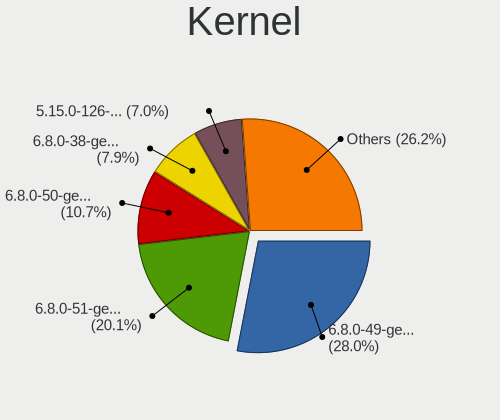
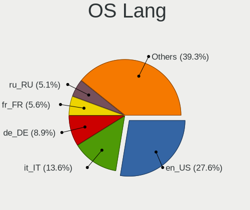
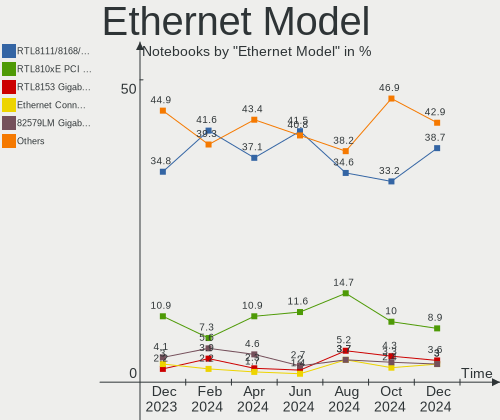
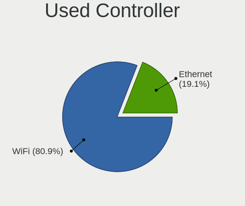
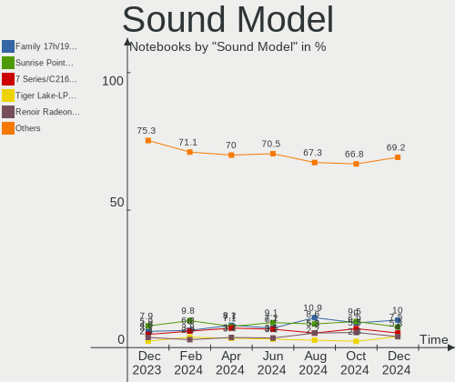
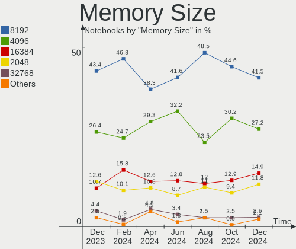

Linux Mint - Hardware Trends (Notebooks)
----------------------------------------

A project to identify most popular hardware characteristics and track their change
over time based on data collected by Linux users at https://Linux-Hardware.org.

Anyone can contribute to this report by the [hw-probe](https://github.com/linuxhw/hw-probe) tool:

    sudo -E hw-probe -all -upload

This report is for one last month. Overall report since the beginning of time: [TestCoverage](https://github.com/linuxhw/TestCoverage)

Period: Jun, 2022.

Contents
--------

* [ System ](#system)
  - [ OS                       ](#os)
  - [ OS Family                ](#os-family)
  - [ Kernel                   ](#kernel)
  - [ Kernel Family            ](#kernel-family)
  - [ Kernel Major Ver.        ](#kernel-major-ver)
  - [ Arch                     ](#arch)
  - [ DE                       ](#de)
  - [ Display Server           ](#display-server)
  - [ Display Manager          ](#display-manager)
  - [ OS Lang                  ](#os-lang)
  - [ Boot Mode                ](#boot-mode)
  - [ Filesystem               ](#filesystem)
  - [ Part. scheme             ](#part-scheme)
  - [ Dual Boot with Linux/BSD ](#dual-boot-with-linuxbsd)
  - [ Dual Boot (Win)          ](#dual-boot-win)

* [ Board ](#board)
  - [ Vendor                   ](#vendor)
  - [ Model                    ](#model)
  - [ Model Family             ](#model-family)
  - [ MFG Year                 ](#mfg-year)
  - [ Form Factor              ](#form-factor)
  - [ Secure Boot              ](#secure-boot)
  - [ Coreboot                 ](#coreboot)
  - [ RAM Size                 ](#ram-size)
  - [ RAM Used                 ](#ram-used)
  - [ Total Drives             ](#total-drives)
  - [ Has CD-ROM               ](#has-cd-rom)
  - [ Has Ethernet             ](#has-ethernet)
  - [ Has WiFi                 ](#has-wifi)
  - [ Has Bluetooth            ](#has-bluetooth)

* [ Location ](#location)
  - [ Country                  ](#country)
  - [ City                     ](#city)

* [ Drives ](#drives)
  - [ Drive Vendor             ](#drive-vendor)
  - [ Drive Model              ](#drive-model)
  - [ HDD Vendor               ](#hdd-vendor)
  - [ SSD Vendor               ](#ssd-vendor)
  - [ Drive Kind               ](#drive-kind)
  - [ Drive Connector          ](#drive-connector)
  - [ Drive Size               ](#drive-size)
  - [ Space Total              ](#space-total)
  - [ Space Used               ](#space-used)
  - [ Malfunc. Drives          ](#malfunc-drives)
  - [ Malfunc. Drive Vendor    ](#malfunc-drive-vendor)
  - [ Malfunc. HDD Vendor      ](#malfunc-hdd-vendor)
  - [ Malfunc. Drive Kind      ](#malfunc-drive-kind)
  - [ Failed Drives            ](#failed-drives)
  - [ Failed Drive Vendor      ](#failed-drive-vendor)
  - [ Drive Status             ](#drive-status)

* [ Storage controller ](#storage-controller)
  - [ Storage Vendor           ](#storage-vendor)
  - [ Storage Model            ](#storage-model)
  - [ Storage Kind             ](#storage-kind)

* [ Processor ](#processor)
  - [ CPU Vendor               ](#cpu-vendor)
  - [ CPU Model                ](#cpu-model)
  - [ CPU Model Family         ](#cpu-model-family)
  - [ CPU Cores                ](#cpu-cores)
  - [ CPU Sockets              ](#cpu-sockets)
  - [ CPU Threads              ](#cpu-threads)
  - [ CPU Op-Modes             ](#cpu-op-modes)
  - [ CPU Microcode            ](#cpu-microcode)
  - [ CPU Microarch            ](#cpu-microarch)

* [ Graphics ](#graphics)
  - [ GPU Vendor               ](#gpu-vendor)
  - [ GPU Model                ](#gpu-model)
  - [ GPU Combo                ](#gpu-combo)
  - [ GPU Driver               ](#gpu-driver)
  - [ GPU Memory               ](#gpu-memory)

* [ Monitor ](#monitor)
  - [ Monitor Vendor           ](#monitor-vendor)
  - [ Monitor Model            ](#monitor-model)
  - [ Monitor Resolution       ](#monitor-resolution)
  - [ Monitor Diagonal         ](#monitor-diagonal)
  - [ Monitor Width            ](#monitor-width)
  - [ Aspect Ratio             ](#aspect-ratio)
  - [ Monitor Area             ](#monitor-area)
  - [ Pixel Density            ](#pixel-density)
  - [ Multiple Monitors        ](#multiple-monitors)

* [ Network ](#network)
  - [ Net Controller Vendor    ](#net-controller-vendor)
  - [ Net Controller Model     ](#net-controller-model)
  - [ Wireless Vendor          ](#wireless-vendor)
  - [ Wireless Model           ](#wireless-model)
  - [ Ethernet Vendor          ](#ethernet-vendor)
  - [ Ethernet Model           ](#ethernet-model)
  - [ Net Controller Kind      ](#net-controller-kind)
  - [ Used Controller          ](#used-controller)
  - [ NICs                     ](#nics)
  - [ IPv6                     ](#ipv6)

* [ Bluetooth ](#bluetooth)
  - [ Bluetooth Vendor         ](#bluetooth-vendor)
  - [ Bluetooth Model          ](#bluetooth-model)

* [ Sound ](#sound)
  - [ Sound Vendor             ](#sound-vendor)
  - [ Sound Model              ](#sound-model)

* [ Memory ](#memory)
  - [ Memory Vendor            ](#memory-vendor)
  - [ Memory Model             ](#memory-model)
  - [ Memory Kind              ](#memory-kind)
  - [ Memory Form Factor       ](#memory-form-factor)
  - [ Memory Size              ](#memory-size)
  - [ Memory Speed             ](#memory-speed)

* [ Printers & scanners ](#printers--scanners)
  - [ Printer Vendor           ](#printer-vendor)
  - [ Printer Model            ](#printer-model)
  - [ Scanner Vendor           ](#scanner-vendor)
  - [ Scanner Model            ](#scanner-model)

* [ Camera ](#camera)
  - [ Camera Vendor            ](#camera-vendor)
  - [ Camera Model             ](#camera-model)

* [ Security ](#security)
  - [ Fingerprint Vendor       ](#fingerprint-vendor)
  - [ Fingerprint Model        ](#fingerprint-model)
  - [ Chipcard Vendor          ](#chipcard-vendor)
  - [ Chipcard Model           ](#chipcard-model)

* [ Unsupported ](#unsupported)
  - [ Unsupported Devices      ](#unsupported-devices)
  - [ Unsupported Device Types ](#unsupported-device-types)

System
------

OS
--

Installed operating systems

| Name            | Notebooks | Percent |
|-----------------|-----------|---------|
| Linux Mint 20.3 | 171       | 89.53%  |
| Linux Mint 20.2 | 9         | 4.71%   |
| Linux Mint 20.1 | 5         | 2.62%   |
| Linux Mint 19.3 | 5         | 2.62%   |
| Linux Mint 19.1 | 1         | 0.52%   |

OS Family
---------

OS without a version

| Name       | Notebooks | Percent |
|------------|-----------|---------|
| Linux Mint | 191       | 100%    |

Kernel
------

Version of the Linux kernel

| Version                 | Notebooks | Percent |
|-------------------------|-----------|---------|
| 5.4.0-117-generic       | 36        | 18.85%  |
| 5.4.0-113-generic       | 32        | 16.75%  |
| 5.4.0-121-generic       | 29        | 15.18%  |
| 5.4.0-120-generic       | 24        | 12.57%  |
| 5.4.0-91-generic        | 22        | 11.52%  |
| 5.15.0-33-generic       | 16        | 8.38%   |
| 5.13.0-48-generic       | 5         | 2.62%   |
| 5.4.0-74-generic        | 4         | 2.09%   |
| 5.4.0-109-generic       | 4         | 2.09%   |
| 5.4.0-110-generic       | 3         | 1.57%   |
| 5.18.2-051802-generic   | 3         | 1.57%   |
| 5.14.0-1042-oem         | 2         | 1.05%   |
| 5.13.0-51-generic       | 2         | 1.05%   |
| 5.13.0-44-generic       | 2         | 1.05%   |
| 4.15.0-176-generic      | 2         | 1.05%   |
| 5.9.0-050900-generic    | 1         | 0.52%   |
| 5.4.0-89-generic        | 1         | 0.52%   |
| 5.17.5-76051705-generic | 1         | 0.52%   |
| 5.13.0-27-generic       | 1         | 0.52%   |
| 5.0.0-32-generic        | 1         | 0.52%   |

Kernel Family
-------------

Linux kernel without a distro release

| Version | Notebooks | Percent |
|---------|-----------|---------|
| 5.4.0   | 155       | 81.15%  |
| 5.15.0  | 16        | 8.38%   |
| 5.13.0  | 10        | 5.24%   |
| 5.18.2  | 3         | 1.57%   |
| 5.14.0  | 2         | 1.05%   |
| 4.15.0  | 2         | 1.05%   |
| 5.9.0   | 1         | 0.52%   |
| 5.17.5  | 1         | 0.52%   |
| 5.0.0   | 1         | 0.52%   |

Kernel Major Ver.
-----------------

Linux kernel major version

| Version | Notebooks | Percent |
|---------|-----------|---------|
| 5.4     | 155       | 81.15%  |
| 5.15    | 16        | 8.38%   |
| 5.13    | 10        | 5.24%   |
| 5.18    | 3         | 1.57%   |
| 5.14    | 2         | 1.05%   |
| 4.15    | 2         | 1.05%   |
| 5.9     | 1         | 0.52%   |
| 5.17    | 1         | 0.52%   |
| 5.0     | 1         | 0.52%   |

Arch
----

OS architecture (x86_64, i586, etc.)

| Name   | Notebooks | Percent |
|--------|-----------|---------|
| x86_64 | 190       | 99.48%  |
| i686   | 1         | 0.52%   |

DE
--

Desktop Environment

| Name       | Notebooks | Percent |
|------------|-----------|---------|
| X-Cinnamon | 138       | 72.25%  |
| XFCE       | 24        | 12.57%  |
| MATE       | 20        | 10.47%  |
| Cinnamon   | 5         | 2.62%   |
| GNOME      | 3         | 1.57%   |
| Unknown    | 1         | 0.52%   |

Display Server
--------------

X11 or Wayland

| Name | Notebooks | Percent |
|------|-----------|---------|
| X11  | 191       | 100%    |

Display Manager
---------------

SDDM, LightDM, etc.

| Name    | Notebooks | Percent |
|---------|-----------|---------|
| Unknown | 101       | 52.88%  |
| LightDM | 89        | 46.6%   |
| GDM     | 1         | 0.52%   |

OS Lang
-------

Language

| Lang  | Notebooks | Percent |
|-------|-----------|---------|
| en_US | 52        | 27.23%  |
| de_DE | 30        | 15.71%  |
| pt_BR | 17        | 8.9%    |
| fr_FR | 16        | 8.38%   |
| C     | 10        | 5.24%   |
| en_GB | 9         | 4.71%   |
| ru_RU | 7         | 3.66%   |
| en_CA | 5         | 2.62%   |
| pl_PL | 4         | 2.09%   |
| es_ES | 4         | 2.09%   |
| en_AU | 4         | 2.09%   |
| it_IT | 3         | 1.57%   |
| hu_HU | 3         | 1.57%   |
| es_MX | 3         | 1.57%   |
| en_ZA | 3         | 1.57%   |
| es_AR | 2         | 1.05%   |
| zh_CN | 1         | 0.52%   |
| sv_SE | 1         | 0.52%   |
| nl_NL | 1         | 0.52%   |
| fr_CH | 1         | 0.52%   |
| fr_CA | 1         | 0.52%   |
| fr_BE | 1         | 0.52%   |
| et_EE | 1         | 0.52%   |
| es_VE | 1         | 0.52%   |
| es_UY | 1         | 0.52%   |
| es_PE | 1         | 0.52%   |
| es_GT | 1         | 0.52%   |
| es_CO | 1         | 0.52%   |
| en_NZ | 1         | 0.52%   |
| en_IE | 1         | 0.52%   |
| en_AG | 1         | 0.52%   |
| de_CH | 1         | 0.52%   |
| da_DK | 1         | 0.52%   |
| cs_CZ | 1         | 0.52%   |
| bg_BG | 1         | 0.52%   |

Boot Mode
---------

EFI or BIOS

| Mode | Notebooks | Percent |
|------|-----------|---------|
| EFI  | 114       | 59.69%  |
| BIOS | 77        | 40.31%  |

Filesystem
----------

Type of filesystem

| Type    | Notebooks | Percent |
|---------|-----------|---------|
| Ext4    | 181       | 94.76%  |
| Overlay | 10        | 5.24%   |

Part. scheme
------------

Scheme of partitioning

| Type    | Notebooks | Percent |
|---------|-----------|---------|
| Unknown | 106       | 55.5%   |
| GPT     | 67        | 35.08%  |
| MBR     | 18        | 9.42%   |

Dual Boot with Linux/BSD
------------------------

Hosting more than one Linux/BSD

| Dual boot | Notebooks | Percent |
|-----------|-----------|---------|
| No        | 175       | 91.62%  |
| Yes       | 16        | 8.38%   |

Dual Boot (Win)
---------------

Hosting Linux and Windows

| Dual boot | Notebooks | Percent |
|-----------|-----------|---------|
| No        | 156       | 81.68%  |
| Yes       | 35        | 18.32%  |

Board
-----

Vendor
------

Motherboard manufacturer

| Name                | Notebooks | Percent |
|---------------------|-----------|---------|
| Lenovo              | 41        | 21.47%  |
| Hewlett-Packard     | 31        | 16.23%  |
| Dell                | 26        | 13.61%  |
| Acer                | 17        | 8.9%    |
| ASUSTek Computer    | 16        | 8.38%   |
| Toshiba             | 7         | 3.66%   |
| Samsung Electronics | 6         | 3.14%   |
| Positivo            | 4         | 2.09%   |
| Google              | 4         | 2.09%   |
| Apple               | 4         | 2.09%   |
| MSI                 | 3         | 1.57%   |
| HUAWEI              | 3         | 1.57%   |
| Unknown             | 3         | 1.57%   |
| Sony                | 2         | 1.05%   |
| Packard Bell        | 2         | 1.05%   |
| Medion              | 2         | 1.05%   |
| Clevo               | 2         | 1.05%   |
| win element         | 1         | 0.52%   |
| VIT                 | 1         | 0.52%   |
| Thomson             | 1         | 0.52%   |
| Tactus              | 1         | 0.52%   |
| Razer               | 1         | 0.52%   |
| Pegatron            | 1         | 0.52%   |
| mPTech              | 1         | 0.52%   |
| Monster             | 1         | 0.52%   |
| LG Electronics      | 1         | 0.52%   |
| Itautec             | 1         | 0.52%   |
| Intel               | 1         | 0.52%   |
| iClever             | 1         | 0.52%   |
| Gateway             | 1         | 0.52%   |
| Gadnic              | 1         | 0.52%   |
| Fujitsu             | 1         | 0.52%   |
| eMachines           | 1         | 0.52%   |
| Chuwi               | 1         | 0.52%   |
| Alienware           | 1         | 0.52%   |

Model
-----

Motherboard model

| Name                                  | Notebooks | Percent |
|---------------------------------------|-----------|---------|
| Unknown                               | 3         | 1.57%   |
| Positivo S14CT01                      | 2         | 1.05%   |
| HP Pavilion Laptop 15-cs3xxx          | 2         | 1.05%   |
| Dell Latitude E5430 non-vPro          | 2         | 1.05%   |
| Acer Aspire 5742G                     | 2         | 1.05%   |
| win element MoreFine S500+            | 1         | 0.52%   |
| VIT M2420                             | 1         | 0.52%   |
| Toshiba Satellite Pro S300L           | 1         | 0.52%   |
| Toshiba Satellite L755D               | 1         | 0.52%   |
| Toshiba Satellite L55-B               | 1         | 0.52%   |
| Toshiba Satellite L50D-B              | 1         | 0.52%   |
| Toshiba Satellite L50-B               | 1         | 0.52%   |
| Toshiba Satellite C75D-B              | 1         | 0.52%   |
| Toshiba Satellite A665                | 1         | 0.52%   |
| Thomson N17V3C8WH512                  | 1         | 0.52%   |
| Tactus GeoBook 140                    | 1         | 0.52%   |
| Sony VPCM120AL                        | 1         | 0.52%   |
| Sony VGN-FS415B                       | 1         | 0.52%   |
| Samsung RF510/RF410/RF710             | 1         | 0.52%   |
| Samsung 750XED                        | 1         | 0.52%   |
| Samsung 700Z3A/700Z4A/700Z5A/700Z5B   | 1         | 0.52%   |
| Samsung 530U3C/530U4C/532U3C          | 1         | 0.52%   |
| Samsung 370E4K                        | 1         | 0.52%   |
| Samsung 300E5K/300E5Q                 | 1         | 0.52%   |
| Razer Blade                           | 1         | 0.52%   |
| Positivo W540EU                       | 1         | 0.52%   |
| Positivo Mobile                       | 1         | 0.52%   |
| Pegatron A15W8                        | 1         | 0.52%   |
| Packard Bell EasyNote LS11HR          | 1         | 0.52%   |
| Packard Bell EasyNote LJ71            | 1         | 0.52%   |
| MSI Modern 15 A5M                     | 1         | 0.52%   |
| MSI GP72 6QF                          | 1         | 0.52%   |
| MSI CR70 2M/CX70 2OC/CX70 2OD         | 1         | 0.52%   |
| mPTech ARC 11.6 128GB HD              | 1         | 0.52%   |
| Monster ABRA A5 V15.8                 | 1         | 0.52%   |
| Medion P6630                          | 1         | 0.52%   |
| Medion E6416 MD99553                  | 1         | 0.52%   |
| LG P420-G.BC43P1                      | 1         | 0.52%   |
| Lenovo Z51-70 80K6                    | 1         | 0.52%   |
| Lenovo V17-IIL 82GX                   | 1         | 0.52%   |
| Lenovo V14 G2 ITL 82NM                | 1         | 0.52%   |
| Lenovo ThinkPad X250 20CLA1VECD       | 1         | 0.52%   |
| Lenovo ThinkPad X230 232032U          | 1         | 0.52%   |
| Lenovo ThinkPad X220 4291W3B          | 1         | 0.52%   |
| Lenovo ThinkPad W541 20EFCTO1WW       | 1         | 0.52%   |
| Lenovo ThinkPad W520 4270CTO          | 1         | 0.52%   |
| Lenovo ThinkPad T530 24295L4          | 1         | 0.52%   |
| Lenovo ThinkPad T480 20L60016TX       | 1         | 0.52%   |
| Lenovo ThinkPad T480 20L5000AUK       | 1         | 0.52%   |
| Lenovo ThinkPad T470 W10DG 20JNS00502 | 1         | 0.52%   |
| Lenovo ThinkPad T460 20FMS2A200       | 1         | 0.52%   |
| Lenovo ThinkPad T430 2349NM8          | 1         | 0.52%   |
| Lenovo ThinkPad T430 2349BZ7          | 1         | 0.52%   |
| Lenovo ThinkPad L540 20AUA06000       | 1         | 0.52%   |
| Lenovo ThinkPad E490s 20NG0002AU      | 1         | 0.52%   |
| Lenovo ThinkPad E470 20H2S01A00       | 1         | 0.52%   |
| Lenovo M490s 20214                    | 1         | 0.52%   |
| Lenovo Legion 5 17ACH6H 82JY          | 1         | 0.52%   |
| Lenovo IdeaPadFlex 3 11IGL05 82B2     | 1         | 0.52%   |
| Lenovo IdeaPad Y700-15ACZ 80NY        | 1         | 0.52%   |

Model Family
------------

Motherboard model prefix

| Name                  | Notebooks | Percent |
|-----------------------|-----------|---------|
| Lenovo ThinkPad       | 15        | 7.85%   |
| Acer Aspire           | 13        | 6.81%   |
| Lenovo IdeaPad        | 12        | 6.28%   |
| Dell Latitude         | 12        | 6.28%   |
| Dell Inspiron         | 9         | 4.71%   |
| Toshiba Satellite     | 7         | 3.66%   |
| HP Pavilion           | 7         | 3.66%   |
| HP Laptop             | 5         | 2.62%   |
| HP ProBook            | 4         | 2.09%   |
| HP EliteBook          | 4         | 2.09%   |
| HP Presario           | 3         | 1.57%   |
| Unknown               | 3         | 1.57%   |
| Positivo S14CT01      | 2         | 1.05%   |
| Packard Bell EasyNote | 2         | 1.05%   |
| HP Compaq             | 2         | 1.05%   |
| HP 255                | 2         | 1.05%   |
| ASUS ZenBook          | 2         | 1.05%   |
| ASUS VivoBook         | 2         | 1.05%   |
| Apple MacBook5        | 2         | 1.05%   |
| Acer Predator         | 2         | 1.05%   |
| win element MoreFine  | 1         | 0.52%   |
| VIT M2420             | 1         | 0.52%   |
| Thomson N17V3C8WH512  | 1         | 0.52%   |
| Tactus GeoBook        | 1         | 0.52%   |
| Sony VPCM120AL        | 1         | 0.52%   |
| Sony VGN-FS415B       | 1         | 0.52%   |
| Samsung RF510         | 1         | 0.52%   |
| Samsung 750XED        | 1         | 0.52%   |
| Samsung 700Z3A        | 1         | 0.52%   |
| Samsung 530U3C        | 1         | 0.52%   |
| Samsung 370E4K        | 1         | 0.52%   |
| Samsung 300E5K        | 1         | 0.52%   |
| Razer Blade           | 1         | 0.52%   |
| Positivo W540EU       | 1         | 0.52%   |
| Positivo Mobile       | 1         | 0.52%   |
| Pegatron A15W8        | 1         | 0.52%   |
| MSI Modern            | 1         | 0.52%   |
| MSI GP72              | 1         | 0.52%   |
| MSI CR70              | 1         | 0.52%   |
| mPTech ARC            | 1         | 0.52%   |
| Monster ABRA          | 1         | 0.52%   |
| Medion P6630          | 1         | 0.52%   |
| Medion E6416          | 1         | 0.52%   |
| LG P420-G.BC43P1      | 1         | 0.52%   |
| Lenovo Z51-70         | 1         | 0.52%   |
| Lenovo V17-IIL        | 1         | 0.52%   |
| Lenovo V14            | 1         | 0.52%   |
| Lenovo M490s          | 1         | 0.52%   |
| Lenovo Legion         | 1         | 0.52%   |
| Lenovo IdeaPadFlex    | 1         | 0.52%   |
| Lenovo G70-70         | 1         | 0.52%   |
| Lenovo G505s          | 1         | 0.52%   |
| Lenovo G500           | 1         | 0.52%   |
| Lenovo G50-70         | 1         | 0.52%   |
| Lenovo G50-30         | 1         | 0.52%   |
| Lenovo G450           | 1         | 0.52%   |
| Lenovo B570e          | 1         | 0.52%   |
| Lenovo B40-70         | 1         | 0.52%   |
| Itautec Infoway       | 1         | 0.52%   |
| Intel (R)             | 1         | 0.52%   |

MFG Year
--------

Motherboard manufacture year

| Year | Notebooks | Percent |
|------|-----------|---------|
| 2021 | 21        | 10.99%  |
| 2012 | 19        | 9.95%   |
| 2010 | 19        | 9.95%   |
| 2019 | 15        | 7.85%   |
| 2011 | 15        | 7.85%   |
| 2020 | 14        | 7.33%   |
| 2015 | 13        | 6.81%   |
| 2018 | 11        | 5.76%   |
| 2016 | 11        | 5.76%   |
| 2014 | 11        | 5.76%   |
| 2013 | 11        | 5.76%   |
| 2017 | 8         | 4.19%   |
| 2022 | 7         | 3.66%   |
| 2009 | 6         | 3.14%   |
| 2008 | 5         | 2.62%   |
| 2007 | 3         | 1.57%   |
| 2006 | 2         | 1.05%   |

Form Factor
-----------

Physical design of the computer

| Name     | Notebooks | Percent |
|----------|-----------|---------|
| Notebook | 191       | 100%    |

Secure Boot
-----------

Enabled or disabled

| State    | Notebooks | Percent |
|----------|-----------|---------|
| Disabled | 166       | 86.91%  |
| Enabled  | 25        | 13.09%  |

Coreboot
--------

Have coreboot on board

| Used | Notebooks | Percent |
|------|-----------|---------|
| No   | 187       | 97.91%  |
| Yes  | 4         | 2.09%   |

RAM Size
--------

Total RAM memory

| Size in GB | Notebooks | Percent |
|------------|-----------|---------|
| 4.01-8.0   | 59        | 30.89%  |
| 3.01-4.0   | 53        | 27.75%  |
| 8.01-16.0  | 28        | 14.66%  |
| 16.01-24.0 | 27        | 14.14%  |
| 1.01-2.0   | 15        | 7.85%   |
| 32.01-64.0 | 5         | 2.62%   |
| 24.01-32.0 | 3         | 1.57%   |
| 2.01-3.0   | 1         | 0.52%   |

RAM Used
--------

Used RAM memory

| Used GB   | Notebooks | Percent |
|-----------|-----------|---------|
| 1.01-2.0  | 98        | 51.31%  |
| 2.01-3.0  | 45        | 23.56%  |
| 3.01-4.0  | 23        | 12.04%  |
| 4.01-8.0  | 16        | 8.38%   |
| 0.51-1.0  | 7         | 3.66%   |
| 8.01-16.0 | 2         | 1.05%   |

Total Drives
------------

Number of drives on board

| Drives | Notebooks | Percent |
|--------|-----------|---------|
| 1      | 133       | 69.63%  |
| 2      | 49        | 25.65%  |
| 3      | 8         | 4.19%   |
| 4      | 1         | 0.52%   |

Has CD-ROM
----------

Has CD-ROM on board

| Presented | Notebooks | Percent |
|-----------|-----------|---------|
| No        | 111       | 58.12%  |
| Yes       | 80        | 41.88%  |

Has Ethernet
------------

Has Ethernet on board

| Presented | Notebooks | Percent |
|-----------|-----------|---------|
| Yes       | 152       | 79.58%  |
| No        | 39        | 20.42%  |

Has WiFi
--------

Has WiFi module

| Presented | Notebooks | Percent |
|-----------|-----------|---------|
| Yes       | 185       | 96.86%  |
| No        | 6         | 3.14%   |

Has Bluetooth
-------------

Has Bluetooth module

| Presented | Notebooks | Percent |
|-----------|-----------|---------|
| Yes       | 131       | 68.59%  |
| No        | 60        | 31.41%  |

Location
--------

Country
-------

Geographic location (country)

| Country      | Notebooks | Percent |
|--------------|-----------|---------|
| Germany      | 32        | 16.75%  |
| USA          | 31        | 16.23%  |
| Brazil       | 19        | 9.95%   |
| France       | 13        | 6.81%   |
| UK           | 11        | 5.76%   |
| Russia       | 8         | 4.19%   |
| Mexico       | 6         | 3.14%   |
| Spain        | 5         | 2.62%   |
| Australia    | 5         | 2.62%   |
| Poland       | 4         | 2.09%   |
| Canada       | 4         | 2.09%   |
| South Africa | 3         | 1.57%   |
| Netherlands  | 3         | 1.57%   |
| Italy        | 3         | 1.57%   |
| Hungary      | 3         | 1.57%   |
| Argentina    | 3         | 1.57%   |
| Turkey       | 2         | 1.05%   |
| Switzerland  | 2         | 1.05%   |
| Sweden       | 2         | 1.05%   |
| Slovakia     | 2         | 1.05%   |
| Portugal     | 2         | 1.05%   |
| Kazakhstan   | 2         | 1.05%   |
| Denmark      | 2         | 1.05%   |
| Belgium      | 2         | 1.05%   |
| Venezuela    | 1         | 0.52%   |
| Uruguay      | 1         | 0.52%   |
| Peru         | 1         | 0.52%   |
| New Zealand  | 1         | 0.52%   |
| Morocco      | 1         | 0.52%   |
| Malta        | 1         | 0.52%   |
| Luxembourg   | 1         | 0.52%   |
| Kenya        | 1         | 0.52%   |
| Ireland      | 1         | 0.52%   |
| Indonesia    | 1         | 0.52%   |
| India        | 1         | 0.52%   |
| Iceland      | 1         | 0.52%   |
| Hong Kong    | 1         | 0.52%   |
| Guatemala    | 1         | 0.52%   |
| Guadeloupe   | 1         | 0.52%   |
| Estonia      | 1         | 0.52%   |
| Czechia      | 1         | 0.52%   |
| Colombia     | 1         | 0.52%   |
| China        | 1         | 0.52%   |
| Chile        | 1         | 0.52%   |
| Bulgaria     | 1         | 0.52%   |
| Algeria      | 1         | 0.52%   |

City
----

Geographic location (city)

| City                   | Notebooks | Percent |
|------------------------|-----------|---------|
| Berlin                 | 4         | 2.09%   |
| St Petersburg          | 3         | 1.57%   |
| Paris                  | 3         | 1.57%   |
| Melbourne              | 3         | 1.57%   |
| Worcester              | 2         | 1.05%   |
| Warsaw                 | 2         | 1.05%   |
| The Bronx              | 2         | 1.05%   |
| Ribeirao Preto         | 2         | 1.05%   |
| Novosibirsk            | 2         | 1.05%   |
| Munich                 | 2         | 1.05%   |
| Milan                  | 2         | 1.05%   |
| Cape Town              | 2         | 1.05%   |
| Brussels               | 2         | 1.05%   |
| Bratislava             | 2         | 1.05%   |
| Zapopan                | 1         | 0.52%   |
| Wittingen              | 1         | 0.52%   |
| Wil                    | 1         | 0.52%   |
| Wembley                | 1         | 0.52%   |
| Walluf                 | 1         | 0.52%   |
| Wakefield              | 1         | 0.52%   |
| Vancouver              | 1         | 0.52%   |
| Valladolid             | 1         | 0.52%   |
| Vaestra Froelunda      | 1         | 0.52%   |
| Tyumen                 | 1         | 0.52%   |
| Turin                  | 1         | 0.52%   |
| Traunreut              | 1         | 0.52%   |
| Tours                  | 1         | 0.52%   |
| Tijuana                | 1         | 0.52%   |
| Terrassa               | 1         | 0.52%   |
| Temoac                 | 1         | 0.52%   |
| Tassin-la-Demi-Lune    | 1         | 0.52%   |
| Tarnów                | 1         | 0.52%   |
| Tampa                  | 1         | 0.52%   |
| Tallinn                | 1         | 0.52%   |
| Stockholm              | 1         | 0.52%   |
| Springfield            | 1         | 0.52%   |
| Southampton            | 1         | 0.52%   |
| South Yarra            | 1         | 0.52%   |
| South Burlington       | 1         | 0.52%   |
| Slagelse               | 1         | 0.52%   |
| Seville                | 1         | 0.52%   |
| Sarnia                 | 1         | 0.52%   |
| Sao Paulo              | 1         | 0.52%   |
| Sao Miguel do Guama    | 1         | 0.52%   |
| San Antonio            | 1         | 0.52%   |
| Salt Lake City         | 1         | 0.52%   |
| Saint-Brice-sous-Foret | 1         | 0.52%   |
| Saguenay               | 1         | 0.52%   |
| Roosendaal             | 1         | 0.52%   |
| Rockwall               | 1         | 0.52%   |
| Rio de Janeiro         | 1         | 0.52%   |
| Rinteln                | 1         | 0.52%   |
| Rennes                 | 1         | 0.52%   |
| Recife                 | 1         | 0.52%   |
| Quilmes                | 1         | 0.52%   |
| Pullenreuth            | 1         | 0.52%   |
| Porto Velho            | 1         | 0.52%   |
| Porto                  | 1         | 0.52%   |
| Pompano Beach          | 1         | 0.52%   |
| Pilar                  | 1         | 0.52%   |

Drives
------

Drive Vendor
------------

Hard drive vendors

| Vendor                         | Notebooks | Drives | Percent |
|--------------------------------|-----------|--------|---------|
| Samsung Electronics            | 32        | 34     | 13.45%  |
| Seagate                        | 28        | 29     | 11.76%  |
| WDC                            | 26        | 26     | 10.92%  |
| Toshiba                        | 20        | 20     | 8.4%    |
| SanDisk                        | 20        | 21     | 8.4%    |
| Kingston                       | 16        | 16     | 6.72%   |
| Unknown                        | 13        | 15     | 5.46%   |
| Hitachi                        | 8         | 8      | 3.36%   |
| Crucial                        | 8         | 9      | 3.36%   |
| SK hynix                       | 6         | 6      | 2.52%   |
| Intenso                        | 3         | 3      | 1.26%   |
| Intel                          | 3         | 4      | 1.26%   |
| HGST                           | 3         | 3      | 1.26%   |
| China                          | 3         | 3      | 1.26%   |
| A-DATA Technology              | 3         | 3      | 1.26%   |
| Transcend                      | 2         | 2      | 0.84%   |
| SSSTC                          | 2         | 2      | 0.84%   |
| SPCC                           | 2         | 2      | 0.84%   |
| PNY                            | 2         | 2      | 0.84%   |
| Phison                         | 2         | 2      | 0.84%   |
| Netac                          | 2         | 2      | 0.84%   |
| Micron Technology              | 2         | 2      | 0.84%   |
| KIOXIA                         | 2         | 2      | 0.84%   |
| JMicron Technology             | 2         | 2      | 0.84%   |
| Fujitsu                        | 2         | 2      | 0.84%   |
| Apple                          | 2         | 3      | 0.84%   |
| Unknown                        | 2         | 2      | 0.84%   |
| Verbatim                       | 1         | 1      | 0.42%   |
| Union Memory                   | 1         | 1      | 0.42%   |
| Team                           | 1         | 1      | 0.42%   |
| Solid State Storage Technology | 1         | 1      | 0.42%   |
| S3+                            | 1         | 1      | 0.42%   |
| Reeinno                        | 1         | 1      | 0.42%   |
| Plextor                        | 1         | 1      | 0.42%   |
| OCZ                            | 1         | 1      | 0.42%   |
| Mushkin                        | 1         | 1      | 0.42%   |
| LuminouTek                     | 1         | 1      | 0.42%   |
| Lite-On                        | 1         | 1      | 0.42%   |
| Lexar                          | 1         | 1      | 0.42%   |
| Leven                          | 1         | 1      | 0.42%   |
| Lenovo                         | 1         | 1      | 0.42%   |
| KIOXIA-EXCERIA                 | 1         | 1      | 0.42%   |
| KingSpec                       | 1         | 1      | 0.42%   |
| KingDian                       | 1         | 1      | 0.42%   |
| Goodram                        | 1         | 1      | 0.42%   |
| Gigabyte Technology            | 1         | 1      | 0.42%   |
| EAGET                          | 1         | 1      | 0.42%   |
| BIWIN                          | 1         | 1      | 0.42%   |
| Apacer                         | 1         | 1      | 0.42%   |

Drive Model
-----------

Hard drive models

| Model                                | Notebooks | Percent |
|--------------------------------------|-----------|---------|
| Seagate ST1000LM024 HN-M101MBB 1TB   | 6         | 2.44%   |
| Kingston SA400S37240G 240GB SSD      | 4         | 1.63%   |
| Toshiba MQ04ABF100 1TB               | 3         | 1.22%   |
| Toshiba MQ01ABD075 752GB             | 3         | 1.22%   |
| SanDisk NVMe SSD Drive 512GB         | 3         | 1.22%   |
| Samsung NVMe SSD Drive 256GB         | 3         | 1.22%   |
| Crucial CT1000MX500SSD1 1TB          | 3         | 1.22%   |
| WDC WD10SPZX-24Z10 1TB               | 2         | 0.81%   |
| Unknown MMC Card  32GB               | 2         | 0.81%   |
| Unknown MMC Card  16GB               | 2         | 0.81%   |
| Toshiba MQ01ABF050 500GB             | 2         | 0.81%   |
| Toshiba MQ01ABD050 500GB             | 2         | 0.81%   |
| SK hynix NVMe SSD Drive 256GB        | 2         | 0.81%   |
| Seagate ST9500325AS 500GB            | 2         | 0.81%   |
| Seagate ST500LT012-1DG142 500GB      | 2         | 0.81%   |
| Seagate ST500LM021-1KJ152 500GB      | 2         | 0.81%   |
| Seagate Expansion 1TB                | 2         | 0.81%   |
| SanDisk NVMe SSD Drive 128GB         | 2         | 0.81%   |
| Kingston SA400S37480G 480GB SSD      | 2         | 0.81%   |
| JMicron Generic 2TB                  | 2         | 0.81%   |
| Intel SSDPEKNW512G8 512GB            | 2         | 0.81%   |
| HGST HTS545050A7E680 500GB           | 2         | 0.81%   |
| Crucial CT525MX300SSD1 528GB         | 2         | 0.81%   |
| Crucial CT240BX500SSD1 240GB         | 2         | 0.81%   |
| Unknown                              | 2         | 0.81%   |
| WDC WDS500G2B0B-00YS70 500GB SSD     | 1         | 0.41%   |
| WDC WDS120G2G0A-00JH30 120GB SSD     | 1         | 0.41%   |
| WDC WDBRPG0020BNC-WRSN 2TB           | 1         | 0.41%   |
| WDC WD7500BPKT-75PK4T0 752GB         | 1         | 0.41%   |
| WDC WD5000LPVX-22V0TT0 500GB         | 1         | 0.41%   |
| WDC WD5000LPCX-60VHAT0 500GB         | 1         | 0.41%   |
| WDC WD5000LPCX-24C6HT0 500GB         | 1         | 0.41%   |
| WDC WD5000BEVT-60ZAT0 500GB          | 1         | 0.41%   |
| WDC WD3200LPVX-75V0TT0 320GB         | 1         | 0.41%   |
| WDC WD3200BPVT-24JJ5T0 320GB         | 1         | 0.41%   |
| WDC WD3200BEVT-22A23T0 320GB         | 1         | 0.41%   |
| WDC WD3200BEVT-00A0RT0 320GB         | 1         | 0.41%   |
| WDC WD2500BEVT-80A23T0 250GB         | 1         | 0.41%   |
| WDC WD2500BEKT-75A25T0 250GB         | 1         | 0.41%   |
| WDC WD1600BEVT-22ZCT0 160GB          | 1         | 0.41%   |
| WDC WD10SPZX-75Z10T2 1TB             | 1         | 0.41%   |
| WDC WD10SPZX-22Z10T1 1TB             | 1         | 0.41%   |
| WDC WD10SPZX-21Z10T0 1TB             | 1         | 0.41%   |
| WDC WD10SPZX-00Z10T0 1TB             | 1         | 0.41%   |
| WDC WD10SPCX-24HWST1 1TB             | 1         | 0.41%   |
| WDC WD10JPVX-22JC3T0 1TB             | 1         | 0.41%   |
| WDC PC SN530 SDBPNPZ-256G-1006 256GB | 1         | 0.41%   |
| WDC PC SN530 SDBPMPZ-256G-1101 256GB | 1         | 0.41%   |
| WDC PC SN520 SDAPMUW-512G-1101 512GB | 1         | 0.41%   |
| Verbatim Vi550 S3 SSD 128GB          | 1         | 0.41%   |
| Unknown TA2964  64GB                 | 1         | 0.41%   |
| Unknown T52732  32GB                 | 1         | 0.41%   |
| Unknown SD64G  64GB                  | 1         | 0.41%   |
| Unknown SC64G  64GB                  | 1         | 0.41%   |
| Unknown SB128  128GB                 | 1         | 0.41%   |
| Unknown NCard  32GB                  | 1         | 0.41%   |
| Unknown MMC Card  128GB              | 1         | 0.41%   |
| Unknown HBG4a2  32GB                 | 1         | 0.41%   |
| Unknown HAG2e  16GB                  | 1         | 0.41%   |
| Unknown GE8QT  256GB                 | 1         | 0.41%   |

HDD Vendor
----------

Hard disk drive vendors

| Vendor              | Notebooks | Drives | Percent |
|---------------------|-----------|--------|---------|
| Seagate             | 28        | 29     | 34.15%  |
| WDC                 | 20        | 20     | 24.39%  |
| Toshiba             | 17        | 17     | 20.73%  |
| Hitachi             | 8         | 8      | 9.76%   |
| HGST                | 3         | 3      | 3.66%   |
| Samsung Electronics | 2         | 2      | 2.44%   |
| JMicron Technology  | 2         | 2      | 2.44%   |
| Fujitsu             | 2         | 2      | 2.44%   |

SSD Vendor
----------

Solid state drive vendors

| Vendor              | Notebooks | Drives | Percent |
|---------------------|-----------|--------|---------|
| Samsung Electronics | 14        | 14     | 17.07%  |
| SanDisk             | 13        | 13     | 15.85%  |
| Kingston            | 11        | 11     | 13.41%  |
| Crucial             | 8         | 9      | 9.76%   |
| China               | 3         | 3      | 3.66%   |
| A-DATA Technology   | 3         | 3      | 3.66%   |
| WDC                 | 2         | 2      | 2.44%   |
| Transcend           | 2         | 2      | 2.44%   |
| SPCC                | 2         | 2      | 2.44%   |
| PNY                 | 2         | 2      | 2.44%   |
| Netac               | 2         | 2      | 2.44%   |
| Micron Technology   | 2         | 2      | 2.44%   |
| Intenso             | 2         | 2      | 2.44%   |
| Verbatim            | 1         | 1      | 1.22%   |
| Union Memory        | 1         | 1      | 1.22%   |
| Team                | 1         | 1      | 1.22%   |
| S3+                 | 1         | 1      | 1.22%   |
| Plextor             | 1         | 1      | 1.22%   |
| OCZ                 | 1         | 1      | 1.22%   |
| Mushkin             | 1         | 1      | 1.22%   |
| Lexar               | 1         | 1      | 1.22%   |
| KingSpec            | 1         | 1      | 1.22%   |
| KingDian            | 1         | 1      | 1.22%   |
| Goodram             | 1         | 1      | 1.22%   |
| Gigabyte Technology | 1         | 1      | 1.22%   |
| EAGET               | 1         | 1      | 1.22%   |
| BIWIN               | 1         | 1      | 1.22%   |
| Apple               | 1         | 1      | 1.22%   |
| Unknown             | 1         | 1      | 1.22%   |

Drive Kind
----------

HDD or SSD

| Kind    | Notebooks | Drives | Percent |
|---------|-----------|--------|---------|
| HDD     | 79        | 83     | 35.11%  |
| SSD     | 76        | 83     | 33.78%  |
| NVMe    | 50        | 59     | 22.22%  |
| MMC     | 15        | 17     | 6.67%   |
| Unknown | 5         | 5      | 2.22%   |

Drive Connector
---------------

SATA, SAS, NVMe, etc.

| Type | Notebooks | Drives | Percent |
|------|-----------|--------|---------|
| SATA | 139       | 164    | 65.88%  |
| NVMe | 50        | 59     | 23.7%   |
| MMC  | 15        | 17     | 7.11%   |
| SAS  | 7         | 7      | 3.32%   |

Drive Size
----------

Size of hard drive

| Size in TB | Notebooks | Drives | Percent |
|------------|-----------|--------|---------|
| 0.01-0.5   | 100       | 107    | 64.52%  |
| 0.51-1.0   | 46        | 50     | 29.68%  |
| 1.01-2.0   | 8         | 8      | 5.16%   |
| 4.01-10.0  | 1         | 1      | 0.65%   |

Space Total
-----------

Amount of disk space available on the file system

| Size in GB     | Notebooks | Percent |
|----------------|-----------|---------|
| 101-250        | 71        | 37.17%  |
| 251-500        | 56        | 29.32%  |
| 501-1000       | 30        | 15.71%  |
| 21-50          | 9         | 4.71%   |
| 1-20           | 9         | 4.71%   |
| 1001-2000      | 6         | 3.14%   |
| 51-100         | 5         | 2.62%   |
| More than 3000 | 3         | 1.57%   |
| 2001-3000      | 2         | 1.05%   |

Space Used
----------

Amount of used disk space

| Used GB        | Notebooks | Percent |
|----------------|-----------|---------|
| 1-20           | 69        | 36.13%  |
| 101-250        | 38        | 19.9%   |
| 21-50          | 35        | 18.32%  |
| 51-100         | 28        | 14.66%  |
| 251-500        | 12        | 6.28%   |
| 501-1000       | 6         | 3.14%   |
| 1001-2000      | 2         | 1.05%   |
| More than 3000 | 1         | 0.52%   |

Malfunc. Drives
---------------

Drive models with a malfunction

| Model                                               | Notebooks | Drives | Percent |
|-----------------------------------------------------|-----------|--------|---------|
| WDC WD3200BEVT-00A0RT0 320GB                        | 1         | 1      | 5.88%   |
| Toshiba MQ04ABF100 1TB                              | 1         | 1      | 5.88%   |
| Toshiba MQ01ABF050 500GB                            | 1         | 1      | 5.88%   |
| SK hynix BC501 HFM256GDJTNG-8310A 256GB             | 1         | 1      | 5.88%   |
| Seagate ST9500423AS 500GB                           | 1         | 1      | 5.88%   |
| Seagate ST9160412AS 160GB                           | 1         | 1      | 5.88%   |
| Seagate ST1000LM024 HN-M101MBB 1TB                  | 1         | 1      | 5.88%   |
| Seagate ST1000LM014-SSHD-8GB                        | 1         | 1      | 5.88%   |
| SanDisk iSSD P4 8GB                                 | 1         | 1      | 5.88%   |
| Micron Technology MTFDDAK256TBN-1AR1ZABHA 256GB SSD | 1         | 1      | 5.88%   |
| Kingston RBU-SNS8350DES3128GP 128GB SSD             | 1         | 1      | 5.88%   |
| Hitachi HTS727550A9E364 500GB                       | 1         | 1      | 5.88%   |
| Hitachi HTS725032A9A364 320GB                       | 1         | 1      | 5.88%   |
| Hitachi HTS542512K9A300 120GB                       | 1         | 1      | 5.88%   |
| HGST HTS725032A7E630 320GB                          | 1         | 1      | 5.88%   |
| HGST HTS545050A7E680 500GB                          | 1         | 1      | 5.88%   |
| Crucial CT1050MX300SSD1 1TB                         | 1         | 1      | 5.88%   |

Malfunc. Drive Vendor
---------------------

Vendors of faulty drives

| Vendor            | Notebooks | Drives | Percent |
|-------------------|-----------|--------|---------|
| Seagate           | 4         | 4      | 23.53%  |
| Hitachi           | 3         | 3      | 17.65%  |
| Toshiba           | 2         | 2      | 11.76%  |
| HGST              | 2         | 2      | 11.76%  |
| WDC               | 1         | 1      | 5.88%   |
| SK hynix          | 1         | 1      | 5.88%   |
| SanDisk           | 1         | 1      | 5.88%   |
| Micron Technology | 1         | 1      | 5.88%   |
| Kingston          | 1         | 1      | 5.88%   |
| Crucial           | 1         | 1      | 5.88%   |

Malfunc. HDD Vendor
-------------------

Vendors of faulty HDD drives

| Vendor  | Notebooks | Drives | Percent |
|---------|-----------|--------|---------|
| Seagate | 4         | 4      | 33.33%  |
| Hitachi | 3         | 3      | 25%     |
| Toshiba | 2         | 2      | 16.67%  |
| HGST    | 2         | 2      | 16.67%  |
| WDC     | 1         | 1      | 8.33%   |

Malfunc. Drive Kind
-------------------

Kinds of faulty drives

| Kind | Notebooks | Drives | Percent |
|------|-----------|--------|---------|
| HDD  | 11        | 12     | 68.75%  |
| SSD  | 4         | 4      | 25%     |
| NVMe | 1         | 1      | 6.25%   |

Failed Drives
-------------

Failed drive models

Zero info for selected period =(

Failed Drive Vendor
-------------------

Failed drive vendors

Zero info for selected period =(

Drive Status
------------

Number of failed and malfunc. drives

| Status   | Notebooks | Drives | Percent |
|----------|-----------|--------|---------|
| Detected | 118       | 145    | 58.42%  |
| Works    | 68        | 85     | 33.66%  |
| Malfunc  | 16        | 17     | 7.92%   |

Storage controller
------------------

Storage Vendor
--------------

Storage controller vendors

| Vendor                         | Notebooks | Percent |
|--------------------------------|-----------|---------|
| Intel                          | 139       | 64.06%  |
| AMD                            | 22        | 10.14%  |
| Samsung Electronics            | 18        | 8.29%   |
| SanDisk                        | 11        | 5.07%   |
| SK hynix                       | 6         | 2.76%   |
| Kingston Technology Company    | 5         | 2.3%    |
| Toshiba America Info Systems   | 3         | 1.38%   |
| Solid State Storage Technology | 3         | 1.38%   |
| KIOXIA                         | 3         | 1.38%   |
| Nvidia                         | 2         | 0.92%   |
| Shenzhen Longsys Electronics   | 1         | 0.46%   |
| Phison Electronics             | 1         | 0.46%   |
| Lite-On Technology             | 1         | 0.46%   |
| Lenovo                         | 1         | 0.46%   |
| Apple                          | 1         | 0.46%   |

Storage Model
-------------

Storage controller models

| Model                                                                            | Notebooks | Percent |
|----------------------------------------------------------------------------------|-----------|---------|
| Intel 7 Series Chipset Family 6-port SATA Controller [AHCI mode]                 | 15        | 6.52%   |
| AMD FCH SATA Controller [AHCI mode]                                              | 15        | 6.52%   |
| Intel 8 Series SATA Controller 1 [AHCI mode]                                     | 11        | 4.78%   |
| Intel 6 Series/C200 Series Chipset Family 6 port Mobile SATA AHCI Controller     | 11        | 4.78%   |
| Intel 5 Series/3400 Series Chipset 4 port SATA AHCI Controller                   | 10        | 4.35%   |
| Samsung NVMe SSD Controller 980                                                  | 9         | 3.91%   |
| Intel 82801 Mobile SATA Controller [RAID mode]                                   | 9         | 3.91%   |
| Intel Sunrise Point-LP SATA Controller [AHCI mode]                               | 8         | 3.48%   |
| Samsung NVMe SSD Controller SM981/PM981/PM983                                    | 6         | 2.61%   |
| Intel Volume Management Device NVMe RAID Controller                              | 6         | 2.61%   |
| Intel Tiger Lake-LP SATA Controller [AHCI mode]                                  | 6         | 2.61%   |
| Intel Comet Lake SATA AHCI Controller                                            | 6         | 2.61%   |
| Intel Celeron/Pentium Silver Processor SATA Controller                           | 6         | 2.61%   |
| Intel 82801IBM/IEM (ICH9M/ICH9M-E) 4 port SATA Controller [AHCI mode]            | 6         | 2.61%   |
| Intel 8 Series/C220 Series Chipset Family 6-port SATA Controller 1 [AHCI mode]   | 6         | 2.61%   |
| AMD SB7x0/SB8x0/SB9x0 SATA Controller [AHCI mode]                                | 6         | 2.61%   |
| Intel Wildcat Point-LP SATA Controller [AHCI Mode]                               | 5         | 2.17%   |
| SanDisk PC SN520 NVMe SSD                                                        | 4         | 1.74%   |
| Intel HM170/QM170 Chipset SATA Controller [AHCI Mode]                            | 4         | 1.74%   |
| Intel Atom/Celeron/Pentium Processor x5-E8000/J3xxx/N3xxx Series SATA Controller | 4         | 1.74%   |
| Intel Atom Processor E3800 Series SATA AHCI Controller                           | 4         | 1.74%   |
| Intel 5 Series/3400 Series Chipset 6 port SATA AHCI Controller                   | 4         | 1.74%   |
| Solid State Storage Non-Volatile memory controller                               | 3         | 1.3%    |
| SanDisk Non-Volatile memory controller                                           | 3         | 1.3%    |
| Kingston Company Company Non-Volatile memory controller                          | 3         | 1.3%    |
| Intel NM10/ICH7 Family SATA Controller [AHCI mode]                               | 3         | 1.3%    |
| Intel Ice Lake-LP SATA Controller [AHCI mode]                                    | 3         | 1.3%    |
| Intel 82801HM/HEM (ICH8M/ICH8M-E) IDE Controller                                 | 3         | 1.3%    |
| SK hynix BC511                                                                   | 2         | 0.87%   |
| SK hynix BC501 NVMe Solid State Drive                                            | 2         | 0.87%   |
| Nvidia MCP79 AHCI Controller                                                     | 2         | 0.87%   |
| KIOXIA Non-Volatile memory controller                                            | 2         | 0.87%   |
| Intel SSD 660P Series                                                            | 2         | 0.87%   |
| Intel Celeron N3350/Pentium N4200/Atom E3900 Series SATA AHCI Controller         | 2         | 0.87%   |
| Intel 82801HM/HEM (ICH8M/ICH8M-E) SATA Controller [AHCI mode]                    | 2         | 0.87%   |
| Intel 400 Series Chipset Family SATA AHCI Controller                             | 2         | 0.87%   |
| Toshiba America Info Systems XG6 NVMe SSD Controller                             | 1         | 0.43%   |
| Toshiba America Info Systems XG4 NVMe SSD Controller                             | 1         | 0.43%   |
| Toshiba America Info Systems Toshiba America Info Non-Volatile memory controller | 1         | 0.43%   |
| SK hynix PC401 NVMe Solid State Drive 256GB                                      | 1         | 0.43%   |
| SK hynix Gold P31 SSD                                                            | 1         | 0.43%   |
| Shenzhen Longsys Electronics Non-Volatile memory controller                      | 1         | 0.43%   |
| SanDisk WD PC SN810 / Black SN850 NVMe SSD                                       | 1         | 0.43%   |
| SanDisk WD Blue SN550 NVMe SSD                                                   | 1         | 0.43%   |
| SanDisk WD Blue SN500 / PC SN520 NVMe SSD                                        | 1         | 0.43%   |
| SanDisk WD Black 2018/SN750 / PC SN720 NVMe SSD                                  | 1         | 0.43%   |
| Samsung NVMe SSD Controller SM961/PM961/SM963                                    | 1         | 0.43%   |
| Samsung NVMe SSD Controller SM951/PM951                                          | 1         | 0.43%   |
| Samsung Apple PCIe SSD                                                           | 1         | 0.43%   |
| Phison E12 NVMe Controller                                                       | 1         | 0.43%   |
| Lite-On Non-Volatile memory controller                                           | 1         | 0.43%   |
| Lenovo Non-Volatile memory controller                                            | 1         | 0.43%   |
| KIOXIA NVMe SSD                                                                  | 1         | 0.43%   |
| Kingston Company OM3PDP3 NVMe SSD                                                | 1         | 0.43%   |
| Kingston Company A2000 NVMe SSD                                                  | 1         | 0.43%   |
| Intel Non-Volatile memory controller                                             | 1         | 0.43%   |
| Intel NM10/ICH7 Family SATA Controller [IDE mode]                                | 1         | 0.43%   |
| Intel Jasper Lake SATA AHCI Controller                                           | 1         | 0.43%   |
| Intel Comet Lake PCH-LP SATA RAID Premium Controller                             | 1         | 0.43%   |
| Intel Cannon Point-LP SATA Controller [AHCI Mode]                                | 1         | 0.43%   |

Storage Kind
------------

Kind of storage controller (IDE, SATA, NVMe, SAS, ...)

| Kind | Notebooks | Percent |
|------|-----------|---------|
| SATA | 147       | 66.22%  |
| NVMe | 50        | 22.52%  |
| RAID | 16        | 7.21%   |
| IDE  | 9         | 4.05%   |

Processor
---------

CPU Vendor
----------

Processor vendors

| Vendor | Notebooks | Percent |
|--------|-----------|---------|
| Intel  | 160       | 83.77%  |
| AMD    | 31        | 16.23%  |

CPU Model
---------

Processor models

| Model                                         | Notebooks | Percent |
|-----------------------------------------------|-----------|---------|
| Intel Core i5-4210U CPU @ 1.70GHz             | 5         | 2.62%   |
| Intel Core i5-10210U CPU @ 1.60GHz            | 4         | 2.09%   |
| Intel 11th Gen Core i3-1115G4 @ 3.00GHz       | 4         | 2.09%   |
| Intel Core i7-7700HQ CPU @ 2.80GHz            | 3         | 1.57%   |
| Intel Core i5-2520M CPU @ 2.50GHz             | 3         | 1.57%   |
| Intel Core i5-1035G1 CPU @ 1.00GHz            | 3         | 1.57%   |
| Intel Core i3-2310M CPU @ 2.10GHz             | 3         | 1.57%   |
| Intel Core i3 CPU M 380 @ 2.53GHz             | 3         | 1.57%   |
| Intel Core i3 CPU M 370 @ 2.40GHz             | 3         | 1.57%   |
| Intel Celeron N4020 CPU @ 1.10GHz             | 3         | 1.57%   |
| Intel Celeron CPU N3060 @ 1.60GHz             | 3         | 1.57%   |
| Intel Pentium Dual-Core CPU T4500 @ 2.30GHz   | 2         | 1.05%   |
| Intel Pentium CPU N3540 @ 2.16GHz             | 2         | 1.05%   |
| Intel Pentium CPU 6405U @ 2.40GHz             | 2         | 1.05%   |
| Intel Core i7-9750H CPU @ 2.60GHz             | 2         | 1.05%   |
| Intel Core i7-8550U CPU @ 1.80GHz             | 2         | 1.05%   |
| Intel Core i7-6700HQ CPU @ 2.60GHz            | 2         | 1.05%   |
| Intel Core i7-5500U CPU @ 2.40GHz             | 2         | 1.05%   |
| Intel Core i7-3517U CPU @ 1.90GHz             | 2         | 1.05%   |
| Intel Core i5-8250U CPU @ 1.60GHz             | 2         | 1.05%   |
| Intel Core i5-7200U CPU @ 2.50GHz             | 2         | 1.05%   |
| Intel Core i5-6300U CPU @ 2.40GHz             | 2         | 1.05%   |
| Intel Core i5-3320M CPU @ 2.60GHz             | 2         | 1.05%   |
| Intel Core i5-2540M CPU @ 2.60GHz             | 2         | 1.05%   |
| Intel Core i5-2450M CPU @ 2.50GHz             | 2         | 1.05%   |
| Intel Core i5 CPU M 480 @ 2.67GHz             | 2         | 1.05%   |
| Intel Core i3-5005U CPU @ 2.00GHz             | 2         | 1.05%   |
| Intel Core i3-1005G1 CPU @ 1.20GHz            | 2         | 1.05%   |
| Intel Atom x5-Z8350 CPU @ 1.44GHz             | 2         | 1.05%   |
| Intel Atom x5-Z8300 CPU @ 1.44GHz             | 2         | 1.05%   |
| Intel 11th Gen Core i7-1165G7 @ 2.80GHz       | 2         | 1.05%   |
| AMD Ryzen 7 5800H with Radeon Graphics        | 2         | 1.05%   |
| AMD Ryzen 5 3500U with Radeon Vega Mobile Gfx | 2         | 1.05%   |
| Intel Pentium Silver N6000 @ 1.10GHz          | 1         | 0.52%   |
| Intel Pentium Silver N5030 CPU @ 1.10GHz      | 1         | 0.52%   |
| Intel Pentium M processor 1.73GHz             | 1         | 0.52%   |
| Intel Pentium Dual-Core CPU T4300 @ 2.10GHz   | 1         | 0.52%   |
| Intel Pentium CPU P6200 @ 2.13GHz             | 1         | 0.52%   |
| Intel Pentium CPU P6100 @ 2.00GHz             | 1         | 0.52%   |
| Intel Pentium CPU N4200 @ 1.10GHz             | 1         | 0.52%   |
| Intel Pentium CPU N3700 @ 1.60GHz             | 1         | 0.52%   |
| Intel Pentium CPU N3510 @ 1.99GHz             | 1         | 0.52%   |
| Intel Pentium CPU 987 @ 1.50GHz               | 1         | 0.52%   |
| Intel Pentium CPU 967 @ 1.30GHz               | 1         | 0.52%   |
| Intel Pentium CPU 2020M @ 2.40GHz             | 1         | 0.52%   |
| Intel Core m5-6Y54 CPU @ 1.10GHz              | 1         | 0.52%   |
| Intel Core i7-8750H CPU @ 2.20GHz             | 1         | 0.52%   |
| Intel Core i7-8565U CPU @ 1.80GHz             | 1         | 0.52%   |
| Intel Core i7-6600U CPU @ 2.60GHz             | 1         | 0.52%   |
| Intel Core i7-4810MQ CPU @ 2.80GHz            | 1         | 0.52%   |
| Intel Core i7-4800MQ CPU @ 2.70GHz            | 1         | 0.52%   |
| Intel Core i7-4710HQ CPU @ 2.50GHz            | 1         | 0.52%   |
| Intel Core i7-4510U CPU @ 2.00GHz             | 1         | 0.52%   |
| Intel Core i7-3820QM CPU @ 2.70GHz            | 1         | 0.52%   |
| Intel Core i7-3630QM CPU @ 2.40GHz            | 1         | 0.52%   |
| Intel Core i7-3520M CPU @ 2.90GHz             | 1         | 0.52%   |
| Intel Core i7-2920XM CPU @ 2.50GHz            | 1         | 0.52%   |
| Intel Core i7-2630QM CPU @ 2.00GHz            | 1         | 0.52%   |
| Intel Core i7-10750H CPU @ 2.60GHz            | 1         | 0.52%   |
| Intel Core i7 CPU X 920 @ 2.00GHz             | 1         | 0.52%   |

CPU Model Family
----------------

Processor model prefix

| Model                          | Notebooks | Percent |
|--------------------------------|-----------|---------|
| Intel Core i5                  | 47        | 24.61%  |
| Intel Core i7                  | 27        | 14.14%  |
| Intel Core i3                  | 23        | 12.04%  |
| Intel Celeron                  | 18        | 9.42%   |
| Intel Pentium                  | 12        | 6.28%   |
| Other                          | 9         | 4.71%   |
| Intel Atom                     | 9         | 4.71%   |
| Intel Core 2 Duo               | 6         | 3.14%   |
| AMD Ryzen 7                    | 5         | 2.62%   |
| AMD Ryzen 5                    | 5         | 2.62%   |
| AMD A6                         | 4         | 2.09%   |
| Intel Pentium Dual-Core        | 3         | 1.57%   |
| Intel Pentium Silver           | 2         | 1.05%   |
| AMD Ryzen 9                    | 2         | 1.05%   |
| AMD E2                         | 2         | 1.05%   |
| AMD E                          | 2         | 1.05%   |
| AMD A8                         | 2         | 1.05%   |
| Intel Pentium M                | 1         | 0.52%   |
| Intel Core m5                  | 1         | 0.52%   |
| Intel Core 2 Quad              | 1         | 0.52%   |
| Intel Core 2                   | 1         | 0.52%   |
| AMD V140                       | 1         | 0.52%   |
| AMD Turion X2 Dual-Core Mobile | 1         | 0.52%   |
| AMD Turion II Dual-Core        | 1         | 0.52%   |
| AMD Turion 64 X2 Mobile        | 1         | 0.52%   |
| AMD Ryzen 7 PRO                | 1         | 0.52%   |
| AMD Ryzen 3                    | 1         | 0.52%   |
| AMD FX                         | 1         | 0.52%   |
| AMD Athlon II Dual-Core        | 1         | 0.52%   |
| AMD A10                        | 1         | 0.52%   |

CPU Cores
---------

Number of processor cores

| Number | Notebooks | Percent |
|--------|-----------|---------|
| 2      | 111       | 58.12%  |
| 4      | 61        | 31.94%  |
| 8      | 6         | 3.14%   |
| 6      | 6         | 3.14%   |
| 1      | 6         | 3.14%   |
| 10     | 1         | 0.52%   |

CPU Sockets
-----------

Number of sockets

| Number | Notebooks | Percent |
|--------|-----------|---------|
| 1      | 191       | 100%    |

CPU Threads
-----------

Threads per core (Hyper-Threading)

| Number | Notebooks | Percent |
|--------|-----------|---------|
| 2      | 127       | 66.49%  |
| 1      | 64        | 33.51%  |

CPU Op-Modes
------------

CPU Operation Modes (32-bit, 64-bit)

| Op mode        | Notebooks | Percent |
|----------------|-----------|---------|
| 32-bit, 64-bit | 190       | 99.48%  |
| 32-bit         | 1         | 0.52%   |

CPU Microcode
-------------

Microcode number

| Number     | Notebooks | Percent |
|------------|-----------|---------|
| 0x206a7    | 16        | 8.38%   |
| 0x306a9    | 13        | 6.81%   |
| 0x40651    | 12        | 6.28%   |
| 0x20655    | 11        | 5.76%   |
| Unknown    | 10        | 5.24%   |
| 0x806ec    | 7         | 3.66%   |
| 0x806c1    | 7         | 3.66%   |
| 0x406e3    | 6         | 3.14%   |
| 0x406c4    | 6         | 3.14%   |
| 0x306c3    | 6         | 3.14%   |
| 0x1067a    | 6         | 3.14%   |
| 0x806ea    | 5         | 2.62%   |
| 0x706e5    | 5         | 2.62%   |
| 0x706a8    | 5         | 2.62%   |
| 0x306d4    | 5         | 2.62%   |
| 0x30678    | 5         | 2.62%   |
| 0x0a50000c | 5         | 2.62%   |
| 0x906e9    | 4         | 2.09%   |
| 0x406c3    | 4         | 2.09%   |
| 0x906ea    | 3         | 1.57%   |
| 0x806eb    | 3         | 1.57%   |
| 0x806e9    | 3         | 1.57%   |
| 0x6fd      | 3         | 1.57%   |
| 0x506c9    | 3         | 1.57%   |
| 0x05000119 | 3         | 1.57%   |
| 0xa0652    | 2         | 1.05%   |
| 0x906c0    | 2         | 1.05%   |
| 0x106ca    | 2         | 1.05%   |
| 0x08108109 | 2         | 1.05%   |
| 0x08108102 | 2         | 1.05%   |
| 0x0810100b | 2         | 1.05%   |
| 0x07030105 | 2         | 1.05%   |
| 0x906a4    | 1         | 0.52%   |
| 0x806c2    | 1         | 0.52%   |
| 0x706a1    | 1         | 0.52%   |
| 0x6fb      | 1         | 0.52%   |
| 0x6f2      | 1         | 0.52%   |
| 0x6d8      | 1         | 0.52%   |
| 0x506e3    | 1         | 0.52%   |
| 0x30673    | 1         | 0.52%   |
| 0x30661    | 1         | 0.52%   |
| 0x106e5    | 1         | 0.52%   |
| 0x10676    | 1         | 0.52%   |
| 0x08608103 | 1         | 0.52%   |
| 0x08600106 | 1         | 0.52%   |
| 0x07030104 | 1         | 0.52%   |
| 0x06006705 | 1         | 0.52%   |
| 0x0600611a | 1         | 0.52%   |
| 0x06006110 | 1         | 0.52%   |
| 0x06001119 | 1         | 0.52%   |
| 0x03000027 | 1         | 0.52%   |
| 0x02000057 | 1         | 0.52%   |
| 0x010000c8 | 1         | 0.52%   |

CPU Microarch
-------------

Microarchitecture

| Name            | Notebooks | Percent |
|-----------------|-----------|---------|
| KabyLake        | 25        | 13.09%  |
| Haswell         | 18        | 9.42%   |
| Silvermont      | 16        | 8.38%   |
| SandyBridge     | 16        | 8.38%   |
| IvyBridge       | 14        | 7.33%   |
| Westmere        | 13        | 6.81%   |
| TigerLake       | 8         | 4.19%   |
| Skylake         | 8         | 4.19%   |
| Penryn          | 7         | 3.66%   |
| Zen 3           | 6         | 3.14%   |
| Goldmont plus   | 6         | 3.14%   |
| IceLake         | 5         | 2.62%   |
| Core            | 5         | 2.62%   |
| Broadwell       | 5         | 2.62%   |
| Zen+            | 4         | 2.09%   |
| Excavator       | 4         | 2.09%   |
| Bonnell         | 4         | 2.09%   |
| Puma            | 3         | 1.57%   |
| K10             | 3         | 1.57%   |
| Goldmont        | 3         | 1.57%   |
| Bobcat          | 3         | 1.57%   |
| Unknown         | 3         | 1.57%   |
| Zen             | 2         | 1.05%   |
| CometLake       | 2         | 1.05%   |
| Zen 2           | 1         | 0.52%   |
| Tremont         | 1         | 0.52%   |
| Piledriver      | 1         | 0.52%   |
| P6              | 1         | 0.52%   |
| Nehalem         | 1         | 0.52%   |
| K8 Hammer       | 1         | 0.52%   |
| K8 & K10 hybrid | 1         | 0.52%   |
| K10 Llano       | 1         | 0.52%   |

Graphics
--------

GPU Vendor
----------

Vendors of graphics cards

| Vendor | Notebooks | Percent |
|--------|-----------|---------|
| Intel  | 149       | 64.78%  |
| AMD    | 42        | 18.26%  |
| Nvidia | 39        | 16.96%  |

GPU Model
---------

Graphics card models

| Model                                                                                    | Notebooks | Percent |
|------------------------------------------------------------------------------------------|-----------|---------|
| Intel 3rd Gen Core processor Graphics Controller                                         | 14        | 5.93%   |
| Intel 2nd Generation Core Processor Family Integrated Graphics Controller                | 13        | 5.51%   |
| Intel Haswell-ULT Integrated Graphics Controller                                         | 12        | 5.08%   |
| Intel Core Processor Integrated Graphics Controller                                      | 10        | 4.24%   |
| Intel Atom/Celeron/Pentium Processor x5-E8000/J3xxx/N3xxx Integrated Graphics Controller | 10        | 4.24%   |
| Intel Atom Processor Z36xxx/Z37xxx Series Graphics & Display                             | 6         | 2.54%   |
| AMD Cezanne                                                                              | 6         | 2.54%   |
| Intel UHD Graphics 620                                                                   | 5         | 2.12%   |
| Intel Skylake GT2 [HD Graphics 520]                                                      | 5         | 2.12%   |
| Intel Mobile 4 Series Chipset Integrated Graphics Controller                             | 5         | 2.12%   |
| Intel Iris Plus Graphics G1 (Ice Lake)                                                   | 5         | 2.12%   |
| Intel HD Graphics 5500                                                                   | 5         | 2.12%   |
| Intel GeminiLake [UHD Graphics 600]                                                      | 5         | 2.12%   |
| Intel CometLake-U GT2 [UHD Graphics]                                                     | 5         | 2.12%   |
| Intel 4th Gen Core Processor Integrated Graphics Controller                              | 5         | 2.12%   |
| Intel TigerLake-LP GT2 [Iris Xe Graphics]                                                | 4         | 1.69%   |
| Intel Tiger Lake UHD Graphics                                                            | 4         | 1.69%   |
| Intel HD Graphics 630                                                                    | 4         | 1.69%   |
| AMD Picasso/Raven 2 [Radeon Vega Series / Radeon Vega Mobile Series]                     | 4         | 1.69%   |
| Nvidia GA106M [GeForce RTX 3060 Mobile / Max-Q]                                          | 3         | 1.27%   |
| Intel WhiskeyLake-U GT2 [UHD Graphics 620]                                               | 3         | 1.27%   |
| Intel HD Graphics 620                                                                    | 3         | 1.27%   |
| Intel Atom Processor D4xx/D5xx/N4xx/N5xx Integrated Graphics Controller                  | 3         | 1.27%   |
| AMD Seymour [Radeon HD 6400M/7400M Series]                                               | 3         | 1.27%   |
| AMD RS880M [Mobility Radeon HD 4225/4250]                                                | 3         | 1.27%   |
| AMD Park [Mobility Radeon HD 5430/5450/5470]                                             | 3         | 1.27%   |
| AMD Mullins [Radeon R4/R5 Graphics]                                                      | 3         | 1.27%   |
| Nvidia TU117M [GeForce GTX 1650 Ti Mobile]                                               | 2         | 0.85%   |
| Nvidia TU117M [GeForce GTX 1650 Mobile / Max-Q]                                          | 2         | 0.85%   |
| Nvidia TU116M [GeForce GTX 1660 Ti Mobile]                                               | 2         | 0.85%   |
| Nvidia GP107M [GeForce GTX 1050 Mobile]                                                  | 2         | 0.85%   |
| Nvidia GM108M [GeForce 930MX]                                                            | 2         | 0.85%   |
| Nvidia GM108M [GeForce 840M]                                                             | 2         | 0.85%   |
| Nvidia GF117M [GeForce 610M/710M/810M/820M / GT 620M/625M/630M/720M]                     | 2         | 0.85%   |
| Intel Mobile GM965/GL960 Integrated Graphics Controller (secondary)                      | 2         | 0.85%   |
| Intel Mobile GM965/GL960 Integrated Graphics Controller (primary)                        | 2         | 0.85%   |
| Intel JasperLake [UHD Graphics]                                                          | 2         | 0.85%   |
| Intel HD Graphics 530                                                                    | 2         | 0.85%   |
| Intel HD Graphics 500                                                                    | 2         | 0.85%   |
| Intel CometLake-H GT2 [UHD Graphics]                                                     | 2         | 0.85%   |
| Intel Comet Lake UHD Graphics                                                            | 2         | 0.85%   |
| Intel CoffeeLake-H GT2 [UHD Graphics 630]                                                | 2         | 0.85%   |
| AMD Wani [Radeon R5/R6/R7 Graphics]                                                      | 2         | 0.85%   |
| AMD Stoney [Radeon R2/R3/R4/R5 Graphics]                                                 | 2         | 0.85%   |
| AMD Raven Ridge [Radeon Vega Series / Radeon Vega Mobile Series]                         | 2         | 0.85%   |
| Nvidia TU117M [GeForce MX450]                                                            | 1         | 0.42%   |
| Nvidia TU106M [GeForce RTX 2060 Mobile]                                                  | 1         | 0.42%   |
| Nvidia GT216M [GeForce GT 330M]                                                          | 1         | 0.42%   |
| Nvidia GP108M [GeForce MX230]                                                            | 1         | 0.42%   |
| Nvidia GP108M [GeForce MX150]                                                            | 1         | 0.42%   |
| Nvidia GP107M [GeForce MX350]                                                            | 1         | 0.42%   |
| Nvidia GP107M [GeForce GTX 1050 Ti Mobile]                                               | 1         | 0.42%   |
| Nvidia GP106M [GeForce GTX 1060 Mobile]                                                  | 1         | 0.42%   |
| Nvidia GM204M [GeForce GTX 970M]                                                         | 1         | 0.42%   |
| Nvidia GM107M [GeForce GTX 960M]                                                         | 1         | 0.42%   |
| Nvidia GK208M [GeForce GT 740M]                                                          | 1         | 0.42%   |
| Nvidia GK208BM [GeForce 920M]                                                            | 1         | 0.42%   |
| Nvidia GK107M [GeForce GT 650M]                                                          | 1         | 0.42%   |
| Nvidia GK107M [GeForce GT 640M]                                                          | 1         | 0.42%   |
| Nvidia GK106GLM [Quadro K2100M]                                                          | 1         | 0.42%   |

GPU Combo
---------

Combinations of graphics cards

| Name           | Notebooks | Percent |
|----------------|-----------|---------|
| 1 x Intel      | 115       | 60.21%  |
| Intel + Nvidia | 28        | 14.66%  |
| 1 x AMD        | 28        | 14.66%  |
| AMD + Nvidia   | 6         | 3.14%   |
| 1 x Nvidia     | 5         | 2.62%   |
| Intel + AMD    | 5         | 2.62%   |
| 2 x AMD        | 3         | 1.57%   |
| Other          | 1         | 0.52%   |

GPU Driver
----------

Free vs proprietary

| Driver      | Notebooks | Percent |
|-------------|-----------|---------|
| Free        | 156       | 81.68%  |
| Proprietary | 25        | 13.09%  |
| Unknown     | 10        | 5.24%   |

GPU Memory
----------

Total video memory

| Size in GB | Notebooks | Percent |
|------------|-----------|---------|
| Unknown    | 129       | 67.54%  |
| 0.01-0.5   | 26        | 13.61%  |
| 1.01-2.0   | 14        | 7.33%   |
| 0.51-1.0   | 14        | 7.33%   |
| 3.01-4.0   | 6         | 3.14%   |
| 5.01-6.0   | 2         | 1.05%   |

Monitor
-------

Monitor Vendor
--------------

Monitor vendors

| Vendor                  | Notebooks | Percent |
|-------------------------|-----------|---------|
| AU Optronics            | 43        | 22.16%  |
| LG Display              | 36        | 18.56%  |
| Chimei Innolux          | 26        | 13.4%   |
| Samsung Electronics     | 24        | 12.37%  |
| BOE                     | 24        | 12.37%  |
| Chi Mei Optoelectronics | 6         | 3.09%   |
| Goldstar                | 5         | 2.58%   |
| Apple                   | 4         | 2.06%   |
| PANDA                   | 3         | 1.55%   |
| Hewlett-Packard         | 3         | 1.55%   |
| Dell                    | 3         | 1.55%   |
| Vestel Elektronik       | 2         | 1.03%   |
| Sharp                   | 2         | 1.03%   |
| Unknown (XXX)           | 1         | 0.52%   |
| Toshiba                 | 1         | 0.52%   |
| Seiko/Epson             | 1         | 0.52%   |
| Philips                 | 1         | 0.52%   |
| Panasonic               | 1         | 0.52%   |
| MSI                     | 1         | 0.52%   |
| LG Philips              | 1         | 0.52%   |
| KDB                     | 1         | 0.52%   |
| InnoLux Display         | 1         | 0.52%   |
| InfoVision              | 1         | 0.52%   |
| HannStar                | 1         | 0.52%   |
| Aosiman                 | 1         | 0.52%   |
| Acer                    | 1         | 0.52%   |

Monitor Model
-------------

Monitor models

| Model                                                                    | Notebooks | Percent |
|--------------------------------------------------------------------------|-----------|---------|
| Samsung Electronics LCD Monitor SEC5441 1366x768 344x194mm 15.5-inch     | 3         | 1.52%   |
| Chimei Innolux LCD Monitor CMN15F5 1920x1080 344x193mm 15.5-inch         | 3         | 1.52%   |
| Chimei Innolux LCD Monitor CMN15E6 1366x768 344x193mm 15.5-inch          | 3         | 1.52%   |
| Chimei Innolux LCD Monitor CMN15C4 1920x1080 344x193mm 15.5-inch         | 3         | 1.52%   |
| Vestel Elektronik 28W_LCD_TV VES3700 1920x540                            | 2         | 1.02%   |
| LG Display LCD Monitor LGD056D 1920x1080 382x215mm 17.3-inch             | 2         | 1.02%   |
| LG Display LCD Monitor LGD0521 1920x1080 309x174mm 14.0-inch             | 2         | 1.02%   |
| LG Display LCD Monitor LGD0456 1366x768 344x194mm 15.5-inch              | 2         | 1.02%   |
| LG Display LCD Monitor LGD02AC 1366x768 344x194mm 15.5-inch              | 2         | 1.02%   |
| Hewlett-Packard LA1905 HWP2845 1440x900 408x255mm 18.9-inch              | 2         | 1.02%   |
| Chimei Innolux LCD Monitor CMN1734 1600x900 382x214mm 17.2-inch          | 2         | 1.02%   |
| Chimei Innolux LCD Monitor CMN1138 1366x768 256x144mm 11.6-inch          | 2         | 1.02%   |
| Chi Mei Optoelectronics LCD Monitor CMO15A7 1366x768 344x193mm 15.5-inch | 2         | 1.02%   |
| AU Optronics LCD Monitor AUO61ED 1920x1080 344x194mm 15.5-inch           | 2         | 1.02%   |
| AU Optronics LCD Monitor AUO45EC 1366x768 344x193mm 15.5-inch            | 2         | 1.02%   |
| AU Optronics LCD Monitor AUO40EC 1366x768 344x193mm 15.5-inch            | 2         | 1.02%   |
| AU Optronics LCD Monitor AUO305C 1366x768 256x144mm 11.6-inch            | 2         | 1.02%   |
| AU Optronics LCD Monitor AUO2E3C 1366x768 309x173mm 13.9-inch            | 2         | 1.02%   |
| AU Optronics LCD Monitor AUO26EC 1366x768 344x193mm 15.5-inch            | 2         | 1.02%   |
| AU Optronics LCD Monitor AUO213E 1600x900 309x174mm 14.0-inch            | 2         | 1.02%   |
| AU Optronics LCD Monitor AUO105C 1366x768 256x144mm 11.6-inch            | 2         | 1.02%   |
| Unknown (XXX) Beyond TV XXX2851 3840x2160 1209x680mm 54.6-inch           | 1         | 0.51%   |
| Toshiba TV TSB0108 1920x540                                              | 1         | 0.51%   |
| Sharp LQ140Z1JW01 SHP1401 3200x1800 310x174mm 14.0-inch                  | 1         | 0.51%   |
| Sharp LCD Monitor SHP1453 1920x1080 346x194mm 15.6-inch                  | 1         | 0.51%   |
| Seiko/Epson LCD Monitor 1920x1080                                        | 1         | 0.51%   |
| Samsung Electronics SyncMaster SAM0579 1920x1080                         | 1         | 0.51%   |
| Samsung Electronics SyncMaster SAM03E4 1680x1050 474x296mm 22.0-inch     | 1         | 0.51%   |
| Samsung Electronics S24F350 SAM0D21 1920x1080 521x293mm 23.5-inch        | 1         | 0.51%   |
| Samsung Electronics S24C770 SAM0AF7 1920x1080 531x299mm 24.0-inch        | 1         | 0.51%   |
| Samsung Electronics S24C350 SAM0A37 1920x1080 521x293mm 23.5-inch        | 1         | 0.51%   |
| Samsung Electronics LCD Monitor SEC5448 1920x1080 344x194mm 15.5-inch    | 1         | 0.51%   |
| Samsung Electronics LCD Monitor SEC5442 1440x900 303x190mm 14.1-inch     | 1         | 0.51%   |
| Samsung Electronics LCD Monitor SEC4E45 1280x800 331x207mm 15.4-inch     | 1         | 0.51%   |
| Samsung Electronics LCD Monitor SEC3641 1366x768 353x198mm 15.9-inch     | 1         | 0.51%   |
| Samsung Electronics LCD Monitor SEC3258 1440x900 367x230mm 17.1-inch     | 1         | 0.51%   |
| Samsung Electronics LCD Monitor SEC324A 1366x768 344x194mm 15.5-inch     | 1         | 0.51%   |
| Samsung Electronics LCD Monitor SEC3152 1366x768 344x194mm 15.5-inch     | 1         | 0.51%   |
| Samsung Electronics LCD Monitor SEC314B 1600x900 344x194mm 15.5-inch     | 1         | 0.51%   |
| Samsung Electronics LCD Monitor SEC3130 1024x600 220x130mm 10.1-inch     | 1         | 0.51%   |
| Samsung Electronics LCD Monitor SEC3051 1600x900 398x232mm 18.1-inch     | 1         | 0.51%   |
| Samsung Electronics LCD Monitor SEC3050 1366x768 309x174mm 14.0-inch     | 1         | 0.51%   |
| Samsung Electronics LCD Monitor SDC4852 1366x768 344x194mm 15.5-inch     | 1         | 0.51%   |
| Samsung Electronics LCD Monitor SDC4146 1366x768 344x194mm 15.5-inch     | 1         | 0.51%   |
| Samsung Electronics LCD Monitor SDC3654 1600x900 382x215mm 17.3-inch     | 1         | 0.51%   |
| Samsung Electronics LCD Monitor SAM0BB4 3840x2160 1872x1053mm 84.6-inch  | 1         | 0.51%   |
| Samsung Electronics LCD Monitor SAM0902 1920x1080 890x500mm 40.2-inch    | 1         | 0.51%   |
| Samsung Electronics LCD Monitor SAM065D 1920x1080                        | 1         | 0.51%   |
| Samsung Electronics EPSON PJ SECA514 1920x1080                           | 1         | 0.51%   |
| Philips PHL 243S5L PHL091F 1920x1080 521x293mm 23.5-inch                 | 1         | 0.51%   |
| PANDA LCD Monitor NCP005F 1920x1080 344x194mm 15.5-inch                  | 1         | 0.51%   |
| PANDA LCD Monitor NCP0036 1920x1080 344x194mm 15.5-inch                  | 1         | 0.51%   |
| PANDA LC156LF1L03 NCP001D 1920x1080 344x194mm 15.5-inch                  | 1         | 0.51%   |
| Panasonic TV MEIC136 1280x720 698x392mm 31.5-inch                        | 1         | 0.51%   |
| MSI G273 MSI3CA7 1920x1080 597x336mm 27.0-inch                           | 1         | 0.51%   |
| LG Philips LCD Monitor LPLBD00 1280x800 331x207mm 15.4-inch              | 1         | 0.51%   |
| LG Display LP156WH2-TLR2 LGD027D 1366x768 344x194mm 15.5-inch            | 1         | 0.51%   |
| LG Display LP156WH2-TLQ1 LGD021B 1366x768 344x194mm 15.5-inch            | 1         | 0.51%   |
| LG Display LCD Monitor LGDD801 1366x768 344x194mm 15.5-inch              | 1         | 0.51%   |
| LG Display LCD Monitor LGD062E 1920x1080 344x194mm 15.5-inch             | 1         | 0.51%   |

Monitor Resolution
------------------

Monitor screen resolution

| Resolution         | Notebooks | Percent |
|--------------------|-----------|---------|
| 1366x768 (WXGA)    | 75        | 39.27%  |
| 1920x1080 (FHD)    | 65        | 34.03%  |
| 1600x900 (HD+)     | 18        | 9.42%   |
| 1440x900 (WXGA+)   | 8         | 4.19%   |
| 3840x2160 (4K)     | 6         | 3.14%   |
| 1280x800 (WXGA)    | 6         | 3.14%   |
| 1024x600           | 3         | 1.57%   |
| 1280x1024 (SXGA)   | 2         | 1.05%   |
| 3200x1800 (QHD+)   | 1         | 0.52%   |
| 2560x1440 (QHD)    | 1         | 0.52%   |
| 2560x1080          | 1         | 0.52%   |
| 2304x1440          | 1         | 0.52%   |
| 1920x540           | 1         | 0.52%   |
| 1680x945           | 1         | 0.52%   |
| 1680x1050 (WSXGA+) | 1         | 0.52%   |
| 1280x720 (HD)      | 1         | 0.52%   |

Monitor Diagonal
----------------

Diagonal size in inches

| Inches  | Notebooks | Percent |
|---------|-----------|---------|
| 15      | 78        | 39.59%  |
| 14      | 27        | 13.71%  |
| 17      | 22        | 11.17%  |
| 13      | 16        | 8.12%   |
| 11      | 10        | 5.08%   |
| 18      | 8         | 4.06%   |
| 12      | 5         | 2.54%   |
| 23      | 4         | 2.03%   |
| 19      | 4         | 2.03%   |
| Unknown | 4         | 2.03%   |
| 84      | 3         | 1.52%   |
| 10      | 3         | 1.52%   |
| 72      | 2         | 1.02%   |
| 54      | 2         | 1.02%   |
| 27      | 2         | 1.02%   |
| 24      | 2         | 1.02%   |
| 16      | 2         | 1.02%   |
| 34      | 1         | 0.51%   |
| 31      | 1         | 0.51%   |
| 22      | 1         | 0.51%   |

Monitor Width
-------------

Physical width

| Width in mm | Notebooks | Percent |
|-------------|-----------|---------|
| 301-350     | 113       | 57.95%  |
| 351-400     | 29        | 14.87%  |
| 201-300     | 22        | 11.28%  |
| 401-500     | 10        | 5.13%   |
| 501-600     | 8         | 4.1%    |
| 1501-2000   | 5         | 2.56%   |
| Unknown     | 4         | 2.05%   |
| 1001-1500   | 2         | 1.03%   |
| 701-800     | 1         | 0.51%   |
| 601-700     | 1         | 0.51%   |

Aspect Ratio
------------

Proportional relationship between the width and the height

| Ratio   | Notebooks | Percent |
|---------|-----------|---------|
| 16/9    | 159       | 88.83%  |
| 16/10   | 15        | 8.38%   |
| 5/4     | 2         | 1.12%   |
| Unknown | 2         | 1.12%   |
| 21/9    | 1         | 0.56%   |

Monitor Area
------------

Area in inch²

| Area in inch² | Notebooks | Percent |
|----------------|-----------|---------|
| 101-110        | 80        | 40.61%  |
| 81-90          | 40        | 20.3%   |
| 121-130        | 18        | 9.14%   |
| 51-60          | 10        | 5.08%   |
| More than 1000 | 7         | 3.55%   |
| 201-250        | 7         | 3.55%   |
| 141-150        | 7         | 3.55%   |
| 151-200        | 6         | 3.05%   |
| 61-70          | 5         | 2.54%   |
| Unknown        | 4         | 2.03%   |
| 41-50          | 3         | 1.52%   |
| 131-140        | 3         | 1.52%   |
| 71-80          | 2         | 1.02%   |
| 351-500        | 2         | 1.02%   |
| 301-350        | 2         | 1.02%   |
| 91-100         | 1         | 0.51%   |

Pixel Density
-------------

Pixels per inch

| Density       | Notebooks | Percent |
|---------------|-----------|---------|
| 121-160       | 74        | 37.95%  |
| 101-120       | 74        | 37.95%  |
| 51-100        | 34        | 17.44%  |
| 1-50          | 4         | 2.05%   |
| 161-240       | 4         | 2.05%   |
| Unknown       | 4         | 2.05%   |
| More than 240 | 1         | 0.51%   |

Multiple Monitors
-----------------

Total monitors connected

| Total | Notebooks | Percent |
|-------|-----------|---------|
| 1     | 152       | 79.58%  |
| 2     | 26        | 13.61%  |
| 0     | 12        | 6.28%   |
| 3     | 1         | 0.52%   |

Network
-------

Net Controller Vendor
---------------------

Controller vendors

| Vendor                            | Notebooks | Percent |
|-----------------------------------|-----------|---------|
| Realtek Semiconductor             | 101       | 32.9%   |
| Intel                             | 83        | 27.04%  |
| Qualcomm Atheros                  | 50        | 16.29%  |
| Broadcom                          | 29        | 9.45%   |
| Broadcom Limited                  | 6         | 1.95%   |
| MediaTek                          | 5         | 1.63%   |
| JMicron Technology                | 4         | 1.3%    |
| TP-Link                           | 3         | 0.98%   |
| Ralink Technology                 | 3         | 0.98%   |
| Ralink                            | 3         | 0.98%   |
| Google                            | 3         | 0.98%   |
| Nvidia                            | 2         | 0.65%   |
| Dell                              | 2         | 0.65%   |
| Xiaomi                            | 1         | 0.33%   |
| Samsung Electronics               | 1         | 0.33%   |
| Qualcomm Atheros Communications   | 1         | 0.33%   |
| OPPO Electronics                  | 1         | 0.33%   |
| NetGear                           | 1         | 0.33%   |
| Marvell Technology Group          | 1         | 0.33%   |
| ICS Advent                        | 1         | 0.33%   |
| Huawei Technologies               | 1         | 0.33%   |
| HMD Global                        | 1         | 0.33%   |
| Ericsson Business Mobile Networks | 1         | 0.33%   |
| Edimax Technology                 | 1         | 0.33%   |
| DisplayLink                       | 1         | 0.33%   |
| ASIX Electronics                  | 1         | 0.33%   |

Net Controller Model
--------------------

Controller models

| Model                                                             | Notebooks | Percent |
|-------------------------------------------------------------------|-----------|---------|
| Realtek RTL8111/8168/8411 PCI Express Gigabit Ethernet Controller | 59        | 16.39%  |
| Realtek RTL810xE PCI Express Fast Ethernet controller             | 17        | 4.72%   |
| Intel 82579LM Gigabit Network Connection (Lewisville)             | 10        | 2.78%   |
| Realtek RTL8821CE 802.11ac PCIe Wireless Network Adapter          | 9         | 2.5%    |
| Qualcomm Atheros QCA9565 / AR9565 Wireless Network Adapter        | 9         | 2.5%    |
| Broadcom BCM4313 802.11bgn Wireless Network Adapter               | 9         | 2.5%    |
| Qualcomm Atheros AR9485 Wireless Network Adapter                  | 8         | 2.22%   |
| Intel Wireless 8265 / 8275                                        | 7         | 1.94%   |
| Intel Wireless 7260                                               | 7         | 1.94%   |
| Qualcomm Atheros QCA9377 802.11ac Wireless Network Adapter        | 6         | 1.67%   |
| Intel Comet Lake PCH-LP CNVi WiFi                                 | 6         | 1.67%   |
| Qualcomm Atheros QCA6174 802.11ac Wireless Network Adapter        | 5         | 1.39%   |
| Intel Wireless 7265                                               | 5         | 1.39%   |
| Intel Centrino Advanced-N 6205 [Taylor Peak]                      | 5         | 1.39%   |
| Broadcom BCM43142 802.11b/g/n                                     | 5         | 1.39%   |
| Realtek RTL8822CE 802.11ac PCIe Wireless Network Adapter          | 4         | 1.11%   |
| Qualcomm Atheros AR928X Wireless Network Adapter (PCI-Express)    | 4         | 1.11%   |
| Qualcomm Atheros AR9285 Wireless Network Adapter (PCI-Express)    | 4         | 1.11%   |
| Qualcomm Atheros AR8151 v2.0 Gigabit Ethernet                     | 4         | 1.11%   |
| MediaTek MT7921 802.11ax PCI Express Wireless Network Adapter     | 4         | 1.11%   |
| Intel Wi-Fi 6 AX201                                               | 4         | 1.11%   |
| Intel Ice Lake-LP PCH CNVi WiFi                                   | 4         | 1.11%   |
| Intel Ethernet Connection I219-LM                                 | 4         | 1.11%   |
| Intel Centrino Advanced-N 6235                                    | 4         | 1.11%   |
| Realtek 802.11n WLAN Adapter                                      | 3         | 0.83%   |
| Qualcomm Atheros AR9287 Wireless Network Adapter (PCI-Express)    | 3         | 0.83%   |
| Qualcomm Atheros AR8131 Gigabit Ethernet                          | 3         | 0.83%   |
| JMicron JMC260 PCI Express Fast Ethernet Controller               | 3         | 0.83%   |
| Intel Wireless 8260                                               | 3         | 0.83%   |
| Intel Wireless 3165                                               | 3         | 0.83%   |
| Intel Wireless 3160                                               | 3         | 0.83%   |
| Intel Ethernet Connection I217-LM                                 | 3         | 0.83%   |
| Intel Centrino Ultimate-N 6300                                    | 3         | 0.83%   |
| Google Nexus/Pixel Device (tether)                                | 3         | 0.83%   |
| Broadcom NetXtreme BCM5761 Gigabit Ethernet PCIe                  | 3         | 0.83%   |
| Broadcom BCM43225 802.11b/g/n                                     | 3         | 0.83%   |
| Broadcom BCM4322 802.11a/b/g/n Wireless LAN Controller            | 3         | 0.83%   |
| Realtek RTL88x2bu [AC1200 Techkey]                                | 2         | 0.56%   |
| Realtek RTL8723DE Wireless Network Adapter                        | 2         | 0.56%   |
| Realtek RTL8723BE PCIe Wireless Network Adapter                   | 2         | 0.56%   |
| Realtek RTL8191SEvB Wireless LAN Controller                       | 2         | 0.56%   |
| Realtek RTL8153 Gigabit Ethernet Adapter                          | 2         | 0.56%   |
| Ralink MT7601U Wireless Adapter                                   | 2         | 0.56%   |
| Qualcomm Atheros QCA8172 Fast Ethernet                            | 2         | 0.56%   |
| Qualcomm Atheros AR8161 Gigabit Ethernet                          | 2         | 0.56%   |
| Nvidia MCP79 Ethernet                                             | 2         | 0.56%   |
| Intel Wi-Fi 6 AX200                                               | 2         | 0.56%   |
| Intel Gemini Lake PCH CNVi WiFi                                   | 2         | 0.56%   |
| Intel Ethernet Connection I218-LM                                 | 2         | 0.56%   |
| Intel Comet Lake PCH CNVi WiFi                                    | 2         | 0.56%   |
| Intel Centrino Advanced-N 6200                                    | 2         | 0.56%   |
| Intel Cannon Lake PCH CNVi WiFi                                   | 2         | 0.56%   |
| Broadcom NetLink BCM57780 Gigabit Ethernet PCIe                   | 2         | 0.56%   |
| Broadcom Limited NetLink BCM57780 Gigabit Ethernet PCIe           | 2         | 0.56%   |
| Xiaomi Mi/Redmi series (RNDIS)                                    | 1         | 0.28%   |
| TP-Link TL-WN823N v2/v3 [Realtek RTL8192EU]                       | 1         | 0.28%   |
| TP-Link Archer T2U PLUS [RTL8821AU]                               | 1         | 0.28%   |
| TP-Link AC600 wireless Realtek RTL8811AU [Archer T2U Nano]        | 1         | 0.28%   |
| Samsung GT-I9070 (network tethering, USB debugging enabled)       | 1         | 0.28%   |
| Realtek USB 10/100/1G/2.5G LAN                                    | 1         | 0.28%   |

Wireless Vendor
---------------

Wireless vendors

| Vendor                          | Notebooks | Percent |
|---------------------------------|-----------|---------|
| Intel                           | 81        | 41.12%  |
| Qualcomm Atheros                | 41        | 20.81%  |
| Realtek Semiconductor           | 32        | 16.24%  |
| Broadcom                        | 23        | 11.68%  |
| MediaTek                        | 5         | 2.54%   |
| TP-Link                         | 3         | 1.52%   |
| Ralink Technology               | 3         | 1.52%   |
| Ralink                          | 3         | 1.52%   |
| Broadcom Limited                | 2         | 1.02%   |
| Qualcomm Atheros Communications | 1         | 0.51%   |
| NetGear                         | 1         | 0.51%   |
| Edimax Technology               | 1         | 0.51%   |
| Dell                            | 1         | 0.51%   |

Wireless Model
--------------

Wireless models

| Model                                                                   | Notebooks | Percent |
|-------------------------------------------------------------------------|-----------|---------|
| Realtek RTL8821CE 802.11ac PCIe Wireless Network Adapter                | 9         | 4.52%   |
| Qualcomm Atheros QCA9565 / AR9565 Wireless Network Adapter              | 9         | 4.52%   |
| Broadcom BCM4313 802.11bgn Wireless Network Adapter                     | 9         | 4.52%   |
| Qualcomm Atheros AR9485 Wireless Network Adapter                        | 8         | 4.02%   |
| Intel Wireless 8265 / 8275                                              | 7         | 3.52%   |
| Intel Wireless 7260                                                     | 7         | 3.52%   |
| Qualcomm Atheros QCA9377 802.11ac Wireless Network Adapter              | 6         | 3.02%   |
| Intel Comet Lake PCH-LP CNVi WiFi                                       | 6         | 3.02%   |
| Qualcomm Atheros QCA6174 802.11ac Wireless Network Adapter              | 5         | 2.51%   |
| Intel Wireless 7265                                                     | 5         | 2.51%   |
| Intel Centrino Advanced-N 6205 [Taylor Peak]                            | 5         | 2.51%   |
| Broadcom BCM43142 802.11b/g/n                                           | 5         | 2.51%   |
| Realtek RTL8822CE 802.11ac PCIe Wireless Network Adapter                | 4         | 2.01%   |
| Qualcomm Atheros AR928X Wireless Network Adapter (PCI-Express)          | 4         | 2.01%   |
| Qualcomm Atheros AR9285 Wireless Network Adapter (PCI-Express)          | 4         | 2.01%   |
| MediaTek MT7921 802.11ax PCI Express Wireless Network Adapter           | 4         | 2.01%   |
| Intel Wi-Fi 6 AX201                                                     | 4         | 2.01%   |
| Intel Ice Lake-LP PCH CNVi WiFi                                         | 4         | 2.01%   |
| Intel Centrino Advanced-N 6235                                          | 4         | 2.01%   |
| Realtek 802.11n WLAN Adapter                                            | 3         | 1.51%   |
| Qualcomm Atheros AR9287 Wireless Network Adapter (PCI-Express)          | 3         | 1.51%   |
| Intel Wireless 8260                                                     | 3         | 1.51%   |
| Intel Wireless 3165                                                     | 3         | 1.51%   |
| Intel Wireless 3160                                                     | 3         | 1.51%   |
| Intel Centrino Ultimate-N 6300                                          | 3         | 1.51%   |
| Broadcom BCM43225 802.11b/g/n                                           | 3         | 1.51%   |
| Broadcom BCM4322 802.11a/b/g/n Wireless LAN Controller                  | 3         | 1.51%   |
| Realtek RTL88x2bu [AC1200 Techkey]                                      | 2         | 1.01%   |
| Realtek RTL8723DE Wireless Network Adapter                              | 2         | 1.01%   |
| Realtek RTL8723BE PCIe Wireless Network Adapter                         | 2         | 1.01%   |
| Realtek RTL8191SEvB Wireless LAN Controller                             | 2         | 1.01%   |
| Ralink MT7601U Wireless Adapter                                         | 2         | 1.01%   |
| Intel Wi-Fi 6 AX200                                                     | 2         | 1.01%   |
| Intel Gemini Lake PCH CNVi WiFi                                         | 2         | 1.01%   |
| Intel Comet Lake PCH CNVi WiFi                                          | 2         | 1.01%   |
| Intel Centrino Advanced-N 6200                                          | 2         | 1.01%   |
| Intel Cannon Lake PCH CNVi WiFi                                         | 2         | 1.01%   |
| TP-Link TL-WN823N v2/v3 [Realtek RTL8192EU]                             | 1         | 0.5%    |
| TP-Link Archer T2U PLUS [RTL8821AU]                                     | 1         | 0.5%    |
| TP-Link AC600 wireless Realtek RTL8811AU [Archer T2U Nano]              | 1         | 0.5%    |
| Realtek RTL8852AE 802.11ax PCIe Wireless Network Adapter                | 1         | 0.5%    |
| Realtek RTL8822BE 802.11a/b/g/n/ac WiFi adapter                         | 1         | 0.5%    |
| Realtek RTL8821AE 802.11ac PCIe Wireless Network Adapter                | 1         | 0.5%    |
| Realtek RTL8723AE PCIe Wireless Network Adapter                         | 1         | 0.5%    |
| Realtek RTL8191SEvA Wireless LAN Controller                             | 1         | 0.5%    |
| Realtek RTL8188EE Wireless Network Adapter                              | 1         | 0.5%    |
| Realtek RTL8188CUS 802.11n WLAN Adapter                                 | 1         | 0.5%    |
| Realtek RTL8188CE 802.11b/g/n WiFi Adapter                              | 1         | 0.5%    |
| Realtek 802.11ac NIC                                                    | 1         | 0.5%    |
| Ralink RT5370 Wireless Adapter                                          | 1         | 0.5%    |
| Ralink RT5390R 802.11bgn PCIe Wireless Network Adapter                  | 1         | 0.5%    |
| Ralink RT5390 Wireless 802.11n 1T/1R PCIe                               | 1         | 0.5%    |
| Ralink RT3090 Wireless 802.11n 1T/1R PCIe                               | 1         | 0.5%    |
| Qualcomm Atheros AR9271 802.11n                                         | 1         | 0.5%    |
| Qualcomm Atheros AR9462 Wireless Network Adapter                        | 1         | 0.5%    |
| Qualcomm Atheros AR242x / AR542x Wireless Network Adapter (PCI-Express) | 1         | 0.5%    |
| NetGear WNA3100M(v1) Wireless-N 300 [Realtek RTL8192CU]                 | 1         | 0.5%    |
| MediaTek MT7921K (RZ608) Wi-Fi 6E 80MHz                                 | 1         | 0.5%    |
| Intel Wireless-AC 9260                                                  | 1         | 0.5%    |
| Intel Wireless Gigabit 17265                                            | 1         | 0.5%    |

Ethernet Vendor
---------------

Ethernet vendors

| Vendor                   | Notebooks | Percent |
|--------------------------|-----------|---------|
| Realtek Semiconductor    | 82        | 52.23%  |
| Intel                    | 28        | 17.83%  |
| Qualcomm Atheros         | 15        | 9.55%   |
| Broadcom                 | 11        | 7.01%   |
| JMicron Technology       | 4         | 2.55%   |
| Broadcom Limited         | 4         | 2.55%   |
| Google                   | 3         | 1.91%   |
| Nvidia                   | 2         | 1.27%   |
| Xiaomi                   | 1         | 0.64%   |
| Samsung Electronics      | 1         | 0.64%   |
| OPPO Electronics         | 1         | 0.64%   |
| Marvell Technology Group | 1         | 0.64%   |
| ICS Advent               | 1         | 0.64%   |
| HMD Global               | 1         | 0.64%   |
| DisplayLink              | 1         | 0.64%   |
| ASIX Electronics         | 1         | 0.64%   |

Ethernet Model
--------------

Ethernet models

| Model                                                                          | Notebooks | Percent |
|--------------------------------------------------------------------------------|-----------|---------|
| Realtek RTL8111/8168/8411 PCI Express Gigabit Ethernet Controller              | 59        | 37.34%  |
| Realtek RTL810xE PCI Express Fast Ethernet controller                          | 17        | 10.76%  |
| Intel 82579LM Gigabit Network Connection (Lewisville)                          | 10        | 6.33%   |
| Qualcomm Atheros AR8151 v2.0 Gigabit Ethernet                                  | 4         | 2.53%   |
| Intel Ethernet Connection I219-LM                                              | 4         | 2.53%   |
| Qualcomm Atheros AR8131 Gigabit Ethernet                                       | 3         | 1.9%    |
| JMicron JMC260 PCI Express Fast Ethernet Controller                            | 3         | 1.9%    |
| Intel Ethernet Connection I217-LM                                              | 3         | 1.9%    |
| Google Nexus/Pixel Device (tether)                                             | 3         | 1.9%    |
| Broadcom NetXtreme BCM5761 Gigabit Ethernet PCIe                               | 3         | 1.9%    |
| Realtek RTL8153 Gigabit Ethernet Adapter                                       | 2         | 1.27%   |
| Qualcomm Atheros QCA8172 Fast Ethernet                                         | 2         | 1.27%   |
| Qualcomm Atheros AR8161 Gigabit Ethernet                                       | 2         | 1.27%   |
| Nvidia MCP79 Ethernet                                                          | 2         | 1.27%   |
| Intel Ethernet Connection I218-LM                                              | 2         | 1.27%   |
| Broadcom NetLink BCM57780 Gigabit Ethernet PCIe                                | 2         | 1.27%   |
| Broadcom Limited NetLink BCM57780 Gigabit Ethernet PCIe                        | 2         | 1.27%   |
| Xiaomi Mi/Redmi series (RNDIS)                                                 | 1         | 0.63%   |
| Samsung GT-I9070 (network tethering, USB debugging enabled)                    | 1         | 0.63%   |
| Realtek USB 10/100/1G/2.5G LAN                                                 | 1         | 0.63%   |
| Realtek RTL8152 Fast Ethernet Adapter                                          | 1         | 0.63%   |
| Realtek RTL8125 2.5GbE Controller                                              | 1         | 0.63%   |
| Realtek Killer E3000 2.5GbE Controller                                         | 1         | 0.63%   |
| Realtek Killer E2500 Gigabit Ethernet Controller                               | 1         | 0.63%   |
| Qualcomm Atheros Killer E2400 Gigabit Ethernet Controller                      | 1         | 0.63%   |
| Qualcomm Atheros AR8162 Fast Ethernet                                          | 1         | 0.63%   |
| Qualcomm Atheros AR8152 v1.1 Fast Ethernet                                     | 1         | 0.63%   |
| Qualcomm Atheros AR8132 Fast Ethernet                                          | 1         | 0.63%   |
| OPPO Find X2 Lite                                                              | 1         | 0.63%   |
| Marvell Group Yukon Optima 88E8059 [PCIe Gigabit Ethernet Controller with AVB] | 1         | 0.63%   |
| JMicron JMC250 PCI Express Gigabit Ethernet Controller                         | 1         | 0.63%   |
| Intel WiMAX Connection 2400m                                                   | 1         | 0.63%   |
| Intel Ethernet Connection I217-V                                               | 1         | 0.63%   |
| Intel Ethernet Connection (7) I219-LM                                          | 1         | 0.63%   |
| Intel Ethernet Connection (4) I219-V                                           | 1         | 0.63%   |
| Intel Ethernet Connection (4) I219-LM                                          | 1         | 0.63%   |
| Intel 82577LM Gigabit Network Connection                                       | 1         | 0.63%   |
| Intel 82577LC Gigabit Network Connection                                       | 1         | 0.63%   |
| Intel 82562GT 10/100 Network Connection                                        | 1         | 0.63%   |
| Intel 82562ET/EZ/GT/GZ - PRO/100 VE (LOM) Ethernet Controller Mobile           | 1         | 0.63%   |
| ICS Advent DM9601 Fast Ethernet Adapter                                        | 1         | 0.63%   |
| HMD Global SDM439-QRD _SN:609DB907                                             | 1         | 0.63%   |
| DisplayLink USB-C Dual-4K Dock                                                 | 1         | 0.63%   |
| Broadcom NetXtreme BCM57786 Gigabit Ethernet PCIe                              | 1         | 0.63%   |
| Broadcom NetXtreme BCM5764M Gigabit Ethernet PCIe                              | 1         | 0.63%   |
| Broadcom NetXtreme BCM5755M Gigabit Ethernet PCI Express                       | 1         | 0.63%   |
| Broadcom NetLink BCM5906M Fast Ethernet PCI Express                            | 1         | 0.63%   |
| Broadcom NetLink BCM5784M Gigabit Ethernet PCIe                                | 1         | 0.63%   |
| Broadcom Limited NetLink BCM5787M Gigabit Ethernet PCI Express                 | 1         | 0.63%   |
| Broadcom Limited BCM4401-B0 100Base-TX                                         | 1         | 0.63%   |
| Broadcom BCM4401-B0 100Base-TX                                                 | 1         | 0.63%   |
| ASIX AX88179 Gigabit Ethernet                                                  | 1         | 0.63%   |

Net Controller Kind
-------------------

Ethernet, WiFi or modem

| Kind     | Notebooks | Percent |
|----------|-----------|---------|
| WiFi     | 185       | 54.41%  |
| Ethernet | 152       | 44.71%  |
| Modem    | 3         | 0.88%   |

Used Controller
---------------

Currently used network controller

| Kind     | Notebooks | Percent |
|----------|-----------|---------|
| WiFi     | 148       | 77.08%  |
| Ethernet | 44        | 22.92%  |

NICs
----

Total network controllers on board

| Total | Notebooks | Percent |
|-------|-----------|---------|
| 2     | 137       | 71.73%  |
| 1     | 42        | 21.99%  |
| 0     | 9         | 4.71%   |
| 3     | 3         | 1.57%   |

IPv6
----

IPv6 vs IPv4

| Used | Notebooks | Percent |
|------|-----------|---------|
| No   | 126       | 65.97%  |
| Yes  | 65        | 34.03%  |

Bluetooth
---------

Bluetooth Vendor
----------------

Controller vendors

| Vendor                          | Notebooks | Percent |
|---------------------------------|-----------|---------|
| Intel                           | 54        | 41.54%  |
| Realtek Semiconductor           | 16        | 12.31%  |
| Qualcomm Atheros Communications | 16        | 12.31%  |
| Lite-On Technology              | 8         | 6.15%   |
| Broadcom                        | 8         | 6.15%   |
| IMC Networks                    | 7         | 5.38%   |
| Dell                            | 5         | 3.85%   |
| Foxconn / Hon Hai               | 3         | 2.31%   |
| Apple                           | 3         | 2.31%   |
| Hewlett-Packard                 | 2         | 1.54%   |
| Toshiba                         | 1         | 0.77%   |
| Realtek                         | 1         | 0.77%   |
| Qcom                            | 1         | 0.77%   |
| MediaTek                        | 1         | 0.77%   |
| Foxconn International           | 1         | 0.77%   |
| Chicony Electronics             | 1         | 0.77%   |
| Cambridge Silicon Radio         | 1         | 0.77%   |
| ASUSTek Computer                | 1         | 0.77%   |

Bluetooth Model
---------------

Controller models

| Model                                                                               | Notebooks | Percent |
|-------------------------------------------------------------------------------------|-----------|---------|
| Intel Bluetooth wireless interface                                                  | 24        | 18.46%  |
| Intel Bluetooth 9460/9560 Jefferson Peak (JfP)                                      | 12        | 9.23%   |
| Realtek Bluetooth Radio                                                             | 10        | 7.69%   |
| Intel Bluetooth Device                                                              | 10        | 7.69%   |
| Qualcomm Atheros  Bluetooth Device                                                  | 7         | 5.38%   |
| Qualcomm Atheros AR3012 Bluetooth 4.0                                               | 5         | 3.85%   |
| Realtek  Bluetooth 4.2 Adapter                                                      | 3         | 2.31%   |
| Lite-On Qualcomm Atheros QCA9377 Bluetooth                                          | 3         | 2.31%   |
| Lite-On Atheros AR3012 Bluetooth                                                    | 2         | 1.54%   |
| Intel Centrino Bluetooth Wireless Transceiver                                       | 2         | 1.54%   |
| Intel Centrino Advanced-N 6230 Bluetooth adapter                                    | 2         | 1.54%   |
| Intel AX200 Bluetooth                                                               | 2         | 1.54%   |
| IMC Networks Bluetooth Radio                                                        | 2         | 1.54%   |
| IMC Networks Atheros AR3012 Bluetooth 4.0 Adapter                                   | 2         | 1.54%   |
| Foxconn / Hon Hai Wireless_Device                                                   | 2         | 1.54%   |
| Dell BCM20702A0 Bluetooth Module                                                    | 2         | 1.54%   |
| Broadcom BCM20702 Bluetooth 4.0 [ThinkPad]                                          | 2         | 1.54%   |
| Toshiba BCM43142A0                                                                  | 1         | 0.77%   |
| Realtek RTL8822BE Bluetooth 4.2 Adapter                                             | 1         | 0.77%   |
| Realtek RTL8821A Bluetooth                                                          | 1         | 0.77%   |
| Realtek RTL8723B Bluetooth                                                          | 1         | 0.77%   |
| Realtek Bluetooth Radio                                                             | 1         | 0.77%   |
| Qualcomm Atheros QCA61x4 Bluetooth 4.0                                              | 1         | 0.77%   |
| Qualcomm Atheros Bluetooth (AR3011)                                                 | 1         | 0.77%   |
| Qualcomm Atheros AR9462 Bluetooth                                                   | 1         | 0.77%   |
| Qualcomm Atheros AR3011 Bluetooth                                                   | 1         | 0.77%   |
| Qcom Bluetooth USB                                                                  | 1         | 0.77%   |
| MediaTek Wireless_Device                                                            | 1         | 0.77%   |
| Lite-On Wireless_Device                                                             | 1         | 0.77%   |
| Lite-On Bluetooth USB Host Controller                                               | 1         | 0.77%   |
| Lite-On Bluetooth Device                                                            | 1         | 0.77%   |
| Intel Wireless-AC 3168 Bluetooth                                                    | 1         | 0.77%   |
| Intel AX210 Bluetooth                                                               | 1         | 0.77%   |
| IMC Networks Wireless_Device                                                        | 1         | 0.77%   |
| IMC Networks Bluetooth Device                                                       | 1         | 0.77%   |
| IMC Networks Bluetooth                                                              | 1         | 0.77%   |
| HP Broadcom 2070 Bluetooth Combo                                                    | 1         | 0.77%   |
| HP Bluetooth 2.0 Interface [Broadcom BCM2045]                                       | 1         | 0.77%   |
| Foxconn International BCM43142A0 Bluetooth module                                   | 1         | 0.77%   |
| Foxconn / Hon Hai Foxconn T77H114 BCM2070 [Single-Chip Bluetooth 2.1 + EDR Adapter] | 1         | 0.77%   |
| Dell Wireless 370 Bluetooth Mini-card                                               | 1         | 0.77%   |
| Dell Wireless 365 Bluetooth                                                         | 1         | 0.77%   |
| Dell DW375 Bluetooth Module                                                         | 1         | 0.77%   |
| Chicony Bluetooth (RTL8723BE)                                                       | 1         | 0.77%   |
| Cambridge Silicon Radio Bluetooth Dongle (HCI mode)                                 | 1         | 0.77%   |
| Broadcom HP Portable Valentine                                                      | 1         | 0.77%   |
| Broadcom Bluetooth Device                                                           | 1         | 0.77%   |
| Broadcom BCM43142A0 Bluetooth Device                                                | 1         | 0.77%   |
| Broadcom BCM43142A0 Bluetooth 4.0                                                   | 1         | 0.77%   |
| Broadcom BCM2070 Bluetooth Device                                                   | 1         | 0.77%   |
| Broadcom BCM2046 Bluetooth Device                                                   | 1         | 0.77%   |
| ASUS ASUS USB-BT500                                                                 | 1         | 0.77%   |
| Apple Built-in Bluetooth 2.0+EDR HCI                                                | 1         | 0.77%   |
| Apple Bluetooth USB Host Controller                                                 | 1         | 0.77%   |
| Apple Bluetooth Host Controller                                                     | 1         | 0.77%   |

Sound
-----

Sound Vendor
------------

Sound card vendors

| Vendor              | Notebooks | Percent |
|---------------------|-----------|---------|
| Intel               | 152       | 70.37%  |
| AMD                 | 38        | 17.59%  |
| Nvidia              | 21        | 9.72%   |
| Texas Instruments   | 1         | 0.46%   |
| Tenx Technology     | 1         | 0.46%   |
| C-Media Electronics | 1         | 0.46%   |
| C&T                 | 1         | 0.46%   |
| Bose                | 1         | 0.46%   |

Sound Model
-----------

Sound card models

| Model                                                                                             | Notebooks | Percent |
|---------------------------------------------------------------------------------------------------|-----------|---------|
| Intel 7 Series/C216 Chipset Family High Definition Audio Controller                               | 16        | 6.04%   |
| Intel Sunrise Point-LP HD Audio                                                                   | 14        | 5.28%   |
| Intel 5 Series/3400 Series Chipset High Definition Audio                                          | 14        | 5.28%   |
| AMD Family 17h/19h HD Audio Controller                                                            | 14        | 5.28%   |
| Intel 6 Series/C200 Series Chipset Family High Definition Audio Controller                        | 13        | 4.91%   |
| Intel Haswell-ULT HD Audio Controller                                                             | 12        | 4.53%   |
| Intel 8 Series HD Audio Controller                                                                | 12        | 4.53%   |
| Intel Tiger Lake-LP Smart Sound Technology Audio Controller                                       | 8         | 3.02%   |
| Intel Comet Lake PCH-LP cAVS                                                                      | 7         | 2.64%   |
| AMD SBx00 Azalia (Intel HDA)                                                                      | 7         | 2.64%   |
| Intel Xeon E3-1200 v3/4th Gen Core Processor HD Audio Controller                                  | 6         | 2.26%   |
| Intel Celeron/Pentium Silver Processor High Definition Audio                                      | 6         | 2.26%   |
| Intel Atom/Celeron/Pentium Processor x5-E8000/J3xxx/N3xxx Series High Definition Audio Controller | 6         | 2.26%   |
| Intel 82801I (ICH9 Family) HD Audio Controller                                                    | 6         | 2.26%   |
| Intel 8 Series/C220 Series Chipset High Definition Audio Controller                               | 6         | 2.26%   |
| AMD Renoir Radeon High Definition Audio Controller                                                | 6         | 2.26%   |
| AMD FCH Azalia Controller                                                                         | 6         | 2.26%   |
| Intel Wildcat Point-LP High Definition Audio Controller                                           | 5         | 1.89%   |
| Intel NM10/ICH7 Family High Definition Audio Controller                                           | 5         | 1.89%   |
| Intel Ice Lake-LP Smart Sound Technology Audio Controller                                         | 5         | 1.89%   |
| Intel Broadwell-U Audio Controller                                                                | 5         | 1.89%   |
| Intel Atom Processor Z36xxx/Z37xxx Series High Definition Audio Controller                        | 5         | 1.89%   |
| AMD Raven/Raven2/Fenghuang HDMI/DP Audio Controller                                               | 5         | 1.89%   |
| AMD Kabini HDMI/DP Audio                                                                          | 5         | 1.89%   |
| Intel CM238 HD Audio Controller                                                                   | 4         | 1.51%   |
| AMD Family 15h (Models 60h-6fh) Audio Controller                                                  | 4         | 1.51%   |
| Nvidia TU107 GeForce GTX 1650 High Definition Audio Controller                                    | 3         | 1.13%   |
| Nvidia Audio device                                                                               | 3         | 1.13%   |
| Intel Celeron N3350/Pentium N4200/Atom E3900 Series Audio Cluster                                 | 3         | 1.13%   |
| Intel Cannon Point-LP High Definition Audio Controller                                            | 3         | 1.13%   |
| Intel Cannon Lake PCH cAVS                                                                        | 3         | 1.13%   |
| Intel 82801H (ICH8 Family) HD Audio Controller                                                    | 3         | 1.13%   |
| AMD RS880 HDMI Audio [Radeon HD 4200 Series]                                                      | 3         | 1.13%   |
| AMD Cedar HDMI Audio [Radeon HD 5400/6300/7300 Series]                                            | 3         | 1.13%   |
| Nvidia TU116 High Definition Audio Controller                                                     | 2         | 0.75%   |
| Nvidia MCP79 High Definition Audio                                                                | 2         | 0.75%   |
| Nvidia GF108 High Definition Audio Controller                                                     | 2         | 0.75%   |
| Intel Jasper Lake HD Audio                                                                        | 2         | 0.75%   |
| Intel Comet Lake PCH cAVS                                                                         | 2         | 0.75%   |
| Intel 100 Series/C230 Series Chipset Family HD Audio Controller                                   | 2         | 0.75%   |
| AMD Wrestler HDMI Audio                                                                           | 2         | 0.75%   |
| AMD High Definition Audio Controller                                                              | 2         | 0.75%   |
| AMD Caicos HDMI Audio [Radeon HD 6450 / 7450/8450/8490 OEM / R5 230/235/235X OEM]                 | 2         | 0.75%   |
| Texas Instruments PCM2902 Audio Codec                                                             | 1         | 0.38%   |
| Tenx Technology USB AUDIO                                                                         | 1         | 0.38%   |
| Nvidia TU106 High Definition Audio Controller                                                     | 1         | 0.38%   |
| Nvidia GT216 HDMI Audio Controller                                                                | 1         | 0.38%   |
| Nvidia GP107GL High Definition Audio Controller                                                   | 1         | 0.38%   |
| Nvidia GP106 High Definition Audio Controller                                                     | 1         | 0.38%   |
| Nvidia GK208 HDMI/DP Audio Controller                                                             | 1         | 0.38%   |
| Nvidia GK107 HDMI Audio Controller                                                                | 1         | 0.38%   |
| Nvidia GK106 HDMI Audio Controller                                                                | 1         | 0.38%   |
| Nvidia GF119 HDMI Audio Controller                                                                | 1         | 0.38%   |
| Nvidia GF106 High Definition Audio Controller                                                     | 1         | 0.38%   |
| Intel Alder Lake PCH-P High Definition Audio Controller                                           | 1         | 0.38%   |
| Intel 82801FB/FBM/FR/FW/FRW (ICH6 Family) High Definition Audio Controller                        | 1         | 0.38%   |
| C-Media Electronics CM108 Audio Controller                                                        | 1         | 0.38%   |
| C&T EarPods_TC01_K79                                                                              | 1         | 0.38%   |
| Bose Revolve SoundLink                                                                            | 1         | 0.38%   |
| AMD Trinity HDMI Audio Controller                                                                 | 1         | 0.38%   |

Memory
------

Memory Vendor
-------------

Memory module vendors

| Vendor              | Notebooks | Percent |
|---------------------|-----------|---------|
| SK hynix            | 23        | 21.3%   |
| Samsung Electronics | 22        | 20.37%  |
| Micron Technology   | 16        | 14.81%  |
| Kingston            | 10        | 9.26%   |
| Crucial             | 6         | 5.56%   |
| Ramaxel Technology  | 5         | 4.63%   |
| Elpida              | 5         | 4.63%   |
| Nanya Technology    | 4         | 3.7%    |
| Unknown (ABCD)      | 3         | 2.78%   |
| Unknown             | 3         | 2.78%   |
| Smart               | 2         | 1.85%   |
| Corsair             | 2         | 1.85%   |
| Teikon              | 1         | 0.93%   |
| Sesame              | 1         | 0.93%   |
| Kllisre             | 1         | 0.93%   |
| fef5                | 1         | 0.93%   |
| ASint Technology    | 1         | 0.93%   |
| Apacer              | 1         | 0.93%   |
| Unknown             | 1         | 0.93%   |

Memory Model
------------

Memory module models

| Model                                                               | Notebooks | Percent |
|---------------------------------------------------------------------|-----------|---------|
| Unknown (ABCD) RAM 123456789012345678 2048MB SODIMM LPDDR4 2400MT/s | 3         | 2.63%   |
| SK hynix RAM HMT41GS6BFR8A-PB 8GB SODIMM DDR3 1600MT/s              | 3         | 2.63%   |
| Micron RAM 8ATF1G64HZ-2G6E1 8192MB SODIMM DDR4 2667MT/s             | 3         | 2.63%   |
| SK hynix RAM HMT351S6EFR8A-PB 4096MB SODIMM DDR3 1600MT/s           | 2         | 1.75%   |
| SK hynix RAM HMA81GS6JJR8N-VK 8GB SODIMM DDR4 2667MT/s              | 2         | 1.75%   |
| Samsung RAM M471B5173DB0-YK0 4GB SODIMM DDR3 1600MT/s               | 2         | 1.75%   |
| Samsung RAM M471A5244CB0-CRC 4GB SODIMM DDR4 2667MT/s               | 2         | 1.75%   |
| Samsung RAM M471A2K43CB1-CRC 16GB SODIMM DDR4 2667MT/s              | 2         | 1.75%   |
| Samsung RAM M471A1K43DB1-CWE 8GB SODIMM DDR4 3200MT/s               | 2         | 1.75%   |
| Nanya RAM NT8GA64D88CX3S-JR 8192MB SODIMM DDR4 3200MT/s             | 2         | 1.75%   |
| Micron RAM 4ATF1G64HZ-3G2E2 8GB SODIMM DDR4 3200MT/s                | 2         | 1.75%   |
| Micron RAM 16ATF1G64HZ-2G1B1 8192MB SODIMM DDR4 2133MT/s            | 2         | 1.75%   |
| Unknown RAM Module 2048MB SODIMM RAM                                | 1         | 0.88%   |
| Unknown RAM Module 2048MB SODIMM DDR2 800MT/s                       | 1         | 0.88%   |
| Unknown RAM Module 2048MB DIMM DDR3 1333MT/s                        | 1         | 0.88%   |
| Teikon RAM TMT451S6BFR8A-PBHC 4096MB SODIMM DDR3 1600MT/s           | 1         | 0.88%   |
| Smart RAM SH564128FH8NZQNSCR 4096MB SODIMM DDR3 1600MT/s            | 1         | 0.88%   |
| Smart RAM Module 2048MB SODIMM DDR2 800MT/s                         | 1         | 0.88%   |
| SK hynix RAM Module 8192MB SODIMM DDR4 2400MT/s                     | 1         | 0.88%   |
| SK hynix RAM Module 2GB SODIMM DDR3 1600MT/s                        | 1         | 0.88%   |
| SK hynix RAM Module 2048MB SODIMM DDR3 1066MT/s                     | 1         | 0.88%   |
| SK hynix RAM Module 2048MB DIMM DDR3 1600MT/s                       | 1         | 0.88%   |
| SK hynix RAM HYMP512S64CP8-Y5 1GB SODIMM DDR 667MT/s                | 1         | 0.88%   |
| SK hynix RAM HYMP125S64CR8-S6 2048MB SODIMM DDR2 800MT/s            | 1         | 0.88%   |
| SK hynix RAM HYMP112S64CP6-Y5 1024MB SODIMM DDR2 667MT/s            | 1         | 0.88%   |
| SK hynix RAM HMT451S6MFR8C-PB 4096MB SODIMM DDR3 1600MT/s           | 1         | 0.88%   |
| SK hynix RAM HMT451S6BFR8A-PB 4GB SODIMM DDR3 1600MT/s              | 1         | 0.88%   |
| SK hynix RAM HMT451S6BFR8A-PB 4096MB SODIMM DDR3 1600MT/s           | 1         | 0.88%   |
| SK hynix RAM HMT425S6CFR6A-PB 2048MB SODIMM DDR3 1600MT/s           | 1         | 0.88%   |
| SK hynix RAM HMT41GS6AFR8A-PB 8192MB SODIMM DDR3 1600MT/s           | 1         | 0.88%   |
| SK hynix RAM HMT351S6CFR8C-PB 4GB SODIMM DDR3 1600MT/s              | 1         | 0.88%   |
| SK hynix RAM HMAA1GS6CMR8N-VK 8192MB SODIMM DDR4 2667MT/s           | 1         | 0.88%   |
| SK hynix RAM HMA851S6CJR6N-XN 4096MB Row Of Chips DDR4 3200MT/s     | 1         | 0.88%   |
| SK hynix RAM HMA82GS6CJR8N-VK 16384MB SODIMM DDR4 2667MT/s          | 1         | 0.88%   |
| SK hynix RAM HMA81GS6CJR8N-VK 8GB SODIMM DDR4 2667MT/s              | 1         | 0.88%   |
| SK hynix RAM HMA81GS6AFR8N-UH 8GB SODIMM DDR4 2667MT/s              | 1         | 0.88%   |
| SK hynix RAM HMA41GS6AFR8N-TF 8GB SODIMM DDR4 2667MT/s              | 1         | 0.88%   |
| Sesame RAM S939A2SGS-ITR 8192MB SODIMM DDR3 1600MT/s                | 1         | 0.88%   |
| Samsung RAM Module 8192MB SODIMM DDR4 3200MT/s                      | 1         | 0.88%   |
| Samsung RAM M471B5273CH0-CH9 4GB SODIMM DDR3 1334MT/s               | 1         | 0.88%   |
| Samsung RAM M471B5173EB0-YK0 4GB SODIMM DDR3 1600MT/s               | 1         | 0.88%   |
| Samsung RAM M471B1G73EB0-YK0 8GB SODIMM DDR3 1600MT/s               | 1         | 0.88%   |
| Samsung RAM M471A5244CB0-CTD 4GB SODIMM DDR4 3266MT/s               | 1         | 0.88%   |
| Samsung RAM M471A5244BB0-CWE 4GB SODIMM DDR4 3200MT/s               | 1         | 0.88%   |
| Samsung RAM M471A1K43EB1-CWE 8GB SODIMM DDR4 3200MT/s               | 1         | 0.88%   |
| Samsung RAM M471A1K43CB1-CRC 8192MB SODIMM DDR4 2667MT/s            | 1         | 0.88%   |
| Samsung RAM M471A1G44AB0-CWE 8GB Row Of Chips DDR4 3200MT/s         | 1         | 0.88%   |
| Samsung RAM M471A1G44AB0-CWE 8192MB SODIMM DDR4 3200MT/s            | 1         | 0.88%   |
| Samsung RAM M4 70T5663QZ3-CF7 2GB SODIMM DDR2 2048MT/s              | 1         | 0.88%   |
| Samsung RAM K4U6E3S4AA-MGCR 1024MB Row Of Chips LPDDR4 4267MT/s     | 1         | 0.88%   |
| Samsung RAM K4F8E304HB-MGCJ 1024MB 2400MT/s                         | 1         | 0.88%   |
| Samsung RAM K4E8E324EB-EGCF 2048MB LPDDR3 1867MT/s                  | 1         | 0.88%   |
| Samsung RAM K4E6E304EB-EGCG 4096MB Row Of Chips LPDDR3 2133MT/s     | 1         | 0.88%   |
| Ramaxel RAM RMT3170ME68F9F1600 4GB SODIMM DDR3 1600MT/s             | 1         | 0.88%   |
| Ramaxel RAM RMT3160EB68FAW1600 8192MB SODIMM DDR3 1600MT/s          | 1         | 0.88%   |
| Ramaxel RAM RMSA3320MR78HAF-3200 8192MB SODIMM DDR4 3200MT/s        | 1         | 0.88%   |
| Ramaxel RAM RMSA3310MJ86H9F-3200 4096MB SODIMM DDR4 3200MT/s        | 1         | 0.88%   |
| Ramaxel RAM RMSA3260NA78HAF-2666 8192MB SODIMM DDR4 2667MT/s        | 1         | 0.88%   |
| Nanya RAM NT2GT64U8HD0BN-AD 2048MB SODIMM DDR2 2048MT/s             | 1         | 0.88%   |
| Nanya RAM M2S8G64CC8HB5N-DI 8GB SODIMM DDR3 1600MT/s                | 1         | 0.88%   |

Memory Kind
-----------

Memory module kinds

| Kind    | Notebooks | Percent |
|---------|-----------|---------|
| DDR4    | 38        | 42.22%  |
| DDR3    | 35        | 38.89%  |
| LPDDR4  | 6         | 6.67%   |
| DDR2    | 5         | 5.56%   |
| SDRAM   | 2         | 2.22%   |
| LPDDR3  | 2         | 2.22%   |
| RAM     | 1         | 1.11%   |
| Unknown | 1         | 1.11%   |

Memory Form Factor
------------------

Physical design of the memory module

| Name         | Notebooks | Percent |
|--------------|-----------|---------|
| SODIMM       | 80        | 88.89%  |
| Row Of Chips | 6         | 6.67%   |
| DIMM         | 2         | 2.22%   |
| Unknown      | 2         | 2.22%   |

Memory Size
-----------

Memory module size

| Size  | Notebooks | Percent |
|-------|-----------|---------|
| 8192  | 45        | 45%     |
| 4096  | 30        | 30%     |
| 2048  | 16        | 16%     |
| 16384 | 6         | 6%      |
| 1024  | 3         | 3%      |

Memory Speed
------------

Memory module speed

| Speed   | Notebooks | Percent |
|---------|-----------|---------|
| 1600    | 29        | 30.85%  |
| 3200    | 17        | 18.09%  |
| 2667    | 15        | 15.96%  |
| 2400    | 9         | 9.57%   |
| 1334    | 4         | 4.26%   |
| 1333    | 4         | 4.26%   |
| 2133    | 3         | 3.19%   |
| 800     | 3         | 3.19%   |
| 4267    | 2         | 2.13%   |
| 2048    | 2         | 2.13%   |
| 667     | 2         | 2.13%   |
| 3266    | 1         | 1.06%   |
| 1867    | 1         | 1.06%   |
| 1066    | 1         | 1.06%   |
| Unknown | 1         | 1.06%   |

Printers & scanners
-------------------

Printer Vendor
--------------

Printer device vendors

| Vendor          | Notebooks | Percent |
|-----------------|-----------|---------|
| Hewlett-Packard | 3         | 75%     |
| Canon           | 1         | 25%     |

Printer Model
-------------

Printer device models

| Model                       | Notebooks | Percent |
|-----------------------------|-----------|---------|
| HP OfficeJet 3830 series    | 1         | 25%     |
| HP DeskJet 2700 series      | 1         | 25%     |
| HP Deskjet 1000 J110 series | 1         | 25%     |
| Canon PIXMA MX920 Series    | 1         | 25%     |

Scanner Vendor
--------------

Scanner device vendors

Zero info for selected period =(

Scanner Model
-------------

Scanner device models

Zero info for selected period =(

Camera
------

Camera Vendor
-------------

Camera device vendors

| Vendor                                 | Notebooks | Percent |
|----------------------------------------|-----------|---------|
| Chicony Electronics                    | 34        | 20.99%  |
| IMC Networks                           | 16        | 9.88%   |
| Acer                                   | 16        | 9.88%   |
| Quanta                                 | 13        | 8.02%   |
| Microdia                               | 13        | 8.02%   |
| Realtek Semiconductor                  | 12        | 7.41%   |
| Suyin                                  | 8         | 4.94%   |
| Cheng Uei Precision Industry (Foxlink) | 8         | 4.94%   |
| Syntek                                 | 7         | 4.32%   |
| Sunplus Innovation Technology          | 7         | 4.32%   |
| Silicon Motion                         | 6         | 3.7%    |
| Lite-On Technology                     | 3         | 1.85%   |
| SunplusIT                              | 2         | 1.23%   |
| Logitech                               | 2         | 1.23%   |
| ALi                                    | 2         | 1.23%   |
| Alcor Micro                            | 2         | 1.23%   |
| Ricoh                                  | 1         | 0.62%   |
| Primax Electronics                     | 1         | 0.62%   |
| OmniVision Technologies                | 1         | 0.62%   |
| Luxvisions Innotech Limited            | 1         | 0.62%   |
| KYE Systems (Mouse Systems)            | 1         | 0.62%   |
| Importek                               | 1         | 0.62%   |
| icSpring                               | 1         | 0.62%   |
| Generalplus Technology                 | 1         | 0.62%   |
| GEMBIRD                                | 1         | 0.62%   |
| Denron                                 | 1         | 0.62%   |
| Apple                                  | 1         | 0.62%   |

Camera Model
------------

Camera device models

| Model                                                       | Notebooks | Percent |
|-------------------------------------------------------------|-----------|---------|
| Chicony Integrated Camera                                   | 9         | 5.56%   |
| Microdia Integrated_Webcam_HD                               | 5         | 3.09%   |
| IMC Networks USB2.0 HD UVC WebCam                           | 5         | 3.09%   |
| Realtek USB Camera                                          | 4         | 2.47%   |
| Quanta HP Webcam                                            | 4         | 2.47%   |
| Acer Lenovo EasyCamera                                      | 4         | 2.47%   |
| Syntek Lenovo EasyCamera                                    | 3         | 1.85%   |
| Syntek Integrated Camera                                    | 3         | 1.85%   |
| Suyin 1.3M WebCam (notebook emachines E730, Acer sub-brand) | 3         | 1.85%   |
| Sunplus Integrated_Webcam_HD                                | 3         | 1.85%   |
| Quanta VGA WebCam                                           | 3         | 1.85%   |
| IMC Networks Integrated Camera                              | 3         | 1.85%   |
| Acer Integrated Camera                                      | 3         | 1.85%   |
| Acer BisonCam, NB Pro                                       | 3         | 1.85%   |
| Suyin HP TrueVision HD                                      | 2         | 1.23%   |
| Realtek Integrated Webcam                                   | 2         | 1.23%   |
| Microdia Laptop_Integrated_Webcam_HD                        | 2         | 1.23%   |
| IMC Networks UVC VGA Webcam                                 | 2         | 1.23%   |
| Chicony USB2.0 HD UVC WebCam                                | 2         | 1.23%   |
| Chicony TOSHIBA Web Camera - HD                             | 2         | 1.23%   |
| Chicony Integrated Camera (1280x720@30)                     | 2         | 1.23%   |
| Chicony HP HD Camera                                        | 2         | 1.23%   |
| Chicony HD WebCam                                           | 2         | 1.23%   |
| Alcor Micro USB 2.0 Camera                                  | 2         | 1.23%   |
| Acer VGA WebCam                                             | 2         | 1.23%   |
| Acer HD Webcam                                              | 2         | 1.23%   |
| Syntek EasyCamera                                           | 1         | 0.62%   |
| Suyin LG Webcam                                             | 1         | 0.62%   |
| Suyin Integrated Webcam                                     | 1         | 0.62%   |
| Suyin Acer/HP Integrated Webcam [CN0314]                    | 1         | 0.62%   |
| SunplusIT MTD camera                                        | 1         | 0.62%   |
| SunplusIT 720p HD Camera                                    | 1         | 0.62%   |
| Sunplus Laptop_Integrated_Webcam_FHD                        | 1         | 0.62%   |
| Sunplus Integrated Camera                                   | 1         | 0.62%   |
| Sunplus HD WebCam                                           | 1         | 0.62%   |
| Sunplus Dell HD Webcam                                      | 1         | 0.62%   |
| Silicon Motion WebCam SCB-0370N                             | 1         | 0.62%   |
| Silicon Motion WebCam SC-13HDL12131N                        | 1         | 0.62%   |
| Silicon Motion WebCam SC-13HDL11431N                        | 1         | 0.62%   |
| Silicon Motion Web Camera                                   | 1         | 0.62%   |
| Silicon Motion Lenovo EasyCamera                            | 1         | 0.62%   |
| Silicon Motion ATIV VGA Camera                              | 1         | 0.62%   |
| Ricoh HD Webcam                                             | 1         | 0.62%   |
| Realtek Lenovo EasyCamera                                   | 1         | 0.62%   |
| Realtek Integrated_Webcam_HD                                | 1         | 0.62%   |
| Realtek Integrated_Webcam_FHD                               | 1         | 0.62%   |
| Realtek HD Webcam - Realtek                                 | 1         | 0.62%   |
| Realtek HD WebCam                                           | 1         | 0.62%   |
| Realtek Acer 640 x 480 laptop camera                        | 1         | 0.62%   |
| Quanta USB2.0 HD UVC WebCam                                 | 1         | 0.62%   |
| Quanta USB Webcam                                           | 1         | 0.62%   |
| Quanta ov9734_techfront_camera                              | 1         | 0.62%   |
| Quanta HP HD Camera                                         | 1         | 0.62%   |
| Quanta HD Webcam                                            | 1         | 0.62%   |
| Quanta Chromebook HD Camera                                 | 1         | 0.62%   |
| Primax HP HD Webcam [Fixed]                                 | 1         | 0.62%   |
| OmniVision OV2640 Webcam                                    | 1         | 0.62%   |
| Microdia USB 2.0 Camera                                     | 1         | 0.62%   |
| Microdia Sonix USB 2.0 Camera                               | 1         | 0.62%   |
| Microdia Lenovo EasyCamera                                  | 1         | 0.62%   |

Security
--------

Fingerprint Vendor
------------------

Fingerprint sensor vendors

| Vendor                     | Notebooks | Percent |
|----------------------------|-----------|---------|
| Validity Sensors           | 12        | 52.17%  |
| Shenzhen Goodix Technology | 5         | 21.74%  |
| Synaptics                  | 2         | 8.7%    |
| AuthenTec                  | 2         | 8.7%    |
| Upek                       | 1         | 4.35%   |
| Elan Microelectronics      | 1         | 4.35%   |

Fingerprint Model
-----------------

Fingerprint sensor models

| Model                                                  | Notebooks | Percent |
|--------------------------------------------------------|-----------|---------|
| Shenzhen Goodix Fingerprint Reader                     | 3         | 13.04%  |
| Validity Sensors VFS5011 Fingerprint Reader            | 2         | 8.7%    |
| Validity Sensors VFS495 Fingerprint Reader             | 2         | 8.7%    |
| Validity Sensors VFS471 Fingerprint Reader             | 2         | 8.7%    |
| Validity Sensors VFS 5011 fingerprint sensor           | 2         | 8.7%    |
| Synaptics Metallica MIS Touch Fingerprint Reader       | 2         | 8.7%    |
| Shenzhen Goodix  FingerPrint Device                    | 2         | 8.7%    |
| Validity Sensors VFS491                                | 1         | 4.35%   |
| Validity Sensors VFS301 Fingerprint Reader             | 1         | 4.35%   |
| Validity Sensors VFS101 Fingerprint Reader             | 1         | 4.35%   |
| Validity Sensors Synaptics WBDI                        | 1         | 4.35%   |
| Upek Biometric Touchchip/Touchstrip Fingerprint Sensor | 1         | 4.35%   |
| Elan ELAN:Fingerprint                                  | 1         | 4.35%   |
| AuthenTec AES2810                                      | 1         | 4.35%   |
| AuthenTec AES2501 Fingerprint Sensor                   | 1         | 4.35%   |

Chipcard Vendor
---------------

Chipcard module vendors

| Vendor      | Notebooks | Percent |
|-------------|-----------|---------|
| Broadcom    | 4         | 33.33%  |
| Alcor Micro | 3         | 25%     |
| Upek        | 2         | 16.67%  |
| O2 Micro    | 2         | 16.67%  |
| Lenovo      | 1         | 8.33%   |

Chipcard Model
--------------

Chipcard module models

| Model                                                      | Notebooks | Percent |
|------------------------------------------------------------|-----------|---------|
| Alcor Micro AU9540 Smartcard Reader                        | 3         | 25%     |
| Upek TouchChip Fingerprint Coprocessor (WBF advanced mode) | 2         | 16.67%  |
| O2 Micro OZ776 CCID Smartcard Reader                       | 2         | 16.67%  |
| Broadcom BCM5880 Secure Applications Processor             | 2         | 16.67%  |
| Broadcom 5880                                              | 2         | 16.67%  |
| Lenovo Integrated Smart Card Reader                        | 1         | 8.33%   |

Unsupported
-----------

Unsupported Devices
-------------------

Total unsupported devices on board

| Total | Notebooks | Percent |
|-------|-----------|---------|
| 0     | 130       | 68.06%  |
| 1     | 47        | 24.61%  |
| 2     | 11        | 5.76%   |
| 3     | 2         | 1.05%   |
| 4     | 1         | 0.52%   |

Unsupported Device Types
------------------------

Types of unsupported devices

| Type                     | Notebooks | Percent |
|--------------------------|-----------|---------|
| Fingerprint reader       | 21        | 27.63%  |
| Graphics card            | 19        | 25%     |
| Net/wireless             | 12        | 15.79%  |
| Chipcard                 | 12        | 15.79%  |
| Multimedia controller    | 4         | 5.26%   |
| Sound                    | 3         | 3.95%   |
| Communication controller | 2         | 2.63%   |
| Storage                  | 1         | 1.32%   |
| Net/ethernet             | 1         | 1.32%   |
| Card reader              | 1         | 1.32%   |

